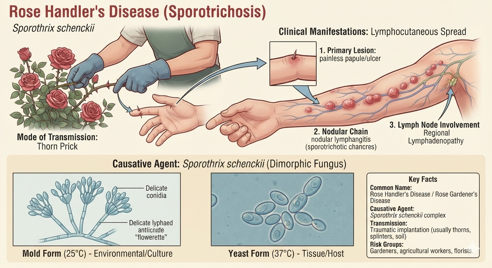
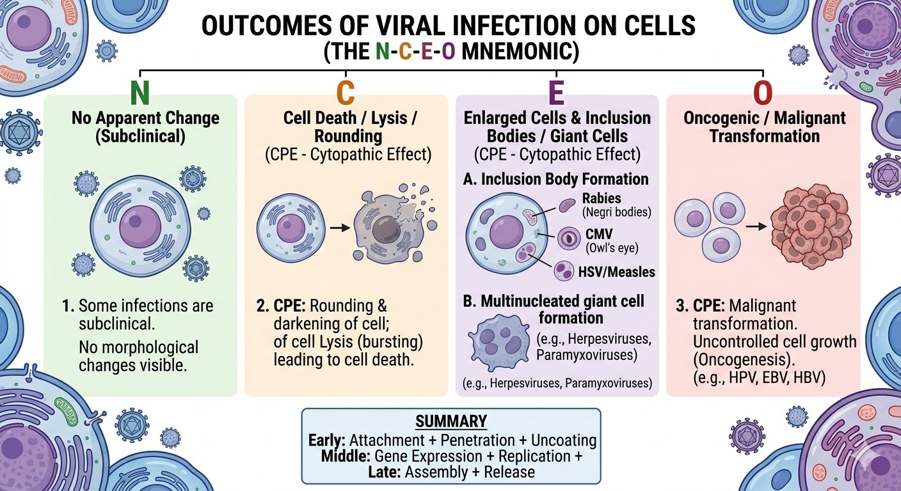
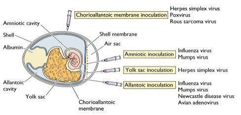

<i>SZMC · 2nd Term</i>
# Microbiology Comprehensive Notes
## Mycology · Parasitology · Virology · Molecular Biology

Question (with hint) → Full English Answer → Cross questions (Bangla Q/A) → Viva explanation (Bangla script)
<b>🟢 Mycology</b><b>🟣 Parasitology</b>
<b>🔴 Virology</b><b>🔵 Molecular Biology</b>
Mycology (33)Parasitology (159)Virology (140)Molecular Biology & Biosafety (18)
## ⚗ Mycology
<i>Fungus, candidiasis, cryptococcus, aspergillus & clinical mycology</i>
> <b>M1</b> What is fungus? Mention the characteristics of fungus. Fungus vs. Bacteria. ********
> <b>📌 Hint:</b> Eukaryotic, chitin cell wall, 80S ribosomes, exospore, etc.
✅ Answer
<b>Fungus:</b> Fungi are chlorophyll-free eukaryotic organisms that may be unicellular or multicellular and reproduce by sexual and asexual spores. The term comes from Greek <i>mykos</i> or <i>mykes</i> meaning fungus/mushroom. <b>Medical mycology</b> is the branch dealing with medically important fungi, and <b>mycosis</b> is any fungal infection.
<b>Characteristics of Fungus:</b>
- Cell type: Eukaryote with a true nucleus and membrane-bound organelles (mitochondria, ER).
- Cell number: May be unicellular (yeast) or multicellular (mold).
- Cell wall: 90% polysaccharide, 10% protein. Contains chitin (polymer of N-acetyl glucosamine), chitosan (soluble derivative of chitin), and β-glucan (polymer of D-glucose).
- Cytoplasmic membrane: Contains sterols — ergosterol and zymosterol.
- Ribosomes: 80S (40S + 60S).
- Chlorophyll: Absent — they require an organic carbon source.
- Reproduction: By budding (asexual) or by sexual and asexual spores.
- Oxygen requirement: Mostly strict aerobes; some facultative anaerobes. No obligate anaerobes.
- Natural habitat: Mostly in the environment (soil, decaying organic matter).
<table>
<tbody><tr><th>#</th><th>Point</th><th>Fungus</th><th>Bacteria</th></tr>
<tr><td>1</td><td>Cell type</td><td>Eukaryotes</td><td>Prokaryotes</td></tr>
<tr><td>2</td><td>Cell number</td><td>Unicellular or multicellular</td><td>Unicellular</td></tr>
<tr><td>3</td><td>Cell wall</td><td>Chitin, chitosan, β-glucan</td><td>Peptidoglycan</td></tr>
<tr><td>4</td><td>Cell membrane</td><td>Sterol present (ergosterol, zymosterol)</td><td>Sterol absent (except Mycoplasma)</td></tr>
<tr><td>5</td><td>Cytoplasm-bound organelles</td><td>Present</td><td>Absent</td></tr>
<tr><td>6</td><td>Ribosomes</td><td>80S (40S + 60S)</td><td>70S (30S + 50S)</td></tr>
<tr><td>7</td><td>Nucleus</td><td>True (eukaryotic)</td><td>Primitive / nucleoid (prokaryotic)</td></tr>
<tr><td>8</td><td>Spore</td><td>Exospore (reproduction)</td><td>Endospore (survival)</td></tr>
<tr><td>9</td><td>Reproduction</td><td>Budding or sexual &amp; asexual spores</td><td>Binary fission</td></tr>
<tr><td>10</td><td>Treatment</td><td>Antifungal drug</td><td>Antibacterial drug</td></tr>
<tr><td>11</td><td>Organic carbon requirement</td><td>Required (no obligate anaerobes)</td><td>Not required by all</td></tr>
<tr><td>12</td><td>Thermal dimorphism</td><td>Yes (some)</td><td>No</td></tr>
</tbody></table>
❓ Cross questions (from additional)
Antifungal drugs-কে mode of action ধরে কীভাবে classification করা যায়?
৩ ভাবে করা যায় — (১) <b>cell wall</b>‑এ act করে: echinocandin β‑glucan synthesis inhibit করে; (২) <b>cell membrane</b>‑এ act করে: amphotericin B ও nystatin ergosterol‑এর সাথে bind করে, আর azole ও terbinafine ergosterol‑এর synthesis inhibit করে; (৩) <b>nucleic acid</b>‑এ act করে: flucytosine DNA synthesis inhibit করে ও griseofulvin mitotic spindle‑কে disrupt করে।
Amphotericin B আর azole—দুটোই ergosterol‑এর সাথে সম্পর্কিত, তাহলে action-এ পার্থক্যটা কী?
পার্থক্য আছে। Amphotericin B সরাসরি ergosterol‑এর সাথে <b>bind</b> করে cell membrane‑এ pore তৈরি করে; কিন্তু azole ergosterol‑এর <b>synthesis</b>‑কে inhibit করে। অর্থাৎ একজন bind করে, আরেকজন তৈরিই হতে দেয় না।
Fungus-কে eradicate করা এত কঠিন কেন?
দুই কারণে — প্রথমত, animal host‑এর কাছে fungal cell wall‑এর polysaccharide degrade করার মতো enzyme নেই; দ্বিতীয়ত, <b>selective toxicity</b> অর্জন কঠিন, কারণ fungal cell আর human cell দুটোই <b>eukaryote</b>।
Fungi-র কিছু উপকারী দিক বলুন?
অনেক আছে — decomposition‑এর মাধ্যমে nutrient recycling করে; <b>mushroom, cheese, bread, wine, beer</b> তৈরি করে (food industry); <b>drug ও antibiotic</b> production‑এর biosynthetic factory; আর research‑এ model organism হিসেবে কাজ করে।
🗣️ ভাইভায় যেভাবে বুঝাব (বাংলা লিপি)
স্যার, মূল কথা হলো — <b>fungus</b> হলো chlorophyll‑মুক্ত, <b>eukaryotic</b> organism, যা unicellular বা multicellular হতে পারে এবং sexual ও asexual spore‑এর মাধ্যমে reproduce করে। Greek শব্দ <i>mykos/mykes</i> মানে fungus/mushroom। <b>Medical mycology</b> হলো সেই শাখা যা medically important fungi নিয়ে কাজ করে, আর <b>mycosis</b> হলো যেকোনো fungal infection।
<b>Characteristics</b> গুলো বলি — প্রথমত, cell type <b>eukaryote</b>, অর্থাৎ true nucleus, mitochondria, ER—মembranr ও membrane‑bound organelle আছে। দ্বিতীয়ত, cell number অনুযায়ী unicellular (yeast) বা multicellular (mold)। তৃতীয়ত, cell wall ৯০% polysaccharide ও ১০% protein — সেখানে থাকে <b>chitin</b> (N‑acetyl glucosamine‑এর polymer), <b>chitosan</b> (chitin‑এর soluble derivative) ও <b>β‑glucan</b> (D‑glucose‑এর polymer)।
Cytoplasmic membrane‑এ <b>ergosterol</b> ও <b>zymosterol</b> (sterol) থাকে — এটাই antifungal treatment‑এর target। Ribosome <b>80S (40S+60S)</b>। <b>Chlorophyll absent</b>, তাই organic carbon source দরকার। Reproduction হয় budding দিয়ে বা sexual ও asexual spore দিয়ে। Oxygen requirement — বেশিরভাগ <b>strict aerobe</b>, কিছু facultative anaerobe; কিন্তু কোনো obligate anaerobe নেই। Natural habitat — soil, decaying organic matter, অর্থাৎ বেশিরভাগ environment‑এ।
এবার <b>fungus vs bacteria</b> তুলনা করি — fungus <b>eukaryote</b>, bacteria <b>prokaryote</b>; fungus unicellular বা multicellular, bacteria শুধু unicellular; fungus‑এর cell wall <b>chitin, chitosan, β‑glucan</b>, bacteria‑র <b>peptidoglycan</b>; fungus‑এর membrane‑এ sterol (ergosterol) আছে, bacteria‑তে নেই (Mycoplasma ছাড়া); ribosome fungus‑এ <b>80S</b>, bacteria‑তে 70S; fungus‑এ true nucleus, bacteria‑তে primitive nucleoid; fungus‑এর spore <b>exospore (reproduction)</b>, bacteria‑র <b>endospore (survival)</b>; fungus budding বা spore দিয়ে, bacteria binary fission দিয়ে; treatment antifungal vs antibacterial; fungus‑এ organic carbon লাগবেই (obligate anaerobe নেই), bacteria‑র সবসময় লাগে না; আর কিছু fungus‑এ <b>thermal dimorphism</b> আছে, bacteria‑তে নেই।
> <b>M2</b> Mention the composition of cell wall and cell membrane of fungi. ****
> <b>📌 Hint:</b> Cell wall: chitin, D glucan; Cell membrane: ergosterol
✅ Answer
<b>Cell Wall of Fungi:</b>
- Composed of 90% polysaccharide and 10% protein.
- Chitin: A polysaccharide composed of long chains of N-acetyl glucosamine (NAG). Chitin is insoluble in most solvents and has no free amino groups.
- Chitosan: A soluble derivative of chitin that has free amino groups.
- β-D-Glucan: A polymer of D-glucose. Target of echinocandin antifungals.
<b>Cell Membrane (Cytoplasmic Membrane) of Fungi:</b>
- Contains ergosterol and zymosterol (sterol components).
- Ergosterol is the key target of many antifungal drugs (amphotericin B, nystatin bind directly; azoles and terbinafine inhibit its synthesis).
❓ Cross questions (from additional)
Ergosterol clinically এত গুরুত্বপূর্ণ কেন?
কারণ human cell membrane‑এ ergosterol থাকে না—থাকে <b>cholesterol</b>। এই পার্থক্যের উপরেই selective toxicity নির্ভর করে — <b>amphotericin B</b> ergosterol‑এর সাথে bind করে pore তৈরি করে, আর <b>azole</b> ergosterol synthesis inhibit করে। তাই fungus‑এর জন্য toxic, human cell‑এ কম ক্ষতি।
কোন antifungal cell wall‑এর উপর কাজ করে?
<b>Echinocandin</b> (caspofungin, micafungin) β‑glucan synthase inhibit করে। এটা বিশেষ, কারণ bacteria‑র cell wall‑এ তো <b>peptidoglycan</b> থাকে, β‑glucan নেই।
<i>P. jiroveci</i>‑র ক্ষেত্রে antifungal‑এ কী exception দেখা যায়?
<i>P. jiroveci</i>‑র cell membrane‑এ ergosterol নেই—থাকে <b>cholesterol</b>। তাই echinocandin ও conventional antifungal এই organism‑এর বিরুদ্ধে কম কার্যকর।
Fungal cytoplasm‑এ কী কী structure থাকে?
Cytoplasm‑এ <b>80S ribosome</b> (40S+60S) থাকে, আর membrane‑bound organelle হিসেবে <b>mitochondria</b> ও <b>endoplasmic reticulum</b> থাকে।
🗣️ ভাইভায় যেভাবে বুঝাব (বাংলা লিপি)
স্যার, <b>cell wall</b> দিয়ে শুরু করি — এটা ৯০% polysaccharide ও ১০% protein দিয়ে তৈরি। Polysaccharide গুলো হলো <b>chitin</b>, <b>chitosan</b> ও <b>β‑D‑glucan</b>। Chitin হলো N‑acetyl glucosamine (NAG)‑এর long polymer, যা বেশিরভাগ solvent‑এ insoluble এবং free amino group থাকে না। Chitosan হলো chitin‑এর soluble derivative—এর free amino group থাকে। β‑D‑glucan হলো D‑glucose‑এর polymer, আর এটাই <b>echinocandin</b> antifungal‑এর target।
এবার <b>cell membrane (cytoplasmic membrane)</b> — এখানে থাকে <b>ergosterol</b> ও <b>zymosterol</b> (sterol component)। Ergosterol হলো অনেক antifungal drug‑এর key target — <b>amphotericin B ও nystatin</b> সরাসরি bind করে, আর <b>azole ও terbinafine</b> এর synthesis inhibit করে।
মনে রাখতে হবে — cell wall‑এ chitin ও β‑glucan, cell membrane‑এ ergosterol; এই দুটোই drug target। আর clinically গুরুত্বপূর্ণ হলো—human membrane‑এ cholesterol থাকে, ergosterol নয়, তাই amphotericin B ও azole selective toxicity দেখায়।
> <b>M3</b> Difference between fungal and bacterial spore. **** (bacterial endospore for survival, fungal exospore for reproduction)
> <b>📌 Hint:</b> bacterial endospore for survival, fungal exospore for reproduction
✅ Answer
<table>
<tbody><tr><th>Point</th><th>Fungal Spore</th><th>Bacterial Spore</th></tr>
<tr><td>Type</td><td>Exospore</td><td>Endospore</td></tr>
<tr><td>Purpose</td><td><b>Reproduction</b> (both sexual and asexual)</td><td><b>Survival</b> under harsh conditions (heat, desiccation, radiation)</td></tr>
<tr><td>Formation</td><td>Formed externally from specialized structures (conidiophore, sporangium, or fragmentation of hyphae)</td><td>Formed intracellularly within a vegetative bacterial cell</td></tr>
<tr><td>Number</td><td>Many spores produced at once from a single parent</td><td>Typically one endospore per vegetative cell (one spore = one cell)</td></tr>
<tr><td>Structure</td><td>Simple: single- or few-celled; no specialized cortex</td><td>Complex: core, cortex, and thick protein coat (spore coat)</td></tr>
<tr><td>Resistance</td><td>Resistant to some environmental stresses but far less than bacterial endospores</td><td>Extremely resistant to heat, chemicals, UV radiation, desiccation</td></tr>
<tr><td>Germination</td><td>Germinates to form new fungal hyphae or yeast</td><td>Germinates back into a single vegetative cell</td></tr>
<tr><td>Examples</td><td>Zygospore, ascospore, basidiospore, conidia, sporangiospore, arthrospore, chlamydospore, blastospore</td><td>Bacillus, Clostridium endospores</td></tr>
</tbody></table>
❓ Cross questions (from additional)
Fungal sexual spore গুলো কী কী?
তিনটি — <b>zygospore</b> (single, বড়, thick‑wall স্পোর), <b>ascospore</b> (ascus নামক থলির ভিতরে তৈরি হয়), আর <b>basidiospore</b> (basidium নামক pedestal‑এর উপরে তৈরি হয়)।
আর asexual spore (conidia) গুলো?
Asexual conidia গুলো হলো — arthrospore, blastospore, chlamydospore, sporangiospore, microconidia ও macroconidia।
যে fungus sexual spore তৈরি করে না, তাকে কী বলে?
তাকে বলে <b>fungi imperfecti</b> (Deuteromycotina)—অর্থাৎ imperfect fungus, কারণ এর sexual form পাওয়া যায় না।
🗣️ ভাইভায় যেভাবে বুঝাব (বাংলা লিপি)
স্যার, মূল পার্থক্যটা হলো — fungal spore হলো <b>exospore</b>, অর্থাৎ <b>reproduction</b>‑এর জন্য, sexual ও asexual দুটোই; আর bacterial spore হলো <b>endospore</b>, অর্থাৎ <b>survival</b>‑এর জন্য — harsh condition (heat, desiccation, radiation)‑এ বাঁচতে সাহায্য করে।
Formation ধরে বলি — fungal spore <b>বাইরে</b>, specialized structure (conidiophore, sporangium, বা hyphae fragmentation) থেকে তৈরি হয়; bacterial endospore <b>ভিতরে</b>, vegetative bacterial cell‑এর intracellular‑এ তৈরি হয়। Number অনুযায়ী — fungus‑এ একটি parent থেকে একসাথে অনেকগুলো spore তৈরি হয়; bacteria‑তে একটি vegetative cell থেকে সাধারণত একটি মাত্র endospore (one spore = one cell)।
Structurally fungal spore simple — single বা few cell, কোনো specialized cortex নেই; bacteria‑র endospore complex — core, cortex ও thick protein coat (spore coat) থাকে। Resistance — fungal spore কিছুটা resistant, কিন্তু bacterial endospore‑এর মতো নয়; endospore heat, chemicals, UV, desiccation‑এ <b>extremely resistant</b>। Germination — fungal spore থেকে নতুন fungal hyphae বা yeast হয়; bacterial endospore থেকে single vegetative cell।
Example — fungal: zygospore, ascospore, basidiospore, conidia, sporangiospore, arthrospore, chlamydospore, blastospore; bacteria: <i>Bacillus</i>, <i>Clostridium</i> endospore। মনে রাখার শর্টকাট — exospore = reproduction, endospore = survival; many spores vs one spore।
> <b>M4</b> Classify fungus morphologically with example. *********
> <b>📌 Hint:</b> Yeast, yeast-like, mold, dimorphic — with examples
✅ Answer
Fungi are morphologically classified into two main forms — <b>yeast</b> and <b>mold</b> — plus two sub-categories: <b>yeast-like</b> and <b>dimorphic</b>.
<table>
<tbody><tr><th>Morphological Type</th><th>Description</th><th>Examples</th></tr>
<tr>
<td><b>a. Yeast</b></td>
<td>Unicellular, round or oval cells. Reproduce by <b>budding</b>. In the body, buds remain attached or detach as new cells.</td>
<td><i>Cryptococcus neoformans</i> (pathogenic), <i>Saccharomyces cerevisiae</i> (non-pathogenic)</td>
</tr>
<tr>
<td><b>b. Yeast-like (pseudohyphae)</b></td>
<td>Unicellular yeast that forms <b>pseudohyphae</b> — elongated cells remaining attached in chains after budding.</td>
<td><i>Candida</i> species (especially <i>C. albicans</i>)</td>
</tr>
<tr>
<td><b>c. Mold</b></td>
<td>Multicellular, elongated filaments called <b>hyphae</b>. Hyphae grow continuously by tip extension, forming a tangled mass called <b>mycelium</b>. Hyphae may be septate or non-septate (coenocytic). Molds grow at room temperature (25°C).</td>
<td>Dermatophytes, <i>Aspergillus</i>, <i>Rhizopus</i>, <i>Mucor</i>, <i>Penicillium</i>, <i>Rhinosporidium seeberi</i></td>
</tr>
<tr>
<td><b>d. Dimorphic</b></td>
<td>Two forms: <b>mold at room temperature (25°C)</b> in environment; <b>yeast at body temperature (37°C)</b> in the host.</td>
<td><i>Histoplasma capsulatum</i>, <i>Blastomyces dermatitidis</i>, <i>Coccidioides immitis</i>, <i>Paracoccidioides brasiliensis</i>, <i>Sporothrix schenckii</i>, <i>Penicillium marneffei</i>, <i>Malassezia furfur</i></td>
</tr>
</tbody></table>
❓ Cross questions (from additional)
Septate আর non-septate hyphae—এই দুটো কোন ধরনের fungus‑এ দেখা যায়?
<b>Septate hyphae</b> — cross wall থাকে, বেশিরভাগ <b>pathogenic</b>, dermatophytes ও systemic fungi‑তে দেখা যায়। <b>Non-septate (coenocytic)</b> — cross wall নেই, multinucleated, বেশিরভাগ <b>saprophytic</b>, যেমন <i>Mucor</i>, <i>Penicillium</i>।
Hyphae কীভাবে grow করে?
Hyphae <b>tip‑এর extension</b> দিয়ে grow করে — filament‑এর খুঁএ cell division দিয়ে নয়।
Mycelium কী?
Hyphae‑র visible tangled mass‑কে mycelium বলে — culture‑এ cotton ball‑এর মতো দেখা যায়।
Fungi imperfecti কাকে বলে?
যে fungus sexual spore তৈরি করে না, তাকে <b>fungi imperfecti</b> বা Deuteromycotina বলে।
🗣️ ভাইভায় যেভাবে বুঝাব (বাংলা লিপি)
স্যার, morphological classification‑এ মূলত ৪টি group আছে — <b>(ক) yeast</b>, <b>(খ) yeast‑like (pseudohyphae)</b>, <b>(গ) mold</b> ও <b>(ঘ) dimorphic</b>।
প্রথম <b>yeast</b> — unicellular, round বা oval cell, <b>budding</b> দিয়ে reproduce করে। শরীরে bud attached থাকে বা নতুন cell হয়ে আলাদা হয়। Example — <i>Cryptococcus neoformans</i> (pathogenic), <i>Saccharomyces cerevisiae</i> (non‑pathogenic)। দ্বিতীয় <b>yeast‑like</b> — unicellular yeast যা <b>pseudohyphae</b> তৈরি করে, অর্থাৎ budding‑এর পর elongated cell chain আকারে attached থাকে। Example — <i>Candida</i>, বিশেষ করে <i>C. albicans</i>।
তৃতীয় <b>mold</b> — multicellular, elongated filament <b>hyphae</b>। Hyphae tip extension দিয়ে grow করে এবং tangled mass হয়ে <b>mycelium</b> তৈরি করে। Hyphae septate বা non‑septate (coenocytic) হতে পারে। Mold 25°C (room temperature)‑এ grow করে। Example — dermatophytes, <i>Aspergillus</i>, <i>Rhizopus</i>, <i>Mucor</i>, <i>Penicillium</i>, <i>Rhinosporidium seeberi</i>।
চতুর্থ <b>dimorphic</b> — দুটি form: environment‑এ 25°C‑এ <b>mold</b>, host‑এ 37°C‑এ <b>yeast</b>। Example — <i>Histoplasma capsulatum</i>, <i>Blastomyces dermatitidis</i>, <i>Coccidioides immitis</i>, <i>Paracoccidioides brasiliensis</i>, <i>Sporothrix schenckii</i>, <i>Penicillium marneffei</i>, <i>Malassezia furfur</i>।
মনে রাখবেন — yeast unicellular + budding, mold multicellular + hyphae/mycelium; dimorphic মানে temperature অনুযায়ী দুই রকম। আর septate hyphae সাধারণত pathogenic, non‑septate saprophytic।
> <b>M5</b> Mention important differentiating point between yeast and mold? ****
> <b>📌 Hint:</b> Unicellular vs multicellular, budding vs hyphae, etc.
✅ Answer
<table>
<tbody><tr><th>Point</th><th>Yeast</th><th>Mold</th></tr>
<tr><td>Cell number</td><td>Unicellular</td><td>Multicellular</td></tr>
<tr><td>Shape</td><td>Round or oval</td><td>Elongated filaments (hyphae)</td></tr>
<tr><td>Reproduction</td><td>Budding</td><td>Growth by tip extension of hyphae; spore formation</td></tr>
<tr><td>Structure</td><td>Single cells; may form pseudohyphae</td><td>Hyphae forming mycelium (tangled mass)</td></tr>
<tr><td>Colony appearance</td><td>Smooth, creamy, wet-looking colonies (like bacteria)</td><td>Cottony, powdery, velvety or granular colonies</td></tr>
<tr><td>Growth temperature</td><td>37°C (body temperature)</td><td>25°C (room temperature)</td></tr>
<tr><td>Microscopy</td><td>Budding yeast cells</td><td>Branched septate or non-septate hyphae</td></tr>
</tbody></table>
❓ Cross questions (from additional)
Yeast‑এর কিছু example দিন?
<i>Cryptococcus neoformans</i> ও <i>Saccharomyces cerevisiae</i> — এই দুটি yeast।
Mold‑এর example?
<i>Aspergillus</i>, <i>Mucor</i>, <i>Rhizopus</i>, <i>Penicillium</i> আর dermatophytes।
Yeast‑like fungus মানে কী?
Yeast‑like fungus (যেমন <i>Candida</i>) হলো সেই yeast যা pseudohyphae তৈরি করতে পারে।
Dimorphic fungus দুটি form‑এ কীভাবে থাকে?
Environment‑এ 25°C‑এ <b>mold</b>, host‑এ 37°C‑এ <b>yeast</b> — অর্থাৎ temperature অনুযায়ী form বদলায়।
🗣️ ভাইভায় যেভাবে বুঝাব (বাংলা লিপি)
স্যার, yeast আর mold‑এর পার্থক্য তুলনা করে বলছি। <b>Cell number</b> — yeast unicellular, mold multicellular। <b>Shape</b> — yeast round বা oval, mold elongated filament (hyphae)। <b>Reproduction</b> — yeast <b>budding</b> দিয়ে; mold tip extension দিয়ে hyphae grow করে আর spore তৈরি করে।
<b>Structure</b> — yeast single cell, pseudohyphae তৈরি করতে পারে; mold hyphae দিয়ে <b>mycelium</b> (tangled mass) গঠন করে। <b>Colony appearance</b> — yeast smooth, creamy, wet‑looking (bacteria‑র মতো); mold cottony, powdery, velvety বা granular। <b>Growth temperature</b> — yeast 37°C (body temperature), mold 25°C (room temperature)। <b>Microscopy</b> — yeast‑এ budding yeast cell; mold‑এ branched septate বা non‑septate hyphae।
Example হিসেবে remember করুন — yeast: <i>Cryptococcus</i>, <i>Saccharomyces</i>; mold: <i>Aspergillus</i>, <i>Mucor</i>, <i>Rhizopus</i>, <i>Penicillium</i>, dermatophytes। আর yeast‑like <i>Candida</i> pseudohyphae তৈরি করতে পারে, আর dimorphic fungi 25°C‑এ mold, 37°C‑এ yeast হয়।
> <b>M6</b> What do you mean by hyphae, pseudohyphae and mycelium? ***
> <b>📌 Hint:</b> Hyphae = filaments; pseudohyphae = chained buds; mycelium = tangled mass of hyphae
✅ Answer
<b>Hyphae:</b> Long, branching filamentous structures formed by mold. Growth occurs by <b>extension of the tip</b> (not by cell division along the filament). Two types: <b>septate</b> (with cross walls) and <b>non-septate / coenocytic</b> (multinucleated, no cross walls).
- Septate hyphae: Usually pathogenic — dermatophytes, systemic fungi.
- Non-septate hyphae: Mostly saprophytic — Mucor, Rhizopus.
<b>Pseudohyphae:</b> Formed in some yeasts (especially <i>Candida</i>) when buds remain attached to the mother cell, forming a chain of elongated cells. They are NOT true hyphae because they lack the continuous cytoplasmic flow seen in true hyphae.
<b>Mycelium:</b> When hyphae grow continuously and form a <b>tangled mass or mat</b> of growth, it is called mycelium. This is visible to the naked eye and gives mold colonies their characteristic cottony/powdery appearance.
❓ Cross questions (from additional)
Pseudohyphae <i>Candida albicans</i>‑এর জন্য কেন characteristic?
কারণ <i>C. albicans</i> budding‑এর পর elongated cell‑এর chain আকারে pseudohyphae তৈরি করে — এটা এর একটি distinctive morphological feature।
Culture‑এ mycelium terminology কীভাবে ব্যবহৃত হয়?
SDA plate‑এ যে visible <b>"fuzzy" বা cottony growth</b> দেখা যায়, সেটাই <b>aerial mycelium</b>।
Hyphae microscope‑এ কীভাবে পরীক্ষা করা হয়?
<b>KOH preparation</b> বা <b>Lactophenol Cotton Blue</b> staining‑এর পরে পরীক্ষা করা হয়।
🗣️ ভাইভায় যেভাবে বুঝাব (বাংলা লিপি)
স্যার, তিনটি term পরিষ্কার করে বলছি।
<b>Hyphae</b> — mold‑এর তৈরি long, branching filamentous structure। Hyphae <b>tip‑এর extension</b> দিয়ে grow করে, cell division দিয়ে নয়। দুই প্রকার — <b>septate</b> (cross wall আছে) ও <b>non‑septate / coenocytic</b> (multinucleated, cross wall নেই)। Septate সাধারণত pathogenic — dermatophytes, systemic fungi; non‑septate বেশিরভাগ saprophytic — <i>Mucor</i>, <i>Rhizopus</i>।
<b>Pseudohyphae</b> — কিছু yeast‑এ (বিশেষত <i>Candida</i>) bud মাদার cell‑এ attached থাকলে elongated cell‑এর chain তৈরি হয় — এটাই pseudohyphae। এটা <b>true hyphae নয়</b>, কারণ true hyphae‑র মতো continuous cytoplasmic flow থাকে না।
<b>Mycelium</b> — hyphae যখন ক্রমাগত grow করে <b>tangled mass বা mat</b> তৈরি করে, তখন তাকে mycelium বলে। এটা naked eye‑এ visible, আর mold colony‑র cottony/powdery appearance‑এর কারণ।
Microscopically hyphae KOH preparation বা Lactophenol Cotton Blue staining দিয়ে দেখা হয়।
> <b>M7</b> Classify fungus according to habitat. ***
> <b>📌 Hint:</b> Superficial cutaneous, subcutaneous, systemic, opportunistic
✅ Answer
Clinical classification based on <b>site of infection / habitat</b>:
<b>A. Superficial Cutaneous Fungi</b> — affect skin, hair, nails; confined to body surfaces.
- Malassezia furfur — tinea versicolor
- Dermatophytes (Epidermophyton, Trichophyton, Microsporum) — dermatophytosis / tinea / ringworm
- Trichosporon beigelii — white piedra
- Piedraia hortae — black piedra
- Hortaea werneckii — tinea nigra
- Candida albicans (sometimes) — superficial candidiasis
<b>B. Subcutaneous Fungi</b> — inoculated through skin by cuts, scratches, or thorns.
- Sporothrix schenckii — sporotrichosis (rose handler disease)
- Rhinosporidium seeberi — rhinosporidiosis
- Madurella mycetomatis — mycetoma / madura foot
- Dematiaceous fungi (Fonsecaea, Phialophora, Exophiala, Cladosporium) — chromoblastomycosis & pheohyphomycosis
<b>C. Systemic / Deep Fungi</b> — usually dimorphic; affect internal organs.
- Histoplasma capsulatum — histoplasmosis
- Blastomyces dermatitidis — blastomycosis
- Coccidioides immitis — coccidioidomycosis
- Paracoccidioides brasiliensis — paracoccidioidomycosis
<b>D. Opportunistic Fungi</b> — cause disease in immunocompromised individuals.
- Candida albicans — candidiasis
- Cryptococcus neoformans — cryptococcal meningitis
- Pneumocystis jiroveci — pneumocystis pneumonia
- Aspergillus fumigatus — aspergillosis
- Mucor & Rhizopus — mucormycosis (black fungus)
- Penicillium marneffei — penicilliosis
❓ Cross questions (from additional)
কোন fungi নিঃসন্দেহে superficial, আর কোনগুলো cutaneous?
<i>Malassezia furfur</i> ও dermatophytes নিঃসন্দেহে <b>superficial</b>; <i>Candida</i> ও dermatophytes‑কে superficial group‑এর মধ্যেই <b>cutaneous</b> হিসেবেও ধরা হয়।
Subcutaneous fungi কীভাবে infection তৈরি করে?
Skin‑এর thorn, splinter বা ছোটখাটো trauma‑এর মাধ্যমে <b>inoculation</b> হয়ে সংক্রমণ হয়।
Systemic fungi সাধারণত কেমন হয়?
সাধারণত <b>dimorphic</b> — environment‑এ mold, host‑এ yeast।
<i>Aspergillus</i>‑এর বিশেষত্ব কী?
<i>Aspergillus</i> হলো এমন একটি <b>opportunistic</b> fungus যা আবার <b>mold</b>ও বটে, এবং এর <b>septate hyphae</b> থাকে।
🗣️ ভাইভায় যেভাবে বুঝাব (বাংলা লিপি)
স্যার, habitat অনুযায়ী classification‑এ ৪টি group আছে — <b>A. Superficial Cutaneous</b>, <b>B. Subcutaneous</b>, <b>C. Systemic/Deep</b> ও <b>D. Opportunistic</b>।
<b>A. Superficial Cutaneous Fungi</b> — skin, hair, nail‑কে প্রভাবিত করে, body surface‑এ সীমাবদ্ধ। Example — <i>Malassezia furfur</i> (tinea versicolor), dermatophytes (<i>Epidermophyton</i>, <i>Trichophyton</i>, <i>Microsporum</i>) — dermatophytosis/tinea/ringworm, <i>Trichosporon beigelii</i> (white piedra), <i>Piedraia hortae</i> (black piedra), <i>Hortaea werneckii</i> (tinea nigra), আর কখনো <i>Candida albicans</i> (superficial candidiasis)।
<b>B. Subcutaneous Fungi</b> — cut, scratch বা thorn দিয়ে skin‑এর inoculation হয়। Example — <i>Sporothrix schenckii</i> (sporotrichosis/rose handler disease), <i>Rhinosporidium seeberi</i> (rhinosporidiosis), <i>Madurella mycetomatis</i> (mycetoma/madura foot), আর dematiaceous fungi (<i>Fonsecaea</i>, <i>Phialophora</i>, <i>Exophiala</i>, <i>Cladosporium</i>) — chromoblastomycosis & pheohyphomycosis।
<b>C. Systemic / Deep Fungi</b> — সাধারণত dimorphic, internal organ প্রভাবিত করে। Example — <i>Histoplasma capsulatum</i> (histoplasmosis), <i>Blastomyces dermatitidis</i> (blastomycosis), <i>Coccidioides immitis</i> (coccidioidomycosis), <i>Paracoccidioides brasiliensis</i> (paracoccidioidomycosis)।
<b>D. Opportunistic Fungi</b> — immunocompromised ব্যক্তিদের disease করে। Example — <i>Candida albicans</i> (candidiasis), <i>Cryptococcus neoformans</i> (cryptococcal meningitis), <i>Pneumocystis jiroveci</i> (pneumocystis pneumonia), <i>Aspergillus fumigatus</i> (aspergillosis), <i>Mucor</i> & <i>Rhizopus</i> (mucormycosis/black fungus), <i>Penicillium marneffei</i> (penicilliosis)।
> <b>M8</b> Define dimorphic fungus with example. *********
> <b>📌 Hint:</b> Mold at 25°C, yeast at 37°C — remember the main dimorphic fungi
✅ Answer
<b>Dimorphic fungi</b> are fungi that exist in two forms depending on temperature: they grow as <b>molds (hyphae) at room temperature (25°C)</b> in the environment and as <b>yeast at body temperature (37°C)</b> in human tissues. This property is called <b>thermal dimorphism</b>.
The mnemonic: <b>"Mold at 25, Yeast at 37 — the lung fungi!"</b>
<b>Examples of dimorphic fungi:</b>
- Histoplasma capsulatum — histoplasmosis
- Blastomyces dermatitidis — blastomycosis
- Coccidioides immitis — coccidioidomycosis
- Paracoccidioides brasiliensis — paracoccidioidomycosis
- Sporothrix schenckii — sporotrichosis
- Penicillium marneffei — penicilliosis
- Malassezia furfur — tinea versicolor
❓ Cross questions (from additional)
Dimorphic fungus‑এর pathogenesis কীভাবে?
Environment থেকে mold spore <b>inhale</b> হয় → lung‑এ গিয়ে spore <b>yeast</b>‑এ differentiate করে → বেশিরভাগ infection asymptomatic ও self‑limited, কিন্তু disseminate করলে রোগ হতে পারে।
কোন fungi‑তে dimorphism বেশি দেখা যায়?
সব <b>systemic/deep fungi</b> সাধারণত dimorphic হয়ে থাকে।
Mold থেকে yeast‑এ রূপান্তর কেন virulence factor?
কারণ yeast form শরীরে <b>macrophage‑এর ভিতরেও survive</b> করতে পারে — এটাই আসল virulence factor।
🗣️ ভাইভায় যেভাবে বুঝাব (বাংলা লিপি)
স্যার, <b>dimorphic fungi</b> হলো সেই fungus যারা temperature অনুযায়ী দুই রকম form‑এ থাকে — environment‑এ <b>25°C‑এ mold (hyphae)</b>, আর human tissue‑এ <b>37°C‑এ yeast</b>। এই বৈশিষ্ট্যকে বলে <b>thermal dimorphism</b>। Mnemonic — <b>"Mold at 25, Yeast at 37 — the lung fungi!"</b>
Example — <i>Histoplasma capsulatum</i> (histoplasmosis), <i>Blastomyces dermatitidis</i> (blastomycosis), <i>Coccidioides immitis</i> (coccidioidomycosis), <i>Paracoccidioides brasiliensis</i> (paracoccidioidomycosis), <i>Sporothrix schenckii</i> (sporotrichosis), <i>Penicillium marneffei</i> (penicilliosis), আর <i>Malassezia furfur</i> (tinea versicolor)।
Pathogenesis‑উলটা বললে — environment থেকে mold spore inhale হয়, lung‑এ গিয়ে yeast‑এ convert হয়। বেশিরভাগ infection asymptomatic, self‑limited; তবে disseminate করলে নানা disease হতে পারে। সব systemic/deep fungi সাধারণত dimorphic। আর mold→yeast এই transition‑টা একটা key <b>virulence factor</b>, কারণ yeast form macrophage‑এর ভিতরে survive করতে পারে।
> <b>M9</b> What do you mean by dermatophytes? Mention the dermatophytes and their site of infection. *****
> <b>📌 Hint:</b> Keratinophilic fungi; infect skin, hair, nails
✅ Answer
<b>Dermatophytes</b> are a group of fungi that infect only superficial keratinized tissues — the <b>skin</b> and skin appendages such as <b>hair and nails</b>. They are <b>keratinophilic</b>, meaning they thrive on keratin.
<b>Keratin types in different structures:</b>
- Skin — soft keratin
- Hair — hard and soft keratin
- Nail — hard keratin
<table>
<tbody><tr><th>Genus</th><th>Species</th><th>Site of Infection</th></tr>
<tr><td><b>Epidermophyton</b></td><td><i>E. floccosum</i></td><td>Skin &amp; Nail</td></tr>
<tr><td rowspan="4"><b>Trichophyton</b></td><td><i>T. rubrum</i></td><td>Skin, Hair &amp; Nail</td></tr>
<tr><td><i>T. tonsurans</i></td><td>Skin, Hair &amp; Nail</td></tr>
<tr><td><i>T. mentagrophytes</i></td><td>Skin, Hair &amp; Nail</td></tr>
<tr><td><i>T. schoenleinii, T. verrucosum</i></td><td>Skin, Hair &amp; Nail</td></tr>
<tr><td rowspan="2"><b>Microsporum</b></td><td><i>M. canis</i></td><td>Skin &amp; Hair</td></tr>
<tr><td><i>M. gypseum</i></td><td>Skin &amp; Hair</td></tr>
</tbody></table>
<b>Key point:</b> <i>Epidermophyton</i> does NOT infect hair; <i>Microsporum</i> does NOT infect nails; <i>Trichophyton</i> infects all three.
❓ Cross questions (from additional)
Dermatophytosis কীভাবে ছড়ায় (transmission)?
Direct contact — infected person থেকে (anthropophilic), infected animal থেকে যেমন dog/cat (zoophilic — প্রধানত <i>Microsporum</i>), আর indirect contact — shared clothing, comb, towel দিয়ে।
এই রোগকে আর কী কী নামে ডাকা হয়?
<b>Dermatophytosis / tinea / ringworm infection</b> নামে ডাকা হয়।
Tinea কীভাবে body area অনুযায়ী নাম পায়?
Tinea capitis (head hair), tinea corporis (trunk), tinea cruris (groin), tinea pedis (foot), tinea unguium (nail), tinea manuum (hand), tinea barbae (beard), tinea faciei (face)।
Microconidia‑র shape কী কী?
<i>T. rubrum</i> — single, tear drop; <i>T. mentagrophytes</i> — cluster, oval; <i>T. tonsurans</i> — elongated।
আর macroconidia‑র shape?
<i>Epidermophyton</i> — club shaped; <i>Trichophyton</i> — cylindrical; <i>Microsporum</i> — spindle shaped।
🗣️ ভাইভায় যেভাবে বুঝাব (বাংলা লিপি)
স্যার, <b>dermatophytes</b> হলো সেই fungi যারা শুধু superficial keratinized tissue‑কে infect করে — <b>skin</b> আর তার appendage, যেমন <b>hair ও nail</b>। এরা <b>keratinophilic</b>, অর্থাৎ keratin‑এ বেঁচে থাকে।
Keratin type — skin‑এ <b>soft keratin</b>, hair‑এ <b>hard ও soft keratin</b>, nail‑এ <b>hard keratin</b>। তিনটি genus — <b>Epidermophyton</b>, <b>Trichophyton</b>, <b>Microsporum</b>। <i>E. floccosum</i> শুধু skin & nail‑এ infect করে। <i>Trichophyton</i>‑এর species গুলো (rubrum, tonsurans, mentagrophytes, schoenleinii, verrucosum) skin, hair ও nail — তিনটিতেই infect করে। <i>Microsporum</i> (canis, gypseum) শুধু skin & hair infect করে।
Key point — <i>Epidermophyton</i> <b>hair infect করে না</b>, <i>Microsporum</i> <b>nail infect করে না</b>, <i>Trichophyton</i> তিনটিই infect করে।
Transmission — direct contact: infected person (anthropophilic) বা infected animal (zoophilic — যেমন <i>Microsporum</i>), আর indirect — shared clothing, comb, towel। রোগের নাম dermatophytosis/tinea/ringworm। Site অনুযায়ী — tinea capitis (head), corporis (trunk), cruris (groin), pedis (foot), unguium (nail), manuum (hand), barbae (beard), faciei (face)। Identification — microconidia: <i>T. rubrum</i> single tear drop, <i>T. mentagrophytes</i> cluster oval, <i>T. tonsurans</i> elongated; macroconidia: <i>Epidermophyton</i> club, <i>Trichophyton</i> cylindrical, <i>Microsporum</i> spindle।
> <b>M10</b> Write down the methods of laboratory diagnosis of fungal infections/dermatophytoses/ring worm infections. ***********
> <b>📌 Hint:</b> KOH prep, culture on SDA, staining, PCR, Wood's lamp, hair perforation test
✅ Answer
<b>1. Specimen Collection:</b>
- Skin scraping (from margin of lesion and redness area)
- Nail clipping
- Hair plucking
- Swabs (oral, throat, vaginal) for Candida
- Blood (for serology in systemic mycosis)
<b>2. Microscopical Examination:</b>
- KOH wet mount preparation (most common): KOH 10–40% dissolves keratin → fungi visualized after 30 min. Findings: skin/nail — branching septate hyphae (± arthrospore); hair — ectothrix or endothrix.
- Staining: Calcofluor white (most common), Lactophenol cotton blue (for culture mount), Indian ink (for Cryptococcus capsule), Gram stain (only for Candida — shows gram-positive yeast), Methenamine silver, PAS, Giemsa, H&E.
<b>3. Culture / Isolation and Identification:</b>
- SDA (Sabouraud's Dextrose Agar) — most common media.
- Mold: incubate at 25°C for 2–4 weeks. Yeast: at 37°C for 2–4 weeks.
- Naked eye: colony color (white, brown, greenish-yellow), texture (powdery, cottony, velvety, granular).
- Microscopy of culture: stain with lactophenol cotton blue → macroconidia & microconidia morphology.
- Other media: SDA + chloramphenicol & cycloheximide, dermatophyte test agar, potato dextrose agar, corn meal agar, mycobiotic agar.
<b>4. Immunological Tests:</b> Antigen detection & antibody detection (mainly for systemic mycosis; not usually for dermatophytosis).
<b>5. Molecular Detection:</b> PCR.
<b>6. Other Tests:</b>
- Wood's lamp: Microsporum species show fluorescence under UV — used for tinea capitis.
- Hair perforation test: For Microsporum & Trichophyton.
- Skin test: For systemic fungi, dermatophytes, Sporothrix, and Candida.
- Germ tube test: Differentiates C. albicans from other Candida species.
❓ Cross questions (from additional)
Superficial cutaneous fungus‑এ KOH কেন, আর অন্য body fluid‑এ কী ব্যবহার হয়?
Superficial cutaneous fungus‑এ KOH keratin dissolve করে, তাই fungus স্পষ্ট দেখা যায়; অন্য body fluid‑এ (যেমন blood, CSF) <b>normal saline wet mount</b> ব্যবহার হয়।
Macroconidia দিয়ে কীভাবে identify করা হয়?
<i>Epidermophyton</i> — club shaped; <i>Trichophyton</i> — cylindrical; <i>Microsporum</i> — spindle shaped।
আর microconidia দিয়ে?
<i>T. rubrum</i> — single tear drop; <i>T. mentagrophytes</i> — cluster oval; <i>T. tonsurans</i> — elongated।
সব fungus‑এ Gram stain ব্যবহার করা যায় কি?
না — শুধু <i>Candida</i>‑র জন্য Gram stain useful; অন্য fungus‑এ নয়।
🗣️ ভাইভায় যেভাবে বুঝাব (বাংলা লিপি)
স্যার, fungal infection‑এর lab diagnosis ধাপে ধাপে বলছি।
<b>১. Specimen collection:</b> skin scraping (lesion margin ও redness area থেকে), nail clipping, hair plucking; <i>Candida</i>‑র জন্য oral/throat/vaginal swab; systemic mycosis‑এ serology‑র জন্য blood।
<b>২. Microscopical examination:</b> সবচেয়ে common <b>KOH wet mount</b> — KOH 10–40% keratin dissolve করে, 30 min পরে fungus দেখা যায়। Finding — skin/nail‑এ branching septate hyphae (± arthrospore), hair‑এ ectothrix বা endothrix। Staining — <b>Calcofluor white</b> (most common), Lactophenol cotton blue (culture mount), Indian ink (<i>Cryptococcus</i> capsule), Gram stain (শুধু <i>Candida</i> — gram‑positive yeast), Methenamine silver, PAS, Giemsa, H&E।
<b>৩. Culture/isolation:</b> common media <b>SDA</b>। Mold 25°C‑এ 2–4 week, yeast 37°C‑এ 2–4 week। Naked eye‑এ colony color/texture দেখি, তারপর lactophenol cotton blue দিয়ে macro‑ ও microconidia morphology। Onno media — SDA + chloramphenicol & cycloheximide, dermatophyte test agar, potato dextrose agar, corn meal agar, mycobiotic agar।
<b>৪. Immunological test</b> — antigen ও antibody detection, মূলত systemic mycosis‑এ। <b>৫. Molecular</b> — PCR। <b>৬. Other tests</b> — <b>Wood's lamp</b>: <i>Microsporum</i> UV‑তে fluoresce করে (tinea capitis); <b>hair perforation test</b>: <i>Microsporum</i> & <i>Trichophyton</i>; <b>skin test</b>: systemic fungi, dermatophytes, <i>Sporothrix</i>, <i>Candida</i>; <b>germ tube test</b>: <i>C. albicans</i> আর অন্য <i>Candida</i> আলাদা করে।
> <b>M11</b> S/N: Mycotoxin. ***
> <b>📌 Hint:</b> Fungal toxins that cause mycotoxicosis
✅ Answer
<b>Mycotoxins</b> are toxins released by certain fungi as they grow. <b>Mycotoxicosis</b> is the condition caused by ingestion of these fungal toxins.
<table>
<tbody><tr><th>Mycotoxin</th><th>Producing Fungus</th><th>Effect (Mycotoxicosis)</th></tr>
<tr><td><b>Amanitin</b></td><td><i>Amanita</i> mushrooms</td><td>Liver damage</td></tr>
<tr><td><b>Phalloidin</b></td><td><i>Amanita</i> mushrooms</td><td>Liver damage</td></tr>
<tr><td><b>Ergotamine</b></td><td><i>Claviceps purpurea</i></td><td>Ergotism (vascular &amp; neurological damage)</td></tr>
<tr><td><b>LSD</b> (Lysergic acid diethylamide)</td><td><i>Claviceps purpurea</i></td><td>Ergotism (vascular &amp; neurological damage)</td></tr>
<tr><td><b>Aflatoxins</b></td><td><i>Aspergillus flavus</i></td><td>Liver damage &amp; liver carcinoma</td></tr>
</tbody></table>
❓ Cross questions (from additional)
Aflatoxin দিয়ে hepatocellular carcinoma কীভাবে হয় — pathway বলুন?
Spoiled grain/peanut‑এর সাথে aflatoxin খাওয়া হয় → liver metabolize করে → <b>epoxide</b> তৈরি করে (একটি potent carcinogen) → <b>p53 tumour suppressor gene</b>‑এ mutation → p53 protein‑এর loss → hepatocellular carcinoma।
<i>Amanita</i> mushroom কতগুলো toxin তৈরি করে?
<i>Amanita</i> mushroom মোট <b>পাঁচটি</b> ভিন্ন toxin produce করে।
Ergotism‑এর উপসর্গ কী কী?
Ergotism <b>vascular spasm</b> ও <b>neurological</b> — দুই ধরনের damage‑ই করতে পারে।
🗣️ ভাইভায় যেভাবে বুঝাব (বাংলা লিপি)
স্যার, <b>mycotoxin</b> হলো সেই toxin যা কিছু fungus grow করার সময় release করে। <b>Mycotoxicosis</b> হলো সেই অবস্থা যা এই fungal toxin খাওয়ার ফলে হয়।
<b>Amanitin</b> ও <b>Phalloidin</b> — দুটোই <i>Amanita</i> mushroom থেকে; effect — <b>liver damage</b>। <b>Ergotamine</b> ও <b>LSD</b> (Lysergic acid diethylamide) — দুটোই <i>Claviceps purpurea</i> থেকে; effect — <b>ergotism</b> (vascular & neurological damage)। <b>Aflatoxins</b> — <i>Aspergillus flavus</i> থেকে; effect — <b>liver damage ও liver carcinoma</b>।
Aflatoxin‑এর mechanism — spoiled grain/peanut → aflatoxin → liver metabolize → <b>epoxide</b> (potent carcinogen) → <b>p53 tumour suppressor gene</b>‑এ mutation → p53 protein loss → <b>hepatocellular carcinoma</b>। মনে রাখবেন — <i>Amanita</i> mushroom পাঁচটি আলাদা toxin produce করে, আর ergotism vascular ও neurological দুটো ধরনের damage‑ই করে।
> <b>M12</b> Name five fungal culture media. ***** (SDA, mycobiotic media, dermatophyte test media, corn meal media)
> <b>📌 Hint:</b> SDA, mycobiotic media, dermatophyte test media, corn meal media
✅ Answer
<b>Five important fungal culture media:</b>
- Sabouraud's Dextrose Agar (SDA) — most commonly used fungal culture media.
- Mycobiotic (Fungobiotic) Agar Media
- Dermatophyte Test Agar (DTA) Media
- Corn Meal Agar Media
- Potato Dextrose Agar Media
<b>SDA details:</b>
- High dextrose content — excellent carbon & energy source.
- Peptone — source of nitrogen, vitamins, and minerals.
- Acidic pH (5.6) — optimal for fungi, not bacteria.
- Antibiotics frequently added: penicillin (kills gram-positive bacteria), streptomycin (kills gram-negative bacteria), cycloheximide (inhibits saprophytic/non-pathogenic fungi).
❓ Cross questions (from additional)
আর কোন কোন fungal media আছে?
SDA + chloramphenicol & cycloheximide, inhibitory mold agar, blood agar with antibiotic, brain heart infusion agar।
SDA‑তে bacteria কেন grow করে না?
তিনটি কারণ — <b>acidic pH</b> (bacteria pH 7 পছন্দ করে), <b>antibiotic</b> যোগ করা হয়, আর <b>high dextrose</b> osmotic pressure বাড়ায়, যা bacteria inhibit করে।
Culture time কত?
Mold 25°C‑এ 2–4 weeks; yeast 37°C‑এ 2–4 weeks।
🗣️ ভাইভায় যেভাবে বুঝাব (বাংলা লিপি)
স্যার, পাঁচটি fungal culture media বলছি।
- Sabouraud's Dextrose Agar (SDA) — সবচেয়ে বেশি ব্যবহৃত fungal culture media।
- Mycobiotic (Fungobiotic) Agar
- Dermatophyte Test Agar (DTA)
- Corn Meal Agar
- Potato Dextrose Agar
SDA‑র details — high dextrose (excellent carbon/energy source); peptone (nitrogen, vitamin, mineral source); <b>acidic pH 5.6</b> — fungus‑এর optimum, bacteria‑র নয়; আর antibiotic যোগ হয় — <b>penicillin</b> gram‑positive bacteria মারে, <b>streptomycin</b> gram‑negative bacteria মারে, <b>cycloheximide</b> saprophytic/non‑pathogenic fungus inhibit করে।
SDA‑তে bacteria না ওঠার কারণ — acidic pH, antibiotic, আর high dextrose‑র osmotic pressure। Culture time — mold 25°C 2–4 week, yeast 37°C 2–4 week। আরও media — SDA + chloramphenicol & cycloheximide, inhibitory mold agar, blood agar with antibiotic, brain heart infusion agar।
> <b>M13</b> Name three common fungal staining methods. ***** (calcoflour white ***, lactophenol cotton blue ***, indian ink, methenamine silver stain, gram staining, giemsa stain)
> <b>📌 Hint:</b> Calcofluor white, lactophenol cotton blue, Indian ink, methenamine silver, Gram stain, Giemsa
✅ Answer
<b>Three most common fungal stains:</b>
- Calcofluor White — a fluorescent stain that binds to chitin and cellulose in fungal cell walls. Used for direct visualization of fungi in clinical specimens.
- Lactophenol Cotton Blue (LPCB) — the most common stain for examining fungal cultures. Cotton blue stains the chitin in fungal walls; lactic acid preserves fungal structures; phenol acts as a disinfectant.
- Indian Ink — a negative capsular stain used to visualize the wide unstained capsule of Cryptococcus neoformans. The capsule appears as a clear halo against a dark background.
<b>Other important stains:</b>
- Gram stain — only for Candida (shows gram-positive yeast).
- Giemsa stain — histopathological stain; also used for blood films.
- Methenamine Silver (GMS) — histopathological stain for fungi in tissue sections.
- PAS (Periodic Acid Schiff) — stains fungal polysaccharides magenta.
- H&E (Hematoxylin & Eosin) — general tissue stain.
- Fluorescent antibody staining
❓ Cross questions (from additional)
রুটিন fungal identification‑এ সবচেয়ে common কোন দুটি stain?
Calcofluor white আর LPCB — এই দুটোই routine fungal identification‑এ সবচেয়ে common।
Indian ink rapid test কীভাবে করা হয়?
এক ফোঁটা CSF + Indian ink → microscope‑এ দেখুন → encapsulated budding yeast দেখা যায়।
Gram stain কি সব fungus‑এ useful?
না — <i>Candida</i> ছাড়া Gram stain fungus‑এর জন্য সাধারণত useful নয়; <i>Candida</i>‑তে gram‑positive oval yeast দেখা যায়।
🗣️ ভাইভায় যেভাবে বুঝাব (বাংলা লিপি)
স্যার, তিনটি common fungal stain বলছি।
- Calcofluor White — fluorescent stain, fungal cell wall‑এর chitin ও cellulose‑এর সাথে binds হয়। Clinical specimen‑এ fungus সরাসরি দেখার জন্য।
- Lactophenol Cotton Blue (LPCB) — fungal culture পরীক্ষার সবচেয়ে common stain। Cotton blue chitin‑কে color করে; lactic acid fungal structure preserve করে; phenol disinfectant হিসেবে কাজ করে।
- Indian Ink — negative capsular stain, Cryptococcus neoformans‑এর wide unstained capsule দেখার জন্য। Capsule dark background‑এ clear halo হিসাবে দেখা যায়।
অন্য important stains — <b>Gram stain</b> (শুধু <i>Candida</i> — gram‑positive yeast), <b>Giemsa</b> (histopathological + blood film), <b>Methenamine Silver (GMS)</b> (tissue section‑এ fungus), <b>PAS</b> (fungal polysaccharide‑কে magenta করে), <b>H&E</b> (সাধারণ tissue stain), আর <b>fluorescent antibody staining</b>।
রুটিনে Calcofluor white ও LPCB সবচেয়ে common; Indian ink rapid — CSF + ink দিয়ে encapsulated budding yeast দেখা যায়; আর Gram stain শুধু <i>Candida</i>‑তে useful।
> <b>M14</b> Why KOH is used in fungal wet mount preparation? ********* (to dissolve the keratin layer, easy visualization of fungus)
> <b>📌 Hint:</b> To dissolve the keratin layer, easy visualization of fungus
✅ Answer
<b>KOH (Potassium Hydroxide)</b> is used in fungal wet mount preparation because:
- Dissolves keratin: KOH (10–40%) dissolves the keratin present in skin, hair, and nail specimens. This removes the obscuring host tissue debris that would otherwise hide the fungal elements.
- Easy visualization of fungi: After keratin dissolution, the refractile fungal hyphae, spores, and other structures become clearly visible under the microscope.
- KOH does NOT dissolve chitin — the fungal cell wall component — so fungi remain intact while the surrounding host tissue is cleared.
<b>Procedure:</b> Place specimen on slide → add KOH (10–40%) → wait 30 minutes → examine under microscope with or without staining.
<b>Note:</b> For specimens from non-skin sites (e.g. blood, CSF), normal saline wet mount is used instead of KOH.
❓ Cross questions (from additional)
Fungal lab diagnosis‑এ KOH wet mount কতটা গুরুত্বপূর্ণ?
Fungal lab diagnosis‑এর <b>most common</b> ও first‑line preparation হলো এটাই।
KOH preparation‑এ কী finding দেখা যায়?
Skin/nail scraping‑এ branching septate hyphae (± arthrospore); hair‑এ ectothrix বা endothrix।
Wait time কত, আর কী দিয়ে কমানো যায়?
Typical wait time <b>30 minutes</b>; slide গরম করলে clearing দ্রুত হয়।
🗣️ ভাইভায় যেভাবে বুঝাব (বাংলা লিপি)
স্যার, <b>KOH (Potassium Hydroxide)</b> fungal wet mount‑এ ব্যবহার হয় কারণ —
- Keratin dissolve করে: KOH 10–40% skin, hair, nail‑এর keratin dissolve করে, ফলে সেই host tissue debris সরে যায় যা না হলে fungus‑কে লুকিয়ে রাখত।
- Fungus সহজে দেখা যায়: keratin dissolve‑এর পর refractile fungal hyphae, spore ইত্যাদি microscope‑এ স্পষ্ট দেখা যায়।
- KOH chitin dissolve করে না — fungal cell wall‑এর উপাদান chitin intact থাকে, তাই fungus বাঁচে, শুধু চারপাশের host tissue clear হয়।
Procedure — specimen slide‑এ → KOH 10–40% যোগ → 30 min wait → staining সহ বা ছাড়া microscope‑এ দেখুন। Note — non‑skin site (blood, CSF)‑এ KOH নয়, <b>normal saline wet mount</b> ব্যবহার হয়।
এটা fungal lab diagnosis‑এর most common ও first‑line preparation। Finding — skin/nail‑এ branching septate hyphae (+ arthrospore), hair‑এ ectothrix/endothrix।
> <b>M15</b> Why SDA media is used to diagnosed fungus? *** (acidic pH optimum for fungus not for bacteria, high sugar conc.: fungus is a sugar loving organism, added antibiotics: prevent bacterial growth)
> <b>📌 Hint:</b> Acidic pH optimum for fungus not for bacteria, high sugar conc., added antibiotics
✅ Answer
<b>Sabouraud's Dextrose Agar (SDA)</b> is the most commonly used media for fungal diagnosis because of three key properties:
- Acidic pH (5.6): Optimal for fungal growth. Most bacteria prefer neutral pH (~7.0) and cannot grow well at this acidic pH — so fungi are selectively encouraged while bacteria are inhibited.
- High dextrose (glucose) concentration: Provides an excellent source of carbon and energy. Fungi are sugar-loving organisms (saccharophilic). The high sugar also raises osmotic pressure, which inhibits many bacteria.
- Added antibiotics: Penicillin (inhibits gram-positive bacteria), streptomycin (inhibits gram-negative bacteria), and cycloheximide (inhibits saprophytic/non-pathogenic fungi) are frequently added to further ensure only pathogenic fungi grow.
<b>Additional components:</b> Peptone provides nitrogen, vitamins, and minerals.
❓ Cross questions (from additional)
SDA‑তে culture time কত?
Mold 25°C‑এ 2–4 weeks; yeast 37°C‑এ 2–4 weeks।
অন্য fungal media গুলো কী কী?
SDA + chloramphenicol & cycloheximide, mycobiotic agar, dermatophyte test agar, potato dextrose agar, corn meal agar।
Cycloheximide‑এর বিশেষ কাজ কী?
Cycloheximide বিশেষভাবে <b>saprophytic (non‑pathogenic) fungi</b>‑কে inhibit করে, যাতে clinical specimen থেকে pathogenic fungus select হয়।
🗣️ ভাইভায় যেভাবে বুঝাব (বাংলা লিপি)
স্যার, SDA fungal diagnosis‑এর সবচেয়ে common media, আর এর কারণ তিনটি key property।
- Acidic pH (5.6): fungal growth‑এর optimum। Most bacteria neutral pH (~7.0) পছন্দ করে, তাই এই acidic pH‑এ গজাতে পারে না — fungi selectively বাড়ে, bacteria inhibit হয়।
- High dextrose concentration: carbon ও energy‑র excellent source। Fungi হলো sugar‑loving (saccharophilic) organism। High sugar osmotic pressure‑ও বাড়ায়, ফলে অনেক bacteria‑ও inhibit হয়।
- Antibiotic যোগ: penicillin (gram‑positive bacteria inhibit), streptomycin (gram‑negative bacteria inhibit), cycloheximide (saprophytic/non‑pathogenic fungus inhibit) — যাতে শুধু pathogenic fungus‑ই grow করে।
আরেকটি component — peptone, যা nitrogen, vitamin ও mineral দেয়। Culture time — mold 25°C 2–4 week, yeast 37°C 2–4 week। আরও media আছে — SDA + chloramphenicol & cycloheximide, mycobiotic agar, DTA, PDA, corn meal agar। Cycloheximide‑র ভূমিকা — saprophytic fungus inhibit করে pathogenic fungus select করা।
> <b>M16</b> Name four (04) systemic mycotic agents. **** (remember the main dimorphic fungus)
> <b>📌 Hint:</b> Remember the main dimorphic fungi
✅ Answer
<b>Four systemic (deep) mycotic agents — all are dimorphic fungi:</b>
<table>
<tbody><tr><th>Systemic Fungus</th><th>Disease</th><th>Microscopy</th><th>Transmission</th></tr>
<tr><td><i>Histoplasma capsulatum</i></td><td>Histoplasmosis</td><td>Yeast within macrophages</td><td>Inhalation</td></tr>
<tr><td><i>Blastomyces dermatitidis</i></td><td>Blastomycosis</td><td>Yeast with single broad-based bud</td><td>Inhalation of microconidia</td></tr>
<tr><td><i>Coccidioides immitis</i></td><td>Coccidioidomycosis</td><td>Spherule filled with endospores</td><td>Inhalation of arthrospores</td></tr>
<tr><td><i>Paracoccidioides brasiliensis</i></td><td>Paracoccidioidomycosis</td><td>Yeast with multiple buds ("ship captain's wheel")</td><td>Inhalation</td></tr>
</tbody></table>
❓ Cross questions (from additional)
Systemic mycosis‑এর pathogenesis কীভাবে?
Spore inhalation → lung‑এ yeast differentiation → বেশিরভাগ asymptomatic ও self‑limited; disseminate করলে tissue destruction এমনকি death‑ও হতে পারে।
<i>H. capsulatum</i> macrophage‑এর ভিতর কীভাবে বাঁচে?
<b>Phagolysosome</b>‑এর ভিতরে <b>bicarbonate ও ammonia</b> দিয়ে pH বাড়িয়ে survive করে।
<i>B. dermatitidis</i> আর <i>C. neoformans</i>‑এর bud দিয়ে পার্থক্য কী?
<i>B. dermatitidis</i>‑এর <b>broad‑based bud</b>, আর <i>C. neoformans</i>‑এর <b>narrow‑based bud</b> — এটাই key differentiator।
<i>C. immitis</i>‑এর tissue ও environment form কী?
Lung tissue‑এ spherule with endospores; environment‑এ arthrospore।
🗣️ ভাইভায় যেভাবে বুঝাব (বাংলা লিপি)
স্যার, systemic (deep) mycotic agent চারটি, আর সবগুলোই <b>dimorphic fungi</b>।
- Histoplasma capsulatum — histoplasmosis; microscopy — yeast within macrophage; transmission — inhalation।
- Blastomyces dermatitidis — blastomycosis; single broad‑based bud –যুক্ত yeast; transmission — inhalation of microconidia।
- Coccidioides immitis — coccidioidomycosis; spherule filled with endospores; transmission — inhalation of arthrospores।
- Paracoccidioides brasiliensis — paracoccidioidomycosis; multiple buds ("ship captain's wheel"); transmission — inhalation।
Pathogenesis — spore inhalation → lung‑এ yeast differentiation → বেশিরভাগ asymptomatic/self‑limited; disseminate করলে tissue destruction বা death। বিশেষ কথা — <i>H. capsulatum</i> phagolysosome‑এর ভিতরে <b>bicarbonate ও ammonia</b> দিয়ে pH বাড়িয়ে বাঁচে; bud morphologically <i>B. dermatitidis</i> broad‑based, <i>C. neoformans</i> narrow‑based; <i>C. immitis</i> tissue‑এ spherule, environment‑এ arthrospore।
> <b>M17</b> Name five (05) opportunistic mycotic agents. *****
> <b>📌 Hint:</b> Candida, Cryptococcus, Aspergillus, Pneumocystis, Mucor/Rhizopus
✅ Answer
<b>Opportunistic fungi</b> normally do not cause disease in healthy individuals but cause infection when the immune system is weakened or impaired.
<b>Five important opportunistic mycotic agents:</b>
<table>
<tbody><tr><th>Opportunistic Fungus</th><th>Disease</th><th>Morphology</th></tr>
<tr><td><i>Candida albicans</i></td><td>Candidiasis</td><td>Yeast with pseudohyphae</td></tr>
<tr><td><i>Cryptococcus neoformans</i></td><td>Cryptococcal meningitis / cryptococcosis</td><td>Yeast with large capsule</td></tr>
<tr><td><i>Aspergillus fumigatus</i></td><td>Aspergillosis</td><td>Mold with septate hyphae, V-shaped branches</td></tr>
<tr><td><i>Mucor</i> &amp; <i>Rhizopus</i></td><td>Mucormycosis (black fungus)</td><td>Mold with non-septate hyphae</td></tr>
<tr><td><i>Pneumocystis jiroveci</i></td><td>Pneumocystis pneumonia</td><td>Cysts (difficult to culture)</td></tr>
</tbody></table>
<i>Penicillium marneffei</i> is also an important opportunistic agent (penicilliosis).
❓ Cross questions (from additional)
Most common opportunistic fungus কোনটি?
<i>C. albicans</i> — সবচেয়ে common opportunistic fungus, আর <b>nosocomial fungal infection</b>‑এর সবচেয়ে common কারণও।
<i>C. neoformans</i>‑এর বিশেষত্ব কী?
এটাই <b>একমাত্র capsulated fungus</b>; transmission — inhalation; source — <b>pigeon droppings</b>।
<i>Aspergillus</i>‑এর morphology?
Septate hyphae, <b>dichotomous (V‑shaped) branching</b>; green conidia radiating chain‑এ।
<i>Mucor/Rhizopus</i>‑এর morphology?
Non‑septate hyphae, <b>right‑angle branching</b>; spore sporangium‑এর ভিতরে।
<i>P. jiroveci</i>‑র culture ও diagnosis note কী?
Culture difficult; <b>methenamine silver</b> বা <b>Giemsa</b> stain দিয়ে diagnosis; ELISA শুধু <b>epidemiological</b> উদ্দেশ্যে।
🗣️ ভাইভায় যেভাবে বুঝাব (বাংলা লিপি)
স্যার, <b>opportunistic fungi</b> হলো সেইসব fungus যারা healthy মানুষে disease করে না, কিন্তু immune system weakened/impaired হলে infection করে।
পাঁচটি important agent — <i>Candida albicans</i> (candidiasis; yeast with pseudohyphae), <i>Cryptococcus neoformans</i> (cryptococcal meningitis/cryptococcosis; yeast with large capsule), <i>Aspergillus fumigatus</i> (aspergillosis; mold, septate hyphae, V‑shaped branch), <i>Mucor</i> & <i>Rhizopus</i> (mucormycosis/black fungus; mold, non‑septate hyphae), <i>Pneumocystis jiroveci</i> (pneumocystis pneumonia; cysts, culture difficult)। <i>Penicillium marneffei</i>‑ও গুরুত্বপূর্ণ opportunistic agent (penicilliosis)।
High‑yield দিক — <i>C. albicans</i> সবচেয়ে common opportunistic fungus ও nosocomial fungal infection‑এর কারণ; <i>C. neoformans</i> একমাত্র capsulated fungus, source pigeon droppings, transmission inhalation; <i>Aspergillus</i>‑এর dichotomous V‑shaped branching ও green conidia; <i>Mucor/Rhizopus</i>‑এর non‑septate hyphae ও right‑angle branching; <i>P. jiroveci</i> diagnosis methenamine silver/Giemsa, ELISA শুধু epidemiological উদ্দেশ্যে।
> <b>M18</b> Enumerate the fungi that can be present as normal flora. ** (Candida spp)
> <b>📌 Hint:</b> Candida spp
✅ Answer
<b><i>Candida</i> species</b> (especially <i>C. albicans</i>) are the only fungi found as normal flora in the human body. They colonize:
- Gastrointestinal tract (GIT)
- Upper Respiratory Tract
- Female genital tract
<i>Candida albicans</i> is the most common opportunistic fungus. As a normal commensal, it causes disease when host defenses are weakened — making it an opportunistic pathogen.
❓ Cross questions (from additional)
<i>C. albicans</i>‑কে কেন "white fungus" বলা হয়?
কারণ oral thrush‑এ <b>white patches (pseudomembrane)</b> দেখা যায়।
Infant‑এ transmission কীভাবে হয়?
<b>Vertical transmission</b> — birth‑এর সময় heavily colonized birth canal দিয়ে।
অন্য কোন <i>Candida</i> species আছে?
<i>C. tropicalis</i>, <i>C. parapsilosis</i>, <i>C. glabrata</i>, <i>C. krusei</i>, <i>C. dubliniensis</i>।
🗣️ ভাইভায় যেভাবে বুঝাব (বাংলা লিপি)
স্যার, মানবদেহে <b><i>Candida</i> species</b> (বিশেষ করে <i>C. albicans</i>)‑ই <b>একমাত্র</b> fungus যা normal flora হিসেবে থাকে। এরা colonize করে — <b>GIT</b>, <b>উপরের respiratory tract</b> আর <b>female genital tract</b>‑এ।
<i>Candida albicans</i> হলো সবচেয়ে common opportunistic fungus। Normal commensal হিসেবে host defense দুর্বল হলে disease করে — তাই এটা opportunistic pathogen।
"White fungus" বলা হয় oral thrush‑এর white patches (pseudomembrane)‑এর কারণে। Infant‑এ transmission vertical — birth canal দিয়ে। আরও species আছে — <i>C. tropicalis</i>, <i>parapsilosis</i>, <i>glabrata</i>, <i>krusei</i>, <i>dubliniensis</i>।
> <b>M19</b> Enumerate the fungi that can take gram stain. ** (Candida take gram positive stain)
> <b>📌 Hint:</b> Candida takes gram positive stain
✅ Answer
<b><i>Candida</i> species</b> (especially <i>C. albicans</i>) are the only fungi that take up Gram stain. They stain <b>Gram-positive</b>, appearing as gram-positive oval budding yeast cells and pseudohyphae.
Gram stain is generally NOT useful for other fungi — dermatophytes, <i>Aspergillus</i>, <i>Mucor</i>, <i>Cryptococcus</i>, etc. do not take Gram stain reliably.
❓ Cross questions (from additional)
Gram stain‑এ gram‑positive yeast with pseudohyphae দেখলে এর তাৎপর্য কী?
এটা candidiasis‑এর জন্য suggestive — অর্থাৎ <i>Candida</i> infection থাকতে পারে।
অন্য fungus‑এর জন্য কোন stain ব্যবহার হয়?
Specialized stain — calcofluor white, Lactophenol cotton blue, বা Indian ink।
<i>Cryptococcus</i>‑এর diagnosis কোন stain দিয়ে?
<b>Indian ink</b> (negative stain) দিয়ে — Gram stain নয়।
🗣️ ভাইভায় যেভাবে বুঝাব (বাংলা লিপি)
স্যার, শুধু মাত্র <b><i>Candida</i> species</b> (বিশেষ করে <i>C. albicans</i>)‑ই Gram stain গ্রহণ করে, আর এরা <b>Gram‑positive</b> stain হয় — gram‑positive oval budding yeast cell ও pseudohyphae হিসেবে দেখা যায়।
অন্য fungus — dermatophytes, <i>Aspergillus</i>, <i>Mucor</i>, <i>Cryptococcus</i> ইত্যাদি — Gram stain নির্ভরযোগ্যভাবে গ্রহণ করে না। তাই Gram stain‑এ gram‑positive yeast with pseudohyphae দেখলে candidiasis suggestive। অন্য fungus‑এর জন্য specialized stain — calcofluor white, LPCB, বা Indian ink (<i>Cryptococcus</i>‑এর জন্য negative stain)।
> <b>M20</b> Mention some important properties of Candida. ***
> <b>📌 Hint:</b> White fungus, yeast-like, normal flora, gram-positive, germ tube positive
✅ Answer
<b>Important properties of <i>Candida albicans</i>:</b>
- Also known as "white fungus" (due to white patches in oral thrush).
- Yeast-like fungus — oval yeast with a single bud. In tissues, appears as yeasts or pseudohyphae. True hyphae also form when invading tissues.
- Only fungus found as normal flora in the human body (GIT, upper respiratory tract, female genital tract).
- Only fungus that takes Gram stain — shows Gram positivity.
- Germ tube positive — forms germ tubes in serum at 37°C (specific for C. albicans).
- Can be isolated on blood agar media.
- Most common opportunistic fungus.
- Morphology: budding yeast with pseudohyphae in tissue; chlamydospores and pseudohyphae in culture at 20–25°C.
❓ Cross questions (from additional)
কোন কোন <i>Candida</i> species আছে?
<i>C. albicans</i>, <i>C. tropicalis</i>, <i>C. parapsilosis</i>, <i>C. glabrata</i>, <i>C. krusei</i>, <i>C. dubliniensis</i>।
<i>C. albicans</i>‑কে অন্য <i>Candida</i> থেকে কীভাবে আলাদা করা হয়?
<b>Germ tube test</b> ও <b>carbohydrate fermentation</b> test দিয়ে আলাদা করা হয়।
Transmission কীভাবে?
Normal flora থেকে, আর <b>vertical transmission</b> — birth‑এর সময় colonized birth canal দিয়ে।
SDA ও blood agar‑এ colony কেমন?
<b>Smooth, white, creamy</b> colony।
🗣️ ভাইভায় যেভাবে বুঝাব (বাংলা লিপি)
স্যার, <i>Candida albicans</i>‑এর important properties বলছি।
- "White fungus" নামে পরিচিত — oral thrush‑এর white patch‑এর কারণে।
- Yeast‑like fungus — oval yeast, single bud; tissue‑এ yeast বা pseudohyphae হিসেবে দেখা যায়।
- একমাত্র fungus যা normal flora (GIT, upper respiratory tract, female genital tract)।
- একমাত্র fungus যা Gram stain নেয় — Gram‑positive দেখায়।
- Germ tube positive — serum‑এ 37°C‑এ germ tube তৈরি করে (C. albicans‑এর জন্য specific)।
- Blood agar‑এ isolate করা যায়।
- Most common opportunistic fungus।
- Morphology — tissue‑এ budding yeast with pseudohyphae; culture 20–25°C‑এ chlamydospore ও pseudohyphae।
Species — <i>albicans, tropicalis, parapsilosis, glabrata, krusei, dubliniensis</i>। <i>C. albicans</i> germ tube test ও carbohydrate fermentation test দিয়ে আলাদা করা হয়। Transmission — normal flora + vertical (birth canal)। Colony smooth, white, creamy।
> <b>M21</b> List the lesions produced by C. albicans. *****
> <b>📌 Hint:</b> Mucosal, cutaneous, chronic mucocutaneous, systemic
✅ Answer
<b><i>C. albicans</i> causes candidiasis (white fungus) with the following lesions:</b>
<b>A. Mucosal & Cutaneous Candidiasis:</b>
- Oral thrush — white patches (pseudomembrane) on tongue, mouth, or throat.
- Vulvovaginal candidiasis (moniliasis) — vaginal discharge, itching.
- Esophageal candidiasis
- Onychomycosis — nail infection.
- Diaper rash — in infants' diaper area.
<b>B. Chronic Mucocutaneous Candidiasis:</b>
- Rare condition in early childhood associated with reduced cell-mediated immunity (CMI).
<b>C. Systemic Candidiasis:</b>
- Candidemia (Candida in blood)
- Meningitis
- Endocarditis
- Endophthalmitis
- Subcutaneous nodules
❓ Cross questions (from additional)
Oral thrush‑এর characteristic finding কী?
<b>White pseudomembrane</b> patch — যা scrape করে তুলে ফেলা যায়।
Vulvovaginal candidiasis‑এর আরেক নাম?
<b>Moniliasis</b>।
Systemic candidiasis কার জন্য life‑threatening?
Immunocompromised (ICU, post‑surgery, catheterized) রোগীদের জন্য life‑threatening।
🗣️ ভাইভায় যেভাবে বুঝাব (বাংলা লিপি)
স্যার, <i>C. albicans</i> candidiasis (white fungus)‑এর কিছু lesion তৈরি করে।
<b>A. Mucosal & Cutaneous:</b> <b>Oral thrush</b> (tongue/mouth/throat‑এ white pseudomembrane), <b>Vulvovaginal candidiasis (moniliasis)</b> (vaginal discharge, itching), <b>Esophageal candidiasis</b>, <b>Onychomycosis</b> (nail), <b>Diaper rash</b> (infant‑এর diaper area)।
<b>B. Chronic Mucocutaneous Candidiasis:</b> early childhood‑এর দুর্লভ অবস্থা, <b>reduced CMI (cell‑mediated immunity)</b>‑র সাথে যুক্ত।
<b>C. Systemic Candidiasis:</b> <b>Candidemia</b> (blood‑এ Candida), meningitis, endocarditis, endophthalmitis, subcutaneous nodule।
High‑yield note — oral thrush‑এর white pseudomembrane patch scrape করে ওঠে; vulvovaginal candidiasis‑কে moniliasis বলে; systemic candidiasis ICU/post‑surgery/catheterized immunocompromised রোগীর জন্য life‑threatening।
> <b>M22</b> State the predisposing factors for candidiasis. ****
> <b>📌 Hint:</b> Physiological, immunodeficiency, drugs, trauma, endocrine, others
✅ Answer
<b>Predisposing factors for candidiasis:</b>
- Physiological: Infancy, pregnancy, old age.
- Immunodeficiency diseases: AIDS, malignancy (leukemia, lymphoma), chronic granulomatous disease, aplastic anemia.
- Drugs (Iatrogenic): Antibiotics (disrupt normal flora), steroids, oral contraceptive pills, anti-cancer drugs.
- Traumatic: Burns, infection.
- Endocrine: Diabetes mellitus.
- Others: Catheterization, IV drug abuse, conditions causing neutropenia.
❓ Cross questions (from additional)
Antibiotic কীভাবে candidiasis predispose করে?
Antibiotic প্রতিযোগী <b>bacterial flora নষ্ট</b> করে, তাই <i>Candida</i> overgrowth হয়।
Steroid/immunosuppressant কীভাবে?
এরা <b>CMI কমায়</b>, যা <i>Candida</i> নিয়ন্ত্রণের key।
Diabetes mellitus কীভাবে predispose করে?
Diabetes‑এ <b>high‑glucose environment</b> থাকে, যা fungal growth‑এর জন্য favorable।
Catheter/IV line‑এর ভূমিকা?
Catheter আর IV line <i>Candida</i>‑র জন্য bloodstream‑এ <b>সরাসরি প্রবেশপথ</b> তৈরি করে।
🗣️ ভাইভায় যেভাবে বুঝাব (বাংলা লিপি)
স্যার, candidiasis‑এর predisposing factors বলছি।
- Physiological: infancy, pregnancy, old age।
- Immunodeficiency: AIDS, malignancy (leukemia, lymphoma), chronic granulomatous disease, aplastic anemia।
- Drugs (Iatrogenic): antibiotic (normal flora disrupt করে), steroid, oral contraceptive pill, anti‑cancer drug।
- Traumatic: burn, infection।
- Endocrine: diabetes mellitus।
- Others: catheterization, IV drug abuse, neutropenia।
Mechanism ধরলে extra point — antibiotic প্রতিযোগী bacterial flora নষ্ট করে, তাই <i>Candida</i> overgrow করে; steroid/immunosuppressant <b>CMI কমায়</b>; diabetes high‑glucose environment দেয়; catheter/IV line bloodstream‑এ সরাসরি প্রবেশপথ দেয়।
> <b>M23</b> Write down the laboratory diagnosis of candidiasis. *****
> <b>📌 Hint:</b> Specimen, microscopy (wet mount, Gram stain), culture (SDA, blood agar), germ tube test
✅ Answer
<b>Laboratory Diagnosis of Candidiasis:</b>
<b>1. Specimen Collection:</b> Swabs from site of infection — oral swab, throat swab, vaginal swab.
<b>2. Microscopical Examination:</b>
- Wet mount preparation: Finding — budding yeast with pseudohyphae.
- Gram stain: Gram-positive budding yeast cells.
<b>3. Culture / Isolation and Identification:</b>
- Smooth, white, creamy colonies.
- Media: SDA (Sabouraud's Dextrose Agar) and Blood Agar (containing antibiotic).
<b>4. Immunological Tests:</b> Usually not done.
<b>5. Molecular Detection:</b> PCR.
<b>6. Other Tests:</b>
- Germ tube test: To differentiate C. albicans from other Candida species.
- Carbohydrate fermentation test: To differentiate various Candida species.
❓ Cross questions (from additional)
<i>C. albicans</i> germ tube তৈরি করে, অন্য <i>Candida</i> কেন না?
<i>C. albicans</i> serum‑এ 37°C‑এ <b>germ tube</b> তৈরি করে; most other pathogenic <i>Candida</i> করে না — এটাই পার্থক্যের ভিত্তি।
Germ tube test‑এর procedure কী?
Colony থেকে sample → 0.5 ml human/sheep serum‑এ mix → 37°C‑এ 2 hours incubate → wet mount → tube‑like projection (germ tube) দেখা যায়।
SDA ছাড়া অন্য কোন media‑তে <i>Candida</i> isolate হয়?
<b>Blood agar</b>‑এও isolate করা যায়।
🗣️ ভাইভায় যেভাবে বুঝাব (বাংলা লিপি)
স্যার, candidiasis‑এর lab diagnosis বলছি।
<b>১. Specimen:</b> infection site থেকে swab — oral, throat, vaginal।
<b>২. Microscopy:</b> wet mount‑এ <b>budding yeast with pseudohyphae</b>; Gram stain‑এ <b>gram‑positive budding yeast</b>।
<b>৩. Culture:</b> smooth, white, creamy colony; media <b>SDA</b> ও <b>Blood Agar</b> (antibiotic সহ)।
<b>৪. Immunological:</b> সাধারণত করা হয় না। <b>৫. Molecular:</b> PCR।
<b>৬. Other tests:</b> <b>germ tube test</b> — <i>C. albicans</i>‑কে অন্য species থেকে আলাদা করে; <b>carbohydrate fermentation</b> — species differentiate করে।
Extra detail — germ tube test: colony + 0.5 ml serum → 37°C 2 hr → wet mount → tube‑like projection; শুধু <i>C. albicans</i> করে, অন্যরা করে না। Blood agar‑এও isolate করা যায়।
> <b>M24</b> S/N: Germ tube test. ** (used to differentiate Candida albicans to other candida spp)
> <b>📌 Hint:</b> Used to differentiate Candida albicans from other Candida species
✅ Answer
<b>Germ Tube Test</b> is a specific test for <i>Candida albicans</i>. It distinguishes <i>C. albicans</i> (which produces germ tubes) from other <i>Candida</i> species (which do not).
<b>Procedure:</b>
- Take a small amount of specimen from a colony of culture.
- Mix with 0.5 ml of human or sheep serum.
- Incubate at 37°C for 2 hours.
- Examine under microscope after wet mount preparation.
<b>Result:</b> Tube-like projections or outgrowths of yeasts (germ tubes) are found → <b>positive</b> → confirms <i>C. albicans</i>.
<b>Significance:</b> This is a rapid, simple, and inexpensive test widely used in clinical microbiology labs. <i>C. albicans</i> is the only <i>Candida</i> species that reliably produces germ tubes in serum.
❓ Cross questions (from additional)
Pseudohyphae আর germ tube কি আলাদা জিনিস?
হ্যাঁ — <b>pseudohyphae</b> হলো budding‑এর পর attached থাকা elongated cell‑এর chain (germ tube থেকে আলাদা); germ tube হলো true tube‑like projection।
Chlamydospore কী, আর <i>C. albicans</i>‑এ কখন হয়?
Chlamydospore হলো rounded, thick‑walled, resistant spore — <i>C. albicans</i>‑এ <b>culture 20–25°C‑এ</b> তৈরি হয়।
Candida species differentiate করার অন্য পদ্ধতি?
<b>Carbohydrate fermentation</b> test।
🗣️ ভাইভায় যেভাবে বুঝাব (বাংলা লিপি)
স্যার, <b>germ tube test</b> হলো <i>Candida albicans</i>‑এর জন্য specific test — এটা <i>C. albicans</i> (যে germ tube produce করে)‑কে অন্য <i>Candida</i> species (যারা produce করে না) থেকে আলাদা করে।
Procedure — (১) culture colony থেকে সামান্য specimen; (২) <b>0.5 ml human বা sheep serum</b>‑এ mix; (৩) <b>37°C‑এ 2 ঘণ্টা</b> incubate; (৪) wet mount preparation করার পর microscope‑এ examine। Result — germ tube (tube‑like projection) দেখা গেলে → <b>positive</b> → <i>C. albicans</i> confirm।
Significance — rapid, simple, inexpensive test, clinical lab‑এ বহুল ব্যবহৃত। <i>C. albicans</i>‑ই একমাত্র <i>Candida</i> যা serum‑এ নির্ভরযোগ্যভাবে germ tube produce করে।
Clarification — pseudohyphae (<i>Candida</i>‑তেও হয়, elongated cell‑এর chain) germ tube নয়; chlamydospore <i>C. albicans</i> culture 20–25°C‑এ rounded thick‑walled resistant spore; carbohydrate fermentation অন্য differentiate পদ্ধতি।
> <b>M25</b> Mention the important properties, diseases & laboratory diagnosis of C. neoformans. **** (properties: only capsulated fungus, morphology yeast, causes meningitis)
> <b>📌 Hint:</b> Only capsulated fungus, morphology yeast, causes meningitis
✅ Answer
<b>Properties of <i>Cryptococcus neoformans:</i></b>
- Only capsulated fungus — unique among all pathogenic fungi.
- Morphology: Yeast — round or oval budding yeast with a narrow-based bud.
- Opportunistic fungus.
- Transmission: inhalation.
- Source: Bird (especially pigeon) droppings.
<b>Diseases:</b>
- Cryptococcal meningitis — especially in AIDS / immunocompromised patients.
- Cryptococcal pneumonia.
- Cryptococcosis (general term).
<b>Laboratory Diagnosis:</b>
- Specimen: CSF, sputum.
- Indian ink preparation (negative stain): round/oval yeast with narrow-based bud surrounded by a wide unstained capsule (clear halo against dark background).
- Culture on SDA at 37°C for 2–3 days: cream-colored mucoid colonies.
- CRAG test (Cryptococcal antigen): capsular antigen detection by latex agglutination test.
- PCR — molecular detection.
❓ Cross questions (from additional)
<i>C. neoformans</i> আর <i>B. dermatitidis</i>‑এর bud‑এর পার্থক্য কী?
<i>C. neoformans</i>‑এর yeast‑এ <b>narrow‑based bud</b>; <i>B. dermatitidis</i>‑এ <b>broad‑based bud</b> — এটাই key differentiator।
Capsule‑এর কাজ কী (virulence)?
Capsule <b>polysaccharide</b> দিয়ে তৈরি, এটাই main virulence factor — এটি <b>phagocytosis inhibit</b> করে।
কোন কোন fungus meningitis করতে পারে?
<i>C. neoformans</i>, <i>Coccidioides immitis</i>, <i>Paracoccidioides brasiliensis</i>, <i>Blastomyces dermatitidis</i>, <i>Aspergillus fumigatus</i>।
CRAG test‑এর উপযোগিতা?
Highly sensitive ও specific — diagnosis ও <b>treatment response monitoring</b> দুটোতেই ব্যবহৃত হয়।
🗣️ ভাইভায় যেভাবে বুঝাব (বাংলা লিপি)
স্যার, <i>Cryptococcus neoformans</i>‑এর properties, disease ও lab diagnosis বলছি।
<b>Properties:</b> <b>একমাত্র capsulated fungus</b> — সব pathogenic fungus‑এর মধ্যে unique। Morphology <b>yeast</b> — round/oval budding yeast, <b>narrow‑based bud</b>। Opportunistic fungus। Transmission <b>inhalation</b>, source <b>bird (বিশেষ করে pigeon) droppings</b>।
<b>Diseases:</b> <b>Cryptococcal meningitis</b> — বিশেষ করে AIDS/immunocompromised; cryptococcal pneumonia; cryptococcosis (সাধারণ নাম)।
<b>Lab diagnosis:</b> (১) specimen — CSF, sputum; (২) <b>Indian ink preparation</b> (negative stain) — round/oval yeast + narrow‑based bud + wide <b>unstained capsule</b> (clear halo); (৩) <b>SDA</b>‑তে 37°C‑এ 2–3 দিন — <b>cream‑colored mucoid colony</b>; (৪) <b>CRAG test</b> — capsular antigen, latex agglutination দিয়ে detect; (৫) PCR।
Extra point — capsule polysaccharide‑নির্মিত, main virulence factor, <b>phagocytosis inhibit</b> করে; <i>C. neoformans</i> narrow‑based, <i>B. dermatitidis</i> broad‑based; CRAG diagnosis + monitoring‑এ ব্যবহৃত।
> <b>M26</b> Write down the peculiar properties of Pneumocystis jiroveci/ Explain- "what type of organism is Pneumocystis jiroveci"? *** (at morphology: like parasites and at molecular level: like fungus)
> <b>📌 Hint:</b> At morphology: like parasites; at molecular level: like fungus
✅ Answer
<b><i>Pneumocystis jiroveci</i></b> is a unique organism that has features of both fungi and parasites. It is now classified as a <b>fungus</b> based on molecular evidence.
<b>Peculiar Properties:</b>
- Human species: Pneumocystis jiroveci; Rat species: Pneumocystis carinii.
- Transmission: Inhalation of airborne organism.
- Disease: Atypical pneumonia (plasma cell pneumonia) — ground glass opacity on imaging.
- Mortality: Approximately 100% if untreated.
<b>Why it looks like a parasite:</b>
- Cell membrane contains cholesterol (not ergosterol — unlike typical fungi).
- In tissue, appears as cysts (resembles protozoal cysts).
- Does not grow on standard fungal culture media.
- Antifungal drugs are largely ineffective.
- Major surface glycoprotein shows antigenic variation similar to Trypanosoma brucei.
<b>Why it is classified as a fungus:</b>
- Molecular analysis: rRNA sequencing, mitochondrial DNA analysis, and major enzyme studies support fungal classification (related to yeasts like Saccharomyces cerevisiae).
- Cell wall contains β-glucans.
<b>Laboratory Diagnosis:</b>
- Specimen: lung biopsy, bronchoalveolar lavage (sputum not suitable).
- Staining: methenamine silver, Giemsa, or fluorescent antibody stain → typical cysts.
- Culture: difficult.
- ELISA for antigen & antibody — only for epidemiological purpose.
- PCR.
❓ Cross questions (from additional)
<i>P. jiroveci</i> কি আগে protozoan ছিল?
হ্যাঁ — <b>আগে protozoan</b> হিসেবে শ্রেণিবদ্ধ ছিল; molecular study‑র পর <b>fungi</b>‑তে রূপান্তরিত হয়।
Ergosterol‑এর অনুপস্থিতি ও culture‑তে না ওঠা কীভাবে antifungal inefficacy ব্যাখ্যা করে?
Ergosterol <b>না থাকা</b> আর fungal media‑তে <b>grow না করা</b> — এই দুটোই conventional antifungal (যেগুলো ergosterol target করে)‑এর অকার্যকারিতা explains।
Treatment কী?
<b>Trimethoprim‑sulfamethoxazole (TMP‑SMX)</b> — এটা antibacterial/antiprotozoal, antifungal নয়।
🗣️ ভাইভায় যেভাবে বুঝাব (বাংলা লিপি)
স্যার, <i>Pneumocystis jiroveci</i> একটি unique organism — fungus ও parasite দুটোরই বৈশিষ্ট্য আছে, আর molecular evidence‑র ভিত্তিতে এখন <b>fungus</b> হিসেবে শ্রেণিবদ্ধ।
Peculiar properties — Human species: <i>P. jiroveci</i>, rat species: <i>P. carinii</i>; transmission — airborne organism inhalation; disease — <b>atypical pneumonia (plasma cell pneumonia)</b>, imaging‑এ <b>ground glass opacity</b>; untreated হলে mortality প্রায় <b>100%</b>।
কেন parasite‑এর মতো দেখায় — (১) cell membrane‑এ <b>cholesterol</b> (ergosterol নয়); (২) tissue‑এ <b>cyst</b> হিসেবে দেখা যায়; (৩) standard fungal culture media‑তে grow করে না; (৪) antifungal drugs largely ineffective; (৫) major surface glycoprotein‑এ antigenic variation — <i>Trypanosoma brucei</i>‑এর মতো।
কেন fungus — molecular analysis (rRNA sequencing, mitochondrial DNA, enzyme study) <i>Saccharomyces cerevisiae</i>‑এর মতো yeast‑এর সাথে সম্পর্কিত; আর cell wall‑এ <b>β‑glucan</b> থাকে।
Lab diagnosis — specimen lung biopsy/BAL (sputum suitable নয়); staining — <b>methenamine silver</b>, Giemsa, fluorescent antibody → typical cyst; culture difficult; ELISA only <b>epidemiological</b> purpose; PCR। Treatment — <b>TMP‑SMX</b> (antibacterial/antiprotozoal, antifungal নয়)।
> <b>M27</b> What are the diseases produced by Aspergillus? *** (A. flavus: ocular infection, liver damage; A. fumigatus: Allergic aspergilosis, fungal ball or aspergilloma)
> <b>📌 Hint:</b> A. flavus: ocular infection, liver damage; A. fumigatus: Allergic aspergillosis, fungal ball
✅ Answer
<b>Aspergillus</b> species are molds with septate hyphae that form V-shaped (dichotomous) branches. Conidia form radiating chains.
<b>Diseases by species:</b>
<b><i>Aspergillus flavus:</i></b>
- Ocular infections.
- Liver damage or liver carcinoma — through its production of aflatoxins.
<b><i>Aspergillus fumigatus:</i></b>
- Allergic aspergillosis:
  - Asthma (Type I hypersensitivity).
  - Allergic bronchopulmonary aspergillosis / farmer's lung (Type III hypersensitivity).
- Fungal ball / Aspergilloma in the lungs — a radiopaque structure on chest X-ray that changes position when the patient moves from erect to supine.
- Invasive aspergillosis — affecting lungs, liver, kidney, brain, eye etc.
<b>Transmission:</b> Airborne conidia.
<b>Laboratory Diagnosis:</b>
- Microscopy: septate hyphae, regular V-shaped branches.
- Culture: mold with green conidia in radiating chain.
❓ Cross questions (from additional)
Aflatoxin দিয়ে hepatocellular carcinoma কীভাবে হয়?
Spoiled grain/peanut → liver metabolize → <b>epoxide</b> → p53 tumour suppressor gene‑এ mutation → hepatocellular carcinoma।
Aspergillus allergy কেন এত prominent (mechanism)?
Spore <b>highly allergenic</b> → immediate hypersensitivity → asthma, bronchopulmonary aspergillosis, eosinophilia, "wheal and flare" skin test reaction।
Aspergilloma chest X‑ray‑এ কেমন দেখা যায়?
<b>Radiopaque ball</b> — patient‑এর posture বদলালে position বদলায়।
🗣️ ভাইভায় যেভাবে বুঝাব (বাংলা লিপি)
স্যার, <i>Aspergillus</i> species হলো mold — septate hyphae, <b>V‑shaped (dichotomous)</b> branch; conidia radiating chain‑এ থাকে। diseases species অনুযায়ী আলাদা।
<b><i>A. flavus</i></b> — ocular infection; liver damage বা <b>liver carcinoma</b> — কারণ এটা <b>aflatoxin</b> produce করে। <b><i>A. fumigatus</i></b> — <b>allergic aspergillosis</b> (asthma — Type I hypersensitivity; allergic bronchopulmonary aspergillosis / farmer's lung — Type III hypersensitivity); <b>fungal ball/aspergilloma</b> — chest X‑ray‑এ radiopaque structure, posture বদলালে position বদলায় (erect→supine); <b>invasive aspergillosis</b> — lungs, liver, kidney, brain, eye।
Transmission — <b>airborne conidia</b>। Lab diagnosis — microscopy: septate hyphae, regular V‑shaped branch; culture: mold, green conidia radiating chain।
Aflatoxin pathway মনে রাখুন — spoiled grain/peanut → epoxide → p53 mutation → HCC; আর aspergilloma posture‑dependent radiopaque ball।
> <b>M28</b> Enumerate the black fungus and white fungus. Why they are so called? *** (Black fungus: Mucormycosis, here tissue necrosis make black area; white fungus: Candidiasis, here white patches).
> <b>📌 Hint:</b> Black fungus: Mucormycosis, tissue necrosis makes black area; white fungus: Candidiasis, white patches
✅ Answer
<b>Black Fungus:</b>
- Disease: Mucormycosis (zygomycosis, phycomycosis).
- Causative agents: Mucor & Rhizopus.
- Why called "black": The infection causes tissue necrosis, which appears black in color.
- Diseases: Rhinocerebral lesion (orbit, palate, face, nose & brain — cavernous sinus thrombosis is a common complication), pulmonary lesions (infarction, necrosis with cavitation).
- Predisposing factors: Diabetes mellitus, immunocompromised state.
- Microscopy: Non-septate (coenocytic) hyphae, irregular, right-angle branches.
<b>White Fungus:</b>
- Disease: Candidiasis (especially invasive candidiasis).
- Causative agents: Candida albicans (sometimes C. tropicalis, C. auris).
- Why called "white": In candidiasis (like oral thrush), white patches are seen on the tongue, mouth, or throat.
❓ Cross questions (from additional)
Mucormycosis‑এর transmission ও culture note?
Transmission — asexual spore inhalation; culture‑তে spore <b>sporangium‑এর ভিতরে enclosed</b> থাকে।
Mucormycosis কেন prominent হলো (COVID era)?
COVID‑19 pandemic‑এ immunocompromised/diabetic রোগীদের মধ্যে এটি বেশি prominence পায়।
White fungus‑এর white color‑এর কারণ কী?
Pseudomembrane formation‑এর কারণে — যা pseudohyphae ও yeast cell দিয়ে তৈরি।
🗣️ ভাইভায় যেভাবে বুঝাব (বাংলা লিপি)
স্যার, black fungus আর white fungus দুটোই বলছি।
<b>Black fungus</b> — disease <b>mucormycosis</b> (zygomycosis, phycomycosis); causative agent <i>Mucor</i> & <i>Rhizopus</i>; <b>"black"</b> বলার কারণ <b>tissue necrosis</b> — যা <b>কালো</b> দেখায়। Diseases — <b>rhinocerebral lesion</b> (orbit, palate, face, nose & brain — <b>cavernous sinus thrombosis</b> common complication), pulmonary lesion (infarction, necrosis with cavitation)। Predisposing — <b>diabetes mellitus</b>, immunocompromised state। Microscopy — <b>non‑septate (coenocytic) hyphae</b>, irregular, right‑angle branch।
<b>White fungus</b> — disease <b>candidiasis</b> (বিশেষ করে invasive); causative agent <i>Candida albicans</i> (কখনো <i>C. tropicalis</i>, <i>C. auris</i>); <b>"white"</b> বলার কারণ oral thrush‑এর মতো candidiasis‑এ tongue, mouth, throat‑এ <b>white patch</b> দেখা যায়।
Extra — mucormycosis transmission asexual spore inhalation, sporangium‑এর ভিতরে enclosed spore; COVID pandemic‑এ diabetic/immunocompromised‑এ prominence; white color pseudomembrane (pseudohyphae + yeast cell)‑এর কারণে।
> <b>M29</b> What is fungal ball? *** (lungs lesion caused by Aspergillus fumigatus)
> <b>📌 Hint:</b> Lung lesion caused by Aspergillus fumigatus
✅ Answer
<b>Fungal ball (Aspergilloma)</b> is a lung lesion caused by <i>Aspergillus fumigatus</i>. It is a mass of fungal hyphae, mucus, and cellular debris that colonizes a pre-existing lung cavity (e.g., from tuberculosis, sarcoidosis, or bronchiectasis).
<b>Key features:</b>
- Appears as a radiopaque structure on chest X-ray.
- Changes position when the patient is moved from erect to supine posture — this mobility is diagnostic.
- Usually non-invasive but can cause hemoptysis (coughing up blood).
<b>Classification of <i>Aspergillus</i> lung diseases:</b>
- Allergic aspergillosis (asthma, ABPA)
- Fungal ball / Aspergilloma (colonization of cavity)
- Invasive aspergillosis (in immunocompromised)
❓ Cross questions (from additional)
<i>Aspergillus</i>‑এর morphology কী?
Mold, septate hyphae, <b>V‑shaped (dichotomous)</b> branch।
Transmission কী?
<b>Airborne conidia</b>।
Microscopy ও culture finding?
Microscopy — septate hyphae, regular V‑shaped branch; culture — mold, <b>green conidia radiating chain</b>।
🗣️ ভাইভায় যেভাবে বুঝাব (বাংলা লিপি)
স্যার, <b>fungal ball (aspergilloma)</b> হলো lung lesion, যা <i>Aspergillus fumigatus</i> ঘটায়। এটা fungal hyphae, mucus আর cellular debris‑এর mass, যা <b>আগে থেকে থাকা lung cavity</b>‑তে colonize করে (যেমন TB, sarcoidosis, bronchiectasis‑এর cavity)।
Key features — (১) chest X‑ray‑এ <b>radiopaque structure</b>; (২) patient erect থেকে <b>supine</b> হলে <b>position বদলায়</b> — এই mobility diagnostic; (৩) সাধারণত non‑invasive, কিন্তু <b>hemoptysis</b> (কাশিতে রক্ত) হতে পারে।
<i>Aspergillus</i> lung disease‑এর classification — (১) allergic aspergillosis (asthma, ABPA); (২) <b>fungal ball/aspergilloma</b> (cavity‑র colonization); (৩) invasive aspergillosis (immunocompromised‑এ)।
Morphology note — mold, septate hyphae, V‑shaped branching; transmission airborne conidia; culture green conidia radiating chain।
> <b>M30</b> What do you mean by rose handler diseases? * (Sporothrix schenckii)
> <b>📌 Hint:</b> Sporothrix schenckii
✅ Answer
<b>Rose handler disease (Rose gardener's disease / Sporotrichosis)</b> is a subcutaneous mycosis caused by <i>Sporothrix schenckii</i>.
- When S. schenckii is introduced into the skin (usually by a rose thorn prick), it causes a local painless pustule or ulcer with nodules along the draining lymphatics.
- It occurs most often in gardeners, especially those who prune roses — hence the name "rose handler disease."
- Sporothrix schenckii is a dimorphic fungus (mold at 25°C, yeast at 37°C).
 
❓ Cross questions (from additional)
<i>S. schenckii</i>‑এর classification কী?
Subcutaneous fungus — minor cut, scratch বা thorn‑এর মাধ্যমে <b>skin inoculation</b> হয়ে acquired হয়।
Nodule কোন পথ ধরে spread করে?
Nodule <b>lymphatic drainage</b>‑এর পথ ধরে — charakteristic <b>lymphocutaneous spread</b> pattern।
Diagnosis ও treatment?
Diagnosis — <b>SDA</b>‑তে culture, dimorphism 25°C (mold) vs 37°C (yeast) দিয়ে confirm; treatment — antifungal <b>itraconazole, potassium iodide</b>।
🗣️ ভাইভায় যেভাবে বুঝাব (বাংলা লিপি)
স্যার, <b>rose handler disease</b> (rose gardener's disease / sporotrichosis) হলো একটি <b>subcutaneous mycosis</b>, যা <i>Sporothrix schenckii</i> ঘটায়।
যখন <i>S. schenckii</i> skin‑এ প্রবেশ করে (সাধারণত <b>rose thorn prick</b> দিয়ে), তখন <b>local painless pustule বা ulcer</b> তৈরি হয়, আর draining lymphatic‑এর পথ ধরে <b>nodule</b> থাকে। এটি বেশি হয় <b>gardener</b>‑দের মধ্যে, বিশেষ করে যারা rose prune করে — তাই "rose handler disease" নাম।
<i>S. schenckii</i> হলো <b>dimorphic fungus</b> — 25°C‑এ mold, 37°C‑এ yeast।
Classification — subcutaneous fungus, skin inoculation (cut/scrat/thorn) দিয়ে। Spread pattern — lymphocutaneous। Diagnosis — SDA culture + dimorphism (25 vs 37°C)। Treatment — itraconazole, potassium iodide।
> <b>M31</b> What is "id reaction"? ** (hypersensitivity reaction by circulating fungal antigen but not by fungus)
> <b>📌 Hint:</b> Hypersensitivity reaction by circulating fungal antigen but not by fungus
✅ Answer
<b>"Id reaction" (Dermatophytid reaction)</b> is a <b>hypersensitivity reaction</b> that occurs in response to <b>circulating fungal antigens</b> — without the actual presence of fungus (hyphae) at the site of the reaction.
- It is a systemic immune response — the fungal antigens from the primary infection site travel via the blood and trigger an allergic reaction elsewhere on the skin.
- The "id" reaction sites do NOT contain fungal organisms on microscopy or culture.
- It is a Type IV hypersensitivity reaction.
- Commonly seen in dermatophytosis (ringworm) — e.g., vesicular eruptions on hands when feet are infected.
❓ Cross questions (from additional)
Id reaction চেনা কেন important?
কারণ এটা clinically <b>fungal infection‑এর মতো দেখায়</b>, কিন্তু আসলে immunological phenomenon — এটা বুঝলে secondary site‑এ ভুল diagnosis/unnecessary treatment এড়ানো যায়।
Treatment কীভাবে?
Primary infection‑এর জন্য antifungal + id reaction‑এর জন্য <b>antihistamine বা steroid</b>।
Id reaction বুঝলে কী লাভ?
Secondary site‑এর <b>misdiagnosis ও unnecessary treatment</b> prevent হয়।
🗣️ ভাইভায় যেভাবে বুঝাব (বাংলা লিপি)
স্যার, <b>"id reaction" (dermatophytid reaction)</b> হলো একটি <b>hypersensitivity reaction</b> যা <b>circulating fungal antigen</b>‑এর প্রতিক্রিয়ায় হয় — reaction‑এর জায়গায় আসলে fungus (hyphae) থাকে না।
- এটা systemic immune response — primary infection site‑এর fungal antigen রক্তে ভ্রমণ করে অন্য skin site‑এ allergic reaction trigger করে।
- "id" reaction site‑এ microscopy/culture‑তে fungal organism থাকে না।
- এটা Type IV hypersensitivity।
- Common — dermatophytosis (ringworm)‑এ; যেমন foot infected থাকলে হাতে vesicular eruption।
Important — এটা clinically fungal infection‑এর মতো, কিন্তু আসলে immunological; treatment — primary infection antifungal + id reaction‑এ antihistamine/steroid; চিনলে misdiagnosis/unnecessary treatment prevent হয়।
> <b>M32</b> What do you mean by dematiaceous fungi? * (having melanin or melanin like pigment. Exophiala, Cladosporium or Hortaea etc. but Mucor is not dematiaceous fungi)
> <b>📌 Hint:</b> Having melanin or melanin-like pigment. Exophiala, Cladosporium or Hortaea etc. but Mucor is not dematiaceous
✅ Answer
<b>Dematiaceous fungi</b> are fungi that have <b>melanin or melanin-like pigment</b> in the wall of their hyphae and/or spores. Their conidia or hyphae appear <b>dark-colored (gray or black)</b>, which is why they are called "dematiaceous" (from Latin <i>dematiaceous</i> = dark-pigmented).
<b>Important dematiaceous fungi:</b>
- Fonsecaea — F. pedrosoi, F. compacta
- Phialophora — P. verrucosa
- Cladophialophora — C. carrionii, C. bantiana
- Exophiala — E. dermatitidis, E. jeanselmei, E. spinifera, E. moniliae
- Cladosporium / Hortaea — C. werneckii (= Hortaea werneckii)
<b>Important: <i>Mucor</i> is NOT a dematiaceous fungus</b> — it does not contain melanin pigment.
<b>Diseases caused by dematiaceous fungi:</b>
- Chromoblastomycosis: Chronic granulomatous infection of cutaneous and subcutaneous tissues.
- Pheohyphomycosis: Primary or opportunistic infection ranging from superficial tissue to deep organs.
❓ Cross questions (from additional)
Tinea nigra কোন fungus‑এর কারণে, আর কী দেখায়?
<i>Hortaea werneckii</i> / <i>Cladosporium werneckii</i>‑এর কারণে; melanin‑like pigment‑এর জন্য skin‑এ <b>brownish spot</b> দেখা যায়।
<i>Phialophora verrucosa</i> কোন disease করে?
<b>Chromoblastomycosis</b>।
<i>Exophiala dermatitidis</i> কোন disease করে?
<b>Pheohyphomycosis</b>।
🗣️ ভাইভায় যেভাবে বুঝাব (বাংলা লিপি)
স্যার, <b>dematiaceous fungi</b> হলো সেইসব fungus যাদের hyphae/spore‑এর wall‑এ <b>melanin বা melanin‑like pigment</b> থাকে। তাই এরা <b>dark‑colored (gray বা black)</b> দেখায় — "dematiaceous" শব্দটি Latin থেকে এসেছে, মানে dark‑pigmented।
Important dematiaceous fungi — <i>Fonsecaea</i> (pedrosoi, compacta), <i>Phialophora</i> (verrucosa), <i>Cladophialophora</i> (carrionii, bantiana), <i>Exophiala</i> (dermatitidis, jeanselmei, spinifera, moniliae), <i>Cladosporium/Hortaea</i> (werneckii)।
<b>Important:</b> <i>Mucor</i> dematiaceous <b>নয়</b> — এতে melanin pigment থাকে না।
Disease — <b>chromoblastomycosis</b> (cutaneous/subcutaneous‑এর chronic granulomatous infection) ও <b>pheohyphomycosis</b> (superficial tissue থেকে deep organ পর্যন্ত, primary বা opportunistic)। Extra — tinea nigra <i>H. werneckii</i>‑এর কারণে brownish spot; <i>P. verrucosa</i> → chromoblastomycosis; <i>E. dermatitidis</i> → pheohyphomycosis।
> <b>M33</b> Mention the name of sexual and asexual spore.* (sexual spore: zygospore, ascospore, basidiospore, asexual spore: arthrospore, blastospore, chlamydospore, sporangiospore, microconidia and macroconidia)
> <b>📌 Hint:</b> Sexual: zygospore, ascospore, basidiospore; Asexual: arthrospore, blastospore, chlamydospore, sporangiospore, microconidia, macroconidia
✅ Answer
<b>A. Sexual Spores:</b>
- Zygospore: Single large spore with thick walls.
- Ascospore: Formed inside a sac called an ascus.
- Basidiospore: Formed externally on the tip of a pedestal called a basidium.
<b>B. Asexual Spores (Conidia):</b>
- Arthrospore: Arises by fragmentation of the ends of hyphae. Example: Coccidioides immitis.
- Blastospore (Blastoconidia): Formed by budding. Multiple buds that do not detach form pseudohyphae. Example: Candida albicans.
- Chlamydospore: Rounded, thick-walled, quite resistant. Example: Candida albicans.
- Sporangiospore: Formed within a sac (sporangium) on a stalk by molds. Example: Rhizopus and Mucor.
- Microconidia: Small conidia. Example: Aspergillus, Microsporum.
- Macroconidia: Large conidia. Example: Microsporum.
<b>Note:</b> Fungi that do NOT form sexual spores are termed <b>fungi imperfecti</b> (Deuteromycotina).
❓ Cross questions (from additional)
Macroconidia‑র shape genus অনুযায়ী কী কী?
<i>Epidermophyton</i> — club shaped; <i>Trichophyton</i> — cylindrical; <i>Microsporum</i> — spindle shaped।
আর microconidia species অনুযায়ী?
<i>T. rubrum</i> — single tear drop; <i>T. mentagrophytes</i> — cluster oval; <i>T. tonsurans</i> — elongated।
Sporangiospore আর conidia‑র পার্থক্য কী?
Sporangiospore <b>sporangium‑এর ভিতরে enclosed</b>; conidia <b>naked</b> (enclosed নয়)।
🗣️ ভাইভায় যেভাবে বুঝাব (বাংলা লিপি)
স্যার, sexual ও asexual spore‑এর নাম বলছি।
<b>A. Sexual spore (৩টি):</b> <b>Zygospore</b> — single, বড়, thick‑walled spore; <b>Ascospore</b> — <b>ascus</b> নামক থলির ভিতরে তৈরি হয়; <b>Basidiospore</b> — <b>basidium</b> নামক pedestal‑এর tip‑এ externally তৈরি হয়।
<b>B. Asexual spore (conidia) (৬টি):</b> <b>Arthrospore</b> — hyphae‑এর প্রান্ত fragmentation‑এর ফলে; example <i>Coccidioides immitis</i>। <b>Blastospore (blastoconidia)</b> — budding‑এর ফলে; একাধিক bud detach না হলে pseudohyphae; example <i>Candida albicans</i>। <b>Chlamydospore</b> — rounded, thick‑walled, বেশ resistant; example <i>Candida albicans</i>। <b>Sporangiospore</b> — stalk‑এর উপর <b>sporangium</b> নামক থলির ভিতরে; example <i>Rhizopus</i>, <i>Mucor</i>। <b>Microconidia</b> — ছোট conidia; example <i>Aspergillus</i>, <i>Microsporum</i>। <b>Macroconidia</b> — বড় conidia; example <i>Microsporum</i>।
Note — যেসব fungus sexual spore তৈরি করে না, তাদের বলে <b>fungi imperfecti</b> (Deuteromycotina)। Shape মনে রাখুন — macroconidia: Epidermophyton club, Trichophyton cylindrical, Microsporum spindle; microconidia: rubrum single tear drop, mentagrophytes cluster oval, tonsurans elongated; sporangiospore enclosed, conidia naked।
## 🦠 Parasitology
<i>General parasitology, protozoa & helminths</i>
### Part A — General & Protozoa
> <b>P1</b> Define parasite. Classify parasites. *****
> <b>📌 Hint:</b> Protozoa & metazoa (cestodes, trematodes, nematodes)
✅ Answer
<b>Parasite:</b> an organism which lives in or on another living organism (the <b>host</b>), derives nourishment and shelter from it ("parasitos" = eating at the same table), and in doing so always causes some degree of harm to the host.
<b>Classification of parasites (according to cellularity):</b>
<table>
<tbody><tr><th>Group</th><th>Cellularity</th><th>Classes</th><th>Examples</th></tr>
<tr><td><b>Protozoa</b></td><td>Unicellular (eukaryote)</td><td>—</td><td>E. histolytica, Plasmodium spp., Giardia lamblia</td></tr>
<tr><td rowspan="2"><b>Metazoa / Helminths / Worms</b></td><td rowspan="2">Multicellular (eukaryote)</td><td>Platyhelminths → Cestodes (tapeworms) Platyhelminths → Trematodes (flukes);  </td><td>Taenia solium, T. saginata, E. granulosus, S. haematobium (fluke);  </td></tr>
<tr><td>Nemathelminths → Nematodes</td><td>Ascaris lumbricoides (nematode)</td></tr>
</tbody></table>
❓ Cross questions (from additional)
পাঁচটি রাজ্য কি কি?
Five-kingdom system অনুযায়ী রাজ্যগুলো হলো — Monera (Bacteria), Protista (Protozoa), Fungi, Plantae এবং Animalia।
পরজীবীরা কত ধরনের হয়?
পরজীবীরা বিভিন্ন ভাবে শ্রেণীবিভাগ করা যায় — temporary, permanent, ectoparasite (যেমন fleas, ticks, lice), endoparasite (যেমন Leishmania), obligate parasite (যেমন Plasmodium), facultative parasite (যেমন free-living amoeba), accidental parasite (যেমন E. granulosus), aberrant/wandering parasite (যেমন Toxocara)।
Helminth গুলো কি শুধু macroscopic?
না, হেলমিন্থ সাধারণত macroscopic হলেও তাদের egg এবং larva microscope-এ দেখা যায়, তাই এদেরও microbiology-এ পড়ানো হয়।
Protozoa এবং Metazoa-র trophic forms গুলো কি কি?
Protozoa-র trophic forms হলো cyst এবং trophozoite; Metazoa-র হলো ovum/egg, larva এবং adult worm।
🗣️ ভাইভায় যেভাবে বুঝাব (বাংলা লিপি)
দেখো, parasite মানে যে organism অন্য একটা organism-এর ভিতর বা উপরে থাকে, সে host থেকে খাওয়া-শোয়া, থাকার জায়গা আর shelter নেয়, আর এতে host-এর কিছু না কিছু ক্ষতি হয়। "parasitos" শব্দ থেকে এসেছে, মানে "same table" এ বসে খাওয়া।
এখন classify করতে বলবে দুই বড় দলে —
- Protozoa — unicellular, মানে একটাই cell, যেমন E. histolytica, Plasmodium, Giardia lamblia
- Metazoa / Helminths / Worms — multicellular, আবার তিনটে class আছে:
  - Cestodes (tapeworm) — যেমন Taenia solium, T. saginata, E. granulosus
  - Trematodes (fluke) — যেমন Schistosoma haematobium
  - Nematodes — যেমন Ascaris lumbricoides
Viva-তে বলবে — "parasite দুই প্রকার — Protozoa আর Metazoa; Metazoa আবার তিন class — Cestode, Trematode, Nematode"। Cellularity অনুযায়ী শ্রেণীবিভাগ বললে বোনাস পয়েন্ট পাবে।
> <b>P2</b> Mention 03 important differences between protozoa and metazoa. ****
> <b>📌 Hint:</b> protozoa: unicellular, morphologically and functionally complete, single cell like unit, one cell does all the function
✅ Answer
<table>
<tbody><tr><th>Point</th><th>Protozoa</th><th>Metazoa / Helminths</th></tr>
<tr><td>Kingdom</td><td>Protista</td><td>Animalia</td></tr>
<tr><td>Number of cell</td><td>Unicellular (eukaryotic)</td><td>Multicellular (eukaryotic)</td></tr>
<tr><td>Morphological form</td><td>Cyst and trophozoite</td><td>Ovum/egg, larva and adult worm</td></tr>
<tr><td>Single cell like unit</td><td><b>Yes</b> — one cell performs all functions (digestion, excretion, respiration, reproduction)</td><td>No — different cells do different functions</td></tr>
<tr><td>Visibility</td><td>Microscopic</td><td>Mainly macroscopic (eggs &amp; larvae microscopic)</td></tr>
<tr><td>Reproduction</td><td>Sexual and asexual</td><td>Mainly sexual</td></tr>
<tr><td>Example</td><td>E. histolytica, Plasmodium spp.</td><td>T. solium, A. lumbricoides</td></tr>
</tbody></table>
❓ Cross questions (from additional)
Protozoa কোন kingdom-এ পড়ে আর Metazoa কোন kingdom-এ?
Protozoa kingdom Protista-র অন্তর্গত, আর Metazoa kingdom Animalia-র অন্তর্গত।
Protozoa এবং Metazoa-র গতির পার্থক্য কি?
Protozoa pseudopodia, flagella, cilia বা gliding motility দিয়ে চলে; আর Metazoa-র মাংসপেশি (muscles) থাকে।
Metazoa-র তিনটি germ layer কি কি?
Metazoa-র তিনটি germ layer আছে এবং এরা bilaterally symmetrical।
🗣️ ভাইভায় যেভাবে বুঝাব (বাংলা লিপি)
আচ্ছা, Protozoa মানে এক cell ওয়ালা animal, আর Metazoa মানে অনেক cell ওয়ালা worm। সবচেয়ে important difference টা হলো — Protozoa-তে একটাই cell সব কাজ করে (digestion, excretion, respiration, reproduction — সব একটাই cell করে), কিন্তু Metazoa-তে আলাদা আলাদা cell আলাদা আলাদা কাজ করে।
আর Protozoa-র morphological form হলো cyst এবং trophozoite, কিন্তু Metazoa-র form হলো egg, larva এবং adult worm। Reproduction-এও difference আছে — Protozoa sexual ও asexual দুইটাই করে, কিন্তু Metazoa মূলত sexual reproduction করে।
দৃশ্যমানতাও আলাদা — Protozoa microscopic, Metazoa মূলত macroscopic (যদিও egg ও larva microscopic)। Kingdom-ও আলাদা — Protozoa Protista, Metazoa Animalia।
Viva-তে তিনটা point বলেই থাকবে — unicellular vs multicellular, single cell unit নাকি না, আর cyst/trophozoite vs egg/larva/adult।
> <b>P3</b> Define host. Classify host with example. ******
> <b>📌 Hint:</b> definitive host (sexual cycle/adult stage), intermediate host (asexual cycle/larval stage), paratenic, accidental host
✅ Answer
<b>Host:</b> an organism which harbors the parasite and provides nourishment and shelter to it.
<b>Classification of host:</b>
<table>
<tbody><tr><th>Type</th><th>Definition</th><th>Example</th></tr>
<tr><td><b>Definitive host</b></td><td>Harbors the <b>adult / sexual stage</b> of the parasite (sexual cycle)</td><td>Anopheles mosquito in malaria; man in T. saginata</td></tr>
<tr><td><b>Intermediate host</b></td><td>Harbors the <b>larval / asexual stage</b> (asexual cycle)</td><td>Man in malaria; cattle in T. saginata</td></tr>
<tr><td><b>Paratenic (carrier/transport) host</b></td><td>Parasite remains viable but does not develop further</td><td>Man as paratenic host of<b> Angiostrongylus cantonensis</b></td></tr>
<tr><td><b>Accidental host</b></td><td>Parasite infects an unusual host</td><td>Man is accidental host of Echinococcus granulosus</td></tr>
</tbody></table>
❓ Cross questions (from additional)
মানুষ কোন কোন parasite-র definitive host?
মানুষ অধিকাংশ intestinal parasites, W. bancrofti, E. histolytica, G. lamblia, T. vaginalis, Leishmania, T. saginata, D. latum-এর definitive host।
মানুষ কোন কোন parasite-র intermediate host?
মানুষ Plasmodium, Toxoplasma, E. granulosus-এর intermediate host।
T. solium-এর ক্ষেত্রে মানুষ কোন ধরনের host?
T. solium-এর ক্ষেত্রে মানুষ definitive এবং intermediate — দুই ধরনেরই host।
🗣️ ভাইভায় যেভাবে বুঝাব (বাংলা লিপি)
Host মানে যার ভিতর parasite থাকে আর সেখান থেকে সে parasite টা খাওয়া আর থাকার জায়গা পায়। Classify করব চার ভাবে —
- Definitive host — যার ভিতর parasite-র adult বা sexual stage থাকে। উদাহরণ — malaria-তে female Anopheles mosquito, T. saginata-তে man।
- Intermediate host — যার ভিতর larva বা asexual stage থাকে। উদাহরণ — malaria-তে man, T. saginata-তে cattle।
- Paratenic host — parasite থাকে কিন্তু develop করে না। উদাহরণ — Angiostrongylus cantonensis-এ man।
- Accidental host — unusual host-এ parasite ঢুকে যায়। উদাহরণ — E. granulosus-এ man।
মানুষ বেশিরভাগ intestinal parasite-র definitive host, আর Plasmodium, Toxoplasma, E. granulosus-এর intermediate host। T. solium-এ মানুষ দুই-ই।
Viva-তে ৪টা type বলার পর একটা করে example দিলে ভালো মার্কস পাবে।
> <b>P4</b> What do you mean by definitive host & intermediate host? *****
> <b>📌 Hint:</b> definitive host: sexual cycle or adult stage; intermediate host: asexual cycle or larval stage
✅ Answer
<b>Definitive host:</b> the host which harbors the <b>adult stage or sexual stage</b> of the parasite (i.e. the sexual cycle of the parasite is completed).
<b>Intermediate host:</b> the host which harbors the <b>larval stage or asexual stage</b> of the parasite (asexual cycle is completed).
<table>
<tbody><tr><th>Point</th><th>Definitive host</th><th>Intermediate host</th></tr>
<tr><td>Stage of parasite</td><td>Adult stage</td><td>Larval stage</td></tr>
<tr><td>Cycle</td><td>Sexual cycle</td><td>Asexual cycle</td></tr>
<tr><td>Example (malaria)</td><td>Female Anopheles mosquito</td><td>Man</td></tr>
<tr><td>Example (T. saginata)</td><td>Man</td><td>Cattle</td></tr>
</tbody></table>
❓ Cross questions (from additional)
D. latum-এর জীবনচক্রে কতগুলো host লাগে?
D. latum-এর জীবনচক্রে একটি definitive host (man) এবং দুটি intermediate host (copepod/Cyclops এবং freshwater fish) — মোট তিনটি host লাগে।
H. nana-র কি intermediate host লাগে?
H. nana-র কোনো intermediate host লাগে না — এটির direct life cycle আছে, শুধু একটাই host-এ সম্পূর্ণ হয়।
E. granulosus-এর optimum host গুলো কি?
E. granulosus-এর optimum definitive host হলো dog, optimum intermediate host হলো sheep, আর man dead-end intermediate host — কারণ dog man-কে খায় না।
🗣️ ভাইভায় যেভাবে বুঝাব (বাংলা লিপি)
সোজা কথায় — Definitive host মানে যে host-এর ভিতর parasite-র adult বা sexual stage থাকে। Intermediate host মানে যেখানে larva বা asexual stage থাকে।
Malaria-র কথা মনে রাখো — মশার ভিতর sporogony মানে sexual cycle হয়, তাই Anopheles mosquito হলো definitive host; মানুষের শরীরে asexual cycle (schizogony) হয়, তাই man হলো intermediate host।
T. saginata-তে উল্টো — man definitive (intestine-এ adult worm), cattle intermediate (larval stage)।
D. latum-এ man definitive, Cyclops প্রথম আর fish দ্বিতীয় intermediate host — মোট ৩টা host। H. nana-র direct life cycle, কোনো intermediate host নেই। E. granulosus-এ dog definitive, sheep intermediate, man dead-end।
মনে রাখো — "definitive = adult/sexual stage, intermediate = larval/asexual stage" আর malaria-তে মশা definitive, মানুষ intermediate।
> <b>P5</b> Mention one parasite where man acts as both intermediate and definitive host. **
> <b>📌 Hint:</b> T. solium
✅ Answer
<b>Taenia solium (pork tapeworm)</b> — man acts as both definitive and intermediate host. In man adult worm lives in small intestine (intestinal taeniasis, man = definitive host), but if man ingests the <b>eggs</b> (faecal contamination or autoinfection), the larva (cysticercus cellulosae) develops in tissues like brain, muscle and eye (cysticercosis) — here man behaves as the (accidental) intermediate host.
❓ Cross questions (from additional)
Cysticercosis কীভাবে হয়?
Cysticercosis হয় যখন man contaminated egg গ্রহণ করে বা autoinfection-এর মাধ্যমে — undercooked pork খাওয়ার মাধ্যমে নয়।
Neurocysticercosis কেন important?
Neurocysticercosis সবচেয়ে common এবং সবচেয়ে serious form — brain-এর একটি common ICSOL (Intracranial Space Occupying Lesion)।
T. saginata কি মানুষে cysticercosis করতে পারে?
না, T. saginata man-এ cysticercosis করতে পারে না — এর eggs শুধু cattle-কে infect করে।
🗣️ ভাইভায় যেভাবে বুঝাব (বাংলা লিপি)
এই question-এর exact answer হলো <b>T. solium</b> — pork tapeworm।
মানুষ যদি undercooked pork খায়, তাহলে larva থেকে adult worm হয় intestine-এ, তাই man হলো definitive host। কিন্তু মানুষ যদি parasite-র egg খায় (contaminated food বা autoinfection দিয়ে), তাহলে egg থেকে oncosphere বেরিয়ে brain/muscle-এ গিয়ে cysticercus cellulosae হয় — এখন man act করল intermediate host-এর মতো।
তাই একই parasite-তে মানুষ দুই ধরনের host হয়ে গেল — এই point টা viva-তে বললে ভালো। মনে রাখো — undercooked pork খেলে taeniasis (adult worm, man = definitive host), আর egg খেলে cysticercosis (larva, man = intermediate host)।
T. saginata কিন্তু cysticercosis করতে পারে না — তার eggs শুধু cattle-কে infect করে।
> <b>P6</b> Mention three (03) parasites where man is definitive host. ***
> <b>📌 Hint:</b> most of the intestinal nematodes, W. bancrofti, E. histolytica, G. lamblia, T. vaginalis, Leishmania, T. saginata, D. latum
✅ Answer
Parasites where <b>man is the definitive host</b> (adult/sexual stage in man):
- Entamoeba histolytica (amoebiasis)
- Giardia lamblia / intestinalis (giardiasis)
- Trichomonas vaginalis (trichomoniasis)
- Wuchereria bancrofti (filariasis)
- Taenia saginata and Diphyllobothrium latum (taeniasis)
- Most of the intestinal nematodes (Ascaris, Enterobius, Trichuris, hookworm)
- Leishmania donovani (Kala-azar) — man definitive
Note: For Leishmania, the md notes: definitive host = man, intermediate host = sandfly.
❓ Cross questions (from additional)
Intestinal nematodes-এর ক্ষেত্রে man কীধরনের host?
Intestinal nematodes-এর ক্ষেত্রে man একমাত্র definitive host — এদের কোনো intermediate host লাগে না।
Plasmodium, Toxoplasma, E. granulosus-এর ক্ষেত্রে man কীধরনের host?
Plasmodium, Toxoplasma, E. granulosus-এর ক্ষেত্রে man intermediate host।
🗣️ ভাইভায় যেভাবে বুঝাব (বাংলা লিপি)
খুব সহজ — যেখানে মানুষের ভিতর parasite-র adult বা sexual stage থাকে, সেখানে man হলো definitive host।
Example দিতে হবে — <b>E. histolytica</b> (amoebiasis), <b>Giardia lamblia</b> (giardiasis), <b>Trichomonas vaginalis</b>, <b>W. bancrofti</b>, <b>T. saginata</b>, <b>D. latum</b>, আর বেশিরভাগ intestinal nematodes (Ascaris, Enterobius, Trichuris, hookworm)।
বিশেষ attention — Leishmania donovani-ও man definitive host, sandfly intermediate host।
Viva-তে ৩টা নাম বললেই হবে, কিন্তু ৫-৬টা বলে দিলে bonus। মনে রাখো — প্রায় সব intestinal parasite-র ক্ষেত্রেই man definitive host, আর intestinal nematodes-এর কোনো intermediate host লাগে না।
> <b>P7</b> Mention three (03) parasites where man is intermediate host. ***
> <b>📌 Hint:</b> Plasmodium, Toxoplasma, E. granulosus
✅ Answer
Parasites where <b>man is the intermediate host</b> (larval/asexual stage in man):
- Plasmodium spp. — asexual (schizogony) cycle in man; definitive host = female Anopheles mosquito.
- Toxoplasma gondii — asexual cycle in man; definitive host = cat family animals.
- Echinococcus granulosus — larval stage (hydatid cyst) in man; man is a dead-end intermediate host; definitive host = dog.
❓ Cross questions (from additional)
T. solium-এর cysticercosis-এ man কীধরনের host?
T. solium-এর cysticercosis-এ man accidental (dead-end) intermediate host।
E. granulosus-এর optimum intermediate host কে?
E. granulosus-এর optimum intermediate host হলো sheep।
🗣️ ভাইভায় যেভাবে বুঝাব (বাংলা লিপি)
Man intermediate host — মানে মানুষের ভিতর larva বা asexual stage থাকে।
সবচেয়ে simple ৩টা হলো —
- Plasmodium — মানুষে asexual schizogony হয়, definitive host হলো female Anopheles mosquito।
- Toxoplasma gondii — মানুষে asexual হয়, definitive host হলো বিড়াল (cat family)।
- E. granulosus — মানুষে hydatid cyst (larval stage) হয়, definitive host হলো কুকুর (dog)। man dead-end intermediate host।
এই ৩টা মনে রাখো, PTE (Plasmodium-Toxoplasma-Echinococcus) বলে রাখা যায়। T. solium-এর cysticercosis-এও man accidental intermediate host হতে পারে। E. granulosus-এর optimum intermediate host sheep — man তো dead-end।
> <b>P8</b> Mention three (03) conditions when two intermediate host is required. **
> <b>📌 Hint:</b> D. latum: Copepods and fish; F. buski: aquatic plant/পানি ফল and snail; G. hominis & F. hepatica: aquatic plant & snail
✅ Answer
Parasites requiring <b>two intermediate hosts</b>:
- Diphyllobothrium latum (fish tapeworm): first intermediate host = freshwater copepod (Cyclops), second = freshwater fish.
- Fasciolopsis buski (giant intestinal fluke): snail + aquatic plants (metacercariae encyst on plants).
- Fasciola hepatica (liver fluke) / Gastrodiscoides hominis: freshwater snail + aquatic plants.
Note: D. latum also requires one definitive host (man) → total 3 hosts.
❓ Cross questions (from additional)
বেশিরভাগ trematodes-এর first intermediate host কে?
বেশিরভাগ trematodes (F. buski, F. hepatica, P. westermani)-এর first intermediate host হলো snail।
P. westermani এবং C. sinensis-এর intermediate host কি কি?
P. westermani-র intermediate host হলো snail এবং crab; C. sinensis-র হলো snail এবং fish।
🗣️ ভাইভায় যেভাবে বুঝাব (বাংলা লিপি)
কিছু parasite-র development complete হতে দুইটা intermediate host লাগে।
উদাহরণ —
- D. latum-র প্রথম intermediate host হলো Cyclops (freshwater copepod), দ্বিতীয় intermediate host হলো freshwater fish।
- F. buski-র intermediate host হলো snail এবং aquatic plant — "পানির ফল" এর ওপর metacercaria encyst হয়, তাই পানির ফল খেলে infection হয়।
- F. hepatica এবং G. hominis-ও একই — freshwater snail + aquatic plants।
বিশেষ attention — D. latum-এ definitive host হলো man, তাই মোট ৩টা host লাগে (১টা definitive + ২টা intermediate)। বেশিরভাগ trematodes-এর first intermediate host snail — P. westermani-তে snail + crab, C. sinensis-তে snail + fish।
মনে রাখো — "two intermediate hosts" মানে snail + second host (fish/plant/crab) combination ভাবো।
> <b>P9</b> What do you mean by dead end intermediate host with example? *
> <b>📌 Hint:</b> in hydatid cyst and cysticercosis caused by T. solium: man is dead end intermediate host: because rare access to eat human flesh
✅ Answer
<b>Dead-end intermediate host:</b> a host in which the larva develops, but the parasite's life cycle <b>cannot be completed</b> because the definitive host has <b>no (or very rare) access</b> to eat that host's flesh (or the infected tissue never reaches the definitive host). The cycle simply stops there — it becomes a "dead end."
<b>Examples:</b>
- Man in Echinococcus granulosus infection (hydatid cyst): the cyst develops in man, but dogs cannot eat human flesh, so man is a dead-end intermediate host.
- Man in Taenia solium cysticercosis: cysticercus cellulosae develops in human tissues, but pigs/man-eating definitive sources rarely access human flesh, so the cycle ends.
❓ Cross questions (from additional)
E. granulosus-এর স্বাভাবিক cycle কেমন?
E. granulosus-এর স্বাভাবিক cycle হলো dog (definitive) ↔ sheep (intermediate) — man শুধু accidentally infected হয়।
T. solium-এর স্বাভাবিক intermediate host কে?
T. solium-এর স্বাভাবিক intermediate host হলো pig — cycle চলে pig → man।
🗣️ ভাইভায় যেভাবে বুঝাব (বাংলা লিপি)
Dead-end intermediate host মানে সেখানে parasite-র cycle শেষ — আর এগোতে পারে না। কেন? কারণ definitive host মানে যে জন্তুর ভিতর adult worm হবে, সেই জন্তুর পক্ষে man-এর মাংস খাওয়ার access নেই বা খুবই rare।
E. granulosus-এর কথা ভাবো — man-এ hydatid cyst হয়, কিন্তু কুকুর তো man-কে খায় না (rare!), তাই সেই cyst থেকে কোনো dog-এ adult worm হয় না — cycle শেষ। স্বাভাবিক cycle হলো dog ↔ sheep, man শুধু accidentally infected।
T. solium cysticercosis-তেও same story — man-এ cysticercus cellulosae tissue-এ develops, কিন্তু cycle এগোয় না। স্বাভাবিক cycle হলো pig → man (adult worm intestine-এ)।
মনে রাখো — "dead-end" মানে cycle এগোতে পারে না, কারণ definitive host-এর কাছে সেই host-কে খাওয়ার সুযোগ নেই।
> <b>P10</b> What do you mean by accidental host with example? **
> <b>📌 Hint:</b> E. granulosus: man accidental host
✅ Answer
<b>Accidental host:</b> a host which is <b>not the natural host</b> of a parasite, but becomes infected occasionally (by chance). The parasite usually infects an unusual host and often cannot complete its normal life cycle there.
<b>Example:</b> man is the accidental host for <b>Echinococcus granulosus</b> (dog tapeworm). The natural cycle is dog → sheep; but man incidentally ingests the eggs (from dog feces) and develops hydatid cyst.
Other examples: free-living amoeba (Acanthamoeba/Naegleria) are facultative parasites that accidentally infect man and cause CNS disease.
❓ Cross questions (from additional)
Aberrant parasite আর accidental host-এর মধ্যে পার্থক্য কি?
Aberrant বা wandering parasite সেই host-এ infect করে যেখানে এটি বাঁচতে বা develop করতে পারে না (যেমন Toxocara humans-এ); accidental host-এ parasite develop করতে পারে।
Facultative parasite কী?
Facultative parasites free-living বা parasitic দুইভাবেই বাঁচতে পারে (যেমন Acanthamoeba)।
🗣️ ভাইভায় যেভাবে বুঝাব (বাংলা লিপি)
Accidental host মানে parasite টা যে জাতিকে normally infect করে না, ওরা abnormal host-এ গিয়ে দুর্ঘটনাবশত infect করে। সাধারণত parasite unusual host-এ infect করে এবং সেখানে প্রায়ই normal life cycle সম্পূর্ণ করতে পারে না।
Classic example — E. granulosus-এর normal cycle হলো dog আর sheep; কিন্তু মানুষ যদি dog-এর feces থেকে egg খায়, তাহলে man accidentally infected হলো, hydatid cyst হলো।
Accidental vs aberrant — accidental-এ parasite develop করতে পারে (মানে tissue-এ survive করে), কিন্তু aberrant-এ করতে পারে না (যেমন Toxocara man-এ develop করতে পারে না)।
Facultative parasite মানে যারা free-living বা parasitic দুইভাবেই থাকতে পারে — যেমন Acanthamoeba, Naegleria। এরা accidentally man-কে infect করে CNS disease করতে পারে।
> <b>P11</b> What are the host parasite relationship? ***
> <b>📌 Hint:</b> symbiosis, mutualism, commensalism, parasitism (+ amensalism, parasitoid)
✅ Answer
Host–parasite relationships are different types of <b>symbiosis</b> (a close relationship between two species in which at least one species is benefited):
<table>
<tbody><tr><th>Relationship</th><th>Outcome</th><th>Example</th></tr>
<tr><td><b>Mutualism</b></td><td>Both species are benefited</td><td>Lactobacilli in gut (ferment sugar, help digestion) &amp; human</td></tr>
<tr><td><b>Commensalism</b></td><td>One species benefited, other not affected</td><td>Normal flora on skin &amp; human</td></tr>
<tr><td><b>Parasitism</b></td><td>One species (parasite) benefited, the other (host) is harmed</td><td>All pathogenic organisms (E. histolytica &amp; human)</td></tr>
<tr><td><b>Amensalism</b></td><td>One organism harmed, other not affected</td><td>—</td></tr>
<tr><td><b>Parasitoid</b></td><td>A parasite (insect) that kills its host</td><td>—</td></tr>
</tbody></table>
❓ Cross questions (from additional)
Parasitosis কী?
Parasitosis মানে parasitic infection-এর ফলে host-এ যে রোগ বা condition তৈরি হয়।
Symbiosis-কে কি strict sense-এ mutualism বলা হয়?
কিছু লেখক symbiosis-কে strict sense-এ mutualism বলেন (দুই species-ই benefited), কিন্তু সাধারণত symbiosis হলো সবধরনের close relationship-এর collective নাম।
🗣️ ভাইভায় যেভাবে বুঝাব (বাংলা লিপি)
Host-parasite relationship মানে parasite আর host-এর মধ্যে কি relation আছে।
৪টা বড় type —
- Mutualism — দুই species-ই benefit করে। উদাহরণ — gut-এর Lactobacilli আর human। Lactobacilli sugar ferment করে digestion-এ help করে, আর human ওদের খাওয়া দেয়।
- Commensalism — একজন benefit, অন্যজন affect হয় না। উদাহরণ — skin-এর normal flora।
- Parasitism — parasite benefit করে আর host-এর ক্ষতি হয় — সব pathogenic organism এরকম, যেমন E. histolytica।
- Amensalism — একজনের ক্ষতি, অন্যজন অবিচলিত।
Parasitoid এমন parasite insect যে নিজের host-কে মারে। Parasitosis মানে parasitism-এর ফলে যে রোগ হয়।
Viva-তে বলবে — "close relationship between two species where at least one is benefited, এটাই symbiosis; এর ৩টা type — mutualism, commensalism, parasitism"।
> <b>P12</b> What do you mean by symbiosis, commensalism, parasitism, mutualism? ****
> <b>📌 Hint:</b> close relationship of two species where at least one is benefited
✅ Answer
- Symbiosis: a close relationship between two species in which at least one species is benefited. It has 3 basic types — mutualism, commensalism and parasitism.
- Mutualism: relationship in which both species are benefited (e.g., Lactobacilli in the human gut feeding on sugars and helping digestion).
- Commensalism: one species is benefited while the other is not affected (e.g., some normal flora of skin with human).
- Parasitism: one species (the parasite) is benefited while the other species (host) is harmed (e.g., all pathogenic organisms, E. histolytica with man).
❓ Cross questions (from additional)
Candida albicans আর man-এর মধ্যে কীধরনের relationship?
Candida albicans আর man-এর মধ্যে commensalism-এর উদাহরণ হিসেবে দেওয়া হয়েছে।
Parasitoid আর parasitism-এর মধ্যে পার্থক্য কি?
Parasitoid হলো এমন parasite insect যে তার host-কে মেরে ফেলে; parasitism-এ host-এর ক্ষতি হয় কিন্তু সবসময় মরে না। Parasitosis মানে parasitism-এর ফলে যে রোগ হয়।
🗣️ ভাইভায় যেভাবে বুঝাব (বাংলা লিপি)
এক line-এ বলে দাও — দুই species-এর close relationship যেখানে minimum একজন benefit পায়, সেই relationship-এর নাম <b>symbiosis</b>। এর ৩টা basic type।
- Mutualism — মানে দুজনেই benefit। উদাহরণ — gut-এর Lactobacilli আর man। Lactobacilli sugar খেয়ে digestion-এ সাহায্য করে, man দেয় খাবার।
- Commensalism — মানে একজন লাভ, অন্যজন unaffected। উদাহরণ — skin-এর normal flora। Candida albicans এরও example।
- Parasitism — মানে parasite benefit, host-এর ক্ষতি। উদাহরণ — E. histolytica।
Parasitoid এমন parasite insect যে host-কে মারে, আর parasitosis মানে parasitism-এর ফলে ব্যাধি।
বলতে পারো — "at least one species is benefited, that's symbiosis" — এটাই মূল line।
> <b>P13</b> What do you mean by biological vector and mechanical vector?
> <b>📌 Hint:</b> biological vector: transmission + biological activity, in mechanical vector: only transmission
✅ Answer
<b>Vector:</b> an organism, typically an arthropod or insect, that transmits infection from one host to another.
<table>
<tbody><tr><th>Point</th><th>Biological vector</th><th>Mechanical vector</th></tr>
<tr><td>Multiplication of parasite</td><td><b>Yes</b> — parasite multiplies inside the vector</td><td>No</td></tr>
<tr><td>Developmental change of parasite</td><td><b>Yes</b> — developmental changes occur (e.g., sporogony in mosquito)</td><td>No</td></tr>
<tr><td>Role</td><td>Transmission + biological activity</td><td>Only transmission (passive carrying)</td></tr>
<tr><td>Example</td><td>Female Anopheles → Plasmodium; sandfly → Leishmania; Culex → W. bancrofti</td><td>Housefly → E. histolytica, Giardia (carries cysts on feces/legs to food)</td></tr>
</tbody></table>
Note: A vector transmits infective agents but does not itself get infected (unlike a carrier, which also becomes infected).
❓ Cross questions (from additional)
বিভিন্ন vector-এর উদাহরণ দিন।
Biological vector — Anopheles (malaria), Culex (filariasis), sandfly (kala-azar), blackfly (onchocerciasis), deer fly (loiasis), tsetse fly (African trypanosomiasis), reduviid bug (American trypanosomiasis)। Mechanical vector — housefly (amoebiasis, giardiasis)।
Carrier আর vector-এর মধ্যে পার্থক্য কি?
Vector infection transfer করে কিন্তু নিজে infected হয় না; carrier infection transfer করে এবং নিজেও infected হয়।
🗣️ ভাইভায় যেভাবে বুঝাব (বাংলা লিপি)
Vector মানে এমন arthropod বা insect যে এক থেকে অন্য host-তে infection transfer করে।
<b>Biological vector</b>-তে parasite তার ভিতর multiply করে আর develop হয় — যেমন female Anopheles-এর ভিতর Plasmodium-এর sporogony (sexual cycle) হয়। Sandfly-তে Leishmania, Culex-এ W. bancrofti develops হয় — এরা সব biological vector।
<b>Mechanical vector</b>-তে parasite নিজের ভিতরে কিছু করে না — শুধু parasite টা তার পায়ে বা body-তে লেগে এক জায়গা থেকে আরেক জায়গায় যায়। যেমন housefly-এর পায়ে E. histolytica cyst লেগে contaminated food-এ যায়।
Line টা বলবে — "biological vector: transmission plus biological activity; mechanical: only transmission"। Vector নিজে infected হয় না, carrier হয় — এই পার্থক্যটাও গুরুত্বপূর্ণ।
> <b>P14</b> List the 05 different route of transmission of parasites with 02 examples of each. *****
> <b>📌 Hint:</b> feco-oral (most common), vector-borne, sexual, vertical, autoinfection, blood transfusion
✅ Answer
<table>
<tbody><tr><th>Route</th><th>Examples</th></tr>
<tr><td><b>1. Feco-oral route</b> (most common) — ingestion of food/water/vegetables polluted with infected feces</td><td>E. histolytica (cyst), Ascaris lumbricoides (egg), Giardia lamblia</td></tr>
<tr><td><b>2. Vector-borne / arthropod bite</b></td><td>Plasmodium (Anopheles bite), Leishmania (sandfly bite), W. bancrofti (Culex bite)</td></tr>
<tr><td><b>3. Sexual contact</b></td><td>Trichomonas vaginalis</td></tr>
<tr><td><b>4. Vertical transmission</b> (mother to fetus)</td><td>Toxoplasma gondii (transplacental)</td></tr>
<tr><td><b>5. Autoinfection</b></td><td>Enterobius vermicularis, Strongyloides stercoralis, Hymenolepis nana</td></tr>
<tr><td>6. Blood transfusion</td><td>Plasmodium, Leishmania, Trypanosoma</td></tr>
</tbody></table>
❓ Cross questions (from additional)
Autoinfection কত ধরনের?
Autoinfection দুই ধরনের — external (contaminated hand দিয়ে) এবং internal (reverse peristalsis দিয়ে)।
Skin penetration দিয়ে infection হয় এমন parasite কি কি?
Skin penetration দিয়ে hookworm এবং Strongyloides stercoralis-এর filariform larva ঢুকে infection করে। Schistosoma-র cercariaও skin দিয়ে ঢুকে।
🗣️ ভাইভায় যেভাবে বুঝাব (বাংলা লিপি)
Parasite transmission route ৫-৬টা আছে —
- Feco-oral — সবচেয়ে common, infected feces যুক্ত পানি-খাবার খেলে হয়। Example — E. histolytica (cyst), Ascaris (egg), Giardia।
- Vector-borne — মশা/sandfly bite দিয়ে। Example — Plasmodium (Anopheles), Leishmania (sandfly), W. bancrofti (Culex)।
- Sexual — sexual contact দিয়ে। Example — Trichomonas vaginalis।
- Vertical — মা থেকে fetus-এ, transplacental route। Example — Toxoplasma gondii।
- Autoinfection — নিজের থেকে নিজেই। Example — Enterobius, Strongyloides, H. nana।
- Blood transfusion — infected donor থাকলে। Example — Plasmodium, Leishmania, Trypanosoma।
Autoinfection two types — external (haat দিয়ে) আর internal (reverse peristalsis)। Skin penetration-ও একটা route — hookworm, S. stercoralis (filariform larva), Schistosoma (cercaria)। প্রত্যেক route-তে ২টা করে example বলার চেষ্টা করো।
> <b>P15</b> List the sources of different types of parasitic infection. ******
> <b>📌 Hint:</b> mostly as route of transmission (soil/water, food, man-to-man, animal zoonoses, vector)
✅ Answer
<table>
<tbody><tr><th>Source</th><th>Details &amp; examples</th></tr>
<tr><td><b>1. Contaminated soil</b></td><td>Soil polluted with human excreta containing eggs of hookworm, Ascaris, Trichuris (eggs mature in soil)</td></tr>
<tr><td><b>2. Contaminated water</b></td><td>Water containing cysts of E. histolytica or Giardia lamblia; water with Cyclops harbouring Dracunculus larvae; cercariae of Schistosoma in water penetrating skin</td></tr>
<tr><td><b>3. Food</b></td><td>Raw/undercooked food or vegetables with infective stages — cysts of E. histolytica, metacercariae of F. buski on aquatic plants, eggs of E. granulosus</td></tr>
<tr><td><b>4. Man (man-to-man)</b></td><td>Directly transmitted from one infected man to another — amoebiasis, enterobiasis</td></tr>
<tr><td><b>5. Animals (zoonoses)</b></td><td>Infection directly or indirectly transmitted from infected animals to man — e.g., E. granulosus (dog), Toxoplasma (cat)</td></tr>
<tr><td><b>6. Vector</b></td><td>Arthropod/insect transmitting infection — mosquito (Plasmodium, W. bancrofti), sandfly (Kala-azar), housefly (mechanical)</td></tr>
</tbody></table>
❓ Cross questions (from additional)
Zoonoses কী?
Zoonoses মানে animals থেকে man-এ transmitted infection — যেমন E. granulosus (dog থেকে), Toxoplasma (cat থেকে)।
Contaminated soil-এ animal-এর feces থাকলেও কি infection হতে পারে?
হ্যাঁ, যেমন E. granulosus-এর eggs contaminated soil-এ থাকতে পারে এবং man-কে infect করতে পারে।
🗣️ ভাইভায় যেভাবে বুঝাব (বাংলা লিপি)
Parasite infection কোথা থেকে আসে — source list করতে হবে।
- Contaminated soil — যেখানে মানুষের মল গিয়ে থাকে, ওর পরে egg পাকে। যেমন hookworm, Ascaris, Trichuris-এর eggs।
- Contaminated water — E. histolytica বা Giardia cyst যুক্ত পানি; Dracunculus সহ Cyclops; Schistosoma-র cercaria পানি থেকে skin penetrate করে।
- Food — raw/undercooked খাবার, পানির ফলে F. buski-র metacercaria, E. granulosus egg।
- Man-to-man — একজন infected man থেকে অন্যজনে — amoebiasis, enterobiasis।
- Animals (zoonoses) — E. granulosus (dog), Toxoplasma (cat)।
- Vector — mosquito (Plasmodium, W. bancrofti), sandfly (kala-azar), housefly (mechanical)।
Zoonoses মানে animals থেকে man-এ সংক্রমণ। Motamuti source আর route একই ধারণা থেকে আসে।
> <b>P16</b> Name some parasites causing CNS infection. ****
> <b>📌 Hint:</b> P. falciparum, T. gondii, free living amoeba
✅ Answer
- Plasmodium falciparum — cerebral malaria (occlusion of cerebral microvasculature).
- Toxoplasma gondii — toxoplasma encephalitis (esp. in immunocompromised/AIDS).
- Free-living amoeba:
  - Naegleria fowleri — primary amoebic meningoencephalitis (PAM)
  - Acanthamoeba spp. — granulomatous amoebic encephalitis
  - Balamuthia mandrillaris — granulomatous amoebic encephalitis
  - Sappinia diploidea — amoebic encephalitis
- Trypanosoma brucei — African sleeping sickness (CNS involvement in late stage).
❓ Cross questions (from additional)
Naegleria fowleri কীভাবে মানুষে infection করে?
Naegleria fowleri swimmers-দের warm fresh water-এ আক্রমণ করে — nasal mucosa দিয়ে brain-এ ঢুকে primary amoebic meningoencephalitis (PAM) করে।
Acanthamoeba আবার কোন disease করে?
Acanthamoeba granulomatous amoebic encephalitis করে, আর contact-lens users-এ amoebic keratitis করে।
Toxoplasmosis-এ tissue cyst সবচেয়ে বেশি কোথায় থাকে?
Toxoplasmosis-এ brain হলো tissue cysts-এর সবচেয়ে common site (chronic infection)।
🗣️ ভাইভায় যেভাবে বুঝাব (বাংলা লিপি)
CNS-এ infection করে এমন parasite —
- Plasmodium falciparum — cerebral malaria, brain-এর microvasculature block হওয়ায়।
- Toxoplasma gondii — toxoplasma encephalitis, বিশেষ করে immunocompromised/AIDS patient-এ।
- Free-living amoeba:
  - Naegleria fowleri — primary amoebic meningoencephalitis (PAM)। Swimmers-দের warm fresh water থেকে nasal mucosa দিয়ে ঢোকে।
  - Acanthamoeba — granulomatous amoebic encephalitis + contact-lens users-এ amoebic keratitis।
  - Balamuthia mandrillaris — granulomatous amoebic encephalitis।
  - Sappinia diploidea — amoebic encephalitis।
- Trypanosoma brucei — African sleeping sickness, late stage-এ CNS আক্রান্ত।
Viva-তে বলবে — "Naegleria fowleri causes primary amoebic meningoencephalitis" আর "Toxoplasma brain cyst common"।
> <b>P17</b> Name three (03) vector borne parasitic diseases. *****
> <b>📌 Hint:</b> Leishmania, Plasmodium, W. bancrofti
✅ Answer
<table>
<tbody><tr><th>#</th><th>Disease</th><th>Parasite</th><th>Vector</th></tr>
<tr><td>1</td><td><b>Malaria</b></td><td>Plasmodium spp.</td><td>Female Anopheles mosquito (biological)</td></tr>
<tr><td>2</td><td><b>Leishmaniasis / Kala-azar</b></td><td>Leishmania donovani</td><td>Sandfly (Phlebotomus argentipes) (biological)</td></tr>
<tr><td>3</td><td><b>Filariasis</b></td><td>Wuchereria bancrofti</td><td>Female Culex mosquito (biological)</td></tr>
</tbody></table>
❓ Cross questions (from additional)
আর কোন কোন vector-borne parasitic disease আছে?
অন্যান্য vector-borne disease — Chagas' disease (reduviid bug), African sleeping sickness (tsetse fly), onchocerciasis (black fly), loiasis (deer fly), babesiosis (Ixodid tick)।
Sandfly আর mosquito দিয়ে কোন কোন parasite আসে?
Sandfly bite দিয়ে Leishmania আসে; mosquito bite দিয়ে Plasmodium এবং W. bancrofti আসে।
🗣️ ভাইভায় যেভাবে বুঝাব (বাংলা লিপি)
Vector-borne মানে কোনো arthropod বা insect-এর bite দিয়ে infection হয়। ৩টা বড় disease —
- Malaria — Plasmodium spp., vector হলো female Anopheles mosquito (biological)।
- Leishmaniasis / Kala-azar — Leishmania donovani, vector হলো sandfly (Phlebotomus argentipes) (biological)।
- Filariasis — Wuchereria bancrofti, vector হলো female Culex mosquito (biological)।
Vector আর parasite couple টা মনে রাখো: Anopheles-Plasmodium, Sandfly-Leishmania, Culex-W. bancrofti।
অন্যান্য vector-borne — Chagas' disease (reduviid bug), African sleeping sickness (tsetse fly), onchocerciasis (black fly), loiasis (deer fly), babesiosis (Ixodid tick)।
> <b>P18</b> Name parasites that cause infection by skin penetration. ****
> <b>📌 Hint:</b> Hook worm, S.S (Strongyloides stercoralis)
✅ Answer AD NA SS
Parasites entering the host by <b>penetration of the skin</b> (by <b>filariform larva</b> L3):
- Ancylostoma duodenale (old world hookworm)
- Necator americanus (new world hookworm)
- Strongyloides stercoralis (small round worm)
Also: <b>Schistosoma spp.</b> cercariae pierce the skin from water (skin penetration route for trematodes).
❓ Cross questions (from additional)
Skin penetration কখন ঘটে এবং কীভাবে লার্ভা ঢোকে?
যখন মানুষ খালি পায়ে damp/moist soil-এ হাঁটে; larva hydrolytic enzymes নিঃসরণ করে যা skin-এ প্রবেশে সাহায্য করে।
S. stercoralis-এর skin re-entry কী ঘটায়?
S. stercoralis-এর filariform larva-র repeated skin entry autoinfection/hyperinfection ঘটায়।
🗣️ ভাইভায় যেভাবে বুঝাব (বাংলা লিপি)
কিছু parasite skin penetrate করে ঢোকে। এদের filariform larva (L3) থাকে —
- Ancylostoma duodenale — old world hookworm
- Necator americanus — new world hookworm
- Strongyloides stercoralis — small round worm
এটা হয় কখন? যখন মানুষ damp/moist soil-এ খালি পা দিয়ে হাঁটে — larva hydrolytic enzymes নিঃসরণ করে skin penetrate করে। Schistosoma-র cercaria-ও পানি থেকে skin দিয়ে ঢোকে (trematode-র skin penetration route)।
S. stercoralis-এর filariform larva-র repeated skin entry autoinfection/hyperinfection ঘটায় — immunocompromised-এ dangerous।
Viva-তে বলবে — "skin penetration by filariform larva; barefoot walking on moist soil"।
> <b>P19</b> What are the parasites found in blood or peripheral blood film? *****
> <b>📌 Hint:</b> Leishmania: in monocyte or macrophage, Plasmodium: in RBC, W. bancrofti: in plasma
✅ Answer
<table>
<tbody><tr><th>Parasite</th><th>Where in blood</th></tr>
<tr><td><b>Plasmodium spp.</b></td><td>Inside <b>RBC</b> (ring, trophozoite, schizont, gametocyte)</td></tr>
<tr><td><b>Babesia microti</b></td><td>Inside <b>RBC</b> (resembles P. falciparum ring, tetrad/"maltese cross" arrangement)</td></tr>
<tr><td><b>Leishmania donovani</b></td><td>Inside <b>monocyte or macrophage</b> (amastigote / LD body)</td></tr>
<tr><td><b>Wuchereria bancrofti</b></td><td>In <b>plasma</b> (microfilariae)</td></tr>
<tr><td><b>Brugia malayi</b></td><td>In plasma (microfilariae)</td></tr>
<tr><td><b>Trypanosoma brucei / cruzi</b></td><td>In plasma (trypomastigote)</td></tr>
</tbody></table>
Mnemonics of md: In RBC → Plasmodium & Babesia; In WBC (monocyte/macrophage) → Leishmania; In plasma → Wuchereria (and Trypanosoma).
❓ Cross questions (from additional)
P. falciparum-এ peripheral blood film-এ কোন stage দেখা যায়?
P. falciparum-এ শুধু ring trophozoites এবং banana/crescentic gametocytes PBF-তে দেখা যায়।
Babesia-র tetrad arrangement কেমন দেখায়?
Babesia-র tetrad arrangement দেখতে maltese cross-এর মতো।
🗣️ ভাইভায় যেভাবে বুঝাব (বাংলা লিপি)
Peripheral blood film-এ কী পাওয়া যায় — এটা বড় question। মনে রাখো ৩টা golden point —
- RBC-র ভিতর পাওয়া যায় Plasmodium (ring, trophozoite, schizont, gametocyte) এবং Babesia microti (tetrad/maltese cross)।
- Monocyte/macrophage (WBC)-এর ভিতর পাওয়া যায় Leishmania donovani (amastigote/LD body)।
- Plasma-তে পাওয়া যায় Wuchereria bancrofti (microfilaria), Brugia malayi (microfilaria), আর Trypanosoma (trypomastigote)।
P. falciparum-এ PBF-তে শুধু ring trophozoite আর banana/crescentic gametocyte দেখা যায়। এটা shuffled করে viva-তে জিজ্ঞেস করে — "Leishmania কোথায় থাকে? RBC না WBC?" — উত্তর — monocyte/macrophage-এ।
> <b>P20</b> What do you mean by autoinfection? ***
> <b>📌 Hint:</b> transmission by ownself
✅ Answer
<b>Autoinfection:</b> when the patient himself carries the organism (parasite) and is <b>self-reinfected without requiring any external source</b>.
<b>Two types:</b>
- External autoinfection: the parasite is transmitted to the same person by contaminated hand (e.g., hand-to-mouth after scratching the perianal region in enterobiasis).
- Internal autoinfection: the parasite reaches the same person by reverse peristalsis (e.g., retrograde migration of larva in enterobiasis, hyperinfection in strongyloidiasis).
❓ Cross questions (from additional)
কোন কোন parasite-তে autoinfection দেখা যায়?
Autoinfection দেখা যায় — Enterobius vermicularis, Taenia solium, Cryptosporidium hominis, Strongyloides stercoralis, Hymenolepis nana।
Cross infection আর autoinfection-এর পার্থক্য কি?
Cross infection-এ organisms অন্য patient থেকে আসে (autoinfection-এর বিপরীত); autoinfection-এ একই ব্যক্তি নিজে থেকে reinfected হয়।
🗣️ ভাইভায় যেভাবে বুঝাব (বাংলা লিপি)
Autoinfection মানে নিজের থেকেই নিজে আবার infection ধরে নেওয়া। এখানে কোনো external source দরকার হয় না — patient-ই নিজের infection নিজে বাড়িয়ে দেয়।
Two types —
- External autoinfection — contaminated hand দিয়ে। উদাহরণ — Enterobius patient রাতে perianal region scratch করে, তারপর হাত দিয়ে mouth-এ গেলে egg ঢোকে।
- Internal autoinfection — reverse peristalsis দিয়ে। উদাহরণ — Enterobius-এ larval retrograde migration, strongyloidiasis-এ hyperinfection।
যাদের মধ্যে ঘটে — E. vermicularis, T. solium, Cryptosporidium hominis, S. stercoralis, H. nana। Cross infection হলো অন্য patient থেকে আসা — তার বিপরীত।
> <b>P21</b> Mention some parasites causing autoinfection. *****
> <b>📌 Hint:</b> E. vermicularis, T. solium, H. nana, C. hominis, SS (Strongyloides stercoralis)
✅ Answer
Parasites causing <b>autoinfection</b> (self-reinfection without external source):
- Enterobius vermicularis (external by hand-to-mouth + internal by retrograde migration)
- Taenia solium (ingestion of own eggs → cysticercosis)
- Hymenolepis nana (internal autoinfection — eggs hatch in the intestine itself)
- Cryptosporidium hominis (thin-walled oocysts cause autoinfection)
- Strongyloides stercoralis (filariform larva penetrates gut wall / perianal skin → hyperinfection)
❓ Cross questions (from additional)
S. stercoralis-এ hyperinfection বলতে কি বোঝায়?
S. stercoralis-এ hyperinfection = reinfection + autoinfection, immunocompromised patient-এ গুরুত্বপূর্ণ।
C. hominis-এর দুটি oocyst ধরন কি কি?
C. hominis-এ thick-walled oocysts (৮০%) stool-এ বেরিয়ে যায়; thin-walled (২০%) autoinfection ঘটায়।
🗣️ ভাইভায় যেভাবে বুঝাব (বাংলা লিপি)
Autoinfection করে এমন parasite-এর নাম ৫টা —
- Enterobius vermicularis — external (hand-to-mouth) + internal (retrograde migration) দুইভাবে।
- Taenia solium — নিজের egg খেলে cysticercosis।
- Hymenolepis nana — internal autoinfection, intestine-এই egg hatch করে।
- Cryptosporidium hominis — thin-walled oocysts (২০%) autoinfection ঘটায়; thick-walled (৮০%) stool-এ যায়।
- Strongyloides stercoralis — filariform larva gut wall/perianal skin দিয়ে re-enter করে hyperinfection ঘটায়।
প্রথম letter মনে রাখো — E, T, H, C, SS। S. stercoralis-এ hyperinfection = reinfection + autoinfection, বিশেষ করে immunocompromised-এ danger।
> <b>P22</b> Name the parasite causing sexually transmitted disease. ****
> <b>📌 Hint:</b> T. vaginalis
✅ Answer
<b>Trichomonas vaginalis</b> — causes trichomoniasis, a sexually transmitted infection (STI). It is transmitted by sexual contact with the infective form, the <b>trophozoite</b>.
Disease in female: vulvovaginitis (frothy yellow-green, foul-smelling discharge), strawberry cervix, dysuria; in male: usually asymptomatic, urethritis, prostatitis, epididymitis.
❓ Cross questions (from additional)
Vaginal discharge-এর তিনটি common infectious cause কি কি?
তিনটি common cause — Gardnerella vaginalis (BV), Candida albicans (VVC), Trichomonas vaginalis (trichomoniasis)।
Trichomoniasis-এর বৈশিষ্ট্য কি?
Frothy yellow-green discharge + pH >4.5 + wet mount-এ motile trophozoites।
Trichomonas infection-এ partner-এর চিকিৎসা করা প্রয়োজন কেন?
কেননা partner-কে চিকিৎসা না করলে reinfection হয়।
🗣️ ভাইভায় যেভাবে বুঝাব (বাংলা লিপি)
STD (sexually transmitted disease) ঘটানো protozoan হলো <b>Trichomonas vaginalis</b>।
Transmission sexual contact দিয়ে — infective form হলো <b>trophozoite</b>; এটার cyst নেই, শুধু trophozoite form-ই আছে।
Female-এ vulvovaginitis হয় — frothy yellow-green, foul-smelling discharge, strawberry cervix, dysuria। Male-এ mostly asymptomatic, কিন্তু urethritis, prostatitis, epididymitis হতে পারে।
Vaginal discharge-এর ৩টা common infectious cause — Gardnerella vaginalis (BV), Candida albicans (VVC), Trichomonas vaginalis (trichomoniasis)।
Trichomoniasis diagnosis — frothy yellow-green discharge + pH >4.5 + wet mount-এ motile trophozoites। Partner-কেও চিকিৎসা করতে হবে নাহলে reinfection হবে। Viva-তে বলবে — "transmission sexual route, infective form trophozoite।"
> <b>P23</b> Name the parasite causing congenital infection. *****
> <b>📌 Hint:</b> T. gondii
✅ Answer
<b>Toxoplasma gondii</b> — causes congenital toxoplasmosis by <b>transplacental transmission of tachyzoites</b> from an infected mother to the fetus.
Consequences of congenital toxoplasmosis: repeated abortion, stillbirth, infertility; in neonate — encephalitis, hepatosplenomegaly, mental retardation, blindness. (Also hydrocephalus, chorioretinitis — classic triad.)
Note: first-trimester infection → less common but severe disease; third trimester → more common but milder.
❓ Cross questions (from additional)
Toxoplasma কোন group-এর অন্তর্গত?
Toxoplasma TORCH group-এর T (Toxoplasma, Others, Rubella, CMV, HSV-2)।
Tachyzoites কী এবং কীভাবে transmission হয়?
Tachyzoites হলো acute infection-এ rapidly multiplying form — এগুলো transplacentally transmitted হয়।
🗣️ ভাইভায় যেভাবে বুঝাব (বাংলা লিপি)
Congenital infection মানে মা থেকে fetus-এর infection। Parasite-দের মধ্যে এটা করে <b>Toxoplasma gondii</b>।
Mechanism — transplacental transmission of <b>tachyzoites</b> (acute infection-এ rapidly multiplying form) infected mother থেকে fetus-এ।
ফলাফল — repeated abortion, stillbirth, infertility; neonate-এ — encephalitis, hepatosplenomegaly, mental retardation, blindness, hydrocephalus, chorioretinitis (classic triad)।
গুরুত্বপূর্ণ — first-trimester infection → কম common কিন্তু severe; third trimester → বেশি common কিন্তু milder।
Toxoplasma হলো TORCH group-এর T — Toxoplasma, Others, Rubella, CMV, HSV-2 — এটা সাথে মনে থাকবে।
> <b>P24</b> Name some opportunistic parasites. ******
> <b>📌 Hint:</b> C. hominis, T. gondii, SS (S. stercoralis), Isospora
✅ Answer
<b>Opportunistic parasites</b> (cause disease especially in immunocompromised / AIDS patients):
- Cryptosporidium hominis / parvum — severe watery diarrhoea in AIDS (almost 100%)
- Toxoplasma gondii — toxoplasma encephalitis in AIDS
- Strongyloides stercoralis — hyperinfection in immunosuppression
- Isospora belli — diarrhoea in AIDS
- Cyclospora cayetanensis — diarrhoea
- Microsporidia — diarrhoea in immunocompromised
- Free-living amoeba (Acanthamoeba, Balamuthia)
❓ Cross questions (from additional)
C. hominis-এর দুটি oocyst ধরন কি কি?
C. hominis-এ thick-walled oocyst (৮০%) stool-এ বেরিয়ে যায়, thin-walled (২০%) autoinfection ঘটায়।
HIV-এর সাথে কোন parasite infection সবচেয়ে বেশি জিজ্ঞেস হয়?
HIV opportunistic infections favorite viva topic — Crypto এবং Toxoplasma list-এর উপরে থাকে।
🗣️ ভাইভায় যেভাবে বুঝাব (বাংলা লিপি)
Opportunistic parasite মানে — normal immune থাকলে infection করে না, কিন্তু immunocompromised / AIDS patient-এ গিয়ে গুরুতর infection করে।
List —
- Cryptosporidium hominis / parvum — AIDS-এ severe watery diarrhoea (প্রায় ১০০%)
- Toxoplasma gondii — toxoplasma encephalitis in AIDS
- Strongyloides stercoralis — hyperinfection in immunosuppression
- Isospora belli — diarrhoea in AIDS
- Cyclospora cayetanensis — diarrhoea
- Microsporidia — diarrhoea in immunocompromised
- Free-living amoeba (Acanthamoeba, Balamuthia)
Viva-তে বলবে — "these parasites mainly cause disease in HIV/AIDS patients"। C. hominis-এ thick-walled oocyst (৮০%) stool-এ যায়, thin-walled (২০%) autoinfection করে।
> <b>P25</b> Name three (03) parasites causing fever. ****
> <b>📌 Hint:</b> Leishmania, Plasmodium, E. histolytica: amoebic liver abscess
✅ Answer
- Plasmodium spp. — malarial fever (tertian/quartan cyclic pattern)
- Leishmania donovani — Kala-azar: irregular fever rising in 24 hrs with afebrile periods, >15 days duration
- Entamoeba histolytica — fever in amoebic liver abscess (hepatic amoebiasis)
❓ Cross questions (from additional)
Trypanosoma brucei কী ধরনের fever দেয়?
Trypanosoma brucei antigenic variation-এর কারণে প্রতি ৭-১০ দিন পরপর cyclical fever দেয়।
Kala-azar-এর fever কী বৈশিষ্ট্যের?
Kala-azar fever ২৪ ঘণ্টার মধ্যে rises, মাঝে afebrile period থাকে, >১৫ দিন স্থায়ী হয়; endemic area-তে ২ মাসের history থাকে।
Amoebic dysentery-র stool-এ কী crystal দেখা যায়?
Amoebic dysentery-র stool-এ Charcot–Leyden crystals দেখা যায়।
🗣️ ভাইভায় যেভাবে বুঝাব (বাংলা লিপি)
Fever দেয় এমন ৩টা parasite —
- Plasmodium — malarial fever, cyclic pattern (tertian ৪৮ ঘণ্টা / quartan ৭২ ঘণ্টা)।
- Leishmania donovani — Kala-azar-এর fever, irregular, ২৪ ঘণ্টায় rise আর মাঝে afebrile period, >১৫ দিন স্থায়ী।
- Entamoeba histolytica — amoebic liver abscess (hepatic amoebiasis)-এ fever হয়।
Trypanosoma brucei-ও fever দেয় — antigenic variation-এর কারণে প্রতি ৭-১০ দিন cyclical। Kala-azar fever-এ endemic area-এর H/O ২ মাস থাকে। Amoebic dysentery-র stool-এ Charcot–Leyden crystals থাকে।
Viva-তে ৩টা নাম বলে একটা করে ছোট explanation দাও।
> <b>P26</b> Mention five (05) anaemia causing parasites. *******
> <b>📌 Hint:</b> both Hook worm, fish tapeworm, Leishmania and Plasmodium
✅ Answer : PL AND
<table>
<tbody><tr><th>Parasite</th><th>Type of anaemia</th><th>Mechanism</th></tr>
<tr><td><b>Plasmodium spp.</b></td><td>Microcytic hypochromic or normocytic normochromic</td><td>RBC lysis (parasite induced + autoimmune + splenic removal)</td></tr>
<tr><td><b>Leishmania donovani</b></td><td>Normocytic normochromic</td><td>BM hypoplasia (crowding of macrophages), haemolysis, anti-red cell antibody</td></tr>
<tr><td><b>Ancylostoma duodenale</b> (hookworm)</td><td>Microcytic hypochromic (iron deficiency), rarely dimorphic</td><td>Chronic blood loss (0.2 ml/worm/day) + anticoagulant</td></tr>
<tr><td><b>Necator americanus</b> (hookworm)</td><td>Microcytic hypochromic</td><td>Chronic blood loss (0.03 ml/worm/day)</td></tr>
<tr><td><b>Diphyllobothrium latum</b> (fish tapeworm)</td><td>Macrocytic / megaloblastic (pernicious)</td><td>Interferes with intrinsic factor → B12 malabsorption; also consumes B12</td></tr>
</tbody></table>
❓ Cross questions (from additional)
Dimorphic anaemia কী?
Dimorphic anaemia মানে দুই morphological form (microcytic + macrocytic) একসাথে — hookworm-এ দেখা যায়।
A. duodenale কেন N. americanus-এর চেয়ে বেশি anaemia করে?
কারণ A. duodenale-র ৬টা teeth, বড় size, বেশি migratory, আর বেশি blood loss (0.2 ml/worm/day বনাম 0.03)।
Ancylostoma-র কতগুলো worm প্রতিদিন কতটা blood নেয়?
প্রায় ১২টা A. duodenale worm ≈ প্রতিদিন ১% blood loss করে।
🗣️ ভাইভায় যেভাবে বুঝাব (বাংলা লিপি)
Anaemia দেয় এমন ৫টা parasite —
- Plasmodium — microcytic hypochromic বা normocytic normochromic anaemia — RBC lysis (parasite-induced + autoimmune + splenic removal)।
- Leishmania donovani — normocytic normochromic — BM hypoplasia (macrophage crowding), haemolysis, anti-red cell antibody।
- Ancylostoma duodenale (hookworm) — microcytic hypochromic (iron deficiency), rarely dimorphic — chronic blood loss (0.2 ml/worm/day) + anticoagulant।
- Necator americanus (hookworm) — microcytic hypochromic — chronic blood loss (0.03 ml/worm/day)।
- Diphyllobothrium latum (fish tapeworm) — macrocytic/megaloblastic (pernicious) — intrinsic factor-এ interfere আর B12 consume করে।
A. duodenale N. americanus-এর চেয়ে বেশি blood loss করে (বড়, বেশি teeth), তাই বেশি anaemia। Dimorphic anaemia = microcytic + macrocytic একসাথে। প্রত্যেকটার anaemia type viva-তে বলতে পারলে ভালো মার্কস।
> <b>P27</b> Name 05 important parasites which contribute eosinophilia. ****
> <b>📌 Hint:</b> W. bancrofti, E. granulosus, T. solium, A. lumbricoides, A. duodenale, parasites causing tissue infection
✅ Answer
- Wuchereria bancrofti — filariasis (marked eosinophilia)
- Echinococcus granulosus — hydatid disease (marked eosinophilia)
- Taenia solium — cysticercosis (tissue infection)
- Ascaris lumbricoides — during larval migration (Loeffler's syndrome, massive eosinophilia up to 20%)
- Ancylostoma duodenale — hookworm infection
Principle: invasive/tissue parasites (especially those migrating through tissues) stimulate eosinophilia; lumen-dwelling adult parasites cause less.
❓ Cross questions (from additional)
Eosinophils কীভাবে parasite-কে আক্রমণ করে?
Eosinophils parasite-কে ingest করে না — এরা parasite-এর surface-এ attach করে granules discharge করে (secreted contents parasite-এর জন্য toxic)।
Ascaris larval migration-এ Loeffler's syndrome কী?
Loeffler's syndrome — low grade fever, dry cough, blood-tinged sputum, urticaria, massive eosinophilia (২০% পর্যন্ত)।
🗣️ ভাইভায় যেভাবে বুঝাব (বাংলা লিপি)
Eosinophilia মানে blood-এ eosinophil বেড়ে যাওয়া। Tissue বা migrating parasite গুলোই বেশি eosinophilia দেয় — invasive/tissue parasites (বিশেষত যারা tissue-এ migrate করে) eosinophilia stimulate করে; lumen-dwelling adult parasites কম করে।
নাম ৫টা —
- Wuchereria bancrofti — filariasis, marked eosinophilia
- Echinococcus granulosus — hydatid disease, marked eosinophilia
- Taenia solium — cysticercosis (tissue infection)
- Ascaris lumbricoides — larval migration-এ Loeffler's syndrome, massive eosinophilia (২০% পর্যন্ত)
- Ancylostoma duodenale — hookworm
Loeffler's syndrome — low grade fever, dry cough, blood-tinged sputum, urticaria, massive eosinophilia। Eosinophils ingest করে না, attach করে granules discharge করে — এটাও বলতে পারো।
> <b>P28</b> Define premunition. ***
> <b>📌 Hint:</b> Plasmodium and Schistosoma
✅ Answer
<b>Premunition</b> (concomitant immunity): a type of immunity in which there is <b>relative resistance to re-infection while the host still carries the existing parasites</b>. It does not eliminate the present infection, but partially protects the patient against a fresh (re-)infection.
- If the immune system is suppressed, the infection flares up and symptoms reappear.
- With complete cure (elimination of the parasite), premunition disappears.
- Seen in malaria (mostly falciparum) and schistosomiasis.
❓ Cross questions (from additional)
Malaria-তে premunition কতদিন থাকে?
Malaria-তে erythrocytic parasites যতদিন survive করে ততদিন premunition persists; total removal হলে immunity gone।
Schistosomiasis-এ immune response কীভাবে কাজ করে?
Schistosomiasis-এ immune response adult worms-কে kill করে না, কিন্তু re-invading schistosomulae-কে kill করতে পারে।
🗣️ ভাইভায় যেভাবে বুঝাব (বাংলা লিপি)
Premunition (concomitant immunity) মানে — যে infection আগে থেকে আছে, সেটা থাকা অবস্থাতেই নতুন/re-infection থেকে কিছুটা protection থাকে।
এটা present infection-কে eliminate করে না, কিন্তু fresh re-infection-এর বিরুদ্ধে partial protection দেয়।
গুরুত্বপূর্ণ point — immune system suppressed হলে infection flare up করে, symptoms আবার আসে; আর parasite সম্পূর্ণ cure করলে premunition disappears।
Seen in — malaria (বেশি falciparum) এবং schistosomiasis। Malaria-তে erythrocytic parasite যতদিন থাকে ততদিন premunition থাকে; total removal করলে gone। Schistosomiasis-এ immune response adult worm kill করে না কিন্তু re-invading schistosomulae kill করতে পারে।
সংক্ষেপে বলবে — "concomitant immunity while infection persists"।
> <b>P29</b> Define protozoa. Mention important criteria of protozoa. *****
> <b>📌 Hint:</b> unicellular eukaryotic, morphologically & functionally complete single cell unit
✅ Answer
<b>Protozoa</b> (Greek: protos = first, zoon = animal): <b>unicellular eukaryotic</b> organisms, <b>morphologically and functionally complete</b>, which act as a single "cell-like unit". A single cell of protozoa performs all life functions.
<b>Important criteria of protozoa:</b>
- Unicellular eukaryote (kingdom Protista)
- Single cell performs all functions — reproduction, digestion, respiration, excretion, etc.
- Two morphological forms: trophozoite (motile, feeding, pathogenic) and cyst (non-motile, resistant, infective)
- Movement by pseudopodia / flagella / cilia / gliding
- Can reproduce both sexually and asexually
❓ Cross questions (from additional)
Protozoa-র asexual reproduction কীভাবে হয়?
Asexual reproduction — binary fission (flagellates-এ longitudinal, ciliates-এ transverse), schizogony (Plasmodium → many merozoites), endodyogeny (Toxoplasma)।
Protozoa-র sexual reproduction কীভাবে হয়?
Sexual reproduction — conjugation (Balantidium coli), gametogony/syngamy (Plasmodium sporogony)।
🗣️ ভাইভায় যেভাবে বুঝাব (বাংলা লিপি)
Protozoa — Greek "protos" (first) আর "zoon" (animal)। এটা <b>unicellular eukaryotic</b> organism — মানে একটাই cell দিয়ে গঠিত, আর সেটা <b>morphologically এবং functionally complete</b> — একটা protozoan cell-ই whole organism।
Important criteria —
- Unicellular eukaryote, kingdom Protista
- একটাই cell সব functions করে — reproduction, digestion, respiration, excretion
- দুই morphological form — trophozoite (motile, feeding, pathogenic) আর cyst (non-motile, resistant, infective)
- Movement — pseudopodia / flagella / cilia / gliding
- Sexual এবং asexual — দুইভাবেই reproduce করে
Asexual — binary fission, schizogony (Plasmodium many merozoites), endodyogeny (Toxoplasma)। Sexual — conjugation (Balantidium coli), gametogony (Plasmodium sporogony)।
> <b>P30</b> "Protozoa act as a single cell like unit"- explain. ****
> <b>📌 Hint:</b> single cell performs all functions — reproduction, digestion, respiration, excretion
✅ Answer
<b>Protozoa is morphologically and functionally complete:</b> a single cell of protozoa is <b>not just a part of an organism — it is the whole organism</b>. Unlike metazoa where different cells perform different functions, in protozoa:
- Digestion — food vacuoles within the same cell
- Respiration — gaseous exchange across the same cell membrane
- Excretion — contractile vacuoles remove waste from the same cell
- Reproduction — the cell divides and reproduces itself
- Movement & sensation — pseudopodia/flagella/cilia of the same cell
So the single protozoan cell is "morphologically and functionally complete" — it acts as a single cell-like unit.
❓ Cross questions (from additional)
Metazoa-র সাথে এই ধারণার পার্থক্য কী?
Metazoa (helminths)-এ আলাদা cells আলাদা functions করে; protozoa-তে একটাই cell সব করে। Metazoa-র সাথে comparison viva-র favorite twist।
Protozoa-র functional two forms কী?
Trophozoite (vegetative, motile) "living" করে; cyst হলো resistant resting form।
🗣️ ভাইভায় যেভাবে বুঝাব (বাংলা লিপি)
Explain করার সময় বলবে — "দেখো, আমাদের মতো multi-cellular animal-এ digestion আলাদা organ, respiration আলাদা organ করে। কিন্তু protozoa-তে একটাই মাত্র cell-ই সব কাজ করে।"
- Digestion — সেই cell-এর ভিতরের food vacuoles
- Respiration — একই cell membrane দিয়ে gaseous exchange
- Excretion — contractile vacuoles সেই cell থেকে waste বের করে
- Reproduction — cell divide হয়ে নিজে reproduce করে
- Movement & sensation — সেই cell-এর pseudopodia/flagella/cilia
তাই একটাই cell হয় "morphologically এবং functionally complete" — whole organism নিজেই। এই কারণেই বলা হয় "a single cell like unit"।
Metazoa-র সাথে পার্থক্য — সেখানে আলাদা cells আলাদা functions। Functional forms — trophozoite (living, motile) আর cyst (resistant resting form)।
> <b>P31</b> Classify protozoa according to organ of locomotion with examples. *******
> <b>📌 Hint:</b> pseudopods, flagella and cilia
✅ Answer
<table>
<tbody><tr><th>Group / Class</th><th>Organ of locomotion</th><th>Examples</th></tr>
<tr><td><b>Rhizopoda</b> (Sarcodina)</td><td><b>Pseudopodia</b> (less movement)</td><td>Entamoeba histolytica, free-living amoeba (Acanthamoeba, Naegleria)</td></tr>
<tr><td><b>Mastigophora</b> (Zoomastigophora)</td><td><b>Flagella</b> (more movement)</td><td>Giardia lamblia/intestinalis, Leishmania donovani, Trichomonas vaginalis, Trypanosoma</td></tr>
<tr><td><b>Ciliata</b></td><td><b>Cilia</b> (highest movement)</td><td>Balantidium coli</td></tr>
<tr><td><b>Sporozoa</b></td><td><b>No organ of locomotion</b> (moves by gliding motility)</td><td>Plasmodium spp., Toxoplasma gondii, Cryptosporidium hominis PTC</td></tr>
</tbody></table>
Speed of movement: <b>Cilia > Flagella > Pseudopodia</b>.
❓ Cross questions (from additional)
কোন sporozoa-র gliding motility সবচেয়ে বেশি?
Toxoplasma gondii-র গ্লাইডিং highest (Plasmodium-এর চেয়ে বেশি)।
মানুষে pathogenic একমাত্র ciliated protozoan কোনটি?
Balantidium coli — একমাত্র ciliated protozoan যা man-এ pathogenic।
Trypanosoma-র শ্রেণীবিভাগ কি?
T. cruzi (America), T. brucei (Africa)।
🗣️ ভাইভায় যেভাবে বুঝাব (বাংলা লিপি)
Protozoa-কে locomotion-এর ভিত্তিতে ৪টা ভাগ —
- Rhizopoda (Sarcodina) — pseudopodia (কম গতি) — E. histolytica, free-living amoeba (Acanthamoeba, Naegleria)
- Mastigophora (Zoomastigophora) — flagella (বেশি গতি) — Giardia, Leishmania, Trichomonas, Trypanosoma
- Ciliata — cilia (সবচেয়ে বেশি গতি) — Balantidium coli (একমাত্র pathogenic ciliate)
- Sporozoa — কোনো organ of locomotion নেই, gliding motility দিয়ে চলে — Plasmodium, Toxoplasma, Cryptosporidium
Movement-এর speed: <b>Cilia > Flagella > Pseudopodia</b>। Toxoplasma-র gliding motility highest (Plasmodium-এর চেয়ে বেশি)। Trypanosoma — T. cruzi (America), T. brucei (Africa)।
> <b>P32</b> Mention the protozoa which has no organ of locomotion. ****
> <b>📌 Hint:</b> Sporozoa
✅ Answer
<b>Sporozoa</b> (Sporozoans) — the group of protozoa that has <b>no organ of locomotion</b> (no pseudopodia, flagella or cilia).
Examples: <b>Plasmodium</b>, <b>Toxoplasma gondii</b>, <b>Cryptosporidium hominis</b>, Isospora belli, Cyclospora cayetanensis, Sarcocystis, Babesia.
Despite having no locomotory organ, they <b>can move</b> — by <b>gliding motility</b> (highest gliding in Toxoplasma gondii, then Plasmodium).
❓ Cross questions (from additional)
Sporozoa-র reproduction কেমন?
Sporozoa obligate intracellular parasites; sexual (sporogony) এবং asexual (schizogony) — দুই cycle-ই করে।
Apicomplexa-এর subcutaneous classification কি?
Class Sporozoa — subclasses Hemosporina (Plasmodium), Piroplasmia (Babesia), Coccidia (Toxoplasma, Cryptosporidium, Isospora, Cyclospora, Sarcocystis)।
🗣️ ভাইভায় যেভাবে বুঝাব (বাংলা লিপি)
যারা protozoa-র মধ্যে চলাচলের কোনো organ নেই, তাদের নাম <b>Sporozoa</b>। Pseudopodia নেই, flagella নেই, cilia নেই।
Example — Plasmodium, Toxoplasma gondii, Cryptosporidium hominis, Isospora belli, Cyclospora cayetanensis, Sarcocystis, Babesia।
কিন্তু attention — "they can't move" বলা ভুল! তারা gliding motility দিয়ে নড়তে পারে। সবচেয়ে highest gliding Toxoplasma gondii-তে, তারপর Plasmodium।
Sporozoa obligate intracellular parasites — sexual (sporogony) আর asexual (schizogony) দুই cycle-ই করে। Classification — phylum Apicomplexa, class Sporozoa; subclass Hemosporina (Plasmodium), Piroplasmia (Babesia), Coccidia (Toxoplasma, Cryptosporidium ইত্যাদি)।
Viva trap হতে পারে — "Sporozoa কি move করতে পারে?" → "Yes, by gliding motility।"
> <b>P33</b> Can sporozoa move? (Yes. They have no organ of locomotion but can move. Their movement is called "gliding". Highest gliding motility: Toxoplasma gondii > Plasmodium > other sporozoa.)
> <b>📌 Hint:</b> they have no organ of locomotion but can move by gliding motility; Toxoplasma gondii highest
✅ Answer
<b>Yes, sporozoa can move.</b> Although they have <b>no organ of locomotion</b> (no pseudopodia, flagella or cilia), they move by <b>gliding motility</b> — a smooth, gliding movement over the substrate (using actin-myosin motor of the apical complex).
Order of gliding motility: <b>Toxoplasma gondii > Plasmodium spp. > other sporozoa</b>.
The tachyzoite stage of Toxoplasma shows the highest gliding motility among the sporozoa.
❓ Cross questions (from additional)
"Protozoa-র movement speed-এর order কী?
Movement speed order — Cilia > Flagella > Pseudopodia > Gliding।
Sporozoa কোন phylum-এ পড়ে?
Sporozoa phylum Apicomplexa-তে (apical complex host-cell invasion-এ সাহায্য করে)।
🗣️ ভাইভায় যেভাবে বুঝাব (বাংলা লিপি)
Sporozoa কি নড়তে পারে? — "Yes, they can move, but not with pseudopodia/flagella/cilia। They move by <b>gliding motility</b>।"
Gliding মানে surface-এর উপর smoothভাবে নড়ে — apical complex-এর actin-myosin motor দিয়ে। কোন organ of locomotion নেই, কিন্তু movement করতে পারে।
Order মনে রাখো — <b>Toxoplasma gondii > Plasmodium spp. > other sporozoa</b>। Toxoplasma-র tachyzoite stage সবচেয়ে highest gliding।
Movement speed order — Cilia > Flagella > Pseudopodia > Gliding। Sporozoa phylum Apicomplexa-তে (apical complex host-cell invasion-এ সাহায্য করে)।
Viva-তে বলবে — "they are not unable to move; they just don't have a visible locomotory organ।"
> <b>P34</b> Mention three (03) name of sporozoa. ***
> <b>📌 Hint:</b> Plasmodium, Toxoplasma, Cryptosporidium
✅ Answer
- Plasmodium spp. (P. vivax, P. falciparum, P. malariae, P. ovale, P. knowlesi)
- Toxoplasma gondii
- Cryptosporidium hominis (formerly C. parvum)
Other sporozoa: Isospora belli, Cyclospora cayetanensis, Sarcocystis, Babesia microti.
❓ Cross questions (from additional)
Sporozoa-র সাধারণ বৈশিষ্ট্য কি?
সব sporozoa life-এর কোনো না কোনো stage-এ obligate intracellular parasites।
"Sporozoa" নাম কেন?
Spore (oocyst) formation এদের common feature — তাই নাম sporozoa।
🗣️ ভাইভায় যেভাবে বুঝাব (বাংলা লিপি)
Sporozoa-র ৩টা বড় নাম —
- Plasmodium spp. — P. vivax, P. falciparum, P. malariae, P. ovale, P. knowlesi (malaria দেয়)
- Toxoplasma gondii — cat থেকে আসে, congenital infection
- Cryptosporidium hominis — (আগে C. parvum) diarrhoea, বিশেষত AIDS patient-এ
অন্যান্য sporozoa — Isospora belli, Cyclospora cayetanensis, Sarcocystis, Babesia microti।
সব sporozoa life-এর কোনো না কোনো stage-এ obligate intracellular parasite। Spore (oocyst) formation common feature — তাই নাম sporozoa।
> <b>P35</b> Enlist the flagellates. ****
> <b>📌 Hint:</b> Tissue: Leishmania and Trypanosoma; luminal: T. vaginalis, G. lamblia
✅ Answer
<table>
<tbody><tr><th>Group</th><th>Site</th><th>Organisms</th></tr>
<tr><td><b>1. Hemo-flagellates / Tissue flagellates</b></td><td>Found in blood or tissue</td><td><b>Leishmania</b> (L. donovani, L. tropica, L. braziliensis etc.), <b>Trypanosoma</b> (T. cruzi and T. brucei)</td></tr>
<tr><td><b>2. Luminal flagellates</b> (intestinal, oral, genital)</td><td>Found in alimentary canal or genital tract</td><td><b>Giardia lamblia</b> (small intestine), <b>Trichomonas vaginalis</b> (vagina &amp; urethra), Trichomonas hominis (ileocaecal), Trichomonas tenax (mouth), Chilomastix mesnili (caecum), Enteromonas hominis, Retortamonas intestinalis (large intestine)</td></tr>
</tbody></table>
❓ Cross questions (from additional)
Hemo-flagellates-এর morphological forms কি কি?
৪টা form — amastigote (no flagella), promastigote (flagella), epimastigote, trypomastigote।
সব flagellates কোন subphylum-এ পড়ে?
সব flagellates Subphylum Mastigophora / Class Zoomastigophora-র অন্তর্গত।
🗣️ ভাইভায় যেভাবে বুঝাব (বাংলা লিপি)
Flagellate মানে যাদের flagella আছে। দুটো ভাগে ভাগ করা যায় —
- Hemo-flagellates / Tissue flagellates — blood বা tissue-এ থাকে। যেমন Leishmania (L. donovani, L. tropica, L. braziliensis), আর Trypanosoma (T. cruzi, T. brucei)।
- Luminal flagellates — alimentary canal বা genital tract-এ থাকে। যেমন Giardia lamblia (small intestine), Trichomonas vaginalis (vagina, urethra), Trichomonas hominis (ileocaecal), Trichomonas tenax (mouth)।
Hemo-flagellates-এর ৪টা morphological form — amastigote (no flagella), promastigote (flagella), epimastigote, trypomastigote।
সব flagellates Subphylum Mastigophora / Class Zoomastigophora-র অন্তর্গত। Viva-তে বলবে — "tissue: Leishmania + Trypanosoma; luminal: Giardia + Trichomonas।"
> <b>P36</b> Classify protozoa according to habitat. ***
> <b>📌 Hint:</b> intestinal, blood/tissue, genital, intracellular location (table from notes)
✅ Answer
<table>
<tbody><tr><th>Protozoa</th><th>Habitat</th><th>Disease</th></tr>
<tr><td>Entamoeba histolytica</td><td>Large intestine (mucosa &amp; submucosa)</td><td>Amoebiasis</td></tr>
<tr><td>Giardia lamblia</td><td>Small intestine (duodenum)</td><td>Diarrhoea, steatorrhoea</td></tr>
<tr><td>Trichomonas vaginalis</td><td>Vagina, urethra</td><td>Vaginitis, urethritis</td></tr>
<tr><td>Leishmania donovani</td><td>Monocyte / macrophage (RES)</td><td>Kala-azar, PKDL</td></tr>
<tr><td>Plasmodium species</td><td>RBC (+ hepatocytes)</td><td>Malaria</td></tr>
<tr><td>Babesia microti</td><td>RBC</td><td>Babesiosis</td></tr>
<tr><td>Trypanosoma brucei</td><td>Blood, CNS, lymph nodes</td><td>Sleeping sickness</td></tr>
<tr><td>Trypanosoma cruzi</td><td>Blood &amp; tissue (muscle, heart)</td><td>Chagas' disease</td></tr>
<tr><td>Cryptosporidium hominis</td><td>Small intestine (brush border)</td><td>Diarrhoea in AIDS</td></tr>
<tr><td>Isospora belli</td><td>Intestine</td><td>Diarrhoea in AIDS</td></tr>
<tr><td>Balantidium coli</td><td>Large intestine</td><td>Dysentery</td></tr>
<tr><td>Naegleria fowleri</td><td>CNS</td><td>Amoebic meningoencephalitis</td></tr>
<tr><td>Acanthamoeba</td><td>CNS, eye</td><td>Encephalitis, keratitis</td></tr>
</tbody></table>
❓ Cross questions (from additional)
Free-living amoeba-র habitat কি?
Free-living amoeba (Naegleria fowleri, Acanthamoeba, Balamuthia, Sappinia) soil এবং water-এ থাকে।
Toxoplasma gondii-র habitat কি?
Toxoplasma gondii endothelial cells, tissue cells, body fluids-এ থাকে।
🗣️ ভাইভায় যেভাবে বুঝাব (বাংলা লিপি)
Habitat দিয়ে classify করলে —
- Entamoeba histolytica — large intestine (mucosa & submucosa) — amoebiasis
- Giardia lamblia — small intestine (duodenum) — diarrhoea, steatorrhoea
- Trichomonas vaginalis — vagina, urethra — vaginitis, urethritis
- Leishmania donovani — monocyte/macrophage (RES) — kala-azar, PKDL
- Plasmodium — RBC (+hepatocytes) — malaria
- Trypanosoma brucei — blood, CNS, lymph nodes — sleeping sickness
- Trypanosoma cruzi — blood & tissue (muscle, heart) — Chagas' disease
- Cryptosporidium hominis — small intestine (brush border) — diarrhoea in AIDS
- Balantidium coli — large intestine — dysentery
- Naegleria fowleri — CNS — amoebic meningoencephalitis
- Acanthamoeba — CNS, eye — encephalitis, keratitis
Free-living amoeba soil-water-এ থাকে; Toxoplasma endothelial/tissue cells ও body fluids-এ। প্রত্যেকটা parasite-র site আর disease একসাথে মনে রাখলেই viva easy।
> <b>P37</b> Name five (05) protozoa with their host, mode of transmission, infective form and diseases. ********
> <b>📌 Hint:</b> host + mode of transmission + infective form + disease table (from notes)
✅ Answer
<table>
<tbody><tr><th>Protozoa</th><th>Transmission</th><th>Infective form</th><th>Host</th><th>Disease</th></tr>
<tr><td><b>Entamoeba histolytica</b></td><td>Contaminated food &amp; water, housefly (mechanical)</td><td>Mature quadrinucleated cyst</td><td>Man (definitive)</td><td>Amoebiasis (intestinal &amp; extra-intestinal)</td></tr>
<tr><td><b>Giardia lamblia / intestinalis</b></td><td>Contaminated food &amp; water, housefly</td><td>Mature (quadrinucleated) cyst</td><td>Man (definitive)</td><td>Giardiasis (steatorrhoea — fatty stool)</td></tr>
<tr><td><b>Plasmodium spp.</b></td><td>Female Anopheles mosquito bite</td><td>Sporozoite</td><td>Definitive: mosquito; Intermediate: man</td><td>Malaria</td></tr>
<tr><td><b>Leishmania donovani</b></td><td>Sandfly bite</td><td>Promastigote</td><td>Definitive: man; Intermediate: sandfly</td><td>Leishmaniasis / Kala-azar</td></tr>
<tr><td><b>Trichomonas vaginalis</b></td><td>Sexual route</td><td>Trophozoite (only form)</td><td>Man (definitive)</td><td>Trichomoniasis / vaginitis</td></tr>
<tr><td><b>Toxoplasma gondii</b></td><td>Cat feces, congenital, undercooked meat</td><td>Oocyst, bradyzoites, tachyzoites</td><td>Definitive: cats; Intermediate: man</td><td>Toxoplasmosis</td></tr>
<tr><td><b>Cryptosporidium hominis</b></td><td>Contaminated food &amp; water (feco-oral)</td><td>Oocyst</td><td>Man (definitive)</td><td>Cryptosporidiosis / diarrhoea in HIV pt.</td></tr>
</tbody></table>
❓ Cross questions (from additional)
প্রতিটি parasite-র infective form কি?
Cyst (amoeba/Giardia), sporozoite (Plasmodium), promastigote (Leishmania), trophozoite (Trichomonas), oocyst (Toxoplasma/Crypto)।
Leishmania-র কোন form sandfly দিয়ে inject হয়?
Promastigote হলো infective form যা sandfly inject করে; amastigote হলো tissue/microscopy form।
🗣️ ভাইভায় যেভাবে বুঝাব (বাংলা লিপি)
এটা খুব important — host, transmission, infective form, disease — ৪টা। Table অনুযায়ী মনে রাখো —
- E. histolytica — transmission: contaminated food-water, housefly; infective form: mature quadrinucleated cyst; host: man (definitive); disease: amoebiasis।
- Giardia lamblia — cyst (quadrinucleated); man; giardiasis (steatorrhoea)।
- Plasmodium — female Anopheles bite; infective form: sporozoite; definitive: mosquito, intermediate: man; malaria।
- Leishmania donovani — sandfly bite; infective form: promastigote; definitive: man, intermediate: sandfly; kala-azar।
- Trichomonas vaginalis — sexual route; trophozoite (only form); man; trichomoniasis।
- Toxoplasma gondii — cat feces, congenital, undercooked meat; oocyst/bradyzoite/tachyzoite; definitive: cats, intermediate: man; toxoplasmosis।
- Cryptosporidium hominis — feco-oral; oocyst; man; cryptosporidiosis।
Infective forms আলাদা করে মনে রাখো — cyst, sporozoite, promastigote, trophozoite, oocyst। Leishmania-র promastigote sandfly inject করে, amastigote tissue/microscopy form।
> <b>P38</b> Name three protozoa causing diarrhoea. ****
> <b>📌 Hint:</b> E. histolytica and G. intestinalis
✅ Answer
- Entamoeba histolytica — amoebic dysentery (bloody, mucoid diarrhoea)
- Giardia intestinalis (lamblia) — acute watery diarrhoea → chronic steatorrhoea
- Cryptosporidium hominis — profuse watery diarrhoea (severe in immunocompromised / AIDS)
- (Also: Isospora belli and Cyclospora cayetanensis cause diarrhoea in AIDS.)
❓ Cross questions (from additional)
E. histolytica কীভাবে intestine আক্রমণ করে?
E. histolytica large intestinal wall-এ invade করে — stool-এ trophozoites ingested RBCs সহ দেখা যায়।
Giardia-র malabsorption কী কী?
Giardia malabsorption করে (fat, carbohydrate, protein) → steatorrhoea, protein-losing enteropathy, lactose intolerance।
🗣️ ভাইভায় যেভাবে বুঝাব (বাংলা লিপি)
Diarrhoea দেয় এমন protozoa ৩টা —
- Entamoeba histolytica — amoebic dysentery, bloody-mucoid diarrhoea। Large intestine-এ invade করে; stool-এ ingested RBC সহ trophozoites।
- Giardia intestinalis (lamblia) — acute watery diarrhoea, পরে chronic steatorrhoea (fatty stool)। Fat, carbohydrate, protein-এর malabsorption হয় — steatorrhoea, protein-losing enteropathy, lactose intolerance।
- Cryptosporidium hominis — profuse watery diarrhoea, immunocompromised/AIDS-এ severe।
এছাড়া Isospora belli আর Cyclospora cayetanensis AIDS-এ diarrhoea দেয়। Balantidium coli-ও dysentery দেয়। Viva-তে ৩টা নাম বল আর প্রত্যেকটার stool character mention করো।
> <b>P39</b> Enlist 02 protozoa located intracellularly. **
> <b>📌 Hint:</b> Leishmania: in monocyte or macrophage; Plasmodium: in RBC
✅ Answer
- Leishmania donovani — resides inside monocytes / macrophages (amastigote form / LD bodies)
- Plasmodium spp. — resides inside RBCs (and hepatocytes in liver stage)
- (Also: Babesia microti inside RBC; Toxoplasma gondii inside tissue cells like endothelial cells, macrophages.)
❓ Cross questions (from additional)
Parasite-র intracellular location-এর সুবিধা কি?
Intracellular location parasite-কে host immune system থেকে রক্ষা করে।
Leishmania কীভাবে macrophage-এ multiply করে?
Leishmania macrophage-এর ভিতর multiply করে cell 50–200 parasites-এ ভরে rupture হয়।
🗣️ ভাইভায় যেভাবে বুঝাব (বাংলা লিপি)
Intracellular protozoa মানে যারা cell-এর ভিতরে থাকে —
- Leishmania donovani — monocyte/macrophage-এর ভিতরে amastigote (LD body) হিসেবে। Cell-এ 50–200 parasite ভরে গেলে cell ruptures।
- Plasmodium — RBC-এর ভিতরে (ring, trophozoite, schizont) আর liver stage-এ hepatocytes-এ।
এছাড়া <b>Babesia microti</b> RBC-তে, <b>Toxoplasma gondii</b> endothelial cells/macrophages-এর মতো tissue cells-এ থাকে।
Intracellular location-এর সুবিধা — host immune system থেকে সুরক্ষা। Viva-তে বলবে — "Leishmania in monocyte/macrophage, Plasmodium in RBC।"
> <b>P40</b> What do you mean by encystation and excystation? ****
> <b>📌 Hint:</b> encystation: trophozoite to cyst; excystation: cyst to trophozoite
✅ Answer
<b>Encystation:</b> the process of transformation of <b>trophozoite → cyst</b>. It occurs inside the lumen of the infected individual's intestine. In E. histolytica it occurs in the <b>large intestine</b>.
<b>Excystation:</b> the process of transformation of <b>cyst → trophozoite</b>, occurring when the cyst enters a new host's alimentary canal. In E. histolytica, excystation occurs in the <b>terminal ileum and caecum</b> — a mature quadrinucleated cyst gives rise to <b>8 amoebulae</b> (by division).
Note: encystation and excystation may occur in <b>one and the same host</b>; a new host is needed only for continuation of the species.
❓ Cross questions (from additional)
Cyst wall কেন gastric juice-এ survives করে?
Cyst wall gastric juice-এ resistant — তাই stomach দিয়ে passage-এ survive করে।
Giardia-র ক্ষেত্রে infective form আর pathogenicity কিভাবে?
Giardia-র infective form mature cyst; duodenum-এ excystation-এর পর trophozoite হয় আর pathogenicity ঘটে।
Cyst আর trophozoite-র বৈশিষ্ট্য কি?
Cyst = non-motile, infective, resistant; trophozoite = motile, pathogenic, vegetative।
🗣️ ভাইভায় যেভাবে বুঝাব (বাংলা লিপি)
<b>Encystation</b> মানে trophozoite → cyst রূপান্তর — এটা infected ব্যক্তির intestine-এর lumen-এর ভিতর হয় (E. histolytica-তে large intestine-এ)।
<b>Excystation</b> মানে cyst → trophozoite রূপান্তর — যখন cyst নতুন host-এর alimentary canal-এ ঢোকে। E. histolytica-তে excystation হয় terminal ileum এবং caecum-এ; mature quadrinucleated cyst divide হয়ে <b>৮টা amoebulae</b> দেয়।
Cyst wall gastric juice-এ resistant — তাই stomach দিয়ে survive করে। Cyst = non-motile, infective, resistant; trophozoite = motile, pathogenic, vegetative।
Giardia-র infective form mature cyst, duodenum-এ excystation-এর পর pathogenicity। Encystation আর excystation একই host-এও হতে পারে; নতুন host শুধু species continuation-এর জন্য দরকার।
Simple mnemonic — encystation = trophozoite→cyst, excystation = cyst→trophozoite।
> <b>P41</b> State the important differences between amoebic and bacillary dysentery. **
> <b>📌 Hint:</b> clinical (onset, fever, toxicity, tenderness, tenesmus) + stool character + microscopic features
✅ Answer
<table>
<tbody><tr><th>Point</th><th>Amoebic dysentery (E. histolytica)</th><th>Bacillary dysentery (Shigella)</th></tr>
<tr><td colspan="3"><b>Clinical</b></td></tr>
<tr><td>Onset</td><td>Slow</td><td>Acute</td></tr>
<tr><td>Fever</td><td>Absent (or low)</td><td>Present, high</td></tr>
<tr><td>Toxicity</td><td>Absent</td><td>Present</td></tr>
<tr><td>Abdominal tenderness</td><td>Localized</td><td>Generalized</td></tr>
<tr><td>Tenesmus</td><td>Absent</td><td>Present</td></tr>
<tr><td colspan="3"><b>Stool (Macroscopic)</b></td></tr>
<tr><td>Frequency</td><td>6–8 times/day</td><td>More than 10/day</td></tr>
<tr><td>Amount</td><td>Relatively copious</td><td>Small</td></tr>
<tr><td>Odor</td><td>Offensive</td><td>Odorless</td></tr>
<tr><td>Colour</td><td>Dark red</td><td>Bright red</td></tr>
<tr><td>Nature</td><td>Blood and mucus mixed with faeces</td><td>Blood and mucus with no or little faeces</td></tr>
<tr><td>Reaction</td><td>Acidic</td><td>Alkaline</td></tr>
<tr><td>Consistency</td><td>Not adherent to container</td><td>Adherent to the bottom of the container</td></tr>
<tr><td colspan="3"><b>Microscopy</b></td></tr>
<tr><td>RBCs</td><td>In clumps, yellowish</td><td>Discrete or in rouleaux, bright red</td></tr>
<tr><td>Pus cells</td><td>Scanty</td><td>Numerous</td></tr>
<tr><td>Macrophages</td><td>Few</td><td>Several, some with ingested RBCs (mistaken as E. histolytica)</td></tr>
<tr><td>Eosinophils</td><td>Present</td><td>Rare</td></tr>
<tr><td>Parasite</td><td>Trophozoite with ingested RBCs</td><td>Nil</td></tr>
<tr><td>Motile bacteria</td><td>Present (normal flora)</td><td>Nil</td></tr>
<tr><td>Pyhnotic bodies</td><td>Very common</td><td>Nil</td></tr>
<tr><td>Ghost cells</td><td>Nil</td><td>Numerous</td></tr>
<tr><td>Charcot–Leyden crystals</td><td>Present</td><td>Nil</td></tr>
</tbody></table>
❓ Cross questions (from additional)
Ghost cells কী?
Ghost cells = enlarged/swollen epithelial cells without nucleus।
Pyhnotic bodies কী?
Pyhnotic bodies = WBCs এবং অন্যান্য cell-এর nucleus-এর remnants।
🗣️ ভাইভায় যেভাবে বুঝাব (বাংলা লিপি)
দুটো dysentery — amoebic (E. histolytica) আর bacillary (Shigella)। পার্থক্য clinical, stool, আর microscopy — এই ৩ ভাগে।
- Clinical — Amoebic: onset slow, fever নেই/কম, toxicity নেই, tenderness localized, tenesmus নেই। Bacillary: acute, high fever, toxicity থাকে, tenderness generalized, tenesmus থাকে।
- Stool (macroscopic) — Amoebic: ৬-৮ বার/দিন, copious, offensive odor, dark red, blood-mucus faeces-এর সাথে মেশানো, acidic, container-এ লেগে থাকে না। Bacillary: ১০+ বার/দিন, small, odorless, bright red, faeces নেই/কম, alkaline, container-এর bottom-এ adherent।
- Microscopy — Amoebic: RBC clumps yellowish, pus scanty, few macrophages, eosinophils present, trophozoite with ingested RBCs, motile bacteria, pyhnotic bodies common, Charcot-Leyden crystal present, ghost cells nil। Bacillary: RBC discrete/rouleaux bright red, pus numerous, several macrophages (ইনজেস্টেড RBC সহ, E. histolytica বলে ভুল হয়), eosinophils rare, parasite nil, motile bacteria nil, pyhnotic bodies nil, ghost cells numerous, Charcot-Leyden nil।
মনে রাখো — "amoebic = dark, offensive, slow; bacillary = bright red, toxic, acute"।
> <b>P42</b> Mention the morphological, infective and pathogenic form of E. histolytica. ****
> <b>📌 Hint:</b> mature quadrinucleated cyst: infective form; trophozoite: pathogenic form
✅ Answer
- Morphological forms (2):
  - Trophozoite — motile with pseudopodia, tissue-destroying ("histo-lytic"=tissue destroying via enzyme histolycin), contains ingested RBCs (distinguishes from E. dispar)
  - Cyst — non-motile, resistant; mature cyst is quadrinucleated (4 nuclei) and produces 8 amoebulae on excystation
- Infective form: mature quadrinucleated cyst
- Pathogenic form: trophozoite
❓ Cross questions (from additional)
E. dispar আর E. histolytica-র পার্থক্য কি?
E. dispar non-pathogenic; morphologically identical, কিন্তু E. dispar-এর trophozoites ingested RBCs ধারণ করে না।
E. histolytica আর E. coli-র nuclei পার্থক্য কি?
E. histolytica: 1–4 nuclei with central karyosome; E. coli (commensal): 1–8 with eccentric karyosome।
Encystation আর excystation কোথায় হয়?
Encystation large intestine-এ, excystation terminal ileum ও caecum-এ।
🗣️ ভাইভায় যেভাবে বুঝাব (বাংলা লিপি)
E. histolytica-র morphological forms ২টা — <b>trophozoite</b> আর <b>cyst</b>।
- Trophozoite — motile, pseudopodia সহ; tissue-destroying ("histo-lytic" মানে enzyme histolycin দিয়ে tissue ধ্বংস করে); phagocytosed RBCs থাকে (এটাই E. dispar থেকে আলাদা করে)।
- Cyst — non-motile, resistant; mature cyst quadrinucleated (৪টা nucleus), excystation-এ ৮টা amoebulae দেয়।
<b>Infective form</b> — mature quadrinucleated cyst (gastric juice-এ survive করে, তাই infection দেয়)।
<b>Pathogenic form</b> — trophozoite (tissue destroy করে, flask ulcer বানায়)।
E. dispar non-pathogenic — morphologically identical কিন্তু ingested RBC নেই। E. histolytica nuclei 1-4 central karyosome; E. coli 1-8 eccentric karyosome। Encystation large intestine-এ, excystation terminal ileum-caecum-এ।
Viva-তে বলবে — "cyst is infective, trophozoite is pathogenic।"
> <b>P43</b> What are the lesion produced by E. histolytica? *****
> <b>📌 Hint:</b> intestinal: large intestine + extra-intestinal
✅ Answer
- Intestinal amoebiasis (amoebic dysentery): flask-shaped ulcers in the large intestine (mucosa & submucosa) — colon/cecum; amoeboma (granuloma) may mimic tumour.
- Extra-intestinal amoebiasis:
  - Hepatic amoebiasis — amoebic liver abscess (commonest extra-intestinal)
  - Pulmonary amoebiasis / lung abscess
  - Brain abscess
  - Splenic abscess
  - Skin — granulomatous ulceration
  - Amoebic vaginitis, amoebic ulcer of the penis
❓ Cross questions (from additional)
E. histolytica-র trophozoites কি সবসময় lesion করে?
না — ৯০% ক্ষেত্রে trophozoites কোনো lesion করে না (asymptomatic); ~১০% ক্ষেত্রে flask ulcers করে।
Ulcer ছিদ্র করতে পারে কি?
Ulcer সাধারণত submucosa-র বেশি deep যায় না, কিন্তু কিছু ক্ষেত্রে perforate → peritonitis হতে পারে।
Liver-এ trophozoites কীভাবে পৌঁছায়?
Portal circulation দিয়ে liver-এ পৌঁছে → anchovy sauce pus-সহ amoebic liver abscess।
🗣️ ভাইভায় যেভাবে বুঝাব (বাংলা লিপি)
E. histolytica কী lesion বানায় — দুটো বড় ভাগ —
<b>Intestinal amoebiasis</b> — large intestine-এ (colon/caecum) flask-shaped ulcers, mucosa-submucosa; amoeboma (granuloma) tumour mimic করতে পারে।
<b>Extra-intestinal amoebiasis</b> —
- Hepatic amoebiasis — amoebic liver abscess (সবচেয়ে common extra-intestinal)
- Pulmonary amoebiasis / lung abscess
- Brain abscess
- Splenic abscess
- Skin — granulomatous ulceration
- Amoebic vaginitis, penile ulcer
৯০% ক্ষেত্রে trophozoite কোনো lesion করে না (asymptomatic); ~১০% flask ulcers করে। Ulcer submucosa-র বেশি deep হয় না, কিন্তু perforate করলে peritonitis। Portal circulation দিয়ে trophozoite liver-এ পৌঁছে anchovy-sauce pus।
> <b>P44</b> Mention the site of infection of E. histolytica. *****
> <b>📌 Hint:</b> intestinal: large intestine and extra-intestinal
✅ Answer
- Intestinal site: Large intestine — mucosa and submucosa (cecum, colon, sigmoid rectum).
- Extra-intestinal sites: liver (via portal vein), lung, brain, spleen, skin, vagina/penis.
The parasite reaches extra-intestinal sites by invading deeper layers → portal circulation → liver (1st filter) → other organs.
❓ Cross questions (from additional)
Cyst-এর excystation কোথায় হয়?
Cyst-এর excystation terminal ileum ও caecum-এ হয়; তারপর trophozoites large intestine-এ invade করে।
Commonest extra-intestinal lesion কোনটি?
Amoebic liver abscess commonest extra-intestinal lesion (right lobe বেশি common)।
🗣️ ভাইভায় যেভাবে বুঝাব (বাংলা লিপি)
Site জিজ্ঞেস করলে —
<b>Intestinal site</b> — <b>Large intestine</b> — mucosa এবং submucosa (caecum, colon, sigmoid, rectum)।
<b>Extra-intestinal site</b> — liver (portal vein দিয়ে), lung, brain, spleen, skin, vagina/penis।
Parasite deeper layers invade করে → portal circulation → liver (১ম filter) → তারপর অন্যান্য organs।
Cyst-এর excystation terminal ileum ও caecum-এ হয়; তারপর trophozoites large intestine invade করে। Amoebic liver abscess commonest extra-intestinal lesion (right lobe বেশি)।
Viva-তে simple answer — "intestinal: large intestine; extra-intestinal: liver most common, also lung, brain, spleen, skin।"
> <b>P45</b> Mention 05 site of extra-intestinal amoebiasis. *****
> <b>📌 Hint:</b> liver, lungs, brain, spleen, skin etc
✅ Answer
<b>05 sites of extra-intestinal amoebiasis:</b>
- Liver — amoebic liver abscess (commonest)
- Lungs — amoebic lung abscess (pulmonary amoebiasis)
- Brain — amoebic brain abscess
- Spleen — amoebic splenic abscess
- Skin — granulomatous ulceration (amoebiasis cutis); also vagina/penis (amoebic vaginitis, penile ulcer)
❓ Cross questions (from additional)
Trophozoites কীভাবে এই sites-এ পৌঁছায়?
Portal circulation এবং systemic spread দিয়ে পৌঁছায়।
Rare sites কি কি?
Rare sites — heart, kidney, genital organs।
🗣️ ভাইভায় যেভাবে বুঝাব (বাংলা লিপি)
Extra-intestinal amoebiasis-এর ৫টা site —
- Liver — amoebic liver abscess (সবচেয়ে common)
- Lungs — amoebic lung abscess (pulmonary amoebiasis)
- Brain — amoebic brain abscess
- Spleen — amoebic splenic abscess
- Skin — granulomatous ulceration (amoebiasis cutis); আরও vagina/penis (amoebic vaginitis, penile ulcer)
মনে রাখো "Liver-Lung-Brain-Spleen-Skin"। Trophozoites portal circulation আর systemic spread দিয়ে এই sites-এ পৌঁছায়। Rare sites — heart, kidney, genital organs।
> <b>P46</b> Mention the pathogenesis of amoebiasis? * (Only for written)
> <b>📌 Hint:</b> host + infective form + mode of transmission + life cycle sequence
✅ Answer
<b>Pathogenesis of amoebiasis (E. histolytica):</b>
- Infective form: mature quadrinucleated cyst; Pathogenic form: trophozoite.
- Host: man (definitive host); no intermediate host. Transmission: feco-oral — ingestion of contaminated food/water with the cyst; housefly may act as mechanical vector.
- Site of lesion: large intestine (mucosa & submucosa).
- Cyst passes through the stomach (wall resistant to gastric juice) → excystation in terminal ileum and caecum → quadrinucleated amoeba forms 8 amoebulae → adhere to colonic mucus → multiply by binary fission.
- In 90%, trophozoites produce no lesion — transform to cyst and pass in feces.
- In ~10%, trophozoites release proteolytic enzymes (histolycin) — lyse tissue and produce flask-shaped ulcers → blood + mucus in stool (amoebic dysentery).
- Some trophozoites enter deeper layers → pass through portal vein into the liver → amoebic liver abscess (anchovy-sauce pus) and rarely other extra-intestinal sites.
- With healing of the lesion, encystation occurs and cysts pass in feces — cycle repeats.
❓ Cross questions (from additional)
Pathogenesis আর pathogenicity-র পার্থক্য কি?
Pathogenesis = disease-র প্রক্রিয়া; pathogenicity = disease ঘটানোর ক্ষমতা (lesions তৈরি)।
Amoebiasis প্রতিরোধের উপায় কি?
Water boiling/filtration, food cover করা, আর asymptomatic carriers-কে metronidazole দিয়ে চিকিৎসা।
🗣️ ভাইভায় যেভাবে বুঝাব (বাংলা লিপি)
Pathogenesis লিখলে flow টা বের কর —
- Infective form — mature quadrinucleated cyst; pathogenic form — trophozoite।
- Host — man (definitive); কোনো intermediate host নেই।
- Transmission — feco-oral, contaminated food/water; housefly mechanical vector।
- Site — large intestine (mucosa & submucosa)।
- Cyst stomach দিয়ে যায় (gastric juice-এ resistant) → terminal ileum ও caecum-এ excystation → ৮ amoebulae → colonic mucus-এ adhere → binary fission-এ multiply।
- ৯০%-এ trophozoite কোনো lesion করে না — cyst হয়ে feces-এ যায়।
- ~১০%-এ trophozoite histolycin (proteolytic enzyme) release করে → tissue lyse → flask-shaped ulcers → blood+mucus stool (amoebic dysentery)।
- কিছু trophozoite deeper layer-এ → portal vein → liver → amoebic liver abscess (anchovy-sauce pus) + অন্যান্য extra-intestinal sites।
- Lesion heal-এর সাথে সাথে encystation → cysts feces-এ → cycle repeats।
Pathogenesis vs pathogenicity — দুটো মিক্স করা ভুল। Prevention — water boiling/filtration, food cover, asymptomatic carriers-এ metronidazole।
> <b>P47</b> Mention the criteria of ulcer in intestinal amoebiasis. ***
> <b>📌 Hint:</b> flask shape ulcer; why flask shape: after penetration move side to side
✅ Answer
 
- The amoebic ulcer is flask-shaped — narrow mouth and neck, large rounded base.
- Why flask shape? After penetrating the mucosa, the trophozoites move side to side (laterally) in the submucosa, producing wide lateral spread, while the entry (mouth) stays narrow.
- Ulcers generally do not penetrate deeper than the submucosa.
- Amoebae are seen at the periphery of the lesion (invading adjoining healthy tissue).
- Occasionally the ulcer may involve muscularis → perforation and peritonitis.
- A granulomatous mass called amoeboma may form and mimic a malignant tumour.
❓ Cross questions (from additional)
Acute amoebic dysentery আর chronic carrier-এর stool-এ কী পাওয়া যায়?
Acute amoebic dysentery-র stool-এ mostly trophozoites; chronic carrier-এ cysts পাওয়া যায়।
Colonic ulcer-এর সংখ্যা কেমন?
Lesions-এর সংখ্যা কম কিন্তু deep হতে পারে — ulcers সাধারণত normal mucosa দিয়ে separated।
🗣️ ভাইভায় যেভাবে বুঝাব (বাংলা লিপি)
Amoebic ulcer-এর criteria —
- Ulcer flask-shaped — narrow mouth ও neck, large rounded base।
- কেন flask shape? — কারণ trophozoite mucosa penetrate করার পর submucosa-এ side-to-side (laterally) নড়ে, ফলে wide lateral spread হয়, কিন্তু mouth/neck narrow থাকে।
- দেখতে bottle/flask-এর মতো — mouth চওড়া নয়, base চওড়া।
- Ulcer সাধারণত submucosa-র বেশি deep যায় না।
- Amoebae lesion-এর periphery-তে দেখা যায় (আসন্ন healthy tissue invade করছে)।
- মাঝে মাঝে muscularis-এ গেলে perforation & peritonitis হতে পারে।
- Amoeboma (granulomatous mass) malignant tumour mimic করতে পারে।
Acute dysentery-র stool-এ trophozoites, chronic carrier-এ cysts। Lesion-এর সংখ্যা কম কিন্তু deep — ulcers normal mucosa দিয়ে separated।
> <b>P48</b> Write down important points about pus of amoebic liver abscess. ***
> <b>📌 Hint:</b> anchovy sauce pus; organism mainly found in periphery
✅ Answer
- Appearance: anchovy-sauce pus — chocolate/reddish-brown, thick in consistency.
- The pus is sterile — composed of necrotic liver tissue without pus cells; amoebic trophozoites are found only occasionally.
- On microscopy, three zones are seen:
  - Central zone: necrotic hepatocytes — no trophozoite
  - Intermediate zone: degenerating hepatocytes, connective tissue cells, RBCs, few WBCs, few trophozoites
  - Peripheral zone: healthy hepatocytes and trophozoites
- The organisms are mainly found in the periphery — so USG-guided aspiration for microscopy must be taken from the peripheral zone for better diagnosis.
❓ Cross questions (from additional)
Amoebic liver abscess-এ stool examination কেমন থাকে?
Stool examination প্রায়ই negative (শুধু ~১৫% ক্ষেত্রে cysts পাওয়া যায়)।
Pus-এ parasite detection-এর best test কী?
Lectin antigen in pus by ELISA 100% sensitive; PCR-ও 100% sensitive।
🗣️ ভাইভায় যেভাবে বুঝাব (বাংলা লিপি)
Amoebic liver abscess-এর pus-এর গুরুত্বপূর্ণ point —
- Appearance — anchovy-sauce pus — chocolate/reddish-brown, thick consistency।
- Pus sterile — necrotic liver tissue দিয়ে গঠিত, pus cells নেই; amoebic trophozoites মাঝে মাঝে।
- Microscopy-তে ৩টা zone দেখা যায়:
  - Central zone — necrotic hepatocytes — কোনো trophozoite নেই
  - Intermediate zone — degenerating hepatocytes, connective tissue cells, RBCs, few WBCs, few trophozoites
  - Peripheral zone — healthy hepatocytes + trophozoites
- Organisms মূলত periphery-তে — তাই USG-guided aspiration microscopy-র জন্য peripheral zone থেকে নিতে হয় diagnosis ভালো হওয়ার জন্য।
Stool examination প্রায়ই negative (~১৫% cysts)। Pus-এ parasite detection-এর best test — lectin antigen by ELISA (100% sensitive), PCR (100% sensitive)।
Classic viva point — "organism mainly in periphery।"
> <b>P49</b> Write down the laboratory diagnosis of intestinal amoebiasis. ***
> <b>📌 Hint:</b> stool examination (saline & iodine wet mount), culture, immunological, PCR
✅ Answer
- Specimen collection: stool; blood for serology.
- Macroscopic examination of stool: foul smelling, dark red stool mixed with blood and mucus.
- Microscopic examination:
  - Saline and iodine (wet mount) preparation of stool.
  - Acute amoebic dysentery: mostly trophozoites found (with ingested RBCs); chronic carrier: cyst found.
  - Pus cells scanty, Charcot–Leyden crystals present, motile bacteria (normal flora) present.
  - Trichrome stain — better view.
- Culture: xenic (polyxenic) and axenic culture — not done routinely.
- Immunological test: antigen detection (lectin antigen in stool by ELISA); antibody detection (anti-lectin antibody in blood by ELISA).
- Molecular detection: PCR.
- Isoenzyme (zymodeme) analysis.
❓ Cross questions (from additional)
E. histolytica নিশ্চিত করতে কোন microscopic finding সাহায্য করে?
Motile, active trophozoites with ingested RBCs E. histolytica নিশ্চিত করে (E. dispar নয়)।
Specimen-এর examination কতক্ষণে করা উচিত?
Motile trophozoites দেখতে fresh specimen (৩০ মিনিটের মধ্যে) examine করতে হয়।
🗣️ ভাইভায় যেভাবে বুঝাব (বাংলা লিপি)
Intestinal amoebiasis-এর laboratory diagnosis —
- Specimen — stool; blood (serology-র জন্য)।
- Macroscopic — foul smelling, dark red stool, blood+mucus mixed।
- Microscopic — saline + iodine (wet mount); acute amoebic dysentery-এ trophozoites (ingested RBC সহ); chronic carrier-এ cysts। Pus cells scanty, Charcot-Leyden crystals present, motile bacteria (normal flora)। Trichrome stain ভালো view দেয়।
- Culture — xenic (polyxenic) ও axenic — routine নয়।
- Immunological — antigen: lectin antigen in stool by ELISA; antibody: anti-lectin antibody in blood by ELISA।
- Molecular — PCR।
- Isoenzyme (zymodeme) analysis।
Motile trophozoites with ingested RBCs E. histolytica নিশ্চিত করে (E. dispar নয়)। Fresh specimen (৩০ মিনিটের মধ্যে) examine করতে হয় motile trophozoites দেখতে।
Viva-তে বলবে — "fresh stool examination is the key।"
> <b>P50</b> Write down the laboratory diagnosis of hepatic amoebiasis. *****
> <b>📌 Hint:</b> USG-guided aspiration from peripheral zone, anchovy-sauce pus microscopy, ELISA (lectin), PCR
✅ Answer
- Specimen collection: USG-guided pus aspiration, stool, blood for serology.
- Macroscopic examination of pus: anchovy-sauce pus — chocolate/brown, thick consistency.
- Microscopic examination of pus (~25% sensitive):
  - Central zone: necrotic tissue — no trophozoite
  - Intermediate zone: degenerated liver cells, connective tissue cells, RBCs, few WBCs, few trophozoites
  - Peripheral zone: healthy hepatocytes and trophozoites
- NB: aspiration should be from the peripheral zone for better diagnosis.
- Liver biopsy: trophozoites can be demonstrated.
- Stool examination: cysts found in ~15% cases (50% sensitive).
- Serological test: antigen detection (lectin antigen in pus by ELISA — 100% sensitive); antibody detection (anti-lectin antibody in blood by ELISA); PCR — 100% sensitive.
❓ Cross questions (from additional)
হেপাটিক অ্যামিবিয়াসিসের পুসের মাইক্রোস্কোপিতে কেন পেরিফারাল জোন থেকে অ্যাসপিরেশন নিতে হয়?
কারণ সেন্ট্রাল জোনে নেক্রোটিক টিস্যু থাকে যেখানে ট্রোফোজোয়িট নেই, ইন্টারমিডিয়েট জোনে শুধু ডিজেনারেটেড সেলস্ থাকে। পেরিফারাল জোনে হেলদি হেপাটোসাইটস্ আর ট্রোফোজোয়িট থাকে — তাই সেখান থেকে নিলে ডায়াগনোসিসের সেন্সিটিভিটি বাড়ে।
হেপাটিক অ্যামিবিয়াসিসকে pyogenic liver abscess থেকে কিভাবে differentiate করবেন?
হেপাটিক অ্যামিবিয়াসিসে anchovy-sauce পুস থাকে, USG-গাইডেড অ্যাসপিরেশন পেরিফারাল জোন থেকে, serology (lectin ELISA) পজিটিভ হয়। Pyogenic abscess-এ পাইোজেনিক অর্গানিজম পাওয়া যায়, WBC বেশি, blood culture পজিটিভ হতে পারে।
Anchovy-sauce পুস কেন বাদামি রঙের হয়?
কারণ E. histolytica লিভারের টিস্যুকে nekrosis করে দেয় — destroyed hepatocytes আর liquefied necrotic tissue মিলিয়ে বাদামি চকলেট রঙের anchovy-sauce পুস তৈরি হয়।
🗣️ ভাইভায় যেভাবে বুঝাব (বাংলা লিপি)
হেপাটিক অ্যামিবিয়াসিসের ডায়াগনোসিসে সবচেয়ে প্রথম স্পেসিমেন কালেক্ট করতে হবে — USG-গাইডেড দিয়ে লিভার অ্যাবসেস থেকে পুস অ্যাসপিরেট নিতে হবে। Anchovy-sauce পুস দেখতে চকলেট-ব্রাউন আর থিক কনসিস্টেন্সির মতো। পুসের মাইক্রোস্কোপিতে ৩ টা জোন আছে — সেন্ট্রাল জোনে নেক্রোটিক টিস্যু থাকে যেখানে ট্রোফোজোয়িট নেই, ইন্টারমিডিয়েট জোনে ডিজেনারেটেড সেলস আর কিছু ট্রোফোজোয়িট থাকে, আর পেরিফারাল জোনে হেলদি হেপাটোসাইটস আর বেশি ট্রোফোজোয়িট থাকে। তাই অ্যাসপিরেশন সবসময় পেরিফারাল জোন থেকে নিতে হবে — সেন্সিটিভিটি ভালো হয়।
লিভার বায়োপসিতেও ট্রোফোজোয়িট দেখা যায়। স্টুল এক্সামিনেশনে কিছু কেসে (১৫%) সিস্ট পাওয়া যায়। সিরোলজিতে লেকটিন অ্যান্টিজেন পুসে ELISA দিয়ে ডিটেক্ট করা যায় — সেন্সিটিভিটি ১০০%। অ্যান্টি-লেকটিন অ্যান্টিবডি ব্লাডে ELISA-তে ডিটেক্ট করা হয়। আর PCR ও ১০০% সেন্সিটিভ — কনফার্মেটরি টেস্ট।
ভাইভায় বলো — "পুস ফ্রম পেরিফারাল জোন, অ্যাঞ্চী-সস, লেকটিন ELISA, PCR কনফার্মেটরি।"
> <b>P51</b> How will you prevent transmission of E. histolytica? ***
> <b>📌 Hint:</b> main-boiling and filtration
✅ Answer
- Avoid ingestion of contaminated food and water.
- Water: boiling and filtration before drinking (kills cysts) — the main measure.
- Cover food to avoid contamination by housefly (mechanical vector).
- Treatment of asymptomatic carriers with metronidazole.
- Sanitary disposal of feces; hand washing and personal hygiene.
- Vaccination: not available.
❓ Cross questions (from additional)
E. histolytica-র সিস্ট কি পরিবেশে survive করতে পারে?
হ্যাঁ, সিস্ট chlorinated water, ঠান্ডা তাপমাত্রা আর স্যাঁতসেঁতে পরিবেশে দিনের পর দিন survive করে। তাই পানি treatment (boiling, filtration) করতে হয়।
Why treat asymptomatic carrier?
কারণ asymptomatic carrier-রা স্টুলে সিস্ট shed করে আর feco-oral route দিয়ে অন্য মানুষকে infect করে। Treatment দিলে transmission cycle ভেঙে যায় — Metronidazole দেওয়া হয়।
Housefly কিভাবে E. histolytica transmit করে?
Housefly mechanical vector — দূষিত feces-এর সিস্ট fly-এর পাখা আর পায়ে লেগে যায়, তারপর খাবারে বসে — মানুষ খাবারের সাথে সিস্ট খেয়ে ফেলে। তাই খাবার ঢেকে রাখা জরুরি।
🗣️ ভাইভায় যেভাবে বুঝাব (বাংলা লিপি)
E. histolytica-র ট্রান্সমিশন প্রিভেন্ট করতে সবচেয়ে ইম্পোর্ট্যান্ট জা — কন্টামিনেটেড পানি আর খাবার অ্যাভয়েড করতে হবে। পানিটা বয়েল করে বা ফিল্টার করে খেতে হবে — কারণ সিস্ট বয়েল হলে মারে আর ফিল্টারে ধরা পড়ে। এটা সবচেয়ে বেসিক আর ইফেক্টিভ মাপজোক।
খাবারকে ঢাকা রাখতে হবে যাতে হাউসফ্লাই মেকানিক্যালি কন্টামিনেট না করে। ফিজের নিশ্চিত ডিসপোজাল করতে হবে — ওপেন ডিফেকেশন বন্ধ করতে হবে। হাত ধোয়া আর পার্সোনাল হাইজিন মেইনটেইন করতে হবে।
অ্যাসিম্পটোমেটিক ক্যারিয়ারকে Metronidazole দিয়ে ট্রিট করা দরকার — কারণ তারা স্টুলে সিস্ট শেড করে আর অন্য মানুষকে ইনফেক্ট করে। কিন্তু ভ্যাকসিন অ্যাভেইলেবল নেই।
ভাইভায় বলো — "বয়েলিং আন্ড ফিলট্রেশন — মেইন মাজার; ফুড ঢাকো; ক্যারিয়ারদের ট্রিট করো; নো ভ্যাকসিন।"
> <b>P52</b> Enlist the free living amoeba with diseases produces by them. ***
> <b>📌 Hint:</b> Acanthamoeba, Naegleria fowleri, Balamuthia, Sappinia — with their diseases
✅ Answer
<table>
<tbody><tr><th>#</th><th>Free-living amoeba</th><th>Disease</th></tr>
<tr><td>1</td><td><b>Acanthamoeba spp.</b> (A. castellanii, A. hatchetti, A. polyphaga)</td><td>Granulomatous amoebic encephalitis (GAE); <b>amoebic keratitis</b> in contact lens users</td></tr>
<tr><td>2</td><td><b>Naegleria fowleri</b></td><td><b>Primary amoebic meningoencephalitis (PAM)</b></td></tr>
<tr><td>3</td><td><b>Balamuthia mandrillaris</b></td><td>Granulomatous amoebic encephalitis (GAE)</td></tr>
<tr><td>4</td><td><b>Sappinia diploidea</b></td><td>Amoebic encephalitis</td></tr>
</tbody></table>
These amoebae live free in soil and water but can accidentally infect man (facultative parasites).
❓ Cross questions (from additional)
Naegleria fowleri কিভাবে মানুষকে infect করে?
Naegleria freshwater-এ থাকে। Swimming-এর সময় নাক দিয়ে পানি ঢুকলে এটি nasal mucosa দিয়ে olfactory nerve ধরে মস্তিষ্কে পৌঁছে PAM (Primary Amoebic Meningoencephalitis) করে — rapidly fatal।
Acanthamoeba keratitis কেন contact lens users-এ বেশি হয়?
Contact lens users lens কে contaminated water দিয়ে ধুয়ে বা solution ঠিকমতো maintain না করলে Acanthamoeba সিস্ট lens আর cornea-র মাঝে stuck হয়ে keratitis করে।
Free-living amoeba কে facultative parasite কেন বলি?
কারণ এগুলো normally soil আর water-এ free living করে, কিন্তু সুযোগ পেলে মানুষকেও infect করতে পারে — obligate parasite নয়, তাই facultative parasite।
🗣️ ভাইভায় যেভাবে বুঝাব (বাংলা লিপি)
ফ্রি-লিভিং অ্যামিবা মানে যেগুলো নরমালি মাটি আর পানিতে থাকে, কিন্তু চান্স পেলে মানুষকেও ইনফেক্ট করতে পারে। এদেরকে ফ্যাকাল্টেটিভ প্যারাসাইট বলি — কারণ এগুলো অবলিগেট প্যারাসাইট না।
৪ টা ইম্পোর্ট্যান্ট ফ্রি-লিভিং অ্যামিবা আছে — প্রথম Acanthamoeba। এটা GAE করে আর কন্ট্যাক্ট লেন্স ব্যবহারকারীদের অ্যামিবিক কেরাটাইটিস করে। দ্বিতীয় Naegleria fowleri — এটা ফ্রেশওয়াটারে থাকে। সুইমিং করতে গেলে নাক দিয়ে পানি ঢুকলে মস্তিষ্কে পড়ে PAM হয়। তৃতীয় Balamuthia mandrillaris — এটাও GAE করে। চতুর্থ Sappinia diploidea — এটা অ্যামিবিক এনসেফালাইটিস করে।
ভাইভায় মনেমোনিক — "Naegleria → নাক → PAM; Acanthamoeba → কন্ট্যাক্ট লেন্স → চোখ; দুটোই → মস্তিষ্ক (GAE)।"
> <b>P53</b> Mention the mode of transmission & infective form of G. intestinalis. ***
> <b>📌 Hint:</b> feco-oral, mature cyst
✅ Answer
- Morphological forms: trophozoite (motile) and cyst (non-motile).
- Infective form: mature cyst (quadrinucleated).
- Mode of transmission: feco-oral route — ingestion of cyst in contaminated food or water; housefly may act as mechanical vector.
- Pathogenic form: trophozoite; host: man is the only host (definitive).
- Site of lesion: small intestine (duodenum).
❓ Cross questions (from additional)
Giardia-র excystation কোথায় হয়?
Excystation duodenum-এ হয় — mature cyst stomach-এ resistant থাকার পর duodenum-এ পৌঁছালে সিস্ট থেকে trophozoite বের হয়।
Trophozoite কিভাবে giardiasis করে?
Trophozoite ventral sucking disc দিয়ে duodenal mucosal surface-এ লেগে পড়ে absorption area cover করে — ফ্যাট, প্রোটিন, কার্বোহাইড্রেট absorb করতে পারে না — তাই steatorrhoea হয়।
Giardia কি single host parasite?
হ্যাঁ, মানুষই sole definitive host — কোনো intermediate host নেই। Transmission feco-oral route দিয়ে।
🗣️ ভাইভায় যেভাবে বুঝাব (বাংলা লিপি)
Giardia lamblia আর Giardia intestinalis — দুইটার নাম সেম। ইনফেকটিভ ফর্ম — ম্যাচুর সিস্ট (কোয়াড্রিনিউক্লিয়েটেড, চারটা নিউক্লিয়াস আছে)। ট্রান্সমিশন — ফেকো-ওরাল রুট — কন্টামিনেটেড খাবার আর পানি থেকে সিস্ট খাওয়া।
সিস্টটা খাওয়ার পর স্টমাকে রেজিস্ট্যান্ট, ডিউওডেনামে পৌঁছালে এক্সিস্টেশন হয়। ট্রোফোজোয়িট ভেন্ট্রাল সাকিং ডিস্ক দিয়ে ডিউওডেনাল মিউকোসাল সারফেসে লাগে পড়ে। বাইনারি ফিশন দিয়ে মাল্টিপ্লাই করে।
মানুষ হচ্ছে সোল ডেফিনিটিভ হোস্ট। প্যাথোজেনিক ফর্ম — ট্রোফোজোয়িট। লেশনের সাইট — ডিউওডেনাম।
ভাইভায় এক্সাক্ট বলো — "ইনফেকটিভ ফর্ম: ম্যাচুর সিস্ট; ট্রান্সমিশন: ফেকো-ওরাল; এক্সিস্টেশন: ডিউওডেনাম; প্যাথোজেনিক ফর্ম: ট্রোফোজোয়িট।"
> <b>P54</b> Mention the site of infection of G. lamblia. ***
> <b>📌 Hint:</b> small intestine
✅ Answer
The site of infection of <b>Giardia lamblia (G. intestinalis)</b> is the <b>small intestine — mainly the duodenum</b> (upper part of small intestine).
- The trophozoite attaches to the duodenal mucosa by its ventral sucking disc.
- Attachment leads to malabsorption of fat, carbohydrate and protein → steatorrhoea, protein-losing enteropathy, lactose intolerance.
❓ Cross questions (from additional)
Giardia-কে common bile duct block করে কি না — কেন এই প্রশ্ন গুরুত্বপূর্ণ?
গুরুত্বপূর্ণ কারণ যদি common bile duct opening block হয়, তাহলে obstructive jaundice হতো — যা surgical condition, আলাদা scenario। Giardia শুধু duodenal mucosa-তে লাগে, duct opening-এ নয়।
Steatorrhoea কি?
Steatorrhoea মানে স্টুলে ফ্যাট বেশি থাকা — pale colour, foul-smelling, frothy, bulky greasy stool। Giardia absorption barrier তৈরি করে তাই ফ্যাট absorb হয় না।
🗣️ ভাইভায় যেভাবে বুঝাব (বাংলা লিপি)
Giardia lamblia (আর Giardia intestinalis) এর ইনফেকশন সাইট — স্মল ইনটেস্টাইন, মানে ডিউওডেনাম। ট্রোফোজোয়িট তার ভেন্ট্রাল সাকিং ডিস্ক দিয়ে ডিউওডেনাল মিউকোসাল সারফেসে লাগানো থাকে।
এই অ্যাটাচমেন্টের ফলে অ্যাবজর্পশন সমস্যা হয় — ফ্যাট, প্রোটিন, কার্বোহাইড্রেট কিছুই ঠিকমতো অ্যাবজর্ব হয় না। তাই স্টিটোরিয়া, প্রোটিন-লুজিং এন্টারোপ্যাথি, আর ল্যাক্টোজ ইনটলারেন্স হয়।
ভাইভায় এক্সট্রিমলি ইম্পোর্ট্যান্ট ওয়ার্নিং — "কমন বাইল ডাক্ট ব্লক" টা বলা যাবে না। এটা ভুল উত্তর! Giardia শুধু ডিউওডেনাল মিউকোসায় লাগে, ডাক্ট ওপেনিং ব্লক করে না।
> <b>P55</b> Mention the causative agent steatorrhea. ***
> <b>📌 Hint:</b> G. lamblia or intestinalis
✅ Answer
<b>Giardia lamblia / Giardia intestinalis / Lamblia intestinalis</b> — the protozoan that causes <b>steatorrhoea</b> (passage of excess fat in stool — pale, foul-smelling, frothy, bulky greasy stool).
- Disease: giardiasis, characterized by steatorrhoea.
- Trophozoite attaches to the duodenal mucosa interfering with fat, carbohydrate and protein absorption.
❓ Cross questions (from additional)
Steatorrhoea-র স্টুলের special character কি?
স্টুল pale colour, foul-smelling, frothy, bulky, greasy — ফ্যাট malabsorption-এর ফলে স্টুলে ফ্যাট বেশি থাকে।
Giardia কে কেন diplomonad বলি?
কারণ Giardia-র দুইটা nucleus আছে (bilateral symmetry), ২টা flagellar tuft আছে, racket/pyriform shape — তাই diplomonad বলা হয়।
🗣️ ভাইভায় যেভাবে বুঝাব (বাংলা লিপি)
স্টিটোরিয়া মানে স্টুলে ফ্যাট বেশি থাকা — পেল কালার, ফাউল-স্মেলিং, ফ্রথি ডাইরিয়া। কজেটিভ এজেন্ট — Giardia lamblia / Giardia intestinalis / Lamblia intestinalis।
কেন হয়? ট্রোফোজোয়িট ডিউওডেনামে লাগে পড়ে আর অ্যাবজর্পশন এরিয়া কভারেজ করে। ফ্যাট, প্রোটিন, কার্বোহাইড্রেট কিছুই অ্যাবজর্ব হয় না। তাই স্টুলে ফ্যাট বেরিয়ে আসে।
এই অর্গানিজমকে ডিপ্লোমোনাড বলি — কারণ দুইটা নিউক্লিয়াস আছে।
ভাইভায় — "Giardia → স্টিটোরিয়া" এই লাইনটা ইম্পোর্ট্যান্ত।
> <b>P56</b> Give the pathogenesis of steatorrhoea. *** (only for written)
> <b>📌 Hint:</b> organism attached to duodenum → no or little absorption area for protein, lipid and carbohydrate
✅ Answer
- Infection occurs by ingestion of mature cyst in contaminated food/water (feco-oral).
- Excystation occurs in the duodenum → trophozoites multiply (binary fission).
- The trophozoites attach to the duodenal mucosa by their sucking disc (ventral concave surface).
- Attached organisms cover the absorbing surface → no or little absorption area remains for protein, lipid and carbohydrate.
- Result: malabsorption → steatorrhoea, protein-losing enteropathy and lactose intolerance.
❓ Cross questions (from additional)
Written answer-এ life cycle-এর কোন কোন ধাপ উল্লেখ করতে হয়?
Infective form (mature cyst), pathogenic form (trophozoite), host (man — sole definitive), mode of transmission (feco-oral), site of lesion (duodenum), আর life cycle-এর steps — infection → excystation → multiplication → attachment → malabsorption।
Steatorrhoea-তে কোন কোন জিনিস absorb হয় না?
FAT (lipid), প্রোটিন, আর কার্বোহাইড্রেট — তিনটিই absorb হয় না কারণ absorbing surface trophozoite দিয়ে covered হয়ে যায়।
🗣️ ভাইভায় যেভাবে বুঝাব (বাংলা লিপি)
স্টিটোরিয়ার প্যাথোজেনেসিস স্টেপ বাই স্টেপ — প্রথমে ম্যাচুর সিস্ট খাবার আর পানি দিয়ে ইনফেকশন হয়। ডিউওডেনামে এক্সিস্টেশন হয়। ট্রোফোজোয়িট বাইনারি ফিশন দিয়ে মাল্টিপ্লাই করে।
তারপর ভেন্ট্রাল সাকিং ডিস্ক দিয়ে ডিউওডেনাল মিউকোসাল সারফেসে অ্যাটাচড হয়। অ্যাবজর্বিং সারফেস কভারেজ হয় — ফ্যাট, প্রোটিন, কার্বোহাইড্রেটের অ্যাবজর্পশনের জায়গা কমে যায়।
রেজাল্ট — মালঅ্যাবজর্পশন → স্টিটোরিয়া, প্রোটিন-লুজিং এন্টারোপ্যাথি, আর ল্যাক্টোজ ইনটলারেন্স।
রিটেনে — "ইনফেকটিভ ফর্ম, প্যাথোজেনিক ফর্ম, হোস্ট, ট্রান্সমিশন, লেশন সাইট, লাইফ সাইকেল" — সব উল্লেখ করো। ভাইভায় — "কভার্স দ্য অ্যাবজর্বিং সারফেস, নো এরিয়া ফর অ্যাবজর্পশন।"
> <b>P57</b> Give the laboratory diagnosis of giardiasis. ***
> <b>📌 Hint:</b> saline and iodine preparation of stool + string test
✅ Answer
- Specimen collection: stool, duodenal secretion.
- Macroscopic examination of stool: offensive odour, pale colour, frothy, fatty (floats).
- Microscopic examination (wet mount): saline and iodine preparation of stool — cyst and trophozoite may be seen.
- String test / Enterotest: if microscopy is negative — a gelatin capsule on a string is swallowed until it reaches the duodenum; trophozoites adhere to the string and are visualized after withdrawal.
- Culture: axenic culture media (not routinely done).
- Immunological test: antigen detection in stool by ELISA; antibody detection in serum by ELISA.
- Molecular detection: PCR.
❓ Cross questions (from additional)
Giardiasis-এ কি repeat stool examination লাগতে পারে?
হ্যাঁ, কারণ cyst shedding intermittent — সব সময় স্টুলে cyst নাও থাকতে পারে। তাই একবার negative হলে আবার করতে হয়, ভিন্ন দিনে ৩-৪ বার।
String test (Enterotest) কি?
Gelatin capsule একটি string-এর সঙ্গে attached — রোগীকে গিলে খাওয়ানো হয়। string duodenum-এ পৌঁছালে trophozoite string-এ stuck হয়, withdraw করলে microscope-এ দেখা যায়। Stool negative হলে ব্যবহার হয়।
🗣️ ভাইভায় যেভাবে বুঝাব (বাংলা লিপি)
জিয়ার্ডিয়াসিসের ডায়াগনোসিস — প্রথমে স্পেসিমেন কালেক্ট করতে হবে — স্টুল আর ডিউওডেনাল সিক্রেশন।
ম্যাক্রোস্কোপিকে স্টুল — অফেন্সিভ ওডার, পেল কালার, ফ্রথি, ফ্যাটি। ওয়েট মাউন্ট স্যালাইন আর আয়োডিন দিয়ে — সিস্ট আর ট্রোফোজোয়িট দেখতে পাবে।
স্টুল নেগেটিভ হলে স্পেশাল টেস্ট — স্ট্রিং টেস্ট / এন্টারোটেস্ট। জেলাটিন ক্যাপসুল আর স্ট্রিং পেশেন্টকে ঢোকানো হয়। ডিউওডেনামে পৌঁছালে ট্রোফোজোয়িট স্ট্রিংয়ে স্টাক হয়।
কালচার — অ্যাক্সেনিক, routine নয়। ELISA, PCR সম্ভব।
ভাইভায় — "স্ট্রিং টেস্ট ফর জিয়ার্ডিয়াসিস ওয়েন স্টুল ইজ নেগেটিভ।"
> <b>P58</b> Mention the morphological form & infective form of T. vaginalis. *******
> <b>📌 Hint:</b> only trophozoite
✅ Answer
<b>Trichomonas vaginalis has only one morphological form — the trophozoite. It has NO cyst stage.</b>
- Morphological form: trophozoite only (pear-shaped, one nucleus, 4 anterior flagella + 1 lateral/undulating membrane flagellum, axostyle, jerky/twitchy/rotatory motility).
- Infective form: trophozoite (also the pathogenic form).
- Because it has no cyst, transmission is only by direct contact (sexual route).
❓ Cross questions (from additional)
T. vaginalis-এর cyst না থাকার ফলে কী হয়?
Cyst না থাকার ফলে parasite পরিবেশে survive করতে পারে না। তাই transmission শুধু direct sexual contact দিয়ে হয় — feco-oral বা water-borne transmission হয় না।
T. vaginalis-এর motility কেমন?
Jerky, twitchy, rotatory motility — wet mount-এ typical movement দেখা যায়। এটা diagnostic feature।
Trichomonas-এর ৩টি species কি?
T. tenax (mouth), T. hominis (large intestine), T. vaginalis (genital tract) — শুধু T. vaginalis মানুষকে pathogenic করে।
🗣️ ভাইভায় যেভাবে বুঝাব (বাংলা লিপি)
T. vaginalis-এর কোনো সিস্ট স্টেজ নেই — শুধু ট্রোফোজোয়িট ফর্ম। এই পয়েন্টটা এক্সট্রিমলি ইম্পোর্ট্যান্ত। এনভায়রনমেন্টে সারভাইভ করতে পারে না।
ইনফেকটিভ ফর্মও, প্যাথোজেনিক ফর্মও ট্রোফোজোয়িট। ট্রান্সমিশন শুধু সেক্সুয়াল রুট দিয়ে। ফেকো-ওরাল বা ওয়াটার ট্রান্সমিশন নেই।
পেয়ার-শেপড, একটা নিউক্লিয়াস, ৪ টা অ্যান্টেরিয়র ফ্ল্যাজেলা আর ১ টা ল্যাটারাল ফ্ল্যাজেলা। অ্যাক্সোস্টাইল প্রেজেন্ট। মোটিলিটি — জার্কি, টুইচি, রোটেরি।
ভাইভায় — "শুধু ট্রোফোজোয়িট, নো সিস্ট; সেক্সুয়াল ট্রান্সমিশন।"
> <b>P59</b> Mention the mode of transmission of T. vaginalis. ***
> <b>📌 Hint:</b> sexually by trophozoite
✅ Answer
<b>Mode of transmission:</b> <b>sexual route</b> — by the trophozoite, through sexual contact with an infected partner. It is a sexually transmitted infection (STI).
- Infective and pathogenic form: trophozoite.
- Site of lesion: genital tract (mainly female — vagina), urinary tract (mainly male urethra).
- No cyst — so no feco-oral or water transmission.
❓ Cross questions (from additional)
T. vaginalis-এ female ও male-এ কি symptoms হয়?
Female-এ vulvovaginitis — frothy yellow-green discharge, strawberry cervix, foul smell, dysuria। Male-এ বেশিরভাগ asymptomatic, কিন্তু urethritis (১০%), prostatitis, epididymitis হতে পারে।
Partner treatment কেন দরকার?
Reinfection prevent করতে partner-কেও treat করতে হয় — নাহলে আবার reinfection হবে। Treatment — Metronidazole/Tinidazole দুজনকেই।
Vaginal pH-এ কি পরিবর্তন হয় T. vaginalis-এ?
Vaginal pH > 4.5 হয় (normally 4.5-এর কম থাকে)। Whiff test (amine test) পজিটিভ হয় — 10% KOH দিলে strong fishy odour আসে।
🗣️ ভাইভায় যেভাবে বুঝাব (বাংলা লিপি)
T. vaginalis-এর মোড অব ট্রান্সমিশন — সেক্সুয়াল রুট। STI।
সিস্ট নেই — তাই শুধু সেক্সুয়াল কন্টাক্ট। ফিমেলে ভালভোজাইনাইটিস — ফ্রথি ইয়েলো-গ্রিন ডিসচার্জ, স্ট্রবেরি সারভিক্স। মেলে বেশিরভাগই অ্যাসিম্পটোমেটিক, ইউরিথ্রাইটিস (১০%), প্রোস্ট্যাটাইটিস, এপিডিডিমাইটিস।
পার্টনার ট্রিটমেন্ট দরকার — Metronidazole/Tinidazole।
ভাইভায় — "নো সিস্ট; সেক্সুয়াল ট্রান্সমিশন; স্ট্রবেরি সারভিক্স।"
> <b>P60</b> Write down four (04) important points of T. vaginalis. ****
> <b>📌 Hint:</b> flagellates, causes STD, only trophozoite form, highly motile
✅ Answer
- Flagellate protozoan (luminal flagellate) of the genital tract.
- Causes a sexually transmitted disease — trichomoniasis (vulvovaginitis with frothy yellow-green discharge, strawberry cervix).
- Has only the trophozoite form — no cyst stage; trophozoite is both infective and pathogenic form.
- Highly motile — shows characteristic jerky/twitchy/rotatory motility in wet mount (used for diagnosis).
- Pear-shaped, one nucleus, 4 anterior flagella + 1 undulating membrane (axostyle present).
❓ Cross questions (from additional)
T. vaginalis diagnosis-এ সবচেয়ে important কি?
Wet mount preparation — vaginal swab-এর saline mount-এ jerky/twitchy motility দেখা। এটা সবচেয়ে quick আর bedside applicable। Culture — Diamond's medium (>95% sensitive)।
Diamond's medium কি?
Diamond's medium T. vaginalis-এর culture medium — routine-এ হয় না, কিন্তু sensitivity 95%-এর বেশি। Wet mount negative হলে ব্যবহার হয়।
Strawberry cervix কি?
T. vaginalis infection-এ cervix-এর surface-এ লাল লাল petechial hemorrhages দেখা যায় — colposcopy-তে strawberry-র মতো দেখায়।
🗣️ ভাইভায় যেভাবে বুঝাব (বাংলা লিপি)
T. vaginalis-এর ৪টা ইম্পোর্ট্যান্ত পয়েন্ট — (১) ফ্ল্যাজেলেটেড প্রোটোজোয়া; (২) STD — ট্রাইকোমোনিয়াসিস; (৩) শুধু ট্রোফোজোয়িট, সিস্ট নেই; (৪) হাইলি মোটাইল — জার্কি/টুইচি/রোটেরি।
পেয়ার-শেপড, ৪টা অ্যান্টেরিয়র + ১টা আন্ডুলেটিং মেমব্রেন ফ্ল্যাজেলা।
ডায়াগনোসিস — ওয়েট মাউন্টে মোটাইল ট্রোফোজোয়িট। কালচার — Diamond's medium (>৯৫%)।
ভাইভায় — "ফ্ল্যাজেলেট, STD, শুধু ট্রোফোজোয়িট, হাইলি মোটাইল, জার্কি মোটিলিটি, ওয়েট মাউন্ট ফর ডায়াগনোসিস।"
> <b>P61</b> Mention the laboratory diagnosis of T. vaginalis. ****
> <b>📌 Hint:</b> jerky motility of trophozoite in wet mount preparation of vaginal swab
✅ Answer
- Specimen collection:
  - Female: vaginal / high vaginal swab, vaginal discharge, urine sediment
  - Male: urethral discharge, urine sediment or prostatic smear
- Microscopic examination:
  - Wet mount preparation (saline): typical jerky/twitchy motility of living trophozoite — pH >4.5
  - Fluorescent stain: more sensitive but costly
- Culture: Diamond's medium — not routinely done (sensitivity >95%).
- Immunological test: antigen detection by ELISA (vaginal secretion); antibody detection by ELISA (serum).
- Molecular test: PCR.
- Other tests: Whiff test (amine test with 10% KOH — strong fishy odour) often positive.
❓ Cross questions (from additional)
Wet mount sensitivity কি কম?
Wet mount sensitivity culture আর PCR-এর চেয়ে কম, কিন্তু bedside-এ quick আর practical — তাই সবচেয়ে বেশি ব্যবহৃত। Trophozoite dead হলে smear-এ দেখা যায় না।
Vaginal discharge টা কি রঙের?
Frothy yellow-green colour, foul-smelling — এটা T. vaginalis-এর characteristic discharge।
Male-এ কি specimen collect করা হয়?
Male-এ urethral discharge বা urine sediment collect করা হয়। Prostatic smear-ও নেওয়া যায়।
🗣️ ভাইভায় যেভাবে বুঝাব (বাংলা লিপি)
T. vaginalis-এর ডায়াগনোসিস — স্পেসিমেন: ভ্যাজাইনাল স্ব্যাব, ইউরিন সেডিমেন্ট (ফিমেল); ইউরিথ্রাল ডিসচার্জ, প্রোস্টেটিক স্মিয়ার (মেল)।
ওয়েট মাউন্ট — স্যালাইন দিয়ে। জার্কি/টুইচি মোটিলিটি ওয়ালা ট্রোফোজোয়িট। সবচেয়ে কুইক মেথড। pH >৪.৫।
কালচার — Diamond's medium। ELISA। PCR। Whiff টেস্ট — ১০% KOH, স্ট্রং ফিশি ওডার।
ভাইভায় — "টাইপিক্যাল জার্কি মোটিলিটি অব ট্রোফোজোয়িট ইন স্যালাইন ওয়েট মাউন্ট অব ভ্যাজাইনাল স্ব্যাব।"
> <b>P62</b> Mention the vectors and diseases of Trypanosoma species. ***
> <b>📌 Hint:</b> T. cruzi: Chagas' disease by kissing or reduviid bug; T. brucei: sleeping sickness by tsetse fly
✅ Answer
<table>
<tbody><tr><th>Species</th><th>Disease</th><th>Vector</th><th>Area</th></tr>
<tr><td><b>Trypanosoma cruzi</b></td><td><b>Chagas' disease</b> (American trypanosomiasis)</td><td><b>Reduviid (kissing) bug</b> — bug bites on face (around mouth/eyes); infection by contamination of bite wound with bug feces</td><td>America</td></tr>
<tr><td><b>Trypanosoma brucei</b> (gambiense &amp; rhodesiense)</td><td><b>African sleeping sickness</b> (African trypanosomiasis)</td><td><b>Tsetse fly</b> bite</td><td>Africa</td></tr>
</tbody></table>
Morphological forms used by 3 trypomastigote (blood), amastigote/epimastigote (tissue). Infective form = metacyclic trypomastigote. Trypanosoma brucei shows cyclical fever every 7–10 days due to antigenic variation (surface glycoproteins).
❓ Cross questions (from additional)
Trypanosoma brucei-তে cyclical fever কেন হয়?
Antigenic variation-এর ফলে — parasite surface glycoprotein antigen নিয়মিত পরিবর্তন করে। immune system একবার clear করে, আবার নতুন variant emerge করে fever wave তৈরি করে — তাই ৭-১০ দিন পর পর cyclical fever।
T. cruzi-তে xenodiagnosis কি?
Xenodiagnosis মানে — uninfected kissing bug-কে infected patient-এ বাইট করতে দেওয়া, তারপর bug-এ parasite ধরা পড়ে কি না check করা।
🗣️ ভাইভায় যেভাবে বুঝাব (বাংলা লিপি)
Trypanosoma — ২টা স্পিশিজ। T. cruzi — Chagas' disease — ভেক্টর Reduviid/kissing bug — আমেরিকা। বাগ মুখের পাশে বাইট করে।
T. brucei — African sleeping sickness — ভেক্টর Tsetse fly — আফ্রিকা। জ্বর সাইক্লিক্যাল ৭-১০ দিন — অ্যান্টিজেনিক ভ্যারিয়েশন।
ফর্মস — ট্রাইপোমাস্টিগোট, অ্যামাস্টিগোট, এপিমাস্টিগোট। ইনফেকটিভ — মেটাসাইক্লিক ট্রাইপোমাস্টিগোট।
ভাইভায় — "ক্রুজি → চাগাস → কিসিং বাগ → আমেরিকা; ব্রুসি → স্লিপিং সিকনেস → টসেট ফ্লাই → আফ্রিকা।"
> <b>P63</b> List the diseases produced by different species of Leishmania. ******
> <b>📌 Hint:</b> visceral (Kala-azar), cutaneous (CL), mucocutaneous (MCL) — species wise
✅ Answer
<table>
<tbody><tr><th>Clinical type</th><th>Subdivision</th><th>Organism</th></tr>
<tr><td rowspan="4"><b>Visceral leishmaniasis (VL) = Kala-azar = Dumdum fever</b></td><td>Classical Kala-azar</td><td>L. donovani</td></tr>
<tr><td>Infantile Kala-azar</td><td>L. donovani infantum</td></tr>
<tr><td>South American Kala-azar</td><td>L. chagasi</td></tr>
<tr><td>Sudanese (leishmanoid)</td><td>L. archibaldi</td></tr>
<tr><td rowspan="5"><b>Cutaneous leishmaniasis (CL)</b></td><td>Old World CL (oriental sore)</td><td>L. tropica, L. major, L. aethiopica (DCL)</td></tr>
<tr><td>New World CL</td><td>L. mexicana (chiclero's ulcer), L. braziliensis (CL)</td></tr>
<tr><td>Diffuse CL (DCL)</td><td>L. aethiopica, L. mexicana</td></tr>
<tr><td>Uta</td><td>L. peruviana</td></tr>
<tr><td>Pian bois</td><td>L. guyanensis</td></tr>
<tr><td><b>Mucocutaneous leishmaniasis (MCL)</b></td><td>Espundia</td><td>L. braziliensis; L. panamensis</td></tr>
</tbody></table>
❓ Cross questions (from additional)
Kala-azar-এর vector কি?
Female sandfly — Phlebotomus argentipes। Old World-এ Phlebotomus, New World-এ Lutzomyia।
Espundia কি?
Espundia হলো mucocutaneous leishmaniasis (MCL) — L. braziliensis দিয়ে হয়। Mucous membrane (নাক, মুখ, গলা)-এ ulceration হয়।
🗣️ ভাইভায় যেভাবে বুঝাব (বাংলা লিপি)
Leishmania species আর diseases — ৩টা major clinical type।
Visceral leishmaniasis (VL) = Kala-azar = Dumdum fever — ৪টা subdivision: classical Kala-azar (L. donovani), infantile Kala-azar (L. donovani infantum), South American (L. chagasi), Sudanese leishmanoid (L. archibaldi)।
Cutaneous leishmaniasis (CL) — ৫টা subtype: Old World CL/oriental sore (L. tropica, L. major, L. aethiopica — DCL এর জন্য), New World CL (L. mexicana — chiclero's ulcer, L. braziliensis), diffuse CL/DCL (L. aethiopica, L. mexicana), Uta (L. peruviana), pian bois (L. guyanensis)।
Mucocutaneous leishmaniasis (MCL) — espundia (L. braziliensis, L. panamensis)।
Kala-azar vector-borne — female sandfly (Phlebotomus)। Reservoirs — human (L. donovani), canine (L. infantum/chagasi), gerbils (L. major), rodents (L. braziliensis)। Old World Phlebotomus, New World Lutzomyia।
ভাইভায় ম্নেমনিক — "donovani → Kala-azar; tropica → oriental sore; braziliensis → espundia।"
> <b>P64</b> What do you mean by old world and new world leishmania? *****
> <b>📌 Hint:</b> Old: outside America continent; New: America continent
✅ Answer
- Old World leishmaniasis: occurs outside the American continent — Asia, Africa, Europe (Mediterranean). Transmitted by sandfly of genus Phlebotomus.
- New World leishmaniasis: occurs within the American continent (Central & South America). Transmitted by sandfly of genus Lutzomyia.
Species: Old World — L. donovani, L. infantum, L. tropica, L. major, L. aethiopica; New World — L. chagasi, L. mexicana, L. braziliensis, L. peruviana, L. panamensis, L. guyanensis, L. amazonensis, L. venezuelensis.
❓ Cross questions (from additional)
Old World-এ vector কি আর New World-এ vector কি?
Old World-এ Phlebotomus sandfly। New World-এ Lutzomyia sandfly — এটা মনে রাখতে হয়, confusion হয়।
Hookworm-এও কি old/new world terminology আছে?
হ্যাঁ — Old World hookworm = Ancylostoma duodenale। New World hookworm = Necator americanus। একই terminology।
🗣️ ভাইভায় যেভাবে বুঝাব (বাংলা লিপি)
ওল্ড ওয়ার্ল্ড — আমেরিকার বাইরে (এশিয়া, আফ্রিকা, ইউরোপ)। ভেক্টর Phlebotomus। নিউ ওয়ার্ল্ড — আমেরিকার ভিতরে। ভেক্টর Lutzomyia।
ওল্ড স্পিশিজ — donovani, infantum, tropical, major, aethiopica। নিউ — chagasi, mexicana, braziliensis, peruviana, panamensis, guyanensis।
ভাইভায় — "ওল্ড = Phlebotomus; নিউ = Lutzomyia।"
> <b>P65</b> Name some species of new world and old world. ***
> <b>📌 Hint:</b> Old: L. donovani, L. tropica, L. major; New: L. braziliensis, L. mexicana, L. chagasi
✅ Answer
<table>
<tbody><tr><th>Old World species</th><th>New World species</th></tr>
<tr><td>L. donovani</td><td>L. chagasi</td></tr>
<tr><td>L. infantum</td><td>L. mexicana</td></tr>
<tr><td>L. tropica</td><td>L. braziliensis</td></tr>
<tr><td>L. major</td><td>L. peruviana</td></tr>
<tr><td>L. aethiopica</td><td>L. panamensis, L. guyanensis, L. amazonensis, L. venezuelensis</td></tr>
</tbody></table>
Transmitted by Phlebotomus (Old World) and Lutzomyia (New World) sandflies.
❓ Cross questions (from additional)
Bangladesh-এ কোনো Leishmania species আছে?
হ্যাঁ, Bangladesh-এ L. donovani আছে — Old World species — visceral leishmaniasis (Kala-azar) করে। Vector Phlebotomus argentipes।
L. braziliensis কী করে?
L. braziliensis — New World species — mucocutaneous leishmaniasis (espundia) করে — mucous membrane-এ ulceration।
🗣️ ভাইভায় যেভাবে বুঝাব (বাংলা লিপি)
ওল্ড ওয়ার্ল্ড — donovani, infantum, tropical, major, aethiopica। নিউ ওয়ার্ল্ড — chagasi, mexicana, braziliensis, peruviana, panamensis।
ভাইভায় — বাংলাদেশে L. donovani (ওল্ড) কালা-আজার করে। ২-৩টা নাম ইনাফ।
> <b>P66</b> Mention the vector of Kala-azar. ****
> <b>📌 Hint:</b> Sandfly: Phlebotomus argentipes
✅ Answer
The vector of Kala-azar is the <b>female sandfly — Phlebotomus argentipes</b> (biological vector / intermediate host).
- Only the female sandfly bites (needs blood for egg production); males feed on plant/fruit juices.
- In the sandfly midgut, ingested amastigotes transform into promastigotes (infective form) and migrate forward (anterior station development) — injected during the next bite.
❓ Cross questions (from additional)
Phlebotomus argentipes কি?
Phlebotomus argentipes হলো sandfly-র species — Kala-azar-এর vector, Old World-এ পাওয়া যায়। Female sandfly-ই bite করে।
Sandfly bite-এ কি inject হয়?
বাইটের সময় sandfly regurgitation দিয়ে midgut-এর promastigote skin-এ inject করে। Promastigote infective form।
🗣️ ভাইভায় যেভাবে বুঝাব (বাংলা লিপি)
কালা-আজারের ভেক্টর — ফিমেল স্যান্ডফ্লাই Phlebotomus argentipes।
শুধু ফিমেল বাইট করে — রক্ত লাগে ডিম প্রোডাকশনে। মিডগুটে অ্যামাস্টিগোট → প্রোমাস্টিগোট (ইনফেকটিভ)।
ভাইভায় — "Phlebotomus argentipes; ফিমেল স্যান্ডফ্লাই; প্রোমাস্টিগোট ইনজেক্ট হয়।"
> <b>P67</b> Mention the mode of transmission of Kala-azar. ****
> <b>📌 Hint:</b> vector borne
✅ Answer
- Vector-borne transmission — bite of infected female Phlebotomus argentipes sandfly (biological vector).
- Sandfly bite → regurgitation of promastigotes from midgut (or directly discharged) into the skin of the host.
- Rare routes: blood transfusion, contaminated needles (rare), congenital transmission.
❓ Cross questions (from additional)
Infective form ও pathogenic form কি?
Infective form — promastigote (sandfly bite-এ inject হয়)। Pathogenic form — amastigote (human macrophage-এ থাকে)।
Reservoir host কি?
L. donovani-তে human (definitive host)। L. infantum/chagasi-তে canine animal। Wild আর domestic mammal-ও reservoir।
🗣️ ভাইভায় যেভাবে বুঝাব (বাংলা লিপি)
ভেক্টর বোর্ন — ফিমেল Phlebotomus argentipes বাইট। ইনফেকটিভ ফর্ম প্রোমাস্টিগোট। প্যাথোজেনিক ফর্ম অ্যামাস্টিগোট।
রেয়ার — ব্লাড ট্রান্সফিউশন, কনজেনিটাল।
ভাইভায় — "ভেক্টর বোর্ন; ইনফেকটিভ প্রোমাস্টিগোট; প্যাথোজেনিক অ্যামাস্টিগোট।"
> <b>P68</b> Why there is anaemia in kala-azar? *********
> <b>📌 Hint:</b> overcrowding of macrophages, relative hypoplasia of bone marrow
✅ Answer
- Bone marrow hypoplasia (relative): proliferation of parasitized reticulo-endothelial cells crowds out (replaces) the erythropoietic tissue of the bone marrow → reduced RBC production (note: actual erythropoiesis is hyperplastic — so it is "relative" hypoplasia).
- Haemolysis: RBCs are sequestered and destroyed in the enlarged spleen (hypersplenism).
- Anti-red cell antibody: immune-mediated lysis of RBCs.
- Associated thrombocytopenia (epistaxis, haematuria, DIC) and leucopenia complete the pancytopenia picture.
❓ Cross questions (from additional)
Kala-azar-এ anaemia কি টাইপের?
Normocytic normochromic anaemia। Hb typically কমে। Pancytopenia hallmark — anaemia + leucopenia + thrombocytopenia।
Pancytopenia মানে কি?
৩টি cell কমে — RBC (anaemia), WBC (leucopenia), platelet (thrombocytopenia)। Relative monocytosis থাকে।
🗣️ ভাইভায় যেভাবে বুঝাব (বাংলা লিপি)
কালা-আজারে অ্যানিমিয়া ৩ কারণ: (১) বোন ম্যারো রিলেটিভ হাইপোপ্লাসিয়া — প্যারাসাইটেড RBC ক্রাউডিং আউট করে; (২) হিমোলাইসিস — স্প্লিনে সিকোয়েস্ট্রেশন; (৩) অ্যান্টি-RBC অ্যান্টিবডি।
প্যানসাইটোপেনিয়া — অ্যানিমিয়া + লিউকোপেনিয়া + থ্রম্বোসাইটোপেনিয়া।
ভাইভায় — "ওভারক্রাউডিং অব ম্যাক্রোফাজেস → রিলেটিভ হাইপোপ্লাসিয়া; স্প্লেনিক সিকোয়েস্ট্রেশন → হিমোলাইসিস; অ্যান্টি-RBC অ্যান্টিবডি → ইমিউন লাইসিস।"
> <b>P69</b> What are the complications of Kala-azar? *****
> <b>📌 Hint:</b> complications due to pancytopenia (reduced WBC: secondary infections high; bleeding due to thrombocytopenia)
✅ Answer
Kala-azar is a fatal disease if untreated. Complications arise mainly <b>due to pancytopenia</b>:
- Secondary infections (due to severe leucopenia / immune suppression): amoebic dysentery, bacillary dysentery, tuberculosis, pneumonia, and other septic infections.
- Anaemia — normocytic normochromic.
- Bleeding manifestations (due to thrombocytopenia): epistaxis, haematuria, DIC.
- Post-kala-azar dermal leishmaniasis (PKDL) — skin complication after treatment.
- Progressive cachexia, weight loss, and intercurrent infections may be fatal.
❓ Cross questions (from additional)
PKDL কি?
Post Kala-azar Dermal Leishmaniasis — treatment-এর ১-২ বছর পর skin-এ lesion হয়। Depigmented macule, erythematous patch, nodule। SSS আর biopsy দিয়ে diagnosis।
Kala-azar untreated থাকলে কি হয়?
Fatal — progressive cachexia, weight loss, intercurrent infection-এর ফলে death হতে পারে।
🗣️ ভাইভায় যেভাবে বুঝাব (বাংলা লিপি)
কমপ্লিকেশনস্ প্যানসাইটোপেনিয়া থেকে — WBC কম → সেকেন্ডারি ইনফেকশন; প্লেটলেট কম → ব্লিডিং; অ্যানিমিয়া।
রিসাল্টে PKDL হয়ে পারে।
ভাইভায় — "কমপ্লিকেশনস্ ডিউ টু প্যানসাইটোপেনিয়া: ইনফেকশন, ব্লিডিং, অ্যানিমিয়া।"
> <b>P70</b> How will you diagnose a case of visceral leishmaniasis or Kala-azar? ********
> <b>📌 Hint:</b> best sample: splenic aspirates then buffy coat from blood, then bone marrow; microscopy after Leishman staining; culture: NNN media; immunology: rK39 test important
✅ Answer
- Clinical suspicion: pyrexia >15 days, H/O travel to endemic area within 2 months, splenomegaly/weight loss/anaemia (any one).
- Specimen collection:
  - Splenic aspirates — most sensitive (>95%) but risk of haemorrhage
  - Buffy coat of blood — risk-free, good sensitivity, preferred
  - Bone marrow aspirates (60–85% sensitive), lymph node biopsy
- Rapid screening test: rK39 ICT — most used (but not confirmatory).
- Microscopy (gold standard): Leishman-stained smear → LD bodies (amastigote): blue cytoplasm, pink/violet or slight red nucleus, bright red kinetoplast (right angle to nucleus), within monocyte/macrophage. Giemsa/Wright also used (Giemsa better for visualization).
- Culture: NNN (Novy, MacNeal, Nicole) medium at 22–26°C for 1–4 weeks → promastigotes; slow, not routinely done.
- Immunological test: antigen detection (ELISA, RIA); antibody detection (ELISA, CFT, DAT).
- Molecular test: PCR — confirmatory.
- Other tests: CBC — pancytopenia (anaemia, leucopenia with relative monocytosis, thrombocytopenia); nonspecific — aldehyde test, antimony test.
❓ Cross questions (from additional)
Best sample কি আর কেন?
Splenic aspirate most sensitive (>95%) কিন্তু bleeding risk আছে। Buffy coat safe আর sensitivity-ও প্রায় সমান — তাই preferred। Bone marrow aspirate ৬০-৮৫% sensitive।
LD body কি?
LD body = Leishman-Donovan body = amastigote form of L. donovani। Monocyte/macrophage-এ থাকে। Leishman stain-এ blue cytoplasm, pink/red nucleus, bright red kinetoplast।
🗣️ ভাইভায় যেভাবে বুঝাব (বাংলা লিপি)
কালা-আজার ডায়াগনোসিস — প্রথমে ক্লিনিক্যাল সাসপিশন: pyrexia ১৫ দিনের বেশি, endemic area-তে travel history ২ মাসের মধ্যে, splenomegaly/weight loss/anaemia — এগুলোর যেকোনো একটা থাকলে সন্দেহ করবো।
তারপর specimen: splenic aspirate সবচেয়ে sensitive (>৯৫%) কিন্তু spleen puncture-এ bleeding risk আছে — spleen vascular organ, আর patient-এর thrombocytopenia-ও থাকে। Buffy coat risk-free আর sensitivity প্রায় সমান — তাই preferred। Bone marrow aspirate ৬০-৮৫% sensitive, lymph node biopsy-ও করা যায়।
Rapid screening test — rK39 ICT, field/Kala-azar elimination program-এ সবচেয়ে বেশি ব্যবহৃত, কিন্তু confirmatory নয়।
Microscopy gold standard — Leishman stain দিয়ে smear দেখে LD body (amastigote) চিনতে হয়: blue cytoplasm, pink/violet বা slight red nucleus, bright red kinetoplast নিউক্লিয়াসের right-angle-এ, monocyte/macrophage-এর ভিতরে। Giemsa/Wright stain-ও ব্যবহৃত — Giemsa visualization-এ ভালো।
Culture — NNN (Novy, MacNeal, Nicole) medium ২২-২৬°C-এ ১-৪ সপ্তাহ → promastigote grow, slow, routine-এ নয়। Immunological — antigen detection (ELISA, RIA), antibody detection (ELISA, CFT, DAT)। Molecular — PCR confirmatory।
Other tests — CBC pancytopenia (anaemia, leucopenia with relative monocytosis, thrombocytopenia), nonspecific aldehyde test আর antimony test।
ভাইভায় ফ্লোটা — "screening rK39, confirm microscopy LD body, PCR ultimate confirmatory।" Splenic aspirate vs buffy coat জিজ্ঞেস করলে বলো — "splenic most sensitive but risky; buffy coat safe and preferred।"
> <b>P71</b> Why buffy coat preparation is chosen instead of splenic aspirates?
> <b>📌 Hint:</b> splenic aspirates: bleeding; buffy coat: sensitivity and specificity almost close to splenic aspirates
✅ Answer
- Splenic aspirate is the most sensitive method (>95%), but is risky — splenic puncture carries a danger of haemorrhage (spleen is a vascular organ; patients also have thrombocytopenia).
- Buffy coat (leucocyte/platelet layer after centrifugation of blood) is a risk-free method, and its sensitivity and specificity are almost close to splenic aspirates — hence it is the preferred method for diagnosis.
- So we choose buffy coat over splenic aspirate because it is nearly as sensitive but much safer.
❓ Cross questions (from additional)
Buffy coat কি?
Blood centrifuge করলে plasma আর RBC-এর মাঝে leucocytes আর platelets-এর thin layer থাকে — তাকে buffy coat বলে। এই layer-এ macrophage থাকে যেখানে LD body থাকতে পারে।
Spleen puncture risk কি?
Spleen puncture-এ bleeding risk — patient-এর thrombocytopenia-ও আছে, spleen vascular organ — fatal hemorrhage হতে পারে।
🗣️ ভাইভায় যেভাবে বুঝাব (বাংলা লিপি)
স্প্লেনিক অ্যাসপিরেট >৯৫% সেন্সিটিভ কিন্তু ব্লিডিং রিস্ক — স্প্লিন ভাসকুলার, থ্রম্বোসাইটোপেনিয়াও আছে।
বাফি কোট — রিস্ক-ফ্রি, সেন্সিটিভিটি প্রায় সমান। তাই প্রিফার্ড।
ভাইভায় — "অলমোস্ট সেম ইয়েল্ড, জিরো ব্লিডিং রিস্ক।"
> <b>P72</b> How will you recognize LD bodies in microscopy? ***
> <b>📌 Hint:</b> blue cytoplasm, red nucleus, bright red kinetoplast
✅ Answer
<b>LD body</b> (Leishman–Donovan body) = the amastigote form of Leishmania donovani seen inside monocytes/macrophages. After <b>Leishman staining</b>:
- Cytoplasm: blue
- Nucleus: pink / violet / slight red
- Kinetoplast: bright red, lying tangentially or at right angle to the nucleus
Small, oval/round body within macrophage cytoplasm; seen in splenic aspirate, buffy coat, bone marrow smears. (Other stains: Giemsa/Wright.)
The kinetoplast represents multiple copies of mitochondrial DNA (extrachromosomal, homologous to bacterial plasmid).
❓ Cross questions (from additional)
Kinetoplast কি?
Kinetoplast হলো mitochondrial DNA-র multiple copies — Leishmania আর Trypanosoma-এ থাকে। Amastigote-এ free flagellum নেই।
Amastigote-এ flagellum কি থাকে?
Amastigote-এ free flagellum নেই — flagellum internal, kinetoplast area-এ short থাকে। Promastigote-এ anterior flagellum free থাকে।
🗣️ ভাইভায় যেভাবে বুঝাব (বাংলা লিপি)
LD বডি = অ্যামাস্টিগোট। Leishman stain — ব্লু সাইটোপ্লাজম, পিঙ্ক নিউক্লিয়াস, ব্রাইট রেড কাইনেটোপ্লাস্ট (ডান এংগে)।
কাইনেটোপ্লাস্ট = মাইটোকন্ড্রিয়াল DNA। অ্যামাস্টিগোটে ফ্রি ফ্ল্যাজেলা নেই।
ভাইভায় — "ব্লু সাইটোপ্লাজম, পিঙ্ক নিউক্লিয়াস, ব্রাইট রেড কাইনেটোপ্লাস্ট অ্যাট রাইট অ্যাংগেল।"
> <b>P73</b> What do you mean by rk39 rapid test? ***
> <b>📌 Hint:</b> recombinant kinetoplast 39 test is an ICT test
✅ Answer
- rK39 = recombinant Kinetoplast antigen-39 (a 39-amino acid repeat antigen cloned in E. coli from the kinesin protein of Leishmania major/chagasi).
- ICT = immunochromatographic test (lateral flow, strip-based).
- The rK39 rapid test detects antibodies against rK39 antigen in the blood — highly sensitive and specific for visceral leishmaniasis (Kala-azar).
- It is a rapid screening test (most used in the field/Kala-azar elimination program) but not confirmatory — microscopy/PCR are confirmatory.
- Less sensitive & specific in PKDL.
❓ Cross questions (from additional)
rK39-এর full form কি?
Recombinant kinetoplast antigen-39। 39-amino acid repeat antigen — Leishmania major/chagasi থেকে ক্লোন করা E. coli-তে।
rK39 positive হলে confirmatory কি?
Confirmatory নয় — positive হলে microscopy (LD body) আর PCR দিয়ে confirm করতে হয়। rK39 শুধু screening test।
🗣️ ভাইভায় যেভাবে বুঝাব (বাংলা লিপি)
rK39 = রিকম্বিনান্ট কাইনেটোপ্লাস্ট ৩৯ অ্যান্টিজেন। ICT = স্ট্রিপ টেস্ট।
কালা-আজারে অ্যান্টিবডি ডিটেক্ট করে। হাইলি সেন্সিটিভ, কিন্তু কনফার্মেটরি নয়।
ভাইভায় — "rK39 ইজ র্যাপিড ICT স্ক্রিনিং টেস্ট ফর VL, নট কনফার্মেটরি।"
> <b>P74</b> Mention the locations of different morphological form of L. donovani. *****
> <b>📌 Hint:</b> amastigote in human and promastigote in vector; amastigote in microscopy and promastigote in culture
✅ Answer
Leishmania donovani exists in <b>two morphological forms</b>:
<table>
<tbody><tr><th>Location</th><th>Morphological form</th><th>Features</th></tr>
<tr><td><b>In human</b> (tissue)</td><td><b>Amastigote</b> (LD body) — non-motile</td><td>Inside monocyte/macrophage; found in spleen, liver, bone marrow; pathogenic form</td></tr>
<tr><td><b>In vector (sandfly)</b></td><td><b>Promastigote</b> — motile (flagellate)</td><td>In the gut of sandfly; infective form</td></tr>
<tr><td><b>In microscopy</b> (smear of human material)</td><td><b>Amastigote</b></td><td>Leishman-stained LD bodies</td></tr>
<tr><td><b>In culture</b> (NNN medium)</td><td><b>Promastigote</b></td><td>Grows as flagellated promastigotes at 22–26°C</td></tr>
</tbody></table>
❓ Cross questions (from additional)
Amastigote আর promastigote-এর difference কি?
Amastigote — non-motile, free flagellum নেই (internal), human-এ pathogenic। Promastigote — motile, single anterior flagellum, vector-এ infective form।
Culture-এ কোন form পাওয়া যায়?
NNN medium ২২-২৬°C-এ culture করলে promastigote grow হয়। Slow — ১-৪ সপ্তাহ লাগতে পারে।
🗣️ ভাইভায় যেভাবে বুঝাব (বাংলা লিপি)
L. donovani ২ ফর্ম: হিউমানে অ্যামাস্টিগোট (LD বডি, মনোসাইটে); ভেক্টরে প্রোমাস্টিগোট।
মাইক্রোস্কোপিতে অ্যামাস্টিগোট; কালচারে প্রোমাস্টিগোট।
ভাইভায় — "হিউমান + মাইক্রোস্কোপি = অ্যামাস্টিগোট; ভেক্টর + কালচার = প্রোমাস্টিগোট।"
> <b>P75</b> Which morphological form of L. donovani is found in human and vector? *****
> <b>📌 Hint:</b> amastigote in human and promastigote in vector
✅ Answer
- In human: amastigote form (non-motile; inside monocyte/macrophage — LD body).
- In vector (sandfly): promastigote form (motile, flagellated).
The sandfly injects promastigotes during a bite; they are phagocytosed by macrophages and transform into amastigotes, which multiply by binary fission.
❓ Cross questions (from additional)
Sandfly bite-এ কি inject হয়?
Sandfly promastigote inject করে bite-এ। Promastigote infective form। তারপর macrophage phagocytose করে, amastigote-এ convert হয়।
Amastigote কিভাবে macrophage-এ থাকে?
Amastigote macrophage-এর ভিতরে binary fission দিয়ে multiply করে। ৫০-২০০ organism হওয়ার পর macrophage rupture হয়।
🗣️ ভাইভায় যেভাবে বুঝাব (বাংলা লিপি)
হিউমানে — অ্যামাস্টিগোট (নন-মোটাইল, ম্যাক্রোফাজে)। ভেক্টরে — প্রোমাস্টিগোট (মোটাইল, ফ্ল্যাজেলেটেড)।
বাইটে প্রোমাস্টিগোট ইনজেক্ট হয় → ম্যাক্রোফাজ → অ্যামাস্টিগোট → বাইনারি ফিশন → ৫০-২০০ হলে রাপচার।
ভাইভায় — "হিউমান = অ্যামাস্টিগোট; ভেক্টর = প্রোমাস্টিগোট।"
> <b>P76</b> Which morphological form of L. donovani is found during microscopy and culture? *****
> <b>📌 Hint:</b> amastigote in microscopy and promastigote in culture
✅ Answer
- During microscopy (smear of clinical sample — splenic aspirate, buffy coat, bone marrow): amastigote form (LD body) is found.
- During culture (NNN medium at 22–26°C, 1–4 weeks): promastigote forms develop and can be seen.
So the same parasite looks like an amastigote in the direct smear but transforms into motile promastigotes in culture.
❓ Cross questions (from additional)
Culture-এ amastigote কেন থাকে না?
Culture-এ environmental condition different — temperature ২২-২৬°C, আর specific media (NNN) ব্যবহৃত হয় — এই condition-এ amastigote flagellated promastigote-এ transform হয়।
Microscopy gold standard কেন?
Microscopy direct smear থেকে LD body দেখা যায় — quick, cheap, confirmatory। Culture slow (১-৪ সপ্তাহ) আর routine-এ হয় না।
🗣️ ভাইভায় যেভাবে বুঝাব (বাংলা লিপি)
মাইক্রোস্কোপিতে — অ্যামাস্টিগোট (LD বডি)। কালচারে — প্রোমাস্টিগোট।
ভাইভায় — "ইন স্মিয়ার: অ্যামাস্টিগোট; ইন NNN কালচার: প্রোমাস্টিগোট।"
> <b>P77</b> What do you mean by PKDL? How will you diagnose a case of PKDL? ****
> <b>📌 Hint:</b> Post Kala-azar Dermal Leishmaniasis; sample: SSS (slit skin smear) and biopsy from nodule
✅ Answer
<b>PKDL = Post Kala-azar Dermal Leishmaniasis (dermal leishmanoid).</b> About 1–2 years after complete (and sometimes partial) treatment of visceral leishmaniasis/Kala-azar, ~5–10% (the md says about 5%) patients develop PKDL — the visceral infection disappears but a <b>local skin infection persists</b>.
<b>Clinical features:</b>
- Depigmented macules — earliest lesion, on trunk and extremities
- Erythematous patches — butterfly erythema on face (early)
- Yellowish-pink nodules — replace earlier lesions, mainly on face
<b>Diagnosis of PKDL:</b>
- History of Kala-azar + residence in endemic region + clinical features (macule, patch, nodule)
- Sample collection: SSS (slit skin smear) and biopsy from the nodule (skin biopsy); blood for serology
- Screening: rK39 ICT (less sensitive in PKDL than in Kala-azar)
- Microscopy: Leishman-stained smear → LD bodies (amastigote; blue cytoplasm, pink/red nucleus, bright red kinetoplast)
- Molecular test: PCR — confirmatory
Differential: leprosy (sensory loss), pityriasis/tinea versicolor.
❓ Cross questions (from additional)
PKDL treatment কি?
1st line — Miltefosine। 2nd line — Liposomal Amphotericin B (৪ months), Sodium Stibogluconate (SSG) ৬ months।
PKDL-কে leprosy থেকে কিভাবে differentiate করবেন?
Leprosy-এ sensory loss থাকে (anesthetic patches)। PKDL-তে sensory loss নেই — depigmented macule, erythematous patch, nodule। Skin biopsy আর SSS দিয়ে LD body দেখা যায়।
🗣️ ভাইভায় যেভাবে বুঝাব (বাংলা লিপি)
PKDL = Post Kala-azar Dermal Leishmaniasis (dermal leishmanoid)। ক্যালা-আজার ট্রিটমেন্টের ১-২ বছর পর, কখনো partial treatment-এর পর, ~৫-১০% patient-এ PKDL হয় — visceral infection সেরে যায় কিন্তু local skin infection থেকে যায়।
Clinical features — তিন ধরনের lesion: depigmented macules (trunk আর extremities-এ, এটা earliest lesion), erythematous patches (butterfly erythema মুখে, early), yellowish-pink nodules (পূর্বের lesions-কে replace করে, mainত মুখে)।
Diagnosis — history of Kala-azar + endemic residence + clinical features (macule, patch, nodule)। Sample: SSS (slit skin smear) আর nodule থেকে skin biopsy — blood serology-র জন্য। Screening — rK39 ICT, কিন্তু PKDL-এ Kala-azar-এর চেয়ে কম sensitive। Microscopy — Leishman-stained smear-এ LD bodies (amastigote: blue cytoplasm, pink/red nucleus, bright red kinetoplast)। Molecular — PCR confirmatory।
Differential — leprosy (sensory loss থাকে, PKDL-তে নেই), pityriasis/tinea versicolor।
Treatment — difficult: 1st line miltefosine; 2nd line liposomal Amphotericin B (৪ months), sodium stibogluconate (SSG) ৬ months। rK39 Kala-azar-এর চিকিৎসার পর ২+ বছর পজিটিভ থাকতে পারে।
> <b>P78</b> List the diseases produced by different species of Plasmodium. ******
> <b>📌 Hint:</b> P. vivax (benign tertian), P. falciparum (malignant tertian), P. malariae (benign quartan), P. ovale (ovale tertian), P. knowlesi (quotidian)
✅ Answer
<table>
<tbody><tr><th>#</th><th>Plasmodium species</th><th>Type of malaria</th></tr>
<tr><td>1</td><td><b>P. vivax</b></td><td><b>Benign tertian malaria</b> (fever every 48 hours)</td></tr>
<tr><td>2</td><td><b>P. falciparum</b></td><td><b>Malignant tertian malaria</b> (fever every 48 hours, with complications)</td></tr>
<tr><td>3</td><td><b>P. malariae</b></td><td><b>Benign quartan malaria</b> (fever every 72 hours) 3 din por por 4th day</td></tr>
<tr><td>4</td><td><b>P. ovale</b></td><td><b>Ovale tertian malaria</b></td></tr>
<tr><td>5</td><td><b>P. knowlesi</b></td><td><b>Quotidian malaria</b> (fever every 24 hours)</td></tr>
</tbody></table>
"Malaria" is from "mal" (bad) + "aria" (air) — from the ancient false belief of spread by polluted air.
❓ Cross questions (from additional)
Tertian fever মানে কি?
Tertian fever = প্রতি ৩য় দিন fever peak করে — 2-day cycle (৪৮ hours)। Vivax, falciparum, ovale — সব tertian। Quartan = প্রতি ৪র্থ দিন (৭২ hours) — malariae।
Quotidian malaria কি?
Quotidian = daily fever (২৪ hours) — P. knowlesi। Mixed infection (P. falciparum + P. vivax)-এও quotidian pattern হয়।
🗣️ ভাইভায় যেভাবে বুঝাব (বাংলা লিপি)
Plasmodium — P. vivax (বেনিন টারশিয়ান, ৪৮ ঘণ্টা), P. falciparum (ম্যালিগন্যান্ট টারশিয়ান, ৪৮ ঘণ্টা, বিপজ্জনক), P. malariae (বেনিন কোয়ার্টান, ৭২ ঘণ্টা), P. ovale (ওভাল টারশিয়ান), P. knowlesi (কোয়োটিডিয়ান, ২৪ ঘণ্টা)।
ভাইভায় — "ভিভাক্স = বেনিন টারশিয়ান, ফালসিপারাম = ম্যালিগন্যান্ট, ম্যালেরিয়াই = কোয়ার্টান; নোওলেসি = ডেইলি।"
> <b>P79</b> Name the malarial parasites common in Bangladesh. *****
> <b>📌 Hint:</b> hilly: P. falciparum, all: P. vivax
✅ Answer
- P. falciparum — most common in Bangladesh, especially in hilly/chittagong hill tract areas.
- P. vivax — found all over the country (throughout Bangladesh).
- Others (P. malariae, P. ovale) are rare in Bangladesh.
❓ Cross questions (from additional)
P. falciparum কেন dangerous?
Complications বেশি (cerebral malaria, blackwater fever), drug resistance বেশি, আর anaemia বেশি (সব বয়সের RBC infect করে)।
P. vivax-এ relapse কেন হয়?
কারণ vivax-এ hypnozoites liver-এ dormant থাকে। Immunity কমলে আবার activate হয়ে নতুন attack করে।
🗣️ ভাইভায় যেভাবে বুঝাব (বাংলা লিপি)
বাংলাদেশে — P. falciparum (সবচেয়ে কমন, হিলি এরিয়া, বিপজ্জনক) আর P. vivax (সব জায়গায়, রিলাপ্স হয়)।
ভাইভায় — "ফালসিপারাম ইন হিলি এরিয়াস; ভিভাক্স অল ওভার।"
> <b>P80</b> How malaria is transmitted? What is the infective form? ****
> <b>📌 Hint:</b> Vector: bite of female Anopheles mosquito; infective form: sporozoite
✅ Answer
- Mode of transmission: bite of female Anopheles mosquito (biological vector). During the bite, sporozoites are injected with saliva.
- Infective form for man: sporozoite.
- Other modes: blood transfusion (donor with malaria; parasites viable 1–2 weeks in blood bank) — infective form trophozoite/schizont/merozoite (NOT sporozoite); congenital transmission (rare); needle sharing.
<b>* Transfusion malaria-তে relapse কেন হয় না?</b>
<b>কারণ pre-erythrocytic schizogony আর hypnozoites formation হয় না — liver stage completely absent। তাই relapse mechanism নেই।</b>
❓ Cross questions (from additional)
Transfusion malaria-তে infective form কি?
Transfusion malaria-তে infective form trophozoite/schizont/merozoite — sporozoite নয়। কারণ liver stage sidestep হয়, তাই relapse-ও হয় না।
Transfusion malaria-তে relapse কেন হয় না?
কারণ pre-erythrocytic schizogony আর hypnozoites formation হয় না — liver stage completely absent। তাই relapse mechanism নেই।
🗣️ ভাইভায় যেভাবে বুঝাব (বাংলা লিপি)
ট্রান্সমিশন — ফিমেল Anopheles বাইট। ইনফেকটিভ — sporozoite।
ট্রান্সফিউশনে — ইনফেকটিভ ট্রোফোজোয়িট/মেরোজোয়েট (স্পোরোজোয়েট নয়)। রিলাপ্স হয় না।
ভাইভায় — "ট্রান্সফিউশন ম্যালেরিয়া: ইনফেকটিভ ট্রোফোজোয়িট, নট sporozoite।"
> <b>P81</b> Mention the host of malaria. ****
> <b>📌 Hint:</b> mosquito definitive host, man intermediate host
✅ Answer
- Definitive host: female Anopheles mosquito — sexual cycle (sporogony) occurs here.
- Intermediate host: man — asexual cycle (schizogony) occurs here.
❓ Cross questions (from additional)
Definitive host আর intermediate host-এর difference কি?
Definitive host-এ sexual cycle হয়। Intermediate host-এ asexual cycle হয়। Malaria-তে mosquito-এ sexual cycle, man-এ asexual।
Sporogony কি?
Mosquito-র body-তে gamete fusion হয়ে zygote → ookinete → oocyst → sporozoite (১০০-১০০০টি) salivary gland-এ চলে যায় — একে sporogony বলে (sexual cycle)।
🗣️ ভাইভায় যেভাবে বুঝাব (বাংলা লিপি)
ডেফিনিটিভ হোস্ট — ফিমেল Anopheles (সেক্সুয়াল সাইকেল)। ইন্টারমিডিয়েট হোস্ট — মানুষ (অ্যাসেক্সুয়াল)।
ভাইভায় — "মশা = ডেফিনিটিভ, মানুষ = ইন্টারমিডিয়েট।"
> <b>P82</b> Name the stages of Plasmodium in human cycle. *****
> <b>📌 Hint:</b> pre-erythrocytic or hepatic or primary exo-erythrocytic schizogony; erythrocytic schizogony; gametogony; latent or secondary exo-erythrocytic schizogony (hepatic)
✅ Answer
<b>Stages of Plasmodium in the human (intermediate host) cycle:</b>
- Pre-erythrocytic schizogony (Hepatic / Primary exo-erythrocytic schizogony) — sporozoites invade hepatocytes, schizogony produces merozoites.
- Erythrocytic schizogony — merozoites invade RBCs; ring → trophozoite → schizont → merozoites (cyclic; causes fever paroxysm).
- Gametogony — merozoites form gametocytes (microgametocyte & macrogametocyte) in blood (taken up by mosquito).
- Latent (hepatic) stage / Secondary exo-erythrocytic schizogony — dormant forms (hypnozoites) persist in liver cells in P. vivax and P. ovale → cause relapse.
❓ Cross questions (from additional)
Hypnozoite কি?
Hypnozoite হলো P. vivax আর P. ovale-এর dormant form — liver-এ থাকে। Immunity কমলে activate হয়ে relapse করে। P. falciparum আর P. malariae-তে hypnozoite নেই।
Pre-erythrocytic schizogony কি?
Sporozoite hepatocyte-এ ঢুকে schizogony করে merozoite তৈরি করে — symptom-free liver stage।
🗣️ ভাইভায় যেভাবে বুঝাব (বাংলা লিপি)
Human (intermediate host) cycle-এর stages — ৪টি ধাপ আলাদাভাবে বলতে হয়।
(১) Pre-erythrocytic schizogony (Hepatic/Primary exo-erythrocytic schizogony) — sporozoite hepatocyte-এ ঢুকে schizogony করে merozoite তৈরি করে। Symptom-free liver stage।
(২) Erythrocytic schizogony — merozoite RBC-এ ঢুকে cyclic multiply করে — ring → trophozoite → schizont → merozoite। এখানেই fever paroxysm হয় (RBC রাপচারের ফলে)।
(৩) Gametogony — merozoite blood-এ gametocyte তৈরি করে (microgametocyte আর macrogametocyte) — mosquito এগুলো নিয়ে যায়।
(৪) Latent (hepatic) stage/Secondary exo-erythrocytic schizogony — dormant hypnozoites liver cell-এ পজিস্ট করে P. vivax আর P. ovale-তে → relapse করে। P. falciparum/ovale... (falciparum আর malariae-তে hypnozoite নেই)।
Mosquito cycle = sporogony (sexual) — gamete → zygote → ookinete → oocyst → ১০০-১০০০ sporozoite → salivary gland।
Prepatent period — entry থেকে peripheral blood-এ parasite (ring) দেখা পর্যন্ত। Incubation period — entry থেকে clinical feature পর্যন্ত।
> <b>P83</b> What is recrudescence and relapse? *****
> <b>📌 Hint:</b> relapse due to reactivation of hypnozoites: P. vivax and P. ovale; recrudescence due to persistence in circulation at a subclinical level: P. falciparum and P. malariae
✅ Answer
<table>
<tbody><tr><th>Point</th><th>Relapse</th><th>Recrudescence</th></tr>
<tr><td>Mechanism</td><td>Reactivation of <b>hypnozoites</b> persisting in the <b>liver</b> → fresh erythrocytic cycles</td><td>Persistence of the parasite at a <b>subclinical level in circulation/blood</b> (erythrocytic forms)</td></tr>
<tr><td>Species</td><td><b>P. vivax</b> and <b>P. ovale</b></td><td><b>P. falciparum</b> and <b>P. malariae</b></td></tr>
<tr><td>Time</td><td>P. vivax: up to 3 yrs; P. ovale: 1–3 yrs</td><td>P. falciparum: up to 1 yr; P. malariae: up to 40 yrs</td></tr>
<tr><td>Source</td><td>Liver (hypnozoite)</td><td>Blood (persisting erythrocytic parasites)</td></tr>
</tbody></table>
❓ Cross questions (from additional)
P. malariae-তে recrudescence কত বছরের মধ্যে হয়?
P. malariae-তে recrudescence ৪০ বছর পরও হতে পারে! Parasite low-grade blood-এ persist করতে পারে বহু বছর।
Relapse কী কারণে হয়?
Relapse liver-এ থাকা hypnozoite reactivate হয়ে fresh erythrocytic cycle শুরু করার ফলে — P. vivax আর P. ovale-তে।
🗣️ ভাইভায় যেভাবে বুঝাব (বাংলা লিপি)
Relapse আর recrudescence — দুটোই পুনরায় malaria attack, কিন্তু mechanism আলাদা।
Relapse — mechanism: liver-এ পজিস্ট থাকা hypnozoites reactivate হয়ে fresh erythrocytic cycle শুরু করে। Species: P. vivax আর P. ovale (hypnozoite এই দুটোতেই)। Time: P. vivax ৩ বছর পর্যন্ত, P. ovale ১-৩ বছর। Source: liver (hypnozoite)।
Recrudescence — mechanism: parasite blood/এ subclinical level-এ পজিস্ট থাকে, তারপর আবার active হয়ে clinical attack করে। Species: P. falciparum আর P. malariae। Time: falciparum ১ বছর, malariae ৪০ বছর পর্যন্ত। Source: blood (persisting erythrocytic parasites)।
Key পার্থক্য — falciparum আর malariae-তে blood infection established হলে erythrocytic schizogony phase সম্পূর্ণ disappear হয়ে যায়, কিন্তু vivax আর ovale-তে latent hypnozoite liver-এ পজিস্ট করে।
ভাইভায় ম্নেমনিক — "relapse = liver hypnozoite (vivax/ovale); recrudescence = blood persistence (falciparum/malariae)।"
> <b>P84</b> How will you diagnose a case of malaria? ********
> <b>📌 Hint:</b> blood thick film and thin film preparation by Giemsa stain
✅ Answer
- Specimen collection: peripheral blood; CSF if cerebral malaria suspected.
- Microscopy (gold standard): Giemsa or Leishman stain. Two films:
  - Thick film: detects presence of parasites (concentration method — more sensitive)
  - Thin film: detects species (morphological differentiation — ring, trophozoite, schizont, gametocyte)
- Culture: not routine.
- Immunological (antigen) test: ICT — detects HRP-2 (P. falciparum only), plasmodium aldolase (pan-malarial), pLDH (pan-malarial); ELISA.
- Molecular test: PCR — confirmatory, detects low parasitaemia.
- CBC: anaemia, thrombocytopenia.
Note: for P. falciparum only ring trophozoites and banana/crescentic gametocytes are seen; in P. vivax all stages are found.
❓ Cross questions (from additional)
Thick film আর thin film-এর difference কি?
Thick film — RBC lysis করে parasite concentrate করে — detection-এর জন্য। Thin film — morphology দেখে species identify করে।
HRP-2 কি?
Histidine-Rich Protein 2 — শুধু P. falciparum-এ থাকে। RDT (rapid diagnostic test)-এ falciparum-specific antigen।
🗣️ ভাইভায় যেভাবে বুঝাব (বাংলা লিপি)
Malaria diagnosis — peripheral blood film, Giemsa stain (Leishman stain-ও ব্যবহৃত)। Cerebral malaria সন্দেহ হলে CSF-ও নিতে হয়।
Microscopy gold standard — দুটো film: thick film parasite-এর presence detect করে (RBC lysis করে parasite concentrate হয় — concentration method, more sensitive, low parasitaemia-এ ভালো), thin film species নির্ধারণ করে (ring, trophozoite, schizont, gametocyte morphology দেখে)।
Species morphology — P. falciparum-এ শুধু ring trophozoite আর banana/crescentic gametocyte peripheral blood-এ; vivax-এ সব stage। Culture routine-এ হয় না।
Immunological (antigen) test — ICT/ELISA: HRP-2 (শুধু P. falciparum), plasmodium aldolase (pan-malarial), pLDH (pan-malarial)। Molecular — PCR confirmatory, low parasitaemia detect করে।
CBC — anaemia, thrombocytopenia। Blood fever spike-এর সময় collect করা ভালো — parasite load বেশি, yield ভালো।
ভাইভায় মূল কথাটা — "thick film for detection, thin film for species identification।"
> <b>P85</b> How will you differentiate P. vivax and P. falciparum in peripheral blood? *****
> <b>📌 Hint:</b> P. vivax: all forms found; P. falciparum: only ring trophozoite and banana shaped gametocytes; RBC enlarged in P. vivax, normal in P. falciparum
✅ Answer
<table>
<tbody><tr><th>Point</th><th>P. vivax</th><th>P. falciparum</th></tr>
<tr><td>Hypnozoites</td><td>Yes</td><td>No</td></tr>
<tr><td>RBC infected</td><td>Reticulocytes (immature)</td><td>Mature + immature RBCs (all ages)</td></tr>
<tr><td>Infected RBC size</td><td><b>Enlarged</b></td><td><b>Normal</b> (size unaltered)</td></tr>
<tr><td>Stippling</td><td>Schuffner's dots</td><td>fm = FALCIPARUM E Maurer's dots</td></tr>
<tr><td>Stages in peripheral blood</td><td><b>All stages</b> — ring, growing trophozoites, schizonts, gametocytes</td><td><b>Only ring trophozoites</b> and <b>banana/crescentic gametocytes</b> (no schizonts in PBF; cytoadherent)</td></tr>
<tr><td>Early ring trophozoite</td><td>Large (2.5 µm), prominent chromatin</td><td>Small (1.5 µm), accolé forms (applied to RBC margin)</td></tr>
<tr><td>Late trophozoite</td><td>Irregular, vacuolated, actively amoeboid</td><td>Compact</td></tr>
<tr><td>Schizont</td><td>9–10 µm, fills enlarged RBC; merozoites 12–24, grape-like cluster</td><td>4.5–5 µm (fills ⅔ of RBC); merozoites 18–24</td></tr>
<tr><td>Gametocyte</td><td>Spherical, larger than RBC</td><td><b>Crescentic/banana-shaped</b>, larger than RBC</td></tr>
</tbody></table>
❓ Cross questions (from additional)
P. malariae-তে কি বিশেষ feature আছে?
Mature RBC infect করে, normal size, Ziemann's dots, band-form trophozoite, rosette schizont, hypnozoite নেই।
Falciparum schizont peripheral blood-এ কেন নেই?
Cytoadherence-এর ফলে schizont গুলো deep capillary-তে sequester হয় — peripheral blood-এ পাওয়া যায় না।
🗣️ ভাইভায় যেভাবে বুঝাব (বাংলা লিপি)
Vivax আর falciparum-এর difference — peripheral blood film-এ এরা কীভাবে আলাদা তা বোঝানো গুরুত্বপূর্ণ।
P. vivax — hypnozoites আছে (লিভারে) তাই relapse করে। Reticulocytes (immature RBC) infect করে। Infected RBC enlarged হয়। Schüffner's dots থাকে। Peripheral blood-এ সব stage পাওয়া যায় — ring, growing trophozoite, schizont, gametocyte। Early ring বড় (২.৫ μm), prominent chromatin। Late trophozoite irregular, vacuolated, actively amoeboid। Schizont ৯-১০ μm, enlarged RBC ভরা; merozoites ১২-২৪, grape-like cluster। Gametocyte spherical, RBC-র চেয়ে বড়।
P. falciparum — hypnozoites নেই (relapse হয় না)। Mature + immature সব বয়সের RBC infect করে। Infected RBC normal size (enlarged নয়)। Maurer's dots থাকে। Peripheral blood-এ শুধু ring trophozoite আর banana/crescentic gametocyte — schizont আর growing trophozoite নেই কারণ cytoadherence-এর ফলে deep capillaries-এ sequester হয়। Early ring ছোট (১.৫ μm), accolé forms (RBC margin-এ applied)। Late trophozoite compact। Schizont ৪.৫-৫ μm (RBC-র ২/৩ ভরা), merozoites ১৮-২৪। Gametocyte crescentic/banana-shaped, RBC-র চেয়ে বড়।
ভাইভায় ম্নেমনিক — "vivax = সব stages + বড় RBC (Schüffner); falciparum = শুধু ring + banana gametocyte + normal RBC (Maurer)."
> <b>P86</b> Give the peripheral blood film findings of P. falciparum. *****
> <b>📌 Hint:</b> only ring trophozoite and banana shaped gametocytes; RBCs size unaltered
✅ Answer
- Only ring trophozoites and banana (crescentic) shaped gametocytes are seen in the peripheral blood film.
- Schizonts and mature trophozoites are NOT found in PBF — they are sequestered in deep capillaries (cytoadherence).
- RBC size unaltered (normal).
- Early ring trophozoites are small (1.5 µm) with accolé forms; Maurer's dots may be seen in infected RBCs.
- Multiple rings per RBC may be present.
❓ Cross questions (from additional)
Multiple rings per RBC কি?
P. falciparum-এ একটাই RBC-তে ২-৩টা ring trophozoite থাকতে পারে — falciparum-এর characteristic feature।
Accolé form কি?
Ring trophozoite RBC-র margin-এ applied থাকে — এমন দেখায়, একে accolé form বলে। Falciparum-এর early ring।
🗣️ ভাইভায় যেভাবে বুঝাব (বাংলা লিপি)
ফালসিপারাম PBF — শুধু রিং ট্রোফোজোয়িট + ব্যানানা গ্যামেটোসাইট। স্কিজন্ট সিকোয়েস্টার্ড। RBC নরমাল।
ভাইভায় — "শুধু রিং + ব্যানানা; RBC নরমাল; স্কিজন্ট সিকোয়েস্টার্ড।"
> <b>P87</b> What are the antigens of Plasmodium?
> <b>📌 Hint:</b> HRP-2 (P. falciparum only), Plasmodium aldolase and LDH (pan-malarial); PfEMP-1 in cytoadherence
✅ Answer
<b>Antigens of Plasmodium used for diagnosis (detected by ICT):</b>
- Histidine-rich protein 2 (HRP-2): found only in P. falciparum — species-specific.
- Plasmodium aldolase (pan-malarial antigen): found in all malarial parasites.
- Lactate dehydrogenase (pLDH): found in all malarial parasites (pan-malarial).
Pathogenesis-related surface antigen: <b>PfEMP-1</b> (P. falciparum erythrocyte membrane protein 1) — responsible for knob formation and cytoadherence in cerebral malaria.
Detection: ICT (RDT), ELISA (antigen); antibody detection by ELISA.
❓ Cross questions (from additional)
PfEMP-1 কি?
PfEMP-1 = P. falciparum Erythrocyte Membrane Protein 1 — falciparum-এর surface antigen। Knob formation আর cytoadherence-এর জন্য responsible — cerebral malaria-র pathogenesis-এ key।
ICT-তে কি detect হয়?
ICT-তে antigen detect হয় — HRP-2 (falciparum), aldolase (pan), pLDH (pan)।
🗣️ ভাইভায় যেভাবে বুঝাব (বাংলা লিপি)
HRP-2 — শুধু ফালসিপারাম (RDT)। Aldolase, pLDH — প্যান-ম্যালেরিয়াল। PfEMP-1 — সেরিব্রাল ম্যালেরিয়া প্যাথোজেনেসিস।
ভাইভায় — "HRP-2 স্পেসিফিক (ফালসিপারাম); অ্যালডোলেজ/pLDH প্যান-ম্যালেরিয়াল।"
> <b>P88</b> Why there is anaemia in malaria? *****
> <b>📌 Hint:</b> mechanical lysis, autoimmune lysis, splenic removal of infected and uninfected RBCs
✅ Answer
Type: microcytic hypochromic or normocytic normochromic anaemia. Mechanisms:
- Parasite-induced lysis of RBCs (mechanical): during release of merozoites, infected RBCs rupture.
- Autoimmune lysis of coated RBCs: antibodies coat infected RBCs → complement-mediated lysis.
- Splenic removal of both infected and uninfected RBCs (coated with antibody) — hypersplenic sequestration.
- Bone marrow suppression (dyserythropoiesis).
- Increased fragility of RBCs.
P. falciparum infects both mature and immature RBCs → most anaemia; P. vivax/ovale infect only reticulocytes; P. malariae only mature RBCs.
❓ Cross questions (from additional)
Malaria-তে anaemia কি টাইপের?
Microcytic hypochromic বা normocytic normochromic anaemia। P. falciparum-এ সবচেয়ে বেশি — কারণ mature+immature সব RBC infect করে।
Autoimmune lysis কি?
Antibody infected RBC-কে coat করে, complement activation হয়, RBC lyse হয়। Uninfected RBC-ও coated হয়ে destroy হয়।
🗣️ ভাইভায় যেভাবে বুঝাব (বাংলা লিপি)
Malaria-এ anaemia — টাইপ: microcytic hypochromic বা normocytic normochromic। Mechanism গুলো আলাদাভাবে বলতে হয়।
(১) Parasite-induced mechanical lysis — merozoite release-এর সময় infected RBC rupture হয়।
(২) Autoimmune lysis — antibody infected RBC-কে coat করে, complement-mediated lysis হয়। Uninfected RBC-ও antibody দিয়ে coated হয়ে destroy হয়।
(৩) Splenic removal — infected আর uninfected RBC দুটোই spleen-এ sequester হয়ে destroy হয় (hypersplenic sequestration)।
(৪) Bone marrow suppression (dyserythropoiesis)। (৫) Increased fragility of RBC।
P. falciparum সবচেয়ে বেশি anaemia করে — কারণ mature আর immature দুটোই RBC infect করে। Vivax/ovale শুধু reticulocytes, malariae শুধু mature RBC infect করে।
অ্যানিমিয়া parasitaemia-র অনুপাতে disproportionate — কারণ uninfected RBC-ও destroy হয়। ভাইভায় ৩টা focus — "mechanical lysis, autoimmune lysis, splenic removal।"
> <b>P89</b> State the pathogenesis of cerebral malaria. ****
> <b>📌 Hint:</b> PfEMP-1 of P. falciparum enhances knob formation, cytoadherence, resetting, clumping in microvasculature such as brain capillaries
✅ Answer
<b>Pathogenesis of cerebral malaria (P. falciparum):</b>
- P. falciparum expresses a specialized antigen PfEMP-1 (P. falciparum erythrocyte membrane protein 1).
- Knob formation: infected RBCs with high surface PfEMP-1 develop knob protuberances on the cell membrane.
- Cytoadherence: parasitized RBCs with sticky knobs adhere to the endothelial surface; PfEMP-1 binds endothelial receptors (CD36, ICAM-1).
- Rosetting: infected RBCs bind to uninfected RBCs (via CR1 receptors).
- Clumping: parasitized RBCs aggregate in the microvasculature (e.g., brain capillaries).
- Plugging & occlusion: microvessels are plugged → occlusion of cerebral microcirculation → cerebral anoxia → coma, paralysis.
Clinical features: hyperpyrexia, headache, coma, paralysis; death occurs in 15–20% of cerebral malaria cases (md).
❓ Cross questions (from additional)
Cerebral malaria-তে diagnosis কি?
PBF + CSF examine, ICT, PCR। Clinical suspicion থাকলে smear negative হলেও treatment শুরু করতে হবে।
Knob formation কি?
PfEMP-1 high expression-এর ফলে infected RBC surface-এ knob-like protuberance তৈরি হয়। এই knob দিয়ে endothelial receptor (CD36, ICAM-1)-এ adhere হয়।
🗣️ ভাইভায় যেভাবে বুঝাব (বাংলা লিপি)
Cerebral malaria — P. falciparum-এর সবচেয়ে dangerous manifestation। Pathogenesis step-by-step বুঝাতে হয়।
প্রথম — falciparum একটি বিশেষ antigen এক্সপ্রেস করে — PfEMP-1 (P. falciparum Erythrocyte Membrane Protein 1) infected RBC surface-এ।
তারপর knob formation — infected RBC surface-এ knob-like protuberance তৈরি হয় (high surface PfEMP-1-এর কারণে)।
Cytoadherence — sticky knob দিয়ে parasitized RBC endothelial surface-এ adhere হয় — PfEMP-1 endothelial receptors CD36 আর ICAM-1-এর সাথে bind করে।
Rosetting — infected RBC uninfected RBC-কে bind করে (CR1 receptors দিয়ে)। Clumping — parasitized RBC microvasculature-তে (brain capillaries) aggregate হয়।
Plugging/occlusion — microvessels plugged হয় → cerebral microcirculation occlude হয় → cerebral anoxia → coma, paralysis।
Clinical — hyperpyrexia, headache, coma, paralysis; cerebral malaria-র ১৫-২০% death। Diagnosis — PBF + CSF, ICT, PCR। HLA-B53 genotype protective।
ভাইভায় চেইন — "PfEMP-1 → knob → cytoadherence → rosetting → clumping → plugging → occlusion → anoxia → coma।"
> <b>P90</b> What is black water fever? ***
> <b>📌 Hint:</b> intravascular hemolysis in previously experienced repeated P. falciparum
✅ Answer
<b>Blackwater fever:</b> a serious complication of <b>P. falciparum</b> malaria characterized by <b>sudden intravascular haemolysis</b> (massive) followed by fever and <b>dark red/blackish or port-wine coloured urine</b> (haemoglobinuria). It occurs in patients who have <b>previously experienced repeated P. falciparum infections</b> and have been treated inadequately with quinine.
<b>Mechanism (autoimmune):</b> antibodies develop against parasitized and quininized RBCs; with subsequent infection and quinine treatment ⇒ immune-complex formation → complement-mediated massive lysis of both parasitized and non-parasitized RBCs. No haptoglobin is left to bind excess Hb → free Hb passes in urine.
### G6PD-deficient patients may develop it after oxidant drugs even without malaria.
❓ Cross questions (from additional)
Blackwater fever কাদের হয়?
যারা repeated P. falciparum infection পেয়েছে আর quinine দিয়ে খারাপ treatment হয়েছে — তাদের-এ blackwater fever হয়।
Mechanism কি?
Autoimmune — parasitized আর quininized RBC-র বিরুদ্ধে antibody develop হয়, immune complex → complement-mediated massive lysis — parasitized + non-parasitized RBC দুটোরই। Free hemoglobin urine-তে বেরিয়ে আসে।
🗣️ ভাইভায় যেভাবে বুঝাব (বাংলা লিপি)
Blackwater fever — P. falciparum malaria-র serious complication। Sudden massive intravascular haemolysis হয় → fever আর dark red/blackish/port-wine colored urine (haemoglobinuria)। যাদের previous-এ repeated P. falciparum infection ছিল আর quinine দিয়ে inadequate treatment হয়েছিল তাদের-এ বেশি হয়।
Mechanism (autoimmune) — antibody develop হয় parasitized আর quininized RBC-র বিরুদ্ধে। Subsequent infection আর quinine treatment-এ immune-complex formation হয় → complement-mediated massive lysis — parasitized আর non-parasitized RBC দুটোরই। Haptoglobin সব bound হয়ে যায়, excess free Hb urine-তে বেরিয়ে আসে।
G6PD-deficient patient — oxidant drugs দিলে malaria ছাড়া-ও blackwater fever হতে পারে।
Clinical — fever, vomiting, dark/port-wine urine। Complications — acute renal failure, acute liver failure, circulatory collapse।
ভাইভায় ম্নেমনিক — "massive intravascular hemolysis → hemoglobinuria → dark/port-wine urine।"
> <b>P91</b> Mention some complications of malaria. ******
> <b>📌 Hint:</b> complications of P. falciparum (pernicious malaria, blackwater fever, anaemia, renal failure, hypoglycaemia, pulmonary oedema, etc.)
✅ Answer
- Pernicious malaria (cerebral, algid, septicemic malaria)
- Blackwater fever (intravascular haemolysis)
- Hypoglycaemia
- Anaemia
- Renal failure
- Pulmonary oedema / ARDS
- Hepatic dysfunction, metabolic acidosis, shock, cardiac abnormality, bleeding/coagulopathy
- Splenic complications — rupture of spleen, tropical splenomegaly syndrome (hyperactive malarial splenomegaly / big spleen disease)
- Abortion, stillbirth, low birth weight baby
❓ Cross questions (from additional)
Pernicious malaria কি?
Life-threatening complication complex — cerebral malaria, algid malaria (splanchnic capillary block → cold clammy skin, shock), septicemic malaria (multi-organ failure)।
Tropical splenomegaly syndrome কি?
Massive splenomegaly, hepatomegaly, anaemia, leucopenia, raised IgM, high malarial antibody titre — chronic malaria exposure-এর ফলে।
🗣️ ভাইভায় যেভাবে বুঝাব (বাংলা লিপি)
ম্যালেরিয়ার কমপ্লিকেশন — পারনিশাস (সেরিব্রাল, অ্যালজিড, সেপটিকেমিক), ব্ল্যাকওয়াটার ফিভার, হাইপোগ্লাইকেমিয়া, অ্যানিমিয়া, রেনাল ফেইলিউর, পালমোনারি ওডেমা, ডিসেমিনেশন।
ভাইভায় — ৬-৭টা বলো।
> <b>P92</b> State some complications of Plasmodium falciparum. *****
> <b>📌 Hint:</b> pernicious malaria: cerebral & septicemic malaria, blackwater fever, hypoglycemia, hypo and hyperthermia, anaemia, renal failure, hepatic dysfunction, pulmonary oedema, metabolic acidosis, shock, heart problem, rupture spleen
✅ Answer
- Pernicious malaria: cerebral malaria, algid malaria (splanchnic blockage), septicemic malaria (multi-organ failure)
- Blackwater fever — intravascular haemolysis with haemoglobinuria
- Hypoglycaemia (and hypo/hyperthermia)
- Anaemia (microcytic hypochromic / normocytic normochromic)
- Renal failure (acute tubular necrosis)
- Hepatic dysfunction
- Pulmonary oedema / ARDS
- Metabolic acidosis
- Shock, cardiac abnormality
- Bleeding (DIC), rupture of spleen
- Abortion, stillbirth, LBW baby; tropical splenomegaly syndrome
❓ Cross questions (from additional)
Septicemic malaria কি?
High-grade fever with dissemination to organs → multi-organ failure। Pernicious malaria-র একটা type।
Drug resistance কেন হয়?
Gene mutation-এর ফলে common antimalarials-কে resist করে P. falciparum। High rate of mutation।
🗣️ ভাইভায় যেভাবে বুঝাব (বাংলা লিপি)
P. falciparum-এর complications — প্রায় সব falciparum-specific।
Pernicious malaria — cerebral malaria (brain capillary occlusion → coma), algid malaria (splanchnic capillary blockage → cold clammy skin, hypotension, shock — gastric, choleric, dysenteric ৩ type), septicemic malaria (high-grade fever, multi-organ failure)।
Blackwater fever — intravascular haemolysis with haemoglobinuria। Hypoglycaemia (আর hypo/hyperthermia)। Anaemia — microcytic hypochromic/normocytic normochromic। Renal failure (acute tubular necrosis)। Hepatic dysfunction। Pulmonary oedema/ARDS। Metabolic acidosis। Shock, cardiac abnormality। Bleeding (DIC), splenic rupture। Pregnancy-এ abortion, stillbirth, LBW। Tropical splenomegaly syndrome।
P. falciparum সব বয়সের RBC infect করে → severe anaemia আর high parasite load। High drug resistance gene mutation-এর কারণে।
Key message — "falciparum is the dangerous species — complications many and fatal if untreated।"
> <b>P93</b> Which malarial species is more dangerous & why? ******
> <b>📌 Hint:</b> P. falciparum: complications more; high rate drug resistance due to mutation; anaemia more due to infect both mature & immature RBCs
✅ Answer
<b>P. falciparum</b> is the most dangerous malarial species. Reasons:
- Complications more: causes pernicious malaria (cerebral malaria, algid, septicemic) and blackwater fever — life-threatening.
- High rate of drug resistance: shows resistance to common antimalarials due to high rate of mutation of genes.
- Anaemia more: P. vivax, P. malariae, P. ovale infect either young or old RBCs, but P. falciparum invades both young (immature) and mature RBCs → more RBC destruction → more anaemia.
Also: cytoadherence and sequestration of schizonts in deep capillaries → cerebral malaria, placental pathology, organ dysfunction.
❓ Cross questions (from additional)
Vivax/ovale কি ধরনের RBC infect করে?
Reticulocytes (immature RBC) infect করে।
Malariae কি ধরনের RBC infect করে?
Mature RBCs only infect করে।
Falciparum immune clearance কে resist করে?
PfEMP-1 antigenic variation দিয়ে — surface glycoprotein নিয়মিত পরিবর্তন করে, immune system-কে evade করে।
🗣️ ভাইভায় যেভাবে বুঝাব (বাংলা লিপি)
সবচেয়ে dangerous malarial species — P. falciparum। কেন dangerous ৩টি কারণে।
(১) Complications বেশি — pernicious malaria (cerebral malaria, algid malaria, septicemic malaria) আর blackwater fever — life-threatening।
(২) Drug resistance বেশি — common antimalarials-এর resistance gene mutation-এর উচ্চ হারের কারণে।
(৩) Anaemia বেশি — vivax, malariae, ovale নির্দিষ্ট বয়সের RBC infect করে (reticulocyte বা mature), কিন্তু falciparum mature/ immature দুই ধরনেরই infect করে → বেশি RBC destroy → বেশি anaemia।
আরও — cytoadherence আর sequestration deep capillaries-এ → cerebral malaria, placental pathology, organ dysfunction। Antigenic variation (PfEMP-1) immune clearance evade করে।
ভাইভায় ম্নেমনিক — "more complications, more resistance, more anaemia।"
> <b>P94</b> Enlist some malaria protective conditions. ***
> <b>📌 Hint:</b> sickle cell anaemia, thalassemia, HbE, HbC, glucose 6 phosphate dehydrogenase deficiency, lack of Duffy blood group
✅ Answer
Conditions with less chance of developing malaria (protective conditions):
CSE
PABA
HLA-B53
- Sickle cell anaemia (HbS): little ATPase activity — cannot produce enough ATP to support growth of P. falciparum.
- Thalassaemia: HbF > HbA — protects against P. falciparum.
- HbE and HbC: natural protection against P. vivax and P. falciparum; HbC protects against P. falciparum.
- G6PD deficiency: protects against P. falciparum.
- Lack of Duffy blood group: Duffy-negative persons are resistant to P. vivax (merozoite invasion needs Duffy glycoprotein receptor).
- PABA deficiency (no PABA in mother's milk — protects infants).
- HLA-B53 — protected from cerebral malaria.
❓ Cross questions (from additional)
Sickle cell anemia-তে malaria protection কিভাবে হয়?
HbS-এ ATPase activity কম — P. falciparum-কে enough ATP support করতে পারে না। তাই growth inhibited।
Duffy blood group negative কি?
Duffy-negative persons-এ P. vivax merozoite invasion-এর জন্য Duffy glycoprotein receptor নেই। তাই vivax-এ resistance। West Africa-তে common।
🗣️ ভাইভায় যেভাবে বুঝাব (বাংলা লিপি)
কিছু genetic condition আছে যা malaria-র risk কমায় বা defense দেয়।
Sickle cell anaemia (HbS) — little ATPase activity, P. falciparum-কে enough ATP support করতে পারে না → parasite growth হয় না।
Thalassaemia — HbF > HbA — P. falciparum থেকে protect করে। HbE আর HbC — natural protection P. vivax আর P. falciparum থেকে; HbC বিশেষত falciparum থেকে।
G6PD deficiency — P. falciparum থেকে protection।
Lack of Duffy blood group — Duffy-negative মানুষ P. vivax-এ resistant — merozoite invasion-এর জন্য Duffy glycoprotein receptor লাগে, যা তাদের নেই। West Africa-তে common — তাই vivax সেখানে অনুপস্থিত।
PABA deficiency (mother's milk-এ PABA নেই — infants protect)। HLA-B53 — cerebral malaria থেকে protected।
এগুলো genetic condition যা RBC-কে parasite growth/invasion-এর জন্য অনুপযুক্ত করে দেয়। ভাইভায় ৪-৫টা বলাই যথেষ্ট — "sickle cell, thalassemia, G6PD deficiency, Duffy-negative।"
> <b>P95</b> Mention the staining methods used for Cryptosporidium hominis. ***
> <b>📌 Hint:</b> modified acid fast stain (Kinyoun), auramine-rhodamine stain (immunofluorescence)
✅ Answer
- Modified acid-fast stain (Kinyoun staining): with 0.5–1% H2SO4 — oocysts stain red/pink against a blue/green background.
- Immunofluorescence (auramine–rhodamine stain): fluorescent microscopy — oocysts appear bright.
Specimen: stool. These stains demonstrate the <b>oocyst</b> (the diagnostic form) of Cryptosporidium hominis.
❓ Cross questions (from additional)
Crypto oocyst কিভাবে acid-fast হয়?
Oocyst-এর wall-এ acid-fast properties আছে — তাই modified acid-fast stain (Kinyoun)-এ red/pink color-এ stain হয়, background blue/green।
Specimen কি?
Stool — oocyst stool-এ বেরিয়ে আসে। Diagnostic form = oocyst।
🗣️ ভাইভায় যেভাবে বুঝাব (বাংলা লিপি)
Crypto staining — মডিফায়েড অ্যাসিড-ফাস্ট (Kinyoun) — অুসিস্ট রেড; অরামিন-রোডামিন — ফ্লোরেসেন্ট।
ভাইভায় — "মডিফায়েড অ্যাসিড-ফাস্ট অর অরামিন-রোডামিন।"
> <b>P96</b> Mention diagnostic approach of Cryptosporidium hominis. **
> <b>📌 Hint:</b> stool examination to see oocyst by modified acid fast stain or auramine-rhodamine stain
✅ Answer
- Specimen collection: stool; (biopsy in refractory cases).
- Microscopic examination of stool: demonstrate oocyst by (a) modified acid-fast (Kinyoun) staining or (b) auramine–rhodamine immunofluorescence staining.
- Immunological test: antigen detection in stool by ELISA; antibody detection by ELISA.
- Molecular test: PCR (confirmatory).
- Culture: not done.
❓ Cross questions (from additional)
Crypto oocyst-এর size কি?
Round, ৪-৬ μm। Acid-fast। ৪টি sporozoite থাকে।
AIDS patient-এ crypto কেন severe?
Immunocompromised patient-এ diarrhoea severe আর prolonged হয়। Autoinfection হয় (thin-walled oocysts) — তাই persistent infection।
🗣️ ভাইভায় যেভাবে বুঝাব (বাংলা লিপি)
ডায়াগনোসিস — স্টুলে অুসিস্ট। মডিফায়েড অ্যাসিড-ফাস্ট বা অরামিন-রোডামিন। ELISA। PCR কনফার্মেটরি।
ভাইভায় — "স্টুল → মডিফায়েড অ্যাসিড-ফাস্ট → অুসিস্ট।"
> <b>P97</b> State the name of host & mode of transmission of T. gondii. ****
> <b>📌 Hint:</b> cat-like animal: definitive host; from the definitive host and congenital transmission
✅ Answer
<table>
<tbody><tr><th>Point</th><th>Details</th></tr>
<tr><td><b>Definitive host</b></td><td><b>Cat family animals (felines)</b> — sexual cycle/gametogony occurs in cat intestine → oocyst with 8 sporozoites in cat feces</td></tr>
<tr><td><b>Intermediate host</b></td><td><b>Man</b> (and other mammals/birds) — asexual cycle (tachyzoites, bradyzoites)</td></tr>
<tr><td><b>Infective forms</b></td><td><b>Oocyst</b> (with 8 sporozoites), <b>bradyzoites</b> (in tissue cysts), <b>tachyzoites</b> (acute form)</td></tr>
<tr><td><b>Mode of transmission</b></td><td>1. Ingestion of mature <b>oocyst</b> with contaminated food/water/cat feces (common); 2. <b>Congenital (transplacental)</b> transmission o<b>f tachyzoites </b>— mother to fetus; 3. Ingestion of <b>tissue cyst</b> (bradyzoites) in undercooked meat (lamb, pork); 4. Accidental inoculation of cat feces through skin</td></tr>
<tr><td><b>Disease</b></td><td>Toxoplasmosis</td></tr>
</tbody></table>
❓ Cross questions (from additional)
T. gondii-র morphological forms কি কি?
Tachyzoites (acute infection-এ), bradyzoites (chronic — tissue cyst, brain-এ most common), oocyst (sexual cycle, cat feces-এ)।
Congenital toxoplasmosis-এ 1st trimester-এ কেন severe?
1st trimester-এ infection less common (placental barrier), কিন্তু severe — hydrocephalus, chorioretinitis, intracranial calcification (congenital triad)। 3rd trimester-এ common but milder।
🗣️ ভাইভায় যেভাবে বুঝাব (বাংলা লিপি)
Toxoplasma gondii-এর host আর transmission — ডেটেইল বোঝাতে হয়।
Definitive host — cat family animals (felines)। Cat-এর intestine-এ sexual cycle/gametogony হয় → cat feces-এ oocyst (৮টি sporozoites সহ) বের হয়। Intermediate host — man (আর অন্যান্য mammal/bird), যেখানে asexual cycle (tachyzoites, bradyzoites) হয়।
Infective forms — oocyst (৮ sporozoites, cat feces), bradyzoites (tissue cysts, chronic infection-এ), tachyzoites (acute form)।
Mode of transmission — (১) mature oocyst contaminated food/water/cat feces সাথে খাওয়া (common); (২) congenital (transplacental) — tachyzoites mother থেকে fetus; (৩) tissue cyst (bradyzoites) in মাংস — lamb, pork; (৪) accidental skin inoculation cat feces-এ।
Morphological forms — tachyzoites (acute), bradyzoites (chronic, tissue cyst, brain সবচেয়ে common site), oocyst (sexual, cat feces)।
Congenital — 1st trimester-এ infection less common (placental barrier) কিন্তু severe — hydrocephalus, chorioretinitis, intracranial calcification (classic triad)। 3rd trimester-এ common but milder।
Disease — toxoplasmosis। ভাইভায় — "cat definitive host; transmission by oocyst (feco-oral), congenital, and undercooked meat।"
> <b>P98</b> Mention two (02) important properties of B. coli. *
> <b>📌 Hint:</b> only ciliated protozoa, largest cyst, two nuclei
✅ Answer
<b>Balantidium coli</b> — important properties:
- Only ciliated protozoan pathogenic to man (trophozoite covered by cilia; cilia near the mouth = "adoral cilia").
- Two nuclei — kidney-shaped large macronucleus and small round micronucleus.
Also: <b>largest protozoan</b> and has the <b>largest cyst</b> among protozoa; two contractile vacuoles; two forms (cyst & trophozoite).
Host: pig is the natural/definitive host; man is accidental host (no intermediate host). Transmission: ingestion of food/water contaminated with feces. Causes balantidial dysentery (large intestine) — ulcers like E. histolytica, but no extra-intestinal lesions.
❓ Cross questions (from additional)
Balantidium coli-র natural host কি?
Pig হলো natural/definitive host। Manush accidental host। Intermediate host নেই।
B. coli কিভাবে ulcer করে?
Trophozoite small intestine-এ excyst করে colon-এ যায়, colon-এ burrow করে flask-like ulcer তৈরি করে — E. histolytica-র মতো। কিন্তু extra-intestinal lesion নেই।
🗣️ ভাইভায় যেভাবে বুঝাব (বাংলা লিপি)
B. coli — একমাত্র সিলিয়েটেড প্রোটোজোয়া; দুইটা নিউক্লিয়াস (ম্যাক্রো + মাইক্রো); সবচেয়ে বড় প্রোটোজোয়া।
প্রাকৃতিক হোস্ট — শুয়োর; মানুষ অ্যাসিডেন্টাল।
ভাইভায় — "একমাত্র সিলিয়েটেড প্রোটোজোয়া; দুইটা নিউক্লিয়াস।"
### Part B — Helminths (Cestodes · Trematodes · Nematodes)
> <b>P99</b> Write down the differences between cestodes, trematodes and nematodes.******
> <b>📌 Hint:</b> read from the differences table in parasitology
✅ Answer
Cestodes (tapeworms), trematodes (flukes) and nematodes (roundworms) are the three classes of metazoa (helminths). Cestodes and trematodes belong to the phylum Platyhelminths (flatworms), while nematodes belong to the phylum Nemathelminths. Their main differences are summarised below:
<table>
<thead>
<tr><th>Point</th><th>Cestodes</th><th>Trematodes</th><th>Nematodes</th></tr>
</thead>
<tbody>
<tr><td>Common name</td><td>Tapeworm</td><td>Flukes</td><td>Roundworm / worm</td></tr>
<tr><td>Shape</td><td>Tape-like, flat</td><td>Leaf-like, flat</td><td>Elongated, cylindrical (filiform)</td></tr>
<tr><td>Segmentation</td><td>Segmented (proglottids)</td><td>Unsegmented</td><td>Unsegmented</td></tr>
<tr><td>Sexes</td><td>Not separated (monoecious / hermaphrodite)</td><td>Not separated (monoecious) except Schistosoma (diecious)</td><td>Separated (diecious)</td></tr>
<tr><td>Head</td><td>Suckers, often with hooks</td><td>Sucker but no hooks (oral + ventral sucker)</td><td>No sucker, no hooks; some have buccal capsule with teeth or cutting plate</td></tr>
<tr><td>Alimentary canal</td><td>Absent</td><td>Present but incomplete (no anus)</td><td>Present and complete (with anus)</td></tr>
<tr><td>Body cavity</td><td>Absent</td><td>Absent</td><td>Present</td></tr>
<tr><td>Body covering</td><td>Cuticle / tegument</td><td>Tegument</td><td>Cuticle</td></tr>
</tbody>
</table>
❓ Cross questions (from additional)
মেটাজোয়া (Metazoa) কী?
মেটাজোয়া হলো ইউক্যারিওটিক, বহুকোষী, দ্বিপার্শ্বিক সমমিতির পরজীবী কৃমি যাদের তিনটি জার্ম লেয়ার (ectoderm, mesoderm, endoderm) থাকে।
সাধারণভাবে কৃমি কোন দুটি ফাইলামে বিভক্ত?
Platyhelminths (ফ্ল্যাটওয়ার্ম — সেস্টোড ও ট্রিমাটোড) এবং Nemathelminths (নেমাটোড)।
হেলমিন্থের তিনটি মরফোলজিক্যাল ফর্ম কী কী?
ওভাম/ডিম্ব (ovum/egg), লার্ভা, এবং প্রাপ্তবয়স্ক কৃমি (adult worm)।
প্রজননের ভিত্তিতে হেলমিন্থ কত প্রকারের?
তিন প্রকার — ওভিপেরাস (ডিম্ব দেয়, যেমন A. lumbricoides), ভিভিপেরাস (লার্ভা জন্ম দেয়, যেমন W. bancrofti), ওভোভিভিপেরাস (ডিম্বের ভিতরে লার্ভা থাকে, যেমন Strongyloides stercoralis)।
প্রত্যেক শ্রেণির একটি করে উদাহরণ দাও।
সেস্টোড — T. solium; ট্রিমাটোড — F. buski; নেমাটোড — A. lumbricoides।
🗣️ ভাইভায় যেভাবে বুঝাব (বাংলা লিপি)
ভাইভায় এই প্রশ্নে বলবে — এটা তিন ধরনের পরজীবী কৃমির তুলনা। প্রথমে বলো Metazoa মানে কী — বহুকোষী, দ্বিপার্শ্বিক সমমিতির, তিনটি জার্ম লেয়ার সম্পন্ন কৃমি।
তারপর তুলনামূলক টেবিল বলো:
- সাধারণ নাম: সেস্টোড = tapeworm, ট্রিমাটোড = fluke, নেমাটোড = roundworm।
- আকৃতি: সেস্টোড — টেপের মতো সমতল; ট্রিমাটোড — পাতার মতো সমতল; নেমাটোড — লম্বা সিলিন্ড্রিকাল।
- সেগমেন্টেশন: সেস্টোডে proglottid দিয়ে সেগমেন্টেড; বাকি দুটি আনসেগমেন্টেড।
- লিঙ্গ: সেস্টোড ও ট্রিমাটোড hermaphrodite (নিজেরই পুরুষ ও স্ত্রী), তবে ট্রিমাটোডের Schistosoma ব্যতীত; নেমাটোডেরা diecious (পুরুষ ও স্ত্রী আলাদা)।
- মাথা: সেস্টোডে suckers ও hooks থাকে; ট্রিমাটোডে দুটি sucker (oral + ventral) কিন্তু hooks নেই; নেমাটোডে কোনো sucker/hooks নেই, কিছুতে buccal capsule ও দাঁত থাকে।
- পরিপাকনালী: সেস্টোডে নেই; ট্রিমাটোডে আছে কিন্তু anus নেই (incomplete); নেমাটোডে সম্পূর্ণ আছে anus সহ।
- শরীর গহ্বর: সেস্টোড ও ট্রিমাটোডে নেই; নেমাটোডে আছে।
- শরীরের আবরণ: সেস্টোডে cuticle/tegument; ট্রিমাটোডে tegument; নেমাটোডে cuticle।
সবচেয়ে গুরুত্বপূর্ণ মনে রাখার পয়েন্ট — <b>Cestode = no gut, Trematode = gut but no anus, Nematode = full gut with anus</b>। টেবিলটা ক্রমানুসারে বললেই ভাইভাতে ফুল মার্কস পাবে।
> <b>P100</b> Write down the characteristics of cestodes, trematodes and nematodes. *********
> <b>📌 Hint:</b> read the characteristics of trematodes, cestodes, nematodes from the differences
✅ Answer
<b>Characteristics of cestodes (tapeworms):</b>
- Common name: tapeworm; size from few millimetres to >10 metres.
- Tape-like, flat, segmented body; hermaphrodite (sexes not separated).
- Adult worm has head (scolex) with suckers and sometimes hooks, neck, and trunk (strobila) made of proglottids (immature, mature and gravid).
- Alimentary canal absent; body cavity absent.
<b>Characteristics of trematodes (flukes):</b>
- Common name: flukes; leaf-like, flat, unsegmented; size 1 mm to several cm.
- Head has two suckers — oral sucker (mouth) and ventral sucker (acetabulum), no hooks.
- Sexes not separated (hermaphrodite) except Schistosoma (diecious).
- Alimentary canal present but incomplete (no anus); body cavity absent.
<b>Characteristics of nematodes (roundworms):</b>
- Common name: worm; elongated, cylindrical (filiform); few mm to 1 metre (D. medinensis up to 1 m).
- Unsegmented; sexes separated (diecious); male usually smaller, posterior end coiled ventrally.
- Head has no sucker, no hook, but some have well-developed buccal capsule with teeth or cutting plate.
- Alimentary canal present and complete (with anus); body cavity present; body covered with cuticle.
- Smallest nematodes: T. spiralis & S. stercoralis (<5 mm); largest in human: A. lumbricoides.
❓ Cross questions (from additional)
সেস্টোডকে habitat অনুযায়ী কীভাবে শ্রেণীবিভাগ করা হয়?
ইনটেস্টাইনাল সেস্টোড (T. saginata, T. solium, D. latum, H. nana) এবং সোমাটিক/লার্ভাল সেস্টোড (E. granulosus প্রভৃতি)।
ট্রিমাটোডকে habitat অনুযায়ী কীভাবে ভাগ করা হয়?
ইনটেস্টাইনাল, হেপাটিক (লিভার), পালমোনারি (ফুসফুস) এবং ব্লাড ফ্লুক — এই চার ধরনে।
নেমাটোডের শ্রেণীবিভাগ কেমন?
ইনটেস্টাইনাল (AL, AD, NA, EV, TT, SS) এবং সোমাটিক/টিস্যু (W. bancrofti, Loa loa, O. volvulus)।
প্রাপ্তবয়স্ক সেস্টোডের proglottid কোনগুলো?
তিন ধরন — ইম্যাচুর (গ্রীবার কাছে), মেচার (মাঝখানে), এবং গ্রাভিড (পেছনের দিকে)।
নেমাটোডের লার্ভার দুটি ফর্ম কী কী?
রেবডিটিফর্ম লার্ভা (non-infectious, খাদ্য গ্রহণকারী) এবং ফাইলারিফর্ম লার্ভা (infectious, খাদ্য গ্রহণ করে না)।
🗣️ ভাইভায় যেভাবে বুঝাব (বাংলা লিপি)
ভাইভাতে বলবে — প্রত্যেকটার বৈশিষ্ট্য আলাদাভাবে বলো।
<b>সেস্টোড (tapeworm):</b>
- সাধারণ নাম tapeworm; আয়তন কয়েক মিলিমিটার থেকে ১০ মিটারেরও বেশি (D. latum সবচেয়ে লম্বা)।
- টেপের মতো সমতল, সেগমেন্টেড শরীর; hermaphrodite।
- প্রাপ্তবয়স্ক কৃমির মাথা (scolex) এ suckers ও কখনো hooks থাকে; ঘাড় (neck); এবং ধড় (strobila) যা proglottid দিয়ে গঠিত — immature, mature, gravid।
- পরিপাকনালী ও শরীর গহ্বর — দুটোই নেই।
<b>ট্রিমাটোড (fluke):</b>
- সাধারণ নাম fluke; পাতার মতো সমতল, আনসেগমেন্টেড; আয়তন ১ মিমি থেকে কয়েক সেমি।
- মাথায় দুটি sucker — oral sucker ও ventral sucker (acetabulum), hooks নেই।
- লিঙ্গ আলাদা নয় (hermaphrodite), তবে Schistosoma ব্যতীত যা diecious।
- পরিপাকনালী আছে কিন্তু incomplete (anus নেই); শরীর গহ্বর নেই।
<b>নেমাটোড (roundworm):</b>
- সাধারণ নাম worm; লম্বা, সিলিন্ড্রিকাল (filiform); কয়েক মিমি থেকে ১ মিটার (D. medinensis পর্যন্ত ১ মিটার)।
- আনসেগমেন্টেড; লিঙ্গ আলাদা (diecious); পুরুষ সাধারণত ছোট, পেছনের প্রান্ত ventrally কুণ্ডলিত।
- মাথায় sucker বা hook নেই; কিছুতে buccal capsule ও দাঁত বা cutting plate থাকে।
- পরিপাকনালী সম্পূর্ণ (anus সহ); শরীর গহ্বর আছে; শরীরে cuticle ঢাকা।
- সবচেয়ে ছোট — T. spiralis ও S. stercoralis (<৫ মিমি); সবচেয়ে বড় মানুষে A. lumbricoides।
ভাইভায় টেবিলের প্রতিটি পয়েন্ট ধাপে ধাপে বলো — shape, segmentation, sex, head, alimentary canal, body cavity। এটাই মূল।
> <b>P101</b> Classify helminthes (metazoa) on the basis of reproduction. **
> <b>📌 Hint:</b> based on reproduction (laying eggs or larva)
✅ Answer
Based on reproduction (laying eggs or larvae), helminths are classified into three types:
- Oviparous (laying eggs): most cestodes, trematodes and nematodes. E.g. A. lumbricoides, T. trichiura (unsegmented eggs), A. duodenale, N. americanus (segmented eggs), E. vermicularis (eggs containing larvae).
- Viviparous (giving birth to larvae): e.g. W. bancrofti, Brugia malayi, D. medinensis, Trichinella spiralis.
- Ovoviviparous (laying eggs containing larvae that hatch out immediately): e.g. Strongyloides stercoralis.
❓ Cross questions (from additional)
ওভিপেরাস কৃমির ডিম্ব কোথায় দেখা যায়?
মলে — AL, AD, TT, EV ইত্যাদি কৃমির ডিম্ব মলে পাওয়া যায়।
S. stercoralis-এর ক্ষেত্রে মলে কী পাওয়া যায় এবং কেন?
ডিম্ব নয়, লার্ভা পাওয়া যায়। কারণ এটি ovoviviparous — ডিম্বের ভিতরেই লার্ভা থাকে এবং অবিলম্বে ফুটে বের হয়।
ভিভিপেরাস ফাইলারিয়া কী উৎপাদন করে?
মাইক্রোফাইলারিয়া (প্রথম-স্তরের লার্ভা), যা ব্যাটম্যান/রোগীর রক্তে বা টিস্যু তরলে পাওয়া যায়।
🗣️ ভাইভায় যেভাবে বুঝাব (বাংলা লিপি)
তিনটি ভাগ আছে প্রজননের ভিত্তিতে:
- ওভিপেরাস (Oviparous) — অর্থাৎ ডিম্ব দেয়। বেশিরভাগ কৃমিই এই শ্রেণিতে পড়ে — AL, AD, TT, EV সবাই ডিম্ব দেয়।
- ভিভিপেরাস (Viviparous) — অর্থাৎ সরাসরি লার্ভা জন্ম দেয়। এদের মধ্যে W. bancrofti, Brugia malayi, D. medinensis, Trichinella spiralis।
- ওভোভিভিপেরাস (Ovoviviparous) — অর্থাৎ ডিম্ব দেয় কিন্তু ডিম্বের ভিতরেই লার্ভা থাকে এবং সাথে সাথেই ফুটে বের হয়। একমাত্র উদাহরণ — Strongyloides stercoralis।
এই সিম্পল কনসেপ্টটা মনে থাকলে ভাইভাতে বলতে পারবে। মনে রাখার কৌশল — <b>রক্তে লার্ভা পেলে = ভিভিপেরাস, মলে লার্ভা পেলে (SS) = ওভোভিভিপেরাস, মলে ডিম্ব পেলে = ওভিপেরাস</b>।
> <b>P102</b> Name the viviparous, oviparaous and ovoviviparous nematodes. ***
> <b>📌 Hint:</b> viviparous — give birth to larvae; ovoviviparous — lay eggs containing larvae that hatch out
✅ Answer
- Viviparous nematodes: W. bancrofti, Brugia malayi, Dracunculus medinensis, Trichinella spiralis.
- Ovoviviparous nematodes: Strongyloides stercoralis.
- Oviparous nematodes: Ascaris lumbricoides, Trichuris trichiura (unsegmented eggs), Ancylostoma duodenale, Necator americanus (segmented eggs), Enterobius vermicularis (eggs containing larvae).
❓ Cross questions (from additional)
ভিভিপেরাস ফাইলারিয়াল কৃমি কী ধরনের লার্ভা ছেড়ে দেয়?
মোটাইল মাইক্রোফাইলারিয়া (L1 লার্ভা), যা রক্তে বা টিস্যু তরলে পাওয়া যায়।
S. stercoralis-এর মলে কী পাওয়া যায় এবং কেন?
লার্ভা পাওয়া যায়, ডিম্ব নয়। কারণ স্ত্রী কৃমি ডিম্ব দেয় যার ভিতরে rhabditiform লার্ভা থাকে, ডিম্বগুলো তৎক্ষণাৎ ফুটে যায় এবং রেবডিটিফর্ম লার্ভাগুলো মলের সাথে বের হয়।
🗣️ ভাইভায় যেভাবে বুঝাব (বাংলা লিপি)
ভাইভায় এই প্রশ্নের উত্তর সরাসরি তালিকা বলে দিতে হবে:
<b>ভিভিপেরাস:</b> W. bancrofti, Brugia, D. medinensis, Trichinella — এরা সবাই সরাসরি লার্ভা জন্ম দেয়।
<b>ওভোভিভিপেরাস:</b> শুধু Strongyloides stercoralis — এটি ডিম্ব দেয় কিন্তু ডিম্বের ভিতরেই লার্ভা থাকে।
<b>ওভিপেরাস:</b> AL, TT, AD, NA, EV — এরা সাধারণ ডিম্ব দেয়। AL ও TT-র ডিম্ব unsegmented, AD ও NA-র ডিম্ব segmented, EV-র ডিম্বে লার্ভা থাকে।
মনে রাখার কৌশল: <b>রক্তে লার্ভা = ভিভিপেরাস, মলে লার্ভা (SS) = ওভোভিভিপেরাস, মলে ডিম্ব = ওভিপেরাস</b>। এটুকুই যথেষ্ট।
> <b>P103</b> Write down the important character of cestodes/ tapeworm. ********
> <b>📌 Hint:</b> tapeworm — segmented, no gut, hermaphrodite
✅ Answer
- Common name: tapeworm; size from few mm to more than 10 metres (D. latum is the longest).
- Flat, tape-like, segmented body.
- Adult worm consists of: head (scolex) bearing suckers (cup-like acetabula) and sometimes hooks (in T. solium, H. nana), a neck, and a trunk (strobila) made of segments called proglottids.
- Proglottids are of three types: immature (near neck), mature (middle), gravid (hind end).
- Sexes not separated — monoecious / hermaphrodite.
- Alimentary canal absent; body cavity absent.
- Eggs: non-operated (in cyclophyllidea) and operculated (in pseudophyllidea, e.g. D. latum).
❓ Cross questions (from additional)
Cyclophyllidea ও Pseudophyllidea — scolex দিয়ে কীভাবে আলাদা করবে?
Cyclophyllidea — scolex-এ ৪টি cup-like sucker (T. saginata, T. solium, E. granulosus, H. nana)। Pseudophyllidea — scolex-এ ২টি slit-like groove (bothria), যেমন D. latum।
ইনটেস্টাইনাল বনাম সোমাটিক সেস্টোডের উদাহরণ দাও।
ইনটেস্টাইনাল (প্রাপ্তবয়স্ক কৃমি অন্ত্রে): T. saginata, T. solium, D. latum, H. nana। সোমাটিক (লার্ভা টিস্যুতে): cysticercus, hydatid cyst।
সবচেয়ে ছোট ও সবচেয়ে বড় সেস্টোড কোনটি?
সবচেয়ে ছোট — E. granulosus (৩–৬ মিমি); সবচেয়ে বড় — D. latum (১০ মিটারেরও বেশি)।
🗣️ ভাইভায় যেভাবে বুঝাব (বাংলা লিপি)
সেস্টোড মানে tapeworm। ভাইভায় ধাপে ধাপে বলো:
- scolex (মাথা) — এতে suckers থাকে, cup-like। T. solium-এ hooks ও আছে তাই একে \"armed\" বলে। H. nana-তেও hooks আছে।
- strobila (শরীর) — proglottid segment দিয়ে তৈরি। immature, mature, gravid — এই তিন ধরনের proglottid আছে।
- Hermaphrodite — একই কৃমির ভেতরেই পুরুষ ও স্ত্রী অঙ্গ আছে।
- পরিপাকনালী নেই — এই পয়েন্টটা ভাইভাতে লম্বা করে বলো।
- ডিম্ব: Cyclophyllidea-র non-operculated; Pseudophyllidea-র (D. latum) operculated।
- সবচেয়ে লম্বা: D. latum; সবচেয়ে ছোট: E. granulosus।
এই পয়েন্টগুলো বললেই ভাইভাতে পূর্ণমাত্রা।
> <b>P104</b> List the medically important cestodes with their host, infective form, mode of transmission, diseases. *******
> <b>📌 Hint:</b> T. saginata, T. solium, E. granulosus, D. latum, H. nana with host/infective form/transmission/diseases
✅ Answer
<table>
<thead>
<tr><th>Cestode</th><th>Definitive host</th><th>Intermediate host</th><th>Infective form</th><th>Mode of transmission</th><th>Disease</th></tr>
</thead>
<tbody>
<tr><td>T. saginata</td><td>Man</td><td>Cattle</td><td>Larva (cysticercus bovis)</td><td>Ingestion of larvae in undercooked beef</td><td>Intestinal taeniasis</td></tr>
<tr><td>T. solium</td><td>Man</td><td>Pigs, occasionally man</td><td>Larva (cysticercus cellulosae) for taeniasis; egg for cysticercosis</td><td>Undercooked pork (taeniasis); ingestion of eggs in food/water or autoinfection (cysticercosis)</td><td>Intestinal taeniasis &amp; cysticercosis</td></tr>
<tr><td>E. granulosus</td><td>Dog, fox, wolf</td><td>Sheep (optimum), man (dead-end / accidental)</td><td>Eggs in dog's faeces</td><td>Ingestion of eggs from dog faeces</td><td>Hydatid disease / hydatid cyst</td></tr>
<tr><td>D. latum</td><td>Man, cat, dog</td><td>Copepods (1st) &amp; fish (2nd)</td><td>Larva (plerocercoid)</td><td>Ingestion of undercooked freshwater fish</td><td>Diphyllobothriasis (macrocytic anaemia)</td></tr>
<tr><td>H. nana</td><td>Man (only)</td><td>None</td><td>Egg</td><td>Ingestion of eggs in contaminated food/water or autoinfection</td><td>Hymenolepiasis (dwarf tapeworm)</td></tr>
</tbody>
</table>
❓ Cross questions (from additional)
প্রত্যেকটি সেস্টোডের সাধারণ নাম কী কী?
T. saginata = beef/unarmed tapeworm; T. solium = pork/armed tapeworm; E. granulosus = dog tapeworm; D. latum = fish/broad tapeworm; H. nana = dwarf tapeworm।
D. latum ও H. nana-র host সংখ্যা কত?
D. latum-এর ৩টি host লাগে (মানুষ + copepod + মাছ); H. nana-র কোনো intermediate host নেই — একমাত্র host মানুষ।
প্রত্যেকটির ডায়াগনসিস কীভাবে করবে?
T. saginata — মলে proglottid দেখা যায়; D. latum — মলে operculated egg; H. nana — মলে ৪–৮টি polar filament সম্পন্ন egg; E. granulosus — Casoni's test বা USG।
🗣️ ভাইভায় যেভাবে বুঝাব (বাংলা লিপি)
ভাইভায় টেবিলটা ক্রমানুসারে বলো:
- T. saginata — সাধারণ নাম beef tapeworm। Definitive host = মানুষ; intermediate host = গরু। Infective form = larva (cysticercus bovis)। সংক্রমণ = অপরিপাকৃত গরুর মাংস খাওয়া। রোগ = অন্ত্রে taeniasis।
- T. solium — সাধারণ নাম pork tapeworm (armed)। Definitive host = মানুষ; intermediate host = শূকর, মাঝে মাঝে মানুষ। Infective form = taeniasis-এর জন্য larva (cysticercus cellulosae); cysticercosis-এর জন্য egg। সংক্রমণ = অপরিপাকৃত শূকরের মাংস (taeniasis); দূষিত খাবার/পানিতে egg গ্রহণ বা autoinfection (cysticercosis)। রোগ = অন্ত্রে taeniasis + cysticercosis।
- E. granulosus — সাধারণ নাম dog tapeworm। Definitive host = কুকুর, শেয়াল, নেকড়ে। Intermediate host = ভেড়া (optimum), মানুষ (dead-end/accidental)। Infective form = কুকুরের মলে egg। সংক্রমণ = কুকুরের মলের egg গ্রহণ। রোগ = Hydatid disease / hydatid cyst।
- D. latum — সাধারণ নাম fish/broad tapeworm। Definitive host = মানুষ, বিড়াল, কুকুর। Intermediate host = copepod (প্রথম) ও মাছ (দ্বিতীয়)। Infective form = larva (plerocercoid)। সংক্রমণ = অপরিপাকৃত মিঠাপানির মাছ খাওয়া। রোগ = Diphyllobothriasis (macrocytic anaemia)।
- H. nana — সাধারণ নাম dwarf tapeworm। Definitive host = মানুষ (একমাত্র)। Intermediate host নেই। Infective form = egg। সংক্রমণ = দূষিত খাবার/পানিতে egg গ্রহণ বা autoinfection। রোগ = Hymenolepiasis।
ভাইভাতে সতর্কতার সাথে টেবিল বলো — প্রতিটি কৃমির host, infective form, transmission, disease — এই চারটি পয়েন্ট কভার করো।
> <b>P105</b> Mention two (02) dangerous cestodes and explain the reason. *** (T. solium due to cysticercosis and E. granulosus after rapture hydatid cyst)
> <b>📌 Hint:</b> T. solium due to cysticercosis and E. granulosus after rupture hydatid cyst
✅ Answer
The two most dangerous cestodes are:
- Taenia solium (pork tapeworm): Dangerous because it causes cysticercosis. When man ingests the eggs (contaminated food/water or autoinfection), the oncosphere hatches, penetrates the intestine and reaches the brain, muscles and eyes as cysticercus cellulosae. Neurocysticercosis (brain) is the most serious form causing epilepsy and is a fatal space-occupying lesion.
- Echinococcus granulosus (dog tapeworm): Dangerous because its larval stage forms a hydatid cyst, mainly in the liver. If the cyst ruptures, it leads to severe anaphylactic reaction and shock (due to escape of hydatid fluid antigens) and can cause secondary cysts in other organs.
❓ Cross questions (from additional)
cysticercosis কখন হয় — অপরিপাকৃত শূকরের মাংস খেলে নাকি egg খেলে?
cysticercosis হয় শুধুমাত্র T. solium-এর egg খেলে। অপরিপাকৃত শূকরের মাংস খেলে অন্ত্রে taeniasis হয়, cysticercosis হয় না।
Neurocysticercosis কেন গুরুতর?
এটি endemic এলাকায় intracranial space-occupying lesion (ICSOL)-এর সবচেয়ে সাধারণ কারণ, যা epilepsy ও মৃত্যু ঘটাতে পারে।
Hydatid cyst ফাটলে কী হয়?
Type-I anaphylactic reaction হয় — এটি একটি medical emergency। Hydatid fluid-এর antigen রক্তপ্রবাহে প্রবেশ করলে তীব্র অ্যালার্জিক প্রতিক্রিয়া ও shock হয়।
🗣️ ভাইভায় যেভাবে বুঝাব (বাংলা লিপি)
দুটি সবচেয়ে বিপজ্জনক সেস্টোড —
- T. solium (pork tapeworm): কেন বিপজ্জনক? কারণ এটি cysticercosis করে। মানুষ যখন T. solium-এর egg খায় (দূষিত খাবার/পানি বা autoinfection থেকে), তখন oncosphere অন্ত্রে ফুটে বের হয়, অন্ত্রের দেয়াল ছিদ্র করে brain, muscle, eye-তে পৌঁছায় এবং সেখানে cysticercus cellulosae হিসাবে আবদ্ধ হয়। Neurocysticercosis সবচেয়ে গুরুতর — brain-এ epilepsy ও fatal space-occupying lesion তৈরি করে।
- E. granulosus (dog tapeworm): কেন বিপজ্জনক? এর লার্ভা stage hydatid cyst তৈরি করে, মূলত লিভারে। যদি cyst ফেটে যায়, তাহলে hydatid fluid-এর antigen রক্তে প্রবেশ করে তীব্র anaphylactic reaction ও shock হয় — এটা medical emergency। এছাড়া অন্যান্য অঙ্গে secondary cyst তৈরি হতে পারে।
মনে রাখো — T. solium বিপজ্জনক cysticercosis-এর জন্য, E. granulosus বিপজ্জনক hydatid cyst ফাটার জন্য। এই কারণগুলো সংক্ষেপে বললেই হয়ে যায়।
> <b>P106</b> Mention six (06) differentiating point between T. saginata and T. solium (including transmission and host) ****
> <b>📌 Hint:</b> transmission and host must be included; beef vs pork, unarmed vs armed
✅ Answer
<table>
<thead>
<tr><th>Point</th><th>T. saginata (beef tapeworm)</th><th>T. solium (pork tapeworm)</th></tr>
</thead>
<tbody>
<tr><td>Common name</td><td>Beef tapeworm / unarmed tapeworm</td><td>Pork tapeworm / armed tapeworm</td></tr>
<tr><td>Host (intermediate)</td><td>Cattle</td><td>Pig, occasionally man (accidental)</td></tr>
<tr><td>Infective form</td><td>Larva (cysticercus bovis) in beef</td><td>Larva (cysticercus cellulosae) in pork for taeniasis; egg for cysticercosis</td></tr>
<tr><td>Mode of transmission</td><td>Ingestion of undercooked/raw beef</td><td>Ingestion of undercooked pork (taeniasis); ingestion of eggs/autoinfection (cysticercosis)</td></tr>
<tr><td>Scolex (rostellum &amp; hooks)</td><td><b>No rostellum, no hooks (unarmed)</b></td><td><b>Rostellum present with two rows of hooks (armed)</b></td></tr>
<tr><td>Disease in man</td><td>Intestinal taeniasis only (not cysticercosis)</td><td>Intestinal taeniasis + cysticercosis</td></tr>
</tbody>
</table>
❓ Cross questions (from additional)
দুই কৃমির আয়তন ও proglottid সংখ্যায় পার্থক্য কী?
T. saginata বড় (৫–১০ মিটার, proglottid ১০০০–২০০০); T. solium ছোট (২–৩ মিটার, proglottid <১০০০)।
T. saginata-র egg মানুষকে সংক্রমিত করতে পারে কি?
না, T. saginata-র egg শুধু গরুকে সংক্রমিত করে। T. solium-এর egg মানুষ ও শূকর — দুজনকেই সংক্রমিত করতে পারে।
proglottid কীভাবে মলে আসে?
T. saginata-র proglottid সক্রিয়ভাবে নিজে নিজে বেরিয়ে আসে; T. solium-এর proglottid নিষ্ক্রিয়ভাবে ৫–৬টির সিরিজে আসে।
Uterus-এর শাখা সংখ্যা কত?
T. saginata-তে ১৫–৩০টি lateral branch; T. solium-এ ৫–১০টি lateral branch।
🗣️ ভাইভায় যেভাবে বুঝাব (বাংলা লিপি)
ভাইভায় ৬টি পার্থক্য পয়েন্ট বলো —
- সাধারণ নাম: T. saginata = beef/unarmed tapeworm; T. solium = pork/armed tapeworm।
- Intermediate host: T. saginata = গরু; T. solium = শূকর, মাঝে মাঝে মানুষ (accidental)।
- Scolex: T. saginata-তে rostellum ও hooks নেই (unarmed); T. solium-এ rostellum ও দুই সারি hooks আছে (armed)।
- সংক্রমণের পথ: T. saginata = অপরিপাকৃত গরুর মাংস; T. solium = অপরিপাকৃত শূকরের মাংস (taeniasis) বা egg গ্রহণ (cysticercosis)।
- Infective form: T. saginata = larva (cysticercus bovis); T. solium = taeniasis-এর জন্য larva (cysticercus cellulosae), cysticercosis-এর জন্য egg।
- রোগ: T. saginata = শুধু অন্ত্রে taeniasis (cysticercosis হয় না); T. solium = অন্ত্রে taeniasis + cysticercosis।
মনে রাখার কৌশল: <b>\"Saginata = Safe (cysticercosis হয় না), Solium = Serious (cysticercosis হয়)\"</b>।
> <b>P107</b> Which one is more dangerous between T. solium & T. saginata and why? ***** (T. solium due to cysticercosis)
> <b>📌 Hint:</b> T. solium due to cysticercosis
✅ Answer
<b>T. solium (pork tapeworm)</b> is more dangerous than T. saginata because:
- It causes cysticercosis in man. Man ingests the eggs (contaminated food/water or autoinfection) → oncosphere hatches in intestine → penetrates → reaches brain, muscles, subcutaneous tissue and eyes.
- Neurocysticercosis (brain involvement) is the most common and most serious form — causes epilepsy, headache, behavioural disturbances and is a major intracranial space-occupying lesion (ICSOL), which can be fatal.
- T. saginata only causes intestinal taeniasis and cannot cause cysticercosis in man (its eggs are infective only to cattle).
❓ Cross questions (from additional)
cysticercosis হতে হলে কী খেতে হয় — অপরিপাকৃত মাংস নাকি egg?
egg খেতে হয়। অপরিপাকৃত শূকরের মাংস খেলে শুধু taeniasis হয়।
মানুষ T. solium-এর জন্য কী ধরনের হোস্ট?
মানুষ definitive host (প্রাপ্তবয়স্ক কৃমির জন্য) এবং accidental intermediate host (cysticercus-এর জন্য) — দুটোই।
চোখে cysticercosis হলে কী হয়?
Ocular cysticercosis-এ ঝাপসা দৃষ্টি বা অন্ধত্ব হতে পারে।
🗣️ ভাইভায় যেভাবে বুঝাব (বাংলা লিপি)
T. solium বেশি বিপজ্জনক। কারণ এটি cysticercosis করে — মানুষের brain-এ cyst তৈরি হয়, তাই neurocysticercosis হয়, যা epilepsy ও fatal হতে পারে। T. saginata শুধু অন্ত্রে taeniasis করে, brain-এ কিছু করে না।
উত্তরটা সংক্ষেপে: <b>\"T. solium, কারণ cysticercosis / neurocysticercosis।\"</b>
> <b>P108</b> How cysticercosis occurs in man? *** (when ingest contaminated egg or autoinfection not by taking undercooked pork)
> <b>📌 Hint:</b> when ingest contaminated egg or autoinfection — not by taking undercooked pork
✅ Answer
Cysticercosis occurs when man ingests the <b>eggs</b> of T. solium (NOT by eating undercooked pork — that causes intestinal taeniasis). The sequence is:
- Man ingests eggs of T. solium in contaminated food or water, or by autoinfection (internal autoinfection by reverse peristalsis releasing eggs from gravid proglottids in intestine, or external autoinfection by faecal–oral self-contamination).
- In the small intestine, the egg wall is digested and the oncosphere is liberated.
- With the help of hooklets, the oncosphere penetrates the intestinal wall and enters the portal circulation and mesenteric lymphatics.
- It is carried to various organs — brain, subcutaneous tissue, muscle and eyes.
- The oncosphere develops into cysticercus cellulosae (encysted larva) within 7–9 weeks, producing cysticercosis.
❓ Cross questions (from additional)
গুরুত্বপূর্ণ পার্থক্য কী — অপরিপাকৃত শূকরের মাংস খেলে কী হয় আর egg খেলে কী হয়?
অপরিপাকৃত শূকরের মাংস খেলে অন্ত্রে taeniasis হয়; egg খেলে cysticercosis হয়।
Neurocysticercosis ছাড়া cysticercus আর কোথায় কোথায় যেতে পারে?
Subcutaneous tissue-এ গাঁঠ (nodule) হিসাবে, পেশিতে (acute myositis) এবং চোখে (ocular cysticercosis)।
cysticercus-এর কমন সাইটগুলো কী?
Central nervous system, subcutaneous tissue এবং চোখ।
🗣️ ভাইভায় যেভাবে বুঝাব (বাংলা লিপি)
মানুষ যখন T. solium-এর <b>egg</b> খায় — দূষিত খাবার/পানি থেকে বা autoinfection থেকে — তখন cysticercosis হয়। প্রক্রিয়াটা ধাপে ধাপে বলো:
- ছোট অন্ত্রে egg-এর প্রাচীর গলে oncosphere মুক্ত হয়।
- Hooklets সাহায্যে oncosphere অন্ত্রের দেয়াল ছিদ্র করে portal circulation ও mesenteric lymphatics-এ প্রবেশ করে।
- Blood stream ধরে বিভিন্ন অঙ্গে পৌঁছায় — brain, subcutaneous tissue, muscle, চোখ।
- ৭–৯ সপ্তাহের মধ্যে oncosphere cysticercus cellulosae-তে পরিণত হয় (encysted larva), ফলে cysticercosis হয়।
গুরুত্বপূর্ণ: <b>অপরিপাকৃত শূকরের মাংস খেলে taeniasis হয়, cysticercosis হয় না</b> — এই পার্থক্যটা জোর দিয়ে বলো।
> <b>P109</b> Enumerate the infective form, host, and mode of transmission of E. granulosus. *** (man: dead end intermediate host, optimum intermediate host: sheep; dog: definitive host)
> <b>📌 Hint:</b> man: dead end intermediate host; optimum intermediate host: sheep; dog: definitive host
✅ Answer
- Infective form: Egg (in dog's faeces, containing hexacanth/oncosphere embryo).
- Definitive host: Dog (optimum), also fox and wolf.
- Intermediate host: Sheep (optimum), cattle; man is a dead-end / accidental intermediate host.
- Mode of transmission: Ingestion of eggs from dog's faeces — by direct contact with infected dog (handling, fondling), eating raw vegetables/food contaminated with dog's faeces, or allowing the dog to feed from the same dish.
❓ Cross questions (from additional)
Egg খাওয়ার পর oncosphere কোন পথে যায়?
অন্ত্র ছিদ্র করে portal vein-এ প্রবেশ করে → লিভার (প্রথম ফিল্টার) → hydatid cyst মূলত লিভারে তৈরি হয় (৭০%)। কিছু ফুসফুসে (দ্বিতীয় ফিল্টার) যায় → তারপর systemic circulation দিয়ে কিডনি, brain, bone, eye-তে পৌঁছায়।
মানুষকে dead-end host বলা হয় কেন?
কারণ definitive host (কুকুর) মানুষের মাংস খাওয়ার সুযোগ পায় না — সুতরাং parasite-এর জীবনচক্র মানুষের মধ্যে শেষ হয়ে যায়, কুকুরে আর ফিরে যায় না।
🗣️ ভাইভায় যেভাবে বুঝাব (বাংলা লিপি)
ভাইভায় ধাপে ধাপে বলো:
- Infective form = egg (কুকুরের মলে থাকে, hexacanth/oncosphere embryo সম্পন্ন)।
- Definitive host = কুকুর (optimum), শেয়াল, নেকড়ে।
- Intermediate host = ভেড়া (optimum), গরু; মানুষ = dead-end/accidental intermediate host।
- সংক্রমণের পথ = কুকুরের মলের egg দূষিত খাবার/পানির মাধ্যমে গ্রহণ — কুকুরকে হাত লাগানো, দূষিত শাকসবজি খাওয়া, কুকুরকে নিজের পাত্র থেকে খাওয়ানো।
মনে রাখো — dead-end host মানে কুকুর মানুষকে খেতে পারে না, তাই cycle শেষ হয়ে যায়।
> <b>P110</b> Write in short note on hydatid cyst. ********
> <b>📌 Hint:</b> larval stage of E. granulosus; structure: pericyst, ectocyst, endocyst; hydatid fluid & sand
✅ Answer
The <b>hydatid cyst</b> is the larval stage of E. granulosus. When the oncosphere (liberated from the ingested egg) settles in an organ and gets encysted by host tissue, it develops into a large fluid-filled bladder-like cyst. Greek 'hydatis' means 'a drop of water'.
<b>Structures of hydatid cyst:</b>
- Pericyst: outermost layer, host-derived; consists of fibrous tissue and blood vessels.
- Ectocyst: outer/middle cuticular layer, parasite-derived; tough elastic, glycan-rich acellular hyaline layer (~1 mm), resembles the white of a hard-boiled egg.
- Endocyst: inner germinal layer, parasite-derived; thin (22–25 µm) cellular layer that forms the ectocyst on the outer side and the brood capsules with scoleces (protoscolices) on the inner side, and secretes hydatid fluid.
<b>Hydatid fluid & sand:</b>
- Clear colourless fluid, low specific gravity (1.005–1.010), slightly acidic pH (~6.7). Contains salts, proteins; antigenic and toxic.
- Hydatid sand: granular deposit of brood capsules and protoscolices which break off and settle at the bottom.
<b>Site:</b> Liver (commonest, ~70%), then lungs (20–30%), spleen, kidney, brain, eyes, bones.
❓ Cross questions (from additional)
Hydatid cyst-এর কয়েকটি variety কী কী?
Primary cyst (embryo থেকে সরাসরি), secondary cyst (rupture থেকে), acephalocyst (brood capsule নেই), এবং endogenous daughter cysts।
Hydatid cyst সাধারণত কীভাবে ধরা পড়ে?
বেশিরভাগ ক্ষেত্রে asymptomatic থাকে এবং অন্য সমস্যার তদন্তের সময় ঘটাঘটে ultrasonography-তে ধরা পড়ে।
Rupture হলে কী হয়?
Anaphylactic reaction হয় এবং secondary cyst তৈরি হতে পারে।
চিকিৎসায় কী ব্যবহার করা হয়?
Albendazole (drug of choice), PAIR (puncture, aspiration, injection, re-aspiration) বা surgery।
🗣️ ভাইভায় যেভাবে বুঝাব (বাংলা লিপি)
Hydatid cyst মানে E. granulosus-এর লার্ভা। শুরুতেই বলো — গ্রিক শব্দ \"hydatis\" মানে পানির ফোঁটা; oncosphere যখন কোনো অঙ্গে থিতু হয়ে host টিস্যু দিয়ে ঢেকে যায়, তখন বড় পানিভরা cyst তৈরি হয়।
গঠন — তিনটি layer বলো:
- Pericyst — সবচেয়ে বাইরের layer, host থেকে তৈরি, fibrous tissue ও blood vessels থাকে।
- Ectocyst — মাঝের cuticular layer, পরজীবী থেকে তৈরি, tough elastic acellular hyaline layer (~১ মিমি), hard-boiled egg-এর সাদার মতো দেখতে।
- Endocyst — ভেতরের germinal layer, পরজীবী থেকে তৈরি, পাতলা (২২–২৫ µm) cellular layer — বাইরের দিকে ectocyst এবং ভেতরের দিকে brood capsule ও scolex (protoscolex) তৈরি করে এবং hydatid fluid নিঃসরণ করে।
<b>Hydatid fluid ও sand:</b> পরিষ্কার রংহীন তরল, low specific gravity (১.০০৫–১.০১০), সামান্য acidic pH (~৬.৭), antigenic ও toxic। <b>Hydatid sand</b> = brood capsule ও protoscolex-এর দানাদার পলি যা ভেঙে তলায় জমা হয়।
<b>সাইট:</b> লিভার সবচেয়ে বেশি (৭০%), তারপর ফুসফুস (২০–৩০%), তারপর spleen, kidney, brain, চোখ, হাড়।
মনে রাখার কৌশল: <b>\"P-E-E = Pericyst-Ectocyst-Endocyst\"</b>।
> <b>P111</b> Mention the site of hydatid cyst (also common site). ****** (commest site: liver as first filter)
> <b>📌 Hint:</b> commonest site: liver as first filter
✅ Answer
- Liver — commonest site (~70%) because it acts as the first filter for oncospheres reaching via the portal vein.
- Lungs — second commonest (~20–30%), acting as the second filter.
- Other sites: spleen, kidney, brain, eyes, bones, heart, muscle and pelvic organs (urinary bladder, uterus, fallopian tube, ovary). boro boro sob organ e
❓ Cross questions (from additional)
oncosphere পোর্টাল সার্কুলেশনে প্রবেশ করে কোন ফিল্টারে আটকায়?
প্রথম ফিল্টার লিভার — অধিকাংশ oncosphere এখানে আটকে যায় (৭০%), কারণ লিভার portal vein-এর প্রথম ফিল্টার।
লিভার পার করে যাওয়া oncosphere কোথায় যায়?
Pulmonary circulation ধরে ফুসফুসে (দ্বিতীয় ফিল্টার, ২০–৩০%)। যা ফুসফুসও পার করে, তারা systemic circulation দিয়ে কিডনি, brain, হাড়, চোখে পৌঁছায়।
🗣️ ভাইভায় যেভাবে বুঝাব (বাংলা লিপি)
সবচেয়ে সাধারণ সাইট = <b>লিভার</b>, কারণ লিভার প্রথম ফিল্টার — portal vein দিয়ে আসা oncosphere-এর বেশিরভাগই লিভারেই আটকে যায় (৭০%)।
তারপর <b>ফুসফুস</b> — দ্বিতীয় ফিল্টার, ২০–৩০%।
অন্য সাইটগুলো — spleen, kidney, brain, চোখ, হাড়, heart, muscle, pelvic organs (urinary bladder, uterus, fallopian tube, ovary)।
মনে রাখো: লিভার → ফুসফুস → অন্যান্য অঙ্গ — এই ক্রমেই বলবে।
> <b>P112</b> Mention the consequences of raptured hydatid cyst. ***** (anaphylactic reaction and shock)
> <b>📌 Hint:</b> anaphylactic reaction and shock
✅ Answer
The consequences of a <b>ruptured hydatid cyst</b> are:
- Anaphylactic reaction (type I hypersensitivity): escape of hydatid fluid antigens into the circulation causes a severe anaphylactic reaction, which can lead to anaphylactic shock — a medical emergency.
- Formation of secondary cysts: rupture releases protoscolices/brood capsules into the circulation, which are carried to other organs and develop into secondary cysts.
- Secondary bacterial infection of the ruptured cyst can cause pyogenic complications.
❓ Cross questions (from additional)
তাই কেন exploratory puncture করা হয়?
না, করা হয় না — কারণ puncture করলে cyst ফেটে hydatid fluid বের হয়ে anaphylaxis হতে পারে।
Hydatid fluid কেন বিপজ্জনক?
কারণ এটি antigenic ও toxic — সেই জন্যই type-I hypersensitivity reaction হয়।
একটি বড়, ফাটা ছাড়া cyst কী প্রভাব ফেলে?
Pressure effect: hepatomegaly ও abdominal tenderness হতে পারে।
🗣️ ভাইভায় যেভাবে বুঝাব (বাংলা লিপি)
Hydatid cyst ফেটে গেলে তিনটি জিনিস হয় —
- Anaphylactic reaction (type-I hypersensitivity) — hydatid fluid-এর antigen রক্তে প্রবেশ করে তীব্র প্রতিক্রিয়া ও anaphylactic shock — এটি medical emergency।
- Secondary cyst তৈরি — ফেটে গেলে protoscolex ও brood capsule রক্তে ছড়িয়ে পড়ে, অন্যান্য অঙ্গে গিয়ে নতুন cyst তৈরি করে।
- দ্বিতীয়ত, cyst-এ bacterial infection হলে pyogenic জটিলতা হতে পারে।
তাই exploratory puncture করা হয় না — puncture করলেই fluid বের হয়ে anaphylaxis হতে পারে। এই পয়েন্টগুলো বললেই যথেষ্ট।
> <b>P113</b> How is hydatid cyst diagnosed? ** (mainly accidental songraphical diagnosis, non invasive test: casoni's reaction)
> <b>📌 Hint:</b> mainly accidental sonographical diagnosis; non-invasive test: Casoni's reaction
✅ Answer
Hydatid cyst is often diagnosed <b>accidentally</b> by <b>ultrasonography (USG)</b> during investigation of other problems — this is the main non-invasive imaging method. Other diagnostic measures are:
- Casoni's test: a non-invasive, immediate (type I) hypersensitivity skin test using sterile hydatid fluid antigen; a wheal of 5 cm or more (with pseudopodia) within 30 minutes is positive. (Now largely obsolete due to low sensitivity 60–80% and cross-reactivity.)
- Imaging: X-ray, ultrasound and CT scan.
- Microscopy of aspirated fluid from surgically removed cyst — reveals scolices, brood capsules and hooklets; exploratory puncture is avoided due to anaphylaxis risk.
- Serology: antigen detection (ELISA), antibody detection (ELISA, LAT, IFA, immunodiffusion, Western blot).
- Molecular: PCR; histopathology of removed cyst; haematology: eosinophilia.
❓ Cross questions (from additional)
Casoni's test কীভাবে করা হয়?
০.২ মিলি sterile hydatid fluid antigen এক বাহুতে ইনজেক্ট করা হয়, অন্য বাহুতে sterile saline (control) দেওয়া হয়। ৩০ মিনিটের মধ্যে ৫ সেমি বা ততোধিক ব্যাসের wheal (pseudopodia সহ) তৈরি হলে positive, প্রায় ১ ঘণ্টায় ফিকে হয়ে যায়।
চিকিৎসা কী?
আলবেনডাজল (drug of choice) — Albendazole, অথবা PAIR/surgery।
🗣️ ভাইভায় যেভাবে বুঝাব (বাংলা লিপি)
বেশিরভাগ সময় hydatid cyst ঘটাঘটে (accidentally) USG-তে ধরা পড়ে — অন্য সমস্যার তদন্তে।
Non-invasive test = <b>Casoni's reaction</b> — একটি immediate (type-I) hypersensitivity skin test; sterile hydatid fluid antigen দিয়ে করা হয়; ৩০ মিনিটে ৫ সেমি বা তার বেশি wheal positive। (আধুনিক যুগে low sensitivity ৬০–৮০% ও cross-reactivity-র কারণে অনেকটা বাতিল।)
অন্যান্য নির্ণয়:
- Imaging: X-ray, ultrasound, CT scan।
- অপারেশনে বের করা cyst-এর তরলে microscopically scolex, brood capsule, hooklet দেখা যায়। Exploratory puncture করা যায় না — anaphylaxis risk।
- Serology: antigen detection (ELISA), antibody detection (ELISA, LAT, IFA, immunodiffusion, Western blot)।
- Molecular: PCR; পরিষ্কার cyst-এর histopathology; রক্তে eosinophilia।
এই ৪–৫টি পয়েন্ট বললেই হয়ে যায়।
> <b>P114</b> 'Human is dead end intermediate host for E. granulosus'- Explain. *** (no access to eat human flesh by the definitive host)
> <b>📌 Hint:</b> no access to eat human flesh by the definitive host
✅ Answer
Man is called a <b>dead-end intermediate host</b> for E. granulosus because:
- The natural intermediate host is the sheep (whose hydatid cysts in organs are eaten by dogs after death/slaughter), completing the natural life cycle.
- When man is infected accidentally, the hydatid cyst develops in the human liver/lungs, but the definitive host (dog) has no access to eat human flesh.
- Therefore, the parasite's life cycle in man comes to a dead end — it cannot be transmitted back to the dog to complete sexual reproduction.
❓ Cross questions (from additional)
প্রাকৃতিক cycle কীভাবে টিকে থাকে?
কুকুর → ভেড়া → কুকুর — এই cycle-ই স্বাভাবিক। মানুষ শুধু accidental intermediate host।
মানুষ E. granulosus-এর সংক্রমণ ছড়াতে পারে কি?
না, পারে না — মানুষের মধ্যে life cycle শেষ হয়ে যায়, তাই মানুষ E. granulosus-এর সংক্রমণ ছড়ানোতে কোনো ভূমিকা রাখে না।
🗣️ ভাইভায় যেভাবে বুঝাব (বাংলা লিপি)
মানুষকে dead-end intermediate host বলার কারণ —
- স্বাভাবিক intermediate host হলো ভেড়া, যার মৃতদেহ বা মাংস কুকুর খেলে cycle সম্পূর্ণ হয় (কুকুর → ভেড়া → কুকুর)।
- মানুষ যখন accidentally সংক্রমিত হয়, তখন মানুষের লিভার/ফুসফুসে hydatid cyst তৈরি হয়। কিন্তু definitive host (কুকুর) মানুষের মাংস খাওয়ার সুযোগ পায় না।
- তাই মানুষের মধ্যে parasite-এর life cycle dead end-এ পৌঁছে — সংক্রমণ আর কুকুরে ফিরে যেতে পারে না, sexual reproduction সম্পন্ন হয় না।
সংক্ষেপে: <b>\"no access to eat human flesh\"</b> — এই logic-টাই বলবে।
> <b>P115</b> Mention the disease name of D. latum. (macrocytic Anaemia)
> <b>📌 Hint:</b> macrocytic Anaemia
✅ Answer
The disease caused by <b>Diphyllobothrium latum</b> (fish tapeworm) is <b>Diphyllobothriasis</b>, which manifests as <b>macrocytic (megaloblastic/pernicious) anaemia</b> and sometimes intestinal obstruction.
❓ Cross questions (from additional)
D. latum মানুষের সবচেয়ে লম্বা tapeworm কি?
হ্যাঁ — প্রাপ্তবয়স্ক কৃমি ১০ মিটারেরও বেশি হতে পারে।
সাধারণ নাম কী কী?
Fish tapeworm বা broad tapeworm।
কতগুলো host লাগে?
তিনটি host — মানুষ, copepod (Cyclops) এবং মিঠাপানির মাছ।
🗣️ ভাইভায় যেভাবে বুঝাব (বাংলা লিপি)
D. latum-এর রোগ = <b>Diphyllobothriasis</b>, যা <b>macrocytic (megaloblastic/pernicious) anaemia</b> হিসেবে প্রকাশ পায়, কখনো কখনো intestinal obstruction-ও করে।
কারণ — এটি ভিটামিন B12 শোষণ করে।
সাধারণ নাম মনে রাখো — fish tapeworm, ১০ মিটারের বেশি লম্বা। কোনো প্রশ্ন এলে বলবে \"macrocytic anaemia\"।
> <b>P116</b> How does D. latum produce anaemia? ****** (release unsaturated fatty acid which interfere with intrinsic factor of castle, so B12 absorption hamper & also take B12 as food and)
> <b>📌 Hint:</b> releases unsaturated fatty acid which interferes with intrinsic factor of Castle, so B12 absorption is hampered; also takes B12 as food
✅ Answer
D. latum, residing in the upper small intestine (ileum), produces <b>megaloblastic (macrocytic) anaemia</b> by two mechanisms:
- It liberates unsaturated fatty acids which interfere with the functioning of the intrinsic factor of Castle, thereby impairing vitamin B12 absorption → megaloblastic/pernicious anaemia.
- D. latum also takes up vitamin B12 as its own food, competing with the host, leading to B12 deficiency and megaloblastic anaemia.
❓ Cross questions (from additional)
পরজীবীদের anaemia টেবিলে D. latum-এর ধরন কী?
macrocytic (megaloblastic/pernicious) anaemia।
নির্ণয়ে কী কী পাওয়া যায়?
মলে operculated egg ও proglottid; রক্তে megaloblastic anaemia এবং mild-to-moderate eosinophilia।
প্রতিরোধ কী?
মাছ সম্পূর্ণভাবে রান্না করে খাওয়া; কাঁচা মাছের ক্ষেত্রে −১০°C-তে ২৪ ঘণ্টা deep freeze করে নেওয়া।
🗣️ ভাইভায় যেভাবে বুঝাব (বাংলা লিপি)
D. latum ছোট অন্ত্রের উপরের অংশে (ileum) থাকে এবং <b>megaloblastic (macrocytic) anaemia</b> তৈরি করে দুইটি mechanism-এ:
- Unsaturated fatty acid নিঃসরণ করে → intrinsic factor of Castle-এর কার্যকারিতা নষ্ট করে → vitamin B12 শোষণ ব্যাহত হয় → megaloblastic/pernicious anaemia।
- D. latum নিজে vitamin B12 খাদ্য হিসাবে গ্রহণ করে — হোস্টের সাথে প্রতিযোগিতা করে → B12 deficiency → megaloblastic anaemia।
দুটো mechanism ধাপে ধাপে বললেই ভাইভাতে সুন্দর উত্তর হবে।
> <b>P117</b> Write down the characteristics of trematodes/ flukes. *********
> <b>📌 Hint:</b> flukes — leaf-like, unsegmented, two suckers, hermaphrodite except Schistosoma
✅ Answer
- Another name: flukes.
- Shape: leaf-like, flat, unsegmented; size 1 mm to several cm.
- Head: bears suckers but no hooks — two suckers: oral sucker (mouth) and ventral sucker (acetabulum).
- Sexes: not separated (monoecious/hermaphrodite) except Schistosoma (diecious).
- Alimentary canal: present but incomplete — no anus.
- Body cavity: absent.
- Schistosoma (blood flukes) are the only trematodes that are diecious (separate sexes), with the female residing in the gynecophoric canal of the male.
❓ Cross questions (from additional)
ট্রিমাটোডকে habitat অনুযায়ী কী কী ভাগে ভাগ করা হয়?
ইনটেস্টাইনাল (F. buski, G. hominis), হেপাটিক/লিভার (F. hepatica, C. sinensis), পালমোনারি/ফুসফুস (P. westermani), ব্লাড (S. haematobium, S. mansoni, S. japonicum)।
Schistosome-এর egg কীভাবে আলাদা করা হয়?
Non-operculated egg, কিন্তু spine থাকে — S. haematobium-এ terminal spine, S. mansoni-তে prominent lateral spine, S. japonicum-এ rudimentary lateral spine।
বেশিরভাগ fluke-এর intermediate host কী?
Freshwater snail — বেশিরভাগ trematode snail দিয়ে সংক্রমণ ছড়ায়।
🗣️ ভাইভায় যেভাবে বুঝাব (বাংলা লিপি)
ট্রিমাটোড মানে fluke। ভাইভায় বৈশিষ্ট্যগুলো বলো —
- পাতার মতো সমতল আকৃতি, আনসেগমেন্টেড; আয়তন ১ মিমি থেকে কয়েক সেমি।
- মাথায় দুটি sucker থাকে — oral sucker (মুখ) ও ventral sucker (acetabulum)। Hook নেই।
- Hermaphrodite (লিঙ্গ আলাদা নয়) — তবে Schistosoma ব্যতীত, যা diecious। স্ত্রী Schistosoma পুরুষের gynecophoric canal-এ থাকে।
- পরিপাকনালী আছে কিন্তু anus নেই (incomplete)।
- শরীর গহ্বর নেই।
ভাইভাতে একটা লাইন বলো: <b>\"Trematode = Two suckers, no anus, Schisto is diecious\"</b>।
> <b>P118</b> List the medically important trematodes. ******* (blood flukes: Schistosoma hematobium, S. japonicum, S. mansoni; lungs flukes: P. westermani, intestinal flukes: F. buski, G. hominis, liver flukes: F. hepatica and C. sinensis)
> <b>📌 Hint:</b> blood flukes: Schistosoma haematobium, S. japonicum, S. mansoni; lung flukes: P. westermani; intestinal: F. buski, G. hominis; liver: F. hepatica, C. sinensis
✅ Answer
The medically important trematodes, classified by their site of infection, are:
- Blood flukes: Schistosoma haematobium, Schistosoma japonicum, Schistosoma mansoni.
- Lung flukes: Paragonimus westermani.
- Intestinal flukes: Fasciolopsis buski, Gastrodiscoides hominis (also Heterophyes heterophyes, etc.).
- Liver flukes: Fasciola hepatica, Clonorchis sinensis.
❓ Cross questions (from additional)
প্রত্যেকটি blood fluke কোন সাইটে থাকে?
S. haematobium — vesical/prostatic venous plexus; S. mansoni — mesenteric (sigmoidorectal); S. japonicum — mesenteric (ileocecal)।
বাংলাদেশে সবচেয়ে বেশি কোন trematode পাওয়া যায়?
Fasciolopsis buski (giant intestinal fluke) — বাংলাদেশে সবচেয়ে বেশি প্রচলিত trematode।
সব trematode-র intermediate host কি snail?
বেশিরভাগেরই freshwater snail intermediate host (দ্বিতীয় host হিসাবে aquatic plant বা মাছ লাগে যাদের)।
🗣️ ভাইভায় যেভাবে বুঝাব (বাংলা লিপি)
চিকিৎসাগতভাবে গুরুত্বপূর্ণ trematode-দের গ্রুপ অনুযায়ী মনে রাখো —
- ব্লাড ফ্লুক: Schistosoma haematobium, Schistosoma japonicum, Schistosoma mansoni।
- ফুসফুসের ফ্লুক: Paragonimus westermani।
- অন্ত্রের ফ্লুক: Fasciolopsis buski, Gastrodiscoides hominis।
- লিভারের ফ্লুক: Fasciola hepatica, Clonorchis sinensis।
এই গ্রুপ অনুযায়ী \"blood, lung, intestine, liver\" ক্রমে বললেই কিছু বাদ পড়বে না।
> <b>P119</b> Enumerate the blood flukes, intestinal flukes, liver flukes and lungs flukes. ****
> <b>📌 Hint:</b> enumerate all flukes by their site
✅ Answer
- Blood flukes: Schistosoma haematobium, Schistosoma mansoni, Schistosoma japonicum.
- Intestinal flukes: Fasciolopsis buski, Gastrodiscoides hominis (small intestine — F. buski, Heterophyes heterophyes, Watsonius watsoni, Metagonimus yokogawai; large intestine — Gastrodiscoides hominis).
- Liver flukes: Fasciola hepatica, Clonorchis sinensis (also Opisthorchis felineus, Opisthorchis viverrini).
- Lung flukes: Paragonimus westermani.
❓ Cross questions (from additional)
Blood fluke-দের নিজস্ব সাইট কী কী?
S. haematobium → vesical/prostatic venous plexus; S. mansoni ও S. japonicum → mesenteric venous plexus।
Egg দিয়ে species আলাদা করবে কীভাবে?
S. haematobium-এর egg-এ terminal spine; S. mansoni-র egg-এ prominent lateral spine; S. japonicum-এর egg-এ rudimentary lateral spine।
🗣️ ভাইভায় যেভাবে বুঝাব (বাংলা লিপি)
একই প্রশ্ন আগের সাথে মিলে, তবে এখানে আরও বিস্তারিত করতে হবে —
- ব্লাড ফ্লুক: Schistosoma haematobium, mansoni, japonicum।
- অন্ত্রের ফ্লুক: ছোট অন্ত্রে — F. buski, Heterophyes heterophyes, Watsonius watsoni, Metagonimus yokogawai; বড় অন্ত্রে — Gastrodiscoides hominis।
- লিভারের ফ্লুক: F. hepatica, C. sinensis — এছাড়া Opisthorchis felineus, O. viverrini।
- ফুসফুসের ফ্লুক: Paragonimus westermani।
প্রত্যেক গ্রুপের নাম তালিকাভুক্ত করলেই যথেষ্ট।
> <b>P120</b> Write in short about schistosomiasis/ Bilharziasis. **
> <b>📌 Hint:</b> blood fluke disease; cercariae penetrate skin; acute & chronic forms
✅ Answer
<b>Schistosomiasis (Bilharziasis)</b> is the disease caused by blood flukes of the genus Schistosoma (S. haematobium, S. mansoni, S. japonicum).
- Host: definitive host — man; intermediate host — freshwater snails.
- Infective form: forked-tailed cercariae.
- Route of transmission: penetration of skin by cercariae from fresh water (skincare, swimming).
- Acute schistosomiasis: swimmer's itch (skin rash at entry site), toxic/anaphylactic syndrome, cough, Katayama fever (S. mansoni & S. japonicum).
- Chronic schistosomiasis: granuloma formation in liver/spleen/gut wall, painless haematuria & dysuria (S. haematobium), portal hypertension, and bladder carcinoma.
❓ Cross questions (from additional)
প্রাপ্তবয়স্ক কৃমি কীভাবে ইমিউন সিস্টেম এড়িয়ে যায়?
প্রাপ্তবয়স্ক কৃমি তার পৃষ্ঠে হোস্টের antigen মাখিয়ে নেয়, ফলে ইমিউন সিস্টেম তাকে চিনতে পারে না।
নির্ণয় কীভাবে করবে?
মূত্রে egg — S. haematobium (terminal spine); মলে egg — S. mansoni/japonicum। Spine-এর ধরনই মূল চাবিকাঠি।
চিকিৎসা কী?
Praziquantel।
Schistosoma-র অন্য trematode থেকে বিশেষ পার্থক্য কী?
এটি একমাত্র diecious trematode; স্ত্রী কৃমি পুরুষের gynecophoric canal-এ অবস্থান করে।
🗣️ ভাইভায় যেভাবে বুঝাব (বাংলা লিপি)
Schistosomiasis = Bilharziasis — Schistosoma গোত্রের ব্লাড ফ্লুকের রোগ (S. haematobium, S. mansoni, S. japonicum)।
ভাইভায় বলো —
- Definitive host = মানুষ; intermediate host = freshwater snail।
- Infective form = forked-tailed cercaria। সংক্রমণ = মিঠা পানি থেকে চামড়ায় cercaria-র penetration (সাঁতার কাটা বা ধোয়া)।
- Acute schistosomiasis: swimmer's itch (প্রবেশস্থলে rash), toxic/anaphylactic syndrome, কাশি, Katayama fever (S. mansoni ও S. japonicum)।
- Chronic: লিভার/প্লীহা/অন্ত্রের দেয়ালে granuloma, painless haematuria ও dysuria (S. haematobium), portal hypertension, bladder carcinoma।
নির্ণয়: মূত্রে egg (S. haematobium) বা মলে egg (S. mansoni/japonicum)। চিকিৎসা: Praziquantel।
> <b>P121</b> Mention three (03) cancer causing parasites. *** (mainly trematodes: S. hematobium: bladder cancer. F. hepatica and C. sinensis: liver cancer)
> <b>📌 Hint:</b> mainly trematodes: S. haematobium → bladder cancer; F. hepatica and C. sinensis → liver cancer
✅ Answer
Cancer-causing parasites (mainly trematodes):
- Schistosoma haematobium → Bladder carcinoma (eggs in the urinary bladder induce granulomas, fibrosis and later carcinoma).
- Fasciola hepatica → Hepatocellular carcinoma (liver cancer).
- Clonorchis sinensis → Cholangiocarcinoma (bile-duct/liver cancer).
(Other related: S. mansoni → colorectal/liver carcinoma; Opisthorchis → cholangiocarcinoma; Plasmodium spp. → Burkitt's lymphoma.)
❓ Cross questions (from additional)
S. mansoni কোন ধরনের ক্যান্সার করে?
S. mansoni → colorectal carcinoma এবং কখনো কখনো liver carcinoma।
আর কোন পরজীবী cholangiocarcinoma করে?
Opisthorchis viverrini, O. felineus, Schistosoma japonicum।
Plasmodium কী ধরনের ক্যান্সারের সাথে যুক্ত?
Plasmodium spp. → Burkitt's lymphoma (পরোক্ষভাবে)।
🗣️ ভাইভায় যেভাবে বুঝাব (বাংলা লিপি)
তিনটি ক্যান্সার সৃষ্টিকারী পরজীবী (প্রধানত trematode):
- Schistosoma haematobium → Bladder carcinoma — মূত্রাশয়ে egg জমে granuloma → fibrosis → পরবর্তীতে carcinoma।
- Fasciola hepatica → Hepatocellular carcinoma (লিভার ক্যান্সার)।
- Clonorchis sinensis → Cholangiocarcinoma (পিত্তনালী/লিভার ক্যান্সার)।
মনে রাখো: <b>\"Bladder = haematobium, Liver/bile = hepatica & sinensis\"</b>।
সম্পর্কিত: S. mansoni → colorectal/liver carcinoma; Opisthorchis → cholangiocarcinoma; Plasmodium → Burkitt's lymphoma।
> <b>P122</b> Mention the general characteristics of nematodes. *******
> <b>📌 Hint:</b> cylindrical, diecious, complete gut, body cavity present, cuticle
✅ Answer
- Commonly called 'worm'; 'nematodes' means 'thread-like'.
- Shape: elongated, cylindrical (filiform in appearance); unsegmented.
- Size: few mm to 1 metre (D. medinensis up to 1 m); smallest are T. spiralis and S. stercoralis (<5 mm); largest in human is A. lumbricoides. Male is generally smaller than female, with the posterior end of the male coiled ventrally.
- Head: no sucker, no hook; some have a well-developed buccal capsule with teeth or cutting plate.
- Sexes: separated (diecious).
- Alimentary canal: present and complete (with anus).
- Body cavity: present.
- Body is covered with a cuticle.
- Undergo 4 moults (shedding of cuticle) during development.
❓ Cross questions (from additional)
নেমাটোডের লার্ভা কয় ধরনের ও কী কী?
দুই ধরনের — রেবডিটিফর্ম লার্ভা (non-infectious, খাদ্য গ্রহণ করে) এবং ফাইলারিফর্ম লার্ভা (infectious, খাদ্য গ্রহণ করে না)।
ইনটেস্টাইনাল নেমাটোডের host সম্পর্কে কী জানো?
মানুষই একমাত্র definitive host; সোমাটিক নেমাটোডদের (S. stercoralis ছাড়া) intermediate host প্রয়োজন।
সংক্রমণের পথ কী কী?
চামড়া দিয়ে penetration (hookworm, S. stercoralis) বা egg গ্রহণ দ্বারা (AL, EV, TT)।
🗣️ ভাইভায় যেভাবে বুঝাব (বাংলা লিপি)
নেমাটোডের সাধারণ বৈশিষ্ট্য ভাইভায় বলো —
- সাধারণ নাম worm; \"নেমাটোড\" মানে thread-এর মতো।
- আকৃতি: লম্বা, সিলিন্ড্রিকাল (filiform), আনসেগমেন্টেড।
- আয়তন: কয়েক মিমি থেকে ১ মিটার (D. medinensis); সবচেয়ে ছোট T. spiralis ও S. stercoralis (<৫ মিমি); মানুষের সবচেয়ে বড় A. lumbricoides। পুরুষ সাধারণত ছোট, পেছনের প্রান্ত ventrally কুণ্ডলিত।
- মাথায় sucker বা hook নেই; কিছুতে buccal capsule ও দাঁত/ cutting plate থাকে।
- লিঙ্গ: আলাদা (diecious)।
- পরিপাকনালী: সম্পূর্ণ, anus সহ।
- শরীর গহ্বর: আছে।
- শরীর cuticle-এ ঢাকা; বিকাশের সময় ৪ বার moult (cuticle ঝরানো) ঘটে।
মনে রাখো: <b>\"Nematode = full gut + diecious + body cavity\"</b>।
> <b>P123</b> Classify nematodes. ****** (intestinal: AL, AD, NA, TT, EV, SS and tissue: W. bancrofti, Loa loa, Oncocerca volvulus)
> <b>📌 Hint:</b> intestinal: AL, AD, NA, TT, EV, SS; tissue: W. bancrofti, Loa loa, Onchocerca volvulus
✅ Answer
Nematodes are classified according to habitat into:
<b>1. Intestinal nematodes:</b>
- Small intestine: A. lumbricoides (AL, roundworm), A. duodenale (AD, old-world hookworm), N. americanus (NA, new-world hookworm), S. stercoralis (SS, small roundworm), T. spiralis, Capillaria.
- Large intestine (caecum & appendix): T. trichiura (TT, whipworm), E. vermicularis (EV, thread/pinworm).
<b>2. Somatic (tissue) nematodes:</b>
- Lymphatic: W. bancrofti, Brugia malayi, Brugia timori.
- Skin/subcutaneous: Loa loa, Onchocerca volvulus, Dracunculus medinensis.
- Lung: Strongyloides stercoralis.
- Conjunctiva/eye: Loa loa, Onchocerca volvulus.
❓ Cross questions (from additional)
ইনটেস্টাইনাল নেমাটোডের কি intermediate host প্রয়োজন?
না — ইনটেস্টাইনাল নেমাটোডের কোনো intermediate host নেই; মানুষই একমাত্র definitive host।
ইনটেস্টাইনাল নেমাটোডের ডায়াগনসিসের মূল বিষয় কী?
মলে egg (AL, TT — bile-stained; AD, NA — non-bile-stained), মলে larva (SS), perianal ত্বকে egg (EV)।
ফাইলারিয়াল কৃমি কীভাবে সংক্রমিত হয়?
রক্ত শোষণকারী পোকা (mosquito/vector) দ্বারা; W. bancrofti, Brugia, O. volvulus, Loa loa এরা microfilariae ছাড়ে।
🗣️ ভাইভায় যেভাবে বুঝাব (বাংলা লিপি)
নেমাটোডকে দুই ভাগে ভাগ করা যায় —
<b>১. ইনটেস্টাইনাল নেমাটোড:</b>
- ছোট অন্ত্রে: A. lumbricoides (roundworm), A. duodenale (old-world hookworm), N. americanus (new-world hookworm), S. stercoralis (small roundworm), T. spiralis, Capillaria।
- বড় অন্ত্রে (caecum ও appendix): T. trichiura (whipworm), E. vermicularis (thread/pinworm)।
<b>২. সোমাটিক (টিস্যু) নেমাটোড:</b>
- Lymphatic: W. bancrofti, Brugia malayi, Brugia timori।
- Skin/subcutaneous: Loa loa, Onchocerca volvulus, Dracunculus medinensis।
- Lung: Strongyloides stercoralis।
- Conjunctiva/eye: Loa loa, Onchocerca volvulus।
মনে রাখো — intestinal-এর কোনো intermediate host নেই; somatic-দের vector/intermediate লাগে।
> <b>P124</b> Name five (05) intestinal and some tissue (somatic) nematodes. *********
> <b>📌 Hint:</b> intestinal: AL, AD, NA, TT, EV, SS; tissue: W. bancrofti, Loa loa, O. volvulus
✅ Answer
<b>Five intestinal nematodes:</b>
- Ascaris lumbricoides (roundworm)
- Ancylostoma duodenale (old-world hookworm)
- Necator americanus (new-world hookworm)
- Trichuris trichiura (whipworm)
- Enterobius vermicularis (pin/threadworm)
- (Also Strongyloides stercoralis — small roundworm)
<b>Tissue (somatic) nematodes:</b>
- Wuchereria bancrofti (lymphatic)
- Loa loa (subcutaneous / eye)
- Onchocerca volvulus (subcutaneous / eye)
- Dracunculus medinensis (subcutaneous), Brugia malayi, Brugia timori
❓ Cross questions (from additional)
\"ফাইলারিয়াল কৃমি\" কাদের বলা হয়?
W. bancrofti, Brugia, O. volvulus এবং Loa loa — এরা মোটাইল microfilaria তৈরি করে রক্ত/টিস্যু তরলে।
D. medinensis কি ফাইলারিয়াল?
না — এটি non-filarial somatic nematode (Guinea worm)।
🗣️ ভাইভায় যেভাবে বুঝাব (বাংলা লিপি)
<b>৫টি ইনটেস্টাইনাল নেমাটোড:</b>
- Ascaris lumbricoides (roundworm)
- Ancylostoma duodenale (old-world hookworm)
- Necator americanus (new-world hookworm)
- Trichuris trichiura (whipworm)
- Enterobius vermicularis (pin/threadworm)
(Strongyloides stercoralis — small roundworm — ও বলা যায়।)
<b>টিস্যু (সোমাটিক) নেমাটোড:</b>
- Wuchereria bancrofti (lymphatic)
- Loa loa (subcutaneous / eye)
- Onchocerca volvulus (subcutaneous / eye)
- Dracunculus medinensis (subcutaneous), Brugia malayi, Brugia timori
বিউটো — এদের মধ্যে W. bancrofti, Brugia, O. volvulus ও Loa loa ফাইলারিয়াল; D. medinensis non-filarial।
> <b>P125</b> Name the common nematodes found in Bangladesh. **** (EV, AL, TT, W. bancrofti, AD, SS)
> <b>📌 Hint:</b> EV, AL, TT, W. bancrofti, AD, SS
✅ Answer
The common nematodes found in Bangladesh are:
- Enterobius vermicularis (EV)
- Ascaris lumbricoides (AL)
- Trichuris trichiura (TT)
- Wuchereria bancrofti (tissue nematode)
- Ancylostoma duodenale (AD)
- Strongyloides stercoralis (SS)
❓ Cross questions (from additional)
বাংলাদেশে ব্যাংক্রফটিয়ান ফাইলারিয়াসিস কোথায় এন্ডেমিক?
উত্তরবঙ্গের জেলাগুলোতে — Nilphamari, Dinajpur, Rangpur, Panchagar, Kurigram, Gaibandha, Lalmonirhat।
স্কুল-বয়সী শিশুদের সবচেয়ে বেশি কোন অন্ত্রের পরজীবী হয়?
AL, EV এবং TT।
🗣️ ভাইভায় যেভাবে বুঝাব (বাংলা লিপি)
বাংলাদেশে প্রচলিত নেমাটোডের তালিকা মুখস্থ রাখো —
- Enterobius vermicularis (EV)
- Ascaris lumbricoides (AL)
- Trichuris trichiura (TT)
- Wuchereria bancrofti (tissue nematode — উত্তরবঙ্গে filariasis)
- Ancylostoma duodenale (AD)
- Strongyloides stercoralis (SS)
ভাইভাতে এই তালিকা শুনিয়ে দিলেই হবে — সাথে W. bancrofti যে উত্তরবঙ্গে (Nilphamari, Rangpur, Dinajpur প্রভৃতি) বেশি, কথাটাও বলে দাও।
> <b>P126</b> Why are helminthic diseases not commonly seen in our country now? ** [deworming programme (because most people take antihelminthic drugs for prophylactic measure), sanitation improvement]
> <b>📌 Hint:</b> deworming programme because most people take antihelminthic drugs prophylactically, and sanitation improvement
✅ Answer
Helminthic diseases have become uncommon in Bangladesh because of:
- Deworming programmes: most people, especially school children, take antihelminthic drugs (e.g. albendazole) regularly as a prophylactic measure through mass deworming campaigns conducted by the Ministry of Health.
- Sanitation improvement: safe drinking water (WA), proper disposal of human waste and reduction of open defecation (S), and improved personal hygiene (H) — the WASH approach.
❓ Cross questions (from additional)
WASH পদ্ধতি কী বোঝায়?
Water (নিরাপদ পানি), Sanitation (সঠিক স্যানিটেশন), Hygiene (ব্যক্তিগত পরিচ্ছন্নতা)।
আর কী কী কারণে সংক্রমণ কমেছে?
উন্নত আবাসন, নর্দমা/স্যুয়েজ ব্যবস্থা, নগরায়ন, দারিদ্র্য হ্রাস, সচেতনতা ও শিক্ষা।
🗣️ ভাইভায় যেভাবে বুঝাব (বাংলা লিপি)
হেলমিন্থ রোগ বাংলাদেশে কমেছে — এর দুটি প্রধান কারণ:
- Deworming programme: স্কুলের শিশু থেকে শুরু করে অধিকাংশ মানুষ, স্বাস্থ্য মন্ত্রণালয়ের mass deworming কর্মসূচির মাধ্যমে নিয়মিত antihelminthic ওষুধ (যেমন albendazole) সেবন করছে — এটি prophylactic measure হিসাবে কাজ করে।
- স্যানিটেশন উন্নতি: নিরাপদ পানীয় জল (Water), মানব বর্জ্যের সঠিক নিষ্পত্তি ও খোলা মলত্যাগ হ্রাস (Sanitation), এবং ব্যক্তিগত পরিচ্ছন্নতার উন্নতি (Hygiene) — একসাথে WASH দৃষ্টিভঙ্গি।
উন্নত আবাসন, পয়ঃনিষ্কাশন, নগরায়ন, দারিদ্র্য হ্রাস ও শিক্ষাও সংক্রমণ কমাতে ভূমিকা রাখে।
> <b>P127</b> Name six (06) common nematodes with their infective form? *** (SS & AD: filariform larva; rest of the intestinal nematodes: Egg)
> <b>📌 Hint:</b> SS & AD: filariform larva; rest of the intestinal nematodes: Egg
✅ Answer
<table>
<thead>
<tr><th>Nematode</th><th>Infective form</th></tr>
</thead>
<tbody>
<tr><td>S. stercoralis (SS)</td><td>Filariform larva (skin penetration)</td></tr>
<tr><td>A. duodenale (AD) — hookworm</td><td>Filariform larva (skin penetration)</td></tr>
<tr><td>Necator americanus (NA)</td><td>Filariform larva (skin penetration)</td></tr>
<tr><td>Enterobius vermicularis (EV)</td><td>Embryonated egg</td></tr>
<tr><td>Trichuris trichiura (TT)</td><td>Embryonated egg</td></tr>
<tr><td>Ascaris lumbricoides (AL)</td><td>Embryonated egg</td></tr>
</tbody>
</table>
❓ Cross questions (from additional)
কোন নেমাটোড চামড়া দিয়ে ঢোকে?
Hookworm (AD, NA) এবং S. stercoralis — ফাইলারিফর্ম লার্ভা skin penetration করে।
কোনগুলো egg খেয়ে সংক্রমণ ছড়ায়?
AL, EV, TT — embryonated egg গ্রহণে।
🗣️ ভাইভায় যেভাবে বুঝাব (বাংলা লিপি)
ভাইভায় টেবিলটা বলো —
<table border="1" cellpadding="4" cellspacing="0">
<tbody><tr><th>নেমাটোড</th><th>Infective form</th></tr>
<tr><td>S. stercoralis (SS)</td><td>Filariform larva (skin penetration)</td></tr>
<tr><td>A. duodenale (AD) — hookworm</td><td>Filariform larva (skin penetration)</td></tr>
<tr><td>Ascaris lumbricoides (AL)</td><td>Embryonated egg</td></tr>
<tr><td>Enterobius vermicularis (EV)</td><td>Embryonated egg</td></tr>
<tr><td>Trichuris trichiura (TT)</td><td>Embryonated egg</td></tr>
<tr><td>Necator americanus (NA)</td><td>Filariform larva (skin penetration)</td></tr>
</tbody></table>
মনে রাখো: SS + hookworm (AD, NA) = filariform larva ও skin penetration; AL, EV, TT = embryonated egg গ্রহণ।
> <b>P128</b> Which nematode's ovum are commonly found in stool? *** (AL, AD, TT)
> <b>📌 Hint:</b> AL, AD, TT
✅ Answer
The ova of the following nematodes are commonly found in stool:
- Ascaris lumbricoides (AL) — bile-stained egg
- Ancylostoma duodenale (AD) — non-bile-stained, segmented egg
- Trichuris trichiura (TT) — bile-stained, barrel-shaped egg
(Note: E. vermicularis eggs are found in the perianal skin, not usually in stool.)
❓ Cross questions (from additional)
বাইল-দাগা (bile-stained) egg মলে কোন কোন কৃমির?
AL ও TT — bile-stained egg; AD ও NA — non-bile-stained egg; SS — larva।
EV-এর egg কোথায় পাওয়া যায়?
Perianal ত্বকে (cellophane/NIH swab-এ), মলে নয়।
🗣️ ভাইভায় যেভাবে বুঝাব (বাংলা লিপি)
মলে ডিম্ব পাওয়া যায় এমন নেমাটোডগুলো:
- Ascaris lumbricoides (AL) — bile-stained egg
- Ancylostoma duodenale (AD) — non-bile-stained, segmented egg
- Trichuris trichiura (TT) — bile-stained, barrel-shaped egg
মনে রাখো — EV-এর egg মলে পাওয়া যায় না (perianal ত্বকে পাওয়া যায়), তাই এটা স্টুলে আসে না। আর SS-এর মলে larva থাকে, egg নয়।
> <b>P129</b> Which nematode's larva is found in stool? *** (SS)
> <b>📌 Hint:</b> SS
✅ Answer
<b>Strongyloides stercoralis (SS)</b> is the nematode whose <b>larva (rhabditiform larva)</b> is found in stool, not the egg. Because SS is <b>ovoviviparous </b>— the female lays eggs containing larvae which hatch immediately, and the rhabditiform larvae are passed in the faeces.
❓ Cross questions (from additional)
রেবডিটিফর্ম লার্ভার বৈশিষ্ট্য কী?
এটি SS-এর মলে ডায়াগনস্টিক ফর্ম — ছোট, double-bulb esophagus বিশিষ্ট।
SS-এর infective form কোনটি?
Filariform larva (L3)।
🗣️ ভাইভায় যেভাবে বুঝাব (বাংলা লিপি)
<b>Strongyloides stercoralis (SS)</b>-ই সেই নেমাটোড যার <b>larva (rhabditiform larva)</b> মলে পাওয়া যায়, egg নয়। কারণ SS ovoviviparous — স্ত্রী কৃমি egg দেয় যার ভিতরে larva থাকে এবং সাথে সাথে ডিম্বগুলো ফুটে যায়, ফলে rhabditiform larva মলের সাথে বের হয়।
এটা বলার সময় জোর দাও — <b>SS-এর ক্ষেত্রে মলে larva, অন্য সব worm-এর ক্ষেত্রে মলে egg</b>।
> <b>P130</b> Mention the pathogenecities caused by A. lumbricoides. *** (mechanical, surgical)
> <b>📌 Hint:</b> mechanical, surgical
✅ Answer
<b>Pathogenic lesions caused by the larva:</b>
- In the lungs: Loeffler's syndrome (Ascaris pneumonia) — low-grade fever, dry cough, dyspnoea, blood-tinged sputum, urticaria, massive eosinophilia (20%).
- In general circulation: disturbances in spinal cord, heart, kidney.
<b>Pathogenic lesions caused by the adult worm (mechanical/surgical):</b>
- Spoliative action / nutritional effects: protein-energy malnutrition, vitamin A deficiency (night blindness).
- Toxic action: typhoid-like fever, allergic manifestations.
- Mechanical / surgical effects: intussusception, intestinal obstruction (especially in children), penetration of an ulcer, appendicitis, entry into bile duct causing obstructive jaundice / haemorrhagic pancreatitis, and suffocation when the worm enters the respiratory passage (Loeffler or rima glottidis blocking).
❓ Cross questions (from additional)
AL-এর infective form কী?
Embryonated egg — যার ভিতরে L2 larva থাকে; দূষিত মাটি/খাবার/পানি থেকে গ্রহণ।
AL-এর জীবনচক্রে lung migration অন্তর্ভুক্ত কেন?
ডুওডেনামে egg ফুটে → portal → liver → ডান হৃৎপিণ্ড → ফুসফুস → trachea দিয়ে গিলে আবার ছোট অন্ত্রে ফেরত।
ডায়াগনসিস কীভাবে করবে?
মলে বৈশিষ্ট্যপূর্ণ fertilized (bile-stained, mammillated) ও unfertilized egg; রক্তে eosinophilia।
🗣️ ভাইভায় যেভাবে বুঝাব (বাংলা লিপি)
A. lumbricoides-এর pathogenicity দুটো ভাগে বলো —
<b>লার্ভা জনিত:</b>
- ফুসফুসে Loeffler's syndrome (Ascaris pneumonia) — নিম্ন-গ্রেড জ্বর, শুকনো কাশি, dyspnoea, রক্তমাখা স্পুটাম, urticaria, massive eosinophilia (২০%)।
- সাধারণ রক্তসঞ্চালনে — spinal cord, heart, kidney-তে ব্যাঘাত।
<b>প্রাপ্তবয়স্ক কৃমি জনিত (mechanical/surgical):</b>
- Spoliative effect: protein-energy malnutrition, vitamin A deficiency → night blindness।
- Toxic effect: typhoid-সদৃশ জ্বর, অ্যালার্জিক প্রকাশ।
- Mechanical/surgical: intussusception, intestinal obstruction (বিশেষত শিশুতে), ulcer ছিদ্র, appendicitis, পিত্তনালীতে গেলে obstructive jaundice/ haemorrhagic pancreatitis, এবং শ্বাসপথে ঢুকে suffocation।
মনে রাখো: <b>\"Big worm = big trouble (obstruction)\"</b>।
> <b>P131</b> Mention the important characteristics of ova of AL, AD, TT, EV? ** (AL: fertilized and heaviest unfertilized egg; AD: segmented egg with four blastomere, TT: barrel shaped with mucous plug, EV: planoconvex with tadpole like larva)
> <b>📌 Hint:</b> AL: fertilized & heaviest unfertilized egg; AD: segmented egg with four blastomeres; TT: barrel-shaped with mucous plug; EV: planoconvex with tadpole-like larva
✅ Answer
<table>
<thead>
<tr><th>Ovum</th><th>Shape</th><th>Size</th><th>Colour / covering</th><th>Content</th></tr>
</thead>
<tbody>
<tr><td>A. lumbricoides (AL)</td><td>Fertilized: round/oval; Unfertilized: narrower, longer</td><td>Fertilized 60–75 × 40–50 µm; unfertilized 80 × 55 µm</td><td>Bile-stained, golden brown; thick mammillated albuminous shell (outer coat lost in unfertilized)</td><td>Fertilized: large unsegmented ovum with crescentic poles; unfertilized: mass of refractile granules. <b>Eggs are the heaviest.</b></td></tr>
<tr><td>A. duodenale (AD)</td><td>Oval / elliptical</td><td>65 × 40 µm</td><td>Not bile-stained; thin transparent hyaline shell</td><td>Segmented ovum with <b>4 (sometimes 8) blastomeres</b></td></tr>
<tr><td>T. trichiura (TT)</td><td><b>Barrel-shaped (lemon-shaped)</b> with <b>mucous plugs</b> at both poles</td><td>50 × 25 µm</td><td>Bile-stained, brownish; double-layered shell</td><td>Un-segmented ovum</td></tr>
<tr><td>E. vermicularis (EV)</td><td><b>Plano-convex</b> (one side flat, other convex), asymmetrical</td><td>50–60 × 20–30 µm</td><td>Not bile-stained, colourless; transparent double-layered shell</td><td>Coiled <b>tadpole-shaped larva</b></td></tr>
</tbody>
</table>
❓ Cross questions (from additional)
AL-এর fertilized egg যেমন স্যাচুরেটেড সল্ট দ্রবণে কী করে?
Fertilized egg float করে; unfertilized egg-টি ভাসে না।
ইনটেস্টাইনাল নেমাটোডের \"key\" কী?
bile-stained egg = AL, TT; non-bile-stained = AD, NA।
EV-এর egg কোথায় পাওয়া যায়?
Perianal ত্বকে, মলে নয়।
🗣️ ভাইভায় যেভাবে বুঝাব (বাংলা লিপি)
ovo-গুলোর বৈশিষ্ট্য ভাইভায় টেবিল আকারে বলো:
<table border="1" cellpadding="4" cellspacing="0">
<tbody><tr><th>Ovum</th><th>আকৃতি ও বৈশিষ্ট্য</th></tr>
<tr><td>A. lumbricoides (AL)</td><td>Fertilized — গোল/ডিম্বাকার, bile-stained, mammillated shell; unfertilized — সরু-লম্বা, refractile granules; <b>সবচেয়ে ভারী egg</b>।</td></tr>
<tr><td>A. duodenale (AD)</td><td>Oval/elliptical, thin hyaline shell, <b>৪টি blastomere</b> (কখনো ৮টি), non-bile-stained।</td></tr>
<tr><td>T. trichiura (TT)</td><td><b>Barrel/lemon আকৃতি</b>, দুটি মাথায় <b>mucous plug</b>, bile-stained, double-layered shell, unsegmented।</td></tr>
<tr><td>E. vermicularis (EV)</td><td><b>Plano-convex</b> (এক পাশ সমতল), colourless, transparent shell, ভেতরে <b>tadpole-like larva</b>।</td></tr>
</tbody></table>
মনে রাখো: <b>\"AL — heaviest, AD — 4 blastomeres, TT — barrel + mucous plug, EV — plano-convex + tadpole\"</b>।
> <b>P132</b> What do you mean by old world and new world hook worm? **** (old: outside America- AD, new world: within ameria- N. americanus)
> <b>📌 Hint:</b> old world: outside America — A. duodenale; new world: within America — N. americanus
✅ Answer
- Old-world hookworm: Ancylostoma duodenale — found outside the American continent (in the Old World, e.g. Asia, Africa, Europe).
- New-world hookworm: Necator americanus — found within the American continent (New World). It actually originated in Africa and was transported to America with the slave trade.
Due to movement of infected persons, N. americanus is now also commonly seen in Asia, and A. duodenale elsewhere — so both are now widespread.
❓ Cross questions (from additional)
Necator americanus নামের অর্থ কী?
\"New World murderer\" — লাতিন necator = murderer। N. americanus সংক্রমণ (~৮৩৫ মিলিয়ন) A. duodenale-এর চেয়ে বেশি সাধারণ।
কোন hookworm বেশি anaemia করে এবং কেন?
A. duodenale — কারণ এর buccal capsule এ ৬টি teeth থাকে (N. americanus-এ ৪টি cutting plate), কৃমি বড়, বেশি blood loss হয়।
হুকের আকৃতির কারণ কী?
দুই hookworm-এরই anterior প্রান্ত dorsally বাঁকানো — তাই hook-এর মতো দেখতে।
🗣️ ভাইভায় যেভাবে বুঝাব (বাংলা লিপি)
hookworm দুই ধরনের:
- Old-world hookworm: Ancylostoma duodenale — আমেরিকা মহাদেশের বাইরে (Asia, Africa, Europe) পাওয়া যায়।
- New-world hookworm: Necator americanus — আমেরিকা মহাদেশের ভেতরে; আসলে আফ্রিকা থেকে slave trade-এর মাধ্যমে আমেরিকায় গেছে।
আজ উভয়ই সর্বত্র ছড়িয়ে গেছে — রোগীর চলাচলের ফলে N. americanus এখন এশিয়াতেও সাধারণ।
মনে রাখো: <b>\"Old = outside America (AD), New = within America (NA)\"</b>। A. duodenale বেশি anaemia করে কারণ এর ৬টি teeth ও বেশি blood loss।
> <b>P133</b> Mention the pathogenecities caused by A. duodenale. (Anaemia main)
> <b>📌 Hint:</b> Anaemia is the main pathogenicity
✅ Answer
<b>Anaemia is the main pathogenicity</b> of A. duodenale (hookworm), specifically <b>microcytic hypochromic (iron-deficiency) anaemia</b>, rarely dimorphic anaemia.
<b>Pathogenic lesions caused by the larva:</b>
- In the skin: Ancylostome dermatitis / ground itch at the entry site (itching).
- Creeping eruption / cutaneous larva migrans (more with animal hookworms).
- In the lungs: bronchitis.
<b>Pathogenic lesions caused by the adult worm:</b>
- Anaemia (iron-deficiency, microcytic hypochromic; rarely dimorphic).
- GIT discomfort: epigastric pain, dyspepsia, vomiting, diarrhoea.
- Cardiac failure due to severe anaemia.
- Protein-energy malnutrition (rarely).
❓ Cross questions (from additional)
কোন hookworm বেশি anaemia করে?
A. duodenale — buccal capsule-এ ৬টি teeth, বড় কৃমি, বেশি রক্তক্ষয় (~০.২ মিলি/কৃমি/দিন বনাম N. americanus-এর ০.০৩ মিলি)।
Infective form কী?
Filariform larva (L3) — skin penetration দিয়ে।
প্রতিরোধ কী?
জুতা পরে চলা, WASH, mass deworming।
🗣️ ভাইভায় যেভাবে বুঝাব (বাংলা লিপি)
A. duodenale-এর প্রধান pathogenicity = <b>anaemia</b> — বিশেষত microcytic hypochromic (iron-deficiency) anaemia, কদাচিৎ dimorphic।
<b>লার্ভা জনিত:</b>
- চামড়ায় — ground itch / ancylostome dermatitis (প্রবেশস্থলে চুলকানি)।
- Creeping eruption / cutaneous larva migrans (অধিকতর animal hookworm-এ)।
- ফুসফুসে — bronchitis।
<b>প্রাপ্তবয়স্ক কৃমি জনিত:</b>
- Anaemia (iron-deficiency, microcytic hypochromic)।
- GIT উপসর্গ — epigastric pain, dyspepsia, vomiting, diarrhoea।
- মারাত্মক anaemia থেকে cardiac failure।
- কদাচিৎ protein-energy malnutrition।
মনে রাখো — সংক্রমণ skin penetration (filariform larva) দিয়ে।
> <b>P134</b> State the pathogenesis of anaemia caused by Hook worm. ******* (release anticoagulant, continuous oozing main)
> <b>📌 Hint:</b> release anticoagulant, continuous oozing is main; chronic blood loss
✅ Answer
Hookworm anaemia is a <b>microcytic hypochromic (iron-deficiency) anaemia</b> (rarely dimorphic) caused by <b>chronic blood loss</b> from the small intestine. Mechanism:
- Sucking of blood: the adult hookworm attaches to the intestinal mucosa and sucks blood as its food.
- Release of anticoagulant: the worm's oesophageal glands release an anticoagulant (and anti-allergic inhibitor) which prevents clotting of blood at the attachment site, producing continuous oozing of blood (the main mechanism).
- Migration: the worm changes its attachment site, leaving multiple bleeding points.
- Nutritional loss: the worm also consumes iron and vitamin B12/folic acid from the host's diet.
Loss of iron → microcytic hypochromic anaemia (IDA); loss of vitamin B12/folic acid → macrocytic anaemia; loss of both → dimorphic anaemia.
❓ Cross questions (from additional)
A. duodenale-র blood loss প্রায় কত?
~০.২ মিলি/কৃমি/দিন (iron ০.৭৬ মিলিগ্রাম/দিন); N. americanus-এর ~০.০৩ মিলি/কৃমি/দিন (iron ০.০৪৫ মিলিগ্রাম/দিন)। তাই A. duodenale বেশি anaemia করে।
কতগুলো worm-এ ~১% রক্ত ক্ষয় হয়?
A. duodenale-এর প্রায় ১২টি worm।
non-specific পরীক্ষায় কী পাবে?
Occult blood (OBT) প্রায়ই positive, eosinophilia।
🗣️ ভাইভায় যেভাবে বুঝাব (বাংলা লিপি)
Hookworm anaemia-এর রহস্য = <b>continuous oozing</b>। Mechanism ধাপে ধাপে বলো:
- প্রাপ্তবয়স্ক hookworm অন্ত্রের mucosa-তে লেগে রক্ত শোষণ করে খাদ্য হিসাবে।
- worm-এর oesophageal gland anticoagulant নিঃসরণ করে → রক্ত ঠেকে না → continuous oozing — এটি মূল mechanism।
- কৃমি জায়গা বদলায় — একাধিক bleeding point থেকে যায়।
- কৃমি হোস্টের খাদ্যের iron ও vitamin B12/folic acid ও খেয়ে নেয়।
ফলাফল — iron ক্ষয় → microcytic hypochromic anaemia (IDA); B12/folic acid ক্ষয় → macrocytic anaemia; দুটোই হলে dimorphic anaemia।
ভাইভাতে \"anticoagulant → continuous oozing\" এই লজিকটা জোর দিয়ে বলো।
> <b>P135</b> S/N: larva migran. *** (visceral and cutaneous larva migran)
> <b>📌 Hint:</b> visceral and cutaneous larva migrans
✅ Answer
<b>Larva migrans</b> occurs when certain nematode larvae accidentally infect man (humans are the unusual/aberrant host). The larvae cannot complete their normal development, their lifecycle is arrested, and they wander aimlessly in the body. Types:
<b>1. Visceral larva migrans (VLM):</b>
- Larva migration takes place in the viscera (organs) after ingestion of eggs of non-human nematodes; elicit eosinophilic inflammation.
- Causes: Toxocara canis (dog roundworm), Toxocara cati (cat roundworm), Angiostrongylus, Anisakis simplex, Baylisascaris.
- Eosinophilia: massive.
<b>2. Cutaneous larva migrans (CLM) — 'creeping eruption':</b>
- Occurs in skin and subcutaneous tissue caused by larvae of animal hookworms that cannot penetrate below the stratum germinativum(stratum basale) of human skin.
- Causes: Ancylostoma braziliense (dog/cat hookworm), A. caninum, A. ceylanicum, Uncinaria.
- Eosinophilia: mild.
❓ Cross questions (from additional)
Larva currens কী?
Strongyloides-এর দ্রুত চলমান filariform larva (ঘণ্টায় ৩–৪ সেমি) — ছোট linear track তৈরি করে।
ভিএলএম ও সিএলএম-এর চিকিৎসা কী?
VLM — diethylcarbamazine (DEC) + prednisolone; CLM — thiabendazole।
🗣️ ভাইভায় যেভাবে বুঝাব (বাংলা লিপি)
<b>Larva migrans</b> — যখন কিছু নেমাটোড লার্ভা ঘটনাক্রমে মানুষকে সংক্রমণ করে (মানুষ aberrant/unusual host), তখন লার্ভা স্বাভাবিক বিকাশ সম্পূর্ণ করতে পারে না এবং শরীরে ছোটাছুটি করে।
<b>১. Visceral larva migrans (VLM):</b>
- অ-মানুষ নেমাটোডের egg গ্রহণে — visceral অঙ্গে লার্ভা চলাচল, eosinophilic প্রদাহ।
- কারণ: Toxocara canis (কুকুরের roundworm), Toxocara cati (বিড়ালের), Angiostrongylus, Anisakis simplex, Baylisascaris।
- Eosinophilia: massive।
<b>২. Cutaneous larva migrans (CLM) — \"creeping eruption\":</b>
- চামড়ায়/চামড়ার নিচে — animal hookworm-এর লার্ভা human skin-এর stratum germinativum-এর নিচে ঢুকতে পারে না।
- কারণ: Ancylostoma braziliense, A. caninum, A. ceylanicum, Uncinaria।
- Eosinophilia: mild।
মনে রাখো — <b>Toxocara = visceral (VLM), animal hookworm = cutaneous (CLM)</b>।
> <b>P136</b> Give the mode of transmission and pathogenesis of enterobiasis. ** (egg contaminated food and autoinfection)
> <b>📌 Hint:</b> egg-contaminated food and autoinfection
✅ Answer
<b>Mode of transmission:</b>
- Ingestion of embryonated eggs (containing tadpole-like larva) in contaminated food and water.
- Autoinfection — external (scratching perianal area → eggs under nails → anus-to-mouth) and internal (retrograde migration).
- Also by handling night clothes, close contact (bed-sharing), and rarely inhalation of airborne eggs.
<b>Pathogenesis (enterobiasis):</b>
- Mostly asymptomatic.
- Symptomatic: perianal itching/pruritus (especially at night, due to gravid female laying eggs on perianal skin), irritability, disturbed sleep.
- Larva migration up to uterus/fallopian tubes/peritoneum → salpingitis, cervicitis, peritonitis, recurrent UTI.
- Features of appendicitis (~2%).
❓ Cross questions (from additional)
Enterobiasis কোন বয়সে বেশি?
শিশুদের (৫–১৪ বছর) বেশি; নারী > পুরুষ।
egg কেন মলে পাওয়া যায় না?
কারণ egg perianal অঞ্চলে oxygen-এর উপস্থিতিতে জমা হয় — তাই মলে নয়, perianal swab-এ দেখতে হয়।
কোন intermediate host আছে কি?
না — মানুষই একমাত্র definitive host।
🗣️ ভাইভায় যেভাবে বুঝাব (বাংলা লিপি)
Enterobiasis-এর সংক্রমণ ও রোগজনন:
<b>সংক্রমণের পথ (mode of transmission):</b>
- দূষিত খাবার/পানিতে থাকা embryonated egg (tadpole-like larva সহ) গ্রহণ।
- Autoinfection — external (perianal এলাকা চুলকিয়ে হাত — пальцев নখে egg → মুখে) এবং internal (retrograde migration)।
- রাতের পোশাক হাতলানো, close contact (bed-sharing), কদাচিৎ airborne egg নিঃশ্বাসের মাধ্যমে।
<b>রোগজনন (pathogenesis):</b>
- বেশিরভাগ asymptomatic।
- Perianal itching/pruritus (বিশেষত রাতে — gravid female egg দেয় বলে), irritability, ঘুমের ব্যাঘাত।
- লার্ভা uterus/fallopian tube/peritoneum-এ উঠলে — salpingitis, cervicitis, peritonitis, recurrent UTI।
- ~২% ক্ষেত্রে appendicitis-এর বৈশিষ্ট্য।
মনে রাখো — রাতের চুলকানি + শিশু = Enterobius।
> <b>P137</b> Give the laboratory diagnosis of enterobiasis. ********* (sample: perianal swab by scotch tape or NIH swab)
> <b>📌 Hint:</b> sample: perianal swab by scotch tape or NIH swab
✅ Answer
- Sample collection: perianal swab collected by NIH swab method or scotch-tape (cellophane tape) method; occasionally subungual (under-nail) material.
- Best sample: perianal swab — the gravid female lays eggs in the perianal region at night. Swab should be collected in the early morning before going to the toilet or bathing.
- Microscopy: the cellophane tape is applied to the perianal skin, transferred to a clear glass slide, and examined under the microscope — showing characteristic plano-convex eggs containing a tadpole-like larva.
- Stool examination is not useful for eggs (rarely found), but may show the adult worm.
- Sometimes the gravid female may be seen on direct inspection of the anal region at night.
❓ Cross questions (from additional)
NIH-এর অর্থ কী?
NIH = National Institute of Health, USA।
Enterobiasis-এ চিকিৎসা কাকে দেওয়া হয়?
পুরো পরিবার/ঘনিষ্ঠ সংস্পর্শের সবাইকে একসাথে — নতুবা re-infection হয়।
🗣️ ভাইভায় যেভাবে বুঝাব (বাংলা লিপি)
Enterobiasis-এর lab diagnosis:
- নমুনা: perianal swab — NIH swab method বা scotch-tape (cellophane tape) method; কখনো subungual (নখের নিচের) উপাদান।
- সেরা নমুনা: perianal swab — কারণ gravid female রাতে perianal অঞ্চলে egg দেয়। Swab নিতে হবে সকালে, টয়লেট বা গোসলের আগে।
- Microscopy: cellophane tape-টি perianal ত্বকে লাগিয়ে পরিষ্কার glass slide-এ স্থানান্তর করে microscope-এ দেখা যায় — plano-convex egg যার মধ্যে tadpole-like larva।
- মল পরীক্ষায় egg সাধারণত পাওয়া যায় না (সাধারণত অকেজো), তবে প্রাপ্তবয়স্ক কৃমি দেখা যেতে পারে।
- কদাচিৎ রাতে anal এলাকা দেখলে gravid female-কে দেখা যায়।
মনে রাখো — সকালবেলা perianal swab = Gold standard।
> <b>P138</b> Which sample is better for diagnosis of enterobiasis & how is it collected? **** (sample: perianal swab by scotch tape or NIH swab)
> <b>📌 Hint:</b> sample: perianal swab by scotch tape or NIH swab
✅ Answer
The <b>better sample</b> for diagnosis of enterobiasis is the <b>perianal swab</b>, because the gravid female worm lays eggs on the perianal skin at night (in the presence of oxygen).
<b>How it is collected:</b>
- NIH swab method: a piece of transparent cellophane is attached by a rubber band to one end of a glass rod (swab), rubbed against the perianal skin, then the cellophane is transferred to a glass slide for microscopy.
- Scotch-tape (cellophane tape) method: clear adhesive tape is pressed against the perianal region and then placed sticky-side-down on a clean glass slide and examined microscopically.
- Collection is done in the early morning before defecation or bathing.
❓ Cross questions (from additional)
এই egg-এর বৈশিষ্ট্য কী?
Plano-convex, ভেতরে কুণ্ডলিত tadpole-like larva।
মল কেন ভালো নমুনা নয়?
কারণ egg perianal ত্বকে পড়ে, মলে নয়।
🗣️ ভাইভায় যেভাবে বুঝাব (বাংলা লিপি)
<b>Enterobiasis-এর সেরা নমুনা = perianal swab</b>, কারণ gravid female নাইটে perianal ত্বকে egg দেয় (oxygen-এর উপস্থিতিতে)।
সংগ্রহ পদ্ধতি:
- NIH swab method: glass rod-এর এক প্রান্তে রাবার ব্যান্ডে transparent cellophane লাগানো থাকে — তা perianal ত্বকে ঘষে, তারপর cellophane-টি glass slide-এ transfer করে microscopy।
- Scotch-tape method: পরিষ্কার adhesive tape perianal অঞ্চলে চাপ দেওয়া হয়, তারপর sticky-side নিচে করে পরিষ্কার glass slide-এ বসিয়ে microscope-এ দেখা হয়।
- সংগ্রহ সকালে, defecation বা গোসলের আগে।
ভাইভাতে বলো — \"সকালে ঘুম থেকে উঠেই, টয়লেটের আগে perianal swab নিন।\"
> <b>P139</b> Mention the peculiarities in life cycle of E. vermicularis. *** (external autoinfection, retrograde or internal autoinfection, lay egg in perianal region, no intermediate host, no migration to lungs, complete its development in the presence of oxygen)
> <b>📌 Hint:</b> external autoinfection, retrograde/internal autoinfection, lays eggs in perianal region, no intermediate host, no migration to lungs, completes development in presence of oxygen
✅ Answer
The peculiarities in the life cycle of Enterobius vermicularis are:
- External autoinfection: embryonated eggs are ingested by hand-to-mouth after scratching the perianal area (anus-to-mouth), without an external source.
- Internal / retrograde autoinfection: eggs laid on the perianal skin hatch into infective larvae which migrate back through the anus (retrograde migration) into the colon (anus-to-colon).
- Lays eggs in the perianal region (gravid female migrates down and deposits eggs at night), not in the intestine — hence eggs are not found in stool.
- No intermediate host — man is the only definitive host.
- No migration to the lungs — unlike Ascaris/hookworm, E. vermicularis does not undergo pulmonary migration.
- Completes its development in the presence of oxygen — embryonation of eggs occurs on the perianal skin.
❓ Cross questions (from additional)
পুরুষ কৃমির কী হয়?
Fertilization-এর পরই মারা যায়।
কোন নেমাটোডদের lung migration নেই?
EV ও TT — lung migration-বিহীন নেমাটোড।
প্রাপ্তবয়স্ক কৃমিকে কি host মেরে ফেলে?
অনেকে scratching-এর সময় পুরোনো কৃমি মেরে ফেলতে পারে।
🗣️ ভাইভায় যেভাবে বুঝাব (বাংলা লিপি)
Enterobius vermicularis-এর জীবনচক্রের অসাধারণ বৈশিষ্ট্যগুলো (peculiarities):
- External autoinfection: perianal এলাকা চুলকানোর পর হাত থেকে মুখে (anus-to-mouth) embryonated egg যাওয়া — বাইরের কোনো উৎস ছাড়াই।
- Internal/retrograde autoinfection: perianal ত্বকে পড়া egg হ্যাচ করে infectivorous larva — যা anus দিয়ে পেছনের দিকে (retrograde) colon-এ ফিরে যায় (anus-to-colon)।
- Perianal অঞ্চলে egg দেয় (gravid female রাতে নেমে আসে) — তাই মলে egg পাওয়া যায় না।
- কোনো intermediate host নেই — মানুষই একমাত্র definitive host।
- Lung migration নেই — Ascaris/hookworm-এর মতো ফুসফুসে যায় না।
- Oxygen-এর উপস্থিতিতে বিকাশ সম্পন্ন করে — egg perianal ত্বকে embryonate হয়।
মনে রাখো — lung migration-হীন নেমাটোড: <b>EV ও TT</b>।
> <b>P140</b> Why eggs are not found in stool of enterobiasis? *** (lay egg in perianal region in presence of oxygen)
> <b>📌 Hint:</b> lay egg in perianal region in the presence of oxygen
✅ Answer
Eggs are not found in the stool of enterobiasis because the <b>gravid female worm migrates down to the perianal region and lays its eggs there</b>, in the <b>presence of oxygen</b> (at night when the host is in bed). The eggs complete their development on the perianal skin — not in the intestine — so they are not passed in the stool. This is why stool examination is not useful; instead, a perianal swab (NIH/scotch-tape) is used.
❓ Cross questions (from additional)
মলে কখনো প্রাপ্তবয়স্ক কৃমি দেখা যায় কি?
কদাচিৎ প্রাপ্তবয়স্ক কৃমি মলে দেখা যেতে পারে, কিন্তু egg নয়।
egg কতক্ষণে infective হয়?
Perianal ত্বকে কয়েক ঘণ্টার মধ্যে egg infective হয়ে যায়।
🗣️ ভাইভায় যেভাবে বুঝাব (বাংলা লিপি)
Enterobiasis-এর মলে egg পাওয়া যায় না — কারণ <b>gravid female worm অন্ত্র থেকে নিচে নেমে perianal অঞ্চলে egg দেয়</b> — <b>oxygen-এর উপস্থিতিতে</b> (রাতে, যখন রোগী বিছানায়)। Egg তাদের বিকাশ perianal ত্বকেই সম্পূর্ণ করে — অন্ত্রে নয় — তাই এগুলো মলে বের হয় না।
এই কারণেই মল পরীক্ষা কাজে লাগে না — বদলে perianal swab (NIH/scotch-tape) ব্যবহার হয়।
ভাইভাতে এই যুক্তিটো স্পষ্ট করে বলো।
> <b>P141</b> How autoinfection occurs in enterobiasis? *** (external autoinfection by hand to mouth after scracthing around anus and internal autoinfection due to retrograde movement against peristalsis)
> <b>📌 Hint:</b> external autoinfection by hand-to-mouth after scratching around anus; internal autoinfection due to retrograde movement against peristalsis
✅ Answer
Autoinfection in enterobiasis occurs by two ways:
- External autoinfection: The female lays eggs on the perianal skin; intense itching leads the person to scratch the area, getting embryonated eggs under the nails. These eggs are transferred to the mouth (anus-to-mouth) by contaminated fingers/food, causing re-infection.
- Internal (retrograde) autoinfection: Eggs laid on the perianal skin hatch into infective larvae which migrate back through the anus into the colon (retrograde movement, against peristalsis), developing into adults without leaving the body.
r kar kar hoi?
CSE HT
Cryptosporidium hominis
Strongyloides stercoralis
Enterobius vermicularis
Hymenolepis nana
Taenia solium
❓ Cross questions (from additional)
External = কী, internal = কী?
External autoinfection = anus-to-mouth; internal autoinfection = anus-to-colon।
আর কাদের মধ্যে autoinfection দেখা যায়?
T. solium, Cryptosporidium hominis, S. stercoralis, H. nana।
🗣️ ভাইভায় যেভাবে বুঝাব (বাংলা লিপি)
Enterobiasis-এ autoinfection দুইভাবে হয়:
- External autoinfection: স্ত্রী কৃমি perianal ত্বকে egg দেয়; তীব্র চুলকানিতে আক্রান্ত ব্যক্তি ওই এলাকা চুলকায়, ফলে নখের নিচে embryonated egg চলে আসে। সেই egg দূষিত আঙুল/খাবারের মাধ্যমে মুখে যায় (anus-to-mouth) — রি-ইনফেকশন ঘটে।
- Internal (retrograde) autoinfection: perianal ত্বকে জমা egg হ্যাচ করে infective larva, যা anus দিয়ে colon-এ পেছনের দিকে (peristalsis-এর উল্টো দিকে) ঢুকে যায় — শরীর ছাড়াই আবার প্রাপ্তবয়স্ক হয়।
মনে রাখো — external = anus-to-mouth; internal = anus-to-colon।
> <b>P142</b> Mention the peculiarities in life cycle of S. stercoralis. *** (two distinct life cycle: in human and in soil, ovoviviparous, parthenogenesis, hyperinfection: reinfection and autoinfection)
> <b>📌 Hint:</b> two distinct life cycle (in human and in soil), ovoviviparous, parthenogenesis, hyperinfection: reinfection and autoinfection
✅ Answer
The life cycle of <i>S. stercoralis</i> is unique because of the following peculiarities:
- Two distinct life cycles:
  - Direct (parasitic) cycle — inside the human body.
  - Indirect / free-living cycle — in the soil.
- Ovoviviparous: The female produces eggs that hatch inside the body, so larvae (not eggs) are passed in the stool.
- Parthenogenesis: Reproduction without fertilization by a male (adult males are not found in the human intestine).
- Hyperinfection — of two types:
  - Reinfection — in immunocompromised patients.
  - Autoinfection — larvae reinvade within the same host.
Unlike other nematodes, a change of host is <b>not essential</b>; the larva can develop into the infective form without an intermediate host.
❓ Cross questions (from additional)
SS-এর infective form ও diagnostic form কোনটি?
Infective = filariform larva (L3); diagnostic = রেবডিটিফর্ম larva (L1) মলে।
মাটিতে কী ঘটে?
রেবডিটিফর্ম লার্ভা সরাসরি infective filariform larva-তে বিকশিত হতে পারে অথবা free-living adults-এ (indirect development)।
Hyperinfection syndrome কখন মারাত্মক?
AIDS, malignancy, immunosuppressive drug, মারাত্মক অপুষ্টিতে — brain abscess, meningitis, peritonitis হতে পারে।
🗣️ ভাইভায় যেভাবে বুঝাব (বাংলা লিপি)
S. stercoralis-এর জীবনচক্র ৪টি বিশেষত্ব আছে:
- দুটি পৃথক জীবনচক্র:
  - Direct (parasitic) cycle — মানবদেহের ভিতরে।
  - Indirect / free-living cycle — মাটিতে।
- Ovoviviparous: স্ত্রী এমন egg দেয় যা শরীরের ভিতরেই ফুটে যায় — তাই মলে larva (egg নয়) বের হয়।
- Parthenogenesis: পুরুষের ফার্টিলাইজেশন ছাড়াই প্রজনন; (মানুষের অন্ত্রে প্রাপ্তবয়স্ক পুরুষ পাওয়া যায় না)।
- Hyperinfection: দুই ধরনের —
  - Reinfection — immunocompromised রোগীর ক্ষেত্রে।
  - Autoinfection — লার্ভা একই হোস্টের ভিতরেই পুনরায় আক্রমণ করে।
অন্যান্য নেমাটোডের মতো host পরিবর্তন অপরিহার্য নয় — লার্ভা কোনো intermediate host ছাড়াই infective ফর্মে বিকশিত হতে পারে।
> <b>P143</b> Mention the name of nematodes which commonly migrate through lungs. *** (AL, AD, NA, SS)
> <b>📌 Hint:</b> AL, AD, NA, SS
✅ Answer
The nematodes that <b>commonly migrate through the lungs</b> (systemic / lung migration) during their life cycle are:
- AL — Ascaris lumbricoides
- AD — Ancylostoma duodenale (hookworm)
- NA — Necator americanus (hookworm)
- SS — Strongyloides stercoralis
These larvae traverse: skin/ingested → circulation → right heart → pulmonary circulation → lung alveoli → bronchioles → trachea → swallowed → small intestine.
❓ Cross questions (from additional)
ফুসফুসে বেশি লার্ভা হলে কী হয়?
<b>Loeffler's syndrome</b> (Ascaris pneumonia) — একটি transient eosinophilic pneumonia হতে পারে।
এদের জন্য lung migration কি? — স্বাভাবিক না অস্বাভাবিক?
এই কৃমিগুলোর স্বাভাবিক জীবনচক্রেরই অংশ — lung migration স্বাভাবিক।
🗣️ ভাইভায় যেভাবে বুঝাব (বাংলা লিপি)
যেসব নেমাটোড ফুসফুসের মাধ্যমে migrates করে (systemic/lung migration):
- AL — Ascaris lumbricoides
- AD — Ancylostoma duodenale (hookworm)
- NA — Necator americanus (hookworm)
- SS — Strongyloides stercoralis
পথটি: চামড়া/গেলা → রক্তসঞ্চালন → ডান হৃৎপিণ্ড → pulmonary circulation → ফুসফুসের alveoli → bronchioles → trachea → গিলে ফেলা → ছোট অন্ত্র।
মনে রাখোর কৌশল: <b>\"AL, AD, NA, SS — lung migrants\"</b>।
> <b>P144</b> Mention the nematodes which usually not migrate through lungs. *** (EV, TT)
> <b>📌 Hint:</b> EV, TT
✅ Answer
The nematodes that <b>do NOT show systemic (lung) migration</b> in man are:
- EV — Enterobius vermicularis (pinworm)
- TT — Trichuris trichiura (whipworm)
Their larvae develop entirely within the intestine without passing through the lungs.
❓ Cross questions (from additional)
Enterobius-এর লার্ভা কোথায় বিকশিত হয়?
ছোট অন্ত্রে লার্ভা বিকশিত হয়ে caecum-এ পূর্ণতা পায়; egg perianal ত্বকে দেওয়া হয়।
Trichuris-এর লার্ভা কীভাবে পূর্ণতা পায়?
Embryonated egg ছোট অন্ত্রে ফোটে → লার্ভা সরাসরি caecal crypts-এ ঢুকে যায় — ফুসফুসে যাওয়ার কোন পথ নেই।
🗣️ ভাইভায় যেভাবে বুঝাব (বাংলা লিপি)
যারা lung migration দেখায় না —
- EV — Enterobius vermicularis (pinworm)
- TT — Trichuris trichiura (whipworm)
এদের লার্ভা সম্পূর্ণভাবে অন্ত্রের ভিতরে বিকশিত হয় — ফুসফুস দিয়ে যাওয়ার প্রয়োজন হয় না।
মনে রাখো: <b>\"যারা lung যায় না — pinworm আর whipworm\"</b>।
> <b>P145</b> Mention the mode of transmission and infective form of S. stercoralis. *** (infective form: filariform larva, skin penetration)
> <b>📌 Hint:</b> infective form: filariform larva, skin penetration
✅ Answer
- Infective form: Filariform larva (L3 stage)
- Mode of transmission: Penetration of skin by the filariform larva — most commonly when a person walks barefoot on damp, moist soil contaminated with infective larvae. The larva releases hydrolytic enzymes that help in penetration.
- Portal of entry: Skin.
Autoinfection (rarely) is another route.
❓ Cross questions (from additional)
কোনো intermediate host প্রয়োজন হয় কি?
না — মানুষই definitive host।
চামড়ার পরে লার্ভার পথ কী?
Subcutaneous small veins → venous circulation → ডান হৃৎপিণ্ড → pulmonary circulation → শ্বাসপথ → গেলা → ছোট অন্ত্র।
🗣️ ভাইভায় যেভাবে বুঝাব (বাংলা লিপি)
S. stercoralis-এর সংক্রমণ:
- Infective form: Filariform larva (L3 stage)।
- সংক্রমণের পথ: ফাইলারিফর্ম লার্ভা চামড়া দিয়ে penetrate করে — সাধারণত damp/moist দূষিত মাটিতে খালি পায়ে চললে। লার্ভা hydrolytic enzyme নিঃসরণ করে penetration-এ সাহায্য করে।
- প্রবেশ বিন্দু: চামড়া।
চামড়া পরে: subcutaneous দিয়ে ভেইন → venous circulation → ডান হৃৎপিণ্ড → ফুসফুস → শ্বাসপথ → গিলে ফেলা → ছোট অন্ত্র।
কদাচিৎ autoinfection-ও সংক্রমণের পথ।
> <b>P146</b> What is parthenogenesis? * [female worm directly lay egg without fertilization (adult male worm of SS not found in intestine)]
> <b>📌 Hint:</b> female worm directly lays eggs without fertilization; adult male worm of SS not found in intestine
✅ Answer
<b>Parthenogenesis</b> is a form of reproduction in which the <b>female produces offspring without fertilization by a male</b>.
In <i>S. stercoralis</i>: adult male worms are <b>not found in the human intestine</b> (only parthenogenetic females are present). The female worm lays eggs directly without fertilization, releasing rhabditiform larvae.
❓ Cross questions (from additional)
পুরুষ কৃমি কি ছোট ও চওড়া?
পুরুষ SS-এর পুরুষ সংক্ষিপ্ত ও চওড়া হয় কিন্তু intestinal wall-এ penetrate করে না — infective নয়।
ইনটেস্টাইনাল নেমাটোডের মধ্যে parthenogenesis কার?
S. stercoralis-এর — documented।
🗣️ ভাইভায় যেভাবে বুঝাব (বাংলা লিপি)
<b>Parthenogenesis:</b> এমন প্রজনন পদ্ধতি যেখানে <b>স্ত্রী পুরুষের ফার্টিলাইজেশন ছাড়াই সন্তান উৎপাদন করে</b>।
S. stercoralis-এ: প্রাপ্তবয়স্ক পুরুষ কৃমি <b>মানুষের অন্ত্রে পাওয়া যায় না</b> — শুধু parthenogenetic স্ত্রী থাকে। স্ত্রী কৃমি সরাসরি egg দেয় (ফার্টিলাইজেশন ছাড়াই), যা থেকে রেবডিটিফর্ম লার্ভা বেরিয়ে আসে।
ভাইভাতে সংজ্ঞা বলো: \"asexual development of female gamete without male fertilization\"।
> <b>P147</b> Write down the differences between occult and classical filariasis. ******* (morphological form of parasites, type of granuloma, Rx and CFT test importance)
> <b>📌 Hint:</b> morphological form of parasites, type of granuloma, Rx and CFT test importance
✅ Answer
<table>
<tbody><tr><th>Point</th><th>Classical filariasis</th><th>Occult filariasis</th></tr>
<tr><td><b>Cause</b></td><td>Due to <b>adult and developing worms</b> causing lymphatic obstruction</td><td>Due to <b>microfilariae</b> (hypersensitivity reaction to microfilarial antigens)</td></tr>
<tr><td><b>Morphological form of parasite</b></td><td>Adult worms in lymphatics</td><td>Microfilariae destroyed in tissues</td></tr>
<tr><td><b>Basic lesion</b></td><td>Lymphangitis, lymphadenitis &amp; lymphatic obstruction</td><td><b>Eosinophilic granuloma</b></td></tr>
<tr><td><b>Organs involved</b></td><td>Lymphatic vessels &amp; lymph nodes</td><td>Lungs, liver, spleen (eosinophilic granuloma)</td></tr>
<tr><td><b>Microfilaria in blood</b></td><td>Present in blood (10 pm to 4 am)</td><td>Absent in blood; present in tissues</td></tr>
<tr><td><b>CFT test</b></td><td>Not so sensitive</td><td><b>Highly sensitive</b></td></tr>
<tr><td><b>Therapeutic response by DEC</b></td><td>No / little response (acts on microfilariae, little on adult worm)</td><td><b>Prompt response</b> to diethylcarbamazine (DEC)</td></tr>
<tr><td><b>Serum IgE</b></td><td>Not so raised</td><td>Markedly raised</td></tr>
</tbody></table>
❓ Cross questions (from additional)
Classical filariasis-এর আরেক নাম কী?
Lymphatic filariasis — প্রাপ্তবয়স্ক কৃমি লিম্ফ্যাটিক বাধা দেয়।
Occult filariasis-কে কোন syndrome বলা হয়?
Meyers-Kouwenaar syndrome — hypersensitivity-এ microfilaria রক্তে ধ্বংস হয়, তাই রক্তে পাওয়া যায় না।
Occult-এ রক্তবা কেমন থাকে?
Marocd eosinophilia (৩০–৮০%), hepatosplenomegaly, tropical pulmonary eosinophilia।
🗣️ ভাইভায় যেভাবে বুঝাব (বাংলা লিপি)
ভাইভায় টেবিলটার প্রতিটি সারির অর্থ বুঝিয়ে বলো:
<table border="1" cellpadding="4" cellspacing="0">
<tbody><tr><th>Point</th><th>Classical filariasis</th><th>Occult filariasis</th></tr>
<tr><td>কারণ</td><td>প্রাপ্তবয়স্ক ও বিকাশমান কৃমি — lymphatic obstruction</td><td>Microfilariae-অ্যান্টিজেনে hypersensitivity reaction</td></tr>
<tr><td>পরজীবীর রূপ</td><td>Adult worm in lymphatics</td><td>Tissue-এ microfilariae ধ্বংস হয়</td></tr>
<tr><td>মৌলিক ক্ষত</td><td>Lymphangitis, lymphadenitis, lymphatic obstruction</td><td><b>Eosinophilic granuloma</b></td></tr>
<tr><td>অঙ্গ</td><td>লিম্ফ্যাটিক নালি ও নোড</td><td>ফুসফুস, লিভার, প্লীহা</td></tr>
<tr><td>রক্তে microfilaria</td><td>রাতে থাকে (১০ pm–4 am)</td><td>রক্তে নাই — টিস্যুতে</td></tr>
<tr><td>CFT test</td><td>তেমন সংবেদনশীল নয়</td><td><b>অত্যন্ত সংবেদনশীল</b></td></tr>
<tr><td>DEC-এর প্রতিক্রিয়া</td><td>না/খুব কম</td><td><b>দ্রুত প্রতিক্রিয়া</b></td></tr>
<tr><td>Serum IgE</td><td>তেমন বাড়ে না</td><td>মারাত্মকভাবে বাড়ে</td></tr>
</tbody></table>
মূল পার্থক্য: classical = adult worm-এর mechanical block; occult = microfilaria-তে অ্যালার্জি।
> <b>P148</b> Write down the characteristics of occult filariasis. ** (read from differences)
> <b>📌 Hint:</b> read from differences
✅ Answer
<b>Occult filariasis</b> (Meyers-Kouwenaar syndrome) is caused by <b>hypersensitivity reaction to microfilarial antigens</b>, not directly by lymphatic involvement. Its characteristics:
- Microfilariae absent in blood — they are destroyed by the hypersensitivity reaction; present in tissues.
- Marked eosinophilia — mass eosinophilia (30–80%).
- Hepatosplenomegaly.
- Tropical pulmonary eosinophilia / Weingarten's syndrome — low-grade fever, weight loss, dry nocturnal cough, dyspnoea, wheezing.
- Basic lesion = eosinophilic granuloma (lungs, liver, spleen).
- CFT highly positive (complement fixation test).
- Prompt response to DEC.
- Others: arthritis, glomerulonephritis, thrombophlebitis, tenosynovitis.
Male children and young adults are more commonly affected.
 
## পুরো ঘটনাটা গল্প বানিয়ে ফেলো
<b>Young male</b>-এর শরীরে filarial antigen ঢুকল।
→ শরীর <b>hypersensitive</b> হয়ে গেল 
→ microfilariae <b>রক্তে পাওয়া গেল না</b> 
→ কিন্তু <b>eosinophils 30–80%</b> 
→ <b>liver + spleen বড়</b> 
→ lungs আক্রান্ত → <b>night cough + wheeze + dyspnoea</b> 
→ <b>eosinophilic granuloma</b> 
→ <b>CFT strongly positive</b> 
→ <b>DEC দিলে দ্রুত response</b>
### একদম exam-hall version:
> 
<b>Occult filariasis = NO MF + MASSIVE EOSINOPHILIA + HSM + TPE + EOSINOPHILIC GRANULOMA + CFT↑ + DEC response.</b>
আর <b>extra</b>:
> 
<b>AGTT = Arthritis, GN, Thrombophlebitis, Tenosynovitis.</b>
সবচেয়ে গুরুত্বপূর্ণ contrast:
<b>Ordinary filariasis → microfilariae in blood</b>
<b>Occult filariasis → microfilariae absent + hypersensitivity/eosinophilic reaction</b>
এই <b>“MF নেই, EOSINOPHIL বেশি”</b> paradox-টাই মনে থাকলে বাকি features সহজে বের হয়ে আসবে।
 
❓ Cross questions (from additional)
রক্তের CBC-তে কেমন ফল দেখাবে?
Eosinophil count >৩০০০/µL, ৫০,০০০ বা তারও বেশি হতে পারে; ESR উচ্চ।
বুকের X-ray কী দেখায়?
Diffuse mottled shadows — miliary tuberculosis-এর মতো।
Serology কী দেখায়?
উচ্চ IgE এবং ফাইলারিয়াল antibody; tissue biopsy-তে granuloma দেখা যেতে পারে।
🗣️ ভাইভায় যেভাবে বুঝাব (বাংলা লিপি)
<b>Occult filariasis</b> (Meyers-Kouwenaar syndrome) — microfilarial antigen-এ hypersensitivity-জনিত রোগ, lymphatic involvement নয়। বৈশিষ্ট্যগুলো:
- রক্তে microfilaria নাই — hypersensitivity-এ ধ্বংস হয়ে যায়; টিস্যুতে থাকে।
- Marocd eosinophilia (৩০–৮০%)।
- Hepatosplenomegaly।
- Tropical pulmonary eosinophilia (Weingarten's syndrome) — নিম্ন-গ্রেড জ্বর, ওজন হ্রাস, শুকনা রাতের কাশি, dyspnoea, wheezing।
- মৌলিক ক্ষত = eosinophilic granuloma (ফুসফুস, লিভার, প্লীহা)।
- CFT অত্যন্ত positive (complement fixation test)।
- DEC-এ দ্রুত প্রতিক্রিয়া।
- অন্যান্য: arthritis, glomerulonephritis, thrombophlebitis, tenosynovitis।
পুরুষ শিশু ও তরুণদের বেশি আক্রান্ত হয়।
> <b>P149</b> State the pathogenesis of filariasis. **
> <b>📌 Hint:</b> (none)
✅ Answer
<b>Filariasis</b> occurs in two forms based on pathogenesis:
<b>1. Classical (lymphatic) filariasis</b> — due to blockage of lymph vessels and lymph nodes by <b>adult worms</b>:
- Adult worm causes mechanical blockage or allergic inflammatory reaction.
- Affected area infiltrated with macrophages, eosinophils, lymphocytes and plasma cells.
- Vessel walls thicken, lumen narrows or occludes.
- Granuloma formation → subsequent scarring and fibrosis.
- Inflammation damages valves in lymph vessels → increased permeability → leakage of protein-rich lymph into tissues → pitting/brawny oedema → fibrous tissue deposition (non-pitting).
- Recurrent secondary bacterial infections cause further damage.
<b>2. Occult filariasis</b> — due to <b>hypersensitivity reaction to microfilarial antigens</b>, not lymphatic involvement; microfilariae are destroyed in tissues producing eosinophilic granuloma.
❓ Cross questions (from additional)
Classical filariasis-এ acute ও chronic অবস্থার কী কী হয়?
Acute → জ্বর, lymphangitis (red streaks), lymphadenitis, lymphedema; chronic → hydrocele, elephantiasis (Malabar leg), lymphorrhagia, chyluria।
Elephantiasis-এর বিশেষত্ব কী?
এটি human filariasis-এর অনন্য — non-pitting brawny oedema, মোটা চামড়া, secondary infection-এ চিড়।
🗣️ ভাইভায় যেভাবে বুঝাব (বাংলা লিপি)
Filariasis-এর pathogenesis — দুই রূপে:
<b>১. Classical (lymphatic) filariasis</b> — প্রাপ্তবয়স্ক কৃমি লিম্ফ নালি/নোড ব্লক করে:
- কৃমি mechanical blockage বা allergic inflammatory reaction ঘটায়।
- আক্রান্ত area-তে macrophages, eosinophils, lymphocytes, plasma cells জমে।
- নালির দেয়াল মোটা, lumen সরু/বন্ধ।
- Granuloma → scarring ও fibrosis।
- প্রদাহে lymph vessel-এর valve নষ্ট → permeability বাড়ে → protein-rich lymph টিস্যুতে ঝরে → pitting/brawny oedema → fibrous tissue deposition (non-pitting)।
- বারবার secondary bacterial infection আরও ক্ষতি করে।
<b>২. Occult filariasis</b> — microfilarial antigen-এ hypersensitivity; microfilaria টিস্যুতে ধ্বংস হয়ে eosinophilic granuloma।
মূল পয়েন্ট: classical = mechanical block; occult = allergic reaction।
> <b>P150</b> State the laboratory diagnosis of filariasis. ****
> <b>📌 Hint:</b> (none)
✅ Answer
Diagnosis depends on clinical features, history of exposure in endemic areas and laboratory findings:
- Specimen collection: peripheral blood (first choice), chylous urine, exudate of lymph varix, hydrocele fluid.
- Microscopical examination — search for microfilariae (sheathed, nuclei not extending up to tail tip):
  - Thick & thin blood films with Giemsa's stain (DEC provocation test helpful).
  - Wet mount of unstained blood — serpentine movements.
  - Centrifuged deposit of urine, exudate or hydrocele fluid.
- Isolation & identification: not done.
- Immunological tests:
  - Antigen detection: ELISA, ICT.
  - Antibody detection: ELISA, CFT.
- Molecular test: PCR.
- Others: CBC (eosinophilia), serum IgE, intradermal test, lymph node biopsy, X-ray (calcified adult worm), USG of scrotum, xenodiagnosis (mosquitoes feed on patient, dissected after 4–6 days to demonstrate microfilariae).
❓ Cross questions (from additional)
Classical filariasis-এ রক্ত কখন নিতে হয়?
রাতে (১০ pm–4 am) — nocturnal periodicity-এর কারণে।
CFT কখন বিশেষভাবে সংবেদনশীল?
Occult filariasis-এ — highly sensitive।
🗣️ ভাইভায় যেভাবে বুঝাব (বাংলা লিপি)
Diagnosis নির্ভর করে ক্লিনিক্যাল বৈশিষ্ট্য, endemic এলাকার exposure ও ল্যাব ফলাফলের উপর:
- নমুনা: peripheral blood (প্রথম পছন্দ), chylous urine, lymph varix-এর exudate, hydrocele fluid।
- Microscopy — microfilaria খোঁজা (sheathed, nuclei tail tip পর্যন্ত যায় না):
  - Giemsa stain-এ thick ও thin blood film (DEC provocation test সাহায্য করে)।
  - Unstained blood-এর wet mount — serpentine movement।
  - মূত্র, exudate বা hydrocele fluid-এর centrifuged deposit।
- Isolation & identification: করা হয় না।
- Immunological test:
  - Antigen detection: ELISA, ICT।
  - Antibody detection: ELISA, CFT।
- Molecular test: PCR।
- অন্যান্য: CBC (eosinophilia), serum IgE, intradermal test, lymph node biopsy, X-ray (calcified adult worm), USG of scrotum, xenodiagnosis (mosquito রোগীকে কামড়ায়, ৪–৬ দিন পর dissect করে microfilaria দেখানো)।
মূল কথা — nocturnal periodicity, তাই রাতেই sample নিতে হবে।
> <b>P151</b> Mention some conditions when microfilariae are not found in blood. ***** (occult filariasis, classical filariasis with some condition such as elephantiasis and wrong time of blood collection due to nocturnal periodicity)
> <b>📌 Hint:</b> occult filariasis, classical filariasis with some condition such as elephantiasis and wrong time of blood collection due to nocturnal periodicity
✅ Answer
Microfilariae are <b>not found in blood</b> in the following conditions:
- Occult filariasis — microfilariae are destroyed in tissues due to hypersensitivity reaction, so they are absent from blood.
- Classical filariasis in advanced chronic stage (e.g. elephantiasis) — microfilariaemia may be absent as lymphatic obstruction prevents microfilariae from reaching the peripheral circulation.
- Wrong time of blood collection — due to nocturnal periodicity, microfilariae are only found at night (10 pm–4 am); collecting blood during daytime gives a negative result.
- After treatment / in early prepatent period before microfilariae appear.
❓ Cross questions (from additional)
রক্তে না থাকলে microfilaria কোথায় থাকে?
ফুসফুসের capillaries (সবচেয়ে বেশি), কিডনি, হৃৎপিণ্ড ও বড় রক্তনালির capillaries-এ।
দিনে microfilaria-কে রক্তে দেখার উপায় কী?
DEC provocation test — DEC দিলে microfilaria দিনেও peripheral blood-এ আসে।
🗣️ ভাইভায় যেভাবে বুঝাব (বাংলা লিপি)
রক্তে microfilaria না পাওয়ার শর্তগুলো:
- Occult filariasis — hypersensitivity-তে microfilaria টিস্যুতে ধ্বংস হয়ে যায়, তাই রক্তে নাই।
- Classical filariasis-এর অগ্রবর্তী chronic পর্যায় (যেমন elephantiasis) — lymphatic obstruction-এর কারণে microfilaria peripheral circulation-এ পৌঁছায় না।
- ভুল সময়ে রক্ত সংগ্রহ — nocturnal periodicity-র কারণে ১০ pm–4 am ছাড়া microfilaria রক্তে আসে না; দিনে নিলে result negative।
- চিকিৎসার পরে / prepatent period-এ microfilaria এখনো বের হয়নি।
মনে রাখো — ফুসফুসের capillary হলো microfilaria-র প্রধান \"hiding place\"।
> <b>P152</b> Mention the mode of transmission and infective form of W. bancrofti. ****
> <b>📌 Hint:</b> (none)
✅ Answer
- Infective form: Third-stage larva (L3) — filariform larva.
- Mode of transmission: By the bite of an infected female Culex mosquito (Culex quinquefasciatus is the principal vector) carrying L3 larvae; Anopheles or Aedes rarely.
When the mosquito bites, the L3 larva is deposited on the skin near the puncture site, enters the puncture wound / penetrates skin, reaches the lymphatics and develops into adult worms.
❓ Cross questions (from additional)
Adult worm কোথায় থাকে?
Lymphatic system-এ; microfilaria রক্তে (১০ pm–4 am)।
Mosquito-তে কী ঘটে?
Microfilaria exsheath হয় → stomach wall penetrate → thoracic muscle-এ যায় → moult করে L2 → তারপর proboscis-এ infective L3।
🗣️ ভাইভায় যেভাবে বুঝাব (বাংলা লিপি)
W. bancrofti-এর সংক্রমণ:
- Infective form: Third-stage larva (L3) — filariform larva।
- সংক্রমণের পথ: সংক্রমিত স্ত্রী Culex মশার কামড়ে (Culex quinquefasciatus প্রধান vector); Anopheles/Aedes কদাচিৎ।
মশার কামড়ে L3 লার্ভা puncture site-এর কাছে ত্বকে জমা হয়, পুনরায় puncture wound/ত্বক penetrate করে lymphatics-এ পৌঁছে প্রাপ্তবয়স্ক হয়।
মনে রাখো — Vector: Culex quinquefasciatus; adults: lymphatic system; microfilaria: রাতে রক্তে।
> <b>P153</b> What is periodicity or nocturnal periodicity? *** (microfilariae found at 10pm to 4 am)
> <b>📌 Hint:</b> microfilariae found at 10pm to 4 am
✅ Answer
<b>Periodicity</b> is the time when most of the microfilariae are found in the <b>peripheral blood</b>.
<b>Nocturnal periodicity</b> = microfilariae appear in the peripheral blood in large numbers <b>only at night, between 10 pm and 4 am</b>, and disappear during the day (they hide in deep capillaries of lungs, kidneys, heart, great vessels).
- Nocturnal periodicity — seen in Wuchereria bancrofti, Brugia malayi (vector Culex bites at night).
- Diurnal periodicity (day time) — Loa loa.
- Sub-periodic — present throughout with slight afternoon increase.
- Non-periodic — any time (Mansonella, Onchocerca).
❓ Cross questions (from additional)
Periodicity-র কারণ কী?
Vector-এর কামড়ানোর অভ্যাস (Culex রাতে কামড়ায়), হোস্টের ঘুমের প্যাটার্ন, পরিবেশ/তাপমাত্রা।
Peripheral blood-এ না থাকলে তারা কোথায় থাকে?
ফুসফুসের capillaries (সবচেয়ে বেশি), কিডনি, হৃৎপিণ্ড, বড় রক্তনালি।
🗣️ ভাইভায় যেভাবে বুঝাব (বাংলা লিপি)
<b>Periodicity</b> = peripheral blood-এ microfilaria কখন সবচেয়ে বেশি পাওয়া যায়, সেই সময়।
<b>Nocturnal periodicity</b> = microfilaria <b>রাত ১০টা–সকাল ৪টা</b> পর্যন্ত peripheral blood-এ বড় সংখ্যায় থাকে, দিনে অদৃশ্য (তারা ফুসফুস, কিডনি, হৃৎপিণ্ড, বড় রক্তনালির গভীর capillaries-এ লুকিয়ে থাকে)।
- Nocturnal periodicity — Wuchereria bancrofti, Brugia malayi (ভেক্টর Culex রাতে কামড়ায়)।
- Diurnal (দিনের) — Loa loa।
- Sub-periodic — সারাক্ষণ থাকে, বিকেলে সামান্য বাড়ে।
- Non-periodic — যেকোনো সময় (Mansonella, Onchocerca)।
লজিক: Culex রাতে কামড়ায় — তাই microfilaria রাতেই রক্তে যায়।
> <b>P154</b> What do you mean by provocation test? ****** (DEC is given, that induces microfilariae to appear in peripheral blood even during day time)
> <b>📌 Hint:</b> DEC is given, that induces microfilariae to appear in peripheral blood even during day time
✅ Answer
<b>Provocation test (DEC provocation test):</b> a dose of <b>diethylcarbamazine (DEC)</b> is given to the patient, which <b>induces the microfilariae to appear in the peripheral blood even during the daytime</b>. Blood is then collected and examined for microfilariae.
This test is helpful in detecting filariasis when blood is collected at the wrong time (during the day) or when microfilariae are scanty.
❓ Cross questions (from additional)
কেন এই পরীক্ষা দরকার?
Nocturnal periodicity-র সীমাবদ্ধতা কাটাতে — দিনে নেওয়া রক্তেও microfilaria দেখা যায়।
DEC কি শুধু পরীক্ষার জন্যই?
না — DEC চিকিৎসাও (বিশেষত occult filariasis-এ কার্যকর)।
🗣️ ভাইভায় যেভাবে বুঝাব (বাংলা লিপি)
<b>Provocation test (DEC provocation test):</b> রোগীকে এক ডোজ <b>diethylcarbamazine (DEC)</b> দেওয়া হয়, যা microfilaria-কে <b>দিনের বেলায়ও peripheral blood-এ আসতে বাধ্য করে</b>। এরপর রক্ত নিয়ে microfilaria খোঁজা হয়।
ভুল সময়ে (দিনে) রক্ত নেওয়া হলে বা microfilaria খুব কম হলে এই পরীক্ষা filariasis ধরতে সাহায্য করে।
মনে রাখো — DEC = ডায়াগনসিসেও, ট্রিটমেন্টেও।
> <b>P155</b> What is chyluria? ** [chyle (milky lymph+ fat) in urine].
> <b>📌 Hint:</b> chyle (milky lymph + fat) in urine
✅ Answer
<b>Chyluria</b> is the presence of <b>chyle (milky lymph mixed with fat)</b> in the <b>urine</b>, giving it a milky white appearance.
It occurs due to <b>lymphorrhagia</b> — rupture/leakage of lymph vessels (in chronic classical filariasis) allowing chyle to drain into the urinary tract.
❓ Cross questions (from additional)
Chyle কী?
Lymph + fat — দুধের মতো milky চেহারা।
Chylous urine কোন নির্ণয়ে নমুনা?
Filariasis-এর নমুনা হিসাবে — chylous urine পরীক্ষা করা হয়।
🗣️ ভাইভায় যেভাবে বুঝাব (বাংলা লিপি)
<b>Chyluria</b> = মূত্রে <b>chyle (milky lymph + fat)</b> থাকা — ফলে মূত্র দুধের মতো সাদা দেখায়।
এটি <b>lymphorrhagia</b>-র কারণে হয় — chronic classical filariasis-এ lymph vessel ফেটে/ঝরে chyle মূত্রনালীতে গড়িয়ে পড়ে।
সংজ্ঞা সহজ রাখো — \"milky urine containing chyle\"।
> <b>P156</b> Write down the mode of transmission & diseases produced by Loa loa, O. volvulus, D. medinensis? ***(O. volvulus by black flies: river blindness; Loa loa by deer or mango flies: lesion in eye; D. medinensis by intermediate host cyclops: pruritus in dracunculiasis)
> <b>📌 Hint:</b> O. volvulus by black flies: river blindness; Loa loa by deer or mango flies: lesion in eye; D. medinensis by intermediate host cyclops: pruritus in dracunculiasis
✅ Answer
<table>
<tbody><tr><th>Parasite</th><th>Mode of transmission</th><th>Disease produced</th></tr>
<tr><td><b><i>Loa loa</i></b> (African eye worm)</td><td>Bite of <b>deer fly / mango fly</b> (Chrysops)</td><td><b>Loiasis</b> — lesion in eye (and subcutaneous tissue), Calabar swelling</td></tr>
<tr><td><b><i>Onchocerca volvulus</i></b></td><td>Bite of <b>black fly</b> (Simulium)</td><td><b>Onchocerciasis / river blindness</b></td></tr>
<tr><td><b><i>Dracunculus medinensis</i></b></td><td>Ingestion of infected intermediate host <b>Cyclops</b> (copepod) in drinking water</td><td><b>Dracunculiasis</b> — pruritus/intense itching, skin ulcer</td></tr>
</tbody></table>
Notes: Loa loa microfilariae show <b>diurnal periodicity</b> (day time). Onchocerca causes blindness — it is the <b>second major cause of blindness worldwide</b>; black flies breed in fast-flowing rivers, hence "river blindness". D. medinensis is the "Guinea worm" — Dracunculiasis (guinea worm disease).
❓ Cross questions (from additional)
Loa loa-এর microfilaria কোন periodicity দেখায়?
Diurnal periodicity — দিনের বেলা রক্তে পাওয়া যায়।
O. volvulus-এর microfilaria কোথায় পাওয়া যায়?
চামড়া ও চোখে (unsheathed, non-periodic) — নির্ণয় skin snip দিয়ে।
D. medinensis-এর infective form কী?
Cyclops-এর মধ্যে third-stage larva; প্রাপ্তবয়স্ক স্ত্রী ও larvae ত্বকের আলসারে। X-ray-তে মৃত কৃমি দেখা যায়।
Onchocerca-র চোখের ক্ষত কী কী?
Conjunctivitis, punctate/sclerosing keratitis, iridocyclitis, optic atrophy।
🗣️ ভাইভায় যেভাবে বুঝাব (বাংলা লিপি)
মনে রাখার মnemonic: <b>\"Loa = eye/mango fly, Onchocerca = river/black fly, Dracunculus = Cyclops water\"</b>।
<b>Loa loa</b> (African eye worm) — deer/mango fly (<b>Chrysops</b>) এর কামড়ে → Loiasis — চোখে lesion ও subcutaneous tissue-এ Calabar swelling। Microfilaria diurnal (দিনে)।
<b>O. volvulus</b> — black fly (<b>Simulium</b>) এর কামড়ে → Onchocerciasis / <b>river blindness</b>। বিশ্বে অন্ধত্বের দ্বিতীয় প্রধান কারণ। Black fly দ্রুত প্রবাহিত নদীতে জন্মায় — তাই \"river blindness\"।
<b>D. medinensis</b> — Guinea worm — দূষিত পানিতে থাকা <b>Cyclops</b> (copepod) খেয়ে → Dracunculiasis — pruritus/প্রচণ্ড চুলকানিসহ ত্বকের আলসার।
এই টেবিলটা ভাইভায় লেখো — প্রতিটি parasite-এর vector আর disease।
> <b>P157</b> You should know the common or another name of important parasites (especially metazoa): Beef tapeworm (T. saginata), pork tapeworm (T. solium), armed tapeworm (T. solium), 7 tapeworm (T. saginata), dog tapeworm (E. granulosus), fish tapeworm (D. latum), old world (AD) and new world hook worm (N. americanus), round worm or giant round worm (AL), small round worm or military worm (SS), pinworm or seat worm or thread worm (EV), whipworm (TT), lungs flukes (P. westermani), liver flukes (F. hepatica, C. sinensis), intestinal flukes (F. buski, G. hominis), blood flukes (S. haematobium, S. mansoni, S. japonicum).
> <b>📌 Hint:</b> common / other names of important parasites (especially metazoa)
✅ Answer
<table>
<tbody><tr><th>Parasite</th><th>Common / other name</th></tr>
<tr><td><i>Taenia saginata</i></td><td>Beef tapeworm / Unarmed tapeworm</td></tr>
<tr><td><i>Taenia solium</i></td><td>Pork tapeworm / Armed tapeworm</td></tr>
<tr><td><i>Echinococcus granulosus</i></td><td>Dog tapeworm</td></tr>
<tr><td><i>Diphyllobothrium latum</i></td><td>Fish tapeworm</td></tr>
<tr><td><i>Ancylostoma duodenale</i></td><td>Old World hookworm</td></tr>
<tr><td><i>Necator americanus</i></td><td>New World hookworm</td></tr>
<tr><td><i>Ascaris lumbricoides</i></td><td>Round worm / Giant round worm</td></tr>
<tr><td><i>Strongyloides stercoralis</i></td><td>Small round worm / Military worm</td></tr>
<tr><td><i>Enterobius vermicularis</i></td><td>Pinworm / Seat worm / Thread worm</td></tr>
<tr><td><i>Trichuris trichiura</i></td><td>Whipworm</td></tr>
<tr><td><i>Paragonimus westermani</i></td><td>Lung fluke</td></tr>
<tr><td><i>Fasciola hepatica, Clonorchis sinensis</i></td><td>Liver flukes</td></tr>
<tr><td><i>Fasciolopsis buski, Gastrodiscoides hominis</i></td><td>Intestinal flukes</td></tr>
<tr><td><i>Schistosoma haematobium, S. mansoni, S. japonicum</i></td><td>Blood flukes</td></tr>
</tbody></table>
❓ Cross questions (from additional)
T. saginata কেন \"unarmed\"?
এর scolex-এ hooklet নেই; T. solium-এ hooklet আছে তাই \"armed\"।
SS-কে কেন \"military worm\" বলা হয়?
ফরাসি সৈন্যদের মলে প্রথম পাওয়া গিয়েছিল বলে।
Loa loa, D. medinensis, W. bancrofti-র অন্য নাম কী?
Loa loa = African eye worm; D. medinensis = Guinea worm; W. bancrofti = filarial worm।
🗣️ ভাইভায় যেভাবে বুঝাব (বাংলা লিপি)
এই প্রশ্নটা মূলত নাম মুখস্থ করার — ভাইভায় common name জিজ্ঞাসা করে। টেবিলটা মনে রাখো:
<table border="1" cellpadding="4" cellspacing="0">
<tbody><tr><th>Parasite</th><th>Common / other name</th></tr>
<tr><td>T. saginata</td><td>Beef tapeworm / Unarmed tapeworm</td></tr>
<tr><td>T. solium</td><td>Pork tapeworm / Armed tapeworm</td></tr>
<tr><td>E. granulosus</td><td>Dog tapeworm</td></tr>
<tr><td>D. latum</td><td>Fish tapeworm</td></tr>
<tr><td>A. duodenale</td><td>Old World hookworm</td></tr>
<tr><td>N. americanus</td><td>New World hookworm</td></tr>
<tr><td>A. lumbricoides</td><td>Round worm / Giant round worm</td></tr>
<tr><td>S. stercoralis</td><td>Small round worm / Military worm</td></tr>
<tr><td>E. vermicularis</td><td>Pinworm / Seat worm / Thread worm</td></tr>
<tr><td>T. trichiura</td><td>Whipworm</td></tr>
<tr><td>P. westermani</td><td>Lung fluke</td></tr>
<tr><td>F. hepatica, C. sinensis</td><td>Liver flukes</td></tr>
<tr><td>F. buski, G. hominis</td><td>Intestinal flukes</td></tr>
<tr><td>S. haematobium, S. mansoni, S. japonicum</td><td>Blood flukes</td></tr>
</tbody></table>
অতিরিক্ত: Loa loa = African eye worm; D. medinensis = Guinea worm; W. bancrofti = filarial worm।
> <b>P158</b> Why freshly passed stool of worm infected patient cannot infect another host? ** (for molting of worm, soil is needed).
> <b>📌 Hint:</b> for molting of worm, soil is needed
✅ Answer
Freshly passed stool of a worm-infected patient <b>cannot infect another host</b> because the eggs/larvae passed are <b>not infective at the time of passage</b>.
- Most soil-transmitted helminths need a period of development (embryonation/maturation & molting) in the soil before they become infective.
- The immature rhabditiform larva / unembryonated egg must moult in the soil (warm, moist) to form the infective filariform larva (L3) before it can penetrate the skin.
- Hence, direct person-to-person spread from fresh stool does not occur — soil is essential for maturation/molting.
❓ Cross questions (from additional)
উদাহরণ দাও — কার infective filariform larva মাটিতে বিকশিত হয়?
Hookworm (AD/NA) ও S. stercoralis — মাটিতে filariform larva হয়।
ব্যতিক্রম কী?
Enterobius-এর egg perianal ত্বকে কয়েক ঘণ্টায় infective হয়; Enterobius/Strongyloides autoinfect করতে পারে।
🗣️ ভাইভায় যেভাবে বুঝাব (বাংলা লিপি)
সদ্য পাস করা মল অন্য কাউকে সংক্রমিত করতে পারে না — কারণ সেই সময়ে ডিম্ব/লার্ভা <b>infective নয়</b>।
- বেশিরভাগ soil-transmitted helminth-এর মাটিতে embryonation/maturation ও molting সময় লাগে।
- অপরিণত rhabditiform larva / unembryonated egg-কে মাটিতে (উষ্ণ, আর্দ্র) moult করে infective filariform larva (L3) হতে হয়, তারপরই তা চামড়া penetrate করতে পারে।
- তাই সদ্য পাস করা মল থেকে সরাসরি person-to-person সংক্রমণ হয় না — মাটি অপরিহার্য।
ব্যতিক্রম: Enterobius-এর egg perianal ত্বকে কয়েক ঘণ্টাতেই infective — তাই مباشرة সংক্রমণ সম্ভব।
> <b>P159</b> Why parasitic (helmintihic diseases) are uncommon in Bangladesh now? *** (cause: safe drinking water, safe sanitation: open space defecation reduced, deworming programed in school)
> <b>📌 Hint:</b> safe drinking water, safe sanitation: open space defecation reduced, deworming programed in school
✅ Answer
Helminthic (parasitic) diseases have become <b>uncommon in Bangladesh</b> nowadays due to:
- Safe drinking water — reduced water-borne transmission.
- Safe sanitation — open-space defecation reduced, breaking the faecal-oral / soil-transmitted cycle.
- Deworming programmes in schools — mass deworming reduces worm burden and reservoir.
- Improved health awareness, hygiene and public health measures.
❓ Cross questions (from additional)
কীভাবে soil-transmitted helminth-এর cycle ভাঙে?
Infective form মাটিতে বিকশিত হওয়ায় — open defecation বন্ধ ও safe sanitation-এ cycle ভেঙে যায়।
আর কী কারণ পরোক্ষভাবে ভূমিকা রাখে?
দারিদ্র্য হ্রাস এবং শিক্ষা/জনসচেতনতার উন্নতি।
🗣️ ভাইভায় যেভাবে বুঝাব (বাংলা লিপি)
হেলমিন্থ রোগ বাংলাদেশে এখন অস্বাভাবিক — কারণ:
- নিরাপদ পানীয় জল — পানিবাহিত সংক্রমণ কমেছে।
- নিরাপদ স্যানিটেশন — খোলা মলত্যাগ হ্রাস পেয়েছে, ফলে faecal-oral / soil-transmitted cycle ভেঙে গেছে।
- স্কুলে deworming programme — mass deworming-এ worm burden ও reservoir কমেছে।
- স্বাস্থ্য সচেতনতা, স্বাস্থ্যবিধি ও public health ব্যবস্থার উন্নতি।
মনে রাখো — তিনটি \"S/W\" — Safe water, Safe sanitation, School deworming।
## 🧫 Virology
<i>General virology, hepatitis, HIV, clinical virology & molecular virology</i>
> <b>V1</b> Define virus. ******* Mention some characteristics of virus. ****
> <b>📌 Hint:</b> acellular, obligate intracellular parasite, DNA or RNA never both, no ribosome, no energy generation
✅ Answer
A <b>virus</b> is the smallest infectious agent composed of an internal core containing either <b>DNA or RNA</b> (but never both), covered by a protective protein coat called a <b>capsid</b>. Some viruses have an outer lipoprotein membrane called an <b>envelope</b> external to the capsid.
A <b>virion</b> is the complete, structurally intact, infectious virus particle.
<b>Characteristics of virus:</b>
- Acellular – not made of cells; acellular particles.
- Obligate intracellular parasite – can reproduce only within host cells.
- Nucleic acid – possess either DNA or RNA, never both.
- No energy generation – mitochondria absent; depend on host cell synthetic machinery.
- No protein synthesis – ribosomes absent; cannot synthesize proteins independently.
- Small size – 20 to 300 nm; cannot be visualized by light microscope; seen by electron microscope.
- Culture – cannot be grown on routine culture media; require living cells (cell/tissue culture, embryonated eggs, experimental animals).
- Multiplication – by replication (not binary fission or mitosis); one virus can produce hundreds of progeny.
- Drug susceptibility – susceptible to antiviral drugs (e.g., interferon) but not to antibiotics.
❓ Cross questions (from additional)
ভাইরাস কী?
ভাইরাস হলো সবচেয়ে ক্ষুদ্রতম সংক্রামক কারক যার একটি অভ্যন্তরীণ নিউক্লিক এসিড কোর (DNA বা RNA) এবং বাইরের প্রোটিন কোট (capsid) থাকে। এটি obligate intracellular parasite।
ভাইরাসের কোনো নিজস্ব ribosome বা mitochondria আছে কি?
নেই। ভাইরাসের নিজস্ব ribosome বা mitochondria নেই — তাই সে নিজে প্রোটিন সংশ্লেষণ বা শক্তি উৎপাদন করতে পারে না। সে পুরোপুরি host cell-এর machinery এর উপর নির্ভরশীল।
ভাইরাসের নিউক্লিক এসিড কীভাবে আলাদা?
ভাইরাসের কাছে DNA বা RNA — দুটোই একসাথে থাকে না। এটিই ভাইরাসের ব্যাকটেরিয়া থেকে অন্যতম প্রধান পার্থক্য।
ভাইরাসকে আলোক মাইক্রোস্কোপে দেখা যায় কি?
না। ভাইরাসের আয়তন ২০–৩০০ nm — এত ছোট যে আলোক মাইক্রোস্কোপে দেখা যায় না। ইলেকট্রন মাইক্রোস্কোপ লাগে।
🗣️ ভাইভায় যেভাবে বুঝাব (বাংলা লিপি)
ভাইরাস হলো একটি submicroscopic, acellular particle যাকে live cell-এর বাইরে বাড়ানো যায় না। এটি obligate intracellular parasite — মানে নিজের চেষ্টায় reproduce করতে পারে না, host cell এর machinery ব্যবহার করতে হবে।
ভাইরাসের নিজস্ব ribosome নেই, mitochondria নেই — সব host থেকে নিয়ে কাজ করে। DNA বা RNA থাকে, দুইটা একসাথে থাকে না। আলোক মাইক্রোস্কোপে দেখা যায় না, electron microscope লাগে।
Antibiotics কাজ করে না, interferon-ধরনের antiviral drug লাগে। Virus নিজে metabolic activity করে না — host cell এর সাথে পুরোপুরি dependent।
বুঝার সুবিধার জন্য বলব — "ভাইরাস মানে একটি জীবন্ত parasite যেটা শুধু আমাদের cell এর ভেতরে থেকেই বেঁচে থাকতে পারে, বাইরে গেলে মারা যায়।"
> <b>V2</b> Write down the differences of virus and bacteria. ****
> <b>📌 Hint:</b> acellular vs prokaryotic, obligate intracellular vs extracellular+intracellular, no ribosome vs ribosome, replication vs binary fission
✅ Answer
<table>
<tbody><tr><th>Point</th><th>Virus</th><th>Bacteria</th></tr>
<tr><td>Cell type</td><td>Acellular</td><td>Prokaryotic cell</td></tr>
<tr><td>Size</td><td>Smaller (20–300 nm)</td><td>Larger (&gt;300 nm)</td></tr>
<tr><td>Microscopy</td><td>Electron microscope</td><td>Light microscope</td></tr>
<tr><td>Nucleic acid</td><td>DNA <i>or</i> RNA (never both)</td><td>Both DNA and RNA</td></tr>
<tr><td>Outer surface</td><td>Capsid proteins (+ envelope)</td><td>Cell wall (+ capsule)</td></tr>
<tr><td>Ribosomes</td><td>Absent</td><td>Present</td></tr>
<tr><td>Protein synthesis</td><td>Not capable (depends on host)</td><td>Capable</td></tr>
<tr><td>Energy generation</td><td>Not capable (depends on host)</td><td>Capable</td></tr>
<tr><td>Reproduction</td><td>Not independently; replication</td><td>Independently; binary fission</td></tr>
<tr><td>Culture</td><td>Cell/tissue culture needed; not easy</td><td>Easy to culture on routine media</td></tr>
<tr><td>Metabolic activity</td><td>Absent</td><td>Present</td></tr>
<tr><td>Susceptibility</td><td>Interferon / antivirals</td><td>Antibiotics</td></tr>
<tr><td>Localization</td><td>Obligate intracellular</td><td>Extracellular &amp; intracellular</td></tr>
</tbody></table>
❓ Cross questions (from additional)
ভাইরাস আর ব্যাকটেরিয়ার মূল পার্থক্য কী?
ভাইরাস acellular, ব্যাকটেরিয়া prokaryotic cell। ভাইরাসের নিজস্ব ribosome নেই, ব্যাকটেরিয়ার আছে। ভাইরাস obligate intracellular, ব্যাকটেরিয়া বাইরেও বাঁচতে পারে।
ভাইরাস কীভাবে বংশবিস্তার করে আর ব্যাকটেরিয়া কীভাবে?
ভাইরাস replication এর মাধ্যমে — একটি ভাইরাস থেকে শত শত offspring তৈরি হয়। ব্যাকটেরিয়া binary fission এর মাধ্যমে — একটি ব্যাকটেরিয়া দুটি হয়।
ভাইরাসের বাইরের স্তর কী আর ব্যাকটেরিয়ার কী?
ভাইরাসের বাইরে capsid (প্রোটিন কোট), কিছুতে envelope থাকে। ব্যাকটেরিয়ার cell wall (peptidoglycan) এবং কিছুতে capsule থাকে।
Antibiotic ভাইরাসের উপর কাজ করে কেন না?
কারণ ভাইরাসের নিজস্ব metabolism, ribosome, বা cell wall নেই — antibiotic এর টার্গেটই নেই। Antibiotics শুধু bacteria এর unique structures কে টার্গেট করে।
🗣️ ভাইভায় যেভাবে বুঝাব (বাংলা লিপি)
ভাইরাস আর ব্যাকটেরিয়ার মূল পার্থক্য — ভাইরাস acellular, ব্যাকটেরিয়া prokaryotic cell। ভাইরাস খুব ছোট, এবং তার নিজের ribosome নেই, প্রোটিন সংশ্লেষণ করতে পারে না। ব্যাকটেরিয়া নিজেই প্রোটিন তৈরি করতে পারে, ribosome আছে।
ভাইরাসের DNA বা RNA আছে, দুইটা একসাথে নেই। ব্যাকটেরিয়ায় দুইটাই থাকে। ভাইরাস lab-এ সাধারণ media-তে বাড়ে না, cell culture লাগে। ব্যাকটেরিয়া সহজে culture হয়।
Antibiotics ব্যাকটেরিয়াকে মারে, ভাইরাসকে interferon-ধরনের drug কাজ করে। বুঝার জন্য — "ভাইরাস হলো একটি parasite যেটার নিজস্ব কিছুই নেই, সব চুরি করে host cell থেকে।"
> <b>V3</b> Mention the structure of a virus. (protein components of virus) ****** (NA+ structural protein + non structural protein)
> <b>📌 Hint:</b> nucleic acid core + capsid + envelope (optional); structural: capsid, envelope glycoproteins, enzymes; non-structural: NS1-NS4
✅ Answer
A virus is structurally composed of three main components:
<b>1. Nucleic Acid (Viral Genome):</b> Either DNA or RNA (never both). May be single-stranded (ss) or double-stranded (ds), linear or circular, segmented or unsegmented, positive or negative polarity.
<b>2. Structural Proteins:</b>
- Capsid – protein coat made of capsomeres (repeating polypeptide subunits). Determines virus shape (icosahedral, helical, or complex symmetry). Nucleic acid + capsid = nucleocapsid.
- Envelope (in enveloped viruses) – lipoprotein membrane (lipid from host cell + glycoprotein spikes/peplomers from virus). Surrounds the nucleocapsid externally.
- Surface glycoproteins / spikes – peplomers such as hemagglutinin (H), neuraminidase (N), M2 protein, gp120/gp41.
- Enzymes – DNA polymerase, RNA polymerase, reverse transcriptase, protease, integrase.
- Matrix protein – found between capsid and envelope.
- Tegument – amorphous protein between capsid and envelope; characteristic of herpes virus family.
<b>3. Non-structural (NS) Proteins:</b> Not part of virion structure; include NS1, NS2, NS3, NS4 etc. (e.g., NS1 antigen of Dengue virus). Regulatory and enzymatic functions during replication.
❓ Cross questions (from additional)
ভাইরাসের structure এ কতগুলো মূল অংশ আছে?
তিনটি — nucleic acid (DNA বা RNA), capsid (প্রোটিন কোট), এবং optional envelope (লিপোপ্রোটিন মেমব্রেন)।
Capsid কী দিয়ে তৈরি?
Capsomere নামে repeating polypeptide subunits দিয়ে তৈরি। Capsomere-এর arrangement ভাইরাসের shape (icosahedral, helical, বা complex) নির্ধারণ করে।
Envelope কোথায় থাকে এবং এটা কীভাবে তৈরি হয়?
Enveloped virus-এ capsid-এর বাইরে থাকে। Lipid host cell membrane থেকে আসে, protein spike virus থেকে তৈরি হয়। Virus যখন budding করে host cell থেকে বের হয়, তখন envelope তৈরি হয়।
Non-structural protein কী?
যেসব protein virion-এর structure-এ থাকে না কিন্তু replication-এ কাজে লাগে। যেমন NS1, NS2, NS3 ইত্যাদি। Dengue virus-এর NS1 antigen এর উদাহরণ।
🗣️ ভাইভায় যেভাবে বুঝাব (বাংলা লিপি)
ভাইরাসের structure তিনটি মূল অংশ নিয়ে গঠিত — nucleic acid (DNA বা RNA), capsid (প্রোটিন কোট), আর optional envelope (লিপোপ্রোটিন মেমব্রেন)।
Capsid হলো capsomere নামে repeating unit দিয়ে তৈরি, ভাইরাসের shape determine করে। ভাইরাসের nucleic acid + capsid = nucleocapsid।
Enveloped virus-এর lipid membrane থাকে — lipid host cell থেকে আসে, protein virus থেকে। Peplomer মানে spike protein, attachment এ সাহায্য করে। Herpes family-র সাথে tegument থাকে — capsid আর envelope-এর মাঝে একটি amorphous protein layer।
Non-structural protein গুলো replication-এ কাজে লাগে কিন্তু virion-এর structure-এ থাকে না। যেমন Dengue virus-এর NS1 antigen।
> <b>V4</b> Draw and label a virus (enveloped and non-enveloped). **** (only for written)
> <b>📌 Hint:</b> Naked: nucleocapsid only. Enveloped: nucleocapsid + envelope + spikes
✅ Answer
This is a written/drawing question. Key elements to label:
<b>A. Non-enveloped (Naked) Virus:</b>
- Central nucleic acid core (DNA or RNA)
- Capsid (composed of capsomeres) — icosahedral symmetry
- Label: Nucleic acid core, Capsid, Capsomere
<b>B. Enveloped Virus:</b>
- Central nucleic acid core (DNA or RNA)
- Capsid (composed of capsomeres)
- Envelope (lipoprotein membrane surrounding nucleocapsid)
- Glycoprotein spikes (peplomers) projecting from envelope
- Label: Nucleic acid, Capsid, Nucleocapsid, Lipid envelope, Glycoprotein spikes
 
❓ Cross questions (from additional)
Naked virus আর enveloped virus কী পার্থক্য?
Naked virus-এ শুধু capsid + nucleic acid থাকে। Enveloped virus-এ capsid-এর বাইরে lipid envelope + glycoprotein spike থাকে।
Virus-এর diagram এ কী কী label দিতে হবে?
Naked virus-এ: Nucleic acid core, Capsid, Capsomere। Enveloped virus-এ: Nucleic acid, Capsid, Nucleocapsid, Lipid envelope, Glycoprotein spikes।
কোন ভাইরাস naked আর কোনটি enveloped?
Naked: Adenovirus, Rotavirus, Polio, HAV। Enveloped: Influenza, Rabies, HIV, HBV, Herpes।
Drawing question এ কীভাবে ভালো marks পাবেন?
কোনো viral diagram-এ capsid, nucleic acid, capsomere, envelope, spike protein — সব clear label দিতে হবে। Naked আর enveloped দুটোই আলাদা করে draw করতে হবে।
🗣️ ভাইভায় যেভাবে বুঝাব (বাংলা লিপি)
এটি একটি drawing question। Naked virus-এ শুধু capsid আর nucleic acid থাকে, বাইরে কিছু নেই। Enveloped virus-এ capsid-এর বাইরে lipid membrane (envelope) থাকে আর তার উপর থেকে glycoprotein spike (peplomer) বের হয়।
Labels clearly দিতে হবে — capsid, nucleic acid, capsomere, envelope, spike protein। Naked virus-এ যেমন Adenovirus, Rotavirus — এদের icosahedral symmetry। Enveloped virus-এ যেমন Influenza, Rabies — এদের helical nucleocapsid।
Draw করার সময় মনে রাখবেন — naked virus simple, enveloped virus এর বাইরের স্তরটি আলাদা করে দেখাতে হবে।
> <b>V5</b> Mention the importance of capsid. * (protect genome, help in attachment, antigenic, give shape of virus)
> <b>📌 Hint:</b> protect genome, attachment (non-enveloped), antigenic, determines shape
✅ Answer
The capsid is the protein coat composed of capsomeres. Its functions:
- Protects the nucleic acid (genome) from physical damage, nucleases, and the external environment.
- Mediates attachment to host cell receptors (especially important for non-enveloped viruses, which use capsid proteins for binding).
- Antigenic – capsid proteins are major antigens and stimulate antibody production (important for serological diagnosis and vaccine development).
- Determines the shape (structural symmetry) of the virus – icosahedral, helical, or complex – based on capsomere arrangement.
❓ Cross questions (from additional)
Capsid এর কাজ কী কী?
চারটি মূল কাজ — (১) Nucleic acidকে সুরক্ষা করা, (২) Host cell-এ attachment করা, (৩) Antigen হিসেবে কাজ করা, (৪) Virus-এর shape নির্ধারণ করা।
Naked virus-এ capsid কীভাবে attachment করে?
Naked virus-এ capsid-ই বাইরের স্তর, তাই capsid protein-ই directly host cell receptor-এ bind করে।
Capsid antigenic মানে কী?
Capsid protein একটি antigen — মানে immune system এটাকে চেনে এবং antibody তৈরি করে। এটি serological diagnosis ও vaccine development-এ গুরুত্বপূর্ণ।
Capsomere-এর arrangement কী নির্ধারণ করে?
Capsomere-এর arrangement ভাইরাসের structural symmetry নির্ধারণ করে — icosahedral, helical, বা complex।
🗣️ ভাইভায় যেভাবে বুঝাব (বাংলা লিপি)
Capsid হলো virus-এর প্রোটিন কোট, এটা genomeকে সুরক্ষা করে বাইরের environment থেকে। Naked virus যখন host cell-এ attach করে, তখন capsid-ই directly receptor-এর সাথে bind করে।
Capsid antigenic — মানে immune system এটাকে চেনে antibody বানায়। Capsid-এর arrangement virus-এর shape decide করে — icosahedral, helical, বা complex।
Enveloped virus-এ capsid-কে envelope ঢেকে রাখে, তাই attachment মূলত envelope glycoprotein-এর মাধ্যমে হয়। কিন্তু naked virus-এ capsid-ই একমাত্র attachment structure।
> <b>V6</b> Mention the composition of viral envelope. *** (lipid from host cell, protein from virus)
> <b>📌 Hint:</b> Lipoprotein = Lipid (from host) + Protein/Glycoprotein (from virus, peplomers)
✅ Answer
The viral envelope is a <b>lipoprotein</b> membrane (Lipid + Protein) surrounding the nucleocapsid in enveloped viruses.
- Lipid part – derived from host cell membranes. The virus acquires the envelope by "budding" through host cell membranes during exit.
- Protein part – derived from the virus. Glycoprotein projections called peplomers (spike proteins) project from the envelope surface (e.g., hemagglutinin and neuraminidase of orthomyxoviruses).
❓ Cross questions (from additional)
Viral envelope কী দিয়ে তৈরি?
Lipoprotein — lipid host cell membrane থেকে, protein (glycoprotein spike) virus থেকে তৈরি।
Envelope-এর lipid কোথা থেকে আসে?
Host cell membrane থেকে। Virus যখন budding করে host cell থেকে বের হয়, তখন host-এর membrane থেকে lipid layer নিয়ে নেয়।
Peplomer কী?
Peplomer মানে envelope-এর উপর থেকে বের হওয়া glycoprotein spike। যেমন Influenza-এর hemagglutinin ও neuraminidase।
Herpes virus envelope কোথা থেকে নেয়?
Host cell-এর nuclear membrane থেকে। Coronavirus-এর envelope আসে endoplasmic reticulum থেকে।
🗣️ ভাইভায় যেভাবে বুঝাব (বাংলা লিপি)
Viral envelope হলো lipoprotein — lipid আসে host cell membrane থেকে, protein আসে virus থেকে। Virus যখন host cell থেকে budding করে বের হয়, তখন host-এর membrane থেকে lipid layer নিয়ে নেয়।
Glycoprotein spike হলো virus-এর own protein, envelope-এর উপর projection করে। Herpes virus nuclear membrane থেকে envelope নেয়, Coronavirus endoplasmic reticulum থেকে নেয়।
বুঝার জন্য — "envelope মানে virus-এর জামা, জামার কাপড় host থেকে, কিন্তু design virus নিজের।"
> <b>V7</b> Mention the sources & importance of envelope of a virus. ***** (receptors, instability, antigenic)
> <b>📌 Hint:</b> Sources: host membrane/nuclear membrane/ER. Importance: attachment, antigenic, unstable (lipid), transmission route linked
✅ Answer
<b>Sources of envelope:</b>
- Host cell membrane: All enveloped viruses acquire lipid from host cell plasma membrane.
- Host nuclear membrane: Only herpes virus family.
- Host endoplasmic reticulum: Coronavirus.
<b>Importance/Functions of envelope:</b>
- Attachment to host – envelope glycoproteins (peplomers/spikes) serve as receptors for binding to host cell receptors.
- Antigenic – surface glycoproteins are major antigens, important for diagnosis and vaccine development.
- Instability – envelope is lipid-based, making enveloped viruses unstable in the environment. More sensitive to heat, drying, detergents, disinfectants, and lipid solvents (alcohol, ether) than naked viruses.
- Transmission route – fecal-oral route viruses are usually not enveloped. Enveloped viruses usually transmitted by routes other than feco-oral.
- Respiratory enveloped viruses cannot survive in the environment for a significant period; require direct person-to-person droplet transmission.
❓ Cross questions (from additional)
Envelope-এর source কী কী?
তিনটি source — (১) Host cell membrane (সব enveloped virus), (২) Host nuclear membrane (শুধু Herpes virus), (৩) Host endoplasmic reticulum (Coronavirus)।
Envelope কেন unstable?
কারণ envelope lipid-based। Lipid মানে heat, drying, detergent, alcohol, ether দিয়ে easily dissolve হয়ে যায়। Envelope নষ্ট হলে virus attach করতে পারে না।
Feco-oral route-এ কেন enveloped virus কম থাকে?
কারণ feco-oral route-এ virus-কে environment-এ survive করতে হয়। Enveloped virus-এর lipid envelope environment-এ unstable, তাই survive করতে পারে না। Naked virus stable।
Peplomers-এর উদাহরণ দাও।
Hemagglutinin, Neuraminidase (Myxovirus), Spike protein (Coronavirus), gp120/gp41 (HIV)।
🗣️ ভাইভায় যেভাবে বুঝাব (বাংলা লিপি)
Envelope-এর source host cell membrane — Herpes virus nuclear membrane থেকে নেয়, Coronavirus endoplasmic reticulum থেকে নেয়।
Envelope-এর কারণ virus unstable, environmental condition-এ easily মারা যায়। Feco-oral route-এ যেসব virus ছড়ায় তারা বেশিরভাগ naked — কারণ তারা survive করতে পারে। Enveloped virus directly droplet contact দিয়ে ছড়ায়।
Lipid solvent — alcohol, ether — envelope dissolve করতে পারে। Surface glycoprotein spike attachment এ সাহায্য করে।
> <b>V8</b> What are the 'defective form of virus'/'atypical virus like agents'? *****
> <b>📌 Hint:</b> prion, viroid, pseudovirion, defective virus
✅ Answer
Defective forms of virus or atypical virus-like agents:
- Viroids – solely a single molecule of circular RNA without capsid or envelope. RNA is very small, does not encode protein. Cause plant diseases only (no human disease).
- Prions – infectious particles composed solely of protein (no detectable nucleic acid). Cause "slow" viral diseases: Creutzfeldt-Jakob disease, Kuru (humans), mad cow disease (cattle), scrapie (sheep).
- Pseudovirions – contain host cell DNA instead of viral DNA within the capsid. Can infect cells but do not replicate.
- Defective viruses – viral nucleic acid + proteins present but cannot replicate without a "helper" virus providing the missing function. Example: HDV requires HBV (needs HBsAg for envelope).
❓ Cross questions (from additional)
Defective virus-like agents কয় ধরনের?
চার ধরন — Viroid, Prion, Pseudovirion, এবং Defective virus।
Viroid আর Prion-এর পার্থক্য কী?
Viroid শুধু circular RNA — protein capsid নেই, plant disease করে। Prion শুধু protein — nucleic acid নেই, brain-এ slow disease করে (CJD, Kuru)।
HDV কেন defective virus?
কারণ HDV-র own envelope protein নেই — তাকে HBV-র HBsAg লাগে envelope-এর জন্য। HBV ছাড়া HDV replicate করতে পারে না।
Pseudovirion কী?
Host cell-এর DNA ভেতরে থাকে viral capsid-এর, কিন্তু replicate করতে পারে না।
🗣️ ভাইভায় যেভাবে বুঝাব (বাংলা লিপি)
Atypical virus-like agents মানে যারা typical virus-এর মতো কাজ করে না। চার ধরন —
Viroid — শুধু RNA, কোনো protein capsid নেই। Plant disease করে, human disease করে না।
Prion — শুধু protein, কোনো nucleic acid নেই। Brain-এ slow disease করে — CJD, Kuru (human), mad cow disease (cattle), scrapie (sheep)।
Pseudovirion — host cell-এর DNA নিয়ে viral capsid-এ থাকে, replicate করতে পারে না। Defective virus — missing component আছে, helper virus ছাড়া কাজ করে না। যেমন HDV, HBV-র help ছাড়া replicate করতে পারে না।
> <b>V9</b> What is prion, viroids, pseudovirion, defective virus? ****
> <b>📌 Hint:</b> prion: only protein; viroid: only NA; pseudovirion: host cell NA; defective virus: need helper for missing components
✅ Answer
<table>
<tbody><tr><th>Agent</th><th>Composition</th><th>Replication</th></tr>
<tr><td><b>Prion</b></td><td>Only Protein (no nucleic acid)</td><td>No; causes protein misfolding</td></tr>
<tr><td><b>Viroid</b></td><td>Only Nucleic acid (circular RNA), no capsid</td><td>Yes; plant diseases only</td></tr>
<tr><td><b>Pseudovirion</b></td><td>Host cell DNA + Viral capsid</td><td>No; cannot replicate</td></tr>
<tr><td><b>Defective virus</b></td><td>Viral NA + Protein but missing genes</td><td>Only with helper virus</td></tr>
</tbody></table>
❓ Cross questions (from additional)
Prion, Viroid, Pseudovirion, Defective virus — প্রত্যেকটির composition কী?
Prion: শুধু Protein। Viroid: শুধু RNA (circular)। Pseudovirion: Host cell DNA + Viral capsid। Defective virus: Viral NA + Protein কিন্তু missing genes।
Prion কীভাবে disease করে?
Prion protein normal form (PrPC) থেকে misfolded form (PrPSc) এ পরিণত হয়। PrPSc protease-resistant, β-pleated sheet — এটি brain-এ accumulate করে spongiform encephalopathy তৈরি করে।
HDV classic defective virus-এর উদাহরণ — কেন?
HDV-র নিজস্ব envelope protein নেই। তাকে HBV-র HBsAg লাগে। HBV ছাড়া HDV complete virion তৈরি করতে পারে না।
🗣️ ভাইভায় যেভাবে বুঝাব (বাংলা লিপি)
Prion শুধু protein, DNA RNA নেই। Viroid শুধু RNA, protein capsid নেই। Pseudovirion-এ host cell-এর DNA থাকে viral capsid-এর ভেতরে, replicate করতে পারে না। Defective virus-র missing gene আছে — helper virus ছাড়া কাজ করে না।
HDV classic example — HBV না থাকলে HDV reproduce করতে পারবে না।
Prion-এর দুইটা form — PrPC (normal, α-helix, protease-sensitive) আর PrPSc (pathogenic, β-pleated, protease-resistant)। Brain-এ "spongiform" appearance হয় — মানে dead neuron-এর vacuoles দিয়ে sponge-এর মতো হয়।
> <b>V10</b> Mention some prion mediated diseases. *** (Creutzfeldt Jakob disease, Kuru in man; mad cow disease in cow; scrapie in sheep)
> <b>📌 Hint:</b> CJD, Kuru (human); Mad cow, Scrapie (animal). "Slow" viral diseases / transmissible spongiform encephalopathy
✅ Answer
Prion-mediated diseases are "slow" viral diseases / <b>transmissible spongiform encephalopathies</b>:
- In humans: Creutzfeldt-Jakob disease (CJD), Kuru
- In animals: Mad cow disease (BSE) in cows, Scrapie in sheep
The term "spongiform" refers to the sponge-like appearance of the brain — holes are vacuoles from dead neurons.
❓ Cross questions (from additional)
Prion disease কয় ধরনের?
Transmissible spongiform encephalopathy — human-এ CJD ও Kuru, animal-এ mad cow disease (BSE) ও scrapie।
Prion normal host gene-র product — তাহলে immune system কেন আক্রমণ করে না?
কারণ PrP normal host gene থেকেই তৈরি হয়, তাই immune system একে "foreign" মনে করে না। Kono immune response, kono inflammation হয় না।
Spongiform মানে কী?
Brain-এ sponge-এর মতো appearance — dead neuron-এর vacuoles দিয়ে।
Prion resistant কেন?
UV, heat, formaldehyde, nucleases-এর প্রতি virus-এর চেয়ে beshi resistant। Hypochlorite, NaOH, autoclaving দিয়ে inactivate করতে হয়।
🗣️ ভাইভায় যেভাবে বুঝাব (বাংলা লিপি)
Prion disease "slow" viral disease — transmissible spongiform encephalopathy। Human-এ CJD আর Kuru। Animal-এ mad cow disease (BSE) আর scrapie।
Brain-এ sponge-like appearance দেখা যায় — dead neuron-এর vacuoles। Prion normal host gene থেকেই আসে তাই immune system একে চেনে না, kono inflammation হয় না।
Prion-এর two forms — PrPC (normal) আর PrPSc (pathogenic)। PrPSc protease-resistant β-pleated sheet — brain-এ accumulate করে।
> <b>V11</b> Which virus is more resistant between enveloped and naked viruses?- Explain. **** (naked are more resistant, enveloped confirm insensitivity of virus)
> <b>📌 Hint:</b> Naked more resistant; enveloped have lipid layer → sensitive to heat, drying, detergent, disinfectant, lipid solvent
✅ Answer
<b>Naked (non-enveloped) viruses are more resistant</b> than enveloped viruses.
- Envelope is lipid-based → inherently unstable in the external environment.
- Enveloped viruses are more sensitive to: heat, drying, detergents, disinfectants, lipid solvents (alcohol, ether) — these dissolve/disrupt the lipid envelope.
- Once lipid envelope is destroyed → virus loses ability to attach → inactivated.
- Naked viruses, lacking lipid envelope, are more stable and survive longer in the environment.
This is why <b>fecal-oral route viruses are usually naked</b> — they need to survive the harsh GI environment and external environment.
❓ Cross questions (from additional)
Naked virus কেন বেশি resistant?
কারণ তাদের lipid envelope নেই। Naked virus-এর capsid protein-only, environment-এ বেশি stable থাকে।
Enveloped virus কেন sensitive?
Lipid envelope easily dissolve হয় heat, drying, detergent, alcohol, ether দিয়ে। Lipid গেলে virus attach করতে পারবে না — inactivated।
Feco-oral route-এ কেন naked virus বেশি?
কারণ feco-oral route-এ environment-এ survive করতে হয়, gastric acid আর bile-এর মধ্য দিয়ে যেতে হয়। Naked virus stable — acid/heat resistant। Enveloped virus environmental survival-এ weak।
🗣️ ভাইভায় যেভাবে বুঝাব (বাংলা লিপি)
Naked virus বেশি resistant — কারণ তাদের lipid envelope নেই। Enveloped virus-এর lipid layer easily dissolve হয় — heat, drying, detergent, alcohol, ether দিয়ে।
Lipid গেলে virus কাজ করতে পারবে না। তাই naked virus environment-এ বেশি থাকে, feco-oral route-এ বেশি naked virus ছড়ায়।
Respiratory enveloped virus environment-এ বেশিক্ষণ survive করতে পারে না, তাই directly person-to-person droplet transmission লাগে। Naked virus contaminated surface থেকেও indirect transmit হতে পারে।
> <b>V12</b> Mention the names of largest and smallest virus. *** (largest virus: small pox, smallest: parvo B19, small RNA: Picornavirus)
> <b>📌 Hint:</b> Largest: Smallpox (300 nm). Smallest: Parvovirus B19 (20 nm). Both DNA viruses.
✅ Answer
- Largest virus: Smallpox virus (Variola) — 300 nm. Also the most complex virus, brick-shaped.
- Smallest virus: Parvovirus B19 — 20 nm.
- Both are DNA viruses.
- Largest genome: Retrovirus (RNA virus).
- Smallest genome: Hepatitis D virus (RNA virus).
- Smallest RNA virus group: Picornavirus (Polio, HAV, Rhinovirus).
❓ Cross questions (from additional)
সবচেয়ে বড় আর সবচেয়ে ছোট virus কী?
বড়: Smallpox (Variola) 300 nm, brick-shaped। ছোট: Parvovirus B19, 20 nm। দুইটাই DNA virus।
সবচেয়ে বড় genome কোনটির?
Retrovirus (RNA virus)। সবচেয়ে ছোট RNA genome: Hepatitis D virus (HDV)।
Smallpox কেন eradicated হয়েছে?
Vaccination (vaccine) দিয়ে। শেষ case 1977, WHO 1980 সালে declare করে যে eradicated।
Smallest RNA virus group কী?
Picornavirus — Polio, HAV, Rhinovirus।
🗣️ ভাইভায় যেভাবে বুঝাব (বাংলা লিপি)
বড় virus: Smallpox (Variola) — 300 nm, brick-shaped, most complex। ছোট virus: Parvovirus B19 — 20 nm। দুইটাই DNA virus।
Retrovirus-এর genome largest, HDV-র genome smallest RNA-র মধ্যে। Picornavirus smallest RNA virus group।
Virus-এর size এত ছোট light microscope-এ দেখা যায় না, electron microscope লাগে। Virus-এর shape — Poxvirus brick-shaped, Rabies bullet-shaped, Rotavirus cartwheel, Coronavirus crown-like, Ebola filamentous।
> <b>V13</b> Mention the basis of classification of virus (ICTV classification – main heading with example) ****** (DNA or RNA, SS or DS, positive or negative sense, helical or icosahedral, naked or enveloped etc.)
> <b>📌 Hint:</b> ICTV: by NA type, strand number, polarity, capsid symmetry, envelope, replication site, genome segmentation
✅ Answer
<b>ICTV (International Committee on Taxonomy of Viruses) classification:</b>
- 1. Type of nucleic acid: DNA (Herpes, Adenovirus) or RNA (Influenza, Polio).
- 2. Number of strands: ss — Parvovirus B19(ssDNA) , all RNA except Rotavirus. ds — Rotavirus(dsRNA) , all DNA except Parvovirus B19. <b>Most DNA viruses</b> are <b>double-stranded (ds)</b>. The only major exception is <b>Parvovirus</b>, which is <b>single-stranded (ss)</b>. <b>Most RNA viruses</b> are <b>single-stranded (ss)</b>. The only major exception is <b>Rotavirus (Reovirus)</b>, which is <b>double-stranded (ds)</b>.
 
- 3. Nature of genome: Segmented (Rotavirus, Influenza) vs Non-segmented (Polio, Measles). Linear (HAV, HBV) vs Circular (HPV, HDV). Diploid (HIV).
- 4. Polarity (RNA only): (+) sense (Polio, HAV, HCV, Dengue) vs (–) sense (Influenza, Measles, Mumps).
- 5. Capsid symmetry: Icosahedral (all DNA except Pox; Polio, Dengue), Helical (Rabies, Influenza, Measles), Complex (Pox only).
Icosahedral = All DNA + Polio + Dengue - pox
Helical = Influenza , Measles , Mumps
Complex = Pox
- 6. Envelope: Enveloped (Rabies, HBV, HCV) vs Naked (Rotavirus, Polio, HAV, Adenovirus).
- 7. Replication site: Cytoplasm (Pox, all RNA except Retro/Orthomyxo/Delta) vs Nucleus (all DNA except Pox; Retro, Orthomyxo, Delta).
cytoplasm = RNA virus - Retro/Orthomyxo/Delta + DNA (Pox)
Nucleus = All DNA + Retro/Orthomyxo/Delta - DNA (Pox)
- 8. Family/Genus naming: Families end with –viridae (Herpesviridae). Genera end with –virus (Coronavirus).
❓ Cross questions (from additional)
ICTV classification-এ virus কী কী parameter অনুযায়ী ভাগ করা হয়?
৮টি parameter — nucleic acid type, strand number, genome nature (segmented/non-segmented), polarity, capsid symmetry, envelope, replication site, naming convention।
Polarity মানে কী? কোন virus-এ apply করে?
Polarity শুধু RNA virus-এ apply করে। (+) sense RNA genome directly mRNA-র মতো, (-) sense RNA genome mRNA-র complementary।
Family আর genus naming convention কী?
Family-র suffix —viridae (যেমন Herpesviridae)। Genus-র suffix —virus (যেমন Coronavirus)।
🗣️ ভাইভায় যেভাবে বুঝাব (বাংলা লিপি)
ICTV classification-এ virus-কে কয়েকটি parameter অনুযায়ী ভাগ করা হয় — DNA না RNA, single না double strand, positive না negative sense, icosahedral না helical capsid, envelope আছে না নেই, কোথায় replicate করে, segmented না non-segmented।
Family-র –viridae, genus-র –virus suffix। All helical nucleocapsid virus-এ envelope থাকে — naked helical virus নেই।
Non-infectious nucleic acid: Poxvirus, (-) sense RNA, Reovirus, Retrovirus। বাকি সবগুলোই infectious nucleic acid।
> <b>V14</b> Enumerate the Baltimore classification of virus. **
> <b>📌 Hint:</b> 7 groups: dsDNA, ssDNA, dsRNA, (+)ssRNA, (-)ssRNA, ssRNA with DNA intermediate (retro), dsDNA with RNA intermediate (Hepadna)
✅ Answer
<table>
<tbody><tr><th>Group</th><th>Genome</th><th>Examples</th></tr>
<tr><td><b>I</b></td><td>dsDNA</td><td>Herpes, Adenovirus, Poxvirus</td></tr>
<tr><td><b>II</b></td><td>ssDNA</td><td>Parvovirus B19</td></tr>
<tr><td><b>III</b></td><td>dsRNA</td><td>Rotavirus</td></tr>
<tr><td><b>IV</b></td><td>(+)ssRNA</td><td>Polio, HAV, HCV, Dengue, Corona</td></tr>
<tr><td><b>V</b></td><td>(–)ssRNA</td><td>Influenza, Measles, Mumps, Rabies</td></tr>
<tr><td><b>VI</b></td><td>ssRNA + DNA intermediate (Retrovirus)</td><td>HIV, HTLV</td></tr>
<tr><td><b>VII</b></td><td>dsDNA + RNA intermediate (Hepadnavirus)</td><td>HBV</td></tr>
</tbody></table>
❓ Cross questions (from additional)
Baltimore classification কত group-এ virus ভাগ করে?
৭টি group। dsDNA, ssDNA, dsRNA, (+)ssRNA, (-)ssRNA, ssRNA with DNA intermediate (Retrovirus), dsDNA with RNA intermediate (Hepadnavirus)।
Group IV আর Group V-র মূল পার্থক্য কী?
Group IV (+)ssRNA genome directly mRNA-র মতো। Group V (-)ssRNA genome-কে প্রথমে virion RNA polymerase দিয়ে mRNA-তে convert করতে হবে।
Retrovirus আর Hepadnavirus-এ RT কখন কাজ করে?
Retrovirus (Group VI): RNA → DNA early (replication-র আগে)। Hepadnavirus (Group VII): RNA intermediate → DNA late (replication-র পরে)।
🗣️ ভাইভায় যেভাবে বুঝাব (বাংলা লিপি)
Baltimore classification ৭টি group-এ divide করে — dsDNA, ssDNA, dsRNA, (+)ssRNA, (-)ssRNA, ssRNA with DNA intermediate (Retrovirus), dsDNA with RNA intermediate (Hepadnavirus)।
Group IV (+)ssRNA virus-এ genome directly mRNA-র মতো। Group V (-)ssRNA virus-এ virion নিজের RNA polymerase নিয়ে আসে — host cell (-) RNA-কে mRNA-তে convert করতে পারে না।
Retrovirus early replication-এ RT ব্যবহার করে, HBV late replication-এ RT ব্যবহার করে।
> <b>V15</b> Mention two (02) vaccine preventable cancer. **** (HPV and HBV)
> <b>📌 Hint:</b> Cervical carcinoma by HPV vaccine, Hepatocellular carcinoma by HBV vaccine
✅ Answer
- Cervical carcinoma — prevented by HPV vaccine (subunit, targets HPV-16/18 causing cancer, HPV-6/11 causing warts). Given to girls 9–13 years, 2 doses 6 months apart.
- Hepatocellular carcinoma (HCC) — prevented by HBV vaccine (subunit, recombinant in yeast/E. coli). First vaccine to prevent a human cancer. Newborns: 6, 10, 14 weeks. Adults: 0, 1, 6 months.
❓ Cross questions (from additional)
Vaccine preventable cancer কোনগুলো?
দুইটি — Cervical carcinoma (HPV vaccine দিয়ে) আর Hepatocellular carcinoma (HBV vaccine দিয়ে)।
HBV vaccine কেন special?
এটি প্রথম vaccine যা একটি human cancer prevent করে। Subunit/recombinant vaccine।
HPV vaccine কাদের দেওয়া হয়?
Girls 9–13 বছর বয়সীদের, 2 doses 6 months apart। HPV-16/18 cancer করে, HPV-6/11 wart করে।
🗣️ ভাইভায় যেভাবে বুঝাব (বাংলা লিপি)
দুইটি vaccine preventable cancer — HPV vaccine দিয়ে cervical carcinoma, HBV vaccine দিয়ে hepatocellular carcinoma prevent করা যায়।
HBV vaccine প্রথম vaccine যা human cancer prevent করে। দুইটাই subunit vaccine — pathogen-র fragment ব্যবহৃত হওয়ায়।
HPV-16/18 cervical cancer করে, HPV-6/11 genital wart করে। Pap smear দিয়ে diagnose করা হয়।
> <b>V16</b> What are the lesions produced by HPV? *** (genital wart and Cervical cancer: you should know the strain)
> <b>📌 Hint:</b> Skin warts (HPV-1,2,3,4), genital warts (HPV-6,11), cervical cancer (HPV-16,18)
✅ Answer
- Skin warts — HPV types 1, 2, 3, 4
- Genital warts / Condylomata acuminata — HPV types 6 and 11
- Cervical carcinoma and cancers of penis/anus — HPV types 16 and 18
~30 types infect genital tract. Diagnosis: Pap smear (Papanicolaou test).
❓ Cross questions (from additional)
HPV-র কোন type কোন disease করে?
Type 1,2,3,4 → skin wart। Type 6,11 → genital wart (Condylomata acuminata)। Type 16,18 → cervical cancer।
Genital wart আর cervical cancer-এর মধ্যে HPV type-এর পার্থক্য কী?
Genital wart low-risk type (6,11)। Cervical cancer high-risk type (16,18)।
HeLa cell line কোথা থেকে এসেছে?
Henrietta Lacks নামে এক নারীর cervix-এর cancer cell থেকে।
CIN কী?
Cervical intraepithelial neoplasm — precancerous lesion, Pap smear দিয়ে detect করা যায়।
🗣️ ভাইভায় যেভাবে বুঝাব (বাংলা লিপি)
HPV type 1,2,3,4 দিয়ে skin wart হয়। Genital wart type 6,11 দিয়ে। Cervical cancer type 16,18 দিয়ে — এটি অবশ্যই জানতে হবে।
Sexual/direct contact দিয়ে ছড়ায়। Pap smear দিয়ে diagnose করে। HPV vaccine girls-দের দেওয়া হয় cervical cancer থেকে protect করার জন্য।
HeLa cell line Henrietta Lacks-এর cervical cancer cell থেকে এসেছে। CIN হলো precancerous change যা Pap smear-এ detect হয়।
> <b>V17</b> Name the diseases produced by Parvo B19 virus. ** (congenital infection, hydrops fetalis, aplastic anaemia, slapped cheek syndrome)
> <b>📌 Hint:</b> Slapped cheek syndrome (5th disease), hydrops fetalis, severe anemia, congenital infection
✅ Answer
- Slapped cheek syndrome (Fifth disease / Erythema infectiosum)
- Hydrops fetalis — fluid accumulation in fetus due to severe anemia
- Severe aplastic anemia — especially in hereditary anemia (sickle cell)
- Congenital infection — transplacental transmission
 
❓ Cross questions (from additional)
Parvovirus B19 কোন disease করে?
Slapped cheek syndrome (5th disease), hydrops fetalis, severe aplastic anemia, congenital infection।
Hydrops fetalis কীভাবে হয়?
Virus erythroblast-এ infection করে → severe anemia → fetal heart high-output failure → fluid accumulation → hydrops fetalis।
Parvovirus B19 কেন sickle cell patient-দের বেশি affect করে?
Sickle cell patient-দের উচ্চ RBC turnover আছে, bone marrow suppression হলে severe aplastic crisis হয়।
Parvovirus B19-র size আর structure কী?
Smallest DNA virus (20 nm), naked, icosahedral, ss linear genome।
🗣️ ভাইভায় যেভাবে বুঝাব (বাংলা লিপি)
Parvovirus B19 slapped cheek syndrome (5th disease) করে — face-এ characteristic rash। Erythroblast-এ infection করে, তাই severe anemia — sickle cell patient-দের বেশি vulnerable।
Pregnant woman থেকে transplacental fetus-এ গেলে hydrops fetalis হয়। Smallest DNA virus, naked, respiratory দিয়ে ছড়ায়।
Sickle cell patient-দের high RBC turnover আছে, তাই bone marrow suppression হলে severe aplastic crisis হয়।
> <b>V18</b> Why there is anaemia or hydrops fetalis in Parvo B19? (Because – it infects erythroblast). **
> <b>📌 Hint:</b> Infects erythroblasts → destruction of RBC precursors → anemia; in fetus → severe anemia → high-output cardiac failure → hydrops fetalis
✅ Answer
- Parvovirus B19 has tropism for erythroblasts (immature RBC precursors in bone marrow).
- Virus infects and destroys erythroblasts → decreased RBC production → anemia.
- In normal individuals: mild, transient anemia (immune system clears virus).
- In hereditary hemolytic anemias (sickle cell, thalassemia): high RBC turnover + bone marrow suppression → severe aplastic crisis.
- In the fetus: severe anemia → reduced O₂ carrying capacity → high-output cardiac failure → fluid accumulation → hydrops fetalis.
❓ Cross questions (from additional)
Parvovirus B19 কেন anemia করে?
কারণ এটি erythroblasts (immature RBC precursors)-কে infect ও destroy করে → RBC production কমে → anemia।
Normal individual-এ Parvovirus B19 infection কেমন হয়?
Mild, transient anemia — immune system virus-কে clear করে ফেলে।
Sickle cell patient-এ কেন severe?
High RBC turnover + bone marrow suppression = severe aplastic crisis।
Fetus-এ hydrops fetalis-র mechanism কী?
Severe anemia → O2 carrying capacity কমে → high-output cardiac failure → fluid accumulation → hydrops fetalis (generalized edema, ascites, pleural effusion)।
🗣️ ভাইভায় যেভাবে বুঝাব (বাংলা লিপি)
Parvovirus B19 erythroblasts-কে target করে — immature RBC precursor। এই cell মারা গেলে RBC production কমে যায়, anemia হয়।
Normal man-এ mild, কিন্তু sickle cell patient-দের severe aplastic crisis হয়। Fetus-এ severe anemia হলে heart high-output failure হয়, fluid accumulation হয় — এটাই hydrops fetalis।
Endothelial cell-ও infect করে, তাই vascular component যোগ হয় hydrops fetalis-তে। Immunocompromised-এ persistent infection হলে chronic pure red cell aplasia হয়।
> <b>V19</b> Name ten (10) common RNA virus. *******
> <b>📌 Hint:</b> Influenza, Measles, Mumps, Rabies, Polio, Rota, Dengue, HAV, Corona, HIV + Parainfluenza, RSV, Rhino, Rubella, Chikungunya, HEV, HCV, HDV, Nipah, Ebola
✅ Answer
MMR
Dengue , Influenza
corona ,HIV
Rabies, Rota , Polio
- Influenza virus
- Measles virus
- Mumps virus
- Rabies virus
- Polio virus
- Rotavirus
- Dengue virus
- Hepatitis A virus (HAV)
- Coronavirus
- HIV
❓ Cross questions (from additional)
১০টি common RNA virus কী কী?
Influenza, Measles, Mumps, Rabies, Polio, Rotavirus, Dengue, HAV, Coronavirus, HIV।
RNA virus-র majority cytoplasm তে replicate করে — তাহলে কোনগুলো nucleus-এ করে?
তিনটি — Orthomyxovirus (Influenza), Retrovirus (HIV), Deltavirus (HDV)।
Rotavirus-র genome কেন special?
Rotavirus dsRNA — সব RNA virus-এর মধ্যে শুধু Rotavirus-এরই dsRNA আছে।
🗣️ ভাইভায় যেভাবে বুঝাব (বাংলা লিপি)
সাধারণ RNA virus — Influenza, Measles, Mumps, Rabies, Polio, Rotavirus, Dengue, HAV, Coronavirus, HIV। আরও আছে Parainfluenza, RSV, Rhinovirus, Rubella, Chikungunya, HEV, HCV, Nipah, Ebola।
সব RNA virus single-stranded except Rotavirus (dsRNA)। বেশিরভাগ cytoplasm-এ replicate করে।
Orthomyxovirus, Retrovirus, Deltavirus — এই তিনটি nucleus-এ replicate করে।
> <b>V20</b> Name five common DNA virus. ****** (HSV-1, HSV-2, VZV, HBV, HPV, CMV, EBV, Adenovirus)
> <b>📌 Hint:</b> Herpes family (HSV-1, HSV-2, VZV, CMV, EBV), HBV, HPV, Adenovirus, Parvovirus B19
✅ Answer
- HSV-1 and HSV-2 (Herpes Simplex Virus)
- VZV (Varicella-Zoster Virus)
- CMV (Cytomegalovirus)
- HBV (Hepatitis B Virus)
- HPV (Human Papillomavirus)
Others: EBV, Adenovirus, Parvovirus B19, Poxvirus.
All dsDNA except Parvovirus B19 which is ssDNA
❓ Cross questions (from additional)
৫টি common DNA virus কী কী?
HSV-1, HSV-2, VZV, CMV, HBV। আরও: HPV, EBV, Adenovirus, Parvovirus B19।
DNA virus-র majority nucleus-এ replicate করে — exception কোনটি?
Poxvirus — cytoplasm-এ replicate করে, নিজের RNA polymerase আছে।
Hepatitis virus-দের মধ্যে কোনটি DNA virus?
শুধু HBV (Hepadnavirus)। বাকি HAV, HCV, HDV, HEV — সব RNA virus।
Herpes family-র DNA virus গুলো কোন কোনটি?
HSV-1, HSV-2, VZV, CMV, EBV, HHV-8 — সব dsDNA, icosahedral, enveloped (nuclear membrane থেকে)।
🗣️ ভাইভায় যেভাবে বুঝাব (বাংলা লিপি)
সাধারণ DNA virus — HSV-1, HSV-2, VZV, CMV, EBV, HBV, HPV, Adenovirus, Parvovirus B19।
সব dsDNA except Parvovirus (ssDNA)। সব icosahedral except Poxvirus (complex)। সব nucleus-এ replicate except Poxvirus (cytoplasm)।
Hepatitis-র মধ্যে শুধু HBV DNA virus। Herpes family-র virus-গুলো envelope nuclear membrane থেকে নেয়।
> <b>V21</b> Name eight (08) enveloped virus. ******
> <b>📌 Hint:</b> Influenza, Measles, Mumps, Rabies, HIV, HBV, HCV, HSV-1, HSV-2, VZV, CMV, Corona, Ebola
✅ Answer
- Influenza virus
- Measles virus
- Mumps virus
- Rabies virus
- HIV
- HBV (Hepatitis B virus)
- HSV-1 (Herpes Simplex Virus type 1)
- Coronavirus
Others: HSV-2, VZV, CMV, EBV, HCV, HDV, Dengue, Ebola, Parainfluenza, RSV, Rubella, Chikungunya.
❓ Cross questions (from additional)
৮টি enveloped virus কী কী?
Influenza, Measles, Mumps, Rabies, HIV, HBV, HSV-1, Coronavirus। আরও: HSV-2, VZV, CMV, HCV, Dengue, Ebola।
Enveloped virus-র characteristic কী?
Environment-এ unstable — heat, drying, detergent, lipid solvent sensitive।
Naked helical virus আছে কি?
নেই। সব helical nucleocapsid virus-এ envelope আছে।
🗣️ ভাইভায় যেভাবে বুঝাব (বাংলা লিপি)
Enveloped virus — Influenza, Measles, Mumps, Rabies, HIV, HBV, HSV-1, Coronavirus। আরও HSV-2, VZV, CMV, HCV, Dengue, Ebola।
সব helical nucleocapsid virus enveloped। Envelope host cell membrane-এর budding দিয়ে তৈরি হয়।
Enveloped virus environment-এ unstable — lipid dissolve হয়ে গেলে virus inactivated হয়।
> <b>V22</b> Name five (05) non-enveloped/naked virus. ****** (Rota, Polio, HAV, HEV must, then other picorna virus)
> <b>📌 Hint:</b> Rotavirus, Poliovirus, HAV, HEV (must). Also: Parvovirus B19, Adenovirus, HPV, Rhinovirus, Norovirus
✅ Answer
- Rotavirus (dsRNA, icosahedral)
- Poliovirus (ssRNA+, icosahedral, Picornavirus)
- HAV (ssRNA+, icosahedral, Picornavirus)
- HEV (ssRNA+, icosahedral, Hepevirus)
- Adenovirus (dsDNA, icosahedral)
Others: Parvovirus B19, HPV, JC virus, BK virus, Rhinovirus, Norovirus.
❓ Cross questions (from additional)
৫টি naked virus কী কী?
Rotavirus, Poliovirus, HAV, HEV, Adenovirus। আরও: Parvovirus B19, HPV, Rhinovirus, Norovirus।
Feco-oral route-এ কেন naked virus বেশি থাকে?
Naked virus acid/heat stable, environment-এ survive করতে পারে।
DNA virus-দের মধ্যে কোনগুলো naked?
Pox ও HBV ছাড়া সব DNA virus naked — Parvovirus, Papillomavirus, Polyomavirus, Adenovirus।
🗣️ ভাইভায় যেভাবে বুঝাব (বাংলা লিপি)
Naked virus — Rota, Polio, HAV, HEV অবশ্যই জানতে হবে। আরও Adenovirus, Parvovirus B19, HPV, Rhinovirus, Norovirus।
Feco-oral route-এ বেশিরভাগ naked virus ছড়ায় — তারা environment-এ survive করতে পারে। DNA virus-র Pox আর HBV ছাড়া সব naked।
Naked virus gastric acid আর bile-এর resistant, তাই GI tract-এর through travel করতে পারে।
> <b>V23</b> Write down the steps of viral replications. ********
> <b>📌 Hint:</b> Attachment → Penetration → Uncoating → Early transcription → Early translation → Genome replication → Late transcription → Late translation → Assembly → Release
✅ Answer
- Attachment (Adsorption) – viral ligand binds to host cell receptor (non-covalent).
- Penetration – by endocytosis / pinocytotic vesicle.
- Uncoating – capsid removed, genome released into cell. Naked virus: vesicle ruptures. Enveloped virus: fusion with vesicle membrane.
- Early Transcription – early mRNA synthesis. DNA virus: host DNA-dependent RNA polymerase. (+) RNA virus: genome acts as mRNA. (–) RNA virus: virion RNA polymerase.
- Early Translation – early proteins = enzymes (polymerase, protease).
- Genome Replication – DNA: nucleus (except Pox in cytoplasm). RNA: cytoplasm (except Orthomyxo/Retro/Delta in nucleus).
- Late Transcription – late mRNA synthesis.
- Late Translation – late proteins = structural (capsid, envelope).
- Assembly – genome + structural proteins → progeny virions.
- Release – Naked: lysis. Enveloped: budding (Herpes→nuclear membrane; Corona→ER).
<b>Summary:</b> Early events = attachment + penetration + uncoating. Middle = gene expression + replication. Late = assembly + release.
 
❓ Cross questions (from additional)
Viral replication-এর ধাপগুলো কী কী?
Attachment → Penetration → Uncoating → Early transcription → Early translation → Genome replication → Late transcription → Late translation → Assembly → Release।
Attachment কীভাবে হয়?
Viral ligand non-covalently host cell receptor-এ bind করে। এটি tropism নির্ধারণ করে।
Eclipse period আর latent period-র পার্থক্য কী?
Eclipse: entry থেকে new virion তৈরি হওয়া পর্যন্ত। Latent: infection থেকে extracellular virus appearance পর্যন্ত।
Release-এ naked আর enveloped virus-র পার্থক্য কী?
Naked virus cell lysis দিয়ে বের হয় — cell destroyed। Enveloped virus budding দিয়ে বের হয় — cell প্রাথমিকভাবে survive করতে পারে।
🗣️ ভাইভায় যেভাবে বুঝাব (বাংলা লিপি)
Replication-এ first attachment — virus-র ligand host receptor-এ bind করে। তারপর penetration, uncoating। Early transcription-এ mRNA, early translation-এ enzyme বানায়। Genome replicate হয়। Late mRNA আর structural protein তৈরি হয়। Assembly, then release — naked cell lysis করে, enveloped budding দিয়ে বের হয়।
Attachment-ই virus-র tropism determine করে। Naked virus-এ capsid directly receptor-এ bind করে। Enveloped virus-এ spike protein bind করে।
Early proteins enzymes (polymerase, protease) — replication-এ লাগে। Late proteins structural (capsid, envelope) — virion-এ যায়।
> <b>V24</b> How virus release after replication? ******* (enveloped virus: budding process, naked virus: lysis of the cells)
> <b>📌 Hint:</b> Naked: lysis/rupture. Enveloped: budding through cell membrane (Herpes→nuclear, Corona→ER)
✅ Answer
- Naked virus: Released by lysis/rupture of cell membrane — cell destroyed.
- Enveloped virus: Released by budding through outer cell membrane — nucleocapsid pushes through, acquires lipid envelope with glycoproteins. Cell may survive initially.
- Exceptions: Herpes virus → buds through nuclear membrane. Coronavirus → buds through endoplasmic reticulum.
❓ Cross questions (from additional)
Naked virus কীভাবে release হয়?
Cell membrane lysis/rupture দিয়ে — cell destroyed হয়।
Enveloped virus কীভাবে release হয়?
Budding দিয়ে — nucleocapsid membrane দিয়ে push করে, lipid envelope নিয়ে নেয়।
Herpes virus budding কোথা থেকে করে?
Nuclear membrane থেকে। Coronavirus budding করে endoplasmic reticulum থেকে।
🗣️ ভাইভায় যেভাবে বুঝাব (বাংলা লিপি)
Naked virus cell membrane rupture করে বের হয় — lysis দিয়ে। Enveloped virus budding দিয়ে বের হয় — nucleocapsid membrane-এর দিয়ে push করে, lipid envelope নিয়ে নেয়।
Herpes virus nuclear membrane থেকে, Coronavirus endoplasmic reticulum থেকে budding করে।
Budding-এর আগে viral antigen cell membrane-এর surface-এ appear করে।
> <b>V25</b> What do you mean by early protein and late protein? ******* (early protein are enzymes need for replication: before replication & late protein are structural protein: after replication)
> <b>📌 Hint:</b> Early = enzymes (replicase, protease), before genome replication. Late = structural (capsid, envelope), after replication.
✅ Answer
- Early proteins – expressed before genome replication. They are enzymes: DNA/RNA polymerase (replicase), proteases.
- Late proteins – expressed after genome replication. They are structural proteins: capsid, envelope proteins, peplomers.
<b>Sequence:</b> Early transcription → Early translation → Early proteins (enzymes) → Genome replication → Late transcription → Late translation → Late proteins (structural).
❓ Cross questions (from additional)
Early protein আর late protein-এর পার্থক্য কী?
Early protein genome replication-র আগে তৈরি হয় — এরা enzymes (polymerase, protease)। Late protein replication-র পরে তৈরি হয় — structural proteins (capsid, envelope)।
Sequence কেমন হয়?
Early transcription → Early translation → Early proteins → Genome replication → Late transcription → Late translation → Late proteins → Assembly।
Polyprotein কীভাবে কাজ করে?
কিছু virus-এ বড় polypeptide translate হয়, তারপর viral protease দিয়ে ছোট ছোট protein-এ ভাগ হয়। যেমন Poliovirus polyprotein।
🗣️ ভাইভায় যেভাবে বুঝাব (বাংলা লিপি)
Early protein genome replicate হবার আগে তৈরি হয় — এটা enzyme, replication-এ লাগবে (polymerase, protease)। Late protein replicate-র পরে তৈরি হয় — structural protein (capsid, envelope)।
Sequence — Early transcription → enzyme → genome replicate → late transcription → structure → assembly।
Some late proteins large polypeptide-র মতো translate হয়, viral protease দিয়ে ভাগ করতে হয়।
> <b>V26</b> Mention the sites of replication of DNA virus. ***** (nucleus, except pox virus in cytoplasm)
> <b>📌 Hint:</b> All DNA viruses replicate in nucleus (except Poxvirus in cytoplasm using own RNA polymerase)
✅ Answer
<b>All DNA viruses replicate in the nucleus</b> (using host cell DNA-dependent RNA polymerase), <b>except Poxvirus, which replicates in the cytoplasm</b> (uses its own DNA-dependent RNA polymerase).
cytoplasm = RNA virus - Retro/Orthomyxo/Delta + DNA (Pox)
Nucleus = All DNA + Retro/Orthomyxo/Delta - DNA (Pox)
 
❓ Cross questions (from additional)
DNA virus কোথায় replicate করে?
সব DNA virus nucleus-এ — Poxvirus ছাড়া। Poxvirus cytoplasm-এ replicate করে।
Poxvirus কেন cytoplasm-এ replicate করে?
কারণ Poxvirus নিজের DNA-dependent RNA polymerase বহন করে, host cell nuclear machinery-র প্রয়োজন নেই।
Herpes virus nuclear membrane থেকে envelope নেয় — এর মানে কী?
এর মানে Herpes virus nucleus-এ replicate করে।
HBV replicate কোথায়?
Nucleus-এ, কিন্তু নিজের reverse transcriptase আছে।
🗣️ ভাইভায় যেভাবে বুঝাব (বাংলা লিপি)
সব DNA virus nucleus-এ replicate করে — host cell-র DNA-dependent RNA polymerase ব্যবহার করে। Exception Poxvirus — cytoplasm-এ করে, নিজের RNA polymerase আছে।
Herpes virus nuclear membrane থেকে envelope নেয়। HBV nucleus-এ করে কিন্তু নিজের reverse transcriptase আছে।
Poxvirus সবচেয়ে complex virus — own polymerase আছে, cytoplasm-এ replicate করে।
> <b>V27</b> Mention the sites of replication of RNA virus. ***** (in cytoplasm except orthomyxo, retro and deltavirus)
> <b>📌 Hint:</b> All RNA viruses in cytoplasm EXCEPT Orthomyxovirus, Retrovirus, Deltavirus → nucleus
✅ Answer
<b>Most RNA viruses replicate in cytoplasm</b>. Three exceptions replicate in <b>nucleus</b>:
- Orthomyxovirus (Influenza)
- Retrovirus (HIV, HTLV)
- Deltavirus (HDV)
<b>Key rules:</b>
- (+) sense RNA: genome acts as mRNA directly (except Retrovirus which uses RT).
- (–) sense RNA and dsRNA (Reovirus): carry own virion RNA polymerase (host cannot transcribe).
- Reovirus = Rota virus
❓ Cross questions (from additional)
RNA virus কোথায় replicate করে?
Mostly cytoplasm। Exception: Orthomyxovirus (Influenza), Retrovirus (HIV), Deltavirus (HDV) — এরা nucleus-এ।
(+) sense RNA আর (-) sense RNA-র পার্থক্য কী?
(+) sense RNA directly mRNA-র মতো, host ribosome translate করতে পারে। (-) sense RNA mRNA-র complementary, প্রথমে virion RNA polymerase লাগে।
Rotavirus dsRNA — এর মানে কী?
Rotavirus-এর genome double-stranded RNA, 10-11 segments — সব RNA virus-এর মধ্যে শুধু Rotavirus-এর dsRNA।
🗣️ ভাইভায় যেভাবে বুঝাব (বাংলা লিপি)
সব RNA virus cytoplasm-এ replicate করে — exception Influenza, HIV, HDV — এই তিনটি nucleus-এ।
(+) sense RNA directly mRNA-র মতো। (-) sense RNA নিজের polymerase নিয়ে আসে, host-র kono enzyme (-) RNA-কে mRNA-তে convert করতে পারে না।
Segmented RNA: Orthomyxovirus (8 segments), Arenavirus (2), Bunyavirus (3), Reovirus (10-11)।
> <b>V28</b> What are the changes occur in virus infected host cell? ****** (no apparent change and CPE such as lysis, malignant transformation, inclusion body formation, multinucleated giant cell formation etc)
> <b>📌 Hint:</b> No change OR CPE: rounding, lysis, giant cells, malignant transformation, inclusion bodies
✅ Answer
- 1. No apparent change – some infections subclinical.
- 2. CPE (Cytopathic Effect):
  - Rounding and darkening of cell
  - Cell death or lysis
  - Multinucleated giant cell formation (herpesviruses, paramyxoviruses)
<b>paramyxovirus = </b>Measles virus,Mumps virus,parainfluenza viruses (PIV),Respiratory syncytial virus (RSV),Nipah virus
 
  - Malignant transformation (HPV, EBV, HBV)
  - Inclusion body formation (Rabies-Negri; CMV-owl's eye; HSV/Measles)
 
❓ Cross questions (from additional)
Virus-infected cell-এ কী কী change হতে পারে?
দুই ধরনের — (১) No apparent change (subclinical), (২) CPE (Cytopathic Effect) — rounding, lysis, giant cell, malignant transformation, inclusion body।
CPE-র উদাহরণ দাও।
Cell rounding, lysis, multinucleated giant cell (Herpes, Paramyxovirus), malignant transformation (HPV, EBV, HBV), inclusion body (Rabies-Negri, CMV-owl's eye)।
Giant cell কোন virus-এ দেখা যায়?
Herpesviruses ও Paramyxoviruses। Tzanck preparation-এ দেখা যায়।
Inclusion body-র কোনগুলো intracytoplasmic আর কোনগুলো intranuclear?
Intracytoplasmic: Rabies (Negri body), Smallpox (Guarneri)। Intranuclear: CMV (owl's eye), HSV (Cowdry A), Polio/Adeno (Cowdry B)। Both: Measles।
🗣️ ভাইভায় যেভাবে বুঝাব (বাংলা লিপি)
Virus infected cell-এ kono change নাও থাকতে পারে, CPE-ও হতে পারে। CPE-তে cell rounding, lysis, giant cell, malignant transformation, inclusion body — সব দেখা যায়।
Giant cell Herpes আর Paramyxovirus-এ characteristic। Inclusion body lab diagnosis-এ সাহায্য করে — Negri body (Rabies), owl's eye (CMV), Cowdry A (HSV)।
CPE হলো viral infection-র hallmark। Plaque assay method-এ virus quantify করা হয়।
> <b>V29</b> What do you mean by CPE? *** (cytopathic effects – changes in virus infected host cell)
> <b>📌 Hint:</b> CPE = Cytopathic Effects = morphological/functional changes in infected cells. Hallmark of viral infection. Used for detection and quantification.
✅ Answer
<b>CPE (Cytopathic Effects)</b> = morphological and functional changes in virus-infected host cells. Hallmark of viral infection, visible by light microscope.
<b>Importance:</b>
- Detection of virus — based on CPE appearance in cell culture.
- Quantification — basis of plaque assay (single plaque = one infectious virion).
Types: rounding, lysis, giant cells, inclusion bodies, malignant transformation.
❓ Cross questions (from additional)
CPE কী?
Cytopathic Effects — virus-infected host cell-এ morphological ও functional changes। Viral infection-র hallmark।
CPE-র clinical importance কী?
দুইটি — (১) Virus detect করা CPE-র ভিত্তিতে, (২) Plaque assay-এ virus quantify করা।
Light microscope-এ virus দেখা যায় কি?
না, virus directly দেখা যায় না। কিন্তু culture-এ CPE detect করা যায়।
🗣️ ভাইভায় যেভাবে বুঝাব (বাংলা লিপি)
CPE মানে Cytopathic Effect — virus-infected cell-এ morphological ও functional changes। এটি viral infection-র hallmark।
Light microscope-এ culture-এ CPE দেখে virus detect করা যায়। Plaque assay method-এ virus quantify করা হয়।
Giant cell, inclusion body, lysis — সব CPE।
> <b>V30</b> What do you mean by infectious nucleic acid? (if only the genome of RNA enter a host and can replicate, then it called infectious nucleic acid)
> <b>📌 Hint:</b> Purified viral DNA/RNA without protein that can replicate. No virion polymerase needed. ssRNA(+) except retro; all DNA except Pox and HBV.
✅ Answer
<b>Infectious nucleic acid</b> = purified viral DNA or RNA (without protein) that can carry out the entire replication cycle and produce complete virus particles.
<b>Can produce infectious nucleic acid:</b>
- All (+) sense ssRNA virus (except Retrovirus)
- All DNA virus (except Poxvirus and HBV)
<b>Cannot (require virion polymerase):</b> Poxvirus, HBV, all (–) RNA, Retrovirus, dsRNA (Reovirus).
❓ Cross questions (from additional)
Infectious nucleic acid কী?
Purified viral DNA বা RNA (protein ছাড়া) যেটা পুরো replication cycle carry out করতে পারে এবং complete virus particle produce করতে পারে।
কোন virus infectious nucleic acid তৈরি করতে পারে?
(+) sense ssRNA virus (Retrovirus ছাড়া) আর DNA virus (Poxvirus ও HBV ছাড়া)।
কোন virus করতে পারে না?
Poxvirus, HBV, (-) RNA virus, Retrovirus, dsRNA (Reovirus) — এদের virion polymerase লাগে।
🗣️ ভাইভায় যেভাবে বুঝাব (বাংলা লিপি)
Infectious nucleic acid মানে virus-র শুধু genome host cell-এ enter করে আর replicate করতে পারে — capsid না লাগিয়ে।
(+) sense RNA directly mRNA-র মতো, তাই host polymerase দিয়েই কাজ শুরু করে। (-) sense RNA আর Retrovirus-র নিজের polymerase লাগে, তাই infectious nucleic acid কাজ করে না।
Poxvirus-র নিজের polymerase আছে কিন্তু purified DNA virion-এ packaged না হলে replication শুরু করতে পারে না।
> <b>V31</b> Mention the possible route of virus transmission with two examples of each. ******
> <b>📌 Hint:</b> horizontal (air, feco-oral, blood, sexual, vector, animal bite) + vertical; 2 examples each
✅ Answer
Virus can be transmitted by two broad routes — <b>Horizontal</b> (between individuals) and <b>Vertical</b> (mother to offspring).
<b>1. Horizontal transmission</b> — spread by direct or indirect contact between individuals, animals or other organisms:
- Respiratory / airborne: Influenza, Measles, Rubella, Varicella (VZV), Mumps, RSV, Parainfluenza, Rhinovirus, Corona.
- Feco-oral (GI tract): Rotavirus, Poliovirus, Hepatitis A (HAV), Hepatitis E (HEV), Norovirus.
- Blood (transfusion, needle stick, shared needles/razors): HBV, HCV, HDV, HIV, CMV, HTLV.
- Sexual route: HIV, HBV, HCV, HPV, HSV-2.
- Skin / Direct contact: HPV, Rabies, HSV-1.
- Vector (arthropod) borne: Dengue, Yellow fever (mosquito bite), Chikungunya.
- Animal bite: Rabies virus (bite of rabid animal).
<b>2. Vertical transmission</b> — mother to offspring, in 3 phases:
- Before delivery (transplacental): CMV, Rubella, Parvo B19, HIV.
- During delivery (birth canal): HBV, HCV, HIV, HSV-2, HPV, CMV.
- After delivery (breast feeding): CMV, HIV (rare), HTLV.
❓ Cross questions (from additional)
Virus transmission-এর কত ধরনের route আছে?
দুই বড় ধরনের — Horizontal (এক জন থেকে আরেক জনে) আর Vertical (মা থেকে সন্তানে)।
Horizontal transmission-এর কোন কোন route আছে?
Respiratory/droplet, feco-oral, blood (parenteral), sexual, skin/direct contact, vector-borne, animal bite।
Vertical transmission-এর তিনটি phase কী কী?
(১) Delivery-র আগে transplacental, (২) Delivery-র সময় birth canal, (৩) Delivery-র পরে breast feeding।
Vector-borne virus-র উদাহরণ দাও।
Dengue (mosquito bite), Yellow fever (mosquito bite), Chikungunya।
🗣️ ভাইভায় যেভাবে বুঝাব (বাংলা লিপি)
Virus transmission দুই ভাবে হয় — horizontal (এক জন থেকে আরেক জনে) আর vertical (মা থেকে সন্তানে)।
Horizontal-এ respiratory/droplet (Influenza, Measles), feco-oral (Rota, HAV, HEV), blood (HBV, HCV, HIV), sexual (HIV, HBV, HPV), vector (Dengue), animal bite (Rabies)।
Vertical-এ তিন phase — delivery-র আগে transplacental (Rubella, CMV), delivery-র সময় birth canal (HBV, HSV-2), delivery-র পরে breast feeding (CMV, HIV rare)।
> <b>V32</b> List the viruses responsible for respiratory tract infection. ******
> <b>📌 Hint:</b> influenza, corona, RSV, measles, mumps, parainfluenza, rhinovirus, adenovirus
✅ Answer
Viruses that enter and infect through the <b>respiratory route</b> (portal of entry):
- Influenza virus (upper & lower respiratory tract)
- Coronavirus (including SARS-CoV-2, common cold)
- Respiratory syncytial virus (RSV)
- Measles virus (also causes rash)
- Mumps virus
- Parainfluenza virus
- Rhinovirus (common cold)
- Adenovirus (pharyngitis, common cold)
- Rubella virus
 
- Influenza
- parainfluenza
- M
- M
- R
- RSV
- corona
- Rhinovirus
- Adenovirus
❓ Cross questions (from additional)
Respiratory virus-দের নাম বলো।
Influenza, Coronavirus, RSV, Measles, Mumps, Parainfluenza, Rhinovirus, Adenovirus, Rubella।
Respiratory virus-রা কীভাবে ছড়ায়?
Droplet এর মাধ্যমে — cough, sneeze, direct contact।
Mask আর cough etiquette কেন important?
কারণ respiratory ছড়ায় droplet-borne — mask আর proper cough etiquette দিয়ে prevent করা যায়।
🗣️ ভাইভায় যেভাবে বুঝাব (বাংলা লিপি)
Respiratory path দিয়ে virus body-তে ঢুকে। নাম গুলো — Influenza, Coronavirus, RSV, Measles, Mumps, Parainfluenza, Rhinovirus, Adenovirus, Rubella।
এই virus-গুলো droplet-এর মাধ্যমে ছড়ায়। অনেকগুলো systemic-ও হয় — যেমন Measles, Rubella-তে rash হয়।
Respiratory naked virus environment-এ survive করতে পারে, তাই indirect transmission-ও হতে পারে।
> <b>V33</b> Enumerate the virus which are commonly transmitted by feco-oral route. ****
> <b>📌 Hint:</b> rota, polio, HAV, HEV — all naked viruses
✅ Answer
Viruses transmitted mainly by the <b>feco-oral route</b> (through contaminated food & water):
- Rotavirus
- Poliovirus
- Hepatitis A virus (HAV)
- Hepatitis E virus (HEV)
- Norovirus / Norwalk virus
- Adenovirus (enteric)
- Astrovirus & Sapovirus
<b>📌 Key point:</b> Rotavirus, Polio, HAV and HEV are all <b>naked (non-enveloped)</b> viruses — they survive well in the environment and resist bile/acid, hence survive GI transit.
❓ Cross questions (from additional)
Feco-oral route-এ কোন কোন virus ছড়ায়?
Rotavirus, Poliovirus, HAV, HEV, Norovirus, Adenovirus (enteric), Astrovirus, Sapovirus।
Feco-oral virus-রা কেন naked?
কারণ তাদের environment-এ survive করতে হয়, gastric acid আর bile-এর resistance লাগে। Naked virus stable।
Contaminated food/water ছাড়া আর কীভাবে feco-oral transmit হয়?
Infected food handler, sewage-contaminated water containing shellfish।
🗣️ ভাইভায় যেভাবে বুঝাব (বাংলা লিপি)
Feco-oral route-এ — Rotavirus, Poliovirus, HAV, HEV। Naked (envelope নেই) virus, তাই environment-এ survive করতে পারে, peter acid আর bile-এর resistant।
এই virus-গুলো feco-oral ভাবে সবচেয়ে ভালো ছড়ায়। "Naked + feco-oral" — এটা একটি বড় viva point।
Contaminated food, water, sewage-contaminated shellfish, infected food handler — সব feco-oral vehicle।
> <b>V34</b> Enlist vertically transmitted virus. ****
> <b>📌 Hint:</b> before birth (transplacental), during birth (birth canal), after birth (breast feeding)
✅ Answer
Vertical transmission = virus spread from <b>mother to offspring</b>, occurring in 3 phases:
<b>1. Before delivery (transplacental):</b>
- Cytomegalovirus (CMV)
- Rubella virus
- Parvo B19 virus
- HIV
<b>2. During delivery (birth canal):</b>
- Hepatitis B virus (HBV)
- Hepatitis C virus (HCV)
- HSV-2
- HPV
- HIV
- CMV
<b>3. After delivery (breast feeding):</b>
- Cytomegalovirus (CMV)
- HIV (rare chance)
- Human T-cell lymphotropic virus (HTLV)
❓ Cross questions (from additional)
Vertically transmitted virus-গুলো কোন কোনটি?
CMV, Rubella, Parvo B19, HIV (transplacental); HBV, HCV, HIV, HSV-2, HPV (birth canal); CMV, HIV, HTLV (breast feeding)।
HBV vertical transmission কোন phase-এ বেশি হয়?
Delivery-র সময় birth canal diye — transplacental rare।
TORCH infection কী?
Toxoplasma, Others (Syphilis, HIV, Parvo B19, Zika), Rubella, CMV, Herpes — congenital infection-এর mnemonic।
🗣️ ভাইভায় যেভাবে বুঝাব (বাংলা লিপি)
Vertical transmission মানে মা থেকে সন্তানে virus চলে যাওয়া। তিন phase — delivery-র আগে transplacental (CMV, Rubella, Parvo B19, HIV), delivery-র সময় birth canal (HBV, HCV, HIV, HSV-2, HPV), delivery-র পরে breast feeding (CMV, HIV rare)।
HBV আর HCV birth canal-এ বেশি ছড়ায়, transplacental-এ rare। Mon-এ রাখবেন।
TORCH mnemonic — T: Toxoplasma, O: Others, R: Rubella, C: CMV, H: Herpes।
> <b>V35</b> Enlist virus causing congenital infection. ******
> <b>📌 Hint:</b> TORCH — Rubella, CMV, Zika, Parvo B19
✅ Answer
<b>Congenital infection</b> = infection acquired in utero (transplacental) that may cause fetal malformation:
- Rubella virus — Congenital Rubella Syndrome (CRS): cataract, deafness, congenital heart disease (classic triad).
- Cytomegalovirus (CMV) — cytomegalic inclusion disease: microcephaly, deafness, jaundice, hepatosplenomegaly.
- Zika virus — microcephaly.
- Parvo B19 virus — fetal anaemia, hydrops fetalis.
- HIV — transplacental vertical transmission.
<b>📌 Mnemonic:</b> <b>TORCH</b> = <b>T</b>oxoplasma, <b>O</b>thers (Syphilis, HIV, Parvo B19, Zika), <b>R</b>ubella, <b>C</b>ytomegalovirus, <b>H</b>erpes simplex.
❓ Cross questions (from additional)
Congenital infection-এর virus-গুলো কোন কোনটি?
Rubella (CRS), CMV (cytomegalic inclusion disease), Zika (microcephaly), Parvo B19 (hydrops fetalis), HIV।
TORCH mnemonic-টি বলো।
T: Toxoplasma, O: Others (Syphilis, HIV, Parvo B19, Zika), R: Rubella, C: CMV, H: Herpes simplex।
Congenital Rubella Syndrome-এর classic triad কী?
Cataract, deafness, congenital heart disease।
CMV congenital infection-এ কোন trimester-এ বেশি abnormality হয়?
First trimester-এ বেশি।
🗣️ ভাইভায় যেভাবে বুঝাব (বাংলা লিপি)
Congenital infection মানে গর্ভাবস্থায় virus-এর সংস্পর্শে এসে fetus-এ malformation হওয়া। গুরুত্বপূর্ণ virus — Rubella (CRS: cataract, deafness, heart disease), CMV (microcephaly, deafness, jaundice), Zika (microcephaly), Parvo B19 (hydrops fetalis)।
TORCH mnemonic — T: Toxoplasma, O: Others, R: Rubella, C: CMV, H: Herpes। Viva-তে extra point নিতে পারেন।
CMV first trimester-এ fetus infected হলে abnormality বেশি হয়।
> <b>V36</b> Name skin rash producing viral infections. *****
> <b>📌 Hint:</b> measles, chickenpox, rubella, HSV-1, Parvo B19, dengue, HHV-6
✅ Answer
Viruses producing <b>skin rash</b> (exanthema):
- Measles virus (Rubeola) — maculopapular rash + Koplik's spot.
- Varicella zoster virus (VZV) — chickenpox (vesicular rash); zoster in reactivation.
- Rubella virus — "German measles", maculopapular rash + lymphadenopathy.
- Parvo B19 — 5th disease, "slapped cheek" / erythema infectiosum.
- HHV-6 / HHV-7 — 6th disease (roseola infantum / exanthem subitum).
- HSV-1 / HSV-2 — vesicular lesions (herpes labialis, genital herpes).
- Dengue virus — hemorrhagic rash due to thrombocytopenia.
- Chikungunya virus — maculopapular rash.
- Coxsackievirus — hand, foot and mouth disease.
<b>📌 6 classic childhood rashes (1st–6th disease):</b> 1st = Measles, 2nd = Scarlet fever (Strep), 3rd = Rubella, 4th = Scalded skin (Staph), 5th = Erythema infectiosum (Parvo B19), 6th = Roseola (HHV-6/7).
MS RS PH
❓ Cross questions (from additional)
Skin rash producing virus-গুলো কোন কোনটি?
Measles (Koplik spot), VZV (chickenpox), Rubella, Parvo B19 (slapped cheek), HHV-6 (roseola), HSV, Dengue, Chikungunya, Coxsackie (HFMD)।
৬টি classic childhood rash কী কী?
1st=Measles, 2nd=Scarlet fever (Strep), 3rd=Rubella, 4th=Scalded skin (Staph), 5th=Erythema infectiosum (Parvo B19), 6th=Roseola (HHV-6/7)।
Measles rash-এর specific feature কী?
Maculopapular rash + Koplik's spot — এটি pathognomonic।
🗣️ ভাইভায় যেভাবে বুঝাব (বাংলা লিপি)
Rash তৈরিকারী virus — Measles, Chickenpox (VZV), Rubella, Parvo B19, HSV, Dengue, HHV-6। 6 childhood diseases — measles, scarlet fever, rubella, scalded skin, slapped cheek (parvo), roseola (HHV-6)।
Rash-এর virus বেশিরভাগ respiratory droplet-এ ছড়ায় (Dengue, Chikungunya ছাড়া — এরা mosquito-borne)।
Measles, Rubella, Mumps, VZV single serotype — lifelong immunity হয়।
> <b>V37</b> Name the diarrhogenic virus. ****
> <b>📌 Hint:</b> Rota & adenovirus (children), Norwalk (adult), astro & sapovirus (both)
✅ Answer
<b>Diarrheogenic (diarrhea-causing) viruses:</b>
- Rotavirus — most common cause of viral gastroenteritis in children.
- Adenovirus (enteric, type 40/41) — gastroenteritis in children.
- Norwalk virus (Norovirus) — gastroenteritis in adults (outbreaks, cruise ships).
- Astrovirus & Sapovirus — affect both young and adult.
- Coronavirus — also may cause diarrhea (especially in infants).
<b>📌 Mnemonic:</b> Children → <b>R</b>ota & <b>A</b>deno; Adult → <b>N</b>orwalk; Both → <b>Astro & Sapo</b>.
❓ Cross questions (from additional)
Diarrhea-কারী virus-গুলো কোন কোনটি?
Rotavirus (children), Adenovirus 40/41 (children), Norwalk/Norovirus (adults), Astrovirus, Sapovirus (both), Coronavirus।
Rotavirus কেন important?
Children-এ viral gastroenteritis-র সবচেয়ে common cause। Vaccine-preventable।
Adult-দের diarrhea-র virus কোনটি?
Norwalk virus (Norovirus) — outbreaks, cruise ships।
🗣️ ভাইভায় যেভাবে বুঝাব (বাংলা লিপি)
Diarrhea করা virus — Rotavirus আর Adenovirus বাচ্চা-দের বেশি দেয়, Norwalk virus adult-দের, Astrovirus আর Sapovirus দুইটাই এদের।
"বাচ্চা: Rota Aden, adult: Norwalk, দুই: Astro Sapo" — এভাবে মনে রাখবেন।
Feco-oral route দিয়ে এ virus-গুলো ছড়ায়। Rotavirus vaccine-preventable।
> <b>V38</b> Name the viruses which exclusively infect liver. *****
> <b>📌 Hint:</b> Hepatitis A, B, C, D, E (hepatotropic)
✅ Answer
Viruses that <b>exclusively (primarily) infect the liver</b> — the <b>hepatotropic hepatitis viruses</b>:
- Hepatitis A virus (HAV)
- Hepatitis B virus (HBV)
- Hepatitis C virus (HCV)
- Hepatitis D virus (HDV)
- Hepatitis E virus (HEV)
- (± Hepatitis G virus / HGV — wrongly named, not a true hepatitis agent)
They are called <b>hepatotropic</b> because their <b>main site of infection is the liver</b>.
❓ Cross questions (from additional)
Exclusively liver-কে infect করা virus-গুলো কোন কোনটি?
Hepatotropic hepatitis virus — HAV, HBV, HCV, HDV, HEV।
Hepatotropic মানে কী?
"Hepato" = liver, "tropic" = preference। মানে virus-এর liver-এর প্রতি preference আছে, exclusively/maintly liver-ই infect করে।
HGV কেন hepatitis virus-এর list-এ নেই (বা কেন ±)?
কারণ HGV ঠিকমতো hepatitis করে না, wrongly named।
Hepatitis F virus কেন list-এ নেই?
কারণ এটি HBV-র একটি mutant (HBx) — deleted from list।
🗣️ ভাইভায় যেভাবে বুঝাব (বাংলা লিপি)
শুধু liver-কে infect করা virus — "hepatotropic hepatitis virus" — HAV, HBV, HCV, HDV, HEV। এদের main site of infection হলো liver।
HGV-ও list-এ আছে কিন্তু এটি ঠিকমতো hepatitis নয়। Hepatitis F virus-টা আসলে HBV-র একটি mutant — তাই list-এ নেই।
"Hepato" = liver, "tropic" = preference। "Hepatitis" = liver-র inflammation।
> <b>V39</b> Define trophism with examples. *
> <b>📌 Hint:</b> cell/tissue tropism = preference; neuro, hepato, entero, pneumo
✅ Answer
<b>Tropism (cell/tissue tropism)</b> = the movement or <b>preference/tendency of a virus (or organism) for a particular stimulus, cell or tissue</b>. Each virus selectively infects specific cells/tissues based on receptors present on the cell surface.
Types of tropism with examples:
- Neurotropic (tropism to neurons): Rabies virus, Poliovirus.
- Hepatotropic (tropism to liver): Hepatitis A, B, C, D, E viruses.
- Enterotropic (tropism to enteric tract): Rotavirus, Norovirus.
- Pneumotropic (tropism to lungs): Influenza, Coronavirus, RSV, Rhinovirus.
The basis of tropism is the <b>presence of specific receptors on the surface of the target cell</b> for the viral attachment protein.

Tropism-এর basis কী?
Target cell-এর surface-এ virus-এর attachment protein-এর জন্য specific receptor থাকা।
 
❓ Cross questions (from additional)
Tropism কী?
Virus-এর নির্দিষ্ট tissue/cell-এর প্রতি preference/tendency। প্রতিটি virus specific cell-এই infect করে, কারণ target cell-এর surface-এ specific receptor থাকে।
Neurotropic virus-র উদাহরণ দাও।
Rabies virus, Poliovirus — neuron/nervous tissue-কে prefer করে।
Hepatotropic আর enterotropic-এর পার্থক্য কী?
Hepatotropic = liver-কে prefer করে (HAV-HEV)। Enterotropic = gut/enteric tract-কে prefer করে (Rotavirus, Norovirus)।
Tropism-এর basis কী?
Target cell-এর surface-এ virus-এর attachment protein-এর জন্য specific receptor থাকা।
🗣️ ভাইভায় যেভাবে বুঝাব (বাংলা লিপি)
Tropism মানে একটি virus-এর specific tissue/cell-এর প্রতি ঝোকা (preference)। মানে virus প্রতিটি cell-এ ঢুকে না — receptor থাকলেই ঢুকে।
Neurotropic = neuron (Rabies, Polio), Hepatotropic = liver (HAV-HEV), Enterotropic = gut (Rota, Noro), Pneumotropic = lung (Influenza, Corona)।
Tropism-এর কারণ specific receptor। কিছু cell-এ receptor নেই, তাই virus resist করে — যেমন chemokine receptor-এর absence HIV-র প্রতি resistance দেয়।
> <b>V40</b> What do you mean by neurotropic/hepatotropic/enterotropic virus with example? ***
> <b>📌 Hint:</b> neurotropic—neuron (polio, rabies); hepatotropic—liver (HAV–HEV); enterotropic—gut (rota)
✅ Answer
- Neurotropic virus — virus with tropism (preference) for neurons / nervous tissue. Examples: Rabies virus, Poliovirus.
- Hepatotropic virus — virus with tropism for the liver. Examples: Hepatitis A, B, C, D & E viruses (they exclusively or mainly infect the liver).
- Enterotropic virus — virus with tropism for the enteric tract (gut). Examples: Rotavirus, Norwalk virus (Norovirus).
- Pneumotropic virus — virus with tropism for the lungs. Examples: Influenza, Coronavirus, RSV, Rhinovirus.
❓ Cross questions (from additional)
Neurotropic, Hepatotropic, Enterotropic virus-এর উদাহরণ দাও।
Neurotropic: Rabies, Polio। Hepatotropic: HAV-B-C-D-E। Enterotropic: Rotavirus, Norwalk virus।
Pneumotropic virus কোনগুলো?
Influenza, Coronavirus, RSV, Rhinovirus।
একটি virus কি একাধিক tropism-এর হতে পারে?
হ্যাঁ। যেমন Poliovirus — enterotropic (gut-এ প্রথমে) + neurotropic (nervous system-এ পরে)।
🗣️ ভাইভায় যেভাবে বুঝাব (বাংলা লিপি)
Neurotropic = যেসব virus neuron (nervous tissue) prefer করে — Rabies, Polio। Hepatotropic = যেসব virus liver-এ বেশি দেয় — HAV-B-C-D-E। Enterotropic = gut-এ দেয় — Rotavirus। Pneumotropic = lung-এ — Influenza।
Viva-তে জিজ্ঞেস করলে virus "পছন্দের" tissue-এর উপর base করে বলবেন।
Poliovirus — প্রথমে gut-এ (enterotropic), তারপর nervous system-এ (neurotropic)।
> <b>V41</b> What are the causes of viral persistence? ****
> <b>📌 Hint:</b> latent (herpes), chronic (HBV, HCV), slow (HIV, prion, SSPE)
✅ Answer
<b>Viral persistence</b> = virus remains in the body for a long period instead of being cleared. It is of <b>3 types</b>:
<b>1. Latent infection</b> — virus remains dormant/hidden in cells (no virus produced now) and can be <b>reactivated later</b>.
- Example: Herpes family — HSV-1 (trigeminal ganglion), HSV-2 (lumbar/sacral ganglia), VZV (dorsal root ganglia), EBV (B cells), CMV (monocytes/kidney).
<b>2. Chronic (carrier) infection</b> — virus continues to be <b>produced long term</b>; patient is a carrier and can transmit.
- Example: Chronic hepatitis B (HBV) & C (HCV) carriers, neonatal rubella, CMV infections.
<b>3. Slow viral infection</b> — very long incubation period (measured in <b>years</b>) between initial infection and disease onset.
- Example: HIV → AIDS (≈10 years), Subacute sclerosing panencephalitis (SSPE, after measles), prion diseases (CJD, kuru), PML (JC virus).
<b>Mechanisms of persistence:</b> integration of DNA provirus into host DNA; immune tolerance; virus–antibody complexes; sheltered sites (brain); rapid antigenic variation; cell-to-cell spread without extracellular phase; immunosuppression.
❓ Cross questions (from additional)
Viral persistence-এর ৩ ধরনের কী কী?
Latent, Chronic (carrier), Slow viral infection।
Latent infection-এ virus কী করে?
Dormant থাকে, produce করে না। Pore reactivation হতে পারে — trigger: sunlight, fever, stress।
Slow viral infection-এ incubation period কেমন?
বছরের পর বছর। HIV→AIDS ≈ 10 বছর, SSPE measles-র পরে।
Persistence-র mechanism কী কী?
DNA provirus integration, immune tolerance, virus-antibody complex, sheltered sites (brain), antigenic variation, cell-to-cell ছড়ানো, immunosuppression।
🗣️ ভাইভায় যেভাবে বুঝাব (বাংলা লিপি)
Viral persistence মানে virus লম্বা সময় body-তে থেকে যায়। তিন ধরনের — Latent (virus লুকিয়ে থাকে, পরে উঠতে পারে — herpes family), Chronic carrier (virus একটার পর একটা produce হতে থাকে — HBV, HCV), Slow infection (incubation period বছরের কত দিন — HIV থেকে AIDS, SSPE)।
কিছু virus এমন করে integrate হয়ে যায় host DNA-তে, তাই persist থাকে।
Chronic carrier গুরুত্বপূর্ণ transmission-এর জন্য — HBsAg-positive mothers।
> <b>V42</b> Name virus causing latent infection, chronic infection and slow viral infection. *****
> <b>📌 Hint:</b> latent=herpes; chronic=HBV/HCV; slow=HIV, prion, SSPE
✅ Answer
<b>1. Latent infection (Herpes family + HIV):</b>
- HSV-1 (latent in trigeminal/cranial sensory ganglia)
- HSV-2 (latent in lumbar & sacral sensory ganglia)
- Varicella-zoster virus / VZV (cranial or thoracic/dorsal root ganglia)
- Epstein-Barr virus / EBV (B lymphocytes)
- Cytomegalovirus / CMV (monocytes & kidney)
- HIV (integration into host DNA)
<b>2. Chronic (carrier) infection:</b>
- Hepatitis B virus (HBV) — chronic hepatitis / carrier
- Hepatitis C virus (HCV) — chronic hepatitis / carrier
- Hepatitis D virus (HDV)
- CMV, Neonatal rubella
<b>3. Slow viral infection:</b>
- HIV → AIDS (≈10 years)
- Subacute sclerosing panencephalitis (SSPE) — after measles
- Prion diseases — Creutzfeldt-Jakob disease (CJD), Kuru
- Progressive multifocal leukoencephalopathy (PML) — JC virus
❓ Cross questions (from additional)
Latent infection-এর virus-গুলো কোন কোনটি?
HSV-1 (trigeminal), HSV-2 (lumbosacral), VZV (dorsal root ganglia), EBV (B cells), CMV (monocytes/kidney), HIV।
Chronic infection-এর virus-গুলো কোন কোনটি?
HBV, HCV, HDV, CMV, neonatal rubella।
Slow viral infection-এর virus-গুলো কোন কোনটি?
HIV (AIDS, ≈10 years), SSPE (after measles), Prion diseases (CJD, Kuru), PML (JC virus)।
🗣️ ভাইভায় যেভাবে বুঝাব (বাংলা লিপি)
Latent infection — HSV-1, HSV-2, VZV, EBV, CMV (সব herpes family)। Chronic — HBV, HCV (chronic hepatitis)। Slow — HIV (AIDS-এ ১০ বছর লাগে), SSPE (measles-র পরে), prion disease (CJD, Kuru)।
Latent infection-এ virus produce করে না কিন্তু পরে reactivation হতে পারে। Chronic infection-এ virus continue করে produce করে।
তিনটির নাম মুখস্থ করে viva-তে পড়ে দিন।
> <b>V43</b> Why serological methods are mostly used in viral disease diagnosis? ******
> <b>📌 Hint:</b> microscopy difficult (needs EM), culture difficult/routine not possible
✅ Answer
Serological (immunological) tests are the <b>most widely used</b> method for viral diagnosis because:
- Easy, affordable and best method for most viruses (e.g., ELISA, ICT).
- Microscopy is difficult & not easily available — electron microscope is needed for the virus itself (too small for light microscope); <i>only cytopathic effect (CPE) is seen on light microscopy.</i>
- Viral culture is difficult — cannot grow on routine culture media; needs animal inoculation, embryonated eggs, or living cell/tissue culture which is laborious, time-consuming and technically demanding.
- Molecular detection is possible but costly and only available in tertiary-care hospitals.
<b>Serological tests used:</b> antigen detection (ICT, ELISA, RIA, IFA) and antibody detection (ICT, ELISA, RIA, IFA, Western blot, hemagglutination inhibition). IgM antibody = current infection; IgG antibody = past infection; 4-fold rise in titer = current infection.
❓ Cross questions (from additional)
Serological methods কেন viral diagnosis-এ বেশি ব্যবহার হয়?
সহজ, সাশ্রয়ী, সেরা। Microscopy difficult (EM লাগে), culture difficult (living cell লাগে), molecular costly।
Viral diagnosis-এর দুইটি main method কী?
(১) Immunological test (ELISA, ICT, etc.) — most common। (২) Molecular test (PCR, RT-PCR)।
IgM antibody-র মানে কী? IgG-র মানে কী?
IgM = current/recent infection। IgG = past infection। 4-fold rise in titer = current infection।
🗣️ ভাইভায় যেভাবে বুঝাব (বাংলা লিপি)
Viral disease diagnosis-এ serology (immunological test) সবচেয়ে বেশি ব্যবহার হয় — কারণ এটা সহজ, সাশ্রয়ী আর সেরা। Microscopy difficult — virus-র জন্য electron microscope লাগে, light microscope-এ virus দেখা যায় না।
Culture-ও difficult — routine media-তে virus বাড়ে না, living cell লাগে যেটাই laborious। Molecular test costly আর শুধু tertiary hospital-এ।
"Serology is king" viral diagnosis-তে। IgM = current, IgG = past।
> <b>V44</b> Mention two (02) methods of viral cultivation. ***
> <b>📌 Hint:</b> embryonated eggs, cell/tissue culture; also animal inoculation
✅ Answer
Viruses are obligate intracellular parasites and <b>cannot grow on artificial culture media</b>; they need living cells. The <b>3 methods</b> of cultivation (answer any 2):
<b>1. Embryonated egg inoculation</b> — 7–12 day old embryonated hen/duck eggs; inoculation by 4 routes:
- Yolk sac — usually for arbovirus
- Amniotic sac — Influenza virus
- Allantoic sac — for vaccine production (influenza, rabies, yellow fever)
- Chorio-allantoic membrane (CAM) — for HSV and Poxvirus
 
<b>2. Cell / Tissue culture</b> — most commonly used:
- Primary cell line (diploid, 1–2 passages): rhesus monkey kidney, chick embryo fibroblast, human amnion.
- Semi-continuous cell line (diploid, 20–50 passages): MRC-5, WI-38.
- Continuous cell line (haploid, immortal — derived from cancer cells): HeLa, HEP-2, Vero, CV-1.
- Shell vial culture — rapid method.
<b>3. Animal inoculation</b> — suckling mice, hamster, cotton rats, guinea pigs, rabbits, monkeys (mainly for research due to ethical issues).
❓ Cross questions (from additional)
Viral cultivation-এর ৩টি method কী কী?
(১) Embryonated egg inoculation, (২) Cell/tissue culture, (৩) Animal inoculation।
Cell/tissue culture-এর ৩ ধরনের কী?
Primary cell line (diploid, 1-2 passages), Semi-continuous (diploid, 20-50 passages: MRC-5, WI-38), Continuous (haploid, immortal: HeLa, Vero)।
Embryonated egg-এ virus কোন route-এ inoculate করে?
Yolk sac (arbovirus), Amniotic sac (Influenza), Allantoic sac (vaccine production), CAM (HSV, Poxvirus)।
Virus culture routine-এ কেন নয়?
Laborious, time-consuming, technically demanding, specimen collection困难, refrigeration লাগে।
🗣️ ভাইভায় যেভাবে বুঝাব (বাংলা লিপি)
Virus artificial media-তে বাড়ানো যায় না — living cell লাগে। তিন ভাবে cultivation — (১) Embryonated egg (ডিমের ভেতরের অংশ ব্যবহার হয় — influenza amniotic sac-এ, HSV CAM-এ), (২) Cell/tissue culture (সবচেয়ে common — HeLa, Vero), (৩) Animal inoculation (research-র জন্য)।
Continuous cell line immortal — cancer cell-থেকে derived (HeLa, HEP-2, Vero)। Shell vial culture rapid method।
Routine media-তে virus বাড়ে না, তাই culture করা difficult।
> <b>V45</b> Why the number of antiviral drugs is small in comparison to antibacterial drugs? ***
> <b>📌 Hint:</b> selective toxicity difficult — virus integrates into host DNA, replicates within cells
✅ Answer
The number of antiviral drugs is small because of <b>difficulty in achieving selective toxicity</b> — it is hard to find a drug that kills the virus but not the host cell:
- Viral replication is intimately involved with normal synthetic processes of the cell — virus uses host machinery, so a drug targeting viral replication may also harm host cells.
- Viral nucleic acid can be integrated into host cell DNA (e.g., provirus) — difficult to target without damaging host DNA.
- Many cycles of viral replication occur during the incubation period.
- Some viruses become latent within cells — no current antiviral drug can eradicate them.
- Emergence of drug-resistant viral mutants.
In contrast, bacteria are prokaryotic with unique targets (cell wall synthesis, 70S ribosomes) that differ from human cells, making selective toxicity easier → many more antibacterial drugs.
❓ Cross questions (from additional)
Antiviral drug কেন antibacterial-র তুলনায় কম?
Selective toxicity difficult — virus host cell-র machinery ব্যবহার করে, তাই virus মারলে host-ও মারা যায়।
Bacteria-র তুলনায় virus-কে target করা কেন কঠিন?
Virus-র নিজস্ব metabolism, ribosome, cell wall নেই — unique target নেই। Bacteria-র cell wall (peptidoglycan), 70S ribosome — unique target আছে।
Virus latent-এ থাকলে antiviral drug কী করে?
কিছুই করতে পারে না — no current antiviral drug latent virus-কে eradicate করতে পারে।
🗣️ ভাইভায় যেভাবে বুঝাব (বাংলা লিপি)
Antiviral drug কম — কারণ selective toxicity পাওয়া কঠিন। মানে virus-কে মারে কিন্তু host cell-কে না মারে — এমন দুয়া খুঁজে পাওয়া কঠিন।
Virus আর host cell-এর মধ্যে মিল — virus to host-র machinery ব্যবহার করে। আর virus host DNA-তে integrated হয়ে যায় (latent)। তাই virus-কে মারলে host-ও মারা যায়।
Bacteria-র নিজের আলাদা target আছে (cell wall, 70S ribosome) — তাই antibiotic easier।
> <b>V46</b> Mention the role of interferon. **
> <b>📌 Hint:</b> antiviral activity, nonspecific host defense
✅ Answer
<b>Interferon (IFN)</b> is a cytokine produced by virus-infected cells that has <b>antiviral activity</b> — it protects uninfected cells. It is part of <b>nonspecific host defense</b>.
<b>Types:</b>
- Type I IFN (α from leukocytes, β from fibroblasts) — stronger antiviral action, induced by virus (dsRNA).
- Type II IFN (γ from Th1 lymphocytes) — activates macrophages; induced by antigens.
<b>Mechanism (antiviral action):</b> IFN binds to receptors on uninfected cells → induces synthesis of <b>inactive oligo A synthetase, ribonuclease & protein kinase</b>. When virus infects that cell, viral dsRNA is produced → activates these enzymes → oligo A synthetase activates ribonuclease to degrade mRNA, and protein kinase phosphorylates initiation factor-2 (eIF-2) → inhibits viral & cell protein synthesis → the cell dies <b>without producing progeny virus</b>. IFN has no effect on extracellular viruses.
❓ Cross questions (from additional)
Interferon (IFN) কী?
Virus-infected cell থেকে তৈরি হওয়া একটি cytokine যার antiviral activity আছে। Uninfected cell-কে virus থেকে বাঁচায়। Nonspecific host defense।
Interferon-এর কত ধরনের আছে?
তিনটি — Type I (α leukocyte-থেকে, β fibroblast-থেকে), Type II (γ Th1 lymphocyte-থেকে)।
IFN কীভাবে কাজ করে?
IFN uninfected cell-এর receptor-এ bind করে → inactive enzymes (oligo A synthetase, RNase, PK) activate হয় → viral dsRNA-এ activation → mRNA degrade → protein synthesis inhibit → virus produce হয় না।
IFN-এর clinical ব্যবহার কী কী?
α-IFN: Hepatitis B/C, Kaposi's sarcoma, hairy cell leukemia। β-IFN: Multiple sclerosis। γ-IFN: Chronic granulomatous disease।
🗣️ ভাইভায় যেভাবে বুঝাব (বাংলা লিপি)
Interferon মানে একটি cytokine যেটা virus-infected cell থেকে বের হয়, আর uninfected cell-কে virus থেকে বাঁচায়। Eta nonspecific host defense।
তিন ধরনের — α (leukocyte-থেকে), β (fibroblast-থেকে), γ (Th1 lymphocyte-থেকে)।
কাজ: IFN receptor-এ bind হয়, inactive enzymes active হয়, viral dsRNA দিয়ে activation হয়ে mRNA degrade করে আর protein synthesis থামিয়ে দেয় — তাই virus বড় হতে পারে না। IFN extracellular virus-র উপর effect করে না।
α-IFN hepatitis B/C, β-IFN multiple sclerosis, γ-IFN chronic granulomatous disease-তে use হয়।
> <b>V47</b> Define inclusion bodies with example. ******
> <b>📌 Hint:</b> intracytoplasmic (Negri in rabies), intranuclear (owl's eye in CMV), both (measles)
✅ Answer
<b>Inclusion bodies</b> are <b>globular masses of aggregated viral proteins or viral particles</b> found within virus-infected cells.
<b>Types (by location) with examples:</b>
- Intracytoplasmic:
  - Rabies → Negri bodies
  - Smallpox → Guarneri bodies
  - All paramyxoviruses (except measles)
  - Yellow fever → Torres bodies
- Intranuclear:
  - Owl's eye inclusions → CMV
  - Cowdry type A → HSV, VZV
  - Cowdry type B → Poliovirus, Adenovirus
- Both intracytoplasmic & intranuclear:
  - Measles virus
<b>Importance:</b> inclusion bodies <b>help in laboratory diagnosis</b> of the virus.
❓ Cross questions (from additional)
Inclusion body কী?
Virus-infected cell-এ জমা aggregated viral protein বা viral particle-এর globular masses।
Inclusion body-র তিনটি category কী?
(১) Intracytoplasmic, (২) Intranuclear, (৩) Both।
Negri body কোন virus-এর?
Rabies virus — intracytoplasmic eosinophilic inclusion।
Owl's eye inclusion কোন virus-এর?
CMV — intranuclear eosinophilic inclusion।
🗣️ ভাইভায় যেভাবে বুঝাব (বাংলা লিপি)
Inclusion body মানে virus-infected cell-এর ভেতরে aggregated viral protein আর particle-এর জম। Location-অনুযায়ী তিন ধরনের — intracytoplasmic (Rabies-এ Negri body), intranuclear (CMV-এ owl's eye), Both (Measles)।
Negri body Rabies-র বড় identification point, owl's eye CMV-র। এটা lab diagnosis-এ help করে।
Guarneri bodies (Smallpox, intracytoplasmic), Torres bodies (Yellow fever), Cowdry type A (HSV, intranuclear), Cowdry type B (Polio, Adeno)।
> <b>V48</b> Mention four (04) viral diseases after which lifelong immunity is achieved. ***
> <b>📌 Hint:</b> measles, mumps, rubella, chickenpox, HAV/HEV, dengue (same serotype)
✅ Answer
Viral diseases after which <b>life-long immunity</b> is achieved (these viruses have a <b>single serotype</b>):
- Measles
- Mumps
- Rubella
- Chickenpox (varicella) — but not zoster, which can recur
- Hepatitis A (HAV)
- Hepatitis E (HEV)
- Dengue — lifelong immunity to the same serotype only (not cross-serotype)
❓ Cross questions (from additional)
Lifelong immunity কোন viral disease-র পরে হয়?
Measles, Mumps, Rubella, Chickenpox, HAV, HEV, Dengue (same serotype only)।
Lifelong immunity-র শর্ত কী?
Virus-এর single serotype থাকতে হবে। Antigenic variation-ও virus (Influenza, HIV) lifelong immunity দেয় না।
Dengue-তে lifelong immunity কেন same serotype-তেই?
কারণ Dengue-র ৪টি serotype — cross-serotype protection হয় না। অন্য serotype-এ আবার infect হতে পারে।
🗣️ ভাইভায় যেভাবে বুঝাব (বাংলা লিপি)
কিছু viral disease-র পরে lifelong immunity হয় — Measles, Mumps, Rubella, Chickenpox, HAV, HEV। কারণ এদের single serotype virus।
Dengue-তে lifelong immunity আছে কিন্তু শুধু same serotype-র জন্য। Antigenic variation দেখানো virus (Influenza, HIV) lifelong immunity দেয় না।
Measles, Rubella, VZV, Rabies single serotype — lifelong immunity।
> <b>V49</b> Mention two (02) viruses where adaptive immunity suppressed. ******
> <b>📌 Hint:</b> HIV (AIDS), Measles
✅ Answer
Viruses that <b>suppress adaptive (acquired/cell-mediated) immunity</b> (immunosuppression):
- HIV (AIDS) — destroys CD4+ helper T cells and reduces class I MHC expression, leading to profound immunosuppression and opportunistic infections.
- Measles virus — blocks synthesis of IL-12, thereby reducing an effective Th-1 (CMI) response → transient immunosuppression.
<b>Other examples of viral immune evasion/immunosuppression:</b> CMV (encodes chemokine receptor decoy + inhibits NK cells), HSV (reduces class I MHC, binds C3b), EBV (blocks eIF-2 phosphorylation → reduces IFN effect), Ebola (blocks induction & action of IFN).
❓ Cross questions (from additional)
কোন দুইটি virus adaptive immunity suppress করে?
HIV আর Measles।
HIV কীভাবে immunity suppress করে?
CD4+ helper T cell destroy করে + class I MHC expression reduce করে → profound immunosuppression → opportunistic infections।
Measles কীভাবে immunity suppress করে?
IL-12 synthesis block করে → Th-1 (CMI) response reduce হয় → transient immunosuppression।
CMV, HSV immune evasion কীভাবে করে?
Class I MHC expression কমায় — তাই CTL infected cell-কে kill করতে পারে না।
🗣️ ভাইভায় যেভাবে বুঝাব (বাংলা লিপি)
Adaptive immunity suppress করা virus দুইটা — HIV আর Measles। HIV CD4+ T cell নষ্ট করে ফেলে → immunity ভো করে।
Measles IL-12 block করে → Th-1 response কমে। CMV, HSV-ও immune evasion করে (class I MHC কমায়)।
Tai এই virus-গুলো immunocompromised patient-দের জন্য সবচেয়ে dangerous।
> <b>V50</b> Name five (05) vaccine preventable viral diseases. ****
> <b>📌 Hint:</b> measles, mumps, rubella, polio, HBV (read from EPI)
✅ Answer
Viral diseases preventable by vaccination (vaccine-preventable):
- Measles (live attenuated — part of MMR/MR)
- Mumps (live attenuated — MMR)
- Rubella (live attenuated — MMR/MR)
- Poliomyelitis (OPV live / IPV killed)
- Hepatitis B (subunit/recombinant vaccine)
- Chickenpox (varicella) — live attenuated
- Rotavirus — live attenuated
- Hepatitis A — killed vaccine
- Influenza — killed vaccine
- Yellow fever, Adenovirus, Smallpox (eradicated)
<b>📌 From EPI (Bangladesh):</b> BCG (TB), Pentavalent (DPT + Hib + <b>Hepatitis B</b>), PCV (pneumococcal), OPV + IPV (polio), MR (measles + rubella) — all vaccine-preventable.
❓ Cross questions (from additional)
Vaccine preventable viral disease-গুলো কোন কোনটি?
Measles, Mumps, Rubella (MMR), Polio (OPV/IPV), HBV, Chickenpox, Rotavirus, HAV, Influenza, Yellow fever, Smallpox (eradicated)।
Bangladesh EPI schedule-এ কোন কোনটি?
BCG, Pentavalent (DPT+Hib+HBV), PCV, OPV/IPV (polio), MR (measles+rubella)।
HPV vaccine কোন type-র?
Subunit/recombinant vaccine।
🗣️ ভাইভায় যেভাবে বুঝাব (বাংলা লিপি)
Vaccine দিয়ে prevent করা যায় — Measles, Mumps, Rubella, Polio, Hepatitis B। Bangladesh EPI-তে আছে — BCG, Pentavalent (DPT+Hib+HBV), PCV, OPV/IPV (polio), MR (measles+rubella)।
HPV, HBV — subunit vaccine। Live attenuated: OPV, MMR, Varicella। Killed: IPV, Rabies HDCV, HAV।
EPI-র কথা বলে দিলে viva-তে ভালো impression পাওয়া যায়।
> <b>V51</b> Mention some viral vaccine with example of each. ***
> <b>📌 Hint:</b> live (MMR), killed (HDCV), subunit (HPV, HBV), viral vector (AstraZeneca), mRNA (Pfizer, Moderna)
✅ Answer
<b>Classification of viral vaccines with examples:</b>
- Live attenuated vaccine (organism alive but pathogenicity suppressed):
  - OPV (oral polio), Measles, Mumps, Rubella (MMR), Varicella, Rotavirus, Yellow fever, Adenovirus, Smallpox.
- Killed (inactivated) vaccine (organism killed):
  - IPV (polio), Rabies (HDCV — human diploid cell vaccine), Hepatitis A, Influenza, Japanese encephalitis, Sinovac/Sinopharm (COVID).
- Subunit / Recombinant vaccine (contains fragment of pathogen):
  - Hepatitis B (HPV vaccine), Human Papillomavirus (HPV) vaccine, Novavax (COVID). Prepared by recombinant technology in bacteria (E. coli) or yeast (S. cerevisiae).
- Recombinant viral vector vaccine:
  - AstraZeneca & Janssen (COVID) — harmless adenovirus as vector.
- Nucleic acid–based (mRNA/DNA) vaccine:
  - Pfizer/BioNTech & Moderna (mRNA COVID vaccines).
- Combined vaccine: MMR, MR, Pentavalent.
❓ Cross questions (from additional)
Live attenuated vaccine-র examples দাও।
OPV, MMR, Varicella, Rotavirus, Yellow fever, Adenovirus, Smallpox।
Killed vaccine-র examples দাও।
IPV, Rabies (HDCV), HAV, Influenza, Japanese encephalitis, Sinovac/Sinopharm (COVID)।
Subunit vaccine-র examples দাও।
HBV, HPV, Novavax (COVID)। E. coli বা yeast (S. cerevisiae) তে recombinant technology দিয়ে তৈরি।
mRNA vaccine-র examples দাও।
Pfizer/BioNTech আর Moderna (COVID vaccines)।
🗣️ ভাইভায় যেভাবে বুঝাব (বাংলা লিপি)
Viral vaccine প্রধানত পাঁচ ধরনের হতে পারে — এদের ধরন আর উদাহরণটা viva-তে আলাদা করে বলতে হয়। প্রথমটি Live attenuated vaccine, যেমন OPV, MMR, Varicella — এখানে virus-কে দুর্বল (attenuate) করে দেহে দেওয়া হয়। দ্বিতীয়টি Killed/inactivated vaccine, যেমন IPV, Rabies HDCV, HAV — পূর্ণ virus-কে মেরে (inactivate) নেওয়া হয়। তৃতীয়টি Subunit vaccine, যেমন HPV আর HBV — এতে virus-এর শুধু অংশ দেওয়া হয়। চতুর্থটি Viral vector vaccine, যেমন AstraZeneca — অন্য কোনো harmless virus-কে বাহক (vector) হিসেবে ব্যবহার করা হয়। আর পঞ্চমটি হলো mRNA vaccine, যেমন Pfizer, Moderna — এতে শুধু mRNA-র টুকরো দেওয়া হয়।
মনে রাখার সহজ উপায়: "OPV live, IPV killed, HPV subunit, AstraZeneca vector, Pfizer mRNA" — এভাবে বলে দিলেই সব ধরন চলে আসে।
এবার immuno-response-র পার্থক্য: Live vaccine দীর্ঘস্থায়ী immunity দেয়, কারণ এটি দেহে replicate করে — ফলে IgA, IgG আর cell-mediated immunity (CMI) তিনটাই তৈরি হয়। Killed vaccine-এ replication নেই বলে immunity কম থাকে — শুধু IgG তৈরি হয়। Subunit vaccine সবচেয়ে безопасный (safer), কারণ এতে কোনো বেঁচে থাকা virus নেই — ফলে reversion (আবার virulent হয়ে ওঠা) হওয়ার আশঙ্কা নেই।
> <b>V52</b> Mention two (02) subunit vaccine. ***
> <b>📌 Hint:</b> subunit = HPV and HBV — both are cancer-causing viruses
✅ Answer
<b>Subunit (recombinant) vaccines:</b> contain only a fragment of the pathogen (not the whole organism), prepared by recombinant DNA technology in bacteria (E. coli) or yeast (Saccharomyces cerevisiae).
- Hepatitis B vaccine (HBV) — contains HBsAg; prevents hepatocellular carcinoma (first vaccine to prevent a human cancer).
- Human Papillomavirus vaccine (HPV) — contains L1 virus-like particle; prevents cervical cancer.
<b>📌 Key point:</b> Both HPV and HBV are <b>cancer-causing (oncogenic) viruses</b>, and their subunit vaccines are the ones that prevent human cancer.
❓ Cross questions (from additional)
Subunit vaccine কী?
Pathogen-র পুরোটা না, শুধু fragment থাকে। Recombinant DNA technology দিয়ে তৈরি।
দুইটা subunit vaccine-র example দাও।
HBV vaccine (HBsAg) আর HPV vaccine (L1 virus-like particle)।
এই দুই vaccine-এর special point কী?
দুইটাই cancer-causing (oncogenic) virus-কে target করে — HBV liver cancer, HPV cervical cancer।
🗣️ ভাইভায় যেভাবে বুঝাব (বাংলা লিপি)
Subunit vaccine মানে pathogen-র পুরোটা না, শুধু একটি fragment থাকে। দুইটা main example — HBV vaccine (HBsAg part) আর HPV vaccine।
একটা rongin point: দুই virus-ই cancer করে — HBV liver cancer, HPV cervical cancer। তাই এই দুই subunit vaccine দিয়ে cancer prevent করা যায়।
Subunit vaccine whole pathogen contain করে না — safer, reversion to virulence নেই।
> <b>V53</b> Mention two (02) viral diseases those are prevented by passive active immunization. ****
> <b>📌 Hint:</b> HBV, Rabies (and HAV in some countries)
✅ Answer
<b>Passive-active immunization</b> = giving <b>passive</b> (antibodies/immunoglobulin, immediate protection) <b>together with active</b> (vaccine, long-term protection). Used for post-exposure prophylaxis.
- Hepatitis B (HBV) — HBIG (passive) + HBV vaccine (active); given in needle-stick injury of HBsAg-positive patients and newborn of HBsAg-positive mother.
- Rabies — Rabies immunoglobulin RIG (passive) + HDCV vaccine (active) after animal bite.
- Hepatitis A (HAV) — in some countries; Human serum immunoglobulin + killed HAV vaccine.
❓ Cross questions (from additional)
Passive-active immunization কী?
Passive (antibody/immunoglobulin, immediate protection) + Active (vaccine, long-term immunity) — একসাথে দেওয়া।
Passive-active immunization-এর disease-গুলো কোন কোনটি?
Hepatitis B (HBIG + HBV vaccine), Rabies (RIG + vaccine), HAV (some countries)।
HBV needle stick injury-এ কী দেওয়া হয়?
HBIG (passive) + HBV vaccine (active)।
🗣️ ভাইভায় যেভাবে বুঝাব (বাংলা লিপি)
Passive-active immunization মানে আগে antibody (immunoglobulin) দিয়ে immediate protection, আর সাথে vaccine দিয়ে long-term immunity।
দুইটা main disease — Hepatitis B (HBIG + HBV vaccine) আর Rabies (RIG + vaccine)। Needle stick injury hole HBV-তে HBIG আর vaccine দেওয়া হয়।
Passive = ready antibody, Active = vaccine — দুইটাই একসাথে দিতে হবে, কোনোটাই বাদ দিতে নেই।
> <b>V54</b> Mention two vaccine preventable cancer. ****
> <b>📌 Hint:</b> cervical cancer (HPV), hepatocellular carcinoma (HBV)
✅ Answer
Two cancers that are <b>vaccine-preventable</b>:
- Cervical cancer — caused by Human Papillomavirus (HPV); prevented by HPV subunit vaccine (recommended 9–13 years, 2 doses 6 months apart).
- Hepatocellular carcinoma (HCC) — caused by Hepatitis B virus (HBV); prevented by HBV subunit vaccine (the first vaccine to prevent a human cancer).
<b>📌 Key point:</b> Both vaccines are <b>subunit/recombinant</b> vaccines against <b>oncogenic viruses</b> (HPV & HBV).
❓ Cross questions (from additional)
Vaccine preventable cancer কোন কোনটি?
Cervical cancer (HPV vaccine), Hepatocellular carcinoma (HBV vaccine)।
HBV vaccine-এর special point কী?
প্রথম vaccine যা human cancer prevent করে। Subunit/recombinant।
HPV vaccine কাদের দেওয়া হয়?
Girls 9-13 বছর, 2 doses 6 months apart।
🗣️ ভাইভায় যেভাবে বুঝাব (বাংলা লিপি)
Vaccine দিয়ে prevent করা যায় এমন দুই cancer — Cervical cancer (HPV দিয়ে) আর Hepatocellular carcinoma (HBV দিয়ে)।
HPV vaccine দিয়ে cervical cancer, HBV vaccine দিয়ে liver cancer prevent করা যায়। HBV vaccine হলো পৃথিবীর প্রথম vaccine যা কিন্তু একটি human cancer prevent করে।
দুই vaccine-ই subunit — oncogenic virus-কে target করে।
> <b>V55</b> Mention five (05) important character of herpes virus family. ****
> <b>📌 Hint:</b> DNA, enveloped, latent infection, giant cells, envelope from nuclear membrane, some cause cancer
✅ Answer
<b>Common properties of Herpes virus family (Herpesviridae):</b>
- Nucleic acid — dsDNA, linear .
- Capsid — icosahedral; enveloped — envelope is obtained from the nuclear membrane (unique to herpesviruses).
- Replication — in the nucleus; virion polymerase absent.
- Latency — they all cause latent infection (virus remains dormant, reactivates later; triggers: sunlight, fever, stress).
- Multinucleated giant cell formation — HSV-1, HSV-2, VZV & CMV (not EBV, HHV-8); seen on Tzanck smear.
- Some cause cancer — EBV (Burkitt's lymphoma, nasopharyngeal carcinoma), HHV-8 (Kaposi's sarcoma).
- All are structurally & morphologically similar but antigenically different; tegument present between capsid & envelope.
❓ Cross questions (from additional)
Herpes virus family-র ৫টি important character কী?
(১) DS DNA, (২) Enveloped (nuclear membrane থেকে), (৩) Latent infection, (৪) Multinucleated giant cell, (৫) Some cause cancer।
Herpes-র envelope কোথা থেকে আসে?
Host cell-র nuclear membrane থেকে — এটি herpes family-র unique feature।
কোন herpes virus cancer করে?
EBV (Burkitt's lymphoma, nasopharyngeal carcinoma), HHV-8 (Kaposi's sarcoma)।
Tegument কী?
Capsid আর envelope-এর মাঝে থাকা amorphous protein layer — herpes family-র characteristic।
🗣️ ভাইভায় যেভাবে বুঝাব (বাংলা লিপি)
Herpes family-র পাঁচটি মুখ্য character — (১) DS DNA, (২) Enveloped — envelope nuclear membrane থেকে নেয় (শোনে unique), (৩) Latent infection করে, (৪) Multinucleated giant cell তৈরি করে (HSV, VZV, CMV), (৫) কিছু cancer করে (EBV, HHV-8)।
Replication nucleus-এ হয়। Tegument capsid আর envelope-এর মাঝে।
"DNA + envelope + latent + giant cell + cancer" — এই পাঁচটি কথায় herpes family-র character বলে দেওয়া যায়।
> <b>V56</b> Mention the name of virus, site of latency & diseases of herpes family. ****
> <b>📌 Hint:</b> HSV-1 cranial ganglia, HSV-2 lumbar/sacral, VZV dorsal root, EBV B cells, CMV monocytes/kidney
✅ Answer
<table class="ans-tbl">
<tbody><tr><th>Virus</th><th>Site of latency</th><th>Primary / Recurrent disease</th></tr>
<tr><td><b>HSV-1</b></td><td>Cranial sensory (trigeminal) ganglia</td><td>Gingivostomatitis, herpes labialis, encephalitis, keratitis</td></tr>
<tr><td><b>HSV-2</b></td><td>Lumbar &amp; sacral sensory ganglia</td><td>Herpes genitalis, neonatal herpes</td></tr>
<tr><td><b>VZV</b></td><td>Cranial or thoracic (dorsal root) ganglia</td><td>Varicella (chickenpox); zoster (shingles)</td></tr>
<tr><td><b>EBV</b></td><td>B lymphocytes</td><td>Infectious mononucleosis, Burkitt's lymphoma, nasopharyngeal carcinoma</td></tr>
<tr><td><b>CMV</b></td><td>Monocytes &amp; kidney</td><td>Congenital infection, cytomegalic inclusion disease, mononucleosis</td></tr>
<tr><td><b>HHV-8</b></td><td>—</td><td>Kaposi's sarcoma</td></tr>
<tr><td><b>HHV-6 / HHV-7</b></td><td>—</td><td>Roseola infantum (6th disease) / Pityriasis rosea</td></tr>
</tbody></table>
❓ Cross questions (from additional)
HSV-1 latency site ও disease কী?
Latency: Trigeminal ganglia। Disease: Gingivostomatitis, herpes labialis, encephalitis, keratitis।
HSV-2 latency site ও disease কী?
Latency: Lumbar/sacral ganglia। Disease: Genital herpes, neonatal herpes।
VZV latency site ও disease কী?
Latency: Dorsal root ganglia। Disease: Chickenpox (primary), Zoster/Shingles (reactivation)।
EBV latency site ও disease কী?
Latency: B lymphocytes। Disease: Infectious mononucleosis, Burkitt's lymphoma, nasopharyngeal carcinoma।
🗣️ ভাইভায় যেভাবে বুঝাব (বাংলা লিপি)
Herpes family-র প্রতিটি virus-এর নিজস্ব <b>latency site</b> আছে, যা ভাইভায় প্রায়ই জিজ্ঞেস করা হয়:
- HSV-1 — trigeminal (cranial sensory) ganglia-তে latent থাকে; disease: gingivostomatitis, herpes labialis, encephalitis, keratitis।
- HSV-2 — lumbar ও sacral sensory ganglia-তে latent থাকে; disease: genital herpes, neonatal herpes।
- VZV — dorsal root (cranial/thoracic) ganglia-তে latent থাকে; disease: varicella (chickenpox), reactivation-এ zoster (shingles)।
- EBV — B lymphocytes-এ latent থাকে; disease: infectious mononucleosis, Burkitt's lymphoma, nasopharyngeal carcinoma।
- CMV — monocytes ও kidney-তে latent থাকে; disease: congenital cytomegalic inclusion disease, mononucleosis।
এছাড়াও <b>HHV-8</b> Kaposi's sarcoma করে, আর <b>HHV-6/7</b>-র main disease roseola infantum (6th disease)।
<b>সম্পূর্ণ সুবিধার্থে:</b> Herpesviridae-র subfamily — <b>Alpha</b> (HSV-1, HSV-2, VZV — short replication cycle, neurons-এ latent), <b>Beta</b> (CMV, HHV-6, HHV-7 — long cycle), <b>Gamma</b> (EBV, HHV-8 — lymphoproliferative)। Latency site-গুলো মুখস্থ রাখলে viva-তে খুব ভালো উত্তর দেওয়া যাবে।
> <b>V57</b> Give three (03) importance differences between HSV-1 & HSV-2. *
> <b>📌 Hint:</b> HSV-1 upper body, HSV-2 lower body
✅ Answer
<table class="ans-tbl">
<tbody><tr><th>Point</th><th>HSV-1</th><th>HSV-2</th></tr>
<tr><td><b>Common mode of transmission</b></td><td>Respiratory secretion, direct contact</td><td>Sexual mode, vertical</td></tr>
<tr><td><b>Site of latency</b></td><td>Trigeminal (cranial) ganglia</td><td>Lumbar &amp; sacral sensory ganglia</td></tr>
<tr><td><b>Common site of lesion</b></td><td><b>Above the waist</b> — oral/facial lesions, encephalitis, keratoconjunctivitis</td><td><b>Below the waist</b> — genital lesions, neonatal sepsis</td></tr>
<tr><td><b>Age affected</b></td><td>Children</td><td>Young adults</td></tr>
<tr><td><b>Neurovirulence</b></td><td>Less</td><td>More</td></tr>
<tr><td><b>Diseases</b></td><td>Gingivostomatitis, herpes labialis, keratitis, encephalitis</td><td>Genital herpes, neonatal herpes, aseptic meningitis</td></tr>
</tbody></table>
<b>Note:</b> HSV-1 & HSV-2 show >50% DNA homology and >80% antigenic homology.
❓ Cross questions (from additional)
HSV-1 আর HSV-2-র transmission-এর পার্থক্য কী?
HSV-1: Respiratory secretion, direct contact। HSV-2: Sexual mode, vertical।
Latency site-এর পার্থক্য কী?
HSV-1: Trigeminal (cranial) ganglia। HSV-2: Lumbar & sacral ganglia।
Lesion site-এর পার্থক্য কী?
HSV-1: Above the waist — oral/facial। HSV-2: Below the waist — genital।
🗣️ ভাইভায় যেভাবে বুঝাব (বাংলা লিপি)
HSV-1 আর HSV-2-র main difference — HSV-1 উপরের body (mouth, oro-facial) infect করে, HSV-2 নিচের body (genital) infect করে।
Transmission: HSV-1 respiratory/direct contact, HSV-2 sexual। Latency: HSV-1 trigeminal, HSV-2 lumbar-sacral।
"Upper = HSV-1, lower = HSV-2" — এই মন্ত্রটা রেখে দিন। HSV-1 & HSV-2 >50% DNA homology আর >80% antigenic homology share করে।
> <b>V58</b> Mention the mode of transmission, diseases and complication of cytomegalovirus. ***
> <b>📌 Hint:</b> all routes; congenital + immunocompromised pneumonia; owl's eye inclusions
✅ Answer
<b>Mode of transmission</b> (CMV spreads by <b>almost all routes</b>):
- Vertical: before birth (transplacental), during birth, and after birth (breast feeding).
- Horizontal: saliva, sexual contact (semen & cervical secretion), organ transplant, blood transfusion, urine.
<b>Diseases:</b>
- Cytomegalic inclusion disease (congenital): microcephaly, seizures, deafness, jaundice, hepatosplenomegaly, purpura ("blueberry muffin" — due to thrombocytopenia). Congenital abnormalities more common if infected in the 1st trimester.
- Pneumonia in immunocompromised patients (bone marrow/solid organ transplant recipients).
- Heterophil-negative mononucleosis in immunocompetent adults.
<b>Key feature:</b> giant cells — multinucleated giant cells with prominent <b>intranuclear "owl's eye" inclusion bodies</b>; name "cytomegalo" from giant cells.
❓ Cross questions (from additional)
CMV transmission-এর routes কোন কোনটি?
Almost all routes — vertical (transplacental, birth, breast feeding) + horizontal (saliva, sexual, blood, organ transplant)।
CMV-র congenital infection-এ কী হয়?
Cytomegalic inclusion disease — microcephaly, seizures, deafness, jaundice, hepatosplenomegaly, purpura ("blueberry muffin")।
CMV identification-র key feature কী?
Giant cells + intranuclear "owl's eye" inclusion bodies।
🗣️ ভাইভায় যেভাবে বুঝাব (বাংলা লিপি)
CMV প্রায় সব pathway-তে ছড়ায় — vertical (transplacental, birth, breast feeding) আর horizontal (saliva, sexual, blood, organ transplant)।
Disease — congenital cytomegalic inclusion disease (microcephaly, deafness, jaundice, hepatosplenomegaly), immunocompromised-র pneumonia, mononucleosis।
বড় identification point — owl's eye intracellular inclusion আর giant cell। CMV name "cytomegalo" giant cell-ই থেকে এসেছে।
> <b>V59</b> Mention the mode of transmission and diseases of EBV. ***
> <b>📌 Hint:</b> saliva/kissing → infectious mononucleosis, Burkitt's lymphoma
✅ Answer
<b>Mode of transmission:</b> EBV is transmitted mainly through <b>saliva</b> — the "kissing disease" (respiratory secretion and saliva; also blood/transplant).
<b>Diseases:</b>
- Infectious mononucleosis — fever, lymphadenopathy, sore throat, atypical lymphocytes (>30%).
- Cancers:
  - Burkitt's lymphoma
  - B-cell lymphomas — post-transplant lymphoproliferative disorder (PTLD)
  - Nasopharyngeal carcinoma
  - Hairy leukoplakia & thymic carcinoma (immunocompromised)
<b>Diagnosis:</b> Heterophil antibody (Monospot) test, EBV-specific antibodies, atypical lymphocytes (30%), PCR.
❓ Cross questions (from additional)
EBV transmission-এর main route কী?
Saliva — "kissing disease"।
EBV-র disease-গুলো কোন কোনটি?
Infectious mononucleosis, Burkitt's lymphoma, nasopharyngeal carcinoma, B-cell lymphomas, hairy leukoplakia।
Monospot test কী?
Heterophil antibody test — infectious mononucleosis-এ diagnose করার জন্য।
EBV latency-তে কোথায় থাকে?
B lymphocytes-এ।
🗣️ ভাইভায় যেভাবে বুঝাব (বাংলা লিপি)
EBV transmission saliva দিয়ে — তাই "kissing disease" বলে।
Disease — infectious mononucleosis (fever, lymphadenopathy, atypical lymphocyte)। Cancer — Burkitt's lymphoma, nasopharyngeal carcinoma।
EBV B lymphocyte-তে latent থাকে। Atypical lymphocytes হলো CD8+ T cells যারা EBV-infected B cell-এর বিরুদ্ধে react করে।
"EBV + saliva + kissing + Burkitt's lymphoma" — এই চারটি কথা viva-তে khub কাজে আসবে।
> <b>V60</b> Why are hepatotropic viruses called hepatotropic? ******
> <b>📌 Hint:</b> because their main site of infection is liver / exclusively infect liver
✅ Answer
The hepatotropic hepatitis viruses are called <b>"hepatotropic"</b> because their <b>main site of infection is the liver</b> — they have a <b>tropism (preference) for hepatocytes</b>, i.e., they <b>exclusively (primarily) infect the liver</b>.
Such viruses are:
- Hepatitis A virus (HAV)
- Hepatitis B virus (HBV)
- Hepatitis C virus (HCV)
- Hepatitis D virus (HDV)
- Hepatitis E virus (HEV)
- (± HGV)
<b>Note:</b> There are also <b>non-hepatotropic viruses</b> that can infect the liver but are <b>not exclusively</b> liver viruses — e.g., EBV, CMV, HSV-1, VZV, Rubella, Mumps, Dengue, Yellow fever.
### <b>non-hepatotropic but infect liver</b>
- HSV-1
- VZV
- EBV
- CMV
- MUMPS
- Rubella
- dengue
- yellow fever
❓ Cross questions (from additional)
Hepatotropic virus কেন hepatotropic বলে?
কারণ এদের main site of infection liver — hepatocytes-এর প্রতি tropism/preference আছে।
Hepatotropic virus-গুলো কোন কোনটি?
HAV, HBV, HCV, HDV, HEV (±HGV)।
Non-hepatotropic virus-গুলো কোনগুলো যারা liver-ও infect করে?
EBV, CMV, HSV-1, VZV, Rubella, Mumps, Dengue, Yellow fever — এদের liver-ও হতে পারে কিন্তু exclusively liver না।
🗣️ ভাইভায় যেভাবে বুঝাব (বাংলা লিপি)
Hepatotropic virus মানে virus-যারা liver-কে target করে ভালোবাসে। এরা hepatitis virus (HAV-HEV) — কারণ এদের main site of infection liver, মানে অশুধু liver-ই infect করে।
"Hepato" = liver, "tropic" = preference। "Hepatitis" = liver-র inflammation।
Non-hepatotropic virus-রাও liver infect করে কিন্তু শুধু liver না — অন্য organ-ও infect করে।
> <b>V61</b> Name the hepatotropic / hepatitis viruses. *******
> <b>📌 Hint:</b> HAV, HBV, HCV, HDV, HEV (± HGV)
✅ Answer
The <b>hepatotropic hepatitis viruses</b> (which mainly/exclusively infect the liver):
- Hepatitis A virus (HAV) — infectious hepatitis virus
- Hepatitis B virus (HBV) — serum & transfusion hepatitis virus
- Hepatitis C virus (HCV) — non-A non-B transfusion-associated hepatitis virus
- Hepatitis D virus (HDV) — delta agent
- Hepatitis E virus (HEV) — non-A non-B enteric hepatitis virus
- Hepatitis G virus (HGV) — GB virus C / human pegivirus (±; wrongly named, not a true hepatitis agent)
<b>Note:</b> Hepatitis F virus is a mutant (HBx) of HBV and has been <b>deleted from the list</b>.
❓ Cross questions (from additional)
Hepatotropic virus-গুলোর নাম বলো।
HAV, HBV, HCV, HDV, HEV। ±HGV (wrongly named, not true hepatitis agent)।
Hepatitis F virus কেন deleted?
কারণ এটি HBV-র একটি mutant (HBx) — তাই list-�েকে বাদ দেওয়া হয়েছে।
HAV আর HEV-র commonality কী?
দুইটাই naked, feco-oral route, no chronicity, no oncogenicity।
HBV আর HCV-র commonality কী?
দুইটাই enveloped, chronicity করে, oncogenic (HCC)।
🗣️ ভাইভায় যেভাবে বুঝাব (বাংলা লিপি)
Hepatotropic hepatitis virus — HAV, HBV, HCV, HDV আর HEV। সবগুলোর main site liver।
HGV-ও আছে কিন্তু ঠিকমতো hepatitis নয়। Hepatitis F virus-টা আসলে HBV-র mutant — তাই list-এ নেই।
"A B C D E" — পাঁচজনই hepatotropic। HAV+HEV = naked + feco-oral + safe। HBV+HCV = enveloped + dangerous (chronic + cancer)।
> <b>V62</b> Name some non hepatotropic virus. *****
> <b>📌 Hint:</b> EBV, CMV, HSV-1, VZV, Rubella, Mumps, Dengue, Yellow fever
✅ Answer
<b>Non-hepatotropic viruses</b> are viruses that <b>may infect the liver</b> (can cause hepatitis) <b>but also infect other sites in the body</b>, so they are <b>not exclusively</b> liver viruses:
- Epstein-Barr virus (EBV)
- Cytomegalovirus (CMV)
- Herpes simplex virus (HSV-1)
- Varicella-zoster virus (VZV)
- Rubella virus
- Mumps virus
- Dengue virus
- Yellow fever virus
- Marburg virus, Coxsackie virus, Echo virus, Lassa fever virus
❓ Cross questions (from additional)
Non-hepatotropic virus কী?
এমন virus যারা liver-ও infect করে কিন্তু শুধু liver না — অন্য organ-ও infect করে।
Non-hepatotropic virus-গুলো কোন কোনটি?
EBV, CMV, HSV-1, VZV, Rubella, Mumps, Dengue, Yellow fever, Marburg, Coxsackie, Echo, Lassa fever।
Hepatotropic আর non-hepatotropic-এর মূল পার্থক্য কী?
Hepatotropic = exclusively/maintly liver infect করে। Non-hepatotropic = liver-ও করে কিন্তু অন্য organ-ও করে।
🗣️ ভাইভায় যেভাবে বুঝাব (বাংলা লিপি)
Non-hepatotropic মানে এই virus-গুলো যাতে liver infect করে কিন্তু শুধু liver না — অন্য organ-ও infect করে। তাই এরা exclusively liver-র virus না।
নাম গুলো — EBV, CMV, HSV-1, VZV, Rubella, Mumps, Dengue, Yellow fever।
"যদি জিজ্ঞেস করে কে hepatitis দেয় কিন্তু hepatotropic না? — EBV, CMV, HSV, VZV, yellow fever।"
> <b>V63</b> Write down the comparison among hepatitis virus. *****
> <b>📌 Hint:</b> genome, envelope, family, transmission, chronicity, oncogenicity — viva favorite
✅ Answer
<table class="ans-tbl">
<tbody><tr><th>Point</th><th>HAV</th><th>HBV</th><th>HCV</th><th>HDV</th><th>HEV</th></tr>
<tr><td><b>Family</b></td><td>Picornavirus</td><td>Hepadnavirus</td><td>Flavivirus</td><td>Deltavirus</td><td>Hepevirus</td></tr>
<tr><td><b>Nucleic acid</b></td><td>ssRNA</td><td><b>dsDNA</b></td><td>ssRNA</td><td>ssRNA (circular)</td><td>ssRNA</td></tr>
<tr><td><b>Size</b></td><td>27 nm</td><td>42 nm</td><td>60 nm</td><td>35 nm</td><td>30–32 nm</td></tr>
<tr><td><b>Envelope</b></td><td>Absent (naked)</td><td>Present</td><td>Present</td><td>Present (HBsAg)</td><td>Absent (naked)</td></tr>
<tr><td><b>Transmission</b></td><td><b>Feco-oral</b></td><td>Parenteral, Sexual, Vertical</td><td>Parenteral, Sexual, Vertical</td><td>Parenteral, Sexual, Vertical</td><td><b>Feco-oral</b></td></tr>
<tr><td><b>Heat/acid stability</b></td><td>Stable</td><td>Sensitive</td><td>Sensitive</td><td>Sensitive</td><td>Stable</td></tr>
<tr><td><b>Age group</b></td><td>Children</td><td>Any age</td><td>Any age</td><td>Any age</td><td>Young adult (20–40)</td></tr>
<tr><td><b>Incubation</b></td><td>15–45 d</td><td><b>30–180 d</b></td><td>15–160 d</td><td><b>30–180 d</b></td><td>15–60 d</td></tr>
<tr><td><b>Chronicity</b></td><td>Absent</td><td>Present</td><td>Present</td><td>Present</td><td>Absent</td></tr>
<tr><td><b>Oncogenicity</b></td><td>Absent</td><td><b>Present (HCC)</b></td><td><b>Present (HCC)</b></td><td>Absent</td><td>Absent</td></tr>
</tbody></table>
<b>📌 Key viva points:</b>
- HBV is the only DNA hepatitis virus.
- HAV & HEV are naked + feco-oral + no chronicity + no oncogenicity.
- HBV & HCV are oncogenic (HCC); both cause chronicity.
- HDV is a defective virus needing HBsAg from HBV.
❓ Cross questions (from additional)
Hepatitis virus comparison-এর main points কী?
HAV/HEV = naked, feco-oral, no chronicity, no oncogenicity। HBV/HCV = enveloped, blood/sexual, chronicity, oncogenic (HCC)।
HBV কেন DNA hepatitis virus-এ unique?
কারণ HAV, HCV, HDV, HEV — সব RNA। HBV শুধু DNA hepatitis virus।
HDV কেন defective virus?
কারণ তার envelope-এর HBsAg লাগে — সেটা HBV থেকে আসে। HBV ছাড়া HDV replicate করতে পারে না।
🗣️ ভাইভায় যেভাবে বুঝাব (বাংলা লিপি)
Hepatitis virus comparison-এ বড় কথা — HAV আর HEV naked (envelope নেই), feco-oral দিয়ে ছড়ায়, chronic করে না, cancer করে না। বিপরীতে HBV আর HCV enveloped, blood/sexual দিয়ে ছড়ায়, chronic করে আর cancer করে (HCC)।
HBV শুধু DNA hepatitis virus। HDV defective — HBV থেকে HBsAg ধরে।
"Naked vs enveloped" partition-টা viva-তে ভালো যায়।
> <b>V64</b> Mention the route of transmission of hepatitis virus. *******
> <b>📌 Hint:</b> HAV/HEV feco-oral; HBV/HCV/HDV sexual & parenteral
✅ Answer
<b>Transmission routes of hepatitis viruses:</b>
- HAV & HEV → feco-oral route:
  - Contaminated food & water
  - Sewage-contaminated water containing shellfish
  - Infected food handlers
- HBV, HCV & HDV → parenteral, sexual & vertical:
  - Parenteral (blood): needle-stick injury, IV drug users, blood transfusion without screening (HBV 30%, HCV 3%, HIV 0.3% chance per needle stick).
  - Sexual: HBV in semen & vaginal fluid; HCV low sexual rate.
  - <b>Vertical (mother to offspring):</b> mainly during delivery.
❓ Cross questions (from additional)
HAV আর HEV transmission route কী?
Feco-oral route — contaminated food & water, sewage-contaminated shellfish, infected food handlers।
HBV, HCV, HDV transmission routes কী?
Parenteral (blood — needle stick, IV drug, transfusion), sexual, vertical (mainly during delivery)।
Needle stick injury-এ HBV/HCV/HIV risk কত?
HBV 30%, HCV 3%, HIV 0.3% per needle stick।
🗣️ ভাইভায় যেভাবে বুঝাব (বাংলা লিপি)
Hepatitis virus-র transmission দুই group-ে — HAV আর HEV feco-oral (contaminated food-water দিয়ে)। HBV, HCV, HDV — parenteral (blood, needle stick), sexual আর vertical (মা থেকে)।
ভুল হয় না — HAV+HEV = mouth; HBV+HCV+HDV = blood/sexual।
Needle stick injury-তে HBV-র risk সবচেয়ে বেশি (30%)।
> <b>V65</b> Mention the outcome or complications of hepatitis virus. ******
> <b>📌 Hint:</b> recovery + complications: chronicity, carrier, oncogenicity, cirrhosis, fulminant failure
✅ Answer
<b>Fate and complications of hepatitis viruses:</b>
<b>1. Complete recovery</b> — most cases (especially HAV, HEV; also acute HBV/HCV).
<b>2. Complications</b> (HCV >> HBV):
- Asymptomatic carrier state (HCV >> HBV) — a chronic carrier has HBsAg persisting ≥6 months.
- Chronic hepatitis (HBV & HCV):
  - Chronic active hepatitis → cirrhosis & HCC
  - Chronic persistent hepatitis
- Cirrhosis of liver (HBV & HCV).
- Hepatocellular carcinoma (HCC) (HBV & HCV — oncogenic).
- Fulminant hepatic failure (HEV in pregnancy, rarely HBV & HDV).
<b>📌 Key point:</b> HAV & HEV → <b>no chronicity</b> and <b>no oncogenicity</b>; HBV & HCV → chronicity + HCC.
❓ Cross questions (from additional)
Hepatitis-র outcome কত ধরনের?
দুই ধরনের — complete recovery বা complication।
Complication-গুলো কী কী?
Asymptomatic carrier, chronic hepatitis, cirrhosis, HCC (hepatocellular carcinoma), fulminant hepatic failure।
HAV আর HEV-র outcome কেমন?
Chronicity নেই, oncogenicity নেই — most cases complete recovery।
HEV pregnancy-তে কেন dangerous?
Fulminant hepatic failure হয়, mortality >20%।
🗣️ ভাইভায় যেভাবে বুঝাব (বাংলা লিপি)
Hepatitis-র outcome দুই ধরনের — complete recovery বা complication। Complication-গুলো: chronicity, carrier state, cirrhosis, HCC (cancer), fulminant liver failure।
HAV আর HEV chronic করে না, cancer-ও করে না। বিপরীতে HBV আর HCV chronic আর HCC করে।
HEV pregnancy-তে fulminant failure আর high mortality করে। "HAV/HEV safe, HBV/HCV dangerous" — এটা main sutro।
> <b>V66</b> Mention the important seromarkers of each hepatitis virus. *****
> <b>📌 Hint:</b> HAV=Anti-HAV, HEV=Anti-HEV, HDV=Delta Ag/Anti-HDV, HCV=Anti-HCV (RIBA), HBV=2Ag+3Ab
✅ Answer
<b>Seromarkers (viral markers) of each hepatitis virus:</b>
- HAV: Anti-HAV IgM (best, acute/recent infection); Anti-HAV IgG (past infection; 4-fold rise = current).
- HBV (most important, 2 Ag + 3 Ab):
  - Antigens: HBsAg (surface), HBeAg (high transmissibility)
  - Antibodies: Anti-HBs, Anti-HBe (low transmissibility), Anti-HBc (IgM = acute; IgG = past/chronic)
- HCV: Anti-HCV Ab by ELISA; confirmed by RIBA (recombinant immunoblot assay — better than ELISA) or RT-PCR.
- HDV: Delta (δ) antigen & Anti-HDV Ab (IgM).
- HEV: Anti-HEV Ab (IgM).
<b>📌 Note:</b> HBV & HCV markers are the most important for viva.
❓ Cross questions (from additional)
প্রতিটি hepatitis virus-র seromarker কী কী?
HAV: Anti-HAV IgM। HBV: HBsAg, HBeAg + Anti-HBs, Anti-HBc, Anti-HBe (2 Ag + 3 Ab)। HCV: Anti-HCV Ab। HDV: Delta antigen + Anti-HDV। HEV: Anti-HEV IgM।
HBV-র seromarker কেন সবচেয়ে important?
কারণ 2 Ag + 3 Ab — অন্য কোনো virus-এ এত seromarker নেই। Interpretation-ও complex।
HCV diagnose কীভাবে করে?
Anti-HCV Ab (ELISA) দিয়ে, RIBA (recombinant immunoblot assay) দিয়ে confirm করে। RT-PCR molecular confirmation।
🗣️ ভাইভায় যেভাবে বুঝাব (বাংলা লিপি)
প্রতিটি hepatitis virus-র নিজের seromarker আছে। HAV — Anti-HAV IgM (acute-র জন্য best)। HBV — HBsAg, HBeAg (Ag) আর Anti-HBs, Anti-HBc, Anti-HBe (Ab) — এটা সবচেয়ে important।
HCV — Anti-HCV Ab (ELISA, RIBA confirmatory)। HDV — Delta antigen আর Anti-HDV। HEV — Anti-HEV IgM।
ভুলে রাখবেন "HBV-র 2 Ag + 3 Ab" — এটা একটু মনে রাখলে viva-তে কোনো সমস্যা হবে না।
> <b>V67</b> Mention the interpretation of seromarkers of HBV. *****
> <b>📌 Hint:</b> 2 Ag (HBsAg, HBeAg) + 3 Ab (Anti-HBs, Anti-HBc, Anti-HBe) — details must be known
✅ Answer
<b>HBV seromarkers:</b> 2 antigens (HBsAg, HBeAg) + 3 antibodies (Anti-HBs, Anti-HBc, Anti-HBe).
<table class="ans-tbl">
<tbody><tr><th>Marker pattern</th><th>Interpretation</th></tr>
<tr><td>HBsAg +, HBeAg +/-, Anti-HBs/HBe/HBc (−)</td><td><b>Early acute hepatitis B</b></td></tr>
<tr><td>HBsAg +, HBeAg +, Anti-HBc IgM +; Anti-HBs/HBe (−)</td><td><b>Acute hepatitis B (high infectivity)</b></td></tr>
<tr><td>HBsAg +, HBeAg +, Anti-HBc IgG +; Anti-HBs/HBe (−)</td><td><b>Chronic active hepatitis B (super carrier, high infectivity)</b></td></tr>
<tr><td>HBsAg +, Anti-HBc IgG +; HBeAg/Anti-HBs/Anti-HBe (−)</td><td><b>Chronic inactive hepatitis B (simple carrier, low infectivity)</b></td></tr>
<tr><td>HBsAg −, HBeAg −; Anti-HBs +, Anti-HBc IgG +, Anti-HBe +</td><td><b>Recovery (immune by natural infection)</b></td></tr>
<tr><td>HBsAg −, HBeAg −, Anti-HBc IgG −, Anti-HBe −; Anti-HBs +</td><td><b>Post-vaccination (immune)</b></td></tr>
<tr><td>HBsAg +, Anti-HBc IgG +; HBeAg/Anti-HBs/Anti-HBe (−)</td><td><b>Precore-mutant HBV infection</b></td></tr>
<tr><td>HBsAg −, Anti-HBc IgG +; HBeAg/Anti-HBs/Anti-HBe +/−</td><td><b>Escape-mutant or occult HBV infection</b></td></tr>
</tbody></table>
❓ Cross questions (from additional)
HBsAg positive মানে কী?
Active infection (acute বা chronic)।
Anti-HBs positive মানে কী?
Immunity — recovery বা vaccination।
Anti-HBc IgM বনাম IgG — পার্থক্য কী?
IgM = acute/window period। IgG = past or chronic infection।
HBeAg positive মানে কী?
High infectivity — virus actively replicate করছে। Anti-HBe = low transmissibility।
🗣️ ভাইভায় যেভাবে বুঝাব (বাংলা লিপি)
HBV-র seromarker interpret করতে হবে। Main গুলো — HBsAg positive = active infection (acute বা chronic)। Anti-HBs positive = immunity (recovery বা vaccine)।
Anti-HBc IgM = acute, IgG = past/chronic। HBeAg positive = high infectivity।
Sutra — "HBsAg থাকলে virus আছে, Anti-HBs থাকলে immunity আছে।" Main table-টা মনে থাকলে viva-তে কোনো সমস্যা হবে না।
> <b>V68</b> Why are HBcAg not found in blood? ***
> <b>📌 Hint:</b> core antigen on nucleocapsid, not secreted, only in hepatocytes, doesn't circulate
✅ Answer
<b>HBcAg (Hepatitis B core antigen) is not found in blood</b> because:
- HBcAg is located on the nucleocapsid (core) protein of the virus, not on the surface.
- It is not secreted by infected cells and therefore does not circulate in the blood.
- It is only found within the infected hepatocytes (expressed on the surface of hepatocytes).
In contrast, <b>HBsAg</b> (surface antigen) is on the envelope and <b>HBeAg</b> (precore antigen) is <b>soluble and secreted into blood</b> — both are detectable in serum.
<b>Why Anti-HBc is still useful:</b> Although HBcAg is not in blood, <b>Anti-HBc antibody</b> IS detectable (IgM = acute, IgG = past/chronic) — an important marker.
❓ Cross questions (from additional)
HBcAg কেন blood-এ পাওয়া যায় না?
কারণ এটি nucleocapsid (core) protein-এ অবস্থিত, secret হয় না, তাই blood-এ চলে আসবে না। শুধু hepatocyte-র ভেতরে থাকে।
HBsAg আর HBeAg কেন blood-এ পাওয়া যায়?
HBsAg surface-এ থাকে (envelope), HBeAg soluble — দুইটাই secreted, তাই blood-এ detect হয়।
HBcAg blood-এ না থাকলেও Anti-HBc কেন important?
কারণ Anti-HBc antibody detect করা যায় (IgM = acute, IgG = past/chronic) — এটি একটি important diagnostic marker।
🗣️ ভাইভায় যেভাবে বুঝাব (বাংলা লিপি)
HBcAg blood-এ পাওয়া যায় না — কারণ এটি nucleocapsid (core) protein-এ অবস্থিত, secret হয় না, তাই blood-এ চলে আসবে না। এটি শুধু hepatocyte-র ভেতরে থাকে।
বিপরীতে HBsAg surface-এ থাকে আর HBeAg soluble — তাই তারা blood-এ পাওয়া যায়।
HBcAg blood-এ না থাকলেও তার antibody (Anti-HBc) আছে, তাই diagnostic value আছে।
> <b>V69</b> How will you diagnosis of hepatitis caused by hepatitis virus? ***
> <b>📌 Hint:</b> viral marker (seromarker) + liver function test
✅ Answer
<b>Diagnosis of hepatitis caused by hepatitis virus:</b>
<b>1. Specimen collection:</b> blood (serum), according to site of infection.
<b>2. Microscopy:</b> usually not done (may use immune electron microscopy).
<b>3. Culture:</b> cell culture, but usually not done.
<b>4. Immunological test (viral markers / seromarkers) — main:</b>
- HAV: Anti-HAV IgM (best, acute).
- HBV: HBsAg, HBeAg (Ag); Anti-HBs, Anti-HBe, Anti-HBc (Ab).
- HCV: Anti-HCV Ab (ELISA), confirmed by RIBA or RT-PCR.
- HDV: Delta (δ) antigen, Anti-HDV Ab.
- HEV: Anti-HEV Ab (IgM).
<b>5. Molecular test:</b> PCR for HBV; RT-PCR for other hepatitis viruses.
<b>6. Liver function test (LFT) — common:</b> elevated serum bilirubin, elevated ALT (usually higher than AST).
❓ Cross questions (from additional)
Hepatitis virus-এর diagnosis-এর মূল কৌশল কী?
দুইটি pillar — viral marker (seromarker) detection + liver function test (LFT)।
Specimen কী নেওয়া হয়?
Blood (serum)।
Molecular test কোন virus-এ কী ব্যবহার হয়?
HBV-তে PCR, অন্য hepatitis virus-তে RT-PCR।
LFT-তে কী দেখা যায়?
Elevated serum bilirubin, elevated ALT (usually higher than AST)।
🗣️ ভাইভায় যেভাবে বুঝাব (বাংলা লিপি)
Hepatitis diagnosis-র জান — viral marker (seromarker) detection আর liver function test (LFT)।
কোনো একটি hepatitis virus ধরবো — তার seromarker খুঁজে বের করবো (HAV → Anti-HAV IgM; HBV → HBsAg ইত্যাদি)। Molecular test (PCR/RT-PCR)।
আর LFT-তে bilirubin আর ALT বড় দেখা যাবে। "Viral marker + LFT" — এই দুইটাই hepatitis diagnosis-র মূল স্তম্ভ।
> <b>V70</b> What do you mean by 'window period'? Mention its importance. *****
> <b>📌 Hint:</b> period at which Ag disappear and Ab yet not appear
✅ Answer
<b>Window period</b> is the time interval between the disappearance of a specific antigen from the blood and the appearance of the corresponding antibody against that antigen.
During this period, neither the antigen nor the antibody is detectable by routine serological tests, making diagnosis by standard markers difficult.
<b>Key examples:</b>
- In HBV infection: There is a period when HBsAg declines to an undetectable level and anti-HBs Ab has not yet developed. Only Anti-HBc IgM is found during this period.
- In HIV infection: P24 antigen is found during the window period (between loss of p24 Ag and appearance of anti-HIV antibodies).
<b>Importance:</b>
- A patient may be infectious during the window period but standard screening tests (HBsAg, anti-HIV ELISA) may be negative.
- Special tests are needed to detect infection during this period (Anti-HBc IgM for HBV, P24 antigen for HIV).
- Blood donated during this window period may transmit infection despite negative screening results.
❓ Cross questions (from additional)
উইন্ডো পিরিয়ডকে কখন "সেরোলজিক্যাল গ্যাপ" (serological gap) বলা হয়?
যখন অ্যান্টিজেন রক্ত থেকে নিশ্চিহ্ন হয়ে যায় কিন্তু নির্দিষ্ট অ্যান্টিবডি এখনো তৈরি হয়নি, তখন এই ফাঁকা সময়টাকে সেরোলজিক্যাল গ্যাপ বা উইন্ডো পিরিয়ড বলা হয় — এই সময়ে রুটিন সেরোটেস্টে কিছুই ধরা পড়ে না।
উইন্ডো পিরিয়ডে রোগী কি সংক্রামক হতে পারে?
হ্যাঁ, রোগী এই পিরিয়ডে অত্যন্ত সংক্রামক হতে পারে, কারণ রক্তে ভাইরাস (viremia) থাকে, অথচ স্ট্যান্ডার্ড স্ক্রিনিং টেস্ট (যেমন HBsAg বা anti-HIV ELISA) নেগেটিভ দেখায় — তাই রক্ত দান করলে সংক্রমণ ছড়াতে পারে।
HBV-তে উইন্ডো পিরিয়ডে কোন মার্কারটি ধরা পড়ে?
কেবলমাত্র Anti-HBc IgM ধরা পড়ে — কারণ এটা HBsAg আসার ১-২ সপ্তাহের মধ্যে তৈরি হয় এবং ৩-৬ মাস থাকে, এমন সময় যখন HBsAg চলে গেছে কিন্তু anti-HBs এখনো আসেনি।
HIV-তে উইন্ডো পিরিয়ড কতদিন এবং কী দিয়ে শনাক্ত করা হয়?
HIV-তে উইন্ডো পিরিয়ড প্রায় ২৫ দিন থেকে ১ মাস। এই সময়ে P24 অ্যান্টিজেন টেস্ট বা NAT/RT-PCR (viral RNA) দিয়ে সংক্রমণ শনাক্ত করা যায়।
🗣️ ভাইভায় যেভাবে বুঝাব (বাংলা লিপি)
ভাইভায় বলবে — উইন্ডো পিরিয়ড মানে সেই সময়টা যখন নির্দিষ্ট অ্যান্টিজেন রক্ত থেকে হারিয়ে যায় কিন্তু তার বিপরীতে তৈরি হওয়া অ্যান্টিবডি এখনো আসে না। ফলে রুটিন সেরোলজিক্যাল টেস্টে দুটোর কিছুই ধরা পড়ে না — না অ্যান্টিজেন, না অ্যান্টিবডি।
HBV-তে এই অবস্থাটা এমন — HBsAg কমে গিয়ে অশনাক্তযোগ্য হয়ে যায়, কিন্তু anti-HBs এখনো তৈরি হয়নি। এই ফাঁকে শুধু <b>Anti-HBc IgM</b> পাওয়া যায়। HIV-তে উইন্ডো পিরিয়ডে <b>P24 অ্যান্টিজেন</b> থাকে।
এর গুরুত্ব — এই পিরিয়ডে রোগী সংক্রামক থাকতে পারে কিন্তু স্ট্যান্ডার্ড স্ক্রিনিং (HBsAg, anti-HIV ELISA) নেগেটিভ আসতে পারে। তাই রক্ত দান করলে এই উইন্ডো পিরিয়ডের রক্ত দিয়ে সংক্রমণ ছড়াতে পারে।
বুঝানোর জন্য এক লাইনে বলো — "উইন্ডো পিরিয়ড = অ্যান্টিজেন গেল, অ্যান্টিবডি আসল না; HBV-তে Anti-HBc IgM, HIV-তে P24 অ্যান্টিজেন দিয়ে ধরা পড়ে।"
> <b>V71</b> What should you done to diagnosis hepatitis B and HIV in window period? ***
> <b>📌 Hint:</b> Anti-HBc Ab for HBV and P24 antigen for HIV
✅ Answer
During the window period, standard antigen and antibody tests may be negative. Special markers must be used:
- For HBV: Test for Anti-HBc IgM (IgM antibody to hepatitis B core antigen). Anti-HBc IgM appears within 1–2 weeks of HBsAg appearance and persists for 3–6 months. It is the only detectable seromarker during the HBV window period.
- For HIV: Test for P24 antigen (the core capsid protein of HIV). P24 antigen is detectable in blood before antibodies develop and can identify early HIV infection during the window period. Alternatively, nucleic acid testing (NAT/RT-PCR) for HIV RNA can detect viremia before seroconversion.
❓ Cross questions (from additional)
HBV-এর উইন্ডো পিরিয়ডে কেন Anti-HBc IgM-ই একমাত্র নির্ভরযোগ্য মার্কার?
কারণ HBsAg তখন চলে গেছে (undetectable) এবং anti-HBs এখনো তৈরি হয়নি; Anti-HBc IgM HBsAg আসার ১-২ সপ্তাহে তৈরি হয়ে ৩-৬ মাস থাকে — তাই এই ফাঁকে শুধু এটাই ধরা পড়ে।
HIV-র উইন্ডো পিরিয়ডে P24 অ্যান্টিজেন ছাড়াও আর কোন টেস্ট করা যায়?
Nucleic acid test (NAT) বা RT-PCR দিয়ে HIV RNA শনাক্ত করা যায় — সেরোকনভার্সনের আগেই viremia ধরা পড়ে। আধুনিক ৪র্থ প্রজন্মের ELISA একসাথে P24 Ag ও anti-HIV Ab দুটোই শনাক্ত করে, ফলে উইন্ডো পিরিয়ড কমে যায়।
এলিসা টেস্টের মিথ্যা-নেগেটিভ উইন্ডো কতদিন?
আনুমানিক ২৫ দিন থেকে ১ মাস পর্যন্ত — এই সময়ে P24 অ্যান্টিজেন বা NAT কাজে লাগে।
Western blot কোন প্রোটিনগুলোর অ্যান্টিবডি একসাথে সনাক্ত করে?
p24, gp41, gp120 এবং gp160 — এগুলো HIV-র কনফার্মেটরি টেস্ট।
🗣️ ভাইভায় যেভাবে বুঝাব (বাংলা লিপি)
ভাইভায় বলবে — উইন্ডো পিরিয়ডে স্ট্যান্ডার্ড অ্যান্টিজেন-অ্যান্টিবডি টেস্ট নেগেটিভ আসলেও বিশেষ মার্কার ব্যবহার করে সংক্রমণ শনাক্ত করতে হয়।
<b>HBV-এর জন্য:</b> টেস্ট করতে হবে <b>Anti-HBc IgM</b> (হেপাটাইটিস বি কোর অ্যান্টিজেনের বিপরীতে IgM অ্যান্টিবডি)। এটা HBsAg আসার ১-২ সপ্তাহ পরে তৈরি হয় এবং ৩-৬ মাস পর্যন্ত থাকে। HBV-র উইন্ডো পিরিয়ডে এটিই একমাত্র ধরা পড়া সেরোমার্কার।
<b>HIV-এর জন্য:</b> টেস্ট করতে হবে <b>P24 অ্যান্টিজেন</b> — HIV-র কোর ক্যাপসিড প্রোটিন। অ্যান্টিবডি তৈরি হওয়ার আগেই এটা রক্তে ধরা পড়ে। বিকল্পভাবে HIV RNA ধরা পড়ার জন্য <b>NAT/RT-PCR</b> করা যায় — সেরোকনভার্সনের আগেই viremia শনাক্ত হয়।
এক লাইনে বলো — "HBV-তে Anti-HBc IgM, HIV-তে P24 অ্যান্টিজেন বা RT-PCR — এই স্পেশাল মার্কার না দিলে মিথ্যা নেগেটিভ রিপোর্ট আসতে পারে।"
> <b>V72</b> How will you prevent hepatitis? ***
> <b>📌 Hint:</b> HAV & HEV- same, HCV, HBV same except HBV is vaccine preventable disease.
✅ Answer
<b>Prevention of HAV and HEV (fecal-oral route):</b>
- Proper sanitation — safe drinking water, purification by filtration and chlorination, use boiled water during outbreaks.
- Maintain personal hygiene — hand washing before eating and after toilet use.
- Proper food management and proper excreta disposal.
- Health education about sanitation and hepatitis.
- Vaccination: HAV — killed vaccine (2 doses, 2nd dose 6–12 months later), not practiced in Bangladesh. HEV — no vaccine available.
<b>Prevention of HBV, HCV, and HDV (parenteral/sexual route):</b>
- Avoid shared needles, razors, toothbrushes.
- Use barrier method (condoms) during sexual contact.
- Safe blood transfusion after screening tests.
- Take standard safety precautions in hospital and healthcare settings.
- HBV only: Vaccination (subunit HBV vaccine). Pre-exposure: newborn (pentavalent at 6, 10, 14 weeks) and adult (0, 1, 6 months). Post-exposure: HBIG + vaccine (passive-active immunization).
- HDV: Prevent HBV first (since HDV is a defective virus needing HBsAg). No separate vaccine for HDV.
- HCV: No vaccine available. Prevention relies on avoiding risk factors and safe blood screening.
❓ Cross questions (from additional)
HAV-এর ভ্যাকসিন কেমন এবং কয় ডোজ দেওয়া হয়?
HAV ভ্যাকসিন হলো killed (নিষ্ক্রিয়) ভ্যাকসিন — ২ ডোজ দেওয়া হয়, দ্বিতীয় ডোজ ৬-১২ মাস পরে। তবে বাংলাদেশে এটি প্র্যাকটিস করা হয় না।
HEV-এর ভ্যাকসিন আছে কি?
না, HEV-এর কোনো বাণিজ্যিক ভ্যাকসিন এখনো সহজলভ্য নয় — তাই HEV প্রতিরোধ শুধু স্যানিটেশন, নিরাপদ পানি ও পরিচ্ছন্নতার উপর নির্ভর করে।
HCV প্রতিরোধের মূল উপায় কী?
HCV-র ভ্যাকসিন নেই — তাই প্রধান উপায় হলো রক্ত স্ক্রিনিং, সুই/ব্লেড শেয়ার না করা, কন্ডোম ব্যবহার এবং হাসপাতালে নিরাপদতা ব্যবস্থা।
HDV প্রতিরোধ করতে প্রথমে কী করতে হয়?
প্রথমে HBV প্রতিরোধ করতে হয় — কারণ HDV একটি defective virus যা নিজের envelope নয়, HBV-র HBsAg ব্যবহার করে। HBV রুখলে HDV-ও সংক্রমণ করতে পারে না।
🗣️ ভাইভায় যেভাবে বুঝাব (বাংলা লিপি)
ভাইভায় হেপাটাইটিস প্রতিরোধ বলতে গেলে প্রথমে ভাগ করে বলো — HAV ও HEV যায় fecal-oral রুট দিয়ে, আর HBV, HCV, HDV যায় রক্ত/যৌন রুট দিয়ে। তাই প্রতিরোধও আলাদা।
<b>HAV/HEV-এর জন্য:</b> নিরাপদ পানি (ফিল্টার/ক্লোরিনেশন, প্রাদুর্ভাবে ফুটানো পানি), হাত ধোয়া, সঠিক খাদ্য ব্যবস্থাপনা ও পায়খানার নিষ্পত্তি, স্বাস্থ্য শিক্ষা। HAV-র killed ভ্যাকসিন আছে (২ ডোজ, দ্বিতীয় ডোজ ৬-১২ মাস পরে) কিন্তু বাংলাদেশে প্রচলিত নয়; HEV-র কোনো ভ্যাকসিন নেই।
<b>HBV/HCV/HDV-এর জন্য:</b> শেয়ার করা সুই, ব্লেড, টুথব্রাশ এড়ানো; যৌনতায় কন্ডোম (barrier method); স্ক্রিনিং করা নিরাপদ রক্ত; হাসপাতালে স্ট্যান্ডার্ড সেফটি।
<b>HBV-র জন্য ভ্যাকসিন আছে</b> — এটি প্রথম ক্যান্সার প্রতিরোধকারী ভ্যাকসিন। নবজাতককে pentavalent (৬, ১০, ১৪ সপ্তাহে), প্রাপ্তবয়স্ককে ০, ১, ৬ মাসে। এক্সপোজারের পরে HBIG + ভ্যাকসিন (passive-active)।
<b>HDV:</b> প্রথমে HBV রুখতে হবে, HDV-র আলাদা ভ্যাকসিন নেই। <b>HCV:</b> ভ্যাকসিন নেই, রিস্ক ফ্যাক্টর এড়ানো ও রক্ত স্ক্রিনিংই প্রধান।
> <b>V73</b> How will you prevent hepatitis caused by HDV? ***
> <b>📌 Hint:</b> prevent HBV first
✅ Answer
HDV is a <b>defective virus</b> that cannot replicate without HBV because it uses HBsAg (hepatitis B surface antigen) as its envelope protein. Therefore:
- Prevention of HDV = prevention of HBV. If HBV infection is prevented, HDV cannot establish infection.
- HBV vaccination is the most effective measure — it prevents HBV and thereby prevents HDV co-infection or super-infection.
- Avoid shared needles, razors, and unsafe sexual practices (same as HBV prevention).
- Safe blood transfusion after screening.
- No separate vaccine or specific immunoglobulin exists for HDV.
❓ Cross questions (from additional)
HDV সংক্রমণ কীভাবে হতে পারে?
দুইভাবে — co-infection (HBV-এর সাথে একসাথে) বা super-infection (দীর্ঘস্থায়ী HBV-এর পরে)। Super-infection সবচেয়ে মারাত্মক — দ্রুত fulminant ও chronic লিভার রোগ হয়।
HDV কেন defective virus?
কারণ HDV-র নিজস্ব envelope/protein নেই — এটি HBV-র HBsAg-কে envelope হিসেবে ব্যবহার করে, তাই HBV না থাকলে HDV বংশবিস্তার করতে পারে না।
HDV-র জন্য আলাদা অ্যান্টিভাইরাল বা ভ্যাকসিন আছে কি?
HDV-র জন্য আলাদা কোনো ভ্যাকসিন নেই; peginterferon alfa chronic hepatitis কমানো যায় কিন্তু carrier state সম্পূর্ণ দূর হয় না। তাই মূল প্রতিরোধ HBV রোধ করা।
HDV সংক্রমণের তীব্রতা HBV-এর তুলনায় কেমন?
Super-infection > co-infection > শুধু HBV — এই ক্রমে তীব্রতা, chronicity ও fulminant রোগ বেশি হয়।
🗣️ ভাইভায় যেভাবে বুঝাব (বাংলা লিপি)
ভাইভায় বলবে — HDV প্রতিরোধ করার মূল চাবিকাঠি হলো প্রথমে HBV প্রতিরোধ করা। কারণ HDV একটি <b>defective virus</b> — এর নিজের envelope নেই, এটি HBV-র HBsAg-কে নিজের envelope হিসেবে ব্যবহার করে বংশবিস্তার করে। তাই HBV না থাকলে HDV-ও সংক্রমণ করতে পারে না।
সবচেয়ে কার্যকর ব্যবস্থা হলো <b>HBV ভ্যাকসিনেশন</b> — এতে HBV রোধ হয়, ফলে HDV-র co-infection বা super-infection দুটোই আটকায়। এছাড়া HBV-র মতোই শেয়ার করা সুই/ব্লেড এড়ানো, অসুরক্ষিত যৌনতা এড়ানো, এবং স্ক্রিনিং করা রক্ত দেওয়া জরুরি।
মনে রাখতে হবে — HDV-র জন্য আলাদা কোনো ভ্যাকসিন বা নির্দিষ্ট immunoglobulin নেই। তাই এক লাইনে বলো — "HDV প্রতিরোধ = HBV প্রতিরোধ = HBV ভ্যাকসিন।"
> <b>V74</b> What will you do if needle stick injury occur from a HBV or baby from a HBV positive mother? ***
> <b>📌 Hint:</b> HBIG + vaccination: if previously vaccinated then you should test the Anti-HBsAg antibody titer; if not then 3 complete dose (0,1, and 6 month)
✅ Answer
<b>Post-exposure prophylaxis (PEP) for HBV — passive-active immunization:</b>
- If previously NOT vaccinated: Give HBIG (Hepatitis B Immunoglobulin) as passive immunization + start complete course of HBV vaccine (3 doses at 0, 1, and 6 months) as active immunization.
- If previously vaccinated: First test anti-HBs antibody titer. If titer >10 mIU/ml → patient is protected, no further action needed. If titer <10 mIU/ml → give HBIG + revaccination with 3 doses (0, 1, 6 months).
<b>Same protocol applies for:</b>
- Needle-stick injury from HBsAg-positive patient.
- Newborn baby of HBsAg-positive mother (HBIG within 12 hours of birth + HBV vaccine per EPI schedule).
❓ Cross questions (from additional)
সুই-স্টিক ইনজুরিতে HBV, HCV ও HIV-র সংক্রমণ সম্ভাবনা কত?
HBV ৩০%, HCV ৩%, HIV মাত্র ০.৩% — মানে HBV সবচেয়ে সংক্রামক, HIV সবচেয়ে কম।
HBIG আর ভ্যাকসিন একই স্থানে দেওয়া যায় কি?
না, একসাথে একই স্থানে দেওয়া যাবে না — নাহলে পরস্পর neutralization হয়ে যাবে, সুরক্ষা কাজ করবে না। তাই আলাদা জায়গায় দিতে হয়।
HBIG কেন দেওয়া হয়?
HBIG দিয়ে immediate passive সুরক্ষা দেওয়া হয় — সাথে সাথে অ্যান্টিবডি সরবরাহ করে, যতক্ষণ পর্যন্ত ভ্যাকসিন থেকে সক্রিয় ইমিউনিটি তৈরি না হয়।
আগে থেকে ভ্যাকসিন নেওয়া থাকলে সুই-স্টিক ইনজুরিতে কী করবেন?
প্রথমে anti-HBs titer টেস্ট করুন। titer >10 mIU/ml হলে সুরক্ষিত, আর কিছু দরকার নেই; <10 mIU/ml হলে HBIG + ৩ ডোজ (০, ১, ৬ মাস) পুনরায় ভ্যাকসিন দিন।
🗣️ ভাইভায় যেভাবে বুঝাব (বাংলা লিপি)
ভাইভায় বলবে — HBV পজিটিভ রোগীর সুই-স্টিক ইনজুরি বা HBV পজিটিভ মায়ের সন্তানের ক্ষেত্রে পোস্ট-এক্সপোজার প্রফিল্যাক্সিস (PEP) করতে হয়, যাকে passive-active immunization বলা হয়।
এটি দুই ভাগে ভাগ করা যায় — <b>আগে থেকে ভ্যাকসিন নেননি</b> এমন ক্ষেত্রে: HBIG (প্যাসিভ) + সম্পূর্ণ HBV ভ্যাকসিন ৩ ডোজ (০, ১, ৬ মাস) (অ্যাক্টিভ)। আর <b>আগে থেকে ভ্যাকসিন নেওয়া থাকলে</b>: প্রথমে anti-HBs অ্যান্টিবডি titer টেস্ট করতে হবে। titer >10 mIU/ml হলে সুরক্ষিত — আর কিছু লাগবে না। titer <10 mIU/ml হলে HBIG + পুনরায় ৩ ডোজ (০, ১, ৬ মাস) ভ্যাকসিন দিতে হবে।
একই প্রোটোকল প্রয়োগ হয় — HBsAg পজিটিভ রোগীর সুই-স্টিক ইনজুরিতে, এবং HBsAg পজিটিভ মায়ের নবজাতকের ক্ষেত্রে (জন্মের ১২ ঘণ্টার মধ্যে HBIG + EPI সময়সূচি অনুযায়ী HBV ভ্যাকসিন)।
মনে রাখো — HBIG immediate passive সুরক্ষা দেয়, ভ্যাকসিন দীর্ঘমেয়াদি অ্যাক্টিভ ইমিউনিটি তৈরি করে; এবং দুটো একই জায়গায় দেওয়া যাবে না।
> <b>V75</b> What tests will you advise before taking vaccine against HBV? *
> <b>📌 Hint:</b> if anti-HBsAg antibody titer > 10mIU/ml, he or she is protected. if titer remain <10mIU/ml after full dose of vaccination; re-vaccination should be done with 3 dose (0, 1 & 6 months)
✅ Answer
Before advising HBV vaccination, the following tests are recommended:
- HBsAg — to check if the person is already infected.
- Anti-HBs antibody titer — to check if the person is already immune (from previous infection or vaccination).
<b>Interpretation:</b>
- If anti-HBs titer >10 mIU/ml → the person is already protected. No need for vaccination.
- If anti-HBs titer <10 mIU/ml after a full course of vaccination → re-vaccination with 3 doses (0, 1, and 6 months) is needed.
❓ Cross questions (from additional)
সফল ভ্যাকসিনেশনের সেরোমার্কার প্যাটার্ন কেমন?
HBsAg নেগেটিভ, anti-HBs পজিটিভ, anti-HBc নেগেটিভ — এটাই ভ্যাকসিনেশনের (প্রাকৃতিক সংক্রমণ নয়) সফলতা নির্দেশ করে।
প্রাকৃতিক সংক্রমণ থেকে সুস্থ হওয়ার সেরোমার্কার কেমন?
HBsAg নেগেটিভ, anti-HBs পজিটিভ, anti-HBc IgG পজিটিভ — এতে প্রাকৃতিক সংক্রমণের মাধ্যমে ইমিউনিটি হয়েছে বোঝা যায়।
HBV ভ্যাকসিন কীভাবে তৈরি হয়?
এটি subunit vaccine — রিকম্বিন্যান্ট ডিএনএ টেকনোলজি দিয়ে খামির (yeast) বা E. coli-তে HBsAg উৎপাদন করে তৈরি করা হয়।
anti-HBs titer কত হলে সুরক্ষিত ধরা হয়?
>10 mIU/ml হলে সুরক্ষিত ধরা হয়; এর নিচে হলে পুনরায় ভ্যাকসিনেশন (৩ ডোজ) দরকার।
🗣️ ভাইভায় যেভাবে বুঝাব (বাংলা লিপি)
ভাইভায় বলবে — HBV ভ্যাকসিন দেওয়ার আগে দুটি টেস্ট করার পরামর্শ দেওয়া হয়। প্রথমটি <b>HBsAg</b> — দেখার জন্য রোগী ইতিমধ্যে সংক্রমিত কি না। দ্বিতীয়টি <b>anti-HBs অ্যান্টিবডি titer</b> — দেখার জন্য রোগী ইতিমধ্যে রোগ প্রতিরোধ ক্ষমতা (ইমিউন) পেয়েছে কি না (আগের সংক্রমণ বা ভ্যাকসিন থেকে)।
ব্যাখ্যা: <b>anti-HBs titer >10 mIU/ml</b> হলে রোগী ইতিমধ্যে সুরক্ষিত — ভ্যাকসিনের দরকার নেই। কিন্তু সম্পূর্ণ ভ্যাকসিন কোর্সের পরও titer <10 mIU/ml থাকলে আবার ৩ ডোজ (০, ১, ৬ মাস) ভ্যাকসিন দিতে হবে।
মনে রাখতে হয় — সফল ভ্যাকসিনেশন = HBsAg নেগেটিভ, anti-HBs পজিটিভ, anti-HBc নেগেটিভ; আর প্রাকৃতিক সংক্রমণ থেকে সুস্থ হওয়া = anti-HBc IgG পজিটিভ। এক লাইনে — "HBV ভ্যাকসিনই প্রথম ক্যান্সার প্রতিরোধকারী ভ্যাকসিন।"
> <b>V76</b> What is opsonization? What are its importance? **
> <b>📌 Hint:</b> coating of microorganism with antibody and complement
✅ Answer
### IgG (1,3)
### C3b
<b>Opsonization</b> is the process by which microorganisms are coated with <b>antibody (IgG)</b> and <b>complement (C3b)</b> to enhance their recognition and phagocytosis by phagocytic cells (neutrophils, macrophages).
Phagocytic cells have receptors for Fc portion of IgG and for C3b on their surface. When a microbe is coated with these opsonins, it binds more efficiently to phagocytes, greatly enhancing phagocytosis.
<b>Importance:</b>
- Markedly enhances phagocytic uptake of bacteria — especially important for encapsulated organisms (Streptococcus pneumoniae, Haemophilus influenzae, Neisseria meningitidis).
- Antibodies (IgG1, IgG3) and complement C3b are the two major opsonins in the human body.
- Opsonization is a critical defense mechanism against pyogenic bacteria.
❓ Cross questions (from additional)
কোন দুটি প্রধান opsonin মানবদেহে আছে?
Immunoglobulin IgG (বিশেষত IgG1, IgG3) এবং কমপ্লিমেন্ট C3b — এ দুটিই প্রধান opsonin।
কমপ্লিমেন্টের কোন সিস্টেমটি C3b জমার কেন্দ্র?
ক্লাসিক্যাল, অল্টারনেটিভ ও লেকটিন — তিনটি পাথওয়েই C3b-এ মিলিত হয়, তাই C3b-ই কেন্দ্রীয় opsonin।
কমপ্লিমেন্ট ঘাটতিতে কোন রোগজীবাণুতে বেশি সংবেদনশীলতা থাকে?
বিশেষত encapsulated ব্যাকটেরিয়া (যেমন Streptococcus pneumoniae, Haemophilus influenzae, Neisseria meningitidis) — কারণ এদের ক্যাপসুল ফ্যাগোসাইটোসিস থেকে রক্ষা করে, তাই opsonization অত্যন্ত জরুরি।
ব্রিজিং মেকানিজমটি কেমন?
microbe — opsonin (C3b/IgG) — ফ্যাগোসাইটের receptor — এই ব্রিজের মাধ্যমে ফ্যাগোসাইটোসিস ব্যাপকভাবে বাড়ে।
🗣️ ভাইভায় যেভাবে বুঝাব (বাংলা লিপি)
ভাইভায় বলবে — <b>Opsonization</b> হলো সেই প্রক্রিয়া যেখানে অণুজীবকে (microorganism) <b>অ্যান্টিবডি (IgG)</b> ও <b>কমপ্লিমেন্ট (C3b)</b> দিয়ে প্রলেপ (coat) দেওয়া হয়, যাতে ফ্যাগোসাইটিক কোষ (নিউট্রোফিল, ম্যাক্রোফেজ) সহজে এটিকে চিনতে ও গিলে ফেলতে পারে।
কেন কাজ করে? ফ্যাগোসাইটের পৃষ্ঠে IgG-র Fc অংশের receptor আর C3b-এর receptor থাকে। অণুজীবের গায়ে opsonin লাগানো থাকলে তা ফ্যাগোসাইটের receptor-এর সাথে বেশি কার্যকরভাবে বাঁধে — ফলে ফ্যাগোসাইটোসিস অনেক বেড়ে যায়।
গুরুত্ব: (১) encapsulated ব্যাকটেরিয়া (S. pneumoniae, H. influenzae, N. meningitidis) মেরে ফেলতে opsonization অপরিহার্য — কারণ তাদের ক্যাপসুল ফ্যাগোসাইটোসিস এড়িয়ে যায়; (২) IgG1, IgG3 ও C3b হলো মানবদেহের প্রধান দুটি opsonin; (৩) pyogenic ব্যাকটেরিয়ার বিরুদ্ধে এটি গুরুত্বপূর্ণ প্রতিরক্ষা।
> <b>V77</b> Mention different types of hypersensitivity. Give examples. What are the tests for type-II hypersensitivity reactions? **
> <b>📌 Hint:</b> Coombs test, Anti-human globulin test
✅ Answer
<b>Four types of hypersensitivity reactions (Gell and Coombs classification):</b>
- Type-I (Immediate / Anaphylactic): IgE mediated. Examples: allergic rhinitis, bronchial asthma, anaphylaxis, urticaria.
- Type-II (Cytotoxic): IgG/IgM mediated against cell-surface or matrix antigens. Examples: hemolytic disease of the newborn (HDN), autoimmune hemolytic anemia, Goodpasture syndrome, pernicious anemia, rheumatic heart disease.
- Type-III (Immune complex): IgG/IgM + soluble antigen complex deposited in tissues. Examples: serum sickness, Arthus reaction, post-streptococcal glomerulonephritis, SLE, rheumatoid arthritis.
- Type-IV (Delayed / Cell-mediated): T-cell mediated. Examples: tuberculin test, contact dermatitis (poison ivy), graft rejection.
<b>Tests for Type-II hypersensitivity:</b>
- Coombs test (Anti-human globulin test): Detects antibody (IgG) bound to RBC surface. Used for diagnosis of HDN and autoimmune hemolytic anemia.
- Direct Coombs test: Detects antibody already bound to patient's RBCs in vivo.
- Indirect Coombs test: Detects free (unbound) antibody in patient's serum against RBC antigens.
❓ Cross questions (from additional)
টাইপ-২ হাইপারসেন্সিটিভিটির তিনটি মেকানিজম কী কী?
(১) কমপ্লিমেন্ট অ্যাক্টিভেশন → কোষ লাইসিস; (২) antibody-dependent cell-mediated cytotoxicity (ADCC); (৩) কোষের কার্যকারিতা পরিবর্তন কিন্তু লাইসিস ছাড়া (যেমন Graves disease-তে)।
HDN-তে কী ঘটে?
মায়ের IgG অ্যান্টি-D অ্যান্টিবডি প্লাসেন্টা পেরিয়ে ভ্রূণের Rh-পজিটিভ RBC ধ্বংস করে — এতে নবজাতকের হেমোলাইটিক রোগ হয়।
টাইপ-২-এর অ্যান্টিজেন কোথায় থাকে?
কোষের পৃষ্ঠে (surface) বা বাইরের এক্সট্রাসেলুলার ম্যাট্রিক্সে (বেসমেন্ট মেমব্রেন)।
Direct ও Indirect Coombs টেস্টের পার্থক্য কী?
Direct Coombs — রোগীর RBC-তে ইতিমধ্যে বাঁধা অ্যান্টিবডি (in vivo) শনাক্ত করে; Indirect Coombs — রোগীর সিরামে RBC অ্যান্টিজেনের বিরুদ্ধে মুক্ত (free) অ্যান্টিবডি শনাক্ত করে।
🗣️ ভাইভায় যেভাবে বুঝাব (বাংলা লিপি)
ভাইভায় হাইপারসেন্সিটিভিটি বলতে গেলে Gell-Coombs শ্রেণিবিভাগের ৪ ধরন ধরে এগোবে।
<b>টাইপ-১ (ইমিডিয়েট/অ্যানাফাইল্যাক্টিক):</b> IgE-মধ্যস্থ। উদাহরণ — অ্যালার্জিক রাইনাইটিস, ব্রঙ্কিয়াল অ্যাজমা, অ্যানাফাইল্যাক্সিস, urticaria।
<b>টাইপ-২ (সাইটোটক্সিক):</b> IgG/IgM কোষপৃষ্ঠ বা ম্যাট্রিক্স অ্যান্টিজেনের বিরুদ্ধে কাজ করে। উদাহরণ — HDN, অটোইমিউন হেমোলাইটিক অ্যানিমিয়া, Goodpasture সিনড্রোম, pernicious anemia, RHD।
<b>টাইপ-৩ (ইমিউন কমপ্লেক্স):</b> IgG/IgM + দ্রবণীয় অ্যান্টিজেনের কমপ্লেক্স টিস্যুতে জমে। উদাহরণ — serum sickness, Arthus reaction, post-streptococcal GN, SLE, RA।
<b>টাইপ-৪ (ডিলেড/সেল-মধ্যস্থ):</b> T-cell মধ্যস্থ। উদাহরণ — টিউবারকুলিন টেস্ট, contact dermatitis, গ্রাফ্ট রিজেকশন।
<b>টাইপ-২ পরীক্ষা:</b> <b>Coombs টেস্ট (anti-human globulin টেস্ট)</b> — RBC পৃষ্ঠের IgG শনাক্ত করে; HDN ও অটোইমিউন হেমোলাইটিক অ্যানিমিয়ায় ব্যবহৃত। Direct Coombs — in vivo বাঁধা অ্যান্টিবডি; Indirect Coombs — সিরামে free অ্যান্টিবডি।
> <b>V78</b> What are the routes of drug administration and their criteria? *
> <b>📌 Hint:</b> tablets, capsules, syrup, suppository, injection, inhalation
✅ Answer
<b>Different routes of drug administration:</b>
- Oral (PO): Tablets, capsules, syrup — most common, cheapest, safest.
- Sublingual: Placed under the tongue for rapid absorption.
- Rectal: Suppositories — for patients who cannot take oral medication.
- Parenteral (injections): IV, IM, SC, ID — for rapid action or when oral route is not feasible.
- Inhalation: Gases and volatile liquids (general anesthetics).
- Topical: Creams, ointments — for local application on skin/mucous membrane.
- Intrathecal: Directly into CSF — for CNS infections.
❓ Cross questions (from additional)
কোন রুট দিয়ে ওষুধ সবচেয়ে দ্রুত কাজ করে?
IV (ইন্ট্রাভেনাস) — কারণ ওষুধ সরাসরি রক্তে যায়। গতি অনুযায়ী ক্রম: IV > IM > SC > oral।
অজ্ঞান বা বমি করা রোগীকে কোন রুটে ওষুধ দেওয়া হয়?
Oral দেওয়া যায় না — এ ক্ষেত্রে parenteral (IV/IM) বা rectal (suppository) রুট ব্যবহার করা হয়, কারণ রোগী গিলতে পারে না।
কেন্দ্রীয় স্নায়ুতন্ত্রের সংক্রমণে কোন রুট ব্যবহৃত হয়?
Intrathecal — সরাসরি CSF-তে দেওয়া হয়, কারণ রক্ত-মস্তিষ্ক বাধা (BBB) প্রায় অ্যান্টিবায়োটিক আটকে রাখে।
রুট নির্বাচনের মানদণ্ডগুলো কী কী?
ওষুধের দ্রাব্যতা/স্থায়িত্ব, সংক্রমণের স্থান ও তীব্রতা, কাঙ্ক্ষিত গতি, রোগীর অবস্থা (সচেতন/অজ্ঞান, বমি), এবং বিভিন্ন রুটে শোষণ ও bioavailability।
🗣️ ভাইভায় যেভাবে বুঝাব (বাংলা লিপি)
ভাইভায় বলবে — ওষুধ দেওয়ার বিভিন্ন রুট আছে: <b>Oral</b> (ট্যাবলেট, ক্যাপসুল, সিরাপ — সবচেয়ে সাধারণ, সস্তা ও নিরাপদ), <b>Sublingual</b> (জিহ্বার নিচে — দ্রুত শোষণ), <b>Rectal</b> (সাপোজিটরি — যারা মুখে নিতে পারে না), <b>Parenteral</b> (IV, IM, SC, ID — দ্রুত কাজ বা মুখে অসম্ভব হলে), <b>Inhalation</b> (গ্যাস/উদ্বায়ী তরল — জেনারেল অ্যানেসথেটিক), <b>Topical</b> (ক্রিম/মলম — ত্বকে স্থানীয়), এবং <b>Intrathecal</b> (সরাসরি CSF-তে — CNS সংক্রমণে)।
রুট নির্বাচনের মানদণ্ড: ওষুধের দ্রাব্যতা ও স্থায়িত্ব, সংক্রমণের স্থান ও তীব্রতা, কাঙ্ক্ষিত গতি (IV > IM > SC > oral), রোগীর অবস্থা (অজ্ঞান/বমি হলে oral নয়), এবং শোষণ/বায়োঅ্যাভেইলেবিলিটি। এক লাইনে — "সবচেয়ে সাধারণ oral, সবচেয়ে দ্রুত IV, অজ্ঞান রোগীতে parenteral/rectal।"
> <b>V79</b> What is prophylaxis? What are the types and example of prophylaxis? * OR Define prophylaxis, describe the types of prophylaxis with example *
> <b>📌 Hint:</b> Primary- primary prevention by vaccine, secondary- prophylactic chemotherapy, tertiary- eradication of carrier
✅ Answer
<b>Prophylaxis</b> means prevention of disease before it occurs.
<b>Types of prophylaxis:</b>
- Primary prophylaxis: Prevention of disease before it occurs at all. Example: vaccination (primary prevention by vaccine), health education, safe water supply, vector control.
- Secondary prophylaxis: Early detection and treatment of disease before it becomes symptomatic or severe. Example: prophylactic chemotherapy (e.g., antimalarial prophylaxis for travelers to endemic areas).
- Tertiary prophylaxis: Prevention of complications and spread from existing cases. Example: eradication of carrier state (e.g., treatment of typhoid carriers to prevent spread), rehabilitation.
❓ Cross questions (from additional)
Chemoprophylaxis কী?
রোগ প্রতিরোধের জন্য রাসায়নিক/ওষুধ ব্যবহার — উদাহরণ: টিবি সংস্পর্শে isoniazid, ভ্রমণকারীদের অ্যান্টিম্যালেরিয়াল প্রফিল্যাক্সিস।
Immunoprophylaxis কী?
রোগ প্রতিরোধে ভ্যাকসিন (অ্যাক্টিভ) বা immunoglobulin (প্যাসিভ) ব্যবহার।
প্রাথমিক প্রফিল্যাক্সিসের উদাহরণ কী?
ভ্যাকসিনেশন, স্বাস্থ্য শিক্ষা, নিরাপদ পানি সরবরাহ, ভেক্টর নিয়ন্ত্রণ।
EPIC নীতি কী?
Eradication, Prevention, Intermediate control, Control — রোগ নিয়ন্ত্রণের মূলনীতি।
🗣️ ভাইভায় যেভাবে বুঝাব (বাংলা লিপি)
ভাইভায় বলবে — <b>Prophylaxis</b> মানে রোগ হওয়ার আগেই তা প্রতিরোধ করা। এটি তিন ধরনের।
<b>প্রাইমারি প্রফিল্যাক্সিস:</b> রোগ একেবারেই হওয়ার আগে প্রতিরোধ — উদাহরণ: ভ্যাকসিনেশন (টিকা), স্বাস্থ্য শিক্ষা, নিরাপদ পানি সরবরাহ, ভেক্টর নিয়ন্ত্রণ।
<b>সেকেন্ডারি প্রফিল্যাক্সিস:</b> রোগটি উপসর্গহীন বা তীব্র হওয়ার আগেই আগাম শনাক্ত ও চিকিৎসা — উদাহরণ: প্রফিল্যাকটিক কেমোথেরাপি (যেমন এন্ডেমিক অঞ্চলে ভ্রমণকারীদের অ্যান্টিম্যালেরিয়াল)।
<b>টারশিয়ারি প্রফিল্যাক্সিস:</b> রোগ হয়েছে এমন ক্ষেত্রে জটিলতা ও ছড়ানো প্রতিরোধ — উদাহরণ: ক্যারিয়ার স্টেট নির্মূল (টাইফয়েড ক্যারিয়ারের চিকিৎসা যাতে রোগ না ছড়ায়), রিহ্যাবিলিটেশন।
এক লাইনে — "প্রাইমারি = টিকা; সেকেন্ডারি = আগাম চিকিৎসা (কেমোপ্রফিল্যাক্সিস); টারশিয়ারি = ক্যারিয়ার নির্মূল।"
> <b>V80</b> Define Endotoxin and Exotoxin. Mention the differences between Endotoxin and Exotoxin. ***
> <b>📌 Hint:</b> gram positive and negative have exotoxin and endotoxin respectively; and endotoxin is lipid-A part of LPS
✅ Answer
<b>Exotoxin:</b> Toxic proteins secreted by bacteria (mainly Gram-positive) into surrounding medium during growth. Examples: tetanus toxin, botulinum toxin, diphtheria toxin, cholera toxin.
<b>Endotoxin:</b> Lipopolysaccharide (LPS) component of the outer membrane of Gram-negative bacteria. The toxic part is <b>Lipid A</b>. Released upon bacterial lysis.
<table>
<thead><tr><th>Feature</th><th>Exotoxin</th><th>Endotoxin</th></tr></thead>
<tbody>
<tr><td>Nature</td><td>Protein</td><td>Lipid A of LPS (lipopolysaccharide)</td></tr>
<tr><td>Produced by</td><td>Mainly Gram-positive bacteria</td><td>Gram-negative bacteria</td></tr>
<tr><td>Release</td><td>Secreted during growth</td><td>Released on cell lysis</td></tr>
<tr><td>Toxicity</td><td>Highly toxic (even in small amounts)</td><td>Less toxic (requires large amounts)</td></tr>
<tr><td>Antigenicity</td><td>Highly antigenic; can be toxoid</td><td>Weakly antigenic</td></tr>
<tr><td>Heat stability</td><td>Labile (destroyed at 60-80°C)</td><td>Stable (resists boiling)</td></tr>
<tr><td>Vaccination</td><td>Toxoid vaccine available (tetanus, diphtheria)</td><td>No toxoid vaccine</td></tr>
<tr><td>Fever</td><td>Usually no fever</td><td>Causes fever (pyrogenic)</td></tr>
<tr><td>Specificity</td><td>Specific action on particular tissues</td><td>Non-specific effects</td></tr>
</tbody>
</table>
❓ Cross questions (from additional)
LPS-এর বিষাক্ত অংশ কোনটি?
Lipid A — এটিই endotoxin নামে পরিচিত, সব গ্রাম-নেগেটিভ ব্যাকটেরিয়ায় একই।
এন্ডোটক্সিন কীভাবে জ্বর দেয়?
ম্যাক্রোফেজ থেকে IL-1 ও TNF-α নিঃসরণ ঘটিয়ে হাইপোথ্যালামাসে কাজ করে জ্বর সৃষ্টি করে (pyrogenic)।
এক্সোটক্সিনকে toxoid-এ রূপান্তর করা যায় কেন?
কারণ এতে formalin/তাপ দিয়ে detoxinate করলে বিষাক্ততা যায় কিন্তু অ্যান্টিজেনিসিটি থেকে যায় — তাই ভ্যাকসিন প্রস্তুত করা যায় (টিটেনাস, ডিপথেরিয়া)।
এন্ডোটক্সিনের প্যাথোজেনিক প্রভাব বিভিন্ন প্রজাতিতে আলাদা হয় কেন?
হয় না — Lipid A সব গ্রাম-নেগেটিভ ব্যাকটেরিয়ায় একই, তাই প্রজাতি যাই হোক, ক্লিনিক্যাল প্রভাব (জ্বর, শক) প্রায় একই রকম।
🗣️ ভাইভায় যেভাবে বুঝাব (বাংলা লিপি)
ভাইভায় এন্ডো-এক্সোটক্সিনের পার্থক্য টেবিল আকারে বললেই ভালো। প্রথমে সংজ্ঞা: <b>Exotoxin</b> — প্রধানত গ্রাম-পজিটিভ ব্যাকটেরিয়া বৃদ্ধির সময় বাইরে নিঃসৃত বিষাক্ত প্রোটিন (টিটেনাস, বোটুলিনাম, ডিপথেরিয়া, কোলেরা টক্সিন)। <b>Endotoxin</b> — গ্রাম-নেগেটিভ ব্যাকটেরিয়ার বাইরের ঝিল্লির LPS-এর অংশ, বিষাক্ত অংশটি Lipid A; ব্যাকটেরিয়া লাইসিস হলে বের হয়।
পার্থক্যগুলো: এক্সোটক্সিন প্রোটিন, এন্ডোটক্সিন Lipid A (LPS); এক্সোটক্সিন প্রধানত গ্রাম-পজিটিভ, এন্ডোটক্সিন গ্রাম-নেগেটিভ; এক্সোটক্সিন বৃদ্ধির সময় নিঃসৃত, এন্ডোটক্সিন লাইসিসে নিঃসৃত; এক্সোটক্সিন অল্প পরিমাণেও অত্যন্ত বিষাক্ত, এন্ডোটক্সিন কম বিষাক্ত (বেশি লাগে); এক্সোটক্সিন অত্যন্ত অ্যান্টিজেনিক ও toxoid বানানো যায়, এন্ডোটক্সিন দুর্বলভাবে অ্যান্টিজেনিক; এক্সোটক্সিন ৬০-৮০°C-তে নষ্ট (labile), এন্ডোটক্সিন ফুটন্তেও টেকে (stable); এক্সোটক্সিনের toxoid ভ্যাকসিন আছে (টিটেনাস, ডিপথেরিয়া), এন্ডোটক্সিনের নেই; এক্সোটক্সিন সাধারণত জ্বর দেয় না, এন্ডোটক্সিন জ্বর দেয় (pyrogenic); এক্সোটক্সিন নির্দিষ্ট টিস্যুতে কাজ করে, এন্ডোটক্সিন অ-নির্দিষ্ট।
> <b>V81</b> What is endotoxin? What is its effects? *
> <b>📌 Hint:</b> LPS; LPS = lipid-A and polysaccharide; and Lipid-A is endotoxin
✅ Answer
<b>Endotoxin</b> is the <b>Lipid A</b> component of the lipopolysaccharide (LPS) found in the outer membrane of Gram-negative bacteria.
LPS = Lipid A (toxic part) + Polysaccharide (O-antigen)
<b>Effects of endotoxin:</b>
- Fever (pyrogenic): Stimulates macrophages to release IL-1 and TNF-α, which act on hypothalamus to cause fever.
- Hypotension and shock: Massive release can cause septic shock (endotoxic shock).
- Disseminated intravascular coagulation (DIC): Activation of clotting cascade.
- Complement activation: Via alternative pathway.
- Leukopenia or leukocytosis.
- Local effects: Inflammation at the site of infection.
❓ Cross questions (from additional)
এন্ডোটক্সিন কেন সব গ্রাম-নেগেটিভে একই রকম প্রভাব দেয়?
কারণ Lipid A প্রজাতিভেদে একই — তাই ব্যাকটেরিয়া যা-ই হোক, ফলে জ্বর/শক একই রকম।
এন্ডোটক্সিন কি তাপে নষ্ট হয়?
না — এটি heat-stable, ১০০°C-তে ১ ঘণ্টা ফুটালেও নষ্ট হয় না (এক্সোটক্সিনের বিপরীতে)।
Shwartzman reaction কী?
খরগোশে এন্ডোটক্সিন ইনজেকশনের ফলে স্থানীয় ও সাধারণ (generalized) Shwartzman reaction হয়।
এন্ডোটক্সিন শনাক্ত করতে কোন টেস্ট?
Limulus amebocyte lysate (LAL) টেস্ট।
🗣️ ভাইভায় যেভাবে বুঝাব (বাংলা লিপি)
ভাইভায় বলবে — <b>Endotoxin</b> হলো গ্রাম-নেগেটিভ ব্যাকটেরিয়ার বাইরের ঝিল্লিতে থাকা <b>lipopolysaccharide (LPS)</b>-এর <b>Lipid A</b> অংশ। LPS = Lipid A (বিষাক্ত অংশ) + Polysaccharide (O-antigen)।
এন্ডোটক্সিনের প্রভাব: (১) <b>জ্বর (pyrogenic)</b> — ম্যাক্রোফেজ থেকে IL-1 ও TNF-α নিঃসরণ ঘটিয়ে হাইপোথ্যালামাসে কাজ করে জ্বর দেয়; (২) <b>হাইপোটেনশন ও শক</b> — বেশি নিঃসরণ হলে সেপটিক/এন্ডোটক্সিক শক; (৩) <b>DIC</b> — ক্লটিং ক্যাসকেড সক্রিয় হয়; (৪) <b>কমপ্লিমেন্ট অ্যাক্টিভেশন</b> — অল্টারনেটিভ পাথওয়েতে; (৫) লিউকোপেনিয়া বা লিউকোসাইটোসিস; (৬) স্থানীয় প্রদাহ।
মনে রাখতে হবে — এন্ডোটক্সিন হল heat-stable, সব গ্রাম-নেগেটিভে Lipid A একই (তাই প্রভাবও একই), আর LAL টেস্ট দিয়ে শনাক্ত করা হয়।
> <b>V82</b> What is oil adjuvant vaccine? Give example. Why it is used? *
> <b>📌 Hint:</b> example- typhoid vaccine; used to increase immunogenicity of vaccine
✅ Answer
<b>Oil adjuvant vaccine</b> is a vaccine in which an oil-based substance (such as Freund's adjuvant or mineral oil) is added to the antigen to enhance the immune response.
<b>Example:</b> Typhoid vaccine (some formulations use oil adjuvant).
<b>Why used:</b>
- To increase immunogenicity of the antigen — oil creates a depot effect, releasing antigen slowly over time.
- To produce a stronger and longer-lasting immune response.
- To reduce the number of doses needed.
<b>Types of adjuvants:</b>
- Aluminum salts (alum): Most commonly used — adsorb antigen.
- Freund's complete adjuvant: Contains killed mycobacteria + mineral oil — very potent but too reactogenic for human use.
- Freund's incomplete adjuvant: Mineral oil without mycobacteria.
❓ Cross questions (from additional)
Adjuvant কী?
ভ্যাকসিনে যোগ করা এমন পদার্থ যা অ্যান্টিজেনের immunogenicity বাড়ায় — যেমন অ্যালাম, তেল (Freund's)।
মানুষের ভ্যাকসিনে কোন adjuvant পছন্দ?
অ্যালুমিনিয়াম সল্ট (অ্যালাম) — কারণ Freund's complete adjuvant অত্যন্ত reactogenic, তাই প্রধানত ভেটেরিনারি ভ্যাকসিনে ব্যবহার হয়।
Depot effect কী?
তেলের ডিপো থেকে অ্যান্টিজেন ধীরে ধীরে নিঃসৃত হয় — ফলে দীর্ঘসময় ধরে ইমিউন সিস্টেম উদ্দীপিত থাকে, ইমিউন রেসপন্স শক্তিশালী ও দীর্ঘস্থায়ী হয়।
Freund's complete আর incomplete adjuvant-এ পার্থক্য?
Complete-তে নিহত মাইকোব্যাকটেরিয়া + খনিজ তেল থাকে (অত্যন্ত শক্তিশালী কিন্তু reactogenic); incomplete-এ শুধু খনিজ তেল, মাইকোব্যাকটেরিয়া নেই।
🗣️ ভাইভায় যেভাবে বুঝাব (বাংলা লিপি)
ভাইভায় বলবে — <b>Oil adjuvant vaccine</b> এমন একটি ভ্যাকসিন যাতে অ্যান্টিজেনের প্রতি ইমিউন রেসপন্স বাড়াতে তেল-ভিত্তিক পদার্থ (যেমন Freund's adjuvant বা খনিজ তেল) যোগ করা হয়। উদাহরণ — টাইফয়েড ভ্যাকসিন (কিছু ফর্মুলেশনে)।
কেন ব্যবহার হয়: (১) অ্যান্টিজেনের <b>immunogenicity বাড়াতে</b> — তেল depot effect তৈরি করে, অ্যান্টিজেন ধীরে ধীরে নিঃসৃত হয়; (২) শক্তিশালী ও দীর্ঘস্থায়ী ইমিউন রেসপন্স তৈরি করতে; (৩) প্রযোজ্য ডোজের সংখ্যা কমাতে।
Adjuvant-এর ধরন: <b>অ্যালুমিনিয়াম সল্ট (অ্যালাম)</b> — সবচেয়ে সাধারণ, অ্যান্টিজেন শোষণ করে; <b>Freund's complete adjuvant</b> — নিহত মাইকোব্যাকটেরিয়া + খনিজ তেল (খুব শক্তিশালী কিন্তু মানুষের জন্য অত্যধিক reactogenic); <b>Freund's incomplete adjuvant</b> — খনিজ তেল, মাইকোব্যাকটেরিয়া ছাড়া। মানব ভ্যাকসিনে প্রধানত অ্যালাম, তেলের adjuvant বেশি ভেটেরিনারিতে।
> <b>V83</b> Give an example of live attenuated vaccine and killed vaccine. Mention one advantage and disadvantage of live attenuated vaccine over killed vaccine.
> <b>📌 Hint:</b> live-BCG, OPV, MMR; killed-IPV, Rabies
✅ Answer
<table>
<thead><tr><th>Feature</th><th>Live Attenuated</th><th>Killed (Inactivated)</th></tr></thead>
<tbody>
<tr><td>Examples</td><td>BCG, OPV, MMR, Yellow fever, Rotavirus</td><td>IPV, Rabies, Influenza, Hepatitis A, whole cell pertussis</td></tr>
<tr><td>Advantage</td><td>Single dose may suffice; strong and long-lasting immunity; produces both humoral and cell-mediated immunity</td><td>Safer; no risk of reversion; can be given to immunocompromised</td></tr>
<tr><td>Disadvantage</td><td>Risk of reversion to virulence; contraindicated in immunocompromised; requires cold chain</td><td>Multiple doses needed; mainly humoral (not cell-mediated) immunity; weaker immunity</td></tr>
</tbody>
</table>
❓ Cross questions (from additional)
লাইভ অ্যাটেনুয়েটেড ভ্যাকসিন কীভাবে প্রাকৃতিক সংক্রমণ অনুকরণ করে?
ভ্যাকসিনের জীবাণু host-এ replication করে, ফলে IgG (humoral) ও T-cell (cell-mediated) ইমিউনিটি — দুটোই তৈরি হয়; এবং OPV-র মতো মিউকোসাল IgA-ও হয়।
VAPP কী?
Vaccine-associated paralytic polio — OPV (লাইভ অ্যাটেনুয়েটেড) দিলে ভাইরাস reversion-এর কারণে অতি বিরল ক্ষেত্রে প্যারালাইসিস হতে পারে।
কেন killed ভ্যাকসিনে adjuvant ও booster দরকার?
কারণ killed ভ্যাকসিন host-এ replication করে না — তাই ইমিউনোজেনিসিটি কম হয়, ফলে adjuvant ও একাধিক booster ডোজ লাগে।
IPV কেন VAPP দেয় না?
কারণ IPV killed/নিষ্ক্রিয় — তাই reversion বা replication সম্ভব নয়; তবে এতে গাট (আন্ত্রিক) মিউকোসাল ইমিউনিটি তৈরি হয় না।
🗣️ ভাইভায় যেভাবে বুঝাব (বাংলা লিপি)
ভাইভায় বলবে — <b>Live attenuated vaccine</b>-এর উদাহরণ: BCG, OPV, MMR, Yellow fever, Rotavirus। <b>Killed (inactivated) vaccine</b>-এর উদাহরণ: IPV, Rabies, Influenza, Hepatitis A, whole-cell pertussis।
<b>Live attenuated-এর সুবিধা:</b> এক ডোজেই যথেষ্ট, শক্তিশালী ও দীর্ঘস্থায়ী ইমিউনিটি, humoral + cell-mediated উভয় ধরনের ইমিউনিটি তৈরি হয়। <b>অসুবিধা:</b> virulent হয়ে ফেরার (reversion) ঝুঁকি থাকে (যেমন OPV → VAPP), ইমিউনোকম্প্রোমাইজড রোগীকে দেওয়া যায় না, কঠোর কোল্ড চেইন দরকার।
<b>Killed vaccine-এর সুবিধা:</b> নিরাপদ, reversion-এর ঝুঁকি নেই, ইমিউনোকম্প্রোমাইজডকেও দেওয়া যায়। <b>অসুবিধা:</b> একাধিক ডোজ ও booster লাগে, প্রধানত humoral ইমিউনিটি (cell-mediated কম), দুর্বল ও স্বল্পস্থায়ী ইমিউনিটি।
তুলনামূলক বললে — "live = শক্তিশালী কিন্তু ঝুঁকিসহ; killed = নিরাপদ কিন্তু দুর্বল-দীর্ঘস্থায়ী নয়।"
> <b>V84</b> What is vaccine? Give an example of Live attenuated vaccine and Inactivated vaccine. What are the differences between Live attenuated and Inactivated vaccine? *
> <b>📌 Hint:</b> live-BCG, OPV, MMR; killed-IPV, Rabies
✅ Answer
<b>Vaccine:</b> A preparation of killed or attenuated microorganisms (or their products) used to stimulate active immunity and prevent infectious diseases.
<b>Differences between Live Attenuated and Inactivated (Killed) vaccines:</b>
<table>
<thead><tr><th>Feature</th><th>Live Attenuated</th><th>Inactivated (Killed)</th></tr></thead>
<tbody>
<tr><td>Organism</td><td>Alive but weakened (attenuated)</td><td>Killed (heat/chemical)</td></tr>
<tr><td>Replication in host</td><td>Yes</td><td>No</td></tr>
<tr><td>Doses needed</td><td>Usually 1 dose</td><td>Multiple doses + boosters</td></tr>
<tr><td>Immunity type</td><td>Humoral + Cell-mediated</td><td>Mainly humoral</td></tr>
<tr><td>Duration</td><td>Long-lasting (years)</td><td>Shorter (booster needed)</td></tr>
<tr><td>Safety</td><td>Risk of reversion</td><td>Safe; no reversion risk</td></tr>
<tr><td>Immunocompromised</td><td>Contraindicated</td><td>Can be given</td></tr>
<tr><td>Cold chain</td><td>Strict cold chain needed</td><td>Less stringent</td></tr>
<tr><td>Examples</td><td>BCG, OPV, MMR, Yellow fever</td><td>IPV, Rabies, Influenza, Hep A</td></tr>
</tbody>
</table>
❓ Cross questions (from additional)
লাইভ অ্যাটেনুয়েটেড ভ্যাকসিন কীভাবে ভালো (মিউকোসাল) ইমিউনিটি দেয়?
এটি প্রাকৃতিক সংক্রমণের মতোই replication করে — ফলে IgG (humoral), cell-mediated ও মিউকোসাল সিক্রেটরি IgA তিনটিই তৈরি হয় (যেমন OPV গাট ইমিউনিটি দেয়)।
কেন inactivated ভ্যাকসিনে adjuvant যোগ করা হয়?
কারণ নিষ্ক্রিয় ভ্যাকসিন replication করে না, তাই immunogenicity কম — adjuvant (যেমন অ্যালাম) যোগ করলে ইমিউন রেসপন্স বাড়ে।
কেন লাইভ ভ্যাকসিন freeze-dried ফর্মে বেশি স্থিতিশীল?
লাইভ ভ্যাকসিন heat-labile — freeze-dried (লাইওফিলাইজড) করলে দীর্ঘ সময় স্থিতিশীল থাকে ও ঘরের তাপমাত্রায় সহজে পরিবহন হয় (যেমন BCG, oral typhoid)।
এক ডোজ-ই কি যথেষ্ট নাকি booster দরকার?
লাইভ অ্যাটেনুয়েটেড সাধারণত এক ডোজেই দীর্ঘস্থায়ী ইমিউনিটি দেয়; killed ভ্যাকসিনে একাধিক ডোজ ও booster লাগে।
🗣️ ভাইভায় যেভাবে বুঝাব (বাংলা লিপি)
ভাইভায় বলবে — <b>Vaccine</b> হলো নিহত বা ক্ষীণকৃত (attenuated) অণুজীব (বা তাদের অংশ) দিয়ে তৈরি একটি প্রস্তুতি, যা সক্রিয় (active) রোগ প্রতিরোধ ক্ষমতা সৃষ্টি করে সংক্রামক রোগ প্রতিরোধ করে।
তারপর পার্থক্য টেবিল বলো: <b>Live attenuated</b> — অণুজীব জীবিত কিন্তু দুর্বল; host-এ replication হয়; সাধারণত ১ ডোজ যথেষ্ট; humoral + cell-mediated উভয় ইমিউনিটি; দীর্ঘস্থায়ী; কিন্তু reversion ঝুঁকি; ইমিউনোকম্প্রোমাইজডে contraindicated; কঠোর কোল্ড চেইন। উদাহরণ: BCG, OPV, MMR, Yellow fever।
<b>Inactivated (killed)</b> — অণুজীব নিহত (তাপ/রাসায়নিক); replication নেই; একাধিক ডোজ ও booster; প্রধানত humoral ইমিউনিটি; স্বল্পস্থায়ী; নিরাপদ ও কোন reversion নেই; ইমিউনোকম্প্রোমাইজডে দেওয়া যায়; কম কঠোর কোল্ড চেইন। উদাহরণ: IPV, Rabies, Influenza, Hep A।
এক লাইনে — "live = এক ডোজ + শক্তিশালী কিন্তু ঝুঁকিসহ; killed = একাধিক ডোজ + নিরাপদ কিন্তু দুর্বল।"
> <b>V85</b> What is toxoid vaccine? Give example. Mention advantages and disadvantages. *
> <b>📌 Hint:</b> detoxinated toxin; ex-diphtheria, tetanus
✅ Answer
<b>Toxoid vaccine</b> is prepared from bacterial <b>exotoxins</b> that have been <b>detoxinated</b> (inactivated) by treatment with formalin or heat, while retaining their antigenicity (ability to stimulate antitoxin antibody production).
<b>Examples:</b> Diphtheria toxoid, Tetanus toxoid (DT, TT, DPT).
<b>Advantages:</b>
- Safe — no risk of causing disease (toxin is already inactivated).
- Effective in producing antitoxin immunity.
- Stable and relatively inexpensive to produce.
- Can be combined with other antigens (e.g., DPT = Diphtheria + Pertussis + Tetanus).
<b>Disadvantages:</b>
- Multiple doses and boosters needed for sustained immunity.
- Provides immunity only against the toxin, not against the organism itself.
- Adjuvant often required to enhance immunogenicity.
❓ Cross questions (from additional)
Toxoid ভ্যাকসিন আসলে কী?
রাসায়নিকভাবে detoxinate করা টক্সিন — টক্সিসিটি যায় কিন্তু অ্যান্টিজেনিক গঠন অক্ষত থাকে; তাই antitoxin ইমিউনিটি তৈরি হয়।
Tetanus toxoid কীভাবে দেওয়া হয়?
শিশু/প্রাপ্তবয়স্কদের DT/TD হিসেবে, আর প্রাথমিক ধারায় EPI-তে DPT (৬, ১০, ১৪ সপ্তাহে) দেওয়া হয়।
Toxoid ভ্যাকসিনের ইমিউনিটি কেমন — ব্যাকটেরিয়া না টক্সিনের বিরুদ্ধে?
প্রধানত antitoxin (humoral IgG) — এটি ব্যাকটেরিয়া মারে না, শুধু নিঃসৃত টক্সিনকে নিরপেক্ষ করে।
Toxoid ভ্যাকসিনের অসুবিধা কী?
একাধিক ডোজ ও booster দরকার; শুধু টক্সিনের বিরুদ্ধে ইমিউনিটি (দেহজীবকে নয়); প্রায়ই adjuvant লাগে।
🗣️ ভাইভায় যেভাবে বুঝাব (বাংলা লিপি)
ভাইভায় বলবে — <b>Toxoid vaccine</b> ব্যাকটেরিয়ার <b>exotoxin</b> থেকে তৈরি হয়, যাকে <b>formalin বা তাপে detoxinate</b> (নিষ্ক্রিয়) করা হয় — বিষাক্ততা চলে যায় কিন্তু অ্যান্টিজেনিসিটি (antitoxin অ্যান্টিবডি তৈরির ক্ষমতা) থেকে যায়। উদাহরণ — ডিপথেরিয়া টক্সয়েড, টিটেনাস টক্সয়েড (DT, TT, DPT)।
<b>সুবিধা:</b> নিরাপদ (টক্সিন নিষ্ক্রিয়, তাই রোগ হওয়ার ঝুঁকি নেই); antitoxin ইমিউনিটি কার্যকর; উৎপাদন স্থিতিশীল ও তুলনামূলক সস্তা; অন্যান্য অ্যান্টিজেনের সাথে মেশানো যায় (যেমন DPT)।
<b>অসুবিধা:</b> দীর্ঘস্থায়ী ইমিউনিটির জন্য একাধিক ডোজ ও booster লাগে; শুধু টক্সিনের বিরুদ্ধে ইমিউনিটি (ব্যাকটেরিয়ার বিরুদ্ধে নয়); প্রায়ই adjuvant দরকার।
এক লাইনে — "toxoid = নিষ্ক্রিয় টক্সিন, antitoxin ইমিউনিটি দেয়, কিন্তু দেহজীবের বিরুদ্ধে নয়।"
> <b>V86</b> Give an example of subunit vaccine and mention its advantage. *
> <b>📌 Hint:</b> Hepatitis B vaccine is a subunit vaccine (HBsAg); recombinant DNA technology
✅ Answer
<b>Subunit vaccine:</b> A vaccine that contains only selected purified antigenic components (subunits) of the pathogen, rather than the whole organism.
<b>Example:</b> <b>Hepatitis B vaccine</b> — contains HBsAg (hepatitis B surface antigen) produced by recombinant DNA technology in yeast or E. coli.
<b>Advantages:</b>
- Very safe — no risk of infection since no whole organism is present.
- Highly purified — fewer side effects.
- Can be produced by recombinant DNA technology (genetically engineered).
- Targeted immune response against specific protective antigen.
<b>Other examples:</b> Acellular pertussis vaccine (contains pertussis toxoid and other antigens), HPV vaccine (L1 protein).
❓ Cross questions (from additional)
HBV ভ্যাকসিন কেন "প্রথম ক্যান্সার প্রতিরোধকারী ভ্যাকসিন"?
কারণ এটি hepatocellular carcinoma (HCC) প্রতিরোধ করে — HBV-কে রুখলে ক্রনিক ভাইরাল হেপাটাইটিস → সিরোসিস → HCC-র পথ বন্ধ হয়।
HBsAg কীভাবে উৎপাদিত হয়?
রিকম্বিন্যান্ট ডিএনএ টেকনোলজিতে খামির (yeast) বা E. coli-তে — এটি সবচেয়ে বহুল ব্যবহৃত recombinant subunit ভ্যাকসিন।
Subunit ভ্যাকসিনে সাধারণত কী যোগ করা হয়?
Adjuvant (অ্যালাম) — কারণ subunit ভ্যাকসিনে গোটা দেহজীব নেই, তাই immunogenicity বাড়াতে adjuvant প্রয়োজন।
ঔষুধি HBV ভ্যাকসিনের ডোজ কেমন?
সাধারণত ৩ ডোজ (০, ১, ৬ মাস)।
🗣️ ভাইভায় যেভাবে বুঝাব (বাংলা লিপি)
ভাইভায় বলবে — <b>Subunit vaccine</b> এমন একটি ভ্যাকসিন যাতে দেহজীবের (pathogen) পুরো অংশ নয়, শুধু নির্বাচিত বিশুদ্ধ অ্যান্টিজেনিক অংশ (subunit) থাকে।
<b>উদাহরণ:</b> <b>হেপাটাইটিস B ভ্যাকসিন</b> — এতে HBsAg থাকে, যা রিকম্বিন্যান্ট ডিএনএ টেকনোলজিতে খামির বা E. coli-তে উৎপাদিত হয়। অন্যান্য উদাহরণ: অ্যাসেলুলার পারটুসিস, HPV ভ্যাকসিন (L1 প্রোটিন)।
<b>সুবিধা:</b> (১) খুবই নিরাপদ — গোটা দেহজীব নেই, তাই সংক্রমণের কোনো ঝুঁকি নেই; (২) অত্যন্ত বিশুদ্ধ — উপ-প্রতিক্রিয়া কম; (৩) রিকম্বিন্যান্ট টেকনোলজিতে তৈরি করা যায়; (৪) নির্দিষ্ট সুরক্ষামূলক অ্যান্টিজেনের বিরুদ্ধে লক্ষ্যযুক্ত ইমিউন রেসপন্স।
মনে রাখো — HBV ভ্যাকসিনই প্রথম ক্যান্সার প্রতিরোধকারী ভ্যাকসিন এবং সাধারণত ০, ১, ৬ মাসে ৩ ডোজ লাগে।
> <b>V87</b> Write a short note on Influenza Virus.
> <b>📌 Hint:</b> Paramyxo vs Orthomyxo, Btura vs Dhonkana, Rhinorrhea, avian flu, influenza virus
✅ Answer
<b>Influenza virus</b> belongs to the family <b>Orthomyxoviridae</b>. It is an enveloped, segmented, single-stranded RNA virus with helical symmetry.
<table>
<thead><tr><th>Feature</th><th>Detail</th></tr></thead>
<tbody>
<tr><td>Classification</td><td>Family Orthomyxoviridae; 3 types: A, B, C</td></tr>
<tr><td>Genome</td><td>Segmented ssRNA (-) — 8 segments (Type A), 7 segments (Type B)</td></tr>
<tr><td>Envelope</td><td>Present; contains two glycoproteins: HA (hemagglutinin) and NA (neuraminidase)</td></tr>
<tr><td>Antigenic variation</td><td><b>Drift</b> (point mutation in HA/NA) and <b>Shift</b> (reassortment of genome segments — causes pandemics)</td></tr>
<tr><td>Reservoir</td><td>Humans, birds (avian), pigs</td></tr>
<tr><td>Transmission</td><td>Droplet infection, fomites</td></tr>
<tr><td>Pathogenesis</td><td>Destruction of respiratory epithelium → fever, myalgia, headache, rhinorrhea, sore throat, dry cough</td></tr>
<tr><td>Complications</td><td>Viral/bacterial pneumonia, Reye syndrome (children)</td></tr>
<tr><td>Diagnosis</td><td>Rapid antigen test, viral culture, RT-PCR</td></tr>
<tr><td>Treatment</td><td>Oseltamivir (Tamiflu), Zanamivir — neuraminidase inhibitors</td></tr>
<tr><td>Vaccine</td><td>Killed/inactivated; updated annually based on circulating strains</td></tr>
</tbody>
</table>
❓ Cross questions (from additional)
Orthomyxovirus আর Paramyxovirus-এর মূল পার্থক্য কী?
Orthomyxoviridae-র জিনোম segmented (৮ সেগমেন্ট), virion ছোট (৮০-১২০ nm); Paramyxoviridae-র জিনোম non-segmented, virion বড় (১৫০-৩০০ nm)।
Antigenic shift আর drift-এর পার্থক্য কী?
Shift = বড় পরিবর্তন (reassortment) → pandemic; Drift = ছোট পরিবর্তন (মিউটেশন) → মৌসুমি মহামারি (epidemic)।
Avian influenza (H5N1, H7N9) কী?
পাখি থেকে মানুষের ছোঁয়া হওয়া অত্যন্ত প্যাথোজেনিক ইনফ্লুয়েঞ্জা (HPAI) — মৃত্যুহার অনেক বেশি।
শূকরকে কেন "mixing vessel" বলে?
কারণ শূকরের কোষে মানুষের ও পাখির ইনফ্লুয়েঞ্জা স্ট্রেন একসাথে সংক্রমিত হয়ে reassortment (antigenic shift) হতে পারে।
🗣️ ভাইভায় যেভাবে বুঝাব (বাংলা লিপি)
ভাইভায় ইনফ্লুয়েঞ্জা নোট লিখতে গেলে বলো — <b>Influenza virus</b> Orthomyxoviridae পরিবারের অন্তর্ভুক্ত; এটি enveloped, segmented, single-stranded RNA ভাইরাস, helical symmetry।
বৈশিষ্ট্য: ৩ ধরন (A, B, C); জিনোম — A-তে ৮ সেগমেন্ট, B-তে ৭ সেগমেন্ট; envelope-এ দুটি গ্লাইকোপ্রোটিন — <b>HA (hemagglutinin)</b> ও <b>NA (neuraminidase)</b>। <b>Antigenic variation</b> — drift (মিউটেশন, HA/NA-তে) ও shift (reassortment → pandemic)। Reservoir — মানুষ, পাখি (avian), শূকর। সংক্রমণ — ড্রপলেট, fomites। প্যাথোজেনেসিস — শ্বাসতন্ত্রের এপিথেলিয়াম ধ্বংস → জ্বর, মায়ালজিয়া, মাথাব্যথা, rhinorrhea, গলা ব্যথা, শুকনো কাশি। জটিলতা — ভাইরাল/ব্যাকটেরিয়াল নিউমোনিয়া, শিশুদের Reye সিনড্রোম। ডায়াগনোসিস — র্যাপিড অ্যান্টিজেন টেস্ট, ভাইরাল কালচার, RT-PCR। চিকিৎসা — oseltamivir (Tamiflu), zanamivir (neuraminidase inhibitor)। ভ্যাকসিন — killed/inactivated, প্রতিবছর আপডেট করা হয় কারণ ভাইরাস প্রতিনিয়ত বদলায়।
এক লাইনে — "Paramyxo-র সাথে পার্থক্য — Orthomyxo segmented genome + ছোট আকার।"
> <b>V88</b> What is the difference between Orthomyxovirus and Paramyxovirus?
> <b>📌 Hint:</b> Orthostraight vs Parabeside; Helical symmetry; Rhinorrhea, Mumps
✅ Answer
<table>
<thead><tr><th>Feature</th><th>Orthomyxoviridae</th><th>Paramyxoviridae</th></tr></thead>
<tbody>
<tr><td>Name meaning</td><td>Ortho = straight + myxo = mucus</td><td>Para = beside + myxo = mucus</td></tr>
<tr><td>Genome</td><td>Segmented ssRNA (-) — 7-8 segments</td><td>Non-segmented ssRNA (-) — single segment</td></tr>
<tr><td>Size</td><td>80-120 nm</td><td>150-300 nm (larger)</td></tr>
<tr><td>Helical symmetry</td><td>Straight helix</td><td>More relaxed/flexible helix</td></tr>
<tr><td>Antigenic variation</td><td>Drift (mutation) + Shift (reassortment)</td><td>Only antigenic drift (no shift — non-segmented)</td></tr>
<tr><td>Viruses included</td><td>Influenza A, B, C</td><td>Measles, Mumps, Parainfluenza, RSV</td></tr>
<tr><td>Key glycoproteins</td><td>HA (hemagglutinin) and NA (neuraminidase)</td><td>HN (hemagglutinin-neuraminidase) and F (fusion) protein</td></tr>
<tr><td>Disease</td><td>Influenza — rhinorrhea, fever, myalgia</td><td>Mumps (parotitis), Measles (rash), croup (parainfluenza)</td></tr>
</tbody>
</table>
❓ Cross questions (from additional)
Paramyxovirus-এর ফিউশন (F) প্রোটিনের কাজ কী?
কোষ-থেকে-কোষ ফিউশন ঘটায় — ফলে syncytia (বহুকোষী দৈত্য কোষ) তৈরি হয়।
Paramyxovirus-এর কোন প্রোটিনে hemagglutinin ও neuraminidase দুটোই একসাথে থাকে?
HN (hemagglutinin-neuraminidase) প্রোটিন; অন্যদিকে Orthomyxovirus-এ HA ও NA আলাদা থাকে।
কোন ভাইরাসে antigenic shift সম্ভব?
শুধু ইনফ্লুয়েঞ্জা (Orthomyxovirus) — কারণ জিনোম segmented, তাই reassortment/shift হয়ে pandemic হতে পারে; Paramyxovirus non-segmented, তাই shift হয় না।
Paramyxovirus কোন কোন রোগ সৃষ্টি করে?
Measles, Mumps (parotitis), Parainfluenza (croup — barking cough), RSV (bronchiolitis)।
🗣️ ভাইভায় যেভাবে বুঝাব (বাংলা লিপি)
ভাইভায় বলবে — নামের অর্থ: <b>Orthomyxo</b> = straight (সোজা) + myxo (শ্লেষ্মা), আর <b>Paramyxo</b> = beside (পাশে) + myxo।
মূল পার্থক্য: <b>জিনোম</b> — Orthomyxo segmented ssRNA(-) (৭-৮ সেগমেন্ট), Paramyxo non-segmented (একক সেগমেন্ট)। <b>আকার</b> — Orthomyxo ৮০-১২০ nm (ছোট), Paramyxo ১৫০-৩০০ nm (বড়)। <b>Helical symmetry</b> — Orthomyxo সোজা helix, Paramyxo নমনীয়/আরামদায়ক helix। <b>Antigenic variation</b> — Orthomyxo-তে drift + shift দুটোই, Paramyxo-তে শুধু drift (non-segmented বলে shift নেই)। <b>ভাইরাস</b> — Orthomyxo-তে Influenza A, B, C; Paramyxo-তে Measles, Mumps, Parainfluenza, RSV। <b>গ্লাইকোপ্রোটিন</b> — Orthomyxo-তে আলাদা HA ও NA; Paramyxo-তে HN (combined) ও F (fusion) প্রোটিন। <b>রোগ</b> — Orthomyxo → ইনফ্লুয়েঞ্জা (rhinorrhea, জ্বর, myalgia); Paramyxo → Mumps (parotitis), Measles (rash), croup (parainfluenza)।
এক লাইনে — "Orthomyxo = segmented, ছোট, shift-সক্ষম (pandemic); Paramyxo = non-segmented, বড়, শুধু drift।"
> <b>V89</b> What is the difference between antigenic drift and antigenic shift? ***
> <b>📌 Hint:</b> Point mutation vs Reassortment; Seasonal epidemic vs Pandemic; Frequent vs Rare
✅ Answer
<table>
<thead><tr><th>Feature</th><th>Antigenic Drift</th><th>Antigenic Shift</th></tr></thead>
<tbody>
<tr><td>Mechanism</td><td>Point mutations in HA/NA genes</td><td>Reassortment of genome segments between different strains</td></tr>
<tr><td>Scale of change</td><td>Minor/gradual changes</td><td>Major/abrupt changes</td></tr>
<tr><td>Frequency</td><td>Frequent (occurs continuously)</td><td>Rare (occasional)</td></tr>
<tr><td>Clinical impact</td><td>Seasonal epidemics</td><td>Pandemics</td></tr>
<tr><td>Immunity</td><td>Partial immunity remains from previous infection</td><td>Little/no pre-existing immunity → widespread infection</td></tr>
<tr><td>Vaccine</td><td>Requires annual update</td><td>May require completely new vaccine</td></tr>
<tr><td>Affected types</td><td>Influenza A and B</td><td>Only Influenza A (has animal reservoirs)</td></tr>
</tbody>
</table>
<b>Shift occurs when:</b> Two different influenza A strains (e.g., human + avian) co-infect the same cell (e.g., in pigs — the "mixing vessel"), and genome segments are reassorted, producing a novel subtype with new HA/NA combination to which humans have no immunity.
<b>Antigenic drift:</b> 
Antigenic drift is a <b>minor, gradual antigenic change</b> caused by accumulation of <b>point mutations</b>, particularly in HA and NA genes. It occurs frequently in <b>Influenza A and B</b>, results in seasonal epidemics, and allows partial pre-existing immunity. Hence, vaccines require periodic/annual updating.
<b>Antigenic shift:</b> 
Antigenic shift is a <b>major, abrupt antigenic change</b> caused by <b>reassortment of genome segments</b> between different Influenza A strains, often during co-infection of a host such as pigs. It produces a novel HA/NA combination against which humans have little or no immunity and may cause <b>pandemics</b>. It occurs <b>only in Influenza A</b>.
# Pig কেন “Mixing Vessel”?
এটা খুব favourite viva question।
ধরো:
<b>Avian flu → Pig</b>
<b>Human flu → Pig</b>
একই pig-এর respiratory cells-এ দুই ধরনের Influenza A infection হতে পারে।
তারপর:
<b>Avian + Human</b> 
↓ 
<b>Co-infection</b> 
↓ 
<b>Segment reassortment</b> 
↓ 
<b>Novel HA/NA combination</b> 
↓ 
<b>Human-to-human spread হলে</b> 
↓ 
<b>Pandemic</b>
### মনে রাখো:
> 
<b>Pig = Mixing vessel</b>
কারণ pig-এ avian এবং human influenza viruses-এর reassortment-এর সুযোগ তৈরি হতে পারে।
 
 
❓ Cross questions (from additional)
Antigenic shift হতে হলে কী দরকার?
দুটি ভিন্ন স্ট্রেনকে একই কোষে co-infection করতে হবে — যা সম্ভব যখন একটি হোস্ট প্রজাতিকে দুই স্ট্রেনই সংক্রমিত করে (শূকর = মানুষের + পাখির ইনফ্লুয়েঞ্জার mixing vessel)।
Drift কেন ভ্যাকসিন আপডেট করায়?
সময়ের সাথে মিউটেশন জমে বর্তমান ভ্যাকসিন স্ট্রেন পুরনো হয়ে যায় — তাই প্রতিবছর ইনফ্লুয়েঞ্জা ভ্যাকসিন আপডেট করতে হয়।
কোন কোন pandemic drift নাকি shift-এর কারণে হয়েছিল?
১৯১৮, ১৯৫৭, ১৯৬৮ ও ২০০৯-এর সবগুলো pandemic-ই antigenic shift ইভেন্টের কারণে হয়েছিল।
Drift কী ভাবে seasonal epidemic ঘটায়?
ছোট মিউটেশনের ফলে ভাইরাস আংশিকভাবে পূর্বের ইমিউনিটি এড়িয়ে যায় — ফলে প্রতি মৌসুমে ছোট মহামারি চালু থাকে।
🗣️ ভাইভায় যেভাবে বুঝাব (বাংলা লিপি)
ভাইভায় drift আর shift-এর পার্থক্য টেবিল আকারে বললেই ভালো।
<b>Antigenic drift:</b> HA/NA জিনে <b>বিন্দু পরিবর্তন (point mutation)</b>; পরিবর্তন ছোট ও ধীর; <b>ঘন ঘন</b> (নিরবচ্ছিন্ন); ফল — <b>seasonal epidemic</b>; আগের সংক্রমণ থেকে আংশিক ইমিউনিটি থাকে; ভ্যাকসিনে বার্ষিক আপডেট লাগে; Influenza A ও B-তে হয়।
<b>Antigenic shift:</b> ভিন্ন স্ট্রেনের মধ্যে <b>genome segment-এর reassortment</b>; পরিবর্তন বড় ও আকস্মিক; <b>বিরল</b>; ফল — <b>pandemic</b>; পূর্বের কোনো ইমিউনিটি থাকে না → ব্যাপক সংক্রমণ; সম্পূর্ণ নতুন ভ্যাকসিন লাগতে পারে; শুধু Influenza A-তে (প্রাণী reservoir আছে)।
Shift কখন হয় — দুই ভিন্ন ইনফ্লুয়েঞ্জা A স্ট্রেন (মানুষ + পাখি) একই কোষে co-infect করলে (যেমন শূকরের "mixing vessel"-এ) reassortment হয়ে নতুন HA/NA সমন্বয় তৈরি হয়, যার বিরুদ্ধে মানুষের কোনো ইমিউনিটি নেই।
> <b>V90</b> How will you differentiate between Influenza, Parainfluenza, RSV, Adeno and Rhinovirus? ***
> <b>📌 Hint:</b> Rhinovirus runs in nose
✅ Answer
<table>
<thead><tr><th>Feature</th><th>Influenza</th><th>Parainfluenza</th><th>RSV</th><th>Adenovirus</th><th>Rhinovirus</th></tr></thead>
<tbody>
<tr><td>Family</td><td>Orthomyxoviridae</td><td>Paramyxoviridae</td><td>Paramyxoviridae</td><td>Adenoviridae</td><td>Picornaviridae</td></tr>
<tr><td>Genome</td><td>Segmented ssRNA</td><td>Non-segmented ssRNA</td><td>Non-segmented ssRNA</td><td>dsDNA</td><td>ssRNA (+)</td></tr>
<tr><td>Main site</td><td>Lower respiratory tract</td><td>Upper + lower respiratory</td><td>Lower respiratory tract</td><td>Pharynx, conjunctiva</td><td>Nose (runs in nose)</td></tr>
<tr><td>Main disease</td><td>Influenza (flu)</td><td>Croup (laryngotracheobronchitis)</td><td>Bronchiolitis, pneumonia (infants)</td><td>Pharyngoconjunctival fever, keratoconjunctivitis</td><td>Common cold (rhinorrhea)</td></tr>
<tr><td>Fever</td><td>High fever</td><td>Moderate</td><td>Low grade</td><td>High fever</td><td>No or low fever</td></tr>
<tr><td>Key symptom</td><td>Sudden onset, myalgia, dry cough</td><td><b>Barking cough (croup)</b></td><td>Wheezing in infants</td><td>Sore throat + red eyes</td><td>Sneezing, rhinorrhea</td></tr>
</tbody>
</table>
❓ Cross questions (from additional)
রাইনোভাইরাসকে কেন "সর্দির সবচেয়ে সাধারণ কারণ" বলা হয়?
কারণ এটি ১০০-এর বেশি serotype-যুক্ত এবং ৩৩°C (নাকের তাপমাত্রা)-তে ভালো বাঁচে — তাই নাকে সর্দি (rhinorrhea) হয়।
শিশুদের নিম্ন শ্বাসতন্ত্রের সংক্রমণের সবচেয়ে সাধারণ ভাইরাল কারণ কী?
RSV — বিশেষত infants-এ bronchiolitis ও নিউমোনিয়া; শীতকালে মৌসুমি মহামারি হয়।
Adenovirus কোন বিশেষ ফিভার দেয়?
Pharyngoconjunctival fever (সাঁতারের পুল-নির্ভর কনজাংক্টিভাইটিস); এছাড়া hemorrhagic cystitis-ও করে।
Parainfluenza-র ধরন অনুযায়ী রোগ কেমন?
টাইপ ১ ও ২ → croup (barking cough); টাইপ ৩ → infants-এ bronchiolitis।
🗣️ ভাইভায় যেভাবে বুঝাব (বাংলা লিপি)
ভাইভায় বলবে — পাঁচটি ভাইরাসকে পরিবার, জিনোম আর প্রধান রোগ দিয়ে আলাদা করা যায়।
<b>Influenza</b> — Orthomyxoviridae, segmented ssRNA; নিম্ন শ্বাসতন্ত্র; উচ্চ জ্বর + মায়ালজিয়া + শুকনো কাশি।
<b>Parainfluenza</b> — Paramyxoviridae, non-segmented ssRNA; উপরি + নিম্ন শ্বাসতন্ত্র; croup (barking cough)।
<b>RSV</b> — Paramyxoviridae, non-segmented ssRNA; নিম্ন শ্বাসতন্ত্র; infants-এ bronchiolitis ও ঘড়ঘড় (wheezing)।
<b>Adenovirus</b> — Adenoviridae, dsDNA; গলবিল ও কনজাংক্টিভা; pharyngoconjunctival fever (গলা ব্যথা + চোখ লাল)।
<b>Rhinovirus</b> — Picornaviridae, ssRNA(+); নাক ("runs in nose"); সর্দি/rhinorrhea, sneezing, সাধারণ সর্দি; জ্বর কম বা নেই।
এক লাইনে — "Influenza = জ্বর+মায়ালজিয়া; Parainfluenza = croup; RSV = infants-এ bronchiolitis; Adeno = গলা+চোখ; Rhino = নাক।"
> <b>V91</b> Give an example of neurotropic virus. Mention the types of virus that may cause encephalitis.
> <b>📌 Hint:</b> Herpes, rabies, polio; and encephalitis is infection of brain parenchyma
✅ Answer
<b>Neurotropic viruses</b> are viruses that have tropism for nervous tissue. Examples: Herpes simplex virus (HSV), Rabies virus, Poliovirus, Arboviruses (Japanese encephalitis, West Nile), HIV.
<b>Viruses causing encephalitis:</b>
- Herpes simplex virus (HSV-1) — most common cause of sporadic fatal encephalitis
- Rabies virus
- Japanese encephalitis virus (arbovirus)
- West Nile virus (arbovirus)
- Enteroviruses (including poliovirus)
- Cytomegalovirus (CMV)
- HIV
- Measles virus (SSPE — subacute sclerosing panencephalitis)
<b>Encephalitis</b> = infection of brain parenchyma, distinct from meningitis (infection of meninges).
❓ Cross questions (from additional)
HSV-1 এনসেফালাইটিসের বিশেষত্ব কী?
Temporal lobe প্রিয়স্থান, hemorrhagic necrosis, এবং sporadic fatal এনসেফালাইটিসের সবচেয়ে সাধারণ কারণ।
জাপানিজ এনসেফালাইটিস কীভাবে ছড়ায়?
Culex মশার (arbovirus) মাধ্যমে — বিশ্বব্যাপী epidemic viral এনসেফালাইটিসের সবচেয়ে সাধারণ কারণ।
SSPE কী?
Subacute sclerosing panencephalitis — হাম (measles) সংক্রমণের কয়েক বছর পর দেখা দেওয়া মারাত্মক, ধীর-প্রগতিশীল মস্তিষ্কের জটিলতা।
মেনিনজাইটিস আর এনসেফালাইটিসের পার্থক্য?
এনসেফালাইটিস = মস্তিষ্কের parenchyma-র সংক্রমণ; মেনিনজাইটিস = মেনিনজেস (ঝিল্লি)-এর সংক্রমণ।
🗣️ ভাইভায় যেভাবে বুঝাব (বাংলা লিপি)
ভাইভায় বলবে — <b>Neurotropic virus</b> হলো সেই ভাইরাস যাদের স্নায়ুতন্ত্রের প্রতি tropism (আকর্ষণ) থাকে। উদাহরণ: HSV, Rabies virus, Poliovirus, Arbovirus (জাপানিজ এনসেফালাইটিস, West Nile), HIV।
এনসেফালাইটিস সৃষ্টিকারী ভাইরাস: <b>HSV-1</b> (sporadic fatal এনসেফালাইটিসের সবচেয়ে সাধারণ কারণ), Rabies, জাপানিজ এনসেফালাইটিস (arbovirus, Culex মশা), West Nile, Enterovirus (পোলিও সহ), CMV, HIV, Measles (SSPE)।
মনে রাখো — <b>এনসেফালাইটিস = মস্তিষ্কের parenchyma-র সংক্রমণ</b>, যা মেনিনজাইটিস (মেনিনজেসের সংক্রমণ) থেকে ভিন্ন। এক লাইনে — "HSV-1 = sporadic fatal; জাপানিজ জে = epidemic; Measles-এর SSPE = দেরিতে আসা fatal জটিলতা।"
> <b>V92</b> Write a short note on Rabies virus. What is the post-exposure prophylaxis (PEP) of Rabies?
> <b>📌 Hint:</b> Neurotropic virus, dog bite, Negri body, 4+4 vaccine schedule, HRIG
✅ Answer
<b>Rabies virus</b> belongs to family <b>Rhabdoviridae</b>, genus <b>Lyssavirus</b>. It is an enveloped, bullet-shaped, ssRNA (-) virus with helical symmetry.
- Transmission: Bite of infected animal (dog — 97%, cat — 3%). Also bat, fox, mongoose.
- Pathogenesis: Virus enters at wound site → travels via peripheral nerves (retrograde axonal transport) → CNS → encephalitis → spreads to salivary glands.
- Incubation period: 3-8 weeks (average 4-6 weeks); depends on distance of bite from CNS.
- Pathology: Negri bodies (eosinophilic intracytoplasmic inclusions) found in hippocampus and Purkinje cells of cerebellum.
- Symptoms: Fever, headache, hydrophobia (fear of water), aerophobia, aggression, paralysis, coma, death (nearly 100% fatal once symptomatic).
<b>Post-Exposure Prophylaxis (PEP):</b>
- Wound care: Wash wound immediately with soap and water for 15 minutes; apply antiseptic (povidone iodine).
- Passive immunization: HRIG (Human Rabies Immunoglobulin) — 20 IU/kg body weight, infiltrated around the wound. Do NOT give at same site as vaccine.
- Active immunization: HDCV (Human Diploid Cell Vaccine) or PVRV (Purified Vero Cell Rabies Vaccine) — 4 doses at days 0, 3, 7, and 14.
- Category III (severe) exposure: HRIG + 4 doses vaccine. Category II: vaccine only (4 doses). Category I: no PEP needed.
❓ Cross questions (from additional)
র্যাবিসের মূল reservoir কোন প্রাণী?
এশিয়া ও আফ্রিকায় কুকুর; আমেরিকায় বাদুড়। মোজাম্বিক, শিয়াল, mongoose-ও হতে পারে।
র্যাবিসের incubation period কিসের উপর নির্ভর করে?
কামড়ের স্থান CNS থেকে কত দূরে তার উপর — মুখের কামড়ে কম (দ্রুত), পায়ের কামড়ে বেশি। গড় ৩-৮ সপ্তাহ (৪-৬ সপ্তাহ)।
আগে থেকে টিকা নেওয়া থাকলে PEP কী?
HRIG লাগবে না, ২টি booster ডোজ (দিন ০ এবং ৩) যথেষ্ট।
র্যাবিসের প্যাথোলজিক্যাল চিহ্ন কী?
নেগ্রি বডি — eosinophilic intracytoplasmic inclusion, hippocampus ও cerebellum-এর Purkinje কোষে দেখা যায়।
🗣️ ভাইভায় যেভাবে বুঝাব (বাংলা লিপি)
ভাইভায় র্যাবিস নোট বলতে গেলে বলো — <b>Rabies virus</b> Rhabdoviridae পরিবারের, genus Lyssavirus; enveloped, bullet-shaped, ssRNA(-), helical symmetry ভাইরাস।
সংক্রমণ: সংক্রামিত প্রাণীর কামড় (কুকুর ৯৭%, বিড়াল ৩%); বাদুড়, শিয়াল, mongoose-ও। প্যাথোজেনেসিস: ক্ষতস্থানে প্রবেশ → পেরিফেরাল নার্ভ দিয়ে retrograde axonal transport → CNS → এনসেফালাইটিস → লালা গ্রন্থিতে ছড়ায়। Incubation: ৩-৮ সপ্তাহ (গড় ৪-৬), CNS-এর দূরত্বের উপর নির্ভরশীল। Pathological চিহ্ন: <b>নেগ্রি বডি</b> (eosinophilic inclusion) — hippocampus ও cerebellum-এর Purkinje কোষে। লক্ষণ: জ্বর, মাথাব্যথা, hydrophobia (পানির ভয়), aerophobia, আক্রোশ, প্যারালাইসিস, কোমা, মৃত্যু (লক্ষণ দেখা দিলে প্রায় ১০০% মারাত্মক)।
<b>PEP:</b> (১) ক্ষত soap-water দিয়ে ১৫ মিনিট ধোয়া, antiseptic; (২) passive — HRIG ২০ IU/kg ক্ষতের চারপাশে (ভ্যাকসিনের সাথে একই স্থানে নয়); (৩) active — HDCV/PVRV ৪ ডোজ (দিন ০, ৩, ৭, ১৪)। Category III (মারাত্মক) = HRIG + ৪ ডোজ; Category II = শুধু ভ্যাকসিন ৪ ডোজ; Category I = PEP লাগে না।
> <b>V93</b> What is the post-exposure prophylaxis (PEP) of Rabies? Mention the vaccine schedule.
> <b>📌 Hint:</b> wound cleaning, HRIG + 4 dose of vaccine at days 0, 3, 7 and 14
✅ Answer
<b>Post-Exposure Prophylaxis (PEP) for Rabies:</b>
- Step 1 — Wound cleaning: Immediately wash wound with soap and water for at least 15 minutes. Apply antiseptic (povidone iodine). Do NOT suture the wound.
- Step 2 — Passive immunization (for severe exposures): HRIG (Human Rabies Immunoglobulin) — 20 IU/kg body weight. Infiltrate half around the wound and half IM at a distant site. Do NOT give at the same site as vaccine.
- Step 3 — Active immunization (vaccine):
<b>Vaccine schedule (WHO updated 2-schedule):</b>
- Essential schedule: HDCV or PVRV — 4 doses at days 0, 3, 7, and 14 (IM in deltoid).
- If previously vaccinated: 2 booster doses at days 0 and 3 — no HRIG needed.
<b>WHO Category-based approach:</b>
- Category I (touching, licking on intact skin): No treatment needed.
- Category II (minor scratches, licking on broken skin): Vaccine only (4 doses).
- Category III (bites, scratches with bleeding, licks on mucous membrane): HRIG + Vaccine (4 doses).
❓ Cross questions (from additional)
র্যাবিস PEP কতটা কার্যকর?
দ্রুত ও সঠিকভাবে দিলে প্রায় ১০০% কার্যকর। কিন্তু ক্লিনিক্যাল লক্ষণ দেখা দিলে প্রায় সবসময় মারাত্মক — কোন নিরাময় নেই।
কামড়ের স্থান কীভাবে incubation প্রভাবিত করে?
মুখের কামড় → CNS-এর কাছাকাছি → incubation কম (দ্রুত রোগ); পায়ের কামড় → দূর → incubation বেশি।
প্রাণী সুস্থ দেখালেও কি PEP দরকার?
হ্যাঁ — PEP শুরু করা উচিত, এমনকি প্রাণী সুস্থ দেখালে ও পর্যবেক্ষণে থাকলেও; কারণ লক্ষণ আগে দেখা নাও দিতে পারে।
WHO ক্যাটাগরি অনুযায়ী কী দিতে হয়?
Category I (অক্ষত ত্বকে স্পর্শ/চাটা) = কিছুই নয়; Category II (ভাঙা ত্বকে হালকা আঁচড়) = শুধু ভ্যাকসিন ৪ ডোজ; Category III (blood-সহ কামড়/মিউকাস মেমব্রেনে চাটা) = HRIG + ভ্যাকসিন ৪ ডোজ।
🗣️ ভাইভায় যেভাবে বুঝাব (বাংলা লিপি)
ভাইভায় বলবে — র্যাবিসের PEP-এর ৩টি ধাপ।
<b>ধাপ ১ — ক্ষত পরিষ্কার:</b> সঙ্গে সঙ্গে soap-water দিয়ে কমপক্ষে ১৫ মিনিট ধুয়ে, antiseptic (povidone iodine) লাগিয়ে, ক্ষত সেলাই করা যাবে না।
<b>ধাপ ২ — passive immunization (মারাত্মক এক্সপোজারে):</b> HRIG ২০ IU/kg — অর্ধেক ক্ষতের চারপাশে, অর্ধেক দূরবর্তী স্থানে IM; ভ্যাকসিনের সাথে একই জায়গায় নয়।
<b>ধাপ ৩ — active immunization (ভ্যাকসিন):</b> WHO আপডেটেড ২-শিডিউল — HDCV বা PVRV ৪ ডোজ (দিন ০, ৩, ৭, ১৪), deltoid-এ IM। আগে থেকে ভ্যাকসিন নেওয়া থাকলে ২টি booster (দিন ০, ৩), HRIG লাগবে না।
ক্যাটাগরি: I = কিছুই নয়; II = ভ্যাকসিন ৪ ডোজ; III = HRIG + ভ্যাকসিন ৪ ডোজ। এক লাইনে — "বিউস: soap-water ১৫ মিনিট, HRIG ক্ষতের চারপাশে, ভ্যাকসিন দিন ০,৩,৭,১৪।"
> <b>V94</b> Define vaccine. What is attenuated vaccine? Give examples. Mention its advantages and disadvantages. *
> <b>📌 Hint:</b> opsonization, BCG, MMR, OPV
✅ Answer
<b>Vaccine:</b> A biological preparation that provides active acquired immunity against a specific infectious disease. Contains antigenic material (killed/attenuated organism or its products) that stimulates the immune system.
<b>Attenuated vaccine:</b> Contains live microorganisms that have been weakened (attenuated) so they cannot cause disease in immunocompetent individuals, but still replicate enough to stimulate a strong immune response.
<b>Examples:</b> BCG, OPV, MMR, Yellow fever, Rotavirus, Oral typhoid (Ty21a).
<b>Advantages:</b>
- Strong and long-lasting immunity — both humoral (antibody) and cell-mediated (T-cell) responses.
- Single dose may be sufficient (e.g., Yellow fever, BCG).
- Mimics natural infection — produces mucosal immunity (OPV → gut immunity).
- Replication in host → amplification of antigen → stronger immune response.
<b>Disadvantages:</b>
- Risk of reversion to virulence (e.g., VAPP from OPV — vaccine-associated paralytic polio).
- Contraindicated in immunocompromised individuals (HIV, organ transplant, cancer chemotherapy).
- Requires strict cold chain storage (heat-labile).
- Potential for contamination with adventitious agents during production.
❓ Cross questions (from additional)
বিসিজি কোন ধরনের ভ্যাকসিন?
Live attenuated — এন্ডেমিক দেশে জন্মের সময় দেওয়া হয়; সবচেয়ে বহুল ব্যবহৃত live attenuated ভ্যাকসিন।
OPV-র সুবিধা কী?
মুখে (oral) দেওয়া হয় — সহজ প্রশাসন এবং গাট (আন্ত্রিক) mucosal ইমিউনিটি তৈরি করে।
Live attenuated ভ্যাকসিন কীভাবে তৈরি হয়?
কোষ-কালচারে বারবার serial passage-এর মাধ্যমে ক্ষীণকৃত (attenuate) করা হয়।
Live অ্যাটেনুয়েটেড ভ্যাকসিনে অ্যাডভেন্টিটিয়াস (দূষক) এজেন্টের ঝুঁকি কেন?
কারণ জীবন্ত অণুজীব উৎপাদনের সময় অন্য (adventitious) ভাইরাস/এজেন্ট দূষিত হতে পারে।
🗣️ ভাইভায় যেভাবে বুঝাব (বাংলা লিপি)
ভাইভায় বলবে — <b>Vaccine</b> হলো এমন একটি জৈবিক প্রস্তুতি যা নির্দিষ্ট সংক্রামক রোগের বিরুদ্ধে সক্রিয় (active) অর্জিত রোগ প্রতিরোধ ক্ষমতা তৈরি করে; এতে অ্যান্টিজেনিক উপাদান (নিহত/attenuated জীব বা তার অংশ) ইমিউন সিস্টেমকে উদ্দীপিত করে।
<b>Attenuated vaccine</b> — ক্ষীণকৃত (weakened) জীবন্ত অণুজীব থাকে; ইমিউনোকম্পিটেন্ট ব্যক্তিতে রোগ ঘটায় না, কিন্তু যথেষ্ট replication করে শক্তিশালী ইমিউন রেসপন্স জাগায়। উদাহরণ: BCG, OPV, MMR, Yellow fever, Rotavirus, Oral typhoid (Ty21a)।
<b>সুবিধা:</b> humoral + cell-mediated উভয় ইমিউনিটি, শক্তিশালী ও দীর্ঘস্থায়ী; এক ডোজই যথেষ্ট হতে পারে (Yellow fever, BCG); প্রাকৃতিক সংক্রমণ অনুকরণ করে mucosal ইমিউনিটি দেয় (OPV → গাট); host-এ replication → antigen amplification।
<b>অসুবিধা:</b> reversion-এর ঝুঁকি (OPV → VAPP); ইমিউনোকম্প্রোমাইজডে contraindicated (HIV, অঙ্গপ্রত্যঙ্গ প্রতিস্থাপন, কেমোথেরাপি); কঠোর কোল্ড চেইন; উৎপাদনে দূষণ (adventitious agent) ঝুঁকি।
> <b>V95</b> Why do you give BCG vaccine? *
> <b>📌 Hint:</b> Mycobacterium tuberculosis
✅ Answer
<b>BCG (Bacillus Calmette-Guerin)</b> vaccine is given to provide protection against <b>tuberculosis</b>, particularly <b>miliary tuberculosis</b> and <b>tuberculous meningitis</b> in children.
- BCG is a live attenuated strain of Mycobacterium bovis.
- It is given as a single dose at birth (in endemic countries like Bangladesh).
- BCG provides 70-80% protection against severe forms of TB (meningitis, miliary TB) in children.
- Less effective against pulmonary TB in adults.
- After vaccination, a scar (keloid) develops at the injection site — this is the marker of successful vaccination.
- Mantoux test (tuberculin skin test) becomes positive after BCG vaccination (cell-mediated immunity develops).
❓ Cross questions (from additional)
BCG কী থেকে তৈরি?
Mycobacterium bovis-এর attenuated স্ট্রেন — Calmette ও Guerin ১৯২১ সালে glycerol-bile-potato medium-এ ২৩০ বার subculture করেছেন।
BCG কাকে দেওয়া যায় না?
HIV-পজিটিভ ও ইমিউনোকম্প্রোমাইজড রোগীকে — কারণ এটি live attenuated ভ্যাকসিন।
BCG কোন কর্মসূচির অংশ?
EPI (Expanded Program on Immunization) — একটি live attenuated ভ্যাকসিন হিসেবে।
BCG-র কার্যকারিতা কেমন?
শিশুদের মারাত্মক টিবি (মেনিনজাইটিস, miliary TB) প্রতিরোধে ৭০-৮০%, কিন্তু প্রাপ্তবয়স্কদের pulmonary TB-তে কম কার্যকর।
🗣️ ভাইভায় যেভাবে বুঝাব (বাংলা লিপি)
ভাইভায় বলবে — <b>BCG (Bacillus Calmette-Guerin)</b> ভ্যাকসিন টিউবারকিউলোসিস প্রতিরোধে দেওয়া হয়, বিশেষ করে শিশুদের <b>miliary TB</b> ও <b>টিউবারকুলাস মেনিনজাইটিস</b> থেকে রক্ষা করতে।
BCG হলো <b>Mycobacterium bovis</b>-এর live attenuated স্ট্রেন — ১৯২১ সালে Calmette ও Guerin glycerol-bile-potato medium-এ ২৩০ বার subculture করে ক্ষীণকৃত করেছিলেন। এন্ডেমিক দেশে (যেমন বাংলাদেশ) জন্মের সময় এক ডোজ দেওয়া হয়।
কার্যকারিতা: শিশুদের মারাত্মক টিবি (মেনিনজাইটিস, miliary) তে ৭০-৮০% সুরক্ষা; প্রাপ্তবয়স্কদের pulmonary TB-তে কম কার্যকর। ইনজেকশন স্থানে একটা দাগ (scar) পড়ে — এটাই সফল টিকার চিহ্ন। Mantoux (টিউবারকুলিন) টেস্ট BCG-র পরে পজিটিভ হতে পারে।
সতর্কতা — HIV পজিটিভ ও ইমিউনোকম্প্রোমাইজডকে দেওয়া যায় না। এক লাইনে — "BCG = M. bovis attenuated, জন্মেই এক ডোজ, মারাত্মক টিবি থেকে রক্ষা।"
> <b>V96</b> What is the causative agent of Measles? How is it transmitted? What is the pathogenesis? *
> <b>📌 Hint:</b> Paramyxovirus; respiratory route; giant cell formation (Warthin-Finkeldey cells)
✅ Answer
<b>Causative agent:</b> Measles virus — family <b>Paramyxoviridae</b>, genus <b>Morbillivirus</b>. Enveloped, non-segmented, ssRNA (-) virus.
<b>Transmission:</b> Droplet infection (respiratory route). Highly contagious — attack rate ~90% in susceptible contacts.
<b>Pathogenesis:</b>
- Virus enters via respiratory epithelium → local replication → spread to regional lymph nodes → primary viremia → reticuloendothelial system (liver, spleen) → secondary viremia → skin, respiratory tract, conjunctivae, CNS.
- Characteristic histological feature: Warthin-Finkeldey cells — multinucleated giant cells with intranuclear and intracytoplasmic inclusions found in tonsils, lymph nodes, appendix, and respiratory epithelium.
- Skin rash: virus infects dermal blood vessels → endothelial swelling → maculopapular rash.
❓ Cross questions (from additional)
হামের pathognomonic (নির্ণায়ক) চিহ্ন কী?
Koplik spots — বুকে-মুখের (buccal) মিউকোসায় ছোট সাদা দাগ; এছাড়া Warthin-Finkeldey দৈত্য কোষও বৈশিষ্ট্যপূর্ণ।
হামের প্রড্রোমাল লক্ষণ (৪ C) কী কী?
Fever, Coryza (সর্দি), Cough (কাশি), Conjunctivitis (চোখ লাল) — এরপর ১৪ দিনে rash।
হামের rash কোথা থেকে শুরু হয়?
মুখ/কানের পিছন থেকে শুরু হয়ে ৩ দিনে শরীর নিচের দিকে ধড়, অঙ্গ-প্রত্যঙ্গে ছড়ায়।
হামের জটিলতাগুলো কী?
Otitis media, নিউমোনিয়া, এনসেফালাইটিস, SSPE (বছর পরে), কর্নিয়াল আলসার (ভিটামিন A ঘাটতিতে)।
🗣️ ভাইভায় যেভাবে বুঝাব (বাংলা লিপি)
ভাইভায় বলবে — <b>হামের কারক</b> Measles virus — Paramyxoviridae পরিবার, genus Morbillivirus; enveloped, non-segmented, ssRNA(-) ভাইরাস।
<b>সংক্রমণ:</b> ড্রপলেট (শ্বাসতন্ত্র) — অত্যন্ত সংক্রামক, সংবেদনশীল সংস্পর্শে attack rate প্রায় ৯০%।
<b>প্যাথোজেনেসিস:</b> শ্বাসতন্ত্রের এপিথেলিয়াম দিয়ে প্রবেশ → স্থানীয় replication → রিজিওনাল লিম্ফ নোড → primary viremia → reticuloendothelial system (লিভার, স্প্লিন) → secondary viremia → ত্বক, শ্বাসতন্ত্র, কনজাংক্টিভা, CNS। বৈশিষ্ট্যপূর্ণ হিস্টোলজি: <b>Warthin-Finkeldey কোষ</b> — নিউক্লিয়ার ও সাইটোপ্লাজমিক inclusion-সহ বহুকোষী দৈত্য কোষ, টনসিল, লিম্ফ নোড, appendix, শ্বাসতন্ত্রের এপিথেলিয়ামে দেখা যায়। ত্বকে rash হয় dermal রক্তবাহ ধরনের এন্ডোথেলিয়াল ফোলাজনিত — maculopapular rash।
এক লাইনে — "Warthin-Finkeldey cell = pathognomonic; Koplik spot = নির্দেশক।"
> <b>V97</b> What is the complication and prevention of Measles? *
> <b>📌 Hint:</b> otitis media, encephalitis, pneumonia; MMR vaccine
✅ Answer
<b>Complications of Measles:</b>
- Otitis media — most common bacterial complication.
- Pneumonia — most common cause of death (giant cell pneumonia).
- Encephalitis — occurs in ~1/1000 cases; high mortality.
- SSPE (Subacute Sclerosing Panencephalitis) — fatal, occurs years after initial infection.
- Corneal ulceration — in vitamin A deficient children.
- Immune suppression — measles causes transient immunosuppression (measles-induced immune amnesia).
<b>Prevention:</b>
- MMR vaccine — live attenuated; given at 12-15 months (1st dose) and 4-6 years (2nd dose).
- MCV (Measles-Containing Vaccine): In Bangladesh EPI, first dose at 9 months, second dose at 18 months.
- Isolation of cases for 4 days after rash onset.
- Vitamin A supplementation in measles cases — reduces complications and mortality.
❓ Cross questions (from additional)
হাম কেন notifiable disease?
কারণ এটি অত্যন্ত সংক্রামক ও টিকা-প্রতিরোধযোগ্য — রোগ নিয়ন্ত্রণ করতে স্বাস্থ্য কর্তৃপক্ষকে জানাতে হয়।
হামের attack rate কত?
সংবেদনশীল সংস্পর্শে প্রায় ৯০% — পরিচিত সবচেয়ে সংক্রামক রোগগুলোর একটি।
Measles-induced immune amnesia কী?
হাম ভাইরাস আগে থেকে তৈরি থাকা ইমিউন মেমোরি কোষ দূর করে দেয় — ফলে শিশু মাস থেকে বছর ধরে অন্য সংক্রমণে সংবেদনশীল থাকে।
হামে ভিটামিন A কেন দেওয়া হয়?
জটিলতা ও মৃত্যুহার কমাতে — বিশেষত কর্নিয়াল আলসার (ভিটামিন A ঘাটতিতে) প্রতিরোধে।
🗣️ ভাইভায় যেভাবে বুঝাব (বাংলা লিপি)
ভাইভায় বলবে — হামের জটিলতাগুলো: <b>Otitis media</b> (সবচেয়ে সাধারণ ব্যাকটেরিয়াল জটিলতা), <b>নিউমোনিয়া</b> (মৃত্যুর সবচেয়ে সাধারণ কারণ — giant cell pneumonia), <b>এনসেফালাইটিস</b> (প্রতি ১০০০ কেসে ~১টি, উচ্চ মৃত্যুহার), <b>SSPE</b> (Subacute sclerosing panencephalitis — বছর পরে আসা মারাত্মক), <b>কর্নিয়াল আলসার</b> (ভিটামিন A ঘাটতির শিশুতে), <b>ইমিউন সাপ্রেশন</b> (immune amnesia)।
প্রতিরোধ: <b>MMR ভ্যাকসিন</b> (live attenuated) — ১২-১৫ মাসে ১ম ডোজ, ৪-৬ বছরে ২য় ডোজ। বাংলাদেশ EPI তে MCV ১ম ডোজ ৯ মাসে, ২য় ১৮ মাসে। <b>আইসোলেশন</b> rash-এর ৪ দিন। <b>ভিটামিন A</b> পরিপূরক — জটিলতা ও মৃত্যু কমায়।
মনে রাখো — হাম notifiable এবং অত্যন্ত সংক্রামক। এক লাইনে — "প্লাস: otitis media সবচেয়ে সাধারণ, নিউমোনিয়া মৃত্যুর কারণ, SSPE দেরিতে; প্রতিরোধ: MMR ১২-১৫ মাস।"
> <b>V98</b> Mention the viral disease of respiratory system. *
> <b>📌 Hint:</b> influenza, parainfluenza, RSV, Adeno, Rhinovirus, Measles
✅ Answer
<b>Viral diseases of the respiratory system:</b>
- Common cold — Rhinovirus (most common), Coronaviruses, Adenovirus, RSV.
- Influenza — Influenza virus (Orthomyxoviridae).
- Croup (Laryngotracheobronchitis) — Parainfluenza virus (types 1, 2).
- Bronchiolitis — RSV (most common in infants), Parainfluenza type 3.
- Viral pneumonia — RSV, Influenza, Parainfluenza, Adenovirus, Measles.
- Pharyngitis/Tonsillitis — Adenovirus, EBV.
- Measles — Paramyxoviridae (Morbillivirus).
- COVID-19 — SARS-CoV-2.
❓ Cross questions (from additional)
সাধারণ সর্দির সবচেয়ে সাধারণ কারক কী?
রাইনোভাইরাস — "runs in nose"; ১০০-এর বেশি serotype।
শিশুদের নিম্ন শ্বাসতন্ত্রের সংক্রমণের সবচেয়ে সাধারণ কারক?
RSV — infants-এ bronchiolitis, শীতকালীন মহামারি।
Adenovirus কী রোগ দেয়?
Pharyngoconjunctival fever (সাঁতারের পুল কনজাংক্টিভাইটিস); এছাড়া ভাইরাল নিউমোনিয়া।
হামের শ্বাসতন্ত্রের বৈশিষ্ট্য কী?
Paramyxovirus — coryza, কাশি, conjunctivitis, Koplik spots, rash; giant cell (Warthin-Finkeldey) সহ নিউমোনিয়া করে।
🗣️ ভাইভায় যেভাবে বুঝাব (বাংলা লিপি)
ভাইভায় বলবে — শ্বাসতন্ত্রের ভাইরাল রোগগুলো: <b>Common cold</b> (রাইনোভাইরাস — সবচেয়ে সাধারণ; এছাড়া করোনাভাইরাস, Adenovirus, RSV), <b>Influenza</b> (Orthomyxoviridae), <b>Croup</b> (laryngotracheobronchitis — Parainfluenza টাইপ ১, ২), <b>Bronchiolitis</b> (শিশুদের RSV সবচেয়ে সাধারণ; Parainfluenza টাইপ ৩), <b>Viral pneumonia</b> (RSV, Influenza, Parainfluenza, Adenovirus, Measles), <b>Pharyngitis/Tonsillitis</b> (Adenovirus, EBV), <b>Measles</b> (Paramyxoviridae/Morbillivirus), <b>COVID-19</b> (SARS-CoV-2)।
এক লাইনে মনে রাখো — "রাইনো = নাক (common cold), RSV = infants-এ bronchiolitis, Adeno = গলা+চোখ, Parainfluenza = croup।"
> <b>V99</b> What is the advantage and disadvantage of OPV over IPV? ***
> <b>📌 Hint:</b> OPV = oral; IPV = injectable; risk of VAPP
✅ Answer
<table>
<thead><tr><th>Feature</th><th>OPV (Sabin — Oral Polio Vaccine)</th><th>IPV (Salk — Injectable Polio Vaccine)</th></tr></thead>
<tbody>
<tr><td>Type</td><td>Live attenuated</td><td>Killed (inactivated)</td></tr>
<tr><td>Route</td><td>Oral (drops)</td><td>Injectable (IM/SC)</td></tr>
<tr><td>OPV advantages over IPV</td><td colspan="2">
            • Easy to administer (oral drops — no injection needed) 
            • Produces gut (mucosal) immunity → stops virus circulation in community 
            • Provides herd immunity more effectively 
            • Cheaper 
            • Can be given by minimally trained workers 
            • Virus excreted in stool → contacts may also develop immunity (passive immunization of community)
          </td></tr>
<tr><td>OPV disadvantages over IPV</td><td colspan="2">
            • Risk of VAPP (Vaccine-Associated Paralytic Polio) — ~1 in 2.4 million doses 
            • Risk of vaccine-derived poliovirus (VDPV) in under-immunized populations 
            • Requires strict cold chain (freeze-dried, but still heat-labile) 
            • Contraindicated in immunocompromised 
            • Less immunogenic in children with poor gut health
          </td></tr>
</tbody>
</table>
❓ Cross questions (from additional)
OPV-তে কয়টি serotype থাকে?
৩টি (টাইপ ১, ২, ৩); EPI তে trivalent OPV (tOPV) ব্যবহৃত। যেহেতু টাইপ ২ eradicate, এখন অধিকাংশ দেশে bivalent OPV (bOPV — টাইপ ১ ও ৩)।
IPV কী ধরনের ইমিউনিটি দেয়?
প্রধানত systemic (humoral) — রক্তে IgG; কিন্তু গাট (আন্ত্রিক) mucosal ইমিউনিটি দেয় না। OPV দুটোই দেয় (IgG + secretory IgA)।
বৈশ্বিক পোলিও নির্মূল কৌশলে কেন OPV প্রধান?
কারণ OPV গাট mucosal ইমিউনিটি ও community-তে হের্ড ইমিউনিটি তৈরি করে wild virus-এর সংবহন বন্ধ করে — তাই নির্মূলে এটিই মূল।
OPV-র অসুবিধা কী?
VAPP (vaccine-associated paralytic polio) — ~২.৪ মিলিয়ন ডোজে ১টি; immunocompromised-এ contraindicated; দুর্বল গাট হেলথে কম immunogenic।
🗣️ ভাইভায় যেভাবে বুঝাব (বাংলা লিপি)
ভাইভায় বলবে — OPV ঠিক IPV-এর তুলনায় এর সুবিধা-অসুবিধা।
<b>OPV (Sabin — Oral Polio Vaccine) সুবিধা:</b> মুখে (oral drops) — ইনজেকশন লাগে না, সহজ; গাট (mucosal) ইমিউনিটি তৈরি করে → community থেকে virus সংবহন বন্ধ; কার্যকর herd immunity; সস্তা; ন্যূনতম প্রশিক্ষিত কর্মী দিয়েও দেওয়া যায়; ভাইরাস মুখ/মলে বের হয়ে সংস্পর্শকেও passively ইমিউনাইজ করে।
<b>OPV অসুবিধা:</b> VAPP ঝুঁকি (~১:২.৪ মিলিয়ন); vaccine-derived poliovirus (VDPV) ঝুঁকি কম-ইমিউনাইজড জনগোষ্ঠীতে; কঠোর কোল্ড চেইন; immunocompromised-এ contraindicated; দুর্বল গাট হেলথের শিশুতে কম immunogenic।
<b>IPV (Salk) সুবিধা:</b> VAPP নেই, নিরাপদ, নির্ভরযোগ্য seroconversion। <b>অসুবিধা:</b> ইনজেক্টেবল (প্রশিক্ষিত প্রয়োজন), ব্যয়বহুল, গাট mucosal ইমিউনিটি দেয় না (শুধু humoral), একাধিক ডোজ, community-তে wild virus সংবহন বন্ধ করে না।
সারমর্ম — "OPV = গাট হের্ড ইমিউনিটি + সস্তা কিন্তু VAPP ঝুঁকি; IPV = নিরাপদ কিন্তু ব্যয়বহুল + গাট ইমিউনিটি নেই।"
> <b>V100</b> Mention the types and pathogenesis of Poliomyelitis. *
> <b>📌 Hint:</b> abortive, non-paralytic, paralytic
✅ Answer
<b>Causative agent:</b> Poliovirus — family <b>Picornaviridae</b>, genus <b>Enterovirus</b>. Non-enveloped, ssRNA (+) virus with 3 serotypes (1, 2, 3). Type 1 is the most common cause of paralytic polio.
<b>Pathogenesis:</b>
- Fecal-oral transmission (primary) or droplet infection.
- Virus multiplies in oropharynx and intestinal mucosa → enters bloodstream (viremia) → spreads to CNS.
- In CNS: infects motor neurons of anterior horn cells of spinal cord → destruction → flaccid paralysis.
- Severity depends on extent of neuronal destruction.
<b>Types (clinical spectrum):</b>
- Inapparent infection (90-95%): Asymptomatic.
- Abortive polio (4-8%): Non-specific febrile illness — fever, headache, malaise, sore throat, nausea, abdominal pain. No CNS involvement.
- Non-paralytic (aseptic meningitis) polio (1-2%): Meningeal irritation — neck stiffness, headache, vomiting. CSF shows lymphocytic pleocytosis. No paralysis.
- Paralytic polio (<1%): Flaccid, asymmetric, lower motor neuron type paralysis. Deep tendon reflexes lost. No sensory loss. Most common: legs. Can progress to respiratory failure if diaphragm involved.
❓ Cross questions (from additional)
পোলিও ভাইরাসের কোন টাইপ প্যারালাইটিক পোলিওর সবচেয়ে সাধারণ কারণ?
টাইপ ১ — পিকর্নাভাইরিডি পরিবার, enterovirus; non-enveloped, ssRNA(+)।
বালবার (Bulbar) পোলিও কী?
মস্তিষ্ক-কাণ্ডের cranial nerve nucleus জড়িয়ে যায় — গিলতে অসুবিধা, শ্বাসযন্ত্রের পক্ষাঘাত; ভায়রাস প্যারালাইটিক ফর্ম।
Post-polio syndrome কী?
তীব্র সংক্রমণের কয়েক দশক পরে ধীরগতিতে পেশি দুর্বলতা ও ক্লান্তি ফিরে আসা।
পোলিও ডায়াগনোসিসে গোল্ড স্ট্যান্ডার্ড কী?
মলের (stool) ভাইরাস বিচ্ছিন্নতা; এছাড়া CSF বিশ্লেষণ ও PCR।
🗣️ ভাইভায় যেভাবে বুঝাব (বাংলা লিপি)
ভাইভায় বলবে — <b>কারক:</b> Poliovirus — Picornaviridae, genus Enterovirus; non-enveloped, ssRNA(+) ভাইরাস, ৩টি serotype (১, ২, ৩); টাইপ ১ প্যারালাইটিক পোলিওর সবচেয়ে সাধারণ কারণ।
<b>প্যাথোজেনেসিস:</b> fecal-oral (প্রধান) বা droplet; oropharynx ও আন্ত্রিক মিউকোসায় গুণিত হয় → viremia → CNS; স্পাইনাল কর্ডের <b>anterior horn cell-এর motor neuron</b> সংক্রমিত ও ধ্বংস → <b>flaccid paralysis</b>। তীব্রতা নির্ভর করে neuron ধ্বংসের মাত্রার উপর।
<b>ধরন (clinical spectrum):</b> (১) <b>Inapparent</b> (৯০-৯৫% — উপসর্গহীন); (২) <b>Abortive</b> (৪-৮% — অনির্দিষ্ট জ্বর: জ্বর, মাথাব্যথা, malaise, গলা ব্যথা, বমি, পেটে ব্যথা; CNS জড়িত নয়); (৩) <b>Non-paralytic</b> (aseptic meningitis, ১-২% — মেনিনজিয়াল উদ্দীপনা: ঘাড় শক্ত, CSF-তে lymphocytic pleocytosis; প্যারালাইসিস নেই); (৪) <b>Paralytic</b> (<১% — flaccid, asymmetric, lower motor neuron পক্ষাঘাত; গভীর টেন্ডন রিফ্লেক্স চলে যায়; sensory loss নেই; সবচেয়ে সাধারণ পা; ডায়াফ্রাম জড়ালে শ্বাসযন্ত্রের ব্যর্থতা)।
বিশ্বব্যাপী — wild type 2 (২০১৫) ও type 3 (২০১৯) eradicate, শুধু type 1 বাকি।
> <b>V101</b> What is the difference between Flaccid paralysis and Spastic paralysis? *
> <b>📌 Hint:</b> Flaccid-Polio (LMN); Spastic-Rabies (UMN)
✅ Answer
<table>
<thead><tr><th>Feature</th><th>Flaccid Paralysis</th><th>Spastic Paralysis</th></tr></thead>
<tbody>
<tr><td>Lesion</td><td>Lower Motor Neuron (LMN)</td><td>Upper Motor Neuron (UMN)</td></tr>
<tr><td>Muscle tone</td><td>Decreased (flaccid/limp)</td><td>Increased (spastic/stiff)</td></tr>
<tr><td>Deep tendon reflexes</td><td>Absent (lost)</td><td>Exaggerated (brisk)</td></tr>
<tr><td>Babinski sign</td><td>Absent</td><td>Present (upgoing plantar)</td></tr>
<tr><td>Muscle wasting</td><td>Prominent (early atrophy)</td><td>Late/less prominent</td></tr>
<tr><td>Fasciculations</td><td>Present (LMN sign)</td><td>Absent</td></tr>
<tr><td>Example</td><td>Polio, GBS, Botulism</td><td>Rabies, Stroke, MS, Spinal cord injury</td></tr>
</tbody>
</table>
❓ Cross questions (from additional)
LMN lesion (পোলিও) কেন flaccid paralysis দেয়?
anterior horn cell-এর motor neuron ধ্বংস হলে পেশি nerve impulse পায় না → পেশি শিথিল (flaccid) হয়ে যায়, reflex ও atrophy হয়।
UMN lesion (র্যাবিস) কেন spastic paralysis দেয়?
মস্তিষ্ক থেকে স্পাইনাল কর্ডে নেমে আসা inhibitory পথ বাধাপ্রাপ্ত হয় → inhibition হারায় → hyperreflexia-সহ spastic paralysis হয়।
পোলিও কি spastic না flaccid?
পোলিও = LMN → flaccid; র্যাবিস = UMN → spastic — এটা কমন ভাইভা প্রশ্ন।
কোন উদাহরণ flaccid আর কোন spastic?
Flaccid: পোলিও, GBS, Botulism; Spastic: র্যাবিস, স্ট্রোক, MS, স্পাইনাল কর্ড ইনজুরি।
🗣️ ভাইভায় যেভাবে বুঝাব (বাংলা লিপি)
ভাইভায় বলবে — Flaccid আর spastic paralysis-এর পার্থক্য টেবিল আকারে।
<b>Flaccid paralysis (LMN):</b> lesion নিম্ন মোটর নিউরনে (anterior horn cell); পেশি টোন কম (flaccid/নরম); গভীর টেন্ডন রিফ্লেক্স অনুপস্থিত (হারা); Babinski চিহ্ন অনুপস্থিত; পেশি কুঁচকে যায় (প্রাথমিক atrophy); fasciculation থাকে। উদাহরণ — পোলিও, GBS, Botulism।
<b>Spastic paralysis (UMN):</b> lesion ঊর্ধ্ব মোটর নিউরনে (মস্তিষ্ক/করড ট্র্যাক্ট); পেশি টোন বেশি (spastic/শক্ত); রিফ্লেক্স অতিরঞ্জিত (brisk); Babinski চিহ্ন উপস্থিত (upgoing plantar); পেশি atrophy দেরিতে/কম; fasciculation নেই। উদাহরণ — র্যাবিস, স্ট্রোক, MS, স্পাইনাল কর্ড ইনজুরি।
এক লাইনে — "পোলিও flaccid (LMN, reflex অনুপস্থিত); র্যাবিস spastic (UMN, reflex বাড়তি, Babinski +)।"
> <b>V102</b> How can you differentiate between Flaccid paralysis of polio and paralysis of rabies? *
> <b>📌 Hint:</b> LMN vs UMN; absent vs exaggerated reflexes
✅ Answer
<table>
<thead><tr><th>Feature</th><th>Polio (LMN — Flaccid)</th><th>Rabies (UMN — Spastic)</th></tr></thead>
<tbody>
<tr><td>Neuron affected</td><td>Lower Motor Neuron (anterior horn cells)</td><td>Upper Motor Neuron (brain/spinal cord tracts)</td></tr>
<tr><td>Muscle tone</td><td>Flaccid (limp, soft)</td><td>Spastic (stiff, rigid)</td></tr>
<tr><td>Deep tendon reflexes</td><td>Absent</td><td>Exaggerated</td></tr>
<tr><td>Babinski sign</td><td>Absent</td><td>Present (upgoing plantar)</td></tr>
<tr><td>Muscle atrophy</td><td>Early and prominent</td><td>Late/less prominent</td></tr>
<tr><td>Fasciculations</td><td>Present</td><td>Absent</td></tr>
<tr><td>Paralysis pattern</td><td>Asymmetric, lower limbs most common</td><td>Generalized, ascending</td></tr>
<tr><td>Other features</td><td>Fever, meningism, CSF pleocytosis</td><td>Hydrophobia, aerophobia, aggression</td></tr>
</tbody>
</table>
❓ Cross questions (from additional)
পোলিও-র প্যারালাইসিসের ধরন কেমন?
Asymmetric, নিচের অঙ্গ (পা) সবচেয়ে সাধারণ; দ্রুত atrophy।
র্যাবিস-এর প্যারালাইসিসের ধরন কেমন?
Generalized ও ascending, প্রায়ই bilateral; hyperreflexia-সহ।
র্যাবিস-এর hallmarks কী?
Hydrophobia (পানির ভয়), aerophobia (বাতাস/খসড়ার ভয়), photophobia।
পোলিও-র সাথে কোন লক্ষণগুলো থাকে?
জ্বর, meningism, CSF-তে pleocytosis।
🗣️ ভাইভায় যেভাবে বুঝাব (বাংলা লিপি)
ভাইভায় বলবে — পোলিও আর র্যাবিসের প্যারালাইসিসের পার্থক্য।
<b>পোলিও (LMN — flaccid):</b> anterior horn cell (নিম্ন মোটর নিউরন) প্রভাবিত; পেশি টোন flaccid (নরম); গভীর টেন্ডন রিফ্লেক্স অনুপস্থিত; Babinski অনুপস্থিত; পেশি atrophy প্রাথমিক ও উল্লেখযোগ্য; fasciculation থাকে; প্যারালাইসিস <b>asymmetric, নিচের অঙ্গ সবচেয়ে সাধারণ</b>; সাথে জ্বর, meningism, CSF pleocytosis।
<b>র্যাবিস (UMN — spastic):</b> মস্তিষ্ক/স্পাইনাল কর্ড ট্র্যাক্ট (উর্ধ্ব মোটর নিউরন) প্রভাবিত; পেশি টোন spastic (শক্ত); রিফ্লেক্স অতিরঞ্জিত (exaggerated); Babinski উপস্থিত; atrophy দেরিতে/কম; fasciculation নেই; প্যারালাইসিস <b>generalized, ascending</b>; সাথে <b>hydrophobia, aerophobia</b>।
এক লাইনে — "পোলিও = LMN flaccid + reflex অনুপস্থিত; র্যাবিস = UMN spastic + Babinski + hydrophobia।"
> <b>V103</b> What is the advantage and disadvantage of OPV and IPV? *
> <b>📌 Hint:</b> See question 99
✅ Answer
<b>OPV (Oral Polio Vaccine — Sabin):</b>
- Advantages: Oral route (easy, no injection), produces gut mucosal immunity (secretory IgA), provides herd immunity, cheaper, can be given by minimally trained workers, virus excreted → community immunity.
- Disadvantages: Risk of VAPP (vaccine-associated paralytic polio, ~1 in 2.4 million), risk of vaccine-derived poliovirus (VDPV), requires cold chain, contraindicated in immunocompromised, less effective in malnourished children.
<b>IPV (Injectable Polio Vaccine — Salk):</b>
- Advantages: No risk of VAPP, safe for immunocompromised, reliable seroconversion.
- Disadvantages: Injectable (requires trained person), expensive, does NOT produce gut immunity (only humoral), multiple doses needed, does not stop wild virus circulation in community.
❓ Cross questions (from additional)
বৈশ্বিক পোলিও নির্মূল কৌশলে OPV কেন ব্যবহৃত?
কারণ OPV গাট mucosal ও হের্ড ইমিউনিটি তৈরি করে community-তে virus সংবহন বন্ধ করে।
উন্নত দেশগুলোতে (ইউএস, ইউরোপ) কেন IPV ব্যবহৃত?
সেখানে VAPP-ভয় ও ব্যয় কম প্রাসঙ্গিক — তাই নিরাপদ (VAPP-হীন) IPV পছন্দ।
Sequential schedule (IPV তারপর OPV) কেন?
VAPP ঝুঁকি কমানো এবং তবু গাট ইমিউনিটি বজায় রাখা — কিছু দেশে এ পদ্ধতি।
OPV-র দুর্বল কার্যকারিতা কখন?
দুর্বল পুষ্টি/গাট হেলথের শিশুতে — কম immunogenic।
🗣️ ভাইভায় যেভাবে বুঝাব (বাংলা লিপি)
ভাইভায় বলবে — OPV ও IPV-র সুবিধা-অসুবিধা।
<b>OPV (Sabin):</b> সুবিধা — oral (সহজ, ইনজেকশন নেই), গাট mucosal ইমিউনিটি (secretory IgA), herd immunity, সস্তা, ন্যূনতম প্রশিক্ষিত কর্মী; ভাইরাস মলের মাধ্যমে বের হয়ে community-কে immunize করে। অসুবিধা — VAPP (~১:২.৪ মিলিয়ন), vaccine-derived poliovirus (VDPV) ঝুঁকি, কোল্ড চেইন, immunocompromised-এ contraindicated, অপুষ্ট শিশুতে কম কার্যকর।
<b>IPV (Salk):</b> সুবিধা — VAPP নেই, immunocompromised-এ নিরাপদ, নির্ভরযোগ্য seroconversion। অসুবিধা — injectable (প্রশিক্ষিত প্রয়োজন), ব্যয়বহুল, গাট ইমিউনিটি দেয় না (শুধু humoral), একাধিক ডোজ, community-তে wild virus সংবহন বন্ধ করে না।
সারমর্ম — "বৈশ্বিক নির্মূলে OPV (গাট + হের্ড), কিন্তু VAPP ভয় বাড়লে উন্নত দেশে IPV।"
> <b>V104</b> What are the differences between fixed virus and street virus? **
> <b>📌 Hint:</b> Fixed virus is used for vaccine preparation; street virus from natural infection
✅ Answer
<table>
<thead><tr><th>Feature</th><th>Street Virus</th><th>Fixed Virus</th></tr></thead>
<tbody>
<tr><td>Source</td><td>Isolated from natural infection (animal/human brain)</td><td>Laboratory-attenuated strain</td></tr>
<tr><td>Virulence</td><td>Highly virulent</td><td>Avirulent (fixed/attenuated)</td></tr>
<tr><td>Incubation period</td><td>Variable (10-60 days in mice)</td><td>Fixed (5-7 days in mice)</td></tr>
<tr><td>Brain lesions</td><td>Widespread, irregular</td><td>Stereo-taxic, predictable</td></tr>
<tr><td>Negri bodies</td><td>Present</td><td>Absent</td></tr>
<tr><td>Use</td><td>Diagnostic (from patient/animal brain)</td><td>Vaccine preparation (HDCV, PVRV)</td></tr>
</tbody>
</table>
❓ Cross questions (from additional)
Fixed virus কীভাবে তৈরি হয়?
খরগোশের মস্তিষ্কে serial intracerebral passage-এর ফলে ক্ষীণকৃত (attenuate) হয় — ধারাবাহিক ৫-৭ দিনের incubation।
Fixed virus পেরিফেরাল ইনোকুলেশন স্থানে রোগ সৃষ্টি করতে পারে কি?
না — fixed virus পেরিফেরাল ইনোকুলেশন স্থানে রোগ সৃষ্টি করার ক্ষমতা হারায়, কারণ এটি attenuation হয়ে গেছে।
Fixed virus কী কী ভ্যাকসিন তৈরিতে ব্যবহৃত?
HDCV, PVRV, PCECV — র্যাবিস ভ্যাকসিন।
Street virus-এ নেগ্রি বডি থাকে কেন?
কারণ street virus প্রাকৃতিক সংক্রমণ থেকে আসা অত্যন্ত virulent — মস্তিষ্কে নেগ্রি বডি তৈরি করে; fixed (attenuated) ভাইরাসে তা থাকে না।
🗣️ ভাইভায় যেভাবে বুঝাব (বাংলা লিপি)
ভাইভায় বলবে — street আর fixed virus-এর পার্থক্য।
<b>Street virus:</b> প্রাকৃতিক সংক্রমণ (প্রাণী/মানুষের মস্তিষ্ক) থেকে বিচ্ছিন্ন; অত্যন্ত <b>virulent</b>; incubation <b>পরিবর্তনশীল</b> (ইঁদুরে ১০-৬০ দিন); মস্তিষ্কে বিস্তৃত, অনিয়মিত ক্ষত; <b>নেগ্রি বডি থাকে</b>; ডায়াগনস্টিক (রোগী/প্রাণীর মস্তিষ্ক থেকে) ব্যবহৃত।
<b>Fixed virus:</b> ল্যাবরেটরি-attenuated স্ট্রেন; <b>avirulent</b> (fixed); incubation <b>নির্দিষ্ট ৫-৭ দিন</b> (ইঁদুরে); মস্তিষ্কে stereo-taxic, পূর্বাভাসযোগ্য; <b>নেগ্রি বডি থাকে না</b>; ভ্যাকসিন প্রস্তুতিতে (HDCV, PVRV, PCECV) ব্যবহৃত।
এক লাইনে — "street = virulent + natural + নেগ্রি বডি + variable incubation; fixed = attenuated + vaccine + নির্দিষ্ট ৫-৭ দিন।"
> <b>V105</b> What is neurotropic virus? Give examples. Mention the classification and pathogenesis of encephalitis. **
> <b>📌 Hint:</b> HSV, Rabies, Enterovirus, Arbovirus; Encephalitis is inflammation of brain parenchyma
✅ Answer
<b>Neurotropic virus:</b> A virus that has affinity for and infects nervous tissue (brain, spinal cord, peripheral nerves).
<b>Examples:</b> Herpes simplex virus (HSV-1, HSV-2), Rabies virus, Poliovirus, Japanese encephalitis virus, West Nile virus, HIV, CMV, Measles virus (SSPE).
<b>Encephalitis = inflammation of brain parenchyma.</b>
<b>Classification:</b>
- Primary encephalitis: Direct viral invasion of brain. Examples: HSV-1 encephalitis, Rabies.
- Post-infectious encephalitis: Immune-mediated demyelination following systemic viral infection (measles, rubella, varicella). NOT direct viral invasion.
- Arboviral encephalitis: Mosquito-borne — Japanese encephalitis, West Nile, Eastern equine encephalitis.
<b>Pathogenesis:</b>
- Virus enters CNS via bloodstream (hematogenous) or along peripheral nerves (retrograde axonal transport — e.g., rabies, HSV).
- Infects neurons and glial cells → direct cytopathic effect → neuronal necrosis.
- Inflammatory response: edema, perivascular cuffing (lymphocytes), microglial activation, neuronophagia.
- Intracytoplasmic or intranuclear inclusions may form (Negri bodies in rabies, Cowdry type A inclusions in HSV).
❓ Cross questions (from additional)
HSV-1 এনসেফালাইটিসের বৈশিষ্ট্য?
Temporal lobe predilection, hemorrhagic necrosis, এবং sporadic fatal এনসেফালাইটিসের সবচেয়ে সাধারণ কারণ।
জাপানিজ এনসেফালাইটিস কীভাবে ছড়ায়?
Culex মশা (arbovirus) — বিশ্বব্যাপী epidemic viral এনসেফালাইটিসের সবচেয়ে সাধারণ কারণ।
Post-infectious এনসেফালাইটিসে ভাইরাস কি মস্তিষ্কে থাকে?
না — এটি ইমিউন-মধ্যস্থ demyelination; মস্তিষ্কে ভাইরাসের সরাসরি আক্রমণ নয় (measles, rubella, varicella-র পরে)।
কোন ইনক্লুশন কোন ভাইরাসের?
র্যাবিসে নেগ্রি বডি (intracytoplasmic), HSV-তে Cowdry type A (intranuclear)।
🗣️ ভাইভায় যেভাবে বুঝাব (বাংলা লিপি)
ভাইভায় বলবে — <b>Neurotropic virus</b> হলো স্নায়ু-টিস্যুতে সংক্রমণ ও বংশবিস্তারের আগ্রহী ভাইরাস। উদাহরণ: HSV-1/2, র্যাবিস, পোলিও, জাপানিজ এনসেফালাইটিস, West Nile, HIV, CMV, Measles (SSPE)। <b>এনসেফালাইটিস = মস্তিষ্কের parenchyma-র প্রদাহ।</b>
<b>শ্রেণিবিভাগ:</b> (১) <b>Primary</b> — মস্তিষ্কে ভাইরাসের সরাসরি আক্রমণ (HSV-1, র্যাবিস); (২) <b>Post-infectious</b> — systemic ভাইরাল সংক্রমণের পরে ইমিউন-মধ্যস্থ demyelination (measles, rubella, varicella) — সরাসরি আক্রমণ নয়; (৩) <b>Arboviral</b> — মশা-বাহিত (জাপানিজ এনসেফালাইটিস, West Nile, Eastern equine)।
<b>প্যাথোজেনেসিস:</b> ভাইরাস রক্ত (hematogenous) বা পেরিফেরাল নার্ভ (retrograde axonal — র্যাবিস, HSV) দিয়ে CNS-তে প্রবেশ; neuron ও glial কোষ সংক্রমণ → সরাসরি cytopathic effect → neuronal necrosis; প্রদাহ — edema, perivascular cuffing (লিম্ফোসাইট), microglial activation, neuronophagia; অন্তঃকোষীয় ইনক্লুশন (র্যাবিসে নেগ্রি বডি, HSV-তে Cowdry type A) হতে পারে।
> <b>V106</b> What are the differences between Picornavirus and Flavivirus? *
> <b>📌 Hint:</b> Pico = small; Polio, Rhinovirus (Picornavirus); Dengue, Hepatitis C (Flavivirus)
✅ Answer
<table>
<thead><tr><th>Feature</th><th>Picornaviridae</th><th>Flaviviridae</th></tr></thead>
<tbody>
<tr><td>Name meaning</td><td>Pico = very small + RNA</td><td>Flavi = yellow (jaundice)</td></tr>
<tr><td>Size</td><td>20-30 nm (smallest RNA virus)</td><td>40-60 nm</td></tr>
<tr><td>Envelope</td><td>Non-enveloped (naked)</td><td>Enveloped</td></tr>
<tr><td>Genome</td><td>ssRNA (+), positive sense, non-segmented</td><td>ssRNA (+), positive sense, non-segmented</td></tr>
<tr><td>Key viruses</td><td>Poliovirus, Rhinovirus, <b>Hepatitis A virus, </b>Coxsackievirus, Echovirus</td><td>Dengue, Yellow fever, Japanese encephalitis, <b>Hepatitis C, </b>Zika, West Nile</td></tr>
<tr><td>Transmission</td><td>Fecal-oral (Polio, HAV) or respiratory (Rhinovirus)</td><td>Vector-borne (mosquitoes — Aedes, Culex)</td></tr>
<tr><td>Clinical features</td><td>Common cold, polio, hepatitis A, hand-foot-mouth disease</td><td>Dengue fever, hemorrhagic fever, jaundice, encephalitis</td></tr>
</tbody>
</table>
❓ Cross questions (from additional)
Picornavirus কীসের জন্য বিখ্যাত আকারগতভাবে?
এটি সবচেয়ে ছোট RNA ভাইরাস (২০-৩০ nm) — non-enveloped, তাই পরিবেশে অত্যন্ত স্থিতিশীল।
Flavivirus কোন মশা দিয়ে ছড়ায়?
Aedes ও Culex মশা — arthropod-borne; ডেঙ্গু, জাপানিজ এনসেফালাইটিস, হলুদ জ্বর, Zika, West Nile।
HCV কোন পরিবারের?
Flaviviridae (genus Hepacivirus) — রক্ত-বাহিত, দীর্ঘস্থায়ী হেপাটাইটিস, সিরোসিস, HCC।
ডেঙ্গুর কয়টি serotype?
৪টি (DENV 1-4), Aedes মশা; হেমোরেজিক/শক সিনড্রোম secondary সংক্রমণে।
🗣️ ভাইভায় যেভাবে বুঝাব (বাংলা লিপি)
ভাইভায় বলবে — Picornavirus আর Flavivirus-এর পার্থক্য।
<b>Picornaviridae:</b> নাম — pico (খুব ছোট) + RNA; আকার ২০-৩০ nm (সবচেয়ে ছোট RNA ভাইরাস); <b>non-enveloped</b> (নগ্ন); জিনোম ssRNA(+), non-segmented; ভাইরাস — পোলিও, রাইনো, হেপাটাইটিস A, Coxsackie, Echo; সংক্রমণ — fecal-oral (পোলিও, HAV) বা respiratory (রাইনো); রোগ — common cold, পোলিও, হেপাটাইটিস A, hand-foot-mouth।
<b>Flaviviridae:</b> নাম — flavi (হলুদ — জন্ডিস); আকার ৪০-৬০ nm; <b>enveloped</b>; জিনোম ssRNA(+), non-segmented; ভাইরাস — ডেঙ্গু, হলুদ জ্বর, জাপানিজ এনসেফালাইটিস, হেপাটাইটিস C, Zika, West Nile; সংক্রমণ — মশা-বাহিত (vector); রোগ — ডেঙ্গু জ্বর, হেমোরেজিক ফিভার, জন্ডিস, এনসেফালাইটিস।
এক লাইনে — "Pico = ছোট + naked + fecal-oral; Flavi = হলুদ + enveloped + mosquito-borne।"
> <b>V107</b> What is the pathogenesis of Polio? *
> <b>📌 Hint:</b> Fecal-oral route → oropharynx and intestinal mucosa → blood → CNS → anterior horn cell of spinal cord
✅ Answer
<b>Pathogenesis of Poliomyelitis:</b>
- Entry: Poliovirus enters via fecal-oral route (primary) or respiratory droplets.
- Primary replication: Multiplies in oropharynx (tonsils, pharyngeal lymphoid tissue) and intestinal mucosa (Peyer's patches).
- Viremia: Virus enters bloodstream from gut → spreads to reticuloendothelial system (liver, spleen).
- Second viremia: Virus re-enters blood → crosses blood-brain barrier → infects CNS.
- CNS invasion: Virus binds to CD155 receptor (poliovirus receptor — PVR) on anterior horn motor neurons of spinal cord.
- Destruction of motor neurons: Direct viral cytolysis of anterior horn cells → loss of motor supply to muscles → flaccid paralysis.
- Severity depends on: extent of neuronal destruction, viral virulence, host immune status.
❓ Cross questions (from additional)
পোলিও-র incubation কতদিন?
abortive-তে ৭-১৪ দিন; paralytic-এ ৩-৪ সপ্তাহ পর্যন্ত।
কোন টাইপ প্যারালাইটিক পোলিওর প্রধান কারণ?
টাইপ ১ পোলিওভাইরাস।
কোন কোন পরিস্থিতিতে প্যারালাইসিস ঝুঁকি বাড়ে?
Viremia-র সময় জোরালো ব্যায়াম, ইন্ট্রামাসকুলার ইনজেকশন, ও গর্ভাবস্থা।
বালবার পোলিও কী করে?
মস্তিষ্ক-কাণ্ড জড়ানো হয় — শ্বাসযন্ত্রের ব্যর্থতা ও dysphagia হয়।
🗣️ ভাইভায় যেভাবে বুঝাব (বাংলা লিপি)
ভাইভায় বলবে — পোলিওমাইলাইটিসের প্যাথোজেনেসিস ধাপে ধাপে।
<b>প্রবেশ:</b> ভাইরাস fecal-oral রুট (প্রধান) বা শ্বাস-কণা দিয়ে। <b>প্রাথমিক replication:</b> oropharynx (টনসিল, গলবিলীয় লিম্ফয়েড টিস্যু) ও আন্ত্রিক মিউকোসায় (Peyer's patches) গুণিত হয়। <b>ভিরেমিয়া:</b> ভাইরাস রক্তে ঢুকে reticuloendothelial system (লিভার, স্প্লিন)-এ ছড়ায়। <b>দ্বিতীয় ভিরেমিয়া:</b> রক্তে ফিরে রক্ত-মস্তিষ্ক বাধা পেরিয়ে CNS-তে প্রবেশ। <b>CNS আক্রমণ:</b> ভাইরাস স্পাইনাল কর্ডের anterior horn motor neuron-এর <b>CD155 receptor</b>-এ বাঁধে। <b>মোটর নিউরন ধ্বংস:</b> সরাসরি viral cytolysis → পেশিতে motor সরবরাহ বন্ধ → <b>flaccid paralysis</b>।
তীব্রতা নির্ভর করে — neuron ধ্বংসের মাত্রা, ভাইরাল ভাইরুলেন্স এবং হোস্টের ইমিউন অবস্থার উপর। ঝুঁকি বাড়ায় — viremia-র সময় জোরালো ব্যায়াম, IM ইনজেকশন, গর্ভাবস্থা। এক লাইনে — "fecal-oral → oropharynx/গাট → viremia → anterior horn cell → flaccid paralysis।"
> <b>V108</b> How will you prevent Polio? *
> <b>📌 Hint:</b> OPV, IPV, sanitation, herd immunity
✅ Answer
<b>Prevention of Polio:</b>
- Active immunization:
  - OPV (Oral Polio Vaccine): Live attenuated; given at birth (birth dose), 6, 10, 14 weeks, 18 months. Provides gut immunity and herd immunity.
  - IPV (Injectable Polio Vaccine): Killed; given IM. Provides systemic immunity but no gut immunity. Used in some countries as primary or supplementary.
- Passive immunization: IPV + OPV in certain outbreak situations.
- Sanitation: Safe drinking water, proper sewage disposal — interrupts fecal-oral transmission.
- Herd immunity: Vaccination of >80-85% of population prevents circulation of wild virus.
- Surveillance: Acute Flaccid Paralysis (AFP) surveillance — early detection and response.
- National Immunization Days (NIDs): Mass vaccination campaigns to boost population immunity.
❓ Cross questions (from additional)
বাংলাদেশ EPI তে পোলিও টিকার সময়সূচি কী?
OPV জন্ম (birth dose), ৬, ১০, ১৪ সপ্তাহ এবং ১৮ মাসে।
পোলিও নির্মূল কর্মসূচি কে পরিচালনা করে?
WHO/GPEI (Global Polio Eradication Initiative)।
কোন wild type এখনো অবশিষ্ট?
Type 1 — আফগানিস্তান ও পাকিস্তানে endemic; type 2 (২০১৫) ও type 3 (২০১৯) eradicate।
IPV কেন EPI-তে যুক্ত হচ্ছে?
অতিরিক্ত নিরাপত্তা ও VAPP ঝুঁকি কমানোর জন্য — অনেক দেশে এখনও IPV চালু।
🗣️ ভাইভায় যেভাবে বুঝাব (বাংলা লিপি)
ভাইভায় বলবে — পোলিও প্রতিরোধের উপায়গুলো।
<b>সক্রিয় টিকাদান:</b> <b>OPV</b> (live attenuated) — জন্ম (birth dose), ৬, ১০, ১৪ সপ্তাহ, ১৮ মাস; গাট ও হের্ড ইমিউনিটি দেয়। <b>IPV</b> (killed) — IM; systemic ইমিউনিটি দেয় কিন্তু গাট নয়; কিছু দেশে primary/supplementary হিসেবে।
<b>প্যাসিভ ইমিউনাইজেশন:</b> নির্দিষ্ট প্রাদুর্ভাবে IPV + OPV। <b>স্যানিটেশন:</b> নিরাপদ পানি, সঠিক পয়ঃপ্রণালী — fecal-oral সংক্রমণ বন্ধ। <b>হের্ড ইমিউনিটি:</b> জনসংখ্যার >৮০-৮৫% টিকাদানে wild virus সংবহন বন্ধ। <b>সারভেইল্যান্স:</b> Acute Flaccid Paralysis (AFP) surveillance — আগাম শনাক্তকরণ ও প্রতিক্রিয়া। <b>NIDs:</b> National Immunization Days — গণ টিকা অভিযান।
এক লাইনে — "OPV/IPV + স্যানিটেশন + হের্ড ইমিউনিটি + AFP সারভেইল্যান্স = নির্মূলের পথ।"
> <b>V109</b> What is the vaccine schedule for Polio? *
> <b>📌 Hint:</b> Birth, 6, 10, 14 weeks, 18 months
✅ Answer
<b>Polio vaccine schedule (Bangladesh EPI):</b>
<table>
<thead><tr><th>Dose</th><th>Age</th><th>Vaccine</th><th>Route</th></tr></thead>
<tbody>
<tr><td>1st dose</td><td>At birth (within 24 hours)</td><td>OPV</td><td>Oral (2 drops)</td></tr>
<tr><td>2nd dose</td><td>6 weeks</td><td>OPV</td><td>Oral</td></tr>
<tr><td>3rd dose</td><td>10 weeks</td><td>OPV</td><td>Oral</td></tr>
<tr><td>4th dose</td><td>14 weeks</td><td>OPV</td><td>Oral</td></tr>
<tr><td>5th dose</td><td>18 months</td><td>OPV</td><td>Oral</td></tr>
</tbody>
</table>
<b>IPV schedule (sequential or supplementary):</b>
- IPV can be given at 6 and 14 weeks along with DPT in some countries.
- In countries using IPV + OPV: IPV at 6, 14 weeks (IM) + OPV at birth, 6, 10, 14 weeks, 18 months (oral).
❓ Cross questions (from additional)
Birth dose কেন গুরুত্বপূর্ণ?
এন্ডেমিক এলাকায় আগাম সুরক্ষার জন্য — জন্মের ২৪ ঘণ্টার মধ্যে OPV ২ ড্রপ।
OPV কীভাবে দেওয়া হয়?
মুখে ২ ড্রপ (oral) — সহজ প্রশাসন।
NIDs কী?
National Immunization Days — ৫ বছরের নিচের সব শিশুর জন্য গণ টিকাদান অভিযান, আগের টিকা-অবস্থা যাই থাকুক।
IPV কোন সময়সূচিতে দেওয়া হয়?
সিকোয়েন্সিয়াল পদ্ধতিতে ৬ ও ১৪ সপ্তাহে IM — OPV-র সাথে।
🗣️ ভাইভায় যেভাবে বুঝাব (বাংলা লিপি)
ভাইভায় বলবে — পোলিও টিকার সময়সূচি (বাংলাদেশ EPI)।
১ম ডোজ: জন্মে (২৪ ঘণ্টার মধ্যে) — OPV oral ২ ড্রপ; ২য় ডোজ: ৬ সপ্তাহ — OPV; ৩য় ডোজ: ১০ সপ্তাহ — OPV; ৪র্থ ডোজ: ১৪ সপ্তাহ — OPV; ৫ম ডোজ: ১৮ মাস — OPV।
সিকোয়েন্সিয়াল/সাপ্লিমেন্টারি IPV: কিছু দেশে ৬ ও ১৪ সপ্তাহে DPT-র সাথে IPV দেওয়া হয়; OPV + IPV পদ্ধতিতে — OPV জন্ম, ৬, ১০, ১৪ সপ্তাহ, ১৮ মাস (oral) + IPV ৬, ১৪ সপ্তাহ (IM)।
এক লাইনে — "OPV: জন্ম, ৬, ১০, ১৪ সপ্তাহ, ১৮ মাস — সব oral ২ ড্রপ।"
> <b>V110</b> What is herd immunity? *
> <b>📌 Hint:</b> Protection of non-immune members of a community by immune members
✅ Answer
<b>Herd immunity</b> (community immunity) is the indirect protection from an infectious disease that occurs when a sufficiently high proportion of the population is immune (through vaccination or previous infection), thereby reducing the likelihood of infection for individuals who lack immunity.
- When herd immunity threshold is reached, chains of transmission are interrupted → the disease cannot sustain itself in the population.
- Protects vulnerable individuals who cannot be vaccinated (immunocompromised, infants, elderly, pregnant women).
<b>Herd immunity threshold varies by disease:</b>
- Measles: ~95% (highly contagious)
- Polio: ~80-85%
- COVID-19: ~70-80% (estimated)
- Influenza: ~70-80%
Herd immunity is the basis for mass vaccination programs and disease eradication strategies.
❓ Cross questions (from additional)
OPV কেন herd immunity প্রতিষ্ঠায় বিশেষ কার্যকর?
কারণ OPV-র attenuated ভাইরাস মলে নিঃসৃত হয় — সংস্পর্শে থাকা ব্যক্তিদেরও passively immunize করতে পারে।
Herd immunity threshold কীভাবে হিসাব করা হয়?
threshold = 1 - (1/R₀), যেখানে R₀ = বেসিক প্রজনন সংখ্যা।
হামের R₀ কত?
১২-১৮ — তাই হামে প্রায় ৯৫% ভ্যাকসিন কভারেজ দরকার।
হের্ড ইমিউনিটি কাদের সুরক্ষা দেয়?
যাদের টিকা দেওয়া যায় না — immunocompromised, শিশু, বয়স্ক, গর্ভবতী।
🗣️ ভাইভায় যেভাবে বুঝাব (বাংলা লিপি)
ভাইভায় বলবে — <b>Herd immunity</b> (community immunity) হলো পরোক্ষ সুরক্ষা — যখন জনসংখ্যার যথেষ্ট বড় অংশ ইমিউন (টিকা বা আগের সংক্রমণে), তখন সংক্রমণের শৃঙ্খল ছিন্ন হয়ে যায়, ফলে যাদের নিজস্ব ইমিউনিটি নেই তারাও সুরক্ষিত থাকে।
হের্ড ইমিউনিটি থ্রেশহোল্ড পৌঁছালে রোগ জনসংখ্যায় টিকে থাকতে পারে না। এটি সুরক্ষা দেয় সেসব দুর্বল ব্যক্তিকে যারা টিকা নিতে পারে না (immunocompromised, শিশু, বয়স্ক, গর্ভবতী)।
থ্রেশহোল্ড রোগভেদে: <b>Measles ~৯৫%</b> (খুব সংক্রামক), <b>Polio ~৮০-৮৫%</b>, <b>COVID-19 ~৭০-৮০%</b>, <b>Influenza ~৭০-৮০%</b>। এটিই গণ টিকা ও রোগ নির্মূল কৌশলের ভিত্তি।
এক লাইনে — "বেশিরভাগকে টিকা দাও → সংক্রমণ শৃঙ্খল ভাঙো → অরক্ষিতরাও নিরাপদ।"
> <b>V111</b> Write a short note on Rotavirus and its significance. *
> <b>📌 Hint:</b> Most common cause of infantile diarrhea; wheel-like appearance
✅ Answer
<b>Rotavirus</b> — family <b>Reoviridae</b>. Non-enveloped, dsRNA virus with 11 segments. Named "rota" (Latin for wheel) due to wheel-like appearance on electron microscopy.
<b>Significance:</b>
- Most common cause of severe infantile diarrhea worldwide (especially in children aged 6 months to 2 years).
- Responsible for ~40% of hospitalizations due to diarrhea in children.
- Estimated 128,000-215,000 deaths annually in children under 5 years, mostly in developing countries.
<b>Key features:</b>
- Transmission: Fecal-oral route; contaminated water, fomites.
- Pathogenesis: Virus infects enterocytes of small intestine → destruction of villi → malabsorption → watery diarrhea (non-bloody).
- Clinical features: Acute watery diarrhea, vomiting, fever, dehydration. Incubation period: 1-3 days. Duration: 3-7 days.
- Diagnosis: Stool ELISA for rotavirus antigen.
- Prevention: Live oral vaccines — RotaTeq (3 doses), Rotarix (2 doses). Part of EPI in many countries.
- Treatment: ORS (Oral Rehydration Solution), zinc supplementation. No specific antiviral.
❓ Cross questions (from additional)
কোন গ্রুপের রোটাভাইরাস শিশুদের গুরুতর ডায়রিয়ার কারণ?
Group A rotavirus — ৬ মাস থেকে ২ বছরের শিশুদের সবচেয়ে সাধারণ গুরুতর ডায়রিয়া।
রোটাভাইরাস fecal shedding কতদিন থাকে?
লক্ষণ শেষ হওয়ার পরও দিন থেকে সপ্তাহ ধরে মলে ভাইরাস নিঃসৃত হতে থাকে।
রোটাভাইরাস ভ্যাকসিনের প্রভাব কী?
উচ্চ কভারেজের দেশে হাসপাতাল-ভর্তি ও মৃত্যু নাটকীয়ভাবে কমেছে।
রোটাভাইরাস কি প্রাণীতে ডায়রিয়া করে?
হ্যাঁ — প্রাণীতেও ঘটে; zoonotic সম্ভাবনা আছে।
🗣️ ভাইভায় যেভাবে বুঝাব (বাংলা লিপি)
ভাইভায় বলবে — <b>Rotavirus</b> — Reoviridae পরিবার; non-enveloped, dsRNA ভাইরাস, ১১ সেগমেন্ট। ইলেকট্রন মাইক্রোস্কোপিতে চাকার (wheel) মতো দেখা যায় বলে নাম "রোটা" (লাতিন: রোট = চাকা)।
<b>গুরুত্ব:</b> বিশ্বব্যাপী <b>শিশুদের গুরুতর ডায়রিয়ার সবচেয়ে সাধারণ কারণ</b> (৬ মাস-২ বছর); শিশু ডায়রিয়া-জনিত হাসপাতাল-ভর্তির ~৪০%; ৫ বছরের নিচে বার্ষিক আনুমানিক ১,২৮,০০০–২,১৫,০০০ মৃত্যু — প্রধানত উন্নয়নশীল দেশে।
<b>মূল বৈশিষ্ট্য:</b> fecal-oral সংক্রমণ (দূষিত পানি, fomites); ক্ষুদ্রান্ত্রের enterocyte সংক্রমণ → ভিলাস ধ্বংস → malabsorption → জলীয় (রক্তহীন) ডায়রিয়া। লক্ষণ: তীব্র জলীয় ডায়রিয়া, বমি, জ্বর, পানিশূন্যতা; incubation ১-৩ দিন; স্থিতি ৩-৭ দিন। ডায়াগনোসিস: মলের ELISA (রোটাভাইরাস অ্যান্টিজেন)। প্রতিরোধ: live oral ভ্যাকসিন — RotaTeq (৩ ডোজ), Rotarix (২ ডোজ); অনেক দেশে EPI-র অংশ। চিকিৎসা: ORS, জিঙ্ক; নির্দিষ্ট অ্যান্টিভাইরাল নেই।
> <b>V112</b> Write a short note on HIV. *
> <b>📌 Hint:</b> Retrovirus, ssRNA, CD4+ T cells, gp120/gp41, reverse transcriptase
✅ Answer
<b>Human Immunodeficiency Virus (HIV)</b> — family <b>Retroviridae</b>, genus <b>Lentivirus</b>. Enveloped, ssRNA (+) virus with two copies of RNA.
<b>Structure:</b>
- Envelope glycoproteins: gp120 (surface, binds CD4 receptor) and gp41 (transmembrane, mediates fusion).
- Matrix protein: p17.
- Capsid: p24 (most abundant structural protein — basis of antigen detection).
- Enzymes: Reverse transcriptase (RNA → DNA), Integrase, Protease.
- Two types: HIV-1 (most common worldwide), HIV-2 (mainly West Africa, less virulent).
<b>Pathogenesis:</b>
- gp120 binds CD4 receptor + CCR5/CXCR4 co-receptor on T-helper cells, macrophages, dendritic cells.
- Reverse transcriptase converts viral RNA → DNA → integrates into host genome (provirus) via integrase.
- Progressive depletion of CD4+ T cells → immunodeficiency → opportunistic infections, malignancies.
❓ Cross questions (from additional)
HIV-র উচ্চ মিউটেশন হারের প্রভাব কী?
Antigenic variation — তাই ভ্যাকসিন তৈরি অত্যন্ত কঠিন।
HIV-র প্রধান সংক্রমণ রুট কী?
যৌন যোগাযোগ (সবচেয়ে সাধারণ); রক্ত/রক্তপণ্য, মা-থেকে-সন্তান (vertical), সুই-স্টিক।
সুই-স্টিকে HIV সংক্রমণের সম্ভাবনা কত?
০.৩% (HBV ৩০%, HCV ৩% এর তুলনায় কম)।
ক্লিনিক্যাল স্পেকট্রাম কী?
তীব্র সংক্রমণ → Clinical latency (CD4 কমতে থাকে) → AIDS (CD4 <200/μl)।
🗣️ ভাইভায় যেভাবে বুঝাব (বাংলা লিপি)
ভাইভায় বলবে — <b>HIV (Human Immunodeficiency Virus)</b> — Retroviridae পরিবার, genus Lentivirus; enveloped, ssRNA(+) ভাইরাস, RNA-র দুটি কপি থাকে।
<b>গঠন:</b> envelope গ্লাইকোপ্রোটিন gp120 (CD4 receptor-এ বাঁধা) ও gp41 (fusion); matrix p17; capsid p24 (সবচেয়ে প্রচুর কাঠামো-প্রোটিন — অ্যান্টিজেন শনাক্তকরণের ভিত্তি); এনজাইম reverse transcriptase, integrase, protease। দুই ধরন — HIV-1 (বিশ্বব্যাপী) ও HIV-2 (পশ্চিম আফ্রিকা, কম virulent)।
<b>প্যাথোজেনেসিস:</b> gp120 CD4 receptor + CCR5/CXCR4 co-receptor-এ বাঁধে (T-helper কোষ, ম্যাক্রোফেজ, dendritic কোষ); reverse transcriptase RNA → DNA; integrase দিয়ে host genome-এ প্রোভাইরাস হিসেবে সংযোজন; CD4+ T কোষ ধীরে ধীরে কমে → immunodeficiency → সুবিধাবাদী সংক্রমণ ও ক্যান্সার।
মনে রাখো — সুই-স্টিকে ০.৩% ঝুঁকি, এবং উচ্চ মিউটেশন হারে ভ্যাকসিন কঠিন।
> <b>V113</b> What is the morphology of HIV? *
> <b>📌 Hint:</b> icosahedral capsid, two copies of ssRNA, reverse transcriptase, integrase, protease
✅ Answer
<b>Morphology of HIV:</b>
- Size: 100-120 nm diameter.
- Shape: Spherical, enveloped.
- Envelope: Lipid bilayer derived from host cell membrane, studded with gp120 (surface glycoprotein) and gp41 (transmembrane glycoprotein). gp120/gp41 spikes protrude from surface.
- Matrix: p17 matrix protein (underneath envelope).
- Capsid: Cone-shaped (bullet-shaped), made of p24 capsid protein. Contains viral RNA and enzymes.
- Genome: Two identical copies of positive-sense ssRNA (diploid). 9.7 kb, with 9 genes encoding 15 proteins.
- Enzymes within capsid:
  - Reverse transcriptase (RT) — RNA-dependent DNA polymerase + RNase H.
  - Integrase — integrates proviral DNA into host genome.
  - Protease — cleaves polyproteins during viral maturation.
❓ Cross questions (from additional)
p24 অ্যান্টিজেন কেন পরীক্ষার ভিত্তি?
কারণ p24 capsid-এর সবচেয়ে প্রচুর প্রোটিন — তাই p24 Ag ELISA দিয়ে অ্যান্টিজেন শনাক্ত করা যায়।
gp120 কী নির্ধারণ করে?
CD4 + CCR5 (ম্যাক্রোফেজে) বা CXCR4 (T কোষে) বাঁধাই cell tropism নির্ধারণ করে।
HIV maturation কীভাবে ঘটে?
Budding-এর পরে immature virion-এ protease পলিপ্রোটিন ভেঙে mature infectious virion তৈরি করে; protease inhibitor এই ধাপ আটকায়।
HIV-র জিনোম কত ও কয়টি জিন?
৯.৭ kb, ৯টি জিনে ১৫টি প্রোটিন; RNA-র দুটি অভিন্ন কপি (diploid)।
🗣️ ভাইভায় যেভাবে বুঝাব (বাংলা লিপি)
ভাইভায় বলবে — HIV-<b>এর রূপগঠন (মরফোলজি)</b>। আকার ১০০-১২০ nm; গোলাকার, enveloped। <b>Envelope:</b> host কোষের ঝিল্লি থেকে আসা লিপিড বাইলেয়ার, যাতে <b>gp120</b> (surface) ও <b>gp41</b> (transmembrane) স্পাইক থাকে। <b>Matrix:</b> p17 (envelope-র নিচে)। <b>Capsid:</b> cones-accliped bullet আকৃতির — <b>p24</b> capsid প্রোটিনে গঠিত; ভেতরে viral RNA ও এনজাইম। <b>জিনোম:</b> ssRNA(+)-এর দুটি অভিন্ন কপি (diploid), ৯.৭ kb, ৯ জিনে ১৫ প্রোটিন। <b>এনজাইম:</b> reverse transcriptase (RNA → DNA + RNase H), integrase (প্রোভাইরাল DNA host genome-এ), protease (maturation-এ polyprotein ভাঙে)।
মনে রাখো — p24 = abundance ক্যাপসিড প্রোটিন (antigen detection-এর ভিত্তি); gp120 binds CD4 + CCR5/CXCR4; protease inhibitor maturation ব্লক করে।
> <b>V114</b> What is the pathogenesis of HIV? *
> <b>📌 Hint:</b> CD4+ T cells, macrophages, gp120, reverse transcriptase, provirus, immunodeficiency
✅ Answer
<b>Pathogenesis of HIV:</b>
- Attachment: gp120 binds to CD4 receptor + CCR5/CXCR4 co-receptor on target cells (CD4+ T cells, macrophages, dendritic cells).
- Fusion: gp41 mediates fusion of viral envelope with host cell membrane.
- Reverse transcription: Viral reverse transcriptase (RT) converts viral ssRNA → double-stranded DNA.
- Integration: Viral integrase integrates the proviral DNA into the host cell genome.
- Replication: Host cell machinery transcribes and translates viral proteins → new virions assembled → budded from cell.
- Maturation: Protease cleaves polyproteins → mature infectious virion.
- CD4+ T cell depletion: Progressive loss of CD4+ T cells via direct cytolysis, syncytia formation, apoptosis, and immune-mediated destruction → immunodeficiency.
- Result: Opportunistic infections (PCP, toxoplasmosis, CMV, TB, candidiasis) and malignancies (Kaposi sarcoma, lymphoma) — AIDS.
 
❓ Cross questions (from additional)
তীব্র ধাপে কী হয়?
Massive viremia, CD4 দ্রুত কমে তারপর আংশিক ফিরে আসে।
ক্লিনিক্যাল ল্যাটেন্সি-তে CD4 কমে কত হারে?
চিকিৎসা ছাড়া প্রতি বছর ~৮০-১০০ কোষ/μl হারে।
AIDS কখন বলা হয়?
CD4 <200/μl অথবা AIDS-defining illness-এর উপস্থিতি।
ম্যাক্রোফেজ কেন reservoir?
ম্যাক্রোফেজ মারা না গিয়ে ভাইরাস বহন করতে পারে — তাই দীর্ঘমেয়াদি ভাইরাসের আধার হয়ে থাকে।
🗣️ ভাইভায় যেভাবে বুঝাব (বাংলা লিপি)
ভাইভায় বলবে — HIV-<b>এর প্যাথোজেনেসিস ধাপে ধাপে</b>।
<b>Attachment:</b> gp120 CD4 receptor + CCR5/CXCR4 co-receptor-এ বাঁধে (CD4+ T কোষ, ম্যাক্রোফেজ, dendritic কোষ)। <b>Fusion:</b> gp41 ভাইরাল envelope ও host কোষের ঝিল্লির সংযুক্তি ঘটায়। <b>Reverse transcription:</b> reverse transcriptase ssRNA → dsDNA। <b>Integration:</b> integrase প্রোভাইরাল DNA host genome-এ সংযোজন করে। <b>Replication:</b> host machinery নতুন virion গড়ে, কোষ থেকে budding হয়। <b>Maturation:</b> protease polyprotein ভেঙে mature infectious virion তৈরি। <b>CD4+ T কোষ ক্ষয়:</b> সরাসরি cytolysis, syncytia, apoptosis ও immune-মধ্যস্থ ধ্বংসে CD4+ T কোষ কমে → immunodeficiency। <b>ফলাফল:</b> সুবিধাবাদী সংক্রমণ (PCP, toxoplasmosis, CMV, TB, candidiasis) ও ক্যান্সার (Kaposi sarcoma, lymphoma) — AIDS।
মনে রাখো — <b>AIDS = CD4 <200/μl</b>; ম্যাক্রোফেজ ভাইরাসের reservoir (মরে না)।
> <b>V115</b> Mention the opportunistic infections and malignancies of HIV patients. *
> <b>📌 Hint:</b> PCP, Toxoplasma, Cryptococcus, Candida, Kaposi sarcoma, CMV
✅ Answer
<b>Opportunistic infections in HIV/AIDS (when CD4 <200/μl):</b>
- Pneumocystis jirovecii pneumonia (PCP) — most common opportunistic infection; CD4 <200.
- Toxoplasma gondii — encephalitis (ring-enhancing lesions on CT/MRI).
- Cryptococcus neoformans — meningitis (India ink positive).
- Candida — oral thrush, esophageal candidiasis.
- CMV (Cytomegalovirus) — retinitis, esophagitis, colitis.
- Mycobacterium tuberculosis — pulmonary and extrapulmonary TB.
- Mycobacterium avium complex (MAC) — disseminated infection (CD4 <50).
- Herpes zoster — multidermatomal, severe.
- Progressive multifocal leukoencephalopathy (PML) — JC virus.
<b>AIDS-defining malignancies:</b>
- Kaposi sarcoma — HHV-8 (KSHV); violaceous skin lesions.
- Non-Hodgkin lymphoma (including primary CNS lymphoma).
- Invasive cervical carcinoma — HPV-associated.
❓ Cross questions (from additional)
AIDS রোগীর মৃত্যুর সবচেয়ে সাধারণ কারণ কোন সুবিধাবাদী সংক্রমণ?
PCP (Pneumocystis jirovecii pneumonia) — TMP-SMX (co-trimoxazole) দিয়ে চিকিৎসা।
Oral hairy leukoplakia কী?
EBV-সম্পর্কিত — জিভের পার্শ্বীয় পৃষ্ঠে সাদা ফলক, ব্যথাহীন।
HIV wasting syndrome কী?
ওজন হ্রাস >১০% + ১ মাসের বেশি দীর্ঘস্থায়ী ডায়রিয়া বা জ্বর।
HIV-সম্পর্কিত dementia কী?
ধীরে বাড়া জ্ঞানীয় হ্রাস, মোটর ব্যাঘাত ও আচরণগত পরিবর্তন।
🗣️ ভাইভায় যেভাবে বুঝাব (বাংলা লিপি)
ভাইভায় বলবে — <b>HIV/AIDS-এ সুবিধাবাদী সংক্রমণ</b> (CD4 <200/μl): <b>PCP</b> (সবচেয়ে সাধারণ; CD4 <200), <b>Toxoplasma gondii</b> (এনসেফালাইটিস — CT/MRI-তে ring-enhancing), <b>Cryptococcus neoformans</b> (মেনিনজাইটিস — India ink পজিটিভ), <b>Candida</b> (oral thrush, esophageal candidiasis), <b>CMV</b> (retinitis, esophagitis, colitis), <b>Mycobacterium tuberculosis</b> (pulmonary/extrapulmonary), <b>MAC</b> (disseminated; CD4 <50), <b>Herpes zoster</b> (multidermatomal, গুরুতর), <b>PML</b> (JC virus)।
<b>AIDS-defining malignancy:</b> <b>Kaposi sarcoma</b> (HHV-8/KSHV — বেগুনি ত্বক-ক্ষত), <b>Non-Hodgkin lymphoma</b> (primary CNS lymphoma সহ), <b>Invasive cervical carcinoma</b> (HPV)।
এক লাইনে — "CD4 <200 → OI (PCP, toxo, crypto, candida, CMV, TB); malignancy — Kaposi, NHL, cervical।"
> <b>V116</b> How do you diagnose HIV? *
> <b>📌 Hint:</b> ELISA (screening), Western blot (confirmatory), CD4 count, viral load
✅ Answer
<b>Diagnosis of HIV:</b>
- Screening test: ELISA (Enzyme-Linked Immunosorbent Assay) — detects anti-HIV antibodies (IgG/IgM) in serum. High sensitivity, but may give false positives. Window period: 25 days to 1 month.
- Confirmatory test: Western Blot — detects antibodies against specific HIV proteins (p24, gp41, gp120, gp160). More specific than ELISA.
- Alternative screening: Rapid tests, combination antigen-antibody tests (4th generation — detects both p24 Ag and anti-HIV Ab, reducing window period).
- CD4 count: Measures CD4+ T cell count — monitors disease progression and treatment response. Normal: 500-1500/μl. AIDS: <200/μl.
- Viral load (HIV RNA PCR): Quantitative RT-PCR — measures viral RNA copies in blood. Used to monitor ART efficacy. Undetectable = <50 copies/ml.
❓ Cross questions (from additional)
উইন্ডো পিরিয়ডে কী দিয়ে HIV শনাক্ত?
P24 অ্যান্টিজেন — অ্যান্টিবডি আসার আগেই ধরা পড়ে।
NAT কতদিনে HIV RNA ধরতে পারে?
সংক্রমণের ১০-১৪ দিনের মধ্যে।
Western blot কখন পজিটিভ?
p24, gp41, gp120/160 — এই ৩টি ব্যান্ডের মধ্যে কমপক্ষে ২টি থাকলে; indeterminate হলে ৪-৬ সপ্তাহ পরে পুনরায়।
ভাইরাল লোড undetectable মানে কী?
<50 copies/ml — ART-র কার্যকারিতা নির্দেশ করে।
🗣️ ভাইভায় যেভাবে বুঝাব (বাংলা লিপি)
ভাইভায় বলবে — HIV-<b>এর ডায়াগনোসিস</b>।
<b>স্ক্রিনিং:</b> <b>ELISA</b> — সিরামে anti-HIV অ্যান্টিবডি (IgG/IgM) শনাক্ত করে; উচ্চ সংবেদনশীলতা কিন্তু মিথ্যা-পজিটিভ সম্ভব; উইন্ডো ২৫ দিন-১ মাস। <b>কনফার্মেটরি:</b> <b>Western blot</b> — নির্দিষ্ট HIV প্রোটিনের (p24, gp41, gp120, gp160) অ্যান্টিবডি শনাক্ত করে; ELISA-র চেয়ে নির্দিষ্ট। <b>বিকল্প স্ক্রিনিং:</b> rapid test, চতুর্থ-প্রজন্মের combination Ag-Ab (P24 Ag ও anti-HIV Ab দুটোই) — উইন্ডো পিরিয়ড কমায়।
<b>CD4 count:</b> রোগের অগ্রগতি ও চিকিৎসার ফলাফল পর্যবেক্ষণ; স্বাভাবিক ৫০০-১৫০০/μl; AIDS <200/μl। <b>Viral load (HIV RNA PCR):</b> quantitative RT-PCR — ART ফলাফল পর্যবেক্ষণ; undetectable = <50 copies/ml।
এক লাইনে — "ELISA স্ক্রিনিং → Western blot কনফার্ম → CD4 + viral load মনিটরিং।"
> <b>V117</b> What are the stages of HIV infection? *
> <b>📌 Hint:</b> Acute HIV syndrome → Clinical latency → AIDS
✅ Answer
<b>Stages of HIV infection:</b>
- Stage 1: Acute HIV Infection (Primary Infection):
  - Occurs 2-4 weeks after exposure.
  - High-level viremia (up to 10⁶ copies/ml), sharp CD4 drop.
  - Flu-like illness: fever, rash, lymphadenopathy, pharyngitis, myalgia, headache.
  - Highly infectious during this stage.
- Stage 2: Clinical Latency (Chronic HIV Infection):
  - Asymptomatic or minimal symptoms.
  - Gradual CD4 decline (80-100 cells/μl per year without treatment).
  - Viral load lower but persistent.
  - Without treatment: lasts 8-10 years on average.
- Stage 3: AIDS (Acquired Immunodeficiency Syndrome):
  - CD4 <200/μl OR presence of AIDS-defining illness.
  - Opportunistic infections (PCP, toxoplasmosis, candidiasis, CMV, TB).
  - Malignancies (Kaposi sarcoma, NHL, cervical carcinoma).
  - Without treatment: median survival 2-3 years.
❓ Cross questions (from additional)
CDC শ্রেণিবিভাগ অনুযায়ী CD4 দিয়ে স্টেজ?
>500 = Stage 1; 200-499 = Stage 2; <200 = Stage 3 (AIDS)।
ART চললে ল্যাটেন্সি কতদিন থাকতে পারে?
দশকেও AIDS-এ যাওয়া নাও হতে পারে — ART দীর্ঘদিন ক্লিনিক্যাল ল্যাটেন্সিতে রাখে।
চিকিৎসা ছাড়া কত শতাংশ ১০ বছরে AIDS-এ যায়?
~৫০% সংক্রমণের ১০ বছরের মধ্যে।
তীব্র ধাপে কি অত্যন্ত সংক্রামক?
হ্যাঁ — এই ধাপে উচ্চ viremia, তাই অত্যন্ত সংক্রামক।
🗣️ ভাইভায় যেভাবে বুঝাব (বাংলা লিপি)
ভাইভায় বলবে — HIV সংক্রমণের ৩টি ধাপ।
<b>ধাপ ১: তীব্র HIV সংক্রমণ</b> — এক্সপোজারের ২-৪ সপ্তাহে; উচ্চ viremia (১০⁶ copies/ml পর্যন্ত), CD4 দ্রুত কমে; flu-সদৃশ (জ্বর, rash, lymphadenopathy, গলা ব্যথা, myalgia, মাথাব্যথা); এই ধাপে অত্যন্ত সংক্রামক।
<b>ধাপ ২: Clinical latency</b> — উপসর্গহীন বা ন্যূনতম; CD4 ধীরে কমতে থাকে (চিকিৎসা ছাড়া প্রতি বছর ৮০-১০০ কোষ/μl); viral load নিচু কিন্তু স্থির; চিকিৎসা ছাড়া গড় ৮-১০ বছর।
<b>ধাপ ৩: AIDS</b> — CD4 <200/μl বা AIDS-defining illness; সুবিধাবাদী সংক্রমণ (PCP, toxoplasmosis, candidiasis, CMV, TB); ক্যান্সার (Kaposi, NHL, cervical); চিকিৎসা ছাড়া মধ্যমা বেঁচে থাকা ২-৩ বছর।
এক লাইনে — "তীব্র (viremia) → ল্যাটেন্সি (CD4 ক্ষয়) → AIDS (CD4 <200)।"
> <b>V118</b> How will you prevent HIV? *
> <b>📌 Hint:</b> Safe sex, avoid shared needles, blood screening, PEP
✅ Answer
<b>Prevention of HIV:</b>
- Safe sexual practices: Use condoms consistently, reduce number of sexual partners.
- Avoid shared needles/syringes: Important for IV drug users and healthcare workers.
- Blood screening: All donated blood must be screened for HIV (ELISA) before transfusion.
- Healthcare precautions: Universal precautions — gloves, sharps disposal, hand hygiene.
- Prevention of mother-to-child transmission (PMTCT): Antiretroviral therapy during pregnancy and delivery; Cesarean section if viral load is high; avoid breastfeeding (in developed countries); formula feeding (in developing countries when safe).
- Post-exposure prophylaxis (PEP): Within 72 hours of exposure (needle-stick injury, sexual assault): 3-drug ART regimen (e.g., TDF + 3TC + DTG) for 28 days.
- Pre-exposure prophylaxis (PrEP): TDF/FTC daily for high-risk individuals (e.g., serodiscordant couples).
- Health education and awareness.
❓ Cross questions (from additional)
সুই-স্টিক-এ HIV-র সংক্রমণ সম্ভাবনা কত?
০.৩% — HBV ৩০% ও HCV ৩% এর তুলনায় অনেক কম।
U=U মানে কী?
Undetectable = Untransmittable — ART-এ viral load undetectable থাকলে যৌন সংক্রমণ হয় না।
HIV-র ভ্যাকসিন নেই কেন?
উচ্চ মিউটেশন হার ও antigenic variation-এর কারণে।
PEP-এর সময়সীমা কী?
এক্সপোজারের ৭২ ঘণ্টার মধ্যে — ৩-ওষুধ ART (যেমন TDF + 3TC + DTG) ২৮ দিন।
🗣️ ভাইভায় যেভাবে বুঝাব (বাংলা লিপি)
ভাইভায় বলবে — HIV প্রতিরোধের উপায়গুলো।
<b>নিরাপদ যৌনতা:</b> ধারাবাহিক condom ব্যবহার, যৌনসঙ্গী কমানো। <b>সুই/সিরিঞ্জ শেয়ার বন্ধ:</b> IV মাদক সেবনকারী ও স্বাস্থ্যকর্মীদের জন্য। <b>রক্ত স্ক্রিনিং:</b> প্রতিটি দান করা রক্তে HIV ELISA; <b>স্বাস্থ্যসেবা সতর্কতা:</b> universal precautions (গ্লাভস, sharps নিষ্পত্তি, হাত ধোয়া)। <b>মা-থেকে-শিশু প্রতিরোধ (PMTCT):</b> গর্ভাবস্থা ও প্রসবে ART; উচ্চ viral load-এ সিজারিয়ান; (উন্নত দেশে) বুকের দুধ এড়ানো।
<b>PEP (post-exposure):</b> ৭২ ঘণ্টার মধ্যে — ৩-ওষুধ ART (TDF + 3TC + DTG) ২৮ দিন। <b>PrEP (pre-exposure):</b> উচ্চ-ঝুঁকির ব্যক্তিদের (serodiscordant couples) TDF/FTC দৈনিক। <b>স্বাস্থ্য শিক্ষা ও সচেতনতা।</b>
মনে রাখো — U=U, সুই-স্টিকে ০.৩%, আর HIV-র এখনো ভ্যাকসিন নেই।
> <b>V119</b> What is the treatment of HIV? *
> <b>📌 Hint:</b> ART (Antiretroviral Therapy) — 3-drug regimen; NRTIs + NNRTIs or PI or INSTI
✅ Answer
<b>Antiretroviral Therapy (ART):</b> Combination of at least 3 antiretroviral drugs from at least 2 different drug classes.
<b>Drug classes:</b>
- NRTIs (Nucleoside Reverse Transcriptase Inhibitors): Tenofovir (TDF), Lamivudine (3TC), Emtricitabine (FTC), Zidovudine (AZT).
- NNRTIs (Non-Nucleoside RTIs): Efavirenz (EFV), Nevirapine (NVP).
- PIs (Protease Inhibitors): Atazanavir (ATV), Lopinavir (LPV).
- INSTIs (Integrase Strand Transfer Inhibitors): Dolutegravir (DTG), Raltegravir (RAL).
- Fusion/Entry Inhibitors: Enfuvirtide, Maraviroc.
<b>Standard first-line regimen (WHO/Bangladesh):</b>
- TDF + 3TC (or FTC) + DTG (preferred first-line).
- If DTG not available: TDF + 3TC + EFV (or NVP).
- If pregnant women or TB co-infected: specific adjustments needed.
❓ Cross questions (from additional)
ART-এর লক্ষ্য কী?
Viral load undetectable (<50 copies/ml) করা, CD4 ফিরিয়ে আনা, সুবিধাবাদী সংক্রমণ প্রতিরোধ।
ART কি আজীবন?
হ্যাঁ — কোনো নিরাময় নেই, ART আজীবন চলতে থাকে।
ART-এর পার্শ্বপ্রতিক্রিয়া কী?
Lipodystrophy, metabolic syndrome, hepatotoxicity, nephrotoxicity (TDF)।
CD4 ও viral load কত ঘন ঘন মনিটর করা হয়?
CD4 প্রতি ৩-৬ মাস; viral load ৬ মাসে, তারপর প্রতি ১২ মাসে।
🗣️ ভাইভায় যেভাবে বুঝাব (বাংলা লিপি)
ভাইভায় বলবে — HIV-<b>এর চিকিৎসা হলো ART</b> — কমপক্ষে ২টি ভিন্ন শ্রেণি থেকে ৩টি ওষুধের সংমিশ্রণ।
<b>শ্রেণিগুলো:</b> <b>NRTIs</b> — Tenofovir (TDF), Lamivudine (3TC), Emtricitabine (FTC), Zidovudine (AZT); <b>NNRTIs</b> — Efavirenz (EFV), Nevirapine (NVP); <b>PIs</b> — Atazanavir, Lopinavir; <b>INSTIs</b> — Dolutegravir (DTG), Raltegravir; <b>Fusion/Entry inhibitors</b> — Enfuvirtide, Maraviroc।
<b>স্ট্যান্ডার্ড প্রথম-ধাপ (WHO/বাংলাদেশ):</b> TDF + 3TC (বা FTC) + DTG; DTG না থাকলে TDF + 3TC + EFV (বা NVP); গর্ভবতী বা টিবি-সহসংক্রমণে বিশেষ সমন্বয়।
মনে রাখো — ART আজীবন, উদ্দেশ্য undetectable viral load, adherence অত্যন্ত জরুরি (না হলে drug resistance)। এক লাইনে — "TDF + 3TC + DTG = প্রথম-ধাপ ART।"
> <b>V120</b> What is the difference between HIV-1 and HIV-2? *
> <b>📌 Hint:</b> HIV-1 — worldwide, more virulent; HIV-2 — mainly West Africa, less transmissible
✅ Answer
<table>
<thead><tr><th>Feature</th><th>HIV-1</th><th>HIV-2</th></tr></thead>
<tbody>
<tr><td>Prevalence</td><td>Most common worldwide (&gt;95% of cases)</td><td>Mainly West Africa; rare elsewhere</td></tr>
<tr><td>Virulence</td><td>More virulent</td><td>Less virulent</td></tr>
<tr><td>Transmission</td><td>More easily transmitted (sexual, vertical, blood)</td><td>Less efficiently transmitted</td></tr>
<tr><td>Progression to AIDS</td><td>Faster progression</td><td>Slower progression, longer latency</td></tr>
<tr><td>Viral load</td><td>Higher viral loads</td><td>Lower viral loads</td></tr>
<tr><td>CD4 decline</td><td>Faster CD4 decline</td><td>Slower CD4 decline</td></tr>
<tr><td>Subtypes</td><td>Multiple subtypes (A-K), CRFs</td><td>Fewer subtypes (A-H)</td></tr>
<tr><td>ELISA detection</td><td>Detected by standard anti-HIV ELISA</td><td>May not be detected by some standard ELISAs</td></tr>
<tr><td>ART response</td><td>Responds to standard ART</td><td>Some drugs may be less effective (e.g., NNRTIs less active)</td></tr>
</tbody>
</table>
❓ Cross questions (from additional)
HIV-1 আর HIV-2-এর গঠনগত পার্থক্য কী?
HIV-1-এ gp120 ও p24; HIV-2-এ gp105 (envelope) ও p26 (core)।
HIV-1 ও HIV-2-এর co-infection সম্ভব?
হ্যাঁ, তবে বিরল।
কোনটি প্রায়ই মা-থেকে-শিশু সংক্রমণ ঘটায়?
HIV-1 — HIV-2-এর MTCT সম্ভাবনা কম।
ভৌগোলিক পার্থক্য কী?
HIV-1 বৈশ্বিক pandemic; HIV-2 পশ্চিম আফ্রিকায় endemic।
🗣️ ভাইভায় যেভাবে বুঝাব (বাংলা লিপি)
ভাইভায় বলবে — HIV-1 আর HIV-2-এর পার্থক্য টেবিল আকারে।
<b>Prevalence:</b> HIV-1 বিশ্বব্যাপী (>৯৫%), HIV-2 প্রধানত পশ্চিম আফ্রিকায়। <b>Virulence:</b> HIV-1 বেশি virulent, HIV-2 কম। <b>Transmission:</b> HIV-1 সহজে সংক্রমণ করে, HIV-2 কম। <b>AIDS-এ অগ্রগতি:</b> HIV-1 দ্রুত, HIV-2 ধীর (লম্বা ল্যাটেন্সি)। <b>Viral load:</b> HIV-1-এ বেশি, HIV-2-এ কম। <b>CD4 ক্ষয়:</b> HIV-1-এ দ্রুত, HIV-2-এ ধীর। <b>Subtype:</b> HIV-1-এ একাধিক (A-K) ও CRF; HIV-2-এ কম (A-H)। <b>ELISA:</b> HIV-1 স্ট্যান্ডার্ড ELISA-তে ধরা পড়ে; HIV-2 কিছু ELISA-তে ধরা নাও পড়তে পারে। <b>ART:</b> HIV-1 স্ট্যান্ডার্ড ART-এ সাড়া দেয়; HIV-2-তে কিছু ওষুধ কম কার্যকর (যেমন NNRTI)।
এক লাইনে — "HIV-1 = বৈশ্বিক, virulent, দ্রুত; HIV-2 = পশ্চিম আফ্রিকা, কম virulent, ধীর।"
> <b>V121</b> What is the difference between NRTIs and NNRTIs? *
> <b>📌 Hint:</b> Both inhibit reverse transcriptase; NRTIs are nucleoside analogs, NNRTIs bind directly to enzyme
✅ Answer
<table>
<thead><tr><th>Feature</th><th>NRTIs</th><th>NNRTIs</th></tr></thead>
<tbody>
<tr><td>Full form</td><td>Nucleoside/Nucleotide Reverse Transcriptase Inhibitors</td><td>Non-Nucleoside Reverse Transcriptase Inhibitors</td></tr>
<tr><td>Mechanism</td><td>Competitive inhibitors — act as nucleoside analogs; incorporated into growing DNA chain → chain termination</td><td>Non-competitive inhibitors — bind directly to RT enzyme at a site distinct from active site → conformational change → enzyme inhibition</td></tr>
<tr><td>Examples</td><td>Tenofovir (TDF), Lamivudine (3TC), Emtricitabine (FTC), Zidovudine (AZT), Abacavir (ABC)</td><td>Efavirenz (EFV), Nevirapine (NVP), Etravirine (ETR), Rilpivirine (RPV)</td></tr>
<tr><td>Resistance</td><td>Requires multiple mutations</td><td>Single mutation can cause resistance</td></tr>
<tr><td>Side effects</td><td>Lactic acidosis, lipodystrophy, nephrotoxicity (TDF), bone marrow suppression (AZT)</td><td>CNS side effects (dizziness, vivid dreams, depression), rash</td></tr>
<tr><td>Resistance barrier</td><td>Higher barrier</td><td>Lower barrier</td></tr>
</tbody>
</table>
❓ Cross questions (from additional)
NRTI কীভাবে সক্রিয় হয়?
কোষের ভেতরে intracellular phosphorylation → active triphosphate রূপ; তারপর DNA-তে সংযোজিত হয়ে chain terminates।
NRTI কি HBV-তে কাজ করে?
হ্যাঁ — TDF, 3TC HBV reverse transcriptase-ও বাধা দেয় (HBV ও HIV দুটোতেই কার্যকর)।
ART regimen-এর backbone কী?
২টি NRTI + ১টি INSTI/NNRTI/PI।
কোন ওষুধের resistance barrier বেশি?
NRTI-র higher barrier (একাধিক মিউটেশন লাগে); NNRTI-র lower barrier (একটি মিউটেশনেই প্রতিরোধ)।
🗣️ ভাইভায় যেভাবে বুঝাব (বাংলা লিপি)
ভাইভায় বলবে — NRTI আর NNRTI-র পার্থক্য।
<b>NRTIs (Nucleoside/Nucleotide RTIs):</b> competitive inhibitor — nucleoside analog হয়ে growing DNA chain-এ সংযোজিত হয়ে <b>chain termination</b> করে। নিঃ-পর্যায়ে intracellular phosphorylation → active triphosphate লাগে। উদাহরণ: TDF, 3TC, FTC, AZT, ABC। Resistance-এ একাধিক মিউটেশন লাগে (higher barrier)। পার্শ্বপ্রতিক্রিয়া: lactic acidosis, lipodystrophy, nephrotoxicity (TDF), bone marrow suppression (AZT)।
<b>NNRTIs (Non-Nucleoside RTIs):</b> non-competitive inhibitor — RT এনজাইমে active site ভিন্ন স্থানে সরাসরি বেঁধে conformational change ঘটিয়ে এনজাইম বাধা দেয়। উদাহরণ: EFV, NVP, ETR, RPV। Resistance-এ একটি মিউটেশনই যথেষ্ট (lower barrier)। পার্শ্বপ্রতিক্রিয়া: CNS (মাথা ঘোরা, vivid dreams, depression), rash।
এক লাইনে — "NRTI = nucleoside analog → chain terminator (high barrier); NNRTI = সরাসরি enzyme বাঁধা → conformational change (low barrier)।"
> <b>V122</b> What is the vertical transmission of HIV? How can you prevent it? *
> <b>📌 Hint:</b> Mother-to-child during pregnancy, delivery, breastfeeding; ART during pregnancy, avoid breastfeeding
✅ Answer
<b>Vertical transmission (Mother-to-Child Transmission — MTCT):</b>
- During pregnancy: Transplacental transmission (especially in 3rd trimester).
- During delivery: Exposure to blood and vaginal secretions (highest risk).
- During breastfeeding: Virus in breast milk (especially in resource-limited settings).
<b>Without intervention:</b> 15-45% transmission rate. <b>With intervention:</b> Reduced to <2%.
<b>Prevention of Vertical Transmission (PMTCT):</b>
- ART for all HIV-positive pregnant women: Start as early as possible; TDF + 3TC + DTG (or EFV) throughout pregnancy and delivery.
- Intrapartum ART: Continue ART during labor and delivery.
- Neonatal prophylaxis: NVP (single dose at birth) or AZT (6 weeks) for the newborn.
- Delivery method: Cesarean section recommended if viral load is high (>1000 copies/ml) near delivery.
- Infant feeding: In developed countries: avoid breastfeeding (formula feeding). In developing countries: exclusive breastfeeding for 6 months if safe water available (breastfeeding with maternal ART is now recommended by WHO).
- Infant testing: HIV DNA PCR at birth, 6 weeks, 12 weeks; serology at 18 months (maternal antibodies wane by then).
❓ Cross questions (from additional)
PMTCT কেন গুরুত্বপূর্ণ?
শিশুদের HIV কমানোর সবচেয়ে কার্যকর ব্যবস্থাগুলোর একটি।
বুকের দুধ খাওয়ানো নিয়ে WHO-র বর্তমান সুপারিশ?
মায়ের ART-সহ একচেটিয়া বুকের দুধ ৬ মাস — উন্নয়নশীল দেশেও এখন সুপারিশ করা হয়।
প্রসবজনিত (postnatal) সংক্রমণ এড়াতে কী?
বুকের দুধ না খাওয়ালে (formula feeding) postnatal সংক্রমণ শেষ।
সন্তানের শনাক্তকরণ কীভাবে?
জন্মে, ৬ সপ্তাহে, ১২ সপ্তাহে HIV DNA PCR; ১৮ মাসে সেরোলজি (মায়ের অ্যান্টিবডি ততদিনে কমে যায়)।
🗣️ ভাইভায় যেভাবে বুঝাব (বাংলা লিপি)
ভাইভায় বলবে — <b>মা-থেকে-শিশু সংক্রমণ (Vertical/MTCT)</b> তিন উপায়ে — (১) গর্ভাবস্থায় transplacental (বিশেষত ৩য় trimester), (২) প্রসবের সময় রক্ত ও যোনি নিঃসরণের সংস্পর্শে (সবচেয়ে বেশি ঝুঁকি), (৩) বুকের দুধে।
হস্তক্ষেপ ছাড়া সংক্রমণের হার ১৫-৪৫%; হস্তক্ষেপে <২%। <b>PMTCT:</b> (১) <b>সব HIV+ গর্ভবতীকে ART</b> — যত তাড়াতাড়ি সম্ভব; TDF + 3TC + DTG (বা EFV) গর্ভাবস্থা ও প্রসবজুড়ে; (২) প্রসবকালীন ART চলতে থাকে; (৩) নবজাতককে prophylactic NVP (জন্মের ১ ডোজ) বা AZT (৬ সপ্তাহ); (৪) উচ্চ viral load (>1000 copies/ml) হলে সিজারিয়ান; (৫) শিশুকে খাওয়ানো: উন্নত দেশে বুকের দুধ এড়িয়ে formula; উন্নয়নশীল দেশে নিরাপদ পানিতে একচেটিয়া বুকের দুধ (WHO এখন মাতৃ-ART-সহ breast-feeding সুপারিশ করে); (৬) শিশুর টেস্ট — জন্মে, ৬ সপ্তাহ, ১২ সপ্তাহে HIV DNA PCR; ১৮ মাসে সেরোলজি।
এক লাইনে — "গর্ভাবস্থা + প্রসব + বুকের দুধ = ৩ রুট; ART + Caesarean + infant prophylaxis = প্রতিরোধ।"
> <b>V123</b> Mention the common sexually transmitted infections. How can you prevent STDs? *
> <b>📌 Hint:</b> Gonorrhea, syphilis, chlamydia, genital herpes, HPV, HIV; barrier method
✅ Answer
<b>Common STDs:</b>
- Bacterial: Gonorrhea (N. gonorrhoeae), Syphilis (T. pallidum), Chlamydia (C. trachomatis), Chancroid (H. ducreyi).
- Viral: HIV, HSV-2 (genital herpes), HPV (genital warts, cervical cancer), HBV/HCV.
- Parasitic: Trichomoniasis (T. vaginalis).
<b>Prevention of STDs:</b>
- Barrier method: Consistent use of condoms — most effective prevention.
- Monogamous relationship: Reduce number of sexual partners.
- Avoid high-risk behavior: Avoid promiscuity, commercial sex work.
- Screening: Regular screening of high-risk groups (blood donors, pregnant women, sex workers).
- Health education: Awareness about STD transmission and prevention.
- Vaccination: HPV vaccine (prevents cervical cancer, genital warts), HBV vaccine.
- Treatment of cases and contacts: Early treatment prevents spread and complications.
- Post-exposure prophylaxis: For HIV (PEP within 72 hours).
❓ Cross questions (from additional)
গনোরিয়া কত সাধারণ?
বিশ্বব্যাপী সবচেয়ে সাধারণ ব্যাকটেরিয়াল STD।
সিফিলিসকে কেন "great imitator" বলা হয়?
একাধিক ধাপে অঙ্গ-প্রত্যঙ্গ যেকোনোটিকে প্রভাবিত করতে পারে, উপসর্গ অন্যদের মতো দেখায়।
ক্ল্যামাইডিয়ার বিশেষত্ব?
Urethritis ও cervical সংক্রমণের সাধারণ কারণ; প্রায়ই উপসর্গহীন।
HPV-র কোন টাইপ কোন রোগ?
টাইপ ১৬, ১৮ → cervical ক্যান্সার; টাইপ ৬, ১১ → যৌনাঙ্গের warts।
🗣️ ভাইভায় যেভাবে বুঝাব (বাংলা লিপি)
ভাইভায় বলবে — সাধারণ STDs-গুলো: <b>ব্যাকটেরিয়াল</b> — Gonorrhea (N. gonorrhoeae), Syphilis (T. pallidum), Chlamydia (C. trachomatis), Chancroid (H. ducreyi); <b>ভাইরাল</b> — HIV, HSV-2 (genital herpes), HPV (warts, cervical ক্যান্সার), HBV/HCV; <b>পরজীবী</b> — Trichomoniasis (T. vaginalis)।
<b>প্রতিরোধ:</b> <b>Condom (barrier method)</b> — সবচেয়ে কার্যকর; এক-সঙ্গী সম্পর্ক; উচ্চ-ঝুঁকিপূর্ণ আচরণ এড়ানো; উচ্চ-ঝুঁকি গ্রুপের (রক্তদাতা, গর্ভবতী, যৌনকর্মী) নিয়মিত স্ক্রিনিং; স্বাস্থ্য শিক্ষা; <b>টিকাদান</b> — HPV ভ্যাকসিন (cervical ক্যান্সার, warts), HBV ভ্যাকসিন; ক্ষত ও সংস্পর্শের আগাম চিকিৎসা; HIV-র জন্য PEP (৭২ ঘণ্টায়)।
এক লাইনে — "Condom + মনোগ্যামি + স্ক্রিনিং + টিকা = STD প্রতিরোধ।"
> <b>V124</b> What is the difference between Gonorrhea and Syphilis? *
> <b>📌 Hint:</b> Gonorrhea — N. gonorrhoeae, purulent discharge; Syphilis — T. pallidum, chancre, systemic
✅ Answer
<table>
<thead><tr><th>Feature</th><th>Gonorrhea</th><th>Syphilis</th></tr></thead>
<tbody>
<tr><td>Causative agent</td><td>Neisseria gonorrhoeae (Gram-negative diplococci)</td><td>Treponema pallidum (spirochete)</td></tr>
<tr><td>Incubation period</td><td>2-5 days</td><td>3 weeks (primary); months-years (secondary/tertiary)</td></tr>
<tr><td>Primary lesion</td><td>Purulent urethral/vaginal discharge</td><td>Chancre (painless, indurated ulcer)</td></tr>
<tr><td>Discharge</td><td>Purulent (yellow-green)</td><td>Chancre is painless, clean-based</td></tr>
<tr><td>Systemic involvement</td><td>Rare (mainly localized)</td><td>Yes — disseminates to skin, CNS, cardiovascular, liver</td></tr>
<tr><td>Stages</td><td>Not staged (localized infection)</td><td>Primary → Secondary → Latent → Tertiary</td></tr>
<tr><td>Complications</td><td>PID, infertility, disseminated gonococcal infection</td><td>Gumma, neurosyphilis, aortitis, tabes dorsalis, general paresis</td></tr>
<tr><td>Diagnosis</td><td>Gram stain (intracellular diplococci), culture</td><td>Dark-field microscopy, VDRL/RPR, FTA-ABS</td></tr>
<tr><td>Treatment</td><td>Ceftriaxone + Azithromycin</td><td>Benzathine penicillin G</td></tr>
</tbody>
</table>
❓ Cross questions (from additional)
গনোরিয়ার hallmarks কী?
Purulent urethritis — হলুদ-সবুজ পুঁজ-নির্ভর স্রাব।
সিফিলিসের chancre কেমন?
বেদনাহীন, clean-based, indurated, রক্তপাতহীন আলসার।
টারশিয়ারি সিফিলিসের প্রকাশ?
Gumma (granuloma), neurosyphilis, cardiovascular syphilis (aortitis)।
Congenital syphilis-এর চিহ্ন?
Hutchinson teeth, interstitial keratitis, deafness — (Hutchinson triad)।
🗣️ ভাইভায় যেভাবে বুঝাব (বাংলা লিপি)
ভাইভায় বলবে — গনোরিয়া আর সিফিলিসের পার্থক্য টেবিল আকারে।
<b>কারক:</b> গনোরিয়া — Neisseria gonorrhoeae (গ্রাম-নেগেটিভ diplococci); সিফিলিস — Treponema pallidum (স্পাইরোকেট)। <b>Incubation:</b> গনোরিয়া ২-৫ দিন; সিফিলিস প্রাইমারি ৩ সপ্তাহ, সেকেন্ডারি/টারশিয়ারি মাস-বছর। <b>প্রাথমিক ক্ষত:</b> গনোরিয়া — purulent urethral/vaginal discharge; সিফিলিস — chancre (বেদনাহীন, indurated ulcer)। <b>Systemic involvement:</b> গনোরিয়া বিরল (স্থানীয়); সিফিলিস ব্যাপক (ত্বক, CNS, কার্ডিওভাসকুলার, লিভার)। <b>ধাপ:</b> গনোরিয়া staged নয়; সিফিলিস primary → secondary → latent → tertiary। <b>জটিলতা:</b> গনোরিয়া — PID, বন্ধ্যাত্ব, disseminated infection; সিফিলিস — gumma, neurosyphilis, aortitis, tabes dorsalis, general paresis। <b>Diagnosis:</b> গনোরিয়া — Gram stain (intracellular diplococci), culture; সিফিলিস — dark-field microscopy, VDRL/RPR, FTA-ABS। <b>চিকিৎসা:</b> গনোরিয়া — Ceftriaxone + Azithromycin; সিফিলিস — Benzathine penicillin G।
এক লাইনে — "গনোরিয়া = পুঁজ + স্থানীয় + দ্রুত; সিফিলিস = chancre + systemic + ধাপে ধাপে।"
> <b>V125</b> What is Dengue? What do you know about Dengue fever? *
> <b>📌 Hint:</b> Flavivirus, Aedes mosquito, 4 serotypes, breakbone fever
✅ Answer
<b>Dengue fever</b> is an acute febrile illness caused by <b>Dengue virus</b> — family <b>Flaviviridae</b>, 4 serotypes (DENV 1-4). Transmitted by <b>Aedes aegypti</b> mosquito.
<b>Key features:</b>
- Transmission: Bite of infected Aedes mosquito (daytime biter).
- Incubation period: 4-10 days.
- Clinical spectrum:
  - Dengue Fever (DF): High fever, severe headache (retro-orbital), myalgia, arthralgia ("breakbone fever"), maculopapular rash, petechiae. Self-limiting (5-7 days).
  - Dengue Hemorrhagic Fever (DHF): Severe form — hemorrhagic manifestations (petechiae, ecchymoses, epistaxis, melena), plasma leakage (hemoconcentration, pleural effusion, ascites), thrombocytopenia.
  - Dengue Shock Syndrome (DSS): Circulatory failure — hypotension, narrow pulse pressure, cold clammy skin, restlessness. Fatal if untreated.
- Pathogenesis of severe dengue: Antibody-dependent enhancement (ADE) — pre-existing non-neutralizing antibodies from previous infection with a different serotype enhance infection with another serotype → more severe disease.
❓ Cross questions (from additional)
ডেঙ্গু ডায়াগনোসিস কীভাবে?
NS1 অ্যান্টিজেন টেস্ট (প্রাথমিক, ১-৫ দিনে), IgM/IgG ELISA (পরে), PCR।
ডেঙ্গুর চিকিৎসায় কী এড়ানো উচিত?
Aspirin ও NSAIDs — রক্তপাতের ঝুঁকি বাড়ায়; শুধু paracetamol ব্যবহার।
ডেঙ্গু প্রতিরোধের মূল?
ভেক্টর নিয়ন্ত্রণ — Aedes-এর breeding স্থান (স্থির পানি) ধ্বংস; ব্যক্তিগত সুরক্ষা (repellent, জাল)।
Dengvaxia ভ্যাকসিনের সতর্কতা কী?
seronegative ব্যক্তিতে রোগ খারাপ করতে পারে — তাই এন্ডেমিক এলাকায় ৯-৪৫ বছর seropositive-তে সীমিত।
🗣️ ভাইভায় যেভাবে বুঝাব (বাংলা লিপি)
ভাইভায় বলবে — <b>ডেঙ্গু জ্বর</b> হলো ডেঙ্গু ভাইরাস (Flaviviridae, ৪ serotype — DENV 1-4) দ্বারা সৃষ্ট তীব্র জ্বর-সহ রোগ। <b>Aedes aegypti</b> মশা (দিনে কামড়ায়) সংক্রমণ ঘটায়। Incubation ৪-১০ দিন।
<b>ক্লিনিক্যাল স্পেকট্রাম:</b> (১) <b>DF</b> — উচ্চ জ্বর, তীব্র মাথাব্যথা (retro-orbital), myalgia, arthralgia ("breakbone fever"), maculopapular rash, petechiae; ৫-৭ দিনে self-limiting। (২) <b>DHF</b> — মারাত্মক রূপ: রক্তক্ষরণের লক্ষণ (petechiae, ecchymoses, epistaxis, melena), plasma leakage (hemoconcentration, pleural effusion, ascites), thrombocytopenia। (৩) <b>DSS</b> — সংবহন ব্যর্থতা: hypotension, narrow pulse pressure, ঠান্ডা-আঠালো ত্বক, অস্থিরতা; চিকিৎসা না হলে মারাত্মক।
<b>মারাত্মক ডেঙ্গুর প্যাথোজেনেসিস:</b> <b>ADE (antibody-dependent enhancement)</b> — পূর্বের (অন্য serotype) সংক্রমণের non-neutralizing অ্যান্টিবডি নতুন serotype-এর infection বাড়িয়ে দেয় → মারাত্মক রোগ। চিকিৎসা সহায়ক (তরল, paracetamol)।
> <b>V126</b> What is the pathogenesis of Dengue? *
> <b>📌 Hint:</b> ADE (antibody-dependent enhancement); primary vs secondary infection
✅ Answer
<b>Pathogenesis of Dengue:</b>
- Primary infection: Aedes mosquito bites → virus enters → replicates in dendritic cells/macrophages → viremia → fever, rash. Antibodies (IgM, then IgG) develop. Usually mild (DF).
- Secondary infection (different serotype): Pre-existing non-neutralizing IgG antibodies from primary infection bind to the new serotype but do NOT neutralize it → instead, antibody-virus complex enters Fc receptor-bearing cells (macrophages) more efficiently → enhanced viral replication → more severe disease (DHF/DSS).
- Antibody-Dependent Enhancement (ADE): The key mechanism for severe dengue. Non-neutralizing antibodies from previous infection with one serotype enhance infection with a different serotype.
- Consequences of ADE:
  - Higher viral load.
  - Massive cytokine release (cytokine storm) → vascular permeability → plasma leakage → hemoconcentration, effusions.
  - Thrombocytopenia → hemorrhagic manifestations.
  - Complement activation → tissue damage.
❓ Cross questions (from additional)
DHF/DSS-র উচ্চ ঝুঁকি কবে?
Secondary infection-এ ভিন্ন serotype দিয়ে — সবচেয়ে বেশি ঝুঁকি।
Congenital dengue হয় কি?
হ্যাঁ — ভাইরাস প্লাসেন্টা পার হতে পারে; নবজাতকের ঝুঁকি।
Dengvaxia-র নিরাপত্তা উদ্বেগ কী?
seronegative ব্যক্তিতে মারাত্মক ডেঙ্গুর ঝুঁকি বাড়ায় — তাই সীমিত ব্যবহার।
Primary সংক্রমণে রোগ সাধারণত কেমন?
মৃদু (DF) — IgM তারপর IgG তৈরি হয়।
🗣️ ভাইভায় যেভাবে বুঝাব (বাংলা লিপি)
ভাইভায় বলবে — ডেঙ্গুর প্যাথোজেনেসিস।
<b>Primary সংক্রমণ:</b> Aedes কামড় → ভাইরাস dendritic কোষ/ম্যাক্রোফেজে replication → viremia → জ্বর, rash; IgM তারপর IgG তৈরি হয়; সাধারণত মৃদু (DF)।
<b>Secondary সংক্রমণ (ভিন্ন serotype):</b> পূর্বের নন-নিউট্রালাইজিং IgG অ্যান্টিবডি নতুন serotype-কে neutralize না করে বাঁধে — অ্যান্টিবডি-ভাইরাস কমপ্লেক্স Fc receptor-যুক্ত কোষে (ম্যাক্রোফেজ) বেশি কার্যকরভাবে ঢোকে → viral replication বাড়ে → DHF/DSS।
<b>ADE</b> হলো মারাত্মক ডেঙ্গুর মূল প্রক্রিয়া। এর পরিণতি: বেশি viral load; massive cytokine release (cytokine storm) → vascular permeability → plasma leakage → hemoconcentration, effusion; thrombocytopenia → রক্তক্ষরণ; complement activation → টিস্যু ক্ষতি।
এক লাইনে — "Secondary infection → ADE → viral load ↑ + cytokine storm → plasma leakage → DHF/DSS।"
> <b>V127</b> What is the treatment and prevention of Dengue? *
> <b>📌 Hint:</b> Supportive treatment; no specific antiviral; vector control for prevention
✅ Answer
<b>Treatment of Dengue:</b>
- No specific antiviral treatment. Treatment is purely supportive.
- Mild Dengue (DF): Oral hydration, paracetamol for fever/pain, adequate rest.
- Severe Dengue (DHF/DSS):
  - IV fluid resuscitation (NS or RL) — guided by hematocrit and clinical status.
  - Blood/platelet transfusion if severe bleeding or platelet count <10,000/μl.
  - Monitor for plasma leakage: daily hematocrit, clinical assessment.
  - ICU care for DSS — vasopressors if needed, careful fluid management.
- Avoid: Aspirin, NSAIDs (increase bleeding risk). Use paracetamol only.
<b>Prevention of Dengue:</b>
- Vector control: Eliminate Aedes breeding sites (standing water in containers, flower pots, tires). Environmental management.
- Personal protection: Insect repellents (DEET), protective clothing, window screens, bed nets.
- Biological control: Larvivorous fish (Gambusia), bacterial larvicides (Bti).
- Vaccination: Dengvaxia — restricted use (seropositive individuals only, ages 9-45 in endemic areas).
- Health education.
❓ Cross questions (from additional)
ডেঙ্গু কি notifiable?
হ্যাঁ — বাংলাদেশে ডেঙ্গু একটি notifiable disease।
ডেঙ্গুর উচ্চ ঝুঁকি-সময় কখন?
বর্ষা মৌসুমে (জুন-অক্টোবর) — Aedes breeding বেশি।
প্লেটলেট কখন ট্রান্সফিউজ করবেন?
সক্রিয় রক্তপাত বা প্লেটলেট <10,000/μl রক্তক্ষরণের লক্ষণসহ।
IV fluid-এর নির্দেশক কী?
Hematocrit ও ক্লিনিক্যাল অবস্থা — plasma leakage পর্যবেক্ষণে দৈনিক hematocrit।
🗣️ ভাইভায় যেভাবে বুঝাব (বাংলা লিপি)
ভাইভায় বলবে — ডেঙ্গুর চিকিৎসা ও প্রতিরোধ।
<b>চিকিৎসা:</b> নির্দিষ্ট অ্যান্টিভাইরাল নেই — সম্পূর্ণ সহায়ক। মৃদু (DF): oral hydration, paracetamol, বিশ্রাম। মারাত্মক (DHF/DSS): IV fluid (NS/RL) — hematocrit ও ক্লিনিক্যাল অবস্থা অনুযায়ী; তীব্র রক্তপাত বা প্লেটলেট <10,000/μl হলে রক্ত/প্লেটলেট; দৈনিক hematocrit দিয়ে plasma leakage পর্যবেক্ষণ; DSS-এ ICU, প্রয়োজন হলে vasopressor। <b>এড়ানো:</b> aspirin, NSAIDs (রক্তপাত ঝুঁকি); শুধু paracetamol।
<b>প্রতিরোধ:</b> <b>ভেক্টর নিয়ন্ত্রণ:</b> Aedes breeding স্থান (পাত্র, ফুলের টব, টায়ারের পানি) নাশ — environmental management; <b>ব্যক্তিগত সুরক্ষা:</b> DEET repellent, ঢাকনা কাপড়, জানালার নেট, মশারি; <b>জৈবিক নিয়ন্ত্রণ:</b> larvivorous fish (Gambusia), Bti; <b>টিকা:</b> Dengvaxia — শুধু seropositive, ৯-৪৫ বছর; <b>স্বাস্থ্য শিক্ষা।</b>
এক লাইনে — "চিকিৎসা সহায়ক (fluid + paracetamol), প্রতিরোধ ভেক্টর নিয়ন্ত্রণ।"
> <b>V128</b> What is the difference between Dengue and Chikungunya? *
> <b>📌 Hint:</b> Both Aedes-borne; Dengue Flavivirus, Chikungunya Togavirus; Chikungunya — severe joint pain, rarely fatal
✅ Answer
<table>
<thead><tr><th>Feature</th><th>Dengue</th><th>Chikungunya</th></tr></thead>
<tbody>
<tr><td>Family</td><td>Flaviviridae</td><td>Togaviridae (Alphavirus)</td></tr>
<tr><td>Vector</td><td>Aedes aegypti/albopictus</td><td>Aedes aegypti/albopictus (same vector)</td></tr>
<tr><td>Serotypes</td><td>4 serotypes (DENV 1-4)</td><td>Single serotype</td></tr>
<tr><td>Joint pain</td><td>Arthralgia (moderate)</td><td>Severe, debilitating joint pain (polyarthralgia) — hallmark feature</td></tr>
<tr><td>Hemorrhage</td><td>Yes (DHF/DSS)</td><td>Rare</td></tr>
<tr><td>Mortality</td><td>Higher (DHF/DSS fatal)</td><td>Low (rarely fatal)</td></tr>
<tr><td>Chronic joint pain</td><td>Uncommon</td><td>Common — can persist for months to years</td></tr>
<tr><td>ADE risk</td><td>Yes (secondary infection risk)</td><td>No ADE</td></tr>
<tr><td>Diagnosis</td><td>NS1 Ag, IgM/IgG, PCR</td><td>IgM/IgG, RT-PCR</td></tr>
<tr><td>Treatment</td><td>Supportive (fluids, paracetamol)</td><td>Supportive (NSAIDs more effective for joint pain)</td></tr>
</tbody>
</table>
❓ Cross questions (from additional)
"চিকুনগুনিয়া" শব্দের অর্থ কী?
"যে বেঁকে যায়" — তীব্র জয়েন্ট ব্যথার কারণে ঝুঁকে পড়া ভঙ্গিকে বোঝায়।
চিকুনগুনিয়ার গুরুতর রূপ কী?
এনসেফালাইটিস, হেপাটাইটিস, multi-organ failure — বিশেষত বয়স্ক/immunocompromised-এ।
চিকুনগুনিয়া আর ডেঙ্গু একই এলাকায়?
হ্যাঁ — সহ-সংবহন হয়; ক্লিনিক্যাল পার্থক্য করা কঠিন হতে পারে।
কোনটির জয়েন্ট ব্যথা দীর্ঘস্থায়ী?
চিকুনগুনিয়া — মাস থেকে বছর পর্যন্ত অক্ষমতাকর জয়েন্ট ব্যথা থাকতে পারে।
🗣️ ভাইভায় যেভাবে বুঝাব (বাংলা লিপি)
ভাইভায় বলবে — ডেঙ্গু আর চিকুনগুনিয়ার পার্থক্য টেবিল আকারে।
<b>পরিবার:</b> ডেঙ্গু Flaviviridae; চিকুনগুনিয়া Togaviridae (Alphavirus)। <b>ভেক্টর:</b> দুটোই Aedes aegypti/albopictus। <b>Serotype:</b> ডেঙ্গু ৪টি; চিকুনগুনিয়া একক। <b>জয়েন্ট ব্যথা:</b> ডেঙ্গুতে মাঝারি arthralgia; চিকুনগুনিয়াতে তীব্র, অক্ষমতাকর polyarthralgia — hallmark। <b>রক্তক্ষরণ:</b> ডেঙ্গুতে (DHF/DSS), চিকুনগুনিয়াতে বিরল। <b>মৃত্যুহার:</b> ডেঙ্গু বেশি (DHF/DSS); চিকুনগুনিয়া কম (বিরল)। <b>দীর্ঘস্থায়ী জয়েন্ট ব্যথা:</b> ডেঙ্গুতে অস্বাভাবিক; চিকুনগুনিয়াতে সাধারণ — মাস-বছর স্থায়ী। <b>ADE:</b> ডেঙ্গুতে আছে (secondary ঝুঁকি); চিকুনগুনিয়াতে নেই। <b>ডায়াগনোসিস:</b> ডেঙ্গু NS1/IgM-IgG/PCR; চিকুনগুনিয়া IgM/IgG/RT-PCR। <b>চিকিৎসা:</b> ডেঙ্গুতে fluid+paracetamol; চিকুনগুনিয়াতে NSAID (জয়েন্ট ব্যথায় কার্যকর)।
এক লাইনে — "ডেঙ্গু = রক্তক্ষরণ + ADE; চিকুনগুনিয়া = ভয়ানক জয়েন্ট ব্যথা + দীর্ঘস্থায়ী।"
> <b>V129</b> What is the vector of Dengue? How can you control it? *
> <b>📌 Hint:</b> Aedes mosquito; breeding site elimination
✅ Answer
<b>Vector of Dengue:</b> <b>Aedes aegypti</b> (primary vector) and <b>Aedes albopictus</b> (secondary vector).
<b>Vector characteristics:</b>
- Daytime biter (peak biting: early morning and late afternoon).
- Small black mosquito with white stripes on legs and thorax (tiger mosquito).
- Breeds in clean, stagnant water in artificial containers (tires, flower pots, plastic containers, water tanks).
- Short flight range (~200 meters) — breeds near human habitation.
- Female mosquito bites → transmits virus.
<b>Vector control measures:</b>
- Source reduction (most important): Eliminate all standing water — clean tires, flower pots, roof gutters, water containers. Cover water storage containers. Weekly cleaning.
- Larvicides: Temephos, Bti (Bacillus thuringiensis israelensis) in water containers.
- Adult mosquito control: Indoor residual spraying (IRS), fogging (thermal/ultra-low volume).
- Personal protection: DEET repellent, long sleeves, window/door screens, bed nets.
- Biological control: Larvivorous fish (Gambusia, Poecilia) in large water containers.
❓ Cross questions (from additional)
Aedes আর কী কী রোগ ছড়ায়?
ডেঙ্গু, চিকুনগুনিয়া, Zika, Yellow Fever — একই ভেক্টর।
সবচেয়ে কার্যকর ভেক্টর ব্যবস্থাপনা কী?
সম্প্রদায়ের অংশগ্রহণে সমন্বিত (integrated) ভেক্টর ব্যবস্থাপনা।
Trans-ovarial transmission কী?
মা-মশা থেকে ডিমে ভাইরাস চলে যায় — ডিম শুকনো সময়েও বাঁচে, পরে ডিম ফুটে।
অ্যাডিস-এর বিমান পরিসর কত?
~২০০ মিটার — মানুষের আবাসের কাছেই বংশবৃদ্ধি করে।
🗣️ ভাইভায় যেভাবে বুঝাব (বাংলা লিপি)
ভাইভায় বলবে — ডেঙ্গুর ভেক্টর হলো <b>Aedes aegypti</b> (প্রধান) এবং <b>Aedes albopictus</b> (গৌণ)।
<b>ভেক্টর বৈশিষ্ট্য:</b> দিনে কামড়ায় (সকাল ও বিকেলের দিকে সবচেয়ে বেশি); ছোট কালো, পা ও বক্ষে সাদা ডোরাকাটা ("tiger mosquito"); পাত্র, টায়ার, ফুলের টব, পানির ট্যাঙ্কের স্থির পরিষ্কার পানিতে ডিম পাড়ে; স্বল্প উড্ডয়ন (~২০০ মিটার) — মানুষের বাসার কাছাকাছি; স্ত্রী-মশা কামড়ে ভাইরাস ছড়ায়।
<b>নিয়ন্ত্রণ:</b> (১) <b>Source reduction (সবচেয়ে গুরুত্বপূর্ণ)</b> — স্থির পানি নাশ: টায়ার, ফুলের টব, ছাদের নালা, পানির পাত্র পরিষ্কার/ঢাকনা; সাপ্তাহিক পরিষ্কার; (২) <b>Larvicide:</b> Temephos, Bti; (৩) <b>প্রাপ্তবয়স্ক নিয়ন্ত্রণ:</b> ইনডোর রেসিডুয়াল স্প্রে (IRS), fogging (thermal/ULV); (৪) <b>ব্যক্তিগত সুরক্ষা:</b> DEET repellent, লম্বা হাতা, নেট, মশারি; (৫) <b>জৈবিক:</b> larvivorous fish (Gambusia, Poecilia)।
এক লাইনে — "Source reduction (স্থির পানি নাশ) = ডেঙ্গু নিয়ন্ত্রণের মূল।"
> <b>V130</b> Mention the emerging and re-emerging infectious diseases. *
> <b>📌 Hint:</b> Newly appearing (HIV, COVID, Zika) vs re-appearing (TB, Dengue, Cholera)
✅ Answer
<b>Emerging infectious diseases:</b> Newly appearing or recently recognized diseases that are increasing in incidence.
- HIV/AIDS (identified 1981)
- COVID-19 / SARS-CoV-2 (2019)
- SARS (Severe Acute Respiratory Syndrome — 2003)
- MERS (Middle East Respiratory Syndrome — 2012)
- Ebola (identified 1976, outbreaks 2014-2016)
- Zika virus disease (2015-2016 epidemic)
- Nipah virus (emerging in South/Southeast Asia)
- Hendra virus (Australia)
- H5N1, H7N9 (Avian influenza — emerging zoonotic threats)
<b>Re-emerging infectious diseases:</b> Diseases that were previously declining but are now re-appearing or increasing.
- Tuberculosis (MDR-TB, XDR-TB)
- Dengue (expanding geographic range)
- Malaria (drug-resistant P. falciparum)
- Cholera (outbreaks in developing countries)
- Yellow Fever (re-emerging in Africa and South America)
- Measles (outbreaks due to vaccine hesitancy)
❓ Cross questions (from additional)
উদীয়মান সংক্রমণের চালক কী কী?
Globalization, urbanization, climate change, deforestation, antimicrobial resistance, vaccine hesitancy, human-animal interface।
কত শতাংশ উদীয়মান সংক্রমণ zoonotic?
~৭৫% — প্রাণী থেকে মানুষের spillover।
WHO R&D Blueprint-এ কোন রোগ?
Ebola, MERS, Nipah, Zika, Lassa fever, Rift Valley fever, Crimean-Congo hemorrhagic fever।
একটি উদীয়মান ও একটি পুনঃউদীয়মান উদাহরণ দাও?
উদীয়মান — COVID-19 (SARS-CoV-2); পুনঃউদীয়মান — ডেঙ্গু (ভৌগোলিক বিস্তার)।
🗣️ ভাইভায় যেভাবে বুঝাব (বাংলা লিপি)
ভাইভায় বলবে — <b>উদীয়মান (emerging)</b> সংক্রামক রোগ হল নব-আবির্ভূত বা সাম্প্রতিক স্বীকৃত রোগ যাদের প্রবণতা বাড়ছে: HIV/AIDS (১৯৮১), COVID-19 (২০১৯), SARS (২০০৩), MERS (২০১২), Ebola, Zika (২০১৫-১৬), Nipah, Hendra, Avian influenza H5N1/H7N9।
<b>পুনঃউদীয়মান (re-emerging)</b> — আগে কমতে থাকা রোগ যা আবার ফিরছে/বাড়ছে: TB (MDR/XDR), ডেঙ্গু (ভৌগোলিক বিস্তার), ম্যালেরিয়া (ওষুধ-প্রতিরোধী falciparum), কলেরা, Yellow fever, Measles (vaccine hesitancy)।
চালক: globalization, urbanization, climate change, deforestation, antimicrobial resistance, vaccine hesitancy, human-animal interface। ~৭৫% উদীয়মান সংক্রমণ zoonotic।
এক লাইনে — "উদীয়মান = নতুন (HIV, COVID); পুনঃ-উদীয়মান = ফেরত আসা (TB, ডেঙ্গু)।"
> <b>V131</b> What is SARS? Write a short note. *
> <b>📌 Hint:</b> Severe Acute Respiratory Syndrome; Coronavirus (SARS-CoV); 2003 outbreak
✅ Answer
<b>SARS (Severe Acute Respiratory Syndrome)</b> — caused by <b>SARS-CoV</b> (Coronavirus), identified during the <b>2003 outbreak</b>.
- Origin: Guangdong province, China (2002-2003).
- Reservoir: Bats (natural reservoir); civets (intermediate host).
- Transmission: Respiratory droplets, close contact. R₀ ≈ 2-4.
- Incubation period: 2-7 days.
- Clinical features: High fever, dry cough, dyspnea, bilateral pneumonia, ARDS in severe cases.
- Diagnosis: RT-PCR (nasopharyngeal swab), chest X-ray/CT (ground-glass opacities).
- Treatment: Supportive; ribavirin + corticosteroids used but efficacy unclear.
- Outcome: ~10% case fatality rate (higher in elderly). No further cases since 2004.
- Prevention: Isolation of cases, contact tracing, travel restrictions, hand hygiene, masks.
❓ Cross questions (from additional)
সার্স-CoV-2-এর জিনোম কী ধরনের?
ssRNA(+) ৩০-kb — সর্ববৃহৎ RNA ভাইরাসগুলোর একটি; Coronaviridae।
"করোনা" নাম কেন?
সূর্যের মুকুটের মতো (corona) দেখতে S-প্রোটিন স্পাইক; electron microscope-এ এমন দেখায়।
কোন প্রোটিন receptor-এর সঙ্গে বাঁধে?
স্পাইক (S) প্রোটিন — ACE2 receptor (শ্বসন-পথ, হৃৎপিণ্ড, অন্ত্র, কিডনি)।
SARS-CoV-2 কোন পরিবারের?
Coronaviridae, Betacoronavirus গণ — SARS-CoV ও MERS-CoV-এর মতো।
🗣️ ভাইভায় যেভাবে বুঝাব (বাংলা লিপি)
ভাইভায় বলবে — SARS-CoV-2 (COVID-19)-এর গঠন।
Coronaviridae পরিবার, Betacoronavirus গণ। <b>Envelope:</b> লিপিড বাইলেয়ার, সংবেদনশীল (soap/detergent নষ্ট করে); <b>S protein (spike):</b> ACE2 receptor-এর সঙ্গে বাঁধে + entry; <b>M (membrane):</b> virion morphogenesis; <b>E (envelope):</b> budding; <b>N (nucleocapsid):</b> RNA-সহ গঠন। জিনোম ssRNA(+) 30-kb — সর্ববৃহৎ; 5′-cap, poly-A tail।
Entry: S (RBD) → ACE2 receptor → TMPRSS2 দিয়ে S priming → endocytosis/fusion → cytoplasmic replication → virion budding। Mutation বেশি; variant: Alpha (B.1.1.7), Beta (B.1.351), Delta (B.1.617.2), Omicron (B.1.1.529)। Transmission: droplet + airborne + surface।
মনে রাখো — "Spike = corona মুকুট + ACE2 entry + টিকা-র লক্ষ্য।"
> <b>V132</b> What is MERS? Mention the key features. *
> <b>📌 Hint:</b> Middle East Respiratory Syndrome; Coronavirus (MERS-CoV); camel reservoir; 35% fatality
✅ Answer
<b>MERS (Middle East Respiratory Syndrome)</b> — caused by <b>MERS-CoV</b> (Coronavirus), first identified in Saudi Arabia in <b>2012</b>.
- Reservoir: Dromedary camels (intermediate host); bats (likely natural reservoir).
- Transmission: Close contact with infected camels (respiratory droplets, direct contact). Human-to-human transmission occurs but less efficient than SARS-CoV-2 (requires close contact, nosocomial spread).
- Incubation period: 2-14 days (average 5-6 days).
- Clinical features: Fever, cough, dyspnea → severe pneumonia, ARDS, multi-organ failure. GI symptoms (diarrhea) common.
- Fatality rate: ~35% (much higher than SARS or COVID-19).
- Risk factors: Elderly, diabetes, chronic kidney disease, immunocompromised.
- Diagnosis: RT-PCR (respiratory specimens, serum).
- Treatment: Supportive; no specific antiviral or vaccine.
- Prevention: Avoid contact with camels, hand hygiene, isolation of cases, infection control in healthcare settings.
❓ Cross questions (from additional)
COVID-19-এর ঝুঁকি-জনসংখ্যা?
বয়স্ক (৬৫+), diabetes, হৃদরোগ, HTN, obesity, COPD, CKD, immunocompromised, গর্ভবতী।
COVID-19-এর সাধারণ জটিলতা?
ARDS, pneumonitis, মায়োকার্ডাইটিস, VTE, AKI, sepsis, cytokine storm, long COVID।
লং-কোভিড কী?
সংক্রমণের সপ্তাহ-মাস পরে অব্যাহত/নতুন উপসর্গ — ক্লান্তি, ব্রেন ফগ, শ্বাসকষ্ট, দুর্বলতা।
COVID-19-এর জরুরি লক্ষণ?
শ্বাসকষ্ট, বুকে ব্যথা, ঠোঁট/মুখ নীল, বিভ্রান্তি, তীব্র মাথাব্যথা।
🗣️ ভাইভায় যেভাবে বুঝাব (বাংলা লিপি)
ভাইভায় বলবে — COVID-19-এর ক্লিনিকাল ফিচার ও জটিলতা।
Incubation ২-১৪ দিন (গড় ৫-৬)। <b>হালকা/মাঝারি (৮০%):</b> জ্বর, কাশি, ক্লান্তি, anosmia/hyposmia, sore throat, মাথাব্যথা, myalgia; <b>মারাত্মক (১৫-২০%):</b> pneumonia, শ্বাসকষ্ট, hypoxemia → <b>ARDS</b>; <b>critical (৫%):</b> শ্বাসযন্ত্রের ব্যর্থতা, shock, multi-organ failure।
<b>অতিরিক্ত প্রকাশ:</b> VTE (hypercoagulable state), myocardial injury, AKI, cytokine storm, multisystem inflammatory syndrome in children (MIS-C)। <b>ঝুঁকি জনসংখ্যা:</b> ৬৫+ বছর, obesity, diabetes, HTN, হৃদরোগ, COPD, CKD, immunocompromised, গর্ভবতী (৩য় trimester)।
<b>জটিলতা:</b> ARDS, sepsis, VTE, myocardial infarction/myocarditis, renal failure, stroke, secondary bacterial pneumonia, long COVID (ক্লান্তি, ব্রেন ফগ, অব্যাহত উপসর্গ)।
এক লাইনে — "COVID = জ্বর+কাশি+anosmia → ARDS/VTE ঝুঁকি; বয়স্ক+comorbidity = মারাত্মক।"
> <b>V133</b> What is the difference between SARS, MERS and COVID-19? **
> <b>📌 Hint:</b> All Coronaviruses; different receptors (ACE2 vs DPP4); different fatality rates
✅ Answer
<table>
<thead><tr><th>Feature</th><th>SARS (2003)</th><th>MERS (2012)</th><th>COVID-19 (2019)</th></tr></thead>
<tbody>
<tr><td>Virus</td><td>SARS-CoV</td><td>MERS-CoV</td><td>SARS-CoV-2</td></tr>
<tr><td>First identified</td><td>2003, China</td><td>2012, Saudi Arabia</td><td>2019, Wuhan, China</td></tr>
<tr><td>Reservoir</td><td>Bats; civets (intermediate)</td><td>Bats; dromedary camels (intermediate)</td><td>Bats (likely); possible intermediate host</td></tr>
<tr><td>Cell receptor</td><td>ACE2</td><td>DPP4</td><td>ACE2</td></tr>
<tr><td>R₀</td><td>2-4</td><td>&lt;1 (limited H2H)</td><td>2-7 (varies by variant)</td></tr>
<tr><td>Fatality rate</td><td>~10%</td><td>~35%</td><td>~0.5-2% (varies by age, variant)</td></tr>
<tr><td>Pandemic</td><td>No (contained 2003)</td><td>No (limited spread)</td><td>Yes (WHO pandemic declared March 2020)</td></tr>
<tr><td>Asymptomatic spread</td><td>Rare</td><td>Rare</td><td>Common (major driver)</td></tr>
<tr><td>Vaccine</td><td>None (contained)</td><td>None (limited spread)</td><td>Multiple (mRNA, viral vector, inactivated)</td></tr>
</tbody>
</table>
❓ Cross questions (from additional)
COVID ডায়াগনোসিসের gold standard?
RT-PCR — nasopharyngeal swab-এ SARS-CoV-2 RNA।
Antigen test কখন ব্যবহার হয়?
দ্রুত (১৫ মিনিট) — উচ্চ সংক্রামক ধাপে (প্রথম ৫-৭ দিন) সংবেদনশীল; নেতিবাচক হলে RT-PCR প্রয়োজন।
Serology (অ্যান্টিবডি) কখন কাজে লাগে?
পূর্ব সংক্রমণ/টিকার ইতিহাস, মহামারি-তাত্ত্বিক সমীক্ষা; acute diagnosis-এ নয়।
CT chest-এ COVID-এর চিহ্ন?
Bilateral ground-glass opacification, peripheral predominance, consolidation।
🗣️ ভাইভায় যেভাবে বুঝাব (বাংলা লিপি)
ভাইভায় বলবে — COVID-19 নির্ণয়।
<b>RT-PCR (gold standard):</b> nasopharyngeal/oropharyngeal swab থেকে RNA — উচ্চ সংবেদনশীল ও নির্দিষ্ট; সংক্রমণের প্রথম দিন থেকে পজিটিভ; চিকিৎসা-এবং-কোয়ারান্টিনের সিদ্ধান্ত। <b>Antigen detection (RAT):</b> দ্রুত, সস্তা, ১৫ মিনিট — সক্রিয় সংক্রমণ (প্রথম ৫-৭ দিন, উচ্চ viral load) বোঝাতে দরকারি; সংবেদনশীলতা কম — RT-PCR নিশ্চিত করবে। <b>Serology:</b> IgM (সাম্প্রতিক) ও IgG (পূর্ব সংক্রমণ/টিকা) — acute diagnosis-এ নয়, জনগোষ্ঠী সমীক্ষায়। <b>Lung imaging:</b> CT — bilateral ground-glass opacities, peripheral distribution — ভর্তি ও তীব্রতা নিরূপণে।
মনে রাখো — "Acute diagnosis = RT-PCR; দ্রুত = RAT; ইতিহাস = serology।"
> <b>V134</b> Write a short note on COVID-19. **
> <b>📌 Hint:</b> SARS-CoV-2, pandemic 2020, mRNA vaccines, ACE2 receptor, RT-PCR
✅ Answer
<b>COVID-19</b> — caused by <b>SARS-CoV-2</b> (Severe Acute Respiratory Syndrome Coronavirus 2). WHO pandemic declared <b>March 11, 2020</b>.
- Transmission: Respiratory droplets, aerosols (airborne), fomites, close contact. Asymptomatic spread is a major driver.
- Incubation period: 2-14 days (average 5-6 days; Omicron shorter ~3-5 days).
- Clinical spectrum:
  - Asymptomatic (20-40%)
  - Mild (80%): fever, cough, anosmia/ageusia, fatigue, myalgia, sore throat
  - Moderate (15%): pneumonia, dyspnea
  - Severe (5%): ARDS, cytokine storm, multi-organ failure
  - Critical (1-2%): ICU admission, mechanical ventilation, death
- Pathogenesis: Spike protein binds ACE2 receptor → TMPRSS2-mediated entry → replicates in respiratory epithelium → systemic inflammation, endothelial damage, thromboinflammation.
- Diagnosis: RT-PCR (nasopharyngeal swab — gold standard), Rapid Antigen Test (RAT), CT chest (ground-glass opacities).
- Treatment: Supportive; Remdesivir (antiviral), Dexamethasone (anti-inflammatory in severe cases), Tocilizumab (IL-6 inhibitor), Paxlovid (oral antiviral).
- Vaccines: mRNA (Pfizer, Moderna), Viral vector (AstraZeneca, J&J), Inactivated (Sinopharm, Sinovac), Protein subunit (Novavax). Booster doses recommended.
❓ Cross questions (from additional)
COVID-19-এর চিকিৎসার মূল কী?
সহায়ক যত্ন (supportive care), অক্সিজেন, moderate-severe-এ corticosteroid (dexamethasone), anticoagulation, এবং নির্বাচিত ক্ষেত্রে antiviral (remdesivir/Paxlovid)।
Dexamethasone কাকে দেওয়া হয়?
অক্সিজেন-প্রয়োজন বা যান্ত্রিক বায়ুপ্রবাহ-প্রয়োজন এমন রোগীকে — ৬ মিলিগ্রাম/দিন ১০ দিন; হালকা ক্ষেত্রে নয়।
Remdesivir কার ক্ষেত্রে?
হাসপাতালে ভর্তি ও অক্সিজেন-প্রয়োজন শুরু হয়েছে এমন রোগী — ICU প্রি-অসুস্থ ক্ষেত্রে নয়।
উচ্চ-ঝুঁকির রোগীর চিকিৎসা কখন শুরু হয়?
৬৫+ বা comorbid রোগীর লক্ষণ শুরুর ৫ দিনের মধ্যে nirmatrelvir-ritonavir (Paxlovid) বা remdesivir — গুরুতর রোগ প্রতিরোধে।
🗣️ ভাইভায় যেভাবে বুঝাব (বাংলা লিপি)
ভাইভায় বলবে — COVID-19 ব্যবস্থাপনা।
<b>হালকা/মাঝারি (মোটের ৮০%):</b> সহায়ক যত্ন — paracetamol, বিশ্রাম, পর্যাপ্ত তরল, নজরদারি, আইসোলেশন; ঝুঁকিপূর্ণ রোগী (৬৫+, obesity, diabetes, HTN, হৃদরোগ) তে early antiviral: <b>nirmatrelvir-ritonavir (Paxlovid)</b> বা <b>remdesivir</b> — গুরুতর রোগ ও মৃত্যু কমায়।
<b>মারাত্মক (hypoxemia):</b> হাসপাতালে ভর্তি — <b>অক্সিজেন</b> (nasal cannula → HFNO → NIV → mechanical ventilation) — SpO2 <94% বা শ্বাসকষ্টে; <b>Dexamethasone 6 mg/day ১০ দিন</b> — মৃত্যুহার-কমানোর সবচেয়ে প্রমাণিত ওষুধ (অক্সিজেন-বা-ভেন্টিলেশন-প্রয়োজন রোগী); <b>prophylactic anticoagulation</b> (LMWH/heparin) — VTE ঝুঁকিতে; <b>Remdesivir</b> শুরুর দিকে; মাধ্যমিক ব্যাকটেরিয়া সংক্রমণে antibiotic।
<b>প্রতিরোধ:</b> মাস্ক, শারীরিক দূরত্ব, হাতের পরিচ্ছন্নতা, বায়ু চলাচল, টিকা ও booster।
এক লাইনে — "O2 + dexamethasone + anticoagulant + very-early Paxlovid/remdesivir = COVID-19 চিকিৎসার মূল।"
> <b>V135</b> What is the pathogenesis of COVID-19? *
> <b>📌 Hint:</b> Spike protein → ACE2 → TMPRSS2 → cytokine storm → ARDS, thromboinflammation
✅ Answer
<b>Pathogenesis of COVID-19:</b>
- Viral entry: Spike (S) protein of SARS-CoV-2 binds to ACE2 receptor on host cells (type II pneumocytes, endothelial cells, enterocytes, etc.). TMPRSS2 (transmembrane serine protease 2) cleaves the spike protein to facilitate membrane fusion and entry.
- Viral replication: Virus replicates in respiratory epithelial cells → cytopathic effect → cell damage.
- Innate immune response: Infected cells release cytokines (IL-6, TNF-α, IL-1β) and chemokines → recruitment of immune cells → inflammation.
- Cytokine storm (in severe cases): Dysregulated, excessive cytokine release → systemic inflammation → endothelial damage → vascular leak → ARDS, multi-organ failure.
- Endothelial damage and thromboinflammation: Virus infects endothelial cells directly (via ACE2) → endotheliitis → activation of coagulation cascade → microthrombi, DVT, PE, stroke.
- Immune evasion: SARS-CoV-2 can evade innate immunity (e.g., via NSP1, ORF proteins that suppress interferon response).
❓ Cross questions (from additional)
COVID-19 ভ্যাকসিনের প্রধান ধরনগুলো?
mRNA (Pfizer, Moderna), viral vector (AstraZeneca, Sputnik, Johnson & Johnson), inactivated (Sinovac, Sinopharm), protein subunit (Novavax)।
mRNA vaccine কীভাবে কাজ করে?
S (spike) প্রোটিনের কোডিং mRNA কোষে প্রবেশ করে → কোষ নিজে S-প্রোটিন তৈরি করে → অ্যান্টিবডি ও সেলুলার ইমিউন রেসপন্স সৃষ্টি।
AstraZeneca কী ধরনের ভ্যাকসিন?
Viral vector — ক্ষতিকর adenovirus-এ SARS-CoV-2-এর S-প্রোটিন জিন; ২ ডোজে কার্যকর; খুবই বিরল VITT-ঝুঁকি।
Booster dose কেন প্রয়োজন?
সময়ের সঙ্গে অ্যান্টিবডি কমে যায় এবং নতুন variant (Omicron) এড়াতে পারে — booster পুনরায় সুরক্ষা জাগায়।
🗣️ ভাইভায় যেভাবে বুঝাব (বাংলা লিপি)
ভাইভায় বলবে — COVID-19-এর টিকা <b>(vaccine types)</b>।
(১) <b>mRNA vaccine:</b> Pfizer-BioNTech (BNT162b2), Moderna — লিপিড nanoparticle-এ বন্দি S-প্রোটিনের mRNA কোষে গিয়ে S-প্রোটিন সংশ্লেষ করে → immunoresponse; গুরুতর রোগ ও মৃত্যু প্রতিরোধে ৯০%+ কার্যকারিতা; শীতল-শৃঙ্খল (ultra-cold) স্টোরেজ; তরুণ পুরুষে বিরল myocarditis-ঝুঁকি।
(২) <b>Viral vector vaccine:</b> AstraZeneca-Oxford (ChAdOx1), Johnson & Johnson (Ad26) — পরিবর্তিত (ক্ষতিকর নয়) adenovirus-এ S-প্রোটিন-জিন বহন করা হয়; জীবন্ত ভাইরাস তৈরি হয় না; অত্যন্ত বিরল <b>TTS/VITT</b> (cerebral venous sinus thrombosis + thrombocytopenia) ঝুঁকি।
(৩) <b>Inactivated vaccine:</b> Sinovac (CoronaVac), Sinopharm — সম্পূর্ণ নিষ্ক্রিয় ভাইরাস + adjuvant; নিরাপদ, স্টোরেজ-বান্ধব; প্রতিরোধ ক্ষমতা টিকিয়ে রাখতে booster দরকার।
(৪) <b>Protein subunit vaccine:</b> Novavax — কৃত্রিম S-প্রোটিন + adjuvant — নিরাপদ, ভালো সহনশীলতা, জোরালো immunoresponse।
এক লাইনে — "সব ভ্যাকসিনের লক্ষ্য — SARS-CoV-2 S-প্রোটিনের বিরুদ্ধে neutralizing antibody ও T-cell রেসপন্স।"
> <b>V136</b> What is the treatment and prevention of COVID-19? *
> <b>📌 Hint:</b> Remdesivir, Dexamethasone, Tocilizumab; mRNA/viral vector/inactivated vaccines
✅ Answer
<b>Treatment of COVID-19:</b>
- Mild/Asymptomatic: Home isolation, symptomatic treatment (paracetamol, fluids), monitoring.
- Moderate (pneumonia, dyspnea): Hospitalization, supplemental oxygen, Remdesivir.
- Severe (ARDS, cytokine storm):
  - Dexamethasone (6 mg/day × 10 days) — reduces mortality in patients on oxygen/ventilation.
  - Remdesivir (antiviral) — inhibits RNA-dependent RNA polymerase.
  - Tocilizumab (IL-6 receptor antagonist) — for refractory cytokine storm.
  - Anticoagulation (LMWH) — prevent thrombosis.
  - Mechanical ventilation (invasive or non-invasive) for respiratory failure.
- NOT recommended: Hydroxychloroquine, Ivermectin (evidence did not support efficacy).
<b>Prevention of COVID-19:</b>
- Vaccination: Multiple platforms available:
  - mRNA vaccines: Pfizer-BioNTech (BNT162b2), Moderna (mRNA-1273).
  - Viral vector vaccines: AstraZeneca (ChAdOx1), Johnson & Johnson (Ad26.COV2.S).
  - Inactivated vaccines: Sinopharm (BBIBP-CorV), Sinovac (CoronaVac).
  - Protein subunit: Novavax (NVX-CoV2373).
- Public health measures: Mask-wearing, hand hygiene (soap, sanitizer), physical distancing, ventilation, isolation of cases, contact tracing, quarantine.
❓ Cross questions (from additional)
COVID-19 ভ্যাকসিনের পার্শ্বপ্রতিক্রিয়া?
সাধারণ: ইনজেকশন-স্থানে ব্যথা, ক্লান্তি, মাথাব্যথা, জ্বর, myalgia — ভ্যাকসিনেশনের ১-২ দিনে।
mRNA টিকার গুরুতর পার্শ্বপ্রতিক্রিয়া?
Myocarditis/pericarditis — তরুণ পুরুষে; স্বাভাবিকভাবে হালকা, recoverable।
Viral vector টিকার গুরুতর পার্শ্বপ্রতিক্রিয়া?
TTS-VITT — খুবই বিরল (প্রতি মিলিয়নে ~১-৫); cerebral venous sinus thrombosis + low platelets।
ভ্যাকসিন-জনিত anaphylaxis?
মিলিয়ন-ডোজে খুবই বিরল (~২.৫ প্রতি ১০ লাখ) — পরিকল্পনা ও পর্যবেক্ষণ-সহ ভ্যাকসিন সেন্টার।
🗣️ ভাইভায় যেভাবে বুঝাব (বাংলা লিপি)
ভাইভায় বলবে — COVID-19 টিকার পার্শ্বপ্রতিক্রিয়া নিরাপদ পরিসরে।
<b>সাধারণ হালকা (স্বাভাবিক, ক্ষণস্থায়ী):</b> ইনজেকশন-স্থানে ব্যথা/লালভাব/ফোলা, ক্লান্তি, মাথাব্যথা, জ্বর, myalgia, ঠাণ্ডা — ভ্যাকসিনেশনের ১২-২৪ ঘণ্টা পরে, ১-৩ দিন কমে যায়; body-র ইমিউন রেসপন্সের চিহ্ন।
<b>mRNA-সম্পর্কিত:</b> <b>Myocarditis/pericarditis</b> — তরুণ পুরুষ (৩০-এর নিচে), ২য় ডোজে বেশি, বুকে ব্যথা+ECG অস্বাভাবিক; সাধারণত হালকা এবং চিকিৎসায় recoverable।
<b>Viral vector-সম্পর্কিত:</b> <b>TTS (thrombosis with thrombocytopenia syndrome)/VITT</b> — খুবই বিরল (প্রতি মিলিয়নে ১-৫), ডোজের ৫-৩০ দিনে; cerebral venous sinus thrombosis + low platelet; নিম্ন plano-ডোজে নিয়মিত হেপারিন নয়; treatment: IVIG + non-heparin anticoagulant।
<b>অ্যালার্জি:</b> anaphylaxis খুবই বিরল — ১৫-৩০ মিনিট পর্যবেক্ষণ ও adrenaline ব্যবস্থা। এক লাইনে — "Benefits > risks — কিন্তু TTS/myo-র চোখ-কান খোলা।"
> <b>V137</b> Write a short note on Oncogenic Viruses. *
> <b>📌 Hint:</b> HPV, HBV, HCV, EBV, HHV-8, HTLV-1; 15-20% cancers are virus-associated
✅ Answer
<b>Oncogenic viruses</b> (tumor viruses) are viruses that can cause or contribute to the development of cancer. Approximately <b>15-20% of all human cancers</b> have a viral etiology.
<table>
<thead><tr><th>Virus</th><th>Type</th><th>Associated Cancer</th></tr></thead>
<tbody>
<tr><td>HPV (types 16, 18)</td><td>DNA</td><td>Cervical carcinoma, oropharyngeal, anal, penile cancer</td></tr>
<tr><td>HBV</td><td>DNA</td><td>Hepatocellular carcinoma (HCC)</td></tr>
<tr><td>HCV</td><td>RNA</td><td>Hepatocellular carcinoma (HCC), non-Hodgkin lymphoma</td></tr>
<tr><td>EBV (HHV-4)</td><td>DNA</td><td>Burkitt lymphoma, nasopharyngeal carcinoma, Hodgkin lymphoma, PTLD</td></tr>
<tr><td>HHV-8 (KSHV)</td><td>DNA</td><td>Kaposi sarcoma, primary effusion lymphoma</td></tr>
<tr><td>HTLV-1</td><td>RNA (retrovirus)</td><td>Adult T-cell leukemia/lymphoma (ATLL)</td></tr>
<tr><td>HIV</td><td>RNA (retrovirus)</td><td>Indirectly: Kaposi sarcoma, NHL, cervical carcinoma (via immunosuppression)</td></tr>
<tr><td>MCPyV</td><td>DNA</td><td>Merkel cell carcinoma (skin)</td></tr>
</tbody>
</table>
❓ Cross questions (from additional)
অনকোজেনিক ভাইরাস কী?
যেসব ভাইরাস হোস্ট কোষে ক্যান্সার সৃষ্টি করতে পারে — নিজস্ব জিন বা কোষের অনকোজিন সক্রিয় করে।
HBV ও HCV-র সঙ্গে কোন ক্যান্সার?
হেপাটোসেলুলার কার্সিনোমা (HCC) — দীর্ঘস্থায়ী সংক্রমণ ও সিরোসিসের মাধ্যমে।
HPV-র অনকোজিন কী?
E6 (p53 নিষ্ক্রিয়) ও E7 (retinoblastoma প্রোটিন নিষ্ক্রিয়) — কোষ-চক্রকে অনিয়ন্ত্রিত করে।
দীর্ঘমেয়াদি ভাইরাস সংক্রমণের প্রতিরোধ?
টিকা — HBV (HCC), HPV (cervical/anal/oral ক্যান্সার) — ভ্যাকসিন-প্রতিরোধযোগ্য ক্যান্সার।
🗣️ ভাইভায় যেভাবে বুঝাব (বাংলা লিপি)
ভাইভায় বলবে — <b>অনকোজেনিক ভাইরাস</b> ক্যান্সার সৃষ্টি করতে পারে। প্রধানগুলো:
<b>DNA ভাইরাস:</b> <b>HPV</b> (E6 → p53 নিষ্ক্রিয়; E7 → Rb নিষ্ক্রিয়) — cervical, anal, penile, oropharyngeal ক্যান্সার — টাইপ ১৬, ১৮ (x), ৩১, ৩৩, ৪৫; <b>EBV</b> — Burkitt lymphoma, nasopharyngeal carcinoma, Hodgkin, post-transplant lymphoproliferative; <b>HBV</b> — HCC (chronic → cirrhosis); <b>HHV-8/KSHV</b> — Kaposi sarcoma; <b>Merkel cell polyomavirus</b> — Merkel cell carcinoma।
<b>RNA ভাইরাস:</b> <b>HCV</b> — HCC (একটি RNA ভাইরাস); <b>HTLV-1</b> — adult T-cell leukemia/lymphoma।
<b>প্রতিরোধ:</b> HPV ভ্যাকসিন (cervical + anal + oral ক্যান্সার), HBV ভ্যাকসিন (HCC) — "ভ্যাকসিন-প্রতিরোধযোগ্য ক্যান্সার"।
> <b>V138</b> What is the role of Tumor Suppressor Genes (p53, Rb) in virus-induced carcinogenesis? **
> <b>📌 Hint:</b> HPV E6 binds p53 → degradation; HPV E7 binds Rb → E2F release → uncontrolled cell cycle
✅ Answer
<b>Tumor suppressor genes (TSGs)</b> regulate cell growth and prevent uncontrolled proliferation. Viral oncoproteins can inactivate these TSGs → uncontrolled cell cycle → carcinogenesis.
<b>p53 (Guardian of the Genome):</b>
- Normally: p53 induces cell cycle arrest, DNA repair, or apoptosis in damaged cells.
- HPV E6 oncoprotein: Binds p53 → recruits E6-AP (E6-associated protein, an E3 ubiquitin ligase) → ubiquitination and proteasomal degradation of p53.
- Result: Damaged cells escape apoptosis → accumulate mutations → carcinogenesis (cervical cancer).
<b>Rb (Retinoblastoma protein):</b>
- Normally: Rb binds to E2F transcription factor → prevents entry into S-phase → controls cell cycle progression.
- HPV E7 oncoprotein: Binds Rb → displaces E2F → E2F is free → activates genes for S-phase entry → uncontrolled cell proliferation.
- Result: Unregulated cell division → tumor formation.
<b>Summary:</b> HPV E6 → degrades p53 → no apoptosis. HPV E7 → inactivates Rb → uncontrolled proliferation. Together → cervical carcinogenesis.
❓ Cross questions (from additional)
PPE-র অন্তর্ভুক্ত কী?
Gloves, gown, mask (N95), face shield/goggles — সংক্রমণের উৎস ও রুট ভেদে।
কোন ভাইরাসে airborne/strong droplets?
SARS-CoV-2, influenza, measles-এ N95/FFP2 ও negative pressure room।
গ্লাভস কখন বদলাবেন?
প্রতিটি রোগীর পরে; দৃশ্যমান দূষণে; প্রতিবার উঠা-বসাজুড়ে hand hygiene।
হার্ড শেয়ার/সুই-স্টিক injury কী করবেন?
ক্ষত ধোয়া, রক্ত বের করা, disinfectant, উৎস-রোগীর HBV/HIV/HCV পরীক্ষা + PEP/HBIG/alerts।
🗣️ ভাইভায় যেভাবে বুঝাব (বাংলা লিপি)
ভাইভায় বলবে — <b>PPE (উৎপাদিত সুরক্ষা সরঞ্জাম)</b> স্বাস্থ্যকর্মীকে রক্ত-বাহিত, ড্রপলেট ও airborne সংক্রমণ থেকে বাঁচায়।
<b>উপাদান:</b> গ্লাভস (সিন্থেটিক, নন-লটেক্স — কন্টাক্ট ঝুঁকি), গাউন/অ্যাপ্রন, মাস্ক (ড্রপলেট — surgical; airborne — <b>N95/FFP2</b>), চোখ-সুরক্ষা (গগলস/ফেস শিল্ড), হেয়ার-কভার ও বুট। <b>পরিধান-নিয়ম:</b> গাউন → মাস্ক → গগলস → গ্লাভস (donning); গ্লাভস → গগলস → গাউন → মাস্ক (doffing) — শেষ পর্যন্ত হাত ধোয়া।
<b>কর্মক্ষেত্র:</b> ড্রপলেট (influenza, meningococcus, COVID) — surgical mask; airborne (TB, measles, chickenpox, invasive procedures-এ COVID) — N95/FFP2 + negative pressure room; কন্টাক্ট (রক্ত, নিঃসরণ, রোটাভাইরাস) — গ্লাভস + গাউন। গ্লাভস প্রতিটি রোগী-পরে বদল; দৃশ্যমান দূষণে; ব্যবহারে হাত ধোয়া।
সুই-স্টিক/স্প্ল্যাশ injury: ক্ষত ধুয়ে বের করা, antiseptic; উৎস-রোগীর HBV/HIV/HCV পরীক্ষা; প্রয়োজনীয় PPE/TEPC পরিচালনা (HBIG + HBV vaccine, HIV PEP 72 ঘণ্টায়, HCV monitoring); ঘটনা নথিভুক্ত করা।
> <b>V139</b> What is PPE? Mention its types. *
> <b>📌 Hint:</b> Personal Protective Equipment; gloves, mask, gown, face shield, goggles
✅ Answer
<b>PPE (Personal Protective Equipment):</b> Protective clothing, masks, gloves, and other equipment designed to protect the wearer's body from injury or infection from hazards — physical, chemical, biological.
<b>Types of PPE (in order of use):</b>
- Gown/overall: Protects body and clothing from contamination.
- N95 respirator / Surgical mask: N95 respirator filters 95% airborne particles (for airborne precautions — TB, COVID). Surgical mask protects against droplets.
- Goggles: Protects eyes from splashes and sprays.
- Face shield: Protects face from splashes (over goggles or alone).
- Gloves (sterile/non-sterile): Protects hands from contact with blood, body fluids, secretions.
- Head cover/cap: Protects hair from contamination.
- Shoe cover: Protects shoes from contamination.
<b>Levels of PPE:</b>
- Level A: Full-body encapsulated suit — highest protection (chemical/biological hazards).
- Level B: SCBA + chemical-resistant suit.
- Level C: Chemical-resistant clothing + air-purifying respirator.
- Level D: Standard work uniform + gloves + surgical mask (lowest risk).
❓ Cross questions (from additional)
NCBI-তে HIV protease-এর দৈর্ঘ্য?
99 aa (IMP/180 aa), simplity p.p. — research-এ স্বতন্ত্র।
RefSeq HIV-1 জিনোম?
NC_001802 (অন্যান্য ৯,৮০৯ bp)।
BLAST-এ HIV অ্যামাইনো-সিকোয়েন্স কীভাবে ব্যবহার?
Database সীমা "Viruses" — অনুক্রম উৎপাদন এবং রেফারেন্সের সঙ্গে তুলনা।
HIV-1 protease inhibitor-এর উদাহরণ?
Ritonavir, Atazanavir, Lopinavir — maturation (protease step) ব্লক করে।
🗣️ ভাইভায় যেভাবে বুঝাব (বাংলা লিপি)
ভাইভায় বলবে — ডাটাবেস ও বায়োইনফরমেটিক্সে HIV-1। NCBI তে <b>HIV-1</b>-এর জিনোম RefSeq <b>NC_001802</b> (৯,৮০৯ nt) — ssRNA(+) diploid; genes: gag, pol (protease-integrase-RT), env, tat, rev, nef, vif, vpr, vpu।
<b>HIV-1 Protease (PR):</b> 99-aa aspartic protease; gag-pol polyprotein-কে functional protein-এ cleave → virion maturation; well-ক্রিস্টালাইজড — structure-based drug design-এর model। <b>Protease inhibitor:</b> Ritonavir, Atazanavir, Lopinavir/boosting — maturation ব্লক।
<b>BLAST:</b> HIV-এর অ্যামিনো-অ্যাসিড সিকোয়েন্স viruse-দাতা database (db=refseq_viral প্রভৃতি) এ blastp; sequencing-ভিত্তিক ভাইরাস রিসার্চ — mutation/surveillance, চিকিৎসা। এক লাইনে — NC_001802 + p24/gp120/PR — HIV বায়োইনফরমেটিক্সের কেন্দ্র।
> <b>V140</b> Describe the process of Donning and Doffing of PPE. *
> <b>📌 Hint:</b> Donning: gown→mask→goggles→gloves; Doffing: gloves→goggles→gown→mask; hand hygiene before/after
✅ Answer
<b>Donning (Putting on PPE):</b>
- Step 1: Hand hygiene — wash hands or use alcohol-based hand rub.
- Step 2: Gown/overall — put on gown, tie at neck and waist.
- Step 3: N95 respirator/Surgical mask — place over nose and mouth, secure straps. For N95: perform seal check (exhale/inhale — no air leaks).
- Step 4: Goggles/Face shield — place over eyes/face, adjust to fit snugly.
- Step 5: Gloves — put on gloves, ensure they cover the cuffs of the gown.
<b>Doffing (Removing PPE):</b>
- Step 1: Hand hygiene — before removing any PPE.
- Step 2: Gloves — remove gloves using glove-in-glove technique (peel off without touching outer surface). Discard. Hand hygiene.
- Step 3: Goggles/Face shield — remove by handling the earpieces/headband (not the front). Discard or disinfect. Hand hygiene.
- Step 4: Gown — untie, peel away from body (turn inside out). Discard. Hand hygiene.
- Step 5: Mask/N95 — remove by handling straps only (not the front). Discard. Hand hygiene.
- Final: Hand hygiene.
<b>Key principle:</b> Doff in reverse order of donning. Always perform hand hygiene between each step. Avoid touching the front (contaminated) surfaces of PPE.
❓ Cross questions (from additional)
সবচেয়ে গুরুত্বপূর্ণ বায়োসেফটি ব্যবস্থা?
Hand hygiene — সব মেডিক্যাল সেটিং-এ।
একটি নির্ভরযোগ্য disinfectant?
EtOH 70% + অক্সিডাইজিং এজেন্ট — enveloped ভাইরাস (HIV, HBV, COVID) নিষ্ক্রিয় করে।
RNA ভাইরাস vaccination কে সবচেয়ে বেশি লাগে?
গর্ভবতী, শিশু, বয়স্ক — influenza, COVID, rotavirus, measles-এর মতো।
"Herd immunity"-এ discipline কী?
>৯৫% টিকাকরণ — সম্পূর্ণ প্রতিরোধ/গুরুতর রোগ প্রতিরোধ।
🗣️ ভাইভায় যেভাবে বুঝাব (বাংলা লিপি)
ভাইভায় বলবে — ভাইরোলজি-র পরীক্ষা ও বায়োসেফটি — গুরুত্বপূর্ণ সংক্ষিপ্তাংশ।
<b>বায়োসেফটি-১-৪ (BSL-1→4):</b> BSL-1 (নন-প্যাথোজেনিক), BSL-4 (Ebola, Hendra — biosafety cabinet + ল্যাব স্যুট)। <b>PCR-cycle threshold (Ct):</b> <30 = high viral load; >35 প্রায়ই borderline/রেকভাল।
<b>ভ্যাকসিন-বিরুদ্ধে (>৯৫% নিয়ম):</b> সব ভ্যাকসিন-প্রতিরোধযোগ্য রোগে community immunity — immunocompromised-কে সুরক্ষা। <b>Herd immunity threshold:</b> measles ~৯৫%, disrupt (high R0); influenza ~৬০-৭০%; COVID-৮০%+ (বৈচিত্র্য)।
<b>disinfectants:</b> EtOH 70%, isopropanol, 0.1% sodium hypochlorite (bleach), quaternary ammonium — enveloped virus (HIV, HBV, HCV, SARS-CoV-2) দ্রুত নিষ্ক্রিয়। <b>PPE (donning→doffing) + hand hygiene + sharps নিষ্পত্তি + standard/contact/droplet/airborne precautions</b> — ভাইরোলজি-এর অপরিহার্য।
এক লাইনে — "BSL → PPE → hand hygiene → টিকা/booster → আস্থা — পূর্ণাঙ্গ ভাইরোলজি চেইন।"
## 🧬 Molecular Biology & Biosafety
<i>Central dogma, genetic engineering, PCR & nucleic acid detection</i>
> <b>MB1</b> What is molecular biology? **
> <b>📌 Hint:</b> the branch of biology that studies biomolecules — DNA, RNA, proteins
✅ Answer
Molecular biology is the branch of biology that studies the <b>structure, function, and interactions of biomolecules</b> (cellular molecules such as <b>DNA, RNA, and proteins</b>) that are essential for life.
It combines principles from multiple disciplines:
- Biochemistry — chemical basis of biological reactions
- Genetics — heredity and gene function
- Microbiology — study of microorganisms at molecular level
- Biophysics — physical principles underlying biological structures
Molecular biology focuses on:
- Gene expression (transcription and translation)
- DNA replication
- Protein synthesis
- Molecular mechanisms of diseases
❓ Cross questions (from additional)
মলিকুলার বায়োলজি থেকে কোন কোন টেকনিকের ভিত্তি তৈরি হয়?
মলিকুলার বায়োলজিই PCR, DNA sequencing, gene cloning এবং CRISPR-Cas9 gene editing এর মতো টেকনিকগুলোর ভিত্তি প্রদান করে।
জেনেটিক ইঞ্জিনিয়ারিং সাথে মলিকুলার বায়োলজির সম্পর্ক কী?
জেনেটিক ইঞ্জিনিয়ারিং হলো মলিকুলার বায়োলজির ফলিত (applied) রূপ — এটি biotechnology ও genetic engineering এর মতো প্রয়োগমুখী দিক নিয়ে কাজ করে।
সেলুলার লেভেলে মলিকুলার বায়োলজি কীভাবে ইনফরমেশন ফ্লো তদন্ত করে?
সেলুলার লেভেলে মলিকুলার বায়োলজি central dogma অনুসারে DNA → RNA → Protein তথ্যপ্রবাহ কীভাবে ঘটে তা তদন্ত করে।
মলিকুলার বায়োলজি প্রধানত কোন কোন বায়োমলিকিউল নিয়ে কাজ করে?
এটি প্রধানত DNA, RNA এবং protein — এই তিনটি জীবনধারণের জন্য প্রয়োজনীয় বায়োমলিকিউলের structure, function ও interaction নিয়ে কাজ করে।
🗣️ ভাইভায় যেভাবে বুঝাব (বাংলা লিপি)
মলিকুলার বায়োলজি হলো জীববিজ্ঞানের সেই শাখা, যে শাখায় আমরা cell-এর ভেতরে থাকা জীবনের জন্য প্রয়োজনীয় জৈব অণুগুলো — যেমন <b>DNA</b>, <b>RNA</b> এবং <b>protein</b> — এদের structure, function এবং এরা কীভাবে পরস্পরের সাথে interaction করে তা study করি।
এটি একা কোন শাখা নয়, বরং একাধিক শাখার সমন্বয়ে গঠিত:
- Biochemistry — জৈব বিক্রিয়ার রাসায়নিক ভিত্তি; Genetics — বংশগতি ও জিনের কাজ; Microbiology — অণুজীবের আণবিক স্তরে অধ্যয়ন; Biophysics — জীববৈজ্ঞানিক গঠনের ভৌত নীতি।
মলিকুলার বায়োলজির প্রধান ফোকাস হলো:
- Gene expression — অর্থাৎ transcription ও translation;
- DNA replication;
- Protein synthesis;
- রোগের আণবিক প্রক্রিয়া (molecular mechanisms of diseases)।
সহজভাবে বললে, মলিকুলার বায়োলজি আমাদের বোঝায় যে DNA থেকে কিভাবে তথ্য প্রবাহিত হয়ে RNA হয়ে শেষে functional protein তৈরি হয় — এটিই central dogma। আর এই ভিত্তির উপরেই PCR, DNA sequencing, gene cloning-এর মতো সকল আধুনিক টেকনিক দাঁড়িয়ে আছে।
> <b>MB2</b> Mention some application molecular biology/ biotechnology/ genetic engineering/ DNA cloning/ Recombinant DNA technology. **** (in medicine, in agriculture, in industry, in forensic medicine)
> <b>📌 Hint:</b> in medicine, in agriculture, in industry, in forensic medicine
✅ Answer
Molecular biology and its allied technologies have wide-ranging applications:
<table>
<tbody><tr>
<th>Field</th>
<th>Applications</th>
<th>Examples</th>
</tr>
<tr>
<td><b>Medicine</b></td>
<td>Drug development, vaccine development, gene therapy, microorganism detection, genetic testing</td>
<td>Insulin production, HBV &amp; HPV vaccines, mRNA COVID-19 vaccines (Pfizer &amp; Moderna), CAR-T cell therapy for cancer, CRISPR-Cas9 for sickle cell anemia, PCR for COVID-19 &amp; HIV detection, BRCA mutation &amp; thalassemia screening</td>
</tr>
<tr>
<td><b>Agriculture</b></td>
<td>GM crops, disease-resistant plants, transgenic animals, animal cloning, marker-assisted breeding</td>
<td>Bt Cotton (pest-resistant), Golden Rice (Vitamin A enriched), CRISPR-edited crops, fast-growing salmon, Dolly the sheep (first cloned mammal)</td>
</tr>
<tr>
<td><b>Industry</b></td>
<td>Biofuels, enzyme production, biodegradable plastics, bioremediation, wastewater treatment</td>
<td>Yeast/algae-derived ethanol, amylases &amp; lipases in detergents, PHAs from bacteria, oil-eating bacteria for oil spill cleanup</td>
</tr>
<tr>
<td><b>Forensic medicine</b></td>
<td>DNA fingerprinting, paternity testing, criminal identification</td>
<td>STR analysis, mitochondrial DNA profiling</td>
</tr>
<tr>
<td><b>Research</b></td>
<td>Genome editing, organoids, lab-grown tissues</td>
<td>CRISPR for eradicating malaria-carrying mosquitoes, 3D bio-printing of human tissues</td>
</tr>
<tr>
<td><b>Evolutionary biology</b></td>
<td>Phylogenetics, ancient DNA analysis</td>
<td>DNA-based evolutionary relationship studies, fossil DNA extraction</td>
</tr>
</tbody></table>
❓ Cross questions (from additional)
মলিকুলার বায়োলজি থেকে জিনেটিক ইঞ্জিনিয়ারিং পর্যন্ত সম্পর্কের ধারাটি কীভাবে ব্যাখ্যা করবেন?
বৈজ্ঞানিক ধারা হলো: Molecular Biology → tools → DNA cloning → Recombinant DNA technology → Genetic engineering (CRISPR ও gene therapy) → Biotechnology-তে প্রয়োগ। অর্থাৎ মলিকুলার বায়োলজি ভিত্তি, আর biotechnology হলো প্রয়োগমুখী রূপ।
জিনেটিক ইঞ্জিনিয়ারিংয়ের সাথে কোন কোন নৈতিক ও নিরাপত্তা সংক্রান্ত উদ্বেগ জড়িত?
উদ্বেগগুলোর মধ্যে রয়েছে: GMO দ্বারা সম্ভাব্য ecosystem-এর ব্যাঘাত, human germ-line editing নিয়ে বিতর্ক (যেমন CRISPR babies), এবং bio-piracy — অর্থাৎ জিনগত সম্পদের অননুমোদিত ব্যবহার।
Biotechnology-এর color code অনুযায়ী প্রকারভেদগুলো কী কী?
Red (medical), White (industrial), Green (agricultural), Black (environmental) এবং Blue (marine) — এই পাঁচ রঙে biotechnology-এর শাখাগুলো চেনা যায়।
🗣️ ভাইভায় যেভাবে বুঝাব (বাংলা লিপি)
মলিকুলার বায়োলজি ও জিনেটিক ইঞ্জিনিয়ারিংয়ের প্রয়োগ চারদিকে ছড়িয়ে আছে। আমি ক্ষেত্রগুলো ভাগ করে বলি:
- Medicine: drug development, vaccine development, gene therapy, microorganism detection ও genetic testing। উদাহরণ — Insulin production, HBV ও HPV vaccine, mRNA COVID-19 vaccine (Pfizer ও Moderna), CAR-T cell therapy ক্যান্সারের জন্য, CRISPR-Cas9 দিয়ে sickle cell anemia, PCR দিয়ে COVID-19 ও HIV detection, BRCA mutation ও thalassemia screening।
- Agriculture: GM crops, disease-resistant plant, transgenic animal, animal cloning। উদাহরণ — Bt Cotton (পোকামাকড়-প্রতিরোধী), Golden Rice (ভিটামিন A সমৃদ্ধ), CRISPR-edited crops, fast-growing salmon, এবং first cloned mammal Dolly the sheep।
- Industry: biofuel, enzyme production, biodegradable plastic, bioremediation, wastewater treatment। যেমন — yeast/algae থেকে ethanol, detergente amylase ও lipase, bacteria থেকে PHA, oil spill-এর জন্য oil-eating bacteria।
- Forensic medicine: DNA fingerprinting, paternity testing, criminal identification — যেমন STR analysis ও mitochondrial DNA profiling।
এছাড়া research-এ genome editing (যেমন CRISPR দিয়ে malaria-বাহী মশা নির্মূল), আর evolutionary biology-তে DNA দিয়ে প্রজাতির বিবর্তনীয় সম্পর্ক নির্ণয় করা হয়। মূল কথা — DNA, RNA ও protein-কে বোঝা এবং সেটিকে বাস্তব জীবনে প্রয়োগ করাই এই শাখার সারমর্ম।
> <b>MB3</b> What do you mean by central dogma of genetics? ** (Transcription and Translation)
> <b>📌 Hint:</b> Transcription and Translation
✅ Answer
The <b>central dogma of genetics</b> describes the flow of genetic information within a cell. It states that information flows from:
<b>DNA → RNA → Protein</b>
The three main processes are:
<table>
<tbody><tr>
<th>Process</th>
<th>Direction</th>
<th>Description</th>
</tr>
<tr>
<td><b>Replication</b></td>
<td>DNA → DNA</td>
<td>DNA makes a copy of itself during cell division. Enzyme: DNA polymerase.</td>
</tr>
<tr>
<td><b>Transcription</b></td>
<td>DNA → RNA</td>
<td>A segment of DNA is copied into mRNA by RNA polymerase in the nucleus.</td>
</tr>
<tr>
<td><b>Translation</b></td>
<td>RNA → Protein</td>
<td>mRNA is decoded by ribosomes in the cytoplasm to synthesize a specific protein (polypeptide chain).</td>
</tr>
</tbody></table>
<b>Exception — Reverse Transcription:</b> In retroviruses (e.g., HIV), the enzyme <b>reverse transcriptase</b> converts RNA back into DNA (RNA → DNA), which reverses the usual flow. This was later added to the central dogma by Francis Crick.
❓ Cross questions (from additional)
কেন্দ্রীয় মতবাদ (central dogma) প্রথম কে প্রস্তাব করেন?
ফ্রান্সিস ক্রিক (Francis Crick) ১৯৫৮ সালে এই কেন্দ্রীয় মতবাদটি প্রথম প্রস্তাব করেন।
আণবিক স্তরে replication, transcription ও translation-এর গুরুত্ব কী?
DNA replication জিনগত ধারাবাহিকতা (genetic continuity) নিশ্চিত করে; transcription তথ্যটিকে portable message-এ (mRNA) রূপান্তর করে; আর translation সেই বার্তাকে decode করে functional protein তৈরি করে।
এই তিন প্রক্রিয়ার মূল এনজাইমগুলো কী কী?
DNA polymerase (replication), RNA polymerase (transcription), এবং ribosome + tRNA (translation) — এগুলো তিনটি প্রক্রিয়ার মূল এনজাইম।
Central dogma-র ব্যতিক্রম কী?
Reverse transcription হলো ব্যতিক্রম — রেট্রোভাইরাসে (HIV) reverse transcriptase এনজাইম RNA থেকে DNA তৈরি করে (RNA → DNA)।
🗣️ ভাইভায় যেভাবে বুঝাব (বাংলা লিপি)
Central dogma মানে হলো — জিনগত তথ্য cell-এর ভেতরে কীভাবে প্রবাহিত হয়। অর্থাৎ তথ্য প্রবাহিত হয় <b>DNA → RNA → Protein</b> এই ধারায়।
এখানে তিনটি মূল প্রক্রিয়া আছে:
- Replication (DNA → DNA): cell division-এর সময় DNA নিজের অনুলিপি (copy) তৈরি করে। এনজাইম — DNA polymerase।
- Transcription (DNA → RNA): nucleus-এ RNA polymerase DNA-এর একটি অংশকে mRNA-তে কপি করে।
- Translation (RNA → Protein): cytoplasm-এ ribosome mRNA-কে decode করে একটি নির্দিষ্ট protein (polypeptide chain) তৈরি করে।
এখানে একটি <b>ব্যতিক্রম (exception)</b> আছে — <b>reverse transcription</b>: রেট্রোভাইরাসে (যেমন <b>HIV</b>) <b>reverse transcriptase</b> এনজাইম RNA থেকে DNA তৈরি করে, অর্থাৎ সাধারণ প্রবাহকে উল্টে দেয়। এই ব্যতিক্রমটি পরে <b>Francis Crick</b> কেন্দ্রীয় মতবাদে যোগ করেন।
> <b>MB4</b> What is genomics, transcriptomics, proteomics (genome, transcriptome, proteome)? *
> <b>📌 Hint:</b> genomic: all genome, Transcriptomics: All mRNA, proteomics: All protein
✅ Answer
<table>
<tbody><tr>
<th>Term</th>
<th>Refers to</th>
<th>Definition</th>
</tr>
<tr>
<td><b>Genomics</b></td>
<td>Genome</td>
<td>Study of the <b>complete set of DNA</b> (all genes and non-coding regions) of an organism. Done by DNA sequencing and gene mapping.</td>
</tr>
<tr>
<td><b>Transcriptomics</b></td>
<td>Transcriptome</td>
<td>Study of <b>all RNA molecules</b> (all RNA transcripts including mRNA &amp; non-coding RNA such as miRNA) produced in a cell at a given time.</td>
</tr>
<tr>
<td><b>Proteomics</b></td>
<td>Proteome</td>
<td>Study of <b>all proteins</b> produced by a cell or organism at a given time.</td>
</tr>
<tr>
<td><b>Epigenetics</b></td>
<td>—</td>
<td>Study of gene expression changes <b>without</b> DNA sequence change (e.g., methylation).</td>
</tr>
</tbody></table>
❓ Cross questions (from additional)
Genome বলতে কী বোঝায়?
Genome হলো একটি জীবের সম্পূর্ণ DNA — অর্থাৎ সকল gene-সহ non-coding region-ও অন্তর্ভুক্ত।
Transcriptome কী?
Transcriptome হলো একটি নির্দিষ্ট মুহূর্তে cell-এ উপস্থিত সকল RNA transcript — mRNA-সহ non-coding RNA (যেমন miRNA)।
Proteome বলতে কী বোঝায়?
Proteome হলো একটি নির্দিষ্ট সময়ে genome, cell, tissue বা organism দ্বারা প্রকাশিত মোট protein-এর সমষ্টি।
এই "-omics" পদ্ধতিগুলো কীভাবে পরস্পর সম্পর্কিত?
Genomics blueprint প্রদান করে, transcriptomics দেখায় কোন জিনগুলো সক্রিয় (active), আর proteomics প্রকাশ করে functional product-গুলো — অর্থাৎ DNA → RNA → Protein ধারার সাথে সম্পর্কিত।
🗣️ ভাইভায় যেভাবে বুঝাব (বাংলা লিপি)
এই প্রশ্নটা মূলত DNA থেকে protein পর্যন্ত প্রতিটি স্তরের study নিয়ে। এখানে চারটি টার্ম আছে:
- Genomics: organism-এর সম্পূর্ণ DNA study করা — অর্থাৎ সকল gene ও non-coding region। এটি করা হয় DNA sequencing ও gene mapping দিয়ে।
- Transcriptomics: একটি নির্দিষ্ট সময়ে cell-এ উৎপন্ন সকল RNA molecule study করা — mRNA-সহ non-coding RNA যেমন miRNA।
- Proteomics: একটি নির্দিষ্ট সময়ে cell বা organism-এর উৎপন্ন সকল protein study করা।
- Epigenetics: DNA sequence-এর পরিবর্তন ছাড়াই gene expression-এর পরিবর্তন — যেমন methylation।
এগুলো একসাথে পড়া হয় কেননা এরা পরস্পর সম্পর্কিত — genomics blueprint দেয়, transcriptomics দেখায় কোন জিন active, আর proteomics দেখায় functional product। অর্থাৎ পুরো DNA → RNA → Protein ধারা।
> <b>MB5</b> What is biotechnology & Genetic engineering? **
> <b>📌 Hint:</b> biotechnology = broad field; genetic engineering = specific DNA alteration
✅ Answer
<b>Biotechnology</b> is a broad field that uses biological systems (living organisms or their products) to develop or create useful products for specific purposes — for medical, industrial, and agricultural applications.
<b>Types of Biotechnology:</b>
<table>
<tbody><tr><th>Type</th><th>Color Code</th><th>Application Area</th></tr>
<tr><td>Medical Biotechnology</td><td>Red</td><td>Vaccines, Gene therapy, Diagnostics</td></tr>
<tr><td>Industrial Biotechnology</td><td>White</td><td>Biofuels, Biodegradable plastics</td></tr>
<tr><td>Agricultural Biotechnology</td><td>Green</td><td>GM crops, Pest resistance</td></tr>
<tr><td>Environmental Biotechnology</td><td>Black</td><td>Waste treatment, Bioremediation</td></tr>
<tr><td>Marine Biotechnology</td><td>Blue</td><td>Aquaculture, Marine drugs</td></tr>
</tbody></table>
<b>Genetic Engineering</b> is a <b>specific branch</b> of biotechnology that alters DNA to improve or create organisms with desired traits. It involves modifying, inserting, or deleting DNA to alter genetic makeup using biotechnology tools.
<b>Key techniques in biotechnology:</b> DNA cloning, Recombinant DNA technology, PCR & RT-PCR, Gene editing (CRISPR-Cas9), Gene therapy.
❓ Cross questions (from additional)
Biotechnology ও genetic engineering-এর মধ্যে সম্পর্ক কী?
Biotechnology হলো umbrella-like বিস্তৃত ক্ষেত্র; genetic engineering হলো এর একটি core technique — যেখানে সরাসরি DNA-তে পরিবর্তন আনা হয়।
Genetic engineering-এর সাথে কোন নৈতিক উদ্বেগগুলো জড়িত?
GMO দ্বারা ecosystem-এর ব্যাঘাত, human germ-line editing (CRISPR babies বিতর্ক) এবং bio-piracy — এগুলোই প্রধান নৈতিক উদ্বেগ।
Genetic engineering-এ কোন কোন কাজ করা যায়?
তিন ধরনের কাজ করা যায় — একটি faulty gene প্রতিস্থাপন (replace) করা, mutated gene নিষ্ক্রিয় (inactivate) করা, অথবা organism-এ সম্পূর্ণ নতুন একটি gene প্রবেশ করানো (introduce)।
🗣️ ভাইভায় যেভাবে বুঝাব (বাংলা লিপি)
প্রথমে দুটি টার্ম আলাদা করে বুঝি।
<b>Biotechnology</b> হলো একটি বিস্তৃত ক্ষেত্র — এটি জীবন্ত organism বা তার product ব্যবহার করে দরকারি দ্রব্য তৈরি করে, যেমন medical, industrial ও agricultural প্রয়োগ।
Biotechnology-এর পাঁচটি রঙ-ভিত্তিক প্রকারভেদ আছে:
- Red — Medical (vaccine, gene therapy, diagnostics); White — Industrial (biofuel, biodegradable plastic); Green — Agricultural (GM crops, pest resistance); Black — Environmental (waste treatment, bioremediation); Blue — Marine (aquaculture, marine drugs)।
<b>Genetic engineering</b> হলো biotechnology-এর একটি <b>নির্দিষ্ট শাখা</b> — যেখানে desired trait পাওয়ার জন্য DNA-কে সরাসরি alter, insert, বা delete করা হয়।
মূল টেকনিকগুলো হলো: <b>DNA cloning</b>, <b>Recombinant DNA technology</b>, <b>PCR ও RT-PCR</b>, gene editing (<b>CRISPR-Cas9</b>) এবং <b>gene therapy</b>।
সংক্ষেপে — biotechnology হলো বিস্তৃত ছাতা, আর genetic engineering হলো তারই একটি মূল টুল।
> <b>MB6</b> Mention the step of genetic engineering. *
> <b>📌 Hint:</b> identification → isolation → insertion → transformation → selection → expression → harvesting
✅ Answer
The steps of genetic engineering are:
<table>
<tbody><tr><th>#</th><th>Step</th><th>Description</th></tr>
<tr><td>1</td><td><b>Identification of the desired gene</b></td><td>Determine which gene produces the desired trait or product (from the donor cell).</td></tr>
<tr><td>2</td><td><b>Isolation</b></td><td>Extract the desired gene/DNA fragment using <b>restriction enzymes (endonucleases)</b> that cut DNA at specific recognition sites.</td></tr>
<tr><td>3</td><td><b>Insertion (Ligation)</b></td><td>Ligate the isolated gene into a <b>vector</b> (e.g., plasmid) using <b>DNA ligase</b>. Foreign DNA + Vector DNA = <b>Recombinant DNA</b>.</td></tr>
<tr><td>4</td><td><b>Transformation</b></td><td>Introduce the recombinant DNA into <b>host cells</b> (e.g., <i>E. coli</i>).</td></tr>
<tr><td>5</td><td><b>Selection</b></td><td>Select only those cells that have taken up the recombinant DNA, using <b>selectable markers</b> (e.g., antibiotic resistance genes or fluorescent markers).</td></tr>
<tr><td>6</td><td><b>Gene expression and Cloning</b></td><td>Culture the selected host cells to clone the gene — cells replicate and express the inserted gene.</td></tr>
<tr><td>7</td><td><b>Harvesting the desired product</b></td><td>The final product (e.g., protein, enzyme, vaccine) is extracted, purified, and processed (downstream processing).</td></tr>
</tbody></table>
❓ Cross questions (from additional)
Restriction enzyme-কে কী বলা হয় এবং এটি কী করে?
Restriction enzyme (endonuclease) হলো "molecular scissors" — এটি নির্দিষ্ট palindromic sequence-এ DNA কেটে দেয়।
DNA ligase কী ভূমিকা পালন করে?
DNA ligase হলো "molecular glue" — এটি বিদেশি DNA fragment-কে vector DNA-এর সাথে জুড়ে দেয়।
Genetic engineering-এ সবচেয়ে প্রচলিত vector কোনটি?
Plasmid — ব্যাকটেরিয়ার ছোট, বৃত্তাকার, extrachromosomal DNA — সবচেয়ে সাধারণ vector।
Downstream processing বলতে কী বোঝায়?
এটি হলো প্রদত্ত recombinant product-এর পৃথকীকরণ (separation) ও purification-এর শেষ পর্যায়ের প্রক্রিয়া।
🗣️ ভাইভায় যেভাবে বুঝাব (বাংলা লিপি)
Genetic engineering-এর সাতটি ধাপ একটি নির্দিষ্ট sequence অনুসরণ করে। আমি ধাপে ধাপে বলি:
- Identification of the desired gene: প্রথমে নির্ধারণ করা হয় কোন gene desired trait বা product তৈরি করে — donor cell থেকে।
- Isolation: restriction enzyme (endonuclease) দিয়ে DNA নির্দিষ্ট recognition site-এ কেটে desired gene/DNA fragment আলাদা করা হয়।
- Insertion (Ligation): isolated gene-কে vector-এর (যেমন plasmid) মধ্যে DNA ligase দিয়ে জুড়ে দেওয়া হয়। Foreign DNA + Vector DNA = Recombinant DNA।
- Transformation: recombinant DNA-কে host cell-এ (যেমন E. coli) প্রবেশ করানো হয়।
- Selection: selectable marker — যেমন antibiotic resistance gene বা fluorescent marker — দিয়ে সেই cell-গুলো বাছাই করা হয় যারা recombinant DNA নিয়েছে।
- Gene expression and Cloning: বাছাইকৃত host cell-গুলো culture করা হয়, ফলে cell replicate হয় এবং inserted gene express করে।
- Harvesting the desired product: শেষ ধাপ — উৎপাদিত product (protein, enzyme, vaccine) নিষ্কাশন, purification ও downstream processing করা হয়।
উল্লেখ্য — restriction enzyme হলো "molecular scissors", আর DNA ligase হলো "molecular glue"।
> <b>MB7</b> What is DNA cloning & recombinant DNA (rDNA) technology? **
> <b>📌 Hint:</b> DNA cloning = making identical copies; rDNA = combining DNA from two sources
✅ Answer
<b>DNA Cloning</b> is a molecular biology technique of creating <b>identical copies of a specific DNA fragment (gene)</b> by inserting it into a vector (plasmid or virus), which is then introduced into a host cell (bacteria or yeast) to replicate and produce multiple copies of the gene of interest.
<b>Recombinant DNA (rDNA) Technology</b> is a set of molecular techniques used to <b>combine DNA from two different sources</b> and insert them into a host organism to produce new genetic combinations. The resulting DNA molecule is called recombinant DNA.
<b>Types of DNA Cloning:</b>
- Recombinant DNA cloning (traditional cloning)
- PCR cloning (TA/Blunt-End cloning)
- Gateway cloning (site-specific recombination)
- Gibson assembly (seamless cloning)
- TOPO cloning (topoisomerase-based)
- BAC cloning (Bacterial artificial chromosome)
- YAC cloning (Yeast artificial chromosome)
❓ Cross questions (from additional)
সহজ ভাষায় DNA cloning ও rDNA technology কী?
DNA cloning = একটি gene-এর অভিন্ন কপি তৈরি করা; আর rDNA technology = ভিন্ন organism থেকে DNA-কে একত্র করে নতুন genetic combination তৈরি করা।
DNA cloning-এর সাথে genetic engineering-এর সম্পর্ক কী?
এদের সম্পর্কের ধারা হলো: Molecular Biology → tools → DNA cloning → Recombinant DNA technology → Genetic engineering (CRISPR ও gene therapy) → Biotechnology-তে প্রয়োগ।
DNA cloning-এর ধাপগুলো কী কী?
DNA cloning-এর ধাপগুলো genetic engineering-এর মতোই — identification → isolation → insertion → transformation → selection → expression → harvesting।
🗣️ ভাইভায় যেভাবে বুঝাব (বাংলা লিপি)
প্রথমে <b>DNA cloning</b>: এটি এমন একটি technique যেখানে একটি নির্দিষ্ট DNA fragment (gene)-এর <b>অভিন্ন কপি (identical copies)</b> তৈরি করা হয়। পদ্ধতি — gene-কে <b>vector</b>-এ (plasmid বা virus) প্রবেশ করিয়ে host cell-এ (bacteria বা yeast) দেওয়া হয়, যা replicate হয়ে gene-এর বহু কপি উৎপাদন করে।
আর <b>Recombinant DNA (rDNA) technology</b>: এটি এমন একটি কৌশল যেখানে <b>দুটি ভিন্ন উৎসের DNA একত্রিত</b> করে host organism-এ প্রবেশ করানো হয়, ফলে নতুন genetic combination তৈরি হয়। ফলে তৈরি হওয়া DNA অণুকেই বলা হয় <b>recombinant DNA</b>।
DNA cloning-এর কয়েকটি প্রকারভেদ আছে:
- Recombinant DNA cloning (traditional), PCR cloning (TA/Blunt-End), Gateway cloning (site-specific recombination), Gibson assembly (seamless), TOPO cloning (topoisomerase-ভিত্তিক), BAC cloning (Bacterial artificial chromosome), YAC cloning (Yeast artificial chromosome)।
মূল পার্থক্য — DNA cloning হলো কপি করা, আর rDNA technology হলো বিভিন্ন উৎসের DNA মেশানো।
> <b>MB8</b> Mention the important tools in genetic engineering. **
> <b>📌 Hint:</b> restriction enzymes, ligases, vectors, host cells, selectable markers
✅ Answer
The important tools (molecular tools) used in genetic engineering are:
<table>
<tbody><tr><th>Tool</th><th>Function</th></tr>
<tr><td><b>Restriction enzymes (Endonucleases)</b></td><td>Cut DNA at specific recognition sequences ("molecular scissors").</td></tr>
<tr><td><b>DNA Ligases</b></td><td>Join DNA fragments together ("molecular glue").</td></tr>
<tr><td><b>Vectors</b></td><td>Carry foreign DNA into host cells. Examples: Plasmids, Bacteriophages, Cosmids, BAC, YAC.</td></tr>
<tr><td><b>Host cells</b></td><td>Organisms that receive the recombinant DNA and express the gene. Examples: <i>E. coli</i>, Yeast (<i>S. cerevisiae</i>).</td></tr>
<tr><td><b>Selectable markers</b></td><td>Help identify and select cells that have successfully taken up the recombinant DNA. Examples: Antibiotic resistance genes, fluorescent markers.</td></tr>
</tbody></table>
❓ Cross questions (from additional)
Restriction enzyme-এর প্রকারভেদ কী কী এবং কোনটি genetic engineering-এ ব্যবহৃত হয়?
Restriction enzyme দুই প্রকার — restriction endonuclease (DNA-এর ভেতরে কাটে) এবং exonuclease (প্রান্ত থেকে কাটে)। Genetic engineering-এ <b>endonuclease</b> ব্যবহৃত হয়।
সবচেয়ে বেশি ব্যবহৃত vector কোনটি?
Plasmid — ব্যাকটেরিয়ায় পাওয়া ছোট, বৃত্তাকার, extrachromosomal DNA — সর্বাধিক ব্যবহৃত vector।
E. coli কেন সবচেয়ে বেশি ব্যবহৃত host?
কারণ এটি well-characterized, খুব দ্রুত বৃদ্ধি পায় এবং легко manipulate করা যায়।
🗣️ ভাইভায় যেভাবে বুঝাব (বাংলা লিপি)
Genetic engineering-এর মৌলিক টুল বা হাতিয়ারগুলো পাঁচটি। আমি প্রত্যেকটির কাজ সহ বলি:
- Restriction enzymes (Endonucleases): নির্দিষ্ট recognition sequence-এ DNA কেটে দেয় — তাই একে "molecular scissors" বলা হয়। উল্লেখ্য, directory-তে endonuclease (ভেতরে কাটে) ব্যবহৃত হয়, exonuclease নয়।
- DNA Ligases: DNA fragment-গুলোকে জুড়ে দেয় — একে "molecular glue" বলা হয়।
- Vectors: foreign DNA-কে host cell-এ নিয়ে যায়। উদাহরণ — Plasmid, Bacteriophage, Cosmid, BAC, YAC। সবচেয়ে সাধারণ হলো plasmid।
- Host cells: recombinant DNA গ্রহণ করে gene express করে। উদাহরণ — E. coli ও Yeast (S. cerevisiae)। E. coli সবচেয়ে বেশি ব্যবহৃত, কেননা এটি দ্রুত বাড়ে ও সহজে manipulate করা যায়।
- Selectable markers: যেসব cell সফলভাবে recombinant DNA নিয়েছে তাদের চিহ্নিত করতে সাহায্য করে — যেমন antibiotic resistance gene বা fluorescent marker।
> <b>MB9</b> Mention the vector uses in genetic engineering/ DNA cloning/ Recombinant DNA technology. ****
> <b>📌 Hint:</b> plasmids, bacteriophages, cosmids, BAC, YAC
✅ Answer
A <b>vector</b> is a DNA molecule used as a vehicle to carry foreign genetic material into a host cell, where it can be replicated and/or expressed. The important vectors used are:
<table>
<tbody><tr><th>Vector</th><th>Description</th><th>Insert Size</th></tr>
<tr><td><b>Plasmids</b></td><td>Small, circular, extrachromosomal DNA. Most common and easiest to use. Used for small DNA fragments.</td><td>Up to ~10 kb</td></tr>
<tr><td><b>Bacteriophages (Phages)</b></td><td>Viruses that infect bacteria. Used for large inserts and higher efficiency of transformation.</td><td>Up to ~23 kb</td></tr>
<tr><td><b>Cosmids</b></td><td>Hybrid vectors: <b>plasmid + cos site of bacteriophage λ (lambda)</b>. Plasmid portion allows replication in bacteria; cos site allows packaging of large DNA into phage particles.</td><td>30–45 kb</td></tr>
<tr><td><b>Fosmids</b></td><td>Similar to cosmids but more stable. Derived from bacterial F-plasmids (fertility plasmids).</td><td>~40 kb</td></tr>
<tr><td><b>BAC (Bacterial Artificial Chromosome)</b></td><td>Based on F-plasmid of <i>E. coli</i>. Used for very large DNA fragments.</td><td>100–300 kb</td></tr>
<tr><td><b>YAC (Yeast Artificial Chromosome)</b></td><td>Contains centromere, telomere and ARS from <i>Saccharomyces cerevisiae</i>. Used for very large DNA fragments.</td><td>200–2000 kb</td></tr>
</tbody></table>
❓ Cross questions (from additional)
Plasmid-কে সবচেয়ে বেশি ব্যবহৃত vector কেন বলা হয়?
কারণ এটি হ্যান্ডল করা সহজ, সস্তা, এবং সহজেই bacteria-তে প্রবেশ করানো যায়।
Cosmid-এর বিশেষত্ব কী?
Cosmid تشکیل plasmid replication-এর সুবিধা ও bacteriophage packaging-এর সুবিধা একসাথে ধারণ করে — অর্থাৎ hybrid vector।
BAC ও YAC কখন ব্যবহার করা হয়?
যখন খুব বড় DNA fragment (যেমন সম্পূর্ণ chromosome বা genome project) clone করতে হয় তখন BAC ও YAC ব্যবহৃত হয়।
🗣️ ভাইভায় যেভাবে বুঝাব (বাংলা লিপি)
<b>Vector</b> হলো এমন একটি DNA molecule যা যানবাহনের (vehicle) মতো কাজ করে — foreign genetic material-কে host cell-এ পৌঁছে দেয়, যেখানে এটি replicate ও/অথবা express হতে পারে।
প্রধান vector-গুলো ও এদের insert capacity:
- Plasmids: ছোট, বৃত্তাকার, extrachromosomal DNA — সবচেয়ে সাধারণ ও সহজ। ছোট DNA fragment-এর জন্য, capacity ~10 kb পর্যন্ত।
- Bacteriophages (Phages): bacteria-কে সংক্রমিত করা ভাইরাস — বড় insert ও উচ্চ transformation efficiency-এর জন্য, capacity ~23 kb।
- Cosmids: hybrid vector — plasmid + bacteriophage λ (lambda)-এর cos site। plasmid অংশ bacteria-তে replication দেয়, আর cos site বড় DNA-কে phage particle-এ packaging-এর সুযোগ দেয়। Capacity 30–45 kb।
- Fosmids: cosmid-এর মতো কিন্তু আরও stable — bacterial F-plasmid (fertility plasmid) থেকে উদ্ভূত। Capacity ~40 kb।
- BAC (Bacterial Artificial Chromosome): E. coli-এর F-plasmid ভিত্তিক — খুব বড় DNA fragment-এর জন্য, capacity 100–300 kb।
- YAC (Yeast Artificial Chromosome): Saccharomyces cerevisiae-র centromere, telomere ও ARS ধারণ করে — খুব বড় fragment-এর জন্য, capacity 200–2000 kb।
সংক্ষেপে — ছোট থেকে বড় capacity অনুযায়ী: plasmid → phage → cosmid → fosmid → BAC → YAC।
> <b>MB10</b> Mention the host uses in genetic engineering DNA cloning/ Recombinant DNA technology. ****
> <b>📌 Hint:</b> bacteria (E. coli), yeast (S. cerevisiae), mammalian cells, insect cells, plant cells, cell-free systems
✅ Answer
<b>Host cells</b> are organisms or cells that receive the recombinant DNA and allow it to replicate and express the inserted gene. The hosts used are:
<table>
<tbody><tr><th>Category</th><th>Host Organism/Cell</th><th>Notes</th></tr>
<tr><td rowspan="3"><b>1. Bacteria</b></td><td><i>Escherichia coli</i></td><td>Most widely used host</td></tr>
<tr><td><i>Bacillus subtilis</i></td><td>Used for protein secretion</td></tr>
<tr><td><i>Pseudomonas putida</i></td><td>Industrial applications</td></tr>
<tr><td rowspan="3"><b>2. Yeast (Fungus)</b></td><td><i>Saccharomyces cerevisiae</i> (Baker's yeast)</td><td>Most common among yeast hosts</td></tr>
<tr><td><i>Aspergillus</i> spp. (A. niger, A. oryzae, A. nidulans)</td><td>Enzyme production</td></tr>
<tr><td><i>Pichia pastoris</i></td><td>Protein expression</td></tr>
<tr><td rowspan="2"><b>3. Mammalian cells</b></td><td>Human embryonic kidney (HEK) cells</td><td>For eukaryotic protein production</td></tr>
<tr><td>Chinese hamster ovary (CHO) cells</td><td>Biopharmaceutical production</td></tr>
<tr><td><b>4. Insect cells</b></td><td>Sf9 cells</td><td>For recombinant protein via baculovirus</td></tr>
<tr><td><b>5. Plant cells</b></td><td><i>Agrobacterium tumefaciens</i></td><td>Plant genetic engineering</td></tr>
<tr><td rowspan="3"><b>6. Cell-free systems</b></td><td><i>E. coli</i> lysate</td><td>In vitro protein synthesis</td></tr>
<tr><td>Wheat germ extract</td><td>In vitro translation</td></tr>
<tr><td>Rabbit reticulocyte lysate</td><td>In vitro translation</td></tr>
</tbody></table>
❓ Cross questions (from additional)
E. coli-কে সর্বাধিক ব্যবহৃত host কেন বলা হয়?
কারণ এটি well-characterized, খুব দ্রুত বৃদ্ধি পায় (doubling time ~20 min) এবং সহজে genetically manipulate করা যায়।
Yeast host-দের বিশেষ সুবিধা কী?
S. cerevisiae সবচেয়ে সাধারণ yeast host — এর GRAS (generally recognized as safe) status আছে এবং এটি bacteria-যে পারে না এমন post-translational modification করতে পারে।
Mammalian cell host (HEK, CHO) কখন প্রয়োজন হয়?
যখন protein functional হওয়ার জন্য complex post-translational modification (যেমন glycosylation) দরকার হয় তখন এগুলো প্রয়োজন।
🗣️ ভাইভায় যেভাবে বুঝাব (বাংলা লিপি)
<b>Host cell</b> হলো সেই cell, যেখানে recombinant DNA প্রবেশ করানো হয় এবং inserted gene replicate ও express হয়। Host-গুলোকে কয়েকটি শ্রেণিতে ভাগ করা যায়:
- Bacteria: Escherichia coli — সবচেয়ে বেশি ব্যবহৃত host (দ্রুত বাড়ে, easily manipulate হয়); Bacillus subtilis — protein secretion-এর জন্য; Pseudomonas putida — industrial application।
- Yeast (Fungus): Saccharomyces cerevisiae — yeast-দের মধ্যে সবচেয়ে সাধারণ (GRAS status ও post-translational modification করতে পারে); Aspergillus spp. — enzyme production; Pichia pastoris — protein expression।
- Mammalian cells: HEK cells — eukaryotic protein-এর জন্য; CHO cells — biopharmaceutical production। এরা তখন দরকার যখন complex post-translational modification (glycosylation) লাগে।
- Insect cells: Sf9 cells — baculovirus-এর মাধ্যমে recombinant protein তৈরি।
- Plant cells: Agrobacterium tumefaciens — plant genetic engineering।
- Cell-free systems: E. coli lysate — in vitro protein synthesis; wheat germ extract ও rabbit reticulocyte lysate — in vitro translation।
> <b>MB11</b> What is Cosmids, Fosmid, CRISPR-Cas9 & gene therapy?
> <b>📌 Hint:</b> cosmids = plasmid + cos site; CRISPR-Cas9 = gene editing; gene therapy = fixing faulty genes
✅ Answer
<b>Cosmids:</b>
A cosmid is a <b>hybrid plasmid vector</b> that contains the <b>cos site of bacteriophage λ (lambda)</b>. The plasmid portion allows replication in bacteria, while the cos site allows packaging of large DNA fragments into bacteriophage particles. Used for cloning larger DNA fragments (~30–45 kb) than standard plasmids.
<b>Fosmids:</b>
Fosmids are similar to cosmids but are <b>more stable</b>. They are derived from bacterial <b>F-plasmids (fertility plasmids)</b>. They also carry the cos site and can hold ~40 kb inserts.
<b>CRISPR-Cas9 Gene Editing:</b>
CRISPR-Cas9 is a revolutionary <b>gene-editing tool</b> that allows precisely cutting and modifying DNA in living cells.
- CRISPR = Clustered Regularly Interspaced Short Palindromic Repeats
- Cas9 = CRISPR-Associated protein 9 — an enzyme that acts like "molecular scissors" to cut DNA at a specific target site.
<b>Applications of CRISPR-Cas9:</b>
- Medicine: Correct genetic disorders (sickle cell anemia, β-thalassemia), gene therapy, cancer immunotherapy (modifying T cells)
- Agriculture: Disease-resistant crops, improved nutritional content (Golden Rice)
- Industry: Create microbes for biofuel production
- Research: Knockout/modify specific genes, study gene function, design custom organisms
<b>Gene Therapy:</b>
Gene therapy is a technique that involves <b>fixing faulty genes or adding functional new genes</b> within a person to treat or prevent disease. It can involve:
- Replacing (Editing) a faulty mutated gene by introducing a functional gene
- Inactivating (Silencing) a faulty mutated gene
- Introducing (Adding) a new gene
<b>Types of Gene Therapy:</b>
<table>
<tbody><tr><th>Basis</th><th>Type</th><th>Description</th></tr>
<tr><td rowspan="2">Based on gene type</td><td>Somatic gene therapy</td><td>Targets non-reproductive cells; not inherited</td></tr>
<tr><td>Germ-line gene therapy</td><td>Targets ovum/sperm cells; inherited. Currently restricted in humans due to ethical concerns.</td></tr>
<tr><td rowspan="2">Based on delivery site</td><td>Ex vivo</td><td>Cells taken from patient, modified in lab, reintroduced (e.g., CAR-T cell therapy)</td></tr>
<tr><td>In vivo</td><td>Genetic material delivered directly into the body using viral vectors (e.g., Luxturna for retinal dystrophy)</td></tr>
</tbody></table>
❓ Cross questions (from additional)
Gene delivery-এর ভাইরাল ও নন-ভাইরাল পদ্ধতিগুলো কী কী?
ভাইরাল vector: Adenovirus (short lasting), AAV — Adeno-associated virus (long lasting), Lentivirus (long lasting); নন-ভাইরাল: Liposome, Nanoparticle, Electroporation, CRISPR/Cas9।
Gene therapy-র প্রয়োগ কোন কোন রোগে আছে?
জিনগত রোগ (SCID, Thalassemia, Hemophilia, Cystic fibrosis), ক্যান্সার (CAR-T), চোখের রোগ (Luxturna), স্নায়বিক রোগ (Alzheimer's, Parkinson's) ও cardiovascular disease-তে ব্যবহৃত হয়।
Southern, Northern, Western blot соответственно কী detect করে?
Southern blotting DNA detect করে, Northern blotting RNA, Western blotting protein, আর Eastern blotting post-translational modification detect করে।
🗣️ ভাইভায় যেভাবে বুঝাব (বাংলা লিপি)
এই প্রশ্নে চারটি টার্ম নিয়ে কথা হবে।
<b>Cosmid:</b> এটি একটি <b>hybrid plasmid vector</b> যাতে <b>bacteriophage λ (lambda)-এর cos site</b> থাকে। plasmid অংশ bacteria-তে replication দেয়, আর cos site বড় DNA fragment-কে bacteriophage particle-এ packaging-এর সুযোগ দেয়। ফলে standard plasmid-এর চেয়ে বড় fragment (~30–45 kb) clone করা যায়।
<b>Fosmid:</b> cosmid-এর মতো কিন্তু <b>আরও stable</b>। এটি bacterial <b>F-plasmid (fertility plasmid)</b> থেকে উদ্ভূত, cos site বহন করে এবং ~40 kb insert ধারণ করতে পারে।
<b>CRISPR-Cas9 Gene Editing:</b> এটি একটি revolutionary <b>gene-editing tool</b> যা জীবিত cell-এ DNA-কে precisely cut ও modify করতে পারে। <b>CRISPR</b> = Clustered Regularly Interspaced Short Palindromic Repeats; <b>Cas9</b> = CRISPR-Associated protein 9 — একটি enzyme যা নির্দিষ্ট site-এ DNA কাটে ("molecular scissors")।
এর প্রয়োগ:
- Medicine: sickle cell anemia ও β-thalassemia-এর মতো জিনগত রোগ সংশোধন, gene therapy, cancer immunotherapy (T cell modify); Agriculture: disease-resistant crop, Golden Rice; Industry: biofuel-producing microbe; Research: gene knockout ও custom organism design।
<b>Gene Therapy:</b> faulty gene ঠিক করা বা functional নতুন gene যোগ করে রোগের চিকিৎসা। তিন ধরনের কাজ — faulty mutated gene <b>replace</b> করা, <b>inactivate (silence)</b> করা, বা নতুন gene <b>add</b> করা।
প্রকারভেদ — gene type ভিত্তিতে: <b>Somatic gene therapy</b> (non-reproductive cell; inherited হয় না) ও <b>Germ-line gene therapy</b> (ovum/sperm cell; inherited; নৈতিক কারণে মানুষে সীমিত)। Delivery site ভিত্তিতে: <b>Ex vivo</b> (নির্ণী cell lab-এ modify করে পুনরায় ঢোকানো, যেমন CAR-T) ও <b>In vivo</b> (viral vector দিয়ে সরাসরি শরীরে পাঠানো, যেমন Luxturna)।
> <b>MB12</b> Mention 5 methods of Nucleic acid detection.
> <b>📌 Hint:</b> electrophoresis, hybridization, amplification, sequencing, biosensor/POCT
✅ Answer
The five main methods of nucleic acid detection are:
<table>
<tbody><tr><th>#</th><th>Method Category</th><th>Techniques</th><th>Principle</th></tr>
<tr>
<td>1</td>
<td><b>Electrophoresis-based</b></td>
<td>Agarose gel electrophoresis, Polyacrylamide gel electrophoresis</td>
<td>Separate nucleic acids by size/charge in an electric field.</td>
</tr>
<tr>
<td>2</td>
<td><b>Hybridization-based</b></td>
<td>Southern blot (DNA), Northern blot (RNA), Dot blot, FISH (Fluorescence In Situ Hybridization), Microarrays</td>
<td>Use labeled probes to detect specific nucleic acid sequences.</td>
</tr>
<tr>
<td>3</td>
<td><b>Amplification-based</b></td>
<td>PCR, RT-PCR, Real-time PCR (qPCR), Multiplex PCR, Nested PCR, LAMP, NASBA</td>
<td>Increase nucleic acid copies for detection.</td>
</tr>
<tr>
<td>4</td>
<td><b>Sequencing-based</b></td>
<td>Sanger sequencing, Next-generation sequencing (NGS), RNA-Seq, CRISPR-based detection (SHERLOK, DETECTR)</td>
<td>Determine the exact nucleotide sequence.</td>
</tr>
<tr>
<td>5</td>
<td><b>Biosensor &amp; Point-of-care</b></td>
<td>Electrochemical sensors, Lateral flow assays, Nanopore sequencing</td>
<td>Convert nucleic acid binding into measurable signals.</td>
</tr>
</tbody></table>
❓ Cross questions (from additional)
Probe, primer ও cDNA-র মধ্যে পার্থক্য কী?
Probe = complementary target sequence শনাক্ত করতে ব্যবহৃত short ssDNA/RNA; Primer = DNA synthesis শুরু করতে ব্যবহৃত short ssDNA/RNA; cDNA = reverse transcriptase দিয়ে RNA template থেকে তৈরি DNA।
FISH কীভাবে কাজ করে এবং কোথায় দরকারি?
FISH cell-এর ভেতরে সরাসরি nucleic acid-কে দৃশ্যমান করে — chromosomal analysis ও tissue section-এ pathogen detection-এ দরকারি।
LAMP কী এবং এর সুবিধা কী?
LAMP (Loop-mediated isothermal amplification) constant temperature-এ DNA amplify করে — thermocycler প্রয়োজন হয় না, তাই point-of-care testing-এর জন্য উপযুক্ত।
🗣️ ভাইভায় যেভাবে বুঝাব (বাংলা লিপি)
Nucleic acid শনাক্তকরণের পাঁচটি প্রধান পদ্ধতি আছে। আমি প্রত্যেকটি বলি:
- Electrophoresis-based: agarose gel-এ electric field-এ DNA/RNA size ও charge অনুযায়ী আলাদা করা হয়। যেমন — agarose gel electrophoresis, polyacrylamide gel।
- Hybridization-based: labeled probe দিয়ে নির্দিষ্ট sequence শনাক্ত করা হয়। যেমন — Southern blot (DNA), Northern blot (RNA), Dot blot, FISH, Microarray।
- Amplification-based: nucleic acid-এর কপি বাড়িয়ে detection করা হয়। যেমন — PCR, RT-PCR, Real-time PCR (qPCR), Multiplex PCR, Nested PCR, LAMP, NASBA।
- Sequencing-based: exact nucleotide sequence নির্ণয় করা হয়। যেমন — Sanger sequencing, NGS, RNA-Seq, CRISPR-based detection (SHERLOK, DETECTR)।
- Biosensor & Point-of-care: nucleic acid binding-কে measurable signal-এ রূপান্তর করা হয়। যেমন — electrochemical sensor, lateral flow assay, nanopore sequencing।
উল্লেখ্য — Probe হলো শনাক্তকারী, Primer হলো synthesis-এর সূচনাকারী, আর LAMP thermocycler ছাড়াই চলে — তাই POCT-তে দারুণ।
> <b>MB13</b> Which methods is best methods of organism detection. (whole genome sequencing or next generation sequencing is best and better than real time PCR)
> <b>📌 Hint:</b> whole genome sequencing / NGS is best, better than real time PCR
✅ Answer
<b>Next-Generation Sequencing (NGS) / Whole Genome Sequencing (WGS)</b> is the best method of organism detection, and it is better than real-time PCR (qPCR).
<table>
<tbody><tr><th>Feature</th><th>NGS / WGS</th><th>qPCR</th></tr>
<tr><td>Target</td><td>Entire genome — detects <b>all</b> nucleic acid sequences simultaneously</td><td>Specific pre-determined target only</td></tr>
<tr><td>Discovery</td><td>Can identify <b>unknown organisms</b>, novel pathogens, mutations</td><td>Cannot detect unknown/new targets</td></tr>
<tr><td>Information</td><td>Provides complete genetic information — resistance genes, virulence factors, phylogenetics</td><td>Only presence/absence and quantification of a specific target</td></tr>
<tr><td>Throughput</td><td>Massively parallel — millions of sequences at once</td><td>Limited number of targets per run</td></tr>
<tr><td>Sensitivity</td><td>Very high</td><td>High</td></tr>
<tr><td>Cost &amp; Turnaround</td><td>Higher cost, longer turnaround (but decreasing)</td><td>Lower cost, faster turnaround</td></tr>
</tbody></table>
However, <b>qPCR remains more practical for routine clinical diagnosis</b> due to its speed, lower cost, and easier setup. NGS is best when comprehensive genomic analysis is needed (e.g., outbreak investigation, antimicrobial resistance profiling, identifying novel pathogens).
❓ Cross questions (from additional)
NGS কীভাবে কাজ করে?
NGS massively parallel sequencing করে — অর্থাৎ লক্ষ লক্ষ DNA fragment একই সাথে sequence করা হয়।
Sanger sequencing কী এবং এর সীমাবদ্ধতা কী?
Sanger sequencing হলো পুরনো পদ্ধতি — ddNTP-র chain termination-এর উপর ভিত্তি করে; এটি শুধু single gene analysis-এর জন্য উপযুক্ত।
RNA-Seq কী?
RNA-Seq হলো এক ধরনের NGS যেখানে RNA-কে প্রথমে cDNA-তে রূপান্তর করে sequence করা হয় — এটি transcriptomics-এর জন্য ব্যবহৃত হয়।
CRISPR-ভিত্তিক detection টুলগুলো কী কী?
SHERLOK (RNA detection) ও DETECTR (DNA detection) — এগুলো উদীয়মান দ্রুত detection পদ্ধতি।
🗣️ ভাইভায় যেভাবে বুঝাব (বাংলা লিপি)
organism detection-এর জন্য <b>NGS (Next-Generation Sequencing) / WGS (Whole Genome Sequencing)</b> হলো সর্বোত্তম পদ্ধতি, এবং এটি <b>real-time PCR (qPCR)-এর চেয়ে ভালো</b>। আমি তুলনা করে বুঝাই:
- Target: NGS সম্পূর্ণ genome-কে একসাথে analyze করে — সব nucleic acid sequence; অপরদিকে qPCR শুধু একটি পূর্বনির্ধারিত নির্দিষ্ট target-ই detect করে।
- Discovery: NGS অজানা organism, novel pathogen ও mutation শনাক্ত করতে পারে; qPCR নতুন/অজানা target detect করতে পারে না।
- Information: NGS সম্পূর্ণ genetic তথ্য দেয় — resistance gene, virulence factor, phylogenetics; qPCR শুধু presence/absence ও quantification দেয়।
- Throughput: NGS massively parallel — একসাথে লক্ষ লক্ষ sequence; qPCR প্রতি run-এ সীমিত target।
- Sensitivity: NGS-র খুব উচ্চ; qPCR-রও উচ্চ।
- Cost & Turnaround: NGS বেশি ব্যয়বহুল ও বেশি সময় লাগে; qPCR সস্তা ও দ্রুত (কিন্তু NGS-র cost কমে আসছে)।
তবে মনে রাখতে হবে — <b>routine clinical diagnosis-এ qPCR-ই বেশি practical</b>, কারণ এটি দ্রুত, সস্তা ও সহজ। NGS ব্যবহার করা হয় তখনই যখন comprehensive genomic analysis দরকার — যেমন outbreak investigation, antimicrobial resistance profiling, novel pathogen শনাক্তকরণ।
> <b>MB14</b> What do you mean by PCR, RT-PCR & Real time PCR? *** [(PCR: polymerase chain reaction (DNA detection methods), RT-PCR: reverse transcription PCR (RNA detection methods)]
> <b>📌 Hint:</b> PCR = DNA detection; RT-PCR = RNA detection (reverse transcription); Real time PCR = quantitative (qPCR)
✅ Answer
<table>
<tbody><tr><th>Technique</th><th>Full Form</th><th>Template</th><th>Key Feature</th></tr>
<tr>
<td><b>PCR</b></td>
<td>Polymerase Chain Reaction</td>
<td><b>DNA</b></td>
<td>Amplifies a specific DNA fragment, generating millions of copies. Used for <b>DNA detection</b>. Requires post-PCR analysis (gel electrophoresis).</td>
</tr>
<tr>
<td><b>RT-PCR</b></td>
<td>Reverse Transcription PCR</td>
<td><b>RNA</b> (first converted to cDNA)</td>
<td>A variation of PCR used to amplify RNA. RNA is first converted to <b>cDNA</b> (complementary DNA) using the enzyme <b>reverse transcriptase</b>, then the standard PCR steps follow. Used for <b>RNA detection</b>.</td>
</tr>
<tr>
<td><b>Real-time PCR / qPCR</b></td>
<td>Quantitative PCR</td>
<td><b>DNA</b> (or cDNA from RNA)</td>
<td>Amplifies DNA and <b>simultaneously quantifies</b> it by monitoring fluorescence in real time. No need for post-PCR gel analysis. "q" stands for <b>quantitative</b>.</td>
</tr>
</tbody></table>
<b>Important note:</b> In RT-PCR, "RT" stands for <b>Reverse Transcription</b>, NOT Real Time. In qPCR, "q" stands for <b>quantitative</b>.
<b>Types of PCR:</b>
- Conventional PCR: (a) PCR — DNA amplification; (b) RT-PCR — RNA amplification
- Real-time PCR: (a) Real-time PCR — DNA amplification; (b) Real-time RT-PCR — RNA amplification
- Others: Multiplex PCR, Nested PCR, Digital PCR, Single-cell PCR, In situ PCR, Hot Start PCR, etc.
❓ Cross questions (from additional)
Real-time PCR কীভাবে amplification detect করে?
এটি fluorescent dye (যেমন SYBR Green) বা probe (যেমন TaqMan) ব্যবহার করে amplification-কে সাথে সাথে detect করে।
Ct (cycle threshold) value বলতে কী বোঝায়?
lower Ct = strong positive (বেশি initial DNA); higher Ct = weakly positive (কম target DNA); Ct না থাকলে negative।
RT-PCR ও real-time RT-PCR-এর বিশ্লেষণ পদ্ধতির পার্থক্য কী?
RT-PCR (conventional)-এর জন্য post-PCR gel electrophoresis দরকার; অপরদিকে real-time RT-PCR-তে seta দরকার হয় না।
🗣️ ভাইভায় যেভাবে বুঝাব (বাংলা লিপি)
এই প্রশ্নে তিনটি টার্ম আলাদা করতে হবে। আমি একটি টেবিলের ধারায় বুঝাই:
- PCR (Polymerase Chain Reaction): template হলো DNA। এটি নির্দিষ্ট DNA fragment-কে amplify করে লক্ষ-কোটি কপি তৈরি করে — অর্থাৎ DNA detection-এর জন্য। পরে gel electrophoresis-এ post-PCR analysis দরকার।
- RT-PCR (Reverse Transcription PCR): template হলো RNA। প্রথমে reverse transcriptase এনজাইম দিয়ে RNA-কে cDNA-তে রূপান্তরিত করা হয়, তারপর স্ট্যান্ডার্ড PCR ধাপ। এটি RNA detection-এর জন্য।
- Real-time PCR / qPCR (Quantitative PCR): template হলো DNA (বা RNA থেকে আসা cDNA)। এটি DNA-কে amplify করে এবং পরিমাপ (quantify)-ও করে — real time-এ fluorescence নিরীক্ষণের মাধ্যমে। এখানে post-PCR gel analysis লাগে না। "q" মানে quantitative।
মনে রাখতে হবে — RT-PCR-এ "RT" মানে <b>Reverse Transcription</b>, Real Time নয়; আর qPCR-এ "q" মানে <b>quantitative</b>।
প্রকারভেদ: conventional PCR-এ (a) PCR (DNA) ও (b) RT-PCR (RNA); real-time PCR-এ (a) real-time PCR (DNA) ও (b) real-time RT-PCR (RNA)। এছাড়া Multiplex, Nested, Digital, Single-cell, In situ, Hot Start PCR ইত্যাদি আছে।
> <b>MB15</b> Give the principle of PCR. ** (amplification of fragment of DNA)
> <b>📌 Hint:</b> amplification of fragment of DNA
✅ Answer
<b>Principle of PCR:</b>
PCR is a technique used to <b>amplify a particular DNA fragment or segment</b>, generating millions of copies. The process relies on <b>thermal cycling</b> (repeated heating and cooling) and the enzymatic action of <b>DNA polymerase</b> (specifically <b>Taq polymerase</b>, a heat-stable enzyme from <i>Thermus aquaticus</i>).
<b>Components of PCR:</b>
<table>
<tbody><tr><th>Component</th><th>Role</th></tr>
<tr><td>Template DNA</td><td>The DNA sequence/fragment to be amplified</td></tr>
<tr><td>Primers (forward &amp; reverse)</td><td>Short ssDNA that bind to complementary sequences on the target DNA and initiate synthesis</td></tr>
<tr><td>Taq DNA polymerase</td><td>Heat-stable enzyme that synthesizes new DNA strands</td></tr>
<tr><td>dNTPs (A, T, C, G)</td><td>Building blocks (deoxynucleotide triphosphates) for DNA synthesis</td></tr>
<tr><td>Buffer solution</td><td>Maintains optimum pH and ionic strength</td></tr>
<tr><td>Mg²⁺ ions</td><td>Cofactor for DNA polymerase activity</td></tr>
</tbody></table>
One cycle of PCR roughly doubles the amount of target DNA. After ~30–40 cycles, a single DNA molecule can be amplified to over a billion copies (2n amplification).
❓ Cross questions (from additional)
Taq polymerase-এর উৎস কী এবং কেন এটি গুরুত্বপূর্ণ?
Taq polymerase <i>Thermus aquaticus</i> থেকে বিচ্ছিন্ন — এটি hot spring-এর thermophilic bacterium; এটি 95°C-তেও সক্রিয় থাকে, যা denaturation step-এর জন্য অপরিহার্য।
Primer-গুলো কীভাবে ডিজাইন করা হয়?
Primer-গুলো target DNA-এর flanking region-এর সঙ্গে complementary হওয়ার জন্য ডিজাইন করা হয় — এরা ঠিক কোন অঞ্চল amplify হবে তা নির্ধারণ করে।
PCR-এ কপির সংখ্যা কীভাবে বাড়ে?
Exponentially: 30 cycle-এর পর একক template থেকে প্রায় 2³⁰ ≈ 1 billion কপি উৎপন্ন হয়।
🗣️ ভাইভায় যেভাবে বুঝাব (বাংলা লিপি)
<b>PCR-এর principle:</b> এটি এমন একটি technique যা নির্দিষ্ট DNA fragment বা segment-কে amplify করে লক্ষ-কোটি কপি তৈরি করে।
এই প্রক্রিয়া নির্ভর করে <b>thermal cycling</b>-এর উপর — বারবার heating ও cooling, এবং <b>DNA polymerase</b>-এর enzymatic work-এর উপর। ব্যবহৃত polymerase হলো <b>Taq polymerase</b> — যা <i>Thermus aquaticus</i> (hot spring-এর thermophilic bacterium) থেকে আসা heat-stable enzyme, তাই এটি 95°C-তেও সক্রিয় থাকে।
PCR-এর প্রয়োজনীয় উপাদান (components):
- Template DNA — যে fragment amplify হবে; Primers (forward & reverse) — short ssDNA, target DNA-এর complementary sequence-এ bind হয়ে synthesis শুরু করে;
- Taq DNA polymerase — নতুন DNA strand সংশ্লেষ করে; dNTPs (A, T, C, G) — DNA synthesis-এর building block;
- Buffer solution — optimum pH ও ionic strength বজায় রাখে; Mg²⁺ ions — DNA polymerase-এর cofactor।
প্রতিটি cycle-এ target DNA প্রায় দ্বিগুণ হয়; অর্থাৎ একক DNA molecule ~30–40 cycle-এর পরে **2ⁿ** amplification অনুযায়ী এক বিলিয়নের বেশি কপিতে রূপান্তরিত হয়।
> <b>MB16</b> Mention the basic steps of PCR. ** (denaturation, annealing and elongation)
> <b>📌 Hint:</b> denaturation, annealing and elongation
✅ Answer
Each cycle of PCR consists of <b>three basic steps</b>. Approximately <b>30–45 cycles</b> are performed:
<table>
<tbody><tr><th>Step</th><th>Temperature</th><th>Duration</th><th>Description</th></tr>
<tr>
<td><b>1. Denaturation</b></td>
<td>94–96°C</td>
<td>15–30 sec</td>
<td>Double-stranded DNA is heated to separate (denature) into two <b>single strands</b> by breaking hydrogen bonds between base pairs.</td>
</tr>
<tr>
<td><b>2. Annealing</b></td>
<td>50–70°C</td>
<td>15–30 sec</td>
<td>Primers (short DNA fragments) <b>bind (anneal)</b> to their complementary sequences on the single-stranded template DNA. Temperature depends on primer Tm.</td>
</tr>
<tr>
<td><b>3. Extension / Elongation</b></td>
<td>72°C</td>
<td>Depends on length of target</td>
<td><b>Taq DNA polymerase</b> extends the primers by adding nucleotides (dNTPs: A, T, C, G) in the 5'→3' direction, forming new complementary DNA strands.</td>
</tr>
</tbody></table>
<b>In real-time PCR (qPCR), an additional step — fluorescence detection — occurs during annealing or extension.</b>
<b>Post-PCR analysis (gel electrophoresis):</b> For conventional PCR, the amplified product is run on an agarose gel to check:
- No band → PCR negative or failed
- Single sharp band → PCR positive (successful)
- Multiple bands → Non-specific amplification or contamination
- Faint bands → Low DNA concentration (weakly positive)
❓ Cross questions (from additional)
Gel electrophoresis-এ কোন কোন উপাদান প্রয়োজন?
PCR product, agarose gel (1–2%), TAE/TBE buffer, DNA stain (EtBr বা SYBR), DNA ladder (size marker), loading dye ও UV transilluminator।
SYBR Green ও ethidium bromide (EtBr)-এর তুলনা কী?
SYBR Green EtBr-এর চেয়ে নিরাপদ — EtBr বিষাক্ত এবং UV light প্রয়োজন।
Electrophoresis-এ DNA কোন দিকে চলে এবং কেন?
DNA negative charge-যুক্ত, তাই এটি positive electrode (anode)-এর দিকে চলে।
🗣️ ভাইভায় যেভাবে বুঝাব (বাংলা লিপি)
প্রতিটি PCR cycle-এ তিনটি মৌলিক ধাপ থাকে, এবং এগুলো প্রায় 30–45 বার পুনরাবৃত্তি হয়। আমি ধাপগুলো বলি:
- Denaturation (94–96°C, 15–30 sec): double-stranded DNA-কে heat করে base pair-গুলোর hydrogen bond ভেঙে দুটি single strand-এ আলাদা করা হয়।
- Annealing (50–70°C, 15–30 sec): primer-গুলো (short DNA fragment) single-stranded template DNA-র complementary sequence-এর সাথে bind (anneal) করে। তাপমাত্রা primer-এর Tm-এর উপর নির্ভর করে।
- Extension / Elongation (72°C): Taq DNA polymerase primer-কে 5'→3' দিকে dNTPs (A, T, C, G) যোগ করে সম্প্রসারিত করে, ফলে নতুন complementary DNA strand তৈরি হয়। সময় target-এর দৈর্ঘ্যের উপর নির্ভর করে।
উল্লেখ্য — real-time PCR (qPCR)-এ annealing বা extension-এর সময় একটি অতিরিক্ত ধাপ — <b>fluorescence detection</b> — যোগ হয়।
Conventional PCR-এর post-PCR analysis-এ amplified product-কে agarose gel-এ চালানো হয়:
- কোনো band নেই → PCR negative/failed; একটি sharp band → PCR positive (সফল); একাধিক band → non-specific amplification বা contamination; faint band → low DNA concentration (weakly positive)।
> <b>MB17</b> Mention some major uses of PCR (qPCR). * (organism detection, Sequencing, mutation detection)
> <b>📌 Hint:</b> organism detection, Sequencing, mutation detection
✅ Answer
The major uses of PCR (including qPCR) are:
<table>
<tbody><tr><th>#</th><th>Use</th><th>Example</th></tr>
<tr><td>1</td><td><b>Microorganism detection</b></td><td>COVID-19 detection (RT-qPCR), HIV viral load, HBV, bacterial infections</td></tr>
<tr><td>2</td><td><b>DNA cloning &amp; sequencing</b></td><td>Amplifying specific genes for cloning into vectors, DNA sequencing projects</td></tr>
<tr><td>3</td><td><b>Forensic DNA fingerprinting</b></td><td>Crime scene analysis, identification of individuals using STR profiling</td></tr>
<tr><td>4</td><td><b>Paternity testing</b></td><td>Determining biological parentage</td></tr>
<tr><td>5</td><td><b>Genetic mutation detection</b></td><td>Detecting point mutations, insertions, deletions associated with genetic diseases (e.g., sickle cell anemia, thalassemia, BRCA mutations)</td></tr>
<tr><td>6</td><td><b>Gene expression studies</b></td><td>RT-PCR/qPCR to measure mRNA levels and study gene regulation</td></tr>
</tbody></table>
❓ Cross questions (from additional)
RT-qPCR কীভাবে COVID-19-এ ব্যবহৃত হয়?
RT-qPCR হলো COVID-19 diagnosis-এর gold standard — এটি viral RNA-কে প্রথমে cDNA-তে রূপান্তর করে detect করে।
qPCR দিয়ে pathogen-এর পরিমাণ কীভাবে জানা যায়?
qPCR pathogen-এর পরিমাণ (viral load) quantify করতে পারে — lower Ct value মানে বেশি pathogen।
কোন কোন organism-এর জন্য PCR বিশেষভাবে দরকারি?
ধীরে বাড়া বা culture করা কঠিন organism — যেমন <i>Mycobacterium tuberculosis</i>, <i>Legionella</i> — detect করতে PCR/RT-PCR ব্যবহৃত হয়।
🗣️ ভাইভায় যেভাবে বুঝাব (বাংলা লিপি)
PCR (এবং qPCR)-এর প্রধান ব্যবহারগুলো আমি বলছি:
- Microorganism detection: COVID-19 detection (RT-qPCR), HIV viral load, HBV, bacterial infection।
- DNA cloning & sequencing: নির্দিষ্ট gene amplify করে vector-এ cloning, আর DNA sequencing project।
- Forensic DNA fingerprinting: crime scene analysis, STR profiling দিয়ে ব্যক্তি শনাক্তকরণ।
- Paternity testing: biological parentage নির্ধারণ।
- Genetic mutation detection: point mutation, insertion, deletion detect করা — যেমন sickle cell anemia, thalassemia, BRCA mutation।
- Gene expression studies: RT-PCR/qPCR দিয়ে mRNA level মাপা ও gene regulation study করা।
মনে রাখবেন — <b>RT-qPCR</b> হলো COVID-19 diagnosis-এর <b>gold standard</b> — viral RNA detect করে এবং viral load-ও quantify করে (lower Ct মানে বেশি pathogen)। আর নিজে culture করা কঠিন organism — যেমন <i>Mycobacterium tuberculosis</i>, <i>Legionella</i> — detect করতেও PCR-ই শ্রেষ্ঠ।
> <b>MB18</b> Which one is better between PCR and qPCR (real time PCR)? - explain. ***** (best methods qPCR as because no need post PCR analysis, real time detection, using fluorescent dye, easy to detect, low manpower needed, sensitivity and specificity good, detect low copy number)
> <b>📌 Hint:</b> qPCR is better — no post-PCR analysis, real-time detection, fluorescent dye, easy, low manpower, high sensitivity & specificity, detects low copy number
✅ Answer
<b>qPCR (Real-Time PCR / Quantitative PCR) is better than conventional PCR.</b>
<table>
<tbody><tr><th>Feature</th><th>Conventional PCR</th><th>qPCR (Real-Time PCR)</th></tr>
<tr><td>Post-PCR analysis</td><td>Requires gel electrophoresis (time-consuming, additional reagents)</td><td><b>No need</b> — detection during amplification</td></tr>
<tr><td>Quantification</td><td><b>Cannot</b> quantify exact amount of DNA — only confirms presence/absence</td><td><b>Can quantify</b> exact amount of DNA in real time</td></tr>
<tr><td>Detection method</td><td>End-point analysis (after all cycles)</td><td><b>Fluorescent dye</b> (SYBR Green) or probe (TaqMan) — easy to detect</td></tr>
<tr><td>Sensitivity</td><td>Moderate</td><td><b>High</b> — detects low copy numbers</td></tr>
<tr><td>Specificity</td><td>Moderate</td><td><b>High</b></td></tr>
<tr><td>Manpower</td><td>More (manual gel loading, interpretation)</td><td><b>Less</b> — automated real-time monitoring</td></tr>
<tr><td>Speed</td><td>Slower (includes gel step)</td><td><b>Faster</b> — results during the run</td></tr>
<tr><td>Contamination risk</td><td>Higher (opening tubes post-PCR for gel loading)</td><td><b>Lower</b> — closed-tube detection</td></tr>
<tr><td>Data output</td><td>Qualitative (band visible/not)</td><td>Quantitative with <b>Ct value</b> — lower Ct = more template DNA</td></tr>
</tbody></table>
<b>Why conventional PCR is not as good:</b> After all PCR cycles, post-PCR (end-point) analysis is needed — electrophoresis on gel to see the presence or absence of DNA band. It cannot quantify exact amount of DNA.
❓ Cross questions (from additional)
Ct value কী এবং কীভাবে ব্যাখ্যা করা হয়?
Ct value হলো সেই cycle number যেখানে fluorescence baseline অতিক্রম করে। lower Ct = strong positive (বেশি initial DNA); higher Ct = weakly positive (কম target DNA); no Ct = negative।
Melt curve analysis কী জন্য করা হয়?
শুধু SYBR Green-এর জন্য ঐচ্ছিক — single product নিশ্চিত করতে peak-এর uniformity দেখে specificity confirm করা হয়।
qPCR-এর ধাপগুলো ক্রমানুসারে কী কী?
initial denaturation (95°C, 2–10 min) → cycling (denaturation 95°C, annealing 50–65°C, extension 72°C, 40–50 বার) → annealing/extension-এ fluorescence detection → ঐচ্ছিক melt curve analysis (65–95°C)।
🗣️ ভাইভায় যেভাবে বুঝাব (বাংলা লিপি)
<b>qPCR (Real-Time PCR / Quantitative PCR) conventional PCR-এর চেয়ে ভালো।</b> আমি তুলনামূলকভাবে ব্যাখ্যা করি:
- Post-PCR analysis: conventional PCR-এ gel electrophoresis দরকার — সময়সাপেক্ষ ও অতিরিক্ত reagent লাগে; qPCR-এ প্রয়োজন হয় না — amplification-এর সময়ই detection হয়।
- Quantification: conventional PCR সঠিক পরিমাণ বলতে পারে না — শুধু presence/absence confirms; qPCR real time-এ exact amount quantify করতে পারে।
- Detection method: conventional PCR end-point analysis (সব cycle শেষে); qPCR fluorescent dye (SYBR Green) বা probe (TaqMan) দিয়ে — detect করা সহজ।
- Sensitivity ও Specificity: conventional-এ moderate; qPCR-এ high — low copy number-ও detect করে।
- Manpower: conventional-এ বেশি (manual gel loading ও interpretation); qPCR-এ কম — automated real-time monitoring।
- Speed: conventional ধীর (gel step সহ); qPCR দ্রুত — run-এর সময়ই result।
- Contamination risk: conventional-এ বেশি (post-PCR এ tube খুলতে হয়); qPCR-এ কম — closed-tube detection।
- Data output: conventional qualitative (band visible হোক বা না); qPCR quantitative — Ct value দিয়ে (lower Ct = বেশি template DNA)।
কেন conventional PCR ভালো নয়: সব cycle শেষের পর end-point analysis দরকার — gel-এ DNA band-এর উপস্থিতি/অনুপস্থিতি দেখতে হয়, আর DNA-এর exact amount quantify করা যায় না।
মনে রাখবেন — qPCR-এ <b>Ct value</b>: lower Ct = strong positive, higher Ct = weakly positive, no Ct = negative।
Dr. Roni · Assistant Professor & Head, Microbiology, SZMC, Bogura · Notes compiled from extracted 2nd term PDFs