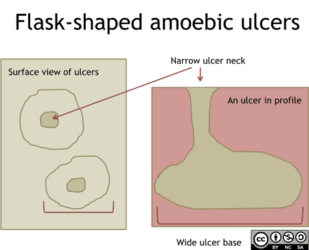

<i>SZMC · 2nd Term</i>
# Parasitology
## Amoebiasis & Free-living Amoeba

Question (with hint) → Full English Answer → Cross questions (Bangla Q/A) → Viva explanation (Bangla script)
<b>🟣 Parasitology</b><b>12 questions</b>
🏠 Index‹ PrevNext ›
## 🦠 Amoebiasis & Free-living Amoeba
<i>E. histolytica lesions, sites, liver abscess, laboratory diagnosis, prevention, free-living amoeba</i>
> <b>P41</b> State the important differences between amoebic and bacillary dysentery. **
> <b>📌 Hint:</b> clinical (onset, fever, toxicity, tenderness, tenesmus) + stool character + microscopic features
✅ Answer
<table>
<tbody><tr><th>Point</th><th>Amoebic dysentery (E. histolytica)</th><th>Bacillary dysentery (Shigella)</th></tr>
<tr><td colspan="3"><b>Clinical</b></td></tr>
<tr><td>Onset</td><td>Slow</td><td>Acute</td></tr>
<tr><td>Fever</td><td>Absent (or low)</td><td>Present, high</td></tr>
<tr><td>Toxicity</td><td>Absent</td><td>Present</td></tr>
<tr><td>Abdominal tenderness</td><td>Localized</td><td>Generalized</td></tr>
<tr><td>Tenesmus</td><td>Absent</td><td>Present</td></tr>
<tr><td colspan="3"><b>Stool (Macroscopic)</b></td></tr>
<tr><td>Frequency</td><td>6–8 times/day</td><td>More than 10/day</td></tr>
<tr><td>Amount</td><td>Relatively copious</td><td>Small</td></tr>
<tr><td>Odor</td><td>Offensive</td><td>Odorless</td></tr>
<tr><td>Colour</td><td>Dark red</td><td>Bright red</td></tr>
<tr><td>Nature</td><td>Blood and mucus mixed with faeces</td><td>Blood and mucus with no or little faeces</td></tr>
<tr><td>Reaction</td><td>Acidic</td><td>Alkaline</td></tr>
<tr><td>Consistency</td><td>Not adherent to container</td><td>Adherent to the bottom of the container</td></tr>
<tr><td colspan="3"><b>Microscopy</b></td></tr>
<tr><td>RBCs</td><td>In clumps, yellowish</td><td>Discrete or in rouleaux, bright red</td></tr>
<tr><td>Pus cells</td><td>Scanty</td><td>Numerous</td></tr>
<tr><td>Macrophages</td><td>Few</td><td>Several, some with ingested RBCs (mistaken as E. histolytica)</td></tr>
<tr><td>Eosinophils</td><td>Present</td><td>Rare</td></tr>
<tr><td>Parasite</td><td>Trophozoite with ingested RBCs</td><td>Nil</td></tr>
<tr><td>Motile bacteria</td><td>Present (normal flora)</td><td>Nil</td></tr>
<tr><td>Pyhnotic bodies</td><td>Very common</td><td>Nil</td></tr>
<tr><td>Ghost cells</td><td>Nil</td><td>Numerous</td></tr>
<tr><td>Charcot–Leyden crystals</td><td>Present</td><td>Nil</td></tr>
</tbody></table>
❓ Cross questions (from additional)
Ghost cells কী?
Ghost cells = enlarged/swollen epithelial cells without nucleus।
Pyhnotic bodies কী?
Pyhnotic bodies = WBCs এবং অন্যান্য cell-এর nucleus-এর remnants।
🗣️ ভাইভায় যেভাবে বুঝাব (বাংলা লিপি)
দুটো dysentery — amoebic (E. histolytica) আর bacillary (Shigella)। পার্থক্য clinical, stool, আর microscopy — এই ৩ ভাগে।
- Clinical — Amoebic: onset slow, fever নেই/কম, toxicity নেই, tenderness localized, tenesmus নেই। Bacillary: acute, high fever, toxicity থাকে, tenderness generalized, tenesmus থাকে।
- Stool (macroscopic) — Amoebic: ৬-৮ বার/দিন, copious, offensive odor, dark red, blood-mucus faeces-এর সাথে মেশানো, acidic, container-এ লেগে থাকে না। Bacillary: ১০+ বার/দিন, small, odorless, bright red, faeces নেই/কম, alkaline, container-এর bottom-এ adherent।
- Microscopy — Amoebic: RBC clumps yellowish, pus scanty, few macrophages, eosinophils present, trophozoite with ingested RBCs, motile bacteria, pyhnotic bodies common, Charcot-Leyden crystal present, ghost cells nil। Bacillary: RBC discrete/rouleaux bright red, pus numerous, several macrophages (ইনজেস্টেড RBC সহ, E. histolytica বলে ভুল হয়), eosinophils rare, parasite nil, motile bacteria nil, pyhnotic bodies nil, ghost cells numerous, Charcot-Leyden nil।
মনে রাখো — "amoebic = dark, offensive, slow; bacillary = bright red, toxic, acute"।
> <b>P42</b> Mention the morphological, infective and pathogenic form of E. histolytica. ****
> <b>📌 Hint:</b> mature quadrinucleated cyst: infective form; trophozoite: pathogenic form
✅ Answer
- Morphological forms (2):
  - Trophozoite — motile with pseudopodia, tissue-destroying ("histo-lytic"=tissue destroying via enzyme histolycin), contains ingested RBCs (distinguishes from E. dispar)
  - Cyst — non-motile, resistant; mature cyst is quadrinucleated (4 nuclei) and produces 8 amoebulae on excystation
- Infective form: mature quadrinucleated cyst
- Pathogenic form: trophozoite
❓ Cross questions (from additional)
E. dispar আর E. histolytica-র পার্থক্য কি?
E. dispar non-pathogenic; morphologically identical, কিন্তু E. dispar-এর trophozoites ingested RBCs ধারণ করে না।
E. histolytica আর E. coli-র nuclei পার্থক্য কি?
E. histolytica: 1–4 nuclei with central karyosome; E. coli (commensal): 1–8 with eccentric karyosome।
Encystation আর excystation কোথায় হয়?
Encystation large intestine-এ, excystation terminal ileum ও caecum-এ।
🗣️ ভাইভায় যেভাবে বুঝাব (বাংলা লিপি)
E. histolytica-র morphological forms ২টা — <b>trophozoite</b> আর <b>cyst</b>।
- Trophozoite — motile, pseudopodia সহ; tissue-destroying ("histo-lytic" মানে enzyme histolycin দিয়ে tissue ধ্বংস করে); phagocytosed RBCs থাকে (এটাই E. dispar থেকে আলাদা করে)।
- Cyst — non-motile, resistant; mature cyst quadrinucleated (৪টা nucleus), excystation-এ ৮টা amoebulae দেয়।
<b>Infective form</b> — mature quadrinucleated cyst (gastric juice-এ survive করে, তাই infection দেয়)।
<b>Pathogenic form</b> — trophozoite (tissue destroy করে, flask ulcer বানায়)।
E. dispar non-pathogenic — morphologically identical কিন্তু ingested RBC নেই। E. histolytica nuclei 1-4 central karyosome; E. coli 1-8 eccentric karyosome। Encystation large intestine-এ, excystation terminal ileum-caecum-এ।
Viva-তে বলবে — "cyst is infective, trophozoite is pathogenic।"
> <b>P43</b> What are the lesion produced by E. histolytica? *****
> <b>📌 Hint:</b> intestinal: large intestine + extra-intestinal
✅ Answer
- Intestinal amoebiasis (amoebic dysentery): flask-shaped ulcers in the large intestine (mucosa & submucosa) — colon/cecum; amoeboma (granuloma) may mimic tumour.
- Extra-intestinal amoebiasis:
  - Hepatic amoebiasis — amoebic liver abscess (commonest extra-intestinal)
  - Pulmonary amoebiasis / lung abscess
  - Brain abscess
  - Splenic abscess
  - Skin — granulomatous ulceration
  - Amoebic vaginitis, amoebic ulcer of the penis
❓ Cross questions (from additional)
E. histolytica-র trophozoites কি সবসময় lesion করে?
না — ৯০% ক্ষেত্রে trophozoites কোনো lesion করে না (asymptomatic); ~১০% ক্ষেত্রে flask ulcers করে।
Ulcer ছিদ্র করতে পারে কি?
Ulcer সাধারণত submucosa-র বেশি deep যায় না, কিন্তু কিছু ক্ষেত্রে perforate → peritonitis হতে পারে।
Liver-এ trophozoites কীভাবে পৌঁছায়?
Portal circulation দিয়ে liver-এ পৌঁছে → anchovy sauce pus-সহ amoebic liver abscess।
🗣️ ভাইভায় যেভাবে বুঝাব (বাংলা লিপি)
E. histolytica কী lesion বানায় — দুটো বড় ভাগ —
<b>Intestinal amoebiasis</b> — large intestine-এ (colon/caecum) flask-shaped ulcers, mucosa-submucosa; amoeboma (granuloma) tumour mimic করতে পারে।
<b>Extra-intestinal amoebiasis</b> —
- Hepatic amoebiasis — amoebic liver abscess (সবচেয়ে common extra-intestinal)
- Pulmonary amoebiasis / lung abscess
- Brain abscess
- Splenic abscess
- Skin — granulomatous ulceration
- Amoebic vaginitis, penile ulcer
৯০% ক্ষেত্রে trophozoite কোনো lesion করে না (asymptomatic); ~১০% flask ulcers করে। Ulcer submucosa-র বেশি deep হয় না, কিন্তু perforate করলে peritonitis। Portal circulation দিয়ে trophozoite liver-এ পৌঁছে anchovy-sauce pus।
> <b>P44</b> Mention the site of infection of E. histolytica. *****
> <b>📌 Hint:</b> intestinal: large intestine and extra-intestinal
✅ Answer
- Intestinal site: Large intestine — mucosa and submucosa (cecum, colon, sigmoid rectum).
- Extra-intestinal sites: liver (via portal vein), lung, brain, spleen, skin, vagina/penis.
The parasite reaches extra-intestinal sites by invading deeper layers → portal circulation → liver (1st filter) → other organs.
❓ Cross questions (from additional)
Cyst-এর excystation কোথায় হয়?
Cyst-এর excystation terminal ileum ও caecum-এ হয়; তারপর trophozoites large intestine-এ invade করে।
Commonest extra-intestinal lesion কোনটি?
Amoebic liver abscess commonest extra-intestinal lesion (right lobe বেশি common)।
🗣️ ভাইভায় যেভাবে বুঝাব (বাংলা লিপি)
Site জিজ্ঞেস করলে —
<b>Intestinal site</b> — <b>Large intestine</b> — mucosa এবং submucosa (caecum, colon, sigmoid, rectum)।
<b>Extra-intestinal site</b> — liver (portal vein দিয়ে), lung, brain, spleen, skin, vagina/penis।
Parasite deeper layers invade করে → portal circulation → liver (১ম filter) → তারপর অন্যান্য organs।
Cyst-এর excystation terminal ileum ও caecum-এ হয়; তারপর trophozoites large intestine invade করে। Amoebic liver abscess commonest extra-intestinal lesion (right lobe বেশি)।
Viva-তে simple answer — "intestinal: large intestine; extra-intestinal: liver most common, also lung, brain, spleen, skin।"
> <b>P45</b> Mention 05 site of extra-intestinal amoebiasis. *****
> <b>📌 Hint:</b> liver, lungs, brain, spleen, skin etc
✅ Answer
<b>05 sites of extra-intestinal amoebiasis:</b>
- Liver — amoebic liver abscess (commonest)
- Lungs — amoebic lung abscess (pulmonary amoebiasis)
- Brain — amoebic brain abscess
- Spleen — amoebic splenic abscess
- Skin — granulomatous ulceration (amoebiasis cutis); also vagina/penis (amoebic vaginitis, penile ulcer)
❓ Cross questions (from additional)
Trophozoites কীভাবে এই sites-এ পৌঁছায়?
Portal circulation এবং systemic spread দিয়ে পৌঁছায়।
Rare sites কি কি?
Rare sites — heart, kidney, genital organs।
🗣️ ভাইভায় যেভাবে বুঝাব (বাংলা লিপি)
Extra-intestinal amoebiasis-এর ৫টা site —
- Liver — amoebic liver abscess (সবচেয়ে common)
- Lungs — amoebic lung abscess (pulmonary amoebiasis)
- Brain — amoebic brain abscess
- Spleen — amoebic splenic abscess
- Skin — granulomatous ulceration (amoebiasis cutis); আরও vagina/penis (amoebic vaginitis, penile ulcer)
মনে রাখো "Liver-Lung-Brain-Spleen-Skin"। Trophozoites portal circulation আর systemic spread দিয়ে এই sites-এ পৌঁছায়। Rare sites — heart, kidney, genital organs।
> <b>P46</b> Mention the pathogenesis of amoebiasis? * (Only for written)
> <b>📌 Hint:</b> host + infective form + mode of transmission + life cycle sequence
✅ Answer
<b>Pathogenesis of amoebiasis (E. histolytica):</b>
- Infective form: mature quadrinucleated cyst; Pathogenic form: trophozoite.
- Host: man (definitive host); no intermediate host. Transmission: feco-oral — ingestion of contaminated food/water with the cyst; housefly may act as mechanical vector.
- Site of lesion: large intestine (mucosa & submucosa).
- Cyst passes through the stomach (wall resistant to gastric juice) → excystation in terminal ileum and caecum → quadrinucleated amoeba forms 8 amoebulae → adhere to colonic mucus → multiply by binary fission.
- In 90%, trophozoites produce no lesion — transform to cyst and pass in feces.
- In ~10%, trophozoites release proteolytic enzymes (histolycin) — lyse tissue and produce flask-shaped ulcers → blood + mucus in stool (amoebic dysentery).
- Some trophozoites enter deeper layers → pass through portal vein into the liver → amoebic liver abscess (anchovy-sauce pus) and rarely other extra-intestinal sites.
- With healing of the lesion, encystation occurs and cysts pass in feces — cycle repeats.
❓ Cross questions (from additional)
Pathogenesis আর pathogenicity-র পার্থক্য কি?
Pathogenesis = disease-র প্রক্রিয়া; pathogenicity = disease ঘটানোর ক্ষমতা (lesions তৈরি)।
Amoebiasis প্রতিরোধের উপায় কি?
Water boiling/filtration, food cover করা, আর asymptomatic carriers-কে metronidazole দিয়ে চিকিৎসা।
🗣️ ভাইভায় যেভাবে বুঝাব (বাংলা লিপি)
Pathogenesis লিখলে flow টা বের কর —
- Infective form — mature quadrinucleated cyst; pathogenic form — trophozoite।
- Host — man (definitive); কোনো intermediate host নেই।
- Transmission — feco-oral, contaminated food/water; housefly mechanical vector।
- Site — large intestine (mucosa & submucosa)।
- Cyst stomach দিয়ে যায় (gastric juice-এ resistant) → terminal ileum ও caecum-এ excystation → ৮ amoebulae → colonic mucus-এ adhere → binary fission-এ multiply।
- ৯০%-এ trophozoite কোনো lesion করে না — cyst হয়ে feces-এ যায়।
- ~১০%-এ trophozoite histolycin (proteolytic enzyme) release করে → tissue lyse → flask-shaped ulcers → blood+mucus stool (amoebic dysentery)।
- কিছু trophozoite deeper layer-এ → portal vein → liver → amoebic liver abscess (anchovy-sauce pus) + অন্যান্য extra-intestinal sites।
- Lesion heal-এর সাথে সাথে encystation → cysts feces-এ → cycle repeats।
Pathogenesis vs pathogenicity — দুটো মিক্স করা ভুল। Prevention — water boiling/filtration, food cover, asymptomatic carriers-এ metronidazole।
> <b>P47</b> Mention the criteria of ulcer in intestinal amoebiasis. ***
> <b>📌 Hint:</b> flask shape ulcer; why flask shape: after penetration move side to side
✅ Answer
 
- The amoebic ulcer is flask-shaped — narrow mouth and neck, large rounded base.
- Why flask shape? After penetrating the mucosa, the trophozoites move side to side (laterally) in the submucosa, producing wide lateral spread, while the entry (mouth) stays narrow.
- Ulcers generally do not penetrate deeper than the submucosa.
- Amoebae are seen at the periphery of the lesion (invading adjoining healthy tissue).
- Occasionally the ulcer may involve muscularis → perforation and peritonitis.
- A granulomatous mass called amoeboma may form and mimic a malignant tumour.
❓ Cross questions (from additional)
Acute amoebic dysentery আর chronic carrier-এর stool-এ কী পাওয়া যায়?
Acute amoebic dysentery-র stool-এ mostly trophozoites; chronic carrier-এ cysts পাওয়া যায়।
Colonic ulcer-এর সংখ্যা কেমন?
Lesions-এর সংখ্যা কম কিন্তু deep হতে পারে — ulcers সাধারণত normal mucosa দিয়ে separated।
🗣️ ভাইভায় যেভাবে বুঝাব (বাংলা লিপি)
Amoebic ulcer-এর criteria —
- Ulcer flask-shaped — narrow mouth ও neck, large rounded base।
- কেন flask shape? — কারণ trophozoite mucosa penetrate করার পর submucosa-এ side-to-side (laterally) নড়ে, ফলে wide lateral spread হয়, কিন্তু mouth/neck narrow থাকে।
- দেখতে bottle/flask-এর মতো — mouth চওড়া নয়, base চওড়া।
- Ulcer সাধারণত submucosa-র বেশি deep যায় না।
- Amoebae lesion-এর periphery-তে দেখা যায় (আসন্ন healthy tissue invade করছে)।
- মাঝে মাঝে muscularis-এ গেলে perforation & peritonitis হতে পারে।
- Amoeboma (granulomatous mass) malignant tumour mimic করতে পারে।
Acute dysentery-র stool-এ trophozoites, chronic carrier-এ cysts। Lesion-এর সংখ্যা কম কিন্তু deep — ulcers normal mucosa দিয়ে separated।
> <b>P48</b> Write down important points about pus of amoebic liver abscess. ***
> <b>📌 Hint:</b> anchovy sauce pus; organism mainly found in periphery
✅ Answer
- Appearance: anchovy-sauce pus — chocolate/reddish-brown, thick in consistency.
- The pus is sterile — composed of necrotic liver tissue without pus cells; amoebic trophozoites are found only occasionally.
- On microscopy, three zones are seen:
  - Central zone: necrotic hepatocytes — no trophozoite
  - Intermediate zone: degenerating hepatocytes, connective tissue cells, RBCs, few WBCs, few trophozoites
  - Peripheral zone: healthy hepatocytes and trophozoites
- The organisms are mainly found in the periphery — so USG-guided aspiration for microscopy must be taken from the peripheral zone for better diagnosis.
❓ Cross questions (from additional)
Amoebic liver abscess-এ stool examination কেমন থাকে?
Stool examination প্রায়ই negative (শুধু ~১৫% ক্ষেত্রে cysts পাওয়া যায়)।
Pus-এ parasite detection-এর best test কী?
Lectin antigen in pus by ELISA 100% sensitive; PCR-ও 100% sensitive।
🗣️ ভাইভায় যেভাবে বুঝাব (বাংলা লিপি)
Amoebic liver abscess-এর pus-এর গুরুত্বপূর্ণ point —
- Appearance — anchovy-sauce pus — chocolate/reddish-brown, thick consistency।
- Pus sterile — necrotic liver tissue দিয়ে গঠিত, pus cells নেই; amoebic trophozoites মাঝে মাঝে।
- Microscopy-তে ৩টা zone দেখা যায়:
  - Central zone — necrotic hepatocytes — কোনো trophozoite নেই
  - Intermediate zone — degenerating hepatocytes, connective tissue cells, RBCs, few WBCs, few trophozoites
  - Peripheral zone — healthy hepatocytes + trophozoites
- Organisms মূলত periphery-তে — তাই USG-guided aspiration microscopy-র জন্য peripheral zone থেকে নিতে হয় diagnosis ভালো হওয়ার জন্য।
Stool examination প্রায়ই negative (~১৫% cysts)। Pus-এ parasite detection-এর best test — lectin antigen by ELISA (100% sensitive), PCR (100% sensitive)।
Classic viva point — "organism mainly in periphery।"
> <b>P49</b> Write down the laboratory diagnosis of intestinal amoebiasis. ***
> <b>📌 Hint:</b> stool examination (saline & iodine wet mount), culture, immunological, PCR
✅ Answer
- Specimen collection: stool; blood for serology.
- Macroscopic examination of stool: foul smelling, dark red stool mixed with blood and mucus.
- Microscopic examination:
  - Saline and iodine (wet mount) preparation of stool.
  - Acute amoebic dysentery: mostly trophozoites found (with ingested RBCs); chronic carrier: cyst found.
  - Pus cells scanty, Charcot–Leyden crystals present, motile bacteria (normal flora) present.
  - Trichrome stain — better view.
- Culture: xenic (polyxenic) and axenic culture — not done routinely.
- Immunological test: antigen detection (lectin antigen in stool by ELISA); antibody detection (anti-lectin antibody in blood by ELISA).
- Molecular detection: PCR.
- Isoenzyme (zymodeme) analysis.
❓ Cross questions (from additional)
E. histolytica নিশ্চিত করতে কোন microscopic finding সাহায্য করে?
Motile, active trophozoites with ingested RBCs E. histolytica নিশ্চিত করে (E. dispar নয়)।
Specimen-এর examination কতক্ষণে করা উচিত?
Motile trophozoites দেখতে fresh specimen (৩০ মিনিটের মধ্যে) examine করতে হয়।
🗣️ ভাইভায় যেভাবে বুঝাব (বাংলা লিপি)
Intestinal amoebiasis-এর laboratory diagnosis —
- Specimen — stool; blood (serology-র জন্য)।
- Macroscopic — foul smelling, dark red stool, blood+mucus mixed।
- Microscopic — saline + iodine (wet mount); acute amoebic dysentery-এ trophozoites (ingested RBC সহ); chronic carrier-এ cysts। Pus cells scanty, Charcot-Leyden crystals present, motile bacteria (normal flora)। Trichrome stain ভালো view দেয়।
- Culture — xenic (polyxenic) ও axenic — routine নয়।
- Immunological — antigen: lectin antigen in stool by ELISA; antibody: anti-lectin antibody in blood by ELISA।
- Molecular — PCR।
- Isoenzyme (zymodeme) analysis।
Motile trophozoites with ingested RBCs E. histolytica নিশ্চিত করে (E. dispar নয়)। Fresh specimen (৩০ মিনিটের মধ্যে) examine করতে হয় motile trophozoites দেখতে।
Viva-তে বলবে — "fresh stool examination is the key।"
> <b>P50</b> Write down the laboratory diagnosis of hepatic amoebiasis. *****
> <b>📌 Hint:</b> USG-guided aspiration from peripheral zone, anchovy-sauce pus microscopy, ELISA (lectin), PCR
✅ Answer
- Specimen collection: USG-guided pus aspiration, stool, blood for serology.
- Macroscopic examination of pus: anchovy-sauce pus — chocolate/brown, thick consistency.
- Microscopic examination of pus (~25% sensitive):
  - Central zone: necrotic tissue — no trophozoite
  - Intermediate zone: degenerated liver cells, connective tissue cells, RBCs, few WBCs, few trophozoites
  - Peripheral zone: healthy hepatocytes and trophozoites
- NB: aspiration should be from the peripheral zone for better diagnosis.
- Liver biopsy: trophozoites can be demonstrated.
- Stool examination: cysts found in ~15% cases (50% sensitive).
- Serological test: antigen detection (lectin antigen in pus by ELISA — 100% sensitive); antibody detection (anti-lectin antibody in blood by ELISA); PCR — 100% sensitive.
❓ Cross questions (from additional)
হেপাটিক অ্যামিবিয়াসিসের পুসের মাইক্রোস্কোপিতে কেন পেরিফারাল জোন থেকে অ্যাসপিরেশন নিতে হয়?
কারণ সেন্ট্রাল জোনে নেক্রোটিক টিস্যু থাকে যেখানে ট্রোফোজোয়িট নেই, ইন্টারমিডিয়েট জোনে শুধু ডিজেনারেটেড সেলস্ থাকে। পেরিফারাল জোনে হেলদি হেপাটোসাইটস্ আর ট্রোফোজোয়িট থাকে — তাই সেখান থেকে নিলে ডায়াগনোসিসের সেন্সিটিভিটি বাড়ে।
হেপাটিক অ্যামিবিয়াসিসকে pyogenic liver abscess থেকে কিভাবে differentiate করবেন?
হেপাটিক অ্যামিবিয়াসিসে anchovy-sauce পুস থাকে, USG-গাইডেড অ্যাসপিরেশন পেরিফারাল জোন থেকে, serology (lectin ELISA) পজিটিভ হয়। Pyogenic abscess-এ পাইোজেনিক অর্গানিজম পাওয়া যায়, WBC বেশি, blood culture পজিটিভ হতে পারে।
Anchovy-sauce পুস কেন বাদামি রঙের হয়?
কারণ E. histolytica লিভারের টিস্যুকে nekrosis করে দেয় — destroyed hepatocytes আর liquefied necrotic tissue মিলিয়ে বাদামি চকলেট রঙের anchovy-sauce পুস তৈরি হয়।
🗣️ ভাইভায় যেভাবে বুঝাব (বাংলা লিপি)
হেপাটিক অ্যামিবিয়াসিসের ডায়াগনোসিসে সবচেয়ে প্রথম স্পেসিমেন কালেক্ট করতে হবে — USG-গাইডেড দিয়ে লিভার অ্যাবসেস থেকে পুস অ্যাসপিরেট নিতে হবে। Anchovy-sauce পুস দেখতে চকলেট-ব্রাউন আর থিক কনসিস্টেন্সির মতো। পুসের মাইক্রোস্কোপিতে ৩ টা জোন আছে — সেন্ট্রাল জোনে নেক্রোটিক টিস্যু থাকে যেখানে ট্রোফোজোয়িট নেই, ইন্টারমিডিয়েট জোনে ডিজেনারেটেড সেলস আর কিছু ট্রোফোজোয়িট থাকে, আর পেরিফারাল জোনে হেলদি হেপাটোসাইটস আর বেশি ট্রোফোজোয়িট থাকে। তাই অ্যাসপিরেশন সবসময় পেরিফারাল জোন থেকে নিতে হবে — সেন্সিটিভিটি ভালো হয়।
লিভার বায়োপসিতেও ট্রোফোজোয়িট দেখা যায়। স্টুল এক্সামিনেশনে কিছু কেসে (১৫%) সিস্ট পাওয়া যায়। সিরোলজিতে লেকটিন অ্যান্টিজেন পুসে ELISA দিয়ে ডিটেক্ট করা যায় — সেন্সিটিভিটি ১০০%। অ্যান্টি-লেকটিন অ্যান্টিবডি ব্লাডে ELISA-তে ডিটেক্ট করা হয়। আর PCR ও ১০০% সেন্সিটিভ — কনফার্মেটরি টেস্ট।
ভাইভায় বলো — "পুস ফ্রম পেরিফারাল জোন, অ্যাঞ্চী-সস, লেকটিন ELISA, PCR কনফার্মেটরি।"
> <b>P51</b> How will you prevent transmission of E. histolytica? ***
> <b>📌 Hint:</b> main-boiling and filtration
✅ Answer
- Avoid ingestion of contaminated food and water.
- Water: boiling and filtration before drinking (kills cysts) — the main measure.
- Cover food to avoid contamination by housefly (mechanical vector).
- Treatment of asymptomatic carriers with metronidazole.
- Sanitary disposal of feces; hand washing and personal hygiene.
- Vaccination: not available.
❓ Cross questions (from additional)
E. histolytica-র সিস্ট কি পরিবেশে survive করতে পারে?
হ্যাঁ, সিস্ট chlorinated water, ঠান্ডা তাপমাত্রা আর স্যাঁতসেঁতে পরিবেশে দিনের পর দিন survive করে। তাই পানি treatment (boiling, filtration) করতে হয়।
Why treat asymptomatic carrier?
কারণ asymptomatic carrier-রা স্টুলে সিস্ট shed করে আর feco-oral route দিয়ে অন্য মানুষকে infect করে। Treatment দিলে transmission cycle ভেঙে যায় — Metronidazole দেওয়া হয়।
Housefly কিভাবে E. histolytica transmit করে?
Housefly mechanical vector — দূষিত feces-এর সিস্ট fly-এর পাখা আর পায়ে লেগে যায়, তারপর খাবারে বসে — মানুষ খাবারের সাথে সিস্ট খেয়ে ফেলে। তাই খাবার ঢেকে রাখা জরুরি।
🗣️ ভাইভায় যেভাবে বুঝাব (বাংলা লিপি)
E. histolytica-র ট্রান্সমিশন প্রিভেন্ট করতে সবচেয়ে ইম্পোর্ট্যান্ট জা — কন্টামিনেটেড পানি আর খাবার অ্যাভয়েড করতে হবে। পানিটা বয়েল করে বা ফিল্টার করে খেতে হবে — কারণ সিস্ট বয়েল হলে মারে আর ফিল্টারে ধরা পড়ে। এটা সবচেয়ে বেসিক আর ইফেক্টিভ মাপজোক।
খাবারকে ঢাকা রাখতে হবে যাতে হাউসফ্লাই মেকানিক্যালি কন্টামিনেট না করে। ফিজের নিশ্চিত ডিসপোজাল করতে হবে — ওপেন ডিফেকেশন বন্ধ করতে হবে। হাত ধোয়া আর পার্সোনাল হাইজিন মেইনটেইন করতে হবে।
অ্যাসিম্পটোমেটিক ক্যারিয়ারকে Metronidazole দিয়ে ট্রিট করা দরকার — কারণ তারা স্টুলে সিস্ট শেড করে আর অন্য মানুষকে ইনফেক্ট করে। কিন্তু ভ্যাকসিন অ্যাভেইলেবল নেই।
ভাইভায় বলো — "বয়েলিং আন্ড ফিলট্রেশন — মেইন মাজার; ফুড ঢাকো; ক্যারিয়ারদের ট্রিট করো; নো ভ্যাকসিন।"
> <b>P52</b> Enlist the free living amoeba with diseases produces by them. ***
> <b>📌 Hint:</b> Acanthamoeba, Naegleria fowleri, Balamuthia, Sappinia — with their diseases
✅ Answer
<table>
<tbody><tr><th>#</th><th>Free-living amoeba</th><th>Disease</th></tr>
<tr><td>1</td><td><b>Acanthamoeba spp.</b> (A. castellanii, A. hatchetti, A. polyphaga)</td><td>Granulomatous amoebic encephalitis (GAE); <b>amoebic keratitis</b> in contact lens users</td></tr>
<tr><td>2</td><td><b>Naegleria fowleri</b></td><td><b>Primary amoebic meningoencephalitis (PAM)</b></td></tr>
<tr><td>3</td><td><b>Balamuthia mandrillaris</b></td><td>Granulomatous amoebic encephalitis (GAE)</td></tr>
<tr><td>4</td><td><b>Sappinia diploidea</b></td><td>Amoebic encephalitis</td></tr>
</tbody></table>
These amoebae live free in soil and water but can accidentally infect man (facultative parasites).
❓ Cross questions (from additional)
Naegleria fowleri কিভাবে মানুষকে infect করে?
Naegleria freshwater-এ থাকে। Swimming-এর সময় নাক দিয়ে পানি ঢুকলে এটি nasal mucosa দিয়ে olfactory nerve ধরে মস্তিষ্কে পৌঁছে PAM (Primary Amoebic Meningoencephalitis) করে — rapidly fatal।
Acanthamoeba keratitis কেন contact lens users-এ বেশি হয়?
Contact lens users lens কে contaminated water দিয়ে ধুয়ে বা solution ঠিকমতো maintain না করলে Acanthamoeba সিস্ট lens আর cornea-র মাঝে stuck হয়ে keratitis করে।
Free-living amoeba কে facultative parasite কেন বলি?
কারণ এগুলো normally soil আর water-এ free living করে, কিন্তু সুযোগ পেলে মানুষকেও infect করতে পারে — obligate parasite নয়, তাই facultative parasite।
🗣️ ভাইভায় যেভাবে বুঝাব (বাংলা লিপি)
ফ্রি-লিভিং অ্যামিবা মানে যেগুলো নরমালি মাটি আর পানিতে থাকে, কিন্তু চান্স পেলে মানুষকেও ইনফেক্ট করতে পারে। এদেরকে ফ্যাকাল্টেটিভ প্যারাসাইট বলি — কারণ এগুলো অবলিগেট প্যারাসাইট না।
৪ টা ইম্পোর্ট্যান্ট ফ্রি-লিভিং অ্যামিবা আছে — প্রথম Acanthamoeba। এটা GAE করে আর কন্ট্যাক্ট লেন্স ব্যবহারকারীদের অ্যামিবিক কেরাটাইটিস করে। দ্বিতীয় Naegleria fowleri — এটা ফ্রেশওয়াটারে থাকে। সুইমিং করতে গেলে নাক দিয়ে পানি ঢুকলে মস্তিষ্কে পড়ে PAM হয়। তৃতীয় Balamuthia mandrillaris — এটাও GAE করে। চতুর্থ Sappinia diploidea — এটা অ্যামিবিক এনসেফালাইটিস করে।
ভাইভায় মনেমোনিক — "Naegleria → নাক → PAM; Acanthamoeba → কন্ট্যাক্ট লেন্স → চোখ; দুটোই → মস্তিষ্ক (GAE)।"
Dr. Roni · Assistant Professor & Head, Microbiology, SZMC, Bogura · SZMC 2nd Term Comprehensive Notes — split topic-wise