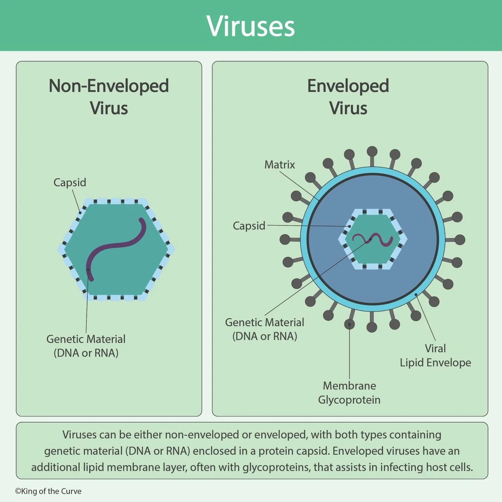

<i>SZMC · 2nd Term</i>
# Virology
## General Virology — Structure & Classification

Question (with hint) → Full English Answer → Cross questions (Bangla Q/A) → Viva explanation (Bangla script)
<b>🔴 Virology</b><b>15 questions</b>
🏠 Index‹ PrevNext ›
## 🧫 General Virology — Structure & Classification
<i>Virus definition & structure, envelope, defective forms, prions, virus resistance, ICTV & Baltimore classification</i>
> <b>V1</b> Define virus. ******* Mention some characteristics of virus. ****
> <b>📌 Hint:</b> acellular, obligate intracellular parasite, DNA or RNA never both, no ribosome, no energy generation
✅ Answer
A <b>virus</b> is the smallest infectious agent composed of an internal core containing either <b>DNA or RNA</b> (but never both), covered by a protective protein coat called a <b>capsid</b>. Some viruses have an outer lipoprotein membrane called an <b>envelope</b> external to the capsid.
A <b>virion</b> is the complete, structurally intact, infectious virus particle.
<b>Characteristics of virus:</b>
- Acellular – not made of cells; acellular particles.
- Obligate intracellular parasite – can reproduce only within host cells.
- Nucleic acid – possess either DNA or RNA, never both.
- No energy generation – mitochondria absent; depend on host cell synthetic machinery.
- No protein synthesis – ribosomes absent; cannot synthesize proteins independently.
- Small size – 20 to 300 nm; cannot be visualized by light microscope; seen by electron microscope.
- Culture – cannot be grown on routine culture media; require living cells (cell/tissue culture, embryonated eggs, experimental animals).
- Multiplication – by replication (not binary fission or mitosis); one virus can produce hundreds of progeny.
- Drug susceptibility – susceptible to antiviral drugs (e.g., interferon) but not to antibiotics.
❓ Cross questions (from additional)
ভাইরাস কী?
ভাইরাস হলো সবচেয়ে ক্ষুদ্রতম সংক্রামক কারক যার একটি অভ্যন্তরীণ নিউক্লিক এসিড কোর (DNA বা RNA) এবং বাইরের প্রোটিন কোট (capsid) থাকে। এটি obligate intracellular parasite।
ভাইরাসের কোনো নিজস্ব ribosome বা mitochondria আছে কি?
নেই। ভাইরাসের নিজস্ব ribosome বা mitochondria নেই — তাই সে নিজে প্রোটিন সংশ্লেষণ বা শক্তি উৎপাদন করতে পারে না। সে পুরোপুরি host cell-এর machinery এর উপর নির্ভরশীল।
ভাইরাসের নিউক্লিক এসিড কীভাবে আলাদা?
ভাইরাসের কাছে DNA বা RNA — দুটোই একসাথে থাকে না। এটিই ভাইরাসের ব্যাকটেরিয়া থেকে অন্যতম প্রধান পার্থক্য।
ভাইরাসকে আলোক মাইক্রোস্কোপে দেখা যায় কি?
না। ভাইরাসের আয়তন ২০–৩০০ nm — এত ছোট যে আলোক মাইক্রোস্কোপে দেখা যায় না। ইলেকট্রন মাইক্রোস্কোপ লাগে।
🗣️ ভাইভায় যেভাবে বুঝাব (বাংলা লিপি)
ভাইরাস হলো একটি submicroscopic, acellular particle যাকে live cell-এর বাইরে বাড়ানো যায় না। এটি obligate intracellular parasite — মানে নিজের চেষ্টায় reproduce করতে পারে না, host cell এর machinery ব্যবহার করতে হবে।
ভাইরাসের নিজস্ব ribosome নেই, mitochondria নেই — সব host থেকে নিয়ে কাজ করে। DNA বা RNA থাকে, দুইটা একসাথে থাকে না। আলোক মাইক্রোস্কোপে দেখা যায় না, electron microscope লাগে।
Antibiotics কাজ করে না, interferon-ধরনের antiviral drug লাগে। Virus নিজে metabolic activity করে না — host cell এর সাথে পুরোপুরি dependent।
বুঝার সুবিধার জন্য বলব — "ভাইরাস মানে একটি জীবন্ত parasite যেটা শুধু আমাদের cell এর ভেতরে থেকেই বেঁচে থাকতে পারে, বাইরে গেলে মারা যায়।"
> <b>V2</b> Write down the differences of virus and bacteria. ****
> <b>📌 Hint:</b> acellular vs prokaryotic, obligate intracellular vs extracellular+intracellular, no ribosome vs ribosome, replication vs binary fission
✅ Answer
<table>
<tbody><tr><th>Point</th><th>Virus</th><th>Bacteria</th></tr>
<tr><td>Cell type</td><td>Acellular</td><td>Prokaryotic cell</td></tr>
<tr><td>Size</td><td>Smaller (20–300 nm)</td><td>Larger (&gt;300 nm)</td></tr>
<tr><td>Microscopy</td><td>Electron microscope</td><td>Light microscope</td></tr>
<tr><td>Nucleic acid</td><td>DNA <i>or</i> RNA (never both)</td><td>Both DNA and RNA</td></tr>
<tr><td>Outer surface</td><td>Capsid proteins (+ envelope)</td><td>Cell wall (+ capsule)</td></tr>
<tr><td>Ribosomes</td><td>Absent</td><td>Present</td></tr>
<tr><td>Protein synthesis</td><td>Not capable (depends on host)</td><td>Capable</td></tr>
<tr><td>Energy generation</td><td>Not capable (depends on host)</td><td>Capable</td></tr>
<tr><td>Reproduction</td><td>Not independently; replication</td><td>Independently; binary fission</td></tr>
<tr><td>Culture</td><td>Cell/tissue culture needed; not easy</td><td>Easy to culture on routine media</td></tr>
<tr><td>Metabolic activity</td><td>Absent</td><td>Present</td></tr>
<tr><td>Susceptibility</td><td>Interferon / antivirals</td><td>Antibiotics</td></tr>
<tr><td>Localization</td><td>Obligate intracellular</td><td>Extracellular &amp; intracellular</td></tr>
</tbody></table>
❓ Cross questions (from additional)
ভাইরাস আর ব্যাকটেরিয়ার মূল পার্থক্য কী?
ভাইরাস acellular, ব্যাকটেরিয়া prokaryotic cell। ভাইরাসের নিজস্ব ribosome নেই, ব্যাকটেরিয়ার আছে। ভাইরাস obligate intracellular, ব্যাকটেরিয়া বাইরেও বাঁচতে পারে।
ভাইরাস কীভাবে বংশবিস্তার করে আর ব্যাকটেরিয়া কীভাবে?
ভাইরাস replication এর মাধ্যমে — একটি ভাইরাস থেকে শত শত offspring তৈরি হয়। ব্যাকটেরিয়া binary fission এর মাধ্যমে — একটি ব্যাকটেরিয়া দুটি হয়।
ভাইরাসের বাইরের স্তর কী আর ব্যাকটেরিয়ার কী?
ভাইরাসের বাইরে capsid (প্রোটিন কোট), কিছুতে envelope থাকে। ব্যাকটেরিয়ার cell wall (peptidoglycan) এবং কিছুতে capsule থাকে।
Antibiotic ভাইরাসের উপর কাজ করে কেন না?
কারণ ভাইরাসের নিজস্ব metabolism, ribosome, বা cell wall নেই — antibiotic এর টার্গেটই নেই। Antibiotics শুধু bacteria এর unique structures কে টার্গেট করে।
🗣️ ভাইভায় যেভাবে বুঝাব (বাংলা লিপি)
ভাইরাস আর ব্যাকটেরিয়ার মূল পার্থক্য — ভাইরাস acellular, ব্যাকটেরিয়া prokaryotic cell। ভাইরাস খুব ছোট, এবং তার নিজের ribosome নেই, প্রোটিন সংশ্লেষণ করতে পারে না। ব্যাকটেরিয়া নিজেই প্রোটিন তৈরি করতে পারে, ribosome আছে।
ভাইরাসের DNA বা RNA আছে, দুইটা একসাথে নেই। ব্যাকটেরিয়ায় দুইটাই থাকে। ভাইরাস lab-এ সাধারণ media-তে বাড়ে না, cell culture লাগে। ব্যাকটেরিয়া সহজে culture হয়।
Antibiotics ব্যাকটেরিয়াকে মারে, ভাইরাসকে interferon-ধরনের drug কাজ করে। বুঝার জন্য — "ভাইরাস হলো একটি parasite যেটার নিজস্ব কিছুই নেই, সব চুরি করে host cell থেকে।"
> <b>V3</b> Mention the structure of a virus. (protein components of virus) ****** (NA+ structural protein + non structural protein)
> <b>📌 Hint:</b> nucleic acid core + capsid + envelope (optional); structural: capsid, envelope glycoproteins, enzymes; non-structural: NS1-NS4
✅ Answer
A virus is structurally composed of three main components:
<b>1. Nucleic Acid (Viral Genome):</b> Either DNA or RNA (never both). May be single-stranded (ss) or double-stranded (ds), linear or circular, segmented or unsegmented, positive or negative polarity.
<b>2. Structural Proteins:</b>
- Capsid – protein coat made of capsomeres (repeating polypeptide subunits). Determines virus shape (icosahedral, helical, or complex symmetry). Nucleic acid + capsid = nucleocapsid.
- Envelope (in enveloped viruses) – lipoprotein membrane (lipid from host cell + glycoprotein spikes/peplomers from virus). Surrounds the nucleocapsid externally.
- Surface glycoproteins / spikes – peplomers such as hemagglutinin (H), neuraminidase (N), M2 protein, gp120/gp41.
- Enzymes – DNA polymerase, RNA polymerase, reverse transcriptase, protease, integrase.
- Matrix protein – found between capsid and envelope.
- Tegument – amorphous protein between capsid and envelope; characteristic of herpes virus family.
<b>3. Non-structural (NS) Proteins:</b> Not part of virion structure; include NS1, NS2, NS3, NS4 etc. (e.g., NS1 antigen of Dengue virus). Regulatory and enzymatic functions during replication.
❓ Cross questions (from additional)
ভাইরাসের structure এ কতগুলো মূল অংশ আছে?
তিনটি — nucleic acid (DNA বা RNA), capsid (প্রোটিন কোট), এবং optional envelope (লিপোপ্রোটিন মেমব্রেন)।
Capsid কী দিয়ে তৈরি?
Capsomere নামে repeating polypeptide subunits দিয়ে তৈরি। Capsomere-এর arrangement ভাইরাসের shape (icosahedral, helical, বা complex) নির্ধারণ করে।
Envelope কোথায় থাকে এবং এটা কীভাবে তৈরি হয়?
Enveloped virus-এ capsid-এর বাইরে থাকে। Lipid host cell membrane থেকে আসে, protein spike virus থেকে তৈরি হয়। Virus যখন budding করে host cell থেকে বের হয়, তখন envelope তৈরি হয়।
Non-structural protein কী?
যেসব protein virion-এর structure-এ থাকে না কিন্তু replication-এ কাজে লাগে। যেমন NS1, NS2, NS3 ইত্যাদি। Dengue virus-এর NS1 antigen এর উদাহরণ।
🗣️ ভাইভায় যেভাবে বুঝাব (বাংলা লিপি)
ভাইরাসের structure তিনটি মূল অংশ নিয়ে গঠিত — nucleic acid (DNA বা RNA), capsid (প্রোটিন কোট), আর optional envelope (লিপোপ্রোটিন মেমব্রেন)।
Capsid হলো capsomere নামে repeating unit দিয়ে তৈরি, ভাইরাসের shape determine করে। ভাইরাসের nucleic acid + capsid = nucleocapsid।
Enveloped virus-এর lipid membrane থাকে — lipid host cell থেকে আসে, protein virus থেকে। Peplomer মানে spike protein, attachment এ সাহায্য করে। Herpes family-র সাথে tegument থাকে — capsid আর envelope-এর মাঝে একটি amorphous protein layer।
Non-structural protein গুলো replication-এ কাজে লাগে কিন্তু virion-এর structure-এ থাকে না। যেমন Dengue virus-এর NS1 antigen।
> <b>V4</b> Draw and label a virus (enveloped and non-enveloped). **** (only for written)
> <b>📌 Hint:</b> Naked: nucleocapsid only. Enveloped: nucleocapsid + envelope + spikes
✅ Answer
This is a written/drawing question. Key elements to label:
<b>A. Non-enveloped (Naked) Virus:</b>
- Central nucleic acid core (DNA or RNA)
- Capsid (composed of capsomeres) — icosahedral symmetry
- Label: Nucleic acid core, Capsid, Capsomere
<b>B. Enveloped Virus:</b>
- Central nucleic acid core (DNA or RNA)
- Capsid (composed of capsomeres)
- Envelope (lipoprotein membrane surrounding nucleocapsid)
- Glycoprotein spikes (peplomers) projecting from envelope
- Label: Nucleic acid, Capsid, Nucleocapsid, Lipid envelope, Glycoprotein spikes
 
❓ Cross questions (from additional)
Naked virus আর enveloped virus কী পার্থক্য?
Naked virus-এ শুধু capsid + nucleic acid থাকে। Enveloped virus-এ capsid-এর বাইরে lipid envelope + glycoprotein spike থাকে।
Virus-এর diagram এ কী কী label দিতে হবে?
Naked virus-এ: Nucleic acid core, Capsid, Capsomere। Enveloped virus-এ: Nucleic acid, Capsid, Nucleocapsid, Lipid envelope, Glycoprotein spikes।
কোন ভাইরাস naked আর কোনটি enveloped?
Naked: Adenovirus, Rotavirus, Polio, HAV। Enveloped: Influenza, Rabies, HIV, HBV, Herpes।
Drawing question এ কীভাবে ভালো marks পাবেন?
কোনো viral diagram-এ capsid, nucleic acid, capsomere, envelope, spike protein — সব clear label দিতে হবে। Naked আর enveloped দুটোই আলাদা করে draw করতে হবে।
🗣️ ভাইভায় যেভাবে বুঝাব (বাংলা লিপি)
এটি একটি drawing question। Naked virus-এ শুধু capsid আর nucleic acid থাকে, বাইরে কিছু নেই। Enveloped virus-এ capsid-এর বাইরে lipid membrane (envelope) থাকে আর তার উপর থেকে glycoprotein spike (peplomer) বের হয়।
Labels clearly দিতে হবে — capsid, nucleic acid, capsomere, envelope, spike protein। Naked virus-এ যেমন Adenovirus, Rotavirus — এদের icosahedral symmetry। Enveloped virus-এ যেমন Influenza, Rabies — এদের helical nucleocapsid।
Draw করার সময় মনে রাখবেন — naked virus simple, enveloped virus এর বাইরের স্তরটি আলাদা করে দেখাতে হবে।
> <b>V5</b> Mention the importance of capsid. * (protect genome, help in attachment, antigenic, give shape of virus)
> <b>📌 Hint:</b> protect genome, attachment (non-enveloped), antigenic, determines shape
✅ Answer
The capsid is the protein coat composed of capsomeres. Its functions:
- Protects the nucleic acid (genome) from physical damage, nucleases, and the external environment.
- Mediates attachment to host cell receptors (especially important for non-enveloped viruses, which use capsid proteins for binding).
- Antigenic – capsid proteins are major antigens and stimulate antibody production (important for serological diagnosis and vaccine development).
- Determines the shape (structural symmetry) of the virus – icosahedral, helical, or complex – based on capsomere arrangement.
❓ Cross questions (from additional)
Capsid এর কাজ কী কী?
চারটি মূল কাজ — (১) Nucleic acidকে সুরক্ষা করা, (২) Host cell-এ attachment করা, (৩) Antigen হিসেবে কাজ করা, (৪) Virus-এর shape নির্ধারণ করা।
Naked virus-এ capsid কীভাবে attachment করে?
Naked virus-এ capsid-ই বাইরের স্তর, তাই capsid protein-ই directly host cell receptor-এ bind করে।
Capsid antigenic মানে কী?
Capsid protein একটি antigen — মানে immune system এটাকে চেনে এবং antibody তৈরি করে। এটি serological diagnosis ও vaccine development-এ গুরুত্বপূর্ণ।
Capsomere-এর arrangement কী নির্ধারণ করে?
Capsomere-এর arrangement ভাইরাসের structural symmetry নির্ধারণ করে — icosahedral, helical, বা complex।
🗣️ ভাইভায় যেভাবে বুঝাব (বাংলা লিপি)
Capsid হলো virus-এর প্রোটিন কোট, এটা genomeকে সুরক্ষা করে বাইরের environment থেকে। Naked virus যখন host cell-এ attach করে, তখন capsid-ই directly receptor-এর সাথে bind করে।
Capsid antigenic — মানে immune system এটাকে চেনে antibody বানায়। Capsid-এর arrangement virus-এর shape decide করে — icosahedral, helical, বা complex।
Enveloped virus-এ capsid-কে envelope ঢেকে রাখে, তাই attachment মূলত envelope glycoprotein-এর মাধ্যমে হয়। কিন্তু naked virus-এ capsid-ই একমাত্র attachment structure।
> <b>V6</b> Mention the composition of viral envelope. *** (lipid from host cell, protein from virus)
> <b>📌 Hint:</b> Lipoprotein = Lipid (from host) + Protein/Glycoprotein (from virus, peplomers)
✅ Answer
The viral envelope is a <b>lipoprotein</b> membrane (Lipid + Protein) surrounding the nucleocapsid in enveloped viruses.
- Lipid part – derived from host cell membranes. The virus acquires the envelope by "budding" through host cell membranes during exit.
- Protein part – derived from the virus. Glycoprotein projections called peplomers (spike proteins) project from the envelope surface (e.g., hemagglutinin and neuraminidase of orthomyxoviruses).
❓ Cross questions (from additional)
Viral envelope কী দিয়ে তৈরি?
Lipoprotein — lipid host cell membrane থেকে, protein (glycoprotein spike) virus থেকে তৈরি।
Envelope-এর lipid কোথা থেকে আসে?
Host cell membrane থেকে। Virus যখন budding করে host cell থেকে বের হয়, তখন host-এর membrane থেকে lipid layer নিয়ে নেয়।
Peplomer কী?
Peplomer মানে envelope-এর উপর থেকে বের হওয়া glycoprotein spike। যেমন Influenza-এর hemagglutinin ও neuraminidase।
Herpes virus envelope কোথা থেকে নেয়?
Host cell-এর nuclear membrane থেকে। Coronavirus-এর envelope আসে endoplasmic reticulum থেকে।
🗣️ ভাইভায় যেভাবে বুঝাব (বাংলা লিপি)
Viral envelope হলো lipoprotein — lipid আসে host cell membrane থেকে, protein আসে virus থেকে। Virus যখন host cell থেকে budding করে বের হয়, তখন host-এর membrane থেকে lipid layer নিয়ে নেয়।
Glycoprotein spike হলো virus-এর own protein, envelope-এর উপর projection করে। Herpes virus nuclear membrane থেকে envelope নেয়, Coronavirus endoplasmic reticulum থেকে নেয়।
বুঝার জন্য — "envelope মানে virus-এর জামা, জামার কাপড় host থেকে, কিন্তু design virus নিজের।"
> <b>V7</b> Mention the sources & importance of envelope of a virus. ***** (receptors, instability, antigenic)
> <b>📌 Hint:</b> Sources: host membrane/nuclear membrane/ER. Importance: attachment, antigenic, unstable (lipid), transmission route linked
✅ Answer
<b>Sources of envelope:</b>
- Host cell membrane: All enveloped viruses acquire lipid from host cell plasma membrane.
- Host nuclear membrane: Only herpes virus family.
- Host endoplasmic reticulum: Coronavirus.
<b>Importance/Functions of envelope:</b>
- Attachment to host – envelope glycoproteins (peplomers/spikes) serve as receptors for binding to host cell receptors.
- Antigenic – surface glycoproteins are major antigens, important for diagnosis and vaccine development.
- Instability – envelope is lipid-based, making enveloped viruses unstable in the environment. More sensitive to heat, drying, detergents, disinfectants, and lipid solvents (alcohol, ether) than naked viruses.
- Transmission route – fecal-oral route viruses are usually not enveloped. Enveloped viruses usually transmitted by routes other than feco-oral.
- Respiratory enveloped viruses cannot survive in the environment for a significant period; require direct person-to-person droplet transmission.
❓ Cross questions (from additional)
Envelope-এর source কী কী?
তিনটি source — (১) Host cell membrane (সব enveloped virus), (২) Host nuclear membrane (শুধু Herpes virus), (৩) Host endoplasmic reticulum (Coronavirus)।
Envelope কেন unstable?
কারণ envelope lipid-based। Lipid মানে heat, drying, detergent, alcohol, ether দিয়ে easily dissolve হয়ে যায়। Envelope নষ্ট হলে virus attach করতে পারে না।
Feco-oral route-এ কেন enveloped virus কম থাকে?
কারণ feco-oral route-এ virus-কে environment-এ survive করতে হয়। Enveloped virus-এর lipid envelope environment-এ unstable, তাই survive করতে পারে না। Naked virus stable।
Peplomers-এর উদাহরণ দাও।
Hemagglutinin, Neuraminidase (Myxovirus), Spike protein (Coronavirus), gp120/gp41 (HIV)।
🗣️ ভাইভায় যেভাবে বুঝাব (বাংলা লিপি)
Envelope-এর source host cell membrane — Herpes virus nuclear membrane থেকে নেয়, Coronavirus endoplasmic reticulum থেকে নেয়।
Envelope-এর কারণ virus unstable, environmental condition-এ easily মারা যায়। Feco-oral route-এ যেসব virus ছড়ায় তারা বেশিরভাগ naked — কারণ তারা survive করতে পারে। Enveloped virus directly droplet contact দিয়ে ছড়ায়।
Lipid solvent — alcohol, ether — envelope dissolve করতে পারে। Surface glycoprotein spike attachment এ সাহায্য করে।
> <b>V8</b> What are the 'defective form of virus'/'atypical virus like agents'? *****
> <b>📌 Hint:</b> prion, viroid, pseudovirion, defective virus
✅ Answer
Defective forms of virus or atypical virus-like agents:
- Viroids – solely a single molecule of circular RNA without capsid or envelope. RNA is very small, does not encode protein. Cause plant diseases only (no human disease).
- Prions – infectious particles composed solely of protein (no detectable nucleic acid). Cause "slow" viral diseases: Creutzfeldt-Jakob disease, Kuru (humans), mad cow disease (cattle), scrapie (sheep).
- Pseudovirions – contain host cell DNA instead of viral DNA within the capsid. Can infect cells but do not replicate.
- Defective viruses – viral nucleic acid + proteins present but cannot replicate without a "helper" virus providing the missing function. Example: HDV requires HBV (needs HBsAg for envelope).
❓ Cross questions (from additional)
Defective virus-like agents কয় ধরনের?
চার ধরন — Viroid, Prion, Pseudovirion, এবং Defective virus।
Viroid আর Prion-এর পার্থক্য কী?
Viroid শুধু circular RNA — protein capsid নেই, plant disease করে। Prion শুধু protein — nucleic acid নেই, brain-এ slow disease করে (CJD, Kuru)।
HDV কেন defective virus?
কারণ HDV-র own envelope protein নেই — তাকে HBV-র HBsAg লাগে envelope-এর জন্য। HBV ছাড়া HDV replicate করতে পারে না।
Pseudovirion কী?
Host cell-এর DNA ভেতরে থাকে viral capsid-এর, কিন্তু replicate করতে পারে না।
🗣️ ভাইভায় যেভাবে বুঝাব (বাংলা লিপি)
Atypical virus-like agents মানে যারা typical virus-এর মতো কাজ করে না। চার ধরন —
Viroid — শুধু RNA, কোনো protein capsid নেই। Plant disease করে, human disease করে না।
Prion — শুধু protein, কোনো nucleic acid নেই। Brain-এ slow disease করে — CJD, Kuru (human), mad cow disease (cattle), scrapie (sheep)।
Pseudovirion — host cell-এর DNA নিয়ে viral capsid-এ থাকে, replicate করতে পারে না। Defective virus — missing component আছে, helper virus ছাড়া কাজ করে না। যেমন HDV, HBV-র help ছাড়া replicate করতে পারে না।
> <b>V9</b> What is prion, viroids, pseudovirion, defective virus? ****
> <b>📌 Hint:</b> prion: only protein; viroid: only NA; pseudovirion: host cell NA; defective virus: need helper for missing components
✅ Answer
<table>
<tbody><tr><th>Agent</th><th>Composition</th><th>Replication</th></tr>
<tr><td><b>Prion</b></td><td>Only Protein (no nucleic acid)</td><td>No; causes protein misfolding</td></tr>
<tr><td><b>Viroid</b></td><td>Only Nucleic acid (circular RNA), no capsid</td><td>Yes; plant diseases only</td></tr>
<tr><td><b>Pseudovirion</b></td><td>Host cell DNA + Viral capsid</td><td>No; cannot replicate</td></tr>
<tr><td><b>Defective virus</b></td><td>Viral NA + Protein but missing genes</td><td>Only with helper virus</td></tr>
</tbody></table>
❓ Cross questions (from additional)
Prion, Viroid, Pseudovirion, Defective virus — প্রত্যেকটির composition কী?
Prion: শুধু Protein। Viroid: শুধু RNA (circular)। Pseudovirion: Host cell DNA + Viral capsid। Defective virus: Viral NA + Protein কিন্তু missing genes।
Prion কীভাবে disease করে?
Prion protein normal form (PrPC) থেকে misfolded form (PrPSc) এ পরিণত হয়। PrPSc protease-resistant, β-pleated sheet — এটি brain-এ accumulate করে spongiform encephalopathy তৈরি করে।
HDV classic defective virus-এর উদাহরণ — কেন?
HDV-র নিজস্ব envelope protein নেই। তাকে HBV-র HBsAg লাগে। HBV ছাড়া HDV complete virion তৈরি করতে পারে না।
🗣️ ভাইভায় যেভাবে বুঝাব (বাংলা লিপি)
Prion শুধু protein, DNA RNA নেই। Viroid শুধু RNA, protein capsid নেই। Pseudovirion-এ host cell-এর DNA থাকে viral capsid-এর ভেতরে, replicate করতে পারে না। Defective virus-র missing gene আছে — helper virus ছাড়া কাজ করে না।
HDV classic example — HBV না থাকলে HDV reproduce করতে পারবে না।
Prion-এর দুইটা form — PrPC (normal, α-helix, protease-sensitive) আর PrPSc (pathogenic, β-pleated, protease-resistant)। Brain-এ "spongiform" appearance হয় — মানে dead neuron-এর vacuoles দিয়ে sponge-এর মতো হয়।
> <b>V10</b> Mention some prion mediated diseases. *** (Creutzfeldt Jakob disease, Kuru in man; mad cow disease in cow; scrapie in sheep)
> <b>📌 Hint:</b> CJD, Kuru (human); Mad cow, Scrapie (animal). "Slow" viral diseases / transmissible spongiform encephalopathy
✅ Answer
Prion-mediated diseases are "slow" viral diseases / <b>transmissible spongiform encephalopathies</b>:
- In humans: Creutzfeldt-Jakob disease (CJD), Kuru
- In animals: Mad cow disease (BSE) in cows, Scrapie in sheep
The term "spongiform" refers to the sponge-like appearance of the brain — holes are vacuoles from dead neurons.
❓ Cross questions (from additional)
Prion disease কয় ধরনের?
Transmissible spongiform encephalopathy — human-এ CJD ও Kuru, animal-এ mad cow disease (BSE) ও scrapie।
Prion normal host gene-র product — তাহলে immune system কেন আক্রমণ করে না?
কারণ PrP normal host gene থেকেই তৈরি হয়, তাই immune system একে "foreign" মনে করে না। Kono immune response, kono inflammation হয় না।
Spongiform মানে কী?
Brain-এ sponge-এর মতো appearance — dead neuron-এর vacuoles দিয়ে।
Prion resistant কেন?
UV, heat, formaldehyde, nucleases-এর প্রতি virus-এর চেয়ে beshi resistant। Hypochlorite, NaOH, autoclaving দিয়ে inactivate করতে হয়।
🗣️ ভাইভায় যেভাবে বুঝাব (বাংলা লিপি)
Prion disease "slow" viral disease — transmissible spongiform encephalopathy। Human-এ CJD আর Kuru। Animal-এ mad cow disease (BSE) আর scrapie।
Brain-এ sponge-like appearance দেখা যায় — dead neuron-এর vacuoles। Prion normal host gene থেকেই আসে তাই immune system একে চেনে না, kono inflammation হয় না।
Prion-এর two forms — PrPC (normal) আর PrPSc (pathogenic)। PrPSc protease-resistant β-pleated sheet — brain-এ accumulate করে।
> <b>V11</b> Which virus is more resistant between enveloped and naked viruses?- Explain. **** (naked are more resistant, enveloped confirm insensitivity of virus)
> <b>📌 Hint:</b> Naked more resistant; enveloped have lipid layer → sensitive to heat, drying, detergent, disinfectant, lipid solvent
✅ Answer
<b>Naked (non-enveloped) viruses are more resistant</b> than enveloped viruses.
- Envelope is lipid-based → inherently unstable in the external environment.
- Enveloped viruses are more sensitive to: heat, drying, detergents, disinfectants, lipid solvents (alcohol, ether) — these dissolve/disrupt the lipid envelope.
- Once lipid envelope is destroyed → virus loses ability to attach → inactivated.
- Naked viruses, lacking lipid envelope, are more stable and survive longer in the environment.
This is why <b>fecal-oral route viruses are usually naked</b> — they need to survive the harsh GI environment and external environment.
❓ Cross questions (from additional)
Naked virus কেন বেশি resistant?
কারণ তাদের lipid envelope নেই। Naked virus-এর capsid protein-only, environment-এ বেশি stable থাকে।
Enveloped virus কেন sensitive?
Lipid envelope easily dissolve হয় heat, drying, detergent, alcohol, ether দিয়ে। Lipid গেলে virus attach করতে পারবে না — inactivated।
Feco-oral route-এ কেন naked virus বেশি?
কারণ feco-oral route-এ environment-এ survive করতে হয়, gastric acid আর bile-এর মধ্য দিয়ে যেতে হয়। Naked virus stable — acid/heat resistant। Enveloped virus environmental survival-এ weak।
🗣️ ভাইভায় যেভাবে বুঝাব (বাংলা লিপি)
Naked virus বেশি resistant — কারণ তাদের lipid envelope নেই। Enveloped virus-এর lipid layer easily dissolve হয় — heat, drying, detergent, alcohol, ether দিয়ে।
Lipid গেলে virus কাজ করতে পারবে না। তাই naked virus environment-এ বেশি থাকে, feco-oral route-এ বেশি naked virus ছড়ায়।
Respiratory enveloped virus environment-এ বেশিক্ষণ survive করতে পারে না, তাই directly person-to-person droplet transmission লাগে। Naked virus contaminated surface থেকেও indirect transmit হতে পারে।
> <b>V12</b> Mention the names of largest and smallest virus. *** (largest virus: small pox, smallest: parvo B19, small RNA: Picornavirus)
> <b>📌 Hint:</b> Largest: Smallpox (300 nm). Smallest: Parvovirus B19 (20 nm). Both DNA viruses.
✅ Answer
- Largest virus: Smallpox virus (Variola) — 300 nm. Also the most complex virus, brick-shaped.
- Smallest virus: Parvovirus B19 — 20 nm.
- Both are DNA viruses.
- Largest genome: Retrovirus (RNA virus).
- Smallest genome: Hepatitis D virus (RNA virus).
- Smallest RNA virus group: Picornavirus (Polio, HAV, Rhinovirus).
❓ Cross questions (from additional)
সবচেয়ে বড় আর সবচেয়ে ছোট virus কী?
বড়: Smallpox (Variola) 300 nm, brick-shaped। ছোট: Parvovirus B19, 20 nm। দুইটাই DNA virus।
সবচেয়ে বড় genome কোনটির?
Retrovirus (RNA virus)। সবচেয়ে ছোট RNA genome: Hepatitis D virus (HDV)।
Smallpox কেন eradicated হয়েছে?
Vaccination (vaccine) দিয়ে। শেষ case 1977, WHO 1980 সালে declare করে যে eradicated।
Smallest RNA virus group কী?
Picornavirus — Polio, HAV, Rhinovirus।
🗣️ ভাইভায় যেভাবে বুঝাব (বাংলা লিপি)
বড় virus: Smallpox (Variola) — 300 nm, brick-shaped, most complex। ছোট virus: Parvovirus B19 — 20 nm। দুইটাই DNA virus।
Retrovirus-এর genome largest, HDV-র genome smallest RNA-র মধ্যে। Picornavirus smallest RNA virus group।
Virus-এর size এত ছোট light microscope-এ দেখা যায় না, electron microscope লাগে। Virus-এর shape — Poxvirus brick-shaped, Rabies bullet-shaped, Rotavirus cartwheel, Coronavirus crown-like, Ebola filamentous।
> <b>V13</b> Mention the basis of classification of virus (ICTV classification – main heading with example) ****** (DNA or RNA, SS or DS, positive or negative sense, helical or icosahedral, naked or enveloped etc.)
> <b>📌 Hint:</b> ICTV: by NA type, strand number, polarity, capsid symmetry, envelope, replication site, genome segmentation
✅ Answer
<b>ICTV (International Committee on Taxonomy of Viruses) classification:</b>
- 1. Type of nucleic acid: DNA (Herpes, Adenovirus) or RNA (Influenza, Polio).
- 2. Number of strands: ss — Parvovirus B19(ssDNA) , all RNA except Rotavirus. ds — Rotavirus(dsRNA) , all DNA except Parvovirus B19. <b><code></code><code>​</code><code>​</code><code>​</code>Most DNA viruses</b> are <b>double-stranded (ds)</b>. The only major exception is <b>Parvovirus</b>, which is <b>single-stranded (ss)</b>. <b>Most RNA viruses</b> are <b>single-stranded (ss)</b>. The only major exception is <b>Rotavirus (Reovirus)</b>, which is <b>double-stranded (ds)</b>.
 
- 3. Nature of genome: Segmented (Rotavirus, Influenza) vs Non-segmented (Polio, Measles). Linear (HAV, HBV) vs Circular (HPV, HDV). Diploid (HIV).
- 4. Polarity (RNA only): (+) sense (Polio, HAV, HCV, Dengue) vs (–) sense (Influenza, Measles, Mumps).
- 5. Capsid symmetry: Icosahedral (all DNA except Pox; Polio, Dengue), Helical (Rabies, Influenza, Measles), Complex (Pox only).
Icosahedral = All DNA + Polio + Dengue - pox
Helical = Influenza , Measles , Mumps
Complex = Pox
- 6. Envelope: Enveloped (Rabies, HBV, HCV) vs Naked (Rotavirus, Polio, HAV, Adenovirus).
- 7. Replication site: Cytoplasm (Pox, all RNA except Retro/Orthomyxo/Delta) vs Nucleus (all DNA except Pox; Retro, Orthomyxo, Delta).
cytoplasm = RNA virus - Retro/Orthomyxo/Delta + DNA (Pox)
Nucleus = All DNA + Retro/Orthomyxo/Delta - DNA (Pox)
- 8. Family/Genus naming: Families end with –viridae (Herpesviridae). Genera end with –virus (Coronavirus).
❓ Cross questions (from additional)
ICTV classification-এ virus কী কী parameter অনুযায়ী ভাগ করা হয়?
৮টি parameter — nucleic acid type, strand number, genome nature (segmented/non-segmented), polarity, capsid symmetry, envelope, replication site, naming convention।
Polarity মানে কী? কোন virus-এ apply করে?
Polarity শুধু RNA virus-এ apply করে। (+) sense RNA genome directly mRNA-র মতো, (-) sense RNA genome mRNA-র complementary।
Family আর genus naming convention কী?
Family-র suffix —viridae (যেমন Herpesviridae)। Genus-র suffix —virus (যেমন Coronavirus)।
🗣️ ভাইভায় যেভাবে বুঝাব (বাংলা লিপি)
ICTV classification-এ virus-কে কয়েকটি parameter অনুযায়ী ভাগ করা হয় — DNA না RNA, single না double strand, positive না negative sense, icosahedral না helical capsid, envelope আছে না নেই, কোথায় replicate করে, segmented না non-segmented।
Family-র –viridae, genus-র –virus suffix। All helical nucleocapsid virus-এ envelope থাকে — naked helical virus নেই।
Non-infectious nucleic acid: Poxvirus, (-) sense RNA, Reovirus, Retrovirus। বাকি সবগুলোই infectious nucleic acid।
> <b>V14</b> Enumerate the Baltimore classification of virus. **
> <b>📌 Hint:</b> 7 groups: dsDNA, ssDNA, dsRNA, (+)ssRNA, (-)ssRNA, ssRNA with DNA intermediate (retro), dsDNA with RNA intermediate (Hepadna)
✅ Answer
<table>
<tbody><tr><th>Group</th><th>Genome</th><th>Examples</th></tr>
<tr><td><b>I</b></td><td>dsDNA</td><td>Herpes, Adenovirus, Poxvirus</td></tr>
<tr><td><b>II</b></td><td>ssDNA</td><td>Parvovirus B19</td></tr>
<tr><td><b>III</b></td><td>dsRNA</td><td>Rotavirus</td></tr>
<tr><td><b>IV</b></td><td>(+)ssRNA</td><td>Polio, HAV, HCV, Dengue, Corona</td></tr>
<tr><td><b>V</b></td><td>(–)ssRNA</td><td>Influenza, Measles, Mumps, Rabies</td></tr>
<tr><td><b>VI</b></td><td>ssRNA + DNA intermediate (Retrovirus)</td><td>HIV, HTLV</td></tr>
<tr><td><b>VII</b></td><td>dsDNA + RNA intermediate (Hepadnavirus)</td><td>HBV</td></tr>
</tbody></table>
❓ Cross questions (from additional)
Baltimore classification কত group-এ virus ভাগ করে?
৭টি group। dsDNA, ssDNA, dsRNA, (+)ssRNA, (-)ssRNA, ssRNA with DNA intermediate (Retrovirus), dsDNA with RNA intermediate (Hepadnavirus)।
Group IV আর Group V-র মূল পার্থক্য কী?
Group IV (+)ssRNA genome directly mRNA-র মতো। Group V (-)ssRNA genome-কে প্রথমে virion RNA polymerase দিয়ে mRNA-তে convert করতে হবে।
Retrovirus আর Hepadnavirus-এ RT কখন কাজ করে?
Retrovirus (Group VI): RNA → DNA early (replication-র আগে)। Hepadnavirus (Group VII): RNA intermediate → DNA late (replication-র পরে)।
🗣️ ভাইভায় যেভাবে বুঝাব (বাংলা লিপি)
Baltimore classification ৭টি group-এ divide করে — dsDNA, ssDNA, dsRNA, (+)ssRNA, (-)ssRNA, ssRNA with DNA intermediate (Retrovirus), dsDNA with RNA intermediate (Hepadnavirus)।
Group IV (+)ssRNA virus-এ genome directly mRNA-র মতো। Group V (-)ssRNA virus-এ virion নিজের RNA polymerase নিয়ে আসে — host cell (-) RNA-কে mRNA-তে convert করতে পারে না।
Retrovirus early replication-এ RT ব্যবহার করে, HBV late replication-এ RT ব্যবহার করে।
> <b>V15</b> Mention two (02) vaccine preventable cancer. **** (HPV and HBV)
> <b>📌 Hint:</b> Cervical carcinoma by HPV vaccine, Hepatocellular carcinoma by HBV vaccine
✅ Answer
- Cervical carcinoma — prevented by HPV vaccine (subunit, targets HPV-16/18 causing cancer, HPV-6/11 causing warts). Given to girls 9–13 years, 2 doses 6 months apart.
- Hepatocellular carcinoma (HCC) — prevented by HBV vaccine (subunit, recombinant in yeast/E. coli). First vaccine to prevent a human cancer. Newborns: 6, 10, 14 weeks. Adults: 0, 1, 6 months.
❓ Cross questions (from additional)
Vaccine preventable cancer কোনগুলো?
দুইটি — Cervical carcinoma (HPV vaccine দিয়ে) আর Hepatocellular carcinoma (HBV vaccine দিয়ে)।
HBV vaccine কেন special?
এটি প্রথম vaccine যা একটি human cancer prevent করে। Subunit/recombinant vaccine।
HPV vaccine কাদের দেওয়া হয়?
Girls 9–13 বছর বয়সীদের, 2 doses 6 months apart। HPV-16/18 cancer করে, HPV-6/11 wart করে।
🗣️ ভাইভায় যেভাবে বুঝাব (বাংলা লিপি)
দুইটি vaccine preventable cancer — HPV vaccine দিয়ে cervical carcinoma, HBV vaccine দিয়ে hepatocellular carcinoma prevent করা যায়।
HBV vaccine প্রথম vaccine যা human cancer prevent করে। দুইটাই subunit vaccine — pathogen-র fragment ব্যবহৃত হওয়ায়।
HPV-16/18 cervical cancer করে, HPV-6/11 genital wart করে। Pap smear দিয়ে diagnose করা হয়।
Dr. Roni · Assistant Professor & Head, Microbiology, SZMC, Bogura · SZMC 2nd Term Comprehensive Notes — split topic-wise