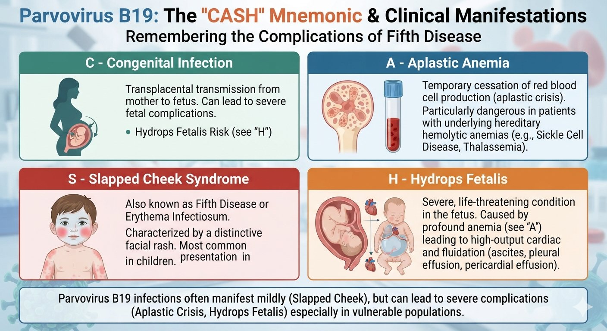

<i>SZMC · 2nd Term</i>
# Virology
## Important Virus Lists

Question (with hint) → Full English Answer → Cross questions (Bangla Q/A) → Viva explanation (Bangla script)
<b>🔴 Virology</b><b>7 questions</b>
🏠 Index‹ PrevNext ›
## 🧫 Important Virus Lists
<i>RNA & DNA viruses, enveloped & naked viruses, HPV & Parvo B19 diseases</i>
> <b>V16</b> What are the lesions produced by HPV? *** (genital wart and Cervical cancer: you should know the strain)
> <b>📌 Hint:</b> Skin warts (HPV-1,2,3,4), genital warts (HPV-6,11), cervical cancer (HPV-16,18)
✅ Answer
- Skin warts — HPV types 1, 2, 3, 4
- Genital warts / Condylomata acuminata — HPV types 6 and 11
- Cervical carcinoma and cancers of penis/anus — HPV types 16 and 18
~30 types infect genital tract. Diagnosis: Pap smear (Papanicolaou test).
❓ Cross questions (from additional)
HPV-র কোন type কোন disease করে?
Type 1,2,3,4 → skin wart। Type 6,11 → genital wart (Condylomata acuminata)। Type 16,18 → cervical cancer।
Genital wart আর cervical cancer-এর মধ্যে HPV type-এর পার্থক্য কী?
Genital wart low-risk type (6,11)। Cervical cancer high-risk type (16,18)।
HeLa cell line কোথা থেকে এসেছে?
Henrietta Lacks নামে এক নারীর cervix-এর cancer cell থেকে।
CIN কী?
Cervical intraepithelial neoplasm — precancerous lesion, Pap smear দিয়ে detect করা যায়।
🗣️ ভাইভায় যেভাবে বুঝাব (বাংলা লিপি)
HPV type 1,2,3,4 দিয়ে skin wart হয়। Genital wart type 6,11 দিয়ে। Cervical cancer type 16,18 দিয়ে — এটি অবশ্যই জানতে হবে।
Sexual/direct contact দিয়ে ছড়ায়। Pap smear দিয়ে diagnose করে। HPV vaccine girls-দের দেওয়া হয় cervical cancer থেকে protect করার জন্য।
HeLa cell line Henrietta Lacks-এর cervical cancer cell থেকে এসেছে। CIN হলো precancerous change যা Pap smear-এ detect হয়।
> <b>V17</b> Name the diseases produced by Parvo B19 virus. ** (congenital infection, hydrops fetalis, aplastic anaemia, slapped cheek syndrome)
> <b>📌 Hint:</b> Slapped cheek syndrome (5th disease), hydrops fetalis, severe anemia, congenital infection
✅ Answer
- Slapped cheek syndrome (Fifth disease / Erythema infectiosum)
- Hydrops fetalis — fluid accumulation in fetus due to severe anemia
- Severe aplastic anemia — especially in hereditary anemia (sickle cell)
- Congenital infection — transplacental transmission
 
❓ Cross questions (from additional)
Parvovirus B19 কোন disease করে?
Slapped cheek syndrome (5th disease), hydrops fetalis, severe aplastic anemia, congenital infection।
Hydrops fetalis কীভাবে হয়?
Virus erythroblast-এ infection করে → severe anemia → fetal heart high-output failure → fluid accumulation → hydrops fetalis।
Parvovirus B19 কেন sickle cell patient-দের বেশি affect করে?
Sickle cell patient-দের উচ্চ RBC turnover আছে, bone marrow suppression হলে severe aplastic crisis হয়।
Parvovirus B19-র size আর structure কী?
Smallest DNA virus (20 nm), naked, icosahedral, ss linear genome।
🗣️ ভাইভায় যেভাবে বুঝাব (বাংলা লিপি)
Parvovirus B19 slapped cheek syndrome (5th disease) করে — face-এ characteristic rash। Erythroblast-এ infection করে, তাই severe anemia — sickle cell patient-দের বেশি vulnerable।
Pregnant woman থেকে transplacental fetus-এ গেলে hydrops fetalis হয়। Smallest DNA virus, naked, respiratory দিয়ে ছড়ায়।
Sickle cell patient-দের high RBC turnover আছে, তাই bone marrow suppression হলে severe aplastic crisis হয়।
> <b>V18</b> Why there is anaemia or hydrops fetalis in Parvo B19? (Because – it infects erythroblast). **
> <b>📌 Hint:</b> Infects erythroblasts → destruction of RBC precursors → anemia; in fetus → severe anemia → high-output cardiac failure → hydrops fetalis
✅ Answer
- Parvovirus B19 has tropism for erythroblasts (immature RBC precursors in bone marrow).
- Virus infects and destroys erythroblasts → decreased RBC production → anemia.
- In normal individuals: mild, transient anemia (immune system clears virus).
- In hereditary hemolytic anemias (sickle cell, thalassemia): high RBC turnover + bone marrow suppression → severe aplastic crisis.
- In the fetus: severe anemia → reduced O₂ carrying capacity → high-output cardiac failure → fluid accumulation → hydrops fetalis.
❓ Cross questions (from additional)
Parvovirus B19 কেন anemia করে?
কারণ এটি erythroblasts (immature RBC precursors)-কে infect ও destroy করে → RBC production কমে → anemia।
Normal individual-এ Parvovirus B19 infection কেমন হয়?
Mild, transient anemia — immune system virus-কে clear করে ফেলে।
Sickle cell patient-এ কেন severe?
High RBC turnover + bone marrow suppression = severe aplastic crisis।
Fetus-এ hydrops fetalis-র mechanism কী?
Severe anemia → O2 carrying capacity কমে → high-output cardiac failure → fluid accumulation → hydrops fetalis (generalized edema, ascites, pleural effusion)।
🗣️ ভাইভায় যেভাবে বুঝাব (বাংলা লিপি)
Parvovirus B19 erythroblasts-কে target করে — immature RBC precursor। এই cell মারা গেলে RBC production কমে যায়, anemia হয়।
Normal man-এ mild, কিন্তু sickle cell patient-দের severe aplastic crisis হয়। Fetus-এ severe anemia হলে heart high-output failure হয়, fluid accumulation হয় — এটাই hydrops fetalis।
Endothelial cell-ও infect করে, তাই vascular component যোগ হয় hydrops fetalis-তে। Immunocompromised-এ persistent infection হলে chronic pure red cell aplasia হয়।
> <b>V19</b> Name ten (10) common RNA virus. *******
> <b>📌 Hint:</b> Influenza, Measles, Mumps, Rabies, Polio, Rota, Dengue, HAV, Corona, HIV + Parainfluenza, RSV, Rhino, Rubella, Chikungunya, HEV, HCV, HDV, Nipah, Ebola
✅ Answer
MMR
Dengue , Influenza
corona ,HIV
Rabies, Rota , Polio
- Influenza virus
- Measles virus
- Mumps virus
- Rabies virus
- Polio virus
- Rotavirus
- Dengue virus
- Hepatitis A virus (HAV)
- Coronavirus
- HIV
❓ Cross questions (from additional)
১০টি common RNA virus কী কী?
Influenza, Measles, Mumps, Rabies, Polio, Rotavirus, Dengue, HAV, Coronavirus, HIV।
RNA virus-র majority cytoplasm তে replicate করে — তাহলে কোনগুলো nucleus-এ করে?
তিনটি — Orthomyxovirus (Influenza), Retrovirus (HIV), Deltavirus (HDV)।
Rotavirus-র genome কেন special?
Rotavirus dsRNA — সব RNA virus-এর মধ্যে শুধু Rotavirus-এরই dsRNA আছে।
🗣️ ভাইভায় যেভাবে বুঝাব (বাংলা লিপি)
সাধারণ RNA virus — Influenza, Measles, Mumps, Rabies, Polio, Rotavirus, Dengue, HAV, Coronavirus, HIV। আরও আছে Parainfluenza, RSV, Rhinovirus, Rubella, Chikungunya, HEV, HCV, Nipah, Ebola।
সব RNA virus single-stranded except Rotavirus (dsRNA)। বেশিরভাগ cytoplasm-এ replicate করে।
Orthomyxovirus, Retrovirus, Deltavirus — এই তিনটি nucleus-এ replicate করে।
> <b>V20</b> Name five common DNA virus. ****** (HSV-1, HSV-2, VZV, HBV, HPV, CMV, EBV, Adenovirus)
> <b>📌 Hint:</b> Herpes family (HSV-1, HSV-2, VZV, CMV, EBV), HBV, HPV, Adenovirus, Parvovirus B19
✅ Answer
- HSV-1 and HSV-2 (Herpes Simplex Virus)
- VZV (Varicella-Zoster Virus)
- CMV (Cytomegalovirus)
- HBV (Hepatitis B Virus)
- HPV (Human Papillomavirus)
Others: EBV, Adenovirus, Parvovirus B19, Poxvirus.
All dsDNA except Parvovirus B19 which is ssDNA
❓ Cross questions (from additional)
৫টি common DNA virus কী কী?
HSV-1, HSV-2, VZV, CMV, HBV। আরও: HPV, EBV, Adenovirus, Parvovirus B19।
DNA virus-র majority nucleus-এ replicate করে — exception কোনটি?
Poxvirus — cytoplasm-এ replicate করে, নিজের RNA polymerase আছে।
Hepatitis virus-দের মধ্যে কোনটি DNA virus?
শুধু HBV (Hepadnavirus)। বাকি HAV, HCV, HDV, HEV — সব RNA virus।
Herpes family-র DNA virus গুলো কোন কোনটি?
HSV-1, HSV-2, VZV, CMV, EBV, HHV-8 — সব dsDNA, icosahedral, enveloped (nuclear membrane থেকে)।
🗣️ ভাইভায় যেভাবে বুঝাব (বাংলা লিপি)
সাধারণ DNA virus — HSV-1, HSV-2, VZV, CMV, EBV, HBV, HPV, Adenovirus, Parvovirus B19।
সব dsDNA except Parvovirus (ssDNA)। সব icosahedral except Poxvirus (complex)। সব nucleus-এ replicate except Poxvirus (cytoplasm)।
Hepatitis-র মধ্যে শুধু HBV DNA virus। Herpes family-র virus-গুলো envelope nuclear membrane থেকে নেয়।
> <b>V21</b> Name eight (08) enveloped virus. ******
> <b>📌 Hint:</b> Influenza, Measles, Mumps, Rabies, HIV, HBV, HCV, HSV-1, HSV-2, VZV, CMV, Corona, Ebola
✅ Answer
- Influenza virus
- Measles virus
- Mumps virus
- Rabies virus
- HIV
- HBV (Hepatitis B virus)
- HSV-1 (Herpes Simplex Virus type 1)
- Coronavirus
Others: HSV-2, VZV, CMV, EBV, HCV, HDV, Dengue, Ebola, Parainfluenza, RSV, Rubella, Chikungunya.
❓ Cross questions (from additional)
৮টি enveloped virus কী কী?
Influenza, Measles, Mumps, Rabies, HIV, HBV, HSV-1, Coronavirus। আরও: HSV-2, VZV, CMV, HCV, Dengue, Ebola।
Enveloped virus-র characteristic কী?
Environment-এ unstable — heat, drying, detergent, lipid solvent sensitive।
Naked helical virus আছে কি?
নেই। সব helical nucleocapsid virus-এ envelope আছে।
🗣️ ভাইভায় যেভাবে বুঝাব (বাংলা লিপি)
Enveloped virus — Influenza, Measles, Mumps, Rabies, HIV, HBV, HSV-1, Coronavirus। আরও HSV-2, VZV, CMV, HCV, Dengue, Ebola।
সব helical nucleocapsid virus enveloped। Envelope host cell membrane-এর budding দিয়ে তৈরি হয়।
Enveloped virus environment-এ unstable — lipid dissolve হয়ে গেলে virus inactivated হয়।
> <b>V22</b> Name five (05) non-enveloped/naked virus. ****** (Rota, Polio, HAV, HEV must, then other picorna virus)
> <b>📌 Hint:</b> Rotavirus, Poliovirus, HAV, HEV (must). Also: Parvovirus B19, Adenovirus, HPV, Rhinovirus, Norovirus
✅ Answer
- Rotavirus (dsRNA, icosahedral)
- Poliovirus (ssRNA+, icosahedral, Picornavirus)
- HAV (ssRNA+, icosahedral, Picornavirus)
- HEV (ssRNA+, icosahedral, Hepevirus)
- Adenovirus (dsDNA, icosahedral)
Others: Parvovirus B19, HPV, JC virus, BK virus, Rhinovirus, Norovirus.
❓ Cross questions (from additional)
৫টি naked virus কী কী?
Rotavirus, Poliovirus, HAV, HEV, Adenovirus। আরও: Parvovirus B19, HPV, Rhinovirus, Norovirus।
Feco-oral route-এ কেন naked virus বেশি থাকে?
Naked virus acid/heat stable, environment-এ survive করতে পারে।
DNA virus-দের মধ্যে কোনগুলো naked?
Pox ও HBV ছাড়া সব DNA virus naked — Parvovirus, Papillomavirus, Polyomavirus, Adenovirus।
🗣️ ভাইভায় যেভাবে বুঝাব (বাংলা লিপি)
Naked virus — Rota, Polio, HAV, HEV অবশ্যই জানতে হবে। আরও Adenovirus, Parvovirus B19, HPV, Rhinovirus, Norovirus।
Feco-oral route-এ বেশিরভাগ naked virus ছড়ায় — তারা environment-এ survive করতে পারে। DNA virus-র Pox আর HBV ছাড়া সব naked।
Naked virus gastric acid আর bile-এর resistant, তাই GI tract-এর through travel করতে পারে।
Dr. Roni · Assistant Professor & Head, Microbiology, SZMC, Bogura · SZMC 2nd Term Comprehensive Notes — split topic-wise