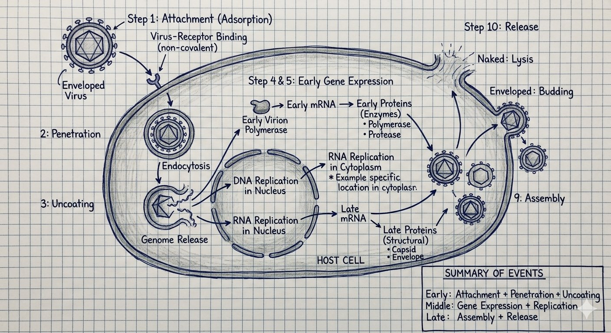

<i>SZMC · 2nd Term</i>
# Virology
## Viral Replication & Cytopathic Effects

Question (with hint) → Full English Answer → Cross questions (Bangla Q/A) → Viva explanation (Bangla script)
<b>🔴 Virology</b><b>8 questions</b>
🏠 Index‹ PrevNext ›
## 🧫 Viral Replication & Cytopathic Effects
<i>Replication steps, release mechanisms, early/late proteins, sites of replication, CPE</i>
> <b>V23</b> Write down the steps of viral replications. ********
> <b>📌 Hint:</b> Attachment → Penetration → Uncoating → Early transcription → Early translation → Genome replication → Late transcription → Late translation → Assembly → Release
✅ Answer
- Attachment (Adsorption) – viral ligand binds to host cell receptor (non-covalent).
- Penetration – by endocytosis / pinocytotic vesicle.
- Uncoating – capsid removed, genome released into cell. Naked virus: vesicle ruptures. Enveloped virus: fusion with vesicle membrane.
- Early Transcription – early mRNA synthesis. DNA virus: host DNA-dependent RNA polymerase. (+) RNA virus: genome acts as mRNA. (–) RNA virus: virion RNA polymerase.
- Early Translation – early proteins = enzymes (polymerase, protease).
- Genome Replication – DNA: nucleus (except Pox in cytoplasm). RNA: cytoplasm (except Orthomyxo/Retro/Delta in nucleus).
- Late Transcription – late mRNA synthesis.
- Late Translation – late proteins = structural (capsid, envelope).
- Assembly – genome + structural proteins → progeny virions.
- Release – Naked: lysis. Enveloped: budding (Herpes→nuclear membrane; Corona→ER).
<b>Summary:</b> Early events = attachment + penetration + uncoating. Middle = gene expression + replication. Late = assembly + release.
 
❓ Cross questions (from additional)
Viral replication-এর ধাপগুলো কী কী?
Attachment → Penetration → Uncoating → Early transcription → Early translation → Genome replication → Late transcription → Late translation → Assembly → Release।
Attachment কীভাবে হয়?
Viral ligand non-covalently host cell receptor-এ bind করে। এটি tropism নির্ধারণ করে।
Eclipse period আর latent period-র পার্থক্য কী?
Eclipse: entry থেকে new virion তৈরি হওয়া পর্যন্ত। Latent: infection থেকে extracellular virus appearance পর্যন্ত।
Release-এ naked আর enveloped virus-র পার্থক্য কী?
Naked virus cell lysis দিয়ে বের হয় — cell destroyed। Enveloped virus budding দিয়ে বের হয় — cell প্রাথমিকভাবে survive করতে পারে।
🗣️ ভাইভায় যেভাবে বুঝাব (বাংলা লিপি)
Replication-এ first attachment — virus-র ligand host receptor-এ bind করে। তারপর penetration, uncoating। Early transcription-এ mRNA, early translation-এ enzyme বানায়। Genome replicate হয়। Late mRNA আর structural protein তৈরি হয়। Assembly, then release — naked cell lysis করে, enveloped budding দিয়ে বের হয়।
Attachment-ই virus-র tropism determine করে। Naked virus-এ capsid directly receptor-এ bind করে। Enveloped virus-এ spike protein bind করে।
Early proteins enzymes (polymerase, protease) — replication-এ লাগে। Late proteins structural (capsid, envelope) — virion-এ যায়।
> <b>V24</b> How virus release after replication? ******* (enveloped virus: budding process, naked virus: lysis of the cells)
> <b>📌 Hint:</b> Naked: lysis/rupture. Enveloped: budding through cell membrane (Herpes→nuclear, Corona→ER)
✅ Answer
- Naked virus: Released by lysis/rupture of cell membrane — cell destroyed.
- Enveloped virus: Released by budding through outer cell membrane — nucleocapsid pushes through, acquires lipid envelope with glycoproteins. Cell may survive initially.
- Exceptions: Herpes virus → buds through nuclear membrane. Coronavirus → buds through endoplasmic reticulum.
❓ Cross questions (from additional)
Naked virus কীভাবে release হয়?
Cell membrane lysis/rupture দিয়ে — cell destroyed হয়।
Enveloped virus কীভাবে release হয়?
Budding দিয়ে — nucleocapsid membrane দিয়ে push করে, lipid envelope নিয়ে নেয়।
Herpes virus budding কোথা থেকে করে?
Nuclear membrane থেকে। Coronavirus budding করে endoplasmic reticulum থেকে।
🗣️ ভাইভায় যেভাবে বুঝাব (বাংলা লিপি)
Naked virus cell membrane rupture করে বের হয় — lysis দিয়ে। Enveloped virus budding দিয়ে বের হয় — nucleocapsid membrane-এর দিয়ে push করে, lipid envelope নিয়ে নেয়।
Herpes virus nuclear membrane থেকে, Coronavirus endoplasmic reticulum থেকে budding করে।
Budding-এর আগে viral antigen cell membrane-এর surface-এ appear করে।
> <b>V25</b> What do you mean by early protein and late protein? ******* (early protein are enzymes need for replication: before replication & late protein are structural protein: after replication)
> <b>📌 Hint:</b> Early = enzymes (replicase, protease), before genome replication. Late = structural (capsid, envelope), after replication.
✅ Answer
- Early proteins – expressed before genome replication. They are enzymes: DNA/RNA polymerase (replicase), proteases.
- Late proteins – expressed after genome replication. They are structural proteins: capsid, envelope proteins, peplomers.
<b>Sequence:</b> Early transcription → Early translation → Early proteins (enzymes) → Genome replication → Late transcription → Late translation → Late proteins (structural).
❓ Cross questions (from additional)
Early protein আর late protein-এর পার্থক্য কী?
Early protein genome replication-র আগে তৈরি হয় — এরা enzymes (polymerase, protease)। Late protein replication-র পরে তৈরি হয় — structural proteins (capsid, envelope)।
Sequence কেমন হয়?
Early transcription → Early translation → Early proteins → Genome replication → Late transcription → Late translation → Late proteins → Assembly।
Polyprotein কীভাবে কাজ করে?
কিছু virus-এ বড় polypeptide translate হয়, তারপর viral protease দিয়ে ছোট ছোট protein-এ ভাগ হয়। যেমন Poliovirus polyprotein।
🗣️ ভাইভায় যেভাবে বুঝাব (বাংলা লিপি)
Early protein genome replicate হবার আগে তৈরি হয় — এটা enzyme, replication-এ লাগবে (polymerase, protease)। Late protein replicate-র পরে তৈরি হয় — structural protein (capsid, envelope)।
Sequence — Early transcription → enzyme → genome replicate → late transcription → structure → assembly।
Some late proteins large polypeptide-র মতো translate হয়, viral protease দিয়ে ভাগ করতে হয়।
> <b>V26</b> Mention the sites of replication of DNA virus. ***** (nucleus, except pox virus in cytoplasm)
> <b>📌 Hint:</b> All DNA viruses replicate in nucleus (except Poxvirus in cytoplasm using own RNA polymerase)
✅ Answer
<b>All DNA viruses replicate in the nucleus</b> (using host cell DNA-dependent RNA polymerase), <b>except Poxvirus, which replicates in the cytoplasm</b> (uses its own DNA-dependent RNA polymerase).
cytoplasm = RNA virus - Retro/Orthomyxo/Delta + DNA (Pox)
Nucleus = All DNA + Retro/Orthomyxo/Delta - DNA (Pox)
 
❓ Cross questions (from additional)
DNA virus কোথায় replicate করে?
সব DNA virus nucleus-এ — Poxvirus ছাড়া। Poxvirus cytoplasm-এ replicate করে।
Poxvirus কেন cytoplasm-এ replicate করে?
কারণ Poxvirus নিজের DNA-dependent RNA polymerase বহন করে, host cell nuclear machinery-র প্রয়োজন নেই।
Herpes virus nuclear membrane থেকে envelope নেয় — এর মানে কী?
এর মানে Herpes virus nucleus-এ replicate করে।
HBV replicate কোথায়?
Nucleus-এ, কিন্তু নিজের reverse transcriptase আছে।
🗣️ ভাইভায় যেভাবে বুঝাব (বাংলা লিপি)
সব DNA virus nucleus-এ replicate করে — host cell-র DNA-dependent RNA polymerase ব্যবহার করে। Exception Poxvirus — cytoplasm-এ করে, নিজের RNA polymerase আছে।
Herpes virus nuclear membrane থেকে envelope নেয়। HBV nucleus-এ করে কিন্তু নিজের reverse transcriptase আছে।
Poxvirus সবচেয়ে complex virus — own polymerase আছে, cytoplasm-এ replicate করে।
> <b>V27</b> Mention the sites of replication of RNA virus. ***** (in cytoplasm except orthomyxo, retro and deltavirus)
> <b>📌 Hint:</b> All RNA viruses in cytoplasm EXCEPT Orthomyxovirus, Retrovirus, Deltavirus → nucleus
✅ Answer
<b>Most RNA viruses replicate in cytoplasm</b>. Three exceptions replicate in <b>nucleus</b>:
- Orthomyxovirus (Influenza)
- Retrovirus (HIV, HTLV)
- Deltavirus (HDV)
<b>Key rules:</b>
- (+) sense RNA: genome acts as mRNA directly (except Retrovirus which uses RT).
- (–) sense RNA and dsRNA (Reovirus): carry own virion RNA polymerase (host cannot transcribe).
- Reovirus = Rota virus
❓ Cross questions (from additional)
RNA virus কোথায় replicate করে?
Mostly cytoplasm। Exception: Orthomyxovirus (Influenza), Retrovirus (HIV), Deltavirus (HDV) — এরা nucleus-এ।
(+) sense RNA আর (-) sense RNA-র পার্থক্য কী?
(+) sense RNA directly mRNA-র মতো, host ribosome translate করতে পারে। (-) sense RNA mRNA-র complementary, প্রথমে virion RNA polymerase লাগে।
Rotavirus dsRNA — এর মানে কী?
Rotavirus-এর genome double-stranded RNA, 10-11 segments — সব RNA virus-এর মধ্যে শুধু Rotavirus-এর dsRNA।
🗣️ ভাইভায় যেভাবে বুঝাব (বাংলা লিপি)
সব RNA virus cytoplasm-এ replicate করে — exception Influenza, HIV, HDV — এই তিনটি nucleus-এ।
(+) sense RNA directly mRNA-র মতো। (-) sense RNA নিজের polymerase নিয়ে আসে, host-র kono enzyme (-) RNA-কে mRNA-তে convert করতে পারে না।
Segmented RNA: Orthomyxovirus (8 segments), Arenavirus (2), Bunyavirus (3), Reovirus (10-11)।
> <b>V28</b> What are the changes occur in virus infected host cell? ****** (no apparent change and CPE such as lysis, malignant transformation, inclusion body formation, multinucleated giant cell formation etc)
> <b>📌 Hint:</b> No change OR CPE: rounding, lysis, giant cells, malignant transformation, inclusion bodies
✅ Answer
- 1. No apparent change – some infections subclinical.
- 2. CPE (Cytopathic Effect):
  - Rounding and darkening of cell
  - Cell death or lysis
  - Multinucleated giant cell formation (herpesviruses, paramyxoviruses)
<b>paramyxovirus = </b>Measles virus,Mumps virus,parainfluenza viruses (PIV),Respiratory syncytial virus (RSV),Nipah virus
 
  - Malignant transformation (HPV, EBV, HBV)
  - Inclusion body formation (Rabies-Negri; CMV-owl's eye; HSV/Measles)
 
❓ Cross questions (from additional)
Virus-infected cell-এ কী কী change হতে পারে?
দুই ধরনের — (১) No apparent change (subclinical), (২) CPE (Cytopathic Effect) — rounding, lysis, giant cell, malignant transformation, inclusion body।
CPE-র উদাহরণ দাও।
Cell rounding, lysis, multinucleated giant cell (Herpes, Paramyxovirus), malignant transformation (HPV, EBV, HBV), inclusion body (Rabies-Negri, CMV-owl's eye)।
Giant cell কোন virus-এ দেখা যায়?
Herpesviruses ও Paramyxoviruses। Tzanck preparation-এ দেখা যায়।
Inclusion body-র কোনগুলো intracytoplasmic আর কোনগুলো intranuclear?
Intracytoplasmic: Rabies (Negri body), Smallpox (Guarneri)। Intranuclear: CMV (owl's eye), HSV (Cowdry A), Polio/Adeno (Cowdry B)। Both: Measles।
🗣️ ভাইভায় যেভাবে বুঝাব (বাংলা লিপি)
Virus infected cell-এ kono change নাও থাকতে পারে, CPE-ও হতে পারে। CPE-তে cell rounding, lysis, giant cell, malignant transformation, inclusion body — সব দেখা যায়।
Giant cell Herpes আর Paramyxovirus-এ characteristic। Inclusion body lab diagnosis-এ সাহায্য করে — Negri body (Rabies), owl's eye (CMV), Cowdry A (HSV)।
CPE হলো viral infection-র hallmark। Plaque assay method-এ virus quantify করা হয়।
> <b>V29</b> What do you mean by CPE? *** (cytopathic effects – changes in virus infected host cell)
> <b>📌 Hint:</b> CPE = Cytopathic Effects = morphological/functional changes in infected cells. Hallmark of viral infection. Used for detection and quantification.
✅ Answer
<b>CPE (Cytopathic Effects)</b> = morphological and functional changes in virus-infected host cells. Hallmark of viral infection, visible by light microscope.
<b>Importance:</b>
- Detection of virus — based on CPE appearance in cell culture.
- Quantification — basis of plaque assay (single plaque = one infectious virion).
Types: rounding, lysis, giant cells, inclusion bodies, malignant transformation.
❓ Cross questions (from additional)
CPE কী?
Cytopathic Effects — virus-infected host cell-এ morphological ও functional changes। Viral infection-র hallmark।
CPE-র clinical importance কী?
দুইটি — (১) Virus detect করা CPE-র ভিত্তিতে, (২) Plaque assay-এ virus quantify করা।
Light microscope-এ virus দেখা যায় কি?
না, virus directly দেখা যায় না। কিন্তু culture-এ CPE detect করা যায়।
🗣️ ভাইভায় যেভাবে বুঝাব (বাংলা লিপি)
CPE মানে Cytopathic Effect — virus-infected cell-এ morphological ও functional changes। এটি viral infection-র hallmark।
Light microscope-এ culture-এ CPE দেখে virus detect করা যায়। Plaque assay method-এ virus quantify করা হয়।
Giant cell, inclusion body, lysis — সব CPE।
> <b>V30</b> What do you mean by infectious nucleic acid? (if only the genome of RNA enter a host and can replicate, then it called infectious nucleic acid)
> <b>📌 Hint:</b> Purified viral DNA/RNA without protein that can replicate. No virion polymerase needed. ssRNA(+) except retro; all DNA except Pox and HBV.
✅ Answer
<b>Infectious nucleic acid</b> = purified viral DNA or RNA (without protein) that can carry out the entire replication cycle and produce complete virus particles.
<b>Can produce infectious nucleic acid:</b>
- All (+) sense ssRNA virus (except Retrovirus)
- All DNA virus (except Poxvirus and HBV)
<b>Cannot (require virion polymerase):</b> Poxvirus, HBV, all (–) RNA, Retrovirus, dsRNA (Reovirus).
❓ Cross questions (from additional)
Infectious nucleic acid কী?
Purified viral DNA বা RNA (protein ছাড়া) যেটা পুরো replication cycle carry out করতে পারে এবং complete virus particle produce করতে পারে।
কোন virus infectious nucleic acid তৈরি করতে পারে?
(+) sense ssRNA virus (Retrovirus ছাড়া) আর DNA virus (Poxvirus ও HBV ছাড়া)।
কোন virus করতে পারে না?
Poxvirus, HBV, (-) RNA virus, Retrovirus, dsRNA (Reovirus) — এদের virion polymerase লাগে।
🗣️ ভাইভায় যেভাবে বুঝাব (বাংলা লিপি)
Infectious nucleic acid মানে virus-র শুধু genome host cell-এ enter করে আর replicate করতে পারে — capsid না লাগিয়ে।
(+) sense RNA directly mRNA-র মতো, তাই host polymerase দিয়েই কাজ শুরু করে। (-) sense RNA আর Retrovirus-র নিজের polymerase লাগে, তাই infectious nucleic acid কাজ করে না।
Poxvirus-র নিজের polymerase আছে কিন্তু purified DNA virion-এ packaged না হলে replication শুরু করতে পারে না।
Dr. Roni · Assistant Professor & Head, Microbiology, SZMC, Bogura · SZMC 2nd Term Comprehensive Notes — split topic-wise