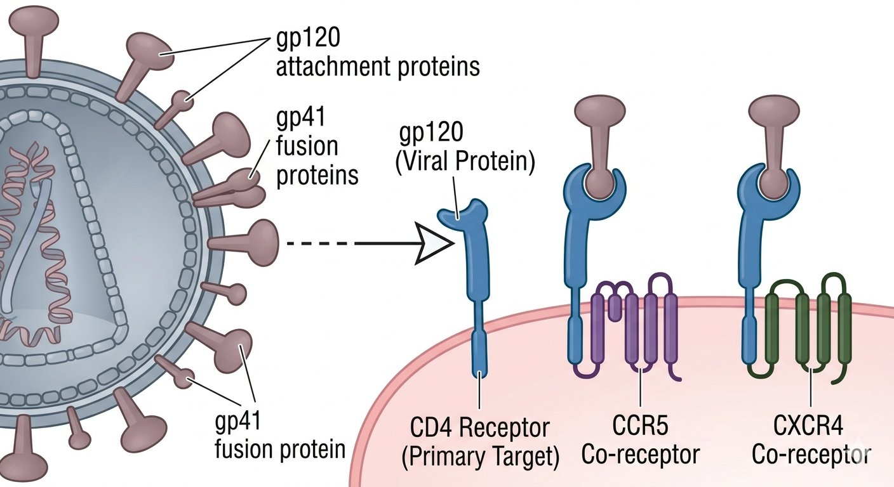
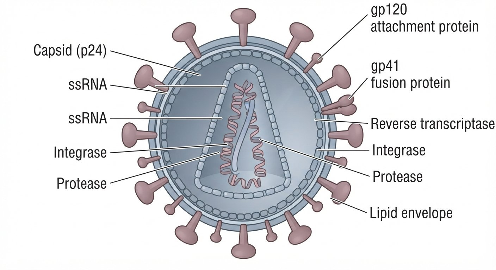

<i>SZMC · 2nd Term</i>
# Virology
## Rotavirus, HIV/AIDS & STDs

Question (with hint) → Full English Answer → Cross questions (Bangla Q/A) → Viva explanation (Bangla script)
<b>🔴 Virology</b><b>14 questions</b>
🏠 Index‹ PrevNext ›
## 🧫 Rotavirus, HIV/AIDS & STDs
<i>Rotavirus, HIV morphology/pathogenesis/diagnosis/treatment, vertical transmission, STDs, syphilis vs gonorrhea</i>
> <b>V111</b> Write a short note on Rotavirus and its significance. *
> <b>📌 Hint:</b> Most common cause of infantile diarrhea; wheel-like appearance
✅ Answer
<b>Rotavirus</b> — family <b>Reoviridae</b>. Non-enveloped, dsRNA virus with 11 segments. Named "rota" (Latin for wheel) due to wheel-like appearance on electron microscopy.
<b>Significance:</b>
- Most common cause of severe infantile diarrhea worldwide (especially in children aged 6 months to 2 years).
- Responsible for ~40% of hospitalizations due to diarrhea in children.
- Estimated 128,000-215,000 deaths annually in children under 5 years, mostly in developing countries.
<b>Key features:</b>
- Transmission: Fecal-oral route; contaminated water, fomites.
- Pathogenesis: Virus infects enterocytes of small intestine → destruction of villi → malabsorption → watery diarrhea (non-bloody).
- Clinical features: Acute watery diarrhea, vomiting, fever, dehydration. Incubation period: 1-3 days. Duration: 3-7 days.
- Diagnosis: Stool ELISA for rotavirus antigen.
- Prevention: Live oral vaccines — RotaTeq (3 doses), Rotarix (2 doses). Part of EPI in many countries.
- Treatment: ORS (Oral Rehydration Solution), zinc supplementation. No specific antiviral.
❓ Cross questions (from additional)
কোন গ্রুপের রোটাভাইরাস শিশুদের গুরুতর ডায়রিয়ার কারণ?
Group A rotavirus — ৬ মাস থেকে ২ বছরের শিশুদের সবচেয়ে সাধারণ গুরুতর ডায়রিয়া।
রোটাভাইরাস fecal shedding কতদিন থাকে?
লক্ষণ শেষ হওয়ার পরও দিন থেকে সপ্তাহ ধরে মলে ভাইরাস নিঃসৃত হতে থাকে।
রোটাভাইরাস ভ্যাকসিনের প্রভাব কী?
উচ্চ কভারেজের দেশে হাসপাতাল-ভর্তি ও মৃত্যু নাটকীয়ভাবে কমেছে।
রোটাভাইরাস কি প্রাণীতে ডায়রিয়া করে?
হ্যাঁ — প্রাণীতেও ঘটে; zoonotic সম্ভাবনা আছে।
🗣️ ভাইভায় যেভাবে বুঝাব (বাংলা লিপি)
ভাইভায় বলবে — <b>Rotavirus</b> — Reoviridae পরিবার; non-enveloped, dsRNA ভাইরাস, ১১ সেগমেন্ট। ইলেকট্রন মাইক্রোস্কোপিতে চাকার (wheel) মতো দেখা যায় বলে নাম "রোটা" (লাতিন: রোট = চাকা)।
<b>গুরুত্ব:</b> বিশ্বব্যাপী <b>শিশুদের গুরুতর ডায়রিয়ার সবচেয়ে সাধারণ কারণ</b> (৬ মাস-২ বছর); শিশু ডায়রিয়া-জনিত হাসপাতাল-ভর্তির ~৪০%; ৫ বছরের নিচে বার্ষিক আনুমানিক ১,২৮,০০০–২,১৫,০০০ মৃত্যু — প্রধানত উন্নয়নশীল দেশে।
<b>মূল বৈশিষ্ট্য:</b> fecal-oral সংক্রমণ (দূষিত পানি, fomites); ক্ষুদ্রান্ত্রের enterocyte সংক্রমণ → ভিলাস ধ্বংস → malabsorption → জলীয় (রক্তহীন) ডায়রিয়া। লক্ষণ: তীব্র জলীয় ডায়রিয়া, বমি, জ্বর, পানিশূন্যতা; incubation ১-৩ দিন; স্থিতি ৩-৭ দিন। ডায়াগনোসিস: মলের ELISA (রোটাভাইরাস অ্যান্টিজেন)। প্রতিরোধ: live oral ভ্যাকসিন — RotaTeq (৩ ডোজ), Rotarix (২ ডোজ); অনেক দেশে EPI-র অংশ। চিকিৎসা: ORS, জিঙ্ক; নির্দিষ্ট অ্যান্টিভাইরাল নেই।
> <b>V112</b> Write a short note on HIV. *
> <b>📌 Hint:</b> Retrovirus, ssRNA, CD4+ T cells, gp120/gp41, reverse transcriptase
✅ Answer
<b>Human Immunodeficiency Virus (HIV)</b> — family <b>Retroviridae</b>, genus <b>Lentivirus</b>. Enveloped, ssRNA (+) virus with two copies of RNA.
<b>Structure:</b>
- Envelope glycoproteins: gp120 (surface, binds CD4 receptor) and gp41 (transmembrane, mediates fusion).
- Matrix protein: p17.
- Capsid: p24 (most abundant structural protein — basis of antigen detection).
- Enzymes: Reverse transcriptase (RNA → DNA), Integrase, Protease.
- Two types: HIV-1 (most common worldwide), HIV-2 (mainly West Africa, less virulent).
<b>Pathogenesis:</b>
- gp120 binds CD4 receptor + CCR5/CXCR4 co-receptor on T-helper cells, macrophages, dendritic cells.
- Reverse transcriptase converts viral RNA → DNA → integrates into host genome (provirus) via integrase.
- Progressive depletion of CD4+ T cells → immunodeficiency → opportunistic infections, malignancies.
❓ Cross questions (from additional)
HIV-র উচ্চ মিউটেশন হারের প্রভাব কী?
Antigenic variation — তাই ভ্যাকসিন তৈরি অত্যন্ত কঠিন।
HIV-র প্রধান সংক্রমণ রুট কী?
যৌন যোগাযোগ (সবচেয়ে সাধারণ); রক্ত/রক্তপণ্য, মা-থেকে-সন্তান (vertical), সুই-স্টিক।
সুই-স্টিকে HIV সংক্রমণের সম্ভাবনা কত?
০.৩% (HBV ৩০%, HCV ৩% এর তুলনায় কম)।
ক্লিনিক্যাল স্পেকট্রাম কী?
তীব্র সংক্রমণ → Clinical latency (CD4 কমতে থাকে) → AIDS (CD4 <200/μl)।
🗣️ ভাইভায় যেভাবে বুঝাব (বাংলা লিপি)
ভাইভায় বলবে — <b>HIV (Human Immunodeficiency Virus)</b> — Retroviridae পরিবার, genus Lentivirus; enveloped, ssRNA(+) ভাইরাস, RNA-র দুটি কপি থাকে।
<b>গঠন:</b> envelope গ্লাইকোপ্রোটিন gp120 (CD4 receptor-এ বাঁধা) ও gp41 (fusion); matrix p17; capsid p24 (সবচেয়ে প্রচুর কাঠামো-প্রোটিন — অ্যান্টিজেন শনাক্তকরণের ভিত্তি); এনজাইম reverse transcriptase, integrase, protease। দুই ধরন — HIV-1 (বিশ্বব্যাপী) ও HIV-2 (পশ্চিম আফ্রিকা, কম virulent)।
<b>প্যাথোজেনেসিস:</b> gp120 CD4 receptor + CCR5/CXCR4 co-receptor-এ বাঁধে (T-helper কোষ, ম্যাক্রোফেজ, dendritic কোষ); reverse transcriptase RNA → DNA; integrase দিয়ে host genome-এ প্রোভাইরাস হিসেবে সংযোজন; CD4+ T কোষ ধীরে ধীরে কমে → immunodeficiency → সুবিধাবাদী সংক্রমণ ও ক্যান্সার।
মনে রাখো — সুই-স্টিকে ০.৩% ঝুঁকি, এবং উচ্চ মিউটেশন হারে ভ্যাকসিন কঠিন।
> <b>V113</b> What is the morphology of HIV? *
> <b>📌 Hint:</b> icosahedral capsid, two copies of ssRNA, reverse transcriptase, integrase, protease
✅ Answer
<b>Morphology of HIV:</b>
- Size: 100-120 nm diameter.
- Shape: Spherical, enveloped.
- Envelope: Lipid bilayer derived from host cell membrane, studded with gp120 (surface glycoprotein) and gp41 (transmembrane glycoprotein). gp120/gp41 spikes protrude from surface.
- Matrix: p17 matrix protein (underneath envelope).
- Capsid: Cone-shaped (bullet-shaped), made of p24 capsid protein. Contains viral RNA and enzymes.
- Genome: Two identical copies of positive-sense ssRNA (diploid). 9.7 kb, with 9 genes encoding 15 proteins.
- Enzymes within capsid:
  - Reverse transcriptase (RT) — RNA-dependent DNA polymerase + RNase H.
  - Integrase — integrates proviral DNA into host genome.
  - Protease — cleaves polyproteins during viral maturation.
❓ Cross questions (from additional)
p24 অ্যান্টিজেন কেন পরীক্ষার ভিত্তি?
কারণ p24 capsid-এর সবচেয়ে প্রচুর প্রোটিন — তাই p24 Ag ELISA দিয়ে অ্যান্টিজেন শনাক্ত করা যায়।
gp120 কী নির্ধারণ করে?
CD4 + CCR5 (ম্যাক্রোফেজে) বা CXCR4 (T কোষে) বাঁধাই cell tropism নির্ধারণ করে।
HIV maturation কীভাবে ঘটে?
Budding-এর পরে immature virion-এ protease পলিপ্রোটিন ভেঙে mature infectious virion তৈরি করে; protease inhibitor এই ধাপ আটকায়।
HIV-র জিনোম কত ও কয়টি জিন?
৯.৭ kb, ৯টি জিনে ১৫টি প্রোটিন; RNA-র দুটি অভিন্ন কপি (diploid)।
🗣️ ভাইভায় যেভাবে বুঝাব (বাংলা লিপি)
ভাইভায় বলবে — HIV-<b>এর রূপগঠন (মরফোলজি)</b>। আকার ১০০-১২০ nm; গোলাকার, enveloped। <b>Envelope:</b> host কোষের ঝিল্লি থেকে আসা লিপিড বাইলেয়ার, যাতে <b>gp120</b> (surface) ও <b>gp41</b> (transmembrane) স্পাইক থাকে। <b>Matrix:</b> p17 (envelope-র নিচে)। <b>Capsid:</b> cones-accliped bullet আকৃতির — <b>p24</b> capsid প্রোটিনে গঠিত; ভেতরে viral RNA ও এনজাইম। <b>জিনোম:</b> ssRNA(+)-এর দুটি অভিন্ন কপি (diploid), ৯.৭ kb, ৯ জিনে ১৫ প্রোটিন। <b>এনজাইম:</b> reverse transcriptase (RNA → DNA + RNase H), integrase (প্রোভাইরাল DNA host genome-এ), protease (maturation-এ polyprotein ভাঙে)।
মনে রাখো — p24 = abundance ক্যাপসিড প্রোটিন (antigen detection-এর ভিত্তি); gp120 binds CD4 + CCR5/CXCR4; protease inhibitor maturation ব্লক করে।
> <b>V114</b> What is the pathogenesis of HIV? *
> <b>📌 Hint:</b> CD4+ T cells, macrophages, gp120, reverse transcriptase, provirus, immunodeficiency
✅ Answer
<b>Pathogenesis of HIV:</b>
- Attachment: gp120 binds to CD4 receptor + CCR5/CXCR4 co-receptor on target cells (CD4+ T cells, macrophages, dendritic cells).
- Fusion: gp41 mediates fusion of viral envelope with host cell membrane.
- Reverse transcription: Viral reverse transcriptase (RT) converts viral ssRNA → double-stranded DNA.
- Integration: Viral integrase integrates the proviral DNA into the host cell genome.
- Replication: Host cell machinery transcribes and translates viral proteins → new virions assembled → budded from cell.
- Maturation: Protease cleaves polyproteins → mature infectious virion.
- CD4+ T cell depletion: Progressive loss of CD4+ T cells via direct cytolysis, syncytia formation, apoptosis, and immune-mediated destruction → immunodeficiency.
- Result: Opportunistic infections (PCP, toxoplasmosis, CMV, TB, candidiasis) and malignancies (Kaposi sarcoma, lymphoma) — AIDS.
 
❓ Cross questions (from additional)
তীব্র ধাপে কী হয়?
Massive viremia, CD4 দ্রুত কমে তারপর আংশিক ফিরে আসে।
ক্লিনিক্যাল ল্যাটেন্সি-তে CD4 কমে কত হারে?
চিকিৎসা ছাড়া প্রতি বছর ~৮০-১০০ কোষ/μl হারে।
AIDS কখন বলা হয়?
CD4 <200/μl অথবা AIDS-defining illness-এর উপস্থিতি।
ম্যাক্রোফেজ কেন reservoir?
ম্যাক্রোফেজ মারা না গিয়ে ভাইরাস বহন করতে পারে — তাই দীর্ঘমেয়াদি ভাইরাসের আধার হয়ে থাকে।
🗣️ ভাইভায় যেভাবে বুঝাব (বাংলা লিপি)
ভাইভায় বলবে — HIV-<b>এর প্যাথোজেনেসিস ধাপে ধাপে</b>।
<b>Attachment:</b> gp120 CD4 receptor + CCR5/CXCR4 co-receptor-এ বাঁধে (CD4+ T কোষ, ম্যাক্রোফেজ, dendritic কোষ)। <b>Fusion:</b> gp41 ভাইরাল envelope ও host কোষের ঝিল্লির সংযুক্তি ঘটায়। <b>Reverse transcription:</b> reverse transcriptase ssRNA → dsDNA। <b>Integration:</b> integrase প্রোভাইরাল DNA host genome-এ সংযোজন করে। <b>Replication:</b> host machinery নতুন virion গড়ে, কোষ থেকে budding হয়। <b>Maturation:</b> protease polyprotein ভেঙে mature infectious virion তৈরি। <b>CD4+ T কোষ ক্ষয়:</b> সরাসরি cytolysis, syncytia, apoptosis ও immune-মধ্যস্থ ধ্বংসে CD4+ T কোষ কমে → immunodeficiency। <b>ফলাফল:</b> সুবিধাবাদী সংক্রমণ (PCP, toxoplasmosis, CMV, TB, candidiasis) ও ক্যান্সার (Kaposi sarcoma, lymphoma) — AIDS।
মনে রাখো — <b>AIDS = CD4 <200/μl</b>; ম্যাক্রোফেজ ভাইরাসের reservoir (মরে না)।
> <b>V115</b> Mention the opportunistic infections and malignancies of HIV patients. *
> <b>📌 Hint:</b> PCP, Toxoplasma, Cryptococcus, Candida, Kaposi sarcoma, CMV
✅ Answer
<b>Opportunistic infections in HIV/AIDS (when CD4 <200/μl):</b>
- Pneumocystis jirovecii pneumonia (PCP) — most common opportunistic infection; CD4 <200.
- Toxoplasma gondii — encephalitis (ring-enhancing lesions on CT/MRI).
- Cryptococcus neoformans — meningitis (India ink positive).
- Candida — oral thrush, esophageal candidiasis.
- CMV (Cytomegalovirus) — retinitis, esophagitis, colitis.
- Mycobacterium tuberculosis — pulmonary and extrapulmonary TB.
- Mycobacterium avium complex (MAC) — disseminated infection (CD4 <50).
- Herpes zoster — multidermatomal, severe.
- Progressive multifocal leukoencephalopathy (PML) — JC virus.
<b>AIDS-defining malignancies:</b>
- Kaposi sarcoma — HHV-8 (KSHV); violaceous skin lesions.
- Non-Hodgkin lymphoma (including primary CNS lymphoma).
- Invasive cervical carcinoma — HPV-associated.
❓ Cross questions (from additional)
AIDS রোগীর মৃত্যুর সবচেয়ে সাধারণ কারণ কোন সুবিধাবাদী সংক্রমণ?
PCP (Pneumocystis jirovecii pneumonia) — TMP-SMX (co-trimoxazole) দিয়ে চিকিৎসা।
Oral hairy leukoplakia কী?
EBV-সম্পর্কিত — জিভের পার্শ্বীয় পৃষ্ঠে সাদা ফলক, ব্যথাহীন।
HIV wasting syndrome কী?
ওজন হ্রাস >১০% + ১ মাসের বেশি দীর্ঘস্থায়ী ডায়রিয়া বা জ্বর।
HIV-সম্পর্কিত dementia কী?
ধীরে বাড়া জ্ঞানীয় হ্রাস, মোটর ব্যাঘাত ও আচরণগত পরিবর্তন।
🗣️ ভাইভায় যেভাবে বুঝাব (বাংলা লিপি)
ভাইভায় বলবে — <b>HIV/AIDS-এ সুবিধাবাদী সংক্রমণ</b> (CD4 <200/μl): <b>PCP</b> (সবচেয়ে সাধারণ; CD4 <200), <b>Toxoplasma gondii</b> (এনসেফালাইটিস — CT/MRI-তে ring-enhancing), <b>Cryptococcus neoformans</b> (মেনিনজাইটিস — India ink পজিটিভ), <b>Candida</b> (oral thrush, esophageal candidiasis), <b>CMV</b> (retinitis, esophagitis, colitis), <b>Mycobacterium tuberculosis</b> (pulmonary/extrapulmonary), <b>MAC</b> (disseminated; CD4 <50), <b>Herpes zoster</b> (multidermatomal, গুরুতর), <b>PML</b> (JC virus)।
<b>AIDS-defining malignancy:</b> <b>Kaposi sarcoma</b> (HHV-8/KSHV — বেগুনি ত্বক-ক্ষত), <b>Non-Hodgkin lymphoma</b> (primary CNS lymphoma সহ), <b>Invasive cervical carcinoma</b> (HPV)।
এক লাইনে — "CD4 <200 → OI (PCP, toxo, crypto, candida, CMV, TB); malignancy — Kaposi, NHL, cervical।"
> <b>V116</b> How do you diagnose HIV? *
> <b>📌 Hint:</b> ELISA (screening), Western blot (confirmatory), CD4 count, viral load
✅ Answer
<b>Diagnosis of HIV:</b>
- Screening test: ELISA (Enzyme-Linked Immunosorbent Assay) — detects anti-HIV antibodies (IgG/IgM) in serum. High sensitivity, but may give false positives. Window period: 25 days to 1 month.
- Confirmatory test: Western Blot — detects antibodies against specific HIV proteins (p24, gp41, gp120, gp160). More specific than ELISA.
- Alternative screening: Rapid tests, combination antigen-antibody tests (4th generation — detects both p24 Ag and anti-HIV Ab, reducing window period).
- CD4 count: Measures CD4+ T cell count — monitors disease progression and treatment response. Normal: 500-1500/μl. AIDS: <200/μl.
- Viral load (HIV RNA PCR): Quantitative RT-PCR — measures viral RNA copies in blood. Used to monitor ART efficacy. Undetectable = <50 copies/ml.
❓ Cross questions (from additional)
উইন্ডো পিরিয়ডে কী দিয়ে HIV শনাক্ত?
P24 অ্যান্টিজেন — অ্যান্টিবডি আসার আগেই ধরা পড়ে।
NAT কতদিনে HIV RNA ধরতে পারে?
সংক্রমণের ১০-১৪ দিনের মধ্যে।
Western blot কখন পজিটিভ?
p24, gp41, gp120/160 — এই ৩টি ব্যান্ডের মধ্যে কমপক্ষে ২টি থাকলে; indeterminate হলে ৪-৬ সপ্তাহ পরে পুনরায়।
ভাইরাল লোড undetectable মানে কী?
<50 copies/ml — ART-র কার্যকারিতা নির্দেশ করে।
🗣️ ভাইভায় যেভাবে বুঝাব (বাংলা লিপি)
ভাইভায় বলবে — HIV-<b>এর ডায়াগনোসিস</b>।
<b>স্ক্রিনিং:</b> <b>ELISA</b> — সিরামে anti-HIV অ্যান্টিবডি (IgG/IgM) শনাক্ত করে; উচ্চ সংবেদনশীলতা কিন্তু মিথ্যা-পজিটিভ সম্ভব; উইন্ডো ২৫ দিন-১ মাস। <b>কনফার্মেটরি:</b> <b>Western blot</b> — নির্দিষ্ট HIV প্রোটিনের (p24, gp41, gp120, gp160) অ্যান্টিবডি শনাক্ত করে; ELISA-র চেয়ে নির্দিষ্ট। <b>বিকল্প স্ক্রিনিং:</b> rapid test, চতুর্থ-প্রজন্মের combination Ag-Ab (P24 Ag ও anti-HIV Ab দুটোই) — উইন্ডো পিরিয়ড কমায়।
<b>CD4 count:</b> রোগের অগ্রগতি ও চিকিৎসার ফলাফল পর্যবেক্ষণ; স্বাভাবিক ৫০০-১৫০০/μl; AIDS <200/μl। <b>Viral load (HIV RNA PCR):</b> quantitative RT-PCR — ART ফলাফল পর্যবেক্ষণ; undetectable = <50 copies/ml।
এক লাইনে — "ELISA স্ক্রিনিং → Western blot কনফার্ম → CD4 + viral load মনিটরিং।"
> <b>V117</b> What are the stages of HIV infection? *
> <b>📌 Hint:</b> Acute HIV syndrome → Clinical latency → AIDS
✅ Answer
<b>Stages of HIV infection:</b>
- Stage 1: Acute HIV Infection (Primary Infection):
  - Occurs 2-4 weeks after exposure.
  - High-level viremia (up to 10⁶ copies/ml), sharp CD4 drop.
  - Flu-like illness: fever, rash, lymphadenopathy, pharyngitis, myalgia, headache.
  - Highly infectious during this stage.
- Stage 2: Clinical Latency (Chronic HIV Infection):
  - Asymptomatic or minimal symptoms.
  - Gradual CD4 decline (80-100 cells/μl per year without treatment).
  - Viral load lower but persistent.
  - Without treatment: lasts 8-10 years on average.
- Stage 3: AIDS (Acquired Immunodeficiency Syndrome):
  - CD4 <200/μl OR presence of AIDS-defining illness.
  - Opportunistic infections (PCP, toxoplasmosis, candidiasis, CMV, TB).
  - Malignancies (Kaposi sarcoma, NHL, cervical carcinoma).
  - Without treatment: median survival 2-3 years.
❓ Cross questions (from additional)
CDC শ্রেণিবিভাগ অনুযায়ী CD4 দিয়ে স্টেজ?
>500 = Stage 1; 200-499 = Stage 2; <200 = Stage 3 (AIDS)।
ART চললে ল্যাটেন্সি কতদিন থাকতে পারে?
দশকেও AIDS-এ যাওয়া নাও হতে পারে — ART দীর্ঘদিন ক্লিনিক্যাল ল্যাটেন্সিতে রাখে।
চিকিৎসা ছাড়া কত শতাংশ ১০ বছরে AIDS-এ যায়?
~৫০% সংক্রমণের ১০ বছরের মধ্যে।
তীব্র ধাপে কি অত্যন্ত সংক্রামক?
হ্যাঁ — এই ধাপে উচ্চ viremia, তাই অত্যন্ত সংক্রামক।
🗣️ ভাইভায় যেভাবে বুঝাব (বাংলা লিপি)
ভাইভায় বলবে — HIV সংক্রমণের ৩টি ধাপ।
<b>ধাপ ১: তীব্র HIV সংক্রমণ</b> — এক্সপোজারের ২-৪ সপ্তাহে; উচ্চ viremia (১০⁶ copies/ml পর্যন্ত), CD4 দ্রুত কমে; flu-সদৃশ (জ্বর, rash, lymphadenopathy, গলা ব্যথা, myalgia, মাথাব্যথা); এই ধাপে অত্যন্ত সংক্রামক।
<b>ধাপ ২: Clinical latency</b> — উপসর্গহীন বা ন্যূনতম; CD4 ধীরে কমতে থাকে (চিকিৎসা ছাড়া প্রতি বছর ৮০-১০০ কোষ/μl); viral load নিচু কিন্তু স্থির; চিকিৎসা ছাড়া গড় ৮-১০ বছর।
<b>ধাপ ৩: AIDS</b> — CD4 <200/μl বা AIDS-defining illness; সুবিধাবাদী সংক্রমণ (PCP, toxoplasmosis, candidiasis, CMV, TB); ক্যান্সার (Kaposi, NHL, cervical); চিকিৎসা ছাড়া মধ্যমা বেঁচে থাকা ২-৩ বছর।
এক লাইনে — "তীব্র (viremia) → ল্যাটেন্সি (CD4 ক্ষয়) → AIDS (CD4 <200)।"
> <b>V118</b> How will you prevent HIV? *
> <b>📌 Hint:</b> Safe sex, avoid shared needles, blood screening, PEP
✅ Answer
<b>Prevention of HIV:</b>
- Safe sexual practices: Use condoms consistently, reduce number of sexual partners.
- Avoid shared needles/syringes: Important for IV drug users and healthcare workers.
- Blood screening: All donated blood must be screened for HIV (ELISA) before transfusion.
- Healthcare precautions: Universal precautions — gloves, sharps disposal, hand hygiene.
- Prevention of mother-to-child transmission (PMTCT): Antiretroviral therapy during pregnancy and delivery; Cesarean section if viral load is high; avoid breastfeeding (in developed countries); formula feeding (in developing countries when safe).
- Post-exposure prophylaxis (PEP): Within 72 hours of exposure (needle-stick injury, sexual assault): 3-drug ART regimen (e.g., TDF + 3TC + DTG) for 28 days.
- Pre-exposure prophylaxis (PrEP): TDF/FTC daily for high-risk individuals (e.g., serodiscordant couples).
- Health education and awareness.
❓ Cross questions (from additional)
সুই-স্টিক-এ HIV-র সংক্রমণ সম্ভাবনা কত?
০.৩% — HBV ৩০% ও HCV ৩% এর তুলনায় অনেক কম।
U=U মানে কী?
Undetectable = Untransmittable — ART-এ viral load undetectable থাকলে যৌন সংক্রমণ হয় না।
HIV-র ভ্যাকসিন নেই কেন?
উচ্চ মিউটেশন হার ও antigenic variation-এর কারণে।
PEP-এর সময়সীমা কী?
এক্সপোজারের ৭২ ঘণ্টার মধ্যে — ৩-ওষুধ ART (যেমন TDF + 3TC + DTG) ২৮ দিন।
🗣️ ভাইভায় যেভাবে বুঝাব (বাংলা লিপি)
ভাইভায় বলবে — HIV প্রতিরোধের উপায়গুলো।
<b>নিরাপদ যৌনতা:</b> ধারাবাহিক condom ব্যবহার, যৌনসঙ্গী কমানো। <b>সুই/সিরিঞ্জ শেয়ার বন্ধ:</b> IV মাদক সেবনকারী ও স্বাস্থ্যকর্মীদের জন্য। <b>রক্ত স্ক্রিনিং:</b> প্রতিটি দান করা রক্তে HIV ELISA; <b>স্বাস্থ্যসেবা সতর্কতা:</b> universal precautions (গ্লাভস, sharps নিষ্পত্তি, হাত ধোয়া)। <b>মা-থেকে-শিশু প্রতিরোধ (PMTCT):</b> গর্ভাবস্থা ও প্রসবে ART; উচ্চ viral load-এ সিজারিয়ান; (উন্নত দেশে) বুকের দুধ এড়ানো।
<b>PEP (post-exposure):</b> ৭২ ঘণ্টার মধ্যে — ৩-ওষুধ ART (TDF + 3TC + DTG) ২৮ দিন। <b>PrEP (pre-exposure):</b> উচ্চ-ঝুঁকির ব্যক্তিদের (serodiscordant couples) TDF/FTC দৈনিক। <b>স্বাস্থ্য শিক্ষা ও সচেতনতা।</b>
মনে রাখো — U=U, সুই-স্টিকে ০.৩%, আর HIV-র এখনো ভ্যাকসিন নেই।
> <b>V119</b> What is the treatment of HIV? *
> <b>📌 Hint:</b> ART (Antiretroviral Therapy) — 3-drug regimen; NRTIs + NNRTIs or PI or INSTI
✅ Answer
<b>Antiretroviral Therapy (ART):</b> Combination of at least 3 antiretroviral drugs from at least 2 different drug classes.
<b>Drug classes:</b>
- NRTIs (Nucleoside Reverse Transcriptase Inhibitors): Tenofovir (TDF), Lamivudine (3TC), Emtricitabine (FTC), Zidovudine (AZT).
- NNRTIs (Non-Nucleoside RTIs): Efavirenz (EFV), Nevirapine (NVP).
- PIs (Protease Inhibitors): Atazanavir (ATV), Lopinavir (LPV).
- INSTIs (Integrase Strand Transfer Inhibitors): Dolutegravir (DTG), Raltegravir (RAL).
- Fusion/Entry Inhibitors: Enfuvirtide, Maraviroc.
<b>Standard first-line regimen (WHO/Bangladesh):</b>
- TDF + 3TC (or FTC) + DTG (preferred first-line).
- If DTG not available: TDF + 3TC + EFV (or NVP).
- If pregnant women or TB co-infected: specific adjustments needed.
❓ Cross questions (from additional)
ART-এর লক্ষ্য কী?
Viral load undetectable (<50 copies/ml) করা, CD4 ফিরিয়ে আনা, সুবিধাবাদী সংক্রমণ প্রতিরোধ।
ART কি আজীবন?
হ্যাঁ — কোনো নিরাময় নেই, ART আজীবন চলতে থাকে।
ART-এর পার্শ্বপ্রতিক্রিয়া কী?
Lipodystrophy, metabolic syndrome, hepatotoxicity, nephrotoxicity (TDF)।
CD4 ও viral load কত ঘন ঘন মনিটর করা হয়?
CD4 প্রতি ৩-৬ মাস; viral load ৬ মাসে, তারপর প্রতি ১২ মাসে।
🗣️ ভাইভায় যেভাবে বুঝাব (বাংলা লিপি)
ভাইভায় বলবে — HIV-<b>এর চিকিৎসা হলো ART</b> — কমপক্ষে ২টি ভিন্ন শ্রেণি থেকে ৩টি ওষুধের সংমিশ্রণ।
<b>শ্রেণিগুলো:</b> <b>NRTIs</b> — Tenofovir (TDF), Lamivudine (3TC), Emtricitabine (FTC), Zidovudine (AZT); <b>NNRTIs</b> — Efavirenz (EFV), Nevirapine (NVP); <b>PIs</b> — Atazanavir, Lopinavir; <b>INSTIs</b> — Dolutegravir (DTG), Raltegravir; <b>Fusion/Entry inhibitors</b> — Enfuvirtide, Maraviroc।
<b>স্ট্যান্ডার্ড প্রথম-ধাপ (WHO/বাংলাদেশ):</b> TDF + 3TC (বা FTC) + DTG; DTG না থাকলে TDF + 3TC + EFV (বা NVP); গর্ভবতী বা টিবি-সহসংক্রমণে বিশেষ সমন্বয়।
মনে রাখো — ART আজীবন, উদ্দেশ্য undetectable viral load, adherence অত্যন্ত জরুরি (না হলে drug resistance)। এক লাইনে — "TDF + 3TC + DTG = প্রথম-ধাপ ART।"
> <b>V120</b> What is the difference between HIV-1 and HIV-2? *
> <b>📌 Hint:</b> HIV-1 — worldwide, more virulent; HIV-2 — mainly West Africa, less transmissible
✅ Answer
<table>
<thead><tr><th>Feature</th><th>HIV-1</th><th>HIV-2</th></tr></thead>
<tbody>
<tr><td>Prevalence</td><td>Most common worldwide (&gt;95% of cases)</td><td>Mainly West Africa; rare elsewhere</td></tr>
<tr><td>Virulence</td><td>More virulent</td><td>Less virulent</td></tr>
<tr><td>Transmission</td><td>More easily transmitted (sexual, vertical, blood)</td><td>Less efficiently transmitted</td></tr>
<tr><td>Progression to AIDS</td><td>Faster progression</td><td>Slower progression, longer latency</td></tr>
<tr><td>Viral load</td><td>Higher viral loads</td><td>Lower viral loads</td></tr>
<tr><td>CD4 decline</td><td>Faster CD4 decline</td><td>Slower CD4 decline</td></tr>
<tr><td>Subtypes</td><td>Multiple subtypes (A-K), CRFs</td><td>Fewer subtypes (A-H)</td></tr>
<tr><td>ELISA detection</td><td>Detected by standard anti-HIV ELISA</td><td>May not be detected by some standard ELISAs</td></tr>
<tr><td>ART response</td><td>Responds to standard ART</td><td>Some drugs may be less effective (e.g., NNRTIs less active)</td></tr>
</tbody>
</table>
❓ Cross questions (from additional)
HIV-1 আর HIV-2-এর গঠনগত পার্থক্য কী?
HIV-1-এ gp120 ও p24; HIV-2-এ gp105 (envelope) ও p26 (core)।
HIV-1 ও HIV-2-এর co-infection সম্ভব?
হ্যাঁ, তবে বিরল।
কোনটি প্রায়ই মা-থেকে-শিশু সংক্রমণ ঘটায়?
HIV-1 — HIV-2-এর MTCT সম্ভাবনা কম।
ভৌগোলিক পার্থক্য কী?
HIV-1 বৈশ্বিক pandemic; HIV-2 পশ্চিম আফ্রিকায় endemic।
🗣️ ভাইভায় যেভাবে বুঝাব (বাংলা লিপি)
ভাইভায় বলবে — HIV-1 আর HIV-2-এর পার্থক্য টেবিল আকারে।
<b>Prevalence:</b> HIV-1 বিশ্বব্যাপী (>৯৫%), HIV-2 প্রধানত পশ্চিম আফ্রিকায়। <b>Virulence:</b> HIV-1 বেশি virulent, HIV-2 কম। <b>Transmission:</b> HIV-1 সহজে সংক্রমণ করে, HIV-2 কম। <b>AIDS-এ অগ্রগতি:</b> HIV-1 দ্রুত, HIV-2 ধীর (লম্বা ল্যাটেন্সি)। <b>Viral load:</b> HIV-1-এ বেশি, HIV-2-এ কম। <b>CD4 ক্ষয়:</b> HIV-1-এ দ্রুত, HIV-2-এ ধীর। <b>Subtype:</b> HIV-1-এ একাধিক (A-K) ও CRF; HIV-2-এ কম (A-H)। <b>ELISA:</b> HIV-1 স্ট্যান্ডার্ড ELISA-তে ধরা পড়ে; HIV-2 কিছু ELISA-তে ধরা নাও পড়তে পারে। <b>ART:</b> HIV-1 স্ট্যান্ডার্ড ART-এ সাড়া দেয়; HIV-2-তে কিছু ওষুধ কম কার্যকর (যেমন NNRTI)।
এক লাইনে — "HIV-1 = বৈশ্বিক, virulent, দ্রুত; HIV-2 = পশ্চিম আফ্রিকা, কম virulent, ধীর।"
> <b>V121</b> What is the difference between NRTIs and NNRTIs? *
> <b>📌 Hint:</b> Both inhibit reverse transcriptase; NRTIs are nucleoside analogs, NNRTIs bind directly to enzyme
✅ Answer
<table>
<thead><tr><th>Feature</th><th>NRTIs</th><th>NNRTIs</th></tr></thead>
<tbody>
<tr><td>Full form</td><td>Nucleoside/Nucleotide Reverse Transcriptase Inhibitors</td><td>Non-Nucleoside Reverse Transcriptase Inhibitors</td></tr>
<tr><td>Mechanism</td><td>Competitive inhibitors — act as nucleoside analogs; incorporated into growing DNA chain → chain termination</td><td>Non-competitive inhibitors — bind directly to RT enzyme at a site distinct from active site → conformational change → enzyme inhibition</td></tr>
<tr><td>Examples</td><td>Tenofovir (TDF), Lamivudine (3TC), Emtricitabine (FTC), Zidovudine (AZT), Abacavir (ABC)</td><td>Efavirenz (EFV), Nevirapine (NVP), Etravirine (ETR), Rilpivirine (RPV)</td></tr>
<tr><td>Resistance</td><td>Requires multiple mutations</td><td>Single mutation can cause resistance</td></tr>
<tr><td>Side effects</td><td>Lactic acidosis, lipodystrophy, nephrotoxicity (TDF), bone marrow suppression (AZT)</td><td>CNS side effects (dizziness, vivid dreams, depression), rash</td></tr>
<tr><td>Resistance barrier</td><td>Higher barrier</td><td>Lower barrier</td></tr>
</tbody>
</table>
❓ Cross questions (from additional)
NRTI কীভাবে সক্রিয় হয়?
কোষের ভেতরে intracellular phosphorylation → active triphosphate রূপ; তারপর DNA-তে সংযোজিত হয়ে chain terminates।
NRTI কি HBV-তে কাজ করে?
হ্যাঁ — TDF, 3TC HBV reverse transcriptase-ও বাধা দেয় (HBV ও HIV দুটোতেই কার্যকর)।
ART regimen-এর backbone কী?
২টি NRTI + ১টি INSTI/NNRTI/PI।
কোন ওষুধের resistance barrier বেশি?
NRTI-র higher barrier (একাধিক মিউটেশন লাগে); NNRTI-র lower barrier (একটি মিউটেশনেই প্রতিরোধ)।
🗣️ ভাইভায় যেভাবে বুঝাব (বাংলা লিপি)
ভাইভায় বলবে — NRTI আর NNRTI-র পার্থক্য।
<b>NRTIs (Nucleoside/Nucleotide RTIs):</b> competitive inhibitor — nucleoside analog হয়ে growing DNA chain-এ সংযোজিত হয়ে <b>chain termination</b> করে। নিঃ-পর্যায়ে intracellular phosphorylation → active triphosphate লাগে। উদাহরণ: TDF, 3TC, FTC, AZT, ABC। Resistance-এ একাধিক মিউটেশন লাগে (higher barrier)। পার্শ্বপ্রতিক্রিয়া: lactic acidosis, lipodystrophy, nephrotoxicity (TDF), bone marrow suppression (AZT)।
<b>NNRTIs (Non-Nucleoside RTIs):</b> non-competitive inhibitor — RT এনজাইমে active site ভিন্ন স্থানে সরাসরি বেঁধে conformational change ঘটিয়ে এনজাইম বাধা দেয়। উদাহরণ: EFV, NVP, ETR, RPV। Resistance-এ একটি মিউটেশনই যথেষ্ট (lower barrier)। পার্শ্বপ্রতিক্রিয়া: CNS (মাথা ঘোরা, vivid dreams, depression), rash।
এক লাইনে — "NRTI = nucleoside analog → chain terminator (high barrier); NNRTI = সরাসরি enzyme বাঁধা → conformational change (low barrier)।"
> <b>V122</b> What is the vertical transmission of HIV? How can you prevent it? *
> <b>📌 Hint:</b> Mother-to-child during pregnancy, delivery, breastfeeding; ART during pregnancy, avoid breastfeeding
✅ Answer
<b>Vertical transmission (Mother-to-Child Transmission — MTCT):</b>
- During pregnancy: Transplacental transmission (especially in 3rd trimester).
- During delivery: Exposure to blood and vaginal secretions (highest risk).
- During breastfeeding: Virus in breast milk (especially in resource-limited settings).
<b>Without intervention:</b> 15-45% transmission rate. <b>With intervention:</b> Reduced to <2%.
<b>Prevention of Vertical Transmission (PMTCT):</b>
- ART for all HIV-positive pregnant women: Start as early as possible; TDF + 3TC + DTG (or EFV) throughout pregnancy and delivery.
- Intrapartum ART: Continue ART during labor and delivery.
- Neonatal prophylaxis: NVP (single dose at birth) or AZT (6 weeks) for the newborn.
- Delivery method: Cesarean section recommended if viral load is high (>1000 copies/ml) near delivery.
- Infant feeding: In developed countries: avoid breastfeeding (formula feeding). In developing countries: exclusive breastfeeding for 6 months if safe water available (breastfeeding with maternal ART is now recommended by WHO).
- Infant testing: HIV DNA PCR at birth, 6 weeks, 12 weeks; serology at 18 months (maternal antibodies wane by then).
❓ Cross questions (from additional)
PMTCT কেন গুরুত্বপূর্ণ?
শিশুদের HIV কমানোর সবচেয়ে কার্যকর ব্যবস্থাগুলোর একটি।
বুকের দুধ খাওয়ানো নিয়ে WHO-র বর্তমান সুপারিশ?
মায়ের ART-সহ একচেটিয়া বুকের দুধ ৬ মাস — উন্নয়নশীল দেশেও এখন সুপারিশ করা হয়।
প্রসবজনিত (postnatal) সংক্রমণ এড়াতে কী?
বুকের দুধ না খাওয়ালে (formula feeding) postnatal সংক্রমণ শেষ।
সন্তানের শনাক্তকরণ কীভাবে?
জন্মে, ৬ সপ্তাহে, ১২ সপ্তাহে HIV DNA PCR; ১৮ মাসে সেরোলজি (মায়ের অ্যান্টিবডি ততদিনে কমে যায়)।
🗣️ ভাইভায় যেভাবে বুঝাব (বাংলা লিপি)
ভাইভায় বলবে — <b>মা-থেকে-শিশু সংক্রমণ (Vertical/MTCT)</b> তিন উপায়ে — (১) গর্ভাবস্থায় transplacental (বিশেষত ৩য় trimester), (২) প্রসবের সময় রক্ত ও যোনি নিঃসরণের সংস্পর্শে (সবচেয়ে বেশি ঝুঁকি), (৩) বুকের দুধে।
হস্তক্ষেপ ছাড়া সংক্রমণের হার ১৫-৪৫%; হস্তক্ষেপে <২%। <b>PMTCT:</b> (১) <b>সব HIV+ গর্ভবতীকে ART</b> — যত তাড়াতাড়ি সম্ভব; TDF + 3TC + DTG (বা EFV) গর্ভাবস্থা ও প্রসবজুড়ে; (২) প্রসবকালীন ART চলতে থাকে; (৩) নবজাতককে prophylactic NVP (জন্মের ১ ডোজ) বা AZT (৬ সপ্তাহ); (৪) উচ্চ viral load (>1000 copies/ml) হলে সিজারিয়ান; (৫) শিশুকে খাওয়ানো: উন্নত দেশে বুকের দুধ এড়িয়ে formula; উন্নয়নশীল দেশে নিরাপদ পানিতে একচেটিয়া বুকের দুধ (WHO এখন মাতৃ-ART-সহ breast-feeding সুপারিশ করে); (৬) শিশুর টেস্ট — জন্মে, ৬ সপ্তাহ, ১২ সপ্তাহে HIV DNA PCR; ১৮ মাসে সেরোলজি।
এক লাইনে — "গর্ভাবস্থা + প্রসব + বুকের দুধ = ৩ রুট; ART + Caesarean + infant prophylaxis = প্রতিরোধ।"
> <b>V123</b> Mention the common sexually transmitted infections. How can you prevent STDs? *
> <b>📌 Hint:</b> Gonorrhea, syphilis, chlamydia, genital herpes, HPV, HIV; barrier method
✅ Answer
<b>Common STDs:</b>
- Bacterial: Gonorrhea (N. gonorrhoeae), Syphilis (T. pallidum), Chlamydia (C. trachomatis), Chancroid (H. ducreyi).
- Viral: HIV, HSV-2 (genital herpes), HPV (genital warts, cervical cancer), HBV/HCV.
- Parasitic: Trichomoniasis (T. vaginalis).
<b>Prevention of STDs:</b>
- Barrier method: Consistent use of condoms — most effective prevention.
- Monogamous relationship: Reduce number of sexual partners.
- Avoid high-risk behavior: Avoid promiscuity, commercial sex work.
- Screening: Regular screening of high-risk groups (blood donors, pregnant women, sex workers).
- Health education: Awareness about STD transmission and prevention.
- Vaccination: HPV vaccine (prevents cervical cancer, genital warts), HBV vaccine.
- Treatment of cases and contacts: Early treatment prevents spread and complications.
- Post-exposure prophylaxis: For HIV (PEP within 72 hours).
❓ Cross questions (from additional)
গনোরিয়া কত সাধারণ?
বিশ্বব্যাপী সবচেয়ে সাধারণ ব্যাকটেরিয়াল STD।
সিফিলিসকে কেন "great imitator" বলা হয়?
একাধিক ধাপে অঙ্গ-প্রত্যঙ্গ যেকোনোটিকে প্রভাবিত করতে পারে, উপসর্গ অন্যদের মতো দেখায়।
ক্ল্যামাইডিয়ার বিশেষত্ব?
Urethritis ও cervical সংক্রমণের সাধারণ কারণ; প্রায়ই উপসর্গহীন।
HPV-র কোন টাইপ কোন রোগ?
টাইপ ১৬, ১৮ → cervical ক্যান্সার; টাইপ ৬, ১১ → যৌনাঙ্গের warts।
🗣️ ভাইভায় যেভাবে বুঝাব (বাংলা লিপি)
ভাইভায় বলবে — সাধারণ STDs-গুলো: <b>ব্যাকটেরিয়াল</b> — Gonorrhea (N. gonorrhoeae), Syphilis (T. pallidum), Chlamydia (C. trachomatis), Chancroid (H. ducreyi); <b>ভাইরাল</b> — HIV, HSV-2 (genital herpes), HPV (warts, cervical ক্যান্সার), HBV/HCV; <b>পরজীবী</b> — Trichomoniasis (T. vaginalis)।
<b>প্রতিরোধ:</b> <b>Condom (barrier method)</b> — সবচেয়ে কার্যকর; এক-সঙ্গী সম্পর্ক; উচ্চ-ঝুঁকিপূর্ণ আচরণ এড়ানো; উচ্চ-ঝুঁকি গ্রুপের (রক্তদাতা, গর্ভবতী, যৌনকর্মী) নিয়মিত স্ক্রিনিং; স্বাস্থ্য শিক্ষা; <b>টিকাদান</b> — HPV ভ্যাকসিন (cervical ক্যান্সার, warts), HBV ভ্যাকসিন; ক্ষত ও সংস্পর্শের আগাম চিকিৎসা; HIV-র জন্য PEP (৭২ ঘণ্টায়)।
এক লাইনে — "Condom + মনোগ্যামি + স্ক্রিনিং + টিকা = STD প্রতিরোধ।"
> <b>V124</b> What is the difference between Gonorrhea and Syphilis? *
> <b>📌 Hint:</b> Gonorrhea — N. gonorrhoeae, purulent discharge; Syphilis — T. pallidum, chancre, systemic
✅ Answer
<table>
<thead><tr><th>Feature</th><th>Gonorrhea</th><th>Syphilis</th></tr></thead>
<tbody>
<tr><td>Causative agent</td><td>Neisseria gonorrhoeae (Gram-negative diplococci)</td><td>Treponema pallidum (spirochete)</td></tr>
<tr><td>Incubation period</td><td>2-5 days</td><td>3 weeks (primary); months-years (secondary/tertiary)</td></tr>
<tr><td>Primary lesion</td><td>Purulent urethral/vaginal discharge</td><td>Chancre (painless, indurated ulcer)</td></tr>
<tr><td>Discharge</td><td>Purulent (yellow-green)</td><td>Chancre is painless, clean-based</td></tr>
<tr><td>Systemic involvement</td><td>Rare (mainly localized)</td><td>Yes — disseminates to skin, CNS, cardiovascular, liver</td></tr>
<tr><td>Stages</td><td>Not staged (localized infection)</td><td>Primary → Secondary → Latent → Tertiary</td></tr>
<tr><td>Complications</td><td>PID, infertility, disseminated gonococcal infection</td><td>Gumma, neurosyphilis, aortitis, tabes dorsalis, general paresis</td></tr>
<tr><td>Diagnosis</td><td>Gram stain (intracellular diplococci), culture</td><td>Dark-field microscopy, VDRL/RPR, FTA-ABS</td></tr>
<tr><td>Treatment</td><td>Ceftriaxone + Azithromycin</td><td>Benzathine penicillin G</td></tr>
</tbody>
</table>
❓ Cross questions (from additional)
গনোরিয়ার hallmarks কী?
Purulent urethritis — হলুদ-সবুজ পুঁজ-নির্ভর স্রাব।
সিফিলিসের chancre কেমন?
বেদনাহীন, clean-based, indurated, রক্তপাতহীন আলসার।
টারশিয়ারি সিফিলিসের প্রকাশ?
Gumma (granuloma), neurosyphilis, cardiovascular syphilis (aortitis)।
Congenital syphilis-এর চিহ্ন?
Hutchinson teeth, interstitial keratitis, deafness — (Hutchinson triad)।
🗣️ ভাইভায় যেভাবে বুঝাব (বাংলা লিপি)
ভাইভায় বলবে — গনোরিয়া আর সিফিলিসের পার্থক্য টেবিল আকারে।
<b>কারক:</b> গনোরিয়া — Neisseria gonorrhoeae (গ্রাম-নেগেটিভ diplococci); সিফিলিস — Treponema pallidum (স্পাইরোকেট)। <b>Incubation:</b> গনোরিয়া ২-৫ দিন; সিফিলিস প্রাইমারি ৩ সপ্তাহ, সেকেন্ডারি/টারশিয়ারি মাস-বছর। <b>প্রাথমিক ক্ষত:</b> গনোরিয়া — purulent urethral/vaginal discharge; সিফিলিস — chancre (বেদনাহীন, indurated ulcer)। <b>Systemic involvement:</b> গনোরিয়া বিরল (স্থানীয়); সিফিলিস ব্যাপক (ত্বক, CNS, কার্ডিওভাসকুলার, লিভার)। <b>ধাপ:</b> গনোরিয়া staged নয়; সিফিলিস primary → secondary → latent → tertiary। <b>জটিলতা:</b> গনোরিয়া — PID, বন্ধ্যাত্ব, disseminated infection; সিফিলিস — gumma, neurosyphilis, aortitis, tabes dorsalis, general paresis। <b>Diagnosis:</b> গনোরিয়া — Gram stain (intracellular diplococci), culture; সিফিলিস — dark-field microscopy, VDRL/RPR, FTA-ABS। <b>চিকিৎসা:</b> গনোরিয়া — Ceftriaxone + Azithromycin; সিফিলিস — Benzathine penicillin G।
এক লাইনে — "গনোরিয়া = পুঁজ + স্থানীয় + দ্রুত; সিফিলিস = chancre + systemic + ধাপে ধাপে।"
Dr. Roni · Assistant Professor & Head, Microbiology, SZMC, Bogura · SZMC 2nd Term Comprehensive Notes — split topic-wise