# 🌳 00 — INDEX: The Pathology Tree (Master Map)

> Click any chapter → opens the notes.
> This whole subject is ONE tree. Keep this map in your head and **every leaf** below is a topic.

---

## 🗺️ THE PATHOLOGY TREE (Big Picture)

```mermaid
flowchart TD
    P["PATHOLOGY 🌳"] --> G["GENERAL PATHOLOGY<br/>Ch 1-9: how ALL cells/tissues react"]
    P --> S["SYSTEMIC PATHOLOGY<br/>Ch 10-29: diseases of each organ"]

    G --> G1["1. Cell as Unit of Health"]
    G --> G2["2. Cell Injury, Death, Adaptations 🔥"]
    G --> G3["3. Inflammation & Repair 🔥"]
    G --> G4["4. Hemodynamic, Thrombosis, Shock"]
    G --> G5["5. Genetic Disorders"]
    G --> G6["6. Diseases of Immune System"]
    G --> G7["7. Neoplasia (Cancer) 🔥"]
    G --> G8["8. Infectious Diseases"]
    G --> G9["9. Environmental & Nutritional"]

    S --> S1["10. Infancy & Childhood"]
    S --> S2["11. Blood Vessels 🔥"]
    S --> S3["12. The Heart 🔥"]
    S --> S4["13. WBC, Lymph Nodes, Spleen, Thymus"]
    S --> S5["14. RBC & Bleeding Disorders"]
    S --> S6["15. The Lung 🔥"]
    S --> S7["16. Head & Neck"]
    S --> S8["17. GI Tract 🔥"]
    S --> S9["18. Liver & Gallbladder 🔥"]
    S --> S10["19. The Pancreas"]
    S --> S11["20. The Kidney 🔥"]
    S --> S12["21. Lower Urinary Tract & Male Genital"]
    S --> S13["22. Female Genital Tract"]
    S --> S14["23. The Breast"]
    S --> S15["24. Endocrine System"]
    S --> S16["25. The Skin"]
    S --> S17["26. Bones, Joints, Soft Tissue Tumors"]
    S --> S18["27. Peripheral Nerves & Skeletal Muscle"]
    S --> S19["28. CNS 🔥"]
    S --> S20["29. The Eye"]
```

> 🔥 = highest-yield chapters (most exam questions come from these).

---

## 📚 Chapter links (click to open)

### General Pathology (Ch 1–9)
| # | Chapter | Priority |
|---|---|---|
| [01](ch01_Cell_as_Unit.md) | The Cell as a Unit of Health and Disease | 🟡 |
| [02](ch02_Cell_Injury_Death_Adaptations.md) | Cell Injury, Cell Death, and Adaptations | 🔴 |
| [03](ch03_Inflammation_Repair.md) | Inflammation and Repair | 🔴 |
| [04](ch04_Hemodynamic_Disorders_Shock.md) | Hemodynamic Disorders, Thromboembolic Disease, and Shock | 🔴 |
| [05](ch05_Genetic_Disorders.md) | Genetic Disorders | 🟡 |
| [06](ch06_Diseases_of_Immune_System.md) | Diseases of the Immune System | 🔴 |
| [07](ch07_Neoplasia.md) | Neoplasia | 🔴 |
| [08](ch08_Infectious_Diseases.md) | Infectious Diseases | 🟡 |
| [09](ch09_Environmental_Nutritional.md) | Environmental and Nutritional Diseases | 🟡 |

### Systemic Pathology (Ch 10–29)
| # | Chapter | Priority |
|---|---|---|
| [10](ch10_Infancy_Childhood.md) | Diseases of Infancy and Childhood | 🟡 |
| [11](ch11_Blood_Vessels.md) | Blood Vessels | 🔴 |
| [12](ch12_Heart.md) | The Heart | 🔴 |
| [13](ch13_WBC_LymphNodes_Spleen_Thymus.md) | Diseases of White Blood Cells, Lymph Nodes, Spleen, Thymus | 🔴 |
| [14](ch14_RBC_Bleeding_Disorders.md) | Red Blood Cell and Bleeding Disorders | 🔴 |
| [15](ch15_Lung.md) | The Lung | 🔴 |
| [16](ch16_Head_and_Neck.md) | Head and Neck | 🟡 |
| [17](ch17_GIT.md) | The Gastrointestinal Tract | 🔴 |
| [18](ch18_Liver_Gallbladder.md) | Liver and Gallbladder | 🔴 |
| [19](ch19_Pancreas.md) | The Pancreas | 🟡 |
| [20](ch20_Kidney.md) | The Kidney | 🔴 |
| [21](ch21_LowerUrinary_Male_Genital.md) | The Lower Urinary Tract and Male Genital System | 🟡 |
| [22](ch22_Female_Genital_Tract.md) | The Female Genital Tract | 🟡 |
| [23](ch23_Breast.md) | The Breast | 🟡 |
| [24](ch24_Endocrine.md) | The Endocrine System | 🟡 |
| [25](ch25_Skin.md) | The Skin | 🟡 |
| [26](ch26_Bone_Joint_STT.md) | Bones, Joints, and Soft Tissue Tumors | 🟡 |
| [27](ch27_PNS_Skeletal_Muscle.md) | Peripheral Nerves and Skeletal Muscles | 🟡 |
| [28](ch28_CNS.md) | The Central Nervous System | 🔴 |
| [29](ch29_Eye.md) | The Eye | 🟡 |

---

## 📊 Build progress tracker

> ✅ done · 🚧 in progress · ⬜ pending

| # | Chapter | Status | Last built |
|---|---|---|---|
| 01 | Cell as Unit | ✅ | — |
| 02 | Cell Injury, Death, Adaptations | ✅ | session 1 |
| 03 | Inflammation & Repair | ✅ | — |
| 04 | Hemodynamic & Shock | ✅ | — |
| 05 | Genetic Disorders | ✅ | — |
| 06 | Immune System | ✅ | — |
| 07 | Neoplasia | ✅ | — |
| 08 | Infectious Diseases | ✅ | — |
| 09 | Environmental & Nutritional | ✅ | — |
| 10 | Infancy & Childhood | ✅ | — |
| 11 | Blood Vessels | ✅ | — |
| 12 | The Heart | ✅ | — |
| 13 | WBC / Lymph / Spleen / Thymus | ✅ | — |
| 14 | RBC & Bleeding | ✅ | — |
| 15 | The Lung | ✅ | — |
| 16 | Head & Neck | ✅ | — |
| 17 | GIT | ✅ | — |
| 18 | Liver & Gallbladder | ✅ | — |
| 19 | Pancreas | ✅ | — |
| 20 | Kidney | ✅ | — |
| 21 | Lower Urinary / Male Genital | ✅ | — |
| 22 | Female Genital Tract | ✅ | — |
| 23 | Breast | ✅ | — |
| 24 | Endocrine | ✅ | — |
| 25 | Skin | ✅ | — |
| 26 | Bone / Joint / STT | ✅ | — |
| 27 | PNS / Skeletal Muscle | ✅ | — |
| 28 | CNS | ✅ | — |
| 29 | Eye | ✅ | — |

---

## 🧠 How to navigate for exams

- **Written exam last night?** → open the 🔴 chapters, read only 🔴 blocks + 📌 lines.
- **Viva tomorrow?** → do Rapid-fire ❓/✅ out loud in every chapter.
- **Specimen/microscope in viva?** → every disease has 🖼️ gross + histology buttons; describe them like a pathologist.
- **Short notes?** → every section is already a short note. Copy the 📌 + classification + morphology parts.
