# 📘 Pathology Master Notes — The Whole Book

> Complete study notes for **Robbins & Cotran *Pathologic Basis of Disease* (10th ed.)**
> — built chapter-by-chapter as an open, readable **book-in-a-repository**.
> 29 chapters · 0 chapters missing · free forever.

---

## 🗺️ The Pathology Tree (read this first)

```mermaid
flowchart TD
    P["PATHOLOGY 🌳"] --> G["GENERAL PATHOLOGY<br/>Ch 1-9: how ALL cells/tissues react"]
    P --> S["SYSTEMIC PATHOLOGY<br/>Ch 10-29: diseases of each organ"]

    G --> G1["1. Cell as Unit of Health"]
    G --> G2["2. Cell Injury, Death, Adaptations 🔥"]
    G --> G3["3. Inflammation & Repair 🔥"]
    G --> G4["4. Hemodynamic, Thrombosis, Shock"]
    G --> G5["5. Genetic Disorders"]
    G --> G6["6. Diseases of Immune System"]
    G --> G7["7. Neoplasia (Cancer) 🔥"]
    G --> G8["8. Infectious Diseases"]
    G --> G9["9. Environmental & Nutritional"]

    S --> S1["10. Infancy & Childhood"]
    S --> S2["11. Blood Vessels 🔥"]
    S --> S3["12. The Heart 🔥"]
    S --> S4["13. WBC, Lymph Nodes, Spleen, Thymus"]
    S --> S5["14. RBC & Bleeding Disorders"]
    S --> S6["15. The Lung 🔥"]
    S --> S7["16. Head & Neck"]
    S --> S8["17. GI Tract 🔥"]
    S --> S9["18. Liver & Gallbladder 🔥"]
    S --> S10["19. The Pancreas"]
    S --> S11["20. The Kidney 🔥"]
    S --> S12["21. Lower Urinary Tract & Male Genital"]
    S --> S13["22. Female Genital Tract"]
    S --> S14["23. The Breast"]
    S --> S15["24. Endocrine System"]
    S --> S16["25. The Skin"]
    S --> S17["26. Bones, Joints, Soft Tissue Tumors"]
    S --> S18["27. Peripheral Nerves & Skeletal Muscle"]
    S --> S19["28. CNS 🔥"]
    S --> S20["29. The Eye"]
```



> 🔥 = highest-yield chapters (most exam questions come from these).

---

## 🎯 Start Reading

| Step | Where |
|---|---|
| **1. Start here** | [00_START_HERE.md](robbins/00_START_HERE.md) — how the notes work, priority legend, study strategy |
| **2. Master index** | [00_INDEX.md](robbins/00_INDEX.md) — the whole Pathology Tree with clickable contents |
| **3. First chapter** | [ch01_Cell_as_Unit.md](robbins/ch01_Cell_as_Unit.md) → then just follow the **Next chapter** links at the bottom of each file |

Every chapter follows the same 5-layer recipe: **Big Picture mindmap → Chapter map → Topic-by-topic → Rapid-fire Q&A → Flashcards**.

---

## 📗 Comprehensive Systemic Pathology Flashcards (HTML — Arif 2025 Vol-2)

> One self-contained HTML study sheet per chapter, in **flashcard (Q→A)** format, covering BOTH **Systemic Pathology** (Unit-I) and **Clinical Pathology / lab medicine** (Unit-II) of **Arif's Pathology & Haematology 15th ed. (2025) Volume 2** — every question preserved, every abbreviation expanded on first use. Built for fast, boss-level 1-day revision with active recall.

- **Start here:** [`systemic pathology comprehensive notes/00_Index.html`](systemic%20pathology%20comprehensive%20notes/00_Index.html) — master index + study guide
- **Chapter list + README:** [`systemic pathology comprehensive notes/README.md`](systemic%20pathology%20comprehensive%20notes/README.md)

**What's inside (29 chapters):**
- **Organ systems (ch01–17):** Blood Vessels · Heart · WBC/Lymph Nodes/Spleen/Thymus · Respiratory · Head/Neck/Oral · GI · Liver & Biliary · Renal · Male Genital · Female Genital · Gestational Trophoblastic Disease · Breast · Endocrine · Skin · Bones/Joints/Soft Tissues · CNS · Eye
- **Clinical Pathology (ch19–30):** Liver Function Test & Jaundice · Renal Function Test · Blood Glucose & Diabetes Mellitus · Semen Analysis · Body Fluids (CSF/Pleural/Ascitic) · Electrolyte & Acid-Base Balance · Enzymes · Lipid & Cholesterol · Pregnancy Test · Stool Examination · Sputum Examination · Miscellaneous
- Volume-2 MCQ banks (Systemic ch18 & Clinical ch31) are folded into each chapter's **Rapid-Fire ❓/✅** section.

**File layout per chapter:** 🔴/📌/🎯 priority markers · 🧠 Big-Picture classification first · collapsible flashcards for active recall · Robbins 4-pillar answers (cause → mechanism → morphology → clinical) · tables & normal values · end-of-chapter Rapid-Fire sweep.

---

## 📚 Table of Contents

### General Pathology (Ch 1–9)
| # | Chapter | Priority |
|---|---|---|
| [01](robbins/ch01_Cell_as_Unit.md) | The Cell as a Unit of Health and Disease | 🟡 |
| [02](robbins/ch02_Cell_Injury_Death_Adaptations.md) | Cell Injury, Cell Death, and Adaptations | 🔴 |
| [03](robbins/ch03_Inflammation_Repair.md) | Inflammation and Repair | 🔴 |
| [04](robbins/ch04_Hemodynamic_Disorders_Shock.md) | Hemodynamic Disorders, Thromboembolic Disease, and Shock | 🔴 |
| [05](robbins/ch05_Genetic_Disorders.md) | Genetic Disorders | 🟡 |
| [06](robbins/ch06_Diseases_of_Immune_System.md) | Diseases of the Immune System | 🔴 |
| [07](robbins/ch07_Neoplasia.md) | Neoplasia | 🔴 |
| [08](robbins/ch08_Infectious_Diseases.md) | Infectious Diseases | 🟡 |
| [09](robbins/ch09_Environmental_Nutritional.md) | Environmental and Nutritional Diseases | 🟡 |

### Systemic Pathology (Ch 10–29)
| # | Chapter | Priority |
|---|---|---|
| [10](robbins/ch10_Infancy_Childhood.md) | Diseases of Infancy and Childhood | 🟡 |
| [11](robbins/ch11_Blood_Vessels.md) | Blood Vessels | 🔴 |
| [12](robbins/ch12_Heart.md) | The Heart | 🔴 |
| [13](robbins/ch13_WBC_LymphNodes_Spleen_Thymus.md) | Diseases of White Blood Cells, Lymph Nodes, Spleen, Thymus | 🔴 |
| [14](robbins/ch14_RBC_Bleeding_Disorders.md) | Red Blood Cell and Bleeding Disorders | 🔴 |
| [15](robbins/ch15_Lung.md) | The Lung | 🔴 |
| [16](robbins/ch16_Head_and_Neck.md) | Head and Neck | 🟡 |
| [17](robbins/ch17_GIT.md) | The Gastrointestinal Tract | 🔴 |
| [18](robbins/ch18_Liver_Gallbladder.md) | Liver and Gallbladder | 🔴 |
| [19](robbins/ch19_Pancreas.md) | The Pancreas | 🟡 |
| [20](robbins/ch20_Kidney.md) | The Kidney | 🔴 |
| [21](robbins/ch21_LowerUrinary_Male_Genital.md) | The Lower Urinary Tract and Male Genital System | 🟡 |
| [22](robbins/ch22_Female_Genital_Tract.md) | The Female Genital Tract | 🟡 |
| [23](robbins/ch23_Breast.md) | The Breast | 🟡 |
| [24](robbins/ch24_Endocrine.md) | The Endocrine System | 🟡 |
| [25](robbins/ch25_Skin.md) | The Skin | 🟡 |
| [26](robbins/ch26_Bone_Joint_STT.md) | Bones, Joints, and Soft Tissue Tumors | 🟡 |
| [27](robbins/ch27_PNS_Skeletal_Muscle.md) | Peripheral Nerves and Skeletal Muscles | 🟡 |
| [28](robbins/ch28_CNS.md) | The Central Nervous System | 🔴 |
| [29](robbins/ch29_Eye.md) | The Eye | 🟡 |

---

## 🎤 Question Banks (answered)

- **[Systemic Pathology item sets — README](systemic%20pathology%20set%20questions/README.md)** — index of **ALL answered items 1–26** (≈330 questions, every answer with Robbins + Arif reference footers).
- **Highlights:** Item 1 (vessels/lipid) · 2–3 (heart) · 4–5 (lung/TB/COPD/cancer) · 6–8 (kidney/UTI/RFT/tumours/bladder) · 9–11 (oral→GIT) · 12–14 (hepatobiliary/pancreas) · 15 (testis/prostate/semen) · 16–17 (female genital + CIN/Pap + ovary/pregnancy test) · 18–19 (breast/thyroid) · 20 (DM/OGTT/Benedict) · 21 (eye-ENT-CNS/CSF) · 22 (bone/joint/STT) · 23 (skin) · 24–26 (histo-cyto techniques/FNAC).
- **📗 Comprehensive Systemic Pathology flashcards (HTML):** [`systemic pathology comprehensive notes/00_Index.html`](systemic%20pathology%20comprehensive%20notes/00_Index.html) — full-detail chapter-by-chapter flashcards from **Arif Vol-2 (Systemic + Clinical Pathology)**, every Q preserved + abbreviations expanded (see the section above).

---

## 🚦 Priority Legend

| Symbol | Priority | Meaning for your study |
|---|---|---|
| 🔴 | **MUST KNOW** | Guaranteed written + viva questions. Memorise word-for-word. |
| 🟡 | **NICE TO KNOW** | Common short-note / viva follow-up. Makes answers "complete". |
| ⚪ | **JUST READING** | For depth & understanding. Skip when time is short. |

> 💡 **Time rule:** Pass = 🔴 only · Good = 🔴+🟡 · Top marks = 🔴+🟡+⚪

---

## 📝 How to use these notes

1. **Written exam last night?** → open the 🔴 chapters, read only 🔴 blocks + 📌 lines.
2. **Viva tomorrow?** → do the Rapid-fire ❓/✅ pairs out loud in every chapter.
3. **Specimen/microscope in viva?** → every disease has 🖼️ gross + histology buttons; describe them like a pathologist.
4. **Short notes?** → every section is already a short note. Copy the 📌 + classification + morphology parts.

Every disease is covered by the **4 pillars of Robbins**: causation → mechanism → morphology (gross + histo) → clinical features.

---

## 💾 Offline / Obsidian

Clone the repo and open the folder in **Obsidian** (free) → all diagrams render, search works, everything stays clickable.

```
git clone https://github.com/anikmahmud2003/pathology.git
```

## 🙏 Contributing

Spot an error or want to add a chapter note? Open an issue or send a pull request — the book is a community resource.
