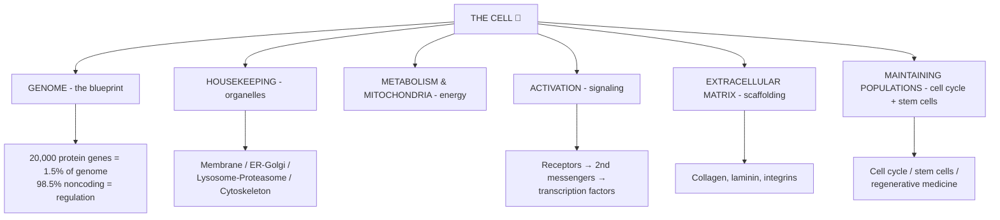
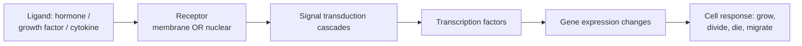

# 🟡 Chapter 1 — The Cell as a Unit of Health and Disease

> **Book:** Robbins & Cotran, 10th ed., pp. 1–32 · **Author:** Richard N. Mitchell
> 🇧🇩 **এক লাইনে:** এই চ্যাপ্টার = কোষের "পড়ার টেবিল" — জিন, প্রোটিন, অর্গানেল, সিগনালিং আর স্টেম সেল কীভাবে মিলে একটা কোষকে সুস্থ রাখে। Disease-এর জন্ম হয় এখানকার *অণু* দিয়েই। এই চ্যাপ্টার বেশি মনে রাখার না, *বুঝে* নেওয়ার — কারণ বাকি ২৮টা চ্যাপ্টার এখানকার শব্দই ব্যবহার করবে।
> ⏱️ ~2–3 h. এখানে 🔴 বাদে সব টপিক 🟡/⚪ — কারণ এটা সেল-বায়োলজি রিভিউ, কিন্তু *শব্দগুলো* (nucleosome, telomere, ubiquitin, stem cell) সবখানে আসবে।

---

## 🗺️ 1. BIG PICTURE



---

## 📊 2. CHAPTER MAP

| Topic | Priority | What to take away |
|---|---|---|
| Genome, noncoding DNA, histones, miRNA/lncRNA | 🟡 | 1.5% genes / 98.5% regulation; SNPs & CNVs |
| Plasma membrane, transport | 🟡 | Structure = function |
| ER–Golgi, Lysosomes, Proteasomes, Cytoskeleton | 🟡 | "Waste disposal" = lysosome + proteasome |
| Mitochondria & metabolism | 🟡 | Powerhouse; ROS; used later for apoptosis |
| Cell signaling & transcription factors | 🟡 | Receptors → cascades → genes |
| ECM & cell-cell interactions | ⚪ | Collagen, integrins |
| Cell cycle, stem cells, regenerative medicine | 🔴 | **Cycle phases + stem cell types** (used in Ch 7 neoplasia) |

---

## 3. THE GENOME 🟡

🇧🇩 **Genome** = একজন মানুষের মোট DNA। সাজানো ২৩ জোড়া ক্রোমোসোমে।

### 🔴 Numbers examiners love:
- Human genome ≈ **3.2 billion base pairs**.
- Only **~20,000 protein-encoding genes** = **1.5%** of genome.
- **~85%** of genome is transcribed; **~80%** devoted to **regulating** gene expression.
- Any two humans are **>99.5% identical**; humans ≈ 99% identical to chimps. Individual variation lives in **<0.5%** of DNA.

📌 **One-liner:** "Worms have ~20,000 genes too — humans differ by the *regulatory* (noncoding) 98.5%, not the genes."

### The 5 classes of non-protein-coding DNA:
1. **Promoters & enhancers** — transcription factor binding sites (enhancers act over 100 kb via looping)
2. **Binding sites for chromatin-organising factors**
3. **Noncoding regulatory RNAs** — **miRNAs** + **lncRNAs**
4. **Mobile genetic elements (transposons)** — "jumping genes", >⅓ of genome
5. **Structural DNA** — **telomeres** (ends) & **centromeres** (tether; rich in **satellite DNA**)

### DNA variation — SNP vs CNV:
| | SNP (single nucleotide polymorphism) | CNV (copy number variation) |
|---|---|---|
| What | One base differs (biallelic: A or T) | Segments duplicated/deleted |
| Frequency | 6+ million in humans | larger structural |
| Where | Exons, introns, intergenic | anywhere |
| Meaning | ~1% in coding regions; many "neutral"; weak effects on disease | bigger impact per event |

💡 **Linkage disequilibrium:** a neutral SNP co-inherited with a disease-causing variant = useful marker.

### Histones & chromatin:
- **Nucleosome** = DNA wound around **octameric histone core** (H2A, H2B, H3, H4 ×2). 💡 "Histone **octamer** = two of each 2A,2B,3,4."
- **Euchromatin** = dispersed, **active** · **Heterochromatin** = dense, **inactive**.
- **Chromatin remodeling complexes** reposition nucleosomes; **"chromatin writers"** add 70+ modifications = **histone marks** (methylation, acetylation, phosphorylation).

### 🧬 miRNA & lncRNA:
- **miRNA** (micro-RNA): ~22 nt; binds mRNA → **degrades / blocks translation**. 🔗 Over 1000 miRNAs; abnormal → cancer.
- **lncRNA**: long (>200 nt) noncoding; regulate transcription, chromatin; **XIST** inactivates the X chromosome.
- **Gene editing:** CRISPR — guide RNA + Cas9 nuclease. 🟡 know the name.

---

## 4. CELLULAR HOUSEKEEPING 🟡

### Plasma membrane (protection + nutrient acquisition):
- Lipid bilayer + proteins (receptors, channels, transporters).
- **Membrane transport:** passive (channels, facilitated) vs active (**Na⁺/K⁺-ATPase** — the pump that fails in ischemia! 🔴 link to Ch 2).

### Biosynthetic machinery — ER & Golgi:
```
DNA → mRNA → ROUGH ER (protein synthesis) → GOLGI (packaging/secretory)
SMOOTH ER (lipid synthesis, drug detoxification - P-450!)
```
- 🔗 **Rough ER dilated** = reversible injury (Ch 2). **Russell bodies** = immunoglobulin-filled ER (Ch 2).

### Waste disposal — Lysosomes & Proteasomes 🟡 (but examiners ask):
- **Lysosomes:** membrane-bound sacs with acid hydrolases; digest what cells *engulf* (phagocytosis/endocytosis). 🔗 **Lysosomal storage diseases** (Ch 5) = missing lysosomal enzyme.
- **Proteasomes:** degrade **intracellular proteins** tagged with **ubiquitin** (ubiquitin-proteasome pathway). 🔗 Atrophy = ↑ ubiquitin-mediated degradation (Ch 2); multiple myeloma drug bortezomib inhibits proteasomes.

💡 **Memory aid:** "Lysosome eats **outside food** (endocytosed), Proteasome eats **inside waste** (old proteins)."

### Cytoskeleton 🟡 (5 intermediate filaments — already in Ch 2 "KENDVA"):
| Filament | Size | Found in |
|---|---|---|
| Microtubules | 25 nm | mitosis, cilia |
| Actin microfilaments | 6–8 nm | muscle, cell cortex |
| Myosin | 15 nm | muscle |
| **Intermediate** | 10 nm | cell-type specific |

---

## 5. METABOLISM & MITOCHONDRIA 🟡

- **ATP** made by oxidative phosphorylation (mitochondria) + glycolysis.
- Mitochondria = **arbiters of life and death**: ATP, **ROS**, and **cytochrome c → apoptosis** (intrinsic pathway — Ch 2).
- 🔗 ROS produced in respiration → removed by SOD, catalase, glutathione (Ch 2). Chronic ROS = aging, cancer.

---

## 6. CELL SIGNALING 🟡 — "the cell's WhatsApp"



### Receptor types:
| Receptor | Mechanism | Example |
|---|---|---|
| **Ion channel** | ligand opens channel | nicotinic ACh |
| **G-protein coupled (GPCR)** | activates G-protein → 2nd messengers | β-adrenergic |
| **Tyrosine kinase (RTK)** | autophosphorylation → cascades | growth factors (EGF) |
| **Non-receptor tyrosine kinase** | associated kinases | cytokine receptors |
| **Steroid/nuclear receptors** | enter cell → directly regulate genes | estrogen |

### 2nd messengers (know 4): **cAMP, Ca²⁺, diacylglycerol (DAG), inositol trisphosphate (IP₃)**.
### Modular signaling hubs: **Ras, PI3K/AKT, JAK-STAT, NF-κB, Wnt, Notch, Hedgehog** — you will meet these again in **Neoplasia (Ch 7)**. 🔴
- **Ras** → MAP kinase pathway (grows cells; mutated in many cancers).
- **PI3K/AKT** → survival + growth (Ch 2 hypertrophy).
- **JAK-STAT** → cytokines/IFN.

📌 **One-liner:** "Growth signals = RTK→Ras→MAPK→divide; survival = PI3K→AKT; inflammation = NF-κB; the 'Big 3' for cancer = **Ras, PI3K, NF-κB**."

---

## 7. EXTRACELLULAR MATRIX (ECM) ⚪

The cell's "cement + scaffold + phone line":
| Component | Function |
|---|---|
| **Collagen** | tensile strength (fibrillar types I–III) |
| **Elastin** | stretch/recoil (lungs, aorta) |
| **Proteoglycans / GAGs** | hydration, growth-factor reservoir |
| **Adhesive glycoproteins** (laminin, fibronectin) | cell attachment |
| **Integrins** | transmembrane receptors linking ECM ↔ cytoskeleton (focal adhesions) |

🔗 Link to Ch 2: integrins = mechanical sensors in cardiac hypertrophy. Link to Ch 15: α₁-antitrypsin → elastase destroys **elastin** → emphysema.

---

## 8. MAINTAINING CELL POPULATIONS 🔴

### The Cell Cycle (this is THE important thing in this chapter — Ch 7 uses it):
```
G0 (resting)
 │
 ▼
G1 ──→ S ──→ G2 ──→ M (mitosis)
 │  growth   DNA     check
 │  + prep   synthesis   │
 │                       ▼
 │                    daughter cells
 └──► can re-enter G0
```
| Phase | Event | Checkpoint |
|---|---|---|
| **G1** | Cell grows, prepares DNA synthesis | **G1/S "restriction point"** |
| **S** | **DNA synthesis** (chromosomes duplicated) | — |
| **G2** | Prepares for mitosis | **G2/M** (DNA damage check) |
| **M** | Mitosis (nucleus) + cytokinesis | — |

- **Cyclins + cyclin-dependent kinases (CDKs)** drive the cycle.
- **Checkpoints** guard it; **p53** (tumor suppressor) arrests cell at G1 when DNA damaged → repair or apoptosis. 🔴 **"p53 = the guardian of the genome."** Mutant p53 → cancer.
- **Rb** (retinoblastoma protein) restrains G1→S.

### Stem Cells 🔴 (viva favourite):
| Type | Power | Location |
|---|---|---|
| **Totipotent** | all tissues + placenta | Zygote |
| **Pluripotent** | all 3 germ layers (not placenta) | **ES cells** — inner cell mass of blastocyst |
| **Multipotent** | limited lineages | **Tissue/adult stem cells** |
| **Lineage-committed** | one lineage | e.g., hematopoietic |
| **Unipotent** | one cell type | — |

- **Self-renewal:** asymmetric division → 1 stem + 1 differentiating daughter.
- **Stem cell niches:** bone marrow (perivascular), **intestinal crypts**, hair follicle bulge, corneal limbus, brain subventricular zone.
- **Mesenchymal stem cells** (marrow/fat): → chondrocytes, osteocytes, adipocytes, myocytes; immunosuppressive — used for tissue regeneration.

💡 **Mnemonic:** "**T**o **P**ack **M**y **L**uggage **U**nder" → Totipotent, Pluripotent, Multipotent, Lineage-committed, Unipotent.

### Regenerative medicine ⚪:
- Induced pluripotent stem cells (iPS) — reprogram differentiated cells; 3D printing scaffolds; cell therapy.

---

# 🎯 RAPID-FIRE ONE-LINERS

❓ % of genome that codes proteins → ✅ 1.5% (~20,000 genes)
❓ What differs between humans and worms → ✅ noncoding regulatory DNA
❓ 2 common DNA variations → ✅ SNP, CNV
❓ Nucleosome = → ✅ DNA around octameric histone core (H2A,H2B,H3,H4 ×2)
❓ Active vs inactive chromatin → ✅ euchromatin (active) vs heterochromatin (inactive)
❓ miRNA function → ✅ binds mRNA → degrade/block translation
❓ lncRNA famous example → ✅ XIST (X-inactivation)
❓ Telomeres/case of cancer → ✅ chromosome ends; shortened in aging, reactivated telomerase in cancer
❓ Waste disposal systems → ✅ lysosome (extracellular/engulfed) + proteasome (intracellular, ubiquitin-tagged)
❓ ATP main source → ✅ mitochondrial oxidative phosphorylation
❓ Cytochrome c role (bonus) → ✅ apoptosis intrinsic pathway (Ch 2)
❓ GPCR 2nd messengers → ✅ cAMP, Ca²⁺, DAG, IP₃
❓ Growth-signal pathway → ✅ RTK → Ras → MAPK
❓ Cancer "Big 3" signaling → ✅ Ras, PI3K, NF-κB
❓ ECM tensile strength → ✅ collagen; recoil → elastin; cell-ECM link → integrins
❓ Cell cycle phases → ✅ G1→S→G2→M
❓ G1/S checkpoint guardian → ✅ p53 ("guardian of the genome")
❓ Restrains G1→S → ✅ Rb
❓ Cell cycle drivers → ✅ cyclins + CDKs
❓ ES cells come from → ✅ inner cell mass of blastocyst (pluripotent)
❓ Stem cell niche in intestine → ✅ crypts
❓ Mesenchymal stem cells make → ✅ cartilage, bone, fat, muscle

---

# 🎴 FLASHCARDS

**1. Why is most of the genome "dark matter"?**
✅ 98.5% noncoding; but ~85% transcribed → mostly regulatory (promoters, enhancers, noncoding RNA, transposons, structural DNA) — controls gene expression.

**2. SNP vs CNV.**
✅ SNP = single base change (biallelic, most common); CNV = segment duplication/deletion (larger structural change).

**3. Path of a secreted protein.**
✅ DNA → mRNA → rough ER → Golgi → secretory vesicle → membrane/released. (Smooth ER = lipid + detox.)

**4. Lysosome vs proteasome.**
✅ Lysosome = digests engulfed/extracellular material in acid; proteasome = degrades ubiquitin-tagged intracellular proteins.

**5. Stem cell hierarchy.**
✅ Totipotent (zygote) → pluripotent (ES cells, 3 germ layers) → multipotent (adult tissue stem cells) → committed → differentiated.

**6. Cell cycle + checkpoints.**
✅ G1 (grow) → S (DNA synthesis) → G2 (prep) → M (mitosis). G1/S = restriction point (p53/Rb); G2/M checks DNA damage.

**7. How does cell signaling reach the genes?**
✅ Ligand → receptor (membrane/nuclear) → cascade (2nd messengers, kinases) → transcription factor → gene expression → response.

**8. Roles of the major ECM proteins.**
✅ Collagen = strength; elastin = recoil; proteoglycans = hydration; laminin/fibronectin = adhesion; integrins = ECM↔cytoskeleton link.

---

> 🧭 Back to: [00 — Index](00_INDEX.md) · Next: [02 — Cell Injury (done)](ch02_Cell_Injury_Death_Adaptations.md)
