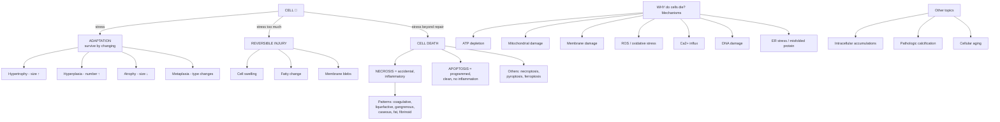
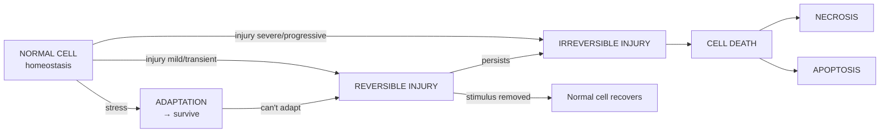
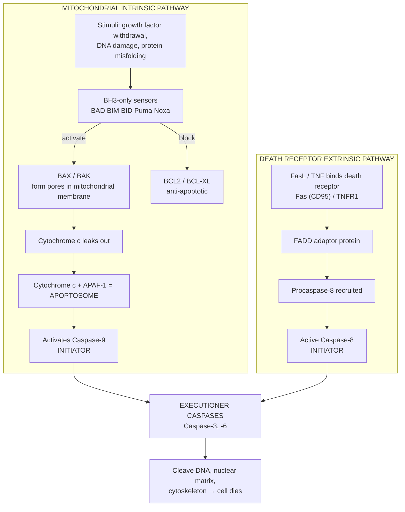
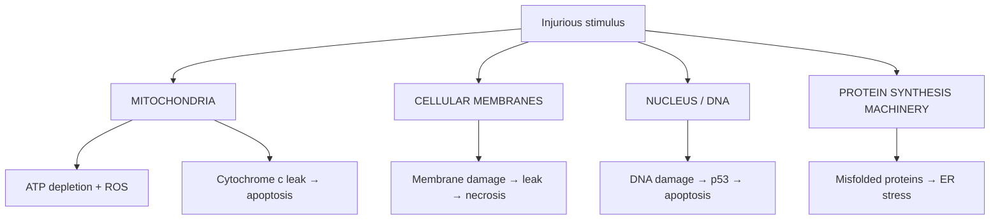
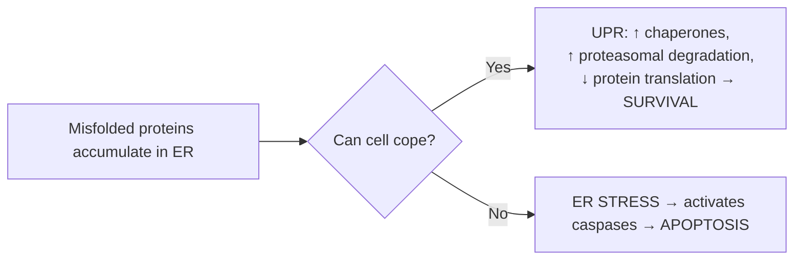

# 🔴 Chapter 2 — Cell Injury, Cell Death, and Adaptations

> **Book:** Robbins & Cotran, 10th ed., pp. 33–70 · **Author:** Scott A. Oakes
> 🇧🇩 **এক লাইনে:** কোষ যতক্ষণ ঠিক থাকে ততক্ষণ সুস্থতা। কোনো চাপ/ক্ষতি (stress) এলে কোষ প্রথমে *খাপ খাইয়ে নেয়* (adaptation), চাপ বেশি হলে *আহত হয়* (injury), একদম শেষে *মারা যায়* (necrosis/apoptosis)। এই পুরো চ্যাপ্টারটা ওই গল্প।
> ⏱️ Total time: ~4–5 h. 🔴 MUST KNOW = 70% of this chapter.

---

## 🗺️ 1. BIG PICTURE — the whole chapter as one tree



---

## 📊 2. CHAPTER MAP — topic → priority → time

| Topic | Priority | Time |
|---|---|---|
| 4 Pillars of pathology (etiology/pathogenesis/morphology/clinical) | 🔴 | 15 min |
| Overview: response of cells to stress (the flowchart) | 🔴 | 10 min |
| Causes of cell injury (7 categories) | 🔴 | 20 min |
| Reversible cell injury | 🔴 | 20 min |
| Necrosis + its 6 patterns | 🔴 | 40 min |
| Apoptosis: causes, morphology, 2 pathways, execution | 🔴 | 45 min |
| Other cell death: necroptosis, pyroptosis, ferroptosis | 🟡 | 15 min |
| Autophagy | 🟡 | 15 min |
| Mechanisms of injury: ATP, mitochondria, membranes, DNA | 🔴 | 30 min |
| ROS / oxidative stress | 🔴 | 25 min |
| Calcium & ER stress / UPR | 🟡 | 20 min |
| Clinical correlations: ischemia, reperfusion, chemical injury | 🔴 | 30 min |
| Adaptations: hypertrophy, hyperplasia, atrophy, metaplasia | 🔴 | 40 min |
| Intracellular accumulations (lipids, proteins, pigments) | 🟡 | 30 min |
| Pathologic calcification (dystrophic vs metastatic) | 🔴 | 15 min |
| Cellular aging | ⚪ | 10 min |

---

# PART A — FOUNDATIONS

## 3. Introduction to Pathology (the 4 pillars) 🔴

🇧🇩 **Pathology** = প্যাথোস (দুঃখ/রোগ) + লোগোস (বিজ্ঞান) = *রোগের বিজ্ঞান*। ব্ল্যাকপোল বলেছিল: path = শারীরিক, biochem = জৈবরাসায়নিক, functional = কাজের পরিবর্তন যা রোগ তৈরি করে।

> Father of modern pathology = **Rudolf Virchow** — "individuals are sick because their cells are sick." 💡 ১৮০০-এর দশকে তিনিই প্রথম বললেন রোগটা কোষ থেকেই শুরু হয়।

### 🔴 The 4 aspects of every disease:

| Pillar | Question | Bangla meaning |
|---|---|---|
| **Etiology** | *Why* did it start? | কারণ |
| **Pathogenesis** | *How* does it cause disease? (sequence of molecular events) | মেকানিজম/গড়ন প্রক্রিয়া |
| **Morphology** | *What does it look like?* (gross + microscopic) | আকৃতি-বদল |
| **Clinical manifestations** | *What does the patient show?* | রোগীর লক্ষণ |

📌 **Memory aid:** **E-P-M-C** = **E**very **P**atient **M**ust **C**ure → **E**tiology, **P**athogenesis, **M**orphology, **C**linical.

🔗 **Correlation:** Most common diseases (atherosclerosis, cancer) = **multifactorial** — environmental insults acting on a *genetically susceptible* person. So etiology = 1 + 1, not just 1.

---

## 4. Overview of Cellular Responses to Stress 🔴

The single most important flowchart of the chapter:



📌 **Memorise the 4 adaptations:** **H-H-A-M** (তখন "HyHAm" → **Hy**pertrophy, **Hy**perplasia, **A**trophy, **M**etaplasia). All reversible.

📌 **Mnemonic for the response ladder:** **SAID** → Stress → **A**daptation → **I**njury → **D**eath.

🔗 **Correlation (the classic example — the heart):**
- Hypertension → heart muscle **hypertrophies** (adaptation ✅)
- Heart artery blocked (ischemia) → muscle first **reversibly injured** (minutes, swelling)
- Blockage persists 1–2 h → **irreversible injury** → **necrosis** (infarction) ❌
- 🖼️ TTC stain (triphenyltetrazolium chloride): viable myocardium stains **magenta/red**, dead tissue stays **pale**.
  [🔍 TTC stained myocardial infarction](https://www.google.com/search?q=triphenyltetrazolium+chloride+myocardial+infarction+stain&tbm=isch) · [🔍 myocardial infarction gross pale area](https://www.google.com/search?q=myocardial+infarction+gross+pathology+pale+wedge&tbm=isch)

---

## 5. Causes of Cell Injury 🔴 — "every way a cell can be hurt"

🇧🇩 চ্যাপ্টারের ৭টা কারণ মনে রাখার জন্য: **OP-CIGIN** (oxygen, physical, chemical, infectious, immunologic, genetic, nutritional).

| # | Cause | Examples (1-liner) |
|---|---|---|
| 1 | **O**xygen deprivation | Hypoxia (low O₂), **ischemia** (low blood flow) ← most common cause of cell injury in medicine |
| 2 | **P**hysical agents | Trauma, heat/cold (burns), radiation, electric shock, pressure change |
| 3 | **C**hemical agents | Poisons (arsenic, cyanide), alcohol, drugs, pollutants, asbestos |
| 4 | **I**nfectious agents | Viruses → tapeworms |
| 5 | **I**mmunologic reactions | Autoimmune diseases; also allergies |
| 6 | **G**enetic abnormalities | Down syndrome (extra chromosome) → sickle cell (1 base pair) |
| 7 | **N**utritional imbalances | Protein-calorie deficiency, vitamin deficiency; also **obesity** |

📌 **Hypoxia vs Ischemia (viva favourite):**
- **Hypoxia** = O₂ deficiency, but **blood flow preserved** → anaerobic glycolysis still works.
- **Ischemia** = reduced blood flow → **anaerobic glycolysis also fails** (no substrate delivery). → Ischemia injures **faster and worse** than hypoxia.

💡 **Mnemonic:** "Ischemia is hypoxia that **I**s **I**nterrupted — no O₂ AND no sugar."
🔗 **Correlation:** CO (carbon monoxide) poisoning = hypoxia (binds Hb, blocks O₂ carry) but blood flow is fine — that's why pure hypoxia is slower to kill cells than ischemia.

---

## 6. Reversible Cell Injury 🔴

**Definition:** early/mild damage that **corrects itself** when the stimulus is removed.

### Two consistent features (must-know):

1. **Cellular swelling** ← *the earliest manifestation of almost ALL cell injury.*
   - Why? ATP ↓ → Na⁺/K⁺-ATPase pump fails → Na⁺ + water flood in.
   - 🖼️ Called **hydropic change / vacuolar degeneration**.
     [🔍 hydropic degeneration kidney histology](https://www.google.com/search?q=hydropic+degeneration+vacuolar+reversible+cell+injury&tbm=isch)
2. **Fatty change (steatosis)** ← accumulation of triglyceride vacuoles.
   - Seen in **lipid-metabolising organs** → especially **liver** (alcohol). 🖼️ [🔍 fatty change liver histology](https://www.google.com/search?q=fatty+change+steatosis+liver+histology&tbm=isch)

### 🔬 Microscopy of reversible injury (H&E):
- Cell appears **more eosinophilic (pink)** → loss of RNA (RNA binds blue hematoxylin; loss = pinker).
- Small clear vacuoles = dilated, pinched-off ER segments.

### 🔬 Ultrastructural changes (EM — nice to know):
| Structure | Change |
|---|---|
| Plasma membrane | Blebbing, blunting, loss of microvilli |
| Mitochondria | Swelling + small amorphous densities |
| Cytosol | Myelin figures (phospholipid whorls) |
| ER | Dilation + ribosome detachment |
| Nucleus | Chromatin clumping (reversible) |

📌 **One-liner:** Reversible injury = **swelling + fatty change**. Irreversible = **membrane breakdown + nuclear changes**.

💡 **Memory aid:** "Swell now, die later" — swelling is the first sign; nuclei vanishing is the last.

---

# PART B — CELL DEATH

## 7. Necrosis 🔴

🇧🇩 **Necrosis** = গ্রিক "nekros" = মৃত। **বাইরের জোরে মরা** — কোষটা এমন ক্ষতিগ্রস্ত হয় যে নিজেই ভেঙে পড়ে, আর বাড়াবাড়ি হয়ে **প্রদাহ (inflammation)** হয়। "Accidental" cell death.

### 🎭 Necrosis vs Apoptosis — the table examiners LOVE (Table 2.1):

| Feature | **Necrosis** | **Apoptosis** |
|---|---|---|
| Cell size | **Enlarged** (swelling) | **Reduced** (shrinkage) |
| Nucleus | Pyknosis, karyorrhexis, karyolysis | Fragmentation into nucleosome-size pieces |
| Plasma membrane | **Disrupted** | Intact (altered structure) |
| Cellular contents | Enzymatic digestion; **leak out** | Intact; in apoptotic bodies |
| Adjacent inflammation | **Frequent** | **No** |
| Physiologic or pathologic? | Usually **pathologic** | Often **physiologic** |
| Role | Culmination of irreversible injury | Eliminates unwanted cells; may be pathologic (e.g., DNA damage) |

💡 **Mnemonic:** "**N**ecrosis = **N**oisy (inflammation), **A**poptosis = **A**nonymous (silent, no mess)."

### 🧬 Nuclear changes in necrosis (3 P's — must know):

| Term | Meaning | 🇧🇩 |
|---|---|---|
| **Pyknosis** | Nuclear **shrinkage**, dark basophilic | নিউক্লিয়াস ছোট + গাঢ় |
| **Karyorrhexis** | Pyknotic nucleus **fragments** | নিউক্লিয়াস টুকরো |
| **Karyolysis** | Nucleus **dissolves** (DNA digested by endonuclease) | নিউক্লিয়াস গলে যায় |

📌 **Sequence:** pyknosis → karyorrhexis → karyolysis (nucleus shrinks → breaks → dissolves).

💡 **Mnemonic:** "**P**lease **R**emove **L**ifeless cells" → P=R=**Py**knosis→**KaryoR**rhexis→**Karyo**Lysis.

### 🖼️ Microscopy of necrosis:
- **Increased eosinophilia** (pink) — loss of RNA + denatured proteins bind eosin.
- Glassy homogeneous cytoplasm (loss of glycogen).
- Vacuolated "moth-eaten" cytoplasm (enzymes digested organelles).
- **Myelin figures** → can calcify (see dystrophic calcification).
- ⚠️ Necrosis takes **4–12 h** to become visible on light microscopy after ischemia.

### 🔥 DAMPs — the "danger signals" (must know for immunology links):
Dead cells leak → **DAMPs** (damage-associated molecular patterns): **ATP, uric acid**, etc. → recognised by macrophage receptors → **trigger inflammation + phagocytosis**.

🔗 **Correlation (serum biomarkers of necrosis):** necrotic cells leak proteins into blood → used as **biomarkers**:
- **Troponin** (cardiac muscle) → ↑ 2 h after MI, *before* histology shows it!
- **AST/ALT** (hepatocytes), **alkaline phosphatase** (bile duct epithelium).
- 🖼️ [🔍 troponin myocardial infarction blood test](https://www.google.com/search?q=cardiac+troponin+myocardial+infarction+serum&tbm=isch)

---

## 8. Patterns of Tissue Necrosis 🔴 (classic viva + specimen section)

> 🎯 Know: **type → cause → gross → histology**. The 🖼️ buttons will make this stick.

| Pattern | Cause | Gross | Histology |
|---|---|---|---|
| **Coagulative** | **Ischemia** — ALL organs **except brain** | Wedge-shaped pale infarct, firm | **Cell outlines preserved**, nuclei lost |
| **Liquefactive** | **Bacterial/fungal infection**; brain (any cause) | **Liquid/pus**, creamy yellow | Cells digested → viscous fluid |
| **Gangrenous** | Limb loses blood + (wet) bacteria | Black, dead | Coagulative ± liquefactive (wet) |
| **Caseous** | **TB (tuberculosis)** | Friable white, **cheese-like** | Structureless granular debris + granuloma border |
| **Fat** | **Acute pancreatitis** (lipases) | Chalky-white spots (saponification) | Shadowy fat cells + basophilic Ca²⁺ |
| **Fibrinoid** | Immune complexes in vessel walls | — | Bright pink (fibrin-like) vessel wall |

### 🔍 Deep dives + image buttons:

**① Coagulative necrosis** 🔴
- Why "coagulative"? Injury **denatures the enzymes too** → cells can't autolyse → **architecture preserved** for days.
- A localised area of coagulative necrosis = **infarct**.
- 🖼️ Gross: kidney/spleen infarct, wedge-shaped, pale. Histo: dead tubules with retained outlines, no nuclei.
  [🔍 coagulative necrosis kidney infarct gross](https://www.google.com/search?q=coagulative+necrosis+kidney+infarct+gross&tbm=isch) · [🔍 coagulative necrosis histology](https://www.google.com/search?q=coagulative+necrosis+histology+preserved+outline&tbm=isch) · [WebPath kidney infarct](https://webpath.med.utah.edu/GENHTML/GEN034.html)

**② Liquefactive necrosis** 🔴
- Why "liquefy"? **Neutrophils + microbes pour in enzymes** → everything dissolves → pus.
- 🇧🇩 **Pus** = জীবাণু + মৃত নিউট্রোফিল + তরল ডেট্রিটাস।
- Brain infarcts → liquefactive (even though caused by ischemia!) — reason unknown.
  [🔍 liquefactive necrosis brain abscess](https://www.google.com/search?q=liquefactive+necrosis+brain+abscess+gross&tbm=isch)

**③ Gangrenous necrosis** 🔴
- ⚠️ Not a distinct pattern — a **clinical term**.
- **Dry gangrene** = coagulative (no infection) — usually toes/limbs.
- **Wet gangrene** = infection superimposed → liquefactive + putrid. 🇧🇩 "ভেজা" গ্যাংগ্রিন।
  [🔍 dry vs wet gangrene toes](https://www.google.com/search?q=dry+gangrene+vs+wet+gangrene+foot&tbm=isch)

**④ Caseous necrosis** 🔴 — "caseous" = **cheese-like** (Latin *caseus* = cheese)
- Classic for **TB**. Granulomatous inflammation border.
- Histo: structureless eosinophilic debris, no cell outlines.
  [🔍 caseous necrosis tuberculosis gross lung](https://www.google.com/search?q=caseous+necrosis+tuberculosis+lung+gross&tbm=isch) · [🔍 caseous necrosis histology granuloma](https://www.google.com/search?q=caseous+necrosis+histology&tbm=isch)

**⑤ Fat necrosis** 🔴
- **Acute pancreatitis**: lipases leak → digest fat cell membranes → triglycerides split → **free fatty acids + Ca²⁺ = chalky-white soaps** (saponification).
- 🖼️ Gross: white chalky spots on pancreas/mesentery. Histo: shadowy fat cells, basophilic Ca²⁺.
  [🔍 fat necrosis pancreatitis saponification gross](https://www.google.com/search?q=fat+necrosis+pancreatitis+chalky+white+saponification&tbm=isch) · [🔍 fat necrosis histology](https://www.google.com/search?q=fat+necrosis+histology+shadowy+fat+cells&tbm=isch)

**⑥ Fibrinoid necrosis** 🔴
- Immune complexes (Ag-Ab) deposited in **artery walls** → vessel wall looks bright pink "fibrin-like".
- Seen in immunologic **vasculitis** syndromes (Ch 11).
  [🔍 fibrinoid necrosis artery H&E](https://www.google.com/search?q=fibrinoid+necrosis+artery+histology&tbm=isch)

📌 **One-liner for causes:** "Coag = **clot/ischemia**, Liquef = **pus/brain**, Caseous = **TB**, Fat = **pancreas**, Fibrinoid = **immune vessels**, Gangrene = **limb + bugs**."
💡 **Mnemonic:** **"C**lean **L**iquor **G**ives **C**heese **F**or **F**riends" → Coagulative, Liquefactive, Gangrenous, Caseous, Fat, Fibrinoid.

---

## 9. Apoptosis 🔴

🇧🇩 **Apoptosis** = গ্রিক "apoptein" = পড়ে যাওয়া (পাতা ঝরে পড়ার মতো)। **আত্ম-হত্যা প্রোগ্রাম** — কোষ নিজের ইনটার্নাল এনজাইম (caspase) চালু করে নিজেকে পরিষ্কারভাবে ভেঙে ফেলে, কোনো প্রদাহ ছাড়া। Recognised in **1972**.

### A. Causes — Physiologic (normal) situations:
| Physiologic apoptosis | Example |
|---|---|
| Development | Removal of supernumerary cells, digit webbing |
| Hormone-dependent involution | Endometrium in menstrual cycle, breast after weaning |
| Cell turnover | Intestinal crypt epithelium, lymphocytes |
| Eliminate self-reactive lymphocytes | Prevents autoimmunity |
| End of useful life | Neutrophils after acute inflammation |

### B. Causes — Pathologic situations:
| Pathologic apoptosis | Trigger |
|---|---|
| **DNA damage** | Radiation, cytotoxic drugs → p53 → apoptosis (protective!) |
| **Misfolded proteins** | ER stress |
| **Infections** | Viruses (HIV, adenovirus) kill infected cells; CTLs kill virally infected cells |
| **Pathologic atrophy** | Duct obstruction → pancreas, parotid, kidney |

### 🔬 Morphology of apoptosis (all must know):
1. **Cell shrinkage** — smaller, dense, eosinophilic cytoplasm
2. **Chromatin condensation** — *most characteristic feature*; peripheral crescents under nuclear membrane
3. **Membrane blebbing → apoptotic bodies** (membrane-bound fragments of cytoplasm ± nucleus)
4. **Phagocytosis** by macrophages — usually before contents leak

> 🖼️ **Apoptotic bodies in H&E** = round eosinophilic masses with dense chromatin fragments, no inflammation around.
> [🔍 apoptotic bodies histology](https://www.google.com/search?q=apoptotic+bodies+histology+eosinophilic&tbm=isch)

### 🧬 The 2 pathways of apoptosis — THE viva classic (Fig 2.13):


💡 **Mnemonic for intrinsic:** "**C**ommon **B**AD **B**eginning" → Cytochrome c, BAD/BID/BIM/Bax/Bak.
💡 **Mnemonic for extrinsic:** "**F**as **T**ells **C**ells **T**o **D**ie" → Fas → FADD → Caspase-8.

### BCL2 family — the "fridge magnet" of cell death:
| Group | Members | Action |
|---|---|---|
| **Anti-apoptotic** | BCL2, BCL-XL, MCL1 | Keep mitochondrial membrane sealed → NO cytochrome c leak |
| **Pro-apoptotic (effectors)** | **BAX, BAK** | Form pores → cytochrome c leaks |
| **BH3-only (sensors/regulators)** | BAD, BIM, BID, Puma, Noxa | Detect damage → activate BAX/BAK, block BCL2 |

📌 **One-liner:** BCL2 overexpressed in **B-cell lymphomas** (translocation) → cells refuse to die → tumour. 💡 "BCL2 = **B**ad **C**ell **L**ives **2** long."

### Execution phase:
- Initiator caspases: **intrinsic → caspase-9**; **extrinsic → caspase-8/-10**.
- Executioner caspases: **caspase-3, -6** → activate DNase (by cleaving its inhibitor), proteolyse nuclear matrix → fragmentation.

### Removal of dead cells — "eat me":
- Phosphatidylserine **flips** from inner to outer leaflet → "eat me" signal.
- "Find me" signals recruit phagocytes. **C1q** coats them. Natural antibodies bind.
- **Efferocytosis** = phagocytosis of apoptotic cells. So efficient that dying cells vanish *without a trace* — no inflammation.

💡 **Mnemonic:** "Apoptosis is a **silent suicide**: shrunken cell → **P**hos**P**hatidylserine **F**lips → **F**ine no inflammation."

---

## 10. Other (newer) Mechanisms of Cell Death 🟡

| Name | One-liner | Key player | Inflammation? |
|---|---|---|---|
| **Necroptosis** | "Programmed necrosis" — looks like necrosis, regulated like apoptosis | **RIPK1 → RIPK3 → MLKL** (phosphorylates → pores in plasma membrane); **caspase-independent** | Yes |
| **Pyroptosis** | Inflammasome → **caspase-1** → cleaves pro-IL-1β → IL-1 (fever!) + cell death | Caspase-1, inflammasome | **Yes — inflammatory** |
| **Ferroptosis** | **Iron-dependent**, lipid peroxidation; mitochondrial cristae lost, outer membrane ruptured | Iron + ROS vs glutathione | Necrosis-like |

💡 **Mnemonic:** "**N**o **C**aspase, **P**yro **F**ever, **F**erro **I**ron" → N=necroptosis (caspase-independent), P=pyroptosis (IL-1 fever), F=ferroptosis (iron).

🔗 **Correlation:** Pyroptosis = how microbes kill cells AND trigger local inflammation at the same time. Ferroptosis → linked to cancer, neurodegeneration, stroke.

---

## 11. Autophagy 🟡

🇧🇩 **Autophagy** = গ্রিক "auto" (নিজে) + "phagein" (খাওয়া) = **নিজেকে খাওয়া**। ক্ষুধার্ত কোষ নিজের অর্গানেল গুলোকে "খেয়ে" বাঁচে।

### Steps (Fig 2.17):
1. **Initiation** (stress: nutrient deprivation) → 4-protein complex
2. **Nucleation** → isolation membrane (phagophore, from ER)
3. **Elongation** → LC3 lipidated (with PE) → **LC3-II = marker** of autophagy
4. **Fusion** with lysosome → autophagolysosome
5. **Degradation** → recycle metabolites

### Clinical links (viva gold):
| Disease | Autophagy link |
|---|---|
| Cancer | Promotes growth OR defends against it |
| Alzheimer | Impaired autophagosome maturation |
| Huntington | Mutant huntingtin impairs autophagy |
| IBD (Crohn) | **ATG16L1** polymorphism |
| TB | Macrophage Atg5 deletion → more TB (autophagy kills mycobacteria) |
| Starvation | Cells cannibalise themselves to survive |

📌 **One-liner:** Autophagy = "cell eating itself to **survive**"; autophagic vacuoles appear in **atrophic** cells.

---

# PART C — MECHANISMS OF CELL INJURY (THE "WHY")

## 12. The 4 intracellular targets of injury 🔴 (Fig 2.18)



📌 **Memory aid:** **"MITO-MEMBRA-NUC-PROT"** → "**M**others **M**ake **N**o **P**roblems" (the 4 targets: Mitochondria, Membranes, Nucleus, Protein machinery).

### Key principles (nice to know but quoted often):
- Response depends on: **type of injury + duration + severity**.
- Response depends on **cell type**: skeletal muscle tolerates ischemia (rested); cardiac muscle does NOT.
- Genetic **polymorphisms** affect susceptibility (e.g., CCl₄).

---

## 13. Mitochondrial Damage 🔴

Mitochondria = **arbiters of life and death**. 3 consequences of damage:

1. **ATP depletion** → failure of everything energy-dependent → necrosis.
   - ⚡ ATP ↓ to 5–10% → Na⁺/K⁺ pump fails → **cell swelling**; ribosomes detach; protein synthesis ↓; glycolysis ↑ → **lactic acid ↑ → pH ↓**.
   - ⚡ **Mitochondrial permeability transition pore (MPTP)** opens → loss of membrane potential → no oxidative phosphorylation.
2. **ROS production** (incomplete O₂ reduction) → oxidative damage.
3. **Leakage of pro-apoptotic proteins** (cytochrome c) → **apoptosis** (intrinsic pathway).

---

## 14. Membrane Damage 🔴 (Fig 2.20)

Why membranes break:
| Mechanism | Detail |
|---|---|
| **ROS → lipid peroxidation** | Attacks unsaturated fatty acid double bonds → autocatalytic chain |
| **↓ Phospholipid synthesis** | From ATP depletion |
| **↑ Phospholipid breakdown** | Ca²⁺-dependent phospholipases |
| **Cytoskeletal damage** | Ca²⁺ proteases cut membrane anchors → membrane detaches → ruptures (myocardium!) |

Damage outcomes by membrane type:
- **Plasma membrane** → osmotic imbalance, leak contents, lose metabolites.
- **Lysosomal membrane** → acid hydrolases (RNases, DNases, proteases, phosphatases, glucosidases) leak → autodigestion → **necrosis**.
- **Mitochondrial membrane** → MPTP opens → no ATP + apoptosis trigger.

---

## 15. Oxidative Stress — ROS (Reactive Oxygen Species) 🔴

🇧🇩 **Free radical** = বাইরের কক্ষে একটি **জোড়াবিহীন ইলেকট্রন** — খুবই চঞ্চল, পাশের অণুকে আক্রমণ করে, আর সেই অণুকেও radical বানিয়ে দেয় (autocatalytic chain).

### The 4 principal radicals (Table 2.2):
| Radical | Made by | Inactivated by | Effects |
|---|---|---|---|
| **O₂⁻ superoxide** | oxidative phosphorylation; NADPH oxidase (leukocytes) | **SOD** | damages lipids/proteins/DNA |
| **H₂O₂ hydrogen peroxide** | SOD from O₂⁻; peroxisomal oxidases | **Catalase, glutathione peroxidase** | → ˙OH and OCl⁻ |
| **˙OH hydroxyl** | Fenton reaction; radiation; from H₂O₂ | glutathione | **MOST reactive — main killer** |
| **ONOO⁻ peroxynitrite** | NO + O₂⁻ | peroxiredoxins | damages lipids, proteins, DNA |

### Sources of free radicals (must know):
1. **Normal metabolism** (mitochondrial respiration, ER)
2. **Radiation** (UV, x-ray → water splits into ˙OH)
3. **Activated leukocytes** (NADPH oxidase "respiratory burst") ← inflammation link
4. **Drug/chemical metabolism** (e.g., CCl₄ → ˙CCl₃)
5. **Transition metals** (Fe²⁺, Cu) → **Fenton reaction**: H₂O₂ + Fe²⁺ → Fe³⁺ + ˙OH + OH⁻
6. **NO** → peroxynitrite

### Removal systems (the "anti-oxidant army"):
| Defence | Where |
|---|---|
| **SOD** (superoxide dismutase) | Mn-SOD in mitochondria; Cu-Zn-SOD in cytosol |
| **Catalase** | Peroxisomes |
| **Glutathione peroxidase** | Cytosol, mitochondria |
| **Vitamins E & A, ascorbic acid, glutathione** | Lipid-soluble scavengers |
| **Metal-binding proteins** | Transferrin, ferritin, ceruloplasmin bind Fe/Cu |

### The 3 pathologic effects of free radicals:
1. **Lipid peroxidation** of membranes (self-propagating chain!)
2. **Protein modification** (cross-links, broken backbones, enzyme damage)
3. **DNA lesions** (single/double-strand breaks, adducts → mutations → cancer, aging)

💡 **Mnemonic for removal:** "**S**uperoxide **C**leared **G**ently" → SOD, Catalase, Glutathione.
🔗 **Correlation:** **Chronic granulomatous disease** (CGD) — defect in leukocyte NADPH oxidase/superoxide → recurrent infections. ⚠️ Also → **ischemia-reperfusion injury** (next), **aging**, Alzheimer.

---

## 16. Disturbance in Calcium Homeostasis 🟡

- Normal cytosolic Ca²⁺ ≈ **0.1 µmol** vs extracellular 1.3 mmol → huge gradient; Ca²⁺ stored in ER + mitochondria.
- Ischemia/toxins → Ca²⁺ floods cytosol → activates **4 enzymes**:

| Enzyme | Damage |
|---|---|
| **Phospholipase** | Membrane damage |
| **Protease** | Membrane + cytoskeleton damage |
| **Endonuclease** | DNA + chromatin fragmentation |
| **ATPase** | Hastens ATP depletion |
| Ca²⁺ into mitochondria | MPTP opens → no ATP |

💡 **Mnemonic:** "Ca²⁺ → **P**lants **P**rosper **E**asily **A**fter **A**poptosis" → Phospholipase, Protease, Endonuclease, ATPase.

---

## 17. ER Stress — the Unfolded Protein Response (UPR) 🟡



🔗 **Diseases from misfolded proteins (Table 2.3):** CF (CFTR), Familial hypercholesterolemia (LDL receptor), Tay-Sachs (hexosaminidase β), α₁-antitrypsin deficiency, Creutzfeldt-Jakob (prions), Alzheimer (Aβ).

---

# PART D — CLINICOPATHOLOGIC CORRELATIONS 🔴

## 18. Ischemic Cell Injury (the most common in medicine) 🔴

Sequence (Fig 2.24) — memorise as a **domino chain**:
```
Ischemia → ↓O₂ → oxidative phosphorylation FAILS → ATP ↓↓
   → Na⁺/K⁺ pump fails → Na⁺+H₂O in, K⁺ out → CELL SWELLING (reversible)
   → anaerobic glycolysis ↑ → glycogen ↓, lactic acid ↑ → pH ↓
   → ribosomes detach → protein synthesis ↓
   → Ca²⁺ influx → enzymes activated
   → if prolonged → membrane + mitochondrial damage → NECROSIS
```

📌 **One-liner:** Ischemia kills by **ATP depletion first, membrane failure last.**

🔗 **HIF-1 (hypoxia-inducible factor-1):** cell's protective response to hypoxia → new vessel formation, ↑ glycolysis, survival pathways. Hypothermia (92°F) protects brain/spinal cord after ischemia.

### Ischemia-Reperfusion Injury 🔴 — "reopening the river causes flooding"
Restoring blood flow can **paradoxically worsen** injury. 4 mechanisms:
1. **Oxidative stress** — reoxygenation → burst of ROS
2. **Intracellular Ca²⁺ overload** — worse on reperfusion → MPTP opens
3. **Inflammation** — DAMPs recruit neutrophils → more damage
4. **Complement activation** — IgM deposits in ischemic tissue, complement binds on reperfusion

💡 **Mnemonic:** "**O**ur **C**ats **I**nvestigate **C**rimes" → Oxidative stress, Calcium overload, Inflammation, Complement.
🔗 **Correlation:** This is why "time is muscle/brain" — thrombolysis within window saves tissue, beyond it, reperfusion itself harms.

## 19. Chemical (Toxic) Injury 🔴

Two general mechanisms:
| Mechanism | Example |
|---|---|
| **Direct toxicity** | Mercury (binds -SH groups of membrane proteins), **cyanide** (poisons cytochrome oxidase), chemo drugs |
| **Conversion to toxic metabolites** | **CCl₄ → ˙CCl₃** (by P-450 in liver → lipid peroxidation); **acetaminophen → toxic product** |

📌 **One-liner:** Liver is the main victim (drugs metabolised there). CCl₄ = free radical injury classic.

---

# PART E — ADAPTATIONS OF CELLULAR GROWTH 🔴

## 20. The 4 Adaptations — overview table

| Adaptation | Change | Cell division? | Physiologic example | Pathologic example |
|---|---|---|---|---|
| **Hypertrophy** | Cell **size** ↑ | **No** (nondividing cells) | Uterus in pregnancy, bodybuilder muscle | Heart in hypertension/valve disease |
| **Hyperplasia** | Cell **number** ↑ | **Yes** (dividing cells) | Breast at puberty, liver regeneration, marrow after bleed | Endometrial hyperplasia, BPH, warts |
| **Atrophy** | Cell size **+ number ↓** | — | Uterus after delivery, notochord | Disuse, denervation, starvation |
| **Metaplasia** | Cell **type** changes | — | (none normal) | Smoker bronchus, Barrett esophagus |

---

## 21. Hypertrophy 🔴

🇧🇩 **Hypertrophy** = কোষ *বড়* হয়, সংখ্যা বাড়ে না। "Hyper" = বেশি, "trophy" = পুষ্টি/বৃদ্ধি।

- Occurs in **nondividing cells** (cardiac + skeletal muscle).
- **Pathologic:** heart enlarged by **pressure overload** (HTN, valve disease). Initially good, eventually **fails** → heart failure.
- **Physiologic:** uterus in pregnancy (estrogen-driven), bodybuilders.

### Mechanism (Fig 2.26) — molecular pathway:
```
Mechanical stretch (load)
  → mechanical sensors (integrins)
  → signaling: PI3K/AKT (physiologic), GPCR pathways (pathologic: α-adrenergic, angiotensin, endothelin)
  → transcription factors: GATA4, NFAT, MEF2
  → ↑ contractile proteins + switch to fetal genes (α-MHC → β-MHC, ANF ↑)
```
💡 **Memory aid:** "**G**ood **N**ews **M**akes **M**uscles" → GATA4, NFAT, MEF2 → more myofibrils.
🔗 **Correlation:** Hypertrophied heart secretes **ANF (atrial natriuretic factor)** — the heart trying to lower its own load (salt + water loss, ↓ BP). ⚠️ When hypertrophy outgrows blood supply → **myocyte death → cardiac failure**.

---

## 22. Hyperplasia 🔴

🇧🇩 **Hyperplasia** = কোষের *সংখ্যা* বাড়ে। Only possible in **dividing cells**.

- **Physiologic hormonal:** breast at puberty/pregnancy.
- **Physiologic compensatory:** **liver regeneration** after partial hepatectomy (growth factors), **bone marrow** hyperplasia after bleeding (erythropoietin → 8× RBC production).
- **Pathologic:** **endometrial hyperplasia** (estrogen excess → abnormal uterine bleeding → cancer risk), **BPH** (benign prostatic hyperplasia, androgens).

⚠️ **CRITICAL correlation (viva):** pathologic hyperplasia = **fertile soil for cancer** — more divisions = more chance of mutations. Endometrial hyperplasia → endometrial cancer; warts (HPV) → skin cancer risk.

📌 **One-liner:** Hyperplasia needs growth factors + dividing cells; it's the "more copies" response.

---

## 23. Atrophy 🔴

🇧🇩 **Atrophy** = কোষ *ছোট* হয় আর *মরে যায়* (apoptosis) → অঙ্গ ছোট। "A-" = without, "trophy" = nourishment.

### Causes — mnemonic **"DENIPPS"** 🎯:
| Letter | Cause | Example |
|---|---|---|
| **D** | **D**isuse | Fracture in cast, bed rest |
| **E** | **E**ndocrine loss | Menopause → uterus/vagina/breast; castration → prostate |
| **N** | **N**erve loss (denervation) | Muscle atrophy after nerve damage |
| **I** | **I**nadequate nutrition | Marasmus/cachexia (TNF) |
| **P** | **P**ressure | Benign tumour compresses surrounding tissue |
| **P** | **P**oor blood supply | Senile brain atrophy (atherosclerosis) |
| **S** | **S**enescence | Aging |

### Mechanism:
- **↓ Protein synthesis** (less trophic signals) + **↑ protein breakdown** (ubiquitin-proteasome pathway — ubiquitin ligases tag proteins).
- **↑ Autophagy** → residual bodies → **lipofuscin** → **brown atrophy** (heart, liver of aged).

🖼️ [🔍 brain atrophy gyri narrow sulci wide](https://www.google.com/search?q=cerebral+atrophy+gyri+sulci+gross&tbm=isch) · [🔍 brown atrophy heart lipofuscin](https://www.google.com/search?q=brown+atrophy+heart+lipofuscin&tbm=isch)

---

## 24. Metaplasia 🔴

🇧🇩 **Metaplasia** = এক ধরণের কোষ বদলে *অন্য ধরণের কোষ* হয় — কঠিন পরিবেশে বাঁচতে।

- **Not** a change of one differentiated cell into another directly → it's **reprogramming of tissue stem cells**.
- The new cell type **better withstands** the stress.

### 🔴 The 2 classic examples:
| Type | Change | Cause | Cancer risk |
|---|---|---|---|
| **Columnar → Squamous** | Bronchus ciliated columnar → stratified squamous | **Smoking**, vitamin A deficiency | **Squamous cell carcinoma** |
| **Squamous → Columnar** | Esophagus squamous → intestinal columnar | **GERD / acid reflux** | **Adenocarcinoma** (Barrett) |

- **Barrett esophagus** = refluxed gastric acid → esophageal squamous epithelium replaced by intestinal-like columnar cells.
- **Connective tissue metaplasia:** bone in muscle = **myositis ossificans** (after intramuscular haemorrhage) — ⚠️ NOT cancer-prone.

🖼️ [🔍 squamous metaplasia bronchus histology](https://www.google.com/search?q=squamous+metaplasia+bronchus+histology&tbm=isch) · [🔍 Barrett esophagus histology](https://www.google.com/search?q=Barrett+esophagus+histology+intestinal+metaplasia&tbm=isch)

📌 **One-liner:** Metaplasia = "change of cell **type** to survive"; the price = **lost function + cancer risk**.

💡 **Mnemonic for all 4 adaptations:** "**H**appy **H**umans **A**lways **M**igrate" → Hypertrophy, Hyperplasia, Atrophy, Metaplasia.

---

# PART F — INTRACELLULAR ACCUMULATIONS 🟡

## 25. Accumulations — 4 mechanisms (Fig 2.29):

| # | Mechanism | Example |
|---|---|---|
| 1 | Inadequate removal of normal substance (packaging/transport defect) | **Fatty change (steatosis)** of liver |
| 2 | Accumulation of endogenous substance (folding/transport defect) | **α₁-antitrypsin** aggregates in hepatocytes |
| 3 | Failure to degrade metabolite (enzyme defect) | **Lysosomal storage diseases** |
| 4 | Deposition of abnormal exogenous substance (no machinery to remove) | **Carbon**, silica, tattoos |

### Lipids:
| Type | Where/example |
|---|---|
| **Triglycerides → steatosis** | Liver (alcohol, NAFLD, toxins, diabetes, obesity, anoxia) — "most common cause in high-income: alcohol + NAFLD" |
| **Cholesterol/esters** | **Atherosclerosis** (foam cells), **xanthomas** (skin/tendons), **cholesterolosis** (gallbladder), Niemann-Pick C |
| **Phospholipids** | Myelin figures in necrotic cells |

🖼️ [🔍 fatty liver gross](https://www.google.com/search?q=fatty+liver+gross+pathology+yellow&tbm=isch) · [🔍 foam cells atherosclerosis histology](https://www.google.com/search?q=foam+cells+atherosclerosis+histology&tbm=isch)

### Proteins:
- **Reabsorption droplets** — proximal renal tubules in proteinuria (pink hyaline droplets)
- **Russell bodies** — distended ER in plasma cells full of immunoglobulin (eosinophilic inclusions)
- **Alcoholic hyaline** (Mallory bodies) — keratin intermediate filaments in alcoholic liver disease
- **Neurofibrillary tangles** — Alzheimer (neurofilaments)
- Intermediate filaments (10 nm): **"KENDVA"** → Keratin (epithelium), Neurofilaments (neurons), Desmin (muscle), Vimentin (connective), **G**lial fibrillary acidic (astrocytes)

### Hyaline change:
- **Hyaline** = homogeneous, glassy, pink (H&E) — *descriptive*, not diagnostic.
- Intracellular: reabsorption droplets, Russell bodies, alcoholic hyaline.
- Extracellular: **hyaline arteriolosclerosis** (long-standing HTN/diabetes → arteriolar walls).

### Glycogen:
- Seen in **diabetes mellitus** (renal tubular, liver, β-cells, heart) and **glycogen storage diseases**.
- 🎨 Stain: **PAS** (rose-violet); diastase digestion = control.

### Pigments — 🔴 know exogenous vs endogenous:
**Exogenous:** **Carbon** (anthracosis — black lungs, coal workers; tattoos).

**Endogenous:**
| Pigment | Colour | Meaning | Example |
|---|---|---|---|
| **Lipofuscin** | Yellow-brown, perinuclear granules | "Wear-and-tear" = lipid peroxidation product | Aging heart/liver, malnutrition, cancer cachexia → **brown atrophy** |
| **Melanin** | Brown-black | Tyrosinase oxidises tyrosine | Skin (Ch 25); only endogenous brown-black pigment |
| **Hemosiderin** | Golden-yellow-brown | Iron storage (ferritin aggregates) | Bruise, hemochromatosis, hemolytic anemias, transfusions → **hemosiderosis** |

💡 **Bruise colour story (excellent correlation):** RBCs leak → macrophages break Hb → iron removed → **biliverdin (green)** → **bilirubin (yellow)** → bruise changes red-blue → green-blue → golden-yellow. 🎨

---

# PART G — PATHOLOGIC CALCIFICATION 🔴

## 26. Dystrophic vs Metastatic — the classic table:

| | **Dystrophic** | **Metastatic** |
|---|---|---|
| When | **Dead/dying tissue** (necrosis, atheroma, old valves) | **Normal tissue** |
| Serum Ca²⁺ | **Normal** | **High** (hypercalcemia) |
| Underlying cause | Local injury → nidus for Ca²⁺ salts | Ca²⁺ metabolism derangement |
| Sites | Atheroma, heart valves, TB lymph node, psammoma bodies | **Stomach, kidneys, lungs, systemic arteries** (tissues that EXCRETE acid → internal alkaline compartment) |

### Causes of hypercalcemia → metastatic calcification (4):
1. **↑ PTH** (hyperparathyroidism, or PTH-related protein from tumours)
2. **Bone resorption** (multiple myeloma, leukemia, skeletal mets, Paget, immobilisation)
3. **Vitamin D disorders** (intoxication, sarcoidosis, Williams syndrome)
4. **Renal failure** → phosphate retention → secondary hyperparathyroidism
+ milk-alkali syndrome, aluminum (dialysis)

💡 **Mnemonic for hypercalcemia:** "**B**ones **S**tone **V**itamin **R**enal" → Bone, Stones, Vitamin D, Renal.

### Morphology:
- H&E: basophilic, amorphous, granular, clumped Ca²⁺ salts (intra/extracellular).
- **Psammoma bodies** = lamellated laminated calcified bodies — look like grains of sand → papillary cancers (e.g., **thyroid**).
- **Asbestos bodies** = Ca/Fe around asbestos spicules → beaded dumbbells.
- **Nephrocalcinosis** = massive kidney deposits → renal damage.

🖼️ [🔍 psammoma bodies thyroid histology](https://www.google.com/search?q=psammoma+bodies+histology+lamellated&tbm=isch) · [🔍 dystrophic calcification heart valve](https://www.google.com/search?q=calcific+aortic+stenosis+gross+valve&tbm=isch)

---

# PART H — CELLULAR AGING ⚪ (JUST READING)

- Aging = **progressive decline** of cell function from accumulated damage + genetic control.
- **9 hallmarks** conceptually = DNA damage, replicative senescence, defective protein homeostasis, dysregulated nutrient sensing.

| Mechanism | Detail |
|---|---|
| **DNA damage** | Damage accumulates as DNA repair declines; Werner syndrome = DNA helicase defect → premature aging |
| **Replicative senescence** | **Telomeres** shorten each division → cell cycle arrest (Fig 2.36). **Telomerase** (RNA-protein) adds nucleotides; present in **germ cells + stem cells**, absent in somatic cells, **reactivated in cancer** |
| **p16/CDKN2A** | Tumor suppressor, correlates with age → pushes cells to senescence |
| **Defective protein homeostasis** | Chaperones ↓ with age; rapamycin (inhibits mTOR) → ↑ lifespan (mice) |
| **Nutrient sensing** | **Caloric restriction → longevity** via ↓IGF-1 signaling + ↑**sirtuins** (NAD-dependent deacetylases). Red wine (resveratrol) may activate sirtuins 🍷 |

📌 **One-liner:** Aging = telomeres short + DNA damage + protein mess + less IGF-1 signaling. Telomerase = the "immortality enzyme" cancer hijacks.

---

# 🎯 RAPID-FIRE ONE-LINERS (drill these!)

**Cell injury basics:**
❓ Father of modern pathology → ✅ Virchow ("cells are sick")
❓ Earliest manifestation of almost all cell injury → ✅ Cellular swelling
❓ 4 adaptations → ✅ Hypertrophy, Hyperplasia, Atrophy, Metaplasia
❓ Most common cause of cell injury in clinical medicine → ✅ Ischemia
❓ Hypoxia with preserved blood flow vs ischemia → ✅ Ischemia worse (glycolysis also fails)
❓ Reversible injury = ? → ✅ Swelling + fatty change
❓ Why is necrosis visible late (4–12 h)? → ✅ Morphology lags biochemical injury

**Necrosis:**
❓ Necrosis vs apoptosis: which has inflammation → ✅ Necrosis
❓ Nuclear shrinkage → ✅ Pyknosis; fragmentation → Karyorrhexis; dissolution → Karyolysis
❓ Pattern with preserved cell outlines → ✅ Coagulative
❓ Pattern in brain after ischemia → ✅ Liquefactive
❓ Caseous necrosis classic for → ✅ Tuberculosis
❓ Fat necrosis → ✅ Acute pancreatitis (lipases + Ca²⁺ = saponification)
❓ Fibrinoid necrosis → ✅ Immune complexes in vessel walls
❓ DAMPs examples → ✅ ATP, uric acid
❓ Serum marker of cardiac necrosis → ✅ Troponin (rises in 2 h)

**Apoptosis:**
❓ Apoptosis is what kind of death → ✅ Regulated/programmed, no inflammation
❓ 2 pathways → ✅ Intrinsic (mitochondrial) & Extrinsic (death receptor)
❓ Intrinsic initiator caspase → ✅ Caspase-9
❓ Extrinsic initiator caspases → ✅ Caspase-8, -10
❓ Executioner caspases → ✅ Caspase-3, -6
❓ Pro-apoptotic BCL2 effectors → ✅ BAX, BAK
❓ Anti-apoptotic → ✅ BCL2, BCL-XL, MCL1
❓ BH3-only sensors → ✅ BAD, BIM, BID, Puma, Noxa
❓ Apoptosome = → ✅ Cytochrome c + APAF-1
❓ Death receptor example → ✅ Fas (CD95), TNFR1
❓ Adaptor in extrinsic → ✅ FADD
❓ "Eat me" signal → ✅ Phosphatidylserine flips out
❓ Phagocytosis of apoptotic cells called → ✅ Efferocytosis
❓ BCL2 overexpressed in → ✅ B-cell lymphomas
❓ Recognised in what year → ✅ 1972

**Other deaths & autophagy:**
❓ Necroptosis key molecules → ✅ RIPK1 → RIPK3 → MLKL (caspase-independent)
❓ Pyroptosis → ✅ Caspase-1, inflammasome, IL-1 (fever)
❓ Ferroptosis → ✅ Iron-dependent lipid peroxidation
❓ Autophagy means → ✅ Cell eats its own contents (lysosomes)
❓ Marker of autophagosome → ✅ LC3-II
❓ Crohn disease autophagy gene → ✅ ATG16L1

**Mechanisms:**
❓ 4 targets of injury → ✅ Mitochondria, membranes, nucleus/DNA, protein machinery
❓ Free radical with 1 unpaired electron meaning → ✅ unstable, chain reaction
❓ Most reactive ROS → ✅ Hydroxyl radical (˙OH)
❓ Enzymes removing ROS → ✅ SOD, catalase, glutathione peroxidase
❓ Fenton reaction → ✅ H₂O₂ + Fe²⁺ → ˙OH + OH⁻
❓ 3 effects of free radicals → ✅ Lipid peroxidation, protein mods, DNA damage
❓ CCl₄ injury mechanism → ✅ P-450 → ˙CCl₃ → lipid peroxidation
❓ Cyanide poisons → ✅ Cytochrome oxidase
❓ Reperfusion injury 4 causes → ✅ Oxidative stress, Ca²⁺ overload, inflammation, complement
❓ UPR = → ✅ Unfolded protein response (survival), fails → ER stress → apoptosis

**Adaptations:**
❓ Hypertrophy occurs in which cells → ✅ Nondividing (myocardium)
❓ Physiologic hypertrophy example → ✅ Pregnant uterus
❓ Hyperplasia example → ✅ Liver regeneration, breast at puberty, BPH, endometrial hyperplasia
❓ Atrophy causes mnemonic → ✅ DENIPPS
❓ Atrophy mechanism → ✅ ↓synthesis + ↑ubiquitin-proteasome degradation + autophagy
❓ Metaplasia of smoker bronchus → ✅ Columnar → squamous
❓ Barrett esophagus → ✅ Squamous → columnar (reflux), risk of adenocarcinoma
❓ Myositis ossificans → ✅ Bone in muscle (connective tissue metaplasia)

**Accumulations & calcification:**
❓ Steatosis classic organ → ✅ Liver (alcohol, NAFLD)
❓ Russell bodies in → ✅ Plasma cells
❓ Alcoholic hyaline = → ✅ Keratin filaments (Mallory)
❓ Lipofuscin meaning → ✅ Wear-and-tear pigment (aging) → brown atrophy
❓ Hemosiderin → ✅ Iron; bruise changes, hemochromatosis
❓ Anthracosis → ✅ Carbon in lungs
❓ Dystrophic calcification → ✅ dead tissue, normal Ca²⁺
❓ Metastatic calcification → ✅ normal tissue, high Ca²⁺
❓ Psammoma bodies → ✅ lamellated Ca²⁺ in papillary cancers (thyroid)

**Aging:**
❓ Telomerase present in → ✅ Germ cells, stem cells; reactivated in cancer
❓ Caloric restriction → ✅ Longevity via ↓IGF-1, ↑sirtuins

---

# 🎴 FLASHCARDS (end-of-chapter self-test)

**1. Q: Arrange the cell's response to increasing stress.**
✅ Adaptation → reversible injury → irreversible injury → death (necrosis/apoptosis). All reversible if stimulus removed.

**2. Q: Compare necrosis and apoptosis (5 points).**
✅ Size (↑ vs ↓), nucleus (pyknosis/karyorrhexis/karyolysis vs fragmentation), membrane (disrupted vs intact), inflammation (yes vs no), role (pathologic vs physiologic).

**3. Q: List the 6 patterns of necrosis with causes.**
✅ Coagulative–ischemia; Liquefactive–pus/brain; Gangrenous–limb+bacteria; Caseous–TB; Fat–pancreatitis; Fibrinoid–immune vessels.

**4. Q: Explain the intrinsic pathway of apoptosis step by step.**
✅ Stress (no growth factor, DNA damage, misfolded protein) → BH3-only (BAD/BIM/BID) activate BAX/BAK + block BCL2/BCL-XL → mitochondrial pores → cytochrome c leaks → +APAF-1 = apoptosome → activates caspase-9 → executioner caspases-3/-6 → cell dies.

**5. Q: Extrinsic pathway?**
✅ FasL binds Fas → FADD recruits procaspase-8 → autocatalytic activation → active caspase-8 → executioner caspases. (Inhibited by FLIP.)

**6. Q: What are the 4 targets of injurious stimuli?**
✅ Mitochondria (ATP/ROS/apoptosis), cell membranes (leak → necrosis), DNA (→ p53 → apoptosis), protein machinery (ER stress).

**7. Q: How do free radicals damage and how are they removed?**
✅ Damage: lipid peroxidation, protein oxidation, DNA lesions. Remove: SOD, catalase, glutathione peroxidase, vitamins E/A/C, metal-binding proteins.

**8. Q: Mechanisms of ischemic cell injury.**
✅ ATP ↓ → Na pump fails → swelling; glycolysis ↑ → lactic acid → pH ↓; ribosome detachment; Ca²⁺ influx → enzymes; membranes fail → necrosis.

**9. Q: Define and give examples of hypertrophy, hyperplasia, atrophy, metaplasia.**
✅ Hypertrophy: cell size ↑ (heart in HTN). Hyperplasia: cell number ↑ (liver regeneration). Atrophy: size+number ↓ (disuse). Metaplasia: type change (Barrett).

**10. Q: Dystrophic vs metastatic calcification.**
✅ Dystrophic: dead tissue, normal serum Ca. Metastatic: normal tissue, hypercalcemia (PTH↑, bone resorption, vit D, renal failure).

**11. Q: Why does pathologic hyperplasia predispose to cancer?**
✅ More cell divisions → more chances for mutations → "fertile soil" (endometrial hyperplasia → endometrial cancer).

**12. Q: Why is reperfusion injury paradoxical?**
✅ Restoring blood flow adds ROS, Ca²⁺ overload, neutrophils (inflammation), and complement → kills cells that might have recovered.

**13. Q: What are DAMPs?**
✅ Damage-associated molecular patterns (ATP, uric acid) leaked from necrotic cells → trigger phagocytosis + inflammation.

**14. Q: Mechanisms of cellular aging.**
✅ DNA damage accumulation, telomere shortening (replicative senescence), defective protein homeostasis, nutrient-sensing changes (↓IGF-1, ↑sirtuins with caloric restriction).

---

# 🗣️ TOP 10 VIVA QUESTIONS FROM THIS CHAPTER

1. "What is the first morphologic change of reversible injury?" → Cellular swelling (hydropic change).
2. "Differentiate necrosis and apoptosis." → Full table (must-know).
3. "How does ischemia cause cell injury? Walk me through it." → ATP domino chain.
4. "Name the patterns of necrosis. Which do you see in TB?" → 6 patterns; caseous.
5. "Two pathways of apoptosis + which caspases?" → Intrinsic/9, extrinsic/8-10.
6. "What is the role of BCL2 family?" → Balance of pro/anti-apoptotic controlling cytochrome c leak.
7. "Why is a bruise green then yellow?" → Biliverdin → bilirubin (hemosiderin story).
8. "Reperfusion injury — 4 mechanisms?" → Oxidative, Ca, inflammation, complement.
9. "Define metaplasia. Two examples with cancer risk." → Barrett (adenoCA), smoking bronchus (SCC).
10. "Dystrophic vs metastatic calcification." → Dead vs normal tissue; normal vs high Ca.

---

> 📖 **Next chapter:** [03 — Inflammation and Repair](ch03_Inflammation_Repair.md)
> 🧭 Back to: [00 — Index](00_INDEX.md) · [Start Here](00_START_HERE.md)
