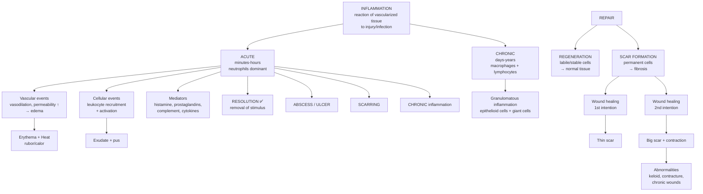
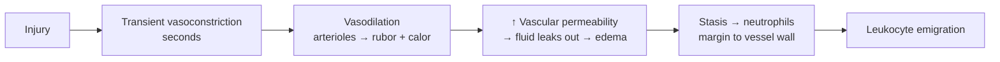
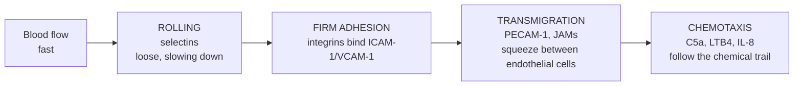
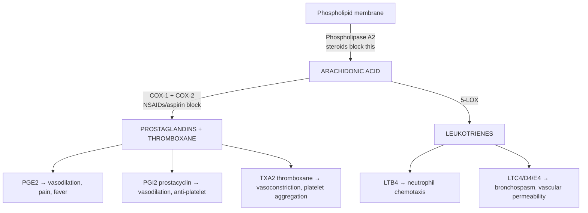
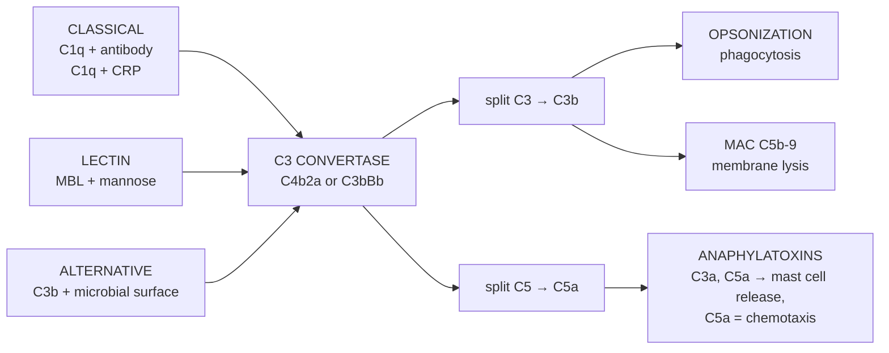
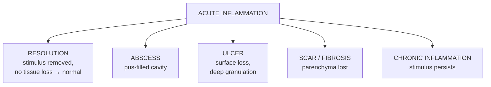
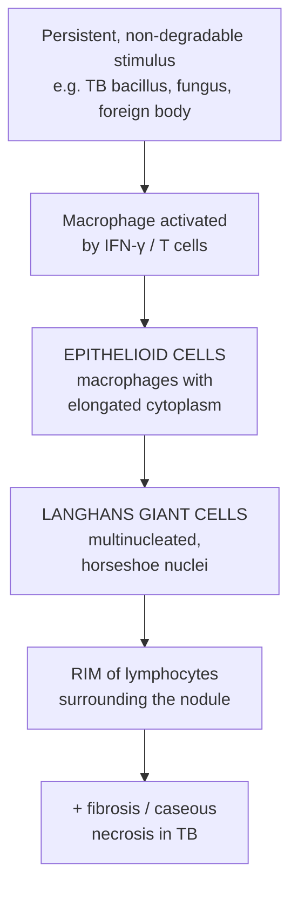

# 🔴 Chapter 3 — Inflammation and Repair

> **Book:** Robbins & Cotran, 10th ed., pp. 83–126 · **Author:** Vinay Kumar
> 🇧🇩 **এক লাইনে:** ইনফ্লামেশন = ক্ষতির জবাবে শরীরের *প্রতিরক্ষা*। প্রথমে রক্তনালী আর শ্বেতকণিকা এসে জীবাণু ধ্বংস করে (acute), সমস্যা ধরে গেলে ম্যাক্রোফেজ-লিম্ফোসাইট লম্বা লড়াই চালায় (chronic), আর শেষে *মেরামত* (repair)। দাগ (scar) পড়াটাই সেই মেরামতের ফল।
> ⏱️ Total time: ~5–6 h. 🔴 MUST KNOW = 70% of this chapter.

---

## 🗺️ 1. BIG PICTURE — the whole chapter as one tree

---

## 📊 2. CHAPTER MAP — topic → priority → time

| Topic | Priority | Time |
|---|---|---|
| Definition, causes, the 5 R's, cardinal signs | 🔴 | 15 min |
| Sentinel cells + pattern recognition (TLRs, NLRs, cGAS) | 🔴 | 25 min |
| Vascular events: vasodilation, permeability, exudate vs transudate | 🔴 | 25 min |
| Leukocyte recruitment: rolling → adhesion → transmigration → chemotaxis | 🔴 | 35 min |
| Phagocytosis & killing | 🔴 | 20 min |
| Mediators: amines, arachidonic acid, kinins, complement, cytokines, NO | 🔴 | 45 min |
| Outcomes of acute inflammation (resolution/abscess/ulcer/scar) | 🔴 | 15 min |
| Chronic inflammation: cells, M1 vs M2, tissue damage | 🔴 | 30 min |
| Granulomatous inflammation + the disease table | 🔴 | 30 min |
| Systemic effects: fever, acute phase proteins, sepsis | 🟡 | 20 min |
| Repair: regeneration, cells & capacity to divide | 🔴 | 25 min |
| Repair: angiogenesis, fibrosis (TGF-β), MMPs/TIMPs | 🔴 | 30 min |
| Wound healing 1st vs 2nd intention | 🔴 | 25 min |
| Abnormalities of repair: keloid, chronic wounds, contracture | 🔴 | 20 min |
| Fibrosis in organs (cirrhosis, IPF, scleroderma) | 🟡 | 10 min |

---

# PART A — FOUNDATIONS

## 3. What is Inflammation? 🔴

🇧🇩 **Inflammation** = ইনফ্ল্যামেশন = *প্রদাহ*। সংজ্ঞা: vascularized tissue-র প্রতিক্রিয়া জীবাণু (infection) বা ক্ষতিগ্রস্ত টিস্যু/কোষের (tissue damage) বিরুদ্ধে — প্রতিক্রিয়ার উদ্দেশ্য জীবাণু **বের করে দেওয়া** ও **মেরামত শুরু করা**। প্রদাহ নিজে রোগ নয়, *সুস্থ প্রতিরক্ষা*।

### 🔴 The 5 R's — the whole chapter in 5 words:

| R | Meaning |
|---|---|
| **R**ecognition | Detect the invader (macrophage → TLR → danger) |
| **R**ecruitment | Call leukocytes from blood to tissue |
| **R**emoval | Kill & clear microbes / dead tissue |
| **R**egulation | Stop the response when job done |
| **R**epair | Rebuild damaged tissue |

### 🔴 Causes of inflammation (mnemonic: **TIF-FIR**)

| Cause | Example |
|---|---|
| **T**rauma | Cut, burn |
| **I**nfection | Bacteria, virus, fungus |
| **F**oreign body | Splinter, suture, dust |
| **F**oreign immune reaction | Hypersensitivity, autoimmunity |
| **I**schemic/necrotic tissue | Myocardial infarction |
| **R**adiation / chemicals | UV, toxins |

### 🔴 The 4 (actually 5) cardinal signs

| Sign | Latin | Why |
|---|---|---|
| Redness | **Rubor** | Vasodilation |
| Heat | **Calor** | Vasodilation (more blood) |
| Swelling | **Tumor** | ↑ Vascular permeability → edema |
| Pain | **Dolor** | Prostaglandins + bradykinin sensitize pain nerves |
| Loss of function | **Functio laesa** | All of the above + tissue damage |

💡 **Mnemonic:** **R-C-T-D-L** → "**R**ash **C**auses **T**he **D**octor **L**augh" → **R**ubor, **C**alor, **T**umor, **D**olor, **L**oss of function. (আসল ক্লাসিক ৪টা = Celsus, ৫মটা পরে যোগ করেছিল Galen.)

---

## 4. Sentinel Cells + Recognition of the Invader 🔴

🇧🇩 সেন্ট্রি কোষ = *প্রহরী*। প্রহরী প্রথমে জীবাণু দেখে, তারপর সংকেত পাঠায় যাতে পুলিশ (neutrophil) আসে।

### 🔴 Sentinel cells that first detect danger:

| Sentinel cell | Where | Job |
|---|---|---|
| Tissue **macrophage** | Every tissue | Phagocytosis + cytokine release |
| **Mast cell** | Skin, mucosa, vessels | Histamine → instant vasodilation |
| **Dendritic cell** | Skin, mucosa | Carries antigen to lymph node (links innate → adaptive) |
| **Endothelium** | Vessel lining | Expresses adhesion molecules |

### 🔴 Pattern recognition receptors — how cells "smell" microbes

**Mnemonic for the receptor family: "TLR-NLR-RIG-cGAS"** (4 detector systems)

| Receptor | Detects | Main result |
|---|---|---|
| **TLR** (Toll-like) — cell surface + endosomes | PAMPs: LPS (TLR4), dsRNA (TLR3), CpG DNA (TLR9), flagellin (TLR5) | NF-κB → cytokines (TNF, IL-1) |
| **NLR** (NOD-like) — cytoplasm | Bacterial products (NOD2 → muramyl dipeptide) | Inflammasome → IL-1β, IL-18 |
| **RIG-I** — cytoplasm | Viral RNA | IFN-α, IFN-β |
| **cGAS** — cytoplasm | Cytosolic DNA | Type I interferons |

📌 **Memorise:** **LPS → TLR4** is the single most tested recognition pair.

🔗 **Correlation:** **NOD2 mutation → Crohn disease** (an NLR gone wrong → excess inflammation of the gut). NOD2 = NOD-like receptor for bacterial cell wall.

💡 **PAMP vs DAMP:** **P**athogen-associated (LPS, DNA) vs **D**amage-associated molecular pattern (ATP, uric acid, HMGB1 — released from *injured cells*). Both bind the same receptors. "Uric acid = gout → DAMP-driven inflammation."

🔗 **Correlation — inflammasome:** NLR (e.g. NLRP3) + pro-caspase-1 assemble → cleaves pro-IL-1β → **active IL-1β** (the fever-maker). Gout: uric acid crystals activate NLRP3 → painful attack.

---

# PART B — VASCULAR EVENTS

## 5. The Vascular Response — "rubor, calor, tumor in action" 🔴

Timeline of acute inflammation:

### 🔴 Mechanisms of increased vascular permeability (edema):

| # | Mechanism | Trigger |
|---|---|---|
| 1 | **Endothelial contraction** (immediate transient, 15–30 min) | Histamine, bradykinin, leukotrienes — via gaps at venule junctions |
| 2 | **Endothelial injury** (immediate sustained) | Severe burns, toxins — necrosis of endothelium, leaks for days |
| 3 | **Leukocyte-mediated injury** | Neutrophils damage vessel wall |
| 4 | **Increased transcytosis** | VEGF → leaky "channels" across endothelium |

### 🔴 Exudate vs Transudate — viva favourite

| Feature | **Exudate** | **Transudate** |
|---|---|---|
| Nature | **Inflammatory** (protein-rich) | Non-inflammatory (hydrostatic/oncotic) |
| Protein | High (>3 g/dL) | Low |
| Specific gravity | >1.020 | <1.012 |
| Cells | Many (neutrophils) | Few |
| Cause | ↑ permeability | ↑ venous pressure (heart failure), ↓ albumin (liver/kidney) |

🇧🇩 এক লাইনে: **Exudate = সক্রিয় প্রদাহের 'মাঠে নেমে যাওয়া সেনা+সরঞ্জাম'** (cells + protein), **Transudate = রক্তনালীর চাপের কারসাজিতে 'শুধু পানি'**।

🔗 **Correlation — Pleural effusion:** Exudate → pneumonia, TB, cancer (tap it → protein high). Transudate → CHF, cirrhosis (protein low). **Light's criteria** separate them clinically.

🖼️ [🔍 exudate vs transudate comparison](https://www.google.com/search?q=exudate+vs+transudate+comparison+table&tbm=isch) · [🔍 acute inflammation edema histology](https://www.google.com/search?q=acute+inflammation+edema+histology+neutrophils&tbm=isch)

---

# PART C — CELLULAR EVENTS (The Neutrophil March)

## 6. Leukocyte Recruitment — the 4-step cascade 🔴

🇧🇩 ব্যাখ্যা: নিউট্রোফিলকে ভেনিউলের ভেতর দিয়ে গড়িয়ে যেতে হয় (rolling), তারপর জোরে আটকে থাকতে হয় (firm adhesion), তারপর দেয়াল টপকে (transmigration) জীবাণুর দিকে হেঁটে যেতে হয় (chemotaxis)।

### 🔴 Step 1 — Rolling (Selectins)

| Selectin | Where | Binds |
|---|---|---|
| **L-selectin** | Leukocyte | Sialyl-Lewis X on endothelium |
| **E-selectin** | Endothelium (activated by TNF/IL-1) | Sialyl-Lewis X on leukocytes |
| **P-selectin** | Endothelium (Weibel-Palade bodies, released fast by histamine/thrombin) | **PSGL-1** on leukocytes |

📌 **Memorise:** **P**-selectin comes from **P**reformed stores (Weibel-Palade) → **fast** (minutes). **E**-selectin = **E**xpression requires new protein synthesis → slower (hours, via TNF/IL-1).

### 🔴 Step 2 — Firm adhesion (Integrins)

- Leukocyte integrins: **LFA-1** (CD11a/CD18), **VLA-4**
- Endothelial ligands: **ICAM-1** (binds LFA-1), **VCAM-1** (binds VLA-4)
- Chemokines (displayed on endothelium) "wake up" integrins → shape change → high-affinity binding

### 🔴 Step 3 — Transmigration (diapedesis)

- Through interendothelial junctions, guided by **PECAM-1 (CD31)** and **JAMs**

### 🔴 Step 4 — Chemotaxis — "follow the scent"

| Chemoattractant | Target |
|---|---|
| **C5a** (complement) | Neutrophils, monocytes |
| **LTB4** (leukotriene) | Neutrophils |
| **Chemokines CXCL8 (IL-8)**, MCP-1 | Neutrophils, monocytes |
| Bacterial products (f-met-leu-phe) | Neutrophils |

📌 **Timing:** **Neutrophils = 6–24 h (first responders), Monocytes/macrophages = 24–48 h (clean-up crew).** Ask "which cell first?" → Neutrophils.

🔗 **Correlation — Leukocyte adhesion deficiency type 1 (LAD-1):** mutation in **CD18** (β2 integrin) → leukocytes can't stick → repeated bacterial infections with **no pus** (neutrophils can't get out). Diagnosis: blood shows marked **neutrophilia**, tissues show no pus.

🔗 **Correlation — Cold abscess (Th17):** **S. aureus** + certain mycobacteria drive **Th17** cells → IL-17 → recruits **neutrophils** → abscess that is *less hot* than pyogenic ones. "Th17 = neutrophil recruitment."

---

## 7. Phagocytosis & Killing 🔴

**3 steps:** ① **Recognition** (opsonins: **C3b, IgG, collectins**) → ② **Engulfment** → ③ **Killing** (O₂-dependent ROS via NADPH oxidase = respiratory burst; O₂-independent: defensins, lysozyme).

🔗 **Correlation — Chronic granulomatous disease (CGD):** NADPH oxidase defect → phagocytes engulf but **cannot kill catalase-positive organisms** (S. aureus, aspergillus) → recurrent infections + **granulomas**.

📌 **Opsonin mnemonic: "C-3-O"** → **C3b**, **C**omplement... better: **"IgG + C3b = the glue"** — both are opsonins.

---

# PART D — THE MEDIATORS (Chemical Messengers)

## 8. Mediator Overview Table 🔴

| Mediator | Source | Main actions |
|---|---|---|
| **Histamine** | Mast cells, basophils, platelets | Vasodilation, ↑ permeability (immediate) |
| **Serotonin** | Platelets | Vasoconstriction, ↑ permeability |
| **Prostaglandins** | Mast cells, many cells | Vasodilation, **pain**, **fever** (PGE2) |
| **Leukotrienes** | Leukocytes | Vasoconstriction, **bronchospasm**, LTB4 = chemotaxis |
| **Bradykinin** | Plasma (kinin system) | Vasodilation, **pain**, ↑ permeability |
| **Complement C3a/C5a** | Plasma | Anaphylatoxins (mast cell release, chemotaxis C5a) |
| **C3b** | Plasma | Opsonin |
| **TNF / IL-1** | Macrophages | Endothelial activation, fever, acute phase |
| **IL-6** | Macrophages | Liver → acute phase proteins (CRP) |
| **NO** | Endothelium, macrophages (iNOS) | Vasodilation, killing |
| **PAF** | Leukocytes, endothelium | Platelet aggregation, ↑ permeability |
| **Cytokines (chemokines)** | Many | Leukocyte recruitment/activation |

---

## 9. Arachidonic Acid (AA) Pathway — COX vs LOX 🔴

📌 **Memorise the trio:** **TXA2** (procoagulant) vs **PGI2** (anticoagulant) — balance keeps blood flowing; aspirin tips it → bleeding. **PGE2 = the pain+fever prostanoid.**

🔗 **Correlation — NSAIDs vs steroids:**
- **NSAIDs (aspirin, ibuprofen)** block **COX-1/COX-2** → stop prostaglandin production → pain, fever ↓. Aspirin irreversibly acetylates COX-1.
- **Glucocorticoids** block *earlier* — **phospholipase A2** (via lipocortin) → stop ALL prostaglandins **and** leukotrienes. Stronger, but immunosuppressive.

🔗 **Correlation — COX-2 inhibitors** (celecoxib): spare COX-1 → less gastric ulcer (COX-1 protects stomach) but ↑ cardiovascular risk (prostacyclin ↓).

---

## 10. Complement System — 3 Pathways → 3 Jobs 🔴

📌 **Memorise the 3 jobs of complement: "OLC" — Opsonize, Lyse, Chemotaxis/anaphylatoxin.**
- **C3b** = opsonin (glue for phagocytosis)
- **MAC (C5b-9)** = punches holes → lysis
- **C5a** = chemotaxis (the strongest) + anaphylatoxin; **C3a** = anaphylatoxin; **C5a > C3a > C4a**

📌 **Which pathway?** Classical = **antibody** (C1q needs Ab or CRP); Lectin = **mannose**; Alternative = **microbial surface directly**. Mnemonic: "**Antibody C**lassical, **Mannose L**ectin, **Microbe A**lternative."

🔗 **Correlation — C1 inhibitor deficiency = Hereditary angioedema:** unchecked complement/kallikrein → episodic swelling of lips, larynx (can kill), gut. Treated with **C1-INH replacement / icatibant**.

🔗 **Correlation — Decay-accelerating factor (DAF) deficiency = Paroxysmal nocturnal hemoglobinuria (PNH):** RBCs lack DAF → complement lyses them → hemolysis at night + thrombosis.

---

## 11. Cytokines & Other Mediators 🟡

| Cytokine | Made by | Key action |
|---|---|---|
| **TNF** | Macrophages | Endothelial activation, fever, shock, cachexia |
| **IL-1** | Macrophages | Same as TNF + ↑ adhesion |
| **IL-6** | Macrophages | Liver acute phase proteins (**CRP**, fibrinogen), fever |
| **IL-17** | Th17 cells | Neutrophil recruitment (cold abscesses) |
| **IFN-γ** | Th1 cells | Activates macrophages (kills TB) |
| **Chemokines** (IL-8/CXCL8, MCP-1) | Many | Leukocyte migration |

📌 **The acute phase trio: TNF, IL-1, IL-6** = the "fever + CRP" team. **CRP rises fast** (liver, IL-6 driven) → useful bedside marker.

🔗 **Sepsis:** massive TNF/IL-1 → vasodilation + endothelial damage → **disseminated intravascular coagulation (DIC) + shock**. TNF also causes **cachexia** in chronic disease.

---

# PART E — OUTCOMES OF ACUTE INFLAMMATION

## 12. The 4 Possible Endings 🔴

- **Resolution** — needs: stimulus gone, little tissue destruction, regenerable tissue. Effusion cleared by macrophages → drained via lymphatics ("organization" if it becomes fibrous instead).
- **Abscess** — pyogenic bacteria (S. aureus); pus = necrotic neutrophils + liquefied tissue + bacteria; walled off.
- **Ulcer** — epithelial surface loss + inflammation (stomach ulcer, skin).
- **Progression to chronic** — persistent infection, autoimmunity, foreign body.

---

# PART F — CHRONIC INFLAMMATION

## 13. Chronic Inflammation — the long war 🔴

🇧🇩 দীর্ঘস্থায়ী প্রদাহ = *লম্বা লড়াই*। নিউট্রোফিল চলে গেছে, এখন ক্ষেত্রটা ম্যাক্রোফেজ আর লিম্ফোসাইটের।

### 🔴 Hallmarks:
1. **Mononuclear cells dominate**: macrophages, lymphocytes, plasma cells
2. **Simultaneous tissue destruction AND repair** (fibrosis side by side with necrosis)
3. Persists **weeks → years**

### 🔴 Macrophage two faces (M1 vs M2) — viva favourite

| | **M1 (classically activated)** | **M2 (alternatively activated)** |
|---|---|---|
| Activated by | **IFN-γ** (Th1 cells) | **IL-4, IL-13** (Th2 cells) |
| Job | **Kill** microbes (ROS, NO) | **Repair** — fibrosis, tissue remodeling |
| Seen in | TB, killing phase | Healing phase |

📌 **Memorise: M1 = "Militant" (kills), M2 = "Mason" (builds).**

### 🔴 The chronic cells & what they do

| Cell | Role |
|---|---|
| **Macrophage** | Phagocytosis, antigen presentation, cytokines, fibrosis |
| **Plasma cell** | Antibody production (transformed B cell) |
| **Lymphocyte** | Th1 (IFN-γ → activate macrophages), Th2 (allergy/repair), Th17 (neutrophils) |
| **Eosinophil** | Parasites, allergy (via IgE, major basic protein) |

🔗 **Correlation — the chronic "danger pairs":** **TB** = Th1 + macrophage (classic M1 battle → granuloma). **Allergy/asthma** = Th2 + eosinophil + IgE. **Cold abscess** = Th17 + neutrophil.

---

## 14. Granulomatous Inflammation 🔴 — "the wall around the enemy"

Definition: chronic inflammation with a **collection of activated macrophages** organized into a nodule.

### 🔴 Two types of granuloma:

| | **Foreign body granuloma** | **Immune (T cell–mediated) granuloma** |
|---|---|---|
| Trigger | Non-degradable foreign material (suture, talc) | TB bacilli, fungi, sarcoid |
| Role of T cells | Not needed | **Required** (antigen → Th1 → IFN-γ) |
| Histology | Macrophages around material | Epithelioid + Langhans giant cells + lymph rim ± caseation |

📌 **The classic cells:** **Epithelioid cell** = macrophage that looks like epithelium (pink, elongated). **Langhans giant cell** = fusion of macrophages → many nuclei arranged like a **horseshoe** at the periphery.

### 🔴 Table 3.9 — Granulomatous diseases (examiner's favourite list)

| Disease | Organism / cause | Clue |
|---|---|---|
| **Tuberculosis** | *M. tuberculosis* | **Caseous necrosis** 🔴 |
| **Leprosy** | *M. leprae* | Nerve damage, hypopigmented patches |
| **Syphilis** | *T. pallidum* | Gumma (central necrosis) |
| **Sarcoidosis** | Unknown | **Non-caseating**, "naked" granulomas |
| **Crohn disease** | ? (NOD2) | Non-caseating, full-thickness bowel |
| **Fungal** | Histoplasma, Coccidioides, Blastomyces | Granulomas with fungi |
| **Leishmaniasis** | *Leishmania* | Cutaneous/visceral |
| **Berylliosis** | Beryllium dust | Occupational |
| **Foreign body** | Suture, talc, silica | Foreign body granuloma |

📌 **Memorise the big split:** **Caseous (cheese-like) → TB.** **Non-caseating → Sarcoidosis** (and Crohn, berylliosis, fungal). "TB cheese, sarcoid naked."

🔗 **Correlation — TB granuloma gross:** central **cheesy, yellow-white necrosis** = caseation; surrounded by epithelioid cuff + lymphocytes + fibrosis. Calcifies when healed (Ghon focus).

🖼️ [🔍 caseating TB granuloma histology](https://www.google.com/search?q=caseating+granuloma+tuberculosis+histology&tbm=isch) · [🔍 sarcoidosis non-caseating granuloma](https://www.google.com/search?q=sarcoidosis+non-caseating+granuloma+histology&tbm=isch) · [🔍 Langhans giant cell horseshoe nuclei](https://www.google.com/search?q=Langhans+giant+cell+histology+horseshoe&tbm=isch)

---

# PART G — SYSTEMIC EFFECTS OF INFLAMMATION

## 15. Fever, Acute Phase Response, Sepsis 🟡

| Response | Mechanism |
|---|---|
| **Fever** | **IL-1, IL-6, TNF → PGE2 in hypothalamus** → set point ↑ |
| **Acute phase proteins** | IL-6 → liver: **CRP**, fibrinogen, serum amyloid A |
| **Leukocytosis** | ↑ Neutrophils (bacterial), ↑ lymphocytes (viral) |
| **Leukopenia** | Severe infections, overwhelming sepsis |
| **Weight loss / cachexia** | TNF ("cachectin") |
| **Sepsis → DIC** | TNF/IL-1 → endothelial damage → microthrombi + consumption |

💡 **Fever drugs work here:** aspirin/NSAIDs block the **COX** step (↓ PGE2) → fever falls. Steroids block earlier (PLA2).

---

# PART H — REPAIR

## 16. Repair: Regeneration vs Scar — "rebuild or patch" 🔴

| | **Regeneration** | **Scar formation (fibrosis)** |
|---|---|---|
| Cells | **Labile/stable** (can divide) | **Permanent** (can't divide) |
| Framework | Intact basement membrane/stroma | Framework destroyed |
| Result | Normal tissue | Fibrous scar (patch) |
| Examples | Liver (hepatocyte), gut, skin; peripheral nerve | Heart (MI), CNS neurons, skeletal muscle |

### 🔴 Cell types by proliferative capacity — viva classic

| Class | Cells | Regenerate? |
|---|---|---|
| **Labile** | Epithelia (skin, GI, resp), bone marrow, lymphoid | ✅ Constantly dividing |
| **Stable** | Liver, kidney tubule, pancreas, fibroblasts, smooth muscle, osteoblasts | ✅ Only if stimulated |
| **Permanent** | Neurons, cardiac + skeletal muscle | ❌ Never → always scar |

📌 **"Which organs scar instead of regenerating?" → Heart, brain, skeletal muscle** (permanent cells). "Liver regenerates" — yes, unless framework destroyed (cirrhosis = scar).

---

## 17. Steps of Scar Formation 🔴

### 🔴 ① Angiogenesis (new vessels)
- Growth factors: **VEGF** (main driver — migration + proliferation of endothelial cells), **FGF-2**, **angiopoietins** (maturation), **PDGF/TGF-β** (stabilization)
- **Notch** signaling controls vessel branching
- MMPs degrade ECM to let sprouts grow

### 🔴 ② Fibrosis (collagen deposition)
- Growth factors: **TGF-β** (the single most important fibrogenic cytokine 🔴), **PDGF**, **FGF-2**
- Source: **M2 macrophages**, fibroblasts, mast cells
- **TGF-β** → stimulates fibroblast proliferation + collagen synthesis, ↓ ECM degradation (inhibits MMPs). Also **anti-inflammatory** (suppresses lymphocytes).

### 🔴 ③ Remodeling
- **MMPs** (matrix metalloproteinases: interstitial collagenases MMP-1/2/3, gelatinases, stromelysins) degrade collagen — require zinc, made inactive → activated by plasmin
- **TIMPs** (tissue inhibitors) stop the MMPs → balance decides scar quality
- Myofibroblasts (fibroblasts + smooth muscle actin) → **contraction**

📌 **Mnemonic for growth factors of repair: "TV shows F-P" — TGF-β (fibrosis), VEGF (vessels), FGF (fibroblast/endothelial), PDGF (proliferation/recruitment).**

---

## 18. Wound Healing — 1st vs 2nd Intention 🔴

| Feature | **First intention** (primary union) | **Second intention** (secondary union) |
|---|---|---|
| Wound | Clean surgical incision, edges apposed | Large tissue defect (ulcer, burn) |
| Clot/exudate | Small | Large |
| Granulation tissue | Small amount | **Abundant** |
| Scar | Thin | **Large** |
| Wound contraction | Minimal | **Important** (myofibroblasts shrink defect to 5–10% by ~6 weeks) |
| Dermal appendages | Lost only in line | Lost widely |
| Timeline | ~1 week to close, months to mature | Weeks to months |

### 🔴 First intention timeline (memorise the days):

| Time | Event |
|---|---|
| **24 h** | Neutrophils at margin; basal cells start mitosis |
| **24–48 h** | Epithelial bridge closes wound |
| **Day 3** | Macrophages replace neutrophils; granulation tissue invades |
| **Day 5** | Neovascularization peaks; granulation fills gap |
| **Week 2** | Continued collagen; inflammation wanes |
| **1 month** | Acellular scar, normal epidermis |
| **3 months** | **70–80% of normal tensile strength** (sutured ~70%) |

📌 **"First responders → neutrophils; repair crew → macrophages (day 3); the scaffold → granulation tissue = new vessels + fibroblasts + loose ECM."**

### 🔴 Factors that impair healing (viva list):

| Factor | Why |
|---|---|
| **Infection** | Most important local cause — prolongs inflammation |
| **Diabetes** | Vascular disease, neuropathy, ↓ wound healing |
| **Vitamin C / protein deficiency** | ↓ Collagen synthesis |
| **Glucocorticoids** | ↓ TGF-β → weak scar (deliberately used in corneal infection!) |
| **Poor perfusion** | Ischemia (PVD, varicose veins) |
| **Foreign body** | Persistent inflammation |
| **Mechanical stress** | Dehiscence (wound splits open) |

🔗 **Correlation — chronic wounds:** **Venous ulcer** (hemosiderin + chronic venous HTN, elderly), **Arterial ulcer** (atherosclerosis, painful), **Diabetic ulcer** (feet, ischemia+neuropathy+infection), **Pressure sore** (bed-bound, prolonged compression).

---

## 19. Abnormalities of Repair 🔴

| Abnormality | What | Key point |
|---|---|---|
| **Hypertrophic scar** | Raised scar, stays within wound, **regresses** over months | ↑ collagen, many myofibroblasts |
| **Keloid** | Grows **beyond** wound boundary, **never regresses** | Individual predisposition, **commoner in African Americans** |
| **Exuberant granulation ("proud flesh")** | Granulation rises above skin, blocks re-epithelialization | Needs cautery/excision |
| **Desmoid (aggressive fibromatosis)** | Excessive fibroblast proliferation, **recurs after excision** | Between benign and malignant (low-grade) |
| **Contracture** | Excessive wound contraction → deformity | **Palms, soles, anterior chest** (flexor surfaces) |
| **Wound dehiscence** | Surgical incision reopens | Obesity, malnutrition, infection, ↑ intra-abdominal pressure |

📌 **Hypertrophic scar vs keloid — the one-liner:** "Hypertrophic = stays in bounds, **regresses**; Keloid = **K**rosses the boundary, **K**eeps growing."

🔗 **Correlation — fibrosis in organs:** Liver (cirrhosis), lung (IPF, pneumoconiosis, radiation), kidney (end-stage), heart (constrictive pericarditis), skin (scleroderma). Same TGF-β-driven mechanism → **antifibrotic drugs** are a hot research area.

🖼️ [🔍 keloid vs hypertrophic scar](https://www.google.com/search?q=keloid+vs+hypertrophic+scar+difference&tbm=isch) · [🔍 granulation tissue histology](https://www.google.com/search?q=granulation+tissue+histology+vessels+fibroblasts&tbm=isch) · [🔍 wound healing first vs second intention diagram](https://www.google.com/search?q=wound+healing+first+vs+second+intention+diagram&tbm=isch)

---

# 🎯 RAPID-FIRE ONE-LINERS

**Basics:**
❓ Inflammation definition → ✅ Reaction of vascularized tissue to infection/injury
❓ 5 R's → ✅ Recognition, Recruitment, Removal, Regulation, Repair
❓ Cardinal signs → ✅ Rubor, Calor, Tumor, Dolor, Functio laesa
❓ First cell at acute inflammation → ✅ Neutrophil (6–24 h)
❓ Monocyte → macrophage arrives → ✅ 24–48 h
❓ Exudate protein → ✅ High >3 g/dL; transudate low

**Recognition:**
❓ LPS detected by → ✅ TLR4
❓ Viral dsRNA → ✅ TLR3 / RIG-I
❓ Cytosolic DNA → ✅ cGAS
❓ NOD2 mutation → ✅ Crohn disease
❓ Uric acid = → ✅ DAMP (gout → NLRP3 inflammasome)
❓ Inflammasome produces → ✅ IL-1β (fever)

**Recruitment:**
❓ Rolling → ✅ Selectins (L/E/P)
❓ P-selectin stored in → ✅ Weibel-Palade bodies
❓ Firm adhesion → ✅ Integrins (LFA-1) bind ICAM-1; VLA-4 binds VCAM-1
❓ Transmigration → ✅ PECAM-1 (CD31)
❓ Best chemotactic → ✅ C5a, LTB4, IL-8
❓ LAD-1 defect → ✅ CD18 (β2 integrin) → no pus
❓ Th17 → ✅ Neutrophil recruitment (cold abscess)

**Mediators:**
❓ Histamine source → ✅ Mast cells
❓ PGE2 does → ✅ Vasodilation, pain, fever
❓ TXA2 does → ✅ Vasoconstriction, platelet aggregation
❓ PGI2 does → ✅ Vasodilation, antiplatelet
❓ Aspirin blocks → ✅ COX (irreversibly COX-1)
❓ Steroids block → ✅ Phospholipase A2 (all eicosanoids)
❓ LTB4 → ✅ Chemotaxis; LTC4/D4/E4 → bronchospasm
❓ Bradykinin → ✅ Pain, vasodilation (from kininogen)
❓ Complement 3 pathways → ✅ Classical (Ab), Lectin (mannose), Alternative (microbe)
❓ Opsonin → ✅ C3b
❓ Anaphylatoxins → ✅ C3a, C5a (C5a strongest)
❓ Membrane lysis → ✅ MAC = C5b-9
❓ C1-INH deficiency → ✅ Hereditary angioedema
❓ DAF deficiency → ✅ PNH (RBC lysis)
❓ Acute phase trio → ✅ TNF, IL-1, IL-6
❓ CRP made by → ✅ Liver (IL-6)

**Chronic:**
❓ Chronic cells → ✅ Macrophages, lymphocytes, plasma cells
❓ M1 activated by → ✅ IFN-γ (kills)
❓ M2 activated by → ✅ IL-4/IL-13 (repairs)
❓ Epithelioid cell = → ✅ Activated macrophage (pink, elongated)
❓ Langhans giant cell nuclei → ✅ Horseshoe arrangement
❓ Caseous necrosis seen in → ✅ TB
❓ Non-caseating granulomas → ✅ Sarcoidosis, Crohn
❓ Sarcoid granuloma called → ✅ "Naked" granuloma

**Repair:**
❓ Regeneration needs → ✅ Labile/stable cells + intact framework
❓ Permanent cells → ✅ Neurons, cardiac/skeletal muscle → scar
❓ Main angiogenic factor → ✅ VEGF
❓ Main fibrogenic cytokine → ✅ TGF-β
❓ Collagen degraded by → ✅ MMPs (zinc-dependent); stopped by TIMPs
❓ Granulation tissue = → ✅ New vessels + fibroblasts + loose ECM
❓ First intention = → ✅ Clean incision, thin scar
❓ Second intention = → ✅ Large defect, big scar + contraction
❓ Wound strength 3 months → ✅ 70–80% normal
❓ Most important local cause of poor healing → ✅ Infection
❓ Keloid vs hypertrophic → ✅ Keloid crosses boundary, never regresses; HTN... hypertrophic regresses
❓ Proud flesh = → ✅ Exuberant granulation tissue
❓ Desmoid = → ✅ Aggressive fibromatosis, recurs after excision
❓ Contracture sites → ✅ Palms, soles, anterior chest

---

# 🎴 FLASHCARDS (end-of-chapter self-test)

**1. Q: Define inflammation and list the 5 R's.**
✅ Reaction of vascularized tissue to infection/injury; Recognition, Recruitment, Removal, Regulation, Repair.

**2. Q: Compare exudate and transudate.**
✅ Exudate: high protein (>3 g/dL), high SG (>1.020), many cells — inflammatory. Transudate: low protein, low SG, few cells — hydrostatic/oncotic (CHF, cirrhosis).

**3. Q: Walk through the 4 steps of leukocyte recruitment with the molecules.**
✅ Rolling (selectins: L/E/P + sialyl-Lewis X/PSGL-1) → firm adhesion (integrins LFA-1/VLA-4 bind ICAM-1/VCAM-1) → transmigration (PECAM-1/JAMs) → chemotaxis (C5a, LTB4, IL-8).

**4. Q: Name the 3 complement pathways and the 3 functions of complement.**
✅ Classical (Ab/CRP), Lectin (MBL+mannose), Alternative (microbe); functions = Opsonization (C3b), Lysis (MAC C5b-9), Chemotaxis + anaphylatoxin (C5a/C3a).

**5. Q: Aspirin vs steroids — where do they act?**
✅ Aspirin: blocks COX-1/2 → stops prostaglandins (pain/fever). Steroids: block phospholipase A2 → stop all prostaglandins AND leukotrienes.

**6. Q: M1 vs M2 macrophages.**
✅ M1 (IFN-γ) kills microbes; M2 (IL-4/IL-13) does repair/fibrosis. Seen in TB (M1) vs healing (M2).

**7. Q: What makes a granuloma? Give the caseating vs non-caseating split.**
✅ Persistent non-degradable antigen → IFN-γ → epithelioid cells + Langhans giant cells + lymph rim. Caseating = TB; non-caseating = sarcoidosis, Crohn, berylliosis.

**8. Q: Which cells regenerate vs scar?**
✅ Labile (epithelia, marrow) and stable (liver, kidney) regenerate; permanent (neurons, cardiac/skeletal muscle) → scar.

**9. Q: Name the growth factors of repair and their jobs.**
✅ VEGF (angiogenesis), TGF-β (fibrosis — most important), PDGF (proliferation/recruitment), FGF-2 (fibroblast/endothelial growth), angiopoietins (maturation).

**10. Q: First vs second intention healing — 4 differences.**
✅ First: small clot, thin scar, minimal contraction, fast. Second: large clot, abundant granulation, big scar, marked contraction (myofibroblasts, wound shrinks to 5–10%).

**11. Q: Why does the wound strength plateau at 3 months?**
✅ Collagen synthesis/degradation balance (MMP/TIMP) + cross-linking; reaches ~70–80% normal, then stabilizes.

**12. Q: List factors impairing wound healing.**
✅ Infection, diabetes, vitamin C/protein deficiency, steroids, poor perfusion, foreign body, mechanical stress.

**13. Q: Keloid vs hypertrophic scar.**
✅ Hypertrophic: stays within wound, regresses. Keloid: grows beyond boundary, never regresses, commoner in African Americans.

**14. Q: What is a cold abscess and which cells cause it?**
✅ Th17 → IL-17 → neutrophil-rich abscess with less heat — S. aureus and certain mycobacteria.

---

# 🗣️ TOP 10 VIVA QUESTIONS FROM THIS CHAPTER

1. "Define inflammation. Why is it protective?" → Vascularized tissue reaction to infection/injury; 5 R's; cardinal signs.
2. "Which cells arrive first, and when?" → Neutrophils 6–24 h; macrophages 24–48 h.
3. "Walk me through the leukocyte adhesion cascade." → Rolling→adhesion→transmigration→chemotaxis with molecules.
4. "Three complement pathways and the three functions." → Classical/Lectin/Alternative; Opsonize/Lyse/Chemo-attract.
5. "Aspirin vs steroids mechanism." → COX vs PLA2.
6. "What is a granuloma? Differences between TB and sarcoidosis granulomas." → Caseating vs non-caseating; Langhans cells.
7. "M1 vs M2 macrophages." → Kill vs repair.
8. "First vs second intention healing." → 4-point comparison.
9. "Why does the liver regenerate but the heart doesn't?" → Stable vs permanent cells.
10. "Factors that impair healing — name 5." → Infection, DM, vit C, steroids, perfusion.

---

> 📖 **Next chapter:** [04 — Hemodynamic Disorders, Thromboembolism, and Shock](ch04_Hemodynamic_Disorders_Shock.md)
> 🧭 Back to: [00 — Index](00_INDEX.md) · [Start Here](00_START_HERE.md)
