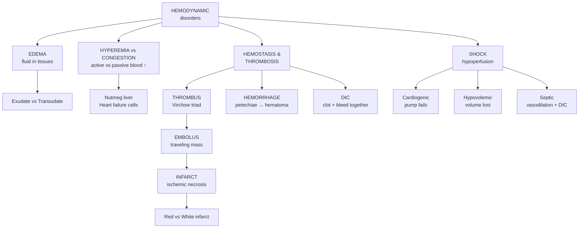
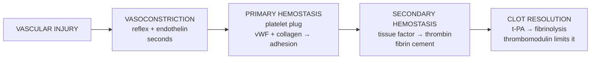
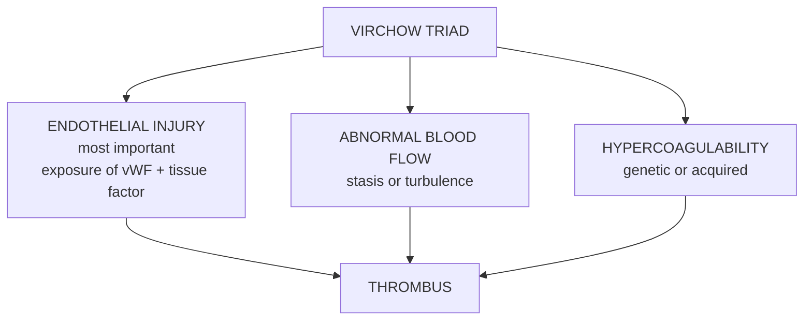
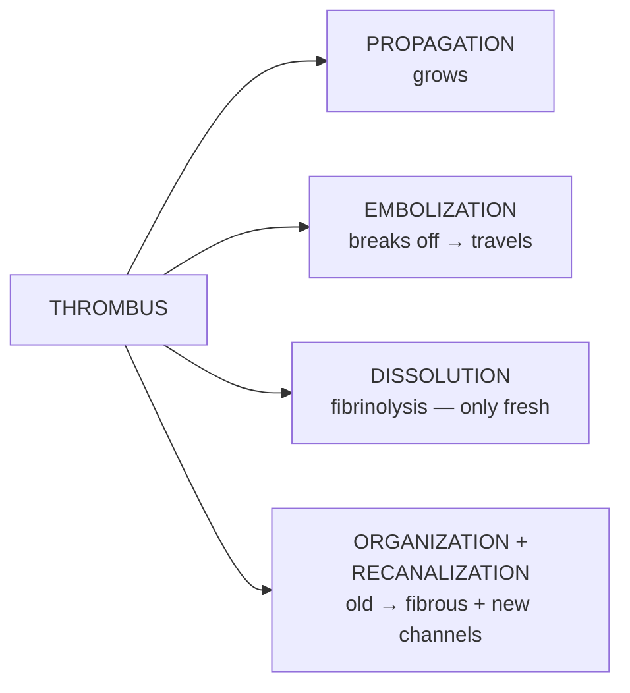
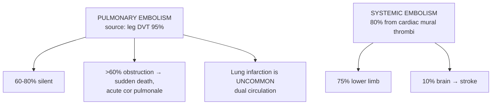

# 🔴 Chapter 4 — Hemodynamic Disorders, Thromboembolic Disease, and Shock

> **Book:** Robbins & Cotran, 10th ed., pp. 113–139 · **Author:** Richard N. Mitchell
> 🇧🇩 **এক লাইনে:** রক্ত আর তরল যখন ভুল জায়গায় জমে, জমাট বাঁধে বা ঠিকমতো পৌঁছায় না — তখনই হেমোডাইনামিক রোগ। প্রথমে *শোথ* (edema), তারপর *জমাট* (thrombosis) → *এম্বলি* → *ইনফার্কট*, আর সবশেষে যদি রক্ত সরবরাহ একেবারে ব্যর্থ হয় — *শক*।
> ⏱️ Total time: ~4–5 h. 🔴 MUST KNOW = 75% of this chapter.

---

## 🗺️ 1. BIG PICTURE — the whole chapter as one tree

---

## 📊 2. CHAPTER MAP — topic → priority → time

| Topic | Priority | Time |
|---|---|---|
| Edema: mechanisms (5), exudate vs transudate | 🔴 | 30 min |
| Hyperemia vs congestion; nutmeg liver, heart failure cells | 🔴 | 20 min |
| Hemostasis: vasoconstriction → primary → secondary plug | 🔴 | 35 min |
| Coagulation cascade: tissue factor, thrombin, vitamin K factors | 🔴 | 35 min |
| Endothelial antithrombotic mechanisms (protein C, ATIII, TFPI, t-PA) | 🔴 | 25 min |
| Hemorrhagic disorders: petechiae vs purpura vs ecchymosis | 🟡 | 15 min |
| Virchow triad + all 3 components | 🔴 | 30 min |
| Hypercoagulability: factor V Leiden, prothrombin, HIT, APS | 🔴 | 30 min |
| Morphology of thrombi: lines of Zahn, red vs white, vegetations | 🔴 | 20 min |
| Fate of thrombus: 4 outcomes | 🔴 | 15 min |
| Venous (DVT) vs arterial/cardiac thrombosis; DIC | 🔴 | 20 min |
| Embolism: pulmonary, systemic, fat, air, amniotic fluid | 🔴 | 30 min |
| Infarction: red vs white, 4 determinant factors | 🔴 | 20 min |
| Shock: 3 types, stages, septic shock pathogenesis | 🔴 | 35 min |

---

# PART A — FLUID IMBALANCE

## 3. Edema — mechanisms 🔴

🇧🇩 **Edema** = *শোথ* = টিস্যুর ভেতরে (interstitial space) অস্বাভাবিক তরল জমা। রক্তনালী আর টিস্যুর মধ্যে পানির ভারসাম্য নষ্ট হলে হয়।

### 🔴 5 mechanisms of edema (viva list)

| Mechanism | Physiology broken | Example |
|---|---|---|
| **↑ Hydrostatic pressure** | Capillary pressure ↑ | **Heart failure**, venous obstruction |
| **↓ Colloid osmotic pressure** | Plasma albumin ↓ | Liver failure (↓ synthesis), **nephrotic syndrome** (↑ loss), malnutrition |
| **↑ Vascular permeability** | Vessel wall leaky | **Inflammation** → exudate |
| **Lymphatic obstruction** | Can't drain | Infection/filariasis (**elephantiasis**), breast CA + axillary node removal |
| **Na⁺/H₂O retention** | Volume ↑ → edema | **Renal failure** |

📌 **Memory trick:** "**HP-CO-LP-L**" — **H**ydrostatic **P**ressure ↑, **C**olloid **O**smotic ↓, **L**eaky **P**ermeability, **L**ymphatic block. Plus Na retention for volume. ৫টা না পারলে ৪টাও চলে — বড় নোটে দাও।

### 🔴 Exudate vs Transudate (Ch 3 review — quick)

| | **Exudate** | **Transudate** |
|---|---|---|
| Protein | High (>3 g/dL) | Low |
| Specific gravity | >1.020 | <1.012 |
| Cause | Inflammation (leak) | Hydrostatic/oncotic imbalance |

### 🔴 Clinical types

- **Dependent edema:** gravity-dependent — legs when standing, **sacrum** when recumbent.
- **Pitting edema:** finger pressure leaves a depression (↑ interstitial fluid).
- **Periorbital edema:** loose connective tissue → first sign in **renal disease**.
- **Pulmonary edema:** Lungs 2–3× normal weight; **frothy blood-tinged fluid**; impairs gas exchange → hypoxemia. Common in **LV failure**.
- **Brain edema:** dangerous — can **herniate** through foramen magnum or compress brain stem → death.
- **Effusions:** pleural (**hydrothorax**), pericardial (**hydropericardium**), peritoneal (**ascites**). **Chylous effusion** = milky (lymphatic lipids). Ascites prone to bacterial seeding.

🔗 **Correlation — systemic edema in CHF/renal failure:** Heart failure → ↓ renal flow → **renin-angiotensin** → Na⁺+H₂O retention → edema. Liver failure → ↓ albumin → edema. Nephrotic → proteinuria → edema. All three meet at the same end: **fluid out of vessels**.

🖼️ [🔍 pitting edema finger pressure](https://www.google.com/search?q=pitting+edema+finger+pressure+test&tbm=isch) · [🔍 pulmonary edema frothy fluid gross](https://www.google.com/search?q=pulmonary+edema+frothy+fluid+pathology&tbm=isch)

---

## 4. Hyperemia vs Congestion 🔴

| | **Hyperemia** | **Congestion** |
|---|---|---|
| Mechanism | **Active** — arteriolar dilation (inflammation, exercise) | **Passive** — reduced venous outflow (heart failure) |
| Blood | Oxygenated | Deoxygenated |
| Color | **Red (erythema)** | **Blue-red (cyanosis)** |
| Tissue | Usually not edematous | Often edematous |

### 🔴 Two classic morphologic images (must-know):

1. **Nutmeg liver** (chronic passive congestion of liver): centrilobular zones red-brown + depressed (necrosis), surrounding tan viable parenchyma → cut surface looks like **nutmeg**. Mechanism: centrilobular area = distal end of hepatic blood supply → most hypoxic.
2. **Heart failure cells:** chronically congested lung (LV failure) → alveoli filled with **hemosiderin-laden macrophages** (phagocytosed RBCs). Septa get fibrotic.

📌 **Memorise:** "Congestion → cyanosis → edema → hemosiderin-laden macrophages." দীর্ঘ কনজেশন মানে দীর্ঘ হাইপক্সিয়া → টিস্যু ইনজুরি + হেমোসিডারিন।

---

# PART B — HEMOSTASIS (The Clotting Dance)

## 5. Normal Hemostasis — 3 sequential events 🔴

🇧🇩 হেমোস্ট্যাসিস = *রক্তক্ষরণ বন্ধের ব্যবস্থা*। তিন ধাপ: ① রক্তনালী সংকুচিত হয়, ② প্লেটলেটের প্লাগ বসে (primary), ③ ফাইব্রিন জাল সেই প্লাগকে সিমেন্ট করে (secondary)।

### 🔴 Primary hemostasis — the platelet plug

| Step | Molecule | Deficiency → disease |
|---|---|---|
| **Adhesion** | Platelet **GpIb** ↔ **vWF** (bridges collagen); GpIa/IIa ↔ collagen | vWF defect → **von Willebrand disease**; GpIb defect → **Bernard-Soulier syndrome** |
| **Activation** | Shape change ("sea urchin"), granules release **ADP** + **TxA2**; thrombin via **PAR-1** | — |
| **Aggregation** | **GpIIb/IIIa** ↔ fibrinogen bridges platelets | GpIIb/IIIa defect → **Glanzmann thrombasthenia** |

📌 **Memorise the 3 platelet diseases in one line:** "vWF/GpIb → can't **adhere** (von Willebrand, Bernard-Soulier); GpIIb/IIIa → can't **aggregate** (Glanzmann)."

💡 **Anti-platelet drugs map here:** **Aspirin** blocks COX → ↓ TxA2. **Clopidogrel/ticagrelor** block P2Y12 (ADP receptor). Abciximab blocks GpIIb/IIIa.

### 🔴 Secondary hemostasis — the coagulation cascade

- **Tissue factor (factor III)** from injured subendothelial cells (smooth muscle, fibroblasts) is the **main initiator in vivo** → activates factor VII → VIIa/TF complex.
- Cascade (amplified by thrombin feedback activating **V, VIII, XI**) → **prothrombin (II) → thrombin (IIa)**.
- **Thrombin = the king** 🔴:
  - Fibrinogen → **fibrin** (cross-linked by **factor XIII**)
  - Activates platelets (PAR-1), factors V, VIII, XI
  - On healthy endothelium → becomes **anticoagulant** (thrombomodulin → activates protein C)
- **Vitamin K–dependent factors:** II, VII, IX, X + proteins C and S. **Warfarin/coumadin** blocks their γ-carboxylation.

### 🔴 Lab tests (viva favourite)

| Test | Pathway | Factors tested |
|---|---|---|
| **PT** | **Extrinsic** (+ common) | VII, X, V, II, fibrinogen |
| **PTT** | **Intrinsic** (+ common) | XII, XI, IX, VIII, X, V, II, fibrinogen |

📌 **Mnemonic:** "**PT** = **T**issue factor (extrinsic, factor **VII**); **PTT** = **T**hromboplastin (intrinsic, **hemophilia factors VIII/IX**)." → Hemophiliacs have **normal PT, prolonged PTT**.

🔗 **Correlation — factor XII deficiency:** bleeding is NOT increased (actually thrombosis-prone) because factor XII isn't needed in vivo (tissue factor is). Factor XI deficiency = mild bleeding (thrombin feedback covers it).

### 🔴 Limits to clotting — the anticoagulants (must-know list)

| Anticoagulant | Action |
|---|---|
| **Antithrombin III** | Inactivates thrombin + factors IXa, Xa, XIa, XIIa — **boosted by heparin** (why heparin works) |
| **Thrombomodulin + protein C/S** | Thrombin binds thrombomodulin → activates protein C (needs protein S) → inactivates **factors Va, VIIIa** |
| **Tissue factor pathway inhibitor (TFPI)** | Inhibits TF/VIIa complex (needs protein S) |
| **PGI2 (prostacyclin), NO, ADPass** | Endothelial inhibitors of platelet aggregation |
| **t-PA → plasmin** | Fibrinolysis; **α2-antiplasmin** limits it. **D-dimer** = fibrin degradation product (clinical marker) |

📌 **Endothelial "good cop" summary: "4 inhibitors — NO + PGI2 (platelets), ATIII (thrombin), thrombomodulin/protein C (Va/VIIIa), TFPI (TF-VIIa)."**

---

## 6. Hemorrhagic Disorders 🟡

| Bleeding pattern | Type of defect | Examples |
|---|---|---|
| **Petechiae** (1–2 mm punctate) + mucosal bleeds (epistaxis, menorrhagia) | **Primary hemostasis** — platelets/vWF | Thrombocytopenia, vWD, aspirin |
| **Hemarthrosis** (joint bleeds), soft tissue bleeds | **Secondary hemostasis** — factors | **Hemophilia** (VIII, IX) |
| **Purpura** (≥3 mm), **ecchymoses** (1–2 cm bruises), **hematoma** | Small-vessel / systemic | Vasculitis, amyloidosis, scurvy |

📌 **Petechiae = tiny → platelet problem. Hemarthrosis = joint → hemophilia.** Intracranial hemorrhage = feared complication of severe thrombocytopenia.

---

# PART C — THROMBOSIS

## 7. The Virchow Triad 🔴 — "3 reasons blood clots"

| Component | Where it matters | Examples |
|---|---|---|
| **Endothelial injury** | **Heart & arteries** (high flow) | Atherosclerotic plaque, MI, vasculitis, toxins |
| **Stasis/turbulence** | **Veins** | Atrial fibrillation, immobilization, aneurysm, polycythemia |
| **Hypercoagulability** | **Veins** especially | Factor V Leiden, cancer, OCPs, pregnancy |

📌 **Memorise the site rule:** "**Arteries → injury, Veins → stasis, Genetic → hypercoagulability.**"

### 🔴 Morphology of thrombi — must-know terms

- **Lines of Zahn** = pale platelet/fibrin layers alternating with darker RBC layers → means the clot formed in **flowing blood** → distinguishes **antemortem** thrombus from bland postmortem clot.
- **Mural thrombus** = in heart chamber or aorta (over MI scar, aneurysm).
- **Arterial thrombus** = platelet-rich, **white**, friable, at branch points, usually occlusive. Sites: coronary > cerebral > femoral.
- **Venous thrombus = red/stasis thrombus** (RBC-rich), long luminal cast. 90% in leg veins.
- **Vegetations** = thrombi on heart valves (infective, nonbacterial thrombotic, Libman-Sacks).
- **Postmortem clot:** gelatinous, dark dependent RBC part + yellow "chicken fat" top, **not attached** to vessel wall.

---

## 8. Hypercoagulable States 🔴

### 🔴 Primary (genetic) — Table 4.2 highlights

| State | Frequency | Mechanism |
|---|---|---|
| **Factor V Leiden** | 2–15% of Caucasians; ~60% of recurrent DVT | Mutation (Arg506→Gln) makes factor V **resistant to protein C**. **AD inheritance.** Heterozygote: 5× risk; homozygote: 50× |
| **Prothrombin G20210A** | 1–2% | ↑ prothrombin levels → ~3× DVT risk |
| Antithrombin III deficiency | Rare | Loss of main thrombin inhibitor — presents in adolescence |
| Protein C / S deficiency | Rare | Loss of Va/VIIIa inhibition |
| Homocysteinemia | — | Cystathionine β-synthetase deficiency (or B6/B12/folate); damages vessels |

📌 **Think of it clinically:** Young patient (<50) with unprovoked DVT → think **factor V Leiden / inherited thrombophilia** even if acquired risk factors present.

### 🔴 Secondary (acquired)

**Strong:** bed rest/immobilization, MI, atrial fibrillation, surgery/fracture/burn, cancer, prosthetic valves, DIC, **HIT**, **antiphospholipid syndrome**.
**Other:** cardiomyopathy, nephrotic syndrome, pregnancy/OCPs, smoking, sickle cell.

### 🔴 HIT (Heparin-Induced Thrombocytopenia) — the paradox

- Heparin + **platelet factor 4 (PF4)** forms a neoantigen → **IgG antibodies** → activate platelets + remove them (spleen).
- **Bleeding marker (thrombocytopenia) but DANGER is THROMBOSIS** (~50% — arteries + veins → stroke, MI, gangrene).

📌 **One-liner:** "HIT = heparin → anti-PF4-heparin IgG → platelets destroyed but vessels clot. Stop heparin, use direct thrombin inhibitors."

### 🔴 Antiphospholipid Antibody Syndrome (APS)

- Antibodies to phospholipids/β2-glycoprotein I → **thrombosis (venous/arterial) + recurrent miscarriages + thrombocytopenia**.
- Primary (alone) or secondary (with **SLE** — "lupus anticoagulant").
- **Paradox:** antibodies *prolong* PTT in vitro but cause clotting in vivo. False-positive **syphilis serology** (cardiolipin cross-reacts).

---

## 9. Fate of the Thrombus 🔴 — "4 F's"

📌 **t-PA thrombolysis works only in the FIRST FEW HOURS** (fresh fibrin dissolves; older cross-linked fibrin resists).

### 🔴 Venous thrombosis (phlebothrombosis / DVT)

- 90% leg veins; **DVT at/above knee** (popliteal, femoral, iliac) = dangerous → embolizes to lung.
- ~**50% are asymptomatic** (collaterals open) — first seen as PE.
- Risk: bed rest (no calf muscle "milking"), CHF, trauma/surgery, cancer (**Trousseau syndrome** = migratory thrombophlebitis with cancer), pregnancy, age.
- **Superficial** saphenous thrombi = local pain, rarely embolize.

### 🔴 Arterial/cardiac thrombosis

- Atherosclerosis → plaque rupture → thrombus (MI, stroke).
- **Mural thrombi:** over MI scar, in dilated/fibrillating atria → **embolize to brain, kidneys, spleen** (rich blood supply organs).

### 🔴 DIC — "clots everywhere, then bleeds"

- Widespread microvascular thrombosis from **systemic thrombin activation** (obstetric complications, cancer, sepsis).
- **Consumptive coagulopathy** → platelets + factors used up → **bleeding catastrophe** (hemorrhagic stroke, shock). Synonym tells the story: *consumptive coagulopathy*.

---

# PART D — EMBOLISM

## 10. Embolism Overview 🔴

🇧🇩 **Embolus** = *ভাসমান দেহ* — রক্তে ভাসা কঠিন/তরল/গ্যাসীয় ভর যা দূরের জায়গায় গিয়ে আটকে যায়। ৯৯% আসলে ভেঙে যাওয়া থ্রম্বাস → **thromboembolism**।

### 🔴 Pulmonary embolism
- Source: **lower extremity DVT (>95%)** — via IVC → right heart → pulmonary arteries.
- **Saddle embolus** straddles pulmonary bifurcation → sudden death.
- **Effects by size:**
  - Small → silent (60–80%), organized into fibrous webs
  - Medium → hemorrhage but **usually NOT infarction** (bronchial artery dual supply saves the lung) — infarction only if bronchial flow also compromised (LV failure)
  - Large (>60% obstruction) → **sudden death / acute cor pulmonale**
  - Repeated small emboli → pulmonary hypertension → RV failure

### 🔴 Systemic thromboembolism
- **80% from intracardiac mural thrombi** (2/3: LV infarct; 1/4: LA dilation + AF); rest from aortic aneurysm, plaque, vegetations.
- **Paradoxical embolus:** venous embolus crosses a septal defect → systemic.

### 🔴 Fat embolism — after long-bone fracture 🔴

- Fat globules + marrow enter blood after **fracture of long bones** (or trauma/burns). 90% of severe skeletal injuries have fat emboli (mostly silent).
- **Fat embolism syndrome** (symptomatic minority): pulmonary insufficiency + **neurologic** symptoms + anemia + thrombocytopenia, 1–3 days after injury. **Petechial rash** (20–50%).
- Diagnosis: frozen section + **fat stain** (Oil Red O); paraffin processing dissolves fat.

### 🔴 Air embolism / decompression sickness

- **>100 mL air** into pulmonary circulation = clinical; 300–500 mL at 100 mL/sec = fatal.
- **Decompression sickness:** rapid ascent (scuba) → N₂ bubbles come out of solution → **the bends** (joint/muscle pain), **the chokes** (lungs), **caisson disease** (chronic — ischemic necrosis of femoral head). Treat: hyperbaric chamber + slow decompression.

### 🔴 Amniotic fluid embolism

- 5th commonest cause of maternal death; up to 80% mortality; 10% of US maternal deaths.
- Amniotic fluid/fetal cells enter maternal circulation via torn membranes/uterine veins → sudden dyspnea, cyanosis, shock, **DIC**.
- Autopsy: **fetal squamous cells, lanugo hair, mucin** in maternal pulmonary microvasculature.

---

# PART E — INFARCTION

## 11. Red vs White Infarct 🔴

| | **Red (hemorrhagic)** | **White (anemic)** |
|---|---|---|
| Mechanism | **Venous occlusion** OR loose/spongy tissue OR **dual circulation** OR prior congestion OR re-established flow | **Arterial occlusion** in solid organ with **end-arterial** supply |
| Organs | **Lung, small intestine** | **Heart, spleen, kidney** |
| Cause | Testicular torsion, lung embolism | Coronary, renal, splenic occlusion |

📌 **Memorise:** "White = solid organ, end-artery (heart/spleen/kidney). Red = spongy/dual-supply organ (lung, gut) or venous cause."

- **Wedge-shaped**, apex = occluded vessel, base = organ periphery.
- Histology: **coagulative necrosis** (4–12 h to appear); brain = **liquefactive**. Septic infarct → **abscess**.
- **Septic infarctions** from infected valve vegetations → abscess.

### 🔴 4 factors deciding if occlusion → infarct

1. **Anatomy of blood supply (most important)** — dual supply protects lung, liver, hand; end-arterial (kidney, spleen) does not.
2. **Rate of occlusion** — slow occlusion → collaterals develop (coronary collaterals).
3. **Tissue vulnerability** — neurons 3–4 min, myocardium 20–30 min; fibroblasts survive hours.
4. **Hypoxemia** — low blood O₂ increases damage.

---

# PART F — SHOCK

## 12. Shock — types and stages 🔴

🇧🇩 **Shock** = *চলমান রক্ত সঞ্চালন ব্যর্থ* → টিস্যুতে অক্সিজেন পৌঁছায় না → কোষ হাইপক্সিয়ায় ক্ষতিগ্রস্ত। শুরুতে reversible, পরে irreversible।

### 🔴 3 major types (Table 4.3)

| Type | Cause | Mechanism |
|---|---|---|
| **Cardiogenic** | MI, arrhythmia, cardiac tamponade, PE | **Pump failure** → low cardiac output |
| **Hypovolemic** | Hemorrhage, burns, vomiting/diarrhea | **Low blood volume** |
| **Septic** (SIRS) | Bacterial/fungal infection, superantigens, trauma, burns, pancreatitis | Cytokine storm → **vasodilation + pooling + endothelial injury + DIC** |

➕ Also: **neurogenic** (spinal cord injury) and **anaphylactic** (IgE) — both acute vasodilation.

### 🔴 Definitions (Sepsis-3, 2016)
- **Sepsis** = life-threatening **organ dysfunction** from dysregulated host response to infection.
- **Septic shock** = subset of sepsis with profound circulatory/cellular/metabolic abnormalities → higher mortality (~50%).
- **SIRS** = sepsis-like systemic inflammation from NON-microbial causes (burns, trauma, pancreatitis). CAR-T therapy → similar **cytokine release syndrome**.

### 🔴 3 stages of shock

| Stage | What happens |
|---|---|
| **Nonprogressive** | Compensated: baroreflex, catecholamines, ADH, RAAS → tachycardia, vasoconstriction, renal conservation. **Cool pale skin** (septic: initially warm/flushed) |
| **Progressive** | Anaerobic glycolysis → **lactic acidosis** → arterioles dilate → blood pools → worsening |
| **Irreversible** | Lysosomal leak, myocardial failure, ischemic bowel → bacteremia, **renal failure**, death |

### 🔴 Pathogenesis of septic shock (the must-know cascade)

1. **PAMPs/DAMPs** → TLRs, G-protein receptors, Dectins → **NF-κB** → TNF, IL-1, IL-12, IL-18, IFN-γ, HMGB1, CRP, procalcitonin, ROS, PAF.
2. **Endothelial activation/injury** → leaky vessels → **protein-rich edema**, NO → vasodilation → **hypotension**.
3. **Procoagulant state** → ↑ tissue factor, ↓ TFPI/thrombomodulin/protein C, ↑ PAI-1 → **fibrin microthrombi → DIC** in up to half of septic patients. Then consumption → bleeding.
4. **Metabolic:** insulin resistance + hyperglycemia (↓GLUT-4), adrenal insufficiency (**Waterhouse-Friderichsen** = adrenal hemorrhage/necrosis from DIC), lactic acidosis.
5. **Counter-regulatory immunosuppression:** shift Th1→Th2, IL-10, lymphocyte apoptosis → patients oscillate between inflammation and suppression.
6. **Organ dysfunction:** kidneys, liver, lungs (**ARDS**/shock lung), heart, brain → **multiorgan failure** → death.

📌 **Superantigens** (e.g., toxic shock syndrome) = polyclonal T-cell activators → massive cytokine release → shock without true infection.

### 🔴 Morphology of shock

- Hypoxic injury (Ch 2) in brain, heart, kidneys, adrenals, GI tract.
- **Fibrin thrombi** most visible in kidney glomeruli.
- Adrenal cortical lipid depletion (stress).
- **Shock lung** = diffuse alveolar damage in sepsis/trauma (not in pure hypovolemia).

### 🔴 Clinical features & prognosis

- Hypovolemic/cardiogenic: hypotension, weak rapid pulse, tachypnea, **cool clammy cyanotic skin**.
- Septic: **warm flushed skin** (vasodilation) initially.
- Prognosis: young healthy hypovolemic → **>90% survive**; septic/cardiogenic → poor even with best care.

🖼️ [🔍 lines of Zahn thrombus histology](https://www.google.com/search?q=lines+of+Zahn+thrombus+histology&tbm=isch) · [🔍 nutmeg liver gross pathology](https://www.google.com/search?q=nutmeg+liver+chronic+passive+congestion&tbm=isch) · [🔍 heart failure cells hemosiderin lung](https://www.google.com/search?q=heart+failure+cells+hemosiderin+macrophages+lung&tbm=isch) · [🔍 pulmonary embolism saddle embolus](https://www.google.com/search?q=saddle+embolism+pulmonary+artery+gross&tbm=isch) · [🔍 white vs red infarct kidney spleen](https://www.google.com/search?q=white+infarct+spleen+red+infarct+lung+pathology&tbm=isch)

---

# 🎯 RAPID-FIRE ONE-LINERS

**Edema:**
❓ Edema = → ✅ Fluid in interstitial space
❓ 5 mechanisms → ✅ ↑hydrostatic, ↓colloid osmotic, ↑permeability, lymphatic block, Na retention
❓ Transudate protein → ✅ Low (<3 g/dL), low SG
❓ Exudate cause → ✅ Inflammation (leaky vessels)
❓ Periorbital edema first → ✅ Renal disease
❓ Chylous effusion = → ✅ Milky — lymphatic lipids
❓ Elephantiasis cause → ✅ Lymphatic obstruction (filariasis)

**Hyperemia/congestion:**
❓ Hyperemia = → ✅ Active arteriolar dilation → red (erythema)
❓ Congestion = → ✅ Passive venous outflow ↓ → cyanosis
❓ Nutmeg liver pattern → ✅ Chronic passive congestion, centrilobular red/depressed
❓ Heart failure cells → ✅ Hemosiderin-laden macrophages in alveoli (LV failure)

**Hemostasis:**
❓ First hemostatic event → ✅ Vasoconstriction (reflex + endothelin)
❓ Platelet adhesion bridge → ✅ vWF + GpIb
❓ Platelet aggregation → ✅ Fibrinogen bridges GpIIb/IIIa
❓ vWD defect → ✅ vWF (adhesion)
❓ Bernard-Soulier → ✅ GpIb deficiency
❓ Glanzmann thrombasthenia → ✅ GpIIb/IIIa deficiency
❓ Main initiator of coagulation in vivo → ✅ Tissue factor (+ VII)
❓ Thrombin's main jobs → ✅ Fibrin + platelet activation + factors V/VIII/XI
❓ Vitamin K factors → ✅ II, VII, IX, X + protein C, S
❓ PT tests → ✅ Extrinsic (VII, X, V, II, fibrinogen)
❓ PTT tests → ✅ Intrinsic (XII, XI, IX, VIII)
❓ Hemophilia → ✅ Normal PT, prolonged PTT (VIII/IX)
❓ Heparin works via → ✅ Antithrombin III
❓ Thrombomodulin → ✅ Thrombin → activates protein C → inactivates Va/VIIIa
❓ Protein S is cofactor for → ✅ Protein C + TFPI
❓ Fibrinolysis enzyme → ✅ Plasmin (t-PA); D-dimer = degradation product
❓ Factor XII deficiency → ✅ No bleeding, thrombosis-prone

**Hemorrhage:**
❓ Petechiae → ✅ Platelet/vWF defect, tiny 1–2 mm
❓ Hemarthrosis → ✅ Hemophilia (factor VIII/IX)
❓ Purpura ≥ 3 mm, ecchymoses 1–2 cm → ✅ Small-vessel disease

**Thrombosis:**
❓ Virchow triad → ✅ Endothelial injury, abnormal flow, hypercoagulability
❓ Arterial thrombi form when → ✅ Endothelial injury (high flow)
❓ Venous thrombi form when → ✅ Stasis
❓ Lines of Zahn = → ✅ Pale platelet/fibrin + red layers → antemortem, flowing blood
❓ Red thrombus = → ✅ Venous/stasis, RBC-rich
❓ White thrombus = → ✅ Arterial, platelet-rich
❓ Mural thrombus site → ✅ Heart chamber / aorta
❓ Factor V Leiden → ✅ Resistant to protein C → AD, 5× (het) / 50× (hom) DVT risk
❓ HIT → ✅ Heparin+PF4 → IgG → thrombocytopenia but thrombosis
❓ APS → ✅ Thrombosis + miscarriages; with SLE; false +ve syphilis test
❓ Trousseau syndrome → ✅ Migratory thrombophlebitis with cancer
❓ DIC = → ✅ Widespread microthrombosis + consumption → bleeding
❓ 4 fates of thrombus → ✅ Propagation, embolization, dissolution, organization+recanalization
❓ t-PA effective only → ✅ First few hours (fresh fibrin)

**Embolism:**
❓ 95% of PE from → ✅ Leg DVT
❓ Saddle embolus → ✅ Straddles pulmonary bifurcation → sudden death
❓ Why lung rarely infarcts → ✅ Dual supply (bronchial artery)
❓ Systemic emboli source (80%) → ✅ Intracardiac mural thrombi
❓ Most common systemic emboli target → ✅ Lower limb (75%), brain (10%)
❓ Paradoxical embolus → ✅ Crosses septal defect
❓ Fat embolism cause → ✅ Long-bone fracture; petechial rash
❓ The bends → ✅ Decompression sickness — N₂ bubbles
❓ Amniotic fluid embolism → ✅ Maternal death; fetal squamous cells + DIC

**Infarction:**
❓ White infarct → ✅ Arterial, end-artery solid organ (heart, spleen, kidney)
❓ Red infarct → ✅ Venous / spongy / dual supply (lung, gut)
❓ Infarct shape → ✅ Wedge (apex = vessel)
❓ Histology → ✅ Coagulative necrosis (brain = liquefactive)
❓ Most important determinant of infarct → ✅ Collateral/dual blood supply
❓ Neurons survive ischemia only → ✅ 3–4 min; myocardium 20–30 min

**Shock:**
❓ 3 main types → ✅ Cardiogenic, hypovolemic, septic
❓ Septic shock driver → ✅ PAMPs → NF-κB → TNF/IL-1 → vasodilation + DIC
❓ Waterhouse-Friderichsen → ✅ Adrenal hemorrhage (DIC in sepsis/meningococcemia)
❓ Shock lung → ✅ Diffuse alveolar damage (ARDS)
❓ Hypovolemic skin → ✅ Cool clammy; septic skin → warm flushed
❓ Best prognosis shock → ✅ Young hypovolemic (>90% survive)

---

# 🎴 FLASHCARDS (end-of-chapter self-test)

**1. Q: List the 5 mechanisms of edema with one example each.**
✅ ↑Hydrostatic pressure (heart failure); ↓colloid osmotic pressure (liver/nephrotic); ↑vascular permeability (inflammation); lymphatic obstruction (elephantiasis); Na⁺/H₂O retention (renal failure).

**2. Q: Hyperemia vs congestion.**
✅ Hyperemia = active arteriolar dilation → red, oxygenated (inflammation/exercise). Congestion = passive venous outflow ↓ → cyanotic, deoxygenated (CHF), → edema + hemosiderin macrophages.

**3. Q: Walk through normal hemostasis.**
✅ Vasoconstriction (reflex + endothelin) → primary plug: platelets adhere via vWF-GpIb, activate (ADP, TxA2), aggregate via fibrinogen-GpIIb/IIIa → secondary plug: tissue factor + VII → cascade → thrombin → fibrin cement (XIII) → counterregulators (t-PA, thrombomodulin, ATIII) confine the clot.

**4. Q: Which factors are vitamin K dependent, and what does warfarin do?**
✅ II, VII, IX, X + protein C and S. Warfarin inhibits γ-carboxylation needed for their function.

**5. Q: PT vs PTT.**
✅ PT = extrinsic pathway (VII, X, V, II, fibrinogen); PTT = intrinsic (XII, XI, IX, VIII). Hemophilia → normal PT, prolonged PTT.

**6. Q: Name the major natural anticoagulants.**
✅ Antithrombin III (thrombin, IXa, Xa — boosted by heparin); thrombomodulin + protein C/S (inactivate Va, VIIIa); TFPI (inhibits TF-VIIa); PGI2/NO/ADPase (platelets); t-PA/plasmin (fibrinolysis).

**7. Q: The Virchow triad with a site each.**
✅ Endothelial injury (arteries/heart — plaque, MI); abnormal blood flow/stasis (veins — AF, immobilization, aneurysm); hypercoagulability (veins — factor V Leiden, cancer, OCPs).

**8. Q: Factor V Leiden vs HIT vs APS — 30 seconds each.**
✅ FVL: factor V resists protein C → AD, commonest inherited cause of DVT. HIT: heparin+PF4 → IgG → thrombocytopenia + thrombosis (stop heparin). APS: aPL antibodies → venous/arterial thrombosis + recurrent miscarriage; false +ve syphilis; PTT prolonged in vitro.

**9. Q: What do lines of Zahn tell you?**
✅ Thrombus formed in flowing blood before death (antemortem) — pale platelet/fibrin bands alternating with darker RBC bands. Postmortem clot: gelatinous, unattached, no lines.

**10. Q: Why does PE rarely infarct the lung?**
✅ Dual blood supply — bronchial arteries keep the lung alive. Infarction occurs if bronchial flow is also compromised (e.g., LV failure).

**11. Q: Red vs white infarct with examples.**
✅ Red: venous occlusion, spongy tissues, dual circulation (lung, small intestine, testicular torsion). White: arterial occlusion, end-artery solid organs (heart, spleen, kidney).

**12. Q: Name the 4 determinants of infarction.**
✅ Collateral/dual supply (most important), rate of occlusion, tissue vulnerability (neurons 3–4 min), hypoxemia.

**13. Q: Compare the 3 types of shock.**
✅ Cardiogenic = pump fails (MI, tamponade). Hypovolemic = volume lost (hemorrhage, burns). Septic = dysregulated host response → vasodilation + endothelial leak + DIC.

**14. Q: Describe the septic shock cascade.**
✅ PAMPs → TLRs → NF-κB → TNF/IL-1/HMGB1 → endothelial activation (leak, NO) → hypotension + tissue factor ↑, anticoagulants ↓, PAI-1 ↑ → DIC → multiorgan failure. Counter-regulatory immunosuppression (IL-10, Th1→Th2) follows.

**15. Q: The 3 stages of shock.**
✅ Nonprogressive (compensated — tachycardia, vasoconstriction, RAAS); progressive (lactic acidosis, vasodilation, pooling); irreversible (myocardial failure, ischemic bowel, renal failure, death).

---

# 🗣️ TOP 10 VIVA QUESTIONS FROM THIS CHAPTER

1. "Mechanisms of edema — name all five." → HP↑, COP↓, permeability↑, lymph block, Na retention.
2. "Exudate vs transudate." → Protein/SG/cause table.
3. "Walk me through hemostasis." → 3 steps with molecules (vWF-GpIb, GpIIb/IIIa-fibrinogen, tissue factor-thrombin).
4. "Why does aspirin prevent heart attacks?" → Blocks platelet COX → ↓ TxA2 → no aggregation.
5. "PT vs PTT — which is abnormal in hemophilia?" → PT normal, PTT prolonged.
6. "Virchow triad with examples for each." → Injury (artery/plaque), stasis (vein/AF), hypercoagulability (FVL/cancer).
7. "Factor V Leiden — mechanism and inheritance." → Resistant to protein C; AD; hetero 5×, homo 50× risk.
8. "Why is HIT dangerous even though platelets are low?" → Anti-PF4-heparin IgG → platelet activation → thrombosis (stroke, MI, gangrene).
9. "Red vs white infarcts — why is the lung different?" → Dual circulation → red + rarely infarcts.
10. "Cardiogenic vs hypovolemic vs septic shock." → Pump vs volume vs cytokines+vasodilation+DIC.

---

> 📖 **Next chapter:** [05 — Genetic and Pediatric Diseases](ch05_Genetic_Disorders.md)
> 🧭 Back to: [00 — Index](00_INDEX.md) · [Start Here](00_START_HERE.md)
