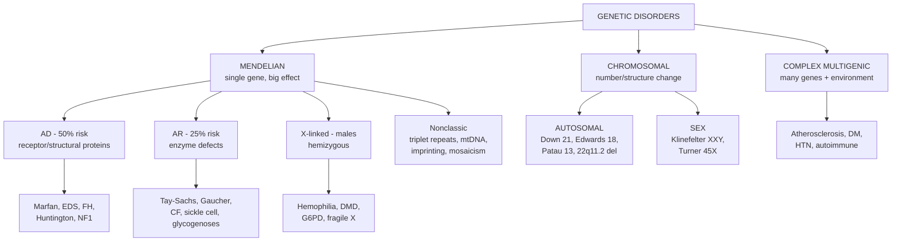

# 🟡 Chapter 5 — Genetic Disorders

> **Book:** Robbins & Cotran, 10th ed., pp. 141–190 · **Author:** Anirban Maitra
> 🇧🇩 **এক লাইনে:** রোগ ৩ ভাবে আসতে পারে — একটা জিনের বড় মিউটেশন (Mendelian), ক্রোমোজোমের ঘাটতি (chromosomal), অথবা বহু জিন + পরিবেশের সমীকরণ (multifactorial)। এছাড়া আছে *নন-ক্লাসিক* গ্রুপ: ট্রাইনিউক্লিওটাইড রিপিট, মাইটোকন্ড্রিয়াল, ইমপ্রিন্টিং।
> ⏱️ Total time: ~3–4 h. 🔴 MUST KNOW = 60% of this chapter (patterns of inheritance + the big syndromes).

---

## 🗺️ 1. BIG PICTURE — the whole chapter as one tree

---

## 📊 2. CHAPTER MAP — topic → priority → time

| Topic | Priority | Time |
|---|---|---|
| 3 categories of genetic disorders | 🔴 | 15 min |
| Mutation types (missense, nonsense, frameshift, etc.) | 🔴 | 20 min |
| AD / AR / X-linked transmission + tables | 🔴 | 30 min |
| Molecular basis: enzyme vs receptor vs structural defects | 🔴 | 20 min |
| Marfan syndrome | 🔴 | 15 min |
| Ehlers-Danlos syndromes | 🟡 | 15 min |
| Familial hypercholesterolemia | 🔴 | 20 min |
| Lysosomal storage diseases (Tay-Sachs, Niemann-Pick, Gaucher, MPS) | 🔴 | 30 min |
| Glycogen storage diseases (von Gierke, McArdle, Pompe) | 🟡 | 20 min |
| Complex multigenic disorders | 🟡 | 10 min |
| Chromosome structure & nomenclature | 🟡 | 15 min |
| Down syndrome + trisomies 18, 13 | 🔴 | 30 min |
| 22q11.2 deletion (DiGeorge) | 🟡 | 15 min |
| Klinefelter & Turner syndromes | 🔴 | 25 min |
| Trinucleotide repeats — fragile X, Huntington, anticipation | 🔴 | 25 min |
| Mitochondrial inheritance — Leber | 🟡 | 10 min |
| Imprinting — Prader-Willi vs Angelman | 🔴 | 20 min |
| Molecular diagnostics (PCR, FISH, NGS) | ⚪ | 15 min |

---

# PART A — FOUNDATIONS

## 3. The 3 Categories + Mutation Types 🔴

### 🔴 Categories

| Category | Mechanism | Penetrance | Examples |
|---|---|---|---|
| **Mendelian** | Single gene, large effect | High | CF, Marfan, hemophilia |
| **Chromosomal** | Number/structure change | High | Down, Turner |
| **Complex multifactorial** | Many gene variants (polymorphisms) + environment | Low each | Atherosclerosis, DM, HTN |

### 🔴 Mutation types (quick list)

| Mutation | Effect |
|---|---|
| **Missense** | 1 amino acid change — sickle (Glu→Val in β-globin) |
| **Nonsense** | Codon → STOP — truncation (β-globin codon 39) |
| **Frameshift** | Deletion/insertion not in multiples of 3 → garbled reading frame (Tay-Sachs, ABO-O) |
| **In-frame deletion** | Multiples of 3 deleted — **ΔF508 in CF** |
| **Promoter/splice-site** | ↓ or no transcription / bad splicing (thalassemias) |
| **Trinucleotide repeat** | Expansion → fragile X, Huntington |
| **Structural variants** | Deletion, amplification, translocation — **Philadelphia t(9;22) in CML** |

📌 **CFTR ΔF508 = 3-base deletion → in-frame, NOT frameshift** — classic viva trick.

---

## 4. Transmission Patterns — AD, AR, X-linked 🔴

### 🔴 Autosomal Dominant (AD)

| Feature | Detail |
|---|---|
| Expression | **Heterozygote shows disease** |
| Risk to child | **50%** (affected parent × unaffected) |
| Sexes | Males + females equally, both transmit |
| Protein types | **Receptors, structural proteins** (NOT enzymes) |
| New mutations | Common — esp. older fathers |
| Concepts | **Incomplete penetrance** (gene present, no disease), **variable expressivity** (different severity — NF1), **delayed onset** (Huntington) |
| Mechanisms | **Loss of function** (LDL receptor, collagen), **dominant negative** (mutant chain poisons the multimer — osteogenesis imperfecta), **gain of function** (Huntington) |

**Table 5.1 AD highlights:** Huntington, NF1, myotonic dystrophy, tuberous sclerosis, polycystic kidney, familial polyposis coli, hereditary spherocytosis, vWD, Marfan, EDS, osteogenesis imperfecta, achondroplasia, familial hypercholesterolemia.

### 🔴 Autosomal Recessive (AR)

| Feature | Detail |
|---|---|
| Expression | **Both alleles mutated** — parents are unaffected carriers |
| Risk to child | **25%** |
| Sexes | Equal |
| Protein types | **Enzymes** (inborn errors of metabolism) |
| Consanguinity | Suspect if proband from consanguineous marriage |
| Onset | Often **early in life** |

**Table 5.2 AR highlights:** CF, PKU, galactosemia, homocystinuria, **lysosomal storage diseases**, α1-antitrypsin deficiency, Wilson, hemochromatosis, glycogenoses, sickle cell, thalassemia, congenital adrenal hyperplasia, alkaptonuria, Friedreich ataxia, spinal muscular atrophy.

### 🔴 X-Linked Recessive (XLR)

| Feature | Detail |
|---|---|
| Who is affected | **Males (hemizygous)** |
| Transmission | Carrier **female → sons 50%**; affected male → all daughters carriers, **no male-to-male** |
| Why females spared | **Random X-inactivation (Lyon hypothesis)** — each cell has one active X; heterozygote females are mosaics |
| Barr body | Inactive X in interphase nucleus; **XIST** lncRNA coats it |

**Table 5.3 XLR highlights:** Duchenne muscular dystrophy, **hemophilia A & B**, chronic granulomatous disease, **G6PD deficiency**, agammaglobulinemia, Wiskott-Aldrich, Lesch-Nyhan, fragile X, diabetes insipidus.

📌 **The 3 rules examiners test:** ① AD → 50% risk, no skipping. ② AR → 25% risk, consanguinity. ③ X-linked → **no father-to-son transmission**, males affected.

📌 **Two key concepts:** **Pleiotropism** = one gene → many effects (sickle → hemolysis + infarcts + bone changes). **Genetic heterogeneity** = many genes → same trait (childhood deafness; DM).

---

## 5. Molecular Basis of Single-Gene Disorders 🔴

| Protein type | Consequence | Example |
|---|---|---|
| **Enzyme defect** | Metabolic block → ↑ substrate (toxicity), ↓ product, or failure to inactivate | Galactosemia; **α1-antitrypsin** (can't inactivate neutrophil elastase → emphysema); PKU; albinism |
| **Receptor/transport defect** | Substrate can't enter cell | **Familial hypercholesterolemia** (LDL receptor); CF (chloride channel) |
| **Structural protein defect** | Weak tissues | Collagen (OI, EDS), dystrophin (DMD), spectrin (spherocytosis) |
| **Drug reaction (pharmacogenetics)** | Enzyme deficiency unmasked by drug | **G6PD + primaquine** → hemolysis |

---

# PART B — THE CLASSIC MENDELIAN DISEASES

## 6. Marfan Syndrome 🔴

🇧🇩 মাফান = *লম্বা-লাফা রোগ*। ফাইব্রিলিন-১ (FBN1) জিনে মিউটেশন → কানেক্টিভ টিস্যু দুর্বল।

- **Defect:** **FBN1** → **fibrillin-1** (microfibrils in ECM). AD, 1:5000. Mechanisms: loss of structural support + **excess TGF-β signaling** (fibrillin normally sequesters TGF-β).
- **Skeleton:** tall stature, **long limbs + arachnodactyly** (long tapering fingers), **pectus excavatum**, scoliosis, hypermobile joints.
- **Eyes:** **ectopia lentis** — bilateral lens subluxation (upward-outward) ← weak ciliary zonules. *If you see bilateral ectopia lentis → think Marfan.*
- **Cardiovascular (killer):** **mitral valve prolapse** (floppy valve) + **aortic root dilation → aortic dissection** (cystic medionecrosis). Most deaths = ruptured dissection.
- **Treatment insight:** angiotensin receptor blockers (↓ TGF-β) shrink aortic root in mice.

📌 **One-liner:** "Tall + long fingers + dislocated lens + aortic dissection = Marfan."

## 7. Ehlers-Danlos Syndromes (EDS) 🟡

- **Defect:** collagen synthesis/assembly (multiple genes) → hyperextensible fragile skin + hypermobile joints → **joint dislocations, poor wound healing (gaping scars)**.
- Inheritance varies by type.

| Type | Gene | Key feature |
|---|---|---|
| **Classic** | **COL5A1/A2** | Skin + joint hypermobility, atrophic scars |
| **Vascular** | **COL3A1** | Thin skin, **arterial/uterine/colon rupture** (dangerous, skin NOT very stretchy) |
| **Kyphoscoliosis** | Lysyl hydroxylase | Scoliosis, ocular fragility (AR) |
| **Dermatosparaxis** | Procollagen N-peptidase | Severe skin fragility (AR) |

📌 **Marfan vs EDS:** Marfan = fibrillin (long bones, lens, aorta). EDS = collagen (skin, joints, rupture). "Marfan stretches the skeleton, EDS stretches the skin."

## 8. Familial Hypercholesterolemia (FH) 🔴

- **Defect:** LDL clearance ↓ → plasma cholesterol ↑ → premature atherosclerosis + MI.
- **3 genes (AD):** **LDLR (80–85%)**, **ApoB-100 (5–10%)**, **PCSK9 activating (1–2%)** — PCSK9 destroys LDL receptors.
- **Heterozygote (1:200):** cholesterol 2–3× → adult atherosclerosis, **tendon xanthomas**.
- **Homozygote:** 5–6× → MI **before age 20**; skin xanthomas.
- **Treatment story:** **Statins** inhibit **HMG-CoA reductase** → cells make more LDL receptors. **Anti-PCSK9 antibodies** → more receptors. (PCSK9 was discovered in people with *very low* cholesterol = loss-of-function.)

---

## 9. Lysosomal Storage Diseases 🔴

Mechanism: enzyme deficiency → substrate accumulates in lysosomes (**primary storage**) + defective autophagy (secondary). **Treatment:** enzyme replacement, substrate reduction, **molecular chaperone therapy** (misfolded enzyme → folded).

### 🔴 The big four table:

| Disease | Enzyme | Accumulates | Key features |
|---|---|---|---|
| **Tay-Sachs** | Hexosaminidase A (α-subunit, **HEXA**) | **GM2 ganglioside** | Ashkenazi Jews; infantile: intellectual disability + blindness, **cherry-red spot** (macula), death ~2–3 y; neurons ballooned (whorled lysosomes); 4-base frameshift |
| **Niemann-Pick A/B** | Sphingomyelinase | Sphingomyelin | Type A: neuro + viscera, cherry-red spot, early death; Type B: only organomegaly; foam cells ("zebra bodies") |
| **Niemann-Pick C** | **NPC1/NPC2** (cholesterol transport, NOT enzyme) | Cholesterol | Ataxia, **vertical supranuclear gaze palsy**; risk factor for Alzheimer |
| **Gaucher** | **Glucocerebrosidase** | Glucocerebroside | **Most common LSD**. Type I (99%, Ashkenazi): **Gaucher cells** = "crumpled tissue paper" macrophages in spleen/bone → splenomegaly, bone crises, pancytopenia. Types II/III: neuronopathic. **Gaucher ↔ Parkinson risk** |
| **MPS (Hurler/Hunter)** | α-L-iduronidase (Hurler, AR) / iduronate sulfatase (Hunter, **X-linked**) | Mucopolysaccharides | Coarse facies, corneal clouding (Hunter: **no corneal clouding**, milder), hepatosplenomegaly, intellectual disability |

📌 **Memorise the cellular appearances:** **Gaucher = crumpled paper** (fibrillary), **Niemann-Pick = foam/zebra** (vacuolated), **Tay-Sachs = onion-skin whorls** in neurons.

📌 **Cherry-red spot:** Tay-Sachs + Niemann-Pick A (ganglion cells swollen around macula → fovea appears red).

## 10. Glycogen Storage Diseases (Glycogenoses) 🟡

| Type | Name | Enzyme | Organ | Features |
|---|---|---|---|---|
| **I** | **von Gierke** | **Glucose-6-phosphatase** | Liver | Hepatomegaly, **severe hypoglycemia**, hyperlipidemia, hyperuricemia (gout), growth failure |
| **II** | **Pompe** | **Lysosomal acid α-glucosidase** | All organs | **Massive cardiomegaly**, hypotonia, death <2 y (lysosomal — all organs) |
| **V** | **McArdle** | **Muscle phosphorylase** | Muscle | **Cramps on exercise**, myoglobinuria, lactate does NOT rise; adult onset |

📌 **Quick line:** "von Gierke = liver + hypoglycemia; Pompe = heart; McArdle = muscle cramps." (Hepatic vs myopathic forms.)

---

# PART C — COMPLEX MULTIGENIC DISORDERS

## 11. Multifactorial Inheritance 🟡

- **Polymorphisms** (alleles ≥1% frequency) each give small risk; disease when many coinherited + environment ("common disease / common variant").
- Examples: **atherosclerosis, type 2 DM, hypertension, autoimmune diseases, obesity unmasked by weight gain**.
- Normal traits (height, eye color, intelligence) = bell curve.

---

# PART D — CHROMOSOMAL DISORDERS

## 12. Chromosome Basics & Abnormalities 🟡

- Normal: **46,XX / 46,XY**. Notation: total #, sex chromosomes, then abnormalities → **47,XY,+21** = trisomy 21.
- **p** = short arm, **q** = long arm.
- **Aneuploidy** (not a multiple of 23) ← **nondisjunction** (meiosis) or **anaphase lag**. → trisomy (2n+1) or monosomy (2n−1).
- **Mosaicism** = 2+ cell populations from mitotic error (e.g., 46,XY/47,XY,+21).
- Structural: **deletion, ring chromosome, inversion, isochromosome, translocation** (balanced reciprocal = phenotypically normal carrier; **Robertsonian** = fusion of 2 acrocentrics — 14/21 → Down).
- **Lyon hypothesis:** one X inactivated randomly (~day 5.5); **XIST** does it; Barr body = inactive X. ~30% of Xp genes escape inactivation.

## 13. Down Syndrome (Trisomy 21) 🔴

| Feature | Detail |
|---|---|
| Incidence | 1:700; **most common chromosomal disorder + major cause of intellectual disability** |
| Karyotype | **95% trisomy 21** (47,XX,+21) from **meiotic nondisjunction** — **maternal origin 95%**; 4% **Robertsonian translocation** (der(14;21)); 1% mosaics |
| Maternal age | Strong ↑ (1:1550 <20y → 1:25 >45y) — matters only for nondisjunction (not translocation/mosaic) |
| Face | Flat profile, **epicanthic folds**, oblique palpebral fissures, simian crease |
| Heart | **~40% — AV septal defect** most common; VSD, ASD, TOF |
| Cancer | **20× acute B-lymphoblastic leukemia; 500× AML** (esp. acute megakaryoblastic) |
| Neuro | **Alzheimer disease changes in all >40y** (amyloid β precursor = APP gene on chr 21!) |
| Immune/thyroid | Infections, thyroid autoimmunity |
| Median survival | ~47 years (with modern care) |

📌 **Gene-dosage idea:** trisomy = overexpression of chr-21 genes (APP → Alzheimer; mitochondrial genes; lncRNAs). Prenatal: **cell-free fetal DNA NIPT**.

## 14. Trisomies 18 & 13 🔴

| | **Trisomy 18 (Edwards)** | **Trisomy 13 (Patau)** |
|---|---|---|
| Incidence | 1:8000 | 1:15,000 |
| Features | Prominent occiput, micrognathia, low-set ears, **overlapping fingers**, rocker-bottom feet, heart defects | **Cleft lip/palate, microphthalmia, polydactyly**, heart/renal defects, rocker-bottom feet |
| Survival | Rarely past 1 year | Rarely past 1 year |

## 15. 22q11.2 Deletion Syndrome (DiGeorge / Velocardiofacial) 🟡

- **1:4000**; deletion at 22q11.2 (~1.5 Mb, **TBX1** gene).
- Spectrum: **cardiac outflow defects, palatal abnormalities, facial dysmorphism, T-cell immunodeficiency (thymic hypoplasia), hypocalcemia (parathyroid hypoplasia)**.
- **DiGeorge** = thymus + parathyroid + cardiac. **Velocardiofacial** = cleft palate + dysmorphism + learning disability.
- Associated with **schizophrenia** in ~25% of adults. Diagnosis by **FISH**.

## 16. Klinefelter Syndrome (47,XXY) 🔴

- **Male hypogonadism; 2+ X + 1 Y.** 1:660 males — **most common cause of male sterility**.
- Karyotype **47,XXY (90%)** ← nondisjunction (maternal or paternal); maternal age a risk.
- Features: **small atrophic testes**, **gynecomastia**, eunuchoid body habitus (**tall, long legs**), ↓ testosterone, **↑ FSH**, sparse body hair.
- Risks: **mediastinal germ cell tumors (20–30×)**, breast cancer, SLE, type 2 DM, osteoporosis.
- Pathogenesis: ~35% of X genes escape inactivation → extra dose; extra **SHOX** (pseudoautosomal, escapes inactivation) → tall stature.

## 17. Turner Syndrome (45,X) 🔴

- **Complete/partial monosomy X** in phenotypic females; 1:2000 female births.
- Karyotype: **45,X (~57%)**, structural (i(Xq), r(X), del(Xp/q)), mosaics (45,X/46,XX).
- Features: **short stature (<150 cm)**, **webbed neck + low posterior hairline**, broad chest (shield) with widely spaced nipples, **cubitus valgus**, **streak ovaries → primary amenorrhea + infertility** (most common cause of primary amenorrhea), **left-sided heart: coarctation of aorta, bicuspid aortic valve**, peripheral lymphedema at birth (cystic hygroma), thyroid autoantibodies.
- Intelligence normal; subtle visual-spatial defects.
- Pathogenesis: **SHOX haploinsufficiency** → short stature; fetal oocyte loss complete by age 2 ("menopause before menarche"). If **Y sequences present (45,X/46,XY) → gonadoblastoma** risk.
- **99% of 45,X conceptuses are nonviable** (miscarried).

📌 **Klinefelter vs Turner one-liner:** "Klinefelter = **XXY**, tall sterile male with gynecomastia. Turner = **45,X**, short infertile female with webbed neck + coarctation."

---

# PART E — NONCLASSIC INHERITANCE

## 18. Trinucleotide-Repeat Diseases 🔴

Key ideas:
- Repeat expansions; **dynamic** (grow during gametogenesis) → **anticipation** (worse each generation).
- **Coding region (CAG polyglutamine)** → toxic gain of function → neurodegeneration: **Huntington** (CAG, chr 4), spinocerebellar ataxias, Kennedy.
- **Noncoding region** → loss of function (silenced): **fragile X (CGG)**, Friedreich ataxia (GAA); or toxic RNA: FXTAS.

### 🔴 Fragile X Syndrome (FXS)

| Feature | Detail |
|---|---|
| Genetics | **FMR1** gene (Xq27.3); **CGG repeat** in 5'UTR; **most common genetic cause of intellectual disability in males** (2nd overall after Down) |
| Normal | 6–55 repeats |
| **Premutation** | 55–200 (carriers) |
| **Full mutation** | **>230 → methylation → FMR1 silenced → no FMRP** |
| Expansion happens | **during oogenesis** (carrier females → affected sons) → explains unusual pedigree + **anticipation** |
| Features | Long face, large everted ears, **macro-orchidism (≥90%)**, hyperextensible joints, autism spectrum, epilepsy |
| Female carriers | ~30–50% mildly affected (unfavorable lyonization) |
| Premutation diseases | **FXTAS** (tremor/ataxia, toxic RNA) + **fragile X primary ovarian insufficiency** |

📌 **Why males affected but father can't pass it on?** Premutation expands to full mutation only in **oogenesis**; males transmit premutations unchanged through daughters → grandchildren affected. No father-to-son.

### 🔴 Huntington Disease

- **CAG repeat in coding region of HTT (chr 4)** → toxic huntingtin (polyglutamine). **AD**, onset in 30s–40s (delayed onset). Intranuclear inclusions.

## 19. Mitochondrial Inheritance — Leber Hereditary Optic Neuropathy 🟡

- mtDNA is **maternally inherited** (sperm contribute almost no mitochondria).
- **Heteroplasmy** (wild-type + mutant) → **threshold effect**.
- Affects oxidative-phosphorylation-dependent organs: CNS, muscle, heart.
- **Leber optic neuropathy:** bilateral progressive vision loss (15–35 y). Affected male passes to NO offspring; affected female passes to ALL children.

## 20. Genomic Imprinting — Prader-Willi vs Angelman 🔴

- **Imprinting** = one parental allele transcriptionally silenced (by DNA methylation) during gametogenesis. ~200–600 genes.

| | **Prader-Willi** | **Angelman** |
|---|---|---|
| Chromosome 15 region | del(15)(q11.2-q13) — **PATERNAL** deletion | Same region — **MATERNAL** deletion |
| Genes | Paternal-only active (maternal imprinted) | **UBE3A** (ubiquitin ligase) — maternal-only active (paternal imprinted) |
| Features | **Hyperphagia → obesity**, hypotonia, short stature, small hands/feet, hypogonadism, intellectual disability | **Intellectual disability + inappropriate laughter ("happy puppet"), ataxia, seizures, microcephaly** |
| Other mechanisms | **Uniparental disomy** (2 maternal copies = no paternal genes); imprinting defect | Same |

📌 **Memorise: "**P**rader-**P**aternal; **A**ngelman-**A**bsent mother." Paternal loss = PWS (fat hungry), maternal loss = Angelman (laughing/seizures).

## 21. Gonadal Mosaicism 🟡

- Postzygotic mutation restricted to gonadal cells → phenotypically normal parents have **>1 affected child** (non-Mendelian!) — e.g., osteogenesis imperfecta.

---

# PART F — MOLECULAR DIAGNOSTICS (quick)

## 22. Techniques in 30 seconds ⚪

| Test | What it finds |
|---|---|
| **PCR + Sanger sequencing** | Point mutations, small indels |
| **Real-time PCR** | Quantify BCR-ABL, viral load |
| **Southern blot** | Trinucleotide repeat size (fragile X) |
| **FISH** | Microdeletions (22q11.2), aneuploidy, translocations, HER2 amplification |
| **CGH/SNP array** | Genome-wide copy number + zygosity (uniparental disomy) |
| **NGS** | Whole-genome/exome at low cost |

---

# 🎯 RAPID-FIRE ONE-LINERS

**Basics:**
❓ 3 categories → ✅ Mendelian, chromosomal, multifactorial
❓ Missense mutation → ✅ 1 amino acid change (sickle Glu→Val)
❓ Nonsense → ✅ Codon→STOP (β-globin 39)
❓ Frameshift → ✅ Not multiple of 3 (Tay-Sachs)
❓ ΔF508 CF → ✅ 3-base deletion, in-frame
❓ Pleiotropism → ✅ 1 gene, many effects (sickle)
❓ Heterogeneity → ✅ Many genes, 1 trait (deafness)

**Patterns:**
❓ AD risk → ✅ 50%; heterozygote affected
❓ AR risk → ✅ 25%; parents carriers; enzymes; consanguinity
❓ X-linked → ✅ Males affected; no father→son
❓ Lyon hypothesis → ✅ Random X inactivation; Barr body; XIST
❓ AD proteins → ✅ Receptors/structural (FH, Marfan, EDS, OI)
❓ AR proteins → ✅ Enzymes (metabolic diseases)

**Diseases:**
❓ Marfan gene → ✅ FBN1/fibrillin; ↑TGF-β
❓ Marfan eye → ✅ Ectopia lentis (upward-outward)
❓ Marfan killer → ✅ Aortic dissection
❓ EDS vascular → ✅ COL3A1 → artery/colon rupture
❓ FH 3 genes → ✅ LDLR, ApoB, PCSK9
❓ Statins → ✅ Inhibit HMG-CoA reductase → ↑ LDL receptors
❓ Tay-Sachs enzyme → ✅ Hexosaminidase A → GM2; cherry-red spot
❓ Niemann-Pick → ✅ Sphingomyelinase → sphingomyelin; foam cells
❓ Gaucher → ✅ Glucocerebrosidase → glucocerebroside; crumpled-paper cells
❓ Most common LSD → ✅ Gaucher
❓ Gaucher + Parkinson → ✅ Strong link (glucocerebrosidase)
❓ MPS Hunter → ✅ X-linked, no corneal clouding
❓ von Gierke → ✅ Glucose-6-phosphatase, hypoglycemia
❓ Pompe → ✅ Lysosomal α-glucosidase, cardiomegaly
❓ McArdle → ✅ Muscle phosphorylase, cramps, no lactate rise

**Chromosomes:**
❓ Most common chromosomal disorder → ✅ Down (1:700)
❓ Down karyotypes → ✅ 95% trisomy, 4% Robertsonian, 1% mosaic
❓ Down heart defect → ✅ AV septal defect
❓ Down leukemia → ✅ 20× B-ALL, 500× AML (megakaryoblastic)
❓ Down + Alzheimer → ✅ All >40y (APP on chr 21)
❓ Edwards → ✅ Trisomy 18; Patau → trisomy 13
❓ DiGeorge → ✅ 22q11.2 del; thymus/parathyroid/heart
❓ Klinefelter → ✅ 47,XXY; small testes, gynecomastia, tall
❓ Turner → ✅ 45,X; short, webbed neck, streak ovaries, coarctation
❓ Turner + Y sequences → ✅ Gonadoblastoma risk
❓ Most common cause primary amenorrhea → ✅ Turner

**Nonclassic:**
❓ Fragile X repeat → ✅ CGG in FMR1; >230 = full
❓ Fragile X hallmark → ✅ Macro-orchidism; commonest genetic cause of ID in males
❓ Expansion during → ✅ Oogenesis (fragile X); spermatogenesis (Huntington)
❓ Anticipation = → ✅ Worse each generation
❓ Huntington repeat → ✅ CAG polyglutamine, AD, toxic gain of function
❓ Mitochondrial inheritance → ✅ Maternal; heteroplasmy; threshold
❓ Leber = → ✅ mtDNA optic neuropathy
❓ Prader-Willi → ✅ Paternal 15 deletion; hyperphagia/obesity
❓ Angelman → ✅ Maternal 15 deletion; UBE3A; laughter+seizures

---

# 🎴 FLASHCARDS (end-of-chapter self-test)

**1. Q: Compare AD, AR, X-linked inheritance (risk, sex, protein type).**
✅ AD: 50%, both sexes, receptors/structural proteins. AR: 25%, both sexes, enzymes. X-linked: males (hemizygous), carrier mothers, no father-to-son.

**2. Q: What is the Lyon hypothesis?**
✅ Random inactivation of one X chromosome in each female cell (~day 5.5), mediated by XIST; the inactive X = Barr body; females are functional mosaics.

**3. Q: Marfan — gene, 3 systems, and the lethal complication.**
✅ FBN1/fibrillin-1 (↓ structural support + ↑TGF-β); skeleton (tall, arachnodactyly, pectus), eyes (ectopia lentis), cardiovascular (MVP, aortic root dilation → dissection = lethal).

**4. Q: Compare Marfan and Ehlers-Danlos.**
✅ Marfan = fibrillin defect (lens, aorta, skeleton). EDS = collagen defects (hyperextensible skin, hypermobile joints, rupture of colon/arteries — vascular type COL3A1).

**5. Q: FH — 3 mutations and treatment logic.**
✅ LDLR (85%), ApoB (5–10%), PCSK9 activation (1–2%) → ↓ LDL clearance → hypercholesterolemia → premature atherosclerosis. Statins ↓ HMG-CoA reductase → ↑ receptors; anti-PCSK9 antibodies preserve receptors.

**6. Q: Gaucher vs Niemann-Pick vs Tay-Sachs — enzyme, cell, features.**
✅ Gaucher: glucocerebrosidase, crumpled-paper cells, splenomegaly/bone (Parkinson link). Niemann-Pick: sphingomyelinase, foam cells, cherry-red spot. Tay-Sachs: hexosaminidase A, whorled neurons, cherry-red spot, Ashkenazi.

**7. Q: Down syndrome — 3 karyotypes + 4 clinical associations.**
✅ Trisomy 21 (95%), Robertsonian translocation (4%), mosaic (1%); intellectual disability, AV septal defect (40%), ALL/AML risk, Alzheimer by 40+, hypothyroidism/infections.

**8. Q: Klinefelter vs Turner.**
✅ Klinefelter 47,XXY: tall sterile male, small testes, gynecomastia, ↑FSH, germ cell tumor risk. Turner 45,X: short infertile female, webbed neck, coarctation, streak ovaries, primary amenorrhea, SHOX haploinsufficiency.

**9. Q: Why is fragile X inherited so strangely? Explain anticipation.**
✅ CGG premutation (55–200) expands to full mutation (>230) only during oogenesis → carrier females produce affected sons; grandsons worse than brothers = anticipation. FMR1 silenced → no FMRP → ID.

**10. Q: Prader-Willi vs Angelman — which chromosome, which parent, features.**
✅ Both chr 15q11.2-q13. PWS = paternal deletion/uniparental disomy → hyperphagia, obesity, hypotonia. Angelman = maternal deletion (UBE3A lost) → laughing, ataxia, seizures.

**11. Q: Mitochondrial inheritance rules.**
✅ Maternal only; heteroplasmy + threshold effect; affects high-energy organs; Leber optic neuropathy — affected father passes to none, affected mother to all.

**12. Q: Glycogenoses quick map.**
✅ von Gierke (type I, G6Pase, liver + hypoglycemia); Pompe (type II, lysosomal, heart); McArdle (type V, muscle, cramps).

---

# 🗣️ TOP 10 VIVA QUESTIONS FROM THIS CHAPTER

1. "Three categories of genetic disease." → Mendelian / chromosomal / multifactorial.
2. "AD vs AR — how do you tell from a pedigree?" → Affected each generation = AD; skips generations + consanguinity = AR.
3. "Why are X-linked diseases seen mainly in males?" → Hemizygosity; Lyon hypothesis explains carriers.
4. "Marfan syndrome — tell me everything." → FBN1, ↑TGF-β, skeleton/eye/aorta.
5. "Gaucher vs Tay-Sachs." → Enzyme, cell morphology, ethnicity, features.
6. "Why does Down syndrome cause Alzheimer?" → APP on chromosome 21, triplicated.
7. "Klinefelter vs Turner karyotypes and features." → 47,XXY vs 45,X.
8. "What is anticipation? Give a disease." → Fragile X / Huntington; repeats expand.
9. "Prader-Willi vs Angelman — same deletion, different parent. Explain." → Imprinting.
10. "How is mtDNA inherited?" → Maternal; heteroplasmy; threshold.

---

> 📖 **Next chapter:** [06 — Diseases of the Immune System](ch06_Diseases_of_Immune_System.md)
> 🧭 Back to: [00 — Index](00_INDEX.md) · [Start Here](00_START_HERE.md)
