# 🔴 Chapter 6 — Diseases of the Immune System

> **Book:** Robbins & Cotran, 10th ed., pp. 191–265 · **Author:** Anirban Maitra
> 🇧🇩 **এক লাইনে:** ইমিউন সিস্টেম দুইভাবে বে-রকম হয় — (১) *অতিরিক্ত/ভুল* কাজ (hypersensitivity + autoimmunity) আর (২) *কম* কাজ (immunodeficiency)। সাথে আছে ট্রান্সপ্ল্যান্ট রিজেকশন আর অ্যামাইলয়েডোসিস — যেগুলো সব মেকানিজমের মিশেল।
> ⏱️ Total time: ~5–6 h. 🔴 MUST KNOW = 60% (4 hypersensitivity types, SLE, HIV, amyloid).

---

## 🗺️ 1. BIG PICTURE — the whole chapter as one tree

```mermaid
flowchart TD
    IMM[IMMUNE SYSTEM DISEASES] --> HY[OVER-REACTION]
    IMM --> AUTO[AUTO-IMMUNITY - tolerance fails]
    IMM --> ID[IMMUNODEFICIENCY - under-reaction]
    IMM --> TX[TRANSPLANT REJECTION]
    IMM --> AM[AMYLOIDOSIS - misfolded protein deposits]

    HY --> H1["Type I - IgE + mast cell<br/>anaphylaxis, asthma"]
    HY --> H2["Type II - antibodies<br/>AIHA, Goodpasture, Graves"]
    HY --> H3["Type III - immune complexes<br/>SLE, serum sickness"]
    HY --> H4["Type IV - T cells<br/>DTH, T1DM, MS"]

    AUTO --> A1["SLE - anti-nuclear Abs<br/>immune complexes"]
    AUTO --> A2[Scleroderma - fibrosis]
    AUTO --> A3["Sjogren - dry eyes + mouth"]

    ID --> I1["X-linked SCID, BTK, DiGeorge<br/>hyper-IgM, CGD, Wiskott-Aldrich"]
    ID --> I2["HIV / AIDS"]

    TX --> T1[Hyperacute - preformed Ab]
    TX --> T2["Acute - T cells + Ab"]
    TX --> T3[Chronic - graft arteriosclerosis]

    AM --> M1["AL - plasma cell (primary)"]
    AM --> M2["AA - chronic inflammation (secondary)"]
    AM --> M3["ATTR - hereditary/senile"]
```

---

## 📊 2. CHAPTER MAP — topic → priority → time

| Topic | Priority | Time |
|---|---|---|
| Innate immunity: PRRs, NK cells, complement | 🟡 | 20 min |
| Adaptive immunity: T/B cells, MHC, antibodies, Th subsets | 🔴 | 30 min |
| **Type I hypersensitivity** — IgE, mast cells, anaphylaxis | 🔴 | 25 min |
| **Type II hypersensitivity** — Table 6.3 diseases | 🔴 | 20 min |
| **Type III hypersensitivity** — serum sickness, Arthus, SLE | 🔴 | 20 min |
| **Type IV hypersensitivity** — DTH, granuloma, CTL | 🔴 | 20 min |
| Tolerance (central + peripheral) + autoimmunity mechanisms | 🔴 | 25 min |
| HLA-disease associations | 🟡 | 15 min |
| **SLE** — autoantibodies, criteria, lupus nephritis, morphology | 🔴 | 45 min |
| Sjögren syndrome | 🟡 | 15 min |
| Systemic sclerosis (scleroderma) + CREST | 🟡 | 20 min |
| IgG4-related disease, MCTD | ⚪ | 10 min |
| Transplant rejection (3 types) + GVHD | 🔴 | 25 min |
| Primary immunodeficiencies (SCID, BTK, DiGeorge, etc.) | 🔴 | 35 min |
| **HIV/AIDS** — structure, life cycle, course, OIs, tumors | 🔴 | 45 min |
| **Amyloidosis** — AL/AA/ATTR, stains, organs | 🔴 | 30 min |

---

# PART A — THE NORMAL IMMUNE RESPONSE (quick)

## 3. Innate Immunity in 60 seconds 🟡

- **Key idea:** ~100 receptors (PRRs) recognize ~1000 microbial patterns; **no memory, no fine specificity**.
- **TLRs** (membrane + endosomal) detect bacterial/viral PAMPs; **NLRP3 inflammasome** (sensor + adapter + **caspase-1**) → cleaves pro-IL-1β → **secreted IL-1β** → inflammation. *Gout* = urate crystals activate NLRP3; **STING** pathway detects cytosolic DNA → IFN-α.
- **NK cells:** activating vs inhibitory receptors. **Inhibitory receptors recognize self class I MHC** → normal cells spared. Virus ↓ class I MHC + ↑ activating ligands → NK kills (balance tilts). CD16 (Fc receptor) → **ADCC**.
- **Complement (classical/lectin/alternative), type I IFNs (antiviral state).**

## 4. Adaptive Immunity — cells + MHC (the exam core) 🔴

| Item | Key facts |
|---|---|
| **Clonal selection** | Lymphocytes specific for every antigen pre-exist; antigen selects its clone. RAG-1/2 = recombination enzymes |
| **B cells** | Bone marrow; BCR = membrane IgM/IgD + Igα/Igβ (CD79); → plasma cells (hundreds of Abs/sec) + memory |
| **T cells** | Thymus; αβ TCR + **CD3 complex**; **CD4+ helper (60%)**, **CD8+ CTL (30%)**; γδ T cells at epithelia |
| **MHC I** | All nucleated cells; HLA-A, B, C; α chain + **β2-microglobulin**; presents **cytosolic** peptides to **CD8+** |
| **MHC II** | APCs only (DCs, macrophages, B cells); HLA-DP, DQ, DR; presents **endocytosed** peptides to **CD4+** |
| **Antigen presentation** | Cytosolic → proteasome → TAP → ER (class I). Extracellular → endosome/lysosome (class II) |
| **Co-stimulation** | Signal 1 = peptide-MHC via TCR; Signal 2 = **B7 (CD80/86) → CD28** |
| **Tolerance safety** | **CTLA-4, PD-1** = coinhibitors (blocked by cancer immunotherapy!) |

### 🔴 CD4+ helper subsets (mnemonic: "Th1-cell, Th2-parasite, Th17-neutrophil")

| Subset | Induced by | Secretes | Job | Disease role |
|---|---|---|---|---|
| **Th1** | IL-12 | **IFN-γ** | Activates macrophages (classical) | Intracellular bugs; autoimmunity |
| **Th2** | IL-4 | **IL-4, IL-5, IL-13** | IgE, eosinophils, mast cells | Helminths; **allergy** |
| **Th17** | TGF-β, IL-6, IL-23 | **IL-17, IL-22** | Recruits neutrophils | Extracellular bacteria/fungi; autoimmunity |

### 🔴 Antibody effector functions

**Neutralization → opsonization (IgG) → complement activation (IgM/IgG) → ADCC → mast cell/eosinophil (IgE) → mucosal (IgA)**. **IgG crosses placenta; IgA in mucosal secretions.** T-dependent (protein, needs CD40L/CD40 help) vs T-independent (polysaccharide → IgM).

---

# PART B — HYPERSENSITIVITY (the 4 patterns)

## 5. Master Table 🔴

| Type | Mediators | Mechanism → injury | Prototypes |
|---|---|---|---|
| **I Immediate** | Th2, **IgE**, mast cells | Vasoactive amines, LTs, cytokines → vasodilation/edema/spasm + late-phase inflammation | Anaphylaxis, asthma, hay fever, food allergy |
| **II Antibody-mediated** | **IgG/IgM** vs cell/matrix | Opsonization & lysis, complement/Fc inflammation, or **functional block/stimulation** | AIHA, ITP, Goodpasture, myasthenia, Graves, pemphigus, rheumatic fever |
| **III Immune complex** | IgG/IgM + soluble antigen | Complexes deposit → complement + neutrophils → **fibrinoid necrosis** | SLE, serum sickness, PSN GN, PAN, Arthus |
| **IV T cell-mediated** | **Th1/Th17, CD8+ CTL** | Cytokine inflammation (DTH, granuloma) + direct cytolysis | TB (PPD), contact dermatitis, T1DM, MS, RA, psoriasis |

## 6. Type I — Immediate Hypersensitivity 🔴

**Sequence:** allergen → Th2 (IL-4) → B cell → IgE → binds **FcεRI on mast cells** (sensitization) → re-exposure cross-links IgE → **degranulation**.

### Mast cell mediators
- **Granule (preformed):** **histamine** (vasodilation, ↑permeability, spasm, mucus), neutral proteases (tryptase/chymase), **heparin**.
- **Lipid (newly made):** **leukotrienes C4/D4** (thousands × more potent than histamine; bronchospasm), **PGD2**, **PAF**.
- **Cytokines:** TNF (recruits cells → **late-phase reaction**).

**Late-phase reaction (2–24 h):** eosinophils, neutrophils, CD4+ T cells. **IL-5 = eosinophil activator; eotaxin = chemoattractant.** Eosinophil **major basic protein + eosinophil cationic protein** damage tissue; **Charcot-Leyden crystals (galectin-10)** in sputum. *Late phase is why asthma needs steroids, not just antihistamines.*

**Clinical:** systemic **anaphylaxis** (bee sting, penicillin, peanuts → shock + laryngeal edema) vs local (hives, allergic rhinitis, asthma, food allergy).
**Atopy** = genetic tendency (↑IgE, ↑Th2). **Hygiene hypothesis:** early microbial exposure ↓ allergy.

📌 **Mnemonics:** *"**L**eukotrienes = **L**ong-acting; histamine = immediate."* *"**S**ensitization needs **I**gE on **M**ast cells (**S.I.M.**)."*

## 7. Type II — Antibody-Mediated 🔴

3 mechanisms (see Fig 6.16):
1. **Opsonization + phagocytosis** → cytopenia (AIHA, ITP).
2. **Complement/Fc-mediated inflammation** → basement membrane deposits (Goodpasture, GN, vascular rejection).
3. **Cellular dysfunction without injury** — block (**myasthenia**: anti-AChR) or stimulate (**Graves**: anti-TSH-R).

| Disease | Target | Effect |
|---|---|---|
| **AIHA** | RBC membrane (Rh, I) | Hemolysis |
| **ITP** | Platelet gpIIb/IIIa | Bleeding |
| **Pemphigus vulgaris** | Desmogleins (intercellular junctions) | Skin bullae |
| **ANCA vasculitis** | Neutrophil granule proteins | Vasculitis |
| **Goodpasture** | Basement membrane (glomeruli + alveoli) | Nephritis + lung hemorrhage |
| **Rheumatic fever** | Strep antigen cross-reacts with myocardium | Myocarditis, arthritis |
| **Myasthenia gravis** | ACh receptor | Weakness/paralysis |
| **Graves** | TSH receptor (stimulate) | Hyperthyroidism |
| **Pernicious anemia** | Intrinsic factor | B12 deficiency |

📌 **Transfusion reactions & hemolytic disease of newborn (erythroblastosis fetalis)** = classic type II (maternal IgG anti-Rh crosses placenta).

## 8. Type III — Immune Complex–Mediated 🔴

- **Pathogenic complexes:** **medium size, slight antigen excess** (too big → cleared by MPS; too small → don't deposit).
- Deposit in **glomeruli (filtration), joints (synovial), small vessels** → complement (C5a chemotaxis) + neutrophils → **fibrinoid necrosis** (smudgy eosinophilic vessel wall).
- **Serum sickness** = systemic, 3 phases: complex formation (wk 1) → deposition (wk 1–2) → inflammation (fever, urticaria, arthritis, proteinuria ~day 10). Self-limited.
- **Arthus reaction** = *local* (intracutaneous antigen + preformed Ab) → fibrinoid necrosis + thrombosis.
- **Diseases:** SLE, post-streptococcal GN, PAN (Hep B), reactive arthritis, membranous GN.

## 9. Type IV — T Cell–Mediated 🔴

- **DTH:** CD4+ Th1 → IFN-γ → **macrophage activation** → perivascular mononuclear cuffing (peak 24–72 h). **Tuberculin (PPD) test** = classic.
- **Granuloma:** persistent antigen → macrophages → **epithelioid cells** → nodules (TB, sarcoid, foreign body, schistosomiasis eggs).
- **Th17** → neutrophil-rich inflammation (psoriasis, IBD).
- **CTL (CD8+):** kills by **perforin + granzymes (→caspase → apoptosis)** and **FasL→Fas**. Kills virus-infected cells, tumor cells.
- **Contact dermatitis** (poison ivy/urushiol; drug rashes), **T1DM, MS, RA, IBD** = type IV / Th1-Th17.

---

# PART C — TOLERANCE & AUTOIMMUNITY

## 10. Tolerance mechanisms 🔴

| | Central (in thymus/bone marrow) | Peripheral (in tissues) |
|---|---|---|
| T cells | **Negative selection/clonal deletion**; AIRE expresses peripheral antigens in thymus | **Anergy** (no co-stimulation), **Tregs** (CD4+CD25+**FOXP3**+, IL-2 needed), deletion (Bim, **Fas-FasL**), immune-privileged sites (testis, eye, brain) |
| B cells | **Receptor editing**, deletion | Anergy, deletion |

📌 **Key disease links:** **AIRE mutation → autoimmune polyendocrine syndrome. FOXP3 mutation → IPEX. Fas/FasL mutation → ALPS (SLE-like).** CTLA-4/PD-1 blockade = tumor immunotherapy but risks autoimmunity.

## 11. Mechanisms of autoimmunity 🔴

1. **Susceptibility genes** — strongest = **HLA**: **HLA-B27 + ankylosing spondylitis = 100–200×** (the classic!). RA → **DRB1 shared epitope**; T1DM → DR3/DR4; MS → DRB1*1501. Non-HLA: **PTPN22** (most common non-HLA; RA, T1DM), NOD2 (Crohn), IL2RA, CTLA4.
2. **Environmental triggers:** infections → **molecular mimicry** (rheumatic fever!) or ↑costimulators; **UV light → SLE flares**; smoking → citrullinated antigens → RA (anti-CCP); **epitope spreading** perpetuates disease.
3. Gender bias: F:M ~9:1 in reproductive age (hormones + X genes).

---

# PART D — THE SYSTEMIC AUTOIMMUNE DISEASES

## 12. Systemic Lupus Erythematosus (SLE) 🔴🔴

🇧🇩 **এক লাইনে:** শরীর নিজের DNA-র বিরুদ্ধে অ্যান্টিবডি বানায় (ANA, anti-dsDNA, anti-Sm) → ইমিউন কমপ্লেক্স সর্বত্র জমে → **কিডনি, চামড়া, জয়েন্ট, সিরোসা** সব আক্রান্ত।

### Epidemiology & features
- F:M **9:1** (reproductive age; 2:1 in children/elderly); ↑ in Blacks/Hispanics. ~1 in 700 women of childbearing age.
- Chronic **relapsing-remitting**, febrile; multi-organ: hematologic (100%), arthritis/arthralgia (80–90%), skin (85%), renal (50–70%), CNS (25–35%), serositis, Raynaud.

### 🔴 Autoantibodies (Table 6.10)

| Antibody | % | Significance |
|---|---|---|
| **Generic ANA** (IF) | 95–100 | Sensitive, **not specific** |
| **Anti-dsDNA** | 40–60 | **Specific for SLE; ~ nephritis**; ↑ with flares |
| **Anti-Sm** (Smith) | 20–30 | **Specific for SLE** |
| **Anti-Ro/SS-A, anti-La/SS-B** | 30–50 | **Neonatal lupus + congenital heart block** |
| **Antiphospholipid (anti-cardiolipin, lupus anticoagulant)** | 30–40 | **Thrombosis, recurrent miscarriages**; false-positive syphilis test |
| **Anti-histone** | — | **Drug-induced lupus** (hydralazine, procainamide) |

📌 **ANA patterns:** homogeneous (dsDNA/histones) · rim (dsDNA) · speckled (Sm/RNP — most common, least specific) · nucleolar & centromeric (scleroderma).

### Pathogenesis (model)
Susceptibility genes → defective tolerance → self-reactive B/T cells. UV → apoptosis → **defective clearance of apoptotic cells** (C1q/C4 deficiency → SLE-like!) → excess nuclear antigens → ANA → immune complexes → **TLR7/9 (nucleic acid sensing) stimulate B cells + type I IFN** ("interferon signature"). Injury = **type III (immune complexes)** + type II (cytopenias).

### 🔴 Classification criteria (ACR — 4 of 11, incl. ≥1 clinical + ≥1 immunologic)
Malar/butterfly rash · **discoid rash** · photosensitivity · oral ulcers · non-erosive arthritis · **serositis** (pleuritis/pericarditis) · **renal** (proteinuria >0.5 g/24 h, RBC casts) · neurologic (seizures/psychosis) · **hematologic** (hemolytic anemia, leuko/lymphopenia, thrombocytopenia) · immunologic (anti-dsDNA, anti-Sm, antiphospholipid, low C3/C4, +Coombs) · **positive ANA**.

### 🔴 Morphology (examiner favorites)
- **Kidney — Lupus nephritis classes (WHO/ISN-RPS):**
  - **I** minimal mesangial · **II** mesangial proliferative · **III** focal (<50%) · **IV diffuse proliferative — most common + severe** → **"wire loop" lesions** (subendothelial IC → thickened capillary wall) + crescents; **granular IF** (IgG + complement) · **V** membranous (subepithelial, nephrotic) · **VI** advanced sclerosing.
- **Heart: Libman-Sacks endocarditis** — sterile verrucous 1–3 mm vegetations on **both surfaces of leaflets** (vs infective: large, destructive; vs rheumatic: on lines of closure).
- **Spleen: onion-skin** periarterial fibrosis. **Skin:** butterfly rash, **basal-layer vacuolar degeneration**, **Ig/complement at dermoepidermal junction** (lupus band).
- **LE bodies / hematoxylin bodies + LE cell** (neutrophil engulfing denuded nucleus) — classic historical tests.
- Vessels: fibrinoid necrosis → necrotizing vasculitis.

### Clinical course
Hypocomplementemia in flares (C3/C4 consumed). Death: renal failure + infections; accelerated atherosclerosis. Survival ~80% at 10 years. **Drug-induced lupus:** hydralazine/procainamide/isoniazid/D-penicillamine → **anti-histone**, usually NO renal/CNS disease, resolves on stopping. **Discoid lupus:** skin-only plaques, 5–10% progress; anti-dsDNA rare.

## 13. Sjögren Syndrome 🟡

- **Dry eyes (keratoconjunctivitis sicca) + dry mouth (xerostomia)** ← autoimmune destruction of lacrimal/salivary glands (CD4+ T cells + plasma cells, germinal centers).
- **Anti-Ro (SS-A)/anti-La (SS-B)** = serologic markers (up to 90%); 75% have rheumatoid factor. HLA-DR3 associated.
- Women 50–60 y; **~5% develop B-cell (marginal zone) lymphoma — 40× risk**.
- Secondary form: most often with RA. **Glomeruli spared**, but RTA/uricosuria occur. *Mikulicz syndrome* = gland enlargement from any cause.

## 14. Systemic Sclerosis (Scleroderma) 🟡

- **3 processes:** (1) **autoimmunity** (CD4+ T cells, Th2 → **TGF-β, IL-13, PDGF**), (2) **microvascular damage** (Raynaud, nailfold changes, ↑vWF), (3) **fibrosis** (collagen overproduction).
- **Skin:** progressive collagenous dermal sclerosis, **Raynaud phenomenon (virtually all; precedes by 70%)**, digital ulcers, clawlike fingers, mask face.
- **GI:** esophageal dysmotility + reflux (Barrett risk), malabsorption. **Kidney:** intimal thickening of interlobular arteries (150–500 µm) → **scleroderma renal crisis with malignant HTN** (once ~50% of deaths). **Lung:** interstitial fibrosis + PAH (now #1 cause of death). Heart, muscles, nerves also.
- **Antibodies:** **anti-topoisomerase I (anti-Scl-70)** → diffuse disease + pulmonary fibrosis; **anti-centromere** → **CREST** (Calcinosis, Raynaud, Esophageal dysmotility, Sclerodactyly, Telangiectasia) → limited, better prognosis. ANA ~virtually all.
- F:M 3:1, age 50–60. **MCTD** = overlap SLE/scleroderma/myositis + **anti-U1 RNP**.

## 15. IgG4-Related Disease & vasculitides ⚪

- **IgG4-RD:** IgG4+ plasma cell infiltrates + **storiform fibrosis + obliterative phlebitis**, ↑ serum IgG4; males, middle-aged. Spectrum: autoimmune pancreatitis, Mikulicz, Riedel thyroiditis, retroperitoneal fibrosis, pseudotumors. Responds to **rituximab (B-cell depletion)**.
- Polyarteritis nodosa = necrotizing vasculitis (see Ch 11).

---

# PART E — TRANSPLANT REJECTION

## 16. Allograft rejection — 3 types 🔴

| Type | Timing | Mechanism | Morphology |
|---|---|---|---|
| **Hyperacute** | Minutes–hours | **Preformed Abs** (ABO / anti-HLA from prior transfusion, pregnancy) → complement → thrombosis | Fibrinoid necrosis + occlusive thrombi; graft anuric; prevented by **cross-match** |
| **Acute cellular** | Days–weeks | **CD8+ CTL + CD4+ Th1/Th17** (direct + indirect allorecognition) | **Tubulitis** (interstitial inflammation), **endotheliitis/intimal arteritis** |
| **Acute humoral** | Days–weeks | **Anti-donor antibodies** → complement | Peritubular capillaritis, **C4d deposition** |
| **Chronic** | Months–years | T cells + antibodies → cytokines | **Graft arteriosclerosis** (intimal smooth muscle), **transplant glomerulopathy** (BM duplication), interstitial fibrosis + tubular atrophy |

📌 **Key points:** Rejection is *stronger* than pathogen response (frequency of alloreactive T cells is high). Direct pathway → acute; indirect → chronic. Immunosuppression: **calcineurin inhibitors (tacrolimus/cyclosporine)** block NFAT → ↓IL-2; mycophenolate, steroids; C4d = humoral marker.

**GVHD** (HSC transplants): donor immunocompetent T cells attack host → **skin (rash), liver (bile duct destruction → jaundice), gut (diarrhea)**. Chronic GVHD mimics scleroderma. **Graft-versus-leukemia effect** is desirable (used therapeutically in CML relapse). HSC transplant risks: GVHD, immunodeficiency, EBV lymphomas, CMV pneumonitis.

---

# PART F — IMMUNODEFICIENCY

## 17. Defects in innate immunity 🟡

| Disease | Defect | Consequence |
|---|---|---|
| **LAD-1** | β2-integrin (CD11/CD18) | No leukocyte adhesion/migration → recurrent pyogenic infections |
| **LAD-2** | Fucosyl transferase (sialyl-Lewis X, selectin ligand) | Same |
| **Chédiak-Higashi** | **LYST** (lysosomal trafficking) | **Giant granules**, neutropenia, defective killing, **albinism**, neuropathy, bleeding |
| **CGD** | **NADPH oxidase** (gp91phox X-linked; p47/p67 AR) | No superoxide → recurrent catalase(+) infections + **granulomas** (Staph, fungi) |
| **C2/C4 deficiency** | Early classical | Pyogenic infections + **SLE-like** disease |
| **C3 deficiency** | Opsonization lost | Severe pyogenic infections |
| **C5–C9 deficiency** | MAC (lysis) | **Recurrent Neisseria** infections (gonococcus, meningococcus) |
| **C1-INH deficiency** | Unregulated kallikrein → bradykinin | **Hereditary angioedema** (AD) — laryngeal/laryngeal edema |

📌 **Complement mnemonics:** "**N**eisseria needs the **N**e (MAC, C5-9)"; "C1-INH → **angioedema**"; C2 deficiency = most common complement deficiency.

## 18. Defects in adaptive immunity 🔴

| Disease | Gene/defect | Presentation |
|---|---|---|
| **X-linked SCID** | **Common γ-chain (γc) of cytokine receptors** (IL-2/4/7/15...) | T cells ↓↓, B cells present but nonfunctional, NK ↓; first successful gene therapy; 20% → T-ALL |
| **AR-SCID** | **ADA deficiency** (most common AR form; toxic deoxy-ATP), RAG, JAK3 | T ↓↓; thymus hypoplastic |
| **X-linked agammaglobulinemia (Bruton)** | **BTK** (pre-BCR signal) | **No B cells, no plasma cells, all Ig ↓**; pyogenic infections at ~6 mo (maternal IgG gone); enteroviruses → paralytic polio risk; IVIG; ~30% autoimmunity |
| **DiGeorge** | **22q11.2 deletion (TBX1)** — 3rd/4th pharyngeal pouch | Thymic hypoplasia (↓ T cells) + **parathyroid → tetany/hypocalcemia + cardiac outflow defects + facial dysmorphism** |
| **Hyper-IgM** | **CD40L (CD154) X-linked** (70%); CD40/AID (AR) | **IgM high, IgG/A/E low** — no class switching; pyogenic + **Pneumocystis** |
| **CVID** | Unknown (BAFF-R, ICOS) | B cells present but can't become plasma cells → hypogammaglobulinemia; later onset; sinopulmonary + **Giardia**; lymphoma ↑ |
| **Isolated IgA deficiency** | Unknown | **Most common Ig deficiency** (1:600); sinopulmonary + diarrhea; **anaphylaxis to IgA-containing blood transfusion** |
| **Wiskott-Aldrich** | **WASP** (X-linked; cytoskeleton) | **Thrombocytopenia + eczema + infections**; low IgM, high IgA/E; B-cell lymphoma risk |
| **Ataxia-telangiectasia** | **ATM** (DNA repair, chr 11) | **Ataxia + telangiectasia + IgA/IgG2 deficiency + lymphoma** |
| **X-linked lymphoproliferative** | **SAP** | Fatal EBV (infectious mononucleosis) → B-cell tumors |

📌 **Key line:** *"BTK = no **B** cells (Bruton); DiGeorge = no **thymus** (T cells); CVID = B cells that can't **switch gears**; hyper-IgM = no **help from CD40L**."*

---

# PART G — HIV INFECTION & AIDS 🔴

## 19. The virus + life cycle

- **HIV-1** (lentivirus; US/Europe/Central Africa), **HIV-2** (West Africa/India). Retrovirus with RNA genome: **gag** (p24 capsid, p17 matrix, p7), **pol** (protease, **reverse transcriptase**, integrase), **env** (**gp120** surface + **gp41** transmembrane), + accessory **tat** (1000× transcription ↑), rev, nef, vif, vpr, vpu.
- **Entry:** gp120 binds **CD4** → conformational change → binds coreceptor **CCR5 (M-tropic/R5, early) or CXCR4 (T-tropic/X4, later — more virulent, syncytia-inducing)** → gp41 fusion.
- **Protection:** **CCR5Δ32 homozygotes** (1% of white Americans) resistant to R5 strains.
- **Integration:** provirus integrates into host genome; silent (latent) until T-cell activation → **NF-κB** turns on viral LTR. **APOBEC3G** mutates viral DNA in naïve T cells (inactivated by Vif).
- **Cell death:** direct cytopathic effect + **pyroptosis** (abortive infection → inflammasome) + activation-induced apoptosis. Macrophages = resistant reservoir (Vpr allows nuclear entry without division).

## 20. Natural history (the graph!) 🔴

1. **Acute infection (3–6 wk):** mucosal infection of **memory CD4+ T cells (CCR5)** + DCs → spread to lymph nodes → **viremia**. **Acute retroviral syndrome** (40–90%: fever, sore throat, myalgia, rash, adenopathy) resolves in 2–4 wk. Seroconversion 3–7 wk.
2. **Clinical latency (chronic phase, ~7–10 y):** CD8+ CTL response + antibodies control viremia to a **viral set point** (predicts progression). Virus replicates relentlessly in lymphoid tissues; **CD4+ T cells decline** gradually. Minor OIs: oral/vaginal candidiasis, herpes zoster, TB.
3. **AIDS:** CD4 < 200/µL → opportunistic infections + tumors + neurologic disease. Median survival untreated ~7–10 y.
- **CD4 categories:** ≥500 / 200–499 / **<200 = AIDS**. Viral load + CD4 count guide ART start.
- **Rapid progressors** (2–3 y) vs **long-term nonprogressors** (>10 y asymptomatic, stable CD4) vs **elite controllers** (<50 copies/mL without ART).

## 21. Immune abnormalities + AIDS-defining diseases 🔴

**Hallmark = loss of CD4+ helper T cells → loss of cell-mediated immunity (↓ DTH, ↓ Th1, ↓IL-2).** Paradox: **polyclonal B-cell activation** → hypergammaglobulinemia + autoimmune ITP, yet poor response to new antigens.

**OIs (Table 6.16):**
- **Protozoa/helminths:** **Pneumocystis jirovecii** (pneumonia; classic first presentation), Toxoplasma (CNS — **~50% of CNS mass lesions**), Cryptosporidium/Cystoisospora (diarrhea).
- **Fungi:** **Candida** (most common fungal — oral/esophageal), Cryptococcus (meningitis ~10%), Histoplasma, Coccidioides.
- **Bacteria:** **M. avium-intracellulare** (late, disseminated), **M. tuberculosis** (worldwide #1 killer in AIDS; early), Nocardia, Salmonella.
- **Viruses:** **CMV** (retinitis — CD4 < 50/µL; esophagitis, colitis), HSV (mucocutaneous), VZV, **JC virus → progressive multifocal leukoencephalopathy (PML)**.

**Tumors (all virus-caused!):**
- **Kaposi sarcoma (HHV8/KSHV)** — spindle cells + slit-like vascular spaces; most common AIDS neoplasm.
- **B-cell lymphoma (EBV ± HHV8)** — extranodal, incl. **primary CNS lymphoma**; Burkitt (MYC) and primary effusion lymphoma (EBV+HHV8+).
- **Cervical/anal carcinoma (HPV)** — SIL 10× more common.

**CNS:** **HIV-associated neurocognitive disorder (HAND)** — microglial infection + soluble factors (TNF, IL-1, IL-6, gp120); neurons not directly infected. Also vacuolar myelopathy, peripheral neuropathy.

## 22. ART & consequences 🟡

- Combination ART targets **reverse transcriptase, protease, integrase** → undetectable viremia, CD4 recovery. Death rate ↓ to <4/100,000 (from 16–18).
- **Immune reconstitution inflammatory syndrome (IRIS):** paradoxical worsening as immunity recovers (T cell response to residual microbial antigen).
- Long-term ART side effects: lipodystrophy/lipoatrophy, hyperlipidemia, insulin resistance, neuropathy; now non-AIDS morbidity (cancer, cardiovascular) dominates.

---

# PART H — AMYLOIDOSIS 🔴

## 23. What is amyloid?

- **Extracellular deposits of misfolded proteins** that aggregate into **fibrils**. EM: **7.5–10 nm nonbranching fibrils**; X-ray: **cross-β-pleated sheet**.
- **Stains:** H&E = amorphous eosinophilic hyaline; **Congo red → apple-green birefringence under polarized light** (the diagnostic test). 95% fibril protein + 5% **P component** + proteoglycans/GAGs.

## 24. Types — the table that matters 🔴

| Type | Precursor | Setting | Notes |
|---|---|---|---|
| **AL** | **Immunoglobulin light chains (λ > κ)** | **Primary**; plasma cell dyscrasias / **multiple myeloma (5–15%)** | **Most common systemic form**; heart, GI, nerves, skin, tongue; **binds factor X → bleeding** |
| **AA** | **SAA** (acute-phase protein, liver) | **Secondary** — chronic inflammation: **RA (most common)**, IBD, ankylosing spondylitis, TB, bronchiectasis, osteomyelitis, heroin "skin-popping"; **Familial Mediterranean fever** (pyrin, ↑IL-1, AR) | Kidneys, liver, spleen, vessels |
| **ATTR** | **Transthyretin** (mutant or wild-type) | **Familial amyloid polyneuropathies** (AD); **senile systemic/cardiac amyloidosis** (elderly; restrictive cardiomyopathy) | Heart, nerves |
| **Aβ2m** | **β2-microglobulin** | **Long-term hemodialysis** | Joints, **carpal tunnel syndrome** |
| **Aβ** | APP | **Alzheimer disease** | Cerebral plaques + vessels (Ch 28) |
| **Endocrine** | Calcitonin, islet amyloid polypeptide (IAPP) | **Medullary thyroid carcinoma**, **type 2 DM islets** | Localized |

## 25. Morphology & clinical 🟡

- **Organs:** always extracellular, perivascular first. **Kidney = most common + serious** (glomerular obliteration → proteinuria → renal failure = common death). **Heart:** restrictive cardiomyopathy, conduction blocks. **Spleen:** **sago** (follicular) vs **lardaceous** (diffuse) spleen. **Liver:** Space of Disse → hepatocyte atrophy. **Tongue: macroglossia** ("tumor-forming"). GI: malabsorption, bleeding.
- **Diagnosis:** biopsy (kidney/rectal/gingival) + **Congo red**; abdominal fat aspirate; serum/urine protein electrophoresis (M spike, **Bence-Jones protein**) for AL; **radiolabeled serum amyloid P scintigraphy**.
- **Prognosis:** AL median survival ~2 y; AA depends on treating underlying disease.

---

# 🎯 RAPID-FIRE ONE-LINERS

**Basics:**
❓ CD4+ MHC → ✅ class II; CD8+ → class I
❓ Signal 1 vs 2 → ✅ peptide-MHC (TCR) vs B7-CD28
❓ Th1 cytokine → ✅ IFN-γ (macrophages)
❓ Th2 cytokines → ✅ IL-4/5/13 (IgE + eosinophils, helminths)
❓ Th17 → ✅ IL-17 (neutrophils)
❓ IgG crosses → ✅ placenta; IgA → mucosa; IgE → mast cells
❓ CTL kill via → ✅ Perforin + granzymes; FasL/Fas

**Hypersensitivity:**
❓ Type I mediators → ✅ IgE + mast cell (histamine, leukotrienes)
❓ Most potent bronchoconstrictor → ✅ Leukotrienes C4/D4
❓ Late-phase cells → ✅ Eosinophils (IL-5, eotaxin; MBP)
❓ Charcot-Leyden crystals = → ✅ Galectin-10 (eosinophil)
❓ Type II mechanisms → ✅ Opsonization, inflammation, dysfunction (Graves/myasthenia)
❓ Goodpasture target → ✅ Basement membrane (lung + kidney)
❓ Type III complexes → ✅ Medium size, antigen excess → serum sickness, SLE
❓ Arthus reaction = → ✅ Local immune complex vasculitis
❓ Type IV → ✅ DTH (PPD), granuloma, CTL; contact dermatitis

**Tolerance/Autoimmunity:**
❓ Central tolerance = → ✅ Negative selection (thymus), receptor editing (BM)
❓ AIRE defect → ✅ Autoimmune polyendocrine syndrome
❓ FOXP3 defect → ✅ IPEX (Tregs gone)
❓ Fas/FasL defect → ✅ ALPS
❓ Strongest HLA association → ✅ HLA-B27 – ankylosing spondylitis (100–200×)
❓ Most common non-HLA autoimmune gene → ✅ PTPN22

**SLE:**
❓ Most specific SLE antibodies → ✅ Anti-dsDNA (nephritis), anti-Sm
❓ Neonatal lupus/heart block → ✅ Anti-Ro (SS-A)/La
❓ Drug-induced lupus → ✅ Anti-histone (hydralazine, procainamide); no renal/CNS
❓ Most common lupus nephritis class → ✅ Class IV diffuse proliferative
❓ Wire-loop lesion = → ✅ Subendothelial immune complexes
❓ Libman-Sacks → ✅ Sterile verrucous vegetations, both leaflet surfaces
❓ Antiphospholipid → ✅ Thrombosis + miscarriage + false +syphilis

**Rejection:**
❓ Hyperacute = → ✅ Preformed antibodies (cross-match prevents)
❓ Acute cellular → ✅ Tubulitis + endotheliitis (CD4/CD8)
❓ Acute humoral marker → ✅ C4d in peritubular capillaries
❓ Chronic rejection → ✅ Graft arteriosclerosis + transplant glomerulopathy
❓ GVHD organs → ✅ Skin, liver, gut

**Immunodeficiencies:**
❓ X-linked SCID gene → ✅ Common γ-chain (IL-7 signaling)
❓ Most common AR-SCID → ✅ ADA deficiency
❓ Bruton = → ✅ BTK → no B cells; pyogenic + enterovirus
❓ DiGeorge → ✅ 22q11.2/TBX1 → thymus + parathyroid + heart
❓ Hyper-IgM → ✅ CD40L → IgM high, no class switch, Pneumocystis
❓ Most common Ig deficiency → ✅ Selective IgA
❓ CGD → ✅ NADPH oxidase → granulomas + catalase+ infections
❓ Chediak-Higashi → ✅ LYST, giant granules, albinism
❓ C5–C9 deficiency → ✅ Neisseria
❓ C1-INH → ✅ Hereditary angioedema
❓ Wiskott-Aldrich → ✅ Thrombocytopenia + eczema + infections (WASP)

**HIV:**
❓ HIV receptors → ✅ CD4 + CCR5 (early) / CXCR4 (late)
❓ CCR5Δ32 → ✅ Resistance in homozygotes
❓ Acute syndrome → ✅ 3–6 wk, flu-like, seroconversion
❓ Viral set point → ✅ Predicts progression
❓ AIDS = CD4 → ✅ <200/µL
❓ Classic first OI → ✅ Pneumocystis pneumonia
❓ Most common CNS mass in AIDS → ✅ Toxoplasma
❓ CMV retinitis CD4 → ✅ <50/µL
❓ PML virus → ✅ JC virus
❓ KS virus → ✅ HHV8 (KSHV)
❓ AIDS lymphomas → ✅ EBV (primary CNS, primary effusion)
❓ HAND cells infected → ✅ Microglia (neurons spared)

**Amyloid:**
❓ Diagnostic stain → ✅ Congo red → apple-green birefringence
❓ Most common systemic → ✅ AL (λ light chains)
❓ AA = → ✅ SAA, chronic inflammation (RA)
❓ Hemodialysis → ✅ Aβ2m → carpal tunnel
❓ Hereditary neuropathy → ✅ ATTR (transthyretin)
❓ Spleen types → ✅ Sago (follicular) vs lardaceous (diffuse)

---

# 🎴 FLASHCARDS

**1. Q: Compare Th1, Th2, Th17 — cytokine, function, disease.**
✅ Th1 (IFN-γ) → activates macrophages → intracellular bugs/autoimmunity. Th2 (IL-4/5/13) → IgE + eosinophils → helminths + allergy. Th17 (IL-17) → recruits neutrophils → extracellular bacteria/fungi.

**2. Q: The 4 types of hypersensitivity in 30 seconds.**
✅ I = IgE/mast cell (anaphylaxis). II = antibody vs cell/matrix (AIHA, Graves). III = immune complexes (SLE, serum sickness). IV = T cells (PPD, T1DM).

**3. Q: SLE — the specific antibodies and what they predict.**
✅ Anti-dsDNA (nephritis, disease activity), anti-Sm (specific), anti-Ro/La (neonatal lupus, heart block), antiphospholipid (thrombosis, miscarriage), anti-histone (drug-induced).

**4. Q: What are wire-loop lesions? In which lupus nephritis class?**
✅ Subendothelial immune complex deposits thickening glomerular capillary walls; class IV (diffuse proliferative) — most common + severe.

**5. Q: Tolerance — central vs peripheral.**
✅ Central: clonal deletion in thymus (AIRE), receptor editing in marrow. Peripheral: anergy, Tregs (FOXP3), deletion (Bim/Fas), privileged sites.

**6. Q: 3 types of graft rejection.**
✅ Hyperacute (preformed Ab, thrombosis, cross-match). Acute cellular (T cells → tubulitis/endotheliitis) + humoral (C4d). Chronic (graft arteriosclerosis, transplant glomerulopathy).

**7. Q: X-linked SCID vs Bruton agammaglobulinemia.**
✅ SCID: γc chain → no T cells (and dysfunctional B/NK), first gene therapy. Bruton: BTK → no B cells at all; pyogenic infections, enterovirus.

**8. Q: HIV — why CD4+ T cells die?**
✅ Direct cytopathic lysis, pyroptosis (abortive infection → inflammasome), activation-induced apoptosis; memory cells die first in mucosa (CCR5).

**9. Q: Natural history of HIV.**
✅ Acute retroviral syndrome (3–6 wk) → seroconversion → clinical latency (7–10 y, viral set point) → AIDS (CD4 <200) with OIs/tumors.

**10. Q: Amyloid — AL vs AA vs ATTR.**
✅ AL: Ig light chains, primary/myeloma, heart/GI/tongue, factor X. AA: SAA, chronic inflammation (RA), kidney/spleen/liver. ATTR: transthyretin, familial neuropathy/senile cardiac.

**11. Q: Kaposi sarcoma — virus, cells, appearance.**
✅ HHV8 (KSHV); spindle cells + slit-like vascular channels; most common AIDS neoplasm, ↓ with ART.

**12. Q: Why do SLE patients have low C3/C4?**
✅ Immune complexes consume complement during flares → hypocomplementemia; also C1q/C4/C2 deficiency predisposes to SLE.

---

# 🗣️ TOP 10 VIVA QUESTIONS

1. "Classify hypersensitivity with one disease each." → I-IV table.
2. "What is molecular mimicry? Example." → Rheumatic fever (strep cross-reacts with myocardium).
3. "Tell me everything about SLE antibodies." → ANA, anti-dsDNA, anti-Sm, anti-Ro/La, aPL.
4. "Wire loop lesions — what are they?" → Subendothelial IC in class IV lupus nephritis.
5. "Why is HLA-B27 special?" → Ankylosing spondylitis, 100–200× risk.
6. "DiGeorge syndrome — what's missing and why?" → Thymus + parathyroids + heart, 22q11.2/TBX1.
7. "How does HIV enter cells and why do CCR5Δ32 people resist?" → CD4 + coreceptor; fusion via gp41.
8. "Three OIs that define AIDS + their locations." → Pneumocystis (lung), Toxoplasma (CNS), CMV (retina), Cryptococcus (CNS).
9. "Why does KS happen in AIDS and what is the virus?" → HHV8/KSHV, spindle cells.
10. "Congo red — what do you see, and what is amyloid biochemically?" → Apple-green birefringence; misfolded β-pleated sheet protein fibrils (AL/AA/ATTR/Aβ2m/Aβ).

---

> 📖 **Next chapter:** [07 — Neoplasia](ch07_Neoplasia.md)
> 🧭 Back to: [00 — Index](00_INDEX.md) · [Start Here](00_START_HERE.md)
