# 🔴 Chapter 7 — Neoplasia

> **Book:** Robbins & Cotran, 10th ed., pp. 270–336 · **Authors:** Christopher A. French
> 🇧🇩 **এক লাইনে:** ক্যান্সার = জিনের ক্ষতির ধাপে ধাপে জমা হওয়া। টিউমার ভালো নাকি মন্দ (benign vs malignant), জিনগত চালক (oncogenes + tumor suppressors), আর কেমিক্যাল/রেডিয়েশন/ভাইরাস যেভাবে ক্যান্সার বানায় — সব মিলিয়ে এই অধ্যায়।
> ⏱️ Total time: ~7–8 h. 🔴 MUST KNOW = 70% (nomenclature, hallmarks, p53/RB/RAS, carcinogens, HPV/EBV, grading/staging).

---

## 🗺️ 1. BIG PICTURE — the whole chapter as one tree

```mermaid
flowchart TD
    NEO[NEOPLASIA - new growth] --> NO[NOMENCLATURE]
    NEO --> BM[BENIGN vs MALIGNANT]
    NEO --> MO[MOLECULAR BASIS]
    NEO --> CARC[CARCINOGENS]
    NEO --> CLIN[CLINICAL ASPECTS]

    NO --> N1["-oma = benign<br/>carcinoma = epithelial malignant<br/>sarcoma = mesenchymal malignant"]

    BM --> B1["Well-differentiated<br/>capsule, slow, no metastasis"]
    BM --> B2["Anaplasia, invasion<br/>metastasis"]

    MO --> ONC[ONCOGENES - gain of function]
    MO --> TS[TUMOR SUPPRESSORS - loss of function]
    MO --> MET[Warburg metabolism]
    MO --> APO[Evasion of apoptosis]
    MO --> IMM["Immortality + telomerase"]
    MO --> ANG["Angiogenesis - HIF/VEGF"]
    MO --> INV["Invasion - EMT, MMPs"]
    MO --> EVI["Immune evasion - PD-L1/CTLA-4"]

    ONC --> O1["RAS, MYC, BCR-ABL, EGFR/HER2, BRAF"]
    TS --> T1["RB two-hit, p53 guardian, APC, PTEN, BRCA"]

    CARC --> C1["Chemical - initiators + promoters"]
    CARC --> C2[Radiation - UV pyrimidine dimers]
    CARC --> C3["Microbial - HPV, EBV, HBV/HCV, H. pylori, HTLV-1"]

    CLIN --> X1["Cachexia + paraneoplastic"]
    CLIN --> X2[Grading vs staging - TNM]
    CLIN --> X3["Lab diagnosis - IHC, FISH, PCR, tumor markers"]
```

---

## 📊 2. CHAPTER MAP — topic → priority → time

| Topic | Priority | Time |
|---|---|---|
| Nomenclature (Table 7.1) — carcinoma/sarcoma, mixed, teratoma, hamartoma | 🔴 | 20 min |
| **Benign vs malignant** (Table 7.2) | 🔴 | 25 min |
| **Anaplasia** — pleomorphism, hyperchromasia, mitoses, polarity | 🔴 | 20 min |
| Metaplasia → dysplasia → carcinoma in situ | 🔴 | 20 min |
| Invasion + pathways of metastasis (lymphatic/hematogenous/seeding) | 🔴 | 25 min |
| Epidemiology — environmental factors, age, chronic inflammation | 🟡 | 25 min |
| **Hallmarks of cancer** (8 + 2 enabling) | 🔴 | 30 min |
| **Oncogenes** — growth factors, RTKs, RAS, BRAF, PI3K, ABL, MYC, cyclins | 🔴 | 45 min |
| **Tumor suppressors** — RB, p53, APC/β-catenin, CDH1, PTEN, VHL, STK11 | 🔴 | 60 min |
| Warburg effect + oncometabolism (IDH) | 🟡 | 20 min |
| Evasion of apoptosis — BCL2 family | 🟡 | 20 min |
| Immortality — telomerase, cancer stem cells | 🟡 | 20 min |
| Angiogenesis — HIF1α/VEGF, bevacizumab | 🟡 | 15 min |
| **Invasion & metastasis** — EMT, MMPs, seed–soil, dormancy | 🔴 | 30 min |
| **Immune evasion + checkpoint inhibitors** (CTLA-4, PD-1) | 🔴 | 30 min |
| Genomic instability — mismatch repair, NER, BRCA, HNPCC | 🔴 | 30 min |
| Chromosomal translocations — BCR-ABL, MYC, PML-RARA, BCL2 | 🔴 | 25 min |
| Epigenetics + noncoding RNAs | 🟡 | 15 min |
| **Chemical carcinogenesis** — direct/indirect, initiation/promotion | 🔴 | 30 min |
| Radiation — UVB, ionizing | 🟡 | 15 min |
| **Microbial carcinogenesis** — HPV, EBV, HBV/HCV, H. pylori, HTLV-1 | 🔴 | 40 min |
| Clinical — cachexia, **paraneoplastic syndromes**, grading/staging | 🔴 | 30 min |
| Lab diagnosis — IHC, flow, FISH, PCR, tumor markers | 🔴 | 30 min |

---

# PART A — WHAT IS A TUMOR?

## 3. Nomenclature — the "-oma" rule and exceptions 🔴

| Tissue origin | Benign | Malignant |
|---|---|---|
| Connective tissue | Fibroma, lipoma, chondroma, osteoma | Fibro-**sarcoma**, lipo-sarcoma, chondro-sarcoma, osteo-sarcoma |
| Blood vessels | Hemangioma | Angiosarcoma |
| Smooth / striated muscle | Leiomyoma, rhabdomyoma | Leiomyo-sarcoma, rhabdomyo-sarcoma |
| Squamous epithelium | Squamous papilloma | **Squamous cell carcinoma** |
| Gland/duct epithelium | Adenoma, papilloma, cystadenoma | **Adenocarcinoma**, papillary carcinoma, cystadenocarcinoma |
| Melanocytes | Nevus | Malignant **melanoma** |
| Hepatocytes | Hepatic adenoma | Hepatocellular carcinoma |
| Kidney epithelium | Renal tubular adenoma | Renal cell carcinoma |
| Transitional epithelium | Transitional cell papilloma | Transitional cell carcinoma |
| Germ cells (testis) | — | Seminoma, embryonal carcinoma |
| Placenta | Hydatidiform mole | Choriocarcinoma |

**Rule exceptions (things that SOUND benign but aren't):** lymphoma, leukemia, mesothelioma, seminoma, melanoma = **always malignant**.
- **Mixed tumors** (one germ layer): pleomorphic adenoma of salivary gland; **Wilms tumor** (renal anlage).
- **Teratoma** (>1 germ layer, totipotent cells): mature (dermoid cyst) vs immature (teratocarcinoma).
- **Hamartoma** = disorganized overgrowth of *normal tissue at its normal site* (e.g., hemartoma of liver). **Choristoma** = normal tissue at a *wrong site* (e.g., pancreatic tissue in gastric submucosa).

📌 **Mnemonic:** *"**H**amartoma = **H**ome; **C**horistoma = **C**ommunity (wrong neighborhood)."*

## 4. Benign vs Malignant (Table 7.2) — the 4 discriminators 🔴

| Feature | Benign | Malignant |
|---|---|---|
| **Differentiation** | Well differentiated; resembles parent tissue | Anaplasia (lack of differentiation) |
| **Growth rate** | Slow, may regress; mitoses rare & normal | Erratic; mitoses numerous & **atypical** |
| **Local invasion** | Expansile, encapsulated, cohesive | Infiltrative, crab-like, "pseudoencapsulated" |
| **Metastasis** | Absent | Frequent; more likely if large + poorly differentiated |

## 5. Anaplasia — the cytology of malignancy 🔴

1. **Pleomorphism** — variation in cell size & shape (tumor giant cells; *not* Langhans/foreign-body giant cells).
2. **Abnormal nuclear morphology** — N:C ratio → **1:1** (normal 1:4–1:6); hyperchromasia; huge nucleoli.
3. **Mitoses** — many + **atypical/bizarre** forms (tripolar spindles). *Mitoses alone ≠ cancer* (gut epithelium, hyperplasias also divide).
4. **Loss of polarity** — no orientation to basement membrane; sheets/masses.

## 6. Metaplasia → Dysplasia → Carcinoma In Situ 🔴

| Term | Meaning | Reversible? |
|---|---|---|
| **Metaplasia** | One adult cell type replaced by another (e.g., Barrett esophagus: squamous→glandular from GERD; bronchial squamous metaplasia in smokers) | Yes |
| **Dysplasia** | "Disordered growth" — pleomorphism, hyperchromatic nuclei, architectural disarray, mitoses above basal layer (cervix, epidermis, oral mucosa) | Often yes |
| **Carcinoma in situ** | Full-thickness dysplasia, **basement membrane intact**, no invasion (skin, breast, bladder, cervix) | May persist years; high chance → invasive |

📌 *Not all metaplasia is dysplastic; dysplasia often sits next to invasive carcinoma.*

## 7. Local invasion + Metastasis 🔴

- **Benign** → capsule (compressed fibrous tissue) → easy surgical enucleation. *Exception: hemangiomas are unencapsulated.*
- **Malignant** → invasive, **"crablike"**; invasion is the most reliable marker after metastasis.
- **Metastasis** = spread to discontinuous site → **unequivocally malignant**. Gliomas & basal cell carcinoma invade but rarely metastasize. **Leukemias/lymphomas = "liquid tumors"** → always malignant. ~**30%** of solid tumors present as metastatic.

### 3 pathways of spread
1. **Seeding of body cavities:** ovaries → peritoneum; **pseudomyxoma peritonei** (gelatinous masses from mucinous ovarian/appendiceal tumors).
2. **Lymphatic spread (carcinomas, most common initial route):** breast (upper-outer quadrant) → axillary → infra/supraclavicular; lung → perihilar/mediastinal. **Sentinel node** = first node draining the tumor (biopsied for staging). **Skip metastasis** = bypassing regional nodes.
3. **Hematogenous spread (sarcomas, veins):** liver + lungs catch first capillary bed; **vertebral plexus (Batson)** → vertebral mets from **thyroid & prostate** cancer. Renal cell carcinoma grows up IVC as a snake (may reach right heart).

---

# PART B — EPIDEMIOLOGY

## 8. Key numbers + risk factors 🟡

- 2018: **9.5 million** cancer deaths worldwide (~1 in 6 deaths).
- Most common tumors in men: prostate, lung, colon/rectum. Women: breast, lung, colon/rectum.
- Most cancers are **environmentally** driven; ~**15%** worldwide are infection-related (3× higher in developing world).

| Factor | Effect |
|---|---|
| **Smoking** | Single most important; ~**90%** of lung cancer; mouth, pharynx, larynx, esophagus, pancreas, bladder |
| Alcohol | Oropharynx, larynx, esophagus; + cirrhosis → HCC; **synergistic with tobacco** |
| Diet/obesity | ~14% (men)–20% (women) of cancer deaths linked to obesity |
| Reproductive history | Prolonged unopposed estrogen → breast & endometrial cancer |
| Age | Most carcinomas >55 y; children get leukemia + CNS tumors + small round blue cell tumors (sarcomas, not carcinomas) |
| Chronic inflammation | Virchow 1863; IBD→colon, H. pylori→gastric, hepatitis→HCC, Barrett→esophageal, Sjögren/Hashimoto→MALT lymphoma |
| Immunodeficiency | T-cell defects → virus-induced cancers (EBV, HPV) |

**Inherited cancer:** usually germline mutation in a **tumor suppressor gene** (retinoblastoma, Li-Fraumeni, HNPCC, BRCA). ~95% of cancers are sporadic.

---

# PART C — MOLECULAR BASIS (the heart of the chapter)

## 9. The genomic themes 🔴

1. **Nonlethal genetic damage** lies at the heart of carcinogenesis.
2. Tumors are **clonal** (single precursor cell expands).
3. **4 target gene classes:** proto-oncogenes (gain), tumor suppressors (loss), apoptosis regulators, DNA repair genes.
4. **Driver mutations** (give hallmarks) vs **passenger mutations** (no phenotype; far more numerous). First driver = **initiating mutation**.
5. **Darwinian evolution** within tumors → subclones, **tumor progression**, therapy-resistance.
6. **Epigenetic aberrations** (methylation/histones) also drive cancer — *potentially reversible → drug targets*.

## 10. Hallmarks of Cancer (Fig 7.21) 🔴

1. Self-sufficiency in growth signals (oncogenes)
2. Insensitivity to growth-inhibitory signals (tumor suppressors)
3. Altered cellular metabolism (**Warburg effect**)
4. Evasion of apoptosis
5. **Limitless replicative potential** (immortality/telomerase)
6. Sustained angiogenesis
7. Invasion & metastasis
8. **Evasion of immune destruction**

**Enabling characteristics:** genomic instability (mutator phenotype) + **tumor-promoting inflammation**.

## 11. Oncogenes — "the accelerator stuck open" 🔴

📌 **Mnemonic for mechanisms:** *"**A**utocrine loops, **R**eceptor mutants, **S**ignal transducers, **T**ranscription factors, **C**yclins"* → **ARSTC** ("accelerator stuck").

| Level | Proto-oncogene | Activation | Cancer |
|---|---|---|---|
| Growth factor | PDGF-β, FGF, TGF-α, HGF | Overexpression | Glioblastoma (autocrine PDGF-PDGFR), sarcomas |
| RTK | **ERBB1 (EGFR)** | Point mutation | Lung adenocarcinoma |
| RTK | **ERBB2 (HER2)** | **Amplification** | Breast carcinoma → anti-HER2 (trastuzumab) |
| RTK | **ALK** | **EML4-ALK fusion** | Lung adenocarcinoma |
| RTK | **KIT** | Point mutation | **GIST**, seminoma |
| RTK | **RET** | Point mutation | **MEN 2**, medullary thyroid cancer |
| G protein | **RAS (KRAS/NRAS/HRAS)** | Point mutation | **90% pancreas**, 50% colon/endometrial/thyroid, 30% lung |
| Ser/Thr kinase | **BRAF** | Point mutation (V600E) | **~100% hairy cell leukemia**, 60% melanoma |
| Lipid kinase | **PI3K** | Gain of function | ~30% breast cancer |
| Nonreceptor TK | **ABL** | t(9;22) **BCR-ABL** | **CML** (imatinib = oncogene addiction) |
| Nonreceptor TK | **JAK2** | Point mutation | **Myeloproliferative disorders** |
| Transcription factor | **MYC / NMYC / LMYC** | Translocation/amplification | Burkitt lymphoma; neuroblastoma (NMYC), SCLC |
| Cyclin | **CCND1 (cyclin D1)** | Translocation/amplification | Mantle cell lymphoma, breast/esophageal CA |
| CDK | **CDK4** | Amplification | Glioblastoma, melanoma |

### Key concepts on the big oncogenes
- **RAS:** GTP-bound = ON, GDP-bound = OFF. **GAPs** (GTPase-activating proteins) turn it off (NF1 = a GAP → its loss = NF type 1). RAS point mutations trap it in GTP state → **constitutively ON**. RAS & RTK mutations are usually **mutually exclusive**.
- **BRAF** → MAPK cascade; **BRAF inhibitors** work only in BRAF-mutant melanomas (huge responses, then resistance).
- **PI3K/AKT** pathway: PI3K activates AKT (mTOR, BAD, FOXO, MDM2). **PTEN** is the brake → its loss "unbridles" PI3K (Cowden syndrome, endometrial carcinoma).
- **MYC** = master growth transcription factor: drives D-cyclins, ribosome biogenesis, **Warburg metabolism**; also upregulates telomerase. Dysregulated in Burkitt (t(8;14) IGH enhancer), amplified in breast/colon/lung.
- **G1/S checkpoint:** cyclin D/CDK4,6 → phosphorylates RB → releases E2F → S phase. Defective in **most** cancers via 1 of 4 genes: **RB, cyclin D, CDK4, CDKN2A (p16)**.

## 12. Tumor Suppressor Genes — "the brakes are cut" 🔴

### RB — "Governor of Proliferation" + Knudson two-hit 🔴
- **Knudson's two-hit hypothesis** (retinoblastoma): both RB alleles must be lost.
  - **Familial (40%):** inherit 1 mutant allele → only 1 somatic hit needed → **bilateral**, AD inheritance, risk of osteosarcoma.
  - **Sporadic (60%):** 2 somatic hits in same retinal cell → unilateral.
- Mechanism: **hypophosphorylated RB binds & sequesters E2F** (blocks G1→S); CDK/cyclin phosphorylation releases E2F. Viral **E7 (HPV)** binds RB pocket → same effect.
- RB functionally inactivated in most cancers (mutations, cyclin D/CDK4 amplification, p16 loss).

### p53 — "Guardian of the Genome" 🔴
- **Most commonly mutated gene in cancer** (>50%); chromosome 17p13.1.
- **Normal:** held low by **MDM2** (ubiquitinates → proteasome).
- **Stressed (DNA damage, hypoxia, oncogenic stress):** ATM/ATR phosphorylate p53 + MDM2 → p53 accumulates → **p21** (G1 arrest) + **GADD45** (DNA repair) + **BAX/PUMA** (apoptosis).
- **Li-Fraumeni syndrome:** germline TP53 → sarcomas, breast cancer, leukemias, brain, adrenocortical; 25× cancer risk.
- **HPV E6** degrades p53. **MDM2 amplified** in 33% sarcomas.
- p53 status predicts chemo response: wild-type TP53 (testicular germ cell tumors, childhood ALL) → good response; mutant TP53 (lung, colon) → resistant.

### Other key tumor suppressors (Table 7.7) 🔴

| Gene | Function | Familial syndrome | Sporadic cancer |
|---|---|---|---|
| **APC** | Degrades β-catenin (WNT brake) | **Familial adenomatous polyposis** → thousands of colon polyps | ~70–80% sporadic colon cancer |
| **CDH1** (E-cadherin) | Cell adhesion; sequesters β-catenin | Familial gastric carcinoma | Gastric + lobular breast CA |
| **CDKN2A** | p16 (inhibits CDK4/cyclinD→RB) + p14ARF (stabilizes p53) | Familial melanoma | Pancreas, glioblastoma, esophagus |
| **PTEN** | Lipid phosphatase → brakes PI3K/AKT | **Cowden syndrome** (breast/endometrial/thyroid) | Endometrial, breast, many |
| **VHL** | Ubiquitin ligase → degrades **HIF1α** in normoxia | **von Hippel–Lindau** (renal cell CA, cerebellar hemangioblastoma) | Sporadic renal cell carcinoma |
| **STK11/LKB1** | AMPK activator (energy sensor) | **Peutz-Jeghers** (GI polyps, pancreatic CA) | Diverse carcinomas |
| **BRCA1/2** | Homologous recombination repair | Familial breast/ovarian; **BRCA2 → male breast** | Rare |
| **NF1/NF2** | RAS brake (GAP) / merlin | Neurofibromatosis 1 / 2 (schwannoma, meningioma) | — |
| **MSH2/MLH1** | Mismatch repair | **HNPCC (Lynch syndrome)** | Colon + endometrial CA |

- **APC/β-catenin:** APC holds β-catenin in a destruction complex; WNT signaling or APC loss → β-catenin → nucleus → TCF → MYC/cyclin D1. β-catenin is itself a proto-oncoprotein (mutated in ~20% HCC).
- **TGF-β/SMAD:** potent growth inhibitor; loss → colon/stomach/endometrial (receptor), pancreatic (SMAD4). Double-edged sword: later promotes immune evasion.

## 13. Warburg Effect + Oncometabolism 🟡

- **Warburg effect (aerobic glycolysis):** cancer cells ferment glucose to lactate even with oxygen — provides **carbon intermediates for macromolecule synthesis** (not efficiency).
- Drivers: **PI3K/AKT, MYC** (glutaminase). Suppressors: **p53, PTEN, STK11** oppose it.
- **Clinical use:** FDG **PET scan** ("glucose hunger").
- **Oncometabolite:** mutant **IDH** → produces **2-hydroxyglutarate (2-HG)** → inhibits TET2 → abnormal DNA methylation → cancer (gliomas, AML, cholangiocarcinoma). *Drugs targeting mutant IDH are in use.*

## 14. Evasion of Apoptosis 🔴

Intrinsic (mitochondrial) pathway: **BAX/BAK** → mitochondrial pores → **cytochrome c → APAF-1 → caspase-9** → executioner caspases. Anti-apoptotic **BCL2/BCL-XL/MCL-1** block BAX/BAK; **BH3-only proteins** (BIM, BAD, BID, PUMA) neutralize BCL2. **IAPs** block caspase-9.

**2 main cancer mechanisms:**
1. **Loss of p53** (→ no PUMA) — frequent, worse after therapy.
2. **BCL2 overexpression** — follicular lymphoma t(14;18); CLL (loss of miR-15/16). → **BH3-mimetic drugs** (venetoclax) = standard therapy for CLL.

## 15. Limitless Replicative Potential — telomerase 🔴

- Normal cells divide 60–70× then **senescence** (p53 + p16).
- Escape → telomere shortening → **mitotic crisis** (bridge-fusion-breakage → dicentric chromosomes).
- **Telomerase** reactivation restores telomeres → immortal. 85–95% of tumors use telomerase; rest use **alternative lengthening of telomeres (ALT)**.
- **Cancer stem cells:** self-renewing subpopulation (e.g., CML stem cell vs APML progenitor) → resistant to therapy (low division rate, MDR1); explains relapse.

## 16. Angiogenesis 🟡

- Tumor >1–2 mm needs new vessels (**angiogenic switch**).
- **HIF1α** (stabilized by hypoxia or **VHL loss**) → **VEGF** + bFGF. p53 loss → less thrombospondin-1 (an anti-angiogenic factor). RAS/MYC → ↑VEGF.
- **Bevacizumab** = anti-VEGF antibody (prolongs survival months, not curative).

## 17. Invasion & Metastasis — the cascade 🔴

**4 steps of ECM invasion:**
1. **Loosening cell–cell contacts** — loss of **E-cadherin** (mutation or **EMT**).
2. **Degradation of ECM** — **MMPs** (esp. MMP-9, type IV collagenase), cathepsin D, urokinase plasminogen activator.
3. **Attachment** to remodeled ECM — integrins; **anoikis** resistance (survival without matrix).
4. **Migration** — autocrine motility factors, HGF/scatter factor (MET receptor), chemokines.

**EMT** (SNAIL, TWIST): down E-cadherin, up vimentin/SMA — key for carcinoma metastasis.

**Vascular phase:** tumor cells + platelets aggregate → emboli; **organ tropism**:
- **Seed–soil hypothesis (Paget):** prostate/breast → bone; bronchogenic → adrenals/brain; neuroblastoma → liver/bone.
- Mechanisms: adhesion molecules (**CD44**→hyaluronate), chemokine receptors, favorable "soil."
- **Tumor dormancy** (melanoma, breast, prostate) — dormant cells may fail to grow.
- Breast CA → bone: secretes **PTHRP** → osteoblast RANKL → osteoclasts → releases IGF/TGF-β from bone → feeds tumor.

## 18. Evasion of Immune Surveillance + Checkpoint Blockade 🔴

**Tumor antigens:** (1) **neoantigens** from mutated genes (driver+passenger); (2) overexpressed/aberrantly expressed self (tyrosinase in melanoma; **cancer-testis MAGE**); (3) **viral antigens** (HPV E6/E7, EBNA).

**Effectors:** CD8+ CTL (main), NK cells (kill MHC-I-deficient), macrophages (IFN-γ activated), Th1 cells (good prognosis in colon cancer).

**Immune evasion mechanisms:**
1. **Antigen-loss variants** (immunoediting)
2. **MHC class I loss** (→ NK may kill)
3. **Inhibitory checkpoints:** tumor **PD-L1** → T-cell **PD-1**; **CTLA-4** removes B7. 
4. **Immunosuppressive factors:** TGF-β, IL-10, PGE2, tryptophan metabolites, VEGF; Treg induction.

**Checkpoint inhibitors:** anti-CTLA-4 (ipilimumab), anti-PD-1/PD-L1 (pembrolizumab, nivolumab). Best response in **high mutational burden** (mismatch repair–deficient tumors → approved across cancer types). **CAR-T cells** target B-cell antigens. Toxicity = autoimmunity (colitis, pneumonitis, endocrinopathies).

## 19. Genomic Instability — the mutator phenotype 🔴

| DNA repair system | Defect → syndrome | Cancer |
|---|---|---|
| **Mismatch repair** (MSH2, MLH1) | **HNPCC/Lynch** (AD; microsatellite instability) | Proximal colon, endometrial |
| **Nucleotide excision** | **Xeroderma pigmentosum** (UV pyrimidine dimers) | Skin SCC + BCC |
| **Homologous recombination** | **Bloom** (helicase), **Ataxia-telangiectasia** (ATM), **Fanconi anemia** (cross-links), **BRCA1/2** | Leukemias/lymphomas, breast/ovarian, marrow failure |
| **DNA polymerase** proofreading | POLE/POLD1 mutations | Most-mutated colon/endometrial cancers; respond to checkpoint inhibitors |
| Lymphoid RAG1/2 + **AID** | Errors during V(D)J/class-switch | Lymphoid neoplasms |

- **TP53 loss** is the preeminent source of genomic instability → aneuploidy, deletions, amplifications, chromothripsis (chromosome shattering; osteosarcomas, gliomas).

## 20. Cancer-Enabling Inflammation 🟡

- "Wounds that do not heal." Macrophages/TAMs (M2), CAFs, endothelial cells → growth factors, proteases, angiogenesis, EMT, immune suppression.
- **COX-2 inhibitors** decrease colonic adenomas in FAP (approved treatment).

## 21. Chromosomal Changes in Cancer 🔴

**Translocations — 2 mechanisms:** (a) promoter/enhancer substitution → oncogene overexpression; (b) **fusion gene** → chimeric oncoprotein.

| Cancer | Translocation | Genes |
|---|---|---|
| **CML** | t(9;22) → **Philadelphia chromosome** | **BCR-ABL** (constitutive tyrosine kinase; imatinib) |
| **Burkitt lymphoma** | t(8;14)(q24;q32) | **MYC** → IGH enhancer |
| **APML** | t(15;17) | **PML-RARA** → **ATRA** = differentiation therapy |
| **Follicular lymphoma** | t(14;18) | **BCL2** → anti-apoptosis |
| **Mantle cell lymphoma** | t(11;14) | **CCND1** (cyclin D1) |
| AML | t(8;21), t(15;17) | AML1-ETO, PML-RARA |
| **Ewing sarcoma** | t(11;22) | **EWSR1-FLI1** |
| Prostate CA | TMPRSS2-ETV | — |

**Gene amplification:** **NMYC** (neuroblastoma, poor prognosis), **ERBB2/HER2** (~20% breast CA). Seen as **double minutes** or **homogeneous staining regions (HSR)**.
**Deletions** → lose tumor suppressors (13q14 RB; 3p VHL).

## 22. Epigenetics + Noncoding RNAs 🟡

- **Hypermethylation** silences tumor suppressors (e.g., CDKN2A p16 in cervical cancer); **global hypomethylation** elsewhere.
- Mutated epigenome regulators: **DNMT3A** (AML 20%), **MLL1** (infant leukemia 90%), ARID1A (ovarian clear cell), SNF5 (rhabdoid).
- **Histone deacetylase inhibitors + DNA methylation inhibitors** = approved drugs.
- **miRs:** miR-15/16 loss → ↑BCL2 (CLL); **miR-155 = onco-miR** (B-cell lymphomas).
- NOTCH1 = tumor suppressor in skin SCC but oncogene in T-ALL (lineage-dependent).

## 23. Multistep Carcinogenesis — colon as the model 🔴

Normal → **APC loss** (initiation, early) → RAS mutation → loss of 18q/SMAD4 → **TP53 loss** (late) → carcinoma.
- Human epithelial cells transformed in vitro by: **RAS activation + RB loss + p53 loss + PP2A loss + telomerase**.
- Time from in situ → invasive = time to accumulate all driver mutations.

---

# PART D — CARCINOGENS

## 24. Chemical Carcinogenesis 🔴

**Initiation** (permanent DNA damage, irreversible) + **Promotion** (clonal expansion of initiated cells; reversible-ish).
- **Direct-acting carcinogens:** alkylating agents (β-propiolactone, cyclophosphamide, chlorambucil, nitrosoureas), acylating agents. *Chemotherapy → second cancer (AML).*
- **Indirect-acting (procarcinogens → ultimate carcinogens via cytochrome P-450):**
  - **Polycyclic aromatic hydrocarbons** — benzo[a]pyrene (smoke, soot, grilled meat)
  - **Aromatic amines/azo dyes** — 2-naphthylamine (bladder), benzidine
  - **Aflatoxin B1** (Aspergillus) → **TP53 codon 249 mutation** → HCC
  - Nitrites + amines → **nitrosamines**
- **P-450 polymorphism:** CYP1A1 inducible variant → 7× higher lung cancer risk in light smokers.
- **Occupational (Table 7.3):** asbestos (mesothelioma), arsenic (skin/lung), benzene (AML), vinyl chloride (**hepatic angiosarcoma**), radon (lung), nickel/chromium (lung), cadmium (prostate), beryllium (lung).

## 25. Radiation Carcinogenesis 🟡

- **Ionizing:** chromosome breakage/translocations. Hiroshima/Nagasaki → leukemia (7-yr latency) then solid tumors. Most sensitive: **myeloid leukemia**, thyroid (children), breast/lung/salivary. CT scans in children → 3× leukemia risk.
- **UVB (280–320 nm):** **pyrimidine dimers** → repaired by nucleotide excision repair. Melanoma genome sequencing confirms UV signature. Fair skin + sun = highest skin CA risk (basal/SCC/melanoma).

## 26. Microbial Carcinogenesis 🔴

### RNA virus
- **HTLV-1** → **adult T-cell leukemia/lymphoma** (Japan, Caribbean); infects CD4+ T cells; latency 40–60 yrs; **Tax + HBZ** genes; leukemia in only 3–5% of infected.

### DNA viruses + HCV
- **HPV (16, 18 high-risk; 6, 11 low-risk warts):** cervical, anogenital, oropharyngeal cancer. **E6 → degrades p53** + ↑TERT; **E7 → inactivates RB** + p21/p27 + activates cyclins. Integration into host genome → E2 lost → E6/E7 ↑. **Vaccine prevents cervical cancer.**
- **EBV:** Burkitt lymphoma (endemic; EBV + malaria + t(8;14)), nasopharyngeal carcinoma, immunosuppression lymphomas, Hodgkin. **LMP-1** = constitutively active CD40 → NF-κB; **EBNA-2** mimics Notch. In Burkitt: EBV = polyclonal B-cell mitogen (not directly oncogenic).
- **HBV/HCV:** 70–85% of HCC worldwide. Mechanism = **chronic inflammation + regeneration** (not insertional oncogenesis). **HBx** activates transcription factors.
- **H. pylori:** gastric adenocarcinoma + **MALToma** (B-cell). **CagA** = oncoprotein injected into epithelial cells. MALToma is antigen-dependent → **antibiotic cure** early on; later acquires NF-κB autonomy.

📌 **Mnemonic — microbial → tumor:** *"**H**PV→**H**PV-related (cervix), **E**BV→**E**ndemic Burkitt + nasopharynx, **H**BV→**H**CC, **H**P→gastric, **H**TLV→adult T-cell leukemia, **K**SHV→**K**aposi."*

---

# PART E — CLINICAL ASPECTS

## 27. Local + Systemic Effects 🔴

- Location matters: 1-cm pituitary adenoma → hypopituitarism; gut tumors → obstruction/intussusception; pancreatic cancer with early bile duct obstruction = "lucky" jaundice.
- **Cancer cachexia** (~50%, ~30% of cancer deaths): muscle+fat loss NOT explained by intake. **TNF, IL-1, IL-6** → proteasomal muscle degradation. Most common in GI, pancreas, lung.

## 28. Paraneoplastic Syndromes (Table 7.11) 🔴

📌 *Not explained by local spread or hormones indigenous to the tissue of origin. Occur in ~10%.*

| Syndrome | Cancer | Product |
|---|---|---|
| **Cushing syndrome** | **Small cell lung CA** | ACTH/ACTH-like |
| **SIADH** | Small cell lung CA, CNS tumors | ADH/ANP |
| **Hypercalcemia** (most common PNS) | Squamous cell lung CA, breast, renal, adult T-cell leukemia | **PTHRP**, TGF-α, TNF, IL-1 |
| Hypoglycemia | Fibrosarcoma, other sarcomas | Insulin-like factor |
| **Polycythemia** | Renal cell CA, cerebellar hemangioma, HCC | Erythropoietin |
| Acanthosis nigricans | Gastric carcinoma | EGF/immunologic |
| Dermatomyositis | Lung, breast | Immunologic |
| Hypertrophic osteoarthropathy + **clubbing** | Lung carcinoma | Unknown |
| **Migratory thrombophlebitis (Trousseau)** | Pancreatic, lung | Mucins → clotting |
| **DIC** | **APML**, prostate CA | Clot-activating products |
| **Nonbacterial thrombotic endocarditis** | Advanced mucin-secreting adenocarcinomas | Hypercoagulability |
| Myasthenia (Eaton-Lambert) | Bronchogenic CA | Immunologic |

## 29. Grading vs Staging 🔴

| | **Grading** | **Staging** |
|---|---|---|
| Based on | Differentiation (histology) | **Size + nodal spread + distant mets** |
| Determined by | Microscopy | Imaging/surgery |
| Value | Less | **More clinically valuable** |
| System | G1–G4 / low–high | **TNM** (T0=in situ, T1–4; N0–3; M0/M1) |

## 30. Laboratory Diagnosis 🔴

- **Sampling:** excisional biopsy, needle core, **fine-needle aspiration (FNA)**, **cytologic smears** (Pap smear → cervical cancer screening!), frozen section (margins, intra-op).
- **Immunohistochemistry:** **cytokeratin** = carcinoma, **desmin** = muscle, **CD20** = B-cell, PSA/thyroglobulin = site of origin, **ER/PR + HER2** in breast (therapeutic/prognostic).
- **Flow cytometry:** liquid tumors — multiple antigens on viable cells.
- **Molecular:** PCR for **clonality** (mono- vs polyclonal), **FISH** (BCR-ABL, HER2 amplification), **PML-RARA**, **BRAF**, EGFR/ALK in lung; **minimal residual disease** monitoring (BCR-ABL PCR); germline BRCA/RET testing; **liquid biopsy** (ctDNA) for resistance mutations.
- **Tumor markers (Table 7.12):** **PSA** (prostate), **CEA** (colon/pancreas/lung), **AFP** (HCC, yolk sac), **hCG** (testicular), **CA-125** (ovary), **CA-19-9** (pancreas), calcitonin (medullary thyroid), CA-15-3 (breast). *Use = follow response/recurrence, NOT population screening (low specificity).*

---

# 🎯 RAPID-FIRE

**Nomenclature:**
❓ Benign gland tumor → ✅ Adenoma
❓ Malignant gland tumor → ✅ Adenocarcinoma
❓ Malignant connective tissue tumor → ✅ Sarcoma
❓ 3 "omas" that are malignant → ✅ Melanoma, seminoma, lymphoma (+leukemia, mesothelioma)
❓ Normal tissue at wrong site → ✅ Choristoma
❓ Disorganized tissue at normal site → ✅ Hamartoma

**Benign vs malignant:**
❓ Most reliable marker of malignancy → ✅ Metastasis (then invasion)
❓ Benign tumor capsule made of → ✅ Compressed fibrous tissue (stromal fibroblasts)
❓ Tumor that metastasizes least despite invasion → ✅ Basal cell carcinoma, glioma
❓ Liquid tumors always malignant → ✅ Leukemias, lymphomas

**Histology:**
❓ N:C ratio of cancer cells → ✅ 1:1 (normal 1:4–1:6)
❓ Full-thickness dysplasia, BM intact → ✅ Carcinoma in situ
❓ Barrett esophagus = which change → ✅ Metaplasia (squamous → glandular)
❓ Mitoses above basal layer = → ✅ Dysplasia

**Metastasis:**
❓ First lymph node draining tumor → ✅ Sentinel node
❓ Ovarian/appendiceal mucinous mets → ✅ Pseudomyxoma peritonei
❓ Vertebral mets from prostate/thyroid → ✅ Batson (paravertebral) plexus
❓ Sarcomas prefer which route → ✅ Hematogenous (veins)
❓ Paget "seed-soil" = → ✅ Organ-specific tropism

**Molecular:**
❓ Hallmark of RAS activation → ✅ Stuck in GTP-bound state (GAP-resistant)
❓ GAP that is a tumor suppressor → ✅ NF1 (neurofibromin)
❓ BCR-ABL location → ✅ t(9;22) Philadelphia chromosome
❓ Oncogene addiction example → ✅ CML → imatinib
❓ Most common mutated gene in cancer → ✅ TP53
❓ First tumor suppressor discovered → ✅ RB
❓ Two-hit hypothesis → ✅ Knudson (RB, retinoblastoma)
❓ HPV E6 vs E7 targets → ✅ E6→p53, E7→RB
❓ p53 degradation by → ✅ MDM2 (E6 also)
❓ APC = brake on → ✅ WNT/β-catenin
❓ PTEN = brake on → ✅ PI3K/AKT
❓ VHL degrades in normoxia → ✅ HIF1α (its loss → RCC)
❓ Follicular lymphoma translocation → ✅ t(14;18) BCL2
❓ APML translocation + therapy → ✅ t(15;17) PML-RARA → ATRA
❓ Burkitt translocation → ✅ t(8;14) MYC
❓ Warburg effect = → ✅ Aerobic glycolysis (FDG-PET positive)
❓ IDH mutant makes → ✅ 2-hydroxyglutarate (oncometabolite)
❓ Telomerase found in → ✅ 85–95% of tumors

**Carcinogens:**
❓ Vinyl chloride → ✅ Hepatic angiosarcoma
❓ Aflatoxin B1 → ✅ HCC (TP53 codon 249)
❓ Asbestos → ✅ Mesothelioma
❓ Benzene → ✅ AML
❓ UVB damage → ✅ Pyrimidine dimers (NER; xeroderma pigmentosum)
❓ H. pylori oncogene → ✅ CagA
❓ HTLV-1 tumor → ✅ Adult T-cell leukemia/lymphoma
❓ HPV types for cervical cancer → ✅ 16, 18 (high risk; 6, 11 = warts)
❓ % of HCC from HBV/HCV → ✅ 70–85%
❓ MALToma cure early → ✅ Antibiotics (antigen-dependent)

**Clinical:**
❓ Most common paraneoplastic syndrome → ✅ Hypercalcemia (PTHRP; SCC lung)
❓ Cushing syndrome paraneoplastic → ✅ Small cell lung CA (ACTH)
❓ Trousseau syndrome → ✅ Migratory thrombophlebitis (pancreas/lung)
❓ DIC in cancer → ✅ APML, prostate CA
❓ Staging system → ✅ TNM
❓ Best lab for undifferentiated tumor origin → ✅ IHC (cytokeratin/desmin)
❓ Marker for prostate → ✅ PSA; liver/testis → AFP; colon → CEA; ovary → CA-125

---

# 🎴 FLASHCARDS

**1. Q: Benign vs malignant — the 4 discriminators in one line each.**
✅ Differentiation (well vs anaplastic), growth (slow vs erratic+atypical mitoses), invasion (capsulated vs infiltrative), metastasis (absent vs present).

**2. Q: What is anaplasia? List the morphologic features.**
✅ Loss of differentiation. Pleomorphism, N:C 1:1, hyperchromatic huge nuclei/nucleoli, atypical mitoses, loss of polarity, ischemic necrosis.

**3. Q: Explain Knudson's two-hit hypothesis with retinoblastoma.**
✅ Both RB alleles lost. Familial: 1 germline hit inherited → 1 somatic hit → bilateral, AD. Sporadic: 2 somatic hits in one cell → unilateral.

**4. Q: p53 — activators, downstream effectors, and the clinical significance.**
✅ Activated by DNA damage/hypoxia/oncogenic stress via ATM/ATR (releasing it from MDM2). Effectors: p21 (G1 arrest), GADD45 (repair), BAX/PUMA (apoptosis). Wild-type TP53 tumors (testicular, childhood ALL) respond to chemo.

**5. Q: How do the 3 big human DNA viruses cause cancer?**
✅ HPV E6→p53, E7→RB (cervix). EBV: LMP-1=active CD40→NF-κB; EBNA-2 mimics Notch (Burkitt, NPC). HBV/HCV: chronic inflammation + regeneration → HCC.

**6. Q: RAS — normal cycle and how mutation locks it ON.**
✅ GDP⇌GTP exchange; GAPs (NF1) hydrolyze GTP to stop signaling. Mutation kills GTPase → stuck GTP-bound → constitutive MAPK/PI3K signaling (90% pancreatic, 50% colon).

**7. Q: The translocations: CML, Burkitt, APML, follicular.**
✅ CML t(9;22) BCR-ABL; Burkitt t(8;14) MYC/IGH; APML t(15;17) PML-RARA (ATRA); follicular t(14;18) IGH/BCL2.

**8. Q: Mechanisms of immune evasion + how checkpoint inhibitors work.**
✅ Antigen loss, MHC-I loss, PD-L1→PD-1, CTLA-4, TGF-β/IL-10/Tregs. Anti-PD-1/anti-CTLA-4 remove the brakes on T cells; best in high-mutation (MMR-deficient) tumors.

**9. Q: Grading vs staging.**
✅ Grading = histologic differentiation (microscopy, less value). Staging = TNM (size/node/metastasis; imaging/surgery, more clinical value).

**10. Q: Paraneoplastic hypercalcemia — mechanism + culprit tumors.**
✅ PTHRP (homolog of PTH) from squamous lung CA, breast, renal, adult T-cell leukemia; osteolysis (myeloma/bone mets) is NOT paraneoplastic.

**11. Q: Warburg effect — what and why?**
✅ Aerobic glycolysis: even with O2, cancer cells ferment glucose → lactate. Provides carbon intermediates (ribose, amino acids, lipids) for building blocks; drives FDG-PET signal.

**12. Q: Chronic inflammation → cancer examples.**
✅ IBD→colon, H. pylori→gastric, hepatitis→HCC, Barrett→esophageal, pancreatitis→pancreatic, Sjögren/Hashimoto→MALT lymphoma, schistosomiasis→bladder.

---

# 🗣️ TOP 10 VIVA QUESTIONS

1. "Classify tumors by nomenclature; what's benign vs malignant?" → Table 7.1/7.2.
2. "What is anaplasia and its morphologic features?" → 5 features listed.
3. "Explain two-hit hypothesis with RB." → Knudson, familial vs sporadic.
4. "What are the hallmarks of cancer?" → 8 + 2 enabling characteristics.
5. "How does RAS get activated and how is it regulated?" → GTP/GDP, GAP/NF1, GTPase.
6. "p53 — why is it the guardian of the genome?" → DNA damage → arrest/repair/apoptosis; most-mutated gene.
7. "What's the difference between a driver and a passenger mutation?" → Driver gives hallmarks; passenger = neutral, no phenotype.
8. "How does HPV cause cervical cancer?" → E6→p53, E7→RB, integration, cofactors.
9. "What is oncogene addiction? Example." → CML/BCR-ABL → imatinib.
10. "Describe the steps of the metastatic cascade." → Loosen junctions → degrade ECM (MMPs) → attach (integrins) → migrate → intravasate → survive (platelets) → extravasate → colonize (seed-soil).

---

> 📖 **Next chapter:** [08 — Infectious Diseases](ch08_Infectious_Diseases.md)
> 🧭 Back to: [00 — Index](00_INDEX.md) · [Start Here](00_START_HERE.md)
