# 🟡 Chapter 8 — Infectious Diseases

> **Book:** Robbins & Cotran, 10th ed., pp. 342–403 · **Authors:** Alexander J. McAdam, Daniel S. Longnecker
> 🇧🇩 **এক লাইনে:** জীবাণু (ভাইরাস/ব্যাকটেরিয়া/ছত্রাক/প্যারাসাইট) শরীরে ঢোকে, রোগ প্রতিরোধ ক্ষমতাকে ফাঁকি দেয়, আর টিস্যু নষ্ট করে — আবার একই জীবাণু দেখে শরীরের রেসপন্সই টিস্যু বাঁচায় বা বেশি ক্ষতি করে। এই অধ্যায়ে প্রতিটি জীবাণুর "কেন কী হয়" বুঝবো।
> ⏱️ Total time: ~6–7 h. 🔴 MUST KNOW = 60% (immune evasion, spectrum of inflammation, staph/strep, TB, syphilis, malaria, STIs). 🟡 NICE TO KNOW = 40%.

---

## 🗺️ 1. BIG PICTURE — the whole chapter as one tree

```mermaid
flowchart TD
    INF[INFECTIOUS DISEASES] --> GP[GENERAL PRINCIPLES]
    INF --> VIR[VIRAL INFECTIONS]
    INF --> BAC[BACTERIAL INFECTIONS]
    INF --> FUN[FUNGAL INFECTIONS]
    INF --> PAR[PARASITIC INFECTIONS]
    INF --> STI[SEXUALLY TRANSMITTED]
    INF --> EM["EMERGING + DIAGNOSIS"]

    GP --> G1["Routes: respiratory, fecal-oral, sexual, vector, vertical"]
    GP --> G2["Immune evasion: antigenic variation, capsules, MHC sabotage, latency"]
    GP --> G3[5 patterns of tissue reaction]

    VIR --> V1["Acute: measles, mumps, polio, WNV, Zika, dengue, COVID-19"]
    VIR --> V2["Latent herpesviruses: HSV, VZV, CMV, EBV"]

    BAC --> B1["Gram +: Staph, Strep, diphtheria, Listeria, anthrax"]
    BAC --> B2["Gram -: Neisseria, pertussis, Pseudomonas, plague"]
    BAC --> B3["Mycobacteria: TB, leprosy"]
    BAC --> B4["Spirochetes: syphilis, Lyme"]
    BAC --> B5["Anaerobes + intracellular: Clostridia, Chlamydia, Rickettsia"]

    FUN --> F1["Yeast: Candida, Cryptococcus, Pneumocystis"]
    FUN --> F2["Mold: Aspergillus, Mucor"]

    PAR --> P1["Protozoa: Plasmodium, Leishmania, Trypanosoma, Toxoplasma"]
    PAR --> P2["Metazoa: Strongyloides, tapeworms, Trichinella, Schistosoma, filaria"]

    EM --> E1["Emerging: SARS-CoV-2, Ebola, Zika, Nipah"]
    EM --> E2["Diagnosis: Gram, AFB, silver, mucicarmine, PCR, serology"]
```

---

## 📊 2. CHAPTER MAP — topic → priority → time

| Topic | Priority | Time |
|---|---|---|
| Routes of transmission + host defenses | 🔴 | 15 min |
| **Immune evasion** — antigenic variation, capsule, MHC sabotage, latency | 🔴 | 25 min |
| **5 patterns of inflammatory response** (Table 8.3) | 🔴 | 25 min |
| Mechanisms of viral injury (tropism, cytopathic, immune, transforming) | 🟡 | 15 min |
| Bacterial virulence — adhesins, pili, type III secretion, toxins (A-B, superantigens, LPS) | 🔴 | 30 min |
| **Staph** (TSS, scalded skin, MRSA) + **Strep** (M protein, rheumatic fever) | 🔴 | 30 min |
| Diphtheria, Listeria, Anthrax (A-B toxins) | 🟡 | 20 min |
| Neisseria (meningitis, gonorrhea), Pertussis, Pseudomonas, Plague | 🟡 | 25 min |
| **Tuberculosis** — primary/secondary, Ghon complex, granuloma, miliary, HIV+TB | 🔴 | 45 min |
| Leprosy — tuberculoid vs lepromatous (Th1 vs Th2) | 🟡 | 20 min |
| **Syphilis** — 3 stages + congenital + serology | 🔴 | 30 min |
| Lyme disease — 3 stages | 🟡 | 15 min |
| Clostridia (tetanus, botulism, gas gangrene, C. diff) + anaerobes | 🟡 | 20 min |
| Chlamydia, Rickettsia/Ehrlichia/Anaplasma | 🟡 | 20 min |
| **Fungi** — Candida, Cryptococcus, Pneumocystis, Aspergillus, Mucor | 🔴 | 30 min |
| **Malaria** (P. falciparum sequestration, cerebral), Babesia | 🔴 | 25 min |
| Leishmania, Trypanosoma (African, Chagas), Toxoplasma | 🟡 | 20 min |
| Helminths — Strongyloides, cysticerci/hydatid, Trichinella, **Schistosoma**, filaria | 🟡 | 25 min |
| **STIs overview** + HSV/HPV/HIV | 🔴 | 15 min |
| Emerging infections + bioterrorism agents + special stains (Table 8.9) | 🟡 | 15 min |

---

# PART A — GENERAL PRINCIPLES

## 3. Routes of Transmission 🔴

| Route | Examples |
|---|---|
| **Respiratory** (droplets ≤3 ft / aerosols far) | Influenza (large droplets), **M. tuberculosis + VZV (small particles, long distance)** |
| **Fecal-oral** | HAV, HEV, polio, rotavirus, cholera, Shigella, Campylobacter, Salmonella; helminth eggs (hookworm, schistosome) that hatch and pierce skin |
| **Sexual** | HSV, HIV, HPV; T. pallidum, N. gonorrhoeae, C. trachomatis; Trichomonas |
| **Saliva** | EBV |
| **Nerve travel** | Rabies, poliovirus, VZV (axon → CNS) |
| **Bloodstream** (most common/efficient) | → endocarditis, miliary spread, mycotic aneurysm |
| **Zoonotic / vector** | Mosquito (malaria, WNV), tick (Lyme, RMSF), mite (scrub typhus), flea (plague), sandfly (Leishmania) |
| **Vertical** | Transplacental (CMV, Zika, toxoplasma, syphilis), birth canal (HSV, gonococcus), breast milk (CMV, HIV) |

**Host defenses by barrier:**
- **Skin:** keratinized layer, low pH, fatty acids.
- **Respiratory:** alveolar macrophages, mucociliary clearance, IgA.
- **GI:** gastric acid, mucus, pancreatic enzymes + bile, defensins, IgA, normal microbiota.
- **Urogenital:** flushing + acidic pH from commensals.

📌 **Rule:** organisms that survive *in vitro* (fragile) must pass quickly person→person (direct contact). STI pathogens **do not survive in the environment**.

## 4. Immune Evasion by Microbes 🔴

📌 **Mnemonic — "**C**ancel **A**ntibodies, **M**HC, **L**atency, **I**mmune cells":** Capsule, Antigenic variation, MHC sabotage, Latency, Infecting Immune cells.

1. **Antigenic variation** — change surface antigens (Table 8.2):
   - **High mutation rate:** HIV, influenza.
   - **Genetic reassortment (shift):** influenza (segmented RNA), rotavirus.
   - **Genetic rearrangement** (recombination, gene conversion, site-specific inversion): *Borrelia* (VlsE), *Neisseria* (pili/OPA), *Trypanosoma* (VSG), *Plasmodium* (PfEMP1).
   - **Large serotype diversity:** rhinoviruses, *S. pneumoniae* (>95 capsular types).
   - *Influenza:* **antigenic drift** = point mutations in antibody-binding sites of HA/NA; **antigenic shift** = genome reassortment between strains → new pandemic strain.
2. **Capsule / antiphagocytic surfaces:** *S. pneumoniae, N. meningitidis, H. influenzae* resist phagocytosis; **Staph protein A** binds Fc of IgG → blocks Fc-receptor phagocytosis; Strep **M protein** + C5a peptidase.
3. **Intracellular survival:** mycobacteria block **phagosome–lysosome fusion** (coronin → calcineurin); *Listeria* (listeriolysin O → escapes phagosome); *Cryptococcus, Leishmania, Trypanosoma, Toxoplasma*.
4. **MHC/immune sabotage:** HSV/CMV/EBV bind or degrade **MHC class I** (→ evade CD8 CTLs) and MHC class II (→ CD4). Herpesviruses make **decoy Fc receptors** + complement inhibitors; CMV makes viral IL-10, TNF-receptor homologs, and blocks NK cells.
5. **IFN interference:** soluble IFN-α/β/γ receptor decoys, JAK/STAT blockade, inhibit PKR.
6. **Latency:** HSV/VZV (neurons), EBV (B cells), CMV (monocytes) — few genes expressed → invisible, reactivates later.
7. **Infecting immune cells:** HIV → CD4+ T cells.
8. **T-cell exhaustion:** chronic HIV/HCV/HBV — PD-1 pathway (same one cancers exploit; anti-PD-1 under study).

**Infections in immunodeficient hosts (which bugs → which defect):**
- Antibody (X-linked agammaglobulinemia): encapsulated bacteria (*S. pneumoniae, H. influenzae, S. aureus*) + enteroviruses.
- **Complement C5–C9 (MAC): *Neisseria*!** (meningococcus + gonococcus disseminate).
- Neutrophil (CGD): *S. aureus*, gram-negatives, fungi.
- **MyD88/IRAK4:** pyogenic bacteria; **TLR3 defect:** HSV encephalitis.
- **Th1 defects (IL-12/IFN-γ/STAT1):** atypical mycobacteria (MSMD). **Th17 defects (STAT3):** chronic mucocutaneous candidiasis.
- T-cell defects: intracellular pathogens (viruses, mycobacteria).

## 5. The 5 Patterns of Inflammatory Response (Table 8.3) 🔴

| Pattern | Pathogenesis | Example |
|---|---|---|
| **Suppurative (purulent)** | ↑ vascular permeability + neutrophils + pus (dead PMNs + liquefactive necrosis) | *S. aureus* pneumonia/abscess, pyogenic cocci |
| **Mononuclear & granulomatous** | T-cell (CMI) response to persistent intracellular antigen → epithelioid macrophages + giant cells | **TB, syphilis, Histoplasma, schistosome eggs** |
| **Cytopathic–cytoproliferative** | Virus-induced necrosis OR proliferation; inclusion bodies, polykaryons, blisters | HPV (warts/cancer), HSV, measles |
| **Tissue necrosis** | Toxin/lysis-mediated; few inflammatory cells | *C. perfringens* gangrene, diphtheria, HBV hepatitis, HSV encephalitis |
| **Chronic inflammation/scarring** | Repetitive injury → fibrosis, loss of parenchyma | HBV/HCV cirrhosis, **schistosome pipe-stem fibrosis**, TB constrictive pericarditis |
| **No reaction** | Severe immune compromise | MAC in AIDS, Mucor in neutropenia |

## 6. Host Damage by Microbes 🔴

**Viral injury (Fig 8.3):**
- **Tropism** — dictated by host receptors: HIV gp120→CD4/CCR5/CXCR4; EBV→**CD21 (CR2)**; JC virus→oligodendroglial transcription factors; rhinoviruses→cold (33°C) upper airways.
- **Direct cytopathic:** polio inactivates cap-binding protein (host translation stops, viral mRNA unaffected).
- **Viral proteins + immune response:** CTLs kill infected cells (HBV hepatitis = immune-mediated!).
- **Transformation:** oncogenic viruses (Chapter 7).

**Bacterial injury:**
- **Adhesins** (protein F + teichoic acid of *S. pyogenes* → fibronectin); **pili** (tip fibrillum = tissue tropism; E. coli tip binds D-mannose in bladder, galabiose in kidney).
- **Intracellular entry:** mycobacteria via opsonin receptors; **type III secretion system** = needle-like apparatus injecting proteins that rearrange actin for uptake (Shigella, Salmonella, *Y. pestis*, Pseudomonas, EPEC).
- **Biofilms:** polysaccharide matrix on catheters/prosthetic valves/CF lungs → antibiotic + immune resistance.
- **Quorum sensing:** autoinducers (N-acyl-homoserine lactones gram-neg; peptides gram-pos) turn on toxins at high density.

**Bacterial toxins (Table 8.5 context):**
| Toxin type | Mechanism | Example |
|---|---|---|
| **Endotoxin = LPS** | Lipid A → CD14 → **TLR4**; massive TNF/IL-6/IL-12 → septic shock, DIC, ARDS. Lipoteichoic acid (gram+) → TLR2 | Gram-negatives |
| **A-B toxins** | B binds cell receptor, A is enzymatic; A-B pair enters cell | Anthrax (EF/LF+PA), cholera, *E. coli*, **diphtheria (ADP-ribosylates EF-2)**, **Pseudomonas exotoxin A** |
| **Neurotoxins** (A-B) | Block neurotransmitter release → paralysis | **Botulism** (blocks ACh → flaccid), **tetanus** (blocks GABA → spastic) |
| **Superantigens** | Bind MHC II + TCR Vβ (outside groove) → up to 20% of T cells → cytokine storm/SIRS | **Staph TSS**, Strep TSS, food poisoning |

---

# PART B — VIRAL INFECTIONS

## 7. Acute (Transient) Infections 🟡

| Virus | Key facts | Pathology |
|---|---|---|
| **Measles (rubeola)** | Paramyxovirus, single serotype; receptors SLAMF1 (lymphoid) + Nectin-4 (epithelial); transient **immunosuppression** (dendritic cells inhibited) | Koplik spots (Stensen duct area), **Warthin-Finkeldey multinucleate giant cells** (pathognomonic, in lymphoid tissue/lung/sputum), rash = T-cell response (absent in T-cell defect); SSPE + inclusion-body encephalitis late complications |
| **Mumps** | Paramyxovirus; only 1 subtype → infects once; salivary gland duct epithelium; 15% aseptic meningitis; **orchitis** (tunica albuginea → pressure → infarction → sterility), pancreatitis, encephalitis | Doughy edematous glands, mononuclear infiltrate; perivenous demyelination in encephalitis |
| **Poliovirus** | Enterovirus; fecal-oral; receptor **CD155**; replicates in gut (Peyer patches) → viremia → **1/100 invade CNS**, motor neurons (spinal = limbs, bulbar = brainstem); vaccine-associated revertants | Neuronophagia, perivascular inflammation; spares sensory |
| **West Nile** | Flavivirus (arbovirus); mosquito→birds→humans; 20% flu-like + maculopapular rash; **1/150 CNS disease** (meningoencephalitis ~10% mortality); older/immunosuppressed worst | Perivascular + leptomeningeal chronic inflammation, microglial nodules, neuronophagia (temporal lobes + brainstem) |
| **Viral hemorrhagic fever** | 4 RNA families: **Arena, Filo, Bunya, Flavi**; Ebola VP24/VP35 block type I IFN; GP decoy; vascular damage + cytokine storm | Petechiae, DIC, endothelial injury, hepatic necrosis w/ scant inflammation (Ebola), splenic lymphocyte apoptosis |
| **Zika** | Flavivirus, Aedes mosquito + sexual/transfusion/perinatal; adult mild (fever, rash, conjunctivitis, **GBS**); **fetal microcephaly** (infection 1st/2nd trimester worst; neural precursor cell infection) | Cerebral calcifications, ventriculomegaly, arthrogryposis, pulmonary hypoplasia; microglial nodules |
| **Dengue** | Flavivirus, Aedes; **breakbone fever**; 4 serotypes; **antibody-dependent enhancement (ADE)** — prior serotype antibodies → Fc-mediated uptake into macrophages → severe dengue (hemorrhagic + shock) | Widespread hemorrhage, hepatic necrosis, plasma leakage → ARDS |
| **SARS-CoV-2 (COVID-19)** | Wuhan Dec 2019 → pandemic; related to bat + SARS coronaviruses; ground-glass opacities; older + comorbidities (DM, COPD, HF) severe | **Diffuse alveolar damage** + mononuclear inflammation |

## 8. Latent Infections — the Herpesviruses 🔴

**8 human herpesviruses in 3 subgroups:**
- **α-group** (HSV-1, HSV-2, VZV): epithelial cells + latent in **postmitotic neurons**.
- **β-group** (CMV, HHV-6, HHV-7): broad cell types; HHV-6/7 = **roseola (exanthem subitum)**.
- **γ-group** (EBV, KSHV/HHV-8): latent in **lymphoid cells**.

### HSV (HSV-1 oral, HSV-2 genital) 🔴
- Latency in **sensory ganglia** (trigeminal/sacral); **LATs** (latency-associated transcripts) keep virus quiet (anti-apoptosis, heterochromatin silencing).
- Reactivation → cold sores; genital herpes (HSV-2) → **4× ↑ HIV transmission**.
- **HSV-1 = #1 cause of fatal sporadic encephalitis** (temporal lobes + orbital gyri; **TLR3 mutations** predispose); **#1 infectious cause of corneal blindness** (herpes stromal keratitis = immune-mediated).
- Neonatal HSV (from birth canal) → fulminant disseminated (lung, liver, adrenals, CNS).
- 📌 **Morphology:** **Cowdry type A** intranuclear inclusions, multinucleate syncytia, intraepithelial vesicles (ballooning degeneration).

### VZV — chickenpox → shingles 🔴
- Chickenpox = primary (airborne, hematogenous, centrifugal "dewdrop on rose petal" vesicles).
- Reactivation in dorsal root ganglia → **shingles** along dermatomes; trigeminal worst pain; **Ramsay Hunt syndrome** (geniculate → facial palsy).
- **Shingles vaccine recommended >50 y** (VZV recurrence 1–4% immunocompetent).

### CMV 🔴
- Latent in **monocytes/marrow progenitors**; "owl's eye" (giant cell, big basophilic intranuclear inclusion + halo).
- **Congenital (95% asymptomatic):** primary infection → **cytomegalic inclusion disease** = erythroblastosis-like: jaundice, hepatosplenomegaly, thrombocytopenia, microcephaly with calcifications, deafness/intellectual disability.
- Healthy host → **mononucleosis-like** illness (fever, atypical lymphocytosis, hepatitis).
- **Immunosuppressed** (AIDS, transplant): pneumonitis + **colitis** (pseudomembranes, ulceration), retinitis; donor organ transmits CMV. Diagnosis: quantitative PCR after transplant.

### EBV — Infectious Mononucleosis 🔴
- Transmission by **saliva (kissing disease)**; glycoprotein binds **CD21/CR2** on B cells.
- B-cell infection: minority **lytic**, most **latent** (episome) → polyclonal B-cell activation.
- **Heterophile antibodies** (Monospot) = antibodies to sheep/horse RBCs; atypical lymphocytes = **CD8+ CTLs**.
- Clinic: fever, sore throat, lymphadenopathy, splenomegaly (**splenic rupture** risk!); resolves 4–6 wk.
- Complications: **X-linked lymphoproliferative (Duncan) disease** — SH2D1A mutation → fatal EBV; immunosuppressed → **EBV B-cell lymphoma** (post-transplant PTLD); association with **Burkitt (t(8;14) MYC)**, NPC, Hodgkin.
- Diagnosis ladder: atypical lymphocytosis → heterophile → rising anti-EBV titers (VCA IgM early, EBNA late).

---

# PART C — BACTERIAL INFECTIONS

## 9. Gram-Positive Cocci 🔴

### Staphylococcus aureus 🔴
- Clusters ("grapes"), pyogenic; >1 M infections/yr in US; **MRSA** now community-acquired (don't assume cephalosporins work).
- **Virulence:** clumping factor (fibrinogen), protein A (binds Fc of IgG), capsule, α/β/δ toxins, γ-toxin, leukocidin.
- **Exfoliative toxins A/B** = serine proteases cleaving **desmoglein 1** → **scalded-skin syndrome (Ritter disease)**; desquamation at **granulosa layer** (vs TEN = drug-induced, at dermal-epidermal junction).
- **Superantigen toxins → TSS** (tampons!): fever, hypotension/shock, renal failure, rash, desquamation. Also from *S. pyogenes*.
- **Staphylococcal enterotoxin → food poisoning** (vomiting).
- Diseases: **furuncle/boil** (hair follicle), **carbuncle** (deeper, spreads in fascia of neck/back), hidradenitis (apocrine/axilla), paronychia, felon, impetigo, **osteomyelitis**, pneumonia (destroying, from hematogenous source or post-influenza), endocarditis, sepsis.
- **Coagulase-negative:** *S. epidermidis* (catheters/prosthetic valves), *S. saprophyticus* (UTI in young women).

### Streptococcus / Enterococcus 🔴
- **S. pyogenes (Group A):** M protein (antiphagocytic, cross-reacts with cardiac myosin → **rheumatic fever**), C5a peptidase, pyrogenic exotoxin (scarlet fever), streptolysins. → pharyngitis, erysipelas (butterfly rash, sharp border, dermal edema+neutrophils), impetigo, necrotizing fasciitis ("flesh-eating"), **post-strep glomerulonephritis**, **TSS**.
- **S. agalactiae (Group B):** female genital tract → **neonatal sepsis + meningitis**, chorioamnionitis.
- **S. pneumoniae:** α-hemolytic, capsule + **pneumolysin**; lobar pneumonia (older adults), meningitis (children); most important α-hemolytic.
- **Viridans group:** normal oral flora → **endocarditis**; *S. mutans* → dental caries (sucrose → lactic acid + glucan plaque).
- **Enterococci:** resistant (VRE), endocarditis + UTI.
- 📌 **Morphology pattern:** Staph = **destructive pus (abscess)**; Strep = **spreading diffuse neutrophilic infiltrate, little tissue destruction**.

## 10. Other Gram-Positive Rods 🟡

| Organism | Key facts |
|---|---|
| **Corynebacterium diphtheriae** | Phage-encoded **A-B toxin ADP-ribosylates EF-2** → blocks protein synthesis (1 molecule kills a cell); pseudomembrane (coagulated fibrinosuppurative exudate) in pharynx/trachea; myocardium fatty change + polyneuritis; **toxoid vaccine**; sloughing membrane → asphyxiation |
| **Listeria monocytogenes** | Food-borne (dairy/produce); **listeriolysin O** + 2 phospholipases escape phagosome; **ActA → Arp2/3 actin rocket** cell-to-cell spread; pregnant women → amnionitis/abortion/stillbirth; neonates → **granulomatosis infantiseptica** + meningitis; immunosuppressed meningitis (gram+ rods in CSF); needs IFN-γ/Th1/CD8 |
| **Bacillus anthracis** | Spore-forming; **PA (B) + EF + LF (A)** → EF=adenylate cyclase→cAMP edema; LF=protease cleaves **MAPKKs** → cell death; polyglutamyl capsule; 3 forms: **cutaneous 95%** (painless papule → vesicle → **black eschar**), **inhalational** (hemorrhagic mediastinitis, "woolsorters disease"), **GI (40% mortality)**; category A bioterrorism |
| **Nocardia** | Soil, **weakly acid-fast (Fite-Faraco)**, branching beaded filaments; opportunistic pneumonia → brain abscess; suppurative (NOT granulomas); resemble Actinomyces on gram stain |

## 11. Gram-Negative Bacteria 🟡

| Organism | Key facts |
|---|---|
| **Neisseria meningitidis** | Coffee-bean diplococci; capsule + IgA protease; meningitis in teens/college/military; **complement C5–C9 defects + PNH (eculizumab) → invasive disease**; conjugate vaccines A/C/W/Y + protein B |
| **Neisseria gonorrhoeae** | #2 bacterial STI; pili → CD46, **OPA proteins**; **antigenic variation** (pilin gene recombination + OPA frame-shifting); men urethritis, women often asymptomatic → **PID → infertility/ectopic pregnancy**; disseminated → septic arthritis + pustular rash (complement defects!); **neonatal conjunctivitis → blindness** (silver nitrate prophylaxis); ceftriaxone + azithromycin |
| **Bordetella pertussis** | Whooping cough; filamentous hemagglutinin → CR3; **pertussis toxin (A-B, ADP-ribosylates Gi)** + adenylate cyclase toxin → ↑cAMP, paralyzes cilia; peripheral **lymphocytosis up to 90%**; laryngotracheobronchitis, whoop; acellular vaccine wanes → outbreaks in teens/adults |
| **Pseudomonas aeruginosa** | Opportunistic: CF (alginate biofilms), burns (**ecthyma gangrenosum** — necrotic oval lesions), neutropenia; **exotoxin A** (ADP-ribosylates EF-2 like diphtheria); type III secretion; necrotizing pneumonia (fleur-de-lis), **gram-negative bacterial vasculitis**; DIC in bacteremia |
| **Yersinia pestis** | Plague (flea→rodent→human; **Black Death**); **Yop virulon type III secretion** blocks phagocytosis + LPS signaling; **bubonic** (buboes), **pneumonic** (hemorrhagic necrotizing bronchopneumonia), **septicemic** (DIC, gangrene); Y. enterocolitica → ileitis |
| **Haemophilus ducreyi** | **Chancroid (soft chancre)** — painful, non-indurated, multiple ulcers + tender inguinal **buboes**; HIV cofactor; vs syphilitic hard chancre (painless, indurated, single) |
| **Klebsiella granulomatis** | **Granuloma inguinale / donovanosis** — painless progressive ulcer, **Donovan bodies** (Giemsa, in macrophages), elephantiasis scarring; nodes spared (vs chancroid) |

## 12. Mycobacteria 🔴

### Tuberculosis 🔴
- **WHO 2018: ~10 M new cases, 1.6 M deaths** (300k HIV+); 90% latent; poverty + crowding.
- **Infection vs disease:** latent (positive IGRA/PPD, no symptoms) vs active (communicable).
- **Pathogenesis (Fig 8.23):**
  1. Entry into alveolar macrophages via **mannose receptor, CR3** (opsonin receptors).
  2. **Phagosome maturation arrest** — blocks phagolysosome (recruits **coronin → calcineurin**) → unchecked replication + **bacteremia seeding** (asymptomatic, first 3 wk).
  3. **Th1 response (~3 wk):** antigen → lymph node → IL-12/IL-18 → Th1 → **IFN-γ** activates macrophage: phagolysosome maturation, **iNOS → NO/reactive nitrogen**, defensins, **autophagy**.
  4. **Granuloma + caseous necrosis:** TNF + chemokines recruit macrophages; epithelioid cells, giant cells; **TNF-antagonist therapy (rheumatoid) → reactivation!**
  5. Susceptibility: **AIDS biggest risk**; MSMD (IL-12Rβ1, IFN-γ defects); steroid/TNF inhibitors/transplant.
- **Primary TB:** Ghon focus (subpleural, lower upper lobe) → **Ghon complex** (lung + regional hilar node); 95% heal w/ fibrosis + calcification.
- **Secondary TB:** reactivation in **apical upper lobe**; hypersensitivity → prompt walling-off, **cavitation** → hemoptysis, sputum+ (infectious). Progressive forms: airway/lung spread, **miliary** (millet-seed lesions, liver/spleen/marrow/meninges), pleuritis.
- **Extrapulmonary:** **scrofula** (cervical lymphadenitis), Pott disease (vertebrae) + paraspinal **cold abscess**, tuberculous meningitis, renal TB, adrenal (Addison), fallopian tubes.
- **Diagnosis:** AFB smear + culture (3–6 wk solid, 2 wk liquid); **PCR** (GeneXpert → also rifampin resistance); **IGRA** or **PPD/Mantoux** for latent; anergy (false-neg PPD) in HIV/Hodgkin/miliary; **BCG → false-positive PPD** but not IGRA.
- **Treatment:** 4-drug initial (isoniazid, rifampin, pyrazinamide, ethambutol) for possible **MDR**.
- 📌 **Morphology:** caseating granulomas (central caseation, epithelioid cells, Langhans giant cells); **immunocompromised → no granulomas, macrophages stuffed with AFB**.

### Nontuberculous mycobacteria (NTM) 🟡
- MAC (M. avium + intracellulare), M. kansasii, M. abscessus; environmental, little person-to-person.
- CF, bronchiectasis, COPD, pneumoconiosis, anti-IFN-γ antibodies; **AIDS → disseminated** with massive AFB in macrophages (no granulomas).

### Leprosy (Hansen disease) 🟡
- *M. leprae* loves **cool skin (32–34°C)**; grows in Schwann cells + macrophages; lepromin skin test.
- **Tuberculoid (paucibacillary):** strong **Th1** (IL-2/IFN-γ/Th17) → few bugs, granulomas, nerve damage (anesthesia, ulcers, autoamputation), **low antibody**.
- **Lepromatous (multibacillary):** weak Th1/relative **Th2** → **lepra cells** (foamy macrophages) + **globi** of AFB, **leonine facies**, symmetric nerve invasion, erythema nodosum (immune complexes), testicular atrophy/sterility.
- 📌 **Mnemonic:** "**T**uberculoid = **T**h1 = **T**ough (few bacilli); **L**epromatous = **L**azy immunity = **L**ots of bacilli."

## 13. Spirochetes 🔴

### Syphilis (Treponema pallidum) 🔴
- Thin spiral; silver stains + immunofluorescence (not gram); cannot culture.
- **Hallmark histology at ALL stages: obliterative/endarteritis (proliferative endarteritis of small vessels) + plasma cells.**

| Stage | Timing | Lesions |
|---|---|---|
| **Primary** | ~3 wk | **Chancre** — single, firm, **painless**, indurated ulcer (penis/scrotum 70% men, vulva/cervix 50% women); spirochete-rich; heals |
| **Secondary** | 2–10 wk (75% untreated) | **Palms + soles rash**, condylomata lata (moist plaques), mucus-patch erosions, lymphadenopathy, fever; 8–40% asymptomatic neurosyphilis |
| **Latent** | — | Asymptomatic; nontreponemal titers fall |
| **Tertiary** | ≥5 yr (⅓ untreated) | **Cardiovascular (80%): aortitis of vasa vasorum → ascending aortic aneurysm, aortic regurgitation, coronary ostial stenosis**; **Neurosyphilis**: meningovascular, tabes dorsalis, general paresis; **Gummas** (skin/bone/liver → **hepar lobatum**) |

- **Congenital:** infantile (snuffles, desquamating rash, hepatomegaly, osteochondritis → **saddle nose, saber shin**, pneumonia alba) + tardive triad: **interstitial keratitis + Hutchinson teeth + eighth-nerve deafness**; abortion/stillbirth in 50%.
- **Serology:**
  - **Nontreponemal: RPR / VDRL** (anti-cardiolipin) — cheap, **quantifiable → follow therapy response**; positive → confirm with treponemal.
  - **Treponemal: FTA-ABS / EIA** — specific, **remain positive for life** (even after cure).
  - Sensitivity: primary ~70–85%, secondary >95%; both can be false-positive (pregnancy, autoimmunity).
- 📌 **Mnemonic — 3° syphilis:** "**A**orta, **B**rain, **G**umma" → cardiovascular, neuro, benign tertiary.

### Lyme Disease (Borrelia) 🟡
- *B. burgdorferi* (US) / *B. afzelii, B. garinii* (Europe/Asia); **Ixodes deer tick**; no toxin — damage is immune-mediated.
- **Antigenic variation via VlsE** (promoter shuttles among many coding sequences).
- **Stage 1 (early localized):** **erythema migrans** (expanding red ring with pale center) — target rash.
- **Stage 2 (early disseminated):** secondary skin lesions, migratory arthralgia, **carditis (AV block)**, meningitis + cranial nerve palsy (esp. CN VII).
- **Stage 3 (late disseminated):** **chronic arthritis** (large joints; resembles RA but with **onionskin arteritis** like lupus), polyneuropathy, encephalopathy.
- Dx: serology (two-tier: ELISA → Western blot); PCR on tissue.

## 14. Anaerobes + Clostridia 🟡

**Abscesses** — mixed anaerobes mirroring local flora:
- Head/neck: Prevotella, Porphyromonas + Staph/Strep; **Fusobacterium necrophorum → Lemierre syndrome** (jugular vein septic thrombophlebitis).
- Abdomen: Bacteroides fragilis + E. coli, Peptostreptococcus, Clostridium.
- Female genital: Prevotella + E. coli / S. agalactiae (Bartholin, tubo-ovarian abscess).

**Clostridial diseases:**
| Species | Disease | Mechanism |
|---|---|---|
| *C. perfringens* | **Gas gangrene (myonecrosis)** — cellulitis, wedge infarcts, enteritis | **α-toxin** = phospholipase/lecithinase + sphingomyelinase → RBCs/platelets/muscle lysis; collagenase/hyaluronidase; tissue necrosis disproportionate to inflammation, foul gas bubbles |
| *C. tetani* | **Tetanus** (lockjaw, spastic paralysis) | Neurotoxin blocks **GABA** release → hyperexcitability; DPT toxoid prevents |
| *C. botulinum* | **Botulism** (flaccid paralysis → respiratory failure) | Toxin cleaves **synaptobrevin** → blocks ACh release; = **Botox**! |
| *C. difficile* | **Pseudomembranous colitis** (after antibiotics) | Toxin A (enterotoxin/chemokine) + toxin B (cytotoxin), glucosyltransferases; **fecal transplant works** |

## 15. Obligate Intracellular Bacteria 🟡

- **Chlamydia:** EB (elementary, infectious) → TARP injection → **reticulate body** (replicating, in modified inclusion, steals Golgi lipids; can't make ATP).
  - **Serotypes:** D–K = urogenital + inclusion conjunctivitis; **L1–L3 = lymphogranuloma venereum**; A/B/C = **trachoma** (ocular → blindness).
  - **Most common bacterial STI (1.6 M/yr US);** often asymptomatic in women → **PID/infertility**; neonatal conjunctivitis + pneumonia; Dx: NAAT (nucleic acid amplification).
  - **LGV:** chronic ulcerative, **stellate abscesses** in nodes → fibrosis, rectal strictures (women).
- **Rickettsia/Ehrlichia/Anaplasma:**
  - **Epidemic typhus** (*R. prowazekii*, body louse): petechial rash sparing face/palms/soles.
  - **Scrub typhus** (*Orientia*, chigger/mite): eschar + lymphadenopathy.
  - **Rocky Mountain spotted fever** (*R. rickettsii*, dog tick): **rash starting palms + soles**, endothelial infection, vasculitis → ARDS, DIC, gangrene of extremities.
  - **Ehrlichiosis** (monocytes, lone-star tick) / **anaplasmosis** (neutrophils, deer tick): fever, **morulae** (mulberry inclusions in leukocytes).
  - Pathogenesis: **endothelial cell infection** (typhus lyse cell; spotted fever spread via actin) → vasculitis, edema, DIC, CNS typhus nodules (microglial).

---

# PART D — FUNGAL INFECTIONS

## 16. Basics + the 4 types 🟡
- **Yeast** (budding), **mold** (hyphae), **dimorphic** (yeast at 37°C, mold at room temp), **pseudohyphae** (buds that don't detach).
- Types: **superficial/cutaneous** (keratin), **subcutaneous**, **endemic (dimorphic, healthy hosts)** — Histoplasma, Blastomyces, Coccidioides (Ch 15), **opportunistic** (immunosuppressed + prosthetics).

## 17. Yeast Infections 🔴

### Candida 🔴
- Commensal (skin, mouth, GI, vagina); #1 fungal pathogen.
- **Virulence:** **phenotypic switching** (9 shapes), adhesins, secreted aspartyl proteinases, **biofilms** (catheters → drug/immune resistance); filamentous forms escape phagosomes; **Th17 + neutrophils are key defenses** (STAT3/Th17 defect → chronic mucocutaneous candidiasis).
- Disease forms: **thrush** (oral, pseudomembranes), esophagitis (AIDS, dysphagia), vaginitis (DM, pregnancy, OCPs), diaper rash, paronychia, **invasive/disseminated** (neutropenic leukemia → renal abscess, endocarditis [prosthetic valves/IVDU → tricuspid], brain microabscess, endophthalmitis, hepatic abscess).
- **Morphology:** yeast + **pseudohyphae** + rare true hyphae (septate).
- **Candida auris** (emerging): nosocomial, multidrug-resistant (triazoles), survives surfaces 14 days, ~50% mortality.

### Cryptococcus 🔴
- *C. neoformans* (pigeon droppings, soil; **AIDS/lymphoma/steroids** → meningitis) + *C. gattii* (PNW; healthy hosts, mass-like lung lesions).
- Virulence: **polysaccharide capsule** (glucuronoxylomannan → blocks phagocytosis), **melanin (laccase)**, phospholipases, urease, **Titan cells**.
- **Morphology:** thick gelatinous capsule stains **red with mucicarmine**; CNS "**soap-bubble**" lesions (Virchow-Robin spaces filled with yeast, little inflammation in immunosuppressed); immunocompetent → granulomas.
- 220k cases/yr, 180k deaths — leading fungal meningitis in AIDS.

### Pneumocystis jirovecii 🔴
- Yeastlike fungus (was called protozoan); trophozoites + cysts (**cup-shaped, methenamine-silver +**); foamy alveolar exudate + interstitial infiltrate.
- **PCP** — AIDS (CD4<200), transplant, steroids; hypoxia, dry cough; Dx: induced sputum/BAL silver or IF, **β-D-glucan**, PCR; Rx cotrimoxazole.

## 18. Mold Infections 🔴

### Aspergillus 🔴
- *A. fumigatus* most common; conidia 2–3 µm reach alveoli; risk = **neutropenia + steroids**; TLR2 + dectin-1 recognize β-1,3-glucan; neutrophils kill hyphae.
- Diseases: **allergic** (ABPA in asthmatics, allergic alveolitis), **aspergilloma (fungus ball in pre-existing cavity → hemoptysis)**, **invasive aspergillosis** (necrotizing pneumonia with **target lesions**, **angioinvasion → hemorrhage/infarct**, septate hyphae **branching at 40°**); aflatoxin → HCC.
- Dx: GMS silver stain, galactomannan.

### Mucormycosis (Zygomycosis) 🔴
- *Mucor, Rhizopus*; risk: **DKA (free iron!), neutropenia, steroids, iron chelation (deferoxamine = siderophore)**.
- **Rhinocerebral** — nose → orbit → brain (angioinvasive, **nonseptate wide hyphae at right angles**, 6–50 µm), also pulmonary + GI.
- Fungus invades arteries → thrombosis → infarction.

📌 **Mnemonic — fungus ID:** "**A**spergillus = **A**cute-angle (40°), **S**eptate; **M**ucor = **M**ostly right-angle, nonsep**M**ate/wide."

---

# PART E — PARASITIC INFECTIONS

## 19. Protozoa 🔴

### Malaria (Plasmodium) 🔴
- **219 M cases, 435k deaths/yr** (90% sub-Saharan Africa, children <5); female **Anopheles** mosquito.
- **Life cycle:** sporozoite → liver (**exoerythrocytic**; P. vivax/ovale = **hypnozoites → relapses**) → merozoites (bind **glycophorin** via sialic acid) → RBC → trophozoite → schizont → lysis → paroxysmal fever (cytokine/TNF-driven). P. falciparum develops in 8–12 wk.
- **Why P. falciparum is the killer:**
  1. Infects **RBCs of any age** (others only young/old).
  2. **Sequestration:** PfEMP1 knobs on RBCs bind **CD36, ICAM-1, VCAM-1, E-selectin** → rosetting + microvascular blockage → **cerebral malaria** (ring hemorrhages, Dürck granulomas).
  3. **GPI-linked antigens** → cytokine storm → fever, RNS damage, ↑endothelial receptors.
  4. **Antigenic variation** of PfEMP1.
- **Host resistance:** HbS/HbC, α/β-thalassemia, **G6PD deficiency**, **Duffy-negative** (blocks P. vivax — West Africans resistant!).
- **Pathology:** splenomegaly (>1 kg, fibrotic), **hemozoin pigment** (brown-black, birefringent) in Kupffer cells/macrophages, cerebral plugging, renal hemoglobin casts, pulmonary edema.
- Dx: **Giemsa blood smear** (ring forms); PCR more sensitive.

### Other Protozoa 🟡
| Parasite | Disease | Key point |
|---|---|---|
| **Babesia microti** | Babesiosis (tick, deer; transfusion) | Rings resemble falciparum but **no hemozoin**; **Maltese cross tetrads** (pathognomonic); splenectomy → severe |
| **Leishmania** (sandfly) | **Visceral (kala-azar)** = hepatosplenomegaly + pancytopenia + weight loss + **black skin**; cutaneous ulcers; mucocutaneous (New World) | Promastigote→**amastigote in macrophage** (kinetoplast); LPG + Gp63; **Th1 = resistance (IFN-γ), Th2 = susceptibility (IL-4/10/13)**; visceral = MPS macrophages stuffed with organisms |
| **T. brucei gambiense/rhodesiense** (tsetse) | **African sleeping sickness** — chancre → fever waves → CNS panencephalitis | **VSG antigenic variation** (one expression site at a time) → waves of parasitemia; Mott cells |
| **T. cruzi** (kissing bug) | **Chagas disease** — acute myocarditis; chronic **dilated cardiomyopathy** (apical aneurysm), **megacolon/megaesophagus** (myenteric plexus destroyed) | Intracellular amastigote **pseudocysts**; **autoimmunity** (cross-reactive antibodies/T cells); sudden death |
| **Toxoplasma gondii** (cat = definitive host) | Immunocompetent: benign lymphadenopathy; **AIDS: encephalitis** (#1 CNS opportunistic infection) + myocarditis/pneumonitis; **congenital**: hydrocephalus, calcifications, chorioretinitis | Oocysts (cat feces) → tissue cysts with **bradyzoites**; tachyzoites invade via moving junction; PCR on CSF |

## 20. Metazoa (Helminths) 🟡

| Parasite | Disease | Key points |
|---|---|---|
| **Strongyloides stercoralis** | Strongyloidiasis (soil larvae pierce skin → lung → swallow → small bowel) | **Autoinfection**; **corticosteroids → hyperinfection syndrome** (massive larvae, gram-negative sepsis, fatal); eosinophil-rich |
| **Taenia solium** | **Cysticercosis** — larval cysts in brain (**neurocysticercosis** = seizures), muscles, skin | Ingestion of *eggs* → oncosphere → tissue cysts; pork cysticerci → adult tapeworm in gut (mild); degenerating cysts → inflammation |
| **Echinococcus granulosus** | **Hydatid disease** — liver/lung cysts (dog definitive, sheep intermediate; human accidental) | Germinative layer, daughter cysts, **hydatid sand**; surgical spillage → anaphylaxis |
| **Trichinella spiralis** | Trichinosis (undercooked pork/bear) | Larvae encyst in **skeletal muscle** (diaphragm, extraocular, deltoid) → fever, myalgia, **eosinophilia**, periorbital edema; myocarditis; Th2/IL-4/IL-5 |
| **Schistosoma mansoni/japonicum/haematobium** | Schistosomiasis — **liver + gut (mansoni/japonicum)**; **bladder (haematobium)** | Eggs → granulomas (eosinophils) → **pipe-stem hepatic fibrosis** → portal HTN; S. haematobium → **squamous cell carcinoma of bladder**; cercariae pierce skin; Th1 early/Th2 chronic |
| **Wuchereria bancrofti / Brugia** | **Lymphatic filariasis → elephantiasis** (mosquito) | Adult worms in lymphatics → lymphangitis, hydrocele, **elephantiasis**; tropical pulmonary eosinophilia; **Wolbachia** endosymbiont (doxycycline!) |
| **Onchocerca volvulus** | **River blindness** (black fly) | Microfilariae → **onchocercoma** nodules, dermatitis (leopard/lizard skin), sclerosing keratitis + iridocyclitis → blindness; **Mazzotti reaction** with ivermectin |

---

# PART F — STIs + EMERGING + DIAGNOSIS

## 21. Sexually Transmitted Infections 🔴
- Groups at risk: adolescents, MSM, IVDU.
- **STIs spread from asymptomatic carriers**; one STI ↑ risk of others (epithelial injury — gonorrhea/chlamydia → ↑HIV); **vertical transmission** often preventable.
- Key agents: HSV-1/2, HBV, **HPV** (condyloma acuminatum; cervical/vulvar/penile cancer), HIV, *C. trachomatis*, *N. gonorrhoeae*, *T. pallidum* (syphilis), *H. ducreyi* (chancroid), *K. granulomatis* (granuloma inguinale), *Trichomonas vaginalis*, Ureaplasma.
- **HSV-2 → 2–3× ↑ HIV acquisition; 4× ↑ transmission.**
- Congenital/neonatal: chlamydial conjunctivitis, neonatal HSV, syphilis → miscarriage, HIV (ART drops vertical transmission 25% → <1%).

## 22. Emerging Infectious Diseases + Bioterrorism 🟡

**Table 8.8 memory hooks:** 1977 Ebola + Legionella; 1981 staph TSS; 1982 E. coli O157:H7 + **Lyme**; 1983 HIV + H. pylori; 1989 HCV; 1999 West Nile; 2003 SARS; 2007 Zika; 2014 Ebola; 2016 C. auris; 2019 COVID-19.

- **Nipah virus** — Bangladesh date-palm sap (bat saliva/urine), person-to-person + pig.
- **Category A bioterrorism (highest risk):** **smallpox, B. anthracis, Y. pestis, Ebola** (+ botulinum, tularemia, VHF). Smallpox: 30% mortality, vaccination ended 1972.
- **Category B:** Brucella, V. cholerae. **Category C (emerging):** Hantavirus, Nipah.

## 23. Special Techniques for Diagnosis (Table 8.9) 🔴

| Stain | Detects |
|---|---|
| **Gram** | Most bacteria |
| **Acid-fast (Ziehl-Neelsen)** | Mycobacteria; modified (Fite) = **Nocardia** |
| **Silver (GMS, Warthin-Starry)** | **Fungi, Legionella, Pneumocystis**, spirochetes |
| **PAS** | Fungi, amebae |
| **Mucicarmine** | **Cryptococcus capsule** |
| **Giemsa** | **Plasmodium**, Leishmania, Trypanosoma, Chlamydia inclusions |
| **Antibody stains (IF/IHC)** | All classes (CMV, HSV, Legionella) |
| **Culture / DNA probes / PCR** | All classes |

- Organisms easiest to find at the **advancing edge** of a lesion (not necrotic center).
- **Serology:** IgM early = diagnostic; **4-fold rise in titer** over 4–6 wk = diagnostic.
- **Molecular:** NAAT/PCR (gonorrhea, chlamydia, TB, HSV encephalitis — more sensitive than culture); **16S rDNA** (bacteria) and **ITS** (fungi) for next-gen sequencing.

---

# 🎯 RAPID-FIRE

**General:**
❓ 3 biggest immune-evasion weapons of bacteria → ✅ Capsule, protein A/M protein (antiphagocytic), antigenic variation
❓ Neisseria disseminates in which complement defect → ✅ C5–C9 (MAC)
❓ Type III secretion = → ✅ Needle apparatus injecting bacterial proteins → actin rearrangent (Shigella, Yersinia, EPEC, Pseudomonas)
❓ LPS acts through → ✅ CD14 → TLR4 (Lipid A)
❓ Which two toxins ADP-ribosylate EF-2 → ✅ Diphtheria + Pseudomonas exotoxin A
❓ 5 tissue-reaction patterns → ✅ Suppurative, mononuclear/granulomatous, cytopathic-cytoproliferative, tissue necrosis, chronic inflammation/scarring

**Viruses:**
❓ Measles pathognomonic cell → ✅ Warthin-Finkeldey giant cells (+ Koplik spots)
❓ EBV receptor on B cells → ✅ CD21 (CR2)
❓ Monospot detects → ✅ Heterophile antibodies (to sheep/horse RBCs)
❓ EBV complications in SH2D1A mutation → ✅ X-linked lymphoproliferative (Duncan) disease
❓ HSV encephalitis → which lobes → ✅ Temporal lobes + orbital gyri (TLR3 mutations risk)
❓ CMV "owl's eye" = → ✅ Giant cell + large intranuclear inclusion with halo (latent in monocytes)
❓ CMV in AIDS → ✅ Pneumonitis + colitis + retinitis
❓ VZV latency site → ✅ Dorsal root/sensory ganglia; Ramsay Hunt = geniculate → facial palsy
❓ Zika fetal damage mechanism → ✅ Infects neural precursor cells (1st/2nd trimester worst)
❓ Dengue severe disease mechanism → ✅ Antibody-dependent enhancement (2nd serotype)
❓ Ebola immune evasion → ✅ VP24 (blocks IFN signaling/STAT-1), VP35 (binds dsRNA)

**Bacteria:**
❓ Staph scalded skin cleaves → ✅ Desmoglein 1 (exfoliative toxin) — splits at granulosa layer
❓ TSS superantigen mechanism → ✅ Binds MHC II + TCR Vβ → 20% of T cells → cytokine storm
❓ Staph vs Strep morphology → ✅ Staph = destructive abscess; Strep = spreading, minimal destruction
❓ Strep M protein → ✅ Antiphagocytic; cross-reacts with cardiac proteins → rheumatic fever
❓ Group B strep → ✅ Neonatal sepsis/meningitis (maternal genital tract)
❓ Anthrax toxin components → ✅ PA (B) + EF (adenylate cyclase) + LF (cleaves MAPKK)
❓ Anthrax cutaneous hallmark → ✅ Black eschar (95% of cases)
❓ Listeria cell-to-cell spread → ✅ ActA → Arp2/3 actin polymerization
❓ Pertussis lab finding → ✅ Lymphocytosis up to 90%
❓ Pseudomonas skin lesion in burns → ✅ Ecthyma gangrenosum (gram-negative vasculitis)
❓ Plague vector + category → ✅ Flea; category A bioterrorism
❓ Chancroid = → ✅ Painful soft chancre (H. ducreyi); syphilis = painless hard chancre
❓ Ghon complex = → ✅ Lung focus + hilar node caseation
❓ Secondary TB site → ✅ Apical upper lobe with cavitation
❓ IFN-γ activates macrophage how → ✅ Phagolysosome maturation + NO + defensins + autophagy
❓ TB in AIDS → ✅ No granulomas, macrophages stuffed with bacilli, sputum-smear negative
❓ Leprosy cool sites because → ✅ M. leprae grows best at 32–34°C
❓ Syphilis hallmark histology → ✅ Proliferative endarteritis + plasma cells
❓ Tertiary syphilis 3 forms → ✅ Cardiovascular (aortitis), neurosyphilis, gummas (hepar lobatum)
❓ RPR/VDRL = → ✅ Nontreponemal, quantifiable → follows therapy; FTA-ABS stays positive for life
❓ Congenital syphilis triad → ✅ Interstitial keratitis + Hutchinson teeth + 8th-nerve deafness
❓ Lyme rash + late arthritis → ✅ Erythema migrans; chronic monoarthritis with onionskin arteritis
❓ Botulism vs tetanus toxin → ✅ Botulism blocks ACh (flaccid); tetanus blocks GABA (spastic)
❓ C. diff toxins → ✅ A enterotoxin + B cytotoxin; fecal transplant cures
❓ Chlamydia life forms → ✅ Elementary body (infectious) → reticulate body (replicating, can't make ATP)
❓ LGV histology → ✅ Stellate abscesses in nodes
❓ RMSF rash → ✅ Starts palms + soles (eschar = scrub typhus)
❓ Morulae = → ✅ Ehrlichia/Anaplasma inclusions in leukocytes

**Fungi:**
❓ Mucicarmine+ organism → ✅ Cryptococcus (capsule)
❓ Pneumocystis best stain → ✅ Methenamine silver (cysts, cup-shaped)
❓ Candida key risk → ✅ Neutropenia + Th17 defect
❓ Aspergillus hallmark → ✅ Septate hyphae branching at 40°, angioinvasion
❓ Mucormycosis risk → ✅ DKA (free iron), neutropenia; wide nonseptate right-angle hyphae; rhinocerebral

**Parasites:**
❓ Cerebral malaria mechanism → ✅ PfEMP1 knobs → sequestration in brain vessels
❓ Malaria protection in West Africans → ✅ Duffy-negative (no P. vivax)
❓ Babesia pathognomonic → ✅ Maltese cross tetrads
❓ Kala-azar → ✅ Visceral leishmaniasis (black fever)
❓ African trypanosomiasis immune evasion → ✅ VSG switching (one gene expressed at a time)
❓ Chagas chronic → ✅ Dilated cardiomyopathy + megacolon/megaesophagus (myenteric plexus)
❓ Toxoplasma in AIDS → ✅ #1 CNS opportunistic infection (encephalitis)
❓ Strongyloides + steroids → ✅ Hyperinfection syndrome
❓ Neurocysticercosis cause → ✅ Ingestion of T. solium eggs
❓ Pipe-stem fibrosis → ✅ Schistosoma mansoni/japonicum → portal HTN
❓ S. haematobium → ✅ Bladder SCC
❓ Elephantiasis cause → ✅ W. bancrofti (lymphatic filariasis); Wolbachia treatable
❓ River blindness → ✅ Onchocerca volvulus (black fly); Mazzotti reaction

---

# 🎴 FLASHCARDS

**1. Q: Mechanisms of antigenic variation — name the organism → mechanism pairs.**
✅ High mutation (HIV, influenza); reassortment/shift (influenza, rotavirus); recombination/gene conversion/inversion (Borrelia VlsE, Neisseria pili+OPA, Trypanosoma VSG, Plasmodium PfEMP1); serotype diversity (rhinovirus, pneumococcus).

**2. Q: Innate defense → the bug that exploits it: phagosome-lysosome fusion.**
✅ M. tuberculosis blocks it (coronin→calcineurin); Listeria escapes the phagosome (listeriolysin O) and spreads cell-to-cell (ActA/Arp2/3); Legionella, Toxoplasma, Leishmania similar.

**3. Q: Difference between the inflammatory patterns of S. aureus vs S. pyogenes.**
✅ Staph → destructive pyogenic abscess (tissue necrosis, pus). Strep → diffuse spreading interstitial neutrophilic infiltrate with minimal destruction (erysipelas, cellulitis). Clinical: staph lung destroys alveoli; strep pharyngitis resolves cleanly.

**4. Q: Walk through the Th1 response to TB.**
✅ IL-12/IL-18 → Th1 → IFN-γ → macrophage activation (phagolysosome maturation, iNOS/NO, defensins, autophagy) + TNF/chemokines → epithelioid granuloma + caseation. TNF inhibitors or AIDS → reactivation.

**5. Q: Primary vs secondary TB differences.**
✅ Primary: first exposure, Ghon complex (subpleural lower-upper lobe + hilar node), usually heals, can progress like pneumonia. Secondary: reactivation at apex, hypersensitivity → cavitation + hemoptysis, sputum-positive, miliary spread.

**6. Q: Syphilis — the 3 stages in a table.**
✅ Primary: painless indurated chancre (3 wk). Secondary (2–10 wk): palm/sole rash, condylomata lata, adenopathy. Tertiary (≥5 y): aortic aneurysm/regurgitation, neurosyphilis (tabes, paresis), gummas. All stages show endarteritis + plasma cells.

**7. Q: Serology of syphilis — which test for what?**
✅ RPR/VDRL = nontreponemal, quantitative, monitor cure (titers fall). FTA-ABS/EIA = treponemal, confirmatory, positive for life. Both only 70–85% sensitive in primary; >95% in secondary.

**8. Q: Why is P. falciparum so much more lethal than the other Plasmodia?**
✅ Infects RBCs of any age; PfEMP1 knobs → cytoadherence/sequestration + rosetting → microvascular obstruction (cerebral malaria); GPI release → cytokine storm. Others: only young/old RBCs, no sequestration, and hypnozoite relapses (vivax/ovale).

**9. Q: The four mycobacterial syndromes in the chapter.**
✅ TB (primary/secondary, caseating granulomas); NTM/MAC (AIDS: foamy macrophages, no granulomas); tuberculoid leprosy (Th1, paucibacillary, nerve destruction); lepromatous leprosy (Th2, multibacillary, lepra cells, leonine facies).

**10. Q: Which opportunistic fungi infect which host?**
✅ Candida → neutropenia/Th17 defect (thrush, esophagitis, candidemia). Cryptococcus → AIDS/lymphoma/steroids (meningitis, soap-bubble, mucicarmine+). Pneumocystis → AIDS CD4<200 (PCP). Aspergillus → neutropenia + steroids (angioinvasive, 40° septate). Mucor → DKA (rhinocerebral, wide nonseptate right-angle).

**11. Q: The STI ulcer triple — tell them apart.**
✅ Syphilis: painless single hard indurated chancre, spirochetes. Chancroid: painful multiple soft non-indurated ulcers + painful buboes (H. ducreyi). Granuloma inguinale: painless progressive ulcer with Donovan bodies, nodes spared (Klebsiella granulomatis). Herpes: grouped vesicles → painful ulcers.

**12. Q: Which complement defects → which infections?**
✅ Early components (C3, etc.) → encapsulated pyogenic bacteria (pneumococcus). Late MAC (C5–C9) → Neisseria only. C1-INH deficiency = hereditary angioedema (Ch 6).

---

# 🗣️ TOP 10 VIVA QUESTIONS

1. "How do microbes evade the immune system? Give 5 mechanisms with examples." → Antigenic variation, capsule/protein A, intracellular survival, MHC sabotage, latency, superantigens.
2. "What are the patterns of tissue reaction to infection?" → Table 8.3: suppurative, mononuclear/granulomatous, cytopathic-cytoproliferative, tissue necrosis, chronic inflammation/scarring, no reaction.
3. "Compare Staph and Strep infections pathologically." → Abscess vs spreading inflammation; toxins vs M protein.
4. "Describe the pathogenesis and morphology of TB — primary vs secondary." → Th1/IFN-γ, Ghon complex vs apical cavitation, caseating granuloma, miliary.
5. "How does HIV/immunosuppression change the pathology of TB?" → No granulomas, foamy macrophages full of AFB, anergy, extrapulmonary >50%.
6. "Explain the 3 stages of syphilis and the serologic tests." → Chancre → rash/condyloma → aortitis/neurosyphilis/gumma; RPR/VDRL vs FTA-ABS.
7. "Why does P. falciparum cause cerebral malaria?" → PfEMP1 sequestration + rosetting → microvascular occlusion → ring hemorrhages.
8. "Difference between tuberculoid and lepromatous leprosy." → Th1 vs Th2, paucibacillary vs multibacillary, granulomas vs lepra cells.
9. "A neutropenic leukemia patient with fever and a lung mass — what fungi? How do you tell them apart on histology?" → Aspergillus (septate, acute angle, target lesions) vs Mucor (nonseptate, wide, right angle, rhinocerebral).
10. "Which stains for which organism?" → AFB mycobacteria (Fite=Nocardia), silver = fungi/PCP/Legionella, mucicarmine = Cryptococcus, Giemsa = malaria/Leishmania, Gram = bacteria.

---

> 📖 **Next chapter:** [09 — Environmental & Nutritional Diseases](ch09_Environmental_Nutritional.md)
> 🧭 Back to: [00 — Index](00_INDEX.md) · [Start Here](00_START_HERE.md)
