# 🟡 Chapter 9 — Environmental and Nutritional Diseases

> **Book:** Robbins & Cotran, 10th ed., pp. 417–464 · **Authors:** Marie E. Robert, Richard N. Mitchell
> 🇧🇩 **এক লাইনে:** বাইরের পরিবেশ (বায়ু দূষণ, ভারী ধাতু, তামাক, অ্যালকোহল, ড্রাগ, রেডিয়েশন, তাপ-ঠান্ডা) আর খাবারের অভাব/অতিরিক্ত (কুপুষ্টি, ভিটামিন, স্থূলতা) — দুটোই শরীরের কোষ ও টিস্যু নষ্ট করতে পারে। এখানে "কোন বিষ কীভাবে মারে, আর কোন খাদ্যে অভাব হলে কী রোগ হয়" বুঝবো।
> ⏱️ Total time: ~6–7 h. 🔴 MUST KNOW = 55% (air pollution/CO, lead, tobacco, alcohol metabolism, acetaminophen, radiation basics, marasmus vs kwashiorkor, vitamins A/D/C, obesity). 🟡 NICE TO KNOW = 45%.

---

## 🗺️ 1. BIG PICTURE — the whole chapter as one tree

```mermaid
flowchart TD
    ENV["ENVIRONMENTAL + NUTRITIONAL DISEASES"] --> A[ENVIRONMENTAL POLLUTION]
    ENV --> B[TOBACCO]
    ENV --> C[ALCOHOL]
    ENV --> D[DRUG INJURY]
    ENV --> E[PHYSICAL AGENTS]
    ENV --> F[NUTRITIONAL DISEASES]

    A --> A1["Air: ozone, SO2, NO2, particulates, CO, indoor"]
    A --> A2["Heavy metals: lead, mercury, arsenic, cadmium"]
    A --> A3["Occupational: solvents, PAHs, PCBs, BPA, vinyl chloride"]

    B --> B1["Nicotine addiction + 7000 chemicals, >60 carcinogens"]
    B --> B2["Lung cancer + atherosclerosis + fetal harm + passive smoke"]

    C --> C1["ADH/CYP2E1/catalase → acetaldehyde → acetate"]
    C --> C2["Fatty liver → hepatitis → cirrhosis → HCC + systemic effects"]

    D --> D1["Therapeutic: acetaminophen → NAPQI → centrilobular necrosis"]
    D --> D2["Abuse: cocaine, opioids, meth, marijuana, hallucinogens"]

    E --> E1["Burns + hyper/hypothermia + electrical"]
    E --> E2["Ionizing radiation: DNA damage → cell death/carcinogenesis"]

    F --> F1["SAM: marasmus vs kwashiorkor + cachexia"]
    F --> F2["Vitamins A/D/C + trace elements"]
    F --> F3["Obesity: energy balance, leptin, metabolic syndrome"]
    F --> F4["Diet & cancer / systemic disease"]
```

---

## 📊 2. CHAPTER MAP — topic → priority → time

| Topic | Priority | Time |
|---|---|---|
| Xenobiotics — two-phase P-450 metabolism | 🔴 | 15 min |
| **Air pollution** — ozone, SO₂, NO₂, particulates, CO, indoor (radon, formaldehyde) | 🔴 | 30 min |
| **Heavy metals** — lead, mercury, arsenic, cadmium | 🔴 | 40 min |
| Occupational exposures — solvents, PAHs, organochlorines, BPA, vinyl chloride, pneumoconioses | 🟡 | 25 min |
| **Tobacco** — nicotine, carcinogens, lung cancer dose-response, passive smoke, vaping | 🔴 | 30 min |
| **Alcohol** — metabolism (ADH/CYP2E1/catalase), ALDH2, liver disease, fetal syndrome | 🔴 | 35 min |
| **Adverse drug reactions** — anticoagulants, MHT, OCs | 🟡 | 25 min |
| **Acetaminophen + aspirin toxicity** | 🔴 | 25 min |
| **Drugs of abuse** — cocaine, opioids, meth, marijuana, hallucinogens | 🟡 | 30 min |
| Thermal injury — burns (depth, shock, infection), hyper/hypothermia | 🟡 | 25 min |
| **Ionizing radiation** — units, mechanism, deterministic effects, total-body syndromes, cancer | 🔴 | 40 min |
| **Malnutrition** — SAM: marasmus vs kwashiorkor, cachexia, anorexia/bulimia | 🔴 | 30 min |
| **Vitamins A, D, C** + vitamin/mineral tables (9.9, 9.10) | 🔴 | 40 min |
| **Obesity** — BMI, energy circuits (leptin/NPY/POMC), metabolic syndrome, cancer | 🔴 | 35 min |
| Diet & cancer, diet & systemic disease | 🟡 | 15 min |

---

# PART A — ENVIRONMENTAL POLLUTION

## 3. Xenobiotics & the Two-Phase Metabolism 🔴

📌 **Xenobiotics** = exogenous chemicals entering via **inhalation, ingestion, skin contact**. They can be eliminated or accumulate in **fat, bone, brain** (lipid-soluble ones).

📌 **Phase I (functionalization):** cytochrome **P-450 (CYP)** — oxidation/hydrolysis → more polar, may create **reactive electrophiles**.
📌 **Phase II (conjugation):** glucuronidation/sulfation/GSH → water-soluble → excreted.
📌 Two-phase system **detoxifies most things but activates some** (bioactivation) → toxic/carcinogenic intermediates (e.g., benzene → epoxide; acetaminophen → NAPQI).

💡 **Mnemonic "P-A-T":** Pollutants — **P**hase I makes it Polar, **A**ctivation = bad, **T**hen Phase II makes it Totally water-soluble.

🔗 Correlate: P-450 induction explains drug interactions & cancer risk (Ch 7); **benzene→CYP2E1→epoxide→AML** (below).

---

## 4. Air Pollution 🔴

### Outdoor pollutants (Table 9.1)

| Pollutant | Source | Effects |
|---|---|---|
| **Ozone (O₃)** — ground level | NOₓ + volatile organics + **sunlight** (smog) | Free radicals → injure respiratory epithelium + **type I pneumocytes**; ↓ lung function, ↑ airway reactivity; worse in **asthma/emphysema** |
| **SO₂** | Coal/oil power plants, copper smelting | → H₂SO₄/aerosols → burning nose/throat, asthma attacks |
| **NO₂** | Combustion | ↑ airway reactivity, ↓ lung function, ↑ respiratory infections in children |
| **Acid aerosols** | Derived from SO₂/NOₓ | Altered mucociliary clearance |
| **Particulates (<10 µm)** | Diesel, power plants | Phagocytosed by macrophages/neutrophils → inflammation; **0.5% ↑ daily mortality per 10 µg/m³**; particles >10 µm trapped by nose/mucociliary clearance |

### Carbon monoxide (CO) 🔴

📌 Non-irritating, colorless, odorless gas from **incomplete combustion** (cars, furnaces, cigarettes, generators).
📌 **Binds Hb with 200× the affinity of O₂** → carboxyhemoglobin can't carry O₂ → **systemic asphyxiation**.
📌 **Systemic hypoxia at 20–30% saturation**; **unconsciousness/death at 60–70% saturation**.
📌 CNS depression is so insidious victims don't notice. Acute: **cherry-red skin/mucous membranes** (also used to keep meat "fresh" — caveat emptor!).
📌 Chronic: ischemic changes in **basal ganglia + lenticular nuclei**, permanent neurologic sequelae (memory, vision, hearing, speech).
📌 Diagnose by **carboxyhemoglobin blood level**.

### Indoor air pollution

- **Tobacco smoke** (below), CO, NO₂, asbestos.
- **Bioaerosols** — legionella, viruses, pet dander, dust mites, molds → rhinitis, asthma.
- **Radon** (from uranium decay): **#1 cause of lung cancer in nonsmokers**, overall #2 cause; ~21,000 US deaths/yr; α-emitters (polonium-214/218, "radon daughters").
- **Formaldehyde** (building materials): ≥0.1 ppm → breathing difficulty, eye/throat burning, asthma; **carcinogen**.
- **Sick building syndrome** — poorly understood, poor ventilation.

💡 **CO recall:** **2**00× affinity, **20–30%** = hypoxia, **60–70%** = death, **basal ganglia** on MRI. "Cherry-red + smoke in closed garage = CO."

---

## 5. Heavy Metals 🔴

### Lead (Pb)
📌 Binds **sulfhydryl (–SH) groups**, interferes with Ca metabolism.
📌 **Children absorb >50% of ingested lead vs ~15% in adults** → more susceptible (permeable BBB). Sources: **old lead paint, contaminated water (Flint crisis)**, occupational (mining, batteries, spray painting).
📌 **Enzymes inhibited:** **δ-ALA dehydratase + ferrochelatase** → defective heme → **microcytic hypochromic anemia + basophilic stippling** + ring sideroblasts.
📌 **Children:** CNS → encephalopathy, ↓ IQ, learning disability (often irreversible). **Adults:** peripheral motor neuropathy → **wristdrop, footdrop** (demyelination).
📌 **Lead lines:** radiodense metaphyseal/epiphyseal bands in bones (children); **gum lead lines** (hyperpigmentation).
📌 GI: **lead colic** (severe abdominal pain). Kidney: proximal tubular injury (intranuclear inclusions) → interstitial fibrosis → failure; **saturnine gout** (↓ uric acid excretion).
📌 Half-life in bone/teeth: **20–30 years**. Blood level >5 µg/dL = CDC action threshold.

### Mercury
📌 Binds –SH groups → CNS + kidney damage. Three forms: **metallic (elemental), inorganic (mercuric chloride), organic (methyl mercury)**.
📌 **Methyl mercury:** from industrial discharge → fish (swordfish, shark, tuna, 10⁶× water concentration); ~90% absorbed in GI; **lipophilic → accumulates in brain**.
📌 **Minamata disease** (Japan): in-utero exposure → **cerebral palsy, deafness, blindness, intellectual disability**.
📌 Elemental vapor inhalation ("Mad Hatter"): **tremor, gingivitis, bizarre behavior**.
📌 Kidneys: acute tubular necrosis → renal failure; chronic → nephrotic syndrome. **GSH is the main protective mechanism**.
📌 Pregnant women should avoid high-mercury fish (CDC).

### Arsenic
📌 "Poison of kings and king of poisons" — Renaissance assassination tool; today from groundwater (Bangladesh, 40 million exposed), wood preservatives, herbicides.
📌 **Trivalent arsenic** most toxic; **interferes with mitochondrial oxidative phosphorylation** (replaces phosphate in ATP) + many enzymes/ion channels.
📌 **Neurologic:** sensorimotor neuropathy (paresthesias, 2–8 wk). **Cardiovascular:** hypertension, **prolonged Q-Tc → arrhythmia**.
📌 **Skin:** hyperpigmentation + hyperkeratosis (palms/soles); **chronic exposure → cancers of lung, bladder, skin** (multiple, on palms/soles — unlike sunlight-induced).
📌 Mechanism: defects in **nucleotide excision repair**.

### Cadmium
📌 Preferentially toxic to **kidneys + lungs** (via ZIP8 transporter; ROS).
📌 **Obstructive lung disease** (alveolar epithelial necrosis) + **renal tubular damage → ESRD**.
📌 **Itai-itai ("ouch-ouch") disease** — Japan: cadmium-contaminated rice → **osteoporosis + osteomalacia** in postmenopausal women.
📌 ↑ Lung cancer risk (smelters); not directly genotoxic (ROS → DNA damage).

💡 **Mnemonic "Pb HAA - As-N-Ca":** Lead → **H**eme (anemia), **A**nemia, **A**dults neuropathy; Arsenic → **N**erves + skin; Cadmium → **C**alcium (bones) + kidney.

---

## 6. Occupational Exposures 🟡

- **Organic solvents** (chloroform, CCl₄): CNS depression, liver/kidney toxicity. **Benzene** → CYP2E1 → epoxide → **marrow aplasia + AML**.
- **Polycyclic hydrocarbons** (soot/tar, foundry): chimney sweep **scrotal cancer** (Pott, 1775); lung & bladder cancer.
- **Organochlorines:** **DDT** (banned 1973, endocrine disruptor), **PCBs & dioxin (TCDD)** → **chloracne** (acne + hyperpigmentation + hyperkeratosis); yusho/yu-cheng rice-oil disasters (Japan, China).
- **Bisphenol A (BPA):** polycarbonate bottles/can linings → **endocrine disruptor**; linked to heart disease; Canada banned in baby bottles.
- **Vinyl chloride** → **angiosarcoma of the liver** (rare).
- **Pneumoconioses** (inhalation of mineral dusts — see Ch 13): coal dust, **silica**, **asbestos**, **beryllium**. Asbestos risk extends to family members.
- Bladder cancer: naphthylamines, benzidine (rubber industry).

---

# PART B — TOBACCO

## 7. Effects of Tobacco 🔴

📌 **Most preventable cause of death** in humans. ~400,000 US deaths/yr; **>90% of lung cancers** occur in smokers.
📌 Smoke contains **~7000 chemicals, >60 carcinogens**. **Nicotine** = addictive alkaloid → **nicotinic ACh receptors** → catecholamine release (↑HR, ↑BP, ↑contractility); **fetal brain development harm, preterm birth, stillbirth**.

📌 **Dose-response:** lung cancer risk ∝ **cigarettes/day & pack-years** (pack-years = packs/day × years). Smoking + **asbestos/uranium** → **10×** higher lung cancer; smoking + alcohol → **multiplicative** risk of oral/laryngeal cancer.

📌 **Cancers caused:** lung, larynx, **oral cavity, esophagus, pancreas, bladder, kidney, cervix, AML, liver, colorectal** (Surgeon General additions).

📌 **Non-malignant:** bronchitis (↑mucus), **COPD/emphysema** (elastase from recruited leukocytes), asthma exacerbation, TB; **atherosclerosis → MI, stroke** (platelet aggregation, ↓O₂ supply, ↓fibrillation threshold); **fetal**: spontaneous abortion, preterm birth, IUGR.

📌 **Secondhand smoke:** measurable as **cotinine** (nicotine metabolite); ~3000 lung cancer deaths + 30,000–60,000 cardiac deaths/yr in US nonsmokers; asthma in children.

📌 **E-cigarettes/vaping:** 2019 outbreak of **EVALI** (vaping-associated acute lung injury) — ~2000 cases, 42 deaths; adulterants implicated.

📌 **Smokeless tobacco (snuff/chewing)** → oral cancer (NNK, NNN, polonium-210).

📌 **Cessation:** within 5 yr — cardiovascular risk falls to near-baseline; lung cancer mortality −21% but **excess risk persists 30 yr**.

💡 **"NNK-PAH-NNN"** (carcinogens): **N**NK → lung/larynx/pancreas, **N**NN → esophagus/oral, **PA**H → lung/larynx/oral, **4-aminobiphenyl + 2-naphthylamine** → bladder.

---

# PART C — ALCOHOL

## 8. Alcohol Metabolism & Health Effects 🔴

📌 **Legal drunk:** 80 mg/dL (~3 standard drinks). Drowsiness 200, stupor 300, coma/respiratory arrest higher.

📌 **Metabolism (liver):** ethanol → **acetaldehyde** → **acetate**:
- **ADH** (cytosol) — **main route**
- **CYP2E1** (smooth ER) — important at high levels; generates **ROS**
- **Catalase** (peroxisomes) — only ~5%

📌 **ALDH** (mitochondria) converts acetaldehyde → acetate. **ALDH2*2** variant (≈50% of Asians): dominant-negative, low activity → **flushing, nausea, tachycardia**; homozygotes can't tolerate alcohol. **One copy + drinking → ↑ esophageal cancer risk.**

📌 **Toxicity mechanisms:**
- **Acetaldehyde** — toxic, forms DNA adducts (laryngeal/esophageal cancer).
- **NAD depletion → NADH ↑** — ↓fatty-acid oxidation → **fatty liver**; **lactic acidosis**.
- **ROS + LPS (endotoxin) from gut flora → TNF/Kupffer cell activation** → hepatic injury.
- CYP2E1 induction → ↑ toxicity of **acetaminophen, cocaine, anesthetics, carcinogens, solvents** (but competes with them at high alcohol levels).

📌 **Acute:** CNS depressant (subcortical → cortex → medullary respiratory centers), reversible fatty change, acute gastritis/ulceration.

📌 **Chronic:**
- **Liver:** fatty change → **alcoholic hepatitis → cirrhosis → portal HTN → HCC**.
- **GI:** bleeding (gastritis, ulcer, **varices**) — often fatal.
- **Neuro:** **thiamine (B1) deficiency → Wernicke-Korsakoff + peripheral neuropathy**; cerebral atrophy, cerebellar degeneration, optic neuropathy.
- **CVS:** **alcoholic dilated cardiomyopathy**, hypertension, ↓HDL.
- **Pancreas:** acute & chronic pancreatitis.
- **Fetus:** **fetal alcohol syndrome** — microcephaly, growth retardation, facial abnormalities (1st trimester worst).
- **Cancer:** oral cavity, larynx, esophagus (synergy with smoking), liver; **breast cancer (low-mod intake)**.
- **Malnutrition:** empty calories + B-vitamin deficiency.

📌 **Moderate intake (~20–30 g/day)** → **cardioprotective**: ↑HDL, ↓platelet aggregation, ↓fibrinogen.

💡 **Mnemonic "L-C-N-H":** Alcohol hits the **L**iver (steatosis→cirrhosis), **C**ardiovascular (dilated CM), **N**erve (Wernicke-Korsakoff), and **H**ead (fetal syndrome + cancers).

---

# PART D — INJURY BY DRUGS

## 9. Adverse Drug Reactions (Therapeutic Drugs) 🟡

📌 ~7% of hospital admissions, 0.32% fatality, **~106,000 deaths/yr** in US; **older adults (>65 yr)** most affected.

| Reaction | Major offenders |
|---|---|
| Aplastic anemia / pancytopenia | Antineoplastic agents, **chloramphenicol** |
| Hemolytic anemia / thrombocytopenia | Penicillin, methyldopa, quinidine, heparin |
| Cardiomyopathy | **Doxorubicin, daunorubicin** |
| Acute tubular necrosis | Aminoglycosides, cyclosporin, amphotericin B |
| Interstitial fibrosis | Busulfan, nitrofurantoin, **bleomycin** |
| Diffuse hepatocellular damage | **Halothane, isoniazid, acetaminophen** |
| Cholestasis | Chlorpromazine, estrogens, OCs |
| Drug-induced lupus | **Hydralazine, procainamide** |
| Anaphylaxis | Penicillin |
| Tinnitus/dizziness | Salicylates |

### Anticoagulants
- **Warfarin** = vitamin K antagonist; **dabigatran** = direct thrombin inhibitor. Both → **bleeding** (can be fatal) or thrombotic stroke from undertreatment. Many drugs/foods interact with warfarin.

### Menopausal Hormone Therapy (MHT)
- Estrogen + progestin (estrogen alone only if hysterectomized — uterine cancer risk).
- **Women's Health Initiative (2002):** combination MHT → ↑ **breast cancer (after 5–6 yr), stroke, VTE**; no CHD benefit.
- Current: **protective for atherosclerosis in women <60 yr** (critical therapeutic window); **estrogen alone** → borderline ↓ breast cancer; never for chronic disease prevention.

### Oral Contraceptives
- **Protective:** endometrial & ovarian cancer (lasts for decades). **No ↑** breast cancer.
- **↑ Risk:** cervical cancer (with HPV), **VTE 2–4×** (↑ hepatic coagulation factors; higher with factor V Leiden; still 2–6× lower than pregnancy), **hepatic adenoma** (older, long-term users). Risk doubles in smokers >35 yr.

## 10. Acetaminophen Toxicity 🔴

📌 Most common analgesic in US; **~50% of acute liver failure** in US (30% mortality).

📌 **Metabolism:** 95% → Phase II → glucuronide/sulfate excreted. ~5% → **CYP2E1 → NAPQI** (highly reactive). Normally NAPQI is **conjugated with GSH**.

📌 **Overdose:** GSH exhausted → free **NAPQI** → **covalent protein adducts + lipid peroxidation → centrilobular necrosis → liver failure**.

📌 **Alcoholics** (CYP2E1 induced) get toxicity at lower doses. Toxicity: nausea/vomiting → jaundice in days.

📌 **Treatment (within 12 h): N-acetylcysteine** — restores GSH. Severe cases → liver transplant.

📌 Toxic dose ~15–25 g (window vs 0.5 g usual is large).

💡 **"NAPQI = NAPalm in the centrilobular QI zone"** — remember centrilobular necrosis.

## 11. Aspirin Toxicity 🟡

📌 **Acute overdose:** stimulates medullary respiratory center → **respiratory alkalosis** → then **uncoupling of oxidative phosphorylation + Krebs inhibition → metabolic acidosis** (pyruvate/lactate ↑). Nonionized salicylate crosses into brain → nausea → coma. Fatal: 2–4 g child / 10–30 g adult.

📌 **Chronic salicylism:** headache, **tinnitus**, hearing loss, confusion, **erosive gastritis → GI bleeding**. Irreversible **platelet COX acetylation → ↓thromboxane A₂ → bleeding tendency**.

📌 **Analgesic nephropathy** (aspirin + phenacetin/acetaminophen over years) → **tubulointerstitial nephritis + papillary necrosis** (Ch 20).

## 12. Drugs of Abuse 🟡

### Cocaine
📌 Blocks reuptake of **dopamine** (CNS reward — mesolimbic) and **epinephrine/norepinephrine** (adrenergic nerve endings) → sympathomimetic.
📌 **Cardiovascular:** tachycardia, hypertension, **coronary vasospasm + platelet aggregation → MI**, **arrhythmias** (K⁺/Ca²⁺/Na⁺ disruption), stroke, cerebral hemorrhage. Fatal even first use, low dose.
📌 **CNS:** hyperpyrexia, seizures. **Nasal septum perforation** (snorting), ↓lung diffusing capacity (smoking), dilated cardiomyopathy.
📌 **Pregnancy:** ↓placental blood flow → fetal hypoxia, abortion.

### Opioids / Heroin
📌 **Mu-opioid receptor agonists**; oxycodone & fentanyl now lead opiate deaths (49,000 in 2016, 40% prescription).
📌 **Sudden death** = respiratory depression, arrhythmia, pulmonary edema. Purity varies 2–90%.
📌 **Pulmonary:** edema, septic emboli, abscesses, **talc foreign-body granulomas** (birefringent under polarized light).
📌 **Infections:** skin abscesses/cellulitis, **right-sided (tricuspid) endocarditis — S. aureus**, viral hepatitis, HIV (dirty needles).
📌 **Kidneys:** amyloidosis + **focal segmental glomerulosclerosis** → nephrotic syndrome.

### Methamphetamine
📌 Releases **dopamine** → euphoria → "crash"; long-term: violent behavior, psychosis with paranoia/hallucinations.

### Marijuana (Cannabis sativa)
📌 **THC → CB1 receptors**; most-used illicit drug globally; 5–10% absorbed when smoked.
📌 Euphoria, altered time/sensory perception, ↑ appetite; **3× more tar** retained than tobacco; laryngitis/bronchitis/cough, mild airway obstruction; ↑HR, angina in CAD.
📌 **Cannabis hyperemesis syndrome** (intractable vomiting, remits on cessation); vaping THC → severe lung injury; adolescent use → **marijuana use disorder**.

### Others
📌 **LSD** (5-HT2A agonist, most potent hallucinogen), **PCP/ketamine** (NMDA antagonist), **MDMA/Ecstasy** (depletes serotonin → depression), **bath salts** (synthetic cathinones).

---

# PART E — INJURY BY PHYSICAL AGENTS

## 13. Thermal Injury 🟡

### Burns
📌 ~450,000 treated/yr US; 80% fire/scalding; ~3500 deaths/yr (fire + smoke inhalation).
📌 **Classification (formerly 1st–3rd):** **superficial** (epidermis only) → **partial-thickness** (dermis, blisters, painful, pink) → **full-thickness** (subcutaneous ± muscle; white/charred, dry, **painless**).
📌 **Clinical significance depends on:** depth, % body surface, inhalation injury (hot/noxious gases), and therapy.
📌 **>20% body surface:** rapid fluid shift → **SIRS → hypovolemic shock** (Ch 4). **>40%:** resting metabolic rate doubles.
📌 **Infection:** virtually all burns colonized; invasive = **>10⁵ bacteria/g** (in unburned adjacent tissue = invasive). **Pseudomonas aeruginosa** most common; also MRSA, Candida.
📌 **Airway:** water-soluble gases (Cl₂, SOₓ, NH₃) → acid/alkali → upper-airway inflammation/obstruction; lipid-soluble gases → deeper pneumonitis.
📌 Late: **hypertrophic scars** (excess collagen), itching. Treatment: early excision + grafting (split-thickness skin grafts).

### Hyperthermia
- **Heat cramps:** electrolyte loss → muscle cramps (normal core temp).
- **Heat exhaustion:** CVS fails to compensate dehydration → prostration/collapse; recovers with rehydration.
- **Heat stroke:** thermoregulatory failure, sweating stops, **core >40°C**; high-risk: elderly, athletes, military recruits, CVS disease. **RYR1 nitrosylation → Ca²⁺ leak → sustained muscle contraction, rhabdomyolysis, hyperkalemia, arrhythmia**; multiorgan dysfunction, rapidly fatal.
- **Malignant hyperthermia:** NOT environmental — **genetic (RYR1 mutation)** triggered by anesthetics → Ca²⁺ surge, rigidity, heat; mortality 80% untreated → <5% with dantrolene/muscle relaxants.

### Hypothermia
📌 Direct: high-salt intracellular crystallization → **frostbite** (ice crystal injury). Indirect: vasoconstriction + ↑viscosity → ischemia/edema → **trench foot** (WWI soldiers); gangrene possible.
📌 ~90°F → loss of consciousness; bradycardia/atrial fibrillation lower.

## 14. Electrical Injury 🟡

📌 Two injury types: **burns** (entry/exit sites + internal) and **ventricular fibrillation / cardiorespiratory center failure**.
📌 Severity ∝ amperage, duration, current path. **AC → tetanic spasm → "clutching"** → prolonged exposure → extensive burns or chest-wall spasm → asphyxia. Lightning = classic high-voltage injury.
📌 Household 120/220 V is enough (especially wet skin) → VF.

## 15. Ionizing Radiation 🔴

### Units
- **Curie (Ci)** — disintegrations/sec emitted by source (radioactivity of source).
- **Gray (Gy)** — energy **absorbed** per unit mass (1 Gy = 10⁴ erg/g). 1 cGy = 100 Rad (rad = radiation absorbed dose).
- **Sievert (Sv)** — **biologic equivalent dose** (absorbed Gy × relative biologic effectiveness). For x-rays: 1 mSv = 1 mGy. Chest PA ~0.01 mSv, lateral 0.15 mSv, **CT chest ~10 mSv**.

### Mechanism of injury
- **Direct** DNA damage or **indirect** via **free radicals (radiolysis of water)**; enhanced at high oxygen tension (hypoxic tumor centers are radioresistant).
- Damage: single-base damage, **double-strand breaks (DSBs)**, cross-links. DSB repair: **homologous recombination or NHEJ** (NHEJ → mutations: deletions, translocations).
- DNA damage → **p53 (guardian of the genome)** → cell-cycle arrest or **apoptosis**.

📌 **Sensitive (rapidly dividing):** gonads, bone marrow, lymphoid tissue, **GI mucosa**, skin. **Resistant:** neurons, muscle (nondividing).

### Determinants of effect
Rate of delivery, **field size**, cell proliferation, oxygen, vascular damage (endothelial injury → ischemia/fibrosis, late).

### Threshold doses (Table 9.7, single acute)
| Effect | Dose (Sv) |
|---|---|
| Temporary sterility (testis) | 0.15 |
| Hematopoietic depression (marrow) | 0.5 |
| Reversible skin erythema | 1–2 |
| Permanent sterility (ovary) | 2.5–6 |
| Temporary hair loss | 3–5 |
| Permanent sterility (testis) | 3.5 |
| **Cataract (lens)** | 5 |

### Total-body radiation syndromes (Table 9.8)
| Dose | Main site | Timing | Lethality |
|---|---|---|---|
| 0–1 Sv | None | — | None |
| 1–2 Sv | Lymphocytes | 1 day–1 wk | None |
| **2–10 Sv** | **Bone marrow** (leukopenia, hemorrhage, hair loss, vomiting) | 2–6 wk | 0–80% |
| **10–20 Sv** | **Small bowel** (diarrhea, fever, electrolyte loss) | 5–14 days | 100% |
| **>50 Sv** | **Brain** (ataxia, coma, convulsions) | 1–4 h | 100% |

### Hematopoietic effects
📌 **Granulocytes (<1 day), platelets (10 days), RBC (120 days)** half-lives → **lymphopenia within hours**; neutropenia nadir ~week 2 (recovery 2–3 months); thrombocytopenia end week 1; anemia at 2–3 wk (persists months). Very high dose → permanent aplastic anemia.

### Long-term
- **Fibrosis** (lungs, salivary glands, colorectal/pelvic after RT) — weeks-months, from dead parenchyma replaced by collagen + vascular damage.
- **Carcinogenesis:** >100 mSv → real risk. Hiroshima/Nagasaki (leukemia + thyroid/breast/lung), **Chernobyl thyroid cancer**, Marshall Islands, second cancers after Hodgkin RT (AML, MDS). Children: ≥2 CTs → small ↑ leukemia/brain tumors; chest RT in adolescent girls → breast cancer.
- Teratogenesis (fetus/germ cells); radiation-mimics-cancer morphology (giant pleomorphic cells — pitfall for pathologists).

💡 **Radiation syndromes: "L-M-B" — 1–2 Lymphocytes, 2–10 Marrow, 10–20 Bowel, >50 Brain.**

---

# PART F — NUTRITIONAL DISEASES

## 16. Malnutrition 🔴

📌 **Primary** = dietary deficiency. **Secondary** = malabsorption, impaired utilization/storage, excess loss, increased need.
📌 Causes: poverty, acute/chronic illness (↑BMR), chronic alcoholism (thiamine/pyridoxine/folate/vit A), ignorance, self-imposed restriction (anorexia/bulimia), GI disease, drugs, inadequate TPN.

### Severe Acute Malnutrition (SAM) — marasmus vs kwashiorkor 🔴

| Feature | **Marasmus** | **Kwashiorkor** |
|---|---|---|
| Deficit | **Calories** (both protein + nonprotein) | **Protein** >> calories (carbohydrate diet) |
| Body protein compartment | **Somatic** (muscle) depleted | **Visceral** (liver) depleted |
| Weight | **<60%** of expected | 60–80% (masked by edema) |
| Subcutaneous fat/muscle | **Emaciated**, head looks too big | Relatively **spared** (masked by edema) |
| Albumin | Normal or slightly ↓ | **↓↓ → generalized/dependent edema** |
| Liver | Normal | **Enlarged, fatty** |
| Skin/hair | Anemia + multivitamin deficiency | **"Flaky paint" skin, hair discoloration/straightening** |
| Attitude | — | **Apathy, listlessness, anorexia** |
| Other | T-cell immunity ↓ → infections | Same + disaccharidase deficiency (small-bowel villous loss) |

📌 **WHO definition:** weight-for-height **3 SD below** normal (~50 million children worldwide).
📌 Both: growth failure, anemia, immunodeficiency → infections. Marrow hypoplastic; brain in early-life SAM → fewer neurons, poor myelination.
📌 **Gut microbiome** appears to contribute causally (fecal transplant experiments in mice).
📌 **Cachexia** = secondary malnutrition in AIDS/advanced cancer (Ch 7).

### Anorexia nervosa & bulimia 🟡
- **Anorexia:** self-induced starvation; **highest death rate of any psychiatric disorder**; **amenorrhea** (↓GnRH → ↓LH/FSH) is diagnostic; cold intolerance, bradycardia, constipation, dry skin, osteoporosis (low estrogen); **gelatinous transformation of bone marrow (fat + mucinous matrix) is pathognomonic**; **hypokalemia → cardiac arrhythmia, sudden death**.
- **Bulimia:** binge + induced vomiting; more common, better prognosis; ~1–2% women; **no specific signs** — diagnose psychologically; complications: **hypokalemia, aspiration, esophageal/gastric rupture**.

## 17. Vitamins 🔴

📌 **Fat-soluble: A, D, E, K** (stored; poorly absorbed in fat-malabsorption). **Water-soluble: B-complex + C.**

### Vitamin A (retinol/retinal/retinoic acid)
📌 **Functions:** vision, cell growth/differentiation, lipid metabolism, immunity. Sources: liver/fish (preformed), β-carotene (carotenoids → 30%). Stored **>90% in liver (stellate/Ito cells)**, ~6 months' reserve; transported with **RBP**.
📌 **Vision:** retinol → 11-cis-retinal → rhodopsin (rods) + iodopsins (cones); light isomerizes back to all-trans-retinal → nerve impulse.
📌 **Differentiation:** retinoic acid → **RAR/RXR heterodimers** → gene regulation; prevents **squamous metaplasia** of mucus-secreting epithelium.
📌 **Deficiency →** first **night blindness**; then **xerophthalmia**: xerosis conjunctivae → **Bitot spots** (keratin plaques) → **keratomalacia → blindness**. Also squamous metaplasia of **respiratory + urinary tract** (→ infections, kidney/bladder stones), follicular hyperkeratosis, **immune deficiency** (measles/pneumonia/diarrhea mortality ↑). Supplementation ↓ mortality 20–30%.
📌 **Toxicity:** polar bear liver → acute **pseudotumor cerebri** (headache, vomiting, blurred vision); chronic → bone resorption/fractures; **teratogenic** (retinoic acid embryopathy — see ch10).

### Vitamin D 🔴
📌 **Metabolism:** skin: 7-dehydrocholesterol + **UVB (290–315 nm)** → vitamin D₃ (cholecalciferol; ~90% of requirement); diet: D₂/D₃. → liver **25-hydroxylase** → **25-OH-D** (measure this, normal 20–100 ng/mL; **<20 = deficiency**) → kidney **1α-hydroxylase** → **1,25-(OH)₂D** (active).
📌 **Regulation of 1α-hydroxylase:** ↑ by **PTH (hypocalcemia) + hypophosphatemia**; ↓ by 1,25-(OH)₂D itself (feedback).
📌 **Functions:** intestinal Ca absorption (**TRPV6**), renal Ca reabsorption (**TRPV5**), **RANKL on osteoblasts → osteoclasts** → bone resorption, bone mineralization (**osteocalcin**).
📌 **Rickets (children):** unmineralized matrix; **craniotabes** (soft occiput), **frontal bossing, rachitic rosary** (costochondral overgrowth), **pigeon breast**, lumbar lordosis, **bowing of legs**, growth failure.
📌 **Osteomalacia (adults):** excess **osteoid** (pink, unmineralized) around basophilic trabeculae; weak bones → vertebral body/femoral neck fractures; **FGF-23** → tumor-induced osteomalacia/hypophosphatemic rickets.
📌 Nonskeletal: TLR-activated macrophages synthesize 1,25-(OH)₂D via CYP27B (no proven benefit for TB/respiratory infections).
📌 **Toxicity:** megadose → hypercalcemia, soft-tissue (renal) metastatic calcification, bone pain; potent rodenticide.

### Vitamin C (ascorbic acid) 🔴
📌 No endogenous synthesis; "limeys" (Royal Navy, 18th c.). Rich in fruits/vegetables.
📌 **Functions:** **collagen synthesis** (prolyl/lysyl hydroxylases — without hydroxylation, procollagen can't form stable helix; collagen lacks tensile strength), **norepinephrine synthesis** (dopamine hydroxylation), antioxidant, immune modulation.
📌 **Scurvy →** impaired collagen → **hemorrhages** (gums, skin, periosteum/joints), poor wound healing, bone disease in children.
📌 At risk: older adults living alone, chronic alcoholics, faddists, evaporated-milk infants, dialysis patients.
📌 **Excess:** G6PD deficiency → hemolytic anemia, oxalate stones, iron overload; no cold/cancer protection.

### Vitamin & trace-element tables (9.9, 9.10) 🟡

| Vitamin | Deficiency |
|---|---|
| **E** | Spinocerebellar degeneration, hemolytic anemia (antioxidant) |
| **K** | Bleeding (factors II, VII, IX, X + protein C/S — γ-carboxylation) |
| **B1 thiamine** | Dry/wet beriberi, **Wernicke-Korsakoff** |
| **B2 riboflavin** | Ariboflavinosis — cheilosis, stomatitis, glossitis, corneal vascularization |
| **Niacin** | **Pellagra — 3 Ds: dementia, dermatitis, diarrhea** |
| **B6 pyridoxine** | Cheilosis, glossitis, peripheral neuropathy |
| **B12** | **Pernicious (megaloblastic) anemia, posterolateral cord degeneration** |
| **Folate** | Megaloblastic anemia, **neural tube defects** |
| **Pantothenic acid / biotin** | No defined clinical syndrome |

| Trace element | Deficiency |
|---|---|
| **Zinc** | **Acrodermatitis enteropathica** (rash around eyes/mouth/nose/anus), growth retardation, ↓healing/immunity, infertility |
| **Iron** | Hypochromic microcytic anemia |
| **Iodine** | Goiter, hypothyroidism |
| **Copper** | Muscle weakness, neurologic defects, abnormal collagen cross-linking |
| **Fluoride** | Dental caries |
| **Selenium** | Myopathy, **Keshan disease (cardiomyopathy)** |

💡 **Vitamin mnemonic "ADEK fat" / "Water B+C".** Pellagra = **"4 Ds + Dermatitis comes 3rd"** — wait: **Dementia, Dermatitis, Diarrhea**. Trace: "**Z**inc → **Z**ap rash (acrodermatitis), **S**elenium → **S**hort heart (Keshan)."

## 18. Obesity 🔴

📌 **BMI = kg/m²** — normal 18.5–25; overweight 25–30; **obese >30**. Central/visceral obesity (trunk + mesentery) carries the highest risk.
📌 WHO: >1.9 billion overweight/obese (2015); US: 38–41% of adults; ~1/3 of children/adolescents.

### Energy-balance circuitry 🔴
- **Afferent (peripheral signals):** **leptin** (fat cells), **ghrelin** (stomach — the **only orexigenic gut hormone**), **PYY & GLP-1** (ileum/colon), **insulin** (pancreas).
- **Central (arcuate nucleus of hypothalamus):**
  - **First-order:** POMC/CART (anorexigenic, "**brake**") vs **NPY/AgRP** (orexigenic, "**gas pedal**"). NPY/AgRP inhibits POMC/CART.
  - **Second-order:** **MC3/4R** (catabolic — fed by α-MSH from POMC) vs **Y1/Y5** (anabolic — fed by NPY).
- **Efferent (catabolic):** BDNF, TRH, CRH → ↓food intake, ↑expenditure. **(Anabolic):** MCH, orexin, ↓sympathetic → ↑food intake.

### Key hormones
- **Leptin:** ∝ fat stores; ↓appetite (stimulates POMC/CART, inhibits NPY/AgRP) + ↑energy expenditure (sympathetic → norepinephrine → thermogenesis). **Leptin resistance** in obesity; **MC4R mutations in 4–5% of massive obesity**; leptin therapy failed in humans.
- **Adiponectin:** "**fat-burning molecule / guardian angel against obesity**" — ↑fatty-acid oxidation (AdipoR1 muscle, AdipoR2 liver), ↑insulin sensitivity, anti-inflammatory/antiatherogenic/cardioprotective; **↓ in obesity** → metabolic syndrome, NAFLD, T2DM.
- **Gut hormones:** ghrelin (rises before meals, ↓ after; ↓after gastric bypass), PYY/GLP-1 (rise after food; **GLP-1 agonists** treat obesity + T2DM).

📌 **Adipose tissue:** **WAT** (white; secretes leptin, adiponectin, **TNF, IL-6, IL-1, IL-18** → chronic proinflammatory state, ↑CRP) vs **BAT** (brown; **nonshivering thermogenesis**, uncoupling protein; newborns — interscapular/supraclavicular). Gut microbiome may contribute (more energy harvested from food).

### Clinical consequences
- **Metabolic syndrome:** insulin resistance, glucose intolerance, hypertension, dyslipidemia, proinflammatory state (**inflammasome → IL-1**).
- **T2DM** (insulin resistance, hyperinsulinemia); **hypertension** (Na⁺ retention, volume, norepinephrine).
- **Hypertriglyceridemia + low HDL → CAD**; **NAFLD → fibrosis/cirrhosis**; **gallstones 6×** (↑cholesterol turnover); **obstructive sleep apnea / pickwickian syndrome** (hypoventilation → right-heart failure); **osteoarthritis** (wear & tear); ↑CRP/TNF.

### Obesity & cancer 🔴
📌 **~40% of US cancers** associated with overweight. Men: **esophagus, thyroid, colon, kidney**; Women: **esophagus, endometrium, gallbladder, kidney**.
📌 **Mechanisms:** ① **Insulin-IGF-1 axis** (hyperinsulinemia → free IGF-1 → mitogen, RAS/PI3K-AKT) ② **Estrogen** (aromatase ↑, SHBG ↓ → ↑free estrogen) ③ **↓adiponectin** (loses p53/p21 antitumor action) ④ chronic inflammation.

## 19. Diet & Cancer / Systemic Disease 🟡

📌 **Diet & cancer:**
- **Aflatoxin** (moldy grain) + HBV → **HCC**; signature **TP53 codon 249 mutation**.
- **Nitrosamines/nitrosamides** (from nitrites + amines in gut) → **gastric carcinoma**.
- **High fat + low fiber → colon cancer** (bile acids → altered flora → carcinogenic metabolites; fiber ↑stool bulk/binds carcinogens). ↑fiber to ~40 g/day may ↓ risk 50%.
- **Antioxidants (C, E, β-carotene, selenium):** no proven chemoprevention. Vitamin D associations (colon, prostate, breast) reported.

📌 **Diet & systemic disease:**
- Saturated fat & cholesterol → atherogenesis; reducing saturates 10–15% ↓ serum cholesterol. **Omega-3 supplements: no benefit** in 79-RCT meta-analysis.
- **↓Na → ↓hypertension**; **fiber → ↓diverticulosis**; **caloric restriction → ↑lifespan** (animals).

---

# 🎯 RAPID-FIRE

**Air pollution & metals:**
❓ CO affinity for Hb vs O₂ → ✅ 200×
❓ CO cherry-red sign → ✅ Carboxyhemoglobin (acute poisoning; meat-industry trick!)
❓ CO chronic → ✅ Basal ganglia (lenticular) ischemic change
❓ Radon → ✅ #1 cause of lung cancer in nonsmokers
❓ Lead + 2 heme enzymes → ✅ δ-ALA dehydratase + ferrochelatase
❓ Lead blood film → ✅ Basophilic stippling, microcytic anemia
❓ Lead in adults → ✅ Peripheral motor neuropathy → wristdrop/footdrop
❓ Lead gum line / bone → ✅ Gum lead line / radiodense epiphyseal bands
❓ Saturnine gout → ✅ Lead (↓uric-acid excretion)
❓ Minamata disease → ✅ Methyl mercury (cerebral palsy, deafness, blindness)
❓ "Mad Hatter" → ✅ Mercury vapor (tremor, gingivitis)
❓ Bangladesh groundwater → ✅ Arsenic (palms/soles hyperkeratosis, skin/lung/bladder cancer)
❓ Itai-itai → ✅ Cadmium (osteoporosis + osteomalacia, Japan rice)
❓ Benzene → ✅ CYP2E1 → epoxide → AML/aplastic anemia
❓ Vinyl chloride → ✅ Hepatic angiosarcoma
❓ Dioxin/PCBs → ✅ Chloracne
❓ Asbestos family risk → ✅ Nonoccupational exposure also causes cancer

**Tobacco & alcohol:**
❓ Nicotine receptor → ✅ Nicotinic ACh receptor
❓ Lung cancer in smokers → ✅ >90%
❓ Passive smoke marker → ✅ Cotinine
❓ Smokers alive at 70 vs nonsmokers → ✅ ~50% vs 75%
❓ Bladder carcinogens in smoke → ✅ 4-aminobiphenyl, 2-naphthylamine
❓ EVALI → ✅ Vaping-associated lung injury (2019)
❓ Legal drunk level → ✅ 80 mg/dL
❓ Main alcohol-metabolizing enzyme → ✅ ADH (cytosol)
❓ ALDH2*2 → ✅ Asian flushing (dominant-negative)
❓ Alcohol → acetaminophen why toxic → ✅ CYP2E1 induction → more NAPQI
❓ Wernicke-Korsakoff → ✅ Thiamine (B1) deficiency
❓ Fetal alcohol syndrome → ✅ Microcephaly + growth restriction + facial anomalies
❓ Moderate alcohol cardioprotection → ✅ ↑HDL, ↓platelet aggregation, ↓fibrinogen

**Drugs:**
❓ Acetaminophen toxic metabolite → ✅ NAPQI (via CYP2E1)
❓ Acetaminophen necrosis zone → ✅ Centrilobular
❓ Acetaminophen antidote → ✅ N-acetylcysteine (restores GSH, <12 h)
❓ Aspirin chronic → ✅ Tinnitus, erosive gastritis, ↓thromboxane A₂
❓ Analgesic nephropathy → ✅ Papillary necrosis (phenacetin/aspirin)
❓ Warfarin mechanism → ✅ Vitamin K antagonist (bleeding)
❓ Dabigatran → ✅ Direct thrombin inhibitor
❓ Cocaine → ✅ Blocks dopamine/NE reuptake (mesolimbic reward)
❓ Cocaine nasal → ✅ Septal perforation
❓ Heroin endocarditis → ✅ Right-sided (tricuspid), S. aureus
❓ Heroin kidneys → ✅ FSGS + amyloidosis
❓ Talc granulomas → ✅ Birefringent (polarized light) in lungs

**Physical agents:**
❓ Full-thickness burn → ✅ Painless, white/charred (nerve endings destroyed)
❓ Burn infection threshold → ✅ >10⁵ bacteria/g (invasive if in unburned tissue)
❓ Most common burn pathogen → ✅ Pseudomonas aeruginosa
❓ Heat stroke core temp → ✅ >40°C
❓ Malignant hyperthermia gene → ✅ RYR1 (anesthetic-triggered)
❓ Trench foot → ✅ Cold + wet → ischemic/vasoconstriction injury
❓ AC current danger → ✅ Tetanic muscle spasm ("clutching")
❓ 10–20 Sv total body → ✅ Small bowel syndrome (100% lethal)
❓ >50 Sv → ✅ Brain (ataxia, coma, convulsions)
❓ 1 Sv = → ✅ 1 Gy for x-rays; Sievert = biologic dose
❓ Most radiation-sensitive cells → ✅ Rapidly dividing (gonads, marrow, GI, lymphoid)
❓ Radiation repair of DSBs → ✅ Homologous recombination + NHEJ (error-prone)
❓ Cataract threshold → ✅ 5 Sv

**Nutrition:**
❓ Marasmus weight → ✅ <60% (calories deficient)
❓ Kwashiorkor hallmark → ✅ Hypoalbuminemia → edema, fatty liver, flaky-paint skin
❓ WHO SAM definition → ✅ Weight-for-height 3 SD below normal
❓ Cachexia → ✅ AIDS/cancer secondary malnutrition
❓ Anorexia pathognomonic marrow → ✅ Gelatinous transformation
❓ Anorexia sudden death → ✅ Hypokalemia → arrhythmia
❓ Night blindness → ✅ Vitamin A (earliest sign)
❓ Bitot spots / keratomalacia → ✅ Vitamin A deficiency
❓ Vitamin A stored → ✅ Liver (Ito/stellate cells), with RBP
❓ Rickets vs osteomalacia → ✅ Children (epiphyses open) vs adults
❓ Rachitic rosary → ✅ Costochondral junction overgrowth (vit D)
❓ Active vitamin D → ✅ 1,25-(OH)₂D (kidney 1α-hydroxylase)
❓ Best vitamin D test → ✅ 25-OH-D (deficiency <20 ng/mL)
❓ Scurvy → ✅ Vitamin C (collagen hydroxylation → hemorrhages)
❓ Pellagra 3 Ds → ✅ Dementia, dermatitis, diarrhea (niacin)
❓ Keshan disease → ✅ Selenium deficiency (cardiomyopathy)
❓ Acrodermatitis enteropathica → ✅ Zinc deficiency
❓ Leptin role → ✅ ↓food intake, ↑energy expenditure (fat-store signal)
❓ "Gas pedal / brake" of appetite → ✅ NPY/AgRP (orexigenic) / POMC-CART (anorexigenic)
❓ Only orexigenic gut hormone → ✅ Ghrelin
❓ MC4R mutations → ✅ 4–5% of massive obesity
❓ Adiponectin in obesity → ✅ ↓ (protects against metabolic syndrome)
❓ Obese cancer (men) → ✅ Esophagus, thyroid, colon, kidney
❓ Aflatoxin HCC signature → ✅ TP53 codon 249
❓ Gastric cancer dietary → ✅ Nitrosamines/nitrosamides

---

# 🎴 FLASHCARDS

**1. Q: What are the two phases of xenobiotic metabolism, and why does this matter?**
✅ Phase I (CYP P-450) → polar/reactive intermediates; Phase II (conjugation: glucuronide, sulfate, GSH) → water-soluble, excreted. Detoxifies most, but **activates** some (benzene→epoxide→AML; acetaminophen→NAPQI→necrosis).

**2. Q: Compare CO poisoning — acute vs chronic, and the numbers.**
✅ Acute: cherry-red skin, CNS depression, death at 60–70% Hb saturation (hypoxia at 20–30%). Chronic: carboxyhemoglobin stable → basal ganglia/lenticular ischemic injury, permanent memory/vision/hearing deficits. Affinity 200× O₂.

**3. Q: Compare the 4 heavy metals by target organ.**
✅ Lead → marrow (anemia, stippling), CNS (children)/peripheral nerves (adults), kidney (gout); Mercury → CNS (Minamata), kidney; Arsenic → nerves + skin (palms/soles) + heart (Q-Tc) + cancers; Cadmium → lung (obstructive) + kidney (ESRD) + bone (itai-itai).

**4. Q: Pathogenesis of acetaminophen-induced liver injury.**
✅ 5% metabolized by CYP2E1 → NAPQI; normally GSH-conjugated. Overdose depletes GSH → free NAPQI → protein adducts + lipid peroxidation → **centrilobular necrosis → liver failure**. Alcoholics worse (CYP2E1 induced). Treat with N-acetylcysteine.

**5. Q: How does alcohol injure the liver and why do alcoholics get more toxicity from other drugs?**
✅ ADH→acetaldehyde (toxic, DNA adducts); NAD depletion → ↓fat oxidation → steatosis + lactic acidosis; CYP2E1 → ROS + LPS→TNF. CYP2E1 **induction** → more NAPQI from acetaminophen, more epoxide from benzene; but at high alcohol levels it competes and delays clearance.

**6. Q: Total-body irradiation — the 4 syndromes and their timing.**
✅ 1–2 Sv: lymphocytes (1 day–1 wk, no lethality). 2–10 Sv: **bone marrow** (2–6 wk, 0–80%). 10–20 Sv: **small bowel** (5–14 days, 100%). >50 Sv: **brain** (1–4 h, 100%).

**7. Q: Why are bone marrow and gut so sensitive to radiation?**
✅ Rapidly dividing cells — DNA damage → p53 → cell-cycle arrest/apoptosis. Quiescent cells (neurons, muscle) survive. Hypoxic tumor centers are relatively radioresistant (free-radical mechanism needs O₂).

**8. Q: Marasmus vs kwashiorkor — full comparison.**
✅ Marasmus: caloric deficiency, somatic compartment (muscle) loss, weight <60%, albumin normal, emaciated. Kwashiorkor: protein deficiency, visceral compartment loss, hypoalbuminemia → edema, fatty liver, flaky-paint skin, apathy. Both → immunodeficiency + infections.

**9. Q: Vitamin A — function, deficiency findings, toxicity.**
✅ Functions: vision (rhodopsin), epithelial differentiation (RAR/RXR), immunity, lipid metabolism. Deficiency: night blindness → xerophthalmia (xerosis, Bitot spots, keratomalacia), squamous metaplasia (respiratory/urinary), immune deficiency. Toxicity: pseudotumor cerebri, bone resorption, teratogenesis.

**10. Q: Vitamin D metabolism and rickets/osteomalacia morphology.**
✅ Skin (UVB) + diet → liver 25-OH → kidney 1,25-(OH)₂D (PTH/hypophosphatemia stimulate). Rickets: craniotabes, frontal bossing, rachitic rosary, pigeon breast, bowing legs, unmineralized cartilage/osteoid. Osteomalacia: excess pink osteoid, vertebral/femoral fractures.

**11. Q: Obesity — the energy-balance circuit in one breath.**
✅ Afferent: leptin/insulin (satiety), ghrelin (hunger), PYY/GLP-1 (satiety). Central arcuate nucleus: POMC/CART (anorexigenic brake) vs NPY/AgRP (orexigenic gas pedal) → MC3/4R (catabolic) vs Y1/Y5 (anabolic). Efferent: BDNF/TRH/CRH (catabolic) vs MCH/orexin (anabolic).

**12. Q: How does obesity cause cancer?**
✅ Insulin-IGF-1 (mitogen), estrogen excess (aromatase, ↓SHBG), ↓adiponectin (lost p53/p21 protection), chronic inflammation. Men: esophagus/thyroid/colon/kidney; women: esophagus/endometrium/gallbladder/kidney.

---

# 🗣️ TOP 10 VIVA QUESTIONS

1. "A comatose patient found in a closed garage — what's the mechanism and diagnosis?" → CO poisoning: 200× Hb affinity → carboxyhemoglobin → systemic asphyxia; cherry-red skin; measure carboxyhemoglobin.
2. "A child with microcytic anemia, basophilic stippling, and wrist drop — diagnose." → Lead poisoning (δ-ALA dehydratase + ferrochelatase inhibition; adult peripheral neuropathy).
3. "Explain the liver injury in acetaminophen overdose and its treatment." → NAPQI → GSH depletion → centrilobular necrosis; N-acetylcysteine.
4. "How is ethanol metabolized and why do alcoholics develop fatty liver?" → ADH/CYP2E1/catalase → acetaldehyde → acetate; NAD depletion → ↓fat oxidation → steatosis; ROS + LPS→TNF.
5. "A heavy smoker vs nonsmoker — how does risk change with cessation?" → CVS risk falls within 5 yr; lung cancer −21% at 5 yr but excess risk persists 30 yr.
6. "What are the acute radiation syndromes and their doses?" → Lymphocyte (1–2), marrow (2–10), bowel (10–20), brain (>50 Sv); 100% lethality at 10+ Sv.
7. "Differentiate marasmus and kwashiorkor." → Calories vs protein; emaciation vs edema + fatty liver; albumin normal vs low; flaky-paint skin.
8. "A patient with night blindness and Bitot spots." → Vitamin A deficiency — xerophthalmia, keratinizing metaplasia, immune deficiency.
9. "Rickets in a child — morphology and mechanism." → Vitamin D deficiency → unmineralized osteoid/cartilage; craniotabes, rosary, bowing; impaired 1,25-(OH)₂D or phosphate.
10. "How does obesity predispose to disease and cancer?" → Metabolic syndrome, T2DM, NAFLD, gallstones, sleep apnea; cancer via insulin-IGF, estrogen, ↓adiponectin, inflammation.

---

> 📖 **Next chapter:** [10 — Infancy and Childhood](ch10_Infancy_Childhood.md)
> 🧭 Back to: [00 — Index](00_INDEX.md) · [Start Here](00_START_HERE.md)
