# 🟡 Chapter 10 — Diseases of Infancy and Childhood

> **Book:** Robbins & Cotran, 10th ed., pp. 465–496 · **Authors:** Anirban Maitra, Ezra E. W. Cohen
> 🇧🇩 **এক লাইনে:** শিশু শুধু "ছোট মানুষ" নয় — গর্ভের ভেতরেই টেরাটোজেন, সংক্রমণ, আর জিনের ভুল শিশুর বড় রোগের শুরু করে; অপরিণত জন্মে ফুসফুস-আন্ত্রিক রোগ হয়; আর শিশুর ক্যানসার (নিউরোব্লাস্টোমা, উইলমস, সিএফ) বড়দের থেকে সম্পূর্ণ ভিন্ন। এই অধ্যায়ে "শিশুদের নিজস্ব রোগগুলো" শেখাবো।
> ⏱️ Total time: ~5–6 h. 🔴 MUST KNOW = 60% (RDS, NEC, FGR, kernicterus/hydrops, PKU, galactosemia, **cystic fibrosis**, SIDS, neuroblastoma, Wilms). 🟡 NICE TO KNOW = 40%.

---

## 🗺️ 1. BIG PICTURE — the whole chapter as one tree

```mermaid
flowchart TD
    INF["INFANCY + CHILDHOOD DISEASES"] --> A[CONGENITAL ANOMALIES]
    INF --> B["PREMATURITY + FGR"]
    INF --> C[FETAL HYDROPS]
    INF --> D[INBORN ERRORS OF METABOLISM]
    INF --> E[SIDS]
    INF --> F[TUMORS]

    A --> A1["Teratogen timing: 3rd–9th wk peak; all-or-none before"]
    A --> A2["Examples: cyclopamine, valproic acid, retinoic acid, alcohol"]

    B --> B1["RDS/hyaline membrane: surfactant deficiency"]
    B --> B2["NEC + intraventricular hemorrhage + sepsis"]

    C --> C1["Immune: Rh incompatibility → kernicterus"]
    C --> C2["Nonimmune: cardiac, chromosomal, α-thalassemia, parvovirus"]

    D --> D1["PKU: PAH → intellectual disability"]
    D --> D2["Galactosemia: GALT → cataracts + cirrhosis"]
    D --> D3["Cystic fibrosis: CFTR → lung + pancreas"]

    E --> E1["Triple-risk: vulnerable infant + critical period + stressor"]
    E --> E2["Diagnosis of exclusion; prone sleep + smoking"]

    F --> F1["Benign: hemangioma, fibrous, teratoma"]
    F --> F2["Neuroblastoma: MYCN, Homer-Wright rosettes"]
    F --> F3["Wilms: WT1, WAGR/Denys-Drash/BWS, triphasic"]
```

---

## 📊 2. CHAPTER MAP — topic → priority → time

| Topic | Priority | Time |
|---|---|---|
| Congenital anomalies — teratogen timing, critical periods, causes | 🔴 | 30 min |
| **Prematurity** — PPROM, intrauterine infection, risks | 🟡 | 20 min |
| **Fetal growth restriction** — maternal/fetal/placental, symmetric vs asymmetric | 🔴 | 20 min |
| **Neonatal RDS (hyaline membrane disease)** — surfactant, morphology, ROP/BPD | 🔴 | 35 min |
| **Necrotizing enterocolitis** + perinatal sepsis (GBS) | 🔴 | 20 min |
| **Fetal hydrops** — immune (Rh, kernicterus) vs nonimmune | 🔴 | 30 min |
| **PKU + Galactosemia** (neonatal screening) | 🔴 | 25 min |
| **Cystic fibrosis** — CFTR genetics, 6 mutation classes, organ pathology, diagnosis | 🔴 | 45 min |
| **SIDS** — triple-risk, epidemiology, risk factors, SUID | 🔴 | 25 min |
| Tumors overview + benign (hemangioma, teratoma, fibrosarcoma) | 🟡 | 20 min |
| **Neuroblastoma** — Homer-Wright, MYCN, staging, prognosis | 🔴 | 35 min |
| **Wilms tumor** — WAGR/Denys-Drash/BWS, triphasic, anaplasia | 🔴 | 35 min |

---

# PART A — CONGENITAL ANOMALIES

## 3. Principles of Teratogenesis 🔴

📌 **Causes of malformations (approx.):** unknown **40–60%**, multifactorial **20–25%**, chromosomal 10–15%, Mendelian 2–10%, maternal disease 6–8%, maternal-placental infection 2–3%, **drugs/chemicals ~1%**, irradiation ~1%.

📌 **Critical-period principle:** timing matters more than the agent.
- **First 3 weeks** (preimplantation/early embryonic): all-or-none — either death/abortion or full recovery.
- **3rd–9th weeks** (organogenesis): extremely susceptible; **peak sensitivity 4th–5th week**.
- **Fetal period** (after 9 wk): organogenesis done → mainly **growth restriction / injury to formed organs**.

📌 **Multifactorial inheritance** (genes + environment) is the most common genetic cause of malformations — cleft lip, cleft palate, neural tube defects. **Periconceptional folic acid** ↓ neural tube defects.

### Representative teratogen–pathway pairs
| Teratogen | Target pathway | Defect |
|---|---|---|
| **Cyclopamine** (corn lily) | **Hedgehog** inhibition | **Holoprosencephaly, cyclopia** (also from Hedgehog gene mutations) |
| **Valproic acid** | **HOX** transcription factors | Limb/vertebral/craniofacial defects |
| **All-trans-retinoic acid** | **TGF-β** signaling | **Retinoic acid embryopathy**: CNS, cardiac, **cleft lip/palate** |
| Alcohol | Multiple | **Fetal alcohol syndrome**: microcephaly, short palpebral fissures, maxillary hypoplasia, psychomotor delay |
| Diabetes (maternal) | Hyperglycemia → fetal hyperinsulinemia | **Macrosomia**, cardiac, NTD, CNS malformations (6–10%) |
| Thalidomide | — | **Limb (amelia/meromelia)** — 50–80% |
| Warfarin, phenytoin, 13-cis-retinoic acid, androgens | — | Teratogenic |

💡 **"Week 4–5 = peak; 3rd–9th = danger zone; after 9 wk only growth stalls."**

---

# PART B — PREMATURITY & FETAL GROWTH RESTRICTION

## 4. Prematurity 🟡

📌 **Definition: gestational age <37 weeks** — 2nd most common cause of neonatal mortality (after congenital anomalies); ~1 in 10 US births.

📌 **Causes:**
- **PPROM** (spontaneous rupture of membranes <37 wk) — up to ⅓ of preterm deliveries. After 37 wk it's just PROM (lower risk). Risk factors: prior preterm delivery, bleeding, smoking, low SES.
- **Intrauterine infection** — ~25% of preterm births; histology = **chorioamnionitis** (membranes) + **funisitis** (cord). Bugs: Ureaplasma, Mycoplasma hominis, Gardnerella (bacterial vaginosis), Trichomonas, gonorrhea, Chlamydia. TLR → ↑prostaglandins → contractions.
- Uterine/cervical/placental structural problems (fibroids, cervical incompetence, placenta previa, abruption), multiple gestation.

📌 **Hazards:** **RDS/hyaline membrane disease, NEC, sepsis, intraventricular/germinal matrix hemorrhage.**

## 5. Fetal Growth Restriction (FGR) 🔴

📌 **SGA** = birth weight <2500 g at term (undergrown, not immature). **FGR** may be:

| Cause | Mechanism | Pattern |
|---|---|---|
| **Maternal** (most common) | ↓placental blood flow — **preeclampsia, chronic HTN**, smoking, alcohol, narcotics, phenytoin, malnutrition | **Asymmetric** (brain-sparing) |
| **Fetal** | Chromosomal (triploidy 7%, trisomy 18/21/13), congenital anomalies, **TORCH infections** | **Symmetric** (all organs) |
| **Placental** | Single umbilical artery, abruption, previa, thrombosis/infarction, chronic villitis | Asymmetric |

📌 Chromosomal abnormality found in up to 17% of FGR fetuses; up to 66% with ultrasound malformations.
📌 SGA infants: risk of cerebral dysfunction, learning disability, hearing/visual impairment.

## 6. Neonatal Respiratory Distress Syndrome (RDS / Hyaline Membrane Disease) 🔴

📌 Most common cause of respiratory distress in newborn; incidence: **1% @37 wk, 10.5% @34 wk, 93% @<28 wk**.

📌 **Pathogenesis:** surfactant deficiency → ↑surface tension → **atelectasis** → hypoxemia + CO₂ retention → acidosis → pulmonary vasoconstriction → endothelial/epithelial damage → **plasma leak → fibrin + necrotic cells = hyaline membranes** → barrier to gas exchange → vicious cycle.

📌 **Surfactant:** **dipalmitoyl phosphatidylcholine (lecithin)** + phosphatidylglycerol + proteins. **SP-A/SP-D** = hydrophilic (host defense/innate immunity); **SP-B/SP-C** = hydrophobic (reduce surface tension). Congenital **SFTPB/SFTPC mutations** → severe respiratory failure.

📌 **Modulators:** **cortisol ↑ (mature lung)**; **insulin ↓ (counters steroid)** → infants of **diabetic mothers** at higher risk; **labor** ↑ surfactant → C-section before labor ↑ risk; intrauterine stress/FGR (↑cortisol) ↓ risk.

📌 **Morphology:** lungs solid, liver-like, **sink in water**; dilated alveoli/ducts lined by **eosinophilic hyaline membranes**; paucity of neutrophils; **never seen in stillborns**; cuboidal (immature) epithelium.

📌 **Clinical:** preterm, AGA; tachypnea at ~30 min, cyanosis in hours; CXR **ground-glass/reticulogranular**. Recovery in 3–4 days if survives. Prevention: **antenatal steroids**, amniotic-fluid surfactant assessment (lecithin/sphingomyelin). Treatment: **exogenous surfactant**, assisted ventilation.

📌 **Complications:**
- **Retinopathy of prematurity (retrolental fibroplasia):** phase I hyperoxia → ↓VEGF → endothelial apoptosis; phase II (room air) → ↑VEGF rebound → retinal neovascularization (Ch 29).
- **Bronchopulmonary dysplasia:** impaired **alveolar septation** at saccular stage → simplified alveoli, dysmorphic capillaries; ↑TNF, IL-1β, IL-6, IL-8.
- Later: **patent ductus arteriosus, intraventricular hemorrhage, NEC.**

## 7. Necrotizing Enterocolitis (NEC) 🔴

📌 Most common in prematurity (inversely ∝ gestational age); ~1 in 10 very-low-birth-weight (<1500 g) infants.

📌 **Pathogenesis:** prematurity + **enteral feeding** + bacterial/microbiome change → **platelet-activating factor (PAF)** ↑ → enterocyte apoptosis, tight-junction compromise → mucosal barrier breakdown → bacterial translocation → inflammation/necrosis/sepsis.

📌 **Clinical:** bloody stools, abdominal distention, circulatory collapse; **pneumatosis intestinalis** on X-ray (submucosal gas). 20–60% need resection. Survivors → **post-NEC strictures**.

📌 **Morphology:** terminal **ileum, cecum, right colon** — distended, congested → gangrene; mucosal/transmural coagulative necrosis, ulceration, gas bubbles.

## 8. Perinatal Sepsis 🟡

📌 **Early-onset (≤7 days):** acquired at/before birth → pneumonia, sepsis, meningitis. **Group B Streptococcus = most common** cause of early-onset sepsis AND early-onset meningitis.
📌 **Late-onset (7 days–3 months):** Listeria, Candida (longer latent period).

---

# PART C — FETAL HYDROPS

## 9. Immune Hydrops (Rh incompatibility) 🔴

📌 **Hydrops fetalis** = accumulation of edema fluid in the fetus in utero. Previously mostly **immune (Rh)**, now **nonimmune** predominates (RhIg prophylaxis).

📌 **Mechanism:** Rh-negative mother + Rh-positive fetus (D antigen is the major Rh antigen). Fetal RBCs enter maternal circulation in late 3rd trimester (cytotrophoblast barrier lost) or at delivery.
- **1st pregnancy:** IgM (doesn't cross placenta) → usually unaffected.
- **Subsequent pregnancy:** brisk **IgG** response → crosses placenta → fetal hemolysis.
- Needs a **significant transplacental bleed (>1 mL)** to immunize.
- **Concurrent ABO incompatibility protects** (fetal cells cleared by maternal IgM anti-A/B).

📌 **ABO incompatibility (20–25% of pregnancies):** almost always **group O mother + A/B infant**; IgM mostly, weak A/B on neonatal RBCs, antigens absorbed by other cells → clinically mild; **firstborn may be affected** (natural IgG in some group O women).

📌 **Consequences of hemolysis:**
- **Anemia** → hypoxic cardiac injury → cardiac failure → ↓plasma proteins → **generalized edema → hydrops fetalis** (anasarca).
- **Jaundice:** unconjugated bilirubin crosses the immature BBB → binds brain lipids → **kernicterus** (basal ganglia, thalamus, cerebellum yellow). Risk at bilirubin **>20 mg/dL** (term; lower in premature).
- Compensatory **extramedullary hematopoiesis** (liver, spleen, lymph nodes) → **erythroblastosis fetalis** (immature RBCs in blood).

📌 **Prevention/treatment:** **RhIg (anti-D)** at 28 wk + within 72 h of delivery (and after abortion); fetal intravascular transfusions; newborn: **phototherapy** (oxidizes bilirubin → water-soluble dipyrroles), **exchange transfusion**.

## 10. Nonimmune Hydrops 🟡

📌 Three major causes: **cardiovascular defects, chromosomal anomalies, fetal anemia**.
- **Chromosomal:** 45,X (Turner) — with **cystic hygroma** (postnuchal lymphatic fluid), trisomy 21, 18.
- **Fetal anemia:** homozygous **α-thalassemia** (deletion of all 4 α-globin genes — commonest cause in SE Asia); **parvovirus B19** (infects erythroid precursors → **red cell aplasia**; intranuclear inclusions in normoblasts; also → erythema infectiosum/"fifth disease" in children; 1–5% of seronegative pregnant women infected → hydrops/abortion).
- Twin-twin transfusion (~10%); unknown ~20%.

---

# PART D — INBORN ERRORS OF METABOLISM

## 11. Clues to a Metabolic Disorder (Table 10.2) 🟡

📌 General: dysmorphic features, deafness, self-mutilation, abnormal hair, **abnormal odor** ("sweaty feet" = isovaleric, "mousy/musty" = PKU, "maple syrup"), hepatosplenomegaly, hydrops. Neurologic: hypotonia/hypertonia, coma, lethargy, seizures. GI: poor feeding, vomiting, jaundice. Eyes: cataracts, **cherry-red macula**, dislocated lens, glaucoma.

## 12. Phenylketonuria (PKU) 🔴

📌 AR; **1:10,000** Caucasian infants; classic PKU common in Scandinavia, rare in African-American/Jewish.

📌 **Defect:** **phenylalanine hydroxylase (PAH)** deficiency → hyperphenylalaninemia. 98% from PAH mutations; **~2% from tetrahydrobiopterin (BH4) synthesis/recycling defects (DHPR)** — these can't be treated by diet alone.

📌 **Clinical:** normal at birth → ↑phenylalanine in weeks → **severe intellectual disability by 6 months** (<4% of untreated have IQ >50–60); seizures; **musty/mousy odor** (off-pathway metabolites in urine/sweat); **light hair/skin** (tyrosine→melanin); eczema.

📌 **Maternal PKU:** treated women who stop diet → high phenylalanine is teratogenic → 75–90% of children have **intellectual disability + microcephaly**, 15% congenital heart disease (infants are heterozygotes). Diet must start **before conception**.

📌 **Diagnosis/treatment:** neonatal screening; **dietary phenylalanine restriction** prevents intellectual disability. Benign hyperphenylalaninemia (mild elevation, no disease) must be distinguished by serum level (PKU = 5× normal).

## 13. Galactosemia 🔴

📌 AR; **1:60,000**; classic form = **galactose-1-phosphate uridyl transferase (GALT) deficiency** (rare galactokinase variant has no intellectual disability).

📌 **Pathogenesis:** galactose-1-phosphate + **galactitol** (polyol) accumulate → tissue damage (liver, lens, kidney, brain, RBC).

📌 **Clinical:** vomiting/diarrhea days after milk; **jaundice + hepatomegaly** (fatty → cirrhosis-like); **cataracts** (galactitol osmotic swelling of lens); intellectual disability (1st year, less severe than PKU); **aminoaciduria**; ↑ **E. coli sepsis** (neutrophil defect); hemolysis/coagulopathy.

📌 **Screening:** GALT enzyme assay (dried blood spot). **Treatment:** remove galactose for ≥2 years → prevents cataracts/liver damage. Late sequelae: speech disorder, premature ovarian failure, ataxia.

## 14. Cystic Fibrosis 🔴

📌 **Most common lethal genetic disease in Caucasians** — 1:2500 live births; carrier 1:20 (Caucasian). AR.

### CFTR gene & protein
📌 **CFTR on chromosome 7q31.2**; 1480-aa protein: **2 transmembrane domains, 2 nucleotide-binding domains (NBDs), 1 regulatory (R) domain**. Activation: agonist → ↑cAMP → **PKA phosphorylates R domain** + ATP hydrolysis at NBDs → channel opens (Cl⁻).

📌 **Functions:** (1) Cl⁻ channel; (2) regulates **ENaC** (epithelial Na⁺ channel — normally inhibited by CFTR); (3) **bicarbonate (HCO₃⁻) transport** via SLC26 exchangers.

📌 **Ion defects by tissue:**
- **Sweat duct:** CFTR normally reabsorbs Cl⁻/Na⁺ → in CF: **↓reabsorption → salty sweat** (sine qua non).
- **Airway/intestine:** CFTR normally secretes Cl⁻ → in CF: **↓Cl⁻ secretion + ↑Na⁺/water reabsorption → isotonic, low-volume, dehydrated mucus** → defective mucociliary clearance, plugging.

### Mutation classes (6)
| Class | Type | Example |
|---|---|---|
| I | **Null** — no protein (nonsense/stop) | G542X |
| II | **Processing** — misfolded, degraded in ER/proteasome | **ΔF508 (70% of patients)** |
| III | **Gating** — channel won't open (ATP binding defect) | Gly551Asp |
| IV | **Conduction** — reduced ion flow | Arg117His |
| V | **Production** — reduced mRNA/protein | splice-site |
| VI | **Instability** — reduced membrane stability | — |

📌 **Genotype-phenotype:** two **"severe"** mutations (I–III, <10% function) = classic CF with **pancreatic insufficiency**; one **"mild"** (IV–VI, <20%) = **pancreas-sufficient**. Pulmonary disease poorly predicted (modifiers).

📌 **Modifier genes:** MBL2, TGF-β1, IFRD1 (neutrophil/infection response). Environmental: infections.

### Organ pathology & clinical
- **Pancreas (85–90%):** inspissated mucus → duct plugging → **exocrine atrophy + fibrosis** (islets spared); fat malabsorption, steatorrhea, **fat-soluble vitamin deficiency**, hypoproteinemia/edema, **CF-related diabetes** (up to 50% adults). Pancreas-sufficient patients can get **recurrent pancreatitis**.
- **Lungs (main killer ~80%):** viscid mucus → obstruction + infection → **chronic bronchitis + bronchiectasis**; organisms: **S. aureus, nontypeable H. influenzae, Pseudomonas aeruginosa** (→ **mucoid alginate biofilm**), **Burkholderia cepacia** ("cepacia syndrome" — fulminant), Stenotrophomonas, NTM, ABPA. Sinonasal polyps (10–25%), clubbing.
- **GI:** **meconium ileus** (5–10% at birth), distal intestinal obstruction syndrome, **rectal prolapse**.
- **Liver:** **focal biliary cirrhosis** (⅓) → multilobular cirrhosis (<10%); common cause of late death after lung/transplant.
- **Male infertility (95%):** congenital bilateral **absence of the vas deferens** (obstructive azoospermia); can be the only CF finding.
- Sweat glands histologically normal.

### Diagnosis & treatment
📌 **Sweat chloride >60 mM** (gold clinical test; can be normal with mild mutations → **nasal transepithelial potential difference**). Newborn screen: **immunoreactive trypsinogen**. **CFTR sequencing = gold standard for molecular dx**.
📌 **Therapy:** antibiotics, pancreatic enzyme replacement, lung transplant; **potentiators** (keep gate open — class III/IV), **correctors** (fold properly — class II/ΔF508), **amplifiers** (more protein — class V); combination potentiator+corrector approved for ΔF508. **Median survival now ~50 yr.**

---

# PART E — SUDDEN INFANT DEATH SYNDROME

## 15. SIDS 🔴

📌 **Definition:** sudden death of an infant **<1 year** unexplained after complete autopsy + death-scene exam + clinical history review. SIDS ≈ half of all **SUID** (sudden unexpected infant death); the rest have an identifiable cause and must NOT be labeled SIDS.

📌 **Epidemiology:** **leading cause of death from 1 month–1 year**; 4th overall in infancy. **Peak 2–4 months; ~90% in first 6 months.** Died while asleep (crib death). **"Back to Sleep"/"Safe to Sleep"** campaign (supine position) cut rates from 120 → 35 per 100,000 (2017).

📌 **Risk factors:** young maternal age (<20), **maternal smoking during pregnancy (2×)**, drug abuse, male sex, prematurity/low birth weight, prior SIDS sibling (**5×**), prone/side position, soft surfaces, hyperthermia, co-sleeping <3 months, African-American/American Indian ethnicity.

📌 **Pathogenesis — "triple-risk" model:** (1) **vulnerable infant** + (2) **critical developmental period** (first 6 months) + (3) **exogenous stressor** (prone sleep, overheating, infection).
- Central idea: **delayed maturation of arousal + cardiorespiratory control**; abnormal **serotonergic (5-HT) signaling in the medulla**.
- **Laryngeal chemoreceptors** = "missing link" (URTI + prone position → inhibitory cardiorespiratory reflex → apnea).

📌 **Morphology:** nonspecific — **petechiae (80%: thymus, pleura, epicardium)**, congested lungs, brainstem/cerebellar astrogliosis, arcuate nucleus hypoplasia; persistence of hepatic hematopoiesis.

📌 **Autopsy also excludes SUID causes:** infections (viral myocarditis, bronchopneumonia), congenital anomalies (aortic stenosis, anomalous LCA origin), **long QT (SCN5A, KCNQ1)**, **fatty-acid oxidation defects (MCAD, LCHAD, SCHAD — up to 5% of SUID)**, histiocytoid cardiomyopathy, **child abuse/suffocation (filicide)**.

💡 **SIDS = diagnosis of exclusion — never label without autopsy + death-scene review.**

---

# PART F — TUMORS OF INFANCY & CHILDHOOD

## 16. Overview & Benign Tumors 🟡

📌 Only **2% of all malignant tumors** occur in children, yet cancer accounts for **~16% of deaths** at age 5–14 yr (2nd only to accidents). **Leukemia kills more children <15 than all other tumors combined.**

📌 **Childhood cancers differ:** arise in **hematopoietic, nervous tissue, adrenal medulla, soft tissue, bone, kidney** (adults: skin, lung, breast, prostate, colon); primitive/embryonal histology (**-blastoma** suffix); **small round blue cell tumors** (neuroblastoma, Wilms, lymphoma, rhabdomyosarcoma, Ewing, medulloblastoma, retinoblastoma); familial/genetic associations; some regress spontaneously; many are curable → long-term sequelae (second cancers).

📌 **Tumorlike lesions:** **heterotopia/choristoma** (normal tissue in abnormal site — pancreatic rest in stomach, adrenal in ovary); **hamartoma** (focal overgrowth of tissue native to the organ — hemangioma, lymphangioma, cardiac rhabdomyoma, liver adenoma, renal cysts).

📌 **Hemangioma** = **most common tumor of infancy**; skin (face/scalp), red-blue masses, **port-wine stain**; spontaneous regression; familial CNS cavernous hemangiomas → **KRIT1, CCM2, PDCD10** mutations; one facet of von Hippel-Lindau.

📌 **Fibrous tumors:** fibromatosis (sparse) vs **congenital-infantile fibrosarcoma** (cellular, histologically like adult fibrosarcoma but **excellent prognosis**); t(12;15) → **ETV6-NTRK3 fusion** (constitutively active tyrosine kinase → RAS-MAPK/PI3K-AKT).

📌 **Teratomas:** mature (benign, cystic), immature (indeterminate), or malignant (with yolk-sac component). **Two peaks:** ~2 yr and late adolescence/adulthood. **Sacrococcygeal = most common (40%+), 4× girls**, 1:20–40,000; ~75% mature, ~12% malignant; malignant potential ∝ immature **neuroepithelial** elements. Other sites: testis, ovary, mediastinum, retroperitoneum, head/neck.

## 17. Neuroblastoma 🔴

📌 **Most common extracranial solid tumor of childhood + most common infant malignancy** (~700/yr US, 1:7000 live births); median age 18 months.

📌 **Site:** 40% adrenal medulla, 25% paravertebral abdomen, 15% posterior mediastinum. **Familial 1–2%** → germline **ALK** mutations (also ~10% of sporadic, somatic gain-of-function).

📌 **Morphology:** small primitive cells, scant cytoplasm, **fibrillary neuropil**, **Homer-Wright pseudorosettes** (cells around central neuropil); **IHC: NSE + PHOX2B+**. Maturation: neuroblastoma → **ganglioneuroblastoma** → **ganglioneuroma** (large ganglion cells + Schwann cells; schwannian stroma is part of the clone and **favorable**).

📌 **Biochemistry:** **90% produce catecholamines** → urine **VMA + HVA** (diagnostic); hypertension less common than in pheochromocytoma.

📌 **Staging (INSS):** 1 (localized, excised) → 2A/2B → 3 (crosses midline) → 4 (distant mets) → **4S** (<1 yr, mets only to skin/liver/marrow <10%). Most (60–80%) present at stage 3–4.

📌 **Clinical:** abdominal mass, fever, weight loss; mets → bone pain, **periorbital ecchymoses/proptosis**; neonate: **"blueberry muffin baby"** (skin mets). In-situ lesions regress 40× more often than overt tumors.

📌 **Prognostic factors (Table 10.7):**
- **Favorable:** age **<18 months**, stage 1/2/4S, schwannian stroma + gangliocytic differentiation, low MKI, **hyperdiploidy** (whole-chromosome gains), **TRKA present**, no MYCN amplification.
- **Unfavorable:** age **>18 months**, stage 3/4, **MYCN amplification (20–30% — the single most important genetic marker; as extrachromosomal double minutes / homogeneously staining regions; chr 2p23–24)**, **1p loss (25–35%, correlates with MYCN)**, 11q loss, near-diploid, TRKB, chromothripsis, neuritogenesis-gene mutations (ATRX, ARID1A/B).
- Long-term survival: **>90%** (low/intermediate risk) vs **<50%** (high risk).

📌 **Emerging therapy:** retinoids (differentiation), ALK inhibitors.

## 18. Wilms Tumor (Nephroblastoma) 🔴

📌 **Most common primary renal tumor of childhood** — 1:10,000; peak 2–5 yr (95% before 10 yr); 5–10% bilateral (earlier onset, germline predisposition).

### Genetics
| Syndrome | Findings | Genetics |
|---|---|---|
| **WAGR** | Wilms, **Aniridia**, GU anomalies, intellectual disability (~33% risk) | **11p13 deletion** → WT1 + PAX6 (PAX6 alone = aniridia, no Wilms). WT1 two-hit → tumor |
| **Denys-Drash** | Gonadal dysgenesis (male pseudohermaphroditism), early nephropathy (**diffuse mesangial sclerosis**); ~90% risk | **WT1 dominant-negative zinc-finger** missense; also gonadoblastoma risk |
| **Beckwith-Wiedemann** | Organomegaly, **macroglossia**, hemihypertrophy, omphalocele, adrenal cytomegaly | **11p15.5 (WT2)** — **IGF2 imprinting**; loss of imprinting (maternal allele re-expression) or uniparental paternal disomy → IGF2 overexpression |

📌 **Sporadic (90%):** **β-catenin** gain-of-function (~10%); **miRNA-processing genes DROSHA/DGCR8/DICER1** (15–20%, blastemal → ↓miR-200 → persistent blastemal rests); **TP53** → anaplasia (poor prognosis).

📌 **Morphology:** large, solitary, well-circumscribed, tan-gray mass; hemorrhage/cysts/necrosis. **Triphasic:** **blastemal + stromal + epithelial** (abortive tubules/glomeruli); ± skeletal muscle, cartilage, bone. **Anaplasia (~5%):** large hyperchromatic pleomorphic nuclei + abnormal mitoses = **TP53, chemoresistance, worst prognosis**.
📌 **Nephrogenic rests** = precursor lesions (25–40% of unilateral, ~100% of bilateral) → ↑risk of contralateral tumor.

📌 **Clinical:** abdominal mass (± cross midline), **hematuria, hypertension**, pain; pulmonary mets at diagnosis.
📌 **Prognosis/molecular:** cure rate **~90%** (was 30%); adverse: anaplasia, **LOH 1p/16q, gain 1q**; second primary tumors from radiation therapy.

---

# 🎯 RAPID-FIRE

**Teratogenesis:**
❓ Peak teratogen sensitivity → ✅ 4th–5th week (organogenesis, 3rd–9th wk danger)
❓ First 3 weeks → ✅ All-or-none (abortion or recovery)
❓ Cyclopamine → ✅ Hedgehog inhibition → cyclopia/holoprosencephaly
❓ Valproic acid → ✅ HOX disruption
❓ Retinoic acid embryopathy → ✅ CNS/cardiac/cleft palate (TGF-β)
❓ Folic acid prevents → ✅ Neural tube defects
❓ Fetal alcohol syndrome → ✅ Microcephaly + short palpebral fissures + maxillary hypoplasia

**Prematurity/FGR/RDS:**
❓ Prematurity definition → ✅ <37 weeks
❓ PPROM → ✅ Spontaneous membrane rupture before 37 wk
❓ Chorioamnionitis + funisitis → ✅ Intrauterine infection
❓ Dominant BV organism → ✅ Gardnerella vaginalis
❓ Asymmetric FGR → ✅ Placental/maternal (brain-sparing)
❓ Symmetric FGR → ✅ Fetal (chromosomal/TORCH)
❓ RDS fundamental defect → ✅ Surfactant deficiency
❓ Surfactant main lipid → ✅ Dipalmitoyl phosphatidylcholine (lecithin)
❓ SP-B/SP-C → ✅ Reduce surface tension (hydrophobic)
❓ SP-A/SP-D → ✅ Innate immunity (hydrophilic)
❓ RDS + diabetic mother → ✅ Insulin counters cortisol → higher risk
❓ RDS stillborn → ✅ Never seen
❓ ROP phase I → ✅ Hyperoxia → ↓VEGF → apoptosis; phase II rebound neovascularization
❓ BPD → ✅ Impaired alveolar septation (saccular stage)
❓ NEC X-ray → ✅ Pneumatosis intestinalis
❓ NEC site → ✅ Terminal ileum, cecum, right colon
❓ NEC key mediator → ✅ Platelet-activating factor
❓ Early-onset sepsis #1 → ✅ Group B Streptococcus
❓ Late-onset sepsis bugs → ✅ Listeria, Candida

**Hydrops:**
❓ Rh major antigen → ✅ D
❓ Rh disease 1st pregnancy → ✅ Usually unaffected (IgM)
❓ Kernicterus bilirubin threshold → ✅ >20 mg/dL (term)
❓ Kernicterus site → ✅ Basal ganglia/thalamus/cerebellum (yellow)
❓ Erythroblastosis fetalis → ✅ Extramedullary hematopoiesis + immature RBCs
❓ ABO hemolysis → ✅ Group O mother + A/B infant; mild, firstborn affected
❓ RhIg timing → ✅ 28 wk + within 72 h of delivery
❓ Nonimmune hydrops top 3 → ✅ Cardiac, chromosomal (Turner), fetal anemia
❓ Turner hydrops → ✅ Cystic hygroma (45,X)
❓ Nonimmune hydrops SE Asia → ✅ Homozygous α-thalassemia (all 4 α-globin deleted)
❓ Parvovirus B19 tropism → ✅ Erythroid precursors → red cell aplasia + hydrops

**IEM/CF:**
❓ PKU enzyme → ✅ Phenylalanine hydroxylase (PAH)
❓ PKU odor → ✅ Musty/mousy
❓ PKU hair/skin → ✅ Light (tyrosine→melanin)
❓ PKU cofactor variant → ✅ BH4 (DHPR) — not diet-treatable
❓ Maternal PKU → ✅ Teratogenic → intellectual disability + microcephaly + CHD
❓ Galactosemia enzyme → ✅ GALT (galactose-1-phosphate uridyl transferase)
❓ Galactosemia eye → ✅ Cataracts (galactitol osmotic)
❓ Galactosemia sepsis → ✅ E. coli
❓ CF gene/chromosome → ✅ CFTR, chr 7q31.2
❓ CF most common mutation → ✅ ΔF508 (class II processing)
❓ CF salty sweat mechanism → ✅ ↓Cl reabsorption (sweat duct)
❓ CF airway defect → ✅ ↓Cl secretion + ↑Na/water absorption → dehydrated mucus
❓ CF pancreatic insufficiency → ✅ Two "severe" mutations (class I–III)
❓ CF main lung killers → ✅ S. aureus, H. influenzae, P. aeruginosa (mucoid/alginate), B. cepacia
❓ CF male infertility → ✅ Congenital bilateral absence of vas deferens
❓ CF newborn screen → ✅ Immunoreactive trypsinogen
❓ CF sweat chloride dx → ✅ >60 mM
❓ CF gold-standard dx → ✅ CFTR gene sequencing

**SIDS:**
❓ SIDS peak age → ✅ 2–4 months (90% <6 mo)
❓ Triple-risk → ✅ Vulnerable infant + critical period + stressor
❓ SIDS serotonin → ✅ Abnormal 5-HT medullary arousal system
❓ Biggest modifiable risk → ✅ Prone/side sleep; smoking
❓ Safe position → ✅ Supine only
❓ SIDS morphology → ✅ Petechiae (thymus/pleura/epicardium), congested lungs
❓ MCAD/LCHAD → ✅ Fatty-acid oxidation defects → SUID (~5%)
❓ Long QT genes → ✅ SCN5A, KCNQ1

**Tumors:**
❓ Most common tumor of infancy → ✅ Hemangioma
❓ Congenital fibrosarcoma translocation → ✅ t(12;15) ETV6-NTRK3
❓ Most common childhood teratoma → ✅ Sacrococcygeal (4× girls)
❓ Most common extracranial solid tumor of childhood → ✅ Neuroblastoma
❓ Neuroblastoma marker cells → ✅ Homer-Wright pseudorosettes + neuropil; NSE/PHOX2B
❓ Neuroblastoma urine → ✅ VMA + HVA (catecholamines)
❓ "Blueberry muffin baby" → ✅ Neuroblastoma skin mets (neonate)
❓ Worst neuroblastoma marker → ✅ MYCN amplification (double minutes; chr 2p23)
❓ Favorable neuroblastoma ploidy → ✅ Hyperdiploid
❓ Wilms triphasic → ✅ Blastemal + stromal + epithelial
❓ WAGR → ✅ 11p13 WT1+PAX6; aniridia + GU + intellectual disability
❓ Denys-Drash → ✅ WT1 dominant-negative; diffuse mesangial sclerosis; ~90% risk
❓ BWS → ✅ 11p15.5 IGF2 imprinting; macroglossia + omphalocele + hemihypertrophy
❓ Wilms anaplasia → ✅ TP53 → chemoresistance, worst prognosis
❓ Nephrogenic rests → ✅ Precursor of Wilms (25–40% unilateral)
❓ Wilms cure rate → ✅ ~90%

---

# 🎴 FLASHCARDS

**1. Q: Why is timing the most important determinant of a teratogen's effect?**
✅ Pre-3-week = all-or-none (death or recovery). 3rd–9th week = organogenesis, peak at 4th–5th — malformations. After 9 wk (fetal period) = growth restriction/injury to formed organs. Same agent, different time → different anomaly.

**2. Q: Pathophysiology of neonatal RDS in one chain.**
✅ Surfactant deficiency → ↑surface tension → atelectasis → hypoxemia/CO₂ retention → acidosis → vasoconstriction → endothelial/epithelial damage → plasma leak + fibrin = hyaline membranes → further barrier to gas → vicious cycle. Precipitated by prematurity, diabetic mother, C-section; prevented by antenatal steroids.

**3. Q: How does Rh incompatibility cause hydrops, and why is ABO milder?**
✅ Rh(−) mother sensitized by Rh(+) fetal RBCs → IgG crosses placenta → fetal hemolysis → anemia → cardiac failure + hypoalbuminemia → generalized edema. Kernicterus from unconjugated bilirubin (>20 mg/dL). ABO: mostly IgM, weak A/B on neonatal RBCs, other cells absorb antibody → mild; but group O mother can affect firstborn.

**4. Q: CFTR — why salty sweat but dehydrated airway mucus?**
✅ Sweat duct: CFTR normally reabsorbs Cl⁻/Na⁺ → loss = high salt sweat. Airway: CFTR normally secretes Cl⁻; loss of function + ↑ENaC Na⁺ absorption → isotonic low-volume surface fluid → dehydrated mucus → mucociliary failure → infection/bronchiectasis.

**5. Q: The 6 CFTR mutation classes and their therapy targets.**
✅ I null, II processing (ΔF508), III gating, IV conduction, V production, VI instability. I–III = severe (<10% function, pancreatic insufficiency); IV–VI = mild. Therapies: correctors (II), potentiators (III/IV), amplifiers (V), read-through for stop codons (I).

**6. Q: PKU vs galactosemia — a comparison.**
✅ PKU: PAH deficiency, musty odor, light skin/hair, intellectual disability by 6 mo, treat with phenylalanine-restricted diet (BH4 variants need more). Galactosemia: GALT deficiency, cataracts, hepatomegaly→cirrhosis, E. coli sepsis, aminoaciduria, treat by removing galactose.

**7. Q: What is SIDS, and what must be excluded before making the diagnosis?**
✅ Unexplained death <1 yr after autopsy + death-scene review. Exclude SUID causes: infections (myocarditis), congenital anomalies, long QT (SCN5A/KCNQ1), fatty-acid oxidation defects (MCAD), histiocytoid cardiomyopathy, child abuse. Triple-risk model: vulnerable infant + critical period + stressor.

**8. Q: Neuroblastoma — why is a baby with a good stage still a "high risk"?**
✅ MYCN amplification overrides everything — "bumps" tumor to high risk regardless of age/stage/histology. Amplified as double minutes/HSRs on chr 2p23–24, in 20–30%, correlates with advanced stage, 1p loss, poor survival. Favorable: <18 mo, hyperdiploid, TRKA, schwannian stroma, stage 1/2/4S.

**9. Q: The three Wilms syndromes and their genetics.**
✅ WAGR: 11p13 deletion (WT1 + PAX6) → Wilms + aniridia + GU + intellectual disability, ~33% risk. Denys-Drash: WT1 dominant-negative → gonadal dysgenesis + mesangial sclerosis, ~90% risk. Beckwith-Wiedemann: 11p15.5 IGF2 imprinting loss → overgrowth features + risk.

**10. Q: Fetal hydrops — immune vs nonimmune causes.**
✅ Immune: Rh (D) or ABO hemolysis → anemia + kernicterus. Nonimmune: cardiac malformations, chromosomal (Turner with cystic hygroma, trisomy 21/18), fetal anemia (homozygous α-thalassemia, parvovirus B19), twin-twin transfusion.

---

# 🗣️ TOP 10 VIVA QUESTIONS

1. "A preterm baby develops respiratory distress 30 minutes after birth. Explain the pathogenesis." → RDS: surfactant deficiency → atelectasis → hypoxemia/acidosis → hyaline membranes; risk = prematurity, diabetic mother, C-section; tx = surfactant + antenatal steroids.
2. "Why are infants of diabetic mothers at higher risk of RDS?" → Fetal hyperinsulinemia counteracts corticosteroid-driven surfactant maturation.
3. "Differentiate symmetric and asymmetric FGR." → Fetal causes (chromosomal, TORCH) = symmetric; maternal/placental (preeclampsia, HTN) = asymmetric/brain-sparing.
4. "How does Rh incompatibility cause hydrops and kernicterus?" → IgG anti-D → hemolysis → anemia/jaundice; bilirubin >20 → basal ganglia staining. Prevent with RhIg.
5. "Describe the genetics and organs affected in cystic fibrosis." → CFTR 7q31, 6 mutation classes, salty sweat + dehydrated mucus → bronchiectasis, pancreatic insufficiency, meconium ileus, absent vas deferens.
6. "A newborn screen is positive for PKU. What happens if untreated?" → Hyperphenylalaninemia → severe intellectual disability by 6 months, musty odor, light skin/hair; diet restriction prevents it.
7. "What is SIDS, and what does the triple-risk model mean?" → Diagnosis of exclusion <1 yr; vulnerable infant + critical developmental window + stressor (prone sleep, smoking, URTI); 5-HT medullary arousal defect.
8. "A 2-year-old with an abdominal mass, hematuria, and hypertension." → Wilms tumor: triphasic (blastemal/stromal/epithelial), anaplasia = TP53 = poor, WAGR/Denys-Drash/BWS associations, ~90% curable.
9. "How do you risk-stratify neuroblastoma?" → Age (18-mo cutoff), INSS stage, histology (schwannian stroma, MKI), MYCN amplification (worst), DNA ploidy, 1p/11q loss, TRKA/TRKB.
10. "Compare early- and late-onset neonatal sepsis." → Early (<7 d): GBS → pneumonia/sepsis/meningitis. Late (7 d–3 mo): Listeria, Candida (longer latent period).

---

> 📖 **Next chapter:** [11 — Blood Vessels](ch11_Blood_Vessels.md)
> 🧭 Back to: [00 — Index](00_INDEX.md) · [Start Here](00_START_HERE.md)
