# 🔴 Chapter 11 — Blood Vessels

> **Book:** Robbins & Cotran, 10th ed., pp. 491–526 · **Authors:** Richard N. Mitchell
> 🇧🇩 **এক লাইনে:** রক্তনালি আমাদের "মহাসড়ক" — এখানে লাইকেলেই প্লাক জমে (atherosclerosis), পাইপ ফেটে যায় (aneurysm/dissection), রাস্তার গায়ে অ্যাজেশন হয় (vasculitis), আর নালির ক্যানসার হয় (angiosarcoma/Kaposi)। হাইপারটেনশন পুরো সিস্টেমকেই চাপে রাখে। এই অধ্যায়ে "ব্লাড ভেসেলের সব রোগ" এক জায়গায়।
> ⏱️ Total time: ~6–7 h. 🔴 MUST KNOW = 75% (HTN + arteriolosclerosis, atherosclerosis + plaque, AAA/dissection, **vasculitis — GCA/Takayasu/PAN/Kawasaki/microscopic/GPA**, varicose veins/DVT, vascular tumors incl. Kaposi). 🟡 NICE TO KNOW = 25%.

---

## 🗺️ 1. BIG PICTURE — the whole chapter as one tree

```mermaid
flowchart TD
    BV[BLOOD VESSELS] --> A[HYPERTENSIVE VASCULAR DISEASE]
    BV --> B[ARTERIOSCLEROSIS → ATHEROSCLEROSIS]
    BV --> C["ANEURYSMS + DISSECTION"]
    BV --> D[VASCULITIS]
    BV --> E[HYPERREACTIVITY]
    BV --> F["VEINS + LYMPHATICS"]
    BV --> G[VASCULAR TUMORS]
    BV --> H[INTERVENTION PATHOLOGY]

    A --> A1["Hyaline arteriolosclerosis = benign HTN + DM"]
    A --> A2["Hyperplastic #quot;onion-skin#quot; = malignant HTN"]

    B --> B1["Fatty streak → fibrofatty atheroma → fibrous/calcified plaque"]
    B --> B2["Vulnerable plaque: thin cap + big lipid core + inflammation"]
    B --> B3["Response-to-injury: EC injury → LDL ox → foam cells → SMC"]

    C --> C1[True vs false aneurysm vs dissection]
    C --> C2["AAA = infrarenal, atherosclerosis-driven"]
    C --> C3["Aortic dissection: Type A/B, HTN + medial degeneration"]

    D --> D1["Giant cell arteritis / Takayasu = large-vessel"]
    D --> D2["PAN / Kawasaki = medium-vessel"]
    D --> D3["Microscopic polyangiitis / GPA / Churg-Strauss = ANCA small-vessel"]
    D --> D4["Buerger = smoker; infectious = Aspergillus/Mucor"]

    E --> E1[Primary vs secondary Raynaud]

    F --> F1["Varicose veins, varices, hemorrhoids"]
    F --> F2["DVT / thrombophlebitis, Trousseau"]
    F --> F3["SVC / IVC syndromes, lymphedema"]

    G --> G1["Benign: hemangioma, lymphangioma, glomus, ectasias"]
    G --> G2["Intermediate: Kaposi sarcoma (HHV8)"]
    G --> G3["Malignant: angiosarcoma"]

    H --> H1["Stent restenosis, bypass graft failure"]
```

---

## 📊 2. CHAPTER MAP — topic → priority → time

| Topic | Priority | Time |
|---|---|---|
| Vascular structure/function + **BP regulation** (RAAS, ANP, EnaC genes) | 🟡 | 20 min |
| **Hypertension** — essential vs secondary, hyaline/hyperplastic arteriolosclerosis | 🔴 | 30 min |
| **Arteriosclerosis** — 4 patterns, Mönckeberg, fibromuscular intimal hyperplasia | 🟡 | 15 min |
| **Atherosclerosis** — epidemiology, risk factors, response-to-injury, morphology, plaque complications | 🔴 | 50 min |
| **Aneurysms & dissection** — AAA, thoracic, aortic dissection, Type A/B | 🔴 | 40 min |
| **Vasculitis overview** — mechanisms, immune complex vs ANCA | 🔴 | 25 min |
| **Vasculitides one by one** — GCA, Takayasu, PAN, Kawasaki, microscopic polyangiitis, GPA, Churg-Strauss, Buerger, infectious | 🔴 | 60 min |
| **Raynaud** + coronary vasospasm | 🟡 | 15 min |
| **Veins & lymphatics** — varicose veins, DVT, varices, SVC/IVC, lymphedema | 🔴 | 30 min |
| **Vascular tumors** — ectasias, hemangiomas, Kaposi (4 forms), angiosarcoma, bacillary angiomatosis | 🔴 | 40 min |
| **Pathology of vascular intervention** — stents, bypass grafts | 🟡 | 15 min |

---

# PART A — HYPERTENSION & ARTERIOSCLEROSIS

## 3. Blood Pressure Regulation (baseline) 🟡

📌 **BP = vascular resistance × cardiac output.**
- Resistance regulated at **arterioles** (neural + hormonal).
- Cardiac output = heart rate × stroke volume → strongly influenced by **blood volume**, which is governed by **renal Na⁺ excretion** (kidney filters 170 L plasma + 23 moles salt/day; 99.5% must be reabsorbed; the last bit is controlled by **EnaC**).

📌 **RAAS (the main pressor axis):**
- **Renin** from juxtaglomerular cells (myoepithelial cells on afferent arterioles) ↑ when: ↓BP in afferent arteriole, ↑catecholamines, ↓Na in distal tubule (↓GFR → more proximal Na resorption).
- Renin → angiotensinogen → **angiotensin I** → **ACE** (endothelium) → **angiotensin II** → (1) vasoconstriction, (2) **aldosterone** secretion → Na resorption in distal tubule, (3) ↑tubular Na resorption.
- Counterbalanced by **ANP (atria)** + **BNP (ventricles)**: released by stretch/volume overload → **natriuresis + diuresis + vasodilation**.

📌 **Single-gene hypertension examples (all hit renal Na):**
- **Liddle syndrome** — gain-of-function epithelial **Na⁺ channel (EnaC)** → ↑distal Na reabsorption (despite low aldosterone).
- Aldosterone-pathway enzyme defects (aldosterone synthase, **11β-hydroxylase, 17α-hydroxylase**) → excess aldosterone.
- Gitelman / Bartter syndromes.

💡 **"Liddle = Lucky with Sodium — the channel itself is stuck ON."**

---

## 4. Hypertension 🔴

📌 **Epidemiology:** ~half of US adults; major risk factor for atherosclerosis, **LV hypertrophy, CHF, renal failure, stroke, dissection**.

📌 **Essential hypertension = 90–95%** — multifactorial (polygenic + environment). Key concept: **"resetting of pressure natriuresis"** — kidney needs higher pressure to excrete the daily salt load.
- Environmental: stress, obesity, smoking, inactivity, **heavy salt**.

📌 **Secondary hypertension (~5–10%):**
- **Renal disease / renovascular** (renal artery stenosis → ↓afferent flow → renin).
- **Primary hyperaldosteronism** — one of the most common secondary causes (Chapter 24).
- Endocrine: pheochromocytoma, Cushing, hyperthyroidism (↑catecholamine sensitivity).
- Single-gene (above).

📌 **Vascular pathology of HTN — two lesions:**

| Lesion | Setting | Histology |
|---|---|---|
| **Hyaline arteriolosclerosis** | Benign/essential HTN **+ diabetes** (and aging) | Homogeneous **pink hyaline** wall thickening, lumen narrowing — plasma protein leak across injured ECs + ↑SMC matrix |
| **Hyperplastic arteriolosclerosis** | **Malignant/severe HTN** | Concentric, laminated **"onion-skin"** SMC + reduplicated basement membrane; with **fibrinoid necrosis = necrotizing arteriolitis** (kidney) |

🔗 **Correlation:** hyaline change in renal arterioles → diffuse ischemic nephrosclerosis → glomerular scarring (Ch 20). Malignant HTN → renal failure + retinal hemorrhage.

💡 **"Hyaline = benign; Onion = malignant"** — the onion (layered) lesion is the dangerous one.

---

## 5. Arteriosclerosis — the 4 patterns 🟡

Arteriosclerosis = generic "hardening of arteries" (wall thickening + loss of elasticity).

| Pattern | Target | Key point |
|---|---|---|
| **Arteriolosclerosis** (hyaline + hyperplastic) | Small arteries/arterioles | Discussed above; causes downstream ischemia |
| **Mönckeberg medial sclerosis** | **Muscular arteries**, media | Calcification starting along **internal elastic membrane**; adults >50; **does NOT narrow lumen** → clinically insignificant |
| **Fibromuscular intimal hyperplasia** | Muscular arteries >arterioles | Healing response to injury (stent, transplant, healed arteritis); drives **in-stent restenosis** + transplant arteriopathy |
| **Atherosclerosis** | Intima of elastic + large/medium muscular arteries | Most important — next section |

---

# PART B — ATHEROSCLEROSIS 🔴

## 6. Epidemiology & Risk Factors

📌 Causes roughly **half of all deaths** in the Western world; MI alone ≈ ¼ of US deaths. Now rising in low-income nations (Africa, India, SE Asia exceed US rates; Eastern Europe 3–5× US).

📌 **Constitutional (nonmodifiable):**
- **Family history = most important independent risk factor** (polygenic; Mendelian e.g. familial hypercholesterolemia are rare).
- **Age** — 40–60 y: MI incidence ×5; with age, **CHIP** (clonal hematopoiesis of indeterminate potential, e.g. **TET2** mutations) ↑ all-cause cardiovascular mortality.
- **Male gender** — premenopausal women protected (estrogen theory; but HRT trials did NOT show benefit and increased risk in older women).

📌 **Modifiable (major):**
- **Hypercholesterolemia** — **LDL = "bad"** (delivers cholesterol to tissues), **HDL = "good"** (mobilizes it to liver). Even alone, hypercholesterolemia initiates lesions. Statins inhibit **HMG CoA reductase** (rate-limiting step of hepatic cholesterol synthesis) + anti-inflammatory/off-target benefits (↑KLF2). Omega-3 fatty acids beneficial; **trans fats** harmful.
- **Hypertension** — ↑risk of ischemic heart disease ~60%; chronic HTN = most common cause of LVH.
- **Smoking** — **doubles** ischemic heart disease death rate; cessation ↓risk substantially.
- **Diabetes** — MI ×2; **100×** risk of atherosclerotic gangrene of lower limbs.

📌 **Additional risk factors:**
- **Inflammation / C-reactive protein (CRP)** — independent predictor; adds to Framingham risk.
- **Hyperhomocysteinemia** — >100 µmol/L in homocystinuria → premature vascular disease (toxic to ECs, ↑ROS).
- **Metabolic syndrome** — central obesity + insulin resistance + dyslipidemia + hypertension + hypercoagulability + proinflammatory state.
- **Lipoprotein(a)** — LDL with ApoB-100 linked to ApoA → risk independent of LDL.
- **Hemostasis markers** — ↑plasminogen activator inhibitor-1 (PAI-1), thrombin/platelet factors.
- Type A personality, inactivity, obesity.

💡 **"Family, Age, Male — you can't change; LDL, BP, Smoke, Diabetes — you must."**

---

## 7. Pathogenesis — the Response-to-Injury Hypothesis

📌 Atherosclerosis = **chronic inflammatory & healing response of the arterial wall to endothelial injury**.

📌 **The sequence (memorize the flow):**
1. **Endothelial injury/dysfunction** — ↑permeability, leukocyte adhesion, thrombosis.
2. **Lipoprotein (LDL + oxidized LDL) accumulation** in the wall.
3. **Monocyte adhesion → intima → macrophages → foam cells** (via **scavenger receptors**, distinct from LDL receptor — engulf modified LDL that can't be fully degraded).
4. Platelet adhesion.
5. Factor release (**PDGF, FGF, TGF-α**) → **SMC recruitment from media/circulating precursors**.
6. **SMC proliferation + ECM (collagen, proteoglycans) production** + T-cell recruitment.
7. Lipid accumulation (intra + extracellular).
8. **Calcification** late.

📌 **Hemodynamic factor — why plaques are focal:** plaques sit at **ostia, branch points, posterior abdominal aorta** (turbulent/nonlaminar flow). **Laminar flow → Krüppel-like factor-2 (KLF2)** → atheroprotective genes ON, inflammatory genes OFF; turbulent flow reverses this. **Statins also work partly via KLF2.**

📌 **Inflammation — the inflammasome link:** oxidized LDL → macrophage via **CD36/TLR** → NF-κB → pro-IL-1β + NLRP3 components; **cholesterol crystals** assemble the **NLRP3 inflammasome → active IL-1β & IL-18** → mononuclear recruitment, ROS (→ more LDL oxidation), growth factors (→ SMC proliferation), IFN-γ from T cells (→ activates macrophages/ECs).

📌 **Infection:** only circumstantial (CMV, herpesvirus, *Chlamydophila pneumoniae*) — **no proven causal role**.

---

## 8. Morphology — lesions

📌 **Fatty streak** — earliest lesion (children): intimal collection of **lipid-filled macrophages (foam cells)**, reversible.

📌 **Atheromatous (fibrofatty) plaque** — raised lesion: **soft grumous lipid core (cholesterol + esters) + fibrous cap**. 4 components: (1) cells — SMC, macrophages, T cells; (2) ECM — collagen, elastin, proteoglycans; (3) intra + extracellular lipid; (4) calcification. Cholesterol clefts (washed out in processing), **neovascularization**, organizing thrombus. Plaque is **eccentric** (patchy, part of circumference).

📌 **Distribution (descending severity):** lower **abdominal aorta + iliac → coronary → popliteal → internal carotid → circle of Willis**; upper extremities, mesenteric, renal (except ostia) relatively spared.

📌 **Plaque progression:** outward (positive) remodeling keeps lumen size until ~40% stenosis, then luminal narrowing begins.

---

## 9. Clinical Consequences 🔴

| Consequence | Mechanism |
|---|---|
| **Chronic stenosis / critical stenosis** | ≥**70–75%** cross-sectional area loss → exertional **stable angina**, intermittent claudication, chronic ischemic heart disease, ischemic encephalopathy |
| **Plaque rupture/fissure** | Exposes highly thrombogenic core → occlusive thrombus → **MI / stroke** |
| **Plaque erosion/ulceration** | Exposes subendothelial basement membrane → (less often) occlusive thrombosis |
| **Intraplaque hemorrhage** | Rupture of neovessels → plaque expansion |
| **Atheroembolism** | Debris → microemboli |
| **Aneurysm formation** | Ischemic atrophy of media → weakened wall |
| **Organizing mural thrombus** | Adds to plaque growth — most ruptures/platelet thrombi are subclinical and repeated |

📌 **Vulnerable (unstable) plaque:** **thin fibrous cap + large lipid core + dense inflammation** (macrophages ↑**MMPs**, ↓collagen synthesis, ↓SMC). Often NOT critically stenotic (<70%) before the acute event — this is why angiograms miss them.

📌 **Triggers:** adrenergic surges (morning **6 a.m.–12 noon peak** of MI), emotional stress (earthquakes, 9/11), vasoconstriction (adrenergic, platelet contents, EC dysfunction = ↓NO/↑endothelin, perivascular inflammation).

💡 **"Cholesterol crystals + NLRP3 = the plaque's fire alarm; thin cap = the fire door."**

---

# PART C — ANEURYSMS & DISSECTION 🔴

## 10. Definitions & Pathogenesis

📌 **Aneurysm** = localized abnormal dilation of vessel (or heart).
- **True aneurysm** — involves all layers of an intact (attenuated) wall. **Saccular** (spherical, part of circumference) vs **fusiform** (circumferential, long segment).
- **False aneurysm (pseudoaneurysm)** — wall defect → extravascular **hematoma communicating with lumen** ("pulsating hematoma"; e.g. contained ventricular rupture, graft anastomotic leak).
- **Dissection** — blood enters wall through an intimal tear and tunnels through media.

📌 **Pathogenesis — structural weakening:**
- **Poor ECM quality:** vascular **Ehlers-Danlos** (defective **type III collagen**).
- **Abnormal TGF-β signaling:** **Marfan** — fibrillin mutation → can't sequester TGF-β → excessive activity; **Loeys-Dietz** — mutations in TGF-β receptors/SMAD3/TGF-β3 → "aggressive" (rupture at small size).
- **Protease imbalance:** macrophage **MMPs** ↑, **TIMPs** ↓ → elastin degradation; AAA linked to **Th2 cytokines (IL-4, IL-10)**.
- **Loss of SMCs / media ischemia:** atherosclerotic intimal thickening ↑ diffusion distance; HTN narrows vasa vasorum; **tertiary syphilis** → obliterative endarteritis of vasa vasorum.

📌 **Cystic medial degeneration:** elastin fragmentation + proteoglycan accumulation (a misnomer — no true cysts); the final common morphology of aortic disease.

📌 **Etiologies:** atherosclerosis (→ AAA), hypertension (→ ascending aorta), age, smoking, trauma, vasculitis, congenital (fibromuscular dysplasia, berry aneurysms — circle of Willis), **mycotic aneurysms** (septic embolus from endocarditis / adjacent suppuration / direct infection).

---

## 11. Abdominal Aortic Aneurysm (AAA) 🔴

📌 **Epidemiology:** men + smokers; rarely <50 y; atherosclerosis is the major cause (but incidence <5% in men >60 despite universal aortic atherosclerosis → other factors matter).

📌 **Morphology:** located **between renal arteries and aortic bifurcation (infrarenal)**; >3 cm (often >5.5 cm), up to 25 cm; severe complicated atherosclerosis with **media destruction/thinning**; **bland mural thrombus**; ± iliac aneurysms.

📌 **Three special variants:**
- **Inflammatory AAA (5–10%):** younger patients, back pain, ↑ESR; dense lymphoplasmacytic + periaortic scarring; responds to steroids/anti-B-cell therapy.
- **IgG4-RD subset:** storiform fibrosis + IgG4⁺ plasma cells (can involve pancreas, thyroid, ascending aorta).
- **Mycotic AAA:** infection → rapid dilation + rupture.

📌 **Clinical:** usually **asymptomatic** — palpable pulsatile abdominal mass. Complications: **rupture** (retroperitoneal/peritoneal — fatal), branch occlusion (iliac/renal/mesenteric/vertebral), emboli, compression (ureter, vertebrae).

📌 **Rupture risk (the numbers you must know):**
- ≤4 cm ≈ 0% · 4–5 cm = **1%/yr** · 5–6 cm = **11%/yr** · >6 cm = **25%/yr**.
- Growth ~0.2–0.3 cm/yr (20% expand faster). **≥5 cm → surgery** (open graft vs endovascular stent graft). Elective mortality ~5%; **after rupture >50%.**

💡 **"1, 11, 25 — inches of rupture risk by aneurysm cm."**

---

## 12. Thoracic Aortic Aneurysm 🟡

📌 **Most common cause: hypertension**; others = Marfan, Loeys-Dietz, aortitis.

📌 **Symptoms (from compression/erosion):** chest pain (bone erosion), coronary compression (MI-like), **dysphagia** (esophagus), **hoarseness** (recurrent laryngeal nerve), respiratory (bronchi). Most are silent until catastrophe.

---

## 13. Aortic Dissection 🔴

📌 **Definition:** blood separates the laminar planes of the media → blood-filled channel.

📌 **Two classic populations:**
1. Men **40–60 y** with **hypertension (>90% of cases)**.
2. Younger patients with syndromic disease (**Marfan** etc.), iatrogenic (cannulation), **pregnancy** (3rd trimester, ~10–20/million births).

📌 **Interesting:** dissection is **unusual with severe atherosclerosis or syphilis** — medial fibrosis blocks propagation.

📌 **Morphology:** intimal tear in **ascending aorta within 10 cm of the aortic valve**; extends retrograde + distally (sometimes to iliac/femoral); spreads between lamellar units of **outer ⅓ of media**; can rupture → **hemopericardium (cardiac tamponade)** or hemothorax; reentry tear → "**double-barreled aorta**" (avert fatal bleed). Trauma → tear at **ligamentum arteriosum**.

📌 **Classification:**
- **Type A** (proximal — involves ascending aorta; DeBakey I/II): more common + dangerous → surgical plication + aggressive antihypertensives (save 65–85%); mortality ~70% if hemorrhage/distal ischemia at presentation.
- **Type B** (distal — starts after subclavian; DeBakey III): conservative; 75% short-term survival either way.

📌 **Clinical:** sudden **excruciating chest pain radiating to back between scapulae**, "moving down" as it propagates — **mimics MI**. Death: rupture into pericardial/pleural/peritoneal cavities; retrograde → aortic insufficiency + tamponade; extension into coronary/renal/mesenteric/iliac → infarction; spinal arteries → transverse myelitis.

💡 **"Type A = Ascending = knife (surgery); Type B = Backward/distal = medical."**

---

# PART D — VASCULITIS 🔴

## 14. Overview — Mechanisms & Classification

📌 **Vasculitis** = vessel wall inflammation + constitutional symptoms (fever, myalgia, arthralgia, malaise). Two big mechanisms: **immune-mediated** vs **direct microbial invasion**. (Must distinguish — immunosuppression is wrong for infectious vasculitis.)

📌 **Immunologic mechanisms:**
1. **Immune-complex deposition** — drug hypersensitivity (penicillin as hapten, streptokinase), SLE, serum sickness, **hepatitis B (HBsAg–Ab)** in ~30% of PAN. Biopsy often shows few deposits = **pauci-immune** (putatively degraded).
2. **ANCAs** — against neutrophil primary-granule enzymes.
3. **Anti-EC antibodies** — e.g. Kawasaki.
4. **Autoreactive T cells**.

📌 **ANCA — the two you must know:**
- **PR3-ANCA (c-ANCA)** — anti-**proteinase-3** → **Granulomatosis With Polyangiitis** (95%). PR3 shares homology with microbial peptides.
- **MPO-ANCA (p-ANCA)** — anti-**myeloperoxidase** → **Microscopic polyangiitis** + **Churg-Strauss**; induced by **propylthiouracil**.
- Mechanism: cytokines (TNF) upregulate PR3/MPO on activated neutrophils → ANCA binds → neutrophil degranulation + ROS → vessel damage. No immune complexes in lesions → **pauci-immune**. Titers mirror disease activity.

📌 **Quick size-based classification (high yield):**

| Size | Immune-complex | ANCA/pauci-immune | Granulomatous |
|---|---|---|---|
| **Large** | — | — | **Giant cell (temporal) arteritis, Takayasu** |
| **Medium** | **PAN** | — | — |
| **Medium (anti-EC Ab)** | — | — | **Kawasaki** |
| **Small** | SLE vasculitis, **Henoch-Schönlein (IgA)**, cryoglobulinemia, Goodpasture | **Microscopic polyangiitis, GPA, Churg-Strauss** | — |

---

## 15. Giant Cell (Temporal) Arteritis 🔴

📌 **Most common vasculitis of elderly** (US/Europe). Chronic **granulomatous** inflammation of large- to small-sized arteries in the **head**. Rare <50 y.

📌 **Sites:** temporal (superficial), **vertebral, ophthalmic** (→ **sudden blindness in ~50%**), aorta (giant cell aortitis — overlap with Takayasu distinguished by age: >50 = GCA, <50 = Takayasu).

📌 **Pathogenesis:** T-cell (CD4⁺ > CD8⁺) + macrophage response to an undefined vessel-wall antigen; **granulomas centered on internal elastic membrane**, elastic lamina fragmentation; **giant cells in only ~75%** of biopsies; **skip (focal) lesions** → need **≥1 cm biopsy**, negative biopsy does NOT exclude.

📌 **Clinical:** headache along temporal artery (tender/painful to palpation), jaw claudication, polymyalgia rheumatica, constitutional symptoms; ± visual loss (emergency). Responds beautifully to **corticosteroids / anti-TNF**.

💡 **"Old + headache + jaw pain + high ESR → biopsy the temporal artery TODAY — save the eye."**

---

## 16. Takayasu Arteritis 🔴

📌 **Granulomatous vasculitis of medium/large arteries** — "**pulseless disease**." Transmural fibrous thickening of **aortic arch + great vessels** → severe luminal narrowing.

📌 **Demographics:** traditionally young Asian (Japanese) women; **<50 y** (vs GCA >50). Aortic arch + remainder of aorta (⅓), **pulmonary artery (50%)**.

📌 **Clinical:** weak pulses/BP in upper limbs, ocular disturbances (visual defects, retinal hemorrhage, blindness), neurologic deficits; **renal artery involvement → hypertension in ~50%**; coronary ostia narrowing → MI; leg claudication; pulmonary involvement → pulmonary HTN.

📌 **Histology:** indistinguishable from GCA — granulomatous inflammation + giant cells + patchy medial necrosis → 3-layer scarring.

---

## 17. Polyarteritis Nodosa (PAN) 🔴

📌 **Systemic necrotizing vasculitis of small/medium muscular arteries** — renal + visceral vessels, **spares pulmonary circulation** (key distinguishing point). **NOT ANCA-associated** (ANCA is usually negative); **~30% have chronic hepatitis B** (HBsAg–Ab immune complexes).

📌 **Morphology:** **segmental, transmural, necrotizing (fibrinoid) inflammation**, ± aneurysms, ± thrombosis; predilection for **branch points**; **all stages of activity coexist** (ongoing injury). Organs by frequency: kidney → heart → liver → GI.

📌 **Clinical:** rapidly accelerating **hypertension** (renal), abdominal pain + bloody stools, **peripheral motor neuropathy** (mononeuritis multiplex), myalgias; episodic course. Untreated → usually fatal; immunosuppression → remission/cure in 90%.

---

## 18. Kawasaki Disease 🔴

📌 **Acute febrile self-limited illness of infancy/childhood**; 80% <4 y. **Coronary arteritis → aneurysms (giant 7–8 mm) → rupture/thrombosis/MI/sudden death.**

📌 **Mucocutaneous lymph node syndrome:** conjunctival + oral erythema/blistering, hand-foot edema, **palmar/plantar erythema**, desquamative rash, cervical lymphadenopathy.

📌 **Pathogenesis:** infectious trigger → delayed-type hypersensitivity + autoantibodies to ECs/SMCs; cytokine storm.

📌 **Morphology:** resembles PAN but **fibrinoid necrosis less prominent**; heals → obstructive intimal thickening.

📌 **~20% untreated → cardiovascular sequelae.** **IVIG + aspirin** → symptomatic CAD <4%.

---

## 19. Microscopic Polyangiitis 🔴

📌 **Necrotizing vasculitis of capillaries + small arterioles/venules** (hypersensitivity/leukocytoclastic vasculitis). **MPO-ANCA** in most. Unlike PAN: **all lesions same age** (single episode); spares medium/large arteries → no macroscopic infarcts.

📌 **Classic combo: necrotizing glomerulonephritis (90%) + pulmonary capillaritis (hemoptysis).** Also skin (palpable purpura), GI, muscle, brain.

📌 **Morphology:** segmental fibrinoid necrosis of media; **leukocytoclasis** (fragmented neutrophils) around postcapillary venules; **pauci-immune**.

---

## 20. Granulomatosis With Polyangiitis (GPA, Wegener) 🔴

📌 **The triad:**
1. **Acute necrotizing granulomas** of upper and/or lower respiratory tract (geographic central necrosis, surrounded by proliferating fibroblasts + giant cells).
2. **Necrotizing/granulomatous vasculitis** of small–medium vessels (lungs + airways prominent).
3. **Focal necrotizing, often crescentic glomerulonephritis.**

📌 **PR3-ANCA in up to 95%** — tracks disease activity (rising titer = relapse).

📌 **Clinical:** males > females, ~40 y; bilateral pneumonitis with **cavitary nodules (95%)**, chronic sinusitis (90%), nasopharyngeal mucosal ulceration (75%), renal disease (80%). **Untreated: 80% mortality in 1 year** → now chronic relapsing-remitting with steroids + cyclophosphamide/rituximab.

📌 **Morphology reminder:** renal = focal/segmental necrotizing → crescentic GN; lung = cavitating necrotizing granulomas (rule out TB/fungi).

---

## 21. Churg-Strauss Syndrome 🟡

📌 **Eosinophilic granulomatosis with polyangiitis:** **asthma + allergic rhinitis + lung infiltrates + peripheral eosinophilia + extravascular necrotizing granulomas + eosinophilic infiltration of vessels/tissues.** **MPO-ANCA in a minority** (heterogeneous).

📌 **Cardiac involvement (60%)** — eosinophil-induced cardiomyopathy = major cause of morbidity/death. Also palpable purpura, GI bleeding, renal (focal segmental glomerulosclerosis).

📌 **Morphology:** PAN-like + **granulomas AND eosinophils** (the combo distinguishes it).

---

## 22. Thromboangiitis Obliterans (Buerger Disease) 🔴

📌 **Segmental, thrombosing, acute + chronic inflammation of medium/small arteries** — **tibial + radial** → vascular insufficiency of extremities. **Almost exclusively heavy cigarette smokers <35 y.** Tobacco hypersensitivity (intradermal extracts).

📌 **Morphology:** luminal thrombus with **microabscesses (neutrophils) surrounded by granulomatous inflammation**; inflammation extends into **contiguous veins AND nerves** (rare in other vasculitides); eventually all encased in fibrous tissue.

📌 **Clinical:** early = **Raynaud + instep claudication + superficial nodular phlebitis**; severe rest pain (neural involvement); ulceration → **gangrene**. **Smoking abstinence early → ameliorates attacks** (established lesions don't reverse).

---

## 23. Infectious & Other Vasculitis 🟡

📌 **Infectious vasculitis:** direct invasion — bacteria/fungi, especially **Aspergillus and Mucor** (angioinvasive). Can be localized (pneumonia/abscess) or hematogenous (septic emboli from endocarditis). Consequences: mycotic aneurysm, thrombosis → infarction (e.g. meningeal vessels in meningitis → brain infarct).

📌 **Vasculitis with other systemic diseases:** rheumatoid arthritis (long-standing severe → small/medium arteries, aortitis), SLE, malignancy, **mixed cryoglobulinemia, antiphospholipid antibody syndrome, Henoch-Schönlein purpura**. (Antiphospholipid = anticoagulate; lupus vasculitis = anti-inflame.)

📌 **Quick vasculitis comparison table (high yield):**

| Entity | Size | ANCA | Distinguishing feature |
|---|---|---|---|
| GCA | Large/medium | – | >50 y, head, giant cells on internal elastic lamina |
| Takayasu | Large/medium | – | <50 y, pulseless disease, aortic arch |
| PAN | Small/medium | – (HBsAg ~30%) | Renal/visceral, spares lungs, all stages coexist |
| Kawasaki | Medium (coronary) | – | Child, mucocutaneous, coronary aneurysms |
| Microscopic polyangiitis | Small (capillaries) | **MPO** | GN (90%) + pulmonary capillaritis, leukocytoclasis |
| GPA | Small/medium | **PR3** | Sinus/lung granulomas + vasculitis + GN |
| Churg-Strauss | Small | MPO (±) | Asthma + eosinophilia + granulomas |
| Buerger | Medium/small (tibial/radial) | – | Young male smoker, thrombus + microabscesses, veins + nerves |
| Behçet | Small/veins | – | Orogenital ulcers, uveitis, thrombosis |

---

# PART E — DISORDERS OF VESSEL HYPERREACTIVITY

## 24. Raynaud Phenomenon + Coronary Vasospasm 🟡

📌 **Raynaud** = exaggerated vasoconstriction of arteries/arterioles to **cold or emotion** → fingers/toes (nose, earlobes, lips). Classic **"red, white, blue"** sequence (proximal vasodilation → central vasoconstriction → distal cyanosis).

| | **Primary** | **Secondary** |
|---|---|---|
| Frequency | **3–5% of population** | Underlying disease |
| Who | Young women | SLE, **scleroderma**, Buerger, atherosclerosis |
| Pattern | Symmetric, non-progressive | Asymmetric, progressive |
| Cause | Intrinsic SMC hyperreactivity | Structural arterial disease |
| Morphology | No structural change | Intimal thickening |

📌 **Myocardial vasospasm ("cardiac Raynaud"):** pheochromocytoma (epinephrine), **cocaine**, phenylephrine, hyperthyroidism (↑catecholamine sensitivity), scleroderma, extreme stress. Sustained **20–30 min → MI or sudden death.**

🔗 **Correlation:** any new Raynaud → work up for vasculitis (10% harbor an underlying disorder).

---

# PART F — VEINS & LYMPHATICS

## 25. Varicose Veins & Varices 🔴

📌 **Varicose veins** = dilated tortuous veins from prolonged ↑intraluminal pressure + **valvular incompetence**. Superficial leg veins (pressure up to **10× normal**); 20% men / ⅓ women; obesity; pregnancy (gravid uterus compresses IVC); familial (defective venous wall development).

📌 **Complications:** stasis → edema, pain, thrombosis; **stasis dermatitis ("brawny induration"** — brown from hemolysis of extravasated RBCs), ulceration, poor healing. **Embolism from superficial veins is rare** (vs deep veins!).

📌 **Esophageal varices** — portal HTN (cirrhosis) → portosystemic shunts → rupture → **massive upper GI hemorrhage** (most dangerous). **Hemorrhoids** — anorectal plexus (pregnancy, straining); can thrombose/ulcerate.

---

## 26. Thrombophlebitis & Phlebothrombosis (DVT) 🔴

📌 **Deep leg veins account for >90%** of venous thrombosis. Other sites: periprostatic (M), pelvic plexus (F), dural sinuses (with infection), portal vein (peritonitis/appendicitis/**polycythemia vera**).

📌 **Risk factors:** **prolonged immobilization = most common cause** (bed rest, long-haul travel, postoperative); CHF, pregnancy, **oral contraceptives**, malignancy, obesity; hereditary hypercoagulability (Ch 4).

📌 **Trousseau syndrome** = **migratory thrombophlebitis** (thrombus appears, resolves, appears elsewhere) — paraneoplastic from adenocarcinomas.

📌 **Clinical:** often silent; Homan sign (pain on forced dorsiflexion) is unreliable. Major complication: **pulmonary embolism** (may be the FIRST manifestation).

---

## 27. SVC / IVC Syndromes + Lymphedema 🟡

📌 **SVC syndrome:** neoplasm compressing SVC (**bronchogenic carcinoma, mediastinal lymphoma**) → dilated head/neck/arm veins + cyanosis, respiratory distress.

📌 **IVC syndrome:** tumors growing in veins (**hepatocellular + renal cell carcinoma**) or propagating thrombosis → leg edema, distended lower-abdominal collaterals; **renal vein involvement → massive proteinuria.**

📌 **Lymphangitis:** acute inflammation of lymphatics — **group A β-hemolytic strep** most common; red painful streaks + lymphadenitis → can progress to bacteremia.

📌 **Lymphedema:**
- **Primary:** congenital simple, or **Milroy disease** (heredofamilial, lymphatic agenesis/hypoplasia).
- **Secondary (obstructive):** tumor, surgery (**axillary node dissection**), radiation fibrosis, **filariasis**, postinflammatory scarring.
- Sequelae: brawny induration, **peau d'orange**, ulceration; ruptured lymphatics → **chylous ascites / chylothorax / chylopericardium**.

---

# PART G — VASCULAR TUMORS

## 28. Overview & Ectasias 🟡

📌 **Spectrum:** benign (hemangioma) → intermediate (Kaposi, hemangioendothelioma) → malignant (angiosarcoma). Origin: **endothelium** (hemangioma, lymphangioma, angiosarcoma) vs **supporting cells** (glomus tumor, hemangiopericytoma).

📌 **Benign vs malignant:** benign = obvious blood/lymph-filled channels with monolayer of normal ECs; malignant = solid, cellular, atypical, poorly-formed vessels → confirm with **CD31 / von Willebrand factor (vWF)** IHC.

📌 **Ectasias = NOT neoplasms** — dilation of existing vessels.
- **Nevus flammeus** ("birthmark") — most common; **port wine stain** (trigeminal distribution → **Sturge-Weber** = encephalotrigeminal angiomatosis: leptomeningeal venous angiomas, seizures, intellectual disability; **GNAQ somatic mutation**).
- **Spider telangiectasia** — hyperestrogenic states (pregnancy, **cirrhosis**).
- **Osler-Weber-Rendu** (hereditary hemorrhagic telangiectasia) — **AD, TGF-β pathway mutations** → epistaxis, GI bleeding, hematuria.

---

## 29. Hemangiomas 🔴

📌 7% of all benign tumors of infancy/childhood; present at birth, grow, then **regress**; malignant transformation rare; internal lesions (⅓ in **liver**).

| Type | Key features |
|---|---|
| **Capillary** (most common) | Skin, subcutis, mucosa, liver/spleen/kidney; thin-walled capillaries, scant stroma |
| **Juvenile ("strawberry")** | 1 in 200 births; rapid growth then fade by 1–3 y, complete regression by 7 y |
| **Cavernous** | Large dilated channels; infiltrative, deep, **no regression**; thrombus + dystrophic calcification; component of **von Hippel-Lindau** (cerebellum, retina, brain stem, pancreas, liver) |
| **Pyogenic granuloma** | Rapidly growing red pedunculated; bleeds easily; ~25% post-trauma; **granuloma gravidarum** = gingival lesion in 1% of pregnancies |

---

## 30. Lymphangioma, Glomus, Bacillary Angiomatosis 🟡

📌 **Lymphangiomas:** simple (capillary) — head/neck/axilla, markers **VEGFR-3, LYVE-1**; **cavernous = cystic hygroma** — neck/axilla of children, up to 15 cm, **common in Turner syndrome**.

📌 **Glomus tumor (glomangioma):** from **modified SMCs of glomus bodies** (thermoregulatory AV shunts); **exquisitely painful**, under fingernails; excision curative.

📌 **Bacillary angiomatosis:** **immunocompromised (AIDS)**; capillary proliferation with **epithelioid ECs + atypia + mitoses + neutrophils**; **Warthin-Starry** silver stain shows bacilli. Species: **B. henselae** (cat reservoir → cat-scratch disease in immunocompetent) and **B. quintana** (body louse → trench fever, WWI). Mechanism: bacteria → **HIF-1α → VEGF → vascular proliferation**. **Antibiotic-responsive.**

---

## 31. Kaposi Sarcoma (KS) — Intermediate 🔴

📌 **HHV8 (γ-herpesvirus, KS herpesvirus)** — sexually + orally/cutaneously transmitted. AIDS-defining illness. HHV8 encodes a **G protein → VEGF**, **viral cyclin D homologue**, and **inhibits p53** → proliferation + survival.

📌 **Four clinical forms:**

| Form | Who | Behavior |
|---|---|---|
| **Classic** | Older Mediterranean/Middle Eastern/Eastern European men (Ashkenazi Jews) | Indolent, distal lower-extremity red-purple plaques/nodules, skin only |
| **Endemic African** | HIV-negative, <40 y | Lymph nodes; aggressive in children (≈100% mortality in 3 y) |
| **Transplant-associated** | Organ transplant on immunosuppression | ~100× risk; aggressive; **regresses when immunosuppression ↓** |
| **AIDS-associated (epidemic)** | HIV | Most common HIV-related malignancy; ↓>80% with ART; ~1000× general population |

📌 **Morphology — patch → plaque → nodular:**
- **Patch:** dilated irregular EC-lined spaces + lymphocytes/plasma cells/macrophages (looks like granulation tissue).
- **Plaque:** dermal accumulation of jagged vascular channels + **plump spindle cells**.
- **Nodular:** sheets of spindle cells, **slitlike spaces**, extravasated RBCs, hemosiderin, **pink cytoplasmic globules** (degenerating RBCs in phagolysosomes); heralds LN/visceral spread.

---

## 32. Angiosarcoma — Malignant 🔴

📌 **Malignant endothelial neoplasm** — skin, soft tissue, breast, liver; older adults. **IHC: CD31 / vWF.**

📌 **Known associations:**
- **Chronic lymphedema** → post-mastectomy **lymphangiosarcoma** (Stewart-Treves).
- **Radiation; foreign material.**
- **Hepatic angiosarcoma:** arsenic, **Thorotrast**, **polyvinyl chloride** (classic chemical carcinogenesis) — long latency.

📌 **5-year survival ≈ 30%** — locally invasive, readily metastasizes.

📌 **Hemangioendothelioma (borderline):** epithelioid type around medium/large veins; ~40% recur, 20–30% metastasize, 15% die.

💡 **"Thorotrast + PVC + arsenic = the liver angiosarcoma trifecta."**

---

# PART H — PATHOLOGY OF VASCULAR INTERVENTION

## 33. Stents, Angioplasty, Grafts 🟡

📌 **Common thread:** any vascular injury (stent, graft, angioplasty) → stereotypical **fibromuscular intimal hyperplasia** (SMC ingrowth + ECM) = healing response.

📌 **Angioplasty:** balloon ruptures plaque → abrupt reclosure from dissection/spasm/thrombosis → hence **>95% of procedures now include a stent**.

📌 **Stents:** metallic mesh → **acute stent thrombosis** (need antiplatelets); long-term **in-stent restenosis** = SMC intimal hyperplasia in up to **⅓ within 6–12 months**.

📌 **Drug-eluting stents** (paclitaxel/sirolimus): block SMC proliferation → **↓restenosis 50–80%**, BUT delayed reendothelialization → **prolonged anticoagulation**.

📌 **Bypass grafts:**
- **Saphenous vein:** ~**50% patent at 10 y** — fails by early thrombosis → intimal thickening (months–years) → **vein graft atherosclerosis**.
- **Internal mammary artery:** **>90% patent at 10 y** (only usable for LAD).

---

## 🎯 RAPID-FIRE

**HTN / arteriosclerosis:**
❓ Essential HTN % → ✅ 90–95%
❓ EnaC gain-of-function HTN → ✅ Liddle syndrome
❓ Benign HTN arteriole → ✅ Hyaline arteriolosclerosis
❓ Malignant HTN arteriole → ✅ Hyperplastic ("onion-skin") + fibrinoid necrosis
❓ Mönckeberg → ✅ Medial calcification, no lumen narrowing, >50 y
❓ In-stent restenosis mechanism → ✅ Fibromuscular intimal hyperplasia

**Atherosclerosis:**
❓ #1 independent risk factor → ✅ Family history
❓ Best "good" cholesterol → ✅ HDL
❓ Statin enzyme → ✅ HMG CoA reductase
❓ Laminar flow protective transcription factor → ✅ KLF2 (↑ by statins too)
❓ Foam cells come from → ✅ Macrophages (scavenger receptors) + SMCs
❓ Cholesterol crystals activate → ✅ NLRP3 inflammasome → IL-1β/IL-18
❓ Critical stenosis threshold → ✅ 70–75% cross-sectional area
❓ Vulnerable plaque → ✅ Thin cap + big lipid core + inflammation (often <70% stenosis)
❓ MI circadian peak → ✅ 6 a.m.–12 noon
❓ CHIP gene → ✅ TET2 (clonal hematopoiesis)

**Aneurysms:**
❓ AAA location → ✅ Infrarenal (between renals and bifurcation)
❓ AAA rupture risk >6 cm → ✅ 25%/yr
❓ AAA surgical threshold → ✅ ≥5 cm
❓ Marfan → ✅ Fibrillin → ↑TGF-β
❓ Ehlers-Danlos vascular → ✅ Type III collagen
❓ Loeys-Dietz → ✅ TGF-β receptor/SMAD3 mutations, rupture at small size
❓ Aortic dissection risk factors → ✅ HTN (>90%), Marfan, pregnancy (3rd trimester)
❓ Dissection tear site → ✅ Ascending aorta within 10 cm of valve
❓ Type A vs B → ✅ A = ascending = surgery; B = distal = medical
❓ "Double-barreled aorta" → ✅ Reentry tear → chronic false lumen

**Vasculitis:**
❓ GCA >50 vs Takayasu → ✅ Age cutoff (also Takayasu = pulseless disease, arch)
❓ GCA eye emergency → ✅ Ophthalmic artery → sudden blindness (~50%)
❓ PAN spares → ✅ Pulmonary circulation; ANCA usually negative; HBsAg ~30%
❓ Kawasaki age + target → ✅ <4 y; coronary arteries; IVIG + aspirin
❓ Microscopic polyangiitis → ✅ MPO-ANCA; GN 90% + pulmonary capillaritis; all lesions same age
❓ GPA triad + ANCA → ✅ Sinus/lung granulomas + vasculitis + crescentic GN; PR3-ANCA 95%
❓ Churg-Strauss → ✅ Asthma + eosinophilia + granulomas; MPO (±); cardiac death 60%
❓ Buerger → ✅ Young male smoker, tibial/radial, thrombus microabscesses, veins + nerves
❓ PR3-ANCA → ✅ GPA (Wegener)
❓ MPO-ANCA → ✅ Microscopic polyangiitis, Churg-Strauss; propylthiouracil

**Veins / tumors:**
❓ Superficial varicose vein embolism → ✅ Rare (deep veins embolize)
❓ Trousseau → ✅ Migratory thrombophlebitis (adenocarcinoma)
❓ Most common cause DVT → ✅ Immobilization
❓ SVC syndrome #1 cause → ✅ Bronchogenic carcinoma
❓ Filariasis → ✅ Secondary lymphedema
❓ Sturge-Weber gene → ✅ GNAQ (port wine stain + leptomeningeal angioma)
❓ Osler-Weber-Rendu → ✅ AD TGF-β pathway → epistaxis/GI bleed
❓ Cystic hygroma → ✅ Cavernous lymphangioma (Turner)
❓ Bacillary angiomatosis → ✅ Bartonella (Warthin-Starry), HIV, antibiotics cure
❓ KS virus + 4 forms → ✅ HHV8; classic/endemic/transplant/AIDS-associated
❓ KS nodular stage cells → ✅ Spindle cells + slit spaces + pink globules
❓ Angiosarcoma in lymphedema → ✅ Post-mastectomy lymphangiosarcoma (Stewart-Treves)
❓ Hepatic angiosarcoma agents → ✅ Arsenic, Thorotrast, PVC
❓ Best vascular graft → ✅ Internal mammary artery (>90% at 10 y)

---

# 🎴 FLASHCARDS

**1. Q: Why does laminar blood flow protect against atherosclerosis?**
✅ Laminar flow → ↑KLF2 transcription factor → atheroprotective genes ON, inflammatory genes OFF. Turbulent flow at branch points/ostia/posterior abdominal aorta → atheroprone gene program. Statins also upregulate KLF2 (part of their benefit).

**2. Q: Walk through the response-to-injury hypothesis step by step.**
✅ EC injury/dysfunction (hyperlipidemia, HTN, smoking, homocysteine) → ↑permeability + leukocyte adhesion → LDL oxidation in intima → monocyte → macrophage → foam cells (scavenger receptors) → platelet adhesion → PDGF/FGF/TGF-α → SMC migration + proliferation + ECM → T-cell recruitment → lipid + calcification = mature atheroma.

**3. Q: Why do vulnerable plaques cause MI without prior critical stenosis?**
✅ Vulnerability = thin fibrous cap + large lipid core + dense inflammation. Macrophages ↑MMPs and ↓collagen synthesis; few SMCs → weak cap. Rupture/erosion → thrombus. These plaques are often <70% stenosed, so angiography misses them; acute events are "silent" until they rupture.

**4. Q: Compare hyaline vs hyperplastic arteriolosclerosis.**
✅ Hyaline = pink homogeneous thickening, benign HTN + diabetes + aging, from plasma protein leak + SMC matrix. Hyperplastic = concentric onion-skin SMC/basement membrane reduplication, malignant HTN; with fibrinoid necrosis → necrotizing arteriolitis (kidney).

**5. Q: What are the rupture-risk numbers for AAA?**
✅ ≤4 cm ≈ 0%; 4–5 cm 1%/yr; 5–6 cm 11%/yr; >6 cm 25%/yr; growth 0.2–0.3 cm/yr; surgery at ≥5 cm; elective mortality ~5%, post-rupture >50%.

**6. Q: Why is aortic dissection uncommon with severe atherosclerosis or syphilis?**
✅ Medial fibrosis from these processes inhibits propagation of the dissecting hematoma. Dissection needs a plane to cleave — medial degeneration (Marfan, HTN) provides it.

**7. Q: c-ANCA vs p-ANCA — target, disease, and mechanism.**
✅ c-ANCA = PR3 (proteinase-3) → GPA. p-ANCA = MPO (myeloperoxidase) → microscopic polyangiitis, Churg-Strauss (also propylthiouracil). Cytokines upregulate surface PR3/MPO → ANCA binds → neutrophil degranulation + ROS → "pauci-immune" vessel injury (no immune complexes in lesions).

**8. Q: Kawasaki — clinical and why it matters.**
✅ Child <4 y, fever, mucocutaneous signs (conjunctival/oral erythema, hand-foot edema, desquamative rash, cervical adenopathy) + medium-vessel arteritis → coronary aneurysms (giant 7–8 mm) → MI/sudden death in ~20% untreated; IVIG + aspirin drops symptomatic CAD to <4%.

**9. Q: The four forms of Kaposi sarcoma.**
✅ Classic (elderly Mediterranean men, indolent skin), endemic African (HIV-negative, LN-predominant, aggressive in children), transplant-associated (~100× risk, regresses with ↓immunosuppression), AIDS-associated (most common HIV malignancy, ↓80% with ART). All HHV8; pathology = spindle cells + slit-like spaces + extravasated RBCs + pink globules.

**10. Q: Why does a pyogenic granuloma happen in pregnancy?**
✅ It's a capillary hemangioma (not a true granuloma); "granuloma gravidarum" — 1% of pregnancies, gingiva; exuberant vascular response; may regress postpartum; treat by curettage/cautery/excision. Also ~25% follow trauma.

---

# 🗣️ TOP 10 VIVA QUESTIONS

1. "A 55-year-old smoker has a pulsatile abdominal mass. What is it, and how do you decide to operate?" → AAA (infrarenal, atherosclerotic); rupture risk 1%/yr at 4–5 cm, 11% at 5–6, 25% >6; operate ≥5 cm or symptomatic; elective mortality ~5%, rupture >50%.
2. "Explain the response-to-injury hypothesis of atherosclerosis." → Endothelial injury → LDL oxidation → foam cells → SMC proliferation → fibrous cap over necrotic lipid core; chronic inflammatory + healing response; vulnerable = thin cap + inflammation + big core.
3. "A 60-year-old has temporal headache and sudden visual loss. What's your diagnosis and management?" → Giant cell (temporal) arteritis — ophthalmic artery involvement → blindness; biopsy ≥1 cm (skip lesions); start corticosteroids emergently (don't wait for biopsy).
4. "Differentiate PAN from microscopic polyangiitis." → PAN: small/medium muscular arteries, spares lungs, ANCA(−), HBsAg in ~30%, all stages coexist, segmental fibrinoid necrosis + aneurysms. MPA: capillaries/arterioles/venules, MPO-ANCA+, GN 90% + pulmonary capillaritis, lesions all same age, leukocytoclasis, pauci-immune.
5. "What makes an atherosclerotic plaque 'vulnerable'?" → Thin fibrous cap, large lipid core, dense inflammation (macrophages/MMPs > TIMPs, low SMC/collagen); often non-critical stenosis → prone to rupture/erosion → thrombosis → MI/stroke.
6. "A young heavy smoker has foot pain and gangrenous toes. Diagnosis?" → Thromboangiitis obliterans (Buerger) — segmental thrombosing arteritis of tibial/radial arteries with microabscesses in thrombus, contiguous vein + nerve involvement; <35 y, tobacco-dependent; smoking cessation halts progression.
7. "Describe RAAS and its role in BP and HTN." → Renin (JG cells) → Ang I → ACE → Ang II → vasoconstriction + aldosterone → Na/H₂O retention; ANP/BNP oppose. Essential HTN = reset pressure natriuresis; secondary = renovascular (renin), hyperaldosteronism, Liddle, etc.
8. "A child has fever, cracked lips, and erythematous palms. Why does it matter?" → Kawasaki — coronary arteritis → giant aneurysms → MI/sudden death in ~20% untreated; IVIG + aspirin reduces to <4%. Histology like PAN but less fibrinoid necrosis.
9. "What is Trousseau syndrome and when do you suspect it?" → Migratory thrombophlebitis (thrombus appears/disappears in different sites) — paraneoplastic hypercoagulability of adenocarcinomas (tumor procoagulant factors). Suspect occult malignancy.
10. "Compare Type A and Type B aortic dissection." → Type A: ascending aorta (DeBakey I/II), more common + dangerous, tamponade/aortic insufficiency, surgery + aggressive BP control (65–85% saved). Type B: distal to subclavian (DeBakey III), usually medical management, 75% short-term survival. Risk: HTN >90%, Marfan, pregnancy.

---

> 📖 **Next chapter:** [12 — The Heart](ch12_Heart.md)
> 🧭 Back to: [00 — Index](00_INDEX.md) · [Start Here](00_START_HERE.md)
