# 🔴 Chapter 12 — The Heart

> **Book:** Robbins & Cotran, 10th ed., pp. 497–548 · **Author:** Richard N. Mitchell
> 🇧🇩 **এক লাইনে:** হার্ট একটা পাম্প — এর রোগগুলো ৪টি শিরোনামে: (1) **রক্তসরবরাহ বন্ধ** (ischemic heart disease — angina/MI), (2) **পাম্প দুর্বল/মোটা** (cardiomyopathies — DCM/HCM/RCM), (3) **ভালভ নষ্ট** (valvular disease — stenosis/regurgitation), (4) **জন্মগত ত্রুটি** (shunts — ASD/VSD/TOF)। মনে রাখবেন: **"The Heart is a pump — plumbing, wiring, and structure all fail."**
> ⏱️ Total time: ~7–8 h. 🔴 MUST KNOW = 75% (heart failure, **CHD shunts/TOF/coarctation**, IHD + MI time-course + complications, **valvular disease incl. RHD + IE**, cardiomyopathies, pericarditis). 🟡 NICE TO KNOW = 25%.

---

## 🗺️ 1. BIG PICTURE — the whole chapter as one tree

```mermaid
flowchart TD
    H[THE HEART] --> A[HEART FAILURE - end pathway of everything]
    H --> B[CONGENITAL HEART DISEASE]
    H --> C[ISCHEMIC HEART DISEASE]
    H --> D["ARRHYTHMIAS + SCD"]
    H --> E[HYPERTENSIVE HEART DISEASE]
    H --> F[VALVULAR HEART DISEASE]
    H --> G[CARDIOMYOPATHIES]
    H --> I[PERICARDIAL DISEASE]
    H --> J[CARDIAC TUMORS]
    H --> K["TRANSPLANT + DEVICES"]

    A --> A1["Left vs right HF, BNP, edema/dyspnea"]

    B --> B1["Left-to-right shunts: ASD, VSD, PDA"]
    B --> B2["Right-to-left (cyanotic): TOF, TGA, truncus, tricuspid atresia, TAPVC"]
    B --> B3["Obstructive: coarctation, valvular stenosis"]
    B --> B4[Eisenmenger = shunt reversal]

    C --> C1["Stable/Prinzmetal/unstable angina"]
    C --> C2[Acute MI - plaque change → thrombosis → necrosis]
    C --> C3["Chronic IHD - stable angina, scarring"]
    C --> C4[Sudden cardiac death]

    F --> F1["Calcific AS (bicuspid/aging)"]
    F --> F2[MVP - myxomatous degeneration]
    F --> F3[Rheumatic heart disease - mitral stenosis]
    F --> F4[Infective endocarditis - vegetations]
    F --> F5["NBTE, Libman-Sacks, carcinoid"]
    F --> F6[Prosthetic valves]

    G --> G1["DCM - systolic, dilated"]
    G --> G2["HCM - diastolic, hypertrophied"]
    G --> G3["RCM - stiff, infiltrative"]
    G --> G4[Arrhythmogenic RV]
    G --> G5["Myocarditis - viral/Chagas"]

    I --> I1["Pericarditis types + tamponade + constrictive"]

    J --> J1["Myxoma (adult), rhabdomyoma (child), metastases"]
```

---

## 📊 2. CHAPTER MAP — topic → priority → time

| Topic | Priority | Time |
|---|---|---|
| **Heart failure** — mechanisms, left vs right, compensation, BNP | 🔴 | 30 min |
| **Congenital heart disease** — development, shunt classification, ASD/VSD/PDA, TOF, TGA, coarctation, Eisenmenger | 🔴 | 60 min |
| **Ischemic heart disease** — angina types, acute plaque change, MI temporal sequence + pathology, complications, chronic IHD | 🔴 | 70 min |
| **Arrhythmias + SCD** — channelopathies, causes of sudden death | 🟡 | 20 min |
| **Hypertensive heart disease** — systemic HHD, cor pulmonale | 🔴 | 20 min |
| **Valvular heart disease** — stenosis vs insufficiency, calcific AS, BAV, MVP, rheumatic fever/RHD, infective endocarditis, NBTE, Libman-Sacks, carcinoid, prosthetic valves | 🔴 | 80 min |
| **Cardiomyopathies** — DCM, HCM, RCM/amyloid, arrhythmogenic, myocarditis, toxins/radiation | 🔴 | 60 min |
| **Pericardial disease** — effusion/tamponade, pericarditis types, constrictive | 🔴 | 30 min |
| **Cardiac tumors** — myxoma, fibroelastoma, rhabdomyoma, metastases | 🟡 | 20 min |
| **Transplantation + devices** — rejection, allograft vasculopathy, VADs | 🟡 | 15 min |

---

# PART A — HEART FAILURE & CONGENITAL HEART DISEASE

## 3. Heart Failure (CHF) 🔴

📌 **Definition:** the heart can't pump enough blood to meet metabolic demands → triggers adaptive (ultimately maladaptive) mechanisms. **Not a single disease — the end-stage of IHD, HTN, valvular disease, cardiomyopathy.**

📌 **Mechanisms of pump failure:**
- **Systolic (contractile) failure** — ↓EF (e.g., DCM, MI).
- **Diastolic (filling) failure** — stiff ventricle, preserved EF (HCM, RCM, HHD).
- **Valvular** — volume or pressure overload (valve stenosis = pressure overload → concentric hypertrophy; insufficiency = volume overload → eccentric dilation).
- **Shunts** — blood bypasses systemic circulation.

📌 **Compensatory responses (initially adaptive):**
1. **Cardiac hypertrophy** — ↑myocyte size; concentric (pressure overload) vs eccentric (volume overload).
2. **Neurohumoral activation** — renin-angiotensin-aldosterone (Na⁺ retention), norepinephrine; → chronic maladaptive remodeling + fibrosis.
3. **BNP/ANP release** — counter-regulatory natriuresis/vasodilation; **BNP is a superb diagnostic test — a *low* value has high negative predictive value (rules out HF).**

📌 **Left vs right heart failure:**

| Feature | Left-sided (pulmonary congestion) | Right-sided (systemic congestion) |
|---|---|---|
| Causes | IHD/MI, HTN, aortic/mitral disease | Cor pulmonale, left-heart failure (most common), PE |
| Symptoms | Dyspnea, orthopnea, PND, pulmonary edema | Peripheral edema, ascites, hepatomegaly, JVD |
| Signs | Crackles, S3 gallop | Congestive hepatomegaly (nutmeg liver), JVD |

💡 **"Left fails → lungs drown; Right fails → legs/abdomen swell."**

🔗 **Correlation:** mitral stenosis → left atrial dilation → **atrial fibrillation**; chronic MS → pulmonary congestion → pulmonary HTN → RV hypertrophy (cor pulmonale) — "backward failure."

📌 **Diagnosis/treatment:** echocardiography (EF, wall motion, mural thrombus); diuretics, salt restriction, ACE inhibitors/β-blockers, resynchronization (biventricular pacing), LVAD, transplant.

---

## 4. Congenital Heart Disease (CHD) 🔴

📌 **Cardiac development timeline:**
- **Day 20** — primitive heart tube begins beating.
- **Neural crest cells** — septation of outflow tract + aortic arch (defects → TGA, truncus, TOF, coarctation).
- **Endocardial cushions** — form AV canals/valves (defects → primum ASD, AV septal defect, VSD).
- **Day 50** — ventricular septation complete.
- Key genes: **GATA4, TBX5, NKX2-5** (bind each other — ASDs/VSDs), **NOTCH1** (BAV), **JAG1/NOTCH2** (TOF), **fibrillin/FBN1** (Marfan → ↑TGF-β).

📌 **Three functional categories:**

### 4.1 Left-to-right shunts (acyanotic)
| Defect | Key points |
|---|---|
| **ASD** | Most common defect **diagnosed in adults** (less likely to close). Secundum **90%** (septum secundum deficiency), primum **5%** (near AV valves → often AV valve anomaly + VSD), sinus venosus **5%** (near SVC → anomalous pulmonary venous return). Asymptomatic until adulthood; paradoxical emboli risk. |
| **VSD** | **Most common CHD overall**; ~90% membranous; ~50% of small muscular VSDs close spontaneously. → LV+RV hypertrophy, pulmonary HTN. |
| **PDA** | 7% of CHD; 90% isolated; continuous **"machinery" murmur**; closes 1–2 days after birth (↓PGE₂, ↑oxygen). **Keep open with PGE₁** (for duct-dependent lesions); **close with PGE synthesis inhibitors** (indomethacin). Left to right → pulmonary HTN. |

⚠️ **PFO:** flap closes permanently in ~80% by 2 yr; in the rest, transient ↑right pressure (cough, sneeze, BM) can open it → **paradoxical embolism** (a *potential* shunt, not a true defect).

### 4.2 Right-to-left shunts (cyanotic) — **"all start with T"**
- **Tetralogy of Fallot (TOF), Transposition (d-TGA), persistent Truncus arteriosus, Tricuspid atresia, Total anomalous pulmonary venous connection.**

📌 **Tetralogy of Fallot — the 4 features (remember "**"POOR**"):**
1. **P**ulmonic outflow obstruction (subpulmonic/infundibular stenosis)
2. **O**verriding aorta
3. **O**? — actually: Ventricular septal defect (VSD)
4. **R**ight ventricular hypertrophy
- Embryology: anterosuperior displacement of infundibular septum.
- **Boot-shaped heart** (RVH) on CXR; right aortic arch in ~25%.
- Pink tetralogy = mild stenosis (left-to-right, no cyanosis); classic = severe → right-to-left → cyanosis.
- Untreated: 10% alive at 20 yr, 3% at 40 yr.

📌 **Transposition of great arteries (d-TGA):**
- **Ventriculoarterial discordance** — aorta from RV, pulmonary artery from LV (but AV connections concordant/normal).
- Two parallel circulations → **incompatible with life unless mixing** (VSD ~35%, PFO/PDA ~65%).
- Treatment: **balloon atrial septostomy** (create mixing) within days; arterial switch later.

📌 **Congenitally corrected L-transposition:** RA → morphologic LV → pulmonary arteries; LA → morphologic RV → aorta — blood flows "correctly" despite reversal of ventricles (physiologically corrected, but RV works as systemic pump).

### 4.3 Obstructive lesions
📌 **Coarctation of the aorta:** 2× males; **Turner syndrome** association.
- **Infantile** — tubular hypoplasia of arch proximal to PDA (symptomatic early).
- **Adult** — discrete ridgelike infolding **opposite the ligamentum arteriosum**; → HTN in arms, weak/absent femoral pulses, rib notching (intercostal collaterals).

📌 **Eisenmenger syndrome (key concept):** long-standing left-to-right shunt → pulmonary arterial medial hypertrophy → irreversible pulmonary vascular obstruction → pulmonary resistance ≥ systemic → **shunt reverses to right-to-left → late cyanosis**. Defects then considered **irreparable** (only heart-lung transplant). Rationale for early closure.

💡 **"L→R shunts: pump too much to lungs → lungs scar → Eisenmenger turns it R→L → late cyanosis."**

🔗 **Correlation:** right-to-left shunts → **polycythemia + clubbing + hypertrophic osteoarthropathy**; paradoxical embolism can seed brain abscesses.

---

# PART B — ISCHEMIC HEART DISEASE (IHD)

## 5. Angina — the 3 patterns 🔴

📌 **Mechanism of anginal pain:** ischemia → release of **adenosine, bradykinin** → stimulate sympathetic + vagal afferents → substernal crushing pain **radiating to left arm/jaw** (referred pain).

| Type | Trigger | Mechanism |
|---|---|---|
| **Stable (typical)** | Exertion/emotion; relieved by rest or nitroglycerin | Fixed **critical stenosis >70%** → demand outstrips supply |
| **Prinzmetal (variant)** | **At rest**, unrelated to activity/HR/BP; responds to vasodilators | **Coronary vasospasm** |
| **Unstable (crescendo)** | Increasing frequency, longer (>20 min), or **at rest** | **Plaque fissure/rupture + mural thrombus**, distal emboli, vasospasm → harbinger of MI |

⚠️ **Silent ischemia:** geriatric patients + **diabetic neuropathy** — no perceived pain.

📌 **Critical stenosis** = obstruction of **>70% of cross-sectional area** (symptomatic on exertion); **>90%** → inadequate flow even at rest. Slowly progressive lesions → **collaterals** mitigate damage.

---

## 6. Acute Myocardial Infarction 🔴

📌 **Epidemiology:** IHD = single largest cause of death worldwide (**>12% of global deaths**). 10% of MIs <40 yr; 45% <65 yr. Premenopausal women protected (estrogen); IHD is the #1 killer of older women.

📌 **The 90/60 rule:** coronary angiography within **4 h** of MI → thrombosis in **~90%**; at **12–24 h** → only 60% (spontaneous lysis). → **early reperfusion (thrombolysis/PCI) saves myocardium.**

📌 **~10% of MIs occur WITHOUT atherothrombosis:** vasospasm (cocaine/ephedrine), emboli (AF, IE, paradoxical via PFO), vasculitis, sickle cell, amyloid in vessel walls, dissection, shock, severe hypertrophy (aortic stenosis).

📌 **Which artery → what territory (right-dominant ~80%):**
- **LAD** — apex, anterior LV wall, anterior 2/3 of septum.
- **RCA** — RV free wall, posterobasal LV, posterior 1/3 of septum.
- **LCX** — lateral LV wall.

📌 **Temporal sequence of irreversible injury (memorize):**

| Event after severe ischemia | Time |
|---|---|
| ATP depletion begins | Seconds |
| Loss of contractility | <2 min |
| ATP → 50% | 10 min |
| ATP → 10% | 40 min |
| **Irreversible cell injury (necrosis)** | **20–40 min** |
| Microvascular injury | >1 h |
| Infarct complete (transmural) | 6–12 h (full extent 3–6 h) |

- Irreversible injury starts in the **subendocardial zone** (last to be perfused + highest wall pressure) → **wavefront** spreads outward.
- Reperfusion window: ~30 min reversible; benefits lost with delay.
- Necrosis → sarcolemmal rupture → **troponin, CK-MB leak** into blood (basis of biomarkers).

📌 **Patterns of infarction:**
- **Transmural** — full wall thickness; usually total occlusion of an epicardial artery (LAD classic).
- **Subendocardial (nontransmural)** — inner third; severe 3-vessel disease or hypotension (no acute total occlusion).
- **Reperfusion infarction** — hemorrhagic; accelerated healing.

📌 **MI pathology timeline (what you'd see at autopsy/biopsy):**

| Time | Gross | Microscopic |
|---|---|---|
| 0–30 min | — | Glycogen loss, myocyte swelling (only special stains) |
| 2–4 h | Dark mottling | **Wavy fibers, coagulative necrosis** (by 4–12 h), nuclear loss |
| 12–24 h | Pale | Coagulative necrosis + hypereosinophilia + neutrophils (peak 1–3 d) |
| 2–7 d | Yellow-brown, soft | Macrophages + granulation tissue (peak ~4 d), border contraction |
| 1–2 wk | — | Fibroblasts + capillaries |
| 3–8 wk | Thin white scar | Fibrosis; **contracting** |

📌 **Complications of MI (the classic viva list):**
1. **Contractile dysfunction** (CHF, cardiogenic shock — most common cause of death).
2. **Arrhythmias** (most common cause of early in-hospital death — VF).
3. **Myocardial rupture** — free wall (tamponade), septum, papillary muscle (mitral regurgitation); days 3–7 (soft necrotic tissue).
4. **Pericarditis** — transmural MI, days 2–4 (fibrinous); **Dressler syndrome** = autoimmune pericarditis *weeks later*.
5. **Mural thrombus → emboli.**
6. **Ventricular aneurysm** — late, thin-walled scar → CHF, arrhythmia, thrombus.
7. **Right ventricular infarct** — with RCA occlusion.

📌 **Chronic IHD:** stable angina + prior MIs → cardiomegaly, LVH + dilation, diffuse subendocardial scarring. ~50% of cardiac transplant recipients. **Ischemic cardiomyopathy.**

💡 **"Ischemia → O₂ deficit: 'ATP gone, lactate in, pump stops (2 min), cells die (30 min), enzymes leak, neutrophils feast (1–3 d), macrophages clean (4 d), scar by 6 wk.'"**

---

## 7. Sudden Cardiac Death (SCD) & Arrhythmias 🟡

📌 **SCD:** unexpected death from cardiac cause within ~1–24 h of symptoms (180,000–450,000/yr in US). Mechanism = **lethal arrhythmia (VF, asystole)**.
- **Older adults:** CAD (leading cause) — usually fixed critical stenoses + healed remote MIs (~40%); acute plaque rupture only 10–20%.
- **Young victims (nonatherosclerotic):** conduction abnormalities, DCM/HCM, **congenital coronary anomalies**, myocarditis, MVP, pulmonary HTN, cocaine/meth, catecholamines, tamponade, PE.

📌 **Channelopathies:** mutations in ion channels → aberrant repolarization/depolarization → e.g., **long QT syndromes, Brugada**. Treatment: implantable cardioverter-defibrillator (AICD).

---

## 8. Hypertensive Heart Disease (HHD) 🔴

📌 **Systemic (left-sided) HHD:**
- Chronic hypertension → **concentric LV hypertrophy** (pressure overload).
- Criteria: LVH + h/o HTN or evidence of HTN in other organs (kidney).
- **Framingham:** even mild HTN (>140/90) → LVH. **New guideline:** systolic >120 or diastolic >80 = hypertension → nearly half the population!
- Morphology: heart weight **>500 g**, LV wall **>2.0 cm**, left atrial enlargement (stiff LV impairs diastolic filling), interstitial fibrosis.
- Outcomes: normal longevity, IHD (↑demand), stroke, renal damage, CHF, SCD. **Control of BP → hypertrophy regresses.**

📌 **Cor pulmonale (right-sided HHD):**
- RV pressure overload from pulmonary hypertension.
- **Acute** — massive PE → RV *dilation* without hypertrophy.
- **Chronic** — RV *hypertrophy* (wall up to 1.0 cm).
- Causes (Table 12.7): **COPD/emphysema (most common)**, interstitial fibrosis, pneumoconioses, CF, bronchiectasis, recurrent thromboembolism, primary pulmonary HTN, kyphoscoliosis, **sleep apnea/obesity-hypoventilation**, hypoxemia, altitude.
- Remember: **pulmonary HTN most commonly complicates left-sided heart disease.**

---

# PART C — VALVULAR HEART DISEASE

## 9. Principles: stenosis vs insufficiency 🔴

- **Stenosis** = valve fails to open (obstructs forward flow) — chronic, leaflet disease (calcification, scarring). → **pressure overload** (concentric hypertrophy).
- **Insufficiency/regurgitation** = valve fails to close (backflow) — leaflet disease *or* **supporting structure damage** (aorta, annulus, chordae, papillary muscles). → **volume overload** (eccentric dilation). Can be abrupt (chordal rupture) or insidious.

📌 **Most common causes of the big-4 lesions:**
| Lesion | Most common cause |
|---|---|
| **Aortic stenosis** | Calcification of normal **or bicuspid** valve (senile calcific) |
| **Aortic insufficiency** | **Dilation of ascending aorta** (HTN/aging) |
| **Mitral stenosis** | **Rheumatic heart disease** |
| **Mitral insufficiency** | **Myxomatous degeneration (MVP)** or LV dilation (ischemic/nonischemic failure) |

- Mitral valve = most common single-valve target; murmurs/`thrills` reflect abnormal flow.

### 9.1 Calcific aortic stenosis 🔴
- Most common valvular abnormality; **bicuspid aortic valve in ~1%** of population → ~50% of adult AS cases (1–2 decades earlier presentation).
- Pathogenesis: chronic injury (hyperlipidemia, HTN, inflammation) → **hydroxyapatite** deposition; valve cells resemble **osteoblasts**; **statins do NOT prevent it** (unlike atherosclerosis).
- **NOTCH1** loss-of-function (9q34.3) → BAV.
- Morphology: calcified masses on **outflow surfaces**, sinuses of Valsalva; free edges spared; **commissures NOT fused** (vs rheumatic).
- Valve area: normal ~4 cm² → severe ~0.5–1 cm². LV pressures rise to ≥200 mm Hg → concentric hypertrophy → ischemia → angina.
- **Prognosis if untreated (memorize 5-3-2):** death within **5 yr of angina, 3 yr of syncope, 2 yr of CHF**. Treatment = surgical/T**AVR** replacement (medical therapy ineffective).
- **Bicuspid valve:** 2 unequal cusps with **raphe**; risks: AS, aortic regurgitation, IE, and **aortic wall abnormalities → dilation/dissection** even if valve normal.
- **Mitral annular calcification:** elderly women, MVP; usually benign but → regurgitation, stenosis, conduction impingement (arrhythmia/SCD), embolic stroke, nidus for IE.

### 9.2 Mitral valve prolapse (myxomatous degeneration) 🟡
- 2–3% of adults (more women); **floppy leaflets balloon ("hooding") into LA during systole**.
- Histology: **myxoid expansion of the spongiosa**, attenuated fibrosa; elongated/ruptured chordae.
- Marfan (FBN1) / excess TGF-β in mice causes it.
- **Mid-systolic click** ± murmur; diagnosis by echo.
- Mostly benign; **~3% get: (1) IE, (2) mitral insufficiency ± chordal rupture, (3) stroke (leaflet thrombi), (4) arrhythmias.** Rarely SCD.

### 9.3 Rheumatic fever & rheumatic heart disease 🔴
- **Acute RF:** autoimmune, **2–3 weeks after group A β-hemolytic strep pharyngitis**; only ~3% develop it (genetic susceptibility); age 5–15.
- Mechanism: **antibodies + CD4+ T cells against streptococcal M proteins cross-react with cardiac self-antigens**; no organisms in lesions.
- **Jones criteria:** evidence of GAS infection + (2 major) or (1 major + 2 minor).
  - **Major (5):** migratory **polyarthritis**, **pancarditis**, **subcutaneous nodules**, **erythema marginatum**, **Sydenham chorea**.
  - **Minor:** fever, arthralgia, ↑acute-phase reactants.
- **Acute carditis = pancarditis** (endo + myo + pericardium):
  - **Aschoff bodies** — focal collections of T cells + plump macrophages (**Anitschkow cells** with wavy chromatin ribbon = **"caterpillar cells"**).
  - Endocarditis → small **verrucae (1–2 mm) along lines of closure**; **MacCallum plaques** (left atrium, jet lesions).
- **Chronic RHD:** fibrotic scarring → **mitral stenosis**. Mitral involved **virtually always** (isolated ~⅔; with aortic ~25%); **RHD = virtually the only cause of mitral stenosis (~99% of acquired MS)**.
  - Morphology: leaflet thickening, **commissural fusion**, chordal thickening/fusion → **"fish-mouth" stenosis**; neovascularization; progressive LA dilation → AF + thrombi.
  - Left ventricle largely spared in pure MS; → pulmonary HTN → RVH.

### 9.4 Infective endocarditis (IE) 🔴
- Microbial infection of valves/mural endocardium → **vegetations = thrombotic debris + organisms + destruction**.

| | Acute IE | Subacute IE |
|---|---|---|
| Organism | **S. aureus** | **S. viridans** (50–60%) |
| Valve | Previously **normal** | Previously **damaged/deformed** |
| Course | Stormy, destructive, needs surgery | Indolent, weeks–months, antibiotics alone often cure |

- **S. aureus = major offender in IV drug users** (right-sided — tricuspid); also enterococci, **HACEK** group (oral commensals).
- **Prosthetic valve IE:** early (<2 mo) = skin flora (S. aureus, S. epidermidis); late (>1 yr) = strep + S. aureus.
- **Culture-negative ~10%** (prior antibiotics, fastidious organisms).
- Predisposition: bacteremia + abnormal valve (RHD historically; now MVP, bicuspid, prosthetic, congenital).
- Morphology: friable bulky vegetations, **aortic + mitral most common**; can erode → **ring abscess**; **embolize → septic infarcts + mycotic aneurysms**.
- **Modified Duke criteria:** 2 major, or 1 major + 3 minor, or 5 minor.
  - **Major:** positive blood cultures (typical organism), **echocardiographic oscillating mass/abscess/new regurgitation**.
  - **Minor:** predisposing lesion/IVDU, fever, **vascular** (major arterial emboli, septic pulmonary infarcts, mycotic aneurysm, intracranial hemorrhage, conjunctival hemorrhages, **Janeway lesions**), **immunologic** (glomerulonephritis, **Osler nodes**, **Roth spots**, rheumatoid factor).
- **Signs (remember Osler vs Janeway):**
  - **Osler nodes** = *tender* subcutaneous nodules, pulp of digits (immunologic).
  - **Janeway lesions** = *nontender* erythematous macules, palms/soles (septic emboli).
  - **Roth spots** = retinal hemorrhages with pale centers.
- Complications: immune-complex **glomerulonephritis**, sepsis, arrhythmias, emboli. **Untreated → fatal.** Cure rates: viridans 98%, enterococci/S. aureus 60–90%, gram-neg/fungi ~50%.

### 9.5 Noninfected vegetations 🟡
| Type | Setting | Morphology |
|---|---|---|
| **NBTE** (marantic) | Debilitated patients — **cancer (mucinous adenocarcinoma), sepsis, DIC**, hyperestrogenic states; **previously normal valves** | Small (1–5 mm) **bland sterile thrombi** at lines of closure; embolize → systemic infarcts |
| **Libman-Sacks** | **SLE** (immune complex) + antiphospholipid syndrome | 1–4 mm sterile vegetations **anywhere** on valve/chordae/endocardium; valvulitis + fibrinoid necrosis |

### 9.6 Carcinoid heart disease 🟡
- Serotonin + tachykinins from carcinoid tumor (needs **massive hepatic metastases** to reach heart; liver normally degrades mediators).
- **Right side first** (tricuspid insufficiency + pulmonary stenosis); left side only if PFO/ASD (right-to-left) or pulmonary carcinoid.
- Glistening white plaques of smooth muscle + collagen + mucopolysaccharide on endocardium.
- Similar lesions from **fen-phen, methysergide, ergotamine** (serotonin pathway).

### 9.7 Prosthetic valves 🟡
- **Mechanical** (caged ball, tilting disk): nonlaminar flow → **thromboembolism → lifelong anticoagulation** (risk of hemorrhagic stroke).
- **Tissue/bioprosthetic** (porcine/bovine, glutaraldehyde; homografts; TAVR): nonviable → **structural deterioration: calcification + tearing**.
- Both: **risk of IE** (ring abscess at prosthesis-tissue interface).
- ~60% develop a serious prosthesis-related problem within 10 yr.

---

# PART D — CARDIOMYOPATHIES & MYOCARDITIS

## 10. Cardiomyopathy overview 🔴

📌 **Definition (expert panel):** heterogeneous myocardial diseases with mechanical and/or electrical dysfunction + inappropriate hypertrophy or dilatation; often genetic; confined to heart (primary) or part of systemic disorder (secondary).

### 10.1 Dilated cardiomyopathy (DCM) — 🔴 *90% of all*
- **Systolic (contractile) dysfunction**; EF <25% end-stage (normal 50–65%); ages 20–50.
- **Causes:**
  - **Genetic (up to 50%)** — cytoskeletal/sarcomeric genes; **titin truncation = up to 20–25%** of cases (**"Ninja star" nuclei** if ≥5% myocytes → suggests titin mutation).
  - **Myocarditis** (viral → DCM late).
  - **Alcohol** (most common toxic cause); **peripartum** (last trimester → 5 months postpartum; sFLT1 + prolactin cleavage, preeclampsia).
  - **Iron overload** (hemochromatosis, transfusions); **cobalt**; anthracyclines (**doxorubicin >250 mg/m² cumulative**).
  - **Catecholamine excess** — pheochromocytoma, cocaine, dopamine → **contraction band necrosis**; **Takotsubo "broken heart" cardiomyopathy** (stress → apical ballooning, fish trap; most recover).
  - Thyroid disease, hypocalcemia, thiamine/protein deficiency.
- Morphology: 4-chamber dilation, flabby, **2–3× normal weight**, **mural thrombi** (emboli), histology nonspecific (myocyte hypertrophy + interstitial fibrosis).
- Death: progressive failure or arrhythmia; annual mortality 10–50%. Treatment: drugs, biventricular pacing, VAD, transplant.

### 10.2 Hypertrophic cardiomyopathy (HCM) — 🔴
- **1 in 500**; autosomal dominant; **diastolic dysfunction** (poor compliance), preserved systolic function.
- **Genetics:** sarcomeric proteins — **β-myosin heavy chain (MYH7), myosin-binding protein C (MYBPC3)** together 70–80%; + TnT, TnI, α-tropomyosin; >400 mutations in 9 genes. Concept: defective **energy transfer** (mitochondria → sarcomere) vs DCM = cytoskeletal disease.
- Morphology: massive hypertrophy, **asymmetric septal hypertrophy** (~90%; 10% concentric), "banana" LV cavity, **myofiber disarray**, interstitial fibrosis, fibrotic **intramural small arteries**; fibrous endocardial plaque under aortic valve (SAM contact).
- **~25% dynamic outflow obstruction** — anterior mitral leaflet does **systolic anterior motion (SAM)** against septum.
- Clinical: exertional dyspnea, **harsh systolic ejection murmur**, atrial fibrillation, emboli, arrhythmias, **sudden death in young athletes** — leading cause of unexplained LVH and one of the most common causes of sudden death in young athletes.
- Treatment: β-blockers (↓HR/contractility), ICD, **septal myectomy or alcohol septal ablation**.
- Differential: amyloidosis/Fabry (deposition) + hypertensive septal hypertrophy.

### 10.3 Restrictive cardiomyopathy (RCM) — 🔴 *least common*
- **Stiff, noncompliant ventricle** → impaired diastolic filling; systolic function preserved → *confuses with constrictive pericarditis/HCM*.
- Causes: **amyloidosis (most common)**, sarcoidosis, radiation fibrosis, metastatic tumor, metabolic deposition.
- **Cardiac amyloidosis:** age **>70 (senile)**; **transthyretin (TTR)** — wild-type or mutant (**Val122Ile in ~4% of African Americans** — familial TTR). Congo red → **apple-green birefringence** under polarized light; waxy atrial nodules; small-vessel deposits → ischemia.
- **Endomyocardial fibrosis** (tropical; most common RCM worldwide; apex-upward fibrosis; nutrition/parasites/hypereosinophilia).
- **Löffler endomyocarditis** (peripheral eosinophilia; major basic protein → endomyocardial necrosis → mural thrombus → fibrosis; associated with PDGFR rearrangements → treatable with TKI).
- **Endocardial fibroelastosis** (first 2 years; tafazzin mutation; mumps).

### 10.4 Arrhythmogenic (right ventricular) cardiomyopathy 🟡
- Autosomal dominant; **desmosomal proteins (plakoglobin, desmin)**.
- RV wall **replaced by fat + fibrosis** (loss of myocytes); arrhythmias → **sudden death in the young**.
- **Naxos syndrome** = arrhythmogenic CMP + palmoplantar hyperkeratosis (plakoglobin mutation).

### 10.5 Myocarditis 🔴
- **Infectious/immune myocardial injury.**
- **US: viral most common** — Coxsackie A & B, enteroviruses, CMV, HIV, influenza.
- **Chagas disease (Trypanosoma cruzi)** — South America; 10% die acutely; chronic immune-mediated → CHF in 10–20 yr.
- Trichinosis (most common helminth); **Lyme (Borrelia) — ~5% → self-limited conduction block (pacemaker sometimes)**; diphtheria toxin.
- **Immune:** postviral, poststreptococcal (RF), SLE, drug hypersensitivity (**methyldopa, sulfonamides** → eosinophils perivascular), transplant rejection, **immune checkpoint inhibitors** (fatal lymphocytic myocarditis), **giant-cell myocarditis** (poor prognosis — fulminant end).
- Morphology: interstitial infiltrate + **degenerating/necrotic myocytes**; lymphocytic most common; **patchy → biopsy false negatives**.
- Clinical: asymptomatic → HF/arrhythmia/sudden death; mimics MI; can evolve into DCM.

📌 **Other myocardial diseases:** **doxorubicin/daunorubicin** (dose-dependent DCM, >250 mg/m²); lithium, phenothiazines, chloroquine (idiosyncratic); **radiation** (accelerated atherosclerosis, valvular stenosis, constrictive pericarditis, restrictive CMP).

---

# PART E — PERICARDIAL DISEASE, TUMORS, TRANSPLANT

## 11. Pericardial disease 🔴

📌 **Normal:** <50 mL straw-colored fluid.
- **Pericardial effusion** — slow accumulation → remodels; chronic >500 mL → globular cardiac silhouette (CXR).
- **Cardiac tamponade** — *rapid* 200–300 mL (hemopericardium from ruptured MI/aortic dissection) compresses thin-walled atria/venae cavae → ↓filling → fatal.

📌 **Pericarditis types:**
| Type | Key causes | Notes |
|---|---|---|
| **Serous** | RF, SLE, scleroderma, uremia, tumors | Mild lymphocytic |
| **Fibrinous/serofibrinous (most common)** | **MI (2–4 d), Dressler syndrome (weeks later, autoimmune), uremia, RF, SLE, trauma, cardiac surgery** | **Friction rub**, sharp pleuritic position-dependent pain |
| **Purulent/suppurative** | Direct extension (empyema/pneumonia/**ring abscess**), hematogenous, lymphatic, cardiotomy | Spiking fevers; **TB** → caseation |
| **Hemorrhagic** | **Malignancy (most common)**, TB, bleeding diathesis | Cytology of pericardial tap → neoplastic cells |

📌 **Constrictive pericarditis:** dense fibrous/fibrocalcific scar up to **1 cm** encases heart → mimics **restrictive cardiomyopathy** (diastolic restriction); **concretio cordis** (plaster mold). Signs: muffled heart sounds, **elevated JVP**, peripheral edema, **pulsus paradoxus**. Treatment: **pericardiectomy**. Adhesive mediastinopericarditis → systolic retraction.

💡 **"Restrictive CMP vs constrictive pericarditis: the CMP is in the muscle, the pericarditis is in the shell — one needs meds, the other needs surgery."**

## 12. Cardiac tumors 🟡

📌 **Primary: mostly benign (~90%).** Top 5 (no malignant potential): **myxoma, fibroma, lipoma, papillary fibroelastoma, rhabdomyoma.**

| Tumor | Facts |
|---|---|
| **Myxoma** | **Most common adult primary**; **fossa ovalis, left atrium (4:1)**; stellate myxoma cells in acid mucopolysaccharide matrix; **Carney complex (PRKAR1A)**, McCune-Albright (GNAS1); ball-valve obstruction, emboli, **constitutional symptoms via IL-6**; surgical cure |
| **Papillary fibroelastoma** | **Sea-anemone shaped**, >80% on valves; embolize → stroke; benign |
| **Rhabdomyoma** | **Most common pediatric**; **50% associated with tuberous sclerosis (TSC1/TSC2 → hamartin/tuberin → mTOR)**; **"spider cells"** (glycogen); often regress → hamartoma |
| **Angiosarcoma/sarcoma** | Rare primary malignant; MDM2 amplification |

📌 **Metastatic (more common than primary):** ~5% of cancer deaths — **lung, breast, melanoma, leukemia, lymphoma**. Ways in: retrograde lymphatic (mediastinum), hematogenous, direct extension, venous (kidney → IVC → RA). **SVC syndrome** (bronchogenic carcinoma/lymphoma); pericardial spread → effusions.

## 13. Cardiac transplantation + devices 🟡

📌 **Indications:** DCM and IHD most common; >3500/yr worldwide.
- **Cellular rejection** — interstitial lymphocytic infiltrate + myocyte damage (looks like myocarditis); Dx by **endomyocardial biopsy**.
- **Antibody-mediated rejection** — donor-specific antibodies → complement; **C4d IHC** positivity on capillaries.
- **Allograft vasculopathy** — diffuse **concentric intimal proliferation** of coronary arteries → **silent MI (denervated heart = no angina)**, CHF, SCD; **50% at 5 yr, virtually all at 10 yr** — the single most important long-term limitation.
- Complications: infection, **EBV-associated B-cell lymphoma (PTLD)**. Survival: **90% at 1 yr, >70% at 5 yr**.

📌 **Devices:** stents, pacemakers/AICDs, TAVR; **VADs** (bridge to transplant or destination therapy); risks = mechanical failure, thrombosis/embolism, infection.

---

## 🎯 RAPID-FIRE — quick Q&A

1. ❓ Best screening test for heart failure? → ✅ **BNP — low value rules it out (high negative predictive value).**
2. ❓ Most common CHD overall? → ✅ VSD.
3. ❓ Most common CHD diagnosed in adults? → ✅ ASD (less likely to close than VSD).
4. ❓ 4 features of TOF? → ✅ **VSD + subpulmonic (infundibular) stenosis + overriding aorta + RVH.**
5. ❓ Why is d-TGA incompatible with life? → ✅ Two parallel circulations — need mixing (VSD/PFO/PDA; balloon septostomy).
6. ❓ Coarctation associations? → ✅ Male 2:1, Turner syndrome, rib notching, weak femoral pulses.
7. ❓ Definition of critical coronary stenosis? → ✅ >70% cross-sectional area (>90% = rest ischemia).
8. ❓ Time to irreversible myocyte injury? → ✅ 20–40 min severe ischemia.
9. ❓ Earliest location of MI necrosis? → ✅ Subendocardium (wavefront outward).
10. ❓ Coronary thrombus found on angiography at 4 h vs 12–24 h? → ✅ ~90% vs 60% (spontaneous lysis).
11. ❓ 5-3-2 rule in aortic stenosis? → ✅ Death within 5 yr (angina), 3 yr (syncope), 2 yr (CHF) if untreated.
12. ❓ Virtually the only cause of mitral stenosis? → ✅ Rheumatic heart disease.
13. ❓ Acute IE organism? Subacute? → ✅ S. aureus (normal valve) / S. viridans (deformed valve).
14. ❓ IV drug user endocarditis? → ✅ S. aureus, right-sided (tricuspid).
15. ❓ Osler nodes vs Janeway lesions? → ✅ Tender nodules (immune) vs nontender palm/sole macules (septic emboli).
16. ❓ Most common cardiomyopathy? → ✅ DCM (90%).
17. ❓ HCM gene/mechanism? → ✅ Sarcomeric proteins (β-MHC, MYBPC3) → diastolic dysfunction → sudden death in young athletes.
18. ❓ RCM most common cause? → ✅ Amyloidosis (TTR, >70 yr, Congo red apple-green birefringence).
19. ❓ US #1 cause of myocarditis? → ✅ Coxsackie B/enteroviruses; Chagas in South America.
20. ❓ Tamponade from only 200–300 mL? → ✅ Rapid accumulation (ruptured MI/aortic dissection) — chronic needs >500 mL.
21. ❓ Most common adult primary cardiac tumor? → ✅ Atrial myxoma (LA, fossa ovalis).
22. ❓ Most common pediatric primary cardiac tumor? → ✅ Rhabdomyoma (tuberous sclerosis 50%).
23. ❓ Allograft vasculopathy why silent? → ✅ Denervated heart → no angina.
24. ❓ Cardiac amyloid in African Americans? → ✅ Val122Ile transthyretin mutation (~4%).

---

## 🎴 FLASHCARDS (front → back)

1. **Left-sided vs right-sided heart failure symptoms?** → Left: dyspnea, orthopnea, pulmonary edema. Right: edema, ascites, JVD, congestive hepatomegaly.
2. **Three categories of CHD?** → Left-to-right shunt, right-to-left shunt (cyanotic), obstruction.
3. **Cyanotic CHD that all start with T?** → Tetralogy of Fallot, Transposition, persistent Truncus arteriosus, Tricuspid atresia, Total anomalous pulmonary venous connection.
4. **Eisenmenger syndrome?** → Long-standing L→R shunt → pulmonary vascular disease → reversal to R→L → late cyanosis; irreparable.
5. **Stable vs Prinzmetal vs unstable angina?** → Stable = exertion + fixed critical stenosis; Prinzmetal = rest + vasospasm; unstable = rest + plaque fissure/mural thrombus (MI harbinger).
6. **MI biomarker basis?** → Necrosis → sarcolemmal rupture → troponin/CK-MB leak into blood.
7. **Dressler syndrome?** → Autoimmune pericarditis weeks after MI.
8. **Rheumatic fever major criteria (5)?** → Migratory polyarthritis, Pancarditis, Subcutaneous nodules, Erythema marginatum, Sydenham chorea ("some joints, some hearts, some skin, some brain").
9. **Aschoff body / Anitschkow cells?** → RF granuloma; plump macrophages with wavy chromatin = "caterpillar cells."
10. **NBTE vs Libman-Sacks?** → NBTE = bland thrombi on normal valves (cancer/DIC); Libman-Sacks = SLE immune-complex vegetations anywhere.
11. **Carcinoid heart disease laterality?** → Right side (tricuspid insufficiency + pulmonic stenosis) unless PFO/pulmonary carcinoid.
12. **Mechanical vs bioprosthetic valve failure?** → Mechanical: thromboembolism (need anticoagulation). Bioprosthetic: calcification/tearing.
13. **DCM most common genetic cause?** → Titin truncating mutations ("Ninja star" nuclei).
14. **Takotsubo cardiomyopathy?** → Stress/catecholamines → apical ballooning (broken heart syndrome), mostly reversible.
15. **Pericarditis after MI?** → Fibrinous at 2–4 days (direct) vs Dressler weeks later (autoimmune).
16. **Constrictive pericarditis vs RCM?** → Both diastolic restriction; pericarditis = calcified shell → pericardiectomy.
17. **Myxoma associations?** → Carney complex (PRKAR1A), fossa ovalis, IL-6 fever, emboli.
18. **Rhabdomyoma histology?** → "Spider cells" (glycogen-rich), tuberous sclerosis.

---

## 🗣️ TOP 10 VIVA QUESTIONS

1. **"Walk me through the pathogenesis of an acute MI."** → Plaque erosion/rupture → subendothelial collagen exposed → platelet adhesion/aggregation (TXA2, ADP, serotonin) → tissue factor → thrombus → occlusion in minutes; 20–40 min to irreversible injury; subendocardial start → wavefront outward; troponin leak.
2. **"Why does heart failure cause edema?"** → Backward failure (↑hydrostatic pressure) + neurohumoral activation (renin-aldosterone → Na⁺/water retention).
3. **"How do you distinguish left-to-right from right-to-left shunts clinically?"** → Acyanotic vs cyanotic; R→L → cyanosis + clubbing + polycythemia + paradoxical embolism.
4. **"What is critical coronary stenosis and why does it matter?"** → >70% area obstruction; exercise ischemia; >90% = rest ischemia; collaterals matter.
5. **"Why is mitral stenosis almost always rheumatic?"** → Only chronic leaflet-scarring disease that targets the mitral valve with commissural fusion; no other common cause of acquired MS.
6. **"Acute vs subacute infective endocarditis — organism, valve, course?"** → S. aureus/normal valve/stormy vs S. viridans/deformed valve/indolent; modified Duke criteria.
7. **"DCM vs HCM — functional defect and morphology?"** → DCM: systolic failure, dilated flabby heart, titin. HCM: diastolic failure, asymmetric septal hypertrophy, myofiber disarray, sudden death in athletes.
8. **"How does a L→R shunt end in Eisenmenger?"** → Volume/pressure overload → pulmonary medial hypertrophy → irreversible obstructive vascular disease → resistance ≥ systemic → reversal → late cyanosis → irreparable.
9. **"What causes right-sided (cor pulmonale) heart disease?"** → Pulmonary hypertension: COPD (most), interstitial fibrosis, recurrent PE, primary pulmonary HTN, sleep apnea; or left-sided failure (most common overall).
10. **"Why do transplant patients get silent MIs?"** → Allograft vasculopathy + denervation → no angina → progressive CHF or sudden death.

---

## 🔗 Links

- 📑 **Start Here:** [00_START_HERE.md](00_START_HERE.md) · **Index:** [00_INDEX.md](00_INDEX.md)
- 🩺 **WebPath** — cardiovascular pathology: https://webpath.med.utah.edu/CVHTML/CVINDEX.html
- 📖 **PathologyOutlines** — heart & vascular: https://www.pathologyoutlines.com/heart.html
- 🧠 **Libre Pathology** — heart: https://librepathology.org/wiki/Cardiac
- 🖼️ Google Images: [🔍 MI gross pathology](https://www.google.com/search?q=myocardial+infarction+gross+pathology&tbm=isch) · [🔍 Aschoff body](https://www.google.com/search?q=Aschoff+body+histology&tbm=isch) · [🔍 TOF boot-shaped heart](https://www.google.com/search?q=tetralogy+of+Fallot+boot+shaped+heart+radiology&tbm=isch) · [🔍 vegetation endocarditis](https://www.google.com/search?q=infective+endocarditis+vegetation+pathology&tbm=isch) · [🔍 cardiac amyloid Congo red](https://www.google.com/search?q=cardiac+amyloidosis+congo+red+birefringence&tbm=isch)
