# 🔴 Chapter 13 — Diseases of White Blood Cells, Lymph Nodes, Spleen, and Thymus

> **Book:** Robbins & Cotran, 10th ed., pp. 595–646 · **Author:** Jon C. Aster
> 🇧🇩 **এক লাইনে:** ৪টি জিনিস মনে রাখবেন — **(1) Lymphoid neoplasm = B/T/NK কোষের ক্যান্সার (ALL → CLL → lymphoma → myeloma), (2) Myeloid neoplasm = marrow-এর ৩ রকম ব্যর্থতা (AML = blast জমে, MDS = differentiation নষ্ট, MPN = অনেক বেশি cell তৈরি), (3) Hodgkin = Reed-Sternberg cell-এর ক্যান্সার (অন্য সবটা Non-Hodgkin), (4) Spleen = blood-এর filter + Thymus = T-cell-এর স্কুল।** মনে রাখবেন: **"White cells: too few, too many, or too immature — each is a disease."**
> ⏱️ Total time: ~7–8 h. 🔴 MUST KNOW = 75% (**ALL, CLL, Follicular, DLBCL, Burkitt, Mantle, Hodgkin subtypes + RS cell, multiple myeloma + MGUS, AML, MDS, MPN (CML/PCV/ET/PMF), spleen + asplenia sepsis**). 🟡 NICE TO KNOW = 25%.

---

## 🗺️ 1. BIG PICTURE — the whole chapter as one tree

```mermaid
flowchart TD
    W[WHITE BLOOD CELLS - ch13] --> A["OVERVIEW + HLH - macrophage activation"]
    W --> B["LYMPHOID NEOPLASMS - 85-90% B cell"]
    W --> C[PLASMA CELL NEOPLASMS - M component makers]
    W --> D[HODGKIN LYMPHOMA - Reed-Sternberg cells]
    W --> E["MYELOID NEOPLASMS - marrow blasts/dysplasia/marrow overflow"]
    W --> F[HISTIOCYTOSES - Langerhans cell]
    W --> G[SPLEEN - blood filter]
    W --> H[THYMUS - T-cell school]

    B --> B1["Precursor - ALL: children"]
    B --> B2["Mature B: CLL/SLL, Follicular, DLBCL, Burkitt, Mantle, MALT, Hairy cell"]
    B --> B3["Mature T/NK: PTCL, ALCL, ATLL, Mycosis fungoides, LGL, NK/T"]

    C --> C1["Multiple myeloma - lytic bones + CRAB"]
    C --> C2["MGUS + Smoldering + Plasmacytoma"]
    C --> C3[Lymphoplasmacytic - Waldenström IgM hyperviscosity]

    D --> D1["Classic: NS, MC, LR, LD - CD15+ CD30+"]
    D --> D2["Nodular lymphocyte predominant - popcorn CD20+"]

    E --> E1["AML - blasts >20%"]
    E --> E2[MDS - ineffective hematopoiesis]
    E --> E3["MPN: CML, PCV, ET, PMF - too many mature cells"]
```

---

## 📊 2. CHAPTER MAP — topic → priority → time

| Topic | Priority | Time |
|---|---|---|
| **Overview + HLH** — neoplastic categories, translocations/AID/V(D)J, oncogenic viruses, hemophagocytic lymphohistiocytosis | 🟡 | 25 min |
| **ALL** — epidemiology, TdT/markers, B vs T, prognosis (MLL, t(12;21), BCR-ABL), treatment | 🔴 | 40 min |
| **CLL/SLL** — CD5/CD23, smudge cells, proliferation centers, Richter syndrome, ZAP-70 | 🔴 | 30 min |
| **Follicular lymphoma** — t(14;18)/BCL2, centrocytes, paratrabecular marrow, transformation | 🔴 | 25 min |
| **DLBCL + Burkitt** — BCL6, aggressive B-cell lymphomas, MYC, starry sky, EBV | 🔴 | 35 min |
| **Mantle cell + MALT + Hairy cell** — cyclin D1, NF-κB translocations, BRAF | 🟡 | 25 min |
| **Peripheral T/NK neoplasms** — PTCL, ALCL/ALK, ATLL/HTLV-1, mycosis fungoides, LGL/STAT3, NK/T | 🟡 | 30 min |
| **Plasma cell neoplasms** — multiple myeloma (CRAB, MIP1α, punched-out bones), MGUS, smoldering, plasmacytoma, Waldenström | 🔴 | 45 min |
| **Hodgkin lymphoma** — RS cells, NF-κB, 5 subtypes + immunophenotype, Ann Arbor staging, checkpoint inhibitors | 🔴 | 45 min |
| **AML** — driver mutations, WHO categories (t(8;21), inv(16), t(15;17), MLL), Auer rods, 20% blast threshold | 🔴 | 45 min |
| **MDS** — dysplasia, ring sideroblasts, pseudo-Pelger-Hüet, CHIP, cytogenetics | 🔴 | 30 min |
| **MPNs** — CML/BCR-ABL, PCV/JAK2, ET, primary myelofibrosis (PDGF/TGF-β) | 🔴 | 45 min |
| **Langerhans cell histiocytosis** — Birbeck granules, Letterer-Siwe, Hand-Schüller-Christian | 🟡 | 15 min |
| **Spleen** — functions, splenomegaly causes, hypersplenism, infarcts, rupture, asplenia sepsis | 🔴 | 25 min |
| **Thymus + thymoma** — development, DiGeorge, follicular hyperplasia, thymoma classes, myasthenia gravis | 🟡 | 25 min |

---

# PART A — OVERVIEW, ETIOLOGY & HLH

## 3. Overview: how white cells fail 🔴

📌 **Definitions:**
- **Leukemia** = widespread marrow + peripheral blood involvement; **Lymphoma** = discrete tissue masses. Same tumors can do both — it's just tissue distribution.
- **Hodgkin lymphoma** is set apart from **Non-Hodgkin lymphomas (NHL)** by its distinctive pathology and unique treatment.
- 85–90% of lymphoid neoplasms are of **B-cell** origin; T-cell most of the rest; NK-cell rare.
- ~100,000 new cases of lymphoid neoplasms/year in the US.
- 2/3 of NHLs and virtually all Hodgkin lymphomas present as **enlarged nontender nodes (>2 cm)**; remaining NHLs present at extranodal sites (skin, stomach, brain).

📌 **Etiology/pathogenesis — 6 categories:**
1. **Chromosomal translocations & acquired mutations** — translocations present in most white cell neoplasms; oncoproteins block maturation (acute leukemias), drive growth, or prevent apoptosis (Fig 13.4).
2. **Errors in antigen-receptor gene diversification** — **AID** (class switching + somatic hypermutation) → MYC/Ig translocations + "mistargeted" BCL6 point mutations; **V(D)J recombinase** errors join proto-oncogenes to Ig/TCR regulatory elements (common in precursor T-cell tumors).
3. **Inherited factors** — Bloom syndrome, Fanconi anemia, ataxia telangiectasia (genomic instability); Down syndrome (trisomy 21) + NF1 → ↑ childhood leukemia.
4. **Viruses (3 lymphotropic):**
   - **HTLV-1** → adult T-cell leukemia/lymphoma.
   - **EBV** → subset of Burkitt, 30–40% of Hodgkin, many B-cell lymphomas in T-cell immunodeficiency, rare NK-cell lymphomas.
   - **HHV-8 (KSHV)** → Kaposi sarcoma + **primary effusion lymphoma** (malignant pleural effusion).
5. **Chronic inflammation** — H. pylori → gastric MALT lymphoma; gluten-sensitive enteropathy → intestinal T-cell lymphoma; breast implants → unusual T-cell lymphoma subtype; HIV → ↑ B-cell lymphomas.
6. **Iatrogenic + smoking** — radiation/chemo ↑ risk of secondary myeloid/lymphoid neoplasms; smoking ↑ AML 1.3–2-fold (benzene in smoke).

📌 **WHO classification of lymphoid neoplasms — 5 broad categories:**
1. Precursor B-cell neoplasms (B-ALL)
2. Peripheral B-cell neoplasms (mature B)
3. Precursor T-cell neoplasms (T-ALL)
4. Peripheral T-cell + NK-cell neoplasms
5. Hodgkin lymphomas

📌 **Key marker shortcuts (Table 13.5):**
- **T:** CD3, CD4 (helper), CD5, CD8 (cytotoxic); CD1 = thymocytes + Langerhans cells
- **B:** CD19 (pre-B + mature B, not plasma cells), CD20, CD10 (pre-B + germinal center), CD21 (EBV receptor), CD23 (activated B), CD79a
- **NK:** CD16, CD56
- **Stem/progenitor:** CD34
- **Hodgkin RS:** CD15 + CD30
- **All leukocytes:** CD45 (leukocyte common antigen, LCA)
- Monocyte/macrophage: CD11c, CD13, CD14, CD33, CD64 (mature)

---

## 4. Hemophagocytic Lymphohistiocytosis (HLH) 🟡

📌 **Definition:** reactive condition = **macrophage activation syndrome**; cytopenias + signs of systemic inflammation from macrophage activation. Familial (infants) vs sporadic (any age).

📌 **Pathogenesis:** systemic activation of **macrophages + CD8+ cytotoxic T cells**; CTLs/NK cells can't form or deploy cytotoxic granules → persistent infection (EBV common trigger) → excessive cytokine production (IFN-γ, TNF-α, IL-6, IL-12) → "cytokine storm" (SIRS, Ch 4). Also complicates peripheral T-cell lymphoma.

📌 **Clinical features:**
- Acute febrile illness + splenomegaly + hepatomegaly.
- **Hemophagocytosis** on marrow (neither sufficient nor required for diagnosis).
- Labs: anemia, thrombocytopenia, **very high ferritin + soluble IL-2 receptor**, ↑ LFTs + triglycerides (hepatitis), DIC possible.
- Untreated → multiorgan failure, shock, death.

💡 **Treatment:** immunosuppressants + "mild" chemotherapy + **anti–IFN-γ antibody**; germline mutations or persistent/resistant disease → **HSC transplant**. Familial forms survive <2 months untreated; with prompt treatment ~half survive (renal damage in adults; growth retardation + intellectual disability in children).

---

# PART B — LYMPHOID NEOPLASMS

## 5. Acute Lymphoblastic Leukemia/Lymphoma (ALL) 🔴

📌 **Definition:** neoplasm of immature B (pre-B) or T (pre-T) cells (**lymphoblasts**). ~85% B-ALL = childhood acute leukemia; T-ALL = adolescent males, often thymic lymphoma.

📌 **Epidemiology:** most common cancer of children (~2500/yr US, most <15 yr); 3x more common in Caucasians than African-Americans; Hispanics highest incidence; slightly more common in boys. **B-ALL peaks ~age 3** (most pre-B cells early in life); **T-ALL peaks in adolescence** (thymus max size).

📌 **Pathogenesis:**
- Transcription factor mutations block differentiation + enhance self-renewal: **NOTCH1** (50–70% T-ALL); **PAX5, TCF3, ETV6, RUNX1** (B-ALL).
- ~90% have numerical/structural changes: **hyperdiploidy (>50 chr) = better prognosis; hypodiploidy = worse** (both B-ALL only).
- **t(12;21) RUNX1-ETV6** (~25%) — favorable.
- **t(9;22) BCR-ABL** — fusion encodes constitutively active tyrosine kinase; **190 kDa in B-ALL** (stronger kinase) vs **210 kDa in CML**; treated with BCR-ABL kinase inhibitors.
- **MLL (KMT2A) translocations** — in infantile ALL (age <2), poor prognosis.
- Genetically simple: <10 mutations can cause ALL.

📌 **Morphology:** marrow packed with lymphoblasts (scant basophilic cytoplasm, nuclei slightly larger than small lymphocytes, delicate stippled chromatin, small nucleoli, high mitotic rate); T-ALL → mediastinal thymic mass in 50–70%, more lymphadenopathy/splenomegaly; "starry sky" can appear.

📌 **Diagnosis (vs AML):** lymphoblasts = condensed chromatin, less conspicuous nucleoli, scant agranular cytoplasm; **MPO-negative, often PAS-positive**; **TdT+ in >95%** (specialized DNA polymerase in pre-B/pre-T blasts). B-ALL: CD19, PAX5, CD10 (immature B-ALL CD10−), CD22; late pre-B: CD10/CD19/CD20 + cytoplasmic µ chain. T-ALL: CD1, CD2, CD5, CD7; late: surface CD3, CD4, CD8.

📌 **Clinical features:**
- Marrow failure: fatigue (anemia), fever (neutropenia), bleeding (thrombocytopenia).
- Mass effects (more in ALL): bone pain (marrow expansion + subperiosteum), generalized lymphadenopathy, splenomegaly, hepatomegaly, testicular enlargement; T-ALL → compression of large vessels/airways.
- CNS: headache, vomiting, nerve palsies from meningeal spread (more common in ALL).

💡 **Prognosis:** ⬛ poor = age <2 yr (MLL), adolescence/adult, blast count >100,000; ⬜ favorable = age 2–10, low WBC, hyperdiploidy, trisomy 4/7/10, t(12;21). **~95% children complete remission, 75–85% cured**; adults only 35–40% cured. MRD detection predicts outcome. **CAR T cells (anti-CD19)** — dramatic but costly/toxic. Leading cause of cancer deaths in children.

---

## 6. Chronic Lymphocytic Leukemia / Small Lymphocytic Lymphoma (CLL/SLL) 🔴

📌 **Definition:** same tumor — differ only by blood lymphocytosis. CLL = **absolute lymphocyte count >5000/mm³**. Most common adult leukemia in the Western world (~15,000/yr US; median age 60; 2:1 M:F; rare in Asia).

📌 **Pathogenesis:**
- **Translocations are rare** — instead: deletions **13q14.3 (miR-15a/miR-16-1 → ↑ BCL2)**, 11q, 17p; trisomy 12.
- **NOTCH1 gain-of-function mutations** 10–18%; RNA splicing factor mutations.
- Ig genes may be hypermutated (memory B cell) or unmutated (naive B cell) — **unmutated = more aggressive**.
- Tumor cells depend on B-cell receptor signaling via **BTK** (Bruton tyrosine kinase; mutated in X-linked agammaglobulinemia) → **BTK inhibitors** effective.

📌 **Morphology:** lymph node diffusely effaced by small lymphocytes (6–12 µm, round/irregular nuclei, condensed chromatin, scant cytoplasm) + larger activated cells in **proliferation centers** (pathognomonic for CLL/SLL); blood shows small round lymphocytes + **smudge cells** (cells disrupted during smear prep); marrow/spleen/liver involvement typical.

📌 **Immunophenotype:** **CD19+, CD20+, CD5+, CD23+**, low surface IgM/IgD, high BCL2.

📌 **Clinical features:**
- Often asymptomatic; then fatigue, weight loss, anorexia; generalized lymphadenopathy + hepatosplenomegaly 50–60%; counts may exceed 200,000/mm³.
- **Monoclonal lymphocytosis of uncertain significance (MBL)** — precursor lesion → CLL at 1%/yr.
- **Hypogammaglobulinemia → bacterial infections**; 10–15% autoimmune hemolytic anemia or thrombocytopenia (autoantibodies from nonneoplastic B cells).
- Prognosis: median survival 4–6 yr (>10 yr if minimal burden). ⬛ worse: deletions 11q/17p (TP53), no somatic hypermutation, **ZAP-70 expression**, NOTCH1 mutations.
- **Richter syndrome** — transformation to DLBCL in 5–10%; rapidly enlarging nodal/splenic mass; TP53/MYC abnormalities; survival <1 yr.
- Treatment: "gentle" chemo + anti-CD20 (rituximab); **BTK inhibitors + BCL2 inhibitors** (venetoclax).

---

## 7. Follicular Lymphoma 🔴

📌 **Definition:** most common **indolent** NHL in the US (15,000–20,000/yr; trails only DLBCL among lymphomas); middle age; M = F; less common in Europe, rare in Asia.

📌 **Pathogenesis:**
- Hallmark **t(14;18): IGH (14) + BCL2 (18)** → BCL2 overexpression (up to 90% of cases); BCL2 blocks apoptosis → tumor lacks the apoptosis seen in normal germinal centers.
- **KMT2D** mutations ~90% (histone methyltransferase → epigenetic abnormality).
- Stromal microenvironment (follicular dendritic cells, macrophages, T cells) predicts outcome.

📌 **Morphology:** nodular growth; two cell types — **centrocytes** (small cleaved cells, majority) + **centroblasts** (large, open chromatin, several nucleoli); marrow involvement 85% = **paratrabecular aggregates**; splenic white pulp + hepatic portal triads involved.

📌 **Immunophenotype:** germinal-center B-cell phenotype: **CD19+, CD20+, CD10+, surface Ig+, BCL6+; CD5−**; **BCL2+ in >90%** (vs normal germinal center B cells, which are BCL2−).

📌 **Clinical features:** painless generalized lymphadenopathy; extranodal sites uncommon; **incurable but indolent waxing-and-waning**; median survival 7–9 yr; palliate with low-dose chemo/immunotherapy (anti-CD20), BTK + BCL2 inhibitors responsive.
- **Histologic transformation 30–50% → DLBCL** (often with MYC upregulation); median survival <1 yr after transformation.

---

## 8. Diffuse Large B-Cell Lymphoma (DLBCL) 🔴

📌 **Definition:** the most common NHL (~25,000/yr US); slight male predominance; median age ~60 (also young adults/children).

📌 **Pathogenesis (molecularly heterogeneous):**
- **BCL6** (3q27) — DNA-binding zinc-finger transcriptional repressor needed for germinal centers: ~30% translocations + even more frequent promoter mutations that abrogate BCL6 autoregulation (products of "mistargeted" somatic hypermutation). BCL6 blocks germinal center B-cell differentiation/growth arrest/apoptosis.
- **t(14;18) BCL2** in 10–20% (some arise from unrecognized follicular lymphoma); ~5% MYC translocations (worse prognosis).
- Frequent mutations in **p300/CREBBP** (histone acetyltransferases).
- Two expression subtypes: germinal-center B-cell (GCB) vs activated post-GC (ABC) — different outcomes.

📌 **Morphology:** large cells (4–5× small lymphocyte), vesicular nuclei, 2–3 nucleoli adjacent to nuclear membrane or single central nucleolus; diffuse growth; anaplastic forms may mimic Reed-Sternberg cells.

📌 **Immunophenotype:** CD19+, CD20+, variable CD10/BCL6; surface Ig; high MYC + BCL2 co-expression = more aggressive.

📌 **Special subtypes:**
- **Immunodeficiency-associated** (advanced HIV, transplant recipients) — usually EBV+, T-cell immunodef; restoring T-cell immunity may cause regression.
- **Primary effusion lymphoma** — malignant pleural/ascitic effusion, advanced HIV or older adults; anaplastic, no surface B/T markers but clonal IGH rearrangements; **all HHV-8+**.

📌 **Clinical features:** rapidly enlarging mass anywhere (nodal or extranodal); Waldeyer ring common; liver/spleen → large destructive masses (vs multifocal white pulp in indolent B-cell lymphomas); bone marrow uncommon/late.
- **Aggressive — rapidly fatal untreated**; with intensive chemo: 60–80% complete remission, 40–50% cured; **anti-CD20 (rituximab) improves outcome**; CAR T cells for relapsed/refractory.

---

## 9. Burkitt Lymphoma 🔴

📌 **Three forms (histologically identical):** African (endemic), sporadic (nonendemic), HIV-associated.

📌 **Pathogenesis:**
- All forms: **MYC translocations** on chromosome 8 → ↑MYC → drives **Warburg aerobic glycolysis**. Partner = IGH [t(8;14)] or κ [t(2;8)] or λ [t(8;22)] light-chain loci.
- Breakpoint location: sporadic = class-switch regions; endemic = 5′ V(D)J sequences — both induced by **AID** in germinal center B cells.
- **TCF3/E2A** mutations ↑ activity → drives cyclin D genes collaborating with MYC → among the fastest-growing human tumors.
- **EBV:** ~100% endemic, ~25% HIV-associated, 15–20% sporadic (identical EBV DNA in all tumor cells = infection preceded transformation).

📌 **Morphology:** diffuse infiltrate of intermediate-sized cells (10–25 µm), coarse chromatin, several nucleoli, high mitotic index + numerous apoptotic cells phagocytosed by macrophages → **"starry sky" pattern**; marrow: clumped chromatin, 2–5 nucleoli, royal blue cytoplasm with clear vacuoles.

📌 **Immunophenotype:** mature B cell: surface IgM, CD19, CD20, **CD10, BCL6+** (germinal center origin) but **BCL2−** (almost always — distinguishes from follicular/DLBCL).

📌 **Clinical features:** children/young adults (~30% of childhood NHLs in US); extranodal masses.
- **Endemic:** mandible + abdominal viscera (kidneys, ovaries, adrenal glands).
- **Sporadic:** ileocecum + peritoneum.
- Marrow/blood involvement uncommon (esp. endemic).
- Very aggressive but responds well to intensive chemo — most children/young adults cured.

---

## 10. Mantle Cell Lymphoma 🟡

📌 **Definition:** ~2.5% of US NHL (7–9% Europe); 5th–6th decade; male predominance; cells resemble normal mantle-zone B cells.

📌 **Pathogenesis:** virtually all have **t(11;14): IGH + cyclin D1** → cyclin D1 overexpression → G1→S progression.

📌 **Morphology:** mantle zone pattern (neoplastic cells surround small atrophic germinal centers); homogeneous small lymphocytes with irregular/cleaved nuclear contours, condensed chromatin, scant cytoplasm; no centroblasts/proliferation centers (unlike follicular/CLL); **blastoid variant** (intermediate cells, brisk mitosis) must be immunophenotyped to distinguish from ALL.

📌 **Immunophenotype:** **cyclin D1+, CD19+, CD20+, CD5+, CD23−** (vs CLL CD23+); IGH genes unmutated (naive B cell).

📌 **Clinical features:** generalized lymphadenopathy at diagnosis; blood involvement 20–40%; bone marrow, spleen, liver, gut; **lymphomatoid polyposis** — polyp-like mucosal gut lesions (mantle cell is the NHL most likely to spread this way).
- **Moderately aggressive + incurable**; median survival 8–10 yr; blastoid variant, proliferative signature, TP53 mutations → shorter survival.

---

## 11. Marginal Zone Lymphomas / MALTomas 🟡

📌 **Definition:** B-cell tumors of **memory B-cell** origin (somatic hypermutation) arising in lymph nodes, spleen, or extranodal tissues (**mucosa-associated lymphoid tissue → MALToma**).

📌 **Three exceptional characteristics of extranodal MZLs:**
1. Arise within tissues involved by **chronic inflammatory disorders** — Sjögren (salivary gland), Hashimoto (thyroid), H. pylori gastritis (stomach).
2. **Remain localized for prolonged periods**, spreading systemically only late.
3. **May regress if the inciting agent is eradicated** (e.g., antibiotic therapy for H. pylori → gastric MALToma regression).

📌 **Pathogenesis:** continuum between reactive hyperplasia and lymphoma — polyclonal immune reaction → antigen-dependent clonal B cell emerges (withdrawal of antigen → involution) → acquisition of **t(11;18), t(14;18), t(1;14)** up-regulating **BCL10 or MALT1** → NF-κB activation → antigen-independent growth → possible DLBCL transformation. Same polyclonal→monoclonal theme as EBV-induced lymphoma.

---

## 12. Hairy Cell Leukemia 🟡

📌 **Definition:** rare distinctive B-cell neoplasm (~2% of leukemias); middle-aged white males (median 55; 5:1 M:F).

📌 **Pathogenesis:** >90% have activating **BRAF V600E** mutation (same as melanoma + Langerhans cell histiocytosis).

📌 **Morphology:** cells with fine hair-like projections (phase-contrast); round/oblong/**reniform** nuclei, moderate pale blue cytoplasm; marrow diffusely infiltrated by cells enmeshed in **reticulin → "dry tap"** (inaspirable; biopsy only); splenic red pulp heavily infiltrated → beefy red gross appearance, white pulp obliterated; hepatic portal triads involved.

📌 **Immunophenotype:** CD19+, CD20+, surface IgG, + distinctive markers **CD11c, CD25, CD103, annexin A1**.

📌 **Clinical features:** often **massive splenomegaly** (sometimes the only finding); hepatomegaly less; lymphadenopathy rare; **pancytopenia >50%** (marrow + sequestration); infections in ~1/3 — increased atypical mycobacterial infections (monocytopenia).
- **Indolent; exquisitely sensitive to "gentle" chemo** → long-lasting remissions; relapse even after 5+ yr still responds to the same agents (highly unusual); BRAF inhibitors for refractory; prognosis excellent.

---

## 13. Peripheral T- and NK-Cell Neoplasms 🟡

📌 **Overview:** 5–10% of US NHLs (T); NK rare; both more common in the Far East. All derived from mature T cells (express CD2, CD3, CD5, αβ or γδ TCR).

📌 **Peripheral T-cell lymphoma, unspecified (PTCL-u):** "wastebasket" diagnosis; pleomorphic mixture of variably sized malignant T cells + reactive eosinophils/macrophages (tumor-derived cytokines), brisk neoangiogenesis; diagnosis of clonality via T-cell receptor gene rearrangement DNA analysis; generalized lymphadenopathy ± eosinophilia, pruritus, fever, weight loss; **worse prognosis than comparably aggressive B-cell tumors (e.g., DLBCL)**.

📌 **Anaplastic large-cell lymphoma (ALK+):** defined by **ALK (2p23) rearrangements** → constitutively active ALK fusion kinase → RAS + JAK/STAT. Large anaplastic cells with **horseshoe-shaped nuclei = "hallmark cells"**, cluster about venules (mimics metastatic carcinoma); ALK protein detection = reliable marker; **CD30+** (both ALK+ and ALK−).
- **Children/young adults; frequently soft tissue; excellent prognosis** — cure 75–80% with chemo; ALK inhibitors effective.
- ALK− variants: older adults, substantially worse. Anti-CD30 toxin-linked antibodies also work against CD30+ T-cell lymphomas + Hodgkin.

📌 **Adult T-cell leukemia/lymphoma (ATLL):** CD4+ T cells; **HTLV-1** (southern Japan, West Africa, Caribbean); skin lesions, lymphadenopathy, hepatosplenomegaly, lymphocytosis, **hypercalcemia**; cells with multilobated nuclei = **"cloverleaf"/"flower" cells**; clonal HTLV-1 provirus always present; develops decades later in a small fraction of infected; mostly rapidly fatal (months–1 yr); skin-only variant indolent. HTLV-1 also causes progressive CNS/spinal demyelinating disease.

📌 **Mycosis fungoides / Sézary syndrome:** tumor of CD4+ helper T cells that **home to the skin** (via cutaneous leukocyte antigen + CCR4/CCR10); three phases: **premycotic (inflammatory) → plaque → tumor**; neoplastic cells have **cerebriform nuclei** (marked nuclear membrane infolding); **Sézary syndrome** = generalized exfoliative erythroderma + circulating Sézary cells; indolent (median ~10 yr survival); occasional terminal transformation to aggressive T-cell lymphoma.

📌 **Large granular lymphocytic (LGL) leukemia:** T- and NK-cell variants (adults); **STAT3 mutations 30–40%** (cytokine-independent activation); large lymphocytes with abundant blue cytoplasm + coarse azurophilic granules; marrow sparse infiltrate; **neutropenia + anemia dominate** (marrow suppression); rare pure red cell aplasia; ↑ rheumatologic disorders — underlies some **Felty syndrome** (RA + splenomegaly + neutropenia); T-cell variants (CD3+) indolent, NK-cell variants (CD56+) more aggressive; low-dose chemo/steroids.

📌 **Extranodal NK/T-cell lymphoma:** rare US/Europe, up to 3% in Asia; **destructive nasopharyngeal mass** (also testis, skin); infiltrate surrounds + invades small vessels → **extensive ischemic necrosis**; large azurophilic granules; **EBV-associated** (identical episomes; tumor cells lack CD21 = EBV receptor); usually CD3−, NK markers; **responds well to radiation, resistant to chemo**; immune checkpoint inhibitors effective (like other virus-driven cancers).

---

# PART C — PLASMA CELL NEOPLASMS

## 14. Plasma cell neoplasms — overview 🔴

📌 **Key proteins:**
- **M component** = monoclonal Ig in blood (MW ≥160,000 → stays in plasma, excluded from urine unless glomerular damage).
- **Bence Jones proteins** = free light chains in urine (small; excreted). Free light chains in serum are usually κ-skewed.
- **Monoclonal gammopathy / paraproteinemia** = the abnormal Igs.
- Plasma cell neoplasms = ~15% of deaths caused by lymphoid neoplasms.

📌 **The entity family:**
- **Multiple myeloma** — most important + deadly; scattered skeletal masses. Variants: **solitary plasmacytoma** (single bone/soft-tissue mass), **smoldering myeloma** (asymptomatic + high M component).
- **Waldenström macroglobulinemia** — high IgM → hyperviscosity; usually with lymphoplasmacytic lymphoma.
- **Heavy-chain disease** — rare; free heavy-chain fragments (e.g., Mediterranean small bowel lymphoma in malnourished populations).
- **Primary (immunocyte-associated) amyloidosis** — monoclonal plasma cells secreting light chains (usually λ) deposited as amyloid.
- **MGUS** — asymptomatic; small-to-moderate M component.

---

## 15. Multiple Myeloma 🔴

📌 **Epidemiology:** ~15,000 new cases/yr US; 1% of cancer deaths in Western countries; higher in men + people of African descent; peak 65–70 yr.

📌 **Pathogenesis:**
- Rearrangements of **IGH (14q32)** with cyclin D1 (11q13), cyclin D3 (6p21); **del 17p (TP53)** = poor outcome; MYC rearrangements in late-stage (plasma cell leukemia); frequent NF-κB pathway mutations.
- **IL-6** = major growth/survival factor (tumor cells + marrow stromal cells); high serum IL-6 = active disease + poor prognosis.
- Bone destruction: **MIP1α/CCL3** (↑ osteoclast formation) + **Wnt pathway modulators** (inhibit osteoblasts) → ↑ resorption → **hypercalcemia + pathologic fractures**.

📌 **Morphology:** destructive plasma cell tumors (**plasmacytomas**) of the axial skeleton — vertebral column > ribs > skull > pelvis > femur > clavicle > scapula; lytic lesions erode cortex; **radiographic punched-out defects 1–4 cm**; diffuse osteopenia possible.
- Marrow: plasma cells >30% of cellularity; perinuclear clearing (Golgi); variants: **flame cells** (fiery red cytoplasm), **Mott cells** (grapelike droplets), **Russell bodies** (cytoplasmic globular inclusions), **Dutcher bodies** (nuclear); bizarre multinucleated forms.
- Blood: **rouleaux formation** (RBCs in linear arrays — also seen in lupus, early HIV); plasma cell leukemia if cells flood blood.
- **Myeloma kidney** (Bence Jones nephrotoxicity) — Ch 20.

📌 **Immunophenotype:** **CD138+ (syndecan-1)**, often CD56+.

📌 **Clinical features:** CRAB — **hyperCalcemia, Renal dysfunction, Anemia, Bone lesions**.
- Bone pain + pathologic fractures (esp. vertebral); hypercalcemia → confusion, weakness, lethargy, constipation, polyuria.
- ↓ normal Igs → **recurrent bacterial infections** (cellular immunity intact).
- **Renal insufficiency** — trails only infections as cause of death; single most important factor = **Bence Jones proteinuria** (light chains toxic to tubular epithelial cells); λ6/λ3 light chains prone to AL amyloidosis.
- Labs: 99% have ↑ serum Igs and/or urine Bence Jones; serum/urine protein electrophoresis = M spike → immunofixation confirms. **IgG ~55%, IgA ~25%** (IgM/IgD/IgE rare); >3 g/dL serum Ig or >6 mg/dL urine BJ protein; hyperviscosity ~7% (IgA/IgG3); 60–70% have both free light chains + M protein; ~20% light-chain only; ~1% nonsecretory.
- Prognosis: median survival 4–7 yr (no cure); untreated multiple lesions → 6–12 months; smoldering → years.
- ⬛ Worse: del 13q, del 17p, t(4;14); ⬜ cyclin D1 translocations = good outcome.
- **Treatment:** proteasome inhibitors (bortezomib — exploit Ig misfolding vulnerability), thalidomide/lenalidomide (redirect ubiquitin ligases), bisphosphonates (↓ fractures/hypercalcemia), HSC transplantation (prolongs life, not curative).

---

## 16. MGUS, Smoldering Myeloma & Plasmacytoma 🔴

📌 **MGUS (monoclonal gammopathy of undetermined significance):**
- **Most common plasma cell disorder** — ~3% of >50 yr, ~5% of >70 yr.
- Asymptomatic; M protein **<3 g/dL**; **~1%/yr progression** to symptomatic plasma cell neoplasm (usually multiple myeloma).
- Clonal plasma cells harbor the **same translocations/deletions as full-blown myeloma** → MGUS is an early stage of myeloma.
- Progression unpredictable → periodic serum M component + Bence Jones proteinuria assessment.

📌 **Smoldering myeloma:** middle ground — plasma cells 10–30% of marrow, M protein >3 g/dL, but asymptomatic; **~75% progress to myeloma over 15 yr**.

📌 **Solitary plasmacytoma:** 3–5% of plasma cell neoplasms; same bone locations as myeloma; extraosseous often in lungs, oronasopharynx, nasal sinuses; modest M protein sometimes. **Solitary osseous → almost inevitably progresses to myeloma (10–20 yr+)**, but **extraosseous (esp. upper respiratory) frequently cured by local resection**.

---

## 17. Lymphoplasmacytic Lymphoma / Waldenström Macroglobulinemia 🟡

📌 **Definition:** B-cell neoplasm of older adults (6th–7th decade); resembles CLL/SLL but a substantial fraction differentiate to plasma cells secreting **monoclonal IgM** → **hyperviscosity syndrome = Waldenström macroglobulinemia**. No bone destruction; light-chain complications (renal failure/amyloidosis) relatively rare.

📌 **Pathogenesis:** virtually all have acquired **MYD88 mutations** (adaptor protein → NF-κB activation).

📌 **Morphology:** marrow infiltrate of lymphocytes + plasma cells + plasmacytoid lymphocytes, often with **mast cell hyperplasia**; Russell bodies (cytoplasmic) or Dutcher bodies (nuclear); dissemination to nodes, spleen, liver; can infiltrate nerve roots/meninges/brain.

📌 **Immunophenotype:** lymphoid component CD20+ + surface Ig; plasma cells secrete the same Ig (usually IgM).

📌 **Hyperviscosity symptoms:**
- **Visual** — retinal vein tortuosity/distention (venous congestion), hemorrhages, exudates.
- **Neurologic** — headache, dizziness, deafness, stupor (sluggish flow).
- **Bleeding** — macroglobulin–clotting factor complexes + platelet dysfunction.
- **Cryoglobulinemia** — precipitation at low temperature → Raynaud phenomenon, cold urticaria.
- ~10% have cold-agglutinin autoimmune hemolysis (IgM binds RBC <37°C).

💡 **Treatment:** **plasmapheresis** (most IgM is intravascular → rapidly relieves hyperviscosity), low-dose chemo, anti-CD20, **BTK inhibitors**; indolent; median survival ~8 yr.

---

# PART D — HODGKIN LYMPHOMA

## 18. Hodgkin Lymphoma 🔴

📌 **Definition:** group of lymphoid neoplasms with neoplastic giant cells called **Reed-Sternberg cells** (RS cells); reactive lymphocytes/macrophages/granulocytes make up **>90% of the tumor cellularity**. RS cells derive from **germinal center or post-germinal center B cells** (clonal IGH rearrangements + somatic hypermutation) but fail to express most B-cell genes including Ig genes.

📌 **Epidemiology:** 0.7% of all new US cancers (~8000/yr); average age 32; most common cancer of young adults/adolescents; also in the aged. **First human cancer successfully treated with radiation + chemo; curable in most cases.**

📌 **Pathogenesis:**
- **NF-κB activation** — EBV+ tumors: **LMP-1** transmits signals up-regulating NF-κB; EBV− tumors: loss-of-function mutations in **IκB or TNFAIP3** (negative regulators of NF-κB). Hypothesis: NF-κB rescues "crippled" germinal center B cells from apoptosis.
- Copy number gains: **REL** (2p) → more NF-κB; **PD-L1/PD-L2** (9p) — immune checkpoint proteins that inhibit antitumor T cells.
- Cytokines (IL-5, IL-10, M-CSF), chemokines (eotaxin) attract the reactive cells; RS cells induce **PD-L1/PD-L2 → immune evasion**.
- RS cells: aneuploid, ~45 µm, multiple nuclei/lobes each with a large **inclusion-like nucleolus (5–7 µm, "owl-eye")**; undergo **"mummification"** (shrink + pyknosis).
- **RS cell variants:** mononuclear; **lacunar cells** (nodular sclerosis; abundant pale cytoplasm — nucleus sits in a "lacuna" from sectioning artifact); **L&H (lymphohistiocytic)/"popcorn" cells** (NLPH subtype).

📌 **Hodgkin vs NHL (Table 13.7):**
| Hodgkin | Non-Hodgkin |
|---|---|
| Localized to single axial node group (cervical, mediastinal, para-aortic) | Multiple peripheral nodes |
| Orderly contiguous spread | Noncontiguous spread |
| Mesenteric nodes + Waldeyer ring rarely involved | Waldeyer ring + mesenteric nodes commonly involved |
| Extranodal presentation rare | Extranodal presentation common |

📌 **Five WHO subtypes:**

| Subtype | Morphology + Immunophenotype | Clinical |
|---|---|---|
| **Nodular sclerosis (65–70%)** | **Lacunar cells** + occasional diagnostic RS; fibrous collagen bands dividing nodes into nodules; background T cells/eosinophils/macrophages/plasma cells; **CD15+, CD30+, usually EBV−** | Most common; usually stage I/II; **mediastinal** involvement; M = F; adolescents/young adults; excellent prognosis |
| **Mixed cellularity (20–25%)** | Frequent mononuclear + diagnostic RS; T cells, eosinophils, plasma cells, benign macrophages; **CD15+, CD30+, ~70% EBV+** | More common in males; older age + systemic symptoms + advanced stage; biphasic incidence (young adults + >55); very good |
| **Lymphocyte-rich (uncommon)** | Frequent mononuclear + diagnostic RS; T-cell-rich background; **CD15+, CD30+, ~40% EBV+** | Male > female; older adults; very good–excellent |
| **Lymphocyte depletion (<5%)** | Paucity of lymphocytes, abundant RS/pleomorphic variants (reticular); **CD15+, CD30+, mostly EBV+** | Older men, HIV+, low-income countries; advanced stage; least favorable |
| **Nodular lymphocyte predominant (NLPH, ~5%)** | **L&H "popcorn" cells** in nodules of follicular dendritic cells + reactive B cells; **CD20+, CD15−, CD30−**; ongoing somatic hypermutation; EBV− | Young males <35; cervical/axillary; mediastinum + marrow rare; may recur more but prognosis excellent; 3–5% transform to DLBCL |

💡 **Memory hooks:**
- **Classic = CD15+, CD30+, CD45− (LCA−), PAX5+**; NLPH = **CD20+, CD15−, CD30−** (flipped).
- **EBV frequency: LD (90%) > MC (70%) > LR (40%) > NS (−) > NLPH (−)**.
- **"Not So Massive Nodes in Young Folks":** NS = young women + mediastinum; MC = men + systemic symptoms; LD = old + HIV.

📌 **Clinical features:** painless lymphadenopathy; constitutional symptoms (fever, night sweats, weight loss) with disseminated or MC/LD subtypes; **anergy** (depressed cell-mediated immunity — IL-10 suppresses Th1). Spread is **stereotypic: node → spleen → liver → marrow**.
- **Ann Arbor staging (I–IV)** with A (absent) vs B (present) symptoms: unexplained fever, drenching night sweats, >10% weight loss.
- **Tumor stage > histologic type** = most important prognostic variable; cure ~90% for stages I/IIA; 5-yr disease-free 60–70% even stage IV.
- Treatment: involved-field radiotherapy + modern chemo (avoiding alkylators); long-term survivors of old regimens had ↑ secondary tumors (lung, melanoma, breast; alkylators → AML).
- **Classic Hodgkin is the human cancer most responsive to immune checkpoint inhibitors (anti–PD-1)** — block PD-L1/PD-L2 → sustained responses in ~90% of failures.

---

# PART E — MYELOID NEOPLASMS

## 19. Myeloid neoplasms — overview 🔴

📌 **Three broad categories (all from hematopoietic progenitor cells):**
1. **AML** — accumulation of immature blasts in marrow suppresses normal hematopoiesis.
2. **Myelodysplastic syndromes (MDS)** — defective maturation → **ineffective hematopoiesis → cytopenias**.
3. **Myeloproliferative neoplasms (MPNs)** — increased production of one or more mature blood elements.

📌 **Key principles:**
- Manifestations depend on (a) position of the transformed cell in the hierarchy, (b) effect of mutations on differentiation (inhibited/skewed/deranged).
- **MDS and MPNs often transform to AML**; CML (from a pluripotent HSC) can transform to **ALL** too.
- **Clonal hematopoiesis** (CHIP/CH) — older adults with normal counts but an expanded clone bearing driver mutations → risk of myeloid neoplasms + cardiovascular disease.

---

## 20. Acute Myeloid Leukemia (AML) 🔴

📌 **Epidemiology:** ~13,000/yr US; all ages but incidence rises with age, peaking >60 yr.

📌 **Pathogenesis — 4 functional categories of driver mutations:**
1. **Transcription factors** blocking differentiation:
   - **t(8;21)** → disrupts **RUNX1**; **inv(16)** → disrupts **CBFB** (RUNX1 + CBFB form a transcription factor required for normal hematopoiesis; chimeric fusion proteins block myeloid maturation).
   - **t(15;17) acute promyelocytic leukemia (APL)** → **PML-RARα** fusion blocks terminal granulocyte differentiation — overcome by **ATRA + arsenic trioxide**.
2. **Signaling proteins** constitutively activating pro-growth/survival: **FLT3** (receptor tyrosine kinase; frequent with t(15;17)), RAS, etc.
3. **Epigenome regulators**: DNA methylation factors, **cohesin** family (3-D chromatin organization), **IDH1/IDH2** → oncometabolite **2-hydroxyglutarate** (IDH inhibitors effective).
4. **TP53** mutations → complex karyotype, marked dysplasia, poor prognosis.

📌 **WHO classification (Table 13.10):**
- **I. AML with genetic aberrations:** t(8;21) — favorable (full myelocytic maturation; Auer rods easily found); **inv(16)** — favorable (myelo+monocytic, abnormal eosinophilic precursors with basophilic granules); **t(15;17)** — very favorable (numerous Auer rods in bundles; high **DIC** incidence); **11q23 (KMT2A)** — poor; **mutated NPM1** with normal cytogenetics — favorable.
- **II. AML with MDS-like features** (prior MDS, multilineage dysplasia, 5q−/7q−/20q− aberrations) — poor.
- **III. Therapy-related:** after alkylators/radiation → 2–8 yr latency, MDS-like aberrations (5q−/7q−); after topoisomerase II inhibitors (etoposide) → 1–3 yr latency, **KMT2A (11q23) translocations** — very poor.
- **IV. AML, NOS** — classified by differentiation: minimally differentiated (MPO−), without maturation (MPO+ >3%), myelocytic, myelomonocytic, monocytic (**nonspecific esterase+**), erythroid, megakaryocytic (**GPIIb/IIIa or vWF; marrow fibrosis; most common AML in Down syndrome**).

📌 **Morphology:** diagnosis requires **≥20% myeloid blasts in marrow**. Myeloblasts: delicate chromatin, 2–4 nucleoli, voluminous cytoplasm, fine azurophilic granules, **Auer rods** (needle-like azurophilic granules; particularly numerous in APL); monoblasts: folded/lobulated nuclei, no Auer rods, esterase+; megakaryocytic blasts → marrow fibrosis; **aleukemic leukemia** = no blasts in blood (marrow exam essential in pancytopenic patients). Flow: CD34, CD33, CD15, CD64.

📌 **Cytogenetics:** 50–70% karyotypic aberrations standard, ~90% with high-resolution banding. **De novo young adults** → balanced translocations (t(8;21), inv(16), t(15;17)); **post-MDS or DNA-damaging exposure** → monosomy/del 5 and 7 (except topo II inhibitors → KMT2A 11q23); older adults → 5q/7q deletions + complex karyotype (p53-impaired).

📌 **Clinical features:** within weeks–months: fatigue (anemia), fever (neutropenia), spontaneous mucosal/cutaneous bleeding (thrombocytopenia); **DIC with t(15;17)**; infections (fungi, Pseudomonas, commensals) in oral cavity, skin, lungs, kidneys, bladder, colon; monocytic differentiation → **leukemia cutis + gingival infiltration** (monocyte extravasation); CNS less common than ALL; **chloroma / myeloid sarcoma / myeloblastoma** = localized soft-tissue mass → inevitably progresses to AML.

💡 **Prognosis:** 60% complete remission, but only 15–30% 5-yr disease-free overall. **t(15;17) = best prognosis of any AML — curable in >90%** (ATRA + arsenic); t(8;21)/inv(16) relatively good; age >60, post-MDS, therapy-related, TP53 → worse; IDH inhibitors; high-risk → HSC transplant.

---

## 21. Myelodysplastic Syndrome (MDS) 🔴

📌 **Definition:** group of **clonal stem cell disorders** with maturation defects → **ineffective hematopoiesis + peripheral cytopenias + high risk of AML**. Marrow replaced by neoplastic multipotent stem-cell progeny that differentiate ineffectively and disorderly.

📌 **Epidemiology:** primary MDS = older adults (mean age 70); up to half discovered incidentally.

📌 **Pathogenesis — 3 functional categories of driver mutations:**
1. **Epigenetic factors** (same as AML: DNA methylation, histone modification, chromatin looping).
2. **RNA splicing factors** (3′ end of splicing machinery).
3. **Transcription factors** required for myelopoiesis (e.g., **RUNX1 loss-of-function**). Classic AML translocations (t(8;21), inv(16), t(15;17)) are **not seen** in MDS.
- ~10% have TP53 loss → complex karyotype, poor outcome.
- Recurrent cytogenetics: **monosomy 5/7, del 5q/7q/20q, trisomy 8**; trisomy 8 → ↑ MYC; **5q region contains RPS14** (ribosomal protein) — haploinsufficiency → ineffective erythropoiesis.
- **CHIP** (clonal hematopoiesis of indeterminate potential) → MDS; pro-inflammatory state + ↑ cardiovascular death; inflammasome activation.

📌 **Morphology (dysplasia in multiple lineages):**
- Marrow usually hypercellular (sometimes normo- or hypocellular).
- **Ring sideroblasts** (iron-laden mitochondria as perinuclear Prussian blue granules); megaloblastoid maturation; nuclear budding/misshapen polyploid nuclei.
- Neutrophils: ↓ secondary granules, toxic granulations, Döhle bodies, **pseudo-Pelger-Hüet cells** (only 2 lobes) or unsegmented.
- **Pawn-ball megakaryocytes** (single lobes or multiple separate nuclei).
- Blasts <20% of marrow cellularity; blood: pseudo-Pelger-Hüet cells, giant platelets, macrocytes, poikilocytes, monocytosis; blasts <10% of leukocytes.

📌 **Clinical features:** pancytopenia → weakness, infections, hemorrhages; asymptomatic in up to half.
- Prognosis (scoring systems): worse with higher blasts, more severe cytopenias, multiple clonal abnormalities. **Median survival <6 months to >5 years** depending on group.
- **t-MDS**: appears 2–8 yr after genotoxic exposure; transforms to AML fastest/most frequently; median survival only 4–8 months.

💡 **Treatment:** allogeneic **HSC transplant** (younger patients — possible cure); supportive (antibiotics, transfusions) in older; **thalidomide-like drugs + DNA methylation inhibitors** improve counts in a subset; **isolated del 5q** predicts response to thalidomide-like drugs.

---

## 22. Myeloproliferative Neoplasms (MPNs) 🔴

📌 **Common feature:** mutated, **constitutively activated tyrosine kinases** or signaling aberrations → growth-factor independence. Mutations don't impair differentiation → ↑ one or more mature blood elements.
- **Common clinical features:** ↑ proliferative drive in marrow, **extramedullary hematopoiesis** (homing to secondary organs), variable **"spent phase"** (marrow fibrosis + cytopenias), variable transformation to acute leukemia.

📌 **Tyrosine-kinase mutation table (Table 13.11):**
| Disorder | Mutation | Frequency |
|---|---|---|
| **CML** | BCR-ABL fusion | 100% |
| **Polycythemia vera** | JAK2 | >95% |
| **Essential thrombocythemia** | JAK2 / CALR / MPL | 50–60% / 25–35% / 5–10% |
| **Primary myelofibrosis** | JAK2 / CALR / MPL | 50–60% / 25–35% / 5–10% |
| Systemic mastocytosis | KIT | >90% |
| Chronic eosinophilic leukemia | FIP1L1-PDGFRA (+ PDGFRB) | Common/rare |
| Myeloid/lymphoid with eosinophilia | FGFR1, PDGFRA, PDGFRB, JAK2 fusions | 100% |

---

## 23. Chronic Myeloid Leukemia (CML) 🔴

📌 **Definition:** myeloproliferative neoplasm defined by the **BCR-ABL chimeric gene** — from BCR (chr 22) + ABL (chr 9). **>90% via t(9;22) = Philadelphia chromosome (Ph)**; rest cryptic → FISH/PCR. BCR-ABL encodes constitutively active kinase, **210 kDa** in CML (vs 190 kDa in B-ALL). Cell of origin = **pluripotent HSC**. ~4500/yr US; peak 5th–6th decade.

📌 **Pathogenesis:** BCR dimerization domain self-associates → ABL kinase constitutively active → RAS + JAK/STAT + AKT → growth-factor-independent proliferation with normal differentiation; preferentially drives granulocytic + megakaryocytic progenitors; abnormal release of immature granulocytes.

📌 **Morphology:** markedly hypercellular marrow (massively ↑ maturing granulocytic precursors incl. ↑ eosinophils + basophils; small dysplastic megakaryocytes; normal/mildly ↓ erythroid); **sea-blue histiocytes** (wrinkled green-blue cytoplasm); reticulin ↑ (overt fibrosis rare early); blood leukocytosis often >100,000/mm³ (neutrophils, bands, metamyelocytes, myelocytes, eosinophils, basophils); blasts <10%; platelets usually ↑; **spleen greatly enlarged (2630 g) from extramedullary hematopoiesis** + infarcts of varying age; mild hepatomegaly + lymphadenopathy.

📌 **Clinical features:** insidious — mild-moderate anemia + hypermetabolism (fatigability, weakness, weight loss, anorexia); dragging LUQ sensation; acute splenic infarction pain.

📌 **Natural history:** untreated median survival ~3 yr. After ~3 yr, ~50% enter **accelerated phase** (↑anemia + thrombocytopenia, ↑ basophils; new clonal cytogenetic abnormalities: trisomy 8, isochromosome 17q, Ph duplication); within 6–12 months → **blast crisis**. Other 50%: abrupt blast crisis. **70% myeloid blast crisis; ~30% pre-B cell (lymphoid) blast crisis** → proves pluripotent stem cell origin. Lymphoid blast crisis: 85% have **Ikaros (IKZF1) mutations** (also seen in BCR-ABL+ B-ALL).

💡 **Treatment:** **BCR-ABL inhibitors (imatinib)** → sustained hematologic remissions >90%; reduce BCR-ABL+ cells but **don't extinguish the CML stem cell**; resistance (~50% = BCR-ABL mutations, rest other kinases) → 2nd/3rd-generation inhibitors; **HSC transplant in stable phase curative in ~75%**; blast crisis = much worse.

---

## 24. Polycythemia Vera (PCV) 🔴

📌 **Definition:** ↑ marrow production of red cells + granulocytes + platelets (**panmyelosis**); the red-cell increase (**polycythemia**) causes most symptoms. Must distinguish from relative polycythemia (hemoconcentration) + secondary absolute polycythemia.

📌 **Pathogenesis:** transformed progenitors have ↓ erythropoietin requirement via activating **JAK2 mutations** (JAK/STAT pathway downstream of many growth-factor receptors incl. EPO receptor). Because pathway is constitutively active + red cell numbers high, **serum EPO is LOW in PCV — HIGH in secondary polycythemia** (key test).

📌 **Epidemiology:** 1–3/100,000/yr; late middle age.

📌 **Morphology:** hypercellular marrow with residual fat; subtle ↑ red-cell progenitors + granulocytic precursors + megakaryocytes; reticulin increase ~10% at diagnosis; mild organomegaly early (congestion); late → **spent phase** = extensive marrow fibrosis displacing hematopoietic cells + ↑ extramedullary hematopoiesis in spleen/liver → **massive splenomegaly (3020 g vs normal 150–200 g)**.

📌 **Clinical features:**
- Plethoric + cyanotic (stagnation/deoxygenation); headache, dizziness, hypertension, GI symptoms; **intense pruritus + peptic ulceration** (histamine from basophils); hyperuricemia → gout in 5–10%.
- Abnormal flow + platelet function → **thrombosis + bleeding**. ~25% first present with DVT, MI, or stroke; **hepatic vein (Budd-Chiari)**, portal/mesenteric vein (bowel infarction). Minor hemorrhages common; life-threatening 5–10%.
- Labs: **Hb >16 g/dL, Hct ≥55%**; WBC 12,000–50,000; platelets >500,000; giant + functionally defective platelets. Chronic bleeding → iron deficiency can mask the high Hct ("two defects counteract").
- Untreated: death from bleeding/thrombosis within months; **phlebotomy → median survival ~10 yr**. JAK2 inhibitors mainly for significant splenomegaly.
- **Spent phase** in 15–20% after ~10 yr (features of primary myelofibrosis); **transforms to AML in ~2%** (the AML clone often LACKS JAK2 mutations → the JAK2 mutation arose in an already-abnormal stem cell); no ALL transformation (myeloid-committed origin).

📌 **Molecular note:** **JAK2 V617F** in >97%; 25–30% carry two mutated copies → higher WBC, more splenomegaly, symptomatic pruritus, faster spent-phase progression. JAK2 signaling weaker than BCR-ABL → PCV less dramatic marrow hypercellularity than CML.

---

## 25. Essential Thrombocytosis (ET) 🟡

📌 **Definition:** elevated platelet counts from constitutive JAK-STAT signaling. Separated from PCV (no polycythemia) and primary myelofibrosis (no marrow fibrosis). Exclude reactive thrombocytosis (inflammation, iron deficiency) in kinase-negative cases.

📌 **Pathogenesis:** >90% have **JAK2 (50–60%), MPL (5–10%), or CALR (~30%)** mutations. Remarkable: mutated **CALR is secreted and binds/activates the thrombopoietin receptor** — an oncogenic autocrine feedback loop. JAK2 mutation is the same V617F as PCV (why some get PCV vs ET is unclear; some "ET" is PCV masked by iron deficiency).

📌 **Morphology:** marrow cellularity only mildly ↑; megakaryocytes markedly ↑ with abnormally large forms; delicate reticulin (no overt fibrosis); **giant platelets** on smear + mild leukocytosis; mild extramedullary hematopoiesis → organomegaly ~50%; spent phase/AML uncommon.

📌 **Clinical features:** 1–3/100,000/yr; mostly >60 (also young adults); **thrombosis + hemorrhage** major manifestations — DVT, portal/hepatic vein thrombosis, MI; **erythromelalgia** = throbbing/burning hands + feet from platelet aggregates occluding small arterioles. Indolent; median survival 12–15 yr; thrombotic complications worst with very high platelet counts + homozygous JAK2. Treatment: gentle chemo suppressing thrombopoiesis.

---

## 26. Primary Myelofibrosis 🟡

📌 **Definition:** hallmark = **obliterative marrow fibrosis** → cytopenias + extensive extramedullary hematopoiesis. Histology identical to the spent phase of other MPNs. Genetics ~90% JAK2/CALR/MPL (same as ET).

📌 **Pathogenesis:** fibrosis laid down by **nonneoplastic fibroblasts** driven by fibrogenic factors from neoplastic megakaryocytes — **PDGF + TGF-β** (fibroblast mitogens; TGF-β also promotes collagen + angiogenesis). Fibrosis displaces stem cells → they take residence in spleen/liver/lymph nodes → extramedullary hematopoiesis; red cell production at ectopic sites is disordered → anemia.

📌 **Morphology:** early = hypercellular (all lineages, like PCV) with large dysplastic clustered megakaryocytes + minimal fibrosis; progression → hypocellular + diffusely fibrotic, **"cloud-like" atypical megakaryocytes**, hematopoietic elements inside dilated sinusoids; very late → **osteosclerosis** (marrow converted to bone). Spleen up to 4000 g, firm red-gray, subcapsular infarcts; EMH sinusoids → cords; liver moderately enlarged.
- **Blood findings:** **leukoerythroblastosis** (nucleated erythroid + early granulocyte precursors) + **teardrop red cells (dacryocytes)** — characteristic but seen in any infiltrative marrow disorder (granulomas, metastases); giant platelets + basophilia.

📌 **Clinical features:** usually >60; progressive anemia + splenomegaly (LUQ fullness); fatigue, weight loss, night sweats; hyperuricemia/gout; normocytic normochromic anemia; WBC normal/mildly reduced (or markedly elevated early); platelets normal/↑ → thrombocytopenia later. Bone marrow biopsy essential.
- **Treatment is difficult**; median survival 3–5 yr; threats: infections, thrombotic episodes, bleeding, **AML 5–20%** (may arise at extramedullary sites); JAK2 inhibitors ↓ splenomegaly + constitutional symptoms; HSC transplant = hope for cure in fit young patients.

---

## 27. Langerhans Cell Histiocytosis (LCH) 🟡

📌 **Definition:** spectrum of **clonal proliferations of immature dendritic cells (Langerhans cells)** — a histiocytosis = unusual myeloid neoplasm.

📌 **Pathogenesis:** most have driver mutations — **BRAF V600E in 55–60%** (also hairy cell leukemia, melanoma); TP53, RAS, MET less common. Aberrant chemokine receptor expression (**CCR6 + CCR7**) → homing to skin/bone (CCL20) + lymphoid organs (CCL19/21).

📌 **Morphology:** Langerhans cells with abundant vacuolated cytoplasm + vesicular nuclei with **linear grooves/folds**; **Birbeck granules** (pentalaminar tubules with dilated terminal end = "tennis racket"; contain **langerin**); express **HLA-DR, S-100, CD1a**.

📌 **Clinical forms:**
- **Letterer-Siwe (multifocal multisystem)** — usually <2 yr; seborrheic-eruption-like skin lesions (trunk + scalp); hepatosplenomegaly, lymphadenopathy, pulmonary lesions, destructive osteolytic bone; marrow infiltration → anemia, thrombocytopenia, recurrent infections (otitis media, mastoiditis); anaplastic variant = Langerhans cell sarcoma. **Rapidly fatal untreated**; 50% 5-yr survival with intensive chemo.
- **Eosinophilic granuloma (unifocal/multifocal unisystem)** — bone medullary cavities (calvaria, ribs, femur) with prominent eosinophils; unifocal: older children/adults, indolent, may heal spontaneously or cure by excision/irradiation; multifocal: young children, multiple erosive bony masses; **posterior pituitary stalk involvement → diabetes insipidus ~50%**; **Hand-Schüller-Christian triad = calvarial defects + diabetes insipidus + exophthalmos**; BRAF inhibitors active but not curative.
- **Pulmonary LCH** — adult smokers; regresses on smoking cessation; 40% have BRAF mutations (often neoplastic).

---

# PART F — SPLEEN

## 28. Spleen — normal + disorders 🔴

📌 **Normal structure/function:**
- Normal adult weight ~150 g; slate-gray capsule; white pulp = PALS (T cells around arteries) + B-cell follicles with germinal centers; **red pulp** = vascular sinusoids + **cords of Billroth** (macrophage labyrinth).
- **Open circulation** (slow compartment): blood squeezes from cords through gaps in the discontinuous sinusoidal basement membrane → close surveillance by macrophages; **closed circuit** (fast) bypasses cords.
- **Four functions:**
  1. **Phagocytosis** — removes deformed RBCs + "pits" inclusions (Heinz bodies, Howell-Jolly bodies); clears bacteria.
  2. **Antibody production** — dendritic cells trap antigens → T/B interaction → antibody-secreting plasma cells; important for anti-polysaccharide + autoantibodies.
  3. **Hematopoiesis** — fetal; extramedullary in severe chronic anemia (thalassemia) + MPNs (CML, myelofibrosis).
  4. **Sequestration** — holds 30–40% of the platelet mass (up to 80–90% with splenomegaly → thrombocytopenia; traps WBCs → leukopenia).

📌 **Asplenia:** splenectomy or autoinfarction (sickle cell) → **increased susceptibility to sepsis from encapsulated bacteria: pneumococci, meningococci, Haemophilus influenzae** (↓ phagocytosis + ↓ antibody). **Vaccinate all asplenic patients.**

📌 **Splenomegaly — causes (Table 13.12):**
- **Infections:** nonspecific splenitis (infectious endocarditis), infectious mononucleosis, TB, typhoid, brucellosis, CMV, syphilis, malaria, histoplasmosis, toxoplasmosis, kala-azar, trypanosomiasis, schistosomiasis, leishmaniasis, echinococcosis.
- **Congestive (portal hypertension):** cirrhosis, portal/splenic vein thrombosis, cardiac failure.
- **Lymphohematogenous:** Hodgkin, NHL, lymphocytic leukemias, multiple myeloma, MPNs, hemolytic anemias.
- **Immunologic:** rheumatoid arthritis, SLE.
- **Storage:** Gaucher, Niemann-Pick, mucopolysaccharidoses.
- **Misc:** amyloidosis, primary/secondary neoplasms, cysts.

📌 **Hypersplenism** = splenomegaly + anemia, leukopenia, and/or thrombocytopenia (from increased sequestration + enhanced phagocytosis).

📌 **Specific disorders:**
- **Nonspecific acute splenitis** — any blood-borne infection (200–400 g, soft); red pulp congestion; white pulp necrosis possible (hemolytic strep); rare abscess.
- **Congestive splenomegaly** — **cirrhosis is the main cause of massive congestive splenomegaly**; "pipe-stem" fibrosis of schistosomiasis = especially severe; portal/splenic vein thrombosis (pyelophlebitis, pancreatic/gastric carcinoma); 1000–5000 g, firm, thickened fibrous capsule; sinusoidal basement-membrane collagen deposition; slow flow → hypersplenism.
- **Splenic infarcts** — common (lack of collateral supply; spleen among most frequent embolic sites); emboli from the heart in normal-sized spleens; **septic infarcts with infective endocarditis** (mitral/aortic); enlarged spleens prone regardless of cause; pale, wedge-shaped, subcapsular, fibrin-covered; healing → depressed scars.
- **Neoplasms** — rare except myeloid/lymphoid tumors; benign hemangiomas + lymphangiomas most common (often cavernous).
- **Congenital anomalies** — complete absence rare (usually with other defects, e.g., **situs inversus**); hypoplasia more common; **accessory spleens (spleniculi) in 20–35%** of autopsies — critical to remove during splenectomy for hereditary spherocytosis.
- **Rupture** — usually blunt trauma; "spontaneous" never involves truly normal spleens — predisposed: **infectious mononucleosis, malaria, typhoid fever, lymphoid neoplasms** (rapidly enlarged, thin tense capsule) → intraperitoneal hemorrhage → emergency splenectomy. **Chronically enlarged spleens rarely rupture** (toughened by reactive fibrosis).

---

# PART G — THYMUS

## 29. Thymus — normal + disorders 🟡

📌 **Normal structure/function:**
- Embryologically from the **third (+ inconstantly fourth) pharyngeal pouches**.
- **Birth: 10–35 g → puberty max 20–50 g → involution to 5–15 g in older adults.**
- **Involutes prematurely in children/young adults with severe illness and HIV infection.**
- Cortex = polygonal epithelial cells + thymocytes (immature T cells); medulla = spindle epithelial cells + **Hassall corpuscles** (whorls with keratinized cores); **myoid (muscle-like) cells** — likely play a role in **myasthenia gravis**.

📌 **Developmental disorders:**
- **DiGeorge syndrome** — thymic hypoplasia/aplasia + parathyroid abnormalities → severe cell-mediated immunity defects; part of **22q11 deletion syndrome**.
- **Thymic cysts** — uncommon, usually <4 cm, stratified/columnar epithelium; a cystic lesion in a symptomatic patient should trigger a search for **thymoma or lymphoma**.

📌 **Thymic follicular hyperplasia:** B-cell germinal centers in the thymus; **myasthenia gravis 65–75%**; also Graves disease, SLE, scleroderma, RA; main danger = radiologic mimicry of thymoma.

📌 **Thymoma:**
- Definition restricted to **tumors of thymic epithelial cells** (typically also containing benign thymocytes). Adults >40; rare in children; M = F; **anterior superior mediastinum** (20–30% of tumors there; also neck, thyroid, pulmonary hilus).
- **3 histologic classes (surgical stage + cytology):**
  1. Cytologically benign, noninvasive.
  2. Cytologically benign but invasive/metastatic (**invasive thymoma**).
  3. Cytologically malignant (**thymic carcinoma**).
- **Morphology:** lobulated firm gray-white masses up to 15–20 cm; cystic necrosis/calcification; most encapsulated, 20–25% penetrate capsule.
  - **Medullary (spindle) + mixed patterns ≈ 50%** of thymomas; medullary types usually noninvasive.
  - **Invasive thymoma (20–25%):** cortical-type epithelial cells (abundant cytoplasm, vesicular nuclei) + numerous thymocytes.
  - **Thymic carcinoma (~5%):** fleshy, obviously invasive; most **squamous cell carcinoma**; **lymphoepithelioma-like carcinoma** resembles nasopharyngeal carcinoma (~50% monoclonal EBV).
- **Prognosis:** minimal invasion → complete excision → 5-yr survival >90%; extensive invasion → <50%.
- **Clinical:** 40% → symptoms of mediastinal impingement; **30–45% discovered during evaluation of myasthenia gravis**; rest incidental. Autoimmune associations: myasthenia gravis, **hypogammaglobulinemia, pure red cell aplasia**, Graves disease, pernicious anemia, dermatomyositis-polymyositis, Cushing syndrome. Cortical thymomas rich in thymocytes → more likely autoimmune (abnormal T-cell "education").

---

## 🎯 RAPID-FIRE — quick Q&A

1. ❓ Most common cancer of children? → ✅ ALL.
2. ❓ TdT positive in what? → ✅ Pre-B and pre-T lymphoblasts (>95% ALL).
3. ❓ ALL vs AML — myeloperoxidase? → ✅ Lymphoblasts MPO-negative (often PAS+); myeloblasts MPO-positive.
4. ❓ Most common leukemia of adults (West)? → ✅ CLL.
5. ❓ CLL immunophenotype? → ✅ CD5+, CD23+, CD19+, CD20+, BCL2 high.
6. ❓ Richter syndrome? → ✅ CLL/SLL transforming to DLBCL (5–10%; TP53/MYC; <1 yr survival).
7. ❓ Most common indolent NHL? → ✅ Follicular lymphoma (t(14;18) BCL2).
8. ❓ Most common NHL overall? → ✅ DLBCL (BCL6 ~30%).
9. ❓ Starry sky + MYC + BCL2-negative? → ✅ Burkitt lymphoma.
10. ❓ Mantle cell: translocation + markers? → ✅ t(11;14) cyclin D1; CD5+, CD23−.
11. ❓ Gastric MALToma that regresses with antibiotics? → ✅ H. pylori–associated extranodal marginal zone lymphoma.
12. ❓ Hairy cell leukemia mutation + "dry tap"? → ✅ BRAF V600E; reticulin fibrosis.
13. ❓ Adult T-cell leukemia/lymphoma virus? → ✅ HTLV-1 (cloverleaf cells, hypercalcemia).
14. ❓ Mycosis fungoides cell of origin? → ✅ CD4+ helper T cells homing to skin (cerebriform nuclei).
15. ❓ Most important + deadly plasma cell neoplasm? → ✅ Multiple myeloma (15,000/yr US).
16. ❓ MGUS progression rate? → ✅ ~1% per year.
17. ❓ Myeloma bone destruction mediators? → ✅ MIP1α/CCL3 (↑ osteoclasts) + Wnt inhibitors (↓ osteoblasts).
18. ❓ Waldenström macroglobulinemia? → ✅ Lymphoplasmacytic lymphoma + IgM hyperviscosity (MYD88 mutations; plasmapheresis).
19. ❓ Diagnostic Reed-Sternberg cell markers? → ✅ CD15+, CD30+, PAX5+, CD45−; germinal center B-cell origin.
20. ❓ Most common Hodgkin subtype + variant cell? → ✅ Nodular sclerosis (65–70%) with lacunar cells; mediastinum, M = F.
21. ❓ NLPH vs classic marker? → ✅ NLPH: CD20+ popcorn (L&H) cells, CD15−/CD30−; classic: CD15+/CD30+.
22. ❓ AML diagnosis threshold? → ✅ ≥20% myeloid blasts in marrow.
23. ❓ APL translocation + treatment + danger? → ✅ t(15;17) PML-RARα; ATRA + arsenic trioxide; DIC.
24. ❓ MDS tell-tale blood cells? → ✅ Pseudo-Pelger-Hüet cells, ring sideroblasts, pawn-ball megakaryocytes.
25. ❓ CML defining lesion + blast crisis lineage? → ✅ t(9;22) BCR-ABL (210 kDa); 70% myeloid, ~30% pre-B.
26. ❓ PCV vs secondary polycythemia — EPO? → ✅ PCV = LOW; secondary = HIGH.
27. ❓ PCV thrombosis → hepatic vein? → ✅ Budd-Chiari syndrome.
28. ❓ Myelofibrosis fibrogenic factors? → ✅ PDGF + TGF-β from neoplastic megakaryocytes.
29. ❓ Langerhans cell hallmark organelle? → ✅ Birbeck granules ("tennis racket"; langerin); CD1a, S-100.
30. ❓ Asplenia sepsis — organisms? → ✅ Encapsulated: pneumococcus, meningococcus, H. influenzae.
31. ❓ Most common cause of massive congestive splenomegaly? → ✅ Cirrhosis (portal hypertension).
32. ❓ Thymoma associations? → ✅ Myasthenia gravis (30–45%), pure red cell aplasia, hypogammaglobulinemia.

---

## 🎴 FLASHCARDS (front → back)

1. **What are the 3 oncogenic lymphotropic viruses and their tumors?** → HTLV-1 → adult T-cell leukemia/lymphoma; EBV → Burkitt (subset), 30–40% Hodgkin, immunodeficiency lymphomas; HHV-8 → primary effusion lymphoma + Kaposi.
2. **Why are germinal center B cells prone to mutations?** → AID (class switch + somatic hypermutation) can "mistarget" → MYC translocations + BCL6 point mutations.
3. **B-ALL vs T-ALL epidemiology?** → B-ALL: children, peak ~3 yr; T-ALL: adolescent males with thymic masses.
4. **ALL good vs bad prognostic factors?** → Good: age 2–10, low WBC, hyperdiploidy, trisomy 4/7/10, t(12;21). Bad: age <2 (MLL), adult, WBC >100,000.
5. **CLL deletion → BCL2 mechanism?** → del 13q14.3 loses miR-15a/miR-16-1 → BCL2 overexpressed → apoptosis blocked.
6. **Follicular lymphoma marrow pattern?** → Paratrabecular aggregates (85%).
7. **DLBCL subtypes (2 examples)?** → Immunodeficiency-associated (EBV+) and primary effusion lymphoma (HHV-8+).
8. **Endemic vs sporadic Burkitt sites?** → Endemic: mandible + kidneys/ovaries/adrenal; sporadic: ileocecum + peritoneum.
9. **MALT lymphomas' 3 special traits?** → Arise in chronic inflammation; stay localized; regress if agent eradicated (H. pylori).
10. **ALK ALCL prognosis?** → ALK+: children/young adults, soft tissue, cure 75–80%. ALK−: older, worse.
11. **LGL leukemia STAT3 + clinical?** → Cytotoxic T or NK cells; neutropenia + anemia; Felty syndrome association.
12. **CRAB criteria?** → hyperCalcemia, Renal dysfunction, Anemia, Bone lesions.
13. **Myeloma M protein subtypes?** → IgG 55%, IgA 25%; hyperviscosity ~7% (IgA/IgG3).
14. **Smoldering myeloma definition?** → Asymptomatic; plasma cells 10–30%; M protein >3 g/dL; 75% progress in 15 yr.
15. **Hodgkin spread pattern?** → Stereotypic: node → spleen → liver → marrow (Ann Arbor staging).
16. **Hodgkin immunophenotype classic vs NLPH?** → Classic: CD15+ CD30+ CD45− PAX5+; NLPH: CD20+ CD15− CD30− (popcorn cells).
17. **How does classic Hodgkin evade immunity?** → PD-L1/PD-L2 amplification (9p) + IL-10 → suppress Th1 → anti–PD-1 checkpoint inhibitors very effective.
18. **AML favorable vs unfavorable genetics?** → Favorable: t(8;21), inv(16), t(15;17), NPM1; Unfavorable: 11q23/KMT2A, complex karyotype, TP53, post-MDS/therapy-related.
19. **Down syndrome AML?** → Megakaryocytic AML (GPIIb/IIIa, vWF) with marrow fibrosis.
20. **CHIP vs MDS?** → CHIP = clonal mutation with normal counts (risk of MDS/AML + cardiovascular disease); MDS = ineffective hematopoiesis + cytopenias.
21. **CML blast crisis as evidence of pluripotent origin?** → 30% lymphoid (pre-B) blast crisis — so the HSC could make both lineages.
22. **Primary myelofibrosis blood smear?** → Leukoerythroblastosis + teardrop cells (dacryocytes) + giant platelets.
23. **Hand-Schüller-Christian triad?** → Calvarial defects + diabetes insipidus + exophthalmos (multifocal LCH).
24. **Why do chronically enlarged spleens rarely rupture?** → Extensive reactive fibrosis toughens them (unlike rapidly enlarged spleens in mono/malaria/typhoid).
25. **DiGeorge syndrome thymic defect?** → Thymic hypoplasia/aplasia + parathyroid abnormalities (22q11 deletion).

---

## 🗣️ TOP 10 VIVA QUESTIONS

1. **"Walk me through the diagnosis of ALL vs AML."** → Morphology (lymphoblasts: condensed chromatin, scant agranular cytoplasm vs myeloblasts: voluminous cytoplasm, granules, Auer rods) → MPO/PAS histochemistry (ALL MPO−/PAS+) → flow cytometry (ALL: TdT+, CD10/CD19/CD22; AML: CD33/CD13, MPO) → genetics (MLL, BCR-ABL, RUNX1-ETV6 in ALL; t(8;21), inv(16), t(15;17) in AML).
2. **"Why do germinal center B cells give rise to so many lymphomas?"** → They proliferate rapidly + undergo AID-mediated class switch/somatic hypermutation → DNA breaks that can be "mistargeted" to MYC, BCL6, BCL2 → translocations.
3. **"CLL — why are patients both immunodeficient and autoimmune?"** → Hypogammaglobulinemia → bacterial infections; 10–15% autoimmune hemolysis/thrombocytopenia from nonneoplastic B cells making autoantibodies.
4. **"Compare indolent vs aggressive B-cell NHLs."** → Indolent: CLL/SLL, follicular, MALT, hairy cell (waxing-waning, later spread, treat when symptomatic). Aggressive: DLBCL, Burkitt, mantle cell (rapid growth, prompt intensive chemo; Burkitt paradoxically curable).
5. **"How does multiple myeloma destroy bone and hurt the kidney?"** → MIP1α/CCL3 + Wnt inhibitors → osteoclast ↑/osteoblast ↓ → lytic lesions + hypercalcemia; Bence Jones light chains toxic to tubular cells → myeloma kidney + renal failure.
6. **"What's the difference between MGUS, smoldering myeloma, and myeloma?"** → MGUS: asymptomatic, M protein <3 g/dL, 1%/yr progression. Smoldering: plasma cells 10–30%, M >3 g/dL, asymptomatic, 75% progress in 15 yr. Myeloma: symptoms (CRAB) + clonal marrow plasma cells.
7. **"Reed-Sternberg cell — where does it come from and how does it survive?"** → Germinal center/post-GC B cell (clonal IGH + hypermutation) that lost most B-cell identity; NF-κB activation via EBV LMP-1 or IκB/TNFAIP3 loss; PD-L1/PD-L2 amplification → immune evasion; reactive cells >90% of tumor.
8. **"Why does Hodgkin respond so well to checkpoint inhibitors?"** → RS cells overexpress PD-L1/PD-L2 → CD8 T-cell exhaustion; anti–PD-1 restores the antitumor T-cell response → sustained responses in ~90%.
9. **"How do you classify AML and why does it matter?"** → WHO: (I) genetic aberrations (t(8;21), inv(16), t(15;17), 11q23, NPM1 — favorable vs poor), (II) MDS-like, (III) therapy-related, (IV) NOS by lineage. Genetics drive prognosis + targeted therapy (ATRA/arsenic for APL; IDH inhibitors).
10. **"What happens to the blood in a myeloproliferative neoplasm and why?"** → Constitutively activated tyrosine kinase (BCR-ABL, JAK2, MPL) → growth-factor-independent proliferation of progenitors → ↑ mature blood cells + extramedullary hematopoiesis + splenomegaly; terminal phases = marrow fibrosis (spent) or acute leukemia.

---

## 🔗 Links

- 📑 **Start Here:** [00_START_HERE.md](00_START_HERE.md) · **Index:** [00_INDEX.md](00_INDEX.md)
- 🩺 **WebPath** — hematopathology: https://webpath.med.utah.edu/HEMEHTML/HEMEIDX.html
- 📖 **PathologyOutlines** — hematology & lymph nodes: https://www.pathologyoutlines.com/hematology.html
- 🧠 **Libre Pathology** — hematology: https://librepathology.org/wiki/Hematology
- 🖼️ Google Images: [🔍 Reed-Sternberg cell](https://www.google.com/search?q=Reed-Sternberg+cells+owl+eye+histology&tbm=isch) · [🔍 Burkitt starry sky](https://www.google.com/search?q=Burkitt+lymphoma+starry+sky+histology&tbm=isch) · [🔍 Auer rods AML](https://www.google.com/search?q=AML+Auer+rods+blood+smear&tbm=isch) · [🔍 multiple myeloma punched out skull](https://www.google.com/search?q=multiple+myeloma+punched+out+skull+lesions+radiology&tbm=isch) · [🔍 mantle cell lymphoma](https://www.google.com/search?q=mantle+cell+lymphoma+histology+cyclin+D1&tbm=isch) · [🔍 CLL smudge cells](https://www.google.com/search?q=chronic+lymphocytic+leukemia+smudge+cells+smear&tbm=isch) · [🔍 Hodgkin lacunar cells](https://www.google.com/search?q=nodular+sclerosing+Hodgkin+lacunar+cells+histology&tbm=isch)
