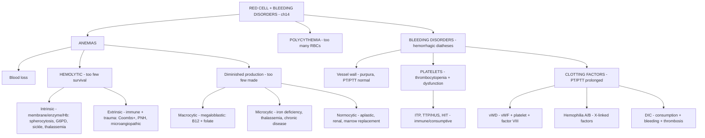

# 🔴 Chapter 14 — Red Blood Cell and Bleeding Disorders

> **Book:** Robbins & Cotran, 10th ed., pp. 643–672 · **Author:** Jon C. Aster
> 🇧🇩 **এক লাইনে:** ৩টি বড় জিনিস — **(1) Anemia = ৩ রকম পথে হয় (blood loss, hemolysis, বা diminished production), (2) Hemolytic anemia-কে ৩ টেস্টে ধরা হয় (Coombs = immune? smear = morphology? bilirubin/EPO = hemolysis?), (3) Bleeding disorder-কে ৩ জায়গায় ভাগ করুন (vessel, platelet, clotting factor) — PT/PTT আর platelet count দিয়ে যে কোনো bleeding-কে সাজান।** মনে রাখবেন: **"Anemia: too few, too fragile, or too little production. Bleeding: vessel, platelet, or factor."**
> ⏱️ Total time: ~7–8 h. 🔴 MUST KNOW = 80% (**microcytic vs macrocytic vs normocytic approach, iron deficiency, thalassemia, sickle cell, G6PD, pernicious/megaloblastic, aplastic anemia, ITP, TTP/HUS, HIT, DIC, hemophilia, vWD, transfusion complications**). 🟡 NICE TO KNOW = 20%.

---

## 🗺️ 1. BIG PICTURE — the whole chapter as one tree

---

## 📊 2. CHAPTER MAP — topic → priority → time

| Topic | Priority | Time |
|---|---|---|
| **Approach to anemia** — blood loss vs hemolytic vs underproduction; MCV-based classification | 🔴 | 30 min |
| **Sickle cell disease** — vaso-occlusive/sequestration/aplastic crises, acute chest syndrome, asplenia, hydroxyurea | 🔴 | 40 min |
| **Thalassemia (β + α)** — globin imbalance, ineffective erythropoiesis, crewcut skull, HbH, hydrops fetalis | 🔴 | 40 min |
| **PNH + immunohemolytic anemia** — PIGA/GPI/CD59, Coombs tests, warm vs cold antibodies | 🟡 | 25 min |
| **Microangiopathic hemolytic anemia** — schistocytes, trauma to RBCs | 🟡 | 15 min |
| **Megaloblastic anemia** — B12 absorption, pernicious anemia, folate, hypersegmented neutrophils | 🔴 | 45 min |
| **Iron deficiency anemia** — iron metabolism, hepcidin/ferroportin, stages of depletion, Plummer-Vinson | 🔴 | 40 min |
| **Anemia of chronic inflammation + aplastic anemia + marrow failure** — hepcidin in inflammation, IFN-γ, Fanconi | 🔴 | 40 min |
| **Polycythemia** — relative vs absolute, PCV vs secondary (EPO), Chuvash | 🟡 | 15 min |
| **Lab approach to bleeding + vessel wall disorders** — PT, PTT, platelet count, purpura | 🔴 | 25 min |
| **Thrombocytopenia + ITP + HIT** — GPIIb-IIIa antibodies, TPO-mimetics, heparin-PF4 | 🔴 | 35 min |
| **TTP vs HUS** — ADAMTS13, Shiga toxin, complement factor H, plasma exchange, eculizumab | 🔴 | 35 min |
| **Platelet function defects** — Bernard-Soulier, Glanzmann, aspirin, uremia | 🟡 | 20 min |
| **vWD + Hemophilia A/B** — factor VIII-vWF complex, ristocetin, joint bleeds, bispecific antibodies | 🔴 | 40 min |
| **DIC** — triggers, microthrombi + bleeding, D-dimers, Kasabach-Merritt | 🔴 | 30 min |
| **Transfusion complications** — febrile, allergic, hemolytic, TRALI, infectious | 🟡 | 25 min |

---

# PART A — ANEMIAS

## 3. Approach to anemia: 3 mechanisms + MCV 🔴

📌 **Three pathophysiologic mechanisms (Table 14.1):**
1. **Blood loss** — acute (hemorrhage) or chronic (→ iron deficiency).
2. **Hemolytic anemia** — decreased red cell survival; the marrow tries to compensate (reticulocytosis).
3. **Diminished erythropoiesis** — decreased red cell production (nutritional, chronic inflammation, renal, marrow failure).

📌 **The MCV shortcut — classify by red cell size:**
- **Microcytic (low MCV):** iron deficiency, thalassemia, anemia of chronic inflammation, sideroblastic anemia.
- **Macrocytic (high MCV):** megaloblastic (B12/folate), liver disease, alcohol.
- **Normocytic:** acute blood loss, hemolysis, renal failure, aplastic anemia, anemia of chronic disease.

💡 **Key discriminators:** reticulocyte count (hemolysis/blood loss → high; underproduction → low); Coombs test (immune hemolysis); ferritin + TIBC (iron status); HbA2/HbF (thalassemia); B12/folate + methylmalonic acid (megaloblastic).

---

## 4. Sickle Cell Disease 🔴

📌 **Definition & genetics:** autosomal recessive; single amino acid substitution in **β-globin (Glu→Val)** → deoxygenated HbS self-associates into long polymers that distort (sickle) the red cell.

📌 **Clinical features — the "hemolytic + crises" picture:**
- Moderately severe hemolytic anemia (hematocrit 18–30%), reticulocytosis, hyperbilirubinemia, **irreversibly sickled cells** on smear (with target cells + anisocytosis/poikilocytosis, Fig 14.8).
- **Vaso-occlusive (pain) crises** — hypoxic injury/infarction causing severe pain; sites: bones, lungs, liver, brain, spleen, penis. Children: **hand-foot syndrome (dactylitis)**, often confused with osteomyelitis.
- **Acute chest syndrome** — dangerous pulmonary vaso-occlusion: fever, cough, chest pain, pulmonary infiltrates; lung inflammation → sluggish "spleenlike" flow → sickling → hypoxemia → vicious cycle.
- **Sequestration crises** — children with intact spleens: massive splenic entrapment of sickled cells → rapid splenomegaly, hypovolemia, shock. (Fatal; needs exchange transfusion.)
- **Aplastic crises** — **parvovirus B19** infects red cell progenitors → transient cessation of erythropoiesis → sudden worsening of anemia.
- **Stroke** — sickle cell adhesion to endothelium + vasoconstriction from **NO depletion by free hemoglobin**; also retinopathy → blindness.
- **Priapism** — up to **45% of males after puberty** → hypoxic damage + erectile dysfunction.
- **Chronic damage:** growth impairment; **hyposthenuria** (renal medulla hypertonicity → sickling → can't concentrate urine → dehydration risk); heart, kidneys, lungs.
- **Encapsulated organism susceptibility** (pneumococcus, H. influenzae): splenic function impaired in children (congestion/poor flow), **absent in adults (autoinfarction — "autosplenectomy"**, Fig 14.10); plus alternative complement pathway defects.
- Wide variation in severity — modifying genes + environmental factors.

📌 **Diagnosis:** clinical + irreversibly sickled cells; sickle hemoglobin tests; **prenatal** by fetal DNA (amniocentesis/chorionic biopsy); **newborn screening** by heel stick in all 50 states.

📌 **Treatment & prognosis:**
- **Hydroxyurea** — inhibits DNA synthesis; ↑ HbF + anti-inflammatory (↓ leukocyte production) → ↓ pain crises. **L-glutamine** added → ↓ oxidant stress → ↓ pain crises.
- **HSCT** offers cure; **CRISPR gene editing** to reverse hemoglobin switching (BCL11A) → cells express fetal Hb instead of sickle Hb — trial results excellent.
- Prognosis: ~90% survive to 20 yr; ~50% beyond the 5th decade.

---

## 5. Thalassemia 🔴

📌 **Definition:** germline mutations ↓ synthesis of α- or β-globin → anemia + tissue hypoxia + hemolysis from **imbalance in globin chain synthesis**.
- Two α genes (identical pair) on **chromosome 16**; one β gene on **chromosome 11**. HbA = α2β2.
- Endemic: Mediterranean (thalassa = "sea"), Middle East, tropical Africa, India, Asia. Heterozygous protection against **malaria**.
- Two mechanisms of anemia: **↓ red cell production + ↓ red cell lifespan**.

### 5.1 β-Thalassemia 🔴

📌 **Molecular genetics:** β0 (absent β synthesis) vs β+ (reduced). >100 mutations, three classes:
1. **Splicing mutations** — most common cause of β+ (ectopic splice site; some normal mRNA); junction destruction → β0.
2. **Promoter mutations** — ↓ transcription 75–80% → β+.
3. **Chain terminator mutations** — nonsense or frameshift → β0 (most common cause of β0).

📌 **Pathogenesis (Fig 14.11):**
- ↓ HbA → hypochromic microcytic "underhemoglobinized" cells.
- **Unpaired α chains precipitate as insoluble inclusions** → membrane damage → apoptosis; **70–85% of red cell precursors die in the marrow = ineffective erythropoiesis**. Survivors hemolyze in spleen (extravascular).
- **Erythroferrone** (from expanded erythroid precursors) **inhibits hepcidin** → ↑ gut iron absorption + transfusions → **secondary hemochromatosis** → damages heart, liver, pancreas (Fig 14.12).

📌 **Clinical syndromes (Table 14.3):**
- **Major** (β0/β0, β+/β+, β0/β+): transfusion-dependent.
- **Intermedia** (variable): severe but no regular transfusions.
- **Minor/trait** (β0/β, β+/β): asymptomatic, mild microcytic anemia.

📌 **β-Thalassemia major — morphology & course:**
- Manifests **6–9 months after birth** (HbF→HbA switch); Hb 3–6 g/dL; HbF markedly elevated.
- Smear: anisocytosis, poikilocytosis, microcytosis, hypochromia, **target cells** (hemoglobin collected centrally), basophilic stippling, fragmented cells; nucleated normoblasts; reticulocytes ↑ but lower than expected (ineffective erythropoiesis).
- Marrow expansion erodes cortex + induces new bone → **"crewcut" skull X-ray** (perpendicular radiations on outer table, Fig 14.13); distorted cheekbones; spleen up to 1500 g (extramedullary hematopoiesis); hepatosplenomegaly.
- Untreated: growth retardation, early death from anemia. Transfusions → iron overload → **cardiac disease = important cause of death** → **iron chelators** essential. With chelation, survival to 3rd decade. **HSCT = only cure**; **prenatal DNA diagnosis** possible.

📌 **β-Thalassemia minor:** asymptomatic; smear shows hypochromia, microcytosis, basophilic stippling, target cells; **HbA2 ↑ to 4–8%** (normal 2.5 ± 0.3%). Differentiate from iron deficiency (serum iron, TIBC, ferritin) — important in childbearing-age women + for genetic counseling.

### 5.2 α-Thalassemia 🔴

📌 **Key concept:** 4 α-globin genes, each contributing **25%** of α chains; severity ∝ number deleted. Newborns: excess γ chains → **Hb Barts (γ4)**; older: excess β chains → **HbH (β4)**. Free β/γ chains are more soluble → hemolysis less severe than β-thalassemia.

📌 **Syndromes by gene deletion (Table 14.3):**
| Genes deleted | Syndrome | Findings |
|---|---|---|
| 1 | **Silent carrier** (−/α α/α) | Asymptomatic; slight microcytosis |
| 2 | **α-thalassemia trait** (cis −/− Asian; trans −/α −/α African) | Like β-thalassemia minor; HbA2 normal/low |
| 3 | **HbH disease** (−/− −/α) | HbH β4 tetramers — high O2 affinity (no O2 delivery) + oxidant-prone (precipitate) → anemia like intermedia; common in Asians |
| 4 | **Hydrops fetalis** (−/− −/−) | Hb Barts γ4 delivers little O2; fetal distress in 3rd trimester; intrauterine transfusion saves some; pallor, generalized edema, hepatosplenomegaly |

💡 **HbH/hydrops risk:** children at risk only if ≥1 parent has the −/− haplotype → symptomatic α-thalassemia common in **Asians**, rare in **Africans**. HSCT curative in severe forms.

---

## 6. Paroxysmal Nocturnal Hemoglobinuria (PNH) 🟡

📌 **Pathogenesis:** acquired somatic mutation in **PIGA** (X-linked, subject to lyonization) → hematopoietic stem cell progeny lack **GPI-linked complement regulators: CD55 (decay-accelerating factor), CD59 (membrane inhibitor of reactive lysis), C8-binding protein**. **CD59 most important** (inhibits C3 convertase → prevents spontaneous alternative-pathway activation).
- Only hemolytic anemia caused by an **acquired genetic defect**; incidence 2–5/million.
- Mutant clone coexists with normal stem cells; most normal people harbor rare PIGA-mutant cells → expand only when a selective advantage exists (e.g., autoimmune reaction against GPI antigens) → **explains PNH + aplastic anemia association**.

📌 **Clinical features:**
- Complement (C5b-C9 MAC) → **intravascular hemolysis**; paroxysmal + nocturnal in only ~25%; night lysis due to slight pH drop during sleep. Chronic hemolysis more typical.
- **Hemosiderinuria** → iron deficiency → worsens anemia.
- **Thrombosis = leading cause of death** (~40% venous, hepatic/portal/cerebral veins); free hemoglobin absorbs NO; C5-9 damages endothelium.
- 5–10% develop **AML or MDS**.

📌 **Diagnosis & treatment:**
- **Flow cytometry** detects CD59-deficient red cells (Fig 14.14).
- **Eculizumab** — anti-C5 (prevents C5→C5a) → ↓ hemolysis + ↓ transfusion need + **↓ thrombosis by up to 90%**; drawbacks: cost + meningococcal infection risk.
- Immunosuppressives for marrow aplasia; **HSCT = only cure**.

---

## 7. Immunohemolytic Anemia 🟡

📌 **Definition:** antibodies destroy red cells. Preferred term over "autoimmune" because drugs can trigger it (Table 14.4).

📌 **Diagnosis — Coombs tests:**
- **Direct Coombs (antiglobulin)**: patient's red cells + anti-human Ig/complement sera → agglutination if antibody/complement on cells.
- **Indirect Coombs:** patient's serum tested against defined red cell antigens (identifies target + temperature dependence).

### 7.1 Warm antibody type (~80%)
- IgG antibodies active at 37°C; ~50% idiopathic, 50% secondary (SLE, drugs, lymphoid neoplasms).
- Mostly **extravascular hemolysis**: IgG-coated cells bind phagocyte Fc receptors → partial phagocytosis → **spherocytes** → removed in spleen; splenomegaly (phagocyte hyperplasia).
- Idiopathic cases target Rh complex components.
- **Drug mechanisms:** (1) *antigenic* — penicillin/cephalosporins bind membrane → new antigenic determinant (1–2 wk after IV high-dose therapy); (2) *tolerance-breaking* — **α-methyldopa** → anti-Rh antibodies (10% Coombs+, ~1% clinical hemolysis).
- **Treatment:** remove drug; immunosuppression + splenectomy.

### 7.2 Cold agglutinin type (15–20%)
- IgM binds avidly at 0–4°C. Transient after Mycoplasma pneumoniae, EBV, CMV, influenza, HIV (self-limited); chronic with B-cell neoplasms or idiopathic.
- Binding in exposed areas (fingers, toes, ears) → agglutination → pallor, cyanosis, **Raynaud phenomenon**; IgM released on rewarming, but C3b deposition → **extravascular hemolysis** in spleen/liver/marrow.
- Best treatment: **avoid cold**.

### 7.3 Cold hemolysin type (rare)
- **Paroxysmal cold hemoglobinuria**; IgG binds **P blood group antigen** in cool periphery; complement-mediated lysis on return to warm core → intravascular hemolysis + hemoglobinuria; children after viral infections; transient (recovery within 1 month).

---

## 8. Hemolytic Anemia From Trauma to Red Cells (Microangiopathic) 🟡

📌 **Two settings:**
- **Cardiac valve prostheses** (mechanical > bioprosthetic) — shear forces + turbulence.
- **Microangiopathic hemolytic anemia** — DIC, TTP, HUS, malignant hypertension, SLE, disseminated cancer. Microvascular thrombi → luminal narrowing → shear stress.

📌 **Smear:** **schistocytes (fragmented cells), "burr cells," "helmet cells," "triangle cells"** (Fig 14.15). Intravascular hemolysis.

---

## 9. Megaloblastic Anemia 🔴

📌 **Unifying defect:** impaired **DNA synthesis** → ineffective hematopoiesis + distinctive morphology (large erythroid precursors + red cells). Causes in Table 14.5 (B12 deficiency, folate deficiency, folate antagonists).

📌 **Morphology — the megaloblast look (Fig 14.17):**
- Blood: **macro-ovalocytes** (macrocytic, lack central pallor, appear "hyperchromic" but MCH normal), anisocytosis, poikilocytosis, low reticulocyte count; occasional nucleated RBCs; **neutrophils hypersegmented (≥5 lobes**, Fig 14.16); giant metamyelocytes/bands; bizarre multilobate megakaryocytes.
- Marrow: markedly hypercellular; **promegaloblasts** large with deep basophilic cytoplasm, prominent nucleoli, fine chromatin; as cells hemoglobinize, **nucleus stays non-pyknotic (nuclear-cytoplasmic asynchrony)**.
- Marrow hyperplasia responds to erythropoietin, but DNA derangement → apoptosis → **ineffective hematopoiesis → pancytopenia** + mild hemolysis.

### 9.1 Vitamin B12 metabolism & deficiency
- B12 (cobalamin) in animal products; daily need 2–3 µg; hepatic stores last years; vegetarian diets inadequate.
- **Absorption (Fig 14.18):** freed from food by pepsin → binds salivary **haptocorrin** → duodenum: pancreatic proteases release B12 → binds **intrinsic factor** (gastric parietal cells, fundus) → ileum: endocytosed via **cubilin** (IF receptor) → bound to **transcobalamin II** → plasma. High-dose oral B12 can also be absorbed by passive diffusion.
- **Two B12-dependent reactions (Fig 14.19):**
  1. **Methylcobalamin** → methionine synthase: homocysteine → methionine; converts N5-methyl FH4 → FH4 (needed for dUMP→dTMP, DNA building block). In B12 deficiency folate is **"trapped" as N5-methyl FH4** → impaired DNA synthesis → anemia.
  2. **Adenosylcobalamin** → methylmalonyl-CoA mutase: methylmalonyl-CoA → succinyl-CoA; deficiency → ↑ methylmalonic acid; abnormal fatty acids → myelin breakdown → **subacute combined degeneration of spinal cord** (dorsal + lateral tracts).
- Folate (not B12) is the proximate cause of the anemia — folic acid improves anemia but **does NOT improve (may worsen) neurologic deficits**.

### 9.2 Pernicious anemia 🔴
- **Autoimmune gastritis** → ↓ intrinsic factor → B12 deficiency. Median age 60; rare <30; genetic predisposition; polyautoimmunity (thyroiditis, adrenalitis).
- **Pathogenesis:** chronic atrophic gastritis (loss of parietal cells, lymphocytic/plasmacytic infiltrate). Autoreactive **T cells** initiate injury → autoantibodies:
  - Type I (~75%): blocks B12 binding to intrinsic factor.
  - Type II: blocks IF-B12 complex binding.
  - Type III (85–90%): anti-gastric proton pump (α/β subunits); not specific (50% of older adults with idiopathic chronic gastritis).
- **Morphology:** fundic gland atrophy (parietal cells virtually absent); **intestinalization** (goblet cell metaplasia); "beefy" tongue (atrophic glossitis); CNS — demyelination of **dorsal + lateral spinal tracts** → spastic paraparesis, sensory ataxia, paresthesias. Gastric atrophy persists despite B12 (marrow/gut megaloblastosis reverses).
- **Diagnosis:** megaloblastic anemia + hypersegmented granulocytes + low serum B12 + ↑ homocysteine + ↑ methylmalonic acid; anti-intrinsic factor antibodies highly specific; reticulocyte response ~5 days after parenteral B12.
- **Risk of gastric carcinoma** (atrophic metaplastic mucosa).
- **Other B12 deficiency causes:** achlorhydria (older adults), gastrectomy, pancreatic insufficiency, ileal resection/disease, fish tapeworm, bacterial overgrowth (blind loops), increased demand (pregnancy, hyperthyroidism, disseminated cancer).

### 9.3 Folate deficiency
- **Function (Fig 14.20):** FH4 derivatives transfer one-carbon units; needed for (1) purine synthesis, (2) homocysteine→methionine (also needs B12), (3) **dTMP synthesis** (dUMP→dTMP via thymidylate synthetase; FH2→FH4 via dihydrofolate reductase — **methotrexate inhibits this**).
- Sources: green vegetables (lettuce, spinach, asparagus, broccoli); polyglutamates heat-labile (boiling 5–10 min destroys up to 95%); absorbed in proximal jejunum → 5-methyltetrahydrofolate. **Reserves last only weeks to months.**
- **Etiology:** ↓ intake (alcoholics, indigent, elderly; cirrhosis traps folate in liver); malabsorption (sprue, lymphoma; phenytoin + oral contraceptives); ↑ requirement (pregnancy, infancy, chronic hemolysis, disseminated cancer); impaired utilization (methotrexate).
- **Diagnosis:** low serum/red cell folate; homocysteine ↑ but **methylmalonate normal**; **no neurologic changes**. Always exclude B12 deficiency before folate therapy (folate can worsen B12 neuropathy).

---

## 10. Iron Deficiency Anemia 🔴

### 10.1 Normal iron metabolism (Fig 14.21)
- Body iron: ~2.5 g (women) to 6 g (men). **80% of functional iron in hemoglobin**; rest in myoglobin + enzymes; storage pool (ferritin, hemosiderin) 15–20% — liver + mononuclear phagocytes.
- **Transferrin** (liver-made) carries iron (~1/3 saturated; serum iron ~120 µg/dL men, 100 µg/dL women) → erythroid precursors via receptor-mediated endocytosis.
- **Ferritin**: protein-iron complex; serum ferritin correlates with body stores (<12 µg/L = deficiency; ~5000 µg/L = overload). **Hemosiderin**: lysosomal aggregates → **Prussian blue** (potassium ferrocyanide) stain.
- **Absorption:** duodenum, regulated; only ~10–15% ingested absorbed; no regulated excretion (1–2 mg/day via shedding of mucosal/skin cells). Nonheme Fe3+ → Fe2+ (ferrireductases, STEAP3) → **DMT1** apical uptake; heme absorbed directly. Fe2+ exits basolaterally via **ferroportin** (coupled to oxidation by hephaestin/ceruloplasmin) → transferrin (Fig 14.22).
- **Hepcidin** (liver peptide) binds ferroportin → endocytosis/degradation → **iron trapped in enterocytes as mucosal ferritin → lost with sloughing**. High hepcidin (iron-replete, inflammation) blocks absorption; low hepcidin (depletion, hemochromatosis, ineffective erythropoiesis via erythroferrone) ↑ absorption.
- **Hepcidin disorders:** anemia of chronic inflammation (IL-6 → ↑ hepcidin); **TMPRSS6 mutations** (protease that suppresses hepcidin when iron low — defect → high hepcidin → iron-refractory microcytic anemia); hemochromatosis (inappropriately low hepcidin).

### 10.2 Etiology of iron deficiency
1. **Dietary lack** — infants (breast milk only 0.3 mg/L), impoverished, older adults, teens on junk food.
2. **Impaired absorption** — sprue, fat malabsorption, gastrectomy (↓ acidity).
3. **Increased requirement** — infants/children/adolescents, pregnancy, menstruating women.
4. **Chronic blood loss (most common in high-income societies)** — GI, urinary, genital tracts. **Iron deficiency in adult men + postmenopausal women = GI blood loss until proven otherwise** (may unmask GI cancer).

### 10.3 Pathogenesis, morphology, clinical
- ↓ hemoglobin → **hypochromic microcytic anemia**. Progressive depletion: reserves ↓ first (serum iron + transferrin saturation ↓ without anemia) → then anemia when stores exhausted.
- **Marrow:** increased erythroid progenitors; **absent stainable iron in macrophages** (Prussian blue) = diagnostic.
- **Blood smear (Fig 14.23):** microcytic, hypochromic (enlarged central pallor, narrow peripheral rim); **pencil cells** (poikilocytosis).
- **Clinical:** mostly underlying cause; severe → **koilonychia** (spoon nails), alopecia, atrophic tongue/gastric mucosa, **pica** (craving clay/flour; also in autism); **Plummer-Vinson syndrome** = esophageal webs + microcytic hypochromic anemia + atrophic glossitis.
- **Labs:** low serum iron + ferritin, high TIBC (elevated transferrin), transferrin saturation <15%; **reticulocyte response 5–7 days after oral iron**.

---

## 11. Anemia of Chronic Inflammation 🔴

📌 **Definition:** ↓ erythroid progenitor proliferation + impaired iron utilization in chronic illness. Categories: chronic infections (osteomyelitis, endocarditis, lung abscess), immune disorders (RA, IBD), neoplasms (lung/breast carcinoma, Hodgkin).

📌 **Pathogenesis (the hepcidin story):**
- **IL-6 → ↑ hepatic hepcidin** → inhibits ferroportin → **iron sequestered in macrophages** → erythroid precursors starved for iron "in the midst of plenty".
- Erythropoietin inappropriately low (cytokines suppress renal EPO).
- Iron sequestration may be a defense against bacteria needing iron; **hepcidin is structurally related to defensins**.

📌 **Labs & diagnosis:** low serum iron, **low TIBC** (opposite of iron deficiency), high ferritin, abundant macrophage iron. Red cells normocytic-normochromic OR microcytic-hypochromic. **Only treating the underlying disease corrects it**; erythropoietin helps some (cancer).

---

## 12. Aplastic Anemia + Pure Red Cell Aplasia + Other Marrow Failure 🔴

### 12.1 Aplastic anemia
📌 **Definition:** chronic primary hematopoietic failure + **pancytopenia** (anemia, neutropenia, thrombocytopenia). Autoimmune in most; stem cell abnormalities in a subset.

📌 **Etiology (Table 14.7):**
- **Acquired:** idiopathic (~65%); immune-mediated; chemicals — *dose-related* (alkylating agents, antimetabolites, benzene, chloramphenicol, inorganic arsenicals) vs *idiosyncratic* (chloramphenicol, phenylbutazone, gold salts, carbamazepine, penicillamine); whole-body irradiation; viruses — **viral hepatitis (~5%)**, CMV, EBV, herpes zoster.
- **Inherited:** **Fanconi anemia** (autosomal recessive DNA-repair defect; marrow failure early + congenital anomalies — kidney/spleen hypoplasia, thumb/radius defects); **telomerase defects** (5–10% of adult onset); **abnormally short telomeres** in ~50% of cases.

📌 **Pathogenesis (Fig 14.24) — two mechanisms:**
1. **Immune-mediated:** stem cells antigenically altered by drugs/viruses → Th1 cells make **IFN-γ + TNF** → suppress/kill progenitors. Evidence: apoptosis genes up-regulated in residual stem cells (same genes in normal stem cells exposed to IFN-γ); **antithymocyte globulin + cyclosporine produce responses in 60–70%**; **GPI-linked proteins may be T-cell targets → explains aplastic anemia + PNH link**.
2. **Intrinsic stem cell defect:** karyotypic aberrations, cancer-gene mutations, transformation to **MDS/AML**, short telomeres. (Not mutually exclusive.)

📌 **Morphology (Fig 14.25):** markedly **hypocellular marrow** — fat cells, fibrous stroma, scattered lymphocytes/plasma cells; aspirate = "dry tap" → **biopsy essential**.

📌 **Clinical:** insidious pancytopenia; anemia → weakness/pallor/dyspnea; thrombocytopenia → petechiae/ecchymoses; neutropenia → infections. **Splenomegaly characteristically ABSENT** (if present, question the diagnosis!). Slightly macrocytic normochromic red cells; reticulocytopenia.
- **Differential:** distinguish from aleukemic leukemia/MDS (those are hypercellular).

📌 **Treatment:** **HSCT = treatment of choice** (5-yr survival >75%); older/no donor → immunosuppressive therapy.

### 12.2 Pure red cell aplasia
- Only erythroid progenitors suppressed (may be completely absent). Associations: **thymoma**, LGL leukemia, drugs, autoimmune disorders, **parvovirus B19**.
- Thymoma resection → improvement in ~half; immunosuppression otherwise; plasmapheresis for anti-erythropoietin neutralizing antibodies.
- **Parvovirus B19** infects/destroys red cell progenitors; normal hosts clear it (transient), hemolytic anemia patients → **aplastic crisis**, immunosuppressed (advanced HIV) → chronic red cell aplasia.

### 12.3 Other marrow failure
- **Myelophthisic anemia** — marrow replaced by space-occupying lesions (metastatic cancer: breast/lung/prostate; granulomas; spent-phase MPN) → fibrosis → **leukoerythroblastosis + teardrop red cells**.
- **Chronic renal failure** — anemia ∝ uremia severity; **↓ erythropoietin** dominant; uremia ↓ RBC lifespan + platelet function; recombinant EPO + iron helps.
- **Liver disease** — ↓ marrow function; folate/iron deficiency worsen; slightly macrocytic (lipid abnormalities change membrane).
- **Endocrine** — hypothyroidism → mild normocytic anemia.

---

## 13. Polycythemia 🟡

📌 **Definition:** abnormally high circulating red cells.
- **Relative** = hemoconcentration (dehydration; **Gaisböck syndrome** = hypertensive, obese, anxious males) — total red cell mass normal.
- **Absolute** = increased total red cell mass:
  - **Primary (low EPO):** **polycythemia vera** (myeloproliferative neoplasm; EPO-independent growth, Ch 13); rare inherited EPO receptor mutations (one such person won Olympic cross-country gold — natural "blood doping"!).
  - **Secondary (high EPO):** compensatory (lung disease, high altitude, cyanotic heart disease); paraneoplastic (EPO-secreting tumors — renal cell carcinoma, hepatocellular carcinoma, cerebellar hemangioblastoma); high-O2-affinity hemoglobin mutants; **HIF-1α stabilizing defects (Chuvash polycythemia = homozygous VHL mutation; prolyl hydroxylase mutations)**.

---

# PART B — BLEEDING DISORDERS (HEMORRHAGIC DIATHESES)

## 14. Laboratory Approach to Bleeding 🔴

📌 **Three causes of excessive bleeding:** (1) increased vessel fragility, (2) platelet deficiency/dysfunction, (3) coagulation derangement — alone or combined.

📌 **The core tests:**
- **PT (prothrombin time):** extrinsic + common pathways; tissue thromboplastin + Ca2+. Prolonged by deficiency/dysfunction of **factor V, VII, X, prothrombin, fibrinogen**.
- **PTT (partial thromboplastin time):** intrinsic + common pathways; kaolin (activates factor XII) + cephalin (replaces platelet phospholipids) + Ca2+. Prolonged by deficiency of **factors V, VIII, IX, X, XI, XII, prothrombin, fibrinogen**, or **antiphospholipid antibodies**.
- **Platelet count:** 150,000–350,000/µL; confirm smear (clumping → spurious low count); high counts → MPN or reactive.
- **Platelet function tests:** platelet aggregation; quantitative + qualitative vWF assays; bleeding time largely discarded.
- Specialized: factor levels, fibrinogen, fibrin split products, circulating anticoagulants.

💡 **Interpretation shortcut:** Isolated low platelets + normal PT/PTT → platelet problem. Prolonged PT → extrinsic/common (liver, vitamin K, DIC). Prolonged PTT → intrinsic (hemophilia A/B, vWD type 1/3, inhibitors). Both prolonged → DIC, liver disease, vitamin K deficiency.

---

## 15. Bleeding From Vessel Wall Abnormalities 🟡

📌 **General:** usually mild; **petechiae + purpura** in skin/mucous membranes (gingivae); occasionally joints, muscles, subperiosteal, menorrhagia, nosebleeds, GI bleeding, hematuria. **Platelets + PT/PTT normal** (diagnosis by exclusion).

📌 **Causes:**
- **Infections** — meningococcemia, septicemia, infective endocarditis, rickettsioses (vasculitis + DIC).
- **Drug reactions** — immune-complex deposition → hypersensitivity (leukocytoclastic) vasculitis.
- **Scurvy + Ehlers-Danlos** — collagen defects weaken vessels; **Cushing syndrome** (protein wasting) + aging → fragile vessels.
- **Henoch-Schönlein purpura** — systemic immune-complex disorder: **purpura + colicky abdominal pain + polyarthralgia + acute glomerulonephritis**.
- **Hereditary hemorrhagic telangiectasia (Weber-Osler-Rendu)** — autosomal dominant, TGF-β signaling mutations; dilated tortuous thin-walled vessels; **epistaxis + GI bleeding** (most serious).
- **Perivascular amyloidosis** — AL amyloidosis → mucocutaneous petechiae.

---

## 16. Thrombocytopenia 🔴

📌 **Definition:** <150,000/µL. 20,000–50,000 → aggravated posttraumatic bleeding; **<20,000 → spontaneous bleeding** (small vessels: skin, GI/GU mucosa; **intracranial bleeding most feared**). Isolated thrombocytopenia → PT/PTT normal.

📌 **Four mechanistic categories (Table 14.9):**
1. **Decreased production** — marrow depression (aplastic anemia, leukemia), selective megakaryocyte damage (drugs — alcohol, thiazides, cytotoxic; HIV; MDS), nutritional (B12/folate), marrow replacement.
2. **Decreased survival** — immunologic (chronic/acute ITP, SLE, B-cell neoplasms, alloimmune — posttransfusion + neonatal; drugs — quinidine, heparin, sulfa; HIV, mono, dengue) + nonimmunologic (**DIC, thrombotic microangiopathies**, giant hemangiomas, mechanical — prosthetic valves).
3. **Sequestration** — spleen normally holds 30–35% of platelets; splenomegaly → up to 80–90%.
4. **Dilution** — massive transfusions.

### 16.1 Chronic ITP 🔴
- Autoantibody-mediated destruction; secondary (SLE, HIV, B-cell neoplasms like CLL) or primary/idiopathic. Most common in **adult women <40** (F:M 3:1); insidious onset.
- **Clinical:** skin + mucosal bleeding, **petechiae in dependent areas**, ecchymoses, easy bruising, epistaxis, gingival bleeding; melena, hematuria, menorrhagia; subarachnoid/intracerebral hemorrhage rare in treated patients. **Splenomegaly + lymphadenopathy NOT seen in primary disease** (their presence → think secondary ITP).
- **Pathogenesis:** **anti-GPIIb-IIIa or GPIb-IX** antibodies (IgG, ~80% in plasma + surface) act as opsonins → Fc-receptor phagocytosis; spleen = major removal site; antibodies may also damage megakaryocytes.
- **Diagnosis (of exclusion):** low platelets + normal/increased megakaryocytes + **large platelets (megathrombocytes)** = presumptive accelerated destruction; **PT/PTT normal**; autoantibody tests low sensitivity/specificity.
- **Morphology:** spleen normal size (sinusoidal congestion, reactive germinal centers); marrow → modestly increased megakaryocytes, some immature with large single nonlobulated nuclei.
- **Treatment:** **glucocorticoids** (inhibit phagocyte function) — most respond, many relapse; counts >30,000 can be observed (some remit); **splenectomy** normalizes ~2/3 (risk: bacterial sepsis); IVIG, **rituximab** (anti-CD20); **TPO-mimetics** for refractory.

### 16.2 Acute ITP
- Childhood disease, equal sexes; abrupt onset **1–2 weeks after a viral illness**; self-limited (resolves within 6 months); glucocorticoids only if severe; ~20% (usually no viral prodrome) → childhood chronic ITP.

### 16.3 Drug-induced thrombocytopenia
- **Quinine, quinidine, vancomycin** — drug-dependent antibody binding to platelet glycoproteins; rarely true autoantibodies; GPIIb/IIIa-binding platelet inhibitors can create immunogenic epitopes.

### 16.4 Heparin-induced thrombocytopenia (HIT) — type II 🔴
- ~5% of heparin recipients get thrombocytopenia.
- **Type I:** rapid onset, direct platelet-aggregating effect; clinically minor; resolves despite continued heparin.
- **Type II:** 5–14 days after starting (sooner if previously sensitized); **paradoxical venous + arterial thrombosis despite thrombocytopenia** — antibodies recognize **heparin + platelet factor 4 (PF4) complexes** → platelet activation. **Stop heparin immediately + use a non-heparin anticoagulant**; risk of large artery clots, limb loss, DVT/PE. LMWH lowers (not eliminates) risk; **once HIT-II develops, even LMWH worsens it → avoid**.

### 16.5 HIV-associated thrombocytopenia
- Most common hematologic manifestation of HIV; ↓ production (megakaryocytes infected via CD4/CXCR4 → apoptosis) + ↑ destruction (B-cell dysregulation → autoantibodies, some anti-GPIIb-IIIa).

---

## 17. Thrombotic Microangiopathies: TTP vs HUS 🔴

📌 **Shared features:** excessive platelet activation → microvascular thrombi → **microangiopathic hemolytic anemia + thrombocytopenia + organ dysfunction**. Unlike DIC, coagulation cascade NOT primarily activated → **PT/PTT usually normal**.

📌 **TTP — classic pentad:** fever, thrombocytopenia, microangiopathic hemolytic anemia, **transient neurologic deficits**, renal failure. (Many "TTP" patients lack one or more criteria.)

📌 **HUS:** microangiopathic hemolytic anemia + thrombocytopenia + **prominent acute renal failure**; neuro symptoms absent; children.

📌 **Pathogenesis (Table 14.10):**
- **TTP = ADAMTS13 ("vWF metalloprotease") deficiency** → very high-molecular-weight vWF multimers accumulate → spontaneous platelet activation/aggregation. Inherited (episodic onset, often delayed to adolescence) or **acquired (inhibitory autoantibody)**. Diagnosis must not be delayed (fatal). **Plasma exchange** (removes antibodies + supplies functional ADAMTS13) → **>80% success**.
- **Typical HUS:** **E. coli O157:H7 → Shiga-like toxin** → absorbed from inflamed GI mucosa → endothelial alteration → platelet activation. Bloody diarrhea first, HUS days later; children + older adults. **Treatment supportive**; some permanent renal damage → dialysis/transplant.
- **Atypical HUS:** defects in alternative complement pathway inhibitors — **complement factor H, membrane cofactor protein (CD46), factor I**; inherited or acquired autoantibodies; remitting/relapsing. **Eculizumab (anti-C5) effective** → proves complement is central. Immunosuppression helps antibody-mediated cases.
- Miscellaneous: drugs (cyclosporine, chemo), radiation, BMT, HIV, pneumococcal sepsis, SLE.

---

## 18. Platelet Function Defects 🟡

📌 **Inherited (rare but instructive):**
- **Bernard-Soulier syndrome** — autosomal recessive; **GPIb-IX deficiency** (vWF receptor) → defective adhesion to subendothelial matrix → variable, often severe bleeding.
- **Glanzmann thrombasthenia** — autosomal recessive; **GPIIb-IIIa dysfunction** (integrin that binds fibrinogen) → platelets fail to aggregate to ADP, collagen, epinephrine, thrombin → often severe.
- **Storage pool disorders** — defective release of thromboxanes + granule-bound ADP.

📌 **Acquired (clinically important):**
- **Aspirin/NSAIDs** — irreversible cyclooxygenase inhibition → ↓ thromboxane A2 + prostaglandins → ↓ aggregation (basis of coronary thrombosis prevention).
- **Uremia** — defects in adhesion, granule secretion, aggregation.

---

## 19. Clotting Factor Abnormalities 🔴

📌 **General:** bleeding as large posttraumatic ecchymoses, hematomas, prolonged bleeding from lacerations/surgery; **GI + urinary tract bleeding + hemarthrosis (weight-bearing joints)** — unlike thrombocytopenic bleeding (petechiae absent in hemophilia).
- **Hereditary** — usually single factor: **hemophilia A (VIII), hemophilia B (IX), von Willebrand disease (vWF — affects platelets + coagulation)**.
- **Acquired** — multiple factors: **vitamin K deficiency (factors II, VII, IX, X + protein C)**, liver disease (factors made in liver), **DIC** (consumption); single-factor acquired = rare inhibitory autoantibodies.

### 19.1 Factor VIII–vWF complex (Fig 14.26)
- **Factor VIII:** cofactor for factor IX (converts X→Xa); made by **endothelial cells**; stabilized by vWF (half-life 2.4 h → ~12 h).
- **vWF:** made by **endothelial cells + megakaryocytes**; multimers up to 100 subunits (>20×10⁶ daltons); deposited in subendothelial matrix; promotes **platelet adhesion via GPIb-IX** bridging to collagen; binds activated GPIIb/IIIa (high-shear vessels); interacts with collagen, heparin, platelet glycoproteins.
- **Tests:** factor VIII function = coagulation assay; vWF function = **ristocetin agglutination** (patient plasma + normal platelets + ristocetin "activates" vWF → multivalent GPIb-IX bridging → clumping).

### 19.2 Von Willebrand Disease 🔴
- **Most common inherited bleeding disorder (~1% of US adults)**; usually autosomal dominant (rare recessive variants). Mild bleeding revealed by hemostatic stress (surgery, dental); spontaneous mucosal bleeding (epistaxis), menorrhagia.
- **Type 1 (~70%):** quantitative deficiency; autosomal dominant; mild-moderate; incomplete penetrance + variable expressivity; point substitutions (maturation/clearance).
- **Type 2 (~25%):** qualitative defects; **2A most common subtype**; autosomal dominant; missense mutations → defective multimer assembly → most-active large/intermediate multimers missing; mild-moderate bleeding.
- **Type 3:** autosomal recessive; deletions/frameshifts both alleles → little/no vWF; **factor VIII also low** (vWF stabilizes it) → severe "hemophilia-like" bleeding.
- **Labs:** normal platelet count but defective function; reduced **ristocetin cofactor activity**; types 1 + 3 → **prolonged PTT** (↓ factor VIII stability). Wide clinical variability even within families (modifying genes).
- **Treatment:** types 1/2 → **desmopressin** (stimulates vWF release), FVIII/vWF concentrates, recombinant vWF; type 3 → prophylactic concentrates + FVIII infusions.

### 19.3 Hemophilia A 🔴
- **Most common hereditary life-threatening bleeding disorder**; mutations in **factor VIII**; **X-linked recessive** (males + homozygous females; rarely heterozygous females via unfavorable lyonization); ~30% no family history (new mutations).
- **Severity ∝ factor VIII activity:** <1% severe; 2–5% moderate; 6–50% mild. Most severe = X-chromosome **inversion** abolishing synthesis; point mutations may leave normal protein by immunoassay.
- **Clinical:** easy bruising, massive post-trauma hemorrhage; spontaneous **hemarthroses** → progressive crippling joint deformities; **petechiae characteristically absent**; **prolonged PTT + normal PT** (intrinsic pathway); factor VIII-specific assays needed.
- **Treatment:** recombinant factor VIII; ~15% of severe patients develop **inhibitory antibodies** (protein perceived as foreign) → **bispecific antibodies** (bind factor IXa to X, bypassing VIII) especially effective; gene therapy ongoing. Historical tragedy: plasma-derived concentrates transmitted HIV to thousands.

### 19.4 Hemophilia B (Christmas disease)
- Factor IX deficiency; clinically indistinguishable from hemophilia A (VIII + IX together activate X); X-linked recessive; ~15% have nonfunctional protein; **PTT prolonged + PT normal**; diagnosed only by factor assay; treated with recombinant factor IX. Named after the first patient (Christmas), not the holiday.

### 19.5 Disseminated Intravascular Coagulation (DIC) 🔴
- **Acute/subacute/chronic thrombohemorrhagic disorder** — excessive coagulation + microvascular thrombi; **always secondary** to another disorder (obstetric complications, malignant neoplasms, sepsis, major trauma).
- **Two major triggers:**
  1. **Release of tissue factor/procoagulants** — placenta (obstetric complications), injured tissue (trauma/burns); adenocarcinoma mucus directly activates factor X.
  2. **Widespread endothelial injury** — **TNF** (sepsis) induces tissue factor + ↓ thrombomodulin + ↑ adhesion molecules; immune complexes (SLE); temperature extremes; microorganisms (meningococci, rickettsiae); endotoxins (activate factor XII + via TNF).
- **Cancers:** acute promyelocytic leukemia + adenocarcinomas of lung, pancreas, colon, stomach.
- **Two consequences (Fig 14.27):**
  1. **Fibrin deposition in microcirculation** → ischemia + **microangiopathic hemolytic anemia** (RBCs fragmented squeezing through narrowed vessels).
  2. **Consumption of platelets + clotting factors + plasminogen activation** → hemorrhagic diathesis; plasmin digests factors V + VIII; fibrin degradation products inhibit platelet aggregation, fibrin polymerization, thrombin.
- **Morphology:** thrombi most often in brain, heart, lungs, kidneys, adrenals, spleen, liver; renal cortical necrosis; alveolar capillary thrombi + hyaline membranes (ARDS-like); CNS microinfarcts; **meningococcemia → adrenal hemorrhage (Waterhouse-Friderichsen syndrome)**; **Kasabach-Merritt syndrome** = giant hemangioma with localized DIC.
- **Clinical:** fulminant (sepsis, amniotic fluid embolism) vs chronic (carcinomatosis, retained dead fetus). **Acute DIC → bleeding dominant; chronic DIC → thrombosis dominant.** Lab: ↓ fibrinogen, ↓ platelets, prolonged PT + PTT, ↑ fibrin degradation products (**D-dimers**).
- **Treatment:** only definitive = treat the inciting cause; balance thrombosis vs bleeding (anticoagulants or procoagulants controversial).

---

## 20. Complications of Transfusion 🟡

📌 **Febrile non-hemolytic reaction (most common):** fever + chills ± mild dyspnea within 6 h; inflammatory mediators from **donor leukocytes**; ↑ with storage age; ↓ by leukocyte reduction; responds to antipyretics.

📌 **Allergic reactions:** severe (rare) — **IgA deficiency** (1:300–500 people) with IgG anti-IgA (1 in 20,000–50,000 transfusions); common mild urticaria (1–3%) — recipient IgE vs donor allergen → antihistamines.

📌 **Hemolytic reactions:**
- **Acute:** preformed **IgM antibodies (ABO mismatch)** — usually patient-identification error; complement-mediated **intravascular hemolysis + hemoglobinuria**; fever, shaking chills, flank pain; direct Coombs positive (unless all donor cells lysed); severe → DIC, shock, acute renal failure, death.
- **Delayed:** IgG antibodies from prior sensitization (Rh, Kell, Kidd — can cause severe complement-mediated reactions); positive Coombs, ↓ haptoglobin, ↑ LDH; non-complement-fixing antibodies → opsonization → extravascular hemolysis + spherocytosis (mild).

📌 **TRALI (transfusion-related acute lung injury):** severe, frequently fatal; **"two-hit"**: (1) neutrophils sequestered/primed in lung microvasculature, (2) second hit activates them (usually **donor antibodies to MHC/neutrophil antigens — multiparous women**). Sudden respiratory failure during/after transfusion; bilateral infiltrates not responding to diuretics; mortality 5% (up to 67% if ill); **excluding multiparous women from plasma donation sharply reduced incidence**.

📌 **Infectious:** bacteria (skin flora; **platelets worse — room-temperature storage, up to 1 in 5000**); viruses — **HIV 1 in 1.5 million, HCV 1 in 1.2 million, HBV 1 in 1 million**; exotic agents (West Nile virus, trypanosomiasis, babesiosis).

---

## 🎯 RAPID-FIRE — quick Q&A

1. ❓ 3 mechanisms of anemia? → ✅ Blood loss, hemolysis, diminished erythropoiesis.
2. ❓ Microcytic anemia differential (3)? → ✅ Iron deficiency, thalassemia, anemia of chronic inflammation (also sideroblastic).
3. ❓ Irreversibly sickled cells + target cells — disease? → ✅ Sickle cell disease.
4. ❓ Acute chest syndrome mechanism? → ✅ Pulmonary vaso-occlusion: inflammation → sluggish flow → sickling → hypoxemia (vicious cycle).
5. ❓ Aplastic crisis organism? → ✅ Parvovirus B19.
6. ❓ Why no functional spleen in adult sickle cell? → ✅ Autoinfarction ("autosplenectomy") → encapsulated organism sepsis.
7. ❓ Hydroxyurea in sickle cell — 2 actions? → ✅ ↑ HbF + anti-inflammatory (↓ leukocyte production).
8. ❓ β-thalassemia hallmark inclusion? → ✅ Unpaired α-globin aggregates → membrane damage → apoptosis (ineffective erythropoiesis).
9. ❓ "Crewcut" skull X-ray? → ✅ β-thalassemia major (marrow expansion → new bone, perpendicular radiations).
10. ❓ β-thalassemia major cardiac death cause? → ✅ Transfusional iron overload → secondary hemochromatosis (iron chelators).
11. ❓ HbH (β4) vs Hb Barts (γ4)? → ✅ HbH = adults (3 α genes deleted); Hb Barts = newborns/hydrops fetalis (4 deleted).
12. ❓ PNH defect? → ✅ Acquired PIGA mutation → GPI-linked CD55/CD59 lost → complement-mediated hemolysis.
13. ❓ PNH leading cause of death? → ✅ Thrombosis (venous, hepatic/portal/cerebral). Treatment: eculizumab (anti-C5).
14. ❓ Warm vs cold antibody anemia? → ✅ Warm = IgG at 37°C (extravascular, spherocytes); cold agglutinin = IgM at 0–4°C (Raynaud, acral symptoms).
15. ❓ Schistocytes = ? → ✅ Microangiopathic hemolytic anemia (DIC, TTP, HUS, prosthetic valve).
16. ❓ Hypersegmented neutrophil (≥5 lobes)? → ✅ Megaloblastic anemia.
17. ❓ Nuclear-cytoplasmic asynchrony in megaloblast? → ✅ Nucleus stays non-pyknotic while cytoplasm hemoglobinizes.
18. ❓ B12 absorption pathway? → ✅ Pepsin → haptocorrin → pancreatic proteases → intrinsic factor → ileal cubilin → transcobalamin II.
19. ❓ Pernicious anemia antibodies? → ✅ Type I (blocks B12-IF binding), Type II (blocks IF-B12 complex), Type III (anti-proton pump).
20. ❓ B12 deficiency labs vs folate deficiency labs? → ✅ Both: ↑ homocysteine. B12: ↑ methylmalonic acid + neuro deficits; folate: normal methylmalonate, no neuro deficits.
21. ❓ Iron absorption transporter + exit protein? → ✅ DMT1 (apical); ferroportin (basolateral).
22. ❓ Hepcidin action? → ✅ Binds ferroportin → endocytosis/degradation → iron trapped as mucosal ferritin → lost with sloughing.
23. ❓ Anemia of chronic inflammation: iron studies? → ✅ Low iron, LOW TIBC, HIGH ferritin (macrophage iron); driven by IL-6 → hepcidin.
24. ❓ Aplastic anemia: marrow + spleen? → ✅ Markedly hypocellular fatty marrow; splenomegaly characteristically ABSENT.
25. ❓ Aplastic anemia treatment response rate? → ✅ ATG + cyclosporine → 60–70% respond.
26. ❓ Pure red cell aplasia + thymoma? → ✅ Resection improves ~half.
27. ❓ PCV vs secondary polycythemia — EPO? → ✅ PCV = LOW; secondary = HIGH.
28. ❓ Chuvash polycythemia mutation? → ✅ Homozygous VHL → stabilized HIF-1α.
29. ❓ PT vs PTT? → ✅ PT = extrinsic/common (VII); PTT = intrinsic/common (VIII, IX, XI, XII).
30. ❓ Chronic ITP immunophenotype target? → ✅ Anti-GPIIb-IIIa or GPIb-IX IgG; splenomegaly absent in primary.
31. ❓ HIT type II mechanism? → ✅ Anti-heparin-PF4 antibodies → platelet activation → thrombosis despite thrombocytopenia; stop heparin.
32. ❓ TTP defect + treatment? → ✅ ADAMTS13 deficiency (acquired autoantibody) → large vWF multimers; plasma exchange (>80% success).
33. ❓ Typical HUS cause? → ✅ E. coli O157:H7 Shiga-like toxin (bloody diarrhea); atypical = complement factor H/CD46/factor I → eculizumab.
34. ❓ Bernard-Soulier vs Glanzmann? → ✅ Bernard-Soulier = GPIb-IX (adhesion); Glanzmann = GPIIb-IIIa (aggregation).
35. ❓ vWD: most common + type distribution? → ✅ Most common bleeding disorder (~1%); type 1 ~70%, type 2 ~25% (2A most common), type 3 rare/severe.
36. ❓ Hemophilia A labs + bleed site? → ✅ PTT↑, PT normal, factor VIII low; hemarthroses; petechiae absent; X-linked.
37. ❓ DIC: diagnosis labs? → ✅ ↓ fibrinogen, ↓ platelets, PT/PTT↑, ↑ D-dimers.
38. ❓ DIC + APL + meningococcemia? → ✅ APL → DIC trigger; meningococcemia → Waterhouse-Friderichsen adrenal hemorrhage.
39. ❓ Kasabach-Merritt syndrome? → ✅ Giant hemangioma → localized DIC.
40. ❓ Acute hemolytic transfusion reaction cause? → ✅ ABO mismatch — preformed IgM → intravascular hemolysis + hemoglobinuria.
41. ❓ TRALI donor profile? → ✅ Multiparous women (anti-MHC/neutrophil antibodies); "two-hit" neutrophil activation; excludes from plasma donation.

---

## 🎴 FLASHCARDS (front → back)

1. **MCV-based anemia classification (3)?** → Microcytic: iron deficiency, thalassemia, chronic inflammation. Macrocytic: megaloblastic (B12/folate), liver disease. Normocytic: hemolysis, acute blood loss, renal, aplastic.
2. **Why do sickle cells cause stroke?** → Adhesion to endothelium + vasoconstriction from NO depletion by free hemoglobin; also retinopathy → blindness.
3. **Why is priapism important in sickle cell?** → Affects up to 45% of males after puberty → hypoxic damage + erectile dysfunction.
4. **Ineffective erythropoiesis — two diseases + outcome?** → β-thalassemia + megaloblastic anemia; precursors die in marrow → anemia despite marrow hyperplasia; in thalassemia also ↑ erythroferrone → ↓ hepcidin → iron overload.
5. **Why is symptomatic α-thalassemia common in Asians but rare in Africans?** → Requires cis deletion (−/− on one chromosome); African trans deletions (−/α −/α) don't risk HbH/hydrops.
6. **Why is PNH hemolysis paroxysmal + nocturnal?** → Slight drop in blood pH during sleep ↑ complement activity → C5b-9 MAC lysis (only ~25% actually nocturnal).
7. **Direct vs indirect Coombs?** → Direct = antibodies/complement ON patient's red cells; Indirect = patient's serum antibodies against test cells.
8. **Why does folate improve B12-deficiency anemia but worsen neuropathy?** → Folate unblocks thymidine synthesis (fixes anemia) but doesn't restore myelin pathway (methylmalonate accumulates) → neuro deficits persist/worsen.
9. **Why "trapped" folate in B12 deficiency?** → Methionine synthase needs B12; blocked → folate sequestered as N5-methyl FH4 → thymidylate synthetase starved of N5,10-methylene FH4 → ↓ DNA.
10. **Methotrexate mechanism?** → Inhibits dihydrofolate reductase → FH2 can't regenerate FH4 → megaloblastic changes.
11. **Three iron-deficiency lab changes?** → Low serum iron, low ferritin, HIGH TIBC (transferrin ↑); saturation <15%.
12. **How does hepcidin block iron absorption?** → Binds ferroportin → endocytosis + degradation → iron trapped in duodenal enterocytes as mucosal ferritin → lost with sloughing.
13. **Anemia of chronic inflammation iron profile?** → Low iron + LOW TIBC + HIGH ferritin (opposite of iron deficiency); IL-6 → hepcidin.
14. **Aplastic anemia + PNH link?** → GPI-linked proteins may be targets of autoreactive T cells → both share autoimmune marrow damage.
15. **Why is splenomegaly absent in aplastic anemia?** → Marrow failure, not peripheral destruction; its presence → question the diagnosis.
16. **Thrombocytopenia causes by mechanism (4)?** → Decreased production, decreased survival, sequestration, dilution.
17. **ITP diagnosis — why of exclusion?** → Autoantibody tests low sensitivity/specificity; presumptive evidence = low platelets + normal/increased megakaryocytes + large platelets + normal PT/PTT.
18. **Why does HIT cause thrombosis with low platelets?** → Anti-heparin-PF4 antibodies activate platelets → clots; must stop heparin + non-heparin anticoagulant; LMWH contraindicated once HIT-II occurs.
19. **TTP vs DIC lab difference?** → TTP: PT/PTT normal (no coagulation consumption); DIC: PT/PTT prolonged + ↓ fibrinogen + ↑ D-dimers.
20. **How does plasma exchange cure TTP?** → Removes inhibitory ADAMTS13 autoantibodies + supplies functional ADAMTS13 (>80% success).
21. **vWD type 3 why severe?** → Little/no vWF → factor VIII destabilized too → "hemophilia-like" bleeding.
22. **Hemophilia severity by factor VIII?** → <1% severe; 2–5% moderate; 6–50% mild.
23. **Bispecific antibody for hemophilia A inhibitors?** → Binds factor IXa to factor X → bypasses need for factor VIII.
24. **DIC two consequences?** → Microvascular fibrin → ischemia + MAHA; consumption of factors/platelets + plasmin → bleeding.
25. **Waterhouse-Friderichsen syndrome in DIC?** → Meningococcemia → adrenal microvascular thrombi → massive adrenal hemorrhage.
26. **Most common transfusion reaction?** → Febrile non-hemolytic (donor leukocyte cytokines within 6 h).
27. **Acute hemolytic transfusion reaction — why severe?** → Preformed IgM (ABO) fixes complement → intravascular hemolysis → DIC, shock, renal failure.
28. **TRALI two hits?** → Neutrophil sequestration/priming in lung + activation by donor anti-MHC/neutrophil antibodies (multiparous women).

---

## 🗣️ TOP 10 VIVA QUESTIONS

1. **"A patient has microcytic hypochromic anemia — walk me through the differential."** → Iron deficiency (low ferritin, high TIBC, pencil cells, absent marrow iron) vs thalassemia (HbA2 ↑, target cells, family history, often mild) vs anemia of chronic inflammation (high ferritin, low TIBC, abundant macrophage iron). Add sideroblastic (ring sideroblasts).
2. **"Explain ineffective erythropoiesis and name two diseases."** → Precursors die in the marrow before becoming red cells → marrow hyperplastic yet anemic + low/reticulocyte-inadequate response. Examples: β-thalassemia (unpaired α-globin aggregates → apoptosis; erythroferrone → ↓ hepcidin → iron overload) and megaloblastic anemia (impaired DNA synthesis → apoptosis → pancytopenia).
3. **"How is B12 absorbed and what happens in pernicious anemia?"** → Diet → pepsin → haptocorrin → pancreatic proteases → intrinsic factor (parietal cells) → ileal cubilin → transcobalamin II. Pernicious anemia = autoimmune atrophic gastritis (T cells + anti-IF/proton-pump antibodies) → B12 deficiency → megaloblastic anemia + subacute combined degeneration.
4. **"How does hepcidin link anemia of chronic inflammation and hemochromatosis?"** → IL-6 ↑ hepcidin → ferroportin degraded → iron trapped → inflammation anemia (low iron, high ferritin). In hemochromatosis hepcidin is inappropriately low → excess absorption → overload. In β-thalassemia erythroferrone suppresses hepcidin → overload.
5. **"Why are aplastic anemia and PNH related?"** → Autoreactive T cells may target GPI-linked proteins → marrow failure; the PIGA-mutant clone (missing GPI antigens) escapes → expands; immunosuppression (ATG + cyclosporine) works in 60–70%.
6. **"Classify bleeding disorders by the lab panel (platelets, PT, PTT)."** → Vessel wall: normal all. Platelet disorders: low platelets ± normal PT/PTT. Coagulation: prolonged PT (extrinsic — VII, V, X, prothrombin, fibrinogen) or PTT (intrinsic — VIII, IX, XI, XII, vWD). Both: DIC, liver disease, vitamin K deficiency.
7. **"What is the pentad of TTP and how does it differ from HUS and DIC?"** → Fever, thrombocytopenia, MAHA, neuro deficits, renal failure. HUS: renal-predominant, children, Shiga toxin, no neuro symptoms. DIC: PT/PTT prolonged + ↓ fibrinogen + D-dimers (coagulation consumption); TTP/HUS PT/PTT normal (ADAMTS13/complement).
8. **"A patient on heparin drops platelets and develops a thrombus — what's going on?"** → HIT type II: anti-heparin-PF4 antibodies activate platelets → thrombosis despite thrombocytopenia (5–14 days after exposure). Stop heparin + non-heparin anticoagulant; avoid LMWH.
9. **"Hemophilia A vs vWD — how do you tell them apart?"** → Both PTT↑. Hemophilia A: X-linked, factor VIII low, hemarthroses, petechiae absent, vWF normal, ristocetin normal. vWD: AD, epistaxis/menorrhagia/mucosal bleeding, low ristocetin cofactor + low vWF (type 1/3), desmopressin responsive.
10. **"How does DIC produce both bleeding and thrombosis?"** → Systemic tissue factor/endothelial injury → microvascular fibrin thrombi (ischemia + MAHA) + consumption of platelets/factors + plasmin (digests V, VIII; FDPs inhibit thrombin/polymerization/platelets) → bleeding. Treatment = treat the cause; balance Scylla of thrombosis vs Charybdis of bleeding.

---

## 🔗 Links

- 📑 **Start Here:** [00_START_HERE.md](00_START_HERE.md) · **Index:** [00_INDEX.md](00_INDEX.md)
- 🩺 **WebPath** — hematopathology: https://webpath.med.utah.edu/HEMEHTML/HEMEIDX.html
- 📖 **PathologyOutlines** — hematology: https://www.pathologyoutlines.com/hematology.html
- 🧠 **Libre Pathology** — hematology: https://librepathology.org/wiki/Hematology
- 🖼️ Google Images: [🔍 sickle cells smear](https://www.google.com/search?q=sickle+cell+disease+peripheral+blood+smear+irreversibly+sickled&tbm=isch) · [🔍 beta thalassemia crewcut skull](https://www.google.com/search?q=beta+thalassemia+major+crewcut+skull+xray&tbm=isch) · [🔍 megaloblastic anemia hypersegmented neutrophil](https://www.google.com/search?q=megaloblastic+anemia+hypersegmented+neutrophil+smear&tbm=isch) · [🔍 iron deficiency pencil cells](https://www.google.com/search?q=iron+deficiency+anemia+microcytic+hypochromic+smear&tbm=isch) · [🔍 aplastic anemia marrow](https://www.google.com/search?q=aplastic+anemia+hypocellular+marrow+biopsy&tbm=isch) · [🔍 schistocytes MAHA](https://www.google.com/search?q=schistocytes+microangiopathic+hemolytic+anemia+smear&tbm=isch) · [🔍 DIC fibrin thrombi](https://www.google.com/search?q=DIC+fibrin+thrombi+histology&tbm=isch) · [🔍 ITP megathrombocytes](https://www.google.com/search?q=ITP+large+platelets+megathrombocytes+smear&tbm=isch)
