# 🌬️ Chapter 15 — The Lung

> **Book:** Robbins & Cotran, 10th ed., pp. 673–728 · **Author:** Aliya N. Husain
> 🇧🇩 **এক লাইনে:** ৩টি বড় জিনিস — **(1) Pneumonia/atelectasis/edema = "filling problem," COPD/asthma = "blocking problem" (obstructive — FEV1/FVC <0.7), interstitial fibrosis = "stiffening problem" (restrictive — FEV1/FVC normal), (2) Lung cancer = ৩ ভাগে ভাঙুন (adeno = peripheral + TTF-1 + EGFR/KRAS, squamous = central + keratin + smoking, small cell = neuroendocrine + TP53/RB + paraneoplastic), (3) Asbestos = ৬ রকম রোগ (asbestosis, pleural plaques, effusion, lung cancer, mesothelioma, laryngeal cancer) — আর amphibol টাইপ সবচেয়ে опасный।** মনে রাখবেন: **"Obstructive can't blow out, restrictive can't fill up. Pink puffer blows out, blue bloater drowns in his own mucus."**
> ⏱️ Total time: ~8–10 h. 🔴 MUST KNOW = 80% (**atelectasis, ARDS/hyaline membranes, COPD (emphysema vs chronic bronchitis, α1-AT), asthma (Th2/IgE), bronchiectasis, IPF/UIP (honeycomb, fibroblastic foci), pneumoconioses (silicosis, asbestosis, coal), sarcoidosis, pulmonary embolism, pulmonary hypertension, pneumonia (lobar 4 stages + organisms), lung abscess, lung cancer (molecular + subtypes + paraneoplastic), carcinoid, mesothelioma**). 🟡 NICE TO KNOW = 20%.

---

## 🗺️ 1. BIG PICTURE — the whole chapter as one tree

```mermaid
flowchart TD
    LUNG[THE LUNG - ch15] --> A[FAILURE TO EXPAND]
    LUNG --> B[OBSTRUCTIVE - can't blow out]
    LUNG --> C[RESTRICTIVE - can't fill up]
    LUNG --> D[VASCULAR]
    LUNG --> E[INFECTIONS]
    LUNG --> F[TUMORS]
    LUNG --> G["PLEURA + MEDIASTINUM"]

    A --> A1["Atelectasis - resorption/compression/contraction"]
    A --> A2[Pulmonary edema - hemodynamic vs microvascular injury]
    A --> A3["ARDS/DAD - hyaline membranes"]

    B --> B1["Emphysema - airspace destruction + α1-AT"]
    B --> B2["Chronic bronchitis - Reid index, blue bloater"]
    B --> B3["Asthma - Th2/IgE, reversible bronchospasm"]
    B --> B4["Bronchiectasis - permanent dilation, Kartagener"]

    C --> C1["IPF/UIP - honeycomb + fibroblastic foci"]
    C --> C2[NSIP - cellular vs fibrosing]
    C --> C3["Pneumoconioses - coal/silica/asbestos"]
    C --> C4[Sarcoidosis - noncaseating granulomas]

    D --> D1["Pulmonary embolism - saddle embolus, D-dimer"]
    D --> D2["Pulmonary hypertension - BMPR2, plexiform lesion"]
    D --> D3["Goodpasture - anti-GBM, hemoptysis + RPGN"]

    E --> E1["Lobar pneumonia - 4 stages, pneumococcus"]
    E --> E2["Bronchopneumonia - patchy, S. aureus/Klebsiella"]
    E --> E3["Viral - influenza, metapneumovirus, SARS-CoV-2"]
    E --> E4["Lung abscess - aspiration, right side"]
    E --> E5["Chronic - Histoplasma, Blastomyces, Coccidioides"]

    F --> F1["Adenocarcinoma - TTF-1, EGFR/KRAS, peripheral"]
    F --> F2["Squamous - central, keratin pearls, 3p"]
    F --> F3["Small cell - TP53/RB, salt-pepper, paraneoplastic"]
    F --> F4[Carcinoid - typical vs atypical]
    F --> F5["Mesothelioma - asbestos, calretinin"]
```

---

## 📊 2. CHAPTER MAP — topic → priority → time

| Topic | Priority | Time |
|---|---|---|
| **Normal anatomy + congenital anomalies** — acinus/lobule, type I/II pneumocytes, sequestration, foregut cysts, hypoplasia | 🟡 | 20 min |
| **Atelectasis + pulmonary edema** — resorption vs compression vs contraction; cardiogenic vs microvascular injury | 🔴 | 30 min |
| **ALI/ARDS (diffuse alveolar damage)** — triggers, hyaline membranes, exudative→fibrotic stages | 🔴 | 40 min |
| **Obstructive vs restrictive approach** — FEV1/FVC; spirometry logic | 🔴 | 15 min |
| **COPD — emphysema** — 4 types, protease-antiprotease, α1-antitrypsin, pink puffer | 🔴 | 45 min |
| **COPD — chronic bronchitis** — 3-month/2-year rule, Reid index, blue bloater, cor pulmonale | 🔴 | 30 min |
| **Asthma** — atopic/non-atopic/drug/occupational, Th2/IgE, mediators, Curschmann + Charcot-Leyden, remodeling | 🔴 | 45 min |
| **Bronchiectasis** — obstruction + infection, Kartagener, ABPA | 🔴 | 30 min |
| **IPF/UIP + NSIP + COP** — fibroblastic foci, honeycomb, Masson bodies, telomeres/MUC5B | 🔴 | 45 min |
| **Pneumoconioses** — coal (PMF), silicosis (TB + cancer), asbestos (6 diseases, amphibole vs chrysotile) | 🔴 | 45 min |
| **Sarcoidosis + hypersensitivity pneumonitis** — noncaseating granulomas, anergy, Schaumann/asteroid bodies | 🔴 | 35 min |
| **PAP, DIP, RB-ILD, PLCH, surfactant disorders** — GM-CSF, smoker's macrophages, CD1a/langerin, ABCA3 | 🟡 | 25 min |
| **Pulmonary embolism + infarction** — Virchow, D-dimer, CTPA, saddle embolus, treatment | 🔴 | 35 min |
| **Pulmonary hypertension** — WHO 5 groups, BMPR2, plexiform lesion | 🔴 | 30 min |
| **Diffuse hemorrhage syndromes** — Goodpasture (anti-GBM α3 collagen IV), hemosiderosis, vasculitis | 🟡 | 20 min |
| **Community-acquired pneumonia** — pneumococcus, H. influenzae, Klebsiella, Legionella, Mycoplasma; lobar 4 stages | 🔴 | 50 min |
| **Viral + aspiration + abscess + chronic fungal pneumonia** — influenza drift/shift, Histoplasma/Blastomyces/Coccidioides | 🔴 | 40 min |
| **Immunocompromised + HIV + transplant lung** — CD4 thresholds, PCP, bronchiolitis obliterans | 🟡 | 25 min |
| **Lung cancer** — smoking, molecular (EGFR/ALK/KRAS/TP53/RB), subtypes, TNM staging, paraneoplastic | 🔴 | 60 min |
| **Carcinoid + misc tumors + metastases** — typical vs atypical, LAM/TSC2/mTOR, hamartoma, cannonball | 🟡 | 25 min |
| **Pleura + mediastinum** — effusions, pneumothorax, solitary fibrous tumor (NAB2-STAT6), mesothelioma | 🔴 | 35 min |

---

# PART A — FAILURE TO EXPAND: ATELECTASIS, EDEMA, ARDS

## 3. Normal structure you must know (1 paragraph to anchor everything)

📌 **Airway hierarchy:** trachea → lobar bronchi (3 right, 2 left) → segmental → bronchioles (**no cartilage, no submucosal glands**) → terminal bronchioles (<2 mm) → **acinus** (~7 mm: respiratory bronchiole → alveolar ducts → alveolar sacs) → **lobule** = cluster of 3–5 terminal bronchioles with acini.

📌 **Two cell types of the alveolus:** **type I pneumocytes** (flat, cover **95%** of surface, gas exchange, easily injured) + **type II pneumocytes** (rounded; make **surfactant**; **repair by proliferating into type I**). Alveolar walls are perforated by **pores of Kohn** (bacteria/exudate spread between alveoli).

📌 **"Traffic rules" of the airway:** the **right main bronchus is more vertical** → aspirated foreign material/vomitus tends to go to the **right lung**. Dual blood supply: **pulmonary + bronchial arteries** (why lung infarction needs a compromised circulation — see PE).

## 4. Congenital anomalies 🟡

📌 **Pulmonary hypoplasia** — both lungs small; caused by in-utero compression/impeded expansion: **congenital diaphragmatic hernia**, **oligohydramnios**; severe → fatal in early neonatal period.

📌 **Foregut cysts** — abnormal detachment of primitive foregut; in hilum/middle mediastinum; **bronchogenic (most common)**, esophageal, enteric. Bronchogenic cyst: lined by ciliated pseudostratified columnar epithelium + wall with bronchial glands, cartilage, smooth muscle; rarely connects to tracheobronchial tree; incidental or from compression/infection.

📌 **Pulmonary sequestration** — discrete lung tissue **(1) not connected to the airways + (2) supplied by the aorta or its branches**:
- **Extralobar** — outside the lung; infants; mass lesion; often with other congenital anomalies.
- **Intralobar** — within the lung; older children; presents with **recurrent localized infections or bronchiectasis**.

📌 Other: tracheal/bronchial atresia-stenosis, **tracheoesophageal fistula**, vascular anomalies, congenital pulmonary airway malformation, **congenital lobar overinflation (emphysema)**.

## 5. Atelectasis (collapse) 🔴

📌 Three acquired types — **remember the mediastinum shift direction (EXAM FAVORITE):**

| Type | Mechanism | Mediastinum shifts |
|---|---|---|
| **Resorption** | Airway obstruction (mucus plug, exudate, foreign body, intrabronchial tumor) → air resorbed distally → collapse | **Toward** the atelectatic lung |
| **Compression** | Fluid/transudate/exudate/blood/tumor/**pneumothorax** in pleural cavity compresses lung | **Away** from the affected lung |
| **Contraction** | Focal/generalized **pulmonary or pleural fibrosis** prevents full expansion | Toward (scar pulls) |

📌 Significant atelectasis → ↓ oxygenation + **predisposes to infection**. Reversible **except** contraction (fibrosis).

## 6. Pulmonary edema 🔴

📌 **Hemodynamic (cardiogenic) edema — ↑ hydrostatic pressure:**
- Most common: **left-sided congestive heart failure**; also volume overload, pulmonary vein obstruction.
- **↓ Oncotic pressure** (less common): hypoalbuminemia — nephrotic syndrome, liver disease, protein-losing enteropathy.
- **Lymphatic obstruction** (rare).
- Edema starts in **basal regions of lower lobes (dependent edema)**; alveolar capillaries engorged + finely granular pale pink transudate.
- Chronic congestion (e.g., **mitral stenosis**) → **hemosiderin-laden macrophages = "heart failure cells"** → fibrosis + thickened walls = **brown induration** (firm, brown, soggy lungs) → predisposes to infection.

📌 **Microvascular (alveolar) injury edema = non-cardiogenic:**
- **Direct injury:** bacterial pneumonia; inhaled gases (high-O₂, smoke); liquid aspiration (gastric contents, near-drowning); radiation; lung trauma.
- **Indirect injury:** **SIRS/sepsis, burns, pancreatitis, extensive trauma**, TRALI; drugs/chemicals (**bleomycin**, methadone, amphotericin B, heroin, cocaine, kerosene, paraquat).
- **Undetermined origin:** high altitude, **neurogenic** (CNS trauma).

## 7. Acute lung injury & ARDS (diffuse alveolar damage, DAD) 🔴

📌 **Definitions:** ALI = abrupt hypoxemia + **bilateral pulmonary edema without cardiac failure**. **ARDS = severe ALI**; histologic substrate = **diffuse alveolar damage**. **Acute interstitial pneumonia** = ALI/ARDS appearing acutely **without a known trigger** (rapidly progressive).

📌 **Triggers (Table 15.2) — the "4 horsemen" cause >50% of cases:** (1) **sepsis**, (2) **diffuse pulmonary infections**, (3) **gastric aspiration**, (4) **mechanical trauma (incl. head injury)**. Others: pulmonary contusion, near-drowning, fat embolism, burns, radiation, oxygen toxicity, smoke, irritant gases, heroin/methadone, aspirin, barbiturates, paraquat, TRALI, DIC, pancreatitis, uremia, cardiopulmonary bypass.

📌 **Pathogenesis (Fig 15.3):**
1. **Endothelial activation** — pneumocyte injury sensed by alveolar macrophages → **TNF** → endothelial activation (or direct activation in sepsis); endothelial cells express adhesion molecules, procoagulant proteins, chemokines.
2. **Neutrophil adhesion + extravasation** — degranulation → proteases, ROS, cytokines; **NETs (neutrophil extracellular traps)** directly damage lung.
3. Leaky capillaries → **interstitial + intra-alveolar edema**; type II pneumocyte damage → surfactant loss; inspissated protein-rich fluid + dead epithelial debris → **hyaline membranes**.
4. **Resolution blocked** by epithelial necrosis; if stimulus lessens → macrophages clear debris + release **TGF-β, PDGF** → fibrosis; type II proliferate to replace type I.

📌 **Morphology — 3 overlapping stages:**
- **Exudative (acute):** lungs heavy, firm, red, boggy; congestion + edema + inflammation + fibrin; **waxy hyaline membranes lining alveolar walls** (fibrin-rich edema + necrotic epithelial remnants — same as neonatal hyaline membrane disease, ch10).
- **Proliferative/organizing:** type II pneumocyte proliferation; granulation tissue in alveolar walls/spaces.
- **Fibrotic (late):** fibrotic thickening/scarring of alveolar septa (some patients only).

📌 **Clinical features:** profound dyspnea + tachypnea → refractory hypoxemia + cyanosis + **diffuse bilateral infiltrates**; hypoxemia refractory to O₂ (V/Q mismatch — poorly aerated regions still perfused); respiratory acidosis; stiff lungs (surfactant loss) → high ventilatory pressures. **No proven specific treatment.** Incidence 10.4% of ICU patients (2016, 50 countries); mortality 35% (mild) → 40% → 46% (severe); deaths from sepsis/multiorgan failure/severe lung injury. Worse in **chronic alcoholics and smokers**; GWAS links inflammation/coagulation genes.

---

# PART B — OBSTRUCTIVE LUNG DISEASES

## 8. Obstructive vs restrictive — the one-test approach 🔴

| | Obstructive | Restrictive |
|---|---|---|
| Problem | ↑ resistance to airflow (diffuse airway disease) | ↓ expansion of parenchyma, ↓ total lung capacity |
| Spirometry | **FEV1/FVC < 0.7** (↓ maximal airflow) | FEV1 + FVC ↓ proportionally → **FEV1/FVC normal** |
| Examples | COPD (emphysema, chronic bronchitis), asthma, bronchiectasis, small-airway disease | (1) Chest wall: severe obesity, pleural disease, kyphoscoliosis, neuromuscular (polio); (2) **chronic interstitial/infiltrative diseases** (pneumoconioses, interstitial fibrosis) |

## 9. COPD — overview 🔴

📌 **WHO definition:** persistent respiratory symptoms + airflow limitation from airway/alveolar abnormalities caused by **noxious particles or gases** (i.e., tobacco smoke). Currently **4th leading cause of death**, projected 3rd by 2020 (China smoking).

📌 **Epidemiology:** 35–50% of heavy smokers develop COPD; ~**80% of COPD is smoking-attributable**; women + African Americans more susceptible. Other risk factors: poor early-life lung development, pollutants, airway hyperresponsiveness, genetic polymorphisms.

📌 **Table 15.3 — the spectrum (know the site + pathology):**

| Term | Anatomic site | Major pathology | Symptoms |
|---|---|---|---|
| Chronic bronchitis | Bronchus | Mucous gland hyperplasia + hypersecretion | Cough, sputum |
| Bronchiectasis | Bronchus | Airway dilation + scarring | Cough, purulent sputum, fever |
| Asthma | Bronchus | Smooth muscle hyperplasia, excess mucus, inflammation | Episodic wheezing |
| Emphysema | Acinus | Airspace enlargement + wall destruction | Dyspnea |
| Small airways disease / bronchiolitis | Bronchiole | Inflammatory scarring/obliteration | Cough, dyspnea |

💡 **Overlap:** asthma-COPD and emphysema-bronchitis commonly coexist in the same patient.

## 10. Emphysema 🔴

📌 **Definition:** **irreversible enlargement of airspaces distal to the terminal bronchiole + destruction of their walls** (+ functionally important small-airway fibrosis). Classified by **anatomic distribution within the lobule**:

| Type | Distribution | Associations | Notes |
|---|---|---|---|
| **Centriacinar (centrilobular)** | Proximal acinus (respiratory bronchioles); distal spared | **Heavy smokers** — **>95% of clinically significant cases** | Upper lobes, esp. apical |
| **Panacinar (panlobular)** | Entire acinus uniformly enlarged | **α1-Antitrypsin deficiency**; worsened by smoking | **Lower zones/bases**, anterior margins |
| **Distal acinar (paraseptal)** | Distal acinus; proximal normal | **Spontaneous pneumothorax in young adults** | Adjacent to pleura/septa; upper half; cyst-like airspaces 0.5–2 cm |
| **Irregular** | Acinus irregularly involved | **Scarring/fibrosis** | Focal, usually insignificant |

📌 **Pathogenesis (Fig 15.8) — 3 intersecting mechanisms:**
1. **Toxic injury + inflammation** — cigarette smoke damages epithelium; mediators (LTB4, IL-8, TNF) recruit inflammatory cells; T and B cells accumulate (adaptive immunity role uncertain).
2. **Protease–antiprotease imbalance** — neutrophil proteases (especially **elastase**) digest connective tissue; protection lost in **α1-antitrypsin deficiency**.
3. **Oxidative stress** — tobacco smoke oxidants; **NRF2** (transcription factor, oxidant sensor) protects cells — NRF2-knockout mice far more sensitive to smoke; NRF2 genetic variants associated with smoking-related lung disease in humans.

📌 **α1-Antitrypsin (Pi locus, chromosome 14):** major inhibitor of neutrophil elastase; ~1% of emphysema patients have the defect; **ZZ homozygotes ~0.012% of US population**; **>80% of ZZ individuals develop symptomatic panacinar emphysema** — earlier + worse if they smoke. Other emphysema-risk variants: nicotinic acetylcholine receptor (addiction → also lung cancer risk).

📌 **Why obstruction occurs without mechanical blockage:** loss of elastic recoil → ↓ **radial traction** on small airways → respiratory bronchioles collapse during expiration (functional obstruction). Young smokers also get small-airway inflammation → narrowing.

📌 **Morphology:** voluminous lungs overlapping the heart; upper 2/3 more severe (smoking-related); apical blebs/bullae; enlarged alveoli with thin septa + focal centriacinar fibrosis; loss of alveoli-to-airway attachments; **pores of Kohn so large septa appear floating/club-shaped**; ↓ capillary bed; secondary changes: small-airway inflammation, pulmonary hypertension from hypoxemia + capillary loss.

📌 **Other "emphysema" terms:** **compensatory hyperinflation** (after lobectomy); **obstructive overinflation** (air trapped — ball-valve obstruction by tumor/FB; congenital lobar overinflation from bronchial cartilage hypoplasia; life-threatening if compresses uninvolved lung); **bullous emphysema** (subpleural **bullae >1 cm**, can rupture → pneumothorax); **interstitial emphysema** (air in lung stroma/mediastinum/subcutis — alveolar tears during coughing, or chest wounds).

## 11. Chronic bronchitis 🔴

📌 **Clinical definition:** persistent cough + sputum **≥3 months in ≥2 consecutive years**, no other cause. 90% are smokers.

📌 **Pathogenesis (initiator = noxious inhaled substances: tobacco smoke, grain/cotton/silica dust):**
1. **Mucus hypersecretion** (earliest) — submucosal gland enlargement + goblet cell hyperplasia (protective reaction); mediated by histamine + IL-13.
2. **Acquired CFTR dysfunction** from smoking → abnormal **dehydrated mucus** → worse disease.
3. **Inflammation** — neutrophils, lymphocytes, macrophages; long-standing inflammation + fibrosis of small airways (<2–3 mm) → chronic obstruction.
4. **Infection** — does not initiate, but maintains disease + causes acute exacerbations. Smoke also **paralyzes cilia** → poor clearance.

📌 **Morphology:** hyperemia, swelling, edema; **mucous gland hypertrophy assessed by the Reid index** = thickness of mucous gland layer ÷ wall thickness (normally **0.4**, increased in disease, proportional to severity); goblet cell hyperplasia; smooth muscle hypertrophy + peribronchial fibrosis; severe cases → **bronchiolitis obliterans**; squamous metaplasia/dysplasia from smoke's mutagenic effects.

📌 **Consequences:** progressive lung dysfunction → hypoxemia → **pulmonary hypertension → cor pulmonale**.

## 12. Clinical features of COPD — pink puffer vs blue bloater 🔴

📌 **Presentation:** smoking history usually **≥40 pack-years**; insidious exertional dyspnea + chronic cough; acute exacerbations mimic asthma. **Diagnostic test = spirometry (FEV1/FVC <0.7).** Symptoms worse in the morning.

📌 **Table 15.4 — the two clinical extremes:**

| | Chronic bronchitis ("**blue bloater**") | Emphysema ("**pink puffer**") |
|---|---|---|
| Age | 40–45 | 50–75 |
| Dyspnea | Mild, late | Severe, early |
| Cough | Early, copious sputum | Late, scanty |
| Cor pulmonale | **Common** | Uncommon, end-stage |
| Airway resistance | Increased | Normal/slightly ↑ |
| Elastic recoil | Normal | **Low** |
| CXR | Prominent vessels, large heart | Hyperinflation, normal heart |
| Picture | Persistent cough + sputum, hypercapnia, hypoxemia, mild cyanosis | Barrel chest, hunched-over, pursed-lip breathing, weight loss (may suggest occult cancer) |

📌 **Treatment:** smoking cessation, O₂, long-acting bronchodilators + inhaled corticosteroids, antibiotics, physical therapy, bullectomy, lung volume reduction surgery, transplant. **Commonly fatal:** cor pulmonale/heart failure (bronchitic type), acute respiratory failure from infection, pneumothorax from ruptured subpleural blebs.

## 13. Asthma 🔴

📌 **Definition:** heterogeneous chronic airway inflammation + variable expiratory airflow obstruction (wheezing, SOB, chest tightness, cough); attacks at **night/early morning**; bronchoconstriction **at least partly reversible**. **Acute severe asthma (status asthmaticus)** = unremitting, may be fatal. Rising incidence in the West (now abating) + lower-income countries.

📌 **Four clinical phenotypes (classify by trigger):**
1. **Atopic asthma** — classic **type I IgE hypersensitivity** (ch6); childhood onset; allergens (dusts, pollens, cockroach/animal dander, foods) + viral cofactors; family history; **immediate wheal-and-flare skin test**; high serum IgE / positive RAST.
2. **Non-atopic asthma** — no allergen sensitization, negative skin test, less family history; triggers = viral infections (rhinovirus, parainfluenza, RSV) + air pollutants (tobacco smoke, SO₂, ozone, NO₂); even cold/exercise.
3. **Drug-induced asthma** — **aspirin-sensitive**: recurrent rhinitis + nasal polyps; aspirin/NSAIDs inhibit **cyclooxygenase** → ↓**PGE2** → ↑proinflammatory **leukotrienes B4, C4, D4, E4**; also urticaria.
4. **Occupational asthma** — fumes (epoxy, plastics), organic/chemical dusts (wood, cotton, platinum), gases (toluene), chemicals (formaldehyde, penicillin); minute quantities, after repeated exposure; type I reactions, direct bronchoconstrictor release, or hypersensitivity of unknown origin.

📌 **Pathogenesis (atopic = most common) — Th2/IgE axis (Fig 15.10):**
- **Th2 cells** secrete **IL-4** (IgE + Th2), **IL-5** (eosinophil activation), **IL-13** (mucus + IgE). Th17 (**IL-17**) recruits neutrophils. IgE cross-links on **mast cells** → degranulation.
- **Early-phase reaction (minutes):** bronchoconstriction, ↑mucus, vasodilation, ↑vascular permeability (mast cell mediators + vagal reflex).
- **Late-phase reaction (hours):** recruitment of **eosinophils, neutrophils, T cells**; eosinophil granule proteins (**major basic protein, eosinophil cationic protein**) damage epithelium.
- **Mediators proven by drug response:** leukotrienes C4/D4/E4 (prolonged bronchoconstriction + vascular permeability + mucus), **acetylcholine** (parasympathetic/muscarinic), **IL-5** (anti-IL-5 effective in severe eosinophilic asthma), **galectin-10** → **Charcot-Leyden crystals** (strong inflammation + mucus inducers).
- **Minor contributors:** histamine, PGD2, platelet-activating factor. **Suspects:** IL-4, IL-13, TNF, eotaxin (CCL11), neuropeptides, NO, bradykinin, endothelins.

📌 **Genetics:** 5q cluster (IL-3/4/5/9/13 + IL-4 receptor; **IL13 strongest**); class II HLA (ragweed IgE); **IL-33/ST2**; **TSLP** (epithelial, initiates allergic reactions).

📌 **Environment:** **hygiene hypothesis** — early-life microbial exposure ↓ later allergy/atopy (industrialized city life → less exposure → ↑ asthma). Viral infections don't cause asthma but are co-factors: aeroallergen-sensitized children + lower-respiratory viral infection (rhinovirus C, RSV) → **10–30× risk** of persistent/severe asthma.

📌 **Airway remodeling (chronic, irreversible component):** thickening of airway wall; **sub–basement membrane fibrosis (type I + III collagen)**; ↑ vascularity; ↑ submucosal glands + goblet cells; smooth muscle hypertrophy/hyperplasia + ↑ extracellular matrix. Neutrophil-predominant (Th17) subset = severe, glucocorticoid-refractory asthma.

📌 **Morphology (status asthmaticus):** overinflated lungs + atelectatic areas; **occlusion of bronchi/bronchioles by thick tenacious mucus plugs** containing shed epithelium; sputum/BAL shows **Curschmann spirals** (extruded mucus plugs), eosinophils, **Charcot-Leyden crystals** (galectin-10) + remodeling features.

📌 **Clinical + treatment:** chest tightness, dyspnea, wheezing, cough (may be low-level constant); acute severe form → cyanosis/death. Diagnosis: **demonstrated increase in airflow obstruction + prolonged expiration + wheeze** (+ eosinophilia, Curschmann spirals, Charcot-Leyden in atopic). Therapy: bronchodilators, glucocorticoids, leukotriene antagonists; **anti-IL-5 biologics** for severe eosinophilic asthma. Up to 50% of childhood asthma remits at adolescence; returns in adulthood in many.

## 14. Bronchiectasis 🔴

📌 **Definition:** **permanent dilation of bronchi/bronchioles** from destruction of smooth muscle + elastic tissue by inflammation (persistent/severe infections). Now uncommon (better infection control).

📌 **Associations:**
- **Congenital/hereditary predisposing to infection:** **cystic fibrosis**, intralobar sequestration, immunodeficiency, **primary ciliary dyskinesia**, Kartagener syndrome.
- **Severe necrotizing pneumonia** (bacterial/viral/fungal) — single or recurrent.
- **Bronchial obstruction** (tumor, foreign body, mucus impaction) → localized bronchiectasis.
- **Immune disorders:** RA, SLE, IBD, posttransplant (**chronic rejection**; chronic GVHD).
- **Up to 50% idiopathic** (dysfunctional host immunity to infectious agents).

📌 **Pathogenesis — "obstruction + infection":** defect in airway clearance → distal pooling of secretions → chronic bacterial infection → wall destruction. CF = classic (thick viscous secretions → obstruction → infection → destruction of wall).

📌 **Primary ciliary dyskinesia:** autosomal recessive (1:10,000–20,000); **dynein motor protein defects** → ciliary dysfunction → recurrent infection. ~**50% have Kartagener syndrome = situs inversus + bronchiectasis + sinusitis** (ciliary function needed for embryonic organ rotation); males infertile (sperm dysmotility).

📌 **Allergic bronchopulmonary aspergillosis (ABPA):** in asthma/CF patients — hyperimmune response to **Aspergillus fumigatus**; Th2 → eosinophils; high serum IgE + anti-Aspergillus antibodies; **mucus plugs → bronchiectasis**.

📌 **Morphology:** **lower lobes bilaterally, vertical/distal airways most severe**; airways dilated up to **4× normal**, followed almost to pleural surfaces (normal bronchioles stop 2–3 cm from pleura); cut surface = cystic, filled with mucopurulent secretions; histology: acute + chronic inflammation, ulceration, desquamation, squamous metaplasia, necrosis → lung abscess, peribronchial fibrosis → bronchiolitis obliterans. Organisms: **H. influenzae ~50%, P. aeruginosa 12–30%** + non-tuberculous mycobacteria.

📌 **Clinical:** severe persistent cough, **foul-smelling, sometimes bloody sputum**, dyspnea/orthopnea, **hemoptysis (may be massive)**; morning paroxysms (positional drainage); complications now less common: cor pulmonale, brain abscess, amyloidosis.

---

# PART C — CHRONIC DIFFUSE INTERSTITIAL (RESTRICTIVE) DISEASES

## 15. Restrictive disease — the frame 🔴

📌 Two categories: (1) **chronic interstitial/infiltrative diseases** (pneumoconioses, interstitial fibrosis); (2) **chest wall disorders** (neuromuscular — polio, obesity, pleural disease, kyphoscoliosis).

📌 **Clinical + PFT signature:** dyspnea, tachypnea, **end-inspiratory crackles**, eventual cyanosis; **no wheezing**; ↓ diffusion capacity, ↓ lung volume, ↓ compliance; CXR = bilateral small nodules / irregular lines / ground-glass. Advanced disease converges on **end-stage ("honeycomb") lung** → secondary pulmonary hypertension + cor pulmonale.

## 16. Idiopathic Pulmonary Fibrosis (UIP pattern) 🔴

📌 **Definition:** progressive interstitial fibrosis + respiratory failure of unknown cause (Europe: "cryptogenic fibrosing alveolitis"). Histology = **usual interstitial pneumonia (UIP)** (also seen in CTD, chronic hypersensitivity pneumonia, asbestosis — exclude these). Patients 55–75.

📌 **Pathogenesis (Fig 15.13) — recurrent alveolar epithelial injury in a genetically predisposed host:**
- **Environment:** cigarette smoking (several-fold ↑ risk), air pollution, microaspiration, metal fumes, wood dust; occupations: farming, hairdressing, stone polishing.
- **Genetics:** telomere-maintenance genes (**TERT, TERC, PARN, RTEL1**) — 15% of familial + 25% of sporadic IPF have telomere shortening; **surfactant protein mutations** (unfolded protein response in type II pneumocytes → sensitized to injury); **MUC5B promoter SNP in ~1/3 of cases** (↑ mucin secretion).
- **Age:** rare before 50.
- **Fibrosis models:** injured epithelium secretes pro-fibrogenic **TGF-β**; innate/adaptive immune cells amplify; abnormal fibroblast signaling (PI3K/AKT); possible epithelial-mesenchymal transition.

📌 **Morphology (UIP):** **cobblestoned pleura** (scar retraction along interlobular septa); firm rubbery white fibrosis in **lower lobes + subpleural + along septa**; **patchy interstitial fibrosis of varying age**; hallmark = **fibroblastic foci** (exuberant proliferations of fibroblasts); dense fibrosis → **honeycomb fibrosis** (cystic spaces lined by hyperplastic type II cells/bronchiolar epithelium); mild inflammation (lymphocytes, few plasma cells, neutrophils, eosinophils, mast cells); foci of squamous metaplasia, smooth muscle hyperplasia, pulmonary hypertensive vascular changes; **acute exacerbations → DAD superimposed**.

📌 **Clinical + treatment:** insidious exertional dyspnea + dry cough; late hypoxemia, cyanosis, **clubbing**; unpredictable course — slow progression or acute downhill exacerbations; **median survival ~3.8 years**. **Lung transplant = only definitive therapy**; **nintedanib (tyrosine kinase inhibitor) + pirfenidone (TGF-β antagonist)** slow progression.

## 17. Nonspecific Interstitial Pneumonia (NSIP) 🟡

📌 Better prognosis than UIP; most often **connective tissue disease-associated** (or idiopathic). Two patterns:
- **Cellular:** uniform/patchy chronic interstitial inflammation (lymphocytes + plasma cells).
- **Fibrosing:** diffuse/patchy interstitial fibrosis of **roughly the same stage** (key distinction from UIP) — **no fibroblastic foci, no honeycombing, no hyaline membranes, no granulomas**.

📌 **Clinical:** dyspnea + cough for months; **female nonsmokers in 6th decade**; bilateral symmetric lower-lobe reticular opacities; cellular pattern = younger + better prognosis.

## 18. Cryptogenic Organizing Pneumonia (COP) 🟡

📌 Most often a **response to infection/inflammatory injury** (viral/bacterial pneumonia, inhaled toxins, drugs, CTD, GVHD). **Polypoid plugs of loose organizing connective tissue = Masson bodies** within alveolar ducts, alveoli, bronchioles (Fig 15.16); connective tissue all same age; underlying architecture normal — **no interstitial fibrosis, no honeycomb**. Most need oral steroids ≥6 months.

## 19. Pulmonary involvement in autoimmune (connective tissue) diseases 🟡

- **Rheumatoid arthritis (30–40%):** (1) chronic pleuritis ± effusion; (2) diffuse interstitial pneumonitis + fibrosis; (3) **intrapulmonary rheumatoid nodules**; (4) follicular bronchiolitis; (5) pulmonary hypertension. **RA + pneumoconiosis = Caplan syndrome.**
- **Scleroderma:** diffuse interstitial fibrosis (**NSIP pattern > UIP**) + pleural involvement.
- **SLE:** patchy transient infiltrates / lupus pneumonitis, pleuritis + effusions.

## 20. Pneumoconioses — general principles 🔴

📌 **Definition:** non-neoplastic lung reaction to inhalation of **mineral dust** (now also chemical fumes/vapors). **Determinants of disease:**
- **Dust retention** — concentration, duration, effectiveness of clearance (smoking impairs mucociliary clearance → more dust).
- **Particle size** — **1–5 µm are most dangerous** (reach terminal airways + air sacs).
- **Solubility/cytotoxicity** — small, soluble, injurious → acute injury; large, insoluble → persist years → **fibrosing collagenous pneumoconiosis** (silicosis).
- **Uptake/egress** — particles reach fibroblasts + interstitial macrophages; travel to lymph nodes (adaptive immunity).
- **Inflammasome activation** after macrophage phagocytosis (IL-1, IL-18).
- **Tobacco smoking** worsens all — especially **asbestos**.

📌 **Table 15.6 (quick recall):** coal → anthracosis/macules/**progressive massive fibrosis**/Caplan; **silica → silicosis** + Caplan; **asbestos → asbestosis, pleural plaques, Caplan, mesothelioma, lung/larynx/stomach/colon carcinoma**; beryllium → acute berylliosis + **beryllium granulomatosis**; iron oxide → siderosis (welders); barium → baritosis; tin → stannosis. Organic dusts → **hypersensitivity pneumonitis** (moldy hay = **farmer's lung**; bagasse = bagassosis; bird droppings = bird breeder's lung) or **asthma** (cotton/flax/hemp = **byssinosis**; red cedar). Chemical fumes → bronchitis, asthma, pulmonary edema, ARDS, mucosal injury, fulminant poisoning.

## 21. Coal Workers' Pneumoconiosis 🟡

📌 **Spectrum:** **anthracosis** (harmless carbon pigment in macrophages — also urban dwellers/smokers) → **simple CWP** (**coal macules** 1–2 mm + coal nodules with delicate collagen; upper lobes, near respiratory bronchioles; may cause centrilobular emphysema) → **complicated CWP = progressive massive fibrosis (PMF)** (intensely blackened scars **≥1 cm up to 10 cm**, dense collagen + pigment, central necrosis from ischemia). Contaminating **silica favors progression**; carbon itself is the major culprit.

📌 **Clinical:** usually benign; **<10% develop PMF** → ↑ pulmonary dysfunction, pulmonary hypertension, cor pulmonale — and PMF may worsen even after exposure stops. **No ↑ TB susceptibility (unlike silicosis), no cancer risk without smoking**; but indoor "smoky coal" cooking ↑ lung cancer risk even in non-smokers.

## 22. Silicosis 🔴

📌 **Most prevalent chronic occupational disease in the world** — inhalation of **crystalline silicon dioxide (quartz > cristobalite > tridymite)**. Dose + race matter (African Americans > Caucasians). Occupations: sandblasting (including **denim sandblasting**), stone cutting/carving, hard-rock mining, metal casting, jewelry chalk molds.

📌 **Pathogenesis:** silica phagocytosis → **inflammasome → IL-1 + IL-18** → recruitment + fibroblast activation → collagen. Crystalline ≫ amorphous; coal/hematite silica is coated by clay → less toxic.

📌 **Morphology:** tiny discrete pale nodules in **hilar lymph nodes + upper zones** → coalesce into hard collagenous scars; central whorled collagen + peripheral dust-laden macrophages; weakly birefringent silicate particles (polarized light); central cavitation (TB or ischemia); **eggshell calcification of hilar nodes** (radiograph); progression → PMF. **Acute silicosis** (heavy exposure, months-years) = intra-alveolar lipoproteinaceous material — **identical to alveolar proteinosis**.

📌 **Clinical:** slow (10–30 yr, commonest), accelerated (<10 yr), or rapid (weeks–months, rare); fine nodularity in **upper zones**; disease **progresses even after exposure stops**; **↑ susceptibility to tuberculosis** (silica inhibits macrophage killing of mycobacteria) + **2× lung cancer risk**.

## 23. Asbestos-related diseases 🔴🔴

📌 **The "asbestos 6" (memorize):** (1) localized **pleural plaques** / diffuse pleural fibrosis; (2) **recurrent pleural effusions**; (3) **asbestosis** (parenchymal interstitial fibrosis); (4) **lung carcinoma**; (5) **mesothelioma**; (6) **laryngeal cancer** (+ proposed ovarian/colon cancer, autoimmune + CV disease).

📌 **Pathogenesis — two fiber types (know the contrast):**
- **Serpentine (chrysotile)** = 90% of industrial use; flexible/curled → impacted in upper airways, cleared; more soluble → leached out → less pathogenic.
- **Amphiboles** = straight/stiff → align with airstream → reach distal lung, penetrate epithelium, reach mesothelial cells → **more fibrogenic AND more carcinogenic (especially mesothelioma)**.
- **Tumor initiator + promoter:** reactive free radicals; carcinogens (tobacco) adsorbed onto fibers. **Synergy with smoking: asbestos alone = 5× lung cancer risk; asbestos + smoking = 55×.** Smoking also impairs mucociliary clearance of fibers.
- Macrophage uptake → inflammasome → proinflammatory + fibrogenic mediators; initial injury at small airway bifurcations.

📌 **Morphology:**
- **Asbestos bodies** = golden-brown, fusiform/beaded rods with translucent center (**asbestos fiber coated with iron-containing protein**); other coated particles = **ferruginous bodies**. Present in asbestosis + mesothelioma lungs.
- **Asbestosis** — diffuse interstitial fibrosis distinguished only by asbestos bodies; starts around respiratory bronchioles/alveolar ducts; **begins in LOWER lobes + subpleurally** (opposite of coal/silica); honeycombing; scarring traps arteries → pulmonary hypertension/cor pulmonale; UIP-like with fibroblastic foci.
- **Pleural plaques** = most common manifestation; well-circumscribed dense collagen, often calcified, on **anterior/posterolateral parietal pleura + diaphragm domes**; size/number don't correlate with exposure level or time; **no asbestos bodies**; rarely occur without asbestos history.

📌 **Clinical:** asbestosis findings like other interstitial disease; rarely <10 yr after exposure, more common 20–30 yr; dyspnea first; honeycomb pattern late; disease may stay static or progress to respiratory failure.

## 24. Complications of therapies 🟡

📌 **Drug-induced:** **bleomycin** (direct toxicity + inflammation → fibrosis); **amiodarone** → pneumonitis in 5–15%; ACE-inhibitor cough (common); IV drug abuse → lung infections + granulomas/fibrosis from particulate matter.

📌 **Radiation:** acute radiation pneumonitis (1–6 months; 3–44% by dose/age; lymphocytic alveolitis; **DAD with atypical type II pneumocytes + foam cells in vessel walls**) → chronic radiation pneumonitis (fibrosis → cyanosis, pulmonary hypertension, cor pulmonale).

## 25. Sarcoidosis 🔴

📌 **Definition:** systemic **granulomatous disease of unknown cause**; most common = **bilateral hilar lymphadenopathy or parenchymal lung involvement (90%)**; eye + skin next. Adults <40; women > men; US Southeast; **10× more in African-Americans than Caucasians**; rare in Chinese/Southeast Asians. **Diagnosis of exclusion** (TB, fungi, berylliosis also give noncaseating granulomas).

📌 **Pathogenesis — disordered immune regulation:** intra-alveolar/interstitial accumulation of **CD4+ T cells (CD4:CD8 = 5:1–15:1)**, oligoclonal expansion; **Th1 cytokines IL-2 + IFN-γ**; local **IL-8, TNF (BAL TNF = activity marker), MIP-1α**; impaired dendritic cells. **Systemic:** **anergy to common skin-test antigens** (Candida, PPD) + **polyclonal hypergammaglobulinemia**; genetic clustering + **HLA-A1, HLA-B8**.

📌 **Morphology:** **well-formed non-necrotizing granulomas** (tightly clustered epithelioid macrophages + giant cells); central necrosis unusual; chronicity → fibrous rims → hyaline scars. **Schaumann bodies** (laminated calcium-protein concretions) + **asteroid bodies** (stellate inclusions) in ~60% of giant cells — characteristic but **NOT pathognomonic** (also in TB). Lung: granulomas **along lymphatics around bronchi/vessels** + bronchial submucosa (→ high yield on bronchoscopic biopsy); lymph nodes (hilar/mediastinal, almost all cases); **spleen 75%** (splenomegaly only 20%); liver slightly less (portal triads); bone marrow ~20%; phalanges of hands/feet (lytic + reticulated); **skin 25%** — including **erythema nodosum** (painful shin nodules, septal panniculitis); **eye 25%** — iritis/iridocyclitis → glaucoma/vision loss, sicca (lacrimal suppression); **Mikulicz syndrome** = uveoparotid involvement; muscle (occult myositis); heart; CNS (**neurosarcoidosis 5–15%**); pituitary.

📌 **Clinical:** incidental hilar adenopathy OR insidious respiratory (SOB, cough, chest pain, hemoptysis) OR constitutional (fever, fatigue, weight loss, night sweats). Course unpredictable: **65–70% recover with minimal residua**; 20% permanent lung/vision loss; 10–15% die (cardiac/CNS damage, or progressive pulmonary fibrosis + cor pulmonale).

## 26. Hypersensitivity pneumonitis (extrinsic allergic alveolitis) 🟡

📌 **Immunologically mediated interstitial lung disorders** from intense/prolonged inhalation of **organic antigens**; pathology is in the **alveolar walls** (unlike asthma = airways). Common: **farmer's lung** (thermophilic actinomycetes in moldy hay); **pigeon breeder's lung** (bird proteins); **humidifier/air-conditioner lung** (thermophilic bacteria).

📌 **Immunologic evidence:** BAL shows proinflammatory chemokines (MIP-1α, IL-8) + ↑**CD4+ AND CD8+** T cells; serum antibodies to the antigen; complement + immunoglobulin in vessel walls; **non-necrotizing granulomas in ~2/3** → type IV hypersensitivity.

📌 **Morphology:** acute DAD early; subacute centered on **bronchioles**: interstitial pneumonitis (lymphocytes, plasma cells, macrophages — eosinophils rare) + non-necrotizing granulomas; chronic: interstitial fibrosis, honeycombing, obliterative bronchiolitis + granulomas.

📌 **Clinical:** acute attacks **4–6 hours after exposure, last 12 h–days, recur with re-exposure**; continuous exposure → chronic progressive fibrosis. **Early recognition + removal of the agent prevents progression.**

## 27. Pulmonary eosinophilia 🟡

- **Acute eosinophilic pneumonia with respiratory failure** (unknown cause; rapid onset fever/dyspnea/hypoxemia; BAL >25% eosinophils; DAD + eosinophils; prompt steroid response).
- **Secondary eosinophilia** — parasitic/fungal/bacterial infections, drug allergy, asthma, ABPA, **Churg-Strauss vasculitis**.
- **Idiopathic chronic eosinophilic pneumonia** — peripheral consolidation; aggregates of lymphocytes + eosinophils in septa + airspaces; interstitial fibrosis + organizing pneumonia; cough, fever, night sweats, dyspnea, weight loss; steroid-responsive.

## 28. Smoking-related interstitial diseases 🟡

📌 **Desquamative interstitial pneumonia (DIP):** misnomer — **macrophages (not pneumocytes)** fill airspaces ("smokers' macrophages" with dusty brown pigment + lamellar bodies); septa thickened by sparse lymphocytes/plasma cells/eosinophils; cuboidal pneumocyte lining; mild fibrosis; emphysema common. 4th–5th decade, virtually all smokers; insidious dyspnea + dry cough + **clubbing**; excellent response to steroids + smoking cessation.

📌 **Respiratory bronchiolitis–associated ILD (RB-ILD):** pigmented intraluminal macrophages in **first/second-order respiratory bronchioles**, patchy bronchiolocentric distribution, mild peribronchiolar fibrosis; centrilobular emphysema common; smoking cessation → improvement.

📌 **Pulmonary Langerhans cell histiocytosis (PLCH):** focal collections of **Langerhans cells + eosinophils**; progress → scarring → **irregular cystic spaces** (cystic + nodular imaging); cells = immature dendritic cells, grooved nuclei, **S100+, CD1a+, langerin/CD207+, CD68−**; >90% young adult smokers; ~half improve with cessation; **BRAF activating mutations** in some → neoplastic subset; may progress to transplant.

📌 **Pulmonary alveolar proteinosis (PAP):** **defective GM-CSF signaling → surfactant accumulation** in airspaces. Three classes: **autoimmune (90% — anti-GM-CSF autoantibodies)**, **secondary** (hematopoietic disorders, malignancy, immunodeficiency, lysinuric protein intolerance, acute silicosis), **hereditary** (GM-CSF or receptor mutations, neonates). Morphology: intra-alveolar pink, **homogeneous, PAS+** precipitate with cholesterol clefts + surfactant proteins, **minimal inflammation**; lungs heavy. Treatment: **whole-lung lavage** (standard); GM-CSF therapy in autoimmune PAP.

📌 **Surfactant dysfunction disorders:** mutations in surfactant trafficking/secretion genes — **ABCA3 (most common; AR; neonatal respiratory failure → adult ILD; small lamellar bodies with electron-dense cores = diagnostic)**; **surfactant protein C (AD; variable)**; **surfactant protein B (AR; full-term infant progressive respiratory distress, death 3–6 months without transplant)**. IHC shows lack of the missing protein.

---

# PART D — DISEASES OF VASCULAR ORIGIN

## 29. Pulmonary embolism and infarction 🔴

📌 **Epidemiology:** source = **deep leg-vein thrombi (>95%)** (Virchow's triad — ch4). >50,000 deaths/year in US; autopsy incidence 1% (general) → 30% (severe burns/trauma/fractures); **sole/major cause of death in ~10% of acute adult hospital deaths**. Large-vessel pulmonary thrombosis itself is rare (only with pulmonary hypertension + heart failure).

📌 **Risk factors (thrombophilia):** primary (factor V Leiden, prothrombin mutations, antiphospholipid syndrome); secondary (**obesity, recent surgery, cancer, oral contraceptives, pregnancy**); **hip fractures**; indwelling central lines (right-atrial thrombi). Unusual emboli: fat, air, tumor.

📌 **Pathophysiology — two deleterious effects:** (1) **respiratory compromise** (nonperfused but ventilated segment → V/Q mismatch); (2) **hemodynamic compromise** (↑ resistance to pulmonary flow → **acute cor pulmonale** / sudden death, esp. **saddle embolus** at the bifurcation).

📌 **Morphology:** large emboli in main PA/branches or saddle; small emboli peripheral → hemorrhage or infarction. **Only ~10% of emboli cause infarction** (needs compromised bronchial-arterial circulation — heart/lung disease); 75% lower lobes, often multiple; **wedge-shaped, apex toward hilum**; occluded vessel near apex. Distinguish embolus from postmortem clot by **lines of Zahn**. Infarct: early hemorrhagic raised red-blue + fibrinous pleuritis → RBCs lyse (48 h) → red-brown (hemosiderin) → fibrous scar; **septic infarcts** (infected emboli) → abscesses.

📌 **Clinical:** large embolus = virtually instantaneous death (**electromechanical dissociation** — ECG rhythm, no pulse); survivors may mimic MI (severe chest pain, dyspnea, shock). Symptomatic PE symptoms in order: **dyspnea > pleuritic pain > cough** (± calf/thigh swelling in ~half); infarction adds fever + hemoptysis + friction rub. **Diagnosis:** D-dimer (normal excludes) → **CT pulmonary angiogram** (definitive); V/Q scan (rare); duplex US for DVT; CXR may show wedge infiltrate 12–36 h after infarction.
- **Prevention:** early ambulation, elastic/compression stockings, anticoagulation in high risk. **Treatment:** anticoagulation + support; thrombolysis for severe complications (shock) but high bleeding risk; **IVC filter** if anticoagulation contraindicated. **Recurrence risk 30%** with predisposing condition → recurrent embolism → pulmonary hypertension + chronic cor pulmonale.

## 30. Pulmonary hypertension 🔴

📌 **Definition:** mean PA pressure **≥25 mm Hg at rest**. **WHO groups:** (1) **pulmonary arterial hypertension** (small muscular arteries); (2) **left heart failure**; (3) **lung diseases/hypoxia** (COPD, ILD, obstructive sleep apnea); (4) **chronic thromboembolic** + other obstructions; (5) unclear/multifactorial.

📌 **Pathogenesis — BMPR2 is the star (group 1/familial):** **inactivating BMPR2 germline mutations in 75% familial + 25% sporadic** "idiopathic" cases; BMPR2 = **TGF-β receptor superfamily** member; haploinsufficiency → endothelial + vascular smooth muscle proliferation; incomplete penetrance (only **10–20% of carriers** develop disease) → **two-hit model** (genetic + environmental/acquired modifier). BMPR2 also downregulated in sporadic cases.

📌 **Morphology:** **medial hypertrophy of muscular/elastic arteries + right ventricular hypertrophy** (all forms). Findings that point to cause: organizing/recanalized thrombi → recurrent emboli; diffuse fibrosis / severe emphysema-chronic bronchitis → chronic hypoxia + capillary loss. In severe PAH: arterioles + small arteries (40–300 µm) show medial hypertrophy + intimal fibrosis → pinpoint channels; **plexiform lesion** = tuft of capillary channels spanning the lumen of dilated thin-walled small arteries — characteristic of **group 1 (idiopathic/familial, unrepaired congenital left-to-right shunts, HIV, drugs)**; atheroma-like changes in large vessels (not true atherosclerosis).

📌 **Clinical:** most common in **women 20–40**; dyspnea + fatigue (± anginal chest pain); progressive → RV hypertrophy → **death from decompensated cor pulmonale within 2–5 years in 80%**. Treatment: treat the trigger; vasodilators; lung transplant definitive for selected patients.

## 31. Diffuse pulmonary hemorrhage syndromes 🟡

📌 Three entities: **Goodpasture syndrome**, **idiopathic pulmonary hemosiderosis**, **vasculitis-associated hemorrhage** (hypersensitivity angiitis, polyangiitis with granulomatosis, SLE).

📌 **Goodpasture syndrome** — autoantibodies against the **noncollagenous domain of the α3 chain of collagen IV** → **rapidly progressive glomerulonephritis + necrotizing hemorrhagic interstitial pneumonitis**. Most in teens/20s, **male preponderance**, majority active smokers. Associated with **HLA-DRB1*1501/1502**. Morphology: focal alveolar wall necrosis + intra-alveolar hemorrhage + hemosiderin-laden macrophages; kidneys = focal proliferative → **crescentic GN**; **linear IgG deposits along basement membranes** (immunofluorescence) in lung AND kidney. **Plasmapheresis + immunosuppression** markedly improved the once-dismal prognosis; most common cause of death = uremia.

📌 **Idiopathic pulmonary hemosiderosis** — rare, young children; hemoptysis + anemia + diffuse infiltrates; **no anti-GBM antibodies**; responds to long-term immunosuppression (prednisone/azathioprine); some later develop other immune disorders.

📌 **Polyangiitis with granulomatosis (Wegener)** — hemoptysis the common presentation (see ch11). On transbronchial biopsy the diagnostic clues are **capillaritis + scattered poorly formed granulomas** (unlike well-defined rounded sarcoid granulomas).

---

# PART E — PULMONARY INFECTIONS

## 32. Pneumonia — framework + classification 🔴

📌 **Pneumonia = any infection of the lung parenchyma**; 2.3% of US deaths; most common cause of lost workdays. Defense mechanisms and how they fail:
- **Loss of cough reflex** (coma, anesthesia, neuromuscular disease, drugs, chest pain) → aspiration.
- **Mucociliary dysfunction** (smoke, hot/corrosive gases, viral infection, immotile cilia).
- **Secretions accumulate** (CF, bronchial obstruction).
- **Impaired alveolar macrophage function** (alcohol, tobacco smoke, anoxia, O₂ intoxication).
- **Pulmonary congestion + edema**.
- **Innate immunity defects** (neutrophil/complement) → pyogenic bacteria; **MyD88 mutations** → pneumococcal pneumonia; **cell-mediated defects** → intracellular microbes (mycobacteria, herpesviruses, **Pneumocystis jiroveci**).

💡 **"Flu condemns, and additional infection executes"** (Cruveilhier, 1919): the most common cause of death in influenza epidemics is **superimposed bacterial pneumonia**. Pneumonia can also be **hematogenous** or **nosocomial** (antibiotic-resistant hospital flora, invasive procedures, contaminated respiratory equipment).

📌 **Seven pneumonia syndromes (Table 15.7):** community-acquired; health care–associated; hospital-acquired; aspiration; chronic (Nocardia, Actinomyces, granulomatous: M. tuberculosis/atypical mycobacteria, Histoplasma, Coccidioides, Blastomyces); **necrotizing/lung abscess** (anaerobes extremely common ± mixed aerobes; S. aureus, Klebsiella, S. pyogenes, type 3 pneumococcus); immunocompromised host (CMV, PCP, MAC, invasive aspergillosis/candidiasis + "usual" organisms).

## 33. Community-acquired bacterial pneumonia — organism by organism 🔴

📌 **Streptococcus pneumoniae (pneumococcus) — most common cause.** Gram-positive **lancet-shaped diplococci** in neutrophils (but 20% of adults are carriers → false positives); blood cultures 20–30% positive early; polysaccharide vaccines for high-risk patients.

📌 **Haemophilus influenzae** — pleomorphic gram-negative; **type b most virulent** (vaccine → incidence plummeted); **nontypeable forms now increasing** → otitis media, sinusitis, bronchopneumonia; **most common bacterial cause of acute COPD exacerbations**; pediatric pneumonia = emergency (laryngotracheobronchitis → airway obstruction); also conjunctivitis, septicemia, endocarditis, pyelonephritis, septic arthritis in elderly.

📌 **Moraxella catarrhalis** — elderly; **2nd most common bacterial cause of COPD exacerbation**; one of the "otitis triad."

📌 **Staphylococcus aureus** — secondary to viral respiratory illness (**measles, influenza**); high complication rate (**lung abscess, empyema**); IV drug users (endocarditis); also hospital-acquired.

📌 **Klebsiella pneumoniae — most frequent gram-negative bacterial pneumonia.** Debilitated/malnourished/**chronic alcoholics**; **thick mucoid blood-tinged sputum** (viscid capsular polysaccharide).

📌 **Pseudomonas aeruginosa** — hospital-acquired, **cystic fibrosis**, immunocompromised/neutropenic; **invades blood vessels** → extrapulmonary spread; septicemia = fulminant.

📌 **Legionella pneumophila** — **legionnaires' disease** + self-limited **Pontiac fever**; artificial aquatic environments (cooling towers, potable water tubing); cardiac/renal/immunologic/hematologic disease + **organ transplant recipients**; fatality up to 50% in immunosuppressed; rapid diagnosis: sputum PCR or **urine antigen**; culture = gold standard (3–5 days).

📌 **Mycoplasma pneumoniae** — children/young adults; sporadic or epidemics in closed communities (schools, military, prisons).

## 34. Bacterial pneumonia — morphology (bronchopneumonia vs lobar) 🔴🔴

📌 **Bronchopneumonia** — **patchy consolidation**; lobular distribution; neutrophil-rich exudate filling bronchi + bronchioles + adjacent alveoli; often multilobar, **bilateral + basal** (secretions gravitate); S. aureus, streptococci, etc.

📌 **Lobar pneumonia — the 4 classic stages (EXAM FAVORITE):**
1. **Congestion** — lung heavy, boggy, red; vascular engorgement, intra-alveolar edema + few neutrophils, bacteria.
2. **Red hepatization** — massive confluent exudate: **neutrophils, RBCs, fibrin fill alveoli**; lobe red, firm, airless, liver-like.
3. **Gray hepatization** — RBCs disintegrate; persistent **fibrinosuppurative exudate** → grayish-brown.
4. **Resolution** — enzymatic digestion → granular debris resorbed/expectorated/organized; pleural reaction may organize into adhesions.

📌 **Complications (why patients die):** (1) **abscess** (esp. pneumococcal/Klebsiella); (2) **empyema** (intrapleural fibrinosuppurative reaction); (3) **bacteremic dissemination** — heart valves, pericardium, brain, kidneys, spleen, joints (abscesses, endocarditis, meningitis, septic arthritis).

📌 **Clinical:** abrupt high fever, shaking chills, cough + mucopurulent sputum ± hemoptysis; pleuritic pain + friction rub; lobar = whole lobe radiopaque, bronchopneumonia = focal opacities. With effective antibiotics, afebrile in 48–72 h; **<10% of hospitalized patients die**, usually from a complication or predisposing disease (debility, chronic alcoholism).

## 35. Community-acquired viral pneumonia 🔴

📌 **Mechanism (shared):** tropism → attachment/entry → replication + cytopathic changes → cell death + secondary inflammation → impaired mucociliary clearance → **bacterial superinfection** (often worse than the virus itself; **S. aureus** especially life-threatening).

📌 **Influenza (A/B):** **hemagglutinin (H1, H2, H3)** attaches to **sialic acid** + fuses after endosomal acidification; **neuraminidase (N1, N2)** cleaves sialic acid to release budding virions; neutralizing antibodies target both. Genome = **8 ssRNA segments**.
- **Antigenic drift** (spontaneous mutations in H/N epitopes) → **epidemics** (partial population immunity).
- **Antigenic shift** (recombination with animal influenza — both H and N replaced) → **pandemics** (no immunity); 1918 swine-flu pandemic killed 20–40 million; 2009 H1N1 (young adults hit hardest); concern = H5N1 avian recombination.
- Host defenses: α/β-interferon → **MX1 GTPase** blocks viral transcription; NK cells + CTLs; later antibody.

📌 **Human metapneumovirus** — paramyxovirus (2001); young children, elderly, immunocompromised; 5–10% of pediatric hospitalizations; clinically like RSV/influenza.

📌 **Human coronaviruses** — enveloped, positive-sense RNA; weak (common cold) vs highly pathogenic: **SARS-CoV-2 (COVID-19, emerged late 2019)** — binds **ACE2** on alveolar epithelial cells; in susceptible older hosts → cytokine-driven **acute lung injury + ARDS**.

📌 **Morphology (all viruses similar):** **interstitial inflammatory reaction** — widened edematous alveolar septa with mononuclear infiltrate (lymphocytes, macrophages, plasma cells); intra-alveolar proteinaceous material; hyaline membranes if ARDS; HSV/varicella/adenovirus → bronchial + alveolar epithelial necrosis + viral cytopathic changes. Superinfection → ulcerative bronchitis + bacterial pneumonia.

📌 **Clinical:** often masquerades as a severe URI/atypical pneumonia (fever, headache, myalgia; cough may be absent); V/Q mismatch → hypoxemia out of proportion to physical findings; usually mild + self-resolving, but epidemics (influenza) cause significant morbidity/mortality.

## 36. Health care–associated + hospital-acquired pneumonia 🟡

- **Health care–associated:** hospitalization ≥2 days recently, nursing home, dialysis clinic, recent IV antibiotics/chemo/wound care; most common organisms = **MRSA + P. aeruginosa**; higher mortality than community-acquired.
- **Hospital-acquired:** underlying disease + immunosuppression + prolonged antibiotics + invasive devices; **ventilator-associated** especially (gram-negative bacilli). Common isolates: gram-positive cocci (S. aureus) + gram-negative rods (Enterobacteriaceae, Pseudomonas).

## 37. Aspiration pneumonia + lung abscess 🔴

📌 **Aspiration pneumonia:** debilitated/unconscious patients (stroke), repeated vomiting — abnormal gag/swallow; **chemical (gastric acid) + bacterial (oral flora)**; usually >1 organism (aerobes > anaerobes); often **necrotizing, fulminant**, frequent cause of death; survivors → lung abscess. **Microaspiration** (GERD) → small poorly formed non-necrotizing granulomas with foreign-body giant cells — usually inconsequential, but exacerbates asthma, interstitial fibrosis, lung rejection.

📌 **Lung abscess = local suppurative process causing necrosis of lung tissue.** Mechanisms:
1. **Aspiration of infective material (most frequent)** — suppressed cough reflex (acute alcohol intoxication, opioid abuse, coma, anesthesia, seizures), severe dysphagia, protracted vomiting, poor dental hygiene. Aspiration → pneumonia → necrosis → abscess. **Right side more common** (vertical right main bronchus), usually single.
2. **Antecedent primary infection** — postpneumonic abscesses with **S. aureus, K. pneumoniae, pneumococcus**; posttransplant/immunosuppressed at special risk.
3. **Septic embolism** — thrombophlebitis or right-sided infective endocarditis → multiple abscesses anywhere.
4. **Neoplasia** — postobstructive pneumonia behind a primary/secondary malignancy.
5. Miscellaneous — trauma, direct extension (esophagus, spine, subphrenic, pleural), hematogenous seeding; otherwise = **primary cryptogenic**.
- **Anaerobes (Bacteroides, Fusobacterium, Peptococcus) are the exclusive isolate in ~60%.**

📌 **Morphology:** few mm to **5–6 cm cavities**; aspiration → right, single; pneumonia/bronchiectasis → multiple, basal, diffuse; septic/pyemic → multiple, any region; **suppurative destruction + central cavitation**; air-containing if communicates with airway; **gangrene of the lung** (large multilocular green-black cavities); chronic → fibrous wall.

📌 **Clinical:** like bronchiectasis — cough, fever, **copious foul-smelling purulent/sanguineous sputum**; chest pain, weight loss; **clubbing**; radiologic confirmation; **rule out underlying carcinoma (10–15%)**. Complications: pleural extension, hemorrhage, brain abscess/meningitis, (rarely) secondary AA amyloidosis. Most resolve with antimicrobials → scar.

## 38. Chronic pneumonia — the endemic fungi 🔴

📌 **Histoplasmosis (H. capsulatum)** — Ohio/Mississippi river valleys, Caribbean; infectious form = **microconidia** from bird/bat droppings; intracellular pathogen. **Resembles TB:** (1) self-limited latent primary → **coin lesion**; (2) chronic progressive secondary apical disease (cough, fever, night sweats); (3) extrapulmonary spread (mediastinum, **adrenals**, liver, meninges); (4) disseminated disease in immunocompromised. Pathogenesis: macrophages ingest but can't kill without T-cell help (IFN-γ activates; TNF recruits); granulomas → necrosis → **concentric "tree-bark" calcification**; organism = **3–5 µm thin-walled yeast** (persists for years). Diagnosis: serology, culture, biopsy. Treatment: antifungals for progressive/immunocompromised disease.

📌 **Blastomycosis (B. dermatitidis)** — central/southeastern US; dimorphic soil fungus; three forms: pulmonary (often resolves), disseminated, rare primary cutaneous. **Suppurative granulomas**; yeast = **5–15 µm, broad-based budding, thick double-contoured wall, visible nuclei**. Skin/larynx involvement → epithelial hyperplasia **mistaken for squamous cell carcinoma**.

📌 **Coccidioidomycosis (C. immitis)** — southwestern US, Mexico; >80% of endemic residents are skin-test positive (asymptomatic); ~10% develop lung lesions, <1% disseminate (skin + meninges). Virulence trick: arthroconidia **block phagosome-lysosome fusion**; high-risk = Filipinos, African Americans, immunosuppressed. Morphology: **20–60 µm thick-walled nonbudding spherules filled with endospores**; rupture → pyogenic reaction; response may be granulomatous, pyogenic, or mixed.

## 39. Pneumonia in the immunocompromised host + HIV + transplant 🔴

📌 **Immunocompromised:** pulmonary infiltrate = most common serious complication (disease, immunosuppressive therapy, chemo, irradiation); usual + opportunistic pathogens, **often >1 agent**; high mortality. **Table 15.8:** diffuse infiltrates — common: **CMV, Pneumocystis jiroveci, drug reaction**; focal — common: gram-negative bacteria, **S. aureus, Aspergillus, Candida, malignancy**; uncommon: bacterial pneumonia, Cryptococcus, Mucor, Legionella.

📌 **HIV (30–40% of hospitalizations):** remember — (1) **"usual" bacterial pneumonias are among the most serious** (S. pneumoniae, S. aureus, H. influenzae, gram-negative; more common + severe + bacteremic); (2) not all infiltrates are infectious — **Kaposi sarcoma, non-Hodgkin lymphoma, lung cancer**; (3) **CD4 threshold rule: bacterial + TB >200; Pneumocystis <200; CMV/fungal/MAC <50** cells/mm³; (4) multiple simultaneous causes possible.

📌 **Lung transplantation:** indications = end-stage **COPD, IPF, cystic fibrosis, idiopathic/familial PAH**; bilateral required for CF/bronchiectasis (remove infection reservoir). Complications: infection (early = bacterial; 3–12 months = **CMV**; PCP rare with Bactrim prophylaxis; fungal = Aspergillus/Candida) + rejection. **Acute rejection** = perivascular/submucosal infiltrates (lymphocytes, plasma cells, few neutrophils/eosinophils); weeks–months; transbronchial biopsy; responsive. **Chronic rejection = bronchiolitis obliterans** (fibrous occlusion of small airways) in **≥50% by 3–5 years**; irreversible; also bronchiectasis + fibrosis; EBV-associated B-cell lymphoma in the allograft. Median survival ~6 years.

---

# PART F — TUMORS

## 40. Lung cancer — epidemiology + etiology 🔴🔴

📌 **Numbers:** most frequently diagnosed major cancer + **most common cause of cancer death worldwide** (2.1 million new cases + 1.8 million deaths, 2018); US: ~230,000 new cases (vs 18,000 in 1950) = 14% of diagnoses + 28% of cancer deaths — **kills more than colon + breast + prostate combined**. Peak 65–74; only 2% before age 40. Since 1987 more women die of lung cancer than breast cancer.

📌 **Tobacco smoking (the dominant carcinogen):**
- **~80% occur in active/recent smokers**; near-linear relation to **pack-years**; habitual heavy smokers (2 packs/day × 20 yr) → **60× risk**; only 10–15% of smokers ever get lung cancer (genetic modifiers).
- **Women more susceptible** to tobacco carcinogens; quitting ↓ risk but **may never return to baseline** (mutations persist in bronchial epithelium — field effect).
- **Secondhand smoke** → ~3,000 nonsmoking adult deaths/year; pipe/cigar modestly ↑ risk; e-cigarettes unknown.
- **Genetic modifiers:** P-450 (CYP) activating variants; "mutagen sensitivity genotype" (lymphocyte chromosome breakage) → >10× risk; DNA-repair variants.

📌 **Industrial + environmental:** asbestos (latent period **10–30 years**; alone 5×, **+ smoking 55×**); arsenic, chromium, uranium, nickel, vinyl chloride, mustard gas; ionizing radiation (Hiroshima/Nagasaki, Chernobyl cleanup); uranium miners (non-smoking 4×, smoking ~10×); **radon gas**; air pollution uncertain but additive.

📌 **Molecular pathology by subtype:**
- **Adenocarcinoma** — least smoking-linked; **most common in never-smokers**; ~1/3 have targetable RTK mutations: **EGFR (10–15% Caucasians; higher in non-smoking Asian women), ALK (3–5%), ROS1 (1%), MET (2–5%), RET (1–2%), BRAF (2%), PI3K (2%), KRAS (~30%)**.
- **Squamous** — highly smoking-linked; chromosome deletions **3p, 9p (CDKN2A/p16 in 65%), 17p (TP53)** as early events; p53 IHC overexpression early (10–50% dysplasia → 60–90% CIS); **FGFR1 amplification**.
- **Small cell** — virtually always smoking-related; **highest mutational burden**; near-universal **TP53 + RB inactivation** (NSCLC→SCLC transformation gains RB loss), 3p loss in nearly all, **MYC family amplification**.
- **Never-smokers (25% worldwide, 10–15% Western):** women; adenocarcinomas; **EGFR mutations common, KRAS almost never**, fewer TP53.

📌 **Precursor (preinvasive) lesions:** (1) **atypical adenomatous hyperplasia** (≤5 mm dysplastic pneumocytes along mildly fibrotic alveolar walls); (2) **adenocarcinoma in situ** (≤3 cm, pure lepidic growth along alveolar septa — formerly bronchioloalveolar carcinoma); (3) **squamous dysplasia + CIS** (metaplasia → dysplasia → CIS over years; positive sputum cytology but radiologically invisible); (4) diffuse idiopathic pulmonary neuroendocrine cell hyperplasia. "Precursor" ≠ inevitable progression.

## 41. Classification + proportions 🔴

📌 **Table 15.9:** adenocarcinoma (lepidic, acinar, micropapillary, papillary, solid; invasive mucinous; minimally invasive); squamous (keratinizing, nonkeratinizing, basaloid); neuroendocrine (small cell, combined small cell, large cell neuroendocrine + combined, **carcinoid — typical/atypical**); large cell; adenosquamous; sarcomatoid (pleomorphic, spindle, giant cell, carcinosarcoma, pulmonary blastoma); lymphoepithelioma-like, NUT carcinoma; salivary gland–type.

📌 **Proportions:** adenocarcinoma **50%**, squamous **20%**, small cell **15%**, large cell **2%**, other 13%. Mixed histologies: squamous + adenocarcinoma ~14%, small cell + squamous ~5%. **Adenocarcinoma is now #1 in both sexes** — possible cause: filter/low-tar cigarettes → deeper inhalation → peripheral airway exposure.

## 42. Morphology — the 4 majors + spread + staging 🔴

📌 **Adenocarcinoma:** **peripheral**, usually smaller; glandular elements (acinar/papillary/micropapillary/solid); **TTF-1 positive** (inset Fig 15.43A; also napsin A); peripheral **lepidic spread** ("crawling" along alveolar septa); **minimally invasive (≤3 cm, invasion ≤5 mm)** → far better prognosis; **mucinous adenocarcinomas spread aerogenously** → satellite tumors, less surgical cure, can consolidate a whole lobe (mimics lobar pneumonia).

📌 **Squamous cell:** **central/hilar** (peripheral form increasing); **keratinization + intercellular bridges, squamous pearls**; precursor metaplasia → dysplasia → CIS (years); grows exophytically into lumen → obstruction → distal atelectasis + infection, or penetrates wall into peribronchial tissue/mediastinum, or bulky intraparenchymal mass; necrotic foci may cavitate.

📌 **Small cell carcinoma:** major bronchi or periphery; **most aggressive, metastasizes widely, virtually always fatal**; cells = small, scant cytoplasm, ill-defined borders, **finely granular ("salt-and-pepper") chromatin, absent nucleoli**, nuclear molding, <3× small lymphocyte diameter; high mitoses; extensive necrosis; **Azzopardi effect** (basophilic DNA encrustation of vessel walls); 2/3 show **dense-core neurosecretory granules** (EM) + neuroendocrine markers (**chromogranin, synaptophysin, CD56**); secretes hormones (**PTHrP → hypercalcemia**); **no known preinvasive phase**.

📌 **Large cell carcinoma:** undifferentiated; diagnosis of **exclusion** — negative TTF-1/napsin A (adeno) AND p40/p63 (squamous); large nuclei, prominent nucleoli; **LCNEC** = molecularly small-cell-like but larger cells.

📌 **Spread:** pleural + pericardial surfaces; nodal mets >50% (bronchial, tracheal, mediastinal); **distant: adrenal >50% (most common), liver 30–50%, brain 20%, bone 20%**; squamous metastasizes late outside thorax; metastasis may be the first sign of occult primary.

📌 **Secondary pathology (local effects — Table 15.11):** focal emphysema (partial obstruction), atelectasis (total), suppurative/ulcerative bronchitis + bronchiectasis, abscess; **SVC syndrome** (compression → head/arm congestion); pericarditis/pleuritis + effusions; **Pancoast tumor** (superior sulcus → ulnar-nerve pain + **Horner syndrome: enophthalmos, ptosis, miosis, anhidrosis**); hoarseness (recurrent laryngeal), dysphagia (esophagus), diaphragm paralysis (phrenic), rib destruction, lipoid pneumonia.

📌 **TNM staging (Table 15.10) — skeleton:** Tis (incl. AIS ≤3 cm pure lepidic); T1 ≤3 cm (T1mi minimally invasive; T1a <1; T1b 1–2; T1c 2–3); T2 3–5 cm or mainstem bronchus/visceral pleura/lobar atelectasis (T2a 3–4, T2b 4–5); T3 >5–7 cm or parietal pleura/chest wall/diaphragm/phrenic/mediastinal pleura/pericardium or same-lobe nodule; T4 >7 cm or mediastinum/heart/great vessels/trachea/recurrent laryngeal/esophagus/vertebra/carina or different ipsilateral lobe; N0–N3 (N1 ipsilateral hilar; N2 ipsilateral mediastinal; N3 contralateral/scalene/supraclavicular); M1a contralateral lobe/pleural nodule/effusion, M1b single extrathoracic, M1c multiple. Stages 0 → IVB.

## 43. Clinical features + prognosis + treatment 🔴

📌 **Presentation:** patients in their 50s+; **cough 75%, weight loss 40%, chest pain 40%, dyspnea 20%**; discovered via metastatic biopsy (back pain/bone, headache/seizures/brain).

📌 **Prognosis:** overall **5-year survival 18.7%**; 52% localized, 22% regional, **4% distant**; low-dose CT screening detects resectable disease (many false positives). Adeno + squamous remain localized longer + slightly better than small cell (usually advanced at diagnosis).

📌 **Treatment:** **adeno/squamous** — surgery if localized; **tyrosine kinase inhibitors** for EGFR (15%) / ALK / ROS / MET; KRAS = worse prognosis; **checkpoint inhibitors** (high neoantigen burden) for subsets. **Small cell** — chemo + radiation sensitive: ~10% of limited disease cured; extensive disease → median ~10 months, cure ~0; antibody-drug conjugates + checkpoint inhibitors under study.

## 44. Paraneoplastic syndromes 🔴

📌 **Hormones/syndromes:**
- **ADH → SIADH/hyponatremia** — **small cell** predominant.
- **ACTH → Cushing syndrome** — **small cell** predominant.
- **PTHrP (+ PGE, cytokines) → hypercalcemia** — **mostly squamous**.
- Calcitonin → hypocalcemia; gonadotropins → gynecomastia; **serotonin + bradykinin → carcinoid syndrome**.

📌 **Other systemic:** **Lambert-Eaton myasthenic syndrome** (autoantibodies to neuronal calcium channels → muscle weakness); pure sensory peripheral neuropathy; **acanthosis nigricans**; leukemoid reactions; **Trousseau syndrome** (DVT/thromboembolism); **hypertrophic pulmonary osteoarthropathy + digital clubbing**. Clinically significant syndromes occur in 1–10%, but serum levels of hormones are elevated in many more.

## 45. Neuroendocrine proliferations + carcinoid 🔴

📌 Normal lung has neuroendocrine cells (single cells + neuroepithelial bodies); hyperplasia is usually secondary to fibrosis/inflammation, except **diffuse idiopathic pulmonary neuroendocrine cell hyperplasia**. Spectrum: benign **tumorlets** → **carcinoids** → aggressive **small cell + large cell neuroendocrine carcinoma**. Carcinoids can occur in **MEN1**.

📌 **Carcinoid — 1–5% of lung tumors:** <60 yr, equal sexes, 20–40% nonsmokers; low-grade malignant epithelial neoplasm. **Morphology:** central = finger-like/polypoid mass projecting into bronchial lumen under intact mucosa (≤3–4 cm, mainstem bronchi; "collar-button" if penetrates wall) OR peripheral solid nodule; **organoid/trabecular/palisading/ribbon/rosette** arrangements, regular round nuclei + moderate eosinophilic cytoplasm. **Typical:** <2 mitoses/10 HPF, no necrosis. **Atypical:** 2–10 mitoses/10 HPF and/or necrosis, more pleomorphism, lymphatic invasion.
- **Clinical:** cough, hemoptysis, impaired drainage (bronchiectasis/atelectasis/emphysema); **carcinoid syndrome ~10%** (diarrhea, flushing, cyanosis — serotonin/bradykinin). **5-year survival: typical 95%, atypical 70%, LCNEC 30%, small cell 5%.**

## 46. Miscellaneous + metastatic tumors 🟡

📌 **Mesenchymal:** inflammatory myofibroblastic tumor, fibroma/fibrosarcoma, lymphangioleiomyomatosis, leiomyoma/leiomyosarcoma, lipoma, hemangioma, chondroma. **Hematolymphoid:** LCH, Hodgkin, lymphomatoid granulomatosis, EBV+ B-cell lymphoma, MALT lymphoma.

📌 **Pulmonary hamartoma** — incidental **coin lesion**; solitary <3–4 cm, well circumscribed; connective-tissue nodules (**cartilage most common**) + **epithelial clefts** (ciliated/non-ciliated); actually a **clonal neoplasm** (6p21 or 12q14-q15 aberrations in the mesenchymal component; epithelial part = entrapped respiratory epithelium).

📌 **Lymphangioleiomyomatosis (LAM)** — **young women of childbearing age**; proliferation of perivascular epithelioid cells expressing **melanocyte + smooth muscle markers**; **TSC2 loss-of-function mutations → ↑ mTOR activity**; estrogen receptor positive; causes cystic emphysema-like dilation, interstitial thickening, airway obstruction → **dyspnea + spontaneous pneumothorax**; slowly progressive; **mTOR inhibitors** slow decline (must continue); transplant curative.

📌 **Inflammatory myofibroblastic tumor** — children; fever, cough, chest pain, hemoptysis (or asymptomatic); firm 3–10 cm grayish-white; spindle fibroblasts/myofibroblasts + lymphocytes/plasma cells + peripheral fibrosis; **ALK rearrangements (2p23)** → ALK inhibitors effective.

📌 **Metastatic tumors** — **the lung is the most common site of metastatic neoplasms** (blood, lymphatic, direct: esophageal/mediastinal lymphoma). **Multiple discrete "cannonball" nodules** in the periphery of all lobes; or solitary nodule, endobronchial/pleural involvement, or pneumonic consolidation; lepidic foci can mimic AIS.

## 47. Mediastinal masses (Table 15.12) 🟡

- **Anterior:** **thymoma, teratoma, lymphoma**, thyroid lesions, parathyroid tumors, metastatic carcinoma (the "Terrible Ts" + more).
- **Middle:** bronchogenic cyst, pericardial cyst, lymphoma.
- **Posterior:** **neurogenic tumors (schwannoma, neurofibroma)**, lymphoma, **metastatic (most from lung)**, bronchogenic cyst, gastroenteric hernia.

---

# PART G — PLEURA

## 48. Pleural effusions 🔴

📌 Normally ≤15 mL of serous, relatively acellular, clear fluid. **Mechanisms of accumulation:** ↑hydrostatic pressure (CHF); ↑vascular permeability (pneumonia); ↓osmotic pressure (nephrotic syndrome); ↑intrapleural negative pressure (atelectasis); ↓lymphatic drainage (mediastinal carcinomatosis).

📌 **Inflammatory:** serous → serofibrinous → **fibrinous pleuritis** (severity/duration). Causes: underlying lung inflammation (TB, pneumonia, lung infarction, lung abscess, bronchiectasis), RA, SLE, uremia, systemic infections, metastatic pleura, radiotherapy. **Empyema** = purulent exudate — from contiguous intrapulmonary infection (or lymphatic/hematogenous, or subdiaphragmatic/liver abscess through the diaphragm, right side more); **loculated yellow-green creamy pus** (neutrophil masses; up to 500–1000 mL), organizes into dense fibrous adhesions that restrict expansion. **Hemorrhagic pleuritis** — hemorrhagic diatheses, rickettsial, neoplastic → **search for tumor cells**.

📌 **Noninflammatory:** **hydrothorax** (clear straw-colored; **CHF most common**, also renal failure, cirrhosis); **hemothorax** (trauma, surgery, ruptured aortic aneurysm — almost invariably fatal); **chylothorax** (milky — thoracic duct trauma or malignant obstruction; emulsified fats).

## 49. Pneumothorax 🔴

📌 Air/gas in the pleural space; associated with emphysema, asthma, TB. Types: **spontaneous** (ruptured emphysematous bleb or abscess cavity; air may dissect via mediastinum/interstitium), **traumatic** (chest-wall perforation ± lung puncture), **therapeutic**. **Spontaneous idiopathic pneumothorax** — young people, **rupture of small apical subpleural blebs**, self-limited (air resorbed), recurrent. **Tension pneumothorax** — flap-valve defect lets air in on inspiration but not out → progressive intrapleural pressure compresses **mediastinum + contralateral lung** (respiratory distress/collapse).

## 50. Pleural tumors 🔴

📌 **Secondary (metastatic) ≫ primary.** Most frequent primaries: **lung + breast**; ovarian → widespread implants in abdomen + thorax; most implants produce serous/serosanguineous effusions with neoplastic cells → **cytology of the sediment is diagnostically valuable**.

📌 **Solitary fibrous tumor** — pedicle on pleural surface (also lung/other sites); 1–2 cm to enormous; whorls of reticulin + collagen with interspersed spindle cells; rare malignant variant (>10 cm, pleomorphism, mitoses, necrosis); **CD34 + STAT6 positive, keratin negative** (opposite of mesothelioma); **NAB2-STAT6 fusion** (cryptic inversion of chromosome 12 — key driver); **no asbestos relationship**.

📌 **Malignant mesothelioma** — rare but important; **asbestos-related in up to 90%** of cases (coastal shipping/mining areas); **lifetime risk 7–10%** in the heavily exposed; **latent period 25–45 years**; **NOT increased by smoking** (contrast with lung carcinoma); asbestos bodies + plaques increased in lung. Genetics: **homozygous CDKN2A deletion (9p) ~80%**, **NF2 mutations**, **BAP1 mutations** (**germline BAP1 → markedly elevated risk**).
- **Morphology:** diffuse lesion ensheathing the lung (thick, gelatinous, grayish-pink); **epithelioid 60–80%, sarcomatoid 10–12%, biphasic 10–15%**. Epithelioid cells form tubular/papillary structures resembling adenocarcinoma. **IHC: keratin, calretinin, WT-1, cytokeratin 5/6, podoplanin positive; Claudin4 negative** (adenocarcinoma is the opposite). Sarcomatoid resembles fibrosarcoma.
- **Clinical:** chest pain, dyspnea, recurrent effusions; concurrent asbestosis in only 20%; **50% die within 12 months, few survive 2 years**; extrapleural pneumonectomy + chemo + radiation may help some. Peritoneal mesotheliomas: 60% of males asbestos-related.

---

## 🎯 RAPID-FIRE — quick Q&A

1. ❓ Aspirated material goes to which lung? → ✅ Right (more vertical right main bronchus).
2. ❓ Resorption atelectasis — mediastinum shifts? → ✅ Toward the affected lung.
3. ❓ Compression atelectasis — mediastinum? → ✅ Away from the affected lung.
4. ❓ "Heart failure cells"? → ✅ Hemosiderin-laden macrophages in chronic pulmonary congestion (mitral stenosis → brown induration).
5. ❓ ARDS histologic hallmark? → ✅ Hyaline membranes lining alveolar walls (diffuse alveolar damage).
6. ❓ ARDS 4 conditions causing >50% of cases? → ✅ Sepsis, diffuse pulmonary infection, gastric aspiration, mechanical trauma.
7. ❓ Obstructive vs restrictive spirometry? → ✅ Obstructive: FEV1/FVC <0.7; restrictive: FEV1/FVC normal (both ↓ proportionally).
8. ❓ Centriacinar emphysema association + location? → ✅ Smoking; >95% of significant cases; upper lobes/apical.
9. ❓ Panacinar emphysema association + location? → ✅ α1-antitrypsin deficiency; lower lobes/bases.
10. ❓ Paraseptal (distal acinar) emphysema complication? → ✅ Spontaneous pneumothorax in young adults.
11. ❓ α1-antitrypsin ZZ genotype → emphysema? → ✅ >80% develop panacinar emphysema (earlier/worse with smoking); encoded at Pi locus (chr 14).
12. ❓ Emphysema obstruction mechanism? → ✅ Loss of elastic recoil → ↓ radial traction → expiratory collapse of respiratory bronchioles (no mechanical blockage).
13. ❓ Chronic bronchitis clinical definition? → ✅ Productive cough ≥3 months in ≥2 consecutive years.
14. ❓ Reid index? → ✅ Mucous gland layer thickness ÷ bronchial wall thickness (normal 0.4).
15. ❓ Pink puffer vs blue bloater? → ✅ Pink puffer = emphysema (barrel chest, pursed-lip); blue bloater = chronic bronchitis (sputum, cyanosis, cor pulmonale).
16. ❓ Aspirin-sensitive asthma mechanism? → ✅ COX inhibition → ↓PGE2 → ↑ leukotrienes B4/C4/D4/E4; associated with nasal polyps.
17. ❓ Charcot-Leyden crystals composition? → ✅ Galectin-10 from eosinophils (also Curschmann spirals = mucus plugs).
18. ❓ Asthma airway remodeling features? → ✅ Sub-basement membrane fibrosis (type I + III collagen), smooth muscle hypertrophy/hyperplasia, gland/goblet hyperplasia, ↑ vascularity.
19. ❓ Hygiene hypothesis? → ✅ Early-life microbial exposure ↓ later atopy/asthma.
20. ❓ Bronchiectasis pathognomonic mechanism? → ✅ Obstruction + infection → destruction of smooth muscle/elastic tissue → permanent dilation.
21. ❓ Kartagener syndrome? → ✅ Situs inversus + bronchiectasis + sinusitis (primary ciliary dyskinesia, dynein defect).
22. ❓ UIP key histologic features? → ✅ Patchy fibrosis of varying age + fibroblastic foci + honeycombing (lower lobes, subpleural).
23. ❓ IPF genetics? → ✅ Telomere genes (TERT/TERC/PARN/RTEL1), surfactant mutations, MUC5B promoter SNP.
24. ❓ COP/Masson bodies? → ✅ Polypoid plugs of organizing connective tissue in alveoli/ducts; same-age; underlying architecture normal.
25. ❓ Most dangerous inhaled particle size? → ✅ 1–5 µm (reach terminal airways + air sacs).
26. ❓ Silicosis 2 extra risks? → ✅ Tuberculosis (silica impairs macrophage killing) + 2× lung cancer.
27. ❓ Coal workers' disease: TB risk + cancer risk? → ✅ No TB risk, no cancer risk without smoking; PMF continues even after exposure stops.
28. ❓ Amphibole vs chrysotile? → ✅ Amphibole = straight/stiff → more fibrogenic + carcinogenic (mesothelioma); chrysotile (90% industrial) = curled, soluble → less pathogenic.
29. ❓ Asbestos bodies? → ✅ Golden-brown beaded rods — asbestos fiber coated with iron-containing protein; any coated particle = ferruginous body.
30. ❓ Asbestos 6 diseases? → ✅ Pleural plaques, recurrent effusions, asbestosis, lung carcinoma, mesothelioma, laryngeal cancer.
31. ❓ Asbestos + smoking lung cancer risk? → ✅ Asbestos alone 5×; + smoking = 55×.
32. ❓ Asbestosis begins where? → ✅ Lower lobes + subpleural (opposite of coal/silica upper lobes).
33. ❓ Sarcoidosis diagnostic granuloma? → ✅ Non-necrotizing (noncaseating) epithelioid granulomas; Schaumann + asteroid bodies in giant cells (not pathognomonic).
34. ❓ Sarcoidosis systemic immune abnormalities? → ✅ Anergy to skin-test antigens + polyclonal hypergammaglobulinemia; CD4:CD8 up to 15:1 in lung.
35. ❓ Erythema nodosum in sarcoidosis? → ✅ Painful shin nodules from septal panniculitis.
36. ❓ Hypersensitivity pneumonitis target tissue + classic example? → ✅ Alveolar walls (extrinsic allergic alveolitis); farmer's lung (thermophilic actinomycetes in moldy hay).
37. ❓ PAP mechanism? → ✅ Anti-GM-CSF autoantibodies (autoimmune 90%) → surfactant accumulation; treat with whole-lung lavage.
38. ❓ PAP histology? → ✅ Pink PAS+ intra-alveolar precipitate, cholesterol clefts, minimal inflammation.
39. ❓ PE source + mortality? → ✅ Deep leg-vein thrombi >95%; >50,000 deaths/year US.
40. ❓ PE diagnosis workup? → ✅ D-dimer (normal excludes) → CTPA; treatment anticoagulation ± thrombolysis (shock); IVC filter if can't anticoagulate.
41. ❓ Saddle embolus outcome? → ✅ Sudden death / acute cor pulmonale (electromechanical dissociation).
42. ❓ Pulmonary hypertension definition + WHO group 1 gene? → ✅ Mean PA ≥25 mm Hg; BMPR2 (75% familial, 25% sporadic "idiopathic").
43. ❓ Plexiform lesion? → ✅ Tuft of capillaries spanning lumen of small arteries — group 1 PAH (idiopathic/familial, congenital L→R shunt, HIV, drugs).
44. ❓ Goodpasture syndrome? → ✅ Anti-GBM antibodies (α3 chain collagen IV) → linear IgG on basement membranes; hemoptysis + RPGN; male teens/20s; plasmapheresis.
45. ❓ Pneumococcus morphology + caveat? → ✅ Lancet-shaped gram-positive diplococci in neutrophils; 20% of adults are carriers (false positives).
46. ❓ Klebsiella sputum + patient? → ✅ Thick mucoid blood-tinged sputum; chronic alcoholic.
47. ❓ Lobar pneumonia 4 stages? → ✅ Congestion → red hepatization → gray hepatization → resolution.
48. ❓ Complications of pneumonia? → ✅ Abscess, empyema, bacteremic dissemination (endocarditis/meningitis/septic arthritis).
49. ❓ Influenza antigenic drift vs shift? → ✅ Drift = point mutations → epidemics; shift = recombination (new H+N) → pandemics.
50. ❓ "Flu condemns, and additional infection executes"? → ✅ Most deaths in influenza epidemics = superimposed bacterial pneumonia (S. aureus).
51. ❓ SARS-CoV-2 receptor? → ✅ ACE2 on alveolar epithelial cells.
52. ❓ Lung abscess most common mechanism + location? → ✅ Aspiration → right lung (vertical right bronchus), single.
53. ❓ Lung abscess anaerobes? → ✅ Bacteroides, Fusobacterium, Peptococcus (~60% exclusive).
54. ❓ Rule out cancer in abscess? → ✅ 10–15% of lung abscesses in older patients hide underlying carcinoma.
55. ❓ Histoplasma vs Blastomyces vs Coccidioides yeast size/shape? → ✅ Histoplasma 3–5 µm thin-walled; Blastomyces 5–15 µm broad-based budding + visible nuclei; Coccidioides 20–60 µm spherules with endospores.
56. ❓ HIV CD4 thresholds for lung infections? → ✅ Bacterial + TB >200; PCP <200; CMV/fungal/MAC <50.
57. ❓ Lung transplant chronic rejection? → ✅ Bronchiolitis obliterans (fibrous occlusion of small airways), ≥50% by 3–5 years.
58. ❓ Lung cancer: most common type + site + marker? → ✅ Adenocarcinoma (50%); peripheral; TTF-1 positive.
59. ❓ Squamous cell molecular signature? → ✅ 3p, 9p (CDKN2A), 17p (TP53) losses; FGFR1 amplification.
60. ❓ Small cell molecular signature? → ✅ TP53 + RB inactivation; MYC amplification; highest mutational burden.
61. ❓ Most common site of lung cancer metastasis? → ✅ Adrenal (>50%); then liver 30–50%, brain 20%, bone 20%.
62. ❓ Pancoast tumor? → ✅ Superior sulcus → ulnar pain + Horner (ptosis, miosis, enophthalmos, anhidrosis).
63. ❓ Paraneoplastic hypercalcemia + SIADH/Cushing — which histology? → ✅ Hypercalcemia = squamous (PTHrP); SIADH + Cushing (ACTH) = small cell.
64. ❓ Lambert-Eaton myasthenic syndrome? → ✅ Autoantibodies to neuronal calcium channels (small cell) → muscle weakness.
65. ❓ Carcinoid typical vs atypical mitosis cutoffs? → ✅ Typical <2 mitoses/10 HPF + no necrosis; atypical 2–10 +/or necrosis.
66. ❓ Carcinoid 5-year survival vs small cell? → ✅ Typical 95%, atypical 70%, LCNEC 30%, small cell 5%.
67. ❓ Lymphangioleiomyomatosis? → ✅ Young women; perivascular epithelioid cells; TSC2 → ↑mTOR; spontaneous pneumothorax; mTOR inhibitors.
68. ❓ Solitary fibrous tumor IHC + fusion? → ✅ CD34+ STAT6+ keratin−; NAB2-STAT6 fusion; no asbestos.
69. ❓ Mesothelioma IHC vs adenocarcinoma? → ✅ Calretinin, WT-1, CK5/6, podoplanin positive + Claudin4 negative (adeno = opposite).
70. ❓ Tension pneumothorax? → ✅ Flap-valve air entry, no exit → compresses mediastinum + contralateral lung.

---

## 🎴 FLASHCARDS (front → back)

1. **Type I vs type II pneumocytes?** → I = flat, 95% of surface, gas exchange; II = surfactant + proliferate to replace I after injury.
2. **Why does lung infarction need a compromised circulation?** → Dual supply: bronchial arteries sustain parenchyma unless cardiac function is impaired → only ~10% of emboli infarct.
3. **Why does emphysema kill lung compliance?** → Loss of elastic recoil + alveolar wall destruction → expiratory bronchiolar collapse + ↓ radial traction.
4. **Why are ZZ α1-AT individuals so prone to emphysema?** → No inhibitor of neutrophil elastase → excessive elastic-tissue digestion; smoking adds more neutrophils.
5. **Why is bronchopneumonia basal?** → Secretions gravitate to the lower lobes.
6. **Why does ARDS hypoxemia resist O₂?** → V/Q mismatch — poorly aerated regions remain perfused.
7. **Why do patients with NSIP outlive UIP patients?** → NSIP fibrosis is temporally uniform (one stage), not progressive patches; no honeycombing/fibroblastic foci.
8. **Why does silicosis predispose to TB?** → Crystalline silica inhibits macrophage killing of phagocytosed mycobacteria.
9. **Why do amphiboles cause more mesothelioma?** → Straight/stiff → delivered deep + persist; chrysotile curled + soluble → cleared.
10. **Why don't smokers get mesothelioma protection but get 55× lung cancer?** → Mesothelioma risk is asbestos-driven (smoking doesn't amplify it); lung carcinoma risk is synergistic (adsorbed tobacco carcinogens on fibers + impaired clearance).
11. **Why is sarcoidosis a "diagnosis of exclusion"?** → TB, fungi, and berylliosis also produce noncaseating granulomas; Schaumann/asteroid bodies are not pathognomonic.
12. **Why are CD4+ cells so prominent in sarcoid lung?** → Antigen-driven oligoclonal Th1 expansion (IL-2, IFN-γ) → CD4:CD8 up to 15:1.
13. **Why does pulmonary embolism cause dyspnea + sudden death?** → Nonperfused ventilated segment (V/Q mismatch) + ↑ pulmonary resistance (acute cor pulmonale / saddle embolus).
14. **Why only 10–20% of BMPR2 carriers develop PAH?** → Two-hit model: haploinsufficiency + modifier genes/environmental triggers.
15. **Why does aspirin cause asthma in some patients?** → COX inhibition shifts arachidonate to leukotrienes (↓ PGE2 which normally suppresses them).
16. **Why is small cell the champion of paraneoplastic syndromes?** → Neuroendocrine origin (dense-core granules, chromogranin/synaptophysin/CD56, hormone secretion).
17. **Why is adenocarcinoma the #1 lung cancer in women + never-smokers?** → Least smoking-dependent subtype; filter/low-tar cigarettes → deeper inhalation → peripheral airway exposure; EGFR mutations (non-smoking Asian women).
18. **Why does KRAS mutation mean bad prognosis?** → Activates downstream growth signaling that is not yet targetable; independent of treatment.
19. **Why are asbestos workers' family members at risk?** → Low-level "take-home"/secondhand fiber exposure — even low exposure carries cancer risk.
20. **Why do Type I allergic (anaphylactic) reactions need cross-linking?** → IgE on mast cells must be bridged by multivalent allergen to degranulate (early-phase reaction).

---

## 🗣️ TOP 10 VIVA QUESTIONS

1. **"Walk me through the differential of a chest X-ray with bilateral interstitial fibrosis."** → Restrictive/interstitial diseases: IPF (UIP — patchy fibrosis of varying age, fibroblastic foci, honeycombing, lower lobes), NSIP (uniform temporally), COP (Masson bodies, normal architecture), CTD-associated (RA/scleroderma/SLE), pneumoconioses (asbestosis — lower lobes + asbestos bodies; silicosis — upper lobes + eggshell nodes; coal — macules + PMF), sarcoidosis (noncaseating granulomas, hilar nodes), hypersensitivity pneumonitis (organic antigen, granulomas), drug/radiation.
2. **"How would you separate COPD into its components, and how do you treat?"** → Emphysema (irreversible airspace destruction; protease-antiprotease, α1-AT; pink puffer) vs chronic bronchitis (3-month/2-year cough, Reid index, blue bloater, cor pulmonale) vs asthma (reversible, Th2/IgE, remodeled); spirometry FEV1/FVC <0.7; treat with smoking cessation, bronchodilators + inhaled steroids, O₂, pulmonary rehab; transplant/LVRS in selected cases.
3. **"A 30-year-old woman with hilar lymphadenopathy and granulomas — your differential."** → Sarcoidosis (noncaseating, CD4+, anergy, erythema nodosum, 10× in African-Americans) vs TB (caseating, TB culture/PCR, apical) vs fungal (histoplasmosis — Ohio/Mississippi, tree-bark calcification) vs berylliosis (occupational). Sarcoid is a diagnosis of exclusion.
4. **"Compare asbestos-related lung cancer and mesothelioma — what's different about smoking?"** → Both from asbestos (amphibole > chrysotile; 25–45 yr latency for mesothelioma). Lung cancer risk is synergistically increased by smoking (5× alone → 55× together); mesothelioma risk is NOT amplified by smoking. Mesothelioma has CDKN2A loss, NF2, BAP1 (germline ↑ risk); IHC calretinin/WT-1/CK5-6/podoplanin +, Claudin4 −.
5. **"A bedridden patient suddenly becomes dyspneic — what's your workup?"** → PE: calf swelling, dyspnea > pleuritic pain > cough; D-dimer (normal excludes) → CTPA; look for thrombophilia (FVL, prothrombin, antiphospholipid), immobilization, cancer, OCPs; treat with anticoagulation, thrombolysis for shock, IVC filter if contraindicated; recurrence risk 30%; recurrent PE → pulmonary hypertension.
6. **"Lobar pneumonia — name the 4 stages and the complications."** → Congestion (edema + few neutrophils + bacteria) → red hepatization (neutrophils + RBCs + fibrin; liver-like) → gray hepatization (fibrinosuppurative, RBCs gone) → resolution (enzymatic digestion). Complications: abscess, empyema, bacteremic spread (endocarditis, meningitis, septic arthritis, brain abscess).
7. **"An alcoholic with high fever and foul sputum has a right-lung cavity — explain."** → Aspiration pneumonia → lung abscess (right = vertical main bronchus); anaerobes (Bacteroides, Fusobacterium, Peptococcus ~60%); chemical (gastric acid) + bacterial; suppressed cough reflex; rule out underlying carcinoma (10–15%).
8. **"How does α1-antitrypsin deficiency cause emphysema, and why does smoking make it worse?"** → Pi locus (chr 14) ZZ → very low serum α1-AT → uninhibited neutrophil elastase → elastic-tissue digestion → panacinar emphysema (lower lobes). Smoking recruits more neutrophils + oxidants → earlier + more severe disease; >80% of ZZ individuals get symptomatic disease.
9. **"A smoker has cough, weight loss, and Horner syndrome — what's the tumor?"** → Pancoast tumor (superior sulcus squamous/small cell) invading the cervical sympathetic plexus → Horner (enophthalmos, ptosis, miosis, anhidrosis) + ulnar nerve pain. Workup: sputum cytology, biopsy, TTF-1/p40/p63 + molecular panel (EGFR/ALK/ROS/MET/KRAS), TNM staging; paraneoplastic screen.
10. **"Compare typical and atypical carcinoid with small cell carcinoma."** → Carcinoid = low-grade neuroendocrine epithelial neoplasm (1–5% of lung tumors, MEN1, 20–40% nonsmokers); typical <2 mitoses/10 HPF + no necrosis (5-yr survival 95%); atypical 2–10 mitoses +/or necrosis (70%); small cell = TP53/RB loss, salt-and-pepper, Azzopardi effect, paraneoplastic (ADH/ACTH), 5-yr survival ~5% (extensive disease median 10 months).

---

## 🔗 Links

- 📑 **Start Here:** [00_START_HERE.md](00_START_HERE.md) · **Index:** [00_INDEX.md](00_INDEX.md)
- 🩺 **WebPath** — pulmonary pathology: https://webpath.med.utah.edu/LUNGHTML/LUNGIDX.html
- 📖 **PathologyOutlines** — lung (non-neoplastic): https://www.pathologyoutlines.com/lung.html · lung (tumors): https://www.pathologyoutlines.com/topic/lungtumor.html
- 🧠 **Libre Pathology** — respiratory system: https://librepathology.org/wiki/Respiratory
- 🖼️ Google Images: [🔍 hyaline membranes ARDS](https://www.google.com/search?q=ARDS+hyaline+membranes+histology&tbm=isch) · [🔍 centriacinar emphysema histology](https://www.google.com/search?q=centriacinar+emphysema+histology&tbm=isch) · [🔍 UIP honeycombing](https://www.google.com/search?q=usual+interstitial+pneumonia+honeycombing+histology&tbm=isch) · [🔍 asbestos bodies ferruginous](https://www.google.com/search?q=asbestos+bodies+histology+ferruginous&tbm=isch) · [🔍 sarcoidosis noncaseating granuloma](https://www.google.com/search?q=sarcoidosis+noncaseating+granuloma+histology&tbm=isch) · [🔍 red hepatization lobar pneumonia](https://www.google.com/search?q=lobar+pneumonia+red+hepatization&tbm=isch) · [🔍 small cell carcinoma salt pepper](https://www.google.com/search?q=small+cell+lung+carcinoma+histology+salt+and+pepper&tbm=isch) · [🔍 carcinoid bronchus](https://www.google.com/search?q=bronchial+carcinoid+histology+organoid&tbm=isch) · [🔍 malignant mesothelioma calretinin](https://www.google.com/search?q=malignant+mesothelioma+histology+calretinin&tbm=isch)
