# 🦷 Chapter 16 — The Head and Neck

> **Book:** Robbins & Cotran, 10th ed., pp. 731–751 · **Authors:** Mark W. Lingen • Nicole A. Cipriani
> 🇧🇩 **এক লাইনে:** **৫টা অ্যানাটমিক সাইটে ভাঙুন — (1) মুখ (oral cavity): SCC = tobacco+alcohol → keratinizing (oral cavity), HPV-16 → nonkeratinizing (oropharynx, p16+)**, **(2) Upper airways: nasopharyngeal carcinoma = EBV + এশিয়ান/আফ্রিকান + ৭০% cervical lymph node metastasis**, **(3) Salivary gland: pleomorphic adenoma (সবচেয়ে common, benign) vs mucoepidermoid (সবচেয়ে common malignant) vs adenoid cystic (perineural invasion — the quiet killer)**, **(4) Neck cysts: branchial (2nd arch → LATERAL, SCM বরাবর) vs thyroglossal duct (midline, foramen cecum থেকে descent)**, **(5) Paraganglioma/carotid body = zellballen + sustentacular cells (S-100) + SDH mutations।** মনে রাখবেন: **"Branchial = lateral, thyroglossal = midline. Scrapable white patch = thrush, non-scrapable = hairy leukoplakia (EBV). Erythroplakia > leukoplakia in danger (~90% already dysplastic)."**
> ⏱️ Total time: ~4–5 h. 🔴 MUST KNOW = 70% (**SCC oral cavity vs HPV+ oropharynx, leukoplakia vs erythroplakia, hairy leukoplakia, odontogenic cysts (dentigerous vs keratocyst vs radicular), nasopharyngeal carcinoma (EBV), nasopharyngeal angiofibroma, juvenile papillomatosis, laryngeal carcinoma, cholesteatoma, otosclerosis, branchial vs thyroglossal cyst, paraganglioma, pleomorphic adenoma, Warthin, mucoepidermoid, adenoid cystic (perineural)**). 🟡 NICE TO KNOW = 30% (**caries, gingivitis, periodontitis, mucocele/ranula, olfactory neuroblastoma, NUT midline carcinoma, acinic cell, otitis media**).

---

## 🗺️ 1. BIG PICTURE — the whole chapter as one tree

```mermaid
flowchart TD
    HN[HEAD AND NECK - ch16] --> A[ORAL CAVITY]
    HN --> B[UPPER AIRWAYS]
    HN --> C[EARS]
    HN --> D[NECK]
    HN --> E[SALIVARY GLANDS]

    A --> A1["Teeth - caries/gingivitis/periodontitis"]
    A --> A2["Reactive - aphthous ulcer, fibroma, pyogenic granuloma"]
    A --> A3["Infections - HSV, thrush, hairy leukoplakia EBV"]
    A --> A4[Precancer - leukoplakia vs erythroplakia]
    A --> A5["SCC - HPV- vs HPV+ oropharynx"]
    A --> A6["Odontogenic - dentigerous/keratocyst/radicular, ameloblastoma"]

    B --> B1["Nose - rhinitis, nasal polyps, sinusitis"]
    B --> B2["Nasopharynx - angiofibroma, nasopharyngeal carcinoma EBV"]
    B --> B3["Nasal tumors - inverted papilloma, olfactory neuroblastoma, NUT"]
    B --> B4["Larynx - nodules, papillomatosis HPV 6/11, SCC"]

    C --> C1["Otitis media - pneumococcus/Hflu"]
    C --> C2[Cholesteatoma - keratin debris erosion]
    C --> C3["Otosclerosis - stapes fixation, AD"]

    D --> D1["Branchial cyst - 2nd arch, lateral"]
    D --> D2[Thyroglossal duct cyst - midline]
    D --> D3["Paraganglioma - zellballen, SDH"]

    E --> E1["Xerostomia + mucocele/ranula + sialadenitis"]
    E --> E2["Pleomorphic adenoma - mixed tumor, PLAG1"]
    E --> E3["Warthin - parotid, oncocytes, smokers"]
    E --> E4["Mucoepidermoid - t(11;19), 3 cell types"]
    E --> E5["Adenoid cystic - cribriform, perineural"]
```

---

## 📊 2. CHAPTER MAP — topic → priority → time

| Topic | Priority | Time |
|---|---|---|
| **Caries + gingivitis + periodontitis** — acid demineralization, plaque/calculus, Aggregatibacter/P. gingivalis, systemic associations | 🟡 | 15 min |
| **Reactive oral lesions** — aphthous ulcer, irritation fibroma, pyogenic granuloma, peripheral ossifying fibroma, giant cell granuloma | 🟡 | 15 min |
| **Oral infections** — HSV-1 (Tzanck, trigeminal latency), thrush (scrapable), hairy leukoplakia (EBV, non-scrapable, lateral tongue) | 🔴 | 20 min |
| **Leukoplakia vs erythroplakia** — definitions, risk, dysplasia spectrum | 🔴 | 15 min |
| **SCC of head and neck** — epidemiology, HPV+ vs HPV− (Table 16.2), molecular (TP53/CDKN2A/NOTCH1), field cancerization, p16 IHC | 🔴🔴 | 40 min |
| **Odontogenic cysts + tumors** — dentigerous vs keratocyst (Gorlin/PTCH) vs radicular; odontoma (most common), ameloblastoma | 🔴 | 25 min |
| **Nose — rhinitis, polyps, sinusitis** — infectious vs allergic, nasal polyps, complications (mucormycosis in diabetics, Kartagener) | 🟡 | 15 min |
| **Nasopharyngeal tumors** — angiofibroma (adolescent male, CTNNB1), inverted papilloma (EGFR), olfactory neuroblastoma, NUT-BRD4 | 🟡 | 20 min |
| **Nasopharyngeal carcinoma** — EBV (EBER/LMP-1), geography, nonkeratinizing (radiosensitive, 70–98% survival) vs keratinizing (20%) | 🔴🔴 | 25 min |
| **Larynx** — laryngitis, croup/laryngoepiglottitis, vocal cord nodules vs polyps, HPV 6/11 papillomatosis, SCC (dysplasia grading) | 🔴 | 30 min |
| **Ears** — otitis media organisms, cholesteatoma, otosclerosis (AD), ear tumors | 🟡 | 15 min |
| **Neck cysts** — branchial (2nd arch, lateral) vs thyroglossal duct (midline, foramen cecum) | 🔴 | 15 min |
| **Paraganglioma (carotid body)** — zellballen, sustentacular S-100, SDHB, 70% extra-adrenal in head/neck | 🔴 | 20 min |
| **Salivary glands — general** — xerostomia, mucocele vs ranula, sialolithiasis, tumor rules (gland size ↔ malignancy) | 🟡 | 15 min |
| **Pleomorphic adenoma** — most common benign, mixed tumor, PLAG1/HMGA2, recurrence, carcinoma ex PA | 🔴 | 20 min |
| **Warthin tumor** — parotid, oncocytes double layer + lymphoid stroma, smokers, bilateral | 🔴 | 10 min |
| **Mucoepidermoid + adenoid cystic + acinic cell** — t(11;19) CRTC1-MAML2, cribriform + perineural, zymogen granules | 🔴 | 25 min |

---

## 3. The layout you must know 🟡

- **5 compartments:** oral cavity, upper airways (nose, pharynx, larynx, sinuses), ears, neck, salivary glands.
- **Salivary:** 3 major (parotid, submandibular, sublingual) + innumerable minor glands in the oral mucosa.
- **The 2 big "lateral vs midline" cysts of the neck** are the classic viva pair (see §17–18).
- **The 2 big white patches** (leukoplakia vs hairy leukoplakia vs thrush) differ by **scrape-ability** — exam favorite.

---

## 4. Diseases of Teeth — caries, gingivitis, periodontitis 🟡

📌 **Caries (tooth decay):** focal demineralization of **enamel + dentin** by **acidic products of bacterial sugar fermentation** → **principal cause of tooth loss before age 35**. Water fluoridation ↓ caries (fluoroapatite resists acid better than hydroxylapatite).

📌 **Gingivitis:** inflammation of the **mucosa surrounding the teeth** from **plaque + calculus (tartar)** — reversible with hygiene.

📌 **Periodontitis — the destructive one:** affects the **supporting structures** (periodontal ligament, alveolar bone, cementum) → loosening → **tooth loss**. Anaerobic/microaerophilic gram-negative flora: **Aggregatibacter actinomycetemcomitans, Porphyromonas gingivalis, Prevotella intermedia**.
- **Systemic associations:** AIDS, leukemia, **Crohn disease, diabetes, Down syndrome, sarcoidosis**, neutrophil defects (**Chédiak-Higashi, agranulocytosis, cyclic neutropenia**).
- Serves as origin for **infective endocarditis**, lung + brain abscesses.

---

## 5. Reactive lesions of the oral mucosa 🟡

| Lesion | Key facts |
|---|---|
| **Aphthous ulcer (canker sore)** | Common, recurrent, painful; up to **40%** of population; first 2 decades; assoc. **celiac, IBD, Behçet**; shallow ulcer + erythematous rim; resolves 7–10 days |
| **Irritation (traumatic) fibroma** | Reactive submucosal fibrous nodule; **buccal mucosa along the bite line**; excise |
| **Pyogenic granuloma** | Gingiva of children, young adults, **pregnant women** ("pregnancy tumor"); red-purple vascularized granulation tissue; may → peripheral ossifying fibroma |
| **Peripheral ossifying fibroma** | Reactive; red ulcerated gingival nodule; young females; recurrence 15–20% → excise to periosteum |
| **Peripheral giant cell granuloma** | Multinucleate foreign body–like giant cells; must differentiate from **"brown tumors" of hyperparathyroidism** |

---

## 6. Oral infections 🔴

📌 **HSV (mostly HSV-1):** children → **herpetic gingivostomatitis**; adults → herpes pharyngitis. Vesicles → red-rimmed shallow ulcers. **Tzanck test** shows **multinucleate polykaryons** + eosinophilic intranuclear inclusions. Virus goes **latent in the trigeminal ganglion** → reactivation = **herpes labialis** (cold sore).

📌 **Oral candidiasis (thrush):** *Candida albicans* in ~50% of normal flora — most common oral fungal infection. **Pseudomembranous (thrush)** = superficial gray-white membrane of matted organisms that **CAN be scraped off** (vs hairy leukoplakia). Promoted by immunosuppression, neutropenia, diabetes, broad-spectrum antibiotics.

📌 **Deep fungal infections:** histoplasmosis, blastomycosis, coccidioidomycosis, cryptococcosis, **zygomycosis (mucormycosis)**, aspergillosis — ↑ in immunocompromised.

📌 **Hairy leukoplakia (EBV) 🔴:** white, fluffy, hyperkeratotic patches on the **lateral border of the tongue**; **CANNOT be scraped off** (unlike thrush); in immunocompromised / HIV (may herald AIDS). Histo: hyperparakeratosis + acanthosis + **"balloon cells"** in upper spinous layer; EBV RNA/proteins in lesional cells; candidal superinfection adds "hairiness."

📌 **Oral signs of systemic disease (Table 16.1) — spot-the-viva:**
- **Scarlet fever** → strawberry/raspberry tongue · **Measles** → Koplik spots (buccal mucosa near Stensen duct)
- **Diphtheria** → dirty-white tough fibrinosuppurative membrane · **Mono** → pharyngitis + palatal petechiae
- **Lichen planus** → lacelike white keratotic (reticulate) lesions · **Pemphigus** → vesicles/bullae → erosions
- **Monocytic leukemia** → gingival enlargement · **Phenytoin (Dilantin)** → fibrous gingival enlargement
- **Pregnancy** → pyogenic granuloma · **Rendu-Osler-Weber** → telangiectasias (AD)
- **Addison / hemochromatosis / Albright / Peutz-Jeghers** → melanotic pigmentation
- **Pancytopenia/agranulocytosis** → severe oral infections → may extend to **Ludwig angina** (neck cellulitis)

---

## 7. Precancerous lesions — leukoplakia vs erythroplakia 🔴

| Feature | Leukoplakia | Erythroplakia |
|---|---|---|
| Definition | **White patch that cannot be scraped off** (WHO) | Red, velvety, possibly eroded patch |
| Frequency | ~3% of world population | Much less common |
| Malignant risk | **5–25%** premalignant | **~90%** show severe dysplasia / CIS / invasive carcinoma |
| Danger | Moderate | **Much more ominous** |

📌 Favored sites of leukoplakia: buccal mucosa, **floor of the mouth, ventral tongue**, palate, gingiva. Both peak 40–70 yr, 2:1 male, tobacco is the common antecedent. **"All leukoplakia is precancerous until proven otherwise."** Intermediate form = **speckled leukoerythroplakia**.

---

## 8. Squamous cell carcinoma (SCC) — the big one 🔴🔴

📌 **Numbers:** **95% of head and neck cancers are SCC**; 6th most common neoplasm worldwide; ~50,000 US + 650,000 worldwide cases/yr.

📌 **Risk factors by subsite:**
- **Oropharynx** → **HPV (esp. HPV-16)** is now the **primary cause**; tonsils, base of tongue, pharynx; incidence ↑ >2-fold in 2 decades.
- **Oral cavity (NA/Europe)** → **smoked tobacco + alcohol** (classic keratinizing SCC).
- **India/Asia** → **betel quid / paan** (areca nut, slaked lime, tobacco).
- **Lower lip** → actinic radiation + pipe smoking.

### HPV-associated vs non-associated SCC (Table 16.2) — EXAM FAVORITE

| Feature | HPV-associated | HPV− (classic) |
|---|---|---|
| Age | **Younger** | Older |
| Risk factor | **# oral sex partners** | Tobacco, alcohol |
| Site | **Oropharynx** (tonsil, base of tongue) | Oral cavity |
| Presentation | **Small primary + bulky nodal disease** | Large primary, variable nodes |
| Histology | **Nonkeratinizing** (basaloid nests in lymphocytes) | Keratinizing |
| Distant metastasis | Rare | Common |
| Outcome | **Good** | Poor |
| Second primary | Low | **High (field cancerization)** |

📌 **Detection:** strong nuclear + cytoplasmic **p16 IHC = surrogate for HPV** (confirm with PCR / ISH for HPV). HPV+ tumors have fewer mutations and **E6/E7 inactivate p53 + RB**.

📌 **Molecular (TCGA):** drivers = **TP53 (most frequent), CDKN2A, PIK3CA**; novel = **NOTCH1, FAT1** (cadherin family).

📌 **Field cancerization:** carcinogen-exposed mucosa → **multiple independent primary tumors**; second primaries **3–7%/yr** (highest of all malignancies); ~**35%** chance of a new primary in 5-yr survivors.

📌 **Morphology & prognosis:** classic keratinizing SCC favors **ventral tongue, floor of mouth, lower lip, soft palate, gingiva**; often preceded by leukoplakia/erythroplakia. Distant mets to mediastinal nodes, lungs, liver, bones. **5-yr survival: ~80% early, ~20% late**; HPV+ does better.

---

## 9. Odontogenic cysts and tumors 🔴

📌 **Three cysts to know:**

| Cyst | Origin / features |
|---|---|
| **Dentigerous cyst** | Around the **crown of an unerupted tooth** (impacted wisdom tooth); unilocular; thin squamous lining; excision curative |
| **Keratocystic odontogenic tumor** (odontogenic keratocyst) | **Aggressive, high recurrence (up to 60%)**; ages 10–40, males, posterior mandible; keratinized squamous lining with prominent basal layer + corrugated surface; **multiple cysts → Gorlin syndrome (nevoid basal cell carcinoma syndrome), PTCH mutation at 9q22** |
| **Radicular cyst** | **Inflammatory**, at the tooth **apex** from long-standing **pulpitis** (advanced caries); the old term "periapical granuloma" is a misnomer |

📌 **Two tumors:**
- **Odontoma** — the **most common odontogenic tumor**; enamel + dentin deposition; probably a **hamartoma**; cured by local excision.
- **Ameloblastoma** — from odontogenic epithelium; **cystic, slow-growing, locally invasive**; indolent but requires **wide resection** to prevent recurrence.

---

## 10. Nose — rhinitis, polyps, sinusitis 🟡

📌 **Infectious rhinitis (common cold):** adenoviruses, echoviruses, rhinoviruses → profuse catarrhal discharge; "a week if treated, 7 days if ignored."

📌 **Allergic rhinitis (hay fever):** **IgE-mediated**, early + late phase (like asthma); 20% of US population; eosinophil-rich infiltrate.

📌 **Nasal polyps:** from recurrent rhinitis; **3–4 cm**; edematous mucosa with eosinophils/neutrophils/plasma cells; **most patients are NOT atopic** (only 0.5% of atopics get polyps!).

📌 **Sinusitis:** usually post-rhinitis; outflow obstruction → frontal + anterior ethmoid; chronic = polymicrobial; **mucormycosis in diabetics**; component of **Kartagener syndrome** (ciliary defect + bronchiectasis + situs inversus). Complications: orbital spread, osteomyelitis, **septic thrombophlebitis of a dural venous sinus**.

📌 **Necrotizing lesions of nose/upper airways:** (1) acute fungal (mucormycosis) in diabetics/immunosuppressed; (2) **granulomatosis with polyangiitis (Wegener)**; (3) **extranodal NK/T-cell lymphoma, nasal type** — **EBV**, Asian/Latin American males 5th–6th decade; rapidly fatal if untreated; radio-responsive but relapses.

---

## 11. Nasopharynx — inflammatory + tumors 🔴

📌 **Pharyngitis/tonsillitis:** viruses (rhinovirus, echovirus, adenovirus) most common; **β-hemolytic streptococci** → exudative **pseudomembranes** + follicular tonsillitis; the real danger = late sequelae — **rheumatic fever + glomerulonephritis**.

### Tumors of the nose, sinuses, nasopharynx

| Tumor | Key facts |
|---|---|
| **Nasopharyngeal angiofibroma** | **Benign, highly vascular; adolescent males** (fair-skinned/red-headed); arises posterolateral wall of nasal roof; **CTNNB1/β-catenin mutations**; can be syndromic with FAP; recurrence ~20%, fatal 9%; treatment = **surgery + preoperative embolization** |
| **Sinonasal (Schneiderian) papilloma** | 3 forms: **exophytic (most common), inverted (endophytic), oncocytic**; males 30–60; inverted → locally aggressive + ~10% malignant transformation; **inverted form: EGFR mutations** or low-risk **HPV 6/11** |
| **Olfactory neuroblastoma (esthesioneuroblastoma)** | Neuroectodermal olfactory cells; **bimodal 15 & 50 yr**; nasal obstruction + epistaxis; small blue round cell tumor with **fibrillary matrix**; NSE/synaptophysin/CD56/chromogranin +; 5-yr survival 40–90% |
| **NUT midline carcinoma** | Midline (nasopharynx, salivary gland, thorax); **NUT–BRD4 fusion** (t(15;19)); extremely aggressive — most die <1 yr; BRD4-NUT inhibitors in trial |

### Nasopharyngeal carcinoma (NPC) 🔴🔴

📌 **The triple threat:** **heredity + age + EBV**. Common in **southern Chinese adults** and in parts of **Africa (most common childhood cancer there)**; rare in US.

📌 **Etiology:** **EBV** (EBER-1 RNA + LMP-1 protein by ISH/IHC), nitrosamine-rich diets (salted fish/fermented foods), smoking, fumes.

📌 **3 histologic patterns:** keratinizing SCC, **nonkeratinizing SCC (undifferentiated — the classic)**, basaloid SCC. Nonkeratinizing = large cells with vesicular nuclei + indistinct borders forming a **syncytium** heavily infiltrated by **benign T-lymphocytes** (old name: *lymphoepithelioma*).

📌 **Clinical:** occult primary → late presentation with **nasal obstruction, epistaxis, cervical lymph node mets in up to 70%**.
- Treatment = radiotherapy. **Nonkeratinizing (undifferentiated) = most radiosensitive → 5-yr survival 70–98%**; **keratinizing = least radiosensitive → only ~20%**.

---

## 12. Larynx 🔴

📌 **Laryngitis:** allergic, viral, bacterial, chemical; heavy smoking → metaplasia ± carcinoma; TB/diphtheria can involve larynx.

📌 **Pediatric emergencies:** **laryngoepiglottitis** (RSV, *H. influenzae*, β-hemolytic strep) → sudden epiglottis/vocal-cord swelling = medical emergency in infants/young children; **croup** = laryngotracheobronchitis with **inspiratory stridor** from airway narrowing.

📌 **Vocal cord nodules vs polyps:** both are reactive. **By convention: nodules = bilateral, polyps = unilateral.** "Singer's nodules" in heavy smokers / vocal strain; covered by squamous epithelium over loose myxoid stroma; **risk of cancer ~nil**.

📌 **Squamous papilloma / juvenile papillomatosis:** benign exophytic (<1 cm) fingerlike projections on true vocal cords. **HPV 6 and 11 acquired via the maternal birth canal**; solitary in adults, **multiple in children**; recur but rarely transform; may regress at puberty.

📌 **Carcinoma of the larynx:** **male chronic smokers**; ~**95% SCC**, usually on vocal cords. Sequence: hyperplasia → **dysplasia → CIS → invasive**. Mild dysplasia → **1–2%** transformation over 5–10 yr; severe → **5–10%**. **Alcohol synergizes** with tobacco; also asbestos, irradiation, HPV.
- **Clinical:** persistent **hoarseness**, dysphagia, dysphonia (vocal cord tumors present EARLY → better prognosis). Organ-preserving surgery/RT for early disease; chemo-RT ± laryngectomy for advanced.

---

## 13. Ears 🟡

📌 **Otitis media (infants/children):** starts viral (serous exudate) → **bacterial superinfection: S. pneumoniae, nontypeable H. influenzae, Moraxella catarrhalis**. Chronic disease → **Pseudomonas aeruginosa, S. aureus, fungus**; can perforate eardrum, encroach on ossicles/labyrinth, spread to mastoid, even cranial vault (temporal cerebritis/abscess). **In diabetics, P. aeruginosa otitis media = aggressive necrotizing otitis media.**

📌 **Cholesteatoma:** **non-neoplastic cyst** (1–4 cm) lined by keratinizing squamous epithelium filled with keratinous debris ± cholesterol spicules; grows by progressive enlargement → **erodes ossicles, labyrinth, bone**, may produce visible neck mass. Pathogenesis = chronic inflammation + eardrum perforation → ingrowth of squamous epithelium.

📌 **Otosclerosis:** **abnormal bone deposition around the oval window** fixing the **stapes footplate**; **autosomal dominant**, both ears usually affected; begins with bone resorption → fibrosis + vascularization → dense new bone (uncoupled resorption/formation); **conductive hearing loss** slowly progressive over decades.

📌 **Ear tumors:** **BCC/SCC of the pinna** — elderly men, sun exposure; **SCC of the ear canal** — middle-aged/elderly **women**, NOT sun-related, worse — may invade cranial cavity/metastasize → **~50% 5-yr survival**.

---

## 14. Neck — branchial vs thyroglossal duct cyst 🔴

| Feature | **Branchial cyst** | **Thyroglossal duct cyst** |
|---|---|---|
| Origin | **Remnant of the 2nd branchial arch** | Thyroid anlage descending from **foramen cecum** (base of tongue) |
| Age | Young adults **20–40** | Any age |
| Position | **UPPER LATERAL neck along sternocleidomastoid** | **MIDLINE anterior neck** |
| Size | 2–5 cm | 1–4 cm |
| Lining | Stratified squamous or pseudostratified columnar; **lymphoid tissue in wall** | Stratified squamous (high) / pseudostratified columnar (low); **thyroid remnants** possible |
| Malignancy | **Never transforms** — most cystic SCCs in neck are **metastases** | Transformation exceedingly rare; excise |

---

## 15. Paraganglioma (carotid body tumor) 🔴

📌 **Where they live:** ~**70% of extra-adrenal paragangliomas occur in the head and neck** — carotid body (bifurcation of common carotid), aorticopulmonary chain, jugulotympanic, vagal ganglion nodosum, orbit, larynx. Paravertebral ones (organ of Zuckerkandl) have sympathetic connections and stain chromaffin+ (make catecholamines); head/neck ones are parasympathetic and rarely produce catecholamines.

📌 **Molecular:** loss-of-function mutations in **succinate dehydrogenase (SDH) subunits** (also seen in GIST); **hereditary paraganglioma syndromes PGL1–4**; increased incidence at **high altitude**; MEN2 → adrenal pheochromocytoma. ~⅓ of head/neck paragangliomas are germline.

📌 **Morphology:** nests = **zellballen** of chief cells (granular eosinophilic cytoplasm) surrounded by vascular septae; supporting **sustentacular cells = S-100+**; chief cells = chromogranin, synaptophysin, NSE, CD56, CD57+.

📌 **Clinical:** 5th–6th decade, slow-growing painless mass; ~50% ultimately fatal (infiltrative growth); **histology cannot predict behavior** (mitoses/pleomorphism unreliable) — but **SDHB mutations → 30–50% metastasis rate**.

---

## 16. Salivary glands — general 🟡

📌 **Xerostomia (dry mouth):** ↓ saliva → dry mucosa, tongue papilla atrophy, fissuring; ↑ **caries, candidiasis, dysphagia**. Causes: **Sjögren syndrome** (with dry eyes = keratoconjunctivitis sicca), **radiation therapy**, and most often **medications** (anticholinergics, antidepressants, diuretics, antihypertensives, sedatives, antihistamines).

📌 **Mucocele:** most common sialadenitis lesion; **lower lip from trauma**; blocked/ruptured duct → saliva leaks into stroma → **pseudocyst** lined by granulation tissue, filled with mucin + macrophages; blue translucent fluctuant swelling; excise completely (recurrence).

📌 **Ranula:** **sublingual gland duct damage** → cyst; a **"plunging ranula"** dissects through the mylohyoid muscle bellies.

📌 **Sialolithiasis / nonspecific sialadenitis:** stones block ducts (submandibular most affected) → **S. aureus, Strep viridans** infection; suppurative parotitis in elderly after major surgery; **mumps = most common viral sialadenitis** (parotids).

📌 **THE RULE (exam favorite):** <2% of all human tumors; **65–80% arise in the parotid**; **malignant potential is inversely proportional to gland size** — submandibular 40%, minor 50%, **sublingual 70–90% malignant**. Only ~5% occur before age 16.

---

## 17. Pleomorphic adenoma (mixed tumor) 🔴

- **Most common salivary gland neoplasm** (~60% of parotid tumors); benign mixture of **ductal (epithelial) + myoepithelial + mesenchymal (chondromyxoid)** elements → "mixed tumor."
- Molecular: **PLAG1** overexpression (chromosomal rearrangement); **HMGA2** mutations in PLAG1-negative cases.
- Painless, slow-growing, mobile, 4–6 cm; **capsule is incomplete (esp. palate)** → **recurrence 25% after simple enucleation vs only ~4% after parotidectomy**.
- **Malignant transformation (carcinoma ex pleomorphic adenoma):** 2% if <5 yr, **10% if >15 yr**; extremely aggressive — 5-yr mortality 30–50%.

## 18. Warthin tumor 🔴

- **2nd most common**; arises **almost exclusively in the PAROTID**; benign.
- Males >> females; **8× increased risk in smokers**; ~10% bilateral, ~10% multifocal.
- Histo: **double layer of oncocytic cells** (inner columnar + outer cuboidal, mitochondria-rich → granular eosinophilic cytoplasm) over **lymphoid stroma** with germinal centers; recurrence only ~2%.
- Histogenesis debated (reactive vs neoplastic); epithelium recruits the reactive lymphocytes.

---

## 19. Mucoepidermoid, adenoid cystic, acinic cell 🔴

📌 **Mucoepidermoid carcinoma — most common primary MALIGNANT salivary tumor** (~15% of all salivary tumors; 60–70% in parotid).
- Molecular: **t(11;19)(q21;p13) → CRTC1–MAML2 fusion** (disrupts Notch + cAMP signaling).
- Histo: mixture of **mucous + squamous + intermediate** cells (can form cysts); graded low/intermediate/high.
- **Prognosis by grade:** low-grade → recur ~15%, 5-yr survival **>90%**; high-grade → recur/metastasize ~30%, 5-yr survival **~50%**.

📌 **Adenoid cystic carcinoma — the "quiet killer" (perineural invasion).**
- **50% in minor salivary glands (esp. palatine)**; also parotid/submandibular; also nose, sinuses, lung, breast.
- **MYB–NFIB rearrangement** in a subset.
- Histo: cribriform ("**swiss cheese**") pattern — small dark cells around hyaline (excess basement membrane) spaces; tubular + solid variants.
- **Perineural invasion** → creeping spread; recurs + metastasizes to **bone, liver, brain sometimes DECADES later**. Survival: **60–70% at 5 yr → 30% at 10 yr → 15% at 15 yr**.

📌 **Acinic cell carcinoma:** only 2–3%; **parotid**; cells resemble serous acinar cells with **purple zymogen granules**; can be bilateral/multicentric; 10–15% metastasize to nodes; ~90% 5-yr survival.

---

## 🎯 RAPID-FIRE — quick Q&A

1. **Most common cause of tooth loss before 35?** → Dental caries.
2. **Why does fluoride help?** → Fluoroapatite resists acid better than hydroxylapatite.
3. **Periodontitis key organisms?** → Aggregatibacter actinomycetemcomitans, Porphyromonas gingivalis, Prevotella intermedia.
4. **Aphthous ulcers associated with which systemic diseases?** → Celiac, IBD, Behçet.
5. **"Pregnancy tumor"?** → Pyogenic granuloma.
6. **Tzanck test shows what?** → Multinucleate polykaryons (HSV).
7. **HSV-1 latency site?** → Trigeminal ganglion.
8. **Thrush vs hairy leukoplakia — the difference?** → Thrush CAN be scraped off; hairy leukoplakia CANNOT.
9. **Hairy leukoplakia cause + site?** → EBV; lateral border of the tongue.
10. **Which oral lesion has ~90% severe dysplasia/CIS?** → Erythroplakia.
11. **Leukoplakia transformation rate?** → 5–25%.
12. **Primary cause of oropharyngeal SCC?** → High-risk HPV, especially HPV-16.
13. **IHC surrogate marker for HPV-associated SCC?** → Strong p16 nuclear + cytoplasmic staining.
14. **What do HPV E6 and E7 do?** → Inactivate p53 and RB.
15. **Field cancerization explains what?** → Multiple independent primary tumors (second primary rate 3–7%/yr).
16. **Most common odontogenic tumor?** → Odontoma (a hamartoma).
17. **Aggressive odontogenic cyst with 60% recurrence + multiple lesions → syndrome?** → Keratocystic odontogenic tumor → Gorlin syndrome (PTCH, 9q22).
18. **Radicular cyst: what causes it?** → Pulpitis from advanced caries.
19. **Ameloblastoma behavior?** → Cystic, slow-growing, locally invasive; wide resection.
20. **Nasal polyps — are they atopic?** → Usually NOT (only 0.5% of atopics get polyps).
21. **Sinusitis in a diabetic → suspect?** → Mucormycosis.
22. **Kartagener triad?** → Situs inversus + bronchiectasis + chronic sinusitis (ciliary defect).
23. **EBV-positive necrotizing nasal tumor?** → Extranodal NK/T-cell lymphoma, nasal type.
24. **Adolescent male with bleeding nasopharyngeal mass?** → Nasopharyngeal angiofibroma (CTNNB1; treat with embolization + surgery).
25. **Inverted papilloma mutations?** → EGFR mutations (or low-risk HPV 6/11); ~10% malignant transformation.
26. **Small blue round cell tumor of nasal cavity with fibrillary matrix?** → Olfactory neuroblastoma (bimodal: 15 & 50 yr).
27. **NUT midline carcinoma translocation?** → NUT–BRD4 (t(15;19)); very aggressive.
28. **NPC — geography + virus?** → Southern Chinese adults / African children; EBV.
29. **NPC: most radiosensitive pattern?** → Nonkeratinizing (undifferentiated) → 5-yr survival 70–98%; keratinizing only ~20%.
30. **NPC: % presenting with cervical node mets?** → Up to 70%.
31. **Old name for undifferentiated NPC?** → Lymphoepithelioma.
32. **Croup?** → Laryngotracheobronchitis in children with inspiratory stridor.
33. **Vocal cord nodules vs polyps?** → Nodules bilateral, polyps unilateral.
34. **Juvenile laryngeal papillomatosis: which HPV?** → 6 and 11, acquired at birth (maternal birth canal).
35. **Mild vs severe laryngeal dysplasia transformation?** → 1–2% vs 5–10%.
36. **Laryngeal SCC: why do vocal cord lesions present early?** → Hoarseness.
37. **Otitis media acute bacterial superinfection organisms?** → S. pneumoniae, nontypeable H. influenzae, M. catarrhalis.
38. **Chronic otitis media organisms?** → Pseudomonas, S. aureus, fungus.
39. **Diabetic with destructive ear infection?** → Necrotizing otitis media (Pseudomonas).
40. **Cholesteatoma — neoplastic?** → No; non-neoplastic keratin-filled cyst that erodes bone.
41. **Otosclerosis genetics + mechanism?** → Autosomal dominant; stapes footplate fixation (bony overgrowth around oval window) → conductive loss.
42. **SCC of ear canal vs pinna?** → Canal: women, no sun, ~50% survival; pinna: elderly men, sun, rarely spread.
43. **Branchial cyst: origin + position?** → 2nd branchial arch remnant; upper lateral neck along SCM; ages 20–40.
44. **Most cystic SCCs in the neck are?** → Metastases from upper aerodigestive tract primaries (branchial cysts don't transform).
45. **Thyroglossal duct cyst: origin + position?** → Thyroid descent from foramen cecum; midline anterior neck.
46. **70% of extra-adrenal paragangliomas occur where?** → Head and neck.
47. **Paraganglioma histology — the nesting?** → Zellballen (chief cells) + sustentacular cells (S-100+).
48. **Paraganglioma metastasis predictor?** → SDHB mutation (30–50% metastasis).
49. **Why more paragangliomas at high altitude?** → Unknown, but incidence ↑.
50. **Most common cause of xerostomia?** → Medications (not Sjögren).
51. **Mucocele — where + why?** → Lower lip; trauma → duct rupture → saliva in stroma.
52. **Plunging ranula?** → Sublingual cyst dissecting through mylohyoid.
53. **Rule: malignant potential vs gland size?** → Inversely proportional (sublingual 70–90% malignant).
54. **Most common salivary gland tumor?** → Pleomorphic adenoma (benign, ~60% of parotid tumors).
55. **Pleomorphic adenoma recurrence after enucleation vs parotidectomy?** → 25% vs 4%.
56. **Pleomorphic adenoma → malignant when?** → Carcinoma ex pleomorphic adenoma: 2% (<5 yr) → 10% (>15 yr).
57. **Pleomorphic adenoma molecular markers?** → PLAG1 overexpression; HMGA2.
58. **Warthin tumor: where + who?** → Almost exclusively parotid; male smokers (8×); bilateral 10%.
59. **Warthin histology?** → Double layer of oncocytic cells + lymphoid stroma with germinal centers.
60. **Most common malignant salivary tumor?** → Mucoepidermoid carcinoma.
61. **Mucoepidermoid translocation?** → t(11;19) → CRTC1–MAML2.
62. **Adenoid cystic carcinoma pattern + killer feature?** → Cribriform ("swiss cheese") + perineural invasion.
63. **Adenoid cystic: why the name "decades later"?** → Late recurrence/metastasis → 15-yr survival only ~15%.
64. **Acinic cell carcinoma — which cells?** → Serous acinar-like cells with purple zymogen granules.
65. **HPV 16-related: why do these SCCs have fewer mutations?** → E6/E7 inactivate p53/RB → less need for TP53 mutations.

---

## 🎴 FLASHCARDS (front → back)

1. **Scrapable white patch vs non-scrapable?** → Thrush = scrapable; hairy leukoplakia = NOT scrapable (EBV, lateral tongue).
2. **Erythroplakia danger level?** → ~90% severe dysplasia / CIS / invasive cancer.
3. **HPV+ vs HPV− SCC outcome?** → HPV+ (oropharynx) = good, young, nonkeratinizing, rare mets; HPV− (oral cavity) = poor, smoking/alcohol, keratinizing, field cancerization.
4. **p16 IHC meaning?** → Surrogate marker for HPV-driven SCC (strong nuclear + cytoplasmic).
5. **Second primary rate in head and neck SCC?** → 3–7%/year (field cancerization).
6. **Dentigerous vs keratocyst?** → Dentigerous = crown of unerupted tooth, benign; keratocyst = aggressive, 60% recurrence, Gorlin if multiple.
7. **Ameloblastoma?** → Cystic locally invasive odontogenic epithelial tumor; wide resection.
8. **Nasopharyngeal angiofibroma?** → Adolescent male, highly vascular, CTNNB1, embolize + resect.
9. **NPC = ?** → EBV, nonkeratinizing undifferentiated (radiosensitive, 70–98% survival), 70% cervical node mets.
10. **Juvenile papillomatosis virus?** → HPV 6/11 via birth canal.
11. **Branchial vs thyroglossal cyst?** → Lateral (SCM, 2nd arch) vs midline (foramen cecum thyroid descent).
12. **Paraganglioma: cells?** → Zellballen (chief cells, neuroendocrine markers) + sustentacular cells (S-100).
13. **Pleomorphic adenoma: nature + markers?** → Benign mixed tumor (epithelial + myoepithelial + chondromyxoid); PLAG1/HMGA2.
14. **Warthin tumor?** → Parotid, male smokers, double-layer oncocytes + lymphoid stroma, bilateral 10%.
15. **Mucoepidermoid carcinoma?** → Most common malignant salivary tumor; t(11;19) CRTC1–MAML2; grade-dependent survival.
16. **Adenoid cystic carcinoma?** → Cribriform + perineural invasion; 15% survival at 15 yr.
17. **Acinic cell carcinoma?** → Serous acinar cells, zymogen granules, parotid, good prognosis.
18. **Sublingual gland tumors?** → 70–90% malignant (smallest gland, most dangerous).
19. **Croup?** → Viral laryngotracheobronchitis, inspiratory stridor.
20. **Otosclerosis?** → AD, stapes footplate fixation around oval window, conductive loss.

---

## 🗣️ TOP 10 VIVA QUESTIONS

1. **"A 25-year-old man has a 2-week history of a non-scrapable white patch on his tongue. Workup?"** → Hairy leukoplakia (EBV) vs leukoplakia vs lichen planus vs candidiasis. Hairy leukoplakia = lateral border, balloon cells, hyperparakeratosis, EBV by ISH; look for immunosuppression/HIV. If classic leukoplakia → biopsy to grade dysplasia; erythroplakia would be far more ominous (~90% dysplastic).
2. **"Compare HPV-associated and smoking-related SCC of the head and neck."** → HPV+ (HPV-16): younger, oropharynx (tonsil/base of tongue), nonkeratinizing, small primary + bulky nodes, p16 IHC+, E6/E7 knock out p53/RB, better survival, low second primary. HPV−: older, oral cavity, tobacco+alcohol, keratinizing, high second-primary rate (field cancerization), worse survival.
3. **"A 45-year-old man with epistaxis and a nasal mass — differential."** → Nasopharyngeal angiofibroma (adolescent male), inverted (sinonasal) papilloma (EGFR/HPV 6/11, ~10% malignant), olfactory neuroblastoma (small blue round cell, fibrillary matrix), NUT midline carcinoma (NUT–BRD4, aggressive), nasopharyngeal carcinoma (EBV), extranodal NK/T-cell lymphoma (EBV, necrotizing, Asian males).
4. **"Explain nasopharyngeal carcinoma — who, why, what, how to treat."** → Geographic (southern Chinese adults, African children), EBV (EBER-1/LMP-1), nitrosamine diet; nonkeratinizing undifferentiated = syncytial cells + T-cell infiltrate; 70% present with cervical node mets; radiotherapy; nonkeratinizing radiosensitive (70–98% survival) vs keratinizing (20%).
5. **"A 30-year-old woman has a painless lateral neck mass. Your approach."** → Branchial cyst (2nd arch remnant, 20–40 yr, lateral along SCM, lymphoid tissue in wall) vs lymph node (reactive, lymphoma, metastasis) vs paraganglioma (zellballen, S-100 sustentacular). Remember: cystic SCC in the neck = metastasis, not a branchial cyst; thyroglossal = midline, not here.
6. **"A 60-year-old man presents with a painless parotid swelling. How do you approach salivary gland tumors?"** → 80% parotid benign; malignant potential inversely proportional to gland size. Benign: pleomorphic adenoma (most common, PLAG1, capsule incomplete → recur after enucleation, carcinoma ex PA at 2%→10% with age), Warthin (male smoker, oncocytes + lymphoid, bilateral). Malignant: mucoepidermoid (t(11;19), grade-dependent), adenoid cystic (cribriform, perineural invasion, late mets), acinic cell (zymogen granules).
7. **"What are the odontogenic cysts and how do you separate the aggressive one?"** → Inflammatory: radicular (apex, pulpitis), residual, paradental. Developmental: dentigerous (crown of unerupted tooth), keratocystic odontogenic tumor (aggressive, corrugated keratinized lining, 60% recurrence, multiple → Gorlin/PTCH 9q22), gingival, lateral periodontal, nasopalatine.
8. **"A diabetic with sinus pain and black necrotic tissue in the nose."** → Mucormycosis (invasive fungal) — diabetic/immunosuppressed; also consider GPA (Wegener) and NK/T-cell lymphoma (EBV). Emergent biopsy + antifungals + debridement.
9. **"A child with a hoarse voice and recurrent laryngeal growths."** → Juvenile laryngeal papillomatosis — HPV 6/11 from maternal birth canal; multiple recurrences, may regress at puberty, rare malignant transformation. Also recall laryngoepiglottitis (H. influenzae/RSV) and croup as airway emergencies in infants.
10. **"Name the paragangliomas and their pathology."** → Carotid body (bifurcation), jugulotympanic, vagal, aorticopulmonary. Zellballen of chief cells (chromogranin/synaptophysin/CD56) + sustentacular cells (S-100); SDH subunit mutations (PGL 1–4, also GIST); SDHB → 30–50% metastasis; ~50% ultimately fatal from infiltrative growth; histology doesn't predict behavior.

---

## 🔗 Links

- 📑 **Start Here:** [00_START_HERE.md](00_START_HERE.md) · **Index:** [00_INDEX.md](00_INDEX.md) · **Previous:** [15 — The Lung](ch15_Lung.md) · **Next:** [17 — The GI Tract](ch17_GIT.md)
- 📖 **PathologyOutlines** — head & neck: https://www.pathologyoutlines.com/headneck.html · oral cavity: https://www.pathologyoutlines.com/topic/oralcavityindex.html · salivary glands: https://www.pathologyoutlines.com/salivaryglands.html
- 🧠 **Libre Pathology** — head and neck: https://librepathology.org/wiki/Head_and_neck
- 🖼️ Google Images: [🔍 hairy leukoplakia tongue](https://www.google.com/search?q=hairy+leukoplakia+tongue+histology&tbm=isch) · [🔍 nasopharyngeal carcinoma lymphoepithelioma](https://www.google.com/search?q=nasopharyngeal+carcinoma+lymphoepithelioma+histology&tbm=isch) · [🔍 pleomorphic adenoma chondromyxoid](https://www.google.com/search?q=pleomorphic+adenoma+chondromyxoid+histology&tbm=isch) · [🔍 Warthin tumor oncocytes](https://www.google.com/search?q=Warthin+tumor+oncocytes+lymphoid+histology&tbm=isch) · [🔍 adenoid cystic carcinoma cribriform](https://www.google.com/search?q=adenoid+cystic+carcinoma+cribriform+perineural&tbm=isch) · [🔍 carotid body paraganglioma zellballen](https://www.google.com/search?q=carotid+body+paraganglioma+zellballen+histology&tbm=isch) · [🔍 keratocystic odontogenic tumor](https://www.google.com/search?q=keratocystic+odontogenic+tumor+histology&tbm=isch) · [🔍 thyroglossal duct cyst midline](https://www.google.com/search?q=thyroglossal+duct+cyst+neck&tbm=isch) · [🔍 cholesteatoma](https://www.google.com/search?q=cholesteatoma+histology+keratin&tbm=isch)
