# 🔴 Chapter 17 — The Gastrointestinal Tract

> **Book:** Robbins & Cotran, 10th ed., pp. 753–822 · **Author:** John Hart
> 🇧🇩 **এক লাইনে:** **৫টা ভাঙুন — (1) Congenital: Meckel (rule of 2's) vs Hirschsprung (RET, aganglionosis, rectum always affected) vs pyloric stenosis (projectile nonbilious vomit, olive mass)**, **(2) Esophagus: GERD → Barrett (goblet cells) → adenocarcinoma (distal) vs SCC (mid-esophagus, alcohol+tobacco); achalasia triad (no relaxation, ↑ tone, aperistalsis); varices (portal HTN — 30% compensated, 60% decompensated cirrhosis); Mallory-Weiss (mucosal tear, hematemesis) vs Boerhaave (full rupture, mediastinitis)**, **(3) Stomach: H. pylori (CagA) → chronic gastritis → PUD / gastric adenocarcinoma / MALToma; autoimmune gastritis (parietal cell + intrinsic factor antibodies → pernicious anemia); intestinal vs diffuse gastric cancer (CDH1/E-cadherin, linitis plastica); GIST (KIT), neuroendocrine/carcinoid (salt-and-pepper)**, **(4) IBD: Crohn (skip lesions, transmural, noncaseating granuloma ~35%, fistulas, smoking ↑) vs UC (rectum → continuous, mucosal only, pseudopolyps, crypt abscesses, toxic megacolon)**, **(5) Colon cancer: adenoma → carcinoma (APC → KRAS → SMAD 2/4 → TP53) vs MSI pathway (right colon, MLH1/MSH2, mucinous)**। মনে রাখবেন: **"Crohn skips, UC never stops. Barrett = goblet cells ABOVE the GEJ. Meckel = rule of 2's. GIST = KIT + imatinib. Carcinoid = salt-and-pepper + serotonin flushing."**
> ⏱️ Total time: ~10–12 h. 🔴 MUST KNOW = 80% (**Meckel rule of 2's, Hirschsprung, achalasia, GERD/reflux esophagitis, Barrett + dysplasia, esophageal adeno vs SCC, H. pylori gastritis, autoimmune vs H. pylori gastritis, peptic ulcer + complications, Ménétrier vs Zollinger-Ellison, gastric adenocarcinoma intestinal vs diffuse + mets (Virchow/Krukenberg), MALToma, GIST, obstruction (4 causes), ischemic bowel (watershed zones), celiac disease, infectious enterocolitides (cholera, shigella, salmonella, EHEC/HUS, C. difficile), IBD (Crohn vs UC table), microscopic colitis, diverticulitis, polyps (hyperplastic vs sessile serrated vs adenoma), FAP vs HNPCC, adenoma-carcinoma sequence + MSI/CIMP, colorectal cancer TNM/prognosis, anal SCC (HPV), appendicitis, carcinoid, pseudomyxoma peritonei, SBP**). 🟡 NICE TO KNOW = 20% (**nutcracker/diffuse spasm, Zenker, Mallory-Weiss details, eosinophilic esophagitis, variceal management, GAVE/Dieulafoy, uncommon gastritis, Whipple, parasites, IBS, Peutz-Jeghers/juvenile polyposis, hemorrhoids, sclerosing retroperitonitis, DSRCT**).

---

## 🗺️ 1. BIG PICTURE — the whole chapter as one tree

```mermaid
flowchart TD
    GITRACT[GI TRACT - ch17] --> A[CONGENITAL]
    GITRACT --> B[ESOPHAGUS]
    GITRACT --> C[STOMACH]
    GITRACT --> D["SMALL INTESTINE & COLON"]
    GITRACT --> E[IBD]
    GITRACT --> F["POLYPS & NEOPLASIA"]
    GITRACT --> G[APPENDIX]
    GITRACT --> H[PERITONEUM]

    A --> A1["Atresia/fistula - VACTERL, imperforate anus"]
    A --> A2["Diaphragmatic hernia / omphalocele / gastroschisis"]
    A --> A3["Ectopia - inlet patch (most common)"]
    A --> A4["Meckel - rule of 2's, vitelline duct"]
    A --> A5[Pyloric stenosis - projectile nonbilious vomit]
    A --> A6["Hirschsprung - RET, aganglionosis, rectum"]

    B --> B1["Dysmotility - nutcracker, diffuse spasm, achalasia"]
    B --> B2[Mallory-Weiss tear vs Boerhaave rupture]
    B --> B3["Esophagitis - reflux GERD, eosinophilic, infectious"]
    B --> B4["Varices - portal HTN, cirrhosis"]
    B --> B5["Barrett - goblet cells, → adenocarcinoma"]
    B --> B6[Tumors - adenocarcinoma distal vs SCC mid]

    C --> C1[Gastritis - H. pylori vs autoimmune]
    C --> C2["Peptic ulcer - duodenum > stomach, bleeding/perforation"]
    C --> C3["Ménétrier disease (TGF-α) vs Zollinger-Ellison"]
    C --> C4["Gastric polyps - inflammatory, fundic gland, adenoma"]
    C --> C5[Gastric adenocarcinoma - intestinal vs diffuse]
    C --> C6["MALToma - H. pylori, t(11;18)"]
    C --> C7["Neuroendocrine/carcinoid + GIST (KIT)"]

    D --> D1["Obstruction - hernia/adhesion/volvulus/intussusception"]
    D --> D2["Ischemic bowel - watershed zones, splenic flexure"]
    D --> D3["Angiodysplasia - cecum, >60 yr"]
    D --> D4["Malabsorption - celiac (DQ2/DQ8, tTG)"]
    D --> D5[Infectious enterocolitis - cholera → C. difficile]
    D --> D6["IBS - normal endoscopy + histology"]
    D --> D7["Diverticular disease - sigmoid, pseudodiverticula"]

    E --> E1["Crohn - skip, transmural, granuloma, fistulas"]
    E --> E2["UC - rectum continuous, mucosal, pseudopolyps"]
    E --> E3[Colitis-associated neoplasia - surveillance 8 yr]
    E --> E4[Microscopic colitis - collagenous vs lymphocytic]

    F --> F1["Hyperplastic - left colon, benign"]
    F --> F2["Hamartomatous - juvenile SMAD4, Peutz-Jeghers STK11"]
    F --> F3["Adenoma - tubular/villous, dysplasia"]
    F --> F4["FAP (APC) vs HNPCC (MLH1/MSH2)"]
    F --> F5["Colorectal adenocarcinoma - APC→KRAS→SMAD→TP53 / MSI"]

    G --> G1["Appendicitis - fecalith, McBurney"]
    G --> G2["Carcinoid - tip, benign"]
    G --> G3["Mucinous neoplasms - LAMN/HAMN → pseudomyxoma"]

    H --> H1["Peritonitis - perforation, E. coli"]
    H --> H2[Spontaneous bacterial peritonitis - cirrhosis]
    H --> H3["Sclerosing retroperitonitis - IgG4 (Ormond)"]
    H --> H4["Mesothelioma - asbestos; DSRCT t(11;22)"]
    H --> H5["Peritoneal carcinomatosis + pseudomyxoma"]
```

---

## 📊 2. CHAPTER MAP — topic → priority → time

| Topic | Priority | Time |
|---|---|---|
| **Congenital anomalies** — atresia/fistula (VACTERL), diaphragmatic hernia, omphalocele vs gastroschisis, ectopia/inlet patch, Meckel (rule of 2's), pyloric stenosis, Hirschsprung (RET) | 🔴 | 35 min |
| **Esophageal dysmotility + obstruction** — nutcracker, diffuse spasm, Zenker, achalasia (primary vs Chagas), webs/Schatzki rings, Plummer-Vinson | 🟡 | 25 min |
| **Esophagitis + lacerations** — Mallory-Weiss vs Boerhaave, chemical/pill, infectious (HSV/CMV/Candida), reflux GERD (morphology), eosinophilic esophagitis | 🔴 | 30 min |
| **Esophageal varices** — portal hypertension, cirrhosis/schistosomiasis, hemorrhage risk + treatment | 🔴 | 15 min |
| **Barrett esophagus** — intestinal metaplasia (goblet cells), long vs short segment, dysplasia, TP53/CDKN2A | 🔴🔴 | 25 min |
| **Esophageal tumors** — adenocarcinoma (distal, Barrett, <25% survival) vs SCC (mid, alcohol/tobacco, SOX2) | 🔴🔴 | 30 min |
| **Gastropathy + acute gastritis** — NSAIDs/COX, stress ulcers (Curling/Cushing), Dieulafoy, GAVE | 🔴 | 25 min |
| **Chronic gastritis** — H. pylori (urease/CagA, MALT), autoimmune atrophic (parietal cell Ab, pernicious anemia), uncommon forms | 🔴🔴 | 35 min |
| **Peptic ulcer disease** — duodenal vs gastric site, H. pylori/NSAIDs/smoking, complications (bleeding 15–20%, perforation) | 🔴🔴 | 25 min |
| **Hypertrophic gastropathies** — Ménétrier (TGF-α, protein loss) vs Zollinger-Ellison (gastrinoma, 60–90% malignant) | 🔴 | 20 min |
| **Gastric polyps** — inflammatory/hyperplastic (75%), fundic gland (PPI/FAP), adenoma (antral, ≤30% cancer) | 🔴 | 20 min |
| **Gastric adenocarcinoma + lymphoma + NET + GIST** — intestinal vs diffuse (CDH1, linitis plastica), mets (Virchow/Krukenberg/Sister Mary Joseph), MALToma (t(11;18)), carcinoid (salt-and-pepper), GIST (KIT/imatinib) | 🔴🔴 | 45 min |
| **Intestinal obstruction** — hernias, adhesions, volvulus, intussusception (80%); ischemic bowel (watershed zones), angiodysplasia | 🔴 | 30 min |
| **Malabsorption + diarrhea** — 4 phases, types of diarrhea, cystic fibrosis, celiac (DQ2/DQ8, tTG, villous atrophy), lactase deficiency, abetalipoproteinemia | 🔴🔴 | 35 min |
| **Infectious enterocolitis** — cholera, Campylobacter, Shigella, Salmonella/typhoid, Yersinia, E. coli subtypes (EHEC→HUS), C. difficile pseudomembranous colitis, Whipple, viral, parasites | 🔴🔴 | 45 min |
| **Irritable bowel syndrome** — Rome criteria, subtypes, 5-HT3 antagonists | 🟡 | 10 min |
| **Inflammatory bowel disease** — Crohn vs UC (big table), pathogenesis (NOD2/ATG16L1), indeterminate colitis, colitis-associated neoplasia (8–10 yr), microscopic colitis, diversion colitis, GVHD | 🔴🔴 | 50 min |
| **Diverticular disease** — sigmoid pseudodiverticula, taeniae/vasa recta, diverticulitis/perforation | 🔴 | 15 min |
| **Polyps + polyposis syndromes** — hyperplastic, inflammatory (SRUS), hamartomatous (juvenile/PJ), adenoma (tubular/villous/sessile serrated), FAP variants, Cowden | 🔴🔴 | 30 min |
| **FAP vs HNPCC (Lynch)** — APC/Wnt vs mismatch repair/MSI, right colon, young age | 🔴🔴 | 20 min |
| **Colorectal adenocarcinoma** — epidemiology, molecular pathways (APC→KRAS→SMAD→TP53; MSI/CIMP/BRAF), morphology, TNM staging, prognosis | 🔴🔴 | 40 min |
| **Anal canal tumors + hemorrhoids** — SCC (high-risk HPV, anal sex), basaloid/cloacogenic, condyloma | 🔴 | 15 min |
| **Appendix** — acute appendicitis (fecalith, McBurney), carcinoid (most common, tip), mucinous neoplasms (LAMN/HAMN) + pseudomyxoma peritonei | 🔴 | 20 min |
| **Peritoneal cavity** — peritonitis causes, SBP (cirrhosis), sclerosing retroperitonitis (IgG4), mesothelioma (asbestos), DSRCT t(11;22), carcinomatosis | 🔴 | 20 min |

---

## 3. Congenital abnormalities 🔴

📌 **Atresia, fistulae, duplications** — may occur anywhere in the GI tract; discovered at birth with **regurgitation during feeding**; most incompatible with survival without prompt surgery.
- **Esophageal atresia: 1–5 per 10,000 live births**; occurs most commonly **at or near the tracheal bifurcation**, usually with a **tracheoesophageal fistula** (the most common form = blind upper esophagus + fistula between lower segment and trachea — Fig 17.1B).
- **Imperforate anus** = failure of the cloacal diaphragm to involute → **the most common form of congenital intestinal atresia**; the **esophagus is the most common site of fistulization**.
- Associated anomalies: **VACTERL** (vertebral, anal, cardiac, tracheoesophageal, renal, limb) and **TACRD**; always screen other organs.
- **Stenosis** = incomplete atresia (fibrous thickening → partial/complete obstruction); acquired forms from **chronic GERD, irradiation, systemic sclerosis, caustic injury**; clinically significant mostly in **esophagus + small intestine** (smaller caliber).

📌 **Diaphragmatic hernia** — incomplete diaphragm → abdominal viscera herniate into thorax, **most commonly left side**; severe cases → **potentially fatal pulmonary hypoplasia**.

📌 **Omphalocele vs gastroschisis (classic comparison):**

| Feature | Omphalocele | Gastroschisis |
|---|---|---|
| Defect | Failure of gut to return + incomplete abdominal musculature closure | **All layers of the abdominal wall** (peritoneum to skin) |
| Contents | Viscera **including liver**, in a membrane sac (amnion + peritoneum + **Wharton jelly**) | **Usually intestine only**, NO sac |
| Associations | Often other birth defects + **chromosomal abnormalities** | **Isolated defect**; incidence **rising** (smoking, agricultural chemicals) |
| Treatment | Surgical repair generally successful | Surgical repair generally successful |

📌 **Ectopia (developmental rests)** — **most frequent site = ectopic gastric mucosa in the upper third of esophagus = "inlet patch"** → dysphagia, esophagitis, **Barrett, rarely adenocarcinoma**; ectopic pancreatic tissue (esophagus/stomach); gastric heterotopia in small bowel/colon → occult bleeding from peptic ulceration of adjacent mucosa; rests can mimic invasive cancer.

📌 **Meckel diverticulum 🔴 — "RULE OF 2's"** — the **most common true diverticulum AND most common congenital anomaly of the GI tract**; failed involution of the **vitelline duct**; on the **antimesenteric side** of the **ileum**:
- Occur in ~**2%** of the population
- Within ~**2 feet (60 cm)** of the ileocecal valve
- ~**2 inches (5 cm)** long
- **Twice as common in males**
- Most often symptomatic by **age 2** (only ~**4% ever symptomatic**)
- Ectopic gastric/pancreatic tissue → acid → **peptic ulceration of adjacent mucosa** → occult bleeding or pain mimicking **appendicitis/obstruction**.

📌 **Congenital hypertrophic pyloric stenosis** — **3–5× more common in males**, 1 per 300–900 live births; presents **3rd–6th weeks** with **projectile NONBILIOUS vomiting** after feeding + hunger; **olive-shaped 1–2 cm mass in up to 90%**; hyperperistalsis before vomiting; **diagnosis by ultrasonography**; **pyloric muscularis propria hyperplasia**; **myotomy is curative**; risk ↑ with Turner syndrome, trisomy 18, **erythromycin/azithromycin in first 2 weeks of life**. Acquired form (adults) = antral gastritis/peptic ulcer/cancer scarring.

📌 **Hirschsprung disease 🔴** — congenital aganglionic megacolon; **1 in 5000 live births; 10% have Down syndrome**.
- **Pathogenesis:** arrest/premature death of **neural crest cell migration (cecum → rectum)** → aganglionosis (**no Meissner + no Auerbach plexus**) → no peristalsis → functional obstruction with dilation proximally.
- **Genetics: heterozygous loss-of-function RET mutations** (majority familial, ~15% sporadic); also **EDNRB/EDN3** (receptor-ligand pair); Down syndrome cell adhesion molecule on chr 21.
- **Morphology:** **rectum is ALWAYS affected**; short-segment (rectosigmoid) vs long-segment; dilated proximal colon = **megacolon** (rupture risk near cecum); diagnosis = **absence of ganglion cells** (H&E + **acetylcholinesterase IHC**); frozen section at anastomosis.
- **Clinical:** **failure to pass meconium**, constipation/obstruction, bilious vomiting; threats = **enterocolitis, fluid/electrolyte imbalance, perforation, peritonitis**; treatment = surgical resection of aganglionic segment.
- **Acquired megacolon** — Chagas disease (same mechanism — loss of ganglion cells!), neoplasms, strictures, UC complication, visceral myopathy, psychosomatic.

---

## 4. Esophagus — obstruction and dysmotility 🟡

📌 **Three patterns of dysmotility:**
- **Nutcracker esophagus** — intense, **high-amplitude, uncoordinated** contractions; **manometry required** for diagnosis (barium may be normal).
- **Diffuse esophageal spasm ("corkscrew esophagus")** — **repetitive, simultaneous contractions** of distal smooth muscle of **normal amplitude**.
- **LES dysfunction** — high resting pressure / incomplete relaxation, alone or with the above.

📌 **Diverticula:** epiphrenic diverticula (above LES, from ↑ wall stress) · **Zenker (pharyngoesophageal) diverticulum** — above the **upper** esophageal sphincter, after age 50, regurgitation + halitosis (food accumulation).

📌 **Webs & rings:** webs = women >40 yr, **Plummer-Vinson syndrome** (upper esophageal web + **iron-deficiency anemia + glossitis + cheilosis**); **Schatzki rings** — **A ring** (distal, above GEJ, squamous) vs **B ring** (at squamocolumnar junction, gastric cardia–type mucosa underside).

📌 **Achalasia 🔴 — the triad: (1) incomplete LES relaxation, (2) ↑ LES tone, (3) esophageal aperistalsis.** Symptoms: dysphagia, difficulty belching, chest pain.
- **Primary achalasia:** degeneration of **nitric oxide–producing neurons** (inhibit LES relaxation); rare; slight ↑ cancer risk (not enough for surveillance).
- **Secondary achalasia:** **Chagas disease (Trypanosoma cruzi)** destroys the myenteric plexus (also duodenum, colon, ureters); diabetic autonomic neuropathy; amyloidosis, sarcoidosis, systemic sclerosis; polio; **Allgrove (triple-A) syndrome** = achalasia + alacrima + ACTH-resistant adrenal insufficiency (AR).
- Treatment: **laparoscopic myotomy, pneumatic balloon dilation, Botox** (inhibits cholinergic neurons).

📌 **Strictures/cancer:** mechanical obstruction → **progressive dysphagia starting with solids**; benign strictures → appetite + weight preserved; **malignant strictures → weight loss** (good clinical discriminator).

---

## 5. Esophagitis and related disorders 🔴

📌 **Mallory-Weiss syndrome vs Boerhaave syndrome (exam favorite):**

| Feature | Mallory-Weiss | Boerhaave |
|---|---|---|
| Lesion | **Longitudinal mucosal tears** near GEJ (cross GEJ, may involve proximal gastric mucosa) | **Full-thickness transmural rupture** of distal esophagus |
| Cause | Severe retching/vomiting (acute alcohol intoxication) | Forceful vomiting (rare) |
| Consequence | Up to **10% of upper GI bleeding** (hematemesis); self-heals | **Severe mediastinitis**, emergency surgery |
| DDx | — | Presents like **MI** (chest pain, tachypnea, shock) |

📌 **Causes of hematemesis (Table 17.1):** Mallory-Weiss tears, perforation (cancer/Boerhaave), **varices (cirrhosis)**, esophageal-aortic fistula, chemical/pill esophagitis, infectious esophagitis (Candida/herpes), benign strictures, vasculitis (autoimmune/CMV), reflux esophagitis (erosive), **eosinophilic esophagitis**, ulcers, Barrett, adenocarcinoma, SCC, hiatal hernia.

📌 **Chemical/infectious esophagitis:** alcohol, corrosives, hot fluids, smoking → **odynophagia**, hemorrhage, stricture, perforation; **pill-induced esophagitis** (pills lodge at strictures); radiation (intimal proliferation + vascular narrowing); chemotherapy; graft-versus-host disease; desquamative skin diseases (bullous pemphigoid, epidermolysis bullosa) and Crohn.
- **HSV** (healthy adults; also immunocompromised) → **punched-out ulcers**, multinucleate epithelial cells with **viral nuclear inclusions** at ulcer margin.
- **CMV** → **shallower ulcers**, nuclear + cytoplasmic inclusions in **capillary endothelium + stromal cells**.
- **Candida** → **adherent gray-white pseudomembranes** of matted hyphae (most common fungal).

📌 **Reflux esophagitis (GERD) 🔴** — the **most common cause of esophagitis** and the **most common outpatient GI diagnosis in the US**.
- **Pathogenesis:** **transient LES relaxation** (vagally mediated, triggered by gastric distention); also cough/straining/bending (↑ intra-abdominal pressure); alcohol, tobacco, obesity, pregnancy, hiatal hernia, delayed gastric emptying.
- **Morphology:** hyperemia → **erosions + influx of eosinophils** into squamous mucosa, **basal zone hyperplasia, elongated lamina propria papillae**; neutrophils less frequent (suggest bacteria/fungus/chemical).
- **Clinical:** prevalence **10–20% West, <5% Asia**; >40 yr; heartburn, dysphagia, sour regurgitation postprandially; can mimic cardiac chest pain; **PPIs** relieve; endoscopy reserved for PPI-refractory cases; **symptom severity ≠ histologic damage**.
- **Hiatal hernia:** <10% of adults symptomatic; **sliding type (most common)** — crura spread, GEJ into thorax; paraesophageal hernias may require surgery.

📌 **Eosinophilic esophagitis** — atopic disease (eczema, allergic rhinitis, asthma, peripheral eosinophilia); ↑ in white males, urban areas; **"feline"/"ringed" esophagus + strictures + linear furrows** on endoscopy; **cardinal histology = large numbers of intraepithelial eosinophils (clusters/sheets)**; food impaction + dysphagia; treat with dietary elimination (cow's milk, egg, soy, wheat), topical/systemic steroids ± PPIs; **NOT associated with ↑ Barrett risk**.

📌 **Esophageal varices 🔴** — dilated veins of distal esophagus + proximal stomach from **portal hypertension** (impaired portal flow through the liver).
- Most common US cause = **cirrhosis (esp. alcoholic liver disease)**; worldwide 2nd = **hepatic schistosomiasis**.
- Present in **30% of compensated and 60% of decompensated cirrhosis**; risk factors for bleed = large/tortuous varices, ↑ hepatic venous pressure gradient, prior bleed, advanced liver disease.
- **Each bleed carries 15–20% mortality; >50% rebleed within 1 year.**
- Treatment: **β-blockers** (↓ portal flow) + **endoscopic variceal ligation** (also sclerotherapy, balloon tamponade).

📌 **Barrett esophagus 🔴🔴** — complication of **chronic GERD**; **intestinal metaplasia within esophageal squamous mucosa**; ↑ risk of adenocarcinoma.
- Up to **10% of symptomatic GERD, 2% of the general population**; **white males 40–60 yr**; incidence rising.
- **Diagnosis requires goblet cells** (pale-blue mucous vacuoles, wine-goblet shape) — diagnostic; non-goblet columnar (foveolar) cells alone controversial.
- **Long segment ≥3 cm vs short segment <3 cm**; short-segment = lower dysplasia/cancer risk.
- **Dysplasia:** low vs high grade (nuclear hyperchromasia, stratification, failure of surface maturation; high-grade = budding, cribriform/gland-within-gland); **invasion of lamina propria = intramucosal carcinoma**; multifocal high-grade dysplasia → intervention (resection, photodynamic/laser ablation, endoscopic mucosectomy).
- **Molecular progression:** early **TP53 + CDKN2A** (loss + hypermethylation); later amplification of **EGFR, ERBB2, MET, cyclin D1, cyclin E**. Driver mutations found in Barrett even without dysplasia.
- Most patients with Barrett do **NOT** develop cancer; surveillance debate ongoing (randomized trials fail to show survival benefit).

---

## 6. Esophageal tumors 🔴🔴

📌 Nearly all esophageal cancers = **adenocarcinoma or SCC**; benign tumors mostly **mesenchymal (leiomyoma most common)**.

| Feature | Adenocarcinoma | Squamous cell carcinoma |
|---|---|---|
| Location | **Distal third** (may invade gastric cardia); from Barrett | **Middle third** (~50%), strictures common |
| Epidemiology | **Rising**; now >half of US esophageal cancers (was <5% before 1970); 7× men, **Caucasians** | Declining relatively; worldwide more common; **>45 yr, 4× men**; 8× African Americans; highest: Iran, central China, Hong Kong, Brazil, South Africa |
| Risk factors | **GERD/Barrett, obesity, tobacco, radiation**; ↓ with fresh fruit/vegetables; some H. pylori strains protect (atrophy ↓ acid) | **Alcohol + tobacco synergize**, poverty, caustic injury, achalasia, **Plummer-Vinson**, hot beverages, mursik milk (acetaldehyde), HPV (high-risk regions only) |
| Molecular | TP53, CDKN2A early; EGFR/ERBB2/MET/cyclin amplification later | **SOX2 amplification, cyclin D1, TP53, CDH1 (E-cadherin), NOTCH1** loss |
| Morphology | Mucin-producing glands, intestinal-type; signet-ring or small-cell variants possible | Nests recapitulating squamous epithelium; variants: verrucous, spindle cell, basaloid |
| Lymph node spread | — | Upper third → cervical; middle → mediastinal/paratracheal/tracheobronchial; lower → **gastric + celiac** |
| Survival | **5-yr <25% overall; ~80% if limited to mucosa/submucosa** | 5-yr **75% if superficial, <20% overall US**; LN mets = poor |

📌 **Clinical:** dysphagia → odynophagia → obstruction; patients adapt by shifting to liquids; weight loss + tumor cachexia; hemorrhage/sepsis from ulceration; **tracheoesophageal fistula** from tumor invasion (aspiration); iron deficiency common.

---

## 7. Stomach — gastropathy and acute gastritis 🔴

📌 **Gastritis vs gastropathy:** gastritis = inflammation in gastric mucosa (inflammation = key); gastropathy = epithelial injury + regeneration WITHOUT significant inflammation. Exam traps: NSAIDs/aspirin/alcohol/ischemia = **gastropathy** (no PMNs) · H. pylori, autoimmune, CMV = **true gastritis** (PMNs/monocytes).

📌 **Hemorrhagic/erosive gastritis** — stress ulcers, NSAIDs (COX-1 inhibition), alcohol, acid/chemicals, sepsis, shock, burns/trauma/neurosurgery.

📌 **Epigastric pain = "stomachache"** — actually from the **gastroduodenal region**, not the stomach per se (acid, NSAIDs, spasm, distension).

📌 **NSAID effect:** NSAIDs + aspirin inhibit **COX-1/COX-2** → ↓ prostaglandins (E2, I2) → ↑ basal acid output, ↓ mucus/↓ bicarbonate/↓ blood flow, ↓ epithelial proliferation; injury site varies with dose (high-dose → stomach, low-dose → duodenum). Elderly (age >60) + prior PUD/bleed → highest risk of NSAID-induced ulcers.

📌 **Acute (stress) gastritis** — commonly in **ICU setting (shock/sepsis/trauma/burns)**: **Curling ulcer** (burn patients) and **Cushing ulcer** (CNS trauma/surgery, gastric acid hypersecretion + acid overproduction → often DU in stomach, duodenum, esophagus).

📌 **Ischemic gastritis** — mucosal ischemia from vascular compromise (thromboemboli, severe sepsis), drugs (cocaine), external compression; **NSAIDs → small erosions, NSAID ulcers in stomach distal antrum**.

📌 **Special forms (Table 17.2):**
- **Dieulafoy lesion** — large (up to 3 mm) **submucosal artery** in gastric body without ulceration → massive hematemesis; endoscopic therapy (injections, cautery, bands).
- **Gastric antral vascular ectasia (GAVE)** — cause of occult bleeding; antral mucosal dilatation of capillaries/venules + reactive epithelial change → **"watermelon stomach"** (longitudinal rugae, red streaks).

---

## 8. Chronic gastritis 🔴🔴

📌 **Three main types:** **H. pylori (most common)**, **autoimmune**, plus **reactive/chemical, radiation, lymphocytic (including celiac-associated), sarcoidosis, GVHD**.

📌 **H. pylori gastritis (90% of chronic gastritis):** **most common cause of PUD, gastric adenocarcinoma, and gastric MALT lymphoma**.
- Colonizes **gastric antrum** (adheres to surface mucous cells), **urease + spiral shape** → survives acid; **CagA** (cytotoxin-associated antigen) → host response; **watery diarrhea** in some.
- **Acute phase:** epigastric pain, nausea, bloating; **chronic phase (most):** silent, diffuse chronic gastritis.
- **Diagnosis:** **urease test** (Clo test), stool antigen, urea breath test (with radioactive carbon), biopsy (special stains: Giemsa, Warthin-Starry, Genta).
- **Treatment:** **triple therapy** (PPI + clarithromycin + amoxicillin, or PPI + metronidazole + tetracycline + bismuth); resistance → alternative.
- **Morphology:** PMNs + mononuclear cells in lamina propria + surface; **foveolar hyperplasia, erosions**; chronic → **gland loss (atrophy), intestinal metaplasia** (long-standing, gastric cancer risk); **H. pylori + atrophic gastritis → gastric cancer risk ↑** (especially intestinal type).

📌 **Autoimmune atrophic gastritis (Type A):** **antiparietal cell antibodies + anti-intrinsic factor antibodies** → body/fundus gastric atrophy, achlorhydria, **pernicious anemia** (B12 deficiency, megaloblastic anemia, **subacute combined degeneration**); **↑ gastrin (hypergastrinemia) + G-cell hyperplasia**; **risk of gastric cancer, gastric carcinoid**.

📌 **Chronic gastritis morphology (Table 17.3):** patchy or diffuse, mononuclear cells in lamina propria, PMNs (active), atrophy, metaplasia (intestinal type in H. pylori/autoimmune; pseudopyloric metaplasia in autoimmune).

📌 **Uncommon forms (Table 17.4):**
- **Reactive gastropathy:** bile reflux, NSAIDs, alcohol, radiation → foveolar hyperplasia, edema, vessels, ± fibrosis; **no significant inflammation**.
- **Lymphocytic gastritis:** intraepithelial lymphocytes → **"celiac disease-associated"** (Marsh type); giant folds; varioliform.
- **Ménétrier disease:** giant mucosal folds (body/fundus), foveolar hyperplasia, ↓ glandular mass, hypoalbuminemia; **associated with CMV (children) and H. pylori (adults)**.
- **Sarcoidosis/granulomatous gastritis:** noncaseating granulomas in mucosa (Crohn, sarcoid, Wegener).
- **CMV gastritis:** immunocompromised (AIDS, transplant).
- **Graft-versus-host disease:** transplant setting.

📌 **Gastric ulcers from chronic gastritis:** chronic gastritis is the background for **peptic ulcers**; H. pylori + NSAIDs = most common causes.

---

## 9. Peptic ulcer disease 🔴🔴

📌 **Definition:** breach in gastric/duodenal mucosa **≥5 mm** (deep enough to reach submucosa) — the classic gastric/duodenal ulcer; **epigastric pain, hematemesis, melena, obstruction**.

📌 **Mechanisms:** **H. pylori** (↑ acid, ↓ mucus, ↑ inflammatory response → ulcer) and **NSAIDs** (COX-1 inhibition → ↓ prostaglandins → ↓ mucus, ↓ blood flow, ↑ acid). Smoking ↓ bicarbonate, ↑ acid, delays healing. **Gastrinoma (Zollinger-Ellison)** → refractory/recurrent ulcers.

📌 **Site matters (Table 17.5):**

| Feature | Duodenal ulcer | Gastric ulcer |
|---|---|---|
| Location | **Duodenal bulb (first part)** | **Antrum, lesser curvature** |
| Most common cause | **H. pylori (80–95%)**, NSAIDs | **H. pylori (50–60%)**, NSAIDs (smoking) |
| Acid secretion | ↑ (high) | Normal/low |
| Malignant potential | **Never malignant** | **Up to 10% are malignant** (biopsy ALL gastric ulcers!) |
| Complications | Bleeding, perforation, obstruction (pyloric) | Bleeding (15–20%), perforation (5–10%), gastric outlet obstruction (5%) |

📌 **Gross/microscopic morphology of a chronic peptic ulcer:** a well-defined, **punched-out, flask-shaped defect** through muscularis mucosae into submucosa; 4 layers at the base = **superficial zone of necrotic debris (fibrin + necrotic tissue) → PMN-rich layer → granulation tissue → fibrous scar**; arterial thrombosis at base is common.

📌 **Complications:** **bleeding (15–20%)**, **perforation (5–10%)** → peritonitis/air under diaphragm (sudden severe pain, rigidity, shock, "board-like abdomen"), **pyloric/gastric outlet obstruction (5%)** (fibrosis + spasm → nonbilious projectile vomiting), cancer (gastric ulcers).

📌 **Diagnosis:** **H. pylori** tests (urease, histology, stool antigen, breath test); **endoscopy** (essential for gastric ulcers to exclude malignancy); treat with PPI + H. pylori eradication; NSAID ulcers → stop NSAID.

---

## 10. Hypertrophic gastropathies + gastric polyps 🔴

📌 **Ménétrier disease vs Zollinger-Ellison (ZES) — classic comparison (Table 17.6):**

| Feature | Ménétrier disease | Zollinger-Ellison syndrome |
|---|---|---|
| Pathology | **Massive hypertrophy of body/fundus rugae**, foveolar hyperplasia, ↓ parietal cells → ↓ acid (achlorhydria) | **Gastrin-secreting tumor (gastrinoma)** → **gastric acid hypersecretion** → severe recurrent PUD (may be duodenal/jejunal, multiple, refractory) |
| Cause | ↑ **TGF-α** in foveolar cells (autocrine/paracrine); rare; children (CMV) / adults (H. pylori) | **Gastrinoma**: 60–90% malignant; multiple endocrine neoplasia (MEN1), solitary, or sporadic |
| Clinical | **Protein-losing gastropathy** (hypoalbuminemia, edema), epigastric pain, weight loss | **Epigastric pain, diarrhea (steatorrhea), weight loss**; ↑ gastrin → ↑ acid → diarrhea; serum gastrin >1000 pg/mL |
| Diagnosis | Endoscopy + biopsy (foveolar hyperplasia) | Serum gastrin + secretin stimulation test (gastrin ↑ after secretin), endoscopic ultrasound, CT |

📌 **Gastric polyps (Table 17.7):**
- **Inflammatory/hyperplastic polyps (75% of all gastric polyps):** benign, reactive (foveolar hyperplasia + inflammation) — **NOT adenomas**; small, usually in **antrum**, incidental.
- **Fundic gland polyps (10–15%):** sporadic (PPI therapy) or **associated with FAP** (familial adenomatous polyposis); fundic gland cysts; benign; **in FAP → risk of dysplasia/adenocarcinoma (small)**.
- **Adenomas (5–10%):** flat/sessile or pedunculated, **antral location**, **villous architecture** → **up to 30% of gastric adenomas become cancer**.
- **Gastrointestinal stromal tumor (GIST):** submucosal, spindle cells, KIT-positive; can be pedunculated.

---

## 11. Gastric tumors 🔴🔴

📌 **Adenocarcinoma (the 800-pound gorilla)** — **90% of gastric cancers**, 4th most common cancer worldwide, **1st–2nd in Asia/Eastern Europe/South America**; incidence declining in West but rising cardia tumors.
- **Risk factors:** **H. pylori (esp. with atrophy/metaplasia)** — class 1 carcinogen, ↑ 5–9× intestinal-type; **diet** (smoked/salted/pickled, nitrites); **smoking, alcohol; previous gastric surgery** (bile reflux, achlorhydria, bacterial overgrowth); pernicious anemia/atrophic gastritis; Ménétrier disease; **CDH1 (E-cadherin) mutations** (hereditary diffuse gastric cancer).
- **Two major types (Lauren classification):**
  - **Intestinal type:** glandular, forming intestinal structures; **from chronic gastritis → atrophy → intestinal metaplasia → dysplasia → adenocarcinoma (adenoma-carcinoma sequence like colon)**; associated with **H. pylori, diet, older age, male, better prognosis**.
  - **Diffuse type:** poorly cohesive, **signet-ring cells** infiltrating (linitis plastica); **CDH1/E-cadherin loss, no well-formed glands**; younger age, female, worse prognosis; **hereditary diffuse gastric cancer** (CDH1 germline, ↓E-cadherin expression).
- **Morphology:** exophytic, ulcerated (elevated margins — differentiates from benign ulcer), diffuse/infiltrative (**"leather bottle" = linitis plastica**).
- **Metastasis patterns (exam favorite):**
  - **Lymphatic:** left supraclavicular = **Virchow node**; left axillary = **Irish node**.
  - **Transperitoneal:** ovarian **Krukenberg tumor** (bilateral signet-ring); **Sister Mary Joseph nodule** (umbilical).
  - **Hematogenous:** **liver** (portal vein), lungs, bones.
- **Prognosis:** overall **5-year survival <25%**; early gastric cancer (T1, N0, confined to mucosa/submucosa) → **>90% cure**; node+ → poor.
- **Screening:** Japan (upper GI series/endoscopy); US patients present late.

📌 **Gastric lymphoma (MALToma, marginal zone B-cell lymphoma)** — **H. pylori-induced**, most common site of extranodal MALT lymphoma; tumor cells (centrocyte-like) infiltrate gastric glands (**lymphoepithelial lesions**); **t(11;18)(q21;q21)** → BIRC3-MALT1 fusion; **H. pylori eradication cures 60–70%**.

📌 **Neuroendocrine (carcinoid) tumors** — arise from gastric enterochromaffin-like (ECL) cells; **three types**: type I (associated with autoimmune gastritis/hypergastrinemia, benign), type II (MEN1/hypergastrinemia), type III (sporadic, malignant, without hypergastrinemia); **carcinoid syndrome (flushing, diarrhea) requires liver metastasis** (bypasses portal clearance of serotonin).

📌 **Gastrointestinal stromal tumor (GIST)** — **most common mesenchymal tumor of GI tract** (spindle cells, KIT-positive); **KIT (c-KIT, CD117) mutations** (most) → gain-of-function → proliferation; **imatinib (tyrosine kinase inhibitor)** targets KIT; prognosis depends on size/mitoses.

---

## 12. Small intestine and colon — obstruction, ischemia, angiodysplasia 🔴

📌 **Intestinal obstruction — 4 major causes (Table 17.9):**
1. **Hernias (external/internal)** — most common overall cause; bowel through abdominal wall (inguinal/femoral) or internal; risk of **strangulation → necrosis → perforation**.
2. **Adhesions (postoperative)** — most common cause of **small bowel obstruction** in the developed world; fibrous bands strangulate bowel.
3. **Volvulus** — **bowel rotates on its mesentery** (sigmoid colon, cecum); "closed-loop" → ischemia/infarction; common in Asia/Africa (large sigmoid).
4. **Intussusception** — proximal segment telescopes into distal ("**sausage/telescope**"); **most common cause of obstruction in infants <2 yr (80%)**, often ileocolic; usually **idiopathic**; in adults — **lead point (tumor, Meckel, polyp)**.

📌 **Clinical:** colicky abdominal pain, distention, vomiting (billous), **obstipation (no stool/gas)**; differential = **adynamic (paralytic) ileus** (no mechanical block — post-op, peritonitis, hypokalemia) vs mechanical obstruction. Imaging: **dilated bowel loops + air-fluid levels ("ladder pattern")** on upright plain film/CT.

📌 **Ischemic bowel disease** — compromised blood flow to intestine; **two phases:**
1. **Nonocclusive (70–80% of acute cases):** hypotension/shock, sepsis, hypoxemia, **vasoconstriction**, digitalis, splanchnic vasospasm (postprandial) → **"nonocclusive mesenteric ischemia"**.
2. **Occlusive:** **embolus to SMA (most common, from left heart/MI), thrombus (atherothrombotic), vasculitis (PAN), hypercoagulable states (protein C/S, factor V Leiden)**.

📌 **Anatomy/watershed zones (exam favorite):** the colon has **collateral anastomoses (marginal artery of Drummond)** between SMA (right/mid colon) and IMA (left colon). **"Watershed" zones = border between the two circulations → most vulnerable to ischemia: splenic flexure + rectosigmoid junction.**

📌 **Two clinical forms:**
- **Transient ischemia (most common):** mild bleeding, resolves spontaneously; often in **splenic flexure** (watershed).
- **Chronic mesenteric ischemia ("intestinal angina"):** postprandial abdominal pain, weight loss (food fear); from SMA atherosclerosis; **"3 Ps": postprandial pain, pain, weight loss**; risk of infarction.

📌 **Morphology:** **pseudomembranes + mucosal hemorrhage → mucosal/submucosal edema → ulceration → gangrenous bowel (dark, friable)**; viable mucosa must be differentiated (serosa dull/lusterless, no peristalsis, no bleeding).

📌 **Clinical features:** sudden severe crampy abdominal pain, fever, distention, bloody diarrhea → **peritonitis/shock** (full-thickness infarction). Risk: **>70 yr, CHF, atrial fibrillation (thromboemboli), vasculitis, digitalis use**; mortality high (up to 90% in peritonitis).

📌 **Angiodysplasia** — **most common vascular anomaly of GI tract**; dilated, tortuous submucosal vessels (small venules/capillaries); usually **in right colon (cecum)**, **>60 yr**; cause of **occult/lower GI bleeding**; associated with **aortic stenosis (Heyde syndrome)**; diagnosis by **colonoscopy**; treat by endoscopic ablation.

---

## 13. Malabsorption and diarrhea 🔴🔴

📌 **Normal absorption — 4 phases:**
1. **Intraluminal digestion** (bile acids, pancreatic enzymes) — requires intact **liver/biliary + pancreas**.
2. **Brush border digestion** (disaccharidases, peptidases) — lactase, sucrase-isomaltase.
3. **Enterocyte uptake** (villi) — requires intact surface area.
4. **Lymphatic transport** (chylomicrons → lacteals) — requires intact lymphatics.

📌 **Diarrhea types (Table 17.10):**
- **Secretory (watery):** cholera (enterotoxin → cAMP → Cl- secretion), VIPoma, laxatives, bile acid.
- **Osmotic:** lactose intolerance, Mg++-containing laxatives, sorbitol; **stops with fasting**.
- **Malabsorptive:** celiac, chronic pancreatitis, short bowel, **bacterial overgrowth**.
- **Inflammatory:** IBD, infection (invasive bacteria — Shigella, Salmonella, C. difficile), **ulcerative colitis**.

📌 **Celiac disease (gluten-sensitive enteropathy) 🔴🔴** — **most common hereditary disorder of intestinal absorption**; T-cell-mediated, gluten (wheat/rye/barley) + **HLA-DQ2 (90%) / DQ8 (5–10%)**.
- **Pathogenesis:** gliadin deamidated by **tissue transglutaminase (tTG)** → presented by DQ2/DQ8 → CD4+ Th1 response → IFN-γ → **crypt hyperplasia + villous atrophy**; intraepithelial lymphocytes (IELs); also anti-tTG, anti-endomysial, anti-gliadin antibodies.
- **Histology:** **total/near-total villous atrophy, crypt hyperplasia, ↑ intraepithelial lymphocytes (γδ T cells), plasma cell infiltrate**; classic **Marsh classification**.
- **Clinical:** **steatorrhea, weight loss, bloating, diarrhea, anemia (Fe/folate/B12), osteoporosis (Ca), infertility**; dermatitis herpetiformis (Duhring) — itchy blistering skin (IgA anti-tTG); **Dapsone for skin**; refractory celiac → lymphoma (EATL).
- **Diagnosis:** serology (**IgA anti-tTG**), **duodenal biopsy (gold standard)**; **improvement on gluten-free diet**.
- **Treatment:** lifelong gluten-free diet; **exclude other villous-blunting causes** (Giardia, Whipple, tropical sprue, HIV enteropathy, bacterial overgrowth, lymphoma).

📌 **Tropical sprue** — infectious cause (small intestine, developing world); **persistent watery diarrhea + malabsorption**, responds to **antibiotics + folate**; villous changes but **no gluten sensitivity**.

📌 **Lactase deficiency (lactose intolerance)** — brush border lactase loss → **osmotic diarrhea, bloating, flatulence** after milk; primary (autosomal recessive, most common, **children with milk allergy**), secondary (celiac, acute gastroenteritis), congenital (rare, severe).

📌 **Abetalipoproteinemia** — **absent apolipoprotein B-100** → no chylomicron formation → **fat malabsorption + acanthocytes (spiky RBCs) + ataxia + retinitis pigmentosa**; **fat-laden enterocytes (vacuolated)** on biopsy.

📌 **Bacterial overgrowth / short bowel / radiation / GVHD** — additional malabsorptive causes; **radiculitis (Whipple)** = PAS-positive macrophages in lamina propria (see section 14).

---

## 14. Infectious enterocolitis 🔴🔴

📌 **General approach:** watery vs bloody (invasive) diarrhea; **acute watery diarrhea → small bowel (enterotoxin, cholera, viral)** vs **bloody diarrhea + fever → large bowel (invasive — Shigella, Salmonella, Campylobacter, EHEC, C. difficile, Yersinia)**; food history (poultry=Campylobacter/Salmonella, beef=EHEC, rice=clostridia, fried food=B. cereus).

📌 **Cholera (Vibrio cholerae)** — **enterotoxin (choleragen)** → ↑ cAMP → **massive Cl- + water secretion → "rice-water" stool (no blood/fever) → severe dehydration/hypovolemic shock**; treatment = **oral rehydration (glucose-NaCl)**, antibiotics; **stools become acid (fermentation)**.

📌 **Enteropathogenic E. coli (EPEC)** — attaches to enterocytes (bundle-forming pili) → **effacement of microvilli, "pedestal" formation** (attaching-effacing lesions); infantile diarrhea, daycares; **no toxin**; **aEPEC (atypical)** has adhesins.

📌 **Enterotoxigenic E. coli (ETEC)** — **LT toxin (activates cAMP, like cholera) + ST toxin (activates cGMP)** → watery traveler's diarrhea; **"traveler's diarrhea"** — watery, no blood, self-limited; **Rifaximin, fluoroquinolones, bismuth**.

📌 **Shigella** — **invasive**, **bloody diarrhea + fever + cramps**; **S. dysenteriae (Shiga toxin, STX)** → severe; **"dysentery" (blood + mucus)**; **small inoculum (as few as 100 organisms)**; invades colonic mucosa → ulceration; **do NOT treat with antimotility agents (↑ risk of toxic megacolon/HUS)**.

📌 **Salmonella** — non-typhoidal (S. typhimurium, enteritidis): **food poisoning (poultry/eggs), gastroenteritis**, invades ileum/colon → **febrile diarrhea + blood**; **typhoid fever (S. typhi/paratyphi)**: systemic illness — **"rose spots", salmon-colored rash, fever, abdominal pain**, ileocecal ulcers → **perforation/hemorrhage**; **chronic carrier state (gallbladder)**; **biliary tract colonization**.

📌 **Campylobacter jejuni** — **most common bacterial cause of acute gastroenteritis worldwide**; from **poultry, unpasteurized milk**; **bloody diarrhea, abdominal pain (may mimic appendicitis), fever**; **post-infectious complications: Guillain-Barré syndrome (GBS), reactive arthritis (Reiter)**; **diagnosis = culture (Campylobacter selective media) or PCR**.

📌 **Yersinia (enterocolitica, pseudotuberculosis)** — **pseudotuberculosis → mesenteric adenitis (mimics appendicitis)**; **enterocolitica → enterocolitis** in children; **elderly**: diarrhea + bacteremia.

📌 **Enterohemorrhagic E. coli (EHEC, O157:H7)** — **bloody diarrhea + abdominal pain (NO fever)**; **Shiga-like toxin (verotoxin)** → **HUS (hemolytic uremic syndrome): anemia, thrombocytopenia, acute renal failure**; **O157:H7 is the classic serotype**; treat with **supportive care (AVOID antibiotics — ↑ Shiga toxin release → ↑ HUS risk)**, **do NOT use antimotility agents**.

📌 **Enteroaggregative E. coli (EAEC)** — "stacked-brick" adhesion; watery persistent diarrhea in children + HIV.

📌 **C. difficile — pseudomembranous colitis 🔴** — **most common cause of antibiotic-associated diarrhea/colitis**; toxin A (enterotoxin) + toxin B (cytotoxin) → **pseudomembrane (yellow-white plaque) of fibrin/mucus/neutrophils/debris over intact colonic mucosa**; **risk: clindamycin, cephalosporins, fluoroquinolones**; **treatment: metronidazole, oral vancomycin, fidaxomicin**; **recurrent cases → fecal microbiota transplant (FMT)**.

📌 **Whipple disease (Tropheryma whipplei)** — **systemic infection**; classic triad: **weight loss, diarrhea, arthralgia/arthritis**; **PAS-positive foamy macrophages in lamina propria of small intestine** (also heart, CNS, joints); **chronic, progressive; responds to long-term antibiotics (ceftriaxone)**.

📌 **Viral enteritis** — **rotavirus (infants, most common cause of viral gastroenteritis)**, norovirus ("stomach flu", cruise ships), adenovirus, astrovirus; watery diarrhea, self-limited.

📌 **Parasites** — **Giardia lamblia** (waterborne, "backpacker's diarrhea" — **foul-smelling, steatorrhea, flatulence**), **Cryptosporidium** (HIV, immunosuppressed — **"relentless watery diarrhea"**), **Cyclospora** (foodborne), **Entamoeba histolytica** (amebiasis — **flask-shaped ulcers, liver abscess**), **Schistosoma mansoni** (colonic, portal HTN), **Trichuris trichiura** (whipworm — rectal bleeding), **Strongyloides** (auto-infection, hyperinfection in HIV).

---

## 15. Irritable bowel syndrome (IBS) 🟡

📌 **Chronic abdominal pain + altered bowel habit (constipation/diarrhea) with NO structural/chemical abnormality.** **Rome criteria** (≥3 months, pain related to defecation, change in stool frequency/form).
- **Pathophysiology:** visceral hypersensitivity, altered motility, psychosocial factors, **post-infectious IBS** (after gastroenteritis).
- **Subtypes:** IBS-C (constipation), IBS-D (diarrhea), IBS-M (mixed), IBS-U (unclassified).
- **Diagnosis = clinical (no alarm symptoms: bleeding, weight loss, anemia, fever)**; **endoscopy + histology NORMAL** — distinguishes from IBD.
- **Treatment:** dietary (low FODMAP), fiber, antispasmodics, **5-HT3 antagonists (alosetron — IBS-D), 5-HT4 agonists (tegaserod), lubiprostone (IBS-C), TCAs (low dose)**.

---

## 16. Inflammatory bowel disease 🔴🔴

📌 **Two chronic idiopathic inflammatory diseases — Crohn disease (CD) and ulcerative colitis (UC).** **Indeterminate colitis** (cannot classify, ~10%). Key differences in Table 17.11:

| Feature | Crohn disease | Ulcerative colitis |
|---|---|---|
| **Distribution** | **Anywhere, mouth to anus; skip lesions (segmental)** | **Colon only, continuous from rectum proximally** |
| **Depth of inflammation** | **Transmural (all layers)** | **Mucosa + submucosa only** |
| **Inflammation pattern** | **Granulomas (noncaseating) ~35%, fissures, fistulas** | **Crypt abscesses, diffuse inflammation, pseudopolyps** |
| **Location** | Terminal ileum (+ colon); anywhere | Rectum (always) → continuous to cecum |
| **Gross** | Thickened bowel, "**creeping fat**", fistulas, strictures | Diffuse erythema, friable mucosa, ulcers, pseudopolyps |
| **Clinical** | **Fever, abdominal pain, weight loss, diarrhea**; **right lower quadrant mass**; **fistulas (bladder/vagina/skin), perianal disease**; less bloody | **Bloody diarrhea, tenesmus, abdominal cramps**; NO fistulas; toxic megacolon |
| **Extraintestinal** | Arthritis, uveitis, ankylosing spondylitis, **erythema nodosum** | Same + **primary sclerosing cholangitis (PSC)** |
| **Complications** | **Stricture/obstruction, fistulas, abscess, cancer (from chronic inflammation, esp. colonic)** | **Toxic megacolon, perforation, cancer (dysplasia, longstanding)** |
| **Smoking** | **↑ risk, worse** | **Protective (↓ risk), smoking cessation ↑ risk** |
| **Cancer risk** | ↑ (extensive, longstanding colonic involvement, 8–10 yr) | ↑↑ (pancolitis, 8–10 yr; dysplasia → surveillance) |
| **Treatment** | Corticosteroids, **anti-TNF (infliximab, adalimumab), surgery for complications** | **Aminosalicylates (5-ASA)**, corticosteroids, immunosuppressants, **colectomy (curative)** |

📌 **Pathogenesis:** **dysregulated immune response to commensal gut bacteria in a genetically susceptible host.**
- **CD:** **NOD2 (CARD15) mutations** (intracellular bacterial sensor, ileal + colonic, ↑ granuloma), **ATG16L1** (autophagy), **IL23R**, **CARD9**; **Th1/Th17 + IFN-γ, TNF, IL-12/23**; T-cell defect.
- **UC:** **HLA associations, IL-10, IL-23R**; **Th2-like, IL-13, TNF**; mucosa-restricted.

📌 **Morphology:**
- **CD:** **cobblestone mucosa** (ulceration + edema of intervening mucosa), **transmural inflammation with fissures (sinus tracts → fistulas), noncaseating granulomas (~35% of cases, esp. in deeper layers), lymphoid aggregates, neural hyperplasia**; **"creeping fat"** (fat wrapping around bowel).
- **UC:** **diffuse continuous inflammation of mucosa, crypt distortion, crypt abscesses (PMN in crypt lumen), pseudopolyps (inflammatory polyps of residual mucosa), goblet cell depletion**; **toxic megacolon (transmural inflammation → dilation >6 cm)**.

📌 **Clinical:** CD — young adults, RLQ pain, diarrhea, weight loss, obstruction/fistulas; UC — blood/mucus diarrhea, tenesmus, crampy pain; **both have extraintestinal manifestations (arthritis, uveitis, PSC in UC, erythema nodosum)**.

📌 **Complications of UC:** **toxic megacolon (emergency — fever, tachycardia, abdominal distention, colonic dilation → perforation → peritonitis, mortality high)**, perforation, **cancer risk from dysplasia (pancolitis 8–10 yr → surveillance colonoscopy with random biopsy every 1–2 yr)**.

📌 **Microscopic colitis (MC)** — **chronic watery (non-bloody) diarrhea, NORMAL endoscopy**, **two types: lymphocytic (IELs >20/100 epithelial cells, no collagen) vs collagenous (subepithelial collagen band >10 µm, prominent IELs)**; **related to NSAIDs, PPIs, autoimmune (celiac association)**; responds to **budesonide**.

📌 **Diversion colitis / GVHD colitis / collagenous colitis** — non-IBD colitides to differentiate.

📌 **Colitis-associated neoplasia** — dysplasia surveillance: **UC pancolitis → 8–10 yr → colonoscopy q1-2 yr; random biopsies (4 per segment) + chromoendoscopy; dysplasia → colectomy (multifocal/high-grade) or polypectomy (unifocal low-grade) + surveillance**.

---

## 17. Diverticular disease 🔴

📌 **Diverticulosis** — **multiple outpouchings (pseudodiverticula)** of mucosa/submucosa through the muscularis propria; **sigmoid colon most common**; **increased intraluminal pressure (low-fiber diet, straining), ↑ age, ↓ stool bulk**.
- **Pseudodiverticula (90%)**: only mucosa + submucosa herniate; **at sites of weak points where vasa recta penetrate (between taeniae)**.
- **Complications:** **diverticulitis (inflammation/obstruction of mouth → bacterial overgrowth → perforation/abscess), bleeding (diverticular hemorrhage from erosion of vasa recta), obstruction, fistulas**.
- **Morphology:** thin-walled sacs, ± erosion; diverticulitis = neutrophils/inflammation within diverticula → microabscesses → perforation → peritonitis.
- **Clinical:** usually **asymptomatic**; **diverticulitis = LLQ pain, fever, leukocytosis** (mimics appendicitis on the left); **bleeding (diverticulosis) = painless massive lower GI bleeding**.

📌 **Diagnosis:** **CT with contrast (abscess, perforation)**, colonoscopy for bleeding; treat diverticulitis with antibiotics, diet; complications → surgery (colectomy).

---

## 18. Polyps and polyposis syndromes 🔴🔴

📌 **Two general types: non-neoplastic (hyperplastic, inflammatory, hamartomatous) vs neoplastic (adenoma → carcinoma).**

📌 **Hyperplastic polyp** — **left colon (rectum/sigmoid)**, small, smooth, dome-shaped; **benign** (no malignant potential); **elongated crypts with serrated (saw-tooth) luminal surface + goblet cells**; proliferation at base, no dysplasia.

📌 **Inflammatory polyp** — associated with **chronic inflammation (UC, diverticulitis, ischemic colitis)**; "**pseudopolyps**" in UC; benign.

📌 **Hamartomatous polyps** — benign proliferation of native tissues:
- **Juvenile polyps (retention polyps):** most common in children; **sessile, smooth, cystic dilation of glands**; **SMAD4 mutations (juvenile polyposis syndrome)** → colorectal cancer risk.
- **Peutz-Jeghers syndrome:** **hamartomatous polyps + mucocutaneous melanin pigmentation (lips/mouth)**, **STK11 (LKB1) gene** → **polyps in small bowel + colon; ↑ risk of cancer of GI tract, pancreas, breast, ovary**.

📌 **Adenomas (adenomatous polyps)** — **neoplastic, premalignant**: **adenoma → carcinoma sequence**:
- **Tubular (<75% villous), tubulovillous (25–75% villous), villous (>75% villous)**.
- **High-grade dysplasia** = intramucosal carcinoma (basement membrane invasion).
- **Malignant potential ↑ with: size >1 cm, villous histology, high-grade dysplasia, sessile morphology**.
- **Colon cancer risk:** polyp >1 cm + villous + high-grade dysplasia = high risk; **surveillance colonoscopy**.

📌 **Sessile serrated adenoma/polyp (SSA/P)** — **right colon, flat/sessile, serrated crypts + dilated base + goblet cells**; **BRAF mutation, CIMP (CpG island methylator phenotype)**, → **MSI-high cancer via serrated pathway**; less common than traditional adenoma but important.

📌 **Polyposis syndromes (Table 17.12):**
- **Familial adenomatous polyposis (FAP):** **APC gene (5q21)**, autosomal dominant; **>100 colonic adenomas by 2nd–3rd decade**; **progression to cancer by 40–50 yr (nearly 100%)**; extra-colonic: **fundic gland polyps (gastric), duodenal adenomas (ampullary carcinoma), desmoid tumors, osteomas, epidermoid cysts, CHRPE (congenital hypertrophy of RPE), papillary thyroid cancer**; **Gardner syndrome** (FAP + osteomas, desmoid, epidermoid cysts, fibromas) and **Turcot syndrome** (FAP + medulloblastoma/glial tumors) are FAP variants.
- **MYH-associated polyposis (MAP):** biallelic MYH (mutY) mutations → attenuated FAP (fewer polyps, later onset).
- **Lynch syndrome (HNPCC):** **mismatch repair genes (MLH1, MSH2, MSH6, PMS2)** → **MSI (microsatellite instability)**, autosomal dominant; **right colon, synchronous/metachronous tumors, early onset (<50 yr), increased risk of endometrial, ovarian, gastric, urinary tract cancers**; **Amsterdam criteria / Bethesda criteria**; **immunohistochemistry (loss of MMR proteins) + MSI testing**.
- **Cowden syndrome (PTEN), Juvenile polyposis (SMAD4), Peutz-Jeghers (STK11)** — hamartomatous syndromes with ↑ cancer risk.

---

## 19. Colorectal adenocarcinoma 🔴🔴

📌 **3rd most common cancer and 3rd cause of cancer death (US); incidence rising in younger patients (screening issues); 5-yr survival: 90% localized → 70% regional → <15% distant.**

📌 **Pathogenesis — molecular pathways (exam favorite):**

**A. Adenoma-carcinoma sequence (APC pathway, chromosomal instability):**
- **Initiating mutation: APC (adenomatous polyposis coli, 5q21)** — tumor suppressor; loss of APC → ↑ β-catenin → ↑ c-myc, cyclin D1 → proliferation; **FAP germline APC mutations**.
- **Progression: APC → KRAS (G12V, RAS oncogene) → SMAD2/SMAD4 (TGF-β) → TP53 (17p, loss of p53)** — **the classic "APC→KRAS→SMAD→TP53" cascade**.
- **Morphology:** Left colon, polypoid, often obstructing.

**B. MSI (microsatellite instability) pathway (mismatch repair defect):**
- **MLH1/MSH2 (or MSH6, PMS2) mutations** → defective DNA mismatch repair → **MSI-high (MSI-H)**; **right colon, mucinous, high-grade, better prognosis**; seen in **Lynch syndrome + sporadic (MLH1 methylation/CIMP)**.
- **BRAF mutations (V600E) + CIMP (CpG island methylator phenotype)** → serrated pathway (SSA/P).

📌 **Gross/microscopic:** ulcerated, exophytic (polypoid) or infiltrative (annular "napkin ring" → obstruction); mucinous (>50% mucus), signet-ring; **lymphatic spread to nodes, hematogenous to liver (portal vein), lung**.

📌 **Staging (TNM):**
- **Tis (intramucosal), T1 (invades submucosa), T2 (muscularis propria), T3 (through muscularis propria into pericolorectal tissue), T4 (invades other organs/visceral peritoneum)**.
- **N0/N1 (1–3 nodes)/N2 (≥4 nodes); M0/M1.**
- **Prognosis: T1 (submucosal) excellent, T2–T3 node-negative good, node-positive → adjuvant therapy; liver mets (M1) → resectable subset → long-term survival possible.**

📌 **Clinical:** **right colon — occult blood, iron deficiency anemia, right lower quadrant mass**; **left colon — obstruction, blood-streaked stool, change in bowel habit**; diagnosis by **colonoscopy + biopsy + CT (staging)**; **screening: FIT (fecal immunochemical test), colonoscopy q10yr from age 45–50**; **CEA (carcinoembryonic antigen) for monitoring recurrence (NOT screening)**.

📌 **Cancer risk modifiers:** **red meat, smoking, obesity, alcohol, IBD (dysplasia), radiation** ↑; **fiber, fruits, vegetables, aspirin, NSAIDs, calcium, vitamin D** ↓.

---

## 20. Anal canal tumors + hemorrhoids 🔴

📌 **Squamous cell carcinoma of anal canal** — **most common anal canal cancer**; **high-risk HPV (16, 18) — anal sex, HIV, immunosuppression, smoking, anal condyloma**; **squamous carcinoma in situ / anal intraepithelial neoplasia (AIN)** → invasive SCC.
- **Morphology:** nests of keratinizing/nonkeratinizing squamous cells; **basaloid/cloacogenic variant** (from transitional mucosa, no keratinization, may be more aggressive).
- **Clinical:** bleeding, pain, anal mass/ulcer, pruritus; **lymphatic spread → inguinal/femoral nodes**.
- **Risk:** HIV (↑ 30–80×), immunosuppression (transplant), anal HPV infection, anal warts (condyloma).

📌 **Hemorrhoids** — **dilated veins of hemorrhoidal plexus (external/internal)**; common, cause **painless bright red bleeding (internal — above dentate line, painless) vs painful thrombosed (external — below dentate line)**; treat with fiber, stool softeners, rubber band ligation, sclerotherapy, surgery.

📌 **Anal melanoma** (rare but aggressive, amelanotic), **anal adenocarcinoma** (from anal glands — rare).

---

## 21. Appendix 🔴

📌 **Acute appendicitis — the classic acute abdomen:**
- **Pathogenesis: obstruction of appendiceal lumen (fecalith most common, also hyperplastic lymphoid follicles, tumor)** → ↑ intraluminal pressure → ischemia → bacterial overgrowth → **perforation → peritonitis**.
- **Morphology:** neutrophils infiltrate mucosa → transmural → **abscess/necrosis/perforation**; fecalith in lumen.
- **Clinical:** **periumbilical pain → localizes to RLQ (McBurney point)**, anorexia, nausea, **low-grade fever, RLQ tenderness (psoas sign = retrocecal)**; **Rovsing sign** (RLQ pain with left-sided palpation); **laboratory: leukocytosis, elevated CRP**.
- **Diagnosis:** clinical + CT (dilated appendix, wall thickening, fat stranding).
- **Treatment:** **appendectomy**; if perforated → peritonitis, abscess drainage.
- **Complications:** perforation → peritonitis, abscess, pylephlebitis (portal vein thrombophlebitis).

📌 **Appendiceal tumors:**
- **Carcinoid (neuroendocrine) tumor** — **MOST COMMON appendiceal tumor**; **small (tip), often incidental**; **benign if <2 cm (5-yr survival ~100%)**; >2 cm or mesoappendiceal invasion → **malignant potential, metastasis**; **low mitotic rate**; **carcinoid syndrome rare (needs liver mets)**.
- **Mucinous adenocarcinoma / mucocele** — mucus-producing; **LAMN (low-grade appendiceal mucinous neoplasm) / HAMN (high-grade)** → **pseudomyxoma peritonei (mucinous ascites + peritoneal implants — from rupture of mucinous neoplasm)**.

📌 **Pseudomyxoma peritonei** — **mucinous gelatinous ascites + peritoneal surface implants**; **most often from low-grade appendiceal mucinous neoplasm (LAMN) rupturing into the peritoneum**; **treated with cytoreductive surgery + heated intraperitoneal chemotherapy (HIPEC)**; slowly progressive, recurrent.

---

## 22. Peritoneal cavity 🔴

📌 **Peritonitis — acute inflammation of the peritoneum:**
- **Primary (spontaneous) peritonitis:** **cirrhosis + ascites (bacterial translocation), spontaneous bacterial peritonitis (SBP)** — typically **E. coli, Klebsiella, S. pneumoniae**; **paracentesis (neutrophil count >250/mm³, culture)**.
- **Secondary:** **perforation (appendicitis, diverticulitis, peptic ulcer, trauma)** — polymicrobial (E. coli, anaerobes, enterococci); **surgical emergency (laparotomy, antibiotics)**.

📌 **Morphology:** purulent exudate (fibrinopurulent peritonitis), **fibrous adhesions**, abscess; chronic → **granulomatous peritonitis (TB, sarcoid, foreign body)**.

📌 **Sclerosing retroperitonitis (Ormond disease)** — **fibrosis of retroperitoneum (dense fibrous tissue surrounding aorta/ureters → ureteral obstruction/hydronephrosis)**, **IgG4-related disease** (elevated IgG4, responds to steroids); **associated with malignancy (carcinoid, pancreatic, colon, lymphoma), radiation, Erdheim-Chester disease**; **treated with surgical ureterolysis + steroids**.

📌 **Mesothelioma** — **malignant neoplasm of mesothelial cells**; **asbestos exposure (crocidolite/amphibole)**; **pleural > peritoneal**; **peritoneal mesothelioma → abdominal distention, ascites, mass**; **long latent period (20–40 yr)**; **surgery + chemotherapy (poor prognosis)**.

📌 **Desmoplastic small round cell tumor (DSRCT)** — **t(11;22)(p13;q12) EWSR1-WT1 fusion**; **young males, abdominal/peritoneal masses**; **aggressive, poor prognosis**.

📌 **Peritoneal carcinomatosis** — **metastatic seeding of peritoneum (GI, ovarian, pancreatic)** → **malignant ascites (cytology)**; **pseudomyxoma peritonei** as variant.

📌 **Peritoneal inclusion cysts / adenomatoid tumors / lymphangiomas** — benign peritoneal lesions to distinguish.

---

## 🎯 RAPID-FIRE — এক মিনিটে উত্তর দাও (Quick revision rounds)

1. **What is the most common congenital anomaly of the GI tract?** → **Meckel diverticulum (vitelline duct remnant).**
2. **Rule of 2's?** → 2% of people, ~2 ft from ileocecal valve, ~2 in long, 2× more common in males, most symptomatic by age 2.
3. **Which side is Meckel on?** → **Antimesenteric border of ileum** (vs true diverticula on mesenteric side).
4. **Most common congenital atresia?** → Imperforate anus (cloacal diaphragm failure).
5. **Where does esophageal atresia with TE fistula most commonly occur?** → At or near tracheal bifurcation; blind upper pouch + fistula from lower pouch to trachea.
6. **Omphalocele vs gastroschisis — which has a sac?** → Omphalocele (amnion + peritoneum + Wharton jelly, may contain liver); gastroschisis = no sac, intestine only.
7. **Hirschsprung gene?** → RET (also EDNRB/EDN3); 10% have Down syndrome.
8. **Which part of the colon is always affected in Hirschsprung?** → The **rectum** (aganglionosis from rectum proximally).
9. **How to diagnose Hirschsprung?** → Absence of ganglion cells (Auerbach/Meissner) + acetylcholinesterase IHC on rectal biopsy.
10. **Pyloric stenosis — time of presentation + classic finding?** → 3rd–6th week; projectile NONBILIOUS vomiting + olive-shaped pyloric mass (ultrasound diagnosis).
11. **What two drugs in infancy ↑ pyloric stenosis risk?** → Erythromycin, azithromycin (first 2 weeks).
12. **Achalasia triad?** → (1) Incomplete LES relaxation, (2) ↑ LES tone, (3) Esophageal aperistalsis (NO nitrergic neurons).
13. **Most common cause of secondary (acquired) achalasia?** → **Chagas disease (T. cruzi)** destroys myenteric plexus.
14. **Plummer-Vinson syndrome?** → Upper esophageal web + iron-deficiency anemia + glossitis (women >40).
15. **Schatzki A vs B ring?** → A ring = distal (squamous); B ring = at squamocolumnar junction (gastric cardia-type underside).
16. **Mallory-Weiss vs Boerhaave?** → Mallory-Weiss = mucosal tears (self-heal, hematemesis); Boerhaave = full-thickness rupture (mediastinitis, surgical emergency).
17. **Most common cause of esophagitis + most common outpatient GI diagnosis in US?** → Reflux esophagitis (GERD).
18. **KEY histologic feature of reflux esophagitis?** → Intraepithelial **eosinophils** (basal zone hyperplasia, elongated papillae).
19. **Eosinophilic esophagitis — atopic + what gross finding?** → "Feline"/ringed esophagus, strictures, linear furrows, food impaction; ↑ intraepithelial eosinophils.
20. **Which infectious esophagitis has punched-out ulcers + multinucleate cells with viral inclusions?** → HSV (CMV = shallow ulcers, inclusions in endothelial/stromal cells; Candida = pseudomembranes).
21. **Esophageal varices — most common cause in US vs worldwide?** → Cirrhosis (alcoholic liver disease) vs hepatic schistosomiasis (worldwide).
22. **Barrett esophagus diagnosis requires what?** → **Goblet cells (intestinal metaplasia)** in distal esophagus above the GEJ.
23. **Barrett dysplasia — early molecular events?** → TP53 loss + CDKN2A (loss/hypermethylation).
24. **Most common benign esophageal tumor?** → Leiomyoma (mesenchymal).
25. **Esophageal adenocarcinoma — location + precursor + survival?** → Distal third; Barrett (GERD, obesity, white males); <25% 5-yr survival.
26. **Esophageal SCC — location + 2 major risk factors?** → Middle third; alcohol + tobacco (synergize); also Plummer-Vinson, achalasia, caustic injury.
27. **Gastritis vs gastropathy — key difference?** → Gastritis = inflammation (H. pylori, autoimmune); gastropathy = epithelial injury without significant inflammation (NSAIDs, alcohol).
28. **NSAID gastropathy mechanism?** → COX inhibition → ↓ prostaglandins → ↓ mucus/bicarbonate/blood flow, ↑ acid.
29. **Curling vs Cushing ulcer?** → Curling = burns; Cushing = CNS trauma/surgery (gastric acid hypersecretion).
30. **Watermelon stomach?** → GAVE (gastric antral vascular ectasia) — antral capillary dilation.
31. **Dieulafoy lesion?** → Large submucosal artery in gastric body → massive hematemesis (endoscopic therapy).
32. **H. pylori — diagnosis tests?** → Urease (Clo) test, urea breath test, stool antigen, biopsy special stains (Giemsa/Warthin-Starry/Genta).
33. **H. pylori colonizes which part of stomach?** → Antrum (surface mucous cells); urease + CagA → gastritis → PUD/cancer/MALToma.
34. **Autoimmune gastritis — antibodies?** → Antiparietal cell + anti-intrinsic factor → pernicious anemia (B12), achlorhydria, hypergastrinemia, ↑ gastric cancer + carcinoid risk.
35. **Ménétrier disease — key finding?** → Giant rugae, foveolar hyperplasia, ↓ parietal cells, protein-losing gastropathy (hypoalbuminemia) — TGF-α.
36. **Zollinger-Ellison — key finding?** → Gastrinoma → acid hypersecretion → refractory/recurrent peptic ulcers; serum gastrin >1000 pg/mL; secretin test.
37. **What is a gastric ulcer >5 mm through submucosa called + which type is NEVER malignant?** → Chronic peptic ulcer; **duodenal ulcers never malignant (gastric ulcers up to 10% malignant — always biopsy!)**.
38. **Gastric ulcer complications?** → Bleeding (15–20%), perforation (5–10%), gastric outlet obstruction (5%).
39. **H. pylori-associated gastric cancer type?** → **Intestinal type** (chronic gastritis → atrophy → intestinal metaplasia → dysplasia → cancer).
40. **Diffuse gastric cancer gene + morphology?** → **CDH1 (E-cadherin) loss → signet-ring cells → linitis plastica (leather bottle)**; hereditary diffuse gastric cancer.
41. **Virchow node / Irish node / Krukenberg tumor / Sister Mary Joseph nodule?** → Left supraclavicular node / left axillary node / bilateral ovarian signet-ring mets / umbilical mets (all from gastric cancer).
42. **MALToma — cause + genetic?** → H. pylori; **t(11;18) BIRC3-MALT1**; eradicating H. pylori cures 60–70%.
43. **GIST — gene + treatment?** → **KIT (c-KIT, CD117)** activating mutation → **imatinib**; most common GI mesenchymal tumor.
44. **Carcinoid syndrome requires what?** → Liver metastasis (bypasses hepatic serotonin clearance) → flushing, diarrhea, wheezing.
45. **4 causes of intestinal obstruction?** → Hernias, adhesions, volvulus, intussusception (80% small bowel obstruction).
46. **Most common cause of small bowel obstruction in developed world?** → Postoperative adhesions.
47. **Most common cause of obstruction in infants <2 yr?** → Intussusception (telescoping, sausage sign; usually ileocolic).
48. **Watershed zones of the colon?** → Splenic flexure + rectosigmoid junction (border of SMA/IMA) — most vulnerable to ischemia.
49. **Which vessel is the classic site of mesenteric embolism?** → **Superior mesenteric artery (SMA)** (from left heart/MI).
50. **Angiodysplasia — site + who?** → Right colon (cecum), >60 yr, associated with aortic stenosis (Heyde syndrome); occult bleeding.
51. **Celiac disease — HLA + antibody + histology?** → **DQ2 (90%)/DQ8**; anti-tTG (IgA); total villous atrophy + crypt hyperplasia + ↑ IELs; gluten-free diet.
52. **Dermatitis herpetiformis + celiac?** → Itchy blistering skin (IgA anti-tTG) — dapsone treats skin.
53. **Lactase deficiency — type of diarrhea?** → Osmotic (stops on fasting).
54. **Abetalipoproteinemia — key findings?** → No apo-B100 → fat-laden enterocytes + acanthocytes + ataxia + retinitis pigmentosa.
55. **Cholera mechanism?** → Enterotoxin → ↑ cAMP → massive Cl-/water secretion → rice-water stool; treat with oral rehydration.
56. **Which E. coli causes HUS?** → **EHEC (O157:H7)** — Shiga-like toxin; AVOID antibiotics (↑ toxin release).
57. **Most common bacterial cause of acute gastroenteritis?** → **Campylobacter jejuni** (poultry) → Guillain-Barré + reactive arthritis.
58. **Which bacteria has the smallest infective dose?** → **Shigella (~100 organisms)** — bloody diarrhea + fever; Shiga toxin; antimotility drugs contraindicated.
59. **Typhoid fever — organism + carrier state?** → S. typhi; chronic gallbladder carrier; rose spots + ileocecal ulcers → perforation.
60. **Pseudomembranous colitis cause + treatment?** → **C. difficile** toxins A/B after antibiotics → metronidazole/oral vancomycin/fidaxomicin; recurrent → FMT.
61. **Whipple disease — organism + classic biopsy?** → Tropheryma whipplei; **PAS-positive foamy macrophages** in lamina propria; arthralgia + diarrhea + weight loss.
62. **IBS — how do you rule out IBD?** → Normal endoscopy + normal histology (Rome criteria); no alarm signs.
63. **Crohn disease — 3 hallmark features?** → Skip lesions, transmural inflammation, noncaseating granulomas (~35%); fistulas + creeping fat.
64. **UC — always involves which segment + pattern?** → Rectum, continuous proximal spread (mucosa only); crypt abscesses + pseudopolyps; toxic megacolon.
65. **Which IBD is associated with primary sclerosing cholangitis?** → **Ulcerative colitis** (also Crohn less so).
66. **Smoking: Crohn vs UC?** → Smoking ↑/worsens Crohn; protective in UC (cessation ↑ UC risk).
67. **Toxic megacolon — definition + risk?** → Transmural colonic dilation >6 cm (UC) → perforation → surgical emergency.
68. **When to start dysplasia surveillance in UC?** → Pancolitis 8–10 yr → colonoscopy q1–2 yr with random biopsies (4/segment).
69. **Microscopic colitis — two types + endoscopic finding?** → Lymphocytic (IELs) vs collagenous (subepithelial collagen band); NORMAL endoscopy, chronic watery diarrhea → budesonide.
70. **Diverticulosis — which part + why pseudodiverticula?** → Sigmoid colon; mucosa/submucosa herniate where vasa recta penetrate between taeniae (weak points).
71. **Most common benign colorectal polyp?** → Hyperplastic polyp (left colon, serrated, NO malignant potential).
72. **Malignant potential of an adenoma ↑ with?** → Size >1 cm, villous histology, high-grade dysplasia, sessile morphology.
73. **Sessile serrated adenoma — gene + pathway?** → BRAF (V600E) + CIMP → MSI-high (serrated pathway, right colon).
74. **FAP — gene + when does cancer develop?** → APC (5q21); >100 adenomas; nearly 100% cancer by 40–50 yr; also duodenal cancer, desmoids, CHRPE.
75. **Gardner vs Turcot syndrome?** → Gardner = FAP + osteomas/desmoids/epidermoid cysts; Turcot = FAP + brain tumors (medulloblastoma/glioblastoma).
76. **Lynch syndrome — genes + hallmark?** → MLH1/MSH2/MSH6/PMS2 (mismatch repair) → MSI; right colon, <50 yr, + endometrial/ovarian cancer; IHC loss of MMR proteins.
77. **Adenoma-carcinoma sequence — the 4 genes in order?** → **APC → KRAS → SMAD2/4 → TP53** (chromosomal instability pathway).
78. **Which colorectal cancer type has better prognosis?** → MSI-high (right colon, mucinous, from MMR defect / Lynch).
79. **CEA is used for?** → **Monitoring recurrence (NOT screening)**; FIT/colonoscopy for screening (age 45–50).
80. **Right vs left colon cancer presentation?** → Right = occult bleeding, anemia, RLQ mass; Left = obstruction, blood-streaked stool, change in bowel habit.
81. **Most common anal canal cancer + cause?** → SCC from high-risk HPV (16, 18); HIV/anal sex/immunosuppression.
82. **Appendicitis — mechanism + pain location?** → Fecalith/lymphoid obstruction → ischemia → bacterial overgrowth → perforation; periumbilical → RLQ (McBurney).
83. **Most common appendiceal tumor?** → **Carcinoid** (tip, <2 cm = benign; >2 cm = malignant potential).
84. **Pseudomyxoma peritonei — source?** → Ruptured low-grade appendiceal mucinous neoplasm (LAMN) → mucinous ascites + peritoneal implants → HIPEC.
85. **Spontaneous bacterial peritonitis — who + treatment?** → Cirrhosis + ascites; E. coli/Klebsiella/S. pneumoniae; paracentesis (PMN >250/mm³) + antibiotics.
86. **Sclerosing retroperitonitis (Ormond)?** → IgG4-related retroperitoneal fibrosis → ureteral obstruction → ureterolysis + steroids.
87. **Mesothelioma — cause + latency?** → Asbestos (crocidolite/amphibole), 20–40 yr latency; pleural > peritoneal.
88. **DSRCT translocation?** → **t(11;22)(p13;q12) EWSR1-WT1** — young males, abdominal masses, aggressive.

---

## 🎴 FLASHCARDS — pattern → answer (flip quickly)

1. **Meckel rule of 2's** → 2% pop, 2 ft from IC valve, 2 in long, 2× male, symptom by age 2.
2. **Hirschsprung** → Aganglionosis (RET), rectum always affected, no meconium, acetylcholinesterase IHC.
3. **Pyloric stenosis** → Projectile nonbilious vomit 3rd–6th wk, olive mass, myotomy cure.
4. **Achalasia triad** → No LES relaxation + ↑ LES tone + aperistalsis (Chagas = secondary).
5. **Boerhaave** → Full-thickness rupture → mediastinitis; surgery.
6. **Mallory-Weiss** → Mucosal tears at GEJ from vomiting → hematemesis, self-heals.
7. **GERD histology** → Eosinophils + basal zone hyperplasia + elongated papillae.
8. **Barrett** → Goblet cells above GEJ → dysplasia (TP53/CDKN2A) → adenocarcinoma.
9. **Esophageal cancer** → Adenocarcinoma distal (Barrett) vs SCC mid (alcohol+tobacco).
10. **H. pylori gastritis** → Antrum, urease, CagA → PUD/cancer/MALToma; triple therapy.
11. **Autoimmune gastritis** → Antiparietal/intrinsic factor antibodies → pernicious anemia + hypergastrinemia.
12. **Ménétrier** → Giant rugae + foveolar hyperplasia + protein loss (TGF-α).
13. **Zollinger-Ellison** → Gastrinoma → refractory ulcers; gastrin >1000; secretin test.
14. **Gastric cancer** → Intestinal (H. pylori, metaplasia, APC) vs diffuse (CDH1, linitis plastica, Krukenberg/Virchow).
15. **MALToma** → t(11;18); H. pylori eradication cures 60–70%.
16. **GIST** → KIT/CD117 → imatinib.
17. **Carcinoid syndrome** → Needs liver mets; flushing + diarrhea (serotonin).
18. **Intussusception** → Telescoping bowel; <2 yr; sausage sign; lead point in adults.
19. **Watershed zones** → Splenic flexure + rectosigmoid (ischemia).
20. **Celiac** → DQ2/DQ8 + anti-tTG → villous atrophy + ↑ IELs; gluten-free diet.
21. **Cholera** → cAMP → rice-water stool; oral rehydration.
22. **EHEC O157:H7** → Shiga toxin → HUS; no antibiotics.
23. **C. difficile** → Toxins A/B → pseudomembranes → vancomycin/FMT.
24. **Crohn** → Skip + transmural + granuloma + fistulas (smoking ↑).
25. **UC** → Rectum continuous, mucosal, crypt abscesses, pseudopolyps, toxic megacolon, PSC.
26. **Adenoma-carcinoma sequence** → APC → KRAS → SMAD2/4 → TP53.
27. **MSI/Lynch** → MLH1/MSH2 → right colon, mucinous, good prognosis; + endometrial.
28. **FAP** → APC, >100 polyps, cancer by 40–50; Gardner/Turcot variants.
29. **Appendicitis** → Fecalith obstruction → RLQ pain (McBurney) → appendectomy.
30. **Appendiceal carcinoid** → Most common; tip; <2 cm benign.
31. **Pseudomyxoma peritonei** → LAMN rupture → HIPEC.
32. **SBP** → Cirrhosis + ascites → paracentesis PMN >250 → antibiotics.
33. **Sclerosing retroperitonitis** → IgG4 fibrosis → ureteral obstruction.
34. **Mesothelioma** → Asbestos (crocidolite), 20–40 yr latency.
35. **DSRCT** → t(11;22) EWSR1-WT1, young males.

---

## 🗣️ TOP 10 VIVA QUESTIONS (with model answers)

1. **A 35-year-old man with a left supraclavicular lymph node containing signet-ring cells — what's your primary?** → Gastric adenocarcinoma (diffuse type, CDH1/E-cadherin loss) — Virchow node; also check Krukenberg (ovarian) and Sister Mary Joseph (umbilical).
2. **A 6-week-old infant with projectile nonbilious vomiting after feeding and an olive-shaped mass — diagnosis?** → Congenital hypertrophic pyloric stenosis (US confirmation; pyloric myotomy).
3. **Newborn with abdominal distension, failure to pass meconium; rectal biopsy shows no ganglion cells but ↑ acetylcholinesterase. Diagnosis + genetics?** → Hirschsprung disease (RET); aganglionosis always involves the rectum; treat surgically.
4. **A 45-year-old man with long-standing GERD; endoscopy shows salmon-colored mucosa at the GEJ; biopsy shows goblet cells. What's the diagnosis and next step?** → Barrett esophagus (intestinal metaplasia); surveillance for dysplasia (TP53/CDKN2A) → adenocarcinoma risk.
5. **Patient with epigastric pain, dyspepsia; endoscopy shows antral gastritis; biopsy shows spiral organisms (urease positive). Management?** → H. pylori gastritis — triple therapy (PPI + clarithromycin + amoxicillin, or bismuth quadruple); eradicates → prevents PUD/cancer/MALToma.
6. **A patient with a "leather-bottle stomach" (linitis plastica) — which type of gastric cancer and which gene?** → Diffuse (signet-ring) adenocarcinoma — CDH1 (E-cadherin) loss; worse prognosis; hereditary diffuse gastric cancer.
7. **Young man with RLQ pain, diarrhea, weight loss; terminal ileum shows skip lesions, transmural inflammation, noncaseating granulomas; he smokes. Diagnosis?** → Crohn disease (NOD2/ATG16L1); smoking worsens; treat with anti-TNF.
8. **Bloody diarrhea + tenesmus, colonoscopy shows continuous inflammation from the rectum, crypt abscesses. What complications must you watch for?** → Ulcerative colitis — toxic megacolon, perforation, and dysplasia → cancer after 8–10 yr (surveillance colonoscopy).
9. **Elderly woman with bright red blood per rectum and iron-deficiency anemia; colonoscopy shows a right-sided polypoid lesion. Molecular pathway?** → Colorectal adenocarcinoma — MSI pathway (right colon) or adenoma-carcinoma (left); if right + mucinous + young → Lynch (MLH1/MSH2); check BRAF/CIMP.
10. **Patient with chronic liver disease + new abdominal distention; paracentesis shows PMN count 400/mm³. Diagnosis + treatment?** → Spontaneous bacterial peritonitis (SBP) — E. coli/Klebsiella; antibiotics; check ascitic fluid culture.

---

## 🔗 Links

- 📑 **Start Here:** [00_START_HERE.md](00_START_HERE.md) · **Index:** [00_INDEX.md](00_INDEX.md) · **Previous:** [16 — The Head and Neck](ch16_Head_and_Neck.md) · **Next:** [18 — Liver and Gallbladder](ch18_Liver_Gallbladder.md)
- 📖 **PathologyOutlines** — GI: https://www.pathologyoutlines.com/gastro.html · 🧠 **Libre Pathology:** https://librepathology.org/wiki/Gastrointestinal_pathology
- **Images — Meckel:** https://www.google.com/search?q=meckel+diverticulum+rule+of+2+pathology
- **Images — Barrett:** https://www.google.com/search?q=barrett+esophagus+goblet+cells+histology
- **Images — achalasia:** https://www.google.com/search?q=achalasia+LES+manometry+triad
- **Images — H. pylori:** https://www.google.com/search?q=h+pylori+gastritis+histology+Warthin+Starry
- **Images — Crohn vs UC:** https://www.google.com/search?q=crohn+disease+vs+ulcerative+colitis+pathology
- **Images — colorectal adenoma-carcinoma:** https://www.google.com/search?q=adenoma+carcinoma+sequence+APC+KRAS+TP53
- **Images — GIST:** https://www.google.com/search?q=gist+kit+cd117+imatinib+pathology
- **Images — pseudomyxoma peritonei:** https://www.google.com/search?q=pseudomyxoma+peritonei+LAMN+appendiceal
- **Robbins ch17 source (p. 753–822):** Robbins & Cotran, 10th ed., John Hart, MD
