# 🔴 Chapter 18 — Liver and Gallbladder

> **Book:** Robbins & Cotran, 10th ed., pp. 823–880 · **Authors:** Ryan M. Gill • Sanjay Kakar
> 🇧🇩 **এক লাইনে:** **৩টা খেলায় ভাঙুন — (1) হেপাটাইটিস: A (fecal-oral, acute, never chronic) → B (parenteral, HBsAg → ground-glass hepatocytes, chronic 5–10% adults কিন্তু perinatal ~90%), C (৮০–৯০% chronic → cirrhosis → HCC; lymphoid follicles + steatosis), D (defective RNA virus, HBV লাগেই — superinfection = সবচেয়ে মারাত্মক), E (enteric; pregnant women তে ~20% fatality)**; **(2) Cirrhosis + portal hypertension: alcohol (AST>ALT 2:1, Mallory-Denk, micronodular "Laennec") vs NAFLD/NASH (insulin resistance, chicken-wire fibrosis), তারপর varices → ascites → splenomegaly → hepatic coma**; **(3) Tumors: HCC (cirrhosis + AFP + arterial enhancement/washout) vs cholangiocarcinoma (PSC + liver flukes + perineural invasion), আর gallbladder — cholesterol vs pigment stones, cholecystitis (Rokitansky-Aschoff sinus), gallbladder carcinoma (porcelain)**। মনে রাখবেন: **"Hep A = Always Acute, B = Blood, C = Chronic, D = Defective (needs B), E = Enteric (fatal in Expectant mothers)."**
> ⏱️ Total time: ~8–9 h. 🔴 MUST KNOW = 80% (**viral hepatitis A–E + HBV serology + acute vs chronic morphology, autoimmune hepatitis (type 1 vs 2, simplified criteria), drug-induced liver injury (acetaminophen/NAPQI, idiosyncratic patterns), alcoholic vs NAFLD/NASH, hemochromatosis vs Wilson vs α1-antitrypsin, bilirubin metabolism + unconjugated vs conjugated jaundice, PBC vs PSC, cirrhosis + portal hypertension (varices/ascites/splenomegaly), hepatocellular adenoma subtypes, HCC (risk factors, fibrolamellar, AFP) vs cholangiocarcinoma, cholelithiasis (cholesterol vs pigment), acute vs chronic cholecystitis, gallbladder carcinoma**). 🟡 NICE TO KNOW = 20% (**bacterial/parasitic liver infections, neonatal cholestasis + biliary atresia, choledochal cyst + fibropolycystic disease, circulatory disorders (Budd-Chiari, SOS, nutmeg liver), pregnancy liver disease, hepatoblastoma, angiosarcoma, metastatic disease**).

---

## 🗺️ 1. BIG PICTURE — the whole chapter as one tree

```mermaid
flowchart TD
    LIV["LIVER + GALLBLADDER - ch18"] --> A[VIRAL HEPATITIS]
    LIV --> B["AUTOIMMUNE + TOXIC/METABOLIC"]
    LIV --> C[HEREDITARY METABOLIC]
    LIV --> D[CHOLESTATIC]
    LIV --> E["CIRRHOSIS + PORTAL HTN + FAILURE"]
    LIV --> F["CIRCULATORY + PREGNANCY"]
    LIV --> G[LIVER TUMORS]
    LIV --> H[GALLBLADDER]

    A --> A1["HAV - fecal-oral, acute only, vaccine"]
    A --> A2["HBV - parenteral, HBsAg, ground-glass, chronic 5-10%"]
    A --> A3["HCV - 80-90% chronic, lymphoid follicles + steatosis"]
    A --> A4["HDV - defective, needs HBV; superinfection severe"]
    A --> A5["HEV - enteric, ~20% fatal in pregnancy"]
    A --> A6[Acute vs chronic hepatitis morphology]

    B --> B1["Autoimmune hepatitis - type1 ANA/SMA vs type2 LKM-1"]
    B --> B2["Drug-induced - acetaminophen NAPQI, idiosyncratic, patterns"]
    B --> B3["Alcoholic liver - steatosis → hepatitis (Mallory) → Laennec"]
    B --> B4["NAFLD/NASH - metabolic syndrome, chicken-wire fibrosis"]

    C --> C1["Hemochromatosis - HFE C282Y, hepcidin, cirrhosis + DM + bronze skin"]
    C --> C2["Wilson - ATP7B copper, Kayser-Fleischer rings"]
    C --> C3["alpha1-AT - PiZZ, PAS+ globules, emphysema"]

    D --> D1["Bilirubin + jaundice - unconjugated vs conjugated"]
    D --> D2["PBC - small ducts, AMA, florid duct lesion"]
    D --> D3["PSC - large ducts, IBD, onion-skin, cholangiocarcinoma"]
    D --> D4["Neonatal cholestasis + biliary atresia"]

    E --> E1[Alcoholic micronodular Laennec cirrhosis]
    E --> E2["Biliary cirrhosis - jigsaw/garland nodules"]
    E --> E3["Portal HTN - varices, ascites, splenomegaly"]
    E --> E4["Acute liver failure - massive necrosis, hepatic coma"]

    F --> F1["Portal vein obstruction, Budd-Chiari, SOS, nutmeg liver"]
    F --> F2["Pregnancy - AFLP, preeclampsia/HELLP, ICP"]

    G --> G1["Benign - hemangioma, FNH, adenoma (3 subtypes)"]
    G --> G2["HCC - cirrhosis, AFP, fibrolamellar variant"]
    G --> G3["Cholangiocarcinoma - PSC, flukes, perineural invasion"]
    G --> G4["Metastases - colon/breast/lung/pancreas"]

    H --> H1[Cholelithiasis - cholesterol vs pigment stones]
    H --> H2["Acute cholecystitis - 90% calculous, chemical injury"]
    H --> H3["Chronic cholecystitis - R-A sinuses, porcelain gallbladder"]
    H --> H4["Gallbladder carcinoma - gallstones, <10% 5-yr survival"]
```

---

## 📊 2. CHAPTER MAP — topic → priority → time

| Topic | Priority | Time |
|---|---|---|
| **The liver you must know** — dual blood supply, 1 L bile/day, zone 3 (perivenular) vulnerability, Kupffer/stellate cells, bile transporters | 🟡 | 15 min |
| **Bilirubin metabolism + jaundice** — heme → bilirubin, UGT1A1, unconjugated vs conjugated, Crigler-Najjar vs Gilbert vs Dubin-Johnson, cholestasis labs (ALP/GGT) | 🔴 | 30 min |
| **Viral hepatitis A + E** — fecal-oral, never chronic (immunocompetent), HEV ~20% mortality in pregnancy | 🔴 | 20 min |
| **Hepatitis B** — hepadnavirus, HBsAg/HBeAg/anti-HBs/anti-HBc serology timeline, outcomes (Fig 18.9), ground-glass cells, vaccine | 🔴🔴 | 40 min |
| **Hepatitis C** — 80–90% chronic, quasispecies, lymphoid follicles + steatosis, DAA cure, cirrhosis → HCC | 🔴🔴 | 35 min |
| **Hepatitis D** — defective virus, co-infection vs superinfection (90–100% chronic) | 🔴 | 15 min |
| **Clinicopathologic syndromes + morphology of hepatitis** — acute/chronic/fulminant/carrier, bridging necrosis, grade vs stage | 🔴 | 25 min |
| **Autoimmune hepatitis** — type 1 (ANA/SMA) vs type 2 (LKM-1), plasma cells, emperipolesis/rosettes, simplified criteria | 🔴 | 25 min |
| **Drug- and toxin-induced liver injury** — acetaminophen/NAPQI, idiosyncratic vs dose-dependent, Table 18.5 patterns | 🔴 | 25 min |
| **Alcoholic liver disease** — steatosis → alcoholic hepatitis → Laennec cirrhosis, Mallory-Denk, AST>ALT, only 10–15% get cirrhosis | 🔴🔴 | 30 min |
| **NAFLD / NASH** — most common chronic liver disease in US, metabolic syndrome, NASH = steatosis+ballooning+inflammation, burned-out → cryptogenic | 🔴🔴 | 30 min |
| **Hemochromatosis** — HFE C282Y, hepcidin/ferroportin, triad (cirrhosis+DM+skin), 200× HCC risk, phlebotomy | 🔴 | 25 min |
| **Wilson disease** — ATP7B, K-F rings, hepatic copper (sensitive) vs urinary copper (specific), penicillamine | 🔴 | 20 min |
| **α1-Antitrypsin deficiency** — PiZZ, PAS-diastase-resistant globules, emphysema + liver disease, HCC 2–3% | 🔴 | 15 min |
| **PBC vs PSC** — small vs large ducts, AMA vs pANCA, florid duct vs onion-skin, cholangiocarcinoma risk | 🔴🔴 | 30 min |
| **Neonatal cholestasis + biliary atresia** — jaundice >14–21 days, Kasai, Alagille, neonatal hepatitis giant cells | 🟡 | 20 min |
| **Large duct obstruction + sepsis cholestasis + hepatolithiasis** — choledocholithiasis, ascending cholangitis, cholangiolar cholestasis | 🟡 | 15 min |
| **Structural anomalies** — choledochal cyst, Caroli, fibropolycystic disease, von Meyenburg complex, congenital hepatic fibrosis | 🟡 | 15 min |
| **Circulatory disorders** — portal vein obstruction, Budd-Chiari, SOS (veno-occlusive), nutmeg liver, cardiac sclerosis | 🟡 | 20 min |
| **Cirrhosis, portal hypertension & hepatic failure (as the chapter teaches)** — micronodular vs biliary cirrhosis, varices/ascites, hepatic coma, hepatorenal syndrome, HCC risk | 🔴 | 25 min |
| **Pregnancy liver disease** — HEV, preeclampsia/HELLP, acute fatty liver of pregnancy (microvesicular), intrahepatic cholestasis of pregnancy | 🟡 | 15 min |
| **Benign liver tumors** — cavernous hemangioma (most common), FNH (central scar, GS maplike), hepatocellular adenoma (3 molecular subtypes) | 🔴 | 25 min |
| **Hepatoblastoma** — most common childhood liver tumor, FAP + Beckwith-Wiedemann, 80% 5-yr survival | 🟡 | 10 min |
| **Hepatocellular carcinoma** — risk factors (HBV/HCV/cirrhosis/aflatoxin), TERT/β-catenin/TP53, fibrolamellar, AFP, imaging, survival | 🔴🔴 | 40 min |
| **Cholangiocarcinoma + other primary tumors** — PSC/flukes/hepatolithiasis, IDH/BAP1/FGFR2, Klatskin, angiosarcoma | 🔴 | 25 min |
| **Metastatic disease + hepatic infections/abscess** — colon/breast/lung/pancreas, ascending cholangitis, amebic/hydatid | 🟡 | 15 min |
| **Cholelithiasis** — cholesterol vs pigment stones, the 4 factors, complications (ileus/Bouveret), cholesterolosis | 🔴 | 25 min |
| **Cholecystitis** — acute (90% calculous) vs chronic (R-A sinuses, porcelain, xanthogranulomatous) | 🔴 | 25 min |
| **Gallbladder carcinoma** — gallstones (95%), TP53/aneuploidy, Chile/Bolivia/N. India, <10% 5-yr survival | 🔴 | 15 min |

---

## 3. The layout you must know 🟡

- **The liver's gift = dual blood supply:** the **hepatic artery** alone can be obstructed WITHOUT infarction (retrograde accessory flow + the **portal vein** sustain the parenchyma) — but a **transplanted liver's bile ducts are entirely arterial** → hepatic artery thrombosis = bile duct infarction.
- **Bile:** up to **1 L/day**; stored + concentrated in the gallbladder (**capacity ~50 mL**); the gallbladder is **not essential** — no fat malabsorption after cholecystectomy.
- **Zone 3 (perivenular/centrilobular) is the soft spot 🔴:** **cytochrome P-450 is most active there** → drug-induced necrosis is perivenular (e.g., NAPQI); **alcoholic steatosis begins in zone 3** and spreads outward; **centrilobular congestion/necrosis** in heart failure (nutmeg liver).
- **Key cells:** **hepatocytes** (bilirubin conjugation, hepcidin, α1AT); **Kupffer cells** (express **CD14** → bind gut endotoxin/LPS → TLR4 signaling); **hepatic stellate cells** (activated → collagen → fibrosis); **bile duct epithelium** (ALP/GGT).
- **Bile transporters to name-drop:** **MRP2** (conjugated bilirubin), **BSEP** (bile salts), **MDR3** (phosphatidylcholine), **sterolins 1–2** (cholesterol).

---

## 4. Bile, bilirubin & jaundice 🔴

📌 **Bilirubin production:** **0.2–0.3 g/day, 85% from senescent RBCs** (macrophages of spleen/liver/bone marrow); heme → **biliverdin → bilirubin**, which binds albumin (insoluble at physiologic pH) → hepatocyte uptake → **glucuronidation (UGT1A1)** → water-soluble bilirubin glucuronides → bile → gut β-glucuronidases → **urobilinogens** (feces; ~20% reabsorbed via enterohepatic circulation, some to urine).

📌 **Normal serum bilirubin 0.3–1.2 mg/dL; jaundice appears > 2–2.5 mg/dL** (skin = jaundice, sclera = icterus). Elevated **alkaline phosphatase + γ-GT (GGT)** = the lab signature of **cholestasis** (canalicular/apical membrane enzymes).

### Unconjugated (indirect) vs conjugated (direct) hyperbilirubinemia

| Cause | Unconjugated ↑ | Conjugated ↑ |
|---|---|---|
| Excess production | **Hemolytic anemias**, internal hemorrhage reabsorption, **ineffective erythropoiesis** (pernicious anemia, thalassemia) | — |
| Reduced uptake | Drug interference with carriers, some Gilbert | — |
| Impaired conjugation | **Physiologic jaundice of newborn** (low UGT1A1), **breast milk jaundice** (β-glucuronidases), **Crigler-Najjar I (fatal at birth)/II**, Gilbert | — |
| Defective canalicular transport | — | **Dubin-Johnson (MRP2)**, Rotor |
| Hepatocellular disease / obstruction | — | Viral/drug hepatitis, cirrhosis, bile duct obstruction, autoimmune cholangiopathies |

- **Unconjugated** bilirubin is largely **insoluble → cannot appear in urine**; at very high levels the unbound fraction crosses into the **brain of infants = kernicterus**.
- **Conjugated** bilirubin is **water-soluble and loosely albumin-bound → appears in urine (dark urine)**.
- **Crigler-Najjar type 1** = severe UGT1A1 deficiency → fatal around birth; **type 2 + Gilbert** = some residual activity → mild.
- **Dubin-Johnson:** brown-black **melanin-like pigment** in hepatocytes → "**black liver**"; clinically innocuous (AR).

📌 **Morphology of cholestasis:** green-brown **bile plugs** in hepatocytes + dilated canaliculi; ruptured canaliculi → bile phagocytosed by Kupffer cells; retained bile salts → **"feathery degeneration"** (swollen foamy hepatocyte cytoplasm).

📌 **Large duct obstruction:** adults → **choledocholithiasis (stones), adenocarcinoma of biliary tree/pancreatic head, strictures** (postsurgical/ischemic); children → **biliary atresia, cystic fibrosis, choledochal cysts**. Portal edema + **ductular reaction** + periductular neutrophils ("**pericholangitis**"); in **ascending cholangitis** neutrophils also invade duct epithelium + lumens. Persistent obstruction → fibrosis → **biliary cirrhosis**.
- **Ascending cholangitis:** enteric organisms (**coliforms, enterococci**) — fever, chills, abdominal pain, jaundice.

📌 **Cholestasis of sepsis:** gram-negative sepsis → bile plugs in **dilated canals of Hering + ductules ("ductular/cholangiolar cholestasis")**; inflammation mild.

📌 **Primary hepatolithiasis** (old name *recurrent pyogenic cholangitis*): **pigmented calcium bilirubinate stones inside intrahepatic ducts**; East Asia; repeated ascending cholangitis → inflammatory destruction; risk factor for **cholangiocarcinoma**.

---

## 5. Viral hepatitis — the big A–E game 🔴🔴

### Master table (Table 18.3 — the exam favorite)

| Virus | Genome | Route | Incubation | Chronic disease | Diagnosis |
|---|---|---|---|---|---|
| **A** | ssRNA | **Fecal-oral** | **2–6 wk** | **Never** | Serum IgM antibodies |
| **B** | Partially **dsDNA** (Hepadnaviridae) | **Parenteral, sexual, perinatal** | **4–26 wk (avg 8)** | **5–10%** (90% in infants) | HBsAg/HBcAg antibodies, PCR for HBV DNA |
| **C** | ssRNA (Flaviviridae) | Parenteral, intranasal cocaine | 4–26 wk (mean 9) | **>80%** | Anti-HCV ELISA, PCR for HCV RNA |
| **D** | **Circular defective ssRNA** | Parenteral | Same as HBV | **10% (co-infection); 90–100% (superinfection)** | IgM + IgG anti-HDV, PCR for HDV RNA |
| **E** | ssRNA (Hepevirus) | **Fecal-oral (waterborne, zoonotic)** | **4–5 wk** | Only in **immunocompromised** | IgM + IgG anti-HEV, PCR for HEV RNA |

### Hepatitis A 🟡
- Fecal-oral; **never chronic**; vaccine highly effective. Rare complications: **prolonged cholestasis, relapse within 6 months**.
- **Extrahepatic/immune-complex manifestations:** rash, arthralgia, **leukocytoclastic vasculitis, glomerulonephritis, cryoglobulinemia**.

### Hepatitis B 🔴🔴 (the serology chapter's heart)
- **Numbers:** ~**400 million** chronically infected worldwide; **>8%** prevalence in Africa/Asia/Western Pacific; 60,000 new cases + ~2 million chronic in US.
- **Transmission:** parenteral (sex, blood, needles); **perinatal = 90% of cases in high-prevalence regions**; horizontal in children.
- **Viral entry via NTCP** (sodium taurocholate cotransporting polypeptide); genome → nucleus → **cccDNA**; replication via **reverse transcription through an RNA intermediate**.
- **Viral proteins:** **HBsAg** (large/middle/small envelope glycoproteins), **HBcAg** (nucleocapsid), **HBeAg** (precore/core region), **Pol** (DNA polymerase + reverse transcriptase), **HBx** (transcriptional transactivator **implicated in HCC**).
- **Injury is immune-mediated:** **CD8+ cytotoxic T cells** attack infected hepatocytes (not the virus itself).
- **Outcomes in adults (Fig 18.9):** ~65% subclinical, ~25% acute hepatitis; <1% fulminant; **5–10% chronic** → chronic: 20–30% progress to cirrhosis; cirrhosis → 2–3%/yr HCC. **Infants ~90% chronic** → highest HCC risk.

**Serology timeline — KNOW THIS (Fig 18.10):**
| Marker | Meaning |
|---|---|
| **HBsAg** | Appears before symptoms; resolves by 12 wk (up to 24) if cleared; **persists → chronicity** |
| **Anti-HBs** | Rises after HBsAg disappears = recovery + protection; basis of vaccination; absent in chronicity |
| **IgM anti-HBc** | Diagnoses the **"window period"** (HBsAg gone, anti-HBs not yet up) |
| **HBeAg + HBV DNA** | **Active viral replication** + infectivity; persistence → progression to chronic |
| **Anti-HBe** | Acute infection has peaked / is waning |
| **"Healthy carrier"** | HBsAg+, anti-HBe, **no HBeAg**, normal transaminases, low/undetectable HBV DNA, no significant biopsy injury |

- **HBeAg-negative mutant strains:** HBeAg low/undetectable despite HBV DNA (precore/core mutations) — don't be fooled.
- **Treatment of chronic HBV:** interferon + **reverse transcriptase inhibitors (entecavir, tenofovir)** — slow progression, ↓ HCC risk, but true cure difficult.
- **Comorbid HIV:** 10–25% of HIV+ patients co-infected with HBV/HCV; untreated HIV worsens liver disease.
- **Ground-glass hepatocytes:** swollen ER stuffed with HBsAg → finely granular pale pink cytoplasm (confirm with HBsAg IHC).

### Hepatitis C 🔴🔴
- **~170 million worldwide; 2.7 million chronic in US**; screening cut annual incidence from 230,000 (mid-1980s) to ~17,000 now. 1/3 have no identifiable risk factor.
- **Flaviviridae, single ORF polyprotein:** E1/E2 envelope, p7, **NS2, NS3/4A (protease), NS5A (replication complex), NS5B (RNA polymerase)** — these are the drug targets.
- **Why it persists:** low-fidelity polymerase → **7 genotypes + quasispecies** (personal variants escape neutralizing anti-E2 antibodies); **NS3/NS4A impairs the interferon response**.
- **Natural history:** **~85% asymptomatic**; **chronic in 80–90%**; ~20% of chronic → cirrhosis over 20–30 yr; **HCV = ~1/3 of US liver cancer**. Worse progression: older age, male sex, alcohol, HIV/HBV co-infection, obesity/insulin resistance, genotype 3.
- **Chronic HCV morphology:** **portal lymphoid aggregates/follicles** 🔴 + **steatosis** (marked in genotype 3) + focal bile duct injury.
- **Treatment revolution:** DAAs against NS3/4A, NS5A, NS5B → **sustained virologic response (undetectable RNA at 12–24 wk) in 80–90%**; **cure >99%** of those achieving SVR (cost >$100,000/course).

### Hepatitis D 🟡
- **Defective virus — needs HBV (HBsAg coat);** delta antigen (HDAg) + smallest circular ssRNA of any animal virus. ~15 million co-infected.
- **Co-infection** (both viruses together): usually self-limited, both cleared; higher fulminant risk in IV drug users.
- **Superinfection** (HDV on chronic HBV carrier): severe acute hepatitis or exacerbation; **chronic HDV in >80%**; ↑ cirrhosis + HCC. IgM anti-HDV = best marker of recent exposure. HBV vaccine prevents HDV.

### Hepatitis E 🟡
- Enteric, waterborne, **zoonotic (pigs, monkeys, cats, dogs)**; epidemics in Asia, Indian subcontinent, sub-Saharan Africa, Middle East, China, Mexico; **>30% of sporadic acute hepatitis in India** (more than HAV).
- Self-limited (resolves 2–4 wk) but **~20% mortality in pregnant women** 🔴; chronic only in immunosuppressed (AIDS, transplant); HEV is **not cytopathic** — host response drives injury.

---

## 6. Clinicopathologic syndromes + morphology of viral hepatitis 🔴

**4 clinical courses:** (1) acute asymptomatic → recovery; (2) acute symptomatic (anicteric or icteric) → recovery; (3) **acute liver failure** (massive/submassive necrosis); (4) **chronic hepatitis** (± cirrhosis). **HAV/HEV (immunocompetent) never chronic; HBV chronic 5–10% adults; HCV chronic in the majority.**

- **Acute liver failure:** viral hepatitis ≈ **10% of cases**; **HAV/HEV most common worldwide, HBV in Asia/Mediterranean**; treatment = supportive care; **transplant is the only option** if no resolution.

### Acute hepatitis morphology
- Portal + lobular infiltrate of **lymphocytes ± plasma cells ± eosinophils**; hepatocyte injury = **necrosis or apoptosis**; pigmented macrophages clear debris.
- Severe: **confluent necrosis → panlobular/panacinar necrosis → bridging necrosis** (connects vascular structures) → massive hepatic necrosis = liver failure.
- **Chronic hepatitis = >6 months** of clinical/biochemical/serologic activity; **fatigue is the most common symptom**; immune-complex phenomena (vasculitis, glomerulonephritis, cryoglobulinemia) with chronic B/C.

### Chronic hepatitis morphology
- **Portal lymphoplasmacytic inflammation + fibrosis**; cells cross the limiting plate = **interface activity**; lobular inflammation variable; fibrosis: portal → periportal → **portoportal bridging → cirrhosis**.
- **Biopsy = grade (inflammatory activity) + stage (fibrosis)** — staging guides therapy.
- **Clues to subtype:** chronic B → **ground-glass cells**; chronic C → **lymphoid follicles + steatosis**.

📌 **KEY takeaways:** inflammatory cells in viral hepatitis are mostly **T cells**; morphology overlaps with **autoimmune hepatitis, drug injury, Wilson disease** — serology is mandatory.

---

## 7. Autoimmune hepatitis (AIH) 🔴

- **Chronic, progressive; female 78%.** HLA associations: **DR3 (Caucasians), DR4 (Japanese), DRB1 (South Americans)**. Triggers hypothesized: infections, drugs/toxins, vaccination.
- **CD4+ T cells** dominate; CD8+ at the interface; plasma cells make the autoantibodies.
- **Two types:**
  | Feature | Type 1 | Type 2 |
  |---|---|---|
  | Autoantibodies | **ANA, anti-smooth muscle actin (ASMA/SMA)**, SLA/LP | **Anti-LKM-1 (targets CYP2D6)**, anti-liver cytosol-1 (ACL-1) |
  | Population | More common, adults | **Children** |
  | Course | Same natural history | Same |

- **Morphology:** interface hepatitis, **numerous plasma cells in clusters** 🔴; **emperipolesis** (lymphocytes inside hepatocytes); **hepatic rosettes** (hepatocytes circling a dilated canaliculus); confluent → panacinar → bridging necrosis; fibrosis at presentation; "**burnt-out cirrhosis**" can be the initial finding.
- **Diagnosis = 4 features:** autoantibodies + **elevated serum IgG** + compatible histology + **exclusion of viral/drug etiologies** (Table 18.4 scoring: definite ≥7, probable ≥6 — ANA/ASMA/LKM ≥1:80 = 2 pts, IgG >1.1× normal = 2 pts, typical histology = 2 pts, no viral hepatitis = 2 pts).
- **Treatment:** **prednisone ± azathioprine** → remission in **80–90%** within ~12 months. 10-yr post-transplant survival 75%, recurrence 20%.
- **Associations:** type 1 diabetes, thyroiditis, celiac sprue; overlap syndromes with PBC/PSC possible. **Drugs that mimic AIH:** minocycline, nitrofurantoin, α-methyldopa.

---

## 8. Drug- and toxin-induced liver injury 🔴

📌 **Scale:** a major cause of **acute liver failure in the US**; DILIN data → **10% die or need transplant, 17% develop chronic liver disease**.

- **Two mechanisms:**
  1. **Direct (dose-dependent, predictable):** **acetaminophen → NAPQI** via cytochrome P-450 = **#1 cause of acute liver failure requiring transplant in the US**; zone 3 (pericentral) most sensitive; **alcohol and codeine-containing combos up-regulate CYP450 → worse toxicity**; also organic solvents + mushroom toxins (*Amanita phalloides*).
  2. **Idiosyncratic (unpredictable, most common form):** appears **1–3 months** after exposure; hypersensitivity ± genetic susceptibility (e.g., **isoniazid** toxicity in slow **NAT2** acetylators); **antimicrobials ≈ half of cases**.

- **Patterns (Table 18.5 — spot-the-agent):**
  | Pattern | Examples |
  |---|---|
  | Bland cholestasis (no inflammation) | **Contraceptives, anabolic steroids**, antibiotics, ART |
  | Cholestatic hepatitis | Antibiotics, **phenothiazines, statins** |
  | Spotty hepatocellular necrosis | **Methyldopa, phenytoin** |
  | Massive necrosis | **Acetaminophen, halothane** |
  | Chronic hepatitis | **Isoniazid** |
  | Fatty liver (large/small droplet) | **Ethanol**, corticosteroids, **methotrexate**, TPN |
  | Microvesicular steatosis | **Valproate, tetracycline, aspirin (Reye), ART** |
  | Steatohepatitis + Mallory hyaline | **Ethanol, amiodarone, irinotecan** |
  | Fibrosis/cirrhosis | **Alcohol, methotrexate**, vitamin A/retinoids |
  | Granulomas (noncaseating) | **Sulfonamides, amiodarone, isoniazid**; fibrin-ring = allopurinol |
  | Sinusoidal obstruction syndrome | High-dose chemo, bush teas |
  | Budd-Chiari | Oral contraceptives |
  | Peliosis hepatis (blood-filled cavities) | Anabolic steroids, tamoxifen |
  | Hepatocellular adenoma / HCC | OCPs/anabolic steroids; alcohol, thorotrast |
  | Cholangiocarcinoma / angiosarcoma | Thorotrast; thorotrast, vinyl chloride |

- **Enzyme pattern tells you the injury type:** hepatocellular = **ALT ≥5× ULN** (or ALT/ALP >5); cholestatic = **ALP ≥2× ULN** (or ALT/ALP <2); mixed = ALT/ALP ratio 2–5.
- **Diagnosis:** temporal association (drug exposure ↔ injury onset) + recovery on withdrawal; rechallenge confirmatory but rarely done.

---

## 9. Alcoholic liver disease 🔴🔴

📌 **3 overlapping forms:** **steatosis (fatty liver) → alcoholic steatohepatitis → fibrosis/cirrhosis**. Alcohol = 5.9% of global deaths.

- **Dose rules:** **80 g/day (six beers or 8 oz of 80-proof liquor)** short-term → reversible mild steatosis; **≥80 g/day** = significant injury risk; **160 g/day for 10–20 yr** → severe disease — yet **only 10–15% of alcoholics develop cirrhosis** (host factors matter).
- **Host factors:** **women more susceptible** (estrogen ↑ gut permeability to **endotoxin/LPS** → Kupffer **CD14** → TLR4 → cytokines); **ALDH\*2** (50% of Asians) = very low aldehyde dehydrogenase → alcohol flushing intolerance; iron overload, NASH, HCV/HBV synergize; African Americans higher cirrhosis rates.
- **Pathogenesis:** alcohol dehydrogenase → **NADH (altered redox favors lipogenesis)**, **acetaldehyde-protein adducts**, **CYP2E1 → ROS**, impaired **methionine metabolism → ↓glutathione**, CYP450 induction makes **acetaminophen more toxic**.

### Morphology
- **Macrovesicular steatosis** is the rule (liver up to 4–6 kg, soft, yellow, greasy); rare **alcoholic foamy degeneration** = microvesicular. Begins **zone 3**, spreads outward; reversible with abstinence.
- **Alcoholic hepatitis triad:** **ballooned hepatocytes** + **Mallory-Denk hyaline** (tangled, ubiquitinated **keratin 8/18** filaments) + **neutrophils** (satellite the ballooned cells) — more neutrophils + more ballooning + less steatosis than NASH.
- **Fibrosis:** zone 3 **pericellular "chicken wire"** → portal/bridging → **micronodular cirrhosis = "Laennec cirrhosis"** (nodules ~3 mm); later **phlebosclerosis + veno-occlusive lesions** → regression rare.

### Clinical
- **Lab signature: AST > ALT (ratio ≥2:1)** 🔴 — opposite of other chronic liver disease. Alcoholic hepatitis: tender hepatomegaly, fever, hyperbilirubinemia; **each episode carries 10–20% mortality**; ~1/3 progress to cirrhosis within years.
- **5-yr survival:** ~90% (abstainers, no jaundice/ascites/hematemesis) vs **50–60%** (continuing drinkers).
- **Causes of death in advanced disease:** (1) **hepatic coma**, (2) **massive GI hemorrhage**, (3) intercurrent infection, (4) **hepatorenal syndrome**, (5) **HCC (1–6%/yr in alcoholic cirrhosis)**.

---

## 10. Nonalcoholic fatty liver disease (NAFLD) / NASH 🔴🔴

📌 **Definition:** hepatic steatosis **without significant alcohol intake** and without other cause (HCV, Wilson, drugs). Associated with **obesity, type 2 diabetes, hyperlipidemia = metabolic syndrome**. **Most common cause of chronic liver disease in the US; projected >30% of adults by 2030.**

- **NASH** (nonalcoholic **steatohepatitis**) = NAFLD **+ steatohepatitic injury** histologically like alcoholic hepatitis → risk of advanced fibrosis.
- **Pathogenesis:** insulin resistance → ↑ free fatty acids, ↓ **adiponectin**, ↑ **TNF-α**; fat-laden hepatocytes → oxidative stress/lipid peroxidation → Kupffer cells release TNF-α/TGF-β → **stellate cell activation → fibrosis**. Triggers: high-fructose diet, trans-fats, obstructive sleep apnea (intermittent hypoxia).
- **Morphology of NASH (needs all 3):** **steatosis ≥5% of hepatocytes + lobular inflammation + ballooned hepatocytes**; fibrosis starts zone 3 **chicken-wire pericellular** (seen with **trichrome**); can't reliably separate from alcoholic hepatitis histologically. **Pediatric NAFLD:** diffuse steatosis + **portal** fibrosis, often no ballooning.
- **Natural history (Fig 18.22):** ~80% isolated steatosis (minimal progression) vs **~20% NASH** (→ advanced fibrosis ~20%; decompensation 3–4%/yr; HCC <1%/yr).
- **>90% of "cryptogenic cirrhosis" = burned-out NASH** 🔴 (steatosis/ballooning vanish once cirrhosis sets in).
- **Clinical:** often asymptomatic (fatigue, RUQ discomfort); AST/ALT elevated; biopsy required for NASH; **cardiovascular disease is a leading cause of death**; treatment = weight loss/diet/exercise (no approved drug yet).

---

## 11. Hereditary liver disease — hemochromatosis vs Wilson vs α1-AT 🔴

### Hemochromatosis 🔴
- **Mechanism:** defective regulation of intestinal iron absorption → +0.5–1 g iron/yr; disease after ~20 g stored.
- **Hepcidin story 🔴:** hepatocyte **hepcidin (HAMP)** binds **ferroportin** → internalization/degradation → blocks iron efflux from enterocytes + macrophages. Loss-of-function in **HFE, TfR2, HJV, HAMP** → ↓ hepcidin → iron overload. **Juvenile hemochromatosis** = HJV/HAMP.
- **HFE mutations:** **C282Y** (~70%+ of cases; Caucasian/European); **H63D** (worldwide); C282Y homozygote frequency **1 in 220**, heterozygote 11% → one of the most common genetic disorders (low penetrance).
- **The classic triad:** **micronodular cirrhosis (all) + diabetes mellitus (75–80%) + bronze/slate-gray skin (75–80%)**; also cardiomyopathy/arrhythmias, atypical arthritis + **pseudogout (calcium pyrophosphate)**, hypogonadism (pituitary iron). **M:F 5–7:1**; symptoms 4th–5th decade (women later — menstruation protects).
- **Morphology:** iron first in **periportal hepatocytes** (Prussian blue); **inflammation characteristically absent** (iron is a direct hepatotoxin); liver chocolate-brown → small shrunken micronodular; pancreas interstitial fibrosis; brown heart.
- **Cancer:** **HCC risk ~200×** — and treatment doesn't fully erase it (DNA damage precedes diagnosis).
- **Secondary (hemosiderosis):** transfusions, ineffective erythropoiesis (**thalassemia, MDS** — erythroferrone suppresses hepcidin), African (Bantu) iron overload, alcoholic liver disease, porphyria cutanea tarda.
- **Diagnosis/treatment:** serum iron studies → **DNA sequencing (HFE)**; family screening; **phlebotomy** → normal life expectancy.

### Wilson disease 🔴
- **Autosomal recessive; ATP7B** (canalicular copper-transporting ATPase); prevalence 1:30,000–50,000; onset 6–40 yr (average 11.4).
- **Why it hurts:** ↓ copper into bile + ↓ ceruloplasmin secretion → **copper accumulates in hepatocytes**; free (nonceruloplasmin) copper → **Fenton reaction free radicals + sulfhydryl binding + displaces metals**; spills to **basal ganglia + cornea**.
- **Clinical:** hepatic (steatosis → acute liver failure mimicking viral hepatitis → chronic hepatitis with steatohepatitis features + Mallory hyaline → cirrhosis); **neurologic** (tremor, chorea, rigid dystonia, masklike facies); **psychiatric**; **hemolytic anemia** (free copper oxidant damage to RBCs); **Kayser-Fleischer rings = copper in Descemet membrane at the corneal limbus** (nearly all with neurologic disease).
- **Diagnosis:** ↓ serum **ceruloplasmin**; **hepatic copper = most sensitive**; **urinary copper = most specific**; ATP7B sequencing; K-F rings on slit lamp.
- **Treatment:** **D-penicillamine / trientine** chelation or **zinc** (blocks gut uptake); transplant curative for hepatic failure.

### α1-Antitrypsin deficiency 🔴
- **Autosomal recessive** (codominant expression); **PiMM = 90% wild-type; PiZZ = ~10% of normal circulating levels** (1:1800 northern Europeans) → highest risk; PiMZ intermediate.
- **A folding disease ("toxic gain-of-function"):** the **PiZ protein (Glu342→Lys)** misfolds → aggregates in the **ER → ER stress + unfolded protein response → hepatocyte injury**. Meanwhile the **LOSS of serum antiprotease function** → unchecked **neutrophil elastase → pulmonary emphysema**.
- **Morphology:** **round-to-oval PAS-positive, diastase-resistant globules** in hepatocytes 🔴 (start periportal); neonatal hepatitis can precede globule appearance.
- **Clinical:** neonatal hepatitis / childhood cirrhosis (**most commonly diagnosed inherited hepatic disorder in infants/children**); adult chronic hepatitis + cirrhosis; **HCC in 2–3% of PiZZ adults**; liver transplant cures liver but not lung disease.

---

## 12. Autoimmune cholangiopathies — PBC vs PSC 🔴🔴

| Feature | **Primary Biliary Cholangitis (PBC)** | **Primary Sclerosing Cholangitis (PSC)** |
|---|---|---|
| Ducts attacked | **Small- and medium-sized INTRAhepatic bile ducts** (large + extrahepatic spared) | **Extrahepatic + large intrahepatic ducts** → strictures + dilation |
| Age | Median **50 yr** | Median **30 yr** |
| Gender | **90% female** | **70% male** (2:1) |
| Associated conditions | **Sjögren (70%),** thyroid disease, scleroderma, RA | **Inflammatory bowel disease / ulcerative colitis (70%)** (8% of IBD → PSC) |
| Serology | **AMA 95% (anti-PDC-E2)**, 40–50% ANA, high IgM | **pANCA ~65%**, ANA variable, **AMA typically negative** |
| Radiology | Normal | **Strictures + beading** of large ducts (ERCP/MRCP = gold standard) |
| Duct lesion | **Florid duct lesion** (lymphocytic ± granulomatous destruction), ductopenia | **"Onion-skin" periductal fibrosis → tombstone scar** (fibrotic obliteration) |
| Progression | End-stage in 20–25% over 15–20 yr | Cirrhosis over 10–15 yr; **cholangiocarcinoma lifetime risk ~20%** 🔴 |
| Treatment | **Ursodeoxycholic acid** (inadequate in ~40%), obeticholic acid; transplant >70% 7-yr | No established medical therapy; cholestyramine for pruritus, stenting; transplant |

- **PBC highlights:** patchy small-duct involvement early; **ductopenia**; **cholate stasis** = periportal feathery degeneration + Mallory hyaline (periportal, NOT centrizonal); **garland-shaped elongated nodules** in cirrhosis; **nodular regenerative hyperplasia** → portal HTN without fibrosis. AMA-negative PBC = "**autoimmune cholangiopathy**." Watch for **xanthelasmas, steatorrhea, osteomalacia (vitamin D)**.
- **PSC highlights:** distinguish from **IgG4 sclerosing disease** (steroid-responsive, associated with autoimmune pancreatitis); **small-duct PSC** (normal ERCP) can progress to classic large-duct PSC; 5–10% overlap with AIH.
- **Both:** ↑ risk of **hepatocellular carcinoma** (PBC) / **cholangiocarcinoma** (PSC).

---

## 13. Neonatal cholestasis + large-duct obstruction + structural anomalies 🟡

- **Rule:** jaundice **beyond 14–21 days** must be evaluated. Two buckets: **obstructive** (biliary atresia) vs **nonobstructive** (paucity of ducts, infections, metabolic, transporter defects, idiopathic neonatal hepatitis).
- **Extrahepatic biliary atresia 🔴:** complete/partial obstruction of extrahepatic tree in first 3 months; **⅓ of neonatal cholestasis; 50–60% of pediatric transplant referrals**; perinatal form 80% (bile ducts formed normally, destroyed after birth — infection/autoimmune suspected). Clinical: jaundice, dark urine, **acholic stools**, hepatomegaly. Ultrasound (small/absent gallbladder) + **HIDA scan (no 99mTc excretion)**. Treatment = **Kasai portoenterostomy**; cirrhosis by 3–6 months if uncorrected; transplant when not feasible.
- **Neonatal hepatitis (nonobstructive):** **giant-cell/syncytial hepatocytes** (multinucleated) + hepatocanalicular cholestasis + extramedullary hematopoiesis.
- **Alagille syndrome:** AD; **JAG1/NOTCH2** mutations; **paucity of bile ducts** + dysmorphic facies, **butterfly vertebrae**, cardiac/eye defects.
- **Structural anomalies:** **choledochal cyst** = congenital dilation of common bile duct (children <10 yr; F:M 3–4:1; biliary colic; predisposes to stones, pancreatitis, **bile duct carcinoma**); **Caroli disease** = multifocal cystic dilation of large intrahepatic ducts; **Caroli syndrome** = + congenital hepatic fibrosis.
- **Fibropolycystic disease (ductal plate malformation):** spectrum including **von Meyenburg complexes (bile duct hamartomas)**, solitary biliary cysts, **congenital hepatic fibrosis** (broad portal fibrous bands → **portal hypertension + bleeding varices** without liver dysfunction); associated with **autosomal recessive polycystic kidney disease**; risk of **cholangiocarcinoma**.

---

## 14. Circulatory disorders of the liver 🟡

- **Hepatic artery compromise:** dual supply prevents infarction; but **transplanted liver duct necrosis** (ducts are all-arterial); combined portal vein + hepatic artery thrombosis → large infarcts.
- **Portal vein obstruction (impaired inflow):** extrahepatic → varices, splenomegaly, intestinal congestion. Causes: **neonatal umbilical sepsis/catheterization**, intraabdominal infection (**pyelophlebitis** from diverticulitis/appendicitis), **hypercoagulable states (polycythemia vera)**, trauma, pancreatic cancer/splenic vein thrombosis, **HCC invasion**, and **cirrhosis (~25% of patients, often with Factor V Leiden)**.
- **Small portal branch obstruction = noncirrhotic portal hypertension:** **#1 cause = schistosomiasis** (eggs + granulomas) 🔴; also idiopathic (common in India; HIV/ART-associated). → variceal bleeding.
- **Impaired intrahepatic flow:** most common = **cirrhosis**; also **sickle cell disease, DIC, eclampsia, diffuse intrasinusoidal metastases**.
- **Hepatic vein thrombosis = Budd-Chiari syndrome 🔴:** liver enlargement + pain + **ascites**; associations: **myeloproliferative neoplasms (PV vera), antiphospholipid syndrome, PNH**, intraabdominal cancers, pregnancy/OCPs with underlying thrombophilia. Morphology: **severe centrilobular congestion + necrosis**, hemorrhagic collapse; mortality of untreated acute form high; **portosystemic shunt** surgery.
- **Sinusoidal obstruction syndrome (old name veno-occlusive disease):** toxic injury to **sinusoidal endothelium** → sloughed cells obstruct flow → perivenular necrosis. Settings: **after stem-cell transplantation (~first 3 weeks) and certain chemotherapy**; originally Jamaican **pyrrolizidine bush tea**; mortality up to 80% in severe disease.
- **Passive congestion / nutmeg liver 🔴:** right-sided heart failure → congested dilated centrilobular sinusoids; **centrilobular hemorrhagic necrosis** in shock/left heart failure (variegated mottled cut surface = nutmeg); sustained CHF → **cardiac sclerosis** (pericellular fibrosis, bridging septa).

---

## 15. Cirrhosis, portal hypertension & hepatic failure — as the chapter teaches 🔴

📌 **Cirrhosis = fibrosis + regenerative nodules + deranged vascular perfusion** — the shared endpoint of alcohol, NAFLD/NASH, viral hepatitis, hemochromatosis, Wilson, α1AT, and chronic biliary disease.

- **Micronodular cirrhosis ("Laennec," alcoholic):** average nodule ~3 mm; greenish tint from cholestasis; can progress to macronodular/burned-out (fat gone).
- **Biliary cirrhosis:** nodules **irregular, jigsaw-puzzle shaped** (biliary) vs **garland-shaped/elongated** (PBC); bile-stained.
- **Cryptogenic cirrhosis:** >90% = **burned-out NASH** (steatosis/ballooning disappeared).
- **Portal hypertension (from circulatory disorders section):** manifestations = **esophageal varices (prone to rupture) + splenomegaly + ascites**; cirrhosis coexists with portal vein thrombosis in ~25%; bleeding varices = a major proximate cause of death.
- **Cirrhosis→HCC:** risk varies by cause — alcoholic cirrhosis 1–6%/yr; hemochromatosis ~200× baseline; NAFLD/cryptogenic also elevated.
- **Acute liver failure:** viral hepatitis ~10% of cases (HAV/HEV worldwide; HBV Asia/Mediterranean); **acetaminophen = #1 in the US**; pathology = **massive/submassive hepatic necrosis**; supportive care; transplant only cure if no regeneration.
- **Chronic liver failure / complications:** **hepatic coma** (hepatic encephalopathy), massive GI hemorrhage, intercurrent infection, **hepatorenal syndrome** — the four proximate causes of death in advanced alcoholic cirrhosis.
- **Decompensation triggers:** cirrhosis may be silent until an infection/trauma "tips the balance" toward hepatic insufficiency (**acute-on-chronic liver failure**).

---

## 16. Hepatic disease in pregnancy 🟡

- **Viral hepatitis = most common cause of jaundice in pregnancy**; pregnancy doesn't change HAV/HBV/HCV course — **exception: HEV, ~20% fatality** 🔴. HSV hepatitis = rare cause of acute liver failure in pregnancy; Listeria can seed the liver from the placenta.
- **Preeclampsia/eclampsia:** hypertension, proteinuria, edema, coagulation abnormalities (+ convulsions = eclampsia); hepatic pathology = **periportal fibrin + hemorrhage into space of Disse → periportal coagulative necrosis**; subcapsular hematoma → **hepatic rupture**; **HELLP = Hemolysis, Elevated Liver enzymes, Low Platelets**.
- **Acute fatty liver of pregnancy (AFLP):** ~**1 in 16,000**; 3rd trimester; fetal/maternal **heterozygous LCHAD (long-chain 3-hydroxyacyl-CoA dehydrogenase) deficiency** → fetal metabolites poison the mother. Morphology = **diffuse microvesicular steatosis**; can progress to hepatic failure + coma; **termination of pregnancy is the treatment**.
- **Intrahepatic cholestasis of pregnancy:** 2nd/3rd-trimester **pruritus** → dark urine/jaundice (10–25%); **bile salts greatly elevated**, bilirubin rarely >5 mg/dL; resolves 2–3 weeks after delivery; modest fetal loss risk; recurs in later pregnancies.

---

## 17. Benign liver lesions — hemangioma, FNH, hepatocellular adenoma 🔴

| Lesion | Key facts |
|---|---|
| **Cavernous hemangioma** | **Most common benign liver tumor**; red-blue soft nodule <2 cm, subcapsular; **dilated thin-walled vascular channels**; incidental, asymptomatic |
| **Focal nodular hyperplasia (FNH)** | **Benign, non-neoplastic**; adult women; well-circumscribed, **NO capsule**; **central stellate scar in ~80%**; fibrous septa + **thick-walled arteries** (intimal/fibromuscular hyperplasia, poorly formed elastic lamina); **ductular reaction present but no interlobular bile ducts**; **glutamine synthetase (GS) "maplike" pattern** 🔴; no malignant potential → no treatment |
| **Hepatocellular adenoma** | Benign neoplasm; **young women on oral contraceptives/anabolic steroids**; 1–2 cell-thick plates, arteries, **no portal tracts**; **rupture → massive intraperitoneal bleeding = surgical emergency**; ≥10 tumors = hepatic adenomatosis; resect if **β-catenin-activated or ≥5 cm** |

**Adenoma molecular subtypes — know them:**
| Subtype | Frequency | Key features | HCC risk |
|---|---|---|---|
| **HNF1α-inactivated** | 40–50% | Fatty tumor; **LFABP absent on IHC**; female predominance | Minimal |
| **Inflammatory** | 40–50% | **gp130/IL-6 → JAK-STAT**; obesity/metabolic syndrome; sinusoidal dilation; overexpress **CRP + serum amyloid A** | Low–intermediate |
| **β-Catenin–activated** | ~10% | **CTNNB1/Wnt activation → nuclear β-catenin**; OCP/anabolic; ~40% in men | **High** (10% also co-express with inflammatory type) |

- **Other non-neoplastic masses:** abscess, granulomas, inflammatory pseudotumor mimic neoplasms; **nodular regenerative hyperplasia (NRH)** = nodularity without fibrosis → portal HTN, mimics cirrhosis on imaging.
- **Bile duct adenoma vs biliary hamartoma (von Meyenburg):** both <2 cm, haphazard bile ducts in fibrous stroma; adenoma = round nondilated ducts (**BRAF mutation** → benign neoplasm); hamartoma = dilated curvilinear ducts with inspissated bile (ductal plate remnant).

---

## 18. Hepatocellular carcinoma (HCC) 🔴🔴

📌 **The numbers:** **5.4% of all cancers worldwide**; >85% in Asia (SE China, Korea, Taiwan) + sub-Saharan Africa where chronic HBV is endemic; peak age **20–40 yr** there (perinatal HBV); **male:female up to 8:1**. Incidence ↓ in Asia (HBV vaccination) but ↑ in the West (HCV + metabolic syndrome).

- **Risk factors:** **80–85% arise in cirrhosis** (15–20% noncirrhotic); chronic HBV/HCV; **alcohol**; **hemochromatosis** and **α1AT deficiency**; **NAFLD (even without cirrhosis)**; **aflatoxin (Aspergillus mycotoxin)** contaminating crops — **synergizes with alcohol + HBV**; Wilson/biliary disease lower but still elevated.
- **Molecular drivers:** **TERT promoter mutations (50–60%)**, activating **β-catenin/CTNNB1 (40%)**, inactivating **TP53 (up to 60%)**. **HBx** protein implicated in HBV-related HCC.
- **Premalignant sequence:** **large cell change → small cell change (high N:C ratio, thick plates) → dysplastic nodules → nodule-in-nodule HCC**. In noncirrhotic liver, HCC can arise from β-catenin-activated adenoma.
- **Morphology:** single mass or multifocal/diffuse; pale-yellow (fat) or green (cholestasis); **thick trabeculae, pseudoglandular structures with bile plugs, sheets**; tumors >2 cm → vascular invasion + intrahepatic mets; **invades portal vein → IVC → right heart**.
- **Fibrolamellar HCC 🔴 (exam favorite):** adolescents/young adults, **NO preexisting liver disease**; **fusion gene → aberrant protein kinase A activity**; triad = **large polygonal oncocytic cells (mitochondria) + vesicular nuclei with prominent nucleolus + parallel dense collagen lamellae**; **AFP not elevated**; better prognosis (**up to 40% survive 10 yr**) because resectable regenerative liver.
- **Clinical + workup:** nonspecific (pain, weight loss, hepatomegaly); **AFP elevated in advanced disease but NOT a sensitive early screen** and negative in fibrolamellar; ultrasound screens high-risk (cirrhotics); **CT/MRI: arterial-phase enhancement + rapid venous washout = diagnostic** 🔴.
- **Treatment/outcome:** resection (noncirrhotic), **transplant** (cirrhotic), ablation; **5-yr survival 30% (liver-confined) vs 5–10% (extrahepatic spread)**; lung is the late hematogenous target; lymph node mets <5%.

---

## 19. Cholangiocarcinoma + other primary malignant tumors 🔴

- **Intrahepatic cholangiocarcinoma = 2nd most common primary liver malignancy**; rising in US; 7.6% of cancer deaths worldwide (3% US); endemic in **Thailand/Laos/Cambodia (liver flukes)**.
- **Risk factors:** **PSC (lifetime ~20%)** 🔴, **liver flukes (Opisthorchis, Clonorchis)**, **hepatolithiasis**, **fibropolycystic liver disease**, chronic HBV/HCV/NAFLD.
- **Genetics:** **KRAS** common to both; intrahepatic → **IDH1/IDH2, BAP1, PBRM1, FGFR2 fusions**; extrahepatic → **TP53 + SMAD4 (pancreas-like profile)**.
- **Morphology:** firm gray-white mass, usually in **noncirrhotic liver**; malignant glands in abundant **desmoplastic stroma**; **perineural + lymphovascular invasion** are common; precursors = **biliary intraepithelial neoplasia (BilIN)**, mucinous cystic neoplasms, intraductal papillary neoplasms.
- **Klatskin tumors = perihilar (junction of right + left hepatic ducts) = 60–70% of extrahepatic biliary adenocarcinomas**; rest (30–40%) = common bile duct.
- **Clinical:** intrahepatic = incidental mass or cholestatic picture; extrahepatic = obstructive jaundice early → small at diagnosis. **50–60% have lymph node mets at presentation**; **5-yr survival 20–40% after resection**; prognosis poor.

**Other primary tumors:**
- **Hepatoblastoma:** most common liver tumor of early childhood (rare >3 yr); **Wnt/β-catenin + glutamine synthetase**; associated with **FAP (APC)** and **Beckwith-Wiedemann syndrome** (11p imprinting → IGF-2 overexpression, ↓p57/CDKN1C); epithelial + mixed epithelial-mesenchymal types; ~20% lung mets at diagnosis; **5-yr survival ~80%** with resection + chemo.
- **Combined hepatocellular-cholangiocarcinoma:** same risk factors as HCC.
- **Angiosarcoma:** **vinyl chloride, arsenic, Thorotrast**; rare now; almost uniformly fatal.
- **Epithelioid hemangioendothelioma:** intermediate malignant potential; better than angiosarcoma.
- **Primary hepatic lymphoma:** most commonly **DLBCL**; rare **hepatosplenic T-cell lymphoma** (young men, sinusoidal growth in liver/spleen/marrow).

---

## 20. Metastatic disease + hepatic infections/abscess 🟡

- **Metastases >> primary liver tumors.** Most common primaries: **colon, breast, lung, pancreas** (virtually any can spread). Typically **multiple nodules + massive hepatomegaly** (liver weight can exceed several kg); can be a single resectable nodule; **normal LFTs despite huge burden** (only telltale sign = hepatomegaly).
- **Bacterial infections:** **S. aureus (toxic shock), Salmonella typhi (typhoid), Treponema pallidum (syphilis), Bartonella henselae (cat scratch)**; biliary obstruction → **ascending cholangitis** → intrahepatic abscesses; hematogenous/direct spread → **pyogenic liver abscess** (fever, RUQ pain, tender hepatomegaly; antibiotics ± surgical drainage).
- **Parasitic/helminthic:** malaria, schistosomiasis, strongyloidiasis, cryptosporidiosis, leishmaniasis, **echinococcosis (hydatid cysts — calcified walls help imaging)**, **amebiasis (immigrants from endemic regions)**, and **liver flukes (Fasciola, Opisthorchis, Clonorchis → cholangiocarcinoma)**. **Schistosomiasis** = chronic liver disease via **small portal vein branch obstruction** (Asia, Africa, South America; freshwater snails as vector).
- **Sepsis effects on liver:** intrahepatic infection, ischemia (hypotension), or circulating microbial products → **cholangiolar cholestasis**.

---

## 21. Gallbladder — anatomy, cholecystitis, cholelithiasis 🔴

📌 **Gallbladder stores + concentrates bile (5×)**; its mucosa resembles small intestine but **NO muscularis mucosae and NO submucosa** (rosettes of columnar cells). **Rokitansky-Aschoff sinuses = herniation of mucosa through the wall** 🔴 (pathognomonic of chronic cholecystitis).

### Cholelithiasis (gallstones) 🔴
- **Prevalence:** ~**10–20%** of the US population; women > men (2–3×), increases with age, ↑ with OCPs/pregnancy (estrogen → cholesterol supersaturation).
- **Types:** **cholesterol (80%) > mixed (5–10%) > pigmented (black or brown)**.
- **Cholesterol stones:** form when bile is **supersaturated with cholesterol** (↓ bile salts, ↓ lecithin, or ↑ cholesterol — gallstone disease = "3 F's": **Fat, Female, Forty**); cholesterol microcrystals (platelets/nucleation) → growth; **gallbladder stasis promotes** (pregnancy, fasting, TPN, octreotide).
- **Pigment stones:** black = **hemolysis** (hereditary spherocytosis, sickle cell, thalassemia) — precipitated bilirubin + Ca; brown = **infected bile/stasis** (E. coli, Ascaris, clonorchis) — common in Asia.
- **Consequences:** **biliary colic (most common), cholecystitis (acute 90% + chronic), ascending cholangitis, pancreatitis (common channel), gallbladder cancer (chronic)**.
- **Pancreaticobiliary confluence (common channel):** stones can obstruct both → **gallstone pancreatitis**.

### Acute cholecystitis 🔴
- **90–95% = calculous** (cystic duct stone impaction → obstruction + distension + ischemia + secondary bacterial infection — E. coli, Klebsiella, Streptococcus, anaerobes); **5–10% = acalculous** (critically ill/postop/trauma/burns, TPN, immunosuppressed — gallbladder wall necrosis + gangrene + perforation in up to 40%).
- **Morphology:** thickened, edematous, hemorrhagic wall; **fibrinopurulent exudate or gangrenous**; **gallstones present**; mucosa congested/necrotic (mimics ischemia on histology).
- **Clinical:** acute RUQ pain → **radiates to right scapula**, fever, nausea; **Murphy sign (inspiratory arrest on palpation)** 🔴; mild leukocytosis (perforation → severe).
- **Complications:** **perforation** (10%, with/without peritonitis), pericholecystic abscess, **fistula into adjacent viscera** (cholecystoenteric), gallstone ileus (stone erodes into small bowel → mechanical obstruction), **emphysematous cholecystitis** (gas-producing organisms — often diabetics, gangrene risk).

### Chronic cholecystitis 🔴
- **Almost always associated with gallstones** (98%); repeated bouts of acute/subacute attacks → thickened fibrotic wall; **Rokitansky-Aschoff sinuses** 🔴; **bile acid contact → metaplastic changes** (mucous glands, goblet cells); mucosa intact (unlike acute).
- **Porcelain gallbladder = dystrophic calcification of the wall** — association with **gallbladder carcinoma (risk up to 30%+)** 🔴; a premalignant condition → prophylactic cholecystectomy.
- **Cholesterolosis ("strawberry gallbladder"):** cholesterol-laden macrophages in lamina propria — bright red specks on yellow mucosa; benign, no malignant potential.

---

## 22. Gallbladder carcinoma 🔴

- **Prevalence:** gallbladder cancer is **#1 cancer of the extrahepatic biliary tract**; **most common in women, Chileans, Native Americans, and patients with gallstones**.
- **Risk factors:** **chronic cholecystitis (75–90% of patients have gallstones)**, **porcelain gallbladder**, **choledochal cysts**, anomalous pancreaticobiliary junction, chronic Salmonella typhi carriage.
- **Types:** ~**90% adenocarcinoma** (papillary, mucinous, or signet ring); 10% = squamous/adenosquamous, undifferentiated.
- **Clinical:** silent → nonspecific symptoms (RUQ pain, weight loss, jaundice, palpable mass); mimics chronic cholecystitis → **often discovered incidentally on cholecystectomy**.
- **Prognosis:** **very poor — 5-yr survival <10%**; spread = direct hepatic invasion + lymph nodes + peritoneum.

---

## 23. Key biopsy/micro pearls for the exam 🔴

| Finding | Think of |
|---|---|
| **PAS-positive diastase-resistant globules** | α1-AT deficiency |
| **Ground-glass hepatocytes** | chronic HBV (surface antigen) |
| **Councilman (acidophil) bodies** | apoptosis — viral hepatitis, yellow fever |
| **Mallory (Mallory-Denk) hyaline** | alcoholic liver disease, Wilson, PBC (periportal "cholate stasis") |
| **Bridging necrosis/septal fibrosis** | aggressive chronic hepatitis → cirrhosis |
| **Piecemeal (interface) hepatitis** | chronic hepatitis |
| **"Onion-skin" periductal fibrosis** | PSC |
| **Florid duct lesion (granulomatous)** | PBC |
| **Rokitansky-Aschoff sinuses** | chronic cholecystitis |
| **Thick trabeculae/pseudoglandular + bile plugs** | HCC |
| **Large polygonal oncocytic cells + lamellar collagen** | fibrolamellar HCC |
| **Macrovesicular steatosis** | alcoholic / NAFLD (ballooning + pericellular fibrosis in NASH) |
| **Microvesicular steatosis** | Reye syndrome, AFLP, valproate, tetracycline |
| **Hepatosiderosis (Prussian blue, periportal)** | hemochromatosis |
| **Hepatic copper (rhodanine)** | Wilson |
| **Central stellate scar, no capsule, maplike GS** | FNH |
| **Fatty tumor, LFABP negative** | HNF1α adenoma |
| **Nuclear β-catenin** | β-catenin adenoma (high HCC risk) |

---

## 24. Mermaid big-picture recap

```mermaid
flowchart TD
    L["LIVER — CENTRAL METABOLIC + DETOX ORGAN"]
    L --> VIRAL["VIRAL HEPATITIS<br/>HAV HBV HCV HDV HEV"]
    VIRAL --> ACUTE["Acute viral hepatitis<br/>Councilman bodies"]
    VIRAL --> CHRONIC["Chronic (HBV/HCV/HDV)<br/>ground-glass / piecemeal"]
    L --> TOX["TOXIC / METABOLIC"]
    TOX --> ALC["Alcohol<br/>Mallory bodies + steatosis"]
    TOX --> NASH["NAFLD → NASH<br/>ballooning + pericellular fibrosis"]
    TOX --> DRUG["DILI<br/>zone 3 vs cholestatic"]
    L --> HERED["HEREDITARY"]
    HERED --> HFE["Hemochromatosis<br/>Hepcidin ↓ / iron overload"]
    HERED --> WD["Wilson<br/>copper + K-F rings"]
    HERED --> AAT["α1-AT<br/>PAS globules + emphysema"]
    L --> BILIARY["BILLIARY CHOLANGIOPATHIES"]
    BILIARY --> PBC["PBC: AMA+, florid duct lesion"]
    BILIARY --> PSC["PSC: onion-skin, IBD, CA risk"]
    L --> CIRC["CIRCULATION"]
    CIRC --> BC["Budd-Chiari / nutmeg liver / SOS"]
    L --> CRR["CIRRHOSIS = fibrosis + nodules + shunt"]
    CRR --> PHTN["Portal HTN<br/>varices, ascites, splenomegaly"]
    CRR --> HCC["HCC<br/>AFP / arterial washout"]
    CRR --> LF["Hepatic failure<br/>coma, HRS"]
    L --> GB["GALLBLADDER"]
    GB --> STONE["Stones<br/>cholesterol 80% / pigment"]
    GB --> CHOLECYST["Cholecystitis<br/>acute / chronic (R-A sinuses)"]
    GB --> GBC["Gallbladder carcinoma<br/>porcelain → high risk"]
```

---

## 🎯 RAPID-FIRE (exam-style Q&A) 🔴

1. **Q:** Most common cause of jaundice worldwide? **A:** Hepatic (hepatocellular) jaundice — viral hepatitis leading cause of severe cases.
2. **Q:** Which jaundice type = unconjugated bilirubin? **A:** Prehepatic (hemolytic) — indirect, water-insoluble, NOT in urine.
3. **Q:** Which jaundice has dark urine + pale stools + pruritus? **A:** Obstructive (posthepatic) — conjugated bilirubin, water-soluble → urine.
4. **Q:** Most common hepatitis virus worldwide? **A:** **HEV** (genotypes 1/2 in endemic areas; fecal-oral).
5. **Q:** Most common hepatitis virus in the US? **A:** **HAV** (was) / **HCV** (chronic burden; new infections often HCV-HIV coinfection).
6. **Q:** Which hepatitis virus causes only superinfection of HBV (HDV)? **A:** **HDV** (delta) — defective, needs HBsAg; coinfection/superinfection.
7. **Q:** Which hepatitis virus causes 10–15% chronic carriage in adults, most dangerous chronic outcome? **A:** **HBV**; 90% chronic in neonatal infection.
8. **Q:** Which hepatitis virus causes the most cases of chronic hepatitis in the West? **A:** **HCV**.
9. **Q:** Which hepatitis has up to 20% mortality in pregnancy? **A:** **HEV**.
10. **Q:** Transmission of HEV? **A:** **Fecal-oral** (poor sanitation, contaminated water).
11. **Q:** Hepatitis B surface antigen = ground-glass hepatocytes on H&E? **A:** Yes — accumulation of HBsAg.
12. **Q:** What are Councilman bodies? **A:** Acidophilic, apoptotic hepatocytes — hallmark of acute viral hepatitis.
13. **Q:** How does the liver regenerate — which cells divide? **A:** **Hepatocytes** (remaining ones replicate; no stem cell needed usually).
14. **Q:** Four clinical patterns of viral hepatitis? **A:** Asymptomatic, acute symptomatic, fulminant, chronic.
15. **Q:** Chronic hepatitis definition? **A:** Hepatic inflammation + necrosis >**6 months**.
16. **Q:** Autoimmune hepatitis — autoantibodies? **A:** **ANA** (+70%), ASMA (smooth muscle), LKM (liver-kidney microsomal) anti-LKM1 = type 2.
17. **Q:** Classic drug causing zone 3 (centrilobular) necrosis? **A:** **Acetaminophen** (toxic metabolite NAPQI).
18. **Q:** Three types of drug-induced liver injury? **A:** Hepatocellular, cholestatic, mixed (e.g., isoniazid vs chlorpromazine).
19. **Q:** What is the most common cause of chronic liver disease in the West? **A:** **NAFLD** (metabolic syndrome; 25–30% of Western populations).
20. **Q:** NASH triad on histology? **A:** Steatosis + ballooning degeneration + lobular inflammation ± Mallory hyaline.
21. **Q:** Alcoholic liver disease spectrum? **A:** Fatty liver (90%) → alcoholic hepatitis → cirrhosis (only 10–20% progress).
22. **Q:** Mallory bodies in alcoholic hepatitis? **A:** Hyaline aggregates of keratin + other proteins in ballooned hepatocytes (zone 3).
23. **Q:** Which liver disease has iron overload + triad of cirrhosis/diabetes/bronze skin? **A:** Hereditary hemochromatosis (HFE C282Y).
24. **Q:** Most common genetic disorder among the hereditary liver diseases? **A:** Hemochromatosis (C282Y ~1 in 220 homozygotes).
25. **Q:** How does hepcidin regulate iron? **A:** Binds ferroportin → internalized/degraded → ↓ iron absorption/release.
26. **Q:** Best test for Wilson disease? **A:** **Hepatic copper** (most sensitive); urinary copper most specific; K-F ring on slit lamp.
27. **Q:** Wilson disease gene? **A:** **ATP7B** (copper-transporting ATPase) — autosomal recessive.
28. **Q:** α1-AT deficiency histology? **A:** **PAS-positive, diastase-resistant globules** in hepatocytes (periportal).
29. **Q:** Which protein accumulates and causes lung disease in α1-AT deficiency? **A:** Misfolded PiZ protein → aggregates (toxic gain-of-function) → emphysema from ↓ anti-elastase.
30. **Q:** PBC — classic autoantibody? **A:** **AMA (antimitochondrial), anti-PDC-E2** — 95% positive; 90% women.
31. **Q:** PSC is associated with which IBD? **A:** **Ulcerative colitis** (~70%); risk of cholangiocarcinoma ~20%.
32. **Q:** PSC histology? **A:** **"Onion-skin" periductal fibrosis** of large ducts (strictures, beading on ERCP).
33. **Q:** Which bile duct lesion is destroyed in PBC? **A:** **Small/medium intrahepatic ducts** — florid duct lesion → ductopenia.
34. **Q:** Extrahepatic biliary atresia — treatment? **A:** **Kasai portoenterostomy**; transplant if failed (cirrhosis by 3–6 mo).
35. **Q:** Most common cause of neonatal cholestasis? **A:** **Biliary atresia** (⅓ of cases); neonatal hepatitis (nonobstructive) also common.
36. **Q:** Budd-Chiari syndrome — what is it? **A:** **Hepatic vein thrombosis** → congestive hepatomegaly + ascites + pain; associations = PV vera, antiphospholipid, PNH.
37. **Q:** What is nutmeg liver? **A:** Passive congestion (right heart failure) → dilated centrilobular sinusoids → variegated cut surface.
38. **Q:** Veno-occlusive disease = ? **A:** **Sinusoidal obstruction syndrome** — toxic sinusoidal endothelial injury (after BMT/chemo; bush tea).
39. **Q:** Most common cause of noncirrhotic portal hypertension? **A:** **Schistosomiasis** (eggs obstruct small portal branches).
40. **Q:** The four proximate causes of death in decompensated alcoholic cirrhosis? **A:** Hepatic coma, GI hemorrhage, intercurrent infection, **hepatorenal syndrome**.
41. **Q:** Two patterns of cirrhosis by nodule size? **A:** Micronodular (<3 mm, alcoholic) vs macronodular (large nodules, postnecrotic/viral).
42. **Q:** What is cryptogenic cirrhosis most often? **A:** Burned-out **NASH**.
43. **Q:** What is the #1 cause of acute liver failure in the US? **A:** **Acetaminophen** overdose.
44. **Q:** Which liver tumor is most common benign? **A:** **Cavernous hemangioma**.
45. **Q:** FNH — what's the key imaging finding? **A:** Central **stellate scar**; no capsule; benign (no resection needed).
46. **Q:** Which adenoma subtype has highest HCC risk? **A:** **β-catenin–activated** (~10%; nuclear β-catenin; more men).
47. **Q:** Which adenoma subtype is fatty and LFABP-negative? **A:** **HNF1α-inactivated** (40–50%).
48. **Q:** Complication of large hepatocellular adenoma? **A:** **Rupture → intraperitoneal hemorrhage** (surgical emergency); resect if ≥5 cm.
49. **Q:** HCC most common in which regions? **A:** East Asia + sub-Saharan Africa (HBV endemic; 85%+ of cases).
50. **Q:** HCC arises in what background %? **A:** **80–85% in cirrhosis**; also noncirrhotic (fibrolamellar, β-catenin adenoma, NAFLD).
51. **Q:** Imaging hallmark of HCC? **A:** **Arterial enhancement + venous washout** (on CT/MRI with contrast).
52. **Q:** Is AFP a good screening test for HCC? **A:** No — insensitive in early disease; **negative in fibrolamellar**.
53. **Q:** Fibrolamellar HCC — patient profile? **A:** Young (<35 yr), **no cirrhosis**, large oncocytic cells + lamellar collagen, normal AFP, better prognosis.
54. **Q:** Second most common primary liver malignancy? **A:** **Cholangiocarcinoma** (intrahepatic, 10% of primary liver tumors).
55. **Q:** Which lesion dramatically raises cholangiocarcinoma risk? **A:** **PSC** (lifetime ~20%) + liver flukes (Opisthorchis) + fibropolycystic disease.
56. **Q:** Klatskin tumor = ? **A:** Perihilar cholangiocarcinoma (junction of right + left hepatic ducts) — 60–70% of extrahepatic biliary cancers.
57. **Q:** Most common liver cancer in children <3 yr? **A:** **Hepatoblastoma** (↑ with FAP/Beckwith-Wiedemann).
58. **Q:** Most common liver tumor overall? **A:** **Metastasis** (colon > breast > lung > pancreas).
59. **Q:** Which occupational agent causes hepatic angiosarcoma? **A:** **Vinyl chloride**, arsenic, Thorotrast.
60. **Q:** Most common primary hepatic lymphoma? **A:** **DLBCL**; hepatosplenic T-cell lymphoma (young men) is rare.
61. **Q:** Hydatid liver cyst is caused by? **A:** **Echinococcus granulosus** (parasitic; calcified walls on imaging).
62. **Q:** Liver flukes causing cholangiocarcinoma? **A:** **Opisthorchis sinensis** (Clonorchis) — endemic Thailand/Laos/Cambodia.
63. **Q:** What % of gallstones are cholesterol? **A:** ~**80%** (mixed 5–10%, pigment 5–10%).
64. **Q:** Risk factors for cholesterol stones? **A:** "3 F's" — **Fat, Female, Forty** (obesity, estrogen, older age, rapid weight loss, TPN).
65. **Q:** Black pigment stones cause? **A:** **Hemolysis** (spherocytosis, sickle cell, thalassemia). Brown = infected/stagnant bile (E. coli, Ascaris).
66. **Q:** Acute cholecystitis — % caused by stones? **A:** **90–95%**; acalculous = 5–10% (critically ill, burns, TPN).
67. **Q:** Murphy sign = ? **A:** Inspiratory arrest on RUQ palpation — acute cholecystitis.
68. **Q:** Chronic cholecystitis hallmark? **A:** **Rokitansky-Aschoff sinuses** (mucosal herniations) + fibrosis; ~always with stones.
69. **Q:** Porcelain gallbladder → ? **A:** High risk of **gallbladder carcinoma** (up to 30%); prophylactic cholecystectomy.
70. **Q:** Most common cancer of the extrahepatic biliary tree? **A:** **Gallbladder carcinoma** (90% adenocarcinoma; 5-yr survival <10%).
71. **Q:** Cancers associated with chronic gallbladder inflammation? **A:** Gallbladder adenocarcinoma (chronic cholecystitis, Salmonella typhi carrier).
72. **Q:** What drug causes microvesicular steatosis? **A:** Valproate, tetracycline; Reye syndrome, **acute fatty liver of pregnancy**.
73. **Q:** Most common benign tumor of the liver? **A:** Cavernous hemangioma (incidental, subcapsular).
74. **Q:** What is nodular regenerative hyperplasia? **A:** Nodularity WITHOUT fibrosis → noncirrhotic portal HTN (resembles cirrhosis on imaging).
75. **Q:** Hepatocyte regeneration after partial hepatectomy? **A:** **Remaining hepatocytes replicate** (mass restored in ~2 wk in animal models; IL-6, HGF, EGF drive priming).

---

## 🎴 FLASHCARDS (spaced-repetition style) 🔴

**1. Jaundice classification**
Prehepatic (unconjugated, indirect, NOT in urine) vs hepatic (mixed) vs posthepatic (conjugated, direct, in urine). 🔴 Exam: "dark urine + pale stools" = obstructive.

**2. Acute viral hepatitis morphology**
Diffuse hepatocyte injury → **Councilman bodies** (apoptotic, acidophilic); swelling; intrasinusoidal Kupffer cell hyperplasia; cholestasis; bridging necrosis = severe → confluent necrosis.

**3. Chronic viral hepatitis patterns**
Portal inflammation (piecemeal/interface hepatitis), lobular spotty necrosis, fibrosis → bridging/septal → cirrhosis. Grade (inflammation) + stage (fibrosis) independently.

**4. Ground-glass hepatocytes**
Pale, finely granular, polygonal hepatocytes (HBsAg accumulation) → chronic HBV. 🔴

**5. HBV serology pattern — acute HBV**
HBsAg (+), HBcIgM (+), HBeAg (+), anti-HBs (−). Recovery: anti-HBs (+), anti-HBcIgG (+), HBsAg (−).

**6. HCV natural history**
80% chronic → 20% cirrhosis over 20–30 yr; no "core antigen" ground-glass (unlike HBV); no vaccine; DAA cures.

**7. HDV**
Defective, requires HBsAg. Superinfection of chronic HBV = accelerated cirrhosis; coinfection often self-limited.

**8. Autoimmune hepatitis**
ANA/ASMA (type 1) or anti-LKM1 (type 2); plasma cells + piecemeal necrosis; responds to corticosteroids ± azathioprine; associated with other autoimmune disease.

**9. Acetaminophen hepatotoxicity**
**Zone 3 (centrilobular) necrosis**; NAPQI (CYP2E1) → GSH depletion; antidote = **N-acetylcysteine**. 🔴

**10. Alcoholic fatty liver**
Micro→macrovesicular steatosis; zonal distribution; reversible with abstinence; progression only in 10–20%.

**11. Alcoholic hepatitis / cirrhosis**
Ballooning + Mallory bodies + neutrophils; micronodular cirrhosis; hepatocyte-to-hepatocyte pericellular fibrosis.

**12. NAFLD → NASH**
Steatosis + ballooning + lobular inflammation (± Mallory) + **pericellular/perisinusoidal fibrosis (chicken-wire)**, often zone 3; fibrosis progression distinguishes NASH from simple steatosis.

**13. Hemochromatosis pathway**
Low hepcidin → ↑ ferroportin → ↑ iron absorption → periportal hepatocyte iron (Prussian blue) → fibrosis → cirrhosis + diabetes + bronze skin + HCC risk 200×.

**14. Wilson disease pathway**
ATP7B mutation → ↓ copper in bile/ceruloplasmin → free Cu²⁺ → Fenton injury → liver (steatosis→cirrhosis) + basal ganglia (K-F ring in Descemet) + hemolysis. Cu stains (rhodanine); ↑ urinary Cu most specific.

**15. α1-AT deficiency**
PiZZ → misfolded protein in ER → PAS(+), diastase-resistant globules (liver) + emphysema (lung). Folding disease — "gain-of-toxic-function" in hepatocytes.

**16. PBC**
AMA(+), florid duct lesion (granulomatous), ductopenia, cholate stasis (periportal Mallory), 90% women, treatment = UDCA. Ducts small/intrahepatic.

**17. PSC**
Onion-skin fibrosis of large ducts, IBD association (UC), pANCA(+), AMA(−), risk of cholangiocarcinoma 20%. ERCP/MRCP = strictures + beading.

**18. Biliary atresia vs neonatal hepatitis**
Atresia = obstructive (acholic stools, Kasai); hepatitis = giant-cell transformation. Differentiate with HIDA + biopsy.

**19. Cirrhosis definition**
Fibrosis + regenerative nodules + abnormal vascular perfusion. Micronodular (alcoholic) vs macronodular (viral/postnecrotic) vs biliary (irregular/jigsaw).

**20. Portal hypertension**
Varices + ascites + splenomegaly; causes = intrahepatic (cirrhosis, schistosomiasis), prehepatic (portal vein thrombosis), posthepatic (Budd-Chiari).

**21. HCC**
80–85% in cirrhosis; TERT (50–60%), β-catenin (40%), TP53; arterial washout on imaging; AFP insensitive; fibrolamellar variant = young, no cirrhosis, no AFP, better survival.

**22. Cholangiocarcinoma**
PSC (20% risk), liver flukes, hepatolithiasis; desmoplastic glands; perineural invasion; Klatskin = perihilar; KRAS, IDH1/2, BAP1.

**23. Gallstones**
Cholesterol (80%, 3 F's) vs black pigment (hemolysis) vs brown pigment (infection/stasis); complications = colic, cholecystitis, cholangitis, pancreatitis, GB cancer.

**24. Acute cholecystitis**
Cystic duct stone → distension + ischemia + bacterial superinfection; RUQ pain → scapula, Murphy sign; gangrene/perforation in acalculous (up to 40%).

**25. Chronic cholecystitis / GB cancer**
Rokitansky-Aschoff sinuses + fibrosis; porcelain gallbladder → carcinoma risk; 90% adenocarcinoma; silent → incidental; 5-yr <10%.

**26. Micro vs macrovesicular steatosis**
Macro = alcohol/NAFLD (single large droplet, nucleus pushed). Micro = Reye, AFLP, valproate, tetracycline (many small droplets, no pushing).

**27. Kupffer cells & hepatic macrophages**
Phagocytose debris, clear LPS, recruit during inflammation; activation in hepatitis + sepsis; important for innate defense of the liver.

---

## 🗣️ TOP 10 VIVA QUESTIONS

1. **"What are the causes of conjugated vs unconjugated hyperbilirubinemia?"** — Conjugated: hepatocellular + cholestasis/obstructive + Dubin-Johnson/Rotor (inherited). Unconjugated: hemolysis, ineffective erythropoiesis, Gilbert, Crigler-Najjar, neonatal.
2. **"Walk me through the serologic evolution of acute HBV infection."** — HBsAg → HBcIgM → HBeAg (during replication) → anti-HBe → anti-HBcIgG → anti-HBs (recovery); persistence of HBsAg >6 mo = chronic carrier.
3. **"Why does HCV become chronic so often?"** — High mutation rate/escape variants + weak/inefficient immune clearance (acute phase often subclinical); 80% chronicity.
4. **"What is the difference between simple steatosis and NASH?"** — NASH = steatosis + ballooning + lobular inflammation ± Mallory + pericellular fibrosis; it is the progressive form with cirrhosis risk.
5. **"Describe the morphologic features that distinguish alcoholic from viral chronic hepatitis."** — Alcoholic: steatosis, Mallory bodies, ballooning, neutrophils, pericellular "chicken-wire" fibrosis, zone 3. Viral: piecemeal/interface hepatitis, portal plasma cells (AIH), ground-glass (HBV), bridging necrosis, lymphoid follicles.
6. **"How do you diagnose Wilson disease?"** — ↓ ceruloplasmin, ↑ urinary copper (most specific), ↑ hepatic copper (most sensitive), K-F ring, ATP7B sequencing; low serum uric acid may accompany.
7. **"Why does hemochromatosis cause HCC even after treatment?"** — Pre-neoplastic DNA damage accumulates before iron depletion; fibrosis/HCC risk persists. Also HCC risk 200×.
8. **"Compare PBC and PSC in one minute."** — PBC: 50-yr-old woman, AMA+, small intrahepatic ducts, florid duct lesion, UDCA. PSC: 30-yr-old man, UC, pANCA+, large ducts with onion-skin fibrosis, strictures/beading, cholangiocarcinoma risk.
9. **"How would you confirm HCC in a patient with cirrhosis?"** — Contrast CT/MRI: arterial enhancement + venous washout; biopsy for indeterminate; AFP useful for monitoring, not screening.
10. **"What happens when a gallstone obstructs the cystic duct vs the common bile duct?"** — Cystic duct = acute cholecystitis. CBD = obstructive jaundice + cholangitis + pancreatitis (common channel); also gallstone ileus if it erodes into the bowel.

---

## 🔗 Links & Resources

- 📑 **Start Here:** [00_START_HERE.md](00_START_HERE.md) · **Index:** [00_INDEX.md](00_INDEX.md) · **Previous:** [17 — The Gastrointestinal Tract](ch17_GIT.md) · **Next:** [19 — The Pancreas](ch19_Pancreas.md)
- 📖 **PathologyOutlines** — liver: https://www.pathologyoutlines.com/liver.html · 🧠 **Libre Pathology:** https://librepathology.org/wiki/Liver
- [🌐 WHO Liver Cancer Fact Sheet](https://www.who.int/news-room/fact-sheets/detail/cancer-of-the-liver)
- [📖 AASLD Guidelines on NAFLD/NASH](https://aasldpubs.onlinelibrary.wiley.com/doi/full/10.1002/hep.29367)

### 🖼️ Google Images Quick Links
- [Ground-glass hepatocytes (HBV)](https://www.google.com/search?q=ground-glass+hepatocytes+histology&tbm=isch)
- [Councilman bodies (apoptotic hepatocytes)](https://www.google.com/search?q=councilman+bodies+acidophil+bodies+histology&tbm=isch)
- [Mallory-Denk bodies (alcoholic hepatitis)](https://www.google.com/search?q=mallory+denk+bodies+histology&tbm=isch)
- [Macrovesicular steatosis](https://www.google.com/search?q=macrovesicular+steatosis+histology&tbm=isch)
- [Micronodular vs macronodular cirrhosis gross](https://www.google.com/search?q=micronodular+macronodular+cirrhosis+gross&tbm=isch)
- [Nutmeg liver (chronic passive congestion)](https://www.google.com/search?q=nutmeg+liver+congestion+gross&tbm=isch)
- [Kayser-Fleischer ring (Wilson disease)](https://www.google.com/search?q=Kayser-Fleischer+ring+Wilson&tbm=isch)
- [Rokitansky-Aschoff sinuses (chronic cholecystitis)](https://www.google.com/search?q=Rokitansky-Aschoff+sinuses+histology&tbm=isch)
- [Porcelain gallbladder](https://www.google.com/search?q=porcelain+gallbladder+pathology&tbm=isch)

---

*End of Chapter 18 — Liver & Gallbladder notes. Review RAPID-FIRE + FLASHCARDS, then move to ch19 (Pancreas).*
