# 🟡 Chapter 19 — The Pancreas

> **Book:** Robbins & Cotran, 10th ed., pp. 881–894 · **Author:** Anirban Maitra
> 🇧🇩 **এক লাইনে:** **Pancreas = ৮০–৮৫% exocrine (acinar → zymogens: trypsinogen, chymotrypsinogen, proelastase…) + মাত্র ১–২% endocrine (~1 million islets → insulin, glucagon, somatostatin, pancreatic polypeptide)**। **Acute pancreatitis (gallstone ৩৫–৬০% + alcohol ~৮০% মোট; mechanism = "inappropriate intrapancreatic trypsin activation" → fat necrosis → saponification → granular blue calcium soaps; lipase = সবচেয়ে sensitive+specific; ~৫% severe case ১ম সপ্তাহে মারা যায়) vs Chronic pancreatitis (alcohol #1 → irreversible fibrosis; autoimmune type 1 = IgG4+ storiform + obliterative phlebitis vs type 2 = granulocytic epithelial lesions; PRSS1 → ৪০% lifetime pancreatic cancer risk)**। **সবচেয়ে lethal solid tumor: pancreatic ductal adenocarcinoma (PDAC) — 3rd leading cause of cancer death, ৫-yr survival মাত্র ১০%; ৬০% head; Courvoisier sign (painless jaundice + palpable nontender GB) + Trousseau sign (migratory thrombophlebitis, ~১০%)**। **Cystic neoplasms: serous (benign, VHL) vs mucinous cystic (মহিলা, ovarian stroma) vs IPMN (পুরুষ, GNAS ~⅔, duct involvement) — সবগুলো আলাদা mutation profile**। মনে রাখবেন: **4 genetic hallmarks of PDAC = KRAS → CDKN2A → TP53 → SMAD4 — "Keep Calling Them Silently."**
> ⏱️ Total time: ~3–4 h. 🔴 MUST KNOW = 75% (**acute vs chronic pancreatitis, gallstone vs alcohol etiology, fat necrosis/saponification, hereditary pancreatitis (PRSS1/SPINK1/CFTR), autoimmune pancreatitis type 1 vs 2, pseudocyst vs congenital cyst, serous vs mucinous cystic vs IPMN vs solid-pseudopapillary, PDAC: PanIN progression + KRAS/CDKN2A/TP53/SMAD4 + morphology (desmoplasia, perineural) + Courvoisier/Trousseau + CA19-9 + no screening, acinar cell carcinoma fat necrosis syndrome**). 🟡 NICE TO KNOW = 25% (**anatomy + zymogens/defense mechanisms, congenital anomalies (divisum/annular/ectopic/agenesis), amylase–lipase kinetics, inherited syndromes table (Peutz-Jeghers/BRCA2…), basal-like vs classical subtypes, rare morphologic variants, pancreatoblastoma**).
 
---

## 🗺️ 1. BIG PICTURE — the whole chapter as one tree

```mermaid
flowchart TD
    PAN[PANCREAS - ch19] --> A[CONGENITAL ANOMALIES]
    PAN --> B[PANCREATITIS]
    PAN --> C[NONNEOPLASTIC CYSTS]
    PAN --> D[EXOCRINE NEOPLASMS]
    PAN --> E[ENDOCRINE TUMORS - ch24 pointer]

    A --> A1["Pancreas divisum - failure of duct fusion, 3-10%, most common"]
    A --> A2[Annular pancreas - ring encircling 2nd duodenum]
    A --> A3["Ectopic pancreas - stomach/duodenum/Meckel/jejunum/ileum"]
    A --> A4[Agenesis - PDX1 homozygous germline mutation]

    B --> B1["Acute pancreatitis - REVERSIBLE; gallstone + alcohol = 80%; trypsin autoactivation; fat necrosis"]
    B --> B2["Chronic pancreatitis - IRREVERSIBLE fibrosis; alcohol #35;1; autoimmune type 1 IgG4 / type 2 GEL"]

    C --> C1["Congenital cysts - cuboidal lining, thin wall, ADPKD/VHL"]
    C --> C2["Pseudocysts - 75% of ALL pancreatic cysts, NO epithelial lining"]

    D --> D1["Cystic neoplasms - serous VHL / MCN ovarian stroma / IPMN GNAS / solid-pseudopapillary beta-catenin"]
    D --> D2["PDAC - KRAS >90%, CDKN2A 30%, TP53 75%, SMAD4 55%"]
    D --> D3["Acinar cell carcinoma - lipase -> metastatic fat necrosis syndrome"]
    D --> D4["Pancreatoblastoma - children 1-15 yr, squamous islands + acini"]

    E --> E1["Insulinoma / gastrinoma / VIPoma / glucagonoma / somatostatinoma - details in ch24"]
```

---

## 📊 2. CHAPTER MAP — topic → priority → time

| Topic | Priority | Time |
|---|---|---|
| **Normal anatomy + self-digestion defense** — exocrine (80–85%, zymogens), islets (1–2%), enterokinase + SPINK1 | 🟡 | 10 min |
| **Congenital anomalies** — pancreas divisum (3–10%), annular pancreas, ectopic pancreas, agenesis (PDX1) | 🟡 | 15 min |
| **Acute pancreatitis — etiology** — gallstones (35–60%) + alcohol (~80% total), hyperlipidemia/hypercalcemia/drugs, genetic, vascular, infectious (mumps/coxsackie) | 🔴 | 25 min |
| **Acute pancreatitis — pathogenesis** — 3 pathways (duct obstruction, acinar cell injury, defective proenzyme transport), calcium–trypsin interplay, NF-κB/AP1 | 🔴 | 25 min |
| **Hereditary pancreatitis** — PRSS1 (AD), SPINK1 (AR), CFTR, CASR, CTRC, CPA1; PRSS1 → 40% cancer risk | 🔴 | 20 min |
| **Acute pancreatitis — morphology + clinical** — fat necrosis/saponification, necrotizing vs hemorrhagic; lipase > amylase kinetics, SIRS/ARDS, hypocalcemia, 5% early death | 🔴 | 25 min |
| **Chronic pancreatitis** — alcohol #1, stellate cells + TGFβ/PDGF, calcified concretions, islet sparing; autoimmune type 1 vs 2 | 🔴 | 30 min |
| **Nonneoplastic cysts** — congenital cysts (cuboidal lining) vs pseudocysts (75%, granulation-tissue lined) | 🟡 | 15 min |
| **Cystic neoplasms** — serous cystic (benign, VHL) vs MCN (ovarian stroma, ~⅓ invasive) vs IPMN (GNAS ~⅔) vs solid-pseudopapillary (β-catenin) | 🔴🔴 | 40 min |
| **PDAC — precursors + molecular** — PanIN (KRAS→CDKN2A→TP53/SMAD4), desmoplasia, basal-like vs classical subtypes | 🔴🔴 | 45 min |
| **PDAC — epidemiology, heredity, morphology, clinical** — smoking, BRCA2, 60% head, perineural invasion, Courvoisier, Trousseau, CA19-9, USPSTF no screening | 🔴🔴 | 40 min |
| **Acinar cell carcinoma + pancreatoblastoma** — zymogen granules, lipase fat-necrosis syndrome, Wnt/β-catenin; squamous islands in kids | 🟡 | 15 min |
| **Endocrine tumors** — islet cell types; all clinical/morphologic detail deferred to Chapter 24 | 🟡 | 5 min |

---

## 3. The layout you must know 🟡

- **Adult pancreas:** transverse **retroperitoneal** organ from the **C-loop of the duodenum** to the **hilum of the spleen**; named "pankreas" = *all flesh*.
- **Exocrine (80–85%):** pyramidally shaped **acinar cells** packed with zymogen granules → trypsinogen, chymotrypsinogen, procarboxypeptidase, proelastase, kallikreinogen, prophospholipase A and B.
- **Endocrine (~1–2%):** ~**1 million islets of Langerhans** → **insulin, glucagon, somatostatin, pancreatic polypeptide** (disease detail in ch24).
- **Embryology:** fusion of **dorsal + ventral primordia** of the foregut. Dorsal → body, tail, superior/anterior head + **duct of Santorini**; ventral → posterior/inferior head draining via the **main pancreatic duct (Wirsung) into the papilla of Vater**.
- **The 2 big dichotomies of the chapter:** acute (reversible) vs chronic (irreversible) pancreatitis; cystic vs solid exocrine neoplasms.

📌 **Why doesn't the pancreas digest itself? 3 defenses:** (1) enzymes are **inactive proenzymes (zymogens)** in granules; (2) trypsin needs activation by **duodenal enteropeptidase (enterokinase)**; (3) acinar/ductal cells secrete trypsin inhibitors incl. **SPINK1 (serine protease inhibitor Kazal type 1)**. Pancreatitis = these defenses **disrupted or overwhelmed**.

---

## 4. Congenital anomalies 🟡

📌 **Pancreas divisum — most common congenital anomaly (3–10%):** **failure of fusion of the fetal duct systems** of dorsal + ventral primordia → the **bulk of the pancreas (dorsal) drains through the small-caliber MINOR papilla**, while the duct of Wirsung drains only part of the head via the papilla of Vater. Inadequate minor-papilla drainage (esp. with genetic pancreatitis susceptibility) may **predispose to chronic pancreatitis** (controversial).

📌 **Annular pancreas:** a **band-like ring of normal pancreatic tissue completely encircling the 2nd portion of the duodenum** → can cause **duodenal obstruction**.

📌 **Ectopic pancreas:** aberrant pancreatic tissue in **~2% of careful autopsies**; favored sites: **stomach + duodenum, then jejunum, Meckel diverticula, ileum**. Usually incidental; may cause **pain from localized inflammation or mucosal bleeding**.

📌 **Agenesis:** very rare; some cases from **homozygous germline PDX1 mutations** (homeobox transcription factor critical for pancreatic development).

---

## 5. Acute pancreatitis 🔴

📌 **Definition:** **reversible pancreatic parenchymal injury + inflammation** with many causes. Incidence **10–20/100,000/yr** in Western countries. **Biliary tract disease + alcoholism ≈ 80%** of cases. Alcohol share: 65% (US) → 20% (Sweden) → ≤5% (southern France/UK). **M:F = 6:1 (alcohol), 1:3 (biliary)**. Gallstones in **35–60%** of cases; "gallstone pancreatitis" in ~5% of patients with gallstones.

### Etiologies (Table 19.1) — the memory tree

| Category | Examples |
|---|---|
| **Metabolic** | **Alcoholism**, hyperlipoproteinemia (hypertriglyceridemia), hypercalcemia (hyperparathyroidism), drugs — azathioprine, statins, **GLP-1 agonists**, **DPP-4 inhibitors** (~50 drugs with definite association) |
| **Genetic** | **PRSS1, SPINK1, CASR, CFTR** (see §6) |
| **Mechanical** | **Gallstones**, trauma, iatrogenic/operative injury, **ERCP** (dye injection) |
| **Vascular** | Shock, atheroembolism, vasculitis (e.g., **polyarteritis nodosa**) |
| **Infectious** | **Mumps**, coxsackievirus (direct acinar cell injury) |

### Pathogenesis — "premature trypsin activation" 🔴

📌 **The common mechanism in ALL causes:** **inappropriate release + activation of pancreatic enzymes → autodigestion.** Trypsin activates prophospholipase + proelastase → degrade fat cells + damage vessel elastic fibers; also activates coagulation, complement, kallikrein + fibrinolytic pathways → small-vessel thrombosis amplifies injury. Death of adipocytes releases "danger" signals → pancreatic stellate cells + leukocytes → microvascular leak, edema → ischemia.

📌 **Calcium–trypsin rule (exam favorite):** LOW calcium → trypsin **cleaves + inactivates itself** (autoinhibition); HIGH calcium → **trypsin autoactivation is favored**. Any ↑ acinar calcium (e.g., CASR defects) triggers the cascade.

📌 **3 proposed initiating events (Fig. 19.2):**
1. **Pancreatic duct obstruction** — gallstones/biliary sludge, periampullary neoplasms, choledochoceles, parasites (**Ascaris lumbricoides, Clonorchis sinensis**), possibly pancreas divisum. ↑ ductal pressure → enzyme-rich fluid in interstitium; **lipase is secreted already ACTIVE** → tissue damage.
2. **Acinar cell injury** — alcohol, drugs, trauma, ischemia, viruses, hypercalcemia → oxidative stress, free radicals, **AP1 + NF-κB** → chemokines.
3. **Defective intracellular transport** — proenzymes delivered to lysosomes (cathepsin hydrolases activate them); relevance to human disease unproven.

📌 **How alcohol works:** transient ↑ **sphincter of Oddi contraction** + chronic protein-rich secretion → **inspissated protein plugs** blocking small ducts; oxidative stress → free radicals, AP1/NF-κB, lysosome–zymogen fusion, ↑ calcium (mitochondrial damage). **But most alcoholics NEVER get pancreatitis** — key aspects remain obscure.

---

## 6. Hereditary pancreatitis 🔴

📌 **Shared feature of all forms:** a defect that **increases or sustains trypsin activity**. Patients get **recurrent severe acute pancreatitis from childhood → chronic pancreatitis**.

| Gene (chr) | Protein / function | Defect → result |
|---|---|---|
| **PRSS1 (7q34)** | Cationic trypsinogen 1 | **Gain-of-function** → prevents trypsin **self-inactivation** (or ↑ proteolytic activation); **AUTOSOMAL DOMINANT** (typical of gain-of-function); **40% LIFETIME RISK OF PANCREATIC CANCER** |
| **SPINK1 (5q32)** | Serine protease inhibitor Kazal type 1 | **Loss-of-function** → ↑ trypsin activity; **AUTOSOMAL RECESSIVE** (one normal copy is enough) |
| **CFTR (7q31)** | Epithelial anion channel | Loss → ↓ bicarbonate, inspissated secretions, **duct obstruction**; even heterozygotes may get pancreatitis (esp. + SPINK1 mutation) |
| **CASR (3q13)** | Calcium-sensing receptor | ↑ acinar calcium → trypsin autoactivation |
| **CTRC (1p36)** | Chymotrypsin C | Degrades trypsin — loss → ↑ trypsin |
| **CPA1 (7q32)** | Carboxypeptidase A1 | Regulates zymogen activation |

---

## 7. Acute pancreatitis — morphology + clinical 🔴

### Morphology — the 5 basic alterations
1. **Microvascular leak + edema**
2. **Fat necrosis**
3. Acute inflammation
4. **Autodigestion** of parenchyma
5. Blood vessel destruction → **interstitial hemorrhage**

📌 **Fat necrosis (the classic):** lipase activity → **saponification** — fatty acids combine with **calcium → insoluble calcium soaps** → **granular blue** (basophilic) appearance in surviving fat cells → also explains **hypocalcemia**.

📌 **Spectrum of severity:**
- **Acute interstitial pancreatitis:** mild inflammation, edema, focal fat necrosis.
- **Acute necrotizing pancreatitis:** acini, ducts, **even islets** necrose.
- **Hemorrhagic pancreatitis (most severe):** necrosis + hemorrhage → **red-black gland with yellow-white chalky fat necrosis**; fat necrosis can extend to **omentum, mesentery, subcutaneous fat** (systemic lipase); peritoneal cavity = serous, turbid, brown-tinged fluid with fat globules.

### Clinical features
📌 **Cardinal feature:** constant, intense **abdominal pain referred to upper/mid back**, sometimes left shoulder; anorexia, nausea, vomiting. Diagnosis supported by **↑ serum amylase + lipase**.

📌 **Enzyme kinetics (exam favorite):** both rise within **4–12 h** of pain onset. **Lipase = most sensitive + specific** (stays ↑ for **8–14 days**); **amylase** has a short half-life → back to normal in **3–5 days**.

📌 **Severe disease = medical emergency:** acute abdomen + **SIRS** → leukocytosis, **DIC, ARDS**, shock, acute renal tubular necrosis. **Glycosuria in 10%**; **hypocalcemia** from saponified fat. CT shows enlarged inflamed pancreas.

📌 **Prognosis:** most recover; **~5% of severe cases die in the first week**. **ARDS + acute renal failure = ominous.** Sequelae: sterile pancreatic abscesses, pseudocysts. **40–60% of acute necrotizing pancreatitis becomes infected (gram-negative gut organisms).** Adverse prognostic indicators = **systemic organ failure + pancreatic necrosis** (this edition does not use Ranson scoring).

---

## 8. Chronic pancreatitis 🔴

📌 **Definition:** prolonged inflammation with **irreversible destruction of exocrine parenchyma + fibrosis** and, late, **loss of endocrine parenchyma**. Prevalence 0.04–5%; mostly **middle-aged males**. **Most common cause = long-term alcohol use.** Other causes: long-standing duct obstruction (calculi/neoplasms), **autoimmune**, hereditary factors (**up to 25% have a genetic basis**).

📌 **Pathogenesis:** repeated acute episodes → perilobular fibrosis, duct distortion, altered secretions → acinar loss. **Fibrogenic cytokines predominate: TGFβ + PDGF** → activation/proliferation of **pancreatic stellate cells (periacinar myofibroblasts)** → collagen deposition.

### Autoimmune pancreatitis (AIP) — type 1 vs type 2 (EXAM FAVORITE)

| Feature | **Type 1** | **Type 2** |
|---|---|---|
| Systemic disease | **IgG4-related systemic disease** | **Pancreas-limited** (exception: subset with ulcerative colitis) |
| Hallmark histology | Dense lymphoplasmacytic infiltrate **rich in IgG4-secreting plasma cells**; **swirling (storiform) fibrosis**; **obliterative phlebitis** of veins | **Granulocytic epithelial lesions** — neutrophils in epithelium + lumen of medium-sized ducts |
| IgG4 cells | Abundant | **Lack** the abundant IgG4 plasma cells of type 1 |
| Shared | Both variants can **mimic pancreatic carcinoma** (mass lesion in pancreatic head on imaging) | Both respond to **steroids** — must be distinguished from neoplasia |

### Morphology
- **Gross:** hard gland, **dilated ducts with calcified concretions**.
- **Micro:** parenchymal fibrosis, **acinar atrophy/dropout** (constant), chronic inflammatory infiltrate around lobules/ducts; **relative sparing of islets** (embedded in sclerotic tissue, may fuse + enlarge); ductal epithelium atrophic/hyperplastic/**squamous metaplastic**.
- **Alcoholic:** ductal dilation + **intraluminal protein plugs + calcifications**.
- **AIP type 1:** storiform fibrosis + obliterative phlebitis + IgG4-rich lymphoplasmacytic inflammation.

### Clinical features
- Repeated attacks of mild-to-moderate pain, or persistent abdominal/back pain; attacks precipitated by **alcohol, overeating, opiates** (↑ sphincter of Oddi tone). Or completely silent until **exocrine insufficiency + diabetes**.
- Diagnosis: high suspicion; mild fever + mild–moderate amylase elevation during attacks (may be ABSENT in chronic disease — too little acinar mass); gallstone obstruction → jaundice/↑ alk phos; **CT/US calcifications**; weight loss (malabsorption) + edema (hypoalbuminemia).
- **Not immediately life-threatening but long-term outlook poor: 20–25-yr mortality ~50%.** Pseudocysts in **~10%**. **PRSS1 hereditary pancreatitis → 40% lifetime risk of pancreatic cancer**; other forms only modestly ↑.

---

## 9. Nonneoplastic cysts 🟡

📌 **Congenital cysts:** unilocular, thin-walled, from anomalous duct development; microscopic to **5 cm**; lined by **uniform cuboidal epithelium** (flattened/attenuated if under pressure); clear serous fluid; sporadic or part of **ADPKD** and **von Hippel–Lindau disease** (retinal + cerebellar hemangioblastomas).

📌 **Pseudocysts — 75% of ALL pancreatic cysts:** areas of intrapancreatic/peripancreatic **hemorrhagic fat necrosis walled off by fibrosis + granulation tissue**; **NO epithelial lining** (hence "pseudo"). Typically after acute pancreatitis (esp. on chronic alcoholic pancreatitis) or trauma. May resolve, become **secondarily infected**, or **compress/perforate** adjacent structures. Usually solitary, in the pancreas or **lesser omental sac / retroperitoneum (between stomach & transverse colon, or stomach & liver)**, even subdiaphragmatic; **2–30 cm**.

---

## 10. Cystic neoplasms 🔴🔴

📌 **Perspective:** only **5–15% of all pancreatic cysts are neoplastic**; <5% of pancreatic neoplasms are cystic. **Serous cystic neoplasms are almost always benign; IPMN + MCN are precancerous.** Each cystic neoplasm has a **distinct mutational profile**.

### The big comparison table

| Feature | **Serous cystic neoplasm (cystadenoma)** | **Mucinous cystic neoplasm (MCN)** | **Intraductal papillary mucinous neoplasm (IPMN)** |
|---|---|---|---|
| Sex | **2× more common in women** | **~95% women** | **More common in men** |
| Site | **Tail** (usually) | **Tail** | **Head** |
| Cysts | Small (1–3 mm), microcystic/"honeycomb", clear **straw-colored thin fluid** | Large cavities, **thick tenacious mucin** | Papillary neoplasm involving the **LARGER (main) ducts**; **up to 20% multifocal** |
| Lining | **Glycogen-rich cuboidal cells**, no atypia | Columnar mucin-producing epithelium over **dense "OVARIAN" stroma** (ER/PR + , **inhibin+**) | Mucin-producing ductal epithelium (pancreatic duct involvement) |
| Behavior | **Benign** — resection curative | **Precancerous: up to ⅓ already harbor invasive adenocarcinoma**; 50% of those die within 5 yr | **Precancerous** → can progress to invasive cancer |
| Mutations | **VHL inactivation (3p)** | **KRAS ~½**; TP53/SMAD4 with invasion; **RNF43 up to ⅓** | **KRAS ~80%**, **RNF43 up to 50%**, TP53/SMAD4 only at invasion; **GNAS ~⅔ (found in NO other pancreatic cyst)** |
| 2 defining differences | — | — | **(1) NO ovarian stroma + (2) involves a pancreatic duct** |

📌 **Solid-pseudopapillary neoplasm (uncommon):** mainly **young women**; large → abdominal discomfort; **solid + cystic** components (cysts filled with **hemorrhagic debris**); cells in solid sheets or pseudopapillary projections, often poorly cohesive; **activating CTNNB1 (β-catenin) mutations in nearly ALL** — and characteristically **NO KRAS, RNF43, GNAS, or VHL mutations**. Surgical resection curative in most.

---

## 11. Pancreatic ductal adenocarcinoma (PDAC) — the big one 🔴🔴

📌 **Numbers:** **3rd leading cause of cancer death in the US** (after lung + colon) and among the **highest mortality rates of any cancer**. ~**57,600 new cases (2020)**, virtually all fatal. **5-yr survival = a dismal 10%.**

### Precursors — PanIN (pancreatic intraepithelial neoplasia)
📌 **>90% of pancreatic cancers arise from PanIN** (remainder from cystic lesions). PanIN develops in **small ducts**, usually microscopic; separated into **low-grade and high-grade**. Evidence: same genetic/epigenetic alterations; found adjacent to invasive cancer; **high-grade PanIN (CIS) is almost never seen WITHOUT an invasive cancer**; mouse models; rare case reports.

📌 **PanIN → invasion sequence (Fig. 19.12):** **telomere shortening + activating KRAS mutation (earliest)** → **CDKN2A inactivation** → **TP53, SMAD4, BRCA2 inactivation** (high grade). ⚠️ *Accumulation of multiple mutations matters more than their specific order.*

### Molecular genetics — THE 4 HALLMARKS (Table 19.3)
| Gene (chr) | Frequency | Function |
|---|---|---|
| **KRAS (12p)** | **>90%** | GTP-binding signal transducer; constitutive activation → **MAPK + PI3K/AKT** pathways |
| **CDKN2A (9p)** | **30%** | Encodes **p16/INK4a** (CDK inhibitor) **+ ARF** (augments p53); inactivated by point mutation or homozygous deletion |
| **TP53 (17p)** | **70–75%** | DNA-damage response (arrest, apoptosis, senescence) |
| **SMAD4 (18q)** | **55%** | **TGFβ** pathway; *rarely inactivated in other cancer types* |

Also: AKT2 (6%), GATA6 (9%), MYC (5%), FGFR1 (5%), BRAF (3%), BRCA2 (4%), ATM (5%), ARID1A (6%), MLL3/KMT2C (4%), KDM6A (3%). **Epigenetics:** promoter **hypermethylation silences CDKN2A**; **hypomethylation overexpresses GATA6 + BRD4**. **Two transcriptomic subtypes:** **basal-like = highly aggressive vs classical = somewhat more favorable.**

### Epidemiology + inheritance
📌 **Who:** older adults — **80% after age 60**; ↑ in African Americans, Japanese Americans, Native Hawaiian Islanders, Ashkenazi Jews. **Strongest environmental factor = cigarette smoking (DOUBLES risk)**; also chronic pancreatitis, visceral obesity/↑ BMI, diabetes. **New-onset diabetes may be the FIRST sign of occult cancer** — abnormal glucose tolerance/frank diabetes in up to **half** of patients up to **3 years** before clinical signs.

📌 **~10% have a deleterious germline mutation** (Table 19.4):

| Disorder | Gene | Fold risk | Risk by age 70 |
|---|---|---|---|
| **Peutz-Jeghers** | STK11 | **130×** | 30–60% |
| Hereditary pancreatitis | PRSS1, SPINK1 | 50–80× | 25–40% |
| FAMMM syndrome | CDKN2A | 20–35× | 10–17% |
| Strong family history (≥3 relatives) | Unknown | 14–32× | 8–16% |
| Hereditary breast/ovarian | BRCA1, BRCA2, PALB2, ATM | 4–10× | 5% |
| Hereditary non-polyposis CRC | MLH1, MSH2, PMS2 | 8–10× | 4% |

📌 **BRCA2 = most common known cause of familial pancreatic cancer** → germline testing now recommended for ALL patients. **MSI (MMR-deficient) cancers are more likely to respond to immune checkpoint therapy.**

### Morphology — gross + microscopic
📌 **Location:** **60% head, 15% body, 5% tail, 20% entire gland.** Head tumors **obstruct the distal common bile duct → biliary distention in ~50%**; body/tail tumors spare the biliary tract → **large + widely disseminated at diagnosis**.

📌 **2 characteristic features:** (1) **highly invasive** into peripancreatic tissues; (2) **intense DESMOPLASTIC response** → dense collagen → **hard, stellate, gray-white, poorly defined mass**. Grows **along nerves**, invades vessels + retroperitoneum; direct invasion of **spleen, adrenals, transverse colon, stomach**; nodes (peripancreatic, gastric, mesenteric, omental, portohepatic); **perineural, lymphatic + large-vessel invasion common**; distant mets → **liver + lungs**.

📌 **Micro:** abortive tubular structures / cell clusters, aggressive infiltrative growth; poorly formed glands of **pleomorphic cuboidal-to-columnar cells**; hard to separate well-differentiated carcinoma from benign atypical glands in chronic pancreatitis; desmoplasia can undermine needle-biopsy interpretation (much of the mass is nonneoplastic stroma).

📌 **Rare variants:** adenosquamous, colloid, hepatoid, medullary, signet-ring cell, undifferentiated, undifferentiated with **osteoclast-like giant cells**.

### Clinical features + the 2 eponymous signs
📌 **Silent until obstruction/invasion. Pain is usually the FIRST symptom** — by then often beyond cure. **Obstructive jaundice** dominates head tumors → **Courvoisier sign = palpably enlarged, NON-tender gallbladder with mild painless jaundice.** Weight loss, anorexia, malaise, weakness = advanced disease.

📌 **Trousseau sign = migratory thrombophlebitis (~10%)** — from platelet-activating factors + procoagulants from the carcinoma (Armand Trousseau self-diagnosed from his own migratory thromboses).

📌 **CA19-9 (also CEA):** elevated in many patients; **useful to follow treatment response but LACK sensitivity/specificity for population screening.** EUS + CT establish diagnosis, not screening. **USPSTF: NO screening of the general population** (false positives); screening IS recommended for germline-mutation carriers.

📌 **Prognosis:** **>80% unresectable at diagnosis** (vascular invasion/mets); resected patients live longer (some >5 yr) → early detection is everything.

---

## 12. Acinar cell carcinoma + Pancreatoblastoma 🟡

📌 **Acinar cell carcinoma:** tumor cells resemble normal acinar cells — form **zymogen granules**, produce **trypsin + lipase**. Up to **15% develop METASTATIC FAT NECROSIS SYNDROME** (lipase released into the circulation). Molecular: **aberrant Wnt activation** — loss-of-function **APC mutations OR activating CTNNB1 (β-catenin) point mutations**.

📌 **Pancreatoblastoma:** rare, **children 1–15 yr**; distinct look = **squamous islands admixed with acinar cells**; **malignant, but survival BETTER than ductal adenocarcinoma**; like acinar cell carcinoma, frequent **Wnt-pathway activating mutations**.

---

## 13. Endocrine tumors — pointer to ch24 🟡

📌 The chapter states: the **endocrine pancreas (~1–2%, ~1 million islets)** secretes **insulin, glucagon, somatostatin, pancreatic polypeptide**, and **"Endocrine tumors also occur in the pancreas and are discussed in Chapter 24"** — this chapter contains **NO** clinical/morphologic detail on them (covered in the Endocrine block). For the exam, know the names of the functional islet cell tumors and their hormone (details in ch24):

| Tumor | Hormone (pointer) |
|---|---|
| Insulinoma | Insulin |
| Gastrinoma (Zollinger–Ellison) | Gastrin |
| VIPoma | VIP |
| Glucagonoma | Glucagon |
| Somatostatinoma | Somatostatin |

> ⚠️ Do NOT memorize clinical syndromes here — the source chapter defers all of it to **Chapter 24**.

---

## 🎯 RAPID-FIRE — quick Q&A

1. **Most common congenital anomaly of the pancreas?** → Pancreas divisum (3–10%).
2. **Pancreas divisum: the embryologic defect?** → Failure of fusion of fetal dorsal + ventral duct systems.
3. **In divisum, where does most of the pancreas drain?** → The small-caliber MINOR papilla (dorsal-derived bulk).
4. **Annular pancreas?** → Ring of normal pancreatic tissue encircling the 2nd portion of the duodenum → obstruction.
5. **Ectopic pancreas: 2 most common sites?** → Stomach and duodenum.
6. **Pancreatic agenesis gene?** → PDX1 (homozygous germline mutation).
7. **Exocrine pancreas % + what cells?** → 80–85%; acinar cells with zymogen granules.
8. **Islet hormones?** → Insulin, glucagon, somatostatin, pancreatic polypeptide.
9. **3 self-digestion defenses?** → Zymogens (inactive proenzymes), enterokinase-gated trypsin activation, SPINK1 trypsin inhibitor.
10. **Acute pancreatitis incidence?** → 10–20 per 100,000/yr (Western).
11. **% of acute pancreatitis from biliary + alcohol?** → ~80%.
12. **Gallstones present in what % of acute pancreatitis?** → 35–60%.
13. **Alcoholic pancreatitis M:F?** → 6:1 (biliary disease is 1:3).
14. **The single unifying mechanism of acute pancreatitis?** → Inappropriate intrapancreatic activation of digestive enzymes (trypsin).
15. **What does trypsin activate?** → Prophospholipase + proelastase (fat + vessel damage) + clotting/complement/kallikrein/fibrinolytic cascades.
16. **High calcium does what to trypsin?** → Favors autoactivation (blocked self-inactivation).
17. **3 initiating events?** → Duct obstruction, acinar cell injury, defective intracellular proenzyme transport.
18. **Parasites that block the pancreatic duct?** → Ascaris lumbricoides, Clonorchis sinensis.
19. **Which enzyme is secreted ALREADY active?** → Lipase.
20. **Alcohol-induced pancreatitis mechanisms?** → Sphincter of Oddi contraction + inspissated protein plugs + oxidative stress → NF-κB/AP1.
21. **PRSS1 defect + inheritance?** → Gain-of-function trypsinogen → no self-inactivation; autosomal dominant.
22. **SPINK1 defect + inheritance?** → Loss of trypsin inhibitor; autosomal recessive.
23. **CFTR pancreatitis mechanism?** → Loss of bicarbonate → inspissated secretions, duct obstruction.
24. **PRSS1 pancreatitis → lifetime pancreatic cancer risk?** → 40%.
25. **Fat necrosis (saponification) = ?** → Lipase → fatty acids + calcium → insoluble blue calcium soaps.
26. **Hypocalcemia in acute pancreatitis: why?** → Saponification of necrotic fat.
27. **Most sensitive + specific serum marker?** → Lipase (↑ 8–14 days; amylase normalizes in 3–5 days).
28. **Glycosuria in what %?** → 10%.
29. **% of severe acute pancreatitis dying in week 1?** → ~5%.
30. **% of acute necrotizing pancreatitis that gets infected?** → 40–60% (gram-negative gut organisms).
31. **Adverse prognostic indicators?** → Systemic organ failure + pancreatic necrosis.
32. **Cardinal symptom of acute pancreatitis?** → Constant intense abdominal pain referred to the back.
33. **Most common cause of chronic pancreatitis?** → Long-term alcohol use.
34. **% of chronic pancreatitis with a genetic basis?** → Up to 25%.
35. **Fibrogenic drivers of chronic pancreatitis?** → TGFβ + PDGF → pancreatic stellate cells → collagen.
36. **AIP type 1 histology?** → IgG4-rich lymphoplasmacytic infiltrate, storiform fibrosis, obliterative phlebitis (systemic IgG4 disease).
37. **AIP type 2 histology?** → Granulocytic epithelial lesions (neutrophils in ductal epithelium/lumen); pancreas-limited (± ulcerative colitis).
38. **Why must AIP be distinguished from carcinoma?** → It mimics a head-of-pancreas mass on imaging but responds to steroids.
39. **Chronic pancreatitis gross finding?** → Hard gland, dilated ducts + calcified concretions; islets relatively spared.
40. **Chronic pancreatitis 20–25-yr mortality?** → ~50%.
41. **Pseudocysts = what % of all pancreatic cysts?** → 75%.
42. **Pseudocyst vs cyst: the key difference?** → Pseudocysts have NO epithelial lining (fibrosis + granulation tissue).
43. **Serous cystic neoplasm: lining, site, fate?** → Glycogen-rich cuboidal cells, tail, benign.
44. **Serous cystadenoma gene?** → VHL inactivation (3p).
45. **MCN: who, where, stroma?** → ~95% women, tail, dense ovarian stroma (ER/PR+, inhibin+).
46. **What % of MCNs harbor invasive cancer?** → Up to ⅓ (and 50% of those die within 5 yr).
47. **IPMN vs MCN — 2 distinguishing features?** → No ovarian stroma + involvement of a pancreatic duct.
48. **GNAS mutations are found only in which cyst?** → IPMN (~⅔).
49. **Solid-pseudopapillary neoplasm: who + mutation?** → Young women; CTNNB1 (β-catenin) in nearly all; NO KRAS/RN43/GNAS/VHL.
50. **Pancreatic cancer rank + 5-yr survival?** → 3rd leading cause of cancer death (US); ~10%.
51. **What do >90% of pancreatic cancers arise from?** → PanIN.
52. **PanIN earliest events?** → Telomere shortening + activating KRAS mutation.
53. **KRAS chromosome + frequency?** → 12p; >90%.
54. **CDKN2A encodes what 2 proteins?** → p16/INK4a (cell-cycle) + ARF (p53 support); 9p, 30%.
55. **SMAD4 — why special?** → TGFβ pathway; 55%; rarely inactivated in other cancers.
56. **Basal-like vs classical subtype?** → Basal-like highly aggressive; classical somewhat better prognosis.
57. **Strongest environmental risk factor?** → Cigarette smoking (2× risk).
58. **Most common germline cause of familial pancreatic cancer?** → BRCA2 (~10% of all patients have a germline mutation).
59. **Peutz-Jeghers fold-increase in risk?** → 130× (STK11).
60. **New-onset diabetes in an older patient should make you think of?** → Occult pancreatic cancer (up to ½ of patients, ≤3 yr before diagnosis).
61. **Distribution head/body/tail?** → 60 / 15 / 5 (20% entire gland).
62. **2 characteristic gross features of PDAC?** → Highly invasive + intense desmoplasia → hard, stellate, gray-white mass.
63. **Head PDAC obstruction effect?** → Distal common bile duct → biliary distention in ~50%.
64. **Why do body/tail cancers present late?** → No biliary obstruction → large + widely disseminated at diagnosis.
65. **Distant mets sites?** → Liver and lungs; perineural invasion is a hallmark.
66. **Courvoisier sign?** → Palpably enlarged NON-tender gallbladder + mild painless jaundice.
67. **Trousseau sign + frequency?** → Migratory thrombophlebitis; ~10%.
68. **% unresectable at diagnosis?** → >80%.
69. **CA19-9 role?** → Monitoring treatment response — NOT a screening test.
70. **USPSTF stance on screening?** → Against general-population screening; screen germline-mutation carriers only.
71. **Acinar cell carcinoma: 3 facts?** → Zymogen granules, produces trypsin/lipase, ≤15% metastatic fat necrosis syndrome; Wnt activated (APC loss or CTNNB1).
72. **Pancreatoblastoma: who + histology?** → Children 1–15 yr; squamous islands + acinar cells; better survival than ductal adenocarcinoma.

---

## 🎴 FLASHCARDS (front → back)

1. **Pancreas divisum?** → Most common congenital anomaly (3–10%); failure of dorsal–ventral duct fusion; dorsal pancreas drains via minor papilla.
2. **Annular pancreas?** → Normal pancreatic tissue in a ring around the 2nd part of the duodenum → duodenal obstruction.
3. **Ectopic pancreas sites?** → Stomach, duodenum > jejunum, Meckel diverticula, ileum (~2% of autopsies).
4. **Why doesn't the pancreas digest itself?** → Zymogens, enterokinase-dependent trypsin activation, SPINK1 trypsin inhibitor.
5. **Acute vs chronic pancreatitis?** → Reversible inflammation vs irreversible fibrosis + exocrine/endocrine loss.
6. **Gallstone pancreatitis numbers?** → Gallstones in 35–60% of acute cases; ~5% of gallstone patients get it; biliary+alcohol = ~80% of all cases.
7. **The unifying mechanism of acute pancreatitis?** → Inappropriate trypsin activation → prophospholipase/proelastase → fat necrosis + vessel damage.
8. **Saponification?** → Lipase splits fat → fatty acids + calcium → insoluble blue calcium soaps; causes hypocalcemia.
9. **Lipase vs amylase kinetics?** → Both rise in 4–12 h; lipase most specific/sensitive, stays ↑ 8–14 days; amylase normal in 3–5 days.
10. **Hereditary pancreatitis genes?** → PRSS1 (AD, gain-of-function, 40% cancer risk), SPINK1 (AR, loss-of-function), CFTR, CASR, CTRC, CPA1.
11. **AIP type 1 vs type 2?** → Type 1: IgG4+ plasma cells, storiform fibrosis, obliterative phlebitis, systemic IgG4 disease; type 2: granulocytic epithelial lesions, pancreas-limited.
12. **Pseudocyst?** → 75% of all pancreatic cysts; walled-off fat necrosis lined by fibrosis/granulation tissue — NO epithelium.
13. **Serous cystadenoma?** → Benign; tail; glycogen-rich cuboidal cells; VHL inactivation (3p).
14. **Mucinous cystic neoplasm?** → ~95% women; tail; columnar mucin cells + ovarian stroma (ER/PR/inhibin); up to ⅓ invasive; KRAS ~½.
15. **IPMN?** → Men, head, larger ducts; KRAS ~80% + GNAS ~⅔ (unique); no ovarian stroma.
16. **Solid-pseudopapillary neoplasm?** → Young women; solid + hemorrhagic-cystic; CTNNB1/β-catenin in nearly all; curatively resected.
17. **PanIN progression?** → Telomere shortening + KRAS → CDKN2A → TP53/SMAD4/BRCA2; >90% of PDAC from PanIN.
18. **PDAC 4 hallmark genes?** → KRAS >90% (12p), CDKN2A 30% (9p), TP53 75% (17p), SMAD4 55% (18q).
19. **Courvoisier + Trousseau signs?** → Palpable nontender GB with painless jaundice; migratory thrombophlebitis (~10%).
20. **Acinar cell carcinoma + pancreatoblastoma?** → Acinar: zymogen granules, ≤15% lipase fat-necrosis syndrome, Wnt/CTNNB1; Pancreatoblastoma: kids 1–15, squamous islands + acini, better survival.

---

## 🗣️ TOP 10 VIVA QUESTIONS

1. **"A 45-year-old heavy drinker presents with severe epigastric pain radiating to the back, vomiting, and a serum lipase of 2,500. Discuss."** → Acute pancreatitis. Etiologies: alcohol + gallstones (~80% combined; alcohol is 65% in the US). Mechanism: inappropriate intrapancreatic trypsin activation → autodigestion (fat necrosis/saponification → hypocalcemia). Lipase is the most sensitive/specific marker (stays ↑ 8–14 days). Watch for SIRS/ARDS/DIC in severe disease; organ failure + necrosis are adverse prognostic indicators; ~5% die in the first week; 40–60% of necrotizing cases get infected (gram-negative gut organisms).
2. **"Compare gallstone and alcoholic acute pancreatitis."** → Both cause intrapancreatic enzyme activation. Gallstones: 35–60% of acute cases, female predominance (1:3 M:F), mechanism = duct obstruction → ↑ ductal pressure + active lipase in interstitium. Alcohol: 65% of US cases, male predominance (6:1 M:F), mechanisms = sphincter of Oddi contraction + inspissated protein plugs + acinar oxidative stress (AP1/NF-κB); most alcoholics never get pancreatitis.
3. **"Why doesn't the normal pancreas digest itself?"** → (1) Enzymes are inactive proenzymes/zymogens in granules; (2) trypsin requires duodenal enteropeptidase (enterokinase) activation; (3) SPINK1 (Kazal type 1) trypsin inhibitor secreted by acinar/ductal cells. Pancreatitis = these defenses disrupted. Calcium regulates trypsin: low calcium → self-inactivation; high calcium → autoactivation.
4. **"A child has recurrent attacks of severe pancreatitis starting at age 8. What do you think of?"** → Hereditary pancreatitis. Genes: PRSS1 (cationic trypsinogen, gain-of-function, autosomal dominant), SPINK1 (trypsin inhibitor, loss-of-function, autosomal recessive), CFTR, CASR, CTRC, CPA1. Key message: PRSS1-associated disease carries a **40% lifetime risk of pancreatic cancer** — lifelong surveillance.
5. **"How is autoimmune pancreatitis different from ordinary chronic pancreatitis, and why does it matter?"** → Ordinary chronic pancreatitis = alcohol-driven irreversible fibrosis with calcified concretions + relative islet sparing. AIP type 1 = systemic IgG4-related disease with storiform fibrosis, obliterative phlebitis, IgG4-rich plasma cells; type 2 = pancreas-limited with granulocytic epithelial lesions (subset: ulcerative colitis). Both can present as a pancreatic head "mass" mimicking carcinoma, but they RESPOND TO STEROIDS — so distinguish before any surgery.
6. **"A patient with a history of acute pancreatitis is found to have a large fluid-filled pancreatic cyst. Differential?"** → Pseudocyst (75% of all pancreatic cysts, no epithelial lining, post-necrotizing pancreatitis, may resolve/infect/perforate) vs congenital cyst (cuboidal lining, ADPKD/VHL) vs cystic neoplasms — serous cystadenoma (benign), MCN (women, ovarian stroma), IPMN (duct involvement, GNAS). Neoplastic cysts need resection; pseudocysts usually managed conservatively.
7. **"A 65-year-old presents with painless jaundice and a palpably enlarged non-tender gallbladder. What is your differential and workup?"** → Courvoisier sign — think pancreatic head carcinoma first (obstructs distal CBD, biliary distention in ~50%). PDAC = 3rd leading cause of cancer death, 5-yr survival ~10%, 60% head. Confirm with CT/EUS + biopsy; CA19-9 for monitoring (NOT screening). Other causes: ampullary tumors, cholangiocarcinoma. Prognosis: >80% unresectable at diagnosis.
8. **"Walk me through the molecular evolution of pancreatic cancer."** → Precursors: PanIN (low→high grade). Sequence: telomere shortening + KRAS mutation (earliest, >90%) → CDKN2A/p16 inactivation (30%) → TP53 (75%) + SMAD4 (55%) + BRCA2 in high-grade PanIN/invasion. Accumulation of mutations matters more than order. Epigenetic silencing (CDKN2A hypermethylation) + two transcriptomic subtypes: basal-like (aggressive) vs classical. ~10% germline: BRCA2 most common familial cause; Peutz-Jeghers STK11 = 130×.
9. **"A 40-year-old woman has a multiloculated mucinous cyst in the tail of the pancreas. Differential + key pathology?"** → Mucinous cystic neoplasm (~95% women): columnar mucin-producing epithelium over dense ovarian stroma (ER/PR+, inhibin+); KRAS ~½, RNF43 ~⅓; up to ⅓ already invasive → resect. Contrast with serous cystadenoma (benign, glycogen-rich cuboidal cells, VHL) and IPMN (men, head, duct involvement, GNAS ~⅔) and solid-pseudopapillary neoplasm (young women, β-catenin, hemorrhagic debris).
10. **"Why is pancreatic cancer so lethal, and what are its clinical clues?"** → Late presentation: silent until obstruction/invasion; pain is the first symptom (usually already unresectable); >80% unresectable at diagnosis. Head tumors → obstructive jaundice (Courvoisier sign); Trousseau sign (migratory thrombophlebitis, ~10%). Biology: intense desmoplasia, perineural/vascular invasion, aggressive behavior; new-onset diabetes may herald occult disease up to 3 years early. No population screening (USPSTF); screen germline carriers only.

---

## 🔗 Links

- 📑 **Start Here:** [00_START_HERE.md](00_START_HERE.md) · **Index:** [00_INDEX.md](00_INDEX.md) · **Previous:** [18 — Liver and Gallbladder](ch18_Liver_Gallbladder.md) · **Next:** [20 — The Kidney](ch20_Kidney.md)
- 📖 **PathologyOutlines** — pancreas: https://www.pathologyoutlines.com/pancreas.html · pancreatic tumors: https://www.pathologyoutlines.com/topic/pancreasductaladenocarcinoma.html · islet cell tumors: https://www.pathologyoutlines.com/topic/pancreasneuroendocrine.html
- 🧠 **Libre Pathology** — pancreas: https://librepathology.org/wiki/Pancreas
- 🖼️ Google Images: [🔍 pancreatic ductal adenocarcinoma desmoplasia histology](https://www.google.com/search?q=pancreatic+ductal+adenocarcinoma+desmoplasia+histology&tbm=isch) · [🔍 fat necrosis pancreatitis saponification calcium soaps](https://www.google.com/search?q=fat+necrosis+pancreatitis+saponification+calcium+soaps+histology&tbm=isch) · [🔍 chronic pancreatitis calcifications ductal concretions](https://www.google.com/search?q=chronic+pancreatitis+ductal+concretions+histology&tbm=isch) · [🔍 serous cystadenoma pancreas microcystic](https://www.google.com/search?q=serous+cystadenoma+pancreas+microcystic+histology&tbm=isch) · [🔍 mucinous cystic neoplasm ovarian stroma](https://www.google.com/search?q=mucinous+cystic+neoplasm+pancreas+ovarian+stroma&tbm=isch) · [🔍 IPMN intraductal papillary mucinous neoplasm](https://www.google.com/search?q=IPMN+intraductal+papillary+mucinous+neoplasm+histology&tbm=isch) · [🔍 solid pseudopapillary neoplasm pancreas](https://www.google.com/search?q=solid+pseudopapillary+neoplasm+pancreas+histology&tbm=isch) · [🔍 islet cell tumor pancreas endocrine](https://www.google.com/search?q=pancreatic+islet+cell+tumor+histology&tbm=isch) · [🔍 pancreatic pseudocyst](https://www.google.com/search?q=pancreatic+pseudocyst+histology&tbm=isch) · [🔍 pancreas divisum anatomy](https://www.google.com/search?q=pancreas+divisum+duct+anatomy&tbm=isch)
