# 🔴 Chapter 20 — The Kidney

> **Book:** Robbins & Cotran, 10th ed., pp. 895–952 · **Authors:** Anthony Chang • Zoltan G. Laszik
> 🇧🇩 **এক লাইনে:** **সব জিনিস glomerular filter + tubule damage দিয়ে বোঝা যায় — (1) Nephrotic = podocyte/GBM leak → protein ≥3.5 g/day ("Frothy urine, puffy eyes") — MCD (children, steroid-responsive) vs FSGS (adults, steroid-resistant, APOL1) vs Membranous (PLA2R, subepithelial spikes)**, **(2) Nephritic = glomerular inflammation → hematuria + RBC casts ("Coca-cola urine") — poststrep (subepithelial humps, low C3) vs IgA nephropathy (সবচেয়ে common GN worldwide, mesangial IgA) vs crescentic/RPGN (anti-GBM linear · immune complex granular · pauci-immune ANCA)**, **(3) Diabetic nephropathy = #1 cause of CKD; ATI = #1 cause of acute kidney injury**, **(4) Cystic = ADPKD (PKD1/2 → polycystins on cilia → berry aneurysm + liver cysts) vs ARPKD (PKHD1/fibrocystin → hepatic fibrosis)**, **(5) RCC = clear cell (VHL, 3p — most common) > papillary (MET, trisomy 7/17) > chromophobe (best prognosis)**। মনে রাখবেন: "**Nephrotic = Frothy + Puffy (proteinuria); Nephritic = Bloody + blood pressure up (hematuria, azotemia, HTN). Linear IF = anti-GBM, Granular IF = immune complex, Pauci (nothing) = ANCA.**"
> ⏱️ Total time: ~9–10 h. 🔴 MUST KNOW = 80% (**nephrotic vs nephritic syndrome, poststrep GN, MCD vs FSGS vs membranous, diabetic nephropathy, RPGN types I/II/III, IgA nephropathy, Alport, ATI/ATN, pyelonephritis + reflux nephropathy, HUS vs TTP, ADPKD, clear cell RCC (VHL), urothelial carcinoma**). 🟡 NICE TO KNOW = 20%.

---

## 🗺️ 1. BIG PICTURE — the whole chapter as one tree

```mermaid
flowchart TD
    K[KIDNEY - ch20] --> G[GLOMERULAR DISEASES]
    K --> T[TUBULOINTERSTITIAL DISEASES]
    K --> V[VASCULAR DISEASES]
    K --> C["CONGENITAL + CYSTIC DISEASES"]
    K --> O["OBSTRUCTIVE UROPATHY + STONES"]
    K --> N[NEOPLASMS]

    G --> GS[Clinical syndromes]
    GS --> GS1["Nephrotic - protein >=3.5g/day, edema, hyperlipidemia"]
    GS --> GS2["Nephritic - hematuria, casts, azotemia, HTN"]
    GS --> GS3["RPGN/crescentic - rapid loss of GFR"]
    GS --> GS4["CKD/ESRD - glomerulosclerosis + tubulointerstitial fibrosis"]

    G --> ND[NEPHROTIC diseases]
    ND --> ND1["Minimal change - foot process effacement, children, steroids"]
    ND --> ND2["FSGS - focal+segmental sclerosis, APOL1, collapsing variant/HIV"]
    ND --> ND3["Membranous - PLA2R, subepithelial spikes, thromboembolism"]
    ND --> ND4["MPGN type I + Dense deposit disease type II - C3 glomerulopathy"]
    ND --> ND5["Diabetic nephropathy - Kimmelstiel-Wilson - #35;1 CKD"]
    ND --> ND6["Amyloid / fibrillary GN"]

    G --> NEP[NEPHRITIC diseases]
    NEP --> NEP1["Postinfectious - humps, low C3, children"]
    NEP --> NEP2["IgA nephropathy (Berger) - mesangial IgA, most common GN"]
    NEP --> NEP3["HSP - IgA + purpura + arthritis + abdominal pain"]
    NEP --> NEP4["Alport - collagen IV, deafness, eye defects, basket-weave GBM"]
    NEP --> NEP5[Thin basement membrane - benign familial hematuria]

    G --> RPGN[Crescentic RPGN]
    RPGN --> R1["Type I anti-GBM - linear IgG; Goodpasture alpha3(IV)"]
    RPGN --> R2[Type II immune complex - granular]
    RPGN --> R3["Type III pauci-immune - ANCA (PR3/MPO), GPA/microscopic polyangiitis"]

    G --> SYS[Lupus nephritis classes I-VI - mesangial to membranous to diffuse proliferative]

    T --> ATI["Acute tubular injury - ischemia + nephrotoxins - #35;1 AKI"]
    T --> PY["Pyelonephritis - ascending E. coli, reflux, papillary necrosis, xanthogranulomatous"]
    T --> DRI["Drug-induced interstitial nephritis - NSAIDs, methicillin, eosinophils"]
    T --> MET["Urate/gout, nephrocalcinosis, light-chain cast (myeloma), bile casts"]

    V --> V1[Benign nephrosclerosis - hyaline arteriolosclerosis]
    V --> V2["Malignant hypertension - fibrinoid necrosis, onion-skin"]
    V --> V3["Renal artery stenosis - atherosclerosis 70% vs fibromuscular dysplasia"]
    V --> V4["HUS - Shiga toxin E. coli O157:H7"]
    V --> V5["TTP - ADAMTS13 deficiency, pentad"]
    V --> V6["Atheroembolic (cholesterol clefts), sickle cell, infarcts"]

    C --> C1["ADPKD - PKD1/PKD2, polycystins, liver cysts + berry aneurysm"]
    C --> C2["ARPKD - PKHD1/fibrocystin, hepatic fibrosis"]
    C --> C3["Medullary sponge - benign, recurrent stones"]
    C --> C4["Nephronophthisis - most common genetic ESRD in children, ciliopathy"]
    C --> C5["Multicystic dysplasia - cartilage, mimics tumor"]
    C --> C6["Horseshoe, ectopic, agenesis, hypoplasia"]

    O --> O1["Hydronephrosis - pelvis/calyx dilation + atrophy"]
    O --> O2["Stones - calcium oxalate 70%, struvite, uric acid, cystine"]

    N --> NB["Benign - papillary adenoma, oncocytoma, angiomyolipoma"]
    N --> NM[Renal cell carcinoma]
    NM --> NM1["Clear cell 70-80% - VHL 3p, HIF-1, renal vein invasion"]
    NM --> NM2["Papillary 10-15% - MET, trisomy 7/17, multifocal"]
    NM --> NM3["Chromophobe 5% - intercalated cells, hypodiploidy, best prognosis"]
    NM --> NM4["Collecting duct, Xp11 TFE3, sarcomatoid"]
    N --> NU["Urothelial carcinoma of renal pelvis - 50% have bladder tumor, Lynch"]
    N --> NW[Wilms tumor - see ch10]
```

---

## 📊 2. CHAPTER MAP — topic → priority → time

| Topic | Priority | Time |
|---|---|---|
| **Normal glomerulus + podocytes** — filtration barrier (endothelium + GBM + slit diaphragm), nephrin/podocin, mesangium, juxtaglomerular apparatus | 🔴 | 25 min |
| **Mechanisms of glomerular injury + progression** — immune complex vs anti-GBM vs pauci-immune, complement (C5b–C9), cytokines, glomerulosclerosis + tubulointerstitial fibrosis | 🔴 | 30 min |
| **Nephritic syndrome** — hematuria, casts, azotemia, HTN; postinfectious GN (SpeB, humps, low C3) | 🔴🔴 | 40 min |
| **Nephrotic syndrome** — 3.5 g/day, hypoalbuminemia, edema, hyperlipidemia; causes by age (Table 20.7) | 🔴🔴 | 30 min |
| **Minimal change disease** — foot process effacement, children, steroids, Hodgkin | 🔴 | 25 min |
| **FSGS** — focal+segmental, APOL1, collapsing/HIV, renal ablation, nephrin/podocin/α-actinin-4/TRPC6 | 🔴🔴 | 35 min |
| **Membranous nephropathy** — PLA2R/THSD7A, spikes, secondary causes, renal vein thrombosis | 🔴🔴 | 30 min |
| **MPGN + dense deposit disease** — tram-tracks, C3 glomerulopathy, C3NeF, hepatitis C | 🔴 | 30 min |
| **IgA nephropathy + HSP** — aberrant IgA1 glycosylation, mesangial IgA | 🔴🔴 | 25 min |
| **Hereditary nephritis** — Alport (COL4A5, basket-weave GBM, deafness) vs thin basement membrane | 🔴 | 20 min |
| **RPGN / crescentic GN** — types I, II, III (anti-GBM/Goodpasture, immune complex, pauci-immune ANCA) | 🔴🔴 | 35 min |
| **Lupus nephritis classes + diabetic nephropathy + cryoglobulinemia** — cross-refs ch6/24/11 | 🟡 | 20 min |
| **ATI/ATN** — ischemic vs toxic, 3 phases, most common AKI | 🔴🔴 | 30 min |
| **Pyelonephritis + reflux nephropathy** — ascending vs hematogenous, papillary necrosis, xanthogranulomatous | 🔴 | 30 min |
| **Drug-induced interstitial nephritis + analgesic nephropathy + NSAIDs + papillary necrosis (Table 20.9)** | 🔴 | 25 min |
| **Other tubulointerstitial** — urate/gouty nephropathy, nephrocalcinosis, ADTKD (MUC1/UMOD/REN), light-chain cast nephropathy, bile cast | 🟡 | 25 min |
| **Nephrosclerosis + malignant HTN + renal artery stenosis** — hyaline arteriolosclerosis, Goldblatt, fibromuscular dysplasia | 🔴 | 30 min |
| **Thrombotic microangiopathies** — HUS (Shiga toxin/complement) vs TTP (ADAMTS13) | 🔴🔴 | 30 min |
| **Other vascular** — atheroembolic (cholesterol clefts), sickle cell nephropathy, renal infarcts | 🟡 | 15 min |
| **Congenital anomalies** — agenesis, hypoplasia, ectopic, horseshoe | 🟡 | 10 min |
| **Cystic diseases** — ADPKD vs ARPKD vs medullary sponge vs nephronophthisis vs dysplasia (Table 20.12) | 🔴🔴 | 40 min |
| **Obstructive uropathy + hydronephrosis** — causes, post-obstructive diuresis | 🟡 | 20 min |
| **Urolithiasis** — calcium/struvite/uric acid/cystine (Table 20.13) | 🔴 | 25 min |
| **Renal tumors** — benign (adenoma, oncocytoma, AML) + RCC subtypes (VHL/MET/chromophobe) + urothelial | 🔴🔴 | 45 min |

---

## 3. The layout you must know 🟡

- **Two big clinical frameworks for ALL glomerular disease:** **nephrotic** (protein-loss) vs **nephritic** (blood + inflammation). Every GN fits one, and RPGN is nephritic on steroids.
- **The 3 IF patterns that diagnose RPGN:** **linear** (anti-GBM) · **granular** (immune complex) · **pauci-immune** (nothing — ANCA).
- **The 2 #1 causes:** **ATI = #1 acute kidney injury** · **diabetic nephropathy = #1 chronic kidney failure**.
- **The 2 big cystic diseases:** **ADPKD (adults, liver cysts, berry aneurysm)** vs **ARPKD (children, hepatic fibrosis)**.
- **RCC rule of thumb:** clear cell (VHL) > papillary (MET) > chromophobe (best prognosis).

---

## 4. The normal glomerulus — the filtration barrier 🔴

📌 **The glomerular filter is 3 layers:** (1) fenestrated **endothelium**, (2) **GBM** (lamina densa, normal width **300–400 nm**), (3) visceral **epithelial cells = podocytes** with interdigitating **foot processes** separated by **slit diaphragms** — a **size + charge barrier**; the mesangium provides structural support.

📌 **Podocytes are the key cell.** Their injury (a *podocytopathy*) — by antibodies, toxins, cytokines, viral infection (HIV), or unknown circulating factors — causes **foot process effacement, vacuolization, retraction and detachment from the GBM**, and **proteinuria**. Podocytes have a very limited capacity for replication/repair → loss of podocytes drives **FSGS and diabetic nephropathy**.

📌 **Slit diaphragm components = the inherited nephrotic genes:**
- **Nephrin** — encoded by **NPHS1** (chromosome **19q13**); mutations → **congenital nephrotic syndrome of the Finnish type** (MCD-like with massive foot process effacement).
- **Podocin** — encoded by **NPHS2** (chromosome **1q25–q31**); mutations → **steroid-resistant nephrotic syndrome of childhood onset**.
- **α-actinin-4** (podocyte actin-binding protein) — mutations → **autosomal dominant FSGS**.
- **TRPC6** (transient receptor potential calcium channel-6) — mutations → **adult-onset FSGS** (increased Ca²⁺ flux).

📌 **Other anatomy bits you must know:** the tubule is divided into proximal convoluted tubule (PCT), proximal straight tubule (PST), thin limb, **thick ascending limb of loop of Henle** (site of uromodulin/UMOD), distal convoluted tubule (DCT), and **collecting ducts** (site of uric acid + bile cast precipitation). The **juxtaglomerular apparatus** secretes renin (source: REN gene). Each tubular cell carries a **nonmotile primary cilium** (the "antenna" whose dysfunction causes the cystic diseases — see §20).

---

## 5. How glomeruli get injured + how disease progresses 🔴

📌 **The 3 immunologic attack patterns (exam gold):**
| Pattern | Mechanism | IF |
|---|---|---|
| **Immune complex** | Circulating or *in situ* complexes; endogenous (PLA2R) or exogenous (microbial) antigens | **Granular** deposits |
| **Anti-GBM antibody** | Autoantibodies to collagen IV (α3 noncollagenous domain) | **Linear** deposits |
| **Pauci-immune** | **ANCA** (PR3/c-ANCA, MPO/p-ANCA); no antibody deposits | **No (negligible)** deposits |

📌 **Soluble mediators of injury:** complement (**C5b–C9 membrane attack complex** — causes lysis AND stimulates mesangial oxidants/proteases; proteinuria even without neutrophils); **IL-1 and TNF**; chemokines (MCP-1); growth factors (**PDGF** → mesangial proliferation, **TGF-β** → ECM/hyalinization → glomerulosclerosis, **VEGF** → maintains endothelial integrity); **eicosanoids, nitric oxide, angiotensin, endothelin** (hemodynamics); the **coagulation system** (fibrin in glomeruli + Bowman space drives crescent formation). In **C3 glomerulopathies** complement is activated by the **alternative pathway** without antibody.

📌 **Progression:** once any renal disease reduces GFR to **30–50% of normal**, progression to ESRD proceeds at a steady rate **independent of the original cause**. The two hallmarks of progressive damage: **glomerulosclerosis** and **tubulointerstitial fibrosis**. Proteinuria itself injures/activates tubular cells → cytokines → interstitial fibrosis (which correlates **better** with declining function than glomerular injury does). **Renin-angiotensin blockade (ACEI/ARB)** is the most successful intervention.

---

## 6. The clinical syndromes — nephritic vs nephrotic vs RPGN vs CKD 🔴🔴

| Feature | **Nephritic** | **Nephrotic** | **RPGN (crescentic)** |
|---|---|---|---|
| Hallmark | **Hematuria (RBCs + RBC casts)** | **Proteinuria ≥3.5 g/day** (less in children) | Rapid progressive loss of renal function + nephritic features |
| Proteinuria | Subnephrotic | Massive, sometimes highly selective (albumin/transferrin) | Moderate, occasionally nephrotic range |
| Edema | ± | +++ (periorbital + dependent, pitting; ascites/pleural effusion if severe) | Variable |
| Blood pressure | **Hypertension** (fluid retention + renin from ischemic kidneys) | Usually normal | Variable + hypertension |
| Renal function | ↓ GFR → oliguria, azotemia | Good early | Fails within **weeks–months** |
| Typical causes | Postinfectious GN, proliferative lupus, crescentic GN | MCD, FSGS, membranous, diabetic, amyloid, MPGN | Anti-GBM/Goodpasture, immune complex, pauci-immune ANCA |

📌 **Nephrotic pathophysiology (the sequence):** proteinuria → **hypoalbuminemia <3 g/dL** (loss > hepatic synthesis + renal catabolism) → ↓ colloid osmotic pressure + Na/water retention (aldosterone from renin, sympathetic tone, ↓natriuretic factors) → **generalized edema** → **hyperlipidemia + lipiduria** (↑ hepatic lipoprotein synthesis, ↓catabolism; **oval fat bodies** = lipoproteins resorbed by tubular cells and shed).

📌 **Nephrotic complications:** loss of immunoglobulins → **↑ staph and pneumococcal infections**; loss of **antithrombin III** → **thrombotic/thromboembolic events** (classic: **renal vein thrombosis**, especially in membranous nephropathy — usually a *consequence*, not cause, of the nephrotic state).

📌 **Hematuria + RBC casts (dysmorphic red cells)** = glomerular bleeding (nephritic); **"smoky or cola-colored urine"** is the classic poststrep presentation.

📌 **Causes of nephrotic syndrome by age (Table 20.7 — approximate %):**
| Cause | Children | Adults |
|---|---|---|
| **Minimal change disease** | **75** | 8 |
| **FSGS** | 10 | **35** |
| **Membranous nephropathy** | 3 | **30** |
| MPGN + dense deposit disease | 10 | 10 |
| Other proliferative GN | 2 | 17 |
| *Primary (vs systemic) overall* | *95%* | *60%* |
| *Systemic (diabetes, amyloid, SLE, drugs, infections, malignancy)* | *5%* | *40%* |

📌 **Bottom line (exam favorite):** **children → MCD first; older adults → membranous; all adults combined → FSGS is now #1.** Systemic causes to always rule out: **diabetes, amyloidosis, SLE**.

---

## 7. Minimal change disease (MCD) — the "invisible" nephrotic 🔴

📌 **Definition:** diffuse **effacement of podocyte foot processes** visible ONLY by electron microscopy, over **normal glomeruli by light microscopy** (tubules laden with lipid/protein — the old name **lipoid nephrosis**). **Most frequent cause of nephrotic syndrome in children**; peak incidence **2–6 years**.

📌 **Why immune?** Assoc. with respiratory infections + immunization, **response to corticosteroids/immunosuppressants**, **atopy** (eczema, rhinitis), HLA associations, and **Hodgkin lymphoma** (T-cell defect). Leading hypothesis: circulating factor(s) (e.g., **angiopoietin-like-4** in models) damage podocytes; **loss of glomerular polyanions** (charge barrier) contributes.

📌 **Morphology:** LM = normal (the ONLY abnormality is lipid in proximal tubule cells); IF = **negative for Ig/complement**; EM = **uniform, diffuse foot process effacement** (a "simplification," not true fusion — flattening, retraction, swelling), no deposits. Diagnosis requires *effacement + normal LM* — effacement alone occurs in every proteinuric state (membranous, diabetic).

📌 **Clinical:** massive but **highly selective proteinuria** (mostly albumin), renal function preserved, no HTN/hematuria. **>90% of children respond dramatically to steroids**; may relapse/become steroid-dependent but resolves at puberty; adults slower but prognosis excellent. Secondary MCD: **NSAIDs** (with acute interstitial nephritis), Hodgkin lymphoma.

---

## 8. Focal segmental glomerulosclerosis (FSGS) — the adult nephrotic 🔴🔴

📌 **Definition:** **focal** (some glomeruli) + **segmental** (part of the tuft) **sclerosis + hyalinosis**. **Primary FSGS is now the most common cause of nephrotic syndrome in adults in the US** (↑ Hispanic and African-American); accounts for 10% (children) / 35% (adults) of nephrotic syndrome.

📌 **Settings where FSGS occurs:**
- **Primary (idiopathic)** — circulating "permeability factor" (proteinuria can recur **within 24 h** after transplant).
- **HIV-associated nephropathy**, **heroin nephropathy**, sickle cell disease, **morbid obesity**.
- **Secondary scarring** of previously necrotizing GN (e.g., healed IgA nephropathy).
- **Adaptive (renal ablation)** — after loss of renal mass (reflux nephropathy, unilateral agenesis, advanced HTN): remaining glomeruli undergo **hypertrophy + intraglomerular (capillary) hypertension** → epithelial/endothelial injury → proteinuria + segmental sclerosis → vicious cycle. **ACEIs/ARBs** slow this.
- **Inherited:** NPHS1 (nephrin), NPHS2 (podocin), α-actinin-4, TRPC6 — see §4.

📌 **APOL1 — the African-descent story:** two sequence variants (**G1/G2 risk alleles, chromosome 22**) strongly associate with FSGS and renal failure in individuals of African descent; the alleles were conserved because they confer **resistance to trypanosome infection** — and they also explain **HIV-associated nephropathy**.

📌 **Morphology:** LM = segmental collapse of capillary loops + matrix increase + **hyalinosis** (plasma protein insudation) + lipid droplets/foam cells; IF = **IgM + C3** in sclerotic areas/mesangium; EM = diffuse foot process effacement + **epithelial detachment/denudation** of GBM. **Collapsing glomerulopathy** variant = collapse of the whole tuft + visceral epithelial hypertrophy; the hallmark lesion of **HIV-associated nephropathy**; associated with pamidronate; **poor prognosis**. **Tip variant** = relatively good.

📌 **Clinical:** nephrotic or non-nephrotic proteinuria + **hematuria, reduced GFR, hypertension** (unlike MCD); **nonselective** proteinuria; **poor response to steroids**; **≥50% progress to ESRD within 10 years**. ~20% follow a rapidly fatal course (<2 yr). Recurrence in allograft **25–50%**.

📌 **HIV-associated nephropathy (HIVAN):** collapsing FSGS + **focal cystic tubular dilation filled with proteinaceous casts** + interstitial inflammation/fibrosis + **tubuloreticular inclusions** in endothelial cells on EM (interferon-α-induced; also in SLE; helpful because absent in idiopathic FSGS). Blacks > whites; incidence ↓ since ART; APOL1 G1/G2 implicated.

---

## 9. Membranous nephropathy — the adult nephrotic + thromboembolism 🔴🔴

📌 **Definition:** **diffuse thickening of the glomerular capillary wall** from **subepithelial immune-complex deposits** along the GBM. **~75% primary (autoimmune); ~25% secondary.**

📌 **Secondary causes (must rule out):** drugs (**penicillamine, captopril, gold, NSAIDs** — 1–7%); **malignant tumors** (lung, colon, melanoma — present in **5–10%** of adults with membranous); **SLE** (10–15% of lupus GN is membranous); infections (**chronic hepatitis B, hepatitis C, syphilis, schistosomiasis, malaria**); thyroiditis.

📌 **The antigen story (modern exam favorite):**
- **PLA2R** (M-type phospholipase A2 receptor, on the podocyte basal surface) → antibodies in **60–70%** of primary membranous nephropathy.
- Less often **THSD7A**; and **neutral endopeptidase (CD10)** → **neonatal** membranous nephropathy via placentally transferred maternal antibodies.
- The experimental model **Heymann nephritis** uses antibodies to rat megalin — the rat counterpart of PLA2R.
- **IgG4** (poor classical-pathway activator) is the dominant IgG subclass; injury is driven by **C5b–C9**.

📌 **Morphology:** LM = normal early → uniform diffuse capillary wall thickening WITHOUT hypercellularity; silver stain shows **"spikes"** of basement membrane projecting toward the urinary space between deposits (matrix laid down around deposits, later closing over them). IF = **granular IgG + C3**; PLA2R/THSD7A+ in most. EM = subepithelial electron-dense deposits + **effacement of foot processes**. Progress → segmental → global sclerosis.

📌 **Clinical:** insidious nephrotic syndrome (or 15% non-nephrotic proteinuria); hematuria/HTN in 15–35%. **Nonselective proteinuria, poor steroid response** (vs MCD); spontaneous remissions up to **40%**; only **~10% die/progress to renal failure within 10 years**; ≤40% eventually reach severe CKD/ESRD. **Recurs in 40% after transplant.** Treat the secondary cause when found; anti-PLA2R/THSD7A titers track disease activity.

---

## 10. MPGN + Dense deposit disease — the "tram-track" diseases 🔴

📌 **MPGN = a pattern, not one disease.** Type I = **immune complex**; Type II = **dense deposit disease (DDD)** = a **C3 glomerulopathy** (alternative-pathway dysregulation, no antibody). Old synonym: **mesangio-capillary GN** (proliferation is mesangial + endocapillary). Accounts for up to **10%** of nephrotic syndrome in children/young adults; often a **combined nephrotic + nephritic** picture.

📌 **Morphology (both types):** large hypercellular glomeruli with an **accentuated lobular appearance**; GBM thickened with **"double contour"/"tram-track"** (splitting) on silver/PAS — from **mesangial interposition** (new basement membrane around subendothelial deposits); crescents in many cases.

📌 **The type I vs type II split (Table 20.5 + Fig. 20.17):**
| Feature | **Type I MPGN** | **Type II (DDD)** |
|---|---|---|
| Nature | Immune complex (IgG + complement) | C3 glomerulopathy (alternative pathway) |
| IF | **Granular IgG + C3 (+ C1q + C4)** | **C3 only (no C1q/C4)**; **mesangial rings**; C3 on GBM but NOT in the dense deposits |
| EM | Discrete **subendothelial** deposits (+ mesangial/subepithelial) | **Ribbonlike homogeneous electron-dense material in the lamina densa** |
| Serum | ↓ C3, ↓ C4, ↓ C1 | **↓ C3, normal C1/C4**, ↓ factor B + properdin; **C3 nephritic factor (C3NeF)** in >70% (stabilizes C3 convertase C3bBb) |
| Secondary forms | Common (SLE, hepatitis C ± cryoglobulinemia, hepatitis B, endocarditis, infected ventriculoatrial shunt, chronic visceral abscess, HIV, schistosomiasis, α1-antitrypsin deficiency, CLL) | Mostly primary (Factor H mutations); recurs in 90% of transplants |

📌 **Clinical:** adolescents/young adults with nephrotic ± nephritic syndrome; few spontaneous remissions; **~50% develop chronic renal failure within 10 years**; crescents → RPGN picture. Steroids/immunosuppressants/antiplatelets: no proven benefit. **Essential mixed cryoglobulinemia** (usually from **hepatitis C**) typically produces **MPGN type I**.

📌 **Fibrillary GN (bonus):** rare; fibrillar deposits in mesangium + capillary walls that **resemble amyloid but are Congo-red negative**; polyclonal IgG (often IgG4) + C3; nephrotic + hematuria + progressive renal failure; recurs in transplant; **DNAJB9** is a sensitive/specific marker.

---

## 11. Postinfectious (poststreptococcal) glomerulonephritis 🔴🔴

📌 **Who:** usually **children 6–10 yr**, 1–4 weeks after a **group A β-hemolytic streptococcal** pharyngeal or **skin (impetigo)** infection. Nephritogenic strains: **M protein types 12, 4, and 1** (>90% of cases). Decreasing in the US, common worldwide.

📌 **Pathogenesis:** immune complexes; the principal antigen is **streptococcal pyogenic exotoxin B (SpeB)** — activates complement, secreted by nephritogenic strains, localized to the **"humps."** Antigens initially plant subendothelially → in situ complexes → later dissociate, migrate across the GBM, and **reform subepithelially as humps**. **Low serum complement (C3)** with elevated anti-streptococcal antibody titers. Same lesion occurs with **staph endocarditis, pneumococcal pneumonia, meningococcemia, hepatitis B/C, mumps, HIV, varicella, infectious mononucleosis, malaria, toxoplasmosis** (infection-associated GN).

📌 **Morphology:** LM = enlarged, **hypercellular glomeruli** (global, diffuse): neutrophils + monocytes + endothelial/mesangial proliferation ± crescents in severe cases; tubules contain RBC casts. IF = **granular IgG + C3** (± IgM) in mesangium + GBM. EM = the money finding: **discrete subepithelial "humps"** (amorphous, electron-dense) ± subendothelial deposits early.

📌 **Clinical:** child with malaise, fever, nausea, **oliguria + smoky/cola-colored urine**; dysmorphic RBCs + RBC casts; mild proteinuria (<1 g/day); **periorbital edema + mild-moderate hypertension**. >95% of children recover with supportive (salt/water) management; <1% → RPGN. **Adults: worse** — only ~60% of sporadic cases recover promptly; others progress to chronic GN or RPGN. Poor prognosis markers: persistent heavy proteinuria + abnormal GFR.

---

## 12. IgA nephropathy (Berger disease) + Henoch-Schönlein purpura 🔴🔴

📌 **IgA nephropathy = the most common glomerulonephritis WORLDWIDE.** Defined by **prominent mesangial IgA deposits** (diagnosis is by IF) + recurrent hematuria. Peak: older children and young adults.

📌 **Pathogenesis — the "multi-hit" story:** (1) ↑ plasma **polymeric IgA1 with aberrant glycosylation** (defective galactosylation of **O-linked glycans** in the hinge region); (2) abnormal IgA elicits IgG autoantibodies → circulating or in situ mesangial immune complexes; (3) mesangial activation → proliferation, ECM, cytokines; (4) **alternative complement pathway** activation → **C3 + properdin present, C1q/C4 absent**. Genetic (HLA, MHC class II) influence. **Secondary IgA nephropathy:** celiac disease (gluten enteropathy) and liver disease (defective hepatobiliary clearance of IgA).

📌 **Morphology:** LM varies — normal, mesangial widening, mesangioproliferative, **focal proliferative**, or rarely crescentic GN; healing → focal segmental sclerosis. IF = **mesangial IgA** ± C3, properdin, lesser IgG/IgM; **early complement components (C1q/C4) usually absent**. EM = mesangial + paramesangial dense deposits; sparse capillary wall deposits.

📌 **Clinical:** **gross hematuria a few days after a respiratory/GI/urinary tract infection** (classic "synpharyngitic" hematuria); 30–40% have only microscopic hematuria; 5–10% present with acute nephritic syndrome (some RPGN). Hematuria subsides then **recurs every few months**; slow progression to chronic renal failure in **15–40% over 20 years**. Poor prognostic clues: **onset in old age, heavy proteinuria, hypertension, glomerulosclerosis on biopsy**. IgA recurs in transplants (~15% run the same course).

📌 **Henoch-Schönlein purpura = the systemic twin:** children **3–8 yr**; **purpuric skin lesions** on extensor surfaces of arms/legs + buttocks, **abdominal pain + intestinal bleeding**, **arthralgias**, renal disease in **~⅓**. **IgA in the mesangium** (identical to IgA nephropathy) + **IgA in dermal small-vessel walls** (subepidermal hemorrhages + necrotizing vasculitis). Recurrences of hematuria persist for years; most children do well; adults (fewer, more crescents/nephrotic) do worse.

---

## 13. Hereditary nephritis — Alport vs thin basement membrane 🔴

| Feature | **Alport syndrome** | **Thin basement membrane nephropathy** |
|---|---|---|
| Defect | **Collagen IV mutations** (α3/α4/α5 chains) — X-linked **85%** (COL4A5, α5); AR/AD forms | Collagen IV α3/α4 mutations; usually **heterozygous**, autosomal |
| GBM on EM | Irregular **thickening alternating with attenuation**, splitting/lamination of lamina densa — **"basket-weave"** | **Diffuse thinning to 150–225 nm** (normal 300–400 nm) |
| IHC | Antibodies to α3/α4/α5 fail to stain GBM; **absent α5 in skin biopsy** (X-linked) | N/A |
| Clinical | **Hematuria → chronic renal failure + nerve deafness + eye lesions** (lens dislocation, posterior cataracts, corneal dystrophy); males full syndrome (females hematuria); **~90% of males ESRD before 40** | **Asymptomatic familial hematuria**, proteinuria mild, **renal function normal, excellent prognosis**; ~1% of population |
| Onset | Symptoms 5–20 yr; renal failure 20–50 yr (men) | Uncovered on routine urinalysis |
| Distinction | Hearing loss + ocular abnormalities + family history of renal failure PRESENT | All three ABSENT (differentiate from IgA nephropathy + X-linked Alport) |

📌 **Mechanism:** type IV collagen forms trimeric networks of α3:α4:α5 in the GBM, lens, and cochlea — any mutation disrupts assembly everywhere (hence kidney + eye + ear). **>500 mutations** identified. **Large COL4A5 deletions → earlier ESRD.** Thin basement membrane nephropathy homozygotes ≈ AR Alport — these diseases are a **continuum of collagen IV mutations**.

---

## 14. Rapidly progressive glomerulonephritis (RPGN / crescentic GN) 🔴🔴

📌 **Concept:** a clinical syndrome (NOT one disease) of **rapid, progressive loss of renal function** + severe oliguria + nephritic features; untreated → death in **weeks–months**. Hallmark histology = **crescents** in most glomeruli — proliferation of **Bowman capsule parietal epithelial cells** + **monocytes/macrophages**; fibrin strands prominent between cell layers (fibrin in Bowman space is a key driver); GBM ruptures allow plasma factors in. Crescents organize → fibrocellular → fibrous.

📌 **The 3 immunologic types (Table 20.6) — EXAM GOLD:**
| | **Type I — Anti-GBM** | **Type II — Immune complex** | **Type III — Pauci-immune** |
|---|---|---|---|
| Mechanism | Autoantibodies to the **α3(IV) noncollagenous domain** (common to GBM + alveolar basement membrane) | Any immune-complex GN with crescents | **ANCA** — no detectable antibody/complement deposits |
| IF | **Linear IgG (+ C3)** | **Granular** Ig + complement | **Pauci (none)** |
| Entities | Renal-limited anti-GBM · **Goodpasture syndrome** (anti-GBM + **pulmonary hemorrhage**) | Idiopathic · postinfectious · lupus · **Henoch-Schönlein purpura** · IgA nephropathy | **ANCA-associated:** GPA (**granulomatosis with polyangiitis/Wegener**, c-ANCA/PR3), **microscopic polyangiitis** (p-ANCA/MPO), idiopathic renal-limited |
| Frequency of RPGN | ~**⅕** | ~**¼** | **remainder (majority)** |
| Treatment | **Plasmapheresis** to remove antibody + steroids/cytotoxics (helps Goodpasture dramatically) | Treat underlying disease (plasmapheresis NOT helpful) | Steroids + cytotoxic agents |
| Extra clues | HLA-DRB1; triggers: viruses, hydrocarbon solvents (paints/dyes), drugs, cancer | Serum complement ↓ | Serum **PR3-ANCA or MPO-ANCA** (>90% of idiopathic cases) |

📌 **Morphology:** kidneys enlarged, pale with **petechial cortical hemorrhages**; focal/segmental **necrosis**; crescents compressing tufts; **pauci-immune pattern shows segmental necrosis + crescents adjacent to uninvolved tufts** (most typical); chronic disease → segmental scars (secondary FSGS).

📌 **Clinical:** hematuria + RBC casts, moderate proteinuria (occasionally nephrotic range), hypertension, edema; **Goodpasture = recurrent hemoptysis or life-threatening pulmonary hemorrhage**. Serum anti-GBM, ANA, and ANCAs help subtype. Despite therapy many need dialysis/transplant — early diagnosis is everything.

---

## 15. Glomerular disease with systemic diseases 🟡

📌 **Lupus nephritis (ch6):** SLE produces the **widest variety of renal lesions** — recurrent gross/microscopic hematuria, nephritic syndrome, RPGN, nephrotic syndrome, acute/chronic renal failure, hypertension. Proliferative lupus nephritis is a classic nephritic presentation; ~10–15% of lupus GN is the **membranous type**. [Classes I–VI are detailed in ch6; remember: **mesangial (I–II) → focal (III) → diffuse proliferative (IV, worst) → membranous (V) → sclerotic (VI)**.]

📌 **Diabetic nephropathy (ch24):** **the leading cause of chronic kidney failure in the United States**; advanced/ESRD occurs in **up to 40% of both type 1 and type 2 diabetics**. (Kimmelstiel-Wilson nodular glomerulosclerosis + mesangial expansion + GBM thickening — the pathology is detailed in ch24.)

📌 **Goodpasture syndrome (ch15), microscopic polyangiitis, GPA/Wegener (ch11):** glomerular lesions are **histologically similar** — focal/segmental necrotizing GN with **crescent formation**; mild forms = hematuria + mild ↓GFR; severe = RPGN with extensive necrosis, fibrin, crescents.

📌 **Essential mixed cryoglobulinemia:** **IgG–IgM cryoglobulin deposits** → cutaneous vasculitis + synovitis + proliferative GN, typically **MPGN type I**; most cases tied to **hepatitis C**. Multiple myeloma → light-chain cast nephropathy, AL amyloidosis (λ), light-chain deposition disease (κ) — see §16.

---

## 16. Acute tubular injury (ATI/ATN) — the #1 cause of acute kidney injury 🔴🔴

📌 **Concept:** acute renal failure from tubular damage ± actual necrosis (necrosis often absent, hence **ATI** preferred over old ATN). **~50% of acute kidney injury in hospitalized patients.** Two patterns: **ischemic** (hypotension/shock, severe trauma, acute pancreatitis; microangiopathies like HUS/TTP; microscopic polyangiitis) and **nephrotoxic** (**gentamicin, radiocontrast, heavy metals like mercury, organic solvents like carbon tetrachloride**). **Hemoglobin casts** (mismatched transfusion) and **myoglobin casts** (rhabdomyolysis) injure via toxic iron content. Combinations occur.

📌 **Pathogenesis — two parallel hits (Fig. 20.21):**
1. **Tubular cell injury** — proximal tubules are most sensitive (huge reabsorptive surface, active transport, high O₂ demand, concentrates toxins). Ischemia → loss of polarity (**Na⁺,K⁺-ATPase redistributes to the luminal surface**) → abnormal Na handling → **tubuloglomerular feedback** vasoconstriction; injured cells detach → **luminal obstruction** + **backleak** of filtrate → interstitial edema.
2. **Disturbed blood flow** — **intrarenal vasoconstriction** (renin-angiotensin; ↑ **endothelin**, ↓ **nitric oxide + prostacyclin/PGI₂**) → ↓GFR + ischemia of the vulnerable **outer-medulla tubules (PST + thick ascending limb)**.

📌 **Patterns (Fig. 20.22):** **ischemic** = patchy necrosis, short lengths, **PST + ascending thick limb (Henle)** most vulnerable; **toxic** = extensive necrosis of **PCT** (mercury → acidophilic inclusions → calcification; **ethylene glycol → ballooning + calcium oxalate crystals**). **Tubulorrhexis** = basement membrane rupture. Regeneration (flattened cells, hyperchromatic nuclei, mitoses) repopulates tubules — the patchiness + preserved basement membrane = **reversibility**.

📌 **Clinical — the 3 phases:**
- **Initiation (~36 h):** dominated by the inciting event; mild ↓urine output + ↑BUN.
- **Maintenance:** oliguria **40–400 mL/day**; uremia (salt/water overload, rising BUN, hyperkalemia, metabolic acidosis).
- **Recovery:** polyuria up to **3 L/day** → **hypokalemia** (not hyperkalemia) + vulnerability to infection; then function normalizes. **95% of those who don't die of the precipitating cause recover**; mortality >50% with septic shock/burns/multiorgan failure.

📌 **Tubulointerstitial nephritis hallmarks (vs glomerular disease):** **no nephritic/nephrotic syndrome**; **defects of tubular function** — polyuria/nocturia (↓ concentrating), salt wasting, metabolic acidosis (↓ acid excretion), isolated reabsorptive defects.

---

## 17. Pyelonephritis + reflux nephropathy 🔴

📌 **Routes of infection (Fig. 20.24):** **ascending (most common)** — coliforms colonize the distal urethra/introitus → bladder (catheterization) → **vesicoureteral reflux** (incompetent valve; congenital short/absent intravesical ureter; **1–2% of children**) → **intrarenal reflux** through open ducts at papillary tips (favored at **upper/lower poles** where papillae are flattened/concave). **Hematogenous** (less common) — bacteremia (staph, E. coli) seeds the kidney; more with obstruction; in immunosuppressed patients think **staph, fungi, viruses**.

📌 **Organisms:** >85% are enteric gram-negative bacilli — **E. coli** first, then **Proteus, Klebsiella, Enterobacter**; also S. faecalis, staphylococci. **Mycobacteria → caseating granulomas; fungi → non-caseating granulomas.** In transplant patients: **polyomavirus (BK)** — nuclear inclusions (crystalline lattices on EM) → polyomavirus nephropathy in up to 5% of allograft recipients; treat by reducing immunosuppression.

📌 **Why women?** shorter urethra, no antibacterial prostatic fluid, hormonal effects on adherence, urethral trauma with intercourse. Predisposing: **obstruction/stasis** (BPH, tumors, calculi, neurogenic bladder), reflux, instrumentation, **pregnancy (4–6% bacteriuria; 20–40% → symptomatic)**, diabetes, immunosuppression.

📌 **Acute pyelonephritis — morphology:** patchy **interstitial suppurative inflammation**, **intratubular neutrophil aggregates (neutrophilic tubulitis)**, focal abscesses or **wedged-shaped** areas; **glomeruli are relatively resistant**. **3 complications:** (1) **papillary necrosis** — diabetics, sickle cell disease, obstruction (pale/yellow necrotic papillae, ischemic coagulative necrosis); (2) **pyonephrosis** — total obstruction → pus fills pelvis/calyces/ureter; (3) **perinephric abscess** — extension through the capsule. Healing → **irregular cortical scars** (patchy "jigsaw" pattern with tubular atrophy + interstitial fibrosis) overlying **deformed, blunted calyces**.

📌 **Clinical:** sudden **costovertebral-angle pain + fever + malaise**; dysuria/frequency/urgency; **pyuria** (does NOT distinguish upper vs lower UTI) — **leukocyte ("pus") casts = renal (upper tract) involvement**; diagnosis by quantitative urine culture.

📌 **Chronic pyelonephritis / reflux nephropathy:** chronic tubulointerstitial inflammation + scarring of **calyces and pelvis** — **only chronic pyelonephritis and analgesic nephropathy affect the calyces** (pelvocalyceal damage = key diagnostic clue). **Coarse, discrete corticomedullary scars overlying dilated, blunted, deformed calyces**, flattened papillae, **most in upper/lower poles**; asymmetric (vs chronic GN = symmetric diffuse scarring). Histo: tubular atrophy ± **"thyroidization"** (dilated tubules filled with colloid-like casts), interstitial fibrosis, periglomerular fibrosis. Late heavy proteinuria = **secondary FSGS** → ESRD risk. **Xanthogranulomatous pyelonephritis:** foamy macrophages + plasma cells + giant cells, often **Proteus + obstruction**; yellowish-orange nodules that **grossly mimic renal cell carcinoma**.

---

## 18. Drug- and toxin-induced tubulointerstitial nephritis 🔴

📌 **Second most common cause of acute kidney injury** (after pyelonephritis — as stated in the text). **Acute hypersensitivity interstitial nephritis:** methicillin, ampicillin, rifampin, thiazides, NSAIDs, allopurinol, cimetidine, **checkpoint inhibitors**. Onset **2–40 days** after exposure: **fever, eosinophilia, rash (~25%), hematuria, mild proteinuria, leukocyturia with eosinophils**; AKI/oliguria in ~50%. In ~30–40% of acute interstitial nephritis, no drug is found.

📌 **Pathogenesis:** drugs act as **haptens** binding tubular cell membranes → immunogenic → **IgE (type I)** and/or **T-cell (type IV)** hypersensitivity. **Morphology:** interstitial edema + mononuclear infiltrate (lymphocytes, macrophages) ± **eosinophils** (often in clusters); **tubulitis** (lymphocytes in tubules); **granulomas with methicillin/thiazides**. Glomeruli normal (EXCEPT NSAIDs, below). **Treatment = withdraw the drug** → recovery (may take months).

📌 **NSAIDs — 4 renal syndromes:** (1) **AKI** from ↓ vasodilatory prostaglandins (with volume depletion or renal disease); (2) acute hypersensitivity interstitial nephritis; (3) **acute interstitial nephritis + minimal change disease** (the unusual combo — podocyte injury by inflammatory cytokines); (4) **membranous nephropathy**. COX-2 inhibitors spare the gut but NOT the kidney (COX-2 is expressed in human kidney).

📌 **Analgesic nephropathy (phenacetin):** historical; now rare since phenacetin was withdrawn. **Papillary necrosis (Table 20.9) — know the columns:**
| | Diabetes | Analgesic nephropathy | Sickle cell | Obstruction |
|---|---|---|---|---|
| M:F | 1:3 | 1:5 | 1:1 | 9:1 |
| Time course | 10 yr | >5 yr of abuse | Variable | Variable |
| Infection | 80% | 25% | ± | 90% |
| Calcification | Rare | Frequent | Rare | Frequent |
| Papillae | Several, same stage | **Almost all, different stages** | Few | Variable |

📌 **Papillary necrosis mechanism:** **ischemia from compression/obstruction of medullary small vessels** (interstitial edema/inflammation or microvascular disease, e.g., diabetes). Necrotic papillae may slough → gross hematuria or renal colic.

---

## 19. Other tubulointerstitial diseases 🟡

📌 **Urate nephropathy (3 types):**
- **Acute uric acid nephropathy** — uric acid crystals precipitate in **collecting ducts** (favored by **acidic pH**) → nephron obstruction + acute renal failure; classic in **tumor lysis syndrome** (leukemias/lymphomas on chemotherapy).
- **Chronic urate (gouty) nephropathy** — needlelike birefringent monosodium urate crystals in distal tubules/collecting ducts ± interstitium → mononuclear response + **foreign-body giant cells = tophus**; tubular obstruction → cortical atrophy/scarring; some gouty nephropathy patients have lead exposure.
- **Uric acid nephrolithiasis** — 22% of gout patients, 42% of secondary hyperuricemia.

📌 **Hypercalcemia & nephrocalcinosis:** hyperparathyroidism, multiple myeloma, vitamin D intoxication, metastatic cancer, milk-alkali syndrome → calcium stones + diffuse calcium deposition (**nephrocalcinosis**) → chronic TIN. **Earliest functional defect = inability to concentrate urine.**

📌 **ADTKD (formerly "medullary cystic kidney disease"):** autosomal dominant progressive renal failure in adult life; **non-specific findings**. Genes: **MUC1** (mucin-1, distal nephrons), **UMOD** (uromodulin, thick ascending limb), **REN** (preprorenin, JG apparatus), **HNF1β** (transcription factor regulating UMOD).

📌 **Light-chain cast nephropathy ("myeloma kidney"):** **Bence-Jones proteinuria in 70%** of myeloma; light chains + **Tamm-Horsfall glycoprotein** form large casts under acidic conditions → obstruction + inflammation. Morphology: **pink-to-blue, often laminated and fractured casts** surrounded by **multinucleated giant cells** (macrophages). Other myeloma renal lesions: **AL amyloidosis (λ, 6–24%)**, **light-chain deposition disease (κ, nonfibrillar, GBM + mesangium + tubular basement membranes)**. Precipitants of acute failure: dehydration, hypercalcemia, infection, nephrotoxic antibiotics. Overt renal insufficiency in **half** of myeloma patients.

📌 **Bile cast nephropathy (cholemic nephrosis):** bilirubin casts in distal nephrons in severe liver disease → direct toxicity + obstruction; yellowish-green to red-pink casts; reversible with liver recovery.

---

## 20. Vascular diseases of the kidney 🔴🔴

### Benign nephrosclerosis
📌 **Hyaline arteriolosclerosis** = hyalinization of arteriolar walls (plasma protein extravasation + basement membrane matrix) + **fibroelastic hyperplasia** of arteries (medial hypertrophy, internal elastic lamina replication) → narrowed lumens → focal ischemia → **glomerulosclerosis + chronic tubulointerstitial injury**. Gross: normal-to-moderately reduced kidneys (110–130 g) with **fine, even "grain-leather" granularity**. Uncomplicated cases rarely cause renal failure, BUT risk rises with: **African descent, severe HTN, and a second disease (esp. diabetes)**.

### Malignant hypertension / malignant nephrosclerosis
📌 ~**5%** of hypertensives: rapidly rising BP (**systolic >200, diastolic >120**) → death in 1–2 yr if untreated; **renal failure + retinal hemorrhages/exudates ± papilledema**. Morphology overlaps **thrombotic microangiopathy**: **fibrinoid necrosis of afferent arterioles + hyperplastic arteriolitis ("onion-skin" lesion)**; ~**30% have microangiopathic hemolytic anemia**. **Endothelial injury is the common pathogenic thread** (also in HUS).

### Renal artery stenosis
📌 **2–5% of hypertension — potentially curable.** **Goldblatt experiment:** renal artery constriction → hypertension. Mechanism: **renin from the ischemic kidney → angiotensin II**. Causes: **atherosclerotic plaque at the origin (~70%**; men, older, diabetics; often superimposed thrombosis) and **fibromuscular dysplasia (2nd; young women, 3rd–4th decades; intimal/medial/adventitial fibrous thickening)**. The ischemic kidney is small with crowded glomeruli but **protected arterioles**; the contralateral kidney shows **more severe arteriolosclerosis**. Diagnosis: abdominal bruit, ↑plasma/renal-vein renin, ACE-inhibitor response, renal scans, IVP; **arteriography is definitive**. Surgical/angio cure rate **70–80%**.

### Thrombotic microangiopathy — HUS vs TTP 🔴🔴
📌 **Shared mechanism:** thrombi in capillaries/arterioles → **microangiopathic hemolytic anemia** (RBC shearing), tissue ischemia, and **consumptive thrombocytopenia**. In HUS the trigger is **endothelial injury**; in TTP it is **platelet activation**. Morphology (indistinguishable by cause): patchy/diffuse **cortical necrosis**, subcapsular petechiae, glomerular capillary thrombi, **mesangiolysis**; chronic phase → **"tram-track" GBM + "onion-skin" arterioles** (like malignant HTN); gross = **diffuse cortical necrosis limited to the cortex**.

| Feature | **Typical (diarrhea+) HUS** | **Atypical (diarrhea−) HUS** | **TTP** |
|---|---|---|---|
| Trigger | **Shiga-like toxin** from **E. coli O157:H7** (undercooked meat, raw milk) or S. dysenteriae | **Complement dysregulation** — inherited mutations or autoantibodies to **Factor H (most common), Factor I, CD46 (MCP)**; also antiphospholipid syndrome, pregnancy/postpartum, scleroderma, malignant HTN, mitomycin/cyclosporine/cisplatin/gemcitabine/**VEGF antagonists**, irradiation | **ADAMTS13 deficiency** (vWF-cleaving protease) — usually **inhibitory autoantibodies** (women, <40 yr); rare inherited (onset delayed to adolescence, episodic) |
| Mechanism | Toxin activates endothelium (↑ adhesion molecules + endothelin, ↓ NO; TNF → apoptosis) | Uncontrolled alternative-pathway complement activation attacks endothelium | Very large **vWF multimers** aggregate platelets |
| Clinical | Children/older adults; post-diarrheal prodrome → bleeding, oliguria, hematuria, MAHA, thrombocytopenia, ± neuro changes; HTN ~50% | Chronic course; ADAMTS13 **>10%** (distinguishes from TTP) | Classic **pentad: Fever, Neurologic signs, MAHA, Thrombocytopenia, Renal failure**; CNS dominant, renal in ~50% |
| Treatment | Dialysis → most recover; long-term guarded (15–25 yr) | Eculizumab/anti-complement; poorer prognosis | **Plasma exchange** — >80% success (was uniformly fatal) |

### Other vascular lesions 🟡
📌 **Atherosclerotic ischemic renal disease:** bilateral renal artery disease → chronic ischemia + renal insufficiency in older patients (sometimes normotensive); **revascularization prevents decline**.
📌 **Atheroembolic disease:** cholesterol-crystal emboli (**rhomboid clefts**) in arcuate/interlobular arteries after aortic surgery/aortography/intra-aortic cannulation; may cause acute renal failure in already-compromised kidneys.
📌 **Sickle cell nephropathy:** hematuria + **hyposthenuria** (↓ concentrating) from sickling in the hypertonic, hypoxic medulla (even trait patients); **papillary necrosis** (homo- and heterozygotes); proteinuria ~30%, occasional nephrotic syndrome with sclerosing glomerular lesions.
📌 **Renal infarcts:** kidneys get ¼ of cardiac output but little collateral flow → prone to **"white" anemic wedge-shaped infarcts** (base to cortex, apex to medulla → V-shaped scars). Most are **embolic** (mural thrombus from MI, endocarditis, aortic aneurysm); polyarteritis nodosa can occlude arteries. Usually silent; sometimes CVA pain + hematuria; large infarcts → hypertension.

---

## 21. Congenital and developmental anomalies 🟡

📌 **~10% of people have significant urinary malformations**; renal dysplasia/hypoplasia = **20% of chronic kidney disease in children**. Most arise as acquired developmental defects in gestation (ch10 cross-ref: Wilms-associated genes cause urogenital anomalies).

| Anomaly | Key facts |
|---|---|
| **Agenesis** | Bilateral = incompatible with life (stillbirth; limb defects, hypoplastic lungs); **unilateral = compatible**, remaining kidney hypertrophies → eventually progressive glomerulosclerosis/CKD |
| **Hypoplasia** | Failure to reach normal size; **no scars**, reduced number of lobes/pyramids (**≤6**); bilateral → early childhood renal failure |
| **Ectopic kidney** | Above the pelvic brim or within the pelvis; ureteral kinking → obstruction → infection |
| **Horseshoe kidney** | **Fusion of lower poles (90%)** across the midline anterior to great vessels; **1 in 500–1000 autopsies** |

---

## 22. Cystic diseases of the kidney 🔴🔴

📌 **Unifying concept — the "ciliopathy":** the tubular primary cilium is a **mechanosensor** of fluid flow/shear stress; polycystins, fibrocystin, and **nephrocystins** all localize to the cilium/basal body/centrosome. Defects → altered mechanosensation + Ca²⁺ flux → abnormal proliferation, secretion, ECM interaction → cyst formation.

### The 7 cystic diseases (Table 20.12) — EXAM GOLD:
| Disease | Inheritance | Pathology | Clinical/Complications | Outcome |
|---|---|---|---|---|
| **ADPKD (adult)** | AD | **Large multicystic kidneys**, **liver cysts**, **berry aneurysms** | Hematuria, flank pain, UTI, stones, hypertension | Chronic renal failure at **40–60 yr** |
| **ARPKD (childhood)** | AR | Enlarged cystic kidneys at birth + **hepatic fibrosis** | Perinatal/neonatal/infantile/juvenile | Death in infancy/childhood |
| **Medullary sponge kidney** | None | Medullary collecting-duct cysts on urography | Hematuria, UTI, **recurrent stones** | **Benign** |
| **Familial juvenile nephronophthisis** | AR | **Corticomedullary cysts**, shrunken kidneys | **Salt wasting, polyuria, growth retardation, anemia** | Progressive renal failure in childhood |
| **Multicystic renal dysplasia** | None | Irregular kidneys with variable cysts; **cartilage islands** | Assoc. other anomalies; mimics tumor | Renal failure if bilateral; **surgically curable if unilateral** |
| **Acquired renal cystic disease** | None | Cystic degeneration in ESRD on dialysis | Hemorrhage, **erythrocytosis, neoplasia** | Dialysis dependence |
| **Simple cysts** | None | Single/multiple cysts in normal-sized kidneys | Microscopic hematuria | **Benign** |

### ADPKD — the adult one 🔴🔴
📌 **Epidemiology/genetics:** **1 in 400–1000 live births**; **5–10% of ESRD**. Autosomal dominant with high penetrance, but **two-hit kinetics** (like a tumor suppressor — a second somatic hit is required). **PKD1 (16p13.3, ~85%)** → **polycystin-1** (460-kD membrane protein, distal nephron); **PKD2 (4q21)** → **polycystin-2** (a **Ca²⁺-permeable cation channel**, all tubular segments). **PKD1 is worse:** renal failure <5% at 40 yr → >35% at 50 → >70% at 60 → >95% by 70; PKD2: <5% at 50 → 15% at 60 → 45% at 70.

📌 **Morphology:** bilaterally enlarged (up to **4 kg each**!), kidneys a mass of **cysts 3–4 cm** filled with serous, turbid, or hemorrhagic fluid; functioning nephrons still present between cysts; variable lining epithelia.

📌 **Extrarenal (why it's a favorite):** **~40% liver cysts** (biliary epithelium); spleen/pancreas/lungs occasionally; **intracranial berry aneurysms** (circle of Willis) → **subarachnoid hemorrhage kills 4–10%**; **mitral valve prolapse 20–25%**. Progression accelerated in **blacks (esp. with sickle trait), males, and hypertension**. Death: 40% coronary/hypertensive heart disease, 25% infection, 15% berry aneurysm/hypertensive ICH.

### ARPKD — the childhood one 🔴
📌 **PKHD1 (6p21–p23)** → **fibrocystin** (447-kD membrane protein, also on the cilium; Ig-like domain; likely a receptor in collecting duct/biliary differentiation). Most cases are **compound heterozygotes**. **Perinatal/neonatal forms die at birth**; survivors get **congenital hepatic fibrosis** (bland periportal fibrosis + bile ductular proliferation) → portal hypertension/splenomegaly. Morphology: smooth enlarged kidneys, sponge-like, with **dilated collecting ducts arranged at right angles to the cortical surface**; cysts lined by cuboidal (collecting duct) cells.

### Medullary sponge vs nephronophthisis — know the difference 🔴
📌 **Medullary sponge kidney:** benign **cystic dilation of collecting ducts in the medulla**; adults; found on imaging; **renal function normal**; cuboidal/transitional lining; no cortical scarring unless pyelonephritis; **recurrent calcium stones + infection**.
📌 **Nephronophthisis:** progressive; **cysts at the corticomedullary junction** + shrunken contracted kidneys; distal tubular injury → basement membrane disruption → tubular atrophy + interstitial fibrosis (cortical TIN is what causes the failure). **Most common genetic cause of ESRD in children/young adults**; AR; presents with **polyuria/polydipsia, salt wasting, tubular acidosis**; ESRD in 5–10 yr. Genes: **NPHP1–NPHP11 (nephrocystins), JBTS genes**; NPHP2 = **inversin**. Syndromic variants: **Senior-Loken (retinal), Joubert, Bardet-Biedl, Jeune, Meckel-Gruber** (ciliopathies).

### Others 🟡
📌 **Multicystic renal dysplasia:** sporadic; **islands of undifferentiated mesenchyme ± cartilage + immature collecting ducts**; associated with ureteropelvic obstruction/ureteral atresia; unilateral → may mimic tumor → nephrectomy → excellent prognosis.
📌 **Acquired cystic disease:** in ESRD on **prolonged dialysis**; cysts 0.1–4 cm, lined by hyperplastic/flattened tubular epithelium, contain **calcium oxalate crystals**; can bleed; **up to 100-fold ↑ risk of renal cell carcinoma (7% over 10 years)**.
📌 **Simple cysts:** common at autopsy; cortex, 1–5 cm (up to 10+); single layer of cuboidal/flattened epithelium; smooth contours, avascular, fluid-filled on imaging (vs solid tumors).

---

## 23. Urinary tract obstruction (obstructive uropathy) 🟡

📌 **Obstruction → susceptibility to infection + stones; unrelieved obstruction → hydronephrosis (dilation of pelvis + calyces + renal atrophy).** Causes (Fig 20.46): **congenital** (posterior urethral valves, meatal stenosis, UPJ narrowing, severe VUR); **calculi**; **BPH**; **tumors** (prostate, bladder, cervix/uterus, retroperitoneal lymphoma); **inflammation** (prostatitis, ureteritis, retroperitoneal fibrosis); **sloughed papillae/blood clots**; pregnancy; uterine prolapse/cystocele; neurogenic bladder.

📌 **Pathophysiology sequence:** filtration continues (filtrate diffuses back through interstitium to lymphatics/veins) → pelvis/calyces dilate → pressure transmits into cortex → **renal atrophy** + medullary ischemia → **first functional defect = impaired concentrating ability (polyuria/nocturia)**, only later ↓GFR → interstitial inflammation/fibrosis.

📌 **Morphology:** mild dilation with sudden complete obstruction; progressive **hydronephrosis** with subtotal/intermittent; far-advanced → **thin-walled cystic structure up to 15–20 cm**. **Clinical:** acute → pain/renal colic; unilateral often silent; bilateral partial → polyuria/nocturia, distal tubular acidosis, salt wasting, secondary calculi, chronic TIN, **hypertension**; **complete bilateral obstruction → oliguria/anuria (incompatible with life)**; after relief → **massive post-obstructive diuresis** (NaCl-rich).

---

## 24. Urolithiasis (renal stones) 🔴

📌 **5–10% of the US population over a lifetime**; most form in the kidney; **men > women**; peak 20–30 yr. The key determinant = **supersaturation** of stone constituents (↑concentration, pH changes, ↓urine volume, bacteria). **Deficiency of crystal inhibitors** (pyrophosphate, diphosphonate, **citrate**, glycosaminoglycans, osteopontin, nephrocalcin) also matters.

| Stone type | % | Etiology / notes |
|---|---|---|
| **Calcium oxalate ± phosphate** | **70%** | Idiopathic hypercalciuria (50%); hypercalciuria + hypercalcemia (10%: hyperparathyroidism, sarcoidosis, bone disease); **hyperoxaluria (5%: enteric 4.5% vs primary 0.5%)**; hyperuricosuria (20% — uric acid crystals "nucleate" calcium oxalate); hypocitraturia; 15–20% no metabolic abnormality |
| **Magnesium ammonium phosphate (struvite)** | 5–10% | **Urea-splitting bacteria (Proteus, staph)** → alkaline urine → precipitation; **largest stones → staghorn calculi** casting the pelvicalyceal system |
| **Uric acid** | 5–10% | Gout, leukemias/rapid cell turnover; but **>50% have neither hyperuricemia nor hyperuricosuria** — low urine pH (<5.5) (uric acid insoluble in acid urine); **RADIOLUCENT** (vs radiopaque calcium) |
| **Cystine** | 1–2% | **Cystinuria** (genetic defect in amino acid reabsorption); form at low pH |

📌 **Morphology:** unilateral ~80%; favored in **calyces and pelves**; average 2–3 mm; often multiple; **staghorn calculi** from progressive salt accretion. **Clinical:** asymptomatic, **renal colic** (impacted at ureteropelvic junction / where ureter crosses iliac vessels / ureterovesical junction), **hematuria**, predisposition to superimposed infection.

---

## 25. Neoplasms of the kidney 🔴🔴

📌 **Malignancy lineup:** **renal cell carcinoma (85% of adult renal cancers) > Wilms tumor (children — ch10) > urothelial carcinoma of the calyces/pelves.** RCC = ~3% of all new US cancers (~65,000/yr, 13,000 deaths); 6th–7th decade; **2:1 male**. Risk factors: **tobacco (double risk)**; obesity (esp. women); hypertension; unopposed estrogen; asbestos/petroleum products/heavy metals; ESRD + acquired cystic disease; tuberous sclerosis.

### Benign tumors
| Tumor | Key facts |
|---|---|
| **Renal papillary adenoma** | 7–22% at autopsy; **<1.5 cm**, cortex; papillary architecture, bland nuclei; **trisomies 7 & 17** (shares genetics with papillary RCC); 3-cm cutoff for metastatic behavior |
| **Angiomyolipoma** | Vessels + smooth muscle + fat from **perivascular epithelioid cells**; **25–50% of tuberous sclerosis patients (TSC1/TSC2)**; danger = **spontaneous hemorrhage** |
| **Oncocytoma** | **Intercalated cells of collecting ducts**; 5–15% of renal neoplasms; large eosinophilic cells, small round nuclei with **large nucleoli**; packed mitochondria; tan/mahogany, **central scar in ⅓**; up to 12 cm; benign (must distinguish from chromophobe RCC) |

### Renal cell carcinoma subtypes — EXAM GOLD
| Subtype | % | Origin / genetics | Morphology & notes |
|---|---|---|---|
| **Clear cell (conventional)** | **70–80%** | Proximal tubular epithelium; **VHL tumor suppressor at 3p25.3** — loss of 3p in **98%**; VHL protein is a ubiquitin-ligase subunit that degrades **HIF-1**; VHL loss → **HIF-1 ↑ even in normoxia → VEGF, IGF-1, MYC metabolic reprogramming**; also frequent mutations in histone-modification genes | Clear/granular cytoplasm (glycogen + lipid → **bright yellow**); usually solitary/unilateral; solid/trabecular/tubular; delicate vessels; **necrosis + hemorrhage**; **invades the renal vein** (solid column up the IVC, sometimes into the right heart) |
| **Papillary** | 10–15% | Distal convoluted tubule; **trisomies 7 and 17 + loss of Y**; **MET proto-oncogene on chr 7** (tyrosine kinase receptor for hepatocyte growth factor/scatter factor) — mutated in hereditary + some sporadic | Papillary architecture, **foam cells in papillary cores**, psammoma bodies; **multifocal/bilateral**; hemorrhagic/cystic when large |
| **Chromophobe** | ~5% | **Intercalated cells of collecting ducts** (like oncocytoma); **multiple chromosome losses, extreme hypodiploidy** | Pale eosinophilic cells with prominent cell membranes + **perinuclear halo**; solid sheets around vessels; **excellent prognosis** |
| **Xp11 translocation** | rare | **TFE3 gene (Xp11.2) translocations** → TFE3 overexpression; young patients | Clear cytoplasm + papillary architecture |
| **Collecting duct (Bellini) carcinoma** | ≤1% | Medullary collecting duct; no distinct cytogenetic pattern | Glands in a **fibrotic stroma**, medullary location, **hobnail pattern**; **medullary carcinoma** variant = **sickle cell trait** patients |
| **Sarcomatoid change** | — | Dedifferentiation of ANY subtype | **Ominous feature** |

### Hereditary RCC syndromes (only 4% of RCC, but instructive)
📌 **VHL syndrome:** renal cysts + bilateral/multiple RCC (⅓–⅔ of patients, nearly all if they live long enough); same VHL pathway as sporadic. **Hereditary leiomyomatosis + RCC:** **FH (fumarate hydratase)** mutations → cutaneous/uterine leiomyomas + **aggressive papillary RCC**. **Hereditary papillary carcinoma:** AD, multiple bilateral tumors, **activated MET**. **Birt-Hogg-Dubé:** **BHD/folliculin** mutations → fibrofolliculomas/trichodiscomas/acrochordons, **pulmonary cysts/blebs**, renal tumors of many subtypes.

### Clinical — the "great mimic" 🔴
📌 Classic triad (**CVA pain + palpable mass + hematuria**) in only **10%**; **hematuria is the most reliable clue** but intermittent/microscopic → tumor often silent until **>10 cm**. **Paraneoplastic syndromes (why "great mimic"):** **polycythemia** (erythropoietin), **hypercalcemia** (PTHrP), hypertension, hepatic dysfunction, feminization/masculinization, Cushing, eosinophilia, leukemoid reactions, amyloidosis. **15% have metastases at presentation**: **lungs >50%, bones 33%**, regional nodes, liver, adrenal, brain. **Survival:** ~70% overall 5-yr; ~100% without mets; ~60% with renal vein/perinephric fat invasion. Treatment: **radical nephrectomy**; nephron-sparing surgery for **T1a (<4 cm)**; **VEGF + tyrosine kinase inhibitors** for metastatic disease.

### Urothelial carcinoma of the renal pelvis 🔴
📌 **5–10% of primary renal tumors**; same histology as bladder urothelial tumors. **Present early with hematuria** (fragmentation); may obstruct → hydronephrosis + flank pain. **50% have a preexisting/concomitant bladder urothelial tumor**; foci of CIS in grossly normal urothelium; **increased risk in Lynch syndrome**. Survival: 50–100% (low-grade noninvasive) → **10% (high-grade infiltrating)**.

---

## 🎯 RAPID-FIRE — quick Q&A

1. **The 3 layers of the glomerular filtration barrier?** → Fenestrated endothelium, GBM, podocyte foot processes with slit diaphragms.
2. **Slit diaphragm protein encoded by NPHS1 on 19q13?** → Nephrin (mutations → congenital nephrotic syndrome of the Finnish type).
3. **NPHS2/podocin mutation phenotype?** → Steroid-resistant nephrotic syndrome of childhood onset.
4. **Adult-onset autosomal dominant FSGS gene?** → α-actinin-4 (also TRPC6).
5. **APOL1 risk alleles — who + why conserved?** → People of African descent; confer resistance to trypanosome infection but predispose to FSGS/HIVAN.
6. **Anti-GBM disease IF pattern?** → Linear IgG (+ C3) along the GBM.
7. **Immune-complex GN IF pattern?** → Granular deposits.
8. **Pauci-immune RPGN — what's circulating?** → ANCA (c-ANCA/PR3 or p-ANCA/MPO).
9. **C3 glomerulopathies activate which complement pathway?** → Alternative (no antibody needed).
10. **Nephritic syndrome tetrad?** → Hematuria (+ RBC casts), proteinuria (subnephrotic), azotemia/oliguria, hypertension.
11. **Nephrotic syndrome pentad?** → Proteinuria ≥3.5 g/day, hypoalbuminemia <3 g/dL, edema, hyperlipidemia, lipiduria.
12. **Most common cause of nephrotic syndrome in children?** → Minimal change disease (75%).
13. **Most common cause in adults?** → FSGS (35%) — now #1 overall in the US.
14. **Poststrep GN — the EM finding?** → Subepithelial "humps"; granular IgG + C3; low C3.
15. **Poststrep GN latent period + age?** → 1–4 weeks after strep pharynx/skin; children 6–10 yr.
16. **Nephritogenic strep strains?** → M protein types 12, 4, 1.
17. **Principal poststrep antigen?** → SpeB (streptococcal pyogenic exotoxin B).
18. **% of poststrep children who recover?** → >95%.
19. **Membranous nephropathy target antigen (60–70%)?** → PLA2R (also THSD7A; CD10 in neonatal).
20. **Membranous nephropathy EM/LM hallmarks?** → Subepithelial deposits + GBM "spikes" on silver; granular IgG + C3; IgG4 dominant.
21. **Which nephrotic disease gives renal vein thrombosis?** → Membranous nephropathy (hypercoagulable state — lost antithrombin III).
22. **MCD: light microscopy?** → Normal (only lipid in tubules = "lipoid nephrosis"); EM = foot process effacement; IF negative.
23. **MCD steroid response?** → >90% of children respond dramatically.
24. **MCD association in adults?** → Hodgkin lymphoma; NSAIDs (with AIN).
25. **Collapsing glomerulopathy hallmark of?** → HIV-associated nephropathy (also pamidronate); poor prognosis.
26. **FSGS IF pattern?** → Focal IgM + C3 in sclerotic segments.
27. **Renal ablation FSGS — best treatment?** → ACE inhibitors/ARBs (reduce intraglomerular hypertension).
28. **MPGN type I EM finding?** → Subendothelial deposits + "tram-track" GBM (mesangial interposition); IgG + C3 + C1q + C4.
29. **Dense deposit disease (MPGN II) — the defining feature?** → Ribbonlike electron-dense material in the lamina densa; C3 only (no C1q/C4).
30. **C3 nephritic factor does what?** → Stabilizes the alternative-pathway C3 convertase (C3bBb) → persistent C3 activation + hypocomplementemia.
31. **Secondary MPGN is always which type?** → Type I (SLE, hepatitis C ± cryoglobulinemia, endocarditis, infected shunts).
32. **Most common GN worldwide?** → IgA nephropathy (Berger disease).
33. **IgA nephropathy — what's abnormal about the IgA?** → Aberrantly glycosylated polymeric IgA1 (defective O-linked galactose on the hinge region).
34. **IgA nephropathy complement pattern?** → C3 + properdin present, C1q/C4 absent (alternative pathway).
35. **HSP pentad?** → Purpura (extensor surfaces + buttocks), abdominal pain + GI bleeding, arthralgias, + renal (⅓); mesangial IgA identical to IgA nephropathy.
36. **Alport syndrome inheritance + 3 organ systems?** → X-linked 85% (COL4A5); kidney (hematuria→ESRD), ear (nerve deafness), eye (lens dislocation, cataracts, corneal dystrophy).
37. **Alport GBM EM?** → Basket-weave (thickening + attenuation + lamellation of lamina densa).
38. **Thin basement membrane nephropathy GBM width?** → 150–225 nm (normal 300–400 nm); benign familial hematuria.
39. **RPGN three types?** → I anti-GBM (linear), II immune complex (granular), III pauci-immune ANCA.
40. **Goodpasture antigen?** → α3 chain noncollagenous domain of collagen IV (GBM + alveolar basement membrane).
41. **Goodpasture treatment?** → Plasmapheresis + steroids/cytotoxics.
42. **Most common cause of acute kidney injury?** → Acute tubular injury (ATI), ~50% of hospital AKI.
43. **Ischemic ATI — most vulnerable segments?** → Proximal straight tubule + ascending thick limb of Henle (outer medulla).
44. **Toxic ATI — most vulnerable segment?** → Proximal convoluted tubule (mercury → PCT necrosis).
45. **ATI maintenance phase urine output?** → Oliguria 40–400 mL/day.
46. **ATI recovery phase danger?** → Hypokalemia (polyuria up to 3 L/day) + infection.
47. **ATI prognosis?** → 95% of those not dying of the precipitant recover; >50% mortality with septic shock.
48. **Most common UTI organism?** → E. coli (>85% enteric gram-negatives: E. coli, Proteus, Klebsiella, Enterobacter).
49. **Ascending pyelonephritis sequence?** → Colonization → bladder → vesicoureteral reflux → intrarenal reflux (open papillae, upper/lower poles).
50. **Pyelonephritis complication triad?** → Papillary necrosis (diabetics/sickle/obstruction), pyonephrosis (total obstruction → pus), perinephric abscess.
51. **Leukocyte casts in urine = ?** → Renal (upper tract) involvement.
52. **Chronic pyelonephritis vs chronic GN — gross?** → Chronic pyelitis: asymmetric coarse scars + deformed blunted calyces; chronic GN: symmetric diffuse scarring.
53. **"Thyroidization" of tubules?** → Dilated tubules with colloid-like casts in chronic pyelonephritis.
54. **Xanthogranulomatous pyelonephritis — mimics?** → Renal cell carcinoma (foamy macrophages, Proteus + obstruction, yellow-orange nodules).
55. **Second most common cause of AKI?** → Drug-induced tubulointerstitial nephritis.
56. **Acute interstitial nephritis — clinical + cells?** → Fever, eosinophilia, rash (25%), hematuria, leukocyturia with eosinophils; onset 2–40 days after drug (methicillin, NSAIDs, rifampin, thiazides, allopurinol, checkpoint inhibitors).
57. **NSAID renal syndromes (4)?** → AKI (↓PGs), hypersensitivity AIN, AIN + minimal change, membranous nephropathy.
58. **Tumor lysis → acute renal failure?** → Acute uric acid nephropathy (urate crystals in collecting ducts, acidic pH).
59. **Myeloma kidney — the casts?** → Bence-Jones light chains + Tamm-Horsfall protein → laminated, fractured casts with multinucleated giant cells.
60. **Benign nephrosclerosis vascular lesion?** → Hyaline arteriolosclerosis + fibroelastic hyperplasia → fine "grain-leather" granularity.
61. **Malignant HTN numbers + arteriole lesions?** → SBP >200 / DBP >120; fibrinoid necrosis + onion-skin hyperplastic arteriolitis.
62. **Goldblatt hypertension mechanism?** → Renal artery stenosis → renin → angiotensin II.
63. **70% cause of renal artery stenosis vs 2nd?** → Atheroma at origin (men, older, diabetics) vs fibromuscular dysplasia (young women).
64. **Typical HUS trigger?** → Shiga-like toxin from E. coli O157:H7 (bloody diarrhea) → endothelial injury.
65. **TTP mechanism + pentad?** → ADAMTS13 deficiency → giant vWF multimers → platelet thrombi; Fever, Neuro, MAHA, Thrombocytopenia, Renal failure.
66. **HUS vs TTP discriminator?** → ADAMTS13 >10% = HUS-like atypical HUS; <5–10% = TTP.
67. **Atypical HUS genetics?** → Mutations/autoantibodies to complement regulators — Factor H (most common), Factor I, CD46/MCP.
68. **Atheroemboli appearance?** → Cholesterol clefts (rhomboid clefts) in arcuate/interlobular arteries after aortic instrumentation.
69. **Sickle cell nephropathy earliest findings?** → Hematuria + hyposthenuria (↓concentrating) from medullary sickling; papillary necrosis.
70. **ADPKD genes + proteins?** → PKD1/16p (polycystin-1, 85%) + PKD2/4q (polycystin-2, Ca²⁺ channel); ciliopathy, two-hit.
71. **ADPKD extrarenal?** → Liver cysts (~40%), berry aneurysms (SAH 4–10%), mitral valve prolapse (20–25%).
72. **ARPKD gene + liver lesion?** → PKHD1 → fibrocystin; congenital hepatic fibrosis + bile duct proliferation.
73. **Most common genetic cause of ESRD in children/young adults?** → Nephronophthisis (corticomedullary cysts, salt wasting).
74. **Most common stone + its associations?** → Calcium oxalate (70%) — hypercalciuria, hypercalcemia, hyperoxaluria, hyperuricosuria; radiopaque.
75. **Struvite (staghorn) stones?** → Urea-splitting Proteus/staph, alkaline urine; often large.
76. **Uric acid stones — radiolucent?** → Yes (vs radiopaque calcium); associated with low urine pH (<5.5).
77. **RCC most common subtype + gene?** → Clear cell (70–80%) — VHL on 3p → HIF-1 accumulation → VEGF.
78. **Papillary RCC genetics?** → Trisomy 7/17, loss of Y, MET proto-oncogene; multifocal/bilateral; foam cells + psammoma bodies.
79. **Chromophobe RCC — prognosis + origin?** → Intercalated cells; hypodiploid; excellent prognosis.
80. **RCC paraneoplastic set?** → Polycythemia, hypercalcemia, hypertension, hepatic dysfunction, Cushing, feminization, amyloidosis.
81. **Medullary carcinoma of kidney — association?** → Sickle cell trait.
82. **Renal pelvis urothelial carcinoma — key associations?** → 50% have bladder urothelial tumor; Lynch syndrome; early hematuria.
83. **Nephron-sparing surgery threshold?** → T1a tumors <4 cm.
84. **Wilms tumor is where?** → Chapter 10 (childhood nephroblastoma).

---

## 🎴 FLASHCARDS (front → back)

1. **Nephrotic vs nephritic — one-line each?** → Nephrotic = proteinuria ≥3.5 g/day + edema + hyperlipidemia ("frothy urine, puffy eyes"); Nephritic = hematuria + RBC casts + azotemia + HTN ("cola urine, swollen face").
2. **3 IF patterns of GN?** → Linear (anti-GBM), Granular (immune complex), Pauci/none (ANCA).
3. **Minimal change disease?** → Children, foot process effacement on EM only, negative IF, highly selective proteinuria, >90% steroid response, Hodgkin/NSAID associations.
4. **FSGS?** → Focal + segmental sclerosis/hyalinosis, IgM + C3, adults #1, steroid-resistant, APOL1 (African descent), collapsing variant = HIVAN, recurrence post-transplant 25–50%.
5. **Membranous nephropathy?** → PLA2R (60–70%)/THSD7A, subepithelial deposits + silver "spikes", IgG4, secondary to drugs/tumors/SLE/hepatitis, renal vein thrombosis, recurs 40% post-transplant.
6. **Poststrep GN?** → 1–4 wk after group A strep (types 12/4/1), SpeB antigen, subepithelial "humps" + granular IgG/C3, low C3, children >95% recover, adults worse.
7. **IgA nephropathy?** → Most common GN worldwide; aberrantly glycosylated polymeric IgA1 in mesangium; synpharyngitic gross hematuria; C3 + properdin, no C1q/C4; HSP is the systemic twin.
8. **Alport vs thin basement membrane?** → Alport: X-linked COL4A5, basket-weave GBM, deafness + eye lesions, males ESRD before 40; Thin basement membrane: 150–225 nm GBM, benign familial hematuria, normal renal function.
9. **RPGN type I?** → Anti-GBM, linear IgG, α3(IV) collagen; renal-limited or Goodpasture (pulmonary hemorrhage); plasmapheresis.
10. **RPGN type II?** → Immune complex, granular IF; postinfectious, lupus, HSP, IgA; treat underlying disease.
11. **RPGN type III?** → Pauci-immune, ANCA (PR3/GPA, MPO/microscopic polyangiitis); segmental necrosis + crescents; steroids + cytotoxic agents.
12. **ATI mechanisms?** → Tubular injury (loss of polarity Na⁺/K⁺-ATPase, obstruction, backleak) + intrarenal vasoconstriction (renin, endothelin↑, NO/PGI₂↓); ischemia→PST+thick limb, toxins→PCT.
13. **ATI 3 phases?** → Initiation (~36 h) → maintenance (oliguria 40–400 mL/day, hyperkalemia) → recovery (polyuria, hypokalemia).
14. **Acute vs chronic pyelonephritis gross?** → Acute = patchy suppuration/abscesses, glomeruli spared; chronic = asymmetric coarse scars + blunted deformed calyces (upper/lower poles), thyroidization.
15. **Drug-induced AIN?** → Fever + eosinophilia + rash + sterile pyuria (eosinophils); 2–40 days after methicillin/NSAIDs/rifampin/thiazides/allopurinol/checkpoint inhibitors; hapten → type I/IV hypersensitivity; stop the drug.
16. **Papillary necrosis causes?** → Diabetes (1:3, same-stage papillae), analgesic (1:5, different stages), sickle cell, obstruction (9:1); mechanism = medullary ischemia.
17. **HUS vs TTP?** → HUS: Shiga toxin (O157:H7) or complement dysregulation → endothelial injury; TTP: ADAMTS13 deficiency → giant vWF multimers → platelet thrombi, pentad; TTP → plasma exchange >80% success.
18. **Renal artery stenosis?** → 2–5% of HTN, curable; atheroma at origin (70%, men/older/diabetics) vs fibromuscular dysplasia (young women); renin→angiotensin II (Goldblatt); cure 70–80%.
19. **ADPKD vs ARPKD?** → ADPKD: PKD1/polycystin-1 (85%) + PKD2, adults, 4-kg kidneys, liver cysts 40%, berry aneurysms, ESRD 40–60 yr; ARPKD: PKHD1/fibrocystin, perinatal, sponge-like kidneys + congenital hepatic fibrosis.
20. **Nephronophthisis?** → AR ciliopathy, corticomedullary cysts, polyuria/salt wasting, most common genetic cause of ESRD in children; NPHP1–11 (nephrocystins).
21. **Stones — 4 types?** → Calcium oxalate 70% (radiopaque), struvite 5–10% (urea-splitting bugs, staghorn), uric acid 5–10% (radiolucent, low pH), cystine 1–2% (cystinuria).
22. **Clear cell RCC?** → 70–80%, proximal tubule, VHL/3p → HIF-1 → VEGF, bright yellow, renal vein invasion, paraneoplastic (polycythemia, hypercalcemia).
23. **Papillary RCC?** → MET + trisomy 7/17 + loss of Y, multifocal/bilateral, foam cells + psammoma bodies, distal tubule.
24. **Chromophobe RCC?** → Intercalated cells, perinuclear halo, hypodiploid, excellent prognosis.
25. **Urothelial carcinoma of renal pelvis?** → 5–10% of renal tumors, early hematuria, 50% have bladder urothelial tumor, Lynch syndrome, poor prognosis if high-grade.

---

## 🗣️ TOP 10 VIVA QUESTIONS

1. **"A 5-year-old boy presents with puffy eyes and frothy urine after a cold. Urine protein 5 g/day, no hematuria, normal BP. Diagnosis? Workup?"** → Minimal change disease (75% of childhood nephrotic syndrome). Confirm the classic pattern: highly selective proteinuria, preserved GFR, no HTN/hematuria. Biopsy (if done) shows normal LM + negative IF + diffuse foot process effacement on EM. Start corticosteroids — >90% respond. Differential: FSGS (steroid-resistant, hematuria/HTN, APOL1) and membranous (adults).
2. **"A 45-year-old woman has nephrotic syndrome + renal vein thrombosis. What do you think of and how do you prove it?"** → Membranous nephropathy — the classic hypercoagulable nephrotic state (loss of antithrombin III); renal vein thrombosis is usually a consequence, not the cause. Diagnose on biopsy: diffuse capillary wall thickening, silver "spikes", granular IgG + C3, subepithelial deposits; anti-PLA2R/THSD7A positive in primary disease. Always screen for secondary causes (drugs, tumors, SLE, hepatitis B/C) since treating them can reverse the disease.
3. **"Compare the three types of RPGN with IF and treatment."** → Type I anti-GBM: linear IgG, α3(IV) collagen, renal-limited or Goodpasture (hemoptysis + renal failure) → plasmapheresis + steroids/cytotoxics. Type II immune complex: granular deposits; postinfectious, lupus, HSP, IgA → treat underlying disease (plasmapheresis NOT useful). Type III pauci-immune: no deposits, ANCA+ (PR3 = GPA/Wegener, MPO = microscopic polyangiitis) → steroids + cyclophosphamide/rituximab. All present with rapid GFR loss + crescents on biopsy.
4. **"A 30-year-old man with recurrent gross hematuria during respiratory infections. Workup?"** → IgA nephropathy — synpharyngitic hematuria in a young adult = classic. Diagnosis by renal biopsy: mesangial IgA (with C3/properdin, no C1q/C4), mesangioproliferative changes. Same disease spectrum as Henoch-Schönlein purpura (add purpura, abdominal pain, arthralgias). Check for secondary causes (celiac, liver disease); poor prognosis markers = old age, heavy proteinuria, HTN, sclerosis.
5. **"A 20-year-old man has hematuria and now hearing loss. His brother is on dialysis. Explain."** → Alport syndrome — X-linked (85%, COL4A5, α5 collagen IV) causing GBM defects: hematuria → slowly progressive renal failure + sensorineural deafness + eye changes (lens dislocation, cataracts, corneal dystrophy). EM = basket-weave GBM; skin biopsy shows absent α5 staining. ~90% of males reach ESRD before 40. Contrast with thin basement membrane nephropathy (benign familial hematuria, no extrarenal disease).
6. **"A 65-year-old ICU patient is oliguric after septic shock with gentamicin. Diagnosis + management?"** → Acute tubular injury (ischemic + nephrotoxic) — the most common cause of hospital AKI. Pathogenesis: tubular injury (loss of polarity, Na⁺/K⁺-ATPase redistribution → tubuloglomerular feedback; casts obstruct; backleak) + intrarenal vasoconstriction (endothelin ↑, NO/PGI₂ ↓). Expect initiation → maintenance (oliguria, hyperkalemia, acidosis) → recovery with polyuria (hypokalemia risk). Supportive care; ~95% of those who survive the precipitant recover.
7. **"A child with recurrent UTIs develops hypertension and a scarred kidney. Explain the sequence."** → Reflux nephropathy: congenital incompetent vesicoureteral valve → bladder urine refluxes to the pelvis → intrarenal reflux at flattened papillae (upper/lower poles) → ascending pyelonephritis → chronic pyelonephritis with coarse scars overlying deformed calyces, tubular atrophy + thyroidization. Loss of concentrating ability → polyuria/nocturia; late heavy proteinuria = secondary FSGS (bad sign); hypertension common. E. coli is the usual pathogen.
8. **"A child with bloody diarrhea then oliguria, petechiae, and schistocytes. What is it? How does it differ from TTP?"** → Typical HUS from Shiga-like toxin (E. coli O157:H7) — endothelial injury → microthrombi → MAHA + thrombocytopenia + renal failure; often after undercooked meat. TTP is ADAMTS13 deficiency (giant vWF multimers) with the pentad (fever, neuro, MAHA, thrombocytopenia, renal failure) and CNS dominance; ADAMTS13 <10% supports TTP (plasma exchange >80% success). Atypical HUS = complement dysregulation (Factor H) → anti-complement therapy.
9. **"A 55-year-old man with flank pain, hematuria, and polycythemia. CT shows a renal mass. Discuss the tumor."** → Renal cell carcinoma, clear cell type (70–80%) — the "great mimic" with paraneoplastic polycythemia (erythropoietin). VHL tumor suppressor (3p25.3): loss → HIF-1 accumulation → VEGF-driven vascularity. Classic triad (pain, mass, hematuria) in only 10%; invades the renal vein/IVC; mets to lung (>50%) and bone (33%). Papillary (MET, trisomy 7/17) and chromophobe (best prognosis) subtypes; nephron-sparing surgery for T1a (<4 cm).
10. **"A 40-year-old man on dialysis for years develops flank pain and hematuria. Imaging shows many renal cysts. Is it ADPKD?"** → Likely ACQUIRED cystic disease of ESRD (dialysis-associated) — cortical/medullary cysts 0.1–4 cm, lined by hyperplastic/flattened epithelium, contain calcium oxalate crystals. It can bleed and carries up to a 100-fold increased risk of renal cell carcinoma (7% over 10 years) — so surveillance is needed. ADPKD (PKD1/PKD2, polycystins on the primary cilium) presents earlier in life with family history + liver cysts + berry aneurysms.

---

## 🔗 Links

- 📑 **Start Here:** [00_START_HERE.md](00_START_HERE.md) · **Index:** [00_INDEX.md](00_INDEX.md) · **Previous:** [19 — The Pancreas](ch19_Pancreas.md) · **Next:** [21 — Lower Urinary Tract and Male Genital System](ch21_LowerUrinary_Male_Genital.md)
- 📖 **PathologyOutlines** — kidney: https://www.pathologyoutlines.com/kidney.html · glomerular diseases: https://www.pathologyoutlines.com/topic/glomerulonephritis.html
- 🧠 **Libre Pathology** — kidney: https://librepathology.org/wiki/Kidney
- 🖼️ Google Images: [🔍 minimal change disease electron microscopy](https://www.google.com/search?q=minimal+change+disease+foot+process+effacement+electron+microscopy&tbm=isch) · [🔍 IgA nephropathy immunofluorescence](https://www.google.com/search?q=IgA+nephropathy+mesangial+IgA+immunofluorescence&tbm=isch) · [🔍 crescentic glomerulonephritis](https://www.google.com/search?q=crescentic+glomerulonephritis+histology+crescent&tbm=isch) · [🔍 Kimmelstiel-Wilson nodules diabetic nephropathy](https://www.google.com/search?q=Kimmelstiel-Wilson+diabetic+nephropathy+histology&tbm=isch) · [🔍 clear cell renal cell carcinoma](https://www.google.com/search?q=clear+cell+renal+cell+carcinoma+histology+VHL&tbm=isch) · [🔍 membranous nephropathy silver stain spikes](https://www.google.com/search?q=membranous+nephropathy+silver+spikes+histology&tbm=isch) · [🔍 ADPKD polycystic kidney gross](https://www.google.com/search?q=ADPKD+autosomal+dominant+polycystic+kidney+gross&tbm=isch) · [🔍 poststreptococcal glomerulonephritis hump electron microscopy](https://www.google.com/search?q=poststreptococcal+glomerulonephritis+subepithelial+hump+electron+microscopy&tbm=isch) · [🔍 acute tubular injury casts histology](https://www.google.com/search?q=acute+tubular+necrosis+ATN+casts+histology&tbm=isch)
