# 🟡 Chapter 21 — The Lower Urinary Tract and Male Genital System

> **Book:** Robbins & Cotran, 10th ed., pp. 953–984 · **Authors:** George Jabboure Netto • Mahul B. Amin
> 🇧🇩 **এক লাইনে:** **(1) Bladder/ureter: urothelial (transitional cell) carcinoma = সবচেয়ে common urinary tract cancer — smoking (সবচেয়ে বড় risk factor) + aniline dyes/aromatic amines → urothelial, আর *Schistosoma haematobium* (schistosomiasis, Egypt) → squamous cell carcinoma; low-grade papillary vs high-grade invasive + CIS (flat high-grade)**। **(2) Prostate: BPH = DHT-driven, transition zone, benign vs adenocarcinoma = peripheral zone + Gleason grading + osteoblastic bone mets + PSA; PIN = precursor, basal layer retained**। **(3) Testis: cryptorchidism 3–5× risk → germ cell tumors (seminoma = radiosensitive, KIT/OCT3/4/podoplanin+ vs NSGCT = AFP/hCG + i(12p)), GCNIS = precursor।** মনে রাখবেন: **"Peripheral = Carcinoma, Transition = Hyperplasia. AFP = Yolk Sac, hCG = Syncytio-Chorio. Smoke → Urothelial, Schisto → SCC."**
> ⏱️ Total time: ~4–5 h. 🔴 MUST KNOW = 75% (**cryptorchidism + GCNIS, seminoma vs NSGCT + AFP/hCG + i(12p) + seminoma IHC, testicular torsion, BPH (DHT/transition zone) vs prostate cancer (Gleason, PSA, osteoblastic mets), PIN, penile SCC + HPV/circumcision, urothelial carcinoma + smoking/schistosomiasis, condyloma, hydrocele/varicocele**). 🟡 NICE TO KNOW = 25% (**spermatocytic tumor, Leydig/Sertoli cell tumors, testicular lymphoma, Peyronie disease, urethral caruncle, prostatitis types, gonadoblastoma**).

---

## 🗺️ 1. BIG PICTURE — the whole chapter as one tree

```mermaid
flowchart TD
    LUT["LOWER URINARY TRACT + MALE GENITAL - ch21"] --> A["BLADDER + URETERS"]
    LUT --> B[URETHRA]
    LUT --> C[PENIS]
    LUT --> D["TESTIS + EPIDIDYMIS"]
    LUT --> E[PROSTATE]

    A --> A1["Urothelial carcinoma - smoking + aniline dyes"]
    A --> A2["Low-grade papillary vs high-grade invasive + CIS"]
    A --> A3[Papilloma - benign]
    A --> A4[Schistosoma haematobium → SCC]

    B --> B1[Urethritis - gonococcal vs Chlamydia nongonococcal]
    B --> B2["Caruncle - older female, inflamed granulation tissue"]
    B --> B3["Carcinoma - proximal urothelial, distal SCC/HPV"]

    C --> C1["Hypospadias ventral / epispadias dorsal, phimosis, balanoposthitis"]
    C --> C2[Peyronie disease - collagen plaques]
    C --> C3["Condyloma acuminatum - HPV 6/11, koilocytosis"]
    C --> C4[PeIN - Bowen vs bowenoid papulosis]
    C --> C5["SCC - circumcision protects; verrucous vs basaloid"]

    D --> D1[Cryptorchidism - 3-5x cancer risk]
    D --> D2["Torsion - bell-clapper, hemorrhagic infarct"]
    D --> D3["GCTs - seminoma vs NSGCT (EC/YST/CC/teratoma)"]
    D --> D4["Sex cord-stromal - Leydig/Sertoli, Reinke crystalloids"]
    D --> D5["Tunica vaginalis - hydrocele/varicocele; lymphoma >60 yr"]

    E --> E1["Prostatitis - acute/chronic/abacterial/granulomatous"]
    E --> E2["BPH - DHT, transition zone, urethral slit"]
    E --> E3["Adenocarcinoma - peripheral zone, Gleason, osteoblastic mets"]
    E --> E4["PIN - precursor, basal layer retained"]
    E --> E5["Small cell/neuroendocrine - most aggressive"]
```

---

## 📊 2. CHAPTER MAP — topic → priority → time

| Topic | Priority | Time |
|---|---|---|
| **Urethra** — gonococcal vs nongonococcal urethritis (Chlamydia), caruncle, urethral carcinoma (proximal urothelial vs distal SCC) | 🟡 | 15 min |
| **Bladder + ureters — urothelial carcinoma** — smoking + aniline dyes, schistosomiasis → SCC, low vs high grade, CIS, papilloma, staging, painless hematuria | 🔴🔴 | 40 min |
| **Penis — congenital + inflammation** — hypospadias vs epispadias, phimosis, balanoposthitis/smegma, Peyronie | 🟡 | 15 min |
| **Penile tumors** — condyloma (HPV 6/11, koilocytosis), PeIN (Bowen vs bowenoid papulosis), invasive SCC (circumcision, HPV), verrucous vs basaloid, inguinal nodes | 🔴 | 30 min |
| **Testis — congenital/regressive/infection/vascular** — cryptorchidism (2 phases, orchiopexy), atrophy, epididymitis by age, mumps, TB, syphilis, torsion (bell-clapper) | 🔴 | 30 min |
| **Testicular GCTs — overview** — 95% of testicular tumors, GCNIS → i(12p), seminoma vs NSGCT, Klinefelter (mediastinal), spread pattern | 🔴🔴 | 30 min |
| **Seminoma vs embryonal carcinoma** — IHC (KIT/OCT3/4/podoplanin vs CK), age, aggressiveness, prognosis | 🔴🔴 | 25 min |
| **Yolk sac, choriocarcinoma, teratoma, mixed GCT** — AFP (Schiller-Duval), hCG (syncytiotrophoblast), prepubertal vs postpubertal | 🔴 | 30 min |
| **Spermatocytic tumor + sex cord–stromal + lymphoma + tunica vaginalis** — Reinke crystalloids, Carney/Peutz-Jeghers, DLBCL >60 yr, hydrocele/varicocele/chylocele | 🟡 | 25 min |
| **Prostate — anatomy + prostatitis** — zones (BPH transition vs cancer peripheral), acute/chronic/abacterial/granulomatous | 🔴 | 20 min |
| **BPH** — DHT/5α-reductase type 2, estrogens, transition zone, slit-like urethra, α-blockers + 5α-reductase inhibitors | 🔴 | 25 min |
| **Prostatic adenocarcinoma** — TMPRSS2-ETS, PIN, Gleason grading + Grade Groups, pTNM staging, PSA controversies, osteoblastic bone mets, androgen deprivation | 🔴🔴 | 40 min |
| **Other prostate tumors** — ductal adenocarcinoma, colloid, small cell/neuroendocrine (most aggressive), secondary urothelial invasion | 🟡 | 15 min |

---

## 3. The layout you must know 🟡

- **Two halves of the chapter:** (1) **lower urinary tract** = bladder, ureters, urethra; (2) **male genital system** = penis, testis/epididymis, prostate.
- **Prostate has 4 zones** (peripheral, central, transition, periurethral) — and the zone dictates the disease: **hyperplasia → transition zone; carcinoma → peripheral zone** (posterior = palpable on DRE).
- **Testis = tumors** (95% germ cell); **epididymis = inflammation** (TB, gonorrhea start here). **Tunica vaginalis = fluid (hydrocele)**.
- **The 3 one-line rules that carry the chapter:** "Peripheral = Carcinoma, Transition = Hyperplasia"; "AFP = Yolk Sac, hCG = Syncytio-Chorio"; "Bladder: Smoke → Urothelial, Schisto → SCC."

---

## 4. Urethra 🟡

📌 **Urethritis — classically gonococcal vs nongonococcal:**
- **Gonococcal:** one of the earliest manifestations of gonorrhea (Neisseria).
- **Nongonococcal:** common; **Chlamydia trachomatis causes 25–60% of nongonococcal urethritis in men, ~20% in women**; *Mycoplasma (Ureaplasma urealyticum)* also implicated. In many cases **no organism is isolated** — some urethritis is truly noninfectious.
- **Reactive arthritis (formerly Reiter syndrome):** noninfectious inflammatory urethritis as part of the **triad arthritis + conjunctivitis + urethritis** (Ch 26).
- Urethritis is often accompanied by **cystitis in women** and **prostatitis in men**; warns of more serious disease higher in the urogenital tract.

📌 **Urethral caruncle:** **inflammatory**, small, **red, painful mass at the external urethral meatus** — typically **older females**; inflamed granulation tissue with intact but friable mucosa; surgical excision cures.

📌 **Urethral tumors:** benign = squamous and urothelial papillomas, inverted urothelial papillomas, condylomas. **Primary carcinoma of the urethra is uncommon**: **proximal → urothelial differentiation (like bladder); distal → squamous cell carcinoma, HPV-related; adenocarcinomas are infrequent and generally in women.** (Prostatic urethral neoplasms → see prostate.)

---

## 5. Bladder & ureters — urothelial carcinoma 🔴🔴

📌 **Urothelial (transitional cell) carcinoma is the most common cancer of the bladder** (~90%+); classic presentation = **painless hematuria**, often gross, in an older male smoker.

📌 **The two big risk-factor stories:**
- **Cigarette smoking = single most important risk factor.** Also **occupational aromatic amines / aniline dyes** (dye, rubber, textile industries) — a classic exam association.
- **Schistosomiasis (*S. haematobium*) → squamous cell carcinoma (SCC)** — endemic in Egypt/Africa; chronic infection → cystitis → SCC, unlike the usual urothelial type. (→ this is the "schisto → SCC" mnemonic.)

📌 **Tumor spectrum (low-grade vs high-grade — the key biological split):**
| Feature | Low-grade papillary | High-grade | CIS (carcinoma in situ) |
|---|---|---|---|
| Growth | **Exophytic papillary** (→ "Ta") | Infiltrative/invasive | **Flat**, non-papillary |
| Nuclei | Mild atypia | Marked atypia, pleomorphism | Severe atypia, high grade |
| Progression | **Low** risk of invasion | **High** risk (muscle invasion) | **High** — flat, often precursor of invasive |
| Recurrence | **High recurrence** (multifocal/field) | — | Frequently multifocal |

📌 **Papilloma:** **benign** exophytic papillary urothelial neoplasm — the good end of the spectrum; must not be over-called as carcinoma.

📌 **Staging — the bladder ladder (urothelial):**
- **Ta** — noninvasive papillary · **Tis/CIS** — flat, in situ · **T1** — invades **lamina propria** · **T2** — invades **muscularis propria** · **T3** — invades **perivesical fat** · **T4** — invades **adjacent organs** (prostate, uterus/vagina, pelvic wall, abdominal wall).
- Clinical significance: **muscle invasion (≥T2) changes management** (cystectomy/chemotherapy vs local resection/BCG for noninvasive).

📌 **Ureters (brief):** urothelial carcinoma can arise anywhere in the urothelial lining — renal pelvis, ureter, bladder — with the same biology/risk factors as bladder urothelial carcinoma; ureteral primaries are rare and behave analogously to bladder tumors.

---

## 6. Penis — congenital anomalies + inflammation 🟡

📌 **Hypospadias vs epispadias:**
- **Hypospadias** = urethral opening on the **ventral** surface; the more common — **~1 in 300 live male births**. **Epispadias** = opening on the **dorsal** surface.
- Both may associate with **failure of testicular descent** and urinary tract malformations; the constricted abnormal opening → **obstruction + risk of ascending infections**; near the base of the penis → impaired ejaculation/insemination → sterility.

📌 **Phimosis:** preputial orifice too small to retract — often from **repeated bouts of infection causing scarring of the preputial ring**; interferes with cleanliness → accumulation of secretions/detritus → secondary infections and **increased risk of penile carcinoma**.

📌 **Balanoposthitis:** infection of **glans + prepuce** — *C. albicans*, anaerobic bacteria, *Gardnerella*, pyogenic bacteria; driven by **poor hygiene in uncircumcised males** where **smegma** (desquamated cells, sweat, debris) acts as a local irritant; persistence → inflammatory scarring → **phimosis**.

📌 **Peyronie disease:** **reactive, not neoplastic** — hard penile plaques from **collagen deposition between the corpora cavernosa and tunica albuginea**; believed to follow microvascular trauma + organizing sclerosing inflammation → **penile curvature toward the lesion + pain on intercourse**; treatment: surgery or collagenase injection.

---

## 7. Penile tumors — condyloma → SCC 🔴

📌 **Condyloma acuminatum (genital wart):** benign, sexually transmitted; **low-risk HPV 6 (and less often 11)**; penile lesions usually at **coronal sulcus + inner surface of prepuce**; red papillary excrescences; histo = **branching papillary fibrovascular cores + acanthosis + koilocytosis (perinuclear cytoplasmic vacuolization)** — the HPV cytopathic effect.

📌 **PeIN (penile intraepithelial neoplasia):** umbrella term for in situ squamous lesions confined by intact basement membrane. Two flavors:
| Feature | Undifferentiated (HPV-related) PeIN | Differentiated (non-HPV) PeIN |
|---|---|---|
| HPV | **High-risk, esp. HPV 16** | HPV-negative |
| Background | — | **Balanitis xerotica obliterans / lichen sclerosus**, older patients |
| Maturation | Overtly malignant cells, loss of maturation | Retains squamous maturation |
| Clinical forms | **Bowen disease + bowenoid papulosis** | — |

📌 **Bowen disease vs bowenoid papulosis (exam favorite):**
- **Bowen disease:** older men, **penile shaft + scrotum**, **solitary thickened gray-white opaque plaque** (velvety red on glans); dysplastic cells with hyperchromatic irregular nuclei, atypical mitoses; **10% → infiltrating SCC**.
- **Bowenoid papulosis:** **younger, sexually active adults**, **multiple reddish-brown papules**; histologically indistinguishable from Bowen; **virtually never → invasive cancer, usually regresses spontaneously**.

📌 **Invasive SCC of the penis:**
- Risk: **poor genital hygiene + high-risk HPV**; age **40–70 yr**; **<1% of male cancers in the US, but 10–20% in parts of Asia/Africa/South America**. **Circumcision protects** (extremely rare in Jews/Muslims) — reduces exposure to smegma-concentrated carcinogens + oncogenic HPV. Only a **minority of penile cancers are HPV-related**.
- Sites: **glans or inner prepuce near coronal sulcus**; fungating cauliflower, flat indurated, or verruciform masses.
- **Prognostic factors:** stage, grade, histologic subtype, **vascular invasion, perineural invasion**.
- **Spread:** early **inguinal lymph node** mets; **only ~50% of enlarged inguinal nodes contain cancer** (rest = reactive lymphoid hyperplasia); distant spread rare until far advanced. 5-yr disease-specific survival **7–60%** with multiple/bilateral pelvic node mets.
- **WHO 2016 subtypes:** **non-HPV (usual SCC ~half of all penile cancers, verrucous, papillary, pseudohyperplastic, pseudoglandular, cuniculatum, sarcomatoid, adenosquamous)** vs **HPV-related (basaloid, warty, papillary-basaloid, warty-basaloid, clear cell, lymphoepithelioma-like)**.
  - **Verrucous carcinoma:** exophytic, **warty, well-differentiated, non-HPV**, invades along a **broad pushing border**, **rarely metastasizes**.
  - **Basaloid carcinoma:** HPV-related, small hyperchromatic cells, **destructive invasion, aggressive course**.

---

## 8. Testis & epididymis — congenital, regressive, infection, torsion 🔴

📌 **Cryptorchidism (undescended testis):**
- **~1% of 1-year-old boys**; usually unilateral (bilateral in 25%); most arrest **in the inguinal canal** (abdominal arrest only 5–10%).
- **Two phases of descent:** (1) **transabdominal** — controlled by **müllerian-inhibiting substance (MIS)**; (2) **inguinoscrotal** — **androgen-dependent**, mediated by androgen-induced **calcitonin gene–related peptide (CGRP)** from the genitofemoral nerve.
- **Histology:** changes begin by **2 years of age** — **basement membrane thickening → loss of spermatogonia → Sertoli-cell-only tubules** → hyaline cords; **Leydig cells spared** (appear prominent); similar changes may occur in the **contralateral descended testis** → cryptorchidism is a **marker of an intrinsic defect in gonadal development**.
- **Consequences:** sterility + **3- to 5-fold higher risk of testicular cancer**; also inguinal hernia (10–20%) and trauma risk. Most inguinal cryptorchid testes descend spontaneously in year 1; otherwise **orchiopexy at 6–12 months** — reduces but does **not eliminate** cancer/sterility risk.

📌 **Testicular dysgenesis syndrome:** cryptorchidism + hypospadias + poor sperm quality; proposed ↑ by in utero exposure to **pesticides and nonsteroidal estrogens**.

📌 **Testicular atrophy causes (the list):** atherosclerotic narrowing of blood supply (old age), end-stage orchitis, cryptorchidism, hypopituitarism, malnutrition/cachexia, irradiation, prolonged antiandrogens, cirrhosis, genetic (Klinefelter), exhaustion atrophy from persistent high FSH. Extreme = "**vanishing testis**."

📌 **Epididymitis/orchitis — cause varies with AGE (exam favorite):**
- **Children:** congenital GU abnormality + **gram-negative rods**.
- **Sexually active men <35:** **C. trachomatis and N. gonorrhoeae**.
- **Men >35:** urinary pathogens — **E. coli, Pseudomonas**.
- Route: infection reaches epididymis/testis **via vas deferens or lymphatics of the spermatic cord** (from cystitis/urethritis/prostatitis). Acute = congestion, edema, neutrophils → abscess/suppurative necrosis; scarring → sterility; **Leydig cells usually spared → androgens preserved**.

📌 **Granulomatous (autoimmune) orchitis:** middle age, moderately tender sudden-onset mass (may mimic tumor!); **granulomas restricted to spermatic tubules**; must exclude TB (which involves epididymis + caseous necrosis).

📌 **Specific infections:**
- **Gonorrhea:** posterior urethra → prostate → seminal vesicles → epididymis; epididymal abscesses → destruction + scarring → suppurative orchitis.
- **Mumps:** postpubertal males → **orchitis in 20–30%**, acute interstitial orchitis ~**1 week after parotid swelling**; rare in children.
- **Tuberculosis:** **begins in the epididymis** → spreads to testis; classic **caseating granulomas**.
- **Syphilis:** **testis involved first**; two patterns — **obliterative endarteritis + perivascular lymphocytes/plasma cells (histologic hallmark)** or **gumma** (granulomatous).

📌 **Torsion (urologic emergency):** twisting of the spermatic cord **cuts off venous drainage** → intense engorgement → **hemorrhagic infarction** (arteries stay patent). Two settings: **neonatal** (in utero/shortly after birth, no anatomic defect) and **"adult" (adolescence, sudden pain, often no injury)** — due to **bell-clapper abnormality** (bilateral anatomic defect → increased testicular mobility). **Manual untwisting within ~6 hours may spare the testis**; **contralateral orchiopexy** prevents recurrence.

📌 **Paratesticular tumors:** spermatic cord lipomas common (at hernia repair). **Most common benign paratesticular tumor = adenomatoid tumor** (mesothelial origin, small nodule near upper pole of epididymis; frozen section → avoids orchiectomy). Most common **malignant** paratesticular tumors: **rhabdomyosarcoma (children), liposarcoma (adults)**.

---

## 9. Testicular germ cell tumors — the big picture 🔴🔴

📌 **Numbers:** GCTs = **95% of testicular tumors**; **most common cancer in Caucasian males 15–45 yr**; lifetime risk **highest in Northern Europe/New Zealand, lowest in Africa/Asia**; increasing incidence.

📌 **Pathogenesis chain (memorize the sequence):**
**Primordial germ cell with acquired differentiation defect → KIT-activating mutations (growth factor receptor signaling) → Germ cell neoplasia in situ (GCNIS) → i(12p) + other events → invasive GCT.**
- **GCNIS found in ~90% of testes with germ cell neoplasms**, and in high-risk testes (cryptorchid); arises **in utero, dormant until puberty**; cells retain **OCT3/4 + NANOG**.
- **~70% of individuals with GCNIS develop invasive GCT within 7 years.**
- **Isochromosome 12p (i(12p)) is invariably present in invasive GCTs** regardless of histologic type.
- **Klinefelter syndrome → 50× risk of MEDIASTINAL GCTs, but no testicular tumors.**
- Familial: 4× in father/son, 8–10× in brothers; variants in **KIT ligand and BAK**; environmental factors from migration studies (Finns→Sweden).

📌 **Classification (WHO 2016):** two broad groups —
- **Seminomatous** = cells resembling primordial germ cells/early gonocytes → **seminoma**.
- **Nonseminomatous (NSGCT)** = embryonic stem cell–like (embryonal carcinoma) or differentiated along other lineages (**yolk sac, choriocarcinoma, teratoma**).
- **~60% of GCTs are mixed** (>1 histologic type).

📌 **Clinical + spread (the management backbone):**
- **Painless enlargement of the testis** is characteristic; **any solid testicular mass = malignant until proven otherwise** → **radical orchiectomy** (biopsy risks tumor spillage).
- **Lymphatic spread common to all:** first to **retroperitoneal para-aortic nodes** → mediastinal → supraclavicular. **Hematogenous:** lungs, liver, brain, bones.
- **Seminoma → nodal spread, late hematogenous** (radiosensitive/chemosensitive → **best prognosis; >95% of stage I–II cured**). **NSGCT → earlier + more frequent hematogenous spread.**

📌 **Serum biomarkers (exam favorite):**
- **hCG** — from **syncytiotrophoblastic elements** (choriocarcinoma — markedly elevated; ~15% of seminomas have syncytiotrophoblasts → mild hCG elevation).
- **AFP** — from **yolk sac tumor** (eosinophilic hyaline globules, AFP + α1-antitrypsin).
- **Both AFP + hCG elevated in >80% of NSGCTs at diagnosis.**
- **LDH** — correlates with **tumor burden** (mass of tumor cells).
- Uses: initial evaluation, staging (**persistent elevation after orchiectomy = metastatic spread**), assessing burden, monitoring therapy response.

---

## 10. Seminoma vs embryonal carcinoma 🔴🔴

| Feature | **Seminoma** | **Embryonal carcinoma** |
|---|---|---|
| Frequency | **Most common GCT (~50%)** | Less common; often mixed |
| Peak age | **4th decade** | **20–30 (a decade earlier)** |
| Cut surface | Homogeneous **gray-white, lobulated**, no hemorrhage/necrosis | **Variegated — hemorrhage + necrosis** |
| Histology | **Sheets of uniform cells**, clear cytoplasm, distinct cell borders, fibrous septa + **lymphocytic infiltrate** (± granulomas) | **Alveolar/tubular/papillary** patterns, cleft-like spaces; **large anaplastic cells**, indistinct borders, pleomorphism |
| Invasion | Usually **does NOT penetrate tunica albuginea** | Locally aggressive — extends through **tunica albuginea → epididymis/spermatic cord** |
| IHC | **KIT (CD117)+, OCT3/4+, podoplanin+; cytokeratin NEGATIVE** | **OCT3/4+, cytokeratin+; KIT −, podoplanin −** |
| hCG | ~15% have syncytiotrophoblasts → mild elevation | — |
| Prognosis | **Best** — radiosensitive + chemosensitive | **More aggressive** |
| Synonyms | Ovary = **dysgerminoma**; CNS midline = **germinoma** | — |

📌 **Spermatocytic tumor (know it's DIFFERENT from seminoma):** 1–2% of GCTs; **men usually >65 yr**; **three cell populations** (medium cells with spireme/meiotic chromatin, small cells like secondary spermatocytes, giant cells); **slow-growing, never metastasizes → excellent prognosis**; **NO GCNIS, NO i(12p), NO lymphocytic infiltrate, NO syncytiotrophoblasts; instead gain of chromosome 9q.**

---

## 11. Yolk sac, choriocarcinoma, teratoma, mixed GCT 🔴

📌 **Yolk sac tumor (endodermal sinus tumor):**
- **Most common testicular tumor in infants/children up to 3 years** — good prognosis in this age group. Postpubertal yolk sac is **rarely pure**, usually mixed with embryonal carcinoma etc.
- Histo: **lace-like (reticular) network** of cuboidal/flattened/spindled cells; **~50% have Schiller-Duval bodies** (mesodermal core + central capillary + visceral/parietal cell layers resembling primitive glomeruli).
- **IHC: AFP+** (eosinophilic hyaline globules containing AFP + α1-antitrypsin), cytokeratin+.

📌 **Choriocarcinoma — the most malignant pure GCT (<1% pure):**
- **hCG invariably elevated, often markedly.** Widespread mets **with hemorrhage** at sites of involvement.
- Primary tumor is often **small (<5 cm)** but hemorrhage/necrosis extreme.
- Histo: **two juxtaposed cell types — syncytiotrophoblasts** (large multinucleated, abundant vacuolated eosinophilic cytoplasm, hCG+) + **cytotrophoblasts** (polygonal, distinct borders, clear cytoplasm, single uniform nucleus).

📌 **Teratoma:**
- Contains **derivatives of >1 germ layer**: neural tissue, muscle, cartilage, squamous epithelium/skin adnexa, thyroid-like, bronchial epithelium, gut, brain — in a fibrous/myxoid stroma; mature or immature elements.
- **Prepubertal teratoma = benign** (no GCNIS, no i(12p)) — includes **dermoid cysts** (hair, teeth, skin); can mix with yolk sac tumor.
- **Postpubertal teratoma = malignant**; 5–10 cm, heterogeneous cut surface (cysts, cartilage).
- **Teratoma with somatic-type malignancy:** secondary non-germ cell cancer (SCC, mucinous adenocarcinoma, sarcoma) — **chemoresistant** → cure only by resection; **retains i(12p)** (proves clonal link to teratoma).

📌 **Mixed tumors (~60% of GCTs):** common mixtures = **teratoma + embryonal + yolk sac; seminoma + embryonal; embryonal + teratoma**. Metastatic histology may differ from primary (pluripotent stem cell origin); chemo-resistant minor component can become dominant in mets.

📌 **Prognosis by type:** seminoma best; **pure embryonal carcinoma more aggressive than mixed GCTs; pure choriocarcinoma (or chorio-dominant mixed) = poor prognosis**; ~90% of NSGCTs achieve complete remission with chemotherapy.

---

## 12. Spermatocytic, sex cord–stromal, lymphoma, tunica vaginalis 🟡

📌 **Malignancy predictors in sex cord–stromal tumors:** **size >5 cm, necrosis, infiltrative borders, anaplasia, mitotic activity, vascular-lymphatic invasion, extratesticular extension.**

📌 **Leydig cell tumor:**
- Elaborate **androgens** (sometimes estrogens/corticosteroids) → adults may present with **gynecomastia**; children → **sexual precocity**.
- **Golden-brown homogeneous nodule**, usually <5 cm; cells with abundant granular eosinophilic cytoplasm + **lipid/lipofuscin**; **Reinke crystalloids in ~25%**.
- Associations: **Klinefelter, cryptorchidism, hereditary leiomyomatosis–renal cell carcinoma syndrome (germline fumarate hydratase)**.
- **~10% of adult tumors are malignant** (metastasize).

📌 **Sertoli cell tumor:** usually hormonally silent → painless mass; histo = **trabeculae → cords → tubules**; associations: **Carney complex (PRKAR1A), Peutz-Jeghers, familial adenomatosis polyposis (FAP)**; ~10% malignant.

📌 **Gonadoblastoma:** mixture of **germ cells + gonadal stromal elements**; arises almost always in **dysgenetic gonads**; the germ cell component can → **seminoma**.

📌 **Testicular lymphoma:** 5% of testicular neoplasms but **the most common testicular tumor in men >60 yr**; often aggressive, **frequently bilateral**, involves spermatic cord; most common = **diffuse large B-cell lymphoma**, then Burkitt, then EBV+ extranodal NK/T-cell lymphoma; **high propensity for CNS involvement (frequent site of recurrence)**.

📌 **Tunica vaginalis & cord lesions — the "celes":**
| Lesion | What accumulates | Associations |
|---|---|---|
| **Hydrocele** | **Serous fluid** | Most common; transilluminates |
| **Hematocele** | **Blood** | Trauma, torsion, bleeding disorders |
| **Chylocele** | **Lymph** | Elephantiasis / filariasis (severe lymphatic obstruction) |
| **Spermatocele** | **Semen** | Dilated efferent ducts / rete testis, small cystic |
| **Varicocele** | Dilated **vein** in spermatic cord | May contribute to **infertility**; surgically correctable |

Rarely malignant **mesotheliomas** and ovarian epithelial-type tumors arise from the tunica vaginalis.

---

## 13. Prostate — anatomy + prostatitis 🔴

📌 **Anatomy (the zone doctrine):** retroperitoneal organ encircling the bladder neck + urethra, **no distinct capsule**; normal adult **~20 g**; **4 zones — peripheral, central, transition, periurethral**. **Most hyperplasias → transition zone; most carcinomas → peripheral zone.** Glands have **2 cell layers: basal cuboidal + columnar secretory** (this basal layer is the key difference from cancer). Testicular androgens control growth — **castration → apoptosis + atrophy**.

📌 **Prostatitis — 4 types:**
| Type | Key facts |
|---|---|
| **Acute bacterial** | **E. coli**, gram-negatives, enterococci, staph; reflux of infected urine; fever/chills/dysuria, **exquisitely tender boggy gland**; **biopsy CONTRAINDICATED (→ sepsis)** |
| **Chronic bacterial** | Recurrent UTIs from **same organism**; low back pain, perineal/suprapubic discomfort; antibiotics penetrate prostate poorly → persistent seeding; dx = leukocytosis in expressed secretions + positive culture |
| **Chronic abacterial (chronic pelvic pain syndrome)** | **Most common form**; indistinguishable symptoms, **no UTI history**, **>10 leukocytes/HPF** but **cultures negative** |
| **Granulomatous** | US: **most common cause = BCG instillation for bladder cancer** (clinically insignificant); fungal in immunocompromised; nonspecific = reaction to ruptured ducts/acini |

---

## 14. BPH — benign prostatic hyperplasia 🔴

📌 **Epidemiology:** most common benign prostatic disease in men **>50 yr**; ~30% of white American men have moderate–severe symptoms; **histologic BPH in up to 90% of men by age 80**. **NOT a premalignant lesion.**

📌 **Pathogenesis — DHT + estrogens:**
- **DHT is the main prostatic androgen**: testosterone → DHT via **type 2 5α-reductase** (expressed mainly in **stromal cells**); type 1 5α-reductase produces DHT in liver/skin (blood-borne extra source).
- DHT binds AR with higher affinity + more stable complex → nuclear translocation → upregulates **FGF family + TGFβ**; stromal-cell FGFs = paracrine drivers of epithelial growth; TGFβ mitogenic for fibroblasts, inhibits epithelium.
- **Estrogens tip the balance toward proliferation** — ERα (proliferative) vs ERβ (antiproliferative); mechanisms = apoptosis, aromatase, PGE2 paracrine.

📌 **Morphology:** prostate weight ↑ **3–5× (60–100 g)**; affects **transition + periurethral zones → compresses urethra to a slit-like orifice**. Nodules vary: **glandular (yellow-pink, soft, milky fluid) vs fibromuscular (pale gray, firm)**. Microscopy: small-to-cystic glands, **two cell layers** (inner columnar + outer cuboidal/flattened basal), papillary infoldings, bland spindle stroma; marked enlargement → **prostatic infarcts with adjacent squamous metaplasia**.

📌 **Clinical:** urinary obstruction → **bladder hypertrophy + distention + residual urine** (source of infection) → **frequency, nocturia, hesitancy, overflow dribbling, dysuria**, ↑ risk of bladder/kidney infections, acute retention requiring catheterization.

📌 **Treatment:** **α1-adrenergic blockers** (↓ smooth-muscle tone) + **5α-reductase inhibitors** (↓ DHT synthesis → physical shrinkage); **TURP** (historical gold standard); alternatives = HIFU, laser, hyperthermia, transurethral electrovaporization, radiofrequency ablation.

---

## 15. Prostatic adenocarcinoma — the big one 🔴🔴

📌 **Numbers:** **most common cancer in US men** — 174,650 new cases (2019), **20% of all male cancers**; **2nd cause of cancer death** (after lung). Autopsy prevalence: **20% in 50s → ~70% at 70–80 yr** — huge pool of indolent disease.

📌 **Risk factors:** "Western diet" (charred red meat, animal fats → heterocyclic amines, PAHs); **GSTP1** detoxification polymorphisms; family history **2×**; germline **BRCA2, mismatch-repair genes (Lynch), HOXB13**, MYC regulatory variants; androgens/AR central (castration → regression).

📌 **Molecular (Fig. 21.30 pathway):**
- **Most common genetic event = TMPRSS2–ETS fusion** (**ERG or ETV1** under the androgen-regulated TMPRSS2 promoter) — **~half of prostate cancers**.
- p27 silencing; **MYC amplification, PTEN deletion**; late = **TP53 loss, RB loss, AR amplification**.
- Epigenetic: **GSTP1 promoter hypermethylation** (early, frequent); also RB, CDKN2A, MLH1/MSH2, APC.

📌 **Precursor — PIN (prostatic intraepithelial neoplasia):** architecturally benign large branching acini lined by **atypical cells with prominent nucleoli** (cytologically = carcinoma); **BUT retains (at least partly) a basal cell layer + intact basement membrane**; present in **~80%** of prostates removed for carcinoma; same zone (peripheral) as cancer → precursor.

📌 **Morphology:** ~**70% arise in peripheral zone (posterior → palpable on DRE)**; gritty, firm, sometimes hard to see grossly. Malignant glands: **smaller than benign, single layer of cuboidal/low-columnar cells, tightly packed, NO branching/papillary infoldings, NO basal layer**; amphophilic cytoplasm; enlarged nuclei with prominent nucleoli; mitoses uncommon. **Perineural invasion** is specific. IHC: **AMACR ↑ (positive in 82–100%)** + basal-cell markers (34βE12/p63) negative in cancer.

📌 **Gleason grading — the survival language:**
- 5 grades by **glandular growth patterns**: **Grade 1** = well-differentiated uniform round glands in circumscribed nodules → **Grade 5** = **no gland formation** (cords, sheets, solid nests).
- **Score = primary (dominant) + secondary (2nd most frequent) pattern**; single pattern → doubled. **Most screening-detected needle-biopsy cancers score 6–7; 8–10 = advanced, less curable.**
- Compressed into **5 Grade Groups (Table 21.8)**: GG1 (≤6, discrete well-formed glands) → GG5 (no glands, or necrosis; 4+5/5+4/5+5).

📌 **Staging (pTNM):** **pT2** = organ-confined · **pT3a** = extraprostatic extension or microscopic bladder-neck invasion · **pT3b** = seminal vesicle invasion · **pT4** = fixed/invades adjacent structures (external sphincter, rectum, bladder, levators, pelvic wall) · **N0/N1** regional nodes · **M0/M1** (M1a distant nodes, **M1b bone**, M1c other).

📌 **Spread:** local → periprostatic tissue, seminal vesicles, bladder base (→ ureteral obstruction). **Lymphatics → obturator → para-aortic nodes.** **Hematogenous → axial skeleton — OSTEOBLASTIC mets** (classic pointer to prostate origin in men): **lumbar spine > proximal femur > pelvis > thoracic spine > ribs.** Extensive visceral spread = exception.

📌 **PSA — the double-edged sword:**
- Product of prostatic epithelium (normally in semen); an **androgen-regulated serine protease that liquefies the seminal coagulum**. Minute amounts circulate normally.
- ↑ in cancer (localized AND advanced), but also **BPH, prostatitis, prostatic infarction, instrumentation, ejaculation** → **organ-specific but NOT cancer-specific**; suboptimal sensitivity + specificity as screening test.
- **Controversy:** many screen-detected cancers are clinically insignificant → **overdiagnosis + overtreatment**; the **UK recommends AGAINST PSA screening**. But **serial PSA after diagnosis = excellent for monitoring recurrence/progression**.
- Localized cancer = asymptomatic; found on **DRE nodule or elevated PSA** → **transrectal needle biopsy** confirms.

📌 **Treatment:** localized (high-risk) → **radical prostatectomy** (most common) or radiation (± brachytherapy) ± hormonal manipulation — **>90% live 15 yr**; low-volume GG1 → **active surveillance** (genomic panels help). Metastatic → **androgen deprivation: orchiectomy or LHRH agonists** (chronic → desensitize pituitary → ↓ LH → ↓ testosterone) → eventually **castration-resistant** = disease progression + death.

---

## 16. Other prostate tumors 🟡

📌 **Ductal adenocarcinoma:** periurethral large-duct lesions mimic **urothelial cancer** (hematuria + obstruction); peripheral-duct lesions behave like ordinary acinar cancer; overall **poorer prognosis**.

📌 **Squamous differentiation** (after hormone therapy or de novo) → adenosquamous or pure squamous; **colloid (mucinous) carcinoma** = >25% mucinous secretions.

📌 **Small-cell (neuroendocrine) carcinoma — the most aggressive variant:** almost all cases **rapidly fatal**; increasing frequency; often appears as **recurrent disease after antiandrogen therapy** (emergence of an **androgen-independent neuroendocrine clone**).

📌 **Secondary involvement — most common = urothelial cancer:** either large invasive bladder cancers invade directly, or **bladder CIS extends into the prostatic urethra → down prostatic ducts and acini**. Mesenchymal tumors of bladder can also involve prostate.

---

## 🎯 RAPID-FIRE — quick Q&A

1. **Most common cause of nongonococcal urethritis?** → Chlamydia trachomatis (25–60% of men, ~20% of women).
2. **Reiter (reactive arthritis) triad?** → Arthritis + conjunctivitis + urethritis.
3. **Urethral caruncle: who and what?** → Older females; small red painful mass at external meatus (inflamed granulation tissue).
4. **Proximal vs distal urethral carcinoma?** → Proximal = urothelial (like bladder); distal = SCC, HPV-related.
5. **Single most important risk factor for bladder cancer?** → Cigarette smoking.
6. **Schistosoma haematobium → which bladder tumor?** → Squamous cell carcinoma (Egypt/endemic regions).
7. **Occupational aniline dyes/aromatic amines → ?** → Urothelial carcinoma.
8. **Classic presentation of bladder cancer?** → Painless gross hematuria.
9. **Bladder: Ta vs Tis?** → Ta = noninvasive papillary; Tis = flat CIS (high-grade in situ).
10. **Muscle-invasive bladder cancer starts at which stage?** → T2 (muscularis propria).
11. **Hypospadias vs epispadias?** → Ventral vs dorsal urethral opening.
12. **Incidence of hypospadias?** → ~1 in 300 live male births.
13. **Phimosis → what risk?** → Penile carcinoma (secretions/detritus + infection).
14. **Balanoposthitis organisms?** → C. albicans, anaerobes, Gardnerella, pyogenic bacteria.
15. **Condyloma acuminatum: HPV?** → Low-risk HPV 6 (less often 11); koilocytosis = HPV cytopathic effect.
16. **Bowen disease vs bowenoid papulosis?** → Bowen: older, solitary plaque, 10% → invasive; bowenoid papulosis: younger, multiple papules, virtually never invasive, regresses.
17. **PeIN "undifferentiated" forms + HPV?** → Bowen disease + bowenoid papulosis; high-risk HPV, esp. 16.
18. **Protective factor against penile SCC?** → Circumcision (rare in Jews/Muslims).
19. **Verrucous carcinoma?** → Non-HPV, well-differentiated, broad pushing border, rarely metastasizes.
20. **Basaloid penile carcinoma?** → HPV-related, small hyperchromatic cells, destructive invasion, aggressive.
21. **Only ~50% of enlarged inguinal nodes in penile SCC contain?** → Cancer (rest = reactive hyperplasia).
22. **Peyronie disease pathology?** → Collagen plaques between corpora cavernosa and tunica albuginea → penile curvature.
23. **Cryptorchidism: cancer risk + prevalence at 1 yr?** → 3–5× risk; ~1% of 1-year-old boys.
24. **Two phases of testicular descent?** → Transabdominal (MIS-controlled) + inguinoscrotal (androgen-dependent, CGRP).
25. **Most common site of cryptorchid arrest?** → Inguinal canal (abdominal only 5–10%).
26. **Cryptorchid testis histology?** → Basement membrane thickening, Sertoli-only tubules, Leydig spared.
27. **Orchiopexy timing?** → 6–12 months; reduces but doesn't eliminate cancer/sterility risk.
28. **Testicular dysgenesis syndrome?** → Cryptorchidism + hypospadias + poor sperm quality (in utero pesticides/nonsteroidal estrogens).
29. **Torsion: what is compromised?** → Venous drainage → hemorrhagic infarction; save by untwisting within ~6 hours.
30. **Bell-clapper abnormality?** → Increased testicular mobility (bilateral defect) → adolescent torsion; treat contralateral testis too.
31. **Epididymitis in a sexually active man <35?** → C. trachomatis + N. gonorrhoeae.
32. **Epididymitis in a man >35?** → E. coli, Pseudomonas.
33. **Mumps orchitis?** → 20–30% of postpubertal males; ~1 week after parotid swelling.
34. **TB of male genital tract: where does it start?** → Epididymis → testis; caseating granulomas.
35. **Histologic hallmark of testicular syphilis?** → Obliterative endarteritis + perivascular lymphocytes/plasma cells (or gumma).
36. **Granulomatous (autoimmune) orchitis: granulomas where?** → Restricted to spermatic tubules; mimics tumor.
37. **Most common benign paratesticular tumor?** → Adenomatoid tumor (mesothelial, upper pole of epididymis).
38. **Most common malignant paratesticular tumors?** → Rhabdomyosarcoma (children), liposarcoma (adults).
39. **GCTs: % of testicular tumors + age group?** → 95%; most common cancer in males 15–45.
40. **GCNIS → invasive GCT risk?** → ~70% within 7 years.
41. **Karyotype invariably found in invasive GCTs?** → Isochromosome 12p (i(12p)).
42. **Seminoma IHC?** → KIT, OCT3/4, podoplanin positive; cytokeratin negative.
43. **~15% of seminomas contain?** → Syncytiotrophoblasts → mild hCG elevation.
44. **Seminoma prognosis?** → Best; radiosensitive/chemosensitive; >95% stage I–II cured.
45. **Spermatocytic tumor: who + genetics?** → Men usually >65; NO GCNIS, NO i(12p), +9q; no metastasis.
46. **Embryonal carcinoma IHC vs seminoma?** → OCT3/4+, cytokeratin+, but KIT− and podoplanin−.
47. **Most common testicular tumor in infants <3 yr?** → Yolk sac tumor; AFP+; Schiller-Duval bodies ~50%.
48. **Choriocarcinoma: marker + histology?** → hCG markedly elevated; syncytiotrophoblasts + cytotrophoblasts; hemorrhagic mets.
49. **Prepubertal vs postpubertal teratoma?** → Prepubertal = benign (no GCNIS/i(12p)); postpubertal = malignant.
50. **% of GCTs that are mixed?** → ~60%.
51. **Seminoma vs NSGCT spread?** → Seminoma: para-aortic nodes, late hematogenous; NSGCT: earlier, both lymphatic + hematogenous.
52. **AFP + hCG elevated in what fraction of NSGCTs?** → >80%.
53. **LDH value?** → Correlates with tumor burden.
54. **Most common testicular tumor in men >60?** → Testicular lymphoma (often bilateral, DLBCL; CNS recurrence).
55. **Leydig cell tumor: crystalloids + color?** → Reinke crystalloids (~25%); golden-brown nodule.
56. **Leydig cell tumor associations?** → Klinefelter, cryptorchidism, hereditary leiomyomatosis–renal cell carcinoma (fumarate hydratase).
57. **Sertoli cell tumor associations?** → Carney complex (PRKAR1A), Peutz-Jeghers, FAP.
58. **Hydrocele vs varicocele?** → Hydrocele = serous fluid in tunica vaginalis (transilluminates); varicocele = dilated spermatic-cord vein → infertility.
59. **Chylocele cause?** → Elephantiasis/filariasis (lymphatic obstruction).
60. **BPH zone vs cancer zone?** → BPH = transition/periurethral; cancer = peripheral.
61. **BPH main androgen + enzyme?** → DHT via type 2 5α-reductase (stromal); estrogens tip toward proliferation.
62. **Acute bacterial prostatitis: biopsy?** → Contraindicated (risk of sepsis).
63. **Most common form of prostatitis?** → Chronic abacterial (chronic pelvic pain syndrome).
64. **Most common cause of granulomatous prostatitis in the US?** → BCG instillation for bladder cancer.
65. **Most common genetic driver of prostate cancer?** → TMPRSS2–ETS (ERG/ETV1) fusion (~half).
66. **PIN vs cancer: the defining difference?** → PIN retains basal cells + intact basement membrane; cancer lacks basal cells.
67. **AMACR in prostate cancer?** → Upregulated; positive in 82–100%.
68. **Gleason: which scores most common on screening biopsy?** → 6–7 (Grade Group 1–2); 8–10 = advanced.
69. **Prostate cancer bone mets: character + sites?** → Osteoblastic; lumbar spine > proximal femur > pelvis > thoracic spine > ribs.
70. **PSA: organ-specific? cancer-specific?** → Organ-specific but NOT cancer-specific (↑ in BPH, prostatitis, ejaculation, instrumentation).
71. **pT3a vs pT3b?** → pT3a = extraprostatic extension/bladder-neck microscopic invasion; pT3b = seminal vesicle invasion.
72. **Most aggressive prostate cancer variant?** → Small-cell/neuroendocrine carcinoma (rapidly fatal; emerges after antiandrogen therapy).
73. **Most common secondary tumor of the prostate?** → Urothelial (bladder) cancer.

---

## 🎴 FLASHCARDS (front → back)

1. **Nongonococcal urethritis organism?** → Chlamydia trachomatis (25–60% men).
2. **Bladder cancer risk factors: smoking/aniline dyes/schisto?** → Smoking + aniline dyes → urothelial carcinoma; S. haematobium → squamous cell carcinoma.
3. **Bladder staging Ta → T4?** → Ta papillary noninvasive · Tis CIS · T1 lamina propria · T2 muscularis propria · T3 perivesical fat · T4 adjacent organs.
4. **Bowen disease vs bowenoid papulosis?** → Bowen = older, solitary plaque, 10% invasive; bowenoid papulosis = younger, multiple papules, virtually never invasive.
5. **Verrucous vs basaloid penile carcinoma?** → Verrucous = non-HPV, pushing border, rarely metastasizes; basaloid = HPV, destructive, aggressive.
6. **Cryptorchidism consequences?** → Sterility + 3–5× testicular cancer risk; orchiopexy at 6–12 mo reduces but doesn't eliminate.
7. **Torsion: mechanism + timeframe?** → Twisted cord → venous occlusion → hemorrhagic infarction; untwist <6 h.
8. **GCNIS to invasive GCT?** → ~70% within 7 years; invasive GCTs carry i(12p).
9. **Seminoma IHC vs embryonal carcinoma IHC?** → Seminoma: KIT/OCT3/4/podoplanin+, CK−; embryonal: OCT3/4+/CK+, KIT−/podoplanin−.
10. **AFP and hCG come from which tumors?** → AFP = yolk sac; hCG = syncytiotrophoblasts (choriocarcinoma).
11. **Yolk sac tumor hallmark?** → Reticular pattern + Schiller-Duval bodies + AFP+ globules.
12. **Choriocarcinoma: cells + clinical?** → Syncytio + cytotrophoblasts; markedly ↑ hCG; hemorrhagic mets; poor prognosis.
13. **Prepubertal vs postpubertal teratoma?** → Prepubertal benign (no GCNIS/i(12p)); postpubertal malignant.
14. **Spermatocytic tumor?** → >65 yr, three cell populations, no i(12p)/GCNIS, gain 9q, never metastasizes.
15. **Leydig cell tumor: features + associations?** → Reinke crystalloids ~25%, gynecomastia/precocious puberty, Klinefelter + cryptorchidism + fumarate hydratase syndrome; ~10% malignant.
16. **Most common testicular tumor >60 yr?** → Lymphoma (DLBCL); bilateral, CNS recurrence.
17. **Hydrocele vs varicocele vs chylocele?** → Serous fluid vs dilated cord vein vs lymph (filariasis).
18. **BPH: hormone, enzyme, zone?** → DHT via type 2 5α-reductase; transition/periurethral zone; α-blockers + 5α-reductase inhibitors.
19. **Prostate cancer driver + precursor?** → TMPRSS2–ETS (ERG/ETV1) fusion; PIN (basal layer retained).
20. **Gleason Grade Groups?** → GG1 (≤6) discrete well-formed glands → GG5 no glands/necrosis; score = primary + secondary patterns.
21. **Osteoblastic bone mets in a man → ?** → Metastatic prostate cancer (axial skeleton: lumbar spine > femur > pelvis > thoracic > ribs).
22. **PSA: screening controversies + monitoring value?** → Not cancer-specific (BPH/prostatitis ↑ it); UK advises against screening, but serial PSA excellent for monitoring recurrence.

---

## 🗣️ TOP 10 VIVA QUESTIONS

1. **"A 60-year-old male smoker has painless gross hematuria. Approach?"** → Suspect urothelial carcinoma of the bladder: smoking is the #1 risk factor (also occupational aniline dyes); painless hematuria is the classic presentation. Workup: cystoscopy + urine cytology; the lesion is staged Ta (noninvasive papillary) → Tis (CIS) → T1 lamina propria → T2 muscularis propria → T3 perivesical → T4 adjacent organs; muscle invasion (≥T2) changes management. If the patient is from Egypt, remember S. haematobium → squamous cell carcinoma.
2. **"Compare low-grade and high-grade urothelial carcinoma of the bladder."** → Low-grade: exophytic papillary, mild atypia, low risk of invasion but high recurrence. High-grade: infiltrative, marked pleomorphism, high risk of muscle invasion. CIS = flat high-grade noninvasive lesion with high risk of progression. Papilloma = the benign end of the spectrum.
3. **"A 45-year-old uncircumcised man has a fungating penile mass. Discuss."** → SCC of the penis: risk = poor hygiene + high-risk HPV, age 40–70; circumcision protects. Prognostic factors = stage, grade, histologic subtype, vascular + perineural invasion. Spreads to inguinal nodes — but only ~50% of enlarged nodes contain tumor (rest reactive). Verrucous carcinoma (non-HPV, pushing border, rarely metastasizes) vs basaloid (HPV, aggressive).
4. **"Bowen disease vs bowenoid papulosis — how do you separate them?"** → Both are undifferentiated (HPV-related) PeIN, usually HPV 16, histologically identical. Bowen = older men, solitary gray-white plaque on shaft/scrotum, 10% progress to invasive SCC. Bowenoid papulosis = younger sexually active adults, multiple reddish-brown papules, virtually never invasive, usually regresses spontaneously.
5. **"A 2-year-old with an empty scrotum. Explain cryptorchidism."** → Failure of descent (~1% of 1-yr-olds), most arrested in the inguinal canal; descent is two-phase (transabdominal, MIS-controlled; inguinoscrotal, androgen-dependent via CGRP). Histology: basement membrane thickening by age 2, Sertoli-only tubules, Leydig spared. Complications: sterility + 3–5× testicular cancer risk. Treat with orchiopexy at 6–12 months — reduces but does not eliminate the risk. The contralateral testis is also at risk → intrinsic gonadal defect (testicular dysgenesis syndrome).
6. **"Seminoma vs embryonal carcinoma — full comparison."** → Seminoma: most common GCT (~50%), 4th decade, homogeneous gray-white, sheets of uniform cells with lymphocytic septa, IHC KIT/OCT3/4/podoplanin+ (CK−), radiosensitive → best prognosis (>95% stage I–II cured). Embryonal: 20–30 yr, hemorrhagic/necrotic, alveolar/tubular, anaplastic, OCT3/4+/CK+ but KIT−/podoplanin−, more aggressive. Both derive from GCNIS and carry i(12p).
7. **"AFP and hCG — which testicular tumors produce them?"** → hCG from syncytiotrophoblastic elements → markedly elevated in choriocarcinoma (mild in ~15% of seminomas with syncytiotrophoblasts). AFP from yolk sac tumor (eosinophilic globules, also α1-antitrypsin; Schiller-Duval bodies). >80% of NSGCTs have elevated AFP + hCG; LDH reflects tumor burden; persistent elevation after orchiectomy = metastasis.
8. **"A 17-year-old with sudden severe testicular pain. What do you do?"** → Suspect testicular torsion — twisted cord cuts venous drainage → hemorrhagic infarction (urologic emergency). Adult/adolescent torsion arises from the bell-clapper abnormality (bilateral mobility defect). Manually untwist within ~6 hours to save the testis; do contralateral orchiopexy. Differential: acute epididymitis (sexually active <35 → Chlamydia/gonococcus), trauma, tumor.
9. **"BPH vs prostate cancer — how do you distinguish them?"** → BPH: DHT via type 2 5α-reductase + estrogens, transition/periurethral zone, nodules compress the urethra (slit), glandular + fibromuscular nodules with two cell layers and papillary infoldings, NOT premalignant; treat with α-blockers + 5α-reductase inhibitors. Cancer: peripheral zone (~70%), single-layer glands, no basal layer, AMACR+, perineural invasion, Gleason score (primary + secondary pattern) + Grade Groups, PIN precursor retains basal cells, osteoblastic axial bone mets, PSA organ-specific but not cancer-specific.
10. **"Why is PSA screening controversial, and when is PSA still valuable?"** → PSA is organ-specific but not cancer-specific — elevated in BPH, prostatitis, prostatic infarction, instrumentation, ejaculation; many screen-detected cancers are clinically insignificant → overdiagnosis + overtreatment (UK recommends against screening). But serial PSA after a cancer diagnosis is excellent for monitoring recurrence/progression, and it's used with DRE for detection and staging of testicular-GCT-like tumor burden monitoring (LDH analogy).

---

## 🔗 Links

- 📑 **Start Here:** [00_START_HERE.md](00_START_HERE.md) · **Index:** [00_INDEX.md](00_INDEX.md) · **Previous:** [20 — The Kidney](ch20_Kidney.md) · **Next:** [22 — The Female Genital Tract](ch22_Female_Genital_Tract.md)
- 📖 **PathologyOutlines** — bladder/urothelial: https://www.pathologyoutlines.com/bladder.html · prostate: https://www.pathologyoutlines.com/prostate.html · testis: https://www.pathologyoutlines.com/topic/testisindex.html
- 🧠 **Libre Pathology** — bladder: https://librepathology.org/wiki/Bladder · prostate: https://librepathology.org/wiki/Prostate
- 🖼️ Google Images: [🔍 urothelial carcinoma bladder histology](https://www.google.com/search?q=urothelial+carcinoma+bladder+histology&tbm=isch) · [🔍 schistosomiasis bladder squamous cell carcinoma](https://www.google.com/search?q=schistosoma+haematobium+bladder+squamous+cell+carcinoma&tbm=isch) · [🔍 seminoma testis histology](https://www.google.com/search?q=seminoma+testis+histology+lymphocytes&tbm=isch) · [🔍 embryonal carcinoma testis](https://www.google.com/search?q=embryonal+carcinoma+testis+histology&tbm=isch) · [🔍 yolk sac tumor Schiller-Duval](https://www.google.com/search?q=yolk+sac+tumor+Schiller-Duval+body&tbm=isch) · [🔍 choriocarcinoma syncytiotrophoblast](https://www.google.com/search?q=choriocarcinoma+syncytiotrophoblast+cytotrophoblast+histology&tbm=isch) · [🔍 teratoma testis histology](https://www.google.com/search?q=teratoma+testis+histology&tbm=isch) · [🔍 Gleason pattern prostate cancer](https://www.google.com/search?q=Gleason+pattern+prostate+cancer+histology&tbm=isch) · [🔍 benign prostatic hyperplasia transition zone](https://www.google.com/search?q=BPH+benign+prostatic+hyperplasia+histology&tbm=isch) · [🔍 cryptorchidism testis histology](https://www.google.com/search?q=cryptorchidism+testis+Sertoli+cells&tbm=isch)
