# 🟡 Chapter 22 — The Female Genital Tract

> **Book:** Robbins & Cotran, 10th ed., pp. 985–1036 · **Authors:** Lora Hedrick Ellenson • Edyta C. Pirog
> 🇧🇩 **এক লাইনে:** **৩টা অ্যানাটমিক স্তরে ভাঙুন — (1) Cervix: HPV (16 → ~60%, 18 → ~10%) → koilocyte → CIN I→III/LSIL-HSIL → invasive SCC (p16+, Pap-এ preventable, "the best-documented success story of screening")**, **(2) Endometrium: Type I endometrioid (unopposed estrogen + obesity, PTEN/PIK3CA, good prognosis) vs Type II serous (atrophy + TP53, poor — African-American ↓survival)**, **(3) Ovary: Type I (low-grade, KRAS/BRAF, borderline/endometriosis থেকে) vs Type II high-grade serous (TP53, fallopian tube STIC থেকে); germ cell (dysgerminoma, yolk sac→AFP, choriocarcinoma→hCG); sex cord-stromal (granulosa cell→Call-Exner + inhibin + estrogen→endometrial hyperplasia)।** সবচেয়ে common tumor = **leiomyoma (MED12)**। Molar pregnancy: **complete (46,XX androgenesis, 2.5% → choriocarcinoma) vs partial (triploid 69,XXY, fetal tissue, NO choriocarcinoma)।** মনে রাখবেন: **"Type I = estrogen, Type II = TP53. Complete mole = choriocarcinoma risk, partial = no choriocarcinoma. BRCA-এ STIC look at the fimbriae!"**
> ⏱️ Total time: ~5–6 h. 🔴 MUST KNOW = 75% (**HPV + CIN I–III/p16/Ki-67, cervical SCC vs adenocarcinoma + staging, Type I vs II endometrial carcinoma + FIGO grading + molecular subtypes, tamoxifen, leiomyoma vs leiomyosarcoma (mitoses/atypia/necrosis), endometriosis (chocolate cyst) vs adenomyosis, serous borderline vs invasive, STIC + BRCA, mucinous KRAS + pseudomyxoma peritonei, germ cell tumors (dysgerminoma, yolk sac Schiller-Duval, teratoma), granulosa cell tumor (Call-Exner, inhibin, FOXL2), complete vs partial mole, choriocarcinoma, preeclampsia sFlt1/endoglin, ectopic pregnancy**). 🟡 NICE TO KNOW = 25% (**HSV/molluscum/candidiasis/trichomonas/Gardnerella, lichen sclerosus vs squamous cell hyperplasia, Paget disease, DES clear cell carcinoma, sarcoma botryoides, PCOS/stromal hyperthecosis, Brenner tumor, Krukenberg, placenta previa/accreta, twin placentas**).
 
---

## 🗺️ 1. BIG PICTURE — the whole chapter as one tree

```mermaid
flowchart TD
    FGT[FEMALE GENITAL TRACT - ch22] --> A[VULVA]
    FGT --> B[VAGINA]
    FGT --> C[CERVIX]
    FGT --> D[ENDOMETRIUM]
    FGT --> E[MYOMETRIUM]
    FGT --> F[FALLOPIAN TUBE]
    FGT --> G[OVARY]
    FGT --> H["GESTATIONAL / PLACENTA"]

    A --> A1[Bartholin cyst - duct obstruction]
    A --> A2["Lichen sclerosus - thin epidermis, postmenopausal"]
    A --> A3["Condyloma acuminatum - low-risk HPV 6/11"]
    A --> A4["Classic VIN HPV+ vs differentiated VIN TP53"]
    A --> A5["Vulvar SCC - basaloid HPV+ vs keratinizing"]
    A --> A6["Paget disease - CK7+, no underlying cancer"]

    B --> B1["DES - vaginal adenosis + clear cell CA"]
    B --> B2["Vaginal SCC - high-risk HPV, post-Cx cancer"]
    B --> B3["Sarcoma botryoides - infant, cambium layer"]

    C --> C1["Squamocolumnar junction + transformation zone"]
    C --> C2["HPV E6/p53 + E7/RB + E5 koilocyte"]
    C --> C3["CIN I = LSIL vs CIN II-III = HSIL, p16/Ki-67"]
    C --> C4["SCC 80% vs adenocarcinoma 15% + staging"]
    C --> C5["Pap screening + HPV vaccine 16/18"]

    D --> D1[Menstrual cycle - proliferative vs secretory]
    D --> D2[Endometritis - plasma cells = chronic]
    D --> D3[Endometriosis - chocolate cyst vs adenomyosis]
    D --> D4["Hyperplasia - typical 1-3% vs atypical 50% CA"]
    D --> D5["Type I endometrioid - PTEN, estrogen"]
    D --> D6["Type II serous - TP53, SEIC, peritoneal"]
    D --> D7["Carcinosarcoma - epithelial + sarcomatous"]

    E --> E1["Leiomyoma - MED12, most common tumor"]
    E --> E2["Leiomyosarcoma - de novo, mitoses/atypia/necrosis"]

    F --> F1["Salpingitis - gonococcus/Chlamydia"]
    F --> F2["Ectopic pregnancy - 90% tubal"]
    F --> F3["STIC - BRCA, high-grade serous origin"]

    G --> G1["Functional cysts + PCOS"]
    G --> G2["Epithelial - serous/mucinous/endometrioid/clear cell"]
    G --> G3["Germ cell - teratoma/dysgerminoma/yolk sac/hCG"]
    G --> G4["Sex cord-stromal - granulosa (inhibin), Sertoli-Leydig"]
    G --> G5[Metastatic - Krukenberg signet ring]

    H --> H1["Abortion + ectopic"]
    H --> H2["Preeclampsia - sFlt1/endoglin, acute atherosis"]
    H --> H3[Complete vs partial mole]
    H --> H4["Choriocarcinoma - lungs 50%, chemo ~100% cure"]
    H --> H5["PSTT - hPL, intermediate trophoblast"]
```

---

## 📊 2. CHAPTER MAP — topic → priority → time

| Topic | Priority | Time |
|---|---|---|
| **Embryology + infections (lower genital tract + PID)** — müllerian ducts, HSV, candidiasis, Trichomonas, Gardnerella, Chlamydia, gonococcal vs puerperal PID | 🔴 | 25 min |
| **Vulva** — Bartholin cyst, lichen sclerosus, squamous cell hyperplasia, condyloma acuminatum, classic vs differentiated VIN, vulvar SCC (basaloid/warty vs keratinizing), papillary hidradenoma, extramammary Paget disease | 🔴 | 30 min |
| **Vagina** — adenosis + DES, clear cell adenocarcinoma, Gartner duct cysts, vaginal SCC, sarcoma botryoides | 🟡 | 15 min |
| **Cervix — HPV biology + CIN/LSIL/HSIL** — E6/E7/E5, koilocyte, p16/Ki-67, natural history Table 22.2 | 🔴🔴 | 40 min |
| **Invasive cervical carcinoma** — SCC vs adenocarcinoma vs adenosquamous/neuroendocrine, staging Ia1→IV, prognosis | 🔴🔴 | 30 min |
| **Cervical screening + HPV vaccine** — Pap/HPV co-testing, colposcopy, conization, 16/18 vaccine | 🔴 | 20 min |
| **Endometrium — cycle + dysfunctional bleeding** — proliferative/secretory phases, anovulatory bleeding, Table 22.3 | 🟡 | 15 min |
| **Endometritis + endometriosis + adenomyosis** — plasma cells, chocolate cysts, theories, 3× endometrioid/clear cell CA risk | 🔴 | 30 min |
| **Endometrial polyps + hyperplasia** — tamoxifen, typical (1–3%) vs atypical (50% carcinoma), PTEN, Cowden | 🔴 | 25 min |
| **Endometrial carcinoma — Type I vs II** — molecular subtypes, FIGO grading, staging, tamoxifen, serous (SEIC) | 🔴🔴 | 40 min |
| **Endometrial stromal tumors + carcinosarcoma** — JAZF1-SUZ12, adenosarcoma, MMMT (heterologous) | 🟡 | 15 min |
| **Myometrium — leiomyoma vs leiomyosarcoma** — MED12, mitoses (10/HPF), intravenous leiomyomatosis | 🔴 | 25 min |
| **Fallopian tube** — salpingitis, paratubal cysts, adenomatoid tumor, STIC + BRCA paradigm | 🔴 | 15 min |
| **Ovary — cysts + PCOS + hyperthecosis** | 🟡 | 15 min |
| **Ovary — epithelial tumors** — serous (borderline, low/high grade, psammoma), mucinous (KRAS), endometrioid, clear cell, Brenner, pseudomyxoma peritonei, CA-125 | 🔴🔴 | 45 min |
| **Ovary — germ cell tumors** — mature/immature teratoma, struma ovarii, dysgerminoma (KIT/OCT4), yolk sac (AFP, Schiller-Duval), choriocarcinoma | 🔴 | 35 min |
| **Ovary — sex cord-stromal + metastatic** — granulosa (Call-Exner, inhibin, FOXL2, estrogen), fibroma/Meigs, Sertoli-Leydig (DICER1), hilus (Reinke), Krukenberg | 🔴 | 30 min |
| **Gestational & placental disorders** — abortion, ectopic (90% tubal), twin placentas, previa vs accreta, preeclampsia (sFlt1/endoglin, HELLP) | 🔴 | 30 min |
| **Gestational trophoblastic disease** — complete vs partial mole, invasive mole, choriocarcinoma, PSTT | 🔴🔴 | 30 min |

---

## 3. The layout you must know 🟡

- **Embryology in 30 seconds:** germ cells start in the **yolk sac wall (4th week)** → migrate to the urogenital ridge; **müllerian (paramesonephric) ducts** → fallopian tubes (unfused upper) + uterus/cervix/upper vagina (fused lower); **urogenital sinus** → lower vagina + vestibule; **mesonephric (wolffian) ducts** regress → remnants = **Gartner duct cysts**. The whole tract + ovarian surface share a common origin: **coelomic epithelium (mesothelium)** — this explains why similar serous tumors arise everywhere.
- **3 cell lineages of the ovary** (the classification key): **müllerian surface epithelium** · **germ cells** (from yolk sac, pluripotent) · **sex cord–stromal cells**.
- **The 2 big "paired" exam favorites:** classic VIN (HPV+) vs differentiated VIN (TP53); Type I vs Type II (both endometrium AND ovary). Get comfortable with the dualistic model — it repeats.
- **The 2 most-common-tumor facts:** leiomyoma = **most common tumor in women**; endometrioid carcinoma = **most common invasive cancer of the female genital tract**.

---

## 4. Infections of the female genital tract + PID 🔴

### Lower genital tract (vulva, vagina, cervix)

| Organism | Disease | Key facts |
|---|---|---|
| **HSV (HSV-1/HSV-2)** | Genital herpes | ~30% of women HSV-2 seropositive by 40 yr; ~⅓ of new infections symptomatic; **vesicles → painful coalescent ulcers**; cytopathic effect = **multinucleate cells + "ground-glass" intranuclear inclusions**; latency in **lumbosacral ganglia**; acyclovir/famciclovir shorten episodes; active infection ↑ HIV-1 acquisition; **cesarean for active genital infection** |
| **Molluscum contagiosum** | Poxvirus | **Pearly dome-shaped papules with dimpled center**; MCV-1 commonest, MCV-2 sexually transmitted; **cytoplasmic viral inclusions**; children 2–12 (contact) vs adults (genital) |
| **Candida** | Vulvovaginal candidiasis | Part of normal flora; diabetes, antibiotics, pregnancy, neutrophil/Th17 defects ↑ risk; **curdlike discharge + pruritus**; diagnose with **KOH** (pseudospores/hyphae); NOT a classic STD |
| **Trichomonas vaginalis** | Trichomoniasis | Flagellated protozoan, sexual transmission; **yellow frothy discharge**, dysuria, dyspareunia; **"strawberry cervix"** on colposcopy |
| **Gardnerella vaginalis** | Bacterial vaginosis | Gram-negative coccobacillus; **thin green-gray fishy discharge**; clue cells (squamous cells shaggy with coccobacilli); linked to premature labor |
| **Ureaplasma + Mycoplasma hominis** | Vaginitis/cervicitis | Chorioamnionitis + premature delivery in pregnancy |
| **Chlamydia trachomatis** | Cervicitis → PID | May ascend → endometritis + salpingitis; a classic cause of PID |

📌 **HSV key morphologic clue:** a **Pap smear showing a multinucleated cell with "ground-glass" intranuclear inclusions** = HSV cytopathic effect.

📌 **Normal vaginal defense:** lactobacilli make **lactic acid → vaginal pH < 4.5** + bacteriotoxic **H₂O₂**. Bleeding, sex, douching, or antibiotics → pH rises → overgrowth of pathogens.

### Pelvic inflammatory disease (PID)

📌 **Definition:** infection starting in the vulva/vagina that **spreads upward** to involve the tubes, ovaries, uterus → pelvic pain, adnexal tenderness, fever, discharge. **Neisseria gonorrhoeae + Chlamydia** are the big sexually transmitted causes; **puerperal** (post-abortion/delivery) PID is **polymicrobial** (staph, strep, coliforms, Clostridium perfringens).

📌 **Gonococcal vs puerperal PID:**
- **Gonococcus:** 2–7 days after inoculation; intense **mucosal** inflammation; endometrium usually **spared**; acute suppurative **salpingitis** → pus in the lumen, salpingo-oophoritis, **tubo-ovarian abscess, pyosalpinx**.
- **Streptococcal/staphylococcal (puerperal):** spreads via lymphatics/veins → **deeper layers + serosa + broad ligament + peritoneum**; more bacteremia.

📌 **Chronic salpingitis (the sequela):** denuded plicae fuse in a scarring process → **glandlike spaces/blind pouches + hydrosalpinx** → **infertility + ectopic pregnancy**. Other chronic sequelae of PID: pelvic pain, intestinal obstruction from adhesions.

---

## 5. Vulva 🔴

### Non-neoplastic epithelial disorders

| Lesion | Key facts |
|---|---|
| **Bartholin cyst** | Duct obstruction by inflammation → transitional/squamous-lined cyst up to **3–5 cm**; treat with excision or **marsupialization** |
| **Lichen sclerosus** | Smooth **white plaques/parchment-like**; labia become atrophic + agglutinated; histo = **thinned epidermis, degeneration of basal cells, hyperkeratosis, superficial dermal sclerosis + bandlike lymphocytic infiltrate**; **postmenopausal** women; autoimmune (activated T cells, ↑ autoimmune disorders); **NOT itself premalignant, but slightly ↑ SCC risk** |
| **Squamous cell hyperplasia** | Old names: hyperplastic dystrophy / lichen simplex chronicus; from rubbing/scratching; **acanthosis + hyperkeratosis without atypia**; not premalignant but found at **margins of vulvar cancers** |

📌 **Leukoplakia** = descriptive term for opaque white plaques — caused by lichen sclerosus, SCC hyperplasia, VIN, Paget, or invasive carcinoma (a "pick from the list" favorite).

### Condyloma acuminatum + VIN

📌 **Condyloma acuminatum (genital wart):** **low-risk HPV 6 and 11**; exophytic treelike fibrovascular cores + thickened squamous epithelium with **koilocytic atypia** (enlarged hyperchromatic nuclei + perinuclear halos); **NOT precancerous**; HPV vaccine protects.

📌 **The two VINs — exam favorite:**

| Feature | Classic VIN | Differentiated VIN |
|---|---|---|
| HPV | **+ (HPV-16)** | **− (unrelated to HPV)** |
| Age group | Reproductive-age women | Older (associated with lichen sclerosus / SCC hyperplasia) |
| Histology | **Full-thickness immature basaloid cells**, no maturation (old name: carcinoma in situ / Bowen disease) | **Atypia of the basal layer** with normal maturation of superficial layers + hyperkeratosis |
| Molecular | HPV E6/E7 | **TP53 mutations** |
| Progression | → basaloid/warty carcinoma (younger, ~60 yr) | → keratinizing SCC (older, ~75 yr) |

📌 **Vulvar SCC epidemiology:** ~⅛ as frequent as cervical cancer, ~3% of female genital cancers; ⅔ in women >60 yr. **~30% HPV-related (basaloid/warty), ~70% non-HPV (keratinizing)**. Spread → inguinal, pelvic, iliac, periaortic nodes; **<2 cm lesions → 90% 5-yr survival**; bigger + node+ → poor. VIN is often **multicentric** — 10–30% of VIN patients have vaginal or cervical HPV lesions.

### Glandular lesions

📌 **Papillary hidradenoma:** benign nodule on **labia majora/interlabial folds**; histology **identical to intraductal papilloma of the breast** — papillary projections with **two cell layers (columnar secretory + myoepithelial)**; may ulcerate → clinically mimics carcinoma.

📌 **Extramammary Paget disease:** pruritic, red, crusted, **maplike** area on the **labia majora**; **Paget cells** = large cells with pale cytoplasm, **PAS/Alcian blue/mucicarmine +, CK7+**, singly or in clusters in the epidermis. Contrast with breast: **vulvar Paget is usually NOT associated with underlying cancer** (breast Paget = 100% ductal carcinoma). Spreads laterally beyond the visible lesion → **wide local excision**; intraepidermal disease may persist for years/decades; invasion → poor prognosis.

---

## 6. Vagina 🟡

- **General rule:** the vagina is remarkably resistant; adult inflammation usually jumps from vulva → cervix without involving the vagina. The most common malignant tumor **involving** the vagina is **carcinoma spreading from the cervix**; then primary SCC.
- **Developmental:** septate/double vagina + **uterus didelphys** (müllerian fusion failure); **Gartner duct cysts** (wolffian remnants, lateral walls, 1–2 cm); **vaginal adenosis** (columnar endocervical-type epithelium in the vagina; normal women rare, but **35–90% of DES-exposed women**).

📌 **DES (diethylstilbestrol) story — exam favorite:** given in the 1940s–1960s to prevent threatened abortion → daughters exposed in utero developed **vaginal adenosis → rare clear cell adenocarcinoma in teenagers/young adults** in the 1970s–80s → **DES was discontinued**.

📌 **Vaginal SCC:** virtually all **high-risk HPV-associated**; extremely rare (~0.6/100,000/yr; ~1% of female genital tract malignancy); greatest risk factor = **previous cervical or vulvar carcinoma** (1–2% of cervical cancer patients later develop vaginal SCC); from **vaginal intraepithelial neoplasia**; usually **upper posterior vagina**. Nodal spread: **upper ⅓ → iliac nodes; lower ⅔ → inguinal nodes**.

📌 **Embryonal rhabdomyosarcoma (sarcoma botryoides):** infants/children <5 yr; **grapelike polypoid masses**; small oval nuclei + "tennis racket" cells; **cambium layer** of crowded tumor cells beneath the vaginal epithelium; conservative surgery + chemo.

---

## 7. Cervix — anatomy, inflammation, HPV biology 🔴

📌 **Anatomy:** **ectocervix** = mature glycogenized squamous epithelium; **endocervix** = columnar mucus-secreting; they meet at the **squamocolumnar junction** (the "transformation zone" = where columnar epithelium coexists with squamous during **squamous metaplasia**). The **immature squamous metaplastic cells of the transformation zone are the most HPV-susceptible** — the majority of precursor lesions and cancers arise here.

📌 **Cervicitis:** some degree is found in virtually all women (usually insignificant). Clinically significant causes: **gonococci, chlamydiae, mycoplasmas, HSV**. Cervical inflammation can shed atypical-looking cells → abnormal Pap.

📌 **Endocervical polyp:** benign exophytic growth in the endocervical canal; **fibrous stroma covered by mucus-secreting glands**; significance = irregular "spotting" → arouses suspicion of something worse; **curettage/excision is curative**.

📌 **HPV — the numbers:** **15 high-risk HPV types**; **HPV-16 ≈ 60% and HPV-18 ≈ 10%** of cervical cancers; each other type <5%. High-risk HPVs also cause vaginal, vulvar, penile, anal, and tonsillar SCC; low-risk types 6/11 → condylomata. Prevalence of cervical HPV **peaks 20–24 yr**; **50% cleared in 8 months, 90% in 2 years**; high-risk types persist longer (13 vs 8 months). **Persistent infection = the real carcinogenic event.**

📌 **HPV biology — E6, E7, E5:**
- **E7** binds the hypophosphorylated (active) form of **RB** → proteasomal degradation; also inhibits **p21 and p27** → drives cell cycle + impairs DNA repair.
- **E6** (high-risk) binds **p53** → proteasomal degradation; **up-regulates telomerase** → immortalization. Net = proliferation of mutation-prone cells.
- **Low-risk E7** binds RB weakly; **low-risk E6 fails to bind p53** (interferes with Notch instead) — why low-risk types are harmless.
- **Integration** of viral DNA into the host genome ↑E6/E7 expression and may dysregulate **MYC** (episomal in precursor lesions and condylomata).

📌 **Koilocyte** = nuclear enlargement + hyperchromasia + coarse chromatin + **perinuclear "halo"** (vacuoles from the HPV **E5** protein). Progression takes **several decades** on average — that window is why screening works.

---

## 8. Cervical intraepithelial neoplasia — CIN / SIL 🔴🔴

📌 **The classification ladder (Table 22.1):**

| Old dysplasia | CIN | Current (2-tier) |
|---|---|---|
| Mild | **CIN I** | **LSIL** (low-grade SIL) |
| Moderate | **CIN II** | **HSIL** (high-grade SIL) |
| Severe | **CIN III** | **HSIL** |
| Carcinoma in situ | **CIN III** | **HSIL** |

📌 **Grading by basaloid expansion:** immature cells confined to the **lower ⅓** = LSIL; expansion into the **upper two-thirds** = HSIL. Nuclear atypia + perinuclear halos = koilocytic atypia.

📌 **LSIL = productive HPV infection:** high viral load in maturing keratinocytes, viral replication still happening, only mild host-growth change → **60% regress, 30% persist, 10% progress to HSIL** (2-yr follow-up). LSIL is ~10× more common than HSIL. >80% of LSIL and **100% of HSIL** are high-risk HPV–associated (HPV-16 most common). LSIL is **NOT treated as a premalignant lesion** — observation.

📌 **HSIL = deregulated cell cycle:** ↓ viral replication, ↑ proliferation, arrested maturation → **30% regress, 60% persist, 10% progress to carcinoma (within 2–10 years)**. ~20% of HSIL develop **de novo** (not from LSIL). Treatment = **cervical conization**.

📌 **IHC confirmation:** **Ki-67** (proliferation marker, extends beyond the basal layer) and **p16** (cyclin-dependent kinase inhibitor overexpressed by high-risk HPV) both correlate with HPV infection — great for equivocal cases.

---

## 9. Invasive cervical carcinoma 🔴🔴

📌 **Epidemiology:** **4th most common cancer in women worldwide (~570,000 new cases in 2018)**, >½ fatal; US 2019 ≈ 13,179 cases / 4250 deaths. Fifty years ago it was the **#1 cause of cancer death in US women**; now **#13** (75% decline) — "**no form of cancer better documents the benefits of screening.**"

| Feature | SCC (≈80%) | Adenocarcinoma (≈15%) |
|---|---|---|
| Precursor | CIN/SIL | **Adenocarcinoma in situ** |
| Histology | Nests/tongues of keratinizing or nonkeratinizing malignant squamous epithelium | Malignant endocervical glands, **mucin-depleted dark glands** with large hyperchromatic nuclei |
| Remainder | Adenosquamous + neuroendocrine (small-cell–like but **HPV+**, very poor prognosis) | |
| Progression to invasion | Decades | **Shorter** than SCC → present advanced, worse prognosis |

📌 **Staging (memorize the steps):**
- **Stage 0** — CIS (CIN III/HSIL)
- **Stage I** — confined to cervix. **Ia1** = invasion ≤3 mm deep and ≤7 mm wide ("superficially invasive"); **Ia2** = 3–5 mm deep, ≤7 mm horizontal
- **Stage II** — beyond cervix, not to pelvic wall; vagina involved but not lower third
- **Stage III** — to pelvic wall; lower third vagina involved
- **Stage IV** — beyond true pelvis, or bladder/rectum mucosa involved

📌 **Spread + prognosis:** direct extension → paracervical soft tissue, bladder, ureters (**hydronephrosis**), rectum, vagina; lymphatic → local + distant nodes; distant → liver, lungs, bone marrow. **5-yr survival 100% for superficially invasive SCC, <20% once beyond the pelvis.** Most advanced-cancer deaths are from **local invasion (ureteral obstruction → pyelonephritis → uremia)**, not distant mets. >½ of invasive cancers occur in women **not participating in regular screening**.

---

## 10. Cervical cancer screening & prevention 🟡

- **Pap test:** scrapes the **transformation zone**; detects exfoliated abnormal cells. The spectrum LSIL → HSIL shows **↑ nucleus:cytoplasm ratio** and loss of differentiation.
- **HPV DNA testing:** higher **sensitivity**, lower **specificity** than Pap; added for women **≥30 yr** (not younger — too common, poor specificity there).
- **Screening schedule:** start at **21 yr** or within 3 yr of sexual activity, then every 3 yr; after 30, cytology-negative + HPV-negative women → every 5 yr; cytology normal + high-risk HPV positive → repeat cytology every 6–12 months.
- **Abnormal Pap → colposcopy:** acetic acid highlights abnormal epithelium as **aceto-white areas** → biopsy. LSIL → observe (or cryotherapy if follow-up unreliable); **HSIL → conization**.
- **Vaccine:** for girls **and boys** at 11–12 yr (catch-up to 26); protects against **HPV 16 + 18 (≈70% of cervical cancers)**; the broader vaccine adds 5 high-risk types + **6/11 (genital warts)**; ~10 yr protection — **screening continues** because not all types are covered.

---

## 11. Endometrium — the menstrual cycle + dysfunctional bleeding 🟡

📌 **Cycle in one table (the histology viva favorite):**

| Phase | Hormone | Histology |
|---|---|---|
| Proliferative | **Estrogen** | Straight tubular glands, pseudostratified columnar cells, **numerous mitoses**, no secretion; spindle-cell stroma proliferating |
| Early secretory | **Progesterone** (corpus luteum) | **Subnuclear vacuoles**; peak secretion in week 3 (vacuoles move apically) |
| Late secretory | Progesterone | Tortuous **serrated/"sawtooth"** glands; spiral arterioles + edema + **predecidual change** (eosinophilic stromal cells); sparse neutrophils/lymphocytes = normal |
| Menstrual | Progesterone drop | Functionalis degenerates → stromal breakdown + bleeding |

📌 **Hormone mechanics:** estrogen acts via nuclear receptors + **stromal cross-talk** (stroma makes IGF-1/EGF for the glands); **progesterone down-regulates estrogen receptor** → suppresses proliferation + drives differentiation. Endometrial stem cells regenerate the endometrium and may seed **ectopic endometrium + cancer**.

📌 **Dysfunctional uterine bleeding** = bleeding without a structural abnormality; **most common overall cause of abnormal bleeding**; most often from **anovulation** (failure to ovulate → estrogen unopposed by progesterone). Most common at **menarche and perimenopause**. Other causes by age (Table 22.3): prepuberty = precocious puberty; adolescence = anovulatory + **coagulation disorders**; reproductive age = pregnancy complications (abortion, trophoblastic disease, ectopic) + anatomic lesions (leiomyoma, adenomyosis, polyps, hyperplasia, carcinoma); perimenopausal = dysfunctional bleeding + anatomic; postmenopausal = **atrophy** + anatomic (carcinoma, hyperplasia, polyps).

---

## 12. Endometritis, endometriosis, adenomyosis 🔴

### Endometritis

📌 **Acute endometritis:** uncommon; after **delivery or miscarriage** (retained products of conception); group A strep, staph, others; clears with curettage + antibiotics.

📌 **Chronic endometritis:** **plasma cells in the stroma = the diagnostic finding** (absent in normal endometrium). Associations: chronic PID, retained gestational tissue, **IUDs**, TB (rare in high-income countries), **Chlamydia**. ~15% "nonspecific."

### Endometriosis

📌 **Definition:** endometrial **glands + stroma outside the uterus** (stroma-only variants exist). Sites, descending frequency: **ovaries → uterine ligaments → rectovaginal septum → cul de sac → pelvic peritoneum → serosa of bowel/appendix → mucosa of cervix/vagina/tubes → laparotomy scars.** ~10% of women, peak 3rd–4th decades → **infertility, dysmenorrhea, pelvic pain**.

📌 **Pathogenesis theories:** **regurgitation** (retrograde menstruation — explains most peritoneal cases, but not amenorrheic women or lung/brain sites) · **benign metastasis** (vascular/lymphatic) · **metaplastic** (from coelomic epithelium) · **extrauterine stem/progenitor cell**. Molecular: implants make **aromatase** (absent in normal endometrium) → local estrogen; PGE2 stimulates estrogen; proinflammatory/angiogenic factors (IL-1β, TNFα, VEGF, MMPs); driver-gene mutations (**KRAS, PIK3CA, PPP2R1A, ARID1A**) in deep disease. **↑3-fold risk of ovarian endometrioid + clear cell carcinoma.**

📌 **Morphology + clinical:** periodic bleeding → red-blue/yellow-brown nodules; extensive fibrosis/adhesions can **obliterate the pouch of Douglas**; **chocolate cysts / endometriomas** = 3–5 cm ovarian cysts with brown old blood; diagnosis needs **glands + stroma** (hemosiderin helps; if only glands → consider endosalpingiosis). **Atypical endometriosis** (cytologic atypia or glandular crowding) = the precursor of endometriosis-related ovarian carcinoma. Infertility is the presenting complaint in **30–40%**. Rarely malignancy develops within endometriomas.

### Adenomyosis

📌 **Adenomyosis = endometrial tissue WITHIN the myometrium**, remaining in continuity with the endometrium (down-growth). Up to **20% of uteri**; irregular nests of endometrial stroma ± glands inside the muscle. Symptoms: **menometrorrhagia, colicky dysmenorrhea, dyspareunia**, premenstrual pelvic pain; coexists with endometriosis.

---

## 13. Endometrial polyps + endometrial hyperplasia 🔴

### Polyps

📌 **Endometrial polyp:** exophytic, 0.5–3 cm; stroma has acquired chromosomal rearrangements (like benign mesenchymal tumors); **estrogen-responsive but progesterone-resistant**; seen with **tamoxifen** (weak pro-estrogenic effect on the endometrium despite anti-estrogenic effect on breast). Atrophic polyps = postmenopausal remnants. **Rarely adenocarcinoma arises within a polyp.**

### Hyperplasia — the estrogen story

📌 **Definition + cause:** abnormal proliferation of glands relative to stroma (**↑ gland-to-stroma ratio**); driven by **prolonged unopposed estrogen**. Causes: obesity (peripheral androgen→estrogen conversion), menopause, **PCOS**, functioning **granulosa cell tumors**, cortical stromal hyperplasia, prolonged ERT. **PTEN** is lost in >20% of hyperplasias and 30–80% of endometrioid carcinomas (early event); **Cowden syndrome** (germline PTEN) → high endometrial + breast cancer risk.

| Feature | Typical (non-atypical) hyperplasia | Atypical hyperplasia (EIN) |
|---|---|---|
| Architecture | ↑ gland-to-stroma ratio, glands vary in size/shape, dilated; some stroma retained | **Back-to-back, complex branching glands** |
| Cytology | Like proliferative endometrium | **Rounded cells, vesicular nuclei, prominent nucleoli** |
| Progression to carcinoma | **~1–3%** | **Up to 50% have carcinoma at hysterectomy!** |
| Treatment | Withdraw estrogen; observe | **Hysterectomy** (or progestins in young women wanting fertility) |

📌 Overlap with well-differentiated endometrioid carcinoma is so great that **up to 50% of women biopsied as "atypical hyperplasia" already have carcinoma in the hysterectomy**. Hyperplasia may evolve into **cystic atrophy** when estrogen is withdrawn.

---

## 14. Endometrial carcinoma 🔴🔴

📌 **The numbers:** **most common invasive cancer of the female genital tract**; 7% of all invasive cancers in women (excluding skin); US 2019 ≈ 61,880 new cases/12,160 deaths; ~380,000 worldwide (2018). Now more common than cervical cancer (cervical precursors eradicated + endometrial CA rising in younger women). Peak 55–65 yr, uncommon <40 yr; **no screening test**; usual presentation = **irregular or postmenopausal bleeding** (→ early detection, curable).

### Type I vs Type II (Table 22.4) — EXAM FAVORITE

| Feature | **Type I — Endometrioid** | **Type II — Serous** |
|---|---|---|
| Age | **55–65 yr** | **65–75 yr** (~10 yr older) |
| Clinical setting | **Unopposed estrogen: obesity, hypertension, diabetes** | **Atrophy**, thin physique |
| Morphology | Endometrioid (glandular) | **Serous**, clear cell, mixed müllerian (carcinosarcoma) |
| Precursor | Endometrial hyperplasia | **Serous endometrial intraepithelial carcinoma (SEIC)** |
| Key mutations | **PTEN, ARID1A, PIK3CA, KRAS, CTNNB1, POLE, MSI** (TP53 late, in progressed tumors) | **TP53 (>90%), aneuploidy, PIK3CA, FBXW7, CCNE1, PPP2R1A** |
| Behavior | **Indolent; lymphatic spread** | **Aggressive; intraperitoneal + lymphatic (exfoliates → transtubal implants)** |
| Frequency | ~80–85% (most well-differentiated) | ~15% (all grade 3 by definition) |

📌 **Four molecular subtypes (TCGA-style):** **1) Ultramutated/POLE** (DNA polymerase-ε proofreading mutations — the highest somatic mutation burden of any human cancer) · **2) Hypermutated/MSI** (mismatch-repair defects, ~20%; promoter hypermethylation of MLH1 in sporadic; **Lynch/HNPCC in 3–5%**) · **3) Copy number low/MSS** (common endometrioid, PI3K/AKT pathway) · **4) Copy number high/serous-like** (serous or high-grade endometrioid, TP53).

📌 **Endometrioid details:** most are well differentiated and mimic proliferative glands; PI3K/AKT is the hallmark (**PTEN 30–80%, PIK3CA ~40%, KRAS ~25%, ARID1A ~⅓**); **squamous differentiation in up to 20%** (ignore squamous areas when grading); POLE/MSI tumors have dense T-cell infiltrates.

📌 **FIGO grading (glandular differentiation only):** **Grade 1** = well-formed glands, essentially all glandular · **Grade 2** = solid areas ≤50% · **Grade 3** = >50% solid. Well-differentiated tumors are separated from hyperplasia by **desmoplastic stroma or complex/confluent/papillary growth**.

📌 **Serous (type II) details:** arise in small atrophic uteri, often bulky/deep; **SEIC** = serous-type malignant cells confined to the surface (TP53 mutated in ~75% — early event); papillary pattern with high N:C ratio, atypical mitoses, hyperchromasia, prominent nucleoli; propensity to **exfoliate → implant on peritoneum** via the fallopian tubes → often extrauterine at diagnosis. **5-yr survival 18–27%; recurrence up to 80% even when confined.** More common in **African-American women → ~2-fold higher mortality**.

📌 **Endometrial cancer staging:** **I** = confined to corpus · **II** = corpus + cervix · **III** = outside uterus but inside true pelvis · **IV** = beyond true pelvis or bladder/rectal mucosa. ~80% present stage I. Survival: stage I grade 1–2 ≈ **90%**; stage I grade 3 ≈ 75%; stage II–III ≤50%. Test for **mismatch repair defects** at diagnosis (Lynch screening).

---

## 15. Endometrial stromal tumors + carcinosarcoma 🟡

| Tumor | Key facts |
|---|---|
| **Stromal nodule** | Benign, well circumscribed |
| **Low-grade endometrial stromal sarcoma** | Infiltrates myometrium; **JAZF1–SUZ12 (polycomb) fusion**; late recurrences (decades); 5-yr survival ~50% low-grade; relapse 36% (stage I) → >80% (stage III/IV) |
| **High-grade stromal sarcoma** | Other fusions; marked atypia |
| **Adenosarcoma** | **Benign glands + malignant stroma**; large broad-based polyp that may prolapse through the os; 4th–5th decade, low-grade |
| **Carcinosarcoma (malignant mixed müllerian tumor)** | **Malignant epithelium + malignant mesenchyme**; heterologous (rhabdomyosarcoma, chondrosarcoma) vs homologous (stromal sarcoma, leiomyosarcoma); shares **PTEN/TP53/PIK3CA** with endometrial carcinoma → a carcinoma that acquired sarcomatous differentiation; **mets contain only the epithelial component**; postmenopausal, bleeding; 5-yr survival 25–30% (high stage) |

---

## 16. Myometrium — leiomyoma vs leiomyosarcoma 🔴

📌 **Leiomyoma ("fibroid") — the MOST COMMON TUMOR IN WOMEN:**
- Benign smooth muscle, single or (usually) multiple; ~40% have a simple chromosomal abnormality (**12q14/HMGIC, 6p/HMGIY**); **MED12 mutations in ~70%** (causative — mice prove it).
- **Locations:** intramural, submucosal (→ abnormal bleeding, bulge into cavity), subserosal. Sharp circumscription + **whorled cut surface**; uniform spindle cells, oval nuclei, slender bipolar cytoplasm, **scarce mitoses**.
- **Variants:** bizarre nuclei, cellular (both low mitotic index — helps vs sarcoma), **intravenous leiomyomatosis** (extends into vessels → vena cava/right atrium), **disseminated peritoneal leiomyomatosis** — all benign despite dramatic behavior.
- **Clinical:** bleeding, urinary frequency, sudden pain from **infarction** of a large/pedunculated tumor, impaired fertility; in pregnancy → spontaneous abortion, malpresentation, uterine inertia, PPH. **Malignant transformation is extremely rare.**

📌 **Leiomyosarcoma — rare, arises DE NOVO (not from a fibroid):**
- Histology: nuclear atypia + **mitotic index** + tumor necrosis are the criteria. **≥10 mitoses/10 HPF (400×) = malignant** (esp. with atypia/necrosis); **≥5 mitoses/10 HPF + nuclear atypia or epithelioid/large cells** is also enough. Exceptions: mitotically active leiomyomas in young/pregnant women.
- Peak **40–60 yr**; >½ metastasize hematogenously (lung, bone, brain) + abdominal spread; **5-yr survival ~40% overall, only 10–15% for anaplastic**. Some tumors = "**smooth muscle tumor of uncertain malignant potential**."

---

## 17. Fallopian tube 🔴

📌 **Most common disorders (in order):** infections, ectopic pregnancy, endometriosis.

- **Suppurative salpingitis:** **gonococcus >60%**, Chlamydia most of the rest (part of PID). **Tuberculous salpingitis** = 1–2% of salpingitis in the US, an important cause of infertility where TB is common.
- **Paratubal cysts:** minute 0.1–2 cm clear serous cysts (müllerian remnants); larger ones near the fimbriated end = **hydatids of Morgagni** — of little significance.
- **Adenomatoid tumor:** benign **mesothelioma** of the tube (counterpart of testis/epididymis lesions), subserosal.

📌 **STIC — the paradigm shift (EXAM FAVORITE):** **serous tubal intraepithelial carcinoma** in the **fimbriae** — cells identical to high-grade serous carcinoma, no stromal invasion — is the precursor of **at least a subset of "ovarian" high-grade serous carcinoma** (frequent in women with germline **BRCA1**). High-risk women now get **salpingo-oophorectomy** (not simple oophorectomy) because leaving the tubes leaves residual ovarian-cancer risk.

---

## 18. Ovary — functional cysts + PCOS 🟡

📌 **Functional cysts:** **follicle cysts** (unruptured or sealed graafian follicles, usually ≤2 cm, clear serous fluid, granulosa lining + theca **luteinization**) and **luteal cysts** (corpora lutea, bright-yellow rim of luteinized granulosa cells, prone to **rupture** → peritoneal reaction; can be confused with endometriotic cysts).

📌 **PCOS (Stein-Leventhal syndrome):** hyperandrogenism + menstrual abnormalities + polycystic ovaries + ↓fertility; **6–10% of reproductive-age women**; obesity, type 2 diabetes, premature atherosclerosis; insulin resistance; **↑free estrone → risk of endometrial hyperplasia/carcinoma**. Key caveat: polycystic ovaries are found in **20–30% of ALL women** — not specific.

📌 **Stromal hyperthecosis (cortical stromal hyperplasia):** postmenopausal women; bilateral ovarian enlargement (to ~7 cm), white-tan; hypercellular stroma with **luteinized cells**; like PCOS but **more virilization**.

---

## 19. Ovary — surface epithelial tumors 🔴🔴

📌 **Global facts:** ~80% of ovarian tumors are benign (20–45 yr); borderline slightly older; malignant peak 45–65 yr. Ovarian cancer = 3% of cancers in females, **5th most common cause of cancer death in US women** — because most present **after spread beyond the ovary/tube**.

📌 **WHO trichotomy per lineage (serous/mucinous/endometrioid): benign → borderline → malignant.** Benign forms: cystadenoma, cystadenofibroma, adenofibroma.

📌 **Type I vs Type II ovarian carcinogenesis (Fig 22.30):**
- **Type I (low-grade):** arise from **borderline tumors or endometriosis**; low-grade serous, endometrioid, mucinous; **KRAS/BRAF/ERBB2 mutations, wild-type TP53**.
- **Type II (high-grade):** arise from **STIC (fallopian tube fimbriae) or ovarian cortical inclusion cysts**; high-grade serous; **TP53 mutations (no KRAS/BRAF)**, PIK3CA amplifications, RB deletions.

### Serous tumors (the big one)

| Feature | Benign | Borderline | Malignant |
|---|---|---|---|
| Papillae/epithelium | Smooth wall, small papillae, ciliated columnar cells | ↑ complexity, stratification, mild atypia, **no stromal invasion** | Complex growth, **stromal invasion**, marked atypia, high-grade pleomorphism |
| Bilaterality | 20% | 30% | **~66%** |
| 5-yr survival (confined to ovary) | — | **100%** | **70%** |
| 5-yr survival (peritoneal involvement) | — | ~90% | **~25%** |

📌 **The low-grade pathway:** borderline tumor → **"micropapillary" serous carcinoma** (the recognized precursor of low-grade serous carcinoma). **High-grade** = invasive, widely metastatic at diagnosis. **Psammoma bodies** (concentric calcifications) occur in all serous tumors — **not specific**. Spread: peritoneal surfaces + omentum + ascites.

📌 **Risk factors:** nulliparity, family history, heritable mutations; **oral contraceptives + tubal ligation reduce risk**; **BRCA1/2 → 20–60% ovarian cancer risk by age 70** (tumors are high-grade serous with TP53 mutations); BRCA1 present in ~5% of women <70 yr with ovarian cancer. **CA-125** = monitoring marker for known disease (not a good screening test).

### Mucinous tumors

📌 **20–25% of all ovarian neoplasms**; vast majority benign/borderline; primary mucinous carcinoma only ~3% of ovarian cancers. **KRAS mutation is a consistent alteration** (58% benign, 75–86% borderline, 85% carcinoma — benign/malignant areas in one tumor share the same KRAS mutation). Tall columnar apical-mucin cells without cilia; **gastric/intestinal differentiation**; huge multiloculated masses (>25 kg!); **5% bilateral** → **bilateral mucinous tumors always require exclusion of a non-ovarian primary** (colon, appendix, stomach, biliary, pancreas).

📌 **Pseudomyxoma peritonei:** mucinous ascites + cystic epithelial implants on peritoneal surfaces + adhesions; extensive → intestinal obstruction/death. **Almost all cases arise from the appendix (not the ovary).**

### Endometrioid, clear cell, Brenner

| Tumor | Key facts |
|---|---|
| **Endometrioid carcinoma** | 10–15% of ovarian cancers; tubular glands like endometrium; **15–30% accompanied by endometrial carcinoma** (usually ovarian = metastasis from endometrium); **15–20% coexist with endometriosis** (a decade earlier); shares PTEN/PIK3CA/ARID1A/KRAS + MMR defects; 40% bilateral; stage I → 75% 5-yr survival |
| **Clear cell carcinoma** | Large cells with abundant clear cytoplasm (like hypersecretory gestational endometrium); strongly linked to **endometriosis**; a variant of endometrioid (same genes: PIK3CA, ARID1A, KRAS, PTEN, TP53); confined to ovary → **90% 5-yr survival**; advanced-stage clear cell morphology = poor |
| **Brenner tumor (transitional cell)** | Urothelial-like nests in fibrous stroma; ~10% of epithelial tumors; usually **benign, unilateral (90%)**; may contain central mucinous glands; malignant Brenner = low-grade (type I); **transitional cell carcinoma** (transitional-type epithelium) = high-grade type II, treated like high-grade serous |

📌 **Clinical course:** ascites filled with exfoliated tumor cells; serosal seeding with 0.1–0.5 cm nodules that rarely invade deeply; ~½ have metastasis across the midline to the contralateral ovary at surgery → downhill course. **Risk-reducing salpingo-oophorectomy** in BRCA carriers still leaves a **3–4% residual ovarian-cancer risk**.

---

## 20. Ovary — germ cell tumors 🔴

📌 **Overall:** 15–20% of all ovarian tumors; most are **benign cystic teratomas**; malignant ones occur in **children/young adults**; mirror testicular germ cell tumors.

### Teratomas

| Type | Key facts |
|---|---|
| **Mature (benign) cystic teratoma — "dermoid cyst"** | Young women; unilocular cyst with **hair + sebaceous material**; stratified squamous + skin adnexa; all germ layers (cartilage, bone, **thyroid**, neural); bilateral 10–15%; ~**1% malignant transformation (most often SCC)**; paraneoplastic **inflammatory limbic encephalitis**; karyotype **46,XX** — arises from an ovum after the first meiotic division |
| **Monodermal/specialized** | **Struma ovarii** = pure thyroid (may → hyperthyroidism); **carcinoid** (>7 cm can cause carcinoid syndrome WITHOUT liver mets because ovarian veins drain into the systemic circulation; primary must be separated from metastatic intestinal carcinoid, which is virtually always bilateral); strumal carcinoid = both |
| **Immature (malignant) teratoma** | Prepubertal/young women, mean age 18; **primitive neuroepithelium**; **grade I–III by the proportion of immature neuroepithelium**; stage I grade 1 → excellent; recurrences mostly in the first 2 years |

### The malignant ones

📌 **Dysgerminoma = ovarian seminoma:** 2% of ovarian cancers, **~50% of malignant ovarian germ cell tumors**; 75% in 2nd–3rd decades; seen with **gonadal dysgenesis**; large vesicular clear cells + lymphocytes + **noncaseating granulomas**; stem-cell markers **OCT3, OCT4, NANOG**; **activating KIT mutations in ~⅓** (therapeutic target); syncytiotrophoblastic giant cells → mild hCG; 80–90% unilateral; **all malignant but only ~⅓ aggressive** → confined unilateral = up to **96% cure**; overall survival >80%; chemo-responsive.

📌 **Yolk sac tumor (endodermal sinus tumor):** 2nd most common malignant ovarian germ cell tumor; extraembryonic yolk-sac differentiation; **α-fetoprotein (AFP) +**; signature = **Schiller-Duval body** (glomerulus-like structure: central vessel wrapped in tumor cells inside a tumor-lined space); intracellular + extracellular **hyaline droplets**; children/young women, rapidly growing pelvic mass; **>80% survival** with combination chemo.

📌 **Choriocarcinoma (ovarian, nongestational):** extraembryonic placental differentiation; **high hCG**; aggressive — already hematogenously metastasized (lung, liver, bone) at diagnosis; usually **mixed with other germ cell tumors**; **unlike gestational choriocarcinoma, resistant to chemo → often fatal**.

📌 **Others:** **embryonal carcinoma** (primitive embryonal elements, like testis), **polyembryoma** (embryoid bodies), **mixed germ cell tumors**.

---

## 21. Ovary — sex cord–stromal + metastatic tumors 🔴

📌 **Granulosa cell tumor — the hormonal one:**
- ~5% of ovarian tumors; **95% adult type**, ~⅔ postmenopausal; juvenile type in prepubertal girls.
- **Estrogen elaboration** → precocious puberty (juvenile), proliferative breast disease, **endometrial hyperplasia and carcinoma (10–15%)**.
- Histology: small cuboidal/polygonal cells with **Call-Exner bodies** (follicle-like glandular spaces with eosinophilic material); "luteinized" variants.
- **Serum + tissue inhibin** = diagnostic + monitoring marker; **FOXL2 mutations in 97% of adult** (less in juvenile — genetically distinct).
- **All potentially malignant** (5–25% malignant behavior); indolent — recurrences can appear **10–20 years later**; 10-yr survival ~85%. Thecomas are almost never malignant.

📌 **Fibroma / thecoma / fibrothecoma:** ~4% of ovarian tumors; fibromas solid gray-white, **unilateral ~90%**, hormonally **inactive**; thecomas/fibrothecomas can be estrogenic. **Meigs syndrome** = ovarian tumor (usually fibroma, >6 cm) + **ascites (~40%) + right-sided hydrothorax**. Association with **basal cell nevus (Gorlin) syndrome**. Cellular fibromas with mitoses → **fibrosarcoma** (rare, malignant).

📌 **Sertoli-Leydig cell tumor:** **masculinizing** (virilization/defeminization — breast atrophy, amenorrhea, hirsutism, clitoral hypertrophy, voice change); **DICER1 mutations in >½**; <5% recur/metastasize; heterologous elements (mucinous glands, bone, cartilage).

📌 **Hilus cell tumor (pure Leydig):** **Reinke crystalloids** in large lipid-laden cells; produces **testosterone**; milder masculinization; almost always **benign**. **Pregnancy luteoma** = corpus-luteum-like, virilizes mother + female infant. **Gonadoblastoma** = germ cells + sex cord–stroma; in abnormal sexual development; **80% phenotypic females**; coexistent **dysgerminoma in 50%**; excellent prognosis if excised.

📌 **Metastatic tumors of the ovary:** most from **müllerian origin** (uterus, tube, contralateral ovary, peritoneum); extra-müllerian: **breast, colon, stomach, biliary, pancreas**; **Krukenberg tumor** = bilateral, mucin-producing **signet-ring cells**, most often **gastric**.

---

## 22. Gestational & placental disorders 🔴

📌 **Normal placenta primer:** chorionic villi with **outer syncytiotrophoblast + inner cytotrophoblast**; **2 umbilical arteries + 1 umbilical vein**; maternal blood enters the **intervillous space via spiral arteries**; little or no fetal–maternal mixing.

### Early pregnancy

- **Spontaneous abortion** (<20 weeks; most <12 weeks): 10–15% of clinically recognized pregnancies (+20% subclinical); **~50% have fetal chromosomal anomalies** (aneuploidy, polyploidy, translocations); maternal: luteal-phase defect, diabetes, submucosal leiomyomas, antiphospholipid antibody, coagulopathies, hypertension; infections (Toxoplasma, Mycoplasma, Listeria).
- **Ectopic pregnancy:** implantation outside the uterus; **~90% in the fallopian tube** (also ovary, abdominal cavity, cornual); 2% of confirmed pregnancies; **prior PID (chronic salpingitis) in 35–50%**; **IUD = 2-fold risk**; → **hematosalpinx** (blood-filled tube); rupture → **massive intraperitoneal hemorrhage**; classic timing = pain + bleeding **6–8 weeks after LMP**; diagnosis by hCG titers, sonography, endometrial biopsy (**decidua WITHOUT chorionic villi**), laparoscopy; still **4–10% of pregnancy-related deaths**.

### Late pregnancy

- **Twin placentas:** monochorionic = **monozygotic**; dichorionic can be mono- or dizygotic. **Twin-to-twin transfusion syndrome** (AV shunts in monochorionic placentas → one twin underperfused, one fluid overloaded).
- **Placenta previa** = implantation over the **lower uterine segment/cervix**; complete previa covers the internal os → **cesarean**. **Placenta accreta** = absent decidua → villi adhere to myometrium → failure of placental separation → **severe postpartum hemorrhage**; predisposed by previa (up to 60%) + prior cesarean.
- **Placental infections:** ascending (virtually always bacterial) = **acute chorioamnionitis** (neutrophils in membranes; fetal "vasculitis" of umbilical vessels); hematogenous = villitis (**TORCH** → chronic villitis; **Listeria → acute necrotizing intervillositis**).

📌 **Preeclampsia — the systemic endothelial dysfunction syndrome:** hypertension + edema + proteinuria in the last trimester; 3–5% of pregnancies; **primiparas**; **eclampsia = + seizures**; ~10% → **HELLP** (hemolysis, elevated liver enzymes, low platelets).

📌 **Preeclampsia pathogenesis (molecular, exam-favorite):**
1. **Failed spiral-artery remodeling** — extravillous trophoblasts normally invade the decidua, destroy vascular smooth muscle, and replace maternal endothelium to make large-capacity vessels; in preeclampsia this **physiologic conversion fails** → placental ischemia.
2. The ischemic placenta releases **antiangiogenic factors — soluble Flt1 (sFlt1, antagonizes VEGF) and soluble endoglin (antagonizes TGFβ)** → decreased PGI2 (vasodilator/antithrombotic) → vasoconstriction, proteinuria, edema, **hypercoagulability**.
3. Morphology: placental **infarcts, increased syncytial knots, retroplacental hematomas, acute atherosis** (fibrinoid necrosis + intimal lipid in decidual vessels); liver subcapsular hemorrhage + fibrin thrombi; kidney — glomerular endothelial swelling, mesangial hyperplasia, **bilateral cortical necrosis** in severe cases; brain hemorrhage.
4. **Treatment = delivery** (the only cure — symptoms vanish after placental delivery); antihypertensives don't change the course; ~20% develop hypertension/microalbuminuria within 7 yr; 2-fold ↑ long-term cardiovascular risk.

---

## 23. Gestational trophoblastic disease (GTD) 🔴🔴

📌 **Spectrum:** hydatidiform mole (complete + partial), **invasive mole**, **choriocarcinoma**, **placental site trophoblastic tumor (PSTT)**.

### Hydatidiform mole

| Feature | **Complete mole** | **Partial mole** |
|---|---|---|
| Genetics | **Empty ovum** (female chromosomes lost) — all paternal | Egg fertilized by **2 sperm** → **triploid (69,XXY)** or occasionally tetraploid |
| Karyotype | 90% **46,XX** (single sperm duplication = androgenesis); 10% 46,XX/46,XY (dispermy) | Triploid 69,XXY (69,XXX, 69,XYY rare) |
| Fetal tissue | **Absent** (embryo dies very early) | **Present** |
| Villous involvement | **All/most villi** — enlarged, scalloped, central **cisterns**, **circumferential** trophoblast proliferation | **Only a fraction** of villi enlarged/edematous; **focal**, less-marked trophoblast hyperplasia |
| hCG | **Greatly elevated** (above any normal pregnancy) | Less striking |
| Malignant risk | **2.5% → choriocarcinoma; 15% → persistent/invasive mole** | **No choriocarcinoma**; ↑ persistent molar disease |

📌 **Epidemiology + clinical:** ~1 in 1000–2000 pregnancies (US), 2× in SE Asia; risk ↑ at the two ends of reproductive life (teenagers, 40–50 yr); diagnosed ~9 weeks by sonography; most present as miscarriage or curettage for abnormal villous enlargement; monitor **hCG for 6 months–1 year** after curettage — persistent elevation = invasive/persistent mole.

### The rest

📌 **Invasive mole:** hydropic villi + trophoblast proliferation **invading the myometrium** (can perforate); emboli to lungs/brain **regress spontaneously** (not true mets); always **persistently elevated hCG**; responds to chemo (may need hysterectomy for rupture).

📌 **Choriocarcinoma — the chemo-miracle:** malignant proliferation of **cytotrophoblasts + syncytiotrophoblasts (biphasic), NO chorionic villi**; 1:20,000–30,000 pregnancies; preceded by **50% complete mole, 25% abortion, ~22% normal pregnancy, remainder ectopic**; bulky hemorrhagic necrotic tumor; **hematogenous spread: lungs 50%, vagina 30–40%, then brain, liver, bone, kidney**; hCG above mole levels; **chemotherapy → nearly 100% remission with high cure rate**. Nongestational forms (ovary/mediastinum germ cells) **lack paternally derived DNA** and are chemo-resistant.

📌 **Placental site trophoblastic tumor (PSTT):** <2% of GTD; neoplastic **intermediate (extravillous) trophoblasts** that make **human placental lactogen (hPL)**; diffuse endomyometrial infiltration; presents as a uterine mass + bleeding/amenorrhea + **moderately** elevated hCG; follows normal pregnancy (½), abortion, or mole; localized = excellent, but **10–15% die of disseminated disease**.

---

## 🎯 RAPID-FIRE — quick Q&A

1. **What is the female tract + ovarian surface embryologically derived from?** → Coelomic epithelium (mesothelium) — explains shared serous tumors.
2. **Gartner duct cysts arise from?** → Wolffian (mesonephric) duct remnants in the cervix/vagina.
3. **Normal vaginal pH + protector?** → <4.5, maintained by lactobacilli (lactic acid + H₂O₂).
4. **HSV-2 genital herpes cytopathic effect?** → Multinucleate cells + ground-glass intranuclear inclusions; latency in lumbosacral ganglia.
5. **"Strawberry cervix"?** → Trichomonas vaginalis.
6. **Fishy discharge + clue cells?** → Bacterial vaginosis (Gardnerella vaginalis).
7. **KOH-positive curdlike discharge?** → Candida.
8. **PID: most common sexually transmitted causes?** → N. gonorrhoeae + Chlamydia.
9. **Gonococcal PID spares which organ?** → The endometrium.
10. **Pyosalpinx / tubo-ovarian abscess are complications of?** → PID (acute suppurative salpingitis).
11. **Bartholin cyst treatment?** → Excision or marsupialization.
12. **Lichen sclerosus — premalignant?** → No, but slightly ↑ vulvar SCC risk (postmenopausal, thinned epidermis, dermal sclerosis, band-like lymphocytes).
13. **Condyloma acuminatum is caused by?** → Low-risk HPV 6/11 (NOT precancerous).
14. **Classic VIN vs differentiated VIN — HPV?** → Classic = HPV+ (full-thickness basaloid); differentiated = HPV−, TP53, from lichen sclerosus background.
15. **The two histologic types of vulvar SCC?** → Basaloid/warty (HPV+, ~30%, younger) vs keratinizing (non-HPV, ~70%, older).
16. **Extramammary Paget disease stains?** → PAS/Alcian blue/mucicarmine +, CK7+; usually no underlying cancer (unlike breast).
17. **Vulvar tumor histologically identical to intraductal papilloma of breast?** → Papillary hidradenoma.
18. **Clear cell adenocarcinoma of the vagina = ?** → DES exposure in utero (via adenosis).
19. **Sarcoma botryoides?** → Embryonal rhabdomyosarcoma of the infant vagina; cambium layer, tennis-racket cells.
20. **Where do cervical cancers arise?** → The transformation zone (immature squamous metaplasia at the squamocolumnar junction).
21. **HPV-16 and HPV-18 share of cervical cancer?** → ~60% + ~10% (≈70% combined → vaccine coverage).
22. **HPV E6 and E7 targets?** → p53 and RB (E7 also p21/p27; E6 also upregulates telomerase).
23. **Koilocyte = ?** → Nuclear enlargement + perinuclear halo (HPV E5 cytopathic effect).
24. **CIN I = LSIL or HSIL?** → LSIL (productive infection, 60% regress, ~10× more common).
25. **Natural history of HSIL?** → 30% regress, 60% persist, 10% progress to carcinoma in 2–10 yr.
26. **IHC surrogates of HPV in SIL?** → p16 (overexpressed) + Ki-67 (extends above basal layer).
27. **% of HSIL associated with high-risk HPV?** → 100%.
28. **Most common cervical cancer subtype?** → SCC (~80%); adenocarcinoma ~15% (from adenocarcinoma in situ).
29. **Stage Ia1 cervical SCC = ?** → Stromal invasion ≤3 mm deep, ≤7 mm wide.
30. **How do most advanced cervical cancer patients die?** → Local invasion (ureteral obstruction → pyelonephritis → uremia).
31. **HPV testing added at what age?** → ≥30 yr (sensitivity ↑, specificity ↓; too low specificity in younger women).
32. **What does colposcopy do?** → Acetic acid → aceto-white areas → biopsy.
33. **HPV vaccine target?** → 16/18 (plus 6/11 for warts); boys AND girls at 11–12 yr.
34. **Proliferative vs secretory endometrium hormone?** → Estrogen vs progesterone.
35. **"Sawtooth/serrated" glands + predecidual change = ?** → Late secretory phase.
36. **Most common cause of dysfunctional uterine bleeding?** → Anovulation (unopposed estrogen).
37. **Diagnostic finding of chronic endometritis?** → Plasma cells in the stroma.
38. **Most common site of endometriosis?** → Ovary; then uterine ligaments.
39. **"Chocolate cyst" = ?** → Ovarian endometrioma (3–5 cm, brown old blood).
40. **Endometriosis → which ovarian cancers?** → Endometrioid + clear cell (~3-fold risk).
41. **Adenomyosis vs endometriosis?** → Adenomyosis = endometrium INSIDE the myometrium (in continuity, up to 20% of uteri).
42. **Tamoxifen on the endometrium?** → Weak pro-estrogenic → polyps (+ risk of carcinoma).
43. **Typical vs atypical hyperplasia carcinoma risk?** → ~1–3% vs up to 50% (at hysterectomy).
44. **Gene lost in early endometrial tumorigenesis?** → PTEN (also Cowden syndrome → endometrial + breast CA).
45. **Most common invasive cancer of the female genital tract?** → Endometrial carcinoma (7% of all invasive female cancers).
46. **Type I endometrial carcinoma mutations?** → PTEN, PIK3CA, KRAS, ARID1A, CTNNB1, MSI, POLE (estrogen-driven).
47. **Type II (serous) endometrial carcinoma mutations?** → TP53 (>90%), aneuploidy, FBXW7, CCNE1, PPP2R1A.
48. **Serous endometrial carcinoma precursor?** → Serous endometrial intraepithelial carcinoma (SEIC).
49. **Endometrioid carcinoma grade 3 = ?** → >50% solid growth.
50. **Endometrial cancer molecular category with highest mutation burden?** → Ultramutated/POLE.
51. **Carcinosarcoma metastases contain?** → Only the epithelial component.
52. **Most common tumor in women?** → Uterine leiomyoma (MED12 mutated ~70%).
53. **Leiomyosarcoma diagnosis criteria?** → Nuclear atypia + tumor necrosis + ≥10 mitoses/10 HPF (or ≥5 with atypia/epithelioid cells).
54. **Leiomyosarcoma arises from?** → De novo (NOT from a leiomyoma); 5-yr survival ~40%.
55. **Most common fallopian tube disorder + causative organism?** → Salpingitis; gonococcus >60%.
56. **STIC = ?** → Serous tubal intraepithelial carcinoma in the fimbriae — precursor of high-grade serous "ovarian" carcinoma (BRCA!).
57. **PCOS → why endometrial carcinoma?** → ↑free estrone → unopposed estrogen.
58. **Type I vs Type II ovarian carcinoma mutations?** → Type I = KRAS/BRAF/ERBB2 (low-grade, borderline origin); Type II = TP53 (high-grade serous, STIC origin).
59. **Psammoma bodies = ?** → Concentric calcifications in serous tumors (common but not specific).
60. **Serous carcinoma bilaterality?** → ~66% (benign 20%, borderline 30%).
61. **Pseudomyxoma peritonei usually comes from?** → The appendix (not the ovary).
62. **Bilateral mucinous ovarian tumors = ?** → Exclude metastasis from a non-ovarian primary.
63. **Clear cell ovarian carcinoma linked to?** → Endometriosis; 90% 5-yr survival if confined to ovary.
64. **Dermoid cyst → 1% malignant transformation = ?** → Most often squamous cell carcinoma.
65. **Ovarian seminoma = ?** → Dysgerminoma (OCT3/OCT4/NANOG, KIT mutations ~⅓, noncaseating granulomas).
66. **Yolk sac tumor markers + body?** → AFP + Schiller-Duval body.
67. **Granulosa cell tumor: markers + molecular?** → Inhibin (serum) + Call-Exner bodies + FOXL2 (97% adult); estrogen → endometrial hyperplasia/carcinoma.
68. **Meigs syndrome = ?** → Ovarian fibroma + ascites + right-sided hydrothorax.
69. **Sertoli-Leydig tumor → masculinization + which gene?** → DICER1; <5% recur.
70. **Krukenberg tumor = ?** → Bilateral ovarian mets with signet-ring cells, most often gastric.
71. **Complete mole karyotype + malignant risk?** → 46,XX androgenesis (90%); 2.5% → choriocarcinoma, 15% → invasive/persistent mole.
72. **Partial mole karyotype + why different?** → Triploid 69,XXY (dispermy); fetal tissue present; NO choriocarcinoma.
73. **Choriocarcinoma histology + spread?** → Biphasic cytotrophoblast + syncytiotrophoblast, NO villi; lungs 50%, vagina 30–40%; chemo ≈100% cure (gestational).
74. **Preeclampsia mechanism?** → Failed spiral-artery remodeling → sFlt1 + endoglin (anti-angiogenic) → endothelial dysfunction; treatment = delivery.
75. **HELLP = ?** → Hemolysis + Elevated Liver enzymes + Low Platelets (~10% of preeclampsia).

---

## 🎴 FLASHCARDS (front → back)

1. **Classic vs differentiated VIN?** → Classic = HPV+ (full-thickness immature basaloid cells, reproductive age); differentiated = HPV−, basal-layer atypia, TP53, background lichen sclerosus, older women.
2. **Basaloid/warty vs keratinizing vulvar SCC?** → HPV-16, ~30%, younger (~60 yr), from classic VIN vs non-HPV, ~70%, older (~75 yr), from differentiated VIN with keratin pearls.
3. **Extramammary Paget disease?** → CK7+/PAS+, large pale cells in epidermis; usually no underlying carcinoma; wide excision (spreads laterally).
4. **DES exposure → what?** → Vaginal adenosis → clear cell adenocarcinoma in teens/young adults.
5. **Sarcoma botryoides?** → Infantile vaginal embryonal rhabdomyosarcoma; grape-like; cambium layer.
6. **HPV E6/E7/E5 actions?** → E6 degrades p53 + ↑telomerase; E7 degrades RB + inhibits p21/p27; E5 → perinuclear halo (koilocyte).
7. **LSIL vs HSIL histology + natural history?** → Lower ⅓ vs upper ⅔ immature cells; LSIL 60% regress/10% progress; HSIL 10% progress (2–10 yr).
8. **p16 and Ki-67 meaning in cervix?** → Overexpression/extension = surrogate for high-risk HPV.
9. **Cervical staging Ia1 vs Ia2?** → ≤3 mm deep/≤7 mm wide vs 3–5 mm deep/≤7 mm horizontal.
10. **Chronic endometritis key cell?** → Stromal plasma cells.
11. **Endometriosis vs adenomyosis?** → Glands + stroma outside uterus (ovary #1, chocolate cyst) vs within myometrium (in continuity, up to 20% uteri).
12. **Typical vs atypical hyperplasia?** → 1–3% vs up to 50% carcinoma risk; atypical = back-to-back complex glands, vesicular nuclei, nucleoli.
13. **Type I vs Type II endometrial carcinoma?** → Estrogen/endometrioid/PTEN/indolent vs atrophy/serous/TP53/aggressive (SEIC precursor).
14. **Endometrioid carcinoma molecular subtypes?** → POLE-ultramutated, MSI-hypermutated, copy-number-low/MSS (PI3K), copy-number-high/serous-like (TP53).
15. **Leiomyoma vs leiomyosarcoma?** → MED12, benign, whorled, scarce mitoses vs de novo, ≥10 mitoses/10 HPF + atypia + necrosis, 40% 5-yr survival.
16. **STIC?** → Serous tubal intraepithelial carcinoma (fimbriae) — origin of high-grade serous ovarian cancer; BRCA → salpingo-oophorectomy.
17. **Serous borderline vs invasive serous carcinoma?** → Borderline = stratification + mild atypia, no stromal invasion (100% 5-yr if confined); invasive = invasion + high-grade (70% confined, 25% with peritoneal disease).
18. **Mucinous ovarian tumor signature?** → KRAS mutations at every stage (58–85%); huge masses; 5% bilateral → exclude metastasis.
19. **Dysgerminoma?** → Ovarian seminoma; OCT3/4, KIT (⅓ mutated), noncaseating granulomas; 96% cure if confined.
20. **Yolk sac tumor?** → AFP + Schiller-Duval body; children/young adults; >80% survival with chemo.
21. **Granulosa cell tumor?** → Call-Exner bodies, inhibin+, FOXL2 (97% adult); estrogen → endometrial hyperplasia/CA; late recurrences (10–20 yr).
22. **Sertoli-Leydig?** → Masculinization, DICER1, <5% recurrence. **Hilus cell?** → Reinke crystalloids, testosterone, benign.
23. **Complete vs partial mole?** → 46,XX androgenesis/all paternal/no fetus/2.5% choriocarcinoma vs triploid 69,XXY/dispermy/fetus present/no choriocarcinoma.
24. **Choriocarcinoma?** → Biphasic trophoblasts, no villi, hematogenous (lungs 50%), 50% after complete mole, chemo ~100% cure.
25. **Preeclampsia mechanism + morphology?** → Failed spiral-artery remodeling → sFlt1/endoglin; acute atherosis, placental infarcts, syncytial knots; cure = delivery.

---

## 🗣️ TOP 10 VIVA QUESTIONS

1. **"A 35-year-old woman's Pap shows koilocytes. Explain LSIL vs HSIL and what you'd do."** → Koilocytes = nuclear atypia + perinuclear halos (HPV E5). LSIL = CIN I, immature cells in lower ⅓, productive HPV infection, 60% regress/10% progress → observe. HSIL = CIN II–III, upper two-thirds involvement, deregulated cell cycle, 10% progress in 2–10 yr → colposcopy + conization. p16/Ki-67 confirm. High-risk HPV (esp. 16) in >80% of LSIL and 100% of HSIL.
2. **"Why did cervical cancer mortality fall 75% in the US?"** → Pap screening of the transformation zone catches precursor lesions over the decades-long window from LSIL to invasion; HPV-16/18 cause ~70% → now preventable by vaccination (boys + girls, 11–12 yr). Advanced disease dies of local invasion (uremia).
3. **"Compare Type I and Type II endometrial carcinoma."** → Type I (endometrioid, 80–85%): unopposed estrogen/obesity, 55–65 yr, hyperplasia → carcinoma, PTEN/PIK3CA/KRAS/ARID1A/MSI/POLE, low grade, indolent, lymphatic spread. Type II (serous, ~15%): atrophy, 65–75 yr, SEIC precursor, TP53 >90%, aneuploidy, all grade 3, exfoliates → intraperitoneal spread, 18–27% 5-yr survival, ↑ in African-American women (2× mortality).
4. **"A postmenopausal woman on tamoxifen for breast cancer has abnormal bleeding."** → Tamoxifen = anti-estrogenic on breast but weak pro-estrogenic on endometrium → polyps, hyperplasia, and carcinoma risk; differential: endometrial polyp, hyperplasia, endometrioid (type I) carcinoma; biopsy/curettage for histology; test for MMR defects (Lynch).
5. **"Distinguish leiomyoma from leiomyosarcoma."** → Leiomyoma = most common tumor in women, MED12 ~70%, whorled well-circumscribed, uniform spindle cells, scarce mitoses, benign (rare variants like intravenous leiomyomatosis still benign). Leiomyosarcoma = arises de novo, 40–60 yr, nuclear atypia + necrosis + ≥10 mitoses/10 HPF (≥5 if atypia/epithelioid), hematogenous mets, ~40% 5-yr survival.
6. **"A woman with known endometriosis develops an ovarian mass. What's the link?"** → Endometriosis → ovarian endometrioid + clear cell carcinoma (~3-fold); atypical endometriosis is the precursor; chocolate cysts (3–5 cm, brown fluid) can be the origin. Molecular overlaps (ARID1A, PIK3CA, KRAS) support common origin. Also separate endometriosis from adenomyosis (endometrium inside myometrium).
7. **"Explain the dualistic model of ovarian serous carcinogenesis."** → Type I: borderline tumor → low-grade serous (KRAS/BRAF/ERBB2, wild-type TP53) — indolent. Type II: STIC in the fallopian fimbriae (or ovarian inclusion cysts) → high-grade serous (TP53, PIK3CA amp, RB del) — aggressive, presents with peritoneal disease. BRCA1/2 → high-grade serous with TP53 mutations → risk-reducing salpingo-oophorectomy (residual 3–4% risk).
8. **"A 20-year-old woman has a large pelvic mass with hair and teeth."** → Mature cystic teratoma (dermoid cyst) — 46,XX, all germ layers; 1% malignant transformation (usually SCC); paraneoplastic limbic encephalitis possible. Differentiate from immature teratoma (primitive neuroepithelium, grade I–III, mean age 18, children/young adults) and monodermal variants (struma ovarii → hyperthyroidism; carcinoid → carcinoid syndrome without liver mets).
9. **"Compare complete and partial hydatidiform mole + the choriocarcinoma risk."** → Complete = empty ovum + one sperm duplicating (46,XX androgenesis) or dispermy; no fetus; all villi enlarged with cisterns + circumferential trophoblast hyperplasia; high hCG; 2.5% → choriocarcinoma, 15% → invasive mole. Partial = dispermy of a normal ovum → triploid 69,XXY; fetus present; only focal villous change; NO choriocarcinoma. Monitor hCG 6–12 months.
10. **"What is gestational choriocarcinoma — who gets it and how does it behave?"** → Malignant biphasic trophoblast (cyto + syncytio), no chorionic villi; 50% after complete mole, 25% after abortion, ~22% after normal pregnancy, rest ectopic; bulky hemorrhagic; hematogenous spread — lungs 50%, vagina 30–40%, then brain/liver/bone/kidney; very high hCG; chemotherapy → ~100% remission. Nongestational ovarian/mediastinal forms lack paternal DNA and are chemo-resistant.

---

## 🔗 Links

- 📑 **Start Here:** [00_START_HERE.md](00_START_HERE.md) · **Index:** [00_INDEX.md](00_INDEX.md) · **Previous:** [21 — Lower Urinary Tract and Male Genital System](ch21_LowerUrinary_Male_Genital.md) · **Next:** [23 — The Breast](ch23_Breast.md)
- 📖 **PathologyOutlines** — gynecologic pathology: https://www.pathologyoutlines.com/gynecologic.html · ovary: https://www.pathologyoutlines.com/ovary.html · uterus/cervix: https://www.pathologyoutlines.com/uterus.html
- 🧠 **Libre Pathology** — female genital tract: https://librepathology.org/wiki/Female_genital_tract
- 🖼️ Google Images: [🔍 CIN3 p16 immunostain cervix](https://www.google.com/search?q=CIN3+p16+immunostain+cervix+histology&tbm=isch) · [🔍 serous tubal intraepithelial carcinoma STIC](https://www.google.com/search?q=serous+tubal+intraepithelial+carcinoma+STIC+fimbriae+histology&tbm=isch) · [🔍 high-grade serous ovarian carcinoma psammoma](https://www.google.com/search?q=high-grade+serous+ovarian+carcinoma+psammoma+bodies&tbm=isch) · [🔍 granulosa cell tumor Call-Exner bodies](https://www.google.com/search?q=granulosa+cell+tumor+Call-Exner+bodies+inhibin&tbm=isch) · [🔍 complete hydatidiform mole grape-like villi](https://www.google.com/search?q=complete+hydatidiform+mole+grape+like+villi+histology&tbm=isch) · [🔍 choriocarcinoma biphasic trophoblast](https://www.google.com/search?q=choriocarcinoma+cytotrophoblast+syncytiotrophoblast+histology&tbm=isch) · [🔍 uterine leiomyoma whorled gross](https://www.google.com/search?q=uterine+leiomyoma+whorled+cut+surface+gross&tbm=isch) · [🔍 Schiller-Duval body yolk sac tumor](https://www.google.com/search?q=Schiller-Duval+body+yolk+sac+tumor+histology&tbm=isch)
