# 🟡 Chapter 23 — The Breast

> **Book:** Robbins & Cotran, 10th ed., pp. 1037–1064 · **Author:** Susan C. Lester
> 🇧🇩 **এক লাইনে:** **স্তন ক্যান্সার = ৩টা molecular group — (1) Luminal (ER+/HER2−, ~50–65%: tamoxifen/aromatase inhibitor-এ ধীরে সারে, bone-এ metastasize, Luminal A = ধীর vs Luminal B = aggressive), (2) HER2+ (~20%: 17q amplification, trastuzumab-এ >half complete remission), (3) Triple-negative (~15%: basal-like, BRCA1, brain/visceral mets, প্রথম ৮ বছরের মধ্যে relapse)**; **DCIS (comedo = high-grade + necrosis) vs LCIS (E-cadherin loss, bilateral risk) vs invasive NST vs lobular (single-file "Indian filing", peritoneum + leptomeninges)**; **Paget nipple = eczema-mimic (ER−/HER2+), male breast = BRCA2 + 90% luminal**। মনে রাখবেন: **"Luminal = slow + bone, HER2 = amplified + targeted, TNBC = basal + brain. Indian filing → lobular; water chestnut grating → ductal NST. Paget piggybacks on DCIS."**
> ⏱️ Total time: ~4–5 h. 🔴 MUST KNOW = 75% (**molecular subtypes (Luminal A/B, HER2+, TNBC — Table 23.4), BRCA1 vs BRCA2 (Table 23.3), DCIS vs LCIS, comedo vs cribriform, Paget disease, invasive ductal vs lobular (E-cadherin/CDH1), Nottingham grade, special types (medullary, mucinous/colloid, tubular, inflammatory carcinoma), prognostic factors + AJCC 8th staging, targeted therapy (Table 23.7), fibroadenoma vs phyllodes, angiosarcoma, male breast cancer**). 🟡 NICE TO KNOW = 25%.

---

## 🗺️ 1. BIG PICTURE — the whole chapter as one tree

```mermaid
flowchart TD
    B[THE BREAST - ch23] --> M[MOLECULAR GROUPS]
    B --> H[HEREDITARY SUSCEPTIBILITY]
    B --> S[CARCINOMA IN SITU]
    B --> I[INVASIVE CARCINOMA]
    B --> ST[SPECIAL HISTOLOGIC TYPES]
    B --> P["PROGNOSIS + STAGING"]
    B --> O["OTHER - male breast, stroma, lymphoma"]

    M --> M1["Luminal ER+/HER2- ~50-65% - Luminal A low prolif / Luminal B high prolif"]
    M --> M2["HER2+ ~20% - 17q amplification, targeted therapy"]
    M --> M3["TNBC ~15% - basal-like, BRCA1, genomic instability"]

    H --> H1["BRCA1 - majority TNBC, ovarian 20-40%"]
    H --> H2["BRCA2 - majority ER+, male breast 6%, biallelic = Fanconi anemia"]
    H --> H3["TP53 Li-Fraumeni / PTEN Cowden / STK11 P-J / CDH1 lobular / PALB2 / ATM / CHEK2"]

    S --> S1["DCIS - comedo / cribriform / micropapillary / papillary"]
    S --> S2["LCIS - E-cadherin loss, BILATERAL risk marker"]
    S --> S3[Paget disease of nipple - eczema mimic]

    I --> I1["Invasive NST - hard desmoplastic mass, Nottingham grade 1-3"]
    I --> I2["Invasive lobular - single-file, minimal desmoplasia"]

    ST --> T1["Luminal: lobular / mucinous / tubular / papillary"]
    ST --> T2["HER2-prone: apocrine / micropapillary"]
    ST --> T3["TNBC: medullary / metaplastic; FAVORABLE: adenoid cystic, secretory, low-grade adenosquamous"]
    ST --> T4["Inflammatory carcinoma - dermal lymphovascular plugging, peau d'orange"]

    P --> P1[Lymph node status = most important prognostic factor]
    P --> P2["AJCC 8th - anatomic stage + prognostic stage (grade, ER, PR, HER2)"]
    P --> P3["Targeted therapy - ER, CDK4/6, HER2, PARP, PI3K, checkpoints"]

    O --> O1["Male breast - BRCA2, >90% luminal"]
    O --> O2["Fibroadenoma vs phyllodes - MED12, intralobular stroma"]
    O --> O3[Angiosarcoma - radiation-induced or sporadic]
```

---

## 📊 2. CHAPTER MAP — topic → priority → time

| Topic | Priority | Time |
|---|---|---|
| **Hereditary susceptibility genes (Table 23.3)** — BRCA1, BRCA2, TP53, PTEN, STK11, CDH1, PALB2, ATM, CHEK2; homologous recombination, penetrance | 🔴 | 30 min |
| **Pathogenesis of sporadic cancer + molecular subtypes (Table 23.4)** — luminal A/B, HER2+, TNBC; precursor lesions; 1q gain/16q loss/PIK3CA; recurrence curves | 🔴🔴 | 45 min |
| **DCIS** — comedo, cribriform, micropapillary, papillary; calcifications; ~1%/yr progression; mastectomy >95% cure | 🔴 | 30 min |
| **LCIS** — E-cadherin/CDH1, bilateral 20–40%, risk marker not obligate precursor | 🔴 | 20 min |
| **Paget disease of nipple** — 1–4%, eczema mimic, ER−/HER2+, underlying carcinoma governs prognosis | 🔴 | 15 min |
| **Invasive NST + Nottingham grade** — desmoplasia, "water chestnut" grating, grade 1–3 | 🔴 | 25 min |
| **Special histologic types** — lobular (CDH1), mucinous, tubular, papillary, medullary, apocrine, micropapillary, metaplastic, secretory | 🔴 | 30 min |
| **Inflammatory carcinoma** — dermal lymphovascular plugging, peau d'orange, 3-yr survival 3–10% | 🔴 | 15 min |
| **Prognostic/predictive factors + AJCC 8th staging + targeted therapy (Tables 23.5–23.7)** — LN status, tumor size, ER/PR/HER2, gene expression profiling | 🔴 | 40 min |
| **Male breast cancer** — 1% of female incidence, BRCA2, >90% luminal, similar stage-matched prognosis | 🟡 | 15 min |
| **Stromal tumors** — fibroadenoma (MED12, pericanalicular/intracanalicular), phyllodes (leaf-like, TERT), myofibroblastoma, fibromatosis, angiosarcoma | 🔴 | 30 min |
| **Other malignant tumors** — primary breast lymphoma (B-cell), implant-associated T-cell lymphoma, Burkitt, mets to breast (melanoma, ovary) | 🟡 | 10 min |
| ⚠️ **NOT in provided source (pp. 1037–1047):** breast development/anatomy, congenital & ectopic tissue, inflammatory disorders (mastitis, fat necrosis), fibrocystic changes, sclerosing adenosis, intraductal papilloma, gynecomastia, risk-factor Table 23.2 | ⚠️ | — |

---

## 3. The layout you must know 🟡

- **Almost all breast malignancies are adenocarcinomas.** The terms "ductal" and "lobular" describe growth patterns, **not** the cell of origin — all breast carcinomas arise from the **terminal duct lobular unit**.
- **By convention:** "**lobular**" = invasive carcinomas biologically related to **LCIS**; "**ductal**" = adenocarcinomas that cannot be classified as a special type.
- **3 molecular groups (the exam's holy trinity):** Luminal (ER+/HER2−), HER2+, TNBC (ER−/HER2−) — each with its own drivers, mets pattern, relapse curve, and therapy.
- **Carcinoma in situ has no metastatic capacity** (basement membrane blocks access to vessels/lymphatics), yet **nearly all genomic changes of invasive cancer are already present in CIS** — invasion likely needs stromal/myoepithelial changes, not new tumor mutations.
- ⚠️ **Source-coverage note:** the provided text begins at **p. 1048**; the opening pages (1037–1047) covering normal development, congenital lesions, inflammatory disorders, fibrocystic changes, and benign proliferative lesions were **not present** — topics below reflect strictly the provided text.

---

## 4. Hereditary susceptibility & risk genes (Table 23.3) 🔴

📌 **One in four to one-third of breast cancers are familial.** High-penetrance germline mutations (>4-fold risk) account for **3–7%** of all breast cancers; moderate-penetrance (2–4-fold) for **5–10%**.

📌 **The common thread = DNA repair & genomic integrity.** **ATM** senses DNA damage and "activates" p53 (guardian of the genome) → cell-cycle arrest/repair/apoptosis. **BRCA1, BRCA2, and CHEK2** repair **double-stranded DNA breaks by homologous recombination** (using the sister chromatid as template). If these fail, permanent DNA damage → oncogenic mutations. The mystery: BRCA1/2 are expressed ubiquitously yet associate so strongly with breast cancer — breast/ovarian epithelial cells may be *especially prone* to the exact DNA damage these genes fix.

| Gene (syndrome) | % of single-gene cancers | Female risk to 70 yr | Other cancers | Tumor phenotype / notes |
|---|---|---|---|---|
| **BRCA1** | **~55%** | **40–90%** (male 1%) | Ovarian **20–40%**, fallopian tube, pancreas, prostate | **Majority TNBC** |
| **BRCA2** | **~35%** | **30–60%** (male **6%**) | Ovarian 10–20%, pancreas, prostate | **Majority ER+**; biallelic = **Fanconi anemia** |
| **TP53** (Li-Fraumeni) | <1% | 50–60% (male <1%) | Sarcoma, leukemia, brain | Majority **ER+ and HER2+** |
| **PTEN** (Cowden) | <1% | 20–80% | Thyroid, endometrium | Also benign tumors |
| **STK11** (Peutz-Jeghers) | <1% | 40–60% | Ovarian, colon, pancreas | Benign colon polyps |
| **CDH1** (hereditary diffuse gastric cancer) | <1% | ~50% | **Gastric signet ring**, colon | **Majority lobular** |
| **PALB2** | <1% | 30–60% | Pancreas, prostate | Biallelic = Fanconi anemia |
| **ATM** | ~5% | 15–30% | — | Biallelic = ataxia-telangiectasia |
| **CHEK2** | ~5% | 10–30% | Prostate, thyroid, colon, kidney | Majority ER+ |

### BRCA1 vs BRCA2 — the viva pair 🔴

| Feature | **BRCA1** | **BRCA2** |
|---|---|---|
| Frequency (single-gene) | ~55% | ~35% |
| Cancer phenotype | **TNBC (basal-like)** | **ER+ (luminal)** |
| Male breast risk | 1% | **6%** |
| Ovarian risk | 20–40% | 10–20% |
| Biallelic mutation | — | **Fanconi anemia** |
| Precursor pathway | ER-negative p53-positive lesions | Luminal B high-grade |

---

## 5. Pathogenesis of sporadic breast cancer — the 3 molecular subtypes 🔴🔴

📌 **Most important risk factors for sporadic cancer = estrogenic stimulation + age.** Estrogen boosts local growth factors (TGF-α, PDGF, FGF), drives proliferation during puberty/menstrual cycles/pregnancy (more cells "at risk"), and the cyclic lull in division lets DNA damage become "fixed." Proof of causality: **tamoxifen reduces luminal cancers** in high-risk women, and **postmenopausal hormone therapy increases them**.

📌 **Pathways (Fig. 23.14):**
- **ER-positive pathway (dominant, 50–65%):** normal → **flat epithelial atypia → atypical ductal (and lobular) hyperplasia → DCIS → invasive luminal cancer**. Earliest changes: **1q gain, 16q loss, PIK3CA mutations** (PI3K). These precursors are *non-obligate* — few progress.
- **HER2-positive pathway (~20%):** driven by **HER2 amplification on 17q**; the only common mechanism of HER2 overexpression is amplification (**>95%** of HER2+ cases), amplicon ≥10 genes; no definite precursor lesion identified. Most common subtype in **germline TP53 (Li-Fraumeni)** patients.
- **TNBC pathway (~15%):** ER-negative, no HER2 amplification; **germline BRCA1** (familial) or **epigenetic silencing + allelic loss of BRCA1** (sporadic); **TP53 mutated in the majority**; possible precursor = **ER-negative, p53-positive lobular cells** (analogous to STIC of the fallopian tube).

📌 **In situ → invasive transition:** most genomic changes (incl. driver mutations) are already present in CIS; **no invasion-specific changes identified** — invasion may hinge on **stromal/myoepithelial/basement membrane** changes (myoepithelial cells mislocalized + reduced, basement membrane thin with gaps).

### Molecular subtypes of invasive breast cancer (Table 23.4) — EXAM FAVORITE

| Feature | **Luminal** (ER+/HER2−) | **HER2+** | **TNBC** (ER−/HER2−) |
|---|---|---|---|
| % of cancers | 50–65% total (**40–55% low/mod** + **~10% high proliferation**) | ~20% | ~15% |
| mRNA-profile counterpart | Luminal A / **Luminal B** | HER2-enriched (ER−), luminal B (ER+) | **Basal-like** |
| Common mutations | **PIK3CA 45%, TP53 12%** (LumA); PIK3CA 29%, TP53 29% (LumB) | PIK3CA 39%, **TP53 70–80%** | PIK3CA 9%, **TP53 70–80%** |
| Typical special histology | Tubular, grade 1–2 lobular, mucinous, papillary (A); grade 3 lobular (B) | Some apocrine, some micropapillary | Medullary features, metaplastic |
| Typical patients | **Older women, men**, mammographic screening–detected | **Young women**, TP53 carriers (ER+) | **Young women, African heritage, BRCA1 carriers** |
| Complete response to chemo | **<10%** (LumB ~10%) | ER+ ~15%; **ER− ~30–60%** | **~30%** |
| Metastatic pattern | **Bone 70%** > viscera 25% > brain <10% | Bone 70%, viscera 45%, **brain 30%** | Bone 40%, viscera 35%, **brain 25%** |
| Relapse pattern | **Low rate over many years**; long survival even with bone mets | **Bimodal** — early + late (10 yr) peaks | **Early peak <8 yr**; late recurrence rare; 10-yr survivors likely cured |

📌 **Luminal nuances:** ER+/PR+ = well-differentiated, slow-growing; ER-low/PR-absent = poorly differentiated, high proliferation. Cancers found by **mammographic screening are usually small luminal cancers** that respond to antiestrogens for years; **cytotoxic chemo adds little for Luminal A**. Escape from estrogen dependence: ER-loss clones, growth-factor pathway alterations, or **ESR1 mutations** → estrogen-independent ER function.

📌 **HER2 clinical story:** detected by **IHC (protein)** or **FISH/ISH (gene amplification, with CEP17 centromere probe)**. Before targeted therapy HER2+ had a poor outcome; today **>half of patients achieve complete remission** with anti-HER2 antibodies — proof HER2 is an oncogenic "driver." Resistance mechanisms are defined and new agents are in trial.

📌 **TNBC:** basal-like profile = genes of basally located **myoepithelial cells** (basal keratins). Presents more often as a **palpable mass**, less likely mammographically detected. **Genomic instability** → neoantigens → **immune checkpoint inhibitors (PD-L1/PD-1)** show promise. TNBC shares DNA-repair defects + chromosomal chaos with **serous ovarian carcinoma**.

---

## 6. Ductal carcinoma in situ (DCIS) 🔴

📌 **Definition:** clonal proliferation of epithelial cells **confined within ducts/lobules by the basement membrane**; myoepithelial cells preserved (though reduced). No capacity to metastasize.

📌 **Detection:** almost always by **mammography** (calcifications of secretory material/necrosis; rarely periductal fibrosis → density/mass). **<5% of detected carcinomas are in situ without screening vs 15–30% with screening.** Rarely micropapillary/papillary DCIS → nipple discharge.

### Architectural patterns (Fig. 23.17)

| Pattern | Hallmark |
|---|---|
| **Comedo** 🔴 | **High-grade pleomorphic nuclei + central necrosis**; linear + branching calcifications on mammogram; may give vague nodularity |
| **Cribriform** | Rounded **"cookie-cutter" spaces**, often filled with calcified secretory material |
| **Micropapillary** | Bulbous protrusions **without fibrovascular cores** |
| **Papillary** | **True papillae with fibrovascular cores** but **no myoepithelial cell layer** |

Most cases are **mixtures** of patterns; calcifications accompany secretions or necrosis in any pattern.

📌 **Natural history & treatment:** untreated **small low-grade DCIS → invasive cancer ~1%/yr**. High-grade or extensive DCIS = higher risk. **Mastectomy cures >95%**; breast-conservation + radiation has slightly higher recurrence (≈half DCIS, half invasive). **Recurrence risk factors: (1) high nuclear grade + necrosis, (2) extent of disease, (3) positive margins.** Radiation + tamoxifen further cut recurrence. When invasive cancer follows, it usually appears **in the same quadrant with similar grade + ER/HER2** as the DCIS. Death from metastatic disease after DCIS: only **1–3%** — the overall death rate in DCIS patients is *lower* than the general population (screening is a marker of better access to care).

---

## 7. Lobular carcinoma in situ (LCIS) 🔴

📌 **Definition:** clonal proliferation of **dyscohesive** cells filling ducts and lobules; **almost always an incidental biopsy finding** (no calcifications, no stromal reaction → no mammographic density). Incidence **1–6%**, unchanged by screening. **Bilateral in 20–40%** (DCIS: 10–20%).

📌 **The E-cadherin story 🔴:** ALH, LCIS, and invasive lobular carcinoma are **morphologically identical**; the dyscohesion reflects **loss of E-cadherin** (a tumor-suppressor adhesion protein) — usually biallelic loss of the **CDH1** gene (or rarely catenin defects). Result: rounded cells that don't attach to neighbors. **Pagetoid spread** (neoplastic cells between basement membrane and luminal cells) occurs in ducts — but **Paget disease of the nipple does NOT occur** (nipple skin never involved). No necrosis, no calcifications. **ER+, PR+, HER2−.**

📌 **Risk, not precursor:** LCIS is a **bilateral risk factor** — invasive cancer develops at **~1%/yr in EITHER breast** (slightly higher ipsilateral); the invasive tumor is **3-fold more likely lobular**, but most are other morphologies. Unlike DCIS, it's unclear if excision lowers risk. Options: bilateral prophylactic mastectomy, **tamoxifen**, or close surveillance.

### DCIS vs LCIS — the classic comparison 🔴

| Feature | DCIS | LCIS |
|---|---|---|
| Cell cohesion | Cohesive | **Dyscohesive (E-cadherin loss)** |
| Detection | **Mammographic calcifications** | Incidental; rarely calcifies |
| Nipple involvement | **Paget disease possible** | Pagetoid spread in ducts only — **no Paget disease** |
| Markers | Variable (ER/HER2 varies) | **ER+/PR+, HER2−** |
| Bilaterality | 10–20% | **20–40%** |
| Meaning | Direct **precursor** at same site | **Risk marker**, both breasts (~1%/yr) |
| Surgical excision | Curative (>95%) / reduces risk | Benefit unclear |
| Necrosis | Common (esp. comedo) | Absent |

---

## 8. Paget disease of the nipple 🔴

📌 **1–4% of breast cancers; unilateral erythematous eruption with scale crust; pruritic — easily mistaken for eczema.** Malignant **Paget cells** travel from **DCIS via the lactiferous sinuses into the nipple skin without crossing the basement membrane**, disrupting the squamous barrier → oozing scaly crust. Detected by nipple biopsy or cytology of the exudate.

📌 **The "what's underneath" rule:** **50–60% have a palpable mass → almost always invasive carcinoma** (usually **ER-negative, overexpressing HER2**); women *without* a mass usually have **only DCIS**. Prognosis is governed by the **underlying carcinoma**, not by the Paget disease itself.

---

## 9. Invasive carcinoma of no special type (NST) + Nottingham grade 🔴

📌 **The majority of invasive breast cancers are ductal adenocarcinomas NST** (about one-third are special types). Without screening → present as a **≥2–3 cm mass**.

📌 **Grow-as-you-can spectrum:** most are **hard, irregular, radiodense masses** with a **desmoplastic stromal reaction** — cutting/scraping gives a characteristic **"grating" sound (like cutting a water chestnut)** from chalky-white desmoplastic streaks ± calcification. Others are deceptively well-circumscribed (pushing borders, scant stroma), and a few are **almost imperceptible** (scattered single cells in fibrofatty tissue — easily missed by palpation AND mammography; **occult primaries** may present as axillary lymph node or distant mets first, detected by US/MRI). Big tumors can invade pectoralis (fix to chest wall), invade dermis (**dimpling**), or retract the nipple.

### Nottingham Histologic Score (grade = tubule formation + nuclear pleomorphism + mitoses)

| Grade | Features |
|---|---|
| **Grade 1 (well-differentiated)** | Tubular/cribriform growth, small uniform nuclei, low proliferation |
| **Grade 2 (moderately differentiated)** | Mixed: solid clusters + single infiltrating cells, more pleomorphism, more mitoses |
| **Grade 3 (poorly differentiated)** | Ragged nests/solid sheets, enlarged irregular nuclei, high proliferation, necrosis common |

---

## 10. Special histologic types of invasive carcinoma 🔴

📌 Special types often **break the "rules"** of NST — unique genetics, gene signatures, and behavior. They are still grouped by ER/HER2 for therapy.

### Luminal (ER+/HER2−) special types

| Type | Morphology / facts |
|---|---|
| **Invasive lobular** 🔴 | **Biallelic loss of CDH1/E-cadherin**; dyscohesive **single-file** infiltration, minimal desmoplasia → hard to feel/image; no tubules; signet ring cells with mucin droplets; **metastasizes to peritoneum/retroperitoneum, leptomeninges (carcinomatous meningitis), GI tract, ovaries, uterus**; germline CDH1 → lobular CA + signet-ring gastric cancer |
| **Mucinous (colloid)** | Soft/rubbery **pale gray-blue gelatin**; pushing/circumscribed borders; clusters + islands of cells **floating in lakes of mucin** |
| **Tubular** | **Exclusively well-formed tubules**; apocrine snouts; luminal calcifications; **often mistaken for a benign sclerosing lesion**; excellent prognosis |
| **Papillary** | True papillae — fibrovascular fronds lined by tumor cells |

### HER2-prone special types
| **Apocrine carcinoma** | Cells resemble **sweat-gland cells**: large round nuclei, prominent nucleoli, abundant eosinophilic (sometimes granular) cytoplasm; frequently HER2+ |
| **Micropapillary carcinoma** (a misnomer) | **Hollow balls of cells floating in intercellular fluid**, mimicking true papillae; frequently HER2+ |

### TNBC special types
| **Carcinoma with medullary pattern** 🔴 | **>half of BRCA1-associated carcinomas**; 67% show BRCA1 promoter **hypermethylation**; soft ("marrow"), well-circumscribed, minimal desmoplasia; solid sheets of large pleomorphic cells + prominent nucleoli + frequent mitoses + **dense lymphoplasmacytic infiltrate** + **pushing border**; minimal DCIS; **better prognosis than other poorly differentiated tumors** (host immune response) |
| **Metaplastic carcinoma** | Spindle-cell and matrix-producing; gene expression like **myoepithelial cells** |
| **Favorable TNBC exceptions** | **Secretory carcinoma** (dilated spaces with eosinophilic material, mimics lactating breast, rarely metastasizes), **low-grade adenosquamous carcinoma**, **adenoid cystic carcinoma** — better than the group as a whole |

---

## 11. Inflammatory carcinoma 🔴

📌 **The deadly looker:** extensive **plugging of dermal lymphovascular spaces by carcinoma cells** → erythema, swelling, skin thickening; **peau d'orange** (edematous skin tethered by Cooper ligaments). **"Inflammatory" is a misnomer** — there is typically **no inflammation**; the tumor is diffusely infiltrative with **no discrete mass** → often misdiagnosed as breast infection. Usually **high grade** but **not tied to one molecular subtype**. Most patients already have distant mets → **3-yr survival only 3–10%**. Only **1–5%** of cancers, but more common in **women of African descent** and younger women. Also a "T" feature in AJCC staging.

---

## 12. Prognostic & predictive factors, AJCC staging, targeted therapy 🔴

📌 **Prognostic** (tells outcome) vs **predictive** (tells therapy response): biologic factors (ER, HER2, proliferation) are both; extent factors (size, nodes, mets) are mainly prognostic.

### Prognostic factors (Table 23.5)

| Factor | Key facts |
|---|---|
| **Distant mets (M)** | **Most important prognostic factor**; cure unlikely once present |
| **Lymph nodes (N)** | **Second most important**; 10-yr disease-free survival: **no nodes 70–80% → 1–3 nodes 35–40% → >10 nodes 10–15%**. Clinical assessment unreliable → **sentinel node biopsy** (radiotracer/dye; if negative, farther nodes unlikely involved) spares axillary dissection. Node-positive correlates with (but doesn't cause) distant mets. **10–20% of node-negative women still recur distantly** (internal mammary chain or hematogenous) |
| **Tumor (T)** | Size, skin involvement (ulceration/dermal mets), chest-wall invasion, inflammatory carcinoma |
| **Histologic grade** | Survival falls with higher grade |
| **ER/PR/HER2** | Best = ER+/PR+ and HER2−; worst = triple-negative |
| **Lymphovascular invasion** | Present in ~half; predicts nodal mets + local recurrence + poor survival (if node-negative) |
| **Special histologic types** | Favorable: tubular, adenoid cystic |
| **Response to neoadjuvant chemo** | Strongly prognostic for **TNBC + HER2** (≥⅓ complete regression), **not** for most luminal cancers |
| **Gene expression profiling** | Identifies slow-growing antiestrogen-responsive cancers that **don't need chemo** |

📌 **Size numbers:** node-negative **<1 cm → 10-yr survival >90%**; **>2 cm → 77%**. Nodal-metastasis risk ↑ with size.

### AJCC 8th edition anatomic stage (Table 23.6)

| Stage | T / N / M | 10-yr survival |
|---|---|---|
| **0** | DCIS (in situ), N0, M0 | **97%** |
| **I** | Invasive ≤2 cm, N0 or micrometastases only | **87%** |
| **II** | Invasive >2 cm with 0–3 positive LNs | **65%** |
| **III** | >5 cm ± LNs; any size with **≥4 positive LNs**; skin/chest-wall involvement or **inflammatory carcinoma** | **40%** |
| **IV** | Any with distant mets | **5%** |

📌 **New in the 8th edition:** a **prognostic stage** combines anatomic T/N/M **+ grade + ER + PR + HER2** (a multigene assay may substitute) — e.g., **TNBC may be "up-staged"** for its aggressive behavior. Untreated locally advanced cancer can progress to **carcinoma en cuirasse** ("breastplate" — diffuse skin infiltration + ulceration; now rare in the US, still seen in resource-limited settings).

### Targeted treatment (Table 23.7)

| Target | Treatment | Notes |
|---|---|---|
| **ER** | Estrogen deprivation (**oophorectomy, aromatase inhibitors**), ER blockade (**tamoxifen**), ER degradation (**fulvestrant**) | **Cytostatic**, not cytotoxic; best option for many luminal cancers. First systemic cancer therapy ever = **oophorectomy (late 1800s)** |
| **CDK4/6** | **Palbociclib, abemaciclib, ribociclib** | For ER+ cancers, usually with an aromatase inhibitor |
| **HER2** | Anti-HER2 antibodies, antibody–drug conjugates, TKIs, vaccines | IHC/ISH/sequencing companion assays; transformed HER2+ prognosis |
| **Homologous recombination defects** | DNA-damaging chemo (**platinum**), **PARP inhibitors** | For germline **BRCA1/BRCA2** or somatic BRCA loss |
| **PI3K/AKT/mTOR** | Pathway inhibitors | **>80%** of breast cancers have pathway alterations |
| **Immune checkpoints** | Anti-PD-L1/PD-1, TIM-1, LAG-3 | Under investigation for high-grade ER− tumors (esp. TNBC) |

---

## 13. Male breast cancer 🟡

📌 **Numbers:** incidence **1% of women's**; lifetime risk **0.11%**; ~**2670 cases / 500 deaths per year (US)**. Risk factors mirror women's (age, first-degree relatives, exogenous estrogens, ionizing radiation, alcohol, infertility, obesity, prior benign breast disease) + **Klinefelter syndrome**, Western residency.

📌 **Genetics:** the dominant familial factor is **BRCA2** — ~**6% of male carriers** develop breast cancer, and **4–40% of men with breast cancer** (population-dependent) carry germline BRCA2. Lower-risk: BRCA1, PTEN, TP53, PALB2.

📌 **Phenotype:** **>90% are luminal**; TNBC and HER2 are **very rare (<5%)**. Because male breast epithelium is limited to large ducts near the nipple → **palpable subareolar mass (2–3 cm) and/or nipple discharge**; close to skin/chest wall → early **skin ulceration**. **~half have axillary node mets at diagnosis**; distant mets to lungs, brain, bone, liver. **Higher stage at presentation but stage-matched prognosis ≈ women.** Treatment: mastectomy + axillary dissection; same systemic guidelines as women.

---

## 14. Stromal tumors 🔴

📌 **Two stromas, two tumor families:**
- **Intralobular stroma** → **biphasic** tumors: **fibroadenoma + phyllodes** (neoplastic stroma + non-neoplastic epithelium stimulated by stromal growth factors). Both driven by **somatic MED12 mutations** — the same mediator-complex mutation as **uterine leiomyoma** (also a sex-hormone-responsive stromal tumor!).
- **Interlobular stroma** → pure stromal tumors like connective tissue elsewhere: **lipoma, angiosarcoma**, plus breast-prone **myofibroblastoma** and fibrous tumors.

### Fibroadenoma 🔴
- **Most common benign tumor of the female breast**; **2/3 harbor MED12 mutations**.
- Well-circumscribed, **rubbery, grayish-white**, bulging nodule with **slit-like spaces** lined by epithelium; delicate myxoid stroma. Patterns: **pericanalicular** (stroma around ducts) vs **intracanalicular** (stroma compresses/distorts ducts). In older women → **hyalinized stroma + atrophic epithelium**.
- **20s–30s; frequently multiple and bilateral.** Hormonally responsive — **grow in pregnancy, regress after menopause**; rapid growth + **infarction in pregnancy** can mimic carcinoma. **Cyclosporin A after renal transplant → multiple bilateral fibroadenomas** that regress on stopping.
- Slightly increased cancer risk — higher with **"complex" features: cysts >0.3 cm, sclerosing adenosis, epithelial calcifications, papillary apocrine change** (these also flag atypia elsewhere in the breast).

### Phyllodes tumor 🔴
- Much less common; from intralobular stroma. "**Cystosarcoma phyllodes**" is discouraged — most behave benignly and aren't cystic. Majority **MED12 mutations**; benign-appearing ones have few other changes, while **malignant behavior → additional mutations (e.g., TERT)**.
- **Leaf-like** bulbous protrusions into cystic spaces (phyllodes = Greek "leaf"); protrusions can also occur in big fibroadenomas — **not** proof of malignancy.
- **vs fibroadenoma: higher cellularity, higher mitotic rate, nuclear pleomorphism, stromal overgrowth, infiltrative borders.** Low-grade (benign) resemble cellular fibroadenomas; high-grade can mimic sarcomas.
- Peak in **6th decade (10–20 yr later than fibroadenoma)**. Low-grade → local recurrence, no mets. Borderline/high-grade → recur unless **wide excision or mastectomy**. **Lymphatic spread is rare — axillary node dissection is contraindicated**; only the **stromal component** metastasizes (high-grade, hematogenous, ~⅓ of cases).

### Fibroadenoma vs phyllodes — comparison 🔴

| Feature | Fibroadenoma | Phyllodes tumor |
|---|---|---|
| Frequency | Most common benign tumor | Much less common |
| MED12 mutation | ~2/3 | Majority |
| Age peak | **20s–30s** | **6th decade** (10–20 yr later) |
| Architecture | Slit-like spaces | **Leaf-like bulbous protrusions** into cystic spaces |
| Stroma | Delicate/myxoid → hyalinized in older women | **Hypercellular, overgrowth** |
| Mitoses/pleomorphism | Low | High (variable by grade) |
| Borders | Circumscribed | **Infiltrative** (high grade) |
| Lymph node spread | No | **Rare — axillary dissection contraindicated** |
| Metastasis | No | Only **stroma** of high-grade (~⅓ hematogenous) |

### Interlobular stroma lesions
- **Myofibroblastoma** — the **only breast tumor equally common in males**.
- **Lipomas** — palpable, fat-containing on mammography; rule out malignancy.
- **Fibromatosis** — clonal fibroblasts/myofibroblasts; irregular **infiltrating mass**, locally aggressive, **never metastasizes**; assoc. with prior trauma/surgery and with **familial adenomatous polyposis, hereditary desmoid syndrome, Gardner syndrome**.
- **Angiosarcoma** 🔴 — the **only sarcoma with any frequency** but **<0.05% of breast malignancies**. Two forms: **sporadic** (young women, mean age 35, poor prognosis) and **post-therapy** (older women; radiation or chronic lymphedema; ~**0.3%** after radiation, diagnosed **5–10 yr later**).

---

## 15. Other malignant tumors of the breast 🟡

📌 **<5% of breast cancers** arise from lymphocytes or skin, or are metastases.
- **Primary breast lymphoma:** mostly **B-cell**; rare **T-cell lymphoma associated with breast implants** (chronic inflammation).
- **Burkitt lymphoma:** young women, **massive bilateral breast involvement**, often pregnant/lactating.
- Malignant skin/dermal tumors of the breast = same as skin elsewhere (Ch. 25).
- **Metastases to the breast are rare — most common primaries: melanoma and ovarian cancer.**

---

## 🎯 RAPID-FIRE — quick Q&A

1. **Most important risk factors for sporadic breast cancer?** → Estrogenic stimulation and age.
2. **Common function of BRCA1, BRCA2, CHEK2?** → Repair of double-stranded DNA breaks (homologous recombination).
3. **What does ATM do?** → Senses DNA damage and activates p53.
4. **BRCA1 cancers are mostly which subtype?** → Triple-negative (basal-like).
5. **BRCA2 cancers are mostly which subtype?** → ER-positive (luminal).
6. **Which gene gives male breast cancer risk?** → BRCA2 (~6% of male carriers).
7. **Biallelic BRCA2 or PALB2 mutations cause?** → Fanconi anemia.
8. **Breast + sarcoma + leukemia + brain tumors → syndrome/gene?** → Li-Fraumeni (TP53).
9. **Breast + thyroid + endometrium + benign tumors → gene?** → PTEN (Cowden).
10. **Breast (lobular) + gastric signet-ring carcinoma → gene?** → CDH1 (E-cadherin).
11. **Dominant molecular pathway (50–65%) of breast cancer?** → Luminal ER+/HER2−.
12. **Earliest ER-positive precursor lesions?** → Flat epithelial atypia; atypical ductal and lobular hyperplasia.
13. **Genomic changes of the luminal pathway?** → 1q gain, 16q loss, PIK3CA mutations.
14. **Luminal A vs B difference?** → Proliferation — low (A) vs high (B).
15. **Which subtype is most common in germline TP53/Li-Fraumeni?** → HER2+.
16. **HER2 gene location + usual mechanism of overexpression?** → Chromosome 17q; gene amplification (>95%).
17. **HER2 detection methods?** → IHC (protein) and ISH/FISH (gene copy number, with CEP17 probe).
18. **Response of HER2+ cancers to anti-HER2 antibodies?** → >half complete remission.
19. **TNBC proportion + mRNA-profile name?** → ~15%; basal-like.
20. **Sporadic TNBC: how is BRCA1 lost?** → Epigenetic silencing + allelic loss (mutation is rare).
21. **Most commonly mutated gene in TNBC?** → TP53.
22. **TNBC metastatic pattern?** → Viscera + brain common (bone 40%, viscera 35%, brain 25%).
23. **TNBC relapse pattern?** → Early peak within 8 years; late recurrence rare; 10-yr survivors likely cured.
24. **Highest complete response to chemotherapy?** → TNBC (~30%); lowest = luminal (<10%).
25. **Luminal cancers metastasize most to?** → Bone (70%).
26. **HER2+ relapse pattern?** → Bimodal — early and late (10-yr) peaks.
27. **DCIS definition?** → Clonal epithelial proliferation confined by basement membrane; myoepithelial cells preserved.
28. **In situ cancers detected without vs with mammographic screening?** → <5% vs 15–30%.
29. **Comedo DCIS two defining features?** → High-grade pleomorphic nuclei + central necrosis.
30. **Cribriform DCIS?** → Cookie-cutter round spaces with calcified secretions.
31. **Micropapillary vs papillary DCIS?** → Micropapillary = no fibrovascular cores; papillary = true fibrovascular cores but no myoepithelial layer.
32. **Untreated low-grade DCIS → invasive rate?** → ~1%/year.
33. **DCIS: mastectomy cure rate?** → >95%.
34. **Three DCIS recurrence risk factors?** → High nuclear grade + necrosis, extent of disease, positive margins.
35. **Paget disease: % of breast cancers + presentation?** → 1–4%; unilateral pruritic scaly nipple eruption (eczema mimic).
36. **Route of Paget cells?** → DCIS → lactiferous sinuses → nipple skin (without crossing basement membrane).
37. **Paget with a palpable mass — what's underneath?** → Almost always invasive carcinoma, usually ER-negative/HER2+.
38. **Paget without a mass?** → Usually only DCIS; prognosis follows the underlying carcinoma.
39. **LCIS defining feature?** → Dyscohesive cells from E-cadherin/CDH1 loss; incidental finding, no calcifications.
40. **LCIS bilaterality?** → 20–40% (DCIS 10–20%).
41. **LCIS meaning?** → Bilateral risk marker (~1%/yr); invasive CA 3-fold more likely lobular.
42. **Does LCIS cause Paget disease of the nipple?** → No — pagetoid spread in ducts, never nipple skin.
43. **LCIS immunophenotype?** → ER+/PR+, HER2−.
44. **NST carcinoma "grating" sound?** → Like cutting a water chestnut (chalky-white desmoplastic streaks).
45. **Nottingham grade components?** → Tubule formation + nuclear pleomorphism + mitotic rate.
46. **Invasive lobular hallmark + signature mets?** → CDH1/E-cadherin loss; single-file cells; mets to peritoneum/retroperitoneum, leptomeninges, GI, ovaries/uterus.
47. **Medullary carcinoma associations?** → >half of BRCA1-associated; 67% BRCA1 promoter hypermethylation; T-cell rich; pushing border; better prognosis.
48. **Inflammatory carcinoma?** → Dermal lymphovascular plugging → erythema + peau d'orange; 3-yr survival 3–10%.
49. **Most important prognostic factors (in order)?** → Distant mets, then lymph node status.
50. **10-yr disease-free survival: N0 vs 1–3 vs >10 nodes?** → 70–80% vs 35–40% vs 10–15%.
51. **Node-negative <1 cm vs >2 cm 10-yr survival?** → >90% vs 77%.
52. **AJCC 8th edition innovation?** → Prognostic stage combining TNM + grade + ER/PR/HER2 (TNBC may be up-staged).
53. **Tamoxifen vs aromatase inhibitors?** → Tamoxifen blocks ER; aromatase inhibitors cause estrogen deprivation.
54. **PARP inhibitors benefit which cancers?** → Cancers with homologous-recombination defects (germline BRCA1/BRCA2 or somatic BRCA loss).
55. **Fibroadenoma: frequency + driver?** → Most common benign breast tumor; ~2/3 MED12 mutations.
56. **"Complex" fibroadenoma features?** → Cysts >0.3 cm, sclerosing adenosis, epithelial calcifications, papillary apocrine change.
57. **Phyllodes vs fibroadenoma on histology?** → Higher cellularity, mitoses, pleomorphism, stromal overgrowth, infiltrative borders.
58. **Male breast cancer: incidence + molecular type?** → 1% of female incidence; >90% luminal; BRCA2 is the key gene.

---

## 🎴 FLASHCARDS (front → back)

1. **Three molecular groups of invasive breast cancer + %?** → Luminal ER+/HER2− (50–65%), HER2+ (~20%), TNBC (~15%).
2. **Luminal A vs B?** → A = low proliferation, PIK3CA 45%/TP53 12%, best prognosis; B = high proliferation, PIK3CA 29%/TP53 29%, grade-3 lobular.
3. **BRCA1 vs BRCA2?** → BRCA1 ~55%, TNBC, ovarian 20–40%; BRCA2 ~35%, ER+, male risk 6%, biallelic = Fanconi anemia.
4. **HER2+ pathway?** → 17q amplification (>95%), complex rearrangements, most common in Li-Fraumeni, >half complete remission with targeted therapy, bimodal relapse.
5. **TNBC essentials?** → Basal-like, TP53 70–80%, BRCA1 (germline or silenced), brain/visceral mets, relapse <8 yr, ~30% chemo response, immune checkpoints promising.
6. **DCIS patterns?** → Comedo (high grade + central necrosis), cribriform (cookie-cutter), micropapillary (no fibrovascular cores), papillary (true cores, no myoepithelium).
7. **DCIS numbers?** → ~1%/yr progression if untreated; >95% cure with mastectomy; recurrence: high grade/necrosis, extent, positive margins; death 1–3%.
8. **LCIS?** → E-cadherin loss, incidental, no calcifications, bilateral 20–40%, risk marker ~1%/yr both breasts, ER+/PR+ HER2−, no Paget.
9. **Paget disease?** → 1–4%, eczema-mimic nipple; from DCIS via lactiferous sinuses; mass → invasive (ER−/HER2+); prognosis = underlying cancer.
10. **Ductal vs lobular invasive?** → NST: desmoplastic hard mass, "water chestnut" grating, node-driven; lobular: CDH1 loss, single-file, minimal stroma, peritoneum/meninges/GI/ovary mets.
11. **Nottingham grade?** → Tubules + pleomorphism + mitoses → grade 1/2/3; survival falls with grade.
12. **Mucinous, tubular, papillary carcinoma?** → All luminal: mucin lakes; pure tubules mistaken for benign; true fibrovascular papillae — all favorable.
13. **Medullary carcinoma?** → TNBC/BRCA1-associated, soft pushing-border mass, dense lymphoplasmacytic infiltrate, better prognosis.
14. **Inflammatory carcinoma?** → Dermal lymphovascular plugging, peau d'orange, no discrete mass, high grade, 3-yr survival 3–10%.
15. **Prognostic factor ranking?** → Distant mets > lymph node status > tumor size/grade; N0 → 70–80% 10-yr DFS, >10 nodes → 10–15%.
16. **AJCC 8th stages + survival?** → 0 = DCIS 97%; I ≤2 cm 87%; II 65%; III (≥4 nodes/skin/inflammatory) 40%; IV 5%. Prognostic stage adds grade + ER/PR/HER2.
17. **Targeted therapy menu?** → ER (tamoxifen/aromatase/oophorectomy/fulvestrant), CDK4/6 (palbociclib, abemaciclib, ribociclib), HER2 (antibodies/ADC/TKI), PARP/platinum for BRCA, immune checkpoints for TNBC.
18. **Male breast cancer?** → 1% of female incidence, BRCA2 (6% of carriers), >90% luminal, subareolar mass + nipple discharge, stage-matched prognosis ≈ women.
19. **Fibroadenoma?** → Most common benign tumor; MED12 (~⅔); 20s–30s, multiple/bilateral; pericanalicular/intracanalicular; regresses after menopause.
20. **Phyllodes tumor?** → Leaf-like stromal overgrowth; 6th decade; higher cellularity/mitoses than fibroadenoma; no nodal spread (axillary dissection contraindicated); high-grade → hematogenous stromal mets ~⅓.
21. **Angiosarcoma?** → <0.05% of breast malignancies; sporadic (young) or post-radiation/lymphedema (older, 5–10 yr after RT).
22. **Metastases to breast?** → Rare; most from melanoma and ovarian cancer; primary breast lymphoma = B-cell (T-cell with implants).

---

## 🗣️ TOP 10 VIVA QUESTIONS

1. **"A 35-year-old woman with a germline BRCA1 mutation asks what kind of breast cancer she is most at risk for and why."** → BRCA1 → **TNBC (basal-like)**; homologous-recombination repair defect → genomic instability; precursor = ER-negative p53-positive lobular cells (like fallopian-tube STIC); ovarian risk 20–40%; consider PARP inhibitors and prophylactic surgery. Contrast BRCA2 → ER+ luminal cancer + 6% male breast risk + Fanconi anemia if biallelic.
2. **"Compare DCIS and LCIS — which needs surgery and why?"** → DCIS = same-site precursor, mammographic calcifications, comedo/cribriform/micropapillary/papillary, mastectomy curative >95%, recurrence driven by high grade+necrosis/extent/margins. LCIS = bilateral risk marker (~1%/yr), E-cadherin loss, incidental, no calcifications, no Paget disease; excision benefit unclear → tamoxifen/prophylactic mastectomy/surveillance.
3. **"A patient has a scaly, itchy unilateral nipple lesion that won't heal. Approach?"** → Suspect **Paget disease** (1–4%; eczema mimic). Biopsy/cytology → Paget cells (DCIS cells tracking via lactiferous sinuses into nipple skin). Examine for a mass — a palpable mass means underlying invasive carcinoma, usually **ER-negative/HER2+**; no mass = likely DCIS only. Prognosis follows the underlying carcinoma, not the Paget lesion.
4. **"Why is invasive lobular carcinoma so 'silent' radiologically and where does it spread?"** → CDH1/E-cadherin biallelic loss → dyscohesive single-file "Indian filing," minimal desmoplasia → hard to palpate/image; often occult primary. Signature mets: peritoneum/retroperitoneum, leptomeninges (carcinomatous meningitis), GI tract, ovaries/uterus; germline CDH1 also → signet-ring gastric cancer.
5. **"Break down the molecular subtypes and how they dictate treatment and prognosis."** → Luminal (ER+/HER2−, 50–65%): antiestrogens cytostatic, bone mets, slow late relapse; Luminal A avoids chemo. HER2+ (~20%): amplification, >half complete remission with anti-HER2 therapy, bimodal relapse, brain mets 30%. TNBC (~15%): basal-like, BRCA1, chemo ~30% response, relapse <8 yr, visceral+brain mets, immune checkpoints in trial.
6. **"A 55-year-old woman has erythema, swelling, and peau d'orange of the breast. Diagnosis?"** → **Inflammatory carcinoma** — dermal lymphovascular plugging by carcinoma cells (no inflammation); no discrete mass → misdiagnosed as mastitis; high grade, no dominant molecular subtype; most have distant mets → 3-yr survival 3–10%; more common in women of African descent and young women.
7. **"What determines breast cancer prognosis and how do you stage it?"** → Distant mets first, then lymph node status (N0 → 10-yr DFS 70–80%; 1–3 nodes 35–40%; >10 nodes 10–15%), tumor size (<1 cm node-negative → >90%), grade, ER/PR/HER2, lymphovascular invasion, special favorable types (tubular, adenoid cystic), response to neoadjuvant chemo (TNBC/HER2), gene-expression assays. **AJCC 8th**: anatomic stage 0–IV + prognostic stage (adds grade, ER, PR, HER2) — TNBC may be up-staged.
8. **"A young woman with a well-circumscribed soft breast mass — differential?"** → **Fibroadenoma** (most common benign tumor, MED12, 20s–30s, pericanalicular/intracanalicular, grows in pregnancy) vs **phyllodes tumor** (leaf-like stromal overgrowth, higher cellularity/mitoses, 6th decade, infiltrative borders, high-grade metastasizes via stroma only — axillary dissection contraindicated) vs **medullary carcinoma** (soft pushing-border TNBC, BRCA1, lymphoplasmacytic infiltrate) vs mucinous carcinoma (mucin lakes) vs lymphoma.
9. **"A man presents with a subareolar breast mass and nipple discharge."** → **Male breast cancer** — incidence 1% of women, lifetime 0.11%; >90% luminal; BRCA2 is the key gene (~6% of male carriers; 4–40% of affected men); also Klinefelter, obesity, exogenous estrogen; ~half have axillary nodes at diagnosis; mastectomy + axillary dissection; stage-matched prognosis = women's.
10. **"Explain HER2 testing and why it matters."** → HER2 protein by IHC or gene amplification by ISH/FISH (with CEP17 probe for chromosome 17 copy number). Amplification found in >95% of HER2+ cancers (17q, amplicon ≥10 genes). HER2+ = ~20% of cancers, ER+ or ER−; before targeted therapy poor outcome, now >half achieve complete remission on anti-HER2 antibodies (also ADC, TKIs). Resistance mechanisms exist → bimodal recurrence (early + late peaks).

---

## 🔗 Links

- 📑 **Start Here:** [00_START_HERE.md](00_START_HERE.md) · **Index:** [00_INDEX.md](00_INDEX.md) · **Previous:** [22 — The Female Genital Tract](ch22_Female_Genital_Tract.md) · **Next:** [24 — The Endocrine System](ch24_Endocrine.md)
- 📖 **PathologyOutlines** — breast: https://www.pathologyoutlines.com/breast.html
- 🧠 **Libre Pathology** — breast: https://librepathology.org/wiki/Breast
- 🖼️ Google Images: [🔍 DCIS comedo necrosis](https://www.google.com/search?q=DCIS+comedo+necrosis+histology&tbm=isch) · [🔍 invasive lobular carcinoma Indian file](https://www.google.com/search?q=invasive+lobular+carcinoma+indian+file+histology&tbm=isch) · [🔍 Paget disease nipple](https://www.google.com/search?q=paget+disease+of+nipple+histology&tbm=isch) · [🔍 fibroadenoma pericanalicular intracanalicular](https://www.google.com/search?q=fibroadenoma+pericanalicular+intracanalicular+histology&tbm=isch) · [🔍 phyllodes tumor leaf-like](https://www.google.com/search?q=phyllodes+tumor+leaf+like+histology&tbm=isch) · [🔍 HER2 IHC FISH](https://www.google.com/search?q=HER2+immunohistochemistry+breast+cancer+3%2B&tbm=isch) · [🔍 mucinous colloid carcinoma breast](https://www.google.com/search?q=mucinous+colloid+carcinoma+breast+histology&tbm=isch) · [🔍 medullary carcinoma breast lymphocytes](https://www.google.com/search?q=medullary+carcinoma+breast+lymphoplasmacytic+infiltrate&tbm=isch)
