# 🟡 Chapter 24 — The Endocrine System

> **Book:** Robbins & Cotran, 10th ed., pp. 1065–1132 · **Author:** Anirban Maitra
> 🇧🇩 **এক লাইনে:** **৫টি নোড (gland) ভাঙুন — (1) Thyroid: Graves (TSI, diffuse hyperplasia, ophthalmopathy) vs Hashimoto (anti-TPO, Hürthle cells, hypothyroid); Ca → papillary 80–85% (BRAF V600E, Orphan Annie eyes, psammoma bodies), follicular (RAS, PAX8–PPARG, capsular/vascular invasion), medullary (C-cells, RET, amyloid), anaplastic (TP53, <1 yr survival)**, **(2) Parathyroid: primary HPT (adenoma 85–95%, "painful bones, renal stones, abdominal groans, psychic moans") vs secondary (chronic renal failure)**, **(3) Pancreas: T1D (autoimmune, insulitis, HLA-DR3/DR4, absolute insulin deficiency → DKA) vs T2D (obesity, insulin resistance + β-cell failure, islet amyloid → HHS)** + **(4) Adrenal cortex: Cushing (pituitary microadenoma 60–70% = Cushing disease) vs Conn (KCNJ5 adenoma, HTN + hypokalemia) vs CAH (21-hydroxylase) vs Addison (autoimmune, hyperpigmentation from POMC/MSH)**, **(5) Adrenal medulla: pheochromocytoma (10% rule, zellballen + S-100 sustentacular cells, metanephrines) + MEN-1 (3Ps: Parathyroid/Pancreas/Pituitary; menin) vs MEN-2 (RET; medullary Ca + pheo ± parathyroid)**। মনে রাখবেন: **"Graves = stimulating Ab (TSI) → hot diffuse uptake; Hashimoto = destructive Ab → cold, hypothyroid. Papillary spreads by lymphatics (cervical nodes), follicular by blood (bone, lung). DKA = ketones + Kussmaul + fruity breath (T1D); HHS = no ketones + severe dehydration, glucose 600–1200 (T2D). Cushing disease = pituitary only; Cushing syndrome = any cause. Chvostek + Trousseau = hypocalcemia. Pheochromocytoma: '10% extra-adrenal, 10% bilateral, 10% malignant, 10% non-hypertensive'."**
> ⏱️ Total time: ~6–7 h. 🔴 MUST KNOW = 75% (**thyroid: Graves vs Hashimoto, 4 thyroiditides, papillary/follicular/medullary/anaplastic carcinoma, goiter vs follicular adenoma (capsule), hypothyroidism; parathyroid: primary vs secondary HPT, brown tumor, osteitis fibrosa cystica, hypoparathyroidism (Chvostek/Trousseau), pseudohypo; diabetes: T1D vs T2D, DKA vs HHS, chronic complications (4 mechanisms), nephropathy (Kimmelstiel-Wilson), retinopathy, neuropathy; adrenal: Cushing disease vs syndrome + dexamethasone logic, Conn (KCNJ5), CAH (21-hydroxylase), Addison + Waterhouse-Friderichsen, pheochromocytoma (10% rule), MEN-1 vs MEN-2**). 🟡 NICE TO KNOW = 25% (**cretinism vs myxedema, hashitoxicosis, NIFTP, MODY, Zollinger-Ellison/VIPoma, MEN-4 (CDKN1B), adrenal incidentaloma/myelolipoma, pineal gland, C-peptide, HbA1c**).

---

## 🗺️ 1. BIG PICTURE — the whole chapter as one tree

```mermaid
flowchart TD
    ENDO[THE ENDOCRINE SYSTEM - ch24] --> A[THYROID]
    ENDO --> B[PARATHYROID]
    ENDO --> C[ENDOCRINE PANCREAS]
    ENDO --> D[ADRENAL CORTEX]
    ENDO --> E[ADRENAL MEDULLA]
    ENDO --> F[MEN SYNDROMES]

    A --> A1["Thyrotoxicosis - Graves 85%, toxic MNG, toxic adenoma, thyroiditis"]
    A --> A2["Hypothyroidism - Hashimoto, iatrogenic, iodine deficiency"]
    A --> A3["Thyroiditis - Hashimoto, de Quervain, lymphocytic, Riedel"]
    A --> A4[Goiter - diffuse vs multinodular]
    A --> A5[Adenoma - intact capsule vs carcinoma = invasion]
    A --> A6["Carcinoma - papillary 80-85%, follicular, medullary, anaplastic"]

    B --> B1["Primary HPT - adenoma 85-95%, bones/stones/groans/moans"]
    B --> B2["Secondary HPT - renal failure, renal osteodystrophy"]
    B --> B3["Hypoparathyroidism - surgery, Chvostek/Trousseau, tetany"]

    C --> C1["T1D - autoimmune, insulitis, absolute insulin deficiency, DKA"]
    C --> C2["T2D - insulin resistance + beta-cell failure, islet amyloid, HHS"]
    C --> C3["Chronic complications - AGEs, PKC, polyol, hexosamine"]
    C --> C4["PanNETs - insulinoma, gastrinoma/ZES, VIPoma"]

    D --> D1["Cushing - disease vs syndrome, dexamethasone logic"]
    D --> D2["Conn - aldosterone adenoma KCNJ5, HTN + hypokalemia"]
    D --> D3["CAH - 21-hydroxylase CYP21A2, virilization"]
    D --> D4["Addison - autoimmune, hyperpigmentation, POMC/MSH"]

    E --> E1["Pheochromocytoma - 10% rule, zellballen, metanephrines"]

    F --> F1["MEN-1 - menin, 3Ps: parathyroid/pancreas/pituitary"]
    F --> F2["MEN-2 - RET: medullary Ca + pheo +/− parathyroid"]
```

---

## 📊 2. CHAPTER MAP — topic → priority → time

| Topic | Priority | Time |
|---|---|---|
| **Thyrotoxicosis** — Graves 85%, toxic MNG, toxic adenoma, thyroiditis; TSI, β-blockers + thionamides; thyroid storm, apathetic hyperthyroidism | 🔴 | 25 min |
| **Hypothyroidism** — primary vs secondary; cretinism vs myxedema; Hashimoto + postablative = majority | 🔴 | 20 min |
| **Thyroiditis** — Hashimoto (Hürthle cells, germinal centers), subacute lymphocytic (postpartum), granulomatous/de Quervain (viral, giant cells, painful), Riedel (IgG4) | 🔴 | 25 min |
| **Graves disease** — TSI, triad (thyrotoxicosis + ophthalmopathy + dermopathy), scalloped colloid, pretibial myxedema | 🔴🔴 | 20 min |
| **Goiter** — diffuse nontoxic (iodine deficiency, goitrogens) vs multinodular (Plummer = toxic MNG); no capsule | 🔴 | 20 min |
| **Thyroid nodules + follicular adenoma** — 1% malignant; hot vs cold; capsule distinguishes adenoma vs carcinoma | 🔴 | 20 min |
| **Papillary carcinoma** — 80–85%, BRAF V600E/RET/PTC, Orphan Annie eyes, psammoma bodies, lymphatic spread, >95% 10-yr survival; tall cell, diffuse sclerosing variants; NIFTP | 🔴🔴 | 30 min |
| **Follicular carcinoma** — RAS, PAX8–PPARG, capsular/vascular invasion, hematogenous (bone/lung), 10-yr survival >90% (minimally invasive) | 🔴 | 20 min |
| **Poorly differentiated + anaplastic carcinoma** — TP53/CTNNB1/TERT, death <1 yr | 🔴 | 15 min |
| **Medullary carcinoma + thyroglossal duct cyst** — C-cells, RET, amyloid, calcitonin, 70% sporadic / 30% MEN-2 | 🔴 | 20 min |
| **Parathyroid — hyperparathyroidism** — primary (adenoma 85–95%), secondary (renal failure), tertiary; bones/stones/groans/moans; brown tumor, osteitis fibrosa cystica | 🔴🔴 | 30 min |
| **Hypoparathyroidism + pseudohypo** — surgical, Chvostek/Trousseau, tetany, 22q11/DiGeorge; CASR; pseudohypo = end-organ resistance (PTH ↑) | 🔴 | 20 min |
| **Diabetes — overview + diagnosis** — ADA criteria, HbA1c ≥6.5%, prediabetes, MODY, monogenic forms | 🔴 | 25 min |
| **T1D vs T2D** — Table 24.7; insulitis vs islet amyloid; DKA vs HHS | 🔴🔴 | 30 min |
| **Diabetes chronic complications** — 4 mechanisms (AGEs, PKC, polyol, hexosamine); nephropathy (Kimmelstiel-Wilson), retinopathy (VEGF), neuropathy | 🔴🔴 | 30 min |
| **PanNETs** — insulinoma (90% benign, amyloid), gastrinoma/ZES (duodenum, gastrinoma triangle), VIPoma (WDHA), glucagonoma; MEN1/DAXX/ATRX | 🟡 | 20 min |
| **Cushing syndrome** — ACTH-dependent (pituitary = Cushing disease 60–70%, ectopic) vs ACTH-independent (adenoma/carcinoma); dexamethasone suppression; Crooke hyaline change | 🔴🔴 | 30 min |
| **Primary hyperaldosteronism** — Conn syndrome (KCNJ5), bilateral idiopathic (60%), FH-I; HTN + hypokalemia; aldosterone/renin ratio | 🔴 | 20 min |
| **Adrenogenital/CAH** — 21-hydroxylase (CYP21A2) >90%, salt-wasting vs virilizing vs nonclassic | 🔴 | 20 min |
| **Adrenocortical insufficiency** — Addison (autoimmune 80–90%), Waterhouse-Friderichsen, secondary; APS-1 (AIRE) vs APS-2 | 🔴 | 25 min |
| **Adrenocortical neoplasms** — adenoma vs carcinoma, SF-1/inhibin-α, Li-Fraumeni, incidentaloma, myelolipoma | 🟡 | 15 min |
| **Pheochromocytoma** — 10% rule, zellballen + S-100 sustentacular, metanephrines/VMA, MEN-2A/2B, VHL, NF1, SDHB | 🔴🔴 | 25 min |
| **MEN syndromes** — MEN-1 (3Ps, menin) vs MEN-2A (RET, MTC+pheo+parathyroid) vs MEN-2B (MTC+pheo+marfanoid+neuromas, no parathyroid) vs MEN-4 (CDKN1B/p27) | 🔴 | 25 min |
| **Pineal gland** — germinomas 50–70%, pineocytoma vs pineoblastoma | 🟡 | 10 min |

---

## 3. The layout you must know 🟡

- **5 "nodes" of the endocrine system:** thyroid, parathyroid, endocrine pancreas (islets), adrenal cortex, adrenal medulla — plus the pineal gland and the MEN syndromes that span glands.
- **Adrenal cortex 3 zones (exam favorite):** zona **glomerulosa** (narrow, aldosterone = mineralocorticoid) → zona **fasciculata** (broad ~75%, cortisol = glucocorticoid) → zona **reticularis** (sex steroids/androgens). The **medulla** (chromaffin cells) makes catecholamines (mainly epinephrine).
- **Parathyroid chief cells = PTH; oxyphil cells = mitochondria-rich, no PTH.** Four glands derive from **pharyngeal pouches** (also give rise to thymus).
- **Islets of Langerhans (~1 million):** **β = insulin, α = glucagon, δ = somatostatin, PP = pancreatic polypeptide**, plus rare D1 (VIP) and enterochromaffin (serotonin) cells.
- ⚠️ **SOURCE GAP:** the provided excerpt begins at **p. 1076** (Table 24.3, thyroid), so the book's dedicated **pituitary section (pp. 1065–1075)** is absent here. Pituitary facts appear only where the chapter cross-references them: **TSH-secreting pituitary adenoma** (rare cause of secondary hyperthyroidism — TSH normal/raised, footnote Table 24.3), **Cushing disease = ACTH-producing pituitary microadenoma** (60–70% of endogenous Cushing; 3rd–4th decade; Crooke hyaline change), **hypopituitarism** as a cause of secondary (central) hypothyroidism and secondary hypoadrenalism, and **MEN-1 prolactinomas** (most common MEN-1 pituitary tumor). For the full pituitary chapter, consult Robbins ch24 pp. 1065–1075 directly.

---

## 4. Thyrotoxicosis / hyperthyroidism 🔴

📌 **Definitions:** **Thyrotoxicosis = clinical syndrome of excess thyroid hormone** in the tissues (any source); **hyperthyroidism = a cause where the thyroid overfunctions.** Thyrotoxicosis is usually (but not always) due to hyperfunction. Terms used interchangeably in practice.

📌 **Causes (Table 24.3):**
- **With hyperthyroidism (TSH ↓):** **diffuse hyperplasia = Graves disease (~85%)**, hyperfunctioning ("toxic") multinodular goiter, hyperfunctioning ("toxic") adenoma, iodine-induced, neonatal thyrotoxicosis (maternal Graves).
- **Secondary:** **TSH-secreting pituitary adenoma (rare — the ONLY cause with TSH raised)**; all other causes → TSH decreased.
- **Without hyperthyroidism (TSH ↓):** granulomatous (de Quervain) thyroiditis (painful), subacute lymphocytic (painless), **struma ovarii** (ovarian teratoma with ectopic thyroid), **factitious thyrotoxicosis** (exogenous thyroxine).

📌 **Clinical features — the hypermetabolic + sympathetic excess state:**
- **BMR ↑:** skin soft/warm/flushed, heat intolerance, sweating, **weight loss despite increased appetite**, osteoporosis (bone resorption).
- **Cardiac (earliest):** tachycardia, palpitations, cardiomegaly, **atrial fibrillation (older patients)**, low-output heart failure → "thyrotoxic cardiomyopathy".
- **Sympathetic overactivity:** tremor, anxiety, insomnia, lid lag + **wide staring gaze** (overstimulation of **Müller's superior tarsal muscle** — NOT true ophthalmopathy); **proximal muscle weakness** (thyroid myopathy); hyperdefecation (responds to β-blockers).
- **Thyroid storm = abrupt severe hyperthyroidism** (most often Graves), triggered by infection/surgery/stopping antithyroid drugs/stress; **febrile + tachycardia out of proportion**; **medical emergency** — untreated patients die of cardiac arrhythmias.
- **Apathetic hyperthyroidism:** older adults with blunted features — diagnosed during workup of weight loss or worsening cardiovascular disease.

📌 **Diagnosis:** **Low TSH + ↑ free T4** is the key; TSH is the **best single screening test** (decreased even when subclinical). Some have **T3 toxicosis** (free T4 may be normal; measure T3). **Radioiodine uptake** separates causes: **diffuse ↑ uptake = Graves, ↑ in a solitary nodule = toxic adenoma, ↓ uptake = thyroiditis.**

📌 **Treatment:** β-blocker (symptoms) + **thionamide (methimazole/propylthiouracil)** (block synthesis) + iodine (block release) + agents blocking T4→T3 conversion; **radioactive iodine ablation** (6–18 weeks) or surgery.

---

## 5. Hypothyroidism 🔴

📌 **Numbers:** overt 0.3%; **subclinical >4%**; ↑ with age; **~10× more common in women.** Result of a defect anywhere in the **hypothalamic–pituitary–thyroid axis**.

| Type | Cause |
|---|---|
| **Primary** (vast majority) | **Hashimoto thyroiditis** (autoimmune, goitrous), **postablative** (surgery/radioiodine/external irradiation) — together = majority in high-income countries; **iodine deficiency** (worldwide); **drugs** (lithium, iodides, p-aminosalicylic acid); congenital biosynthetic defects (dyshormonogenetic goiter); rare genetic (PAX8, FOXE1, TSHR) |
| **Secondary ("central")** | Pituitary failure (any cause of hypopituitarism) or hypothalamic failure (tumors, trauma, radiation, infiltrative) — rare; **TSH not elevated** |

📌 **Cretinism (hypothyroidism of infancy/early childhood):** formerly endemic where dietary iodine deficiency was severe (Himalayas, inland China, Africa); now rare with iodine supplementation. Features: **severe intellectual disability, short stature, coarse features, protruding tongue, umbilical hernia.** Severity depends on timing — maternal T3/T4 cross the placenta and are critical for fetal brain; deficiency before fetal thyroid functions → severe ID.

📌 **Myxedema (adult):** insidious; **slowing of physical + mental activity**, fatigue, apathy, cold intolerance, weight gain, constipation, cool pale skin, ↓ cardiac output. Glycosaminoglycan + hyaluronic acid accumulation → **nonpitting edema, coarse features, enlarged tongue, deepened voice**; ↑ cholesterol/LDL (pro-atherogenic). **Most sensitive screening test = ↑ serum TSH** (loss of feedback inhibition); T4 decreased in all causes; TSH normal/low in central disease.

---

## 6. Thyroiditis 🔴

### Hashimoto thyroiditis — most common cause of hypothyroidism in iodine-sufficient areas 🔴🔴
- Autoimmune destruction; **45–65 yr, F:M 10–20:1**; most common nonendemic goiter in children.
- **Autoantibodies: anti-thyroglobulin + anti-thyroid peroxidase (anti-TPO)** in vast majority.
- **Pathogenesis (Fig. 24.10):** breakdown of self-tolerance → (1) **CD8+ cytotoxic T-cell** killing of follicular cells, (2) **CD4+ Th1 → IFN-γ → macrophage activation**, (3) minor role of antibody-dependent cell-mediated cytotoxicity. Susceptibility genes: **CTLA4, PTPN22, IL2RA** (shared with Graves + T1D).
- **MORPHOLOGY:** diffuse symmetric enlargement; dense **lymphoplasmacytic infiltrate + germinal centers**; atrophic follicles lined by **Hürthle (oxyphil) cells** — abundant eosinophilic granular cytoplasm (mitochondria), a metaplastic response to chronic injury. **Fibrosis does NOT extend beyond the capsule (vs Riedel).**
- **Clinical:** painless goiter + gradual hypothyroidism; sometimes transient **hashitoxicosis** (follicle disruption → ↑T4/T3, ↓TSH, ↓ radioiodine uptake) before hypothyroidism supervenes.
- **Associations:** other autoimmune diseases (T1D, autoimmune adrenalitis, SLE, myasthenia gravis, Sjögren); **↑ risk of extranodal marginal zone B-cell lymphoma** of thyroid; possible predisposition to papillary carcinoma (controversial).

### Subacute lymphocytic (painless) thyroiditis 🟡
- Presumed autoimmune; **antithyroid peroxidase antibodies** often +; **postpartum in up to 5% of women**.
- **MORPHOLOGY:** lymphocytic infiltrate with **large germinal centers**, patchy follicle collapse; **fibrosis + Hürthle cells NOT prominent** (vs Hashimoto).
- **Clinical:** mild transient hyperthyroidism + painless goiter; ~**1/3 evolve into overt hypothyroidism** over 10 yr.

### Granulomatous (de Quervain) thyroiditis 🔴
- **Viral trigger** (coxsackievirus, mumps, measles, adenovirus); seasonal (summer); 40–50 yr, F:M 4:1. **Most common cause of thyroid PAIN.**
- **MORPHOLOGY:** patchy; early neutrophils (microabscesses); then lymphocytes/activated macrophages/plasma cells; **multinucleate giant cells enclosing colloid pools** → granulomatous.
- **Clinical:** painful thyroid + transient hyperthyroidism (2–6 wk) with **↓ radioiodine uptake** (vs Graves); recovery ~6–8 wk; self-limited (not self-perpetuating).

### Riedel thyroiditis 🟡
- Rare; **extensive fibrosis of thyroid + contiguous neck structures**; hard fixed mass mimicking carcinoma; may coexist with retroperitoneal fibrosis; now regarded as **IgG4-related disease**.

---

## 7. Graves disease 🔴🔴

📌 **Most common cause of endogenous hyperthyroidism** (Graves 1835); peak 20–40 yr; **F:M ~10:1**; 1.5–2% of US women. Classic **triad:** (1) hyperthyroidism + diffuse goiter, (2) **infiltrative ophthalmopathy → exophthalmos**, (3) **infiltrative dermopathy (pretibial myxedema)** — minority of patients.

📌 **Pathogenesis — autoimmune, stimulatory:** autoantibodies to **TSH receptor**; **thyroid-stimulating immunoglobulin (TSI)** in **~90%** (mimics TSH, stimulates adenylyl cyclase → hormone release); blocking antibodies rarely cause hypothyroidism. Genetics: monozygotic concordance 30–40% (dizygotic <5%); **CTLA4, PTPN22, IL2RA**; GWAS also implicates **TSHR** locus.
- **Ophthalmopathy:** CD4+ T cells → cytokines → **glycosaminoglycan deposition in retro-orbital tissue + extraocular muscle swelling + mononuclear infiltrate + ↑ adipocytes** → exophthalmos; can persist/progress despite treating thyrotoxicosis → corneal injury.

📌 **MORPHOLOGY:** diffuse symmetric enlargement (up to >80 g), beefy "meaty" cut surface; **tall crowded follicular cells forming papillae WITHOUT fibrovascular cores** (vs papillary carcinoma); **scalloped colloid margins**; T-cell–predominant infiltrate + germinal centers. Iodine pretreatment → involution + colloid accumulation; PTU exaggerates hyperplasia. Orbital tissues: edematous, mucopolysaccharide-laden, lymphocytic.

📌 **Clinical + lab:** diffuse goiter with **audible bruit**; lid lag + staring gaze (sympathetic) + exophthalmos (ophthalmopathy); pretibial scaly induration; ↑ free T3/T4, **↓ TSH**, **diffusely ↑ radioiodine uptake**. Associations: SLE, pernicious anemia, T1D, Addison. Treatment: β-blockers + thionamides (PTU) ± radioiodine ablation ± surgery (large compressive goiters).

---

## 8. Diffuse and multinodular goiter 🔴

📌 **Goiter = thyroid enlargement** from impaired hormone synthesis → compensatory TSH rise → follicular hypertrophy/hyperplasia. Degree of enlargement ∝ level + duration of deficiency.

📌 **Diffuse nontoxic (simple) goiter ("colloid goiter"):**
- **Endemic:** regions of iodine-deficient soil/water ("endemic" = >10% of population affected; Andes, Himalayas); up to 200 million people at risk. **Goitrogens:** Brassicaceae vegetables (cabbage, cauliflower, Brussels sprouts, turnips, **cassava** — thiocyanate inhibits iodide transport).
- **Sporadic:** female preponderance, peak puberty/young adult; drugs or hereditary enzyme defects (**dyshormonogenetic goiter**, autosomal recessive).
- Two phases: **hyperplastic** (follicles lined by crowded columnar cells) then **colloid involution** (flattened cuboidal cells, abundant colloid). Most patients **euthyroid**; serum TSH at upper limit.

📌 **Multinodular goiter (MNG):** virtually all long-standing simple goiters convert; **most extreme thyroid enlargements** (>2000 g possible), more often mistaken for neoplasms than any other thyroid disease. Growth from variable follicular-cell response + acquired genetic changes → **mixed polyclonal + monoclonal nodules**; activating **TSHR signaling pathway mutations** in some autonomous nodules. Hemorrhage, scarring, calcification.
- **Clinical = mass effects:** airway obstruction, dysphagia, large-vessel compression (**SVC syndrome**), retrosternal/"plunging" goiter. ~**10% over 10 yr develop an autonomous nodule → toxic MNG (Plummer syndrome)**. Malignancy in long-standing MNG **<5%** but not zero — suspect with sudden growth/hoarseness.
- **MORPHOLOGY:** irregular nodules with gelatinous colloid, hemorrhage/fibrosis/calcification/cystic change; **NO prominent capsule around nodules** (vs follicular neoplasms — Fig. 24.15).

---

## 9. Solitary thyroid nodule + follicular adenoma 🔴

📌 **Solitary nodule:** palpable discrete swelling; 1–10% of adults; 4× more common in women; incidence ↑ with age. Only **1% are malignant** (still ~15,000 new cases/yr US), but benign:malignant ≈ **10:1**; >90% of thyroid cancers are indolent — >90% of patients alive 20 yr after diagnosis.

📌 **Clues to malignancy (exam favorites):**
- **Solitary nodules, younger patients, males** → more likely neoplastic.
- **Prior neck irradiation** (esp. <20 yr) → ↑ thyroid cancer risk (esp. PTC).
- **Hot nodules (take up radioiodine) = usually benign; cold nodules = concerning.**

📌 **Follicular adenoma:** solitary, spherical, **encapsulated** (intact capsule — the diagnostic hallmark); ~3 cm average; gray-white to red-brown; may have hemorrhage/fibrosis/calcification; cells form uniform colloid-filled follicles; **Hürthle cell (oxyphil) change** possible.
- **Molecular:** ~50–80% of **toxic adenomas** have activating **TSHR** mutations (less often **GNAS**, ~1/3 **EZH1**) → TSH-independent "thyroid autonomy" → **hot nodule + thyrotoxicosis**; toxic adenomas are NOT precancerous. Nonfunctioning adenomas: **20–40% RAS mutations**, 5–10% **PPARγ fusions** (shared with follicular carcinoma → some are precursors).
- **Cold on scintigraphy**; definitive diagnosis requires the **whole capsule to be examined histologically** (to exclude capsular/vascular invasion). Do not recur/metastasize.
- **KEY:** adenoma vs carcinoma → look for **capsular and/or vascular invasion**; adenomas have none.

---

## 10. Thyroid carcinoma — overview + papillary carcinoma 🔴🔴

📌 **Numbers:** ~52,000 new cases US (2019); rising ~3%/yr ("epidemic" in South Korea); **5-yr survival >98%** (many are small incidental cancers). Types:
| Type | Frequency | Cell of origin | Genetics |
|---|---|---|---|
| **Papillary (PTC)** | **80–85%** | Follicular epithelium | **BRAF V600E 50–80%; RET/PTC + NTRK fusions** |
| Follicular | 10–15% | Follicular epithelium | **RAS (30–50%), PAX8–PPARG t(2;3) (20–50%)**, PIK3CA/PTEN |
| Poorly differentiated + anaplastic | <5% | De-differentiated follicular | **TP53, CTNNB1 (β-catenin), TERT** hits |
| Medullary | 5% | **Parafollicular C cells** | **RET** (germline MEN-2; ~50% sporadic) |

📌 **Multistep model (Fig. 24.18):** conventional PTC (BRAF-like) and follicular neoplasms (RAS-like) progress via further hits to PDTC/anaplastic. **Precursor relationships:** papillary microcarcinoma → conventional PTC; NIFTP → invasive encapsulated follicular variant PTC; nonfunctioning follicular adenoma → follicular carcinoma.

📌 **Environment:** **ionizing radiation (esp. <20 yr)** — Chernobyl children → ↑ PTC (radiation favors gene fusions, double-strand breaks); iodine deficiency → ↑ follicular lesions.

### Papillary thyroid carcinoma (PTC) 🔴🔴
- **Most common thyroid cancer** (~85% US); 25–50 yr; majority of radiation-associated cancers; incidence rising (microcarcinomas found incidentally).
- **MORPHOLOGY (the nuclear features can diagnose even without papillae!):**
  - **Branching papillae with fibrovascular cores** (vs Graves' scalloped pseudo-papillae WITHOUT cores).
  - **Nuclear hallmarks:** finely dispersed chromatin → **optically clear "ground-glass" / Orphan Annie eye nuclei**; **nuclear grooves**; **pseudo-inclusions** (invaginations of nuclear membrane).
  - **Psammoma bodies = concentrically calcified spheres** in papillary cores — essentially NEVER in follicular/medullary Ca; strong indicator of PTC (esp. on FNA).
  - **Lymphatic invasion common (nodes in up to ½ of cases); blood vessel invasion uncommon** (esp. small lesions). Also may be multifocal.
- **Variants:** **tall cell** (older patients, aggressive, vascular invasion + extrathyroidal extension, **virtually always BRAF V600E**, often with RET/PTC); **diffuse sclerosing** (children/young, solid areas + squamous metaplasia, dense fibrosis mimicking Hashimoto, lymph node mets in almost all, RET/PTC ~½, lacks BRAF); **follicular variant** (papillary nuclei + follicular architecture).
- **NIFTP** (noninvasive follicular thyroid neoplasm with papillary-like nuclear features): **encapsulated, no capsular/lymphatic/vascular invasion** → ultra-low risk, "carcinoma" removed from the name; lobectomy alone suffices (avoids total thyroidectomy → vocal cord palsy/laryngeal nerve injury + iatrogenic hypoparathyroidism).
- **Clinical + prognosis:** asymptomatic nodule or **cervical lymph node mass** (isolated nodal mets don't worsen prognosis); cold on scintigraphy. **10-yr survival >95%**; microcarcinomas + NIFTP → outstanding with lobectomy. Prognosis worse with **age >40, extrathyroidal extension, distant mets**. 5–20% recur locally; 10–15% distant mets.

## 11. Follicular carcinoma 🔴

- 5–15% of thyroid cancers; **↑ in iodine-deficient regions (25–40% there)**; F:M 3:1; peak 40–60 yr (older than PTC).
- **Genetics:** **RAS (30–50%), PAX8–PPARG t(2;3)** (also ~10% of adenomas → precursor link), PIK3CA/PTEN (10%). **Hürthle cell (oncocytic) variant** = granular eosinophilic cells.
- **MORPHOLOGY:** single nodule, well-circumscribed to widely infiltrative; uniform cells forming colloid follicles (resembles normal thyroid); **no papillary nuclear features, no psammoma bodies**. **Diagnosis = capsular and/or vascular invasion** (vascular invasion criterion applies ONLY to capsular vessels/beyond; intra-tumoral plugs don't count). Requires extensive capsular sampling. **Lymphatic spread uncommon; hematogenous → bone, lung, liver.**
- **Prognosis:** **minimally invasive → 10-yr survival >90%**; **widely invasive → ~½ die within 10 yr**. Treatment: total thyroidectomy + radioiodine; TSH-suppressive thyroid hormone; **serum thyroglobulin** used to monitor recurrence (should be barely detectable when disease-free).

## 12. Poorly differentiated + anaplastic carcinoma 🔴

- **<5%** of thyroid tumors but **high mortality** (anaplastic approaches ~100%).
- Mean age **65 yr**; ~¼ have prior well-differentiated follicular neoplasm, ~¼ a concurrent one → arise by **de-differentiation**. Genetic hits **TP53, CTNNB1, TERT** essentially restricted to these tumors.
- **MORPHOLOGY:** poorly differentiated = **insular or trabecular** growth, minimal follicular differentiation, necrosis, frequent mitoses; anaplastic = **pleomorphic giant cells (osteoclast-like), spindle/sarcomatous cells**, mixed; express cytokeratin but usually **negative for thyroglobulin**.
- **Clinical:** rapidly enlarging bulky neck mass; spread beyond thyroid/metastatic to lung at presentation; dyspnea, dysphagia, hoarseness. **Anaplastic: death usually <1 yr** (one of the most aggressive cancers known); PDTC does better with radical surgery + external beam RT + radioiodine; checkpoint immunotherapy under study.

## 13. Medullary carcinoma + thyroglossal duct cyst 🔴

### Medullary thyroid carcinoma
- **Neuroendocrine neoplasm of parafollicular C cells** (~5% of thyroid tumors); **secretes calcitonin** (↓ serum Ca by inhibiting osteoclasts + renal Ca reabsorption) → **diagnosis + follow-up biomarker**; also may make serotonin, ACTH, VIP (paraneoplastic diarrhea, Cushing). **CEA** also a useful marker.
- **Genetics:** **activating RET point mutations** (germline in MEN-2A/2B; ~50% of sporadic). **70% sporadic, 30% familial** (MEN-2). Sporadic/familial peak 40s–50s; MEN-2B cases can arise in first decade (more aggressive, more mets).
- **MORPHOLOGY:** solitary (sporadic) vs **bilateral + multicentric (familial)**; polygonal–spindle cells in nests/trabeculae/follicles; **amyloid deposits from calcitonin polypeptide** in stroma (characteristic); membrane-bound dense-core granules on EM; **C-cell hyperplasia in adjacent parenchyma = familial marker/precursor**.
- **Clinical:** neck mass; hypocalcemia NOT a feature despite raised calcitonin; MEN-2 carriers get **prophylactic thyroidectomy** early; RET tyrosine-kinase inhibitors promising.

### Thyroglossal duct cyst 🔴
- **Most common clinically significant congenital anomaly of the thyroid**; vestige of thyroid descent from the foramen cecum. **Midline anterior neck, 1–4 cm**, any age; high lesions lined by squamous (like posterior tongue), low lesions by thyroid acinar-type epithelium; **intense subjacent lymphocytic infiltrate** characteristic; may become abscesses; **rarely give rise to cancer**.

---

## 14. Parathyroid — normal anatomy + hyperparathyroidism 🔴🔴

📌 **Normal:** 4 glands from **pharyngeal pouches** (→ also thymus); travel along descent path (carotid sheath, thymus, anterior mediastinum); **chief cells** (PTH, polygonal 12–20 µm) predominate + **oxyphil cells** (mitochondria-rich). Stromal fat ↑ to ~30% by age 25.

📌 **PTH functions (all raise free Ca):** ↑ renal tubular Ca reabsorption; ↑ conversion of vitamin D to active dihydroxy form in kidney (→ ↑ gut Ca absorption); **↑ urinary phosphate excretion** (↓ serum phosphate; phosphate binds ionized Ca); **↑ osteoclastic bone resorption** (differentiation of osteoclast progenitors). Feedback: ↑ Ca → ↓ PTH.

📌 **Classification of hyperparathyroidism:**
| Type | Mechanism |
|---|---|
| **Primary** | Autonomous overproduction of PTH — adenoma, hyperplasia, rarely carcinoma |
| **Secondary** | Compensatory PTH hypersecretion from **chronic hypocalcemia** — most often **chronic renal failure** (also Ca-deficient diet, steatorrhea, vitamin D deficiency) |
| **Tertiary** | Persistent autonomous PTH excess **after the hypocalcemic cause is corrected** (e.g., post–renal transplant) |

## 15. Primary hyperparathyroidism 🔴🔴

📌 **Frequency of underlying lesions:** **adenoma 85–95%**, primary hyperplasia (diffuse or nodular) 5–10%, **parathyroid carcinoma ~1%**. F:M ~4:1; peak 50s+; ~25/100,000/yr; **most common cause of ASYMPTOMATIC hypercalcemia** (80% diagnosed incidentally on electrolyte panel).

📌 **Molecular — sporadic adenomas:**
- **Cyclin D1 (CCND1) inversion** near the PTH gene (10–20%; cyclin D1 overexpressed in ~40%).
- **MEN1 gene mutations** (11q13, tumor suppressor) — 30–35% of sporadic tumors (LOH of second allele).
- **CDC73 (parafibromin) mutated in ~70% of sporadic parathyroid CARCINOMAS** (rare in adenomas); germline → **hyperparathyroidism–jaw tumor syndrome** (parathyroid Ca + ossifying jaw tumors).
- **Familial syndromes:** MEN-1, MEN-2, MEN-4, and **familial hypocalciuric hypercalcemia (FHH)** — AD, **loss-of-function CASR mutations** → ↓ sensitivity to extracellular Ca.

📌 **MORPHOLOGY:** adenoma = solitary, 0.5–5 g, well-circumscribed tan-brown nodule with delicate capsule; uniform chief cells + oxyphil nests + **rim of compressed normal parathyroid** + **inconspicuous adipose tissue**; bizarre nuclei OK ("endocrine atypia" — NOT malignancy). **Hyperplasia = all/multiple glands**, combined weight usually <1 g, diffuse or nodular, chief cell or "**water-clear cell**" pattern. **Carcinoma** = dense fibrous capsule, **invasion + metastasis are the only reliable criteria**; local recurrence ⅓, distant dissemination ⅓.
- **Bone (symptomatic untreated disease):** osteoporosis (phalanges, vertebrae, proximal femur), **brown tumors** (hemorrhage + macrophages + reparative fibrous tissue; brown from vascularity/hemosiderin), and **generalized osteitis fibrosa cystica (von Recklinghausen disease of bone)** = ↑ osteoclasts + peritrabecular fibrosis + cystic brown tumors; **dissecting osteitis** = osteoclasts tunneling along trabeculae ("railroad tracks").
- **Kidney:** **nephrolithiasis (stones)** + **nephrocalcinosis** (interstitial/tubular calcification); metastatic calcification in stomach, lungs, myocardium, vessels.

📌 **Clinical — the exam mantra:** **"painful bones, renal stones, abdominal groans, and psychic moans."** Bone pain/fractures; **nephrolithiasis in 20%** of new diagnoses; constipation, nausea, peptic ulcers, pancreatitis, gallstones; depression, lethargy, seizures; proximal weakness; cardiac valve calcification. Hypercalcemia-related: fatigue, weakness, pancreatitis, metastatic calcification, constipation.

📌 **Diagnosis:** **inappropriately elevated PTH for the Ca level** + hypophosphatemia + ↑ urinary Ca/phosphate. **Table 24.5 (hypercalcemia causes):** primary HPT = most common cause of hypercalcemia overall; **malignancy = most common cause of SYMPTOMATIC hypercalcemia** (PTHrP in ~80% of osteolytic tumors; bone mets in ~20%); others: vitamin D toxicity, immobilization, thiazides, granulomatous disease (sarcoidosis), FHH. **PTH low/undetectable in malignancy-associated hypercalcemia; high in HPT.**

## 16. Secondary + tertiary hyperparathyroidism 🔴

📌 **Secondary (renal failure mechanism):** ↓ phosphate excretion → **hyperphosphatemia** → ↓ serum Ca; **loss of α1-hydroxylase** (↓ active vitamin D → ↓ gut Ca absorption) + loss of vitamin D's suppressive effect on PTH → parathyroid hyperplasia. Morphology: asymmetric multiglandular hyperplasia; ↑ chief/water-clear cells; ↓ fat; metastatic calcification in lungs, heart, stomach, vessels.
- **Clinical:** dominated by renal failure; milder than primary → **renal osteodystrophy** (bone changes regress when HPT controlled); **calciphylaxis** = vascular calcification → ischemic skin/organ damage. Treatment: vitamin D + **phosphate binders**.

📌 **Tertiary:** autonomous, excessive PTH with hypercalcemia after the cause of hypocalcemia is corrected (e.g., after renal transplant) → may need parathyroidectomy.

## 17. Hypoparathyroidism + pseudohypoparathyroidism 🔴

📌 **Causes:** **acquired = almost always surgical** (total thyroidectomy, mistaken excision as lymph nodes during radical neck dissection, over-resection in HPT treatment); **autoimmune hypoparathyroidism** → part of **APS-1** (AIRE mutations; candidiasis → hypoparathyroidism → adrenal insufficiency); **autosomal-dominant** = **gain-of-function CASR mutations** (↑ Ca sensing → suppressed PTH, hypocalcemia + hypercalciuria); **familial isolated** (AD PTH gene processing defect; AR **GCM2** loss-of-function); **congenital** with 22q11 deletion → **DiGeorge syndrome** (thymic aplasia + cardiac defects).

📌 **Clinical = hypocalcemia:** **tetany** (circumoral numbness, paresthesias, carpopedal spasm, laryngospasm, generalized seizures); **Chvostek sign** (tap facial nerve → facial muscle contraction); **Trousseau sign** (BP cuff occlusion → carpal spasm); basal ganglia calcification + parkinsonism + papilledema (paradoxical — from ↑ phosphate → calcium phosphate deposition); **lens calcification/cataract**; **prolonged QT interval**; dental hypoplasia/defective enamel if hypocalcemia during development.

📌 **Pseudohypoparathyroidism:** **end-organ resistance to PTH** → **serum PTH normal or ELEVATED** + hypocalcemia + hyperphosphatemia; G-protein–coupled receptor signaling defect (also → TSH resistance, LH/FSH resistance → hypergonadotropic hypogonadism in females).

---

## 18. Endocrine pancreas + diabetes mellitus — overview 🔴

📌 **Islets of Langerhans (~1 million):** β cells = **insulin** (↓ glucose; the most potent anabolic hormone); α cells = **glucagon** (glycogenolysis, ↑ glucose); δ cells = **somatostatin** (suppresses insulin + glucagon); PP cells = pancreatic polypeptide (GI effects); rare D1 (VIP) + enterochromaffin (serotonin → carcinoid syndrome source).

📌 **Insulin synthesis/action:** proinsulin → insulin + **C-peptide** (secreted in equimolar amounts → **C-peptide = surrogate for β-cell function**). Glucose enters β cell via **GLUT2** → ATP → Ca²⁺ influx → insulin release (first phase immediate, second phase sustained). **Incretins (GIP, GLP-1)** from gut after oral food ↑ insulin, ↓ glucagon, delay gastric emptying; degraded by **DPP-4**; incretin effect blunted in T2D → **GLP-1 receptor agonists + DPP-4 inhibitors** are T2D drugs. Insulin receptor = tetramer (2α + 2β); β-subunit tyrosine kinase → **IRS → PI3K → Akt** → GLUT-4 translocation, glycogen/protein/lipid synthesis, ↓ gluconeogenesis.

📌 **Diabetes = hyperglycemia from defects in insulin secretion, insulin action, or both.** US: >30 million affected (>9%); ~1.2 million T1D; **leading cause of end-stage renal disease, adult-onset blindness, nontraumatic lower-extremity amputations**; ~$327 billion/yr; 84 million with prediabetes.

📌 **Diagnosis (ADA/WHO) — any of:**
1. **Fasting plasma glucose ≥126 mg/dL**
2. **Random plasma glucose ≥200 mg/dL** + classic symptoms
3. **2-hr glucose ≥200 mg/dL on 75-g OGTT**
4. **HbA1c ≥6.5%** (glycated hemoglobin over ~120-day red-cell lifespan; goal <7% for diabetics; "time-in-range" 70–180 mg/dL emerging goal)
- All except the random-symptomatic test must be **repeated + confirmed** on a separate day.
- **Prediabetes:** fasting 100–125 mg/dL (impaired fasting glucose) OR 2-hr 140–199 mg/dL (impaired glucose tolerance) OR HbA1c 5.7–6.4%. ~¼ progress to diabetes in 5 yr.

📌 **Classification (Table 24.6):** **T1D** (immune-mediated or idiopathic; β-cell destruction → absolute insulin deficiency; ~5–10%); **T2D** (insulin resistance + inadequate β-cell secretion; ~90–95%); **other:** MODY 1–6 (**HNF4A, GCK (glucokinase — most common), HNF1A, PDX1, HNF1B, NEUROD1**), neonatal diabetes (KCNJ11/Kir6.2, ABCC8/SUR1), MIDD (mitochondrial m.3243A→G), genetic insulin-action defects (type A insulin resistance → **acanthosis nigricans**), exocrine pancreatic (pancreatitis, pancreatectomy, cancer, CF, hemochromatosis, fibrocalculous), endocrinopathies (acromegaly, Cushing, hyperthyroidism, pheochromocytoma, glucagonoma), infections (CMV, Coxsackie B, congenital rubella), drugs (glucocorticoids, thyroid hormone, IFN-α, protease inhibitors, β-agonists, thiazides, nicotinic acid, phenytoin, Vacor), genetic syndromes (Down, Klinefelter, Turner, Prader-Willi), **gestational diabetes** (5–9% of pregnancies; ↑ macrosomia, stillbirth; usually resolves, but majority develop overt diabetes in 10–20 yr).

## 19. Type 1 vs Type 2 diabetes — the comparison table 🔴🔴

| Feature | **Type 1** | **Type 2** |
|---|---|---|
| Onset | Usually childhood/adolescence | Usually adult (rising in children/adolescents) |
| Weight | Normal or weight loss | **Vast majority obese (80%)** |
| Insulin | **Progressive ↓** | ↑ early (compensation), normal/moderate ↓ late |
| Autoantibodies | **Circulating islet autoantibodies** (anti-insulin, anti-GAD, anti-ICA512) | **None** |
| Acute complication | **DKA** in absence of insulin | **Nonketotic hyperosmolar coma (HHS)** more common |
| Genetics | **HLA/MHC class II (DR3/DR4)** + CTLA4, PTPN22, insulin VNTRs | **No HLA linkage**; TCF7L2, PPARG, FTO, obesity genes |
| Pathogenesis | Failure of T-cell self-tolerance to islet antigens | **Insulin resistance** + β-cell failure |
| Pathology | **Insulitis** (T cells + macrophages), β-cell depletion, islet atrophy | **No insulitis; islet AMYLOID deposition**, mild β-cell depletion |

📌 **T1D notes:** most common subtype <20 yr; ~90–95% of Caucasian patients carry **HLA-DR3 or HLA-DR4** (40% normal); 40–50% are **DR3/DR4 compound heterozygotes** (vs 5% normal). **3 stages (Fig. 24.31):** stage 1 (autoimmunity + normoglycemia, ≥2 islet autoantibodies), stage 2 (autoimmunity + dysglycemia; 5-yr risk 75%), stage 3 (symptomatic — usually after **>90% β-cell destruction**; polyuria, polydipsia, polyphagia, ketoacidosis). Immune defect = **failure of self-tolerance** (defective clonal deletion in thymus, defective Tregs, resistant effectors); effectors = **Th1 (IFN-γ/TNF) + CD8+ CTLs**; autoantigens = insulin, **GAD**, ICA512. Triggers: virus (molecular mimicry?) — unproven; some infections protective. **Immune checkpoint blockade therapy can trigger T1D** (disrupts tolerance). "Honeymoon period" = first 1–2 yr with minimal insulin needs.

📌 **T2D notes:** monozygotic concordance >90% (higher than T1D); first-degree relatives 5–10× risk. Environmental: **central/visceral obesity** (NOT subcutaneous — "metabolically healthy obese" exist), sedentary lifestyle, sleep disorders/circadian disruption (shift work). Metabolic syndrome = obesity + hyperglycemia + dyslipidemia + hypertension. **Insulin resistance mechanisms:** **FFAs** (DAG, ceramides → lipotoxicity), **adipokines** (adiponectin ↓ in obesity → insulin resistance; leptin), **inflammation** (inflammasome → **IL-1β**), **NAFLD/NASH**. **β-cell dysfunction:** lipotoxicity, glucotoxicity, abnormal incretin effect, **islet amyloid (>90% of diabetic islets)**, genetic. Result: β-cell compensation → β-cell failure → overt diabetes.

---

## 20. Diabetes — acute metabolic complications (DKA vs HHS) 🔴

📌 **Classic triad of onset (esp. T1D): polyuria → polydipsia → polyphagia.** Insulin deficiency = catabolic state affecting glucose, fat, and protein metabolism + unopposed counterregulatory hormones (glucagon).

📌 **Diabetic ketoacidosis (DKA) — acute metabolic complication of T1D (rare/severe-stress only in T2D):**
- **Precipitants:** failure to take insulin, infections, other illness, trauma, certain drugs. These → **epinephrine release** → blocks residual insulin action + stimulates glucagon.
- **Insulin deficiency + glucagon excess** → ↓ peripheral glucose utilization + ↑ gluconeogenesis → **hyperglycemia 250–600 mg/dL** → osmotic diuresis + dehydration.
- **Ketosis:** insulin deficiency → **hormone-sensitive lipase** → ↑ FFAs → hepatic oxidation → **ketone bodies (acetoacetic + β-hydroxybutyric acid)** → ketonemia/ketonuria; if urinary ketone excretion is compromised by dehydration → **systemic metabolic ketoacidosis**.
- **Clinical:** fatigue, nausea/vomiting, **severe abdominal pain, characteristic fruity odor, deep labored (Kussmaul) breathing** → depressed consciousness → coma.
- **Treatment:** insulin + correction of metabolic acidosis + treat the precipitant (e.g., infection).

📌 **Hyperosmolar hyperglycemic state (HHS) — T2D:** portal-vein insulin levels stay high enough to **prevent unrestricted hepatic fatty-acid oxidation** → NO ketosis. Sustained osmotic diuresis + **inadequate water intake** (classically an older disabled diabetic with a stroke or infection who can't drink) → severe dehydration + impaired mental status. **Glucose much higher: 600–1200 mg/dL.** Absence of ketoacidosis symptoms delays medical attention.

📌 **Hypoglycemia — the most common acute metabolic complication once treatment starts** (ironically): causes = **missed meal, excessive exertion, excessive insulin, sulfonylurea "misdosing."** Symptoms: dizziness, confusion, sweating, palpitations, tachycardia → loss of consciousness if persistent. **Rapid oral/IV glucose is critical** to prevent permanent neurologic damage.

📌 **DKA vs HHS (remember):** DKA = T1D, ketones + fruity breath + Kussmaul, glucose 250–600; HHS = T2D, no ketones, severe dehydration, glucose 600–1200.

---

## 21. Diabetes — chronic complications: 4 mechanisms + macrovascular disease 🔴🔴

📌 **The morbidity of long-standing diabetes** (either type) comes from damage to **large/medium muscular arteries (macrovascular)** and **small vessels (microvascular)** by chronic hyperglycemia ("glucotoxicity"). Hyperglycemia is NOT the only factor — insulin resistance and comorbidities (obesity) also contribute.

📌 **Glycemic control:** assessed by **HbA1c** (nonenzymatic glycation of hemoglobin; reflects control over the **~120-day red-cell lifespan**, unaffected by day-to-day variation). **Goal <7%**; continuous glucose monitoring introduced **"time-in-range" 70–180 mg/dL** as a possibly better predictor than HbA1c.

📌 **Four mechanisms of hyperglycemia-induced end-organ damage (exam favorite):**
| Mechanism | How it damages |
|---|---|
| **AGEs (advanced glycation end products)** | Nonenzymatic glucose + protein (glyoxal, methylglyoxal, 3-deoxyglucosone) → bind **RAGE** on macrophages/T cells/endothelium/VSMC → **TGF-β (basement-membrane material), VEGF (retinopathy), ROS, procoagulant activity, VSMC proliferation**; direct cross-linking of **collagen I (large vessels) + collagen IV (basement membrane)**; traps LDL → intimal cholesterol deposition |
| **PKC activation** | Hyperglycemia → de novo **DAG** synthesis → **PKC activation** → **VEGF, TGF-β, PAI-1 (procoagulant)** — overlaps with AGE effects |
| **Polyol pathway (oxidative stress)** | Excess glucose → **aldose reductase → sorbitol → fructose** (consumes NADPH) → ↓ GSH regeneration → oxidative stress; **sorbitol in lens → cataract** |
| **Hexosamine pathway** | Flux of glycolytic intermediates (fructose-6-phosphate) → cell damage + enhanced oxidative stress |

📌 **Diabetic macrovascular disease = accelerated atherosclerosis** of aorta + large/medium arteries; morphology indistinguishable from non-diabetic atherosclerosis. **MI (coronary atherosclerosis) is the most common cause of death in diabetes.** Highlights:
- **2–4× incidence of CAD; 4× higher risk of dying from CV complications** vs age-matched; even **prediabetics** at ↑ risk.
- **Women lose their premenopausal protection** — MI almost as common in diabetic women as men.
- **HTN in ~75% of T2D**; **diabetic dyslipidemia** = ↑ triglycerides + ↑ LDL + ↓ HDL.
- **Gangrene of lower extremities ~100× more common** (advanced peripheral vascular disease).

---

## 22. Diabetic nephropathy, retinopathy + neuropathy 🔴🔴

📌 **Diabetic microangiopathy — the consistent morphologic feature:** **diffuse basement-membrane thickening** (skin, skeletal muscle, retina, renal glomeruli, renal medulla — and even renal tubules, Bowman capsule, peripheral nerves, placenta). Despite thicker membranes, capillaries are **LEAKIER** to plasma proteins. Underlies nephropathy, retinopathy, and some neuropathies.

### Diabetic nephropathy (kidneys = prime target; renal failure = 2nd most common cause of death after MI) 🔴🔴
- **Three lesions:** (1) **glomerular lesions**, (2) **renal vascular lesions** (arteriolosclerosis), (3) **pyelonephritis including necrotizing papillitis**.
- **Glomerular sequence:** **GBM thickening** (begins ~2 yr after T1D onset, ~30% increase by 5 yr; best seen on EM/PAS) → **diffuse mesangial sclerosis** (PAS+, correlates with proteinuria + deteriorating renal function) → **nodular glomerulosclerosis = Kimmelstiel-Wilson disease** (ovoid/spherical **laminated PAS+ nodules** in the mesangial core of glomerular lobules, surrounded by patent/dilated capillary loops; often with **"fibrin caps"** and **"capsular drops"**).
- **Mesangiolysis** (disrupted capillary–mesangial anchoring) → capillary microaneurysms. **Both afferent AND efferent hilar arterioles** show hyalinosis — **efferent arteriolosclerosis is rarely, if ever, seen without diabetes.** Kidney contracts, tubules atrophy, interstitial fibrosis.
- **Pyelonephritis** (acute + chronic) more common and more severe; **papillary necrosis much more prevalent in diabetics.**
- **Numbers:** **15–30%** of long-term diabetics get nodular glomerulosclerosis (mostly → renal failure); **30–40%** of all diabetics get clinical nephropathy.
- **Clinical:** **microalbuminuria (>30, <300 mg/day) is the EARLIEST manifestation**; without intervention ~**80% of T1D and 20–40% of T2D** progress to macroalbuminuria (>300 mg/day) over 10–15 yr, usually with **hypertension**; by 20 yr **>75% of T1D and ~20% of T2D** with overt nephropathy reach ESRD. Ethnicity: Native Americans, Hispanics, African Americans at higher ESRD risk.

### Diabetic ocular complications 🔴
- **Cataract** (acquired lens opacification), **glaucoma** (↑ intraocular pressure → optic nerve damage), and the big one: **retinopathy**.
- **Retinopathy:** background (preproliferative) vs **proliferative** (neovascularization). The fundamental lesion = **hypoxia-induced expression of VEGF in the retina** → treated with **anti-angiogenic agents blocking VEGF**. **Leading cause of adult blindness in the US** — 60–80% of diabetics develop some retinopathy 15–20 yr after diagnosis.

### Diabetic neuropathy 🔴
- Up to **50%** of all diabetics clinically; up to **80%** of those with disease >15 yr.
- **Distal symmetric polyneuropathy** of lower extremities (motor + sensory) → upper extremities → **"glove-and-stocking"** pattern.
- **Autonomic neuropathy:** bowel + bladder dysfunction, erectile dysfunction.
- **Diabetic mononeuropathy:** sudden footdrop, wristdrop, isolated cranial nerve palsies.

📌 **Infections:** enhanced susceptibility to skin infections, TB, pneumonia, pyelonephritis (cause ~5% of deaths). Basis: **↓ neutrophil function (chemotaxis, adherence, phagocytosis, microbicidal activity), impaired macrophage cytokine production, vascular compromise.** A trivial infected toe → gangrene → bacteremia chain in neuropathic patients.

📌 **Timing:** chronic complications appear **~15–20 yr after the onset of hyperglycemia**; severity ∝ degree + duration of hyperglycemia (reduced by effective glycemic control).

---

## 23. Pancreatic neuroendocrine tumors (PanNETs) 🟡

📌 **PanNETs (islet cell tumors) = 2% of all pancreatic neoplasms;** resemble carcinoid tumors. Single or multiple, benign or malignant, **functional or nonfunctional**. **Ki-67 ≥3%** suggests aggressive potential; malignancy requires **metastases, vascular invasion, or local infiltration**. ~90% of insulinomas benign; 60–90% of other functioning/nonfunctioning PanNETs malignant.

📌 **Genetics (recurrent somatic alterations):**
- **MEN1** (also the MEN-1 familial gene) mutated in some sporadic PanNETs.
- Loss-of-function **PTEN, TSC2** → activation of **mTOR** pathway.
- **ATRX or DAXX** inactivating mutations (~**half** have one, never both — same oncogenic pathway) → **"alternative lengthening of telomeres" (ALT).**

| Tumor | Hormone | Syndrome / features |
|---|---|---|
| **Insulinoma (β cell)** — most common PanNET | Insulin | **Hypoglycemia <50 mg/dL** (confusion, stupor, LOC) precipitated by fasting/exercise, relieved by feeding/glucose; ~90% benign, usually solitary <2 cm, encapsulated, **amyloid deposition** characteristic; high insulin + **high insulin:glucose ratio** |
| **Gastrinoma (Zollinger-Ellison)** | Gastrin | **Multiple/intractable peptic ulcers** (incl. jejunum); gastrinoma triangle (duodenum, peripancreatic tissues, pancreas); >½ invasive/metastatic at diagnosis; ~25% in **MEN-1** (multifocal); treat with **H⁺K⁺-ATPase inhibitors (PPIs)** + excision; hepatic mets → liver failure within ~10 yr |
| **VIPoma** | VIP | **WDHA — watery diarrhea, hypokalemia, achlorhydria**; VIP assay on any severe secretory diarrhea; also from neuroblastomas/paragangliomas |
| **Glucagonoma (α cell)** | Glucagon | Mild diabetes + **necrolytic migratory erythema** + anemia; perimenopausal/postmenopausal women; very high glucagon |
| **Somatostatinoma (δ cell)** | Somatostatin | Diabetes, cholelithiasis, steatorrhea, hypochlorhydria |
| PP-secreting | Pancreatic polypeptide | Mass lesion only — no hypersecretion syndrome |
| Multihormonal | ACTH, MSH, ADH, serotonin, NE | Ectopic ACTH → Cushing; serotonin → atypical carcinoid (very rare) |

📌 **Extra-PanNET causes of hypoglycemia to remember:** abnormal insulin sensitivity, diffuse liver disease, inherited glycogenoses, ectopic insulin from fibromas/fibrosarcomas, self-injected insulin. Congenital islet hyperplasia (nesidioblastosis): maternal diabetes, Beckwith-Wiedemann, K⁺-channel/sulfonylurea-receptor mutations → neonatal hypoglycemia.

---

## 24. Adrenal cortex — anatomy + Cushing syndrome 🔴🔴

📌 **Normal architecture:** subcapsular **zona glomerulosa** (narrow — **aldosterone**); broad **zona fasciculata ~75% of cortex** — **cortisol** (also some in reticularis); narrow inner **zona reticularis** — sex steroids (DHEA, androstenedione). **Medulla = chromaffin cells → catecholamines (mainly epinephrine).** Cortex and medulla = "two glands packaged into one."

📌 **Cushing syndrome = hypercortisolism.** **Exogenous (iatrogenic) glucocorticoids are the MOST COMMON cause overall.** Endogenous causes split by ACTH dependence (Table 24.8):

| Cause | % of endogenous | Key facts |
|---|---|---|
| **ACTH-DEPENDENT (70–80%)** | | |
| **Cushing disease** (pituitary corticotroph microadenoma) | **60–70%** | 3rd–4th decade; F:M 3–5:1; ~50% invisible on MRI; rarely macroadenoma or corticotroph hyperplasia (CRH tumor) |
| **Ectopic ACTH** | **5–10%** | **Small-cell lung carcinoma** most frequent; also carcinoids, medullary thyroid ca, PanNETs, pheo, prostate ca; more common in men, 40s–50s |
| Ectopic CRH | very rare | → pituitary corticotroph hyperplasia |
| **ACTH-INDEPENDENT (20–30%)** | | |
| **Adrenocortical adenoma** | 10–22% | 4th–5th decade; F:M 4–8:1; usually secretes only cortisol |
| **Adrenocortical carcinoma** | 5–7% | 1st + 5th–6th decades; often mixed cortisol + androgen |
| **Bilateral macronodular hyperplasia (BMAH)** | <2% | Nodules **>10 mm**; germline **ARMC5** up to 50% (sporadic); ectopic GPCR expression (GIP, LH, ADH); McCune-Albright (GNAS) |
| **Micronodular hyperplasia** | <2% | **<10 mm, darkly pigmented (lipofuscin)** nodules; **PPNAD + Carney complex → PRKAR1A** (regulatory subunit of protein kinase A → ↑cAMP) |

📌 **Crooke hyaline change:** in ANY hypercortisolism, the normal granular basophilic cytoplasm of pituitary corticotrophs becomes **homogeneous and pale** (intermediate keratin-filament accumulation) — same seen in Crooke cell adenoma.

📌 **Morphology (what the adrenal shows tells you the cause):**
- **Exogenous steroids → BILATERAL CORTICAL ATROPHY** (zona glomerulosa preserved — it's ACTH-independent).
- **ACTH-dependent → diffuse hyperplasia:** both glands enlarged (up to 30 g), cortex thickened + variably nodular, expanded lipid-poor compact zona reticularis cells + outer lipid-rich vacuolated cells (yellow).
- **Macronodular:** 10–30 mm nodules of mixed lipid-poor/lipid-rich cells replacing the gland + microscopic nodularity between.
- **Micronodular:** 1–3 mm (<10 mm) brown-to-black lipofuscin-pigmented nodules with atrophic intervening cortex.
- **Functional adenoma:** yellow, thin/well-formed capsule, usually **<30 g**, cells resemble zona fasciculata.
- **Carcinoma:** **unencapsulated, often >200–300 g**, anaplastic.
- **Key:** functioning adenomas AND carcinomas → **adjacent + contralateral cortex atrophic** (ACTH suppressed by high cortisol).

📌 **Clinical features (Table 24.9 — learn the big ones):** obesity/weight gain 95%, facial plethora 90%, rounded face 90%, decreased libido 90%, thin skin 85%, decreased linear growth in children 70–80%, menstrual irregularity 80%, **HTN 75%, hirsutism 75%**, depression/emotional lability 70%, easy bruising 65%, glucose intolerance 60%, weakness 60%, osteopenia/fracture 50%, nephrolithiasis 50%. Classic picture: **truncal obesity + moon facies + buffalo hump + abdominal striae.** Mechanisms: cortisol → **selective atrophy of fast-twitch (type 2) myofibers** → proximal weakness; gluconeogenesis + ↓ glucose uptake → **secondary diabetes**; collagen loss + bone resorption → thin skin, poor wound healing, osteoporosis; immune suppression → infections; psychosis, menstrual abnormalities.

📌 **Diagnosis:** **24-hr urine free cortisol ↑** + loss of diurnal pattern. Then **serum ACTH + dexamethasone suppression test** (3 patterns — exam gold):
- **Cushing disease:** ACTH **elevated**; NOT suppressed by **low** dose; **SUPPRESSED by HIGH dose** → urinary steroids fall.
- **Ectopic ACTH:** ACTH elevated; **insensitive to low AND high** dexamethasone.
- **Adrenal tumor:** ACTH **quite low** (feedback inhibition); not suppressed by either dose.

---

## 25. Primary hyperaldosteronism (Conn syndrome) 🔴

📌 **Definition:** autonomous aldosterone overproduction → HTN + **suppressed renin-angiotensin system (↓ plasma renin activity)**. Primary hyperaldosteronism may be the **most common cause of secondary (identifiable) HTN** — ~5–10% of hypertensives, **up to ~20% of treatment-resistant HTN.**

| Cause | % | Key facts |
|---|---|---|
| **Bilateral idiopathic hyperaldosteronism** (bilateral nodular hyperplasia of zona glomerulosa) | **~60%** | Sporadic; older patients, less severe HTN; wedge-shaped hyperplasia from periphery toward center; must exclude an adenoma |
| **Aldosterone-producing adenoma = Conn syndrome** | ~35% | Solitary, <2 cm, left > right, 30s–40s, F:M 2:1; bright yellow, **lipid-laden cells that resemble fasciculata (not glomerulosa)**; **spironolactone bodies** (eosinophilic laminated inclusions after spironolactone); **does NOT suppress ACTH → adjacent/contralateral cortex NOT atrophic** |
| **Familial hyperaldosteronism** | ~5% | **FH-I (glucocorticoid-remediable):** chromosome-8 rearrangement puts **CYP11B2 (aldosterone synthase) under the CYP11B1 promoter** → aldosterone becomes ACTH-driven → **dexamethasone-suppressible**; FH-III = germline **KCNJ5**; FH-IV = germline **CACNA1H** |

📌 **Molecular (Conn adenomas):** up to **50% harbor somatic KCNJ5 mutations** (encodes the potassium channel **GIRK4** in zona glomerulosa cells). Loss of K⁺ selectivity → Na⁺ influx → Ca²⁺-dependent activation of aldosterone synthase. Also **CACNA1H** (Ca²⁺ channel) and **ATP1A1** (Na⁺/K⁺ ATPase) → chronic depolarization → autonomous aldosterone synthesis.

📌 **Secondary hyperaldosteronism (renin ↑, unlike primary):** ↓ renal perfusion (renal artery stenosis, arteriolar nephrosclerosis), hypovolemia/edema states (CHF, cirrhosis, nephrotic syndrome), pregnancy (estrogen → ↑ renin substrate).

📌 **Clinical + diagnosis:** HTN ± **hypokalemia** (now many patients normokalemic — no longer mandatory); hypokalemia → weakness, paresthesias, visual disturbances, rarely tetany; chronic → LVH, stroke, MI. **Diagnosis: elevated plasma aldosterone : plasma renin activity ratio** → confirm with **aldosterone suppression test.** Treatment: adenoma → surgical excision; bilateral hyperplasia → **spironolactone** (medical).

---

## 26. Congenital adrenal hyperplasia (CAH) + adrenogenital syndromes 🔴

📌 **Androgen excess from the adrenal — two settings:** (1) **adrenocortical neoplasms** — virilizing tumors are **more likely CARCINOMAS** than adenomas (often "mixed" with hypercortisolism); (2) **congenital adrenal hyperplasia.** Adrenal androgens (DHEA, androstenedione) are **ACTH-regulated** (unlike gonadal androgens) → any cortisol block → ACTH ↑ → androgen excess + hyperplasia.

📌 **CAH = autosomal-recessive enzyme defects in cortisol biosynthesis.** Precursors behind the block are shunted into androgen production → **virilization**; cortisol deficiency → **ACTH ↑ → adrenal hyperplasia**; some defects also block aldosterone → **salt wasting**.

📌 **21-Hydroxylase deficiency (CYP21A2) = far and away the most common genetic cause of CAH (>90%)** — three syndromes:
- **Salt-wasting ("classic"):** total lack of enzyme → **no mineralocorticoids + no cortisol** → hyponatremia, hyperkalemia, acidosis, hypotension, cardiovascular collapse; **virilization obvious in females at birth** (clitoral hypertrophy, pseudohermaphroditism); males present at 5–15 days with salt loss. In utero the mother's kidneys maintain electrolyte balance.
- **Simple virilizing** (~1/3): enough mineralocorticoid to avoid crisis, but low cortisol → ACTH ↑ → **testosterone ↑ → progressive virilization** (precocious puberty in boys).
- **Nonclassic (late-onset):** partial deficiency — hirsutism, acne, menstrual irregularities; **NOT detected by routine newborn screening.**

📌 **Morphology + physiology:** adrenals bilaterally hyperplastic (up to 10–15× weight), thickened nodular cortex, widened lipid-depleted zone of compact eosinophilic cells; corticotroph hyperplasia in the anterior pituitary. **Adrenomedullary dysplasia** in severe salt-wasting disease → deficient catecholamine secretion (adrenal glucocorticoids are needed for medullary epinephrine synthesis) → further hypotension risk. Treatment: exogenous glucocorticoids (supply cortisol + suppress ACTH) ± mineralocorticoid replacement.

---

## 27. Adrenocortical insufficiency — Addison + Waterhouse-Friderichsen 🔴

📌 **Three patterns:** (1) **primary ACUTE** (adrenal crisis), (2) **primary CHRONIC (Addison disease)**, (3) **secondary** (ACTH deficiency). Clinical signs of chronic insufficiency need **>90% of cortex destroyed**.

| Feature | Primary (Addison) | Secondary |
|---|---|---|
| ACTH | **↑↑** | ↓ / absent |
| **Hyperpigmentation** (POMC → MSH) | **YES** — sun-exposed areas + pressure points (neck, elbows, knees, knuckles) | **NO** |
| Aldosterone | Lost → **hyponatremia + hyperkalemia + volume depletion + hypotension** | **Normal/near-normal** (no marked Na⁺/K⁺ changes) |
| ACTH stimulation test | No cortisol response | Prompt rise in cortisol |
| Causes | Autoimmune, TB, AIDS, metastatic; adrenoleukodystrophy (ABCD1), congenital adrenal hypoplasia (NR0B1/DAX1, X-linked) | Hypothalamic/pituitary disease; long-term steroid administration (ACTH suppression) |

📌 **Primary chronic (Addison, 1855):** >90% of cases = **autoimmune adrenalitis (80–90% in high-income countries)** + TB + AIDS + metastatic cancer. **Autoantibodies to steroidogenic enzymes (21-hydroxylase, 17-hydroxylase).** TB was once ~90% of cases — reappears with TB resurgence (usually with active lung/GU disease). Metastases: lung + breast carcinoma commonest; adrenal mets **far outnumber primary cortical carcinoma**. Morphology: autoimmune → shrunken glands, scattered residual cortical cells, lymphoid infiltrate (medulla preserved); TB/fungal → granulomatous; metastatic → enlarged glands.

📌 **Autoimmune polyendocrine syndromes:**
- **APS-1** (autoimmune polyendocrinopathy, candidiasis, ectodermal dystrophy): **AIRE mutation (21q22)** → defective central tolerance → chronic **mucocutaneous candidiasis** (autoantibodies to **IL-17 and IL-22** — the Th17 cytokines that defend against fungi) + hypoparathyroidism + adrenal insufficiency + ectodermal dystrophy.
- **APS-2:** adrenal insufficiency + **autoimmune thyroiditis** ± T1D; starts 4th decade; **more prevalent than APS-1**; no candidiasis/ectodermal disease.
- **APS-4:** adrenalitis + other autoimmunity (gastritis, vitiligo, alopecia, pernicious anemia) but no thyroiditis/T1D.

📌 **Primary ACUTE insufficiency (adrenal crisis):** stress in a patient with chronic insufficiency; **rapid withdrawal of exogenous steroids** (atrophic glands can't respond); **adrenal hemorrhage** — newborns after difficult/traumatic delivery, anticoagulated patients, postsurgical DIC, or **disseminated bacterial infection → Waterhouse-Friderichsen syndrome.** Manifest: intractable vomiting, abdominal pain, hypotension, coma, vascular collapse — death within hours to days without immediate corticosteroids.

📌 **Waterhouse-Friderichsen syndrome (classic exam):** **overwhelming N. meningitidis septicemia** (also Pseudomonas, pneumococci, H. influenzae, staphylococci) + rapidly progressive **hypotension/shock + DIC with widespread purpura + massive bilateral adrenal hemorrhage** (starts in medulla near thin-walled venous sinusoids → suffuses cortex → "sacs of clotted blood"). More common in children.

---

## 28. Adrenocortical neoplasms + other adrenal lesions 🟡

📌 **General:** adenomas and carcinomas about equally common in adults; **in children, carcinomas predominate.** Functional adenomas most commonly cause **hyperaldosteronism + Cushing**; a **virilizing neoplasm is more likely to be a carcinoma.** Functionality = clinical + hormone measurement (NOT morphology).

📌 **Genetics:** familial predispositions — **Li-Fraumeni (germline TP53)** and **Beckwith-Wiedemann (IGF-2 imprinting)**. Sporadic carcinomas show **somatic TP53 + IGF-2 overexpression**, plus **CTNNB1 (β-catenin) activating** and **MEN1, PRKAR1A** inactivating mutations.

📌 **Adenoma vs carcinoma (Table):**
| Feature | Adenoma | Carcinoma |
|---|---|---|
| Size/appearance | Well-circumscribed nodule ≤2.5 cm; yellow (lipid); expands but doesn't efface | Large invasive mass, **many >20 cm**, >200–300 g; variegated, hemorrhage/necrosis/cystic change; effaces gland |
| Microscopy | Cells like normal cortex; small nuclei; "**endocrine atypia**" OK; mitoses inconspicuous (**Ki-67 <5%**) | Well-differentiated to monstrous giant cells / spindle cells; **higher Ki-67, higher IGF-2** |
| Behavior | Silent "incidentaloma" typical | Invades **adrenal vein, vena cava, lymphatics**; mets to periaortic nodes + lung/viscera; **median survival ~2 yr** |
| Markers | **SF-1 + inhibin-α** (both) | SF-1 + inhibin-α (both) |

📌 **Other adrenal lesions:** **myelolipoma** = benign mix of **mature fat + all three hematopoietic lineages** (incidental, occasionally huge; foci can occur in cortical tumors); **adrenal cysts** (increasingly detected on imaging); **adrenal "incidentaloma"** — ~**4% prevalence** (age-dependent), vast majority **small nonsecreting cortical adenomas** of no clinical importance.

---

## 29. Adrenal medulla — pheochromocytoma 🔴🔴

📌 **Adrenal medulla = chromaffin cells (neural crest) + sustentacular cells;** the major catecholamine source (epinephrine, norepinephrine). Extra-adrenal paraganglia + medulla = **paraganglion system** (branchiomeric, intravagal, aorticosympathetic — organs of Zuckerkandl at the aortic bifurcation; carotid body = branchiomeric). **Pheochromocytoma = a rare cause of surgically correctable hypertension — the key clinical message.**

📌 **The "rule of 10s" (modified):**
- **10% extra-adrenal** (organs of Zuckerkandl, carotid body → called **paragangliomas**).
- **10% bilateral** in sporadic — rises to **up to 50% in familial syndromes**.
- **10% biologically malignant** — defined ONLY by the presence of **metastases**; **20–40% malignant in extra-adrenal paragangliomas** and with certain germline mutations (SDHB).
- **10% not associated with hypertension** (of the 90% hypertensive, ~2/3 are "paroxysmal").

📌 **Genetics — up to 25% harbor a germline oncogenic mutation.** Two classes:
- **Growth factor receptor signaling:** **RET (MEN-2A/2B), NF1** (neurofibromin).
- **Hypoxia transcription factors (pseudohypoxia):** **VHL** (needed for HIF-1α degradation → VHL syndrome: pheo/paraganglioma + RCC + hemangioblastoma + pancreatic endocrine neoplasm); **SDHB/SDHC/SDHD** (succinate dehydrogenase → hereditary paraganglioma types 4/3/1 + **GIST**); **EPAS1 (HIF-2α)** gain-of-function → "**polycythemia paraganglioma syndrome**."

📌 **Morphology:** average ~100 g (1 g to ~4000 g); well-demarcated, richly vascularized fibrous trabeculae → lobular pattern; yellow-tan (small) to hemorrhagic/necrotic/cystic (large). **Fresh tissue + potassium dichromate → dark brown (oxidation of catecholamines = the "chromaffin" reaction).** Histology: **nests of polygonal-to-spindle chromaffin (chief) cells surrounded by sustentacular cells = zellballen**; stippled **"salt-and-pepper" neuroendocrine chromatin**; EM shows membrane-bound electron-dense granules. **Chromogranin + synaptophysin in chief cells; S-100 in sustentacular cells.** ⚠️ **Bizarre/giant cells + mitoses are common in BENIGN tumors; cellular monotony is paradoxically associated with aggressive behavior; capsular/vascular invasion occurs in benign lesions — MALIGNANCY = METASTASES, period.**

📌 **Clinical:** HTN in 90%; ~2/3 of hypertensives have **paroxysms** — abrupt BP spike + tachycardia, palpitations, headache, sweating, tremor, apprehension, chest/abdominal pain, nausea/vomiting. Precipitants: emotional stress, exercise, posture change, palpating the tumor; **bladder paragangliomas fire during micturition.** Sudden catecholamine release → CHF, pulmonary edema, MI, ventricular fibrillation, CVA. **Catecholamine cardiomyopathy** (focal necrosis, mononuclear infiltrates, interstitial fibrosis). May ectopically secrete ACTH/somatostatin → Cushing/other syndromes. **Diagnosis: ↑ urinary free catecholamines + metanephrines + vanillylmandelic acid (VMA).** Treatment: surgical excision after **preoperative α-adrenergic blockade** (then β-blockade) to prevent hypertensive crisis.

---

## 30. MEN syndromes — MEN-1 vs MEN-2A vs MEN-2B vs MEN-4 🔴

📌 **General features of all MEN tumors (vs sporadic):** arise **at a younger age**; involve **multiple endocrine organs** (synchronously or metachronously); **multifocal within an organ**; **preceded by hyperplasia of the cell of origin** (e.g., C-cell hyperplasia before medullary carcinoma); **more aggressive + recur more** often.

| Feature | **MEN-1 (Wermer)** | **MEN-2A (Sipple)** | **MEN-2B** | **MEN-4** |
|---|---|---|---|---|
| Gene | **MEN1 → menin** (tumor suppressor; partners with JunD = blocks proliferation; with KMT2A/MLL = pro-tumor in some leukemias) | **RET** (gain-of-function, receptor tyrosine kinase; loss-of-function → Hirschsprung) | **RET** (specific missense mutation in the tyrosine-kinase domain → constitutive activation) | **CDKN1B → ↓p27** |
| Parathyroid | **Primary HPT 80–95%** (usually 1st manifestation, by 40–50 yr) | Hyperplasia/hypercalcemia **10–20%** | **NONE** | Phenocopies MEN-1 (incl. parathyroid) |
| Pancreas | **PanNETs** (leading cause of morbidity/mortality; gastrinomas → ZES, insulinomas → hypoglycemia) | — | — | + |
| Pituitary | **Prolactinoma most common**; acromegaly from somatotropinomas | — | — | + |
| Thyroid | — | **Medullary thyroid carcinoma ~100%** (multifocal + C-cell hyperplasia) | **MTC** — more aggressive, younger, more mets | — |
| Adrenal medulla | — | **Pheo 40–50%** (often bilateral, may be extra-adrenal) | **Pheo** | — |
| Extras | Duodenal gastrinomas (commonest gastrinoma site in MEN-1), carcinoids, thyroid/adrenocortical adenomas, lipomas | — | **Marfanoid habitus + mucosal neuromas/ganglioneuromas** (skin, oral mucosa, eyes, respiratory, GI) | — |

📌 **Clinical pearls:**
- **MEN-1** (prevalence ~2/100,000): death from malignant behavior of one of the endocrine tumors. Menin-J6nd interaction loss contributes to tumorigenesis.
- **MEN-2A:** MTC can be **prevented by early/prophylactic thyroidectomy** → genetic screening of at-risk family members is CRUCIAL (unlike MEN-1); **all MTC patients should have germline RET testing** (even "sporadic"). Former "familial medullary thyroid carcinoma" is now grouped under the MEN-2B umbrella.
- **MEN-2B:** mutations occur in first decade, more aggressive; prophylactic thyroidectomy for all germline RET carriers.

---

## 31. Pineal gland 🟡

📌 **Normal:** minute pinecone-shaped organ (~100–180 mg) between the superior colliculi; pineocytes (photosensory + neuroendocrine — the "third eye") make **melatonin** → circadian rhythms / sleep-wake cycle (hence melatonin for jet lag).

📌 **Tumors (all rare):** most (**50–70%**) arise from **sequestered embryonic germ cells** → **germinomas** (resembling testicular seminoma/ovarian dysgerminoma), embryonal carcinomas, choriocarcinomas, mixtures, occasionally benign teratomas. **"Pinealoma"** (restricted to pineocyte-derived neoplasms) divides into **pineoblastoma vs pineocytoma** by degree of differentiation — correlates with aggressiveness.

---

## 🎯 RAPID-FIRE — quick Q&A

1. **Most common cause of endogenous hyperthyroidism?** → Graves disease (~85%).
2. **Only thyrotoxicosis cause with a RAISED TSH?** → TSH-secreting pituitary adenoma (secondary hyperthyroidism).
3. **Best single screening test for thyroid status?** → Serum TSH (low even in subclinical hyperthyroidism).
4. **Radioiodine uptake — Graves vs thyroiditis?** → Diffuse ↑ uptake = Graves; ↓ uptake = thyroiditis.
5. **Graves classic triad?** → Hyperthyroidism + diffuse goiter + infiltrative ophthalmopathy (± pretibial myxedema dermopathy).
6. **TSI does what?** → Mimics TSH → stimulates the TSH receptor → ↑ hormone release.
7. **Most common cause of hypothyroidism in iodine-sufficient areas?** → Hashimoto thyroiditis.
8. **Hashimoto hallmark cells + antibodies?** → Hürthle (oxyphil) cells; anti-TPO + anti-thyroglobulin.
9. **Most common cause of thyroid PAIN?** → Granulomatous (de Quervain) thyroiditis (viral).
10. **Painless postpartum thyroiditis?** → Subacute lymphocytic thyroiditis (~1/3 later become hypothyroid).
11. **Riedel thyroiditis?** → IgG4-related fibrosing thyroiditis extending beyond the gland — mimics carcinoma.
12. **Goitrogen?** → Cassava (thiocyanate) + Brassicaceae vegetables (cabbage, cauliflower, Brussels sprouts, turnips).
13. **Plummer syndrome?** → Toxic MNG — autonomous nodule(s) in a long-standing MNG.
14. **Follicular adenoma vs carcinoma?** → Carcinoma = capsular and/or vascular invasion; adenoma has an intact capsule and neither.
15. **Most common thyroid cancer?** → Papillary (80–85%).
16. **Papillary nuclear hallmarks?** → Ground-glass (Orphan Annie) nuclei, nuclear grooves, pseudo-inclusions.
17. **Psammoma bodies?** → Concentrically calcified spheres — essentially NEVER in follicular/medullary carcinoma.
18. **Papillary carcinoma spreads by?** → Lymphatics → cervical nodes (blood-vessel invasion uncommon).
19. **Follicular carcinoma spreads by?** → Hematogenous → bone, lung, liver.
20. **Medullary carcinoma?** → Parafollicular C cells; calcitonin + amyloid deposits; RET (70% sporadic / 30% familial).
21. **Anaplastic carcinoma?** → TP53/CTNNB1/TERT; death usually <1 yr.
22. **NIFTP?** → Encapsulated follicular neoplasm with papillary-like nuclei, NO invasion; lobectomy alone suffices.
23. **Most common clinically significant congenital thyroid anomaly?** → Thyroglossal duct cyst (midline anterior neck).
24. **Most common cause of primary hyperparathyroidism?** → Parathyroid adenoma (85–95%).
25. **Primary HPT exam mantra?** → Painful bones, renal stones, abdominal groans, psychic moans.
26. **Brown tumor?** → Hemorrhage + macrophages + reparative fibrous tissue in bone (brown from hemosiderin) — HPT.
27. **Osteitis fibrosa cystica?** → ↑ osteoclasts + peritrabecular fibrosis + cystic brown tumors ("von Recklinghausen of bone").
28. **Parathyroid carcinoma genetics?** → CDC73 (parafibromin), ~70%.
29. **Secondary HPT mechanism?** → Chronic renal failure → hyperphosphatemia + ↓ active vitamin D → chronic hypocalcemia → PTH ↑ + hyperplasia.
30. **Chvostek + Trousseau signs?** → Hypocalcemia → tetany (hypoparathyroidism).
31. **DiGeorge syndrome?** → 22q11 deletion: thymic aplasia + cardiac defects + hypoparathyroidism.
32. **Pseudohypoparathyroidism PTH level?** → Normal or ELEVATED (end-organ resistance to PTH).
33. **ADA diabetes criteria (name any one)?** → FPG ≥126; random ≥200 + symptoms; OGTT 2-hr ≥200; HbA1c ≥6.5% — confirm on a separate day.
34. **Prediabetes?** → FPG 100–125 / OGTT 140–199 / HbA1c 5.7–6.4%.
35. **T1D HLA?** → HLA-DR3/DR4 (MHC class II); 40–50% compound heterozygotes.
36. **T1D vs T2D pathology?** → Insulitis + β-cell depletion vs islet AMYLOID + mild β-cell loss (no insulitis).
37. **DKA glucose + hallmark signs?** → 250–600 mg/dL; fruity ketone breath, Kussmaul breathing, abdominal pain.
38. **HHS glucose + who?** → 600–1200 mg/dL; older disabled T2D; NO ketones; severe dehydration.
39. **Most common acute complication once treatment starts?** → Hypoglycemia (missed meal, excess insulin/exertion, sulfonylurea misdosing).
40. **Kimmelstiel-Wilson lesion?** → Nodular glomerulosclerosis (laminated PAS+ mesangial nodules).
41. **Earliest clinical marker of diabetic nephropathy?** → Microalbuminuria (30–300 mg/day).
42. **Efferent arteriolar hyalinosis?** → Nearly diagnostic of diabetic nephropathy (efferent involvement is rare without diabetes).
43. **Leading cause of adult blindness?** → Diabetic retinopathy (proliferative, hypoxia→VEGF neovascularization).
44. **The 4 mechanisms of chronic diabetic complications?** → AGEs, PKC activation (DAG), polyol (aldose reductase/sorbitol), hexosamine.
45. **Most common cause of death in diabetes?** → Myocardial infarction (accelerated atherosclerosis; gangrene ~100× more common).
46. **Insulinoma?** → Most common PanNET; ~90% benign; amyloid deposition; hypoglycemia <50 mg/dL relieved by glucose.
47. **Zollinger-Ellison syndrome?** → Gastrinoma → multiple/intractable peptic ulcers (incl. jejunal); gastrinoma triangle; ~25% in MEN-1.
48. **VIPoma?** → WDHA — watery diarrhea, hypokalemia, achlorhydria.
49. **PanNET ATRX/DAXX?** → ~half harbor one (never both) → "alternative lengthening of telomeres."
50. **Most common cause of Cushing syndrome OVERALL?** → Exogenous (iatrogenic) glucocorticoids.
51. **Most common cause of ENDOGENOUS Cushing?** → Cushing disease (ACTH pituitary microadenoma, 60–70%).
52. **Dexamethasone — Cushing disease?** → ACTH elevated; NOT suppressed by low dose; SUPPRESSED by high dose.
53. **Dexamethasone — ectopic ACTH vs adrenal tumor?** → Ectopic: high ACTH, suppressed by neither dose. Adrenal: LOW ACTH, suppressed by neither dose.
54. **Crooke hyaline change?** → Pale, homogenized cytoplasm of pituitary corticotrophs in any hypercortisolism.
55. **Conn syndrome?** → Aldosterone-producing adenoma (~35% of primary aldosteronism); KCNJ5/GIRK4 up to 50%; spironolactone bodies.
56. **Most common cause of primary hyperaldosteronism?** → Bilateral idiopathic (nodular) hyperplasia (~60%).
57. **Most common cause of secondary (identifiable) HTN?** → Primary hyperaldosteronism (5–10% of hypertensives; ~20% of resistant HTN).
58. **CAH most common enzyme defect?** → 21-Hydroxylase (CYP21A2), >90%.
59. **Salt-wasting CAH labs?** → Hyponatremia + hyperkalemia + acidosis + virilization (ACTH-driven androgens).
60. **Addison hyperpigmentation — why + where?** → POMC-derived MSH excess (PRIMARY ONLY); sun-exposed areas + pressure points (neck, elbows, knuckles).
61. **APS-1?** → AIRE mutation: chronic mucocutaneous candidiasis + hypoparathyroidism + adrenal insufficiency + ectodermal dystrophy.
62. **Waterhouse-Friderichsen?** → N. meningitidis → DIC + purpura + bilateral adrenal hemorrhage → acute adrenal crisis.
63. **Secondary adrenal insufficiency — aldosterone + pigment?** → Normal/near-normal aldosterone (no marked Na⁺/K⁺ shifts); NO hyperpigmentation; low ACTH.
64. **Adrenocortical carcinoma?** → Large (>20 cm) invasive, TP53/CTNNB1/IGF-2; invades adrenal vein/vena cava; median survival ~2 yr.
65. **Pheochromocytoma 10% rules?** → 10% extra-adrenal (paraganglioma), 10% bilateral, 10% malignant (mets ONLY), 10% non-hypertensive.
66. **Pheo histology?** → Zellballen (chief cells, chromogranin/synaptophysin) + sustentacular cells (S-100).
67. **Pheo diagnosis?** → ↑ urinary metanephrines, free catecholamines, vanillylmandelic acid (VMA).
68. **Familial pheo?** → Up to 25% germline — RET (MEN-2), NF1, VHL, SDHB/C/D, EPAS1.
69. **MEN-1 vs MEN-2A?** → MEN-1: 3 Ps (Parathyroid + Pancreas + Pituitary; menin). MEN-2A (Sipple): MTC + pheo 40–50% + parathyroid 10–20% (RET).
70. **MEN-2B?** → MTC + pheo + marfanoid habitus + mucosal neuromas — NO parathyroid disease; MEN-4 = CDKN1B (p27).

---

## 🎴 FLASHCARDS (front → back)

1. **Graves vs Hashimoto?** → Stimulatory TSI (diffuse hot uptake, scalloped colloid) vs destructive anti-TPO (cold, hypothyroid, Hürthle cells).
2. **Graves ophthalmopathy mechanism?** → CD4+ T cells → GAG deposition + extraocular muscle swelling + ↑ adipocytes → exophthalmos; persists despite treating thyrotoxicosis.
3. **Scalloped colloid?** → Graves pseudo-papillae WITHOUT fibrovascular cores (vs papillary carcinoma's true papillae WITH cores).
4. **Papillary carcinoma recipe?** → Orphan Annie nuclei + grooves + pseudo-inclusions + psammoma bodies + lymphatic spread.
5. **Follicular carcinoma vs adenoma?** → Capsular/vascular invasion = carcinoma; spreads hematogenously (bone, lung, liver); monitor with thyroglobulin.
6. **Medullary carcinoma?** → C cells, calcitonin + stromal amyloid, RET; bilateral + C-cell hyperplasia = familial/MEN-2 precursor.
7. **Anaplastic carcinoma?** → TP53/CTNNB1/TERT; pleomorphic giant/spindle cells; thyroglobulin-negative; death <1 yr.
8. **NIFTP?** → Encapsulated, papillary-like nuclei, no capsular/vascular/lymphatic invasion → ultra-low risk → lobectomy.
9. **MNG vs follicular adenoma?** → No capsule around nodules (MNG) vs intact capsule (adenoma).
10. **Primary HPT lesions?** → Adenoma 85–95%, primary hyperplasia 5–10%, carcinoma ~1%.
11. **Brown tumor vs osteitis fibrosa cystica?** → Localized reparative mass (hemorrhage + macrophages + fibrosis) vs generalized osteoclastic resorption + peritrabecular fibrosis.
12. **Hypoparathyroidism signs?** → Tetany, Chvostek, Trousseau, prolonged QT, basal ganglia calcification, cataracts.
13. **Pseudohypoparathyroidism?** → PTH high + hypocalcemia + hyperphosphatemia (end-organ PTH resistance).
14. **DKA vs HHS?** → T1D, glucose 250–600, ketones, Kussmaul/fruity breath vs T2D, glucose 600–1200, no ketones, profound dehydration.
15. **Diabetic nephropathy sequence?** → GBM thickening → diffuse mesangial sclerosis → Kimmelstiel-Wilson nodules; microalbuminuria is the first clinical sign.
16. **4 mechanisms of diabetic complications?** → AGEs (RAGE), PKC (DAG), polyol (aldose reductase/sorbitol), hexosamine.
17. **Proliferative retinopathy?** → Hypoxia → VEGF → neovascularization → leading cause of adult blindness; anti-VEGF therapy.
18. **Cushing disease vs syndrome?** → Disease = ACTH pituitary microadenoma; syndrome = any cause of hypercortisolism (separated by ACTH + dexamethasone logic).
19. **Conn syndrome?** → Aldosterone adenoma: HTN + hypokalemia + low renin; KCNJ5 (GIRK4); spironolactone bodies; adenoma is excised.
20. **CAH 21-hydroxylase?** → CYP21A2 >90%; salt-wasting (classic), simple virilizing, nonclassic (late-onset).
21. **Addison vs secondary insufficiency?** → Primary: POMC/MSH hyperpigmentation, hyperkalemia + hyponatremia, high ACTH; secondary: low ACTH, normal aldosterone, no pigment.
22. **Waterhouse-Friderichsen?** → Meningococcemia → DIC + bilateral adrenal hemorrhage → shock + purpura; children.
23. **Pheochromocytoma?** → 10% rules; zellballen + S-100 sustentacular cells; metanephrines/VMA; catecholamine cardiomyopathy; malignant = mets only.
24. **MEN-1 vs MEN-2A vs MEN-2B?** → Menin/3 Ps vs RET/MTC+pheo+parathyroid vs RET/MTC+pheo+marfanoid+neuromas (no parathyroid).
25. **PanNETs?** → Insulinoma (most common, amyloid, benign), gastrinoma/ZES, VIPoma (WDHA), glucagonoma (necrolytic migratory erythema); MEN1/ATRX/DAXX.

---

## 🗣️ TOP 10 VIVA QUESTIONS

1. **"A 28-year-old woman has weight loss, tachycardia, tremor, and bulging eyes. Workup?"** → Graves disease (most common endogenous hyperthyroidism). TSI/TSH-receptor antibodies; ↓TSH, ↑free T4/T3, diffuse ↑ radioiodine uptake. Ophthalmopathy = GAG deposition + muscle swelling (persists after treating thyrotoxicosis). Histology: scalloped colloid, papillae WITHOUT fibrovascular cores. Treat: β-blocker + thionamide (PTU/methimazole) ± radioiodine.
2. **"A 45-year-old man has a painful thyroid 2 weeks after a viral upper respiratory infection."** → Granulomatous (de Quervain) thyroiditis — most common cause of thyroid pain. Viral trigger (coxsackie, mumps); multinucleate giant cells enclosing colloid; transient hyperthyroidism with ↓ radioiodine uptake; self-limited 6–8 wk.
3. **"FNA of a thyroid nodule shows optically clear nuclei and calcified spheres. Diagnosis + behavior?"** → Papillary thyroid carcinoma. Orphan Annie nuclei + grooves + pseudo-inclusions + psammoma bodies; spreads via lymphatics (cervical nodes don't worsen prognosis); 10-yr survival >95%. Check BRAF V600E; consider NIFTP if encapsulated and noninvasive.
4. **"A nodule has capsular and vascular invasion but bland nuclear features. What is it + how do you follow it?"** → Follicular carcinoma (RAS / PAX8–PPARG). Invasion beyond the capsule defines it; spreads hematogenously (bone, lung, liver). Treat: total thyroidectomy + radioiodine; monitor with serum thyroglobulin.
5. **"A 55-year-old man has hypercalcemia, kidney stones, and an elevated PTH."** → Primary hyperparathyroidism (adenoma 85–95%) — "painful bones, renal stones, abdominal groans, psychic moans." Consider brown tumors/osteitis fibrosa cystica; check for FHH (CASR) if PTH inappropriately "normal"; malignancy-associated hypercalcemia has LOW PTH (PTHrP).
6. **"A 10-year-old presents with polyuria, polydipsia, fruity breath, and Kussmaul breathing."** → DKA = new-onset T1D. HLA-DR3/DR4, insulitis (T cells + macrophages), β-cell destruction >90% at stage 3; islet autoantibodies (anti-GAD, anti-insulin, anti-ICA512). Treat insulin + fluids + correct acidosis; remember the honeymoon period and that immune checkpoint therapy can trigger T1D.
7. **"A diabetic with worsening proteinuria — what do you expect on biopsy + in urine?"** → Diabetic nephropathy: GBM thickening → diffuse mesangial sclerosis → Kimmelstiel-Wilson nodules; afferent AND efferent hyaline arteriolosclerosis; pyelonephritis/papillary necrosis. Earliest sign = microalbuminuria (30–300 mg/day); ~80% of T1D progress without intervention. Correlate with retinopathy and neuropathy (microangiopathy).
8. **"An obese woman with hypertension, moon facies, and purple striae. How do you work up Cushing?"** → Confirm with 24-hr urine free cortisol + loss of diurnal rhythm; then serum ACTH + dexamethasone: pituitary (Cushing disease) = high ACTH suppressed by HIGH dose; ectopic ACTH = high ACTH suppressed by neither; adrenal adenoma/carcinoma = low ACTH. Most common overall cause = exogenous steroids; most common endogenous = pituitary microadenoma.
9. **"A hypertensive patient has hypokalemia and a low plasma renin. Next steps?"** → Primary hyperaldosteronism — Conn syndrome (adenoma, ~35%, KCNJ5/GIRK4) vs bilateral idiopathic hyperplasia (~60%). Elevated aldosterone:renin ratio + aldosterone suppression test confirms. Adenoma → surgical excision; bilateral hyperplasia → spironolactone. Don't forget FH-I (glucocorticoid-remediable, dexamethasone-suppressible).
10. **"A 40-year-old with paroxysmal headache, palpitations, sweating, and labile hypertension."** → Pheochromocytoma (10% rules; 25% germline — MEN-2A/2B, VHL, NF1, SDHB/C/D, EPAS1). ↑ urinary metanephrines/VMA/free catecholamines; adrenal mass with zellballen + S-100 sustentacular cells; malignant ONLY if metastases. Treat with α-blockade (then β-blockade) before surgery to prevent hypertensive crisis; think MEN-2 → test RET + calcitonin.

---

## 🔗 Links

- 📑 **Start Here:** [00_START_HERE.md](00_START_HERE.md) · **Index:** [00_INDEX.md](00_INDEX.md) · **Previous:** [23 — The Breast](ch23_Breast.md) · **Next:** [25 — The Skin](ch25_Skin.md)
- 📖 **PathologyOutlines** — endocrine: https://www.pathologyoutlines.com/endocrine.html · thyroid: https://www.pathologyoutlines.com/thyroid.html · adrenal: https://www.pathologyoutlines.com/adrenal.html
- 🧠 **Libre Pathology** — endocrine: https://librepathology.org/wiki/Endocrine
- 🖼️ Google Images: [🔍 papillary thyroid carcinoma psammoma bodies](https://www.google.com/search?q=papillary+thyroid+carcinoma+psammoma+bodies+histology&tbm=isch) · [🔍 Orphan Annie eye nuclei thyroid](https://www.google.com/search?q=orphan+annie+eye+nuclei+thyroid+histology&tbm=isch) · [🔍 medullary thyroid carcinoma amyloid](https://www.google.com/search?q=medullary+thyroid+carcinoma+amyloid+histology&tbm=isch) · [🔍 pheochromocytoma histology zellballen](https://www.google.com/search?q=pheochromocytoma+histology+zellballen&tbm=isch) · [🔍 Cushing adrenal cortex hyperplasia](https://www.google.com/search?q=Cushing+syndrome+adrenal+hyperplasia+histology&tbm=isch) · [🔍 diabetic nephropathy Kimmelstiel-Wilson nodular](https://www.google.com/search?q=diabetic+nephropathy+Kimmelstiel-Wilson+nodular+glomerulosclerosis&tbm=isch) · [🔍 Graves disease thyroid histology scalloped colloid](https://www.google.com/search?q=Graves+disease+thyroid+histology+scalloped+colloid&tbm=isch) · [🔍 parathyroid adenoma histology](https://www.google.com/search?q=parathyroid+adenoma+histology+rim+of+normal&tbm=isch)
