# 🟡 Chapter 25 — The Skin

> **Book:** Robbins & Cotran, 10th ed., pp. 1133–1170 · **Author:** Alexander J. Lazar
> 🇧🇩 **এক লাইনে:** **ত্বক = largest organ, epidermis (keratinocytes + desmosomes, melanocytes, Langerhans cells) ও dermis-এর সমন্বয়; প্রতিটা blistering disease-এর চাবিকাঠি — "ব্লিস্টার কোন লেভেলে ফেটেছে?" — pemphigus vulgaris = **intraepidermal, suprabasalar acantholysis** (IgG anti-desmoglein 3, fishnet/retiform DIF, "row of tombstones") vs **bullous pemphigoid = subepidermal** (tense intact-roof bulla, linear IgG/C3 at basement membrane, BPAG2/hemidesmosome) vs **dermatitis herpetiformis = granular IgA at dermal papillae (celiac/gluten)**; psoriasis = silvery scale + **Munro microabscess + parakeratosis + Auspitz sign** vs eczema = **spongiotic ("weepy")** vs lichen planus = interface dermatitis + sawtoothing + Wickham striae; skin cancer ত্রয়ী — **BCC (most common, Hedgehog/PTCH, peripheral palisading, প্রায় কখনো metastasize করে না) vs SCC (keratin pearls, <5% mets) vs melanoma (most deadly, Breslow depth + radial→vertical growth + BRAF/CDKN2A/TERT)**. মনে রাখবেন: "**Wet + weepy + spongiosis = eczema; dry + silvery + Munro = psoriasis. Split inside = pemphigus, split below = pemphigoid, IgA in papillae = herpetiformis (think gluten). BCC never travels, SCC sometimes, melanoma always. Melanoma = ABCDE.**"
> ⏱️ Total time: ~4–5 h. 🔴 MUST KNOW = 75% (**blistering diseases — pemphigus vs pemphigoid vs dermatitis herpetiformis (split level + DIF pattern), psoriasis (Munro microabscess, parakeratosis, Auspitz sign, Koebner), eczema vs lichen planus vs erythema multiforme, actinic keratosis→SCC progression, BCC (Hedgehog/PTCH, palisading, no mets), SCC (keratin pearls, <5% mets), melanoma (subtypes, Breslow depth, radial vs vertical growth, BRAF/TERT, ABCDE), nevi vs dysplastic nevi, seborrheic keratosis (horn cysts, Leser-Trélat), DFSP (COL1A1-PDGFB), mycosis fungoides (Pautrier microabscess), warts/HPV, impetigo, tinea, epidermolysis bullosa types**). 🟡 NICE TO KNOW = 25% (**urticaria classification, mastocytosis, ichthyosis, acne/rosacea, panniculitis, adnexal tumors, Molluscum contagiosum, acanthosis nigricans**).

---

## 🗺️ 1. BIG PICTURE — the whole chapter as one tree

```mermaid
flowchart TD
    SK[THE SKIN - ch25] --> A["ANATOMY & TERMS"]
    SK --> B["PIGMENTATION & MELANOCYTES"]
    SK --> C[BENIGN EPITHELIAL TUMORS]
    SK --> D[ADNEXAL TUMORS]
    SK --> E[MALIGNANT EPIDERMAL TUMORS]
    SK --> F[TUMORS OF THE DERMIS]
    SK --> G[TUMORS OF CELLULAR MIGRANTS]
    SK --> H[MATURATION DISORDERS]
    SK --> I[ACUTE INFLAMMATORY DERMATOSES]
    SK --> J[CHRONIC INFLAMMATORY DERMATOSES]
    SK --> K["BLISTERING (BULLOUS) DISEASES"]
    SK --> L[APPENDAGE DISORDERS]
    SK --> M[PANNICULITIS]
    SK --> N[INFECTIONS]

    A --> A1["Epidermis - keratinocytes+desmosomes, melanocytes, Langerhans, Merkel"]
    A --> A2["Dermis - collagen, vessels, mast cells, dendrocytes, T cells CLA/CCR4"]
    A --> A3["Adnexa - hair, sweat, sebaceous + Table 25.1 lesion terms"]

    B --> B1["Freckle + lentigo - benign hyperpigmentation"]
    B --> B2["Nevi - junctional -> compound -> intradermal (maturation)"]
    B --> B3["Dysplastic nevus - >5mm, variegated, CDKN2A, melanoma marker"]
    B --> B4["Melanoma - radial -> vertical, Breslow, BRAF 40-50%, TERT 70%"]

    C --> C1["Seborrheic keratosis - horn cysts, stuck-on, FGFR3, Leser-Trélat"]
    C --> C2["Acanthosis nigricans - obesity/diabetes, paraneoplastic GI cancer"]
    C --> C3["Fibroepithelial polyp + wen cyst"]

    D --> D1["Eccrine poroma - palms/soles"]
    D --> D2["Cylindroma - turban tumor, CYLD, Brooke-Spiegler"]
    D --> D3["Sebaceous adenoma - Muir-Torre, MSH2/MLH1"]
    D --> D4["Pilomatricoma - ghost cells, CTNNB1/beta-catenin"]

    E --> E1["Actinic keratosis - premalignant, parakeratosis, imiquimod"]
    E --> E2["SCC - 2nd common, keratin pearls, <5% mets, TP53/RAS/Notch"]
    E --> E3["BCC - most common, SHH/PTCH/SMO/GLI1, palisading, no mets"]

    F --> F1["Dermatofibroma - legs, pseudoepitheliomatous hyperplasia"]
    F --> F2["DFSP - storiform, COL1A1-PDGFB, honeycomb subcutis"]

    G --> G1["Mycosis fungoides - CD4+ skin-homing, Pautrier microabscess"]
    G --> G2["Mastocytosis - KIT, urticaria pigmentosa, Darier sign"]

    H --> H1["Ichthyosis - hyperkeratosis, X-linked = steroid sulfatase"]

    I --> I1["Urticaria - mast cells, wheals, angioedema"]
    I --> I2["Eczema - spongiotic, type IV, poison ivy urushiol"]
    I --> I3["Erythema multiforme - targetoid, CD8+, SJS/TEN"]

    J --> J1["Psoriasis - Munro microabscess, Auspitz sign, Th1/Th17"]
    J --> J2["Seborrheic dermatitis - follicular lipping, dandruff"]
    J --> J3["Lichen planus - interface, sawtooth, Wickham striae, Civatte bodies"]

    K --> K1["Pemphigus - intraepidermal, acantholysis, desmoglein 3"]
    K --> K2["Bullous pemphigoid - subepidermal, BPAG2, linear DIF"]
    K --> K3["Dermatitis herpetiformis - granular IgA, celiac, gluten"]
    K --> K4["Epidermolysis bullosa + porphyria - noninflammatory"]

    L --> L1["Acne - comedones, P. acnes, isotretinoin"]
    L --> L2["Rosacea - cathelicidin, kallikrein 5, rhinophyma"]

    M --> M1["Erythema nodosum - septal, no vasculitis, no scar"]
    M --> M2["Erythema induratum - lobular, caseous necrosis, vasculitis"]

    N --> N1["Warts/HPV - koilocytes, HPV 6/11, 16, 5/8"]
    N --> N2["Molluscum - poxvirus 300 nm, molluscum bodies"]
    N --> N3["Impetigo - S. aureus, honey crust, toxin cleaves Dsg1"]
    N --> N4["Tinea - dermatophytes, PAS+ hyphae in stratum corneum"]
```

---

## 📊 2. CHAPTER MAP — topic → priority → time

| Topic | Priority | Time |
|---|---|---|
| **Skin structure + lesion nomenclature** — epidermis/dermis/adnexa, keratinocytes, melanocytes, Langerhans, Merkel; Table 25.1 (macule/papule/plaque/vesicle/spongiosis/parakeratosis…) | 🟡 | 20 min |
| **Freckle + lentigo + nevi** — junctional → compound → intradermal maturation, BRAF/RAS, oncogene-induced senescence (p16), nevus variants (congenital/blue/Spitz/halo) | 🔴 | 25 min |
| **Dysplastic nevi** — >5 mm, variegation, CDKN2A/CDK4, dysplastic nevus syndrome (AD, >50% melanoma by 60), lamellar fibrosis | 🔴 | 20 min |
| **Melanoma** — most deadly skin cancer, UV, BRAF 40–50%/RAS 15–20%/CDKN2A/TERT promoter 70%/KIT (non-sun), radial vs vertical growth, Breslow depth, ABCDE, sentinel node | 🔴🔴 | 40 min |
| **Seborrheic keratosis + acanthosis nigricans + polyp + wen** — horn cysts, FGFR3, Leser-Trélat, dermatosis papulosa nigra | 🔴 | 20 min |
| **Adnexal tumors** — cylindroma (CYLD, turban), sebaceous adenoma (Muir-Torre), pilomatricoma (CTNNB1, ghost cells), eccrine poroma, syringoma | 🟡 | 20 min |
| **Actinic keratosis** — premalignant, parakeratosis, elastosis, imiquimod, → SCC | 🔴 | 15 min |
| **SCC** — 2nd most common, UV/immunosuppression, TP53, <5% mets, keratin pearls | 🔴 | 20 min |
| **BCC** — most common cancer in humans, Hedgehog (SHH-PTCH-SMO-GLI1), Gorlin/NBCCS (PTCH 9q22), palisading, clefting, no mets | 🔴🔴 | 25 min |
| **Dermal tumors** — dermatofibroma vs DFSP (COL1A1-PDGFB, storiform) | 🔴 | 15 min |
| **Cellular migrants** — mycosis fungoides/CTCL (Pautrier, cerebriform cells, Sézary) + mastocytosis (KIT, Darier sign) | 🔴 | 20 min |
| **Ichthyosis** — defective desquamation, X-linked = steroid sulfatase | 🟡 | 10 min |
| **Urticaria + eczema + erythema multiforme** — wheals/angioedema, spongiotic dermatitis (haptens, poison ivy), targetoid + CD8+, SJS/TEN | 🔴 | 25 min |
| **Psoriasis + seborrheic dermatitis + lichen planus** — Munro microabscess, Auspitz, Koebner; follicular lipping; Wickham striae, Civatte bodies, sawtoothing | 🔴 | 30 min |
| **Bullous diseases** — pemphigus (acantholysis, Dsg), bullous pemphigoid (BPAG2), dermatitis herpetiformis (IgA/gluten), epidermolysis bullosa, porphyria | 🔴🔴 | 40 min |
| **Acne + rosacea** — comedones, P. acnes, isotretinoin; cathelicidin, rhinophyma | 🟡 | 15 min |
| **Panniculitis** — erythema nodosum (septal, no vasculitis) vs erythema induratum (lobular, vasculitis) | 🟡 | 15 min |
| **Infections** — warts/HPV (koilocytes), Molluscum (poxvirus), impetigo (honey crust, Dsg1 toxin), tinea (PAS+ hyphae) | 🔴 | 25 min |

---

## 3. The layout — normal skin anatomy & the language of lesions 🟡

- **The skin is the largest organ** in the body and does far more than form a mechanical barrier: it is a sensory organ (touch, vibration, itch, temperature) and an **endocrine organ — vitamin D synthesis**, "powered" by sun exposure. Skin conditions affect **~1/3 of the US population each year**.
- **Epidermis** (keratinized stratified squamous epithelium): **keratinocytes** are "glued" together by **desmosomes** and produce abundant **keratin** + antimicrobial defensins/cytokines; progressive upward maturation: **basal layer → stratum spinosum → stratum granulosum → stratum corneum** (anucleate cornified cells).
- **Melanocytes:** reside in the basal layer, produce **melanin**, which absorbs and protects against **UV radiation**.
- **Langerhans cells:** intraepidermal dendritic cells that process antigen and **migrate to regional lymph nodes** to present it to T lymphocytes — the master antigen-presenting cell of the skin.
- **Merkel cells:** basal layer, mysterious — possible **neuroendocrine or mechanoreceptor** functions (source mentions these only in passing; no Merkel cell carcinoma discussion in this chapter).
- **Dermis:** collagen + **fibroblasts, small vessels, perivascular mast cells, and dendrocytes** (dermal dendritic cells) that participate in immune responses and repair.
- **Lymphocytes:** T cells bearing **cutaneous lymphocyte-associated antigen (CLA)** and chemokine receptors **CCR4/CCR10** home back to the skin after priming in nodes; B cells are also present in small numbers.
- **Adnexa:** hair follicles (harbor epithelial stem cells that regenerate the epidermis after injury), **sweat glands** (temperature control), **sebaceous glands**.
- **Skin microbiome** (bacteria, fungi, viruses, mites): occupies niches, prevents colonization by harmful organisms, and "educates" cutaneous immunity.

### Table 25.1 — the language of skin lesions (must be fluent!)

| Macroscopic | Meaning |
|---|---|
| **Macule / Patch** | Flat, color change only; macule ≤5 mm, patch >5 mm |
| **Papule / Nodule** | Elevated, dome-shaped or flat-topped; papule ≤5 mm, nodule >5 mm |
| **Plaque** | Elevated flat-topped lesion, usually >5 mm (coalescent papules) |
| **Vesicle / Bulla** | Fluid-filled raised lesion; vesicle ≤5 mm, bulla >5 mm (blister = either) |
| **Pustule** | Discrete pus-filled raised lesion |
| **Wheal** | Itchy, transient, elevated lesion from dermal edema (urticaria) |
| **Scale** | Dry horny plate; usually imperfect cornification |
| **Excoriation / Lichenification / Onycholysis** | Deep scratch / thickened rough skin from rubbing / nail plate separation |

| Microscopic | Meaning |
|---|---|
| **Spongiosis** | Intercellular edema of epidermis (eczema) |
| **Acanthosis** | Diffuse epidermal hyperplasia |
| **Hyperkeratosis** | Thickened stratum corneum (± abnormal keratin) |
| **Parakeratosis** | Keratinization with retained nuclei in stratum corneum (psoriasis) |
| **Dyskeratosis** | Premature keratinization below the stratum granulosum |
| **Hydropic swelling (ballooning)** | Intracellular edema of keratinocytes (viral infections) |
| **Lentiginous** | Linear melanocyte proliferation along the basal layer |
| **Exocytosis / Erosion / Ulceration / Vacuolization** | Inflammatory cells in epidermis / partial loss of epidermis / full loss revealing dermis / vacuoles at basal cell–basement membrane zone |

---

## 4. Freckle, lentigo, and melanocytic nevi 🔴

📌 **Freckle (ephelis):** the **most common pigmented lesion of childhood** in lightly pigmented people. Tan-red macules that appear after sun exposure and **darken/fade cyclically with the seasons** — hyperpigmentation is inside **basal keratinocytes**, melanocytes are normal in density. **Café au lait spots** of NF1 look histologically like freckles but are **larger, sun-independent, and contain macromelanosomes**.

📌 **Lentigo:** benign **localized hyperplasia of melanocytes** — tan-brown 5–10 mm macules; histologic key = **linear (nonnested) melanocytic hyperplasia restricted to the basal layer**. Unlike freckles, they **do not darken with sun exposure**.

📌 **Melanocytic nevus (mole):** benign neoplasm driven in most cases by **acquired activating mutations in RAS-pathway components (BRAF or RAS)**. Nevi progress through a **maturation sequence**:
- **Junctional nevus** — nests of round nevus cells at the **dermoepidermal junction** (flat macule).
- **Compound nevus** — junctional nests + dermal nests/cords (raised, dome-shaped).
- **Intradermal nevus** — epidermal nests lost, only dermal cells (most elevated).
- Deep nevus cells get smaller, lose pigment, and may become **fusiform/neural (neurotization)** with loss of tyrosinase + gain of cholinesterase — this **maturation is ABSENT in melanoma** (a key distinction).

📌 **Why don't moles become cancer? Oncogene-induced senescence:** activated RAS/BRAF causes only limited proliferation followed by permanent growth arrest mediated by **p16/INK4a** (inhibits CDK4/CDK6). This brake is lost in melanoma and some precursors.

### Table 25.2 — nevus variants (exam favorite)

| Nevus variant | Architecture | Cytology | Clinical significance |
|---|---|---|---|
| **Congenital nevus** | Deep dermal ± subcutaneous growth around adnexa, neurovascular bundles, vessel walls | Same as ordinary acquired | Present at birth; **large variants = ↑ melanoma risk** |
| **Blue nevus** | Non-nested dermal infiltration ± fibrosis | Highly **dendritic, heavily pigmented** cells | Black-blue nodule; often confused with melanoma clinically |
| **Spitz nevus (spindle & epithelioid)** | Fascicular growth | Large plump cells, pink-blue cytoplasm, fusiform | **Children**; red-pink nodule; confused with hemangioma |
| **Halo nevus** | Lymphocytic infiltration around nevus cells | Same as ordinary | Host immune response against nevus cells |
| **Dysplastic nevus** | **Coalescent intraepidermal nests** | **Cytologic atypia** | **Marker or precursor of melanoma** |

---

## 5. Dysplastic nevi — the melanoma warning light 🔴

📌 Importance: dysplastic nevi can be **direct precursors of melanoma**, and **multiple dysplastic nevi are a marker of ↑ melanoma risk**.

📌 **Dysplastic nevus syndrome (familial atypical mole and melanoma syndrome):** **autosomal dominant**; affected individuals have **>50% probability of melanoma by age 60**, often at multiple sites. Genetic basis: inherited loss-of-function **CDKN2A** mutations (encodes p16 + ARF + p15) or **CDK4** mutations that make CDK4 resistant to p16 → RAS/BRAF activation + impaired cell-cycle control. NOT all familial dysplastic nevi are explained by these genes.

📌 **Morphology (the constellation, not any single feature):** **larger than ordinary nevi (often >5 mm)**; **variegated pigmentation**; **irregular borders**; may number in the hundreds; occur on sun-exposed AND protected skin (unlike ordinary moles). Histology: epidermal nevus nests that **enlarge and coalesce**, single cells replacing the basal layer (**lentiginous hyperplasia**), **cytologic atypia** (enlarged, angulated, hyperchromatic nuclei), sparse lymphocytic infiltrate, **melanin incontinence**, and characteristic **linear (lamellar) dermal fibrosis**.

📌 **Clinical bottom line:** most sporadic dysplastic nevi are best regarded as **markers of melanoma risk rather than true premalignant lesions** — only the syndrome carries high risk, and even then not all melanomas arise from dysplastic nevi.

---

## 6. Melanoma — the most deadly skin cancer 🔴🔴

📌 **Numbers:** >100,000 cases and >6,800 deaths expected in the **US in 2020**; incidence is rising, but **death rates are falling** — partly credited to **immune checkpoint inhibitor therapy**. Melanoma is curable if caught early (surgical excision); metastatic melanoma resists conventional chemotherapy and radiation.

📌 **Risk factors:** the great preponderance arises in skin, but also oral/anogenital mucosa, esophagus, meninges, and **uvea**. **UV radiation** is the key environmental factor; **periodic severe sunburns early in life** may be the most important risk pattern. Lightly pigmented individuals at higher risk; favored sites = **upper back (men), back and legs (women)**. ~**10–15% are inherited (AD, variable penetrance)**. Melanoma can also occur in dark skin and non-sun-exposed sites — sunlight is not always essential.

### Melanoma genetics — the "driver" blueprint

| Gene | Frequency / role |
|---|---|
| **BRAF** (serine/threonine kinase downstream of RAS) | **40–50%** of melanomas — most actionable (BRAF inhibitors) |
| **RAS** | 15–20% additional |
| **CDKN2A** | Mutated in **~40% of familial pedigrees**; encodes p16, p15, ARF (ARF boosts p53 by inhibiting MDM2) — also common in sporadic disease |
| **PTEN loss** | Often accompanies BRAF mutation → boosts PI3K/AKT |
| **NF1 loss** | Another way to unleash RAS signaling |
| **KIT** (receptor tyrosine kinase upstream of RAS/PI3K) | Activating mutations typical of melanomas at **non–sun-exposed sites** |
| **TERT promoter** | Mutated in **~70%** — the **most commonly mutated gene** in melanoma; reactivates telomerase → antidote to senescence |

📌 **Morphology:** striking **variation in color** (black, brown, red, dark blue, gray; white/flesh zones = focal regression), **irregular, often notched borders** (vs smooth round borders of nevi), usually **>10 mm at diagnosis**.

📌 **The two growth phases — THE key concept:**
- **Radial growth phase:** horizontal spread within the epidermis and superficial dermis; **cells lack metastatic capacity** (curable). Three clinicopathologic classes:
  - **Superficial spreading** — the **most common type**, sun-exposed skin.
  - **Lentigo maligna** — indolent lesion on the **face of older men**, may stay radial **for decades**.
  - **Acral/mucosal lentiginous** — unrelated to sun exposure.
- **Vertical growth phase:** tumor cells invade downward into the deep dermis as an **expansile mass** (often heralded by a nodule); correlates with emergence of a **subclone with metastatic potential**. Neurotization/maturation is **absent** in the deep invasive portion (unlike nevi).

📌 **Prognostic model (Table-able):** (1) **Breslow thickness** (tumor depth — the single best predictor), (2) **mitotic rate**, (3) regression, (4) **ulceration**, (5) **tumor-infiltrating lymphocytes** (brisk = good), (6) location. Favorable = thin, few mitoses (<1/mm²), brisk TILs, no regression, no ulceration. First spread is to **regional lymph nodes** → **sentinel lymph node biopsy**; even micrometastases worsen prognosis.

📌 **Clinical warning signs — the ABCDEs:** **A**symmetry · irregular **B**orders · variegated **C**olor · increasing **D**iameter · **E**volution/change over time (especially rapid). Itching or pain may be early symptoms.

📌 **Treatment:** **BRAF inhibitors** (high response in BRAF-mutant tumors), **MEK/PI3K pathway agents**, and **immune checkpoint inhibitors (anti-CTLA4, anti-PD1)** — melanoma is one of the most responsive cancers to checkpoint blockade, reflecting its intrinsic immunogenicity.

---

## 7. Benign epithelial tumors 🔴

📌 **Seborrheic keratosis:** very common, middle-aged/older, trunk; a **"stuck-on"** round coin-like **waxy plaque**, tan to dark brown with a velvety/granular surface. **Hand-lens pore-like ostia impacted with keratin** help distinguish it from melanoma. Histology: **exophytic, sharply demarcated** sheets of small basaloid cells + surface **hyperkeratosis** + **horn cysts** (keratin-filled cysts) and **invagination (pseudohorn) cysts**; irritation produces whorls of squamous differentiation. Molecular: **activating FGFR3 mutations**. **Leser-Trélat sign** = sudden eruption of many SKs as a **paraneoplastic sign** (usually GI adenocarcinoma, TGF-α). In people of color, multiple small facial SKs = **dermatosis papulosa nigra** (up to **35%** of African-American adults).

📌 **Acanthosis nigricans:** thickened, hyperpigmented, **velvet-like** skin of flexures (axillae, neck, groin). **At least 80% associated with benign conditions** — obesity and diabetes (hyperinsulinemia → IGFR1 stimulation); the remainder are **paraneoplastic (most often GI adenocarcinoma**, middle-aged/older). Unifying mechanism: increased growth factor receptor signaling in skin (familial form = germline **FGFR3** activating mutations; TGF-α → EGFR). Histology: papillomatosis, hyperkeratosis, slight basal hyperpigmentation — **no melanocytic hyperplasia**.

📌 **Fibroepithelial polyp (acrochordon, skin tag):** one of the most common cutaneous lesions; middle-aged/older; neck, trunk, face, intertriginous; **fibrovascular core covered by benign squamous epithelium**; torsion → ischemic necrosis → pain. Rarely syndromic (**Birt-Hogg-Dubé**); can be associated with diabetes/obesity; like nevi and hemangiomas, becomes more prominent **during pregnancy** (hormonal).

📌 **Epithelial/follicular inclusion cyst (wen):** invagination and cystic expansion of epidermis or hair follicle; **traumatic rupture spills keratin into the dermis → painful granulomatous inflammation**.

---

## 8. Adnexal (appendage) tumors 🟡

Hundreds of neoplasms show differentiation toward skin appendages. Two clinical messages: (1) some are **benign but mimic BCC**; (2) some **signal internal malignancy** when they appear in germline syndromes.

| Tumor | Differentiation / site | Key facts |
|---|---|---|
| **Eccrine poroma** | Eccrine; **palms and soles** (many sweat glands) | Benign |
| **Cylindroma** | Ductal (apocrine/eccrine); forehead/scalp | Nodules coalesce into a hat-like **"turban tumor"**; dominantly inherited → early, **inactivating CYLD mutations** (deubiquitinase that negatively regulates **NF-κB**); islands of basaloid cells fit like **jigsaw puzzle pieces**; CYLD also → **multiple familial trichoepithelioma + Brooke-Spiegler syndrome** |
| **Syringoma** | Eccrine; **lower eyelids** | Multiple small tan papules |
| **Sebaceous adenoma** | Sebaceous (frothy/bubbly lipid-rich sebocytes) | **Muir-Torre syndrome** (with internal malignancy) ↔ **Lynch/HNPCC** — germline **MSH2/MLH1** mismatch-repair defects |
| **Pilomatricoma** | **Hair follicle** differentiation; **anucleate "ghost cells"** | **Activating CTNNB1 (β-catenin)** mutations — Wnt is critical for hair development |
| **Trichoepithelioma** | Primitive **hair follicle** structures of basaloid cells | Benign; mimics BCC but **no clefting artifact** |
| **Apocrine tumors** | Axilla, scalp (decapitation secretion) | **Malignant forms are more common than benign forms** — unusual; infiltrative growth hints malignancy |
| **Sebaceous carcinoma** | **Meibomian glands of the eyelid** | Aggressive, may metastasize systemically |
| **Eccrine/apocrine carcinoma** | Glandular structures | Can be **confused with metastatic adenocarcinoma** |

---

## 9. Actinic keratosis — the premalignant epidermal lesion 🔴

📌 Occurs on **sun-damaged skin**, has **hyperkeratosis**; typically **<1 cm**, tan-brown/red/skin-colored, **rough sandpaper consistency**; abundant keratin → **"cutaneous horn"**. Sites: face, arms, dorsum of hands; lips → **actinic cheilitis**. Risk: **lightly pigmented individuals**, ionizing radiation, industrial hydrocarbons, arsenicals.

📌 **Histology:** **cytologic atypia confined to the lowermost epidermis** ± basal cell hyperplasia or atrophy; atypical cells have pink cytoplasm (**dyskeratosis**); **intercellular bridges ARE visible** (vs BCC where they are not); dermis shows **elastosis** (thickened blue-gray elastic fibers); stratum corneum thickened with retained nuclei (**parakeratosis**).

📌 **Natural history + treatment:** may regress or stay stable for life, but enough transform to malignancy (progressively worsening dysplasia → **SCC**) that local eradication is warranted — curettage, freezing, topical chemotherapy, or **imiquimod (TLR agonist)** which eradicates up to **50%** of lesions (vs ~**5% spontaneous regression**).

---

## 10. Squamous cell carcinoma (SCC) 🔴

📌 **The 2nd most common tumor on sun-exposed sites in older people** (exceeded only by BCC); **higher incidence in men** (except lower-leg lesions). **Less than 5% metastasize to regional nodes** — and those that do are generally deeply invasive (involving subcutis). Cutaneous SCC is **much less aggressive than mucosal SCC**.

📌 **Pathogenesis:** **UV light–induced DNA damage** (incidence ∝ lifetime sun exposure); **immunosuppression** (transplant/chemotherapy); **HPV subtypes 5 and 8** (also in **epidermodysplasia verruciformis** — AR disorder marked by flat warts that progress to carcinoma); **xeroderma pigmentosum** (defective **nucleotide excision repair** of pyrimidine dimers). Molecular story: UV → pyrimidine dimer damage → normally sensed by **ATM/ATR → p53** → G1 arrest + high-fidelity repair or apoptosis; when p53 is lost, error-prone repair creates mutations. **TP53 mutations** are common in actinic keratoses (early event); other drivers: ↑ **RAS** signaling, ↓ **Notch** signaling. Other risk factors: industrial tars/oils, chronic ulcers, draining osteomyelitis, **old burn scars**, arsenicals, ionizing radiation, tobacco/betel nut (oral cavity).

📌 **Morphology:** **in situ (Bowen-like)** = sharply defined red scaling plaques (atypia at **all levels** of epidermis, unlike actinic keratosis); **invasive** = nodular, variable keratin production, ulceration. Histology spectrum: polygonal cells in orderly lobules with **large keratinization zones (keratin pearls)** → highly anaplastic cells with **abortive single-cell keratinization (dyskeratosis)**; poorly differentiated tumors may need keratin IHC to confirm.

---

## 11. Basal cell carcinoma (BCC) 🔴🔴

📌 **The most common invasive cancer in humans** — nearly **1 million cases/yr in the US**. Slow-growing, **rarely metastasizes** (only <0.5% are locally aggressive/disabling; distant mets on rare occasions). Sun-exposed sites, **lightly pigmented elderly adults**; ↑ in immunosuppression and xeroderma pigmentosum. **Does not arise on mucosal surfaces** — arises from epidermis or follicular epithelium.

📌 **Pathogenesis — Hedgehog pathway:** **PTCH** (patched) normally forms a complex with **SMO** (smoothened); binding of **sonic hedgehog (SHH)** releases SMO → activates transcription factor **GLI1** → pro-growth genes. In BCC, loss of PTCH (or, less often, activating SMO mutations) gives **ligand-independent SMO signaling → constitutive GLI1 activation**. ~1/3 of PTCH mutations are **C→T transitions = UV signature**.

📌 **Nevoid basal cell carcinoma syndrome (NBCCS) / Gorlin syndrome:** **autosomal dominant**, germline loss-of-function **PTCH (9q22)**; multiple BCCs **before age 20**, plus **medulloblastoma, ovarian fibromas, odontogenic keratocysts, palmar/plantar pits**. The second PTCH allele is inactivated by acquired mutations (often UV). → **Hedgehog pathway inhibitors** are now used clinically.

### Table 25.3 — familial cancer syndromes with skin manifestations (spot-the-viva)

| Disease | Inheritance | Gene | Manifestation |
|---|---|---|---|
| **Ataxia-telangiectasia** | AR | **ATM** (11q22.3) | DNA repair after radiation; neurologic + vascular lesions |
| **Nevoid BCC syndrome** | AD | **PTCH** (9q22) | Multiple BCC, medulloblastoma, jaw cysts |
| **Cowden syndrome** | AD | **PTEN** (10q23) | **Trichilemmomas** (benign follicular); breast/endometrial adenocarcinoma |
| **Familial atypical mole & melanoma** | AD | **CDKN2A** p16/p14ARF (9p21) | Melanoma; pancreatic carcinoma |
| **Muir-Torre syndrome** | AD | **MSH2/MLH1** (2p22/3p21) | **Sebaceous neoplasia**; colon and other internal malignancy |
| **Neurofibromatosis 1** | AD | **NF1** (17q11) | Neurofibromin (neg. regulates RAS); neurofibromas |
| **Neurofibromatosis 2** | AD | **NF2** (22q12) | Merlin; acoustic neuromas |
| **Tuberous sclerosis** | AD | **TSC1/TSC2** (9q34/16p13) | Hamartin/tuberin (neg. regulate mTOR); **angiofibromas** |
| **Xeroderma pigmentosum** | AR | **XPA** and others | Nucleotide excision repair; melanoma + nonmelanoma skin cancers |

📌 **Morphology:** classic = **pearly papule with prominent dilated subepidermal vessels (telangiectasias)**; some contain melanin and mimic nevi/melanoma; advanced lesions ulcerate and may invade bone/facial sinuses after years of neglect (**"rodent ulcer"**). **Superficial variant** = erythematous, sometimes pigmented plaque that can **resemble early melanoma**. Histology: islands/cords of basophilic cells with hyperchromatic nuclei in a **mucinous matrix**; **cells at the periphery align radially with parallel long axes = peripheral palisading**; the stroma **retracts from the tumor creating clefts** — a separation artifact that distinguishes BCC from basaloid appendage tumors like trichoepithelioma.

---

## 12. Tumors of the dermis 🔴

📌 **Benign fibrous histiocytoma (dermatofibroma):** benign spindle-cell dermal neoplasm; often on the **legs of young and middle-aged women**; firm tan-brown papule, usually <1 cm, asymptomatic or tender; some cases follow trauma (abnormal repair response) but **ALK fusion genes** in a subset suggest true neoplasia (dermal dendritic cells). Histology: nonencapsulated mid-dermal spindle cells that **surround individual collagen bundles**, with characteristic **overlying pseudoepitheliomatous hyperplasia** (downward elongation of hyperpigmented rete ridges); variants include cellular and **aneurysmal** (pools of blood + hemosiderin). Indolent.

📌 **Dermatofibrosarcoma protuberans (DFSP):** best regarded as a **well-differentiated primary fibrosarcoma of the skin**; slow-growing, **locally aggressive** (recur), rarely metastasize. Molecular hallmark: **COL1A1–PDGFB translocation** → juxtaposes COL1A1 promoter with PDGFB coding region → PDGFβ **autocrine loop**. Morphology: "protuberant" nodule on the trunk within an indurated plaque; **closely packed fibroblasts in a pinwheel/storiform pattern**; mitoses rare; **overlying epidermis thinned** (opposite of dermatofibroma); deep extension into subcutaneous fat in a **"honeycomb" pattern**. Treatment = **wide local excision**; unresectable/metastatic cases respond to **PDGFβ receptor tyrosine kinase inhibitors (imatinib)** but treatment must be lifelong (regrowth on withdrawal).

---

## 13. Tumors of cellular migrants to the skin 🔴

📌 **Mycosis fungoides (cutaneous T-cell lymphoma, CTCL):** lymphoma of **skin-homing CD4+ T-helper cells** that presents in the skin; usually >40 years; disease may stay skin-localized for years. Clinical evolution: **scaly red-brown patches → raised scaling plaques (can mimic psoriasis) → fungating tumor nodules**; widespread blood seeding with total-body erythema/scaling = **Sézary syndrome (erythroderma)**. Cells are clonal (TCR gene rearrangement) CD4+ T cells that home to skin via **CLA**. Histology hallmark: atypical lymphocytes with **markedly infolded "cerebriform" nuclei** forming **band-like aggregates in the superficial dermis** + invasion of the epidermis as single cells and clusters = **Pautrier microabscesses (epidermotropism)** — lost in advanced nodular disease. Treatment: topical steroids/UV early; systemic chemo for advanced disease.

📌 **Mastocytosis:** spectrum of increased **mast cells**; >50% of cases = cutaneous disease of children — **urticaria pigmentosa** (multiple red-brown non-scaling papules) or solitary **mastocytoma** (may blister). ~10% have systemic disease (adults; more guarded prognosis). Signs from degranulation: **Darier sign** (wheal/edema when lesional skin is rubbed), **dermatographism** (hive from stroking normal skin), pruritus/flushing (triggered by morphine, codeine, aspirin, temperature, alcohol), rhinorrhea, and **osteoporosis** (histamine-driven). Molecular: **activating KIT** mutations (less often PDGFR-α) → KIT inhibitors are effective. Diagnosis: metachromatic granules (**toluidine blue/Giemsa**) ± mast cell **tryptase/KIT** IHC.

---

## 14. Ichthyosis — disorders of epidermal maturation 🟡

📌 **"Fish-skin"** (Greek *ichthy*) — inherited disorders with **defective desquamation** → chronic excessive keratin buildup (**hyperkeratosis**) → fish-like scales; most become apparent at/around birth; little or no inflammation. Histology: **compacted, thickened stratum corneum** with loss of the normal **basket-weave** pattern.

| Subtype | Genetics | Key point |
|---|---|---|
| **Ichthyosis vulgaris** | **AD** (or acquired) | The acquired form can be **associated with lymphoid/visceral malignancy** |
| **Congenital ichthyosiform erythroderma** | AR | |
| **Lamellar ichthyosis** | AR | |
| **X-linked ichthyosis** | X-linked | **Steroid sulfatase deficiency** → cholesterol sulfate accumulates → persistent cell-cell adhesion, failed desquamation |

---

## 15. Acute inflammatory dermatoses 🔴

### Urticaria (hives)
📌 **Mast cell degranulation + dermal microvascular hyperpermeability → pruritic edematous wheals**; **angioedema** = same process in deeper dermis + subcutis. Peak 20–40 yr; individual lesions fade **within hours (<24 h)**; sites of pressure (trunk, distal extremities, ears). Histology is subtle: sparse superficial perivenular mononuclear infiltrate, **widely spaced collagen bundles (dermal edema)**, dilated lymphatics, **normal epidermis**.

| Urticaria class | Mechanism / example |
|---|---|
| **Mast cell–dependent, IgE-dependent** | Type I immediate hypersensitivity — pollens, foods, drugs, insect venom |
| **Mast cell–dependent, IgE-independent** | Direct mast cell degranulators — **opiates, some antibiotics, contrast media** |
| **Mast cell–independent, IgE-independent** | Local ↑ vascular permeability — **aspirin** (COX inhibition); **hereditary angioneurotic edema** (C1 inhibitor deficiency → excess complement activation) |

### Acute eczematous dermatitis (eczema = "to boil over")
📌 One of the most common skin disorders. Subtypes: **allergic contact, atopic, drug-related, photoeczematous, primary irritant**. Pathogenesis: **T cell–mediated type IV hypersensitivity** — chemicals (e.g., **urushiol in poison ivy/oak — Rhus toxicodendron**) act as **haptens** creating neoantigens; **Langerhans cells** carry them to lymph nodes → CD4+ T cell activation; on re-exposure, memory cells (CLA+) migrate to skin and release cytokines within 24 h.

📌 **Morphology:** red, papulovesicular, crusted lesions; poison ivy → pruritic oozing plaques with vesicles/bullae + bacterial superinfection = **impetiginization** (yellow crust). The histologic signature is **spongiosis** — edema seeps into the intercellular spaces of the epidermis (stratum spinosum), **splaying keratinocytes apart**; progressive fluid → **intraepidermal vesicles**. Early: superficial perivascular lymphocytic infiltrate + papillary dermal edema. Drug-induced eczema → **eosinophils** in superficial and deep dermis; contact eczema → mononuclear infiltrate without eosinophils. Chronic lesions lose vesicles and become **hyperkeratotic + acanthotic**.

### Erythema multiforme, Stevens-Johnson syndrome, TEN
📌 Uncommon self-limited hypersensitivity to **infections (herpes simplex, mycoplasma, histoplasmosis, coccidioidomycosis, typhoid, leprosy)**, **drugs (sulfonamides, penicillin, barbiturates, salicylates, hydantoins, antimalarials)**, cancer, and collagen vascular diseases. Mechanism: keratinocyte injury by **skin-homing CD8+ cytotoxic T lymphocytes** (shared with acute graft-versus-host disease, skin allograft rejection, fixed drug eruptions); CD8+ cells dominate the center, CD4+ and Langerhans cells the periphery.

📌 **Morphology:** diverse lesions (**hence "multiforme"**) — macules, papules, vesicles, bullae, and characteristic **targetoid (target-like)** lesions; often symmetric on extremities. **Stevens-Johnson syndrome** = febrile, extensive form involving skin + lips/oral mucosa, conjunctiva, urethra, genitals — in children especially. **Toxic epidermal necrolysis (TEN)** = diffuse necrosis and sloughing of skin and mucosa, resembling burns → sepsis risk. Histology: perivascular lymphocytic infiltrate + edema; **interface dermatitis** — lymphocytes along the dermoepidermal junction intimately associated with degenerating/necrotic keratinocytes; then upward lymphocytic migration, confluent epidermal necrosis and blistering, sloughing → shallow erosions.

---

## 16. Chronic inflammatory dermatoses 🔴

### Psoriasis
📌 Chronic autoimmune-based dermatosis; **1–2% of the US population**; **~15% have psoriatic arthritis** (can resemble rheumatoid deformities); **nail changes in 30%** (yellow-brown "oil slick", pitting, onycholysis, crumbling); may produce **erythroderma**. Sites: elbows, knees, scalp, lumbosacral, intergluteal cleft, glans penis.

📌 **Pathogenesis:** HLA variants + environmental triggers; **Th1/Th17 CD4+ T cells + activated CD8+ effectors** accumulate in the epidermis; cytokine "soup" of **IL-12, IFN-γ, TNF, IL-17** → keratinocyte proliferation. **TNF inhibitors produce excellent responses** (proof of mechanism). **Koebner phenomenon** = lesions induced at sites of local trauma.

📌 **Morphology — the exam favorite:** well-demarcated pink-to-salmon plaques with **loosely adherent silver-white scale**. Histology:
- **Acanthosis** with regular elongation of rete ridges — **"test tubes in a rack"**.
- Mitoses well **above the basal layer** (normally confined there).
- **Thinned/absent stratum granulosum** + prominent **parakeratotic scale**.
- Thinning of **suprapapillary plates** over dilated tortuous vessels → **Auspitz sign** (pinpoint bleeding when scale is lifted).
- **Spongiform pustules** (neutrophils within the superficial epidermis) and **Munro microabscesses** (neutrophil aggregates in the parakeratotic stratum corneum); pustular psoriasis = larger subcorneal abscesses.

### Seborrheic dermatitis
📌 Even more common than psoriasis — **up to 5%** of the population; affects **sebaceous-gland–rich areas** (scalp, glabella/forehead, external auditory canal, retroauricular, nasolabial folds, presternal) — but it is **inflammation of the epidermis, not a sebaceous gland disease**. **Dandruff** is the scalp expression. ↑ sebum in **Parkinson disease** (dopamine deficiency) → treated with levodopa the oiliness and dermatitis improve. Associations: androgens, *Malassezia* fungi, and (historically) **HIV with low CD4 counts**. Histology: early lesions spongiotic, later acanthotic; **follicular lipping** = mounds of parakeratosis containing neutrophils and serum at hair follicle ostia; perivascular lymphocytic + neutrophilic infiltrate.

### Lichen planus — "the six Ps"
📌 **Pruritic, purple, polygonal, planar papules and plaques** (and the palmar/plantar variant). Usually self-limited, resolving in 1–2 years; leaves **postinflammatory hyperpigmentation**; **oral lesions persist for years** and chronic mucosal lichen planus can give rise to **SCC**. Koebner phenomenon present. Mechanism: cell-mediated **CD8+ cytotoxic T-cell** response against altered basal cell antigens.

📌 **Morphology:** itchy violaceous flat-topped papules; **Wickham striae** = white dots/lines from **hypergranulosis**; **oral mucosal lesions in 70%** (white reticulated/net-like). Histology — a prototypic **interface dermatitis**:
- Dense, continuous band-like lymphocytic infiltrate along the dermoepidermal junction.
- Basal keratinocyte degeneration + **"squamatization"**.
- **Sawtoothing** — angulated zigzag dermoepidermal contour from basal cell destruction.
- **Colloid (Civatte) bodies** — anucleate necrotic basal cells dropped into the inflamed papillary dermis.
- Chronic features: **hypergranulosis + hyperkeratosis** (+ epidermal hyperplasia or atrophy).

| Feature | Psoriasis | Lichen planus | Eczema (acute) | Erythema multiforme |
|---|---|---|---|---|
| Clinical | Salmon plaque, **silvery scale** | Purple polygonal + Wickham striae | Weeping papulovesicles | **Targetoid** lesions |
| Pattern | Parakeratosis + acanthosis | **Interface + sawtoothing** | **Spongiosis** | Interface + keratinocyte necrosis |
| Signature cells | **Munro microabscesses** (neutrophils) | **Civatte bodies** + band-like lymphocytes | Intraepidermal edema/vesicles | CD8+ T cells along DEJ |
| Mechanism | Th1/Th17, TNF | CD8+ cytotoxic | Type IV (haptens) | CD8+ cytotoxic |

---

## 17. Blistering (bullous) diseases 🔴🔴

📌 **The key question for every blistering disease: at what level does the skin split?** (subcorneal / suprabasilar / subepidermal). Blisters elsewhere (herpes, eczema, erythema multiforme, burns) are secondary; in bullous diseases blisters are the primary event. The molecules: **desmosomes** (desmogleins Dsg1/Dsg3, desmocollins, plakoglobin) glue keratinocytes; **hemidesmosomes** (BPAG1, BPAG2) attach basal keratinocytes to the basement membrane at the **lamina lucida**.

### Pemphigus — intraepidermal, acantholytic, "fishnet"
📌 Autoantibody disease dissolving **intercellular attachments within the epidermis**; 4th–6th decade, M=F. Variants:
- **Pemphigus vulgaris — >80% of cases worldwide**: skin + mucosa; may start as **oral ulcers that persist for months** before skin disease; superficial vesicles/bullae that **rupture easily** leaving shallow erosions.
- **Pemphigus vegetans**: verrucous/vegetating plaques with pustules in groin/axillae/flexures.
- **Pemphigus foliaceus**: more benign; **endemic in Brazil (fogo selvagem)**; scalp/face/chest/back; mucosa rarely affected; very superficial subcorneal blisters → erythema and crusting.
- **Pemphigus erythematosus**: localized, less severe form of foliaceus, **malar area in a lupus-like fashion**.
- **Paraneoplastic pemphigus**: most often with **non-Hodgkin lymphoma**.

📌 **Pathogenesis:** **IgG autoantibodies against desmogleins**. DIF = **net-like/fishnet pattern of intercellular IgG deposits** at all epithelial levels (PV) or more superficial (PF). The anatomy explains the split: **Dsg1 is distributed throughout; Dsg3 is suprabasal** — anti-Dsg1+anti-Dsg3 (PV) → **deep suprabasilar** blister; anti-Dsg1 alone (PF) → **superficial subcorneal** blister. Antibodies disrupt desmosomal adhesion (may also activate intercellular proteases).

📌 **Morphology:** the hallmark is **acantholysis** — dissolution of intercellular bridges; acantholytic cells round up. PV = suprabasal split with the intact basal layer forming the base like **"a row of tombstones"**; PF splits at the **stratum granulosum** level. **Treatment: immunosuppressives** to lower antibody titers.

### Bullous pemphigoid — subepidermal, "intact roof"
📌 **Elderly** individuals; inner thighs, flexor forearms, axillae, groin, lower abdomen; oral lesions in only 10–15%. **Tense bullae** (usually <2 cm, up to 4–8 cm) that **do not rupture easily** (roof = intact epidermis) and **heal without scarring**.

📌 **Pathogenesis:** autoantibodies against hemidesmosome components — the **bullous pemphigoid antigens (BPAG1, BPAG2)**; anti-BPAG2 is proven pathogenic. Antibody deposition → **continuous LINEAR IgG (and complement) at the dermoepidermal junction** on DIF; complement activation recruits neutrophils/eosinophils → epidermal detachment at the **lamina lucida**.

📌 **Morphology:** **subepidermal, nonacantholytic blisters**; early lesions show perivascular lymphocytes + eosinophils, **eosinophils directly beneath the basal cell layer**, superficial dermal edema, basal cell vacuolization → the vacuolated basal layer lifts away to form the blister.

### Dermatitis herpetiformis — "IgA + gluten, itchy and grouped"
📌 Rare; predominantly **males, 3rd–4th decade**; associated with **celiac disease**; **extremely pruritic**, grouped (herpetiform) vesicles on **extensor surfaces** (elbows, knees, upper back, buttocks), bilateral/symmetric.

📌 **Pathogenesis:** genetically predisposed individuals make **IgA antibodies to dietary gluten (gliadin)** that **cross-react with reticulin of the anchoring fibrils** tethering the basement membrane to the dermis → subepidermal blister. Both skin and gut disease respond to a **gluten-free diet**.

📌 **Morphology:** **fibrin + neutrophils form microabscesses at the tips of dermal papillae**; overlying basal cells vacuolize → dermoepidermal separation → true subepidermal blister. **DIF: discontinuous, GRANULAR IgA deposits at the tips of dermal papillae** — the diagnostic signature.

### The great comparison table — EXAM GOLD

| Feature | **Pemphigus vulgaris** | **Bullous pemphigoid** | **Dermatitis herpetiformis** |
|---|---|---|---|
| Level of split | **Intraepidermal, suprabasilar** (acantholysis) | **Subepidermal** (lamina lucida) | **Subepidermal** |
| Roof | Thin, ruptures easily → erosions | **Tense, intact**, heals without scar | Grouped pruritic vesicles |
| Target | **Desmoglein 3 (+1)** | **BPAG2** (hemidesmosome) | **Reticulin** (anchoring fibrils) |
| Antibody | **IgG**, intercellular | **IgG** + complement, linear at BMZ | **IgA**, granular in dermal papillae |
| Age | 4th–6th decade | **Elderly** | Males, 3rd–4th decade |
| Associations | Oral ulcers often first | — | **Celiac disease/gluten** |
| Acantholysis | **Yes** ("row of tombstones") | No | No |
| Treatment | Immunosuppression | Immunosuppression | **Gluten-free diet** |

### Noninflammatory blistering disorders
📌 **Epidermolysis bullosa (EB):** inherited defects in structural proteins → blisters at sites of pressure/rubbing at or soon after birth; changes so subtle that **electron microscopy** may be needed. Three types:
- **Simplex (75–85%, most common):** defect of the **basal cell layer**; **keratin 14 or keratin 5** mutations, dominant-negative → **AD**.
- **Junctional:** blister at the **lamina lucida**; mostly **AR defects in laminin subunits** (some cases = BPAG2 mutations — the same protein hit by bullous pemphigoid autoantibodies!).
- **Dystrophic (scarring):** blister **beneath the lamina densa** with rudimentary anchoring fibrils; **COL7A1 (type VII collagen)** mutations; AD or AR.

📌 **Porphyria:** inborn/acquired disturbances of porphyrin metabolism; 5 major types (congenital erythropoietic, erythrohepatic protoporphyria, acute intermittent, porphyria cutanea tarda, mixed). Cutaneous: **sun-exacerbated urticaria + vesicles with scarring**; vesicles are **subepidermal** with dermal vessels thickened by **glassy deposits of serum proteins (immunoglobulins)**.

---

## 18. Disorders of epidermal appendages 🟡

### Acne vulgaris
📌 Virtually universal in teenage years; males more severe; milder in Asian descent. Two types: **open comedones** (black keratin plug — the color is **oxidized melanin, not dirt**) and **closed comedones** (trapped plug → follicle rupture → inflammation). Pathogenesis (4 factors): (1) **keratinization of the follicular infundibulum → keratin plug** blocking sebum outflow; (2) **sebaceous gland hypertrophy under androgens**; (3) **Propionibacterium acnes** lipase converting sebum lipids → proinflammatory fatty acids; (4) secondary inflammation of the follicle. Drugs can induce/exacerbate (corticosteroids, ACTH, testosterone, contraceptives, iodides/bromides). Severe acne (**acne conglobata**) → sinus tracts + scarring. **Isotretinoin (13-cis-retinoic acid)** = powerful antisebaceous therapy.

### Rosacea
📌 Middle age; up to 3% of the US; females. **Four stages:** flushing → persistent erythema + telangiectasia → pustules/papules → **rhinophyma** (permanent thickening of nasal skin). Pathogenesis clue: affected skin has high levels of the antimicrobial peptide **cathelicidin**, abnormally processed by **kallikrein 5 (stratum corneum tryptic enzyme)**; TLR2 upregulates kallikrein 5. Histology: perifollicular lymphocytic infiltrate, dermal edema, telangiectasia; pustular phase → neutrophils in follicles; rhinophyma → sebaceous hypertrophy + follicular plugging.

---

## 19. Panniculitis 🟡

📌 Inflammation of subcutaneous adipose tissue — either the **fat lobules (lobular)** or the **septa between lobules (septal)**; often on the lower legs. Deep wedge biopsy needed for diagnosis.

📌 **Erythema nodosum (most common):** poorly defined, **exquisitely tender** erythematous plaques/nodules. Associations: **β-hemolytic strep, TB, coccidioidomycosis, histoplasmosis, leprosy**, sulfonamides, oral contraceptives, **sarcoidosis, IBD**, some malignancies; delayed hypersensitivity to microbial/drug antigens. Histology: **septal** involvement — widened septa with edema/fibrin/neutrophils → later lymphocytes, histiocytes, giant cells, fibrosis. **NO vasculitis.** Lesions flatten and heal **without scarring**.

📌 **Erythema induratum:** adolescents and **menopausal women**; primary **vasculitis of deep vessels** supplying the fat lobules → fat necrosis. Histology: **lobular** granulomatous inflammation with **caseous necrosis** + necrotizing vasculitis of small/medium deep arteries and veins. Nodule that usually goes on to **ulcerate**. (Originally TB-associated; today usually without an underlying disease.)

📌 **Others:** **Weber-Christian disease** (relapsing febrile nodular panniculitis — lobular, nonvasculitic, foamy macrophages); **factitial panniculitis** (self-inflicted trauma/injections); rare T-cell lymphomas homing to fat; SLE panniculitis.

---

## 20. Infections of the skin 🔴

### Verrucae (warts) — HPV
📌 Squamoproliferative **HPV** lesions of children/adolescents; direct contact or autoinoculation; **self-limited, regress in 6 months–2 years**. >150 HPV types; clinical variants track specific types:
- **Verruca vulgaris** — the most common; hands (dorsal, periungual); 0.1–1 cm rough pebble-like papules.
- **Verruca plana (flat wart)** — face/dorsal hands; small flat tan papules.
- **Verruca plantaris/palmaris** — soles/palms, 1–2 cm, may coalesce, mistaken for calluses.
- **Condyloma acuminatum (venereal wart)** — penis, female genitalia, urethra, perianal; cauliflower-like. Anogenital warts = **HPV 6 and 11**.
- **HPV 16** → in situ SCC of genitalia + **bowenoid papulosis** (young adults; CIS-like histology but usually regresses).
- **HPV 5 and 8** → SCCs, especially in **epidermodysplasia verruciformis** (low oncogenic potential via E6 variants that do NOT affect p53).

📌 **Molecular:** high-risk HPV **E6 abolishes p53**; low-risk HPV E6 interferes with **Notch signaling** needed for keratinocyte maturation → the epidermal hyperplasia of warts. Detection: ISH or PCR.

📌 **Morphology:** **verrucous/papillomatous epidermal hyperplasia** + **koilocytosis** (cytoplasmic vacuolization creating pale haloes around nuclei in the superficial epidermis), prominent keratohyaline granules, jagged eosinophilic keratin aggregates; condylomas show wedge-shaped koilocytosis with less pronounced cytopathic change.

### Molluscum contagiosum
📌 **Poxvirus** — brick-shaped, dumbbell DNA core, **300 nm** (among the largest viruses that infect humans); children/young adults, direct contact; trunk and anogenital areas. Firm, pruritic, **umbilicated** pink papules 0.2–0.4 cm; curd-like material expressible; **Giemsa smear shows molluscum bodies**. Histology: cup-like verrucous hyperplasia; diagnostic **molluscum bodies** = large (up to 35 µm) ellipsoid cytoplasmic inclusions in stratum granulosum/corneum — eosinophilic in the granulosum, pale blue in the corneum.

### Impetigo
📌 Common, **highly contagious superficial bacterial infection of children**; face and hands. **Impetigo contagiosa vs impetigo bullosa** differ by pustule size. Historically group A β-hemolytic strep (contagiosa) and *S. aureus* (bullosa); **today both are usually S. aureus**. Pathogenesis: **staphylococcal toxin cleaves desmoglein 1** — the exact protein targeted by autoantibodies in **pemphigus foliaceus** (same plane of blistering!). Since the dermis is essentially uninvolved, lesions heal **without scarring**. Morphology: erythematous macule → pustules → shallow erosions with drying serum = **honey-colored crust**; histology = **subcorneal pustule** (neutrophils beneath the stratum corneum); bullous form mainly in children.

### Superficial fungal infections (tinea)
📌 Dermatophytes confined to the **stratum corneum** (vs deep fungal infections of dermis/subcutis):
- **Tinea capitis** — scalp, children; scaling + hair loss.
- **Tinea barbae** — beard area, adult men, uncommon.
- **Tinea corporis** — ringworm, all ages (esp. children); expanding round plaque with an elevated scaling border; predisposed by heat/humidity, infected animals, chronic foot/nail dermatophytosis.
- **Tinea cruris** — groin of obese men in warm weather; moist red patches with raised scaly borders.
- **Tinea pedis (athlete's foot)** — affects **30–40% of the population**; interdigital erythema/scaling; nail spread = **onychomycosis** (discolored, thickened, deformed nail).
- **Tinea versicolor** — upper trunk; **Malassezia furfur (a yeast, NOT a dermatophyte)**; macules of varied size and color with fine peripheral scale.

📌 **Morphology:** variable; mild **eczematous/spongiotic dermatitis** with intraepidermal neutrophils; **PAS stains fungi bright pink-to-red** in the anucleate cornified layer, hair, or nails; culture from scrapings for species ID.

---

## 🎯 RAPID-FIRE — quick Q&A

1. **What is the largest organ + one of its endocrine jobs?** → The skin; vitamin D synthesis powered by sun.
2. **What "glues" keratinocytes together?** → Desmosomes (with abundant keratin protein).
3. **What do Langerhans cells do?** → Take up antigen, migrate to regional nodes, present to T cells.
4. **Freckle vs lentigo — key difference?** → Freckle = melanin in basal keratinocytes, darkens with sun; lentigo = nonnested melanocyte hyperplasia, does NOT darken with sun.
5. **Nevus maturation sequence?** → Junctional → compound → intradermal (with neurotization = maturation, absent in melanoma).
6. **Why don't most nevi become melanoma?** → Oncogene-induced senescence via p16/INK4a.
7. **Blue nevus vs Spitz nevus?** → Blue = dendritic heavily pigmented cells, black-blue nodule; Spitz = plump epithelioid/spindle cells, children, red-pink (mimics hemangioma).
8. **Dysplastic nevus syndrome: genetics + melanoma risk?** → AD; CDKN2A or CDK4; >50% melanoma risk by age 60.
9. **Two histologic keys of dysplastic nevus?** → Coalescent intraepidermal nests + cytologic atypia; lamellar dermal fibrosis.
10. **Most common melanoma subtype?** → Superficial spreading (sun-exposed skin).
11. **Lentigo maligna: who + behavior?** → Face of older men; may stay in radial growth phase for decades.
12. **Acral lentiginous melanoma: what's special?** → Unrelated to sun exposure; KIT mutations common.
13. **BRAF frequency in melanoma?** → 40–50%; RAS adds 15–20%.
14. **Most commonly mutated gene in melanoma?** → TERT promoter (~70%).
15. **Best single predictor of melanoma outcome?** → Breslow thickness (vertical depth).
16. **What does vertical growth phase mean?** → Expansile deep dermal invasion = metastatic subclone emerged; no maturation/neurotization.
17. **The ABCDEs?** → Asymmetry, irregular Borders, variegated Color, increasing Diameter, Evolution.
18. **What is a "sentinel" node?** → First draining lymph node; even micrometastases worsen prognosis.
19. **Which therapy best proves melanoma is immunogenic?** → Immune checkpoint inhibitors (anti-CTLA4, anti-PD1).
20. **Seborrheic keratosis — how to spot clinically?** → "Stuck-on" waxy coin-like plaque with keratin-impacted ostia; horn + pseudohorn cysts histologically.
21. **Seborrheic keratosis driver mutation?** → Activating FGFR3.
22. **Sudden eruption of many seborrheic keratoses?** → Leser-Trélat sign (paraneoplastic, GI adenocarcinoma).
23. **Acanthosis nigricans: benign vs malignant %?** → ≥80% benign (obesity/diabetes); paraneoplastic = GI adenocarcinoma.
24. **"Turban tumor"?** → Cylindroma (forehead/scalp; CYLD mutations → NF-κB dysregulation).
25. **Sebaceous adenoma + internal malignancy = ?** → Muir-Torre syndrome (MSH2/MLH1, Lynch).
26. **Pilomatricoma — what to see?** → Ghost cells + CTNNB1/β-catenin mutations (hair differentiation).
27. **Which appendage tumors are more often malignant than benign?** → Apocrine tumors.
28. **Sebaceous carcinoma: site + behavior?** → Meibomian glands of the eyelid; aggressive, may metastasize.
29. **Actinic keratosis — why is it premalignant?** → Atypia confined to lowermost epidermis; can progress to SCC (imiquimod eradicates ~50% vs ~5% spontaneous regression).
30. **Actinic keratosis vs BCC: what tells them apart?** → Intercellular bridges present in actinic keratosis, absent in BCC.
31. **SCC: how often metastasize?** → <5% (usually only deeply invasive lesions involving subcutis).
32. **SCC molecular drivers?** → TP53 (early), ↑ RAS signaling, ↓ Notch signaling; UV pyrimidine dimers.
33. **XP gives skin cancers because?** → Defective nucleotide excision repair of pyrimidine dimers.
34. **Which HPV types cause SCC in epidermodysplasia verruciformis?** → Types 5 and 8.
35. **Most common invasive cancer in humans?** → Basal cell carcinoma (~1 million cases/yr US); <0.5% aggressive, mets on rare occasions.
36. **BCC signaling pathway?** → Hedgehog: PTCH loss (or SMO activation) → constitutive GLI1 → growth.
37. **Gorlin (NBCCS) — gene + associated tumors?** → PTCH (9q22), AD; multiple BCC <20 yr, medulloblastoma, ovarian fibroma, odontogenic keratocysts, palmar pits.
38. **Two histologic signs of BCC?** → Peripheral palisading + clefting (stromal retraction artifact).
39. **Which appendage tumor mimics BCC but has no clefts?** → Trichoepithelioma.
40. **Dermatofibroma: two features?** → Spindle cells surrounding individual collagen bundles + overlying pseudoepitheliomatous hyperplasia; legs of young/middle-aged women.
41. **DFSP translocation + treatment?** → COL1A1–PDGFB → autocrine PDGFβ; imatinib (lifelong); wide excision; storiform + honeycomb subcutis.
42. **Mycosis fungoides — the cells + the hallmark?** → Skin-homing CD4+ T cells with cerebriform nuclei; Pautrier microabscesses (epidermotropism).
43. **Sézary syndrome?** → Blood seeding by malignant T cells → erythroderma.
44. **Mastocytosis — activating mutation + sign?** → KIT; Darier sign (wheal on rubbing); dermatographism; tryptase/KIT IHC; metachromatic (toluidine blue/Giemsa).
45. **X-linked ichthyosis enzyme?** → Steroid sulfatase deficiency → cholesterol sulfate accumulation → failed desquamation.
46. **Urticaria: three mechanistic classes?** → IgE-dependent (type I), mast cell–dependent IgE-independent (opiates/contrast), mast cell–independent (aspirin; C1 inhibitor deficiency = hereditary angioneurotic edema).
47. **Eczema — the histologic sine qua non?** → Spongiosis (intercellular edema, intraepidermal vesicles); poison ivy = urushiol hapten, type IV hypersensitivity.
48. **Impetiginization?** → Bacterial superinfection of eczema → yellow crust.
49. **Erythema multiforme: mechanism + clinical signature?** → CD8+ cytotoxic T cells; targetoid lesions; SJS (febrile, mucosae) and TEN (diffuse sloughing, burns-like) are severe ends.
50. **Psoriasis: the 4 histologic stars?** → Acanthosis ("test tubes in a rack"), parakeratosis, Munro microabscesses (neutrophils in stratum corneum), Auspitz sign (bleeding on scale removal).
51. **Koebner phenomenon?** → New psoriasis/lichen planus lesions at sites of trauma.
52. **Wickham striae + Civatte bodies = which disease?** → Lichen planus (interface dermatitis, sawtoothing, hypergranulosis).
53. **Pemphigus vs pemphigoid in one line?** → Intraepidermal acantholytic "tombstones" (IgG anti-Dsg) vs subepidermal tense intact bullae (linear IgG at BMZ, BPAG2).
54. **Pemphigus foliaceus: split level + antibody?** → Subcorneal, anti-Dsg1 only; endemic in Brazil (fogo selvagem).
55. **Dermatitis herpetiformis: DIF pattern + treatment?** → Granular IgA at tips of dermal papillae; gluten-free diet (celiac association).
56. **Epidermolysis bullosa simplex: gene + inheritance?** → Keratin 14 or 5; AD; 75–85% of EB. Dystrophic = COL7A1 (type VII collagen).
57. **Porphyria blisters — what's under the microscope?** → Subepidermal vesicle + vessels thickened by glassy immunoglobulin deposits.
58. **The 4 factors of acne?** → Follicular keratin plug, androgen-driven sebaceous hypertrophy, P. acnes lipase → fatty acids, follicle inflammation.
59. **Rhinophyma belongs to which disease?** → Rosacea (stage 4); cathelicidin + kallikrein 5 implicated.
60. **Erythema nodosum — which compartment + vasculitis?** → Septal panniculitis, NO vasculitis, heals without scar; associations: strep, TB, sarcoidosis, IBD, sulfonamides, oral contraceptives.
61. **Warts: koilocyte = ?** → HPV-vacuolated keratinocyte with perinuclear halo; verruca vulgaris = most common; condyloma = HPV 6/11.
62. **Which HPV protein attacks p53?** → High-risk E6 (HPV 5/8 E6 variants don't → low oncogenic potential).
63. **Molluscum contagiosum — virus + diagnostic structure?** → Poxvirus (300 nm); molluscum bodies (eosinophilic cytoplasmic inclusions in stratum granulosum).
64. **Impetigo — organism + mechanism?** → S. aureus (both forms now); toxin cleaves desmoglein 1 (same as pemphigus foliaceus); honey-colored crust.
65. **PAS+ hyphae in the stratum corneum = ?** → Dermatophyte (tinea); tinea versicolor is NOT a dermatophyte — Malassezia furfur yeast.

---

## 🎴 FLASHCARDS (front → back)

1. **Spongiotic dermatitis?** → Acute eczema — intercellular epidermal edema, intraepidermal vesicles; poison ivy (urushiol) = type IV hapten reaction.
2. **Munro microabscess?** → Neutrophil aggregate in the parakeratotic stratum corneum of psoriasis (with acanthosis "test tubes in a rack", Auspitz sign).
3. **Lichen planus triad?** → Interface dermatitis + sawtoothing + Civatte bodies; Wickham striae clinically; six Ps.
4. **Pemphigus vulgaris: split, antibody, DIF?** → Suprabasilar intraepidermal acantholysis; IgG anti-desmoglein 3; fishnet intercellular DIF; "row of tombstones."
5. **Bullous pemphigoid: split, target, DIF?** → Subepidermal (lamina lucida); BPAG2 hemidesmosome; linear IgG/complement at BMZ; tense intact bullae in the elderly.
6. **Dermatitis herpetiformis?** → Subepidermal; granular IgA at dermal papillae; celiac/gluten; pruritic grouped vesicles on extensors; gluten-free diet.
7. **Impetigo vs pemphigus foliaceus — shared theme?** → Both split the same plane (superficial) because desmoglein 1 is cleaved (staph toxin) or autoantibody-hit.
8. **Epidermolysis bullosa: three types?** → Simplex (K5/K14, AD, intra-epidermal), junctional (laminin, lamina lucida), dystrophic (COL7A1, below lamina densa).
9. **BCC: genetics + why no mets?** → Hedgehog pathway (PTCH→SMO→GLI1); most common cancer, rarely metastasizes; peripheral palisading + clefting.
10. **SCC vs BCC morphology?** → SCC: keratin pearls, dyskeratosis, intercellular bridges, <5% mets; BCC: palisaded basaloid islands, no bridges, no mets.
11. **Actinic keratosis?** → Premalignant; atypia of the lower epidermis only + parakeratosis + elastosis; bridges present; imiquimod 50% vs 5% regression.
12. **Melanoma radial vs vertical growth?** → Radial = horizontal, non-metastatic (curable; superficial spreading, lentigo maligna, acral lentiginous); vertical = expansile deep invasion with metastatic subclone.
13. **Melanoma genetics?** → BRAF 40–50%, RAS 15–20%, CDKN2A (familial ~40%), PTEN/NF1, KIT (non-sun sites), TERT promoter ~70% (most common).
14. **ABCDE of melanoma?** → Asymmetry, Border irregularity, Color variegation, Diameter increase, Evolution.
15. **Dysplastic nevus?** → >5 mm, variegated, irregular borders; CDKN2A/CDK4; marker + occasional precursor of melanoma; lamellar fibrosis.
16. **Seborrheic keratosis?** → Stuck-on basaloid tumor; horn + pseudohorn cysts; FGFR3; Leser-Trélat sign; dermatosis papulosa nigra.
17. **Dermatofibroma vs DFSP?** → Dermatofibroma: benign, pseudoepitheliomatous hyperplasia, cells wrap collagen; DFSP: storiform + honeycomb subcutis, COL1A1-PDGFB, imatinib.
18. **Mycosis fungoides?** → CD4+ skin-homing CTCL; Pautrier microabscesses; cerebriform cells; patch→plaque→nodule; Sézary = erythroderma.
19. **Mastocytosis?** → KIT activation; urticaria pigmentosa; Darier sign; dermatographism; metachromatic granules; osteoporosis clue.
20. **Warts: HPV types?** → Anogenital = 6/11; bowenoid papulosis/in situ SCC = 16; epidermodysplasia verruciformis SCC = 5/8; koilocytes.
21. **Tinea versicolor?** → Malassezia furfur (yeast, not dermatophyte); upper trunk macules of varied color; other tineas are true dermatophytes with PAS+ hyphae.
22. **Acanthosis nigricans?** → Velvet flexural hyperpigmentation; ≥80% obesity/diabetes (IGFR1), else paraneoplastic GI adenocarcinoma; no melanocytic hyperplasia.

---

## 🗣️ TOP 10 VIVA QUESTIONS

1. **"A 40-year-old man has flaccid blisters and chronic oral ulcers. Differential + workup?"** → Pemphigus vulgaris (most common pemphigus, >80%) vs bullous pemphigoid. PV: suprabasilar intraepidermal acantholysis, "row of tombstones," fishnet intercellular IgG (anti-desmoglein 3), oral ulcers often precede skin lesions; BP: subepidermal, intact tense bullae, linear IgG at BMZ, elderly. Biopsy for histology + direct immunofluorescence; immunosuppression for PV.
2. **"Compare pemphigus, bullous pemphigoid, and dermatitis herpetiformis by split level and DIF."** → PV = intraepidermal suprabasilar, acantholysis, fishnet IgG (Dsg3); BP = subepidermal lamina lucida, linear IgG/C3 (BPAG2); DH = subepidermal, granular IgA at dermal papillae, celiac/gluten, extensor surface pruritic vesicles, responds to gluten-free diet.
3. **"A 55-year-old fair-skinned man has a pearly telangiectatic papule on his nose. Discuss."** → Basal cell carcinoma — the most common invasive cancer in humans. Hedgehog pathway: PTCH loss → SMO activation → GLI1 (sporadic ~1/3 C→T UV transitions; Gorlin/NBCCS = germline PTCH, AD, multiple BCC before 20, medulloblastoma, jaw cysts). Histology: palisading, clefts, mucinous stroma; NEVER mucosal; almost never metastasizes (<0.5% locally aggressive); hedgehog inhibitors available.
4. **"A new pigmented lesion: how do you tell nevus from melanoma?"** → Nevus: <6 mm, symmetric, uniform, maturation/neurotization in depth, no mitoses deep, junctional→compound→intradermal. Melanoma: asymmetry, irregular notched borders, color variegation, >10 mm, absent maturation, radial → vertical growth; ABCDE; Breslow thickness + mitoses + ulceration + TILs predict outcome; sentinel node for staging; BRAF/TERT mutations.
5. **"What are the melanoma subtypes and their UV relationship?"** → Superficial spreading (most common, sun-exposed), lentigo maligna (face of older men, indolent for decades, radial phase), acral/mucosal lentiginous (NOT sun-related, KIT mutations). Molecular: BRAF 40–50%, RAS 15–20%, CDKN2A (~40% familial), PTEN/NF1 loss, TERT promoter ~70%.
6. **"A scaly plaque on the elbow that bleeds when you scrape the scale."** → Psoriasis — salmon plaque with silvery scale; Auspitz sign from dilated tortuous dermal papillary vessels under thinned suprapapillary plates; acanthosis "test tubes in a rack," parakeratosis, Munro microabscesses; 15% arthritis, 30% nail oil-slick changes; Th1/Th17/IL-17/TNF → TNF inhibitors work; Koebner phenomenon; contrast with eczema (spongiotic, weepy) and lichen planus (interface, Wickham striae).
7. **"Grouped extremely itchy blisters on the elbows of a young man."** → Dermatitis herpetiformis — subepidermal blisters, neutrophil microabscesses at tips of dermal papillae, granular IgA deposits there on DIF; associated with celiac disease (IgA anti-gliadin cross-reacts with reticulin); extensor surfaces; treat with gluten-free diet.
8. **"What causes epidermolysis bullosa and how do you separate the types?"** → Inherited defects in skin structural proteins → blisters at trauma sites from birth. Simplex (75–85%): keratin 14/5, AD; junctional: laminin (lamina lucida, AR, some BPAG2); dystrophic: COL7A1 type VII collagen below the lamina densa, scarring. EM may be needed.
9. **"A slow-growing protuberant trunk mass with 'storiform' cells and a honeycomb subcutis."** → Dermatofibrosarcoma protuberans — COL1A1–PDGFB fusion → autocrine PDGFβ loop; locally aggressive, recurs, rarely metastasizes; overlying epidermis thinned (vs dermatofibroma's pseudoepitheliomatous hyperplasia); wide excision; imatinib (PDGFβ receptor TKI) if unresectable — lifelong.
10. **"A child with honey-colored crusts on the face + a boy with an umbilicated papule expressing curd-like material."** → Impetigo: S. aureus (now both forms), toxin cleaves desmoglein 1, subcorneal pustule, heals without scarring. Molluscum contagiosum: poxvirus (300 nm), molluscum bodies on Giemsa smear, cup-like hyperplasia, self-limited. Also recall warts (HPV koilocytes; 6/11 anogenital, 16 bowenoid, 5/8 epidermodysplasia verruciformis) and tinea (PAS+ hyphae).

---

## 🔗 Links

- 📑 **Start Here:** [00_START_HERE.md](00_START_HERE.md) · **Index:** [00_INDEX.md](00_INDEX.md) · **Previous:** [24 — The Endocrine System](ch24_Endocrine.md) · **Next:** [26 — Bones, Joints, and Soft Tissue Tumors](ch26_Bone_Joint_STT.md)
- 📖 **PathologyOutlines** — skin: https://www.pathologyoutlines.com/skin.html · dermatitis: https://www.pathologyoutlines.com/topic/dermatitisnonspecific.html · melanoma: https://www.pathologyoutlines.com/topic/skintumormelanocyticmelanoma.html
- 🧠 **Libre Pathology** — skin: https://librepathology.org/wiki/Skin
- 🖼️ Google Images: [🔍 psoriasis Munro microabscess](https://www.google.com/search?q=psoriasis+Munro+microabscess+histology&tbm=isch) · [🔍 pemphigus acantholysis tombstones](https://www.google.com/search?q=pemphigus+vulgaris+acantholysis+suprabasal+tombstones&tbm=isch) · [🔍 bullous pemphigoid subepidermal blister](https://www.google.com/search?q=bullous+pemphigoid+subepidermal+blister+histology&tbm=isch) · [🔍 dermatitis herpetiformis granular IgA](https://www.google.com/search?q=dermatitis+herpetiformis+granular+IgA+dermal+papillae&tbm=isch) · [🔍 nodular BCC peripheral palisading](https://www.google.com/search?q=basal+cell+carcinoma+peripheral+palisading+clefts+histology&tbm=isch) · [🔍 melanoma Breslow depth](https://www.google.com/search?q=melanoma+Breslow+thickness+vertical+growth+phase&tbm=isch) · [🔍 seborrheic keratosis horn cysts](https://www.google.com/search?q=seborrheic+keratosis+horn+cysts+histology&tbm=isch) · [🔍 mycosis fungoides Pautrier microabscess](https://www.google.com/search?q=mycosis+fungoides+Pautrier+microabscess+histology&tbm=isch)
