# 🟡 Chapter 26 — Bones, Joints, and Soft Tissue Tumors

> **Book:** Robbins & Cotran, 10th ed., pp. 1171–1216 · **Author:** Andrew Horvai
> 🇧🇩 **এক লাইনে:** **হাড়ের ৩টি রোগকে আলাদা করুন — osteoporosis (bone MASS কম, mineralized normal) vs osteomalacia/rickets (bone MASS normal, MINERALIZATION কম, vitamin D) vs Paget disease (bone MASS বেড়ে যায় — mosaic cement lines + ALP ↑, Ca²⁺/PO₄⁻ normal, sarcoma risk)**। **হাড়ের ৩টি প্রধান primary malignant tumor: osteosarcoma (metaphysis, adolescent, RB/TP53, sunburst + Codman triangle, lung mets) vs chondrosarcoma (pelvis, adult, grade 1 = 80–90% survival) vs Ewing sarcoma (diaphysis, child, small blue round cell, t(11;22) EWSR1–FLI1, CD99, onion-skin)**। **জয়েন্ট: OA (degenerative, eburnation + osteophytes) vs RA (autoimmune, pannus, symmetric MCP/PIP, HLA-DR4, ACPA/RF) vs gout (urate, negative birefringence, 1st MTP "podagra") vs pseudogout (CPPD, positive birefringence, chondrocalcinosis, rhomboid)**। মনে রাখবেন: **"Osteoporosis = too little bone, osteomalacia = soft bone, Paget = crazy bone. RA pannus vs OA no ankylosis. Sarcomas = 100× rarer than benign soft tissue tumors, 2% of cancer deaths."**
> ⏱️ Total time: ~5–6 h. 🔴 MUST KNOW = 75% (**RANKL/OPG remodeling, osteogenesis imperfecta (collagen I), achondroplasia (FGFR3), osteopetrosis, osteoporosis (estrogen, bisphosphonates), osteomalacia/rickets, Paget (mosaic, ALP), hyperparathyroidism brown tumor, renal osteodystrophy, fracture healing, osteonecrosis, osteomyelitis (S. aureus, Salmonella in sickle cell), osteochondroma vs enchondroma, osteoid osteoma (night pain + aspirin) vs osteoblastoma, osteosarcoma vs Ewing vs chondrosarcoma, giant cell tumor (RANKL, epiphysis), aneurysmal bone cyst (USP6), fibrous dysplasia (GNAS1), metastatic bone tumors (prostate/breast/kidney/lung), OA (eburnation, osteophytes) vs RA (pannus, ACPA, HLA-DR4), ankylosing spondylitis (HLA-B27), gout (urate, negative birefringence) vs pseudogout (CPPD, positive birefringence), septic arthritis, Lyme arthritis, lipoma (most common benign STT) vs liposarcoma (MDM2), rhabdomyosarcoma (alveolar PAX3-FOXO1), leiomyosarcoma, synovial sarcoma (t(X;18) SS18-SSX), desmoid (APC/CTNNB1), undifferentiated pleomorphic sarcoma, soft tissue translocation table**). 🟡 NICE TO KNOW = 25% (**cleidocranial dysplasia (RUNX2), thanatophoric dysplasia, mucopolysaccharidoses, skeletal syphilis/saber shin, Pott disease, JIA, reactive arthritis, viral arthritis, mycobacterial arthritis, tenosynovial giant cell tumor (t(1;2) CSF1), nodular fasciitis, fibromatoses, rhabdomyoma, leiomyoma, Gardner**).

---

## 🗺️ 1. BIG PICTURE — the whole chapter as one tree

```mermaid
flowchart TD
    BONE["BONES, JOINTS, SOFT TISSUE - ch26"] --> A["NORMAL BONE - matrix 65% mineral, osteoblast/osteoclast, RANKL-OPG remodeling"]
    BONE --> B["DEVELOPMENTAL - OI collagen I, achondroplasia FGFR3, osteopetrosis"]
    BONE --> C["METABOLIC - osteoporosis vs osteomalacia vs Paget, hyperPTH, renal osteodystrophy"]
    BONE --> D["FRACTURES + OSTEONECROSIS - hematoma→callus→lamellar; steroids + fracture"]
    BONE --> E["INFECTIONS - osteomyelitis S.aureus, mycobacterial/Pott, syphilis"]
    BONE --> F[BONE TUMORS]
    BONE --> G[JOINTS - OA vs RA vs crystal vs infectious vs seronegative]
    BONE --> H[SOFT TISSUE TUMORS]

    F --> F1["Bone-forming - osteoid osteoma <2cm aspirin, osteoblastoma >2cm spine, osteosarcoma"]
    F --> F2["Cartilage - osteochondroma most common benign, enchondroma IDH1/2, chondrosarcoma adult"]
    F --> F3["Unknown origin - Ewing t(11;22), giant cell tumor RANKL, aneurysmal bone cyst USP6"]
    F --> F4["Simulators + mets - fibrous dysplasia GNAS1, nonossifying fibroma, METASTASES = most common malignant"]

    G --> G1["Osteoarthritis - eburnation, osteophytes, no fusion"]
    G --> G2["Rheumatoid arthritis - pannus, ACPA, HLA-DR4, ankylosis"]
    G --> G3["Seronegative - ankylosing spondylitis HLA-B27, reactive arthritis"]
    G --> G4["Infectious - septic S.aureus, Lyme Borrelia, gonococcus"]
    G --> G5[Crystal - gout urate neg biref vs pseudogout CPPD pos biref]

    H --> H1["Adipose - lipoma most common, liposarcoma MDM2/myxoid t(12;16)"]
    H --> H2["Fibrous - nodular fasciitis USP6, desmoid APC/CTNNB1"]
    H --> H3["Skeletal muscle - rhabdomyosarcoma embryonal/alveolar PAX3-FOXO1"]
    H --> H4["Smooth muscle - leiomyoma, leiomyosarcoma"]
    H --> H5["Uncertain - synovial sarcoma t(X;18), undifferentiated pleomorphic sarcoma"]
```

---

## 📊 2. CHAPTER MAP — topic → priority → time

| Topic | Priority | Time |
|---|---|---|
| **Bone basics** — matrix (osteoid 35% + mineral 65%), woven vs lamellar, cells, endochondral vs intramembranous ossification | 🔴 | 20 min |
| **Homeostasis & remodeling** — BMU, RANK/RANKL/OPG, M-CSF, WNT/LRP5-6, sclerostin | 🔴🔴 | 30 min |
| **Developmental disorders** — achondroplasia (FGFR3), thanatophoric, OI (collagen I), cleidocranial (RUNX2), osteopetrosis (acidification), mucopolysaccharidoses | 🔴 | 30 min |
| **Osteoporosis vs osteomalacia/rickets** — mass vs mineralization, estrogen, bisphosphonates, vitamin D | 🔴🔴 | 40 min |
| **Hyperparathyroidism + renal osteodystrophy** — brown tumor, osteitis fibrosa cystica, FGF-23/Klotho/BMP-7 | 🔴 | 25 min |
| **Paget disease** — mosaic pattern, 3 phases, ALP ↑, sarcoma complication, SQSTM1 | 🔴🔴 | 25 min |
| **Fractures + osteonecrosis** — fracture types, healing stages, nonunion/pseudoarthrosis, AVN (fracture + steroids) | 🔴 | 25 min |
| **Osteomyelitis** — S. aureus 80–90%, hematogenous vs contiguous, sequestrum/involucrum, Pott disease, Salmonella in sickle cell | 🔴 | 25 min |
| **Bone tumor classification + osteoid osteoma vs osteoblastoma** — Table 26.4, nidus, nocturnal pain, aspirin | 🔴 | 20 min |
| **Osteosarcoma** — most common primary malignant, metaphysis, RB/TP53/CDKN2A/MDM2, Codman triangle, lung mets, 70% 5-yr survival | 🔴🔴 | 35 min |
| **Osteochondroma + enchondroma** — EXT1/2, most common benign bone tumor, Ollier/Maffucci (IDH1/2) | 🔴 | 25 min |
| **Chondrosarcoma** — adult pelvis, grade 1 vs 3 survival, clear cell/mesenchymal/dedifferentiated | 🔴🔴 | 25 min |
| **Ewing sarcoma** — t(11;22) EWSR1-FLI1, small round cell, onion-skin, Homer-Wright rosettes, Caucasian child | 🔴🔴 | 30 min |
| **Giant cell tumor + aneurysmal bone cyst** — epiphysis, RANKL, denosumab, recurrence; USP6, soap-bubble | 🔴 | 20 min |
| **Fibrous dysplasia + fibrous cortical defect + metastatic tumors** — GNAS1, McCune-Albright, prostate=blastic/lung=lytic | 🔴 | 25 min |
| **Joint anatomy + osteoarthritis** — synoviocytes A/B, hyaline cartilage, eburnation, osteophytes, Heberden nodes | 🔴🔴 | 30 min |
| **Rheumatoid arthritis** — CD4+ T cells, pannus, ACPA/RF, HLA-DR4, anti-TNF, rheumatoid nodule | 🔴🔴 | 35 min |
| **JIA + spondyloarthropathies** — ANA, ankylosing spondylitis (HLA-B27 90%), reactive arthritis triad | 🔴 | 20 min |
| **Infectious arthritis** — septic arthritis organisms by age, Lyme (Borrelia, 3 stages), viral, mycobacterial | 🔴 | 25 min |
| **Gout vs pseudogout** — urate/CPPD crystals, birefringence, podagra, tophi, allopurinol; ANKH, chondrocalcinosis | 🔴🔴 | 30 min |
| **Joint tumor-like lesions + tenosynovial giant cell tumor** — ganglion (no lining), Baker cyst, PVNS (CSF1) | 🟡 | 15 min |
| **Soft tissue — general** — benign 100× sarcomas, simple vs complex karyotype, translocation table | 🔴 | 20 min |
| **Lipoma + liposarcoma** — most common benign STT; well-diff MDM2, myxoid t(12;16) FUS-DDIT3, pleomorphic | 🔴 | 20 min |
| **Nodular fasciitis + fibromatoses/desmoid** — MYH9-USP6, Dupuytren/Ledderhose/Peyronie, APC/CTNNB1 | 🔴 | 20 min |
| **Rhabdomyosarcoma** — embryonal (botryoides) vs alveolar (PAX3-FOXO1), pleomorphic, myogenin | 🔴 | 20 min |
| **Leiomyoma/leiomyosarcoma** — fumarate hydratase, retroperitoneum, SMA/desmin | 🔴 | 15 min |
| **Synovial sarcoma + undifferentiated pleomorphic sarcoma** — t(X;18) SS18-SSX, biphasic keratin+, mets to nodes; anaplastic thigh mass | 🔴🔴 | 20 min |

---

## 3. The skeleton — matrix, cells, and remodeling 🔴

📌 **Bone = 35% osteoid (organic) + 65% mineral (hydroxyapatite, Ca₁₀(PO₄)₆(OH)₂).** Bone holds **99% of body calcium, 85% of phosphorus**; functions = mechanical support, force transmission, organ protection, mineral homeostasis, **postnatal hematopoiesis** (red marrow).

📌 **Osteoid = type I collagen + glycosaminoglycans + osteopontin (osteocalcin)** — the last is an osteoblast product used as a **serum marker of osteoblast activity**.

| Cell | Role |
|---|---|
| **Osteoblast** | Synthesizes/transports/assembles matrix, regulates mineralization; quiescent forms become osteocytes |
| **Osteocyte** | Osteoblasts embedded in matrix; interconnected by dendritic processes through **canaliculi**; **mechanotransduction**, local Ca/P control |
| **Osteoclast** | Multinucleated, derived from **circulating monocytes**; attaches via integrins → sealed resorption pit; secretes acid + **MMPs** |

📌 **Woven vs lamellar:** woven bone (fetal life, fracture callus) = haphazard collagen, rapid, weaker; **always abnormal in adults** but not disease-specific. Lamellar = parallel fibers, strong.

### Development 🟡
- **Endochondral ossification** — most bones from a **cartilage mold (anlagen)**: primary ossification center (diaphysis, ~8 wk gestation) → secondary centers (epiphysis) → **growth plates (physes)**. Chondrocytes proliferate → hypertrophy → apoptosis → matrix mineralizes → **primary spongiosa** (first trabeculae). Flat bones (cranium) → **intramembranous ossification** (direct, no cartilage).
- Regulators: **GH, thyroid hormone, Ihh, PTHrP, WNT/LRP5-6/β-catenin, SOX9, RUNX2, FGF, BMPs.**

### Homeostasis & remodeling — THE CENTRAL MACHINERY 🔴🔴
- **Remodeling** turns over ~**10% of skeleton per year** within the **BMU (basic multicellular unit)** = coupled osteoblast + osteoclast activity.
- **RANKL** (on osteoblasts/stromal cells) → **RANK** (on osteoclast precursors) → NF-κB → **osteoclast generation + survival**. **OPG** = soluble **decoy receptor** from osteoblasts that binds RANKL and blocks RANK.
- **M-CSF** (from osteoblasts) also required for osteoclastogenesis.
- **WNT → LRP5/6 → β-catenin** on osteoblasts promotes bone formation + **OPG synthesis**. **Sclerostin** (from osteocytes) **inhibits WNT** → inhibits bone formation.
- **Hormones:** PTH, IL-1, glucocorticoids ↑ osteoclast activity (↑ RANKL); **estrogen, testosterone, BMPs** block osteoclasts (↑ OPG) → favor bone deposition.
- Peak bone mass in early adulthood; from **4th decade resorption > formation**.

---

## 4. Developmental disorders of bone and cartilage 🔴

- **Dysostosis** = localized defect (aplasia, supernumerary digit, syndactyly, craniosynostosis); homeobox genes. **Dysplasia** = global bone/cartilage disorganization; NOT preneoplastic.

| Disorder | Gene | Key facts |
|---|---|---|
| **Brachydactyly D/E** | **HOXD13** (transcription factor) | Short terminal phalanges of thumb/big toe |
| **Cleidocranial dysplasia** | **RUNX2** (loss of function) | AD; patent fontanelles, delayed suture closure, **Wormian bones**, supernumerary teeth, primitive clavicles, short stature |
| **Achondroplasia** 🔴 | **FGFR3** (gain of function, ~90% new paternal mutations) | **Most common skeletal dysplasia**, major cause of dwarfism; FGFR3 normally inhibits endochondral growth → exaggerated inhibition → **rhizomelic (proximal) short limbs**, enlarged head, frontal bossing, depressed nasal root, normal trunk; normal longevity/intelligence |
| **Thanatophoric dysplasia** | **FGFR3** (stronger gain of function) | Most common **lethal** dwarfism (~1/20,000); micromelic limbs, small chest → respiratory insufficiency → death at/soon after birth |
| **Osteogenesis imperfecta (brittle bone disease)** 🔴 | **COL1A1/COL1A2** (type I collagen) | Most common inherited connective tissue disease; glycine replacement in triple helix → dominant-negative misfolding; **too little bone** → fragility, **blue sclerae** (translucent choroid), hearing loss, dentin defects; 4 subtypes: I mild AD, II lethal, III progressive deforming, IV normal sclerae |
| **Osteopetrosis (marble bone)** 🔴 | **CLCN7** (AD, Albers-Schönberg), **TCIRG1** (AR, vacuolar H⁺-ATPase), **CA2** (carbonic anhydrase 2 → + renal tubular acidosis), **NEMO/IKBKG** (X-linked) | Deficient osteoclast **acidification of resorption pit** → resorption ↓ → **diffuse sclerosis, but brittle bones**; no medullary canal, **Erlenmeyer flask deformity**, persistent primary spongiosa, small neural foramina; fracture, anemia, hydrocephaly, infections (leukopenia), hepatosplenomegaly; **first genetic bone disease treated by HSCT** (osteoclasts = hematopoietic origin) |
| **Mucopolysaccharidoses** | Acid hydrolases | Lysosomal storage; glycosaminoglycans accumulate in chondrocytes → apoptosis; short stature, chest wall defects, malformed bones |

---

## 5. Metabolic diseases of bone 🔴

### Osteoporosis — "too little bone" 🔴🔴
📌 **Osteopenia** = decreased bone mass; **osteoporosis** = osteopenia severe enough to ↑ fracture risk. Radiographic: bone mass **≥2.5 SD below mean peak young-adult bone mass** (osteopenia = 1–2.5 SD). ~**1 million fracture/yr in US**, >$14 billion.
- **Primary:** postmenopausal, senile, idiopathic. **Secondary:** endocrine (Addison, DM-1, hyperPTH, thyroid), neoplasia (carcinomatosis, **multiple myeloma**), GI/malnutrition, **drugs (corticosteroids, alcohol, anticoagulants, anticonvulsants, chemo)**, immobilization, OI.
- **Pathogenesis:** peak bone mass is heritable (RANK/RANKL/OPG, HLA, estrogen-receptor polymorphisms). **Postmenopausal (high-turnover):** estrogen loss → IL-6, TNF, IL-1 ↑ → RANKL ↑, OPG ↓ → osteoclast activity; in the first decade up to **2% cortical / 9% cancellous bone lost per year; ~40% of postmenopausal women affected**. **Senile (low-turnover):** ↓ osteoblast replicative + biosynthetic capacity, ↓ physical activity.
- **Morphology:** histologically **normal bone, decreased quantity**. Postmenopausal → cancellous (vertebral bodies): trabecular plates perforated, thinned, lose interconnections → microfractures → vertebral collapse. Senile → thinned cortex, widened Haversian systems.
- **Clinical:** vertebral (thoracic/lumbar) fractures → loss of height, lordosis, kyphoscoliosis; femoral neck/pelvis/spine fractures → PE + pneumonia → 40,000–50,000 deaths/yr. Plain X-ray misses until **30–40% bone loss**; use **DEXA / quantitative CT**.
- **Treatment:** exercise, calcium + vitamin D, **bisphosphonates (reduce osteoclast activity, induce osteoclast apoptosis)**, **denosumab (anti-RANKL antibody)**, SERMs (menopausal hormone therapy risks DVT/stroke).

### Osteomalacia & rickets — "soft bone" 🔴
📌 **Impaired mineralization of bone matrix** (vs osteoporosis = normal mineralization, ↓ mass). **Rickets** = children (impairs growth-plate deposition); **osteomalacia** = adults (newly remodeled bone undermineralized → fractures). Usually **vitamin D deficiency / abnormal vitamin D metabolism** (Ch. 9).

### Hyperparathyroidism 🔴
📌 PTH: activates osteoclasts (**indirectly via RANKL on osteoblasts**), ↑ renal Ca resorption, ↑ urinary phosphate, ↑ renal 1,25-(OH)₂-D synthesis. **Primary** (autonomous) vs **secondary** (renal disease). Skeleton shows 3 things: **generalized osteoporosis, brown tumors, osteitis fibrosa cystica**.
- **Dissecting osteitis** — osteoclasts tunnel centrally into trabeculae, marrow replaced by fibrovascular tissue (radiograph = ↓ density).
- **Brown tumor** — mass of reparative fibrous tissue + hemorrhage + hemosiderin → **brown**; cystic degeneration. Not a true neoplasm.
- **Osteitis fibrosa cystica (von Recklinghausen disease of bone)** = ↑ bone cell activity + peritrabecular fibrosis + cystic brown tumors — now **rare** because hyperparathyroidism is diagnosed early on blood tests.

### Renal osteodystrophy 🔴
📌 Collective skeletal changes of **chronic renal disease** — a mix of **osteopenia/osteoporosis + osteomalacia + secondary hyperparathyroidism + growth retardation**. Histologic types: **high-turnover** (resorption > formation), **low-turnover/adynamic** (little osteoclast/osteoblast activity ± osteomalacia), **mixed**.
- **Pathogenesis (3 mechanisms):** (1) **tubular dysfunction → renal tubular acidosis → acid dissolves hydroxyapatite → osteomalacia**; (2) **secondary hyperparathyroidism** (↓ phosphate excretion → hyperphosphatemia + hypocalcemia); (3) **↓ 1,25-(OH)₂-vitamin D3 synthesis** (↓ α1-hydroxylase) → hypocalcemia.
- **BMP-7** (renal tubular cells) induces osteoblast differentiation; **FGF-23** (osteocytes) regulates **Klotho**-dependent renal phosphate handling + vitamin D hydroxylation — disrupted in renal failure.

### Paget disease (osteitis deformans) 🔴🔴
📌 **Increased, disordered, structurally unsound bone mass** in 3 sequential phases: **(1) osteolytic → (2) mixed osteoclastic-osteoblastic → (3) burned-out osteosclerotic**. Late adulthood; common in England/France/Austria/Australia/NZ/US, rare in Scandinavia/China/Japan/Africa; ~**1% of US >40 yr**.
- **Pathogenesis:** **SQSTM1 mutations** (50% familial, 10% sporadic) → ↑ NF-κB → osteoclast activity; activating **RANK** / inactivating **OPG** mutations → juvenile Paget; possible measles/RNA virus role.
- **Morphology — EXAM FAVORITE:** **mosaic pattern of lamellar bone** (jigsaw puzzle) from **prominent cement lines** (sclerotic phase); lytic phase = waves of osteoclasts that are **abnormally large with >10–12 nuclei (up to 100)**; mixed phase = plump osteoblasts lining surfaces.
- **Clinical:** monostotic 15% / polyostotic 85%; axial skeleton or proximal femur in **up to 80%**; pain, nerve root compression, **leontiasis ossea (lion face)**, platybasia, anterior bowing of femur/tibia, **chalk-stick fractures**, vertebral compression; hypervascular Paget bone can shunt blood → **high-output heart failure**. **Dreaded complication: sarcoma <1% (5–10% if severe polyostotic) — usually osteosarcoma or fibrosarcoma.**
- **Lab:** serum **alkaline phosphatase ↑**; **calcium and phosphate NORMAL** (remember!). Radiograph: enlarged bone, thick coarsened cortex, wedge-shaped lytic leading edge (~1 cm/yr). Treatment: **calcitonin + bisphosphonates**.

---

## 6. Fractures — types and healing 🔴

📌 **Fracture types:** **Simple** (skin intact) · **Compound** (bone ↔ skin) · **Comminuted** (fragmented) · **Displaced** (ends not aligned) · **Stress** (repetitive loads) · **Greenstick** (partial, soft infant bones) · **Pathologic** (bone weakened by tumor/disease).

📌 **Healing stages (overlapping):**
1. **Hematoma** (0–1 day) — fibrin mesh seals site, framework for granulation tissue; platelets/inflammatory cells release **PDGF, TGF-β, FGF** → activate osteoprogenitors.
2. **Soft tissue callus / procallus** (0–2 wk) — uncalcified, no weight-bearing rigidity.
3. **Bony callus** (2–3 wk) — subperiosteal woven bone; maximal girth end of 2nd–3rd week; endochondral ossification bridges the gap.
4. **Remodeling** (3 wk–months) — resorption of un-stressed callus → **lamellar bone**, restoration of medullary cavity.
- **Children/young adults → near-perfect union.** Failure: inadequate immobilization → **delayed union / nonunion** → malformed callus → cystic degeneration lined by synovial-like cells = **pseudoarthrosis (false joint)**. Infection (esp. open fractures), malnutrition, skeletal dysplasia hinder healing.

## 7. Osteonecrosis (avascular necrosis) 🔴

📌 Infarction of bone + marrow. **Two most common causes: (1) fractures, (2) corticosteroid therapy.** Others: alcohol abuse, bisphosphonate therapy, connective tissue disease, chronic pancreatitis, Gaucher disease, pregnancy, radiation, **sickle cell crisis**, tumors, **dysbarism (decompression sickness)**.
- **Morphology:** medullary infarcts = geographic; **subchondral infarcts = triangular/wedge-shaped with subchondral plate as base**; overlying cartilage stays viable (synovial-fluid nutrients). Dead bone = **empty lacunae** + necrotic adipocytes; fatty acids + Ca → insoluble calcium soaps. Slow repair → collapse → **secondary osteoarthritis**.
- **Clinical:** subchondral infarcts → pain with activity → constant pain as secondary OA supervenes.

---

## 8. Osteomyelitis 🔴

📌 Inflammation of bone + marrow, virtually always infection.
- **Pyogenic osteomyelitis:** **S. aureus = 80–90% of culture-positive**. E. coli/Pseudomonas/Klebsiella (GU infections, IV drug users); **H. influenzae + group B strep (neonates)**; **Salmonella in sickle cell disease**; ~50% no organism found.
- **Routes by age:** children — **hematogenous**, long bones (bacteremia from trivial mucosal/skin injuries); adults — open fractures, surgery, **diabetic foot infections**. Location: neonates (metaphyseal vessels cross growth plate) → metaphysis ± epiphysis; older children → metaphysis; adults → epiphysis/subchondral (growth plate closed). Infants: epiphyseal infection → **septic arthritis**.
- **Morphology:** acute — neutrophils, bone/marrow necrosis within 48 h, spread via Haversian systems → subperiosteal abscess (children's periosteum is loose); **sequestrum** = dead bone; **involucrum** = living shell of new bone around it. Chronic — fibrous tissue + reactive bone.
- **Clinical:** malaise, fever, chills, leukocytosis, throbbing pain; X-ray: **lytic focus surrounded by sclerosis**; blood cultures + biopsy needed. Antibiotics + surgical drainage cure most; **5–25% become chronic** → flares, pathologic fracture, secondary amyloidosis, endocarditis, sepsis.
- **Mycobacterial (TB):** more destructive; granulomas + caseous necrosis; up to 3% of TB patients; **40% involve the spine = Pott disease** → disc/vertebral destruction → kyphosis, neurologic deficits, psoas abscess, sinus tracts, amyloidosis.
- **Skeletal syphilis:** congenital → osteochondritis + periostitis, **saber shin** (reactive periosteal bone on medial/anterior tibia); acquired → tertiary stage (2–5 yr), nose/palate/skull/tibia; gummas + obliterative endarteritis.

---

## 9. Bone tumors — the framework 🔴

📌 **Primary bone tumors are RARE and vastly outnumbered by metastases + hematopoietic tumors.** Most primary bone tumors are **benign**. After excluding hematopoietic neoplasms, the top 3 primary bone cancers = **osteosarcoma, chondrosarcoma, Ewing sarcoma**. ~2,400 new bone sarcomas/yr in US; 5-yr survival ~50%.

| Category (fraction) | Behavior | Tumor | Location | Age | Morphology |
|---|---|---|---|---|---|
| **Cartilage-forming (40%)** | Benign | **Osteochondroma** | Metaphysis of long bones | 10–30 | Bony excrescence + cartilage cap |
| | Benign | **Chondroma (enchondroma)** | Small bones of hands/feet | 30–50 | Circumscribed hyaline cartilage nodule |
| | Benign | Chondroblastoma | Epiphysis of long bones | 10–20 | Pericellular calcification |
| | Benign | Chondromyxoid fibroma | Tibia, pelvis | 20–30 | Myxoid matrix, stellate cells |
| | Malignant | **Chondrosarcoma** | Pelvis, shoulder | 40–60 | Cartilage through cortex; atypia ↑ with grade |
| **Bone-forming (32%)** | Benign | **Osteoid osteoma** | Metaphysis of long bones | 10–20 | Cortical, woven-bone microtrabeculae |
| | Benign | **Osteoblastoma** | Vertebral column | 10–20 | Posterior vertebral elements |
| | Malignant | **Osteosarcoma** | Metaphysis of distal femur / proximal tibia | 10–20 | Malignant cells producing woven bone |
| **Unknown origin (19%)** | Benign | **Giant cell tumor** | Epiphysis of long bones | 20–40 | Sheets of osteoclasts |
| | Benign | **Aneurysmal bone cyst** | Proximal tibia, distal femur, vertebra | 10–20 | Hemorrhagic spaces, fibrous septa |
| | Malignant | **Ewing sarcoma** | Diaphysis of long bones | 10–20 | Primitive small round cells |
| | Malignant | Adamantinoma | Tibia | 30–40 | Epithelial islands in fibrous matrix |
| **Notochordal (5%)** | Malignant | **Chordoma** | Clivus, sacrum | 30–60 | Foamy cells in myxoid matrix |

## 10. Osteoid osteoma vs osteoblastoma 🔴

| Feature | **Osteoid osteoma** | **Osteoblastoma** |
|---|---|---|
| Size | **<2 cm** | **>2 cm** |
| Site | **Appendicular, ~50% cortex of femur/tibia** | **Posterior spine (laminae, pedicles)** |
| Pain | **Severe NOCTURNAL pain (PGE2), relieved by ASPIRIN/NSAIDs** | Pain **unresponsive to aspirin** |
| Reactive cortical bone | **Yes** (thick rim — the main X-ray clue) | No |
| Treatment | **Radiofrequency ablation** | Curettage / en bloc excision |

📌 **Morphology (both):** round-oval, well-circumscribed; randomly interconnecting **woven bone trabeculae rimmed by a single layer of prominent osteoblasts**; the lesion (nidus) = small radiolucent core, may be centrally mineralized. Malignant transformation rare.

## 11. Osteosarcoma — the classic primary malignant bone tumor 🔴🔴

📌 **Most common primary malignant bone tumor (~20% of bone cancers).** **Bimodal:** 75% before age 20 (adolescent growth spurt) + smaller older-adult peak (**secondary**: Paget disease, bone infarcts, prior radiation). M:F 1.6:1. **Metaphysis of long bones — ~50% near the knee (distal femur / proximal tibia).** Pain ± pathologic fracture; destructive **mixed lytic-blastic** mass with infiltrative margins; breaks cortex, lifts periosteum → **Codman triangle** (triangle between cortex and raised periosteal ends) = aggressive sign.
- **Genetics:** ~70% have acquired abnormalities — **RB** mutations up to 70% (germline RB → 1000-fold risk); **TP53** (Li-Fraumeni germline); **CDKN2A (p16/p14)**; **MDM2/CDK4 amplification (12q13–15)** in low-grade tumors.
- **Morphology (diagnostic):** malignant cells must produce **unmineralized osteoid or mineralized bone** (fine, lacelike); pleomorphism, hyperchromatic nuclei, bizarre giant cells, abnormal (tripolar) mitoses; **chondroblastic variant** if cartilage abundant.
- **Clinical:** assume occult mets → **neoadjuvant chemo + surgery + adjuvant chemo**; hematogenous spread to **lungs**, bone, brain; **5-yr survival ~70%** without overt mets; **<20%** with mets/recurrence/secondary tumors.

## 12. Cartilage-forming tumors 🔴

### Osteochondroma (exostosis) — most common BENIGN bone tumor 🔴
- Bony stalk capped by hyaline cartilage; **85% solitary/sporadic**, 15% as **autosomal dominant multiple hereditary exostosis**; M:F 3:1; **only bones of endochondral origin**; metaphysis near growth plate (near knee), then pelvis/scapula/ribs (short stalks). Stops growing at growth-plate closure → **simple excision cures**; **secondary chondrosarcoma is rare (usually in hereditary exostosis)**.
- **Genetics:** germline loss-of-function **EXT1/EXT2** → defective heparan sulfate → impaired Indian hedgehog (Ihh) diffusion → abnormal Hedgehog signaling. Medullary cavity of tumor is **continuous with host bone**.
- Morphology: sessile/pedunculated, 1–20 cm; cartilage cap = disorganized growth plate (endochondral ossification).

### Enchondroma / chondroma 🔴
- Benign hyaline cartilage tumor of endochondral bones; **enchondroma = intramedullary (most common intraosseous cartilage tumor), juxtacortical = surface**; solitary metaphyseal lesions of **small tubular bones of hands/feet**; X-ray: circumscribed lucency + central irregular calcifications + sclerotic rim + intact cortex; ages 20–50.
- **Ollier disease** (multiple enchondromas) and **Maffucci syndrome** (enchondromas + **spindle cell hemangiomas** + risk of other cancers e.g., brain gliomas) — nonhereditary, mosaics.
- **Genetics:** heterozygous **IDH1/IDH2 mutations** → "oncometabolite" **2-hydroxyglutarate** → altered DNA methylation; "transformation by association" (mutant cells affect genetically normal neighbors).
- Morphology: well-circumscribed, <3 cm, gray-blue translucent hyaline cartilage, benign chondrocytes; solitary ones rarely transform, but enchondromatosis lesions do more often.

### Chondrosarcoma — second most common malignant matrix-producing bone tumor 🔴🔴
- Subtypes: **conventional, clear cell, dedifferentiated, mesenchymal**. Usually **40s+, men 2:1**; **axial skeleton — pelvis, shoulder, ribs** (distal extremities rarely — unlike enchondroma); **~15% of conventional = secondary** (from enchondroma/osteochondroma). Slow-growing low-grade → reactive cortical thickening; high-grade → destroys cortex, soft tissue mass.
- **Histologic grade ↔ behavior:** **grade 1 → rarely metastasize, 5-yr survival 80–90%**; **grade 3 → 70% metastasize hematogenously (lungs), 5-yr survival 43%**. Clear cell variant = **epiphysis of long bones**, younger (teens-20s). Mesenchymal = islands of hyaline cartilage + primitive small round cells. Dedifferentiated = low-grade cartilage + high-grade non-cartilage component.
- **Genetics:** EXT (hereditary exostosis), **IDH1/IDH2**, CDKN2A silencing.
- Morphology: bulky nodules of glistening gray-white translucent (often gelatinous/myxoid) cartilage, spotty calcifications; infiltrates marrow, **surrounds preexisting trabeculae**; graded 1–3. Treatment: wide surgical excision; mesenchymal/dedifferentiated need chemo.

---

## 13. Ewing sarcoma — the small blue round cell 🔴🔴

📌 Malignant tumor of **primitive small round cells**; **6–10% of primary malignant bone tumors**, 2nd most common bone sarcoma in children; **~80% <20 yr**; boys slightly > girls; **striking predilection for CAUCASIANS** (African/Asian descent rarely affected). **Diaphysis of long bones (femur) + flat bones of pelvis**; painful enlarging mass with fever, ↑ ESR, anemia, leukocytosis (**mimics infection**). X-ray: destructive lytic, **permeative/moth-eaten margins**, **ONION-SKIN periosteal reaction**.
- **Genetics (EXAM FAVORITE):** >90% have a balanced translocation of **EWSR1 (chr 22)**; large majority fused to **FLI1 (chr 11) → t(11;22) EWSR1–FLI1** → chimeric EWS/FLI1 transcription factor. Origin: mesenchymal stem cells / primitive neuroectodermal cells.
- **Morphology:** sheets of **uniform small round cells, scant clear (glycogen-rich) cytoplasm**; **Homer-Wright rosettes** (rounded clusters with central fibrillary core = neuroectodermal differentiation); geographic necrosis.
- **Clinical:** neoadjuvant chemo + excision + adjuvant chemo ± radiation → **75% 5-yr survival, 50% long-term cure**; chemotherapy-induced necrosis = positive prognostic indicator.

## 14. Giant cell tumor + aneurysmal bone cyst 🔴

### Giant cell tumor (osteoclastoma) 🔴
- Benign but **locally aggressive**; 3rd–5th decades; **EPIPHYSIS** (extends into metaphysis), majority near **knee (distal femur, proximal tibia)**; near joints → arthritis-like symptoms; pathologic fractures.
- **Pathogenesis:** neoplastic cells = primitive **osteoblast precursors that express high RANKL** → recruits osteoclast precursors → mature osteoclasts (the giant cells are the **reactive** majority); loss of normal feedback → destructive resorption; **H3.3 histone mutations** in tumor cells.
- Morphology: red-brown masses, cystic degeneration; uniform oval mononuclear cells + **osteoclast-type giant cells (100+ nuclei)**; tumor cells do NOT synthesize bone/cartilage.
- **Clinical:** curettage → **40–60% local recurrence**; up to 4% lung mets (may regress, seldom fatal); **denosumab (anti-RANKL)** promising adjuvant.

### Aneurysmal bone cyst (ABC) 🔴
- **Multiloculated blood-filled spaces**; adolescence; femur, tibia, vertebral body posterior elements. X-ray: expansile lytic, thin peripheral sclerotic **"eggshell"**, **"soap-bubble" appearance**, air-fluid levels on CT/MRI.
- **Genetics:** ~70% have **17p13 rearrangement → USP6 fused to a highly expressed promoter (e.g., CDH11)** → NF-κB → MMPs → cystic bone resorption.
- Morphology: blood-filled spaces separated by fibrous septa (plump spindle cells, osteoclast-like giant cells, reactive woven bone); **"blue bone"** in ~⅓. Locally aggressive; curettage/excision; **recurrence 10–50%.**

---

## 15. Lesions simulating primary bone neoplasms + metastatic disease 🔴

### Fibrous cortical defect / nonossifying fibroma 🟡
- Common developmental lesion (fibrous tissue replaces bone) in **up to 50% of children >2 yr**; eccentric **metaphysis of distal femur / proximal tibia**; ~half bilateral/multiple; <0.5 cm = fibrous cortical defect, **5–6 cm = nonossifying fibroma**. Storiform (pinwheel) bland fibroblasts + foamy macrophages + giant cells + hemosiderin; asymptomatic, spontaneously resolve; larger ones may fracture → curettage.

### Fibrous dysplasia 🔴
- Benign "localized developmental arrest" — all bone components present but undifferentiated. Patterns: **monostotic** · **polyostotic** · **Mazabraud syndrome** (polyostotic FD + **soft tissue myxomas**) · **McCune-Albright syndrome** (polyostotic + **café-au-lait macules** + endocrine disease, esp. **precocious puberty** in girls).
- **Genetics:** somatic **gain-of-function GNAS1** (Gsα) mutations; genetic mosaics; phenotype depends on embryologic timing.
- **Morphology:** intramedullary lytic; **curvilinear woven bone trabeculae WITHOUT prominent osteoblastic rimming** in fibrous tissue; ~20% have growth-plate-like cartilage nodules; hemorrhage, foam cells.
- **Clinical:** monostotic in early adolescence (femur, tibia, ribs, jaw, calvarium); polyostotic → femur, skull, tibia, **craniofacial in 50–100%**; lesions may reactivate in pregnancy; bisphosphonates for pain; rare **malignant transformation to sarcoma** (usually polyostotic).

### Metastatic bone tumors — the MOST COMMON malignant bone lesion 🔴🔴
📌 **Metastases greatly outnumber primary bone cancers** and are the **most common form of skeletal malignancy**. Spread: direct extension, lympho-hematogenous, **Batson plexus (intraspinal seeding)**. Adults: **>75% from prostate, breast, kidney, lung**. Children: neuroblastoma, Wilms, osteosarcoma, Ewing, rhabdomyosarcoma.
- Usually **multifocal**; kidney/thyroid may be solitary. Most in **axial skeleton** (vertebral column, pelvis, ribs, skull, sternum — rich marrow capillary network).
- **Lytic vs blastic:** **prostate = predominantly BLASTIC**; kidney, lung, GI, melanoma = **LYTIC**. Lytic mets: tumor cells secrete prostaglandins, cytokines, **PTHrP** → RANKL ↑ on osteoblasts → osteoclasts resorb (tumor cells don't directly resorb); resorption releases **TGF-β, IGF-1, FGF** to feed tumor ("vicious cycle"). Blastic mets: tumor **WNT** proteins stimulate osteoblasts.
- Bone mets = wide dissemination = poor prognosis; therapy: systemic chemo/immunotherapy, radiation, bisphosphonates, surgery for pathologic fractures (esp. spine).

---

## 16. Joints — normal structure 🟡

- **Synarthroses (solid):** fibrous (cranial sutures, tooth–jaw bond) + synchondroses (symphysis pubis, manubriosternalis). **Synovial (cavitated):** joint space, capsule, synovial membrane, no basement membrane.
- **Synoviocytes:** **Type A = macrophages** (phagocytic); **Type B = fibroblast-like, synthesize hyaluronic acid + proteins.** Synovial fluid = hyaluronic acid–rich plasma filtrate (lubricant + cartilage nutrition).
- **Hyaline cartilage:** water 70%, **type II collagen 10%**, proteoglycans 8%, chondrocytes; **avascular**; half-life = weeks (proteoglycans) to years (collagen II); **IL-1 + TNF** trigger matrix degradation.

---

## 17. Osteoarthritis (degenerative joint disease) 🔴🔴

📌 **Most common type of joint disease.** Primarily a **degenerative** disease of cartilage (name is misleading). Idiopathic (primary) in most; ~**5% secondary** (joint deformity, prior injury, diabetes, **ochronosis, hemochromatosis**, marked obesity). Knees/hands in women, hips in men; prevalence rises exponentially after 50, **~40% of people >70 affected**.
- **Pathogenesis:** biomechanical stress = principal mechanism; MMPs degrade type II collagen; TGF-β, TNF, prostaglandins, NO, chronic low-grade inflammation; **degradation exceeds synthesis** → chondrocyte dropout.
- **Morphology (EXAM FAVORITE):** chondrocyte clusters → ↑ matrix water, ↓ proteoglycans, cleaved collagen II → **fibrillation (fissures/clefts)**; full-thickness slough → **loose bodies**; **EBURNATION** (exposed subchondral bone polished like ivory); subchondral sclerosis + **fibrous-walled subchondral cysts**; **OSTEOPHYTES** (mushroom-shaped marginal outgrowths capped by fibrocartilage/hyaline cartilage). Synovium only mildly congested — minimal inflammation.
- **Clinical:** asymptomatic until 50s; deep achy pain worse with use, morning stiffness, crepitus; **Heberden nodes** (DIP osteophytes, common in women); hips, knees, lower lumbar/cervical spine, PIP/DIP, 1st CMC, 1st TMT; **wrists/elbows/shoulders spared**; **NO fusion (vs RA)**. Radiographic severity doesn't match pain. Treatment: NSAIDs, intraarticular steroids, activity modification, **arthroplasty** (nothing halts primary OA).

## 18. Rheumatoid arthritis (RA) 🔴🔴

📌 Chronic **autoimmune** disorder → nonsuppurative proliferative inflammatory **synovitis** → cartilage destruction ± **ankylosis (fusion)**. Extraarticular: skin, heart, vessels, lungs (overlaps SLE/scleroderma). Prevalence ~1% US; peaks 2nd–4th decades; **women 3:1**.
- **Pathogenesis:** initiated by **CD4+ helper T cells**. **HLA-DR4** associates with ACPA-positive RA (a citrullinated vinculin epitope mimics microbial epitopes). Smoking/infection (periodontitis) promote **citrullination** of self proteins. Key cytokines: **IFN-γ (Th1)**, **IL-17 (Th17)**, **RANKL**, **TNF (most important — anti-TNF biologics!)**, IL-1. **ACPAs (anti-citrullinated peptide antibodies) in up to 70% — diagnostic marker**; **rheumatoid factor (IgM/IgA vs IgG Fc) in 80%** (not specific). ~50% of risk is inherited.
- **Morphology:** small joints of hands/feet; edematous hyperplastic synovium with villi. 5 features: (1) **synovial cell hyperplasia**; (2) dense infiltrate with **lymphoid follicles (CD4+ T, B cells, plasma cells, dendritic cells, macrophages)**; (3) angiogenesis; (4) **fibrinopurulent exudate**; (5) osteoclastic subchondral activity → periarticular erosions. **Pannus** = edematous synovium + inflammatory cells + granulation tissue + fibroblasts that grows OVER and erodes cartilage → **fibrous ankylosis → bony ankylosis (fusion)**. **Rheumatoid nodule** (subcutaneous, forearm/elbows/occiput): central **fibrinoid necrosis rimmed by palisaded macrophages**. Leukocytoclastic vasculitis; uveitis/keratoconjunctivitis.
- **Clinical:** symmetrical; small joints (hands/feet) before large; **MCP + PIP** (vs OA); **morning stiffness does NOT subside with activity**; **swan-neck + boutonnière deformities**, ulnar deviation; X-ray: juxta-articular osteopenia, erosions, joint-space narrowing. Treatment: corticosteroids, methotrexate, **TNF antagonists (risk: M. tuberculosis reactivation)**.

### Juvenile idiopathic arthritis (JIA) 🟡
- Arthritis before 16 yr, lasting ≥6 weeks. 30–50,000 in US. More **oligoarthritis, systemic disease, large joints**; **ANA+ typical, rheumatoid nodules usually absent**; HLA + PTPN22 associations, Th1/Th17, IL-1/IL-17/TNF/IFN-γ. Subgroups: oligoarticular, systemic, enthesitis-related, polyarticular RF±, psoriatic. Treat like adult RA; **anti-IL-6 receptor antibody**; only ~10% get serious disability.

## 19. Seronegative spondyloarthropathies 🔴

📌 Unified features: **NO rheumatoid factor** · **entheseal (ligament insertion) pathology** · **sacroiliac involvement** · **HLA-B27 association** · bony proliferation → **ankylosis**. T-cell responses to microbial antigens cross-react with musculoskeletal tissue.

### Ankylosing spondylitis 🔴
- Destruction of articular cartilage + bony ankylosis of **sacroiliac + vertebral apophyseal joints**; lower back pain + spinal immobility, 2nd–3rd decades; peripheral joints (hips, knees, shoulders) in ≥⅓; **~90% HLA-B27 positive**.

### Reactive arthritis 🟡
- Classic triad: **arthritis + nongonococcal urethritis/cervicitis + conjunctivitis** after infection; broadened: mono/oligoarticular arthritis days–weeks after **GU (Chlamydia)** or **GI (Shigella, Salmonella, Yersinia, Campylobacter, C. difficile)** infection; **HLA-B27 common**; young adults (~30/100,000). Acute asymmetric oligoarthritis of lower limbs (knee); **enthesitis of Achilles/plantar fascia → heel swelling**; **dactylitis = "sausage digit"**; extraarticular: conjunctivitis, uveitis, urethritis, mucosal ulcers, psoriasis-like nails, aortic insufficiency. Episodes wax/wane ~6 months; ~50% recur.

## 20. Infectious arthritis 🔴

📌 All organisms can seed joints (hematogenous > direct/contiguous). **Cartilage regenerates poorly → rapid destruction = permanent deformity.**
- **Suppurative (septic) arthritis — organism by age (EXAM FAVORITE):** neonates — contiguous epiphyseal osteomyelitis; **H. influenzae <2 yr**; **S. aureus = main in older children + adults**; **gonococcus = late adolescence/young adulthood**; **Salmonella with sickle cell** at any age. Gonococcal mainly women; **C5–C9 complement defects** → disseminated gonococcal infection. IV drug users → axial joints. Presentation: acutely painful swollen joint, restricted motion, fever, leukocytosis, ↑ ESR; **joint aspiration diagnostic (purulent fluid)**; prompt antibiotics prevent destruction.
- **Mycobacterial arthritis:** chronic progressive monoarthritis (M. tuberculosis); complication of adjacent osteomyelitis or hematogenous; confluent granulomas + caseous necrosis; pannus erodes bone; fibrous ankylosis; weight-bearing joints (hips > knees > ankles).
- **Viral arthritis:** alphavirus, parvovirus B19, rubella, EBV, hepatitis B/C.
- **Lyme arthritis 🔴:** **Borrelia burgdorferi** via **Ixodes ricinus** deer ticks; **leading arthropod-borne disease in US** (New England, mid-Atlantic, upper Midwest). Stages: early localized (skin) → early disseminated (cranial nerves, heart, meninges) → late disseminated (**arthritis months later**). Untreated → **up to 80% develop migratory arthritis**; large joints (knee > shoulder > elbow > ankle). Spirochetes found in only 25% of arthritis — **serology is diagnostic**. Histology mimics RA (chronic synovitis, CD4+ T cells, obliterative endarteritis). Antibiotics cure ~90%; antibiotic-refractory arthritis may be autoimmune (outer surface protein A).

## 21. Crystal-induced arthritis — gout vs pseudogout 🔴🔴

| Feature | **Gout (monosodium urate)** | **Pseudogout / CPPD (calcium pyrophosphate dihydrate)** |
|---|---|---|
| Crystals | **Slender NEEDLE-shaped urate** | **RHOMBOID (0.5–5 µm)** |
| Polarized light | **NEGATIVE birefringence** | **POSITIVE birefringence** |
| Affected joints | **1st MTP "podagra" (50% of first attacks)** | **Knees** (then wrists, elbows, shoulders, ankles) |
| Radiograph | Tophi, juxta-articular erosions | **Chondrocalcinosis** (cartilage calcification) |
| Typical age | Middle-aged men | **>50 yr** (up to 60% of those ≥85) |
| Genetics | HGPRT partial deficiency (X-linked) | **ANKH** (AD, pyrophosphate transporter) |
| Inflammation | Intense (inflammasome → IL-1) | Milder than gout |
| Treatment | **Allopurinol (xanthine oxidase inhibitor), uricosurics (probenecid), NSAIDs, colchicine** | Supportive; none prevent crystals |

### Gout 🔴
- **Hyperuricemia >6.8 mg/dL is necessary but not sufficient** (only ~10% of hyperuricemics develop gout). Primary 90% (usually **reduced excretion**; URAT1, GLUT9, KCNQ1 polymorphisms; a few overproduce — partial **HGPRT** deficiency). Secondary 10% (leukemia cell lysis during chemo, chronic renal disease, **complete HGPRT loss = Lesch-Nyhan**). Triggers: age/duration, male sex, alcohol, obesity, **thiazides**.
- **Pathogenesis:** crystals → phagocytosed by macrophages/neutrophils → **inflammasome → IL-1** → neutrophil recruitment → acute arthritis that remits in days–weeks.
- **Morphology:** acute — dense neutrophils; needle urate crystals in cytoplasm; chronic — **TOPHI** (pathognomonic: urate aggregates + foreign-body giant cells) in cartilage, ligaments, tendons, bursae (earlobes, fingertips); urate nephropathy (medullary interstitium, nephrolithiasis). Chronic tophaceous gout ~10 yr after first attack.
- **Clinical:** sudden excruciating monoarticular pain + warmth; **intercritical period** between attacks; recur → polyarticular. Diet (↓ purines — animal/seafood), ↓ alcohol/sugar drinks, weight loss; drugs above.

### Pseudogout (CPPD) 🔴
- Sporadic/hereditary/secondary (joint damage, **hyperparathyroidism, hemochromatosis, hypomagnesemia, hypothyroidism, ochronosis, diabetes**). Degradation of cartilage proteoglycans (normally inhibit mineralization) allows crystallization around chondrocytes; inflammation via inflammasome.
- Crystals first in articular cartilage, menisci, intervertebral discs; chalky white friable deposits; **oval blue-purple aggregates**, rhomboid birefringent. Frequently asymptomatic; acute/subacute/chronic arthritis confused with OA/RA; **chondrocalcinosis** often present (not synonymous with CPPD); ~50% get significant joint damage.

---

## 22. Joint tumors and tumor-like conditions 🟡

| Lesion | Key facts |
|---|---|
| **Ganglion cyst** | Up to 1.5 cm, near joint capsule/tendon sheath (wrist); myxoid connective tissue degeneration; **cyst wall has NO cell lining**; fluid like synovial fluid but **NO communication with joint**; unrelated to nervous ganglia |
| **Synovial cyst** | Herniation of synovium through capsule / enlarged bursa; **Baker (popliteal) cyst** with RA; lining resembles hyperplastic synovium |
| **Tenosynovial giant cell tumor** | Benign, from synovial lining of joints/tendon sheaths/bursae; **diffuse (old name: pigmented villonodular synovitis, knee in 80%)** vs **localized** (discrete hand nodule); **t(1;2)(p13;q37) → COL6A3 promoter upstream of M-CSF (CSF1)** → M-CSF overexpression → macrophage proliferation; red-brown (hemosiderin + foam cells), multinucleated; recurrence common in diffuse type; excise; M-CSF antagonists in trials |

---

## 23. Soft tissue tumors — framework 🔴

📌 Soft tissue = non-epithelial, excluding skeleton/joints/CNS/hematopoietic-lymphoid. **Benign soft tissue tumors are 100× more frequent than sarcomas** (exception: skeletal muscle). US ~12,000 sarcomas/yr (**<1% of all cancers but 2% of cancer mortality**). Most arise in **extremities (thigh)**; ~15% in children.
- **Genetics:** most sporadic. Minorities: germline tumor-suppressor syndromes (**NF1, Gardner, Li-Fraumeni, Osler-Weber-Rendu**), radiation/burns/toxins.
- **Simple karyotype (20%)** — euploid, one/limited specific translocations, **younger patients, monomorphic histology, diagnostic markers** (Ewing, synovial sarcoma). **Complex karyotype (80%)** — aneuploid/polyploid, many gains/losses, **adults, pleomorphic histology** (leiomyosarcoma, undifferentiated pleomorphic sarcoma).

### 🔴 Translocation table (Table 26.7) — EXAM FAVORITE

| Tumor | Translocation | Fusion |
|---|---|---|
| **Ewing sarcoma** | **t(11;22)(q24;q12)** | **EWS–FLI1** (also EWS–ERG) |
| Extraskeletal myxoid chondrosarcoma | t(9;22) | EWS–CHN |
| Desmoplastic small round-cell tumor | t(11;22) | EWS–WT1 |
| Clear-cell sarcoma | t(12;22) | EWS–ATF1 |
| **Liposarcoma — myxoid** | **t(12;16)** | **FUS–DDIT3** |
| **Synovial sarcoma** | **t(X;18)(p11;q11)** | **SS18–SSX1/2/4** |
| **Rhabdomyosarcoma — alveolar** | **t(2;13)** / t(1;13) | **PAX3–FOXO1** / PAX7–FOXO1 |
| Dermatofibrosarcoma protuberans | t(17;22) | COL1A1–PDGFB |
| Alveolar soft-part sarcoma | t(X;17) | TFE3–ASPL |
| Infantile fibrosarcoma | t(12;15) | ETV6–NTRK3 |
| Nodular fasciitis | t(17;22) | MYH9–USP6 |

---

## 24. Adipose tissue tumors 🔴

### Lipoma — most common soft tissue tumor 🔴
- Benign, well-encapsulated mature adipocytes; subcutis of proximal extremities + trunk, middle adulthood; soft/mobile/painless; **lipomatosis** = multifocal limb lipomas; cured by simple excision.

### Liposarcoma — most common sarcoma of adulthood 🔴
- Deep soft tissues of **proximal extremities + retroperitoneum**, 6th–7th decades. **3 subtypes:**
  - **Well-differentiated** — 12q13–15 amplification (**MDM2**, CDK4); mature adipocytes + scattered atypical spindle cells; indolent.
  - **Myxoid** — **t(12;16) FUS–DDIT3** → arrested adipocyte differentiation; myxoid matrix + "chicken-wire" vessels + lipoblasts; intermediate behavior.
  - **Pleomorphic** — complex karyotype; sheets of anaplastic cells + **lipoblasts**; aggressive, metastasize.
- Recur locally unless adequately excised.

## 25. Fibrous tumors 🔴

### Nodular fasciitis 🟡
- Self-limited fibroblastic/myofibroblastic proliferation in young adults; forearm/chest/back; grows rapidly (weeks–months); trauma history 10–50% (was thought reactive, is clonal). **t(17;22) → MYH9–USP6**. Non-encapsulated, <3 cm; plump immature fibroblasts, mitoses but NO atypical forms, "zonation" (cellular myxoid → hypocellular fibrous), extravasated RBCs, lymphocytes. Regresses spontaneously; rarely recurs.

### Fibromatoses
- **Superficial:** **Dupuytren contracture (palmar)**, **Ledderhose disease (plantar, boys)**, **Peyronie disease (penile)**; males > females; nodular palmar/plantar fascia thickening → flexion contracture; recur commonly.
- **Deep fibromatosis (desmoid tumor) 🔴:** large infiltrative masses that **recur but never metastasize**; teens–30s, predominantly women; anterior abdominal wall, limb girdles, mesentery. **APC or CTNNB1 (β-catenin) mutations → ↑ Wnt signaling**; **Gardner syndrome (FAP, germline APC) predisposes**. Morphology: gray-white 1–15 cm, bland fibroblasts in long parallel fascicles amid dense collagen — "resembles a scar"; infiltrates muscle/nerve/fat. Complete excision difficult; medical/radiation alternatives.

## 26. Skeletal muscle tumors 🔴

📌 Almost all are malignant. Benign **rhabdomyoma** → associated with **tuberous sclerosis**.

### Rhabdomyosarcoma — most common soft tissue sarcoma of childhood 🔴
- 4 subtypes: **embryonal 50%, alveolar 20%, pleomorphic 20%, spindle cell/sclerosing 10%**. Alveolar + embryonal = most common soft tissue sarcomas of childhood/adolescence (**<20 yr**); pleomorphic → adults. Pediatric sites: **sinuses, head and neck, genitourinary tract** (no native skeletal muscle — supports stem-cell origin).
- **Alveolar:** **t(2;13) PAX3–FOXO1** or t(1;13) PAX7–FOXO1; fibrous septae → alveolar clusters of uniform discohesive round cells.
- **Embryonal:** primitive round/spindled cells in myxoid stroma; rhabdomyoblasts with cross-striations; **sarcoma botryoides** = embryonal variant in hollow organs (nasopharynx, common bile duct, bladder, vagina) → **most favorable prognosis**.
- Pleomorphic: large bizarre eosinophilic cells; confirm with **myogenin IHC**. Treatment: surgery + chemo ± radiation.

## 27. Smooth muscle tumors 🔴

- **Leiomyoma (benign):** uterus = most common neoplasm in women; pilar leiomyomas from erector pili; **germline fumarate hydratase (1q42.3) loss** → multiple cutaneous + uterine leiomyomas + **renal cell carcinoma** (hereditary leiomyomatosis). Morphology: fascicles of densely eosinophilic spindle cells at right angles, blunt-ended nuclei, minimal atypia.
- **Leiomyosarcoma (malignant):** deep soft tissues of extremities + **retroperitoneum**; 10–20% of soft tissue sarcomas; adults, women > men; deadly form from great vessels (IVC). **Complex karyotype**. Eosinophilic spindle cells, blunt-ended hyperchromatic nuclei; **SMA, desmin, caldesmon +**. Retroperitoneal tumors are large, unresectable, often fatal (mets to lungs).

## 28. Tumors of uncertain origin 🔴🔴

### Synovial sarcoma
- ~10% of soft tissue sarcomas; **20s–40s**, deep-seated mass. **t(X;18)(p11;q11) → SS18–SSX1/2/4** (disrupts chromatin remodeling). **Monophasic** (uniform spindle cells) vs **biphasic** (spindle cells + **glandlike epithelial structures**; **keratin +** helps diagnosis). Mets to **lungs + regional lymph nodes (unusual for sarcomas)**; 5-yr survival 25–62%.

### Undifferentiated pleomorphic sarcoma (old "malignant fibrous histiocytoma")
- High-grade pleomorphic mesenchymal tumor that can't be otherwise classified; deep soft tissue of **thigh**, middle-aged/older adults; aneuploid complex karyotype. Large (to 20 cm) gray-white fleshy mass, necrosis/hemorrhage; sheets of anaplastic spindled-to-polygonal cells, bizarre nuclei, atypical mitoses. Aggressive; **mets in 30–50%**; poor prognosis despite surgery + chemo/radiation.

---

## 🎯 RAPID-FIRE — quick Q&A

1. **Bone matrix composition?** → 35% osteoid + 65% hydroxyapatite; holds 99% of body Ca, 85% of P.
2. **Osteoclast origin + job?** → Circulating monocytes → multinucleated; resorbs bone (acid + MMPs in a sealed pit).
3. **Woven bone in an adult = ?** → Always abnormal (not disease-specific).
4. **RANKL is expressed by whom, and what does it do?** → Osteoblasts/stromal cells; binds RANK on osteoclast precursors → NF-κB → osteoclast generation/survival.
5. **OPG role?** → Decoy receptor that binds RANKL, blocks RANK → prevents resorption.
6. **M-CSF in bone?** → From osteoblasts; crucial for osteoclast generation.
7. **Sclerostin (osteocytes) does what?** → Inhibits WNT/β-catenin → inhibits bone formation.
8. **Which hormones ↑ osteoclast activity?** → PTH, IL-1, glucocorticoids; estrogen blocks them (↑ OPG).
9. **Growth plate sequence?** → Reserve → proliferation → hypertrophy → mineralization → primary spongiosa.
10. **Achondroplasia genetics?** → AD gain-of-function FGFR3, ~90% new paternal mutations; most common skeletal dysplasia.
11. **Thanatophoric dysplasia?** → Stronger FGFR3 mutation; most common LETHAL dwarfism; death at birth.
12. **Osteogenesis imperfecta = defect in?** → Type I collagen (COL1A1/COL1A2), glycine substitution in triple helix, dominant negative; blue sclerae.
13. **Osteopetrosis mechanism?** → Deficient osteoclast acidification of resorption pit (CLCN7, TCIRG1, CA2) → hard but BRITTLE bones; Erlenmeyer flask deformity; first genetic bone disease cured by HSCT.
14. **Radiographic threshold for osteoporosis?** → ≥2.5 SD below mean peak bone mass (osteopenia 1–2.5 SD).
15. **Most common osteoporotic fractures?** → Vertebral (thoracic/lumbar), femoral neck, pelvis, spine.
16. **Postmenopausal osteoporosis = which turnover type?** → High-turnover (estrogen loss → IL-6/TNF/IL-1 ↑ → RANKL ↑, OPG ↓); senile = low-turnover.
17. **Osteoporosis treatment drugs?** → Bisphosphonates (osteoclast apoptosis), denosumab (anti-RANKL), calcium + vitamin D, SERMs.
18. **Osteomalacia vs osteoporosis?** → Osteomalacia = impaired MINERALIZATION (soft bone, vitamin D); osteoporosis = normal mineralization, ↓ mass.
19. **Rickets vs osteomalacia?** → Rickets = children (growth plates); osteomalacia = adults (remodeling).
20. **PTH effects?** → ↑ osteoclasts (via RANKL on osteoblasts), ↑ renal Ca resorption, ↑ urinary phosphate, ↑ 1,25-(OH)₂-D.
21. **Brown tumor = ?** → Reparative fibrovascular mass + hemorrhage + hemosiderin in hyperparathyroidism (NOT neoplastic).
22. **Osteitis fibrosa cystica = ?** → Severe hyperparathyroidism: ↑ bone cell activity + peritrabecular fibrosis + cystic brown tumors (von Recklinghausen disease of bone).
23. **Renal osteodystrophy components?** → Osteoporosis + osteomalacia + secondary hyperparathyroidism + growth retardation; acidosis dissolves hydroxyapatite.
24. **Paget: diagnostic histology?** → Mosaic pattern of lamellar bone (prominent cement lines); giant osteoclasts with 100 nuclei.
25. **Paget labs?** → ALP ↑, calcium + phosphate NORMAL.
26. **Paget most dreaded complication?** → Sarcoma <1% (5–10% severe polyostotic) — osteosarcoma/fibrosarcoma; also high-output heart failure.
27. **Fracture with skin communication?** → Compound (vs simple); comminuted = fragmented; greenstick = partial (infants).
28. **Nonunion → what forms?** → Cystic degeneration lined by synovial-like cells = pseudoarthrosis (false joint).
29. **Two most common causes of osteonecrosis?** → Fractures + corticosteroids (also alcohol, sickle cell crisis, dysbarism, radiation).
30. **Osteonecrosis histology?** → Empty lacunae + necrotic adipocytes + calcium soaps; subchondral triangular/wedge-shaped infarct.
31. **Pyogenic osteomyelitis — organism?** → S. aureus (80–90% of culture-positive).
32. **Salmonella osteomyelitis — in whom?** → Sickle cell disease.
33. **Neonatal osteomyelitis organisms?** → H. influenzae + group B strep; metaphysis/epiphysis (vessels cross growth plate).
34. **Adult osteomyelitis site?** → Epiphysis/subchondral (after growth-plate closure).
35. **Sequestrum vs involucrum?** → Sequestrum = dead bone; involucrum = living new-bone shell around it.
36. **Pott disease?** → Tuberculous osteomyelitis of spine (~40% of mycobacterial cases) → kyphosis, psoas abscess, neuro deficits.
37. **Most common primary bone cancer?** → Osteosarcoma (~20% of bone cancers; 75% <20 yr).
38. **Codman triangle = ?** → Reactive periosteal bone triangle between cortex and lifted periosteum (osteosarcoma/aggressive tumor).
39. **Osteosarcoma genetics?** → RB (up to 70%), TP53 (Li-Fraumeni), CDKN2A, MDM2/CDK4 (12q13–15) in low-grade.
40. **Osteosarcoma diagnosis requires?** → Malignant cells producing osteoid/mineralized bone; mets to lungs; 5-yr survival ~70% vs <20% with mets.
41. **Most common benign bone tumor?** → Osteochondroma (exostosis); EXT1/EXT2 loss → defective heparan sulfate → disrupted Ihh.
42. **Osteoid osteoma vs osteoblastoma size + pain?** → OO <2 cm, nocturnal pain relieved by aspirin (PGE2), femoral/tibial cortex; OB >2 cm, posterior spine, aspirin-resistant.
43. **Osteoid osteoma treatment?** → Radiofrequency ablation.
44. **Enchondroma genetics?** → IDH1/IDH2 → 2-hydroxyglutarate oncometabolite; Ollier + Maffucci (spindle cell hemangiomas + glioma risk).
45. **Chondrosarcoma: who + where?** → Adults 40s+, men 2:1, pelvis/shoulder/ribs; grade 1 → 80–90% survival, grade 3 → 43%.
46. **Ewing sarcoma translocation?** → t(11;22) EWSR1–FLI1; >90%; Caucasian child, diaphysis, onion-skin periosteal reaction.
47. **Ewing histology + rosettes?** → Small blue round cells with glycogen (clear cytoplasm); Homer-Wright rosettes = neuroectodermal differentiation.
48. **Giant cell tumor: site + mechanism?** → Epiphysis near knee; neoplastic osteoblast precursors secrete RANKL → recruit osteoclasts; H3.3 mutations; 40–60% recurrence; denosumab (anti-RANKL).
49. **Aneurysmal bone cyst molecular?** → USP6 fusion (17p13) with CDH11 promoter → NF-κB → MMPs; "soap bubble" + fluid levels; recurrence 10–50%.
50. **Fibrous dysplasia genetics + syndrome?** → Somatic GNAS1 gain-of-function; McCune-Albright (polyostotic + café-au-lait + precocious puberty); Mazabraud (FD + myxomas).
51. **Curvilinear woven bone without osteoblastic rimming?** → Fibrous dysplasia.
52. **Most common malignant bone lesion overall?** → METASTASIS (adults: prostate, breast, kidney, lung; >75%).
53. **Blastic vs lytic mets?** → Prostate = blastic (WNT); kidney/lung/GI/melanoma = lytic (PTHrP → RANKL).
54. **OA pathology pearls?** → Eburnation (ivory subchondral bone), osteophytes, subchondral cysts, fibrillation, loose bodies; NO ankylosis; Heberden nodes (DIP).
55. **RA pathogenesis pearls?** → CD4+ T cells, pannus, ACPA (70%) + RF (80%), HLA-DR4, TNF central; MCP/PIP, swan-neck/boutonnière; rheumatoid nodule = fibrinoid necrosis + palisaded macrophages.
56. **Ankylosing spondylitis?** → ~90% HLA-B27; sacroiliac + apophyseal joints; bony ankylosis; 2nd–3rd decade men.
57. **Reactive arthritis triad?** → Arthritis + urethritis/cervicitis + conjunctivitis after Chlamydia/enteric infection; enthesitis + dactylitis ("sausage digit").
58. **Septic arthritis by age?** → H. influenzae <2 yr; S. aureus older children + adults; gonococcus late teens–young adults; Salmonella in sickle cell.
59. **Lyme arthritis?** → Borrelia burgdorferi (Ixodes ticks); knee most; serology diagnostic; spirochetes found in only 25%.
60. **Gout crystal + birefringence + site?** → Monosodium urate, needle-shaped, NEGATIVE birefringence, 1st MTP (podagra); inflammasome → IL-1.
61. **Pseudogout crystal + features?** → CPPD, rhomboid, POSITIVE birefringence, knees, chondrocalcinosis, ANKH, >50 yr.
62. **Gout treatment?** → Allopurinol (xanthine oxidase inhibitor), probenecid (uricosuric), colchicine, NSAIDs, lifestyle.
63. **Most common soft tissue tumor?** → Lipoma (benign). Most common adult sarcoma? → Liposarcoma (retroperitoneum, 6th–7th decade).
64. **Liposarcoma subtypes + genetics?** → Well-diff (MDM2/12q13-15), myxoid (t(12;16) FUS-DDIT3), pleomorphic (complex).
65. **Rhabdomyosarcoma subtypes + translocation?** → Embryonal 50% (botryoides = best prognosis) vs alveolar 20% (PAX3–FOXO1 t(2;13)) vs pleomorphic (adults); myogenin IHC.
66. **Synovial sarcoma?** → t(X;18) SS18–SSX; biphasic (keratin+ glands); young adult thigh; mets to lung + regional nodes.
67. **Desmoid (deep fibromatosis)?** → Recur, never metastasize; CTNNB1/APC → Wnt; Gardner syndrome.
68. **Nodular fasciitis?** → MYH9–USP6; self-limited, regresses spontaneously; mitoses but no atypical forms.
69. **Undifferentiated pleomorphic sarcoma?** → Old "MFH"; thigh, older adults, complex karyotype; mets 30–50%.

---

## 🎴 FLASHCARDS (front → back)

1. **RANKL/RANK/OPG in one sentence?** → RANKL (osteoblasts) → RANK (osteoclast precursors) → NF-κB → osteoclasts; OPG (decoy) blocks it; M-CSF also needed.
2. **Osteoporosis vs osteomalacia vs Paget?** → OP = ↓ mass, normal mineralization; OM/rickets = ↓ mineralization (vitamin D); Paget = ↑ disordered mass, mosaic + ALP ↑.
3. **Achondroplasia vs OI vs osteopetrosis?** → FGFR3 gain-of-function dwarfism; collagen I brittleness (blue sclerae); osteoclast failure → marble-brittle bones.
4. **Brown tumor + osteitis fibrosa cystica?** → Hyperparathyroidism; brown = hemosiderin-rich fibrovascular mass; OFC = fibrosis + brown tumors + ↑ cell activity.
5. **Paget lab triad + complication?** → ALP ↑, Ca/PO₄ normal; risk of osteosarcoma/fibrosarcoma (<1%; 5–10% polyostotic).
6. **Fracture healing order?** → Hematoma → soft callus → bony callus (2–3 wk) → lamellar remodeling; PDGF/TGF-β/FGF drive it.
7. **Osteoid osteoma vs osteoblastoma?** → <2 cm, nocturnal pain + aspirin relief, cortical femur/tibia, radiofrequency ablation vs >2 cm, posterior spine, aspirin-resistant, curettage.
8. **Osteosarcoma buzzwords?** → Metaphysis near knee, adolescent, sunburst + Codman triangle, RB/TP53/CDKN2A/MDM2, lung mets, 70% 5-yr survival.
9. **Ewing buzzwords?** → t(11;22) EWSR1–FLI1, small blue round cell + glycogen, onion-skin periosteum, Homer-Wright rosettes, Caucasian child, CD99.
10. **Chondrosarcoma buzzwords?** → Adult pelvis/shoulder, grade 1→80–90% vs grade 3→43% survival, clear cell = epiphysis, ~15% secondary.
11. **Giant cell tumor buzzwords?** → Epiphysis near knee, osteoclast-like giant cells + mononuclear stroma, RANKL-driven, 40–60% recurrence, denosumab.
12. **Aneurysmal bone cyst buzzwords?** → USP6–CDH11 fusion, blood-filled spaces + "blue bone," soap-bubble + fluid levels, 10–50% recurrence.
13. **Fibrous dysplasia buzzwords?** → GNAS1, curvilinear woven bone w/o osteoblastic rimming, McCune-Albright (café-au-lait + precocious puberty), rare sarcoma.
14. **Most common malignant bone lesion?** → Metastasis (prostate=blastic, breast/kidney/lung=lytic; PTHrP→RANKL).
15. **OA vs RA?** → OA: weight-bearing joints, eburnation + osteophytes + subchondral cysts, NO ankylosis; RA: symmetric small joints (MCP/PIP), pannus, ACPA/RF, HLA-DR4, fibrous→bony ankylosis.
16. **RA pannus?** → Edematous synovium + inflammatory cells + granulation tissue + fibroblasts that erode cartilage then fuse bones.
17. **Gout vs pseudogout?** → Urate needle, negative birefringence, MTP podagra, tophi vs CPPD rhomboid, positive birefringence, knees, chondrocalcinosis.
18. **Ankylosing spondylitis vs reactive arthritis?** → AS = ~90% HLA-B27, sacroiliac/axial ankylosis; ReA = arthritis + urethritis + conjunctivitis after GU/GI infection.
19. **Lyme arthritis?** → Borrelia burgdorferi, Ixodes ticks, knee, serology; untreated → 80% migratory arthritis.
20. **Lipoma vs liposarcoma?** → Lipoma = most common benign STT, mature fat; liposarcoma = adult sarcoma, retroperitoneum, MDM2 (well-diff), FUS-DDIT3 (myxoid), lipoblasts (pleomorphic).
21. **Rhabdomyosarcoma alveolar translocation?** → t(2;13) PAX3–FOXO1; embryonal has best-prognosis botryoides; myogenin confirms.
22. **Synovial sarcoma?** → t(X;18) SS18–SSX, biphasic keratin+ glands, mets to nodes + lung, 5-yr survival 25–62%.
23. **Desmoid tumor?** → Deep fibromatosis, CTNNB1/APC → Wnt, abdominal wall, recurs but never metastasizes, Gardner.
24. **Nodular fasciitis vs fibromatosis?** → NF = MYH9–USP6, self-limited, zonation + extravasated RBCs; fibromatosis = Dupuytren/Ledderhose/Peyronie + desmoid.
25. **Undifferentiated pleomorphic sarcoma?** → Old "MFH," thigh, anaplastic pleomorphic cells, complex karyotype, mets 30–50%.

---

## 🗣️ TOP 10 VIVA QUESTIONS

1. **"A 16-year-old boy has knee pain and a destructive metaphyseal mass with a Codman triangle. Diagnosis + genetics + prognosis?"** → Osteosarcoma (most common primary malignant bone tumor; 75% <20 yr, ~50% near knee). Malignant cells must produce osteoid/bone; RB mutations (up to 70%, germline = 1000× risk), TP53 (Li-Fraumeni), CDKN2A, MDM2/CDK4. Assume occult lung mets → neoadjuvant chemo + surgery + adjuvant chemo; ~70% 5-yr survival without mets, <20% with mets.
2. **"Distinguish osteoporosis, osteomalacia, and Paget disease clinically and histologically."** → Osteoporosis: normal mineralization, ↓ mass, trabecular thinning/perforation, vertebral fractures, bisphosphonates. Osteomalacia/rickets: impaired mineralization, vitamin D, soft bone, fractures; children = rickets. Paget: ↑ disordered bone, mosaic cement lines + giant osteoclasts, ALP ↑ but Ca/PO₄ normal, chalk-stick fractures, sarcoma risk (<1%).
3. **"What is the RANKL–OPG axis and why does it matter clinically?"** → Osteoblasts/stromal RANKL → RANK on osteoclast precursors → NF-κB → osteoclastogenesis; OPG decoy blocks it. M-CSF also required. Estrogen ↑ OPG (why menopause → high-turnover osteoporosis); denosumab = therapeutic anti-RANKL for osteoporosis and giant cell tumor; giant cell tumor cells overexpress RANKL.
4. **"A 10-year-old with diaphyseal leg pain, fever, and an ESR spike — imaging shows onion-skin periosteal reaction. What is it and what confirms it?"** → Ewing sarcoma (small blue round cell, ~80% <20 yr, Caucasian predilection, mimics infection). t(11;22) EWSR1–FLI1 in >90%; sheets of uniform round cells with glycogen, Homer-Wright rosettes. Neoadjuvant chemo + surgery ± radiation → 75% 5-yr survival; chemo-induced necrosis = good prognostic sign.
5. **"Compare osteoarthritis and rheumatoid arthritis."** → OA = degenerative, weight-bearing joints, eburnation + osteophytes + subchondral cysts, no ankylosis, minimal inflammation. RA = autoimmune, symmetric small joints (MCP/PIP), CD4+ T-cell-driven pannus eroding cartilage → fibrous then bony ankylosis, ACPA/RF, HLA-DR4, rheumatoid nodules (fibrinoid necrosis + palisaded macrophages), swan-neck/boutonnière deformities, anti-TNF therapy (beware TB).
6. **"A middle-aged man wakes with a hot, exquisitely painful big toe. Workup + treatment."** → Gout (podagra — 50% of first attacks involve 1st MTP). Hyperuricemia >6.8 mg/dL necessary but not sufficient; needle-shaped urate crystals, negative birefringence, neutrophils on aspirate; tophi + foreign-body giant cells in chronic disease. Inflammasome → IL-1. Treat acute with NSAIDs/colchicine; chronic with allopurinol (xanthine oxidase inhibitor) or probenecid; weight loss + ↓ purines/alcohol. Exclude pseudogout (rhomboid CPPD, positive birefringence, knees, chondrocalcinosis).
7. **"Name the malignant primary bone tumors and how you separate them."** → Osteosarcoma (metaphysis, adolescent, malignant osteoid, sunburst/Codman, RB/TP53, lung mets); chondrosarcoma (pelvis/shoulder, adult, cartilage through cortex, grade 1→80–90% survival vs grade 3→43%); Ewing sarcoma (diaphysis, child, small blue round cell, EWSR1-FLI1, onion-skin); plus giant cell tumor (benign but locally aggressive) and multiple myeloma — but remember METASTASES are the most common malignant bone lesion overall (prostate/breast/kidney/lung).
8. **"A child with Salmonella osteomyelitis — why?"** → Sickle cell disease (splenic dysfunction → defective opsonization → Salmonella susceptibility). General: S. aureus = 80–90% of pyogenic osteomyelitis; H. influenzae + group B strep in neonates; gonococcus in late adolescence. Locations: metaphysis in children, epiphysis/subchondral in adults. Complications: chronic infection (5–25%), sequestrum/involucrum, pathologic fracture, amyloidosis, Pott disease (TB spine).
9. **"A 30-year-old woman with an enlarging thigh mass present for years. Histology shows spindle cells + glandular structures that are keratin-positive. Diagnosis?"** → Synovial sarcoma (biphasic type) — ~10% of soft tissue sarcomas, 20s–40s. t(X;18) → SS18–SSX fusion; monophasic = spindle cells only. Metastasizes to lungs + regional lymph nodes (unusual for sarcomas); 5-yr survival 25–62%. Differential: other translocation sarcomas (myxoid liposarcoma FUS-DDIT3, alveolar RMS PAX3-FOXO1).
10. **"How are soft tissue sarcomas classified genetically, and why does it matter?"** → Simple karyotype (20%): specific translocations, younger patients, monomorphic, diagnostic (Ewing t(11;22), synovial t(X;18), alveolar RMS t(2;13), myxoid liposarcoma t(12;16)). Complex karyotype (80%): aneuploid, pleomorphic, adults, poor prognosis (leiomyosarcoma, undifferentiated pleomorphic sarcoma). Benign STT are 100× more common than sarcomas; sarcomas = <1% of cancers but 2% of cancer mortality.

---

## 🔗 Links

- 📑 **Start Here:** [00_START_HERE.md](00_START_HERE.md) · **Index:** [00_INDEX.md](00_INDEX.md) · **Previous:** [25 — The Skin](ch25_Skin.md) · **Next:** [27 — Peripheral Nerves and Skeletal Muscles](ch27_PNS_Skeletal_Muscle.md)
- 📖 **PathologyOutlines** — bones & joints: https://www.pathologyoutlines.com/bonejoint.html · soft tissue: https://www.pathologyoutlines.com/softparttissue.html
- 🧠 **Libre Pathology** — bone: https://librepathology.org/wiki/Bone
- 🖼️ Google Images: [🔍 osteosarcoma sunburst Codman triangle](https://www.google.com/search?q=osteosarcoma+sunburst+Codman+triangle+radiology&tbm=isch) · [🔍 Ewing sarcoma small round blue cell CD99](https://www.google.com/search?q=Ewing+sarcoma+small+round+blue+cells+histology&tbm=isch) · [🔍 giant cell tumor of bone](https://www.google.com/search?q=giant+cell+tumor+of+bone+histology+osteoclasts&tbm=isch) · [🔍 osteoid osteoma nidus](https://www.google.com/search?q=osteoid+osteoma+nidus+histology&tbm=isch) · [🔍 Paget disease mosaic cement lines](https://www.google.com/search?q=Paget+disease+mosaic+cement+lines+histology&tbm=isch) · [🔍 gout urate crystals negative birefringence](https://www.google.com/search?q=gout+urate+crystals+negative+birefringence&tbm=isch) · [🔍 rhabdomyosarcoma alveolar](https://www.google.com/search?q=alveolar+rhabdomyosarcoma+histology&tbm=isch) · [🔍 synovial sarcoma biphasic](https://www.google.com/search?q=synovial+sarcoma+biphasic+histology+keratin&tbm=isch)
