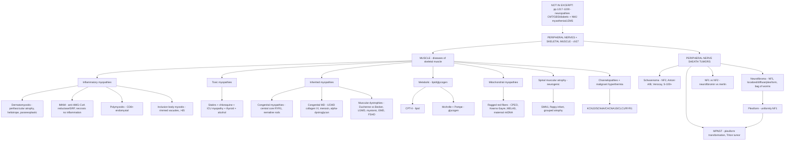

# 🟡 Chapter 27 — Peripheral Nerves and Skeletal Muscles

> **Book:** Robbins & Cotran, 10th ed., pp. 1217–1240 · **Authors:** Peter Pytel • Douglas C. Anthony
> 🇧🇩 **এক লাইনে:** **দুই বড় জগত — (1) Inflammatory myopathy: dermatomyositis (perifascicular atrophy + heliotrope rash + paraneoplastic) vs polymyositis (CD8⁺ endomysial) vs inclusion body myositis (>65 yr, rimmed vacuoles, refractory)**, **(2) Muscular dystrophy: Duchenne (dystrophin ABSENT → wheelchair ~9.5 yr, death 25–30) vs Becker (dystrophin REDUCED → near-normal lifespan)**, **(3) Nerve sheath tumors: schwannoma (Antoni A/B + Verocay bodies, S-100⁺, NF2, "acoustic neuroma" = misnomer) vs neurofibroma (NF1, plexiform = "bag of worms" → MPNST 5–10%)**। মনে রাখবেন: **"Duchenne = Deleted (no dystrophin) → Dies by 30; Becker = Better (truncated protein). Schwannoma = Separate capsule, save the nerve; Neurofibroma = Not encapsulated, NF1. Ragged red fibers = Mitochondria."** ⚠️ Note: এই excerpt (p.1229 থেকে) only skeletal muscle + nerve sheath tumors; neuropathies + NMJ sections (pp.1217–1228) এখানে নেই।
> ⏱️ Total time: ~3–4 h. 🔴 MUST KNOW = 75% (**inflammatory myopathies, Duchenne vs Becker, myotonic dystrophy, mitochondrial myopathies, schwannoma vs neurofibroma, MPNST, NF1 vs NF2, malignant hyperthermia**). 🟡 NICE TO KNOW = 25% (**toxic myopathies, congenital myopathies, congenital MD, lipid/glycogen diseases, SMA + channelopathies, Emery-Dreifuss, FSHD**).

---

## 🗺️ 1. BIG PICTURE — the whole chapter as one tree

---

## 📊 2. CHAPTER MAP — topic → priority → time

| Topic | Priority | Time |
|---|---|---|
| **Inflammatory myopathies** — DM vs IMNM vs PM vs IBM: perifascicular atrophy + heliotrope rash, CD8⁺ endomysial invasion, rimmed vacuoles, paraneoplastic malignancy | 🔴🔴 | 40 min |
| **Toxic myopathies** — statins, chloroquine/hydroxychloroquine (lysosomal), ICU (myosin-deficient), thyroid, alcohol (rhabdomyolysis) | 🟡 | 15 min |
| **Congenital myopathies** — central core (RYR1 → malignant hyperthermia), nemaline (rods), centronuclear/myotubular (MTM1), congenital fiber type disproportion | 🟡 | 20 min |
| **Congenital muscular dystrophies** — Ullrich (collagen VI), merosin/α2-laminin deficiency, α-dystroglycan glycosylation defects | 🟡 | 15 min |
| **Muscular dystrophies** — Duchenne vs Becker (dystrophin), limb-girdle, myotonic (CTG/DMPK), Emery-Dreifuss (emerin/lamin), FSHD (DUX4) | 🔴🔴 | 40 min |
| **Lipid & glycogen metabolism** — CPT-II deficiency, McArdle (myophosphorylase), acid maltase (Pompe) | 🟡 | 10 min |
| **Mitochondrial myopathies** — ragged red fibers, CPEO, Kearns-Sayre, MELAS, maternal mtDNA inheritance | 🔴 | 25 min |
| **Spinal muscular atrophy + hypotonic infant + channelopathies** — SMN1, KCNJ2/SCN4A/CACNA1S/CLC1/RYR1 | 🟡 | 15 min |
| **Malignant hyperthermia** — RYR1, halogenated inhalational agents + succinylcholine | 🟡 | 10 min |
| **Nerve sheath tumors — overview** — Schwann cell lineage, oligodendrocyte (central) vs Schwann (peripheral) myelin | 🔴 | 10 min |
| **Schwannoma** — Antoni A/B, Verocay bodies, merlin/NF2 loss, S-100⁺, "acoustic neuroma" misnomer | 🔴🔴 | 20 min |
| **Neurofibroma** — localized/diffuse/plexiform, "bag of worms", neurofibromin → RAS | 🔴🔴 | 20 min |
| **MPNST** — ~85% high grade, NF1 plexiform transformation, divergent differentiation, Triton tumor | 🔴 | 15 min |
| **NF1 vs NF2** — neurofibromin (17q11.2) vs merlin (22q12); café au lait + Lisch vs bilateral CN VIII schwannomas + meningiomas | 🔴🔴 | 20 min |
| ⚠️ **NOT in source excerpt (pp. 1217–1228)** — neuropathies (CMT, Friedreich, diabetic, GBS/CIDP, entrapment, amyloid, vasculitic) + NMJ disorders (myasthenia gravis, Lambert-Eaton) | — | — |

---

## 3. The layout you must know 🟡

- **The chapter has two halves:** (1) **Diseases of skeletal muscle** and (2) **Peripheral nerve sheath tumors**.
- **Altered muscle function = neurogenic OR primary myopathic.** Myopathic disorders are marked by **degeneration + regeneration of myofibers**; neurogenic ones (SMA) show **grouped atrophy of denervated fibers**.
- **The 3 "traditional" inflammatory myopathies** are polymyositis, dermatomyositis, and inclusion body myositis — but **IMNM is now the 4th, recognized entity** that steals many "polymyositis" diagnoses.
- **Peripheral myelin = Schwann cells; central myelin = oligodendrocytes.** There is an abrupt transition at the nerve root — so nerve sheath tumors can arise **both inside and outside the dura**.
- ⚠️ **Coverage note:** এই ফাইলের source excerptটি page **1229** (Diseases of skeletal muscle)-এ শুরু হয়ে **1239**-এ শেষ। তাই peripheral nerve anatomy, nerve injury reactions, neuropathies এবং NMJ disease (myasthenia gravis, Lambert-Eaton) সম্পর্কিত প্রথম দিকের sections এখানে **নেই** — সেগুলো না জানিয়ে এড়িয়ে যাওয়া হয়েছে (see §18).

---

## 4. Inflammatory myopathies 🔴🔴

📌 **Dermatomyositis (DM):** most common inflammatory myopathy in **children**; affects **small blood vessels** → immune damage → **perifascicular atrophy** (atrophy of myofibers at the periphery of fascicles — the classic hallmark).
- **Skin — the two signatures:** **heliotrope rash** = lilac-colored discoloration of the **upper eyelids** + periorbital edema; **Gottron papules** = scaling erythematous eruption / dusky red patches over **knuckles, elbows, knees**.
- **Extramuscular:** **1/3 have dysphagia** (oropharyngeal + esophageal); **10% interstitial lung disease** (can be rapidly progressive → death); cardiac involvement common but rarely heart failure.
- **Juvenile DM:** average onset **7 yr**; more **calcinosis + lipodystrophy**; less myositis-specific antibodies, cardiac involvement, ILD, and malignancy → **better prognosis**.
- **Adult DM:** 4th–6th decade; **15–24% have an associated malignancy** → viewed as **paraneoplastic** (cancer screening!); a DM-like picture can follow **check-point inhibitor** therapy (Ch. 7).
- **Laboratory:** ↑ CK, myopathic EMG changes.
- **Treatment:** immunosuppressives (steroids, azathioprine, IVIG) — **improved prognosis**.

📌 **Immune-Mediated Necrotizing Myopathy (IMNM):** autoimmune; subacute weakness + **markedly ↑ CK**; biopsy shows **prominent myofiber necrosis + regeneration with little/no inflammation**. Associated antibodies: **anti–HMG-CoA reductase** (often prior **statin** exposure, not always) or **anti–SRP** (signal recognition particle).

📌 **Polymyositis (PM):** adult-onset; myalgia + weakness but **NO skin features** → partly a **diagnosis of exclusion** (many cases are really IMNM, connective-tissue disease, or early IBM). Pathogenesis: **CD8⁺ cytotoxic T cells** invade myofibers (no primary vascular injury like DM).
- **Morphology:** mononuclear infiltrate is **endomysial**; CD8⁺ T cells invade otherwise normal-appearing myofibers; degenerating/necrotic/regenerating/atrophic fibers in a **random, patchy** distribution; **perifascicular atrophy is ABSENT**.

📌 **Inclusion Body Myositis (IBM):** late adulthood (**>50 yr**); the **most common inflammatory myopathy in patients >65 yr**. Slow, progressive weakness worst in **quadriceps + distal upper-extremity muscles**; **dysphagia common**. CK only modestly elevated; most myositis autoantibodies absent, but **anti-cN1A (cytosolic 5′-nucleotidase 1A) in ~half** — a useful marker.
- **Morphology:** like PM (patchy endomysial **CD8⁺ T cells**, ↑ sarcolemmal **MHC class I**, focal invasion of normal fibers, admixed degenerating/regenerating fibers) **PLUS**:
  - **"Rimmed vacuoles"** — inclusions with reddish granular rimming (modified Gomori trichrome)
  - **Tubulofilamentous inclusions** on EM
  - Cytoplasmic inclusions of **β-amyloid, TDP-43, ubiquitin** (neurodegeneration-like proteins)
  - **Endomysial fibrosis + fatty replacement** (chronic course)
- **Responds POORLY to immunosuppression** — argues against a purely inflammatory origin; familial forms lack inflammation → called inclusion body **"myopathy."**

### Inflammatory myopathy quick table

| Feature | Dermatomyositis | Polymyositis | IBM | IMNM |
|---|---|---|---|---|
| Age/onset | Children (avg 7) + adults 40–60 | Adults | **>50 (most common >65)** | Adults |
| Key mechanism | **Microvascular injury** | **CD8⁺ T-cell** myofiber invasion | Degenerative + inflammatory (debated) | Autoantibody (HMG-CoA red., SRP) |
| Skin | **Heliotrope rash + Gottron papules** | None | None | None |
| Biopsy hallmark | **Perifascicular atrophy** | **Endomysial CD8⁺ infiltrate**, no perifascicular | **Rimmed vacuoles** + inclusions | **Necrosis/regeneration, NO inflammation** |
| Cancer association | **15–24% adults (paraneoplastic)** | No | No | Sometimes (statin) |
| Response to therapy | Good | Good | **Poor** | Variable |

---

## 5. Toxic myopathies 🟡

📌 **Statins:** myopathy is the **most common complication** of statins (atorvastatin, simvastatin, pravastatin). Pure toxic injury is **dose- and statin-type-related** — must be distinguished from **IMNM** (statin-induced **autoantibodies** to HMG-CoA reductase).

📌 **Chloroquine / hydroxychloroquine:** interfere with **lysosomal function** → **drug-induced lysosomal storage myopathy**; slowly progressive weakness; **vacuolation mainly of type I fibers**; EM shows whorled, lamellar membranous structures incl. **curvilinear bodies** (mimic ceroid lipofuscinoses, Ch. 28). **Cardiac muscle can also be affected.**

📌 **ICU myopathy (= myosin-deficient myopathy):** during critical illness, especially with **corticosteroids**; relatively selective degradation of **sarcomeric myosin thick filaments** → profound weakness that can even **interfere with weaning from a ventilator**.

📌 **Thyroid dysfunction:**
- **Thyrotoxic myopathy:** acute or chronic **proximal weakness** (may precede other hyperthyroid signs); **exophthalmic ophthalmoplegia** = eyelid swelling, conjunctival edema, diplopia.
- **Hypothyroidism:** cramping/aching, decreased movement, **slowed reflexes**; biopsy: fiber atrophy, increased abnormally localized nuclei, glycogen aggregates, ± mucopolysaccharide deposition.

📌 **Alcohol:** **binge drinking** → acute syndrome of **rhabdomyolysis, myoglobinuria, and renal failure**; acute generalized (or single-muscle) myalgias.

---

## 6. Inherited diseases — congenital myopathies 🟡

📌 **Congenital myopathies:** present in **infancy** with muscle defects that are often **static or even improve**; associated with **distinct structural abnormalities** of muscle (Table 27.2):

| Disease / inheritance | Gene (locus) | Clinical | Pathology |
|---|---|---|---|
| **Central core disease** (AD) | **RYR1** (19q13.2) — ryanodine receptor | Early hypotonia, **"floppy infant"**; scoliosis, hip dislocation, foot deformities; some RYR1 mutations → **malignant hyperthermia** (some cause both) | **Cytoplasmic cores** = demarcated central zones with disrupted sarcomere arrangement + **decreased mitochondria** |
| **Nemaline myopathy** (AD/AR) | **TPM3** (1q21.3), **NEB** (2q23.3), **ACTA1** (1q42.13), **TPM2** (9p13.3), **TNNT1** (19q13.42), **CFL2** (14q13.1) | Childhood weakness; some severe with birth hypotonia ("floppy infant") | **Nemaline rods** (spindle-shaped particles), predominantly **type 1 fibers**; derived from **Z-band material (α-actinin)**; best seen on **modified Gomori trichrome** / EM |
| **Centronuclear (myotubular) myopathy** | XL **MTM1** (Xq28); AD **DNM2** (19p13.2); AR **BIN1** (2q14.3) | Severe congenital hypotonia, poor prognosis (X-linked "myotubular" form); childhood/young-adult variants | Nuclei in the **geometric center** of myofibers; central nuclei more common in **small type 1 fibers** |
| **Congenital fiber type disproportion** | **SELENON** (1p36.11), **ACTA1** (1q42.13), **TPM3** (1q21.3) | Hypotonia, weakness, failure to thrive, facial + respiratory weakness, contractures | **Predominance + atrophy of type I fibers** (not specific) |

📌 **Key overlap lesson:** the same gene can cause several diseases — **ACTA1** → nemaline + protein aggregate myopathy; **TPM3** → nemaline; **SELENON** → fiber type disproportion + protein aggregate myopathy + rigid spine muscular dystrophy.

---

## 7. Congenital muscular dystrophies 🟡

📌 Congenital MDs present **in infancy** and pair **progressive muscle damage** with **developmental CNS abnormalities** (vs. muscular dystrophies, which present after infancy). Two major groups:

- **Defects in extracellular matrix around myofibers:**
  - **Ullrich CMD (UCMD):** mutations in one of **3 collagen VI alpha genes**; hypotonia, **proximal contractures + distal hyperextensibility**; morphologic hallmark = **mismatched expression of normally co-localized perlecan and collagen VI**.
  - **Merosin deficiency:** mutation of the gene encoding **merosin** (α2-laminin).
- **Defects in receptors for extracellular matrix:** disrupted **O-linked glycosylation of α-dystroglycan** (Fig. 27.10). Mutation of α-dystroglycan itself → **fetal demise**; defects in post-translational modification → milder deficiency. Severe cases = congenital MD **+ CNS + eye** developmental defects (**seizures, intellectual disability, blindness** — α-dystroglycan matters for CNS/eye development); milder forms = skeletal muscle only; some present as **limb-girdle muscular dystrophy**.

---

## 8. Muscular dystrophies 🔴🔴

📌 **Shared theme:** inherited disorders with **progressive muscle damage** manifesting from childhood to adulthood (except congenital MDs). The focus is **X-linked dystrophinopathies**.

### The dystrophin glycoprotein complex (Fig. 27.10)
**Dystrophin** (intracellular) links **cytoplasmic actin** to transmembrane **dystroglycans + sarcoglycans** → extracellular **laminin (α2-laminin/merosin)**; also binds **dystrobrevin + syntrophins → nNOS** and **caveolin**. It provides **mechanical stability** — defects → small **membrane tears** → **calcium influx** → myofiber degeneration; the C-terminus interacts with nitric oxide synthase (signaling role too).

### Duchenne vs Becker — EXAM FAVORITE

| Feature | **Duchenne (DMD)** | **Becker (BMD)** |
|---|---|---|
| Dystrophin gene | **Deletion/frameshift → dystrophin ABSENT** | Truncated dystrophin with **partial function** |
| Incidence | **1 per 3500 live male births** | Less common |
| Onset | Early (boys appear normal at birth; delayed walking, clumsiness) | **Later** (late childhood, adolescence, adult) |
| Course | Severe, progressive; **wheelchair ~9.5 yr** mean | Milder, slower progression |
| Muscle enlargement | **Calf pseudohypertrophy** | Similar but milder |
| CK | **Markedly elevated in the first decade**, then falls as muscle mass is lost | Elevated |
| Dystrophin IHC | **Absent** sarcolemmal staining | **Reduced** staining |
| Death | Mean **25–30 yr** — respiratory insufficiency, pulmonary infection, or heart failure | **Near-normal life expectancy** |
| Other | Cardiac: cardiomyopathy/arrhythmias esp. in older patients; **cognitive impairment/ID** (dystrophin in brain); female carriers mildly affected via unfavorable X-inactivation | Same cardiac/cognitive issues, later |

📌 **Morphology (DMD as example):** chronic damage **outpaces repair** — young boys show **segmental myofiber degeneration + regeneration + atrophic myofibers**; fascicular architecture initially preserved; no inflammation except **myophagocytosis**. Progresses to **fatty replacement/infiltration + endomysial fibrosis**; remaining fibers vary from small atrophic to large hypertrophied → fascicular architecture distorted.
📌 **Diagnosis:** history + exam + labs; **definitive = detection of a dystrophin mutation**. **Treatment:** supportive care; experimental strategies: **antisense-oligonucleotide exon skipping**, **ribosomal read-through of stop codons** (both mutation-specific), and **gene therapy** (delivery to muscle still a hurdle). Even partial dystrophin (as in Becker) substantially ameliorates the disease.

### Other muscular dystrophies

📌 **Limb-girdle MD:** heterogeneous — **≥8 AD + 23 AR** entities; incidence **1/25,000–50,000**; weakness of **proximal muscle groups**. Causative genes grouped by function: structural **sarcoglycans**, α-dystroglycan **glycosylation enzymes**, **Z-disk**–associated proteins, **vesicle trafficking/cell signaling**, and "stand-alone" genes like **CAPN3 (calpain 3)** and **lamin A/C**.

📌 **Myotonic dystrophy:** AD, **multisystem**, ~**1/10,000**; skeletal muscle weakness + **cataracts + endocrinopathy + cardiomyopathy**; **myotonia** (sustained involuntary contraction) is a key feature; rare severe infantile form = "congenital myotonia."
- **Pathogenesis:** **expanded CTG triplet repeats** in the **3′-noncoding region of the DMPK** (myotonic dystrophy protein kinase) gene → **toxic gain-of-function**: expanded **CUG repeats in DMPK mRNA sequester muscleblind-like splicing regulator 1** → missplicing of other transcripts, including the **CLC1 chloride channel** → **myotonia** (CLC1 loss-of-function germline mutations cause a rare congenital myotonia, proving CLC1 is needed for muscle relaxation).

📌 **Emery-Dreifuss MD (EMD):** mutations in **nuclear lamin proteins** (inner face of nuclear membrane — maintain nuclear shape/mechanical stability, influence chromatin organization). **Triad:** (1) slowly progressive **humeroperoneal weakness**, (2) **cardiomyopathy + conduction defects**, (3) **early contractures** of the **Achilles tendon, spine, elbows**. **EMD1** (X-linked) = **emerin**; **EMD2** (autosomal) = **lamin A/C**.

📌 **Facioscapulohumeral dystrophy (FSHD):** AD, ~**1/20,000**; **facial + shoulder-girdle weakness**. Pathogenesis: **overexpression of the DUX4 retrogene** (a transcription factor) located in subtelomeric repeats of chromosome 4q → overexpression of DUX4 target genes.

---

## 9. Diseases of lipid & glycogen metabolism 🟡

📌 **Two clinical patterns:** (a) **episodic** — symptoms only with **exercise or fasting** → severe cramping/pain or **rhabdomyolysis**; (b) **slowly progressive** damage without episodes.

| Disease | Defect | Pattern |
|---|---|---|
| **Carnitine palmitoyltransferase (CPT-II) deficiency** | Impaired transport of **free fatty acids into mitochondria** | **Most common lipid-metabolism cause** of episodic muscle damage with exercise/fasting |
| **Myophosphorylase deficiency (McArdle disease)** | Glycogen breakdown | One of the more common glycogen storage diseases of muscle; **episodic** damage with exercise |
| **Acid maltase deficiency** | Impaired **lysosomal** glycogen → glucose conversion → glycogen accumulates in lysosomes | Severe = infantile generalized **glycogenosis (Pompe disease)**; milder = **adult-onset progressive myopathy** of respiratory + truncal muscles; **enzyme replacement therapy** used |

---

## 10. Mitochondrial myopathies 🔴

📌 **Big idea:** mutations impair mitochondrial **ATP generation** → tissues with high ATP demand are hit — **skeletal muscle, cardiac muscle, neurons**. Muscle may show weakness, ↑CK, or **rhabdomyolysis**.

📌 **Extraocular muscles** are a clue — **CPEO (chronic progressive external ophthalmoplegia)** is common; extraocular muscles have the **most mitochondria per mass** of any body muscle.

📌 **Genetics (complex):**
- Proteins/tRNAs come from **nuclear** genome (Mendelian) **or mtDNA**.
- **mtDNA = maternally inherited** (all embryo mitochondria come from the oocyte).
- Each cell has **thousands of mtDNA copies**, distributed randomly → **heteroplasmy + threshold effect**: disease only when mutated copies **exceed a threshold** in a substantial fraction of at-risk cells.

📌 **Morphology:** **"ragged red fibers"** = abnormal aggregates of mitochondria preferentially in the **subsarcolemmal area**; EM shows abnormal mitochondria (concentric membranous rings "**phonograph records**", **rhomboid paracrystalline inclusions**); loss of enzyme activity by **cytochrome oxidase histochemistry**. Some mitochondrial diseases have **no morphologic change** → need enzymatic/genetic assays.

📌 **Genotype–phenotype (messy!):** one **point mutation in the mtDNA leucine tRNA gene** can cause either isolated **CPEO** or **MELAS** (mitochondrial encephalomyopathy with lactic acidosis + stroke-like episodes). **mtDNA deletions** → isolated ophthalmoplegia or **Kearns-Sayre syndrome** (**ophthalmoplegia + pigmentary degeneration of the retina + complete heart block**). Others: **MERRF** (myoclonic epilepsy with ragged red fibers), **Leber hereditary optic neuropathy** (point mutation), and **Leigh syndrome** (subacute necrotizing encephalopathy — causative mutations in **>30 different genes**, mtDNA or nuclear, all encoding mitochondrial-metabolism proteins).

---

## 11. Spinal muscular atrophy (SMA), hypotonic infant & channelopathies 🟡

📌 **The "floppy infant" differential:** (1) primary skeletal muscle disease — **congenital myasthenic syndrome, congenital myotonia, congenital myopathies, congenital muscular dystrophies**; (2) brain disease (encephalopathy); (3) **neuronopathies** — **SMA is prototypic**.

📌 **SMA:** **autosomal recessive**, incidence **1/6000 births**, caused by loss-of-function mutations in **SMN1 (survival of motor neuron-1)**; SMN1 deficiency → **loss of motor neurons (even in utero)** → denervation. **Morphology (Fig. 27.13):** large zones of **severely atrophic myofibers** mixed with scattered **normal-sized or hypertrophied myofibers** (those that retain innervation), found singly or in small groups — a **neuropathic/neurogenic** pattern (vs. myopathic degeneration/regeneration).

📌 **Channelopathies:** inherited ion-channel mutations, mostly **AD with variable penetrance**; can cause hypo- or hypertonia; the periodic paralyses are named for the serum K⁺ level — **hyperkalemic, hypokalemic, normokalemic periodic paralysis**.
- **KCNJ2** (K⁺ channel) → **Andersen-Tawil syndrome**: periodic paralysis + cardiac arrhythmias + skeletal abnormalities.
- **SCN4A** (Na⁺ channel) → range from **myotonia to periodic paralysis**.
- **CACNA1S** (Ca²⁺ channel subunit) → **most common cause of hypokalemic paralysis**.
- **CLC1** (Cl⁻ channel) → **myotonia congenita** (expression also decreased in myotonic dystrophy).
- **RYR1** (ryanodine receptor — Ca²⁺ release from sarcoplasmic reticulum) → **central core disease + malignant hyperthermia**.

---

## 12. Malignant hyperthermia 🟡

📌 A **hypermetabolic state** (tachycardia, tachypnea, muscle spasms, later hyperpyrexia) **triggered by anesthetics** — most commonly **halogenated inhalational agents and succinylcholine**. Mutated **RYR1** allows **increased efflux of calcium from the sarcoplasmic reticulum** → **tetany + excessive heat production**. RYR1 mutations cause central core disease, malignant hyperthermia, or both.

---

## 13. Peripheral nerve sheath tumors — overview 🔴

📌 **Almost all** benign + malignant peripheral nerve sheath tumors (PNSTs) are composed of cells showing **Schwann cell differentiation** — the three common types: **schwannoma, neurofibroma, malignant peripheral nerve sheath tumor (MPNST)**; rare tumors show perineurial cell differentiation.
📌 **Myelin geography:** **central myelin = oligodendrocytes**, **peripheral myelin = Schwann cells**, with an **abrupt transition** as nerves exit the brain → PNSTs can arise **within the dura** (e.g., intracranial) **and** along distal nerve courses.
📌 **Unique feature:** association with familial tumor syndromes — **NF1, NF2, schwannomatosis**. MPNST in NF1 typically arises by **malignant transformation of a preexisting plexiform neurofibroma** (unusual for soft-tissue tumors, unlike colon cancer etc.).

---

## 14. Schwannoma 🔴🔴

📌 **Identity:** benign tumor of **Schwann cell differentiation**, often arising directly from a peripheral nerve. Component of **NF2**; even sporadic schwannomas commonly harbor **inactivating NF2 mutations (chr 22)**; **loss of merlin** (the NF2 product) is a consistent finding (merlin regulates actin-cytoskeleton signaling → cell shape, growth, adhesion).

📌 **Morphology:**
- **Well-circumscribed, ENCAPSULATED**; **loosely attached** to the nerve without invading → often **resectable without sacrificing nerve function**; firm, gray masses.
- **Antoni A** (dense, eosinophilic, intersecting fascicles, **nuclear palisading**) + **Antoni B** (loose, hypocellular, myxoid, microcysts).
- **Verocay bodies:** palisading nuclei flanking a central **"nuclear-free zone"**.
- Cells: spindle-shaped with **wavy/buckled nuclei**; EM shows **basement membrane encasing single cells + collagen**.
- The tumor **displaces** the nerve (axons largely excluded; may be entrapped in capsule).
- **S-100 uniformly immunoreactive** (Schwann cell origin).
- Degenerative changes: nuclear pleomorphism, xanthomatous change, vascular hyalinization, cystic change, necrosis. Some large, mitotically active, Antoni-B-poor schwannomas **mimic sarcoma**. Recurrence if incompletely resected; **malignant transformation extremely rare**.

📌 **Clinical:** symptoms from **local compression**. Intracranially, most sit at the **cerebellopontine angle** attached to the **vestibular branch of CN VIII** → **tinnitus + hearing loss** — the famous misnomer **"acoustic neuroma"** (neither from the acoustic portion of the nerve, nor a neuroma). Intradurally, **sensory nerves** are preferentially involved (trigeminal branches, dorsal roots); extradurally, along large trunks or as soft-tissue masses. **Surgical removal is curative.**

---

## 15. Neurofibroma 🔴🔴

📌 **Identity:** benign nerve sheath tumor, **more heterogeneous** than schwannoma — neoplastic **Schwann cells** admixed with **perineurial-like cells, fibroblasts, mast cells, CD34⁺ spindle cells**; sporadic **or NF1-associated**. **Three growth patterns:**
- **Localized cutaneous:** pedunculated nodule(s) — isolated (sporadic) or multiple (NF1).
- **Diffuse:** large **plaque-like** elevation of skin; typically **NF1-associated**.
- **Plexiform:** in nerve roots/large nerves, deep or superficial; **uniformly NF1-associated**.

📌 **Pathogenesis:** only the **Schwann cells show complete loss of the NF1 product neurofibromin** → they are the **neoplastic cells**. Neurofibromin = tumor suppressor that **restrains RAS** (stimulates GTPase activity → RAS-GTP off). Loss → **RAS trapped in the active GTP-bound state**. **Haploinsufficiency** in other cells contributes too: NF1-haploinsufficient **mast cells are hypersensitive to KIT ligand** (made by Schwann cells) and secrete growth factors → **tumor/stromal cross-talk targetable with KIT inhibitors**. Plexiform and dermal neurofibromas arise from **different neural crest–derived precursors**. **Malignant transformation** (→ MPNST) is usually in the **plexiform** type (sometimes diffuse). Overall **MPNST risk in NF1 = 5–10%**, higher with many plexiform neurofibromas and **large NF1 deletions**.

📌 **Morphology:**
- **Localized cutaneous:** small, well-delineated but **UNENCAPSULATED**; low cellularity; bland Schwann cells + mast cells + perineurial cells + CD34⁺ spindle cells + fibroblasts; loose collagen; entrapped adnexal structures.
- **Diffuse:** infiltrates dermis + subcutaneous tissue, entrapping fat and appendages → plaque; can grow large; **pseudo-Meissner corpuscles (tactile-like bodies)**.
- **Plexiform:** grows **within and expands nerve fascicles**, entrapping axons; the **external perineurial layer is preserved** → individual nodules look encapsulated; ropy thickening of multiple fascicles = **"bag of worms"**; ECM from loose/myxoid to collagenous; collagen bundles like **"shredded carrot"** (Fig. 27.14D).

---

## 16. Malignant peripheral nerve sheath tumor (MPNST) 🔴

📌 **Identity:** ~**85% are high-grade** (low-grade variants exist). **About half arise in NF1 patients** — assumed to be **malignant transformation of a plexiform neurofibroma**; sporadic cases arise **de novo**. Most associate with **larger peripheral nerves** in chest, abdomen, pelvis, neck, or limb-girdle. **Complex chromosomal aberrations** (gains, losses, rearrangements); molecular drivers of neurofibroma→MPNST transformation poorly understood.

📌 **Morphology:** poorly defined masses that **infiltrate along the parent nerve** and invade adjacent soft tissue; **fasciculated spindle cells**; low power often looks **"marbleized"** (patchy cellularity); **mitoses, necrosis, nuclear anaplasia** common. **Divergent differentiation** = focal areas of glandular, cartilaginous, osseous, or **rhabdomyoblastic** morphology — the rhabdomyoblastic one = **Triton tumor**. Because of poor differentiation, distinction from an **undifferentiated sarcoma** may be hard — clues: **NF1 diagnosis** + a demonstrable relationship to a **nerve or preexisting neurofibroma**.

---

## 17. Neurofibromatosis Type 1 vs Type 2 🔴🔴

### NF1
- **AD, 1 in 3000** — a common systemic disease with nonneoplastic features + many tumors: **neurofibromas (all types), MPNSTs, optic nerve gliomas**, other glial tumors/hamartomas, and **pheochromocytomas**.
- Nonneoplastic: **intellectual disability or seizures**, **skeletal defects**, **Lisch nodules** (pigmented iris nodules), **café au lait spots**.
- Genetics: **NF1 gene at 17q11.2** → **neurofibromin** (tumor suppressor, GTPase that restrains RAS); neoplastic cells lack neurofibromin due to **biallelic defects**.
- **High penetrance, variable expressivity**; mosaicism → disease restricted to body regions; **large deletions spanning NF1 + adjacent genes → severe phenotypes**.

### NF2
- **AD, 1 in 40,000–50,000** — tumors: **bilateral 8th-nerve schwannomas**, **multiple meningiomas**, **spinal cord ependymomas**.
- Nonneoplastic: **schwannosis** (nodular Schwann-cell ingrowth into the spinal cord), **meningioangiomatosis** (proliferation of meningeal cells + vessels growing into brain), **glial hamartia** (microscopic nodular glial collections).
- Genetics: **NF2 gene at 22q12** → **merlin**; also mutated in **sporadic meningiomas and schwannomas**; **nonsense/frameshift mutations → more severe** phenotypes than missense.
- Other familial schwannoma syndromes: **schwannomatosis** and **Carney complex**.

| | **NF1** | **NF2** |
|---|---|---|
| Frequency | **1 in 3000** | **1 in 40,000–50,000** |
| Gene (product) | **17q11.2 → neurofibromin** (GTPase, restrains RAS) | **22q12 → merlin** |
| Hallmark tumors | Neurofibromas (all types), **MPNST**, optic gliomas, pheochromocytoma | **Bilateral CN VIII (vestibular) schwannomas**, multiple meningiomas, spinal ependymomas |
| Skin/eye signs | **Café au lait spots, Lisch nodules** | Usually none |
| CNS | Intellectual disability/seizures, glial tumors | Meningiomas, schwannosis, meningioangiomatosis, glial hamartia |
| Nonneoplastic | Skeletal defects, mosaicism | Schwannosis, meningioangiomatosis |

---

## 18. ⚠️ Coverage note — sections NOT in the source excerpt

এই chapter-এর **pages 1217–1228** (peripheral nerve structure — Schwann cells, myelination, myelin basic protein, neurofilament; reactions to injury — Wallerian degeneration, axonal vs segmental demyelination, regeneration; neuropathies — hereditary Charcot-Marie-Tooth, Friedreich ataxia, diabetic neuropathy, Guillain-Barré/acute inflammatory demyelinating polyneuropathy, chronic demyelinating polyneuropathy, entrapment/compression, amyloid, vasculitic; skeletal muscle structure — sarcomere, fiber types I/II, denervation atrophy; and NMJ disorders — myasthenia gravis, Lambert-Eaton) **আছে না এই excerpt-এ** — তাই এই নোটে যুক্ত করা হয়নি (facts invent না করার নিয়ম অনুযায়ী)। Suggested readings-এ CMT, Guillain-Barré, CIDP, Lambert-Eaton syndrome-এর উল্লেখ আছে কিন্তু body text নেই। Those topics belong to the full chapter and should be added if/when the pp. 1217–1228 text is available.

---

## 🎯 RAPID-FIRE — quick Q&A

1. **Dermatomyositis biopsy hallmark?** → Perifascicular atrophy (microvascular injury).
2. **DM skin signs?** → Heliotrope rash (upper eyelids + periorbital edema) + Gottron papules (knuckles/elbows/knees).
3. **% of adult DM patients with malignancy?** → 15–24% (paraneoplastic).
4. **Most common inflammatory myopathy in children?** → Dermatomyositis (average onset 7 yr).
5. **Childhood vs adult DM differences?** → Childhood: more calcinosis + lipodystrophy, less cancer/ILD/cardiac/antibodies, better prognosis.
6. **IMNM antibodies?** → Anti–HMG-CoA reductase (statin) and anti-SRP.
7. **IMNM biopsy pattern?** → Prominent necrosis + regeneration, minimal/no inflammation.
8. **Polymyositis mechanism?** → CD8⁺ cytotoxic T cells invading myofibers (endomysial).
9. **Does polymyositis have perifascicular atrophy?** → No (that's DM).
10. **IBM: typical patient?** → >50 yr; most common inflammatory myopathy >65 yr.
11. **IBM muscle pattern?** → Quadriceps + distal upper extremity weakness; dysphagia.
12. **IBM specific inclusions?** → Rimmed vacuoles + tubulofilamentous inclusions + β-amyloid/TDP-43/ubiquitin.
13. **IBM serum marker?** → Anti-cN1A (cytosolic 5′-nucleotidase 1A) in ~half.
14. **IBM treatment response?** → Poor (argues against purely inflammatory origin).
15. **Statins: most common complication?** → Myopathy (toxic or IMNM with autoantibodies).
16. **Chloroquine myopathy mechanism?** → Lysosomal dysfunction → storage myopathy, vacuoles in type I fibers, curvilinear bodies.
17. **ICU myopathy = ?** → Myosin-deficient myopathy (corticosteroids; interferes with ventilator weaning).
18. **Thyrotoxic myopathy + eye sign?** → Proximal weakness + exophthalmic ophthalmoplegia.
19. **Binge alcohol → muscle syndrome?** → Rhabdomyolysis, myoglobinuria, renal failure.
20. **Central core disease gene?** → RYR1 (ryanodine receptor); also → malignant hyperthermia.
21. **Nemaline rods derive from?** → Z-band material (α-actinin); best on modified Gomori trichrome; type 1 fibers.
22. **Myotubular myopathy gene?** → MTM1 (X-linked, Xq28) — severe "floppy infant," poor prognosis.
23. **Ullrich CMD gene?** → Collagen VI (alpha genes); hallmark = perlecan/collagen VI mismatch.
24. **Severe α-dystroglycan glycosylation defects → ?** → Congenital MD + CNS + eye defects (seizures, ID, blindness).
25. **Duchenne incidence?** → 1 per 3500 live male births.
26. **Dystrophin gene size?** → 2.3 million bp, 79 exons.
27. **Duchenne vs Becker dystrophin?** → Duchenne: absent (deletion/frameshift); Becker: truncated, partially functional.
28. **Duchenne: mean wheelchair age?** → ~9.5 yr.
29. **Duchenne: mean age of death?** → 25–30 yr (respiratory insufficiency, pulmonary infection, heart failure).
30. **Duchenne CK pattern?** → Markedly elevated in first decade, then falls with muscle loss.
31. **Duchenne diagnosis — definitive test?** → Detection of a dystrophin mutation.
32. **Duchenne treatment approaches?** → Exon skipping (antisense), stop-codon read-through, gene therapy.
33. **Why is Becker milder?** → Retains partial dystrophin function → near-normal life expectancy.
34. **Limb-girdle MD incidence + pattern?** → 1/25,000–50,000; proximal muscle weakness; ≥8 AD + 23 AR entities.
35. **Myotonic dystrophy: inheritance + gene mechanism?** → AD; expanded CTG repeats in 3′-noncoding DMPK → toxic RNA gain-of-function.
36. **Myotonia in myotonic dystrophy — which channel?** → CLC1 chloride channel (misspliced via muscleblind sequestration).
37. **Emery-Dreifuss triad?** → Humeroperoneal weakness + cardiomyopathy/conduction defects + early contractures (Achilles, spine, elbows).
38. **Emery-Dreifuss proteins?** → Emerin (EMD1, X-linked) or lamin A/C (EMD2, AD).
39. **FSHD gene?** → DUX4 retrogene overexpression (chr 4 subtelomeric); facial + shoulder-girdle weakness.
40. **Most common lipid-metabolism cause of episodic muscle damage?** → CPT-II deficiency.
41. **McArdle disease = ?** → Myophosphorylase deficiency (glycogen storage; episodic with exercise).
42. **Acid maltase deficiency → ?** → Pompe disease (infancy) or adult-onset respiratory/truncal myopathy; enzyme replacement therapy.
43. **Ragged red fibers = ?** → Subsarcolemmal mitochondrial aggregates (mitochondrial myopathy).
44. **Mitochondrial inheritance?** → Maternal (mtDNA from the oocyte); heteroplasmy + threshold effect.
45. **Kearns-Sayre triad?** → CPEO + pigmentary retinal degeneration + complete heart block.
46. **MELAS?** → Mitochondrial encephalomyopathy with lactic acidosis + stroke-like episodes (mtDNA tRNA-Leu point mutation).
47. **SMA gene + incidence?** → SMN1 loss-of-function; AR, 1/6000; motor neuron loss → grouped atrophy.
48. **Andersen-Tawil syndrome?** → KCNJ2 K⁺ channel: periodic paralysis + cardiac arrhythmias + skeletal abnormalities.
49. **Most common cause of hypokalemic periodic paralysis?** → CACNA1S mutations.
50. **Malignant hyperthermia triggers?** → Halogenated inhalational agents + succinylcholine; RYR1 → ↑ Ca efflux from SR.
51. **Peripheral vs central myelin cells?** → Schwann cells (peripheral) vs oligodendrocytes (central) — abrupt transition.
52. **Schwannoma = which syndrome?** → NF2; sporadic ones also have NF2/merlin loss (chr 22).
53. **Antoni A vs B?** → A = dense cellular with palisading; B = loose hypocellular myxoid.
54. **Verocay bodies?** → Palisading nuclei flanking a nuclear-free zone (Antoni A).
55. **Schwannoma: can you save the nerve?** → Yes — encapsulated, loosely attached, displaces nerve; resection often preserves function.
56. **"Acoustic neuroma" — why a double misnomer?** → Not from the acoustic nerve (it's the vestibular branch, CPA) and not a neuroma.
57. **Plexiform neurofibroma = which syndrome?** → Uniformly NF1.
58. **"Bag of worms"?** → Plexiform neurofibroma (expanded nerve fascicles).
59. **"Shredded carrot" collagen?** → Plexiform neurofibroma.
60. **MPNST in NF1 — origin?** → Malignant transformation of a plexiform neurofibroma; overall 5–10% risk in NF1.
61. **Triton tumor?** → MPNST with rhabdomyoblastic (divergent) differentiation.
62. **NF1 gene + function?** → 17q11.2 → neurofibromin = GTPase that restrains RAS; loss → RAS trapped on.
63. **NF1 vs NF2 frequency?** → 1/3000 vs 1/40,000–50,000.
64. **NF2 gene + function?** → 22q12 → merlin (cytoskeletal/signaling); also mutated in sporadic meningiomas + schwannomas.

---

## 🎴 FLASHCARDS (front → back)

1. **Dermatomyositis: mechanism + biopsy?** → Microvascular (small vessel) injury → perifascicular atrophy; heliotrope rash + Gottron papules; 15–24% adult paraneoplastic malignancy.
2. **Polymyositis vs dermatomyositis?** → PM: adult, no skin, CD8⁺ endomysial, patchy, no perifascicular atrophy; DM: skin rash + perifascicular atrophy.
3. **Inclusion body myositis?** → >65 yr, quadriceps + distal UE + dysphagia, rimmed vacuoles + β-amyloid/TDP-43/ubiquitin, anti-cN1A, poor steroid response.
4. **IMNM?** → Necrotizing myopathy with anti–HMG-CoA reductase (statin) or anti-SRP; necrosis without inflammation.
5. **Statin muscle disease — two mechanisms?** → Direct dose-related toxic injury vs IMNM autoantibody disease.
6. **Central core disease vs nemaline?** → Core: RYR1, sarcomere disruption + ↓ mitochondria, MH link; Nemaline: rods from Z-band α-actinin in type 1 fibers, multiple genes (TPM3/NEB/ACTA1…).
7. **Duchenne vs Becker in one line?** → DMD: dystrophin absent, death 25–30; BMD: truncated dystrophin, near-normal life.
8. **Dystrophin complex function?** → Links actin ↔ dystroglycans/sarcoglycans ↔ laminin; gives membrane stability; tears → Ca influx → degeneration; binds nNOS.
9. **Myotonic dystrophy mechanism?** → CTG expansion in DMPK 3′-noncoding → toxic CUG RNA sequesters muscleblind → missplicing (CLC1) → myotonia; AD multisystem (cataracts, cardiomyopathy).
10. **Emery-Dreifuss?** → Emerin (XL) / lamin A/C (AD); humeroperoneal weakness + conduction defect + early contractures.
11. **FSHD?** → AD; facial + shoulder girdle; DUX4 retrogene overexpression on 4q.
12. **CPT-II, McArdle, Pompe?** → CPT-II = lipid (most common episodic); McArdle = myophosphorylase; Pompe = acid maltase (lysosomal), ERT.
13. **Mitochondrial myopathy: key morphologic + inheritance?** → Ragged red fibers (subsarcolemmal mitochondria); maternal mtDNA, heteroplasmy/threshold.
14. **Kearns-Sayre vs MELAS?** → KS: CPEO + pigmentary retinopathy + heart block (deletion); MELAS: stroke-like episodes + lactic acidosis (tRNA-Leu point mutation).
15. **Floppy infant differential?** → Congenital myasthenic syndrome/myotonia/myopathies/MD + brain disease + SMA (SMN1, neurogenic grouped atrophy).
16. **Schwannoma hallmarks?** → Encapsulated, Antoni A/B, Verocay bodies, S-100⁺, merlin/NF2 loss, resectable sparing nerve, malignant transformation extremely rare.
17. **Neurofibroma hallmarks?** → Heterogeneous (Schwann + perineurial + mast + CD34⁺), unencapsulated, NF1; plexiform = "bag of worms" → MPNST.
18. **MPNST?** → ~85% high grade; ~half NF1 from plexiform neurofibroma; divergent differentiation → Triton tumor (rhabdomyoblastic).
19. **NF1 vs NF2?** → NF1: neurofibromin 17q11.2, café au lait + Lisch nodules, neurofibromas/MPNST/optic glioma/pheochromocytoma. NF2: merlin 22q12, bilateral CN VIII schwannomas + meningiomas + ependymomas.
20. **Malignant hyperthermia?** → RYR1 mutation + halogenated anesthetic/succinylcholine → ↑ Ca efflux from SR → hypermetabolic tetany + hyperpyrexia.

---

## 🗣️ TOP 10 VIVA QUESTIONS

1. **"A 35-year-old woman has proximal weakness, an eyelid rash and a biopsy showing perifascicular atrophy. Diagnosis? Next step?"** → Dermatomyositis (heliotrope rash + perifascicular atrophy). Since 15–24% of adults have an associated malignancy, treat as paraneoplastic and **screen for malignancy**; immunosuppressives (steroids, azathioprine, IVIG).
2. **"Compare Duchenne and Becker muscular dystrophy."** → Both X-linked dystrophinopathies. DMD: deletion/frameshift → dystrophin absent, 1/3500 male births, calf pseudohypertrophy, wheelchair ~9.5 yr, CK high then falls, death 25–30 (respiratory/cardiac). BMD: truncated dystrophin, later onset, slower, near-normal lifespan. IHC: absent vs reduced.
3. **"A 70-year-old man has quadriceps and distal-arm weakness, dysphagia, and has failed steroids. Biopsy shows rimmed vacuoles. What and why refractory?"** → Inclusion body myositis (most common inflammatory myopathy >65). Rimmed vacuoles + β-amyloid/TDP-43/ubiquitin; response to immunosuppression is poor, arguing against a purely inflammatory origin.
4. **"Myopathy after starting a statin — how do you sort out toxic vs immune?"** → Direct toxic injury is dose/type-related; IMNM has anti–HMG-CoA reductase antibodies and biopsy shows prominent necrosis/regeneration with little inflammation. Anti-SRP IMNM occurs without statins.
5. **"A 'floppy infant' — give the differential and the morphologic clue for SMA."** → Congenital myopathies, congenital myotonia, congenital MD, congenital myasthenic syndrome, brain disease, or SMA (SMN1, AR, 1/6000). SMA biopsy: large zones of atrophic fibers with scattered normal/hypertrophied innervated fibers (neurogenic grouped atrophy).
6. **"A 45-year-old man reports bilateral tinnitus and hearing loss; MRI shows a mass at the cerebellopontine angle. Explain the lesion and its pitfalls."** → Vestibular schwannoma — the "acoustic neuroma" misnomer (not acoustic, not a neuroma). Encapsulated, Antoni A/B + Verocay bodies, S-100⁺, merlin/NF2 loss; resectable with nerve preservation; ask about NF2 (bilateral, meningiomas).
7. **"A patient with multiple café au lait spots has a rapidly enlarging, painful 'bag of worms' mass. What is it and what should you worry about?"** → Plexiform neurofibroma in NF1 (uniformly NF1-associated); "bag of worms" = expanded nerve fascicles, shredded-carrot collagen. Worry about **malignant transformation to MPNST** (overall NF1 MPNST risk 5–10%); MPNST is high grade with mitoses/necrosis and may show divergent differentiation (Triton tumor = rhabdomyoblastic).
8. **"A young adult has myotonia, cataracts, and cardiomyopathy. What's the mutation story?"** → Myotonic dystrophy — AD; expanded CTG repeats in the 3′-noncoding region of DMPK → toxic CUG RNA sequesters muscleblind → missplicing (CLC1 chloride channel) → myotonia.
9. **"A boy undergoes surgery with halothane and succinylcholine, then develops tachycardia, rigidity, and fever. Mechanism?"** → Malignant hyperthermia — RYR1 mutation → increased Ca efflux from sarcoplasmic reticulum → tetany + excessive heat; hypermetabolic state. RYR1 also causes central core disease.
10. **"A woman has progressive external ophthalmoplegia and a muscle biopsy with ragged red fibers. Explain genetics."** → Mitochondrial myopathy — ragged red fibers = subsarcolemmal mitochondrial aggregates. mtDNA is maternally inherited with heteroplasmy/threshold; can be isolated CPEO or part of Kearns-Sayre (adds pigmentary retinopathy + heart block) / MELAS.

---

## 🔗 Links

- 📑 **Start Here:** [00_START_HERE.md](00_START_HERE.md) · **Index:** [00_INDEX.md](00_INDEX.md) · **Previous:** [26 — Bones, Joints, and Soft Tissue Tumors](ch26_Bone_Joint_STT.md) · **Next:** [28 — The Central Nervous System](ch28_CNS.md)
- 📖 **PathologyOutlines** — muscle disease: https://www.pathologyoutlines.com/muscle.html · peripheral nerve: https://www.pathologyoutlines.com/topic/softtissuenerve.html
- 🧠 **Libre Pathology** — muscle: https://librepathology.org/wiki/Muscle · nerve sheath tumours: https://librepathology.org/wiki/Peripheral_nerve_sheath_tumour
- 🖼️ Google Images: [🔍 schwannoma Antoni A B Verocay bodies](https://www.google.com/search?q=schwannoma+Antoni+A+B+Verocay+bodies+histology&tbm=isch) · [🔍 plexiform neurofibroma bag of worms](https://www.google.com/search?q=plexiform+neurofibroma+histology+bag+of+worms&tbm=isch) · [🔍 Duchenne muscular dystrophy muscle biopsy](https://www.google.com/search?q=Duchenne+muscular+dystrophy+muscle+biopsy+histology&tbm=isch) · [🔍 dystrophin immunohistochemistry absent](https://www.google.com/search?q=dystrophin+immunohistochemistry+Duchenne+absent&tbm=isch) · [🔍 dermatomyositis perifascicular atrophy](https://www.google.com/search?q=dermatomyositis+perifascicular+atrophy+histology&tbm=isch) · [🔍 inclusion body myositis rimmed vacuoles](https://www.google.com/search?q=inclusion+body+myositis+rimmed+vacuoles+Gomori+trichrome&tbm=isch) · [🔍 ragged red fibers mitochondrial myopathy](https://www.google.com/search?q=ragged+red+fibers+mitochondrial+myopathy+trichrome&tbm=isch) · [🔍 MPNST Triton tumor histology](https://www.google.com/search?q=malignant+peripheral+nerve+sheath+tumor+MPNST+histology&tbm=isch)
