# 🟡 Chapter 28 — The Central Nervous System

> **Book:** Robbins & Cotran, 10th ed., pp. 1241–1304 · **Authors:** Marta Margeta • Arie Perry
> 🇧🇩 **এক লাইনে:** **CNS ভাবুন ১২টা ব্লকে — (1) Cellular response: "red neurons" (৬-১২ ঘণ্টায় irreversible ischemia), gliosis = সব CNS injury-এর marker, Rosenthal fibers (pilocytic astrocytoma), corpora amylacea (aging)**, **(2) Edema + herniation: vasogenic (BBB) vs cytotoxic (membrane), "**SUT**" — Subfalcine → Uncal (3rd nerve palsy + Duret hemorrhage) → Tonsillar (FATAL, foramen magnum)**, **(3) Hydrocephalus: communicating vs obstructive; ex vacuo = atrophy**, **(4) Trauma: epidural (middle meningeal artery, lucid interval) vs subdural (bridging vein, elderly/infants); coup = at impact, contrecoup = opposite**, **(5) Stroke: embolism > thrombosis, MCA territory, watershed = hypotension; lacunar <15 mm = HTN; "ischemic → 'red' neurons, hemorrhage → 'black' brain"**, **(6) Hemorrhage: ganglionic (HTN, putamen) vs lobar (CAA) vs berry aneurysm SAH (circle of Willis, "worst headache of my life", vasospasm)**, **(7) Meningitis by age: neonate = E. coli/GBS, youth = Neisseria, old = Pneumococcus/Listeria ("**EYO**")**, **(8) Viral: HSV-1 = temporal lobe Cowdry A, PML = JC oligodendrocyte, rabies = Negri bodies, polio = anterior horn**, **(9) MS = periventricular plaques + oligoclonal bands + U-fibers spared (ADEM = monophasic perivenous, NMO = aquaporin-4, CPM = rapid hyponatremia correction)**, **(10) Degenerative: Alzheimer (Aβ plaques + tau tangles, ApoE ε4, hippocampus) vs Parkinson (substantia nigra, α-synuclein Lewy bodies, L-DOPA) vs Huntington (CAG repeat, caudate, chorea) vs ALS (UMN+LMN, Bunina bodies, C9orf72)**, **(11) Prion = PrPsc spongiform (CJD, kuru plaques, startle myoclonus)**, **(12) Tumors: GBM = most common primary malignant (palisading necrosis, IDH), meningioma = most common benign (psammoma, dural, 3:2 F), oligodendroglioma = 1p/19q fried-egg (best prognosis), medulloblastoma = childhood cerebellum Homer-Wright, schwannoma = NF2 vestibular, METASTASES = most common intracranial tumor overall (lung/breast/melanoma)।** মনে রাখবেন: **"Red neurons = dead neurons (6–12 h). Watershed = 'worst water supply'. Glioblastoma = palisades, meningioma = psammomas, oligo = fried eggs, medullo = Homer Wright. 'Every Youngster, Old' — E. coli/GBS, Neisseria, Pneumococcus/Listeria."**
> ⏱️ Total time: ~7–8 h. 🔴 MUST KNOW = 80% (**edema/herniation types, hydrocephalus, epidural vs subdural, coup/contrecoup + DAI, stroke types (watershed/lacunar/global), hemorrhagic transformation, hypertensive vs CAA hemorrhage, berry aneurysm SAH + vasospasm, meningitis organisms by age + CSF profile, HSV-1 temporal lobe, HIV/PML/toxoplasma, MS pathology + oligoclonal bands, Alzheimer (Aβ/tau/ApoE) vs Parkinson (Lewy) vs Huntington (CAG/caudate), CJD/prion, GBM (IDH, palisading necrosis) vs meningioma (psammoma) vs oligo (1p/19q) vs medulloblastoma, metastatic disease, NF1/NF2, TSC, VHL**). 🟡 NICE TO KNOW = 20% (**perinatal injury (PVL, germinal matrix hemorrhage), leukodystrophies (Krabbe, metachromatic, ALD), mitochondrial encephalomyopathies (MELAS, MERRF, Leigh), vitamin deficiencies, central pontine myelinolysis, paraneoplastic syndromes, CTE**).

---

## 🗺️ 1. BIG PICTURE — the whole chapter as one tree

```mermaid
flowchart TD
    CNS[CENTRAL NERVOUS SYSTEM - ch28] --> A[CELLULAR PATHOLOGY]
    CNS --> B["EDEMA + HERNIATION + HYDROCEPHALUS"]
    CNS --> C[MALFORMATIONS]
    CNS --> D[PERINATAL INJURY]
    CNS --> E[TRAUMA]
    CNS --> F[CEREBROVASCULAR - ISCHEMIA]
    CNS --> G[CEREBROVASCULAR - HEMORRHAGE]
    CNS --> H[INFECTIONS]
    CNS --> I[DEMYELINATING]
    CNS --> J[DEGENERATIVE]
    CNS --> K["GENETIC + TOXIC METABOLIC"]
    CNS --> L[TUMORS]

    A --> A1["Neurons - red neurons, chromatolysis, inclusions"]
    A --> A2["Astrocytes - gliosis, Alzheimer type II, Rosenthal fibers"]
    A --> A3["Microglia - nodules, neuronophagia"]
    A --> A4["Oligo + ependyma - PML inclusions, granulations"]

    B --> B1[Vasogenic vs cytotoxic edema]
    B --> B2[Subfalcine - ACA compression]
    B --> B3["Uncal - 3rd nerve + Duret"]
    B --> B4[Tonsillar - FATAL medulla]
    B --> B5[Communicating vs obstructive hydrocephalus]

    C --> C1["Neural tube - anencephaly, myelomeningocele, spina bifida"]
    C --> C2["Forebrain - lissencephaly, holoprosencephaly, heterotopias"]
    C --> C3["Posterior fossa - Arnold-Chiari, Dandy-Walker"]
    C --> C4["Syringomyelia - pain/temperature loss"]

    D --> D1[Cerebral palsy - nonprogressive motor deficit]
    D --> D2[Germinal matrix hemorrhage - prematurity]
    D --> D3[Periventricular leukomalacia]
    D --> D4["Ulegyria + status marmoratus"]

    E --> E1[Concussion - transient]
    E --> E2["Contusion - coup vs contrecoup, plaque jaune"]
    E --> E3[Diffuse axonal injury - coma without contusion]
    E --> E4["Epidural - artery, lucid interval"]
    E --> E5["Subdural - bridging vein, slow"]
    E --> E6["CTE - tau, repeated trauma"]

    F --> F1["Focal infarct - embolus > thrombus, MCA"]
    F --> F2["Watershed - hypotension, ACA/MCA border"]
    F --> F3["Global ischemia - CA1, Purkinje, laminar necrosis"]
    F --> F4["Lacunar - <15 mm, HTN small vessel disease"]

    G --> G1["Hypertensive ganglionic - putamen, basal ganglia"]
    G --> G2["CAA lobar - Aβ40, microbleeds"]
    G --> G3["Berry aneurysm SAH - circle of Willis, vasospasm"]
    G --> G4["AVM - KRAS, MCA territory, males"]
    G --> G5["Cavernous - familial, cerebellum/pons"]

    H --> H1["Acute pyogenic meningitis - E coli/GBS, Neisseria, Pneumo/Listeria"]
    H --> H2["Brain abscess - strep/staph, endocarditis, R-to-L shunt"]
    H --> H3["TB - basal exudate, obliterative endarteritis"]
    H --> H4[HSV-1 - temporal lobe Cowdry A]
    H --> H5["HIV - microglial nodules + giant cells, HAND"]
    H --> H6[PML - JC virus oligodendrocytes]
    H --> H7["Fungal - Cryptococcus Virchow-Robin, Mucor/Aspergillus vasculitis"]
    H --> H8["Parasites - toxoplasma ring-enhancing, neurocysticercosis"]

    I --> I1["MS - periventricular plaques, oligoclonal bands"]
    I --> I2[NMO - aquaporin-4 antibodies]
    I --> I3["ADEM - monophasic, post-viral perivenous"]
    I --> I4[Central pontine myelinolysis - rapid Na correction]

    J --> J1["Alzheimer - Aβ plaques + tau tangles, ApoE e4"]
    J --> J2["Parkinson - substantia nigra, Lewy bodies, L-DOPA"]
    J --> J3["FTLD - tau or TDP-43, Pick bodies"]
    J --> J4["Huntington - CAG repeat, caudate, chorea"]
    J --> J5["ALS - UMN + LMN, Bunina bodies, C9orf72"]
    J --> J6["Prion - PrPsc spongiform, CJD, kuru plaques"]

    K --> K1["Leukodystrophy - Krabbe globoid, MLD sulfatide, ALD VLCFA"]
    K --> K2["Mitochondrial - MELAS, MERRF, Leigh"]
    K --> K3["Vitamins - B1 Wernicke-Korsakoff, B12 subacute combined"]
    K --> K4["Toxins - CO globus pallidus, ethanol vermis, hepatic type II cells"]

    L --> L1["Glioblastoma - palisading necrosis, IDH, primary +7/-10"]
    L --> L2["Astrocytoma - II/III, IDH-mut TP53 ATRX"]
    L --> L3["Oligodendroglioma - 1p/19q, fried egg, chicken wire"]
    L --> L4["Ependymoma - perivascular pseudorosettes, 4th ventricle"]
    L --> L5["Medulloblastoma - childhood, cerebellum, Homer-Wright"]
    L --> L6["Meningioma - psammoma bodies, dural, 3:2 F"]
    L --> L7[Schwannoma - NF2 vestibular]
    L --> L8["CNS lymphoma - EBV, AIDS"]
    L --> L9["Metastasis - lung/breast/melanoma, most common overall"]
    L --> L10["NF1/NF2, TSC, VHL - hemangioblastoma, SEGA"]
```

---

## 📊 2. CHAPTER MAP — topic → priority → time

| Topic | Priority | Time |
|---|---|---|
| **Cellular pathology of CNS** — red neurons, chromatolysis, gliosis, gemistocytes, Alzheimer type II, Rosenthal fibers, corpora amylacea, microglia/neuronophagia | 🔴 | 30 min |
| **Cerebral edema + raised ICP + herniation** — vasogenic vs cytotoxic; subfalcine/uncal/tonsillar; Duret hemorrhages | 🔴🔴 | 40 min |
| **Hydrocephalus** — communicating vs noncommunicating vs ex vacuo; infant (head grows) vs adult | 🔴 | 20 min |
| **Malformations** — neural tube defects (anencephaly, myelomeningocele, spina bifida, encephalocele, folate), lissencephaly, holoprosencephaly, heterotopias, Arnold-Chiari I/II, Dandy-Walker, syringomyelia | 🔴 | 40 min |
| **Perinatal brain injury** — cerebral palsy, germinal matrix hemorrhage, periventricular leukomalacia, ulegyria, status marmoratus | 🟡 | 15 min |
| **Trauma** — concussion, contusion (coup/contrecoup), plaque jaune, DAI, epidural vs subdural hematoma (compare), spinal cord injury, CTE | 🔴🔴 | 45 min |
| **Cerebral ischemia/infarction** — stroke definition, penumbra/excitotoxicity, embolism > thrombosis, MCA, evolution of infarct, hemorrhagic transformation, lacunar (small vessel disease), watershed, global ischemia, "red neurons", vascular dementia, CADASIL | 🔴🔴 | 45 min |
| **Intracranial hemorrhage** — hypertensive ganglionic (putamen), CAA lobar (Aβ40, ApoE), berry aneurysm SAH (circle of Willis, vasospasm), AVMs (KRAS), cavernous malformations | 🔴🔴 | 40 min |
| **Meningitis** — acute pyogenic by age + CSF profile, Waterhouse-Friderichsen, aseptic (enteroviruses), chronic TB | 🔴🔴 | 35 min |
| **Focal suppuration** — brain abscess, subdural empyema, extradural abscess; predispositions | 🔴 | 15 min |
| **Viral infections** — HSV-1 (temporal lobes), HSV-2, VZV, CMV, polio, rabies (Negri), arboviruses | 🔴 | 25 min |
| **HIV + PML + fungal + parasitic** — microglial nodules, HAND, JC virus, Cryptococcus/Mucor/Aspergillus, toxoplasma, amebiasis, malaria | 🔴 | 25 min |
| **Demyelinating** — MS (pathogenesis, plaques, oligoclonal bands), NMO (aquaporin-4), ADEM, acute necrotizing hemorrhagic encephalomyelitis, central pontine myelinolysis | 🔴🔴 | 30 min |
| **Prion + Alzheimer** — PrPc→PrPsc, CJD/vCJD, kuru plaques; AD (Aβ/tau, APP, presenilins, ApoE ε4, plaques vs tangles) | 🔴🔴 | 40 min |
| **FTLD + Parkinson + atypical parkinsonism + MSA** — tau vs TDP-43, Pick bodies, C9orf72; substantia nigra + Lewy bodies, genetics (SNCA, LRRK2, GBA); PSP, CBD, MSA | 🔴 | 30 min |
| **Huntington + spinocerebellar + ALS + other motor neuron disease** — CAG repeat/anticipation; SCA, Friedreich (GAA), ataxia-telangiectasia; ALS (Bunina bodies, TDP-43, C9orf72); SMA/Kennedy | 🔴 | 30 min |
| **Genetic metabolic** — leukodystrophies (Krabbe, MLD, ALD), mitochondrial (MELAS, MERRF, Leigh) | 🟡 | 20 min |
| **Toxic/acquired metabolic** — Wernicke-Korsakoff, B12 subacute combined degeneration, hypoglycemia, hepatic encephalopathy, CO, ethanol, radiation | 🟡 | 20 min |
| **Tumors — gliomas** — astrocytoma grades + IDH, GBM (palisading necrosis, +7/−10, MGMT), oligodendroglioma (1p/19q, fried egg), pilocytic (Rosenthal), ependymoma (pseudorosettes) | 🔴🔴 | 50 min |
| **Tumors — others** — medulloblastoma (Homer-Wright, SHH/WNT), CNS lymphoma (EBV), meningioma (psammoma, WHO grades), metastases (lung/breast/melanoma), paraneoplastic, NF1/NF2, TSC, VHL | 🔴🔴 | 45 min |

---

## 3. The layout you must know 🟡

- **The brain is 1–2% of body weight but gets ~15% of resting cardiac output and uses 20% of body oxygen** — strictly aerobic, no tolerance for hypoxia.
- **Everything neurologically bad reduces to: cell injury patterns → space-occupying effects (edema/hermorrhage/tumor → herniation) → cell-type-specific diseases (ischemia, infection, demyelination, degeneration, neoplasia).**
- **Neurons are postmitotic** — they can't divide; any loss is permanent (gliosis fills the gap).
- **"Selective vulnerability"** = neurons that share properties die together in specific insults (hippocampal CA1 + Purkinje + cortical layers III/V in ischemia).
- **The two "patterns of hemorrhage" that dominate exams:** ganglionic (HTN, deep) vs lobar (CAA, superficial).
- **The two "vessel rules":** epidural = arterial (middle meningeal), subdural = venous (bridging veins).
- **The two "who gets which tumor":** posterior fossa in children (medulloblastoma, pilocytic), supratentorial hemispheres in adults (GBM, meningioma, metastases).

---

## 4. Cellular pathology of the CNS — how each cell dies and reacts 🔴

📌 **Neurons** = principal functional units; postmitotic, incapable of proliferation; susceptible to **misfolded protein accumulation → unfolded protein response (UPR)**. Selective vulnerability = groups of neurons sharing metabolic features die together.

### Neuronal injury patterns
| Pattern | Timing / trigger | Morphology |
|---|---|---|
| **Acute neuronal injury ("red neurons")** | Earliest marker of cell death; evident **6–12 h after irreversible hypoxia/ischemia**, severe hypoglycemia | Cell body shrinkage, **pyknosis of nucleus**, loss of nucleolus + Nissl substance, **intense cytoplasmic eosinophilia** |
| **Subacute/chronic degeneration** | Months–years (ALS, AD); mechanism largely **apoptosis** | Synapse loss (aberrant synaptic pruning) → cell death of functionally related groups → reactive gliosis; gliosis is often the best early clue |
| **Axonal reaction** | Axon cut/seriously damaged (best seen in **anterior horn cells**) | Enlargement + rounding of cell body, peripheral nuclear displacement, nucleolar enlargement, **central chromatolysis** (Nissl dispersed to periphery) |
| **Inclusions** | Aging (lipofuscin), viral (Cowdry A/B in herpes, **Negri body** in rabies, CMV), degenerative (neurofibrillary tangles, **Lewy bodies**), prion (vacuolization of perikaryon/neuropil) | Intracytoplasmic accumulations of lipid/protein/carbohydrate |

📌 **Wallerian degeneration** of axons after nerve disruption → see Chapter 27.

### Astrocytes
- **Gliosis = the most important histopathologic marker of CNS injury, regardless of etiology** — hypertrophy + hyperplasia of astrocytes.
- Astrocytes express **GFAP**; act as metabolic buffers/detoxifiers; foot processes help control macromolecule flow between blood, CSF, and brain (barrier functions).
- **Reactive/gemistocytic astrocytes:** nuclei enlarge + become vesicular with prominent nucleoli; cytoplasm becomes bright pink (increased GFAP) with stout ramifying processes. Two functional subtypes (one promotes injury, one aids repair).
- **Acute astrocytic injury** (hypoxia, hypoglycemia, toxins) → cellular swelling.
- **Alzheimer type II astrocyte** (unrelated to AD): gray-matter cell with large (2–3× normal) pale nucleus, intranuclear glycogen droplet, prominent membrane/nucleolus → **hyperammonemia: chronic liver disease, Wilson disease, urea cycle defects** (see also hepatic encephalopathy §21).
- **Rosenthal fibers:** thick, elongated, brightly eosinophilic, irregular inclusions **within astrocytic processes**; contain **αB-crystallin + hsp27 + ubiquitin**; seen in long-standing gliosis and characteristically in **pilocytic astrocytoma**; abundant in **Alexander disease** (GFAP gene mutation).
- **Corpora amylacea (polyglucosan bodies):** round, faintly basophilic, **PAS-positive**, concentrically lamellated, **5–50 µm**, at sites of astrocytic end-feet (subpial, perivascular); made of glycosaminoglycan polymers + heat-shock proteins + ubiquitin; **increase with age** — the "brain sand" of the elderly.
- **Lafora bodies:** similar structure, seen in neurons (also hepatocytes/myocytes) in a myoclonic epilepsy variant.

### Microglia
- Resident CNS macrophages, derived from **yolk sac/fetal liver**; prune unused synapses during development (complement-mediated).
- React by: (1) proliferation, (2) elongated nuclei, (3) **microglial nodules** around small foci of necrosis, (4) **neuronophagia** (congregating around dying neurons). Blood-derived macrophages can also enter.

### Oligodendrocytes + ependyma
- **Oligodendrocytes** form myelin; one cell myelinates **numerous internodes on multiple axons** (vs Schwann cell = one internode). Loss/apoptosis → acquired demyelinating disease and leukodystrophies. **PML**: enlarged oligodendroglial nuclei with viral inclusions. **MSA**: α-synuclein glial cytoplasmic inclusions in oligodendrocytes.
- **Ependymal cells** (ciliated, line ventricles): **ependymal granulations** when inflammation/dilation disrupts the lining; CMV causes ependymal inclusions.

---

## 5. Cerebral edema, raised ICP, and herniation 🔴🔴

📌 Intracranial pressure rises in 3 settings: **(1) generalized brain edema, (2) increased CSF volume, (3) focally expanding masses.** Consequences range from subtle deficits to death.

### Two types of edema — EXAM FAVORITE
| Feature | **Vasogenic** | **Cytotoxic** |
|---|---|---|
| Where | **Extracellular** (intercellular spaces) | **Intracellular** |
| Mechanism | **Blood-brain barrier disruption** → increased vascular permeability, fluid shifts from vessels | Cell membrane injury (neurons/glia/endothelium) → ionic gradient failure |
| Causes | Localized: inflammation, neoplasms; generalized: global ischemia | Generalized hypoxia/ischemia, metabolic derangements |
| Why bad | **Paucity of lymphatics** impairs resorption of excess fluid | Swelling of all cell types |

### Herniation syndromes — "SUT"
| Type | Anatomy | Consequence |
|---|---|---|
| **Subfalcine (cingulate)** | Unilateral hemisphere expansion displaces cingulate gyrus under the falx | Compression of **anterior cerebral artery** → secondary infarct |
| **Transtentorial (uncal, mesial temporal)** | Medial temporal lobe pushed against the free margin of the tentorium | **3rd nerve compression → ipsilateral pupillary dilation + impaired ocular movements**; PCA compression → infarct of primary visual cortex; contralateral peduncle compression → hemiparesis **ipsilateral** to the herniation; **Duret hemorrhages** (midline linear/flame-shaped hemorrhage in midbrain + pons from tearing of penetrating vessels) |
| **Tonsillar** | Cerebellar tonsils displaced through the **foramen magnum** | **Brainstem compression → compromise of respiratory + cardiac centers in medulla — LIFE-THREATENING** |

---

## 6. Hydrocephalus — too much CSF in the ventricles 🔴

- CSF is made by the **choroid plexus**, circulates through the ventricular system, exits via the **foramina of Luschka and Magendie** into the cisterna magna, and is absorbed by the **arachnoid granulations** over the convexities.
- **Most cases = impaired flow/resorption; overproduction is rare** (choroid plexus tumors).
- **Infancy (before suture closure): head enlarges.** After suture closure: ventricles expand + ICP rises, head circumference unchanged.

| Type | Mechanism | Cause examples |
|---|---|---|
| **Noncommunicating (obstructive)** | Focal block within the ventricular system | Mass in the 3rd ventricle, **aqueductal stenosis** |
| **Communicating** | Ventricular system stays in continuity with subarachnoid space; entire system dilates | CSF overproduction (choroid plexus tumor), **arachnoid fibrosis after meningitis** |
| **Hydrocephalus ex vacuo** | Compensatory ventricular enlargement from **loss of brain parenchyma** (not ↑ pressure) | Alzheimer disease atrophy |

---

## 7. Malformations and developmental disorders 🔴

### Neural tube defects (the most common CNS malformations)
Two pathogenic mechanisms: **(1) failure of neural tube closure** → anencephaly, myelomeningocele; **(2) primary bony defects** → encephalocele, meningocele, spina bifida.

| Lesion | Key facts |
|---|---|
| **Anencephaly** | Absence of most of brain + calvarium; forebrain disrupted at **~28 days gestation**; remnant = **area cerebrovasculosa**; posterior fossa may be spared |
| **Myelomeningocele** | CNS tissue herniates through vertebral defect; most common in **lumbosacral region**; lower-extremity motor/sensory deficits + bowel/bladder dysfunction; infection risk from defective skin barrier; meningocele = meninges only |
| **Encephalocele** | Extrusion of malformed brain through midline cranial defect; most often **occiput**; nasofrontal variants ("nasal glioma") |
| **Spina bifida** | **Most common NTD**; occulta (asymptomatic bony defect) vs severe forms |

📌 **Folate:** deficiency in the first weeks of gestation raises risk; **closure is complete by day 28** (before most pregnancies are recognized) → supplementation must be given through reproductive years. Recurrence risk ~**4–5%**.

### Forebrain anomalies
- **Microencephaly** (small brain + small head; chromosome abnormalities, fetal alcohol, intrauterine HIV/Zika) vs megalencephaly (large).
- **Lissencephaly** — reduction of gyri (extreme = agyria): **type 1** smooth surface (migration "motor" protein mutations); **type 2** cobblestone surface (loss of the "stop signal" — defective glycosylation enzymes).
- **Polymicrogyria** — many small irregular convolutions, shallow sulci; cortex has **4 or fewer layers** instead of 6.
- **Neuronal heterotopias** — neurons trapped along the migration path: **periventricular nodular heterotopias (filamin A, X-linked, male lethal)**; **doublecortin (DCX)** → lissencephaly in males, **subcortical band heterotopias ("double cortex")** in females.
- **Holoprosencephaly** — incomplete separation of hemispheres; severe = **cyclopia**; milder = arrhinencephaly (absent olfactory nerves); **trisomy 13**; sonic hedgehog pathway mutations.
- **Agenesis of the corpus callosum** — relatively common; **"bat-wing" ventricles**, Probst bundles; may be found even in normal individuals.

### Posterior fossa anomalies — EXAM FAVORITE
| Malformation | Key facts |
|---|---|
| **Arnold-Chiari (Chiari II)** | Small posterior fossa + downward extension of the **vermis through the foramen magnum**; **almost always hydrocephalus + lumbar myelomeningocele**; also medullary displacement, aqueductal stenosis, heterotopias, hydromyelia |
| **Chiari I** | Less severe: **low-lying tonsils** into the vertebral canal; may be silent or symptomatic (impaired CSF flow/medullary compression) → surgically correctable |
| **Dandy-Walker** | **Enlarged posterior fossa**, vermis absent/rudimentary, large midline cyst = **expanded roofless 4th ventricle**; brainstem dysplasias |
| **Joubert syndrome** | Vermis hypoplasia + elongated superior cerebellar peduncles → **"molar tooth sign"**; primary cilium mutations |

### Syringomyelia / hydromyelia
- **Hydromyelia** = dilated ependyma-lined central canal; **syringomyelia** = fluid-filled cleft in the cord (syrinx), may rise to brainstem (syringobulbia).
- Associates: Chiari malformation, intraspinal tumors, trauma. Presents 2nd–3rd decade.
- **Classic sign: isolated loss of pain + temperature in the upper extremities** (destruction of crossing anterior spinal commissural fibers) — "cape-like" suspended sensory loss.

---

## 8. Perinatal brain injury 🟡

- **Cerebral palsy** = nonprogressive motor deficit (spasticity, dystonia, ataxia/athetosis, paresis) from **prenatal/perinatal** injury; signs may appear only later in development.
- **Premature infants → germinal matrix hemorrhage** (near the developing thalamus–caudate junction); may rupture into the ventricles → hydrocephalus.
- **Periventricular leukomalacia (PVL)** = infarcts in periventricular white matter of premature infants → chalky yellow plaques, later large cysts; gray+white damage = **multicystic encephalopathy**.
- **Ulegyria** — sulcal depths bear the brunt of ischemia → mushroom-shaped gyri.
- **Status marmoratus** — basal ganglia/thalamus injury + aberrant myelination → marbled look; later **choreoathetosis**.

---

## 9. Trauma 🔴🔴

### General rules
- Location determines outcome: frontal lobe = silent, spinal cord = disabling, brainstem = fatal. Three coexisting injuries possible: **skull fracture, parenchymal injury, vascular injury**.
- **Displaced skull fracture** = bone displaced inward by > thickness of bone. **Basal skull fracture** → orbital/mastoid hematomas, CSF leak (nose/ear) + meningitis risk.

### Parenchymal injuries
| Injury | Key facts |
|---|---|
| **Concussion** | Clinical syndrome of altered consciousness from a change in head momentum; transient dysfunction (LOC, temporary respiratory arrest, reflex loss); **amnesia for the event persists**; probably dysregulation of the reticular activating system |
| **Contusion** | Brain "bruise"; **crests of gyri** most vulnerable; classic sites = **frontal lobes along orbital ridges + temporal lobes** (rough inner skull); hemorrhage extends into subarachnoid space |
| **Coup vs contrecoup** | **Coup = at the point of impact; contrecoup = diametrically opposite.** Head immobile → coup only; head mobile → both, contrecoup predominates |
| **Plaque jaune** | Old contusions: depressed, yellowish-brown patches at gyral crests (inferior frontal, temporal + occipital poles); **can become epileptic foci** |
| **Diffuse axonal injury (DAI)** | Damage to deep white matter, cerebral peduncles, superior colliculi, deep reticular formation; axonal swellings within hours (silver stain or **amyloid precursor protein/α-synuclein immunostains**); **as many as 50% of patients comatose after trauma (even without contusions)**; from angular acceleration (blast) |

### Epidural vs Subdural Hematoma — THE COMPARE TABLE
| Feature | **Epidural hematoma** | **Subdural hematoma** |
|---|---|---|
| Vessel | **Arterial — middle meningeal artery** | **Venous — bridging veins** (tear where they penetrate dura) |
| Space | Between **dura and periosteum/skull** (dura peeled off skull) | Between **dura and arachnoid** (blood dissects between the two dural layers) |
| Association | **Temporal skull fracture** in adults; in children, deformable skull → no fracture needed | Minor trauma often enough; **elderly (atrophy → stretched bridging veins)** + **infants (thin-walled veins)** most susceptible |
| Evolution | Fast (arterial pressure) → **lucid interval** then rapid deterioration; **neurosurgical emergency**, fatal herniation within hours if undrained | Slow (venous) → symptoms usually **within 48 h**, often nonlocalizing (headache, confusion); chronic SDH from recurrent bleeding of granulation-tissue vessels |
| Morphology | Biconvex blood collection; dura separates from skull | Fresh clot along brain surface **without extension into sulcal depths**; organization: clot lysis ~1 wk → fibroblasts 2 wk → hyalinized connective tissue 1–3 mo → "subdural membranes" |

📌 **Subarachnoid hemorrhage almost always accompanies parenchymal trauma**; can also be spontaneous (aneurysm/AVM — see §12).

### Spinal cord injury + sequelae
- Level predicts deficit: **thoracic/below → paraplegia; cervical → quadriplegia; above C4 → respiratory compromise** (diaphragm).
- Wallerian degeneration of tracts above/below the lesion.
- **Sequelae:** posttraumatic hydrocephalus (impaired CSF resorption after SAH), **chronic traumatic encephalopathy (CTE, formerly "dementia pugilistica")** — atrophic brain, enlarged ventricles, **tau neurofibrillary tangles in gyral depths + perivascular regions of frontal/temporal cortex** after repeated head trauma; posttraumatic epilepsy; infection; psychiatric disorders.

---

## 10. Cerebrovascular disease — ischemia and infarction 🔴🔴

📌 **Stroke = neurologic signs/symptoms of vascular mechanism, acute onset, persisting >24 h.** If they resolve within 24 h → **transient ischemic attack (TIA)**. Cerebrovascular disease = **3rd leading cause of death in the US** (after heart disease + cancer) and the most prevalent cause of neurologic morbidity/mortality.

### Pathophysiology
- **Brain: 15% of resting cardiac output, 20% of oxygen consumption, strictly aerobic.** Autoregulation keeps flow constant over wide pressure ranges.
- **Excitotoxicity:** ischemia → glutamate release → excessive Ca²⁺ influx via **NMDA receptors** → neuronal injury. **Penumbra** = "at-risk" brain between necrotic tissue and normal brain, potentially salvageable; ischemic neurons may die by **apoptosis** as well as necrosis.
- **Embolism is a more common cause of occlusion than thrombosis.** Emboli sources: cardiac mural thrombi (MI, valvular disease, **atrial fibrillation**), carotid atheromatous plaques, paradoxical emboli (children with cardiac anomalies), fat/air/tumor. **MCA territory (direct extension of the internal carotid) is most often affected**; emboli lodge at branch points.
- **Thrombosis:** vulnerable atherosclerotic plaques; sites = **carotid bifurcation, MCA origin, either end of the basilar artery**; assoc. HTN + diabetes.
- Other causes: vasculitis (syphilis, TB, aspergillosis in immunosuppression, PAN, primary CNS angiitis), hypercoagulable states, cervical dissecting aneurysms, **drug abuse (amphetamines, heroin, cocaine)**.

### The 2 big infarct groups
| Group | What happens |
|---|---|
| **Nonhemorrhagic (pale/anemic)** | The initial pattern — brain has end-organ circulation with limited collaterals |
| **Hemorrhagic transformation** | Secondary hemorrhage when the occluding material dissolves/fragments and **reperfusion** injures damaged small vessels (ischemia-reperfusion); petechial → confluent; **thrombolytics contraindicated if any hemorrhage** |

### Temporal evolution of a cerebral infarct (EXAM FAVORITE)
- **Gross:** first 6 h — little change; **48 h** — pale, soft, swollen, gray–white junction indistinct; **2–10 days** — gelatinous/friable with clear boundary; **10 days–3 weeks** — liquefies → fluid-filled cavity.
- **Micro:** acute (6–12 h) "dead red neurons" + cytotoxic & vasogenic edema; neutrophils peak by 48 h (**never as prominent as in MI**); subacute (48–72 h onward) **foamy macrophages** predominate for 2–3 weeks + reactive gliosis + neovascularization; healed — dense glial scar + capillaries + perivascular connective tissue, cavity separated from meninges by a gliotic layer (pia/arachnoid spared). Healing proceeds edges → inward.

### Special infarct types
| Type | Key facts |
|---|---|
| **Lacunar infarcts** | **Hypertension → arteriolosclerosis (small vessel disease, arteries 40–900 µm)** → thrombosis → small cavitary infarcts **<15 mm**; sites (descending frequency): putamen, globus pallidus, thalamus, internal capsule, deep white matter, caudate, pons; may be silent or severe; widening of perivascular spaces without infarct = **état criblé** |
| **Watershed (border zone)** | At the most distal reaches of arterial supply (border between ACA/MCA most at risk); wedge-shaped, **often bilateral + secondarily hemorrhagic**; after **severe hypotension** (e.g., resuscitated cardiac arrest) |
| **Global hypoxia/ischemia** | Cardiac arrest, shock, CO poisoning. **Selective vulnerability: hippocampal CA1 (Sommer sector), cerebellar Purkinje cells, cortical pyramidal layers III and V**; neurons > glia. Severe → brain death ("flat" EEG), **"respirator brain"**; laminar necrosis of neocortex |
| **Venous infarcts** | Often hemorrhagic; superior sagittal sinus/deep cerebral vein thrombosis; hypercoagulable states, neoplasms, infections |

📌 **Clinical:** deficits follow the vascular territory, not the cause; improvement reflects penumbra rescue + edema resolution; **early thrombolysis of nonhemorrhagic stroke** limits permanent deficit.

### Small-vessel disease + vascular dementia
- **Cerebral amyloid angiopathy (CAA)** — see §12.
- **CADASIL** — autosomal dominant **NOTCH3** mutation; recurrent small-vessel strokes + dementia; white-matter changes from ~35 years. (Also **COL4A1** basement-membrane mutations.)
- **Vascular dementia** — multiple bilateral cortical + white-matter infarcts → dementia, gait abnormality, pseudobulbar signs; **Binswanger disease** = subcortical white-matter (leukoencephalopathy) dominant form.

---

## 11. Intracranial hemorrhage — the bleeding brain 🔴🔴

### Intraparenchymal hemorrhage
- Spontaneous (nontraumatic) peak ~**60 years**. Two dominant patterns by cause:
  - **Ganglionic (basal ganglia + thalamus) → hypertension** (>50% of clinically significant hemorrhages; ~15% of deaths in chronic HTN). Origin: **putamen 50–60%**, thalamus, pons, cerebellum. Vessel change = **hyaline arteriolosclerosis** — thickened but rupture-prone walls; occlusion of the same vessels → lacunar infarct.
  - **Lobar (hemispheres) → cerebral amyloid angiopathy (CAA)** — Aβ (usually Aβ40 in vessels vs Aβ42 in plaques) in medium/small meningeal + cortical + cerebellar vessels; vessels rigid; **"microbleeds"**; **ApoE ε2 or ε4 ↑ bleeding risk**; autosomal dominant forms from **APP** mutations.
- Other causes: coagulopathy, neoplasms, vasculitis, aneurysms, malformations.
- Morphology: central core of clotted blood compressing adjacent brain → secondary infarction; then macrophages, reactive gliosis, eventual cavitation with brown rim (hemosiderin).

### Subarachnoid hemorrhage + saccular (berry) aneurysm
- **Trauma is the most common cause of SAH overall; the most common cause of SPONTANEOUS SAH = ruptured saccular aneurysm.**
- Berry aneurysms: in **~2% of the population**; **~90% at major branch points of the anterior circulation** (circle of Willis); **multiple in 20–30%**.
- Wall = **absent smooth muscle + intimal elastic lamina** (developmental defect; not present at birth, develops over time); rupture at the apex.
- Associations: ADPKD, **Ehlers-Danlos type IV**, NF1, Marfan, fibromuscular dysplasia, coarctation of the aorta; **smoking + HTN (~half)**.
- Rupture: peak 5th decade, slightly more women; **1.3%/yr overall; >10 mm → ~50%/yr**; provoked by straining/sex in ~⅓; **sudden excruciating headache — "the worst headache I've ever had"**; **25–50% die with the first rupture**; repeat bleeding common and worse.
- **Vasospasm** in the first few days (basal SAH, circle of Willis) → secondary ischemia; healing → meningeal fibrosis → hydrocephalus.

### Vascular malformations (4 groups)
| Malformation | Key facts |
|---|---|
| **Arteriovenous malformation** | **Most common clinically significant malformation**; males 2:1; presents 10–30 yr (seizure, ICH, SAH); **MCA territory most common**; **somatic KRAS mutations** in endothelium; tangled high-flow wormlike channels, no brain parenchyma between vessels; vein of Galen → neonatal CHF |
| **Cavernous malformation** | Distended channels back-to-back with collagenized walls, no intervening brain; **cerebellum, pons, subcortical regions**; low-flow; **familial forms relatively common — multiple lesions, highly penetrant AD** |
| **Capillary telangiectasia** | No hemorrhage risk |
| **Venous angioma** | No hemorrhage risk |

---

## 12. Infections — the 4 routes into the brain 🔴🔴

**Routes:** (1) **hematogenous** (most common), (2) direct implantation (trauma, meningomyelocele), (3) local extension (sinuses, teeth, skull, vertebrae), (4) **along peripheral nerves** (rabies, herpes zoster).

### Acute pyogenic (bacterial) meningitis — organisms by age (EXAM FAVORITE)
| Age group | Organisms |
|---|---|
| **Neonates** | **E. coli, group B streptococci** |
| Infants | H. influenzae (now much ↓ by immunization) |
| **Adolescents/young adults** | **Neisseria meningitidis** |
| **Older adults** | **Streptococcus pneumoniae, Listeria monocytogenes** |
| Immunosuppressed | Klebsiella, anaerobes (atypical CSF) |

📌 **CSF:** cloudy/purulent, **up to 90,000 neutrophils/mm³**, ↑ pressure, ↑ protein, **markedly reduced glucose**. Complications: ventriculitis, **Waterhouse-Friderichsen syndrome** (meningococcal/pneumococcal septicemia → hemorrhagic infarction of adrenal glands), chronic adhesive arachnoiditis (pneumococcal capsule → gelatinous exudate → fibrosis → hydrocephalus).

### Aseptic (viral) meningitis vs pyogenic
| | Aseptic | Pyogenic |
|---|---|---|
| Cells | **Lymphocytic pleocytosis** | Neutrophils |
| Protein | Mildly ↑ | ↑↑ |
| Glucose | **Nearly always normal** | Markedly ↓ |
| Most common cause | **Enteroviruses (~80%)** | Bacteria |

### Focal suppurative infections
| Lesion | Key facts |
|---|---|
| **Brain abscess** | Localized necrosis + inflammation; routes: direct implantation, local extension (mastoiditis, sinusitis), hematogenous (heart/lungs/bones, dental). Predispositions: **acute bacterial endocarditis (multiple abscesses), congenital R-to-L shunt, bronchiectasis, immunosuppression**. Organisms: **streptococci + staphylococci** (non-immunosuppressed). Morphology: central liquefactive necrosis → granulation tissue + neovascularization (vasogenic edema) → collagen capsule → reactive gliosis (gemistocytes). CSF: ↑ WBC, ↑ protein, **normal glucose**. Mortality <10% with surgery + antibiotics |
| **Subdural empyema** | From skull/sinus infection; CSF like abscess; may cause venous occlusion → infarction |
| **Extradural abscess** | With osteomyelitis; spinal epidural → **cord compression = neurosurgical emergency** |

### Chronic bacterial meningoencephalitis
- **TB:** gelatinous/fibrinous **basal** exudate encasing cranial nerves; granulomas with caseous necrosis; **obliterative endarteritis → infarction**; **tuberculomas** (mass lesions, central caseous necrosis — mimic tumors); complications = arachnoid fibrosis → hydrocephalus. CSF: mononuclear pleocytosis, strikingly ↑ protein, moderately ↓ or normal glucose.
- **Neurosyphilis** (tertiary, ~10% of untreated): **meningovascular** (basal chronic meningitis + **Heubner arteritis** + gummas), **paretic** (T. pallidum invasion → progressive dementia + delusions of grandeur "general paresis of the insane"; frontal lobe; iron deposits), **tabes dorsalis** (dorsal root sensory axon loss → ataxia, **Charcot joints**, **"lightning pains"**, absent DTRs, dorsal column pallor). Combination = taboparesis; ↑ in HIV.
- **Neuroborreliosis (Lyme, Borrelia burgdorferi/Ixodes):** aseptic meningitis, facial nerve palsies, polyneuropathy, encephalopathy.

### Viral meningoencephalitis
| Virus | Key facts |
|---|---|
| **HSV-1** | Children/young adults; only ~10% prior herpetic infection; **inferior + medial temporal lobes and orbital frontal gyri**; necrotizing + hemorrhagic; **Cowdry type A intranuclear inclusions**; acyclovir reduces mortality |
| **HSV-2** | Adults → meningitis; **neonates (~50% of vaginal deliveries with active primary maternal genital infection) → severe encephalitis**; HIV → hemorrhagic necrotizing encephalitis |
| **VZV** | Latent in dorsal root/trigeminal ganglia; reactivation = shingles (dermatomal, painful); **postherpetic neuralgia** especially >60 yr; vaccination available |
| **CMV** | Fetuses (periventricular necrosis → microcephaly + **periventricular calcification**) + immunosuppressed (hemorrhagic necrotizing ventriculoencephalitis, choroid plexitis; intranuclear + cytoplasmic inclusions) |
| **Poliovirus** | Attacks **anterior horn motor neurons** → flaccid paralysis; postpolio syndrome 25–35 yr later; enterovirus D68 → acute flaccid myelitis |
| **Rabies** | Ascends along peripheral nerves (incubation 1–3 mo); **Negri bodies** (cytoplasmic eosinophilic inclusions in hippocampal pyramidal + cerebellar Purkinje cells); hydrophobia, foaming, flaccid paralysis → death from respiratory failure |
| **Arboviruses** | West Nile (polio-like syndrome), Eastern/Western equine, St. Louis, La Crosse, Japanese B; pathology: perivascular lymphocytic cuffs, microglial nodules, neuronophagia |

### HIV infection of the CNS
- Pre-antiretrovirals: neuropathology in **80–90% of AIDS autopsies**. HIV infects only **microglia/macrophages** (they alone express CD4 + CCR5/CXCR4).
- **HIV encephalitis:** widely distributed **microglial nodules + multinucleated giant cells**; subcortical white matter, diencephalon, brainstem.
- **HAND** = HIV-associated neurocognitive disorders (persist even on effective therapy).
- **IRIS** = immune reconstitution inflammatory syndrome on starting antiretrovirals (paradoxical worsening).
- Opportunistic problems: toxoplasmosis, PML, CMV, **EBV-positive primary CNS lymphoma**.

### PML (JC polyomavirus)
- Reactivation in immunosuppression (AIDS, chemo, monoclonal antibodies, granulomatous disease).
- **Infects oligodendrocytes → demyelination.** Morphology: subcortical white-matter demyelination, **enlarged oligodendrocyte nuclei with glassy amphophilic viral inclusions**, **bizarre giant (multinucleated) astrocytes**, lipid-laden macrophages.

### Fungal + parasitic
| Organism | Key facts |
|---|---|
| **Cryptococcus neoformans** | Most common fungal meningitis in AIDS; mucoid-encapsulated yeasts in **expanded Virchow-Robin spaces**, minimal inflammation; C. gattii → immunocompetent, "cryptococcomas" |
| **Candida** | Multiple microabscesses |
| **Mucor + Aspergillus** | **Direct vascular invasion → hemorrhagic infarction**; mucormycosis in diabetics |
| **Toxoplasma gondii** | HIV/AIDS; multiple **ring-enhancing lesions** (gray-white junction + deep gray nuclei); tachyzoites + bradyzoite pseudocysts; treatable |
| **Naegleria** | Rapidly fatal necrotizing encephalitis; Acanthamoeba → chronic granulomatous; amebae resemble macrophages |
| **P. falciparum malaria** | Sticking of infected RBCs to endothelium; ataxia, seizures, coma; cognitive deficits in up to 20% of children |
| **Taenia solium** | Neurocysticercosis (see Ch 8) |

---

## 13. Demyelinating diseases — myelin is the target 🔴🔴

Demyelinating = **acquired, preferential damage to myelin with relative preservation of axons** (vs leukodystrophies = inherited dysmyelination). Natural history governed by limited CNS remyelination + secondary axonal damage.

### Multiple sclerosis (MS) — the star of the section
- Autoimmune; **episodes separated in time + white-matter lesions separated in space**. Prevalence ~**1/1000** in US/Europe; **women 2:1**; relapsing-remitting → progressive.
- **Pathogenesis:** Th1 (IFN-γ → activates macrophages) + **Th17** (recruit leukocytes) T cells against myelin antigens; infiltrate = CD4+ T cells (+ some CD8+) + macrophages. Risk: 15× with affected first-degree relative, **150× with monozygotic twin**; HLA-DR haplotype; IL-2/IL-7 receptor genes; latitude (vitamin D); EBV suspected. **Oligoclonal IgG bands in CSF** = few activated B-cell clones.
- **Morphology (EXAM FAVORITE):** plaques firmer than white matter ("sclerosis"), gray-tan, well-circumscribed, depressed; **adjacent to lateral ventricles**, corpus callosum, optic nerves/chiasm, brainstem, spinal cord. Active plaques: **centered on small veins**, foamy macrophages + perivascular lymphocytes, **myelin absent but axons relatively preserved**. Inactive plaques: no macrophages, reduced oligodendrocytes, gliosis, axons diminished. **Shadow plaques** = partial remyelination.
- **Clinical:** optic neuritis (unilateral visual loss; only 10–50% go on to MS), brainstem signs (**internuclear ophthalmoplegia** from MLF interruption, nystagmus), spinal cord (motor/sensory loss, spasticity, bladder). CSF: mild ↑ protein, ~⅓ pleocytosis, ↑ IgG, **oligoclonal bands**.

### Other demyelinating diseases
| Disease | Key facts |
|---|---|
| **Neuromyelitis optica (NMO, Devic)** | Synchronous bilateral optic neuritis + spinal cord demyelination; **aquaporin-4 antibodies (pathogenic)**; loss of aquaporin-4 in lesions; necrosis + neutrophils + eosinophils + complement deposition; worse recovery than MS; treat with steroids/plasma exchange, B-cell depletion, complement inhibitors |
| **Acute disseminated encephalomyelitis (ADEM)** | Monophasic, 1–2 wk after viral infection/immunization; headache, lethargy, coma; **perivenous demyelination**, all lesions at the same stage; up to 20% die, rest recover |
| **Acute necrotizing hemorrhagic encephalomyelitis (Weston Hurst)** | Fulminant hyperacute variant of ADEM; young adults/children after URI; often fatal |
| **Central pontine myelinolysis (osmotic demyelination syndrome)** | **2–6 days after rapid correction of hyponatremia**; symmetric myelin loss in the base of pons/tegmentum; NO inflammation; neurons + axons preserved; periventricular/subpial regions spared; quadriplegia, **"locked-in" syndrome** — correct sodium slowly |

---

## 14. Neurodegenerative diseases — the proteinopathy concept 🔴

Common thread: **progressive loss of specific neuronal groups + accumulation of protein aggregates (inclusions)**. The aggregates themselves may be adaptive/neuroprotective (sequestering toxic oligomers); oligomers are the toxic species. Many aggregates spread cell-to-cell (prion-like), but **only classic prion diseases are truly transmissible**.

| Protein | Diseases |
|---|---|
| Aβ | Alzheimer disease, CAA |
| tau | AD, FTLD-tau, PSP, CBD, CTE, PD (with LRRK2) |
| TDP-43 | FTLD-TDP, ALS |
| FUS | FTLD, ALS |
| α-synuclein | Parkinson disease, DLB, MSA |
| Polyglutamine (huntingtin etc.) | Huntington, SCA, SBMA |

### Prion diseases (spongiform encephalopathies)
- PrPc (α-helical, protease-sensitive) → **PrPsc (β-pleated sheet, protease-resistant)**; PrPsc converts more PrPc (self-propagation). Forms: sporadic, familial (PRNP mutations), transmissible (iatrogenic CJD, vCJD, kuru).
- **CJD** — the most common prion disease; sporadic ~90%, ~1/1,000,000/yr, peak 7th decade; iatrogenic via corneal/dural grafts, depth electrodes, cadaveric growth hormone; **rapidly progressive dementia + startle myoclonus + ataxia**; average survival **7 months**.
- **Morphology:** **spongiform change** (small empty vacuoles in neuropil/neurons, cortex + caudate/putamen), no inflammation, status spongiosus; **kuru plaques** (Congo red + PAS positive, cerebellum) — abundant in cortex in **vCJD**.
- **vCJD:** young adults, prominent behavioral disorder, slower; linked to **bovine spongiform encephalopathy** (contaminated food/blood).

### Alzheimer disease (AD) 🔴🔴
- **Most common cause of dementia in older adults.** Prevalence doubles every 5 yr: 1% (60–64) → **40%+ (85–89)**. 5–10% familial.
- **Two hallmark proteins:** **Aβ plaques** (extracellular) + **tau neurofibrillary tangles** (intracellular).
- **Aβ pathway:** APP → α-secretase (non-amyloidogenic) vs **β-secretase + γ-secretase (amyloidogenic → Aβ42, aggregates)**. γ-secretase complex contains **presenilin-1 (PSEN1, ch14) / presenilin-2 (PSEN2, ch1)** — familial mutations = gain of function → more Aβ42. APP on chromosome 21 (**Down syndrome → AD pathology by 2nd–3rd decade, decline ~20 yr later**).
- **Tau:** hyperphosphorylated → loses microtubule binding → aggregates into tangles; MAPT mutations cause FTLD, not AD.
- **ApoE (ch19):** **ε4 allele ↑ risk + ↓ age of onset (~¼ of risk for late-onset AD)**; ε4 promotes Aβ deposition + exacerbates tau-mediated degeneration.
- **Correlates:** **tangle burden correlates better with dementia than plaque burden**; loss of choline acetyltransferase; biomarkers = amyloid-PET (18F-labeled compounds), ↑ phospho-tau + ↓ Aβ42 in CSF.
- **Morphology:** cortical atrophy (frontal/temporal/parietal), sulcal widening, **hydrocephalus ex vacuo**; hippocampus/entorhinal cortex/amygdala earliest. **Neuritic (senile) plaques** (dystrophic neurites around amyloid core, 20–200 µm; hippocampus, amygdala, neocortex; **sparing primary motor/sensory cortex**); **diffuse plaques** (mainly Aβ42, early); **neurofibrillary tangles** (flame-shaped in pyramidal cells, globose in round cells; paired helical filaments; "ghost/tombstone" tangles persist after neuron death; **not specific to AD**); **CAA (Aβ40) is an almost invariable accompaniment**.

### Frontotemporal lobar degenerations (FTLD)
- Focal degeneration of frontal/temporal lobes; **behavior/personality/language changes precede memory loss**; equal frequency to AD under age 65.
- **FTLD-tau:** MAPT mutations or sporadic; **Pick disease** = asymmetric frontal/temporal atrophy sparing posterior ⅔ of superior temporal gyrus ("knife-edge"), **Pick cells + Pick bodies** (round, silver-positive neuronal inclusions).
- **FTLD-TDP:** **C9orf72 hexanucleotide repeat expansion** (most common familial form; also ALS), TARDBP (TDP-43), **GRN (progranulin, loss of function → needle-like intranuclear inclusions)**; FUS forms without tau/TDP also exist.

### Parkinson disease (PD) 🔴🔴
- **Hypokinetic movement disorder; loss of dopaminergic neurons in the substantia nigra.** Triad: **tremor (pill-rolling), rigidity, bradykinesia**; masked facies, festinating gait, stooped posture.
- **Genetics:** SNCA (α-synuclein — mutations + amplification, 4q21); **LRRK2 (most common autosomal dominant cause)**; autosomal recessive DJ-1/PINK1/parkin (**mitochondrial mitophagy**); **glucocerebrosidase (GBA) heterozygotes = most important risk factor (~5% of PD; homozygotes → Gaucher)**.
- Toxins/environment: **MPTP** (meperidine contaminant → acute parkinsonism), pesticides ↑ risk; **caffeine + nicotine protective**; "gut-brain hypothesis" (α-synuclein starts in enteric nervous system → vagus → medulla).
- **Morphology:** **pallor of substantia nigra + locus ceruleus**; **Lewy bodies** = intracytoplasmic eosinophilic inclusions with a dense core + pale halo, composed of **α-synuclein**; Lewy neurites.
- Treatment: **L-DOPA** (corrects dopamine deficit; does not reverse progression), deep brain stimulation.
- **Dementia with Lewy bodies:** 10–15% of PD; fluctuating cognition, **visual hallucinations**, frontal signs; widespread cortical Lewy bodies.

### Atypical parkinsonian syndromes (Parkinson-plus) + MSA
| Disease | Inclusion | Key facts |
|---|---|---|
| **Progressive supranuclear palsy (PSP)** | tau | **Truncal rigidity, falls, difficulty with voluntary (esp. vertical) eye movements**; globus pallidus, subthalamic nucleus, substantia nigra, periaqueductal gray; **globose fibrillary tangles**; males 2× |
| **Corticobasal degeneration (CBD)** | tau | Asymmetric rigidity, apraxia; **astrocytic plaques + ballooned neurons**; motor/premotor/anterior parietal cortex |
| **Multiple system atrophy (MSA)** | **α-synuclein in oligodendrocytes (glial cytoplasmic inclusions)** | Sporadic; striatonigral (parkinsonism) + olivopontocerebellar (ataxia) + autonomic (**orthostatic hypotension**); basis pontis atrophy |

### Huntington disease (HD) 🔴
- Autosomal dominant; **CAG repeat in HTT (huntingtin, chromosome 4p16.3)**; normal **6–35 copies**; >35 → disease; **longer repeat = earlier onset**; **anticipation** (paternal transmission expands repeats in spermatogenesis); **no sporadic form**.
- **Hyperkinetic chorea** (jerky, writhing movements) → later bradykinesia/rigidity; dementia; onset 4th–5th decade; fatal ~15 yr; **pneumonia is the most common cause of death**; suicide rate ~2×.
- **Morphology:** **atrophy of caudate + putamen (dorsal striatum)** → dilated lateral/3rd ventricles; medium-sized spiny GABAergic neurons lost; intranuclear huntingtin inclusions (actually neuroprotective).

### Spinocerebellar degenerations
- **SCA** (autosomal dominant): polyglutamine CAG repeats (SCA1, 2, **3 = Machado-Joseph**, 6, **7 = visual impairment**, 17, DRPLA); noncoding repeats (SCA8, 10, 12, 31, 36); other mutations.
- **Friedreich ataxia** (autosomal recessive): **GAA repeat in intron 1 of frataxin (ch9q13)**; mitochondrial iron-sulfur cluster assembly; ataxia, spasticity, sensory neuropathy, **cardiomyopathy** (main cause of death), pes cavus, kyphoscoliosis; diabetes ~25%; wheelchair within ~5 yr.
- **Ataxia-telangiectasia** (autosomal recessive): **ATM gene (11q22-q23)** — double-strand DNA break response; childhood ataxia → conjunctival/skin telangiectasias + immunodeficiency + **T-cell leukemias**; death early in 2nd decade.

### ALS (amyotrophic lateral sclerosis) 🔴
- **Loss of upper (cortex) + lower (cord/brainstem) motor neurons**; incidence ~2/100,000; 5th decade; sporadic > familial (up to 20%).
- **Genetics:** **SOD1 (ch21; ~20% of familial, toxic gain of function)**; **C9orf72 hexanucleotide repeat (up to 40% of familial ALS + FTLD)**; TDP-43, FUS.
- **Morphology:** thin anterior roots, atrophic precentral gyrus, anterior horn neuron loss, corticospinal tract degeneration; **Bunina bodies (PAS-positive autophagic remnants)** + TDP-43 cytoplasmic inclusions (absent in SOD1/FUS forms); neurogenic muscle atrophy.
- **Clinical:** asymmetric hand weakness, **fasciculations**, spasticity; patterns: progressive muscular atrophy (LMN), primary lateral sclerosis (UMN), progressive bulbar palsy; **extraocular muscles spared until the end**; ~half alive 2 yr after diagnosis; FTD overlap.
- **Other motor neuron diseases:** **Kennedy disease** (X-linked androgen receptor polyglutamine; gynecomastia, testicular atrophy; normal life span); **SMA** (SMN1 on 5q, severity ↔ **SMN2 copies**; type I Werdnig-Hoffmann fatal <2 yr; type III Kugelberg-Welander; gene therapy available).

---

## 15. Genetic metabolic diseases 🟡

- **Neuronal storage diseases:** autosomal recessive enzyme defects (sphingolipids/gangliosides, mucopolysaccharides, mucolipids) → storage in neurons → seizures + generalized loss of neurologic function (Tay-Sachs, Niemann-Pick — see Ch 5).
- **Leukodystrophies (dysmyelinating):** insidious progressive loss of cerebral function at young ages, diffuse symmetric imaging; distinct from demyelinating MS.

| Leukodystrophy | Defect | Hallmark |
|---|---|---|
| **Krabbe disease** | Galactocerebroside β-galactosidase deficiency; galactosylsphingosine toxic | Onset 3–6 mo, death <2 yr; **globoid cells** (engorged macrophages) |
| **Metachromatic leukodystrophy** | **Arylsulfatase A** deficiency → sulfatide accumulation | **Metachromasia** (toluidine blue color shift); detectable in urine |
| **Adrenoleukodystrophy** | **X-linked ABCD1** (peroxisomal VLCFA transport) | Boys: behavioral change + **adrenal insufficiency**; very-long-chain fatty acids ↑ |
| Pelizaeus-Merzbacher | Myelin formation defect | — |
| Alexander disease | **GFAP** mutation | Abundant **Rosenthal fibers** |
| Vanishing white matter | eIF2B | — |

- **Mitochondrial encephalomyopathies:** **heteroplasmy** (wild-type + mutant mtDNA in one cell); maternal inheritance for mtDNA genes; target neurons. **MELAS** (tRNA-Leu/MTTL1; lactic acidosis + strokelike episodes not in vascular territories); **MERRF** (ragged red fibers, myoclonus, ataxia); **Leigh syndrome** (infancy, lactic acidemia, symmetric brainstem/thalamus/hypothalamus destruction with vascular proliferation, death <2 yr).

---

## 16. Toxic and acquired metabolic diseases 🟡

| Condition | Key facts |
|---|---|
| **Thiamine (B1) deficiency — Wernicke-Korsakoff** | **Wernicke encephalopathy:** acute psychosis + **ophthalmoplegia**, reversible with thiamine; untreated → **Korsakoff syndrome** (irreversible short-term memory loss + **confabulation**). Chronic alcoholism classic. Morphology: hemorrhage + necrosis in **mamillary bodies** + walls of 3rd/4th ventricles; dorsomedial thalamus ↔ memory disturbance |
| **Vitamin B12 — subacute combined degeneration** | Degeneration of ascending + descending spinal tracts (defective myelin formation); symmetric numbness/tingling/ataxia → spastic weakness → paraplegia; **mid-thoracic cord affected first**; vacuolar myelin swelling → axonal degeneration |
| **Hypoglycemia** | Selective injury to large cortical pyramidal neurons → **pseudolaminar necrosis (deep layers)**; Sommer sector (CA1) + Purkinje cells vulnerable |
| **Hepatic encephalopathy** | ↑ ammonia + cytokines → **Alzheimer type II cells** in cortex, basal ganglia, subcortical gray matter |
| **Carbon monoxide** | Impaired O₂ carrying + cytochrome C oxidase blockade; selective injury to cortical layers III/V, CA1, Purkinje cells; **bilateral globus pallidus necrosis** (classic) |
| **Ethanol** | Wernicke-Korsakoff (B1); **alcoholic cerebellar degeneration** (~1% of chronic alcoholics): truncal ataxia + nystagmus; **granule cell loss in superior anterior vermis**, Bergmann gliosis |
| **Radiation** | >10 Gy acute; delayed → headaches/vomiting/papilledema; coagulative white-matter necrosis + vascular fibrinoid necrosis; synergizes with methotrexate; **induces gliomas, meningiomas, sarcomas years later** |

---

## 17. Tumors — the big picture 🔴🔴

- Incidence **10–17/100,000** (intracranial), 1–2/100,000 (intraspinal); ~**20% of childhood cancers**; **70% of childhood CNS tumors are posterior fossa**, while comparable numbers in adults are supratentorial.
- **Benign doesn't mean harmless:** a benign posterior fossa meningioma can kill by compressing medullary vital centers; low-grade gliomas can't be fully resected (infiltrative). Malignant gliomas rarely metastasize outside the CNS; pediatric tumors (e.g., medulloblastoma) spread through the CSF.
- WHO grades I–IV (2016 classification), now incorporating molecular markers (IDH, 1p/19q).

### Gliomas — the most common primary brain tumors
| Tumor | Grade | Molecular | Morphology / notes |
|---|---|---|---|
| **Diffuse astrocytoma** | II | **IDH-mutant**, TP53, ATRX | Nuclear atypia only; mean survival >5 yr; infiltrates beyond margins |
| **Anaplastic astrocytoma** | III | Same | + mitoses; denser |
| **Glioblastoma (GBM)** | IV | **IDH-mut** (secondary, TP53/ATRX) or **IDH-wt** (primary, +7/−10, TERT-promoter, EGFR-amp) | **Palisading necrosis + microvascular proliferation**; ring-enhancing on MRI; **most common primary malignant brain tumor**; OS 6 mo–2 yr (IDH-wt) / 2–4 yr (IDH-mut); **MGMT promoter methylation → temozolomide response**; mean survival ~15 mo with modern treatment |
| **Oligodendroglioma** | II/III | **IDH-mutant + 1p/19q codeletion** | **"Fried-egg" cells (clear halo), chicken-wire capillaries, calcification (up to 90%)**; **best prognosis of the gliomas** (OS 15–20 yr grade II) |
| **Pilocytic astrocytoma** | I | **KIAA1549-BRAF fusion** | Children/young adults, **cerebellum + optic nerves + 3rd ventricle region**; cystic with mural nodule; biphasic loose+compact; **Rosenthal fibers + eosinophilic granular bodies**; **MVP/necrosis do NOT imply worse prognosis**; resection curative |
| **Ependymoma** | II (III anaplastic) | NF2 (spinal) | **Perivascular pseudorosettes + true rosettes**; 4th ventricle in children (5–10% of pediatric brain tumors), spinal cord in adults; **myxopapillary (grade I, filum terminale)**; subependymoma (grade I, incidental) |

📌 **Diffuse glioma survival ladder (Table 28.5):** oligo II/III 10–20 yr > astrocytoma II/III 5–15 yr > GBM IDH-mut 2–4 yr > GBM IDH-wt 6 mo–2 yr.

### Other tumor classes
| Tumor | Key facts |
|---|---|
| **Choroid plexus tumors** | Papilloma (children: lateral ventricle; adults: 4th) → hydrocephalus by obstruction or CSF overproduction; carcinoma in young children |
| **Ganglioglioma** | Grade I, mixed neuronal+glial; temporal lobe, **seizures**; BRAF V600E in 20–50% |
| **Dysembryoplastic neuroepithelial tumor (DNT)** | Grade I, epilepsy, mucin-rich intracortical nodules with "floating neurons" |
| **Medulloblastoma** | **Most common embryonal neoplasm; 20% of pediatric brain tumors; exclusively cerebellum**; grade IV; **Homer Wright rosettes**, small blue cells; SHH + WNT subtypes (WNT = ~100% 5-yr survival; desmoplastic/nodular = SHH); **"drop metastases" to cauda equina, "icing" along surface**; exquisitely radiosensitive |
| **Primary CNS lymphoma** | 2% of extranodal lymphomas, 1% of intracranial tumors; **most common CNS neoplasm in immunosuppression (AIDS/transplant)**; diffuse large B-cell; **EBV+ when immunosuppressed**, PDL1 amplification when not; multifocal, perivascular, CD20+ |
| **Meningioma** | **Most common benign intracranial tumor of adults; from arachnoid (meningothelial) cells, dural-based**; **psammoma bodies** (concentric calcification over whorls); loss of 22q/NF2 (merlin) + TRAF7/KLF4/AKT1/SMO; WHO I (most) → atypical II (~¼, mitoses/brain invasion; clear cell + chordoid = II by definition) → anaplastic III (1–3%); **female 3:2 (10:1 spinal)**; progesterone receptors, grow in pregnancy; multiple + schwannoma/ependymoma → **NF2**; parasagittal, sphenoid wing, olfactory groove, sella |
| **Metastatic tumors** | **The most common intracranial tumors overall (¼–½ of hospitalized patients)**; primaries: **lung, breast, melanoma, kidney, GI (~80%)**; choriocarcinoma very high, prostate almost never; intraparenchymal at **gray-white junction**, well demarcated + edema; **meningeal carcinomatosis** most from lung + breast; ~10% unknown primary |

### Paraneoplastic syndromes (immune cross-reactivity)
- **Subacute cerebellar degeneration** — anti-Yo/PCA-1 (ovarian, uterine, breast cancer).
- **Limbic encephalitis** — anti-Hu/ANNA-1 (small cell lung), anti-NMDA receptor (ovarian teratoma), VGKC-complex.
- **Opsoclonus-myoclonus** — neuroblastoma in children.
- **Subacute sensory neuropathy** (dorsal root ganglia), **Lambert-Eaton** (VGCC antibodies at NMJ).
- Membrane-reactive antibodies (NMDA, VGKC) respond better to immunotherapy than intracellular antigens (Hu, Yo).

### Familial tumor syndromes 🔴
| Syndrome | Gene | CNS manifestations | Other |
|---|---|---|---|
| **NF1** | (1 in 3000) | **Optic nerve gliomas**, neurofibromas | **Café au lait spots, Lisch nodules** |
| **NF2** | NF2/merlin (ch22) | **Bilateral vestibular (CN VIII) schwannomas**, multiple meningiomas, spinal cord ependymomas | 1 in 40,000–50,000 |
| **Schwannomatosis** | — | Multiple **nonvestibular** schwannomas | — |
| **Tuberous sclerosis (TSC)** | **TSC1 (9q34, hamartin) / TSC2 (16p13.3, tuberin)** — inhibit mTOR | **Cortical tubers, subependymal nodules ("candle-gutterings"), subependymal giant cell astrocytoma (SEGA → obstructive hydrocephalus)** | Seizures, autism, intellectual disability; renal angiomyolipomas, cardiac rhabdomyomas, pulmonary lymphangioleiomyomatosis; angiofibromas, shagreen patches, ash-leaf spots; mTOR inhibitors help |
| **von Hippel-Lindau (VHL)** | **VHL (3p25.3)** — ubiquitin ligase downregulating HIF-1 | **Hemangioblastoma (cerebellum + retina)** — mural nodule in cyst, vacuolated lipid-rich stromal cells, expresses inhibin/VEGF/erythropoietin | Renal cell carcinoma, pheochromocytoma, pancreatic/kidney cysts; **polycythemia ~10%** |

---

## 18. Guillain-Barré — the bridge to Chapter 27 🔗

- **GBS = acute inflammatory demyelinating polyradiculoneuropathy (AIDP)** — the peripheral counterpart of CNS demyelination; fully covered in **Chapter 27 (Peripheral Nerves and Skeletal Muscles)**.
- Contrast to remember: **CNS → MS (oligoclonal bands, periventricular plaques); PNS → GBS (albuminocytologic dissociation — ↑ protein, normal cell count; follows Campylobacter/URI; ascending paralysis; treat with plasmapheresis/IVIG).**

---

## 🎯 RAPID-FIRE — quick Q&A

1. **Earliest histologic marker of irreversible neuronal ischemia?** → "Red neurons" at 6–12 h.
2. **Central chromatolysis — where best seen + why?** → Anterior horn cells after motor axon damage; Nissl substance disperses to periphery.
3. **Most important histopathologic marker of CNS injury?** → Gliosis (astrocytic hypertrophy + hyperplasia).
4. **Rosenthal fibers — contents + where characteristic?** → αB-crystallin, hsp27, ubiquitin; pilocytic astrocytoma, Alexander disease, long-standing gliosis.
5. **Corpora amylacea — what are they?** → PAS-positive polyglucosan bodies at astrocytic end-feet, increase with age.
6. **Alzheimer type II astrocyte → which condition?** → Hyperammonemia (chronic liver disease, Wilson, urea cycle defects).
7. **Microglial aggregates around dying neurons?** → Neuronophagia; microglial nodules in encephalitis.
8. **Vasogenic vs cytotoxic edema?** → Vasogenic = extracellular, BBB breakdown; cytotoxic = intracellular, membrane failure.
9. **Three herniation types in order of danger?** → Subfalcine → Uncal → Tonsillar (fatal, foramen magnum).
10. **Uncal herniation: 3rd nerve → what sign?** → Ipsilateral pupillary dilation + impaired ocular movements.
11. **Duret hemorrhages — where + why?** → Midline midbrain/pons from tearing of penetrating vessels during downward herniation.
12. **Which artery does subfalcine herniation compress?** → Anterior cerebral artery.
13. **Communicating vs obstructive hydrocephalus?** → Communicating = whole ventricular system + subarachnoid in continuity (meningitis fibrosis, choroid plexus tumor); obstructive = focal block (aqueductal stenosis, 3rd ventricle mass).
14. **Hydrocephalus ex vacuo?** → Ventricular enlargement from brain atrophy (AD), not pressure.
15. **Head enlargement with hydrocephalus happens when?** → Only in infancy before suture closure.
16. **Most common CNS malformations?** → Neural tube defects.
17. **Neural tube closure completes by?** → Day 28 of gestation — hence periconceptional folate.
18. **Myelomeningocele — location + deficits?** → Lumbosacral; lower-limb motor/sensory loss + bowel/bladder dysfunction.
19. **Cyclopia = ?** → Severe holoprosencephaly (trisomy 13).
20. **Lissencephaly type 2 mechanism?** → Loss of the migration "stop signal" (defective glycosylation enzymes) → cobblestone surface.
21. **"Molar tooth sign"?** → Joubert syndrome (vermis hypoplasia + elongated superior cerebellar peduncles).
22. **Chiari II almost always accompanies?** → Hydrocephalus + lumbar myelomeningocele.
23. **Chiari I = ?** → Low-lying cerebellar tonsils; may be silent.
24. **Syringomyelia classic deficit?** → Isolated loss of pain + temperature in upper extremities (anterior commissure).
25. **Germinal matrix hemorrhage — who?** → Premature infants (thalamus–caudate junction).
26. **Periventricular leukomalacia → late finding?** → Large periventricular cysts.
27. **Status marmoratus → clinical result?** → Choreoathetosis (basal ganglia).
28. **Coup vs contrecoup?** → Coup = at impact; contrecoup = opposite side (mobile head → contrecoup predominates).
29. **Plaque jaune?** → Old contusions, yellowish-brown, gyral crests; epileptogenic.
30. **DAI — how often after coma without contusion?** → Up to 50% of patients.
31. **Epidural hematoma vessel?** → Middle meningeal artery (temporal skull fracture).
32. **Subdural hematoma vessel?** → Bridging veins; elderly + infants at risk.
33. **"Lucid interval" → ?** → Epidural hematoma.
34. **Subdural organization sequence?** → Lysis ~1 wk → fibroblasts 2 wk → hyalinized tissue 1–3 mo → subdural membranes.
35. **Stroke definition?** → Vascular neurologic deficit of acute onset persisting >24 h; <24 h = TIA.
36. **Embolism vs thrombosis — which is more common?** → Embolism.
37. **Most commonly infarcted territory?** → MCA.
38. **Excitotoxic neurotransmitter + receptor?** → Glutamate via NMDA (Ca²⁺ influx).
39. **Penumbra?** → At-risk viable brain around the infarct, potentially salvageable.
40. **Nonhemorrhagic infarct → hemorrhagic: why?** → Reperfusion after embolus dissolution injures damaged vessels.
41. **Lacunar infarct size + cause?** → <15 mm; hypertensive small-vessel disease (arteriolosclerosis, 40–900 µm).
42. **Watershed infarct — trigger?** → Severe hypotension (cardiac arrest); ACA/MCA border; often bilateral.
43. **Global ischemia most vulnerable cells?** → Hippocampal CA1 (Sommer sector), Purkinje cells, cortical layers III/V.
44. **"Red neurons" visible by?** → 6–12 hours.
45. **Hypertensive hemorrhage favorite site?** → Putamen (50–60%) — ganglionic.
46. **CAA causes which hemorrhage pattern?** → Lobar; vessels filled with Aβ40; microbleeds; ApoE ε2/ε4 risk.
47. **Berry aneurysm most common location?** → Anterior circulation branch points (~90%); multiple 20–30%.
48. **"Worst headache of my life" + which complication days later?** → SAH from berry aneurysm; vasospasm → secondary ischemia.
49. **Aneurysm >10 mm bleeding risk?** → ~50%/year.
50. **AVM genetics + presentation?** → Somatic KRAS in endothelium; males 2:1, 10–30 yr, MCA territory.
51. **CADASIL gene?** → NOTCH3 (autosomal dominant small-vessel strokes + dementia).
52. **Neonatal pyogenic meningitis organisms?** → E. coli + group B streptococci.
53. **Young adult pyogenic meningitis?** → Neisseria meningitidis.
54. **Elderly pyogenic meningitis?** → S. pneumoniae + Listeria monocytogenes.
55. **Waterhouse-Friderichsen?** → Adrenal hemorrhagic infarction in meningococcal/pneumococcal septicemia.
56. **Pyogenic vs aseptic meningitis CSF?** → Neutrophils + ↓ glucose + ↑↑ protein vs lymphocytes + normal glucose (enteroviruses ~80%).
57. **Brain abscess predispositions?** → Endocarditis (multiple), congenital R-to-L shunt, bronchiectasis, dental procedures; strep/staph.
58. **TB meningitis hallmark?** → Basal gelatinous exudate + obliterative endarteritis + tuberculomas.
59. **Tabes dorsalis?** → Dorsal root sensory loss → ataxia, Charcot joints, lightning pains, absent DTRs.
60. **HSV-1 encephalitis location + inclusion?** → Inferior/medial temporal lobes + orbital frontal; Cowdry type A.
61. **Rabies diagnostic inclusion?** → Negri bodies in hippocampal pyramidal + Purkinje cells.
62. **Poliovirus targets?** → Anterior horn motor neurons → flaccid paralysis.
63. **PML: virus + cell?** → JC polyomavirus → oligodendrocytes (enlarged nuclei with glassy inclusions, bizarre giant astrocytes).
64. **HIV encephalitis hallmark?** → Microglial nodules + multinucleated giant cells (only microglia have CD4 + CCR5/CXCR4).
65. **Cryptococcus in AIDS: where do organisms sit?** → Expanded Virchow-Robin spaces, minimal inflammation; mucoid capsule.
66. **Mucor/Aspergillus special feature?** → Vascular invasion → hemorrhagic infarction; mucormycosis in diabetics.
67. **Toxoplasma in AIDS: imaging + organism?** → Multiple ring-enhancing lesions; tachyzoites + bradyzoite pseudocysts.
68. **MS: CSF finding + 3 morphologic features?** → Oligoclonal IgG bands; periventricular plaques, myelin loss with preserved axons, centered on veins.
69. **MS vs ADEM?** → MS = relapsing, lesions separated in time+space; ADEM = monophasic, post-viral, perivenous.
70. **NMO autoantibody?** → Anti–aquaporin-4; necrosis + neutrophils + complement.
71. **Central pontine myelinolysis trigger?** → Too-rapid correction of hyponatremia.
72. **CJD: protein + morphology + survival?** → PrPsc; spongiform change + kuru plaques; ~7 months.
73. **vCJD source?** → Bovine spongiform encephalopathy (contaminated food/blood).
74. **AD: two hallmarks + genes?** → Aβ plaques + tau tangles; APP, PSEN1, PSEN2, ApoE ε4.
75. **Which correlates better with AD dementia — plaques or tangles?** → Tangles.
76. **PD: gross + inclusion?** → Pallor of substantia nigra + locus ceruleus; Lewy bodies (α-synuclein).
77. **Most common autosomal dominant cause of PD?** → LRRK2; most important risk factor = glucocerebrosidase (GBA).
78. **HD: mutation + location + movement disorder?** → CAG repeat in HTT (4p16.3); caudate/putamen atrophy; chorea; anticipation with paternal transmission.
79. **ALS: inclusions + genetics?** → Bunina bodies + TDP-43; SOD1, C9orf72, TDP-43, FUS.
80. **Krabbe vs metachromatic leukodystrophy enzyme?** → Galactocerebroside β-galactosidase vs arylsulfatase A.
81. **Adrenoleukodystrophy: inheritance + molecule?** → X-linked ABCD1; very-long-chain fatty acids.
82. **Wernicke-Korsakoff: lesion + setting?** → Mamillary bodies + 3rd/4th ventricle walls; chronic alcoholism (B1).
83. **B12 deficiency: cord lesion?** → Subacute combined degeneration (mid-thoracic first).
84. **CO poisoning classic lesion?** → Bilateral globus pallidus necrosis.
85. **GBM: 2 defining histologic features + IDH-wt genetics?** → Palisading necrosis + microvascular proliferation; +7/−10, TERT-promoter, EGFR-amp.
86. **Most common primary malignant brain tumor?** → Glioblastoma (IDH-wild-type in ~90%).
87. **Oligodendroglioma: genetics + prognosis?** → IDH-mutant + 1p/19q codeletion; best prognosis of gliomas.
88. **Medulloblastoma: age + site + rosette?** → Children; cerebellum; Homer Wright rosettes; WNT subtype best (~100% 5-yr).
89. **Meningioma: origin + inclusion + gender?** → Arachnoid meningothelial cells; psammoma bodies; 3:2 female (10:1 spinal).
90. **Most common intracranial tumor overall?** → Metastases (lung, breast, melanoma, kidney, GI).
91. **Bilateral vestibular schwannoma → ?** → NF2.
92. **TSC: gene products + CNS lesions?** → Hamartin (TSC1)/tuberin (TSC2) inhibit mTOR; cortical tubers, subependymal nodules, SEGA.
93. **VHL: CNS tumor + mechanism?** → Hemangioblastoma; VHL ubiquitin ligase fails to downregulate HIF-1 → VEGF; polycythemia ~10%.

---

## 🎴 FLASHCARDS (front → back)

1. **"Red neurons" — what + when?** → Acute irreversible neuronal injury; eosinophilic shrunken neurons visible 6–12 h after hypoxia/ischemia.
2. **Gliosis is to CNS what scar is to skin — true?** → Yes — the most important marker of CNS injury; reactive/gemistocytic astrocytes express GFAP.
3. **Rosenthal fibers vs corpora amylacea?** → Rosenthal = eosinophilic astrocytic inclusions (pilocytic astrocytoma, Alexander); corpora amylacea = PAS-positive aging bodies at end-feet.
4. **Vasogenic vs cytotoxic edema?** → Vasogenic = extracellular (BBB leak, tumors/inflammation); cytotoxic = intracellular (membrane pump failure, hypoxia).
5. **Herniation trio + danger?** → Subfalcine (ACA) < Uncal (3rd nerve, Duret) < Tonsillar (medulla — death).
6. **Communicating vs obstructive hydrocephalus?** → Communicating = no block, whole system dilated (meningitis, CSF overproduction); obstructive = focal block (aqueductal stenosis); ex vacuo = atrophy.
7. **Anencephaly vs myelomeningocele vs encephalocele?** → Failed closure of anterior tube (anencephaly), spinal tube (myelomeningocele); encephalocele = brain extrusion through skull defect.
8. **Chiari II vs Dandy-Walker?** → Chiari II = vermis down through foramen magnum + hydrocephalus + myelomeningocele; Dandy-Walker = enlarged posterior fossa + absent vermis + roofless 4th-ventricle cyst.
9. **Lissencephaly type 1 vs 2?** → Type 1 smooth (migration motor proteins); type 2 cobblestone (stop-signal glycosylation defects).
10. **Epidural vs subdural hematoma?** → Epidural = arterial, middle meningeal, lucid interval, emergency; subdural = venous bridging veins, slow, elderly/infants.
11. **Coup vs contrecoup + plaque jaune?** → Coup at impact, contrecoup opposite (mobile head); plaque jaune = old hemosiderin-stained contusions, epileptogenic.
12. **Lacunar infarct — the definition?** → <15 mm cavitary infarct from hypertensive small-vessel disease (arteriolosclerosis); putamen > pons.
13. **Watershed infarct — who + where?** → Hypotension survivors (cardiac arrest); ACA/MCA border zone; often bilateral + hemorrhagic.
14. **Global ischemia "selective vulnerability" list?** → Hippocampal CA1 (Sommer), Purkinje cells, cortical layers III/V → laminar necrosis.
15. **Ganglionic vs lobar hemorrhage?** → Ganglionic = HTN, putamen/thalamus/pons; lobar = CAA (Aβ40), microbleeds, ApoE ε2/ε4.
16. **Berry aneurysm — the 5 W's?** → Anterior circulation branch points ~90%, multiple 20–30%, rupture 5th decade F>M, "worst headache", vasospasm days later.
17. **Meningitis organisms by age?** → Neonate: E. coli + GBS; youth: Neisseria; old: Pneumococcus + Listeria.
18. **Pyogenic vs aseptic CSF?** → PMNs + ↓glucose vs lymphocytes + normal glucose (enteroviruses).
19. **HSV-1 encephalitis — where + what inclusion?** → Medial/inferior temporal lobes; Cowdry A intranuclear inclusions; acyclovir.
20. **PML vs toxoplasma in AIDS?** → PML = JC virus, oligodendrocyte inclusions, giant astrocytes, white matter; toxoplasma = ring-enhancing abscesses at gray-white junction, tachyzoites.
21. **MS plaque quintet?** → Periventricular, veins, myelin loss with relative axon preservation, foamy macrophages (active), oligoclonal bands in CSF.
22. **NMO vs MS?** → NMO = aquaporin-4 antibodies, optic neuritis + transverse myelitis, necrosis + neutrophils + complement.
23. **AD: plaque protein vs tangle protein + risk gene?** → Aβ plaques, tau tangles; ApoE ε4 ↑ risk; tangles correlate best with dementia.
24. **PD: gross + inclusion + treatment?** → Depigmented substantia nigra; Lewy bodies (α-synuclein); L-DOPA.
25. **HD: genetic + gross?** → CAG repeat (4p16.3), anticipation; caudate/putamen atrophy → chorea.
26. **ALS: which neurons + inclusions?** → UMN + LMN; Bunina bodies + TDP-43; C9orf72 overlaps with FTLD.
27. **GBM vs oligodendroglioma vs meningioma?** → GBM = palisading necrosis + MVP, IDH-wt/+7/−10 (bad); oligo = 1p/19q, fried egg, chicken wire (best glial prognosis); meningioma = dural, psammoma, female, benign.
28. **NF2 vs NF1 vs VHL vs TSC?** → NF2 = bilateral vestibular schwannomas + meningiomas + ependymomas; NF1 = optic glioma + café au lait + Lisch; VHL = hemangioblastoma + RCC + pheochromocytoma; TSC = tubers + SEGA + angiomyolipomas (mTOR).

---

## 🗣️ TOP 10 VIVA QUESTIONS

1. **"A 70-year-old man develops coma and a fixed dilated pupil after a fall. Timeline: lucid interval, then deterioration."** → Suspect **epidural hematoma** (middle meningeal artery tear with temporal skull fracture): arterial blood dissects dura off the skull → mass effect → transtentorial herniation → 3rd nerve palsy (dilated pupil) + eventual tonsillar herniation. Surgical emergency — drain immediately. Differential: subdural (venous, slower), contusion, DAI.
2. **"A 65-year-old hypertensive woman suddenly cannot speak and is found with a large hemorrhage in the putamen rupturing into the ventricle."** → **Hypertensive ganglionic hemorrhage** — hyaline arteriolosclerosis of deep penetrating arteries; putamen is the most common site (50–60%). Same vessels, occluded → lacunar infarcts. Contrast with lobar hemorrhage (elderly, CAA — Aβ40, microbleeds, ApoE).
3. **"A 28-year-old has 'the worst headache of my life' with neck stiffness; CT shows subarachnoid blood."** → **Ruptured saccular (berry) aneurysm** — anterior circulation branch points (90%), multiple in 20–30%, rupture peak 5th decade; >10 mm = ~50%/yr. Watch for **vasospasm days 3–14** (secondary ischemia) and hydrocephalus from meningeal fibrosis. Associations: ADPKD, Ehlers-Danlos IV, NF1, Marfan, smoking, HTN.
4. **"A 3-month-old with fever, bulging fontanel, cloudy CSF with 50,000 PMNs and low glucose."** → **Acute pyogenic meningitis** — neonate organisms: E. coli + group B streptococci. CSF: ↑↑ PMNs, ↑ protein, ↓ glucose. Watch for Waterhouse-Friderichsen (meningococcal/pneumococcal) and hydrocephalus from arachnoid fibrosis. Age changes the organisms: youth = Neisseria, elderly = Pneumococcus/Listeria.
5. **"A 25-year-old has a 2-day history of fever, confusion, and new seizures; MRI shows hemorrhagic necrosis of the right temporal lobe."** → **HSV-1 encephalitis** — medial/inferior temporal + orbital frontal lobes; Cowdry A intranuclear inclusions; necrotizing + hemorrhagic; treat with acyclovir (mortality dramatically reduced). Consider arboviruses, and in the immunosuppressed: toxoplasma (ring-enhancing), PML (JC, white matter).
6. **"A 30-year-old woman has episodic right optic neuritis and numbness over 2 years; CSF shows oligoclonal bands; MRI shows periventricular plaques."** → **Multiple sclerosis** — autoimmune Th1/Th17 demyelination; plaques centered on veins adjacent to lateral ventricles; myelin loss with relative axon preservation; oligoclonal IgG = activated B-cell clones. Mnemonic: lesions separated in **time** and **space**. Differentiate NMO (aquaporin-4, optic neuritis + transverse myelitis, worse) and ADEM (monophasic, post-viral).
7. **"An 80-year-old has progressive memory loss; postmortem shows cortical atrophy, senile plaques, and tangles."** → **Alzheimer disease** — Aβ plaques + tau neurofibrillary tangles; hippocampus/entorhinal cortex earliest; ApoE ε4 risk; tangles correlate better with dementia; CAA (Aβ40) almost always present. Familial: APP, PSEN1/PSEN2 (γ-secretase → more Aβ42); Down syndrome (ch21) → early pathology.
8. **"A 60-year-old has a 6-month history of headache and left-sided weakness; MRI shows a ring-enhancing right temporal mass; biopsy shows pseudopalisading necrosis."** → **Glioblastoma (IDH-wild-type)** — most common primary malignant brain tumor; palisading necrosis + microvascular proliferation (VEGF); +7/−10, TERT-promoter, EGFR amplification; MGMT promoter methylation predicts temozolomide response; survival ~15 months. Contrast: oligodendroglioma (1p/19q, fried egg, best prognosis) and meningioma (dural, psammoma, benign).
9. **"A 45-year-old man with AIDS has a 3-week history of progressive left-sided weakness and multifocal white-matter lesions on MRI."** → **PML (JC polyomavirus)** — reactivation in immunosuppression; infects oligodendrocytes → demyelination; enlarged oligodendroglial nuclei with glassy amphophilic inclusions + bizarre giant astrocytes. Differential in AIDS: toxoplasma (ring-enhancing, gray-white junction, treatable), CMV (ventriculoencephalitis), primary CNS lymphoma (EBV+, perivascular CD20+ B cells).
10. **"A 40-year-old with a 10-year history of jerky movements and psychiatric symptoms has caudate atrophy on imaging; his father had the same."** → **Huntington disease** — autosomal dominant CAG repeat in HTT (4p16.3), >35 copies; anticipation with paternal transmission; no sporadic form; caudate/putamen atrophy → chorea + dementia; pneumonia is the most common cause of death. Contrast: Parkinson (hypokinetic, substantia nigra, Lewy) and ALS (UMN+LMN, Bunina bodies).

---

## 🔗 Links

- 📑 **Start Here:** [00_START_HERE.md](00_START_HERE.md) · **Index:** [00_INDEX.md](00_INDEX.md) · **Previous:** [27 — Peripheral Nerves and Skeletal Muscles](ch27_PNS_Skeletal_Muscle.md) · **Next:** [29 — The Eye](ch29_Eye.md)
- 📖 **PathologyOutlines** — CNS: https://www.pathologyoutlines.com/cns.html · tumors: https://www.pathologyoutlines.com/topic/cnstumorindex.html
- 🧠 **Libre Pathology** — central nervous system: https://librepathology.org/wiki/Central_nervous_system
- 🖼️ Google Images: [🔍 glioblastoma palisading necrosis](https://www.google.com/search?q=glioblastoma+palisading+necrosis+histology&tbm=isch) · [🔍 meningioma psammoma bodies](https://www.google.com/search?q=meningioma+psammoma+bodies+histology&tbm=isch) · [🔍 oligodendroglioma fried egg](https://www.google.com/search?q=oligodendroglioma+fried+egg+1p19q&tbm=isch) · [🔍 medulloblastoma Homer Wright rosettes](https://www.google.com/search?q=medulloblastoma+Homer+Wright+rosettes+histology&tbm=isch) · [🔍 Alzheimer amyloid plaques neurofibrillary tangles](https://www.google.com/search?q=Alzheimer+amyloid+plaques+neurofibrillary+tangles+histology&tbm=isch) · [🔍 Lewy bodies substantia nigra](https://www.google.com/search?q=Lewy+bodies+substantia+nigra+histology&tbm=isch) · [🔍 multiple sclerosis periventricular plaques](https://www.google.com/search?q=multiple+sclerosis+periventricular+plaques+MRI&tbm=isch) · [🔍 epidural vs subdural hematoma](https://www.google.com/search?q=epidural+vs+subdural+hematoma+ct+brain&tbm=isch)
