# 🟡 Chapter 29 — The Eye

> **Book:** Robbins & Cotran, 10th ed., pp. 1305–1323 · **Author:** Robert Folberg
> 🇧🇩 **এক লাইনে:** **চোখ = brain-এর windowsill — retina + optic nerve = diencephalon-এর derivative**, তাই retina gliosis দিয়ে responds, optic nerve regenerate হয় না। **(1) Retinoblastoma = শিশুদের সবচেয়ে common primary intraocular malignancy → RB1 tumor suppressor (40% germline, bilateral + trilateral/pinealoblastoma) + Flexner-Wintersteiner rosettes + dystrophic calcification**; **(2) Uveal melanoma = adults-এর most common PRIMARY intraocular malignancy → GNAQ/GNA11 + monosomy 3/BAP1 → hematogenous → LIVER mets ("Melanoma mimics the liver-seeking homing pigeon")**; **(3) Diabetic retinopathy: microaneurysms → nonproliferative, neovascularization (VEGF!) → proliferative → neovascular glaucoma**; **(4) Cataract = lens opacity, glaucoma = optic nerve cupping + visual field loss (open-angle সবচেয়ে common)**, **AMD = most common cause of irreversible visual loss in US (drusen = dry, choroidal neovascularization = wet → anti-VEGF)**। মনে রাখবেন: **"The cornea refracts, the lens focuses, the retina perceives, the uvea feeds, the nerve transmits — and the eye is the only place you can SEE microangiopathy live."**
> ⏱️ Total time: ~2–3 h. 🔴 MUST KNOW = 70% (**retinoblastoma (RB1, rosettes, calcification), uveal vs conjunctival melanoma, diabetic retinopathy, hypertensive retinopathy, cataract types, open vs closed angle glaucoma + optic disc cupping, retinal detachment (rhegmatogenous vs nonrhegmatogenous), AMD dry vs wet, sympathetic ophthalmia, phthisis bulbi**). 🟡 NICE TO KNOW = 30% (**orbit: thyroid ophthalmopathy, inflammatory pseudotumor, orbital vascular tumors; pterygium/pinguecula, keratoconus, Fuchs dystrophy, keratitis, retinitis pigmentosa, papilledema vs AION, ROP, sickle retinopathy**).

---

## 🗺️ 1. BIG PICTURE — the whole chapter as one tree

```mermaid
flowchart TD
    EY[THE EYE - ch29] --> A[ORBIT]
    EY --> B["EYELID + CONJUNCTIVA"]
    EY --> C["CORNEA + SCLERA"]
    EY --> D["UVEA - iris/ciliary body/choroid"]
    EY --> E["RETINA + VITREOUS"]
    EY --> F["LENS + GLAUCOMA"]
    EY --> G[OPTIC NERVE]
    EY --> H[END-STAGE EYE]

    A --> A1[Proptosis - Graves ophthalmopathy]
    A --> A2["Inflammatory pseudotumor / IgG4"]
    A --> A3["Tumors - vascular most common, lacrimal = salivary-type"]

    B --> B1["Eyelid - BCC most common, sebaceous carcinoma metastasizes"]
    B --> B2["Conjunctiva - pterygium/pinguecula, OSSN, melanoma via PAM/C-MIN"]

    C --> C1["Cornea - avascular, major refractive surface"]
    C --> C2["Keratitis/ulcer - HSV Descemet granuloma, Acanthamoeba"]
    C --> C3["Keratoconus + Fuchs dystrophy - transplant indications"]
    C --> C4["Sclera - necrotizing scleritis, blue sclera"]

    D --> D1["Uveitis - sarcoid mutton-fat, sympathetic ophthalmia"]
    D --> D2["Uveal melanoma - GNAQ/GNA11, BAP1, liver mets"]

    E --> E1[Retinal detachment - rhegmatogenous vs nonrhegmatogenous]
    E --> E2[Diabetic retinopathy - microaneurysms → neovascularization]
    E --> E3["Hypertensive retinopathy - cotton-wool spots, copper/silver wire"]
    E --> E4[AMD - drusen dry vs CNV wet]
    E --> E5["Retinoblastoma - RB1, Flexner-Wintersteiner rosettes, calcification"]
    E --> E6["RP, ROP, sickle, CRAO cherry-red spot"]

    F --> F1["Cataract - nuclear sclerosis, galactosemia, rubella"]
    F --> F2["Glaucoma - open vs closed angle, cupping"]

    G --> G1["Papilledema - bilateral, increased ICP"]
    G --> G2["AION - pale disc, temporal arteritis emergency"]
    G --> G3[Optic neuritis - MS]

    H --> H1["Phthisis bulbi - small, disorganized, intraocular bone"]
```

---

## 📊 2. CHAPTER MAP — topic → priority → time

| Topic | Priority | Time |
|---|---|---|
| **Orbit** — proptosis, Graves ophthalmopathy, inflammatory pseudotumor (IgG4), vascular tumors, lacrimal gland (salivary-type tumors), mets (neuroblastoma → ecchymoses) | 🟡 | 20 min |
| **Eyelid** — chalazion (lipogranuloma), BCC (most common, lower lid + medial canthus), sebaceous carcinoma (pagetoid, 22% mortality), Kaposi in AIDS | 🔴 | 15 min |
| **Conjunctiva** — anatomy zones, trachoma scarring, pterygium vs pinguecula, OSSN (HPV 16/18), conjunctival melanoma (PAM/C-MIN → 25% fatal, BRAF 40%) | 🔴 | 20 min |
| **Sclera** — poor healing, necrotizing scleritis (RA), blue sclera (4 causes), staphyloma, nevus of Ota | 🟡 | 10 min |
| **Cornea** — refractive surface, avascularity, keratitis/ulcer + hypopyon, HSV (Descemet granuloma), degeneration vs dystrophy, band keratopathy, keratoconus (Bowman breaks, hydrops), Fuchs dystrophy (guttata) | 🔴 | 25 min |
| **Lens/Cataract** — cataract associations (galactosemia, diabetes, corticosteroids), nuclear sclerosis (urochrome → Rembrandt!), anterior/posterior subcapsular | 🔴 | 15 min |
| **Glaucoma** — open vs closed angle, primary vs secondary, iris bombé, neovascular glaucoma, pseudoexfoliation, ghost cell, buphthalmos, optic cupping | 🔴🔴 | 30 min |
| **Endophthalmitis/panophthalmitis** — exogenous vs endogenous, synechiae, mutton-fat KP | 🔴 | 15 min |
| **Uveitis** — sarcoid (candle-wax drippings, mutton-fat), sympathetic ophthalmia (penetrating injury, bilateral panuveitis), infectious (CMV, toxo) | 🔴 | 20 min |
| **Uveal melanoma** — most common primary intraocular malignancy of adults, GNAQ/GNA11 (85%), monosomy 3 + BAP1, spindle vs epithelioid, liver mets, dormancy | 🔴🔴 | 25 min |
| **Retinal detachment** — rhegmatogenous (tear + vitreous traction) vs nonrhegmatogenous (exudative); scleral buckling/vitrectomy; PVR | 🔴 | 15 min |
| **Retinal vascular disease** — HTN (copper/silver wire, cotton-wool, macular star, Elschnig), diabetes (microaneurysms, IRMA, neovascularization, neovascular glaucoma), ROP, sickle (sea-fans), CRAO cherry-red spot | 🔴🔴 | 30 min |
| **AMD** — dry (drusen, geographic atrophy) vs wet (CNV → anti-VEGF), CFH/complement, #1 irreversible blindness in US | 🔴🔴 | 20 min |
| **Retinoblastoma + retinal tumors** — RB1, 40% germline, bilateral/trilateral, Flexner-Wintersteiner rosettes, calcification, optic nerve spread; primary retinal lymphoma (DLBCL) | 🔴🔴 | 25 min |
| **Retinitis pigmentosa** — inherited, RHO/USH2A/RPGR, night blindness, bone spicules, ERG; syndromes (Usher, Bardet-Biedl, Refsum) | 🟡 | 10 min |
| **Optic nerve** — AION (temporal arteritis emergency), papilledema (bilateral, ICP), glaucoma cupping, Leber (mitochondrial, males), optic neuritis (MS) | 🔴 | 20 min |
| **Phthisis bulbi** — end-stage small disorganized eye, ciliochoroidal effusion, cyclitic membrane, intraocular bone | 🟡 | 10 min |

---

## 3. The layout you must know 🟡

- **The eye is an outgrowth of the brain:** retina + optic nerve derive from the **diencephalon** → retina responds to injury by **gliosis**, has **no lymphatics**, and the optic nerve **does not regenerate** (visual loss from infarction = permanent).
- **"The cornea refracts, the lens focuses."** The **cornea + tear film — NOT the lens — is the major refractive surface** of the eye. Myopia = eye too long; hyperopia = eye too short.
- **Layered architecture explains ophthalmoscopy:** nerve fiber layer runs parallel to the surface → hemorrhages there are **flame-shaped**; outer layers are perpendicular → **dot hemorrhages**; exudates pool in the **outer plexiform layer** (esp. macula).
- **The eye is the only place you can watch microangiopathy live** — arteriosclerosis, microaneurysms, and angiogenesis are all directly visible.
- The chapter is organized **by ocular anatomy** (orbit → eyelids → conjunctiva → sclera → cornea → anterior segment/lens/glaucoma → uvea → retina/vitreous → optic nerve → end-stage eye).

---

## 4. Orbit — proptosis, inflammation, tumors 🟡

📌 **Proptosis:** the orbit is a compartment **closed medially, laterally, and posteriorly** — anything that increases orbital contents pushes the eye **forward**. The proptotic eye may not be covered by eyelids → corneal exposure → ulceration and infection.
- **Axial proptosis** = mass within the muscle cone (e.g., optic nerve glioma/meningioma → both produce axial proptosis).
- **Lacrimal gland** (superotemporal) enlargement → eye displaced **inferiorly and medially** (sarcoid, lymphoma, pleomorphic adenoma, adenoid cystic carcinoma).

📌 **Thyroid ophthalmopathy (Graves disease):** accumulation of **extracellular matrix proteins + variable fibrosis in the rectus muscles** (tendons spared) → axial proptosis. May develop **independent of thyroid function status**.

📌 **Idiopathic orbital inflammation (orbital inflammatory pseudotumor):** may be **unilateral or bilateral**; confined to lacrimal gland (**sclerosing dacryoadenitis**), extraocular muscles (**orbital myositis**), or Tenon capsule (**posterior scleritis**). **Exclude IgG4-related disease** before calling it idiopathic (can coexist with retroperitoneal/mediastinal/thyroid sclerosing inflammation).
- **Histology:** chronic inflammation + variable fibrosis; **lymphocytes, plasma cells, ± eosinophils**, germinal centers. **Necrosis + degenerating collagen + vasculitis → think granulomatosis with polyangiitis.**

📌 **Orbital spread from sinuses:** floor of orbit = roof of maxillary sinus; medial wall = **lamina papyracea** (separates orbit from ethmoid) → sinus infection spreads to orbit (bacterial or fungal; esp. **immunosuppressed, diabetic ketoacidosis**).

📌 **Orbital neoplasms:**
- **Most common primary orbital tumors = VASCULAR:** capillary hemangioma (infancy/early childhood) + lymphangioma (both unencapsulated); **cavernous hemangioma (adults, encapsulated)**.
- Only a handful of orbital masses are **encapsulated** (helps surgery): pleomorphic adenoma of lacrimal gland, dermoid cyst, neurilemmoma.
- **Lacrimal gland = a minor salivary gland** → tumors classified as **salivary gland tumors** (pleomorphic adenoma, adenoid cystic carcinoma).
- **Mets:** prostatic carcinoma can **mimic idiopathic orbital inflammation**; **neuroblastoma and Wilms tumor → periocular ecchymoses**.

---

## 5. Eyelid 🟡

📌 **Chalazion:** blockage of sebaceous (Meibomian) gland drainage by chronic inflammation (**blepharitis**) or neoplasm → lipid extravasates → **lipogranuloma**.

📌 **Basal cell carcinoma — most common primary malignancy of the eyelid.** Predilection for the **lower eyelid and medial canthus**; locally very invasive; prompt treatment needed because eyelid distortion → corneal exposure.

📌 **Sebaceous carcinoma — the dangerous one:** may mimic **chalazion, blepharitis, or ocular cicatricial pemphigoid**; shows **intraepithelial (pagetoid) spread** (like Paget of nipple/vulva); spreads first to **parotid and submandibular nodes**; overall mortality up to **22%**; foamy/vacuolated cytoplasm helps diagnosis; less Muir-Torre association than sebaceous neoplasms elsewhere.

📌 **Primary melanoma of eyelid skin = extremely rare.** **Kaposi sarcoma in AIDS:** purple in the eyelid (dermis), but **bright red in the conjunctiva** → can mimic subconjunctival hemorrhage.

---

## 6. Conjunctiva 🔴

📌 **Anatomy zones:** palpebral (tethered to tarsus → papillary folds in allergic/bacterial conjunctivitis) · **fornix** (pseudostratified columnar, **goblet cells**, accessory lacrimal tissue, main lacrimal ductules, most of the **lymphoid population**) · **bulbar** (nonkeratinizing stratified squamous) · **limbus** (sclera–cornea junction = **stem-cell zone of the ocular surface**).
- **Fornix trivia (exam gold):** viral conjunctivitis → visible lymphoid follicles; **sarcoid granulomas found in ~50% of nondirected conjunctival biopsies**; primary conjunctival lymphoma = **indolent marginal zone B-cell lymphoma**, favors fornix.
- Eyelid + conjunctiva are richly lymphatic → spread to **parotid + submandibular nodes**.

📌 **Conjunctival scarring:** **trachoma (Chlamydia trachomatis)**, caustic alkalis, **ocular cicatricial pemphigoid**, iatrogenic surgery. Loss of **goblet cells → ↓ mucin → dry eye** even if aqueous tears are adequate. Classic dry eye is usually aqueous deficiency from accessory lacrimal glands.

📌 **Pinguecula vs Pterygium** — both actinic (UV), interpalpebral fissure astride the limbus:

| Feature | **Pinguecula** | **Pterygium** |
|---|---|---|
| Nature | Small, yellowish **submucosal elevation** | Submucosal **fibrovascular growth onto the cornea** |
| Corneal invasion | No | Yes — dissects into the **Bowman layer plane** |
| Vision | Benign | Mild astigmatism; does **not** cross pupillary axis |
| Trivia | — | **Submit excised tissue for pathology** — SCC/melanoma precursors can hide inside |

📌 **Conjunctival neoplasia:**
- **Ocular surface squamous neoplasia (OSSN)** = spectrum from mild dysplasia → CIS (like cervical evolution); **squamous papillomas + CIN → HPV 16 and 18**.
- **Conjunctival nevi:** compound nevi have **subepithelial cystic inclusions**; "inflamed juvenile nevus" (lymphocytes/plasma cells/eosinophils) is benign.
- **Conjunctival melanoma:** unilateral, fair complexion, middle age; arises through **primary acquired melanosis with atypia (PAM) = conjunctival melanocytic intraepithelial neoplasia (C-MIN)** — **50–90% of incompletely treated PAM with atypia → melanoma**; **BRAF V600 in ~40%** (vs uveal!); spreads to parotid/submandibular nodes; **~25% fatal**.

---

## 7. Sclera 🟡

📌 Sclera = mostly collagen, few vessels/fibroblasts → **wounds heal poorly**. **Immune-complex deposits (rheumatoid arthritis) → necrotizing scleritis.**

📌 **Blue sclera — the 4 causes (spot-the-viva):**
1. **Thinning after scleritis** → brown uvea shows through (**Tyndall effect**).
2. **Staphyloma** — scleral ectasia from high IOP, lined by uveal tissue → blue.
3. **Osteogenesis imperfecta** (collagen defect).
4. **Congenital melanosis oculi** (heavily pigmented congenital uveal nevus) — with periocular skin pigmentation = **nevus of Ota**.

---

## 8. Cornea — keratitis, degenerations, dystrophies 🔴

📌 **Avascularity = transparency + graft survival.** The corneal stroma lacks vessels and lymphatics → high success of corneal transplantation; **nonimmunologic graft failure (endothelial loss → edema) is MORE common than immunologic rejection**. Graft rejection risk ↑ with stromal vascularization/inflammation. **Topical anti-VEGF** can prevent corneal neovascularization.
- **Layers:** epithelium (on basement membrane) → **Bowman layer (acellular — barrier to malignant cells)** → stroma → **Descemet membrane** (thickens with age; **copper deposits in the Kayser-Fleischer ring of Wilson disease**) → **endothelium (neural crest origin; pumps fluid out → deturgescence)**.
- **Bullous keratopathy** = endothelial failure → edema → bullous separation of epithelium.

📌 **Keratitis / corneal ulcer:** bacterial, fungal, viral (**herpes simplex and herpes zoster**), protozoal (**Acanthamoeba** — think contact lens wearer). Stromal dissolution accelerated by **collagenases from epithelium and keratocytes (stromal fibroblasts)**. **Hypopyon** = cells/exudate layering in the anterior chamber — usually **NOT infectious** (pure vascular response to acute inflammation). **Chronic HSV keratitis hallmark = granulomatous reaction involving the Descemet membrane** (Fig 29.8).

📌 **Degeneration vs dystrophy:** degenerations = unilateral or bilateral, typically **nonfamilial**; dystrophies = typically **bilateral and hereditary**.

📌 **Band keratopathies:** **calcific** — calcium in the Bowman layer, complicates chronic uveitis (esp. chronic **juvenile rheumatoid arthritis**); **actinic** — chronic UV exposure → solar elastosis in the interpalpebral band → yellow "oil-droplet keratopathy".

📌 **Keratoconus (1 in 2000):** progressive **thinning + ectasia, no inflammation or vascularization** → conical cornea → irregular astigmatism; associated with **Down, Marfan, atopic disorders**; eye rubbing contributes. Histology: thinning + **breaks in the Bowman layer**; rupture of Descemet → **corneal hydrops** (sudden visual worsening) — also seen in infantile glaucoma (**Haab striae**). Great candidate for corneal transplant.
- **Fuchs endothelial dystrophy:** loss of endothelial cells → edema/thickening; **guttata** = drop-like deposits of abnormal basement membrane on Descemet; ground-glass cornea; **principal indication for corneal transplantation in the US**. **Pseudophakic bullous keratopathy** (endothelial loss after cataract surgery) is the other big transplant indication.

---

## 9. Anterior segment — cataract 🔴

📌 **Aqueous humor flow:** formed by the **pars plicata** of the ciliary body → posterior chamber → through the **pupil** → anterior chamber → **trabecular meshwork → Schlemm canal** (major outflow).

📌 **Lens:** a **closed epithelial system** — the lens capsule (basement membrane) envelops it; epithelium and fibers "infoliate" inside the capsule → **lens grows throughout life**. **No neoplasms of the lens are described.**

📌 **Cataract = lenticular opacity, congenital or acquired.** Associations:
- **Systemic:** galactosemia, diabetes mellitus, **Wilson disease**, atopic dermatitis.
- **Drugs:** especially **corticosteroids** · **Radiation, trauma, intraocular disorders** (uveitis → synechiae).
- **Age-related (most common):** **nuclear sclerosis**; **urochrome pigment** turns the nucleus brown → distorts blue-color perception (alleged basis of Rembrandt's yellows!).
- **Anterior subcapsular cataract:** fibrous metaplasia of lens epithelium after prolonged iris–lens contact (posterior synechiae) — p.1314.
- **Posterior subcapsular cataract:** migration of lens epithelium posterior to the equator.
- Treatment: extract contents leaving the capsule, insert a prosthetic intraocular lens.

---

## 10. Glaucoma — the optic nerve cup disease 🔴🔴

📌 **Definition:** a collection of diseases with **distinctive changes in the visual field and in the cup of the optic nerve**; most (not all) are associated with **elevated intraocular pressure**.

| Feature | **Open-angle** | **Angle-closure** |
|---|---|---|
| Aqueous access to trabecular meshwork | **Complete** — angle is open | **Physically occluded** by peripheral iris |
| Mechanism | ↑ **resistance to outflow** within the open angle | Iris apposed to meshwork blocks egress |
| Primary form | **Primary open-angle = MOST COMMON glaucoma**; angle open, few structural changes | **Primary angle-closure** in shallow chambers (**hyperopia**); **pupillary block → iris bombé** |
| Secondary examples | **Pseudoexfoliation** (most common secondary open-angle; fibrillar material in anterior segment + viscera), **phacolytic** (lens proteins), **ghost cell** (senescent RBCs), **pigmentary** (iris pigment), **melanomalytic**, ↑ episcleral venous pressure (**Sturge-Weber**, carotid-cavernous fistula) | **Neovascular glaucoma** (retinal ischemia → VEGF → iris fibrovascular membrane → contraction → occlusion), necrotic tumors (retinoblastoma), ciliary body tumors compressing iris |

📌 **Optic nerve damage:** most have ↑ IOP, but there is also **normal-tension glaucoma** (field + disc changes with normal IOP), and some with ↑ IOP never develop damage → a **spectrum of neuronal susceptibility**. Elevated IOP in infants/children → **buphthalmos** (diffuse globe enlargement) or **megalocornea**; in adults → scleral thinning → **staphyloma**.
- **Morphology (hallmark):** diffuse **loss of retinal ganglion cells + thinning of the nerve fiber layer** (measurable by OCT); advanced = optic nerve **cupped AND atrophic** — a combination unique to glaucoma.

📌 **Inflammation sequelae (anterior segment):** **keratic precipitates** on endothelium (aggregates of macrophages in sarcoid = **"mutton-fat"**); **anterior synechiae** (iris → meshwork/cornea → ↑ IOP) and **posterior synechiae** (iris → lens → anterior subcapsular cataract).

📌 **Endophthalmitis vs panophthalmitis:**
- **Endophthalmitis** = inflammation within the **vitreous humor**; **exogenous** (via wound/surgery) or **endogenous** (hematogenous). The retina tolerates suppurative vitreous inflammation poorly — **a few hours can cause irreversible retinal injury**.
- **Panophthalmitis** = inflammation involving retina + choroid + sclera **extending into the orbit**.

---

## 11. Uvea — uveitis 🔴

📌 **Uvea = iris + ciliary body + choroid.** The choroid is among the **most richly vascularized tissues in the body**.

📌 **Uveitis:** clinically restricted to **diverse chronic diseases**, systemic or eye-localized. Anterior (e.g., **juvenile rheumatoid arthritis**) or both segments; frequently accompanied by retinal pathology.

| Type | Cause / features |
|---|---|
| **Sarcoidosis** | Granulomatous uveitis → **"mutton-fat" keratic precipitates**; choroidal granulomas; **perivascular retinal inflammation = "candle wax drippings"**; conjunctival biopsy confirms |
| **Sympathetic ophthalmia** | **Bilateral granulomatous panuveitis** after **penetrating injury** to one eye (blinded Louis Braille); sequestered retinal antigens → delayed hypersensitivity affecting BOTH eyes; 2 weeks to years after injury; **plasma cells absent, eosinophils may be present**; treat with systemic immunosuppression |
| **Infectious** | **Toxoplasma retinitis** (often + uveitis + scleritis); AIDS: **CMV retinitis**, **Pneumocystis/mycobacterial choroiditis** |

---

## 12. Uveal melanoma — the adult killer 🔴🔴

📌 **Key numbers:** **most common primary intraocular malignancy of adults** (~5% of all melanomas; age-adjusted incidence 5.1/1,000,000/yr). Uveal nevi (esp. choroidal) affect ~**5% of Caucasians**. **Most common intraocular malignancy of adults overall = metastasis to the uvea** (typically choroid) → very short survival, palliative radiotherapy.

📌 **Molecular (vs cutaneous melanoma — totally different disease):**
- **No UV link** (incidence stable); **no BRAF mutations**.
- **GNAQ and GNA11** (G protein-coupled receptor genes): **~85%** have a gain-of-function mutation activating **MAPK**. Uveal nevi also carry GNAQ/GNA11 but rarely transform → other hits needed.
- **Loss of chromosome 3 → deletion of BAP1** (tumor suppressor, deubiquitinating enzyme → repressive chromatin marks); **monosomy 3** stratifies risk. **Germline BAP1 mutations** predispose to uveal melanoma, **renal cell carcinoma, and malignant mesothelioma**.

📌 **Metastasis: exclusively hematogenous** (rare exception: spread through sclera to conjunctiva → lymphatics). **First site = the LIVER** — a textbook example of tumor-specific metastatic tropism.

📌 **Morphology:** **spindle cells** (fusiform) vs **epithelioid cells** (spherical, greater atypia); TILs may be numerous; **looping slit-like spaces lined by laminin** that connect to blood vessels = **vasculogenic mimicry** (not true vessels).

📌 **Prognosis & clinical:** size — **lateral extent, NOT depth** (opposite of cutaneous); cell type — **epithelioid worse**; proliferative index; monosomy 3 + gene expression profiling. **Iris melanomas = indolent; ciliary body/choroid = aggressive.** Enucleation vs eye-sparing **radiotherapy = no survival difference (RT is treatment of choice)**. **5-yr survival ~80%; cumulative mortality 40% at 10 yr, +1%/yr after** → metastases can appear years later = **tumor dormancy**. No effective therapy for metastatic disease (MAPK inhibitors encouraging).

### 📊 Uveal vs Conjunctival melanoma — EXAM FAVORITE

| Feature | **Uveal melanoma** | **Conjunctival melanoma** |
|---|---|---|
| Frequency | Most common primary intraocular malignancy of **adults** | Rare |
| Precursor | Uveal nevus (rarely transforms) | **PAM with atypia / C-MIN** (50–90% progress if untreated) |
| UV link / BRAF | **None / no BRAF** | **UV-related; BRAF V600 in ~40%** |
| Driver genetics | **GNAQ/GNA11, monosomy 3, BAP1** | BRAF |
| Spread | **Hematogenous → LIVER** | **Lymphatics → parotid/submandibular nodes** |
| Fatality | ~40% cumulative at 10 yr | **~25% fatal** |

---

## 13. Retina & vitreous — detachment and vascular disease 🔴🔴

📌 **Retinal detachment = separation of neurosensory retina from the RPE.**

| Feature | **Rhegmatogenous** | **Nonrhegmatogenous** |
|---|---|---|
| Retinal break | **Yes — full-thickness tear** | **No break** |
| Mechanism | Aging → vitreous liquefies/collapses → posterior hyaloid traction tears retina → liquid vitreous seeps through | Exudate (protein-rich) or RPE damage lets choroidal fluid under retina |
| Causes | Vitreous traction, trauma | **Choroidal tumors, malignant hypertension** |
| Treatment | **Scleral buckling ± vitrectomy** | Treat the underlying cause |
| Complications | **Proliferative vitreoretinopathy** (epiretinal/subretinal membranes from glial or RPE cells) | Chronic detachment → loss of photoreceptor outer segments |

📌 **Hypertensive retinopathy:**
- **Arteriolosclerosis:** thickened arteriolar walls → narrowed vessels, blood column color changes **bright red → copper → silver wire**; the arteriole **compresses the vein** at crossings (shared adventitial sheath) → branch vein occlusion.
- **Malignant HTN:** choroidal damage → **Elschnig spots** (focal choroidal infarcts); exudate in the macula oriented obliquely = **macular star** (spoke-like).
- **Cotton-wool spots = nerve fiber layer infarcts** — axoplasmic flow interrupted → swollen axon ends packed with mitochondria = **cytoid bodies** (the "cells" are an illusion). Also seen in AIDS (retinal vasculopathy like the brain).

📌 **Diabetic retinopathy** — the model retinal microangiopathy:
- **Nonproliferative:** capillary **basement membrane thickening**, **↓ pericytes**, **microaneurysms**, blood-retinal barrier breakdown (**VEGF = vascular permeability factor**!) → **macular edema** (commonest cause of visual loss in diabetics), exudates in outer plexiform layer, micro-occlusion → nonperfusion → ↑VEGF → **intraretinal microvascular abnormalities (IRMA)**.
- **Proliferative:** new vessels sprout on the optic disc or retinal surface — the term **"retinal neovascularization"** applies only when vessels **breach the internal limiting membrane** → **neovascular membrane**; posterior vitreous detachment can rip it → **massive vitreous hemorrhage**; contraction → traction detachment; iris membrane → anterior synechiae → **neovascular glaucoma**.
- **Treatment logic:** ablating nonperfused retina by **laser photocoagulation/cryopexy** makes neovascularization regress → proves **hypoxia drives it**; **intravitreal anti-VEGF** treats diabetic macular edema and neovascularization.
- 📌 **Histologic marker of diabetes in the eye:** **massive thickening of the ciliary body (pars plicata) epithelial basement membrane** (PAS) — reminiscent of the glomerular mesangium.

📌 **Retinopathy of prematurity (retrolental fibroplasia):** premature/low-birth-weight infants on oxygen → immature **temporal** retinal vessels constrict → ischemia → ↑VEGF → angiogenesis; contraction **"drags" the macula laterally**; may detach the retina.

📌 **Sickle retinopathy:** nonproliferative and proliferative (parallels diabetic); **final common pathway = vascular occlusion**; resolving hemorrhages → **salmon patches, iridescent spots, black sunburst lesions**; peripheral florid neovascularization = **"sea-fans"**; traction → detachment. Neovascularization also from retinal vasculitis and radiation retinopathy.

📌 **Retinal artery and vein occlusion:**
- **Central retinal artery occlusion:** atherosclerosis, emboli from heart/carotid ulcers; **Hollenhorst plaques** = atherosclerotic embolic fragments; segmental/total infarct → retina **opaque white**; fovea is thin → the orange choroid shows through = **cherry-red spot** (also seen in **Tay-Sachs and Niemann-Pick** — ganglioside-filled perifoveal ganglion cells ring the transparent fovea).
- **Retinal vein occlusion:** **ischemic** → ↑VEGF → neovascularization of retina, disc, and iris → angle-closure glaucoma; **nonischemic** → hemorrhages, exudates, macular edema.

---

## 14. Age-related macular degeneration (AMD) 🔴🔴

📌 AMD = damage to the **macula** (central vision) — **the most common cause of irreversible visual loss in the United States**. Cumulative incidence **8% in ≥75 yr**.

| Feature | **Dry / atrophic** | **Wet / neovascular** |
|---|---|---|
| Key lesion | **Drusen** (deposits in Bruch membrane) + **geographic atrophy of RPE** | **Choroidal neovascularization** (vessels from choriocapillaris breach Bruch membrane under/through RPE) |
| Vision loss | Severe, gradual | Rapid (leak → macular scar, hemorrhage, vitreous hemorrhage) |
| Treatment | Zinc + antioxidant vitamins may slow progression; no cure (stem-cell RPE replacement under study) | **Intravitreal anti-VEGF** (mainstay); photodynamic therapy |

- **Pathogenesis:** the **RPE–Bruch membrane–choriocapillaris unit**; risk alleles in **CFH (complement factor H) + other complement regulatory genes** — all decrease function → **excess complement activity**; smoking ↑ risk (esp. genetically predisposed).
- **Wet-variant mimics elsewhere:** choroidal neovascular membranes can occur with **pathologic myopia (Fuchs spot), trauma to Bruch membrane, presumed ocular histoplasmosis syndrome**.

---

## 15. Retinitis pigmentosa & infectious retinitis 🟡

📌 **Retinitis pigmentosa:** inherited degeneration of rods/cones or RPE; **RHO, USH2A, RPGR, EYS** genes; **X-linked recessive, AR, or AD** (AD = later onset). Syndromic: **Bardet-Biedl, Usher (deafness!), Refsum**. Rod loss → **night blindness + constricted fields**; cone loss → central acuity loss. Fundus: **bone-spicule pigment around vessels + vessel constriction + "waxy pallor" of the optic disc**; **abnormal ERG**. (The "itis" is a relic — it is NOT inflammatory.)

📌 **Infectious retinitis:** **Candida** (IV drug abuse, systemic candidemia) → **multiple retinal abscesses**; **CMV retinitis** = major cause of visual morbidity in AIDS.

---

## 16. Retinoblastoma & retinal lymphoma 🔴🔴

📌 **Retinoblastoma = most common primary intraocular malignancy of CHILDREN.** Cell of origin = a **neuronal progenitor** (NOT a bipotential retinoblast).
- **Genetics:** ~**40%** have a **germline RB1** mutation → tumor after a second somatic hit ("two-hit", Ch 7); germline cases are often **bilateral** and may have **pinealoblastoma = "trilateral" retinoblastoma** (dismal). Sporadic = both alleles lost somatically.
- **Morphology:** small round cells, hyperchromatic nuclei; well-differentiated → **Flexner-Wintersteiner rosettes** + **fleurettes** (photoreceptor differentiation — degree of differentiation does NOT predict prognosis); **viable cells encircle vessels with zones of necrosis**; **focal dystrophic calcification is characteristic**.
- **Spread:** to **brain and bone marrow**, seldom lungs. Poor prognosis with **extraocular extension, optic nerve invasion, choroidal invasion**. Necrotic tumor → iris neovascularization → neovascular glaucoma.
- **Treatment:** chemoreduction (chemo via ophthalmic artery) → laser/cryopexy. **Retinocytoma/retinoma** = premalignant variant; **RB in one eye + retinocytoma in the other = heritable RB**.

📌 **Primary retinal lymphoma:** aggressive; involves the **two brain-derived retinal layers (neurosensory retina + RPE)**; older individuals; **mimics uveitis**; most are **diffuse large B-cell lymphoma**; spreads to brain via the optic nerve; diagnosis = **lymphoma cells in vitreous aspirates**.

---

## 17. Optic nerve 🔴

📌 The optic nerve is a **CNS sensory tract** — meninges + CSF surround it; its pathology mirrors the brain. **Most common primary neoplasms = glioma (pilocytic astrocytoma) and meningioma** → axial proptosis.

📌 **Anterior ischemic optic neuropathy (AION):** spectrum from ischemia to infarction (the eye's "stroke"). Transient interruption → transient vision loss; total → **segmental or total optic nerve infarct** → **permanent** (no regeneration). **Temporal arteritis can infarct BOTH optic nerves → total blindness — treat emergently with high-dose corticosteroids.** Acutely: disc **swollen and PALE** (↓ perfusion) — contrast papilledema below.

📌 **Papilledema:** optic nerve head edema from **elevated CSF pressure → bilateral** disc swelling (or from direct compression → unilateral). Concentric pressure → **venous stasis + blocked axoplasmic transport**. **Acute papilledema from ↑ ICP is usually NOT associated with visual loss.** Disc is **swollen and hyperemic**; histologically the nerve is swollen and the retina displaced laterally → blurred margins.

📌 **Glaucomatous optic neuropathy:** diffuse **loss of retinal ganglion cells + nerve fiber layer thinning**; advanced = **cupped AND atrophic disc** (unique to glaucoma). Buphthalmos/megalocornea in infants.

📌 **Other optic neuropathies:**
- **Leber hereditary optic neuropathy:** **mitochondrial DNA mutation** → **maternal inheritance**, **males >> females**, onset 10–30 yr, clouding → total blindness.
- **Nutritional deficiency, toxins (methanol)** → severe visual compromise; if macular fibers are affected → **central acuity loss**.
- **Optic neuritis:** vision loss from **demyelination**; may be the **first manifestation of multiple sclerosis** (10-yr MS risk ↑ if brain lesions on MRI); a single episode may recover.

📌 **Papilledema vs AION (exam favorite):**

| Feature | **Papilledema** | **AION** |
|---|---|---|
| Laterality | **Bilateral** (↑ CSF pressure) | Often unilateral (may be bilateral in temporal arteritis) |
| Mechanism | Venous stasis + axoplasmic transport block | Ischemia → infarction |
| Disc | **Swollen + HYPEREMIC** | **Swollen + PALE** |
| Vision | Acute phase usually **preserved** | **Lost** (permanent) |

---

## 18. The end-stage eye — phthisis bulbi 🟡

📌 **Phthisis bulbi** = an eye that is **small (atrophic) AND internally disorganized** — from trauma, intraocular inflammation, chronic retinal detachment, etc. (Congenitally small eyes — microphthalmic — are NOT internally disorganized.)

📌 **Hallmarks:** **ciliochoroidal effusion** (exudate/blood between ciliary body–sclera and choroid–sclera; associated with **hypotony** — low IOP); **cyclitic membrane** (a membrane stretching across the eye between ciliary bodies); chronic retinal detachment; optic nerve atrophy; **intraocular bone** (osseous metaplasia of RPE); thickened sclera (esp. posteriorly). Hypotony + extraocular muscle pull → the eye may look **square** instead of round.

---

## 🎯 RAPID-FIRE — quick Q&A

1. **The eye as an outgrowth of what?** → The diencephalon (retina + optic nerve); retina heals by gliosis, optic nerve never regenerates.
2. **Major refractive surface of the eye?** → The cornea + tear film (NOT the lens). Myopia = long eye; hyperopia = short eye.
3. **Why are retinal hemorrhages flame-shaped or dot-shaped?** → Flame = nerve fiber layer (parallel to surface); dot = outer layers (perpendicular).
4. **Most common primary orbital tumors?** → Vascular (capillary hemangioma in infants, cavernous hemangioma in adults, lymphangioma).
5. **Graves ophthalmopathy: what accumulates in the rectus muscles?** → Extracellular matrix proteins + variable fibrosis (tendons spared); may be independent of thyroid status.
6. **Pseudotumor: what must you exclude before calling it idiopathic?** → IgG4-related disease.
7. **Orbital pseudotumor histology with necrosis + degenerating collagen + vasculitis?** → Granulomatosis with polyangiitis.
8. **Neuroblastoma/Wilms orbital mets — the sign?** → Periocular ecchymoses.
9. **Chalazion is what kind of lesion?** → A lipogranuloma (obstructed sebaceous gland → lipid → granulomatous response).
10. **Most common primary malignancy of the eyelid?** → Basal cell carcinoma (lower eyelid + medial canthus).
11. **Eyelid tumor that metastasizes + mimics chalazion/blepharitis?** → Sebaceous carcinoma (pagetoid spread, parotid/submandibular nodes, up to 22% mortality).
12. **Trachoma agent + what it causes?** → Chlamydia trachomatis → conjunctival scarring.
13. **~50% nondirected conjunctival biopsy yield in which disease?** → Sarcoidosis (granulomas in the fornix).
14. **Pterygium: what does it dissect into?** → The Bowman layer plane of the cornea.
15. **Conjunctival SCC precursor spectrum = ?** → Ocular surface squamous neoplasia (dysplasia → CIS); HPV 16/18 in papillomas/CIN.
16. **Conjunctival melanoma precursor + progression?** → PAM with atypia (C-MIN); 50–90% progress if incompletely treated.
17. **Uveal vs conjunctival melanoma genetics?** → Uveal: GNAQ/GNA11 + BAP1/monosomy 3 (no BRAF); conjunctival: BRAF V600 (~40%).
18. **4 causes of blue sclera?** → Thinned sclera (Tyndall), staphyloma, osteogenesis imperfecta, congenital melanosis oculi/nevus of Ota.
19. **Kayser-Fleischer ring deposits in which corneal layer?** → Descemet membrane (copper, Wilson disease).
20. **Hypopyon — is it infectious?** → Usually NOT — sterile vascular response to acute anterior-segment inflammation.
21. **Histologic hallmark of chronic HSV keratitis?** → Granulomatous reaction of the Descemet membrane.
22. **Corneal dystrophy vs degeneration?** → Dystrophy = bilateral, hereditary; degeneration = usually unilateral, nonfamilial.
23. **Keratoconus associations?** → Down, Marfan, atopy (eye rubbing); histology = Bowman layer breaks; hydrops from Descemet rupture.
24. **Fuchs dystrophy hallmark + consequence?** → Guttata (drop-like deposits) → endothelial loss → edema → #1 corneal transplant indication in the US.
25. **Two commonest cataract associations asked in viva?** → Galactosemia and diabetes mellitus (+ corticosteroids, radiation, trauma, Wilson disease, atopic dermatitis).
26. **Rembrandt connection to cataract?** → Nuclear sclerosis + urochrome pigment → brown nucleus → distorted blue perception.
27. **Most common form of glaucoma?** → Primary open-angle (increased outflow resistance in an open angle).
28. **Iris bombé mechanism?** → Pupillary block → posterior-chamber pressure bows the iris forward onto the trabecular meshwork (primary angle-closure).
29. **Neovascular glaucoma: trigger + sequence?** → Retinal ischemia → VEGF → iris fibrovascular membrane → contraction → anterior synechiae occlude the meshwork.
30. **Most common secondary open-angle glaucoma?** → Pseudoexfoliation (fibrillar material in anterior segment + viscera).
31. **Ghost cell glaucoma?** → Senescent red blood cells after trauma clog the open meshwork.
32. **Glaucomatous optic nerve damage in an infant?** → Buphthalmos (diffuse globe enlargement) or megalocornea.
33. **What makes optic disc cupping + atrophy unique?** → Glaucoma.
34. **Mutton-fat keratic precipitates = ?** → Sarcoid (macrophage aggregates on endothelium).
35. **Endophthalmitis vs panophthalmitis?** → Endo = vitreous; pano = retina + choroid + sclera + extends into orbit.
36. **Sympathetic ophthalmia: the story?** → Bilateral granulomatous panuveitis after penetrating injury (Louis Braille); plasma cells absent; treat with immunosuppression.
37. **Most common intraocular malignancy of adults (any)?** → Metastasis to the uvea (choroid). Most common PRIMARY = uveal melanoma.
38. **Uveal melanoma oncogenes?** → GNAQ/GNA11 (~85%), MAPK activation; monosomy 3 → BAP1 loss; germline BAP1 → uveal melanoma, RCC, mesothelioma.
39. **Uveal melanoma first site of spread?** → Liver (hematogenous, tumor-specific tropism); epithelioid cells + larger lateral extent = worse.
40. **Rhegmatogenous vs nonrhegmatogenous detachment?** → Rhegmatogenous = full-thickness tear (vitreous traction), treated with scleral buckling; nonrhegmatogenous = no break (exudate, e.g., choroidal tumor, malignant HTN).
41. **Cotton-wool spot pathology?** → Nerve fiber layer infarct full of cytoid bodies (swollen axons + mitochondria).
42. **Elschnig spots + macular star?** → Malignant hypertension: focal choroidal infarcts; spoke-like macular exudate.
43. **Key difference between nonproliferative and proliferative diabetic retinopathy?** → Proliferative = vessels breach the internal limiting membrane (retinal neovascularization) → hemorrhage/traction/neovascular glaucoma.
44. **Why does laser ablation of retina cure proliferative DR?** → Destroys hypoxic retina → ↓VEGF → neovascularization regresses.
45. **ROP: who + where?** → Premature infants on oxygen; temporal retinal periphery ischemia → VEGF → neovascularization drags the macula.
46. **Sickle retinopathy "sea-fans"?** → Peripheral florid neovascularization after vascular occlusion; salmon patches → black sunburst lesions.
47. **Central retinal artery occlusion cherry-red spot — also in which diseases?** → Tay-Sachs and Niemann-Pick (ganglioside-filled perifoveal ganglion cells).
48. **Hollenhorst plaques?** → Atherosclerotic embolic fragments in the retinal circulation.
49. **Dry vs wet AMD — the core lesion?** → Dry: drusen + RPE geographic atrophy; wet: choroidal neovascularization (anti-VEGF).
50. **AMD risk gene?** → CFH (complement factor H) — loss-of-function alleles → excess complement activity.
51. **Retinitis pigmentosa: is it inflammatory?** → No ("itis" is a relic); inherited; RHO/USH2A/RPGR; bone-spicule pigment, night blindness, waxy disc, abnormal ERG.
52. **Retinoblastoma: % germline + trilateral?** → ~40% germline (often bilateral); pinealoblastoma = "trilateral" (dismal).
53. **Retinoblastoma morphology pearls?** → Flexner-Wintersteiner rosettes + fleurettes; perivascular cuffing with necrosis; dystrophic calcification characteristic.
54. **Retinoblastoma spread + poor-prognosis signs?** → Brain + marrow (seldom lungs); extraocular extension, optic nerve and choroidal invasion.
55. **Primary retinal lymphoma: cell type + how to diagnose?** → Diffuse large B-cell; lymphoma cells in vitreous aspirates; mimics uveitis in the elderly.
56. **Papilledema vs AION appearance?** → Papilledema = bilateral, swollen + hyperemic, acute vision often preserved; AION = pale swollen disc, permanent visual loss; temporal arteritis = bilateral emergency.
57. **Leber hereditary optic neuropathy inheritance?** → Mitochondrial → maternal; males >> females; onset 10–30 yr.
58. **Phthisis bulbi hallmarks?** → Small disorganized eye: ciliochoroidal effusion, cyclitic membrane, chronic detachment, optic atrophy, intraocular bone (RPE osseous metaplasia).

---

## 🎴 FLASHCARDS (front → back)

1. **"The eye is the only place you can visualize ___"** → Microcirculatory disturbances in vivo (arteriosclerosis → angiogenesis).
2. **Retinoblastoma genetics, histology, and spread?** → RB1 two-hit (40% germline, bilateral/trilateral); Flexner-Wintersteiner rosettes + fleurettes, perivascular viable cells + necrosis, dystrophic calcification; spreads to brain + marrow; poor prognosis with optic nerve/choroidal/extraocular invasion.
3. **Uveal melanoma: driver genes, spread, and survival?** → GNAQ/GNA11 (85%), monosomy 3 + BAP1 loss; hematogenous → liver; 5-yr survival ~80%, 40% mortality at 10 yr (dormancy); epithelioid cells worse; RT = eye-sparing treatment of choice.
4. **Conjunctival melanoma pathway?** → PAM with atypia / C-MIN → melanoma (50–90% if untreated); BRAF V600 ~40%; lymphatic spread to parotid/submandibular; ~25% fatal.
5. **Nonproliferative vs proliferative diabetic retinopathy?** → NPDR: BM thickening, pericyte loss, microaneurysms, exudates, macular edema, IRMA; PDR: retinal neovascularization breaching the ILM → vitreous hemorrhage, traction detachment, neovascular glaucoma.
6. **Open-angle vs angle-closure glaucoma?** → Open = aqueous reaches meshwork but outflow resistance ↑ (primary open-angle most common; pseudoexfoliation, ghost cell, pigmentary); closed = iris occludes meshwork (pupillary block/iris bombé; neovascular glaucoma).
7. **Cataract associations + age-related type?** → Galactosemia, diabetes, Wilson disease, atopy; corticosteroids, radiation, trauma; age-related = nuclear sclerosis (urochrome → brown nucleus).
8. **Dry vs wet AMD?** → Dry: drusen + geographic atrophy (zinc/antioxidants, no cure); wet: choroidal neovascularization (anti-VEGF); CFH/complement; #1 irreversible blindness in US.
9. **Rhegmatogenous vs nonrhegmatogenous detachment?** → Tear + vitreous traction vs no break (exudate from choroidal tumor/malignant HTN).
10. **Hypertensive retinopathy findings?** → Copper/silver wire, AV crossing (vein compression), cotton-wool spots (cytoid bodies), macular star, Elschnig spots.
11. **Sympathetic ophthalmia?** → Bilateral granulomatous panuveitis after penetrating injury; plasma cells absent; systemic immunosuppression.
12. **Sarcoid eye signs?** → Mutton-fat keratic precipitates; choroid granulomas; candle-wax drippings; ~50% conjunctival biopsy yield.
13. **Pterygium vs pinguecula?** → Both actinic; pinguecula = yellowish submucosal bump; pterygium = fibrovascular growth onto cornea (Bowman layer plane), submit for pathology.
14. **Keratitis causes + HSV hallmark + hypopyon?** → Bacterial/fungal/viral/Acanthamoeba; HSV → granulomatous Descemet reaction; hypopyon usually sterile.
15. **Keratoconus vs Fuchs dystrophy?** → Keratoconus: Bowman breaks + thinning, conical cornea, Down/Marfan/atopy; Fuchs: guttata + endothelial loss → edema → #1 transplant indication.
16. **Endophthalmitis vs panophthalmitis?** → Endo = vitreous inflammation (exo/endo origin); pano = retina + choroid + sclera + orbit.
17. **Papilledema vs AION?** → Papilledema: bilateral, ↑ ICP, hyperemic, vision preserved; AION: ischemic pale disc, permanent loss, temporal arteritis = emergency.
18. **Retinal lymphoma?** → DLBCL, older patients, mimics uveitis, brain spread via optic nerve, diagnose from vitreous aspirate.
19. **Phthisis bulbi?** → End-stage small disorganized eye: ciliochoroidal effusion, cyclitic membrane, intraocular bone (RPE metaplasia), thickened sclera.
20. **Leber optic neuropathy?** → Mitochondrial DNA, maternal inheritance, males >> females, 10–30 yr onset.

---

## 🗣️ TOP 10 VIVA QUESTIONS

1. **"A 3-year-old has leukocoria (white pupillary reflex). Differential + how would you clinch it?"** → Think **retinoblastoma first** (most common primary intraocular malignancy of children) — small blue round cells, Flexner-Wintersteiner rosettes, fleurettes, perivascular cuffing, dystrophic calcification. Ask about family history (40% germline RB1, bilateral) and pinealoblastoma (trilateral). Differential: persistent fetal vasculature, Coats disease, Toxocara — but RB is the danger. Poor prognosis with optic nerve/choroidal/extraocular spread; brain + marrow mets.
2. **"Compare uveal and conjunctival melanoma."** → Uveal: adults, no UV link, GNAQ/GNA11 (85%), monosomy 3/BAP1, no BRAF; hematogenous → liver; epithelioid worse; 5-yr survival ~80% but 40% mortality at 10 yr (dormancy); RT = eye-sparing standard. Conjunctival: arises from PAM with atypia/C-MIN (50–90% if untreated), BRAF V600 ~40%, lymphatic spread to parotid/submandibular nodes, ~25% fatal.
3. **"Why is diabetes a favorite of the eye pathologist?"** → Ciliary body pars plicata basement membrane thickening = reliable histologic marker (like glomerular mesangium). Retinopathy: NPDR (microaneurysms, ↓ pericytes, exudates, macular edema, IRMA) → PDR (neovascularization breaching the ILM → vitreous hemorrhage, traction detachment, iris membrane → neovascular glaucoma). Treatment logic: laser ablation of hypoxic retina ↓VEGF; intravitreal anti-VEGF.
4. **"Explain the two major classifications of glaucoma."** → Open-angle: aqueous reaches meshwork but outflow resistance ↑ — primary open-angle most common; secondary: pseudoexfoliation (most common), phacolytic, ghost cell, pigmentary, melanomalytic, ↑ episcleral venous pressure (Sturge-Weber). Angle-closure: iris occludes meshwork — primary: pupillary block → iris bombé in hyperopic shallow chambers; secondary: neovascular glaucoma (VEGF), necrotic tumors (RB), ciliary-body tumors. Damage = ganglion cell loss + nerve fiber layer thinning → cupped + atrophic disc; buphthalmos in infants.
5. **"A 70-year-old complains of a sudden painless loss of vision and a pale swollen disc. What is it and what must you rule out?"** → Anterior ischemic optic neuropathy (the eye's stroke). Temporal arteritis can infarct BOTH nerves → total blindness — treat urgently with high-dose corticosteroids. Contrast papilledema (bilateral, hyperemic, acute vision often preserved). The optic nerve never regenerates → the loss is permanent.
6. **"How does the eye 'see' microangiopathy — describe hypertensive retinopathy."** → Arteriolosclerosis: narrowed vessels, copper → silver wire, AV-nicking → branch vein occlusion. Malignant HTN: Elschnig spots (choroidal infarcts), macular star, cotton-wool spots = nerve fiber layer infarcts (cytoid bodies). Also recall CRAO cherry-red spot, Hollenhorst plaques, and that cotton-wool spots occur in AIDS too.
7. **"Why is AMD the most common cause of irreversible blindness in the US? What are the two types?"** → Damage to the macula; cumulative incidence 8% at ≥75 yr. Dry = drusen + geographic atrophy of RPE (zinc/antioxidants may slow it; no cure). Wet = choroidal neovascularization through Bruch membrane (anti-VEGF = mainstay). Pathogenesis: RPE–Bruch–choriocapillaris unit; CFH + complement regulatory gene variants → excess complement activity; smoking ↑ risk.
8. **"A patient with a penetrating eye injury years ago now has bilateral uveitis. Diagnosis?"** → Sympathetic ophthalmia — bilateral granulomatous panuveitis after penetrating injury; sequestered retinal antigens → delayed hypersensitivity affecting both eyes; plasma cells absent, eosinophils may be present; treat with systemic immunosuppression. Also mention sarcoid (mutton-fat KP, candle-wax drippings) as the classic granulomatous differential, and that nondirected conjunctival biopsy yields granulomas ~50%.
9. **"What are the features of retinal detachment and how do you classify it?"** → Separation of neurosensory retina from RPE. Rhegmatogenous = full-thickness break (aging vitreous collapse → posterior hyaloid traction → tear → liquefied vitreous seeps through); treat with scleral buckling ± vitrectomy; may complicate with proliferative vitreoretinopathy. Nonrhegmatogenous = no break; exudate under retina from choroidal tumors or malignant hypertension; RPE damage. Chronic detachment → loss of photoreceptor outer segments.
10. **"What do you know about the lens — anatomy, cataract, and why there's no lens cancer?"** → The lens is a closed epithelial system — the capsule (basement membrane) envelops it and the epithelium "infoliates" inside, so the lens grows with age and NO lens neoplasms exist. Cataract = opacity: age-related nuclear sclerosis (urochrome → brown nucleus, the Rembrandt sign), anterior subcapsular (fibrous metaplasia after synechiae), posterior subcapsular (epithelial migration); associations: galactosemia, diabetes, Wilson, atopy, corticosteroids, radiation, trauma. Extraction leaves the capsule; prosthetic IOL inserted.

---

## 🔗 Links

- 📑 **Start Here:** [00_START_HERE.md](00_START_HERE.md) · **Index:** [00_INDEX.md](00_INDEX.md) · **Previous:** [28 — The Central Nervous System](ch28_CNS.md) · **All done!** 🎉
- 📖 **PathologyOutlines** — eye (orbit, retina, uvea, etc.): https://www.pathologyoutlines.com/eye.html
- 🧠 **Libre Pathology** — eye: https://librepathology.org/wiki/Eye
- 🖼️ Google Images: [🔍 retinoblastoma Flexner-Wintersteiner rosettes](https://www.google.com/search?q=retinoblastoma+Flexner-Wintersteiner+rosettes+histology&tbm=isch) · [🔍 uveal melanoma epithelioid spindle cells](https://www.google.com/search?q=uveal+melanoma+epithelioid+spindle+cells+histology&tbm=isch) · [🔍 diabetic retinopathy neovascularization](https://www.google.com/search?q=diabetic+retinopathy+neovascularization+fundus&tbm=isch) · [🔍 drusen age-related macular degeneration](https://www.google.com/search?q=drusen+age+related+macular+degeneration+fundus&tbm=isch) · [🔍 open angle glaucoma optic disc cupping](https://www.google.com/search?q=open+angle+glaucoma+optic+disc+cupping&tbm=isch) · [🔍 cataract nuclear sclerosis](https://www.google.com/search?q=cataract+nuclear+sclerosis+lens+histology&tbm=isch) · [🔍 sympathetic ophthalmia granulomatous uveitis](https://www.google.com/search?q=sympathetic+ophthalmia+histology+granulomatous+uveitis&tbm=isch) · [🔍 cherry red spot retinal artery occlusion](https://www.google.com/search?q=cherry+red+spot+central+retinal+artery+occlusion&tbm=isch)
