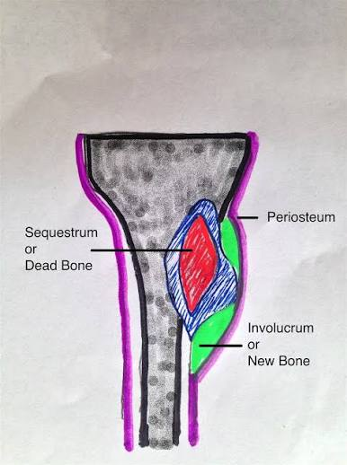
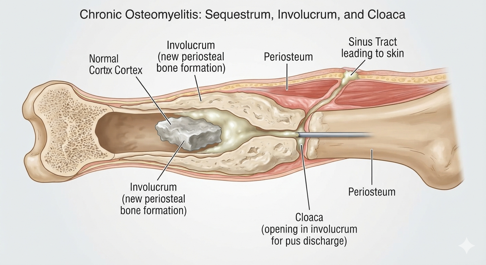
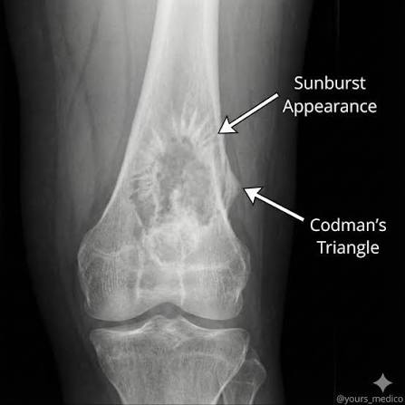

# Item 22 — Bones, Joints & Soft Tissue (Question Bank with Answers)

> **Sources:** Robbins & Cotran, *Pathologic Basis of Disease*, 10th ed. — Ch 26 (Bones, Joints, and Soft-Tissue Tumors) · Arif's Pathology & Haematology, 15th ed. (2025) — Vol-2, Unit-I Bones, Joints, and Soft Tissues
---
---

## Q1. Define osteomyelitis

### Definition

🔴 **Osteomyelitis = inflammation of bone and marrow**, virtually always caused by **infection** (pyogenic bacteria in the great majority; mycobacteria, fungi or spirochetes occasionally).

📌 **Word root:** *osteo* = bone + *myelo* = marrow + *itis* = inflammation → **infection of the bone AND its marrow cavity**, never "bone alone".

| Feature | Detail |
|---|---|
| **Commonest organism** | 🔴 **Staphylococcus aureus (80–90% of culture-positive cases)** |
| **Route of infection** | Hematogenous seeding · contiguous spread from adjacent focus · direct implantation (open fracture/surgery/penetrating wound) |
| **Typical site** | Children → 🔴 **metaphysis of long bones**; adults → **vertebrae** |
| **Clinical forms** | Acute (<2 wk) · subacute (Brodie abscess) · chronic (>6 wk with sequestrum/involucrum) |

> 🎯 "Osteomyelitis = inflammation of bone + marrow, almost always infective; S. aureus is king; children metaphysis, adults vertebrae."

> 📖 Robbins 10e, Ch 26 (Bones, Joints, Soft-Tissue Tumors), pp. 1171–1216 · 📗 Arif 15e (2025), Vol-2, Unit-I Bones, Joints, and Soft Tissues, pp. 348–362

---

## Q2. Classify osteomyelitis

### A. According to duration / clinical course

| Type | Duration | Hallmark |
|---|---|---|
| **Acute osteomyelitis** | Days–2 weeks | Suppurative (neutrophilic) inflammation of marrow; fever + throbbing pain; no dead bone yet |
| **Subacute osteomyelitis** | Weeks–months | Walled-off lesion = 🔴 **Brodie abscess**; low-grade symptoms |
| **Chronic osteomyelitis** | >6 weeks | 🔴 **Sequestrum + involucrum + cloaca**; draining sinus tracts; relapsing course |



### B. According to route of infection

| Route | Mechanism / Example |
|---|---|
| **Hematogenous** | Bacteremia seeds bone — children (long-bone metaphysis), adults (vertebrae); commonest route in children |
| **Contiguous spread** | From adjacent soft-tissue infection, infected tooth/joint, **diabetic foot ulcer** |
| **Direct implantation** | Open (compound) fracture, orthopedic surgery/fixation, puncture wound, IV drug abuse |

### C. According to etiologic agent

| Agent | Examples |
|---|---|
| **Pyogenic (bacterial)** | 🔴 S. aureus (most common), Streptococcus, E. coli/Klebsiella/Pseudomonas (IV drug users, GU tract), H. influenzae & group B strep (neonates), **Salmonella (sickle-cell disease)** |
| **Mycobacterial** | M. tuberculosis → **Pott disease** (spine) |
| **Syphilitic** | Congenital (saber shin) / tertiary gummatous osteomyelitis |
| **Fungal/rare** | Coccidioidomycosis, blastomycosis, actinomycosis |

### D. Special clinicopathologic variants 📌

- **Brodie abscess** — localized intraosseous abscess (subacute form).
- **Sclerosing osteomyelitis of Garré** — chronic form with marked reactive sclerosis, little/no suppuration.
- **Pott disease** — tuberculous osteomyelitis of the vertebral body ± psoas abscess.

> 🎯 "Classify 4 ways: TIME (acute/subacute-Brodie/chronic), ROUTE (hematogenous/contiguous/direct), ORGANISM (pyogenic/TB/syphilitic/fungal), SPECIAL (Brodie, Garré, Pott)."

> 📖 Robbins 10e, Ch 26 (Bones, Joints, Soft-Tissue Tumors), pp. 1171–1216 · 📗 Arif 15e (2025), Vol-2, Unit-I Bones, Joints, and Soft Tissues, pp. 348–362

---

## Q3. What are the causes and etiology of osteomyelitis

### Organisms — EXAM FAVORITE TABLE

| Situation | Organism |
|---|---|
| 🔴 **Overall most common (80–90%)** | **Staphylococcus aureus** (expresses bone-homing receptors: fibronectin, collagen, sialoprotein-binding adhesins) |
| Sexually active young adult | Neisseria gonorrhoeae (also septic arthritis) |
| Neonates (<1 yr) | 🔴 **Group B streptococcus + H. influenzae** (+ E. coli) |
| Sickle-cell disease / SS disease | 🔴 **Salmonella paratyphi** (gut bacteremia; also S. pneumoniae, S. aureus still possible) |
| IV drug users | Pseudomonas aeruginosa, Klebsiella, Enterobacter, Candida (axial skeleton) |
| GU tract instrumentation/urinary infection | E. coli, Klebsiella |
| Diabetic foot / peripheral vascular disease | Mixed anaerobes + gram-negatives (polymicrobial) |
| Post-surgery/open fracture | Staph aureus, coagulase-negative staph (prosthesis), mixed flora |
| Chronic granulomatous | Mycobacterium tuberculosis (Pott disease) |
| ~50% of cases | No organism recovered on culture |

### Predisposing conditions 📌

- Trauma/fracture (open), recent orthopedic surgery or prosthesis.
- **Diabetes mellitus** (foot ulcers — contiguous route).
- **Sickle-cell anemia** (functional asplenia → Salmonella).
- Immunosuppression (steroids, chemotherapy, HIV), hemodialysis.
- IV drug use; extremes of age; urinary/GI instrumentation.

### Routes of entry

```
Hematogenous seeding (children long bones, adult vertebrae)
        +
Contiguous spread from nearby soft tissue/joint infection
        +
Direct implantation (compound fracture, surgery, puncture)
        ↓
            PYOGENIC OSTEOMYELITIS
```

> 🎯 "Aureus always first; neonate = group B strep/H. influenzae; sickle = Salmonella; IVDU = Pseudomonas; diabetic foot = polymicrobial."

> 📖 Robbins 10e, Ch 26 (Bones, Joints, Soft-Tissue Tumors), pp. 1171–1216 · 📗 Arif 15e (2025), Vol-2, Unit-I Bones, Joints, and Soft Tissues, pp. 348–362

---

## Q4. State the pathogenesis and morphological features of osteomyelitis

### A. Why the metaphysis? (Age-related location)

| Age group | Location of lesion | Reason |
|---|---|---|
| **Children (>1 yr)** | 🔴 **Metaphysis of long bones** (distal femur, proximal tibia) | Metaphyseal capillary loops are sinusoidal with **sluggish blood flow** ("hair-pin" bends) favoring bacterial lodging; growth plate acts as barrier |
| **Neonates/infants (<1 yr)** | Metaphysis **± epiphysis ± joint** | Metaphyseal vessels **cross the open growth plate** → epiphyseal involvement → **septic arthritis**; sequestration not prominent (periosteum loosely attached → large subperiosteal abscesses instead) |
| **Adults** | 🔴 **Vertebrae** (hematogenous) / epiphysis-subchondral region; also via wounds/diabetic foot | Growth plate closed; Batson vertebral venous plexus + rich red marrow |


আপনার দেওয়া তথ্যটি অ্যাকিউট এবং ক্রনিক অস্টিওমাইলাইটিস (Acute & Chronic Osteomyelitis)-এর প্যাথলজি বোঝার জন্য অত্যন্ত গুরুত্বপূর্ণ এবং নির্ভুল। মেডিকেল পরীক্ষায় এই "Age-related location and pathogenesis" অংশ থেকে প্রায়ই প্রশ্ন আসে।
আপনার দেওয়া টেবিলটির ওপর ভিত্তি করে মূল কারণগুলো নিচে সহজ ভাষায় বিশ্লেষণ করা হলো:
## ১. শিশু (>১ বছর): মেটাফাইসিস (Metaphysis) আক্রান্ত হওয়ার কারণ

* চুলের কাঁটার মতো বাঁক (Hair-pin bends): শিশুদের লং বোনের (যেমন: Femur বা Tibia) মেটাফাইসিস অংশে রক্তনালী বা ক্যাপিলারিগুলো "U" আকৃতির বা হেয়ার-পিনের মতো বাঁক নেয়।
* ধীর রক্তপ্রবাহ (Sluggish blood flow): এই বিশেষ বাঁকের কারণে সেখানে রক্তপ্রবাহ খুব ধীর হয়ে যায়। ফলে রক্তে থাকা ব্যাকটেরিয়া খুব সহজেই এখানে আটকে (Lodging) ইনফেকশন তৈরি করতে পারে।
* গ্রোথ প্লেটের বাধা (Growth plate barrier): শিশুদের গ্রোথ প্লেট বা এপিফাইসিয়াল কার্টিলেজ একটি শক্ত দেয়াল হিসেবে কাজ করে। তাই ইনফেকশন সহজে এপিফাইসিস বা জয়েন্টে ছড়াতে পারে না, মেটাফাইসিসেই সীমাবদ্ধ থাকে।

## ২. নবজাতক/ইনফ্যান্ট (<১ বছর): জয়েন্ট ও এপিফাইসিস আক্রান্ত হওয়ার কারণ

* উন্মুক্ত রক্তনালী (Transphyseal vessels): ১ বছরের কম বয়সী শিশুদের গ্রোথ প্লেট সম্পূর্ণ তৈরি হয় না। রক্তনালীগুলো গ্রোথ প্লেট ভেদ করে মেটাফাইসিস থেকে সরাসরি এপিফাইসিস (Epiphysis) পর্যন্ত চলে যায়।
* সেপ্টিক আর্থ্রাইটিস (Septic Arthritis): রক্তনালীর এই সংযোগের কারণে ইনফেকশন খুব দ্রুত জয়েন্টে ছড়িয়ে পড়ে পুঁজ জমায়।
* হাড়ের খোসা আলগা হওয়া: নবজাতকদের হাড়ের বাইরের আবরণ (Periosteum) খুব আলগা থাকে। তাই সেখানে সেকুয়েস্ট্রাম না হয়ে বড় আকৃতির পুঁজ বা সাবপেরিওস্টিয়াল অ্যাবসেস (Subperiosteal abscess) তৈরি হয়।

## ৩. প্রাপ্তবয়স্ক (Adults): মেরুদণ্ড (Vertebrae) আক্রান্ত হওয়ার কারণ

* ক্লোজড গ্রোথ প্লেট: বড়দের গ্রোথ প্লেট বন্ধ হয়ে যাওয়ায় লং বোনের মেটাফাইসিসের সেই বিশেষ রক্তনালী আর থাকে না।
* ব্যাটসনের ভেনাস প্লেক্সাস (Batson's Plexus): প্রাপ্তবয়স্কদের মেরুদণ্ডের চারপাশে একটি বিশেষ শিরা বা ভেনাস নেটওয়ার্ক থাকে, যেখানে কোনো ভালভ (Valve) থাকে না। এর ফলে শরীরের অন্য কোনো অংশের (যেমন: প্রস্রাবের ইনফেকশন বা UTI) ব্যাকটেরিয়া খুব সহজে এবং সরাসরি মেরুদণ্ডের হাড়ে চলে আসতে পারে।

------------------------------
মেডিকেল পরীক্ষার প্রস্তুতির সুবিধার্থে আপনি কি এই টপিকের ওপর কিছু গুরুত্বপূর্ণ MCQ এবং Single Best Answer (SBA) প্রশ্ন ও উত্তর প্র্যাকটিস করতে চান? নাকি এর প্যাথলজিক্যাল মেকানিজম বা ডায়াগ্রাম নিয়ে আরও জানতে চান?


### B. Pathogenesis — step-by-step chain

```
Organism reaches bone (bacteremia / contiguous spread / implantation)
        ↓
Lodging in metaphyseal sinusoidal vessels (slow flow)
        ↓
SUPPURATIVE INFLAMMATION (neutrophils) within medullary cavity
        ↓
↑↑ Intramedullary pressure (pus + edema in rigid cortical box)
        ↓
Spread along Haversian & Volkmann canals → cortex
        ↓
SUBPERIOSTEAL ABSCESS (children's periosteum loose/thin)
   (adults' thick periosteum → pus stays intramedullary)
        ↓
Compression of nutrient vessels + septic thrombosis
        ↓
BONE + MARROW NECROSIS within ~48 hours → dead bone = SEQUESTRUM
        ↓
Periosteal new bone formation around necrotic segment = INVOLUCRUM
        ↓
Pus bursts through involucrum → draining SINUS TRACT (CLOACA)
        ↓
CHRONIC OSTEOMYELITIS (relapse/remission, sequestra persist)
```

📌 In infants, epiphyseal spread may rupture into joint → **septic arthritis** (esp. hip). In adults, subperiosteal extension into soft tissue may cause soft-tissue abscess.

### C. Morphology

#### Gross

| Stage | Gross appearance |
|---|---|
| **Acute** | Marrow congested, gray-red → frank **pus** in medulla; periosteum lifted by abscess |
| **Necrosis** | Devitalized bone = pale, brittle, separated fragment (**sequestrum**) lying in a cavity |
| **Chronic** | Thick sleeve of new living bone (**involucrum**) enclosing sequestrum; opening (**cloaca**) discharging pus through skin sinus |

#### Microscopy — 🔴 suppurative inflammation + necrosis

| Feature | Description |
|---|---|
| **Suppurative exudate** | Dense sheets of neutrophils filling marrow spaces; fibrin, edema, hemorrhage |
| **Necrotic bone** | Empty osteocyte lacunae; loss of nuclei; dead trabeculae (sequestrum) |
| **Reactive changes** | New woven bone (osteoblastic rimming) at periphery = involucrum; fibrosis of marrow |
| **Chronic phase** | Chronic inflammatory cells (lymphocytes, plasma cells, macrophages) + fibrous tissue encasing sequestra; squamous metaplasia of sinus tract lining |

### D. Clinical features & investigations

- Malaise, fever, chills, leukocytosis, **throbbing pain over affected bone**, tenderness, warmth, swelling.
- Blood: ↑ WBC, ↑ ESR, ↑ CRP; **blood culture positive in ~50%**.
- **X-ray:** normal early (<2 wk) → later 🔴 **lytic (radiolucent) focus surrounded by sclerotic reactive bone**; periosteal elevation/new bone.
প্রথম ২ সপ্তাহ এক্স-রে স্বাভাবিক থাকে। ২ সপ্তাহ পর এক্স-রে করলে দেখা যাবে একটি কালো গর্ত (Lytic focus), যার চারপাশে একটি সাদা শক্ত বর্ডার (Sclerotic bone) এবং হাড়ের উপরিভাগে নতুন হাড়ের প্রলেপ (Periosteal new bone) তৈরি হয়েছে।
- MRI/bone scan earliest imaging confirmation; **definitive diagnosis = biopsy/culture of bone**.
- Treatment: IV antibiotics (6+ wk) ± surgical drainage/debridement.

> 🎯 "Metaphysis = sluggish sinusoidal loops; pressure ↑ → Haversian canals → subperiosteal abscess → vessel compression → SEQUESTRUM → involucrum wraps it → cloaca drains it."

> 📖 Robbins 10e, Ch 26 (Bones, Joints, Soft-Tissue Tumors), pp. 1171–1216 · 📗 Arif 15e (2025), Vol-2, Unit-I Bones, Joints, and Soft Tissues, pp. 348–362

---

## Q5. Mention complications of chronic osteomyelitis

### Complications — EXAM FAVORITE LIST 🔴

| # | Complication | Key point |
|---|---|---|
| 1 | **Sinus tracts with persistent discharge** | Recurrent flares for years; epithelialization of the tract |
| 2 | 🔴 **Squamous cell carcinoma in the sinus tract (Marjolin-type SCC)** | Long-standing sinus → squamous metaplasia → malignant transformation of epithelialized tract; presents as enlarging fungating ulcer at sinus opening |
| 3 | 🔴 **Secondary (AA) amyloidosis** | Chronic antigenic stimulation → reactive systemic amyloid deposition (kidney/liver/spleen) |
| 4 | 🔴 **Pathologic fracture** | Weakened bone by sequestrum/cortical destruction |
| 5 | **Septicemia / pyemia** | Dissemination → abscesses in other organs, **infective endocarditis** |
| 6 | **Deformity & growth disturbance** | Damage to physis/growth plate in children → limb shortening, angulation |
| 7 | **Secondary septic arthritis** | Spread into adjacent joint (esp. hip in infants) |
| 8 | **Osteonecrosis & nonunion** | Sequestration compromises blood supply |
| 9 | Rarely | Squamous metaplasia of synovium, fistulae to viscera, sarcoma development (rare) |

📌 Frequency: **5–25% of acute osteomyelitis becomes chronic** despite antibiotics → all the above stem from persistent sequestrum harboring organisms (antibiotics cannot penetrate avascular dead bone).

> 🎯 "Chronic OM complications: SINUS + SCC (Marjolin), AMYLOIDOSIS, PATHOLOGIC FRACTURE, SEPTICEMIA/endocarditis, deformity — remember 'My Sinus Causes Painful Septic Deformities'."

> 📖 Robbins 10e, Ch 26 (Bones, Joints, Soft-Tissue Tumors), pp. 1171–1216 · 📗 Arif 15e (2025), Vol-2, Unit-I Bones, Joints, and Soft Tissues, pp. 348–362

---

## Q6. What is sequestrum and involucrum

### Definitions

🔴 **Sequestrum = a segment of devitalized (dead) bone that has become separated from the surrounding living bone**, lying free within a cavity of chronic osteomyelitis. It acts as a permanent foreign body harboring bacteria.

🔴 **Involucrum = the shell/sleeve of new reactive bone laid down by the lifted periosteum around the sequestrum.**


আপনার দেওয়া এই সংজ্ঞা দুটি ক্রনিক অস্টিওমাইলাইটিস (Chronic Osteomyelitis)-এর সবচেয়ে নিখুঁত এবং স্ট্যান্ডার্ড মেডিকেল ডেফিনিশন (Standard Medical Definition)। পরীক্ষার খাতায় (যেমন: Pathology বা Orthopedic Surgery) ঠিক এভাবেই লিখতে হয়।
সহজ কথায় এই সংজ্ঞা দুটির মূল প্যাথলজিক্যাল তাৎপর্য (Pathological Significance) নিচে ব্যাখ্যা করা হলো:
## ১. Sequestrum (মৃত হাড়ের টুকরো)

* Separated & Free-lying: এটি পুরোপুরি রক্তসঞ্চালনহীন (Devitalized) একটি মৃত হাড়, যা আশেপাশের জীবন্ত হাড় থেকে সম্পূর্ণ বিচ্ছিন্ন হয়ে পুঁজে ভরা গহ্বরের (Cavity) মধ্যে ভাসমান অবস্থায় থাকে।
* Foreign Body effect: যেহেতু এতে কোনো রক্ত চলাচল নেই, তাই শরীর একে নিজের অংশ বলে মনে করে না। এটি একটি স্থায়ী ফরেন বডি (Foreign body) বা বহিরাগত বস্তুর মতো আচরণ করে।
* Bacterial Harbor: রক্ত চলাচল না থাকায় শরীরের ইমিউন সেল (WBC) বা আমরা যে অ্যান্টিবায়োটিক খাই, তা এই মৃত হাড়ের ভেতরে পৌঁছাতে পারে না। ফলে ব্যাকটেরিয়া এর ভেতরে নিরাপদ আশ্রয় বা 'বায়োফিল্ম' (Biofilm) তৈরি করে লুকিয়ে থাকে। এই কারণেই ক্রনিক অস্টিওমাইলাইটিস শুধু ওষুধে ভালো হয় না।

## ২. Involucrum (নতুন হাড়ের খোলস)

* Reactive & Protective: ভেতরের পুঁজ যখন হাড়ের বাইরের আবরণ বা পেরিওস্টিয়ামকে (Periosteum) ওপরের দিকে ঠেলে দেয় (Lifted periosteum), তখন পেরিওস্টিয়ামের অস্টিওব্লাস্ট (Bone-forming cells) কোষগুলো উদ্দীপিত হয়ে নতুন হাড় তৈরি করে।
* Sleeve/Shell: এটি মৃত সেকুয়েস্ট্রামের চারপাশে একটি সুরক্ষামূলক খোলস বা জ্যাকেটের মতো আবরণ তৈরি করে, যাতে হাড়টি পুরোপুরি ভেঙে না যায়। তবে এই নতুন হাড়টি সাধারণত অসম (Irregular) এবং আর্কিটেকচারালি দুর্বল হয়।


### How they form (mechanism)

```
Subperiosteal abscess lifts periosteum off the cortex
        ↓
Nutrient supply cut off (periosteal vessels + intraosseous vessels thrombosed/compressed)
        ↓
Cortical segment DIES → empty lacunae → SEQUESTRUM
        ↓
Periosteum survives (supplied by soft tissue) → lays down new woven bone
        ↓
New bone encircles the dead piece = INVOLUCRUM
        ↓
Pus erodes an opening through involucrum → CLOACA → sinus tract to skin
```

### Comparison table

| Feature | **Sequestrum** | **Involucrum** |
|---|---|---|
| Nature | 🔴 Dead (necrotic) bone | 🔴 Living new (reactive/woven) bone |
| Origin | Original cortex/trabecula killed by ischemia + suppuration | Periosteal osteoblasts (raised periosteum) |
| Histology | Empty osteocyte lacunae, loss of nuclei | Viable osteocytes, osteoblastic rimming, woven→lamellar maturation |
| Radiograph | Dense (sclerotic) detached fragment inside lucent cavity | Peripheral shell of new bone expanding the outline |
| Significance | Reservoir of infection — must be removed (sequestrectomy) for cure | Attempted repair; cloaca allows pus drainage |
| Companion | Cloaca = channel through involucrum draining pus to surface | — |

📌 **Cloaca** (bonus definition) = the opening/channel in the involucrum through which pus and necrotic debris escape to form a persistent sinus tract.

> 🎯 "Sequestrum = Separated dead bone; Involucrum = Involving new bone shell; Cloaca = Channel draining pus. The dead piece must come out — antibiotics cannot reach it."

> 📖 Robbins 10e, Ch 26 (Bones, Joints, Soft-Tissue Tumors), pp. 1171–1216 · 📗 Arif 15e (2025), Vol-2, Unit-I Bones, Joints, and Soft Tissues, pp. 348–362

---

## Q7. What is Brodie abscess

### Definition

🔴 **Brodie abscess = a small, walled-off intraosseous abscess — the localized (subacute/chronic) form of pyogenic osteomyelitis**, usually due to *Staphylococcus aureus* of low virulence in a host with good resistance.

### Key facts

| Feature | Detail |
|---|---|
| **Nature** | Circumscribed cavity filled with pus/granulation tissue **inside the bone**, surrounded by dense sclerotic (reactive) bone wall |
| **Age/type of patient** | Children & young adults with high resistance / partially treated infection |
| 🔴 **Site** | **Metaphysis of long bones — distal femur and proximal tibia** (around knee); sometimes proximal femur, humerus |
| **Symptoms** | Intermittent localized pain (often nocturnal), slight swelling; minimal systemic signs (afebrile or low-grade) |
| **X-ray** | 🔴 **Well-circumscribed radiolucent (lucent lytic) cavity surrounded by a rim of dense sclerosis**; may show a tortuous lucent channel connecting to growth plate |
| **Histology** | Central purulent exudate ± necrotic debris; wall of granulation/fibrous tissue lined by inflammatory cells; outer rim of reactive lamellar bone |
| **Treatment** | Surgical curettage/decompression + antibiotics |

📌 Differentiate from **osteoid osteoma**: both cause night pain, but Brodie abscess lacks the radiolucent nidus with central mineralization and shows pus on aspiration/histology.

> 🎯 "Brodie = Bone's own Boil — a walled-off intraosseous pus pocket; distal femur/proximal tibia metaphysis; lucency ringed by sclerosis."

> 📖 Robbins 10e, Ch 26 (Bones, Joints, Soft-Tissue Tumors), pp. 1171–1216 · 📗 Arif 15e (2025), Vol-2, Unit-I Bones, Joints, and Soft Tissues, pp. 348–362

---

## Q8. Classify bone tumours

### General principles 📌

- Primary bone tumours are **rare**; 🔴 **metastatic tumours (from prostate, breast, kidney, lung, thyroid) are the MOST COMMON malignant tumours of bone overall**, followed by hematopoietic neoplasms (myeloma, lymphoma).
- Most primary bone tumours are **benign**; top 3 primary malignant = 🔴 **osteosarcoma > chondrosarcoma > Ewing sarcoma**.

### Classification by matrix/lineage (WHO-based) — MASTER TABLE

| Category | Benign | Malignant |
|---|---|---|
| **Bone-forming** | **Osteoma** (skull/face, Gardner syndrome); 🔴 **Osteoid osteoma** (<2 cm, nocturnal pain relieved by aspirin, cortex of femur/tibia); 🔴 **Osteoblastoma** (>2 cm, posterior vertebral elements) | 🔴 **Osteosarcoma** (conventional; also parosteal, periosteal, telangiectatic, small-cell, secondary/Paget-associated) |
| **Cartilage-forming** | 🔴 **Osteochondroma** (exostosis — MOST COMMON benign bone tumour; EXT1/EXT2); 🔴 **Enchondroma/chondroma** (small bones of hand; Ollier disease, Maffucci syndrome); Chondroblastoma (epiphysis, adolescents); Chondromyxoid fibroma | 🔴 **Chondrosarcoma** (conventional, clear-cell, dedifferentiated, mesenchymal) |
| **Fibrous / fibro-osseous** | 🔴 **Fibrous dysplasia** (GNAS1; monostotic/polyostotic/McCune-Albright); Nonossifying fibroma (fibrous cortical defect); Desmoplastic fibroma | Fibrosarcoma; Undifferentiated pleomorphic sarcoma of bone (malignant fibrous histiocytoma) |
| **Round cell (small blue cell)** | — | 🔴 **Ewing sarcoma / PNET** (t(11;22) EWSR1–FLI1); **Multiple myeloma** (commonest primary malignant bone tumour overall if hematologic included); Primary lymphoma of bone |
| **Giant-cell-rich** | 🔴 **Giant cell tumour (osteoclastoma)** — benign but locally aggressive | Malignant GCT (rare); giant cell-rich osteosarcoma (differential) |
| **Vascular** | Hemangioma (vertebrae); Lymphangioma; Glomus tumor | Angiosarcoma; Hemangioendothelioma; Kaposi sarcoma |
| **Notochordal** | Benign notochordal cell tumor | 🔴 **Chordoma** (clivus/sacrum, physaliphorous cells) |
| **Other mesenchymal** | Aneurysmal bone cyst (USP6); Simple (unicameral) bone cyst; Langerhans cell histiocytosis (eosinophilic granuloma); Adamantinoma (locally aggressive, tibia) | — |
| **Tumor-like lesions** | Brown tumour (hyperparathyroidism); Metaphyseal fibrous defect; Bone infarct | — |
| **Metastatic** | — | 🔴 **Most common malignant bone lesion** — breast, lung, prostate, kidney, thyroid (adults); neuroblastoma/Wilms/RMS (children) |

### Memory aids

- **Bone-forming:** Osteoma – Osteoid osteoma – Osteoblastoma – Osteosarcoma.
- **Cartilage-forming:** "OCCE" — Osteochondroma, Chondroma, Chondroblastoma, Enchondroma → Chondrosarcoma.
- **Small round cell tumours of bone:** "MELD" — Myeloma, Ewing, Lymphoma, (small-cell)… plus metastatic neuroblastoma.

> 🎯 "Bone tumors by MATRIX: Bone-formers (OO, OB, OSa), Cart-makers (OC, EC, CSa), Round-cellers (Ewing/myeloma/lymphoma), GCT, Notochord (chordoma) — but remember METASTASES outnumber everything."

> 📖 Robbins 10e, Ch 26 (Bones, Joints, Soft-Tissue Tumors), pp. 1171–1216 · 📗 Arif 15e (2025), Vol-2, Unit-I Bones, Joints, and Soft Tissues, pp. 348–362

---

## Q9. Write short note on osteosarcoma

### Definition

🔴 **Osteosarcoma (osteogenic sarcoma) = a malignant mesenchymal tumour of bone in which the neoplastic cells produce osteoid or bone directly** — osteoid production by malignant cells is THE diagnostic hallmark.

### Epidemiology

| Feature | Detail |
|---|---|
| 🔴 Frequency | **MOST COMMON primary malignant bone tumour** (excluding myeloma); ~20% of primary bone cancers |
| 🔴 Age | **Bimodal — peak 10–25 yr (75%)**; second smaller peak in elderly = **secondary osteosarcoma** |
| Sex | Male : female ≈ 1.6 : 1 |
| 🔴 Site | **Metaphysis of long bones — ~50% around knee: distal femur > proximal tibia > proximal humerus** |
| Secondary causes | 🔴 Paget disease, previous radiation, bone infarcts, fibrous dysplasia, Li-Fraumeni/retinoblastoma germline |

### Risk factors / genetics

- **RB gene mutation** (~70%; hereditary retinoblastoma → 1000-fold risk).
- **TP53 mutations — Li-Fraumeni syndrome** (germline).
- CDKN2A (p16) deletion; MDM2/CDK4 amplification (12q13–15).
- **Paget disease of bone** and prior radiotherapy (secondary osteosarcoma, older patients).

### Clinical features

- Adolescent with 🔴 **pain and swelling near knee** (progressive, worse at night); limp; warm, tender mass with restricted joint movement.
- **Pathologic fracture** may be first presentation.
- Labs: 🔴 **serum alkaline phosphatase elevated** (marker of osteoblast activity).

### Radiological features

| Sign | Meaning |
|---|---|
| 🔴 **Mixed osteolytic + osteoblastic (blastic) mass** | Destructive metaphyseal lesion with irregular margins |
| 🔴 **Codman triangle** | Reactive periosteal new bone at the angle where raised periosteum meets cortex — sign of aggressive lesion |
| 🔴 **Sunburst / sun-ray spicules** | Tumor cells follow Sharpey fibers perpendicular to cortex producing radial ossified spicules |
| Other | Cortical destruction, soft-tissue extension, "hair-on-end" pattern |

### Morphology

#### Gross
- Bulky, destructive, **gray-white gritty mass** at metaphysis; hemorrhage, cystic degeneration; erodes cortex, **lifts periosteum**, invades soft tissue; infiltrates medullary canal.

#### Microscopy (see Q13 for detail)
- 🔴 **Malignant pleomorphic spindle/stellate cells depositing fine, lacelike UNMINERALIZED OSTEOID → mineralized woven bone**; bizarre hyperchromatic cells, tumor giant cells, abnormal (tripolar) mitoses; chondroblastic/fibroblastic areas.

### Variants 📌
Conventional (central) · Telangiectatic (blood-filled spaces, mimics ABC) · Small-cell · Parosteal/juxtacortical & periosteal (surface, better prognosis) · Secondary.

### Treatment & prognosis

- 🔴 **Neoadjuvant chemotherapy (methotrexate, doxorubicin, cisplatin, ifosfamide) → wide surgical resection/limb salvage + adjuvant chemo.**
- Hematogenous metastasis to 🔴 **lungs** (commonest cause of death), then bone/brain.
- 🔴 Prognosis: **~60–70% 5-year survival** without overt metastases; <20% if metastatic/recurrent/secondary.

> 🎯 "Osteosarcoma = adolescent METAPHYSIS around knee + SUNBURST + CODMAN triangle + osteoid from malignant cells + RB/p53 + lung mets; chemo + surgery → 60–70% survive."

> 📖 Robbins 10e, Ch 26 (Bones, Joints, Soft-Tissue Tumors), pp. 1171–1216 · 📗 Arif 15e (2025), Vol-2, Unit-I Bones, Joints, and Soft Tissues, pp. 348–362

---

## Q10. Write short note on Ewing tumour

### Definition

🔴 **Ewing sarcoma (Ewing tumour/Ewing family of tumours) = a malignant neoplasm composed of primitive, uniform SMALL ROUND BLUE CELLS** showing varying degrees of neuroectodermal differentiation (Ewing sarcoma ↔ primitive neuroectodermal tumour spectrum).

### Epidemiology

| Feature | Detail |
|---|---|
| Frequency | 2nd most common bone sarcoma in children (~6–10% of primary malignant bone tumours) |
| 🔴 Age | **10–20 years** (~80% under 20); slightly more in boys |
| 🔴 Race | Striking predilection for **Caucasians** (rare in African/Asian descent) |
| 🔴 Site | 🔴 **Diaphysis (shaft) of long bones (femur) and flat bones of pelvis**; ribs, scapula |

### Molecular genetics — EXAM FAVORITE

- 🔴 **t(11;22)(q24;q12)** in ~90% → fusion gene **EWSR1–FLI1** → chimeric transcription factor driving proliferation.
- Variant translocations: t(21;12) EWSR1–ERG, etc.

### Clinical features

- Painful, progressively enlarging mass; 🔴 **fever, anemia, ↑ESR, leukocytosis — clinically MIMICS osteomyelitis**.
- Occasionally pathologic fracture; may present with metastatic disease.

### Radiology

- Destructive **lytic lesion with permeative/moth-eaten margins**.
- 🔴 **Onion-skin periosteal reaction** — concentric layers of reactive new bone from repeated periosteal elevation.
- Cortical erosion, soft-tissue extension; MRI defines extent.

### Morphology

| Component | Finding |
|---|---|
| Cells | Sheets/sheets-and-nests of **uniform small round cells**, scant **clear glycogen-rich cytoplasm (PAS-positive, diastase-sensitive)** |
| Rosettes | 🔴 **Homer-Wright rosettes** (cells around central fibrillary core) indicate neuroectodermal differentiation |
| IHC | 🔴 **CD99 strongly positive (membranous)** — MIC2 gene product; FLI1 nuclear positivity; vimentin+ |
| Necrosis | Geographic necrosis with perivascular viable cuffs |

### Diagnosis & treatment

- Biopsy + immunohistochemistry + molecular testing (RT-PCR/FISH for EWSR1 rearrangement).
- 🔴 **Highly CHEMOSENSITIVE** — multiagent chemotherapy (vincristine, doxorubicin, cyclophosphamide, ifosfamide, etoposide) + surgery and/or radiotherapy.
- Extent of chemotherapy-induced necrosis predicts outcome.
- Prognosis: 🔴 **~75% 5-year survival; ~50% long-term cure**; worse with metastasis (lung, bone, marrow).

> 🎯 "EWING = Every White child's Extralong-bone Invasive Neoplasm — small round blue cells + onion-skin periosteum + CD99 + t(11;22) EWS-FLI1 + fever mimics infection + chemo-sensitive."

> 📖 Robbins 10e, Ch 26 (Bones, Joints, Soft-Tissue Tumors), pp. 1171–1216 · 📗 Arif 15e (2025), Vol-2, Unit-I Bones, Joints, and Soft Tissues, pp. 348–362

---

## Q11. Write short note on giant cell tumour of bone

### Definition

🔴 **Giant cell tumour of bone (osteoclastoma) = a benign but LOCALLY AGGRESSIVE neoplasm characterized by sheets of neoplastic mononuclear stromal cells interspersed with numerous reactive, osteoclast-like multinucleated giant cells.**

### Epidemiology & site

| Feature | Detail |
|---|---|
| Age | 🔴 **20–45 years (after epiphyseal closure)** |
| Sex | 🔴 Female slightly > male |
| 🔴 Site | **Epiphysis of long bones, extending into metaphysis — majority around knee (distal femur, proximal tibia); distal radius next** |
| Symptoms | Joint-like pain, swelling near articulation (arthritis-like symptoms); pathologic fracture in some |

### Pathogenesis 📌

- Neoplastic population = primitive **mesenchymal stromal/osteoblast precursor cells carrying H3F3A (histone H3.3) mutations**.
- These stromal cells 🔴 **express high RANKL** → recruit and fuse monocytic precursors → mature into the abundant osteoclast-type giant cells (the giant cells are REACTIVE, not neoplastic).
- Loss of normal RANKL feedback regulation → destructive local bone resorption.
- Targeted therapy rationale: 🔴 **denosumab (anti-RANKL antibody)**.

### Radiology

- 🔴 **Eccentric, purely LYTIc epiphyseal lesion extending up to the subchondral bone plate** with thin, expanded cortex.
- Classic **"soap-bubble" appearance** (trabeculations); NO sclerotic rim; no matrix calcification.

### Morphology (detail in Q12)

- Red-brown fleshy hemorrhagic mass; uniform oval mononuclear cells + multinucleated giant cells with 100+ nuclei.

### Behaviour & prognosis

| Point | Detail |
|---|---|
| Behaviour | 🔴 **Locally aggressive — NOT truly benign in behaviour**; recurs in **40–60% after curettage** |
| Metastasis | Rarely metastasizes to 🔴 **lungs (~4%)** — "benign pulmonary implants", often indolent and may regress; seldom fatal |
| Malignant transformation | Rare (<1–2%), usually after radiation |
| Treatment | Extended curettage ± adjuvants (phenol, PMMA, cryo), wide resection for aggressive lesions; denosumab for unresectable/metastatic |

> 🎯 "GCT = Giant Cell Tumor of the 20–45 lady at the EPIPHYSIS around knee — soap-bubble lytic, RANKL-driven stromal cells are the real tumor, recurs 40–60%, rare lung mets."

> 📖 Robbins 10e, Ch 26 (Bones, Joints, Soft-Tissue Tumors), pp. 1171–1216 · 📗 Arif 15e (2025), Vol-2, Unit-I Bones, Joints, and Soft Tissues, pp. 348–362

---

## Q12. What are gross and microscopic findings of giant cell tumour of bone

### Gross findings

| Feature | Description |
|---|---|
| **Location/shape** | Eccentric, expansile lesion in 🔴 **epiphysis** abutting subchondral plate; cortex thinned and ballooned but intact (or perforated in aggressive cases) |
| **Colour** | 🔴 Large, **red-brown, fleshy** tumour with extensive hemorrhage |
| **Consistency** | Soft, friable; areas of **cystic degeneration** (blood-filled spaces) |
| **Other** | Yellow xanthomatous foci (lipid-laden macrophages); necrosis in large lesions; NO hard bony/cartilaginous matrix |

### Microscopic findings — TWO CELL POPULATIONS (EXAM FAVORITE)

| Population | Features |
|---|---|
| 🔴 **Mononuclear stromal cells** | 🔴 **THE NEOPLASTIC component** — uniform, oval-to-round/spindle cells with vesicular nuclei, indistinct cytoplasm growing in sheets/syncytial pattern; mild atypia only; brisk mitoses may occur BUT atypical mitoses absent; express RANKL; H3F3A-mutant |
| 🔴 **Multinucleated osteoclast-like GIANT cells** | Very large (50–100+ nuclei), evenly and uniformly scattered among the mononuclear cells (unlike other giant-cell lesions); REACTIVE — formed by RANKL-driven fusion of monocyte/macrophage precursors; benign-looking |
| Background | Scattered foamy/xanthoma cells, hemosiderin-laden macrophages, lymphocytes; secondary aneurysmal bone cyst change common |
| Matrix | 🔴 **NO production of osteoid or cartilage by tumour cells** (key negative finding distinguishing from osteosarcoma/chondrosarcoma) |

### Diagnostic pearls 📌

- Even distribution of giant cells distinguishes GCT from: **ABC** (giant cells clustered in septa around blood-filled spaces), **brown tumour** (peritrabecular fibrosis, no H3F3A), **chondroblastoma** (chondroid matrix, chicken-wire calcification, younger age), **tenosynovial giant cell tumour** (extraosseous, lobulated).
- Grading unreliable for predicting recurrence → behaviour judged by clinical/imaging extent (Campanacci grading I–III).

> 🎯 "GCT micro = TWO populations: uniform NEOPLASTIC mononuclear stromal cells (H3F3A+, RANKL+) + scattered REACTIVE osteoclast-giant cells (100+ nuclei); gross = red-brown hemorrhagic flesh; never any osteoid/cartilage."

> 📖 Robbins 10e, Ch 26 (Bones, Joints, Soft-Tissue Tumors), pp. 1171–1216 · 📗 Arif 15e (2025), Vol-2, Unit-I Bones, Joints, and Soft Tissues, pp. 348–362

---

## Q13. Write morphology of osteosarcoma

### Gross morphology

| Feature | Description |
|---|---|
| **Site** | Bulky mass in the 🔴 **metaphyseal end of a long bone** (distal femur/proximal tibia — around knee in ~50%) |
| **Appearance** | Large (5–10 cm+), destructive, **gray-white, firm-to-hard, gritty** (calcified bone matrix); glistening chondroid areas in chondroblastic variant |
| **Degeneration** | Hemorrhage, yellow necrosis, cystic change (extreme in telangiectatic type — blood-filled cavities) |
| **Local spread** | 🔴 Erodes through cortex → **lifts periosteum** → extends as soft-tissue mass; infiltrates along medullary canal; rarely crosses joint (via capsule/ligaments) |
| **Periosteal reaction** | Reactive new bone forming 🔴 **Codman triangle** at the margin; **sunburst spicules** perpendicular to cortex |

### Microscopic morphology — DIAGNOSTIC CRITERIA

🔴 **Hallmark: malignant (sarcomatous) cells directly producing osteoid/mineralized bone.**

| Element | Findings |
|---|---|
| **Osteoid/bone** | Fine, 🔴 **lacelike (filigree) unmineralized osteoid** encircling individual malignant cells → mineralization → primitive woven bone trabeculae (never normal lamellar architecture) |
| **Tumour cells** | Highly pleomorphic spindle/stellate/polygonal cells; 🔴 hyperchromatic, large bizarre nuclei; prominent nucleoli; **abnormal mitoses including tripolar figures** |
| **Giant cells** | Multinucleated tumor giant cells (osteoclast-like giant cells may also be present) |
| **Matrix patterns** | Osteoblastic (bone-dominant) · 🔴 **Chondroblastic** (abundant cartilage matrix — must still find osteoid) · Fibroblastic (spindle-cell dominant) · Telangiectatic (blood-filled spaces) |
| **Other** | Vascular invasion frequent (explains early lung metastasis); necrosis; after chemotherapy → necrosis grading predicts prognosis |

### Radiological correlation

- **Mixed lytic-blastic destructive metaphyseal lesion**, ill-defined permeative margins.
- 🔴 **Sunburst (sun-ray) pattern + Codman triangle** = classic aggressive periosteal reactions.

### Sites of spread 📌
Hematogenous → 🔴 **lungs** (first and most common), bone, brain. Lymphatics rarely.

> 🎯 "OSA gross = gritty gray-white metaphyseal bulk breaking the cortex; micro = pleomorphic malignant cells making LACELIKE osteoid — no osteoid, no osteosarcoma!"

> 📖 Robbins 10e, Ch 26 (Bones, Joints, Soft-Tissue Tumors), pp. 1171–1216 · 📗 Arif 15e (2025), Vol-2, Unit-I Bones, Joints, and Soft Tissues, pp. 348–362

---

## Q14. Classify soft tissue tumours with examples

### General principles 📌

- Soft tissues = non-epithelial extraskeletal structures (adipose, fibrous, muscle, vessels, nerves, synovium) excluding lymphohematopoietic tissues.
- 🔴 **Benign soft tissue tumours are ~100× more common than sarcomas**; 🔴 **lipoma = most common benign STT; liposarcoma = most common adult sarcoma; rhabdomyosarcoma = most common childhood sarcoma**.
- Most arise in extremities (thigh commonest); classified by the WHO according to **lineage of differentiation**.

### WHO-style classification by lineage — with examples

| Lineage / Category | Benign examples | Malignant examples |
|---|---|---|
| **Adipocytic (fat)** | 🔴 Lipoma (most common STT), angiolipoma, hibernoma | 🔴 Liposarcoma — well-differentiated (MDM2/CDK4 amplification), myxoid (t(12;16) FUS-DDIT3), pleomorphic, dedifferentiated |
| **Fibroblastic / myofibroblastic** | 🔴 Nodular fasciitis (MYH9-USP6, self-limiting), fibroma, elastofibroma | 🔴 Deep (desmoid) fibromatosis (APC/CTNNB1 — recurs, NEVER metastasizes), fibrosarcoma (infantile t(12;15) ETV6-NTRK3), myxofibrosarcoma, low-grade fibromyxoid sarcoma |
| **Fibrohistiocytic ("so-called")** | Dermatofibroma, tenosynovial giant cell tumour (PVNS/GCTTS, CSF1) | 🔴 Undifferentiated pleomorphic sarcoma (UPS, formerly MFH), dermatofibrosarcoma protuberans (t(17;22) COL1A1-PDGFB) |
| **Smooth muscle** | Leiomyoma (cutaneous, deep, angioleiomyoma) | Leiomyosarcoma (retroperitoneum/uterus/vessels; SMA+, desmin+) |
| **Skeletal muscle** | Rhabdomyoma (cardiac type ↔ tuberous sclerosis) | 🔴 Rhabdomyosarcoma — embryonal (50%, children, head-neck/GU, botryoid), alveolar (t(2;13) PAX3-FOXO1), pleomorphic (adults); myogenin+/MyoD1+ |
| **Vascular** | Hemangioma (capillary/cavernous), arteriovenous malformation, lymphangioma | 🔴 Angiosarcoma, hemangioendothelioma, Kaposi sarcoma (HHV-8) |
| **Pericytic** | Glomus tumour (painful subungual), myopericytoma | Malignant glomus tumour (rare) |
| **Nerve sheath** | 🔴 Schwannoma (encapsulated, Antoni A/B, Verocay bodies), neurofibroma (shredded-carrot collagen; plexiform ↔ NF1) | 🔴 Malignant peripheral nerve sheath tumour (MPNST; NF1-derived) |
| **Chondro-osseous** | — | Extraskeletal chondrosarcoma (myxoid), extraskeletal osteosarcoma |
| **Uncertain differentiation** | Intramuscular myxoma, ossifying fibromyxoid tumour | 🔴 Synovial sarcoma (t(X;18)(p11;q11) SS18–SSX; biphasic, keratin+), alveolar soft-part sarcoma (t(X;17) TFE3-ASPL), epithelioid sarcoma, clear-cell sarcoma (t(12;22) EWS-ATF1), desmoplastic small round cell tumour (EWS-WT1) |

### Genetic shortcut table — translocation sarcomas (high-yield)

| Tumour | Translocation / Gene |
|---|---|
| Ewing sarcoma/PNET | t(11;22) EWSR1–FLI1 |
| Alveolar rhabdomyosarcoma | t(2;13) PAX3–FOXO1 |
| Myxoid liposarcoma | t(12;16) FUS–DDIT3 |
| Synovial sarcoma | t(X;18) SS18(SSYT)–SSX |
| DFSP | t(17;22) COL1A1–PDGFB |
| Nodular fasciitis | MYH9–USP6 |
| Clear-cell sarcoma | t(12;22) EWS–ATF1 |
| Desmoid fibromatosis | APC / CTNNB1 (β-catenin) |

> 🎯 "Soft tissue by LINEAGE: Fat (lipoma→liposarcoma), Fibro (fasciitis→desmoid), Smooth (leiomyo), Skeletal (rhabdo — alveolar t(2;13)), Vascular (hemangio→angiosarcoma), Nerve (schwanno/neurofibromo→MPNST), Uncertain (synovial t(X;18), UPS)."

> 📖 Robbins 10e, Ch 26 (Bones, Joints, Soft-Tissue Tumors), pp. 1171–1216 · 📗 Arif 15e (2025), Vol-2, Unit-I Bones, Joints, and Soft Tissues, pp. 348–362

---

## Q15. Enumerate the causes of arthritis.

### Classification by etiology — complete list

| Group | Diseases / Causes |
|---|---|
| **1. Degenerative** | 🔴 Osteoarthritis (primary/idiopathic; secondary — trauma, obesity, hemochromatosis, ochronosis, diabetes) |
| **2. Autoimmune / inflammatory** | 🔴 Rheumatoid arthritis · Juvenile idiopathic arthritis (JIA) · Seronegative spondyloarthropathies — ankylosing spondylitis, reactive arthritis (Reiter), psoriatic arthritis, enteropathic arthritis (IBD) · Systemic lupus erythematosus · Sjögren syndrome · Relapsing polychondritis · Behçet disease |
| **3. Infective (septic)** | 🔴 Pyogenic — *S. aureus* (most common), streptococci, gonococcus, *H. influenzae* (neonates/young children), Gram-negatives, Salmonella (sickle cell) · Tuberculous (Pott) · Viral — parvovirus B19, rubella, HBV/HCV, alphavirus, EBV · Lyme disease (*Borrelia burgdorferi*) · Fungal |
| **4. Crystal-induced (metabolic)** | 🔴 Gout (monosodium urate) · 🔴 Pseudogout/CPPD (calcium pyrophosphate) · Basic calcium phosphate (hydroxyapatite — Milwaukee shoulder) · Calcium oxalate |
| **5. Traumatic / post-traumatic** | Intra-articular fracture, meniscal injury, hemarthrosis → secondary OA |
| **6. Neuropathic (Charcot joint)** | Diabetes mellitus (most common), tabes dorsalis (syringomyelia — upper limb), syringomyelia, leprosy |
| **7. Hematologic / bleeding disorders** | 🔴 Hemophilia & other coagulopathies (recurrent hemarthrosis → hemophilic arthropathy), sickle-cell disease (avascular necrosis) |
| **8. Drug-induced / hypersensitivity** | Serum sickness, drug-induced lupus, vaccination-related |
| **9. Endocrine/miscellaneous** | Acromegaly, hyperparathyroidism, hypothyroidism, hemochromatosis, Wilson disease, sarcoidosis (Löfgren), pigmented villonodular synovitis (tumor-like) |

> 🎯 "Causes of arthritis — 'DIIC-TNH': Degenerative, Infective, Immune-inflammatory, Crystal, Traumatic, Neuropathic, Hemophilic (+ drug/endocrine)."

> 📖 Robbins 10e, Ch 26 (Bones, Joints, Soft-Tissue Tumors), pp. 1171–1216 · 📗 Arif 15e (2025), Vol-2, Unit-I Bones, Joints, and Soft Tissues, pp. 348–362

---

## Q16. Short note: Osteoarthritis

### Definition

🔴 **Osteoarthritis (OA, degenerative joint disease) = a progressive DEGENERATIVE disorder of weight-bearing (and frequently used) joints characterized by degradation and loss of articular cartilage with concurrent remodeling of subchondral bone (sclerosis) and marginal osteophyte formation** — the most common form of arthritis.

### Types & epidemiology

| Feature | Detail |
|---|---|
| Primary (idiopathic) | ~95% — aging-related; hands, knees, hips, spine |
| Secondary (~5%) | Prior trauma, congenital deformity, obesity, diabetes, hemochromatosis, ochronosis, calcium pyrophosphate deposition, avascular necrosis |
| Age/sex | Increases exponentially after 50; women → knees/hands; men → hips |
| 🔴 Joints affected | **Weight-bearing joints (knee, hip) + cervical/lumbar spine + DIP, PIP, 1st carpometacarpal joints; wrists/elbows/ankles SPARED** |

### Pathogenesis

```
Biomechanical stress (aging, obesity, malalignment) + genetic predisposition
        ↓
Chondrocyte injury → IL-1/TNF release → MMP-3, MMP-13 (collagenase, stromelysin)
        ↓
DEGRADATION of type II collagen + proteoglycan (aggrecan) network
   (degradation exceeds synthesis; ↑ water content, ↓ proteoglycans)
        ↓
Cartilage softening & FRAGMENTATION (fibrillation) → full-thickness erosions
        ↓
Exposed subchondral bone polished smooth = EBURNATION
        ↓
Subchondral response: sclerosis, cysts (geodes), marginal osteophytes
```

### Morphology — EXAM FAVORITE

| Lesion | Description |
|---|---|
| **Early** | Chondrocyte clustering; increased water, decreased proteoglycans; horizontal clefts = **fibrillation** |
| **Late cartilage** | Full-thickness sloughing; fragments form **loose bodies (joint mice)** |
| 🔴 **Eburnation** | Polished, ivory-like exposed subchondral bone where cartilage completely lost |
| 🔴 **Subchondral sclerosis** | Thickened dense bone beneath eburnated surface |
| **Subchondral cysts (geodes)** | Fibrous-walled cysts filled with myxoid fluid — synovial fluid driven through defects |
| 🔴 **Osteophytes** | Mushroom-shaped bony outgrowths at joint margins capped by fibrocartilage |
| Synovium | Only mildly congested/fibrotic — **minimal inflammation** (unlike RA) |
| Spine | Osteophytes + intervertebral disc degeneration (spondylosis) |

### Clinical features

- Deep, aching pain **worsened by use/activity, relieved by rest**; crepitus.
- 🔴 **Morning stiffness brief (<30 minutes)**, stiffness after immobility ("gelling").
- 🔴 **Heberden nodes** (osteophytes at DIP) and **Bouchard nodes** (PIP) — especially women.
- Restricted movement, varus deformity of knee; **NO ankylosis, NO systemic features**.
- X-ray: asymmetric joint-space narrowing, subchondral sclerosis, osteophytes, subchondral cysts.
- Treatment: exercise/weight loss, NSAIDs, intra-articular steroid/hyaluronan, **total joint replacement (arthroplasty)** for end stage.

> 🎯 "OA = Overused Aging Articulation: EBURNATION + osteophytes + geodes + Heberden/Bouchard; morning stiffness <30 min, no ankylosis, no systemic signs."

> 📖 Robbins 10e, Ch 26 (Bones, Joints, Soft-Tissue Tumors), pp. 1171–1216 · 📗 Arif 15e (2025), Vol-2, Unit-I Bones, Joints, and Soft Tissues, pp. 348–362

---

## Q17. A teenage boy presented with pain and swelling above the knee joint. X ray shows mixed osteoblastic and lytic mass in the lower part of femur. What is your diagnosis

### Answer

🔴 **Diagnosis: Osteosarcoma (osteoblastic/conventional osteosarcoma) of the lower end of the right/left femur.**

### Justification — why this fits osteosarcoma perfectly

| Clinical clue from the case | Matching feature of osteosarcoma |
|---|---|
| Teenage boy | Peak incidence **10–25 yr** (adolescent growth spurt); male predominance (1.6:1) |
| Pain and swelling above the knee | 🔴 **Metaphysis of distal femur = single most common site (~50% around knee)** |
| Mixed osteoblastic + lytic X-ray mass | 🔴 Classic mixed **sclerotic-blastic + osteolytic** destructive metaphyseal lesion with Codman triangle/sunburst pattern |

### Supporting points to say in viva

- Likely findings: elevated serum **alkaline phosphatase**, warm tender fixed mass, possible limp; Codman triangle + sunburst spicules on X-ray.
- Origin: malignant mesenchymal cells producing osteoid (RB/TP53 pathways).

### Next investigations (work-up plan)

1. **MRI of femur/knee** — local extent, skip lesions, neurovascular involvement.
2. 🔴 **Biopsy (core needle/open) = CONFIRMATORY investigation** — histology: malignant cells + lacelike osteoid.
3. **CT chest** (staging — lung metastasis) ± bone scan/PET.
4. Baseline labs before chemotherapy (CBC, renal/hepatic function, ALP, LDH).

### Differential diagnoses (briefly)

| DDx | Distinguishing point |
|---|---|
| **Ewing sarcoma** | Younger (10–20), 🔴 DIAPHYSIS (not metaphysis), pure lytic/permeative, onion-skin reaction, fever mimics infection, CD99+, t(11;22) |
| Giant cell tumour | Older (20–45), **epiphyseal** eccentric lytic soap-bubble lesion |
| Chondrosarcoma | Adult 40–60, pelvis/shoulder |
| Osteoblastoma/osteoid osteoma | Benign, nocturnal pain, aspirin relief, nidus <2 cm |
| Osteomyelitis/Brodie abscess | Fever, leukocytosis, lytic focus with sclerosis, no soft tissue mass of this size |

### Treatment outline

- 🔴 **Neoadjuvant chemotherapy → wide surgical resection (limb salvage/endoprosthesis) → adjuvant chemotherapy**; amputation if unresectable.
- Prognosis: ~60–70% 5-yr survival if nonmetastatic; lung metastasis worsens outlook.

> 🎯 "Teen + metaphysis around knee + mixed blastic-lytic = OSTEOSARCOMA until proven otherwise — confirm by BIOPSY, stage with CT chest, treat with chemo + limb-salvage surgery."

> 📖 Robbins 10e, Ch 26 (Bones, Joints, Soft-Tissue Tumors), pp. 1171–1216 · 📗 Arif 15e (2025), Vol-2, Unit-I Bones, Joints, and Soft Tissues, pp. 348–362

---

## Q18. What are the criteria for diagnosis of rheumatoid arthritis (ACR/EULAR 2010 or classic 1987 revised criteria — give both briefly)

### A. ACR/EULAR 2010 classification criteria

**Entry requirement:** at least 1 joint with definite synovitis (swelling), no better alternative diagnosis. Score ≥ **6/10** = definite RA.

| Domain | Score options | Points |
|---|---|---|
| **Joint involvement** (based on count/tender-swollen) | 1 large joint | 0 |
| | 2–10 large joints | 1 |
| | 1–3 small joints (with/without large joints) | 2 |
| | 4–10 small joints | 3 |
| | >10 joints (at least 1 small joint) | **5** |
| **Serology** (RF and/or anti-CCP/ACPA) | Negative | 0 |
| | Low-positive | 2 |
| | High-positive (>3× ULN) | **3** |
| **Acute-phase reactants** (ESR and/or CRP) | Normal | 0 |
| | Abnormal | **1** |
| **Duration of symptoms** | <6 weeks | 0 |
| | ≥6 weeks | **1** |

📌 Symmetric joint involvement (not required, adds score indirectly); small joints include MCP, PIP, 2nd–5th MTP, thumb IP, wrists.

### B. ACR (American Rheumatism Association) 1987 revised classic criteria

আপনার দেওয়া এই চার্টটি হলো ARA (American Rheumatism Association) 1987 Criteria for Rheumatoid Arthritis। প্রফ বা টার্ম ফাইনালের রিটেন এবং ভাইভাতে এই ৭টি পয়েন্ট হুবহু মনে রাখা অত্যন্ত জরুরি।
এটি সহজে মনে রাখার এবং মাথায় গেঁথে নেওয়ার নিখুঁত কৌশল নিচে দেওয়া হলো:
## 💡 সহজে মনে রাখার টেকনিক: "৪-৬ এর গোল্ডেন রুল"

* পাস মার্কের সূত্র: মোট ৭টির মধ্যে অন্তত ৪টি ক্রাইটেরিয়া পজিটিভ হতে হবে।
* টাইম ডিউরেশন: প্রথম ১ থেকে ৪ নম্বর ক্রাইটেরিয়াগুলো অবশ্যই কমপক্ষে ৬ সপ্তাহ ধরে স্থায়ী থাকতে হবে (acute বা সাময়িক ব্যথা বাদ দেওয়ার জন্য)।

------------------------------
## 🧠 ক্রাইটেরিয়াগুলো সিরিয়ালি মনে রাখার "স্মার্ট হ্যাক"
পুরো ৭টি পয়েন্টকে মুখস্থ না করে ৩টি লজিক্যাল গ্রুপে ভাগ করে ফেলুন:
## গ্রুপ ক: রোগীর নিজের অনুভূতি (Symptoms) — পয়েন্ট ১

* ১. Morning stiffness (সকালের জড়তা): ঘুম থেকে ওঠার পর হাত-পা নাড়াতে কষ্ট হবে ১ ঘণ্টা বা তার বেশি। নড়াচড়া করলে আস্তে আস্তে কমে (এটি Osteoarthritis থেকে আলাদা করার মূল পয়েন্ট)।

## গ্রুপ খ: ডাক্তারের ফিজিক্যাল এক্সামিনেশন (Signs) — পয়েন্ট ২, ৩, ৪, ৫

* ২. ৩ বা তার বেশি জয়েন্টে সমস্যা: শরীরের ১৪টি জয়েন্ট এরিয়ার মধ্যে অন্তত ৩টি জায়গায় একসাথে ফোলা/পানি আসা।
* ৩. হাতের জয়েন্ট মাস্ট: কবজি (Wrist), MCP বা PIP জয়েন্টের যেকোনো একটি ফুলতেই হবে (হাত ছাড়া RA কল্পনা করা যায় না)।
* ৪. সিমেট্রি (Symmetric): বাম হাতের PIP ফুললে, ডান হাতের PIP-ও ফুলবে। আয়নার মতো দুই পাশেই সমান আক্রমণ।
* ৫. Rheumatoid Nodules: চামড়ার নিচে শক্ত গুটি বা নোডিউল (যেমন- কনুইয়ের পেছনে বা হাড়ের ওপর)।

## গ্রুপ গ: ল্যাবরেটরি ও এক্স-রে (Investigation) — পয়েন্ট ৬, ৭

* ৬. Serum RF Positive: রক্ত পরীক্ষায় Rheumatoid Factor পজিটিভ আসবে।
* ৭. X-ray Changes: হাত বা কবজির এক্স-রে করলে হাড়ের ক্ষয় (Erosions) এবং জয়েন্টের চারপাশের হাড় পাতলা হয়ে যাওয়া (Juxta-articular osteoporosis) দেখা যাবে।

------------------------------
## 📌 পরীক্ষার জন্য অতি গুরুত্বপূর্ণ "লাল পতাকা" (High-Yield Pearls)

* ১ নম্বর পয়েন্টে ১ ঘণ্টার কম হলে কিন্তু ক্রাইটেরিয়া ফুলফিল হবে না।
* ২ নম্বর পয়েন্টে মনে রাখুন, DIP (হাতের আঙুলের একদম মাথার জয়েন্ট) সাধারণত RA-তে আক্রান্ত হয় না। এটি Osteoarthritis-এর বৈশিষ্ট্য।
* ৬ সপ্তাহের নিয়ম শুধুমাত্র প্রথম ৪টি পয়েন্টের জন্য প্রযোজ্য, নোডিউল বা ল্যাব টেস্টের জন্য নয়।

পরীক্ষার সিনারিওতে যদি দেখেন: "A 35-year-old female presents with symmetric hand joint pain and morning stiffness for 2 months..." চোখ বন্ধ করে ধরে নেবেন এটি Rheumatoid Arthritis।
এই ক্রাইটেরিয়া থেকে কোনো ক্লিনিক্যাল কেস সলভ করতে চান, নাকি এর লেটেস্ট ACR/EULAR (2010) Criteria-র সাথে পার্থক্যটি দেখতে চান?


🔴 **Need ≥4 of 7 criteria; criteria 1–4 must be present ≥6 weeks:**

| # | Criterion |
|---|---|
| 1 | 🔴 **Morning stiffness ≥1 hour** (around joints, improving with movement) |
| 2 | **Arthritis of ≥3 joint areas** simultaneously (soft-tissue swelling/effusion): among 14 possible areas — PIP, MCP, wrist, elbow, knee, ankle, MTP (both sides counted separately) |
| 3 | 🔴 **Arthritis of hand joints** — wrist, MCP or PIP swelling |
| 4 | 🔴 **Symmetric arthritis** (same joint areas on both sides) |
| 5 | 🔴 **Rheumatoid nodules** — subcutaneous nodules over extensor surfaces/bony prominences |
| 6 | 🔴 **Serum rheumatoid factor positive** (by any method where <5% of controls are positive) |
| 7 | **Radiographic changes** typical of RA on posteroanterior hand/wrist films — juxta-articular osteoporosis + bony erosions |

> 🎯 "1987 = 7 criteria need 4 (STiffness ≥1h, ≥3 areas, HAND joints, SYMMETRY, NODULES, RF+, X-ray erosions); 2010 = score ≥6/10 from Joints-Serology-Acute reactants-Duration (JSAD)."

> 📖 Robbins 10e, Ch 26 (Bones, Joints, Soft-Tissue Tumors), pp. 1171–1216 · 📗 Arif 15e (2025), Vol-2, Unit-I Bones, Joints, and Soft Tissues, pp. 348–362

---

## Q19. Describe the pathogenesis of rheumatoid arthritis

### Definition anchor

RA = chronic systemic autoimmune inflammatory disease targeting the **synovium** of diarthrodial joints → nonsuppurative proliferative synovitis → cartilage/bone destruction.

### Pathogenesis — step-by-step arrow chain
আপনার দেওয়া Rheumatoid Arthritis (RA)-এর এই Pathogenesis-এর চেইনটি খুবই চমৎকার এবং পরীক্ষার জন্য ১০০% নিখুঁত। এটিকে সহজে এবং দীর্ঘসময় মনে রাখার জন্য আমরা "গল্প এবং ৩টি ধাপে ভাগ" করার টেকনিক ব্যবহার করব।
পুরো চেইনটিকে মাথায় এভাবে গুছিয়ে নিন:
## ধাপ ১: সূচনা (The Spark) — শরীর ও পরিবেশের যুদ্ধ
প্রথমে মানুষের শরীরের ভেতরে একটা দুর্বলতা থাকে এবং বাইরে থেকে কিছু শত্রু আসে।

* জেনেটিক্স + পরিবেশ: একজন মানুষের জন্মগতভাবে HLA-DRB1 জিনগত সমস্যা আছে। সে যখন ধূমপান (Smoking) করে বা দাঁতের রোগ (P. gingivalis) হয়, তখন ফুসফুস বা মাড়িতে একটা কেমিক্যাল চেঞ্জ হয়।
* Citrullination: এই পরিবর্তনের কারণে শরীরের নরমাল প্রোটিনগুলো বদলে Citrullinated প্রোটিন হয়ে যায় (নতুন রূপ বা Neoepitope)।

## ধাপ ২: ইমিউনিটি (The Police Attack) — অ্যান্টিবডি ও জয়েন্টে প্রবেশ
শরীর এখন এই বদলে যাওয়া প্রোটিনগুলোকে নিজের ভাবাতে ভুল করে এবং শত্রু মনে করে আক্রমণ করে।

* অ্যান্টিবডি তৈরি: তৈরি হয় ACPA (Anti-CCP) এবং Rheumatoid Factor (RF)। মজার ব্যাপার হলো, জয়েন্টে ব্যথা শুরু হওয়ার কয়েক বছর আগেই এরা ফুসফুস বা মাড়িতে তৈরি হয়ে বসে থাকে।
* জয়েন্টে আক্রমণ: এই অ্যান্টিবডি আর CD4+ T Cell দল বেঁধে রক্তের মাধ্যমে সোজা চলে আসে হাড্ডির জোড়ায় (Joint)।

## ধাপ ৩: ধ্বংসযজ্ঞ (The Destruction) — প্যানাস ও পঙ্গুত্ব
জয়েন্টে ঢুকে এরা এলাহী কাণ্ডকারখানা শুরু করে দেয়।

* TNF-α (The Villain): জয়েন্টে এসে এরা TNF-α, IL-1 এবং IL-6 রিলিজ করে। এর মধ্যে TNF-α হলো মূল ভিলেন (Master Cytokine)।
* Pannus (প্যানাস): জয়েন্টের ভেতরের পর্দাটা (Synovium) ফুলে-ফেঁপে একটা দানবীয় টিস্যু তৈরি করে, যার নাম Pannus। এই প্যানাস কার্টিলেজ বা তরুনাস্থির ওপর চাদরের মতো বিছিয়ে যায়।
* ক্ষয় ও বাঁকা হওয়া: প্যানাস থেকে এসিড ও এনজাইম বের হয়ে কার্টিলেজ খেয়ে ফেলে। আর RANKL নামের সিগন্যাল দিয়ে Osteoclast-কে জাগিয়ে তোলে, যা হাড্ডি ফুটো (Bone Erosion) করে দেয়।
* শেষ পরিণতি: হাড্ডি ক্ষয় হতে হতে জোড়া লেগে শক্ত হয়ে যায় (Ankylosis) এবং হাত-পা বাঁকা হয়ে যায় (Ulnar deviation/Swan-neck)। একই সাথে রক্তনালী দিয়ে এই বিষ শরীরে ছড়িয়ে পড়ে Rheumatoid Nodule বা ভাস্কুলাইটিস করে।

------------------------------
## 💡 চটজলদি মনে রাখার শর্টকাট সূত্র (The 5-P Formula)
পরীক্ষার খাতায় যেন সিকোয়েন্স ভুল না হয়, তাই এই ৫টি 'P' সিরিয়ালি মনে রাখুন:

   1. Predisposition & Trigger (জেনেটিক্স + স্মোকিং)
   2. Post-translational Citrullination (প্রোটিনের রূপবদল)
   3. Production of Antibodies (ACPA + RF)
   4. Pannus Formation (জয়েন্টে দানবীয় টিস্যু)
   5. Progress to Ankylosis & Deformity (পঙ্গুত্ব)

```
Genetic susceptibility (HLA-DRB1 "shared epitope" alleles; PTPN22, STAT4)
                        +
Environmental triggers (SMOKING, Porphyromonas gingivalis periodontitis,
 silica dust, gut/lung microbiome dysbiosis)
        ↓
POST-TRANSLATIONAL CITRULLINATION of self-proteins (filaggrin, vimentin,
 fibrinogen) by peptidylarginine deiminase enzymes
        ↓
Formation of neoepitopes in genetically susceptible person
        ↓
Loss of tolerance → ANTI-CITRULLINATED PEPTIDE ANTIBODIES (ACPA/anti-CCP;
 up to 70–80%, highly specific) + IgM/IgG RHEUMATOID FACTOR (~70–80%,
 anti-Fc of IgG) — often produced YEARS BEFORE onset (lungs, mucosal sites)
        ↓
Immune complexes + activated autoreactive CD4+ T cells enter the joint
        ↓
CD4+ Th1/Th17 activation → cytokines IFN-γ, IL-17
        ↓
MACROPHAGE & SYNOVIOCYTE (type B fibroblast-like) activation:
 TNF-α ★ (master cytokine), IL-1, IL-6, GM-CSF, chemokines
        ↓
Synovitis: synovial HYPERPLASIA + angiogenesis + dense lymphoid infiltrates
 (T/B cells, plasma cells) ± germinal centers
        ↓
PANNUS FORMATION = hypercellular granulation tissue (fibroblasts +
 inflammatory cells) growing OVER articular cartilage
        ↓
Cartilage destruction (MMPs, cathepsins, ADAMTS from pannus)
        +
RANKL expression → OSTEOCLAST activation → juxta-articular bone EROSIONS
        ↓
Joint space loss → FIBROUS ankylosis → BONY ankylosis → deformity
 (ulnar deviation, swan-neck, boutonnière)
        ↓
SYSTEMIC effects: immune-complex vasculitis, rheumatoid nodules
 (fibrinoid necrosis + palisaded macrophages), AA amyloidosis,
 accelerated atherosclerosis
```

### Key cytokine/target table (explains modern therapy)

| Mediator | Role | Therapy target |
|---|---|---|
| 🔴 **TNF-α** | Master pro-inflammatory cytokine; drives pannus | Anti-TNF (etanercept, infliximab, adalimumab) |
| IL-1, IL-6 | Cartilage degradation, acute-phase response, anemia | Anakinra; tocilizumab (anti-IL-6R) |
| IL-17 (Th17) | Amplifies synovitis | Secukinumab |
| RANKL | Osteoclast activation → erosions | Denosumab |
| B cells (ACPA/RF) | Antibody + immune complex formation | Rituximab (anti-CD20) |
| CTLA-4/B7 costimulation | T-cell activation | Abatacept |

📌 Genetic contribution ~50% of risk; **HLA-DRB1 shared epitope** strongest association; **smoking is the strongest environmental trigger** (promotes citrullination in lungs).

> 🎯 "RA pathogenesis: Genes (HLA-DRB1 shared epitope) + Smoke → CITRULLINATED self-proteins → ACPA/RF → CD4 T-cell cytokines (TNF★/IL-1/IL-6/RANKL) → PANNUS eats cartilage & osteoclasts eat bone → erosions + ankylosis."

> 📖 Robbins 10e, Ch 26 (Bones, Joints, Soft-Tissue Tumors), pp. 1171–1216 · 📗 Arif 15e (2025), Vol-2, Unit-I Bones, Joints, and Soft Tissues, pp. 348–362

---

## Q20. What are the seronegative arthritis. Write shortly on suppurative arthritis.

### Part 1 — Seronegative spondyloarthropathies

**Definition:** a group of inflammatory arthritides that are 🔴 **RHEUMATOID FACTOR NEGATIVE (seronegative)**, associated with **HLA-B27**, and share entheseal inflammation, sacroiliitis and axial skeleton involvement.

| Disease | Key features |
|---|---|
| 🔴 **Ankylosing spondylitis** | Sacroiliitis + spinal apophyseal joint destruction → bamboo spine, kyphosis; young males; ~90% HLA-B27+ |
| 🔴 **Reactive arthritis (Reiter syndrome)** | Classic triad: 🔴 **arthritis + urethritis/cervicitis + conjunctivitis** 1–4 wk after GI (*Shigella, Salmonella, Yersinia, Campylobacter*) or GU (*Chlamydia*) infection; sausage digit (dactylitis), heel enthesitis |
| **Psoriatic arthritis** | Psoriasis + asymmetric oligoarthritis, DIP involvement, pencil-in-cup erosions, dactylitis, nail pitting |
| **Enteropathic arthritis** | With Crohn disease/ulcerative colitis; axial + peripheral |
| **Undifferentiated spondyloarthropathy** | Fits none exactly |

**Shared unifying features:** 🔴 RF-negative · HLA-B27 association · sacroiliitis/spondylitis · enthesitis (insertion-site inflammation) · asymmetric lower-limb oligoarthritis · dactylitis · extra-articular uveitis/urethritis/mucocutaneous lesions · bony proliferation → ankylosis (no true pannus-mediated erosions like RA).

### Part 2 — Short note: Suppurative (septic/pyogenic) arthritis

**Definition:** 🔴 acute bacterial infection of the synovial joint with purulent exudate — a rheumatologic EMERGENCY because **cartilage regenerates poorly → rapid irreversible destruction**.

**Organisms by age (EXAM FAVORITE):**

| Age group | Commonest organism |
|---|---|
| Neonates | Contiguous spread from epiphyseal osteomyelitis; group B strep, E. coli |
| Infants <2 yr | 🔴 H. influenzae (also Kingella) |
| Older children & adults | 🔴 **Staphylococcus aureus — overall most common** |
| Adolescents/sexually active young adults | 🔴 Neisseria gonorrhoeae (women more; terminal complement C5–C9 deficiency predisposes) |
| Sickle-cell disease | 🔴 Salmonella |
| IV drug users | Pseudomonas, gram-negatives (axial joints) |

**Routes:** hematogenous seeding (commonest) > direct inoculation (surgery, arthroscopy, injection, open injury) > contiguous spread from osteomyelitis/soft-tissue infection (esp. infants, hip).

**Pathology:** acute suppurative synovitis → turbid purulent effusion (WBC >50,000, neutrophils) → bacterial enzymes + proteases destroy articular cartilage within days → subchondral exposure, osteomyelitis, fibrous/bony ankylosis.

**Clinical features:** 🔴 acutely painful, hot, swollen joint with **markedly restricted movement**, fever, chills, leukocytosis, ↑ESR/CRP; monoarticular in 90%; knee and hip most common.

**Diagnosis & treatment:** 🔴 urgent **joint aspiration (synovial fluid — Gram stain, culture, cell count)** = diagnostic; blood cultures; treat with prompt IV antibiotics (staph cover) + serial aspiration/surgical drainage to prevent rapid cartilage destruction and deformity.

> 🎯 "Seronegatives = AS, Reiter, PsA, IBD — RF-negative, HLA-B27, sacroiliitis + enthesitis. Septic arthritis = S. aureus, hot swollen single joint — ASPIRATE fast, cartilage dies in days."

> 📖 Robbins 10e, Ch 26 (Bones, Joints, Soft-Tissue Tumors), pp. 1171–1216 · 📗 Arif 15e (2025), Vol-2, Unit-I Bones, Joints, and Soft Tissues, pp. 348–362

---

## Q21. What are the crystal induced arthritis? Write shortly on gout.

### Part 1 — Crystal-induced arthropathies

| Disorder | Crystal | Shape | Polarized light birefringence | Clue |
|---|---|---|---|---|
| 🔴 **Gout** | Monosodium urate monohydrate | 🔴 Needle-shaped | 🔴 NEGATIVE (yellow parallel, blue perpendicular) | 1st MTP podagra; tophi |
| 🔴 **Pseudogout (CPPD)** | Calcium pyrophosphate dihydrate | 🔴 Rhomboid/rectangular | 🔴 POSITIVE | Knee; **chondrocalcinosis** on X-ray |
| Apatite/basic calcium phosphate disease | Hydroxyapatite | Ultra-small, invisible on light microscopy; non-birefringent | None | Calcific tendinitis, Milwaukee shoulder |
| Calcium oxalate arthropathy | Calcium oxalate | Envelope/bipyramidal | Variable | Renal failure, ethylene glycol poisoning |

### Part 2 — Short note: GOUT

**Definition:** 🔴 Gout = a disorder of PURINE metabolism characterized by hyperuricemia with recurrent attacks of acute crystal-induced arthritis, deposition of monosodium urate (tophi), urate nephropathy and nephrolithiasis.

**Urate threshold:** 🔴 serum urate **>6.8 mg/dL** = saturation point — hyperuricemia is necessary BUT not sufficient (only ~10% develop gout).

**Classification of hyperuricemia:**

| Type | Mechanism |
|---|---|
| **Primary (~90%)** | 🔴 Underexcretion of urate (renal URAT1/GLUT9 variants) — most; few overproducers: partial HGPRT deficiency; complete HGPRT deficiency = **Lesch-Nyhan syndrome** (X-linked, self-mutilation) |
| **Secondary (~10%)** | ↑ Urate production — leukemia/lymphoma (tumor lysis), psoriasis, chemotherapy; ↓ Excretion — chronic renal failure, drugs (thiazide/loop diuretics, low-dose aspirin), alcohol |

**Triggers:** alcohol, purine-rich diet (red meat, seafood, organ meat), obesity, thiazides, trauma, surgery, dehydration.



**Pathogenesis:**

```
Hyperuricemia (>6.8 mg/dL) — supersaturated extracellular fluid
        ↓
URATE CRYSTALLIZATION in cool, less vascular sites (1st MTP, ear helix)
        ↓
Crystals phagocytosed by synovial macrophages & neutrophils
        ↓
NLRP3 INFLAMMASOME activation → IL-1β release
        ↓
Massive NEUTROPHIL influx → acute intense arthritis
        ↓
Attack remits spontaneously in days–weeks (intercritical period)
        ↓
Repeated attacks → CHRONIC TOPHACEOUS GOUT (tophi + joint damage + nephropathy)
```

**Clinical stages:** asymptomatic hyperuricemia → acute intermittent gout (🔴 **podagra = 1st MTP attack in ~50% of first episodes** — sudden excruciating pain, red-hot swollen toe at night) → intercritical (asymptomatic) → chronic tophaceous gout (tophi in ear helix, olecranon, Achilles tendon, finger pads — chalky white discharge; ~10 yr after onset untreated).

**Morphology:** acute — dense neutrophilic synovitis with intracellular needle crystals; tophi = 🔴 amorphous urate aggregates surrounded by foreign-body giant cells + macrophages (pathognomonic); urate nephropathy + uric acid stones.

**Investigations:** polarized-light microscopy of aspirated synovial fluid (needle, negatively birefringent crystals) = diagnostic; serum urate (may be normal during attack); X-ray — punched-out juxta-articular erosions with overhanging edges.

**Treatment:** Acute attack — NSAIDs, colchicine, corticosteroids (never start allopurinol acutely). Chronic — lifestyle (↓purine/alcohol, weight loss), 🔴 **allopurinol (xanthine oxidase inhibitor)**/febuxostat, uricosurics (probenecid), target urate <6 mg/dL.

> 🎯 "Crystal pair: GOUT = needle + NEGATIVE birefringence + podagra/tophi; CPPD = rhomboid + POSITIVE + chondrocalcinosis pseudogout knees. Gout = urate >6.8 → inflammasome IL-1 → colchicine now, ALLOPURINOL later."

> 📖 Robbins 10e, Ch 26 (Bones, Joints, Soft-Tissue Tumors), pp. 1171–1216 · 📗 Arif 15e (2025), Vol-2, Unit-I Bones, Joints, and Soft Tissues, pp. 348–362

---

## Q22. Difference between osteoarthritis and rheumatoid arthritis

### Master comparison table — EXAM FAVORITE 🔴

| Feature | **Osteoarthritis (OA)** | **Rheumatoid arthritis (RA)** |
|---|---|---|
| **Nature** | 🔴 Degenerative (wear-and-tear + biochemical cartilage breakdown); NON-inflammatory mostly | 🔴 Chronic AUTOIMMUNE inflammatory (systemic) synovitis |
| **Pathology** | Cartilage degradation → eburnation, subchondral sclerosis, osteophytes, geodes; synovium mildly inflamed; **NO pannus, NO ankylosis** | 🔴 Pannus formation eroding cartilage/bone; rheumatoid nodules; **ankylosis (fibrous → bony) occurs**; vasculitis/nodules systemically |
| **Age** | Usually >50 yr | Any age; peaks **20–40 yr** |
| **Sex** | F > M (knees/hands); M = F hips | 🔴 Women : Men ≈ 3:1 |
| **Risk/genetics** | Aging, obesity, trauma, occupation, hemochromatosis | HLA-DRB1 shared epitope, smoking, citrullination, ACPA |
| **Onset** | Insidious, slowly progressive | Insidious or subacute, progressive with remissions/flares |
| 🔴 **Joints** | Weight-bearing (knee, hip), spine, **DIP + PIP + 1st CMC (hands)**; **ASYMMETRIC**; wrists/ankles spared | 🔴 **Small joints — MCP, PIP, wrists, feet (MTP)**; **SYMMETRIC**; **SPARES DIP**; spine spared (except C1–C2 atlantoaxial subluxation) |
| **Morning stiffness** | 🔴 Brief — **<30 minutes**; improves with use | 🔴 Prolonged — **≥1 hour**; does NOT improve quickly with activity |
| **Systemic features** | Absent (purely local) | Present — fatigue, low-grade fever, weight loss, anemia, rheumatoid nodules, vasculitis, lung/cardiac involvement |
| **Deformities** | Varus knee, bony Heberden/Bouchard nodes | Ulnar deviation, swan-neck, boutonnière, Z-thumb, atlantoaxial subluxation |
| **Laboratory tests** | Normal — RF negative, ACPA negative, ESR/CRP normal | 🔴 RF positive (~80%), 🔴 ACPA/anti-CCP positive (~70–80%, specific), ↑ESR/CRP, normocytic anemia |
| **Synovial fluid** | Non-inflammatory — clear, viscous, WBC <2000/mm³ | Inflammatory — turbid, poor mucin clot, WBC 5000–50,000/mm³ (neutrophils) |
| **X-ray** | Asymmetric joint-space narrowing, **subchondral sclerosis, osteophytes, subchondral cysts** | Symmetric narrowing, 🔴 **juxta-articular osteopenia + marginal bony erosions**, soft-tissue swelling, joint subluxation/ankylosis |
| **Treatment** | Exercise, weight reduction, NSAIDs, intra-articular steroids, joint replacement | 🔴 DMARDs — methotrexate first-line, hydroxychloroquine, sulfasalazine, biologics (anti-TNF, rituximab, tocilizumab), steroids for flares |
| **Course/prognosis** | Slow; disability mechanical; normal lifespan | Chronic relapsing; extra-articular complications; reduced lifespan if untreated |


এই প্যাথলজি রিপোর্টটি অস্টিওআর্থ্রাইটিস (Osteoarthritis বা OA) নির্দেশ করছে। এটি জয়েন্টের একটি দীর্ঘমেয়াদি ক্ষয়জনিত রোগ, কোনো অটোইমিউন বা তীব্র প্রদাহজনিত রোগ (যেমন: রিউমাটয়েড আর্থ্রাইটিস) নয়।
নিচে প্রতিটি শব্দের সহজ ও সংক্ষিপ্ত ব্যাখ্যা দেওয়া হলো:
## জয়েন্টের ক্ষয় ও হাড়ের পরিবর্তন

* Cartilage degradation: জয়েন্টের ভেতরের নরম হাড় বা তরুণাস্থি ক্ষয়ে গেছে। এটিই অস্টিওআর্থ্রাইটিসের মূল লক্ষণ।
* Eburnation: তরুণাস্থি পুরোপুরি ক্ষয়ে গিয়ে ভেতরের শক্ত হাড়টি বের হয়ে এসেছে। ঘর্ষণের ফলে হাড়ের মাথাটি হাতির দাঁতের মতো মসৃণ ও চকচকে হয়ে গেছে।
* Subchondral sclerosis: ঘর্ষণ ও অতিরিক্ত চাপের কারণে তরুণাস্থির ঠিক নিচের হাড়টি সাধারণের চেয়ে বেশি শক্ত, ঘন ও সাদাটে হয়ে গেছে।
* Osteophytes: জয়েন্টের চারপাশের হাড়ে বাড়তি অংশ বা ছোট ছোট কাঁটার মতো হাড় গজিয়েছে (Bone spurs)।
* Geodes: হাড়ের ভেতরে তরল ভর্তি ছোট ছোট সিস্ট বা ফাঁকা গহ্বর তৈরি হয়েছে।

## জয়েন্টের চারপাশের ঝিল্লি (Synovium)

* Synovium mildly inflamed: জয়েন্টকে আবৃত করে রাখা নরম ঝিল্লিতে মৃদু বা সামান্য প্রদাহ (ফোলা ভাব) আছে। এটি হাড়ের ক্ষয়ের কারণে সৃষ্ট মৃদু প্রতিক্রিয়া।

## যা অনুপস্থিত (সবচেয়ে গুরুত্বপূর্ণ অংশ)

* NO pannus: কোনো 'প্যানাস' (অস্বাভাবিক রক্তনালী ও টিস্যুর স্তর) তৈরি হয়নি। প্যানাস রিউমাটয়েড আর্থ্রাইটিসে জয়েন্ট ধ্বংস করে, যা এখানে নেই।
* NO ankylosis: জয়েন্টের হাড়গুলো জোড়া লেগে শক্ত হয়ে যায়নি। অর্থাৎ, জয়েন্টটি একেবারে অচল বা লক হয়ে যায়নি।

------------------------------
পরবর্তী পদক্ষেপ নির্ধারণের জন্য আপনি কি আমাকে জানাতে পারেন:

* এটি শরীরের কোন জয়েন্টের (যেমন: হাঁটু, কোমর বা আঙুল) রিপোর্ট?
* রোগীর প্রধান উপসর্গগুলো (যেমন: ব্যথা, সকালবেলা জয়েন্ট শক্ত হয়ে থাকা) কেমন?

তাহলে আমি আপনাকে এর চিকিৎসা ও ব্যায়ামের বিষয়ে আরও নির্দিষ্ট তথ্য দিয়ে সাহায্য করতে পারব।


### One-line contrast to close the answer

📌 OA destroys cartilage from **within** (chondrocyte failure) with **no pannus and no ankylosis**; RA destroys the joint from the **surface** via **inflamed pannus** with erosions and possible fusion — OA is a disease of the cartilage, RA is a disease of the synovium.

> 🎯 "OA = OLD Asymmetric DIPs, stiff <30 min, osteophytes+sclerosis, RF-negative, NSAIDs. RA = Restless young symmetric MCPs/PIPs, stiff ≥1 h, pannus+erosions, RF/ACPA-positive, methotrexate. OA = cartilage disease; RA = synovium disease."

> 📖 Robbins 10e, Ch 26 (Bones, Joints, Soft-Tissue Tumors), pp. 1171–1216 · 📗 Arif 15e (2025), Vol-2, Unit-I Bones, Joints, and Soft Tissues, pp. 348–362
