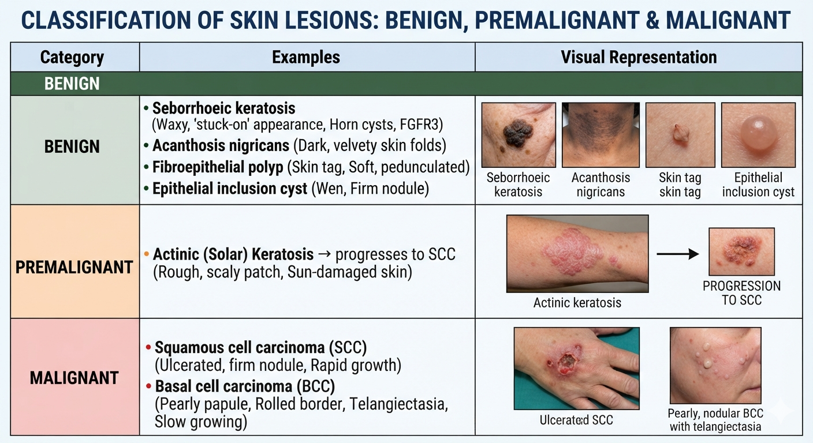
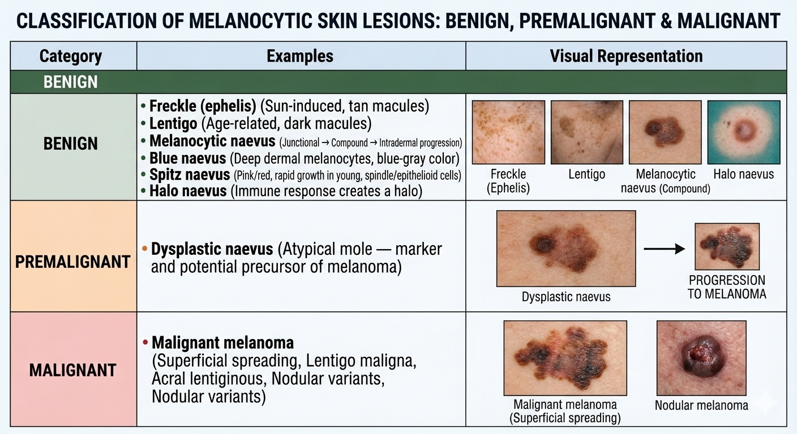
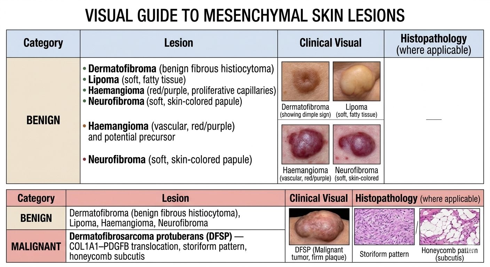
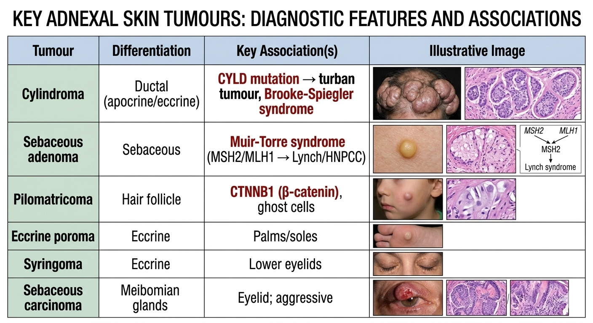
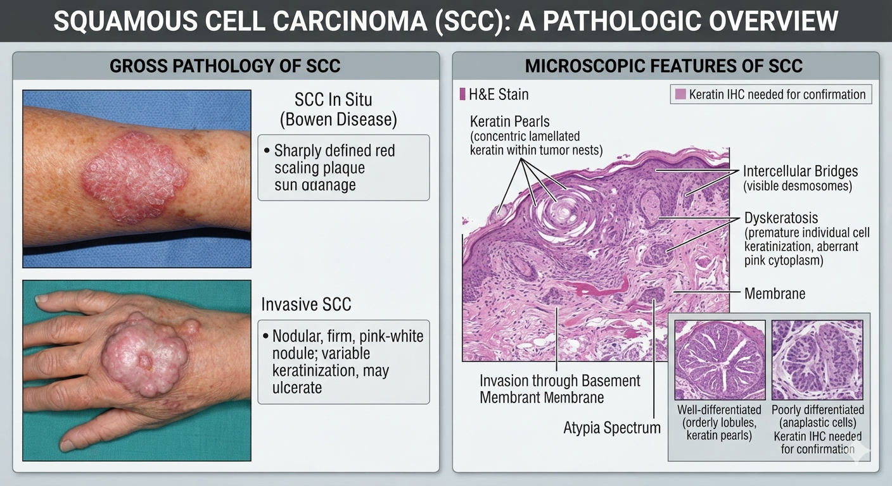
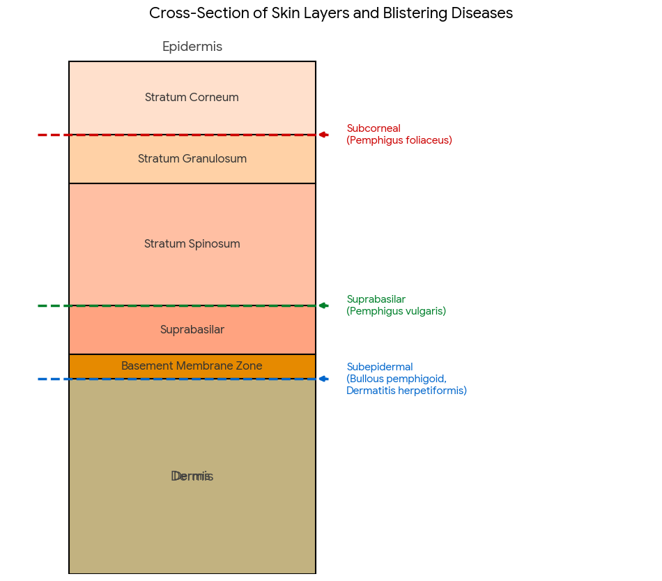

# Item 23 — Skin: Common Terms, Inflammation, Blistering Diseases, Pigmented Skin Lesions, Premalignant & Malignant Conditions
> **Source:** Robbins & Cotran, *Pathologic Basis of Disease*, 10th ed. — Ch 25 (The Skin), pp. 1133–1170
> **Author of chapter:** Alexander J. Lazar
> 🩺 **Every answer is fully Robbins-sourced · 🔴/📌 bold = must-say viva points · 🎯 = one-liner mnemonic**

---

<details>
<summary><b>Q1. Classify skin tumours.</b></summary>

### Overview

Skin tumours are classified by **cell of origin** and **biological behaviour**. Skin is the most common site of neoplasia in humans.

### A. Tumours of the Epidermis

| Category         | Examples                                                                                                                           |
| ---------------- | ---------------------------------------------------------------------------------------------------------------------------------- |
| **Benign**       | Seborrhoeic keratosis (horn cysts, FGFR3), Acanthosis nigricans, Fibroepithelial polyp (skin tag), Epithelial inclusion cyst (wen) |
| **Premalignant** | **Actinic (solar) keratosis** → progresses to SCC                                                                                  |
| **Malignant**    | **Squamous cell carcinoma (SCC)**, **Basal cell carcinoma (BCC)**                                                                  |

### B. Tumours of Melanocytes

| Category         | Examples                                                                                                                         |
| ---------------- | -------------------------------------------------------------------------------------------------------------------------------- |
| **Benign**       | Freckle (ephelis), Lentigo, **Melanocytic naevus** (junctional → compound → intradermal), Blue naevus, Spitz naevus, Halo naevus |
| **Premalignant** | **Dysplastic naevus** (atypical mole — marker/precursor of melanoma)                                                             |
| **Malignant**    | **Malignant melanoma** (superficial spreading, lentigo maligna, acral lentiginous, nodular)                                      |

### C. Tumours of the Dermis

| Category      | Examples                                                                                                       |
| ------------- | -------------------------------------------------------------------------------------------------------------- |
| **Benign**    | Dermatofibroma (benign fibrous histiocytoma), Lipoma, Haemangioma, Neurofibroma                                |
| **Malignant** | **Dermatofibrosarcoma protuberans (DFSP)** — COL1A1–PDGFB translocation, storiform pattern, honeycomb subcutis |

### D. Tumours of Skin Appendages (Adnexal)

| Tumour              | Differentiation           | Key association                                             |
| ------------------- | ------------------------- | ----------------------------------------------------------- |
| Cylindroma          | Ductal (apocrine/eccrine) | **CYLD mutation → turban tumour, Brooke-Spiegler syndrome** |
| Sebaceous adenoma   | Sebaceous                 | **Muir-Torre syndrome** (MSH2/MLH1 → Lynch/HNPCC)           |
| Pilomatricoma       | Hair follicle             | **CTNNB1 (β-catenin)**, ghost cells                         |
| Eccrine poroma      | Eccrine                   | Palms/soles                                                 |
| Syringoma           | Eccrine                   | Lower eyelids                                               |
| Sebaceous carcinoma | Meibomian glands          | Eyelid; aggressive                                          |

### E. Tumours of Cellular Migrants to the Skin

| Tumour                       | Cell of origin           | Key feature                                                |
| ---------------------------- | ------------------------ | ---------------------------------------------------------- |
| **Mycosis fungoides (CTCL)** | Skin-homing CD4+ T cells | Pautrier microabscess, cerebriform nuclei, Sézary syndrome |
| **Mastocytosis**             | Mast cells               | KIT mutation, Darier sign, urticaria pigmentosa            |

### F. Tumours of the Subcutis

- Lipoma, Liposarcoma

> 🎯 **Classify by layer:** Epidermis → Dermis → Subcutis × Benign/Malignant. Most common cancer in humans = **BCC**. Most deadly = **melanoma**.

> 📖 Robbins 10e, Ch 25 (The Skin), pp. 1133–1170 · 📗 Arif 15e (2025), Vol-2, Unit-I The Skin, pp. 336–347

---

</details>

<details>
<summary><b>Q2. Mention the premalignant and malignant lesions of the skin.</b></summary>

### Premalignant (Pre-cancerous) Lesions

| Lesion                           | Site                                            | Risk                              | Key pathology                                                                                                                                                |
| -------------------------------- | ----------------------------------------------- | --------------------------------- | ------------------------------------------------------------------------------------------------------------------------------------------------------------ |
| **Actinic keratosis (AK)**       | Sun-exposed skin (face, dorsum hands, forearms) | **→ SCC** (progressive dysplasia) | Atypia of **lowermost epidermis only**, parakeratosis, elastosis, intercellular bridges present; **imiquimod eradicates ~50% vs ~5% spontaneous regression** |
| **Actinic cheilitis**            | Lower lip                                       | → SCC of lip                      | Actinic keratosis of the lip                                                                                                                                 |
| **Dysplastic naevus**            | Any skin                                        | Marker/precursor of **melanoma**  | **>5 mm**, variegated, irregular borders; CDKN2A/CDK4; coalescent nests + cytologic atypia + lamellar fibrosis                                               |
| **Bowen disease (SCC in situ)**  | Any skin (often trunk)                          | → Invasive SCC                    | Atypia at **ALL levels** of epidermis (vs AK = lower levels only); sharply defined red scaling plaque                                                        |
| **Leukoplakia (oral)**           | Oral mucosa                                     | → Oral SCC                        | Hyperkeratosis + dysplasia                                                                                                                                   |
| **Paget disease (extramammary)** | Anogenital, axillae                             | Underlying adenocarcinoma         | Paget cells in epidermis                                                                                                                                     |

### Malignant Lesions

| Malignancy                          | Incidence rank                                        | Metastasis risk                   | Key molecular                                                          |
| ----------------------------------- | ----------------------------------------------------- | --------------------------------- | ---------------------------------------------------------------------- |
| **Basal cell carcinoma (BCC)**      | **#1 most common invasive cancer** (~1 million/yr US) | **<0.5% — almost never**          | Hedgehog pathway: **PTCH loss → SMO → GLI1**; UV signature (C→T)       |
| **Squamous cell carcinoma (SCC)**   | **#2 most common** on sun-exposed skin                | **<5%** (usually deeply invasive) | **TP53**, ↑RAS, ↓Notch; UV pyrimidine dimers                           |
| **Malignant melanoma**              | Rising incidence, **most deadly**                     | **High — early lymphatic**        | **BRAF 40–50%**, RAS 15–20%, **TERT promoter ~70%**, CDKN2A (familial) |
| **Dermatofibrosarcoma protuberans** | Rare                                                  | Locally aggressive, rarely mets   | **COL1A1–PDGFB** translocation                                         |
| **Mycosis fungoides (CTCL)**        | Most common cutaneous lymphoma                        | May involve blood (Sézary)        | CD4+ skin-homing T cells, CLA/CCR4                                     |

### The Dysplasia → Carcinoma Sequence

```
Actinic keratosis (atypia lower epidermis)
   ↓ progressive dysplasia
Bowen disease / SCC in situ (atypia full thickness)
   ↓ invasion through BMZ
Invasive SCC (keratin pearls, <5% mets)
```

> 🎯 **Premalignant = AK (→ SCC), dysplastic naevus (→ melanoma), Bowen disease (SCC in situ). Malignant = BCC > SCC > melanoma (by commonality); melanoma > SCC > BCC (by lethality).**

> 📖 Robbins 10e, Ch 25 (The Skin), pp. 1133–1170 · 📗 Arif 15e (2025), Vol-2, Unit-I The Skin, pp. 336–347

---

</details>

<details>
<summary><b>Q3. What are the locally malignant tumours of skin?</b></summary>

### Definition

**Locally malignant** = tumours that are locally invasive and destructive but have **low metastatic potential**. They destroy local tissue and can recur if incompletely excised, but **rarely or never spread to distant sites**.

### The Major Locally Malignant Tumours of Skin

| Tumour | Local behaviour | Metastasis | Key features |
|---|---|---|---|
| **Basal cell carcinoma (BCC)** | Locally aggressive; can erode into bone, sinuses, orbit if neglected → **"rodent ulcer"** | **<0.5%** — almost never | Most common cancer in humans; Hedgehog/PTCH; pearly papule + telangiectasia; palisading + clefting |
| **Dermatofibrosarcoma protuberans (DFSP)** | Locally infiltrative; **recurs if incompletely excised**; infiltrates subcutis in honeycomb pattern | **Rare** (<1–2%) | Storiform pattern; **COL1A1–PDGFB**; imatinib for unresectable |
| **Squamous cell carcinoma (SCC)** — *low-risk, superficial variants* | Locally invasive | **<5%** (only deeply invasive/involving subcutis metastasize) | Cutaneous SCC is MUCH less aggressive than mucosal SCC; keratin pearls |
| **Dermatofibroma** (benign fibrous histiocytoma) | May recur locally if incompletely excised | **Never** | Pseudoepitheliomatous hyperplasia; cells wrap around collagen bundles |

### Why BCC is "locally malignant but not metastatic"

```
BCC invasion:
  - Slow-growing over months to years
  - Erodes through dermis → subcutis → muscle → bone
  - "Rodent ulcer" = eats into tissue like a rodent
  - BUT: tumour cells rarely gain enough independence to seed lymphatics/blood
  - <0.5% metastasize (one of the lowest rates for any malignancy)
```

### Contrast with Truly Metastatic Skin Cancers

| Feature | BCC (locally malignant) | SCC (sometimes metastatic) | Melanoma (always metastatic risk) |
|---|---|---|---|
| Local destruction | Extensive | Moderate | Variable |
| Metastasis rate | <0.5% | <5% | High (even thin tumours) |
| First metastatic site | — | Regional lymph nodes | **Sentinel lymph node** |
| Treatment | Excision ± Mohs | Excision ± node dissection | Wide excision + sentinel node + immunotherapy |

> 🎯 **Locally malignant = BCC (rodent ulcer) + DFSP. BCC "eats" locally but almost never travels. DFSP recurs but rarely metastasizes.**

> 📖 Robbins 10e, Ch 25 (The Skin), pp. 1133–1170 · 📗 Arif 15e (2025), Vol-2, Unit-I The Skin, pp. 336–347

---

</details>

<details>
<summary><b>Q4. Short note: Squamous cell carcinoma (SCC).</b></summary>

### Definition

**SCC = malignant tumour of keratinocytes showing variable degrees of squamous differentiation.** It is the **2nd most common skin malignancy** on sun-exposed sites (after BCC) and the **most common skin cancer in organ transplant recipients**.

### Epidemiology

- **Older adults** on sun-exposed skin; **male predominance** (except lower leg in women)
- Cutaneous SCC is **much less aggressive than mucosal SCC** (oral, oesophageal, cervix, etc.)

### Risk Factors & Pathogenesis

| Factor | Mechanism |
|---|---|
| **UV radiation** | Pyrimidine dimer damage → ATM/ATR → **p53 mutation** (early event in actinic keratosis); ↑RAS signalling, ↓Notch signalling |
| **Immunosuppression** | Transplant recipients, chemotherapy patients — 65–250× risk |
| **HPV types 5 and 8** | **Epidermodysplasia verruciformis** (AR) — flat warts → SCC; E6 variants do NOT affect p53 (low-risk HPV) |
| **Xeroderma pigmentosum** | Defective **nucleotide excision repair** of pyrimidine dimers (AR, XPA gene) |
| **Industrial carcinogens** | Tars, oils, arsenicals |
| **Chronic wounds** | Old burn scars, draining osteomyelitis, chronic ulcers |
| **Tobacco/betel nut** | Oral cavity SCC |

### Molecular Pathogenesis

```
UV → pyrimidine dimers in DNA
   ↓
Normally: ATM/ATR → p53 → G1 arrest + high-fidelity repair OR apoptosis
   ↓ (when p53 is lost)
Error-prone repair → mutations accumulate
   ↓
Actinic keratosis (TP53 mutation) → SCC in situ (Bowen disease) → Invasive SCC
```

- **TP53 mutations** — earliest and most common driver
- **RAS activation** — ↑proliferative signalling
- **Notch pathway loss** — failure of keratinocyte differentiation

### Morphology

#### Gross
| Variant                     | Appearance                                                                 |
| --------------------------- | -------------------------------------------------------------------------- |
| **In situ (Bowen disease)** | Sharply defined red scaling plaque; atypia at **ALL levels** of epidermis  |
| **Invasive SCC**            | Nodular, variable keratin production, may ulcerate; firm pink-white nodule |

#### Microscopy — the Hallmarks
| Feature                   | Description                                                                                                                                              |
| ------------------------- | -------------------------------------------------------------------------------------------------------------------------------------------------------- |
| **Keratin pearls**        | Concentric lamellated keratin within tumour nests — well-differentiated SCC                                                                              |
| **Intercellular bridges** | Visible desmosomes between tumour cells (present in SCC, absent in BCC)                                                                                  |
| **Dyskeratosis**          | Premature individual cell keratinization (aberrant pink cytoplasm)                                                                                       |
| **Atypia spectrum**       | Well-differentiated → orderly lobules with keratin pearls; Poorly differentiated → anaplastic cells, may need **keratin IHC** to confirm squamous origin |
| **Invasion**              | Through basement membrane into dermis ± subcutis                                                                                                         |

### Staging & Prognosis

- **Depth of invasion** is the key prognostic factor
- **<5% metastasize to regional lymph nodes** — and those that do are generally **deeply involving subcutis**
- Perineural invasion, poorly differentiated histology, and immunosuppression worsen prognosis

### Treatment

- **Surgical excision** (primary); Mohs micrographic surgery for high-risk sites
- Radiation for unresectable disease
- **Cetuximab** (anti-EGFR) for advanced/metastatic SCC

> 🎯 **SCC = 2nd most common skin cancer · Keratin pearls + intercellular bridges · TP53 + UV · <5% metastasize (only deep/invasive) · Much less aggressive than mucosal SCC · Actinic keratosis → SCC in situ → invasive SCC.**

> 📖 Robbins 10e, Ch 25 (The Skin), pp. 1133–1170 · 📗 Arif 15e (2025), Vol-2, Unit-I The Skin, pp. 336–347

---

</details>

<details>
<summary><b>Q5. Short note: Basal cell carcinoma (BCC) / Rodent ulcer.</b></summary>

### Definition

**BCC = the most common invasive cancer in humans** (~1 million cases/year in the US). It is a slow-growing malignant tumour of **basaloid cells** arising from the **epidermis or follicular epithelium** that is **locally destructive but almost never metastasizes (<0.5%)**.
A basaloid cell is ==a type of cell that looks dark blue and small under a microscope==.
### Epidemiology

- **Most common cancer in humans** (incidence > all other cancers combined)
- Sun-exposed sites; **lightly pigmented elderly adults**
- ↑ risk in **immunosuppression** and **xeroderma pigmentosum**
- **Does NOT arise on mucosal surfaces**
- **Male > Female**

### Pathogenesis — The Hedgehog Signalling Pathway

This is THE molecular story of BCC:

```
NORMAL:
SHH (sonic hedgehog) → binds PTCH (patched) → releases SMO (smoothened)
   → activates GLI1 transcription factor → pro-growth genes ON

IN BCC:
Loss-of-function mutation in PTCH (or activating mutation in SMO)
   → SMO is constitutively ACTIVE (no SHH needed)
   → GLI1 always ON → uncontrolled proliferation
```

| Gene | Role | Frequency |
|---|---|---|
| **PTCH (patched)** | Tumour suppressor; normally inhibits SMO | **Mutated in most sporadic BCCs**; ~1/3 are **C→T transitions (UV signature)** |
| **SMO (smoothened)** | Oncogene; activates GLI1 when PTCH is absent | Activating mutations in some BCCs |
| **GLI1** | Transcription factor downstream of SMO | Effector — drives growth |
| **PTEN loss** | Co-operates with PTCH loss | Some cases |

### Nevoid BCC Syndrome (Gorlin / NBCCS)

| Feature | Detail |
|---|---|
| **Inheritance** | **Autosomal dominant** |
| **Gene** | **PTCH (9q22)** — germline loss-of-function |
| **Key features** | Multiple BCCs **before age 20**, **medulloblastoma**, ovarian fibromas, **odontogenic keratocysts of jaw**, **palmar/plantar pits** |
| **Mechanism** | First hit = germline; Second hit = acquired (often UV) → Loss of heterozygosity |

> Gorlin syndrome = think "PTCH = garden gate broken → Hedgehog pathway wide open"

### Morphology

#### Gross (Clinical Types)
| Variant | Appearance |
|---|---|
| **Nodular (classic)** | **Pearly/waxy papule** with prominent **telangiectasias** (dilated subepidermal vessels); may contain melanin → mimics naevi/melanoma |
| **Superficial** | Erythematous, sometimes pigmented **plaque** on trunk; can mimic early melanoma |
| **Morpheaform / Infiltrative** | White/yellow sclerotic plaque; subtle, locally aggressive |
| **Pigmented** | Contains melanin; confused with melanoma |
| **Rodent ulcer** | Advanced neglected BCC — ulcerates and **invades bone, facial sinuses, orbit** after years |

#### Microscopy — THE Two Hallmarks

| Feature | Description |
|---|---|
| **Peripheral palisading** | Tumour cells at the periphery of islands/cords **align radially with their long axes parallel to each other** (like a picket fence) |
| **Clefting (stromal retraction)** | The **stroma retracts from the tumour islands** creating a separation artifact — this is diagnostic of BCC and distinguishes it from basaloid appendage tumours (e.g., trichoepithelioma) |

Other histologic features:
- Islands/cords of **basophilic (blue) cells** with hyperchromatic nuclei
- **Mucinous/myxoid stroma** between tumour nests
- **No intercellular bridges** (vs SCC where they ARE present)
- Mucin in stroma

### Behaviour & Treatment

| Feature | Detail |
|---|---|
| **Local destruction** | Can erode into bone, sinuses, orbit — "rodent ulcer" |
| **Metastasis** | **<0.5%** — one of the lowest rates for any malignancy |
| **Recurrence** | If incompletely excised |
| **Treatment** | Surgical excision; **Mohs micrographic surgery** for high-risk sites (nose, eyelid, ear); **Hedgehog pathway inhibitors** (vismodegib, sonidegib) for advanced/metastatic disease |

### BCC vs SCC vs Trichoepithelioma — Key Differentials

| Feature | BCC | SCC | Trichoepithelioma |
|---|---|---|---|
| Intercellular bridges | **Absent** | **Present** | Absent |
| Keratin pearls | Absent | **Present** | Absent |
| Peripheral palisading | **Present** | Absent | Present |
| Clefting/stromal retraction | **Present** | Absent | **Absent** |
| Metastasis risk | <0.5% | <5% | Never |

> 🎯 **BCC = most common cancer · Hedgehog/PTCH → SMO → GLI1 · Pearly papule + telangiectasia · Peripheral palisading + clefting · "Rodent ulcer" = locally destructive · Almost never metastasizes (<0.5%) · Gorlin syndrome = PTCH germline + medulloblastoma + jaw cysts + palmar pits.**

> 📖 Robbins 10e, Ch 25 (The Skin), pp. 1133–1170 · 📗 Arif 15e (2025), Vol-2, Unit-I The Skin, pp. 336–347

---

</details>

<details>
<summary><b>Q6. Short note: Malignant melanoma.</b></summary>

### Definition

**Malignant melanoma = the most deadly skin cancer**, arising from **melanocytes**. It is curable if caught early (radial growth phase) but metastasizes aggressively once vertical growth phase begins. Incidence is rising but **death rates are falling** — partly due to **immune checkpoint inhibitor therapy**.

### Numbers

- **>100,000 new cases** and **>6,800 deaths** annually in the US
- Can arise in skin, oral/anogenital mucosa, oesophagus, meninges, **uvea**

### Risk Factors

| Factor | Detail |
|---|---|
| **UV radiation** | Key environmental factor; **periodic severe sunburns early in life** may be most important |
| **Fitzpatrick skin type** | Lightly pigmented individuals at higher risk |
| **Familial** | **~10–15%** are inherited (AD, variable penetrance); **CDKN2A** mutations (encodes p16 + ARF) |
| **Dysplastic naevus syndrome** | CDKN2A/CDK4; >50% melanoma risk by age 60 |
| **Favourite sites** | Upper back (men), back and legs (women) |
| **Non-sun melanoma** | Acral/mucosal; KIT mutations common; can occur in dark skin |

### Molecular Genetics — The Driver Blueprint

| Gene | Frequency | Role |
|---|---|---|
| **BRAF** (serine/threonine kinase) | **40–50%** | Most actionable (BRAF inhibitors); downstream of RAS |
| **RAS** | 15–20% | Upstream activator of MAPK pathway |
| **TERT promoter** | **~70%** | **Most commonly mutated gene**; reactivates telomerase → antidote to senescence |
| **CDKN2A** | ~40% familial; common sporadic | Encodes **p16** (cell cycle brake) + **ARF** (stabilises p53 via MDM2 inhibition) |
| **PTEN loss** | Often with BRAF | Boosts PI3K/AKT survival pathway |
| **NF1 loss** | Some cases | Unleashes RAS signalling |
| **KIT** | Non-sun-exposed sites | Receptor tyrosine kinase; activating mutations |

### Morphology — Gross

| Feature     | Description                                                                                        |
| ----------- | -------------------------------------------------------------------------------------------------- |
| **Colour**  | Striking variation: black, brown, red, dark blue, gray; white/flesh zones = **focal regression**   |
| **Borders** | **Irregular, notched** (vs smooth round borders of naevi)                                          |
| **Size**    | Usually **>10 mm at diagnosis**                                                                    |
| **ABCD**    | **A**symmetry, irregular **B**orders, variegated **C**olor, increasing **D**iameter, **E**volution |

### The Two Growth Phases — THE Key Concept

```
RADIAL GROWTH PHASE                    VERTICAL GROWTH PHASE
━━━━━━━━━━━━━━━━━━━━━━                ━━━━━━━━━━━━━━━━━━━━━━
Horizontal spread within               Expansile invasion DOWNWARD
epidermis + superficial dermis         into deep dermis

• Cells LACK metastatic capacity       • SUBCLONE with METASTATIC POTENTIAL emerges
• CURABLE by excision                  • No maturation/neurotization (vs naevi)
• Three subtypes:                      • Nodule may herald transition
  1. Superficial spreading (most common, sun-exposed)
  2. Lentigo maligna (face of older men, decades in radial phase)
  3. Acral/mucosal lentiginous (NOT sun-related)
```

### Histologic Subtypes

| Subtype | % | Site | Key feature |
|---|---|---|---|
| **Superficial spreading** | ~70% | Sun-exposed skin | Pagetoid spread of atypical melanocytes upward into epidermis |
| **Nodular** | ~15% | Any site | Presents in vertical growth phase; worst prognosis |
| **Lentigo maligna** | ~10% | Face of older men | Radial phase may last **decades** before vertical transformation |
| **Acral lentiginous** | ~5% | Palms, soles, nail bed | Unrelated to sun; **KIT mutations** common |

### Prognostic Model

| Factor | Favourable | Unfavourable |
|---|---|---|
| **Breslow thickness** | Thin (<1 mm) | Thick (>4 mm) — **single best predictor** |
| **Mitotic rate** | Low (<1/mm²) | High |
| **Ulceration** | Absent | Present |
| **Tumour-infiltrating lymphocytes** | **Brisk** | Non-brisk / absent |
| **Regression** | Absent | Present |
| **Location** | Extremities | Trunk, head/neck |

### Staging & Spread

- First metastatic site = **regional lymph nodes**
- **Sentinel lymph node biopsy** = first draining node; even micrometastases worsen prognosis
- Haematogenous spread to lungs, liver, brain, bone in advanced disease

### Treatment

| Modality | Detail |
|---|---|
| **Surgery** | Wide local excision; sentinel node biopsy for staging |
| **BRAF inhibitors** | Vemurafenib, dabrafenib (high response in BRAF-mutant tumours) |
| **MEK inhibitors** | Trametinib (combined with BRAF inhibitors) |
| **Immune checkpoint inhibitors** | **Anti-CTLA4 (ipilimumab)**, **anti-PD1 (nivolumab, pembrolizumab)** — melanoma is one of the MOST responsive cancers to checkpoint blockade, reflecting its intrinsic immunogenicity |

### Melanoma vs Dysplastic Naevus vs Benign Naevus

| Feature | Benign naevus | Dysplastic naevus | Melanoma |
|---|---|---|---|
| Size | <6 mm | >5 mm | >10 mm |
| Symmetry | Symmetric | Slightly asymmetric | **Asymmetric** |
| Borders | Smooth, round | Irregular | **Irregular, notched** |
| Colour | Uniform tan/brown | Variegated | **Variegated (multiple colours)** |
| Maturation | Present (neurotization) | Partial | **Absent** |
| Growth phase | — | — | **Radial → Vertical** |

> 🎯 **Melanoma = most deadly skin cancer · BRAF 40–50% + TERT promoter ~70% · Radial (curable) → Vertical (metastatic) · Breslow depth = best predictor · ABCDE warning signs · Immune checkpoint inhibitors = most responsive cancer to immunotherapy · Sentinel lymph node biopsy for staging.**

> 📖 Robbins 10e, Ch 25 (The Skin), pp. 1133–1170 · 📗 Arif 15e (2025), Vol-2, Unit-I The Skin, pp. 336–347

---

</details>

<details>
<summary><b>Q7. Mention the inflammatory dermatoses of skin.</b></summary>

### Classification

Inflammatory dermatoses are grouped by **pattern of inflammation**:

### A. Acute Inflammatory Dermatoses

| Disease | Mechanism | Hallmark |
|---|---|---|
| **Urticaria (hives)** | Mast cell degranulation → dermal oedema | **Wheals** (itchy, transient, <24 h); **angioedema** = deeper; 3 classes (IgE-dep, IgE-indep mast-cell, mast-cell-indep) |
| **Acute eczematous dermatitis** | **Type IV hypersensitivity** (T cell–mediated) | **Spongiosis** (intercellular oedema); subtypes: allergic contact (urushiol/poison ivy), atopic, drug-related, photoeczematous, irritant |
| **Erythema multiforme** | CD8+ cytotoxic T cells against keratinocytes | **Targetoid lesions**; associated with HSV, Mycoplasma, drugs; SJS/TEN = severe forms (diffuse epidermal necrolysis) |

### B. Chronic Inflammatory Dermatoses

| Disease                    | Mechanism                                                               | Hallmark                                                                                                                                                                        |
| -------------------------- | ----------------------------------------------------------------------- | ------------------------------------------------------------------------------------------------------------------------------------------------------------------------------- |
| **Psoriasis**              | **Th1/Th17** CD4+ T cells + TNF/IL-17 → keratinocyte hyperproliferation | **Munro microabscesses**, parakeratosis, **Auspitz sign**, acanthosis "test tubes in a rack"; Koebner phenomenon; 15% arthritis                                                 |
| **Seborrhoeic dermatitis** | Inflammation of epidermis (NOT sebaceous glands); *Malassezia*          | **Follicular lipping** (parakeratosis mounds at follicle ostia); dandruff = scalp form; ↑ in Parkinson disease + HIV                                                            |
| **Lichen planus**          | CD8+ cytotoxic T-cell interface dermatitis                              | **6 Ps** (pruritic, purple, polygonal, planar papules/plaques); **Wickham striae** (hypergranulosis); **Civatte bodies** (necrotic basal cells); **sawtoothing**; oral SCC risk |

### C. Comparative Table — Exam Gold

| Feature | Psoriasis | Lichen planus | Eczema (acute) | Erythema multiforme |
|---|---|---|---|---|
| **Clinical** | Salmon plaques, **silvery scale** | Purple polygonal + Wickham striae | Weeping papulovesicles | **Targetoid** lesions |
| **Pattern** | Parakeratosis + acanthosis | **Interface + sawtoothing** | **Spongiosis** | Interface + keratinocyte necrosis |
| **Signature cells** | **Munro microabscesses** (neutrophils) | **Civatte bodies** + band-like lymphocytes | Intraepidermal oedema/vesicles | CD8+ T cells along DEJ |
| **Mechanism** | Th1/Th17, TNF | CD8+ cytotoxic | Type IV (haptens) | CD8+ cytotoxic |

### D. Other Important Inflammatory Dermatoses

| Disease | Key features |
|---|---|
| **Dermatitis herpetiformis** | Subepidermal; granular IgA at dermal papillae; celiac/gluten; pruritic grouped vesicles on extensors |
| **Pemphigus vulgaris** | Intraepidermal acantholysis; IgG anti-desmoglein 3; "row of tombstones" |
| **Bullous pemphigoid** | Subepidermal; tense intact bullae; linear IgG at BMZ; BPAG2; elderly |
| **Mycosis fungoides** | CD4+ skin-homing T cells; Pautrier microabscesses; cerebriform nuclei; Sézary syndrome |
| **Erythema nodosum** | Septal panniculitis; NO vasculitis; associations: strep, TB, sarcoidosis, IBD |

### Eczema — The Histologic Sine Qua Non: Spongiosis

```
ECZEMA = "to boil over"
   ↓
Haptens (e.g., urushiol from poison ivy) → Langerhans cells carry to nodes
   ↓
CD4+ T cell activation (CLA+ memory cells)
   ↓
Re-exposure → cytokine release within 24 h
   ↓
Spongiosis: oedema seeps into intercellular spaces of stratum spinosum
   → splaying keratinocytes apart
   → intraepidermal vesicles
```

### Psoriasis — The 4 Histologic Stars

```
1. Acanthosis with regular elongation of rete ridges → "test tubes in a rack"
2. Parakeratosis (retained nuclei in stratum corneum)
3. Munro microabscesses (neutrophil aggregates in parakeratotic stratum corneum)
4. Auspitz sign (pinpoint bleeding on scale removal — from thinned suprapapillary plates over dilated vessels)
```

> 🎯 **Acute = urticaria (wheals), eczema (spongiosis), EM (targetoid). Chronic = psoriasis (Munro + Auspitz + Th1/17), seborrhoeic dermatitis (follicular lipping), lichen planus (sawtoothing + Wickham + Civatte bodies).**

> 📖 Robbins 10e, Ch 25 (The Skin), pp. 1133–1170 · 📗 Arif 15e (2025), Vol-2, Unit-I The Skin, pp. 336–347

---

</details>

<details>
<summary><b>Q8. Classify blistering diseases of skin.</b></summary>

### The Key Question

> **"At what level does the skin split?"** — This is THE question for every blistering disease.

### Anatomical Levels of Blistering

```
STRATUM CORNEUM
━━━━━━━━━━━━━━━━━━━━━━━━━━━━━━━━━━━━━━━━━━━━━━━━
  ↑ SUBCORNEAL SPLIT (pemphigus foliaceus, impetigo)
━━━━━━━━━━━━━━━━━━━━━━━━━━━━━━━━━━━━━━━━━━━━━━━━
STRATUM GRANULOSUM
━━━━━━━━━━━━━━━━━━━━━━━━━━━━━━━━━━━━━━━━━━━━━━━━
STRATUM SPINOSUM
━━━━━━━━━━━━━━━━━━━━━━━━━━━━━━━━━━━━━━━━━━━━━━━━
  ↑ SUPRABASILAR SPLIT (pemphigus vulgaris)
━━━━━━━━━━━━━━━━━━━━━━━━━━━━━━━━━━━━━━━━━━━━━━━━
BASEMENT MEMBRANE ZONE
  ↑ SUBEPIDERMAL SPLIT (bullous pemphigoid, dermatitis herpetiformis, epidermolysis bullosa, porphyria)
━━━━━━━━━━━━━━━━━━━━━━━━━━━━━━━━━━━━━━━━━━━━━━━━
DERMIS
```

### Classification of Primary Blistering Diseases

#### I. Intraepidermal (Acantholytic) Blistering

| Disease | Split level | Antibody target | Antibody type | DIF pattern | Key feature |
|---|---|---|---|---|---|
| **Pemphigus vulgaris (PV)** | **Suprabasilar** (above basal layer) | **Desmoglein 3** (+ Dsg1) | **IgG** | **Fishnet/retiform** intercellular IgG at all epidermal levels | "Row of tombstones" (basal layer intact); **oral ulcers** often precede skin lesions; 80% of pemphigus cases |
| **Pemphigus foliaceus (PF)** | **Subcorneal** (stratum granulosum level) | **Desmoglein 1** alone | **IgG** | Fishnet (more superficial) | More benign; **endemic in Brazil (fogo selvagem)**; superficial blisters → erythema/crusting; mucosa spared |
| **Pemphigus vegetans** | Suprabasilar | Dsg3 | IgG | Fishnet | Verrucous/vegetating plaques in flexures |
| **Pemphigus erythematosus** | Subcorneal | Dsg1 | IgG | Fishnet | Localised malar area (lupus-like) |
| **Paraneoplastic pemphigus** | Variable | Plakin family + Dsg | IgG | Variable | With **non-Hodgkin lymphoma** |

**Why the different split levels?**
```
Desmoglein distribution:
   Dsg1 = throughout ALL layers of epidermis
   Dsg3 = SUPRABASAL layer only

Anti-Dsg1 + Anti-Dsg3 (PV) → both layers affected → SUPRABASILAR split
Anti-Dsg1 alone (PF) → only superficial layer affected → SUBCORNEAL split
```

#### II. Subepidermal (Non-Acantholytic) Blistering

| Disease | Split level | Antibody target | Antibody type | DIF pattern | Key feature |
|---|---|---|---|---|---|
| **Bullous pemphigoid (BP)** | **Subepidermal** (lamina lucida) | **BPAG2** (hemidesmosome) | **IgG** + complement | **LINEAR IgG/C3 at basement membrane** | **Elderly**; tense intact bullae (don't rupture easily); heal without scarring; eosinophils beneath basal layer |
| **Dermatitis herpetiformis (DH)** | **Subepidermal** | **Reticulin** (anchoring fibrils) | **IgA** | **GRANULAR IgA at tips of dermal papillae** | Males 30–40s; **celiac disease/gluten**; extremely pruritic grouped vesicles on **extensor surfaces**; treat with **gluten-free diet** |
| **Linear IgA bullous dermatosis** | Subepidermal | BPAG2/laminin | **IgA** | **Linear IgA at BMZ** | "Dermatitis herpetiformis with a linear pattern" |
| **Epidermolysis bullosa acquisita** | Subepidermal (sub-lamina densa) | **Type VII collagen** (anchoring fibrils) | IgG | Linear IgG at BMZ | Autoimmune; scarring |

#### III. Non-Inflammatory Blistering (Mechanical/Inherited)

| Disease | Split level | Gene defect | Inheritance |
|---|---|---|---|
| **Epidermolysis bullosa simplex (75–85%)** | **Intraepidermal** (basal cell layer) | **Keratin 5 or Keratin 14** mutations | AD (dominant-negative) |
| **Junctional EB** | **Lamina lucida** | **Laminin** subunit defects; some = **BPAG2** mutations | AR |
| **Dystrophic EB (scarring)** | **Below lamina densa** | **COL7A1** (type VII collagen) — rudimentary anchoring fibrils | AD or AR |
| **Porphyria cutanea tarda** | Subepidermal | Porphyrin metabolism defect | Acquired/inherited |

#### IV. Secondary Blistering (Not Primary Bullous Disease)

| Disease | Split level | Mechanism |
|---|---|---|
| Impetigo | Subcorneal | S. aureus toxin cleaves **desmoglein 1** (same plane as PF) |
| Herpes simplex/zoster | Intraepidermal | Viral cytopathic effect (ballooning degeneration) |
| Burns | Subepidermal | Thermal injury |
| Eczema | Intraepidermal | Spongiosis (oedema) |
| Erythema multiforme | Subepidermal | CD8+ T-cell keratinocyte necrosis |

### The Great Comparison Table — EXAM GOLD

| Feature | **Pemphigus vulgaris** | **Bullous pemphigoid** | **Dermatitis herpetiformis** |
|---|---|---|---|
| **Level of split** | **Intraepidermal, suprabasilar** (acantholysis) | **Subepidermal** (lamina lucida) | **Subepidermal** |
| **Roof** | Thin, ruptures easily → erosions | **Tense, intact**, heals without scar | Grouped pruritic vesicles |
| **Target molecule** | **Desmoglein 3** (+1) | **BPAG2** (hemidesmosome) | **Reticulin** (anchoring fibrils) |
| **Antibody** | **IgG**, intercellular | **IgG** + complement, linear at BMZ | **IgA**, granular in dermal papillae |
| **Age** | 4th–6th decade | **Elderly** | Males, 3rd–4th decade |
| **Associations** | Oral ulcers often first | — | **Celiac disease/gluten** |
| **Acantholysis** | **Yes** ("row of tombstones") | No | No |
| **Treatment** | Immunosuppression | Immunosuppression | **Gluten-free diet** |

### Epidermolysis Bullosa — The Three Types at a Glance

| Type | Split level | Gene | Inheritance | % of EB |
|---|---|---|---|---|
| **Simplex** | Basal cell layer (intraepidermal) | **Keratin 5 / Keratin 14** | AD | 75–85% |
| **Junctional** | Lamina lucida | **Laminin** (some = BPAG2) | AR | Rare |
| **Dystrophic** | Below lamina densa | **COL7A1** (type VII collagen) | AD or AR | Scarring |

### Mnemonic to Remember

```
"SPLIT" = the key word:

S — Subcorneal → Pemphigus foliaceus (Dsg1, IgG, fishnet)
P — Pemphigus vulgaris = Suprabasilar (Dsg3, IgG, "tombstones")
L — Linear IgA at BMZ
I — Intraepidermal = EB simplex (K5/K14)
T — Tense bullae = Bullous pemphigoid (BPAG2, linear IgG)

And: GRANULAR IgA at papillae = Dermatitis herpetiformis (gluten/celiac)
```

> 🎯 **Pemphigus = intraepidermal acantholysis (suprabasilar in PV, subcorneal in PF) · IgG anti-desmoglein · fishnet DIF. Pemphigoid = subepidermal, tense bullae, linear IgG at BMZ, BPAG2. DH = subepidermal, granular IgA at dermal papillae, celiac/gluten, gluten-free diet. EB = inherited structural protein defects (K5/K14 = simplex, COL7A1 = dystrophic).**

> 📖 Robbins 10e, Ch 25 (The Skin), pp. 1133–1170 · 📗 Arif 15e (2025), Vol-2, Unit-I The Skin, pp. 336–347

---

</details>

<details>
<summary><b>📋 Quick Reference — High-Yield Comparison</b></summary>

### Skin Cancer at a Glance

| Cancer | Most common? | Most deadly? | Metastasis rate | Pathway | Histology |
|---|---|---|---|---|---|
| **BCC** | ✅ Yes | ❌ No | <0.5% | Hedgehog/PTCH | Palisading + clefting |
| **SCC** | 2nd | ❌ No | <5% | TP53/RAS/Notch | Keratin pearls + bridges |
| **Melanoma** | ❌ No | ✅ Yes | High | BRAF/TERT/CDKN2A | Atypical melanocytes, Breslow depth |

### Blistering Disease Mnemonics

| Disease | Split | DIF | Target |
|---|---|---|---|
| PV | Suprabasilar | Fishnet IgG | Dsg3 |
| PF | Subcorneal | Fishnet IgG | Dsg1 |
| BP | Subepidermal | Linear IgG | BPAG2 |
| DH | Subepidermal | Granular IgA | Reticulin + gluten |
| EB simplex | Basal cell | — | K5/K14 |
| EB dystrophic | Below LD | — | COL7A1 |

---

</details>

<details>
<summary><b>🔗 Links</b></summary>

- **Previous:** [Item 22](Item-17_Uterus_Placenta_Ovary_PregnancyTest.md) · **Next:** [Item 24](Item-24_Sample_Collection_Preservation_Processing.md)
- **Robbins Ch 25 source:** [Pathology/ch25_Skin.md](../robbins/ch25_Skin.md)

---

</details>
