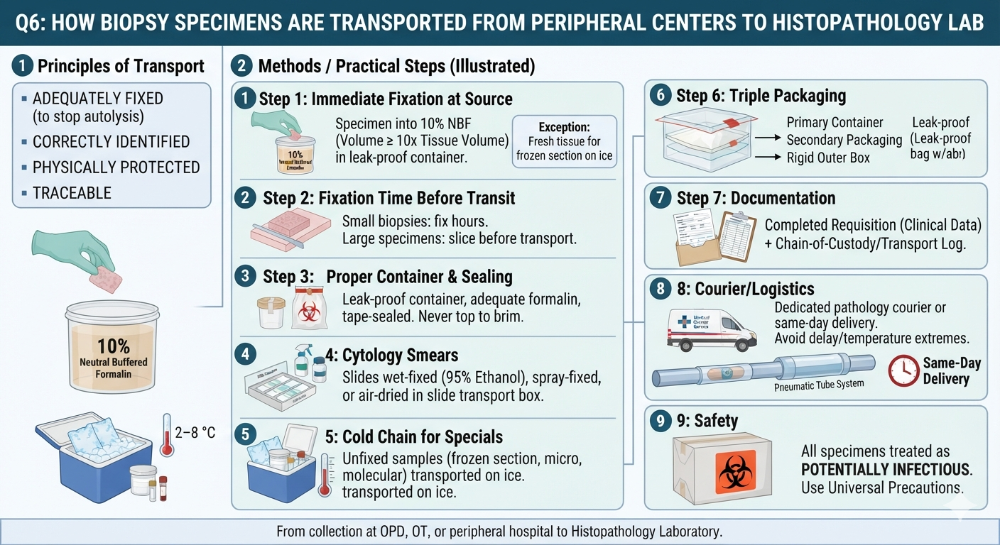

# Item 24 — Histo-Cytopathological Sample Collection, Preservation, Transport & Processing

> **Source:** Bancroft & Gamble, *Theory and Practice of Histological Techniques* · Culling's Handbook of Histopathological Techniques · Robbins (Methods in Pathology)

---

## Q1. What is tissue accessioning? Why clinical data is important for proper histopathological diagnosis?

### Definition
**Tissue accessioning = the formal process of RECEIVING, REGISTERING and TRACKING a specimen when it arrives at the pathology laboratory.** Each specimen is given a **unique accession number**, its details (patient identity, specimen type, site, clinical history, requesting clinician) are entered into the laboratory record, and it is then routed for grossing, processing and reporting. It is the **first and essential step of laboratory governance** — every subsequent slide and report is linked to the accession number, which also enables retrieval of blocks/slides and audit.

### Why clinical data is important
1. **Orientation & appropriate sampling** — the pathologist chooses where/how to cut and whether margins, nodes or special handling are needed (e.g., breast lumpectomy margins, axillary nodes).
2. **Tumour typing & grading context** — a lung nodule in a smoker vs a non-smoker, or a testicular mass in a young man, changes the differential and the workup.
3. **Choosing ancillary tests** — clinical suspicion of TB, lymphoma, amyloidosis, or a molecular target (HER2, EGFR) dictates special stains, IHC or molecular tests on the same tissue.
4. **Radiology correlation** — site/imaging findings guide the diagnosis (e.g., "calcified mass").
5. **Medicolegal & safety** — correct patient identity prevents wrong-patient/wrong-site errors; flags infection risk (e.g., hepatitis, TB) to laboratory staff.
6. **Quality & audit** — allows correlation of the diagnosis with the clinical picture and monitoring of laboratory performance.

> 🎯 "Accessioning = registering the specimen with a unique number; clinical data guides sampling, staining, and interpretation."

---

## Q2. Name the fixatives used in histopathology. Which one is most commonly used and how it works?

### Fixatives used in histopathology
| Fixative | Use |
|---|---|
| **10% neutral buffered formalin** (formaldehyde) | 🔴 **Routine histopathology** (the most common) |
| **Glutaraldehyde** | **Electron microscopy** (preserves ultrastructure) |
| **Alcohol (95% ethanol / methanol)** | **Cytology smears** (wet fixation), frozen-section substitutes |
| **Acetone** | Some enzyme histochemistry / immunostains |
| **Bouin's** (picric acid + formalin + acetic acid) | Testis, GIT, endocrine — crisp nuclear detail; soft tissue |
| **Zenker's** (mercuric chloride) | Bone marrow, haematological tissues |
| **Carnoy's** (ethanol + chloroform + acetic acid) | Glycogen preservation, cytogenetics |
| **Osmium tetroxide** | EM (preserves lipids) |
| **Osmium + glutaraldehyde** | EM double fixation |

### Most commonly used & mechanism
🔴 **10% neutral buffered formalin (4% formaldehyde in buffered water, pH ~7)** is the routine fixative.

**How it works:**
- Formaldehyde **cross-links proteins** — especially by reacting with **amino groups**, forming **methylene bridges** between adjacent protein molecules.
- This **immobilizes enzymes and structural proteins** → **stops autolysis and putrefaction**, preserves morphology close to the living state.
- It **hardens** the tissue so thin sections can be cut.
- "Neutral buffered" prevents formation of **formalin pigment (acid hematin)**.

> 🎯 "Formalin = protein cross-linker (methylene bridges) → preserves + hardens tissue. Glutaraldehyde = EM; alcohol = cytology."

---

## Q3. What entities should be included within a requisition along with a biopsy specimen?

A properly completed **requisition (request form) must accompany every biopsy specimen** and should include:

1. **Patient identifiers:** name, age/date of birth, sex, hospital/registration number, address.
2. **Clinical information:** **relevant history, symptoms and duration** (e.g., bleeding, weight loss, fever).
3. **Site and type of specimen** — anatomical site, side (left/right), and type (excision, incision, core, punch, curettage, needle).
4. **Clinical/radiological findings** — imaging result, size, "suspicious features."
5. **Working clinical diagnosis / differential** and the specific question asked (e.g., "malignant vs benign").
6. **Prior pathology** — previous biopsies/results, relevant to the current specimen.
7. **Special requests** — e.g., "frozen section," "look for organisms," "IHC for …," culture, electron microscopy, hormone receptors.
8. **Risk/infection status** — known infections (HBV, HIV, TB) for laboratory safety.
9. **Details of the requesting clinician** and **date/time of collection**.
10. **The specimen itself** must be correctly **labelled (name + site)** and placed in an **adequately sized container with fixative** — the requisition and container must be cross-checked.

> 🎯 "Every specimen needs: who (patient), what (site/type), why (history/working diagnosis), how (special requests) + correct labelling."

---

## Q4. Mention the different types of fixatives. What are the aims of fixatives?

### Types (classification) of fixatives
**By composition:**
| Class | Examples |
|---|---|
| **Simple (single chemical)** | 10% formalin, glutaraldehyde, alcohol, acetone, osmium tetroxide |
| **Compound (mixtures)** | **Bouin's**, **Zenker's**, Carnoy's, formol-saline, formalin-acetic |

**By property / purpose:**
| Class | Examples | Purpose |
|---|---|---|
| **Microanatomical** | Formaldehyde, glutaraldehyde, osmium | Preserve overall tissue/cell structure |
| **Cytological** | Alcohol (95% ethanol), acetone | Preserve individual cell morphology (smears) |
| **Histochemical** | Bouin's, Carnoy's | Preserve carbohydrates, enzymes, pigments for special stains |
| **Electron microscopy** | Glutaraldehyde (+ osmium) | Preserve ultrastructure |
| **Immunohistochemical** | Formalin (neutral buffered), alcohol-based | Preserve antigens for IHC |

### Aims of fixatives
1. 🔴 **Preserve cells/tissue close to the living state** — stop all ongoing cellular activity.
2. 🔴 **Prevent autolysis** (enzymatic self-digestion) and **putrefaction** (bacterial decay).
3. **Harden** the tissue so thin sections (3–5 µm) can be cut.
4. **Permit staining** — by denaturing/cross-linking proteins so dyes bind with contrast.
5. Preserve **antigens/nucleic acids** for immunohistochemistry and molecular tests (in compatible fixatives).

> 🎯 "Fixation aims: STOP decay (autolysis/putrefaction), preserve near-life morphology, harden for cutting, enable staining."

---

## Q5. Mention the steps of tissue processing. What are the methods of sectioning of tissue?

### Steps of tissue processing (in order)
```
Fixation → Dehydration → Clearing → Wax impregnation → Embedding → Sectioning → Staining → Mounting
```
1. **Fixation** — formalin preserves and hardens the tissue (prevents decay).
2. **Dehydration** — **ascending grades of alcohol (70% → 95% → 100%)** remove all water (water and paraffin do not mix).
3. **Clearing** — **xylene** replaces the alcohol; the tissue becomes translucent and is now miscible with molten wax.
4. **Wax impregnation** — **molten paraffin** (44–60 °C oven) infiltrates every space in the tissue.
5. **Embedding** — the tissue is oriented and set in a **paraffin block** that hardens.
6. **Sectioning** — the **microtome** cuts **3–5 µm ribbons** that are floated onto glass slides.
7. **Staining** — H&E (or special stains).
8. **Mounting** — coverslip with a resinous mountant (e.g., DPX) for permanence.

> 🎯 "Fix → dehydrate (alcohol) → clear (xylene) → wax → block → cut (3–5 µm) → stain → mount."

### Methods of sectioning tissue
1. **Paraffin sectioning (microtome)** — the **routine** method; tissue embedded in paraffin, cut at 3–5 µm with a rotary microtome.
2. **Frozen sectioning (cryostat)** — fresh tissue is **frozen (−20 °C)** and cut; rapid (10–20 min) — for intraoperative diagnosis (margins, sentinel node); also required for **fat stains** (Oil Red O), enzymes, and immunofluorescence.
3. **Celloidin embedding** — for very large/calcified sections (whole brain, bone, cochlea); slow, rarely used.
4. **Semithin/ultrathin sectioning** — for **electron microscopy**: semithin (1 µm) for orientation; **ultrathin (60–90 nm)** cut with an **ultramicrotome** using glass/diamond knives.
5. **Vibratome / free-hand sections** — unfixed tissue for certain enzyme-histochemistry and live-tissue work.

> 🎯 "Routine = paraffin microtome (3–5 µm). Rapid = frozen/cryostat. EM = ultramicrotome (ultrathin)."

---

## Q6. How biopsy specimens can be transported from peripheral centers to histopathology lab?

### Principles
Transport must keep the tissue **adequately fixed** (to stop autolysis), **correctly identified**, **physically protected**, and **traceable** — from a site where specimens are collected (OPD, operation theatre, peripheral hospital) to the histopathology laboratory.

### Methods / practical steps
1. **Immediate fixation at source** — put the specimen **immediately into 10% neutral buffered formalin** (volume ≥ 10× tissue volume) in a **leak-proof, wide-mouthed container** with correct patient labelling.
   - Exception: fresh tissue for **frozen section, culture, flow cytometry, cytogenetics, or enzyme tests** must be sent **UNFIXED** — in **normal saline/moist gauze or a sterile container on ice**, with clear instructions.
2. **Fixation time before transit** — formalin penetrates ~1 mm/hour; small biopsies fix in a few hours; large specimens may need **slicing** before transport so the centre reaches the tissue.
3. **Proper container & sealing** — leak-proof container, adequate formalin, tape-sealed; never top the container to the brim (fixative needs space, and pressure can rupture).
4. **Cytology smears** — **wet-fixed in 95% ethanol** or **spray (coating) fixed (Carbowax)**, or **air-dried** (for Giemsa), in a slide transport box.
5. **Cold chain for specials** — unfixed/fresh samples (frozen section, microbiology, molecular, EM) are transported **on ice (2–8 °C)** or in transport media.
6. **Triple packaging** — leak-proof primary container → secondary leak-proof packaging → rigid outer box (regulatory standard for hazardous specimens).
7. **Documentation** — completed **requisition** with clinical data; **chain-of-custody/transport log**; unique accession number on receipt.
8. **Courier/logistics** — dedicated pathology courier or same-day delivery; **avoid delay and extremes of temperature**; large centres use pneumatic tube/transport systems.
9. **Safety** — all specimens treated as **potentially infectious**; hazard-labelling per regulations.

> 🎯 "Fix in formalin immediately (or ice for specials) → leak-proof labelled container → requisition + transport log → courier → accessioning at the lab."
> ⚠️ "Fresh/frozen, culture and EM specimens must NEVER be placed in formalin."

---

### 🔗 Source files
- [Pathology/README.md](../README.md) · [README.md](README.md)
- [← Item-17](Item-17_Uterus_Placenta_Ovary_PregnancyTest.md) · [Item-25 →](Item-25_Autopsy_Histopathology_Techniques.md)
