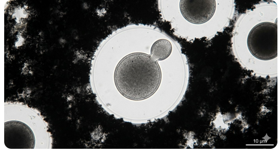

# Temporomandibular Joint (TMJ)
The Complete Medical Reference — Anatomy · Physiology · Pathology · Medicine · Surgery · All Diseases
TMD Maxillofacial Surgery Dentistry Rheumatology OMFS Biomechanics Arthroscopy Joint Replacement
☰ Table of Contents 01 · Basis [Overview](#overview) [Embryology & Growth](#embryology) [Anatomy](#anatomy) [Physiology & Biomechanics](#physiology) [Clinical Examination](#exam) [Imaging](#imaging) 02 · Diseases & Pathology [TMD Overview](#tmd-overview) [Myofascial Pain / Myalgia](#myofascial) [Disc Displacement](#disc-displacement) [Closed Lock / No Reduction](#closed-lock) [Osteoarthritis / DJD](#osteoarthritis) [Inflammatory Arthritis](#inflammatory-arthritis) [Septic Arthritis](#septic-arthritis) [Dislocation](#dislocation) [Ankylosis](#ankylosis) [Condylar Fractures](#condylar-fracture) [Condylar Hyper/Hypoplasia](#hyperplasia) [Idiopathic Condylar Resorption](#icr) [Coronoid Hyperplasia](#coronoid) [Tumors & Tumour-like Lesions](#tumors) [Other Joint Pathology](#misc-path) [Bruxism & Parafunction](#bruxism) 03 · Treatment [Medical (Conservative) Management](#medical-mgmt) [Pharmacology](#pharmacology) [Intra-articular Therapy](#intra-articular) [Surgical Management](#surgical-mgmt) [Surgery for Dislocation](#dislocation-surg) [Surgery for Ankylosis](#ankylosis-surg) [Total Joint Replacement](#tjr) [Complications of Surgery](#complications) 04 · Classification & Reference [Classification Systems](#classifications) [Differential Diagnosis](#ddx) [Prognosis & Evidence](#prognosis) [FAQ](#faq) [References](#references)
## 1. Overview
The <b>temporomandibular joint (TMJ)</b> is the articulation between the mandible and the temporal bone. There are two TMJs, one on each side, functioning as a <b>single bilateral unit</b> — the two joints normally move together simultaneously. It is regarded as one of the most frequently used joints in the human body, used in chewing, speaking, swallowing, yawning and facial expression.
<b>Ginglymoarthrodial</b>
 
A combined hinge (ginglymoid) and sliding (arthrodial) joint.
<b>Dual synovial</b>
 
Two synovial cavities separated by the articular disc.
<b>Freely movable</b>
 
Unique joint because left and right act together as one unit.
<b>Key functional facts:</b>
Normal maximum incisal opening (interincisal distance): <b>35–50 mm</b> (average ~40–45 mm); women usually slightly less than men.
Normal lateral (excursive) movements: <b>8–12 mm</b> each side.
Normal protrusion: <b>8–11 mm</b>.
The working load across the joint can exceed <b>400 N</b> during molar chewing and up to 700+ N in clenching.
TMJ receives constant load throughout life and shows age-related adaptative change.
<b>Clinical significance:</b> TMJ disorders (TMD) are the most common cause of oro-facial pain of non-dental origin, affecting roughly 5–12% of the adult population; up to 40% of people have at least one sign of TMD at some point, and women aged 20–40 are most commonly affected.
## 2. Embryology & Development
The TMJ develops <b>later than most other joints</b> and is of a secondary or ".... obtainable" variety — i.e., it is not derived from the primary cartilaginous jaw articulation (which is the sphenomandibular joint region of the developing Meckel's cartilage).
### Stages of development (from ~10th–12th week in utero)
<b>Blastema stage (7th–10th week):</b> condensation of mesenchyme beneath the developing temporal bone; two blastemas appear — one for condylar cartilage, one for the glenoid fossa/temporal component.
<b>Prenatal cavitation (10th–12th week):</b> appearance of the lower joint cavity first, then the upper cavity; the intra-articular disc develops from the mesenchyme between these cavities and is fused with the lateral pterygoid muscle.
<b>Maturation (12th–20th week):</b> the disc attaches to the condyle and temporal fossa; capsular and synovial lining form; articular eminence becomes more defined later.
<b>Postnatal development:</b> continued remodelling of condyle/fossa; articular eminence gradually becomes steeper and resorption changes under condylar load; primary and secondary dentition affects functional remodelling.
### Factors that influence growth
<b>Condylar cartilage</b> is a secondary (fibrocartilaginous-growth) cartilage; it is a major growth site for the mandible (endochondral ossification at its deep layer).
Growth is influenced by genetic factors, hormones (GH, thyroid hormone, sex steroids), mechanical loading, and muscle function.
The <b>articular eminence</b> height develops in response to tooth eruption and occlusal function.
Disturbances produce congenital deformities: <b>hemifacial microsomia (first and second branchial arch syndrome), Treacher-Collins syndrome, Pierre Robin sequence, condylar aplasia/hypoplasia</b>.
 
### Clinically relevant growth notes
Trauma to the condyle before growth completion (juvenile) may lead to <b>hypoplasia and facial asymmetry</b>.
Mastoid/ear infections and juvenile arthritis can destroy the growth cartilage -> micrognathia (as in <b>Costen's classic description of TMJ pain and otologic symptoms</b>).
Continued growth beyond normal period is seen in <b>condylar hyperplasia</b>.
## 3. Anatomy Anatomy
### 3.1 Bony components
The TMJ is formed by two bones:
<table><thead><tr><th>
Component
</th><th>
Location
</th><th>
Features
</th><th>
Articular surface
</th></tr></thead><tbody><tr><td>
<strong>Upper component</strong>

Temporal bone
</td><td>
Squamous part — base of skull, lateral
</td><td>
Contains the <strong>mandibular (glenoid) fossa</strong> and the <strong>articular eminence (articular tubercle)</strong> anterior to the fossa.
</td><td>
Concave fossa + convex eminence; covered by <strong>fibrocartilage</strong>, not hyaline.
</td></tr><tr><td>
<strong>Lower component</strong>

Condyle of mandible
</td><td>
Upper end of mandibular ramus
</td><td>
Ellipsoid condyle; 15–20 mm mediolaterally, 8–10 mm anteroposteriorly; <strong>long axis faces posteromedially</strong> (each condyle makes ~15–25° with the frontal plane).
</td><td>
Covered by fibrocartilage.
</td></tr></tbody></table>
The <b>glenoid (mandibular) fossa</b> is thin (about 1 mm) in its roof; the <b>petrotympanic fissure</b> separates its medially deep part from the middle ear, which is why severe superior trauma can involve the ear.
"Glenoid" is a misnomer (the true glenoid is in the scapula); the term <b>mandibular fossa</b> is preferred.
Behind the fossa is the <b>postglenoid tubercle</b>; the external auditory canal lies posterior; the <b>zygomatic process</b> lies lateral/superior; lateral pterygoid plate and sphenoid lie medial.
The <b>squamo-tympanic and petro-tympanic fissures</b> pierce the posterior wall; the chorda tympani nerve passes through the petrotympanic fissure.
### 3.2 Articular disc (meniscus)
A dense, biconcave, <b>fibrocartilaginous disc</b> between the condyle and the temporal fossa. In cross-section it is <b>anterior band – intermediate thin zone – posterior band</b> (like a bow-tie).
<table><thead><tr><th>
Zone
</th><th>
Thickness
</th><th>
Composition/notes
</th></tr></thead><tbody><tr><td>
Anterior band
</td><td>
~2 mm
</td><td>
Attached to joint capsule anteriorly and blends with superior part of lateral pterygoid.
</td></tr><tr><td>
Intermediate zone (pars gracilis)
</td><td>
~1 mm
</td><td>
Thinnest; biconcave; most commonly perforated site laterally in DJD.
</td></tr><tr><td>
Posterior band (pars posterior)
</td><td>
~3 mm
</td><td>
Thick; continuous behind with the <strong>bilaminar (retrodiscal) zone</strong>.
</td></tr><tr><td>
Bilaminar zone / retrodiscal tissue
</td><td>
—
</td><td>
Loose vascular connective tissue; contains the <strong>superior retrodiscal lamina</strong> (elastic, attaches to posterior fossa) and <strong>inferior retrodiscal lamina</strong> (collagenous, attaches to condyle). The loose tissue permits displacement during condylar movement; rich in nerves &amp; vessels (a major pain source).
</td></tr></tbody></table>
<b>Functions of the disc:</b> load distribution, shock absorption, stabilisation of the joint, facilitation of smooth translation, nutrition (as a route for synovial fluid movement). The disc itself is largely <b>aneural and avascular</b> in its working zones (only the peripheral attachment and retrodiscal tissue are vascularised/innervated), hence disc tears may be painless while retrodiscal inflammation is painful.
The disc divides the joint into <b>two synovial compartments</b>:
<b>Superior (upper) joint space:</b> between eminence/fossa and disc — allows gliding (translatory) movements.
<b>Inferior (lower) joint space:</b> between disc and condyle — allows rotatory/hinge movements.
### 3.3 Joint capsule and the three main ligaments
<table><thead><tr><th>
Ligament
</th><th>
Course &amp; attachments
</th><th>
Function / significance
</th></tr></thead><tbody><tr><td>
<strong>Capsular ligament</strong>
</td><td>
Thin sleeve attaching to glenoid fossa/eminence above and neck of condyle below; surrounds the joint.
</td><td>
Seals the joint; contains synovium; limits extremes of movement; richly innervated (pain fibres).
</td></tr><tr><td>
<strong>Temporomandibular ligament (lateral ligament)</strong> — the true ligament of the TMJ
</td><td>
From zygomatic arch/tubercle to the lateral side of the condylar neck; oblique and horizontal components.
</td><td>
Limits excessive opening, posterior displacement of disc/condyle and protects lateral capsule (main restraining ligament).
</td></tr><tr><td>
<strong>Sphenomandibular ligament</strong>
</td><td>
From sphenoid spine to lingula of mandible.
</td><td>
<em>Passive</em> remnant of Meckel's cartilage; suspends the mandible; relation to auriculotemporal &amp; chorda tympani nerves.
</td></tr><tr><td>
<strong>Stylomandibular ligament</strong>
</td><td>
From styloid process to angle of mandible.
</td><td>
Limits excessive protrusion. Not part of joint capsule itself; <em>hyoid-opener</em>'s check.
</td></tr></tbody></table>
The <b>lateral (temporomandibular) ligament</b> has an <i>oblique outer</i> portion that tightens on opening and a <i>horizontal inner</i> portion that tightens when the condyle retrudes — this horizontal part is what prevents posterior displacement of the disc and condyle through the thin fossa roof.
### 3.4 Joint cavities, synovium and lubrication
<b>Upper cavity</b> — large, permits wide translatory movements.
<b>Lower cavity</b> — smaller, permits rotational hinge movement.
Both lined by <b>synovial membrane</b> (only in non-load-bearing areas — the articular surface itself has no synovium).
<b>Synovial fluid</b>: ultra-filtrate of plasma plus hyaluronic acid (high MW) and glycoproteins; lubricates, nourishes and acts as a shock absorber; its itself contains lubricin and thrombospondin that reduce friction.
### 3.5 Muscles of mastication
<table><thead><tr><th>
Muscle
</th><th>
Origin
</th><th>
Insertion
</th><th>
Innervation
</th><th>
Action
</th></tr></thead><tbody><tr><td>
<strong>Masseter</strong>
</td><td>
Zygomatic arch (deep &amp; superficial layers)
</td><td>
Lateral surface of ramus &amp; angle of mandible
</td><td>
Masseteric nerve (V3)
</td><td>
Elevates mandible; superficial fibres slightly protrude
</td></tr><tr><td>
<strong>Temporalis</strong>
</td><td>
Temporal fossa; temporal fascia
</td><td>
Coronoid process &amp; anterior ramus
</td><td>
Deep temporal nerves (V3); anterior &amp; posterior fibres
</td><td>
Anterior fibres elevate; posterior fibres retrude; stabilises jaw
</td></tr><tr><td>
<strong>Medial pterygoid</strong>
</td><td>
Medial surface lateral pterygoid plate, pyramidal process of palatine, maxillary tuberosity
</td><td>
Inferomedial surface of ramus &amp; angle (opposite masseter)
</td><td>
Medial pterygoid nerve (V3)
</td><td>
Elevation; protrusion (bilateral); contralateral excursion (unilateral)
</td></tr><tr><td>
<strong>Lateral pterygoid</strong>
</td><td>
<em>Superior head:</em> infratemporal surface/crest of sphenoid; <em>Inferior head:</em> lateral pterygoid plate
</td><td>
Superior head → capsule &amp; disc; Inferior head → pterygoid fovea on condylar neck
</td><td>
Lateral pterygoid nerve (V3)
</td><td>
Protrusion (bilateral); contralateral excursion (unilateral); depression (opens) jaw; superior head steadies disc during closing
</td></tr></tbody></table>
<b>Accessory muscles relevant to jaw posture & pontaneous pain:</b> suprahyoids (digastric, mylohyoid, geniohyoid, stylohyoid) depress and open jaw; infrahyoids stabilise hyoid; platysma, sternocleidomastoid, trapezius, occipital/frontalis muscles also implicated in referred TMD pain.
### 3.6 Nerve supply
<table><thead><tr><th>
Nerve
</th><th>
Branch of
</th><th>
Supplies
</th></tr></thead><tbody><tr><td>
<strong>Auriculotemporal nerve</strong>
</td><td>
Posterior division V3
</td><td>
Posterolateral capsule, retro-discal tissue, retromolar/disc, parotid area, external ear, TMJ pain sensation.
</td></tr><tr><td>
<strong>Masseteric nerve</strong>
</td><td>
Anterior division V3
</td><td>
Anterolateral capsule &amp; lateral aspect of joint.
</td></tr><tr><td>
<strong>Deep temporal nerves</strong>
</td><td>
Anterior division V3
</td><td>
Superior capsule; proprioception.
</td></tr><tr><td>
<strong>Medial &amp; lateral pterygoid nerves</strong>
</td><td>
V3
</td><td>
Medial capsule; diameter of musculature.
</td></tr><tr><td>
<strong>Proprioception</strong>
</td><td>
—
</td><td>
Hershey nerve endings in ligaments &amp; deep periosteum — normal go up via V3.
</td></tr></tbody></table>
The trigeminal (V) nerve therefore conducts nearly all TMJ sensation and proprioception; ear pain referral from the TMJ travels through the auriculotemporal nerve connecting with the facial (VII) and glossopharyngeal (IX) distributions, explaining ear symptoms in TMD.
### 3.7 Blood supply, lymphatic drainage
<b>Arteries:</b> branches of the <i>superficial temporal artery</i> (transverse facial branch, middle temporal) and <i>maxillary artery</i> (deep auricular, anterior tympanic, masseteric, pterygoid, deep temporal).
<b>Veins:</b> pterygoid venous plexus, superficial temporal vein, maxillary veins → retromandibular vein → EJV/IJV.
<b>Lymphatics:</b> to parotid (pre-auricular) and jugulodigastric (deep cervical) nodes.
<b>Arterial ischemia</b> of retrodiscal tissue is one theory for disc displacement — vascular congestion leads to tissue laxity.
## 4. Physiology & Biomechanics Physiology
### 4.1 Movements of the joint
The TMJ produces two basic motion types which almost always combine:
<b>Rotation (hinge movement):</b> movement around a horizontal/anatomic axis, occurring in the <i>lower joint space</i>. Pure rotation gives the first ~20–25 mm of mouth opening; further opening requires translation.
<b>Translation (gliding):</b> movement of the whole condyle-disc complex along the articular eminence in the <i>upper joint space</i>.
#### Mandibular movements (border & functional):
<table><thead><tr><th>
Movement
</th><th>
Description
</th><th>
Normal range
</th></tr></thead><tbody><tr><td>
Depression (opening)
</td><td>
Rotation (first 20–25 mm) then rotation+translation; condyle moves down &amp; forward onto articular eminence.
</td><td>
35–50 mm interincisal
</td></tr><tr><td>
Elevation (closing)
</td><td>
Reverse of opening; powerful masticatory movement.
</td><td>
—
</td></tr><tr><td>
Protrusion
</td><td>
Bilateral lateral pterygoid action; teeth end-to-end.
</td><td>
8–11 mm
</td></tr><tr><td>
Retrusion
</td><td>
Posterior temporalis &amp; deep masseter/digastric.
</td><td>
1–3 mm beyond centric
</td></tr><tr><td>
Lateral excursion
</td><td>
Medial (working) side rotates, balancing side translates medially; influenced by occlusal guidance (canine protection / group function).
</td><td>
8–12 mm each side
</td></tr></tbody></table>
<b>Bennett movement:</b> sideward shift of the mandible (usually the balancing condyle) during lateral excursion.
<b>Condylar path:</b> the path the condyle follows on the eminence; its steepness and curvature reflect morphology and functional loading.
<b>Fischer angle:</b> angle between sagittal and horizontal condylar guidance on the balancing side.
<b>Posselt's envelope of motion:</b> 3-D border/edge-to-edge diagram of all mandibular border positions in the sagittal plane.
### 4.2 Rest position and freeway space
The mandible at postural rest (throat at rest, lips lightly together, breathing) shows the <b>interocclusal (freeway) space</b> of ~2–4 mm between the teeth.
Muscle tone (chiefly superior lateral pterygoid, posterior temporalis, suprahyoids and masseter) maintains rest position against gravity.
Loss of posterior tooth support or severe occlusal attrition can reduce the rest dimension and increase loading.
### 4.3 Biomechanics of the disc
The disc is <b>positioned by the superior head of lateral pterygoid</b> on closing and by the <b>retro-discal superior lamina</b> on opening — a balanced couple keeps the thin zone between condyle and eminence.
During opening: condyle translates forward; disc translates with it; disc posterior band remains on top of the condyle.
During clenching: the disc may be squeezed posteriorly; the retrodiscal tissues become functionally loaded — this is a mechanism for retrodiscal pain and clicking in the dentate patient with bruxism.
<b>Load tolerance:</b> the joint load per molar requires ~436N in normal bites; the load resistance of the disc is high but repetitive trauma + disc displacement >> shearing forces cause tissue failure (perforation, DJD).
The normal resting intra-articular pressure varies from negative (opening) to positive (closing/clenching).
### 4.4 Occlusion & joint integration
Centric relation (CR) — condyles in the most superior-anterior position in fossa against the articular eminence (disc correctly interposed); centric occlusion (CO) — full intercuspation of teeth.
A CO–CR slide >1–2 mm on retruded contact is common, but <i>excessive</i> slide with skeletal/open-bite relationships is a risk factor for disc displacement.
Unilateral posterior crossbite, deep bite, Angle Class II division 2 malocclusion, and missing posterior teeth (loss of support) are the classic occlusal risk factors studied.
<b>Occlusal stability</b>: molar/canine guidance, stable posterior stops and stable CR/CO help limit loads on the retrodiscal and discal complex.
### 4.5 Synovial fluid, lubrication & nutrition
Synovial fluid contains <b>hyaluronic acid (HA)</b> and <b>lubricin</b>, which give boundary and film lubrication.
It also carries nutrients to the avascular disc/cartilage (movement pumps fluid — so normal daily function is essential for disc nutrition).
Breakdown of HA (by free radicals/reactive oxygen in inflammation) reduces lubrication and contributes to intra-articular adhesions, clicking and osteoarthritic changes.
## 5. Clinical Examination AnatomyExam
### 5.1 History (essential questions)
<b>Pain location:</b> pre-auricular, ear, temple, cheek, neck; is it referred?
<b>Character:</b> dull ache (muscle/DJD), clicking, sharp catching (disc), burning (retrodiscal/neuropathic).
<b>Timing:</b> morning stiffness (inflammatory arthritis), end-of-day worsening (fatigue/muscle), provoked by chewing/yawning.
<b>Joint sounds:</b> clicking — opening or closing; reciprocal click (open+close); crepitus (grating — DJD); locking episodes.
Parafunctions: <b>bruxism/clenching, nail biting, gum chewing</b>, occupational/triggering.
Trauma history (blow, whiplash, intubation, dental/extraction prolonged opening, yawning).
Psychosocial: anxiety, depression, stress, catastrophising (important prognostic).
Systemic: rheumatoid/psoriatic/JIA, Sjögren, lupus history; jaw swelling, fever (infection).
Ear symptoms, sinusitis, dental pain (neuroscience of referred pain).
### 5.2 Inspection & range of motion
<b>Maximum incisal opening (MIO):</b> measure with rule between upper and lower incisal edges; + overbite. Locking < 30 mm path = restricted; > 50 mm is excessive (subluxation risk).
<b>Deviation on opening:</b> mid-line deviates to one side at full opening → muscle asymmetry or unilateral disc displacement / limitation; a straight-line "zigzag" deviation suggests disc without reduction vs muscular.
<b>Lateral excursions</b> (both sides), <b>protrusion</b> measured in mm.
Facial asymmetry, pre-auricular swelling, bite change (acute malocclusion — impaired fossa trauma, effusion or fracture).
Orthodontic/biological: overjet, overbite, open bite, posterior crossbite, missing/locked teeth.
### 5.3 Palpation
TMJ lateral pole: fingertip just anterior to tragus (lightly) — pain, creptitus.
Posterior joint space: finger in external auditory meatus pushed anteriorly.
Muscles: masseter (superficial & deep), temporalis (anterior/middle/posterior), medial & lateral pterygoids (intra-oral palpation), digastric, SCM, trapezius — looking for tenderness, trigger points.
Ear, parotid and neck nodes.
### 5.4 Joint sounds & differential tests
<b>Clicking:</b> reciprocal click on open & close → classic disc displacement with reduction.
<b>Crepitus (grating/bib-like):</b> DJD.
Ausculsation rarely needed; kor sound son <i>click</i> is high-pitched, quick; <i>crepitus</i> is low, sandy/grating continuous.
### 5.5 Provocation & functional tests
<b>Timing of symptoms with mastication</b>, clenching reproduces pain.
Press the mandible inferiorly (against resistance) — reproduce pain (intra-articular).
Check <b>occlusal stability</b> (fremitus) and load across posterior teeth.
Cranial nerves, fundoscopy for raised ICP if red flags (persistent unilateral, neurological sx).
<b>Red flags requiring urgent imaging/referral:</b> fever + joint swelling (septic arthritis), sudden malocclusion, pathological fracture risk (neoplasm, metastasis), progressive facial swelling, neurological deficit, visual/vestibular symptoms, weight loss, night pain.
## 6. Imaging of the TMJ Imaging
<table><thead><tr><th>
Modality
</th><th>
Best for
</th><th>
Limitations
</th></tr></thead><tbody><tr><td>
<strong>Panoramic radiograph (OPG/DPR)</strong>
</td><td>
Gross condyle morphology, condylar head shape, trauma survey, asymmetry, comparing sides.
</td><td>
Overlaps; cannot see disc; poor soft-tissue detail.
</td></tr><tr><td>
<strong>Transcranial / lateral oblique radiograph</strong>
</td><td>
Fossa-condyle relationship, erosion, flattening.
</td><td>
Limited; outmoded for diagnosis.
</td></tr><tr><td>
<strong>CT / CBCT</strong>
</td><td>
Osseous detail: erosion, osteophytes, subchondral changes, ankylosis, condylar fracture displacement, coronoid disease, tumour.
</td><td>
No disc/soft tissue detail; radiation (avoid in low-risk).
</td></tr><tr><td>
<strong>MRI (with/without contrast)</strong>
</td><td>
The gold standard for the disc: position, reduction, perforation; effusion; synovitis; marrow oedema; loose bodies; PVNS.
</td><td>
Expensive; static images; claustrophobia; metal contraindications.
</td></tr><tr><td>
<strong>Arthrography (arthrotomography)</strong>
</td><td>
Historical: disc perforation with contrast.
</td><td>
Invasive; MRI has replaced it.
</td></tr><tr><td>
<strong>Ultrasound</strong>
</td><td>
Disc position screening, superficial pathology; inexpensive.
</td><td>
Operator-dependent; lateral part only.
</td></tr><tr><td>
<strong>Bone scan (SPECT)</strong>
</td><td>
Active condylar growth (hyperplasia vs inactive), condylar remodelling activity.
</td><td>
Poor spatial detail alone.
</td></tr><tr><td>
<strong>PET/CT, FDG</strong>
</td><td>
Malignancy staging (sarcoma, metastasis).
</td><td>
Cost, availability.
</td></tr></tbody></table>
<b>MRI findings to note:</b> disc anterior displacement is most common (intermediate zone no longer between eminence and condyle); with reduction = on opening the disc returns between the bones (clicking); without reduction = disc remains anterior (closed lock). Effusion = high T2 signal — indicates inflammation. Perforation usually only inferred from MRI; arthroscopy now gold standard for confirming perforation/adhesions.
<b>Cone-beam CT dosimetry note:</b> very low dose (a few µSv) is safe for routine TMJ bony study; standard CT ~0.1–0.6 mSv.
## 7. Temporomandibular Disorders (TMD) — Overview Pathology
<b>TMD</b> is a collective term covering disorders of the masticatory muscles, the TMJs themselves, and the associated structures. The modern classification (DC/TMD) separates:
<b>Pain-related disorders:</b> myalgia (local, myofascial with/without referral), arthralgia, headache attributed to TMD.
<b>Joint/intra-articular disorders:</b> disc displacement (with reduction; with reduction with intermittent locking; without reduction with limited opening; without reduction without limited opening), degenerative joint disease (DJD/osteoarthritis), subluxation.
<b>Muscle-related:</b> myofascial pain with referral, myalgia, contracture.
<b>Epidemiology & risk factors:</b> 5–12% prevalence; F:M ≈ 2:1–4:1; peak 20–40 years. Risk factors include trauma, parafunction/bruxism, deep bites/overbite&overjet patterns, orthodontic treatment is <i>not</i> proven to cause TMD; stress/anxiety, estrogen influence, joint hypermobility, systemic arthritis.
<b>General principles of the disorder's origin:</b> modern understanding is <i>multifactorial</i> — biomechanical loading, disc displacement, inflammation, neuroplastic pain sensitisation, psychosocial factors — never purely "occlusal" as older theory (Costen 1934) claimed.
## 8. Myofascial Pain / Myalgia of Masticatory Muscles Pathology
<b>Definition:</b> pain originating from the muscles of mastication (or accessory muscles), often with <b>tender localized trigger points</b> that refer pain in a predictable pattern.
<b>Myalgia:</b> pain on function + reproducible tenderness on palpation of the same muscle; no referral.
<b>Myofascial pain with referral:</b> trigger points; pressure reproduces pain remote from the muscle (e.g., temporalis → temporal/eye region; masseter → ear/tooth discomfort; SCM → face/parietal; trapezius → neck).
<b>Centrally mediated (fibromyalgia-like) myalgia:</b> widespread tenderness, fatigue, sleep disturbance.
#### Etiology / perpetuating factors
Parafunction: clenching, bruxism, gum chewing, nail biting.
Stress, anxiety, depression; catastrophising.
Postural habits (forward head posture stresses upper traps/SCM); prolonged jaw opening (dental work, singing).
Sleep disturbances / apnea.
Trauma/whiplash; occupational (telephone cradle, computer).
#### Clinical features
Dull, aching, often bilateral ache; worse with function/clenching; morning or evening peak.
Tenderness of masseter, temporalis, lateral/medial pterygoid; firm taut bands.
Limited painful opening; normal opening may still be near-normal.
Headache affecting temples; ear fullness.
#### Diagnosis
DC/TMD: pain in a muscle + reproducible pain on function/palpation; imaging recommended only if pain doesn't respond or signs of organic disease.
#### Treatment
<b>Self-care first line:</b> soft diet, jaw rest, heat, gentle exercise, stress management, sleep hygiene.
<b>Behavioural:</b> cognitive-behavioural therapy (CBT), biofeedback, habit reversal, relaxation.
<b>Physical:</b> passive stretching, postural exercise, trigger point massage/dry needling, ultrasound, TENS.
<b>Pharmacology:</b> NSAIDs, muscle relaxants, tricyclic/SNRI low-dose (amitriptyline 10–25 mg nocte), topical capsaicin.
<b>Occlusal splint:</b> flat-plane stabilization splint protects and reduces load (evidence modest but commonly effective in muscle-dominant TMD).
<b>Injections:</b> trigger point injections with local anaesthetic, botulinum toxin A for refractory bruxism (variable evidence).
## 9. Disc Displacement (Internal Derangement) Pathology
<b>Definition:</b> abnormal position of the articular disc relative to the condyle and fossa. <b>Anterior displacement</b> is by far the most common; the disc may also displace medially, laterally or antero-medially. Displacement is usually <b>chronic and gradual</b>.
#### 9.1 Disc displacement with reduction (DDwR) — the "clicking joint"
Disc sits anterior to condyle at rest; on opening, the condyle passes over the posterior band ("recaptures" the disc) producing the <b>opening click</b>; on closing the disc re-dislocates → <b>closing (reciprocal) click</b>.
Often <i>painless</i>; may be painful if retrodiscal tissue inflamed.
Clicking is common (up to ~30% of population clicks) — isolated clicking without pain/limitation is usually not treated.
<b>Intermittent locking:</b> disc occasionally fails to reduce and the jaw momentarily "catches" at a small opening.
Treated conservatively if asymptomatic; splint/biteguard, exercises, counselling for bruxism if symptomatic.
#### 9.2 Disc displacement without reduction (DDwoR) — acute & chronic
<b>Acute (closed lock):</b> sudden onset lock — mouth opens only 20–30 mm; deviation to ipsilateral side past the lock; opening click disappears; pain usually moderate for days–weeks. See next section.
<b>Chronic:</b> after >4 weeks, pain resolves progressively; opening slowly improves to ~30–35 mm but often remains restricted; adaptation (posterior ligament stretch/condylar remodelling) allows improvement.
#### 9.3 Why does displacement happen?
Trauma (blow, whiplash, prolonged opening, intubation).
Parafunction/clenching — posterior-directed forces shear the disc back over the posterior band of the retro-discal tissue; degeneration of the retro-discal elastic lamina; loss of superior lateral pterygoid coordination.
Spontaneous in deep-bite / class II division 2 patients.
Generalized joint hypermobility.
#### 9.4 Diagnosis
History + click/lock + MRI (disc position, reduction, morphology).
Wilkes staging (see classification section) describes progression from asymptomatic click → click with pain → intermittent lock → persistent lock/DJD.
#### 9.5 Treatment
Conservative (first-line for all stages): education, soft diet, analgesics, exercises (e.g., joint unloading, progressive jaw range-of-motion), splints (flat plane), physiotherapy.
<b>Arthrocentesis</b> for acute closed lock, or <b>arthroscopy with lysis & lavage</b>.
Open surgery (discoplasty, discectomy) reserved for persistent painful derangement failing conservative measures (evidence weak; MRI is not alone an operative indication).
Disc repositioning ops (e.g., Mitek anchor / discopexy) are controversial, held for very select skilful surgeons.
## 10. Closed Lock — Acute Disc Displacement without Reduction Pathology
<b>Definition:</b> the disc is displaced (usually anterior) and does <i>not</i> reduce on opening; the condyle is trapped against the posterior band, markedly blocking translation.
#### Clinical presentation
Sudden inability to open fully (often after yawning, a big bite, or in the morning).
<b>MIO usually < 30 mm</b>; past the blocked point the jaw deviates to the affected side.
Pain localised to the joint; worse on attempted opening.
A previous history of clicking (which suddenly stops) is classic.
Imaging (MRI) shows disc anterior & the condyle unable to translate beneath it.
#### Management pathway
Reassure; soft diet; heat; NSAIDs; muscle relaxants — spontaneous resolution occurs in a good number within weeks as the posterior attachment stretches.
<b>Manual manipulation</b> (condylar manipulation under local anaesthetic +/- light sedation) to recapture the disc.
<b>Arthrocentesis (lavage)</b> under LA — the most effective first-line intervention for persistent acute closed lock; success ~70–90%.
Arthroscopic lysis & lavage if arthrocentesis fails.
Open arthrotomy rarely needed for closed lock that fails all of the above.
<b>Note:</b> chronic adaptation often means the disc remains anterior yet the jaw slowly opens to near-normal — many patients adapt without surgery.
## 11. Osteoarthritis / Degenerative Joint Disease (DJD) Pathology
<b>Definition:</b> a progressive, non-inflammatory (<i>mainly</i>) degeneration of the articular cartilage and subchondral bone of the TMJ; it is the most common organic joint disease of the jaw in older patients but also follows acute trauma, disc displacement, or overload.
#### Radiographic / pathohistological features
Late: <b>flattening, erosion of the condyle, osteophytes (marginal lipping), subchondral cysts, sclerosis</b>; in frontal views may progress to <b>avascular necrosis</b> of the condyle in severe/steroid cases.
The <b>subchondral remodelling</b> gives the classic "adaptive remodeling" in heavy wearers.
Disc perforation often coexists — <b>the disc perforation/DJD</b> is common in the intermediate zone.
#### Clinical features
Dull pre-auricular pain with function; early-morning stiffness that eases.
<b>Crepitus</b> (grating sensation) on movement.
Restricted, but not blocked, opening; pain on loading.
Can be completely asymptomatic (incidental finding) — treat symptoms not x-rays.
#### Treatment
Conservative: rest, soft diet, NSAIDs (role: blunt pain; less evidence of disease modification), heat, physiotherapy.
<b>Intra-articular hyaluronic acid injections</b> (viscosupplementation) — moderate evidence benefit for pain/function in TMJ DJD.
Arthrocentesis for symptomatic effusion/locking; arthroscopy for lavage/lysis.
Discectomy with or without interpositional (e.g., temporalis fascia, dermis) grafts or alloplastic materials in advanced painful disease.
Total joint replacement in end-stage DJD with severe pain/asymmetry.
## 12. Inflammatory (Rheumatological) Arthritis Pathology
A group of immune/systemic diseases that cause <b>synovitis and pannus</b> formation in the TMJ, leading to cartilage and bone destruction. <i>Bilateral involvement is the rule.</i> Key entities:
<table><thead><tr><th>
Disease
</th><th>
Key points
</th><th>
TMJ features
</th><th>
Treatment
</th></tr></thead><tbody><tr><td>
<strong>Rheumatoid arthritis (RA)</strong>
</td><td>
Autoimmune, symmetric polyarthritis; +ve RF/anti-CCP; F&gt;M; 20–40s.
</td><td>
Early morning pain/stiffness; limited opening; erosive changes (condylar flattening/erosions, "pointed" condyle, open-bite tendency in severe); crepitus late; may progress to ankylosis in childhood onset.
</td><td>
DMARDs (methotrexate first), biologics (anti-TNF, rituximab, tocilizumab); joint-specific: splints, IA steroid, arthrocentesis; TJR if destroyed.
</td></tr><tr><td>
<strong>Juvenile idiopathic arthritis (JIA)</strong>
</td><td>
<strong>Most important cause of TMJ growth disturbance in children.</strong> Often silent — damages the growth zone.
</td><td>
Painless limitation in many; micrognathia, retruded chin, anterior open-bite progression, condylar destruction; may be unilateral → asymmetry. Needs early MRI + specialist care.
</td><td>
Pediatric rheumatologist-led; systemic immunosuppression; jaw-specific: growth-adaptive splints, surgically: distraction osteogenesis / joint reconstruction in later growth.
</td></tr><tr><td>
<strong>Psoriatic arthritis</strong>
</td><td>
Psoriasis + arthritis; HLA-B27 related in some.
</td><td>
Asymmetric; TMJ erosions similar to RA; may cause ankylosis.
</td><td>
Same DMARD/TNFi strategy.
</td></tr><tr><td>
<strong>Ankylosing spondylitis (AS)</strong>
</td><td>
Axial skeleton inflammatory disease; HLA-B27; men.
</td><td>
TMJ involvement less frequent; painful limitation, occasional ankylosis (uncommon but reported).
</td><td>
Anti-TNF / NSAID-exercise program; surgical only if ankylotic.
</td></tr><tr><td>
<strong>Gout (urate crystal)</strong>
</td><td>
Monosodium urate crystals in joint; rarely TMJ.
</td><td>
Acute severe painful swelling; raised uric acid; diagnostic: joint fluid crystal analysis.
</td><td>
Colchicine / NSAIDs / allopurinol.
</td></tr><tr><td>
<strong>Pseudogout / calcium pyrophosphate disease (CPPD)</strong>
</td><td>
Calcium pyrophosphate crystals; older patients.
</td><td>
Can mimic DJD; joint swelling; rule out with aspirate.
</td><td>
NSAIDs, steroids, joint aspiration.
</td></tr><tr><td>
<strong>Lupus (SLE)</strong>
</td><td>
Systemic autoimmune; ANA.
</td><td>
Arthralgia, occasional erosive change, may predispose to JIA-like deformities in childhood.
</td><td>
Hydroxychloroquine, steroids, immunosuppression.
</td></tr><tr><td>
<strong>Sjögren's syndrome</strong>
</td><td>
Dry mouth/eyes; associated RA/SLE.
</td><td>
Secondary arthritis pattern.
</td><td>
As per underlying.
</td></tr></tbody></table>
<b>Practical rule:</b> UA/bilateral or symmetrical TMJ pain+swelling+known rheumatological history → coordinate with rheumatology; treat the disease; the jaw usually follows the systemic disease course.
## 13. Septic (Infective) Arthritis of the TMJ Pathology
<b>Definition:</b> actual infection of the joint cavity with pus — a surgical emergency. Rare but destructive.
#### Causes
Direct penetrating trauma (e.g., from foreign body, surgery, dental injection).
Contiguous spread from otitis media, mastoiditis, parotitis, dental/osteomyelitis of jaw.
Hematogenous seeding (vulnerable: immunocompromised, IV drug abusers, diabetes).
Organisms: <i>Staphylococcus aureus</i> (most common), <i>Streptococcus</i>, anaerobes, <i>Neisseria gonorrhoeae</i>, <i>Brucella</i>, mycobacteria.
#### Clinical features
Fever, rigors, malaise.
Acute painful pre-auricular swelling, redness, limited painful opening, trismus.
Bloods: leukocytosis, raised CRP/ESR/procalcitonin.
Imaging: MRI with contrast shows effusion, capsule enhancement, bone oedema; CT shows bony destruction; aspiration/gram stain/culture confirms.
#### Management
<b>Immediate:</b> IV broad-spectrum antibiotics (e.g., flucloxacillin + metronidazole or according to culture; cover MRSA).
<b>Surgical drainage</b> — arthrocentesis or open arthrotomy with lavage (must aim to washout the pus).
Monitor for complications: <b>ankylosis, condylar destruction, growth arrest in children, septic arthritis → osteomyelitis</b>.
Long-term: sequelae management (surgery for ankylosis/osteomyelitis).
## 14. Dislocation of the TMJ Pathology
<b>Definition:</b> condyle completely leaves the articular fossa (usually slips over the anterior articular eminence) and is <b>unable to spontaneously return</b>.
<b>Acute:</b> jaw locked open — classic "open lock"; often bilateral (both condyles displaced); history of yawning, laughing, prolonged dental/surgical opening, epileptic seizure.
<b>Recurrent/chronic (habitual):</b> repeated dislocations; joint laxity, bite relationship changes or prior trauma.
<b>Posterior/superior dislocation:</b> force drives condyle up through the thin fossa roof — rare, dangerous (may enter middle cranial fossa/ear); requires CT and urgent reduction.
#### Clinical picture of anterior dislocation
Jaw fixed in open position; cannot close.
Pre-auricular hollowing; spasmodic masticatory muscles; salivation; speech difficulty.
X-rays (panoral/CT) confirm condyle anterior to eminence.
#### Reduction technique (classic)
Patient seated; clinician stands in front/behind; thumbs wrapped (or bite-blocks/gauze) placed on occlusal surfaces of lower molars, fingers under chin.
Apply <b>downward then backward</b> (inferior and posterior) force with simultaneous chin elevation — the condyle slides back over the eminence into the fossa <i>(Hippocrates-like maneuver for the jaw).</i>
Trend bypass: sometimes give IV midazolam/diazepam or local anaesthetic to the lateral pterygoid before attempting; muscle fatigue is key.
After reduction: <b>support the jaw with a Barton-type bandage / chin strap for 1–2 weeks</b> to prevent re-dislocation; soft diet.
#### Management of recurrent dislocation
<table><thead><tr><th>
Non-surgical
</th><th>
Surgical (when frequent)
</th></tr></thead><tbody><tr><td>
Botulinum toxin injection into lateral pterygoid (reduces protrusion force) — first-line for recurrent.
</td><td>
Eminoplasty/eminectomy (deepen the eminence) — the popular surgical option.
</td></tr><tr><td>
Soft diet, jaw rest, physiotherapy, occlusal splints.
</td><td>
Ligament tightening (capsular/pterygoid sling), Dautrey's procedure (eminence down-fracture to create bumper).
</td></tr><tr><td>
Gunning-type splints with elastic for acute recapture.
</td><td>
Condylotomy (intra-oral oblique osteotomy) reducing pull; Mitek anchor discopexy; myotomy.
</td></tr></tbody></table>
<b>Posterior dislocation warning:</b> suspected when pt presents with ear bleed, facial nerve palsy or intracranial injury — urgent CT + neurosurgery/Otorhinolaryngology.
## 15. Ankylosis of the TMJ Pathology
<b>Definition:</b> fixation of the jaw due to fusion of the joint components — inability to open the mouth. Three types by tissue:
<b>True (intra-capsular) ankylosis:</b> within the joint — <i>bony ankylosis</i> (condyle fused to temporal bone by bone) or <i>fibrous ankylosis</i> (dense scar).
<b>False (extra-capsular) ankylosis:</b> due to coronoid-malar fusion, zygomatic scar, myositis ossificans or extra-articular soft-tissue contracture — joint itself normal.
<b>Complete vs incomplete:</b> complete = no opening at all.
#### Etiology
<b>Trauma</b> (most common cause world-wide) — condylar fracture with hemarthrosis → organisation → fibrosis/ossification, especially when mobilised early is not possible.
<b>Infection</b> (otitis media, mastoiditis, osteomyelitis, septic arthritis — now less common with antibiotics).
<b>Systemic arthritis</b> (JIA most important in children; also RA, AS).
After TMJ surgery; after radiotherapy.
#### Clinical features
Progressive inability to open; trismus; "old-age" type — <b>in childhood, severe facial growth disturbance</b>: micrognathia, retrognathia, bird-face (shallow ridge), deviation of chin, crossbite, anterior open bite — the classic picture.
Complete closure = no incisal opening; difficulty eating/hygiene/speech.
Often unilateral with deviation to affected side; bilateral = symmetrical micrognathia + open bite.
Obligatory dental hygiene & caries; airway problems in severe cases.
#### Investigations
CT/CBCT (bony vs fibrous, size of fusion); MRI for soft tissue/surrounding structures; assess for obstructive sleep apnoea.
#### Treatment (surgical — the only definitive)
<b>Gap arthroplasty:</b> removal of fused mass creating a gap → immediate mouth opening; but high re-ankylosis risk if not interposed.
<b>Interpositional arthroplasty:</b> after gap excision, place an interpositional material — <i>temporalis fascia/muscle flap</i> (most common autogenous), temporal galea flap, fat (for reankylosis prevention), preauricular fascia, fascia lata — or <i>alloplastic</i> (silastic historically, titanium prostheses).
<b>Costochondral/autogenous rib graft reconstruction</b> for the young growing patient (growth potential) or in severe cases; sternoclavicular joint graft as alternative.
<b>Total joint replacement</b> in adult severe unilateral/bilateral disease or failed previous surgery (best longevity; avoids donor site).
<b>Coronoidectomy</b> + TMJ release often needed simultaneously (contracture of temporalis from prolonged closure).
<b>Post-operative intensive physiotherapy is critical</b> — early mobilization (within days) using tongue-depressor exercises/wedges/elastics; without it, re-ankylosis is very likely.
<b>Key principle:</b> the younger the child at onset and longer the duration, the more predictable the growth deformity; comprehensive reconstruction (arthroplasty + orthognathic + genioplasty) is often deferred until near growth completion.
## 16. Condylar Fractures Trauma
<b>Definition:</b> fracture of the mandibular condyle/condylar head or neck — one of the most common mandible fractures (25–50% of mandibular fractures in some series), mostly from road traffic accidents, falls, assault, or sports.
#### Classification (simplified)
By level: <b>condylar head (intracapsular), condylar neck, subcondylar</b>.
By displacement: undisplaced, displaced, <b>medially displaced/dislocated</b> (most common — lateral pterygoid pulls the head medially/anteriorly).
Unilateral (85%) vs bilateral.
Pediatric subtypes: greenstick & non-displaced common.
#### Clinical features
Post-traumatic pre-auricular pain/swelling, tenderness; ear bleed possible (ruptured external auditory meatus wall).
Crucial: <b>occlusion derangement</b> — ipsilateral open bite on the fractured side, midline deviation toward the fracture; bilateral → anterior open bite with retrognathic posture.
Restricted but not always painful opening; trismus; possible facial nerve (temporal branch) or auditory canal injuries.
Always exclude concomitant facial skeleton fractures (naso-orbital-ethmoid, Le Fort), basilar skull fracture, cervical spine injury in high-energy mechanisms.
#### Imaging
Panoramic radiograph screening + <b>CT/CBCT</b> for detailed displacement/location; MRI if disc/intracapsular detail needed.
#### Management principles
<b>Conservative/closed treatment:</b> most adult unilateral subcondylar fractures (especially if occlusion can be restored) — soft diet, analgesia, early mobilisation with guiding elastics, physiotherapy. Excellent adaptation.
<b>Open reduction internal fixation (ORIF):</b> indicated for — bilateral fractures with displaced occlusion, displaced fracture with open bite, fracture reducing posterior vertical height (with ramus shortening >4 mm), displaced intracapsular/condylar head when operating surgeon experienced, polytrauma needing early mobilisation, paediatric low condylar neck fractures with functional position failure.
Approaches: preauricular (for head/neck), retromandibular, submandibular or transoral (endoscope-assisted) for subcondylar; plating along anatomic neck.
<b>Pediatric:</b> emphasise functional therapy (elastic guiding) + you-men; growth usually compensates; surgery reserved.
#### Complications & sequelae
Malocclusion, open bite, deviation.
<b>Ankylosis</b> in untreated intracapsular/bilateral fractures — especially if the joint was not mobilised.
Growth disturbance (children) → facial asymmetry/micrognathia.
Facial nerve palsy (especially temporal/temporozygomatic) — mostly temporary from traction/retraction.
TMJ disc displacement / DJD later.
## 17. Condylar Hyperplasia & Hypoplasia Pathology
### Condylar hyperplasia (CH)
<b>Definition:</b> continued and disproportionate growth of the condyle after the normal growth period (usually 18–25 yrs for boys).
<b>Types:</b> <i>hemimandibular hyperplasia</i> (3-D elongation of half the mandible — bowing of lower border, marginal lip) vs <i>hemimandibular elongation</i> (purely horizontal growth — chin shifts, occlusal cant); mixed forms.
<b>Clinical:</b> progressive facial asymmetry over months–years, chin deviation to opposite side, ipsilateral open bite (because the longer condyle rotates the occlusal plane), usually <i>painless</i>.
<b>Diagnosis:</b> serial photographs/records, SPECT/PET bone scan (active vs inactive growth; activity uptake ratio >55% suggests active), CT volume analysis.
<b>Treatment:</b> if actively growing — <b>high condylar shave + simultaneous orthognathic surgery</b>; if inactive, only orthognathic/orthodontics; assess disc position (may dislocate after shave → consider discopexy).
### Condylar hypoplasia (CH-)
<b>Definition:</b> deficient condylar growth → smaller condyle and shortened ramus on the affected side.
<b>Causes:</b> congenital (hemifacial microsomia, first/second arch syndromes, Treacher-Collins), acquired (childhood trauma — condylar fracture, birth injury, infection, JIA, radiation), endocrine.
<b>Clinical:</b> affected side shorter → ipsilateral facial flattening, chin deviated to the affected side, ipsilateral open bite (opposite of hyperplasia), ear anomalies in syndromic forms.
<b>Treatment:</b> reconstruct deficient ramus — <b>costochondral graft</b> (growth potential), distraction osteogenesis, ramus osteotomy, or free vascularised fibula (large defects); genioplasty; orthognathic as needed. Treat the underlying disease (e.g., rheumatology for JIA).
## 18. Idiopathic Condylar Resorption (ICR) / Progressive Condylar Resorption Pathology
<b>Definition:</b> progressive loss of condylar bone mass of unknown cause (exclusion of RA, trauma etc.), predominantly in <b>young women</b> (F:M ~9:1) — association with estrogen, hormone changes, and high condylar stress.
<b>Clinical:</b> <b>painless or minimally painful</b> progressive anterior open bite, retrognathia (class II open-bite), shortening of ramus; clicking/crepitus variably; often after orthognathic surgery or orthodontics (load-induced), joint overloading, or pregnancy/postpartum.
<b>Imaging:</b> condylar erosion, flattening with reduced height; MRI shows sclerosis, subchondral change, potential disc displacement; SPECT may show enhanced or negative uptake depending phase.
<b>Pathogenesis theories:</b> estrogen-related reduced bone remodelling; joint compression → avascular necrosis → resorption; genetics (lateral pterygoid imbalance).
<b>Management:</b> stop active progression (medically: bisphosphonate therapy in some centres — off-label; stabilise occlusion; avoid further orthognathic until stable); when inactive (<6–12 months stable, SPECT quiet): orthognathic surgery to correct the open bite, sometimes with <b>total joint replacement</b> as definitive reconstruction in the severe/jaw-deformity-type (recommended by many when condyle height loss >6mm).
## 19. Coronoid Hyperplasia (Bony Locked Jaw) Pathology
<b>Definition:</b> new bone growth at the coronoid process, which typically fuses with/impinges on the zygomatic arch — jaw "locks" progressively without joint disease.
Usually bilateral in young males; may be post-traumatic (myositis ossificans of temporalis leading to coronoid-zygomatic fusion).
<b>Clinical:</b> progressive limitation of opening, <b>no lateral excursion limitation</b> at rest; condyle still translocates (so MRI normal); diagnosis by CT/CBCT.
<b>Treatment:</b> coronoidectomy (intraoral approach preferred) + aggressive post-op physiotherapy.
## 20. Tumours & Tumour-like Lesions of the TMJ Pathology
Largely in the differential of a young adult with swelling/pain/limitation + suspicious imaging. Important examples:
<table><thead><tr><th>
Category
</th><th>
Lesions
</th><th>
Key features
</th></tr></thead><tbody><tr><td>
<strong>Benign osseous</strong>
</td><td>
Osteoma, osteochondroma (most common benign bone tumor of condyle — bowing, painless growth with occlusion change), giant cell tumour, central giant cell granuloma, fibrous dysplasia of adjacent bone.
</td><td>
Slow growth, malocclusion; CT shows mass; biopsy + reconstruction.
</td></tr><tr><td>
<strong>Synovial/cartilage</strong>
</td><td>
<strong>Synovial chondromatosis</strong> — metaplastic intrasynovial cartilage bodies ("joint mice"); <strong>Pigmented villonodular synovitis (PVNS)</strong> — brown-ish nodular mass with hemosiderin (dark on MRI); osteochondromatosis.
</td><td>
Swelling, crepitus, locking; treatment surgical excision/arthroscopy; PVNS recurrence if incomplete excision.
</td></tr><tr><td>
<strong>Benign soft-tissue</strong>
</td><td>
Synovial cyst (ganglion), lipoma, schwannoma/neurofibroma of auriculotemporal nerve.
</td><td>
Rare; imaging; excision.
</td></tr><tr><td>
<strong>Malignant</strong>
</td><td>
<strong>Chondrosarcoma</strong> (most common primary malignancy of TMJ region), osteosarcoma, synovial sarcoma, fibrosarcoma, Ewing's, rhabdomyosarcoma, squamous cell carcinoma invading from parotid/ear, lymphoma, metastases (breast, lung, prostate).
</td><td>
Rapid growth, bone destruction, pain, trismus, neuro deficit (VII); MRI+bone scan+biopsy; treatment multi-modal (surgical resection ± chemo/RT).
</td></tr><tr><td>
<strong>Cyst-like (odontogenic-related)</strong>
</td><td>
Dentigerous/inflammatory cysts adjacent; central giant cell lesions; aneurysmal bone cyst.
</td><td>
Image-guided; surgical enucleation.
</td></tr></tbody></table>
### Synovial chondromatosis — profile
Uncommon; metaplastic transformation of synovium → multiple cartilage nodules that may calcify/ossify → intra-articular <b>loose bodies</b>.
Pain, swelling, clicking/crepitus, occasional locking; F>M, 30–50s.
Imaging: ring-and-arc calcification on CT; MRI loose bodies; <b>arthroscopic removal</b> selective; open synovectomy for extensive disease.
### PVNS — profile
Locally aggressive pigmented villonodular synovitis; hemosiderin-laden macrophages (brownish joint fluid).
Swelling, pain, limited opening; MRI low signal on T2 (hemosiderin).
Excision (arthroscopic/arthrotomy) — recurrence is significant; follow-up needed.
## 21. Other Joint Pathology Pathology
### Disc perforation
Usually late-stage ID/DJD in the intermediate zone; fibrous degeneration.
Referred grating pain & crepitus; MRI/arthroscopy diagnosis; arthroscopy or discectomy for persistent symptoms.
### Intra-articular adhesions / synovial plica
Fibrinous adhesions after trauma/immobilisation or chronic disc instability; cause painful locking; arthroscopy lysis & lavage.
### Avascular necrosis (AVN) of the condyle
Predisposing: prolonged steroid use, SLE, trauma, radiotherapy, embolic. Collapse → DJD, pain; MRI marrow changes; treat underlying + conservative/joint surgery.
### Hemifacial microsomia (oculo-auriculo-vertebral spectrum)
Congenital hypoplasia of first/second arch structures: mandible (condyle/ramus/body), ear, face. Asymmetry, possible ankylosis-type restriction; reconstruction with grafts/OA if needed.
### Eagle syndrome (elongated styloid/stylohyoid) — not TMJ but mimics
Pain in ear/jaw on swallowing; D/D from TMD; treatment surgical styloidectomy.
### Myositis ossificans / post-radiation trismus
Extra-articular ankylosis; treatment: mobilisation, surgery (coronoidectomy etc.), physiotherapy.
### Foreign bodies / bullet fragments in joint
Rare P&S trauma; remove if symptomatic.
## 22. Bruxism & Parafunctional Habits Pathology
<b>Bruxism:</b> repetitive masticatory muscle activity with clenching (tonic) or grinding (phasic) of teeth.
<b>Sleep bruxism</b> — mandible activity during sleep (RWA index); 8–30% prevalence; strong genetic/neurological (autonomic arousal) basis — NOT purely "stress-tension" though stress modulates.
<b>Awake bruxism</b> — day-time clenching especially during concentration; both can coexist.
<b>Clinical consequences:</b> tooth attrition/wear, fractures/restoration failure, hypersensitivity, tongue/cheek ridging, <b>masseter/temporalis hypertrophy</b>, masticatory myalgia, migraine-like headaches, TMJ overload → disc displacement/DJD risk (greater in sleep bruxers with deep bites).
<b>Comorbidities:</b> obstructive sleep apnoea (often coexist), GERD, anxiety, ADHD meds.
#### Management
Education + sleep hygiene; treatment of OSA (CPAP) if present.
<b>Hard flat-plane occlusal splint</b> worn at night — reduces tooth wear & muscle symptoms; does NOT cure bruxism (levels often unchanged).
Pharmacology: low-dose clonazepam short course (careful), muscle relaxants, topical... but evidence limited; <b>botulinum toxin A</b> into masseter/temporalis for severe refractory bruxism — reduces activity and hypertrophy (good evidence for hypertrophy; variable for pain).
Psychological/behavioural for awake clenching; cognitive-behavioural interventions.
Avoid excessive caffeine/alcohol/drugs at bedtime.
## 23. Medical (Conservative) Management of TMD Medicine
Over 80–90% of TMD patients respond fully to <b>conservative, reversible</b> treatment. The treatment principle: <i>"begin with the least invasive, most reversible, evidence-based care; escalate only if unable"</i>.
### 23.1 Patient education & self-management
Explanation of the joint; reassurance that TMD is not progressive/cancerous and mostly self-limited.
Diet modification (soft foods), avoidance of wide opening (yawn blocking, careful with dental/airway procedures), avoid gum/nail biting, chew bilaterally.
Rest positions, relaxation techniques, jaw-stretching only when inflammation settles.
Manage sleep and stress (cognitive behavioural therapy, mindfulness, breathing).
### 23.2 Occlusal appliances (splints) — the cornerstone physical treatment in many practices
<table><thead><tr><th>
Type
</th><th>
Design
</th><th>
Indication / role
</th><th>
Evidence note
</th></tr></thead><tbody><tr><td>
<strong>Stabilization (flat-plane) splint</strong>
</td><td>
Acrylic coverage of upper or lower arch; even contacts; anterior guidance; no change to occlusal height.
</td><td>
General pain TMD; protects teeth; reduces clench load; gives "occlusal awareness" break.
</td><td>
Moderate; better than no treatment for pain; no better than good sham/education trials in some.
</td></tr><tr><td>
<strong>Anterior repositioning (truism/union) splint</strong>
</td><td>
Holds mandible forward, recaptures disc.
</td><td>
Disc displacement with reduction causing frequent locking.
</td><td>
May cause irreversible bite change with long use — <strong>reserved and withdrawn early if functioning</strong>.
</td></tr><tr><td>
<strong>Pivotal / soft splints</strong>
</td><td>
Soft vinyl, posterior support.
</td><td>
Acute pain relief, bruxism wear guard.
</td><td>
Softer, less precise; fine for bruxism prevention of wear.
</td></tr><tr><td>
<strong>Jaw-covering (sleep) guards for bruxism</strong>
</td><td>
—
</td><td>
Teeth protection; not cure bruxism.
</td><td>
Should not be worn 24h in DJD (may overload).
</td></tr></tbody></table>
<b>Practical splint use:</b> flat-plane splint to upper arch most common; adjusted to flat even occlusion in CR/CO; worn at night and during high-stress periods; review every 4–6 weeks; discontinue after 6–12 months when pain resolved. <b>Splints do not move the disc back into position</b> — they relieve symptoms/load.
### 23.3 Physical therapy & physiotherapy techniques
<b>Range-of-motion exercises:</b> progressive opening against resistance, lateral and protrusive excursion routines.
<b>Postural therapy:</b> forward-head correction, scapular setting, smooth tongue-to-palate rest posture.
Heat/cold packs; ultrasound; low-level laser (TENS) — weak evidence but symptom relief in myalgia.
Trigger point massage, stretching, spray-and-stretch; dry needling (uses LA injectable or acupuncture needle).
<b>Biofeedback:</b> EMG-assisted relaxation.
### 23.4 Psychological & behavioural interventions
CBT — reduces catastrophising and distress; effective in chronic TMD.
Relaxation training; sleep hygiene; referral to pain/psychology team for chronic pain >6 months.
<b>Treating the "stages":</b> Stage I: education + self-care + occlusal splint + parafunction control. Stage II: add physiotherapy/pharmacology. Stage III: intra-articular intervention (arthrocentesis/IA injection). Stage IV: surgery.
## 24. Pharmacology for TMD Medicine
<table><thead><tr><th>
Class / Drug
</th><th>
Dose (adult)
</th><th>
Indication
</th><th>
Notes / cautions
</th></tr></thead><tbody><tr><td>
NSAIDs (ibuprofen, diclofenac, naproxen)
</td><td>
Ibuprofen 400–800 mg TDS; Diclofenac 50 mg TDS; naproxen 250–500 mg BD
</td><td>
Acute flares, arthralgia, myalgia, post-arthrocentesis
</td><td>
GI protection in risk; avoid with renal disease/CKD, asthma, pregnancy (esp. 3rd trimester); short courses.
</td></tr><tr><td>
Paracetamol/acetaminophen
</td><td>
500–1000 mg QDS
</td><td>
Mild pain; adjunct
</td><td>
Hepatotoxicity &gt;4g/day.
</td></tr><tr><td>
Muscle relaxants — benzodiazepines (diazepam, clonazepam, temazepam), or methocarbamol/tizanidine/baclofen
</td><td>
Diazepam 2–5 mg nocte; clonazepam 0.25–1 mg nocte (short); methocarbamol 1500 mg QDS
</td><td>
Muscle-dominant TMD / bruxism / sleep bruxism (short-term)
</td><td>
Addiction, daytime sedation, falls — use 1–4 weeks only.
</td></tr><tr><td>
Tricyclic antidepressants (amitriptyline, nortriptyline)
</td><td>
Amitriptyline 10–25 mg nocte (low dose)
</td><td>
Chronic pain, sleep disturbance, neuropathic component
</td><td>
Anti-cholinergic, sedation, cardiac risks; start low; TCA overdose dangerous.
</td></tr><tr><td>
SNRIs (duloxetine 30–60 mg)
</td><td>
—
</td><td>
Chronic pain / neuropathic pain overlap
</td><td>
Nausea, HTN.
</td></tr><tr><td>
Topical capsaicin / lidocaine patch
</td><td>
—
</td><td>
Myofascial trigger point skin referral
</td><td>
Local.
</td></tr><tr><td>
Local anaesthetics (lidocaine, bupivacaine)
</td><td>
Trigger point or joint injection
</td><td>
Myofascial trigger points; arthrocentesis anesthesia; diagnostic block
</td><td>
Short effect; use in conjunction with physical therapy.
</td></tr><tr><td>
<strong>Botulinum toxin A</strong>
</td><td>
25–75 U per masseter/ temporalis side (dilution-dependent), or 30–50 U into lateral pterygoid for dislocation
</td><td>
Bruxism with hypertrophy; refractory myalgia; recurrent dislocation; (off-label)
</td><td>
Transient weakness of smile/eye (temporal branch spillover), dysphagia, chewing difficulty; repeat 3–6 monthly; not first-line.
</td></tr><tr><td>
Corticosteroids — IA or systemic short
</td><td>
IA methylprednisolone 20–40 mg or triamcinolone
</td><td>
Inflammatory arthritis flares, effusion
</td><td>
Chondrotoxic debate; limit injections; joint infection excluded before injecting.
</td></tr><tr><td>
Hyaluronic acid (viscosupplementation)
</td><td>
1–2 mL IA, 1–3 sessions
</td><td>
DJD/osteoarthritis of TMJ, osteoarthritis after lavage
</td><td>
Mild-moderate benefit pain/function in DJD; cost; not in acute infection.
</td></tr><tr><td>
Platelet-rich plasma (PRP)
</td><td>
1–2 mL IA after centrifugation
</td><td>
Disc displacement/DJD (experimental/selected)
</td><td>
Paucity of robust large evidence; variable protocols.
</td></tr><tr><td>
Corticosteroid/systemic immunosuppressants (methotrexate, TNFi) — rheumatology-driven
</td><td>
Per protocol
</td><td>
Systemic inflammatory arthritis involving TMJ (RA, JIA, PsA)
</td><td>
Do not manage alone — rheumatology team.
</td></tr></tbody></table>
## 25. Intra-articular Therapy & Arthrocentesis MedicineSurgical
### Arthrocentesis (joint lavage) — the most important "bridge" procedure
<b>Indication:</b> acute closed lock (DDwoR), effusion, symptomatic joint with failed conservative care, along-side IA medication injection.
<b>Technique (points of reference):</b> under local anaesthetic (auriculotemporal block + skin), two needles into the <i>upper joint space</i> — one flows saline/Ringer, the second drains; flushes inflammatory mediators (cytokines), debris, clots; creates hydraulic pressure that may dislodge the disc and break adhesions.
Volume: ~100–300 mL of sterile saline per side.
<b>Efficacy:</b> ~70–90% success in acute closed lock; treat as day-case; can repeat once or two times.
Combined with an IA corticosteroid or HA in the same session if inflammatory.
### Intra-articular injections (routes)
<b>Corticosteroid:</b> for inflammatory flare (RA/JIA etc.); limit repeated injection (chondrotoxicity).
<b>Hyaluronic acid:</b> 2–3 cycles for DJD; viscosupplementation.
<b>PRP:</b> often after arthrocentesis; regenerative intent (weak-to-moderate emerging evidence).
Local anaesthetic ± steroid for diagnostic block.
Use ultrasound or fluoroscopy guidance if available for accuracy.
## 26. Surgical Management of TMJ Disorders Surgery
<b>General indications for surgery:</b> persistent pain/limitation/functional impairment failing >3–6 months of well-delivered conservative therapy, with a demonstrable intra-articular cause (disc derangement, adhesions, perforation, DJD, tumour, ankylosis, infection, dislocation) — <i>Never operate purely on x-ray/MRI findings without symptoms, and never operate without trying conservative care first (except emergencies like septic arthritis, tumours, or fracture).</i>
### The surgical ladder (least to most invasive)
<table><thead><tr><th>
Level
</th><th>
Procedure
</th><th>
What it does
</th><th>
Typical use
</th></tr></thead><tbody><tr><td>
1
</td><td>
<strong>Arthrocentesis (lavage)</strong>
</td><td>
Flushes joint, breaks fibrinous adhesions, hydraulically repositions disc.
</td><td>
Acute closed lock; effusion.
</td></tr><tr><td>
2
</td><td>
<strong>Diagnostic/thereapeutic arthroscopy</strong> (with lysis &amp; lavage, disc mobility procedures, synovial biopsy)
</td><td>
Direct vision: lysis of adhesions, lavage, remove loose bodies, biopsy, shave osteochondral defects (advanced: disc repositioning via arthroscopy).
</td><td>
Persistent ID/DJD, synovitis, adhesions, loose bodies.
</td></tr><tr><td>
3
</td><td>
<strong>Arthrotomy (open joint surgery)</strong> — preauricular/retromandibular/end-aural approaches
</td><td>
Full exposure for definitive intra-articular procedures.
</td><td>
Complex disc disease, tumours, foreign bodies.
</td></tr><tr><td>
4
</td><td>
<strong>Open-specific procedures</strong>:
</td><td>
 
</td><td>
 
</td></tr><tr><td>
 
</td><td>
• Disc repair / <strong>discoplasty</strong> (suture plication of loose disc)
</td><td>
Reduces laxity.
</td><td>
Disc with intact fibrocartilage.
</td></tr><tr><td>
 
</td><td>
• <strong>Disc repositioning/discopexy</strong> (Mitek anchor, or repositioning to fossa)
</td><td>
Anchors disc posteriorly.
</td><td>
Displacement with pain where disc salvageable (controversial).
</td></tr><tr><td>
 
</td><td>
• <strong>Discectomy (diskectomy) ± interpositional graft</strong>
</td><td>
Removes worn/irreparably damaged disc; avoidance of direct bone-bone contact by temporalis fascia flap/dermis/fat autograft (some discard the autograft and rely on granulation).
</td><td>
Severe DJD, disc perforation, failed disc surgery.
</td></tr><tr><td>
 
</td><td>
• <strong>Condylar shave / high condylar shave</strong> (arthroplasty of condyle)
</td><td>
Removes osteophytes/excess condylar bone.
</td><td>
Condylar hyperplasia (active), osteophyte-vexation.
</td></tr><tr><td>
 
</td><td>
• <strong>Eminoplasty/eminectomy</strong> — reshape (augment) or remove the articular eminence
</td><td>
Deepens fossa; prevents re-dislocation.
</td><td>
Recurrent dislocation.
</td></tr><tr><td>
 
</td><td>
• <strong>Condylotomy</strong> (intra-oral subcondylar osteotomy/ oblique osteotomy)
</td><td>
Relieves load, provides joint space, discourages protrusion.
</td><td>
Some disc displacement, recurrent dislocation (alternatives).
</td></tr><tr><td>
5
</td><td>
<strong>Open reconstruction</strong>:
</td><td>
 
</td><td>
 
</td></tr><tr><td>
 
</td><td>
• <strong>Costochondral graft</strong>, sternoclavicular joint graft, free fibula flap
</td><td>
Recreates condyle/ramus with growth potential or non-vascular autografi.
</td><td>
Ankylosis reconstruction; paediatric condylar loss; tumour resection.
</td></tr><tr><td>
 
</td><td>
<strong>Total joint replacement (TJR)</strong> — custom or stock prostheses (e.g., TMJ Concepts, Biomet-Zimmer/Lorenz)
</td><td>
Alloplastic custom fossa + condyle.
</td><td>
End-stage DJD, ankylosis (adult), failed autograft, connective-tissue-disease jaw joint, severe ICR.
</td></tr><tr><td>
6
</td><td>
<strong>Adjunct/orthognathic</strong> — Le Fort I, BSSO, genioplasty; coronoidectomy; soft-tissue contouring
</td><td>
Corrects residual deformity/asymmetry, airway, occlusion.
</td><td>
Growth disturbances, post-resorptive open bite, concomitant facial asymmetry.
</td></tr></tbody></table>
### Key open-surgery principles
Protect the <b>facial (VII) nerve</b> — temporal/zygomatic branches above the joint (avoid >3 cm anterior cuts in preauricular approaches, blunt dissection with retractors, intermittent reflection).
Protect the <b>auriculotemporal nerve's</b> ear distribution and avoid parotid injury.
Preserve condylar blood supply; keep the disc if salvageable; <b>examine both joint spaces</b> (disc can be displaced medially — inspect thoroughly).
Immediate post-op early mobilisation (unless contraindicated) — crucial to prevent adhesions/ankylosis.
Total joint replacement: achieves the most predictable outcomes for advanced disease in adults.
### Surgical outcomes expectation
Arthrocentesis/arthroscopic lysis-lavage: 70–90% good-excellent for closed lock.
Diskectomy with or without interposition: good long-term symptom relief (>75% satisfaction) but crepitus/adaptation occurs; TMD recurrence low; growth restriction if done before growth complete (avoid in children).
TJR: excellent pain relief/opening at 10-year for end-stage; complications low in expert centres (infection, loose body, heterotopic ossification, nerve injury).
Any surgery: proportion of patients without total improvement — realistic counselling important.
## 27. Surgery for Recurrent Dislocation Surgery
<table><thead><tr><th>
Procedure
</th><th>
Mechanism
</th><th>
Comments
</th></tr></thead><tbody><tr><td>
<strong>Eminoplasty / eminectomy</strong>
</td><td>
Removes/reslopes the eminence so the condyle doesn't "catch" anteriorly; deepens fossa.
</td><td>
Most popular successful open technique; intraoral &amp; preauricular variants; prevents locking.
</td></tr><tr><td>
<strong>Dautrey's (Fracture-down) procedure</strong>
</td><td>
Down-fractures the zygomatic arch to create a bony stop anterior to condyle.
</td><td>
Anterior ship canal — preserves eminence height. Good for recurrent.
</td></tr><tr><td>
<strong>Ligament tightening / capsular imbrication</strong>
</td><td>
Tightens temporomandibular ligament to limit excessive translation.
</td><td>
Risk of re-generative loosening.
</td></tr><tr><td>
<strong>Lateral pterygoid myotomy / botulinum toxin ablation</strong>
</td><td>
Reduces the protrusive force pulling condyle over eminence.
</td><td>
Botulinum toxin first-line (non-surgical); myotomy more invasive.
</td></tr><tr><td>
<strong>Condylotomy / subcondylar osteotomy</strong>
</td><td>
Posterior-superior repositioning of condyle.
</td><td>
Occasionally used.
</td></tr><tr><td>
<strong>Mitek/MINJ anchor discopexy</strong>, sartorius/simple sling
</td><td>
Anchors disc/limits translation.
</td><td>
Advanced microsurgery.
</td></tr></tbody></table>
## 28. Surgery for Ankylosis Surgery
<b>Type I – Gap arthroplasty:</b> excise the ankylotic mass to create a gap between condylar remnant (if present) and fossa; allows jaw opening. Use a bur/drill, osteotome; preserve/reshape the remaining ramus–condyle.
<b>Type II – Interpositional arthroplasty:</b> gap + insertion of interpositional material to decrease direct bone-to-bone contact:
<i>Autogenous:</i> temporalis muscle/fascia flap (most common), temporoparietal fascia, fascia lata, fat (dermal-fat for re-ankylosis resistance per Wolford), costochondral graft.
<i>Alloplastic:</i> historically silastic, Teflon (discouraged due to wear/failure), modern titanium/wrought total joint.
<b>Type III – Total replacement:</b> for adult severe unilateral/bilateral ankylosis or recurrent — custom TMJ prosthesis (fossa + condyle) gives greatest opening and stability.
<b>Autogenous reconstruction</b> by costochondral graft/sternoclavicular graft where growth/young patient or large defect.
<b>Adjuncts:</b> coronoidectomy (usually bilaterally at the same time to address extra-capsular temporalis contracture), aggressive physiotherapy (within first day–week), bite blocks/tongue depressors, sometimes post-op elastics; re-ankylosis prevention is the goal.
<b>Post-op protocol:</b> oral expansion training (e.g., stacking tongue depressors / using a calibrated jaw exerciser) multiple times a day for months; follow with MR/CT to detect early recurrence.
## 29. Total Joint Replacement (TJR) Surgery
<table><thead><tr><th>
System
</th><th>
Type
</th><th>
Features
</th></tr></thead><tbody><tr><td>
TMJ Concepts (custom)
</td><td>
Custom CAD/CAM patient-matched: titanium fossa + ultra-high-molecular-weight polyethylene + titanium condyle.
</td><td>
Best anatomy match; used in complex cases; high cost; requires imaging-planning.
</td></tr><tr><td>
Zimmer-Biomet (Lorenz) stock
</td><td>
Stock components (different sizes) placed with cements/screws; chrome-cobalt/metal + UHMWPE fossa.
</td><td>
Good results; cheaper; some need trimming.
</td></tr></tbody></table>
#### Indications
End-stage osteoarthritis / DJD with pain & marked functional loss.
Ankylosis in adult (especially recurrent, bilateral, or where autograft has failed).
Severe connective-tissue disease destruction (RA, JIA after growth).
Failed previous TMJ surgery/disc replacement with silicone (wear particles).
Severe ICR with retrognathia/open-bite desire for stable jaw position.
Tumour resection requiring reconstruction.
#### Outcomes & complications
Excellent short/mid-term results in expert hands: improved opening, pain relief in >85%, stable occlusion, low loosening at 5–10 yr.
Complications: infection (1–3%), heterotopic ossification (reduction target), facial nerve palsy (temporary), malposition/loosening, fracture at seating, TMJ Concepts food particle impingement, contra-lateral joint strain.
Bilateral joint replacement must be carefully planned (maxillofacial + anaesthesia airway team).
## 30. Complications of TMJ Surgery Surgery
<table><thead><tr><th>
Complication
</th><th>
How to prevent / manage
</th></tr></thead><tbody><tr><td>
Facial nerve injury (esp. temporal-VII)
</td><td>
Preauricular end-aural approach; plane of dissection; lateral traction reflex monitoring; short-term palsy common, permanent rare.
</td></tr><tr><td>
Auriculotemporal nerve injury → Frey syndrome / gustatory sweating; numbness of ear/temple
</td><td>
Careful dissection; mention pre/post-op; usually transient.
</td></tr><tr><td>
Infection
</td><td>
Periop antibiotics; drain wound; treat early; in TJR likely needs explant if infected.
</td></tr><tr><td>
Bleeding / hematoma
</td><td>
Control maxillary/superficial temporal vessels; drain; pressure.
</td></tr><tr><td>
Heterotopic ossification / re-ankylosis
</td><td>
Aggressive early mobilisation; physiotherapy; consider radiotherapy/Bisphosphonates in high-risk post-surgical (relative evidence); good technique leaving no raw bone.
</td></tr><tr><td>
Adhesions (post-op fibrous ankylosis)
</td><td>
Early motion; NSAIDs may help; exercises.
</td></tr><tr><td>
Disc displacement recurrence
</td><td>
Selection of appropriate technique (discopexy reliable in expert hands); counselling.
</td></tr><tr><td>
Chorda tympani damage (if approached posterior-superiorly)
</td><td>
Avoid retracting through the petrotympanic fissure; taste loss usually recovers.
</td></tr><tr><td>
Middle ear / cranial fossa injury
</td><td>
Pre-op imaging for thin fossa; intra-operative care in superior displacement; immediate neurosurgery consult if dural breach.
</td></tr><tr><td>
Malocclusion / open bite post-op
</td><td>
Pre-op planning, MMF or elastics; orthodontic collaboration; orthognathic correction if persistent.
</td></tr><tr><td>
Seroma/loose bodies
</td><td>
Meticulous lavage; aspiration.
</td></tr><tr><td>
Implant wear/foreign body reaction (from old silicone/Teflon)
</td><td>
Avoid those materials in primary surgery; remove on failure; replace with TIJ foam.
</td></tr></tbody></table>
## 31. Classification Systems Classification
### Wilkes classification of internal derangement (MRI/stage based)
<table><thead><tr><th>
Stage
</th><th>
Clinical
</th><th>
Imaging/Pathology
</th></tr></thead><tbody><tr><td>
I
</td><td>
Silent; no pain/click; slight limitation.
</td><td>
Disc reducing; normal anatomy.
</td></tr><tr><td>
II
</td><td>
Click with reciprocal click; occasional pain; mild limitation.
</td><td>
Disc reducing; some deformity.
</td></tr><tr><td>
III
</td><td>
Pain, frequent clicks, intermittent locking, restriction &lt;35mm.
</td><td>
Disc displaced anteriorly, not reducing in part; thickened posterior band.
</td></tr><tr><td>
IV
</td><td>
Chronic (late) pain, closed lock, no click; opening &lt;30mm; crepitus.
</td><td>
Disc displaced; no reduction; disc deforms; mild DJD changes.
</td></tr><tr><td>
V
</td><td>
Frequent pain, grating/crepitus, open lock episodes; functional disability.
</td><td>
Disc torn/degenerated; moderate-severe DJD.
</td></tr></tbody></table>
### DC/TMD (Diagnostic Criteria for TMD — current international standard)
<b>Axis I (physical):</b>
Painful: myalgia (local myalgia, myofascial pain, myofascial pain with referral); arthralgia; headache attributed to TMD.
Intra-articular: disc displacement with reduction; disc displacement with reduction with intermittent locking; disc displacement without reduction with limited opening; disc displacement without reduction without limited opening; degenerative joint disease; subluxation.
<b>Axis II (biopsychosocial):</b> pain intensity, disability, depression, anxiety, functional limitation (via questionnaires GCPS, PHQ-9, GAD-7).
### RDC/TMD (older research system)
Group I: myofascial pain (Ia, Ib), Group II: disc displacement (IIa reducing, IIb non-reducing no limitation, IIc non-reducing with limitation), Group III: arthralgia, osteoarthritis, osteoarthrosis.
### Clinical staging used in the clinic
Class I: myogenous TMD only.
Class II: disc displacement without reduction (closed lock).
Class III: disc displacement with reduction (click).
Class IV: DJD/osteoarthritis.
Class V: ankylosis.
### Gutteridge / others for ankylosis severity
Complete ankylosis (no movement), Incomplete (some), Bony vs fibrous by imaging; Unilateral vs bilateral.
## 32. Differential Diagnosis of Pre-auricular / Jaw Pain DDx
<table><thead><tr><th>
Category
</th><th>
Conditions to consider
</th><th>
How to differentiate
</th></tr></thead><tbody><tr><td>
Dental
</td><td>
Cracked tooth, pulpitis, pericoronitis, periapical abscess, odontogenic sinusitis
</td><td>
Point tenderness to a tooth, cold sensitivity, percussion test, dental radiographs.
</td></tr><tr><td>
Ear
</td><td>
Otitis externa/media, Eustachian dysfunction, mastoiditis, perichondritis
</td><td>
Otoscopy; hearing test; ear discharge; tenderness over mastoid.
</td></tr><tr><td>
Salivary
</td><td>
Parotitis, sialadenitis, sialolith, parotid tumour
</td><td>
Swelling with meals; pus from duct; U/S/MRI; bimanual palpation of duct.
</td></tr><tr><td>
Neuralgic/neuropathic
</td><td>
Trigeminal neuralgia, glossopharyngeal neuralgia, post-herpetic neuralgia, deafferent pain, atypical facial pain
</td><td>
Paroxysmal electric-shock trigger (V1–V3), refractory response to carbamazepine; neurological exam; normal imaging.
</td></tr><tr><td>
Temporal region
</td><td>
Temporal arteritis (giant cell arteritis) in elderly — ESR/CRP elevated, jaw claudication, vision symptoms — urgent
</td><td>
Age &gt;50, tenderness on temporal artery, ESR; urgent steroid if suspected.
</td></tr><tr><td>
Headache syndromes
</td><td>
Tension-type headache, migraine, cluster headache, "TMJ-associated headache"
</td><td>
Triggers, character, laterality, associated nausea/photophobia; response to prophylactic therapy.
</td></tr><tr><td>
Musculoskeletal referral
</td><td>
Cervical facet/spondylosis, trapezius/SCM trigger point referral
</td><td>
Neck exam, posture, range-of-motion cervical; manual therapy response.
</td></tr><tr><td>
Trigeminal autonomic cephalalgia
</td><td>
Cluster — severe orbital pain with lacrimation
</td><td>
Episodic severe; autonomic signs.
</td></tr><tr><td>
Systemic rheum
</td><td>
RA, JIA, PsA, AS, SLE, gout, pseudogout, polymyalgia
</td><td>
Systemic pattern, serology, imaging of other joints.
</td></tr><tr><td>
Trauma / fracture
</td><td>
Condylar fracture, zygomatic fracture, subcondylar displacement
</td><td>
History+CT; malocclusion; step deformity; head injury signs.
</td></tr><tr><td>
Infection
</td><td>
Parotid abscess, deep space abscess, osteomyelitis of jaw, septic arthritis
</td><td>
Fever, toxicity, swelling, imaging, aspiration culture.
</td></tr><tr><td>
Neoplasm
</td><td>
Parotid tumour, sarcoma of jaw joint, metastasis, skull base lesion, nasopharyngeal (V3 symptoms in young)
</td><td>
Progression, imaging (MRI+CT), biopsy, ENT review (esp. young, V3 anaesthesia or conductive hearing loss).
</td></tr><tr><td>
Eagle syndrome
</td><td>
Elongated styloid → pharyngeal/jaw pain on swallowing, turning head
</td><td>
Palpation digital, CT; response to injection.
</td></tr><tr><td>
Referred cardiac
</td><td>
Unilateral jaw pain can be anginal in rare description (esp. left side + risk factors)
</td><td>
Cardiac history, ECG, troponin in suspicion.
</td></tr></tbody></table>
## 33. Prognosis & Evidence-Based Summary Evidence
Most TMD (myofascial & disc-with-click) resolves within 6–24 months with/without treatment; <b>reassurance + self-care is as effective as many splints</b> in controlled trials.
Flat-plane stabilization splint > no treatment for pain; benefit vs good placebo less clear — use as adjunct, not faith-based therapy.
Arthrocentesis/arthroscopy: strong evidence for acute closed lock; for chronic disc displacement without reduction, spontaneous improvement is common so intervention applies to the symptomatic subgroup.
IA corticosteroid/HA: IA HA reduces pain & improves function in DJD (Cochrane supported); IA steroids with caution.
Bite adjustment / occlusal equilibration: <b>not supported</b> as routine treatment for TMD; irreversible — avoid unless clear occlusal interference pain link.
Orthodontic treatment does not effectively "cure" TMD; may sometimes provoke symptoms transiently.
Surgery (discectomy etc.) helps only carefully selected patients; persistent surgery for purely psychosocial pain is harmful.
Chronic pain >3 months requires biopsychosocial approach (pain clinic, psychology).
TJR excellent outcomes where indicated; patient counselling realistic.
## 34. FAQ (Quick answers) Quick
<b>Q:</b> Do I need an MRI before treatment? <b>A:</b> For most myofascial/disc-click cases — no. MRI for suspected disc displacement without reduction, effusion/synovitis, tumour, or treatment failures.
<b>Q:</b> Is clicking dangerous? <b>A:</b> Isolated clicking without pain rarely needs treatment; it may progress to locking in some — address load/bruxism.
<b>Q:</b> Can I prevent TMD? <b>A:</b> Avoid parafunction (awareness), maintain posterior teeth, treat bruxism with a splint, avoid trauma, stress-manage, seek physiotherapy early.
<b>Q:</b> What is the fastest relief for an acute locked jaw? <b>A:</b> NSAID + muscle relaxant + soft diet; if persists days, arthrocentesis (effective).
<b>Q:</b> Will orthodontics fix TMD? <b>A:</b> No — not a treatment for TMD. It can help if malocclusion is part of overall plan.
<b>Q:</b> Is surgery first-line? <b>A:</b> No. Conservative first; surgery after failed appropriate conservative care (with the exceptions of infection/tumour/ankylosis/fracture).
<b>Q:</b> What is the most common cause of TMJ pain in a young woman? <b>A:</b> Myofascial/muscle pain (with stress, bruxism) — joint proper disease (ICR, RA) far less common.
<b>Q:</b> Can TMD cause tooth pain or ear pain? <b>A:</b> Yes — referred pain along the trigeminal/auriculotemporal distribution is common.
<b>Q:</b> What is the risky sign? Fever + swollen joint + malocclusion = RUSH exclude septic arthritis/abscess.
<b>Q:</b> Does chewing gum cause TMD? <b>A:</b> Prolonged chewing is a parafunctional risk factor — avoid if symptomatic.
## 35. Selected References & Further Reading
Gray's Anatomy (TMJ section) — classic anatomy reference.
Okeson JP. <i>Management of Temporomandibular Disorders and Occlusion.</i> Elsevier (key clinical textbook).
Schiffman E, Ohrbach R, et al. Diagnostic Criteria for TMD (DC/TMD) Axis I & II, <i>J Oral Facial Pain Headache</i>, 2014.
Wilkes CH. Arthrography of the TMJ in patients with TMJ pain/dysfunction: Arthrography as a staging technique. <i>J Oral Surg</i>, 1978.
Nitzan DW, Dolwick MF, Martinez A. TMJ arthrocentesis: a simplified technique for treatment of severe, limited mouth opening. <i>J Oral Maxillofac Surg</i>, 1991.
Cochrane reviews: Splints for TMD, IA hyaluronic acid, arthroscopy/arthrocentesis for TMD.
Wolford LM et al. MJSD classification; interpositional arthroplasty (dermal fat), TJR reconstruction papers, <i>J Oral Maxillofac Surg</i>.
Zins JE & others — condylar fracture management & pediatric TMJ protocols.
Khoury / Mercuri LG. alloplastic TMJ replacement: indications & outcomes. <i>J Oral Maxillofac Surg</i>.
Terry BC / Oral and Maxillofacial Surgery texts (Peterson's, Fonseca's) for surgical technique chapters.
NICE/AAOMS guidance on TMJ surgery & criteria for joint replacement (Mercuri guideline).
<i>Educational compilation — always verify against current local guidelines, specialist literature and imaging/PACS before clinical decisions.</i>
TMJ — The Complete Reference · Educational resource compiled for study purposes