# 🏥 Community Medicine — 2nd Term Suggestion (Bayezid Sir)

> **Source answers from:** `community/chapters/` (Endeavour Community Medicine, 16e; Park's PSM, 24e)
> **Format:** Collapsible `<details>` toggles — click any question to reveal its full answer.
> **Legend:** 🔴 = key definition · 📌 = important context · 🎯 = one-liner summary · Tables for comparisons
> Answer for written exam: complete, exam-carriable points with important emphasis.

---

## 📑 Contents (Question Map)

| Section | Questions |
|---|---|
| 1. NCD (General) | Q1–Q5 |
| 2. Cardiovascular Disease | Q6 |
| 3. Hypertension | Q7–Q10 |
| 4. Rheumatic Fever / RHD | Q11–Q12 |
| 5. Cancer | Q13–Q16 |
| 6. Diabetes Mellitus | Q17–Q19 |
| 7. Obesity | Q20 |
| 8. Demography | Q21–Q25 |
| 9. Maternal & Child Health | Q26–Q28 |
| 10. LBW & Newborn | Q29–Q32 |
| 11. School Health | Q33–Q34 |
| 12. Family Planning | Q35–Q38 |
| 13. Accidents & Disaster | Q39–Q42 |
| 14. Occupational Health | Q43–Q46 |
| 15. Environment & Health | Q47–Q53 |
| 16. Communicable Disease | Q54–Q57 |
| 17. Miscellaneous (Planning) | Q58 |

---

## Section 1 — Non-Communicable Disease (NCD) — General

<details>
<summary><b>Q1. Define non-communicable disease. What are the cardinal characteristics of NCD?</b></summary>

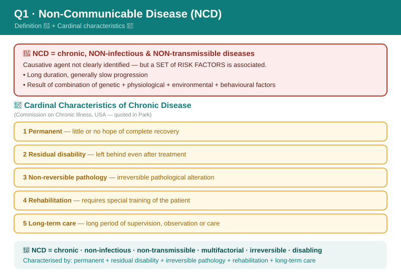

### 🌡 Non-Communicable Disease (NCD) — Definition
> 🔴 **Non-communicable diseases (NCDs)** are a group of **chronic diseases** where the **causative agents are not clearly identified**, but a **set of risk factors has been identified** to be associated with them. They are **non-infectious** and **non-transmissible** from person to person.
>
> NCDs are diseases of **long duration** and generally **slow progression** — they are the result of a **combination of genetic, physiological, environmental and behavioural** factors.

### 📌 Cardinal Characteristics of NCD
***(The Commission on Chronic Illness, USA — as quoted in Park)** *
A "chronic disease" (NCD) is one which has one or more of the following characteristics:

| # | Cardinal Characteristic |
|---|------------------------|
| 1 | They are **permanent** (leave little or no hope of complete recovery) |
| 2 | They leave **residual disability** |
| 3 | They are caused by **non-reversible pathological alteration** |
| 4 | They require **special training of the patient for rehabilitation** |
| 5 | They may be expected to require a **long period of supervision, observation or care** |

### 🧬 Key Epidemiological Features of Chronic Diseases (why they are hard to control)
1. **Absence of a known agent**
   - Whereas in some chronic diseases the cause is known (e.g., silica in silicosis, asbestos in mesothelioma), for **many chronic diseases the causative agent is not known**.
   - This makes **both diagnosis and specific prevention difficult**.

2. **Multifactorial causation**
   - Most chronic diseases are the result of **multiple causes**.
   - They appear to result from the **cumulative effects of multiple risk factors** — which may be *environmental*, *behavioural*, or *constitutional* (genetic).

3. **Long latent period**
   - There is a long **latent (incubation) period between the first exposure to the "suspected cause" and the eventual development of disease** (e.g., cervical cancer).
   - This makes it difficult to link suspected causes with outcomes (e.g., the possible relation between oral contraceptives and cervical cancer).
   - Examples include hypertension, diabetes, stroke.

4. **Indefinite onset**
   - Most chronic diseases are **slow in onset and development**, so the distinction between the *diseased* and *non-diseased* states is difficult.
   - In chronic diseases (e.g., cancer), the underlying pathological processes are **well established long before the disease manifests itself**.

> 🎯 **NCD** = chronic, non-infectious, multifactorial, non-transmissible, irreversible, disabling, requiring long-term care. **Characterised by**: permanent + residual disability + irreversible pathology + rehabilitation + long-term care.

> 📖 Ch-06, Endeavour PDF pp. 251–253; Park PSM 24e, p. 380–382

---

</details>

<details>
<summary><b>Q2. What are the differences between communicable and non-communicable diseases?</b></summary>

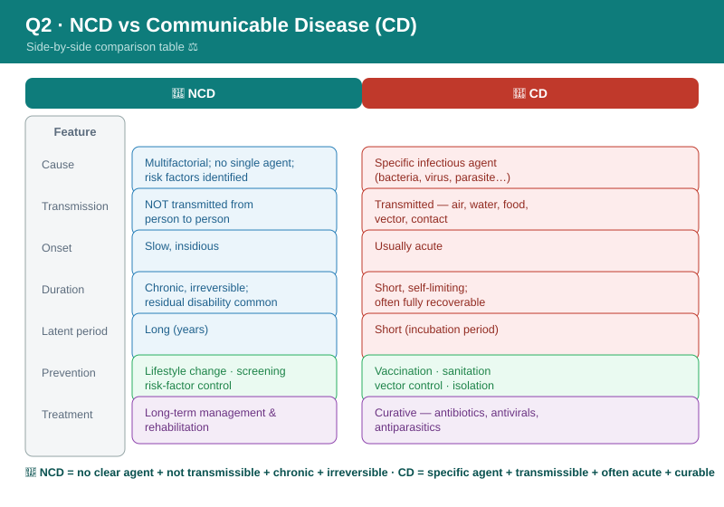

### NCD vs CD — Comparison Table

| Feature | Non-Communicable Disease (NCD) | Communicable Disease (CD) |
|---------|------------------------------|---------------------------|
| **Cause / Agent** | Multifactorial; often **no single known agent**; risk factors identified | **Specific infectious agent** (bacteria, virus, parasite, etc.) |
| **Transmission** | **Not transmitted** from person to person | **Transmitted** from person to person (air, water, food, vector, contact) |
| **Onset** | Slow, **insidious** | Usually **acute** |
| **Duration / Course** | Chronic, long-lasting; **irreversible** pathology | Often short, self-limiting; often fully recoverable |
| **Disability** | **Residual disability** common | Disability less common |
| **Latent period** | Long (years) | Short (days–weeks, incubation period) |
| **Single cause** | Usually not | Yes |
| **Prevention** | Lifestyle modification, screening, risk-factor control | Vaccination, sanitation, vector control, isolation |
| **Treatment** | Long-term management & rehabilitation | Curative (antibiotics, antivirals, antiparasitics) |
| **Examples** | CVD, HTN, DM, Cancer, Obesity | TB, Cholera, Measles, Malaria, Typhoid |

> 🎯 **NCD** = no clear agent + not transmissible + chronic + irreversible + residual disability. **CD** = specific agent + transmissible + often acute + curable.

> 📖 Ch-06, Endeavour PDF pp. 251–253

---

</details>

<details>
<summary><b>Q3. Write the common (major/important) NCDs prevalent in Bangladesh. Justify: "NCDs are increasing in Bangladesh and worldwide."</b></summary>

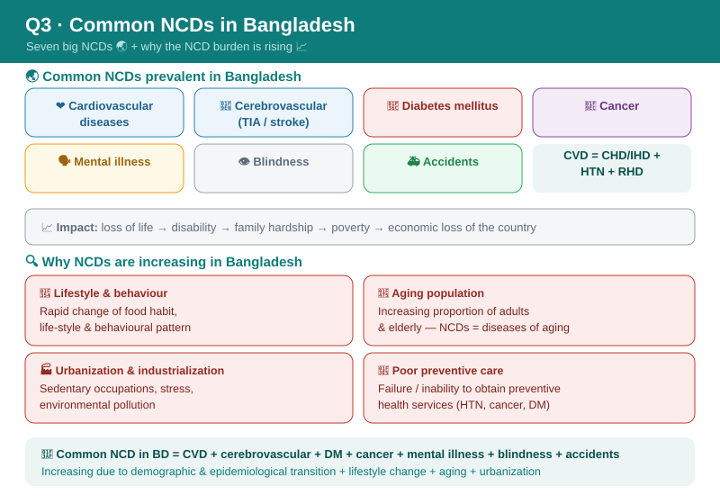

### 🌏 Common NCDs Prevalent in Bangladesh
1. **Cardiovascular diseases**
   - Coronary heart disease (CHD) / Ischaemic heart disease (IHD)
   - Hypertension
   - Rheumatic heart disease (RHD)
2. **Cerebrovascular disease** — Transient ischaemic attack (TIA) & stroke
3. **Diabetes mellitus**
4. **Cancer**
5. **Mental illness**
6. **Blindness**
7. **Accidents**

### 📈 Impacts of NCDs
1. Loss of life
2. Disability
3. Family hardship
4. Poverty
5. Economic loss of the country

### 🔍 Why NCDs Are Increasing in Developing Countries / Bangladesh
At present, most countries of the **South-East Asia Region are passing through demographic and epidemiological transition** — improvement of health status resulting from economic development, improved health coverage and better education has resulted in a **demographic shift with an increasing proportion of adults and elderly persons**. This, in turn, contributes to the **increase in the relative burden of non-communicable diseases**.

**The main factors are:**
1. **Rapid change of food habit, life-style and behavioural pattern** of the people.
2. **Increasing proportion of adults and elderly persons** (NCDs are diseases of aging).
3. **Urbanization and industrialization** — sedentary occupations, stress, environmental pollution.
4. **Failure or inability to obtain preventive health services** (e.g., hypertension control, cancer detection, management of diabetes).

### 🎯 Risk Factors (Modifiable) of NCDs
1. Cigarette use and other forms of smoking
2. Alcohol abuse
3. Failure/inability to obtain preventive health services
4. Lifestyle changes (dietary patterns, physical activity)
5. Environmental risk factors (occupational hazards, air & water pollution)
6. Stress factors

> 🎯 **Common NCD in BD** = CVD + cerebrovascular + DM + cancer + mental illness + blindness + accidents. **Why increasing** = demographic & epidemiological transition + lifestyle change + aging population + urbanization + poor preventive care.

> 📖 Ch-06, Endeavour PDF pp. 251–255; Park PSM 24e, p. 381

---

</details>

<details>
<summary><b>Q4. What do you mean by epidemiological transition? Mention its different stages.</b></summary>

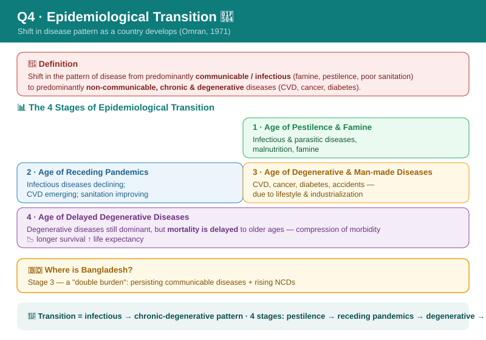

### 🔄 Epidemiological Transition — Definition
> 🔴 **Epidemiological transition** is the **shift in the pattern of disease** from predominantly **communicable/infectious diseases (associated with famine, pestilence, and poor sanitation)** to predominantly **non-communicable, chronic, and degenerative diseases** (e.g., CVD, cancer, diabetes) as a country develops.
>
> It accompanies **demographic transition** — as death rates fall and life expectancy rises, **chronic diseases replace infections** as the leading causes of morbidity and mortality. (Described by **Omran, 1971**.)

### 📊 The 4 Stages of Epidemiological Transition (Omran)
| Stage | Name | Leading Causes of Death & Disease |
|-------|------|-----------------------------------|
| **1** | **Age of Pestilence and Famine** | Infectious & parasitic diseases, malnutrition, famine |
| **2** | **Age of Receding Pandemics** | Infectious diseases declining steadily; CVD emerging; improving sanitation |
| **3** | **Age of Degenerative and Man-made Diseases** | CVD, cancer, diabetes, accidents dominate — due to lifestyle & industrialization |
| **4** | **Age of Delayed Degenerative Diseases** | Degenerative diseases still dominant but **mortality is delayed** to older ages (compression of morbidity) |

### 🇧🇩 Where is Bangladesh?
Bangladesh is currently in **Stage 3** — still facing a **double burden** of disease (persisting communicable diseases + rising NCDs).

> 🎯 **Epidemiological transition** = shift from infectious to chronic-degenerative disease pattern as a country develops (Omran). **4 stages**: pestilence → receding pandemics → degenerative → delayed degenerative.

> 📖 Ch-06; Park PSM 24e (Omran, 1971)

---

</details>

<details>
<summary><b>Q5. Write down the preventive measures for NCD (levels of prevention).</b></summary>

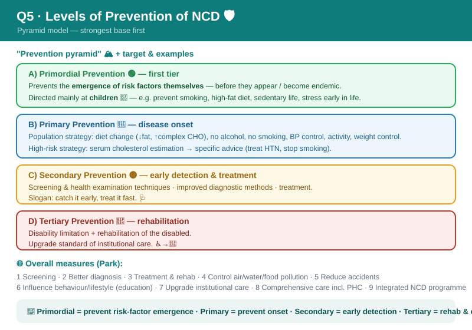

### 🛡 Levels of Prevention of NCD
The preventive attack of chronic NCDs is based on the knowledge that **they are multifactorial in causation**, so their prevention demands a **complex mix of interventions**. With identification of risk factors, **health-promotion activities aimed at primary prevention** are increasingly applied (elimination/reduction of risk factors, modification of lifestyle).

#### 🟢 A) Primordial Prevention
- **Prevention of the emergence of risk factors themselves** — before they have appeared or become endemic.
- Directed mainly at **children** because this is the time when lifestyles are formed.
- Example: Preventing the development of smoking, high-fat diet, sedentary lifestyle, stress in childhood.

#### 🔵 B) Primary Prevention
**Population Strategy (mass approach):**
- Dietary changes (reduction of fat & saturated fat, reduction of cholesterol, complex CHO, avoidance of alcohol)
- Prevention of smoking (health education, fiscal measures, legislation)
- BP maintenance within normal limits
- Regular physical activity, weight control

**High-Risk Strategy:**
- Identify risk by serum cholesterol estimation
- Specific advice (treatment of HTN, avoidance of smoking)

#### 🟡 C) Secondary Prevention (early detection & treatment)
- Screening & health examination techniques
- Application of improved methods of diagnosis
- Treatment & rehabilitation

#### 🔴 D) Tertiary Prevention (rehabilitation & disability limitation)
- Upgrading standard of institutional care
- Rehabilitation of disabled

### 🌐 Overall Measures for Prevention & Control of NCD (as per Park)
1. Screening and health examination techniques
2. Application of improved methods of diagnosis
3. Treatment and rehabilitation
4. Control of food, water and air pollution
5. Reducing accidents
6. Influencing patterns of human behaviour and lifestyle (through intensive education)
7. Upgrading standard of institutional care
8. Developing and applying better methods of comprehensive medical care including primary health care (political approaches needed — smoking control, control of alcohol & drug abuse)
9. The integrated programme for the prevention and control of NCDs

> 🎯 **Levels**: Premordial = prevent risk-factor emergence · Primary = prevent disease onset · Secondary = early detection & treatment · Tertiary = rehabilitation & disability limitation.

> 📖 Ch-06, Endeavour PDF pp. 253–256; Park PSM 24e, p. 382

---

</details>

## Section 2 — Cardiovascular Disease (CVD)

<details>
<summary><b>Q6. Mention the principal cardiovascular diseases. Write the risk factors and preventive measures of CHD/CVD.</b></summary>

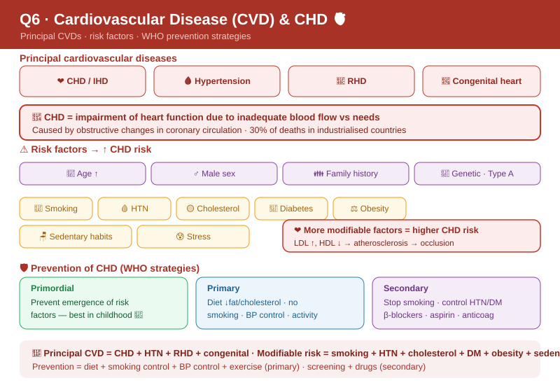

### 🫀 Principal Cardiovascular Diseases
1. **Coronary heart disease (CHD)** / Ischaemic heart disease (IHD) / Coronary artery disease
2. **Hypertension**
3. **Rheumatic heart disease (RHD)**
4. **Congenital heart diseases**

### ❤ CHD — Definition
> 🔴 **Coronary heart disease (ischaemic heart disease)** is defined as *"impairment of heart function due to **inadequate blood flow to the heart compared to its needs**, caused by **obstructive changes in the coronary circulation** to the heart."*
>
> It is the **commonest cause of cardiovascular disability & death** — a leading cause of death (30% of all deaths) in most industrialized countries, of which **30% die within 30 days** of the attack.

### 🔬 Pathophysiology of CHD
1. Abnormal lipid metabolism
2. Excessive intake of cholesterol and saturated fat
3. Atherosclerotic process — **initially fatty streaks**
4. Subendothelial accumulation of lipid
5. LDLs undergo *in situ* oxidation → more difficult to mobilize & locally cytotoxic
6. Smooth muscle cells migrate to the lesion
7. Thrombosis formation
8. **Partial or complete occlusion** of the blood vessel

### 🩺 Clinical Manifestations of CHD
1. Angina pectoris of effort
2. Myocardial infarction (MI)
3. Irregularities of the heart (arrhythmias)
4. Cardiac failure
5. Sudden death

### ⚠️ Risk Factors of CVD / CHD

**A) Non-modifiable (fixed) factors:**
| Factor | Detail |
|--------|--------|
| Age | Increases with age |
| Sex | More in males |
| Family history | Positive family history increases risk |
| Genetic factors | Inherited tendency |
| Personality (Type A) | Hostile/ambitious behaviour |

**B) Modifiable factors:**
| Factor | Detail |
|--------|--------|
| Cigarette smoking | Major modifiable risk |
| High blood pressure (HTN) | Direct correlation |
| Elevated serum cholesterol (hyperlipidaemia) | ↑ LDL, ↓ HDL |
| Diabetes mellitus | Promotes atherosclerosis |
| Obesity | Central/abdominal obesity |
| Sedentary habits | Physical inactivity |
| Stress | Environmental stress |

### 📏 Measurement of the Burden of CHD
1. **Proportional mortality ratio** — proportion of all deaths attributed to CHD
2. **Loss of life expectancy** — average gain in life expectation if all CVD deaths were eliminated
3. **CHD incidence rate** — sum of fatal & non-fatal attack rates
4. **Age-specific death rates** — suggests true increase in incidence
5. **Prevalence rate** — from cross-sectional surveys using ECG & history of chest pain
6. **Case fatality rate** — proportion of attacks fatal within 28 days of onset
7. **Measurement of risk factor levels** — smoking, BP, alcohol, serum cholesterol

### 🛡 Prevention of CHD (WHO Strategies)

**1. Primary Prevention** (modify risk factors in absence of disease):
- **A. Population strategy:**
  - **Dietary changes:** reduction of fat intake; limitation of saturated fat; reduction of cholesterol below 100 mg per 1000 kcal/day; complex CHO intake; avoidance of alcohol
  - **Prevention of smoking:** encouraging, effective information to the whole population, health education, fiscal measures, legislation
  - **Maintenance of BP within normal values** in respect of age & sex
  - **Regular physical activity**
- **B. High-risk strategy:**
  - Identify risk by estimation of serum cholesterol
  - Specific advice — treatment of HTN, avoidance of smoking

**2. Primordial Prevention:**
- Preventing the **emergence & spread of CHD risk factors** (smoking, high-fat diet, sedentary lifestyle, stress) — best done in **childhood** when lifestyles are formed.

**3. Secondary Prevention** (after disease apparent — prevent recurrence, delay progress, hinder complications):
- Cessation of smoking
- Control of HTN & diabetes
- Healthy nutrition
- Exercise promotion
- Clinical trial with: Beta-blockers, Anticoagulants, Lipid-lowering agents (clofibrate), Anti-thrombotic agents (aspirin)

> 🎯 **Principal CVD** = CHD + HTN + RHD + congenital. **CHD risk (modifiable)** = smoking + HTN + cholesterol + DM + obesity + sedentary + stress. **Prevention** = diet + smoking control + BP control + exercise (primary); screening + drugs (secondary).

> 📖 Ch-06, Endeavour PDF pp. 253–258; Park PSM 24e, pp. 385–388

---

</details>

## Section 3 — Hypertension (HTN)

<details>
<summary><b>Q7. What is hypertension? What are the stages and classification (causes) of HTN? Write the risk factors of HTN.</b></summary>

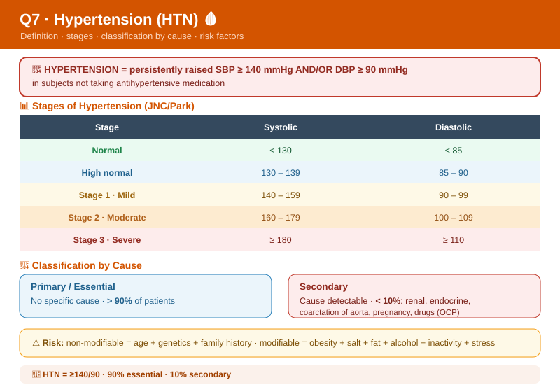

### 🩸 Definition of Hypertension
> 🔴 **Hypertension** is defined as *"persistently raised **systolic blood pressure of 140 mmHg or greater** and **diastolic blood pressure of 90 mmHg or greater** in subjects who are **not taking antihypertensive medication**."*

### 📊 Stages of Hypertension (JNC/Park)
| Stage | Systolic (mmHg) | Diastolic (mmHg) |
|-------|-----------------|-------------------|
| **Normal** | <130 | <85 |
| **High normal** | 130–139 | 85–90 |
| **Hypertension Stage 1 (Mild)** | 140–159 | 90–99 |
| **Hypertension Stage 2 (Moderate)** | 160–179 | 100–109 |
| **Hypertension Stage 3 (Severe)** | ≥180 | ≥110 |

### 🔄 Classification of HTN (by Cause)
**1. Primary / Idiopathic / Essential Hypertension**
- No specific underlying cause is known; comprises **more than 90%** of all hypertensive patients.

**2. Secondary Hypertension**
- Underlying cause can be detected; comprises **less than 10%** of all hypertensive patients.
- **Important causes:**
  - **a) Renal diseases:** Acute & chronic glomerulonephritis, pyelonephritis, renal vascular disease, polycystic kidney disease
  - **b) Endocrine diseases:** Phaeochromocytoma, Cushing's syndrome, Conn's syndrome, hyperparathyroidism, acromegaly, primary hypothyroidism, thyrotoxicosis
  - **c) Coarctation of aorta**
  - **d) Pregnancy**
  - **e) Drugs:** Oestrogen-containing oral pill, anabolic steroids, NSAIDs

### ⚠️ Risk Factors of Hypertension

**🟢 A) Non-modifiable / fixed factors:**
| Factor | Explanation |
|--------|-------------|
| **Age** | Blood pressure rises with age in both sexes |
| **Genetic factors** | Based on twin & family studies — BP values of monozygotic twins are usually more similar than dizygotic twins |
| **Family history** | Children of normotensive parents have **3%** chance of developing HTN; children of two hypertensive parents have **45%** chance |

**🔵 B) Modifiable factors:**
1. **Obesity** — directly proportional to BP
2. **Salt intake** — high salt → water retention → ↑ BP
3. **Saturated fat intake** — promotes atherosclerosis
4. **Alcohol intake** — heavy intake raises BP
5. **Physical activity** — sedentary lifestyle increases risk
6. **Environmental stress**
7. **Other factors:** OCP, noise, vibration, temperature, humidity

> 🎯 **HTN** = SBP ≥140 AND/OR DBP ≥90. **90% essential, 10% secondary**. **Risk (non-modifiable)** = age + genetics + family history; **modifiable** = obesity + salt + fat + alcohol + inactivity + stress.

> 📖 Ch-06, Endeavour PDF pp. 256–257; Park PSM 24e, pp. 391–393

---

</details>

<details>
<summary><b>Q8. What is BMI? How do you interpret BMI (WHO classification)?</b></summary>

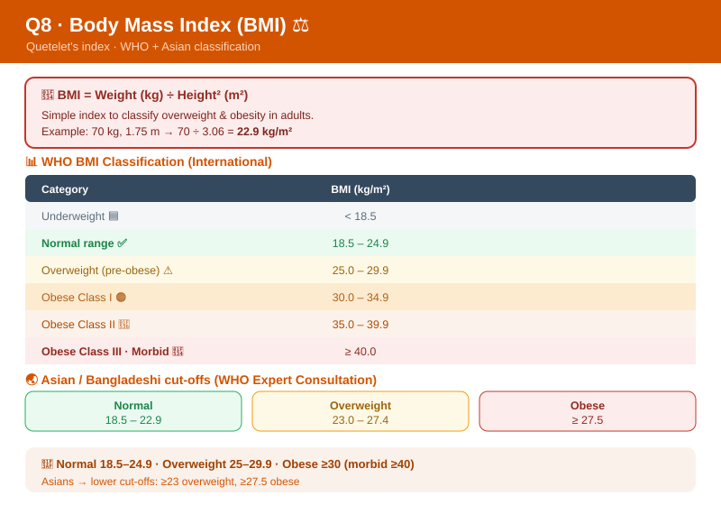

### ⚖️ Body Mass Index (BMI) — Definition
> 🔴 **BMI** (Quetelet's index) = **Weight in kilograms ÷ (Height in metres)²**
>
> It is a simple index used to classify **overweight and obesity** in adults.

### 📊 WHO BMI Classification (International)
| Category | BMI (kg/m²) |
|----------|-------------|
| **Underweight** | <18.5 |
| **Normal range** | 18.5 – 24.9 |
| **Overweight (pre-obese)** | 25.0 – 29.9 |
| **Obese Class I** | 30.0 – 34.9 |
| **Obese Class II** | 35.0 – 39.9 |
| **Obese Class III (Morbid obesity)** | ≥40.0 |

### 🌏 Asian / Bangladeshi Specific (WHO Expert Consultation) — BMI cut-offs are lower
| Category | BMI (kg/m²) |
|----------|-------------|
| Normal | 18.5 – 22.9 |
| Overweight | 23.0 – 27.4 |
| Obese | ≥27.5 |

> 🎯 **BMI** = weight(kg)/height²(m). **Normal** = 18.5–24.9; **Overweight** = 25–29.9; **Obese** = ≥30 (Class III/morbid ≥40). For **Asians**, cut-offs are lower (≥23 overweight, ≥27.5 obese).

> 📖 Ch-06, Endeavour PDF p. 275; Park PSM 24e

---

</details>

<details>
<summary><b>Q9. Why is hypertension called an "iceberg disease"? Explain the "rule of halves".</b></summary>

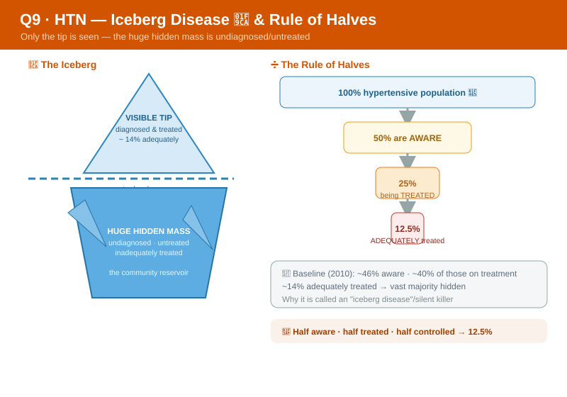

### 🧊 Hypertension as an "Iceberg Disease"
Hypertension is an **"iceberg disease"** — only a small visible portion (diagnosed and treated) of the affected population is above the surface; the **largest hidden mass** (undiagnosed, untreated, inadequately treated) remains below the surface. **Baseline 2010:** Only ~46% of hypertensive people are aware of it, ~40% of those are on treatment, and ~14% are adequately treated.

### ➗ The "Rule of Halves"
> 🔴 Only about **half** of the people in the general population are hypertensive; **half** of them are **aware** of the condition; **half** of those aware are being **treated**; and only about **half** of those treated are considered **adequately treated**.

**Number-wise progression:**
```
100% hypertensive population
  → 50% are AWARE
     → 25% are being TREATED
        → 12.5% are ADEQUATELY TREATED
```

### 📐 Areas of the "iceberg" circle (figure in Park)
1. The whole community
2. Normotensive subjects
3. Hypertensive subjects
4. Undiagnosed hypertension
5. Diagnosed hypertension
6. Diagnosed but untreated
7. Diagnosed and treated
8. Inadequately treated
9. Adequately treated

> 🎯 **Rule of halves**: half aware, half treated, half adequately treated → only **12.5%** adequately controlled. The hidden mass of HTN is why it is called an **iceberg disease**.

> 📖 Ch-06, Endeavour PDF pp. 257–258; Park PSM 24e, p. 392

---

</details>

<details>
<summary><b>Q10. Mention the complications of untreated hypertension. Write the prevention & control measures of HTN.</b></summary>

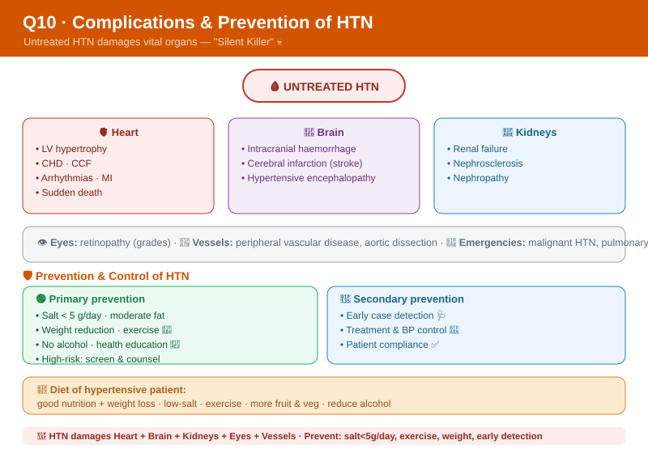

### ⚠️ Complications of Untreated Hypertension

**1) Hypertensive cardiovascular diseases:**
- Left ventricular hypertrophy (2–10%)
- Coronary heart disease (CHD)
- Congestive cardiac failure (CCF)
- Ventricular arrhythmias
- Myocardial ischaemia
- **Sudden death**

**2) Hypertensive cerebrovascular disease:**
- Intracranial haemorrhage
- Cerebral infarction (stroke)

**3) Hypertensive renal disease:**
- Renal failure
- Nephrosclerosis

**4) Atherosclerotic complications:**
- Peripheral vascular disease (PVD)

**5) Aortic dissection:**
- Extravasation of blood into & along the wall of the aorta

**6) Hypertensive emergencies:**
- Encephalopathy
- Nephropathy
- Retinopathy
- Unstable angina
- MI
- Heart failure
- Pulmonary oedema
- Eclampsia
- Malignant hypertension

> 📌 HTN damages the **vital organs** — Heart, Brain, Kidneys, Eyes, and Blood vessels ("Silent killer").

### 🛡 Diet of a Hypertensive Patient
1. Good general nutrition & weight reduction for the obese
2. Avoidance of high-salt foods and added salt
3. Regular physical exercise
4. Increasing consumption of fruit & vegetables
5. Reducing alcohol intake

### 🛡 Prevention & Control of HTN

**🟢 1. Primary Prevention:**
**a. Population strategy** (non-pharmacotherapeutic, multifactorial):
- **Nutrition:** Reduction of salt intake (<5 gm/day); moderate fat intake; avoidance of alcohol; restriction of energy intake appropriate to body needs
- **Weight reduction**
- **Exercise promotion**
- **Behavioural changes**
- **Health education**
- **Self-care**
**b. High-risk strategy:** screening of high-risk groups & individual counselling

**🔵 2. Secondary Prevention:**
- **Early case detection**
- **Treatment**
- **Patient compliance**

> 🎯 **Complications** = heart (LVH+CHD+CCF) + brain (stroke) + kidneys (renal failure) + eyes (retinopathy) + vessels (PVD + dissection). **Prevention** = salt <5g/day + exercise + weight control + health education (primary); early detection + treatment + compliance (secondary).

> 📖 Ch-06, Endeavour PDF pp. 258–259; Park PSM 24e, pp. 393–394

---

</details>

## Section 4 — Rheumatic Fever / RHD

<details>
<summary><b>Q11. Define rheumatic fever (RF) / rheumatic heart disease (RHD). Describe the epidemiological features and consequences of RF/RHD. How do you prevent RF/RHD?</b></summary>

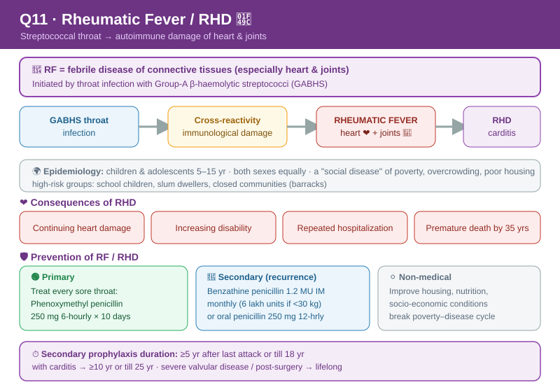

### 🦠 Rheumatic Fever (RF) — Definition
> 🔴 **Rheumatic fever** is a **febrile disease affecting the connective tissues**, particularly of the **heart and joints**, initiated by infection of the **throat by Group-A beta-haemolytic streptococci (GABHS)**.

### 🌍 Epidemiological Features of Rheumatic Fever

**a) Prevalence:** World-wide (still a major problem in developing countries).

**b) Agent factors:**
- **Agent:** Group A β-haemolytic *Streptococcus*
- **Carriers:** Convalescent, transient and chronic carriers

**c) Host & environmental factors:**
| Factor | Detail |
|--------|--------|
| **Age** | Typically a disease of **childhood & adolescence (5–15 years)** |
| **Sex** | Affects **both sexes equally** |
| **Immunity** | Immunological hypothesis — antigenic cross-reactivity between GABHS components & host tissues → immunological damage |
| **Socio-economic status** | **Social disease** — linked to poverty, overcrowding, poor housing, inadequate health services |
| **High-risk groups** | School-age children (5–15 yr), slum dwellers, those in closed communities (barracks) |

**Why RF is higher in slum dwellers:** poor socio-economic condition + high humidity & overcrowding + poverty + malnutrition + lack of health education + poor housing + inadequate health services + inadequate expertise of health care providers + low awareness of the disease.

### ❤️ Consequences of Rheumatic Heart Disease (RHD)
1. **Continuing damage to the heart**
2. **Increasing disabilities**
3. **Repeated hospitalization**
4. **Premature death** — usually by the age of 35 years or even earlier

### 🛡 Prevention of RF / RHD

**🟢 Primary prevention:**
1. Improvement of environment, housing & nutritional status
2. **Prophylactic antibiotic in sore throat:** Phenoxymethyl penicillin **250 mg 6-hourly for 10 days**

**🔵 Secondary prevention (prevent recurrence) — prophylaxis:**
- **Benzathine penicillin 1.2 million units** (6 lakh units in <30 kg) **IM once monthly**; OR oral phenoxymethyl penicillin 250 mg 12-hourly
- **Duration:**
  - Continue for **at least 5 years after last attack OR up to age 18** — whichever is **longer**
  - If **carditis** present (mild mitral regurgitation or healed carditis): **at least 10 years after last attack OR up to 25 years**, whichever longer
  - **Severe valvular disease / post-valve surgery:** **lifelong** treatment

**⚪ Non-medical measures:**
1. Improving living conditions
2. Breaking the **poverty–disease–poverty cycle**
3. Improving socio-economic conditions

> 📌 **Evaluation** of programme: prevalence of RHD in school children from periodic surveys of random samples is the **best indicator**.

> 🎯 **RF** = GABHS throat infection → autoimmune damage of heart & joints. **5–15 years, poverty-linked**. **RHD** = continuing cardiac damage + increasing disability + premature death by age 35. **Prevention** = penicillin prophylaxis (primary: sore throat; secondary: monthly benzathine).

> 📖 Ch-06, Endeavour PDF pp. 260–263; Park PSM 24e, pp. 397–398

---

</details>

<details>
<summary><b>Q12. Write the Revised (Duckett-Jones) criteria for diagnosis of rheumatic fever.</b></summary>

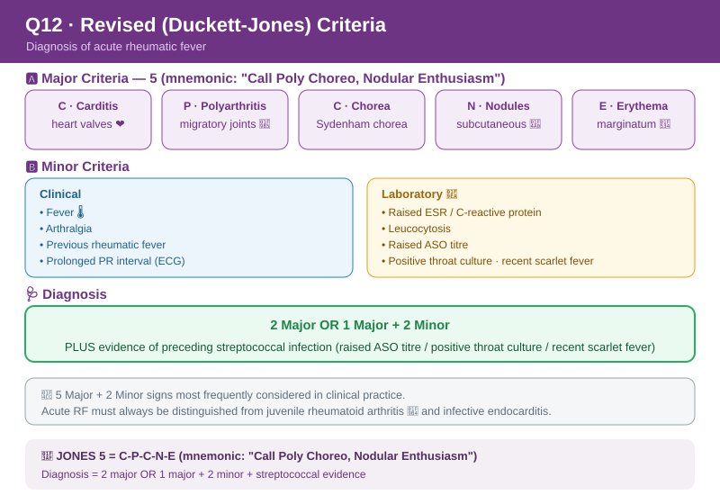

### 📋 Revised / Duckett-Jones Criteria for Diagnosis of Acute Rheumatic Fever

**🅰 Major Criteria (5):**
| # | Major Manifestation |
|---|---------------------|
| 1 | **Carditis** |
| 2 | **Migratory polyarthritis** |
| 3 | **Sydenham's chorea** |
| 4 | **Subcutaneous nodules** |
| 5 | **Erythema marginatum** |

**🅱 Minor Criteria:**
| Clinical | Laboratory |
|----------|-----------|
| Fever | Raised ESR or C-reactive protein |
| Arthralgia | Leucocytosis |
| Previous rheumatic fever | Prolonged PR interval (ECG) |
| | Raised ASO titre |
| | Positive throat culture |
| | Recent scarlet fever |

### 🩺 Diagnosis
- **2 Major** criteria, OR
- **1 Major + 2 Minor** criteria,
- PLUS **evidence of preceding streptococcal infection** (elevated ASO titre, positive throat culture, recent scarlet fever).

> 🎯 **Jones Major 5** = **C**arditis + **P**olyarthritis + **C**horea + **N**odules + **E**rythema marginatum (mnemonic: "Call Poly Choreo, Nodular Enthusiasm"). Diagnosis = 2 major OR 1 major + 2 minor + streptococcal evidence.

> 📖 Ch-06, Endeavour PDF pp. 261–262; Rashid, Khabir, Hyder 5e, p. 302

---

</details>

## Section 5 — Cancer

<details>
<summary><b>Q13. Define cancer (neoplasm). What are the major categories (3 major types) of cancer with examples?</b></summary>

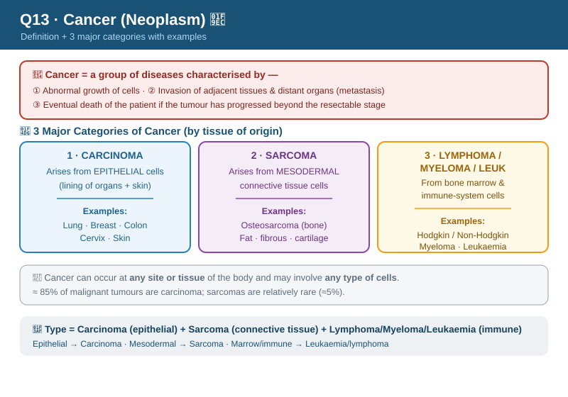

### 🧬 Cancer — Definition
> 🔴 **Cancer** may be regarded as a group of diseases characterized by:
> 1. An **abnormal growth of cells**,
> 2. Ability to **invade adjacent tissues and even distant organs** (metastasis), and
> 3. The **eventual death of the affected patient** if the tumour has progressed beyond the stage when it can be successfully removed.
>
> Cancer can occur at **any site or tissue** of the body and may involve **any type of cells**.

### 📖 3 Major Categories of Cancer (by tissue of origin)
| Type | Arises From | Examples |
|------|-------------|----------|
| **1. Carcinomas** | **Epithelial cells** — lining internal surfaces of organs (mouth, oesophagus, intestine, uterus) and from **skin epithelium** | Lung cancer, breast cancer, colon cancer, cervical cancer, skin cancer |
| **2. Sarcomas** | **Mesodermal cells** — constituting the various connective tissues (fibrous tissue, fat, bone) | Osteosarcoma, liposarcoma, fibrosarcoma, chondrosarcoma |
| **3. Lymphomas, myeloma & leukaemias** | Cells of the **bone marrow and immune system** | Hodgkin's lymphoma, non-Hodgkin's lymphoma, multiple myeloma, leukaemia |

> 🎯 3 major types = **Carcinoma** (epithelial) + **Sarcoma** (connective tissue/mesodermal) + **Lymphoma/Myeloma/Leukaemia** (bone marrow & immune system).

> 📖 Ch-06, Endeavour PDF pp. 263; Park PSM 24e, p. 400

---

</details>

<details>
<summary><b>Q14. Write down the warning/danger signs of cancer. What are the most common cancers in Bangladesh (male & female)?</b></summary>

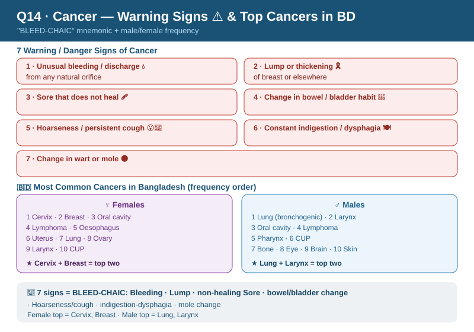

### ⚠️ 7 Warning / Danger Signs of Cancer
| # | Warning Sign |
|---|--------------|
| 1 | **Unusual bleeding or discharge** from any natural orifice |
| 2 | A **lump or thickening** of the breast or elsewhere |
| 3 | A **sore that does not heal** |
| 4 | **Change in bowel or bladder habit** |
| 5 | **Hoarseness or persistent cough** |
| 6 | **Constant indigestion or difficulty in swallowing** |
| 7 | A **change in wart or mole** |

### 🇧🇩 Most Common Cancers in Bangladesh (in order of frequency)
**Females:**
1. Cervical cancer
2. Breast cancer
3. Cancer of oral cavity
4. Lymphoma
5. Carcinoma of oesophagus
6. Carcinoma of body of uterus
7. Carcinoma of lungs
8. Ovarian cancer
9. Carcinoma larynx
10. Carcinoma of unknown primary site (CUP)

**Males:**
1. Bronchogenic carcinoma (lung)
2. Laryngeal carcinoma
3. Cancer of oral cavity
4. Lymphoma
5. Pharyngeal cancer
6. Carcinoma of unknown primary site (CUP)
7. Bone cancer
8. Cancer of eyes & lacrimal gland
9. Brain cancer
10. Skin cancer

> 🎯 7 warning signs (mnemonic — "BLEED-CHAIC"): Bleeding + Lump + non-healing Sore + bowel/bladder change + Hoarseness/cough + indigestion/dysphagia + mole change. **Female top** = Cervix + Breast; **Male top** = Lung + Larynx.

> 📖 Ch-06, Endeavour PDF pp. 263–265; Rashid, Khabir, Hyder 4e, p. 289

---

</details>

<details>
<summary><b>Q15. What are the environmental factors (causes) of cancer? Write about cancer screening tests.</b></summary>

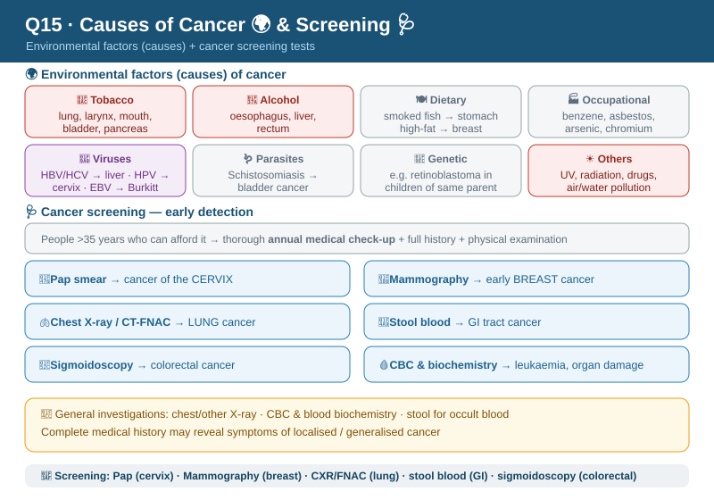

### 🌍 Environmental Factors (Causes) of Cancer
**1. Tobacco:** Cancer of the lung, larynx, mouth, pharynx, oesophagus, bladder, pancreas, and probably kidney.
**2. Alcohol:** Oesophageal, liver and rectal cancers.
**3. Dietary factors:** Smoked fish → stomach cancer; dietary fibre → intestinal cancer; beef consumption → bowel cancer; high-fat diet → breast cancer.
**4. Occupational exposures:** Benzene, arsenic, cadmium, chromium, vinyl chloride, asbestos, polycyclic hydrocarbons.
**5. Viruses:**
- Hepatitis B & C → hepatocellular carcinoma
- HIV infection → Kaposi's sarcoma, non-Hodgkin's lymphoma
- Epstein-Barr virus (EBV) → Burkitt's lymphoma, nasopharyngeal carcinoma
- Cytomegalovirus (CMV) → Kaposi's sarcoma
- Human papillomavirus (HPV) → cancer of cervix
- Human T-cell leukaemia virus → T-cell leukaemia/lymphoma
**6. Parasites:** Schistosomiasis → carcinoma of the bladder
**7. Customs, habits & lifestyles:** Smoking → lung cancer; tobacco & betel chewing → oral cancer
**8. Others:** Sunlight (UV), radiation, air & water pollution, medications (e.g. oestrogen), pesticides

**🅱 Genetic factors:** e.g., retinoblastoma in children of the same parent.

### 🩺 Cancer Screening
- **Individuals above age 35** who can afford it: thorough **annual medical check-up** by a competent physician, with a view to detect early cancers.
- A **complete medical history** may provide symptoms of localized/generalized cancer; a **thorough physical examination** may reveal cancers of the skin, mouth, thyroid, breast, uterus, vagina, rectum, penis, testicle.

**Investigations for cancer screening:**
1. **Chest / other X-ray** — evidence of lesions in chest, pleura, lungs, bone
2. **Blood count (CBC)** — initial findings of leukaemias, multiple myelomas, other blood dyscrasias; blood biochemistry → liver & kidney damage
3. **Stool examination for blood** — GI tract cancer
4. **Pap smear** — cancer of the cervix
5. **Mammography** — early diagnosis of breast cancer
6. **Sigmoidoscopy** — colorectal cancers

### 🎯 Screening Tests for Specific Cancers
| Cancer | Screening Test |
|--------|----------------|
| Carcinoma cervix | **Pap smear** |
| Breast cancer | **Mammography**, FNAC from breast lump |
| Lung cancer | **Chest X-ray**, CT-guided FNAC from lung mass |
| GI tract cancer | Stool blood test |
| Colorectal cancer | Sigmoidoscopy |

> 🎯 Causes = tobacco + alcohol + diet + occupation + viruses + parasites + lifestyle. Screening: **Pap** (cervix) + **mammography** (breast) + **CXR/FNAC** (lung) + stool blood (GI) + sigmoidoscopy (colorectal). Annual check-up after age 35.

> 📖 Ch-06, Endeavour PDF pp. 263–267; Park PSM 24e, pp. 403–404; Rashid 5e, p. 312

---

</details>

<details>
<summary><b>Q16. Write the risk factors of breast, lung and cervical cancer (carcinoma).</b></summary>

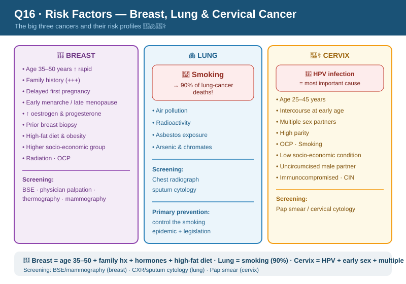

### 🎀 Risk Factors of Carcinoma of the Breast
1. **Age:** incidence increasing rapidly between 35 and 50 years
2. **Family history:** positive family history of breast cancer ↑ risk
3. **Parity:** delayed first pregnancy (late thirties) at higher risk than multiparous women
4. **Age at menarche & menopause:** early menarche and late menopause are established risk factors
5. **Hormonal factors:** elevated oestrogen and progesterone
6. **Prior breast biopsy**
7. **Diet:** high-fat diet & obesity
8. **Socio-economic status:** common in higher socio-economic groups
9. **Others:** radiation, OCP

> **Screening:** Breast self-examination (BSE), palpation by physician, thermography, mammography.

### 🌬️ Risk Factors of Carcinoma of the Lung (Bronchogenic carcinoma)
1. **Smoking** — responsible for **90% of lung cancer deaths**
2. Other factors: air pollution, radioactivity, occupational exposure to asbestos, arsenic & its compounds, chromates

> **Screening:** Chest radiograph, sputum cytology.
> **Prevention (primary):** control the smoking epidemic — public info & education, legislative & restrictive measures, smoking cessation activities, national & international coordination.

### 👩⚕️ Risk Factors of Carcinoma of the Cervix
1. **Age:** 25–45 years
2. Intercourse at an **early age**
3. **Multiple sex partners**
4. Intercourse with a male having multiple sexual partners
5. OCP
6. Cigarette smoking
7. High parity
8. Low socio-economic condition
9. Genital infections
10. **Lack of circumcision of male partner**
11. **HPV (papilloma virus) infection** — most important cause
12. Immunocompromization
13. Pre-malignant conditions e.g., CIN

> 🎯 **Breast** = age 35–50 + family hx + delayed pregnancy + hormones + high-fat diet. **Lung** = smoking (90%). **Cervix** = HPV + early sex + multiple partners + OCP + smoking + high parity + low SES.

> 📖 Ch-06, Endeavour PDF pp. 267–269; Park PSM 24e, pp. 405–408

---

</details>

## Section 6 — Diabetes Mellitus (DM)

<details>
<summary><b>Q17. What is diabetes mellitus? What are the differences between type-1 and type-2 DM?</b></summary>

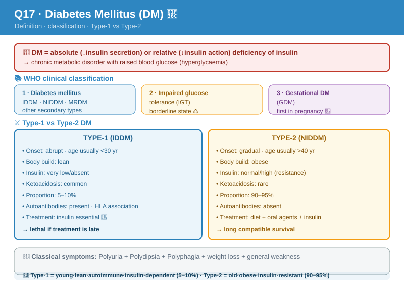

### 🍬 Diabetes Mellitus — Definition
> 🔴 **Diabetes mellitus (DM)** is a condition of **absolute (reduced insulin secretion) or relative (reduced insulin action) deficiency of insulin**, resulting in **hyperglycaemia**. It is a chronic metabolic disorder characterised by raised blood glucose.

**WHO Clinical Classification of Diabetes Mellitus:**
1. **Diabetes mellitus (DM):**
   - Insulin-dependent diabetes mellitus (IDDM, **Type-1**)
   - Non-insulin dependent diabetes mellitus (NIDDM, **Type-2**)
   - Malnutrition-related diabetes mellitus (MRDM)
   - Other types (secondary to pancreatic, hormonal, drug-induced, genetic abnormalities)
2. **Impaired glucose tolerance (IGT)**
3. **Gestational diabetes mellitus (GDM)**

### 📊 Clinical Differences — Type-1 vs Type-2 DM
| Feature | Type-1 (IDDM) | Type-2 (NIDDM) |
|---------|---------------|-----------------|
| **Onset** | Abrupt onset | Gradual (insidious) onset |
| **Severity** | More severe form if not diagnosed | Less severe |
| **Fate** | Becomes lethal if treatment is late | Slow ketosis & long compatible survival |
| **Age** | Usually <30 years | Usually >40 years |
| **Body build** | Lean | Obese |
| **Insulin level** | Very low / absent | Normal / high (insulin resistance) |
| **Ketoacidosis** | Common | Rare |
| **Proportion** | 5–10% | 90–95% |
| **Autoantibodies** | Present | Absent |
| **HLA association** | Present | Yet to find |
| **Treatment** | Insulin essential | Diet + oral agents ± insulin |

### 🩺 Classical Symptoms of DM
**Polyuria** (profuse urination) + **Polydipsia** (excessive thirst) + **Polyphagia** (excessive hunger) + **Loss of body weight** + **General weakness**

### ⚠️ Risk Factors for DM
1. Family history of DM
2. More diet (over-nutrition)
3. Less physical activity (sedentary lifestyle)
4. **Obesity**
5. Heart disease, valvular disease
6. Age group 40 years and above
7. Cataract at relatively early age
8. Repeated infection, malnutrition in early age
9. Low socio-economic condition
10. Genetic syndrome (Down, Turner's, Klinefelter's syndrome)

### 🔬 Natural History of DM
```
Healthy people (genetic susceptibility) → Environmental/Diabetic insults
  → Impairment of insulin secretion and/or action
  → Hyperglycaemia (Diabetes mellitus)
  → Complications of diabetes mellitus
```

> 🎯 **Type-1** = young + lean + abrupt + autoimmune + ketoacidosis-prone + insulin-dependent (5–10%). **Type-2** = old + obese + insidious + insulin-resistant + 90–95%. **Classical Sx** = 3 "P" (polyuria, polydipsia, polyphagia) + weight loss + weakness.

> 📖 Ch-06, Endeavour PDF pp. 269–271; Park PSM 24e, pp. 410–412

---

</details>

<details>
<summary><b>Q18. Write down the complications of DM. Define GDM and explain its importance.</b></summary>

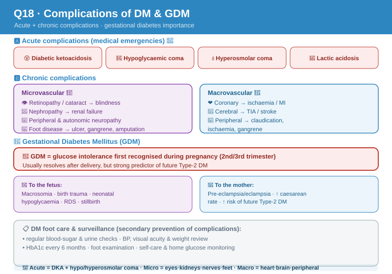

### ⚠️ Complications of Diabetes Mellitus

**🅰 Acute Complications:**
1. Diabetic ketoacidosis
2. Hypoglycaemic coma
3. Non-ketotic hyperosmolar diabetic coma
4. Lactic acidosis

**🅱 Chronic Complications:**

**Microvascular:**
| Complication | Consequence |
|--------------|-------------|
| Retinopathy, cataract | Impaired vision / blindness |
| Nephropathy | Renal failure |
| Peripheral neuropathy | Sensory loss, motor weakness |
| Autonomic neuropathy | Postural hypotension; GI problems (gastroparesis, altered bowel habit) |
| Foot disease | Ulceration, arthropathy, amputation |

**Macrovascular:**
1. **Coronary circulation** — myocardial ischaemia / infarction
2. **Cerebral circulation** — transient ischaemic attack, stroke
3. **Peripheral circulation** — claudication, ischaemia, gangrene

### 🤰 GDM (Gestational Diabetes Mellitus) — Definition & Importance
> 🔴 **GDM** = glucose intolerance **first recognized during pregnancy** (usually 2nd/3rd trimester). Though it usually **resolves after delivery**, it is a strong predictor of **future Type-2 DM**.

**Why is GDM important?**
- **To the fetus:** Macrosomia, birth trauma, neonatal hypoglycaemia, respiratory distress syndrome, stillbirth
- **To the mother:** Pre-eclampsia/eclampsia, increased caesarean delivery rate, increased risk of future Type-2 DM

> 🎯 **Acute** = DKA + hypo/hyperosmolar coma + lactic acidosis. **Micro** = eyes + kidneys + nerves + feet. **Macro** = heart + brain + peripheral vessels. **GDM** = diabetes first in pregnancy → macrosomia + neonatal hypoglycaemia + future type-2 DM.

> 📖 Ch-06, Endeavour PDF pp. 271–272; Davidson 23e

---

</details>

<details>
<summary><b>Q19. Write the control (preventive) measures of DM. Explain: "DM cannot be fully cured but can be controlled."</b></summary>

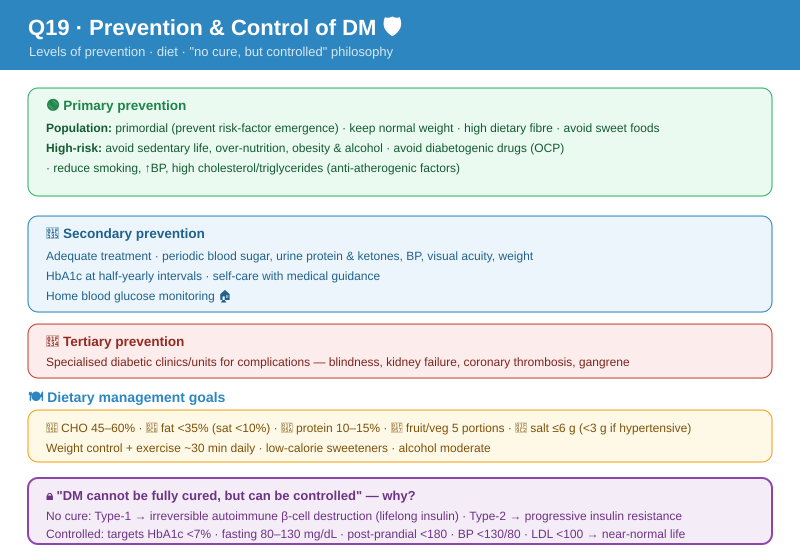

### 🛡 Prevention & Control of Diabetes Mellitus

**🟢 1. Primary Prevention:**
**a. Population strategy:**
- **Primordial prevention** — prevention of emergence of risk factors in countries where they have not yet appeared
- Maintenance of **normal body weight** through healthy nutritional habits & physical exercise
- Nutritional habits include adequate protein intake, **high dietary fibre**, avoidance of sweet foods
- Elimination of protein deficiency & food toxins

**b. High-risk strategy:**
- Avoidance of sedentary lifestyle, over-nutrition & obesity
- Avoidance of alcohol
- Avoidance of diabetogenic drugs (e.g., oral contraceptives)
- Reduction of factors promoting atherosclerosis (smoking, high BP, elevated cholesterol & triglycerides)

**🔵 2. Secondary Prevention:**
- Adequate treatment of DM
- Routine check-up of blood sugar, urine for protein & ketone bodies, BP, visual acuity & weight periodically
- Estimation of **glycosylated haemoglobin (HbA1c)** at half-yearly intervals
- **Self-care** — diabetic takes major responsibility for own care with medical guidance
- **Home blood glucose monitoring**

**🔴 3. Tertiary Prevention:**
- Specialized diabetic clinics/units for detection & management of complications (blindness, kidney failure, coronary thrombosis, gangrene of lower extremities)

### 🍽 Dietary Management of DM
1. **Healthy eating:**
   - Carbohydrate: 45–60% (sucrose up to 10%)
   - Fat: <35% (with <10% saturated & 10–20% monounsaturated)
   - Protein: 10–15% (not exceeding 1 g/kg/day)
   - Fruit/vegetables: 5 portions daily
   - Salt: ≤6 g daily (further restriction <3 g for hypertensive diabetics)
2. **Weight management:** reduce calorie intake + regular exercise (walking, swimming, cycling) ~30 min daily
3. **Diabetic food & sweeteners:** low-calorie, sugar-free drinks, sorbitol-containing foods
4. **Alcohol:** moderate unless contraindicated

### 🔒 "DM Cannot Be Fully Cured, But Can Be Controlled" — Explain
> 🔴 DM is a **chronic metabolic disorder with no cure** because:
> - **Type-1:** autoimmune β-cell destruction is **irreversible** → requires **lifelong insulin**
> - **Type-2:** insulin resistance is **progressive** → requires ongoing lifestyle + medications
>
> However, DM can be **effectively controlled** so that blood glucose returns to/near normal and **complications are prevented or delayed**:
> - **Control targets:** HbA1c <7%, fasting glucose 80–130 mg/dL, postprandial <180 mg/dL, BP <130/80, LDL <100
> - **Good control** (diet + exercise + drugs + monitoring + education) → **near-normal life expectancy** and quality of life.

> 🎯 **DM control** = normal weight + high-fibre diet + exercise + avoid alcohol/smoking (primary) + treatment + HbA1c + home glucose monitoring + self-care (secondary) + diabetic clinics (tertiary). **No cure** (autoimmune/progressive), but **good control prevents complications**.

> 📖 Ch-06, Endeavour PDF pp. 271–273; Park PSM 24e, p. 414; Davidson 23e

---

</details>

## Section 7 — Obesity

<details>
<summary><b>Q20. Define obesity. Write the risk factors, complications/health risks and prevention of obesity.</b></summary>

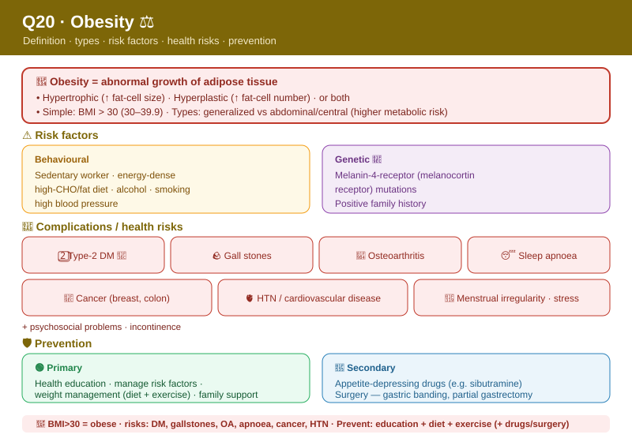

### ⚖️ Obesity — Definition
> 🔴 **Obesity** may be defined as an **abnormal growth of the adipose tissue** due to:
> - Enlargement of fat cell size (**hypertrophic obesity**), OR
> - Increase in fat cell number (**hyperplastic obesity**), OR
> - A combination of both.
>
> **Or** (simpler): Obesity is a condition where the **BMI of a person is above 30 (30–39.9)**.
>
> 📌 *Overweight* is usually due to obesity, but can also be due to abnormal muscle development or fluid retention.

**Types of Obesity:**
1. Generalized obesity
2. Abdominal / central obesity (higher risk for metabolic complications)

### ⚠️ Risk Factors of Obesity
**1. Behavioural factors:**
- Sedentary worker (physical inactivity)
- Diet: high carbohydrate, fat, energy-dense food
- Alcohol
- Smoking
- High blood pressure

**2. Genetic factors:**
- Melanin-4-receptor (melanocortin receptor) mutations
- Family history

### ⚠️ Complications / Health Risks of Obese Persons
1. **Type-II diabetes mellitus**
2. **Gall stones**
3. **Osteoarthritis**
4. **Respiratory disorder** — obstructive sleep apnoea
5. **Cancer** (breast, colon)
6. **Menstrual irregularity**
7. **Stress incontinence**
8. Hypertension / cardiovascular disease
9. Psychosocial problems

### 🛡 Prevention of Obesity
**🟢 Primary prevention:**
- **Health education** among community
- **Management of risk factors**
- **Management of weight** — exercise + diet control
- **Family support**

**🔵 Secondary prevention:**
- **Appetite-depressing drugs** e.g., sibutramine
- **Surgery** (gastric banding, partial gastrectomy)

> 🎯 **Obesity** = abnormal adipose growth (hypertrophic/hyperplastic); BMI >30. **Risk** = sedentary + energy-dense diet + alcohol + genetics (melanocortin-4). **Complications** = type-2 DM + gallstones + OA + sleep apnoea + cancer + HTN. **Prevention** = education + weight management (primary) + drugs/surgery (secondary).

> 📖 Ch-06, Endeavour PDF pp. 275–276; Park PSM 24e, p. 415

---

</details>

## Section 8 — Demography

<details>
<summary><b>Q21. Define demography. What are the demographic processes? What are the vital events of life?</b></summary>

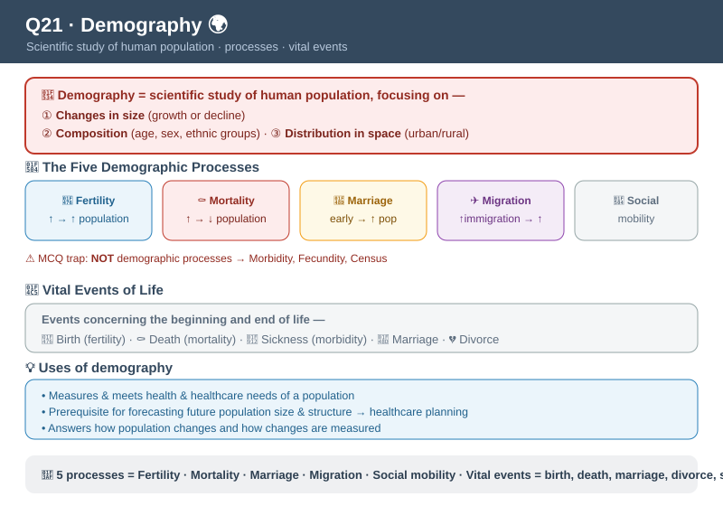

### 🌍 Demography — Definition
> 🔴 **Demography** is the **scientific study of human population**, which mainly concentrates on —
> 1. **Changes in population size** (growth or decline)
> 2. **The composition of the population** (age, sex, ethnic groups, etc.)
> 3. **The distribution of population in space** (urban, rural, etc.)

### 🔄 The Five Demographic Processes
Demography deals with **five demographic processes** which are continuously at work within a population, determining its size, composition and distribution:

| # | Process | Effect on Population |
|---|---------|---------------------|
| 1 | **Fertility** | Directly related with size of population (↑ fertility → ↑ population) |
| 2 | **Mortality** | ↑ mortality → ↓ population; ↓ mortality → ↑ population |
| 3 | **Marriage** | Early marriage → ↑ population; Late marriage → ↓ population |
| 4 | **Migration** | Immigration → ↑ population; Emigration → ↓ population |
| 5 | **Social mobility** | Changes in social status (upgrade or degrade) |

> 📌 **NOT** demographic processes (MCQ): Morbidity, Fecundity, Census. The 5 correct ones are **Fertility, Mortality, Marriage, Migration, Social Mobility**.

### 📅 Vital Events of Life
> 🔴 **Vital events** are the events concerning the **beginning and end of life** — **Fertility (birth), Mortality (death), Morbidity (sickness), Marriage, Divorce**.

### 💡 Uses of Demography
1. Focuses on three observable phenomena — size, composition, distribution
2. Deals with the five demographic processes
3. The health & healthcare needs of a population cannot be measured or met without knowledge of demography
4. Knowledge of demography is a prerequisite for making forecasts about future population size & structure — essential for **healthcare planning**
5. Concerned with answering questions about how population changes and how its changes can be measured

> 🎯 **Demography** = scientific study of human population (size + composition + distribution). **5 processes** = Fertility, Mortality, Marriage, Migration, Social mobility. **Vital events** = birth, death, marriage, divorce, sickness.

> 📖 Ch-09, Endeavour PDF pp. 317, 323; Park PSM 24e, p. 513; Rashid 5e, p. 190

---

</details>

<details>
<summary><b>Q22. What are the stages of the demographic cycle? Which stage is Bangladesh in currently?</b></summary>

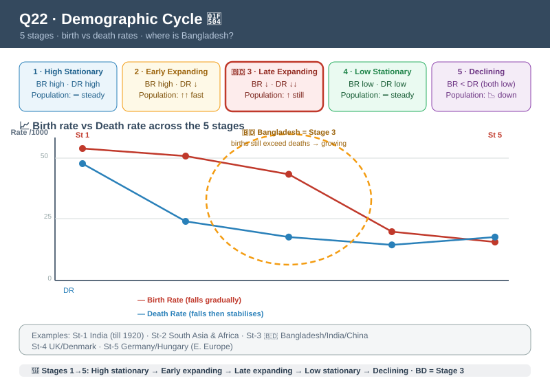

### 🔄 The Demographic Cycle — 5 Stages
*The history of the population of the world since 1650 suggests that there is a **demographic cycle of 5 stages** through which a population passes:*

| Stage | Name | Birth Rate | Death Rate | Population | Example |
|-------|------|------------|------------|-----------|---------|
| **1** | **High Stationary** | High | High (both cancel each other) | **Stationary** | India was in this stage till 1920 |
| **2** | **Early Expanding** | High (unchanged) | Declining | **Growing fast** | Countries of South Asia & Africa |
| **3** | **Late Expanding** | Tends to fall | Declines still further | **Still growing** (births > deaths) | **Bangladesh**, India, China, Singapore |
| **4** | **Low Stationary** | Low | Low | **Stationary** | UK, Denmark, Sweden, Belgium |
| **5** | **Declining** | Lower than death rate | Low | **Declining** | Germany, Hungary (E. Europe) |

### 🇧🇩 Where is Bangladesh?
**Bangladesh is in the 3rd stage — "Stage of Late Expanding".**
- **Reason:** In the 3rd stage, the death rate declines still further and the birth rate tends to fall. The population continues to grow because **births exceed deaths**.
- **Statistical proof (CDR & CBR data):** Death rate ~6.1‰, birth rate ~20‰ → births exceed deaths → growing population.
- **Demographic data (4th census 2001):** Total 129.25 million; BR 18.9‰, DR 4.8‰; growth rate 1.41%.
- **Demographic data (Economic survey 2014):** Total 166.28 million; BR 21.61‰, DR 5.64‰; growth 1.6%; density 1101/km²; life expectancy 70.65 yrs.

> 🎯 **Stages** = High stationary (1) → Early expanding (2) → Late expanding (3) → Low stationary (4) → Declining (5). **Bangladesh = Stage 3 (Late Expanding)** — falling birth rate, low death rate, still growing.

> 📖 Ch-09, Endeavour PDF pp. 318–320; Park PSM 24e, p. 513; Census 2001/2011

---

</details>

<details>
<summary><b>Q23. What do you mean by age-sex pyramid? What are the characteristics of the age-sex pyramid in Bangladesh (developing country)?</b></summary>

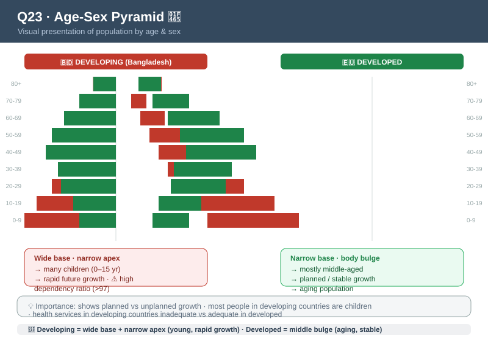

### 👥 Age and Sex Structure (Age Pyramid) — Definition
> 🔴 The **age and sex structure** gives a **visual presentation of population growth** in a country. A pyramid with a **wide base and narrow apex** indicates a *higher proportion of population in the younger age group*, indicating a **rapid population growth in the future**. The pyramids of **developed countries** are usually with a **narrow base, wide in the body (middle), and narrow at the apex**.

### 📊 Differences — Developing (like Bangladesh) vs Developed Country

| Trait | Developing country (Bangladesh) | Developed country |
|-------|---------------------------------|-------------------|
| **Shape of pyramid** | **Wide base and narrow apex** | **Bulge in the middle**, narrower both base and apex |
| **Cause of this shape** | Base represents children; birth rate is very high in developing countries | Middle portion represents the middle-aged population; population mainly consists of middle-aged/elderly people |
| **Interpretation** | Indicates a high rate of population in the younger age group → **rapid growth of population** | Indicates **planned/stable growth** |

### 🎯 Characteristics of Bangladesh's Age-Sex Pyramid
- **Wide base** = large proportion of children (0–15 years)
- **Narrow apex** = lower proportion of elderly / lower life expectancy
- Indicates **rapid future population growth** as the large young cohort enters reproductive age
- **High dependency ratio** (over 97 in Bangladesh vs ~50 in developed countries)

### 🔍 Importance of the Age Pyramid
1. Shows the **contrast between planned and unplanned growth** of population in developed & developing countries
2. Discloses that **maximum population in developing countries are children (0–15 years)**, in contrast to the **maximum population in developed countries being middle-aged**
3. Shows that **health services in developing countries are inadequate & ineffective** in comparison to developed countries where they are adequate and effective

> 🎯 **Age-sex pyramid** = visual presentation of population by age & sex. **Bangladesh/developing** = wide base + narrow apex (young population, rapid growth). **Developed** = middle bulge (aging population, stable). Importance = growth planning + health-service assessment.

> 📖 Ch-09, Endeavour PDF pp. 320–321; Park PSM 24e, p. 517

---

</details>

<details>
<summary><b>Q24. What is population growth rate? Doubling time. Define and classify census.</b></summary>

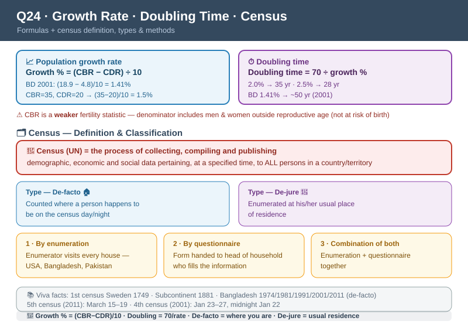

### 📈 Population Growth Rate
> 🔴 **Population growth rate** is the **net residual (in percent)** calculated when the **crude death rate is subtracted from the crude birth rate**, exclusive of migration.
>
> ```
> Growth Rate (%) = (Crude Birth Rate − Crude Death Rate) / 10
> ```

**Examples:**
- According to **2001 census**, Bangladesh: Growth rate = (18.9 − 4.8)/10 = **1.41%**
- Given CBR = 35, CDR = 20 → (35 − 20)/10 = **1.5%**

**Why CBR is a weaker fertility statistic:** The denominator (mid-year population) includes **men and women outside the reproductive age group** — those **not at risk of giving birth**.

### ⏱ Doubling Time
> 🔴 **Doubling time** = the time it takes for a population to double itself. **Rough formula:**
> ```
> Doubling Time = 70 / Growth Rate (%)
> ```

| Growth Rate | Doubling Time |
|-------------|---------------|
| 2.0% | 35 years |
| 2.5% | 28 years |
| 1.41% (BD 2001) | ~50 years |

**Example:** If growth rate is 2.5% and population 10 million, doubling time = 70/2.5 = **28 years** → population will be **20 million**.

### 🗂 Census — Definition & Classification
> 🔴 **Census** (UN) = *"the process of **collecting, compiling and publishing** demographic, economic and social data pertaining, at a specified time or times, to **all persons** in a country or delineated territory."*

**Types (2):**
| Type | Where a person is counted |
|------|---------------------------|
| **De-facto** | Counted at a place where he/she **happens to be on the census day or night** |
| **De-jure** | Enumerated at his/her **usual place of residence** |

**Methods (3):**
1. **By enumeration:** The enumerator visits every house in his/her area and elicits required information from each household (followed in USA, Bangladesh, Pakistan)
2. **By questionnaire:** The questionnaire form is handed over to the head of the household who fills in the information
3. **By combination of both**

**Historical data (for viva):**
- 1st census: Sweden 1749; USA 1790; UK 1801; Subcontinent **1881**; erstwhile Pakistan 1951; **Bangladesh 1974**
- Bangladesh censuses: 1974, 1981, 1991, 2001, 2011 (at 10-year intervals)
- 5th census (2011): conducted March 15–19, 2011, de-facto system
- 4th census (2001): conducted Jan 23–27, 2001; census night midnight of Jan 22; de-facto system

**Information obtained from a census:**
1. Demographic, social and economic characteristics of the people — conditions under which they live, how they work, income, and other basic information
2. Basic data needed to compute vital statistical rates and other health, demographic and socio-economic indicators

> 🎯 **Growth rate** = (CBR − CDR)/10. **Doubling time** = 70/growth rate. **Census** = collect+compile+publish data on all persons. **De-facto** = where you happen to be; **De-jure** = usual residence.

> 📖 Ch-09, Endeavour PDF pp. 321–327; Park PSM 24e, pp. 521, 877; Rashid 5e, p. 196

---

</details>

<details>
<summary><b>Q25. Define Fertility, GFR, TFR, NRR. What is the significance of NRR = 1?</b></summary>

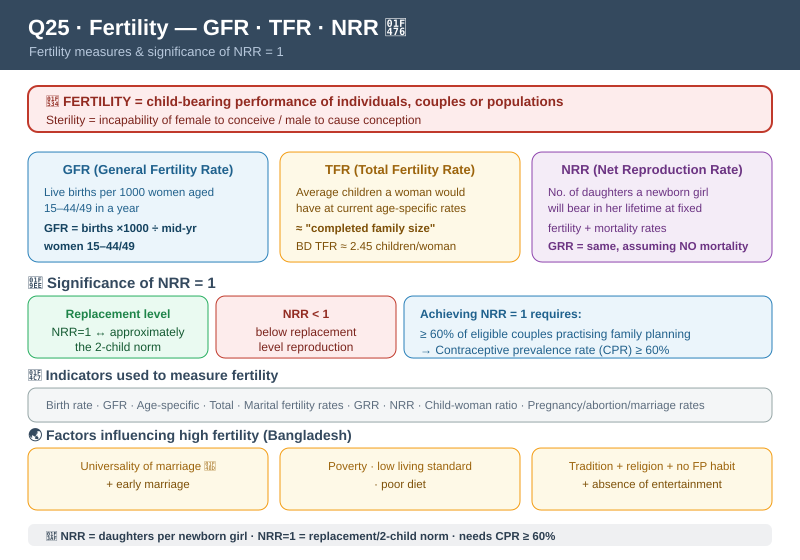

### 👶 Fertility — Definition
> 🔴 **Fertility** is the **child-bearing performance of individuals, couples or populations**.
>
> 📌 *Sterility* = incapability of the female to conceive, or inability of males to cause a female to conceive (due to reduced reproductive capacity).

### 📊 General Fertility Rate (GFR)
> 🔴 **GFR** = the number of **live births per 1000 women in the reproductive age group (15–44/49 years)** in a given year.
>
> ```
> GFR = (No. of live births in an area during the year) × 1000 / (Mid-year female population 15–44/49 in same area, same year)
> ```
>
> **Example:** 500 married women (15–34 yrs) gave 150 live births in 2015 →
> GFR = (150/500) × 1000 = **300** → high fertility.

### 📊 Total Fertility Rate (TFR)
> 🔴 **TFR** = the **average number of children a woman would have** if she were to pass through her reproductive years bearing children at the **same rates as the women now in each age group**.
>
> **Importance:** TFR is a **refined measure of fertility** — gives the approximate magnitude of the **"completed family size"**. (BD TFR ≈ 2.45 children/woman.)

### 📊 Net Reproduction Rate (NRR)
> 🔴 **NRR** = the number of **daughters a newborn girl will bear during her lifetime**, assuming **fixed age-specific fertility and mortality rates**.

**Importance / Demographic Significance of NRR:**
1. NRR is a **demographic indicator**.
2. **NRR = 1 is equivalent to attaining approximately the 2-child norm**.
3. If NRR < 1, the reproductive performance of the population is said to be **below replacement level**.
4. Demographers believe the demographic goal of **NRR = 1 can be achieved only if at least 60% of the eligible couples are effectively practicing family planning (CPR ≥ 60%)**.

> 📌 **Gross Reproduction Rate (GRR)** = average number of girls that would be born to a woman if she experiences the current fertility pattern through her reproductive span (15–44/49 years), assuming **no mortality**.

### 📇 Indicators Used to Measure Fertility
Birth rate, General fertility rate, Age-specific fertility rate, Age-specific marital fertility rate, Total fertility rate, Total marital fertility rate, Gross reproduction rate, Net reproduction rate, Child-woman ratio, Pregnancy rate, Abortion rate, Abortion ratio, Marriage rate.

### 🌏 Factors Influencing Fertility (High Fertility in Bangladesh)
1. **Universality of marriage** (marriage is universal & sacramental)
2. **Early marriage**
3. Poverty
4. Low standard of living
5. Low level of diet
6. Traditional customs & habits
7. Absence of entertainment
8. Absence of family planning habit
9. Religion
10. Multiple marriage
11. Breast-feeding
12. Place of women in society

> 🎯 **Fertility** = child-bearing performance. **GFR** = live births/1000 reproductive-age women. **TFR** = completed family size. **NRR** = daughters per newborn girl; **NRR=1** = 2-child norm = requires **CPR ≥60%**.

> 📖 Ch-09, Endeavour PDF pp. 327–331; Park PSM 24e, pp. 522–523

---

</details>

## Section 9 — Maternal & Child Health (MCH)

<details>
<summary><b>Q26. What are the MCH care services in Bangladesh? What are the MCH problems in Bangladesh? How can these be prevented?</b></summary>

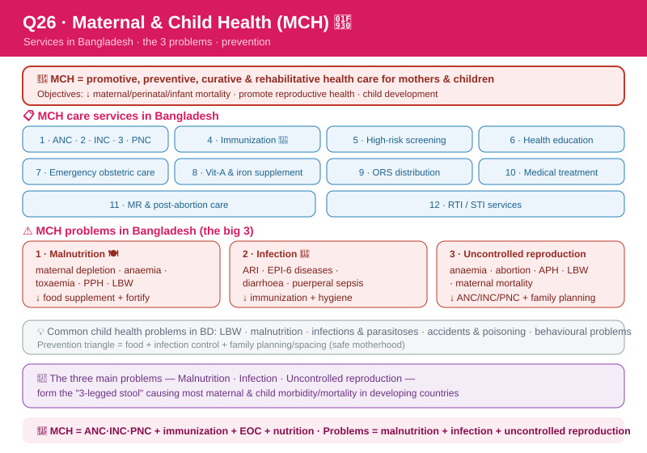

### 🤰 Maternal & Child Health (MCH) — Concept
> 🔴 The term "maternal and child health" refers to the **promotive, preventive, curative and rehabilitative health care for mothers and children** (up to pre-school age).
>
> **Objectives of MCH service** (ultimate objective = lifelong health):
> 1. Reduction of maternal, perinatal, infant & childhood mortality and morbidity
> 2. Promotion of reproductive health
> 3. Promotion of the physical and psychological development of the child within the family

### 📋 MCH Care Services in Bangladesh
1. **Antenatal care (ANC)**
2. **Intra-natal care (INC)** — safe & aseptic delivery
3. **Post-natal care (PNC)**
4. **Immunization**
5. **Screening of high-risk mother**
6. **Health education** — breast feeding, nutrition of newborn & pregnant women, family planning practices
7. **Emergency obstetric care (EOC) services**
8. **Vitamin-A and iron supplementation** to under-5 children & pregnant women
9. **ORS distribution**
10. **Medical treatment** for under-5 children and pregnant women
11. **MR and post-abortion care**
12. **RTI and STI services**

### ⚠️ MCH Problems in Bangladesh (Developing Countries)
The three main problems are **Malnutrition, Infection, and Uncontrolled reproduction:**

**1. Malnutrition**
- **Effects/complications:** Maternal depletion, anaemia of mother, toxaemias of pregnancy, post-partum haemorrhage, low birth weight of child
- **Prevention (direct):** Food supplementation, food fortification, food enrichment, distribution of iron & folic acid, nutritional education
- **Prevention (indirect):** Immunization, safe water supply, family planning, health education, food hygiene, PHC

**2. Infection**
- **Effects/complications:** Respiratory tract infection (ARI), EPI 6 diseases, diarrhoea, abortion, puerperal sepsis, foetal growth retardation, low birth weight, embryopathy
- **Prevention:** Main infections controlled by vaccine; personal hygiene; health education

**3. Uncontrolled reproduction (unregulated fertility)**
- **Effects/complications:** Increased prevalence of severe anaemia, abortion, antepartum haemorrhage, low birth weight babies, maternal mortality
- **Prevention:** Antenatal care, intranatal care, postnatal care, family planning

> 🔍 **Common child health problems in Bangladesh:** Low birth weight (LBW), malnutrition, infections & parasitoses, accidents & poisoning, behavioural problems.

> 📖 Ch-11, Endeavour PDF pp. 361–366; Park PSM 24e, pp. 590, 557–558

---

</details>

<details>
<summary><b>Q27. Write down the activities carried out during the 1st antenatal visit. What are the criteria of high-risk pregnancy?</b></summary>

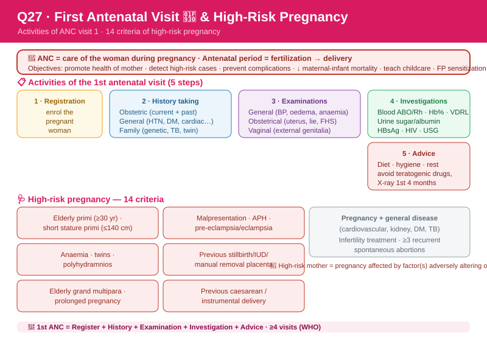

### 🤰 Antenatal Care (ANC) — Definition & Objectives
> 🔴 **Antenatal period** = period from **fertilization of the ovum to the delivery of the fetus**.
> **Antenatal care** = the **care of the woman during pregnancy**.
>
> **Objectives:**
> 1. To promote, protect and maintain the health of the mother during pregnancy
> 2. To detect "high-risk" cases and give them special attention
> 3. To foresee complications and prevent them
> 4. To remove anxiety and dread associated with delivery
> 5. To reduce maternal and infant mortality and morbidity
> 6. To teach the mother elements of child care, nutrition, personal hygiene and environmental sanitation
> 7. To sensitize the mother to the need for family planning
> 8. To attend to the under-fives accompanying the mother

### 📋 Activities of the 1st Antenatal Visit
**1. Registration of the pregnant woman**

**2. History taking:**
- **a) Obstetric history:**
  - *History of current pregnancy:* 1st day of LMP, any bleeding or pain, menstrual cycle (normal/irregular), use of oral pills
  - *History of past pregnancies:* previous pregnancy & labour, abortion, premature labour, intra-uterine death (IUD), eclampsia, instrumental delivery
- **b) General history:** cardiac disease including hypertension, respiratory disease (asthma), renal disease, diabetes, epilepsy, blood transfusion, STDs & sexual behaviour, previous surgical/gynaecological operation
- **c) Family history:** genetic diseases (haemoglobinopathy), DM, HTN, infectious diseases (TB, hepatitis), twin births

**3. Examinations:**
- **General examination:** Height, weight, anaemia, jaundice, oedema, BP, pulse
- **Obstetrical examination:** Breast & nipple; abdominal examination (size & shape of uterus, position of uterus, size of fetus, lie, presentation & attitude of fetus, auscultation of fetal heart sound); vaginal examination (external genitalia)

**4. Essential investigations:**
- **Blood:** ABO grouping & Rh typing, Hb%
- **Urine:** Sugar & albumin, pregnancy test
- Investigation for hepatitis-B & HIV
- **VDRL** for syphilis
- **Ultrasonography** for pregnancy profile

**5. Prenatal advice:**
- **Diet:** balanced diet (high protein, low salt, foods rich in iron & calcium)
- **Personal hygiene:** cleanliness, rest & sleep, dental care
- **Avoid:** constipation, manual physical labour, smoking, alcohol, sexual intercourse (especially last trimester)
- **Avoidance of drugs** (teratogenic): Thalidomide, LSD, Streptomycin, Sex hormones, Tetracycline
- **Radiation:** X-ray examination of the abdomen should be avoided during the **1st 4 months** of pregnancy
- **Warning signs** — report immediately if: swelling of feet, fits, headache, blurring of vision, bleeding or discharge per vagina
- **Childcare:** the art of childcare has to be learnt

### ⚠️ Warning / Danger Signs of Pregnancy
1. Swelling of the feet
2. Fits (convulsions)
3. Headache
4. Blurring of the vision
5. Bleeding or discharge per vagina and any other unusual symptoms

> **Measures to alleviate:** avoid excessive physical exertion & stress, adequate rest & sedation, regular ANC (at least 4 visits per WHO guideline) with attention to detect altered sleep, headache, blurring of vision, PV discharge/bleeding, swelling of feet, rapid weight gain, high BP; balanced diet (high protein & low salt, fish oil, Ca²⁺ 2g/day, Mg & Zn); antioxidant vitamins A, C & E from 20 weeks.

### 🩺 High-Risk Pregnancy — 14 Criteria
> 🔴 **High-risk mother** = one whose pregnancy is complicated by factor(s) that **adversely affect the pregnancy outcome** (maternal or perinatal or both).
1. **Elderly primi** (30 years & over)
2. **Short stature primi** (140 cm & below)
3. **Malpresentation** (breech, transverse lie)
4. **Antepartum haemorrhage**, threatened abortion
5. **Pre-eclampsia** and **eclampsia**
6. **Anaemia**
7. **Twins**, polyhydramnios
8. **Previous still-birth**, intrauterine death, manual removal of placenta
9. **Elderly grand multiparas**
10. **Prolonged pregnancy** (14 days after expected date of delivery)
11. **History of previous caesarean** or instrumental delivery
12. **Pregnancy associated with general diseases** (cardiovascular, kidney, diabetes, TB, liver disease)
13. **Treatment for infertility**
14. **Three or more spontaneous consecutive abortions**

> 🎯 **1st ANC visit** = Registration + History (obstetric/general/family) + Examinations (general/obstetrical/vaginal) + Investigations (blood+urine+VDRL+USG) + Advice (diet/hygiene/drugs/radiation/warning signs). **High-risk 14** = elderly/short-stature primi + malpresentation + APH + toxaemia + anaemia + twins + previous bad outcome + prolonged pregnancy + general disease + infertility + repeated abortions.

> 📖 Ch-11, Endeavour PDF pp. 365–371; Park PSM 24e, pp. 558–561

---

</details>

<details>
<summary><b>Q28. What are the danger signs of pregnancy? What is CSBA? Write the immediate and late care of the newborn (with APGAR score).</b></summary>

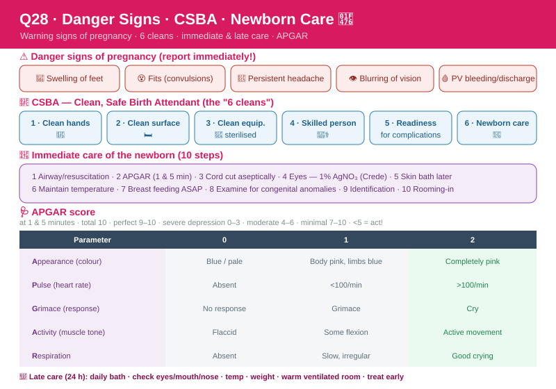

### ⚠️ Danger Signs of Pregnancy
1. **Swelling of the feet**
2. **Fits** (convulsions)
3. **Persistent headache**
4. **Blurring of the vision**
5. **Bleeding or discharge per vagina** and any other unusual symptoms

> *These are warning signs of pregnancy toxaemia (pre-eclampsia) — report immediately.*

### 🧼 CSBA (Clean, Safe Birth Attendant) — Criteria for Clean & Safe Delivery
> 🔴 **CSBA** = a skilled birth attendant practising **"6 cleans"** for safe delivery:
1. **Clean hands** of the attendant
2. **Clean surface** (delivery surface)
3. **Clean equipment** (sterilized instruments)
4. **Skilled birth attendant**
5. **Readiness** to deal with complications
6. **Specific care for the newborn**

### 👶 Immediate Care of the Newborn
1. **Clearing the airway / resuscitation**
2. **Evaluation of the baby by APGAR scoring** (at 1 & 5 minutes)
3. **Care of the cord** — cut aseptically
4. **Care of the eyes** — wash/drop of **1% AgNO₃** (Crede's prophylaxis)
5. **Care of the skin** — bath with soap & warm water after a few hours (to remove vernix, meconium, blood clot)
6. **Maintenance of body temperature**
7. **Breast feeding** (as soon as possible)
8. **Thorough examination** of baby for any congenital abnormalities
9. **Identification** of the baby by mother's name & sex
10. **Rooming-in** (keeping the baby with the mother)

### 🩺 APGAR Score
| Parameter | 0 | 1 | 2 |
|-----------|---|---|---|
| **A**ppearance (Colour) | Blue / pale | Body pink, extremities blue | Completely pink |
| **P**ulse (Heart rate) | Absent | Slow (<100/min) | Over 100/min |
| **G**rimace (reflex response) | No response | Grimace | Cry |
| **A**ctivity (muscle tone) | Flaccid | Some flexion of extremities | Active movements |
| **R**espiration | Absent | Slow, irregular | Good crying |

- **Score:** Total = 10; perfect score 9–10
- **Severe depression:** 0–3 · **Moderate depression:** 4–6 · **No/minimal depression:** 7–10
- **Score below 5 needs prompt action.** Infants with low APGAR scores at 5 minutes are at high risk of complications & death in the neonatal period.

### 📝 Late / Subsequent Care of Newborn (within 24 hours)
1. Daily bath of the baby
2. Inspection of the eyes, mouth & nose for any abnormalities
3. Maintenance of temperature
4. Regular monitoring of the weight
5. Baby kept in a well-ventilated & warm room
6. Early detection of any complication & treatment

### 🎯 Objectives of Neonatal Care
1. Establishment & maintenance of cardiorespiratory functions
2. Maintenance of body temperature
3. Avoidance of infection
4. Establishment of satisfactory feeding regimen
5. Early detection & treatment of congenital & acquired disorders, especially infections

> 🎯 **Danger signs** = swelling of feet + fits + headache + blurring of vision + PV bleeding. **CSBA** = 6 cleans (hands, surface, equipment, skilled attendant, readiness, newborn care). **Immediate newborn care** = airway + APGAR + cord + eyes (1% AgNO₃) + skin + temperature + breast feeding + examination + identification + rooming-in. **APGAR** = Appearance, Pulse, Grimace, Activity, Respiration.

> 📖 Ch-11, Endeavour PDF pp. 370–382; Park PSM 24e, pp. 564, 567–569

---

</details>

## Section 10 — Low Birth Weight (LBW) & Newborn

<details>
<summary><b>Q29. Define and classify LBW. What are the causes and public health importance of LBW? What are the complications of LBW? What is a growth chart / road to health chart? What is GOBI-FFF?</b></summary>

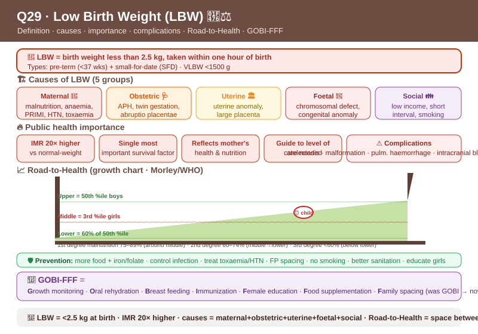

### ⚖️ Low Birth Weight (LBW) — Definition & Classification
> 🔴 **Low birth weight (LBW) baby** = a birth weight of **less than 2.5 kg** (up to and including 2499 gm), the measurement being taken preferably **within the 1st hour of life**, before significant postnatal weight loss has occurred.

**Types of LBW (2):**
| Type | Definition |
|------|-----------|
| **Pre-term babies** | Born before **completed 37 weeks (259 days)** of gestation; intrauterine growth may be normal |
| **Small-for-date (SFD) babies** | Birth weight **less than the 10th percentile** for the gestational age |

> 📌 Babies weighing **<1501 gm** are designated as **very low birth weight (VLBW)** babies.
> Gestational classification: **Pre-term** (<37 wk) · **Term** (37 to <42 wk) · **Post-term** (≥42 wk)

### ⚠️ Causes of Low Birth Weight
**A. Maternal factors:**
- **Age of the mother:** lower the age, higher the risk
- **Nutrition:** severe malnutrition, iron & folic acid deficiency
- **Infections:** UTI, syphilis, hepatitis
- **Chronic diseases:** cardiac, renal, pulmonary disease, DM, HTN
- **Tumour:** ovarian
- **Trauma:** physical, psychological
- **Drugs:** phenobarbitone, methyldopa, steroids

**B. Obstetric factors:** Toxaemia of pregnancy, antepartum haemorrhage, premature rupture of membrane, placental insufficiency, cephalo-pelvic disproportion

**C. Uterine factors:** Uterine malformations, cervical incompetence

**D. Foetal factors:** Multiple pregnancies, twins, hydramnios, intrauterine infections, congenital anomalies, Rh incompatibility

**E. Social factors:** Heavy physical labour, smoking, low socio-economic condition, repeated birth, shorter inter-pregnancy intervals

### 🔍 Public Health Importance of LBW
1. High incidence is related to a **high risk of perinatal & infant mortality and morbidity**
2. It is the **single most important factor** determining the **survival chances** of the child
3. **IMR is about 20 times greater** for all LBW babies than for other babies
4. LBW is an important **guide to the level of care** needed by individual babies
5. LBW reflects **inadequate nutrition & ill health of the mother**
6. A high percentage of LBW points to **deficient health status of pregnant women**, inadequate prenatal care & the need for improved newborn care

### 🛡 Prevention of LBW
**A. Direct intervention:**
1. Increasing food intake — supplementary feeding, distribution of iron & folic acid tablets, fortification & enrichment of foods
2. **Controlling infection** — malaria, UTIs, cytomegalovirus, toxoplasmosis, rubella, syphilitic infections diagnosed, treated or prevented
3. **Early detection & treatment of medical disorders** — hypertension, toxaemias, diabetes

**B. Indirect intervention:** Family planning, avoidance of excessive smoking, improved sanitation, improving the health & nutrition of young girls, improvement in socio-economic & environmental conditions

### ⚠️ Complications of LBW Baby
1. **Atelectasis** (lungs fail to expand)
2. **Malformations** (congenital)
3. **Pulmonary haemorrhage**
4. **Intracranial bleeding** — secondary to anoxia or birth trauma
5. **Pneumonia or other infections**

### 📈 Growth Chart / Road to Health Chart
> 🔴 **Growth chart** = serial recording of growth parameter data on a graph at different positions corresponding to the deviation from the average value.
> **or,** a visible display of the child's physical growth & development (a component of the child health card).
> - First designed by **David Morley**, later modified by the **WHO**.
> - Designed primarily for the **longitudinal follow-up (growth monitoring)** of a child.
> - **Weight for age** is used because weight is the **most sensitive measure of growth**.

**The WHO growth chart has 3 reference curves:**
| Line | Meaning |
|------|---------|
| **Upper line** | 50th percentile for boys |
| **Middle line** | 3rd percentile for girls |
| **Lower line** | 60% of 50th percentile |

**Road to Health:**
> 🔴 The **space between the upper (50th percentile boys) and middle (3rd percentile girls) lines** is called the **"road to health"**. The weight of **95% of normal healthy children** falls within this area. If the child is growing normally, its growth line will be above the 3rd percentile and run **parallel** to the road to health curve.

**Degree of malnutrition (from chart):**
- 1st degree: 75–89% (just above & below the middle line)
- 2nd degree: 60–74% (between middle & lower line)
- 3rd degree: <60% (below the lower line)

**Importance of growth chart:** growth monitoring; diagnostic tool (identify high-risk children); planning & policy making; educational tool for mothers; tool for action (easier referral); evaluation; tool for teaching.

### 🎯 GOBI-FFF (UNICEF Child Survival Strategies)
| Letter | Strategy |
|--------|----------|
| **G** | **Growth monitoring** (by growth chart) |
| **O** | **Oral Rehydration** (treat mild & moderate dehydration) |
| **B** | **Breast feeding** (nourish & protect infant) |
| **I** | **Immunization** (against 6 communicable diseases) |
| **F** | **Female education** |
| **F** | **Food supplementation** |
| **F** | **Family spacing / planning** |

> 📌 Previously the campaign was limited to the first 4 strategies (GOBI) — the "4 key elements of child survival".

> 🎯 **LBW** = <2.5 kg (within 1st hour). Types = pre-term + small-for-date. **Importance** = single most important determinant of survival; IMR 20× higher. **Causes** = maternal + obstetric + uterine + foetal + social. **Prevention** = food + infection control + indirect measures. **Growth chart** = Morley/WHO; road to health = space between 50th & 3rd percentile lines. **GOBI-FFF** = growth + ORS + breastfeeding + immunization + female education + food + family planning.

> 📖 Ch-11, Endeavour PDF pp. 379–385; Park PSM 24e, pp. 570–575

---

</details>

<details>
<summary><b>Q30. Define MMR and write its causes. Define exclusive breast feeding and write its advantages. What is colostrum and its importance?</b></summary>

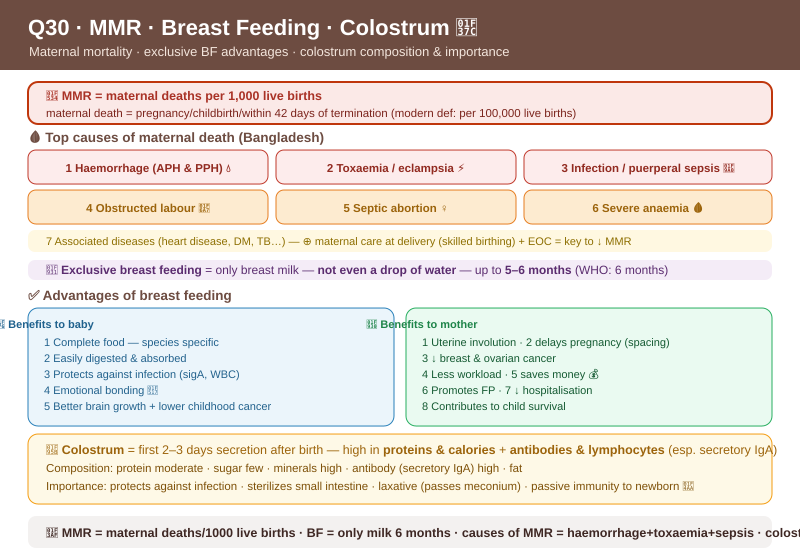

### 🩸 MMR (Maternal Mortality Rate) — Definition
> 🔴 **MMR** = the number of **maternal deaths** (from pregnancy, childbirth, or within **42 days** of termination of pregnancy) **per 1,000 live births** in a given year.
>
> (Note: Modern definition often uses per 100,000 live births.)

**Top causes of maternal death (Bangladesh/developing countries):**
1. **Haemorrhage** (APH & PPH)
2. **Toxaemia / eclampsia**
3. **Infection / puerperal sepsis**
4. **Obstructed labour**
5. Septic abortion
6. Severe anaemia
7. Associated diseases (heart disease, etc.)

### 🤱 Exclusive Breast Feeding — Definition
> 🔴 **Exclusive breast feeding** = when a baby is given **only breast milk — not even a drop of water** — up to **5–6 months of age**. (WHO now recommends exclusive breast feeding for the **first 6 months**.)

### ✅ Advantages of Breast Feeding (Benefits of Exclusive Breast Feeding)

**Benefits to the baby:**
1. **Complete food** — species specific
2. Easily digested & well absorbed
3. **Protects against infection** (secretory IgA, leucocytes)
4. Promotes **emotional bonding** (mother-child)
5. Better **brain growth** & intelligence
6. Lower incidence of childhood cancer

**Benefits to the mother:**
1. Helps in **involution of the uterus**
2. **Delays pregnancy** (lactational amenorrhoea → natural spacing)
3. **Lowers risk of breast & ovarian cancer**
4. Decreases mother's workload
5. **Saves money**
6. Promotes family planning
7. Decreases need for hospitalization
8. Contributes to **child survival**

### 🥛 Colostrum — Definition, Composition & Importance
> 🔴 **Colostrum** = the secretion of the breast following childbirth for the **first 2–3 days**, containing a great quantity of **proteins and calories** in addition to **antibodies and lymphocytes**.

**Composition of colostrum:** Protein (moderate), Sugar (few), Minerals (high), **Antibody — especially secretory IgA (high)**, Fat.

**Importance of colostrum:**
1. **Antibodies (especially secretory IgA)** play an important role in **protection against infection**
2. May help to **sterilize the small intestine** if contaminated by infected material swallowed during birth
3. Possesses **laxative qualities** (helps pass meconium)
4. High in proteins, minerals & white blood cells
5. Provides **passive immunity** to the newborn

> 🎯 **MMR** = maternal deaths per 1000 live births. **Causes** = haemorrhage + toxaemia + infection + obstructed labour + septic abortion + anaemia. **Exclusive breast feeding** = only breast milk, no water, 5–6 months. **Colostrum** = first 2–3 days milk, rich in secretory IgA → protects against infection + sterilizes gut + laxative + passive immunity.

> 📖 Ch-11, Endeavour PDF pp. 385–386, 389; Park PSM 24e, p. 573; A.H. Mollah 1e, p. 11

---

</details>

<details>
<summary><b>Q31. What are the causes of infant, neonatal, post-neonatal and under-5 (1–4 year) mortality? What are the criteria of high-risk baby?</b></summary>

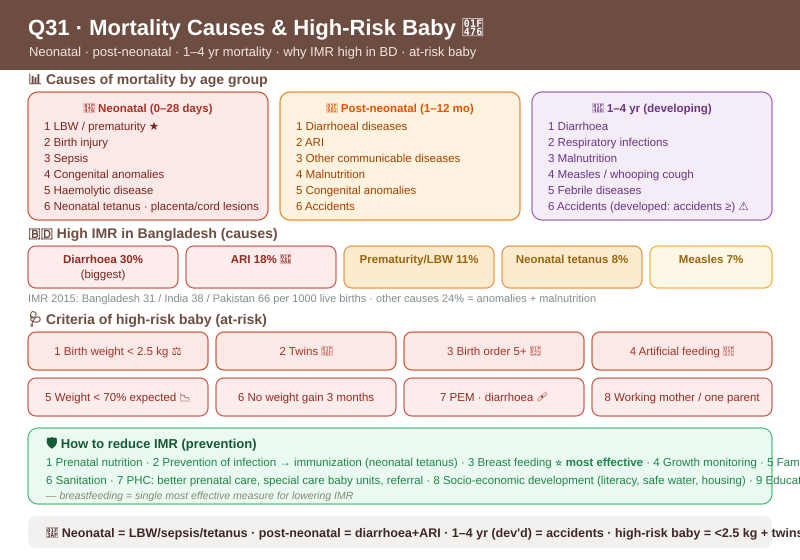

### 👶 Causes of Neonatal Mortality (0–28 days)
1. **Low birth weight / prematurity** (most important)
2. **Birth injury** & difficult labour
3. **Sepsis** (infections)
4. **Congenital anomalies**
5. **Haemolytic disease of newborn**
6. **Conditions of placenta and cord**
7. **Diarrhoeal diseases**
8. **Acute respiratory infections**
9. **Neonatal tetanus**

### 👶 Causes of Post-Neonatal Mortality (1–12 months)
1. **Diarrhoeal diseases**
2. **Acute respiratory infections**
3. Other communicable diseases
4. Malnutrition
5. Congenital anomalies
6. Accidents

### 👧 Causes of 1–4 Year (Under-5 / Pre-School) Mortality
**In developing countries:**
1. **Diarrhoeal diseases**
2. **Respiratory infections**
3. **Malnutrition**
4. Infectious diseases (measles, whooping cough)
5. Other febrile diseases
6. Accidents & injuries

**In developed countries:**
1. **Accidents**
2. **Congenital anomalies**
3. **Malignant neoplasms**
4. Influenza, pneumonia

### 🔍 Important Causes of High IMR in Bangladesh
- **Diarrhoea (30%)**
- **ARI (18%)**
- Prematurity & low birth weight (11%)
- Neonatal tetanus (8%)
- Measles (7%)
- Whooping cough (2%)
- Other causes (24%): congenital anomalies, malnutrition

> 📊 **IMR data (2015):** Bangladesh **31/1000**, India 38/1000, Pakistan 66/1000 live births.

### 👶 Criteria of High-Risk Baby (At-Risk Babies)
1. **Birth weight less than 2.5 kg**
2. **Twins**
3. **Birth order 5 and more**
4. **Artificial feeding**
5. **Weight below 70% of expected weight** (2nd & 3rd degrees of malnutrition)
6. **Failure to gain weight during three successive months**
7. Children with **PEM, diarrhoea**
8. **Working mother / one parent**

### 🛡 How to Reduce IMR (Preventive & Social Measures)
1. **Prenatal nutrition** — improve the state of maternal nutrition
2. **Prevention of infection** — immunization (e.g., neonatal tetanus)
3. **Breast-feeding** — the most effective measure for lowering IMR
4. **Growth monitoring** — low-cost technology
5. **Family planning** — family limitation & spacing of births
6. **Sanitation** — improved environmental sanitation
7. **Provision of primary health care** — collaborative maternity care, improved prenatal care, special care baby units, proper referral
8. **Socio-economic development** — female literacy, nutrition, safe water, housing, agriculture & industry
9. **Education** — educated women have fewer early pregnancies, better spacing, better hygiene & childcare

> 🎯 **Neonatal** (0–28 d) = LBW + birth injury + sepsis + congenital anomalies + tetanus. **Post-neonatal** (1–12 mo) = diarrhoea + ARI + malnutrition. **1–4 yr** = diarrhoea + respiratory + malnutrition + accidents (developing); accidents + congenital + malignancy (developed). **High-risk baby** = LBW + twins + birth order ≥5 + artificial feeding + weight <70% + PEM.

> 📖 Ch-11, Endeavour PDF pp. 390–394; Park PSM 24e, pp. 593, 603–608

---

</details>

<details>
<summary><b>Q32. What are the complications of the postnatal period? Define weaning, IYCF. What is milk injury? Write the advantages of colostrum and contraindications of breast feeding.</b></summary>

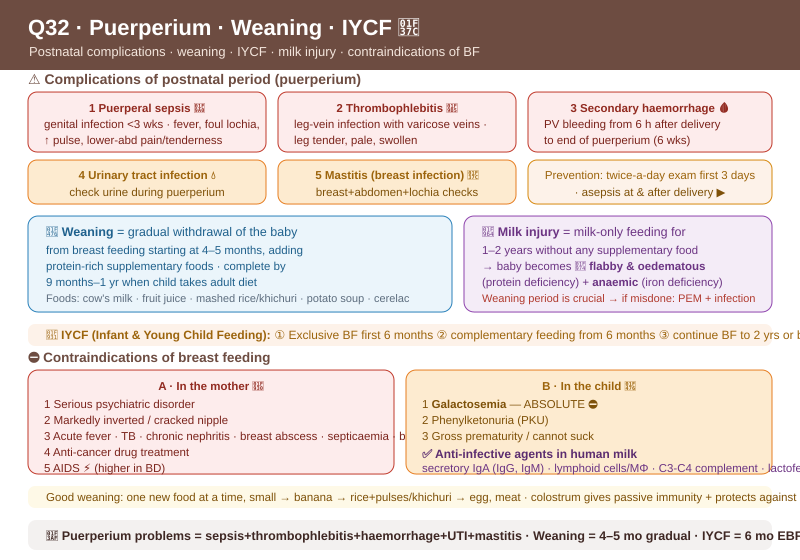

### 🤰 Complications of the Postnatal Period (Puerperium)
1. **Puerperal sepsis** — infection of the genital tract within 3 weeks after delivery; accompanied by rise in temperature & pulse rate, foul-smelling lochia, pain & tenderness in the lower abdomen
2. **Thrombophlebitis** — infection of the veins of the legs associated with varicose veins; leg may become tender, pale & swollen
3. **Secondary haemorrhage** — bleeding from vagina any time from 6 hours after delivery to the end of the puerperium (6 weeks)
4. **Urinary tract infection (UTI)**
5. **Mastitis** (breast infection)

> **Prevention:** thorough & frequent check-up of the mother (examination of breast, lower abdomen & legs; lochia examined for colour, smell & quantity). For hospitalized women, twice-a-day examination during the first 3 days; for home deliveries, daily visit by the birth attendant until the cord drops off. **Puerperal sepsis prevented by attention to asepsis before and after delivery.**

### 👶 Weaning — Definition
> 🔴 **Weaning** = a gradual process of **withdrawing the baby from breast feeding** starting around the **age of 4–5 months**, and **adding supplementary foods** rich in protein & other nutrients. The process is **gradually completed by 9 months to 1 year** of age, when the child takes almost the adult diet.

**Weaning foods in Bangladesh:** Cow's milk, fruit juice, soft cooked rice, cereals & pulses (smash/khichuri), soup (smashed potato & vegetables), and commercially available foods (cerelac — good but expensive).

**Good weaning practice:** add a single weaning food at a time in small quantities, increase gradually; start with **mashed ripe banana** → after a week cooked rice & pulses (or gruel & pulses) → khichuri → later egg, meat, etc. Weaning period is **crucial** — if misdone, the child may suffer from **malnutrition and infection**.

### 🍼 IYCF (Infant and Young Child Feeding)
> 🔴 **IYCF** = WHO's approach to optimal infant & young child feeding:
> - **Exclusive breast feeding for the first 6 months**
> - Introduction of **complementary (supplementary) feeding from 6 months**
> - **Continue breast feeding up to 2 years** or beyond

### 🥛 Milk Injury — Definition
> 🔴 **Milk injury** = if a baby is fed **only milk for a long period** (e.g., for 1–2 years) **without giving any supplementary food**, the baby becomes **flabby and oedematous** due to **deficiency of protein**, and **anaemic** due to **iron deficiency**. This condition is called **milk injury**.

### ⛔ Contraindications of Breast Feeding
**A. In the mother:**
1. Mother with a **serious psychiatric disorder**
2. **Markedly inverted nipple**, fissure & cracks of nipple
3. Mother suffering from **acute fever, TB, chronic nephritis, breast abscess, septicaemia, breast tumour**
4. Mother has cancer & is being treated with **anti-cancer drugs**
5. **Mother having AIDS**

**B. In the child:**
1. **Galactosemia** (absolute contraindication)
2. **Phenylketonuria (PKU)**
3. **Gross prematurity** or other conditions in which the newborn cannot suck

### Protective / Anti-infective Agents in Human Milk
1. Immunoglobulins — **Secretory IgA**, IgG, IgM
2. Cellular elements — lymphoid cells, polymorphs, macrophages
3. Opsonic & chemotactic activities of **C3 & C4 complement system**
4. **Lactoferrin & transferrin**

> 🎯 **Postnatal complications** = puerperal sepsis + thrombophlebitis + secondary haemorrhage + UTI + mastitis. **Weaning** = gradual withdrawal from breast feeding starting 4–5 months, supplementary foods, complete by 9–12 months. **IYCF** = exclusive BF 6 months + complementary + continued to 2 years. **Milk injury** = milk-only feeding → flabby + oedematous + anaemic. **Contraindications** = AIDS + galactosemia + acute fever + anti-cancer drugs (mother); galactosemia + PKU + prematurity (child).

> 📖 Ch-11, Endeavour PDF pp. 375–388; Park PSM 24e, pp. 565, 573–575; Rashid 5e, p. 168

---

</details>

## Section 11 — School Health

<details>
<summary><b>Q33. What are the components of school health service? What are the criteria of healthful school environment? What are the school health problems in Bangladesh?</b></summary>

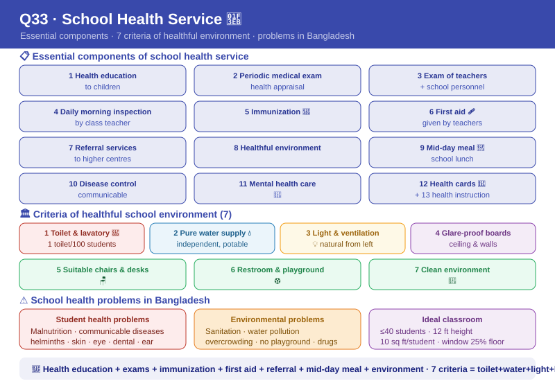

### 🏫 School Health Service — Essential Components
School health services comprise the following **essential components**:
1. **Health education** to children
2. **Periodic medical examinations** (health appraisal)
3. **Medical examination of teachers** & other school personnel
4. **Daily morning inspection** (by teacher)
5. **Immunization**
6. **First aid** — given by school teachers
7. **Referral** services
8. **Healthful school environment**
9. **Mid-day meal** (school lunch)
10. **Disease/disease-control** (communicable disease prevention)
11. **Mental health** care
12. **Health cards** for students
13. Education & instruction for health

### 🏫 Criteria of Healthful School Environment (7 criteria)
1. **Satisfactory toilet & lavatory facilities** (one toilet per 100 students; one urinal per 60 students; separate for boys & girls)
2. **Pure water supply** (independent, potable, continuous source)
3. **Good lighting & ventilation**
4. **Glare-proof blackboards**, ceiling & walls
5. **Suitable chairs & desks**
6. **Restroom & playground**
7. **Clean environment**

> 📌 **Ideal classroom:** not more than 40 students; height 12 ft; floor space 10 sq ft/student; combined door & window area at least 25% of floor space; window height 2.5 ft from floor; sufficient natural light from the left (not front). **School area:** primary 5 acres, high school 10 acres (+1 acre per 100 students).

### ⚠️ School Health Problems in Bangladesh
**A) Problems related to the health of the students:**
1. **Malnutrition** — under-nutrition or over-nutrition
2. **Communicable diseases** — whooping cough, measles, diphtheria, chickenpox
3. **Helminthic diseases** — ascariasis, enterobiasis, trichuriasis, ankylostomiasis
4. **Skin diseases** — scabies, ringworm infection
5. **Eye problems** — defective vision, conjunctivitis
6. **Dental problems** — dental caries
7. **Ear problems** — otitis media
8. **Throat problems** — tonsillitis, sore throat

**B) Environmental health problems:**
1. Sanitary problems
2. Water pollution
3. Overcrowded classroom
4. Absence of playground
5. Drug abuse including smoking

> 🎯 **Components** = health education + periodic exams + teacher/admin exams + morning inspection + immunization + first aid + referral + healthful environment + mid-day meal + disease control + mental health + health cards. **7 environment criteria** = toilets + pure water + lighting/ventilation + glare-proof boards + chairs/desks + restroom/playground + cleanliness. **Problems** = malnutrition + communicable + helminths + skin + eye + dental + ear.

> 📖 Ch-08, Endeavour PDF pp. 305–312; Rashid 5e, pp. 183–184

---

</details>

<details>
<summary><b>Q34. What are the duties of a school health medical officer? What are the criteria of the mid-day school meal?</b></summary>

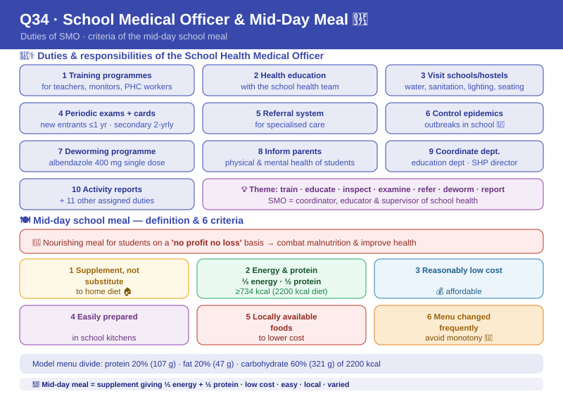

### 🩺 Duties & Responsibilities of the School Health Medical Officer (SMO)
1. To **plan & conduct training programmes** on school health for school teachers, school health monitors & other PHC workers
2. To **organize & implement health education programmes** in the school in collaboration with the school health team
3. To **visit schools & school hostels** and suggest measures for improvement of **water supply, sanitation, ventilation, lighting, seating arrangements** in the classroom and the **school feeding programme**
4. To undertake **periodic physical examinations** of students — all **new entrants in primary schools within 1 year**, and **all secondary school students once in 2 years** — according to a fixed schedule, and introduce **health cards**
5. To **organize & operationalize a referral system** for students needing specialized medical care for illnesses or defects
6. To help **control epidemic outbreaks** of disease in the schools
7. To **implement the deworming programme** in schools (albendazole 400 mg single dose) with the help of PHN
8. To **keep the parents informed** (through teachers) about physical & mental health problems of students
9. To maintain **close coordination with officers of the education department** regarding the school health programme
10. To **submit activity reports** to the concerned authority
11. To perform any other functions assigned by the Director/DMP, SHP

### 🍽 Mid-Day School Meal — 6 Criteria
> 🔴 The **mid-day school meal** is a nourishing meal provided to school children on a **'no profit no loss'** basis to **combat malnutrition and improve the health of school children**.

**Criteria of a mid-day school meal:**
1. The meal should be a **supplement and not a substitute** to the home diet
2. The meal should supply at least **one-third of the total energy requirement, and half of the protein need**
3. The **cost** of the meal should be reasonably low
4. The meal should be **easily prepared in schools** — no complicated cooking process
5. As far as possible, **locally available foods** should be used to reduce cost
6. The **menu should be frequently changed** to avoid monotony

> 📌 **Model menu (energy):** For 2200 kcal/day requirement — if protein & fat are 20% each (440 kcal each) and carbohydrate 60% (1320 kcal): Protein 107 gm, Fat 47 gm, Carbohydrate 321 gm. **Mid-day meal** must supply at least ⅓ of total energy = **734 kcal** and **½ of protein = ~53.5 gm**.

> 🎯 **SMO duties** = training + health education + school visits + periodic exams + health cards + referral + epidemic control + deworming + informing parents + coordination + reporting. **Mid-day meal criteria** = supplement (not substitute) + ⅓ energy + ½ protein + low cost + easy preparation + local foods + varied menu.

> 📖 Ch-08, Endeavour PDF pp. 296–311; Park PSM 24e, pp. 698

---

</details>

## Section 12 — Family Planning

<details>
<summary><b>Q35. Family planning — definition, concept, objectives, scope. Health aspects & health outcomes.</b></summary>

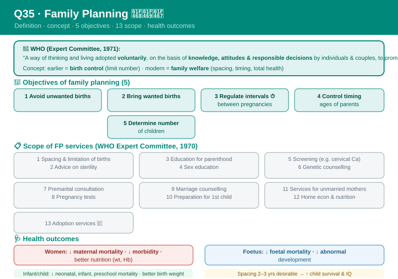

### 🧠 Definition of Family Planning
> 🔴 An **Expert Committee (1971) of the WHO** defined family planning as — *"A way of thinking and living that is adopted **voluntarily**, upon the basis of **knowledge, attitudes and responsible decisions** by individuals and couples, in order to **promote the health and welfare of the family group** and thus contribute effectively to the **social development of a country**."*

**Concept of family planning:**
- **Earlier concept** — birth control (limiting the number of children)
- **Modern concept** — **family welfare** (spacing, timing and total health of the family)

### 🎯 Objectives of Family Planning (5)
1. To **avoid unwanted births**
2. To **bring about wanted births**
3. To **regulate the intervals** between pregnancies
4. To **control the time at which births occur** in relation to the ages of the parents
5. To **determine the number of children** in the family

### ✅ Scope of Family Planning Services (WHO Expert Committee, 1970)
1. Proper **spacing and limitation** of births
2. Advice on **sterility**
3. **Education for parenthood**
4. **Sex education**
5. **Screening** for pathological conditions related to the reproductive system (e.g. cervical cancer)
6. **Genetic counselling**
7. **Premarital consultation and examination**
8. Carrying out **pregnancy tests**
9. **Marriage counselling**
10. Preparation of couples for the arrival of their **1st child**
11. Providing services for **unmarried mothers**
12. Teaching **home economics and nutrition**
13. Providing **adoption services**

> 📌 These activities vary from country to country according to national objectives and policies.

### 🩺 Health Aspects / Health Outcomes of Family Planning
**Women's health:**
1. ↓ **Maternal mortality**
2. ↓ Morbidity of women of child-bearing age
3. Improved nutritional status (weight, Hb level)
4. Prevention of complications of pregnancy & abortion

**Foetal health:**
1. ↓ Foetal mortality (early & late foetal death)
2. ↓ Abnormal development

**Infant & child health:**
1. ↓ Neonatal, infant & pre-school mortality
2. Better health at birth (birth weight)
3. ↓ Vulnerability to disease

**Mechanism of health improvement:**
1. Avoidance of **unwanted pregnancies**
2. **Limiting** the number of births & proper **spacing**
3. **Timing** the births (first & last) in relation to mother's age

**Child health benefits of spacing:**
1. **Child mortality** — a birth interval of **2–3 years** is desirable to reduce child mortality
2. **Child growth, development & nutrition** — small families give each child full share of love, care & nutrition (prevention of malnutrition)
3. **Infectious diseases** — less gastroenteritis, respiratory & skin infections in small families
4. **Intelligence** — lower IQ scores in children of larger families

> 🎯 FP = voluntary, knowledge-based decisions. Objectives = 5 (avoid, bring, regulate, control, determine). Scope = 13 items. Health = maternal + foetal + infant/child. Spacing 2–3 years protects child health.

> 📖 Ch-10, Endeavour PDF pp. 333–334; Park PSM 24e, p. 525

---

</details>

<details>
<summary><b>Q36. Eligible couple, target couple, CPR. Classification of contraceptive methods.</b></summary>

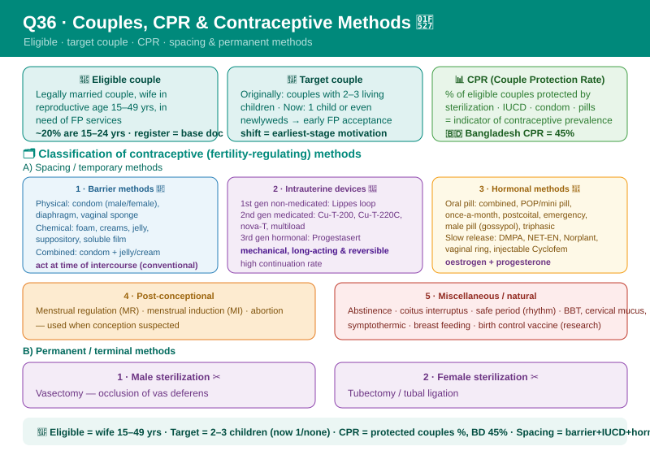

### 👥 Eligible Couple
> 🔴 A **legally married couple** wherein the **wife is in the reproductive age** (**15–45 or 49 years**) and who are in need of family planning services.
- About **20%** of eligible couples are in the age group **15–24 years**
- The **'eligible couple register'** is the basic document for organizing family planning work

### 🎯 Target Couple
> 🔴 Originally applied to couples who have had **2–3 living children** (family planning directed to such couples).
- **Now-a-days:** applied to couples with **1 child** or even **newly married couples**, to develop acceptance of the idea of FP from the earliest possible stage

### 📊 CPR (Couple Protection Rate)
> 🔴 **CPR** = The **per cent of eligible couples effectively protected** against childbirth by one or the other approved methods of FP — viz. **sterilization, IUCD, condom, or oral pills**. It is an **indicator of the prevalence of contraceptive practice** in the community.
- **In Bangladesh, CPR = 45%**

### 🗂 Classification of Contraceptive (Fertility-Regulating) Methods

**A) Spacing / Temporary methods:**
| Category | Methods |
|----------|---------|
| **1. Barrier** — Physical | Condom (male & female), diaphragm (dutch cap), vaginal sponge |
| — Chemical | Foam (tablet, aerosol), creams & pastes, jelly, suppository, soluble film |
| — Combined | Condom + jelly, condom + cream |
| **2. Intrauterine devices (mechanical)** | Non-medicated (1st gen: Lippes loop); Medicated (2nd gen: Cu-T-200, Cu-T-220C, nova-T, multiload; 3rd gen hormone: Progestasert) |
| **3. Hormonal** | Oral pill (combined, once-a-month, POP/mini pill, postcoital, male pill gossypol, triphasic, emergency pill); Slow-release depot (DMPA, NET-EN, Norplant, vaginal ring, combined injectable Cyclofem) |
| **4. Post-conceptional** | Menstrual regulation (MR), menstrual induction (MI), abortion |
| **5. Miscellaneous** | Abstinence, coitus interruptus, safe period/rhythm, natural FP (BBT, cervical mucus, symptothermic), breast feeding, birth control vaccine |

**B) Permanent / Terminal methods:**
1. **Male sterilization** — Vasectomy
2. **Female sterilization** — Tubectomy / tubal ligation

> 🎯 Eligible = wife 15–49. Target = 2–3+ children (now also newlyweds). CPR = % protected couples (BD 45%). Methods = spacing (barrier + IUCD + hormonal + natural) + permanent (vasectomy + tubectomy).

> 📖 Ch-10, Endeavour PDF pp. 335–338; Park PSM 24e, pp. 526–528

---

</details>

<details>
<summary><b>Q37. Criteria of ideal contraceptive. OCP (combined pill) — indications, contraindications, complications, non-contraceptive benefits.</b></summary>

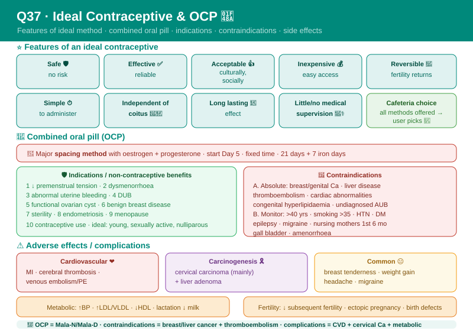

### ⭐ Features of an Ideal Contraceptive
It should be —
1. **Safe**
2. **Effective**
3. **Acceptable** to all
4. **Inexpensive & easy to access**
5. **Reversible**
6. **Simple** to administer
7. **Independent of coitus**
8. **Long lasting**
9. Requiring **little or no medical supervision**

> 📌 **Cafeteria choice** = offer all methods from which an individual can choose according to his needs & wishes. **Conventional contraceptives** = methods requiring action at the time of intercourse (condom, spermicides).

### 💊 Combined Oral Pill (OCP)
> 🔴 The **major spacing method** containing both **oestrogen & progesterone**.
- **Beginning of pill:** 5th day of menstrual cycle
- **Time:** every day at a fixed time, preferably before bed at night
- **Dose:** orally for **21 consecutive days**, then **next 7 days iron tablets** for withdrawal bleeding
- If a pill is forgotten → take it as soon as remembered; take next day's pill at usual time
- **Available in BD:** MALA-N, MALA-D

### 🛡 Indications / Non-Contraceptive Benefits of OCP
1. To reduce **premenstrual tension**
2. **Dysmenorrhoea**
3. **Abnormal uterine bleeding (AUB)**
4. **Dysfunctional uterine bleeding**
5. **Functional ovarian cyst**
6. **Benign breast disease**
7. **Sterility**
8. **Endometriosis**
9. **Menopause**
10. Contraceptive use

**Ideal candidates for combined pill (Viva):**
1. Sexually active young & adolescent woman
2. **Nulliparous** woman
3. Woman with endometriosis not ready to get pregnant

### 🚫 Contraindications of OCP
**A) Absolute:**
1. Cancer of the **breast & genitals**
2. **Liver disease**
3. Previous or present history of **thromboembolism**
4. **Cardiac abnormalities**
5. **Congenital hyperlipidaemia**
6. **Undiagnosed abnormal uterine bleeding**

**B) Special problems requiring medical surveillance:**
1. Age > **40 years**
2. **Smoking + age > 35 years**
3. **Mild hypertension**
4. Chronic renal disease
5. **Epilepsy**
6. **Migraine**
7. **Nursing mothers in first 6 months**
8. **Diabetes mellitus**
9. **Gall bladder disease**
10. History of infrequent bleeding
11. **Amenorrhoea** etc.

### ⚠️ Adverse Effects / Complications of OCP
1. **Cardiovascular:** Myocardial infarction, cerebral thrombosis, venous embolism with or without pulmonary embolism
2. **Carcinogenesis:** Cervical carcinoma (mainly)
3. **Metabolic:** ↑ blood pressure, ↑ LDL/VLDL, ↓ HDL
4. **Liver:** Hepatocellular adenoma, gall bladder disease
5. **Lactation:** affects quantity & composition of milk, premature cessation
6. **Subsequent fertility** & **ectopic pregnancy**
7. **Foetal development:** ↑ incidence of birth defects
8. **Common unwanted effects:** breast tenderness, weight gain, headache & migraine

> 🎯 Ideal contraceptive = safe + effective + acceptable + cheap + reversible. OCP = estrogen + progesterone. Contraindications = cancer + liver + thromboembolism + cardiac. Complications = CVD + cervical Ca + metabolic + liver.

> 📖 Ch-10, Endeavour PDF pp. 339–342; Park PSM 24e, pp. 528, 535–537

---

</details>

<details>
<summary><b>Q38. Emergency contraceptive pill. Safe period calculation. IUCD (indications, contraindications, complications). Ideal candidates of sterilization.</b></summary>

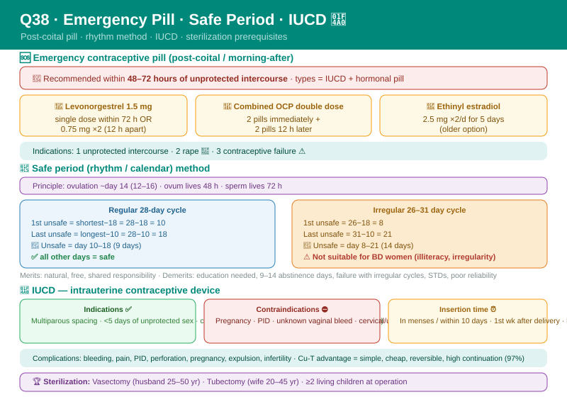

### 🆘 Emergency Contraceptive Pill (Post-coital, Morning-after)
> 🔴 Recommended **within 48–72 hours of unprotected intercourse**. Types: **1) IUCD, 2) Hormonal (post-coital pill)**.

**Preparations:**
- **Levonorgestrel 1.5 mg** — single dose as soon as possible or within **72 hours**, **OR 0.75 mg** as soon as possible followed by **another 0.75 mg 12 hours later**
- **Combined OCP** — double dose: 2 pills immediately + 2 pills 12 hours later
- **Ethinyl estradiol 2.5 mg** twice daily for 5 days

**Indications:** 1) After unprotected intercourse 2) **Rape** 3) **Contraceptive failure**

### 📅 Safe Period / Rhythm / Calendar Method
> 🔴 Aims at finding the time during which a **viable ovum is available for fertilization by sperm**.

**Principle:** Ovulation usually at **14th day** (range 12–16); ovum survives **48 hours**; sperm survives **72 hours**.

**Calculation formula:**
- **1st unsafe day** = shortest cycle − 18
- **Last unsafe day** = longest cycle − 10

**Regular 28-day cycle:**
- 28 − 18 = **10th day** (1st unsafe) · 28 − 10 = **18th day** (last unsafe)
- Unsafe days = **10th–18th (9 days)**; all other days are **safe**

**Irregular 26–31 day cycle:**
- 26 − 18 = **8th day** (1st unsafe) · 31 − 10 = **21st day** (last unsafe)
- Unsafe = **8th–21st (14 days)**

**Merits:** Natural, no cost, equal participation in sexual act.
**Demerits:** Needs education & responsibility, abstinence of 9–14 days, irregular cycles cause failure, chances of STDs, poor reliability.

> 📌 **Not suitable for Bangladeshi women** because of: irregularity of cycle, **illiteracy**, irresponsibility, wrong calculation, inability to follow, "taking chances".

### 💠 IUCD (Intrauterine Contraceptive Device)

**Indications:**
1. **Multiparous women** for birth spacing
2. Women who cannot use hormonal methods
3. Contraception when inserted within **5 days of unprotected sex**
4. Unreliable/illiterate women (poor compliance to pill)

**Absolute contraindications:**
1. Suspected **pregnancy**
2. **PID** (pelvic inflammatory disease)
3. **Vaginal bleeding of unknown aetiology**
4. **Cancer of cervix, uterus or adnexa** & other pelvic tumours
5. **Previous ectopic pregnancy**

**Relative contraindications:**
1. **Anaemia** 2. **Menorrhagia** 3. H/O PID since last pregnancy 4. Purulent cervical discharge 5. Distortion of uterine cavity 6. Unmotivated person

**Timing of insertion:**
1. During menstruation or **within 10 days** of the beginning of a period
2. During the **1st week after delivery**
3. Most convenient time: **6–8 weeks after delivery** (post-puerperal)
4. Any time during reproductive age (except pregnancy)

**Complications/Side effects:** Bleeding, pain, pelvic infection, uterine perforation, pregnancy, ectopic pregnancy, expulsion, fertility after removal, cancer & teratogenesis, mortality.

**Advantages of Cu-T:** Simple, takes only minutes, stays as long as required, inexpensive, reversible, free of systemic side effects, highest continuation rate, no need for continual motivation.

**Disadvantages of Cu-T:** Not 100% effective (97%), ↑ menstrual bleeding, ectopic pregnancy, pain & discomfort, perforation, PID, syncopal attack, expulsion with risk of pregnancy, infertility.

### 🏆 Permanent (Terminal) Sterilization — Prerequisites
1. **Vasectomy** — husband's age **25–50 years** (not < 25, not > 50)
2. **Tubectomy** — wife's age **20–45 years**
3. **At least 2 living children** at the time of operation

> 🎯 Emergency = levonorgestrel 1.5 mg/72 hrs (or 0.75 mg ×2). Safe period: 1st unsafe = shortest−18; last unsafe = longest−10. IUCD ideal candidate = parous + no PID + normal menses + monogamous. Sterilization = vasectomy 25–50, tubectomy 20–45, ≥2 children.

> 📖 Ch-10, Endeavour PDF pp. 340–357; Park PSM 24e, pp. 529–543

---

</details>

## Section 13 — Accidents & Disaster

<details>
<summary><b>Q39. Accident — definition, classification, agents. Factors of RTA in Bangladesh. Prevention of RTA.</b></summary>

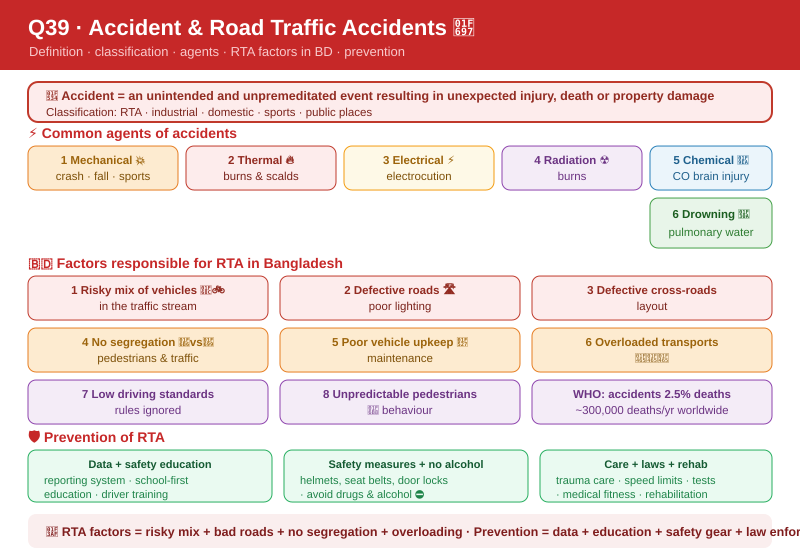

### 🩹 Accident — Definition
> 🔴 An accident is an **unintended and unpremeditated event** that almost invariably results in **unexpected injury, death or property damage**.

**Classification:**
1. **Road traffic accidents (RTA)**
2. **Industrial accidents**
3. **Household (domestic) accidents**
4. **Sports accidents**
5. Accidents in **public places**

### ⚡ Common Agents for Causation of Accidents
1. **Mechanical or kinetic energy** — automobile crash, fall, sports injuries
2. **Thermal energy** — burns and scalds
3. **Electrical energy** — electrocution
4. **Radiation energy** — burns
5. **Chemical energy** — acute brain injury from CO (interferes with oxygen-carrying capacity of blood)
6. **Drowning** — inhaled water interfering with pulmonary function

### 🚗 Factors Responsible for the Causation of RTA (Bangladesh)
1. A **risky mix of vehicles** in the traffic stream
2. **Defective roads** with poor street lighting
3. **Defective layout of cross-roads**
4. Poor road environment with **almost no segregation of pedestrians** from wheeled traffic
5. **Poor maintenance of vehicles**
6. **Overloading of public transports**
7. **Low driving standards** with widespread disregard of traffic rules and road signs
8. **Unpredictable behaviour of pedestrians**

### 🛡 Prevention of RTA
1. **Data collection:** Without adequate data collection, analysis & interpretation there can be no effective counter-measures, evaluations & strategies (basic reporting system must exist)
2. **Safety education:** Begin with school children; drivers trained in maintenance & safe driving; young people educated on risk factors, traffic rules & safety precautions + first aid
3. **Promotion of safety measures:** Safety helmets, leather clothing & boots, children seated (not on front seat), door locks, proper vehicle design, laminated windshields
4. **Alcohol & other drugs:** Barbiturates, amphetamines, tranquillizers & alcohol should be avoided totally
5. **Primary (trauma) care:** Planning, organization & management of trauma treatment & emergency care services
6. **Elimination of causative factors:** Improvement of roads, imposing speed limits, marking danger points
7. **Enforcement of laws:** Driving tests, medical fitness to drive, enforcement of speed limits, compulsory seat belts & crash helmets, checking blood alcohol concentration, roadside breath testing, regular vehicle inspection, periodic re-examination of drivers over age 55
8. **Rehabilitation services** (medical, social, occupational)
9. **Accident research**

> 📌 For viva: **ARC** = Accident Research Centre (BUET); **BHIS** = Bangladesh Health & Injury Survey; **BDHS** = Bangladesh Demographic & Health Survey. WHO: accidents = 2.5% of total deaths; ~300,000 deaths/year worldwide; non-fatal injuries at least 40× that figure.

> 🎯 Accident = unintended event. Agents = mechanical + thermal + electrical + radiation + chemical + drowning. RTA factors = risky mix + bad roads + poor segregation + poor maintenance + overloading + low standards. Prevention = data + education + safety gear + law enforcement + rehabilitation.

> 📖 Ch-16, Endeavour PDF pp. 550–554; Rashid 5e, pp. 382–386; Park PSM 24e, pp. 425–427

---

</details>

<details>
<summary><b>Q40. Domestic accident — definition, common types, prevention. Epidemiological triad of RTA. Industrial & sports accidents. Disaster — define, classify.</b></summary>

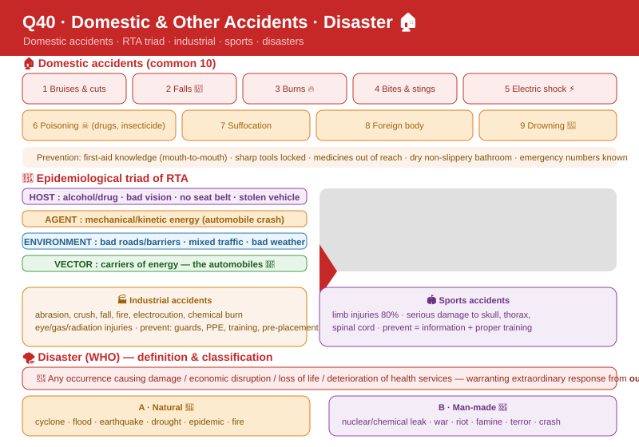

### 🏠 Domestic Accident
> 🔴 An accident which **takes place in the home or in its immediate surroundings**, and more generally, **all accidents not connected with traffic, vehicles or sport**.

**Common domestic accidents (10):**
1. **Bruises, cuts or punctured wounds**
2. **Falls & concussion**
3. **Burns & scalds** (flame, hot liquid, chemicals)
4. **Bites & stings**
5. **Electric shock**
6. **Poisoning** — drugs, insecticides, rat poison, kerosene
7. **Suffocation**
8. **Foreign body** in eye & body orifices
9. **Drowning**
10. Bites & injuries from animals

**Prevention of domestic accidents:**
1. Adult members of the house should be acquainted with the **principles & practice of first-aid** (mouth-to-mouth resuscitation/"kiss of life" is useful in electric shock & drowning)
2. All **sharp & pointed instruments** kept in safe cupboards
3. **Careful storage** of medicines, insecticides, detergents & chemicals — out of reach of children
4. **Bathrooms not slippery**, kept dry
5. **Telephone numbers** of hospitals/ambulances & address of nearest doctor should be known

> 📌 **Drowning** = the process of experiencing **respiratory impairment from submersion/immersion in liquid**. Prevention: awareness & education, no unplanned digging of ponds/khals, barriers around ponds, baby control (barricades), chain & bail system, early swimming training, safe water recreation zones, covering wells/open cisterns, life jackets on vessels, proper river trafficking, rescue team.

### 🔺 Epidemiological Triad of RTA
| Component | Factors |
|-----------|---------|
| **Host** | Alcohol or drug abuse, use of stolen vehicle, poor vision, lack of protective equipment (seat belts) |
| **Agent** | Mechanical / kinetic energy (automobile crash) |
| **Environment** | Defective road design, faulty road barrier, faulty speed breaker, mixed fast & slow traffic, inadequate law enforcement, overloading, bad weather |
| **Vector** | Carriers of energy (automobiles) |

### 🏭 Industrial Accidents
**Common industrial accidents:** Abrasion, contusion, laceration, penetrating wound · crush injuries · fall · fire · electrocution · chemical burn · eye injuries · suffocation from gas inhalation · radiation injuries.

**Prevention of industrial accidents:**
1. Factory building carefully planned (care to floor construction)
2. Ceiling & walls coloured so reflected light makes moving parts visible
3. Proper lighting arrangements
4. Ventilation & control of room temperature & humidity
5. Invention of **less dangerous machines** with integrated safety devices
6. **Individual switch** for each machine
7. **Guards & enclosures** of machines (moving parts, wheels, gears)
8. Workers should **not wear loose clothing**
9. **Personal safety equipment** — helmets, goggles, shields, masks, gloves, respirators
10. **Pre-placement medical examination**
11. **Supervision & training** of workers
12. Good **canteen & rest place** facilities
13. **Vigilance / safety committee**
14. Easy access to **fire extinguishers**, prohibition of smoking
15. Strict enforcement of **safety laws**

### 🏟 Sports Accidents
- **Upper & lower limb injuries** (80% cases)
- Serious injuries damaging **skull, thorax & spinal cord**
- **Prevention:** Preventive information & proper training limit serious accidents from sports & games

### 🌪 Disaster (WHO) — Definition & Classification
> 🔴 **WHO definition:** Any occurrence that causes **damage, economic disruption, loss of human life or deterioration of health and health services** on a scale sufficient to warrant an **extraordinary response from outside** the affected community or area.

**A) Natural disasters:** Cyclone, flood, tidal waves, tornado, earthquake, landslide, volcanic eruption, drought, heat waves, hurricanes, epidemics, fire, building collapse.

**B) Man-made disasters:** Nuclear accidents, leaks of toxic chemicals, armed conflicts (war), political/ethnic strife, riot, famine, fire, explosions, environmental pollution, terrorist activities, aircraft crashes.

**Common disasters in Bangladesh:** Flood, cyclone, tidal wave, tornado, landslide, drought, earthquake, fires, building collapse, environmental pollution.

> 🎯 Domestic = home injuries (burns + falls + poisoning + drowning). RTA triad = host + agent + environment (vector = vehicles). Industrial = prevent by guards + PPE + training + pre-placement exam. Disaster = extraordinary event requiring outside help. Natural vs man-made.

> 📖 Ch-16, Endeavour PDF pp. 554–559; Park PSM 24e, pp. 427, 832; Rashid 5e, pp. 384–388

---

</details>

<details>
<summary><b>Q41. Health effects of disaster. Epidemiology. Disaster management aspects.</b></summary>

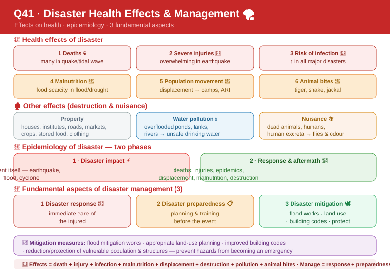

### 🚨 Effects / Health Effects of Disaster
1. **Deaths:** Many perish in earthquake & tidal wave; immediate deaths in flood are not significant
2. **Severe injuries:** Overwhelming in earthquake, moderate in cyclones, very few in floods — requiring intensive medical care
3. **Risk of infection:** Increased in all major disasters
4. **Malnutrition:** Food scarcity is a common effect of disasters like flood, tidal bore & droughts
5. **Major population movements:** Inevitable in disasters like flood & droughts
6. **Others:**
   - **Death of animals**
   - **Destruction of houses** & educational institutes
   - **Damage of crops**, stored food, clothing, water supply
   - **Damage of roads**, markets
   - **Water pollution** due to over-flooding of ponds, tanks & rivers
   - **Animal bites** — tiger, snake, jackal
   - **Nuisance** by dead man, animals & human excreta

### 🔬 Epidemiology of Disaster
Two complementary phases:
1. **The disaster impact** — the event itself (earthquake, flood, cyclone)
2. **The response & aftermath** — deaths, injuries, epidemics, displacement, malnutrition, destruction

### 🔑 Fundamental Aspects of Disaster Management (3)
1. **Disaster response**
2. **Disaster preparedness**
3. **Disaster mitigation**

> 📌 **Mitigation (reduction) of health effects:** Measures designed to prevent hazards from causing an emergency or lessen the likely effects — includes **flood mitigation works, appropriate land-use planning, improved building codes**, and **reduction or protection of vulnerable population & structures**.

> 🎯 Health effects = death + injuries + infection + malnutrition + displacement + destruction + pollution + animal bites. Management = response + preparedness + mitigation.

> 📖 Ch-16, Endeavour PDF pp. 558–560; Rashid 5e, p. 389; Park PSM 24e, pp. 834–835

---

</details>

<details>
<summary><b>Q42. Triage (four-colour system). Disaster preparedness & response (4 phases). Mass casualty management.</b></summary>

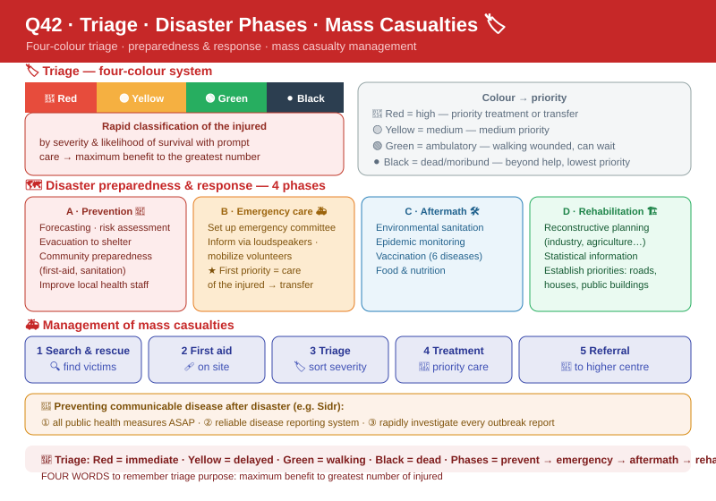

### 🏷 Triage
> 🔴 Triage consists of **rapidly classifying the injured** on the basis of the **severity of injuries and likelihood of survival** with prompt medical attention. It is the only approach that can provide **maximum benefit to the greatest number** of injured in a major disaster.

**Four-colour code system:**
| Colour | Priority | Meaning |
|--------|----------|---------|
| 🔴 **Red** | High | Priority treatment or transfer |
| 🟡 **Yellow** | Medium | Medium priority |
| 🟢 **Green** | Ambulatory | Walking wounded — can wait |
| ⚫ **Black** | Dead / moribund | Beyond help; lowest priority |

### 🗺 Disaster Preparedness & Response — 4 Phases
**A) Prevention and alleviation of consequences:**
1. **Forecasting** the disaster using modern technology
2. **Ascertaining the risk** by periodically enlisting the support of social groups
3. **Evacuation** of people to nearest safe shelter
4. **Community preparedness:** exercises in first-aid, temporary shelter, sanitary practices (safe water supply, sanitary latrines, controlled refuse disposal, fly/vector/rodent control)
5. **Improving professional qualities** of local health personnel

**B) Immediate emergency care:**
1. Set up an **emergency committee** — inform/instruct people by loudspeakers & mobilize volunteers to dispel fear and panic
2. **First priority = care of the injured** — remove victims to nearest medical establishment; those requiring specialized surgical care transferred by ambulance/motor boats to the nearest centre with good facilities

**C) Management of the aftermath:**
1. **Environmental sanitation**
2. **Public health monitoring & prevention of epidemics**
3. **Vaccination** against six major childhood diseases
4. **Food & nutrition**

**D) Rehabilitation & reconstruction:**
1. Reconstructive planning starts **immediately** after the disaster; include in the national disaster plan
2. Attention to industry, agriculture & all socioeconomic aspects, not only new houses & public buildings
3. **Statistical information required:** number of affected persons, their geographical distribution, age group, occupation; damage to water supply & health centres; number & standard of houses destroyed; available manpower, materials, equipment & financial sources
4. **Establish priorities:** reconstruct roads & public buildings, replace destroyed housing, exercise economic & technical control of labour and material

### 🚑 Management of Mass Casualties
1. **Search & rescue**
2. **First aid**
3. **Triage**
4. **Treatment**
5. **Referral**

### 🦠 Prevention of Communicable Diseases after a Disaster (e.g. Sidr)
1. Implement as soon as possible **all public health measures** to reduce risk of disease transmission
2. Organize a **reliable disease reporting system** to identify outbreaks & control measures
3. **Investigate all reports** of disease outbreaks rapidly

> 🎯 Triage = sort by severity. Red = immediate · Yellow = delayed · Green = walking · Black = dead. 4 phases = prevention + emergency care + aftermath + rehabilitation. Mass casualties = search + first aid + triage + treatment + referral.

> 📖 Ch-16, Endeavour PDF pp. 560–562; Rashid 5e, pp. 390; Park PSM 24e, pp. 834–835

---

</details>

## Section 14 — Occupational Health

<details>
<summary><b>Q43. Occupational health — definition, objectives. Occupational environment. Ergonomics — definition, objectives.</b></summary>

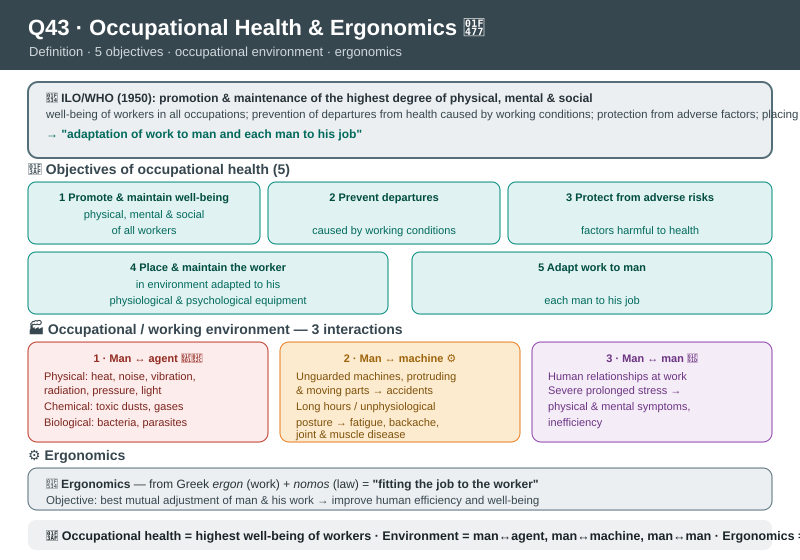

### 🧑🔧 Occupational Health
> 🔴 The Joint **ILO/WHO committee (1950)** defined occupational health as — promotion and maintenance of the **highest degree of physical, mental and social well-being of workers in all occupations**; prevention among workers of departures from health caused by their **working conditions**; protection of workers in their employment from risks resulting from factors **adverse to health**; placing & maintenance of the worker in an occupational environment adapted to his physiological & psychological equipment; and, to summarize, **adaptation of work to man and each man to his job**.

**Objectives (5):**
1. Promotion & maintenance of the highest degree of physical, mental & social well-being of workers
2. Prevention among workers of departures from health caused by working conditions
3. Protection of workers from risks resulting from factors adverse to health
4. Placing & maintenance of workers in an occupational environment adapted to their psychological & physiological equipment
5. Adaptation of work to man and each man to his job

### 🏭 Occupational / Working Environment
> 🔴 **Occupational environment** = "the **sum of external conditions and influences** which prevail at the place of work and which have a bearing on the **health of the working population**."

**Three types of interaction in occupational environment:**
1. **Man and physical, chemical & biological agents**
   - **Physical:** heat, cold, humidity, air movement, heat radiation, light, noise, vibrations, ionizing radiation
   - **Chemical:** toxic dusts, gases → respiratory illness, skin injury, blood disease
   - **Biological:** viral, rickettsial, bacterial & parasitic agents from animals/products, contaminated water, soil, food
2. **Man and machine:** unguarded machines, protruding & moving parts → accidents; long hours in unphysiological postures → fatigue, backache, joint & muscle disease
3. **Man and man:** human relationships; severe prolonged stress → serious physical/mental symptoms & inefficiency

### ⚙️ Ergonomics
> 🔴 **Ergonomics** — from Greek *ergon* (work) + *nomos* (law) — simply means **"fitting the job to the worker."**

**Objective:** To achieve the **best mutual adjustment of man and his work**, for the improvement of **human efficiency and well-being**.

> 🎯 Occupational health = highest physical/mental/social well-being of workers. Interaction = man–agent, man–machine, man–man. Ergonomics = fit the job to the worker.

> 📖 Ch-17, Endeavour PDF pp. 563–564; Park PSM 24e, pp. 840–841

---

</details>

<details>
<summary><b>Q44. Occupational health hazards — physical, chemical, biological, mechanical, psychosocial. Offensive trades.</b></summary>

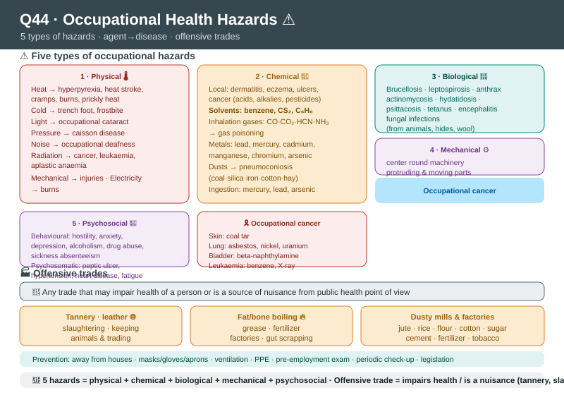

### ⚠️ Occupational Hazards — 5 Types
An industrial worker may be exposed to **five types of hazards:**

**1) Physical hazards:**
| Agent | Disease |
|-------|---------|
| **Heat** | Hyperpyrexia, heat exhaustion, heat syncope, heat cramps, burns, prickly heat |
| **Cold** | Trench foot, frost bite, chilblains |
| **Light** | Occupational cataract, miner's nystagmus |
| **Pressure** | **Caisson disease**, air embolism, blast |
| **Noise** | Occupational (noise-induced) deafness |
| **Radiation** | Cancer, leukaemia, aplastic anaemia, pancytopenia |
| **Mechanical** | Injuries, accidents |
| **Electricity** | Burns |

**2) Chemical hazards:**
- **Local action:** dermatitis, eczema, ulcers, cancer (acids, alkalies, pesticides)
- **Solvents:** carbon bisulphide, benzene, trichloroethylene, chloroform
- **Inhalation:**
  - **Gases** — CO₂, CO, HCN, CS₂, NH₃, H₂S, HCl, SO₂ → **gas poisoning**
  - **Metals & compounds** — lead, mercury, cadmium, manganese, beryllium, arsenic, chromium
  - **Dusts (Pneumoconiosis):** inorganic (coal → anthracosis, silica → silicosis, iron → siderosis) or organic (cotton → byssinosis, hay/grain → farmer's lung)
- **Ingestion:** mercury, lead, arsenic, chromium, cadmium, phosphorus

**3) Biological hazards:** Brucellosis, leptospirosis, anthrax, actinomycosis, hydatidosis, psittacosis, tetanus, encephalitis, fungal infections.

**4) Mechanical hazards:** Centre round machinery, protruding & moving parts.

**5) Psychosocial hazards:**
- **Psychological/behavioural:** hostility, aggressiveness, anxiety, depression, tardiness, alcoholism, drug abuse, sickness absenteeism
- **Psychosomatic:** fatigue, headache, neck/shoulder/back pain, propensity to **peptic ulcer, hypertension, heart disease**, rapid ageing

> 📌 **Occupational cancer:** skin (coal tar), lung (asbestos, nickel, uranium, chromates), bladder (beta-naphthylamine, benzidine), leukaemia (benzene, X-rays, radioactive substances).

### 🏭 Offensive Trades
> 🔴 Any trade which **may impair the health of a person** in some way **or is a source of nuisance** from the public health point of view.

**List of offensive trades:**
1. **Tannery & leather processing**
2. **Slaughtering of animals**
3. **Keeping animals & animal trading**
4. **Fat melting / boiling** in grease factory
5. **Bone boiling & drying** in fertilizer factory
6. **Gut scrapping**
7. **Brick-fields, cement, fertilizer & lime factories**
8. **Corrosive chemical-producing factories**
9. **Dusty mills** — jute, rice, flour, wool, cotton, sugar, paper mills, tobacco factory

**Preventive measures:** Sites away from residential areas · protective devices (masks, aprons, gloves) · vaccination of tannery workers · dust-control measures · regular environmental monitoring · general & local exhaust ventilation · PPE · personal hygiene & health education · medical measures (pre-employment examination, periodic check-up) · legislation.

> 🎯 5 hazard types = physical + chemical + biological + mechanical + psychosocial. Offensive trade = impairs health or is a nuisance. Examples = tannery + slaughtering + fat/bone boiling + corrosive chemicals + dusty mills.

> 📖 Ch-17, Endeavour PDF pp. 564–567, 578; Park PSM 24e, pp. 841–842; Rashid 5e, pp. 219–222

---

</details>

<details>
<summary><b>Q45. Prevention of occupational hazards. Pneumoconiosis — dusts & diseases. Farmer's lung. Silicosis.</b></summary>

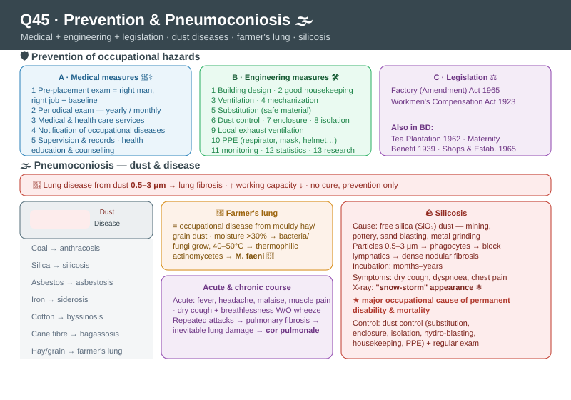

### 🛡 Prevention of Occupational / Industrial Hazards

**A) Medical measures:**
1. **Pre-placement examination** — at employment: medical, family, occupational & social history + physical examination + laboratory & biological investigations (places the **right man in the right job**; serves as baseline for future comparison)
2. **Periodical examination** — once a year; **monthly** for certain exposures
3. Medical & health care services
4. **Notification** of occupational diseases
5. **Supervision of working environment**
6. Maintenance & analysis of records
7. **Health education & counselling**

**B) Engineering measures:**
1. Design of building (floor, walls, height, ceiling, window, cubic space) from the original plan
2. **Good housekeeping** (cleanliness, ventilation, lighting, washing, maintenance)
3. General **ventilation**
4. **Mechanization** (reduces hazard of contact)
5. **Substitution** — replace harmful material with harmless/less toxic
6. **Dust control** at point of origin (water sprays)
7. **Enclosure**
8. **Isolation** of offensive processes
9. **Local exhaust ventilation**
10. **Protective devices** — respirators, masks, earplugs, earmuffs, helmets, safety shoes, aprons, gloves, gumboots, barrier creams, screens, goggles
11. Environmental monitoring
12. Statistical monitoring
13. Research

**C) Legislation:** **Factory (Amendment) Act 1965** and **Workmen's Compensation Act 1923**.

> 📌 Health & safety legislation of Bangladesh: Factories Act 1965 · Workmen's Compensation Act 1923 · Tea Plantation Ordinance 1962 · Maternity Benefit Act 1939 · Dock Labourers Act 1934 · Shops & Establishments Act 1965 · Minimum Wages Ordinance 1961 · Employment of Children Act 1938.

### 🌫 Pneumoconiosis
> 🔴 A **lung disease caused by dust** within the size range of **0.5 to 3 microns** after a variable period of exposure, which may gradually cripple a man by reducing his **working capacity** due to **lung fibrosis** and other complications.

**Disease caused by industrial dust:**
| Dust | Disease |
|------|---------|
| Coal dust | **Anthracosis** |
| Silica | **Silicosis** |
| Asbestos | **Asbestosis** |
| Iron | **Siderosis** |
| Cane fibre | **Bagassosis** |
| Cotton dust | **Byssinosis** |
| Tobacco | **Tobaccosis** |
| Hay / grain dust | **Farmer's lung** |

**Factors related to hazardous effects of dust on lungs:** 1) Chemical composition 2) Fineness 3) Concentration of dust in air 4) Period of exposure 5) Health status of the person exposed.

**Preventive measures (no cure):** 1) **Dust control** 2) **Personal protection** 3) **Periodic medical check-up**.

### 🌾 Farmer's Lung
> 🔴 An **occupational disease due to inhalation of mouldy hay or grain dust**.

**Pathogenesis:** In grain/hay with moisture > **30%**, bacteria & fungi grow rapidly → temperature rises to **40–50°C** → growth of **thermophilic actinomycetes**, of which **Microspolyspora faeni** is the main cause.

**Acute illness:** Headache, fever, malaise, muscle pain · **dry cough, breathlessness without wheeze** · ↑ temperature.

**Pathological changes (repeated attacks):** 1) **Pulmonary fibrosis** 2) Inevitable pulmonary damage 3) **Cor pulmonale**.

### 🪨 Silicosis
> 🔴 Caused by inhalation of dust containing **free silica (silicon dioxide)** — mining, pottery & ceramic, sand blasting, metal grinding, iron & steel, building & construction.
- **Size of particle:** 0.5–3 microns · **Incubation:** few months to years
- **Pathogenesis:** particles ingested by phagocytes → accumulation & blockage of lymphatics → dense nodular fibrosis
- **Symptoms:** initial dry irritant cough, dyspnoea on exertion, chest pain; advanced → impaired total lung capacity; **X-ray: "snow-storm" appearance**
- **Among occupational diseases, the major cause of permanent disability & mortality**
- **Control:** rigorous dust control (substitution, enclosure, isolation, hydro-blasting, good housekeeping, PPE) + regular physical examination

> 🎯 Prevention = medical (pre-placement + periodic) + engineering (substitution + dust control + PPE) + legislation. Pneumoconiosis = dust 0.5–3 µm → fibrosis. Silicosis X-ray = snow-storm. Farmer's lung = mouldy hay + *M. faeni* → fibrosis + cor pulmonale.

> 📖 Ch-17, Endeavour PDF pp. 567–570, 575–576, 579; Park PSM 24e, pp. 843–849

---

</details>

<details>
<summary><b>Q46. Sickness absenteeism. Health hazards of doctor/garment worker/industrial worker. Medical benefits of workers. Agriculture worker hazards.</b></summary>

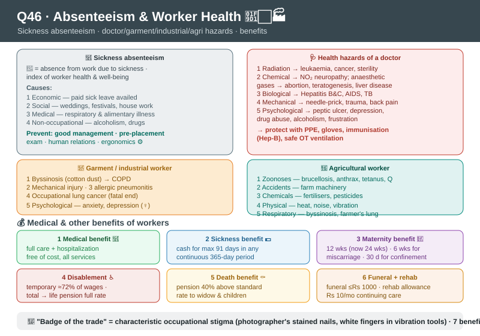

### 🏥 Sickness Absenteeism
> 🔴 An important health problem in industry and a useful **index to assess the state of health of workers** and their physical, mental and social well-being — defined as **absence from work due to sickness**.

**Causes:**
1. **Economic:** worker entitled to sick leave with pay tends to avail of it by reporting sick
2. **Social:** weddings, festivals, repair & maintenance of ancestral house
3. **Medical:** respiratory & alimentary illness
4. **Non-occupational:** nutritional disorders, alcoholism, drug addiction

**Prevention:** 1) Good factory management & practices 2) Adequate pre-placement examination 3) Good human relations 4) **Application of ergonomics**.

### 🩺 Health Hazards of a Doctor
1. **Radiation hazards:** Leukaemia, cancer, sterility, ulceration, genetic changes
2. **Chemical hazards:** Chronic exposure to **NO₂** in OT interferes with vitamin B₁₂ metabolism → **neuropathy**; anaesthetic gases → abortion, teratogenesis, mutagenesis, carcinogenesis, liver disease; explosion/burning
3. **Biological hazards:** **Hepatitis B & C, AIDS, tuberculosis**
4. **Mechanical hazards:** Trauma, needle-prick, electric shocks, back pain & muscular strain from prolonged standing
5. **Psychological hazards:** Peptic ulcer, depression, frustration, drug abuse, alcoholism, demoralization, divorce

### 👗 Health Hazards of Industrial / Garment Workers
1. **Byssinosis** — cotton fibre dust over long periods → chronic cough, progressive dyspnoea → emphysema
2. **COPD** — the ultimate result of cotton-mill hazard
3. **Mechanical injury**
4. **Extrinsic allergic pneumonitis** — hypersensitivity to inhaled dust
5. **Occupational lung cancer** — the most fatal conclusion
6. **Psychological hazards (female garments workers):** anxiety, depression, fatigue, low back pain

### 🌾 Health Hazards of Agricultural Workers
1. **Zoonotic / biological hazards:** Brucellosis, anthrax, leptospirosis, tetanus, bovine tuberculosis, Q fever, fungal infections (hands & feet), parasitic worm infections
2. **Accidents** — increasing use of machinery
3. **Toxic / chemical hazards** — fertilizers, insecticides, pesticides
4. **Physical hazards** — extremes of temperature, humidity, solar radiation, excessive noise & vibration, inadequate ventilation
5. **Respiratory diseases:** byssinosis, bagassosis, farmer's lung, occupational asthma

### 💰 Medical Benefits of Workers
1. **Medical benefit:** Full medical care including **hospitalization, free of cost** — outpatient care, drugs & dressings, specialist services, pathological & radiological investigations, domiciliary services, antenatal/natal/postnatal services, immunization, family planning, emergency & ambulance services, health education, inpatient treatment
2. **Sickness benefit:** Periodic **cash payment** for a maximum of **91 days** in any continuous period of **365 days** (certified by insurance medical officer)
3. **Maternity benefit:** **12 weeks (now 24 weeks)**; **6 weeks** for miscarriage; 30 days for sickness arising from confinement
4. **Disablement benefit:** Temporary disablement ≈ **72% of wages**; total permanent disablement → **life pension at full rate**
5. **Death benefit:** Pension at **40% more** than the standard benefit rate paid periodically to widow & children
6. **Funeral expenses:** cash payment **not exceeding Rs. 1000**
7. **Rehabilitation allowance:** monthly Rs. 10 — insured person & family continue to receive medical treatment after permanent disablement or retirement

### ⭐ Badge of the Trade
> 🔴 The trauma of a particular occupation often gives rise to a characteristic stigma — *"badge of the trade"*: discoloured nails of photographers/hairdressers, white fingers (traumatic vasospasm) in workers handling vibration tools, metallic tattooing from explosives.

> 🎯 Sickness absenteeism = absence due to sickness (index of worker health). Doctor hazards = radiation + chemical + biological + mechanical + psychological. Worker benefits = medical + sickness (91d) + maternity (24wk) + disablement (72%/pension) + death (40%+) + funeral + rehabilitation.

> 📖 Ch-17, Endeavour PDF pp. 567–581; Park PSM 24e, pp. 847–853; Rashid 5e, pp. 209–223

---

</details>

## Section 15 — Environment, Water, Air, Noise, Radiation, Global Warming, Ventilation

<details>
<summary><b>Q47. Define & classify environment. Safe & wholesome water. Water-borne & water-related diseases.</b></summary>

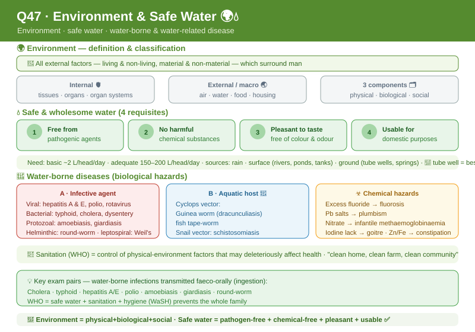

### 🌍 Environment — Definition
> 🔴 **Environment** implies all the **external factors — living and non-living, material and non-material — which surround man**.

**Classification:**
- **Internal environment** — relates to tissues, organs, organ systems & their harmonious functioning
- **External / macro environment** — all that is external to the individual human host (air, water, food, housing) with which he is in constant interaction

**Three components (closely related):**
1. **Physical:** water, air, soil, housing, wastes, radiation
2. **Biological:** plant & animal life — bacteria, viruses, rodents, insects
3. **Social / psychosocial:** customs, culture, habits, income, occupation, religion

> 📌 **Sanitation** (NSF, USA) = "a way of life... expressed in the clean home, clean farm, clean business, clean neighbourhood and clean community." **Environmental sanitation (WHO)** = control of all those factors in the physical environment which exercise/may exercise a deleterious effect on physical development, health & survival.

### 💧 Safe and Wholesome Water
> 🔴 Water that is —
> 1. **Free from pathogenic agents**
> 2. **Free from harmful chemical substances**
> 3. **Pleasant to taste** (free from colour & odour)
> 4. **Usable for domestic purposes**

**Water requirements:** Basic physiological need **~2 L/head/day**; adequate **150–200 L/head/day** (more in hospitals).

**Sources of water:** 1) **Rain** 2) **Surface water** (impounding reservoirs, rivers & streams, tanks/ponds/lakes) 3) **Ground water** (shallow wells, deep wells, springs).

> 📌 Preferred drinking-water sources: **tube well** (best), harvested rain water (usable without treatment), treated surface water, bottled water. Tube well = cheapest & most practical for small communities (bacteriologically safe).

### 🦠 Water-Borne Diseases (biological hazards of water pollution)
**A) Diseases due to an infective agent:**
| Type | Diseases |
|------|----------|
| **Viral** | Viral hepatitis **A & E**, poliomyelitis, rotavirus diarrhoea (infants) |
| **Bacterial** | **Typhoid & paratyphoid**, bacillary dysentery, E. coli diarrhoea, **cholera** |
| **Protozoal** | Amoebiasis, giardiasis |
| **Helminthic** | Round-worm (ascariasis), thread-worm infection, hydatid disease |
| **Leptospiral** | **Weil's disease** |

**B) Diseases due to aquatic host:**
- **Cyclops:** Guinea worm (Dracunculiasis), fish tape-worm
- **Snail:** **Schistosomiasis (bilharziasis)**

### ☣️ Chemical Hazards of Polluted Water
Excess fluoride → endemic **fluorosis** (dental & skeletal) · Pb salts → **plumbism** · excess nitrate → infantile **methaemoglobinaemia** · iodine deficiency → goitre · fluoride deficiency → dental caries · Hg/Al salts → diarrhoea · Zn/Fe salts → constipation → dyspepsia.
  
# Water related disease bolle : 
  - Arsenicosis
  - Fluorosis
  - Dyspepsia
  - Dental carries

> 🎯 Environment = all external factors (physical + biological + social). Safe water = pathogen-free + no harmful chemicals + pleasant + usable. Water-borne = cholera + typhoid + hepatitis A/E + polio. Water-related = schistosomiasis + Guinea worm + Weil's.

> 📖 Ch-15, Endeavour PDF pp. 487–494; Park PSM 24e, pp. 742–747

---

</details>

<details>
<summary><b>Q48. Water purification — large scale & small scale. Chlorination.</b></summary>

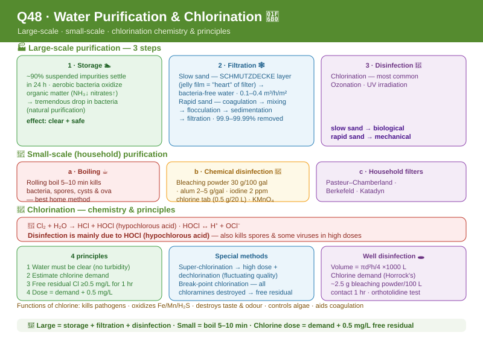

### 🏭 Large-Scale Purification of Water (3 steps)
**1) Storage:** Provides a reserve of water; **~90% of suspended impurities settle in 24 hours** → water becomes clear; aerobic bacteria oxidize organic matter (free ammonia ↓, nitrates ↑); a **tremendous drop of bacteria** occurs (natural purification).

**2) Filtration:**
- **Slow sand filter (biological filter):** Elements = supernatant raw water + bed of graded sand + under-drainage system + filter control valves. Sand bed thickness ~1 m, sand effective diameter 0.2–0.3 mm; rate of infiltration **0.1–0.4 m³/hr/m²**. Surface becomes covered with a slimly gelatinous layer — **Schmutzdecke / vital / zoogleal layer — "the heart of the slow sand filter"** — which removes organic matter, holds back bacteria, oxidizes ammoniacal nitrogen to nitrates, yielding bacteria-free water. Purification processes: mechanical straining, sedimentation, adsorption, oxidation, bacterial action.
- **Rapid sand filter (mechanical filter):** Steps = **coagulation → rapid mixing → flocculation → sedimentation → filtration**. Two types: gravity (Paterson) & pressure (Candy). Removes bacteria 99.9–99.99%.

**3) Disinfection:** Chlorination, ozonation, UV irradiation.

### 🏡 Small-Scale (Household) Purification
**a) Boiling:** Must reach a **"rolling boil" for 5–10 minutes** — kills all bacteria, spores, cysts & ova.
**b) Chemical disinfection:**
| Agent | Dose |
|-------|------|
| **Bleaching powder (CaOCl₂)** | 30 gm per 100 gallons; stock 1 tsp/pint; 1 ml sterilizes 10 gallons in ½ hr |
| **Potassium permanganate** | 0.5 part per 100,000 parts; sterilizes in 4–6 hrs |
| **Alum** | 2–5 gm per gallon (muddy water) |
| **Copper sulphate** | 0.1–0.25 ppm (prevents algae) |
| **Calcium oxide** | 6 gm sterilizes 1 gal in 5–24 hrs |
| **Chlorine tablet** | 1 tablet of 0.5 gm for 20 litres (= 10 gallons) |
| **Bromine** | 0.06 gm sterilizes 1 litre in 5 minutes |
| **Iodine** | 2 parts per million |
| **Nesfield tablets** | 2 gm iodine/iodate + 2 gm citric acid per 4 gallons |

**c) Household filters:** Pasteur–Chamberland, Berkefeld, Katadyn.

### 🧪 Chlorination
> 🔴 **Action:** Cl₂ + H₂O → HCl + HOCl (hypochlorous acid); HOCl ↔ H⁺ + OCl⁻. **Disinfection is mainly due to hypochlorous acid (HOCl).**

**Functions of chlorine:** kills pathogenic bacteria (also spores & viruses like polio/hepatitis in high doses) · oxidizes iron, manganese & hydrogen sulphide · destroys taste & odour constituents · controls algae · aids coagulation.

**Principles of chlorination:**
1. Water must be **clear (free from turbidity)**
2. **Chlorine demand** of water should be estimated
3. **Free residual chlorine for at least 1 hour** is essential (min **0.5 mg/L** for 1 hour)
4. **Dose = chlorine demand + 0.5 mg/L free residual**

**Chlorine demand** = total chlorine added − residual chlorine.

**Special methods:**
- **Super chlorination:** addition of large doses of chlorine **followed by dechlorination** — for heavily polluted water whose quality fluctuates
- **Break-point chlorination:** the point at which residual chlorine appears and all **combined chlorines (chloramines) have been destroyed**; further chlorine → proportional residual increase. **Break-point dosage** = corresponding dose.
- **Well disinfection (bleaching powder):** 1) calculate volume (3.14×d²×h/4 × 1000 litres) 2) estimate chlorine demand (Horrock's apparatus; ~2.5 gm bleaching powder / 100 L) 3) dissolve in bucket 4) deliver deep into well & agitate 5) **contact period 1 hour** 6) test residual chlorine (orthotolidine-arsenite test).

> 🎯 Large scale = storage + slow/rapid sand filtration + disinfection. Small scale = boiling (5–10 min) + chemicals + filters. HOCl = main disinfectant. Dose = demand + 0.5 mg/L.

> 📖 Ch-15, Endeavour PDF pp. 495–505; Park PSM 24e, pp. 748–755

---

</details>

<details>
<summary><b>Q49. WHO criteria of drinking water. Bacteriological standards. Why coliform indicator. Health effects of air pollution & prevention.</b></summary>

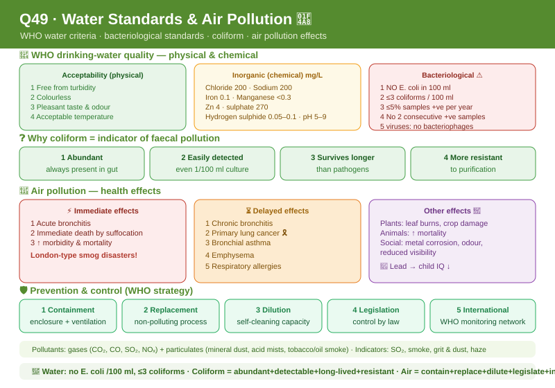

### 🥤 WHO Drinking-Water Quality Standards
**A) Acceptability / physical aspects:**
- **Turbidity:** free from turbidity
- **Colour:** colourless
- **Taste & odour:** pleasant
- **Temperature**

**B) Inorganic constituents (chemical):**
| Parameter | Guideline |
|-----------|-----------|
| Chloride | 200 mg/L |
| Hardness | Ca 100–200 mg/L, Mg < 100–200 mg/L |
| pH | 5–9 |
| Hydrogen sulphide | 0.05–0.1 mg/L |
| Iron | 0.1 mg/L |
| Sodium | 200 mg/L |
| Sulphate | Calcium sulphate 270 mg/L |
| Zinc | 4 mg/L |
| Manganese | < 0.3 mg/L |

**C) Microbiological aspects — bacteriological standards of pure water:**
1. **No sample should contain E. coli in 100 ml**
2. **No sample should contain more than 3 coliform organisms per 100 ml**
3. **Not more than 5% of samples** throughout the year should contain coliforms in 100 ml
4. **No two consecutive samples** should have coliform organisms in 100 ml
5. Viral aspects: faecal bacteriophages & enteropathogenic viruses should be absent

**Indicators:** Primary = **coliform organism**; Supplementary = **faecal streptococci, sulphite-reducing clostridia (Cl. perfringens)**.

### ❓ Why Coliforms Are Chosen as Indicators of Faecal Pollution
1. They are **constantly present in great abundance in the human intestine**; foreign to potable waters, so their presence = evidence of faecal contamination
2. **Easily detected** by culture methods — as small as **one bacterium in 100 ml**
3. They **survive longer** than the pathogens (which die out more rapidly)
4. They have **greater resistance to natural purification** than water-borne pathogens

### 💨 Air Pollution — Effects on Health & Disease
**Immediate effects:**
1. Symptoms of the respiratory system — **acute bronchitis**
2. **Immediate death by suffocation**
3. Increased morbidity & mortality

**Delayed effects:**
1. **Chronic bronchitis**
2. **Primary lung cancer**
3. **Bronchial asthma**
4. **Emphysema**
5. **Respiratory allergies**

**Other effects:** Effects on plants & animals (spotting/burning of leaves, destruction of crops, retarded growth, ↑ animal mortality) · social & economic effects (corrosion of metals & buildings, cleaning/repair costs, unpleasant odours, research costs, reduced visibility).

> 📌 **Lead in air** affects the **intelligence level of children**, retards physical growth, causes serious nervous disorders.

### 🛡 Prevention & Control of Air Pollution (WHO Strategy)
1. **Containment** — prevention of escape of toxic substances by enclosure, ventilation & air cleaning
2. **Replacement** — replace polluting technological process with a non-polluting one
3. **Dilution** — valid so long as within the self-cleaning capacity of environment (vegetation removes some pollutants)
4. **Legislation** — control of air pollution by law
5. **International action** — WHO network of laboratories for monitoring & study of air pollution

> 📌 Air pollutants: gaseous (CO₂, CO, SO₂, oxides of nitrogen, fluorine compounds) + particulate (mineral dusts, metal dusts, acid mists, paint pigments, pesticides, tobacco & oil smoke). Monaco indicators: SO₂, smoke/soiling index, grit & dust, coefficient of haze, air-pollution index.

> 🎯 WHO water = E. coli absent in 100 ml + <3 coliforms/100 ml + ≤5% positive/year. Coliform indicator = abundant + easily detected + long survival + resistant. Air effects = respiratory + cancer + asthma. Prevention = containment + replacement + dilution + legislation + international.

> 📖 Ch-15, Endeavour PDF pp. 498–511; Park PSM 24e, pp. 756–775

---

</details>

<details>
<summary><b>Q50. Noise level chart. Effects of noise. Prevention of noise pollution.</b></summary>

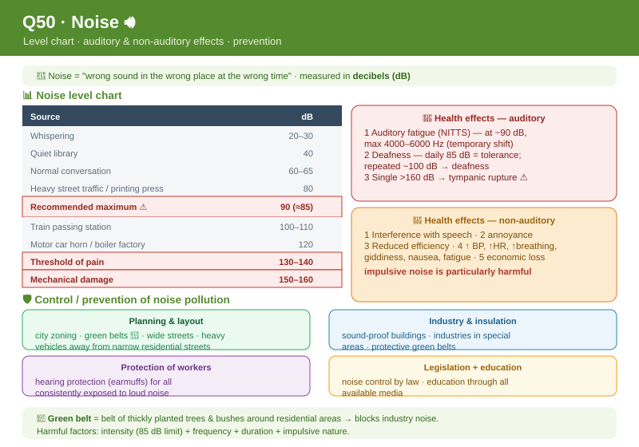

### 🔊 Noise — Definition & Properties
> 🔴 **Noise** = *"wrong sound in the wrong place at the wrong time."*

**Properties:** 1) **Loudness/intensity** — depends on amplitude of vibration, measured in **decibels (dB)** 2) **Frequency** — in hertz (Hz); human ear hears ~20 to 20,000 Hz.

**Factors related to harmful effects:** intensity (daily 85 dB ≈ tolerance limit) · frequency · duration (proportional to energy reaching inner ear) · nature (stable, fluctuating, intermittent; **impulsive noise is particularly harmful**).

### 📊 Noise Level Chart
| Source | dB |
|--------|----|
| Whispering | 20–30 |
| Quiet library | 40 |
| Normal conversation | 60–65 |
| Heavy street traffic | 60–80 |
| Printing press | 80 |
| **Recommended maximum** | **90 (≈85)** |
| Train passing station | 100–110 |
| Motor car horn / boiler factory | 120 |
| **Threshold of pain** | **130–140** |
| Mechanical damage | 150–160 |

### 🧠 Health Effects of Noise Exposure
**Auditory effects:**
1. **Auditory fatigue (NITTS — noise-induced temporary threshold shift)** — in the **90 dB** region, greatest at **4000–6000 Hz**
2. **Deafness:** daily exposure up to **85 dB** = tolerance limit; repeated exposure around **100 dB** → deafness; single exposure **above 160 dB** → **tympanic membrane rupture**

**Non-auditory effects:**
1. **Interference with speech**
2. **Annoyance**
3. Reduced **efficiency**
4. **Physiological changes:** ↑ blood pressure, ↑ heart rate, ↑ breathing, ↑ intracranial pressure, sweating, giddiness, nausea, **fatigue**
5. **Economic loss**

### 🛡 Control / Prevention of Noise Pollution
1. **Careful planning of cities:** division into zones (industry/transport separated) · separation of residential areas from main streets by **wide green belts** · widening of main streets
2. **Control of vehicles:** heavy vehicles not routed into narrow streets; reduce traffic on residential streets
3. **Improve acoustic insulation of buildings:** sound-proof construction where necessary
4. **Industries & railways:** earmarked special areas outside residential zones; protective green belts between installations & dwellings
5. **Protection of exposed persons:** **hearing protection** for all workers consistently exposed to loud noise
6. **Legislation** for noise control
7. **Education** through all available media

> 📌 **Green belt** = belt of thickly planted trees & bushes around residential areas — prevents noise from nearby industries.

> 🎯 Recommended max = 85 dB (daily). Auditory effects = fatigue → deafness → TM rupture (>160 dB). Non-auditory = ↑BP + ↑heart rate + speech interference + annoyance. Prevention = city zoning + green belts + insulation + legislation + education.

> 📖 Ch-15, Endeavour PDF pp. 517–520; Park PSM 24e, pp. 778–780; Rashid 5e, pp. 508–509

---

</details>

<details>
<summary><b>Q51. Ionizing radiation — sources, health effects. Acute radiation syndrome.</b></summary>

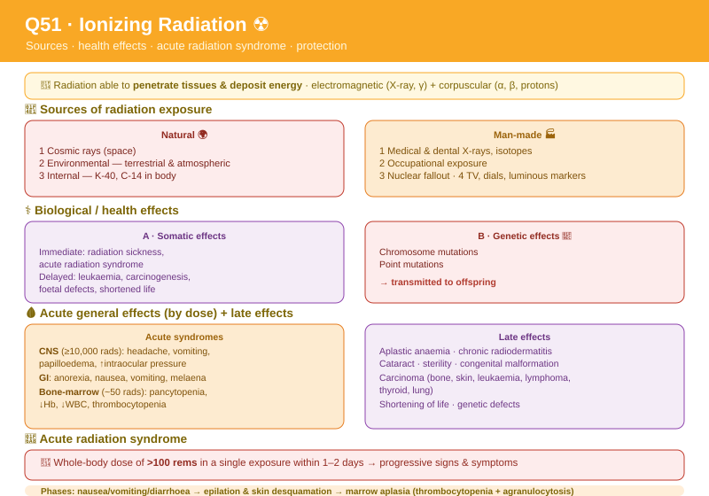

### ☢️ Ionizing Radiation
> 🔴 Radiation which has the ability to **penetrate tissues and deposit energy within them**.
- **Electromagnetic radiation:** X-rays, γ-rays
- **Corpuscular radiation:** α-particles, β-particles (electrons), protons

### 📡 Sources of Radiation Exposure
**Natural:**
1. **Cosmic rays**
2. **Environmental:** terrestrial (earth) & atmospheric
3. **Internal:** Potassium-40, Carbon-14

**Man-made:**
1. **Medical & dental:** X-rays, radio-isotopes
2. **Occupational exposure**
3. **Nuclear:** radioactive fallout
4. **Miscellaneous:** television sets, radioactive dials/watches, isotope-tagged products, luminous markers

### ⚕️ Biological / Health Effects of Radiation
**A) Somatic effects:**
1. **Immediate:** radiation sickness, **acute radiation syndrome**
2. **Delayed:** **leukaemia**, carcinogenesis, foetal developmental abnormalities, **shortening of life**

**B) Genetic effects:**
1. **Chromosome mutations**
2. **Point mutations**

### 🩸 Hazards / Health Effects (detailed)
**A) Acute general effects:**
- **CNS syndrome** (exposure to 10,000 rads or above): ↑ intraocular pressure, headache, vomiting, nausea, papilloedema
- **GI syndrome:** anorexia, nausea, vomiting, loose/mucoid stool, sometimes melaena
- **Bone marrow syndrome** (exposure to **50 rads**): **pancytopenia**, ↓ Hb%, ↓ WBC, **thrombocytopenia**

**B) Long-term / late effects:**
1. Aplastic anaemia · 2. Chronic radiodermatitis · 3. **Cataract** · 4. **Sterility** · 5. Congenital malformation · 6. **Carcinoma** (bone tumour, skin SCC/BCC, leukaemia, lymphoma, thyroid, lung) · 7. Shortening of life · 8. Genetic defects

### 🚨 Acute Radiation Syndrome
> 🔴 Exposure of the **whole body to a large dose of over 100 rems** of penetrating radiation in a single exposure within **1–2 days**, resulting in a progressive series of signs & symptoms.

**Phases:**
1. Short interval between exposure & onset of symptoms
2. **Nausea, vomiting, diarrhoea & abdominal pain**; headache, erythema of skin, conjunctivitis
3. **Loss of hair (epilation) & desquamation of skin**
4. Final stage — **bone marrow aplasia, thrombocytopenia & agranulocytosis**

### 🛡 Radiation Protection
**A) Internal irradiation:**
1. **Notification**
2. Advance approval for specified activities
3. Specification of **dose limits** & emissions
4. Classification of workplaces & exposed persons
5. Introduction of **control measures & monitoring**
6. Competent practitioners for monitoring/evaluation/control
7. Critical assessment of new plants & projects
8. Centralization of calibration, dosimetry & records
9. **Medical surveillance** of exposed persons

**B) External irradiation:**
1. Avoidance of unnecessary X-ray examinations (children & pregnant mothers)
2. Adequate control & surveillance of X-ray installations
3. Improvement in technique
4. Improved shielding for dose reduction — **shield, distance, time**
5. Effective protective measures — **lead apron, rubber apron**
6. **Film badge / dosimeter** for workers; monitoring at intervals not exceeding 6 months
7. Periodic medical examination
8. Regular working hours
9. Recreation & holidays; safe handling & ventilation of workplaces; pregnant women not allowed where continuous exposure occurs

> 🎯 Ionizing radiation = penetrates + deposits energy. Sources = cosmic + terrestrial + internal + medical + occupational + nuclear. Acute radiation syndrome = >100 rems → nausea → epilation → marrow aplasia. Prevention = shield + distance + time + film badge.

> 📖 Ch-15, Endeavour PDF pp. 520–522; Park PSM 24e, pp. 780–781; Rashid 5e, p. 511

---

</details>

<details>
<summary><b>Q52. Greenhouse effect & greenhouse gases. Global warming — mechanism, health effects in Bangladesh.</b></summary>

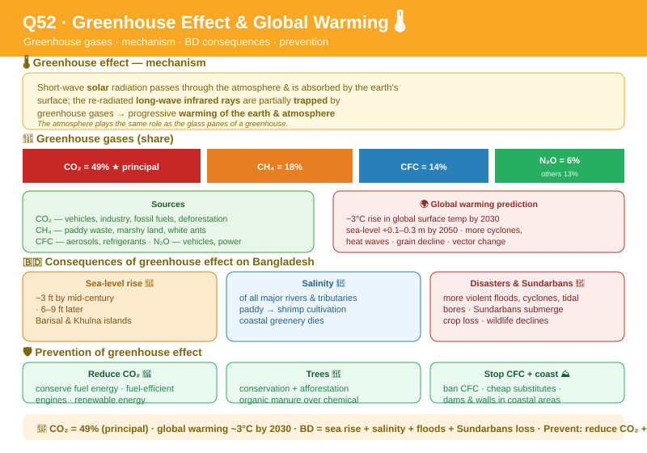

### 🌡 Greenhouse Effect
> 🔴 The earth behaves like a greenhouse: **short-wave solar radiation** passes through the atmosphere & is absorbed by the earth's surface, but the **re-radiated long-wave infrared rays** are **partially trapped** by certain atmospheric gases → progressive **warming of the earth and atmosphere**.

> 📌 A **greenhouse** is a glass-house that allows sunlight in but traps the re-radiated heat — the atmosphere plays the same role as the glass panes.

### 🎈 Greenhouse Gases
| Gas | Contribution |
|-----|-------------|
| **Carbon dioxide (CO₂)** | **49%** — principal |
| **Methane (CH₄)** | **18%** |
| **Chlorofluorocarbons (CFC)** | **14%** |
| **Nitrous oxide (N₂O)** | **6%** |
| Others | **13%** |

**Sources:**
1. **CO₂** — motor vehicles, industrial plants, furnaces & ovens, combustion of fossil fuels (coal, natural gas, diesel, petrol)
2. **Deforestation** — fewer trees to absorb CO₂
3. **Methane** — decomposition of paddy waste, plants, fallen leaves, underwater flora in marshy land, wood-destroying white ants
4. **CFC** — extensive synthesis (aerosols, refrigerants)
5. **N₂O** — motor vehicles, power stations, factories producing plastics, acids & explosives

### 🌍 Global Warming
> 🔴 **Global warming** = increase of about **3°C** in average global surface temperature by **2030**; sea-level rise of **0.1–0.3 m** by **2050**; increase in extreme climate events (cyclones, heat waves, drought); summer becomes hotter. Temperate-zone warming → ↓ soil moisture → impaired grain production; changes vegetation distribution & insect vectors.

### 🇧🇩 Consequences of Greenhouse Effect on Bangladesh
1. If temperature continues rising, **sea-level likely to rise ~3 feet** by the middle of the next century
2. **Barisal & Khulna will take the shape of islands**; the coast of the Bay of Bengal may recede up to Jessore, Faridpur & Chandpur
3. Sea water may rise **6–9 feet** by the turn of the next century
4. **Salinity of all major rivers** & their tributaries
5. Turning of paddy lands into **vast water pools for shrimp cultivation**
6. **More violent & frequent floods, cyclones & tidal bores**
7. **Disappearance of coastal greenery & the Sundarbans** under the sea, with extinction of forest beauty & wildlife
8. Submersion of crops, contamination of water, large-scale reduction of wildlife

### 🛡 Prevention of Greenhouse Effect
1. Reduce CO₂ by **conserving fuel energy**
2. Increase use of **solar, hydraulic & atomic energy** (reusable) + more trees/afforestation
3. Invent **fuel-efficient motor engines** (more mileage per litre)
4. Reduce use of diesel & fossil fuels; discover substitutes
5. **Conserve existing forests** & create new forest areas (planned afforestation)
6. Encourage **organic manure** over chemical fertilizers
7. **Stop use of CFC**; invent cheaper substitutes
8. Build suitable **dams & walls in coastal areas**

> 🎯 Greenhouse = atmosphere (like glass) traps re-radiated infrared. CO₂ = 49% (principal). Global warming → ~3°C by 2030. BD: sea rise 3 ft → Barisal/Khulna islands + salinity + floods + Sundarbans loss. Prevention = reduce CO₂ + afforestation + alternative energy + stop CFC.

> 📖 Ch-15, Endeavour PDF pp. 523–525; Park PSM 24e, pp. 782–785; Rashid 5e, pp. 517–520

---

</details>

<details>
<summary><b>Q53. Ventilation — definition, purpose, standards, classification. Effects of ill ventilation.</b></summary>

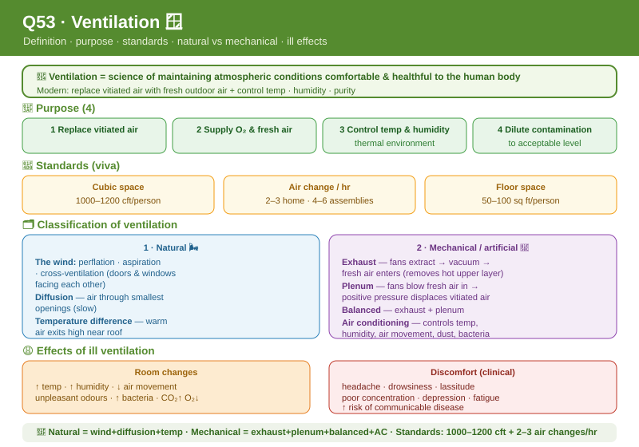

### 🪟 Ventilation
> 🔴 **Ventilation** is the **science of maintaining atmospheric conditions which are comfortable and healthful to the human body**.

**Modern concept:** Replacement of **vitiated air by a supply of fresh outdoor air** and control of the quality of incoming air with regard to **temperature, humidity & purity**, to provide a thermal environment that is comfortable and free from risk of infection.

**Purpose:**
1. To **replace vitiated air**
2. To **supply oxygen & fresh air**
3. To control **temperature & humidity** (thermal environment)
4. To **dilute airborne contamination** to an acceptable concentration

### 📐 Standards of Ventilation (Viva)
1. **Cubic space:** 1000–1200 cft/person
2. **Air change:** 2–3 times/hour (home); **4–6 times/hour (assemblies)**
3. **Floor space:** 50–100 sq ft/person

### 🗂 Classification of Ventilation
**1) Natural ventilation:**
- **The wind:**
  - **Perflation** — air blows through a room
  - **Aspiration** — wind bypasses an obstruction & exerts suction at its tail end
  - **Cross-ventilation** — doors & windows facing each other
- **Diffusion** — air passes through the smallest openings/spaces (slow process)
- **Temperature differences** — air flows from high density to low density; greater temp difference → greater velocity (warm air exit high near roof)

**2) Mechanical / artificial ventilation:**
- **Exhaust ventilation** — exhaust fans extract air → vacuum created → fresh air enters through windows/doors; removes upper layers of heated light air
- **Plenum ventilation** — fresh air blown in by centrifugal fans → positive pressure → displaces vitiated air (used for air-conditioned buildings & factories)
- **Balanced ventilation** — combination of exhaust + plenum
- **Air conditioning** — simultaneous control of temperature, humidity, air movement, distribution, dust, bacteria, odours & toxic gases

> 📌 **Air conditioning principle:** air is filtered → passed through fine water jets (evaporative cooling, becomes saturated) → excess moisture removed over a cold surface → heated to desired temperature. Outside–inside difference should not exceed **20°F** (usually 10–15°F). **Comfort zone** = range of effective temperature at which majority of adults feel comfortable (comfortable & cool **69–76°F**).

### 😩 Effects of Ill Ventilation (in a Room / Crowding)
**Changes in the room (chemical & physical):**
1. ↑ Rise in room temperature (body heat)
2. ↑ Increased humidity (moisture from skin & lungs)
3. ↓ Air movement
4. **Unpleasant body odours** (foul breath, perspiration, bad oral hygiene, dirty clothes)
5. **Increased bacterial pollution** (saprophytes discharged during talking, coughing, sneezing)
6. CO₂ ↑ and O₂ ↓ (chemical changes — the old "vitiation" theory)

**Clinical features (discomfort):**
1. **Headache**
2. **Drowsiness**
3. **Lassitude**
4. **Inability to concentrate**
5. **Depression**
6. Feeling of **fatigue**
7. **Increased chances of contracting communicable diseases**

> 🎯 Ventilation = replace vitiated air + control temp/humidity/purity. Standards = 1000–1200 cft + 2–3 (home)/4–6 (assembly) air changes. Natural (wind + diffusion + temp) vs mechanical (exhaust + plenum + balanced + AC). Ill-ventilation = headache + drowsiness + fatigue + ↑ infection risk.

> 📖 Ch-15, Endeavour PDF pp. 512–515; Park PSM 24e, pp. 775–776; Rashid 5e, pp. 504–506

---

</details>

## Section 16 — Communicable Disease

<details>
<summary><b>Q54. Communicable disease — definition. Incubation period. Tuberculosis & DOTS. Prevention of communicable diseases.</b></summary>

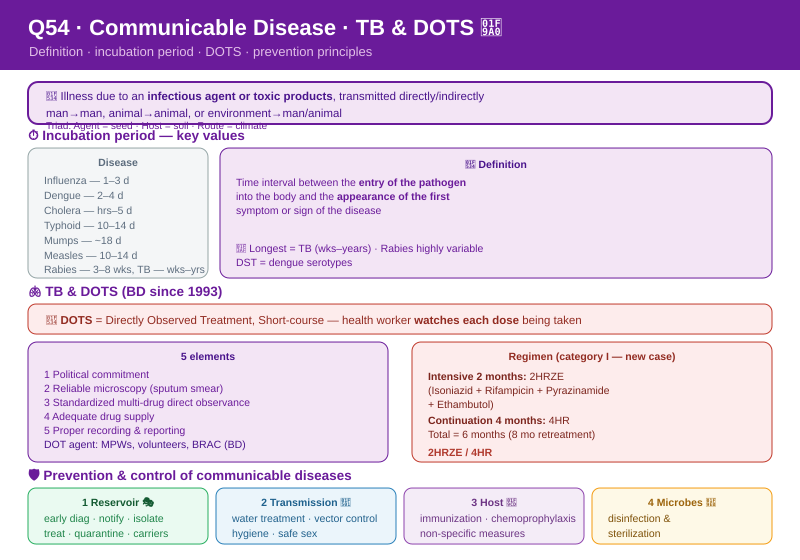

### 🦠 Communicable Disease — Definition
> 🔴 An illness due to a **specific infectious agent or its toxic products**, capable of being **directly or indirectly transmitted from man to man, animal to animal, or from the environment** (air, dust, soil, water, food) **to man or animal**.

**Three components (ecological triad):** Agent — *the seed* · Host — *the soil* · Route of transmission — *the climate*.

### ⏱ Incubation Period
> 🔴 The **incubation period** is the time interval between the **entry of the pathogen into the body** and the **appearance of the first symptom or sign of the disease**.

**Spectrum across diseases:**
| Disease | Incubation period |
|---------|-------------------|
| Influenza | 1–3 days |
| Dengue | 2, 3 & 4 days (flavivirus) |
| Cholera | Few hours – 5 days |
| Typhoid | Usually 10–14 days (range 3–30) |
| Mumps | Usually 18 days |
| Measles | 10–14 days |
| Rabies | Commonly 3–8 weeks (may vary 4 days – many years) |
| Tuberculosis | Weeks to years |

### 🫁 Tuberculosis — DOTS
> 🔴 **DOTS** = **Directly Observed Treatment, Short-course** — the WHO-recommended strategy for TB control, introduced in Bangladesh in **1993**. It means someone (usually a health worker) takes responsibility for **observing the person take each dose** of antituberculous drugs.

**5 Elements of DOTS:**
1. **Political commitment** to the programme
2. **Reliable microscopic diagnosis** (good microscopy services / sputum smear)
3. **Standardized, multi-drug, directly observed treatment**
4. **Adequate supply of drugs**
5. **Proper recording & reporting**

**Treatment regimen (category I — new case):**
- **Intensive phase (2 months):** Isoniazid (H) + Rifampicin (R) + Pyrazinamide (Z) + **Ethambutol (E)** = **2HRZE**
- **Continuation phase (4 months):** Isoniazid + Rifampicin = **4HR**
- **Total duration: 6 months** (8 months for retreatment)

**DOT agent:** Peripheral health staff (MPWs) or voluntary workers (teachers, anganwadi workers, dais, ex-patients, social workers). In Bangladesh, **BRAC** is a major NGO partner.

### 🛡 Prevention & Control of Communicable Diseases (Principles)
**1) Controlling the reservoir / prevention of spread:**
- **Early diagnosis**
- **Notification**
- Epidemiological investigation
- **Isolation**
- **Treatment**
- **Quarantine**
- Carriers & contacts management

**2) Interruption of transmission:**
- **Water treatment / purification** (typhoid, cholera, hepatitis A/E, gastroenteritis, dysentery)
- Control of source of infection (hand washing, adequate cooking, refrigeration, food withdrawal)
- **Vector control**
- Practice of **safe sex**

**3) Protection of susceptible host:**
- **Immunization** (active, passive, passive-active)
- **Chemoprophylaxis**
- Non-specific measures

**4) Destruction of microbes:** Disinfection & sterilization.

> 🎯 Communicable disease = transmitted directly/indirectly. Incubation period = pathogen entry → first symptoms. DOTS = 5 elements + 2HRZE/4HR (6 months). Prevention = reservoir control + transmission interruption + host protection + disinfection.

> 📖 Ch-05, Endeavour PDF pp. 115–120, 137–150, 2828–2897; Park PSM 24e, pp. 98–127, 186

---

</details>

<details>
<summary><b>Q55. Complications — Measles, Mumps, Enteric (typhoid) fever, Rubella.</b></summary>

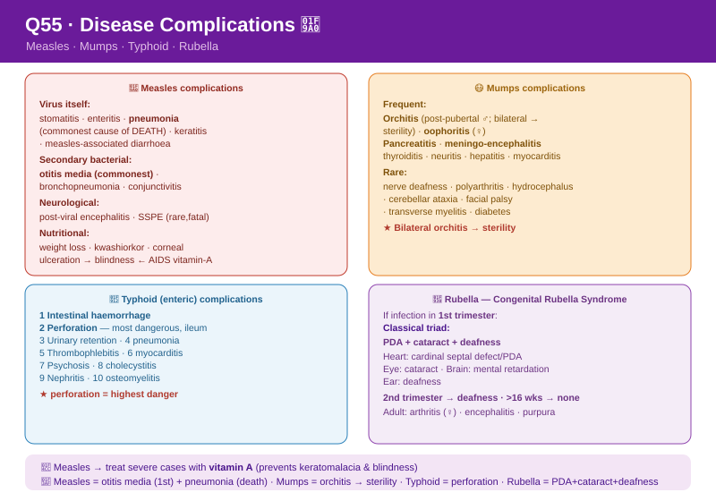

### 🦠 Complications of Measles
**1) Effects of the measles virus itself:**
- **Stomatitis**
- **Enteritis**
- **Pneumonia** (the commonest cause of death)
- **Keratitis**
- **Measles-associated diarrhoea**

**2) Secondary bacterial infection:**
- **Otitis media** (commonest complication)
- **Bronchopneumonia**
- **Conjunctivitis**

**3) Neurological:**
- **Post-viral encephalitis**
- **Subacute sclerosing panencephalitis (SSPE)** — rare, fatal, occurs years later

**4) Nutritional:**
- Severe **weight loss**
- **Kwashiorkor**
- **Corneal ulceration** (→ blindness from vitamin A deficiency/keratomalacia)

> 📌 Severe measles & all measles in high case-fatality areas are treated with **vitamin A** (prevents keratomalacia & blindness).

### 😷 Complications of Mumps
**Frequent:**
1. **Orchitis** (post-pubertal males; **bilateral orchitis → sterility**)
2. **Oophoritis / ovaritis** (females)
3. **Pancreatitis**
4. **Meningo-encephalitis**
5. Thyroiditis · 6. Neuritis · 7. Hepatitis · 8. Myocarditis

**Rare:** Diabetes (bilateral orchitis → sterility).
**Rarer:** Nerve **deafness** · polyarthritis · hydrocephalus · encephalitis · cerebellar ataxia · facial palsy · transverse myelitis.

### 🤒 Complications of Enteric (Typhoid) Fever
1. **Intestinal haemorrhage**
2. **Intestinal perforation** — the most dangerous, usually of the ileum
3. Urinary retention
4. **Pneumonia**
5. **Thrombophlebitis**
6. **Myocarditis**
7. **Psychosis**
8. Cholecystitis
9. **Nephritis**
10. **Osteomyelitis**

### 🤰 Complications of Rubella (German Measles)
**Congenital Rubella Syndrome (CRS)** — if infection occurs in the **1st trimester**:
- **Classical triad:** **Patent ductus arteriosus + cataract + deafness**
- 2nd trimester: **deafness**
- After 16 weeks: no major abnormalities

**Congenital abnormalities (viva):**
| Organ | Abnormality |
|-------|-------------|
| Heart | Cardinal septal defect / PDA |
| Eye | **Cataract** |
| Brain | **Mental retardation** |
| Ear | **Deafness** |

**Other rubella complications (adults):** arthritis (women), encephalitis (rare), thrombocytopenic purpura.

> 🎯 Measles = otitis media (commonest) + pneumonia (death) + SSPE + vitamin A. Mumps = orchitis + oophoritis + pancreatitis + meningoencephalitis + deafness. Typhoid = perforation + haemorrhage + myocarditis. Rubella = CRS triad (cataract + cardiac + deafness) in 1st trimester.

> 📖 Ch-05, Endeavour PDF pp. 1159–1183, 4817–4840, 5125–5145, 5273–5302; Park PSM 24e, pp. 158–161, 250

---

</details>

<details>
<summary><b>Q56. Transmission of Hepatitis (A, B, C, D, E). Rabies — clinical features & post-exposure prophylaxis.</b></summary>

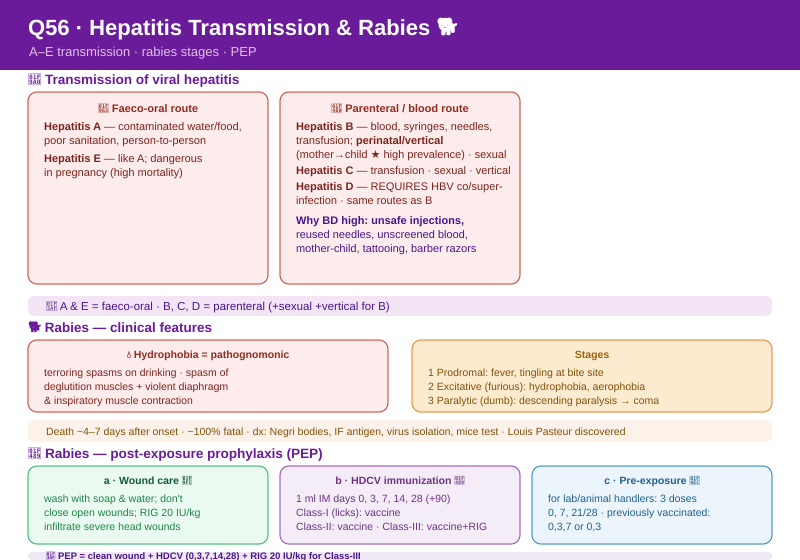

### 🦠 Transmission of Viral Hepatitis
| Type | Mode of transmission |
|------|----------------------|
| **Hepatitis A (HAV)** | **Faeco-oral route** — contaminated water/food, poor sanitation; person-to-person |
| **Hepatitis B (HBV)** | **Parenteral** (blood, contaminated syringes/needles, transfusion) · **Perinatal/vertical** (mother→child — most important for high prevalence) · **Sexual** (especially male homosexuals) |
| **Hepatitis C (HCV)** | **Blood** (transfusion) · **Sexual contact** · **Mother-to-child** (during birth) |
| **Hepatitis D (HDV)** | Requires **HBV** co-infection/super-infection — same parenteral/sexual/vertical routes as B |
| **Hepatitis E (HEV)** | **Faeco-oral** (like A) — contaminated water; dangerous in pregnancy (high mortality) |

> 📌 **Why hepatitis-B prevalence is high in Bangladesh:** unsafe injections, reused needles/syringes, transfusion of unscreened blood, mother-to-child transmission, cultural practices (tattooing, ear-piercing, barber razors).

### 🐕 Rabies — Clinical Features
> 🔴 **Hydrophobia (fear of water)** is **pathognomonic** of rabies — attempts at drinking precipitate distressing spasms & panic (spasm of deglutition muscles + violent contraction of diaphragm & other inspiratory muscles).

**Stages:**
1. **Prodromal:** headache, malaise, sore throat, slight fever, tingling/numbness at the bite site
2. **Excitative (furious):** hyperactivity, agitation, **hydrophobia**, aerophobia, **hypersalivation**, seizures
3. **Paralytic (dumb):** descending paralysis → coma → death
4. **Death:** usually within **4–7 days** of symptom onset (nearly **100% fatal**)

**Diagnosis:** Clinical — history of rabid animal bite + characteristic signs. Laboratory — **Negri bodies** in brain, immunofluorescent antigen detection on skin biopsy, virus isolation from saliva, mice inoculation test.

### 💉 Rabies — Post-Exposure Prophylaxis (PEP)
> 🩹 Every exposure is an **emergency** — the aim is to neutralize the inoculated virus before it enters the nervous system.

**a) General / local treatment of wound:**
- Immediate thorough **cleansing & flushing with soap/detergent and water** of all wounds & scratches
- Open wounds should **not be closed**
- Severe wounds near the head → infiltrate wound with **Rabies Immunoglobulin (RIG), 20 IU/kg single dose**

**b) Immunization:**
- **HDCV (Human Diploid Cell Vaccine)** — preferred. Dose **1 ml IM (deltoid) on days 0, 3, 7, 14 & 28**; WHO recommends a reinforce dose on day 90
- **Class-I exposure (licks):** minimum exposure — vaccine daily
- **Class-II (all bites except near head):** vaccine
- **Class-III (severe bites, head/near head, mucous membrane):** **vaccine + RIG**

**c) Pre-exposure prophylaxis:** For those handling potentially infected animals/laboratory work/rabies-endemic areas — **3 doses HDCV 1 ml IM on days 0, 7, 21 or 28**.

**d) Previously vaccinated:** antibody titre unknown → 3 doses on days 0, 3, 7; if titre ≥ 0.5 IU/L → 2 doses on days 0, 3.

> 📌 Discovered by **Louis Pasteur**. In Bangladesh, anti-rabies vaccine (inactivated sheep-brain/Semple) was previously given as **14 subcutaneous injections in 14 days** around the umbilicus.

> 🎯 Hep A/E = faecal-oral · Hep B/C/D = parenteral (+ sexual + vertical for B). Rabies = hydrophobia (pathognomonic) → 100% fatal. PEP = clean wound + HDCV (0,3,7,14,28) + RIG 20 IU/kg for Class-III.

> 📖 Ch-05, Endeavour PDF pp. 3849–4430, 5621–5969; Park PSM 24e, pp. 188–250, 295

---

</details>

<details>
<summary><b>Q57. Types of rash in different fevers. Dengue, Chikungunya — prevention.</b></summary>

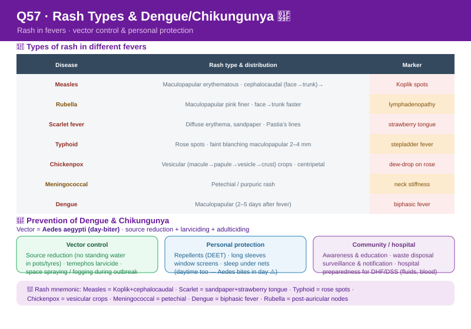

### 📌 Types of Rash in Different Fevers
| Disease | Rash type & distribution | Other features |
|---------|--------------------------|----------------|
| **Measles** | **Maculopapular, erythematous**; face → trunk → extremities (**cephalocaudal** spread); fades in same order | **Koplik spots** on buccal mucosa (pathognomonic); high fever, coryza, cough; rash appears on 4th day |
| **Rubella** | **Maculopapular, pink, finer than measles**; face → trunk (spreads faster than measles); fades in 2–3 days | **Post-auricular / post-occipital lymphadenopathy**; mild fever, joint pain |
| **Scarlet fever** | **Diffuse erythema with sandpaper texture**; face → trunk; **Pastia's lines** in skin folds | **Strawberry tongue**; sore throat, fever; rash spares around mouth (circumoral pallor) |
| **Typhoid** | **Rose spots** — faint, blanching, maculo-papular  2–4 mm | **Stepladder fever**, relative bradycardia, coated tongue, splenomegaly |
| **Chickenpox** | **Vesicular** rash (macule → papule → vesicle → crust); **crops of different stages**; **centripetal** (trunk > face) | Itching, fever; "dew-drop on rose petal" appearance |
| **Meningococcal** | **Petechial / purpuric** rash | Neck stiffness, fever, altered consciousness |
| **Dengue** | **Maculopapular** rash (2–5 days after fever) | **Biphasic (saddle-back) fever**, haemorrhagic manifestations (DHF/DSS) |
| **Drug rash** | Variable (morbilliform, urticarial etc.) | Temporal relationship with drug |

### 🦟 Prevention of Dengue & Chikungunya
**Primary vector control (Aedes aegypti — day-biter):**
1. **Source reduction** — eliminate standing water breeding sites (flower pots, tyres, containers, gutters, coconut shells)
2. **Larviciding** — temephos (Abate) in water containers
3. **Adulticiding** — space spraying / insecticide fogging during outbreaks

**Personal protection:**
4. **Mosquito repellents** (DEET, picaridin)
5. Long-sleeved clothing
6. Window & door screens
7. Sleep under mosquito nets (especially during the day — Aedes bites in daytime)

**Community / institutional:**
8. Community awareness & education
9. Proper **waste disposal** (remove breeding sites)
10. **Surveillance & early case detection** / notification
11. **Hospital preparedness** for DHF / DSS (fluid & blood transfusion protocols)

> 🎯 Rash types: Measles = maculopapular cephalocaudal + Koplik. Rubella = finer + lymphadenopathy. Scarlet = sandpaper + strawberry tongue. Typhoid = rose spots. Chickenpox = vesicular crops (centripetal). Meningococcal = petechial. Dengue = maculopapular + biphasic fever. Prevention = source reduction + repellent + fogging + community awareness.

> 📖 Ch-05, Endeavour PDF pp. 115–250; Park PSM 24e, pp. 158–250

---

</details>

## Section 17 — Miscellaneous (Health Planning & Management)

<details>
<summary><b>Q58. Planning — definition. Planning cycle. Types of planning. Management (POSDCORB).</b></summary>

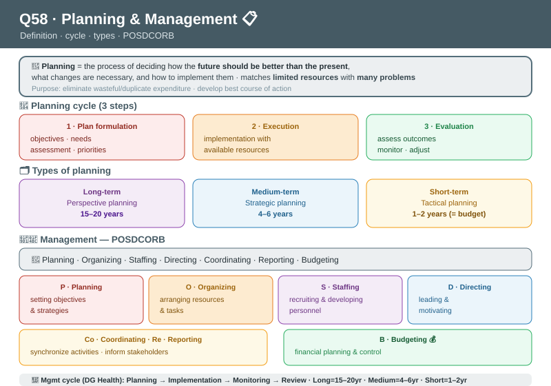

### 📋 Planning — Definition
> 🔴 **Planning** is the process of **deciding how the future should be better than the present**, what changes are necessary, and **how the changes should be implemented**. It matches **limited resources** with **many problems**.

### 🔄 Planning Cycle (3 steps)
1. **Plan formulation** — identifying objectives, assessing needs, setting priorities
2. **Execution** — implementation of the plan with available resources
3. **Evaluation** — assessing outcomes, monitoring progress, making adjustments

### 🗂 Types of Planning
| Type | Also called | Duration |
|------|------------|----------|
| **Long-term** | Perspective planning | **15–20 years** |
| **Medium-term** | Strategic planning | **4–6 years** |
| **Short-term** | Tactical planning | **1–2 years** (coincides with the budget) |

### 🎯 Purposes of Planning
1. **Match limited resources** with many problems
2. **Eliminate wasteful or duplicate expenditure**
3. Develop the **best course of action** for defined objectives

### 🧑💼 Management
> 🔴 **Management** = the process of **Planning, Organizing, Staffing, Directing, Coordinating, Reporting and Budgeting** (**POSDCORB**) to achieve organizational goals efficiently and effectively.

**Functions of management:**
1. **Planning** — setting objectives & strategies
2. **Organizing** — arranging resources & tasks
3. **Staffing** — recruiting & developing personnel
4. **Directing** — leading & motivating
5. **Coordinating** — synchronizing activities
6. **Reporting** — informing stakeholders of progress
7. **Budgeting** — financial planning & control

**Management cycle in DG Health:** Planning → Implementation → Monitoring → Review.

> 🎯 Planning = decide how future > present. Cycle = formulation → execution → evaluation. Long-term = 15–20 yr · medium = 4–6 yr · short = 1–2 yr. Management = POSDCORB (planning, organizing, staffing, directing, coordinating, reporting, budgeting).

> 📖 Ch-25 Health Planning & Management, Endeavour PDF pp. 671–678; Park PSM 24e, pp. 941–950

---

</details>

---

> 📝 **End of 2nd Term Suggestion — Community Medicine (Bayezid Sir)**
> **Total: 58 questions across 17 sections**
> **Sources: Endeavour Community Medicine (Chapters 05–17, 25) + Park's PSM 24th edition + Rashid 5th edition**

