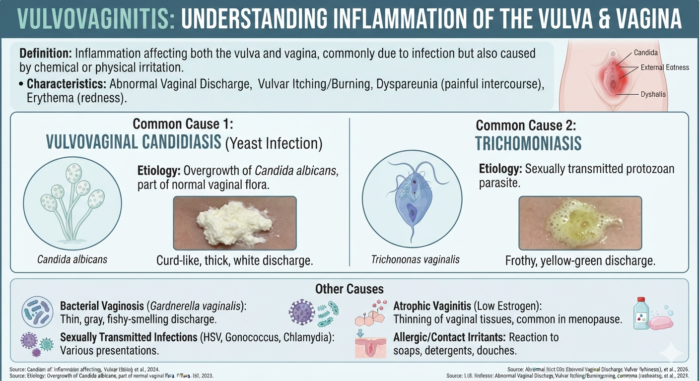
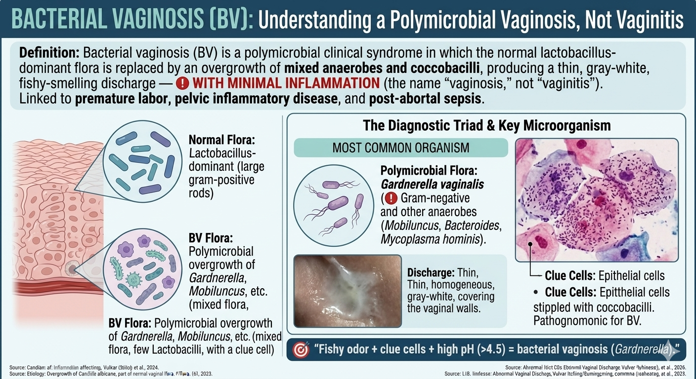
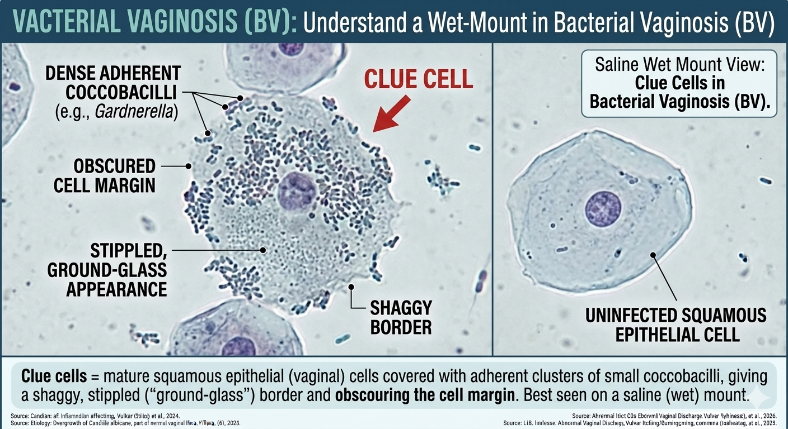
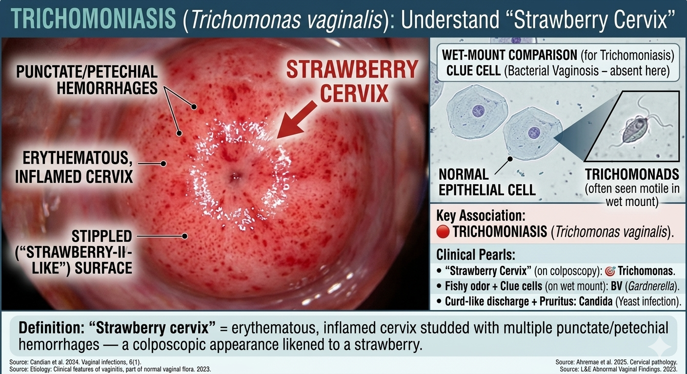
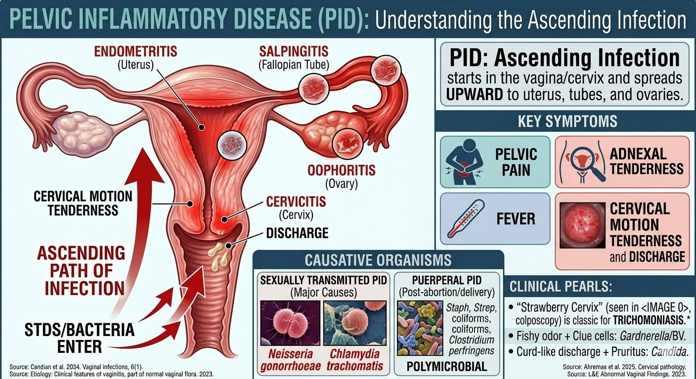
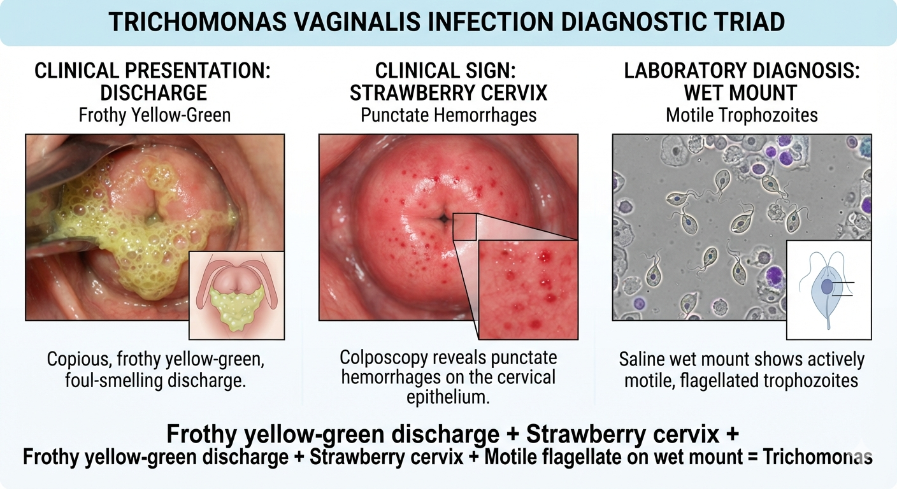
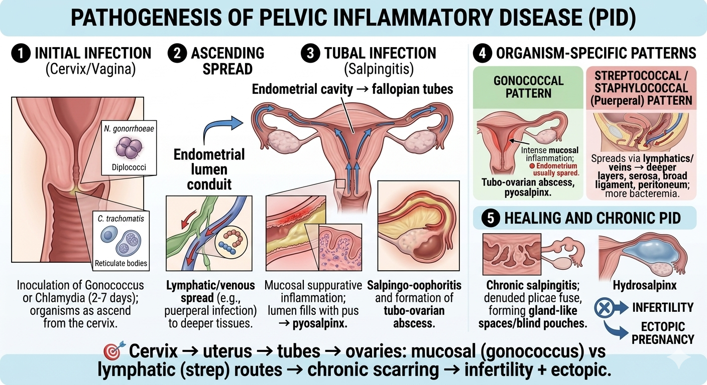

# Item 16 — Female Genital System: Infections, Cervix, CIN & Cervical Carcinoma

> **Source:** Robbins & Cotran, *Pathologic Basis of Disease*, 10th ed. — Ch 22 (The Female Genital Tract)
> **Mam's slides (📌):** Dr. Sharmeen Jahan — "Infections of the Female Genital Tract" + "Cervical Intraepithelial Neoplasia (CIN), Carcinoma Cervix and Screening" (Shaheed Ziaur Rahman Medical College, Bogura)

**This file has two parts:**
- **Part A** — Infections of the female genital tract (Q1–20 + Scenarios 1–10 + Extras + Quick-fire)
- **Part B** — Cervical intraepithelial neoplasia (CIN), carcinoma cervix & Pap smear (Dr. Rokhsana, SAQs 1–20, short notes, PBQs 1–5)

---

# PART A — Infections of the Female Genital Tract

## Normal defence of the lower genital tract (must know first)
- **Lactobacilli** produce **lactic acid → vaginal pH < 4.5** + bacteriotoxic **H₂O₂**.
- Bleeding, sex, douching, or antibiotics → **pH rises** → overgrowth of pathogens.

| Organism | Disease | Key facts |
|---|---|---|
| **HSV (HSV-1/2)** | Genital herpes | Vesicles → painful coalescent ulcers; multinucleate cells + **"ground-glass" intranuclear inclusions**; latency in lumbosacral ganglia |
| **Candida** | Vulvovaginal candidiasis | Normal flora; diabetes/antibiotics/pregnancy/neutrophil-Th17 defects ↑ risk; **curd-like discharge + pruritus**; KOH shows pseudohyphae; NOT a classic STD |
| **Trichomonas vaginalis** | Trichomoniasis | Flagellated protozoan, sexually transmitted; **yellow frothy discharge**, dysuria, dyspareunia; **"strawberry cervix"** |
| **Gardnerella vaginalis** | Bacterial vaginosis | Gram-negative coccobacillus; **thin green-gray fishy discharge**; **clue cells**; linked to premature labor |
| **Chlamydia trachomatis** | Cervicitis → PID | May ascend → endometritis + salpingitis; classic cause of PID |
| **Ureaplasma + Mycoplasma hominis** | Vaginitis/cervicitis | Chorioamnionitis + premature delivery |

---

## Q1. Define vulvovaginitis. Mention two common causes.

### Definition
**Vulvovaginitis = inflammation of the vulva and vagina**, usually together, typically an **infection** but may follow chemical/physical irritation. It is characterized by vaginal discharge, itching/burning, dyspareunia and erythema.

==dyspereunia = persistent or recurrent pain before, during, or after sexual intercourse==.

### Two common causes (examples)
1. **Vulvovaginal candidiasis** (*Candida albicans*) — part of normal flora; curd-like discharge.
2. **Trichomonas vaginalis** — sexually transmitted protozoan; frothy yellow-green discharge.
> Other causes: **Gardnerella vaginalis** (bacterial vaginosis), HSV, gonococcus, *Chlamydia*, allergic/contact irritants, low estrogen (atrophic vaginitis).

> **📌 Mam's slide (Dr. Sharmeen Jahan):** *Definition:* Inflammation of the vulva and vagina caused by infectious agents. *Two common causes:* ① **Candida albicans** (candidiasis) — the most common fungal infection of the vagina; predisposing factors: pregnancy, diabetes mellitus, oral contraceptive use, broad-spectrum antibiotic therapy, immunosuppression. ② **Trichomonas vaginalis** — a sexually transmitted protozoan causing frothy yellow-green discharge.

---

## Q2. What is bacterial vaginosis? Name the most common organism associated with it.

### Definition
**Bacterial vaginosis (BV) = a polymicrobial clinical syndrome in which the normal lactobacillus-dominant flora is replaced by an overgrowth of mixed anaerobes and coccobacilli**, producing a **thin, gray-white, fishy-smelling discharge** — 🔴 **with minimal inflammation** (the name "vaginosis," not "vaginitis"). Linked to **premature labor**, pelvic inflammatory disease and post-abortal sepsis.

### Most common organism
🔴 **Gardnerella vaginalis** (a Gram-negative coccobacillus). Other organisms: *Mobiluncus*, *Bacteroides*, *Peptostreptococcus*, *Mycoplasma hominis* — hence "polymicrobial."

> 🎯 "Fishy odor + clue cells + high pH = bacterial vaginosis (Gardnerella)."

> **📌 Mam's slide (Dr. Sharmeen Jahan):** Bacterial vaginosis = replacement of the normal lactobacilli by a mixed bacterial flora. **Most commonly associated with:** ① **Gardnerella vaginalis**, ② **anaerobic bacteria**. *Clinical features:* thin gray-white discharge; fishy odor (especially after intercourse); minimal inflammation. *Microscopy:* presence of "clue cells" = vaginal epithelial cells coated with bacteria.

---

## Q3. Write four clinical features of vulvovaginal candidiasis.

1. **Intense vulval pruritus / itching** (the hallmark).
2. **Thick white, "cottage-cheese" or curd-like vaginal discharge**.
3. **Vulvovaginal erythema + edema**, sometimes fissuring and satellite pustules.
4. **Dyspareunia, dysuria and burning** — discomfort on intercourse and micturition.

> 🎯 "Itching + curd-like discharge = candidiasis (KOH positive)."

> **📌 Mam's slide (Dr. Sharmeen Jahan):** Four clinical features of vulvovaginal candidiasis — ① **Intense vulvar itching (pruritus)**; ② **Burning sensation**; ③ **Thick, white, "curd-like" vaginal discharge**; ④ **Redness and edema of the vulva**. *Predisposing factors:* pregnancy, diabetes mellitus, oral contraceptive use, broad-spectrum antibiotic therapy, immunosuppression. *Microscopy:* budding yeast cells + pseudohyphae on KOH preparation.

---

## Q4. What are clue cells? In which condition are they seen?

### Definition
**Clue cells = mature squamous epithelial (vaginal) cells covered with adherent clusters of small coccobacilli**, giving a **shaggy, stippled ("ground-glass") border** and obscuring the cell margin. Best seen on a **saline (wet) mount**.

### Condition
🔴 **Bacterial vaginosis** (*Gardnerella vaginalis* and anaerobes). Their presence with a **fishy odor** (positive whiff/KOH test) and **pH > 4.5** confirms BV.

> 🎯 "Clue cells = shaggy squamous cells covered with coccobacilli → bacterial vaginosis."

> **📌 Mam's slide (Dr. Sharmeen Jahan):** Clue cells = **vaginal epithelial cells coated with bacteria**. Seen in **bacterial vaginosis**.

---

## Q5. Name the causative organism of trichomoniasis.

🔴 **Trichomonas vaginalis** — a **flagellated protozoan**, sexually transmitted. It is pear-shaped with 4–5 anterior flagella and a characteristic **jerky motility** on a fresh wet mount.

> **📌 Mam's slide (Dr. Sharmeen Jahan):** Causative organism of trichomoniasis = **Trichomonas vaginalis** — a sexually transmitted protozoan infection.

---

## Q6. What is meant by "strawberry cervix"? In which infection is it found?

### Definition
**"Strawberry cervix" = erythematous, inflamed cervix studded with multiple punctate/petechial hemorrhages** — a colposcopic appearance likened to a strawberry.


### Infection
🔴 **Trichomoniasis (*Trichomonas vaginalis*)**.

> 🎯 "Strawberry cervix = Trichomonas. Fishy discharge + clue cells = Gardnerella/BV. Curd-like + pruritus = Candida."

> **📌 Mam's slide (Dr. Sharmeen Jahan):** "Strawberry cervix" = cervix showing **punctate hemorrhages**, seen in **Trichomonas vaginalis** infection (with frothy yellow-green discharge, vaginal irritation, dysuria, dyspareunia).

---

## Q7. Define cervicitis. Mention two common infectious causes.

### Definition
**Cervicitis = inflammation of the uterine cervix.** A mild degree is found in virtually all women and is usually insignificant; clinically significant cervicitis may shed atypical-looking cells and cause an abnormal Pap.

### Two common infectious causes
1. **Neisseria gonorrhoeae** — purulent (mucopurulent) cervicitis.
2. **Chlamydia trachomatis** — the most common bacterial STI; mucopurulent cervicitis that may be clinically silent.
> Others: HSV, *Mycoplasma*, *Ureaplasma*.

> **📌 Mam's slide (Dr. Sharmeen Jahan):** *Definition:* **Cervicitis = inflammation of the cervix.** *Two common infectious causes:* ① **Chlamydia trachomatis** — the most common bacterial sexually transmitted infection; may be asymptomatic; causes mucopurulent cervical discharge, dysuria, pelvic pain; complications → PID, infertility, ectopic pregnancy. ② **Neisseria gonorrhoeae** — causes acute purulent cervicitis, often associated with urethritis; complications → ascending infection, PID, tubal scarring.

---

## Q8. What is pelvic inflammatory disease (PID)?

### Definition
**PID = infection that starts in the vulva/vagina/cervix and spreads UPWARD (ascending) to involve the uterus (endometritis), fallopian tubes (salpingitis), and ovaries (oophoritis)** → pelvic pain, adnexal tenderness, fever, cervical motion tenderness and discharge.

### Causative organisms
- 🔴 **Neisseria gonorrhoeae + Chlamydia trachomatis** = the big **sexually transmitted** causes.
- **Puerperal PID** (post-abortion/delivery) is **polymicrobial**: staph, strep, coliforms, *Clostridium perfringens*.

The adnexa are the structures next to the uterus, including the ovaries, fallopian tubes, and supporting ligaments. Adnexal tenderness is ==pain or discomfort felt in this pelvic area during a physical exam, signaling an underlying issue like a cyst, infection, or ectopic pregnancy==


> **📌 Mam's slide (Dr. Sharmeen Jahan):** PID = **ascending infection involving the endometrium, fallopian tubes, ovaries and pelvic peritoneum**. *Etiologic agents:* ① Chlamydia trachomatis, ② Neisseria gonorrhoeae, ③ mixed aerobic and anaerobic bacteria. *Pathogenesis:* infection ascends from **Vagina → Cervix → Uterus → Fallopian tubes**. *Risk factors:* multiple sexual partners, unprotected intercourse, previous STI, young age. *Clinical features:* lower abdominal pain, fever, abnormal vaginal discharge, cervical motion tenderness, dyspareunia.


---


## Q9. Mention four complications of PID.

1. **Chronic salpingitis → infertility** (tubal scarring/occlusion).
2. **Ectopic pregnancy** (impaired tubal transport).
3. **Chronic pelvic pain** (adhesions, scarring).
4. **Tubo-ovarian abscess / pyosalpinx / hydrosalpinx** and intestinal obstruction from adhesions.
> Also: peritonitis, pelvic adhesions, Fitz-Hugh–Curtis syndrome (perihepatitis), recurrent infection.

> **📌 Mam's slide (Dr. Sharmeen Jahan):** Complications of PID — ① **Tubal infertility**, ② **Ectopic pregnancy**, ③ **Chronic pelvic pain**, ④ **Pelvic adhesions**, ⑤ **Tubo-ovarian abscess**.

---

## Q10. Name the common causative organisms of salpingitis.

- 🔴 **Neisseria gonorrhoeae** — **>60%** of suppurative salpingitis (acute).
- **Chlamydia trachomatis** — most of the remainder (part of PID).
- **Tuberculous salpingitis** (*Mycobacterium tuberculosis*) — 1–2% in the US; **an important cause of infertility where TB is common**.
- Polymicrobial (puerperal): staph, strep, coliforms.

> **📌 Mam's slide (Dr. Sharmeen Jahan):** Salpingitis is usually part of PID. Common organisms: ① **Chlamydia trachomatis**, ② **Neisseria gonorrhoeae**.

---

## Q11. Describe the clinical features and laboratory diagnosis of vulvovaginal candidiasis.

### Clinical features
- **Intense vulval pruritus** + burning, dyspareunia, dysuria.
- **Thick white "cottage-cheese"/curd-like discharge** (odorless or mildly yeasty).
- **Erythema, edema**, fissuring, satellite pustules of vulva/vagina.

### Predisposing factors
Pregnancy, diabetes mellitus, **broad-spectrum antibiotics**, immunosuppression (neutrophil/Th17 defects, HIV), oral contraceptives, tight synthetic clothing.

### Laboratory diagnosis
1. **Saline and 10% KOH wet mount** — KOH dissolves debris/cells revealing 🔴 **budding yeast cells (blastoconidia) + pseudohyphae**.
2. **Gram stain** — Gram-positive budding yeasts and pseudohyphae.
3. **Culture on Sabouraud's agar** — *Candida albicans* grows as creamy colonies; germ-tube test positive.
4. **Vaginal pH** — usually **normal (≤4.5)** (unlike BV/trichomoniasis).

> 🎯 "KOH mount: pseudohyphae + budding yeast = Candida."

> **📌 Mam's slide (Dr. Sharmeen Jahan):** *Clinical features:* intense vulvar itching (pruritus), burning sensation, thick white "curd-like" vaginal discharge, redness and edema of vulva. *Microscopy:* **budding yeast cells + pseudohyphae visible on KOH preparation**. *Predisposing factors:* pregnancy, diabetes mellitus, oral contraceptive use, broad-spectrum antibiotic therapy, immunosuppression.

---

## Q12. Write a short note on Trichomonas vaginalis infection.

### Organism
**Trichomonas vaginalis** — a **flagellated protozoan**, **sexually transmitted**; one of the most common STIs (also transmitted by fomites/contaminated towels).

### Pathogenesis
The protozoan attaches to the vaginal squamous epithelium, producing inflammation (often with a **polymorphonuclear response**) and raising the vaginal pH; it can colonize the urethra/paraurethral glands.

### Clinical features
- **Yellow-green, frothy, foul-smelling discharge** + severe itching; **dysuria, dyspareunia**.
- **"Strawberry cervix"** — punctate hemorrhages on colposcopy.
- Men are often asymptomatic carriers (urethritis/prostatitis).

### Laboratory diagnosis
1. **Wet mount (saline)**: actively **motile flagellated trophozoites** — the classic finding.
2. **Pap smear**: pear-shaped organisms with nuclei (may be seen incidentally).
3. **Culture** (Diamond's medium) — most sensitive.
4. **NAAT (PCR)** — the modern gold standard.
5. Vaginal pH is **elevated (>4.5)**; whiff test may be positive.

### Treatment
**Metronidazole** (treat partner as well).

> 🎯 "Frothy yellow-green discharge + strawberry cervix + motile flagellate on wet mount = Trichomonas."


> **📌 Mam's slide (Dr. Sharmeen Jahan):** Trichomoniasis = sexually transmitted protozoan infection. *Clinical features:* frothy yellow-green vaginal discharge, vaginal irritation, dysuria, dyspareunia, **"strawberry cervix" due to punctate hemorrhages**. *Microscopy:* **motile flagellated trophozoites in wet mount preparation**.


---

## Q13. Discuss the etiology and clinical features of bacterial vaginosis.

### Etiology
- **Polymicrobial overgrowth**: 🔴 **Gardnerella vaginalis** + anaerobes (*Mobiluncus*, *Bacteroides*, *Peptostreptococcus*) + *Mycoplasma hominis* replace the normal **lactobacilli**.
- Triggered by douching, multiple partners, new sexual partner, and anything that raises vaginal pH.
- The bacteria produce **amines salts** (putrescine, cadaverine) → **fishy odor** (enhanced by KOH/alkali = positive **whiff test**).
**Amine Salt (অ্যামিন লবণ) + KOH = Free Amine (মুক্ত অ্যামিন গ্যাস)**


Douching is ==the practice of washing or flushing the inside of the vagina with a fluid mixture, usually water mixed with vinegar, baking soda, or iodine==.
### Clinical features
- **Thin, gray-white homogeneous discharge** that coats the vaginal walls.
- **Fishy/ammoniacal odor**, especially after intercourse or menses.
- **Minimal/no inflammation** — pruritus, erythema and dysuria are usually absent.
- 🔴 **Vaginal pH > 4.5**; **clue cells** on saline mount; positive whiff test.
- Asymptomatic in ~50%.

### Clinical significance
Linked to **premature labor, chorioamnionitis, post-abortal and post-hysterectomy infections**, and increased risk of STI acquisition (including HIV).

> 🎯 "Thin gray fishy discharge + pH>4.5 + clue cells + minimal inflammation = BV."

> **📌 Mam's slide (Dr. Sharmeen Jahan):** *Etiology:* caused by replacement of normal lactobacilli by mixed bacterial flora — most commonly **Gardnerella vaginalis** + **anaerobic bacteria**. *Clinical features:* thin gray-white discharge, fishy odor (especially after intercourse), minimal inflammation. *Microscopy:* presence of clue cells (vaginal epithelial cells coated with bacteria).

---

## Q14. Describe the pathogenesis of pelvic inflammatory disease.


1. **Initial cervical/vaginal infection** — gonococcus (2–7 days after inoculation) or Chlamydia; both ascend from the cervix.
2. **Ascending spread** — organisms travel **through the endometrial cavity → fallopian tubes** (the endometrial lumen provides the conduit). Bacteria also travel **via lymphatics and veins** (especially puerperal streptococcal/staphylococcal infection).
3. **Tubal infection (salpingitis)** — acute **suppurative inflammation** of the mucosa; lumen fills with pus → **pyosalpinx**; the tube + ovary become involved → **salpingo-oophoritis / tubo-ovarian abscess**.
4. **Gonococcal vs puerperal pattern:**
   - **Gonococcus:** intense **mucosal** inflammation; 🔴 **endometrium usually spared**; acute suppurative salpingitis → pus, tubo-ovarian abscess, pyosalpinx.
   - **Streptococcal/staphylococcal (puerperal):** spreads **via lymphatics/veins → deeper layers + serosa + broad ligament + peritoneum**; more bacteremia.
5. **Healing → chronic salpingitis:** denuded plicae fuse in scarring → **gland-like spaces/blind pouches + hydrosalpinx** → **infertility + ectopic pregnancy**.

> 🎯 "Cervix → uterus → tubes → ovaries: mucosal (gonococcus) vs lymphatic (strep) routes → chronic scarring → infertility + ectopic."

> **📌 Mam's slide (Dr. Sharmeen Jahan):** Pathogenesis of PID — infection ascends from **Vagina → Cervix → Uterus → Fallopian tubes**, producing an ascending infection that involves the endometrium, fallopian tubes, ovaries and pelvic peritoneum. *Etiologic agents:* Chlamydia trachomatis, Neisseria gonorrhoeae, mixed aerobic and anaerobic bacteria.

---

## Q15. Write the complications of pelvic inflammatory disease and explain how infertility occurs.

### Complications
1. **Infertility** (tubal factor) — the most important.
2. **Ectopic pregnancy**.
3. **Chronic pelvic pain** and dyspareunia.
4. **Tubo-ovarian abscess, pyosalpinx, hydrosalpinx**.
5. **Peritonitis / pelvic adhesions** → intestinal obstruction.
6. **Recurrent PID**, Fitz-Hugh–Curtis syndrome (perihepatitis).
7. **Septicemia** (especially puerperal).

### How infertility occurs
- Acute suppurative salpingitis **destroys the ciliated epithelium and mucosal plicae** of the tube.
- Healing by **scarring fuses the denuded plicae** → **gland-like spaces, blind pouches and luminal obstruction (hydrosalpinx)**.
- **Occlusion of the tubal lumen** prevents sperm–egg meeting; **damage to cilia** impairs ovum transport even when the lumen is open → fertilisation cannot occur or the egg cannot reach the uterus.

### How ectopic pregnancy occurs
- Partial occlusion or loss of cilia means the **fertilized egg is trapped or slowed within the tube** → implantation occurs in the tube (90% of ectopics) → **hematosalpinx**, tubal rupture → massive intraperitoneal hemorrhage.

> 🎯 "Scarred, dilated, non-functional tubes = infertility; partially blocked, non-ciliated tube = ectopic pregnancy."

> **📌 Mam's slide (Dr. Sharmeen Jahan):** Complications — ① tubal infertility, ② ectopic pregnancy, ③ chronic pelvic pain, ④ pelvic adhesions, ⑤ tubo-ovarian abscess. *How infertility occurs:* ascending infection → tubal inflammation with pus formation and tubal wall destruction → healing by fibrosis → blocked/damaged tubes → infertility.

---

## Q16. Discuss acute and chronic endometritis.

### Acute endometritis
- **Uncommon;** follows **delivery or miscarriage** (**retained products of conception**).
- Organisms: **group A strep, staphylococci**, others.
- Morphology: neutrophils infiltrating the endometrium, congestion, edema.
- Clears with **curettage + antibiotics**.

### Chronic endometritis
- 🔴 **Plasma cells in the endometrial stroma = the DIAGNOSTIC finding** (plasma cells are absent in normal endometrium).
- Associations: **chronic PID, retained gestational tissue, IUDs, TB** (rare in high-income countries), **Chlamydia**; ~15% are "nonspecific."
- Clinical: abnormal uterine bleeding, pelvic pain, infertility (interference with implantation).

### Differentiation (quick table)

| Feature   | Acute endometritis        | Chronic endometritis                       |
| --------- | ------------------------- | ------------------------------------------ |
| Setting   | Postpartum / post-abortal | PID, IUD, retained tissue, Chlamydia       |
| Key cell  | **Neutrophils**           | **Plasma cells** (diagnostic) , Lymphocyte |
| Onset     | Rapid, febrile            | Insidious                                  |
| Treatment | Curettage + antibiotics   | Treat cause; remove IUD                    |

> **📌 Mam's slide (Dr. Sharmeen Jahan):** Endometritis = inflammation of the endometrium. *Acute endometritis* — causes: postpartum infection, post-abortion infection, retained products of conception; microscopy: **neutrophilic infiltration**. *Chronic endometritis* — causes: PID, intrauterine contraceptive device (IUCD), tuberculosis; microscopy: **plasma cells in endometrial stroma + lymphocytes**.

---

## Q17. What are the pathological changes seen in salpingitis?

### Acute salpingitis
- **Congestion, edema and neutrophil-rich (suppurative) inflammation** of the mucosa.
- **Lumen filled with pus → pyosalpinx** (pus-filled, distended tube).
- Mucosal ulceration; extension to the ovary → **salpingo-oophoritis** and **tubo-ovarian abscess**.
- Fimbriae may become agglutinated/closed.

### Chronic salpingitis
- 🔴 **Denuded plicae fuse in a scarring process** → **gland-like spaces and blind pouches**.
- 🔴 **Hydrosalpinx** — a distended, fluid-filled (serous), occluded tube.
- **Loss of ciliated cells**, mural fibrosis, adhesions.
- **Tuberculous salpingitis** — caseating granulomas (epithelioid cells + Langhans giant cells), from hematogenous spread.

### Sequelae
**Infertility, ectopic pregnancy, chronic pelvic pain.**

> **📌 Mam's slide (Dr. Sharmeen Jahan):** Salpingitis = inflammation of the fallopian tubes, usually part of PID. *Pathologic changes:* ① acute inflammation, ② **pus formation within the tube**, ③ **tubal wall destruction**, ④ **fibrosis during healing**. *Complications:* hydrosalpinx, pyosalpinx, infertility, ectopic pregnancy.

---

## Q18. Describe genital herpes under the following headings: Etiology, Clinical features, Microscopic features.

### Etiology
- 🔴 **Herpes simplex virus — HSV-2 (most genital cases), HSV-1 (increasing)** — DNA virus.
- Sexually transmitted; **latency in lumbosacral (sacral) dorsal root ganglia** with reactivation.
- ~30% of women are HSV-2 seropositive by age 40; only ~⅓ of new infections are symptomatic.

### Clinical features
- **Painful genital vesicles** on erythematous base → rupture → **coalescent shallow ulcers**.
- Associated **fever, malaise**, local lymphadenopathy, dysuria (vulvar ulcers).
- **Recurrent episodes** (reactivation from ganglia) — shorter, milder than primary.
- Active infection **increases HIV-1 acquisition**; **cesarean delivery** for active genital infection at term. 

### Microscopic features
- 🔴 **Multinucleated syncytial giant cells** (Tzanck smear).
- 🔴 **"Ground-glass" intranuclear (Cowdry type A) inclusions**.
- Ballooning degeneration of epithelial cells, acantholysis, intraepithelial vesicles, necrosis with neutrophilic infiltrate.
- On Pap smear: multinucleated cell with ground-glass inclusions = the HSV cytopathic effect.

> 🎯 "HSV = painful vesicles + multinucleated giant cells + ground-glass nuclear inclusions; latent in lumbosacral ganglia."

> **📌 Mam's slide (Dr. Sharmeen Jahan):** *Etiology:* caused mainly by **Herpes Simplex Virus Type 2 (HSV-2)**, sometimes HSV-1. *Clinical features:* painful vesicles and ulcers, burning sensation, fever and malaise during primary infection; recurrent episodes are common. *Microscopic features:* **multinucleated giant cells + intranuclear viral inclusions**.

---

## Q19. What is HPV infection? Mention the low-risk and high-risk HPV types.

### What is HPV infection?
- **Human papillomavirus** = a small **DNA virus** that infects **squamous epithelium**; sexually transmitted and extremely common (prevalence peaks at **20–24 yr**).
- **50% of infections clear in 8 months; 90% in 2 years** — 🔴 **persistent infection is the real carcinogenic event**.
- High-risk HPVs cause cervical, vaginal, vulvar, penile, anal and tonsillar SCC; low-risk types cause benign warts.

### Types
- 🔴 **Low-risk (benign warts): HPV 6 and 11** → condyloma acuminatum (genital warts), laryngeal papillomas.
- 🔴 **High-risk (oncogenic, 15 types): HPV 16 (~60% of cervical cancers) and 18 (~10%)** are the most important; others include 31, 33, 35, 45, 52, 58.

> 🎯 "High-risk = 16 & 18 (~70% of cervical cancer); low-risk = 6 & 11 (warts)."

> **📌 Mam's slide (Dr. Sharmeen Jahan):** HPV = sexually transmitted infection. *Important types:* **Low-risk: 6, 11**; **High-risk: 16, 18, 31, 33**. *Pathologic change:* ==koilocytosis — squamous cells with perinuclear clearing== + nuclear enlargement and irregularity. *Significance:* persistent infection with high-risk HPV may lead to cervical cancer.

---

## Q20. Describe the histological features of condyloma acuminatum.

### Condyloma acuminatum (genital wart) — histology
1. 🔴 **Exophytic papillary architecture with branching fibrovascular cores** (papillomatosis).
2. **Acanthosis** — thickened squamous epithelium.
3. 🔴 **Koilocytosis** — enlarged, hyperchromatic nuclei with irregular contours + **perinuclear cytoplasmic halo (vacuolization)** — the **HPV cytopathic effect** (due to the E5 protein).
4. Hyperkeratosis/parakeratosis; orderly maturation with **minimal dysplasia**.
5. Caused by **low-risk HPV 6 (less often 11)** — 🔴 **NOT precancerous**; the HPV vaccine protects.

> 🎯 "Condyloma acuminatum = HPV 6/11, papillary fibrovascular cores + koilocytosis, not premalignant."

> **📌 Mam's slide (Dr. Sharmeen Jahan):** Common manifestation of HPV = **condyloma acuminatum (genital warts)**. *Gross appearance:* multiple papillary warty lesions. *Histologic features:* ① **acanthosis**, ② **papillomatosis**, ③ **koilocytosis**.

---

# SCENARIO-BASED QUESTIONS

> 📌 **Note:** All 10 scenarios + Extra 1 appear verbatim in Dr. Sharmeen Jahan's "Infections of the Female Genital Tract" slides. The slides give the answers in the content sections (Vulvovaginitis → Salpingitis) — those are captured in the 📌 Mam's slide notes of Part A Q1–Q20 above.

## Scenario 1: Vulvovaginal Candidiasis
> A 28-year-old pregnant woman presents with intense vulval itching and thick white "cottage cheese-like" vaginal discharge. She recently completed a course of broad-spectrum antibiotics.
>
> **Questions**
> a) What is the most likely diagnosis?
> b) Name the causative organism.
> c) What predisposing factors are present in this patient?
> d) What microscopic findings would you expect on KOH preparation?
> e) Why are pregnant women more susceptible to this infection?

**a)** 🔴 **Vulvovaginal candidiasis.**
**b)** *Candida albicans*.
**c)** **Pregnancy, broad-spectrum antibiotics** (and hyperglycemia/diabetes, immunosuppression).
**d)** **Budding yeast cells + pseudohyphae** (KOH dissolves debris so fungi are visible).
**e)** High estrogen → **increased glycogen in vaginal epithelium** and reduced cell-mediated immunity → favorable environment for yeast growth.

## Scenario 2: Trichomoniasis
> A 24-year-old sexually active woman complains of vaginal itching and foul-smelling frothy yellow-green discharge. On examination, the cervix appears erythematous with multiple punctate hemorrhages ("strawberry cervix").
>
> **Questions**
> a) What is the most likely diagnosis?
> b) What is the causative organism?
> c) How is the infection transmitted?
> d) What laboratory test can confirm the diagnosis?
> e) What is meant by "strawberry cervix"?

**a)** 🔴 **Trichomoniasis.**
**b)** *Trichomonas vaginalis*.
**c)** **Sexual contact** (also contaminated fomites).
**d)** **Saline wet mount showing actively motile flagellated trophozoites** (also culture, NAAT/PCR, Pap smear).
**e)** Erythematous cervix with **multiple punctate hemorrhages** seen in trichomoniasis.

## Scenario 3: Bacterial Vaginosis
> A 30-year-old woman presents with a thin gray-white vaginal discharge and a fishy odor, particularly after sexual intercourse. Vaginal pH is elevated.
>
> **Questions**
> a) What is the most likely diagnosis?
> b) Which organism is most commonly associated with this condition?
> c) What are clue cells?
> d) Why is inflammation usually minimal in this condition?
> e) How does bacterial vaginosis differ from candidiasis?

**a)** 🔴 **Bacterial vaginosis.**
**b)** *Gardnerella vaginalis*.
**c)** Mature squamous cells **covered with adherent coccobacilli** giving a shaggy border.
**d)** The organisms are **relatively low-virulence, non-invasive surface commensals that replace lactobacilli** — they produce amines but little tissue invasion or leukocyte response.
**e) BV vs candidiasis:**

| Feature | Bacterial vaginosis | Candidiasis |
|---|---|---|
| Discharge | Thin, gray-white, fishy | Thick, white, curd-like |
| Itching | Minimal | Intense |
| Inflammation | Minimal | Prominent |
| pH | **>4.5** | ≤4.5 |
| Wet mount | Clue cells | Pseudohyphae + budding yeast |
| KOH/whiff | Fishy (positive) | Negative |

## Scenario 4: Chlamydial Cervicitis
> A 22-year-old woman presents with mucopurulent cervical discharge and dysuria. She has multiple sexual partners. Laboratory tests reveal infection with Chlamydia trachomatis.
>
> **Questions**
> a) What is the diagnosis?
> b) What are the common clinical features of this infection?
> c) What complications may occur if untreated?
> d) Why is Chlamydia a major cause of infertility?
> e) How does the infection spread to the upper genital tract?

**a)** 🔴 **Chlamydial mucopurulent cervicitis.**
**b)** Mucopurulent discharge, dysuria, cervical erythema/friability; 🔴 **often asymptomatic or "silent"** (reservoir of transmission).
**c)** **PID → salpingitis → tubal scarring → infertility and ectopic pregnancy**; Fitz-Hugh–Curtis; infection in pregnancy → neonatal conjunctivitis/pneumonia.
**d)** It is frequently **silent** → ascends unnoticed → chronic salpingitis → **tubal occlusion + scarring (hydrosalpinx)** → blocked sperm/egg transport.
**e)** **Ascending canalicular spread** from the cervix through the endometrial cavity into the tubes (facilitated by menstrual reflux, IUDs, instrumentation).

## Scenario 5: Gonococcal Infection
> A 26-year-old woman presents with purulent vaginal discharge, pelvic pain, and fever. Cervical swab culture reveals Neisseria gonorrhoeae.
>
> **Questions**
> a) What is the diagnosis?
> b) What are the common complications of this infection?
> c) How can this infection lead to PID?
> d) What pathological changes occur in the fallopian tubes?
> e) Compare gonococcal infection with chlamydial infection.

**a)** 🔴 **Gonococcal cervicitis with ascending infection / gonococcal PID (acute suppurative salpingitis).**
**b)** PID, **salpingo-oophoritis, tubo-ovarian abscess, pyosalpinx**, chronic salpingitis → **infertility + ectopic pregnancy**, peritonitis; disseminated gonococcemia (rare).
**c)** Infection of the cervix → **intense mucosal inflammation ascends through the endometrial cavity** → acute suppurative **salpingitis** (occurs 2–7 days after inoculation; **endometrium usually spared**).
**d)** Congestion/edema; **pus in the lumen (pyosalpinx)**; mucosal ulceration; loss of cilia; fimbrial agglutination; later **plicae fuse → gland-like spaces + hydrosalpinx**.
**e) Gonococcal vs chlamydial infection:**

| Feature | Gonococcus | Chlamydia |
|---|---|---|
| Onset after exposure | 2–7 days (acute, purulent) | Often silent / subacute |
| Discharge | Purulent | Mucopurulent |
| Inflammation | Intense neutrophils | Lymphocytic/plasma cell, chronic |
| Sequelae | Salpingitis → tubo-ovarian abscess | Chronic salpingitis → hydrosalpinx |
| Diagnosis | Culture on Thayer-Martin, Gram (-) diplococci | NAAT/PCR, serology |

## Scenario 6: Pelvic Inflammatory Disease (PID)
> A 27-year-old woman presents with lower abdominal pain, fever, abnormal vaginal discharge, and cervical motion tenderness. She has a history of untreated sexually transmitted infection.
>
> **Questions**
> a) What is the most likely diagnosis?
> b) Name the common causative organisms.
> c) Describe the pathogenesis of PID.
> d) Why does PID increase the risk of ectopic pregnancy?
> e) Mention four long-term complications.

**a)** 🔴 **Pelvic inflammatory disease (PID).**
**b)** *Neisseria gonorrhoeae*, *Chlamydia trachomatis*; polymicrobial (puerperal) — staph, strep, coliforms.
**c)** Cervical/vaginal infection → **ascending spread** through endometrial cavity → acute **salpingitis** (mucosal, gonococcal) or lymphatic/deep spread (strep) → **salpingo-oophoritis, tubo-ovarian abscess** → healing with scarring → chronic salpingitis/hydrosalpinx.
**d)** Tubal **scarring + loss of cilia + partial occlusion** → **the fertilized ovum is trapped/slowed in the tube** → implants in the tubal mucosa (90% of ectopics) → tubal rupture/hemorrhage.
**e) Four long-term complications:** ① **Infertility**, ② **ectopic pregnancy**, ③ **chronic pelvic pain**, ④ **tubo-ovarian abscess / adhesions / recurrent PID**.

## Scenario 7: Chronic Endometritis
> A 35-year-old woman presents with abnormal uterine bleeding and infertility. Endometrial biopsy reveals plasma cells within the endometrial stroma.
>
> **Questions**
> a) What is the diagnosis?
> b) What microscopic feature is diagnostic?
> c) Mention the common causes of chronic endometritis.
> d) How can chronic endometritis affect fertility?
> e) Differentiate acute and chronic endometritis.

**a)** 🔴 **Chronic endometritis.**
**b)** 🔴 **Plasma cells within the endometrial stroma** (never present in normal endometrium).
**c)** **Chronic PID, retained products of conception, IUDs, Chlamydia, tuberculosis**; ~15% nonspecific.
**d)** The chronic inflammatory infiltrate **interferes with implantation** and endometrial receptivity → infertility/recurrent pregnancy loss.
**e) Acute vs chronic endometritis:**

| Feature | Acute | Chronic |
|---|---|---|
| Key infiltrate | Neutrophils | **Plasma cells** |
| Setting | Postpartum/post-abortal | PID, IUD, retained tissue |
| Clinical | Fever, acute onset | AUB, pelvic pain, infertility |

## Scenario 8: Salpingitis
> A woman with a history of PID undergoes laparoscopy. The fallopian tubes are thickened and filled with pus.
>
> **Questions**
> a) What is the diagnosis?
> b) What is pyosalpinx?
> c) Name the organisms commonly responsible.
> d) What are the possible long-term sequelae?
> e) How can salpingitis result in ectopic pregnancy?

**a)** 🔴 **Acute suppurative salpingitis (pyosalpinx) — sequel of PID.**
**b)** A fallopian tube **distended and filled with pus** (luminal suppuration with occlusion).
**c)** *Neisseria gonorrhoeae* (>60%), *Chlamydia trachomatis*; TB where endemic.
**d)** **Chronic salpingitis → hydrosalpinx → infertility; ectopic pregnancy; chronic pelvic pain; adhesions/obstruction.**
**e)** **Scarring + loss of cilia + partial luminal occlusion** slow the fertilized egg → it implants within the tube → ectopic pregnancy (→ hematosalpinx, rupture, intraperitoneal hemorrhage).

## Scenario 9: Genital Herpes
> A 23-year-old woman presents with painful genital vesicles and ulcers associated with fever and malaise. Tzanck smear demonstrates multinucleated giant cells.
>
> **Questions**
> a) What is the most likely diagnosis?
> b) What is the causative virus?
> c) What are the characteristic microscopic findings?
> d) Why are recurrent episodes common?
> e) Differentiate genital herpes from syphilitic chancre.

**a)** 🔴 **Genital herpes (primary HSV infection).**
**b)** Herpes simplex virus — **HSV-2** (most) / HSV-1.
**c)** 🔴 **Multinucleated giant cells (Tzanck), ground-glass intranuclear (Cowdry A) inclusions**, ballooning degeneration, acantholysis, intraepithelial vesicles.
**d)** The virus establishes **latency in the lumbosacral dorsal root ganglia** and **reactivates** under stress, fever, menses, immunosuppression → recurrent local vesicular eruptions.
**e) Genital herpes vs syphilitic chancre:**

| Feature | Herpes | Syphilitic chancre |
|---|---|---|
| Lesion | Multiple small **painful** vesicles/ulcers | Single **painless** indurated ulcer |
| Organism | HSV-2 | *Treponema pallidum* |
| Inguinal nodes | Tender | Painless enlargement |
| Diagnosis | Tzanck/PCR | Dark-field microscopy, serology |

## Scenario 10: HPV Infection and Cervical Cancer
> A 32-year-old woman undergoes cervical screening. Cytology shows koilocytosis. HPV DNA testing is positive for HPV-16.
>
> **Questions**
> a) What is koilocytosis?
> b) Why is HPV-16 clinically significant?
> c) Which HPV types are considered low risk?
> d) How does persistent HPV infection lead to cervical cancer?
> e) What is the importance of cervical screening in this patient?

**a)** 🔴 **Nuclear enlargement + hyperchromasia + coarse chromatin + perinuclear halo** in squamous cells — the **HPV cytopathic effect (E5 protein)**.
**b)** It is the **most important high-risk HPV** — accounts for **~60% of cervical cancers**; its E6/E7 oncoproteins degrade p53/RB → persistent infection can progress to HSIL → carcinoma.
**c)** **HPV 6 and 11** (genital warts).
**d)** 🔴 **Persistent high-risk HPV infection → viral E6 (degrades p53, ↑telomerase) + E7 (degrades RB, inhibits p21/p27) → uncontrolled proliferation of mutation-prone cells → CIN → HSIL → invasive carcinoma**, over decades.
**e)** Detects **precursor lesions during the decades-long window** before invasion → colposcopy + conization → prevents progression; **cervical cancer is "the best-documented success story of screening"** (75% mortality reduction in the US).

## Extra 1: Chlamydial PID
> A 25-year-old sexually active woman presents with lower abdominal pain, fever, mucopurulent cervical discharge, and cervical motion tenderness. Laboratory tests reveal Chlamydia trachomatis infection.
>
> **Questions**
> a) What is the most likely diagnosis?
> b) Describe the pathogenesis of this condition.
> c) What pathological changes occur in the fallopian tubes?
> d) Mention four complications.
> e) Explain how this disease may result in infertility and ectopic pregnancy.

**a)** PID (chlamydial).
**b)** Ascent from the cervix through the endometrial cavity → **salpingitis** → scarring.
**c)** Chronic inflammation, **plicae fuse → gland-like spaces, hydrosalpinx**, loss of cilia.
**d)** Infertility, ectopic pregnancy, chronic pelvic pain, tubo-ovarian abscess/recurrent PID.
**e)** Tubal **occlusion** prevents fertilization → **infertility**; partial occlusion/ciliary loss **traps the fertilized ovum in the tube** → **ectopic pregnancy**.

## Extra 2: Frothy green discharge
> A 25-year-old woman presents with frothy green vaginal discharge and itching.
>
> **Questions**
> a) What is the most likely diagnosis?
> b) Name the causative organism.
> c) What is strawberry cervix?
> d) How is the diagnosis confirmed?

**a)** Trichomoniasis. **b)** *Trichomonas vaginalis*. **c)** Erythematous cervix with punctate hemorrhages. **d)** Saline wet mount — **motile flagellated trophozoites** (also culture/NAAT).

## Extra 3: Thick white curd-like discharge
> A woman presents with thick white curd-like vaginal discharge and intense itching.
>
> **Questions**
> a) What is the most likely diagnosis?
> b) Name the causative organism.
> c) Mention four risk factors.
> d) Describe the microscopic findings.

**a)** Vulvovaginal candidiasis. **b)** *Candida albicans*. **c)** Pregnancy, broad-spectrum antibiotics, diabetes mellitus, immunosuppression. **d)** KOH/Gram shows **budding yeast + pseudohyphae**.

---

# QUICK-FIRE (rapid Q&A)

1. **Which organism causes candidal vaginitis?** → *Candida albicans*.
2. **What are pseudohyphae?** → Elongated, sausage-linked fungal filaments produced by budding that fails to separate — the invasive form of *Candida* seen on KOH mount.
3. **What are clue cells?** → Squamous epithelial cells covered with coccobacilli (shaggy border) — diagnostic of **bacterial vaginosis**.
4. **Which STI causes strawberry cervix?** → **Trichomoniasis** (*Trichomonas vaginalis*).
5. **Which bacterial STI is the most common cause of PID?** → **Chlamydia trachomatis** (with *N. gonorrhoeae*).
6. **Which HPV types are associated with cervical cancer?** → **High-risk types: HPV-16 (~60%) and HPV-18 (~10%)** (also 31, 33, 45, 52, 58…).
7. **What is koilocytosis?** → Nuclear enlargement + hyperchromasia + **perinuclear halo** — the HPV cytopathic effect (E5).
8. **Which herpes virus commonly causes genital herpes?** → **HSV-2** (HSV-1 increasingly).
9. **What microscopic feature confirms chronic endometritis?** → **Plasma cells in the endometrial stroma**.
10. **Why does PID cause ectopic pregnancy?** → Tubal scarring + ciliary loss → **the fertilized ovum is trapped in the tube**.

---

# PART B — Cervical Intraepithelial Neoplasia (CIN), Carcinoma Cervix & Screening

## Dr. Rokhsana's Questions

### R1. Name important organisms that can infect the female genital tract.

**Viral:** HSV (2/1), **HPV** (high-risk 16/18; low-risk 6/11), molluscum contagiosum (poxvirus).
**Bacterial:** *Neisseria gonorrhoeae*, *Chlamydia trachomatis*, *Gardnerella vaginalis*, *Mycoplasma hominis*, *Ureaplasma urealyticum*, *Treponema pallidum*, *Mycobacterium tuberculosis* (TB salpingitis), group A strep/staph (puerperal).
**Fungal:** *Candida albicans*.
**Protozoal:** *Trichomonas vaginalis*.

> **📌 Mam's slide (Dr. Sharmeen Jahan):** Infections may involve the vulva, vagina, cervix, uterus, fallopian tubes and ovaries. *Causative agents:* bacteria, viruses, fungi, protozoa. These infections can lead to PID, infertility, ectopic pregnancy, chronic pelvic pain, and increased risk of cervical neoplasia.

### R2. What is PID? Name the complications of PID.
(→ see Part A Q8, Q9, Q15)

### R3. What do you mean by CIN? Mention its type.

### Definition
**CIN (cervical intraepithelial neoplasia) = precancerous dysplasia of the cervical squamous epithelium, characterized by immature (basaloid) cells with nuclear atypia involving a variable thickness of the epithelium, WITHOUT stromal invasion** — confined by the intact basement membrane. Caused by persistent **high-risk HPV** infection.

### Types (3-tier) — and the current 2-tier equivalent

| Old dysplasia | CIN | Current (2-tier / Bethesda) |
|---|---|---|
| Mild | **CIN I** | **LSIL** |
| Moderate | **CIN II** | **HSIL** |
| Severe | **CIN III** | **HSIL** |
| Carcinoma in situ | **CIN III** | **HSIL** |

- **CIN I:** dysplastic cells in the **lower ⅓** of the epithelium (mild).
- **CIN II:** lower **two-thirds** (moderate).
- **CIN III:** **> two-thirds to full thickness** (severe/CIS).

> **📌 Mam's slide (Dr. Sharmeen Jahan):** *Definition:* CIN is a **premalignant epithelial lesion of the cervix**, characterized by disordered growth and maturation of squamous epithelial cells **without invasion through the basement membrane**; it represents a spectrum of epithelial dysplasia that may progress to invasive cervical cancer. *Etiology:* persistent infection with **high-risk HPV** — most important oncogenic types: **HPV-16, 18, 31, 33, 45**. *Grading:* **CIN I (mild)** = dysplastic cells occupy lower one-third; usually a productive HPV infection, many regress spontaneously. **CIN II (moderate)** = lower two-thirds; increased nuclear atypia and mitotic activity. **CIN III (severe/CIS)** = more than two-thirds or full thickness; marked atypia and abnormal mitoses; high risk of progression to invasive carcinoma.

### R4. Mention the risk factors of carcinoma cervix.
1. 🔴 **Persistent high-risk HPV infection (HPV-16/18)** — the most important.
2. **Early age at first sexual intercourse**, multiple sexual partners.
3. **Immunosuppression** (HIV — ↑ persistence and progression).
4. **Smoking**.
5. **High parity**, long-term **oral contraceptive use**.
6. **Low socioeconomic status** and lack of screening (poor Pap compliance) — >½ of invasive cancers occur in women not participating in regular screening.

> **📌 Mam's slide (Dr. Sharmeen Jahan):** Risk factors of carcinoma cervix — ① persistent high-risk HPV infection, ② early sexual activity, ③ multiple sexual partners, ④ smoking, ⑤ immunosuppression (HIV infection), ⑥ multiparity, ⑦ long-term oral contraceptive use.

### R5. Give the pathogenesis of cervical carcinoma due to HPV infection.
1. 🔴 **Persistent infection with high-risk HPV (16, 18)** — episomal → **integration** of viral DNA into host genome ↑ E6/E7 expression (may dysregulate MYC).
2. 🔴 **E7 oncoprotein** binds the **hypophosphorylated (active) RB** → proteasomal degradation; also inhibits **p21 and p27** → drives the cell cycle + impairs DNA repair.
3. 🔴 **E6 oncoprotein** (high-risk) binds **p53** → proteasomal degradation; **upregulates telomerase** → immortalization.
4. Net result: **proliferation of mutation-prone cells** → koilocytosis → CIN I → CIN II/III (HSIL) → **invasive squamous cell carcinoma** (over decades).
5. Low-risk E7 binds RB weakly; low-risk E6 fails to bind p53 → harmless.

> 🎯 "E6 → p53; E7 → RB; integration + persistence → CIN → cancer. p16/Ki-67 overexpress as surrogate markers."

> **📌 Mam's slide (Dr. Sharmeen Jahan):** HPV carcinogenesis — *Step 1:* virus infects basal epithelial cells through microabrasions → *Step 2:* viral DNA integrates into host DNA → *Step 3:* expression of viral oncoproteins → **E6 protein** binds and degrades p53, prevents apoptosis, promotes genetic instability; **E7 protein** binds RB, releases E2F transcription factors, promotes uncontrolled cell proliferation. *Additional effects:* increased telomerase activity, genomic instability, accumulation of mutations. *Result:* HPV infection → CIN → CIN III → invasive carcinoma.

### R6. Mention the diagnostic tool of cervical cancer.
1. **Screening:** **Pap smear (cytology)** + **HPV DNA testing** (co-testing ≥30 yr).
2. **Diagnostic:** **Colposcopy + directed cervical biopsy** (aceto-white areas); **endocervical curettage**.
3. **Cone biopsy (conization)** — for diagnosis (and treatment) of HSIL/microinvasion; defines depth of invasion (Ia1 ≤3 mm, Ia2 3–5 mm).
4. **Histology** — the gold standard for invasion; IHC **p16** + **Ki-67** confirm high-risk HPV effect.
5. **Staging:** clinical (FIGO) with examination, imaging (MRI/CT/PET).

> **📌 Mam's slide (Dr. Sharmeen Jahan):** Screening tests for carcinoma cervix — **A. Papanicolaou (Pap) smear:** cytological examination of exfoliated cervical cells; detects precancerous lesions before invasive cancer develops; findings: koilocytes, dysplastic cells, HSIL, malignant cells; advantages: simple, inexpensive, highly effective. **B. Liquid-based cytology (LBC):** cells collected in liquid medium; better preservation; fewer unsatisfactory samples. **C. HPV DNA testing:** detects high-risk HPV infection; used for primary screening, co-testing with Pap smear, and triage of abnormal cytology. **D. VIA:** 3–5% acetic acid applied to cervix; dysplastic areas become white (acetowhite); low cost, useful in low-resource settings.

### R7. What are the differences between carcinoma in situ and CIN III?
- **CIN III** is the 3-tier grade that includes **severe dysplasia** AND **carcinoma in situ**.
- 🔴 **The terms are used interchangeably** — both mean full-thickness (or >⅔) dysplastic epithelium **confined above the intact basement membrane with no stromal invasion**.
- In the current WHO/Bethesda concept, **both are reported as HSIL**; the distinction "CIS" vs "CIN III" is historical/archaic. When invasion through the basement membrane occurs, it becomes **microinvasive (stage Ia1) or invasive carcinoma**.

> 🎯 "CIS = CIN III = HSIL — same lesion; the important boundary is basement membrane invasion."

> **📌 Mam's slide (Dr. Sharmeen Jahan):** Difference between CIS and CIN III —

> | Feature | CIN III | Carcinoma in situ (CIS) |
> |---|---|---|
> | Epithelial involvement | >2/3 thickness to full thickness | Full thickness |
> | Cellular atypia | Severe | Severe |
> | Basement membrane | Intact | Intact |
> | Invasion | Absent | Absent |
> | Current terminology | Included within CIN III/HSIL | Included within CIN III/HSIL |
> | Clinical significance | Precancerous lesion | Immediate precursor of invasive cancer |

> **Important Robbins concept:** Modern terminology combines severe dysplasia and carcinoma in situ into **CIN III (HSIL)** because biologically they behave similarly.

### R8. Short note: Pap smear.

### Definition
The **Papanicolaou (Pap) smear** = exfoliative cytology of the **cervical transformation zone** — cells scraped by spatula/brush are smeared, **wet-fixed**, and **Papanicolaou-stained** to detect dysplastic (premalignant) and malignant cells.

### Principle
- Exfoliated cervical cells are examined for **nuclear abnormalities**: increased **nucleus:cytoplasm ratio**, hyperchromasia, irregular chromatin, perinuclear halos (koilocytes).
- Graded by the **Bethesda system**: NILM → **ASC-US/LSIL** (low-grade) → **HSIL** → invasive carcinoma.

### Importance
- 🔴 **Detects precursor lesions (CIN/SIL) years before invasion** — the "decades-long window" where treatment (colposcopy/cone) prevents cancer.
- The single greatest screening success story: **75% reduction in cervical cancer mortality** (from #1 to #13 cause of cancer death in US women).
- Combined with **HPV DNA testing** (≥30 yr) and the **HPV vaccine (16/18)** → near-complete prevention.

> **📌 Mam's slide (Dr. Sharmeen Jahan):** Pap smear = cytological examination of exfoliated cervical cells. *Purpose:* detect precancerous lesions before invasive cancer develops. *Findings:* koilocytes, dysplastic cells, HSIL, malignant cells. *Advantages:* simple, inexpensive, highly effective screening tool.

---

# SAQs on CIN, Carcinoma Cervix & Screening (1–20)

## SAQ 1
a) Define Cervical Intraepithelial Neoplasia (CIN).
b) Classify CIN.
c) Mention two histological features of CIN III.

**Answers:**
**a)** Precancerous cervical lesion with dysplastic cells of variable thickness, **confined above the basement membrane** (no stromal invasion), due to persistent high-risk HPV.
**b)** CIN I (lower ⅓) = LSIL; CIN II (lower ⅔) = HSIL; CIN III (>⅔ to full thickness) = HSIL.
**c)** 🔴 **Full-thickness (or >⅔) immature dysplastic basaloid cells with loss of normal maturation**; nuclear atypia (hyperchromasia, pleomorphism, ↑N:C ratio, mitoses, atypical mitoses) with an **intact basement membrane**.

> **📌 Mam's slide (Dr. Sharmeen Jahan):** CIN = premalignant epithelial lesion with disordered growth/maturation of squamous cells, **no invasion through the basement membrane**. Classification: CIN I (lower ⅓), CIN II (lower ⅔), CIN III (>⅔–full thickness). *Histologic features of CIN III:* loss of normal maturation, hyperchromatic nuclei, increased N:C ratio, pleomorphism, increased mitotic figures, koilocytosis.

## SAQ 2
a) What is dysplasia?
b) What are the microscopic features of cervical dysplasia?
c) What is the significance of dysplasia?

**Answers:**
**a)** A precancerous change characterized by **loss of orderly maturation** + **nuclear atypia** confined to the epithelium (above the basement membrane).
**b)** ↑N:C ratio, nuclear hyperchromasia, pleomorphism, loss of polarity/maturation, increased and atypical mitoses, koilocytes (if HPV).
**c)** It is the **premalignant precursor** — with persistent high-risk HPV it can progress to carcinoma in situ → invasive carcinoma; detection enables screening to prevent cancer.

> **📌 Mam's slide (Dr. Sharmeen Jahan):** Dysplasia = disordered epithelial growth with cytologic atypia. *Features:* nuclear enlargement, hyperchromasia, pleomorphism, increased mitosis, loss of maturation. *Significance:* reversible in early stages; may progress to carcinoma.

## SAQ 3
a) Define carcinoma in situ (CIS).
b) Mention three features of CIS.
c) How does CIS differ from invasive carcinoma?

**Answers:**
**a)** 🔴 **Full-thickness dysplastic/malignant epithelial change confined above the intact basement membrane — no stromal invasion.**
**b)** Full-thickness involvement; marked cytological atypia (hyperchromatic nuclei, ↑N:C, atypical mitoses); **intact basement membrane** (no invasion).
**c) CIS vs invasive carcinoma:**

| Feature | CIS (CIN III/HSIL) | Invasive carcinoma |
|---|---|---|
| Basement membrane | Intact | **Breached** |
| Stromal invasion | Absent | **Present** (nests/tongues) |
| Metastasis | Never | Possible |
| Prognosis | Excellent (curable) | Depends on stage |

> **📌 Mam's slide (Dr. Sharmeen Jahan):** CIS = full-thickness epithelial atypia without invasion — entire epithelial thickness replaced by malignant cells; basement membrane remains intact; **no access to blood vessels or lymphatics**; direct precursor of invasive carcinoma. Invasive carcinoma: malignant cells penetrate through the basement membrane into cervical stroma → stromal invasion, ability to metastasize, desmoplastic reaction, lymphovascular invasion; may spread to parametrium, pelvic lymph nodes, distant organs.

## SAQ 4
a) Define invasive carcinoma of the cervix.
b) Mention two routes of spread of cervical carcinoma.
c) Name the most common histological type of cervical carcinoma.

**Answers:**
**a)** Malignant squamous (or glandular) epithelium that has **penetrated the basement membrane** and invaded the cervical stroma.
**b)** ① **Direct extension** — to paracervical tissue, vagina, uterus, bladder/ureters, rectum; ② **Lymphatic spread** — to local pelvic and para-aortic lymph nodes (then liver, lungs, bone marrow).
**c)** 🔴 **Squamous cell carcinoma (~80%)** (adenocarcinoma ~15%; adenosquamous + neuroendocrine remainder).

> **📌 Mam's slide (Dr. Sharmeen Jahan):** *Histologic types:* **Squamous cell carcinoma — most common, about 75%** of cervical cancers; **Adenocarcinoma — about 20–25%**, arises from endocervical glands.

## SAQ 5
a) What is the transformation zone?
b) Why is it clinically important?
c) Mention two lesions commonly arising in this zone.

**Answers:**
**a)** The zone of the cervix where **columnar (endocervical) and squamous (ectocervical) epithelia meet** and squamous metaplasia occurs.
**b)** 🔴 **The immature squamous metaplastic cells here are the most HPV-susceptible** — the majority of CIN and cancers arise in the transformation zone (hence the Pap scrapes it).
**c)** **CIN/dysplasia (HSIL) and invasive squamous cell carcinoma**; also endocervical polyps.

> **📌 Mam's slide (Dr. Sharmeen Jahan):** Transformation zone = the area where the original **columnar epithelium of the endocervix** meets the **squamous epithelium of the ectocervix**; components: squamocolumnar junction (SCJ) + area of squamous metaplasia. *Importance:* most cervical precancerous lesions arise here; nearly all cervical carcinomas originate here; most Pap smear abnormalities are detected from this region. *Why vulnerable:* active cellular proliferation → metaplastic epithelium is susceptible to HPV infection.

## SAQ 6
a) What is HPV?
b) Name four high-risk HPV types associated with cervical cancer.
c) Which HPV types are most commonly associated with cervical carcinoma?

**Answers:**
**a)** Human papillomavirus — small **DNA virus** of squamous epithelium, sexually transmitted.
**b)** **16, 18, 31, 45** (others: 33, 35, 52, 58…).
**c)** **HPV-16 (~60%) and HPV-18 (~10%)** — together ~70% of cervical cancers.

> **📌 Mam's slide (Dr. Sharmeen Jahan):** High-risk HPV types: **16, 18, 31, 33** (also 45). Most important oncogenic types: HPV-16, 18, 31, 33, 45.

## SAQ 7
a) Describe the role of HPV in cervical carcinogenesis.
b) What are E6 and E7 proteins?
c) Mention their effects on p53 and RB genes.

**Answers:**
**a)** Persistent high-risk HPV infection → **viral DNA integration** → **E6/E7 oncoprotein overexpression** → inactivation of p53 and RB → **uncontrolled proliferation of mutation-prone cells** → koilocytosis → CIN → invasive carcinoma.
**b)** Viral oncoproteins encoded by high-risk HPV; E6 = the "p53 killer", E7 = the "RB killer".
**c)** 🔴 **E6 → proteasomal degradation of p53 + ↑ telomerase; E7 → proteasomal degradation of RB + inhibition of p21/p27.** Result: loss of apoptosis/checkpoints + drive of cell cycle = immortalized, genetically unstable cells.

> **📌 Mam's slide (Dr. Sharmeen Jahan):** E6 protein binds and degrades p53, prevents apoptosis, promotes genetic instability. E7 protein binds RB, releases E2F transcription factors, promotes uncontrolled cell proliferation. Additional effects: increased telomerase activity, genomic instability, accumulation of mutations.

## SAQ 8
a) Enumerate the risk factors for carcinoma cervix.
b) Which risk factor is considered most important?
c) Mention two host-related risk factors.

**Answers:**
**a)** Persistent high-risk HPV, early coitus, multiple partners, immunosuppression (HIV), smoking, high parity, OCPs, low socioeconomic status/lack of screening.
**b)** 🔴 **Persistent infection with high-risk HPV (HPV-16/18).**
**c)** **Immunosuppression** (HIV) and **smoking** (or high parity/OCP use).

> **📌 Mam's slide (Dr. Sharmeen Jahan):** Risk factors: persistent high-risk HPV infection, early sexual activity, multiple sexual partners, smoking, immunosuppression (HIV), multiparity, long-term oral contraceptive use.

## SAQ 9
a) Classify cervical intraepithelial neoplasia.
b) Describe the histological features of CIN I.
c) Mention the risk of progression of CIN III.

**Answers:**
**a)** CIN I (LSIL) → CIN II (HSIL) → CIN III (HSIL, = CIS).
**b)** Dysplastic (immature) cells confined to the **lower third** of the epithelium; **koilocytic atypia** (HPV effect); mild nuclear atypia, preserved superficial maturation.
**c)** 🔴 **~10% progress to invasive carcinoma within 2–10 years** (if untreated); ~30% regress, ~60% persist.

> **📌 Mam's slide (Dr. Sharmeen Jahan):** CIN I (mild) = dysplastic cells occupy lower one-third; usually associated with productive HPV infection; many lesions regress spontaneously. CIN III = marked atypia and abnormal mitoses; high risk of progression to invasive carcinoma.

## SAQ 10
a) Differentiate between CIN III and carcinoma in situ.
b) What is the current WHO/Robbins concept regarding these lesions?

**Answers:**
**a)** Historically CIN III = severe dysplasia (≤ full thickness), CIS = full thickness. **Both have identical biology and risk** → 🔴 **current concept = one entity (HSIL)**, distinguished only by degree (⅔–full vs full thickness); both confined by the intact basement membrane.
**b)** They are **grouped as HSIL (2-tier system)** — a single management category (colposcopy + conization); the term CIS is retained only descriptively.

> **📌 Mam's slide (Dr. Sharmeen Jahan):** Modern terminology combines severe dysplasia and carcinoma in situ into **CIN III (HSIL)** because biologically they behave similarly.

## SAQ 11
a) Write the sequence of development of cervical carcinoma.
b) Which molecular events are responsible for malignant transformation?

**Answers:**
**a)**
```
Normal squamous epithelium
  → HPV infection (persistent, high-risk) → koilocytosis
  → CIN I (LSIL) → CIN II/III (HSIL) → microinvasive (Ia) → invasive SCC
```
**b)** 🔴 **Integration of HPV DNA → E6 (p53 degradation + telomerase) + E7 (RB degradation + p21/p27 inhibition) → deregulated cell cycle, genomic instability → accumulation of mutations → malignant transformation.**

> **📌 Mam's slide (Dr. Sharmeen Jahan):** *Sequence of development:* HPV infection → CIN I → CIN II → CIN III/CIS → invasive carcinoma. *Molecular events:* E6-mediated p53 degradation, E7-mediated RB inactivation, cell-cycle dysregulation, genetic instability → malignant transformation.

## SAQ 12
a) What is koilocytosis?
b) Mention its significance.
c) In which viral infection is it commonly seen?

**Answers:**
**a)** Nuclear enlargement + hyperchromasia + coarse chromatin + **perinuclear halo (vacuolization)** in squamous epithelial cells.
**b)** The **cytopathic effect of HPV infection** — evidence of active HPV replication; seen in CIN I/LSIL.
**c)** **HPV** (low-risk in warts; high-risk in SIL/cancer).

> **📌 Mam's slide (Dr. Sharmeen Jahan):** Koilocytosis = squamous cells with **perinuclear clearing** + **nuclear enlargement and irregularity** — the HPV effect.

## SAQ 13
a) What is a Pap smear?
b) State its principle.
c) Mention its importance in cervical cancer prevention.

**Answers:**
**a)** Exfoliative cytology smear of the **cervical transformation zone**, Papanicolaou-stained.
**b)** Exfoliated cells are examined for **nuclear abnormalities** (↑N:C ratio, hyperchromasia, koilocytes) that indicate dysplasia/malignancy, graded by Bethesda (NILM/ASC-US/LSIL/HSIL).
**c)** 🔴 Detects **precursor lesions in the long pre-invasive window** → early colposcopy/treatment prevents invasive cancer → **75% reduction in cervical cancer mortality** (the best-documented success of screening).

> **📌 Mam's slide (Dr. Sharmeen Jahan):** Pap smear = cytological examination of exfoliated cervical cells. *Purpose:* detect precancerous lesions before invasive cancer develops. *Findings:* koilocytes, dysplastic cells, HSIL, malignant cells. *Advantages:* simple, inexpensive, highly effective.

## SAQ 14
a) Enumerate the screening methods for cervical carcinoma.
b) Which screening test is most widely used?
c) What is HPV DNA testing?

**Answers:**
**a)** **Pap smear**, **HPV DNA testing**, **VIA (visual inspection with acetic acid)**, **liquid-based cytology (LBC)**.
**b)** 🔴 **Pap smear (cervical cytology)**.
**c)** Molecular test detecting **DNA of high-risk HPV types** in a cervical sample — **higher sensitivity, lower specificity than Pap**; used with cytology in women **≥30 yr** (co-testing) and to triage ASC-US.

> **📌 Mam's slide (Dr. Sharmeen Jahan):** HPV DNA testing detects **high-risk HPV infection**. *Uses:* ① primary screening, ② co-testing with Pap smear, ③ triage of abnormal cytology.

## SAQ 15
a) What is VIA (Visual Inspection with Acetic Acid)?
b) Describe its procedure briefly.
c) Mention two advantages of VIA.

**Answers:**
**a)** A low-cost, naked-eye screening method in which 3–5% acetic acid is applied to the cervix.
**b)** Apply acetic acid to the cervix → wait ~1 minute → **abnormal (dysplastic) epithelium turns white (aceto-white)** because of high nuclear density/protein → suspicious areas identified for biopsy/treatment.
**c)** ① **Cheap and simple** — no laboratory/pathologist required (suitable for low-resource settings); ② **Immediate result** → same-visit treatment ("screen-and-treat").

> **📌 Mam's slide (Dr. Sharmeen Jahan):** VIA procedure — 3–5% acetic acid applied to cervix → dysplastic areas become white (**acetowhite**). *Advantages:* low cost; useful in low-resource settings.

## SAQ 16
a) What is liquid-based cytology (LBC)?
b) Mention two advantages over conventional Pap smear.

**Answers:**
**a)** A cervical sample suspended in a preservative fluid, then processed into a **thin, uniform monolayer slide** (instead of a direct smear).
**b)** ① **Thinner, more uniform slide** → fewer obscuring cells, better reading; ② Allows **ancillary tests from the same sample** (HPV DNA testing, immunocytochemistry).

> **📌 Mam's slide (Dr. Sharmeen Jahan):** LBC features — cells collected in **liquid medium**; **better preservation**; **fewer unsatisfactory samples**.

## SAQ 17
a) What are the benefits of cervical cancer screening?
b) How does screening reduce mortality from cervical cancer?

**Answers:**
**a)** Detects **precursor (CIN) and early-stage lesions** → treatment before invasion → **reduced incidence and mortality**; fewer advanced/hysterectomy cases.
**b)** 🔴 Screening **shortens the effective duration of pre-invasive disease** by finding CIN in the decades-long window before invasion → early conization/cure → fewer women progress to invasive cancer → lower death rate.

> **📌 Mam's slide (Dr. Sharmeen Jahan):** Benefits of cervical cancer screening — detects CIN before cancer develops; reduces incidence of invasive carcinoma; decreases mortality; enables early treatment; cost-effective public health strategy.

## SAQ 18
a) Name the two major histological types of cervical carcinoma.
b) Which is more common?
c) From where does adenocarcinoma arise?

**Answers:**
**a)** 🔴 **Squamous cell carcinoma (~80%) and adenocarcinoma (~15%)** (remainder: adenosquamous, neuroendocrine).
**b)** **Squamous cell carcinoma.**
**c)** 🔴 **Endocervical columnar (glandular) epithelium — precursor = adenocarcinoma in situ (AIS)**; often in the endocervical canal (harder to sample).

> **📌 Mam's slide (Dr. Sharmeen Jahan):** Histologic types — **SCC = most common, about 75%** of cervical cancers; **Adenocarcinoma = about 20–25%**, arises from endocervical glands.

## SAQ 19
a) Mention the functions of p53.
b) How does HPV E6 protein affect p53?
c) What is the consequence of this interaction?

**Answers:**
**a)** 🔴 **"Guardian of the genome"** — cell-cycle arrest (G1/S checkpoint), **apoptosis** in response to DNA damage, DNA repair, senescence.
**b)** Binds p53 and targets it for **proteasomal degradation**; also upregulates telomerase.
**c)** Loss of p53 → **no cell-cycle arrest/apoptosis after DNA damage** → accumulation of mutations → **immortalized, genetically unstable cell** → carcinogenesis.

> **📌 Mam's slide (Dr. Sharmeen Jahan):** E6 protein binds and degrades p53, prevents apoptosis, promotes genetic instability.

## SAQ 20
a) What is the role of RB protein in cell cycle regulation?
b) How does HPV E7 protein affect RB?
c) What is the result of RB inactivation?

**Answers:**
**a)** RB protein **inhibits E2F transcription factors**, blocking G1→S transition; when phosphorylated by CDKs, RB releases E2F and the cell enters S phase — RB is the **"brake"** of the cell cycle.
**b)** Binds the **hypophosphorylated (active) RB** and targets it for **proteasomal degradation**; also inhibits **p21/p27** (CDK inhibitors).
**c)** **Unrestrained E2F activity → loss of the G1/S brake → uncontrolled cell proliferation** (with p53 loss, no apoptosis) → malignant transformation.

> **📌 Mam's slide (Dr. Sharmeen Jahan):** E7 protein binds RB, releases E2F transcription factors, promotes uncontrolled cell proliferation.

---

# 🐀 Write Short Notes On (CIN/cervix set)

## 1. CIN III
High-grade cervical intraepithelial neoplasia (= severe dysplasia/CIS = **HSIL**). Dysplastic basaloid cells occupy **>⅔ to full epithelial thickness** with nuclear atypia, mitoses; **intact basement membrane (no invasion)**. Caused by **persistent high-risk HPV** (16/18); **~10% progress to invasive cancer in 2–10 yr**. IHC: **p16+ (block), Ki-67 high**. Treatment: **colposcopy + conization**.

## 2. Carcinoma in situ
Full-thickness dysplastic/malignant squamous epithelium **confined above the intact basement membrane** — no stromal invasion, no metastasis. Currently reported as **HSIL (CIN III)**. Curable by cone excision; the boundary with invasive carcinoma is basement-membrane breach (nests/tongues of cells + stromal reaction).

## 3. Pap smear
Exfoliative cytology of the **transformation zone**, Papanicolaou-stained, read by Bethesda. Detects **koilocytes → LSIL → HSIL** in the pre-invasive window. Combined with HPV testing (≥30 yr); the backbone of the **75% cervical cancer mortality reduction**.

## 4. HPV DNA testing
Molecular detection of **high-risk HPV DNA** in cervical samples. **Higher sensitivity, lower specificity than Pap**; used for women **≥30 yr** (co-testing) and to triage ASC-US. **Persistent high-risk HPV positivity** = the carcinogenic event → closer surveillance/colposcopy.

## 5. Koilocytosis
Nuclear enlargement + hyperchromasia + coarse chromatin + **perinuclear halo** — the **HPV E5 cytopathic effect**; hallmark of LSIL/CIN I (also seen in condylomata). Confirms active HPV replication.

## 6. Transformation zone
The squamocolumnar junction area where columnar epithelium is replaced by **immature metaplastic squamous epithelium**. 🔴 **Most HPV-susceptible region** → the site of CIN and cervical carcinoma; targeted by the Pap smear.

## 7. VIA
**Visual Inspection with Acetic Acid** — 3–5% acetic acid → abnormal epithelium turns **aceto-white**. Cheap, instant, no lab needed → **screen-and-treat** programs in low-resource settings.

## 8. Squamous cell carcinoma of cervix
🔴 **~80% of cervical cancers**; arises from CIN in the transformation zone; keratinizing or nonkeratinizing nests/tongues invading stroma; precursor CIN/HSIL; high-risk HPV 16/18. Spread: direct (bladder/ureter → uremia), lymphatic. Staging Ia1 ≤3 mm → IV; 5-yr survival 100% (superficially invasive) → <20% beyond pelvis. Death usually from **local invasion (ureteral obstruction → pyelonephritis → uremia)**.

> **📌 Mam's slide (Dr. Sharmeen Jahan):** SCC = the most common histologic type, **about 75%** of cervical cancers.

## 9. Adenocarcinoma of cervix
**~15% of cervical cancers**; arises from **endocervical columnar epithelium (precursor: adenocarcinoma in situ)**; **mucin-depleted dark glands** with large hyperchromatic nuclei. Progresses **faster than SCC** → often presents advanced, worse prognosis; high-risk HPV-related (18 more than 16).

> **📌 Mam's slide (Dr. Sharmeen Jahan):** Adenocarcinoma = **about 20–25%** of cervical cancers; arises from endocervical glands.

## 10. HPV vaccination
Virus-like particle vaccine against **HPV 16 + 18** (~70% of cervical cancers); the broader 9-valent vaccine adds **5 more high-risk types + 6/11 (genital warts)**. Given to **boys and girls at 11–12 yr** (catch-up to 26). ~10-yr protection; 🔴 **screening must continue** (not all types covered).

---

# Problem-Based Questions (PBQ 1–5)

## PBQ 1: CIN I
> A 25-year-old woman undergoes routine cervical screening. Pap smear reveals mild dysplastic changes. Colposcopy-guided biopsy shows dysplastic cells involving the lower one-third of the cervical epithelium.
>
> **Questions**
> a. What is the most likely diagnosis?
> b. How is this lesion classified?
> c. What is the most common etiological factor?
> d. Which HPV types are commonly associated with this condition?
> e. Can this lesion regress spontaneously?

**a)** 🔴 **CIN I (LSIL).**
**b)** Low-grade squamous intraepithelial lesion (**LSIL**) — mild dysplasia.
**c)** 🔴 **HPV infection (high-risk type).**
**d)** **HPV-16 most common** (>80% of LSIL are high-risk HPV+); any of the 15 high-risk types.
**e)** 🔴 **Yes — 60% regress spontaneously** (30% persist, 10% progress to HSIL). LSIL is a **productive viral infection**, NOT treated as premalignant — observed.

> **📌 Mam's slide (Dr. Sharmeen Jahan):** Diagnosis = **CIN I (mild dysplasia)** — dysplastic cells occupy the lower one-third of the epithelium; usually associated with **productive HPV infection**; many lesions regress spontaneously.

## PBQ 2: CIN III
> A 32-year-old woman presents with an abnormal Pap smear. Cervical biopsy shows severe epithelial atypia involving almost the entire thickness of the squamous epithelium. The basement membrane remains intact.
>
> **Questions**
> a. What is the diagnosis?
> b. Why is this lesion considered premalignant?
> c. Is stromal invasion present?
> d. What is the risk if left untreated?
> e. Under which Bethesda category would this lesion be reported?

**a)** 🔴 **CIN III (high-grade SIL / carcinoma in situ).**
**b)** Full-thickness dysplastic cells above the intact basement membrane — has the **potential (≈10%) to invade within 2–10 years**.
**c)** **No** — the basement membrane is intact.
**d)** 🔴 **~10% progress to invasive squamous cell carcinoma**; most others persist.
**e)** **HSIL** (high-grade squamous intraepithelial lesion).

> **📌 Mam's slide (Dr. Sharmeen Jahan):** Diagnosis = **CIN III (severe dysplasia / carcinoma in situ)** — dysplastic cells involve more than two-thirds or full thickness of epithelium, with marked atypia and abnormal mitoses; basement membrane intact (no invasion); high risk of progression to invasive carcinoma.

## PBQ 3: Carcinoma in Situ vs Invasive Carcinoma
> A cervical biopsy demonstrates full-thickness epithelial atypia. In another patient, atypical cells are seen penetrating the basement membrane and infiltrating the cervical stroma.
>
> **Questions**
> a. What is the diagnosis in the first patient?
> b. What is the diagnosis in the second patient?
> c. What is the key histological difference between the two?
> d. Which lesion has metastatic potential?
> e. Why?

**a)** 🔴 **Carcinoma in situ (CIN III / HSIL).**
**b)** 🔴 **Invasive squamous cell carcinoma.**
**c)** **Presence (invasion) vs absence (CIS) of basement-membrane breach and stromal infiltration**.
**d)** **Invasive carcinoma (Patient B).**
**e)** Invasion through the basement membrane exposes **lymphatic and vascular channels** → the capacity to spread (CIS lacks this access).

> **📌 Mam's slide (Dr. Sharmeen Jahan):** First patient = **CIS** (full-thickness epithelial atypia, intact basement membrane, no access to vessels/lymphatics). Second patient = **invasive carcinoma** — malignant cells penetrate through the basement membrane into cervical stroma (stromal invasion, desmoplastic reaction, lymphovascular invasion → spread to parametrium, pelvic nodes, distant organs).

## PBQ 4: HPV Infection
> A 28-year-old sexually active woman is found to have persistent HPV-16 infection during cervical cancer screening.
>
> **Questions**
> a. Why is HPV-16 considered a high-risk HPV type?
> b. What cervical lesions may develop due to persistent infection?
> c. Which viral proteins are responsible for carcinogenesis?
> d. What are the targets of E6 and E7 proteins?
> e. What is the role of p53 and RB in normal cells?

**a)** Its **E6/E7 oncoproteins efficiently degrade p53 and RB** → drives proliferation of mutation-prone cells; causes ~60% of cervical cancers.
**b)** **Koilocytosis → CIN I (LSIL) → CIN II/III (HSIL) → invasive SCC** (and anal, vulvar, penile, oropharyngeal cancers).
**c)** 🔴 **E6 and E7** (E5 produces the koilocyte halo).
**d)** **E6 → p53 (+ telomerase); E7 → RB (+ p21/p27).**
**e)** p53 = cell-cycle arrest + apoptosis after DNA damage; RB = G1→S cell-cycle brake (inhibits E2F) — both are **tumour suppressors**.

> **📌 Mam's slide (Dr. Sharmeen Jahan):** HPV infects basal epithelial cells through microabrasions → viral DNA integrates into host DNA → E6/E7 oncoprotein expression (E6 degrades p53; E7 binds RB releasing E2F) → uncontrolled proliferation → CIN → CIN III → invasive carcinoma.

## PBQ 5: Screening
> A 35-year-old woman with no symptoms undergoes a Pap smear as part of routine screening. The report shows high-grade squamous intraepithelial lesion (HSIL).
>
> **Questions**
> a. What is the significance of HSIL?
> b. Which lesion does HSIL generally correspond to?
> c. What further investigation should be performed?
> d. Why is screening important even in asymptomatic women?
> e. How does screening reduce mortality from cervical cancer?

**a)** High-grade precancer — **CIN II–III**; without treatment ~10% progress to invasive cancer; **100% are high-risk HPV–associated**.
**b)** **CIN II–III / carcinoma in situ.**
**c)** 🔴 **Colposcopy + directed cervical biopsy** (aceto-white areas), endocervical curettage; then **conization** for treatment.
**d)** HSIL causes **no symptoms**; only screening finds it during the **decades-long pre-invasive window**.
**e)** By detecting and treating **precursor lesions before invasion**, screening stops progression to invasive cancer → the **75% fall in cervical cancer deaths** ("no form of cancer better documents the benefits of screening").

> **📌 Mam's slide (Dr. Sharmeen Jahan):** Benefits of screening — detects CIN before cancer develops, reduces incidence of invasive carcinoma, decreases mortality, enables early treatment, cost-effective public health strategy.

---

### 🔗 Source files
- [Pathology/ch22_Female_Genital_Tract.md](../Pathology/ch22_Female_Genital_Tract.md)
- [README.md](README.md) · [← Item-15](Item-15_Testis_Prostate_Semen.md) · [Item-17 →](Item-17_Uterus_Placenta_Ovary_PregnancyTest.md)
